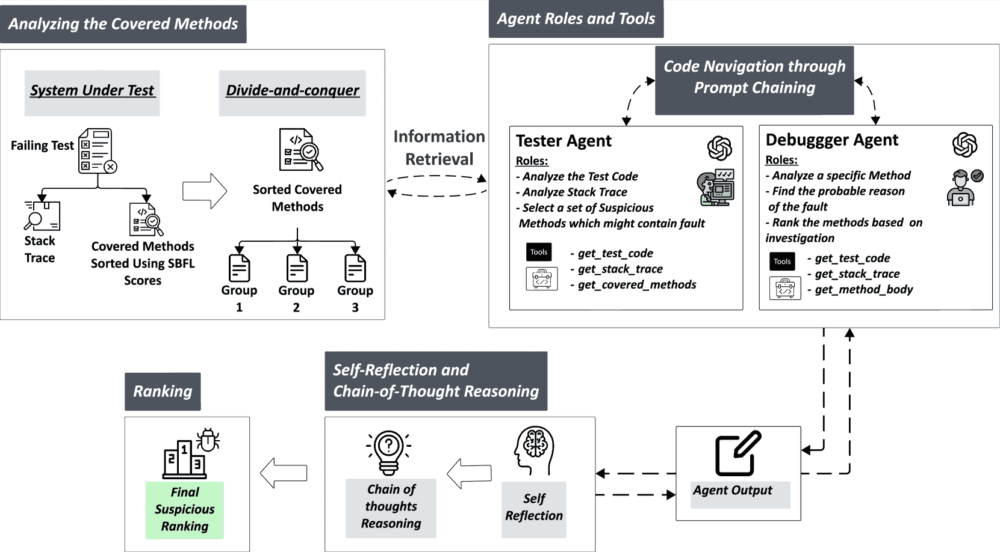
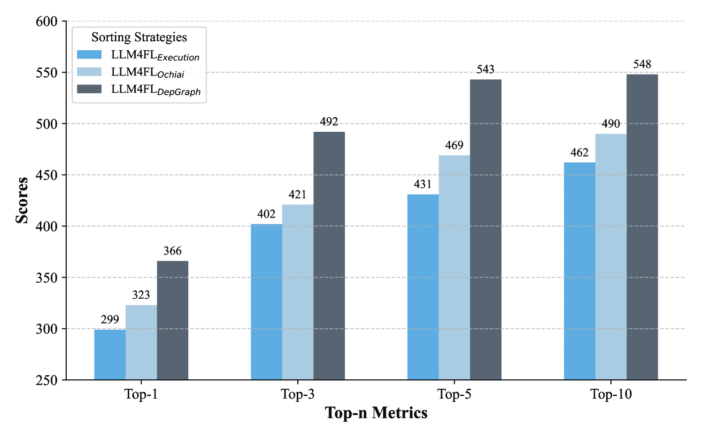

<!--yml

类别: 未分类

日期: 2025-01-11 12:14:01

-->

# 通过有序代码分析与LLM代理和自我反思提升故障定位

> 来源：[https://arxiv.org/html/2409.13642/](https://arxiv.org/html/2409.13642/)

Md Nakhla Rafi [0009-0005-4707-8985](https://orcid.org/0009-0005-4707-8985 "ORCID identifier") Concordia University蒙特利尔加拿大 [mdnakhla.rafi@mail.concordia.ca](mailto:mdnakhla.rafi@mail.concordia.ca) ,  Dong Jae Kim [0000-0002-3181-0001](https://orcid.org/0000-0002-3181-0001 "ORCID identifier") DePaul University芝加哥美国 [dkim121@depaul.edu](mailto:dkim121@depaul.edu) ,  Tse-Hsun (Peter) Chen [0000-0003-4027-0905](https://orcid.org/0000-0003-4027-0905 "ORCID identifier") Concordia University蒙特利尔加拿大 [peterc@encs.concordia.ca](mailto:peterc@encs.concordia.ca)  和 Shaowei Wang [0000-0003-3823-1771](https://orcid.org/0000-0003-3823-1771 "ORCID identifier") 曼尼托巴大学温尼伯加拿大 [Shaowei.Wang@umanitoba.ca](mailto:Shaowei.Wang@umanitoba.ca)

###### 摘要。

定位和修复软件故障是软件开发中耗时且资源密集的任务。传统的故障定位方法，如基于谱的故障定位（SBFL），依赖于对测试覆盖数据的统计分析，但通常精度较低。基于学习的技术虽然更为有效，但需要大量训练数据，并且计算成本较高。近年来，大型语言模型（LLM）的进展为故障定位带来了有希望的改进，通过增强代码理解和推理能力。然而，这些基于LLM的技术仍面临一些挑战，包括令牌限制、长输入时性能下降，以及在处理涉及多个交互组件的复杂系统的大规模项目时的困难。为了解决这些问题，我们提出了LLM4FL，这是一种基于LLM代理的故障定位新方法，将SBFL排序与分而治之策略相结合。通过将大规模的覆盖数据分割为可管理的组，并通过提示链使用多个LLM代理，LLM4FL能够更有效地遍历代码库并定位故障。该方法还结合了自我反思和思维链推理，使代理能够迭代生成修复并重新排序可疑的方法。我们在Defects4J（V2.0.0）基准测试上评估了LLM4FL，该基准测试包括来自14个开源Java项目的675个真实故障。我们的结果表明，LLM4FL在Top-1准确度上比AutoFL高出19.27%，并且超越了深度学习和Grace等最先进的监督技术，且无需特定任务的训练。此外，我们还强调了覆盖拆分和提示链对故障定位性能的影响，并展示了不同方法排序可以将Top-1准确度提高多达22%。

## 1\. 引言

定位和修复软件故障的过程需要大量的时间和精力。研究表明，软件开发团队将超过一半的预算用于测试和调试活动（Hait 和 Tassey，[2002](https://arxiv.org/html/2409.13642v1#bib.bib20)；Alaboudi 和 LaToza，[2021](https://arxiv.org/html/2409.13642v1#bib.bib6)）。随着软件系统变得越来越复杂，对更高效、准确的故障定位技术的需求持续增长。因此，为了帮助开发人员并降低调试成本，研究人员开发了多种故障定位技术（Li 等，[2019](https://arxiv.org/html/2409.13642v1#bib.bib33)；Lou 等，[2021](https://arxiv.org/html/2409.13642v1#bib.bib39)；Qian 等，[2023b](https://arxiv.org/html/2409.13642v1#bib.bib47)；Li 等，[2021](https://arxiv.org/html/2409.13642v1#bib.bib36)；Abreu 等，[2009](https://arxiv.org/html/2409.13642v1#bib.bib4)；Sohn 和 Yoo，[2017](https://arxiv.org/html/2409.13642v1#bib.bib55)）。这些技术通过分析代码覆盖率和程序执行来识别最可能出现故障的组件，帮助开发人员找到故障所在。

然而，尽管故障定位技术取得了一些进展，许多现有的方法仍然在可扩展性和精确度上存在困难。传统方法，如基于谱的故障定位（SBFL），通过统计分析来分析来自通过和失败测试用例的覆盖数据，以对可疑的代码元素进行排序（Abreu等人，[2006](https://arxiv.org/html/2409.13642v1#bib.bib3)）。虽然这些技术提供了有价值的见解，但它们的准确性较低。它们依赖于测试失败与代码覆盖之间的统计相关性，但并不总是能够捕捉到更准确的故障定位所需的更深层语义关系（Wong等人，[2016](https://arxiv.org/html/2409.13642v1#bib.bib63); Xie等人，[2013](https://arxiv.org/html/2409.13642v1#bib.bib67); Le等人，[2013](https://arxiv.org/html/2409.13642v1#bib.bib30)）。为了解决这些问题，最近的技术应用了机器学习和深度学习模型来改进故障定位（Sohn和Yoo，[2017](https://arxiv.org/html/2409.13642v1#bib.bib55); Zhang等人，[2019b](https://arxiv.org/html/2409.13642v1#bib.bib75); Li等人，[2021](https://arxiv.org/html/2409.13642v1#bib.bib36)，[2019](https://arxiv.org/html/2409.13642v1#bib.bib33)）。这些方法通过引入额外的信息，如代码复杂性、文本相似性和历史故障数据，增强了对可疑代码元素的排序。研究人员还利用了图神经网络（GNN）等模型来表示代码结构，并实现了最先进的故障定位精度（Lou等人，[2021](https://arxiv.org/html/2409.13642v1#bib.bib39); Qian等人，[2023b](https://arxiv.org/html/2409.13642v1#bib.bib47); Rafi等人，[2024](https://arxiv.org/html/2409.13642v1#bib.bib50); Lou等人，[2021](https://arxiv.org/html/2409.13642v1#bib.bib39)）。然而，这些技术通常需要大量的训练数据和较长的训练时间。

最近，大型语言模型（LLM）在故障定位方面的最新进展展示了其巨大潜力，因为它们具备强大的语言理解和生成能力（Abedu 等，[2024](https://arxiv.org/html/2409.13642v1#bib.bib2); Lin 等，[2024](https://arxiv.org/html/2409.13642v1#bib.bib37)）。在大量编程数据集上训练的LLM能够理解代码结构、解释错误信息，甚至为常见软件缺陷提供修复建议（Kang 等，[2024](https://arxiv.org/html/2409.13642v1#bib.bib26); Wu 等，[2023](https://arxiv.org/html/2409.13642v1#bib.bib65); Pu 等，[2023](https://arxiv.org/html/2409.13642v1#bib.bib45); Li 等，[2023](https://arxiv.org/html/2409.13642v1#bib.bib32)）。这些模型凭借分析和处理自然语言及代码的能力，提供了显著改善传统故障定位方法的机会，通过结合更深层次的语义分析和上下文感知推理来提升定位效果。Wu 等（Wu 等，[2023](https://arxiv.org/html/2409.13642v1#bib.bib65)）直接将有缺陷的方法或类与测试失败信息呈现给LLM，要求定位问题，这为我们提供了宝贵的见解。Kang 等（Kang 等，[2024](https://arxiv.org/html/2409.13642v1#bib.bib26)）则提出了一种自动化故障定位技术，利用LLM在给定单一失败测试的情况下进行故障定位。该方法专注于方法级别的故障定位，并提供缺陷位置以及为何特定代码位置可能存在故障的自然语言解释。

尽管现有的基于大型语言模型（LLM）的故障定位技术具有潜力，但仍面临若干挑战。LLM的令牌限制限制了它们有效处理长代码文件或大量代码覆盖数据的能力，而这些数据在处理大规模软件系统时通常是必需的（Hadi 等，[2023](https://arxiv.org/html/2409.13642v1#bib.bib19); Hou 等，[2023](https://arxiv.org/html/2409.13642v1#bib.bib22); Wu 等，[2023](https://arxiv.org/html/2409.13642v1#bib.bib65)）。此外，当应用于需要模型推理多个交互组件的复杂系统时，LLM的性能可能会下降，这使得在更广泛的项目中保持准确性和一致性变得困难（Levy 等，[2024](https://arxiv.org/html/2409.13642v1#bib.bib31); Liu 等，[2024](https://arxiv.org/html/2409.13642v1#bib.bib38)）。此外，当前基于LLM的技术尚未充分探索如何将这些模型与传统的故障定位技术有效集成，从而以互补和高效的方式最大化它们的优势（Wu 等，[2023](https://arxiv.org/html/2409.13642v1#bib.bib65); Kang 等，[2024](https://arxiv.org/html/2409.13642v1#bib.bib26); Yang 等，[2024](https://arxiv.org/html/2409.13642v1#bib.bib73); Bin Murtaza 等，[2024](https://arxiv.org/html/2409.13642v1#bib.bib11)）。

本文提出了LLM4FL，一种基于LLM的故障定位方法。为了应对分析大规模软件项目的挑战，在这些项目中，代码覆盖率和复杂性通常超过LLM的令牌限制（Wu 等，[2023](https://arxiv.org/html/2409.13642v1#bib.bib65); Liu 等，[2024](https://arxiv.org/html/2409.13642v1#bib.bib38)），LLM4FL实施了分治策略。在应用分治策略之前，我们使用一种SBFL技术对覆盖的方法进行排序，基于之前研究的发现（Chen 等，[2024](https://arxiv.org/html/2409.13642v1#bib.bib16)），该研究表明，当指令顺序得到仔细考虑时，LLM的性能会有所提升。然后，我们将覆盖数据分成可管理的组，这些组能够在LLM的令牌限制内处理。需要注意的是，无论顺序如何，LLM4FL最终会分析每一个被覆盖的方法。

除了采用分治策略，LLM4FL还借鉴了人类开发人员调试软件的方式。开发人员通常会分析多种类型的信息，包括错误信息、堆栈跟踪和代码片段，以逐步缩小潜在故障组件的范围（Alaboudi 和 LaToza，[2021](https://arxiv.org/html/2409.13642v1#bib.bib6); Böhme 等，[2017](https://arxiv.org/html/2409.13642v1#bib.bib12)）。LLM4FL通过利用两个LLM代理协作，迭代且自主地遍历代码以定位故障，模仿了这一过程。LLM4FL实现了一个测试者和一个调试者代理，每个代理都负责特定的工具，协助故障定位过程。测试者代理通过分析失败的测试和不同方法组中的堆栈跟踪，识别并优先考虑可疑的方法，并列出一份高度可疑的方法清单。它通过理解错误信息的上下文，模拟开发人员调查代码中可疑区域的过程。与此同时，调试者代理通过遍历代码，彻底评估给定的候选方法清单，并根据其分析对方法进行排名。这两个代理通过提示链机制进行沟通，从而共享见解并在彼此的发现基础上进行扩展。

我们使用Defects4J（V2.0.0）基准（Just等人，[2014](https://arxiv.org/html/2409.13642v1#bib.bib25)）评估了LLM4FL，该基准包含来自14个开源Java项目的675个真实世界的缺陷。我们的结果表明，LLM4FL通过实现比基于LLM的技术AutoFL（Kang等人，[2024](https://arxiv.org/html/2409.13642v1#bib.bib26)）高出19.27%的Top-1准确率，超越了AutoFL。此外，LLM4FL在没有任务特定训练的情况下，也优于深度学习监督技术，如DeepFL（Li等人，[2019](https://arxiv.org/html/2409.13642v1#bib.bib33)）和Grace（Lou等人，[2021](https://arxiv.org/html/2409.13642v1#bib.bib39)）。我们还分析了LLM4FL中各个组件对故障定位准确度的影响。我们的研究结果表明，每个组件在其性能中都发挥着重要作用，其中覆盖拆分和提示链条贡献最大。当这些组件被移除时，准确率大幅下降，强调了它们在管理令牌限制和促进高效的多代理协作中的重要性。此外，我们还考察了提供给LLM的方法初始顺序是否会影响性能。结果显示，方法顺序确实很重要，在比较基于执行的顺序和DepGraph（Rafi等人，[2024](https://arxiv.org/html/2409.13642v1#bib.bib50)）提供的顺序时，Top-1准确率差异高达22%。

本文做出了以下贡献：

+   •

    我们介绍了LLM4FL，这是一种新型的基于LLM的故障定位技术，采用了分而治之的策略。该技术通过SBFL公式对大范围的覆盖数据进行分组，并对已覆盖的方法进行排名。通过利用多个代理和提示链条，LLM4FL能够迭代地遍历代码，有效地识别并定位故障。

+   •

    LLM4FL表现出卓越的性能，Top-1准确率超越了AutoFL（Kang等人，[2024](https://arxiv.org/html/2409.13642v1#bib.bib26)）19.27%。它还优于当前最先进的监督技术，如DeepFL和Grace，并且在没有任务特定训练的情况下也能达到这些结果。

+   •

    我们对LLM4FL组件的分析表明，覆盖拆分和提示链条等关键特性对于其故障定位准确度至关重要。去除这些特性会导致显著的性能下降，强调了它们在处理令牌限制和促进有效代理协作中的重要性。

+   •

    我们进一步研究了方法顺序对LLM性能的影响。研究结果表明，不同的顺序可以通过提高Top-1得分最多22%的方式增强故障定位准确性。虽然LLM4FL[DepGraph]在总体准确度上表现最佳，但LLM4FL[Ochiai]提供了一个更高效的解决方案，在提高准确度的同时，减少了计算开销，使其适用于更广泛的应用。

简而言之，我们提供了一种策略来缓解基于大语言模型（LLM）的故障定位中的令牌限制问题，并强调了初始方法顺序的影响。研究结果可能有助于启发未来的研究，改善大规模软件项目中基于LLM的故障定位。

论文组织结构。第[2](https://arxiv.org/html/2409.13642v1#S2 "2\. Background and Related Work ‣ Enhancing Fault Localization Through Ordered Code Analysis with LLM Agents and Self-Reflection")节讨论了相关工作。第[3](https://arxiv.org/html/2409.13642v1#S3 "3\. Methodology ‣ Enhancing Fault Localization Through Ordered Code Analysis with LLM Agents and Self-Reflection")节描述了我们的技术——LLM4FL。第[4](https://arxiv.org/html/2409.13642v1#S4 "4\. STUDY DESIGN AND RESULTS ‣ Enhancing Fault Localization Through Ordered Code Analysis with LLM Agents and Self-Reflection")节展示了实验结果。第[5](https://arxiv.org/html/2409.13642v1#S5 "5\. Threats To Validity ‣ Enhancing Fault Localization Through Ordered Code Analysis with LLM Agents and Self-Reflection")节讨论了有效性威胁。第[6](https://arxiv.org/html/2409.13642v1#S6 "6\. Conclusion ‣ Enhancing Fault Localization Through Ordered Code Analysis with LLM Agents and Self-Reflection")节对论文进行了总结。

## 2\. 背景与相关工作

### 2.1\. 背景

大型语言模型。大型语言模型（LLMs），主要基于变换器架构（Meta AI，[2024](https://arxiv.org/html/2409.13642v1#bib.bib40)；Brown，[2020](https://arxiv.org/html/2409.13642v1#bib.bib13)；Roziere 等，[2023](https://arxiv.org/html/2409.13642v1#bib.bib53)），已显著推动了自然语言处理（NLP）领域的发展。这些LLMs，如广泛认可的GPT3模型，拥有1750亿个参数（Brown，[2020](https://arxiv.org/html/2409.13642v1#bib.bib13)），它们是在来自多种来源的多样化文本数据上进行训练的，包括源代码。训练涉及自监督学习目标，使这些模型能够深刻理解语言，并生成具有上下文相关性和语义一致性的文本。LLMs在涉及复杂语言理解和生成的任务中展现出了显著的能力（Abedu 等，[2024](https://arxiv.org/html/2409.13642v1#bib.bib2)；Lin 等，[2024](https://arxiv.org/html/2409.13642v1#bib.bib37)），例如代码识别和生成。近期的研究已经在软件工程任务中利用LLMs，特别是在故障定位（Kang 等，[2024](https://arxiv.org/html/2409.13642v1#bib.bib26)；Qin 等，[2024](https://arxiv.org/html/2409.13642v1#bib.bib49)；Yang 等，[2024](https://arxiv.org/html/2409.13642v1#bib.bib73)），它们帮助识别导致软件错误的故障代码块。使用LLMs进行故障定位的一个关键优势是它们能够在不重新训练的情况下同时处理自然语言和代码，使它们能够分析错误信息、堆栈跟踪和测试用例信息，在无监督零-shot设置下推测出可疑的方法或代码部分。

LLM 代理。LLM 代理利用 LLM（大语言模型）自主执行用自然语言描述的任务，使其在各个领域都成为多功能的工具。LLM 代理是利用 LLM 作为核心计算引擎的人工智能系统，能够理解问题并生成类人响应。它们利用诸如记忆管理（Zhou 等人，[2023](https://arxiv.org/html/2409.13642v1#bib.bib77)）和工具集成（Xia 等人，[2024](https://arxiv.org/html/2409.13642v1#bib.bib66); Roy 等人，[2024](https://arxiv.org/html/2409.13642v1#bib.bib52)）等功能，能够无缝处理多步骤和复杂操作。这些代理可以根据反馈优化其响应，从新信息中学习，甚至与其他 AI 代理互动，共同解决复杂任务（Hong 等人，[2024](https://arxiv.org/html/2409.13642v1#bib.bib21); Qian 等人，[2023a](https://arxiv.org/html/2409.13642v1#bib.bib46); Xu 等人，[2023](https://arxiv.org/html/2409.13642v1#bib.bib71); Lin 等人，[2024](https://arxiv.org/html/2409.13642v1#bib.bib37)）。通过提示，代理可以被分配不同的角色（例如，开发者或测试者），从而提供更具领域特定的响应，帮助改进答案（Hong 等人，[2024](https://arxiv.org/html/2409.13642v1#bib.bib21); White 等人，[2024](https://arxiv.org/html/2409.13642v1#bib.bib60); Shao 等人，[2023](https://arxiv.org/html/2409.13642v1#bib.bib54)）。随着其潜力的不断扩展，LLM 代理在推动自动化和提高软件开发生产力方面发挥着至关重要的作用。在本文中，我们探讨了通过模拟开发者的调试过程来利用 LLM 代理改进故障定位。

### 2.2\. 相关工作

基于谱的故障定位。基于谱的故障定位（SBFL）（Abreu 等人，[2006](https://arxiv.org/html/2409.13642v1#bib.bib3); Jones 等人，[2002](https://arxiv.org/html/2409.13642v1#bib.bib24); Wong 等人，[2013](https://arxiv.org/html/2409.13642v1#bib.bib61); Abreu 等人，[2009](https://arxiv.org/html/2409.13642v1#bib.bib4)）采用统计技术，通过分析测试结果和执行跟踪来评估单个代码元素（如方法）的可疑性。SBFL 的核心思想是，在失败的测试中执行频率较高，而在通过的测试中执行频率较低的代码组件更可能包含故障。尽管它被广泛研究，SBFL 的实际效果仍然有限（Kochhar 等人，[2016](https://arxiv.org/html/2409.13642v1#bib.bib27); Xie 等人，[2016](https://arxiv.org/html/2409.13642v1#bib.bib68)）。为了提高 SBFL 的准确性，最近的研究（Cui 等人，[2020](https://arxiv.org/html/2409.13642v1#bib.bib17); Wen 等人，[2019](https://arxiv.org/html/2409.13642v1#bib.bib59); Chen 等人，[2022](https://arxiv.org/html/2409.13642v1#bib.bib15); Xu 等人，[2020b](https://arxiv.org/html/2409.13642v1#bib.bib70)）建议加入额外的数据，如代码变更（Wen 等人，[2019](https://arxiv.org/html/2409.13642v1#bib.bib59); Chen 等人，[2022](https://arxiv.org/html/2409.13642v1#bib.bib15)）或变异分析（Cui 等人，[2020](https://arxiv.org/html/2409.13642v1#bib.bib17); Xu 等人，[2020b](https://arxiv.org/html/2409.13642v1#bib.bib70)）。然而，SBFL 依赖于代码覆盖度指标仍然面临挑战，因为其可疑性得分可能无法有效地推广到不同的故障或系统。

基于学习的故障定位。近期的研究集中在通过基于学习的方法来改进SBFL（Sohn和Yoo，[2017](https://arxiv.org/html/2409.13642v1#bib.bib55)；Zhang等，[2019b](https://arxiv.org/html/2409.13642v1#bib.bib75)；Li等，[2021](https://arxiv.org/html/2409.13642v1#bib.bib36)；Li和Zhang，[2017](https://arxiv.org/html/2409.13642v1#bib.bib34)；Li等，[2019](https://arxiv.org/html/2409.13642v1#bib.bib33)；Zhang等，[2019a](https://arxiv.org/html/2409.13642v1#bib.bib76)））。这些方法使用机器学习模型，如径向基函数网络（Wong等，[2011](https://arxiv.org/html/2409.13642v1#bib.bib62)），反向传播网络（Wong和Qi，[2009](https://arxiv.org/html/2409.13642v1#bib.bib64)），以及卷积神经网络（Zhang等，[2019a](https://arxiv.org/html/2409.13642v1#bib.bib76)；Li等，[2021](https://arxiv.org/html/2409.13642v1#bib.bib36)；Albawi等，[2017](https://arxiv.org/html/2409.13642v1#bib.bib7)），以根据历史故障估计可疑性分数。一些技术，如FLUCCS（Sohn和Yoo，[2017](https://arxiv.org/html/2409.13642v1#bib.bib55)），将SBFL分数与代码复杂度等度量相结合，而其他方法，如DeepFL（Li等，[2019](https://arxiv.org/html/2409.13642v1#bib.bib33)）和CombineFL（Zou等，[2019](https://arxiv.org/html/2409.13642v1#bib.bib78)），则结合了来自不同源的数据，如基于谱的和基于变异的测试数据（Moon等，[2014](https://arxiv.org/html/2409.13642v1#bib.bib41)；Papadakis和Le Traon，[2015](https://arxiv.org/html/2409.13642v1#bib.bib43)；Dutta和Godboley，[2021](https://arxiv.org/html/2409.13642v1#bib.bib18)）。图神经网络（GNNs）也已应用于故障定位（Qian等，[2023b](https://arxiv.org/html/2409.13642v1#bib.bib47)；Lou等，[2021](https://arxiv.org/html/2409.13642v1#bib.bib39)；Qian等，[2021](https://arxiv.org/html/2409.13642v1#bib.bib48)；Xu等，[2020a](https://arxiv.org/html/2409.13642v1#bib.bib69)）。像Grace（Lou等，[2021](https://arxiv.org/html/2409.13642v1#bib.bib39)）和GNET4FL（Qian等，[2023b](https://arxiv.org/html/2409.13642v1#bib.bib47)）这样的技术利用测试覆盖率和源代码结构来提高准确性，而DepGraph（Rafi等，[2024](https://arxiv.org/html/2409.13642v1#bib.bib50)）则通过图修剪和引入代码变更信息来优化这些方法，从而在降低计算需求的同时提高性能。尽管这些基于学习的技术显示出了改进的结果，但它们需要训练数据，而这些数据可能并非每个项目都能获得，而且由于模型复杂性，训练过程可能非常昂贵。

基于LLM的故障定位。大型语言模型（LLMs），如GPT-4o（OpenAI，[2024](https://arxiv.org/html/2409.13642v1#bib.bib42)）、LLaMA（Meta AI，[2024](https://arxiv.org/html/2409.13642v1#bib.bib40)）和ChatGPT（Achiam等，[2023](https://arxiv.org/html/2409.13642v1#bib.bib5)），在处理自然语言和编程语言方面展现了出色的能力。LLMs已被证明在使用程序代码和错误日志识别及修复错误方面具有潜力（Achiam等，[2023](https://arxiv.org/html/2409.13642v1#bib.bib5)）。然而，LLMs在故障定位中面临的主要挑战之一是令牌限制问题。LLMs的令牌数量有限，通常范围从2,000到128,000（OpenAI，[2024](https://arxiv.org/html/2409.13642v1#bib.bib42)；Meta AI，[2024](https://arxiv.org/html/2409.13642v1#bib.bib40)），这使得它们在处理具有长堆栈跟踪和庞大代码库的大型软件项目时遇到困难。这个限制可能导致分析不完整，因为关键上下文可能会被截断或丢失，迫使模型只能处理零散的信息，最终影响整体的故障定位性能（Hadi等，[2023](https://arxiv.org/html/2409.13642v1#bib.bib19)；Hou等，[2023](https://arxiv.org/html/2409.13642v1#bib.bib22)）。

此外，由于这些上下文限制，基于LLM的故障定位技术通常侧重于在小的代码片段中定位故障。例如，LLMAO（Yang等，[2024](https://arxiv.org/html/2409.13642v1#bib.bib73)）在LLM上使用轻量级双向适配器生成代码行的可疑评分，但仅限于128行代码的有限上下文内。类似地，Wu等（Wu等，[2023](https://arxiv.org/html/2409.13642v1#bib.bib65)）通过代码和错误日志提示ChatGPT来识别故障行，但这些方法在扩展到更大的软件项目时遇到困难（Liu等，[2024](https://arxiv.org/html/2409.13642v1#bib.bib38)）。AutoFL（Kang等，[2024](https://arxiv.org/html/2409.13642v1#bib.bib26)）是一种基于LLM的故障定位技术，能够检测故障代码位置并生成自然语言解释。然而，它也面临着由于LLM上下文长度限制以及在需要更深入仓库探索的复杂错误上的表现下降而难以处理大型项目的问题。为了应对这些挑战，越来越需要能够让LLMs跨越整个软件项目进行故障定位的方法，确保它们在处理更大输入的同时保持准确性和有效性。因此，我们提出了LLM4FL，它通过分而治之的方法，在多个代理协作下导航代码库并识别故障。

## 3\. 方法论



图1\. LLM4FL概述。

将大型语言模型（LLMs）应用于故障定位面临特定挑战，如令牌大小限制和处理更长输入上下文时的性能问题（Levy et al., [2024](https://arxiv.org/html/2409.13642v1#bib.bib31); Liu et al., [2024](https://arxiv.org/html/2409.13642v1#bib.bib38); Wu et al., [2023](https://arxiv.org/html/2409.13642v1#bib.bib65)）。由于这些限制，处理像测试覆盖和源代码这样的大型数据集在单个查询中是不现实的。此外，关于故障定位的有效提示技术的研究也有限。为了解决这些问题，我们提出了LLM4FL，一个基于LLM代理的故障定位系统。图[1](https://arxiv.org/html/2409.13642v1#S3.F1 "Figure 1 ‣ 3\. Methodology ‣ Enhancing Fault Localization Through Ordered Code Analysis with LLM Agents and Self-Reflection")展示了我们技术的概述。LLM4FL在四个阶段中运行：1）使用分治策略分析已覆盖的方法，2）定义LLM代理角色和工具，3）通过代理协作和提示链进行代码导航，4）自我反思和连锁思维推理。首先，覆盖数据被划分为更小的、可管理的组，以适应LLM的令牌限制。其次，LLM代理被分配特定的角色，并配备工具来分析这些组。第三，LLM代理通过提示链协作，自主导航代码并识别潜在故障。最后，代理使用自我反思和连锁思维推理来完善其分析。接下来，我们将提供关于每个阶段的更多细节。

### 3.1. 使用分治法分析已覆盖的方法

之前的故障定位研究利用动态执行数据，如来自失败和通过测试用例的覆盖信息，来识别故障代码位置（Lou et al., [2021](https://arxiv.org/html/2409.13642v1#bib.bib39); Li et al., [2019](https://arxiv.org/html/2409.13642v1#bib.bib33); Abreu et al., [2009](https://arxiv.org/html/2409.13642v1#bib.bib4); Rafi et al., [2024](https://arxiv.org/html/2409.13642v1#bib.bib50); Qian et al., [2023b](https://arxiv.org/html/2409.13642v1#bib.bib47))。然而，大型语言模型（LLMs）在处理大规模覆盖数据时面临挑战，因为存在固有的令牌大小限制（Kang et al., [2024](https://arxiv.org/html/2409.13642v1#bib.bib26)）。这些限制导致性能下降、处理时间延长，并且当输入令牌被截断时，准确性会降低。为了解决这些限制，我们提出了一种分治策略，将覆盖数据（即包含已覆盖的方法及相应代码）划分为LLM可以在其令牌限制内处理的可管理组。

我们使用 GZoltar 等工具（Campos 等人，[2012](https://arxiv.org/html/2409.13642v1#bib.bib14)）生成已覆盖方法的列表，仅关注由失败测试执行的方法。为了解决令牌限制问题，我们仅包括由失败测试执行的特定方法语句，排除任何未覆盖的代码部分。在进行分治之前，我们使用基于谱的故障定位（SBFL）技术对已覆盖的方法进行排序，以便那些更可能出现故障的方法能够被归为一类。这种方法受到最近一项研究的启发（Tyen 等人，[2024](https://arxiv.org/html/2409.13642v1#bib.bib56)），该研究表明当指令顺序被仔细考虑时，LLMs 的表现更好。需要注意的是，不论顺序如何，LLM4FL 最终会分析每个已覆盖的方法。具体来说，我们在分治过程之前使用 Ochiai（Abreu 等人，[2006](https://arxiv.org/html/2409.13642v1#bib.bib3)）对方法进行排序。Ochiai 是一种广泛使用的无监督谱基故障定位技术，因为它具有高效性和良好的故障定位准确性（Abreu 等人，[2006](https://arxiv.org/html/2409.13642v1#bib.bib3); Lou 等人，[2021](https://arxiv.org/html/2409.13642v1#bib.bib39); Li 等人，[2021](https://arxiv.org/html/2409.13642v1#bib.bib36); Cui 等人，[2020](https://arxiv.org/html/2409.13642v1#bib.bib17); Wen 等人，[2019](https://arxiv.org/html/2409.13642v1#bib.bib59); Qian 等人，[2021](https://arxiv.org/html/2409.13642v1#bib.bib48))。直观地说，Ochiai 会对那些在失败测试中执行频率较高，而在通过测试中执行频率较低的语句赋予更高的可疑性得分。Ochiai 的定义为：

|  | $Ochiai(a_{ef},a_{nf},a_{ep})=\frac{a_{ef}}{\sqrt{(a_{ef}+a_{nf})\times(a_{ef}+a_{ep})}},$ |  |
| --- | --- | --- |

其中 $a_{ef}$ 是执行某语句的失败测试用例数，$a_{nf}$ 是未执行该语句的失败测试用例数，$a_{ep}$ 是执行该语句的通过测试用例数。Ochiai 结果的值介于 0 和 1 之间，值越高表示某个语句出现故障的可能性越大。然后，我们通过一种方法对每个语句的得分进行汇总，以获得方法级别的得分。

一旦覆盖方法被排序，我们将这些方法分成更小的组，确保每组适应LLM的令牌限制。更正式地说，设$C$为已排序的覆盖方法，包含一系列对（$m$，$s$），其中$m$表示一个已覆盖的源方法，$s$表示相应的代码语句。组长度是根据GPT-4o-mini（我们在本研究中使用的LLM）的官方文档中指定的令牌限制来确定的，它的输入上下文窗口为128,000个令牌（OpenAI，[2024](https://arxiv.org/html/2409.13642v1#bib.bib42)）。长度的计算方式为$TotalTokenLength/TokenLimitation$，确保每个组的大小保持在模型的令牌限制内。具体来说，我们将$C$划分为一系列$C_{1}, C_{2}, \ldots, C_{n}$，其中每个$C_{i}$包含对（$m_{i}$，$s_{i}$）的子集，并满足约束条件—$C_{i}$—$<=TokenLimitation$。

### 3.2\. LLM代理和可用工具

LLM4FL通过实现两个LLM代理来模拟开发人员的调试过程：1）测试代理和2）调试代理。以下我们将讨论这些代理的详细信息：

测试代理。测试代理的主要目标是识别和优先处理可疑的方法。更正式地说，它通过每个方法组$C_{i}$进行导航。测试代理的输入包括每个方法组$C_{i}$中已排序的覆盖方法以及来自失败执行的相应测试代码、堆栈跟踪和相关测试信息。为了进一步减少输入令牌的大小，并使LLM能够专注于相关代码，我们仅提供导致失败的测试代码部分作为输入。我们分析堆栈跟踪，识别测试失败的位置，并提取到该点的代码，忽略其余部分。

图 [2](https://arxiv.org/html/2409.13642v1#S3.F2 "图 2 ‣ 3.2\. LLM 代理和可用工具 ‣ 3\. 方法论 ‣ 通过有序代码分析与 LLM 代理和自我反思提升故障定位") 给出了测试代理的提示示例。测试代理负责识别可能与系统故障相关的可疑方法。为此，它需要 1) 分析失败测试中执行的方法，2) 审查相关的测试代码，以及 3) 检查堆栈跟踪数据以确定故障发生的位置。为了便于这一过程，我们为测试代理提供了三种工具。工具 get_covered_methods 允许代理检索在失败测试中执行的源代码，get_test_code 提取相关的测试代码，get_stacktrace 收集堆栈跟踪数据。每个工具都有一个独特的名称和描述，代理利用这些信息来确定在分析过程中何时应用该工具。代理根据任务的不同，自动决定根据工具的描述及其与当前故障定位阶段的相关性来选择使用哪个工具。此外，在分组过程中，每个方法都被分配了一个唯一的 ID，代理可以在分析时引用并检索特定的方法。分析完所有分组后，测试代理生成一个可疑方法列表，表示为 $S_{i}\subseteq M_{i}$，其中 $M_{i}$ 代表组 $C_{i}$ 中的方法。然后，将这些可疑方法的列表整合成一个最终的 ID 列表，以便进一步分析。

<svg class="ltx_picture ltx_centering" height="194.99" id="S3.F2.pic1" overflow="visible" version="1.1" width="600"><g fill="#000000" stroke="#000000" stroke-width="0.4pt" transform="translate(0,194.99) matrix(1 0 0 -1 0 0)"><g fill-opacity="1.0" transform="matrix(1.0 0.0 0.0 1.0 21.65 176.78)"><foreignobject color="#000000" height="12.3" overflow="visible" transform="matrix(1 0 0 -1 0 16.6)" width="556.69">用于初步候选方法选择的提示模板，配有高级工具</foreignobject></g> <g fill-opacity="1.0" transform="matrix(1.0 0.0 0.0 1.0 21.65 13.78)"><foreignobject color="#000000" height="145.29" overflow="visible" transform="matrix(1 0 0 -1 0 16.6)" width="556.69">作为智能测试代理，使用以下工具来识别最可能与故障相关的方法。重点分析测试代码、堆栈跟踪和已覆盖的方法，以确定可疑或引发故障的方法。确保最终的 JSON 输出中包含准确的 method_id。可用工具：

get_test_code() – 检索完整的测试代码。get_stacktrace() – 访问失败测试的堆栈跟踪。get_covered_methods() – 列出测试过程中执行的所有方法。你的任务：利用这些工具提供的见解，并以以下 JSON 格式提供潜在的可疑方法：

```
    {
        "method_ids": [1, 2, 3, ...]  // The potential suspicious method’s ids
    }

```</foreignobject></g></g></svg>

图 2\. 初步候选方法选择的增强提示。

调试代理。图 [3](https://arxiv.org/html/2409.13642v1#S3.F3 "图 3 ‣ 3.2\. LLM 代理和可用工具 ‣ 3\. 方法论 ‣ 通过有序代码分析和自我反思增强故障定位") 给出了调试代理的提示示例。调试代理负责全面评估并排序给定的候选方法列表 $S$。为了执行分析，调试代理依赖于三种工具，这些工具旨在提取相关信息。get_test_code 和 get_stacktrace 通过检索相关的测试代码和堆栈跟踪数据，提供LLM所请求的信息，帮助调试代理理解与每个方法相关的故障场景。此外，get_method_body 工具允许代理使用其唯一的方法ID获取方法的完整源代码，从而使调试代理能够分析每个方法的源代码。

一旦调试代理完成分析，它会为每个方法 $m_{j}$ 分配一个排名分数 $\sigma_{j}$，表示该方法可能对故障的贡献程度。然后，根据这些分数对候选方法 $S$ 进行排序，生成一个按可疑程度排序的列表 $R$：

|  | $R=\text{sort}(\{(m_{j},\sigma_{j}):m_{j}\in S\})$ |  |
| --- | --- | --- |

这个最终排序的列表 $R$ 以 JSON 格式输出，供进一步评估和解析。

<svg class="ltx_picture ltx_centering" height="244.8" id="S3.F3.pic1" overflow="visible" version="1.1" width="600"><g fill="#000000" stroke="#000000" stroke-width="0.4pt" transform="translate(0,244.8) matrix(1 0 0 -1 0 0)"><g fill-opacity="1.0" transform="matrix(1.0 0.0 0.0 1.0 21.65 226.6)"><foreignobject color="#000000" height="12.3" overflow="visible" transform="matrix(1 0 0 -1 0 16.6)" width="556.69">代码理解与故障分析的提示模板</foreignobject></g> <g fill-opacity="1.0" transform="matrix(1.0 0.0 0.0 1.0 21.65 13.78)"><foreignobject color="#000000" height="195.1" overflow="visible" transform="matrix(1 0 0 -1 0 16.6)" width="556.69">作为高级调试代理，请使用以下工具，根据测试代理从测试和堆栈跟踪中获得的洞察分析提供的方法体。故障可能会跨多个方法传播，或者间接与原始问题相关。可用工具：get_test_code()       – 获取完整的测试代码以进行详细分析。

get_stacktrace()         – 访问堆栈跟踪以追踪方法调用并识别潜在的故障。

get_method_body()      – 获取特定方法的代码体以供进一步检查。任务：使用提供的工具，分析并重点关注以下方法：{可疑方法} 按照从最可疑到最不疑的方法对这些方法进行排名，并根据每个方法的行为和可能涉及的故障提供简要的理由。重要提示：请按照以下 JSON 格式提供您的输出：

```
    [
        {
            "method_id": int,  // The most suspicious method’s id
            "reasoning": string,  // Reasoning for its suspiciousness
            "rank": int  // Rank of suspiciousness
        }
    ]

```

图 3\. 增强的代码理解与故障分析提示。

### 3.3\. 通过提示链进行代码导航

代码导航是开发者在真实场景中追踪故障的关键部分。在调试时，开发者通常从分析一个特定方法开始，然后探索其调用方法或被调用方法，以更好地理解整体逻辑并找出故障可能所在的地方。我们的方法通过实现基于提示链的代码导航来模拟这一过程，使测试员和调试员代理可以协作，逐步将分析重点集中在代码库中最相关的部分。

该过程从测试员代理开始，测试员代理逐一分析覆盖数据$C=\{C_{1},C_{2},\ldots,C_{n}\}$中的每一组，每组$C_{i}$包含了一部分被覆盖的方法$M_{i}$。测试员代理在每个组中识别出可疑的方法，生成一个候选方法列表$S_{i}\subseteq M_{i}$。这个步骤模拟了开发者标记代码中可能与故障相关的感兴趣区域。分析完所有组后，测试员代理将可疑方法汇总成一个整合后的列表：

|  | $S=\bigcup_{i=1}^{n}S_{i}$ |  |
| --- | --- | --- |

这个列表$S$被传递给调试员代理，启动提示链的过程。

调试员代理获取来自测试员代理的输出，深入分析可疑方法。在此阶段，调试员代理遍历$S$中的每个方法，不仅检查该方法本身，还检查相关的方法，例如调用方法和被调用方法，前提是代理认为进一步分析可以帮助识别故障代码的位置。调试员代理模拟了手动追踪故障在代码中不同部分传播的过程。通过利用其工具，调试员代理获取每个方法如何与其他方法交互的信息，以及它可能如何对故障产生影响。如果调试员代理发现方法$m_{j+1}$在$m_{j}$中被调用，并且可能需要进一步检查，它可以请求$m_{j+1}$的代码（如果它在候选列表中），确保在必要时进行更深入的分析。LLM4FL实现了一个基于LLM的故障导航系统，使调试员代理能够动态地遍历代码库，并检索额外相关的方法进行进一步检查。通过这一过程，调试员代理追踪潜在的故障传播路径，并评估故障如何在方法之间传播。

### 3.4\. 自我反思和思维链提升故障定位结果

LLM4FL使用两种额外的提示技术来进一步改善故障定位结果。

自我反思。在我们的方法中，测试者（Tester）和调试者（Debugger）代理都参与自我反思，以提高输出结果的质量。在完成初步分析后，每个代理会进入两个阶段：生成阶段和反思阶段。在生成阶段，代理会生成其主要结果，如识别可疑方法或按可疑性对其进行排序。在反思阶段，代理会批评自己工作的不足，提供反馈以改进结果并纠正潜在的错误。尽管这一方法在故障定位背景下尚未被研究，但最近的研究（Renze 和 Guven, [2024](https://arxiv.org/html/2409.13642v1#bib.bib51)）发现，自我反思能够提升LLM在问题解决任务中的表现。

用于完善故障定位的思维链。我们引入了思维链推理过程来增强故障定位能力。在生成了可疑方法的排序列表后，LLMs会为排名最高的方法提出潜在的修复建议。然后，代理会根据生成的修复建议重新排序这些方法。这个过程使得代理能更深入地思考故障，并基于考虑这些修复建议所获得的见解重新评估排名（Bao 等, [2024](https://arxiv.org/html/2409.13642v1#bib.bib9); Wang 等, [2024](https://arxiv.org/html/2409.13642v1#bib.bib58)）。

## 4\. 研究设计与结果

在本节中，我们首先描述研究设计和设置。接着，我们展示研究问题的动机、方法和结果。

表1\. 我们研究的项目概览，数据来源于Defects4J v2.0.0\. #Faults、LOC和#Tests分别表示每个系统中的故障数、代码行数和测试用例数。Fault-triggering Tests表示触发故障的失败测试数量。

|          项目 |          #Faults |          LOC |          #Tests |          故障触发测试 |
| --- | --- | --- | --- | --- |
|          Cli |          39 |          4K |          94 |          66 |
|          Closure |          174 |          90K |          7,911 |          545 |
|          Codec |          18 |          7K |          206 |          43 |
|          Collections |          4 |          65K |          1,286 |          4 |
|          Compress |          47 |          9K |          73 |          72 |
|          Csv |          16 |          2K |          54 |          24 |
|          Gson |          18 |          14K |          720 |          34 |
|          JacksonCore |          26 |          22K |          206 |          53 |
|          JacksonXml |          6 |          9K |          138 |          12 |
|          Jsoup |          93 |          8K |          139 |          144 |
|          Lang |          64 |          22K |          2,291 |          121 |
|          Math |          106 |          85K |          4,378 |          176 |
|          Mockito |          38 |          11K |          1,379 |          118 |
|          时间 |          26 |          28K |          4,041 |          74 |
|          总计 |          675 |          380K |          24,302 |          1,486 |

基准数据集。为了回答研究问题，我们在Defects4J基准（V2.0.0）（Just等，[2014](https://arxiv.org/html/2409.13642v1#bib.bib25)）中的14个项目、675个故障上进行了实验。Defects4J提供了一个受控环境，可以重现从各种类型和规模的项目中收集到的故障。Defects4J在以往的自动化故障定位研究中得到了广泛应用（Lou等，[2021](https://arxiv.org/html/2409.13642v1#bib.bib39)；Sohn和Yoo，[2017](https://arxiv.org/html/2409.13642v1#bib.bib55)；Chen等，[2022](https://arxiv.org/html/2409.13642v1#bib.bib15)；Zhang等，[2017](https://arxiv.org/html/2409.13642v1#bib.bib74)）。在我们的研究中，我们排除了Defects4J中的三个项目：JacksonDatabind、JxPath和Chart，因为我们遇到了许多执行错误，无法为这些项目收集测试覆盖信息。表[1](https://arxiv.org/html/2409.13642v1#S4.T1 "Table 1 ‣ 4\. STUDY DESIGN AND RESULTS ‣ Enhancing Fault Localization Through Ordered Code Analysis with LLM Agents and Self-Reflection")提供了我们研究中使用的项目和故障的详细信息。总的来说，这些故障有超过1.4K个故障触发测试（即覆盖故障的失败测试）。研究项目的规模从2K到90K行代码不等。请注意，由于一个故障可能有多个故障触发测试，因此故障触发测试的数量超过故障的数量。

评估指标。根据先前的研究发现，在类级别调试故障缺乏有效定位的精度（Kochhar等，[2016](https://arxiv.org/html/2409.13642v1#bib.bib27)）。另一方面，在语句级别定位故障可能过于详细，忽略了重要的上下文（Parnin和Orso，[2011](https://arxiv.org/html/2409.13642v1#bib.bib44)）。因此，沿袭先前的研究工作（Benton等，[2020](https://arxiv.org/html/2409.13642v1#bib.bib10)；B. Le等，[2016](https://arxiv.org/html/2409.13642v1#bib.bib8)；Li等，[2019](https://arxiv.org/html/2409.13642v1#bib.bib33)；Lou等，[2021](https://arxiv.org/html/2409.13642v1#bib.bib39)；Vancsics等，[2021](https://arxiv.org/html/2409.13642v1#bib.bib57)），我们在方法级别执行故障定位过程。我们使用以下常见的评估指标：

Top-N召回率。Top-N指标衡量至少有一个故障程序元素（在本文中为方法）排在前N名的故障数量。LLM4FL的结果是基于可疑性得分的排序列表。先前的研究（Parnin和Orso，[2011](https://arxiv.org/html/2409.13642v1#bib.bib44)）表明，开发人员通常只会仔细检查少数排名靠前的故障元素。因此，我们的研究重点是Top-N，其中N设置为1、3、5和10。

实施与环境。为了收集测试覆盖数据并计算基准技术的结果，我们使用了Gzoltar（Campos等人，[2012](https://arxiv.org/html/2409.13642v1#bib.bib14)），这是一种自动化工具，能够执行测试并收集覆盖信息。对于基于LLM的组件，我们采用了OpenAI的GPT-4o mini，这是一个比GPT-3.5 Turbo（OpenAI，[2024](https://arxiv.org/html/2409.13642v1#bib.bib42)）更具成本效益且功能更强大的替代品。LangChain v0.2用于简化LLM4FL的开发，促进了语言模型与外部工具的集成，并增强了系统的整体功能（Langchain，[2024a](https://arxiv.org/html/2409.13642v1#bib.bib28)）。为了实现自我反思技术，我们利用了LangGraph框架，它支持基于图的推理和决策过程（Langchain，[2024b](https://arxiv.org/html/2409.13642v1#bib.bib29)）。为了最小化输出的变化，我们在模型推理过程中将温度参数设置为0。

### 4.1\. RQ1: LLM4FL与其他故障定位技术相比，表现如何？

动机。在这个研究问题中，我们通过与各种基准技术的比较，评估LLM4FL的故障定位准确性。

方法。我们将LLM4FL的故障定位准确度与五个基准技术进行比较：Ochiai（Abreu等人，[2006](https://arxiv.org/html/2409.13642v1#bib.bib3)），DeepFL（Li等人，[2019](https://arxiv.org/html/2409.13642v1#bib.bib33)），Grace（Lou等人，[2021](https://arxiv.org/html/2409.13642v1#bib.bib39)），DepGraph（Rafi等人，[2024](https://arxiv.org/html/2409.13642v1#bib.bib50)），以及AutoFL（Kang等人，[2024](https://arxiv.org/html/2409.13642v1#bib.bib26)）。

Ochiai（Abreu 等人，[2006](https://arxiv.org/html/2409.13642v1#bib.bib3)）因其高效性和准确性，在故障定位研究中得到广泛认可，成为了常见的基准比较方法（Lou 等人，[2021](https://arxiv.org/html/2409.13642v1#bib.bib39)；Li 等人，[2021](https://arxiv.org/html/2409.13642v1#bib.bib36)；Cui 等人，[2020](https://arxiv.org/html/2409.13642v1#bib.bib17)；Wen 等人，[2019](https://arxiv.org/html/2409.13642v1#bib.bib59)；Qian 等人，[2021](https://arxiv.org/html/2409.13642v1#bib.bib48)；Rafi 等人，[2024](https://arxiv.org/html/2409.13642v1#bib.bib50)））。因此，我们在分割过程中使用 Ochiai 来对方法进行排名，并将其作为准确度比较的基准。DeepFL（Li 等人，[2019](https://arxiv.org/html/2409.13642v1#bib.bib33)）是一种基于深度学习的故障定位技术，集成了基于谱的指标和其他如代码复杂性及文本相似度特征，用于定位故障。它利用多层感知机（MLP）模型来分析这些不同的特征维度。我们遵循该研究（Li 等人，[2019](https://arxiv.org/html/2409.13642v1#bib.bib33)）来实现 DeepFL，并将来自 34 种技术的 SBFL 分数、代码复杂性和文本相似度作为深度学习模型的特征之一。Grace（Lou 等人，[2021](https://arxiv.org/html/2409.13642v1#bib.bib39)）是基于图神经网络（GNN）的首批故障定位技术之一，它将代码表示为图，并使用门控图神经网络对故障方法进行排名。从那时起，基于 GNN 的技术相比传统技术展示了更优越的故障定位准确性。DepGraph（Rafi 等人，[2024](https://arxiv.org/html/2409.13642v1#bib.bib50)）是一种基于 GNN 的技术，通过增强图中代码表示，利用过程间调用图分析进行图修剪，并将历史代码变更信息集成到图中，进一步改进了 Grace。

AutoFL 是一种基于大语言模型（LLM）的故障定位技术。它首先通过向 LLM 提供故障测试信息以及描述可以用来浏览代码库的特定方法。然后，LLM 与这些方法进行交互，收集相关信息，如覆盖的类、方法和代码片段。根据五种 AutoFL 预测结果，对候选方法（表示为黑色矩形）进行评分和排名。方法的排名是通过多次运行 AutoFL 来分配分数的。在每次运行中，方法的分数是预测方法总数的倒数，这些分数会在所有运行中取平均值。然后，方法根据其平均分数按降序排列，较早的预测用于打破任何平局。虽然原论文使用了 OpenAI 的 GPT-3.5-turbo-0613 模型进行实验，但在我们的评估中，我们使用了最新的轻量级 GPT-4o mini 模型来执行 AutoFL 的实验。

表2. 故障定位准确率，按 Top-1、Top-3、Top-5 和 Top-10 计算。括号中的数字表示每个项目中的故障数量。结果将在表[3](https://arxiv.org/html/2409.13642v1#S4.T3 "表 3 ‣ 4.1\. RQ1: LLM4FL 与其他故障定位技术的比较？ ‣ 4\. 研究设计与结果 ‣ 通过有序代码分析与 LLM 代理及自我反思提升故障定位")中继续。

|         项目（# 故障） |         技术 |         Top-1 |         Top-3 |         Top-5 |         Top-10 |
| --- | --- | --- | --- | --- | --- |
|         Cli (39) |         Ochiai |         3.0 |         5.0 |         10.0 |         18.0 |
|  |         DeepFL |         11.0 |         21.0 |         24.0 |         28.0 |
|  |         Grace |         14.0 |         24.0 |         26.0 |         30.0 |
|  |         DepGraph |         17.0 |         24.0 |         27.0 |         34.0 |
|  |         AutoFL |         12.0 |         19.0 |         19.0 |         20.0 |
|  |         LLM4FL |         16.0 |         21.0 |         23.0 |         24.0 |
|         Closure (174) |         Ochiai |         20.0 |         39.0 |         70.0 |         72.0 |
|  |         DeepFL |         46.0 |         61.0 |         92.0 |         99.0 |
|  |         Grace |         51.0 |         78.0 |         102.0 |         121.0 |
|  |         DepGraph |         60.0 |         99.0 |         126.0 |         148.0 |
|  |         AutoFL |         45.0 |         58.0 |         65.0 |         82.0 |
|  |         LLM4FL |         52.0 |         77.0 |         102.0 |         118.0 |
|         Codec (18) |         Ochiai |         3.0 |         12.0 |         17.0 |         17.0 |
|  |         DeepFL |         5.0 |         10.0 |         12.0 |         16.0 |
|  |         Grace |         6.0 |         11.0 |         13.0 |         17.0 |
|  |         DepGraph |         7.0 |         10.0 |         14.0 |         16.0 |
|  |         AutoFL |         12.0 |         14.0 |         14.0 |         16.0 |
|  |         LLM4FL |         9.0 |         13.0 |         13.0 |         13.0 |
|         Collections (4) |         Ochiai |         1.0 |         1.0 |         2.0 |         2.0 |
|  |         DeepFL |         1.0 |         1.0 |         2.0 |         2.0 |
|  |         Grace |         1.0 |         1.0 |         2.0 |         2.0 |
|  |         DepGraph |         1.0 |         2.0 |         2.0 |         2.0 |
|  |         AutoFL |         1.0 |         1.0 |         1.0 |         1.0 |
|  |         LLM4FL |         1.0 |         1.0 |         1.0 |         1.0 |
|         Compress (47) |         Ochiai |         5.0 |         12.0 |         17.0 |         29.0 |
|  |         DeepFL |         22.0 |         27.0 |         31.0 |         38.0 |
|  |         Grace |         23.0 |         29.0 |         34.0 |         42.0 |
|  |         DepGraph |         25.0 |         33.0 |         36.0 |         45.0 |
|  |         AutoFL |         23.0 |         33.0 |         34.0 |         35.0 |
|  |         LLM4FL |         23.0 |         32.0 |         34.0 |         34.0 |
|         Csv (16) |         Ochiai |         3.0 |         8.0 |         10.0 |         12.0 |
|  |         DeepFL |         7.0 |         8.0 |         9.0 |         11.0 |
|  |         Grace |         6.0 |         8.0 |         10.0 |         12.0 |
|  |         DepGraph |         8.0 |         9.0 |         12.0 |         13.0 |
|  |         AutoFL |         5.0 |         11.0 |         12.0 |         14.0 |
|  |         LLM4FL |         8.0 |         10.0 |         10.0 |         10.0 |
|         Gson (16) |         Ochiai |         4.0 |         9.0 |         9.0 |         12.0 |
|  |         DeepFL |         8.0 |         11.0 |         12.0 |         12.0 |
|  |         Grace |         11.0 |         13.0 |         14.0 |         15.0 |
|  |         DepGraph |         14.0 |         15.0 |         16.0 |         16.0 |
|  |         AutoFL |         5.0 |         7.0 |         10.0 |         10.0 |
|  |         LLM4FL |         11.0 |         14.0 |         14.0 |         14.0 |

|   表 3．接续自表[2](https://arxiv.org/html/2409.13642v1#S4.T2 "表 2 ‣ 4.1. RQ1：LLM4FL 与其他故障定位技术相比如何？ ‣ 4. 研究设计与结果 ‣ 通过有序代码分析与 LLM 代理和自我反思增强故障定位")。根据 Top-1、Top-3、Top-5 和 Top-10 的准确度进行故障定位。括号中的数字表示每个项目中的故障数量。

|         Project (# faults) |         Techniques |         Top-1 |         Top-3 |         Top-5 |         Top-10 |
| --- | --- | --- | --- | --- | --- |
|         JacksonCore (26) |         Ochiai |         6.0 |         11.0 |         13.0 |         14.0 |
|  |         DeepFL |         5.0 |         5.0 |         9.0 |         10.0 |
|  |         Grace |         9.0 |         13.0 |         14.0 |         15.0 |
|  |         DepGraph |         12.0 |         15.0 |         15.0 |         16.0 |
|  |         AutoFL |         10.0 |         17.0 |         17.0 |         17.0 |
|  |         LLM4FL |         12.0 |         13.0 |         15.0 |         15.0 |
|         JacksonXml (6) |         Ochiai |         0.0 |         0.0 |         0.0 |         0.0 |
|  |         DeepFL |         3.0 |         3.0 |         4.0 |         5.0 |
|  |         Grace |         3.0 |         3.0 |         4.0 |         5.0 |
|  |         DepGraph |         4.0 |         5.0 |         5.0 |         5.0 |
|  |         AutoFL |         2.0 |         2.0 |         2.0 |         3.0 |
|  |         LLM4FL |         4.0 |         4.0 |         4.0 |         4.0 |
|         Jsoup (93) |         Ochiai |         15.0 |         40.0 |         48.0 |         57.0 |
|  |         DeepFL |         33.0 |         39.0 |         46.0 |         49.0 |
|  |         Grace |         40.0 |         64.0 |         72.0 |         77.0 |
|  |         DepGraph |         53.0 |         73.0 |         78.0 |         83.0 |
|  |         AutoFL |         36.0 |         52.0 |         52.0 |         54.0 |
|  |         LLM4FL |         41.0 |         56.0 |         60.0 |         60.0 |
|         语言 (64) |         Ochiai |         25.0 |         45.0 |         51.0 |         59.0 |
|  |         DeepFL |         42.0 |         53.0 |         55.0 |         57.0 |
|  |         Grace |         43.0 |         53.0 |         57.0 |         58.0 |
|  |         DepGraph |         48.0 |         55.0 |         60.0 |         61.0 |
|  |         AutoFL |         40.0 |         57.0 |         60.0 |         60.0 |
|  |         LLM4FL |         48.0 |         55.0 |         58.0 |         58.0 |
|         数学 (106) |         Ochiai |         23.0 |         52.0 |         62.0 |         82.0 |
|  |         DeepFL |         52.0 |         81.0 |         90.0 |         95.0 |
|  |         Grace |         64.0 |         79.0 |         92.0 |         97.0 |
|  |         DepGraph |         72.0 |         92.0 |         97.0 |         102.0 |
|  |         AutoFL |         53.0 |         81.0 |         87.0 |         94.0 |
|  |         LLM4FL |         68.0 |         87.0 |         92.0 |         94.0 |
|         时间 (26) |         Ochiai |         6.0 |         12.0 |         13.0 |         16.0 |
|  |         DeepFL |         12.0 |         15.0 |         18.0 |         20.0 |
|  |         Grace |         11.0 |         16.0 |         20.0 |         21.0 |
|  |         DepGraph |         17.0 |         20.0 |         21.0 |         22.0 |
|  |         AutoFL |         13.0 |         18.0 |         21.0 |         22.0 |
|  |         LLM4FL |         14.0 |         21.0 |         22.0 |         23.0 |
|         Mockito (38) |         Ochiai |         7.0 |         14.0 |         18.0 |         23.0 |
|  |         DeepFL |         10.0 |         18.0 |         23.0 |         26.0 |
|  |         Grace |         16.0 |         24.0 |         26.0 |         29.0 |
|  |         DepGraph |         21.0 |         29.0 |         32.0 |         34.0 |
|  |         AutoFL |         18.0 |         23.0 |         29.0 |         29.0 |
|  |         LLM4FL |         21.0 |         22.0 |         26.0 |         27.0 |
|         总计 (675) |         Ochiai |         121.0 |         260.0 |         340.0 |         413.0 |
|  |         DeepFL |         257.0 |         353.0 |         427.0 |         468.0 |
|  |         Grace |         298.0 |         416.0 |         486.0 |         541.0 |
|  |         DepGraph |         359.0 |         481.0 |         541.0 |         597.0 |
|  |         AutoFL |         275.0 |         393.0 |         423.0 |         457.0 |
|  |         LLM4FL |         328.0 |         426.0 |         474.0 |         495.0 |

结果。LLM4FL通过实现更高的Pass@1（328对275），超越了基于LLM的基准AutoFL。表[2](https://arxiv.org/html/2409.13642v1#S4.T2 "Table 2 ‣ 4.1\. RQ1: How does LLM4FL perform compared with other fault localization techniques? ‣ 4\. STUDY DESIGN AND RESULTS ‣ Enhancing Fault Localization Through Ordered Code Analysis with LLM Agents and Self-Reflection")和[3](https://arxiv.org/html/2409.13642v1#S4.T3 "Table 3 ‣ 4.1\. RQ1: How does LLM4FL perform compared with other fault localization techniques? ‣ 4\. STUDY DESIGN AND RESULTS ‣ Enhancing Fault Localization Through Ordered Code Analysis with LLM Agents and Self-Reflection")展示了LLM4FL和基准技术的故障定位结果。在这两种基于LLM的技术中，当N为1、3、5和10时，LLM4FL的Top@N表现优于AutoFL。在Top-1指标中，LLM4FL能够定位328个正确的故障，而AutoFL为275，提升了19.27%。类似地，在Top-3和Top-5指标中，LLM4FL的得分分别为426和474，超越了AutoFL的393和423。即使在更广泛的Top-10指标中，LLM4FL也展现出8.32%的优势，得分495，而AutoFL为457。这些数字凸显了LLM4FL在更准确、更高效地定位故障方法方面的增强能力，进一步证明了它在故障定位任务中的优势。

LLM4FL在Top-1和Top-3指标上相比所有其他非LLM技术表现更佳，除了DepGraph。对于Top-1指标，LLM4FL得分328，比Ochai的121高171.07%，比DeepFL的257高27.63%，比Grace的298高10.07%。唯一的例外是DepGraph，其Top-1得分为359，比LLM4FL高8.64%。随着范围扩展到Top-3及更高，LLM4FL继续展示其鲁棒性，显著优于DeepFL，并与Grace保持强劲的表现。需要注意的是，DeepFL、Grace和DepGraph是使用留一法交叉验证训练和评估的监督方法，遵循了原始研究协议。尽管LLM4FL是一种零样本方法，未进行任务特定训练，但它能够与这些监督方法竞争，进一步突显其有效性。LLM4FL能够在没有大量训练数据或交叉验证的情况下取得强劲的结果，这突出了其潜力，并为未来的研究方向提供了启示，尤其是在无法总是对特定数据集进行训练时。

<svg class="ltx_picture" height="82.3" id="S4.SS1.p7.pic1" overflow="visible" version="1.1" width="600"><g fill="#000000" stroke="#000000" stroke-width="0.4pt" transform="translate(0,82.3) matrix(1 0 0 -1 0 0)"><g fill-opacity="1.0" transform="matrix(1.0 0.0 0.0 1.0 11.44 11.44)"><foreignobject color="#000000" height="59.42" overflow="visible" transform="matrix(1 0 0 -1 0 16.6)" width="577.12">LLM4FL outperforms the other LLM-based technique, AutoFL, by achieving a 19.27% higher Top-1 and delivering competitive results compared to supervised techniques like DeepFL and Grace, even without task-specific training. The findings highlight the potential of using LLM4FL for zero-shot fault localization.</foreignobject></g></g></svg>

### 4.2\. RQ2: 不同组件如何影响LLM4FL的故障定位准确性？

动机。在这个研究问题中，我们研究LLM4FL中每个单独组件对其故障定位性能的影响。LLM4FL采用了多种先进技术的组合，包括覆盖分割来处理令牌限制、提示链式以进行故障导航、自我反思来迭代完善智能体的决策，以及链式思维推理来重新排序可疑方法。每个组件在整体过程中扮演着不同的角色。为了研究它们的效果，我们探讨了移除这些组件中的任何一个，如何影响LLM4FL准确定位故障的能力。通过隔离每项技术的影响，我们可以更好地理解哪些组件对维持或提高LLM4FL整体准确性至关重要，并为未来基于LLM的故障定位技术的改进提供见解。

方法。为了评估每个组件的影响，我们设计了四个实验配置：LLM4FL[w/o CodeNavigation]、LLM4FL[w/o Divide&Conquer]、LLM4FL[w/o Reflection] 和 LLM4FL[w/o CoT]。对于每个配置，都会系统地去除一个组件，并将结果与LLM4FL的完整特性基准进行比较。这使我们能够直接衡量每个组件在故障定位过程中的贡献。

LLM4FL[w/o CodeNavigation] 移除了提示链机制，这意味着智能体不再通过多轮推理协作进行故障导航。相反，LLM4FL使用单一提示进行故障定位，而没有智能体的迭代通信和故障导航。该配置测试了多步骤的智能体协作是否有助于改善故障方法的排名和选择，或者单轮通信是否足够。

LLM4FL[w/o Divide&Conquer] 移除了方法分组，将覆盖数据一次性提供给智能体，而不是将其分成更小的、可管理的组。覆盖分段处理解决了LLM中的令牌限制问题，因此移除这一环节可以探索将完整数据集一次性输入智能体的影响。我们旨在观察一次性处理大量数据如何影响故障定位结果，因为这可能会使模型过载或降低精度。

LLM4FL[w/o Reflection] 移除了自我反思技巧，原本该技巧用于让智能体回顾并完善初步候选选择和排序。没有了这个自我反思步骤，智能体只能依赖初步评估，而没有经过迭代的改进。

LLM4FL[w/o CoT] 禁用了链式思维推理过程，原本该过程要求智能体通过让LLM生成潜在的修复方案并重新排序可疑方法，从而进行更深层次的思考。链式思维方法旨在增强逻辑推理，并确保中间结果得到批判性评估和完善。

表 4\. 移除 LLM4FL 中不同组件对 Top-1、3、5 和 10 的影响。括号中的数字表示与包含所有组件的 LLM4FL 相比的百分比变化。

|        Project (# faults) |        Techniques |        Top-1 |        Top-3 |        Top-5 |        Top-10 |
| --- | --- | --- | --- | --- | --- |
|        Cli (39) |        LLM4FL |        16 |        21 |        23 |        24 |
|  |        LLM4FL[不含代码导航] |        11 (-31.25%) |        19 (-9.52%) |        21 (-8.7%) |        21 (-12.5%) |
|  |        LLM4FL[不含分治法] |        11 (-31.25%) |        17 (-19.05%) |        17 (-26.09%) |        19 (-20.83%) |
|  |        LLM4FL[不含反思] |        11 (-31.25%) |        19 (-9.52%) |        21 (-8.7%) |        21 (-12.5%) |
|  |        LLM4FL[不含CoT] |        16 (0.0%) |        21 (0.0%) |        23 (0.0%) |        24 (0.0%) |
|        Closure (174) |        LLM4FL |        52 |        77 |        102 |        118 |
|  |        LLM4FL[不含代码导航] |        32 (-38.46%) |        45 (-41.56%) |        53 (-48.04%) |        53 (-55.08%) |
|  |        LLM4FL[不含分治法] |        27 (-48.08%) |        40 (-48.05%) |        49 (-51.96%) |        50 (-57.63%) |
|  |        LLM4FL[不含反思] |        50 (-3.85%) |        74 (-3.9%) |        92 (-9.8%) |        109 (-7.63%) |
|  |        LLM4FL[不含CoT] |        52 (0.0%) |        77 (0.0%) |        102 (0.0%) |        118 (0.0%) |
|        Codec (18) |        LLM4FL |        9 |        13 |        13 |        13 |
|  |        LLM4FL[不含代码导航] |        8 (-11.11%) |        12 (-7.69%) |        13 (0.0%) |        13 (0.0%) |
|  |        LLM4FL[不含分治法] |        8 (-11.11%) |        11 (-15.38%) |        12 (-7.69%) |        13 (0.0%) |
|  |        LLM4FL[不含反思] |        9 (0.0%) |        12 (-7.69%) |        13 (0.0%) |        13 (0.0%) |
|  |        LLM4FL[不含CoT] |        9 (0.0%) |        13 (0.0%) |        13 (0.0%) |        13 (0.0%) |
|        Compress (47) |        LLM4FL |        23 |        32 |        34 |        34 |
|  |        LLM4FL[不含代码导航] |        23 (0.0%) |        32 (0.0%) |        34 (0.0%) |        34 (0.0%) |
|  |        LLM4FL[不含分治法] |        23 (0.0%) |        28 (-12.5%) |        30 (-11.76%) |        31 (-8.82%) |
|  |        LLM4FL[不含反思] |        23 (0.0%) |        32 (0.0%) |        35 (2.94%) |        35 (2.94%) |
|  |        LLM4FL[不含CoT] |        23 (0.0%) |        32 (0.0%) |        34 (0.0%) |        34 (0.0%) |
|        Csv (16) |        LLM4FL |        8 |        10 |        10 |        10 |
|  |        LLM4FL[不含代码导航] |        8 (0.0%) |        8 (-20.0%) |        9 (-10.0%) |        9 (-10.0%) |
|  |        LLM4FL[不含分治法] |        8 (0.0%) |        8 (-20.0%) |        9 (-10.0%) |        9 (-10.0%) |
|  |        LLM4FL[不含反思] |        7 (-12.5%) |        10 (0.0%) |        10 (0.0%) |        10 (0.0%) |
|  |        LLM4FL[w/o CoT] |        8 (0.0%) |        9 (-10.0%) |        10 (0.0%) |        10 (0.0%) |
|        Gson (16) |        LLM4FL |        11 |        14 |        14 |        14 |
|  |        LLM4FL[w/o CodeNavigation] |        9 (-18.18%) |        15 (7.14%) |        15 (7.14%) |        15 (7.14%) |
|  |        LLM4FL[w/o Divide&Conquer] |        10 (-9.09%) |        14 (0.0%) |        15 (7.14%) |        15 (7.14%) |
|  |        LLM4FL[w/o Reflection] |        11 (0.0%) |        12 (-14.29%) |        13 (-7.14%) |        14 (0.0%) |
|  |        LLM4FL[w/o CoT] |        11 (0.0%) |        14 (0.0%) |        14 (0.0%) |        14 (0.0%) |
|        JacksonCore (26) |        LLM4FL |        12 |        13 |        15 |        15 |
|  |        LLM4FL[w/o CodeNavigation] |        9 (-25.0%) |        13 (0.0%) |        14 (-6.67%) |        14 (-6.67%) |
|  |        LLM4FL[w/o Divide&Conquer] |        9 (-25.0%) |        13 (0.0%) |        13 (-13.33%) |        13 (-13.33%) |
|  |        LLM4FL[w/o Reflection] |        10 (-16.67%) |        13 (0.0%) |        13 (-13.33%) |        13 (-13.33%) |
|  |        LLM4FL[w/o CoT] |        12 (0.0%) |        13 (0.0%) |        15 (0.0%) |        15 (0.0%) |
|        JacksonXml (6) |        LLM4FL |        4 |        4 |        4 |        4 |
|  |        LLM4FL[w/o CodeNavigation] |        2 (-50.0%) |        3 (-25.0%) |        3 (-25.0%) |        3 (-25.0%) |
|  |        LLM4FL[w/o Divide&Conquer] |        2 (-50.0%) |        2 (-50.0%) |        2 (-50.0%) |        2 (-50.0%) |
|  |        LLM4FL[w/o Reflection] |        2 (-50.0%) |        2 (-50.0%) |        2 (-50.0%) |        2 (-50.0%) |
|  |        LLM4FL[w/o CoT] |        3 (-25.0%) |        4 (0.0%) |        4 (0.0%) |        4 (0.0%) |
|        Jsoup (93) |        LLM4FL |        41 |        56 |        60 |        60 |
|  |        LLM4FL[w/o CodeNavigation] |        40 (-2.44%) |        55 (-1.79%) |        58 (-3.33%) |        58 (-3.33%) |
|  |        LLM4FL[w/o Divide&Conquer] |        36 (-12.2%) |        50 (-10.71%) |        51 (-15.0%) |        51 (-15.0%) |
|  |        LLM4FL[w/o Reflection] |        38 (-7.32%) |        53 (-5.36%) |        54 (-10.0%) |        54 (-10.0%) |
|  |        LLM4FL[w/o CoT] |        40 (-2.44%) |        55 (-1.79%) |        59 (-1.67%) |        60 (0.0%) |
|        Lang (64) |        LLM4FL |        48 |        55 |        58 |        58 |
|  |        LLM4FL[w/o CodeNavigation] |        42 (-12.5%) |        54 (-1.82%) |        59 (1.72%) |        59 (1.72%) |
|  |        LLM4FL[w/o Divide&Conquer] |        43 (-10.42%) |        54 (-1.82%) |        59 (1.72%) |        59 (1.72%) |
|  |        LLM4FL[w/o Reflection] |        42 (-12.5%) |        54 (-1.82%) |        59 (1.72%) |        59 (1.72%) |
|  |        LLM4FL[w/o CoT] |        48 (0.0%) |        55 (0.0%) |        59 (1.72%) |        59 (1.72%) |
|        Math (106) |        LLM4FL |        68 |        87 |        92 |        94 |
|  |       LLM4FL[无CodeNavigation] |       59 (-13.24%) |       79 (-9.2%) |       85 (-7.61%) |       85 (-9.57%) |
|  |       LLM4FL[无Divide&Conquer] |       49 (-27.94%) |       68 (-21.84%) |       70 (-23.91%) |       78 (-17.02%) |
|  |       LLM4FL[无Reflection] |       57 (-16.18%) |       80 (-8.05%) |       85 (-7.61%) |       85 (-9.57%) |
|  |       LLM4FL[无CoT] |       68 (0.0%) |       87 (0.0%) |       91 (-1.09%) |       94 (0.0%) |
|       Mockito (38) |       LLM4FL |       21 |       22 |       26 |       27 |
|  |       LLM4FL[无CodeNavigation] |       18 (-14.29%) |       23 (4.55%) |       23 (-11.54%) |       23 (-14.81%) |
|  |       LLM4FL[无Divide&Conquer] |       15 (-28.57%) |       20 (-9.09%) |       21 (-19.23%) |       21 (-22.22%) |
|  |       LLM4FL[无Reflection] |       18 (-14.29%) |       20 (-9.09%) |       20 (-23.08%) |       22 (-18.52%) |
|  |       LLM4FL[无CoT] |       21 (0.0%) |       22 (0.0%) |       26 (0.0%) |       27 (0.0%) |
|       时间 (26) |       LLM4FL |       14 |       21 |       22 |       23 |
|  |       LLM4FL[无CodeNavigation] |       12 (-14.29%) |       20 (-4.76%) |       22 (0.0%) |       22 (-4.35%) |
|  |       LLM4FL[无Divide&Conquer] |       10 (-28.57%) |       16 (-23.81%) |       17 (-22.73%) |       20 (-13.04%) |
|  |       LLM4FL[无Reflection] |       12 (-14.29%) |       19 (-9.52%) |       19 (-13.64%) |       22 (-4.35%) |
|  |       LLM4FL[无CoT] |       14 (0.0%) |       22 (4.76%) |       23 (4.55%) |       23 (0.0%) |
|       总计 (675) |       LLM4FL |       327 |       425 |       473 |       494 |
|  |       LLM4FL[无CodeNavigation] |       273 (-16.51%) |       378 (-11.06%) |       409 (-13.53%) |       409 (-17.21%) |
|  |       LLM4FL[无Divide&Conquer] |       251 (-23.24%) |       341 (-19.76%) |       365 (-22.83%) |       381 (-22.87%) |
|  |       LLM4FL[无Reflection] |       290 (-11.31%) |       400 (-5.88%) |       436 (-7.82%) |       459 (-7.09%) |
|  |       LLM4FL[无CoT] |       325 (-0.61%) |       424 (-0.24%) |       473 (0.0%) |       495 (0.2%) |

结果。虽然所有组件都有助于提高结果，但包括覆盖分组和提示链在内的组件对故障定位结果的改善最大（Top-1提高了23%和17%）。表[4](https://arxiv.org/html/2409.13642v1#S4.T4 "表4 ‣ 4.2\. RQ2: 不同组件如何影响LLM4FL的故障定位准确性？ ‣ 4\. 研究设计与结果 ‣ 通过有序代码分析和LLM代理自我反思增强故障定位")展示了每个组件移除后Top-1、3、5和10的得分。移除覆盖分割对所有得分的整体影响最大，Top-N得分降低了19%到23%。移除提示链的影响次之（11%到17%）。在各个项目层面，这两个组件在9/13个研究项目中也对Top-1有最大影响。我们的研究发现，采用基于分治技术的有序覆盖分组和代理通信显著改善了故障定位结果。未来的研究在设计故障定位技术时应考虑这些技术。

尽管在故障定位过程中没有oracle，但要求LLM进行自我反思仍有助于提高整体Top-1得分11%。LLM经常出现幻觉，尤其是在缺乏外部oracle反馈的情况下（Xu等人，[2024](https://arxiv.org/html/2409.13642v1#bib.bib72); Huang等人，[2023](https://arxiv.org/html/2409.13642v1#bib.bib23)）。尽管我们没有向LLM提供任何真实数据或外部反馈，但我们发现自我反思仍然有效地改善了故障定位结果。自我反思在Top-N指标上带来了6%到11%的改善。我们的发现表明，未来的研究应考虑自我反思，即使没有外部反馈。值得注意的是，在移除通过测试生成的思维链推理后，我们没有看到显著的差异。在某些情况下，移除它甚至略微改善了故障定位结果。一个原因可能是LLM4FL已经包含了自我反思功能，使LLM深入思考结果，添加思维链并没有进一步改善结果。我们的发现强调了自我反思的有效性，未来的故障定位结果中应考虑这一点。

<svg class="ltx_picture" height="84.99" id="S4.SS2.p9.pic1" overflow="visible" version="1.1" width="600"><g fill="#000000" stroke="#000000" stroke-width="0.4pt" transform="translate(0,84.99) matrix(1 0 0 -1 0 0)"><g fill-opacity="1.0" transform="matrix(1.0 0.0 0.0 1.0 11.44 11.44)"><foreignobject color="#000000" height="62.11" overflow="visible" transform="matrix(1 0 0 -1 0 16.6)" width="577.12">The results show that each component of LLM4FL contributes to its overall fault localization performance, with coverage splitting and prompt chaining having the largest positive impact. Removing these components leads to significant declines in accuracy, confirming their crucial role in handling token limitations and enabling more effective multi-agent collaboration.</foreignobject></g></g></svg>

### 4.3\. RQ3：提供给LLM的初始方法列表中的顺序是否重要？

动机。LLM4FL将覆盖数据分为多个段，以解决LLM的令牌大小限制。在分段之前，我们使用Ochiai得分对方法进行排序，尽管不同的排序机制可能会影响最终的故障定位结果。尽管LLM4FL最终会访问并评估每个方法，但最近的一项研究（Chen等人，[2024](https://arxiv.org/html/2409.13642v1#bib.bib16)）观察到前提的顺序会影响LLM的结果。然而，这种影响是否扩展到软件工程任务，特别是故障定位，仍不清楚。因此，在这个研究问题中，我们探讨了在分段内方法的顺序是否会影响LLM的故障定位表现。

方法。为了测试方法排序的效果，我们尝试了三种不同的排序策略：LLM4FL[执行]、LLM4FL[Ochiai]（LLM4FL中的默认排序）和LLM4FL[DepGraph]。每种策略提供了一种不同的方式来排序方法，以便在进一步分析之前进行分段。

LLM4FL[执行]: 在这个基线方法中，我们使用在测试过程中执行的未排序方法列表，该列表由Gzoltar生成（Campos等人，[2012](https://arxiv.org/html/2409.13642v1#bib.bib14)）。这个默认列表代表了方法的自然执行顺序，没有明确的排序或优先级。通过为LLM提供基于执行顺序的方法，我们建立了一个对照组，以衡量其性能，而不受任何排序的影响。结果表明，在推理任务中，前提的顺序会导致LLM在软件工程背景下的表现有所不同（Chen等人，[2024](https://arxiv.org/html/2409.13642v1#bib.bib16)）。

LLM4FL[Ochiai]: 如[3.1节](https://arxiv.org/html/2409.13642v1#S3.SS1 "3.1\. 使用分治法分析覆盖方法 ‣ 3\. 方法论 ‣ 通过LLM代理和自我反思增强故障定位")中所讨论，我们在分段过程中应用了Ochiai对方法进行排序。Ochiai是无监督的，并且计算效率高。我们假设，向LLM提供按可疑度得分排序的方法将有助于更有效的故障定位，因为模型将在过程中更早地关注最可能出错的候选方法。

LLM4FL[DepGraph]：该方法使用由DepGraph生成的排名，DepGraph是一种基于图神经网络（GNN）的先进故障定位技术（Li等人，[2015](https://arxiv.org/html/2409.13642v1#bib.bib35); Rafi等人，[2024](https://arxiv.org/html/2409.13642v1#bib.bib50)），在分段过程中对方法进行排序。DepGraph基于结构性代码依赖关系和代码变更历史对方法进行排名。如RQ1所示，DepGraph在所有技术中显示了最高的故障定位准确性，超越了LLM4FL[Ochiai]。通过检查使用DepGraph分数排序方法后的故障定位结果，我们可以更好地研究初始顺序是否影响LLM的结果，即使LLM最终会遍历所有方法。



图4。使用不同方法排序策略进行分段过程时的故障定位结果。

结果。方法排序对LLM的故障定位结果有显著影响，Top-1的差异可达到22%（从299到366）。图[4](https://arxiv.org/html/2409.13642v1#S4.F4 "图 4 ‣ 4.3\. RQ3: 提供给LLM的初始方法列表中的顺序是否重要？ ‣ 4\. 研究设计与结果 ‣ 通过有序代码分析与LLM代理和自我反思增强故障定位")显示了使用不同排序策略时的故障定位结果。当方法按执行顺序呈现时，LLM4FL[Execution]的Top-1得分为299，Top-3逐渐提高到402，Top-5为431，Top-10达到462。这一表现为基准，展示了LLM在没有战略排序的情况下的表现。然而，使用轻量级Ochiai分数对方法进行排序则取得了显著改进。LLM4FL[Ochiai]将Top-1得分提高到了323，比LLM4FL[Execution]提高了8%。这一改进也扩展到了其他指标，Top-3得分提高到421，Top-5达到了469，Top-10升至490。

LLM4FL[DepGraph]对已经具有前景的 DepGraph 结果进行了进一步改进，表明方法排序对 LLM4FL，或一般的基于 LLM 的故障定位至关重要。LLM4FL[DepGraph]达到了最高的 Top-1 分数 366，显著优于 LLM4FL[Execution] 和 LLM4FL[Ochiai]。这一改进在所有度量标准中都是一致的。在 Top-3 中，分数上升到 492，显著高于 LLM4FL[Ochiai]。类似地，LLM4FL[DepGraph]在 Top-5 和 Top-10 类别中表现优异，分别达到了 543 和 548。我们还看到，LLM4FL[DepGraph]在 Top-1、3 和 5 的得分上优于 DepGraph。这一持续的改进强调了方法排序在提高基于 LLM 的故障定位准确性中的重要性。它强调了方法排序对基于 LLM 的故障定位的重要性，表明像 Ochiai 这样的轻量级技术能够在不增加过大计算负担的情况下实现显著的性能提升。在准确性与效率之间取得这种平衡，使得这些方法特别适合广泛的故障定位任务。然而，值得注意的是，由于依赖于图神经网络（GNNs），LLM4FL[DepGraph]的计算成本较高。尽管 LLM4FL[DepGraph]提供了顶级的结果，但 LLM4FL[Ochiai]也提供了一个强大的高效替代方案，由于 Ochiai 的无监督特性，它能够在较低的计算成本下提供良好的定位准确性。换句话说，LLM4FL[Ochiai]在实践中可能更容易适应。

尽管如此，我们的发现为基于 LLM 的故障定位开辟了新的研究方向。它表明，智能方法排序策略对基于 LLM 的故障定位结果有显著影响。这一方法为通过探索更先进的排序技术以及排序的不同前提如何影响其他软件工程任务，进一步优化基于 LLM 的故障定位提供了机会。

<svg class="ltx_picture" height="101.6" id="S4.SS3.p9.pic1" overflow="visible" version="1.1" width="600"><g fill="#000000" stroke="#000000" stroke-width="0.4pt" transform="translate(0,101.6) matrix(1 0 0 -1 0 0)"><g fill-opacity="1.0" transform="matrix(1.0 0.0 0.0 1.0 11.44 11.44)"><foreignobject color="#000000" height="78.72" overflow="visible" transform="matrix(1 0 0 -1 0 16.6)" width="577.12">The findings highlight that method ordering plays a crucial role in improving the performance of LLM-based fault localization, with a difference of up to 22% in Top-1 scores. While LLM4FL[DepGraph] delivers the best results, the lightweight LLM4FL[Ochiai] offers a highly efficient alternative, providing significant accuracy gains with far lower computational costs, making it more practical for real-world adoption.</foreignobject></g></g></svg>

## 5\. 效度威胁

内部效度。内部效度的潜在威胁是大规模语言模型（LLMs）中数据泄漏的风险，即模型在训练过程中可能接触到与基准测试或特定故障定位案例相似的数据。这可能导致模型性能被人为地提高，因为模型可能对评估数据已有先验知识。尽管如此，我们通过防止任何与项目名称、人工编写的错误报告或错误 ID 相关的内容输入到 ChatGPT 中来减轻这一风险。

外部效度。外部效度的主要威胁是我们结果的泛化性。我们的评估基于 Defects4J，这是一个在软件工程界广为人知的数据集。尽管该数据集包含了真实世界的 bug，但研究的系统主要是基于 Java 的，因此尚不确定我们的发现是否能够泛化到其他编程语言或领域。

构造效度。构造效度涉及我们使用的度量标准是否准确衡量了故障定位技术的性能。我们使用了广泛接受的 Top-N 度量标准，这些度量标准在以往的故障定位研究中得到了普遍应用。然而，我们的结果基于一个假设，即开发人员主要关注排名靠前的故障方法。虽然这一假设与以往的研究一致，但不同的开发实践可能会影响我们方法的有效性。

## 6\. 结论

在本文中，我们介绍了 LLM4FL，这是一种基于 LLM 代理的故障定位技术，旨在解决传统故障定位方法的挑战以及当前基于 LLM 的方法的局限性。通过将 SBFL 排名与分治策略相结合，LLM4FL 将大规模覆盖数据分成可管理的小块，使得在 LLM 的令牌限制内进行有效分析成为可能。使用多个代理、提示链和自我反思技术可以实现故障定位的迭代优化，而链式思维推理通过生成潜在的修复方案并重新排序方法进一步提高了准确性。我们在 Defects4J（V2.0.0）基准测试上的评估表明，LLM4FL 超越了现有的基于LLM的方法，Top-1 精度比 AutoFL 高出 19.27%，并且超越了 DeepFL 和 Grace 等无任务特定训练的监督方法。我们还发现，覆盖拆分和提示链等关键组件对 LLM4FL 的成功至关重要，方法排序在性能中起着重要作用，能够将 Top-1 精度提高最多 22%。总的来说，LLM4FL 提供了一个可扩展且高效的故障定位解决方案，提供了更高的准确性并降低了计算成本，使其在实际软件项目中具有可行性。未来的工作将探索扩展 LLM4FL 在更大和更多样化代码库中的能力，进一步优化代理协作和推理机制。

## 参考文献

+   (1)

+   Abedu 等人（2024） Samuel Abedu、Ahmad Abdellatif 和 Emad Shihab。2024年。基于LLM的聊天机器人用于挖掘软件库：挑战与机遇。发表于 *第28届国际软件工程评估与评估会议论文集*。201–210。

+   Abreu 等人（2006） Rui Abreu、Peter Zoeteweij 和 Arjan JC Van Gemund。2006年。软件故障定位相似度系数的评估。发表于 *2006年第12届太平洋地区国际可靠计算研讨会（PRDC’06）*。IEEE，39–46。

+   Abreu 等人（2009） Rui Abreu、Peter Zoeteweij 和 Arjan JC Van Gemund。2009年。基于谱的多重故障定位。发表于 *2009 IEEE/ACM 国际自动化软件工程会议*。IEEE，88–99。

+   Achiam 等人（2023）Josh Achiam, Steven Adler, Sandhini Agarwal, Lama Ahmad, Ilge Akkaya, Florencia Leoni Aleman, Diogo Almeida, Janko Altenschmidt, Sam Altman, Shyamal Anadkat 等人. 2023. Gpt-4 技术报告. *arXiv 预印本 arXiv:2303.08774*（2023）。

+   Alaboudi 和 LaToza（2021）Abdulaziz Alaboudi 和 Thomas D LaToza. 2021. 一项关于调试过程的探索性研究. *arXiv 预印本 arXiv:2105.02162*（2021）。

+   Albawi 等人（2017）Saad Albawi, Tareq Abed Mohammed, 和 Saad Al-Zawi. 2017. 卷积神经网络的理解. 在 *2017年国际工程与技术会议（ICET）* 中，IEEE，1–6。

+   B. Le 等人（2016）Tien-Duy B. Le, David Lo, Claire Le Goues, 和 Lars Grunske. 2016. 基于学习排序的故障定位方法，使用可能的不变式. 在 *第25届国际软件测试与分析研讨会论文集* 中，177–188。

+   Bao 等人（2024）Guangsheng Bao, Hongbo Zhang, Linyi Yang, Cunxiang Wang, 和 Yue Zhang. 2024. 具有思维链的大型语言模型是非因果推理者. *arXiv 预印本 arXiv:2402.16048*（2024）。

+   Benton 等人（2020）Samuel Benton, Xia Li, Yiling Lou, 和 Lingming Zhang. 2020. 统一调试的有效性：对16个程序修复系统的广泛研究. 在 *第35届 IEEE/ACM 国际自动化软件工程会议论文集* 中，907–918。

+   Bin Murtaza 等人（2024）Sardar Bin Murtaza, Aidan Mccoy, Zhiyuan Ren, Aidan Murphy, 和 Wolfgang Banzhaf. 2024. 基于进化计算的自动程序修复中的 LLM 故障定位. 在 *遗传与进化计算会议附录* 中，1824–1829。

+   Böhme 等人（2017）Marcel Böhme, Ezekiel O Soremekun, Sudipta Chattopadhyay, Emamurho Ugherughe, 和 Andreas Zeller. 2017. 错误在哪里，如何修复？与从业人员的实验. 在 *2017年第11届软件工程基础联合会议论文集* 中，117–128。

+   Brown（2020）Tom B Brown. 2020. 语言模型是少量样本学习者. *arXiv 预印本 arXiv:2005.14165*（2020）。

+   Campos 等人（2012）José Campos, André Riboira, Alexandre Perez, 和 Rui Abreu. 2012. Gzoltar: 一个用于测试和调试的 Eclipse 插件. 在 *第27届 IEEE/ACM 国际自动化软件工程会议论文集* 中，378–381。

+   Chen 等人（2022）An Ran Chen, Tse-Hsun Chen, 和 Junjie Chen. 2022. 在持续集成中，代码变化信息对故障定位的帮助有多大？在 *第37届 IEEE/ACM 国际自动化软件工程会议论文集* 中，1–12。

+   Chen 等人（2024）Xinyun Chen, Ryan A Chi, Xuezhi Wang, 和 Denny Zhou. 2024. 推理中前提顺序的重要性与大语言模型的关系. *arXiv 预印本 arXiv:2402.08939*（2024）。

+   Cui 等人（2020）Zhanqi Cui, Minghua Jia, Xiang Chen, Liwei Zheng, 和 Xiulei Liu. 2020. 通过结合谱分析与变异改进软件故障定位. *IEEE Access* 8（2020），172296–172307。

+   Dutta 和 Godboley (2021) Arpita Dutta 和 Sangharatna Godboley. 2021. Msfl: 一种使用变异谱技术进行故障定位的模型。在*精益与敏捷软件开发：第五届国际会议 LASD 2021，虚拟会议，2021年1月23日，会议论文集 5*。Springer，156–173。

+   Hadi 等人 (2023) Muhammad Usman Hadi, Rizwan Qureshi, Abbas Shah, Muhammad Irfan, Anas Zafar, Muhammad Bilal Shaikh, Naveed Akhtar, Jia Wu, Seyedali Mirjalili, 等人. 2023. 大型语言模型：其应用、挑战、局限性与未来前景的综合调查。*Authorea 预印本* (2023)。

+   Hait 和 Tassey (2002) C. Hait 和 G. Tassey. 2002. *软件测试基础设施不足的经济影响*。DIANE Publishing Company。

+   Hong 等人 (2024) Sirui Hong, Mingchen Zhuge, Jonathan Chen, Xiawu Zheng, Yuheng Cheng, Jinlin Wang, Ceyao Zhang, Zili Wang, Steven Ka Shing Yau, Zijuan Lin, Liyang Zhou, Chenyu Ran, Lingfeng Xiao, Chenglin Wu, 和 Jürgen Schmidhuber. 2024. MetaGPT: 面向多代理协作框架的元编程。在*第十二届国际学习表征会议*。 [https://openreview.net/forum?id=VtmBAGCN7o](https://openreview.net/forum?id=VtmBAGCN7o)

+   Hou 等人 (2023) Xinyi Hou, Yanjie Zhao, Yue Liu, Zhou Yang, Kailong Wang, Li Li, Xiapu Luo, David Lo, John Grundy, 和 Haoyu Wang. 2023. 大型语言模型在软件工程中的应用：一项系统文献综述。*arXiv 预印本 arXiv:2308.10620* (2023)。

+   Huang 等人 (2023) Lei Huang, Weijiang Yu, Weitao Ma, Weihong Zhong, Zhangyin Feng, Haotian Wang, Qianglong Chen, Weihua Peng, Xiaocheng Feng, Bing Qin, 等人. 2023. 大型语言模型中的幻觉调查：原理、分类、挑战与未解之谜。*arXiv 预印本 arXiv:2311.05232* (2023)。

+   Jones 等人 (2002) James A Jones, Mary Jean Harrold, 和 John Stasko. 2002. 测试信息的可视化以辅助故障定位。在*第24届国际软件工程会议论文集*。467–477。

+   Just 等人 (2014) René Just, Darioush Jalali, 和 Michael D Ernst. 2014. Defects4J：一个现有故障的数据库，用于启用Java程序的控制测试研究。在*2014年国际软件测试与分析研讨会论文集*。437–440。

+   Kang 等人 (2024) Sungmin Kang, Gabin An, 和 Shin Yoo. 2024. 基于大型语言模型的可解释故障定位的定量与定性评估。*Proc. ACM Softw. Eng.* 1, FSE, Article 64 (2024年7月)，23页。 [https://doi.org/10.1145/3660771](https://doi.org/10.1145/3660771)

+   Kochhar 等人 (2016) Pavneet Singh Kochhar, Xin Xia, David Lo, 和 Shanping Li. 2016. 从业者对自动化故障定位的期望。在*第25届国际软件测试与分析研讨会论文集*。165–176。

+   Langchain (2024a) Langchain. 2024a. Langchain 文档：概述。 [https://python.langchain.com/v0.2/docs/versions/overview/](https://python.langchain.com/v0.2/docs/versions/overview/) 访问时间：2024-09-04。

+   Langchain (2024b) Langchain. 2024b. LangGraph：LangChain 的图形扩展。 [https://langchain-ai.github.io/langgraph/](https://langchain-ai.github.io/langgraph/) 访问时间：2024-09-04。

+   Le 等人 (2013) Tien-Duy B Le, Ferdian Thung, 和 David Lo. 2013. 理论与实践，它们匹配吗？以基于谱的故障定位为例。*2013 IEEE 国际软件维护会议*。IEEE，380–383。

+   Levy 等人 (2024) Mosh Levy, Alon Jacoby, 和 Yoav Goldberg. 2024. 相同任务，更多的标记：输入长度对大型语言模型推理性能的影响。*arXiv 预印本 arXiv:2402.14848* (2024)。

+   Li 等人 (2023) Jierui Li, Szymon Tworkowski, Yingying Wu, 和 Raymond Mooney. 2023. 使用 LLM 解释竞赛级编程解决方案。*arXiv 预印本 arXiv:2307.05337* (2023)。

+   Li 等人 (2019) Xia Li, Wei Li, Yuqun Zhang, 和 Lingming Zhang. 2019. Deepfl: 整合多维故障诊断以实现深度故障定位。*第28届 ACM SIGSOFT 国际软件测试与分析研讨会论文集*，169–180。

+   Li 和 Zhang (2017) Xia Li 和 Lingming Zhang. 2017. 同步转换程序和测试以进行故障定位。*ACM 编程语言会议论文集* 1，OOPSLA (2017)，1–30。

+   Li 等人 (2015) Yujia Li, Daniel Tarlow, Marc Brockschmidt, 和 Richard Zemel. 2015. 门控图序列神经网络。*arXiv 预印本 arXiv:1511.05493* (2015)。

+   Li 等人 (2021) Yi Li, Shaohua Wang, 和 Tien Nguyen. 2021. 基于代码覆盖率表示学习的故障定位。*2021 IEEE/ACM 第43届国际软件工程会议 (ICSE)*。IEEE，661–673。

+   Lin 等人 (2024) Feng Lin, Dong Jae Kim 等人. 2024. 当基于 LLM 的代码生成遇到软件开发过程时。*arXiv 预印本 arXiv:2403.15852* (2024)。

+   Liu 等人 (2024) Nelson F Liu, Kevin Lin, John Hewitt, Ashwin Paranjape, Michele Bevilacqua, Fabio Petroni, 和 Percy Liang. 2024. 迷失在中间：语言模型如何使用长上下文。*计算语言学会会刊* 12 (2024)，157–173。

+   Lou 等人 (2021) Yiling Lou, Qihao Zhu, Jinhao Dong, Xia Li, Zeyu Sun, Dan Hao, Lu Zhang, 和 Lingming Zhang. 2021. 通过基于图的表示学习提升基于覆盖率的故障定位。*第29届 ACM 欧洲软件工程会议联合会议及软件工程基础研讨会论文集*，664–676。

+   Meta AI (2024) Meta AI. 2024. Meta AI 推出 LLaMA 3：推进开放基础模型。 [https://ai.meta.com/blog/meta-llama-3/](https://ai.meta.com/blog/meta-llama-3/)。访问时间：2024-09-06。

+   Moon et al. (2014) Seokhyeon Moon, Yunho Kim, Moonzoo Kim, 和 Shin Yoo. 2014. 问问突变体：通过突变有缺陷的程序进行故障定位. 在*2014 IEEE 第七届国际软件测试、验证与验证会议*。IEEE, 153–162.

+   OpenAI (2024) OpenAI. 2024. GPT-4O Mini: 推动成本效益智能的进步. [https://openai.com/index/gpt-4o-mini-advancing-cost-efficient-intelligence/](https://openai.com/index/gpt-4o-mini-advancing-cost-efficient-intelligence/) 访问时间：2024-09-04.

+   Papadakis 和 Le Traon (2015) Mike Papadakis 和 Yves Le Traon. 2015. Metallaxis-FL: 基于变异的故障定位. *软件测试、验证与可靠性* 25, 5-7 (2015), 605–628.

+   Parnin 和 Orso (2011) Chris Parnin 和 Alessandro Orso. 2011. 自动化调试技术真的帮助程序员了吗？. 在*2011年国际软件测试与分析研讨会论文集*。199–209.

+   Pu et al. (2023) Xiao Pu, Mingqi Gao, 和 Xiaojun Wan. 2023. 摘要几乎已经“死”了. *arXiv 预印本 arXiv:2309.09558* (2023).

+   Qian et al. (2023a) Chen Qian, Xin Cong, Cheng Yang, Weize Chen, Yusheng Su, Juyuan Xu, Zhiyuan Liu, 和 Maosong Sun. 2023a. 用于软件开发的沟通代理. *arXiv 预印本 arXiv:2307.07924* 6 (2023).

+   Qian et al. (2023b) Jie Qian, Xiaolin Ju, 和 Xiang Chen. 2023b. GNet4FL: 通过图卷积神经网络实现有效的故障定位. *自动化软件工程* 30, 2 (2023), 16.

+   Qian et al. (2021) Jie Qian, Xiaolin Ju, Xiang Chen, Hao Shen, 和 Yiheng Shen. 2021. AGFL: 一种基于图卷积神经网络的故障定位方法. 在*2021 IEEE 第21届国际软件质量、可靠性与安全会议 (QRS)*. IEEE, 672–680.

+   Qin et al. (2024) Yihao Qin, Shangwen Wang, Yiling Lou, Jinhao Dong, Kaixin Wang, Xiaoling Li, 和 Xiaoguang Mao. 2024. AgentFL: 将基于大型语言模型的故障定位扩展到项目级上下文. *arXiv 预印本 arXiv:2403.16362* (2024).

+   Rafi et al. (2024) Md Nakhla Rafi, Dong Jae Kim, An Ran Chen, Tse-Hsun (Peter) Chen, 和 Shaowei Wang. 2024. 通过增强代码表示推动更好的图神经网络故障定位. *ACM 软件工程会议论文集* 1, FSE, 文章 86 (2024年7月), 23 页. [https://doi.org/10.1145/3660793](https://doi.org/10.1145/3660793)

+   Renze 和 Guven (2024) Matthew Renze 和 Erhan Guven. 2024. 大型语言模型代理中的自我反思：对问题解决能力的影响. *arXiv 预印本 arXiv:2405.06682* (2024).

+   Roy et al. (2024) Devjeet Roy, Xuchao Zhang, Rashi Bhave, Chetan Bansal, Pedro Las-Casas, Rodrigo Fonseca, 和 Saravan Rajmohan. 2024. 探索基于大型语言模型的代理进行根本原因分析. 在*第32届 ACM 国际软件工程基础会议论文集*。208–219.

+   Roziere 等人（2023）Baptiste Roziere, Jonas Gehring, Fabian Gloeckle, Sten Sootla, Itai Gat, Xiaoqing Ellen Tan, Yossi Adi, Jingyu Liu, Tal Remez, Jérémy Rapin 等. 2023. Code llama：开放的代码基础模型。*arXiv 预印本 arXiv:2308.12950*（2023）。

+   Shao 等人（2023）Yunfan Shao, Linyang Li, Junqi Dai, 和 Xipeng Qiu. 2023. Character-llm：一个可训练的角色扮演代理。*arXiv 预印本 arXiv:2310.10158*（2023）。

+   Sohn 和 Yoo（2017）Jeongju Sohn 和 Shin Yoo. 2017. Fluccs：使用代码和变化度量来改善故障定位。发表于*第26届 ACM SIGSOFT 国际软件测试与分析研讨会论文集*，273–283。

+   Tyen 等人（2024）Gladys Tyen, Hassan Mansoor, Victor Cărbune, Yuanzhu Peter Chen, 和 Tony Mak. 2024. LLM 无法发现推理错误，但能在给定错误位置的情况下纠正错误。发表于*计算语言学协会（ACL 2024）会议论文集*，13894–13908。

+   Vancsics 等人（2021）Béla Vancsics, Ferenc Horváth, Attila Szatmári, 和 Arpád Beszédes. 2021. 基于调用频率的故障定位。发表于*2021 年 IEEE 国际软件分析、演化与重构会议（SANER）*，IEEE，365–376。

+   Wang 等人（2024）Yu Wang, Shiwan Zhao, Zhihu Wang, Heyuan Huang, Ming Fan, Yubo Zhang, Zhixing Wang, Haijun Wang, 和 Ting Liu. 2024. 战略链式思维：通过战略引导提高 LLM 推理准确性。*arXiv 预印本 arXiv:2409.03271*（2024）。

+   Wen 等人（2019）Ming Wen, Junjie Chen, Yongqiang Tian, Rongxin Wu, Dan Hao, Shi Han, 和 Shing-Chi Cheung. 2019. 基于历史谱系的故障定位。*IEEE 软件工程学报* 47, 11（2019），2348–2368。

+   White 等人（2024）Jules White, Sam Hays, Quchen Fu, Jesse Spencer-Smith, 和 Douglas C Schmidt. 2024. 改进代码质量、重构、需求提取和软件设计的 ChatGPT 提示模式。发表于*有效软件开发的生成性 AI*，Springer，71–108。

+   Wong 等人（2013）W Eric Wong, Vidroha Debroy, Ruizhi Gao, 和 Yihao Li. 2013. DStar 方法用于有效的软件故障定位。*IEEE 可靠性学报* 63, 1（2013），290–308。

+   Wong 等人（2011）W Eric Wong, Vidroha Debroy, Richard Golden, Xiaofeng Xu, 和 Bhavani Thuraisingham. 2011. 使用 RBF 神经网络的有效软件故障定位。*IEEE 可靠性学报* 61, 1（2011），149–169。

+   Wong 等人（2016）W Eric Wong, Ruizhi Gao, Yihao Li, Rui Abreu, 和 Franz Wotawa. 2016. 软件故障定位综述。*IEEE 软件工程学报* 42, 8（2016），707–740。

+   Wong 和 Qi（2009）W Eric Wong 和 Yu Qi. 2009. 基于 BP 神经网络的有效故障定位。*国际软件工程与知识工程期刊* 19, 04（2009），573–597。

+   Wu 等人（2023）Yonghao Wu, Zheng Li, Jie M Zhang, Mike Papadakis, Mark Harman, 和 Yong Liu. 2023. 大型语言模型在故障定位中的应用。*arXiv 预印本 arXiv:2308.15276*（2023）。

+   Xia 等（2024）夏春秋 Steven、邓银琳、Soren Dunn 和 张凌铭。2024. Agentless: 揭开基于 LLM 的软件工程代理的神秘面纱。*arXiv 预印本 arXiv:2407.01489*（2024）。

+   Xie 等（2013）谢晓远、Tsong Yueh Chen、郭飞庆 和 徐宝文。2013. 基于谱的故障定位风险评估公式的理论分析。*ACM 软件工程与方法学期刊（TOSEM）* 22, 4（2013），1–40。

+   Xie 等（2016）谢晓远、刘子聪、宋硕、陈振宇、萧景锋 和 徐宝文。2016. 通过人类关注追踪分析重新审视自动调试。 在 *第38届国际软件工程会议论文集*。808–819。

+   Xu 等（2020a）徐佳熙、王飞和艾俊。2020a。基于图表示学习的代码语义和上下文特征缺陷预测。*IEEE 可靠性学报* 70, 2（2020），613–625。

+   Xu 等（2020b）徐雪政、邹长伟 和 薛景凌。2020b。每个变异都应该得到奖励：利用变异谓词提升故障定位。在 *2020 IEEE 国际软件维护与演化会议（ICSME）*。IEEE，196–207。

+   Xu 等（2023）徐宇壮、王硕、李鹏、罗富文、王晓龙、刘卫东 和 刘杨。2023。探索大语言模型在交流游戏中的应用：狼人游戏的实证研究。*arXiv 预印本 arXiv:2309.04658*（2023）。

+   Xu 等（2024）徐子伟、Sanjay Jain 和 Mohan Kankanhalli。2024。幻觉是不可避免的：大语言模型的固有局限性。*arXiv 预印本 arXiv:2401.11817*（2024）。

+   Yang 等（2024）Aidan Z. H. Yang、Claire Le Goues、Ruben Martins 和 Vincent Hellendoorn。2024。大语言模型在无测试故障定位中的应用。在 *IEEE/ACM 第46届国际软件工程会议论文集*（葡萄牙里斯本）*(ICSE ’24)*。美国纽约计算机协会，文章17，12页。[https://doi.org/10.1145/3597503.3623342](https://doi.org/10.1145/3597503.3623342)

+   Zhang 等（2017）张孟诗、李霞、张凌铭 和 Sarfraz Khurshid。2017。利用 Pagerank 提升基于谱的故障定位。在 *第26届 ACM SIGSOFT 国际软件测试与分析研讨会论文集*。261–272。

+   Zhang 等（2019b）张孟诗、李耀贤、李霞、陈凌超、张宇群、张凌铭 和 Sarfraz Khurshid。2019b. 通过 Pagerank 提升基于谱的故障定位的实证研究。*IEEE 软件工程学报* 47, 6（2019），1089–1113。

+   Zhang 等（2019a）张卓、雷岩、毛晓光 和 李盼盼。2019a. CNN-FL: 一种有效的利用卷积神经网络进行故障定位的方法。在 *2019 IEEE 第26届软件分析、演化与重构国际会议（SANER）*。IEEE，445–455。

+   Zhou 等人（2023）Wangchunshu Zhou、Yuchen Eleanor Jiang、Peng Cui、Tiannan Wang、Zhenxin Xiao、Yifan Hou、Ryan Cotterell 和 Mrinmaya Sachan。2023年。Recurrentgpt：交互式生成（任意长度的）文本。*arXiv 预印本 arXiv:2305.13304*（2023年）。

+   Zou 等人（2019）Daming Zou、Jingjing Liang、Yingfei Xiong、Michael D Ernst 和 Lu Zhang。2019年。关于故障定位家族及其组合的实证研究。*IEEE 软件工程学报* 47卷，第2期（2019年），332-347。</foreignobject></g></g></svg>
