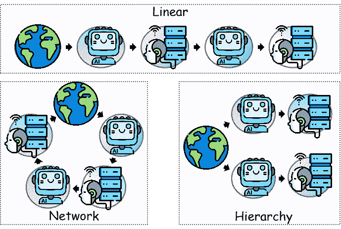

<!--yml

分类：未分类

日期：2025-01-11 11:41:34

-->

# 提升大语言模型推理能力的多路径协作反应与反思智能体

> 来源：[https://arxiv.org/html/2501.00430/](https://arxiv.org/html/2501.00430/)

何成波 邹博超 李欣 李建生 陈俊良 邢惠敏 马欣

###### 摘要

智能体通过大语言模型在科学推理任务中展现了其潜力。然而，在处理复杂推理任务时，它们常常面临精度不足和思维退化等挑战，严重影响了其表现。为了克服这些问题，我们提出了带有多路径推理的反应与反思智能体（RR-MP）框架，旨在提升大语言模型的推理能力。我们的方法通过采用多路径推理机制来提高科学推理的准确性，其中每条路径由一个反应型智能体和一个反思型智能体组成，它们协作以防止单一智能体依赖中固有的思维退化。此外，RR-MP框架无需额外的训练；它通过多个对话实例来处理每个推理路径，并使用一个独立的总结器整合所有路径的见解。这一设计融合了多种视角，强化了每条路径中的推理能力。我们对涉及道德情景、大学级物理和数学的任务进行了零样本和少样本评估。实验结果表明，我们的方法优于基准方法，突显了RR-MP框架在处理复杂科学推理任务中的有效性和优势。

###### 关键词：

多智能体系统，人与机器系统，大语言模型^†^†期刊：神经网络

## 1 引言

基于大语言模型的智能体在科学推理任务中展现出了巨大的潜力。然而，在面对复杂的科学推理挑战时，这些模型由于精度不足，往往表现出有限的效果[[1](https://arxiv.org/html/2501.00430v2#bib.bib1)，[2](https://arxiv.org/html/2501.00430v2#bib.bib2)，[3](https://arxiv.org/html/2501.00430v2#bib.bib3)]。例如，在涉及道德判断或多层次知识整合的任务中（如大学水平的科学问题），智能体能够生成初步且易于理解的输出，但常常难以提供全面和准确的解决方案[[4](https://arxiv.org/html/2501.00430v2#bib.bib4)，[5](https://arxiv.org/html/2501.00430v2#bib.bib5)，[6](https://arxiv.org/html/2501.00430v2#bib.bib6)]。尽管逐步推理在一定程度上提升了智能体的能力[[7](https://arxiv.org/html/2501.00430v2#bib.bib7)]，但在处理这些复杂任务时，依然存在幻觉等根本性问题，导致智能体生成看似合理但本质上不合逻辑的内容[[8](https://arxiv.org/html/2501.00430v2#bib.bib8)]。

相关研究已提出解决方案，其中自我修正作为最简单的事后调整形式，近年来受到了广泛关注[[9](https://arxiv.org/html/2501.00430v2#bib.bib9), [10](https://arxiv.org/html/2501.00430v2#bib.bib10)]。这一方法利用大语言模型（LLMs）生成反馈并优化自身输出，使LLMs能够在零-shot或少-shot提示下自动修正其生成内容[[11](https://arxiv.org/html/2501.00430v2#bib.bib11)]。尽管错误检测是自我修正的前提，实际有效实施仍然具有挑战性。以往研究表明，LLMs与人类类似，并不总是在第一次尝试时就能产生最佳输出。因此，研究人员提出了SELF-REFINE方法，帮助智能体通过迭代反馈和优化持续改进其在特定任务上的表现[[6](https://arxiv.org/html/2501.00430v2#bib.bib6)]。然而，尽管自我反思有可能提高回答质量，但它依赖于LLM的自我评估能力，而这一能力尚未得到充分验证[[12](https://arxiv.org/html/2501.00430v2#bib.bib12)]。此外，单一智能体的反思过程可能导致思维退化（Degeneration-of-Thought, DoT）。具体而言，一旦基于大语言模型的智能体对其回答建立了信心，它便无法通过后续自我反思生成新的见解，即使其初始立场是错误的[[3](https://arxiv.org/html/2501.00430v2#bib.bib3)]。

图1：具有多路径推理的反应性与反思性智能体

我们提出了具有多路径推理的反应性与反思性代理（RR-MP）框架，以解决基于大语言模型（LLMs）的代理在复杂科学推理任务中面临的准确性不足和DoT问题。如图[1](https://arxiv.org/html/2501.00430v2#S1.F1 "图1 ‣ 1 引言 ‣ 通过多路径协作反应性与反思性代理增强LLM推理")所示，RR-MP框架采用了多路径推理机制，类似于人类的推理——复杂的推理任务通常需要多个推理路径才能得出正确答案[[13](https://arxiv.org/html/2501.00430v2#bib.bib13)]。在每一条路径中，为了增强推理的准确性，我们通过迭代反思优化每一条路径，从而防止在迭代过程中出现DoT。该框架集成了协作工作的反应性代理和反思性代理；反思性代理激励反应性代理进行自我修正。由反应性代理和反思性代理组成的双系统模型，类似于人类认知中的两个系统——系统1（快速直觉）和系统2（缓慢深思）——从而有效地提升了决策表现[[14](https://arxiv.org/html/2501.00430v2#bib.bib14), [15](https://arxiv.org/html/2501.00430v2#bib.bib15), [16](https://arxiv.org/html/2501.00430v2#bib.bib16)]。我们在零样本和少样本场景下验证了我们的方法，涵盖了三项复杂的科学推理任务——道德情境、大学物理和大学数学。结果表明，通过外部刺激进行自我修正和推理路径优化可以实现更高的准确性。值得注意的是，我们的方法在零样本设置下显著优于强基准方法[[7](https://arxiv.org/html/2501.00430v2#bib.bib7), [17](https://arxiv.org/html/2501.00430v2#bib.bib17), [4](https://arxiv.org/html/2501.00430v2#bib.bib4), [18](https://arxiv.org/html/2501.00430v2#bib.bib18), [6](https://arxiv.org/html/2501.00430v2#bib.bib6)]。

总结来说，我们的贡献如下：

+   1.

    我们提出了具有多路径推理的反应性与反思性代理（RR-MP）框架，作为一种有效的事后错误修正方法，旨在显著提升代理在复杂科学任务中的推理能力。

+   2.

    我们提出了一种多路径推理机制，使多个反应性代理能够生成并行的推理路径，从而提高复杂科学推理中的准确性和鲁棒性。

+   3.

    我们对反应性和反思性代理在不同提示类型下的表现进行了比较分析，并进一步探讨了不同沟通模式（例如合作与辩论）如何影响科学推理结果。

图2：自一致性方法与我们方法的比较。以大学物理数据集为例，我们的多路径、多角色互动框架有效减轻了多数投票中由于错误判断而产生的错误，并利用反应性代理输入对反思代理推理的准确反映。即使第一条路径得出的结果不正确，最终答案仍可通过第二条路径的反思分析得出。详情请参见附录中的B.1。

## 2 相关工作

单一代理的自我修正

当前的大型语言模型（LLMs）在科学推理中仍然存在局限性，由于幻觉现象，准确性常常受到影响。开发一种简单而有效的方法来增强智能代理的自我修正能力仍然是一个关键挑战[[19](https://arxiv.org/html/2501.00430v2#bib.bib19)、[20](https://arxiv.org/html/2501.00430v2#bib.bib20)、[21](https://arxiv.org/html/2501.00430v2#bib.bib21)、[22](https://arxiv.org/html/2501.00430v2#bib.bib22)、[23](https://arxiv.org/html/2501.00430v2#bib.bib23)]。Wei 等人[[17](https://arxiv.org/html/2501.00430v2#bib.bib17)]提出了链式思维方法，通过中间推理步骤提升模型的复杂推理能力。此外，研究人员建议将复杂问题分解为更简单的子问题，以便LLMs以类似人脑的方式进行规划[[24](https://arxiv.org/html/2501.00430v2#bib.bib24)、[25](https://arxiv.org/html/2501.00430v2#bib.bib25)、[26](https://arxiv.org/html/2501.00430v2#bib.bib26)]。这些工作为后续的自我修正机制奠定了基础。Wang 等人[[18](https://arxiv.org/html/2501.00430v2#bib.bib18)]引入了自一致性解码，解决了链式思维提示中的重复性和局部最优问题，减少了生成过程中的随机性。Madaan 等人[[6](https://arxiv.org/html/2501.00430v2#bib.bib6)]提出了SELF-REFINE方法，其中代理首先根据给定输入生成输出，并将其反馈回同一模型进行反馈。然后，反馈被返回给模型进行优化。此过程反复进行，直到满足停止条件。然而，单个代理在处理复杂任务时通常缺乏足够的决策和规划能力[[4](https://arxiv.org/html/2501.00430v2#bib.bib4)、[5](https://arxiv.org/html/2501.00430v2#bib.bib5)]。我们工作的一个方面是优化多个代理之间的迭代输出和反馈，有效避免了单个代理在自我反思过程中出现的DoT。

多智能体系统中的协同错误修正。多智能体系统的输出可以有效地修正错误，从而提高解决复杂问题的效率和准确性[[27](https://arxiv.org/html/2501.00430v2#bib.bib27), [28](https://arxiv.org/html/2501.00430v2#bib.bib28)]。多智能体系统由多个自主智能体组成，这些智能体彼此交互。通过利用共享的环境或任务，它促进了决策问题的分布式解决。这种协同方法可以显著提高多智能体系统在解决复杂问题中的效率和准确性[[29](https://arxiv.org/html/2501.00430v2#bib.bib29), [30](https://arxiv.org/html/2501.00430v2#bib.bib30), [31](https://arxiv.org/html/2501.00430v2#bib.bib31), [32](https://arxiv.org/html/2501.00430v2#bib.bib32)]。例如，精通物理模型的智能体可以更有效地进行物理逻辑推理，但在处理公式时容易出现计算错误。相比之下，擅长数学计算的智能体能够反映并修正物理模型智能体的计算结构，从而解决复杂的大学物理问题[[33](https://arxiv.org/html/2501.00430v2#bib.bib33)]。此外，智能体之间的关键互动是增强多智能体系统解决复杂问题能力的另一个有效途径。相关研究表明，利用多个智能体进行关键辩论可以增强问题解决能力，并通过辩论缓解DoT问题[[34](https://arxiv.org/html/2501.00430v2#bib.bib34), [3](https://arxiv.org/html/2501.00430v2#bib.bib3)]。基于大型语言模型（LLMs）的多智能体系统已经展示了令人鼓舞的集体智慧。然而，当前的多智能体系统在需求响应方面仍面临局限，因为任务通常由固定的智能体处理，中间任务的反馈机制仍然不足。这些不足限制了多智能体系统在复杂场景中的适应性和决策效率。

我们的研究与多智能体系统领域密切相关，重点探讨RR-MP框架的有效性。我们引导大型语言模型（LLMs）生成多样化的推理路径，模拟人类从不同的推理角度观察世界，以得出准确的答案[[14](https://arxiv.org/html/2501.00430v2#bib.bib14)]。这使得多个智能体能够动态合作，实现多样化的需求响应，从而提高系统性能。为了解决反馈机制不足的问题，我们设计了一个反应智能体与反思智能体之间的互动框架，通过协同修正和信息共享，增强推理反馈的及时性和有效性。这种方法利用智能体的协同能力实现高效的自我修正和优化。

## 3 方法

我们介绍了所提出的RR-MP框架，该框架分为两部分。第3.1节“增强认知灵活性的多路径推理”通过理论分析展示了多路径推理的有效性。第3.2节“协作认知任务解决的多智能体交互”描述了反应型智能体和反思型智能体之间的通信机制，并在实验部分提供了详细分析。

### 3.1 增强认知灵活性的多路径推理

我们采用多路径推理方法来模拟人类团队的协作行为。具体来说，当团队的不同成员给出一致的答案时，这会增强我们对解决方案正确性的信心。与依赖于汇总多个推理路径以达成共识的自一致性方法不同[[18](https://arxiv.org/html/2501.00430v2#bib.bib18)]，我们的方法不仅整合来自多个路径的决策结果，还进行深入分析以得出最终决策。这使得即使大多数初始路径是错误的，我们也能及时有效地评估和修正推理过程，最终将修正后的答案作为最终结果输出，如图[2](https://arxiv.org/html/2501.00430v2#S1.F2 "Figure 2 ‣ 1 Introduction ‣ Enhancing LLM Reasoning with Multi-Path Collaborative Reactive and Reflection agents")所示。

我们的RR-MP框架的核心是通过多样化的推理路径实现最佳解决方案。我们为每条推理路径中的智能体分配了特定的角色，以促进具有不同角色的智能体之间的合作，解决目标任务。这种方法代表了一种简单而有效的提示技术[[35](https://arxiv.org/html/2501.00430v2#bib.bib35)]，我们的设计原则遵循了Chen等人的方法[[33](https://arxiv.org/html/2501.00430v2#bib.bib33)]，具体实现细节见附录B。通过利用由不同角色生成的多个多样化且合理的推理路径，我们最终达到了最佳解决方案。为验证这一点，我们进行了理论证明。根据Sel等人[[5](https://arxiv.org/html/2501.00430v2#bib.bib5)]的观点，我们将复杂问题解决中的推理过程视为多路径推理角色对整体福利函数的隐式优化（即称为“准优化”（mesa-optimization）[[36](https://arxiv.org/html/2501.00430v2#bib.bib36)]）。我们现在对多路径推理进行理论分析，假设我们有一个问题数据集$Q$，一个动作空间$A$，和一个提示系统$p$。对于单个查询$q\in Q$，存在一个特定的动作决策$a\in A$，该决策产生最优的$F^{S}(q)$。我们可以将$F^{S}(q)$的决策过程视为隐式优化过程，其中函数$F^{S}(q)$表示决策者$S$的决策函数$F$，负责做出最终决策。我们将这一过程形式化为：

|  | $F^{S}(q)=\arg\max_{a\in A}\prod_{i=1}^{n}\mathbb{E}_{x\sim h^{\mathrm{m}_{i}}(% q,F^{\mathrm{p}_{i}}(a))}h_{u}^{\mathrm{p}_{i}}(x)$ |  | (1) |
| --- | --- | --- | --- |

其中$h^{m}:Q\times A\to\mathcal{P}(\mathcal{X})$作为多路径框架中多智能体交互的逻辑生成器，根据给定查询$q\in Q$和来自提示系统$p$的提示推断可能的决策过程的逻辑。$\mathcal{P}(\mathcal{X})$是决策空间$\mathcal{X}$上所有概率分布的集合。项$\arg\max_{a\in A}$表示在特定动作$a$下最大化所有路径的期望值。符号$\prod$表示对所有可能路径的乘积，记作$\Pi^{n}$，其中$i$表示集合中的第$i$条路径，$n$是路径的总数。期望算子$\mathbb{E}$表示随机变量$x$的期望值，$x$是代表不同推理逻辑产生结果的随机变量。符号$\sim$表示$x$的分布服从某种概率分布。方法$h^{\mathrm{m}}(q,F^{\mathrm{p_{i}}}(a))$通过决策$F^{\mathrm{p}}(a)$生成问题$q$的随机变量$x$。项$F^{\mathrm{p_{i}}}(a)$表示在第$i$条路径下针对问题$q$的最优决策。效用函数$h_{u}^{\mathrm{p}}(x)$表示该路径上结果$x$的效用。总体来说，$h$表示效用函数，反映了方法的有效性，这体现在最终答案的正确性上。符号$\mathrm{p}$表示特定路径，$u$表示方法的整体效用或有效性值。

我们假设效用函数$h_{u}^{p}(x)$是一致的。令$X_{1}^{q,a},\ldots,X_{n}^{q,a}$为来自分布$h_{s}^{p}(q,a)$的独立同分布（i.i.d.）样本。我们想通过提示系统$p$优化的真实效用$G_{p}(x)$是一致的，即$\mathbb{E}\left[G_{p}(x)\right]=\mathbb{E}\left[\prod_{i=1}^{n}h_{u}^{p}(x_{i}% )\right]$。定义两个分布之间的全变差距离为$D_{TV}(Z_{1}\|Z_{2})=\sup_{A\subseteq Z}|Z_{1}(A)-Z_{2}(A)|$。我们得到以下不等式：

|  | $\displaystyle P\Bigg{(}$ | $\displaystyle\Bigg{&#124;}\mathbb{E}_{x\sim h^{m_{i}}(q,F^{p_{i}}(q))}\prod_{i=1}^{% n}h^{p_{i}}_{u}(x)$ |  | (2) |
| --- | --- | --- | --- | --- |
|  |  | $\displaystyle-\mathbb{E}\left[\frac{1}{n}\sum_{i=1}^{n}\prod_{j=1}^{n}h^{p_{i}% }_{u}(X_{i}^{q,a})\right]\Bigg{&#124;}\geq t\Bigg{)}\leq\frac{\sigma^{2}}{nt^{2}}$ |  |

其中，对于任何查询$q\in Q$，任何决策$a\in A$，以及误差界限$t\in\mathbb{R}^{+}$，可以定义为：

|  | $t=\left\&#124;G\right\&#124;_{\infty}D_{TV}\left[X^{q,a}\big{\&#124;}h^{\text{m}_{i}}(q,a)% \right]+\epsilon$ |  | (3) |
| --- | --- | --- | --- |

其中，$\|G\|_{\infty}$表示$G$在所有输入下的最大振荡范围。$D_{TV}\left[X^{q,a}\big{\|}h^{\text{m}_{i}}(q,a)\right]$表示样本的经验分布与理论分布之间的最大偏差。$\epsilon$是一个小的调整参数，用于增加额外的容错范围。

此外，我们还得到以下方程：

|  | $\displaystyle P\Bigg{(}$ | $\displaystyle\Bigg{ | }\mathbb{E}_{x\sim h^{\mathrm{m}_{i}}(q,F^{\mathrm{p}_{i}}% (q))}G_{P}(x)-\mathbb{E}\left[\frac{1}{n}\sum_{i=1}^{n}\prod_{j=1}^{n}h^{% \mathrm{p}_{i}}_{u}(x_{i}^{q,a})\right]\Bigg{ | }$ |  | (4) |
| --- | --- | --- | --- | --- | --- | --- |
|  |  | $\displaystyle\geq\left\|G\right\|_{\infty}D_{TV}\left[X^{q,a}\big{ | }h^{\text{m}_{i}}(q,a)\right]+\epsilon\Bigg{)}\leq\frac{\sigma^{2}}{nt^{2}}$ |  |

基于切比雪夫不等式，随着$n$的增大，偏差超过固定值$t$的概率减小，这意味着发生错误的概率降低。公式如下：

|  | $\displaystyle\Bigg{ | }\mathbb{E}_{x\sim h^{m_{i}}(q,F^{p_{i}}(q))}G_{P}(x)$ | $\displaystyle-\mathbb{E}\left[\frac{1}{n}\sum_{i=1}^{n}\prod_{i=1}^{n}h^{p_{i}% }_{u}(x_{i}^{q,a})\right]\Bigg{ | }$ |  | (5) |
| --- | --- | --- | --- | --- | --- | --- |
|  |  | $\displaystyle\rightarrow 0\quad\text{当}\quad n\rightarrow\infty$ |  |

因此，我们得出结论，在给定假设下，通过上述不等式证明了公式$G_{p}(q)$的优化结果。这证明了通过结合不同代理人路径和方法的期望效用，我们可以识别出最大化效用函数的最优决策。此外，我们从理论上证明，随着代理人数的增加，生成的多路径推理显著提高了决策质量。这个结论与王等人[[18](https://arxiv.org/html/2501.00430v2#bib.bib18)]的实验结果一致。

图3：反应代理人和反思代理人的推理过程。反应代理人从外部环境接收信息，将其分解为子任务，并存储在数据库中。反思代理人通过补充或批判的过程执行每个子任务，并将结果返回给反应代理人。基于反馈，反应代理人优化其推理并完成科学推理过程。

### 3.2 多代理协作认知任务求解

在本章中，我们介绍了反应型代理与反射型代理在多路径推理框架的特定路径中的交互过程。如图[3](https://arxiv.org/html/2501.00430v2#S3.F3 "Figure 3 ‣ 3.1 Multi-Path Reasoning for Enhanced Cognitive Flexibility ‣ 3 Methods ‣ Enhancing LLM Reasoning with Multi-Path Collaborative Reactive and Reflection agents")所示，反应型代理与反射型代理之间的主要交互通过共享记忆模块进行（以列表格式检索和存储）。反应型代理生成的初步响应存储在共享记忆中，反射型代理从中提取这些响应进行进一步分析和处理。在最终答案得到之前，反应型代理将等待反射型代理的分析完成，直到生成最终答案。以下章节将详细描述这一过程。

反应型代理维持对环境的部分可观察理解。在接收到问题数据集$Q$后，它生成一个特定的行动决策$a^{\prime}$。通过其行动，反应型代理产生一个初步答案$s^{\prime}$来解决问题，该答案以字典条目的形式存储在记忆中，等待反射型代理提取。一旦反射型代理从反应型代理中检索到初步答案$s^{\prime}$，它将经过多步骤推理，并在相关工具和外部知识的帮助下，制定出推理策略$\pi$。

基于语言的代理根据LLM（具有参数$\Theta$）执行的策略$\pi$，在通过提示提供的一组指令$p$的基础上，选择并扩展初始行动$a^{\prime}$。反射型代理的输入包括指令$p$、初步响应$s^{\prime}$和原始问题$Q$。我们将这个过程形式化如下：在更新阶段，基于语言的代理根据LLM（具有参数$\Theta$）执行的策略$\pi$，选择一个行动$a\in A$：

|  | $a\sim\pi(a^{\prime}&#124;p,s^{\prime};\Theta)$ |  | (6) |
| --- | --- | --- | --- |

因此，在反应型代理与反射型代理的交互之后，原始的行动决策$a^{\prime}$被扩展为行动$a$，这一过程称为“增强行动”。通过部分观察任务信息$b^{\prime}$，并利用LLM（具有参数$\Theta$）调用工具或从外部知识库获取信息，在指令$p$的约束下制定最终策略$\pi$，执行新的增强行动$a$。这个过程有效地提升了决策性能。

## 4 实验

### 4.1 数据集与基准方法

我们从大规模多任务语言理解（MMLU）基准测试[[37](https://arxiv.org/html/2501.00430v2#bib.bib37)]中选择了三个数据集——大学物理、大学数学和道德情境——来评估大型语言模型在科学推理任务中的表现。大学物理数据集评估领域特定的物理知识掌握情况，大学数学数据集侧重于逻辑推理和复杂计算，道德情境数据集考察伦理决策和抽象推理。这些数据集共同捕捉了科学推理任务的核心要求，并为大型语言模型提出了重大挑战[[4](https://arxiv.org/html/2501.00430v2#bib.bib4), [33](https://arxiv.org/html/2501.00430v2#bib.bib33)]。MMLU基准测试广泛覆盖了科学推理的关键领域，是识别模型在领域知识、因果推理和价值判断等方面盲点的有力工具，提供了对推理能力的全面评估。

为了评估具有多路径推理方法的反应与反思智能体在科学推理任务中的有效性，我们在零-shot和少-shot设置下比较了五种基准方法。每种方法代表了不同的智能体推理和决策范式，具体如下：

1.  1.

    标准（Standard）[[7](https://arxiv.org/html/2501.00430v2#bib.bib7)]：该方法模拟传统方法，其中智能体直接从输入生成输出，而无需进行任何推理或自我反思。适用于优先考虑效率的任务。

1.  2.

    思维链（Chain-of-Thought，CoT）[[17](https://arxiv.org/html/2501.00430v2#bib.bib17)]：在这种方法中，智能体在做出决策之前进行逐步推理，并提供其推理过程的详细解释。这种方法特别适用于复杂的决策任务，并模仿人类将问题分解为顺序步骤的过程。

1.  3.

    思维实验（Thought Experiment，Thought）[[4](https://arxiv.org/html/2501.00430v2#bib.bib4)]：这种方法涉及反事实推理，即智能体考虑各种（通常是假设的）情境，并仔细分析这些假想情境的潜在结果，从而支持更全面的决策。

1.  4.

    自一致性（Self-Consistency）[[18](https://arxiv.org/html/2501.00430v2#bib.bib18)]：该方法并不依赖单一的贪婪推理路径，而是采样多个推理路径。最终答案通过对采样的推理路径进行边际化，选择最一致的解决方案。

1.  5.

    自我精炼（Self-Refine）[[6](https://arxiv.org/html/2501.00430v2#bib.bib6)]：该方法基于大型语言模型（LLMs），专注于迭代自我改进。智能体生成初步输出后，再对其输出进行反馈，反复精炼，直到产生更准确的结果。

### 4.2 设置

由于资源限制，我们选择了“gpt-3.5-turbo-0613”作为所有实验的主干模型。在我们的RR-MP框架中，我们设计了反应代理与反思代理之间的交互框架。反应代理从数据集（包括大学物理、大学数学和道德情景）接收输入，做出初步决策并将其传递给反思代理。反思代理通过协作和辩论进一步优化这些初步决策，确保其准确性和合理性。这两个代理分别作为“初步决策者”和“决策优化者”共同工作，完成任务。

我们在零-shot和少-shot设置中测试了该系统。在零-shot设置中，模型完全依赖其推理能力来做出决策，无需任何先前的示例。在少-shot设置中，为每个代理提供了五个学习示例，帮助他们更好地理解任务背景和决策逻辑。为了进一步丰富推理路径，我们采用了角色扮演方法。例如，在大学物理实验中，定义了物理学家和数学家等角色（基于简单的提示工程）。这些角色遵循设计原则 [[33](https://arxiv.org/html/2501.00430v2#bib.bib33)]，探索多样化的推理路径 [[35](https://arxiv.org/html/2501.00430v2#bib.bib35)]，每个角色在推理过程中承担特定任务并贡献于决策。角色定义、任务分配以及提示工程的实施细节在附录B中有详细描述。

| 方法 | 零-shot | 少-shot | 平均 |
| --- | --- | --- | --- |
| 道德情景 | 大学物理 | 大学数学 | 道德情景 | 大学物理 | 大学数学 |
| 标准 [[7](https://arxiv.org/html/2501.00430v2#bib.bib7)] | 37.65 | 40.19 | 40 | 46.25 | 46.09 | 41 | 41.86 |
| CoT [[17](https://arxiv.org/html/2501.00430v2#bib.bib17)] | 48.49 | 57.84 | 39 | 52.29 | 63.72 | 38 | 48.22 |
| 思维 [[4](https://arxiv.org/html/2501.00430v2#bib.bib4)] | 41.45 | - | - | 49.5 | - | - | 45.48 |
| 自我一致性 [[18](https://arxiv.org/html/2501.00430v2#bib.bib18)] | 63.24 | 65.68 | 53 | 68.49 | 62.75 | 53 | 61.03 |
| 自我优化 [[6](https://arxiv.org/html/2501.00430v2#bib.bib6)] | 59.66 | 61.76 | 50 | 67.01 | 66.67 | 45 | 58.35 |
| 同领域合作 | 70.39 | 85.29 | 71 | 63.91 | 86.27 | 75 | 75.15 |
| 同领域辩论 | 48.71 | 87.25 | 70 | 62.12 | 87.25 | 74 | 71.55 |
| 跨领域合作 | 60.78 | 89.21 | 74 | 65.47 | 91.18 | 75 | 75.94 |
| 跨领域辩论 | 59.77 | 85.29 | 74 | 56.76 | 86.27 | 70 | 72.02 |

表1：主要结果（准确率，%）。“同域协作”表示反应代理和反思代理在同一领域内协作进行科学推理，而“异域辩论”则表示它们在不同领域之间进行辩论。在平均值一栏中，粗体表示最佳结果，下划线表示第二最佳结果。

### 4.3 主要结果

在所提出的RR-MP框架中，我们设计了四种交互范式，以探讨反应代理和反思代理之间的相互作用：第一种是反应代理和反思代理在同一领域背景下的协作互动；第二种是在同一领域背景下的辩论互动；第三种是两种代理在不同领域背景下的协作互动；第四种是两种代理在不同领域背景下的辩论互动。与基线方法的比较结果如表[1](https://arxiv.org/html/2501.00430v2#S4.T1 "Table 1 ‣ 4.2 Settings ‣ 4 Experiments ‣ Enhancing LLM Reasoning with Multi-Path Collaborative Reactive and Reflection agents")所示，表明我们的方法在少量示例的场景中显著提高了性能。

从表[1](https://arxiv.org/html/2501.00430v2#S4.T1 "Table 1 ‣ 4.2 Settings ‣ 4 Experiments ‣ Enhancing LLM Reasoning with Multi-Path Collaborative Reactive and Reflection agents")中的结果可以观察到，RR-MP框架在复杂数据集下的零-shot和少-shot场景中表现出显著的性能提升，包括大学物理、大学数学和道德场景。值得注意的是，来自不同领域的反应代理和反思代理之间的协作（异域协作）在大多数任务中取得了最佳表现，平均准确率为75.94%，超过了其他基线方法。

此外，表[1](https://arxiv.org/html/2501.00430v2#S4.T1 "Table 1 ‣ 4.2 Settings ‣ 4 Experiments ‣ Enhancing LLM Reasoning with Multi-Path Collaborative Reactive and Reflection agents")提供了更多见解。例如，无论代理是否在同一领域或不同领域，协作模式通常比辩论模式表现更好。这个趋势在零样本和少样本设置中的多个任务中都得到了持续观察。协作模式旨在解决问题或达成共识，促进不同视角的整合，增强理解的全面性，识别盲点，并防止辩论引起的认知僵化。研究还发现，当使用相同类型的反应代理和反思代理时，执行任务时的表现可能会下降。这是因为当多个相同角色的代理进行协作时，它们的思维方式和方法往往趋于一致，降低了多样性和创新性，从而限制了在复杂任务上的表现。

总结来说，RR-MP框架通过设计灵活的协作和辩论模式，并利用反应代理和反思代理的多样角色，显著提升了复杂推理任务的性能。协作模式在大多数场景中表现更好，尤其是在整合来自不同领域的知识时。此外，同一领域内的协作可以有效促进特定任务的完成。这些结果验证了多代理交互设计的重要性，并为未来多领域协作系统的优化提供了有力支持。

图 4：有无刺激角色的准确度（%）。

## 5 消融研究

| 模式 | 大学物理（0-shot） | 大学数学（0-shot） | 大学物理（few-shot） |
| --- | --- | --- | --- |
|  | 单一 | 多重 | 单一 | 多重 | 单一 | 多重 |
| 同领域协作 | 78.43 | 85.29 | 69 | 71 | 79.41 | 86.27 |
| 同领域辩论 | 86.27 | 87.25 | 67 | 70 | 89.11 | 87.25 |
| 异领域协作 | 85.29 | 89.21 | 71 | 74 | 85.29 | 91.18 |
| 异领域辩论 | 83.30 | 85.29 | 70 | 74 | 84.31 | 86.27 |

表 2：在不同协作和辩论模式下，单一实例和多重实例的性能比较。

| 方法 | 零样本准确度（%） | 少样本准确度（%） | 平均准确度（%） |
| --- | --- | --- | --- |
| 线性 | 59.00 | 53.90 | 56.45 |
| 分层 | 63.72 | 57.80 | 60.76 |
| 网络 | 50.98 | 58.80 | 54.89 |
| 我们的 | 89.21 | 91.18 | 90.20 |

表 3：三种代理交互方式和我们提出的RR-MP框架的准确度比较，结果通过零样本、少样本和平均准确度（%）进行评估。

### 5.1 反思存在的必要性？

在我们提出的方法中，反思代理作为RR-MP框架的核心组件。我们认为反思代理在反思阶段探索推理路径中发挥着至关重要的作用，尤其是在反应代理在推理中出现幻觉或过度自信时。在这种情况下，反思代理促进进一步的认知优化，类似于人类在遇到过度自信的错误后依赖外部刺激来优化思维过程。为了验证这一假设，我们设计了对比实验，评估带有和不带反思代理的模型在推理性能上的差异。在零-shot和少量-shot提示设置下，我们分别对《道德情境》和《大学物理》数据集进行了推理任务。

实验结果如图[4](https://arxiv.org/html/2501.00430v2#S4.F4 "图 4 ‣ 4.3 主要结果 ‣ 4 实验 ‣ 增强LLM推理能力与多路径协作反应与反思代理")所示。具体来说，在零-shot提示设置下，《道德情境》和《大学物理》数据集的推理准确率分别提高了24.81%和8.78%。在少量-shot提示设置下，准确率分别提高了4.44%和11.55%。这些结果表明，加入反思代理显著增强了模型在这些数据集上处理复杂推理任务的能力。通过引入外部刺激来优化推理路径，反思代理可以修正和增强认知过程，从而最终实现更优的决策表现。

图5：人类与代理协作框架中的三种典型交互模式。

### 5.2 是否需要多个实例？

在我们提出的方法中，反应代理和反思代理都基于相同类型的大型语言模型（LLMs），如ChatGPT-3.5，但作为独立的对话实例运行，相互之间不干扰。这种设计确保每个代理可以独立执行其指定任务，避免因共享上下文或跨代理干扰而导致的推理偏差。为了研究是否可以通过提示工程在单实例LLM中动态切换代理来实现多路径推理，我们提出了一种替代方法。该方法通过提示工程在同一对话实例中模拟不同的代理，并对《大学物理》和《道德情境》数据集进行了四种类型的互动实验，如表[2](https://arxiv.org/html/2501.00430v2#S5.T2 "表 2 ‣ 5 消融研究 ‣ 增强LLM推理能力与多路径协作反应与反思代理")所示。

实验结果表明，无论是在零-shot还是少-shot提示设置下，单实例对话的推理性能都会下降。这一下降可以归因于在不同代理模式之间频繁切换所导致的上下文冲突或不一致性，这些因素会对预测准确性产生负面影响。相比之下，多实例对话能够保持代理之间的一致性和独立性，显著增强协作并提高推理性能。此外，单实例对话的成本更高，因为它们需要频繁输入特定角色的信息，而多实例设置每个代理只需一个输入。我们的研究结果与Xu等人[[38](https://arxiv.org/html/2501.00430v2#bib.bib38)]、Chen等人[[33](https://arxiv.org/html/2501.00430v2#bib.bib33)]的研究一致，强调了为每个代理定义清晰角色和独立任务边界的重要性。明确的代理角色不仅有助于保持大型语言模型（LLM）的自我一致性，还能有效防止认知混乱，从而提高响应质量和应对复杂科学问题的推理能力。

### 5.3 探索交互方式对代理的影响。

在我们的研究中，我们引入了三种典型的拓扑结构来探索多代理系统中的交互策略：线性交互、网络交互和层次交互，如图[5](https://arxiv.org/html/2501.00430v2#S5.F5 "Figure 5 ‣ 5.1 Is It Necessary for reflection to Exist? ‣ 5 Ablation Study ‣ Enhancing LLM Reasoning with Multi-Path Collaborative Reactive and Reflection agents")所示。这些交互方式的灵感来源于人类团队协作的常见模式。线性交互是一种顺序处理的方式，代理沿着固定的线性路径处理和传递任务，类似于生产线或层级组织中的工作流。网络交互允许代理在网络结构中建立任意依赖关系，反映了团队协作中常见的灵活性和动态调整。层次交互采用分层结构，代理在不同分支上并行工作，类似于基于角色或职能层级的团队协作。

我们在大学物理数据集上进行了测试。实验结果（表格 [3](https://arxiv.org/html/2501.00430v2#S5.T3 "Table 3 ‣ 5 Ablation Study ‣ Enhancing LLM Reasoning with Multi-Path Collaborative Reactive and Reflection agents")）表明，尽管层次化交互表现相对较好，我们提出的RR-MP框架由于其反思能力，取得了显著更好的结果。反思使得代理在交互过程中能够动态调整推理路径，有效增强了它们在解决复杂科学问题时自我纠正和优化的能力。通过将反思与多路径推理相结合，我们的方法在所有场景中展现出优越的灵活性和效率，进一步验证了反思和动态交互在多智能体系统设计中的重要性。

## 6 结论

在本研究中，我们提出了一个名为“反应与反思代理结合多路径推理”的框架。该框架旨在解决在复杂科学推理过程中，因固定单一响应和缺乏中间反馈执行所导致的多智能体系统中的准确性下降和思维退化问题。通过这样做，它增强了LLM在解决复杂科学问题时的推理能力。我们的方法包括两个核心组件：首先，多路径推理方法的多样性显著提高了LLM的准确性；其次，多个代理之间的互动有效缓解了幻觉和思维退化问题。我们通过理论分析和实验验证展示了该框架的有效性。

尽管所提出的框架作为一种有效的事后错误修正方法，在复杂任务中显著提高了代理的决策能力，但它仍然存在一定的局限性。具体而言，该框架需要针对任务设计角色和推理示例，这是提示工程领域中常见的挑战 [[17](https://arxiv.org/html/2501.00430v2#bib.bib17), [4](https://arxiv.org/html/2501.00430v2#bib.bib4), [3](https://arxiv.org/html/2501.00430v2#bib.bib3), [6](https://arxiv.org/html/2501.00430v2#bib.bib6)]。未来的工作将集中在探索如何在框架内实现自动化提示设计，从而进一步增强方法的普适性和适应性。

## 参考文献

+   Feng et al. [2025] J. Feng, Q. Wang, H. Qiu, L. Liu, Retrieval in decoder benefits generative models for explainable complex question answering, Neural Networks 181 (2025) 106833.

+   Zhang et al. [2024] X. Zhang, F. Zeng, C. Gu, Simignore: Exploring and enhancing multimodal large model complex reasoning via similarity computation, Neural Networks (2024) 107059.

+   Liang 等人 [2023] T. Liang, Z. He, W. Jiao, X. Wang, Y. Wang, R. Wang, Y. Yang, Z. Tu, S. Shi, 通过多智能体辩论鼓励大语言模型的发散性思维，arXiv 预印本 arXiv:2305.19118 (2023)。

+   Ma 等人 [2023] X. Ma, S. Mishra, A. Beirami, A. Beutel, J. Chen, 让我们做一个思想实验：通过反事实推理改进道德推理，arXiv 预印本 arXiv:2306.14308 (2023)。

+   Sel 等人 [2024] B. Sel, P. Shanmugasundaram, M. Kachuee, K. Zhou, R. Jia, M. Jin, Skin-in-the-game：通过多方利益对齐进行决策，在 LLMs 中的应用，arXiv 预印本 arXiv:2405.12933 (2024)。

+   Madaan 等人 [2024] A. Madaan, N. Tandon, P. Gupta, S. Hallinan, L. Gao, S. Wiegreffe, U. Alon, N. Dziri, S. Prabhumoye, Y. Yang 等人，自我精炼：通过自反馈进行迭代精炼，神经信息处理系统进展 36 (2024)。

+   Brown 等人 [2020] T. Brown, B. Mann, N. Ryder, M. Subbiah, J. D. Kaplan, P. Dhariwal, A. Neelakantan, P. Shyam, G. Sastry, A. Askell 等人，语言模型是少样本学习者，神经信息处理系统进展 33 (2020) 1877–1901。

+   Huang 等人 [2023] L. Huang, W. Yu, W. Ma, W. Zhong, Z. Feng, H. Wang, Q. Chen, W. Peng, X. Feng, B. Qin 等人，关于大语言模型中幻觉的调查：原理、分类法、挑战与开放问题，ACM 信息系统学报 (2023)。

+   Pan 等人 [2024] L. Pan, M. Saxon, W. Xu, D. Nathani, X. Wang, W. Y. Wang, 自动修正大语言模型：调查多种自动修正策略的全貌，计算语言学会会刊 12 (2024) 484–506。

+   Lu 等人 [2023] J. Lu, W. Zhong, W. Huang, Y. Wang, F. Mi, B. Wang, W. Wang, L. Shang, Q. Liu, Self：语言驱动的大语言模型自我进化，arXiv 预印本 arXiv:2310.00533 (2023)。

+   Jiang 等人 [2024] Z. Jiang, H. Peng, S. Feng, F. Li, D. Li, LLMs 可以通过教学链式思维发现数学推理错误，arXiv 预印本 arXiv:2405.06705 (2024)。

+   Shinn 等人 [2024] N. Shinn, F. Cassano, A. Gopinath, K. Narasimhan, S. Yao, Reflexion：具有语言强化学习的智能体，神经信息处理系统进展 36 (2024)。

+   Stanovich 和 West [2000] K. E. Stanovich, R. F. West, 推动理性辩论，行为与大脑科学 23 (2000) 701–717。

+   Kahneman [2011] D. Kahneman, 思考，快与慢，Farrar, Straus and Giroux (2011)。

+   Vygotsky 和 Cole [1978] L. S. Vygotsky, M. Cole, 社会中的心智：高级心理过程的发展，哈佛大学出版社，1978。

+   Christakopoulou 等人 [2024] K. Christakopoulou, S. Mourad, M. Matarić, 快慢思考的智能体：一个谈话者-推理者架构，arXiv 预印本 arXiv:2410.08328 (2024)。

+   Wei 等人 [2022] J. Wei, X. Wang, D. Schuurmans, M. Bosma, F. Xia, E. Chi, Q. V. Le, D. Zhou 等人，思维链提示法引发大语言模型的推理，神经信息处理系统进展 35 (2022) 24824–24837。

+   Wang 等人 [2022] X. Wang, J. Wei, D. Schuurmans, Q. Le, E. Chi, S. Narang, A. Chowdhery, D. Zhou, 自一致性提高了语言模型中的思维链推理，arXiv 预印本 arXiv:2203.11171 (2022)。

+   Saunders 等人 [2022] W. Saunders, C. Yeh, J. Wu, S. Bills, L. Ouyang, J. Ward, J. Leike, 自我批评模型协助人工评估者，arXiv 预印本 arXiv:2206.05802 (2022)。

+   Chen 等人 [2023] P. Chen, Z. Guo, B. Haddow, K. Heafield, 使用大语言模型进行迭代翻译优化，arXiv 预印本 arXiv:2306.03856 (2023)。

+   Feng 等人 [2024] X. Feng, Z.-Y. Chen, Y. Qin, Y. Lin, X. Chen, Z. Liu, J.-R. Wen, 基于大语言模型的人类与智能体协作解决复杂任务，arXiv 预印本 arXiv:2402.12914 (2024)。

+   Wang 等人 [2023] Y. Wang, W. Zhong, L. Li, F. Mi, X. Zeng, W. Huang, L. Shang, X. Jiang, Q. Liu, 将大语言模型与人类对齐：综述，arXiv 预印本 arXiv:2307.12966 (2023)。

+   Yax 等人 [2024] N. Yax, H. Anlló, S. Palminteri, 研究并改善人类与机器的推理能力，通讯心理学 2 (2024) 51。

+   Hao 等人 [2023] S. Hao, Y. Gu, H. Ma, J. J. Hong, Z. Wang, D. Z. Wang, Z. Hu, 使用语言模型进行推理即是用世界模型进行规划，arXiv 预印本 arXiv:2305.14992 (2023)。

+   Zhou 等人 [2022] D. Zhou, N. Schärli, L. Hou, J. Wei, N. Scales, X. Wang, D. Schuurmans, C. Cui, O. Bousquet, Q. Le 等人，最少到最多提示法使得大语言模型能够进行复杂推理，arXiv 预印本 arXiv:2205.10625 (2022)。

+   Khot 等人 [2020] T. Khot, D. Khashabi, K. Richardson, P. Clark, A. Sabharwal, 文本模块化网络：学习以现有模型的语言分解任务，arXiv 预印本 arXiv:2009.00751 (2020)。

+   Guo 等人 [2024] T. Guo, X. Chen, Y. Wang, R. Chang, S. Pei, N. V. Chawla, O. Wiest, X. Zhang, 基于大语言模型的多智能体：进展与挑战综述，arXiv 预印本 arXiv:2402.01680 (2024)。

+   Zhu 等人 [2024] X. Zhu, J. Li, Y. Liu, C. Ma, W. Wang, 将数学推理能力蒸馏到小型语言模型中，Neural Networks 179 (2024) 106594。

+   Rasal [2024] S. Rasal, Llm 和谐：多智能体通信用于问题解决，arXiv 预印本 arXiv:2401.01312 (2024)。

+   朱等人 [2023] X. 朱, J. 王, L. 张, Y. 张, Y. 黄, R. 甘, J. 张, Y. 杨, 通过合作推理引导的语言模型解决数学应用题, 在: A. Rogers, J. Boyd-Graber, N. Okazaki (编), 第61届计算语言学协会年会论文集 (第1卷：长篇论文), 计算语言学协会, 加拿大多伦多, 2023, 第4471–4485页。网址：[https://aclanthology.org/2023.acl-long.245](https://aclanthology.org/2023.acl-long.245)。doi：[10.18653/v1/2023.acl-long.245](http://dx.doi.org/10.18653/v1/2023.acl-long.245)。

+   潘等人 [2024] L. 潘, Y. 李, C. 余, Y. 施, 一种人机协作工具，通过少量示例训练单一大型语言模型代理成为网络, arXiv 预印本 arXiv:2404.15974 (2024)。

+   贺跃雅等人 [2023] J. 贺跃雅, G. Poesia, R. E. Wang, N. D. Goodman, 通过结合语言模型和符号求解器解决数学应用题, arXiv 预印本 arXiv:2304.09102 (2023)。

+   陈等人 [2024] P. 陈, B. 韩, S. 张, Comm: 协作多智能体、多推理路径提示用于复杂问题解决, arXiv 预印本 arXiv:2404.17729 (2024)。

+   杜等人 [2023] Y. 杜, S. 李, A. 托雷尔巴, J. B. 特南鲍姆, I. 莫达奇, 通过多智能体辩论提升语言模型的事实性和推理能力, arXiv 预印本 arXiv:2305.14325 (2023)。

+   王等人 [2023] Z. M. 王, Z. 彭, H. 问, J. 刘, W. 周, Y. 吴, H. 郭, R. 甘, Z. 倪, J. 杨, 等人, Rolellm: 基准测试、引导和提升大型语言模型的角色扮演能力, arXiv 预印本 arXiv:2310.00746 (2023)。

+   胡宾格等人 [2019] E. 胡宾格, C. 范·梅尔维克, V. 米库利克, J. 斯卡尔塞, S. 加拉布兰特, 高级机器学习系统中学习优化带来的风险, arXiv 预印本 arXiv:1906.01820 (2019)。

+   Hendrycks等人 [2020] D. Hendrycks, C. Burns, S. Basart, A. Zou, M. Mazeika, D. Song, J. Steinhardt, 测量大规模多任务语言理解, arXiv 预印本 arXiv:2009.03300 (2020)。

+   许等人 [2023] B. 许, A. 杨, J. 林, Q. 王, C. 周, Y. 张, Z. 毛, Expertprompting: 指导大型语言模型成为杰出专家, arXiv 预印本 arXiv:2305.14688 (2023)。
