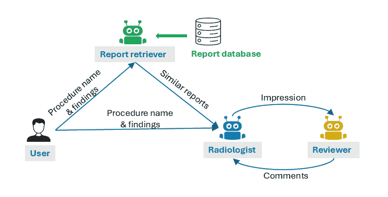
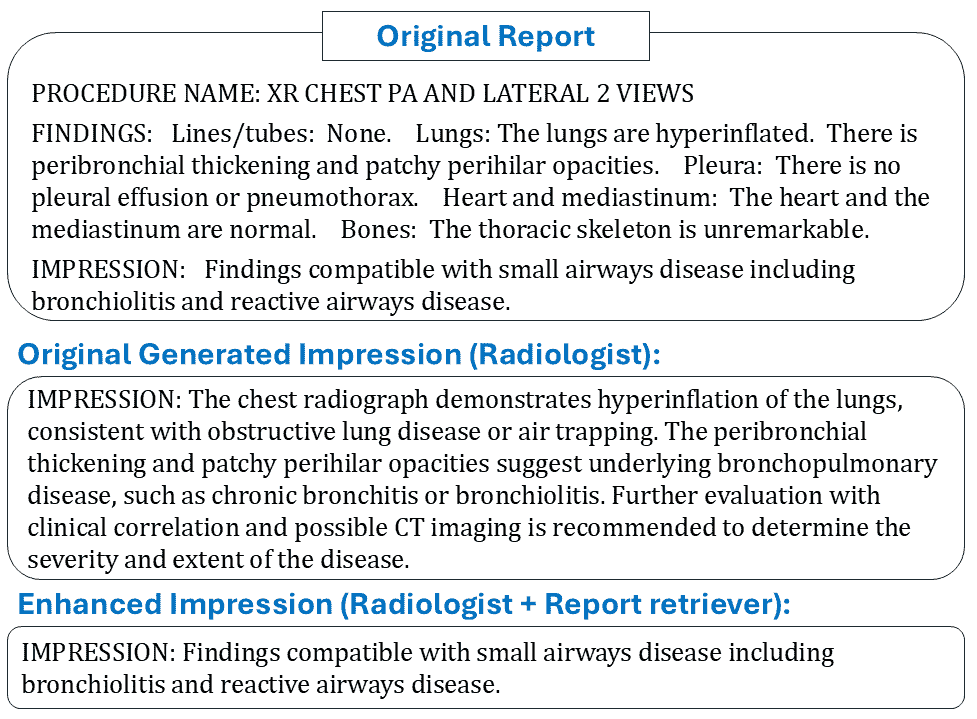

<!--yml

category: 未分类

日期：2025-01-11 11:49:45

-->

# 通过多智能体系统增强LLM在放射科报告印象生成中的应用

> 来源：[https://arxiv.org/html/2412.06828/](https://arxiv.org/html/2412.06828/)

方曾，放射科，马萨诸塞总医院及哈佛医学院 吕志良，放射科，马萨诸塞总医院及哈佛医学院 李全正，放射科，马萨诸塞总医院及哈佛医学院 李翔，放射科，马萨诸塞总医院及哈佛医学院

###### 摘要

本研究介绍了“RadCouncil”，一个多智能体大语言模型（LLM）框架，旨在增强从发现部分生成放射科报告印象的能力。RadCouncil包含三个专门的智能体：1）“检索”智能体，识别并从向量数据库中检索相似的报告；2）“放射科医生”智能体，基于给定报告的发现部分以及由检索智能体获取的示例报告生成印象；3）“审阅者”智能体，评估生成的印象并提供反馈。RadCouncil的性能通过定量指标（BLEU、ROUGE、BERTScore）和由GPT-4评估的定性标准进行了评估，以胸部X光作为案例研究。实验结果显示，RadCouncil在多个维度上超过了单一智能体方法，包括诊断准确性、风格一致性和清晰度。本研究强调了利用多个交互的LLM智能体，每个智能体负责专门任务，以增强在专业医疗任务中的表现，以及开发更强大、更适应性的医疗AI解决方案的潜力。

## 1 引言

在放射科工作流程中，放射科医生传统上解读影像学研究并手动起草详细报告，其中包括“印象”部分，概述临床上重要的发现和可能的诊断，这是报告中供转诊医生和患者护理至关重要的部分。这个过程既耗时，又容易受到放射科医生知识和经验差异的影响[[1](https://arxiv.org/html/2412.06828v1#bib.bib1)]。自动化的印象生成有潜力提高报告的一致性，减少放射科医生的工作量，并提升放射科报告的整体质量[[2](https://arxiv.org/html/2412.06828v1#bib.bib2)]。随着医学影像需求的增加，放射科医生的工作压力也不断加大，导致可能的职业倦怠，并影响其提供及时且精确报告的能力[[3](https://arxiv.org/html/2412.06828v1#bib.bib3)]。

大型语言模型（LLMs）在理解和生成连贯且符合语境的文本方面展现了卓越的能力，使其成为自动生成放射学报告印象的有前景的工具。一些研究已探讨LLMs在印象总结任务中的能力[[2](https://arxiv.org/html/2412.06828v1#bib.bib2)、[4](https://arxiv.org/html/2412.06828v1#bib.bib4)、[5](https://arxiv.org/html/2412.06828v1#bib.bib5)、[6](https://arxiv.org/html/2412.06828v1#bib.bib6)、[7](https://arxiv.org/html/2412.06828v1#bib.bib7)、[8](https://arxiv.org/html/2412.06828v1#bib.bib8)]，展示了LLMs在通过自动化报告生成过程来革新放射学工作流的潜力。多种技术，如提示工程、模型微调和检索增强生成（RAG）[[6](https://arxiv.org/html/2412.06828v1#bib.bib6)]，已被用于提高其性能并缓解LLMs的局限性，包括幻觉和领域知识不足。然而，当前的方法往往缺乏将这些技术整合到统一框架中的能力，也缺乏将新技术和/或要求纳入印象生成中的可扩展性。此外，即使在采用领域适应技术的情况下，如果在生成文本时未对模型输出进行反思和审查，使用LLM也有可能引入幻觉，从而危及结果的可靠性，并可能导致临床决策中的严重错误[[9](https://arxiv.org/html/2412.06828v1#bib.bib9)、[10](https://arxiv.org/html/2412.06828v1#bib.bib10)]。

最近，多智能体系统作为一种有前景的方法，已经在各种自然语言处理任务中崭露头角 [[11](https://arxiv.org/html/2412.06828v1#bib.bib11)]。通过利用多个专业化智能体的优势，每个智能体专注于特定任务，多智能体系统可以提升整体模型性能的质量和可靠性。此外，增强单一大型语言模型（LLM）性能的技术可以直接应用于每个智能体和整个系统。得益于LLM在自然语言和代码/结构化数据处理方面的先进能力，多智能体系统能够以可泛化的形式理解模型输入，编写和执行代码，并进行推理来协调协作过程，从而有效地将任何模型“包装”成更智能、更健壮的形式。通过智能体之间高效的内存管理，多智能体系统能够缓解上下文窗口大小的限制，从而提高对广泛且复杂任务的处理能力，提供更准确、更相关的输出。此外，通过LLM智能体之间的协作，多智能体系统可以结合不同领域专业知识的模型的多样化能力，从而可能产生新的 emergent properties [[12](https://arxiv.org/html/2412.06828v1#bib.bib12)]。一些初步的尝试已经在医疗环境中测试了多智能体框架，如临床试验结果预测 [[13](https://arxiv.org/html/2412.06828v1#bib.bib13)]、从病例报告中诊断 [[14](https://arxiv.org/html/2412.06828v1#bib.bib14)]、医学教育 [[15](https://arxiv.org/html/2412.06828v1#bib.bib15)] 和医学问答 [[16](https://arxiv.org/html/2412.06828v1#bib.bib16), [17](https://arxiv.org/html/2412.06828v1#bib.bib17)]。

在本研究中，我们开发了一种名为“RadCouncil”的多智能体框架，用于基于发现部分生成放射学报告中的印象部分，研究案例采用的是胸部X光影像报告。RadCouncil由三个专业化的智能体组成：（1）一个检索智能体，负责从外部数据库中搜索相似报告；（2）一个放射科医生智能体，依据检索到的报告，从发现部分生成印象部分；（3）一个审查智能体，评估生成的印象，并为放射科医生智能体提供可能的修订反馈。本文的主要贡献有两个方面：首先，RadCouncil提出了一种创新的多智能体方法，模拟了放射学临床实践中的工作流程，结合了报告撰写、文献参考和自我/同伴审查等关键步骤。其次，RadCouncil在分析和生成专业医学文本方面的有效性展示了多智能体系统在医疗应用中的潜力，这一潜力不仅限于放射学，还可以扩展到其他医疗领域，尤其是那些需要复杂任务协调和不同角色之间互动的领域。

## 2 方法学

图1：所提议的RadCouncil框架示意图，展示了三个代理、报告数据库和用户之间的交互。

### 2.1 RadCouncil：概述与工作流程

在这项工作中，我们引入了一个多代理系统，用于生成放射科报告的印象，结合了大语言模型（LLMs）的生成能力和现有报告中的医学知识。该系统使用了三个专业代理：报告检索器（Report Retriever），通过向量相似度匹配来查找相关的历史报告；放射科医师代理（Radiologist agent），参考检索到的示例生成印象；以及审阅者代理（Reviewer agent），确保发现与生成的印象之间的一致性。这种架构不仅有助于保持准确性，还通过将生成过程基于实际医学示例，并通过多个LLM进行交叉验证，减少了幻觉的产生。RadCouncil工作流程的示意例子见表1。

表1：RadCouncil系统的示例工作流程

| 用户 | 检查名称：XR胸部便携式检查。发现：导管/管线：气管插管的管端位于气管分叉处，并且管端靠近右主支气管起始处。右上胸腔投影上有栓塞线圈的影像。肺部：右上肺的斑片状模糊不清影像再次出现。无明显肺水肿。胸膜：无胸腔积液或气胸。心脏与纵隔：心脏与纵隔未见变化。骨骼：胸部骨架未见变化。 |
| --- | --- |

| 检索器 | 这里有一些示例：示例1：

检查名称：XR胸部便携式检查。发现：导管/管线：气管插管管端位于气管分叉以下，终止于右主支气管近端。肺部：右中上肺的斑片状模糊不清影像再次出现。左基底部的斑片状影像未见变化。无肺水肿。胸膜：无胸腔积液或气胸。心脏与纵隔：心脏与纵隔未见变化。骨骼：胸部骨架未见变化。

印象：

气管插管终止于右主支气管近端。右中上肺的斑片状影像代表肺出血，未见变化。也可能考虑叠加的吸入或肺炎。

示例2：

$\dots$ |

| 放射科医师 | 印象：如上所述的管线。

右上肺的斑片状模糊不清的影像可能反映了肺不张，尽管通过X光影像不能排除同时存在吸入性肺炎或肺炎。

本研究中未见明显的轻度肺水肿，之前有记录。

无胸腔积液或气胸。 |

| 评审员 | 在审阅‘发现’和‘印象’部分后，我注意到一个不一致之处：* 在‘发现’部分，提到“未见明显肺水肿”，而在‘印象’部分，提到“先前发现的轻度肺水肿未在本研究中见到，且未改变”。这表明肺水肿在先前的研究中曾出现，但与当前发现不一致。

修订：是 |

| 放射科医生 | 印象：如上所述的管道。

右上肺部可见模糊不清的斑片状影像，可能反映了肺不张，尽管无法排除影像学所示的同时存在吸入性肺炎和/或肺炎。

未见肺水肿或胸腔积液/气胸的证据。|

| 评审员 | 在审阅‘发现’和‘印象’部分后，我没有注意到任何不一致之处：* ‘印象’部分对管道的描述与‘发现’部分一致。

* 右上肺部的模糊不清的斑片状影像在两个部分中描述一致。

* 未见肺水肿和胸腔积液/气胸的描述在两个部分中一致。

修订：否 |

#### 2.1.1 报告检索器

报告检索器代理从由向量数据库实现的外部数据库中检索类似报告。通过使用输入提供的手术名称和发现，报告检索器将输入转换为其向量表示，并基于相似性评分（例如，余弦相似度）在外部放射学报告数据库中进行搜索。然后，它将提取前k个相似的向量，其中k是一个预定义参数，用于平衡检索效率和全面性。

#### 2.1.2 放射科医生

放射科医生代理负责根据用户提供的手术名称和发现生成印象。该代理利用报告检索器检索到的示例报告来增强其初步生成，改善书写风格、发现的重要性以及对其的解读。如果评审员代理提出修订请求，放射科医生代理将根据评审员的意见和反馈修订先前生成的印象。

#### 2.1.3 评审员

审阅员代理的设计目的是检查生成的印象与提供的发现之间的一致性，确保生成的印象与每项发现相符。如果发现任何不一致，审阅员将要求放射科医师进行修订，从而进入工作流的下一轮迭代。否则，如果没有发现不一致，审阅员将确认无需修订，工作流将以生成的印象作为最终输出结束。尽管可能存在其他类型的错误，例如遗漏临床重要发现或误解，但我们的研究特别关注潜在的一致性错误。检查并修订一致性错误也能显著减少生成印象中的幻觉，提高系统的可信度。

### 2.2 放射学报告数据库

放射学报告数据库作为外部资源，支持通过RAG生成印象，提供示范报告。该数据库包含了一系列精心策划的放射学报告，涵盖了程序名称、发现和印象的详细信息。对于每份报告，程序名称和发现都被转换为向量表示。这一转换使得在数据库庞大的情况下，能够高效地检索和分析相关报告。

## 3 实验与结果

### 3.1 数据集

共收集了1,900份来自马萨诸塞州总医院的胸部X光报告，收集时间为2018年1月至2018年2月。每份报告包含三个部分：程序名称、发现和印象。从该数据集中，随机选择了100份报告进行模型评估。剩余的1,800份报告作为RAG的外部数据库。这些原始数据集中的印象部分可能包含有关报告沟通和管理的信息，这些信息通过LLM（Llama-3.1-70b）[[18](https://arxiv.org/html/2412.06828v1#bib.bib18)]被检测并移除。

### 3.2 实现细节

放射科医师和审阅员代理都由LLM（Llama-3.1-70b）[[18](https://arxiv.org/html/2412.06828v1#bib.bib18)]实现，该模型由Meta开发。Llama-3.1-70b目前是领先的开源LLM之一，广泛用于文本生成。报告检索器是一个非LLM代理，它使用Faiss作为向量数据库，向量化过程由GTE-base嵌入模型执行[[19](https://arxiv.org/html/2412.06828v1#bib.bib19)]。根据提供的程序名称和发现，从外部数据库中检索出最相似的10份报告（即k=10）。为了防止可能出现的无限审阅-修订循环和任务漂移，我们将通信回合数限制为三次。放射科医师和审阅员代理的系统提示可在附录A中找到。

### 3.3 内存管理

考虑到上下文窗口的限制和LLM的计算负担，放射科医生和审阅者代理的记忆能力受到限制。在初始交互回合中，放射科医生会保留用户提供的目标程序名称和发现，以及由报告检索器检索的范例报告，以生成初步印象。另一方面，审阅者代理仅了解用户提供的任务和放射科医生代理生成的初步印象供其审阅。在随后的交互回合中，放射科医生和审阅者代理的记忆仅限于他们的上一轮交流和用户提供的任务。之前检索到的范例报告或前几轮的对话不会影响他们的持续互动。

### 3.4 RadCouncil的性能

RadCouncil的性能通过标准的文本生成任务指标进行评估，包括BLEU [[20](https://arxiv.org/html/2412.06828v1#bib.bib20)]、ROUGE-1、ROUGE-2、ROUGE-L [[21](https://arxiv.org/html/2412.06828v1#bib.bib21)]和BERTScore [[22](https://arxiv.org/html/2412.06828v1#bib.bib22)]。这些分数主要关注生成结果与真实标签之间基于距离的相似度（例如，词汇匹配）。RadCouncil的性能与单一代理LLM（Llama-3.1-70b）进行了比较，后者代表没有范例报告或审阅者支持的放射科医生。如表2所示，RadCouncil在所有这些指标上都超过了单一代理LLM。

除了这些指标，RadCouncil还通过OpenAI开发的GPT-4o进行了评估，重点评估生成的印象的语义和临床准确性。评估基于以下定性标准：包括临床显著发现、一致性与原始发现、潜在诊断、风格一致性，以及简洁性和清晰度。每个标准的评分范围为1到10分，分数越高表示质量越好。用于评估的系统提示可以在附录B中找到。此评估结果汇总于表3。结果显示，无论是单代理系统还是多代理系统，在识别生成印象中的临床显著发现方面表现相同（都为8.51，评分范围为1-10），证明它们在放射学语言理解和处理方面的能力。在推断潜在诊断的任务中，RadCouncil的表现优于单代理LLM（8.24对比8.15）。RadCouncil在风格一致性（8.53对比7.80）和简洁性/清晰度（8.77对比7.93）上也优于单代理LLM，这可能得益于从检索的示例报告中获得的支持。我们还观察到，单代理LLM的表现得到了更高的一致性评分（8.77），而RadCouncil的得分为8.63。我们将在下一节分析和讨论RadCouncil的一致性问题。

表2：通过定量指标比较RadCouncil与单一LLM的性能

| 模型 | BLEU | ROUGE_1 | ROUGE_2 | ROUGE_L | BERTScore |
| --- | --- | --- | --- | --- | --- |
| 单代理LLM (Llama-3.1-70b) | 8.21 | 0.3490 | 0.1391 | 0.2745 | 0.6643 |
| RadCouncil | 24.22 | 0.5049 | 0.3088 | 0.4364 | 0.7434 |

表3：与单代理相比的多代理系统性能，使用GPT-4定性标准进行比较。

| 模型 | 发现 | 一致性 | 诊断 | 风格 | 简洁性 |
| --- | --- | --- | --- | --- | --- |
| 单代理LLM (Llama-3.1-70b) | 8.51 | 8.77 | 8.15 | 7.80 | 7.93 |
| RadCouncil | 8.51 | 8.63 | 8.24 | 8.53 | 8.77 |

### 3.5 RAG性能分析

图2：由放射科医生代理生成的原始印象与由报告检索代理增强的印象的示例对比。

图2展示了仅由放射科医生代理生成的原始印象和在检索代理支持下增强后的印象示例。这个例子展示了RAG的优势，使生成的印象更加与真实情况一致。增强后的印象在风格上更符合典型的放射学报告实践。它更加简洁和集中，去除了多余的细节，同时保留了关键发现。潜在诊断的准确性也得到了提高，因为最终的印象准确地将病情识别为“细小气道病”，并特别提到“支气管炎和反应性气道病”，完美地与真实印象一致。通过报告检索代理提供的类似报告，放射科医生有潜力生成更加标准化和诊断准确的印象。

另一方面，在提示中提供额外的信息（以示例报告的形式）给放射科医生，可能会导致生成的印象中出现不一致的总结。我们手动审查了所有100个测试案例的结果，并分析了提供的发现与生成的印象之间在不同场景中的五种不一致性，如表4所列。五种不一致性包括发现的“存在性”、“进展状态”、“严重性”、“尺寸”和“位置”。“存在性”不一致指的是生成的印象中提到的发现，在输入的发现中没有提及，或者这些发现的存在与常识相矛盾。“进展状态”不一致指的是发现中描述的病变条件的时间变化与印象中如何呈现不匹配（例如，当发现显示“稳定”或“改善”时，印象中却说是“恶化”）。 “严重性”不一致指的是描述发现的程度或强度时不一致的情况。“尺寸”不一致指的是病变的尺寸描述存在差异。“位置”不一致发生在发现的解剖位置上存在矛盾或不匹配的情况。分析结果显示，使用检索器代理（即通过RAG）生成的印象的不一致性显著增加。在仅由放射科医生代理生成的印象中，不一致性相对较少，仅在两例中发现了两种不一致性（一种是进展状态不一致，一种是尺寸不一致）。相比之下，使用RAG生成的印象在多个类别中显示出更多的不一致性。在100个分析的案例中，使用RAG生成的十个印象包含了不一致性。有七个“存在性”不一致，六个“进展状态”不一致，一次“严重性”不一致，以及一次“位置”不一致。具体来说，我们发现RAG倾向于生成未提及的发现，并在印象中添加未提及的进展状态（特别是“未变化”）。这一分析表明，尽管使用RAG会提高生成的总体质量，但它也可能引入更多的不一致性，这可能是由于示例报告的上下文窗口更长所致。这表明，进一步细化和校准RAG是必要的，以减少这些不一致性，并提高可靠性和可信度。

表 4：放射科医生代理生成的印象和报告检索器增强的印象中的五种不一致性总结。

| 模型 | 不一致性 | 存在 | 状态 | 严重性 | 尺寸 | 位置 |
| --- | --- | --- | --- | --- | --- | --- |
| 单代理（放射科医生） | 2 | 0 | 1 | 0 | 1 | 0 |
| 多代理 |  |  |  |  |  |  |
|    + 检索器 | 10 | 7 | 6 | 0 | 1 | 1 |
|    + 检索器与审阅者 | 6 | 0 | 6 | 0 | 1 | 1 |

### 3.6 审阅者代理的有效性

为了减少生成的报告中不一致之处，我们实现了一个审阅者代理，该代理的提示输入仅包含原始发现部分和生成的报告。我们的前提是，如果不一致是由放射科医生代理的长上下文窗口引起的，那么具有更简单上下文的审阅者代理可能会识别这些错误并提出相应的修正建议。在本研究中，审阅者代理只关注生成报告中的“一致性”问题，这是RadCouncil中最关键的问题。如表4最后一行所示，审阅者代理正确识别并解决了四个不一致问题，大多数问题通过放射科医生与审阅者之间两轮互动得到解决。审阅者正确识别了所有与存在类型（Presence）相关的不一致错误，但未能识别其他类型的不一致。具体而言，在“状态”（Status）方面，审阅者代理未能识别报告中错误生成的“未变化”（unchanged）结论。它解释道，缺少变化状态意味着条件未变化，但根据放射学报告标准，这是不正确的，因为“未变化”状态必须通过在发现部分中提到的先前对比研究来明确支持。这个局限性表明，审阅者代理可能需要额外的训练，特别是在放射学发现中的时间关系和状态变化方面。

## 4 结论与讨论

本研究提出了RadCouncil，这是一个多代理框架，用于基于输入的发现部分和程序名称生成放射学报告。实验结果显示，相较于单一代理方法，RadCouncil在诊断准确性、风格一致性和表达清晰度方面有显著提升，并通过定量指标（BLEU、ROUGE、BERTScore）和GPT-4的定性评估验证了这一点。RadCouncil的性能与Sun等人的最新研究一致，表明大语言模型（LLMs）在放射学工作流程中的潜力[[2](https://arxiv.org/html/2412.06828v1#bib.bib2)]。随着医疗系统面临越来越大的需求和工作压力[[3](https://arxiv.org/html/2412.06828v1#bib.bib3)]，像本研究中开发的RadCouncil这样的AI辅助文档工具可能在维护高质量患者护理的同时，支持医疗服务提供者的工作效率方面发挥至关重要的作用。

RadCouncil 的三代理架构，结合了用于相似案例识别的报告检索器、用于印象生成的放射科医生和用于一致性检查的审阅者，证明在生成更标准化和准确的印象方面非常有效。这一成功支持了一个日益形成的共识：多代理系统能够通过专门的角色分配有效地处理复杂的医学任务，正如类似的医疗应用中所展示的那样 [[13](https://arxiv.org/html/2412.06828v1#bib.bib13), [14](https://arxiv.org/html/2412.06828v1#bib.bib14), [15](https://arxiv.org/html/2412.06828v1#bib.bib15)]。

尽管 RadCouncil 存在一些局限性，但其展示的有效性表明，除了放射学外，还可以在其他医疗领域应用，尤其是在准确文档编制和决策过程中，复杂任务协调和专业知识至关重要的领域。我们预见到多代理系统将在医疗人工智能开发中得到越来越广泛的应用，特别是在涉及复杂推理和领域专业知识的场景中 [[16](https://arxiv.org/html/2412.06828v1#bib.bib16), [17](https://arxiv.org/html/2412.06828v1#bib.bib17)]。

我们发现，检索增强生成（RAG）方法特别改善了与放射学报告规范的风格对齐以及诊断精度，扩展了 Ma 等人 [[6](https://arxiv.org/html/2412.06828v1#bib.bib6)] 的研究成果。然而，我们的分析揭示了使用 RAG 时存在的重大挑战，因为它可能引入额外的不一致性。这与 Omiye 等人 [[9](https://arxiv.org/html/2412.06828v1#bib.bib9)] 提出的关于医学背景下大型语言模型（LLM）幻觉的担忧相一致。为了缓解这一问题，我们实施了审阅者代理，并展示了其在识别和纠正这些不一致性方面的良好表现。本研究的结果为推进放射学应用和更广泛的医疗应用的多代理系统提供了若干有前景的方向：1) 放射科医生和审阅者代理的能力，特别是在时间推理和状态变化检测方面，亟需进一步改进。这可以基于这些代理对纵向放射学报告的分析，类似于临床实践。2) 为了解决我们当前 RAG 实现中的上下文窗口限制，避免信息溢出和不一致性，未来的工作需要开发更先进的记忆管理技术，如层次化检索策略和动态上下文优先级分配 [[23](https://arxiv.org/html/2412.06828v1#bib.bib23), [24](https://arxiv.org/html/2412.06828v1#bib.bib24)]。

## 参考文献

+   [1] S Mussurakis, DL Buckley, AM Coady, LW Turnbull, 和 A Horsman。乳腺对比增强 MRI 影像解读中的观察者变异性。《英国放射学杂志》，69(827):1009–1016, 1996。

+   [2] Zhaoyi Sun, Hanley Ong, Patrick Kennedy, Liyan Tang, Shirley Chen, Jonathan Elias, Eugene Lucas, George Shih, 和 Yifan Peng. 评估 GPT-4 在放射学报告中生成印象的表现。放射学, 307(5):e231259, 2023。

+   [3] Giles Maskell. 为什么医学影像的需求不断上升？，2022年。

+   [4] Luc Builtjes, Monique Brink, Souraya Belkhir, Bram van Ginneken, 和 Alessa Hering. 评估 ChatGPT 在生成和评估荷兰放射学报告印象中的表现。医学影像与深度学习, 2024。

+   [5] Lu Zhang, Mingqian Liu, Lingyun Wang, Yaping Zhang, Xiangjun Xu, Zhijun Pan, Yan Feng, Jue Zhao, Lin Zhang, Gehong Yao 等. 构建大语言模型以生成放射学报告中的印象。放射学, 312(3):e240885, 2024。

+   [6] Chong Ma, Zihao Wu, Jiaqi Wang, Shaochen Xu, Yaonai Wei, Zhengliang Liu, Fang Zeng, Xi Jiang, Lei Guo, Xiaoyan Cai 等. 基于 ChatGPT 的放射学报告摘要迭代优化框架。IEEE 人工智能学报, 2024。

+   [7] Xin Tie, Muheon Shin, Ali Pirasteh, Nevein Ibrahim, Zachary Huemann, Sharon M Castellino, Kara M Kelly, John Garrett, Junjie Hu, Steve Y Cho 等. 使用大语言模型为 PET 报告生成个性化印象。医学影像信息学期刊, 第1-18页, 2024。

+   [8] Zhengliang Liu, Aoxiao Zhong, Yiwei Li, Longtao Yang, Chao Ju, Zihao Wu, Chong Ma, Peng Shu, Cheng Chen, Sekeun Kim 等. 将大语言模型应用于放射学：针对高度专业化领域的 LLM 适应初步方法。国际医学影像机器学习研讨会, 第464-473页。Springer, 2023。

+   [9] Jesutofunmi A Omiye, Haiwen Gui, Shawheen J Rezaei, James Zou, 和 Roxana Daneshjou. 医学中的大语言模型：潜力与陷阱：一篇叙述性综述。内科学年鉴, 177(2):210–220, 2024。

+   [10] Joschka Haltaufderheide 和 Robert Ranisch. 医学和医疗保健中 ChatGPT 的伦理：关于大语言模型（LLMs）的系统性综述。NPJ 数字医学, 7(1):183, 2024。

+   [11] Lei Wang, Chen Ma, Xueyang Feng, Zeyu Zhang, Hao Yang, Jingsen Zhang, Zhiyuan Chen, Jiakai Tang, Xu Chen, Yankai Lin 等. 基于大语言模型的自主代理系统综述。计算机科学前沿, 18(6):186345, 2024。

+   [12] I de Zarzà, J de Curtò, Gemma Roig, Pietro Manzoni, 和 Carlos T Calafate. 在多代理系统中出现的合作与策略适应：一种扩展的共进化理论与 LLMs。电子学, 12(12):2722, 2023。

+   [13] Ling Yue 和 Tianfan Fu. CT-agent：基于大语言模型推理的临床试验多代理系统。arXiv 预印本 arXiv:2404.14777, 2024。

+   [14] Yu He Ke, Rui Yang, Sui An Lie, Taylor Xin Yi Lim, Hairil Rizal Abdullah, Daniel Shu Wei Ting, 和 Nan Liu. 通过多代理对话提高诊断准确性：使用大语言模型来减少认知偏差。arXiv 预印本 arXiv:2401.14589, 2024。

+   [15] Hao Wei, Jianing Qiu, Haibao Yu, 和 Wu Yuan. Medco: 基于多智能体框架的医学教育副驾驶. arXiv 预印本 arXiv:2408.12496, 2024年。

+   [16] Xiangru Tang, Anni Zou, Zhuosheng Zhang, Ziming Li, Yilun Zhao, Xingyao Zhang, Arman Cohan, 和 Mark Gerstein. Medagents: 大型语言模型作为零-shot医学推理的协作者. arXiv 预印本 arXiv:2311.10537, 2023年。

+   [17] Andries Smit, Paul Duckworth, Nathan Grinsztajn, Kale-ab Tessera, Thomas D Barrett, 和 Arnu Pretorius. 我们是不是疯了？基于语言模型的医学问答多智能体辩论基准测试. arXiv 预印本 arXiv:2311.17371, 2023年。

+   [18] Abhimanyu Dubey, Abhinav Jauhri, Abhinav Pandey, Abhishek Kadian, Ahmad Al-Dahle, Aiesha Letman, Akhil Mathur, Alan Schelten, Amy Yang, Angela Fan 等. Llama 3 模型群体. arXiv 预印本 arXiv:2407.21783, 2024年。

+   [19] Zehan Li, Xin Zhang, Yanzhao Zhang, Dingkun Long, Pengjun Xie, 和 Meishan Zhang. 基于多阶段对比学习的通用文本嵌入. arXiv 预印本 arXiv:2308.03281, 2023年。

+   [20] Kishore Papineni, Salim Roukos, Todd Ward, 和 Wei-Jing Zhu. Bleu: 一种自动评估机器翻译的方法. 载于第40届计算语言学协会年会论文集，页311-318. 计算语言学协会, 2002年。

+   [21] Chin-Yew Lin. Rouge: 一种自动评估摘要的方法包. 载于文本摘要分支研讨会（WAS 2004）论文集, 2004年。

+   [22] Tianyi Zhang, Varsha Kishore, Felix Wu, Kilian Q Weinberger, 和 Yoav Artzi. Bertscore: 使用 BERT 评估文本生成. 载于第8届国际学习表征会议（ICLR 2020）论文集, 2020年。

+   [23] Xiaoming Zhang, Ming Wang, Xiaocui Yang, Daling Wang, Shi Feng, 和 Yifei Zhang. 具有重思考的分层检索增强生成模型，用于多跳问答. arXiv 预印本 arXiv:2408.11875, 2024年。

+   [24] Weihang Su, Yichen Tang, Qingyao Ai, Zhijing Wu, 和 Yiqun Liu. Dragin: 基于大语言模型实时信息需求的动态检索增强生成. arXiv 预印本 arXiv:2403.10081, 2024年。

## 附录 A.

放射科医师和报告检索员的系统提示

放射科医师：

> 你是一名胸部放射科医师。根据胸部影像报告中给定的“发现”部分，你的任务是推导出“印象”部分，该部分包含临床相关发现的总结和可能的诊断解读。如果提供了审阅者的反馈意见，请将其视为修订你印象的额外背景。确保你推导出的“印象”部分清晰、简洁、准确。直接以“印象：”开始你的回答，并跟随你的印象，不需要任何前言或额外的评论或说明。

报告检索员：

> 您是胸部影像报告中“印象”部分的审查员。您的任务是验证“印象”部分提到的每个发现是否与“发现”部分一致。特别关注发现的大小、位置、严重性和进展状态。如果您发现“印象”部分有任何不一致的描述，请在回答末尾加上“修订：是”。如果所有提到的发现与“印象”一致，请在回答末尾加上“修订：否”。

## 附录B.

GPT-4o评估使用的系统提示

> 您是具有丰富经验的胸部放射科专家。您的任务是评估和打分由大型语言模型（LLMs）生成的胸部影像报告中的印象质量。根据原始报告中的发现进行评估，将每个生成的印象与原始印象进行比较。您将获得一份原始报告，其中包括发现和原始印象，并提供两个模型生成的印象：单一模型和多模型。您的评估应基于以下五个因素。每个因素打分0到10分，分数越高表示质量越好。
> 
> 1.  1.
> 1.  
>     临床重要发现：评估在原始印象中提到的任何临床重要发现是否在生成的印象中缺失。
>     
> 1.  2.
> 1.  
>     与原始发现的一致性：评估生成的印象与原始报告中的发现的匹配度。
>     
> 1.  3.
> 1.  
>     潜在诊断：根据发现，判断生成的印象是否适当地提出或涵盖了潜在的诊断，并与原始印象一致。
>     
> 1.  4.
> 1.  
>     风格一致性：比较生成的印象与原始印象的风格。
>     
> 1.  5.
> 1.  
>     简洁性与清晰度：根据生成印象与原始印象的清晰度和简洁性进行判断。
>     
> 在评估中尽量客观。输出您的评估结果为JSON格式，如下所示，并为每个分数提供简明的解释：
> 
> {
> 
> "单模型": {
> 
> "重要发现": { "得分": <score>, "原因": "<explanation>" },
> 
> "一致性": { "得分": <score>, "原因": "<explanation>" },
> 
> "诊断": { "得分": <score>, "原因": "<explanation>" },
> 
> "风格": { "得分": <score>, "原因": "<explanation>" },
> 
> "简洁性与清晰度": { "得分": <score>, "原因": "<explanation>" }
> 
> },
> 
> "多模型": {
> 
> "重要发现": { "得分": <score>, "原因": "<explanation>" },
> 
> "一致性": { "得分": <score>, "原因": "<explanation>" },
> 
> "诊断": { "得分": <score>, "原因": "<explanation>" },
> 
> "风格": { "得分": <score>, "原因": "<explanation>" },
> 
> "简洁性与清晰度": { "得分": <score>, "原因": "<explanation>" }
> 
> }
> 
> }
