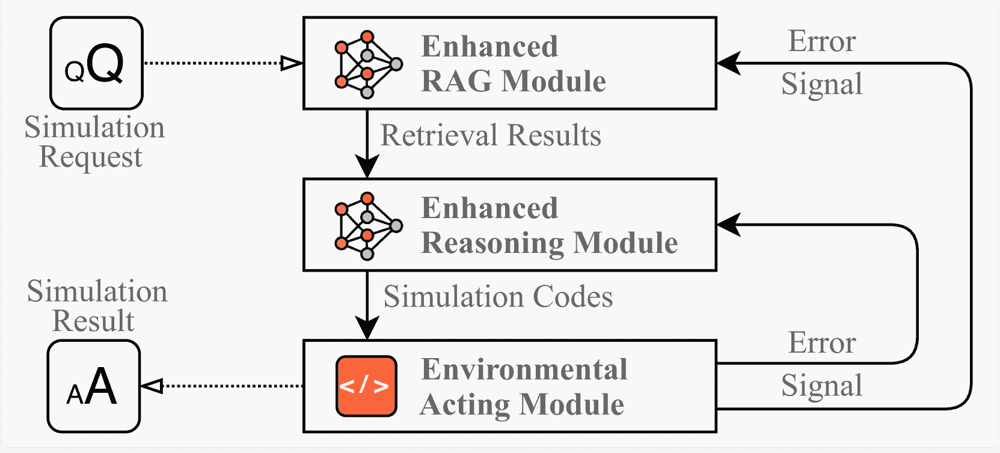
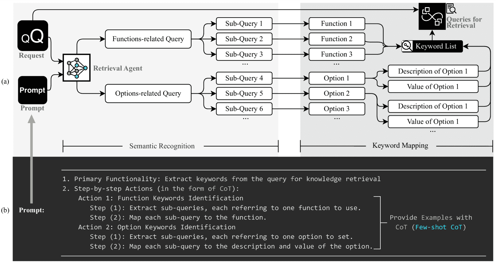
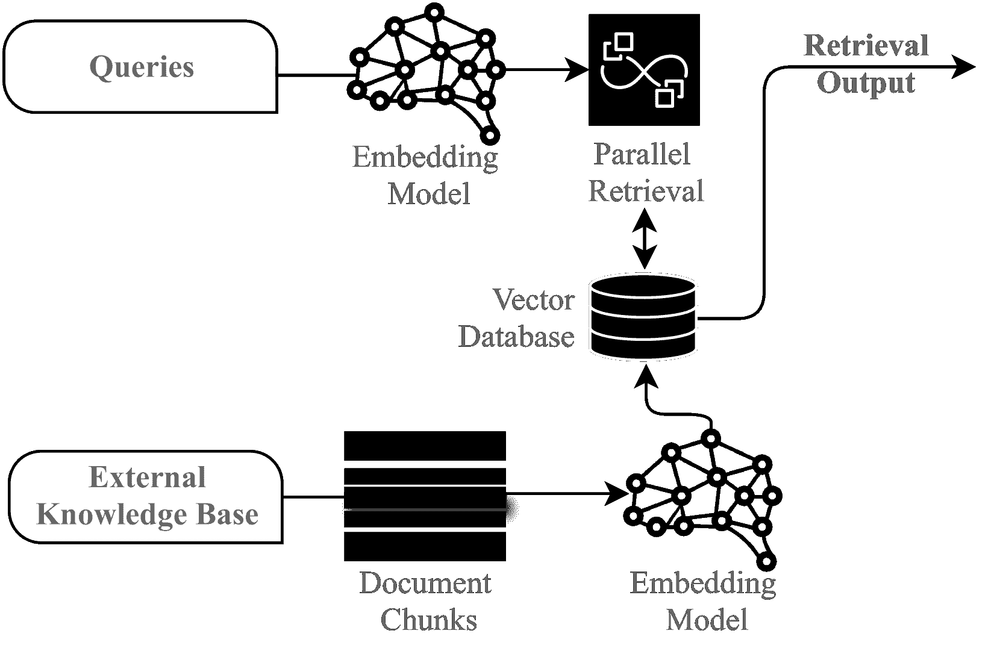
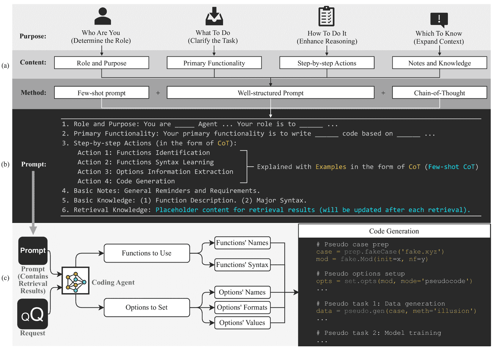
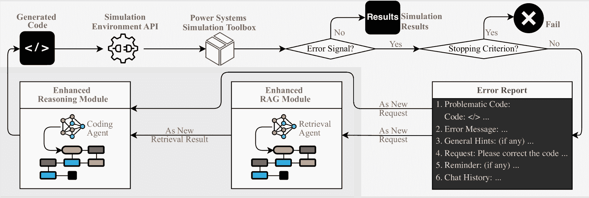
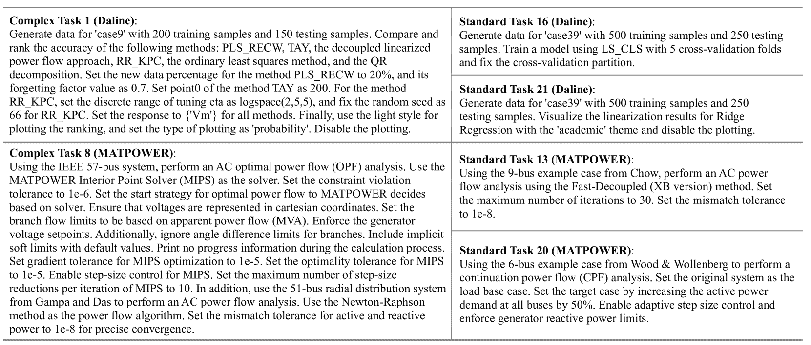
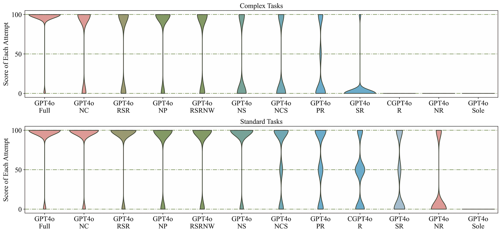
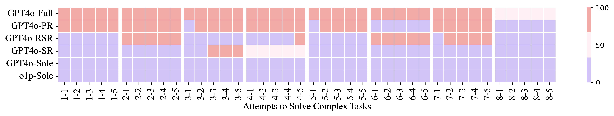
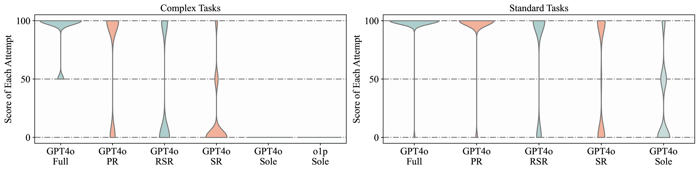
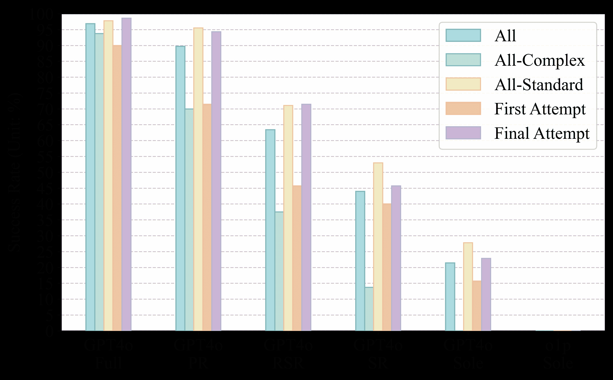

<!--yml

分类：未分类

日期：2025-01-11 11:53:42

-->

# 强化大语言模型在电力系统仿真中的应用：一个基于反馈驱动的多智能体框架

> 来源：[https://arxiv.org/html/2411.16707/](https://arxiv.org/html/2411.16707/)

Mengshuo Jia、Zeyu Cui 和 Gabriela Hug

###### 摘要

将实验技术与大语言模型（LLMs）结合，正在改变科学研究，推动人工智能成为一个多功能的研究助手，而非仅仅是一个问题求解工具。然而，在电力系统领域，仿真管理作为一种重要的实验技术，仍然是大语言模型面临的一大挑战，因为它们在领域特定知识、推理能力有限以及仿真参数处理上不够精确。为了解决这些问题，我们提出了一个基于反馈驱动的多智能体框架，框架中包含三个提出的模块：增强型检索增强生成（RAG）模块、改进的推理模块和带有误差反馈机制的动态环境作用模块。在Daline和MATPOWER的69个多样化任务上进行验证后，该框架分别达到了93.13%和96.85%的成功率，显著超越了最新的大语言模型（ChatGPT 4o和o1-preview），后者在标准仿真任务上的成功率为27.77%，在复杂任务上的成功率为0%。此外，我们的框架还支持快速、低成本的任务执行，每次仿真大约在30秒内完成，令令牌的平均成本为0.014美元。总体而言，这一可适应的框架为开发基于智能大语言模型的助手奠定了基础，促进了电力系统研究及其他领域的发展。

###### 关键词：

大语言模型、智能体、电力系统、仿真、增强检索生成、推理

## 引言

将实验室自动化技术与大语言模型（LLMs）结合，可以实现科学实验的自动化执行[[1](https://arxiv.org/html/2411.16707v1#bib.bib1)]。相关的进展涵盖了数学、化学和临床研究领域，包括数学算法的演化[[2](https://arxiv.org/html/2411.16707v1#bib.bib2)]、几何定理证明[[3](https://arxiv.org/html/2411.16707v1#bib.bib3)]、化学实验设计与执行[[1](https://arxiv.org/html/2411.16707v1#bib.bib1)]，以及临床研究中机器学习方法的开发与验证[[4](https://arxiv.org/html/2411.16707v1#bib.bib4)]。这些最新的成就标志着一种新的研究范式，定位人工智能为具有自然语言沟通能力的研究助手，而不仅仅是过去那种专门的难题求解者。将大语言模型确立为研究助手，还具有推动电力系统研究的重要潜力。

鉴于电力系统研究中对仿真工具的高度依赖，开发基于LLM的助手工具需要为LLMs提供执行电力系统仿真的能力。使LLMs能够执行仿真任务具有多重意义：（i）在助手层面，能够进行仿真的LLMs将使研究人员能够更多地专注于创意密集型的活动，如仿真设计，而非像仿真实施那样的劳动密集型任务。（ii）在接口层面，执行仿真的LLMs可能会提供一个自然语言接口。该接口能够通过自然语言作为输入/输出，将仿真任务与其他上游/下游电力系统任务连接起来。特别是在这些任务的原始输入和输出是异构的（例如，不同的模态）并且使用常规代码编程时难以实现统一时，这种接口非常有用。（iii）在编码层面，执行仿真的LLMs可能是电力系统中自然语言编码的一步。这可能标志着编程的演变，将编程推向更直观、语言驱动的方法，这是编程发展几十年来的一个长期目标。

然而，LLMs本质上缺乏执行电力系统仿真的能力。对于那些未包含在LLM预训练数据集中的新开发仿真工具，LLMs通常无法准确执行这些仿真。即便是那些已包含在预训练数据中的成熟工具，仿真精度依然不令人满意。例如，尽管GPT-4的预训练数据集中有关于OpenDSS和（最优）潮流的信息，但GPT-4在使用OpenDSS创建小型配电网[[5](https://arxiv.org/html/2411.16707v1#bib.bib5)]或编写简单（最优）潮流问题的代码[[6](https://arxiv.org/html/2411.16707v1#bib.bib6)]时，仍然存在困难。虽然这一问题的根本原因在能源领域尚未得到广泛讨论和认可，但我们提出以下因素作为可能的解释：

+   •

    频率：电力系统领域特定知识在LLM训练数据集中出现的频率较低——特别是在那些很少遇到的数据的长尾部分——这限制了模型在专门仿真任务中的泛化能力[[7](https://arxiv.org/html/2411.16707v1#bib.bib7)]。

+   •

    质量：在现有的开源数据中，缺乏与电力系统仿真相关的高质量、经过指令调优或基于查询的编码数据。缺失的代码注释使得大型语言模型（LLMs）难以充分理解和操作电力系统仿真。

+   •

    复杂性：复杂电力系统仿真所需的多步骤推理本质上具有挑战性，特别是在模型学习到的模式中，电力系统仿真呈现出稀疏或模糊的表现时。

+   •

    精确性：精确识别仿真参数、函数及其逻辑关系，对大语言模型（LLM）提出了很高的要求，尤其是在LLM对仿真知识了解不完全或存在碎片化的情况下。这可能导致语义漂移，使LLM生成的代码逐渐偏离准确版本。

图1：基于反馈的多智能体框架。它由一个增强的RAG模块、一个先进的推理模块和一个环境交互模块组成，所有模块通过错误反馈机制互联。这一框架通过融入特定于仿真的知识，支持反复迭代改进，提升复杂仿真任务的推理能力，并促进环境交互以生成准确的仿真结果。

尽管如上所述有多种应用，但只有少数研究专门关注使用LLM进行电力系统仿真。然而，这些研究仅仅集中于构思LLM在仿真领域的潜力[[17](https://arxiv.org/html/2411.16707v1#bib.bib17)]，展示了它们在当前的能力[[18](https://arxiv.org/html/2411.16707v1#bib.bib18), [17](https://arxiv.org/html/2411.16707v1#bib.bib17)]，并评估了它们在生成电力系统研究的通用代码方面的有效性[[5](https://arxiv.org/html/2411.16707v1#bib.bib5), [6](https://arxiv.org/html/2411.16707v1#bib.bib6)]。尽管这些研究提供了有价值的见解，但它们并没有解决之前提到的限制，限制了LLM在仿真中的表现。尽管在[[19](https://arxiv.org/html/2411.16707v1#bib.bib19), [17](https://arxiv.org/html/2411.16707v1#bib.bib17), [6](https://arxiv.org/html/2411.16707v1#bib.bib6)]中使用的标准RAG方法确实使得LLM能够融合外部电力系统知识，但它并不适用于仿真任务。这是因为标准RAG基于整个请求作为一个单元来检索信息，这未能捕捉到复杂仿真请求的细微结构，常常将不同的功能相关和选项相关的元素混淆，从而导致效率低下和检索准确性降低。因此，现有工作未能系统地发展和提升LLM处理复杂电力系统仿真的能力。

为了弥合这一差距并增强LLM在电力系统仿真中的能力，本文提出了一个模块化、基于反馈的多智能体框架，该框架整合了几种创新策略，如图[1](https://arxiv.org/html/2411.16707v1#S1.F1 "图1 ‣ I 引言 ‣ 增强LLM用于电力系统仿真：一个基于反馈的多智能体框架")所示。因此，本文的贡献如下：

+   •

    我们提出了一种增强的RAG模块，具有自适应查询规划策略和基于三元组的结构（即链接选项、功能及其依赖关系）用于知识库。该模块不仅以高效且具有成本效益的方式扩展了LLM可访问的知识，而且使得LLM能够比标准RAG更好地识别和解释仿真功能、选项及其逻辑关系。

+   •

    我们通过利用特定于仿真的专业知识、思维链提示（CoT）和少量示例提示，开发了增强型推理模块。该模块使大型语言模型（LLMs）能够全面理解其角色、分配的任务、推理路径以及仿真任务中的上下文知识（包括检索到的信息），从而在生成仿真代码时增强其推理能力。

+   •

    我们进一步提出了一个反馈驱动的多智能体框架，将增强型RAG和推理模块与环境交互和错误修正机制整合在一起。该框架既促进了行动执行，又支持反馈接收，提供响应性的错误信号，启动适应性调整，使RAG和推理模块能够自动纠正错误，从而提高仿真结果的可靠性。

+   •

    通过在各种策略、仿真环境和多种任务中的测试，我们揭示了即使是最新的LLM（如o1-preview）在处理电力系统仿真任务时也存在困难，包括涉及MATPOWER等成熟工具的任务，尽管这些内容在LLM的预训练中已有涉及。我们进一步揭示，高仿真成功率依赖于多种策略的累积效果。基于这一思路，我们的框架展现了较高的成功率，使得任务能够高效、快速地完成，从而为电力系统研究人员提供了一个可扩展的工具。

本文作为我们在[[20](https://arxiv.org/html/2411.16707v1#bib.bib20)]中初步工作的重大扩展，结构安排如下：第二节介绍了增强型RAG模块。第三节展示了增强型推理模块，第四节描述了具有反馈机制的环境交互模块。最后，第五节展示了案例研究结果，第六节总结了本文的关键发现和未来展望。

## II 增强型RAG模块

作为一种高效且可扩展的外部知识整合方法，RAG由三个关键步骤组成：外部知识切块（将文档拆分成更小的片段）、文本嵌入（使用神经网络如text2vec将文本转换为向量）和信息检索（在向量空间中找到与查询相匹配的信息）[[6](https://arxiv.org/html/2411.16707v1#bib.bib6)]。图[3](https://arxiv.org/html/2411.16707v1#S2.F3 "图3 ‣ II 增强型RAG模块 ‣ 通过反馈驱动的多智能体框架提升LLM在电力系统仿真中的应用")展示了一个通用的RAG图示。然而，对于电力系统仿真，出现了几个关键问题：（i）应使用什么类型的查询进行检索？以及（ii）应使用什么知识库作为检索的存储库？解决这些问题揭示了两个主要领域，以增强RAG在仿真任务中的效果。

为此，我们提出了一种增强型RAG模块。该模块专门设计用于将电力系统仿真知识集成到LLM中，并减少幻觉现象。该模块强调在仿真请求中识别关键字，以便比标准RAG实现更精确的知识检索。它包括两个主要组件：（i）自适应查询规划策略，和（ii）基于三元组的知识库结构设计。通过这两个组件，提供了一个增强型RAG，用于处理复杂的电力系统仿真任务。

图2：用于仿真任务的增强型RAG模块。（a）检索代理将仿真请求分解为与功能相关和与选项相关的子查询，并映射到特定功能和选项上，以实现基于关键字的精确检索。（b）结构化提示设计，详细说明通过少量示例的链式推理（CoT）提取关键字的步骤。

图3：通用RAG图示，包含外部知识块划分、文本嵌入和在向量数据库中并行检索的过程，以根据输入查询和外部知识库生成相关的检索输出。本研究中使用的文本嵌入模型来自[[此处]](https://help.aliyun.com/zh/dashscope/developer-reference/text-embedding-quick-start?spm=a2c4g.11186623.0.0.5695f97eD8MhdE)。

### II-A 自适应查询规划

本节讨论了应使用何种类型的查询进行检索。在标准RAG方法中，整个仿真请求作为一个整体进行处理，这如前所述（并将在案例研究中展示），会将请求中的不同元素混淆，导致低效并降低检索准确性。实际上，仿真请求通常包含两个关键元素：要使用的功能和要设置的选项。因此，我们建议将功能和选项作为独立的检索查询。然而，这些元素在仿真请求中很少明确指出；相反，它们通常嵌入在自然语言描述中。

为了解决这个问题，我们开发了一种基于代理的自适应查询规划策略，如图[2](https://arxiv.org/html/2411.16707v1#S2.F2 "图2 ‣ II 增强型RAG模块 ‣ 增强LLM在电力系统仿真中的应用：基于反馈的多代理框架")(a)所示，该策略自动从更广泛的请求中提取与功能和选项相关的查询，作为检索关键词。该策略分为两个阶段：语义识别和关键词映射，由检索代理（例如，一般LLM）执行。在语义识别阶段，代理将请求分类为两种查询类型：与功能相关的查询和与选项相关的查询。每个与功能相关的查询随后被分解为子查询，每个子查询对应一个潜在的仿真功能。类似地，与选项相关的查询被分解为子查询，每个子查询与一个潜在的选项配置相关联。这种系统化的分离确保了请求中每个组件的独立处理。

在语义识别之后，关键词映射阶段将每个已识别的功能和选项子查询与其精确的关键词对齐。对于功能，关键词是功能的名称。对于选项，子查询进一步与其相应的描述和值相关联。最终，提取出的功能、选项描述和值作为并行检索查询输入。

为了使检索代理能够有效地执行语义识别和关键词映射，我们设计了一个结构化的通用行动提示，结合了链式思维提示（CoT）[[21](https://arxiv.org/html/2411.16707v1#bib.bib21)]和少量示例提示[[22](https://arxiv.org/html/2411.16707v1#bib.bib22)]（即少量示例CoT），如图[2](https://arxiv.org/html/2411.16707v1#S2.F2 "图2 ‣ II 增强型RAG模块 ‣ 增强LLM在电力系统仿真中的应用：基于反馈的多代理框架")(b)所示。只有少量示例依赖于工具，使其具有模块化和易于适配的特点，而其余提示保持通用，独立于具体的仿真工具。

### II-B 基于三元组的知识库结构设计

在本节中，我们讨论了应该选择哪个知识库作为检索库。尽管每个电力系统仿真工具都包含带有详细说明的用户手册，但该手册并不是理想的检索库。原因有两个：（i）用户手册是为了便于人类阅读而设计的，而非为了自动化检索；虽然可读性较强，但其结构松散，对于机器驱动的查询效率低下，尤其是当手册主要由公式、表格和图形组成时。（ii）LLM在生成仿真代码时的主要挑战是理解选项和功能之间的逻辑依赖关系，因为许多选项依赖于功能。仅使用用户手册进行检索无法有效捕捉这些复杂关系。

为了克服这些问题，我们提出了一种额外的、易于构建的检索库：基于三元组的结构化选项文档。在该文档中，每一行代表一个选项，按顺序提供以下结构化信息：（i）选项名称，（ii）默认值/格式，（iii）功能依赖关系，以及（iv）选项描述。三元组的包含（iii）—将每个选项、相关功能及其依赖关系连接起来—使得逻辑关系的检索成为可能。正如案例研究中所展示的那样，这种补充库显著提高了检索效率，并通过保留逻辑上下文提高了仿真代码生成的准确性。

## III 增强型推理模块

尽管增强型RAG模块为大语言模型（LLM）提供了针对仿真请求量身定制的检索结果，但仍然需要强化LLM的推理能力，以便根据检索结果生成正确的仿真代码。这需要一个编码代理（即另一个LLM）来编写仿真任务的代码。该代理需要充分理解自己的角色、分配的任务、推理路径以及处理仿真任务时所需的上下文知识，包括检索结果。

为了解决这一问题，我们提出了一个增强型推理模块，如图[4](https://arxiv.org/html/2411.16707v1#S3.F4 "Figure 4 ‣ III Enhanced Reasoning Module ‣ Enhancing LLMs for Power System Simulations: A Feedback-driven Multi-agent Framework")所示。该模块提供结构化指导、顺序推理步骤和上下文知识，以支持编码代理准确生成代码。详细信息如下。

图4：仿真代码生成的增强型推理模块：（a）核心概念，定义编码代理的角色、分配的任务、推理路径和上下文知识。（b）配备少量样本CoT的结构化提示设计，以增强代理的仿真推理能力。（c）编码代理工作流程，整合设计的提示和仿真请求生成仿真代码。

### III-A 角色与功能定义

部署在该模块中的代理被指定为特定仿真工具的仿真编码代理。其主要功能是生成符合语法规范的仿真代码，符合特定任务要求、静态提供的知识和动态检索到的知识。

### III-B 推理框架

为了实现系统化、与工具无关的推理，我们开发了一个少量样本CoT框架，将仿真任务分解为以下通用操作：

+   •

    功能识别：确定与仿真任务相关的功能。

+   •

    功能语法学习：获取已识别功能的正确语法，确保符合仿真工具的要求。

+   •

    选项信息提取：识别选项并提取其格式、值和依赖关系，以保持与所选功能的一致性。

+   •

    代码生成：将所有提取的信息整合成符合任务规范并遵守语法要求的连贯仿真代码。

每一个这些操作都通过提示中的工具特定编码示例进一步说明。虽然这些示例依赖于工具，但其余框架保持通用。总体而言，上述推理框架再次强调了处理仿真任务的关键：正确识别和结合功能与选项。

### III-C 知识整合

上述推理操作在很大程度上依赖于来自仿真请求和补充知识的信息，这些信息包括：

+   •

    静态基础知识：为代理提供有关仿真工具相关的基本功能和语法规则的基础信息。这些静态知识作为基础参考，供代理在生成代码时查阅。请注意，这些知识是工具特定的。

+   •

    动态检索知识：提示中包含了用于动态检索增强型 RAG 模块结果的占位符，允许代理将请求特定的知识融入推理中。这些知识提供了有关功能依赖关系、选项格式以及生成准确代码所需的其他上下文元素的详细信息。

最终，通过整合静态和动态知识，以及上述结构化推理框架，代理预期能够生成准确的代码来处理仿真请求。

## IV 环境作用模块与反馈

尽管增强型 RAG 和推理模块带来了强化，编码代理在仿真代码生成过程中仍可能遇到错误。为了解决这一问题，必须启用 LLM 与仿真环境之间的直接互动，允许代理接收执行反馈并迭代地改进其代码。为此，我们提出了一种带有错误反馈机制的环境作用模块，该模块与 RAG 和推理模块集成，如图 [5](https://arxiv.org/html/2411.16707v1#S4.F5 "Figure 5 ‣ IV-B Error Handling and Feedback Loop ‣ IV Environmental Acting Module with Feedback ‣ Enhancing LLMs for Power System Simulations: A Feedback-driven Multi-agent Framework") 所示。该模块的组件将在以下部分进行描述。

### IV-A 代码执行与检测

由增强推理模块中的编码代理生成的仿真代码，通过连接到特定电力系统仿真工具的仿真环境 API 执行。执行后，仿真环境生成结果，接着检查是否存在错误信号。具体来说：

+   •

    如果检测到错误，代码将进入停止标准检查。如果停止标准被满足，则终止过程；如果未满足，模块将触发带有详细错误报告的反馈循环。

+   •

    如果未检测到错误，过程完成。

### IV-B 错误处理与反馈循环

在检测到模拟结果中的错误时，自动生成错误报告，其中包含：

+   •

    问题代码：引发错误的代码段。

+   •

    错误信息：错误的详细描述。

+   •

    一般提示：关于常见问题的额外指导。

+   •

    请求：为解决错误所需的具体修正。

+   •

    提示：如有其他约束或要求，请注明。

+   •

    聊天历史：之前交互和迭代的日志记录。

图5：带有错误反馈机制的环境作用模块，集成了RAG和推理模块。

表I：通过框架内提出的策略的不同组合评估的方案

（GPT4o：gpt-4o-2024-05-13的API；CGPT4o：ChatGPT4o Web界面；o1p：O1-preview Web界面）

|  | GPT4o 完整版 | GPT4o PR | GPT4o RSR | GPT4o SR | GPT4o Sole | GPT4o NC | GPT4o NP | GPT4o NS | GPT4o NR | GPT4o NCS | GPT4o RSRNW | CGPT4o R | o1p Sole |
| --- | --- | --- | --- | --- | --- | --- | --- | --- | --- | --- | --- | --- | --- |
| 查询规划 | ✓ | ✓ |  |  |  | ✓ | ✓ | ✓ |  | ✓ | ✓ |  |  |
| 基于三元组的结构化选项文档 | ✓ | ✓ | ✓ | ✓ |  | ✓ |  | ✓ |  | ✓ | ✓ | ✓ |  |
| 思维链提示 | ✓ |  | ✓ |  |  |  | ✓ | ✓ | ✓ |  | ✓ |  |  |
| 少量示例提示 | ✓ |  | ✓ |  |  | ✓ | ✓ |  | ✓ |  | ✓ |  |  |
| 静态基础知识 | ✓ |  | ✓ |  |  | ✓ | ✓ | ✓ | ✓ | ✓ | ✓ |  |  |
| 环境作用与反馈 | ✓ | ✓ | ✓ | ✓ | ✓ | ✓ | ✓ | ✓ | ✓ | ✓ | ✓ | ✓ | ✓ |
| 提出的RAG | ✓ | ✓ |  |  |  | ✓ | ✓ | ✓ |  | ✓ | ✓ |  |  |
| 标准RAG |  |  | ✓ | ✓ |  |  |  |  |  |  |  |  |  |
| OpenAI内置RAG |  |  |  |  |  |  |  |  |  |  |  | ✓ |  |
| 完善的错误报告系统 | ✓ | ✓ | ✓ | ✓ | ✓ | ✓ | ✓ | ✓ | ✓ | ✓ |  | ✓ | ✓ |

### IV-C 增强型RAG与推理模块的相互作用

错误报告和反馈随后由增强型RAG模块中的检索代理作为新的请求进行处理。该代理根据错误报告检索相关信息（查询规划也可以通过简单地将功能/选项关键字的识别替换为错误相关关键字的识别来应用于错误报告）。然后，检索到的信息被传递到增强推理模块，在那里编码代理将检索结果和修正请求结合起来，修正模拟代码。循环继续，直到代码满足两个要求，或直到满足停止标准为止。

## V 案例研究

为了全面验证所提出的框架，我们进行了一系列测试，涵盖三个关键维度：（i）框架内提出的策略的不同组合，以评估每个策略的独立有效性；（ii）不同的仿真环境，特别是Daline [[23](https://arxiv.org/html/2411.16707v1#bib.bib23)]和MATPOWER [[24](https://arxiv.org/html/2411.16707v1#bib.bib24)]，这些工具既有LLMs¹¹1Daline可在[[此处]](https://www.shuo.science/daline)获得，用户手册见[[25](https://arxiv.org/html/2411.16707v1#bib.bib25)]。MATPOWER可在[[此处]](https://matpower.org/)获得，用户手册见[[26](https://arxiv.org/html/2411.16707v1#bib.bib26)]，用以展示框架在不同应用中的多样性；（iii）一系列不同的仿真任务，涵盖从普通到复杂的场景，评估框架在各种仿真需求下的表现。

以下部分详细介绍了案例研究配置，接着分析了Daline和MATPOWER的仿真结果。最终，讨论了使用LLMs进行电力系统仿真的成本。

### V-A 设置

首先，表[I](https://arxiv.org/html/2411.16707v1#S4.T1 "TABLE I ‣ IV-B Error Handling and Feedback Loop ‣ IV Environmental Acting Module with Feedback ‣ Enhancing LLMs for Power System Simulations: A Feedback-driven Multi-agent Framework")展示了在评估中使用的框架内提出的不同策略组合，所提策略以灰色标示。

其次，本文选择Daline [[23](https://arxiv.org/html/2411.16707v1#bib.bib23)]和MATPOWER [[24](https://arxiv.org/html/2411.16707v1#bib.bib24)]作为仿真环境。需要注意的是，Daline是在用于评估的LLMs的最新更新之后发布的，而已建立的工具MATPOWER已被包含在LLMs的训练数据集中。因此，这两个环境涵盖了LLMs既见过又未见过的场景，允许我们展示框架的多样性。

第三，使用了34个仿真任务对框架进行测试，其中Daline包含7个复杂任务和27个标准任务。类似地，对于MATPOWER，定义了35个仿真任务，其中包括8个复杂任务和27个标准任务。这些任务全面覆盖了两个仿真工具的功能，旨在包括大部分可用选项。图[6](https://arxiv.org/html/2411.16707v1#S5.F6 "Figure 6 ‣ V-A Settings ‣ V Case Study ‣ Enhancing LLMs for Power System Simulations: A Feedback-driven Multi-agent Framework")中给出了部分代表性任务，作为示范性概览。

图6：Daline和MATPOWER的仿真任务代表性示例。

最后，对于性能评估，每个方案最多允许进行$N_{max}$次模拟任务尝试（Daline的$N_{max}=3$，MATPOWER的$N_{max}=5$，因为后者相对更复杂）。每次尝试如果能获得完全正确的模拟结果且代码中没有不相关的设置，则获得100分；如果模拟结果正确但代码中有不相关的设置，则获得50分；若模拟结果错误，则得0分。如果前一次尝试发生执行错误，则才会进行后续尝试，且未使用的尝试与最后一次尝试的得分相同。每个方案的成功率定义为获得的总分除以最大可能得分，得出的成功率介于0%和100%之间。

### V-B 评估：Daline

对Daline的评估结果如图[7](https://arxiv.org/html/2411.16707v1#S5.F7 "Figure 7 ‣ V-B Evaluation on Daline ‣ V Case Study ‣ Enhancing LLMs for Power System Simulations: A Feedback-driven Multi-agent Framework")和图[8](https://arxiv.org/html/2411.16707v1#S5.F8 "Figure 8 ‣ V-B Evaluation on Daline ‣ V Case Study ‣ Enhancing LLMs for Power System Simulations: A Feedback-driven Multi-agent Framework")所示。图[7](https://arxiv.org/html/2411.16707v1#S5.F7 "Figure 7 ‣ V-B Evaluation on Daline ‣ V Case Study ‣ Enhancing LLMs for Power System Simulations: A Feedback-driven Multi-agent Framework")展示了每个评估方案在不同尝试中的得分分布，区分了复杂任务和标准任务。图[8](https://arxiv.org/html/2411.16707v1#S5.F8 "Figure 8 ‣ V-B Evaluation on Daline ‣ V Case Study ‣ Enhancing LLMs for Power System Simulations: A Feedback-driven Multi-agent Framework")展示了每个方案的成功率，按“所有任务合并”、“仅复杂任务”、“仅标准任务”以及“第一次尝试成功率”和“最后一次尝试成功率”列出。以下将从多个角度对这些评估结果进行分析。

图7：每个评估方案在不同尝试中的得分分布，按复杂任务和标准任务分开（模拟环境：Daline）。

图8：每个方案的成功率，按所有任务合并、仅复杂任务、仅标准任务以及第一次尝试成功率和最后一次尝试成功率列出（模拟环境：Daline）。

#### V-B1 原始能力与增强能力

虽然GPT4o-Sole配备了环境互动和反馈机制，但它在复杂任务和标准任务中的成功率仍为0%，这表明GPT4o以前未曾遇到过Daline。即使有了通过标准RAG或OpenAI官方RAG支持的完整知识库，所产生的方案GPT4o-SR和CGPT4o-R在所有任务中的成功率也仅为31.37%和33.82%。这表明，即使有RAG支持，最新的语言模型GPT4o在模拟中的表现仍不可靠。相比之下，配备我们提议的完整框架的方案GPT4o-Full在所有任务中的成功率达到了93.13%——这一显著的改进突显了所提框架的有效性。

#### V-B2 完全装备与较少装备

GPT4o-Full在所有任务中的高成功率93.13%是由于采用了完整的提议框架的累积效应。将其他方案与GPT4o-Full进行比较，可以揭示省略策略的影响。例如，尽管GPT4o-NP包含了大多数推理增强策略，但它缺少基于三元组的结构化选项文档，导致成功率降至81.37%。另一方面，省略少量示例的链式思维（CoT）推理，如GPT4o-NCS所示，成功率降至65.19%。当采用少量示例的链式思维推理，但省略了我们提议的查询规划，如GPT4o-RSR所示，复杂任务的成功率降至66.67%，尤其是在复杂任务的性能下降的情况下。虽然在所有方案中都可以做类似的比较，但我们在此的目标不是争论哪种策略提供了最高的改进，而是强调高成功率依赖于多种策略的组合效果。

#### V-B3 复杂任务与普通任务

一般来说，更复杂的任务——即包含多个子请求的任务——往往会增加大型语言模型（LLMs）出错的可能性，导致其成功率低于标准任务，这一点在大多数方案中都有观察到。然而，通过我们提出的完整框架GPT4o-Full，复杂任务与标准任务之间的性能差距显著缩小，正如图[7](https://arxiv.org/html/2411.16707v1#S5.F7 "Figure 7 ‣ V-B Evaluation on Daline ‣ V Case Study ‣ Enhancing LLMs for Power System Simulations: A Feedback-driven Multi-agent Framework")中的得分分布和图[8](https://arxiv.org/html/2411.16707v1#S5.F8 "Figure 8 ‣ V-B Evaluation on Daline ‣ V Case Study ‣ Enhancing LLMs for Power System Simulations: A Feedback-driven Multi-agent Framework")中的成功率所示。这表明，凭借增强的推理能力和更有效的RAG设计，GPT4o-Full能够有效识别并解决复杂任务中的子请求，类似于它处理标准任务的方式。这使得LLMs能够更好地管理复杂任务。

#### V-B4 初次尝试与最终尝试

首次尝试和最终尝试的成功率比较，展示了环境交互和反馈机制的有效性。如图[8](https://arxiv.org/html/2411.16707v1#S5.F8 "图8 ‣ V-B 评估 ‣ V 案例研究 ‣ 提升大语言模型在电力系统仿真中的表现：基于反馈的多代理框架")所示，最终尝试的成功率总是高于首次尝试的成功率，特别是对于那些采用我们框架中较少策略的方案。这些方案通常要么推理能力较弱，要么检索信息有限，因此环境交互和反馈对错误修正至关重要。然而，对于GPT4o-Full，首次尝试和最终尝试之间的成功率差异相对较小，因为GPT4o-Full通常在首次尝试时就能成功完成Daline仿真任务。这进一步突显了我们提出的框架的有效性。有一点值得注意的是，自动错误修正的效果在一定程度上受到仿真工具错误报告系统质量的影响——即它是否提供清晰、代码特定的错误信息。这个特性会影响大语言模型（LLM）解析和解决生成代码问题的能力。如果没有这样的功能，如GPT4o-RSRNW所示，成功率下降到78.43%，且首次和最终尝试之间的改进微乎其微。这突显出在没有良好开发的错误报告系统的情况下，迭代改进可能带来有限的效果。虽然Daline和MATPOWER等工具具备完善的错误报告系统（从而实现较高的修正准确率），但对于其他错误报告系统不完善的仿真工具，建议加强此类系统的开发。事实上，我们的框架还使得LLM能够检测仿真工具错误报告系统中的漏洞，特别是在出现错误时。这些错误可能并非源于LLM或框架本身的局限性，而是工具设计中固有的问题。

图9：每个评估方案在处理复杂任务时，各次尝试中的得分。在初次尝试遇到错误时，自动错误修正机制有助于配备我们框架的方案（如GPT4o-PR）修正其行为。

图10：针对每个评估方案，在各次尝试中的得分分布，按复杂任务和标准任务分开（仿真环境：MATPOWER）。

图11：各方案的成功率，按所有任务组合、仅复杂任务、仅标准任务，以及首次尝试成功率和最终尝试成功率分类（仿真环境：MATPOWER；o1p-Sole仅通过复杂任务进行测试）。

### V-C 在MATPOWER上的评估

MATPOWER上的评估结果如图[9](https://arxiv.org/html/2411.16707v1#S5.F9 "图9 ‣ V-B4 初次尝试与最终尝试 ‣ V-B 在Daline上的评估 ‣ V 案例研究 ‣ 通过反馈驱动的多智能体框架增强LLMs用于电力系统仿真")、[10](https://arxiv.org/html/2411.16707v1#S5.F10 "图10 ‣ V-B4 初次尝试与最终尝试 ‣ V-B 在Daline上的评估 ‣ V 案例研究 ‣ 通过反馈驱动的多智能体框架增强LLMs用于电力系统仿真")和[11](https://arxiv.org/html/2411.16707v1#S5.F11 "图11 ‣ V-B4 初次尝试与最终尝试 ‣ V-B 在Daline上的评估 ‣ V 案例研究 ‣ 通过反馈驱动的多智能体框架增强LLMs用于电力系统仿真")展示。具体来说，图[9](https://arxiv.org/html/2411.16707v1#S5.F9 "图9 ‣ V-B4 初次尝试与最终尝试 ‣ V-B 在Daline上的评估 ‣ V 案例研究 ‣ 通过反馈驱动的多智能体框架增强LLMs用于电力系统仿真")呈现了每个评估方案在管理复杂任务时的单独尝试得分。图[10](https://arxiv.org/html/2411.16707v1#S5.F10 "图10 ‣ V-B4 初次尝试与最终尝试 ‣ V-B 在Daline上的评估 ‣ V 案例研究 ‣ 通过反馈驱动的多智能体框架增强LLMs用于电力系统仿真")展示了各方案在不同尝试中的得分分布，图[11](https://arxiv.org/html/2411.16707v1#S5.F11 "图11 ‣ V-B4 初次尝试与最终尝试 ‣ V-B 在Daline上的评估 ‣ V 案例研究 ‣ 通过反馈驱动的多智能体框架增强LLMs用于电力系统仿真")则描绘了各方案的成功率。这里观察到的结果与在Daline上的结果非常一致，使得我们在接下来的讨论中主要聚焦于不同方案之间的比较分析。

#### V-C1 原始能力与增强能力

尽管MATPOWER是一个广泛使用并且文档完备的工具，且在网上有大量的资源可供查阅，最新的高性能LLMs，如GPT4o和o1-preview（以推理能力著称），在执行仿真时仍难以可靠地表现。例如，GPT4o-Sole和o1p-Sole在复杂任务上的成功率为0%，而GPT4o-Sole在标准任务上仅取得27.77%的成功率。即使使用了RAG和完整的知识库，GPT4o-SR在复杂任务上的成功率也仅为13.75%，在标准任务上为52.96%。相比之下，完全装备的框架GPT4o-Full在所有任务上的成功率达到了惊人的96.85%，其中复杂任务的成功率为93.75%，标准任务的成功率为97.77%，这突显了该框架的高效性。

#### V-C2 完全装备与较少装备

与Daline的结果一致，MATPOWER的结果表明，高成功率依赖于多种策略的协同效应。例如，排除增强推理模块（如GPT4o-PR中所做的）会导致整体成功率下降至89.71%，复杂任务的成功率进一步下降至70.00%。类似地，省略提出的查询规划策略（如GPT4o-RSR中所做的）会使整体成功率降至63.42%，复杂任务的成功率降至37.50%。这些结果明显低于GPT4o-Full的表现，后者在复杂任务中的成功率为93.75%，在标准任务中的成功率为97.77%，这表明框架中每个组件的关键作用。

表II：GPT4o-Full每个任务的平均成本分析

| 环境 | 时间（秒） | 输入代币 | 输出代币 | 费用（美元） |
| --- | --- | --- | --- | --- |
| Daline | 29.446 | 7882.294 | 168.353 | 0.014 |
| MATPOWER | 32.703 | 5338.514 | 274.371 | 0.013 |

### V-D 成本分析

GPT4o-Full在Daline和MATPOWER中执行仿真任务的成本分析见表[II](https://arxiv.org/html/2411.16707v1#S5.T2 "TABLE II ‣ V-C2 Fully Equipped vs. Less Equipped ‣ V-C Evaluation on MATPOWER ‣ V Case Study ‣ Enhancing LLMs for Power System Simulations: A Feedback-driven Multi-agent Framework")，表中显示了所有任务的平均值。报告的时间涵盖了整个过程，包括检索、推理、代码生成、仿真执行、结果汇总以及在必要时进行的代码修正。值得注意的是，GPT4o-Full完成每个任务的时间大约为半分钟。此外，每个任务的代币费用大约为0.014美元。

值得注意的是，除了并行检索外，本框架未使用任何专门的加速技术。因此，尽管性能已经令人满意，但仍然有很大的速度提升潜力。即便在当前状态下，未采用任何特定的加速策略，GPT4o-Full也可以在Daline和MATPOWER中每小时执行大约120个仿真任务，总代币费用约为1.68美元。鉴于这种高效性和成本效益，我们的框架为提高研究人员的生产力提供了一个有前景的路径。

## VI 结论

本文通过提出一个基于反馈驱动的多智能体框架，解决了增强LLM在电力系统仿真中的研究空白，代表了第一个系统性的方法，显著提高了LLM在常用工具和新工具中的仿真能力。通过在来自Daline和MATPOWER的69个不同仿真任务中验证，我们的框架实现了显著的性能提升，成功率分别为93.13%和96.85%，远远超出了基准方案的表现，包括最新的LLM，o1-preview。主要发现包括：（i）LLM的原始仿真能力有限，GPT4o和o1-preview的成功率最高也仅为27.77%。（ii）即使采用标准的RAG模块和综合知识库，LLM的整体成功率仍低于45%，这凸显了需要更为全面的方法。（iii）我们的框架高成功率的来源于增强的RAG、增强的推理能力、环境行为和反馈机制的协同整合。去除其中任何一个元素都会导致性能大幅下降。（iv）我们的框架使LLM能够高效执行任务，每个任务约30秒完成，令令牌成本仅为0.014美元，提供了一个可扩展、具成本效益的解决方案，提升了电力系统中人类科学家的生产力。

然而，仍然存在一些关键的未来挑战：（i）开发自动评估未标定结果的方法，以提高可靠性和自主性。（ii）扩展框架以同步多个仿真工具，解决更具挑战性的任务。（iii）由于100%的准确率尚未实现，因此需要集成错误检测机制，标记不确定性并告知研究人员潜在的不准确性。总的来说，我们的工作是实现基于智能LLM的研究助手这一长期目标的初步步骤，前景广阔。

## 致谢

我们要感谢ChatGPT-4o [[27](https://arxiv.org/html/2411.16707v1#bib.bib27)] 对本文的语言润色提供的帮助。

## 参考文献

+   [1] D. A. Boiko, R. MacKnight, B. Kline, 和 G. Gomes, “利用大型语言模型进行自主化学研究，” *自然*，第624卷，第7992期，页码570–578，2023年。

+   [2] B. Romera-Paredes, M. Barekatain, A. Novikov, M. Balog, M. P. Kumar, E. Dupont, F. J. Ruiz, J. S. Ellenberg, P. Wang, O. Fawzi *等*， “通过大型语言模型的程序搜索发现数学定理，” *自然*，第625卷，第7995期，页码468–475，2024年。

+   [3] T. H. Trinh, Y. Wu, Q. V. Le, H. He, 和 T. Luong, “无需人工演示即可解决奥林匹克几何问题，” *自然*，第625卷，第7995期，页码476–482，2024年。

+   [4] S. Tayebi Arasteh, T. Han, M. Lotfinia, C. Kuhl, J. N. Kather, D. Truhn, 和 S. Nebelung, “大型语言模型简化了临床研究中的自动化机器学习，” *自然通讯*，第15卷，第1期，页码1603，2024年。

+   [5] R. S. Bonadia, F. C. Trindade, W. Freitas, 和 B. Venkatesh, “ChatGPT在使用OpenDSS进行负荷流研究时生成配电系统的潜力，” *IEEE 电力系统学报*，2023年。

+   [6] L. Dong, S. Majumder, F. Doudi, Y. Cai, C. Tian, D. Kalathi, K. Ding, A. A. Thatte, 和 L. Xie, “探索大型语言模型在电力能源领域的能力与局限性，” *arXiv 预印本 arXiv:2403.09125*，2024年。

+   [7] H. Chang, J. Park, S. Ye, S. Yang, Y. Seo, D.-S. Chang, 和 M. Seo, “大型语言模型在预训练过程中如何获取事实性知识？” *arXiv 预印本 arXiv:2406.11813*，2024年。

+   [8] Z. Yan 和 Y. Xu, “带语言约束的实时最优潮流：集成GPT代理与深度强化学习，” *IEEE 电力系统学报*，2023年。

+   [9] B. Zhang, C. Li, G. Chen, 和 Z. Dong, “基于大型语言模型的电池储能系统在频率控制辅助服务市场的最优竞价：一种基于AI代理的方法，” *arXiv 预印本 arXiv:2406.00974*，2024年。

+   [10] C. Huang, S. Li, R. Liu, H. Wang, 和 Y. Chen, “电力系统的大型基础模型，” 载于 *2024 IEEE 电力与能源学会年会 (PESGM)*。 IEEE，2024年，第1–5页。

+   [11] H. Wang, Z. Chen, N. Shang, S. Yao, Z. Pan, F. Wen, 和 J. Zhao, “由大型语言模型与检索增强生成驱动的碳足迹核算，” *arXiv 预印本 arXiv:2408.09713*，2024年。

+   [12] A. Zaboli, S. L. Choi, T.-J. Song, 和 J. Hong, “ChatGPT及其他大型语言模型在智能电网应用中的网络安全，” 载于 *2024 IEEE 电力与能源学会年会 (PESGM)*。 IEEE，2024年，第1–5页。

+   [13] X. Wang, M. Feng, J. Qiu, J. Gu, 和 J. Zhao, “从新闻到预测：将事件分析整合到基于大型语言模型的时间序列预测中与反思，” *arXiv 预印本 arXiv:2409.17515*，2024年。

+   [14] K. Nuortimo, J. Harkonen, 和 K. Breznik, “太阳能电力的全球、区域和地方接受度，” *可再生与可持续能源评论*，第193卷，页码114296，2024年。

+   [15] X. Zhou, H. Zhao, Y. Cheng, Y. Cao, G. Liang, G. Liu, 和 J. Zhao, “Elecbench：一种用于大型语言模型的电力调度评估基准，” *arXiv 预印本 arXiv:2407.05365*，2024年。

+   [16] J. Ruan, G. Liang, H. Zhao, G. Liu, X. Sun, J. Qiu, Z. Xu, F. Wen, 和 Z. Y. Dong, “将大型语言模型应用于电力系统：潜在的安全威胁，” *IEEE 智能电网学报*，2024年。

+   [17] D. Lifu, C. Ying, X. Tannan, H. Shaowei, 和 S. Chen, “基于大型语言模型的新能源系统生成智能应用模式探索，” *电力系统自动化*，2024年。 [在线]。 可用链接：[https://github.com/xxh0523/llm4power](https://github.com/xxh0523/llm4power)

+   [18] C. Huang, S. Li, R. Liu, H. Wang, 和 Y. Chen, “电力系统的大型基础模型，” *arXiv 预印本 arXiv:2312.07044*，2023年。

+   [19] P. S. H. Lewis, E. Perez, A. Piktus, F. Petroni, V. Karpukhin, N. Goyal, H. Küttler, M. Lewis, W. Yih, T. Rocktäschel, S. Riedel, 和 D. Kiela，“用于知识密集型NLP任务的检索增强生成，”*神经信息处理系统进展*，2020年。

+   [20] M. Jia, Z. Cui, 和 G. Hug，“使大语言模型能够使用以前未见过的工具进行电力系统仿真：以 Daline 为例，”*arXiv 预印本 arXiv:2406.17215*，2024年。

+   [21] J. Wei, X. Wang, D. Schuurmans, M. Bosma, F. Xia, E. Chi, Q. V. Le, D. Zhou *等*，“链式思维提示引发大语言模型推理，”*神经信息处理系统进展*，第35卷，第24,824–24,837页，2022年。

+   [22] B. Mann, N. Ryder, M. Subbiah, J. Kaplan, P. Dhariwal, A. Neelakantan, P. Shyam, G. Sastry, A. Askell, S. Agarwal *等*，“语言模型是少样本学习者，”*arXiv 预印本 arXiv:2005.14165*，2020年。

+   [23] M. Jia, W. Y. Chan, 和 G. Hug，“Daline：一个数据驱动的电力流线性化工具箱，用于电力系统研究和教育，”2024年。[在线]. 可用链接：[https://doi.org/10.3929/ethz-b-000681867](https://doi.org/10.3929/ethz-b-000681867)

+   [24] R. D. Zimmerman, C. E. Murillo-Sánchez, 和 R. J. Thomas，“Matpower：用于电力系统研究和教育的稳态操作、规划和分析工具，”*IEEE 电力系统学报*，第26卷，第1期，第12–19页，2010年。

+   [25] M. Jia, W. Y. Chan, 和 G. Hug，“Daline 1.1.5 用户手册，”2024年。[在线]. 可用链接：[https://doi.org/10.3929/ethz-b-000680438](https://doi.org/10.3929/ethz-b-000680438)

+   [26] R. D. Zimmerman 和 C. E. Murillo-Sánchez，“Matpower 8.0 用户手册，”2024年。[在线]. 可用链接：[https://matpower.org/docs/MATPOWER-manual-8.0.pdf](https://matpower.org/docs/MATPOWER-manual-8.0.pdf)

+   [27] OpenAI，“Chatgpt-4o，”2024年，用于本文档语言润色的语言模型。[在线]. 可用链接：[https://openai.com/](https://openai.com/)
