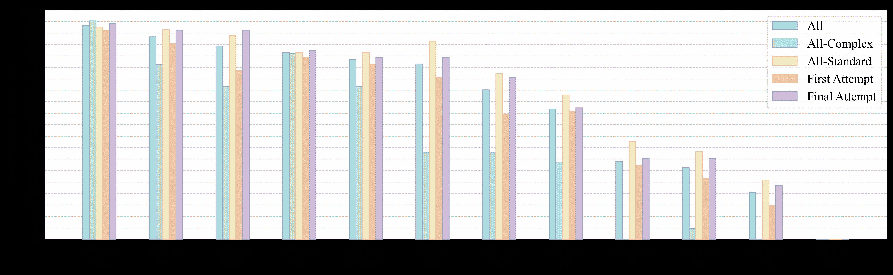

<!--yml
category: 未分类
date: 2025-01-11 11:53:42
-->

# Enhancing LLMs for Power System Simulations: A Feedback-driven Multi-agent Framework

> 来源：[https://arxiv.org/html/2411.16707/](https://arxiv.org/html/2411.16707/)

Mengshuo Jia, , Zeyu Cui, , and Gabriela Hug, 

###### Abstract

The integration of experimental technologies with large language models (LLMs) is transforming scientific research, positioning AI as a versatile research assistant rather than a mere problem-solving tool. In the field of power systems, however, managing simulations — one of the essential experimental technologies — remains a challenge for LLMs due to their limited domain-specific knowledge, restricted reasoning capabilities, and imprecise handling of simulation parameters. To address these limitations, we propose a feedback-driven, multi-agent framework that incorporates three proposed modules: an enhanced retrieval-augmented generation (RAG) module, an improved reasoning module, and a dynamic environmental acting module with an error-feedback mechanism. Validated on 69 diverse tasks from Daline and MATPOWER, this framework achieves success rates of 93.13% and 96.85%, respectively, significantly outperforming the latest LLMs (ChatGPT 4o and o1-preview), which achieved a 27.77% success rate on standard simulation tasks and 0% on complex tasks. Additionally, our framework also supports rapid, cost-effective task execution, completing each simulation in approximately 30 seconds at an average cost of 0.014 USD for tokens. Overall, this adaptable framework lays a foundation for developing intelligent LLM-based assistants for human researchers, facilitating power system research and beyond.

###### Index Terms:

Large Language Models, Agents, Power Systems, Simulation, Retrieval-augmented Generation, Reason

## I Introduction

Combining laboratory automation technologies with large language models (LLMs) enables automated execution of scientific experiments [[1](https://arxiv.org/html/2411.16707v1#bib.bib1)]. Related advances span the fields of mathematics, chemistry, and clinical research, including mathematical algorithm evolution [[2](https://arxiv.org/html/2411.16707v1#bib.bib2)], geometry theorem proving [[3](https://arxiv.org/html/2411.16707v1#bib.bib3)], chemical experiment design and execution [[1](https://arxiv.org/html/2411.16707v1#bib.bib1)], as well as the development and validation of machine learning approaches for clinical studies [[4](https://arxiv.org/html/2411.16707v1#bib.bib4)]. These recent achievements signal a new research paradigm, positioning AI as a research assistant for humans with natural language communication abilities, rather than merely a specialized problem solver as in the past. Establishing LLMs as research assistants also holds significant potential for advancing power systems research.

Given the heavy reliance on simulations in power systems research, developing LLM-based assistants in this field requires equipping LLMs with the capability to conduct power system simulations. Enabling LLMs to execute simulation tasks has multiple implications: (i) At the assistant level, LLMs capable of conducting simulations would allow researchers to focus more on idea-intensive activities, such as simulation design, rather than on labor-intensive tasks like simulation implementation. (ii) At the interface level, LLMs conducting simulations might offer a natural-language interface. This interface can connect simulation tasks with other upstream/downstream power system tasks using natural language as the input/output. This is particularly helpful when these tasks’ original inputs and outputs are heterogeneous (e.g., different modalities) and originally challenging to program cohesively using regular codes. (iii) At the coding level, LLMs executing simulations might be a step toward natural language coding in power systems. This might signify an evolution in programming, bringing it closer to a more intuitive, language-driven approach, a long-standing goal of programming development for decades.

However, LLMs inherently lack the capability to perform power system simulations. For recently developed simulation tools not included in LLM pre-training datasets, LLMs generally cannot execute these simulations accurately. Even for well-established tools included in pre-training data, simulation precision remains unsatisfactory. For instance, GPT-4 often has difficulty creating small distribution grids using OpenDSS [[5](https://arxiv.org/html/2411.16707v1#bib.bib5)] or writing code for simple (optimal) power flow problems [[6](https://arxiv.org/html/2411.16707v1#bib.bib6)], even though information about both OpenDSS and (optimal) power flow is available within GPT-4’s pre-training dataset. While the underlying causes of this issue have not been widely discussed and recognized in the energy domain, we propose the following factors as potential explanations:

*   •

    Frequency: The low frequency of domain-specific power system knowledge in LLM training datasets — especially in the long tail of rarely encountered data — limits the models’ ability to generalize effectively for specialized simulation tasks [[7](https://arxiv.org/html/2411.16707v1#bib.bib7)].

*   •

    Quality: High-quality, instruction-tuned, or query-based coding data specific to power system simulations in available open-source data is lacking. Missing explanatory code annotations make it difficult for LLMs to fully contextualize and operationalize power system simulations.

*   •

    Complexity: The multi-step reasoning required by complex power system simulations is inherently challenging, particularly given sparse or ambiguous representations in the model’s learned patterns w.r.t. power system simulations.

*   •

    Precision: Precise identification of simulation parameters, functions, and their logical connections, poses high demands on LLMs, especially when LLMs’ knowledge about simulations is incomplete or fragmented. This may result in a semantic drift, causing LLMs’ code generation to gradually deviate from the accurate version.

The challenges outlined above can be grouped into three main limitations: (i) limited simulation-specific knowledge, (ii) restricted reasoning capabilities for simulation tasks, and (iii) imprecision in function and option application. Enhancing the simulation capability of LLMs requires addressing these limitations. However, few existing works have explicitly focused on overcoming the above barriers to improve the simulation capability of LLMs, even though LLM applications in power systems are growing rapidly. Specifically, in power systems, LLMs have been recently used to translate language-based rules into mathematical constraints to facilitate optimal power flow (OPF) analysis, bridging the gap between rule-based and computational methods [[8](https://arxiv.org/html/2411.16707v1#bib.bib8)]. Researchers have also leveraged LLMs to interpret decision-making processes in real-time market, enhancing the transparency of deep reinforcement learning systems by revealing decision rationales [[9](https://arxiv.org/html/2411.16707v1#bib.bib9)]. Additionally, LLMs have been employed to retrieve and summarize documents in response to specific power system queries [[10](https://arxiv.org/html/2411.16707v1#bib.bib10)]. In other work, LLMs have been applied to derive OPF solutions iteratively by utilizing historical cost-solution data [[10](https://arxiv.org/html/2411.16707v1#bib.bib10)]. LLMs have also facilitated gathering user preference w.r.t. electric vehicles charging, where user inputs are integrated to refine functions for EV charging optimization problems [[10](https://arxiv.org/html/2411.16707v1#bib.bib10)]. Furthermore, by combining LLMs with retrieval-augmented generation (RAG), researchers develop a carbon footprint accounting system capable of dynamically retrieving and integrating real-time, domain-specific carbon data [[11](https://arxiv.org/html/2411.16707v1#bib.bib11)]. Moreover, for cybersecurity applications, LLMs have played a role in anomaly detection to enhance system security [[12](https://arxiv.org/html/2411.16707v1#bib.bib12)]. In forecasting, LLMs, such as LLaMa2, have been used to integrate social event data into time series models, enhancing the accuracy and contextual relevance of predictions, for example, in electricity demand [[13](https://arxiv.org/html/2411.16707v1#bib.bib13)]. Also, LLMs have supported perception analysis by evaluating media sentiment and public acceptance levels of solar power initiatives, providing insights into public opinion trends [[14](https://arxiv.org/html/2411.16707v1#bib.bib14)]. Moreover, a comprehensive benchmarking framework for LLMs has been proposed for the energy domain in [[15](https://arxiv.org/html/2411.16707v1#bib.bib15)], helping to establish standardized evaluation criteria for LLMs in energy-related applications. On the other hand, potential cybersecurity threats, arising due to the application of LLMs in power systems, have also been analyzed and summarized [[16](https://arxiv.org/html/2411.16707v1#bib.bib16)].

Figure 1: The feedback-driven multi-agent framework. It consists of an enhanced RAG module, an advanced reasoning module, and an environmental interaction module, all interconnected through an error feedback mechanism. This framework enables iterative refinement by incorporating simulation-specific knowledge, improving reasoning for complex simulation tasks, and facilitating environmental interaction to generate accurate simulation results.

Despite the various applications mentioned above, only a few studies have focused directly on using LLMs for power system simulations. These studies, however, only focus on conceptualizing the potential of LLMs in the simulation field [[17](https://arxiv.org/html/2411.16707v1#bib.bib17)], showcasing their current capabilities [[18](https://arxiv.org/html/2411.16707v1#bib.bib18), [17](https://arxiv.org/html/2411.16707v1#bib.bib17)], and assessing their effectiveness in generating general-purpose code for power system studies [[5](https://arxiv.org/html/2411.16707v1#bib.bib5), [6](https://arxiv.org/html/2411.16707v1#bib.bib6)]. While these studies offer valuable insights, they did not address the limitations pointed out earlier that limit LLMs’ simulation performance. Although the standard RAG approach used in [[19](https://arxiv.org/html/2411.16707v1#bib.bib19), [17](https://arxiv.org/html/2411.16707v1#bib.bib17), [6](https://arxiv.org/html/2411.16707v1#bib.bib6)] can indeed enable LLMs to incorporate external power systems knowledge, it is unsuitable for simulation tasks. This is because the standard RAG retrieves information based on the entire request as a single unit, which fails to capture the nuanced structure of complex simulation requests, often conflating distinct function-related and option-related elements, thereby leading to inefficiencies and reduced retrieval accuracy. Consequently, existing works fall short of systematically developing and advancing LLMs’ capability to handle complex power system simulations.

To bridge this gap and enhance LLMs’ capability in power system simulations, this paper proposes a modular, feedback-driven, multi-agent framework that integrates several innovative strategies, as shown in Fig. [1](https://arxiv.org/html/2411.16707v1#S1.F1 "Figure 1 ‣ I Introduction ‣ Enhancing LLMs for Power System Simulations: A Feedback-driven Multi-agent Framework"). Accordingly, this paper contributes in the following ways:

*   •

    We propose an enhanced RAG module with an adaptive query planning strategy and a triple-based structure (i.e. linking options, functions, and their dependencies) for the knowledge base. This module not only expands the LLM’s accessible knowledge in an efficient and cost-effective manner, but also enables LLMs to better identify and interpret simulation functions, options, and their logical relationships than the standard RAG.

*   •

    We develop an enhanced reasoning module by leveraging simulation-specific expertise, chain-of-thought prompting (CoT) and few-shot prompting. This module enables LLMs to fully understand their role, assigned tasks, reasoning pathways, and contextual knowledge (including retrieved information) in simulation tasks, thereby strengthening their reasoning capabilities when generating simulation code.

*   •

    We further propose a feedback-driven, multi-agent framework that integrates the enhanced RAG and reasoning modules with an environmental interaction and error-correction mechanism. This framework facilitates both action execution and feedback reception, providing responsive error signals to initiate adaptive adjustments for the RAG and reasoning modules to automatically correct errors, thereby enhancing the reliability of simulation outcomes.

*   •

    Through testing across various strategies, simulation environments, and a diverse range of tasks, we reveal that even the latest LLM, o1-preview, struggles with power system simulation tasks, including those involving well-established tools like MATPOWER, despite prior exposure in the pre-training of the LLM. We further reveal that high simulation success rates depend on the cumulative effect of multiple strategies. Following this idea, our framework demonstrates high success rates, enabling cost-effective, rapid task completion, thereby providing a scalable tool for power system researchers.

This paper, as a substantial extension of our preliminary work in [[20](https://arxiv.org/html/2411.16707v1#bib.bib20)], is structured as follows: Section II introduces the enhanced RAG module. Section III presents the enhanced reasoning module, and Section IV describes the environmental acting module with the feedback mechanism. Finally, Section V presents case study results, while Section VI concludes the paper with key findings and future outlook.

## II Enhanced RAG Module

As an efficient and scalable approach for integrating external knowledge to LLMs, RAG consists of three key steps: external knowledge chunking (splitting documents into smaller pieces), text embedding (converting texts into vectors using neural networks such as text2vec), and information retrieval (finding information in the vector space that aligns with the query) [[6](https://arxiv.org/html/2411.16707v1#bib.bib6)]. Fig. [3](https://arxiv.org/html/2411.16707v1#S2.F3 "Figure 3 ‣ II Enhanced RAG Module ‣ Enhancing LLMs for Power System Simulations: A Feedback-driven Multi-agent Framework") illustrates a general RAG diagram. However, for power system simulations, critical questions arise: (i) what types of queries should be used for retrieval? and (ii) what knowledge base should serve as the retrieval repository? Addressing these questions reveals two primary areas for enhancing RAG’s effectiveness in simulation tasks.

To this end, we propose an enhanced RAG module. This is specifically designed to integrate power system simulation knowledge into LLMs and reduce hallucinations. This module emphasizes the identification of essential keywords in simulation requests to facilitate more precise knowledge retrieval than the standard RAG. It includes two main components: (i) an adaptive query planning strategy, and (ii) a triple-based structure design for the knowledge base. Together, these components provide an enhanced RAG for complex power system simulation tasks.

Figure 2: Enhanced RAG module for simulation tasks. (a) The retrieval agent decomposes simulation requests into function-related and option-related sub-queries, mapped to specific functions and options for precise keyword-based retrieval. (b) Structured prompt design detailing keyword extraction steps via few-shot CoT.

Figure 3: General RAG diagram, including the process of external knowledge chunking, text embedding, and parallel retrieval within a vector database to produce relevant retrieval output based on the input queries and the external knowledge base. The text embedding model used in this study is from [[here]](https://help.aliyun.com/zh/dashscope/developer-reference/text-embedding-quick-start?spm=a2c4g.11186623.0.0.5695f97eD8MhdE).

### II-A Adaptive Query Planning

This section addresses the question of what types of queries should be used for retrieval. In the standard RAG approach, the entire simulation request is processed as a single unit, which, as discussed (and will be demonstrated in case studies), conflates distinct elements in the request, leading to inefficiencies and reduced retrieval accuracy. In fact, simulation requests typically contain two critical elements: the functions to be used and the options to be set. Thus, we propose using functions and options as distinct retrieval queries. However, these elements are rarely stated explicitly in simulation requests; instead, they are embedded in natural language descriptions.

To address this, we develop an agent-driven adaptive query planning strategy, as shown in Fig. [2](https://arxiv.org/html/2411.16707v1#S2.F2 "Figure 2 ‣ II Enhanced RAG Module ‣ Enhancing LLMs for Power System Simulations: A Feedback-driven Multi-agent Framework")(a), which automatically extracts function-related and option-related queries from the broader request to serve as retrieval keywords. The strategy operates in two phases: semantic recognition and keyword mapping, carried out by a retrieval agent (e.g., a general LLM). In the semantic recognition phase, the agent categorizes the request into two query types: function-related and option-related. Each function-related query is then decomposed into sub-queries, each corresponding to a potential simulation function to be used. Similarly, option-related queries are broken down into sub-queries, each linked to a potential option to be configured. This systematic separation ensures independent processing of each component within the request.

Following semantic recognition, the keyword mapping phase aligns each identified function and option sub-query with its precise keywords. For functions, the keywords are the functions’ names. For options, sub-queries are further associated with their respective descriptions and values. Ultimately, the extracted functions, option descriptions, and values are entered as parallel retrieval queries.

To enable the retrieval agent to perform both semantic recognition and keyword mapping effectively, we design a structured, general action prompt that integrates chain-of-thought prompting (CoT) [[21](https://arxiv.org/html/2411.16707v1#bib.bib21)] and few-shot prompting [[22](https://arxiv.org/html/2411.16707v1#bib.bib22)] (i.e., few-shot CoT), as depicted in Fig. [2](https://arxiv.org/html/2411.16707v1#S2.F2 "Figure 2 ‣ II Enhanced RAG Module ‣ Enhancing LLMs for Power System Simulations: A Feedback-driven Multi-agent Framework")(b). Only the few-shot examples are tool-dependent, making them modular and easily adaptable, while the rest of the prompt remains general and independent of specific simulation tools.

### II-B Triple-based Structure Design for Knowledge Base

In this section, we address the question of which knowledge base should serve as the retrieval repository. While each power system simulation tool includes a user manual with detailed instructions, this manual is not an ideal retrieval repository. The reasons are twofold: (i) User manuals are designed for human readability rather than automated retrieval; although readable, they are unstructured and inefficient for machine-driven queries, especially when manuals primarily consist of formulas, tables, and figures. (ii) The main challenge for LLMs in generating simulation code is understanding the logical dependencies between options and functions, as many options are function-dependent. Using only the user manual for retrieval fails to capture these complex relationships effectively.

To overcome these issues, we propose an additional, easy-to-construct retrieval repository: a triple-based structured option document. In this document, each line represents an option, providing the following structured information in sequence: (i) option name, (ii) default value/format, (iii) function dependencies, and (iv) option description. The inclusion of triples in (iii) — linking each option, its related functions, and their dependency — enables retrieval for logical relationships. As will demonstrated in case studies, this supplementary repository significantly enhances retrieval efficiency and improves the accuracy of simulation code generation by preserving the logical context.

## III Enhanced Reasoning Module

Even though the enhanced RAG module provides LLMs with retrieval results tailored to a simulation request, it still remains essential to strengthen the LLM’s reasoning abilities to generate correct simulation codes based on the retrieval results. This requires a coding agent (i.e., another LLM) to write codes for simulations tasks. This agent needs to fully understand its role, assigned tasks, reasoning path, and contextual knowledge, including retrieval results, when handling simulation tasks.

To address this, we propose an enhanced reasoning module, as detailed in Fig. [4](https://arxiv.org/html/2411.16707v1#S3.F4 "Figure 4 ‣ III Enhanced Reasoning Module ‣ Enhancing LLMs for Power System Simulations: A Feedback-driven Multi-agent Framework"). It provides structured guidance, sequential reasoning steps, and contextual knowledge to support accurate code generation by the coding agent. Details are as follows.

Figure 4: Enhanced reasoning module for simulation code generation: (a) Core Concept, defining the coding agent’s role, assigned tasks, reasoning path, and contextual knowledge. (b) Structured prompt design equipped with few-shot CoT, in order to enhance the agent’s reasoning ability for simulation. (c) Coding agent workflow integrating the designed prompt and simulation request to produce simulation code.

### III-A Role and Functionality Definition

The agent deployed in this module is designated as a simulation coding agent for a specific simulation tool. Its primary function is to generate syntax-compliant simulation code that aligns with the specific task requirements, the static provided knowledge, and the dynamically retrieved knowledge.

### III-B Reasoning Framework

To enable systematic, tool-independent reasoning, we develop a few-shot CoT framework, which breaks down the simulation task into the following universal actions:

*   •

    Function Identification: Determines the functions relevant to the simulation task.

*   •

    Function Syntax Learning: Acquires the correct syntax for identified functions to ensure compliance with the simulation tool’s requirements.

*   •

    Option Information Extraction: Identifies options and extracts their formats, values, and dependencies to maintain coherence with the selected functions.

*   •

    Code Generation: Integrates all extracted information into cohesive simulation code that meets task specifications and adheres to syntax requirements.

Each of these actions is further clarified with tool-specific coding examples in the prompt. While the examples are tool-dependent, the rest of the framework remains general. Overall, the above reasoning framework highlights again that the key to handling simulation tasks: correctly identifying and combining functions and options.

### III-C Knowledge Integration

The above reasoning actions heavily rely on information drawn from both the simulation request and supplementary knowledge, comprising:

*   •

    Static Basic Knowledge: Supplies the agent with foundational information on essential functions and syntax rules pertinent to the simulation tool. This static knowledge serves as a base reference and reminder for the agent to consult when generating code. Note that such knowledge is tool-dependent.

*   •

    Dynamic Retrieval Knowledge: The prompt includes placeholders for dynamic retrieval results from the enhanced RAG module, allowing the agent to incorporate request-specific knowledge into its reasoning. This knowledge provides detailed information on function dependencies, option formats, and other contextual elements needed for accurate code generation.

Eventually, by integrating both static and dynamic knowledge, as well as the above structured reasoning framework, the agent is expected to generate accurate code to address the simulation request.

## IV Environmental Acting Module with Feedback

Despite the reinforcement brought by the enhanced RAG and reasoning modules, the coding agent may still encounter errors during simulation code generation. To address this, it is essential to enable direct interaction between the LLM and the simulation environment, allowing the agent to receive execution feedback and iteratively refine its code. To this end, we propose an environmental acting module with an error feedback mechanism that integrates with both the RAG and reasoning modules, as illustrated in Fig. [5](https://arxiv.org/html/2411.16707v1#S4.F5 "Figure 5 ‣ IV-B Error Handling and Feedback Loop ‣ IV Environmental Acting Module with Feedback ‣ Enhancing LLMs for Power System Simulations: A Feedback-driven Multi-agent Framework"). The components of this module are described in the following.

### IV-A Code Execution and Detection

The simulation code, generated by the coding agent from the enhanced reasoning module, is executed using the simulation environment API connected to a specific power systems simulation tool. Following execution, the simulation environment produces results, which are then checked for error signals. Specifically:

*   •

    If an error is detected, the code advances to a stopping criterion check. If the stopping criterion is met, the process is terminated; if not, the module triggers a feedback loop with detailed error reporting.

*   •

    If no errors are detected, the process completes.

### IV-B Error Handling and Feedback Loop

Upon detecting an error in the simulation results, an error report is automatically generated, containing:

*   •

    Problematic Code: The code segment that caused the error.

*   •

    Error Message: A detailed description of the error.

*   •

    General Hints: Additional guidance on common issues.

*   •

    Request: Specific corrections needed to address the error.

*   •

    Reminders: Additional constraints or requirements, if any.

*   •

    Chat History: A log of previous interactions and iterations.

Figure 5: Environmental acting module with an error feedback mechanism that integrates with both the RAG and reasoning modules.

TABLE I: Evaluated Schemes by Distinct Combinations of the Proposed Strategies within the Framework
(GPT4o: API of gpt-4o-2024-05-13; CGPT4o: ChatGPT4o Web Interface; o1p: O1-preview Web Interface)

|  | GPT4o Full | GPT4o PR | GPT4o RSR | GPT4o SR | GPT4o Sole | GPT4o NC | GPT4o NP | GPT4o NS | GPT4o NR | GPT4o NCS | GPT4o RSRNW | CGPT4o R | o1p Sole |
| Query Planning | ✓ | ✓ |  |  |  | ✓ | ✓ | ✓ |  | ✓ | ✓ |  |  |
| Triple-based Structured Option Document | ✓ | ✓ | ✓ | ✓ |  | ✓ |  | ✓ |  | ✓ | ✓ | ✓ |  |
| Chain of Thought Prompting | ✓ |  | ✓ |  |  |  | ✓ | ✓ | ✓ |  | ✓ |  |  |
| Few-Shot Prompting | ✓ |  | ✓ |  |  | ✓ | ✓ |  | ✓ |  | ✓ |  |  |
| Static Basic Knowledge | ✓ |  | ✓ |  |  | ✓ | ✓ | ✓ | ✓ | ✓ | ✓ |  |  |
| Environmental Acting and Feedback | ✓ | ✓ | ✓ | ✓ | ✓ | ✓ | ✓ | ✓ | ✓ | ✓ | ✓ | ✓ | ✓ |
| Proposed RAG | ✓ | ✓ |  |  |  | ✓ | ✓ | ✓ |  | ✓ | ✓ |  |  |
| Standard RAG |  |  | ✓ | ✓ |  |  |  |  |  |  |  |  |  |
| OpenAI’s Built-in RAG |  |  |  |  |  |  |  |  |  |  |  | ✓ |  |
| Well-developed Error-reporting System | ✓ | ✓ | ✓ | ✓ | ✓ | ✓ | ✓ | ✓ | ✓ | ✓ |  | ✓ | ✓ |

### IV-C Enhanced RAG and Reasoning Module Interplay

The error report and feedback are then processed as a new request by the retrieval agent in the enhanced RAG module. This agent retrieves relevant information based on the error report (the query planning can also be applied to error reporting by simply replacing the identification of function/option keywords with the identification of error-related keywords). The retrieved information is then passed to the enhanced reasoning module, where the coding agent incorporates both the retrieval results and the correction request to revise the simulation code. The loop proceeds until the code meets both requirements, or until the stopping criterion is satisfied.

## V Case Study

To comprehensively validate the proposed framework, we carry out a range of tests differing in three key dimensions: (i) distinct combinations of the proposed strategies within the framework to evaluate each strategy’s independent effectiveness; (ii) different simulation environments, specifically Daline [[23](https://arxiv.org/html/2411.16707v1#bib.bib23)] and MATPOWER [[24](https://arxiv.org/html/2411.16707v1#bib.bib24)], which include tools both familiar and unfamiliar to LLMs¹¹1Daline is available [[here]](https://www.shuo.science/daline) with a user manual in [[25](https://arxiv.org/html/2411.16707v1#bib.bib25)]. MATPOWER is available [[here]](https://matpower.org/) with a user manual in [[26](https://arxiv.org/html/2411.16707v1#bib.bib26)]., to demonstrate the framework’s versatility across various applications; and (iii) a wide array of simulation tasks, spanning normal to complex scenarios, to assess the framework’s performance across various simulation demands.

The following sections detail the case study configurations, followed by an analysis of the simulation outcomes for Daline and MATPOWER. Eventually, the cost of using LLMs to perform power system simulations is discussed.

### V-A Settings

Firstly, Table [I](https://arxiv.org/html/2411.16707v1#S4.T1 "TABLE I ‣ IV-B Error Handling and Feedback Loop ‣ IV Environmental Acting Module with Feedback ‣ Enhancing LLMs for Power System Simulations: A Feedback-driven Multi-agent Framework") presents the distinct combinations of the proposed strategies within the framework employed in the evaluation, with the proposed strategies shaded in gray.

Secondly, this paper selects Daline [[23](https://arxiv.org/html/2411.16707v1#bib.bib23)] and MATPOWER [[24](https://arxiv.org/html/2411.16707v1#bib.bib24)] as the simulation environments. It is important to note that Daline was released after the latest updates of the LLMs used in the evaluation, while the well-established tool MATPOWER was already included in the training dataset of the LLMs. Consequently, these two environments encompass both seen and unseen scenarios for the LLMs, allowing us to demonstrate the framework’s versatility.

Thirdly, 34 simulation tasks have been used to test the framework with Daline, comprising 7 complex tasks and 27 standard tasks. Similarly, for MATPOWER, 35 simulation tasks have been defined, including 8 complex tasks and 27 standard tasks. These tasks comprehensively cover the functionalities of both simulation tools, aiming to include the majority of available options. A selection of representative tasks is given in Fig. [6](https://arxiv.org/html/2411.16707v1#S5.F6 "Figure 6 ‣ V-A Settings ‣ V Case Study ‣ Enhancing LLMs for Power System Simulations: A Feedback-driven Multi-agent Framework"), intended as an exemplary overview.

Figure 6: Representative examples of simulation tasks for Daline and MATPOWER.

Finally, for the performance evaluation, each scheme is allowed up to $N_{max}$ attempts of addressing a simulation task (with $N_{max}=3$ for Daline and $N_{max}=5$ for MATPOWER, as the latter is relatively more complex). A scheme earns 100 points per attempt for exactly correct simulation results without irrelevant settings in the code, 50 points for correct simulation results but with irrelevant settings in the code, and 0 points for any incorrect simulation outcomes. Subsequent attempts are only made if the previous attempt encounters execution errors, and any unused attempts receive the same score as the last attempt. The success rate for each scheme is defined as the total points earned divided by the maximum possible score, resulting in a success rate between 0% and 100%.

### V-B Evaluation on Daline

The evaluation results on Daline are illustrated in Fig. [7](https://arxiv.org/html/2411.16707v1#S5.F7 "Figure 7 ‣ V-B Evaluation on Daline ‣ V Case Study ‣ Enhancing LLMs for Power System Simulations: A Feedback-driven Multi-agent Framework") and Fig. [8](https://arxiv.org/html/2411.16707v1#S5.F8 "Figure 8 ‣ V-B Evaluation on Daline ‣ V Case Study ‣ Enhancing LLMs for Power System Simulations: A Feedback-driven Multi-agent Framework"). Fig. [7](https://arxiv.org/html/2411.16707v1#S5.F7 "Figure 7 ‣ V-B Evaluation on Daline ‣ V Case Study ‣ Enhancing LLMs for Power System Simulations: A Feedback-driven Multi-agent Framework") depicts the distribution of scores achieved across attempts for each evaluated scheme, differentiating between complex and standard tasks. Fig. [8](https://arxiv.org/html/2411.16707v1#S5.F8 "Figure 8 ‣ V-B Evaluation on Daline ‣ V Case Study ‣ Enhancing LLMs for Power System Simulations: A Feedback-driven Multi-agent Framework") presents the success rates for each scheme, itemized by “all tasks combined”, “complex tasks only”, “standard tasks only”, as well as for the “first attempt success rate” and the “final attempt success rate”. In the following, these evaluation results are analyzed from multiple perspectives.

Figure 7: Distribution of scores achieved across attempts for each evaluated scheme, separated by complex and standard tasks (Simulation Environment: Daline).

Figure 8: Success rates for each scheme, itemized by all tasks combined, complex tasks only, standard tasks only, as well as for the first attempt success rate and the final attempt success rate (Simulation Environment: Daline).

#### V-B1 Original Capability vs. Enhanced Capability

While equipped with environmental interaction and feedback mechanisms, GPT4o-Sole still demonstrates a 0% success rate for both complex and standard tasks, indicating that GPT4o has not previously encountered Daline. Even with a complete knowledge base supported by RAG — either through the standard RAG or OpenAI’s official RAG — the resulting schemes, GPT4o-SR and CGPT4o-R, achieve success rates of only 31.37% and 33.82% across all tasks, respectively. This suggests that, even with RAG support, the latest language model, GPT4o, still lacks reliable performance in simulations. In contrast, the scheme equipped with our proposed full framework, GPT4o-Full, achieves a success rate of 93.13% across all tasks — a significant improvement that highlights the effectiveness of the proposed framework.

#### V-B2 Fully Equipped vs. Less Equipped

The high success rate of 93.13% over all taks for GPT4o-Full is due to the cumulative effects of using the complete proposed framework. Comparing other schemes with GPT4o-Full gives an indication of the impact of omitted strategies. For instance, although GPT4o-NP includes most reasoning enhancement strategies, it lacks the triple-based structured option document, resulting in a reduced success rate of 81.37%. On the other hand, omitting the few-shot CoT for reasoning, as in GPT4o-NCS, lowers success to 65.19%. When few-shot CoT is employed, but the proposed query planning is omitted, as in GPT4o-RSR, the success rate for complex tasks drops to 66.67%, particularly due to the deteriorated performance for the complex tasks. While similar comparisons can be drawn across all schemes, our goal here is not to argue which strategy provides the highest improvement, but to emphasize that high success relies on the combined effect of multiple strategies.

#### V-B3 Complex Tasks vs. Normal Tasks

In general, more complex tasks — those with multiple sub-requests — tend to increase the likelihood of errors in LLMs, resulting in lower success rates compared to standard tasks, as observed across most schemes. However, with our proposed full framework, GPT4o-Full, the performance gap between complex and standard tasks narrows significantly, as shown in both the score distributions in Fig. [7](https://arxiv.org/html/2411.16707v1#S5.F7 "Figure 7 ‣ V-B Evaluation on Daline ‣ V Case Study ‣ Enhancing LLMs for Power System Simulations: A Feedback-driven Multi-agent Framework") and the success rates in Fig. [8](https://arxiv.org/html/2411.16707v1#S5.F8 "Figure 8 ‣ V-B Evaluation on Daline ‣ V Case Study ‣ Enhancing LLMs for Power System Simulations: A Feedback-driven Multi-agent Framework"). This suggests that, with enhanced reasoning capabilities and the more effective RAG design, GPT4o-Full effectively identifies and addresses the sub-requests within complex tasks, similar to how it handles standard tasks. This enables LLMs to better manage complex tasks.

#### V-B4 First Attempt vs. Final Attempt

The comparison between the first-attempt and final-attempt success rates demonstrates the effectiveness of environmental interaction and feedback mechanisms. As shown in Fig. [8](https://arxiv.org/html/2411.16707v1#S5.F8 "Figure 8 ‣ V-B Evaluation on Daline ‣ V Case Study ‣ Enhancing LLMs for Power System Simulations: A Feedback-driven Multi-agent Framework"), the final-attempt success rate is always higher than the first-attempt rate, particularly for schemes that incorporate fewer strategies from our framework. These schemes typically have either reduced reasoning capability or limited retrieval information, making environmental interaction and feedback crucial for error correction. However, for GPT4o-Full, the difference between first-attempt and final-attempt success rates is relatively small, as GPT4o-Full often completes the Daline simulation task successfully on the first attempt. This further highlights the effectiveness of the proposed framework. One noteworthy point is that the effectiveness of automatic error correction is partly influenced by the quality of the simulation tool’s error-reporting system — whether it provides clear, code-specific error messages. This feature affects the LLM’s capability to interpret and resolve issues in the generated code. In the absence of such a feature, as with GPT4o-RSRNW, the success rate drops to 78.43%, with negligible improvement between the first and final attempts. This underscores that without a well-developed error-reporting system, iterative refinement may yield limited benefit. Although tools like Daline and MATPOWER include well-developed error reporting (thereby achieving high correction accuracy), for other simulation tools where such systems are less developed, reinforcing them is recommended. In fact, our framework also enables LLMs to detect vulnerabilities within a simulation tool’s error-reporting system, particularly when mistakes occur. These errors may not stem from limitations of the LLMs or the framework itself but rather from inherent design issues within the tools.

Figure 9: Scores achieved by each evaluated scheme in individual attempts when handling complex tasks. The automatic error correction mechanism aids schemes equipped with our framework, such as GPT4o-PR, in correcting their behavior when encountering errors in initial attempts.

Figure 10: Distribution of scores achieved across attempts for each evaluated scheme, separated by complex and standard tasks (Simulation Environment: MATPOWER).

Figure 11: Success rates for each scheme, broken down by all tasks combined, complex tasks only, standard tasks only, as well as for the first attempt success rate and the final attempt success rate (Simulation Environment: MATPOWER; o1p-Sole is only tested by complex tasks).

### V-C Evaluation on MATPOWER

The evaluation results on MATPOWER are illustrated in Figs. [9](https://arxiv.org/html/2411.16707v1#S5.F9 "Figure 9 ‣ V-B4 First Attempt vs. Final Attempt ‣ V-B Evaluation on Daline ‣ V Case Study ‣ Enhancing LLMs for Power System Simulations: A Feedback-driven Multi-agent Framework"), [10](https://arxiv.org/html/2411.16707v1#S5.F10 "Figure 10 ‣ V-B4 First Attempt vs. Final Attempt ‣ V-B Evaluation on Daline ‣ V Case Study ‣ Enhancing LLMs for Power System Simulations: A Feedback-driven Multi-agent Framework"), and [11](https://arxiv.org/html/2411.16707v1#S5.F11 "Figure 11 ‣ V-B4 First Attempt vs. Final Attempt ‣ V-B Evaluation on Daline ‣ V Case Study ‣ Enhancing LLMs for Power System Simulations: A Feedback-driven Multi-agent Framework"). Specifically, Fig. [9](https://arxiv.org/html/2411.16707v1#S5.F9 "Figure 9 ‣ V-B4 First Attempt vs. Final Attempt ‣ V-B Evaluation on Daline ‣ V Case Study ‣ Enhancing LLMs for Power System Simulations: A Feedback-driven Multi-agent Framework") presents the scores achieved by each evaluated scheme in individual attempts when managing complex tasks. Fig. [10](https://arxiv.org/html/2411.16707v1#S5.F10 "Figure 10 ‣ V-B4 First Attempt vs. Final Attempt ‣ V-B Evaluation on Daline ‣ V Case Study ‣ Enhancing LLMs for Power System Simulations: A Feedback-driven Multi-agent Framework") shows the distribution of scores across attempts for each scheme, and Fig. [11](https://arxiv.org/html/2411.16707v1#S5.F11 "Figure 11 ‣ V-B4 First Attempt vs. Final Attempt ‣ V-B Evaluation on Daline ‣ V Case Study ‣ Enhancing LLMs for Power System Simulations: A Feedback-driven Multi-agent Framework") depicts the success rates of each scheme. The outcomes observed here align closely with the results on Daline, enabling us to only focus primarily on comparative analyses across schemes in the subsequent discussion.

#### V-C1 Original Capability vs. Enhanced Capability

Despite MATPOWER being a widely-used and well-documented tool with extensive resources available online, the latest high-performance LLMs, such as GPT4o and o1-preview (renowned for its reasoning capability), struggle to perform simulations reliably. For instance, both GPT4o-Sole and o1p-Sole show a 0% success rate on complex tasks, and GPT4o-Sole achieves only 27.77% success on standard tasks. Even with RAG and the whole knowledge base, GPT4o-SR reaches a success rate of only 13.75% for complex tasks and 52.96% for standard tasks. In contrast, the fully equipped framework, GPT4o-Full, achieves a remarkable 96.85% success rate across all tasks, with a breakdown of 93.75% on complex tasks and 97.77% on standard tasks, underscoring the framework’s effectiveness.

#### V-C2 Fully Equipped vs. Less Equipped

Consistent with the findings on Daline, the results on MATPOWER indicate that high success rates depend on the synergistic effect of multiple strategies. For example, excluding the enhanced reasoning module, as in GPT4o-PR, results in an overall success rate decrease to 89.71%, with complex tasks dropping further to 70.00%. Similarly, omitting the proposed query planning strategy, as in GPT4o-RSR, reduces the overall success rate to 63.42% and complex tasks to 37.50%. These outcomes are substantially lower than those achieved by GPT4o-Full, which maintains a 93.75% success rate on complex tasks and 97.77% on standard tasks, demonstrating the critical role of each component within the proposed framework.

TABLE II: Average Cost Analysis of GPT4o-Full Per Task

| Environment | Time (sec.) | Input Token | Output Token | Expense (USD) |
| --- | --- | --- | --- | --- |
| Daline | 29.446 | 7882.294 | 168.353 | 0.014 |
| MATPOWER | 32.703 | 5338.514 | 274.371 | 0.013 |

### V-D Cost Analysis

The cost analysis of GPT4o-Full for executing simulation tasks in Daline and MATPOWER is presented in Table [II](https://arxiv.org/html/2411.16707v1#S5.T2 "TABLE II ‣ V-C2 Fully Equipped vs. Less Equipped ‣ V-C Evaluation on MATPOWER ‣ V Case Study ‣ Enhancing LLMs for Power System Simulations: A Feedback-driven Multi-agent Framework"), with average values across all tasks shown. The reported time covers the entire process, including retrieval, reasoning, code generation, simulation execution, result aggregation, and, where necessary, code correction. Remarkably, GPT4o-Full completes each task in approximately half a minute. Additionally, the token expense per task is roughly 0.014 USD.

It is noteworthy that aside from parallel retrieval, no specialized acceleration techniques were employed in this framework. Thus, despite its already satisfactory performance, there is considerable potential for speed enhancements. Even in the current state, without any specific acceleration strategies, GPT4o-Full can execute approximately 120 simulation tasks per hour in Daline and MATPOWER, with a total token cost of around 1.68 USD. Given this high efficiency and cost-effectiveness, our framework presents a promising pathway to improve researcher productivity.

## VI Conclusion

This paper addresses the research gap in enhancing LLMs for power system simulations by proposing a feedback-driven, multi-agent framework, representing the first systematic approach to significantly improve LLMs’ simulation capabilities across both familiar and new tools. Validated on 69 diverse simulation tasks from Daline and MATPOWER, our framework achieved substantial performance improvements, with success rates of 93.13% and 96.85%, respectively, far surpassing those of baseline schemes, including the latest LLM, o1-preview. Key findings include: (i) The original simulation capability of LLMs is limited, as evidenced by GPT4o and o1-preview achieving success rates no higher than 27.77%. (ii) Even with the standard RAG module and a comprehensive knowledge base, LLMs achieve overall success rates below 45%, highlighting the need for a more comprehensive approach. (iii) Our framework’s high success rate stems from a synergistic integration of enhanced RAG, enhanced reasoning, as well as environmental acting and feedback mechanisms. Removing any of these elements results in a significant performance decline. (iv) Our framework enables LLMs to execute tasks efficiently, with each task completed in approximately 30 seconds at a token cost of only 0.014 USD, offering a scalable, cost-effective solution that enhances productivity of human scientists in power systems.

However, several critical future challenges still remain: (i) Developing automatic evaluation methods for unbenchmarked results to improve reliability and autonomy. (ii) Expanding the framework to synchronize multiple simulation tools to tackle more challenging tasks. (iii) Since 100% accuracy remains unachieved, integrating error-detection mechanisms to flag uncertainties and inform researchers of potential inaccuracies. Overall, our work is an initial step in the long journey toward realizing intelligent LLM-based research assistants, with potential ahead.

## Acknowledgement

We would like to acknowledge the assistance of ChatGPT-4o [[27](https://arxiv.org/html/2411.16707v1#bib.bib27)] for language polishing of this paper.

## References

*   [1] D. A. Boiko, R. MacKnight, B. Kline, and G. Gomes, “Autonomous chemical research with large language models,” *Nature*, vol. 624, no. 7992, pp. 570–578, 2023.
*   [2] B. Romera-Paredes, M. Barekatain, A. Novikov, M. Balog, M. P. Kumar, E. Dupont, F. J. Ruiz, J. S. Ellenberg, P. Wang, O. Fawzi *et al.*, “Mathematical discoveries from program search with large language models,” *Nature*, vol. 625, no. 7995, pp. 468–475, 2024.
*   [3] T. H. Trinh, Y. Wu, Q. V. Le, H. He, and T. Luong, “Solving olympiad geometry without human demonstrations,” *Nature*, vol. 625, no. 7995, pp. 476–482, 2024.
*   [4] S. Tayebi Arasteh, T. Han, M. Lotfinia, C. Kuhl, J. N. Kather, D. Truhn, and S. Nebelung, “Large language models streamline automated machine learning for clinical studies,” *Nature Communications*, vol. 15, no. 1, p. 1603, 2024.
*   [5] R. S. Bonadia, F. C. Trindade, W. Freitas, and B. Venkatesh, “On the potential of chatgpt to generate distribution systems for load flow studies using opendss,” *IEEE Transactions on Power Systems*, 2023.
*   [6] L. Dong, S. Majumder, F. Doudi, Y. Cai, C. Tian, D. Kalathi, K. Ding, A. A. Thatte, and L. Xie, “Exploring the capabilities and limitations of large language models in the electric energy sector,” *arXiv preprint arXiv:2403.09125*, 2024.
*   [7] H. Chang, J. Park, S. Ye, S. Yang, Y. Seo, D.-S. Chang, and M. Seo, “How do large language models acquire factual knowledge during pretraining?” *arXiv preprint arXiv:2406.11813*, 2024.
*   [8] Z. Yan and Y. Xu, “Real-time optimal power flow with linguistic stipulations: integrating gpt-agent and deep reinforcement learning,” *IEEE Transactions on Power Systems*, 2023.
*   [9] B. Zhang, C. Li, G. Chen, and Z. Dong, “Large language model assisted optimal bidding of bess in fcas market: An ai-agent based approach,” *arXiv preprint arXiv:2406.00974*, 2024.
*   [10] C. Huang, S. Li, R. Liu, H. Wang, and Y. Chen, “Large foundation models for power systems,” in *2024 IEEE Power & Energy Society General Meeting (PESGM)*.   IEEE, 2024, pp. 1–5.
*   [11] H. Wang, Z. Chen, N. Shang, S. Yao, Z. Pan, F. Wen, and J. Zhao, “Carbon footprint accounting driven by large language models and retrieval-augmented generation,” *arXiv preprint arXiv:2408.09713*, 2024.
*   [12] A. Zaboli, S. L. Choi, T.-J. Song, and J. Hong, “Chatgpt and other large language models for cybersecurity of smart grid applications,” in *2024 IEEE Power & Energy Society General Meeting (PESGM)*.   IEEE, 2024, pp. 1–5.
*   [13] X. Wang, M. Feng, J. Qiu, J. Gu, and J. Zhao, “From news to forecast: Integrating event analysis in llm-based time series forecasting with reflection,” *arXiv preprint arXiv:2409.17515*, 2024.
*   [14] K. Nuortimo, J. Harkonen, and K. Breznik, “Global, regional, and local acceptance of solar power,” *Renewable and Sustainable Energy Reviews*, vol. 193, p. 114296, 2024.
*   [15] X. Zhou, H. Zhao, Y. Cheng, Y. Cao, G. Liang, G. Liu, and J. Zhao, “Elecbench: a power dispatch evaluation benchmark for large language models,” *arXiv preprint arXiv:2407.05365*, 2024.
*   [16] J. Ruan, G. Liang, H. Zhao, G. Liu, X. Sun, J. Qiu, Z. Xu, F. Wen, and Z. Y. Dong, “Applying large language models to power systems: Potential security threats,” *IEEE Transactions on Smart Grid*, 2024.
*   [17] D. Lifu, C. Ying, X. Tannan, H. Shaowei, and S. Chen, “Exploration of generative intelligent application mode for new power systems based on large language models,” *Automation of Electric Power Systems*, 2024\. [Online]. Available: [https://github.com/xxh0523/llm4power](https://github.com/xxh0523/llm4power)
*   [18] C. Huang, S. Li, R. Liu, H. Wang, and Y. Chen, “Large foundation models for power systems,” *arXiv preprint arXiv:2312.07044*, 2023.
*   [19] P. S. H. Lewis, E. Perez, A. Piktus, F. Petroni, V. Karpukhin, N. Goyal, H. Küttler, M. Lewis, W. Yih, T. Rocktäschel, S. Riedel, and D. Kiela, “Retrieval-augmented generation for knowledge-intensive NLP tasks,” in *Advances in Neural Information Processing Systems*, 2020.
*   [20] M. Jia, Z. Cui, and G. Hug, “Enabling large language models to perform power system simulations with previously unseen tools: A case of daline,” *arXiv preprint arXiv:2406.17215*, 2024.
*   [21] J. Wei, X. Wang, D. Schuurmans, M. Bosma, F. Xia, E. Chi, Q. V. Le, D. Zhou *et al.*, “Chain-of-thought prompting elicits reasoning in large language models,” *Advances in neural information processing systems*, vol. 35, pp. 24 824–24 837, 2022.
*   [22] B. Mann, N. Ryder, M. Subbiah, J. Kaplan, P. Dhariwal, A. Neelakantan, P. Shyam, G. Sastry, A. Askell, S. Agarwal *et al.*, “Language models are few-shot learners,” *arXiv preprint arXiv:2005.14165*, 2020.
*   [23] M. Jia, W. Y. Chan, and G. Hug, “Daline: A data-driven power flow linearization toolbox for power systems research and education,” 2024\. [Online]. Available: [https://doi.org/10.3929/ethz-b-000681867](https://doi.org/10.3929/ethz-b-000681867)
*   [24] R. D. Zimmerman, C. E. Murillo-Sánchez, and R. J. Thomas, “Matpower: Steady-state operations, planning, and analysis tools for power systems research and education,” *IEEE Transactions on power systems*, vol. 26, no. 1, pp. 12–19, 2010.
*   [25] M. Jia, W. Y. Chan, and G. Hug, “User manual for daline 1.1.5,” 2024\. [Online]. Available: [https://doi.org/10.3929/ethz-b-000680438](https://doi.org/10.3929/ethz-b-000680438)
*   [26] R. D. Zimmerman and C. E. Murillo-Sánchez, “Matpower 8.0 user’s manual,” 2024\. [Online]. Available: [https://matpower.org/docs/MATPOWER-manual-8.0.pdf](https://matpower.org/docs/MATPOWER-manual-8.0.pdf)
*   [27] OpenAI, “Chatgpt-4o,” 2024, language model used for language polishing in this manuscript. [Online]. Available: [https://openai.com/](https://openai.com/)