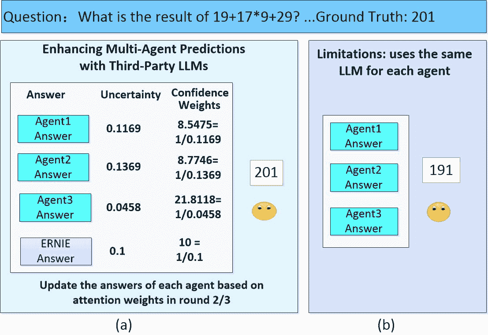
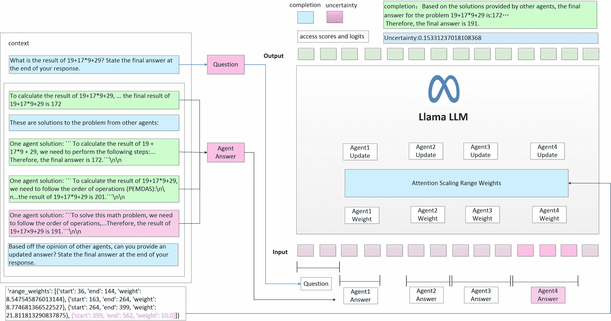
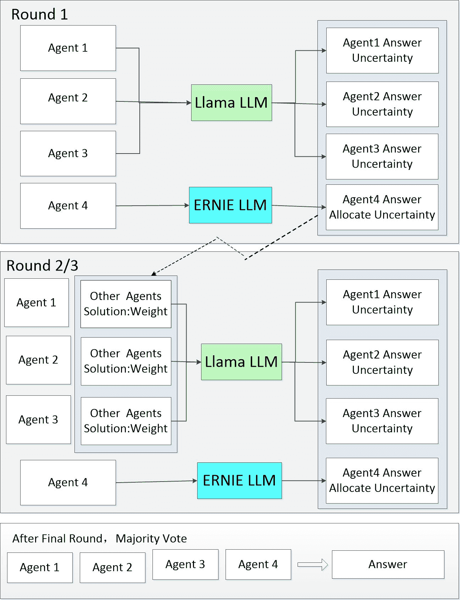

<!--yml

类别：未分类

日期：2025-01-11 11:53:51

-->

# 通过第三方LLM整合增强多智能体共识：分析不确定性并缓解大型语言模型中的幻觉

> 来源：[https://arxiv.org/html/2411.16189/](https://arxiv.org/html/2411.16189/)

端智华 智能云网络监控部

中国电信上海公司 上海，中国

duanzh.sh@chinatelecom.cn    王佳林^∗ 执行副总裁

Ferret关系智能加利福尼亚州伯灵格姆，邮政编码94010，美国

jialinwangspace@gmail.com^∗

###### 摘要

大型语言模型（LLM）在处理复杂推理任务时仍面临挑战，通常会导致幻觉现象，这限制了LLM的实际应用。为了解决这一问题，本文提出了一种新方法，通过整合不同的LLM来扩展知识边界，减少对单一模型的依赖，并促进智能体之间的深入辩论。主要贡献包括：1）引入第三方LLM，通过不确定性估计和置信度分析调整智能体的注意力权重，优化多智能体系统中的共识形成；2）在算术数据集上的实验验证了该方法的有效性，超越了传统的多智能体基准。该研究为大型模型在处理复杂任务时缓解幻觉现象提供了新的视角。

###### 索引词：

大型语言模型、不确定性、Llama、幻觉、ERNIE

## I 引言

大型语言模型（LLM）已展示出强大的推理和创造能力。为了应对更复杂的任务，AutoGen通过构建具有不同角色的智能体，将LLM、人类输入和各种工具的功能融合在一起，从而提供量身定制的多智能体对话设置[[1](https://arxiv.org/html/2411.16189v1#bib.bib1)]。这推动了多智能体辩论系统的发展。在这些系统中，多个智能体阐述各自的观点，而中立的主持人则监督辩论过程，促使最终决议的达成[[2](https://arxiv.org/html/2411.16189v1#bib.bib2)]。通过使用多个语言模型实例，并进行多轮提案和辩论，讨论其各自的答案和推理过程，最终达成共识的最终答案[[3](https://arxiv.org/html/2411.16189v1#bib.bib3)]。

在多智能体辩论过程中，通常会为每个智能体部署相同的大型语言模型（LLM）并赋予它们相同的角色。这种方法在多智能体辩论中已被证明是有效的，但它也有局限性，特别是在模型的知识范围受限且缺乏来自不同模型的外部反馈时。使用单一模型可能导致辩论过程中出现单一的观点，从而限制了辩论的深度和广度。

图1：如图1(a)所示，我们引入了第三方LLM来丰富多智能体系统的知识，这可以为智能体提供不同的视角。智能体可以根据更多的信息和更深的思考调整他们的答案。不确定性和信心加权机制使得每个智能体能够在第二轮和第三轮辩论中动态调整其注意力权重，从而根据其他智能体的反馈进行自我调整，更加准确地接近正确答案。如图1(b)所示，传统方法中的所有智能体依赖于单一LLM，这导致答案具有一致的偏差，缺乏多样性和深度的思考。

因此，本文提出了一个问题：是否可以通过引入第三方模型，通过多个大语言模型的协作来完成任务？它探索了不同LLM的组合，以估计每个智能体的信心水平，并寻求达成更广泛的共识。

我们的研究动机是探讨引入第三方大语言模型（LLMs）以及不同LLMs的结合策略如何增强多智能体系统的决策能力和问题解决深度。特别强调的是将外部LLM与特定领域知识结合现有LLM；探索不同LLM的组合被认为对促进智能体之间的辩论与合作具有价值，从而实现对复杂问题的全面深入分析。本文的主要贡献如下：1. 本研究引入了第三方大语言模型（LLMs），探索不确定性估计和信心度在多智能体系统中的应用。通过调整注意力权重，LLM模型可以从其他智能体的回应中学习，从而促进共识的形成与优化。2. 本文进行的研究涉及算术数据集实验，结果表明，本文提出的方法优于以往的多智能体基准。

## II 相关工作

### II-A LLM中的不确定性

尽管传统自然语言处理（NLP）任务中的不确定性已经得到了广泛研究，但它为在NLP任务中利用不确定性提供了坚实的理论基础和方法指导[[4](https://arxiv.org/html/2411.16189v1#bib.bib4)][[5](https://arxiv.org/html/2411.16189v1#bib.bib5)][[6](https://arxiv.org/html/2411.16189v1#bib.bib6)]。然而，大型模型中不确定性量化的领域仍然研究不足。在生成式AI大模型中，文本通常是基于概率模型生成的，在每次生成过程中考虑不同的上下文和内部状态。任何语义上与实际答案一致的生成答案都可以视为正确[[7](https://arxiv.org/html/2411.16189v1#bib.bib7)][[8](https://arxiv.org/html/2411.16189v1#bib.bib8)][[9](https://arxiv.org/html/2411.16189v1#bib.bib9)]。有提议通过直接提示语言模型回答与其自身生成的不确定性相关的问题来量化不确定性[[10](https://arxiv.org/html/2411.16189v1#bib.bib10)]。

提出了一种新的不确定性量化方法，称为“Shifting Attention to more Relevant”（SAR）。该方法在标记和句子层面上专注于更相关的组件，以实现更好的不确定性量化[[11](https://arxiv.org/html/2411.16189v1#bib.bib11)]。还提出了一种多代理辩论框架，通过不确定性测量评估代理的置信度，并调整LLM的注意力机制，根据置信度调整标记的权重。文本提示用于传达置信度，从而增强多代理辩论中的可靠性[[3](https://arxiv.org/html/2411.16189v1#bib.bib3)]。

本研究旨在引入第三方大模型来指定不确定性度量，并通过转换生成结果中的logits值来描述生成的标记的不确定性。

### II-B LLMs中代理的应用

最近，通过使用由大语言模型（LLMs）驱动的多代理自动化任务解决方法，取得了显著的进展。ReConcile 是一个多模型多代理框架，通过多轮讨论增强大语言模型（LLMs）之间的协作推理，采用基于置信度加权的投票机制来实现更好的共识[[12](https://arxiv.org/html/2411.16189v1#bib.bib12)]。

通过整合大语言模型和工具，可以引入多个代理，以促进不同角色的相互促进，从而通过多代理辩论增强推理能力[[1](https://arxiv.org/html/2411.16189v1#bib.bib1)][[13](https://arxiv.org/html/2411.16189v1#bib.bib13)][[14](https://arxiv.org/html/2411.16189v1#bib.bib14)]。基于LangGraph和思维链提出了一种智能个性化数字银行助手，利用大语言模型（LLM）和多代理框架提高任务效率[[15](https://arxiv.org/html/2411.16189v1#bib.bib15)]。

采用了多代理系统方法，通过CrewAI框架实现系统2思维，该框架整合了深入分析和推理决策，以增强AI在处理复杂问题时的能力[[16](https://arxiv.org/html/2411.16189v1#bib.bib16)]。

本文构建了四个代理并进行了三轮问答会话，其中代理之间共享回答信息和不确定性概率，以完善他们的回答，最终基于多数投票原则确定最终答案。

## III 方法

为了准确把握多轮对话信息并增强大模型的推理能力，如图2所示，本文提出了一种简洁而强大的细粒度推理方法。整个对话会话被划分为用户提问的上下文信息和四个代理代理的回答信息，构建一个包含四个对话代理的回答信息的上下文提示，并要求当前代理基于其他代理的观点提供更新的回答，并给出最终答案，引导代理综合考虑所有代理的对话和置信度水平。

注意力权重更新：在开源大模型Llama中，采用了注意力缩放范围权重机制，在注意力的基础上乘以范围权重，将更多的注意力分配给范围权重较大的代理信息，从而动态调整大模型对不同代理的注意力权重，并更新其输出或决策。通过这种方式，模型不仅可以考虑每个代理的贡献，还能根据置信度水平调整每个代理对话的重要性，从而生成更全面、平衡的回答。系统在做出决策时会考虑多个代理的信息，并可以根据每个信息源的可信度加权这些信息，从而得出更准确的结论。经过logits转换后，输出文本补全信息和不确定性度量。

图 2：不同智能体的权重值表示它们在处理特定任务时的相对重要性或可信度。范围权重是一个列表，包含多个权重项，每个项都有起始点和终止点（start 和 end），以及相应的权重值（weight）。例如，当第四个智能体使用第三方大语言模型回答问题时，它的信心参数设置为 10.0，对应的范围为 'start'：399，'end'：562，'weight'：10.0。在处理上下文提示的范围内，大模型将根据这些参数调整注意力权重的分布。随后，模型通过 logits 转换机制输出完成结果及其对应的不确定性值。信心权重 = 1 / 不确定性。例如，权重 = 1 / 0.15331237018108368 = 6.522630879810011。在第二轮和第三轮迭代中，智能体的回答及其信心权重将作为后续轮次中其他智能体的参考信息。最终，经过第二轮和第三轮迭代后，得出一个综合性的回答。

在多智能体对话中，模型会关注信心度较高的智能体。在每一轮对话后，接收每个智能体的回复。注意力缩放仅应用于上一轮的回答。例如，第二轮会根据第一轮的回答来缩放注意力权重，第三轮会根据第二轮的回答来缩放注意力权重。大模型使用 Transformer 解码器层，其中注意力机制为每个标记生成“查询”（query）、“键”（key）和“值”（value）向量。当前标记的“查询”向量与每个标记的“键”向量之间的相似度用于计算每个标记的权重，这些权重通过 softmax 函数进行归一化，确保它们的总和为 1，并用于生成输出向量。每个标记的权重决定了它对生成下一个标记的影响。通过修改这些权重，模型可以调整其对输入中每个标记的关注度[[17](https://arxiv.org/html/2411.16189v1#bib.bib17)]。

使用范围权重更新权重的计算公式如下：

1\. 计算 Transformer 注意力权重的原始公式。

|  | $A=QK^{T}$ |  |
| --- | --- | --- |

2\. 应用加权重要性和范围限制的改进公式。

|  | $A[:,:,:,r_{\text{start}}:r_{\text{end}}]\leftarrow A[:,:,:,r_{\text{start}}:r_{\text{end}}]\cdot\lambda\cdot r_{\text{w}}$ |  |
| --- | --- | --- |

3\. 归一化和应用 softmax 函数后的注意力权重计算。

|  | $\text{Attention}(Q,K,V)=\text{softmax}\left(\frac{A}{\sqrt{d_{k}}}\right)V$ |  |
| --- | --- | --- |

A 表示注意力权重矩阵，$Q$、$K$ 和 $V$ 分别表示查询、键和值矩阵。$d_{k}$ 是键向量的维度。$r_{\text{start}}$ 和 $r_{\text{end}}$ 表示范围的起始和结束位置。$\lambda$ 是一个标量，用于调整重要性权重，$r_{\text{w}}$ 是与范围相关的权重因子。

如算法 1 所示，本研究所采用的算法框架基于参考文献[[3](https://arxiv.org/html/2411.16189v1#bib.bib3)中提出的代码实现，并进行了进一步优化。我们在 LlamaAttention 类中详细描述了基于置信度的注意力调整机制。该过程首先通过计算指定范围内的注意力权重之和（由范围权重表示）进行评估。对于每个范围，计算注意力权重的均值和标准差，以得出加权重要性度量。此度量与范围权重一起用于调整原始注意力权重，增强更有信心的预测的影响力。调整后，归一化步骤确保调整后的权重保持与原始权重相同的分布，从而保持整体注意力分布。这种方法使模型能够更关注那些置信度更高的区域，从而提高注意力机制的准确性。

算法 1 基于置信度调整的注意力加权机制

1:过程 LlamaAttention($Q,K,V,range\_weights$)  

## IV 实验设计

该实验使用了算术数据集，这是一个随机生成的算术问题集，形式为 $a+b\times c+d$，其中 $0\leq a,b,c,d<30$，如表1所示。考虑到运行成本，仅构建了包含100个问题的数据集，并评估了这些样本的误差度量和方法。

表I：算术问题及其解答

{tblr}

宽度 = colspec = Q[40]Q[867]Q[27]，hline1,3,5,7 = 1-2，hline2,4,6 = 2，Q: & 3+27*3+7 的结果是多少？请在回答的最后给出最终答案。

A: 91

Q: 9+19*21+18 的结果是多少？请在回答的最后给出最终答案。

A: 426

Q: 19+17*9+29 的结果是多少？请在回答的最后给出最终答案。

A: 201

如图3所示，本实验涉及四个智能体和三轮问答，前三个智能体使用相同的 LLM（Llama3[[8](https://arxiv.org/html/2411.16189v1#bib.bib8)]）。第四个智能体引入了一个第三方大模型（ERNIE[[18](https://arxiv.org/html/2411.16189v1#bib.bib18)])。

图 3：在第一轮中，每个代理单独回答问题。在随后的第二轮和第三轮中，每个代理提供来自其他代理的响应信息和不确定性概率，并利用这些信息来完善他们的答案。前三个代理使用Llama3模型，通过注意力缩放修改模型权重信息，输出模型的预测结果，并通过令牌概率计算该响应的不确定性度量。第四个代理使用ERNIE LLM模型，手动指定权重系数作为不确定性概率。最终答案由第三轮后的多数投票决定。

## V 结果

本研究提出了一种新方法，其中前三个代理使用Llama大型模型，第四个代理引入第三方ERNIE大型模型。通过引入不确定性并动态调整注意力权重，任务性能在三轮对话后得到了显著提升。如表2所示，实验结果表明，在Attention-All设置下，我们的方法取得了显著的效果，准确率高达0.940，超过了其他基线方法。其中，标准基线方法的准确率为0.478，基于熵的基线方法的准确率分别为0.482和0.518。TokenSAR基线方法的准确率范围为0.464到0.500。Oracle方法的准确率分别为0.542、0.654和0.732。

表 II：不同方法的性能比较

{tblr}

宽度 = 列规格 = Q[273]Q[323]Q[287]，水平线1-3,6,9,12-13 = -，水平线4-5,7-8,10-11 = 2-3，估算器与方法算术

N/A^† Standard 0.478

提示 0.482

熵^† Attn-Others 0.518

Attn-All 0.518

提示 0.464

TokenSAR^† Attn-Others 0.500

Attn-All 0.500

提示 0.542

Oracle^† Attn-Others 0.654

Attn-All 0.732

我们的 Attn-All 0.940

带有^†的分数来源于文献[[3](https://arxiv.org/html/2411.16189v1#bib.bib3)]

## VI 限制

本研究展示了在特定任务中的潜力，但在计算效率、注意力机制应用和跨领域实验方面仍然存在局限性。未来的研究需要解决这些问题，以扩大LLM的应用范围。

1\. 计算开销和实时应用挑战：该方法通过集成第三方大型模型增强了处理复杂任务的能力，但相应地增加了计算成本。因此，在实现多代理架构时，需要考虑对计算效率的潜在影响，并做出相应的权衡。

2\. 注意力加权机制的应用：未来的研究可以进一步探索该机制在不同任务中的适用性，以及如何根据不同任务的特征调整注意力权重，以提升模型的整体性能。

3. 特定领域的广泛实验：本研究在特定领域的模型实验中取得了一定的成果，但实验范围有限。尽管该方法在 MMLU 和 TruthfulQA 等数据集上的表现尚未达到当前最先进（SOTA）大模型的性能水平，但通过采用更强大的大模型，未来仍有改进的潜力。

## VII 结论

本文通过引入第三方大语言模型（LLM）并将其响应及置信度整合到多智能体对话中，有效解决了多个智能体提供不同答案时的信任问题。为了计算置信度，本文通过为第三方 LLM 设置置信度参数并与 Llama 模型的置信度相结合，优化了 LLM 的注意力机制，实现了基于置信度水平的注意力权重调整。实验表明，与传统文本提示相比，这种方法能更有效地向 LLM 传递信息，使模型在生成响应时能够考虑每个智能体的贡献和置信度，从而产生更全面、平衡的输出。该研究不仅增强了对话系统处理不确定性的能力，还为未来大语言模型在多智能体交互中的应用提供了新的视角。未来的工作将探讨如何将注意力缩放机制应用于更广泛的场景。

## 参考文献

+   [1] Qingyun Wu, Gagan Bansal 等人。Autogen：通过多智能体对话框架推动下一代大语言模型应用。CoRR, abs/2308.08155, 2023。

+   [2] Tian Liang, Zhiwei He 等人。通过多智能体辩论促进大语言模型的发散性思维。CoRR, abs/2305.19118, 2023。

+   [3] Luke Yoffe, Alfonso Amayuelas 等人。Debunc：通过不确定性估计缓解大语言模型智能体通信中的幻觉问题。CoRR, abs/2407.06426, 2024。

+   [4] Marina Fomicheva, Shuo Sun 等人。神经机器翻译的无监督质量估计。会计、财务管理中的智能系统, 8:539–555, 2020。

+   [5] Salem Lahlou, Moksh Jain 等人。Deup：直接认知不确定性预测。计算研究库, abs/2102.08501, 2021。

+   [6] Yuxia Wang, Daniel Beck 等人。预训练模型在文本回归中的不确定性估计与减少。计算语言学协会会刊, 10:680–696, 2022。

+   [7] Alec Radford, Jeffrey Wu 等人。语言模型是无监督的多任务学习者。OpenAI 博客, 1(8):9, 2019。

+   [8] Hugo Touvron, Louis Martin 等人。Llama 2：开放基础和微调的聊天模型。CoRR, 2023。

+   [9] Albert Q. Jiang, Alexandre Sablayrolles 等人。Mistral 7b。CoRR, abs/2310.06825, 2023。

+   [10] Stephanie Lin, Jacob Hilton 等人。教授模型用语言表达不确定性。Trans Mach Learn Res, 2022。

+   [11] Jinhao Duan, Hao Cheng 等人. 将注意力转向相关性：面向自由形式大型语言模型的预测不确定性量化. 《计算语言学协会第62届年会论文集》，页码 5050–5063, 2024.

+   [12] Justin Chih-Yao Chen, Swarnadeep Saha 等人. Reconcile: 圆桌会议通过多样化的大型语言模型（llms）共识提升推理能力. 《计算语言学协会第62届年会论文集》，abs/2309.13007:7066–7085, 2024.

+   [13] Sirui Hong, Mingchen Zhuge 等人. Metagpt: 用于多代理协作框架的元编程. 《学习表征国际会议》，2024.

+   [14] Lei Wang, Chen Ma 等人. 基于大型语言模型的自主代理调查. 《计算机科学前沿》，18(6):186345, 2024.

+   [15] Arafat Md Easin, Saha Sourav 等人. 一种智能的基于大型语言模型的个性化数字银行助手，使用 langgraph 和思维链. 《IEEE第22届国际智能系统信息学研讨会论文集》，页码 625–630, 2024.

+   [16] P. Venkadesh, S. V. Divya 等人. 解锁人工智能创意：一种基于CrewAI的多代理方法. 《计算机科学智能技术趋势杂志》，6(4):338–356, 2024.

+   [17] Ashish Vaswani, Noam Shazeer 等人. Attention is all you need. 《神经信息处理系统进展》，30:5998–6008, 2017.

+   [18] Yu Sun, Shuohuan Wang 等人. Ernie 2.0: 一种持续预训练框架用于语言理解. 《人工智能领域AAAI会议论文集》，34(05):8968–8975, 2020.
