<!--yml

类别：未分类

日期：2025-01-11 12:19:34

-->

# 通过基于交互代理的数据精炼增强大型语言模型的代码调试能力

> 来源：[https://arxiv.org/html/2408.05006/](https://arxiv.org/html/2408.05006/)

杨维青 *表示两位作者对本文贡献相等。 东北大学

沈阳，中国    王汉斌 北京大学

北京，中国    刘正浩^† ^†表示通讯作者。 东北大学

沈阳，中国    李鑫泽 东北大学

沈阳，中国    闫宇坤 清华大学

北京，中国    王硕 清华大学

北京，中国    顾宇 东北大学

沈阳，中国    于名赫 东北大学

沈阳，中国    刘志远 清华大学

北京，中国    余歌 东北大学

沈阳，中国

###### 摘要

调试是软件开发中的一个重要方面，但大型语言模型（LLMs）的调试能力仍然很少被探索。本文首先介绍了DebugEval，一个综合性的基准，旨在评估LLMs的调试能力。DebugEval收集来自现有高质量数据集的数据，并设计了四个不同的任务来评估调试效果，包括BUG定位、BUG识别、代码审查和代码修复。此外，为了增强LLMs的代码调试能力，本文提出了一种基于交互代理的数据精炼框架（MASTER），该框架生成用于监督微调的精炼代码调试数据。具体而言，MASTER使用代码问答生成器根据DebugEval定义的任务生成精炼数据。然后，代码学习者作为评论者，保留无法解决的生成问题。最后，代码教师提供基于思路链的详细解决方案来处理生成的问题。我们收集合成数据并对代码学习者进行微调，以增强其调试能力，并进行NeuDebugger模型实验。我们的实验在DebugEval基准上评估了多种LLMs和NeuDebugger的零-shot设置。实验结果表明，这些7B规模的LLMs调试能力较弱，即使是这些面向代码的LLMs也如此。相反，这些更大的模型（超过70B）展现了令人信服的调试能力。我们的进一步分析表明，MASTER是一种有效的方法，通过为监督微调（SFT）LLMs合成数据来增强代码调试能力。所有数据和代码可在[https://github.com/NEUIR/DebugEval](https://github.com/NEUIR/DebugEval)获取。

###### 索引词：

代码调试、大型语言模型、DebugEval基准、数据精炼、代理

## I 引言

在软件开发领域，代码调试是确保应用程序功能和可靠性的不可或缺的过程[[1](https://arxiv.org/html/2408.05006v1#bib.bib1), [2](https://arxiv.org/html/2408.05006v1#bib.bib2)]。随着软件系统复杂性的增加，传统的调试方法往往依赖于启发式方法[[3](https://arxiv.org/html/2408.05006v1#bib.bib3), [4](https://arxiv.org/html/2408.05006v1#bib.bib4)]和预定义模式[[5](https://arxiv.org/html/2408.05006v1#bib.bib5), [6](https://arxiv.org/html/2408.05006v1#bib.bib6)]，正面临其局限性。大型语言模型（LLMs）[[7](https://arxiv.org/html/2408.05006v1#bib.bib7), [8](https://arxiv.org/html/2408.05006v1#bib.bib8)]的出现，为自动化调试开辟了新的视野，提供了一种更加灵活和全面的方式来识别和修正代码错误[[9](https://arxiv.org/html/2408.05006v1#bib.bib9)]。

LLM的能力已经在代码生成和翻译等代码相关任务中得到了广泛的探索[[10](https://arxiv.org/html/2408.05006v1#bib.bib10), [11](https://arxiv.org/html/2408.05006v1#bib.bib11), [12](https://arxiv.org/html/2408.05006v1#bib.bib12), [13](https://arxiv.org/html/2408.05006v1#bib.bib13), [14](https://arxiv.org/html/2408.05006v1#bib.bib14)]。然而，它们在调试方面的能力仍然相对未被充分探索。最近，研究人员开始专注于利用LLM进行自我调试，以迭代修复有问题的代码[[9](https://arxiv.org/html/2408.05006v1#bib.bib9), [15](https://arxiv.org/html/2408.05006v1#bib.bib15), [16](https://arxiv.org/html/2408.05006v1#bib.bib16)]。为了更好地评估代码调试能力，研究人员现在正在构建基准测试来评估LLM的代码调试能力[[17](https://arxiv.org/html/2408.05006v1#bib.bib17), [18](https://arxiv.org/html/2408.05006v1#bib.bib18)]。然而，现有的代码调试基准测试面临两个主要问题：1）它们主要围绕代码修复设计任务，这不足以全面评估代码调试能力。2）使用GPT-4[[19](https://arxiv.org/html/2408.05006v1#bib.bib19)]构造有问题的代码无法捕捉到在真实开发环境中遇到的代码错误的复杂性和多样性。

为了应对这些挑战，本文介绍了DebugEval，这是一个综合性的基准测试，旨在评估大语言模型（LLM）的调试能力。DebugEval引入了四个任务：BUG定位、BUG识别、代码审查和代码修复，旨在测试LLM不仅能够识别和分类错误，还能提供正确的代码解决方案。这些任务有不同的难度级别，代表了实际软件开发环境中常见的调试场景，使得评估既具有代表性又具有挑战性。此外，DebugEval中的每个任务包括Python、C++和Java。此外，DebugEval结合了真实用户编写的有缺陷代码和GPT-4生成的有缺陷代码，以更好地模拟现实世界的软件开发。在收集用户编写的有缺陷代码时，我们还实施了严格的质量控制，防止在DebugEval中出现数据泄漏。

此外，本文提出了一种基于协作代理的智能数据精炼框架（MASTER），该框架专注于提高大语言模型（LLM）的调试能力。为了确保监督微调（SFT）数据的质量，MASTER定义了三个代理：代码提问者、代码学习者和代码教师，它们协作生成高质量的代码调试数据，用于微调代码学习者。具体而言，代码提问者生成一系列多样化的代码调试问题，引导LLM在SFT过程中获取调试知识。然后，代码学习者作为批评者，评估生成问题的教育价值。代码学习者回答错误的问题将被收集为SFT数据，代码教师为这些问题提供详细的解决方案和解释。最后，我们使用合成的SFT数据微调代码学习者，并开发我们的NeuDebugger模型。

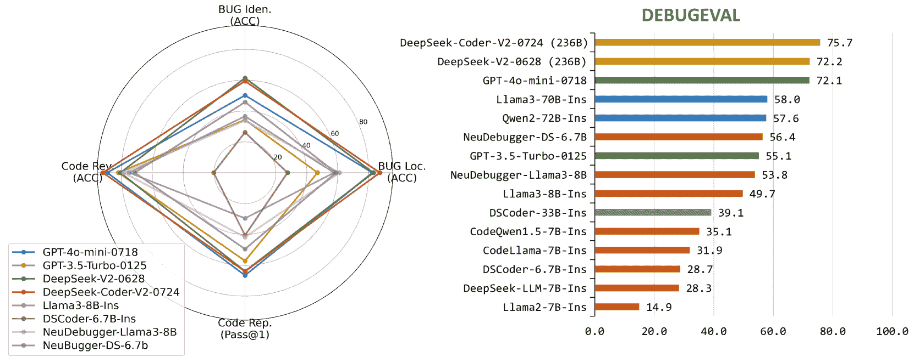

图1：LLM在DebugEval基准测试中的表现。左图：我们在四个任务上评估LLM的代码调试能力：BUG定位、BUG识别、代码审查和代码修复。雷达图展示了每个任务上的表现分布，反映了不同LLM在这些调试任务中的优缺点。右图：开源和闭源模型在四个任务上的平均表现。相同的颜色表示参数数量属于同一水平。

我们在DebugEval上对13个开源和闭源的LLM进行了基准测试，并评估了NeuDebugger的整体表现。结果如图[1](https://arxiv.org/html/2408.05006v1#S1.F1 "图1 ‣ I 引言 ‣ 通过基于沟通的代理数据精炼增强LLM的代码调试能力")所示，表明：1）具有70亿参数的模型表现出较弱的调试能力，而70亿参数的模型和闭源模型表现更好。2）DeepSeek系列模型表现优异，开源模型DeepSeek-Coder-V2-0724的表现优于闭源模型GPT-4o-mini。3）基于DeepSeek-Coder-6.7B-Ins和Llama3-8B-Ins的NeuDebugger-DS-6.7B和NeuDebugger-Llama3-8B在使用MASTER合成数据进行训练后，分别提高了27.7%和4.1%，表明MASTER可以显著精炼SFT数据，从而提高模型在调试任务上的表现。

进一步分析表明，仅仅为SFT收集数据并不能提升LLM的调试能力[[20](https://arxiv.org/html/2408.05006v1#bib.bib20)]。代码教师通过生成思维链（CoT）有效地教授代码学生三项任务：BUG定位、BUG识别和代码审查[[21](https://arxiv.org/html/2408.05006v1#bib.bib21)]。然而，CoT的结果会降低LLM在代码修复任务中的表现，因为它们引入了额外的噪音并破坏了代码结构。在SFT过程中，不同的模型表现出不同的学习行为。我们发现，合成数据相比于通用LLM（如Llama3-8B-Int），能够显著提高面向代码的LLM（如DeepSeek-Coder-6.7B-Ins）的性能。这些实验结果为未来提升LLM调试能力的研究提供了重要的启示和方向。

## II 相关工作

本节首先介绍一些用于代码理解和生成的基础模型，然后介绍与代码调试和修复相关的工作。

面向代码的语言模型。为了定制语言模型以理解代码，相关工作主要集中在预训练语言模型上，并引导它们学习代码的语法、语义以及惯用法[[22](https://arxiv.org/html/2408.05006v1#bib.bib22), [23](https://arxiv.org/html/2408.05006v1#bib.bib23), [24](https://arxiv.org/html/2408.05006v1#bib.bib24)]。CodeBERT通过掩码自然语言（NL）和编程语言（PL）中的标记，然后要求预训练语言模型填补被掩盖的部分。接着，CodeBERT采用ELECTRA方法[[25](https://arxiv.org/html/2408.05006v1#bib.bib25)]，预训练语言模型检测这些标记是否被替换，这有助于模型更好地捕捉代码语义[[26](https://arxiv.org/html/2408.05006v1#bib.bib26)]。DOBF[[27](https://arxiv.org/html/2408.05006v1#bib.bib27)]更进一步，考虑到代码相关任务的独特属性，更多地关注掩码和生成代码片段中的类名、函数名和变量名。CodeT5[[28](https://arxiv.org/html/2408.05006v1#bib.bib28)]通过使用跨度掩码策略持续预训练T5模型[[29](https://arxiv.org/html/2408.05006v1#bib.bib29)]，并通过更专注于代码中的标识符来优化掩码策略。这种预训练方法要求T5[[29](https://arxiv.org/html/2408.05006v1#bib.bib29)]模型生成这些标识符，从而增强其识别和理解代码相关任务中标识符信息的能力。此外，一些研究者还将多模态数据源（如代码、注释和抽象语法树（AST））结合进来，以预训练语言模型，这也有助于通过对齐代码语义和自然语言之间的语义关系，提升代码理解能力[[30](https://arxiv.org/html/2408.05006v1#bib.bib30), [31](https://arxiv.org/html/2408.05006v1#bib.bib31)]。

最近，大型语言模型（LLMs），如ChatGPT[[7](https://arxiv.org/html/2408.05006v1#bib.bib7)]和Llama[[8](https://arxiv.org/html/2408.05006v1#bib.bib8)]，已经展示了在处理不同任务中的应急能力，特别是在代码理解和生成任务方面。为了增强代码生成能力，一些广泛使用的LLM，如ChatGPT[[7](https://arxiv.org/html/2408.05006v1#bib.bib7)]，还在预训练语料库中加入了部分代码数据，这已被证明有助于提升LLM的推理能力[[32](https://arxiv.org/html/2408.05006v1#bib.bib32), [33](https://arxiv.org/html/2408.05006v1#bib.bib33), [34](https://arxiv.org/html/2408.05006v1#bib.bib34)]。一些典型的基于代码的LLM还收集了不同代码相关任务的指令数据，通过监督微调LLM，显著提升了LLM的代码生成能力[[35](https://arxiv.org/html/2408.05006v1#bib.bib35), [36](https://arxiv.org/html/2408.05006v1#bib.bib36), [37](https://arxiv.org/html/2408.05006v1#bib.bib37)]。尽管LLM在生成代码片段方面具有强大的有效性，但这些代码片段通常包含错误[[9](https://arxiv.org/html/2408.05006v1#bib.bib9)]，降低了生成代码的通过率。为了缓解这些问题，现有的努力主要集中在采用迭代代码修复方法，不断优化生成的代码片段[[9](https://arxiv.org/html/2408.05006v1#bib.bib9), [16](https://arxiv.org/html/2408.05006v1#bib.bib16), [15](https://arxiv.org/html/2408.05006v1#bib.bib15)]。

代码调试和修复。早期的调试模型主要依赖基于特征的方法，如使用模板[[5](https://arxiv.org/html/2408.05006v1#bib.bib5), [6](https://arxiv.org/html/2408.05006v1#bib.bib6)]、启发式规则[[3](https://arxiv.org/html/2408.05006v1#bib.bib3), [4](https://arxiv.org/html/2408.05006v1#bib.bib4)]，或约束条件[[38](https://arxiv.org/html/2408.05006v1#bib.bib38), [39](https://arxiv.org/html/2408.05006v1#bib.bib39)]来修复有缺陷的代码。然而，由于这些基于特征的调试方法需要研究人员预定义有限的模式或规则，它们的有效性很难扩展到修正不同的错误或处理更复杂的代码问题。

随着预训练语言模型（PLMs）的发展，相关工作也遵循了先预训练后微调的策略，构建调试模型来处理现实中出现的各种代码错误。例如，Xia等人 [[40](https://arxiv.org/html/2408.05006v1#bib.bib40)] 使用以代码为导向的预训练模型CodeX [[41](https://arxiv.org/html/2408.05006v1#bib.bib41)] 来探索PLMs在调试中的能力。研究表明，CodeX [[41](https://arxiv.org/html/2408.05006v1#bib.bib41)] 在代码修复方面表现出色，特别是在Python和Java编程语言上。Kolak等人 [[42](https://arxiv.org/html/2408.05006v1#bib.bib42)] 也使用GPT-2 [[43](https://arxiv.org/html/2408.05006v1#bib.bib43)] 和CodeX [[41](https://arxiv.org/html/2408.05006v1#bib.bib41)] 来评估它们在给定相应代码前缀时生成正确修复行的有效性。所有研究表明，基于PLM的调试模型的有效性主要依赖于在预训练过程中获得的代码理解能力。

与以往的调试工作不同，近年来的研究更加侧重于修正由大语言模型（LLMs）生成的错误。Self-Debug [[9](https://arxiv.org/html/2408.05006v1#bib.bib9)] 通过提示LLMs生成代码审查，帮助它们自己优化生成的代码，而Self-Repair [[44](https://arxiv.org/html/2408.05006v1#bib.bib44)] 则结合人工反馈来修复有问题的代码。此外，Self-Edit [[15](https://arxiv.org/html/2408.05006v1#bib.bib15)] 训练了一个额外的故障感知编辑器，通过利用测试用例评估中的错误信息和生成的代码片段来修复代码。Wang等人 [[16](https://arxiv.org/html/2408.05006v1#bib.bib16)] 进一步探讨了交互式修复链（CoR）的有效性，该方法利用LLMs生成修复代码的指导方针，通过整合生成的代码和代码编译器的错误信息。显然，这些代码修复模型的有效性主要依赖于LLMs的调试能力。

为了提升大型语言模型（LLMs）的调试能力，近期的研究更加关注为监督微调生成数据。InstructCoder [[45](https://arxiv.org/html/2408.05006v1#bib.bib45)] 采用了Self-Instruct方法[[46](https://arxiv.org/html/2408.05006v1#bib.bib46)]，构建了一个指令调优数据集，以提高LLMs在代码调试中的有效性。Li等人[[47](https://arxiv.org/html/2408.05006v1#bib.bib47)]进一步构建了APR-INSTRUCTION数据集，并利用该数据集结合四种不同的参数高效微调（PEFT）方法对LLMs进行微调，包括LoRA[[48](https://arxiv.org/html/2408.05006v1#bib.bib48)]、p-tuning[[49](https://arxiv.org/html/2408.05006v1#bib.bib49)]、prefix-tuning[[50](https://arxiv.org/html/2408.05006v1#bib.bib50)]和$(IA)^{3}$[[51](https://arxiv.org/html/2408.05006v1#bib.bib51)]。为了进一步评估LLMs的调试能力，一些研究者开始构建基准测试来评估LLMs。Wang等人[[16](https://arxiv.org/html/2408.05006v1#bib.bib16)]收集了Atcoder网站上真实用户提交的有缺陷代码，构建了CodeError，用于评估LLMs在Python代码上的修复能力。Tian等人[[17](https://arxiv.org/html/2408.05006v1#bib.bib17)]进一步提出了DebugBench，探索LLMs在Python、C++和Java中的调试能力。他们利用GPT-4[[19](https://arxiv.org/html/2408.05006v1#bib.bib19)]向代码片段中插入一些代码错误，以合成有缺陷的代码，并要求LLMs修复这些代码。然而，仅仅依靠代码修复任务不足以评估LLMs的调试能力。

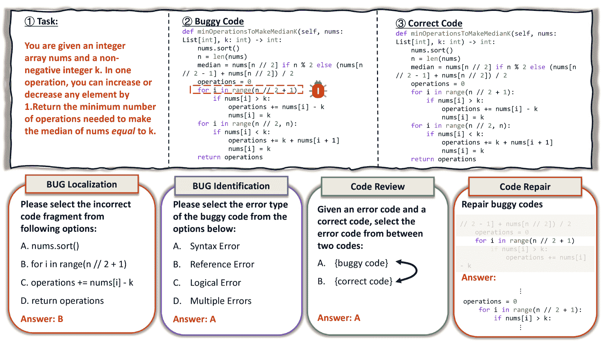

图2：DebugEval基准测试。DebugEval包括四个任务：BUG定位、BUG识别、代码审查和代码修复。前三个任务是选择题，评估方式为准确度。在代码审查任务中，我们交换了选项A和B的内容，以避免任何潜在的偏差。代码修复任务通过Pass@$1$来评估。

## III 使用DebugEval评估LLMs的调试能力

在本节中，我们介绍了DebugEval基准测试，旨在从不同方面评估大型语言模型（LLMs）的调试能力。我们首先描述了在DebugEval中设计任务的任务定义（参见[III-A](https://arxiv.org/html/2408.05006v1#S3.SS1 "III-A 任务定义 ‣ III 使用DebugEval评估LLMs的调试能力 ‣ 通过基于交互代理的数据精炼提升代码调试能力")）。接着，我们详细阐述了构建DebugEval基准测试的过程（参见[III-B](https://arxiv.org/html/2408.05006v1#S3.SS2 "III-B 数据构建细节 ‣ III 使用DebugEval评估LLMs的调试能力 ‣ 通过基于交互代理的数据精炼提升代码调试能力")）。

### III-A 任务定义

DebugEval 引入了四个不同的任务来评估 LLM 的调试能力。评估任务包括 BUG 定位、BUG 识别、代码审查和代码修复。

DebugEval 的数据统计如表 [I](https://arxiv.org/html/2408.05006v1#S3.T1 "TABLE I ‣ III-A Task Definition ‣ III Evaluating the Debugging Ability of LLMs with DebugEval ‣ Enhancing the Code Debugging Ability of LLMs via Communicative Agent Based Data Refinement") 所示。对于每个任务，使用 Python、C++ 和 Java 三种编程语言的问题来评估 LLM 在不同编程语言上的调试表现。BUG 定位、BUG 识别、代码审查和代码修复任务分别有 578、2320、2400 和 414 个测试实例，三种编程语言之间几乎均匀分布。在本小节的其余部分，我们展示了这四个评估任务的插图（图 [2](https://arxiv.org/html/2408.05006v1#S2.F2 "Figure 2 ‣ II Related Work ‣ Enhancing the Code Debugging Ability of LLMs via Communicative Agent Based Data Refinement")）并深入描述每个评估任务。

表 I：DebugEval 的数据统计。

| 评估任务 | 语言 | 测试实例数 |
| --- | --- | --- |
| BUG 定位：识别代码中哪个片段导致了错误。 | Python | 178 |
| C++ | 195 |
| Java | 205 |
| BUG 识别：识别代码中的错误类型。 | Python | 760 |
| C++ | 800 |
| Java | 760 |
| 代码审查：确定哪段代码是不正确的。 | Python | 800 |
| C++ | 800 |
| Java | 800 |
| 代码修复：修复有错误的代码，使其通过所有测试用例。 | Python | 138 |
| C++ | 138 |
| Java | 138 |

BUG定位。BUG 定位任务的重点是识别包含错误的特定代码行。它评估 LLM 指出代码片段中错误发生的确切位置的能力，这通常被视为调试过程中的第一步。对于每个 BUG 定位任务的测试实例，我们提供一个包含错误的代码 $P$，从中提取四个代码片段 $\{S_{A},S_{B},S_{C},S_{D}\}$，然后要求 LLM 识别包含错误的黄金代码片段 $S_{E}$。

BUG识别。在此任务中，LLM 应该对代码中出现的错误类型进行分类。具体来说，给定一个包含代码错误的程序 $P$，我们要求 LLM 从四个选项中分类错误类型 $E$，包括 SyntaxError、ReferenceError、LogicError 和 MultiErrors。SyntaxError 表示代码包含语法错误。ReferenceError 通常发生在代码试图访问未声明或超出作用域的变量、函数或对象时。LogicError 表示代码通常在语法上是正确的，但包含逻辑错误，未能得到预期的输出。MultiErrors 表示代码段包含多种错误，如 SyntaxError、ReferenceError 和 LogicError。

代码审查。对于代码审查任务，我们提供正确代码 $C_{i}$ 和错误代码 $E_{i}$，要求LLMs区分出错误的代码。具体来说，$C_{i}$ 和 $E_{i}$ 之间仅有少数代码片段不同。此外，我们在实验中交换 $C_{i}$ 和 $E_{i}$ 的选择标识符（A和B），以避免任何潜在的偏差。

代码修复。代码修复 [[16](https://arxiv.org/html/2408.05006v1#bib.bib16), [17](https://arxiv.org/html/2408.05006v1#bib.bib17)] 任务要求为给定的有bug代码 $P$ 生成修复后的版本 $P^{\prime}$，这是对模型调试能力的终极测试。代码修复任务在这四个调试任务中是最困难的。它不仅涉及代码错误检测/识别，还需要修复代码中的错误。在生成修复后的代码 $P^{\prime}$ 后，我们通过使用 $n$ 个测试用例 $X=\{(x_{1},y_{1}),...,(x_{n},y_{n})\}$ 来评估 $P^{\prime}$ 的正确性。具体来说，我们将测试用例 $(x_{i},y_{i})$ 的输入 $x_{i}$ 输入到修复后的代码 $P^{\prime}$ 中，然后得到执行结果 $P^{\prime}(x_{i})$。如果存在满足 $P^{\prime}(x_{j})\neq y_{j}$ 的测试用例 $(x_{i},y_{i})\in X$，则表示代码 $P^{\prime}$ 仍然包含需要修复的错误。代码修复任务的目标是将有缺陷的程序 $P$ 转换为通过所有测试用例的 $P^{\prime}$（$\forall(x_{i},y_{i})\in(x_{i},y_{i}),P^{\prime}(x_{i})=y_{i}$）。

### III-B 数据构建的细节

在本小节中，我们详细阐述了DebugEval数据集的源数据收集和构建方法。

为了确保DebugEval的质量，我们从可靠的数据源收集高质量的数据，如DebugBench [[17](https://arxiv.org/html/2408.05006v1#bib.bib17)] 和 LiveCodeBench [[52](https://arxiv.org/html/2408.05006v1#bib.bib52)]，以及AtCoder网站¹¹1[https://atcoder.jp](https://atcoder.jp)。DebugBench专注于代码修复任务，需要调用LeetCode API来评估生成代码的正确性。DebugBench的每个测试实例都包含有bug的代码和相应的错误类型。LiveCodeBench是一个代码生成数据集，每个测试实例包含一个任务描述、正确代码和测试用例，用于评估生成代码的正确性。在本文中，我们仅使用来自LiveCodeBench的问题，并从AtCoder网站构建每个问题的一个正确代码和有bug代码对。

错误定位。对于错误定位任务，我们从DebugBench中抽取测试实例。具体来说，我们通过从每种编程语言的15种单一代码错误类型中抽取最多20个实例来构建错误定位任务的数据集。我们将有错误的代码与正确的代码进行比较，从中找到包含错误的代码片段作为黄金选择$S_{E}$。为了构建其他混淆选择，我们丢弃错误的代码片段，并随机抽取一行代码作为混淆选择之一。

错误识别。为了对错误识别任务进行评估，我们还从DebugBench中抽取测试实例。具体来说，任务的选择被分为四种类型：SyntaxError（语法错误）、ReferenceError（引用错误）、LogicError（逻辑错误）和MultiErrors（多重错误），因此确保每种选择（代码错误类型）的平衡非常重要。对于每种编程语言，我们比较不同类型代码错误的测试样本集的大小，然后选择最小的样本集大小作为采样数量。最后，我们根据这个采样数量从不同代码错误测试集中的实例中进行抽样。

表 II：DebugEval与其他代码修复基准的比较。大小仅表示测试集的大小。CE表示编译错误（例如，语法错误）。错误源表示如何构造错误代码。是否防止数据泄露表示是否存在数据泄露。DebugEval的一部分数据来自DebugBench，并且没有数据泄露。我们收集的数据都在2023年9月1日之后，这也避免了数据泄露。

| 数据集 | 语言 | 任务 | 大小 | 错误类型 | 错误源 | 是否防止数据泄露 |
| --- | --- | --- | --- | --- | --- | --- |
| DeepFix [[53](https://arxiv.org/html/2408.05006v1#bib.bib53)] | C | 代码修复 | 6,971 | 仅限CE | 用户提交 | ✗ |
| Review4Repair [[54](https://arxiv.org/html/2408.05006v1#bib.bib54)] | Java | 代码修复 | 2,961 | 全部 | 用户提交 | ✗ |
| Bug2Fix [[55](https://arxiv.org/html/2408.05006v1#bib.bib55)] | Java | 代码修复 | 5,835 | 全部 | 用户提交 | ✗ |
| Github-Python [[53](https://arxiv.org/html/2408.05006v1#bib.bib53)] | Python | 代码修复 | 15K | 仅限CE | 用户提交 | ✗ |
| FixEval [[56](https://arxiv.org/html/2408.05006v1#bib.bib56)] | Java/Python | 代码修复 | 43k/243k | 全部 | 用户提交 | ✗ |
| CodeError [[16](https://arxiv.org/html/2408.05006v1#bib.bib16)] | Python | 代码修复 | 4,463 | 全部 | 用户提交 | ✗ |
| DebugBench [[17](https://arxiv.org/html/2408.05006v1#bib.bib17)] | C++/Java/Python | 代码修复 | 1,438/1,401/1,414 | 全部 | GPT-4 生成 | ✓ |
| CodeEditorBench [[18](https://arxiv.org/html/2408.05006v1#bib.bib18)] | C++/Java/Python | 代码修复 | 676/515/716 | 全部 | GPT-4 生成 | ✓ |
| DebugEval | C++/Java/Python |

&#124; 错误定位 &#124;

&#124; 错误识别 &#124;

&#124; 代码审查 &#124;

&#124; 代码修复 &#124;

|

&#124; 195/205/178 &#124;

&#124; 800/760/760 &#124;

&#124; 800/800/800 &#124;

&#124; 138/138/138 &#124;

| 全部 |
| --- |

&#124; 用户提交 &#124;

&#124; GPT-4 生成 &#124;

| ✓ |
| --- |

代码审查。我们首先将来自 DebugBench 和 LiveCodeBench 的测试实例混合。然后，我们通过随机抽取每种编程语言中的 800 个测试实例，从混合数据集中收集测试对。每个测试实例由有缺陷的代码和正确的代码组成，要求 LLM 选择出有缺陷的代码。

代码修复。对于代码修复，我们首先收集了 2023 年 9 月 1 日至 2024 年 4 月 1 日期间 Atcoder 发布的 138 个新的编程竞赛问题，以减少数据泄露的风险。然后，我们收集了真实用户提交的有缺陷代码，并分别选择了 Python、C++ 和 Java 的有缺陷代码。大量有缺陷的代码（82.7%）具有以下提交，这些提交修复了有缺陷的代码并通过了所有测试用例，作为该有缺陷代码的黄金答案。对于其余这些有缺陷的代码（17.3%），我们使用不同的 LLM 进行修复，直到修复后的代码通过所有测试用例。

总结。如表[II](https://arxiv.org/html/2408.05006v1#S3.T2 "TABLE II ‣ III-B 数据构建细节 ‣ III 使用 DebugEval 评估 LLM 的调试能力 ‣ 通过基于交互式代理的数据精炼增强 LLM 的代码调试能力")所示，与其他调试基准不同，DebugEval 是一个多语言和多任务的调试基准，它对 LLM 的调试能力进行了更为全面的评估。此外，DebugEval 包含了由 GPT-4 和人类生成的有缺陷代码，使得评估更加具有说服力、现实性和真实性。

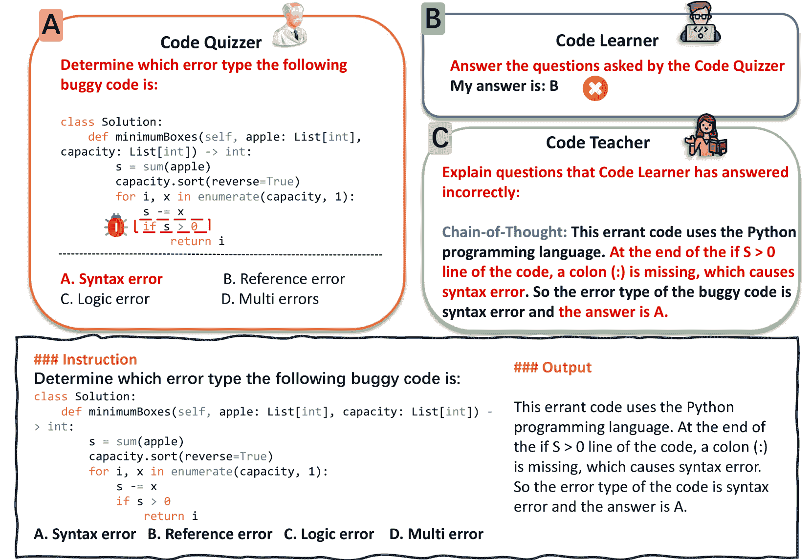

图 3：基于交互式代理的数据精炼框架（MASTER）示意图。

## IV 基于交互式代理的数据精炼框架

监督微调（Supervised Fine-Tuning，SFT）已被广泛应用于通过使用人工标注数据集或LLM生成的数据[[37](https://arxiv.org/html/2408.05006v1#bib.bib37)，[57](https://arxiv.org/html/2408.05006v1#bib.bib57)]，以提升LLM在特定领域的表现[[15](https://arxiv.org/html/2408.05006v1#bib.bib15)]。然而，SFT对标注数据的可用性和质量的依赖限制了其整体效果。在这种情况下，本文介绍了基于交互式智能体的数据精炼框架（MASTER），该框架自动精炼用于监督微调的代码调试数据。如图[3](https://arxiv.org/html/2408.05006v1#S3.F3 "Figure 3 ‣ III-B Details of Data Construction ‣ III Evaluating the Debugging Ability of LLMs with DebugEval ‣ Enhancing the Code Debugging Ability of LLMs via Communicative Agent Based Data Refinement")所示，我们将任务示例提供给LLM，然后提示LLM扮演不同角色，合成SFT数据（第[IV-A](https://arxiv.org/html/2408.05006v1#S4.SS1 "IV-A Agent Building ‣ IV CoMmunicative Agent BaSed DaTa REfinement FRamework ‣ Enhancing the Code Debugging Ability of LLMs via Communicative Agent Based Data Refinement")节）。最后，MASTER通过不同的智能体精炼合成数据，以确保SFT数据的质量（第[IV-B](https://arxiv.org/html/2408.05006v1#S4.SS2 "IV-B SFT Data Refinement with Communicative Multi-Agents ‣ IV CoMmunicative Agent BaSed DaTa REfinement FRamework ‣ Enhancing the Code Debugging Ability of LLMs via Communicative Agent Based Data Refinement")节）。

### IV-A 智能体构建

为了进行数据精炼，MASTER构建了三个智能体，这些智能体协同生成和精炼调试问题数据，从而合成高质量的SFT数据集。如图[4](https://arxiv.org/html/2408.05006v1#S4.F4 "Figure 4 ‣ IV-A Agent Building ‣ IV CoMmunicative Agent BaSed DaTa REfinement FRamework ‣ Enhancing the Code Debugging Ability of LLMs via Communicative Agent Based Data Refinement")所示，我们使用不同的提示引导LLM扮演代码提问者（Code Quizzer）、代码学习者（Code Learner）和代码教师（Code Teacher）角色。每个智能体的详细信息如下所述。

代码提问者（Code Quizzer）。代码提问者旨在为SFT数据生成高质量的题目。它使用一个更强大的LLM作为主干模型，并提供如下指令：“你是一个代码调试专家，擅长生成代码调试问题以挑战程序员”。这一设置使得代码提问者能够通过分析调试任务示例生成量身定制的问题。这些问题旨在评估代码学习者解决相应调试任务的能力。

代码学习者（Code Learner）。代码学习者与 SFT 模型共享相同的骨干模型，并作为评论员评估 Code Quizzer 生成的问题的教育价值。通过提示：“你是一个学生，请用你自己的知识回答以下代码调试问题”，代码学习者负责根据其记忆的知识来解决问题。然后通过判断代码学习者是否能正确解决问题来评估该问题的教育价值，从而有助于微调过程。

代码教师（Code Teacher）。受到之前工作的启发[[16](https://arxiv.org/html/2408.05006v1#bib.bib16)]，我们还开发了一个代码教师，通过提示同样的 LLM（用于 Code Quizzer）并给予指令：“你是一个经验丰富且有洞察力的调试员”。这个提示指导 LLM 作为一个熟练的代码调试员，生成连锁思维结果[[58](https://arxiv.org/html/2408.05006v1#bib.bib58)]，作为问题的详细解决方案，从而更好地指导 LLM 在 SFT 过程中。

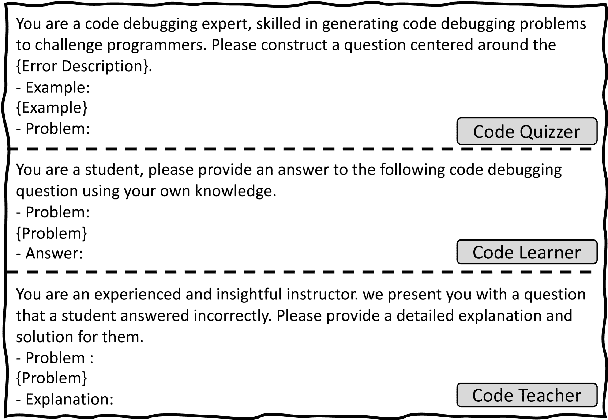

图 4：MASTER 中用于构建智能体的提示插图。在 MASTER 中，有三个基于 LLM 的智能体：Code Quizzer、Code Learner 和 Code Teacher。我们利用特定的指令确保它们扮演正确的角色并执行预定任务。

### IV-B 使用交互式多智能体进行 SFT 数据优化

MASTER 通过多智能体协作实现了自动化数据优化，利用更强模型的专业知识来增强较弱模型的能力。数据优化过程包括三个主要步骤。

在初始步骤（步骤 A）中，Code Quizzer 基于调试任务中的示例合成各种代码调试问题。为了确保合成数据的多样性，我们指示 Code Quizzer 生成与 DebugEval 中定义的任务一致的不同调试问题，包括 Bug 定位、Bug 识别、代码审查和代码修复。每个调试任务的数据合成过程都由一个单一的示例指导，该示例作为演示[[59](https://arxiv.org/html/2408.05006v1#bib.bib59)]。这种方法确保了合成的数据涵盖了各种错误类型和难度级别，这对从 Code Quizzer/Teacher 模型中提炼调试知识在 SFT Code Learner 过程中至关重要。

在综合调试问题后，我们进入步骤 B。在这一阶段，代码学习者尝试解决代码测验者提供的问题。在这种情况下，代码学习者充当评论者，评估每个综合问题对代码学习者的教育价值。如果代码学习者正确解决了问题，则表明学习者已经具备了解决该问题所需的知识，因此该问题会被丢弃。另一方面，如果代码学习者提供了错误的解决方案，则该问题由于其对指导代码学习者的教育价值，会被保留作为 SFT 数据。

最后，在步骤 C 中，代码教师会回顾保留的问题，并生成详细的解释和解决方案。这些基于思维链的解释可能包括错误类型识别、错误说明以及解决问题的正确方案。这些反馈对于代码学习者理解问题并完善解决方案至关重要。代码教师生成的回应被视为合成问题的最终输出，形成 SFT 数据，用于微调我们的 NeuDebugger 模型。

表 III：不同监督式微调策略的数据统计。我们从 UltraInteract、InstructCoder 和 RepairLlama 收集高质量的指令调优数据，以进行基础的 SFT 设置。

| SFT 数据 | 数据来源 | #实例 |
| --- | --- | --- |
| 人类/GPT-4 | UltraInteract [[35](https://arxiv.org/html/2408.05006v1#bib.bib35)] | 154,347 |
| InstructCoder [[60](https://arxiv.org/html/2408.05006v1#bib.bib60)] | 6,913 |
| RepairLlama [[61](https://arxiv.org/html/2408.05006v1#bib.bib61)] | 64,643 |
| MASTER | BUG 定位数据 | 4,681 |
| BUG 识别数据 | 4,474 |
| 代码审查数据 | 4,420 |
| 代码修复数据 | 11,317 |

## V 实验方法

在本节中，我们描述了监督式微调（SFT）策略、评估指标、评估的基础模型的细节以及实验的实现细节。

监督式微调策略。如表[III](https://arxiv.org/html/2408.05006v1#S4.T3 "TABLE III ‣ IV-B SFT Data Refinement with Communicative Multi-Agents ‣ IV CoMmunicative Agent BaSed DaTa REfinement FRamework ‣ Enhancing the Code Debugging Ability of LLMs via Communicative Agent Based Data Refinement")所示，我们描述了不同监督式微调策略的实验细节，包括基础的 SFT 和 MASTER。对于基础的 SFT，我们从 UltraInteract [[35](https://arxiv.org/html/2408.05006v1#bib.bib35)]、InstructCoder [[60](https://arxiv.org/html/2408.05006v1#bib.bib60)] 和 RepairLlama [[61](https://arxiv.org/html/2408.05006v1#bib.bib61)] 收集 SFT 数据来微调大语言模型（LLMs）。这些数据集由 GPT-4 生成或由人类标注，具有高质量。对于 MASTER，我们通过使用多智能体来合成 SFT 数据。

评估指标。我们首先介绍用于评估不同模型在 DebugEval 上表现的评估指标。

对于 BUG 定位、BUG 识别和代码审查任务，LLMs 需要从给定问题的多个选项中选择一个答案。因此，我们使用准确率作为这三项任务的评估指标，这与之前的工作相同[[62](https://arxiv.org/html/2408.05006v1#bib.bib62)]。特别地，对于代码审查任务，由于模型需要在两个选项之间做出选择，我们打乱了选项的顺序以避免潜在的偏差。对于每个测试数据，只有当两种顺序都回答正确时，模型才算正确。对于代码修复任务，我们遵循之前的工作[[63](https://arxiv.org/html/2408.05006v1#bib.bib63), [12](https://arxiv.org/html/2408.05006v1#bib.bib12), [11](https://arxiv.org/html/2408.05006v1#bib.bib11), [64](https://arxiv.org/html/2408.05006v1#bib.bib64)]，并使用 Pass@$k$ [[63](https://arxiv.org/html/2408.05006v1#bib.bib63)] 来评估不同 LLMs 的效果：

|  | $\text{Pass@}k:=\underset{\text{问题}}{\operatorname*{\mathbb{E}}}\left[1-% \frac{\binom{n-c}{k}}{\binom{n}{k}}\right],$ |  | (1) |
| --- | --- | --- | --- |

其中 $n$ 是样本的总数，$c$ 是正确样本的数量，$k$ 是前 $k$ 个样本的数量。在我们的实验中，我们设定 $k=1$。

表 IV：不同 LLM 在 DebugEval 上的评估结果。三项任务，包括 BUG 定位、BUG 识别和代码审查，使用准确率评估。代码修复任务使用 Pass$@1$ 进行评估。在这里，我们用 DS 表示 DeepSeek 模型，用 PY 表示 Python。

| 模型 | BUG 定位 | BUG 识别 | 代码审查 | 代码修复 | 平均 |
| --- | --- | --- | --- | --- | --- |
| PY | C++ | JAVA | 平均 | PY | C++ | JAVA | 平均 | PY | C++ | JAVA | 平均 | PY | C++ | JAVA | 平均 |
| GPT-4o-mini-0718 [[65](https://arxiv.org/html/2408.05006v1#bib.bib65)] | 84.8 | 81.0 | 81.5 | 82.4 | 53.3 | 48.5 | 48.9 | 50.2 | 85.4 | 90.9 | 91.0 | 89.1 | 65.2 | 67.2 | 67.4 | 66.6 | 72.1 |
| GPT-3.5-Turbo-0125 [[7](https://arxiv.org/html/2408.05006v1#bib.bib7)] | 40.4 | 47.2 | 52.2 | 46.9 | 35.5 | 33.3 | 34.1 | 34.3 | 79.4 | 82.4 | 84.0 | 81.9 | 57.2 | 52.9 | 61.6 | 57.2 | 55.1 |
| DeepSeek-V2-0628 [[66](https://arxiv.org/html/2408.05006v1#bib.bib66)] | 82.0 | 81.0 | 85.9 | 83.0 | 62.0 | 61.0 | 61.3 | 61.4 | 77.4 | 83.9 | 80.5 | 80.6 | 65.2 | 63.0 | 63.5 | 63.9 | 72.2 |
| DeepSeek-Coder-V2-0724 [[67](https://arxiv.org/html/2408.05006v1#bib.bib67)] | 88.8 | 83.1 | 89.8 | 87.2 | 58.7 | 58.9 | 60.8 | 59.4 | 87.9 | 94.9 | 93.3 | 92.0 | 66.7 | 63.1 | 62.3 | 64.0 | 75.7 |
| Llama3-70B-Ins [[68](https://arxiv.org/html/2408.05006v1#bib.bib68)] | 74.2 | 75.9 | 82.0 | 77.5 | 42.8 | 42.3 | 44.9 | 43.3 | 73.9 | 61.6 | 63.3 | 66.3 | 44.9 | 44.2 | 45.7 | 44.9 | 58.0 |
| Qwen2-72B-Ins [[69](https://arxiv.org/html/2408.05006v1#bib.bib69)] | 79.8 | 69.2 | 74.6 | 74.4 | 45.8 | 45.0 | 41.3 | 44.1 | 61.5 | 75.8 | 70.4 | 69.2 | 43.5 | 42.0 | 42.8 | 42.8 | 57.6 |
| DSCoder-33B-Ins [[64](https://arxiv.org/html/2408.05006v1#bib.bib64)] | 52.2 | 50.3 | 51.7 | 51.4 | 24.9 | 26.0 | 30.9 | 27.2 | 24.8 | 27.0 | 30.5 | 27.4 | 46.4 | 50.7 | 54.3 | 50.5 | 39.1 |
| Llama2-7B-Ins [[8](https://arxiv.org/html/2408.05006v1#bib.bib8)] | 18.0 | 20.0 | 22.4 | 20.2 | 24.9 | 27.0 | 25.8 | 25.9 | 2.3 | 0.6 | 2.0 | 1.6 | 4.3 | 11.7 | 19.6 | 11.9 | 14.9 |
| CodeLlama-7B-Ins [[37](https://arxiv.org/html/2408.05006v1#bib.bib37)] | 27.0 | 20.0 | 23.9 | 23.5 | 26.1 | 23.0 | 23.8 | 24.3 | 48.1 | 60.5 | 65.6 | 58.1 | 18.8 | 23.2 | 23.2 | 21.7 | 31.9 |
| CodeQwen1.5-7B-Ins [[36](https://arxiv.org/html/2408.05006v1#bib.bib36)] | 29.2 | 30.8 | 38.0 | 32.9 | 27.6 | 25.9 | 28.8 | 27.4 | 26.9 | 34.4 | 37.1 | 32.8 | 39.1 | 49.3 | 52.9 | 47.1 | 35.1 |
| DeepSeek-LLM-7B-Ins [[70](https://arxiv.org/html/2408.05006v1#bib.bib70)] | 27.0 | 19.0 | 25.9 | 23.9 | 30.5 | 28.5 | 30.9 | 29.9 | 35.9 | 36.6 | 46.0 | 39.5 | 21.0 | 24.1 | 14.5 | 19.9 | 28.3 |
| DSCoder-6.7B-Ins [[64](https://arxiv.org/html/2408.05006v1#bib.bib64)] | 22.5 | 25.6 | 33.7 | 27.5 | 26.6 | 26.0 | 25.9 | 26.2 | 15.5 | 17.8 | 27.8 | 20.3 | 31.9 | 43.5 | 46.4 | 40.6 | 28.7 |
| Llama3-8B-Ins [[68](https://arxiv.org/html/2408.05006v1#bib.bib68)] | 55.6 | 55.9 | 61.0 | 57.6 | 36.8 | 38.1 | 34.6 | 36.6 | 69.1 | 77.4 | 78.1 | 74.9 | 26.1 | 34.3 | 28.3 | 29.6 | 49.7 |
| NeuDebugger-DS-6.7B | 62.4 | 55.4 | 59.0 | 58.8 | 42.6 | 46.9 | 47.8 | 45.8 | 71.0 | 71.4 | 71.4 | 71.3 | 43.5 | 48.6 | 56.5 | 49.5 | 56.4 |
| NeuDebugger-Llama3-8B | 64.6 | 57.9 | 61.0 | 61.1 | 38.6 | 29.9 | 33.3 | 33.8 | 75.3 | 78.0 | 82.4 | 78.5 | 38.4 | 41.3 | 45.7 | 41.8 | 53.8 |

基础模型。我们在DebugEval上评估了13个大型语言模型（LLM），包括闭源和开源模型。

OpenAI GPTs。GPT-4o-mini-0718 [[65](https://arxiv.org/html/2408.05006v1#bib.bib65)] 和 GPT-3.5-Turbo-0125 [[7](https://arxiv.org/html/2408.05006v1#bib.bib7)] 是两款流行且强大的LLM，它们属于GPT系列的不同变种，由OpenAI开发。GPT-4o-mini-0718是GPT-4o模型的轻量版，但仍然继承了GPT-4o的核心优势，包括强大的文本生成、逻辑推理和代码生成能力。这两个模型都是黑盒模型，提供商业API供使用。

Meta Llama。Llama2-7B-Ins [[8](https://arxiv.org/html/2408.05006v1#bib.bib8)] 是一款开源LLM。它经过了最多1.4万亿个标记的训练，其中4.5%是来自Github的代码标记。CodeLlama-7B-Ins [[37](https://arxiv.org/html/2408.05006v1#bib.bib37)] 进行额外的指令调优阶段，以便将Llama2 [[8](https://arxiv.org/html/2408.05006v1#bib.bib8)] 适应并提高其在代码相关任务中的有效性。最近发布了Llama3 [[68](https://arxiv.org/html/2408.05006v1#bib.bib68)] 模型，代表了Llama2模型的重大飞跃，树立了新的最先进技术标准。

阿里云 Qwen。Qwen2-72B-Ins 是一个具有 72 亿参数规模的 LLM。Qwen2-72B 采用多种自动化方法获取高质量的指令和偏好数据，使其在代码和数学任务中表现良好。CodeQwen1.5-7B-Ins [[36](https://arxiv.org/html/2408.05006v1#bib.bib36)] 是 Qwen1.5-7B [[71](https://arxiv.org/html/2408.05006v1#bib.bib71)] 的面向代码的版本。CodeQwen1.5-7B-Ins 已通过约 3 万亿个与代码相关的数据进行微调。它支持 92 种编程语言，并支持长上下文的理解与生成，支持的上下文长度为 64K tokens。

DeepSeek。DeepSeek 系列模型由 High-Flyer 发布。DeepSeek-LLM-7B [[70](https://arxiv.org/html/2408.05006v1#bib.bib70)] 是通过从零开始训练，使用 2 万亿个英文和中文的 tokens。DeepSeek-LLM-7B-Ins [[70](https://arxiv.org/html/2408.05006v1#bib.bib70)] 是由 DeepSeek-LLM-7B 初始化，并使用额外的 100 万条指令数据进行微调。DSCoder-6.7B-Ins [[64](https://arxiv.org/html/2408.05006v1#bib.bib64)] 和 DSCoder-33B-Ins [[64](https://arxiv.org/html/2408.05006v1#bib.bib64)] 是通过从零开始训练，使用 2 万亿个 tokens，其中 87% 为代码，13% 为自然语言。DeepSeek-V2-0628 [[66](https://arxiv.org/html/2408.05006v1#bib.bib66)] 包含 236B 参数，并采用专家混合（MoE）[[72](https://arxiv.org/html/2408.05006v1#bib.bib72)] 架构进行高效的训练与推理。它在一个包含 8.1 万亿 tokens 的高质量语料库上进行训练。DeepSeek-Coder-V2-0724 [[67](https://arxiv.org/html/2408.05006v1#bib.bib67)] 也是一个基于 MoE 的开源 LLM，在代码相关任务上与 GPT4-Turbo 达到相当的性能。DeepSeek-Coder-V2 从 DeepSeek-V2 的中间检查点开始，并使用 6 万亿个 tokens 进行微调。

实现细节。对于所有 LLM，我们将生成温度设置为 0.2，最大生成长度设置为 1024 tokens。对于闭源模型，我们使用各自厂商提供的 API 接口；对于开源模型，我们使用 vLLM [[73](https://arxiv.org/html/2408.05006v1#bib.bib73)] 框架进行推理。对于 DebugEval 中的所有任务，我们在实验中使用零样本设置。为了微调 NeuDebugger 模型，我们使用 DeepSeek-Coder-6.7B-Inst [[64](https://arxiv.org/html/2408.05006v1#bib.bib64)] 和 Llama3-8B-Inst [[68](https://arxiv.org/html/2408.05006v1#bib.bib68)] 作为我们的骨干模型，并利用 MASTER 合成的数据作为 SFT 数据。在 SFT 过程中，所有模型都使用 Llama-Factory [[74](https://arxiv.org/html/2408.05006v1#bib.bib74)] 进行训练，并使用 LoRA [[75](https://arxiv.org/html/2408.05006v1#bib.bib75)] 进行高效微调。在我们的实验中，我们将学习率设置为 2e-5，训练轮次设置为 1。我们使用 AdamW 优化器优化模型，批处理大小为 8，梯度累积步数为 4。

## VI 评估结果

在本节中，我们对 LLMs 在 DebugEval 上进行了基准测试，并评估了 NeuDebugger 的整体表现。然后我们进行了消融研究，讨论了不同 SFT 数据量对模型表现的影响。接下来的实验探讨了 NeuDebugger 在处理不同代码错误类型问题上的有效性。最后，呈现了案例研究。

表 V：MASTER 框架的有效性以及 CoT 在训练数据中对模型表现的影响。SFT 代表监督式微调，CoT 代表思维链。“Vanilla SFT”表示使用收集的现有数据来训练模型。“MASTER (Answer)”表示所有四个任务的训练数据中不包含 CoT 输出。“MASTER (CoT)”表示所有四个任务的训练数据包含 CoT。“NeuDebugger”采用混合策略，意味着其他三个任务包括 CoT，但不包括代码修复任务。

| 方法 |
| --- |

&#124; BUG &#124;

&#124; 位置 &#124;

|

&#124; BUG &#124;

&#124; 识别 &#124;

|

&#124; 代码 &#124;

&#124; 修订 &#124;

|

&#124; 代码 &#124;

&#124; 重复 &#124;

| 平均 |
| --- |
| DSCoder-6.7B-Ins |
| zero-shot | 27.5 | 26.2 | 20.3 | 40.6 | 28.7 |
| w/ Vanilla SFT | 21.8 | 23.1 | 9.4 | 40.1 | 23.6 |
| w/ MASTER (Answer) | 43.8 | 35.8 | 32.7 | 43.5 | 39.0 |
| w/ MASTER (CoT) | 60.7 | 45.0 | 34.7 | 38.7 | 44.8 |
| NeuDebugger | 58.8 | 45.8 | 71.3 | 49.5 | 56.4 |
| Llama3-8B-Ins |
| zero-shot | 57.6 | 36.6 | 74.9 | 29.6 | 49.7 |
| w/ Vanilla SFT | 53.6 | 34.0 | 26.0 | 28.7 | 35.6 |
| w/ MASTER (Answer) | 58.1 | 34.8 | 32.1 | 42.5 | 41.9 |
| w/ MASTER (CoT) | 64.4 | 34.6 | 78.1 | 32.6 | 52.4 |
| NeuDebugger | 61.1 | 33.8 | 78.5 | 41.8 | 53.8 |

表 VI：基础模型和 NeuDebugger 在不同 Bug 类型上的表现。语法、引用、逻辑和多重分别代表语法错误、引用错误、逻辑错误和多重错误。

| 任务 | 模型 | Python | C++ | Java |
| --- | --- | --- | --- | --- |
| 语法 | 引用 | 逻辑 | 多重 | 语法 | 引用 | 逻辑 | 多重 | 语法 | 引用 | 逻辑 | 多重 |
| Bug 识别 | Llama3-8B-Ins | 0.0 | 3.7 | 97.9 | 45.8 | 0.0 | 3.0 | 87.5 | 62.0 | 0.0 | 3.7 | 87.4 | 47.4 |
| NeuDebugger-Llama3-8B | 34.2 | 16.8 | 27.9 | 75.3 | 17.0 | 3.0 | 15.0 | 84.5 | 25.3 | 4.2 | 23.2 | 80.5 |
| DSCoder-6.7B-Ins | 3.2 | 3.2 | 99.5 | 0.5 | 2.0 | 0.0 | 100.0 | 2.0 | 1.6 | 1.6 | 100.0 | 0.5 |
| NeuDebugger-DS-6.7B | 54.2 | 81.1 | 32.6 | 2.6 | 45.0 | 45.0 | 77.5 | 20.0 | 50.0 | 55.8 | 72.6 | 12.6 |
| 代码修复 | Llama3-8B-Ins | 40.0 | 20.0 | 35.6 | 7.5 | 60.9 | 45.8 | 29.6 | 16.7 | 40.0 | 52.4 | 28.3 | 7.7 |
| NeuDebugger-Llama3-8B | 90.0 | 46.7 | 39.7 | 20.0 | 65.2 | 66.7 | 40.7 | 10.8 | 80.0 | 76.2 | 39.6 | 15.4 |
| DSCoder-6.7B-Ins | 40.0 | 33.3 | 38.4 | 17.5 | 69.6 | 58.3 | 40.7 | 21.6 | 60.0 | 71.4 | 47.2 | 23.1 |
| NeuDebugger-DS-6.7B | 90.0 | 46.7 | 45.2 | 27.5 | 87.0 | 62.5 | 40.7 | 27.0 | 76.0 | 85.7 | 54.7 | 30.8 |

### VI-A 总体表现

不同LLM和我们开发的NeuDebugger在DebugEval上的评估结果见表[IV](https://arxiv.org/html/2408.05006v1#S5.T4 "TABLE IV ‣ V Experimental Methodology ‣ Enhancing the Code Debugging Ability of LLMs via Communicative Agent Based Data Refinement")。我们比较了不同规模的LLM，以评估它们在代码调试方面的效果。

总体来说，大规模的LLM在代码调试能力上表现更强。评估结果表明，超过70B参数的LLM在各种调试任务中通常表现一致。BUG定位和BUG识别任务都是四选一的多项选择题，随机猜测的准确率大约为25%。不幸的是，大多数7B规模的LLM在这两个任务中的准确率都低于30%。这一现象突显了模型规模在维持突现能力和通过代码数据的有监督微调（SFT）获取关键知识中的重要性[[35](https://arxiv.org/html/2408.05006v1#bib.bib35), [20](https://arxiv.org/html/2408.05006v1#bib.bib20)]。

在我们的实验中，我们选择DSCoder-6.7B-Ins和Llama3-8B-Ins作为骨干模型，然后使用MASTER生成的合成数据对这两种LLM进行微调，分别构建NeuDebugger-DS-6.7B和NeuDebugger-Llama3-8B模型。与其他7B规模的LLM相比，我们的NeuDebugger显著提升了基础模型的代码调试效果，并且达到了与70B模型相当的竞争力表现。这表明，构建高质量的SFT数据对于确保这些7B模型的代码理解和代码调试能力至关重要。此外，NeuDebugger-DS-6.7B和NeuDebugger-Llama3-8B在DebugEval的四个任务上均表现优于基础模型DSCoder-6.7B-Ins和Llama3-8B-Ins，分别带来了27.7%和4.1%的提升。这些改进表明，MASTER能够通过精炼代码调试数据显著提高模型在调试任务上的表现。

在DebugEval定义的四个任务中，LLM通常在BUG定位和代码审查任务中表现较好。例如，GPT-4o-mini-0718在这两个任务中的准确率分别为82.4和89.1。这表明这些LLM通过在代码生成任务上进行微调，具备强大的代码理解能力，能够有效识别有问题的代码片段，并展现出更好的代码执行能力。相反，所有LLM在BUG识别和代码修复任务中的效果较差，这些任务更加侧重于评估LLM的代码调试能力。对于BUG识别任务，LLM需要识别出bug的原因。LLM在这一任务中的效果下降，显示了当前LLM在推导bug原因时的困难。代码修复任务则更为复杂，要求LLM定位有问题的代码片段，确定错误类型，并修复代码。这些70B的LLM表现不佳，进一步表明它们在自我调试时所面临的挑战[[9](https://arxiv.org/html/2408.05006v1#bib.bib9)]。这一现象在之前的研究中也有观察到[[16](https://arxiv.org/html/2408.05006v1#bib.bib16)]。研究人员通过引入来自代码编译器的额外反馈来修复代码，旨在增强LLM的bug识别能力。

模型在不同编程语言上的表现揭示了不同大语言模型（LLM）的有效性和稳健性。例如，GPT-4o-mini-0718和DeepSeek-Coder-V2-0724模型在所有语言中表现一致，突出显示了它们在处理多样化任务时的稳健性。相比之下，某些LLM在不同编程语言之间表现不一致。例如，DSCoder-6.7B-Ins在Java中表现优异，但在Python和C++中表现较差。这些发现突显了开发一个基准来评估在不同编程语言中调试效果的必要性，进一步支持了我们论文中构建DebugEval基准的动机。

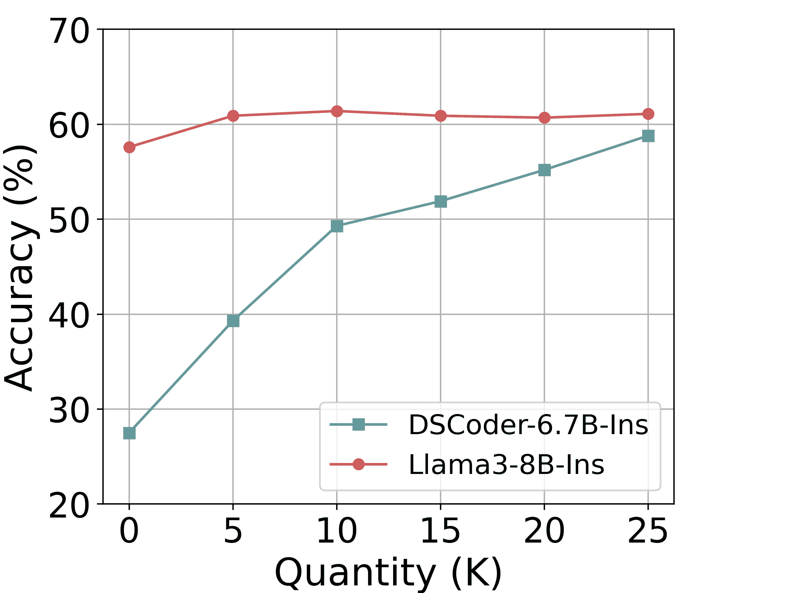

(a) BUG定位.

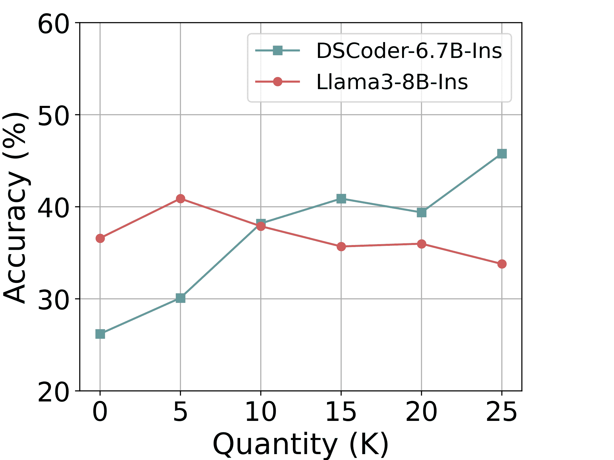

(b) BUG识别.

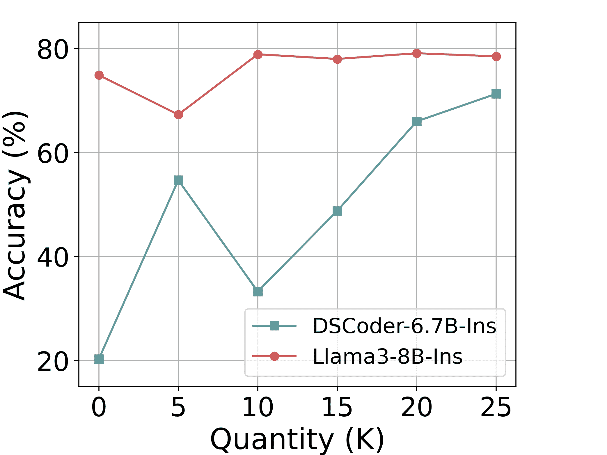

(c) 代码审查.

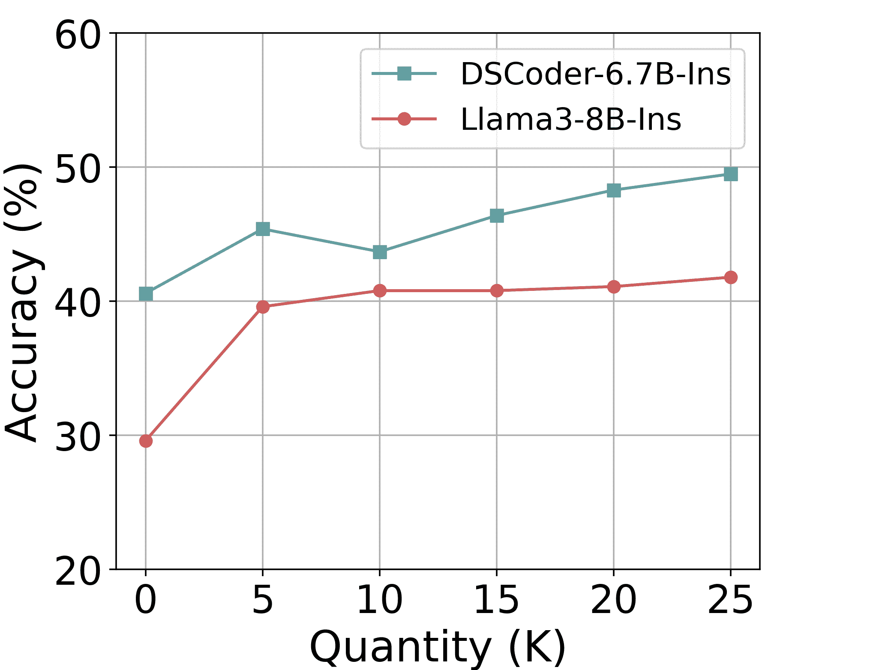

(d) 代码修复.

图5：训练数据量对模型表现的影响。总体而言，随着训练数据量的增加，性能逐渐提升。

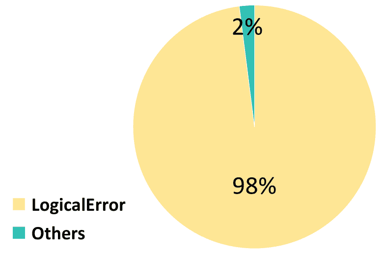

(a) DSCoder-6.7B-Ins.

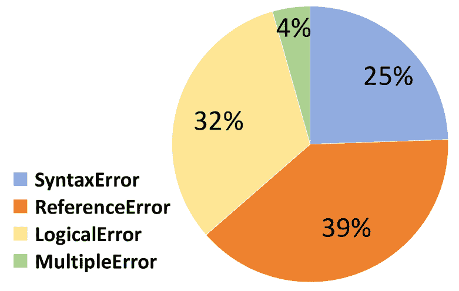

(b) NeuDebugger-DS-6.7B.

图6：DSCoder-6.7B-Ins和NeuDebugger-DS-6.7B在BUG识别任务中的答案分布。

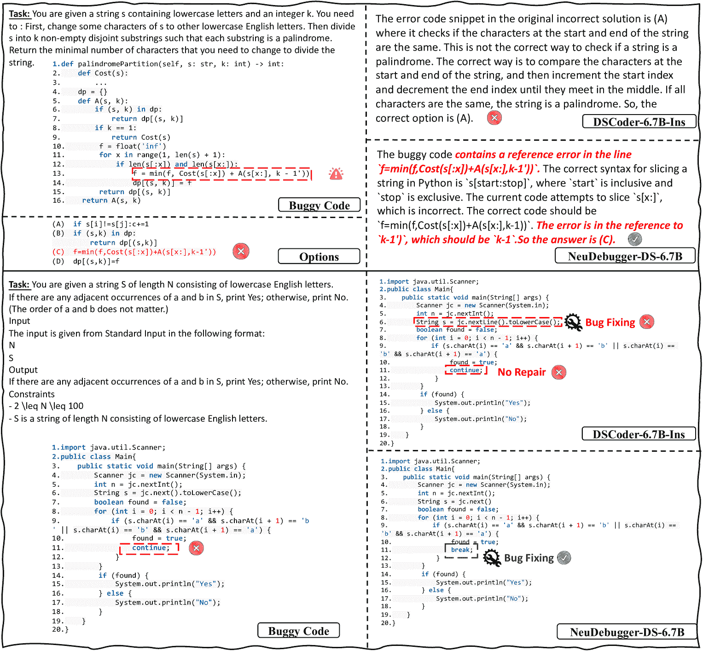

图7：案例研究。我们提供了来自BUG定位和代码审查的两个案例，以展示NeuDebugger的有效性。

### VI-B 消融研究

进行消融研究以探索MASTER模型在微调LLMs中的有效性。

我们比较了不同的SFT策略，包括原始SFT、MASTER (Answer)、MASTER (CoT)和NeuDebugger。原始SFT策略从UltraInteract[[35](https://arxiv.org/html/2408.05006v1#bib.bib35)]、InstructCoder[[60](https://arxiv.org/html/2408.05006v1#bib.bib60)]和RepairLlama[[61](https://arxiv.org/html/2408.05006v1#bib.bib61)]收集高质量的SFT数据，用于微调大型语言模型（LLMs）。然后，我们使用MASTER框架构建SFT数据并探索三种不同的SFT策略：MASTER (Answer)、MASTER (CoT)和NeuDebugger。MASTER (Answer)表示我们去除了MASTER中的Code Teacher，并要求LLM在SFT过程中直接给出正确的选择。MASTER (CoT)要求Code Student模仿Code Teacher的解题思路。NeuDebugger方法通过混合来自MASTER (Answer)和MASTER (CoT)的SFT策略的数据集，结合这两种SFT策略进行主干模型的微调，除了MASTER (CoT)的代码修复数据。

如表格[V](https://arxiv.org/html/2408.05006v1#S6.T5 "TABLE V ‣ VI Evaluation Results ‣ Enhancing the Code Debugging Ability of LLMs via Communicative Agent Based Data Refinement")所示，DSCoder-6.7B-Ins和Llama3-8B-Ins在使用原始SFT方法时，相较于基线模型的表现较差，表明SFT的数据质量在微调LLM时仍然是一个挑战。当使用MASTER合成数据进行SFT时，这些模型的代码调试能力显著提高。这表明，DSCoder-6.7B-Ins和Llama3-8B-Ins在从人类/GPT-4注释数据中学习调试知识的效果较差[[20](https://arxiv.org/html/2408.05006v1#bib.bib20)]。此外，MASTER (CoT)方法的整体表现通常优于MASTER (Answer)，除了代码修复任务。这可能是因为Code Teacher生成的Chain-of-Thought结果可以更好地解释答案选择背后的原因，但可能在代码修复任务中引入额外的噪音。通过结合来自MASTER (CoT)和MASTER (Answer)的SFT数据，NeuDebugger在所有SFT策略中实现了最佳性能。所有这些实验结果证明了MASTER模型的有效性，该模型采用多代理机制来合成和精炼SFT数据。

### VI-C 数据量的影响

本小节探讨了使用MASTER合成数据对LLMs进行微调时，数据量的影响。如图[5](https://arxiv.org/html/2408.05006v1#S6.F5 "Figure 5 ‣ VI-A Overall Performance ‣ VI Evaluation Results ‣ Enhancing the Code Debugging Ability of LLMs via Communicative Agent Based Data Refinement")所示，我们使用不同数量的SFT数据点对DSCoder-6.7B-Ins和Llama3-8B-Ins模型进行了微调。然后，我们通过评估它们在DebugEval基准测试中的表现并可视化结果，评估了它们的调试能力。

与Llama3-8B-Ins相比，当输入更多SFT数据点时，DSCoder-6.7B-Ins的性能显著下降。这表明面向代码的大型语言模型更擅长从调试数据中学习，而标准语言模型在没有对代码的基本理解的情况下难以提升其调试能力。在所有调试任务中，DSCoder-6.7B-Ins在BUG定位、BUG识别和代码审查任务中表现出显著的改善，但在代码修复任务中仅显示出轻微的提升。这表明这些调试任务确实有助于LLMs提升代码修复能力，尽管该任务仍然很难显著改进。

### VI-D NeuDebugger在不同类型BUG上的有效性

如表[VI](https://arxiv.org/html/2408.05006v1#S6.T6 "TABLE VI ‣ VI Evaluation Results ‣ Enhancing the Code Debugging Ability of LLMs via Communicative Agent Based Data Refinement")所示，我们展示了NeuDebugger在更难任务上的有效性，包括BUG识别和代码修复。不同类型BUG的评估结果也一并展示。

对于BUG识别任务，评估结果表明现有的大型语言模型（LLMs）在调试任务中的表现仍然不理想。DSCoder-6.7B-Ins和Llama3-8B-Ins在逻辑错误上的准确率均超过97%，但在其他类型的编码错误上表现较差。此外，图[6](https://arxiv.org/html/2408.05006v1#S6.F6 "Figure 6 ‣ VI-A Overall Performance ‣ VI Evaluation Results ‣ Enhancing the Code Debugging Ability of LLMs via Communicative Agent Based Data Refinement")展示了LLMs的答案分布。评估结果表明，DSCoder-6.7B-Ins缺乏识别BUG的能力，默认选择逻辑错误，从而在该特定错误类型上表现出高准确率。NeuDebugger通过进行更均衡的答案选择分布，展示了其有效性，并在BUG识别任务上取得了显著的改善。

对于代码修复任务，我们观察到 NeuDebugger 在几乎所有类型的代码错误中都取得了改进，特别是在语法错误方面，显示了其在代码调试中的有效性。这也表明，与其他三种类型的代码错误相比，语法错误相对较简单，模型学习起来更容易。此外，NeuDebugger 在修复包含逻辑错误或多个错误的代码时也遇到困难。

### VI-E 案例研究

最后，我们展示了图 [7](https://arxiv.org/html/2408.05006v1#S6.F7 "Figure 7 ‣ VI-A Overall Performance ‣ VI Evaluation Results ‣ Enhancing the Code Debugging Ability of LLMs via Communicative Agent Based Data Refinement") 中的两个案例，展示了 NeuDebugger 的有效性。NeuDebugger 是在我们提出的 MASTER 框架构建的代码调试数据上进行训练的。我们通过案例比较了模型训练前后的性能。

在 BUG 定位任务的第一个案例中，代码错误由代码行 `f = min(f, Cost(s[:x]) + A(s[x:], k-1’))` 引起，该行的索引 k-1’ 错误。因此，正确的答案是 (C)。DSCoder-6.7B-Ins 将代码片段 `if s[i]!=s[j]: c+=1` 视为错误，声明 “这不是检查一个字符串是否为回文的正确方法”。相反，NeuDebugger-DS-6.7B 准确分析了 bug 的原因：“在代码行 `f = min(f, Cost(s[:x]) + A(s[x:], k-1’))` 中包含了一个引用错误，错误在于对 k-1’ 的引用，应该是 k-1”，展示了其在 BUG 定位中的有效性。

在代码修复任务的第二个案例中，错误涉及继续（continue）语句的误用，导致逻辑错误。DSCoder-6.7B-Ins 模型未能识别此错误，而是建议将代码行 `String s = jc.next().toLowerCase()` 改为 `String s = jc.nextLine().toLowerCase()`。这个修改引入了一个新的错误，因为它没有正确处理输入。NeuDebugger-DS-6.7B 准确识别出问题在于 continue 的使用，并将 continue 改为 break，成功地解决了该 bug。

## VII 结论

本文介绍了 DebugEval，一种创新的基准测试，用于从多个角度评估大型语言模型（LLM）的调试能力。我们提出了 MASTER，一种利用 LLM 生成高质量监督微调（SFT）数据集的方法，专门用于调试任务，从而提高小型模型的性能。我们的实验表明，具有 7B 参数的 LLM 在这些调试任务中的效果较差，而 MASTER 通过精炼数据来有效提升代码调试能力。

## 参考文献

+   [1] B. Hailpern 和 P. Santhanam, “软件调试、测试和验证，” *IBM 系统期刊*，第41卷，第1期，页4–12，2002年。

+   [2] L. Kirschner, E. Soremekun, 和 A. Zeller, “调试输入”，见于 *ACM/IEEE 第42届国际软件工程会议论文集*，2020年，页75–86。

+   [3] C. Le Goues, T. Nguyen, S. Forrest, 和 W. Weimer, “Genprog: 一种通用的自动软件修复方法，” *IEEE 软件工程学报*，第 54–72 页，2012。

+   [4] M. Wen, J. Chen, R. Wu, D. Hao, 和 S.-C. Cheung, “面向上下文的补丁生成以更好地进行自动化程序修复，” 载于 *第40届国际软件工程会议录*，2018。

+   [5] J. Hua, M. Zhang, K. Wang, 和 S. Khurshid, “Sketchfix: 一种基于懒惰候选生成的自动化程序修复工具，” 载于 *2018年第26届ACM欧洲软件工程会议与软件工程基础研讨会联合会议录*，2018。

+   [6] K. Liu, A. Koyuncu, D. Kim, 和 T. F. Bissyandé, “Tbar: 重新审视基于模板的自动化程序修复，” 载于 *第28届ACM SIGSOFT国际软件测试与分析研讨会录*，2019。

+   [7] OpenAI. (2022) Chatgpt: 优化对话的语言模型。

+   [8] H. Touvron, L. Martin, K. Stone, P. Albert, A. Almahairi, Y. Babaei, N. Bashlykov, S. Batra, P. Bhargava, S. Bhosale 等, “Llama 2: 开放基础和微调的聊天模型，” *ArXiv 预印本*，卷 abs/2307.09288，2023。

+   [9] X. Chen, M. Lin, N. Schärli, 和 D. Zhou, “教大语言模型自我调试，” *ArXiv 预印本*，卷 abs/2304.05128，2023。

+   [10] M. Chen, J. Tworek, H. Jun, Q. Yuan, H. P. d. O. Pinto, J. Kaplan, H. Edwards, Y. Burda, N. Joseph, G. Brockman 等, “评估训练于代码的大型语言模型，” *ArXiv 预印本*，卷 abs/2107.03374，2021。

+   [11] Z. Luo, C. Xu, P. Zhao, Q. Sun, X. Geng, W. Hu, C. Tao, J. Ma, Q. Lin, 和 D. Jiang, “Wizardcoder: 通过 evol-instruct 强化代码大型语言模型，” *ArXiv 预印本*，卷 abs/2306.08568，2023。

+   [12] Q. Zheng, X. Xia, X. Zou, Y. Dong, S. Wang, Y. Xue, L. Shen, Z. Wang, A. Wang, Y. Li 等, “Codegeex: 一种预训练的代码生成模型，具有多语言基准测试 humaneval-x，” 载于 *第29届ACM SIGKDD知识发现与数据挖掘会议录*，2023，第5673–5684页。

+   [13] R. Li, L. B. Allal, Y. Zi, N. Muennighoff, D. Kocetkov, C. Mou, M. Marone, C. Akiki, J. Li, J. Chim 等, “Starcoder: 愿源代码与您同在！” *ArXiv 预印本*，卷 abs/2305.06161，2023。

+   [14] D. Guo, Q. Zhu, D. Yang, Z. Xie, K. Dong, W. Zhang, G. Chen, X. Bi, Y. Wu, Y. Li 等, “Deepseek-coder: 当大型语言模型遇到编程——代码智能的崛起，” *ArXiv 预印本*，卷 abs/2401.14196，2024。

+   [15] K. Zhang, Z. Li, J. Li, G. Li, 和 Z. Jin, “Self-edit: 面向代码生成的故障感知代码编辑器，” *ArXiv 预印本*，卷 abs/2305.04087，2023。

+   [16] H. Wang, Z. Liu, S. Wang, G. Cui, N. Ding, Z. Liu, 和 G. Yu, “Intervenor: 通过修复的交互链推动大型语言模型的编码能力，” 载于 *第62届计算语言学协会年会论文集*，2024。

+   [17] R. Tian, Y. Ye, Y. Qin, X. Cong, Y. Lin, Z. Liu, 和 M. Sun, “Debugbench: 评估大语言模型的调试能力，” 2024年。

+   [18] J. Guo, Z. Li, X. Liu, K. Ma, T. Zheng, Z. Yu, D. Pan, Y. LI, R. Liu, Y. Wang, S. Guo, X. Qu, X. Yue, G. Zhang, W. Chen, 和 J. Fu, “Codeeditorbench: 评估大语言模型的代码编辑能力，” 2024年。

+   [19] J. Achiam, S. Adler, S. Agarwal, L. Ahmad, I. Akkaya, F. L. Aleman, D. Almeida, J. Altenschmidt, S. Altman, S. Anadkat *等*，“GPT-4技术报告，” *ArXiv预印本*，卷abs/2303.08774，2023年。

+   [20] A. Gudibande, E. Wallace, C. V. Snell, X. Geng, H. Liu, P. Abbeel, S. Levine, 和 D. Song, “模仿专有语言模型的虚假承诺，”发表于 *第十二届国际学习表征会议*，2024年。

+   [21] J. Wei, X. Wang, D. Schuurmans, M. Bosma, B. Ichter, F. Xia, E. Chi, Q. Le, 和 D. Zhou, “链式思维提示引发大语言模型推理，” 2022年。

+   [22] Z. Feng, D. Guo, D. Tang, N. Duan, X. Feng, M. Gong, L. Shou, B. Qin, T. Liu, D. Jiang, 和 M. Zhou, “CodeBERT: 一种用于程序语言和自然语言的预训练模型，”发表于 *计算语言学协会的发现：EMNLP 2020*。在线：计算语言学协会，2020年，第1536-1547页。

+   [23] W. Ahmad, S. Chakraborty, B. Ray, 和 K.-W. Chang, “程序理解与生成的统一预训练，”发表于 *2021年北美计算语言学协会会议论文集：人类语言技术*。在线：计算语言学协会，2021年，第2655-2668页。

+   [24] D. Zan, B. Chen, D. Yang, Z. Lin, M. Kim, B. Guan, Y. Wang, W. Chen, 和 J.-G. Lou, “Cert: 基于草图的持续预训练用于面向库的代码生成，”发表于 *国际人工智能联合会议*，2022年。

+   [25] K. Clark, M. Luong, Q. V. Le, 和 C. D. Manning, “ELECTRA：将文本编码器作为判别器而非生成器进行预训练，”发表于 *第八届国际学习表征会议，ICLR 2020，埃塞俄比亚亚的斯亚贝巴，2020年4月26日至30日*。OpenReview.net，2020年。

+   [26] S. Lu, D. Guo, S. Ren, J. Huang, A. Svyatkovskiy, A. Blanco, C. B. Clement, D. Drain, D. Jiang, D. Tang, G. Li, L. Zhou, L. Shou, L. Zhou, M. Tufano, M. Gong, M. Zhou, N. Duan, N. Sundaresan, S. K. Deng, S. Fu, 和 S. Liu, “Codexglue: 用于代码理解和生成的机器学习基准数据集，”发表于 *NeurIPS会议论文集*，2021年。

+   [27] M. Lachaux, B. Rozière, M. Szafraniec, 和 G. Lample, “DOBF：一种用于编程语言的去混淆预训练目标，”发表于 *神经信息处理系统进展34：2021年神经信息处理系统年会，NeurIPS 2021，2021年12月6日至14日，虚拟会议*，2021年，第14,967-14,979页。

+   [28] Y. Wang, W. Wang, S. Joty, 和 S. C. Hoi，“CodeT5：一种识别符感知的统一预训练编码解码模型，用于代码理解和生成，”在 *2021年自然语言处理实证方法会议论文集*。线上和多米尼加共和国蓬塔卡纳：计算语言学协会，2021，页码 8696–8708。

+   [29] C. Raffel, N. Shazeer, A. Roberts, K. Lee, S. Narang, M. Matena, Y. Zhou, W. Li, 和 P. J. Liu，“通过统一的文本到文本变换器探索迁移学习的极限，” *J. Mach. Learn. Res.*，卷 21，页码 140:1–140:67，2020。

+   [30] X. Li, Y. Gong, Y. Shen, X. Qiu, H. Zhang, B. Yao, W. Qi, D. Jiang, W. Chen, 和 N. Duan，“CodeRetriever：一种用于代码检索的大规模对比预训练方法，”在 *2022年自然语言处理实证方法会议论文集*。阿布扎比，阿联酋：计算语言学协会，2022，页码 2898–2910。

+   [31] D. Guo, S. Lu, N. Duan, Y. Wang, M. Zhou, 和 J. Yin，“UniXcoder：用于代码表示的统一跨模态预训练，”在 *第60届计算语言学协会年会（第1卷：长篇论文集）*。都柏林，爱尔兰：计算语言学协会，2022，页码 7212–7225。

+   [32] Y. MA, Y. Liu, Y. Yu, Y. Zhang, Y. Jiang, C. Wang, 和 S. Li，“在训练的哪个阶段，代码数据有助于 LLM 的推理？”在 *第十二届国际学习表征会议*。

+   [33] P. Liang, R. Bommasani, T. Lee, D. Tsipras, D. Soylu, M. Yasunaga, Y. Zhang, D. Narayanan, Y. Wu, A. Kumar *等*，“语言模型的整体评估，” *机器学习研究期刊*。

+   [34] Y. Fu, H. Peng, 和 T. Khot，“GPT 是如何获得其能力的？追踪语言模型的新兴能力及其来源，” *Yao Fu's Notion*，2022。

+   [35] L. Yuan, G. Cui, H. Wang, N. Ding, X. Wang, J. Deng, B. Shan, H. Chen, R. Xie, Y. Lin *等*，“通过偏好树推进 LLM 推理通用模型，” *ArXiv 预印本*，卷 abs/2404.02078，2024。

+   [36] J. Bai, S. Bai, Y. Chu, Z. Cui, K. Dang, X. Deng, Y. Fan, W. Ge, Y. Han, F. Huang, B. Hui, L. Ji, M. Li, J. Lin, R. Lin, D. Liu, G. Liu, C. Lu, K. Lu, J. Ma, R. Men, X. Ren, X. Ren, C. Tan, S. Tan, J. Tu, P. Wang, S. Wang, W. Wang, S. Wu, B. Xu, J. Xu, A. Yang, H. Yang, J. Yang, S. Yang, Y. Yao, B. Yu, H. Yuan, Z. Yuan, J. Zhang, X. Zhang, Y. Zhang, Z. Zhang, C. Zhou, J. Zhou, X. Zhou, 和 T. Zhu，“Qwen 技术报告，” *ArXiv 预印本*，卷 abs/2309.16609，2023。

+   [37] B. Roziere, J. Gehring, F. Gloeckle, S. Sootla, I. Gat, X. E. Tan, Y. Adi, J. Liu, T. Remez, J. Rapin *等*，“Code Llama：开源代码基础模型，” *ArXiv 预印本*，卷 abs/2308.12950，2023。

+   [38] S. Mechtaev, J. Yi, 和 A. Roychoudhury，“Angelix，”在 *第38届国际软件工程会议论文集*，2016。

+   [39] F. DeMarco, J. Xuan, D. Le Berre 和 M. Monperrus，“使用SMT自动修复错误的if条件和缺失的前置条件”，收录于*第六届国际软件测试、验证与分析中的约束研讨会*，2014年。

+   [40] C. S. Xia, Y. Wei 和 L. Zhang，“在大型预训练语言模型时代的实用程序修复”，*ArXiv预印本*，卷abs/2210.14179，2022年。

+   [41] M. Chen, J. Tworek, H. Jun, Q. Yuan, H. P. de Oliveira Pinto, J. Kaplan, H. Edwards, Y. Burda, N. Joseph, G. Brockman, A. Ray, R. Puri, G. Krueger, M. Petrov, H. Khlaaf, G. Sastry, P. Mishkin, B. Chan, S. Gray, N. Ryder, M. Pavlov, A. Power, L. Kaiser, M. Bavarian, C. Winter, P. Tillet, F. P. Such, D. Cummings, M. Plappert, F. Chantzis, E. Barnes, A. Herbert-Voss, W. H. Guss, A. Nichol, A. Paino, N. Tezak, J. Tang, I. Babuschkin, S. Balaji, S. Jain, W. Saunders, C. Hesse, A. N. Carr, J. Leike, J. Achiam, V. Misra, E. Morikawa, A. Radford, M. Knight, M. Brundage, M. Murati, K. Mayer, P. Welinder, B. McGrew, D. Amodei, S. McCandlish, I. Sutskever 和 W. Zaremba，“评估在代码上训练的大型语言模型”，2021年。

+   [42] S. D. Kolak, R. Martins, C. Le Goues 和 V. J. Hellendoorn，“使用语言模型生成修补程序：可行性与扩展性行为”，收录于*深度学习与代码研讨会*，2022年。

+   [43] A. Radford, J. Wu, R. Child, D. Luan, D. Amodei 和 I. Sutskever，“语言模型是无监督的多任务学习者”，2019年。

+   [44] T. X. Olausson, J. P. Inala, C. Wang, J. Gao 和 A. Solar-Lezama，“自我修复是代码生成的灵丹妙药吗？”收录于*第十二届国际学习表示会议*，2023年。

+   [45] K. Li, Q. Hu, X. Zhao, H. Chen, Y. Xie, T. Liu, Q. Xie 和 J. He，“Instructcoder：为代码编辑调优大型语言模型”，2023年。

+   [46] Y. Wang, Y. Kordi, S. Mishra, A. Liu, N. A. Smith, D. Khashabi 和 H. Hajishirzi，“自我指导：将语言模型与自生成的指令对齐”，2022年。

+   [47] G. Li, C. Zhi, J. Chen, J. Han 和 S. Deng，“参数高效微调在自动化程序修复中的综合评估”，2024年。

+   [48] E. J. Hu, Y. Shen, P. Wallis, Z. Allen-Zhu, Y. Li, S. Wang, L. Wang 和 W. Chen，“Lora：大规模语言模型的低秩适应”，收录于*第十届国际学习表示会议，ICLR 2022，虚拟会议，2022年4月25-29日*。OpenReview.net，2022年。

+   [49] X. L. Li 和 P. Liang，“前缀调优：为生成优化连续提示”，收录于*第59届计算语言学协会年会暨第11届国际自然语言处理联合会议（第1卷：长篇论文）*。在线：计算语言学协会，2021年，第4582-4597页。

+   [50] X. Liu, K. Ji, Y. Fu, W. Tam, Z. Du, Z. Yang, 和 J. Tang，“P-tuning v2：提示调优在各个规模和任务中可以与微调相媲美”，*康奈尔大学 - arXiv, 康奈尔大学 - arXiv*，2021年。

+   [51] H. Liu, D. Tam, M. Muqeeth, J. Mohta, T. Huang, M. Bansal, 和 C. Raffel，“少量样本参数高效微调优于上下文学习，且更具成本效益。”

+   [52] N. Jain, K. Han, A. Gu, W.-D. Li, F. Yan, T. Zhang, S. Wang, A. Solar-Lezama, K. Sen, 和 I. Stoica，“Livecodebench：全面且无污染的大语言模型代码评估”，*ArXiv 预印本*，卷 abs/2403.07974，2024年。

+   [53] M. Yasunaga 和 P. Liang，“Break-it-fix-it：用于程序修复的无监督学习”，发表于 *第38届国际机器学习会议论文集，ICML 2021，2021年7月18日至24日，虚拟会议*，机器学习研究论文集，卷139。PMLR，2021年，第11,941–11,952页。

+   [54] F. Huq, M. Hasan, M. M. A. Haque, S. Mahbub, A. Iqbal, 和 T. Ahmed，“Review4repair：代码审查辅助的自动程序修复”，*信息与软件技术*，第106765页，2022年。

+   [55] S. Lu, D. Guo, S. Ren, J. Huang, A. Svyatkovskiy, A. Blanco, C. Clement, D. Drain, D. Jiang, D. Tang *等*，“Codexglue：一个用于代码理解与生成的机器学习基准数据集”，*ArXiv 预印本*，卷 abs/2102.04664，2021年。

+   [56] M. M. A. Haque, W. U. Ahmad, I. Lourentzou, 和 C. Brown，“Fixeval：基于执行的程序修复评估用于编程问题”，发表于 *2023 IEEE/ACM 国际自动化程序修复研讨会 (APR)*。IEEE，2023，第11–18页。

+   [57] S. Yue, W. Chen, S. Wang, B. Li, C. Shen, S. Liu, Y. Zhou, Y. Xiao, S. Yun, W. Lin *等*，“Disc-lawllm：为智能法律服务微调大语言模型”，*ArXiv 预印本*，卷 abs/2309.11325，2023年。

+   [58] J. Wei, X. Wang, D. Schuurmans, M. Bosma, F. Xia, E. Chi, Q. V. Le, D. Zhou *等*，“思维链提示法引发大语言模型的推理能力”，*神经信息处理系统进展*，卷 35，第24,824–24,837页，2022年。

+   [59] T. B. Brown, B. Mann, N. Ryder, M. Subbiah, J. Kaplan, P. Dhariwal, A. Neelakantan, P. Shyam, G. Sastry, A. Askell, S. Agarwal, A. Herbert-Voss, G. Krueger, T. Henighan, R. Child, A. Ramesh, D. M. Ziegler, J. Wu, C. Winter, C. Hesse, M. Chen, E. Sigler, M. Litwin, S. Gray, B. Chess, J. Clark, C. Berner, S. McCandlish, A. Radford, I. Sutskever, 和 D. Amodei，“语言模型是少样本学习者”，发表于 *神经信息处理系统进展 33：神经信息处理系统年度会议 2020，NeurIPS 2020，2020年12月6日至12日，虚拟*，2020年。

+   [60] Q. Hu, K. Li, X. Zhao, Y. Xie, T. Liu, H. Chen, Q. Xie, 和 J. He，“Instructcoder：赋能语言模型进行代码编辑”，*ArXiv 预印本*，卷 abs/2310.20329，2023年。

+   [61] A. Silva, S. Fang, 和 M. Monperrus, “Repairllama: 用于程序修复的高效表示和微调适配器，” 技术报告，2023年。

+   [62] M. Suzgun, N. Scales, N. Schärli, S. Gehrmann, Y. Tay, H. W. Chung, A. Chowdhery, Q. V. Le, E. H. Chi, D. Zhou, 和 J. Wei, “挑战大基准任务以及链式思维能否解决它们，” 2022年。

+   [63] M. Chen, J. Tworek, H. Jun, Q. Yuan, H. P. D. O. Pinto, J. Kaplan, H. Edwards, Y. Burda, N. Joseph, G. Brockman *等*，“评估基于代码训练的大型语言模型，” *ArXiv预印本*，卷 abs/2107.03374，2021年。

+   [64] D. Guo, Q. Zhu, D. Yang, Z. Xie, K. Dong, W. Zhang, G. Chen, X. Bi, Y. Wu, Y. K. Li, F. Luo, Y. Xiong, 和 W. Liang, “Deepseek-coder: 当大型语言模型遇到编程——代码智能的崛起，” 2024年。

+   [65] OpenAI, “Gpt-4o mini: 推动高效智能的进步，” 2024年。

+   [66] DeepSeek-AI, “Deepseek-v2: 一种强大、经济且高效的专家混合语言模型，” 2024年。

+   [67] Q. Zhu, D. Guo, Z. Shao, D. Yang, P. Wang, R. Xu, Y. Wu, Y. Li, H. Gao, S. Ma *等*，“Deepseek-coder-v2: 打破代码智能中封闭源模型的障碍，” *ArXiv预印本*，卷 abs/2406.11931，2024年。

+   [68] AI@Meta, “Llama 3模型卡，” 2024年。

+   [69] “Qwen2技术报告，” 2024年。

+   [70] DeepSeek-AI, “Deepseek llm: 用长期主义扩展开源语言模型，” *ArXiv预印本*，卷 abs/2401.02954，2024年。

+   [71] Q. Team, “介绍Qwen1.5，” 2024年。

+   [72] W. Cai, J. Jiang, F. Wang, J. Tang, S. Kim, 和 J. Huang, “专家混合模型的综述，” 2024年。

+   [73] W. Kwon, Z. Li, S. Zhuang, Y. Sheng, L. Zheng, C. H. Yu, J. E. Gonzalez, H. Zhang, 和 I. Stoica, “大规模语言模型服务的高效内存管理与分页注意力机制，” *ACM SIGOPS第29届操作系统原理研讨会论文集*，2023年。

+   [74] hiyouga, “Llama工厂，” 2023年。

+   [75] E. J. Hu, Y. Shen, P. Wallis, Z. Allen-Zhu, Y. Li, S. Wang, L. Wang, 和 W. Chen, “Lora: 大型语言模型的低秩适应，” 在 *第十届国际学习表征大会ICLR 2022，虚拟会议，2022年4月25-29日*，OpenReview.net，2022年。
