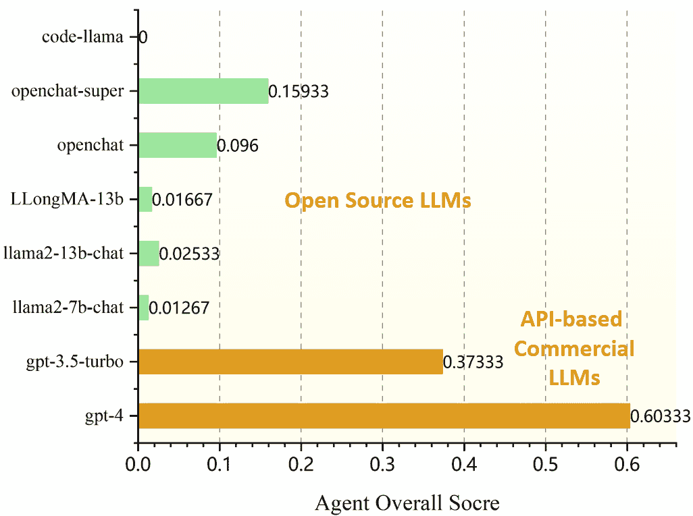
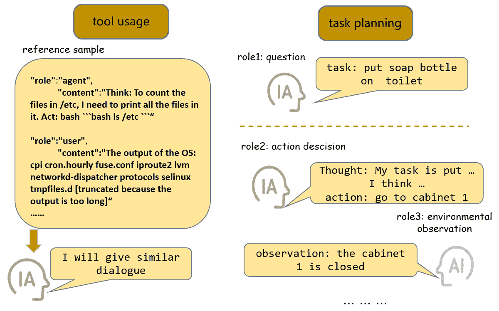
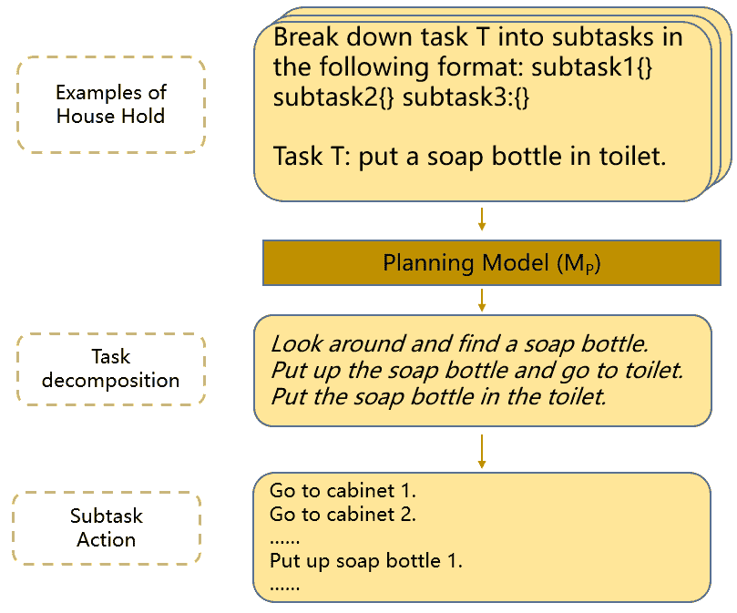
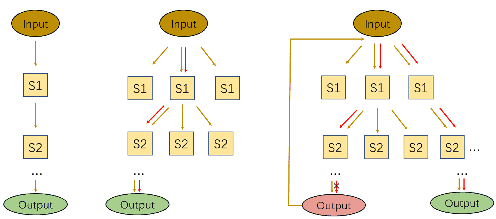
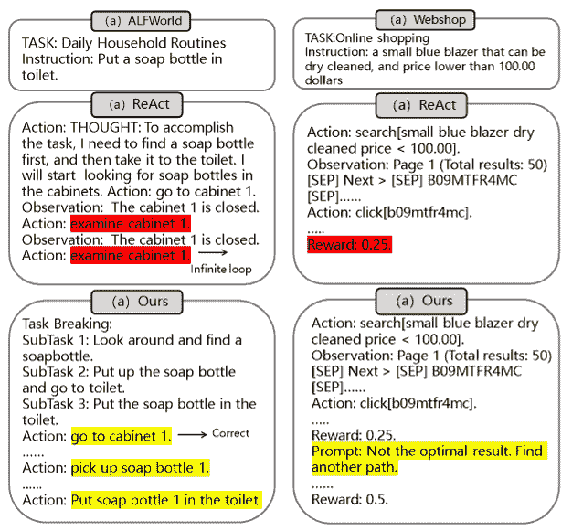

<!--yml

category: 未分类

date: 2025-01-11 12:43:45

-->

# 通过微调和多分支推理增强低参数LLM的通用代理能力

> 来源：[https://arxiv.org/html/2403.19962/](https://arxiv.org/html/2403.19962/)

周沁浩¹ 张子涵¹ 向翔¹

王珂² 吴宇川² 李永斌²

¹ 华中科技大学人工智能与自动化学院，国家集成电路与智能信息处理重点实验室，

华中科技大学，武汉，中国

² 阿里巴巴达摩院，北京，中国 ^∗通讯作者（电子邮件：[xex@hust.edu.cn](xex@hust.edu.cn)）；同时在鹏程实验室，深圳，中国工作。

###### Abstract

开源预训练的大型语言模型（LLM）展示了强大的语言理解和生成能力，使其在各种任务中取得了显著的成功。然而，当它们作为代理处理现实世界中的复杂问题时，它们的表现远远不如ChatGPT和GPT-4等大型商业模型。作为智能代理，LLM需要具备任务规划、长期记忆以及利用外部工具的能力，以实现令人满意的表现。为增强LLM的代理能力，已经提出了多种方法。一方面，一些方法涉及构建代理专用数据并对模型进行微调；另一方面，有些方法侧重于设计有效激活LLM推理能力的提示词。我们在7B和13B模型上探索了这两种策略。我们提出了一种利用GPT-4构建代理专用数据的综合方法。通过对构建的数据进行监督微调，我们发现，对于这些参数相对较少的模型，监督微调能够显著减少代理任务中的幻觉输出和格式错误。此外，诸如多路径推理和任务分解等技术可以有效降低问题的复杂性，并增强LLM作为代理的表现。我们在AgentBench的五个代理任务上评估了我们的方法，并取得了令人满意的结果。

## 1 引言

图 1：开源LLM和商业LLM的代理性能。代理总体评分是多个代理任务的平均准确度。

大规模语言模型（LLM）已经广泛应用于各种自然语言处理任务，取得了开创性的成就。此外，LLM 还展示了其承担更具挑战性任务的能力，比如作为 AI 智能体的功能。与传统的推理任务不同，AI 智能体是需要与人类或外部环境互动，进行推理，并根据反馈判断后续行动的实体。每个任务通常需要多轮对话来完成。例如，在家庭环境中，一个智能体可能被分配到多项家务任务，这些任务需要与环境持续互动。智能体需要根据环境的反馈评估其行动，并及时调整策略。传统的 AI 智能体通常在特定领域或环境中有效，但它们的普适性和适应性显然不足 Liu 等人 ([2023](https://arxiv.org/html/2403.19962v1#bib.bib8))。

近年来，越来越多的研究表明，Brown 等人 ([2020](https://arxiv.org/html/2403.19962v1#bib.bib1)); OpenAI ([2023](https://arxiv.org/html/2403.19962v1#bib.bib11)); Qin 等人 ([2023](https://arxiv.org/html/2403.19962v1#bib.bib16)); Shinn 等人 ([2023](https://arxiv.org/html/2403.19962v1#bib.bib18)); Zhu 等人 ([2023](https://arxiv.org/html/2403.19962v1#bib.bib36)) 证明了大规模语言模型（LLM）在推理、规划、记忆和使用外部工具方面具备强大的能力。这推动了 LLM 向更具普适性和适应性的智能体发展。最近，AgentBench Liu 等人 ([2023](https://arxiv.org/html/2403.19962v1#bib.bib8)) 对商业和开源 LLM 在八种不同的智能体任务上进行了广泛评估。结果显示，商业 API 模型在智能体能力方面表现更为优越。此外，一些研究如 AutoGPT Gravitas ([2023](https://arxiv.org/html/2403.19962v1#bib.bib4)) 和 GPT-Engineer Osika 等人 ([2023](https://arxiv.org/html/2403.19962v1#bib.bib12)) 也利用 LLM 作为智能体，构建了解决复杂现实问题的完整框架。然而，开源模型，特别是那些参数较小的模型，仍然有很大的提升潜力。如图 [1](https://arxiv.org/html/2403.19962v1#S1.F1 "Figure 1 ‣ 1 Introduction ‣ Enhancing the General Agent Capabilities of Low-Parameter LLMs through Tuning and Multi-Branch Reasoning") 所示，7B 和 13B LLM 在每个智能体任务上的平均表现明显低于商业模型。

与商业化的大型语言模型（LLM）不同，小规模开源LLM在一般知识处理上效率较低Peters等人（[2019](https://arxiv.org/html/2403.19962v1#bib.bib14)）。此外，较小的参数规模限制了推理和记忆能力，常常导致在代理对话过程中出现幻觉Zhang等人（[2023b](https://arxiv.org/html/2403.19962v1#bib.bib33)）。然而，在实际应用中，由于7B和13B参数的LLM相对易于部署和微调，因此它们是最广泛使用的LLM。因此，提升这些LLM的能力具有重要的实际意义。目前，关于LLM代理或提升模型推理能力的研究Xi等人（[2023a](https://arxiv.org/html/2403.19962v1#bib.bib25)）；Wang等人（[2023](https://arxiv.org/html/2403.19962v1#bib.bib20)）主要集中在大规模模型上。在7B和13B LLM上代理能力的研究仍处于初步探索阶段。如前所述，一个高效的代理需要任务规划能力、熟练使用外部工具的能力和长期记忆能力。任务规划指的是模型将大规模任务分解为可管理的子目标的能力，从而促进复杂任务的高效处理。长期记忆能力反映了LLM在与环境进行互动过程中保留和回忆历史信息的能力。考虑到这些能力，我们提出了一种方法，以增强7B和13B LLM在代理任务中的表现。

在我们提出的方法中，我们专注于从两个关键方面增强LLMs的代理能力。首先，通过监督微调（SFT）提升代理能力。这种方法从根本上增强了LLMs本身的能力。与一般的推理任务不同，代理的角色不仅仅是规划和推理，它还涉及与环境或人类的持续互动，以执行后续动作，直到实现期望的结果。为了提高LLMs的代理能力，必须在反映代理与环境之间互动行为的多样化数据集上进行训练。这涉及到构建数据，不仅记录代理采取的动作，还捕捉其内部思维过程和决策过程。此外，环境应提供有意义的反馈，以指导代理的学习。我们提出使用GPT-4 OpenAI（[2023](https://arxiv.org/html/2403.19962v1#bib.bib11)）来构建数据。通过设计一个框架，让GPT-4参与多轮对话，我们可以生成捕捉不同角色之间互动的对话数据。在这些对话中，GPT-4可以扮演不同的角色，如代理、用户或环境，并积极参与动态交流。此外，我们将大量通用指令微调数据纳入构建的数据集中，以保持LLMs的通用能力。

此外，我们通过任务分解和回溯优化推理路径。受到“思维链”Wei 等人（[2022](https://arxiv.org/html/2403.19962v1#bib.bib23)）的启发，已经有大量的工作致力于激活大语言模型（LLMs）的推理能力。例如，ReAct Yao 等人（[2022b](https://arxiv.org/html/2403.19962v1#bib.bib30)）将思维过程整合到多步骤推理任务中。ToT Yao 等人（[2023](https://arxiv.org/html/2403.19962v1#bib.bib29)）通过深度优先和广度优先遍历推理节点，更有助于找到最优解。我们将ToT的思想迁移到代理任务中，并将其与任务分解和回溯结合。任务分解利用LLMs的任务规划能力，将复杂且冗长的任务分解为若干个较小的子任务。考虑到LLMs很难通过单一推理路径找到最优答案或完成任务，我们引入了一种判断过程，其中推理过程回到起点，称为回溯。通过任务分解和回溯的结合，我们旨在增强LLMs有效处理复杂任务的能力。

本文的主要贡献包括：1）我们探索了7B和13B开源LLM作为代理的能力，探讨了它们在执行代理任务中的潜力。2）我们提出了使用特定代理数据进行监督微调，作为提升开源LLM作为代理能力的基本方法。为了实现这一点，我们开发了一种构建代理数据的方法。3）我们发现任务分解和回溯是解决复杂代理任务的有效方法。我们在AgentBench上进行了实验，并取得了有希望的结果。

## 2 相关工作

规划与推理。规划和推理是代理解决复杂任务的关键能力。通过思维链的上下文，Chain-of-Thought Wei等人（[2022](https://arxiv.org/html/2403.19962v1#bib.bib23)）激活了LLM的推理能力，并在生成答案之前生成中间的思考过程。还有一些其他策略也被提出，以进一步增强模型的思考过程。例如，SC Wang等人（[2022](https://arxiv.org/html/2403.19962v1#bib.bib21)）通过生成多个思维链并通过投票确定最终答案，利用LLM的自一致性。Reconcile Chen等人（[2023](https://arxiv.org/html/2403.19962v1#bib.bib2)）通过多轮讨论和使用置信度加权投票来增强LLM的推理能力。此外，self-polish Xi等人（[2023b](https://arxiv.org/html/2403.19962v1#bib.bib26)）和self-refine Madaan等人（[2023](https://arxiv.org/html/2403.19962v1#bib.bib9)）从其他角度增强了LLM的思维过程。进一步地，ToT Yao等人（[2023](https://arxiv.org/html/2403.19962v1#bib.bib29)）探讨了将推理过程抽象为深度树搜索。此外，还有一些工作Zhang等人（[2023c](https://arxiv.org/html/2403.19962v1#bib.bib34)）将链式思维的思想应用于多模态任务。

大型语言模型作为智能体。随着大型语言模型（LLMs）迅速发展，广泛的研究已探讨其在规划和推理方面的强大能力（Xi et al.，[2023a](https://arxiv.org/html/2403.19962v1#bib.bib25)）；Wang et al.（[2023](https://arxiv.org/html/2403.19962v1#bib.bib20)）。这为将LLMs作为智能体提供了可能性。一方面，已有多个研究致力于将LLMs应用于各种智能体任务，并构建智能体仿真框架。另一方面，一些研究（Xu et al.，[2023](https://arxiv.org/html/2403.19962v1#bib.bib27)；Kim et al.，[2023](https://arxiv.org/html/2403.19962v1#bib.bib7)），例如ReAct（Yao et al.，[2022b](https://arxiv.org/html/2403.19962v1#bib.bib30)），专注于将推理和深思熟虑纳入LLMs的智能体过程。此外，一些研究将推理方法应用于智能体交互过程。PET（Wu et al.，[2023](https://arxiv.org/html/2403.19962v1#bib.bib24)）将任务分解应用于家庭智能体环境，有助于LLMs完成复杂任务。LATS（Zhou et al.，[2023](https://arxiv.org/html/2403.19962v1#bib.bib35)）和RAP（Hao et al.，[2023](https://arxiv.org/html/2403.19962v1#bib.bib5)）将蒙特卡罗树搜索应用于智能体推理过程。与ToT相比，这有助于找到更好的答案。此外，一些研究工作，如AutoGPT（Gravitas，[2023](https://arxiv.org/html/2403.19962v1#bib.bib4)）和GPT-Engineer（Osika et al.，[2023](https://arxiv.org/html/2403.19962v1#bib.bib12)），将商业化的LLMs作为其框架的智能体核心，推动了完整智能体架构的开发，以解决复杂的现实世界问题。

语言模型的指令调优。指令调优在训练大型语言模型（LLM）中起着至关重要的作用。在通过海量无监督数据进行预训练后，LLM获得了大量的知识，并具备了语言理解和生成的能力。进一步的监督指令微调（Zhang et al. ([2023a](https://arxiv.org/html/2403.19962v1#bib.bib32)); Dong et al. ([2022](https://arxiv.org/html/2403.19962v1#bib.bib3))）旨在使模型与人类指令对齐，生成更符合人类偏好的输出。指令调优主要关注构建复杂多样的通用任务，以训练LLM以人类的方式回答问题。例如，FLAN Wei et al. ([2021](https://arxiv.org/html/2403.19962v1#bib.bib22)) 和 T0 Sanh et al. ([2021](https://arxiv.org/html/2403.19962v1#bib.bib17)) 利用海量公开数据集构建了一个多任务指令调优数据集。经过微调的模型表现出强大的零-shot泛化能力。除了利用现有数据集，另一个常见的方法是使用商业LLM生成数据。Self-Instruct Wang et al. ([2022](https://arxiv.org/html/2403.19962v1#bib.bib21)); Peng et al. ([2023](https://arxiv.org/html/2403.19962v1#bib.bib13)) 利用 GPT-4 在给定少量种子任务的情况下生成大量多样化的数据。这些数据用于微调开源LLM，并在各种任务中取得显著的改进。为了增强LLM的代理能力，AgentTuning Zeng et al. ([2023](https://arxiv.org/html/2403.19962v1#bib.bib31)) 利用商业LLM在包含多轮对话的特定代理环境中构建数据。

## 3 方法论

在本节中，我们首先给出LLM作为代理的正式定义。然后，我们介绍我们方法的两个组成部分。在第一部分，我们构建代理调优数据，以通过高效的调优方法微调LLM。这是从根本上提升LLM能力的一种方式。在第二部分，我们提出通过任务分解和回溯来增强LLM的推理能力。

### 3.1 问题表述

对于给定的代理任务，LLM作为代理的交互轨迹可以表示为一个对话历史 $(e_{1},a_{1},...,e_{n},a_{n})$。在此过程中，通常涉及两个角色：环境和代理。$e_{i}$ 表示来自环境的提示和反馈，而代理则进行思考和行动，表示为 $a_{i}$。每个对话轨迹对应一个最终的奖励 $r\in[0,1]$，该奖励反映了任务的完成情况。

### 3.2 使用通用和构建的代理数据进行监督调优

我们观察到开源的7B和13B LLMs与商业模型之间在代理能力上存在显著差异。在对话过程中，开源模型通常会出现格式错误、陷入无限循环和生成幻觉性输出等问题。为了减少上述问题的发生，解决方案之一是使用合适的数据对LLMs进行微调。然而，代理需要参与多轮对话并与特定环境进行互动，这与目前可用的开源通用指令数据有所不同。为了解决这个挑战，我们利用商业模型的API来构建特定于代理的数据，并将这些数据与通用指令数据集结合，进而微调低参数LLMs。

图2：构建代理数据的过程。对于任务规划和外部工具使用能力，我们分别使用了两种策略。

作为代理，LLMs需要具备三项基本能力：任务规划、长期记忆和工具使用。为了增强LLMs的任务规划能力，我们以ALFworld Shridhar等人（[2020](https://arxiv.org/html/2403.19962v1#bib.bib19)）为例，构建了带有交互轨迹的数据。与当前使用GPT-3.5 OpenAI（[2022](https://arxiv.org/html/2403.19962v1#bib.bib10)）等模型构建数据的方法不同，代理的数据不仅应涉及多轮对话，还需要反映任务规划和轨迹。因此，我们精心设计了数据集构建过程，将每个数据条目的过程分为三步：任务构建、轨迹交互和手动过滤。这种方法确保每个数据条目都能够有效地捕捉到训练代理所需的关键元素。我们使用GPT-3.5或GPT-4生成问题和交互轨迹，且这一过程可以轻松扩展到其他代理任务。如图[2](https://arxiv.org/html/2403.19962v1#S3.F2 "Figure 2 ‣ 3.2 Supervised Tuning with General and Constructed Agent Data ‣ 3 Methodology ‣ Enhancing the General Agent Capabilities of Low-Parameter LLMs through Tuning and Multi-Branch Reasoning")所示，为了生成完整的交互轨迹，我们模拟了GPT在家庭环境中扮演三种不同角色。这些角色分别是问题生成器、行动执行者和环境代理。

首先，我们随机初始化一个特定的房间环境，确定家庭物品的数量和摆放位置。接着，问题生成器角色根据提供的环境负责生成智能家庭相关问题。随后，行动生成器角色根据环境反馈不断提出其想法和行动，同时，环境代理角色提供与每一步所采取的行动相对应的合理反馈和提示。这两个角色继续交互，直到问题解决或达到最大交互次数，从而生成完整的轨迹。然而，由于无法确保环境代理的反馈和行动生成器的行动逻辑一致，因此在数据生成后需要进行人工筛选。

除了专注于任务规划的代理任务，还有一些代理任务，如操作系统和WebShop（Yao等人，[2022a](https://arxiv.org/html/2403.19962v1#bib.bib28)）等，这些任务的对话轮次较少，且优先使用外部工具。对于这种类型的任务，我们借鉴了上下文学习的思想。具体而言，如图[2](https://arxiv.org/html/2403.19962v1#S3.F2 "图2 ‣ 3.2 通过一般和构建的代理数据进行监督调整 ‣ 3 方法论 ‣ 通过调整和多分支推理增强低参数LLM的通用代理能力")左所示，我们为GPT提供了完整推理轨迹的示例，以便其进行模仿。随后，我们从生成的输出中手动筛选并选择逻辑一致的数据。我们期望使用这种类型的数据来提高LLM的检索能力和工具使用能力。

有关代理微调的现有工作（Zeng等人，[2023](https://arxiv.org/html/2403.19962v1#bib.bib31)）表明，仅使用代理数据对LLM进行微调会影响其泛化能力。因此，在对LLM进行微调时，我们将一些通用指令调优数据混入我们的代理数据中。假设$M_{\theta}$表示预训练的LLM，而$M_{\theta}(y|x)$表示在给定历史$x$时输出$y$的概率分布。我们考虑两个数据集：代理数据$D_{agent}$和通用指令调优数据$D_{general}$。我们优化损失函数如下：

|  | $\begin{split}\mathcal{L}(\theta)&=\lambda\cdot\mathbf{E}_{(x,y)~{}D_{agent}}[% logM_{\theta}(y&#124;x)]\\ &+(1-\lambda)\cdot\mathbf{E}_{(x,y)~{}D_{general}}[logM_{\theta}(y&#124;x)].\end{split}$ |  | (1) |
| --- | --- | --- | --- |

其中，$\lambda\in[0,1]$表示两个数据集的混合比例。较大的$\lambda$意味着LLMs倾向于特定智能体的能力，而较小的$\lambda$则使LLMs更倾向于一般能力。我们观察到LLMs的一般能力的退化也会减少智能体能力，因此我们为$\lambda$设置了较小的值。这与AgentTuning Zeng等人（[2023](https://arxiv.org/html/2403.19962v1#bib.bib31)）的方法相同。在实验部分，我们分析了不同的$\lambda$值。

在微调策略的背景下，我们采用了低秩自适应（LORA）Hu等人（[2021](https://arxiv.org/html/2403.19962v1#bib.bib6)）微调方法，该方法基于对LLMs中的权重矩阵进行低秩修改。对于模型中的每个线性层，原始权重矩阵$W$被调整为$W+\Delta W$，其中$\Delta W$是通过低秩矩阵相乘生成的，即$\Delta W=A\times B$，其中$A$和$B$是低秩矩阵，其秩远小于原始权重矩阵$W$的秩。

### 3.3 任务分解下的多路径推理

最近，由于单一智能体难以完成复杂的多步骤任务，越来越多的工作倾向于涉及多智能体协作，允许模型扮演不同角色，共同推进任务（Qiao等人，[2024](https://arxiv.org/html/2403.19962v1#bib.bib15)）。我们采用了类似的方法。一方面，我们指示大型语言模型（LLMs）在每个推理步骤中生成多个可用的动作。另一方面，我们使用一个判断模型从提供的动作集合中选择一个动作，并继续推理过程，直到获得最终输出。

图3：任务分解过程。规划模型将整个任务拆分成几个小子任务。

对于参数量较小的LLMs，由于其有限的长期记忆能力，处理复杂的长对话任务会面临挑战。为了解决这个问题，我们采用了任务分解策略，将需要多个步骤的复杂任务分解为更简单的子任务。我们使用另一个参数量相同的LLM作为我们的规划模块，并将其命名为$M_{p}$。对于给定任务$\mathcal{T}$，我们构建查询提示$P_{sub}$为“将任务$\mathcal{T}$分解成如下格式的子任务...”。$M_{p}$会生成一个子任务列表$S_{\mathcal{T}}=\{s_{1},...,s_{k}\}$。$k$是子任务的数量，为避免子任务数量过多，我们通常将$k$设为$3$。例如，对于任务$\mathcal{T}=$“把肥皂瓶放入马桶”，LLMs可以描述三个步骤为$s_{1}=$ “四周寻找肥皂瓶”，$s_{2}=$ “拿起肥皂瓶并走向马桶”，$s_{3}=$ “将肥皂瓶放入马桶”。然后，代理将按照子任务列表$S_{\mathcal{T}}$逐一完成任务。我们引入另一个LLM作为判断模块$M_{jdg}$，用于判断每个子任务的完成情况。对于子任务$s_{t}$，我们构建判断提示$P_{jdg}$为“判断该子任务是否完成，输出Yes或No”，每当代理执行一步时，我们会将$P_{jdg}$提供给LLM，并根据其输出“Yes”或“No”，直到子任务完成。

现实世界中的代理任务通常较为复杂，单一的推理路径可能无法得到最佳答案。受到人类思维过程中的反思能力启发，我们提出采用多路径推理与大语言模型（LLMs）。我们将此方法称为回溯（backtracking）。当某一推理路径得出一个次优结果时，我们会构造一个回溯提示，内容为“观察到答案并非任务$\mathcal{T}$的最佳选择...”。我们还会提示LLMs避免使用已经推导出的推理路径。为此，我们构建的提示为“需要注意的是，行动应根据历史信息进行适当调整”，并将此提示附加到回溯提示后面。此外，回溯和任务分解并非互相排斥，它们可以在LLMs的推理过程中共同应用。我们发现，任务分解对于强调规划能力的代理任务更为有效，而回溯对于强调API调用能力的代理任务更为有效。

图4：不同推理方法的比较。从左到右分别是输入输出（IO）、ToT和我们的方法。

总体而言，我们的方法分为两部分。第一部分使用商业LLMs构建代理数据，并通过SFT从根本上增强低参数LLMs的代理能力。第二部分在保持LLMs不变的情况下，通过引入多路径推理和任务分解，最大化激活代理能力。对于7B和13B的LLMs，常见的问题如幻觉输出和遗忘错误经常发生。通过在遵循期望格式的领域特定数据上微调LLMs，可以显著减轻这些问题。对于具有广泛搜索空间的推理问题，通过单一路径推理找到最优解是具有挑战性的。这一问题单靠监督微调无法有效解决。然而，通过引入多路径推理和任务分解等技术，可以减少问题的复杂性，促进最优解的识别。

|  | 数据类型 | 操作系统 | 数据库 | WebShop | ALFWorld | Mind2web | 平均值 $\uparrow$ |
| --- | --- | --- | --- | --- | --- | --- | --- |
| GPT-4 |  | 42.4 | 32 | 61.1 | 78 | 29 | 48.50 |
| GPT-3.5-turbo |  | 32.6 | 36.7 | 64.1 | 16 | 20 | 33.88 |
| claude |  | 9.7 | 22 | 55.7 | 58 | 25 | 34.08 |
| llama2-chat w/o sft |  | 3.8 | 2.66 | 0 | 0 | 5.68 | 2.43 |
| codegen-struct | code | 3.8 | 1.3 | 0 | 0 | 0 | 1.27 |
| alpaca-code | 3.8 | 1.3 | 4.20 | 0 | 5.68 | 2.99 |
| open-assistant | dialog | 0 | 2.67 | 2.70 | 0 | 3.41 | 1.76 |
| alpaca | instro+agent | 15.38 | 3.33 | 31.10 | 0 | 8.52 | 11.67 |
| agenttuning | 15.38 | 38.30 | 32.60 | 10 | 7.38 | 20.73 |
| ours | 11.54 | 27.0 | 34.53 | 10 | 9.66 | 18.33 |

表1：使用不同指令调优数据集对LLMs在AgentBench任务上进行微调的实验结果。我们使用llama2-7b-chat作为基础模型。

## 4 实验

代理数据集：我们从AgentBench基准（Liu等人，[2023](https://arxiv.org/html/2403.19962v1#bib.bib8)）中选择了五个任务：ALFWorld、WebShop、Mind2Web、操作系统和数据库。接下来，我们将逐一详细介绍每个代理任务。

ALFWorld旨在评估LLMs在模拟家庭环境中的规划能力。该模型需要通过文本界面根据环境描述和目标指令做出决策并执行动作，并动态调整计划以完成任务。

WebShop旨在评估LLMs在模拟在线购物环境中的表现，该环境模拟了一个真实的电子商务网站。评估的目标是要求LLMs根据指令在虚拟购物环境中购物，并选择符合期望属性的产品。

Mind2Web是一个通用的网页代理评估基准，旨在评估LLMs在不同领域的网页上执行复杂任务的能力。该数据集涵盖了跨多个网站的跨领域测试集。每个任务包括任务描述、参考动作序列和网页信息，旨在测试LLMs在网页浏览和互动环境中的表现。

操作系统任务旨在评估LLMs在真实操作系统的Bash环境中执行任务的能力。任务包括问答和操作，其中模型需要生成命令以解决问题或执行操作。

DataBase旨在评估LLMs通过SQL操作真实数据库的能力。该数据集包含多样化的指令和数据库，通过结合多个现有数据集并进行数据增强而创建。

实施细节：我们使用AgentBench作为基准，并基于此进行实验。对于13B模型，我们选择OpenChat。OpenChat是一系列在多轮对话的多样化和高质量数据集上微调的开源LLMs。我们选择了两个模型openchat-v3.2和openchat-v3.2-super进行实验。对于7B模型，我们选择了llama2和agentlm Zeng等人([2023](https://arxiv.org/html/2403.19962v1#bib.bib31))进行实验。我们使用fastchat框架部署LLMs，并使用四个RTX 4090 NVIDIA GPU。详情请参见项目页面¹¹1[https://github.com/HAIV-Lab/LLM-TMBR](https://github.com/HAIV-Lab/LLM-TMBR)。

### 4.1 实验结果

使用构建数据集进行监督微调。监督微调的实验结果如表[1](https://arxiv.org/html/2403.19962v1#S3.T1 "Table 1 ‣ 3.3 Multi-Path Reasoning under Task Decomposition ‣ 3 Methodology ‣ Enhancing the General Agent Capabilities of Low-Parameter LLMs through Tuning and Multi-Branch Reasoning")所示。我们在各种指令调优数据集上对7B模型进行了微调，并在五个代理任务上进行了测试。可以看出，在各种指令数据集上进行微调对提高代理的能力具有积极作用。我们发现，使用代码类型指令微调LLMs在提升代理能力方面的效果相对有限。例如，在alpaca-code数据集上微调后，llama2在操作系统任务上的表现没有改善，且在数据库任务上的表现下降了$1.33\%$。我们分析认为，尽管代码类型数据可以增强LLMs对代码的理解，但它缺乏对话过程和复杂问题的分解。类似于代码类型数据，单独在常规对话数据上微调LLMs也不是增强其代理能力的合适选择。例如，在Open-Assistant数据集上微调后，llama2在操作系统任务上的表现有所下降，且在webshop任务上的提升较其他数据集低。

|    大小 | LLMs | 方法 |    网上商店 | ALFWorld | 操作系统 | 平均 $\uparrow$ |
| --- | --- | --- | --- | --- | --- | --- |
| 13B | openchat_v3.2 | IO | 1 | 0 | 0 | 0.33 |
| CoT | 19 | 0 | 0 | 6.33 |
| ReAct | 26 | 5 | 7.6 | 12.86 |
| 我们的 | 27 | 10 | 7.6 | 14.86 |
| openchat_v3.2_super | IO | 5 | 0 | 0 | 1.66 |
| CoT | 23 | 0 | 0 | 7.66 |
| ReAct | 30 | 5 | 3.8 | 12.93 |
| 我们的 | 31 | 11 | 3.8 | 15.26 |
| 7B | AgentLM-7B | IO | 50 | 5 | 3.8 | 20.86 |
| CoT | 34 | 5 | 7.6 | 19.50 |
| ReAct | 33 | 0 | 7.6 | 13.53 |
| 我们的 | 51 | 0 | 7.6 | 19.53 |
| llama2-7B | IO | 0 | 0 | 0 | 0 |
| CoT | 4 | 0 | 0 | 1.33 |
| ReAct | 13.35 | 0 | 7.6 | 6.98 |
| 我们的 | 13.40 | 0 | 7.6 | 7.00 |

表 2：不同推理方法在三个代理基准上的实验结果。

此外，我们发现，在高质量的通用指令微调数据集上对LLMs进行微调，可以显著提高其代理能力。例如，在使用alpaca指令微调数据进行微调后，llama2在多个代理任务上表现出显著的提升。在操作系统任务和网上商店任务中，使用alpaca数据微调的llama2达到了接近agenttuning方法的效果。Agenttuning是最有效的微调数据集，它将GPT-4辅助的轨迹标注代理数据与通用指令微调数据相结合，显著提高了llama2在不同代理任务中的表现。在数据库方面，它的表现甚至超过了商业模型。使用我们构建的数据对模型进行微调，也可以提升LLMs在代理任务中的表现。尽管我们构建的数据有限且容易收集，但在某些代理任务上，使用我们数据微调后的LLMs表现超过了其他数据集。例如，在操作系统任务上，我们的结果比代码类型数据集高出$7.74\%$，比对话类型数据集高出$11.54\%$。与agenttuning相比，我们的结果仍然相差较远，这可以归因于数据量的限制。此外，我们的数据中涉及较少复杂的长对话任务，这也是其中一个原因。

任务分解与回溯推理。我们在7B和13B LLM上比较了不同的推理方法，结果如表[2](https://arxiv.org/html/2403.19962v1#S4.T2 "Table 2 ‣ 4.1 Experimental Results ‣ 4 Experiments ‣ Enhancing the General Agent Capabilities of Low-Parameter LLMs through Tuning and Multi-Branch Reasoning")所示。我们评估的7B LLM已通过智能体数据进行微调。AgentLM通过agenttuning数据进行微调，llama2则是通过我们构建的数据进行微调。我们主要在网上商店、家务和操作系统任务上进行评估。可以看出，将ReAct应用于各种任务通常比直接的输入输出（IO）效果更好。例如，在openchat-v3.2模型上，ReAct在网上商店任务上比IO高出$18\%$。此外，我们的方法在ReAct的基础上可以进一步实现小幅度的提升。在网上商店任务中，我们的结果平均比第二好的结果高出约$1\%$。在家务任务中，我们的方法在13B LLM上分别实现了$5\%$和$6\%$的提升。

图5：ReAct与我们方法在智能体任务推理中的比较。我们展示了在网上商店和家务任务中的行动与观察。

为了深入探讨不同推理方法对结果的影响，我们将ReAct和我们的推理过程进行了比较，如图[5](https://arxiv.org/html/2403.19962v1#S4.F5 "Figure 5 ‣ 4.1 Experimental Results ‣ 4 Experiments ‣ Enhancing the General Agent Capabilities of Low-Parameter LLMs through Tuning and Multi-Branch Reasoning")所示。可以看出，ReAct能够在每个推理步骤中提示LLM进行思考，但模型仍然可能遇到诸如陷入无限循环或出现记忆混乱等问题。相比之下，在家务任务中，由于我们将复杂任务拆解为多个较小的任务，模型的思维错误率比ReAct要低。

### 4.2 消融研究

num path和branch的实验。“num path”指进行回溯迭代的次数，较高的数值表示探索的推理路径数量增多。我们对“num path”进行了实验，如表[3](https://arxiv.org/html/2403.19962v1#S4.T3 "Table 3 ‣ 4.2 Ablation Study ‣ 4 Experiments ‣ Enhancing the General Agent Capabilities of Low-Parameter LLMs through Tuning and Multi-Branch Reasoning")左侧所示。可以看出，适当增加“num path”能提升性能，但当“num path”大于$2$时，性能下降。我们还对“num branch”进行了实验，如表[3](https://arxiv.org/html/2403.19962v1#S4.T3 "Table 3 ‣ 4.2 Ablation Study ‣ 4 Experiments ‣ Enhancing the General Agent Capabilities of Low-Parameter LLMs through Tuning and Multi-Branch Reasoning")右侧所示。“num branch”是每个推理步骤中扩展的节点数。结果显示，适当增加“num branch”同样可以提升性能，但当“num branch”大于$2$时，性能下降。

我们对不同一般数据和代理数据的混合比率进行了实验，如图[4](https://arxiv.org/html/2403.19962v1#S4.T4 "Table 4 ‣ 4.2 Ablation Study ‣ 4 Experiments ‣ Enhancing the General Agent Capabilities of Low-Parameter LLMs through Tuning and Multi-Branch Reasoning")所示。我们发现，过多的代理数据不会带来巨大提升，一般数据同样重要。

| num path | 网店 | num branch | 网店 |
| --- | --- | --- | --- |
| 1 | 20.29 | 1 | 26.00 |
| 2 | 27.00 | 2 | 27.00 |
| 3 | 17.84 | 3 | 6.80 |
| 4 | 16.67 | 4 | 15.80 |

表 3：我们推理方法中num path和num branch的实验结果。

| $\lambda$ | Alfworld | 网店 | Mind2web | OS |
| --- | --- | --- | --- | --- |
| 0.1 | 0.0 | 38.13 | 6.81 | 0 |
| 0.3 | 0.0 | 30.06 | 7.95 | 0 |
| 0.5 | 0.0 | 36.42 | 7.95 | 3.8 |
| 0.8 | 5 | 23.35 | 3.97 | 0 |

表 4：混合不同一般数据和代理数据后的实验结果。

## 5 结论

LLMs作为智能代理展示了强大的代理能力。在本工作中，我们探讨了7B和13B LLMs作为代理，并提出通过代理数据和多分支推理来通过监督微调提升这些开源模型的代理性能。SFT可以有效减少LLMs的格式错误和幻觉输出，不仅提升了代理性能，还促进了各种推理方法在代理任务中的应用。

## 6 限制

本研究存在几个局限性。首先，我们的实验仅限于7B和13B的LLM，因此，研究结果对于不同规模模型的适用性尚未验证。我们提出的方法由于对大型模型微调的计算需求，可能并不适用于所有研究者。此外，衡量幻觉和格式错误的减少本质上是主观的，使用的性能指标可能无法完全捕捉代理在复杂现实任务中的能力。

用于SFT的构建数据可能引入偏差并可能导致模型过拟合，从而限制LLMs在未遇到的任务上的表现。此外，尽管我们实施了多路径推理和任务分解，但优化这些技术的策略并非最终确定。我们在有限任务集上的评估未能涵盖代理能力的全貌，因此未来的研究需要更广泛的评估。

## 致谢

本研究的资助由阿里巴巴创新研究计划慷慨提供，资助合同号# CRAQ7WHZ11220001-20978282，湖北省自然科学基金（资助号# 2022CFB823）以及华中科技大学自主创新研究基金（资助号# 2021XXJS096）。

## 参考文献

+   Brown等人（2020）Tom Brown、Benjamin Mann、Nick Ryder、Melanie Subbiah、Jared D Kaplan、Prafulla Dhariwal、Arvind Neelakantan、Pranav Shyam、Girish Sastry、Amanda Askell等人。2020年。语言模型是少样本学习者。*神经信息处理系统进展*，33:1877–1901。

+   Chen等人（2023）Justin Chih-Yao Chen、Swarnadeep Saha和Mohit Bansal。2023年。Reconcile：圆桌会议通过多样化LLMs的共识提升推理。*arXiv预印本 arXiv:2309.13007*。

+   Dong等人（2022）Qingxiu Dong、Lei Li、Damai Dai、Ce Zheng、Zhiyong Wu、Baobao Chang、Xu Sun、Jingjing Xu和Zhifang Sui。2022年。关于上下文学习的综述。*arXiv预印本 arXiv:2301.00234*。

+   Gravitas（2023）Significant Gravitas。2023年。Auto-gpt：一个自主的GPT-4实验。

+   Hao等人（2023）Shibo Hao、Yi Gu、Haodi Ma、Joshua Jiahua Hong、Zhen Wang、Daisy Zhe Wang和Zhiting Hu。2023年。用语言模型推理就是用世界模型进行规划。*arXiv预印本 arXiv:2305.14992*。

+   Hu等人（2021）Edward J Hu、Yelong Shen、Phillip Wallis、Zeyuan Allen-Zhu、Yuanzhi Li、Shean Wang、Lu Wang和Weizhu Chen。2021年。Lora：大规模语言模型的低秩适配。*arXiv预印本 arXiv:2106.09685*。

+   Kim等人（2023）Geunwoo Kim、Pierre Baldi和Stephen McAleer。2023年。语言模型可以解决计算机任务。*arXiv预印本 arXiv:2303.17491*。

+   Liu等人（2023）Xiao Liu、Hao Yu、Hanchen Zhang、Yifan Xu、Xuanyu Lei、Hanyu Lai、Yu Gu、Hangliang Ding、Kaiwen Men、Kejuan Yang等人。2023年。Agentbench：评估LLMs作为代理。*arXiv预印本 arXiv:2308.03688*。

+   Madaan 等人（2023） Aman Madaan, Niket Tandon, Prakhar Gupta, Skyler Hallinan, Luyu Gao, Sarah Wiegreffe, Uri Alon, Nouha Dziri, Shrimai Prabhumoye, Yiming Yang 等人。2023年。Self-refine：通过自我反馈进行迭代精炼。*arXiv预印本 arXiv:2303.17651*。

+   OpenAI（2022） OpenAI。2022年。介绍 ChatGPT。

+   OpenAI（2023） R OpenAI。2023年。GPT-4技术报告。arxiv 2303.08774。*查看文章*，2:3。

+   奥西卡等人（2023） Anton Osika 等人。2023年。Gpt 工程师。

+   彭等人（2023） Baolin Peng, Chunyuan Li, Pengcheng He, Michel Galley 和 Jianfeng Gao。2023年。使用GPT-4的指令调优。*arXiv预印本 arXiv:2304.03277*。

+   彼得斯等人（2019） Matthew E Peters, Mark Neumann, Robert L Logan IV, Roy Schwartz, Vidur Joshi, Sameer Singh 和 Noah A Smith。2019年。知识增强的上下文词表示。*arXiv预印本 arXiv:1909.04164*。

+   乔等人（2024） Shuofei Qiao, Ningyu Zhang, Runnan Fang, Yujie Luo, Wangchunshu Zhou, Yuchen Eleanor Jiang, Chengfei Lv, 和 Huajun Chen。2024年。Autoact：通过自我规划从零开始的自动化代理学习。*arXiv预印本 arXiv:2401.05268*。

+   秦等人（2023） Yujia Qin, Shihao Liang, Yining Ye, Kunlun Zhu, Lan Yan, Yaxi Lu, Yankai Lin, Xin Cong, Xiangru Tang, Bill Qian 等人。2023年。Toolllm：帮助大语言模型掌握16000+实际应用API。*arXiv预印本 arXiv:2307.16789*。

+   Sanh 等人（2021） Victor Sanh, Albert Webson, Colin Raffel, Stephen H Bach, Lintang Sutawika, Zaid Alyafeai, Antoine Chaffin, Arnaud Stiegler, Teven Le Scao, Arun Raja 等人。2021年。多任务提示训练实现零-shot任务泛化。*arXiv预印本 arXiv:2110.08207*。

+   Shinn 等人（2023） Noah Shinn, Federico Cassano, Ashwin Gopinath, Karthik R Narasimhan 和 Shunyu Yao。2023年。Reflexion：具有语言强化学习的语言代理。在*第37届神经信息处理系统会议*。

+   Shridhar 等人（2020） Mohit Shridhar, Xingdi Yuan, Marc-Alexandre Côté, Yonatan Bisk, Adam Trischler 和 Matthew Hausknecht。2020年。Alfworld：为互动学习对齐文本和具身环境。*arXiv预印本 arXiv:2010.03768*。

+   王等人（2023） Lei Wang, Chen Ma, Xueyang Feng, Zeyu Zhang, Hao Yang, Jingsen Zhang, Zhiyuan Chen, Jiakai Tang, Xu Chen, Yankai Lin 等人。2023年。基于大语言模型的自主代理调研。*arXiv预印本 arXiv:2308.11432*。

+   王等人（2022） Xuezhi Wang, Jason Wei, Dale Schuurmans, Quoc Le, Ed Chi, Sharan Narang, Aakanksha Chowdhery 和 Denny Zhou。2022年。自一致性提高语言模型的思维链推理能力。*arXiv预印本 arXiv:2203.11171*。

+   魏等人（2021） Jason Wei, Maarten Bosma, Vincent Y Zhao, Kelvin Guu, Adams Wei Yu, Brian Lester, Nan Du, Andrew M Dai 和 Quoc V Le。2021年。微调语言模型是零-shot学习者。*arXiv预印本 arXiv:2109.01652*。

+   Wei et al. (2022) Jason Wei, Xuezhi Wang, Dale Schuurmans, Maarten Bosma, Fei Xia, Ed Chi, Quoc V Le, Denny Zhou, 等人。2022。思维链提示促使大规模语言模型进行推理。*神经信息处理系统进展*，35:24824–24837。

+   Wu et al. (2023) Yue Wu, So Yeon Min, Yonatan Bisk, Ruslan Salakhutdinov, Amos Azaria, Yuanzhi Li, Tom Mitchell, 和 Shrimai Prabhumoye。2023。规划、消除与追踪——语言模型是具身代理的好老师。*arXiv 预印本 arXiv:2305.02412*。

+   Xi et al. (2023a) Zhiheng Xi, Wenxiang Chen, Xin Guo, Wei He, Yiwen Ding, Boyang Hong, Ming Zhang, Junzhe Wang, Senjie Jin, Enyu Zhou, 等人。2023a。基于大规模语言模型的代理崛起与潜力：一项调查。*arXiv 预印本 arXiv:2309.07864*。

+   Xi et al. (2023b) Zhiheng Xi, Senjie Jin, Yuhao Zhou, Rui Zheng, Songyang Gao, Tao Gui, Qi Zhang, 和 Xuanjing Huang。2023b。自我修正：通过问题细化提升大规模语言模型的推理能力。*arXiv 预印本 arXiv:2305.14497*。

+   Xu et al. (2023) Binfeng Xu, Zhiyuan Peng, Bowen Lei, Subhabrata Mukherjee, Yuchen Liu, 和 Dongkuan Xu。2023。Rewoo：通过观察分离推理提升增强型语言模型的效率。*arXiv 预印本 arXiv:2305.18323*。

+   Yao et al. (2022a) Shunyu Yao, Howard Chen, John Yang, 和 Karthik Narasimhan。2022a。Webshop：面向可扩展的现实世界网页互动与有依据的语言代理。*神经信息处理系统进展*，35:20744–20757。

+   Yao et al. (2023) Shunyu Yao, Dian Yu, Jeffrey Zhao, Izhak Shafran, Thomas L Griffiths, Yuan Cao, 和 Karthik Narasimhan。2023。思维树：使用大规模语言模型进行深思熟虑的问题解决。*arXiv 预印本 arXiv:2305.10601*。

+   Yao et al. (2022b) Shunyu Yao, Jeffrey Zhao, Dian Yu, Nan Du, Izhak Shafran, Karthik Narasimhan, 和 Yuan Cao。2022b。React：在语言模型中协同推理与行动。*arXiv 预印本 arXiv:2210.03629*。

+   Zeng et al. (2023) Aohan Zeng, Mingdao Liu, Rui Lu, Bowen Wang, Xiao Liu, Yuxiao Dong, 和 Jie Tang。2023。Agenttuning：为大规模语言模型赋能通用代理能力。*arXiv 预印本 arXiv:2310.12823*。

+   Zhang et al. (2023a) Shengyu Zhang, Linfeng Dong, Xiaoya Li, Sen Zhang, Xiaofei Sun, Shuhe Wang, Jiwei Li, Runyi Hu, Tianwei Zhang, Fei Wu, 等人。2023a。大规模语言模型的指令微调：一项调查。*arXiv 预印本 arXiv:2308.10792*。

+   Zhang et al. (2023b) Yue Zhang, Yafu Li, Leyang Cui, Deng Cai, Lemao Liu, Tingchen Fu, Xinting Huang, Enbo Zhao, Yu Zhang, Yulong Chen, 等人。2023b。人工智能海洋中的海妖之歌：大规模语言模型中的幻觉现象调查。*arXiv 预印本 arXiv:2309.01219*。

+   Zhang et al. (2023c) Zhuosheng Zhang, Aston Zhang, Mu Li, Hai Zhao, George Karypis, 和 Alex Smola。2023c。大规模语言模型中的多模态思维链推理。*arXiv 预印本 arXiv:2302.00923*。

+   Zhou 等人（2023）Andy Zhou, Kai Yan, Michal Shlapentokh-Rothman, Haohan Wang, 和 Yu-Xiong Wang. 2023. 《语言智能体树搜索统一了语言模型中的推理、行动和规划》。*arXiv 预印本 arXiv:2310.04406*。

+   Zhu 等人（2023）Xizhou Zhu, Yuntao Chen, Hao Tian, Chenxin Tao, Weijie Su, Chenyu Yang, Gao Huang, Bin Li, Lewei Lu, Xiaogang Wang 等人. 2023. 《Minecraft中的幽灵：通过具有基于文本的知识和记忆的大型语言模型实现的开放世界环境中的通用智能体》。*arXiv 预印本 arXiv:2305.17144*。
