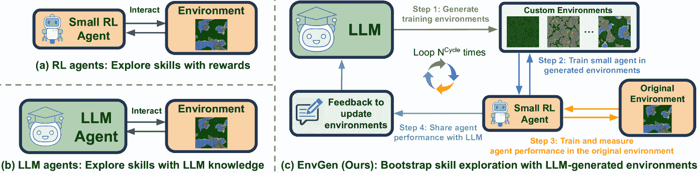
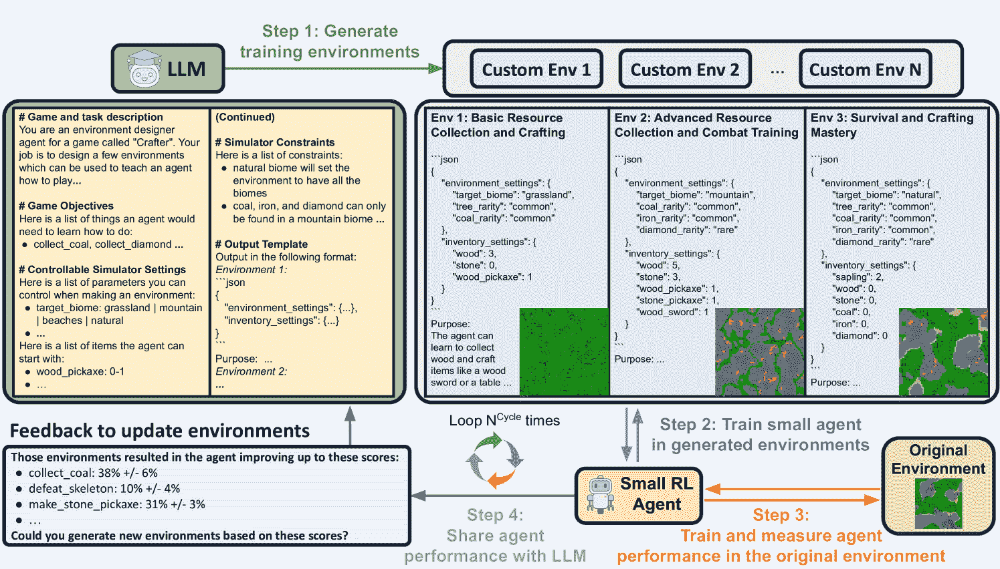
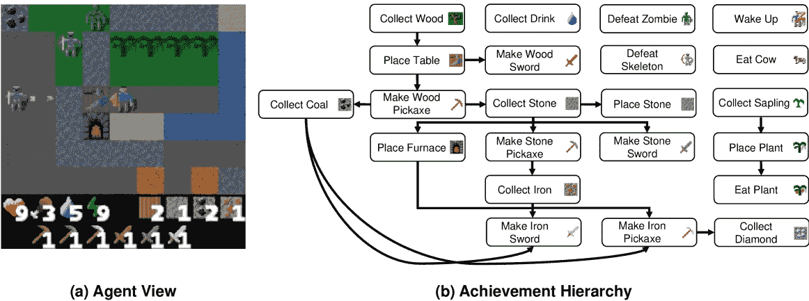
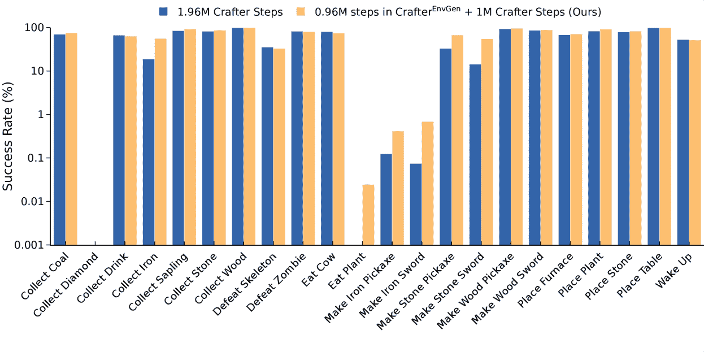
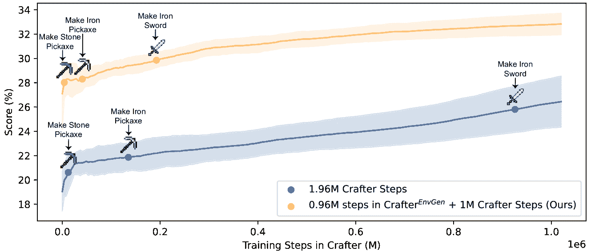
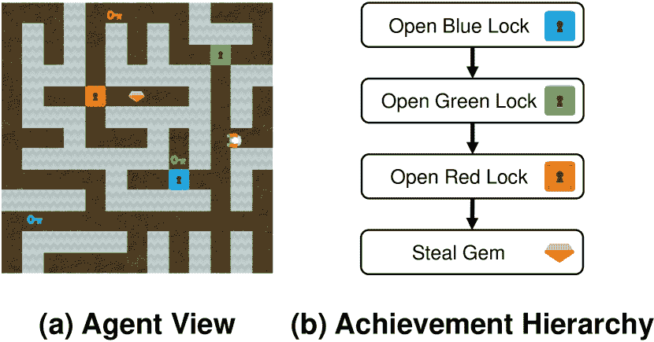
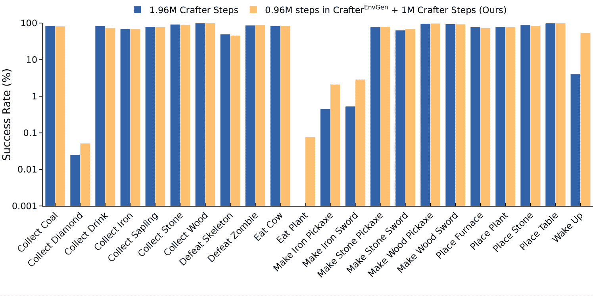
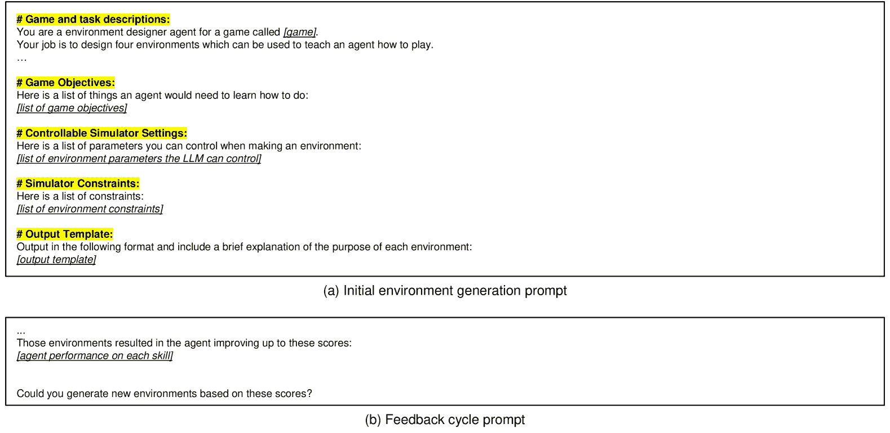

<!--yml

category: 未分类

日期：2025-01-11 12:45:55

-->

# EnvGen：通过LLM生成和调整环境来训练具身代理

> 来源：[https://arxiv.org/html/2403.12014/](https://arxiv.org/html/2403.12014/)

Abhay Zala  Jaemin Cho^†^†脚注标记：  Han Lin  Jaehong Yoon  Mohit Bansal

UNC Chapel Hill

{aszala, jmincho, hanlincs, jhyoon, mbansal}@cs.unc.edu

[https://envgen-llm.github.io](https://envgen-llm.github.io) 平等贡献

###### 摘要

最近，通过交互进行的具身学习的最先进方法直接将大型语言模型（LLMs）作为代理，用于确定环境中的下一步动作。由于它们的世界知识和推理能力，LLM代理比基于强化学习（RL）的较小代理表现得更强；然而，频繁调用LLM是缓慢且昂贵的。这引发了一个有趣的问题：我们能否利用LLM的推理能力，通过自适应地创建训练环境，帮助较小的具身RL代理学习它们薄弱的技能，而不是直接将LLM作为具身代理？在这项工作中，我们提出了EnvGen，一个解决这个问题的新框架。首先，我们提示LLM生成训练环境，使代理能够并行快速学习不同的任务。具体来说，LLM会收到任务描述和代理应该学习的环境模拟器目标，然后要求它生成一组环境配置（*例如*，不同的地形、最初给代理的物品、找到特定物品的概率，*等等*）。接下来，我们在原始环境和LLM生成的环境的混合中训练一个小型RL代理。然后，我们使LLM能够*持续适应*生成的环境，通过提供代理的表现反馈，不断改进代理薄弱的技能。我们通过在Crafter和Heist游戏环境中的全面实验，展示了EnvGen的有效性。我们发现，使用EnvGen训练的小型RL代理能够超越最先进的方法，包括GPT-4代理，并显著更快地学习长期任务。我们还展示了使用LLM动态调整环境优于课程学习方法，并说明了LLM如何随着时间的推移调整训练环境，帮助提高RL代理较弱的技能。此外，EnvGen在效率上也大大提高，因为它只需要调用少量的LLM（*例如*，总共4次），而LLM代理每一步都需要一次或更多LLM调用（导致每个回合有成千上万次LLM调用）。我们还展示了EnvGen设计选择的详细分析。

## 1 引言

在**具身 AI**方面，兴趣日益增长，代理通过与环境的互动来学习，而非静态数据集（Ahn et al., [2022](https://arxiv.org/html/2403.12014v2#bib.bib2); Duan et al., [2022](https://arxiv.org/html/2403.12014v2#bib.bib18); Wang et al., [2023a](https://arxiv.org/html/2403.12014v2#bib.bib59); Yao et al., [2023](https://arxiv.org/html/2403.12014v2#bib.bib68); Driess et al., [2023](https://arxiv.org/html/2403.12014v2#bib.bib16))。像《Minecraft》（Mojang Studios, [2009](https://arxiv.org/html/2403.12014v2#bib.bib41)）和《Crafter》（Hafner, [2022](https://arxiv.org/html/2403.12014v2#bib.bib24)）这样的开放世界游戏被广泛用作具身代理的研究环境，代理能够视觉感知其周围环境，穿越广阔的地形，并学习解锁各种成就（*例如*，收集资源、建造工具、击败怪物、*等等*）。有些成就可以通过几步轻松解锁，而其他成就则更具挑战性，因为它们只有在代理完成一系列先决条件后才能解锁，这通常需要数百步（*即*，长时间跨度任务）。如[图 1](https://arxiv.org/html/2403.12014v2#S1.F1 "在 1 引言 ‣ EnvGen: 通过LLM生成和适应环境以训练具身代理")（a）所示，传统的具身代理基于强化学习（RL）（Hafner et al., [2020](https://arxiv.org/html/2403.12014v2#bib.bib25); [2021](https://arxiv.org/html/2403.12014v2#bib.bib26); [2023](https://arxiv.org/html/2403.12014v2#bib.bib27); Schulman et al., [2017](https://arxiv.org/html/2403.12014v2#bib.bib48); Burda et al., [2018](https://arxiv.org/html/2403.12014v2#bib.bib9); Hessel et al., [2018](https://arxiv.org/html/2403.12014v2#bib.bib29); Sekar et al., [2020](https://arxiv.org/html/2403.12014v2#bib.bib49); Moon et al., [2023](https://arxiv.org/html/2403.12014v2#bib.bib42))。然而，这些RL代理在学习如此长时间跨度的任务时通常会遇到困难，因为奖励仅在连续的正确行动执行后才会稀疏地给予，而且自动找到多个导致奖励的行动序列代价非常高（Aytar et al., [2018](https://arxiv.org/html/2403.12014v2#bib.bib5); Li et al., [2022a](https://arxiv.org/html/2403.12014v2#bib.bib35); Yuan et al., [2023](https://arxiv.org/html/2403.12014v2#bib.bib69)），即使在通过好奇驱动的内在奖励进行长期预训练后（Walker et al., [2023](https://arxiv.org/html/2403.12014v2#bib.bib58)）。

图1：不同创建具身智能体的方法比较。之前的研究通常使用（a）小型RL智能体或（b）LLM智能体来探索技能。在（c）EnvGen中，我们通过多样化的LLM生成环境来训练一个小型RL智能体，这些环境可以并行地训练不同的技能，并通过反馈进行调整，以帮助智能体逐步提高他们较弱的技能。我们的方法通过利用LLM的世界知识，同时保持高效的训练，得益于使用轻量级RL智能体。

随着大语言模型（LLMs）在需要复杂推理的各类任务中取得了显著进展（Brown 等，[2020](https://arxiv.org/html/2403.12014v2#bib.bib8); OpenAI， [2023a](https://arxiv.org/html/2403.12014v2#bib.bib44); Touvron 等，[2023a](https://arxiv.org/html/2403.12014v2#bib.bib55); [b](https://arxiv.org/html/2403.12014v2#bib.bib56); Chowdhery 等，[2023](https://arxiv.org/html/2403.12014v2#bib.bib12); Anil 等，[2023](https://arxiv.org/html/2403.12014v2#bib.bib4))，近期的研究开始探索基于LLM实现具身代理的方案。如[图1](https://arxiv.org/html/2403.12014v2#S1.F1 "In 1 Introduction ‣ EnvGen: Generating and Adapting Environments via LLMs for Training Embodied Agents")（b）所示，这些方法通过链式推理（Nye 等，[2021](https://arxiv.org/html/2403.12014v2#bib.bib43); Kojima 等，[2022](https://arxiv.org/html/2403.12014v2#bib.bib31); Wei 等，[2022](https://arxiv.org/html/2403.12014v2#bib.bib65)）利用LLMs的世界知识，创建行动计划、提供反馈并在整个过程中获得奖励（Yuan 等，[2023](https://arxiv.org/html/2403.12014v2#bib.bib69); Wang 等，[2023c](https://arxiv.org/html/2403.12014v2#bib.bib61); Wu 等，[2023](https://arxiv.org/html/2403.12014v2#bib.bib67); Wang 等，[2023a](https://arxiv.org/html/2403.12014v2#bib.bib59); [d](https://arxiv.org/html/2403.12014v2#bib.bib62); Zhao 等，[2023](https://arxiv.org/html/2403.12014v2#bib.bib70); Du 等，[2023](https://arxiv.org/html/2403.12014v2#bib.bib17))。虽然这些基于LLM的代理通过在推理步骤中口头表达其知识，成功实现了比以往方法更好的表现，但在整个过程中反复调用LLM的方式既缓慢又昂贵（*例如*，SPRING（Wu 等，[2023](https://arxiv.org/html/2403.12014v2#bib.bib67)）调用GPT-4（OpenAI，[2023a](https://arxiv.org/html/2403.12014v2#bib.bib44)）9次才能执行任何行动步骤，这导致完成一个回合的费用高达270美元）。Du 等（[2023](https://arxiv.org/html/2403.12014v2#bib.bib17)）利用LLM创造奖励来训练较小的代理，但训练过程仍然非常昂贵，因为它需要LLM与学生代理之间进行大量互动。这就提出了一个问题：与其直接使用LLM作为具身代理，是否可以利用LLM的推理能力，适应性地创建训练环境，帮助较小的具身强化学习代理学习它们薄弱的有用技能？

为了解决这个问题，我们提出了 EnvGen，这是一种新颖的框架，LLM 自适应地生成训练环境，以便训练较小的具身 RL 代理。我们的目标是生成能够创造各种条件（*例如*，具有不同的地形，或某些子目标已经实现）以便代理可以并行学习不同技能，并且相较于原始环境，在具有挑战性的长时程任务中能获得更频繁的奖励。如 [图 1](https://arxiv.org/html/2403.12014v2#S1.F1 "In 1 Introduction ‣ EnvGen: Generating and Adapting Environments via LLMs for Training Embodied Agents") (c) 所示，EnvGen 在多个训练周期中反复进行，每个周期包括以下四个步骤：

+   •

    第 1 步：我们通过向 LLM 提供一个包含任务描述、可控模拟器设置和模拟器约束的提示，生成定制训练环境的配置（*即*，专门用于训练 RL 代理某些技能的环境）（详情见 [图 2](https://arxiv.org/html/2403.12014v2#S2.F2 "In 2 EnvGen: Generating and Adapting Environments via LLMs for Training Embodied Agents ‣ EnvGen: Generating and Adapting Environments via LLMs for Training Embodied Agents") 和 [第 2 节](https://arxiv.org/html/2403.12014v2#S2 "2 EnvGen: Generating and Adapting Environments via LLMs for Training Embodied Agents ‣ EnvGen: Generating and Adapting Environments via LLMs for Training Embodied Agents")）。然后，我们利用生成的配置创建不同的定制环境（*例如*，不同的地形、初始分配给代理的物品以及找到某些物品的概率），这些环境可以并行教授多种技能。

+   •

    第 2 步：我们首先在多个 LLM 生成的环境中（*即*，LLM 环境）训练 RL 代理，使其能够并行学习不同的有用技能。

+   •

    第 3 步：接着，我们在原始环境中训练 RL 代理，以减少对 LLM 环境的过拟合。之后，我们评估当前 RL 代理在原始环境中不同任务的表现，以检查代理在哪些技能/任务上仍然较弱。

+   •

    第 4 步：我们将 RL 代理在不同任务中的成功/失败（来自第 3 步）作为反馈提供给 LLM，以便 LLM 可以调整定制的训练环境，专注于逐步提高代理在某些技能上的弱点。

注意，EnvGen 在整个 RL 代理训练过程中，只需要通过少量的 LLM 调用（*例如*，4 次）来生成/更新环境，而基于 LLM 代理的其他工作则在每一步都查询一次或多次 LLM（这导致一个回合内会有成千上万次 LLM 调用）。

我们研究了EnvGen在不同游戏环境中的有效性：Crafter（Hafner，[2022](https://arxiv.org/html/2403.12014v2#bib.bib24)）和Heist（Cobbe等，[2020](https://arxiv.org/html/2403.12014v2#bib.bib13)）。在Crafter环境中，使用我们LLM生成的环境训练的简单PPO（Schulman等，[2017](https://arxiv.org/html/2403.12014v2#bib.bib48)）基础强化学习代理（参数少于5M）表现超越了多个强基准，包括一个基于GPT-4的代理，它在每一步都多次查询LLM，和那些使用广泛预训练的RL代理（*例如*，150M步*对*我们不到1M步）。与仅在原始Crafter环境中进行更长时间训练，以及诸如由易到难和对抗性环境的课程学习方法相比，使用EnvGen训练的RL代理在整体分数和长期任务上实现了显著的提升。在Heist环境中，我们还展示了我们的LLM生成的环境能够提升整体代理性能和训练稳定性。我们还进行了定性研究，展示了LLM如何调整训练环境，帮助逐步提升RL代理的薄弱技能。最后，我们提供了对EnvGen设计选择的全面分析和消融研究，包括动态更新LLM环境（*即*，使用自适应环境）*vs*.课程学习方法、环境更新频率、EnvGen *vs*.在原始环境中更长时间训练、用于生成环境的不同LLM、LLM生成的环境数量，以及训练过程中原始环境和LLM环境的混合比率。

## 2 EnvGen：通过大型语言模型（LLM）生成和调整环境以训练具身代理

我们提出了EnvGen，这是一个新颖的框架，利用LLM自适应地生成训练环境，以训练较小的具身强化学习（RL）代理，使它们能够在环境中完成各种任务，尤其是长期任务。在训练过程中，LLM会根据代理的表现反馈（即代理的表现）进行调整，并能自适应地更新训练环境，逐步聚焦于提高代理薄弱的任务。接下来，我们首先解释为什么在开放世界游戏中探索长期任务具有挑战性（[第2.1节](https://arxiv.org/html/2403.12014v2#S2.SS1 "2.1 Preliminary: Exploration is Hard for Long-Horizon Tasks ‣ 2 EnvGen: Generating and Adapting Environments via LLMs for Training Embodied Agents ‣ EnvGen: Generating and Adapting Environments via LLMs for Training Embodied Agents")）。然后我们解释我们的方法细节，包括如何生成环境以及如何在EnvGen中训练代理（[第2.2节](https://arxiv.org/html/2403.12014v2#S2.SS2 "2.2 EnvGen Method Details ‣ 2 EnvGen: Generating and Adapting Environments via LLMs for Training Embodied Agents ‣ EnvGen: Generating and Adapting Environments via LLMs for Training Embodied Agents")）。

图2：在EnvGen中，我们通过大语言模型（LLM）生成并调整多个训练环境，以便让智能体有效地学习不同的技能。EnvGen会进行$N^{\text{Cycle}}$轮迭代，每一轮包括四个步骤（详见[第2.2节](https://arxiv.org/html/2403.12014v2#S2.SS2 "2.2 EnvGen 方法详情 ‣ 2 EnvGen: 通过LLM生成和调整环境以训练具身智能体 ‣ EnvGen: 通过LLM生成和调整环境以训练具身智能体")）。

### 2.1 初步：长时间任务的探索困难

在强化学习（RL）框架中，智能体沿着轨迹探索不同的状态，并根据从这些轨迹中获得的奖励来加强策略。然而，长时间任务的探索速度较慢，且计算开销较大，因为此类任务的奖励往往是稀疏的，仅在一系列成功动作后才会给予奖励，这些动作通常涉及完成多个子目标。例如，在Crafter（Hafner，[2022](https://arxiv.org/html/2403.12014v2#bib.bib24)）中的目标是解锁22个成就，其中一些成就可以通过几次简单的动作迅速解锁，而其他一些则需要长链的先决条件（*例如*，收集铁需要制作石斧，而石斧的制作必须在收集石头之后进行，…… *等*）；详情见[第3.1节](https://arxiv.org/html/2403.12014v2#S3.SS1 "3.1 评估基准和训练详情 ‣ 3 实验设置 ‣ EnvGen: 通过LLM生成和调整环境以训练具身智能体")。正如Hafner（[2022](https://arxiv.org/html/2403.12014v2#bib.bib24)）所展示的那样，Crafter中的现有智能体大多数时间都在学习低级成就，但未能解锁需要多个先决条件的高级成就。

### 2.2 EnvGen方法详情

我们引入了EnvGen，在多个LLM生成的环境中训练具身强化学习智能体（在本文中，我们将这些环境称为“LLM环境”），这些环境会逐步调整以提升智能体在多项技能上的表现。生成的环境可以提供各种条件（*例如*，不同的地形，或某些子目标已完成），以便智能体可以并行学习不同的技能，并为长时间任务获得更频繁的奖励。如[图2](https://arxiv.org/html/2403.12014v2#S2.F2 "在2 EnvGen: 通过LLM生成和调整环境以训练具身智能体 ‣ EnvGen: 通过LLM生成和调整环境以训练具身智能体")所示，EnvGen进行$N^{\text{Cycle}}$轮训练，每一轮包括以下四个步骤：

第一步：使用LLM生成训练环境。如[图2](https://arxiv.org/html/2403.12014v2#S2.F2 "在2 EnvGen:通过LLM生成和调整环境以训练具身代理 ‣ EnvGen:通过LLM生成和调整环境以训练具身代理")步骤1所示，我们使用LLM（*例如*，GPT-4（OpenAI，[2023a](https://arxiv.org/html/2403.12014v2#bib.bib44)））首先生成$N^{\text{LLM-Env}}$自定义训练环境配置¹¹1我们发现N=4效果较好；详细内容见[表6](https://arxiv.org/html/2403.12014v2#A3.T6 "不同LLMs生成环境。 ‣ C.1设计选择、消融实验及其他代理架构 ‣ 附录C更多实验结果 ‣ EnvGen:通过LLM生成和调整环境以训练具身代理")，这些配置可以涵盖原始环境中所需的各种目标和技能。以下描述了用于创建环境配置的LLM输入提示组件。

1.  1.

    任务描述：我们提供一个简短的环境描述，以及LLM应该执行的任务（*例如*，“生成一组训练环境……”）。

1.  2.

    游戏/模拟器细节：我们提供一个需要在环境中完成的目标列表（*例如*，“收集煤炭、收集铁矿、*等等*。”用于Crafter）；一个可以控制的模拟器设置列表（*例如*，地形、代理物品栏）；以及模拟器的约束/规则列表（*例如*，“骷髅只会在山脉中生成；…”用于Crafter）。

1.  3.

    输出环境配置模板：我们提供一个空白的输出配置模板（*即*，一个环境设置为空的JSON对象）给LLM，并要求它填写值，生成$N^{\text{LLM-Env}}$个环境配置。在填写模板的同时，我们还要求LLM口头解释每个环境的目的（*例如*，该环境会教给代理什么）；这将帮助用户更容易理解环境生成过程。

1.  4.

    基于RL代理表现的适应性反馈：我们将RL代理在原始环境中的表现（在步骤3中测量并在步骤4中总结）作为反馈，提供给LLM，用于调整LLM环境，重点关注RL代理薄弱的技能。反馈会在每个周期结束时提供，因此从第二个周期开始才会向LLM提供反馈。

获得的环境配置随后将在游戏的模拟器中呈现。[图 2](https://arxiv.org/html/2403.12014v2#S2.F2 "In 2 EnvGen: Generating and Adapting Environments via LLMs for Training Embodied Agents ‣ EnvGen: Generating and Adapting Environments via LLMs for Training Embodied Agents") 展示了来自 GPT-4 模型的输入提示和输出环境的摘要。我们在[附录 F](https://arxiv.org/html/2403.12014v2#A6 "Appendix F Additional LLM Details ‣ EnvGen: Generating and Adapting Environments via LLMs for Training Embodied Agents")中提供了更多的提示细节。

步骤 2：在 LLM 生成的环境中训练一个小型 RL 代理。如[图 2](https://arxiv.org/html/2403.12014v2#S2.F2 "In 2 EnvGen: Generating and Adapting Environments via LLMs for Training Embodied Agents ‣ EnvGen: Generating and Adapting Environments via LLMs for Training Embodied Agents")的步骤 2 所示，我们在 LLM 生成的环境中训练小型 RL 代理。具体来说，我们在 $N^{\text{LLM-Env}}$ 个 LLM 环境中并行训练代理，总共进行 $T^{\text{LLM-Env}}$ 步骤。

步骤 3：在原始环境中训练并测量 RL 代理的表现。需要特别注意的是，EnvGen 的目标是提高 RL 代理在原始环境中的表现，而不仅仅是在 LLM 环境中的表现。为了帮助 RL 代理有效适应原始环境，并将当前代理的表现作为反馈提供给 LLM，我们在原始环境中训练代理并测量其表现，如[图 2](https://arxiv.org/html/2403.12014v2#S2.F2 "In 2 EnvGen: Generating and Adapting Environments via LLMs for Training Embodied Agents ‣ EnvGen: Generating and Adapting Environments via LLMs for Training Embodied Agents")的步骤 3 所示。首先，为了减轻对 LLM 环境的过拟合，我们在原始环境中训练代理 $T^{\text{Orig-Env}}$ 步骤。²²2我们发现 $T^{\text{LLM-Env}}=T^{\text{Orig-Env}}$ 效果很好；具体细节请见[表 7](https://arxiv.org/html/2403.12014v2#A3.T7 "In Number of LLM environments. ‣ C.1 Design Choices, Ablations, and Other Agent Architectures ‣ Appendix C Additional Experiment Results ‣ EnvGen: Generating and Adapting Environments via LLMs for Training Embodied Agents")。接下来，为了找出 RL 代理需要改进的技能，我们在原始环境中测试代理，而不进行任何参数更新。具体而言，我们测量每个环境任务的个体成功率（*例如*，Crafter 成就）。代理的表现总结（在步骤 4 中）并作为反馈提供给 LLM（在步骤 1 中）以适应下一周期的训练环境。此外，重要的是，为了获得更为精确的代理表现估计，我们通过使用多个随机种子（*即*，12）测试代理，计算任务特定分数的平均值和方差。

第4步：将反馈发送给LLM以调整环境（以专注于薄弱技能）。我们将智能体在原始环境中的表现（在第3步中衡量）提供给LLM作为反馈，用于更新LLM环境。具体而言，我们列出了智能体在特定任务中的平均成功率（以百分比表示）及其标准差（*例如*，“… 收集煤矿：38% $\pm$ 6%，击败骷髅：10% $\pm$ 4% …”），如[图2](https://arxiv.org/html/2403.12014v2#S2.F2 "In 2 EnvGen: Generating and Adapting Environments via LLMs for Training Embodied Agents ‣ EnvGen: Generating and Adapting Environments via LLMs for Training Embodied Agents")的第4步所示。在下一个周期的第1步，LLM可以自适应地生成新的环境（通过使用智能体的表现作为反馈），以更好地帮助RL智能体学习其薄弱的技能（*例如*，击败骷髅）。EnvGen将这一四步训练周期迭代$N^{\text{Cycle}}$次。

## 3 实验设置

在以下小节中，我们展示了评估EnvGen框架的基准测试（见 [第3.1节](https://arxiv.org/html/2403.12014v2#S3.SS1 "3.1 Evaluated Benchmarks and Training Details ‣ 3 Experimental Setup ‣ EnvGen: Generating and Adapting Environments via LLMs for Training Embodied Agents")）以及我们在实验中使用的智能体架构（见 [第3.2节](https://arxiv.org/html/2403.12014v2#S3.SS2 "3.2 Agent Architectures ‣ 3 Experimental Setup ‣ EnvGen: Generating and Adapting Environments via LLMs for Training Embodied Agents")）。

### 3.1 评估的基准和训练细节

图3：（a）：Crafter游戏截图。一名智能体探索一个2D世界并完成22个成就。（b）：Crafter成就层级。部分成就可以立即完成；其他成就则需要先解锁先前的成就（*即*，按照箭头所示的层级顺序）。

Crafter。Crafter（Hafner, [2022](https://arxiv.org/html/2403.12014v2#bib.bib24)）是一个开放世界的2D生存游戏，旨在评估各种代理能力（参见[图3](https://arxiv.org/html/2403.12014v2#S3.F3 "在3.1评估的基准和训练细节 ‣ 3 实验设置 ‣ EnvGen: 通过LLM生成和适应环境以训练具身代理")））。Crafter包含22个成就，代理在游戏过程中可以解锁这些成就。一些成就可以通过几步操作解锁（*例如*，收集木材、收集幼苗，*等等*），但其他成就，例如制作铁镐或收集钻石，则需要多个训练/探索步骤以及一些前提成就才能解锁（参见[图3](https://arxiv.org/html/2403.12014v2#S3.F3 "在3.1评估的基准和训练细节 ‣ 3 实验设置 ‣ EnvGen: 通过LLM生成和适应环境以训练具身代理") b)）。例如，要制作铁镐，代理必须首先收集足够的木材制作工作台和木镐，然后去收集石头并返回工作台（或收集更多木材制作一个新的工作台），再制作石镐。接着，代理仍然需要制作熔炉，收集煤炭并收集铁矿石，才有可能解锁制作铁镐的选项。

对于EnvGen设置，我们在智能体训练过程中使用$N^{\text{Cycle}}=4$训练周期（参见[Table 3](https://arxiv.org/html/2403.12014v2#S4.T3 "In 4.4 Additional Analysis and Ablation Studies ‣ 4 Results and Analysis ‣ EnvGen: Generating and Adapting Environments via LLMs for Training Embodied Agents")了解不同周期数的消融实验）。每个周期使用0.12M LLM生成的环境步骤（*即*，Crafter${}^{\text{EnvGen}}$步骤，参见[Fig. 2](https://arxiv.org/html/2403.12014v2#S2.F2 "In 2 EnvGen: Generating and Adapting Environments via LLMs for Training Embodied Agents ‣ EnvGen: Generating and Adapting Environments via LLMs for Training Embodied Agents")的第2步）和0.12M Crafter步骤（参见[Fig. 2](https://arxiv.org/html/2403.12014v2#S2.F2 "In 2 EnvGen: Generating and Adapting Environments via LLMs for Training Embodied Agents ‣ EnvGen: Generating and Adapting Environments via LLMs for Training Embodied Agents")的第3步），然后我们在Crafter中训练1M步。总共，我们训练了1.96M步（（0.12M + 0.12M）$\times$ 4 + 1M）。请注意，为了保持与基准的公平评分比较，我们在计算分数时不计算训练周期中的任何成就，因为从LLM环境和原始环境中获得的训练分数不可直接比较。相反，我们只考虑Crafter中最后1M训练步骤的成就来计算分数。我们还实验性地给予基准模型额外的原始环境步骤，以匹配EnvGen步骤的数量（*即*，额外的0.96M步骤），以确保EnvGen不只是因为步骤更多而表现更好。Crafter的分数计算为每个成就的单次成功率的几何平均数，计算公式为：$S=exp(\frac{1}{22}\sum^{22}_{i=1}ln(1+s_{i}))-1$，其中$s_{i}$是第$i$个成就的平均成功率，跨越所有在训练期间发生的集数。我们报告在30次运行中的平均表现（= 3个不同的初始LLM生成的Crafter${}^{\text{EnvGen}}$环境 $\times$ 10个不同的随机种子）。

Heist. Heist是OpenAI Procgen（Cobbe等人，[2020](https://arxiv.org/html/2403.12014v2#bib.bib13)）基准测试的一部分。在这个环境中，智能体必须成功“偷走”宝石，经过迷宫并打开所有锁。更多细节请参见[Sec. C.2](https://arxiv.org/html/2403.12014v2#A3.SS2 "C.2 Evaluation on Heist Environment ‣ Appendix C Additional Experiment Results ‣ EnvGen: Generating and Adapting Environments via LLMs for Training Embodied Agents")。

### 3.2 智能体架构

我们的基础RL代理。对于Crafter和Heist，我们在Moon et al.（[2023](https://arxiv.org/html/2403.12014v2#bib.bib42)）中使用的简单（CNN + 线性层）和轻量级（$<$5M）代理测试EnvGen框架，该代理经过轻微修改，基于IMPALA (Espeholt et al., [2018](https://arxiv.org/html/2403.12014v2#bib.bib19))中使用的代理架构。根据Moon et al.（[2023](https://arxiv.org/html/2403.12014v2#bib.bib42)）的方法，我们使用PPO (Schulman et al., [2017](https://arxiv.org/html/2403.12014v2#bib.bib48))目标来训练该代理。在每一步中，代理接受一个RGB图像（Crafter的周围环境，Heist的整个迷宫）作为输入，并输出价值估计和策略（行动概率）。有关代理视觉输入示例，请参见[图3](https://arxiv.org/html/2403.12014v2#S3.F3 "在3.1评估基准和训练细节 ‣ 3 实验设置 ‣ EnvGen：通过LLMs生成和调整环境以训练具身代理")（a）。我们在[附录E](https://arxiv.org/html/2403.12014v2#A5 "附录E RL代理实现细节 ‣ EnvGen：通过LLMs生成和调整环境以训练具身代理")中提供了更多模型细节。

基准方法。对于Crafter，我们将我们的方法与两组最近的基准进行比较——(1) 在训练或推理过程中使用频繁（*即*，超过数千次的）LLM调用的方法：SPRING (Wu et al., [2023](https://arxiv.org/html/2403.12014v2#bib.bib67))（基于GPT-4）和ELLM (Du et al., [2023](https://arxiv.org/html/2403.12014v2#bib.bib17))（基于Codex (Chen et al., [2021](https://arxiv.org/html/2403.12014v2#bib.bib10))) 和(2) 不使用LLM的方法：DreamerV3 (Hafner et al., [2023](https://arxiv.org/html/2403.12014v2#bib.bib27))，MuZero + SPR (Walker et al., [2023](https://arxiv.org/html/2403.12014v2#bib.bib58))，LSTM-SPCNN (Stanić et al., [2023](https://arxiv.org/html/2403.12014v2#bib.bib51))，PPO (Schulman et al., [2017](https://arxiv.org/html/2403.12014v2#bib.bib48))，以及成就蒸馏（AD） (Moon et al., [2023](https://arxiv.org/html/2403.12014v2#bib.bib42))。对于Heist，我们与PPO代理进行比较。对于PPO和AD代理，我们遵循Moon et al.（[2023](https://arxiv.org/html/2403.12014v2#bib.bib42)）的实现。有关PPO/AD代理的详细信息，请参见[附录E](https://arxiv.org/html/2403.12014v2#A5 "附录E RL代理实现细节 ‣ EnvGen：通过LLMs生成和调整环境以训练具身代理")。

## 4 结果与分析

我们通过全面的实验和分析展示了 EnvGen 方法的有效性。首先，我们将使用 EnvGen 训练的 RL 代理与 Crafter 中的不同基准方法进行比较，Crafter 是一款具有 22 个层次成就的开放世界游戏（[第 4.1 节](https://arxiv.org/html/2403.12014v2#S4.SS1 "4.1 Comparison with State-of-the-art Methods on Crafter Environment ‣ 4 Results and Analysis ‣ EnvGen: Generating and Adapting Environments via LLMs for Training Embodied Agents")）。接下来，我们详细分析了使用 EnvGen 环境进行训练如何使 RL 代理在长期任务上获得改进（[第 4.2 节](https://arxiv.org/html/2403.12014v2#S4.SS2 "4.2 Detailed Achievement Analysis on Crafter Environment ‣ 4 Results and Analysis ‣ EnvGen: Generating and Adapting Environments via LLMs for Training Embodied Agents")）。然后，我们分析了基于 LLM 的环境适应如何帮助 RL 代理逐步改善其薄弱技能（[第 4.3 节](https://arxiv.org/html/2403.12014v2#S4.SS3 "4.3 Adaptation of Training Environments Helps the Agent Improve Weaker Skills ‣ 4 Results and Analysis ‣ EnvGen: Generating and Adapting Environments via LLMs for Training Embodied Agents")）。最后，我们提供了各种额外的分析，包括对 Heist（一款迷宫导航游戏）的实验和对 EnvGen 设计选择的消融研究（[第 4.4 节](https://arxiv.org/html/2403.12014v2#S4.SS4 "4.4 Additional Analysis and Ablation Studies ‣ 4 Results and Analysis ‣ EnvGen: Generating and Adapting Environments via LLMs for Training Embodied Agents")）以及在 [附录 C](https://arxiv.org/html/2403.12014v2#A3 "Appendix C Additional Experiment Results ‣ EnvGen: Generating and Adapting Environments via LLMs for Training Embodied Agents")）中的实验结果。

| 模型 | 描述 | LLM 调用次数 | 代理参数数量 | 分数（%） | 奖励 |
| --- | --- | --- | --- | --- | --- |
| Human^∗ |  |  |  | 50.5 $\pm$ 6.8 | 14.3 $\pm$ 2.3 |
| Random^∗ |  |  |  | 1.6 $\pm$ 0.0 | 2.1 $\pm$ 1.3 |
| ELLM* （Du 等， [2023](https://arxiv.org/html/2403.12014v2#bib.bib17)） | 在 Crafter 中使用 Codex 奖励进行 5M 步 PT | 5M | 62M | - | 6.0 $\pm$ 0.4 |
| LSTM-SPCNN^∗ （Stanić 等， [2023](https://arxiv.org/html/2403.12014v2#bib.bib51)） |  |  | 135M | 11.7 $\pm$ 0.8 | 9.3 $\pm$ 0.2 |
| DreamerV3^∗ （Hafner 等， [2023](https://arxiv.org/html/2403.12014v2#bib.bib27)） |  |  | 201M | 14.8 $\pm$ 1.4 | 10.9 $\pm$ 0.5 |
| MuZero + SPR^∗ （Walker 等， [2023](https://arxiv.org/html/2403.12014v2#bib.bib58)） | 在 Crafter 中进行 150M 步 PT 使用 RND 奖励 |  | 54M | 16.4 $\pm$ 1.5 | 12.7 $\pm$ 0.4 |
| SPRING* （Wu 等， [2023](https://arxiv.org/html/2403.12014v2#bib.bib67)） | 每步调用 GPT-4 的 9 个查询 | 2.7K^† | 未知 | 27.3 $\pm$ 1.2 | 12.3 $\pm$ 0.7 |
| PPO （Moon 等， [2023](https://arxiv.org/html/2403.12014v2#bib.bib42)） |  |  | 4M | 15.5 $\pm$ 0.6 | 10.5 $\pm$ 0.6 |
| PPO （Moon 等， [2023](https://arxiv.org/html/2403.12014v2#bib.bib42)） | 在 Crafter 中进行 0.96M 步 PT |  | 4M | 26.4 $\pm$ 2.1 | 12.1 $\pm$ 1.0 |
| AD*（Moon等人，[2023](https://arxiv.org/html/2403.12014v2#bib.bib42)） |  |  | 9M | 21.8 $\pm$ 1.4 | 12.6 $\pm$ 0.3 |
| AD（Moon等人，[2023](https://arxiv.org/html/2403.12014v2#bib.bib42)） | 0.96M步Crafter预训练 |  | 9M | 31.8 $\pm$ 0.7 | 13.3 $\pm$ 1.2 |
| PPO + EnvGen（我们的方案） | 0.96M步Crafter${}^{\text{EnvGen}}$预训练 | 4 | 4M | 32.2 $\pm$ 0.6 | 12.6 $\pm$ 0.6 |
| AD + EnvGen（我们的方案） | 0.96M步Crafter${}^{\text{EnvGen}}$预训练 | 4 | 9M | 35.3 $\pm$ 0.7 | 13.7 $\pm$ 0.8 |

表 1：Crafter（Hafner，[2022](https://arxiv.org/html/2403.12014v2#bib.bib24)）环境中不同智能体的比较。沿用之前的工作，我们报告了在其22个成就和奖励中的几何平均成功率，基于1M步的Crafter训练。我们在两个模型上使用EnvGen进行实验，分别是PPO和成就蒸馏。*: 来自Crafter排行榜（Hafner，[2022](https://arxiv.org/html/2403.12014v2#bib.bib24)）和Moon等人（[2023](https://arxiv.org/html/2403.12014v2#bib.bib42)）的得分。$\dagger$: 根据SPRING（Wu等人，[2023](https://arxiv.org/html/2403.12014v2#bib.bib67)）的报告，运行单个回合所需的LLM调用平均次数。PT：预训练；AD：成就蒸馏。

### 4.1 与最先进方法在Crafter环境中的比较

通过EnvGen训练的小型RL智能体超越了最先进的基线方法。在Crafter环境中（见[Sec. 3.1](https://arxiv.org/html/2403.12014v2#S3.SS1 "3.1 Evaluated Benchmarks and Training Details ‣ 3 Experimental Setup ‣ EnvGen: Generating and Adapting Environments via LLMs for Training Embodied Agents")），我们将使用EnvGen生成的Crafter${}^{\text{EnvGen}}$环境训练的小型PPO智能体与最先进的基线方法进行比较。如[表 1](https://arxiv.org/html/2403.12014v2#S4.T1 "In 4 Results and Analysis ‣ EnvGen: Generating and Adapting Environments via LLMs for Training Embodied Agents")所示，我们发现，使用EnvGen的小型（4M参数）PPO智能体的平均得分为32.2%，显著超过了基线方法（并且在平均奖励方面也有优势）。需要注意的是，一些基线智能体的参数数量或预训练步骤要多得多，例如SPRING（GPT-4智能体；27.3%），MuZero + SPR（150M预训练步骤；16.4%）。我们的方案还比像SPRING（平均2.7K次调用）和ELLM（500万次调用）这样的工作调用了数量级更少的LLM（仅4次），因此更便宜/更高效。EnvGen还可以与其他RL智能体（例如成就蒸馏（AD））合作，以达到更高的得分（35.3%）（Moon等人，[2023](https://arxiv.org/html/2403.12014v2#bib.bib42)）。

### 4.2 Crafter环境中的详细成就分析

接下来，我们通过详细检查单个成就的成功率来分析EnvGen如何提高整体得分。为此，我们比较了在不同设置下训练的相同PPO代理架构：（1）在Crafter上训练1.96M步的代理，以及（2）在Crafter${}^{\text{EnvGen}}$上训练0.96M步（0.24M步 $\times$ 4训练周期，见[第2.2节](https://arxiv.org/html/2403.12014v2#S2.SS2 "2.2 EnvGen方法细节 ‣ 2 EnvGen: 通过LLMs生成和适应环境来训练具身代理 ‣ EnvGen: 通过LLMs生成和适应环境来训练具身代理")）后，在Crafter上再训练1M步。我们测量了每个成就的成功率（见[图4](https://arxiv.org/html/2403.12014v2#S4.F4 "在4.2节 Crafter环境中的详细成就分析 ‣ 4 结果与分析 ‣ EnvGen: 通过LLMs生成和适应环境来训练具身代理")）以及最后1M训练步中铁制工具的解锁速度（见[图5](https://arxiv.org/html/2403.12014v2#S4.F5 "在4.2节 Crafter环境中的详细成就分析 ‣ 4 结果与分析 ‣ EnvGen: 通过LLMs生成和适应环境来训练具身代理")）。

图4：两种PPO代理在所有Crafter成就中的成功率（Moon等，[2023](https://arxiv.org/html/2403.12014v2#bib.bib42)）– （1）基准：在Crafter上训练1.96M步，和（2）我们的：在Crafter${}^{\text{EnvGen}}$上训练0.96M步，在Crafter上训练1M步。

EnvGen帮助强化学习（RL）代理解决具有挑战性的长时间跨度成就。[图 4](https://arxiv.org/html/2403.12014v2#S4.F4 "在4.2 Crafter环境的详细成就分析 ‣ 4 结果与分析 ‣ EnvGen：通过LLMs生成和调整环境以训练具身代理")显示，在Crafter${}^{\text{EnvGen}}$中训练可以提高多个成就的得分。值得注意的是，在Crafter${}^{\text{EnvGen}}$中训练显著提高了长时间跨度成就的得分（有许多前提条件；见[图 3](https://arxiv.org/html/2403.12014v2#S3.F3 "在3.1 评估的基准与训练细节 ‣ 3 实验设置 ‣ EnvGen：通过LLMs生成和调整环境以训练具身代理")），例如石器和铁器工具。[图 5](https://arxiv.org/html/2403.12014v2#S4.F5 "在4.2 Crafter环境的详细成就分析 ‣ 4 结果与分析 ‣ EnvGen：通过LLMs生成和调整环境以训练具身代理")显示，在解锁石制鹤嘴锄后，在Crafter${}^{\text{EnvGen}}$中训练的RL代理在解锁铁器工具时明显更快。在[附录C.1](https://arxiv.org/html/2403.12014v2#A3.SS1 "C.1 设计选择、消融实验与其他代理架构 ‣ 附录C 额外实验结果 ‣ EnvGen：通过LLMs生成和调整环境以训练具身代理")中，我们还比较了两种AD代理，并展示了Crafter${}^{\text{EnvGen}}$提高了最具挑战性的成就——“收集钻石”的成功率。

图 5：三个长时间跨度成就（‘制作石制鹤嘴锄’，‘制作铁制鹤嘴锄’，和‘制作铁剑’）的解锁时间（代理完成成就的第一个时刻）对于两种PPO代理（Moon等人，[2023](https://arxiv.org/html/2403.12014v2#bib.bib42)) – (1) 基线：在Crafter中训练1.96M步，(2) 我们的：在Crafter${}^{\text{EnvGen}}$中训练0.96M步，并在Crafter中训练1M步。图表显示的是1.96M步训练中的最后1M步。

图 6：基于代理表现的EnvGen周期适应训练环境。在每个周期结束时，RL代理的表现作为反馈提供给LLM（*例如*，“收集煤炭是2%”）。LLM使用这些反馈自适应地生成新的环境，帮助代理逐步应对其之前较弱的技能。

### 4.3 训练环境的适应性帮助代理提高较弱的技能

[图 6](https://arxiv.org/html/2403.12014v2#S4.F6 "在 4.2 详细成就分析中关于 Crafter 环境 ‣ 4 结果与分析 ‣ EnvGen: 通过 LLM 生成和适应环境来训练具身智能体") 展示了 LLM 如何基于我们基于 PPO 的 RL 智能体的中期表现自适应地生成新的训练环境。在中期表现图中，我们比较了仅在 Crafter 中训练的基线智能体和在 Crafter${}^{\text{EnvGen}}$ 中训练的 RL 智能体。在第二周期中，鉴于当前 RL 智能体在收集煤炭方面表现不佳，LLM 生成了一个新的环境，帮助智能体专注于此，从而提高了智能体在此技能上的表现。同样，在第三周期中，鉴于智能体在制作石制镐方面较弱，LLM 生成了一个新的环境，帮助智能体更容易地制作石制镐，从而提高了其技能得分。在 EnvGen 的自适应 LLM 环境生成的支持下，我们的智能体在解锁这两项成就的速度上显著快于基线智能体。

### 4.4 额外分析和消融研究

接下来，我们展示了 EnvGen 方法的全面设计分析和消融研究：动态更新 LLM 环境（*即*，使用自适应环境）*vs*. 课程学习方法，以及不同频率的环境更新。在 [附录 C](https://arxiv.org/html/2403.12014v2#A3 "附录 C 额外实验结果 ‣ EnvGen: 通过 LLM 生成和适应环境来训练具身智能体") 中，我们展示了 EnvGen 方法的全面分析和消融研究：EnvGen *vs*. 在原环境中进行更长时间训练，使用不同的 LLM 生成环境、LLM 环境的数量，以及 LLM 环境与原始环境训练步骤的比例。我们还在 [Sec. 3.1](https://arxiv.org/html/2403.12014v2#S3.SS1 "3.1 评估基准和训练细节 ‣ 3 实验设置 ‣ EnvGen: 通过 LLM 生成和适应环境来训练具身智能体") 中包含了关于 Heist 环境的实验（见 [Sec. C.2](https://arxiv.org/html/2403.12014v2#A3.SS2 "C.2 Heist 环境评估 ‣ 附录 C 额外实验结果 ‣ EnvGen: 通过 LLM 生成和适应环境来训练具身智能体")）。

| 训练课程 | 得分 (%) | 奖励 |
| --- | --- | --- |
| 固定（无课程） | 29.9 $\pm$ 0.9 | 12.6 $\pm$ 0.8 |
| 由易到难 | 26.8 $\pm$ 1.5 | 12.7 $\pm$ 0.7 |
| 对抗 | 26.8 $\pm$ 0.8 | 12.2 $\pm$ 0.7 |
| 自适应+动态环境 (EnvGen) | 32.2 $\pm$ 0.6 | 12.6 $\pm$ 0.6 |

表 2: 比较在 Crafter 中训练的 RL 智能体（Hafner, [2022](https://arxiv.org/html/2403.12014v2#bib.bib24)），其中包括无课程、由易到难的课程、对抗课程和我们的自适应+动态环境。智能体在课程中训练 0.96M 步，然后在默认的 Crafter 环境中训练 1M 步。

不同的环境课程：固定的、由易到难的、对抗性 *vs*. 自适应的。[表2](https://arxiv.org/html/2403.12014v2#S4.T2 "In 4.4 Additional Analysis and Ablation Studies ‣ 4 Results and Analysis ‣ EnvGen: Generating and Adapting Environments via LLMs for Training Embodied Agents") 显示，使用基于中间代理表现自适应更新的LLM环境来改善较弱技能（最后一行）所得到的代理总体得分高于仅使用初始LLM环境进行整个训练（32.2% *vs*. 29.9%）。这些结果表明，代理反馈和环境更新（第2节中描述的步骤4）的有效性。

[表2](https://arxiv.org/html/2403.12014v2#S4.T2 "In 4.4 Additional Analysis and Ablation Studies ‣ 4 Results and Analysis ‣ EnvGen: Generating and Adapting Environments via LLMs for Training Embodied Agents") 还比较了通过EnvGen训练的代理与使用课程学习方法训练的相同代理，例如由易到难的课程，这类似于Ammanabrolu等人（[2022](https://arxiv.org/html/2403.12014v2#bib.bib3)）的方法（*即*，基于环境难度的预定义训练环境顺序）和对抗性课程，这类似于Parker-Holder等人（[2022](https://arxiv.org/html/2403.12014v2#bib.bib46)）的方法（*即*，更新为代理表现较差的训练环境），均在Crafter环境中进行。两种基线方法的详细设置见附录。通过EnvGen训练的代理能够实现更高的性能（32.2% *vs*. 26.8%，针对这两种课程），这表明EnvGen通过自适应生成训练环境来改善代理弱项的方式是有效的。结果表明，创建更难的环境并不一定能帮助代理随着时间的推移学习新技能。

| 环境更新频率 | # 训练周期 $N^{\text{Cycle}}$ | 得分 (%) | 奖励 |
| --- | --- | --- | --- |
| 每0.012M步 | 40个周期 | 30.8 $\pm$ 0.7 | 12.8 $\pm$ 0.6 |
| 每0.06M步 | 8个周期 | 32.1 $\pm$ 0.5 | 12.7 $\pm$ 0.8 |
| 每0.12M步（默认） | 4个周期 | 32.2 $\pm$ 0.6 | 12.6 $\pm$ 0.6 |

表 3：不同频率对LLM提供反馈并更新环境（详情见[第2节](https://arxiv.org/html/2403.12014v2#S2 "2 EnvGen: Generating and Adapting Environments via LLMs for Training Embodied Agents ‣ EnvGen: Generating and Adapting Environments via LLMs for Training Embodied Agents")））。代理在Crafter${}^{\text{EnvGen}}$环境中训练了0.96M步，在Crafter环境中训练了1M步。

#### LLM反馈/环境更新频率。

[表3](https://arxiv.org/html/2403.12014v2#S4.T3 "在 4.4 附加分析与消融研究 ‣ 4 结果与分析 ‣ EnvGen：通过 LLM 为训练具身智能体生成和调整环境") 显示，在每 0.12M 步更新 LLM 环境时，智能体表现最佳。尽管将环境反馈的周期增加到 4 次以上并不会进一步提高表现，但我们发现，与仅使用 [表1](https://arxiv.org/html/2403.12014v2#S4.T1 "在 4 结果与分析 ‣ EnvGen：通过 LLM 为训练具身智能体生成和调整环境") 中的原始 Crafter 环境 (26.4%) 或 [表2](https://arxiv.org/html/2403.12014v2#S4.T2 "在 4.4 附加分析与消融研究 ‣ 4 结果与分析 ‣ EnvGen：通过 LLM 为训练具身智能体生成和调整环境") 中的固定 LLM 环境 (29.9%) 进行训练相比，更新环境并结合反馈总是有助于提高 RL 智能体的表现。

## 5 相关工作

LLM 作为开放世界游戏智能体。最近的研究探讨了使用 LLM 为具身智能体在开放世界游戏中（如 Minecraft 和 Crafter）创建行动计划（*即*，列出子目标或技能）(Hafner, [2022](https://arxiv.org/html/2403.12014v2#bib.bib24))。这些方法大多数需要频繁调用 LLM（*例如*，每一步都调用一次）来规划下一步行动（Yuan 等，[2023](https://arxiv.org/html/2403.12014v2#bib.bib69)；Wang 等，[2023c](https://arxiv.org/html/2403.12014v2#bib.bib61)；Wu 等，[2023](https://arxiv.org/html/2403.12014v2#bib.bib67)；Wang 等，[2023a](https://arxiv.org/html/2403.12014v2#bib.bib59)；[d](https://arxiv.org/html/2403.12014v2#bib.bib62)；Zhao 等，[2023](https://arxiv.org/html/2403.12014v2#bib.bib70)）。其他方法，如 Li 等（[2024](https://arxiv.org/html/2403.12014v2#bib.bib36)）；Kwon 等（[2023](https://arxiv.org/html/2403.12014v2#bib.bib34)）；Ma 等（[2023](https://arxiv.org/html/2403.12014v2#bib.bib40)）；Du 等（[2023](https://arxiv.org/html/2403.12014v2#bib.bib17)），已使用 LLM 创建/调整奖励以训练智能体。尽管这些工作展示了利用 LLM 的世界知识解决长期任务的初步有希望的结果，但在整个任务过程中迭代调用 LLM 会非常慢且昂贵（*例如*，使用 SPRING 运行 Crafter 环境中的单个任务（Wu 等，[2023](https://arxiv.org/html/2403.12014v2#bib.bib67)）的成本约为 270 美元，因为他们平均有 2.7K 次 LLM 调用）。EnvGen 只在少数几次（*例如*，总共 4 次）调用 LLM 来创建训练环境，重点是帮助 RL 智能体逐步提高其较弱的技能。

基于深度学习的游戏/模拟器内容生成。游戏的程序化内容生成（PCG）是指自动生成关卡、景观、物品、规则、任务或其他类型的游戏内容（Shaker 等，[2016](https://arxiv.org/html/2403.12014v2#bib.bib50)）。传统的PCG方法基于搜索/求解器/规则/语法方法，而近年来的研究采用了深度学习方法，如生成对抗网络（GAN）（Goodfellow 等，[2014](https://arxiv.org/html/2403.12014v2#bib.bib21)）进行PCG（Liu 等，[2021](https://arxiv.org/html/2403.12014v2#bib.bib39)；Kumaran 等，[2020](https://arxiv.org/html/2403.12014v2#bib.bib32)；Schubert 等，[2022](https://arxiv.org/html/2403.12014v2#bib.bib47)）。一些研究探索了使用大型语言模型（LLMs）来生成游戏内容，如难度级别（Sudhakaran 等，[2023](https://arxiv.org/html/2403.12014v2#bib.bib52)；Todd 等，[2023](https://arxiv.org/html/2403.12014v2#bib.bib54)）以及场景/环境（Kumaran 等，[2023](https://arxiv.org/html/2403.12014v2#bib.bib33)；Wang 等，[2023b](https://arxiv.org/html/2403.12014v2#bib.bib60)；Afshar & Li，[2024](https://arxiv.org/html/2403.12014v2#bib.bib1)）。尽管这些研究旨在帮助开发者创造新的游戏内容，但我们旨在提高RL智能体在原始环境中的表现。一项研究提出了无监督环境设计（UED），通过操控环境的难度级别，使其对RL智能体更具挑战性（Dennis 等，[2020](https://arxiv.org/html/2403.12014v2#bib.bib14)；Jiang 等，[2021](https://arxiv.org/html/2403.12014v2#bib.bib30)；Parker-Holder 等，[2022](https://arxiv.org/html/2403.12014v2#bib.bib46)）。虽然这些研究使用学习到的环境操控器或进化算法来最大化“遗憾”（当前策略与最优策略预期回报之间的差异），并应用于诸如MiniGrid（Chevalier-Boisvert 等，[2023](https://arxiv.org/html/2403.12014v2#bib.bib11)）等简单游戏，但我们则利用LLM的世界知识生成和调整训练环境，基于RL智能体在开放世界游戏中针对众多长期任务的全面技能反馈，来提高其较弱的技能。为了帮助智能体在文本对话游戏中推广到未见过的任务，Ammanabrolu 等（[2022](https://arxiv.org/html/2403.12014v2#bib.bib3)）通过语言模型（LMs）增强新的任务，并使用手动设计的固定课程。与此不同的是，我们利用LLM的世界知识自适应生成训练环境，并根据RL智能体的反馈自动学习动态课程，从而提高智能体在带有视觉输入的开放世界游戏中较弱的技能。除了游戏内容生成外，一些研究通过使用图像生成模型（Li 等，[2022b](https://arxiv.org/html/2403.12014v2#bib.bib38)；Wang 等，[2023e](https://arxiv.org/html/2403.12014v2#bib.bib63)；Li & Bansal，[2023](https://arxiv.org/html/2403.12014v2#bib.bib37)）对视觉-语言导航（VLN）模拟器进行了视觉增强（*例如*，以不同风格渲染环境）。这些研究可以补充我们的LLM环境（*例如*，通过多样的颜色和纹理增强我们的环境）。

## 6 结论

我们提出了EnvGen，这是一个新颖的框架，通过利用大型语言模型（LLM）的世界知识，自适应地生成训练环境，从而提高具身强化学习（RL）代理的表现。在EnvGen中，我们为LLM提供一个描述游戏/模拟器的提示，并要求LLM生成配置，以创建能够教授不同技能的新环境。接下来，我们在LLM生成的环境中训练代理，通过在原始环境中测试代理并反馈给LLM，然后要求LLM更新环境，以便教授代理他们较弱的技能。在两个具有挑战性的游戏中，Crafter和Heist，我们展示了EnvGen显著提高了代理的表现，并且使用LLM生成的环境训练比在原始环境中训练更有效。我们还展示了，使用LLM动态调整环境的方式优于课程学习方法，并展示了LLM如何随着时间的推移，适应训练环境以帮助提高RL代理的弱项技能。此外，使用LLM生成环境训练的轻量级模型（参数少于5M）甚至在LLM调用次数显著较少的情况下，也优于LLM代理。我们希望我们的工作能够为未来利用LLM来提升具身代理的研究提供指导。

## 致谢

我们感谢Elias Stengel-Eskin和审稿人的深思熟虑的讨论和反馈。本研究得到了DARPA ECOLE计划（项目号：HR00112390060）、NSF-AI Engage Institute DRL-2112635、DARPA机器常识（MCS）资助（编号：N66001-19-2-4031）、ARO奖项W911NF2110220、ONR资助（编号：N00014-23-1-2356）以及Bloomberg数据科学博士奖学金的支持。文中所包含的观点仅代表作者个人意见，并不代表资助机构的观点。

## 参考文献

+   Afshar & Li (2024) Aida Afshar 和 Wenchao Li. Delf: 使用基础模型设计学习环境。 在*AAAI Workshop*，2024。

+   Ahn 等（2022）Michael Ahn, Anthony Brohan, Noah Brown, Yevgen Chebotar, Omar Cortes, Byron David, Chelsea Finn, Chuyuan Fu, Keerthana Gopalakrishnan, Karol Hausman, Alex Herzog, Daniel Ho, Jasmine Hsu, Julian Ibarz, Brian Ichter, Alex Irpan, Eric Jang, Rosario Jauregui Ruano, Kyle Jeffrey, Sally Jesmonth, Nikhil J. Joshi, Ryan Julian, Dmitry Kalashnikov, Yuheng Kuang, Kuang Huei Lee, Sergey Levine, Yao Lu, Linda Luu, Carolina Parada, Peter Pastor, Jornell Quiambao, Kanishka Rao, Jarek Rettinghouse, Diego Reyes, Pierre Sermanet, Nicolas Sievers, Clayton Tan, Alexander Toshev, Vincent Vanhoucke, Fei Xia, Ted Xiao, Peng Xu, Sichun Xu, Mengyuan Yan, 和 Andy Zeng. Do As I Can, Not As I Say: Grounding Language in Robotic Affordances. 在*CoRL*，2022。

+   Ammanabrolu 等（2022）Prithviraj Ammanabrolu, Renee Jia, 和 Mark O Riedl. 通过程序化环境生成进行情境对话学习。 在*Association for Computational Linguistics (ACL)*，2022。网址 [https://arxiv.org/abs/2110.03262](https://arxiv.org/abs/2110.03262)。

+   Anil 等人（2023）Rohan Anil、Andrew M. Dai、Orhan Firat、Melvin Johnson、Dmitry Lepikhin、Alexandre Passos、Siamak Shakeri、Emanuel Taropa、Paige Bailey、Zhifeng Chen、Eric Chu、Jonathan H. Clark、Laurent El Shafey、Yanping Huang、Kathy Meier-Hellstern、Gaurav Mishra、Erica Moreira、Mark Omernick、Kevin Robinson、Sebastian Ruder、Yi Tay、Kefan Xiao、Yuanzhong Xu、Yujing Zhang、Gustavo Hernandez Abrego、Junwhan Ahn、Jacob Austin、Paul Barham、Jan Botha、James Bradbury、Siddhartha Brahma、Kevin Brooks、Michele Catasta、Yong Cheng、Colin Cherry、Christopher A. Choquette-Choo、Aakanksha Chowdhery、Clément Crepy、Shachi Dave、Mostafa Dehghani、Sunipa Dev、Jacob Devlin、Mark Díaz、Nan Du、Ethan Dyer、Vlad Feinberg、Fangxiaoyu Feng、Vlad Fienber、Markus Freitag、Xavier Garcia、Sebastian Gehrmann、Lucas Gonzalez、Guy Gur-Ari、Steven Hand、Hadi Hashemi、Le Hou、Joshua Howland、Andrea Hu、Jeffrey Hui、Jeremy Hurwitz、Michael Isard、Abe Ittycheriah、Matthew Jagielski、Wenhao Jia、Kathleen Kenealy、Maxim Krikun、Sneha Kudugunta、Chang Lan、Katherine Lee、Benjamin Lee、Eric Li、Music Li、Wei Li、YaGuang Li、Jian Li、Hyeontaek Lim、Hanzhao Lin、Zhongtao Liu、Frederick Liu、Marcello Maggioni、Aroma Mahendru、Joshua Maynez、Vedant Misra、Maysam Moussalem、Zachary Nado、John Nham、Eric Ni、Andrew Nystrom、Alicia Parrish、Marie Pellat、Martin Polacek、Alex Polozov、Reiner Pope、Siyuan Qiao、Emily Reif、Bryan Richter、Parker Riley、Alex Castro Ros、Aurko Roy、Brennan Saeta、Rajkumar Samuel、Renee Shelby、Ambrose Slone、Daniel Smilkov、David R. So、Daniel Sohn、Simon Tokumine、Dasha Valter、Vijay Vasudevan、Kiran Vodrahalli、Xuezhi Wang、Pidong Wang、Zirui Wang、Tao Wang、John Wieting、Yuhuai Wu、Kelvin Xu、Yunhan Xu、Linting Xue、Pengcheng Yin、Jiahui Yu、Qiao Zhang、Steven Zheng、Ce Zheng、Weikang Zhou、Denny Zhou、Slav Petrov 和 Yonghui Wu。Palm 2 技术报告，2023。

+   Aytar 等人（2018）Yusuf Aytar、Tobias Pfaff、David Budden、Tom Le Paine、Ziyu Wang 和 Nando de Freitas。通过观看 YouTube 玩硬核探索游戏。在 *NeurIPS*，2018。网址 [http://arxiv.org/abs/1805.11592](http://arxiv.org/abs/1805.11592)。

+   Ba 等人（2016）Jimmy Lei Ba、Jamie Ryan Kiros 和 Geoffrey E. Hinton。层归一化。在 *NIPS 2016 深度学习研讨会*，2016。网址 [http://arxiv.org/abs/1607.06450](http://arxiv.org/abs/1607.06450)。

+   Bellemare 等人（2016）Marc G. Bellemare、Sriram Srinivasan、Georg Ostrovski、Tom Schaul、David Saxton 和 Rémi Munos。统一基于计数的探索与内在动机。在 *NIPS*，2016。

+   Brown 等人（2020）Tom B. Brown、Benjamin Mann、Nick Ryder、Melanie Subbiah、Jared Kaplan、Prafulla Dhariwal、Arvind Neelakantan、Pranav Shyam、Girish Sastry、Amanda Askell、Sandhini Agarwal、Ariel Herbert-Voss、Gretchen Krueger、Tom Henighan、Rewon Child、Aditya Ramesh、Daniel M. Ziegler、Jeffrey Wu、Clemens Winter、Christopher Hesse、Mark Chen、Eric Sigler、Mateusz Litwin、Scott Gray、Benjamin Chess、Jack Clark、Christopher Berner、Sam McCandlish、Alec Radford、Ilya Sutskever 和 Dario Amodei. 语言模型是少样本学习者。在 *NeurIPS*，2020。URL [http://arxiv.org/abs/2005.14165](http://arxiv.org/abs/2005.14165)。

+   Burda 等人（2018）Yuri Burda、Harrison Edwards、Amos Storkey 和 Oleg Klimov. 通过随机网络蒸馏进行探索。在 *ICLR*，2018。

+   陈等人（2021）Mark Chen、Jerry Tworek、Heewoo Jun、Qiming Yuan、Henrique Ponde de Oliveira Pinto、Jared Kaplan、Harri Edwards、Yuri Burda、Nicholas Joseph、Greg Brockman、Alex Ray、Raul Puri、Gretchen Krueger、Michael Petrov、Heidy Khlaaf、Girish Sastry、Pamela Mishkin、Brooke Chan、Scott Gray、Nick Ryder、Mikhail Pavlov、Alethea Power、Lukasz Kaiser、Mohammad Bavarian、Clemens Winter、Philippe Tillet、Felipe Petroski Such、Dave Cummings、Matthias Plappert、Fotios Chantzis、Elizabeth Barnes、Ariel Herbert-Voss、William Hebgen Guss、Alex Nichol、Alex Paino、Nikolas Tezak、Jie Tang、Igor Babuschkin、Suchir Balaji、Shantanu Jain、William Saunders、Christopher Hesse、Andrew N. Carr、Jan Leike、Josh Achiam、Vedant Misra、Evan Morikawa、Alec Radford、Matthew Knight、Miles Brundage、Mira Murati、Katie Mayer、Peter Welinder、Bob McGrew、Dario Amodei、Sam McCandlish、Ilya Sutskever 和 Wojciech Zaremba. 评估基于代码训练的大型语言模型，2021。

+   Chevalier-Boisvert 等人（2023）Maxime Chevalier-Boisvert、Bolun Dai、Mark Towers、Rodrigo de Lazcano、Lucas Willems、Salem Lahlou、Suman Pal、Pablo Samuel Castro 和 Jordan Terry. Minigrid & miniworld: 用于目标导向任务的模块化和可定制的强化学习环境。*CoRR*，abs/2306.13831，2023。

+   Chowdhery 等人（2023）Aakanksha Chowdhery, Sharan Narang, Jacob Devlin, Maarten Bosma, Gaurav Mishra, Adam Roberts, Paul Barham, Hyung Won Chung, Charles Sutton, Sebastian Gehrmann, Parker Schuh, Kensen Shi, Sasha Tsvyashchenko, Joshua Maynez, Abhishek Rao, Parker Barnes, Yi Tay, Noam Shazeer, Vinodkumar Prabhakaran, Emily Reif, Nan Du, Ben Hutchinson, Reiner Pope, James Bradbury, Jacob Austin, Michael Isard, Guy Gur-Ari, Pengcheng Yin, Toju Duke, Anselm Levskaya, Sanjay Ghemawat, Sunipa Dev, Henryk Michalewski, Xavier Garcia, Vedant Misra, Kevin Robinson, Liam Fedus, Denny Zhou, Daphne Ippolito, David Luan, Hyeontaek Lim, Barret Zoph, Alexander Spiridonov, Ryan Sepassi, David Dohan, Shivani Agrawal, Mark Omernick, Andrew M. Dai, Thanumalayan Sankaranarayana Pillai, Marie Pellat, Aitor Lewkowycz, Erica Moreira, Rewon Child, Oleksandr Polozov, Katherine Lee, Zongwei Zhou, Xuezhi Wang, Brennan Saeta, Mark Diaz, Orhan Firat, Michele Catasta, Jason Wei, Kathy Meier-Hellstern, Douglas Eck, Jeff Dean, Slav Petrov 和 Noah Fiedel. PaLM: 使用 Pathways 扩展语言建模. *JMLR*, 第1-83页，2023年. 网址 [http://arxiv.org/abs/2204.02311](http://arxiv.org/abs/2204.02311).

+   Cobbe 等人（2020）Karl Cobbe, Chris Hesse, Jacob Hilton 和 John Schulman. 利用程序生成进行强化学习基准测试. 见 Hal Daumé III 和 Aarti Singh（编辑），*第37届国际机器学习会议论文集*，*机器学习研究论文集*第119卷，第2048-2056页，PMLR，2020年7月13-18日. 网址 [https://proceedings.mlr.press/v119/cobbe20a.html](https://proceedings.mlr.press/v119/cobbe20a.html).

+   Dennis 等人（2020）Michael Dennis, Natasha Jaques, Eugene Vinitsky, Alexandre Bayen, Stuart Russell, Andrew Critch 和 Sergey Levine. 通过无监督环境设计实现的涌现复杂性和零-shot转移. 发表在 *NIPS* 会议，2020年.

+   DI-star 贡献者（2021）DI-star 贡献者. Di-star: 一个开源的强化学习框架，用于《星际争霸II》. [https://github.com/opendilab/DI-star](https://github.com/opendilab/DI-star)，2021年.

+   Driess 等人（2023）Danny Driess, Fei Xia, Mehdi S. M. Sajjadi, Corey Lynch, Aakanksha Chowdhery, Brian Ichter, Ayzaan Wahid, Jonathan Tompson, Quan Vuong, Tianhe Yu, Wenlong Huang, Yevgen Chebotar, Pierre Sermanet, Daniel Duckworth, Sergey Levine, Vincent Vanhoucke, Karol Hausman, Marc Toussaint, Klaus Greff, Andy Zeng, Igor Mordatch 和 Pete Florence. PaLM-E: 一种具身的多模态语言模型. 在 *ICML 2023* 会议上，2023年. 网址 [http://arxiv.org/abs/2303.03378](http://arxiv.org/abs/2303.03378).

+   Du 等人（2023）Yuqing Du, Olivia Watkins, Zihan Wang, Cédric Colas, Trevor Darrell, Pieter Abbeel, Abhishek Gupta 和 Jacob Andreas. 使用大型语言模型指导强化学习中的预训练. 在 *ICML* 会议上，2023年.

+   Duan 等（2022）Jiafei Duan、Samson Yu、Hui Li Tan、Hongyuan Zhu 和 Cheston Tan。体现人工智能调查：从模拟器到研究任务。*IEEE Transactions on Emerging Topics in Computational Intelligence*，6(2)：230–244，2022。doi: 10.1109/TETCI.2022.3141105。

+   Espeholt 等（2018）Lasse Espeholt、Hubert Soyer、Remi Munos、Karen Simonyan、Volodymyr Mnih、Tom Ward、Boron Yotam、Firoiu Vlad、Harley Tim、Iain Dunning、Shane Legg 和 Koray Kavukcuoglu。IMPALA：具有重要性加权行为者-学习者架构的可扩展分布式深度强化学习。发表于 *ICML*，2018。ISBN 9781510867963。

+   Fan 等（2022）Linxi Fan、Guanzhi Wang、Yunfan Jiang、Ajay Mandlekar、Yuncong Yang、Haoyi Zhu、Andrew Tang、De-An Huang、Yuke Zhu、Anima Anandkumar 和 Ut Austin。MineDojo：构建具有互联网规模知识的开放式体现智能体。发表于 *NeurIPS*，2022年6月。doi: 10.48550/arxiv.2206.08853。网址 [https://arxiv.org/abs/2206.08853v2](https://arxiv.org/abs/2206.08853v2)。

+   Goodfellow 等（2014）Ian J. Goodfellow、Jean Pouget-Abadie、Mehdi Mirza、Bing Xu、David Warde-Farley、Sherjil Ozair、Aaron Courville 和 Yoshua Bengio。生成对抗网络。发表于 *NIPS*，2014。ISBN 1406.2661。网址 [http://arxiv.org/abs/1406.2661](http://arxiv.org/abs/1406.2661)。

+   Guo 等（2024）郭大亚、朱启豪、杨德健、谢振达、董凯、张文韬、陈冠廷、毕晓、吴宇、李义凯、罗富立、熊英飞、梁文峰。Deepseek-coder：当大语言模型遇上编程——代码智能的崛起，2024。网址 [https://arxiv.org/abs/2401.14196](https://arxiv.org/abs/2401.14196)。

+   Guss 等（2019）William H. Guss、Brandon Houghton、Nicholay Topin、Phillip Wang、Cayden Codel、Manuela Veloso 和 Ruslan Salakhutdinov。MineRL：一个大规模的 Minecraft 演示数据集。发表于 *IJCAI*，2019。ISBN 9780999241141。doi: 10.24963/ijcai.2019/339。

+   Hafner（2022）Danijar Hafner。评估智能体能力的广度。发表于 *ICLR*，2022。网址 [https://github.com/danijar/crafter](https://github.com/danijar/crafter)。

+   Hafner 等（2020）Danijar Hafner、Timothy Lillicrap、Jimmy Ba 和 Mohammad Norouzi。通过潜在想象学习行为：控制梦想。发表于 *ICLR*，2020。

+   Hafner 等（2021）Danijar Hafner、Timothy Lillicrap、Mohammad Norouzi 和 Jimmy Ba。通过离散世界模型掌握 Atari 游戏。发表于 *ICLR*，2021。

+   Hafner 等（2023）Danijar Hafner、Jurgis Pasukonis、Jimmy Ba 和 Timothy Lillicrap。通过世界模型掌握多样化领域，2023。网址 [http://arxiv.org/abs/2301.04104](http://arxiv.org/abs/2301.04104)。

+   He 等（2016）Kaiming He、Xiangyu Zhang、Shaoqing Ren 和 Jian Sun。深度残差学习用于图像识别。发表于 *CVPR*，2016。

+   Hessel et al. (2018) Matteo Hessel, Joseph Modayil, Hado Van Hasselt, Tom Schaul, Georg Ostrovski, Will Dabney, Dan Horgan, Bilal Piot, Mohammad Azar, 和 David Silver. Rainbow: 结合深度强化学习的改进. 载于*AAAI*, 2018. ISBN 9781577358008. doi: 10.1609/aaai.v32i1.11796.

+   Jiang et al. (2021) Minqi Jiang, Jakob Foerster, Michael Dennis, Edward Grefenstette, Jack Parker-Holder, 和 Tim Rocktäschel. 重放引导的对抗环境设计. 载于*NeurIPS*, 2021. ISBN 9781713845393.

+   Kojima et al. (2022) Takeshi Kojima, Shixiang Shane Gu, Machel Reid, Yutaka Matsuo, 和 Yusuke Iwasawa. 大型语言模型是零-shot推理器. 载于*NeurIPS*, 2022. URL [http://arxiv.org/abs/2205.11916](http://arxiv.org/abs/2205.11916).

+   Kumaran et al. (2020) Vikram Kumaran, Bradford W. Mott, 和 James C. Lester. 为多个不同的游戏生成游戏关卡，采用共享的潜在空间. 载于*AIIDE*, 页109–115, 2020. ISBN 9781577358497. doi: 10.1609/aiide.v16i1.7485.

+   Kumaran et al. (2023) Vikram Kumaran, Jonathan Rowe, Bradford Mott, 和 James Lester. SCENECRAFT: 使用大型语言模型自动化数字游戏中的互动叙事场景生成. 载于*AIIDE*, 页86–96, 2023. ISBN 157735883X. doi: 10.1609/aiide.v19i1.27504.

+   Kwon et al. (2023) Minae Kwon, Sang Michael Xie, Kalesha Bullard, 和 Dorsa Sadigh. 基于语言模型的奖励设计. 载于*International Conference on Learning Representations*, 2023.

+   Li et al. (2022a) Andrew C Li, Pashootan Vaezipoor, Rodrigo Toro Icarte, 和 Sheila A. McIlraith. 在组合难题任务中探索深度强化学习的长期推理. 载于*Decision Awareness in Reinforcement Learning Workshop at ICML 2022*, 2022a. URL [https://openreview.net/forum?id=7vPSZASOF0o](https://openreview.net/forum?id=7vPSZASOF0o).

+   Li et al. (2024) Hao Li, Xue Yang, Zhaokai Wang, Xizhou Zhu, Jie Zhou, Yu Qiao, Xiaogang Wang, Hongsheng Li, Lewei Lu, 和 Jifeng Dai. Auto mc-reward: 使用大型语言模型自动化Minecraft的密集奖励设计. 载于*IEEE/CVF Conference on Computer Vision and Pattern Recognition*, 2024.

+   Li & Bansal (2023) Jialu Li 和 Mohit Bansal. Panogen: 基于文本的全景环境生成用于视觉-语言导航. *Advances in Neural Information Processing Systems*, 2023.

+   Li et al. (2022b) Jialu Li, Hao Tan, 和 Mohit Bansal. Envedit: 视觉-语言导航中的环境编辑. 载于*Proceedings of the IEEE/CVF Conference on Computer Vision and Pattern Recognition*, 2022b.

+   Liu et al. (2021) Jialin Liu, Sam Snodgrass, Ahmed Khalifa, Sebastian Risi, Georgios N. Yannakakis, 和 Julian Togelius. 深度学习在程序内容生成中的应用. *Neural Comput. Appl.*, 33(1):19–37, 2021年1月. ISSN 0941-0643. doi: 10.1007/s00521-020-05383-8. URL [https://doi.org/10.1007/s00521-020-05383-8](https://doi.org/10.1007/s00521-020-05383-8).

+   Ma 等人 (2023) Yecheng Jason Ma, William Liang, Guanzhi Wang, De-An Huang, Osbert Bastani, Dinesh Jayaraman, Yuke Zhu, Linxi Fan 和 Anima Anandkumar. Eureka：通过编码大型语言模型进行人类级奖励设计。*ArXiv*，abs/2310.12931，2023年。

+   Mojang Studios (2009) Mojang Studios. Minecraft，2009年。URL [https://www.minecraft.net/](https://www.minecraft.net/)。

+   Moon 等人 (2023) Seungyong Moon, Junyoung Yeom, Bumsoo Park 和 Hyun Oh Song. 通过对比学习发现强化学习中的层次成就。在 *NeurIPS*，2023年。URL [http://arxiv.org/abs/2307.03486](http://arxiv.org/abs/2307.03486)。

+   Nye 等人 (2021) Maxwell Nye, Anders Johan Andreassen, Guy Gur-Ari, Henryk Michalewski, Jacob Austin, David Bieber, David Dohan, Aitor Lewkowycz, Maarten Bosma, David Luan, Charles Sutton 和 Augustus Odena. 展示你的工作：使用语言模型进行中间计算的草稿本，2021年。URL [http://arxiv.org/abs/2112.00114](http://arxiv.org/abs/2112.00114)。

+   OpenAI (2023a) OpenAI. GPT-4 技术报告。*ArXiv*，2023年。URL [https://api.semanticscholar.org/CorpusID:257532815](https://api.semanticscholar.org/CorpusID:257532815)。

+   OpenAI (2023b) OpenAI. ChatGPT。 [https://openai.com/chatgpt](https://openai.com/chatgpt)，2023年。

+   Parker-Holder 等人 (2022) Jack Parker-Holder, Minqi Jiang, Michael Dennis, Mikayel Samvelyan, Jakob Foerster, Edward Grefenstette 和 Tim Rocktäschel. 通过基于遗憾的环境设计进化课程。在 *ICML*，2022年。

+   Schubert 等人 (2022) Frederik Schubert, Maren Awiszus 和 Bodo Rosenhahn. TOAD-GAN：一种用于基于令牌的游戏中少量生成的灵活框架。*IEEE Transactions on Games*, 14(2):284–293, 2022年。ISSN 24751510。doi: 10.1109/TG.2021.3069833。

+   Schulman 等人 (2017) John Schulman, Filip Wolski, Prafulla Dhariwal, Alec Radford 和 Oleg Klimov. 近端策略优化算法，2017年。

+   Sekar 等人 (2020) Ramanan Sekar, Oleh Rybkin, Kostas Daniilidis, Pieter Abbeel, Danijar Hafner 和 Deepak Pathak. 通过自监督世界模型规划探索。在 *ICML*，2020年。ISBN 9781713821120。

+   Shaker 等人 (2016) Noor Shaker, Julian Togelius 和 Mark J. Nelson. *游戏中的过程内容生成*。Springer Publishing Company，第一版，2016年。ISBN 3319427148。

+   Stanić 等人 (2023) Aleksandar Stanić, Yujin Tang, David Ha 和 Jürgen Schmidhuber. 在开放世界生存游戏 Crafter 中通过面向对象的代理学习泛化。*IEEE Transactions on Games*，2023年。

+   Sudhakaran 等人 (2023) Shyam Sudhakaran, Miguel González-Duque, Claire Glanois, Matthias Freiberger, Elias Najarro 和 Sebastian Risi. MarioGPT：通过大型语言模型生成开放式文本2关卡。在 *NeurIPS*，2023年。URL [http://arxiv.org/abs/2302.05981](http://arxiv.org/abs/2302.05981)。

+   Sutton & Barto (2018) Richard S. Sutton 和 Andrew G. Barto. *强化学习：导论*。MIT出版社，第二版，2018年。

+   Todd 等人（2023）Graham Todd、Sam Earle、Muhammad Umair Nasir、Michael Cerny Green 和 Julian Togelius。通过大型语言模型进行关卡生成。在 *FDG*，2023。ISBN 9781450398565。doi: 10.1145/3582437.3587211。

+   Touvron 等人（2023a）Hugo Touvron、Thibaut Lavril、Gautier Izacard、Xavier Martinet、Marie-Anne Lachaux、Timothée Lacroix、Baptiste Rozière、Naman Goyal、Eric Hambro、Faisal Azhar、Aurelien Rodriguez、Armand Joulin、Edouard Grave 和 Guillaume Lample。Llama：开放且高效的基础语言模型，2023a。

+   Touvron 等人（2023b）Hugo Touvron、Louis Martin、Kevin Stone、Peter Albert、Amjad Almahairi、Yasmine Babaei、Nikolay Bashlykov、Soumya Batra、Prajjwal Bhargava、Shruti Bhosale、Dan Bikel、Lukas Blecher、Cristian Canton Ferrer、Moya Chen、Guillem Cucurull、David Esiobu、Jude Fernandes、Jeremy Fu、Wenyin Fu、Brian Fuller、Cynthia Gao、Vedanuj Goswami、Naman Goyal、Anthony Hartshorn、Saghar Hosseini、Rui Hou、Hakan Inan、Marcin Kardas、Viktor Kerkez、Madian Khabsa、Isabel Kloumann、Artem Korenev、Punit Singh Koura、Marie-Anne Lachaux、Thibaut Lavril、Jenya Lee、Diana Liskovich、Yinghai Lu、Yuning Mao、Xavier Martinet、Todor Mihaylov、Pushkar Mishra、Igor Molybog、Yixin Nie、Andrew Poulton、Jeremy Reizenstein、Rashi Rungta、Kalyan Saladi、Alan Schelten、Ruan Silva、Eric Michael Smith、Ranjan Subramanian、Xiaoqing Ellen Tan、Binh Tang、Ross Taylor、Adina Williams、Jian Xiang Kuan、Puxin Xu、Zheng Yan、Iliyan Zarov、Yuchen Zhang、Angela Fan、Melanie Kambadur、Sharan Narang、Aurelien Rodriguez、Robert Stojnic、Sergey Edunov 和 Thomas Scialom。Llama 2：开放基础和微调对话模型，2023b。

+   Vinyals 等人（2017）Oriol Vinyals、Timo Ewalds、Sergey Bartunov、Petko Georgiev、Alexander Sasha Vezhnevets、Michelle Yeo、Alireza Makhzani、Heinrich Küttler、John Agapiou、Julian Schrittwieser、John Quan、Stephen Gaffney、Stig Petersen、Karen Simonyan、Tom Schaul、Hado van Hasselt、David Silver、Timothy Lillicrap、Kevin Calderone、Paul Keet、Anthony Brunasso、David Lawrence、Anders Ekermo、Jacob Repp 和 Rodney Tsing。Starcraft II：强化学习的新挑战，2017。网址 [https://arxiv.org/abs/1708.04782](https://arxiv.org/abs/1708.04782)。

+   Walker 等人（2023）Jacob Walker、Eszter Vértes、Yazhe Li、Gabriel Dulac-Arnold、Ankesh Anand、Théophane Weber 和 Jessica B. Hamrick。探讨基于模型的学习在探索与转移中的作用。在 *ICML*，2023。

+   Wang 等人（2023a）Guanzhi Wang、Yuqi Xie、Yunfan Jiang、Ajay Mandlekar、Chaowei Xiao、Yuke Zhu、Linxi Fan 和 Anima Anandkumar。Voyager：一个开放的具身智能体与大型语言模型，2023a。网址 [http://arxiv.org/abs/2305.16291](http://arxiv.org/abs/2305.16291)。

+   Wang et al. (2023b) 若尧·王、格雷厄姆·托德、兴迪·袁、子昂·肖、马克-亚历山大·科特、彼得·詹森。ByteSized32：用于生成任务特定世界模型的语料库与挑战任务，表达为文本游戏。在Houda Bouamor、Juan Pino和Kalika Bali（编辑）编著，*2023年自然语言处理经验方法会议论文集*，第13455–13471页，新加坡，2023年12月。计算语言学协会。doi: 10.18653/v1/2023.emnlp-main.830。网址 [https://aclanthology.org/2023.emnlp-main.830](https://aclanthology.org/2023.emnlp-main.830)。

+   Wang et al. (2023c) 子浩·王、绍飞·蔡、冠洲·陈、安吉·刘、小剑·马、艺涛·梁。描述、解释、规划与选择：大型语言模型的交互式规划使开世界多任务代理成为可能。在*NeurIPS*，2023c。网址 [http://arxiv.org/abs/2302.01560](http://arxiv.org/abs/2302.01560)。

+   Wang et al. (2023d) 子浩·王、绍飞·蔡、安吉·刘、永刚·金、金兵·侯、博伟·张、浩伟·林、赵锋·何、子龙·郑、耀东·杨、小剑·马、艺涛·梁。JARVIS-1：具有记忆增强的多模态语言模型的开世界多任务代理，2023d。网址 [http://arxiv.org/abs/2311.05997](http://arxiv.org/abs/2311.05997)。

+   Wang et al. (2023e) 尊·王、佳璐·李、艺聪·洪、义·王、琪·吴、莫希特·班萨尔、斯蒂芬·古尔德、昊·谭、宇·乔。视觉-语言导航中的数据生成扩展。在*ICCV*，2023e。

+   Watkins (1989) 克里斯托弗·J.C.H.·沃特金斯。*从延迟奖励中学习*。剑桥大学博士论文，英格兰，1989年5月。

+   Wei et al. (2022) 杰森·魏、雪智·王、大尔·舒尔曼、马尔滕·博斯马、布赖恩·伊赫特、飞·夏、埃德·奇、阔·乐、丹尼·周。链式思维提示引发大型语言模型中的推理。在*NeurIPS*，第1-43页，2022年。网址 [http://arxiv.org/abs/2201.11903](http://arxiv.org/abs/2201.11903)。

+   Weng (2020) 莉莲·翁。深度强化学习中的探索策略。*lilianweng.github.io*，2020年6月。网址 [https://lilianweng.github.io/posts/2020-06-07-exploration-drl/](https://lilianweng.github.io/posts/2020-06-07-exploration-drl/)。

+   Wu et al. (2023) 越·吴、施瑞梅·普拉布霍梅、素妍·敏、约纳坦·比斯克、鲁斯兰·萨拉库特迪诺夫、阿莫斯·阿扎里亚、汤姆·米切尔、元智·李。SPRING：研究论文与推理以玩游戏。在*NeurIPS*，2023。网址 [http://arxiv.org/abs/2305.15486](http://arxiv.org/abs/2305.15486)。

+   Yao et al. (2023) 顺宇·姚、杰弗里·赵、滟·余、楠·杜、伊扎克·沙夫兰、卡尔提克·纳拉西姆汉、元·曹。ReAct：在语言模型中协同推理与行动。在*ICLR*，2023。网址 [http://arxiv.org/abs/2210.03629](http://arxiv.org/abs/2210.03629)。

+   Yuan et al. (2023) 侯祺·袁、志炀·张、宏成·王、飞扬·谢、鹏林·蔡、昊东·董、宗清·卢。开世界长时程任务的技能强化学习与规划。在*NeurIPS决策模型基础研讨会*，2023。

+   Zhao 等人（2023）赵中涵、柴文浩、王轩、李博怡、郝胜宇、曹士东、叶天、黄仁能、王高昂。见与思：虚拟环境中的具身智能体，2023年。网址 [http://arxiv.org/abs/2311.15209](http://arxiv.org/abs/2311.15209)。

## 附录

在本附录中，我们展示了其他相关工作（[附录 A](https://arxiv.org/html/2403.12014v2#A1 "附录 A 其他相关工作 ‣ EnvGen：通过LLM生成和调整环境来训练具身智能体")），附加的游戏环境细节（[附录 B](https://arxiv.org/html/2403.12014v2#A2 "附录 B 其他游戏环境细节 ‣ EnvGen：通过LLM生成和调整环境来训练具身智能体")），额外的实验结果（[附录 C](https://arxiv.org/html/2403.12014v2#A3 "附录 C 额外实验结果 ‣ EnvGen：通过LLM生成和调整环境来训练具身智能体")），课程学习基准方法细节（[附录 D](https://arxiv.org/html/2403.12014v2#A4 "附录 D 课程学习基准细节 ‣ EnvGen：通过LLM生成和调整环境来训练具身智能体")），RL智能体实现细节（[附录 E](https://arxiv.org/html/2403.12014v2#A5 "附录 E RL智能体实现细节 ‣ EnvGen：通过LLM生成和调整环境来训练具身智能体")），其他LLM细节（[附录 F](https://arxiv.org/html/2403.12014v2#A6 "附录 F 其他LLM细节 ‣ EnvGen：通过LLM生成和调整环境来训练具身智能体")），以及局限性（[附录 G](https://arxiv.org/html/2403.12014v2#A7 "附录 G 局限性 ‣ EnvGen：通过LLM生成和调整环境来训练具身智能体")）。

## 附录 A 其他相关工作

强化学习中的奖励设计。在强化学习（RL）中，寻找好的行动轨迹至关重要（Sutton & Barto, [2018](https://arxiv.org/html/2403.12014v2#bib.bib53)）。虽然经典的随机探索算法，如epsilon-greedy（Watkins, [1989](https://arxiv.org/html/2403.12014v2#bib.bib64)），在多臂赌博机等简单设置中表现良好，但在需要解决困难探索问题时则不然，因为环境给出的奖励非常稀疏（Weng, [2020](https://arxiv.org/html/2403.12014v2#bib.bib66)）。一系列工作研究了如何通过引入内在奖励来增强环境中的原始（外在）奖励，从而鼓励探索（Bellemare et al., [2016](https://arxiv.org/html/2403.12014v2#bib.bib7); Burda et al., [2018](https://arxiv.org/html/2403.12014v2#bib.bib9)）。虽然这种内在奖励可以帮助强化学习代理发现新状态并提高其对环境的认知，但它通常需要长时间的预训练，并且不能保证内在奖励能够帮助目标任务。另一个近期的研究方向是使用大语言模型（LLMs）来调整奖励函数，帮助强化学习代理逐步学习某些任务（Li et al., [2024](https://arxiv.org/html/2403.12014v2#bib.bib36); Kwon et al., [2023](https://arxiv.org/html/2403.12014v2#bib.bib34); Ma et al., [2023](https://arxiv.org/html/2403.12014v2#bib.bib40); Du et al., [2023](https://arxiv.org/html/2403.12014v2#bib.bib17)）。在EnvGen中，LLM自适应地生成训练环境，帮助强化学习代理在比原始环境更少的训练步骤下，学习多个其薄弱的技能；奖励设计可以与我们的方法互为补充。

## 附录B 额外的游戏环境细节

#### 劫持环境。

抢劫是 OpenAI Procgen（Cobbe 等人，[2020](https://arxiv.org/html/2403.12014v2#bib.bib13)）基准测试的一部分。在此环境中，特工必须成功“偷取”宝石，经过迷宫并解锁所有锁（参见[图 7](https://arxiv.org/html/2403.12014v2#A2.F7 "在抢劫环境中。 ‣ 附录 B 额外的游戏环境细节 ‣ EnvGen：通过 LLMs 生成和调整环境来训练具身智能体")）。宝石被三层彩色编码的锁挡住，每层锁要求先解锁前一个锁（*例如*，解锁绿色锁之前，必须先解锁蓝色锁）。根据 Moon 等人（[2023](https://arxiv.org/html/2403.12014v2#bib.bib42)）的方法，最终分数计算为特工在 100 次测试回合中成功偷取宝石的平均值，测试回合使用了 10 个不同的种子（*即*，总共 1,000 次运行）。对于智能体训练，我们在 LLM 生成的环境中使用总计 500 万步（*即*，500 万步 Heist${}^{\text{EnvGen}}$）并在实际的抢劫环境中使用总计 2000 万步。由于游戏只提供最终目标（‘偷宝石’）的得分，并且游戏足够简单，LLM 生成的环境能够通过一次生成涵盖所有场景，我们仅使用 $N^{\text{Cycle}}=1$ 个训练周期。

图 7：（a）：抢劫游戏截图。一名特工瞄准偷取一颗宝石（黄色），在迷宫中穿行并开启彩色锁。 （b）：抢劫成就层级。特工必须依次解锁所有锁，才能到达宝石。

## 附录 C 额外的实验结果

### C.1 设计选择、消融实验和其他智能体架构

在下文中，我们展示了 EnvGen 方法的全面设计选择和消融研究：EnvGen *vs*. 在原始环境中进行更长时间的训练、使用不同的 LLMs 生成环境、LLM 环境的数量，以及 LLM 环境中的训练步骤与原始环境中的训练步骤比例。除非另有说明，我们使用基于 PPO 的智能体（Moon 等人，[2023](https://arxiv.org/html/2403.12014v2#bib.bib42)）（在[第 3.2 节](https://arxiv.org/html/2403.12014v2#S3.SS2 "3.2 智能体架构 ‣ 3 实验设置 ‣ EnvGen：通过 LLMs 生成和调整环境来训练具身智能体")）在 Crafter（Hafner，[2022](https://arxiv.org/html/2403.12014v2#bib.bib24)）基准测试中（在[第 3.1 节](https://arxiv.org/html/2403.12014v2#S3.SS1 "3.1 评估基准和训练细节 ‣ 3 实验设置 ‣ EnvGen：通过 LLMs 生成和调整环境来训练具身智能体")）进行训练，Crafter${}^{\text{EnvGen}}$ 中使用了 96 万步，且为 30 次运行计算了平均结果（10 个不同的种子，3 个不同的初始环境）。

| # 在 Crafter${}^{\text{EnvGen}}$ 中的训练步数 | # 在 Crafter 中的训练步数 | 得分（%） | 奖励 |
| --- | --- | --- | --- |
| （总计 124 万步） |
| - | 1.24M | 21.1 $\pm$ 2.3 | 11.0 $\pm$ 0.9 |
| 12 万 | 112 万 | 22.3 $\pm$ 1.5 | 11.6 $\pm$ 0.8 |
| (共计 1.48M 步) |
| - | 1.48M | 21.9 $\pm$ 2.1 | 11.4 $\pm$ 0.9 |
| 0.24M | 1.24M | 27.9 $\pm$ 1.2 | 12.4 $\pm$ 0.7 |
| (共计 1.96M 步) |
| - | 1.96M | 26.4 $\pm$ 2.1 | 12.1 $\pm$ 1.0 |
| 0.48M | 1.48M | 32.2 $\pm$ 0.6 | 12.6 $\pm$ 0.6 |

表 4：在 Crafter${}^{\text{EnvGen}}$ 环境中训练的 RL 智能体 *vs*. 仅在 Crafter 环境中训练的智能体。我们基于 Crafter 中最后 1M 步的训练计算得分。

#### EnvGen *vs*. 在原始环境中延长训练。

[表 4](https://arxiv.org/html/2403.12014v2#A3.T4 "在 C.1 设计选择、消融实验与其他智能体架构 ‣ 附录 C 额外实验结果 ‣ EnvGen：通过 LLM 为训练具身智能体生成和调整环境") 显示，当给定相同数量的总训练步数时，使用 Crafter${}^{\text{EnvGen}}$ 环境训练的智能体表现优于仅在 Crafter 中训练的智能体（*例如*，1.24M 步时为 22.3% *vs*. 21.1%）。尽管在两种设置下，智能体的表现通常随着训练步数的增加而提高，但与仅在 Crafter 中延长训练步数相比，使用 EnvGen 训练显示出更强的表现提升（*例如*，1.96M 步时为 32.2% *vs*. 26.4%）。

| LLM | 得分 (%) | 奖励 |
| --- | --- | --- |
| Deepseek Coder 33B Instruct | 26.3 $\pm$ 0.9 | 12.1 $\pm$ 0.8 |
| GPT-3.5-Turbo | 21.5 $\pm$ 2.8 | 11.6 $\pm$ 1.0 |
| GPT-4-Turbo (默认) | 29.9 $\pm$ 0.9 | 12.6 $\pm$ 0.8 |

表 5：使用不同 LLM 生成环境的消融实验。智能体在 Crafter${}^{\text{EnvGen}}$ 中训练 0.96M 步，在 Crafter 环境中训练 1M 步。

#### 使用不同的 LLM 来生成环境。

为了找出哪个 LLM 能生成更有用的训练环境，我们实验了三种不同的 LLM（GPT-4-Turbo、GPT-3.5-Turbo (OpenAI, [2023b](https://arxiv.org/html/2403.12014v2#bib.bib45))，以及 Deepseek Coder 33B Instruct (Guo 等人, [2024](https://arxiv.org/html/2403.12014v2#bib.bib22))），并使用 $N^{\text{Cycle}}=1$（*即*，固定环境）。[表 5](https://arxiv.org/html/2403.12014v2#A3.T5 "在 EnvGen 与在原始环境中延长训练对比。 ‣ C.1 设计选择、消融实验与其他智能体架构 ‣ 附录 C 额外实验结果 ‣ EnvGen：通过 LLM 为训练具身智能体生成和调整环境") 显示，GPT-4-Turbo 生成的环境优于其他 LLM 生成的环境，包括 GPT-3.5-Turbo 和 Deepseek Coder 33B Instruct。我们发现 GPT-3.5-Turbo 的表现最差，得分仅为 21.5%，而 Deepseek 33B Instruct 能够提高几分（26.3%），而 GPT-4-Turbo，作为我们的默认 LLM，则多得了几分（29.9%）。

| # LLM 环境 | 得分 (%) | 奖励 |
| --- | --- | --- |
| 1 | 30.8 $\pm$ 0.5 | 12.8 $\pm$ 0.8 |
| 2 | 29.1 $\pm$ 0.6 | 13.0 $\pm$ 0.6 |
| 4 (默认) | 32.2 $\pm$ 0.6 | 12.6 $\pm$ 0.6 |
| 8 | 31.0 $\pm$ 0.8 | 12.9 $\pm$ 0.8 |

表6：LLM每个周期生成的不同数量的LLM环境。代理在Crafter${}^{\text{EnvGen}}$环境中训练0.96M步，在真实的Crafter环境中训练1M步。

#### LLM环境的数量。

[表6](https://arxiv.org/html/2403.12014v2#A3.T6 "在不同的LLM中生成环境。‣ C.1 设计选择、消融实验和其他代理架构 ‣ 附录C 额外实验结果 ‣ EnvGen：通过LLM生成和调整环境以训练具身代理")显示，改变每个周期LLM生成的环境数量（*即*，1, 2, 4和8）会略微影响代理的表现。虽然使用四个环境进行训练产生了最高的结果，但使用任何测试配置生成的环境进行训练，相比仅在原始Crafter环境中训练，都能提高表现（提高了26.4%）。

| Crafter${}^{\text{EnvGen}}$ : Crafter 训练步骤比例 | 分数（%） | 奖励 |
| --- | --- | --- |
| 5:1 | 30.3 $\pm$ 0.6 | 12.3 $\pm$ 0.9 |
| 2:1 | 30.1 $\pm$ 1.1 | 12.8 $\pm$ 0.7 |
| 1:1（默认） | 32.2 $\pm$ 0.6 | 12.6 $\pm$ 0.6 |

表7：LLM生成的环境（Crafter${}^{\text{EnvGen}}$）中训练步骤与原始Crafter环境中训练步骤的不同比例（*例如*，2:1表示每两个在Crafter${}^{\text{EnvGen}}$中的训练步骤，RL代理在Crafter中进行一个训练步骤）。我们将总训练步骤数保持为1.96M。

#### 训练步骤比例：LLM环境*对比*原始环境。

如[第2.2节](https://arxiv.org/html/2403.12014v2#S2.SS2 "2.2 EnvGen方法细节 ‣ 2 EnvGen：通过LLM生成和调整环境以训练具身代理 ‣ EnvGen：通过LLM生成和调整环境以训练具身代理")中提到，在EnvGen中，我们先在LLM环境中训练RL代理（步骤2），然后在原始环境中训练（步骤3），以减少代理对LLM环境的过拟合。我们尝试了LLM环境中训练步骤与原始Crafter环境中训练步骤的不同比例（*即*，Crafter${}^{\text{EnvGen}}$中的每两个训练步骤，RL代理在Crafter中进行一个训练步骤）。如[表7](https://arxiv.org/html/2403.12014v2#A3.T7 "在LLM环境数量中。 ‣ C.1 设计选择、消融实验和其他代理架构 ‣ 附录C 额外实验结果 ‣ EnvGen：通过LLM生成和调整环境以训练具身代理")所示，尽管不同的比例没有产生大差异，默认的1:1比例提供了最高的分数。

#### 模拟器总是能理解LLM生成的环境配置吗？

我们测试并分析了论文实验中使用的生成环境（共109个），并发现LLM（GPT-4-Turbo）没有生成超出Crafter或Heist模拟器能够处理的环境。尽管我们没有发现这样的情况，但即使LLM生成了无效的设置，我们也会在后处理过程中将所有LLM生成的设置限制在模拟器能力范围内，以确保模拟器或环境生成中不会发生意外错误。

#### 环境参数命名：模糊的*vs*原始的。

为了确定EnvGen中的LLM是否在生成环境时利用了世界知识，我们进行了一项分析实验。我们将环境参数的命名从原始名称替换为模糊名称（见[图9](https://arxiv.org/html/2403.12014v2#A3.F9 "In EnvGen can generalize to Heist. ‣ C.2 Evaluation on Heist Environment ‣ Appendix C Additional Experiment Results ‣ EnvGen: Generating and Adapting Environments via LLMs for Training Embodied Agents")），以消除对每个参数在技能上如何有用的先验知识/期望。我们发现性能有所下降，从32.2 $\pm$ 0.6降至28.5 $\pm$ 0.6，表明LLM的世界知识/先验知识在帮助LLM生成更合适的环境方面是有益的。

#### Achievement Distillation + EnvGen。

如[第4.1节](https://arxiv.org/html/2403.12014v2#S4.SS1 "4.1 Comparison with State-of-the-art Methods on Crafter Environment ‣ 4 Results and Analysis ‣ EnvGen: Generating and Adapting Environments via LLMs for Training Embodied Agents")所述，我们还使用Achievement Distillation (AD) (Moon et al., [2023](https://arxiv.org/html/2403.12014v2#bib.bib42))代理进行实验。如[图8](https://arxiv.org/html/2403.12014v2#A3.F8 "In Achievement Distillation + EnvGen. ‣ C.1 Design Choices, Ablations, and Other Agent Architectures ‣ Appendix C Additional Experiment Results ‣ EnvGen: Generating and Adapting Environments via LLMs for Training Embodied Agents")所示，类似于我们在基于PPO的代理上的结果，我们发现通过应用EnvGen，长时间任务（如制作铁器和收集钻石）的表现有所提升。

图8：两种Achievement Distillation (AD) 代理的Crafter所有成就的成功率（Moon et al., [2023](https://arxiv.org/html/2403.12014v2#bib.bib42)）：(1) 基线：在Crafter中训练1.96M步，(2) 我们的：在Crafter${}^{\text{EnvGen}}$中训练0.96M步，并在Crafter中训练1M步。

### C.2 在Heist环境中的评估

| 模型 | Heist中的训练步数${}^{\text{EnvGen}}$ | Heist中的训练步数 | 得分（%） | 奖励 |
| --- | --- | --- | --- | --- |
| PPO | - | 25M | 25.9 $\pm$ 13.2 | 4.1 $\pm$ 1.8 |
| PPO + EnvGen（我们的） | 5M | 20M | 37.7 $\pm$ 7.50 | 5.5 $\pm$ 0.9 |

表 8：Heist 上的评估结果。得分是基于 100 次测试剧集（10 个不同的种子）上的平均成功率计算得出的。

#### EnvGen 可以推广到 Heist。

我们还通过 Heist 评估了 EnvGen 框架的有效性。我们比较了使用和不使用 EnvGen 训练的基于 PPO 的智能体（*即*，Heist${}^{\text{EnvGen}}$ 环境）。[表 8](https://arxiv.org/html/2403.12014v2#A3.T8 "在 C.2 Heist 环境评估 ‣ 附录 C 额外实验结果 ‣ EnvGen：通过 LLM 生成和适配环境以训练具身智能体") 显示，使用 Heist${}^{\text{EnvGen}}$ 环境训练智能体在提高性能方面是有效的，具体表现为平均得分（25.9% $\rightarrow$ 37.7%）和奖励（4.1% $\rightarrow$ 5.5%）的提高，同时通过减少得分方差（*即*，标准差从 13.2% 降至 7.5%）来稳定训练。

之前：以下是您在创建环境时可以控制的参数列表：target_biome: 草原 | 山地 | 海滩 | 自然 coal_rarity: 非常常见 | 常见 | 稀有 iron_rarity: 非常常见 | 常见 | 稀有 diamond_rarity: 非常常见 | 常见 | 稀有 tree_rarity: 非常常见 | 常见 | 稀有 以下是智能体可以开始时拥有的物品列表：sapling: 0-9 wood: 0-9 stone: 0-9 coal: 0-9 iron: 0-9 diamond: 0-9 wood_pickaxe: 0-1 stone_pickaxe: 0-1 iron_pickaxe: 0-1 wood_sword: 0-1 stone_sword: 0-1 iron_sword: 0-1 之后：以下是您在创建环境时可以控制的参数列表：parameter1: optionA | optionB | optionC | optionD parameter2: optionE | optionF | optionG parameter3: optionE | optionF | optionG parameter4: optionE | optionF | optionG parameter5: optionE | optionF | optionG 以下是智能体可以开始时拥有的物品列表：item1: 0-9 item2: 0-9 item3: 0-9 item4: 0-9 item5: 0-9 item6: 0-9 item7: 0-1 item8: 0-1 item9: 0-1 item10: 0-1 item11: 0-1 item12: 0-1

图 9：环境生成的 LLM 提示模板，参数和物品名称在替换为模糊名称之前和之后。

## 附录 D 课程学习基准细节

在以下内容中，我们描述了[表 2](https://arxiv.org/html/2403.12014v2#S4.T2 "在 4.4 额外分析与消融研究 ‣ 4 结果与分析 ‣ EnvGen：通过 LLM 生成和适配环境以训练具身智能体") 中描述的两种基准实现细节：由易到难和对抗性课程。

#### 由易到难的课程。

类似于 Ammanabrolu 等人（[2022](https://arxiv.org/html/2403.12014v2#bib.bib3)），我们创建了一个由易到难的课程。一个由易到难的课程有一个预定义的训练环境顺序。智能体首先在“简单”环境中训练，然后在训练过程的最后将在“困难”环境中训练。为此，我们首先要求 LLM 生成一组 16 个随机环境，并在每个环境中训练一个验证智能体（该智能体仅用于测试环境难度；在最终智能体训练时不使用）。然后，测量验证智能体的表现，并将环境从最容易到最难排序（*即*，从导致智能体得分较高的环境到得分较低的环境）。接着，我们首先在四个较容易的环境中训练智能体，每 0.24M 步替换一次训练环境，使用排序后下一个四个环境（*即*，由易到难的课程）。

#### 对抗性课程。

类似于 Parker-Holder 等人（[2022](https://arxiv.org/html/2403.12014v2#bib.bib46)），我们创建了一个对抗性课程。对抗性课程方法涉及更新智能体的训练环境为其曾经挣扎过的环境。为此，我们首先生成一组 16 个随机环境，并在每个环境中训练一个验证智能体。然后，我们根据验证智能体的得分测量并排序环境的难度（*即*，从最低到最高排序）。我们选择最难的四个环境，并在这些环境中训练最终的智能体。接着，生成一组新的环境，并在此组环境中测试当前智能体，再次按难度排序。然后，我们再次选择最难的四个环境，并在这些环境中继续训练。这个过程会重复四次（每 0.24M 步），从而创建一个对抗性课程。

## 附录 E RL 智能体实现细节

#### PPO 智能体。

我们使用基于 PPO 的智能体（Schulman 等人，[2017](https://arxiv.org/html/2403.12014v2#bib.bib48)），该智能体在（Moon 等人，[2023](https://arxiv.org/html/2403.12014v2#bib.bib42)）中使用，修改了默认的 ResNet（He 等人，[2016](https://arxiv.org/html/2403.12014v2#bib.bib28)）架构，增加了通道大小和隐藏层大小，并在每个线性/卷积层之前添加了层归一化（Ba 等人，[2016](https://arxiv.org/html/2403.12014v2#bib.bib6)）。我们进一步稍微修改了该架构，将层归一化放在最终线性层之后，而不是之前。该模型的超参数见[表 9](https://arxiv.org/html/2403.12014v2#A5.T9 "在 PPO 智能体中。 ‣ 附录 E RL 智能体实现细节 ‣ EnvGen：通过 LLM 为训练具身智能体生成和调整环境")。

| 超参数 | 值 |
| --- | --- |
| 折扣因子 | 0.95 |
| GAE 平滑参数 | 0.65 |
| 每次回合的时间步数 | 4096 |
| 每次回合的周期数 | 3 |
| 每个 epoch 的 mini-batch 数量 | 8 |
| 熵奖励 | 0.01 |
| PPO 截断范围 | 0.2 |
| 奖励归一化 | 否 |
| EWMA 衰减率 | 0.99 |
| 学习率 | 3e-4 |
| 最大梯度范数 | 0.5 |
| 值函数系数 | 0.5 |

表9：PPO 代理超参数。超参数遵循 Moon 等人（[2023](https://arxiv.org/html/2403.12014v2#bib.bib42)）。

| 超参数 | 值 |
| --- | --- |
| 策略正则化系数 | 1.0 |
| 值正则化系数 | 1.0 |
| 熵正则化系数 | 0.05 |
| 每个辅助阶段的策略阶段数 | 8 |
| 每个辅助阶段的 epoch 数 | 6 |

表10：成就蒸馏超参数。超参数遵循 Moon 等人（[2023](https://arxiv.org/html/2403.12014v2#bib.bib42)）。

#### 成就蒸馏（AD）代理。

Moon 等人（[2023](https://arxiv.org/html/2403.12014v2#bib.bib42)）在其基于 PPO 的代理模型的基础上，添加了在 PPO 策略更新后进行的辅助训练步骤。他们的辅助训练包含两部分：（1）轨迹内成就预测和（2）跨轨迹成就匹配。（1）轨迹内成就预测最大化状态-动作对与该情节中成就层级中需要解锁的下一个成就之间的相似度。（2）跨轨迹成就匹配最大化不同情节中成就之间的相似度。该模型的超参数见[表10](https://arxiv.org/html/2403.12014v2#A5.T10 "在 PPO 代理中。 ‣ 附录 E RL 代理实现细节 ‣ EnvGen：通过 LLM 生成和调整环境以训练具身代理")。

## 附录 F 额外的 LLM 细节

#### 提示模板。

在[图10](https://arxiv.org/html/2403.12014v2#A6.F10 "在提示模板中。 ‣ 附录 F 额外的 LLM 细节 ‣ EnvGen：通过 LLM 生成和调整环境以训练具身代理")（a）中，我们展示了用于生成环境的 LLM 提示模板。虽然不同的环境/游戏之间提示内容可能略有不同，但通常保持一致。在[图10](https://arxiv.org/html/2403.12014v2#A6.F10 "在提示模板中。 ‣ 附录 F 额外的 LLM 细节 ‣ EnvGen：通过 LLM 生成和调整环境以训练具身代理")（b）中，我们展示了在反馈步骤（[第2.2节](https://arxiv.org/html/2403.12014v2#S2.SS2 "2.2 EnvGen 方法细节 ‣ 2 EnvGen：通过 LLM 生成和调整环境以训练具身代理 ‣ EnvGen：通过 LLM 生成和调整环境以训练具身代理")）中使用的额外提示模板。在每次反馈循环迭代中，额外的提示会与先前的 LLM 输出拼接在一起（*即*，保持聊天历史）。

图10：在[第2.2节](https://arxiv.org/html/2403.12014v2#S2.SS2 "2.2 EnvGen方法细节 ‣ 2 EnvGen: 通过LLMs生成和适应环境以训练具身智能体 ‣ EnvGen: 通过LLMs生成和适应环境以训练具身智能体")中第1步给LLM的提示语。

#### API费用。

由于我们使用的是GPT-4-Turbo（1106-preview版本），API费用为每百万个token $10.00和每百万个token $30.00。初始环境生成费用为$0.03，然后每次反馈循环迭代的费用为$0.04。一旦模型通过EnvGen训练完成，就不再需要任何LLM调用来进行推理或在原始环境上进行进一步训练。像SPRING（Wu等人，[2023](https://arxiv.org/html/2403.12014v2#bib.bib67)）这样的工作每一轮需要$270美元和数千次LLM调用，这比我们的工作要贵得多。

## 附录G：局限性

EnvGen依赖于强大的LLMs（*例如*，GPT-4）。但需要注意的是，EnvGen的主要动机之一是更高效地使用LLMs来帮助训练具身智能体，因此EnvGen只需要极少的LLM调用（*例如*，4次调用），整个训练过程的费用不到1美元。我们希望量化/蒸馏技术和开源模型的进展能使强大的LLMs更加可及。

EnvGen还要求环境模拟器能够（或易于编辑成）接受标准格式的配置（*例如*，JSON、CSV、YAML、TOML *等*），并且LLM能够正确生成这些格式的配置。请注意，这些文本配置格式在管理游戏模拟器时被广泛使用。此外，许多游戏有开源的社区驱动项目，提供高级配置文档和设置，如Minecraft包装器（Guss等人，[2019](https://arxiv.org/html/2403.12014v2#bib.bib23）；Fan等人，[2022](https://arxiv.org/html/2403.12014v2#bib.bib20)）和Starcraft包装器（Vinyals等人，[2017](https://arxiv.org/html/2403.12014v2#bib.bib57)；DI-star贡献者，[2021](https://arxiv.org/html/2403.12014v2#bib.bib15)）。
