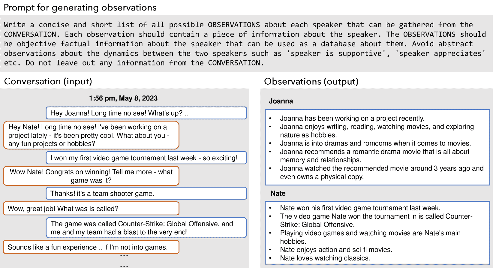

<!--yml

类别：未分类

日期：2025-01-11 12:49:58

-->

# 评估LLM代理的非常长期对话记忆

> 来源：[https://arxiv.org/html/2402.17753/](https://arxiv.org/html/2402.17753/)

Adyasha Maharana¹        Dong-Ho Lee²      Sergey Tulyakov³

Mohit Bansal^(1$\dagger$)        Francesco Barbieri^($\dagger$)      Yuwei Fang^(3$\dagger$)

北卡罗来纳大学教堂山分校¹ 南加州大学² Snap公司³

###### 摘要

现有的长期开放域对话研究主要集中在评估模型在五次聊天会话内的回应。尽管在长上下文大语言模型（LLMs）和增强检索生成（RAG）技术上取得了进展，但它们在非常长期对话中的效果仍未被探索。为填补这一研究空白，我们提出了一种机器-人类管道，通过利用基于LLM的代理架构，并将对话基于人物角色和时间事件图进行 grounding，生成高质量的非常长期对话。此外，我们为每个代理提供了共享和响应图像的能力。生成的对话由人工标注员验证并编辑，以确保长期一致性和与事件图的契合。通过这一管道，我们收集了LoCoMo数据集，这是一组非常长期的对话数据，每个对话平均包含300轮对话和9K个标记，最长可达35个会话。基于LoCoMo数据集，我们提出了一个全面的评估基准，来衡量模型的长期记忆能力，涵盖了问答、事件总结和多模态对话生成任务。我们的实验结果表明，LLMs在理解长时间的对话和理解对话中的长时间跨度的时间和因果关系动态方面存在挑战。采用长上下文LLMs或RAG等策略可以有所改善，但这些模型仍然显著落后于人类表现。¹¹代码和数据将提供于

[https://snap-research.github.io/locomo](https://snap-research.github.io/locomo)

评估LLM代理的非常长期对话记忆

Adyasha Maharana¹        Dong-Ho Lee²      Sergey Tulyakov³ Mohit Bansal^(1$\dagger$)        Francesco Barbieri^($\dagger$)      Yuwei Fang^(3$\dagger$) 北卡罗来纳大学教堂山分校¹ 南加州大学² Snap公司³

¹¹脚注：${}^{\dagger}$平等指导。

## 1 引言

图1：LoCoMo中的一个例子。对话由说话者的人物角色和相应的事件引导，例如，Joanna的回答与她的宠物过敏一致。对于Nate，事件“得到了新狗”后跟随的是与邻居狗的玩耍，展示了长期记忆。多模态对话通过图像共享和图像回应行为得以启用。

| 数据集 | 平均对话轮数 | 平均会话数 | 平均标记数 | 时间间隔 | 多模态 | 收集 |
| --- | --- | --- | --- | --- | --- | --- |
| MPChat Ahn等人（[2023](https://arxiv.org/html/2402.17753v1#bib.bib1)） | 2.8 | 1 | 53.3 | - | ✓ | Reddit |
| MMDialog Feng等人（[2023](https://arxiv.org/html/2402.17753v1#bib.bib12)） | 4.6 | 1 | 72.5 | - | ✓ | 社交媒体 |
| Daily Dialog Li等人（[2017](https://arxiv.org/html/2402.17753v1#bib.bib32)） | 7.9 | 1 | 114.7 | - | ✗ | 众包 |
| SODA Kim等人（[2023](https://arxiv.org/html/2402.17753v1#bib.bib23)） | 7.6 | 1 | 122.4 | - | ✗ | LLM生成 |
| MSC Xu等人（[2022](https://arxiv.org/html/2402.17753v1#bib.bib58)）(训练；1-4轮对话) | 53.3 | 4 | 1,225.9 | 几天 | ✗ | 众包 |
| Conversation Chronicles Jang等人（[2023](https://arxiv.org/html/2402.17753v1#bib.bib21)） | 58.5 | 5 | 1,054.7 | 几小时-几年 | ✗ | LLM生成 |
| LoCoMo（我们的研究） | 304.9 | 19.3 | 9,209.2 | 几个月 | ✓ | LLM生成 + 众包 |

表1：LoCoMo与现有对话数据集的统计数据对比。LoCoMo中每个对话的平均长度是MSC Xu等人（[2022](https://arxiv.org/html/2402.17753v1#bib.bib58)）的9倍，分布在6倍更多的回合和4倍更多的会话中（平均值）。

图2：我们评估框架的概述。我们提出了三个任务：问答、事件总结和多模态对话生成，以评估模型在长期对话中的理解能力。

尽管基于大语言模型（LLMs）进行对话模型的最新进展已经取得了一些成效，例如Bertsch等人（[2024](https://arxiv.org/html/2402.17753v1#bib.bib5)）；Xiao等人（[2023](https://arxiv.org/html/2402.17753v1#bib.bib56)），以及检索增强生成（RAG）技术的集成，例如Shuster等人（[2021](https://arxiv.org/html/2402.17753v1#bib.bib51)）；Ram等人（[2023](https://arxiv.org/html/2402.17753v1#bib.bib47)）；Shi等人（[2023](https://arxiv.org/html/2402.17753v1#bib.bib48)），但仍然需要对其在处理非常长对话中的有效性进行深入评估。事实上，长期开放领域对话的研究集中于在有限上下文中评估模型响应，例如大约1K个标记在五轮对话中（Xu等人，[2022](https://arxiv.org/html/2402.17753v1#bib.bib58)）；Jang等人（[2023](https://arxiv.org/html/2402.17753v1#bib.bib21)）；Zhang等人（[2023](https://arxiv.org/html/2402.17753v1#bib.bib62)）。这种长期评估对于完善能够记住过去互动关键信息的聊天机器人至关重要，从而生成富有同理心、一致且有用的回应。

为此，我们提出了首个关于超长期开放域多模态对话的研究，紧密模拟了现实世界的在线互动，这些对话通过人机管道收集而来，其中我们首先使用基于LLM的生成代理生成对话，然后请人工标注员修正对话中的任何长期不一致性。具体来说，基于对现实世界对话是一种复杂的集体记忆混合体的理解——Assmann 和 Czaplicka（[1995](https://arxiv.org/html/2402.17753v1#bib.bib4)）；Hirst 和 Manier（[2008](https://arxiv.org/html/2402.17753v1#bib.bib18)），个体观点——Hirst 等人（[2018](https://arxiv.org/html/2402.17753v1#bib.bib19)），外部影响——Hirst 和 Echterhoff（[2012](https://arxiv.org/html/2402.17753v1#bib.bib17)），以及说话者独特的人格——Pruitt 和 Grudin（[2003](https://arxiv.org/html/2402.17753v1#bib.bib46)）；Cooper（[1999](https://arxiv.org/html/2402.17753v1#bib.bib9)）；Zhou 等人（[2020](https://arxiv.org/html/2402.17753v1#bib.bib68)）；Shum 等人（[2020](https://arxiv.org/html/2402.17753v1#bib.bib49)）的理解，我们基于LLM代理创建了具有以下特征的超长期对话：（1）独特的人格（§[3.1](https://arxiv.org/html/2402.17753v1#S3.SS1 "3.1 Persona ‣ 3 Generative Pipeline for LoCoMo ‣ Evaluating Very Long-Term Conversational Memory of LLM Agents")）；（2）他们生活中因果关联事件的时间线（§[3.2](https://arxiv.org/html/2402.17753v1#S3.SS2 "3.2 Temporal Event Graph ‣ 3 Generative Pipeline for LoCoMo ‣ Evaluating Very Long-Term Conversational Memory of LLM Agents")）；（3）基于对话历史的反映与响应机制（如Park 等人（[2023](https://arxiv.org/html/2402.17753v1#bib.bib45)））以及图像分享与图像反应行为，即发送或对图像作出反应（§[3.3](https://arxiv.org/html/2402.17753v1#S3.SS3 "3.3 Virtual Agent Architecture ‣ 3 Generative Pipeline for LoCoMo ‣ Evaluating Very Long-Term Conversational Memory of LLM Agents")）。最后，人工标注员修正对话中的长程不一致性，删除无关的图像，并验证对话与事件的基础（§[3.4](https://arxiv.org/html/2402.17753v1#S3.SS4 "3.4 Human Verification & Editing ‣ 3 Generative Pipeline for LoCoMo ‣ Evaluating Very Long-Term Conversational Memory of LLM Agents")）。通过这一管道，我们创建了LoCoMo，一个包含50个超长期对话的数据集，每个对话平均有300轮对话和9K个token，持续时间长达35个会话（见图[1](https://arxiv.org/html/2402.17753v1#S1.F1 "Figure 1 ‣ 1 Introduction ‣ Evaluating Very Long-Term Conversational Memory of LLM Agents")和表[1](https://arxiv.org/html/2402.17753v1#S1.T1 "Table 1 ‣ 1 Introduction ‣ Evaluating Very Long-Term Conversational Memory of LLM Agents")）。

评估开放领域对话中会话代理的传统方法通常是基于过去的对话历史直接评估代理的回应。它通常采用词汇重叠Papineni等人（[2002](https://arxiv.org/html/2402.17753v1#bib.bib44)）和语义重叠Zhang等人（[2019](https://arxiv.org/html/2402.17753v1#bib.bib64)）在真实答案与代理回应之间的重叠，或者一致性Ghazarian等人（[2022](https://arxiv.org/html/2402.17753v1#bib.bib15)）、矛盾Nie等人（[2021](https://arxiv.org/html/2402.17753v1#bib.bib43)）；Welleck等人（[2019](https://arxiv.org/html/2402.17753v1#bib.bib54)）和同理心Zhang等人（[2021a](https://arxiv.org/html/2402.17753v1#bib.bib60)，[2022](https://arxiv.org/html/2402.17753v1#bib.bib61)）等代理回应的评估方法。然而，这些评估指标并不适合直接评估代理在长期语境中的理解能力。

在本研究中，我们提出了一个全面的评估框架，用于评估代理在长期语境中的管理和回应能力（参见图[2](https://arxiv.org/html/2402.17753v1#S1.F2 "Figure 2 ‣ 1 Introduction ‣ Evaluating Very Long-Term Conversational Memory of LLM Agents")）。首先，代理需要正确“回忆”过去的语境，将相关信息整合到未来的回应中。我们通过问答（QA）任务直接检验他们的记忆（§[4.1](https://arxiv.org/html/2402.17753v1#S4.SS1 "4.1 Question Answering Task ‣ 4 LoCoMo Evaluation Benchmark ‣ Evaluating Very Long-Term Conversational Memory of LLM Agents")）。我们将问题分为五种不同的推理类型，从多个角度评估记忆：单跳、多跳、时间性、常识或世界知识以及对抗性。其次，代理还需要识别对话中的长期因果关系和时间关系，以生成具有同理心且相关的回应。我们提出了一种通过事件图摘要任务来衡量他们的因果和时间理解能力（§[4.2](https://arxiv.org/html/2402.17753v1#S4.SS2 "4.2 Event Summarization Task ‣ 4 LoCoMo Evaluation Benchmark ‣ Evaluating Very Long-Term Conversational Memory of LLM Agents")）。在该任务中，与每个LLM发言者相关的事件图作为正确答案，模型的任务是从对话历史中提取这些信息。第三，会话代理需要利用从过去对话中回忆起的相关语境，生成与正在进行的叙事一致的回应。我们通过多模态对话生成任务来评估这一能力（§[4.3](https://arxiv.org/html/2402.17753v1#S4.SS3 "4.3 Multi-Modal Dialogue Generation Task ‣ 4 LoCoMo Evaluation Benchmark ‣ Evaluating Very Long-Term Conversational Memory of LLM Agents")）。

我们在LoCoMo基准上展示了使用基于指令的LLM、长期上下文LLM和RAG技术的广泛实验结果（§[5](https://arxiv.org/html/2402.17753v1#S5 "5 Experimental Setup ‣ Evaluating Very Long-Term Conversational Memory of LLM Agents")）。我们的研究结果包括：

(1) 长期上下文LLM和RAG在问答任务中表现出有效性，提高了LLM的“记忆”能力（提升幅度从22%到66%不等），但仍显著落后于人类水平（低56%），特别是在时间推理方面（低73%）；

(2) 长期上下文LLM在问答任务中对抗性问题表现出显著困难，表现比基础模型低83%。它们尤其容易将对话或事件错误分配给错误的说话者。此外，它们在事件图总结上的表现较差，落后于基础模型14%，这表明它们可能掌握了整个对话中的事实元素，但没有准确理解上下文；

(3) RAG提供了一种平衡的折中方案，结合了短期上下文LLM的准确性和广泛上下文LLM的全面理解，当对话被转化为每个说话者的生活和个性断言（观察）数据库时，表现尤为出色。

## 2 相关工作

##### 长期对话。

最近的方法涉及从一系列先前对话中检索历史上下文，并按时间顺序推理检索到的片段 Lee 等人（[2023b](https://arxiv.org/html/2402.17753v1#bib.bib28)）；Lu 等人（[2023](https://arxiv.org/html/2402.17753v1#bib.bib38)）；Zhong 等人（[2023](https://arxiv.org/html/2402.17753v1#bib.bib67)）；Liang 等人（[2023](https://arxiv.org/html/2402.17753v1#bib.bib33)）和/或使用事件来搭建对话 Jang 等人（[2023](https://arxiv.org/html/2402.17753v1#bib.bib21)）；Zhang 等人（[2023](https://arxiv.org/html/2402.17753v1#bib.bib62)）以实现长期对话的一致性。这些框架的一些局限性包括：（1）检索的准确性可能会受到影响，因为检索模型通常是在专注于语义相似性而非特别针对此类对话的任务上训练的。此外，现实中的对话通常包含共指和缺失内容（即指代）Anantha 等人（[2021](https://arxiv.org/html/2402.17753v1#bib.bib2)），这进一步复杂化了检索过程 Mallen 等人（[2023](https://arxiv.org/html/2402.17753v1#bib.bib39)）；Gao 等人（[2023b](https://arxiv.org/html/2402.17753v1#bib.bib14)）；Liu 等人（[2023](https://arxiv.org/html/2402.17753v1#bib.bib36)）；（2）在推理检索到的文档时会遇到挑战，尤其是在模型难以识别检索数据中的正确上下文时 Liu 等人（[2024](https://arxiv.org/html/2402.17753v1#bib.bib37)）；（3）推理时间间隔也带来了挑战。例如，系统如何回应过去的事件可能会因自上次对话以来的时间长短而有所不同 Zhang 等人（[2023](https://arxiv.org/html/2402.17753v1#bib.bib62)）；Jang 等人（[2023](https://arxiv.org/html/2402.17753v1#bib.bib21)）。因此，进行较长时间的对话并拥有一个系统化的评估框架至关重要，以准确评估长期对话生成方法的有效性。我们设计了基于检索增强和事件图的长期对话生成流程，并提出了一个评估长期对话代理的框架。

##### 多模态对话。

多模态对话主要包括两类任务：基于图像的对话和图像共享对话。基于图像的对话任务主要围绕回答问题展开 Antol等人（[2015](https://arxiv.org/html/2402.17753v1#bib.bib3)）；Das等人（[2017](https://arxiv.org/html/2402.17753v1#bib.bib11)）；Kottur等人（[2019](https://arxiv.org/html/2402.17753v1#bib.bib24)）；或围绕与特定图像相关的自然对话展开 Mostafazadeh等人（[2017](https://arxiv.org/html/2402.17753v1#bib.bib42)）；Shuster等人（[2020](https://arxiv.org/html/2402.17753v1#bib.bib50)）；Meng等人（[2020](https://arxiv.org/html/2402.17753v1#bib.bib40)）；Zheng等人（[2022](https://arxiv.org/html/2402.17753v1#bib.bib66)）。相反，图像共享对话任务则侧重于选择与提供的对话上下文在语义上对齐的图像 Zang等人（[2021](https://arxiv.org/html/2402.17753v1#bib.bib59)）；Feng等人（[2023](https://arxiv.org/html/2402.17753v1#bib.bib12)）；Lee等人（[2023c](https://arxiv.org/html/2402.17753v1#bib.bib29)）。我们采用图像共享对话任务中的方法来创建多模态对话，随后将其作为基于图像的对话任务进行评估。

##### 合成评估基准。

面对人类生成数据的短缺，并观察到LLM正在接近人类级别的注释质量 He等人（[2023](https://arxiv.org/html/2402.17753v1#bib.bib16)）；Lee等人（[2023a](https://arxiv.org/html/2402.17753v1#bib.bib27)），基于这一发展，相关研究激增。因此，许多研究开始利用LLM来增强或合成大规模对话基准，用于评估日常社交互动中的响应 Kim等人（[2023](https://arxiv.org/html/2402.17753v1#bib.bib23)），检验多模态环境中的响应 Feng等人（[2023](https://arxiv.org/html/2402.17753v1#bib.bib12)），并评估与特定人格对齐的响应 Jandaghi等人（[2023](https://arxiv.org/html/2402.17753v1#bib.bib20)）。我们利用LLM来创建数据，但通过人工验证和编辑确保其高质量。

## 3 LoCoMo生成管道

图 3：LoCoMo生成管道的概述。每个LLM代理被分配一个独特的人格和文件中因果关联事件的时间线。该代理配备了内存和反思模块，以检索与对话生成相关的历史记录，并且启用了图像共享和图像反应行为（左）。生成的对话由人工注释员编辑，以保持长期一致性（右）。

我们的LoCoMo生成流程概述如图[3](https://arxiv.org/html/2402.17753v1#S3.F3 "Figure 3 ‣ 3 Generative Pipeline for LoCoMo ‣ Evaluating Very Long-Term Conversational Memory of LLM Agents")所示。我们创建了两个虚拟代理，分别命名为$\mathcal{L}_{1}$和$\mathcal{L}_{2}$，每个代理都初始化为LLM $\mathcal{M}$（即gpt-3.5-turbo）。首先，为每个代理$\mathcal{L}_{i}$分配独特的人物设定声明$p$，以确保不同个性融入其对话中（§[3.1](https://arxiv.org/html/2402.17753v1#S3.SS1 "3.1 Persona ‣ 3 Generative Pipeline for LoCoMo ‣ Evaluating Very Long-Term Conversational Memory of LLM Agents")）。为了模拟现实生活中的经验，我们为每个代理创建了一个时间事件图$\mathcal{G}$，它展示了一系列现实的生活事件（§[3.2](https://arxiv.org/html/2402.17753v1#S3.SS2 "3.2 Temporal Event Graph ‣ 3 Generative Pipeline for LoCoMo ‣ Evaluating Very Long-Term Conversational Memory of LLM Agents")）。每个代理$\mathcal{L}_{i}$都使用了Park等人（[2023](https://arxiv.org/html/2402.17753v1#bib.bib45)）提出的LLM代理架构，使其能够有效地记忆和反映对话历史到持续的对话中（§[3.3](https://arxiv.org/html/2402.17753v1#S3.SS3 "3.3 Virtual Agent Architecture ‣ 3 Generative Pipeline for LoCoMo ‣ Evaluating Very Long-Term Conversational Memory of LLM Agents")）。此外，每个代理$\mathcal{L}_{i}$还可以共享一致的图像，从而增强多模态对话的表现。最后，人工标注员负责手动筛选和精炼生成的数据（§[3.4](https://arxiv.org/html/2402.17753v1#S3.SS4 "3.4 Human Verification & Editing ‣ 3 Generative Pipeline for LoCoMo ‣ Evaluating Very Long-Term Conversational Memory of LLM Agents")）。

### 3.1 人物设定

我们从MSC数据集Xu等人（[2022](https://arxiv.org/html/2402.17753v1#bib.bib58)）中选择了一个初始的人物设定声明$p_{c}$，包含4到5个句子，并使用gpt-3.5-turbo作为$\mathcal{M}$将其扩展为完整的人物设定声明$p$（见附录[A.1](https://arxiv.org/html/2402.17753v1#A1.SS1 "A.1 Persona ‣ Appendix A Generative Pipeline for LoCoMo ‣ Evaluating Very Long-Term Conversational Memory of LLM Agents")中的示例和提示细节）。生成的声明通常包括以下一项或多项元素的细节：目标、过去的经历、日常习惯和人际关系，以及个人的姓名、年龄和性别，参考Gao等人（[2023a](https://arxiv.org/html/2402.17753v1#bib.bib13)）。

### 3.2 时间事件图

为了利用每个对话代理的现实生活经验，我们为每个代理构建一个时间事件图，记作$\mathcal{G}$。这个图$\mathcal{G}$由事件$e_{i}$组成，通过应用$\mathcal{M}$（即text-davinci-003）条件在指定的人物$p$上生成。每个事件$e_{i}$都与发生日期$t_{i}$相关联。$\mathcal{G}$包含因果连接$l=(e_{i},e_{j})$，用于说明事件$e_{i}\in\mathcal{G}$之间的因果关系，并反映个体生活中事件的自然顺序。对于每个$\mathcal{G}$，我们创建最多25个事件，这些事件分布在6到12个月的时间框架内，在推理时间和时间及因果连接的连贯性之间进行平衡的迭代过程中生成。最初，生成一小批$k=3$个事件，然后将其作为输入提示，迭代生成后续的$k$个事件。详情请见附录[A.2](https://arxiv.org/html/2402.17753v1#A1.SS2 "A.2 Temporal Event Graph ‣ Appendix A Generative Pipeline for LoCoMo ‣ Evaluating Very Long-Term Conversational Memory of LLM Agents")。

### 3.3 虚拟代理架构

每个代理$\mathcal{L}_{i}$都包含来自生成式代理架构Park等人（[2023](https://arxiv.org/html/2402.17753v1#bib.bib45)）的模块。代理具有两个功能：（1）反思与回应；（2）图像共享与图像反应。代理主要使用反思与回应功能，同时在对话的上下文中谨慎且恰当地使用图像共享与图像反应功能。

##### 反思与回应。

每个代理反思和回应的基本过程涉及短期记忆和长期记忆的概念。在推理过程中，代理$\mathcal{L}_{i}$会基于短期和长期记忆来调整其回应，类似于人类记住最近的对话，同时也会回忆起来自长期记忆中的重要经验。在每次会话$k$后，每个代理会生成一个总结$w_{k}$，然后将其存储在短期记忆$\mathcal{H}_{s}$中。这个总结$w_{k}$是通过将$\mathcal{M}$与最新的会话历史$h_{k}$和前一个总结$w_{k-1}\in\mathcal{H}_{l}$结合来生成的。在会话$k$中的每个轮次$j$，会话的一轮内容$h_{k_{j}}$会转化为一个观察结果$o_{k_{j}}$，然后存储在长期记忆$\mathcal{H}_{l}$中。然后，代理$\mathcal{L}_{i}$基于最新总结$w_{k}$、基于检索到的相关观察结果$o\in\mathcal{H}_{s}$的反思、当前会话中的对话历史$h_{k+1}$以及个性声明$p$，生成会话$k+1$中的回应，时间为$t_{k+1}^{s}$。长期的时间叙事通过额外将代理的回应条件化为$\mathcal{G}$中发生在上次会话和当前会话之间的事件子集来引导，即$\{e\in\mathcal{G}\,|\,t_{k}^{s}\,<\,t_{i}^{e}\,<\,t_{k+1}^{s}\,\}$。详细信息请见附录[A.2.1](https://arxiv.org/html/2402.17753v1#A1.SS2.SSS1 "A.2.1 Virtual Agent Architecture ‣ A.2 Temporal Event Graph ‣ Appendix A Generative Pipeline for LoCoMo ‣ Evaluating Very Long-Term Conversational Memory of LLM Agents")。

##### 图像共享与图像反应

图像共享和图像反应功能被集成，以为长期对话增添多模态维度。²²2图像说明也被保存到长期记忆中。当代理决定发送图像时，会调用图像共享功能。此过程包括：（1）使用$\mathcal{M}$为目标图像生成说明$c$；（2）使用$\mathcal{M}$将说明$c$转换为相关关键词$w$；（3）通过网页搜索$WEB(k)$³³3[https://pypi.org/project/icrawler/](https://pypi.org/project/icrawler/)使用关键词$k$查找图像；（4）共享选定的$image$。相反，当从另一个代理接收到图像时，会触发图像反应功能，具体包括：（1）为接收到的图像生成说明$c$⁴⁴4我们使用BLIP-2 Li等（[2023b](https://arxiv.org/html/2402.17753v1#bib.bib31)）作为说明生成模型；（2）使用$\mathcal{M}$生成针对接收到的图像的反应（见附录[A.2.1](https://arxiv.org/html/2402.17753v1#A1.SS2.SSS1 "A.2.1 Virtual Agent Architecture ‣ A.2 Temporal Event Graph ‣ Appendix A Generative Pipeline for LoCoMo ‣ Evaluating Very Long-Term Conversational Memory of LLM Agents")）。

### 3.4 人类验证与编辑

在最后阶段，人工标注员的任务是：（1）编辑对话以消除长期不一致性；（2）删除或替换不相关的图片；（3）验证并编辑事件图与对话内容的一致性。总体而言，我们观察到标注员编辑了近15%的对话回合，并删除或替换了大约19%的LLM生成数据集中的图片。有关一些编辑的示例，请参见附录[A.3](https://arxiv.org/html/2402.17753v1#A1.SS3 "A.3 Human Filtering ‣ Appendix A Generative Pipeline for LoCoMo ‣ Evaluating Very Long-Term Conversational Memory of LLM Agents")。

## 4 LoCoMo 评估基准

基于[3](https://arxiv.org/html/2402.17753v1#S3 "3 Generative Pipeline for LoCoMo ‣ Evaluating Very Long-Term Conversational Memory of LLM Agents")节中生成的对话，我们引入了一个评估基准（见[2](https://arxiv.org/html/2402.17753v1#S1.F2 "Figure 2 ‣ 1 Introduction ‣ Evaluating Very Long-Term Conversational Memory of LLM Agents")图），该基准由三个任务组成，用于评估长期记忆的准确性。有关数据集和评估基准的统计数据，请参见附录中的[5](https://arxiv.org/html/2402.17753v1#A2.T5 "Table 5 ‣ B.1 Dataset Statistics ‣ Appendix B Dataset ‣ Evaluating Very Long-Term Conversational Memory of LLM Agents")表。

### 4.1 问答任务

一个对话代理需要具备记忆功能，以便记住先前的对话内容，并能在未来的对话中反映这些记忆，从而产生更具吸引力的回应。为了全面评估这种记忆，我们引入了一个问答任务，分为五个不同的推理类别：（1）单跳问题要求根据单一会话来回答；（2）多跳问题需要综合来自多个不同会话的信息；（3）时间推理问题可以通过时间推理来回答，并在对话中捕捉与时间相关的数据线索；（4）开放领域知识问题可以通过整合说话者提供的信息与外部知识（如常识或世界事实）来回答；（5）对抗性问题旨在欺骗代理提供错误答案，期望代理能正确识别这些问题为无法回答。

对于每个类别，我们计算精确匹配的 F1 分数，并对预测答案和实际的地面真实答案进行标准化。然而，使用自动化指标评估长篇回答常常带来挑战，正如 Xu 等人所述（[2023](https://arxiv.org/html/2402.17753v1#bib.bib57)）。大型语言模型（LLMs）倾向于生成各种格式的释义性回答，这使得精确匹配评估变得更加复杂。为了简化我们的任务评估，我们确保 QA 注释中的答案尽可能直接来自对话。我们指示 LLMs 在可能的情况下复制对话中的确切措辞，并使用 F1 部分匹配指标来评估预测结果。每个 QA 样本还会标注包含答案的对话日志中的轮次 ID。我们报告了 RAG 模型检索正确上下文的准确率。

### 4.2 事件摘要任务

对话是基于时间事件图 $\mathcal{G}$ 生成的，该图通过在 LLM 上条件化一个人格陈述 $p$ 来构建，反映个体生活中的事件时间顺序。对话代理不仅需要理解事件图 $\mathcal{G}$ 中的因果关系和事件顺序，还需要根据要求讲述这些事件。为了评估代理对事件动态的掌握，我们引入了事件摘要任务，该任务挑战代理在指定时间框架内总结事件，并将代理的摘要与事件图 $\mathcal{G}$ 中的事件进行比较。LoCoMo 中的事件是密集标注的生活事件列表，由于对话中存在的时间和因果共指，它们难以总结，这与现有的研究论文摘要基准（Li 等人，[2023a](https://arxiv.org/html/2402.17753v1#bib.bib30)）、电影剧本（Chen 等人，[2022](https://arxiv.org/html/2402.17753v1#bib.bib7)）、书籍（Kryściński 等人，[2022](https://arxiv.org/html/2402.17753v1#bib.bib26)）、电子邮件（Zhang 等人，[2021b](https://arxiv.org/html/2402.17753v1#bib.bib63)）等的摘要任务形成对比。

传统指标如BLEU Papineni等人（[2002](https://arxiv.org/html/2402.17753v1#bib.bib44)）和ROGUE Lin（[2004](https://arxiv.org/html/2402.17753v1#bib.bib34)）关注参考和生成摘要之间的词汇相似度，但这并不符合我们的需求，因为我们强调摘要的事实准确性。在这种背景下，我们采用了FactScore Min等人（[2023](https://arxiv.org/html/2402.17753v1#bib.bib41)），这是一种通过将参考和假设都分解为原子事实来评估生成文本的真实性的方法。我们调整了该指标来测量（1）摘要内容的精确度，通过计算内容中与 $\mathcal{G}$ 中的原子事实对应的数量；（2）摘要内容的召回率，通过确定 $\mathcal{G}$ 中的原子事实在内容中的全面呈现程度。我们展示了基于计算出的精确度和召回率得出的F1得分。

### 4.3 多模态对话生成任务

我们数据集中的对话是基于特定人物角色 $p$ 以及与 $p$ 相关的事件 $\mathcal{G}$ 定制的。对话中的话题从早期对话中引入的事件发展而来，时间跨度可能是几周或几个月。这种结构允许评估对话代理是否能够维持一个连贯的人物角色并持续讲述一个连贯的故事。例如，如果一个说话者最近受伤，接下来的对话可能会集中在他们的恢复上，而不是参与冒险活动。我们通过测量预测的多模态对话与数据集中的真实多模态对话的吻合度来评估这种一致性，通过MMRelevance Feng等人（[2023](https://arxiv.org/html/2402.17753v1#bib.bib12)）以及其他自然语言生成（NLG）指标量化这种吻合度。

## 5 实验设置

对于问答和事件摘要任务，我们将LoCoMo中的图像替换为其标题Li等人（[2023b](https://arxiv.org/html/2402.17753v1#bib.bib31)），并使用最先进的大型语言模型（LLMs）对仅包含文本的对话和图像标题进行推理。我们仅在多模态对话生成任务中直接使用图像。更多细节见附录[C](https://arxiv.org/html/2402.17753v1#A3 "附录 C 实验设置 ‣ 评估LLM代理的超长期对话记忆")。

##### 问答

我们评估了三种类型的模型：（1）基于常规上下文长度的基础LLM模型，其中较早的对话被省略，即Mistral-7B Jiang等人（[2023](https://arxiv.org/html/2402.17753v1#bib.bib22)），LLama-70B-chat Touvron等人（[2023](https://arxiv.org/html/2402.17753v1#bib.bib52)），gpt-3.5-turbo ⁵⁵5https://platform.openai.com/docs/models/gpt-3-5，以及gpt-4-turbo ⁶⁶6https://platform.openai.com/docs/models/gpt-4-and-gpt-4-turbo；（2）具有扩展上下文窗口的长上下文LLM模型，即gpt-3.5-turbo-16k；（3）检索增强生成（RAG）涉及从对话历史、观察（关于发言人的陈述；见§[3.3](https://arxiv.org/html/2402.17753v1#S3.SS3 "3.3 虚拟代理架构 ‣ LoCoMo生成管道 ‣ 评估LLM代理的长期对话记忆")，图[9](https://arxiv.org/html/2402.17753v1#A1.F9 "图9 ‣ 图像共享与响应 ‣ A.2.1 虚拟代理架构 ‣ A.2 时间事件图 ‣ 附录A LoCoMo生成管道 ‣ 评估LLM代理的长期对话记忆")），或会话级摘要（见§[3.3](https://arxiv.org/html/2402.17753v1#S3.SS3 "3.3 虚拟代理架构 ‣ LoCoMo生成管道 ‣ 评估LLM代理的长期对话记忆")，图[8](https://arxiv.org/html/2402.17753v1#A1.F8 "图8 ‣ 图像共享与响应 ‣ A.2.1 虚拟代理架构 ‣ A.2 时间事件图 ‣ 附录A LoCoMo生成管道 ‣ 评估LLM代理的长期对话记忆")）中检索相关的上下文。我们使用DRAGON Lin等人（[2023](https://arxiv.org/html/2402.17753v1#bib.bib35)）作为检索器，gpt-3.5-turbo-16k作为阅读器。

##### 事件总结。

我们展示了使用基础和长上下文设置的问答任务实验，但没有包括RAG，因为总结需要对整个对话有全面的理解，而不仅仅是检索特定部分。我们实现了增量总结，即迭代地创建前一会话的摘要，然后使用该摘要作为基础来总结随后的会话Chang等人（[2023](https://arxiv.org/html/2402.17753v1#bib.bib6)）。

##### 多模态对话生成。

我们通过自动化流水线（没有人工过滤；§[3](https://arxiv.org/html/2402.17753v1#S3 "3 Generative Pipeline for LoCoMo ‣ Evaluating Very Long-Term Conversational Memory of LLM Agents")）生成了50个对话作为训练数据，并训练了三个版本的MiniGPT-5 Zheng等人（[2023](https://arxiv.org/html/2402.17753v1#bib.bib65)）：(1) 基础版本仅基于先前的对话轮次进行训练；(2) +摘要版基于先前的对话轮次和正在进行的对话的全局摘要进行训练；(3) +观察版基于先前的对话轮次和从对话历史中检索到的观察进行训练。每次训练都从MiniGPT-5检查点开始，并在MMDialog Feng等人（[2023](https://arxiv.org/html/2402.17753v1#bib.bib12)）上进行了微调。

| 类别 | 模型 | 上下文长度 | 答案预测（F1） |
| --- | --- | --- | --- |
| 单跳 | 多跳 | 时间性 | 开放域 | 对抗性 | 总体 |
| --- | --- | --- | --- | --- | --- |
| 人类 | 人类 | - | 95.1 | 85.8 | 92.6 | 75.4 | 89.4 | 87.9 |
| --- | --- | --- | --- | --- | --- | --- | --- |
| 基础 | Mistral-Instruct-7B | 8K | 10.2 | 12.8 | 16.1 | 19.5 | 17.0 | 13.9 |
| Llama-2-Chat-70B | 4,096 | 19.7 | 14.4 | 13.3 | 15.9 | 22.1 | 17.9 |
| GPT-3.5-turbo | 4,096 | 29.9 | 23.3 | 17.5 | 29.5 | 12.8 | 22.4 |
| GPT-4-turbo | 4,096 | 23.4 | 23.4 | 10.4 | 24.6 | 70.2 | 32.1 |
| 长上下文 | GPT-3.5-turbo-16K | 4K | 31.7 | 25.4 | 16.8 | 27.6 | 13.1 | 24.1 |
| 8K | 38.8 | 31.2 | 21.0 | 35.0 | 8.4 | 25.2 |
| 12K | 51.1 | 40.4 | 25.0 | 36.5 | 6.4 | 33.5 |
| 16K | 56.4 | 42.0 | 20.3 | 37.2 | 2.1 | 37.8 |

表 2：基础模型与长上下文模型的问答性能。最佳性能为**粗体**。结果基于答案预测的F1分数；分数越高越好。

|  |  | 答案预测（F1分数） |  | 召回准确率（R@$k$） |
| --- | --- | --- | --- | --- |
| 检索单元 | top-$k$ | 单跳 | 多跳 | 时间性 | 开放域 | 对抗性 | 总体 | 单跳 | 多跳 | 时间性 | 开放域 | 对抗性 | 总体 |
| 无 | - | 29.9 | 23.3 | 17.5 | 29.5 | 12.8 | 22.4 | - | - | - | - | - | - |
| 对话 | 5 | 42.9 | 19.4 | 21.3 | 35.8 | 31.9 | 31.7 | 66.2 | 34.4 | 89.2 | 38.5 | 45.7 | 58.8 |
| 10 | 46.3 | 26.8 | 24.8 | 37.5 | 29.8 | 34.6 | 72.8 | 247.4 | 97.3 | 53.8 | 54.3 | 67.5 |
| 25 | 48.1 | 36.1 | 26.2 | 43.4 | 23.4 | 35.8 | 87.5 | 64.1 | 97.3 | 67.9 | 69.1 | 79.9 |
| 50 | 50.9 | 37.2 | 24.6 | 38.3 | 17.0 | 34.8 | 90.4 | 75.5 | 97.3 | 67.9 | 77.7 | 84.8 |
| 观察 | 5 | 44.3 | 30.6 | 41.9 | 40.2 | 44.7 | 41.4 | 52.9 | 40.1 | 81.1 | 38.5 | 29.8 | 49.6 |
| 10 | 42.2 | 30.5 | 42.1 | 41.9 | 36.2 | 38.8 | 57.4 | 53.1 | 83.8 | 46.2 | 41.5 | 57.1 |
| 25 | 44.6 | 33.2 | 41.8 | 41.9 | 27.7 | 38.0 | 71.3 | 63.8 | 83.8 | 66.7 | 45.7 | 66.0 |
| 50 | 44.0 | 34.5 | 41.1 | 41.9 | 27.7 | 37.8 | 72.8 | 73.2 | 83.8 | 74.4 | 56.4 | 71.1 |
| 摘要 | 2 | 34.6 | 15.7 | 26.9 | 26.5 | 36.2 | 29.9 | 68.4 | 39.6 | 56.8 | 50.0 | 73.4 | 61.5 |
| 5 | 36.6 | 16.6 | 31.0 | 34.7 | 38.3 | 32.5 | 81.6 | 57.0 | 70.3 | 60.3 | 86.2 | 75.1 |
| 10 | 34.5 | 14.7 | 29.3 | 31.6 | 40.4 | 31.5 | 93.4 | 82.3 | 91.9 | 80.8 | 94.7 | 90.7 |

表3：基于RAG的GPT-3.5-turbo-16k在问题回答任务中的表现。最佳表现用**粗体**表示。结果基于F1分数度量来评估答案预测，以及基于召回准确率的召回@$k$；数值越高越好。

## 6 实验结果

我们评估并分析了所有基线方法在问题回答（§[6.1](https://arxiv.org/html/2402.17753v1#S6.SS1 "6.1 Question Answering Task ‣ 6 Experimental Results ‣ Evaluating Very Long-Term Conversational Memory of LLM Agents")）、事件图总结（§[6.2](https://arxiv.org/html/2402.17753v1#S6.SS2 "6.2 Event Summarization Task ‣ 6 Experimental Results ‣ Evaluating Very Long-Term Conversational Memory of LLM Agents")）和多模态对话生成（§[6.3](https://arxiv.org/html/2402.17753v1#S6.SS3 "6.3 Multi-Modal Dialog Generation Task ‣ 6 Experimental Results ‣ Evaluating Very Long-Term Conversational Memory of LLM Agents")）中的综合性能。

### 6.1 问题回答任务

表[2](https://arxiv.org/html/2402.17753v1#S5.T2 "Table 2 ‣ Multi-modal Dialogue Generation. ‣ 5 Experimental Setup ‣ Evaluating Very Long-Term Conversational Memory of LLM Agents")和[3](https://arxiv.org/html/2402.17753v1#S5.T3 "Table 3 ‣ Multi-modal Dialogue Generation. ‣ 5 Experimental Setup ‣ Evaluating Very Long-Term Conversational Memory of LLM Agents")展示了问答任务的性能结果。我们发现：（1）具有有限上下文长度的LLM在理解极长对话时面临挑战，因为上下文窗口被截断。尽管gpt-4-turbo以32.4的总得分成为表现最好的模型，但它明显落后于人类基准87.9；（2）长上下文LLM能够理解更长的叙述，但它们容易生成幻觉。gpt-3.5-turbo-16k优于其他方法，但在对抗性问题上的表现降至仅为2.1%，而Llama-2-Chat为22.1%，GPT-4-turbo在4K上下文窗口下为70.2%。这表明，当LLM面临长上下文时，很容易被误导生成幻觉；（3）当对话被存储为观察结果时，RAG是有效的。当输入为前五个相关观察结果而不是纯对话日志时，gpt-3.5-turbo的性能有明显提高，改善了约5%。随着检索观察结果数量的增加，这种改进变得不明显，表明为了使模型准确利用上下文，减少检索上下文中的信噪比（SNR）是重要的。相反，使用会话总结作为上下文并未显著提高性能，尽管回忆准确率很高⁷⁷7对于基于总结的RAG模型，回忆准确率是基于检索相关会话的总结来衡量的，可能是由于将对话转化为总结过程中信息的丢失。

一个有趣的发现是，时间推理和开放领域知识问题是最具挑战性的场景。

(1) LLM在理解对话中的时间概念方面面临挑战，这与其他专注于LLM时间推理能力的单轮基准测试的发现一致 Wang和Zhao ([2023](https://arxiv.org/html/2402.17753v1#bib.bib53))。

(2) LLM在开放领域知识方面存在困难，并在RAG设置下性能下降。这表明，虽然某些开放领域知识可能已经嵌入在模型的参数中，但引入不准确的检索上下文会导致性能下降 Mallen等人 ([2023](https://arxiv.org/html/2402.17753v1#bib.bib39))。

| 类别 | 模型 | 上下文长度 | ROGUE | FactScore |
| --- | --- | --- | --- | --- |
| ROGUE-1 | ROGUE-2 | ROGUE-L | 精度 | 召回率 | F1 |
| --- | --- | --- | --- | --- | --- |
| 基础 | Mistral-Instruct-7B | 8K | 29.4 | 7.2 | 14.1 | 27.1 | 19.8 | 23.0 |
| Llama-2-Chat-70B | 4,096 | 28.1 | 9.3 | 14.8 | 36.3 | 22.7 | 28.3 |
| GPT-4-turbo | 4,096 | 38.8 | 11.4 | 20.6 | 51.6 | 41.8 | 45.1 |
| GPT-3.5-turbo | 4,096 | 41.1 | 13.5 | 20.9 | 45.3 | 46.5 | 45.9 |
| 长上下文 | GPT-3.5-turbo-16K | 16K | 36.2 | 8.5 | 16.4 | 42.3 | 37.8 | 39.9 |

表4：Base模型和长上下文模型的事件摘要性能。最佳性能以粗体显示。结果基于ROUGE和FactScore Min等人（[2023](https://arxiv.org/html/2402.17753v1#bib.bib41)）的度量标准；分数越高越好。

图4：MiniGPT-5的多模态对话生成性能。（A）使用MiniGPT-5在有无观察上下文的情况下预测的多模态对话示例，（B）MM-相关性得分随对话历史长度的变化，和（C）基于RAG的MiniGPT-5方法比较。

### 6.2 事件摘要任务

表[4](https://arxiv.org/html/2402.17753v1#S6.T4 "表4 ‣ 6.1 问答任务 ‣ 6 实验结果 ‣ 评估LLM代理的长期对话记忆")展示了事件摘要任务的结果。使用增量摘要的gpt-3.5-turbo在召回率和F1分数上均取得了最佳表现。尽管gpt-4-turbo在精度上比gpt-3.5-turbo提高了5.3%，但在召回率上表现不如预期。事件摘要任务需要长程依赖性来理解说话者在多次会话中讨论的事件之间的时间和因果关系（见图[7](https://arxiv.org/html/2402.17753v1#A1.F7 "图7 ‣ A.2 时间事件图 ‣ 附录A LoCoMo生成流水线 ‣ 评估LLM代理的长期对话记忆")）。与预期相反，尽管长上下文模型具备更大的上下文窗口来支持扩展范围的推理，但并未超过基础模型。与具有4K上下文窗口的gpt-3.5-turbo相比，gpt-3.5-turbo-16k的精度下降了3.0%，召回率下降了8.7%。这表明长上下文模型可能不善于恰当地利用其上下文，这与Li等人（[2023a](https://arxiv.org/html/2402.17753v1#bib.bib30)）以及LoCoMo中的问答任务的类似发现一致。在ROUGE和FactScore两个度量标准中，商业模型（gpt-4-turbo，gpt-3.5-turbo）明显优于开源模型。然而，在此任务上仍有相当大的改进空间。

通过对预测总结的人工分析，我们确定了LLMs在事件总结中常见的五类错误：（1）事件信息缺失，因为模型未能在长时间对话中建立时间性和/或因果关系；（2）幻觉，即模型加入了对话中不存在的额外细节，或者是同一会话中属于不同事件的内容；（3）误解对话线索导致的错误，如幽默或讽刺，这是理解对话时的一个独特问题；（4）讲者归属不准确；以及（5）不重要的对话被错误地认为是重要事件。相关示例请参见附录中的表[7](https://arxiv.org/html/2402.17753v1#A4.T7 "Table 7 ‣ D.1 Event Summarization Task ‣ Appendix D Results ‣ Evaluating Very Long-Term Conversational Memory of LLM Agents")。

### 6.3 多模态对话生成任务

图[4](https://arxiv.org/html/2402.17753v1#S6.F4 "Figure 4 ‣ 6.1 Question Answering Task ‣ 6 Experimental Results ‣ Evaluating Very Long-Term Conversational Memory of LLM Agents")展示了多种MiniGPT-5训练变体在多模态对话生成中的有效性。将上下文融入训练可以提升表现，特别是将观察作为上下文的引入显著改善了结果。例如，在图[4](https://arxiv.org/html/2402.17753v1#S6.F4 "Figure 4 ‣ 6.1 Question Answering Task ‣ 6 Experimental Results ‣ Evaluating Very Long-Term Conversational Memory of LLM Agents")A中，检索到的观察包含有关讲者在视频游戏锦标赛中的经验，这使得预测出的对话和图像更忠实于讲者的个性。这个观察结果与之前在问答任务中的发现一致（参见表[3](https://arxiv.org/html/2402.17753v1#S5.T3 "Table 3 ‣ Multi-modal Dialogue Generation. ‣ 5 Experimental Setup ‣ Evaluating Very Long-Term Conversational Memory of LLM Agents")）。此外，我们还观察到，当对话历史的长度增加时，MM-相关性得分会下降（参见图[4](https://arxiv.org/html/2402.17753v1#S6.F4 "Figure 4 ‣ 6.1 Question Answering Task ‣ 6 Experimental Results ‣ Evaluating Very Long-Term Conversational Memory of LLM Agents")B）。检索增强生成在一定程度上缓解了MM-相关性下降的问题。

## 7 结论

我们开发了一种人机协作流程来收集LoCoMo数据集，该数据集包含50个高质量的非常长的对话，每个对话平均包含300轮对话和9K个token，最长可达35轮，并提出了一个评估框架，包含三个任务，用以评估模型在长时间对话中的熟练程度。我们的实验表明，大型语言模型（LLMs）在理解对话中的长期叙事时存在困难，并且未能在讨论中建立事件之间的时间性和因果关系。

## 8 限制

##### 混合人机生成数据。

我们的数据集主要来源于LLM生成的文本。我们选择这种方法，它迅速成为了手动数据收集（需要大量时间投入）的热门替代方案 Kim等人（[2023](https://arxiv.org/html/2402.17753v1#bib.bib23)）；Jang等人（[2023](https://arxiv.org/html/2402.17753v1#bib.bib21)），以避免大规模收集长期真实世界对话时所面临的后勤和法律复杂性。我们通过让人工注释员验证和编辑生成的对话，确保数据集尽可能反映现实世界中的互动。然而，我们也承认，该数据集可能无法完全反映现实世界在线对话的细微差别。

##### 对多模态行为的探索有限。

由于我们数据集中的图像来自互联网，因此它们并未展示个人照片中通常表现出的视觉长期一致性（例如：外貌、家庭环境、人物和宠物等）。因此，我们发现，除了需要OCR的情况外，数据集中的图像可以用其说明文字替代，而不会丧失太多信息。尽管如此，我们的工作是朝着非常长期对话的多模态研究迈出的第一步。

##### 语言。

我们基于LLM的生成长期对话的流程目前只为英语语言开发。然而，我们的流程可以与任何其他语言一起使用，只要该语言的LLM足够熟练，并且能够适当翻译我们的提示语。

##### 封闭源代码LLM。

我们在对话生成流程中使用了最先进的LLM（大型语言模型），以创建尽可能真实的对话数据集。不幸的是，这意味着我们采用了通过付费API提供的最强大的商业LLM，这与许多同时进行的工作类似，它们也生成了合成对话 Zhong等人（[2023](https://arxiv.org/html/2402.17753v1#bib.bib67)）；Lu等人（[2023](https://arxiv.org/html/2402.17753v1#bib.bib38)）。我们将公开我们的生成流程代码，希望将来能够使其与最先进的开源LLM有效配合使用。

##### 长篇NLG的评估。

LLM在被提示以简短短语回答时，容易生成冗长的答案。这给评估LLM提供的答案的正确性带来了挑战，并且在NLP文献中已有广泛记录 Chang等人（[2023](https://arxiv.org/html/2402.17753v1#bib.bib6)）；Xu等人（[2023](https://arxiv.org/html/2402.17753v1#bib.bib57)）；Krishna等人（[2023](https://arxiv.org/html/2402.17753v1#bib.bib25)）。我们的评估框架在用于LLM实验时也面临同样的挑战。

## 9 更广泛的影响

我们采用并改进了Park等人（[2023](https://arxiv.org/html/2402.17753v1#bib.bib45)）提出的生成代理框架，用于生成长期对话。因此，Park等人（[2023](https://arxiv.org/html/2402.17753v1#bib.bib45)）概述的生成代理伦理问题同样适用于我们的工作，特别是由于我们的框架目标是使对话尽可能真实。

具体而言，我们框架中的时间事件图使得对话代理能够表现得像具有人类生活的真实感，这可能导致用户与这些代理建立寄生社交关系，从而对他们的生活产生不利影响。因此，我们建议在实际部署我们工作中提到的生成框架时，应始终附上关于对话来源的免责声明。

第二，使用多模态LLM（Zheng等人，[2023](https://arxiv.org/html/2402.17753v1#bib.bib65)）生成基于对话条件的图像，可能会导致错误信息和社会偏见的传播，尤其是当对话代理可能被迫重复虚假信息或危险观点时。

第三，使用生成代理替代真实人类进行某些过程是诱人的，尤其是在与人类合作以达成特定目标时遇到重大挑战时，例如收集人类之间超过一年的真实互动数据。必须小心确保不会在那些结果可能用于做出对人类产生实际影响的现实世界决策的研究中使用此类替代物。我们的工作仅仅是对模型在非常长期对话中的理解进行的研究。我们不会基于这项研究为现实世界的政策提出任何建议，并且建议我们框架的潜在用户也避免做出此类建议。

## 参考文献

+   Ahn 等人（2023）Jaewoo Ahn, Yeda Song, Sangdoo Yun 和 Gunhee Kim. 2023. [MPCHAT：面向多模态人格驱动的对话](https://doi.org/10.18653/v1/2023.acl-long.189)。载于 *第61届计算语言学协会年会论文集（第一卷：长篇论文）*，第3354–3377页，加拿大多伦多。计算语言学协会。

+   Anantha 等人（2021）Raviteja Anantha, Svitlana Vakulenko, Zhucheng Tu, Shayne Longpre, Stephen Pulman, 和 Srinivas Chappidi. 2021. 通过问题重写实现开放域问答对话化。载于 *2021年北美计算语言学协会年会论文集：人类语言技术*，第520–534页。

+   Antol 等人（2015）Stanislaw Antol, Aishwarya Agrawal, Jiasen Lu, Margaret Mitchell, Dhruv Batra, C Lawrence Zitnick, 和 Devi Parikh. 2015. Vqa：视觉问答。载于 *IEEE国际计算机视觉大会论文集*，第2425–2433页。

+   Assmann and Czaplicka (1995) Jan Assmann 和 John Czaplicka. 1995. 集体记忆与文化认同。*新德国批评*，(65):125–133。

+   Bertsch et al. (2024) Amanda Bertsch, Uri Alon, Graham Neubig, 和 Matthew Gormley. 2024. Unlimiformer: 支持无限长度输入的长程Transformer模型。*神经信息处理系统进展*，36。

+   Chang et al. (2023) Yapei Chang, Kyle Lo, Tanya Goyal, 和 Mohit Iyyer. 2023. Booookscore: 在大语言模型时代系统地探索书籍长度摘要。发表于*第十二届国际学习表示会议*。

+   Chen et al. (2022) Mingda Chen, Zewei Chu, Sam Wiseman, 和 Kevin Gimpel. 2022. Summscreen: 用于抽象电影剧本摘要的一个数据集。发表于*第60届计算语言学协会年会论文集（第1卷：长篇论文）*，第8602–8615页。

+   Chen et al. (2023) Yukang Chen, Shengju Qian, Haotian Tang, Xin Lai, Zhijian Liu, Song Han, 和 Jiaya Jia. 2023. Longlora: 高效的长上下文大语言模型微调方法。发表于*第十二届国际学习表示会议*。

+   Cooper (1999) Alan Cooper. 1999. *精神病院由病人掌控*。Springer。

+   Dao et al. (2022) Tri Dao, Dan Fu, Stefano Ermon, Atri Rudra, 和 Christopher Ré. 2022. Flashattention: 高效且内存节省的精确注意力机制，具备IO意识。*神经信息处理系统进展*，35:16344–16359。

+   Das et al. (2017) Abhishek Das, Satwik Kottur, Khushi Gupta, Avi Singh, Deshraj Yadav, José MF Moura, Devi Parikh, 和 Dhruv Batra. 2017. 视觉对话。发表于*IEEE计算机视觉与模式识别会议论文集*，第326–335页。

+   Feng et al. (2023) Jiazhan Feng, Qingfeng Sun, Can Xu, Pu Zhao, Yaming Yang, Chongyang Tao, Dongyan Zhao, 和 Qingwei Lin. 2023. [MMDialog: 一个大规模多轮对话数据集，面向多模态开放领域对话](https://doi.org/10.18653/v1/2023.acl-long.405)。发表于*第61届计算语言学协会年会论文集（第1卷：长篇论文）*，第7348–7363页，加拿大多伦多。计算语言学协会。

+   Gao et al. (2023a) Silin Gao, Beatriz Borges, Soyoung Oh, Deniz Bayazit, Saya Kanno, Hiromi Wakaki, Yuki Mitsufuji, 和 Antoine Bosselut. 2023a. [PeaCoK: 具有一致性和吸引力叙事的个性化常识知识](https://doi.org/10.18653/v1/2023.acl-long.362)。发表于*第61届计算语言学协会年会论文集（第1卷：长篇论文）*，第6569–6591页，加拿大多伦多。计算语言学协会。

+   Gao et al. (2023b) Tianyu Gao, Howard Yen, Jiatong Yu, 和 Danqi Chen. 2023b. [使大语言模型生成带引用的文本](https://doi.org/10.18653/v1/2023.emnlp-main.398)。发表于*2023年自然语言处理实证方法会议论文集*，第6465–6488页，新加坡。计算语言学协会。

+   Ghazarian等人（2022年）Sarik Ghazarian, Nuan Wen, Aram Galstyan 和 Nanyun Peng. 2022年. Deam: 基于AMR的语义操作进行对话连贯性评估。见于*第60届计算语言学协会年会论文集（第1卷：长篇论文）*，页码771–785。

+   He等人（2023年）Xingwei He, Zhenghao Lin, Yeyun Gong, Alex Jin, Hang Zhang, Chen Lin, Jian Jiao, Siu Ming Yiu, Nan Duan, Weizhu Chen 等人. 2023年. Annollm：让大型语言模型成为更好的众包标注者。*arXiv预印本arXiv:2303.16854*。

+   Hirst和Echterhoff（2012年）William Hirst 和 Gerald Echterhoff. 2012年. 对话中的记忆：记忆的社会分享与重塑。*心理学年鉴*，63：55–79。

+   Hirst和Manier（2008年）William Hirst 和 David Manier. 2008年. 朝着集体记忆的心理学探索。*记忆*，16(3)：183–200。

+   Hirst等人（2018年）William Hirst, Jeremy K Yamashiro 和 Alin Coman. 2018年. 从心理学角度看集体记忆。*认知科学趋势*，22(5)：438–451。

+   Jandaghi等人（2023年）Pegah Jandaghi, XiangHai Sheng, Xinyi Bai, Jay Pujara 和 Hakim Sidahmed. 2023年. 基于忠实人物的对话数据集生成与大型语言模型。*arXiv预印本arXiv:2312.10007*。

+   Jang等人（2023年）Jihyoung Jang, Minseong Boo 和 Hyounghun Kim. 2023年. [对话编年史：朝着多会话中多样的时间和关系动态发展](https://doi.org/10.18653/v1/2023.emnlp-main.838)。见于*2023年自然语言处理实证方法会议论文集*，页码13584–13606，新加坡。计算语言学协会。

+   Jiang等人（2023年）Albert Q Jiang, Alexandre Sablayrolles, Arthur Mensch, Chris Bamford, Devendra Singh Chaplot, Diego de las Casas, Florian Bressand, Gianna Lengyel, Guillaume Lample, Lucile Saulnier 等人. 2023年. Mistral 7b. *arXiv预印本arXiv:2310.06825*。

+   Kim等人（2023年）Hyunwoo Kim, Jack Hessel, Liwei Jiang, Peter West, Ximing Lu, Youngjae Yu, Pei Zhou, Ronan Bras, Malihe Alikhani, Gunhee Kim, Maarten Sap 和 Yejin Choi. 2023年. [SODA：通过社会常识语境化进行百万级对话蒸馏](https://doi.org/10.18653/v1/2023.emnlp-main.799)。见于*2023年自然语言处理实证方法会议论文集*，页码12930–12949，新加坡。计算语言学协会。

+   Kottur等人（2019年）Satwik Kottur, José M. F. Moura, Devi Parikh, Dhruv Batra 和 Marcus Rohrbach. 2019年. [CLEVR-dialog：一个用于视觉对话中多轮推理的诊断数据集](https://doi.org/10.18653/v1/N19-1058)。见于*2019年北美计算语言学协会会议：人类语言技术（长篇和短篇论文集）*，页码582–595，美国明尼苏达州明尼阿波利斯。计算语言学协会。

+   Krishna 等人（2023）卡尔佩什·克里希纳、埃琳·布兰森、贝利·凯尔、莫希特·艾耶尔、普拉迪普·达西吉、阿尔曼·科汉、凯尔·洛。2023。Longeval：长篇摘要忠实度人工评估的指南。发表于*第17届欧洲计算语言学协会会议论文集*，第1642–1661页。

+   Kryściński 等人（2022）沃伊切赫·克里什琴斯基、纳兹宁·拉贾尼、迪维扬什·阿格瓦尔、谢明·熊、德拉戈米尔·拉德夫。2022。Booksum：一个用于长篇叙事摘要的数据集集合。发表于*计算语言学协会发现：EMNLP 2022*，第6536–6558页。

+   Lee 等人（2023a）李东浩、杰伊·普贾拉、莫希特·塞瓦克、瑞恩·怀特、苏贾伊·乔哈尔。2023a。[让大型语言模型成为更好的数据创建者](https://doi.org/10.18653/v1/2023.emnlp-main.948)。发表于*2023年自然语言处理经验方法会议论文集*，第15349–15360页，新加坡。计算语言学协会。

+   Lee 等人（2023b）李吉範、福尔克·哈特曼、朴钟豪、迪米特里斯·帕帕伊利奥普洛斯、李康沃克。2023b。[提示式大型语言模型作为长篇开放领域对话的聊天模块](https://doi.org/10.18653/v1/2023.findings-acl.277)。发表于*计算语言学协会发现：ACL 2023*，第4536–4554页，加拿大多伦多。计算语言学协会。

+   Lee 等人（2023c）李永俊、高秉秀、金汉奎、玄钟焕、崔浩振。2023c。Dialogcc：一个用于创建高质量多模态对话数据集的自动化管道。发表于*NeurIPS 2023 指令调优与指令跟随工作坊*。

+   Li 等人（2023a）李佳琪、王梦萌、郑子龙、张木寒。2023a。Loogle：长篇上下文语言模型能否理解长篇上下文？*arXiv 预印本 arXiv:2311.04939*。

+   Li 等人（2023b）李俊男、李东旭、西尔维奥·萨瓦雷塞、霍斯腾。2023b。Blip-2：通过冻结图像编码器和大型语言模型启动语言-图像预训练。发表于*国际机器学习会议*。

+   Li 等人（2017）李彦然、苏慧、沈晓宇、李文杰、曹子强、牛树志。2017。Dailydialog：一个手工标注的多轮对话数据集。发表于*第八届国际自然语言处理联合会议论文集（第一卷：长篇论文）*，第986–995页。

+   Liang 等人（2023）梁新年、王冰、黄慧、吴爽智、吴佩豪、陆璐、马泽俊、李周军。2023。利用自控记忆系统释放大规模语言模型的无限长输入能力。*arXiv 预印本 arXiv:2304.13343*。

+   Lin（2004）林志远。2004。[ROUGE：用于自动评估摘要的工具包](https://aclanthology.org/W04-1013)。发表于*文本摘要方法的拓展*，第74–81页，西班牙巴塞罗那。计算语言学协会。

+   Lin 等人（2023）Sheng-Chieh Lin、Akari Asai、Minghan Li、Barlas Oguz、Jimmy Lin、Yashar Mehdad、Wen-tau Yih 和 Xilun Chen。2023年。[如何训练你的龙：朝向可泛化的密集检索的多样化增强](https://doi.org/10.18653/v1/2023.findings-emnlp.423)。在 *计算语言学协会发现：EMNLP 2023* 中，第6385–6400页，新加坡。计算语言学协会。

+   Liu 等人（2023）Nelson Liu、Tianyi Zhang 和 Percy Liang。2023年。[评估生成型搜索引擎的可验证性](https://doi.org/10.18653/v1/2023.findings-emnlp.467)。在 *计算语言学协会发现：EMNLP 2023* 中，第7001–7025页，新加坡。计算语言学协会。

+   Liu 等人（2024）Nelson F. Liu、Kevin Lin、John Hewitt、Ashwin Paranjape、Michele Bevilacqua、Fabio Petroni 和 Percy Liang。2024年。[迷失在中间：语言模型如何使用长上下文](https://doi.org/10.1162/tacl_a_00638)。*计算语言学协会会刊*，12：157–173。

+   Lu 等人（2023）Junru Lu、Siyu An、Mingbao Lin、Gabriele Pergola、Yulan He、Di Yin、Xing Sun 和 Yunsheng Wu。2023年。Memochat：调整LLM以使用备忘录进行一致的长距离开放领域对话。*arXiv 预印本 arXiv:2308.08239*。

+   Mallen 等人（2023）Alex Mallen、Akari Asai、Victor Zhong、Rajarshi Das、Daniel Khashabi 和 Hannaneh Hajishirzi。2023年。[何时不信任语言模型：研究参数化和非参数化记忆的有效性](https://doi.org/10.18653/v1/2023.acl-long.546)。在 *计算语言学协会第61届年会论文集（第1卷：长篇论文）* 中，第9802–9822页，加拿大多伦多。计算语言学协会。

+   Meng 等人（2020）Yuxian Meng、Shuhe Wang、Qinghong Han、Xiaofei Sun、Fei Wu、Rui Yan 和 Jiwei Li。2020年。Openvidial：一个大规模开放领域的对话数据集，具有视觉上下文。*arXiv 预印本 arXiv:2012.15015*。

+   Min 等人（2023）Sewon Min、Kalpesh Krishna、Xinxi Lyu、Mike Lewis、Wen-tau Yih、Pang Koh、Mohit Iyyer、Luke Zettlemoyer 和 Hannaneh Hajishirzi。2023年。[FActScore：长文本生成中的事实精准度的细粒度原子评估](https://doi.org/10.18653/v1/2023.emnlp-main.741)。在 *2023年自然语言处理经验方法会议论文集* 中，第12076–12100页，新加坡。计算语言学协会。

+   Mostafazadeh 等人（2017）Nasrin Mostafazadeh、Chris Brockett、Bill Dolan、Michel Galley、Jianfeng Gao、Georgios Spithourakis 和 Lucy Vanderwende。2017年。[图像支持对话：自然问题和响应生成的多模态上下文](https://aclanthology.org/I17-1047)。在 *第八届国际自然语言处理联合会议论文集（第1卷：长篇论文）* 中，第462–472页，台湾台北。亚洲自然语言处理联盟。

+   Nie 等人（2021）Yixin Nie、Mary Williamson、Mohit Bansal、Douwe Kiela 和 Jason Weston。2021年。我喜欢鱼，尤其是海豚：解决对话建模中的矛盾。见于 *第59届计算语言学协会年会及第11届国际自然语言处理联合会议（卷1：长篇论文）*，第1699–1713页。

+   Papineni 等人（2002）Kishore Papineni、Salim Roukos、Todd Ward 和 Wei-Jing Zhu。2002年。[Bleu：一种自动评估机器翻译的方法](https://doi.org/10.3115/1073083.1073135)。见于 *第40届计算语言学协会年会论文集*，第311–318页，宾夕法尼亚州费城，美国。计算语言学协会。

+   Park 等人（2023）Joon Sung Park、Joseph O’Brien、Carrie Jun Cai、Meredith Ringel Morris、Percy Liang 和 Michael S. Bernstein。2023年。[生成代理：人类行为的互动模拟](https://doi.org/10.1145/3586183.3606763)。见于 *第36届ACM用户界面软件与技术年会论文集*，UIST ’23，纽约，NY，美国。计算机协会。

+   Pruitt 和 Grudin（2003）John Pruitt 和 Jonathan Grudin。2003年。人物设定：实践与理论。见于 *2003年设计用户体验会议论文集*，第1–15页。

+   Ram 等人（2023）Ori Ram、Yoav Levine、Itay Dalmedigos、Dor Muhlgay、Amnon Shashua、Kevin Leyton-Brown 和 Yoav Shoham。2023年。[上下文检索增强语言模型](https://doi.org/10.1162/tacl_a_00605)。*计算语言学协会会刊*，11:1316–1331。

+   Shi 等人（2023）Weijia Shi、Sewon Min、Michihiro Yasunaga、Minjoon Seo、Rich James、Mike Lewis、Luke Zettlemoyer 和 Wen-tau Yih。2023年。Replug：检索增强黑盒语言模型。*arXiv 预印本 arXiv:2301.12652*。

+   Shum 等人（2020）Michael Shum、Stephan Zheng、Wojciech Kryscinski、Caiming Xiong 和 Richard Socher。2020年。[Sketch-fill-a-R：基于人物设定的闲聊生成框架](https://doi.org/10.18653/v1/2020.nlp4convai-1.14)。见于 *第二届对话AI自然语言处理研讨会论文集*，第118–131页，线上。计算语言学协会。

+   Shuster 等人（2020）Kurt Shuster、Samuel Humeau、Antoine Bordes 和 Jason Weston。2020年。[图像对话：引人入胜的有根对话](https://doi.org/10.18653/v1/2020.acl-main.219)。见于 *第58届计算语言学协会年会论文集*，第2414–2429页，线上。计算语言学协会。

+   Shuster 等人（2021）Kurt Shuster、Spencer Poff、Moya Chen、Douwe Kiela 和 Jason Weston。2021年。《检索增强减少对话中的幻觉》。见于 *计算语言学协会会议成果：EMNLP 2021*，第3784–3803页。

+   Touvron 等（2023）Hugo Touvron, Louis Martin, Kevin Stone, Peter Albert, Amjad Almahairi, Yasmine Babaei, Nikolay Bashlykov, Soumya Batra, Prajjwal Bhargava, Shruti Bhosale 等。2023年。Llama 2: 开放基础和微调的聊天模型。*arXiv 预印本 arXiv:2307.09288*。

+   Wang 和 Zhao（2023）Yuqing Wang 和 Yun Zhao。2023年。Tram: 大型语言模型的时间推理基准测试。*arXiv 预印本 arXiv:2310.00835*。

+   Welleck 等（2019）Sean Welleck, Jason Weston, Arthur Szlam, 和 Kyunghyun Cho。2019年。[Dialogue natural language inference](https://doi.org/10.18653/v1/P19-1363)。发表于*第57届计算语言学协会年会论文集*，第3731–3741页，意大利佛罗伦萨。计算语言学协会。

+   Wolf 等（2020）Thomas Wolf, Lysandre Debut, Victor Sanh, Julien Chaumond, Clement Delangue, Anthony Moi, Pierric Cistac, Tim Rault, Remi Louf, Morgan Funtowicz, Joe Davison, Sam Shleifer, Patrick von Platen, Clara Ma, Yacine Jernite, Julien Plu, Canwen Xu, Teven Le Scao, Sylvain Gugger, Mariama Drame, Quentin Lhoest, 和 Alexander Rush。2020年。[Transformers: State-of-the-art natural language processing](https://doi.org/10.18653/v1/2020.emnlp-demos.6)。发表于*2020年自然语言处理经验方法会议：系统演示*，第38–45页，在线。计算语言学协会。

+   Xiao 等（2023）Guangxuan Xiao, Yuandong Tian, Beidi Chen, Song Han, 和 Mike Lewis。2023年。具有注意力沉降的高效流式语言模型。*arXiv 预印本 arXiv:2309.17453*。

+   Xu 等（2023）Fangyuan Xu, Yixiao Song, Mohit Iyyer, 和 Eunsol Choi。2023年。[A critical evaluation of evaluations for long-form question answering](https://doi.org/10.18653/v1/2023.acl-long.181)。发表于*第61届计算语言学协会年会（第一卷：长篇论文）*，第3225–3245页，加拿大多伦多。计算语言学协会。

+   Xu 等（2022）Jing Xu, Arthur Szlam, 和 Jason Weston。2022年。超越金鱼记忆：长期开放域对话。发表于*第60届计算语言学协会年会（第一卷：长篇论文）*，第5180–5197页。

+   Zang 等（2021）Xiaoxue Zang, Lijuan Liu, Maria Wang, Yang Song, Hao Zhang, 和 Jindong Chen。2021年。[PhotoChat: A human-human dialogue dataset with photo sharing behavior for joint image-text modeling](https://doi.org/10.18653/v1/2021.acl-long.479)。发表于*第59届计算语言学协会年会和第11届国际联合自然语言处理会议（第一卷：长篇论文）*，第6142–6152页，在线。计算语言学协会。

+   Zhang等人（2021a）Chen Zhang, Yiming Chen, Luis Fernando D’Haro, Yan Zhang, Thomas Friedrichs, Grandee Lee, 和 Haizhou Li. 2021a. Dynaeval: 统一轮次和对话级别评估. 收录于*第59届计算语言学协会年会暨第11届国际联合自然语言处理会议（第一卷：长篇论文）*，第5676-5689页。

+   Zhang等人（2022）Chen Zhang, Luis Fernando D’Haro, Qiquan Zhang, Thomas Friedrichs, 和 Haizhou Li. 2022. Fined-eval: 精细化自动对话级别评估. 收录于*2022年自然语言处理实证方法会议论文集*，第3336-3355页。

+   Zhang等人（2023）Qiang Zhang, Jason Naradowsky, 和 Yusuke Miyao. 2023. [关注对话之间的差距，以改进长期对话生成](https://doi.org/10.18653/v1/2023.findings-emnlp.720). 收录于*计算语言学协会发现：EMNLP 2023*，第10735-10762页，新加坡。计算语言学协会。

+   Zhang等人（2021b）Shiyue Zhang, Asli Celikyilmaz, Jianfeng Gao, 和 Mohit Bansal. 2021b. Emailsum: 抽象化电子邮件线程摘要. 收录于*第59届计算语言学协会年会暨第11届国际联合自然语言处理会议（第一卷：长篇论文）*，第6895-6909页。

+   Zhang等人（2019）Tianyi Zhang, Varsha Kishore, Felix Wu, Kilian Q Weinberger, 和 Yoav Artzi. 2019. Bertscore: 使用BERT评估文本生成. 收录于*国际学习表示会议*。

+   Zheng等人（2023）Kaizhi Zheng, Xuehai He, 和 Xin Eric Wang. 2023. Minigpt-5: 通过生成令牌实现交替的视觉与语言生成. *arXiv预印本 arXiv:2310.02239*。

+   Zheng等人（2022）Yinhe Zheng, Guanyi Chen, Xin Liu, 和 Jian Sun. 2022. [MMChat: 社交媒体上的多模态聊天数据集](https://aclanthology.org/2022.lrec-1.621). 收录于*第十三届语言资源与评估会议论文集*，第5778-5786页，法国马赛。欧洲语言资源协会。

+   Zhong等人（2023）Wanjun Zhong, Lianghong Guo, Qiqi Gao, 和 Yanlin Wang. 2023. Memorybank: 通过长期记忆增强大语言模型. *arXiv预印本 arXiv:2305.10250*。

+   Zhou等人（2020）Li Zhou, Jianfeng Gao, Di Li, 和 Heung-Yeung Shum. 2020. Xiaoice的设计与实现，一个富有同理心的社交聊天机器人. *计算语言学*，46(1)：53-93。

## 附录概览

附录组织结构如下：

A节：LoCoMo数据集生成管道的详细信息。

B节：LoCoMo数据集的统计信息、数据发布许可证及注释者详情。

C节：实验设置和实施细节。

D节：在LoCoMo基准测试上的额外评估结果。

图 5：生成角色声明（$p$）的提示及 LoCoMo 中角色的示例。用于从初始角色（$p_{c}$）生成扩展角色声明（$p$）的提示，应用于我们对话生成管道中的虚拟代理（顶部），以及 LoCoMo 数据集中角色声明的精选示例。

## 附录 A LoCoMo 生成管道

### A.1 角色

我们为每个代理 $\mathcal{L}_{i}$ 分配独特的角色声明 $p$。为此，我们从 MSC 数据集 Xu 等人（[2022](https://arxiv.org/html/2402.17753v1#bib.bib58)）中选择一系列初始角色声明 $p_{c}$，每个声明包含 4 到 5 个句子。我们使用 gpt-3.5-turbo 作为 $\mathcal{M}$，以这些初始声明 $p_{c}$ 为条件，扩展生成完整的角色声明 $p$。将 MSC 数据集 Xu 等人（[2022](https://arxiv.org/html/2402.17753v1#bib.bib58)）中的简短说话人属性列表转换为完整角色总结的提示如图 [5](https://arxiv.org/html/2402.17753v1#Ax1.F5 "图 5 ‣ 附录概览 ‣ 评估 LLM 代理的超长时段对话记忆") 所示。我们还使用一个说话人属性 $\rightarrow$ 角色总结的单个示例作为上下文演示，并附带提示。图 [5](https://arxiv.org/html/2402.17753v1#Ax1.F5 "图 5 ‣ 附录概览 ‣ 评估 LLM 代理的超长时段对话记忆") 展示了 LoCoMo 数据集中不同说话人的一小部分角色示例。

### A.2 时间事件图

图 6：生成时间事件图的提示。用于生成我们对话生成管道中的 LLM 完整角色的提示（顶部），以及 LoCoMo 数据集中角色的示例。

图 7：时间事件图 $\mathcal{G}$ 创建。每个事件根据指定的角色 $p$ 生成，事件之间的因果关系 $l$ 被描绘出来，以说明它们之间的因果关系。

如[第3.2节](https://arxiv.org/html/2402.17753v1#S3.SS2 "3.2 Temporal Event Graph ‣ 3 Generative Pipeline for LoCoMo ‣ Evaluating Very Long-Term Conversational Memory of LLM Agents")中所述，我们使用一个迭代过程来生成由因果连接事件组成的事件图，基于给定的人物摘要。描述事件图构成、事件的性质及事件间因果关系的基本提示如图[6](https://arxiv.org/html/2402.17753v1#A1.F6 "Figure 6 ‣ A.2 Temporal Event Graph ‣ Appendix A Generative Pipeline for LoCoMo ‣ Evaluating Very Long-Term Conversational Memory of LLM Agents")所示。首先，基本提示与事件图初始化的提示一起使用，以生成与给定个性相关的三个独立事件。然后，基本提示与迭代生成事件的提示结合，继续生成由图中已存在的一个或多个事件引起的事件。请参见图[7](https://arxiv.org/html/2402.17753v1#A1.F7 "Figure 7 ‣ A.2 Temporal Event Graph ‣ Appendix A Generative Pipeline for LoCoMo ‣ Evaluating Very Long-Term Conversational Memory of LLM Agents")中人物和相应的时间事件图示例。在这个例子中，Jack渴望成为一名酒店经理。因此，他在七月参加了一个酒店管理课程，三个月后，他在社交媒体上表达了对这门课程的兴奋。类似地，他对游戏的热情导致了一个知名游戏公司向他发出的邀请。

#### A.2.1 虚拟代理架构

如[第3.3节](https://arxiv.org/html/2402.17753v1#S3.SS3 "3.3 Virtual Agent Architecture ‣ 3 Generative Pipeline for LoCoMo ‣ Evaluating Very Long-Term Conversational Memory of LLM Agents")中所述，我们生成管道中的虚拟代理由两个机制组成：反思与回应（Park等人，[2023](https://arxiv.org/html/2402.17753v1#bib.bib45)）和图像共享与响应。

##### 反思与回应。

该机制结合了短期记忆和长期记忆的工作。短期记忆是基于先前会话摘要生成的当前会话摘要。请参见我们管道中提供给 LLM 的生成摘要提示，以及图 [8](https://arxiv.org/html/2402.17753v1#A1.F8 "图 8 ‣ 图像共享与响应。‣ A.2.1 虚拟代理架构 ‣ A.2 时间事件图 ‣ 附录 A LoCoMo 生成管道 ‣ 评估大规模长时间对话记忆的 LLM 代理") 中生成的摘要示例。长期记忆是一个关于每个说话者的观察数据库，本质上是关于说话者个性和生活的断言性语句。请参见我们管道中提供给 LLM 的生成观察结果的提示，以及图 [9](https://arxiv.org/html/2402.17753v1#A1.F9 "图 9 ‣ 图像共享与响应。‣ A.2.1 虚拟代理架构 ‣ A.2 时间事件图 ‣ 附录 A LoCoMo 生成管道 ‣ 评估大规模长时间对话记忆的 LLM 代理") 中提取的观察结果示例。实际操作中，对话会通过每轮的轮次 ID 进行注释，且模型还会指示直接贡献于每个观察结果的轮次 ID。这使得我们能够在使用观察结果作为上下文的 RAG 模型中追踪证据，这些模型用于我们的实验（参见第 [5](https://arxiv.org/html/2402.17753v1#S5 "5 实验设置 ‣ 评估大规模长时间对话记忆的 LLM 代理") 节）。

##### 图像共享与响应。

参见图 [10](https://arxiv.org/html/2402.17753v1#A1.F10 "图 10 ‣ 图像共享与响应。‣ A.2.1 虚拟代理架构 ‣ A.2 时间事件图 ‣ 附录 A LoCoMo 生成管道 ‣ 评估大规模长时间对话记忆的 LLM 代理") 中实现图像共享和图像响应行为的提示。

图 8：用于生成对话摘要的提示。该提示通过条件化先前会话的摘要和当前会话的原始对话日志，迭代生成当前会话的摘要（上方）；以及来自 LoCoMo 数据集的会话示例输入和相应的输出摘要。

图 9：用于生成对话观察结果的提示。该提示用于从对话中生成观察结果（上方）；以及来自 LoCoMo 数据集的会话示例输入和相应的输出观察结果。

图10：图片共享和图片响应行为的提示。用于将虚拟代理生成的标题转换为我们管道中基于Web的图片爬虫的图片查询的提示（顶部），以及用于生成与虚拟代理在对话过程中共享的图片相关的响应的提示，同时结合相应发言者的角色（底部）。

### A.3 人类过滤

图11：标注员进行编辑的示例。人工标注员被指示在LLM生成的对话中进行编辑，以去除不相关的内容。用于生成LLM完整角色的提示（顶部），以及LoCoMo数据集中出现的角色示例。

人工标注员在以下场景下编辑LLM生成的对话：

+   •

    如果图片与当前对话或对话内容无关，请将其移除。

+   •

    如果当前发言者未讨论某张图片，但后续发言者对此图片做出反应，则将该图片的上下文添加到当前发言者的对话中。

+   •

    如果图片与用于查询图片的标题不匹配，请替换图片。

+   •

    当对话中的信息与前后轮次中说的内容（或通过图片共享的内容）不一致时，编辑对话。

+   •

    编辑对话以确保对话中的细节与会话中的事件一致。

+   •

    如果事件图中的事件未出现在对话中，请将其移除。

查看图示[11](https://arxiv.org/html/2402.17753v1#A1.F11 "Figure 11 ‣ A.3 Human Filtering ‣ Appendix A Generative Pipeline for LoCoMo ‣ Evaluating Very Long-Term Conversational Memory of LLM Agents")中的编辑示例。

## 附录B 数据集

### B.1 数据集统计

查看LoCoMo数据集中对话统计的分解，见表[5](https://arxiv.org/html/2402.17753v1#A2.T5 "Table 5 ‣ B.1 Dataset Statistics ‣ Appendix B Dataset ‣ Evaluating Very Long-Term Conversational Memory of LLM Agents")的顶部面板。同时，也可以查看评估基准中标注统计的分解，见表[5](https://arxiv.org/html/2402.17753v1#A2.T5 "Table 5 ‣ B.1 Dataset Statistics ‣ Appendix B Dataset ‣ Evaluating Very Long-Term Conversational Memory of LLM Agents")的底部面板。

| 对话统计 | 计数 |
| --- | --- |
| 总会话数 $h$ | 50 |
| 平均每个对话中的会话数 $k$ | 19.3 |
| 平均每个会话中的轮次数 $j$ | 15.8 |
| 平均每个对话 $h$ 的标记数 | 9,209.2 |
| 平均每个轮次中会话 $h_{k_{j}}$ 的标记数 | 30.2 |
| 平均每个轮次中会话 $k$ 的观察标记数 $o_{k_{j}}$ | 18.2 |
| 平均每个会话 $k$ 的总结 $w_{k}$ 的标记数 | 127.4 |
| QA 基准统计 |  |
| 单跳检索问题数 | 2,705 (36%) |
| 多跳检索问题数 | 1,104 (14.6%) |
| 时间推理问题数 | 1,547 (20.6%) |
| 开放领域知识问题数 | 285 (3.9%) |
| 对抗性问题数 | 1,871 (24.9%) |
| 总问题数 | 7,512 |
| 事件摘要统计数据 |  |
| 每个对话中的平均真实事件数 $h$ | 24.2 |
| 事件摘要的平均token数 | 896.5 |
| 多模态对话生成统计数据 |  |
| 平均每个对话中的图片数量 $h$ | 32.3 |

表格5：对话数据集统计及相应基准

### B.2 数据集许可证

LoCoMo数据集将根据CC BY-NC 4.0 DEED许可证发布。⁸⁸8[https://creativecommons.org/licenses/by-nc/4.0/](https://creativecommons.org/licenses/by-nc/4.0/)

### B.3 标注员详情

参与LoCoMo数据集标注的人员是内部标注员，由于信息的机密性，我们无法获得他们的人口统计信息。

## 附录C 实验设置

### C.1 基准线

LoCoMo数据集中的对话由自然语言对话和图片组成，这些图片分别需要进行更高阶的推理和多模态共指消解。从初步研究来看，我们观察到通过将LoCoMo中的图片替换为使用BLIP-2 Li等人（[2023b](https://arxiv.org/html/2402.17753v1#bib.bib31)）生成的标题，并使用最先进的LLM在夹杂有图片标题的自然语言文本上进行推理，可以有效地执行多模态共指消解。因此，我们在问题回答和事件摘要任务的实验中使用了LLM。我们仅在多模态对话生成任务的实验中直接使用图片。

##### 问题回答。

我们通过三种不同的方法进行了实验：（1）基础模型方法利用LLM直接在受限上下文中执行任务。任务描述在对话历史之后给出。为了适应受限的上下文窗口大小，早期的对话被省略；（2）长文本方法使用具有扩展上下文窗口的LLM，尽可能多地暴露模型于对话上下文中；（3）检索增强生成（RAG）方法从对话历史、观察结果或会话级总结的数据库中检索相关的上下文。观察结果是从对话历史中提取的关于每个说话者的断言，如§[3.3](https://arxiv.org/html/2402.17753v1#S3.SS3 "3.3 虚拟代理架构 ‣ LoCoMo生成管道 ‣ 评估LLM代理的长期对话记忆")所述，示例如图[9](https://arxiv.org/html/2402.17753v1#A1.F9 "图9 ‣ 图像分享与回应。 ‣ A.2.1 虚拟代理架构 ‣ A.2 时间事件图 ‣ 附录A LoCoMo生成管道 ‣ 评估LLM代理的长期对话记忆")所示。会话级总结是对每次会话中发生对话的简洁总结，示例如图[8](https://arxiv.org/html/2402.17753v1#A1.F8 "图8 ‣ 图像分享与回应。 ‣ A.2.1 虚拟代理架构 ‣ A.2 时间事件图 ‣ 附录A LoCoMo生成管道 ‣ 评估LLM代理的长期对话记忆")所示。

对于检索模型，我们采用了DRAGON Lin等人（[2023](https://arxiv.org/html/2402.17753v1#bib.bib35)）的方法。在基础模型中，我们利用了Mistral-7B Jiang等人（[2023](https://arxiv.org/html/2402.17753v1#bib.bib22)）、LLama-70B-chat Touvron等人（[2023](https://arxiv.org/html/2402.17753v1#bib.bib52)）、gpt-3.5-turbo ⁹⁹9https://platform.openai.com/docs/models/gpt-3-5，以及gpt-4-turbo ^(10)^(10)10https://platform.openai.com/docs/models/gpt-4-and-gpt-4-turbo。为了评估在实际场景中对长文本和RAG的效果，我们通过使用gpt-3.5-turbo的变体进行对比。我们没有报告长文本微调开源模型Chen等人（[2023](https://arxiv.org/html/2402.17753v1#bib.bib8)）或那些使用滑动窗口方法的Bertsch等人（[2024](https://arxiv.org/html/2402.17753v1#bib.bib5)）；Dao等人（[2022](https://arxiv.org/html/2402.17753v1#bib.bib10)）的表现，因为不同开源模型之间的变异性，以及它们在较短上下文下的能力可能有所下降。

##### 事件总结。

我们展示了在两种不同配置下进行的实验。我们使用了来自问答任务的Base和Long-context两种设置，但由于摘要需要对整个对话有全面的理解，而不仅仅是检索特定部分，因此我们没有包含RAG。与问答任务相比，我们的方法有一个显著的区别，体现在我们如何处理上下文。具体来说，我们采用了一个迭代过程，先对前一个会话进行总结，再以此总结为基础生成后续会话的摘要 Chang等人（[2023](https://arxiv.org/html/2402.17753v1#bib.bib6)）。此外，我们还使用了一个单一的上下文示范输入和输出，以引导模型选择摘要中仅包含重要的生活事件。

##### 多模态对话生成

在评估多模态对话生成时，我们训练了MiniGPT-5 Zheng等人（[2023](https://arxiv.org/html/2402.17753v1#bib.bib65)），使用了我们自动化流程（未经过人工过滤）生成的50个对话，如§[3](https://arxiv.org/html/2402.17753v1#S3 "3 Generative Pipeline for LoCoMo ‣ Evaluating Very Long-Term Conversational Memory of LLM Agents")所述。我们开发了三个不同版本的模型，每个模型的训练数据有所不同：（1）Base模型基于前面的对话轮次进行训练；（2）+ summary模型同时基于先前的对话轮次和正在进行的对话的全局总结进行训练；（3）+ observation模型基于先前的对话轮次和从对话历史中检索的相关观察进行训练。对于这些模型中的每一个，我们都从一个在MMDialog数据集上预训练的MiniGPT-5检查点开始训练 Feng等人（[2023](https://arxiv.org/html/2402.17753v1#bib.bib12)）。

### C.2 实现细节

我们使用了OpenAI API和Huggingface Wolf等人（[2020](https://arxiv.org/html/2402.17753v1#bib.bib55)），截至2024年1月，针对LoCoMo基准测试进行评估时，设置了$temperature$为0，$top_{p}$为1。所有实验，包括基于RAG的模型、MiniGPT-5的训练和推理，都在一台搭载FP32的Nvidia A6000服务器上进行。我们报告了每个模型在实验中的单次推理结果。对于MiniGPT-5，我们使用了原始代码库推荐的超参数，并将模型训练了10个epoch，这在单个A6000 GPU上大约花费了30小时。

我们在评估协议中使用了BLEU^(11)^(11)11[https://www.nltk.org/_modules/nltk/translate/bleu_score.html](https://www.nltk.org/_modules/nltk/translate/bleu_score.html)、ROUGE^(12)^(12)12[https://pypi.org/project/rouge/](https://pypi.org/project/rouge/)、BertScore^(13)^(13)13[https://pypi.org/project/bert-score/](https://pypi.org/project/bert-score/)、FactScore^(14)^(14)14[https://github.com/shmsw25/FActScore](https://github.com/shmsw25/FActScore)等度量的默认实现，这些实现均来自其各自的Python包。

## 附录D 结果

| 类别 | top-$k$ | BLEU-1/2 | Rouge-L | MM-R |
| --- | --- | --- | --- | --- |
| 基础 | - | 57.1 / 34.2 | 12.4 | 56.1 |
| --- | --- | --- | --- | --- |
| + 摘要 | 1 | 58.2 / 34.1 | 12.8 | 56.9 |
| + 摘要 | 2 | 56.5 / 32.8 | 12.1 | 55.1 |
| + 摘要 | 5 | 56.1 / 32.5 | 12.0 | 55.2 |
| + 观察 | 5 | 59.7 / 35.1 | 13.6 | 57.8 |
| + 观察 | 10 | 59.1 / 34.9 | 12.8 | 57.1 |
| + 观察 | 25 | 58.5 / 34.2 | 12.0 | 56.5 |

表 6：MiniGPT-5 不同训练变体之间的多模态对话生成性能比较。最佳性能以粗体显示。

### D.1 事件摘要任务

请参见表 [7](https://arxiv.org/html/2402.17753v1#A4.T7 "Table 7 ‣ D.1 Event Summarization Task ‣ Appendix D Results ‣ Evaluating Very Long-Term Conversational Memory of LLM Agents") 中列出的 LLM 生成的事件摘要错误的五个广泛类别的示例，这些内容在第 [6.2](https://arxiv.org/html/2402.17753v1#S6.SS2 "6.2 Event Summarization Task ‣ 6 Experimental Results ‣ Evaluating Very Long-Term Conversational Memory of LLM Agents") 节中进行了概述。

| 错误类型 | 解释 | 真实事件或相关对话 | 预测事件 |
| --- | --- | --- | --- |
| 信息缺失 | 由于模型未能在长对话中建立因果和时间关系，导致关键事件细节遗漏。 | Joanna 提交了她关于失落、身份和连接的第三部剧本，参加电影比赛。 | Joanna 提交了她最近的剧本，参加电影比赛。 |

| 幻觉 | 事件中加入了不存在的细节或来自不同事件的细节 | N: ‘游戏聚会非常成功！’ N: ‘… 他们说下个月还想再做一次！’  

N: ‘另外，我做了素食冰淇淋…’ | Nate 的素食冰淇淋大获成功，大家想下个月再做一次。 |

| 对对话提示的误解 | 例如，模型将说话者的一句轻松话语误解为严肃的陈述 | J: ‘.. 这些小路让我觉得应该写个戏剧。’ N: ‘.. 一起走.. 或许我也应该开始想想写个戏剧剧本……’

J: ‘哈哈，那真是太棒了！ …’ | Nate 考虑自己编写一部戏剧剧本。 |

| 说话者归属 | 事件归属于错误的说话者 | Nate 邀请 Joanna 尝试他自制的无乳糖冰淇淋。 | Joanna 邀请 Nate 到她家尝试她的无奶冰淇淋食谱。 |
| --- | --- | --- | --- |
| 重要性错误 | 模型认为对话中的不重要互动具有重要性 | N: 嘿 Joanna，自从我们上次聊过之后，怎么样？过得怎么样？ | Nate 问 Joanna 自从上次聊天后过得怎么样。 |

表 7：LLM 生成的事件摘要中的错误分类。在 LLM 生成的事件摘要中，主要出现五种类型的错误。示例基于 gpt-3.5-turbo 的预测结果。

### D.2 多模态对话生成任务

在LoCoMo基准测试中对MiniGPT-5模型的不同版本进行评估的结果见表[6](https://arxiv.org/html/2402.17753v1#A4.T6 "Table 6 ‣ Appendix D Results ‣ Evaluating Very Long-Term Conversational Memory of LLM Agents")。
