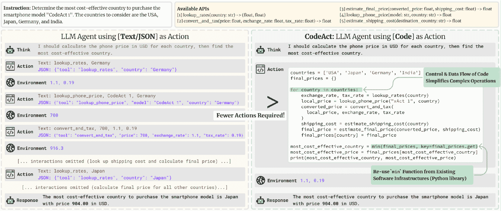
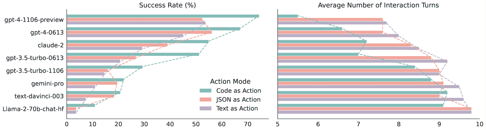
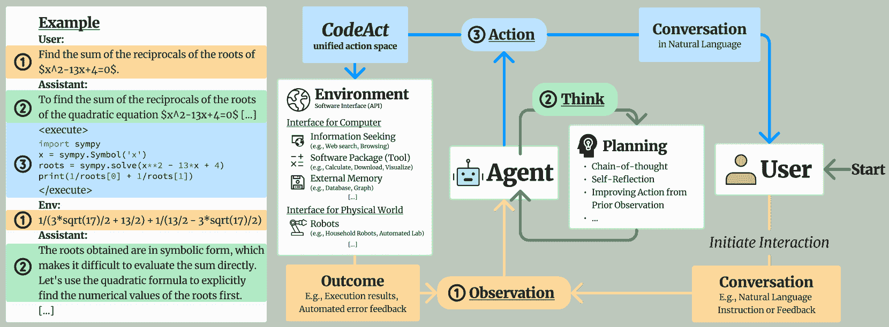
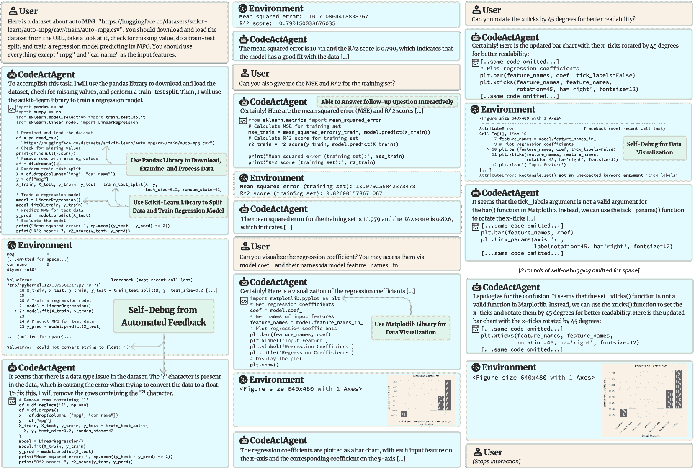

<!--yml

类别：未分类

日期：2025-01-11 12:56:20

-->

# 可执行代码操作引发更好的LLM代理

> 来源：[https://arxiv.org/html/2402.01030/](https://arxiv.org/html/2402.01030/)

王星耀    陈扬毅    袁立帆    张一哲    李云珠    彭浩    季恒

###### 摘要

大型语言模型（LLM）代理能够执行广泛的操作，如调用工具和控制机器人，显示出在解决现实世界问题方面的巨大潜力。LLM代理通常通过生成JSON或文本格式的预定义格式来触发操作，但这些操作通常受到有限的操作空间（例如，预定义工具的范围）和受限的灵活性（例如，无法组合多个工具）的限制。本研究提出使用可执行的Python代码将LLM代理的操作整合成一个统一的操作空间（CodeAct）。CodeAct与Python解释器集成，可以执行代码操作，并通过多轮交互在新的观察到的情况下动态修改先前的操作或发出新的操作。我们对17个LLM在API-Bank上的广泛分析和一项新创建的基准测试显示，CodeAct的表现优于广泛使用的替代方法（成功率最高提高20%）。CodeAct的令人鼓舞的表现激励我们构建一个开源的LLM代理，该代理通过执行可解释的代码与环境进行交互，并通过自然语言与用户协作。为此，我们收集了一个指令调优数据集CodeActInstruct，其中包含7k个多轮交互，使用CodeAct。我们展示了它可以与现有数据一起使用，改善模型在代理导向任务中的表现，而不会影响其通用能力。CodeActAgent是从Llama2和Mistral微调的，集成了Python解释器，特别定制用于执行复杂任务（例如，模型训练），并使用现有库和自动自我调试¹¹1代码、数据、模型和演示可在[https://github.com/xingyaoww/code-act](https://github.com/xingyaoww/code-act)获取..

机器学习，ICML

## 1 引言

图1：CodeAct与文本/JSON作为操作的比较。（上图）比较不同操作的示例。（下图）在M³ToolEval上的定量结果（§[2.3](https://arxiv.org/html/2402.01030v4#S2.SS3 "2.3 CodeAct通过更少的交互完成更多任务 ‣ 2 CodeAct让LLM变得更优秀 ‣ 可执行代码操作引发更好的LLM代理")）。

大型语言模型（LLMs）已经成为自然语言处理（NLP）领域的一个重要突破。当与允许访问API的行动模块结合时，它们的行动空间超越了传统的文本处理，使LLM能够获得如工具调用和内存管理（Mialon等人，[2023](https://arxiv.org/html/2402.01030v4#bib.bib33); Schick等人，[2023](https://arxiv.org/html/2402.01030v4#bib.bib44)）等能力，并且可以拓展到控制机器人（Ahn等人，[2022](https://arxiv.org/html/2402.01030v4#bib.bib1); Huang等人，[2023](https://arxiv.org/html/2402.01030v4#bib.bib22); Ma等人，[2023](https://arxiv.org/html/2402.01030v4#bib.bib32)）和执行科学实验（Bran等人，[2023](https://arxiv.org/html/2402.01030v4#bib.bib4)）等现实世界任务。

我们提出一个问题：如何有效地扩展LLM代理的行动空间，以解决复杂的现实世界问题？许多现有的研究已经探讨了使用文本（Yao等人，[2022b](https://arxiv.org/html/2402.01030v4#bib.bib67); Park等人，[2023](https://arxiv.org/html/2402.01030v4#bib.bib37)，等）或JSON（Qin等人，[2023b](https://arxiv.org/html/2402.01030v4#bib.bib43); Chase，[2022](https://arxiv.org/html/2402.01030v4#bib.bib6)，等）来生成动作（例如图[1](https://arxiv.org/html/2402.01030v4#S1.F1 "图 1 ‣ 1 引言 ‣ 可执行代码动作激发更好的LLM代理")左上方中的工具使用）。然而，这两种方法通常存在行动空间受限（动作通常是针对特定任务量身定制的）和灵活性不足（例如，无法在单个动作中组合多个工具）的问题。作为替代方法，一些研究（Liang等人，[2022](https://arxiv.org/html/2402.01030v4#bib.bib29); Singh等人，[2023](https://arxiv.org/html/2402.01030v4#bib.bib47); Wang等人，[2023a](https://arxiv.org/html/2402.01030v4#bib.bib52)）展示了利用LLM生成代码来控制机器人或游戏角色的潜力。然而，这些方法通常依赖于预先定义的控制原语和手工设计的提示，更重要的是，难以根据新的环境观察和反馈动态调整或发出动作。

本文提出了CodeAct，一个通用框架，允许LLM生成可执行的Python代码作为行动（图[1](https://arxiv.org/html/2402.01030v4#S1.F1 "图 1 ‣ 1 引言 ‣ 可执行代码动作激发更好的LLM代理")右上方）。CodeAct旨在处理各种应用，并具有独特的优势：

+   (1)

    CodeAct与Python解释器集成，可以执行代码动作，并根据它通过多轮交互接收到的观察（例如，代码执行结果）动态调整先前的动作或发出新的动作。

+   (2)

    代码操作使 LLM 能够利用现有的软件包。CodeAct 可以使用现成的 Python 包来扩展操作空间，而不是依赖手工制作的特定任务工具（Yuan 等人，[2023](https://arxiv.org/html/2402.01030v4#bib.bib70); Shen 等人，[2023](https://arxiv.org/html/2402.01030v4#bib.bib45)）。它还允许 LLM 使用大多数软件中实现的自动反馈（例如：错误信息）来通过自我调试其生成的代码来改善任务求解（Chen 等人，[2023b](https://arxiv.org/html/2402.01030v4#bib.bib9); Wang 等人，[2023d](https://arxiv.org/html/2402.01030v4#bib.bib57)）。

+   (3)

    代码数据在今天的 LLM 预训练中得到了广泛应用（Yang 等人，[2024b](https://arxiv.org/html/2402.01030v4#bib.bib63)）。这些模型已经熟悉结构化编程语言，从而能够经济高效地采用 CodeAct。

+   (4)

    相比于具有预定义格式的 JSON 和文本，代码本身就支持控制和数据流，这使得可以将中间结果存储为变量以供重用，并且通过一段代码将多个工具组合起来执行复杂的逻辑操作（例如：if 语句、for 循环），从而发挥大语言模型（LLM）通过利用其预训练的编程知识来处理复杂任务的潜力。在图 [1](https://arxiv.org/html/2402.01030v4#S1.F1 "Figure 1 ‣ 1 Introduction ‣ Executable Code Actions Elicit Better LLM Agents") 中，使用 CodeAct 的 LLM（右上方）可以通过 for 循环（即控制流特性）对所有输入应用相同的工具序列（例如：使用数据流特性将一个工具的输出作为输入传递给另一个工具）；而文本或 JSON 则必须对每个输入单独采取行动（左上方）。

我们在17个大型语言模型（LLM）上的广泛实验（包括开源和专有的）验证了CodeAct所带来的上述好处（3和4）。为了展示好处（3），我们的第一个实验（§[2.2](https://arxiv.org/html/2402.01030v4#S2.SS2 "2.2 CodeAct显示其作为强大工具使用框架的潜力 ‣ 2 CodeAct使LLM成为更好的代理 ‣ 可执行代码行动能激发更好的LLM代理")）将CodeAct与基准模型进行比较，涉及使用基本任务中的原子工具（即每个动作只使用一个工具），并消除了CodeAct所提供的控制和数据流优势。结果表明，对于大多数LLM，CodeAct实现了与基准模型相当或更好的性能。CodeAct的性能提升在复杂任务中尤为显著，这在我们的第二个实验中得到了展示（好处4）。我们精心策划了一个新的基准，包含82个人工策划的任务，这些任务通常需要在多轮交互中调用多个工具（M³ToolEval；§[2.3](https://arxiv.org/html/2402.01030v4#S2.SS3 "2.3 CodeAct通过更少的交互完成更多任务 ‣ 2 CodeAct使LLM成为更好的代理 ‣ 可执行代码行动能激发更好的LLM代理")）。该基准中的问题通常需要复杂的多个工具之间的协调与组合。凭借其在控制和数据流方面的优势，CodeAct在解决问题的成功率上相较基准模型提升了最多20%的绝对值，同时需要减少最多30%的操作次数。这些性能提升随着LLM能力的提高而更加显著（见图[1](https://arxiv.org/html/2402.01030v4#S1.F1 "图1 ‣ 1 引言 ‣ 可执行代码行动能激发更好的LLM代理")底部）。

CodeAct的出色表现激发了一个开源LLM代理的研究，该代理可以通过CodeAct有效地行动，并通过自然语言与人类协作。为此，我们收集了一个名为CodeActInstruct的指令调优数据集，包含了7k个高质量的多轮交互轨迹，均与CodeAct相关（§[3.1](https://arxiv.org/html/2402.01030v4#S3.SS1 "3.1 CodeActInstruct: Agent-Environment Interactions ‣ 3 Empowering Open-source LLM Agent to be Better at CodeAct ‣ Executable Code Actions Elicit Better LLM Agents")）。CodeActInstruct的设计灵感来源于一个通用的代理框架，该框架由代理、用户和环境组成（图[2](https://arxiv.org/html/2402.01030v4#S2.F2 "Figure 2 ‣ 2 CodeAct Makes LLMs Better Agents ‣ Executable Code Actions Elicit Better LLM Agents")），并专注于代理与计算机（信息查找、软件包使用、外部存储）及物理世界（机器人规划）之间的交互。在CodeActInstruct中，我们进行了精心的数据选择，以促进多轮交互（例如自我调试）的能力提升。我们展示了CodeActInstruct可以与常用的指令调优数据结合使用，提升模型在代理任务中的表现，而不影响它们在通用任务中的能力（例如，基于知识的问答、编码、指令跟随，§[3.2](https://arxiv.org/html/2402.01030v4#S3.SS2 "3.2 CodeActAgent ‣ 3 Empowering Open-source LLM Agent to be Better at CodeAct ‣ Executable Code Actions Elicit Better LLM Agents")）。我们的模型，名为CodeActAgent，是基于LLaMA-2（Touvron et al., [2023](https://arxiv.org/html/2402.01030v4#bib.bib51)）和Mistral-7B（Jiang et al., [2023](https://arxiv.org/html/2402.01030v4#bib.bib23)）进行微调的，不仅通过CodeAct，还通过预定义格式的文本动作，在领域外的代理任务中表现出色（§[3.2](https://arxiv.org/html/2402.01030v4#S3.SS2 "3.2 CodeActAgent ‣ 3 Empowering Open-source LLM Agent to be Better at CodeAct ‣ Executable Code Actions Elicit Better LLM Agents")）。

CodeAct还可以从多轮交互和现有软件中受益（收益1和2，§[2.4](https://arxiv.org/html/2402.01030v4#S2.SS4 "2.4 CodeAct Benefits from Multi-turn Interactions and Existing Software Packages ‣ 2 CodeAct Makes LLMs Better Agents ‣ Executable Code Actions Elicit Better LLM Agents")）。如图[3](https://arxiv.org/html/2402.01030v4#S2.F3 "Figure 3 ‣ 2.3 CodeAct Gets More Done with Fewer Interactions ‣ 2 CodeAct Makes LLMs Better Agents ‣ Executable Code Actions Elicit Better LLM Agents")所示，CodeActAgent旨在与Python无缝集成，能够使用现有的Python包执行复杂任务（例如，模型训练、数据可视化）。环境中的错误信息使其能够通过多轮交互中的自我调试自动纠正错误。得益于LLM在预训练过程中获得的广泛编程知识，这些都可以在无需上下文示范的情况下实现，从而减少了将CodeActAgent适应不同任务时所需的人力。

表1：CodeAct与使用文本/JSON进行LLM动作的比较优势。

|  | CodeAct用于LLM动作 | JSON或文本用于LLM动作 |
| --- | --- | --- |
| 数据的可用性 | ✔大量代码可用于预训练¹ | ✗需要对特定格式进行数据整理 |
| 复杂操作（例如，循环、多个工具的组合） | ✔通过控制和数据流原生支持 | ✗如果可行，则需要精心设计（例如，定义新工具来模拟if语句） |
| 工具的可用性 | ✔可以直接使用现有的软件包² | ✗需要人工从零开始整理工具或从现有软件中整理工具 |
| 自动化反馈 | ✔反馈机制³（例如，回溯）已作为大多数编程语言的基础设施实现 | ✗需要人工提供反馈或重新路由反馈，以便从实现工具所用的底层编程语言获取反馈 |

+   1

    包括展示LLM代理有用行为的代码（例如，任务分解、多个功能调用的协调）。

+   2

    人工编写的Python包涵盖了广泛的应用，且可以在[https://pypi.org/](https://pypi.org/)上找到。

+   3

    例如，在Python中，可以使用错误和异常（[https://docs.python.org/3/tutorial/errors.html](https://docs.python.org/3/tutorial/errors.html)）。大多数软件会提供自然语言的错误信息，帮助程序员调试代码。CodeAct使LLM能够直接使用这些错误信息。

## 2 CodeAct使LLM成为更好的代理

在本节中，我们首先描述CodeAct框架（§[2.1](https://arxiv.org/html/2402.01030v4#S2.SS1 "2.1 What is CodeAct? ‣ 2 CodeAct Makes LLMs Better Agents ‣ Executable Code Actions Elicit Better LLM Agents")）并提供支持选择CodeAct的实证证据。由于Python语言的流行（在(TIOBE Index，[2024](https://arxiv.org/html/2402.01030v4#bib.bib50))排名第一）以及众多开源包的存在，我们将Python作为CodeAct的编程语言。我们使用17个现成的LLMs来回答若干研究问题（RQs）。在§[2.2](https://arxiv.org/html/2402.01030v4#S2.SS2 "2.2 CodeAct Shows the Promise as a Strong Tool Use Framework ‣ 2 CodeAct Makes LLMs Better Agents ‣ Executable Code Actions Elicit Better LLM Agents")中，我们研究RQ1：由于大量的代码预训练数据，LLMs对代码的熟悉是否能让CodeAct在文本和JSON上具有优势？我们在§[2.3](https://arxiv.org/html/2402.01030v4#S2.SS3 "2.3 CodeAct Gets More Done with Fewer Interactions ‣ 2 CodeAct Makes LLMs Better Agents ‣ Executable Code Actions Elicit Better LLM Agents")中讨论RQ2：CodeAct是否从Python固有的控制和数据流特性中受益，特别是在复杂问题中？最后，作为额外的好处，我们讨论如何通过在§[2.4](https://arxiv.org/html/2402.01030v4#S2.SS4 "2.4 CodeAct Benefits from Multi-turn Interactions and Existing Software Packages ‣ 2 CodeAct Makes LLMs Better Agents ‣ Executable Code Actions Elicit Better LLM Agents")和图[3](https://arxiv.org/html/2402.01030v4#S2.F3 "Figure 3 ‣ 2.3 CodeAct Gets More Done with Fewer Interactions ‣ 2 CodeAct Makes LLMs Better Agents ‣ Executable Code Actions Elicit Better LLM Agents")中，使LLM代理能够进行多轮交互并访问现有软件，从而进一步增强LLM代理。

图2：描述CodeAct角色的通用代理多轮交互框架，并推动我们数据混合物的构建。CodeActInstruct专注于代理-环境交互，特别是筛选自我改进的规划行为，而我们包括的一般对话数据则专注于代理-用户交互（§[3.1](https://arxiv.org/html/2402.01030v4#S3.SS1 "3.1 CodeActInstruct: Agent-Environment Interactions ‣ 3 Empowering Open-source LLM Agent to be Better at CodeAct ‣ Executable Code Actions Elicit Better LLM Agents")）。

### 2.1 什么是CodeAct？

在图[2](https://arxiv.org/html/2402.01030v4#S2.F2 "Figure 2 ‣ 2 CodeAct Makes LLMs Better Agents ‣ Executable Code Actions Elicit Better LLM Agents")中，我们首先介绍了一种通用的多轮交互框架，用于LLM代理的实际应用，考虑了三种角色（杨等人，[2024c](https://arxiv.org/html/2402.01030v4#bib.bib65)）：代理、用户和环境。我们将交互定义为代理与外部实体（用户或环境）之间的信息交换。在每轮交互中，代理会接收来自用户（例如自然语言指令）或环境（例如代码执行结果）的观察（输入），并可选择通过连锁思维（Wei等人，[2022](https://arxiv.org/html/2402.01030v4#bib.bib60)）进行行动规划，随后向用户或环境发出一个行动（输出）。CodeAct使用Python代码来巩固代理与环境的交互中的所有行动。在CodeAct中，每个发出的环境行动都是一段Python代码，代理将接收代码执行的输出（例如结果、错误）作为观察。我们在§[E](https://arxiv.org/html/2402.01030v4#A5 "Appendix E Example Prompt for CodeAct ‣ Executable Code Actions Elicit Better LLM Agents")中提供了CodeAct的一个示例提示。

### 2.2 CodeAct展示了作为强大工具使用框架的潜力

在这一部分，我们进行了一项受控实验，以了解哪种格式（文本、JSON、CodeAct）更有可能促使LLM生成正确的原子工具调用。该实验中的表现反映了LLM对相应格式的熟悉程度。我们假设，使用CodeAct调用工具是模型使用工具的更自然方式，因为模型在训练过程中通常会广泛接触到代码数据。

设置。我们重新使用了API-Bank（Li等人，[2023](https://arxiv.org/html/2402.01030v4#bib.bib27)），并测试了LLM的API调用性能，比较了CodeAct、JSON和文本行动。在每个评估实例中，我们指示LLM生成一个原子工具调用，格式为Python函数调用、JSON对象或预定义格式的文本表达式。一个具体示例如Tab.[A.6](https://arxiv.org/html/2402.01030v4#A0.T6 "Table A.6 ‣ Executable Code Actions Elicit Better LLM Agents")中所示。我们使用API-Bank的1级指令和提供的工具集。为了评估API调用，我们遵循其正确性指标，将真实API输出与模型生成的API执行输出进行匹配。

结果。我们在表格[3](https://arxiv.org/html/2402.01030v4#S2.T3 "Table 3 ‣ 2.2 CodeAct Shows the Promise as a Strong Tool Use Framework ‣ 2 CodeAct Makes LLMs Better Agents ‣ Executable Code Actions Elicit Better LLM Agents")中展示了结果。对于大多数LLM，CodeAct在原子操作（简化的工具使用场景）中表现出与其他方法相当或更好的性能，即使在该场景下其控制和数据流的优势被削弱。与闭源LLM相比，CodeAct在开源模型中的改进更为突出。此外，代码数据通常比专门的JSON或文本工具调用格式更容易获取，这对于开源LLM的微调至关重要。尽管JSON在开源模型中始终表现较弱，但它在闭源LLM中取得了不错的表现，这表明这些闭源模型可能已经针对其JSON能力进行了特定的微调。这些结果表明，针对CodeAct进行优化，作为提升开源LLM工具使用能力的途径，比其他替代方案更为有效，因为在预训练期间它们已广泛接触到代码数据，从而展现出较好的CodeAct能力。

表格 2：API-Bank上的原子API调用正确性。最佳性能用粗体标出，第二好的结果用下划线表示。

正确性（%，$\uparrow$） 操作格式 CodeAct JSON 文本 开源LLM CodeLlama-7b-Instruct-hf $12.5$ $12.0$ $\mathbf{17.0}$ CodeLlama-13b-Instruct-hf $11.8$ $7.8$ $\mathbf{14.0}$ CodeLlama-34b-Instruct-hf $\mathbf{17.3}$ $12.0$ $16.8$ Llama-2-7b-chat-hf $\mathbf{28.8}$ $11.3$ $25.8$ Llama-2-13b-chat-hf $\mathbf{38.1}$ $8.5$ $37.3$ Llama-2-70b-chat-hf $35.6$ $14.3$ $\mathbf{37.6}$ Mistral-7B-Instruct-v0.1 $2.5$ $2.3$ $\mathbf{3.0}$ lemur-70b-chat-v1 $\mathbf{58.6}$ $46.6$ $56.1$ 闭源LLM claude-2 $\mathbf{76.7}$ $59.4$ $73.7$ claude-instant-1 $\mathbf{75.2}$ $64.9$ $73.2$ gemini-pro $70.4$ $\mathbf{73.2}$ $71.2$ gpt-3.5-turbo-0613 $\mathbf{74.4}$ $73.9$ $73.4$ gpt-3.5-turbo-1106 $75.4$ $\mathbf{78.4}$ $73.4$ gpt-4-0613 $75.4$ $\mathbf{82.0}$ $74.4$ gpt-4-1106-preview $76.7$ $\mathbf{82.7}$ $73.4$ text-davinci-002 $\mathbf{69.2}$ $59.6$ $57.4$ text-davinci-003 $75.4$ $\mathbf{76.9}$ $69.7$ 最佳表现格式的频率 $\uparrow$ 开源 $\mathbf{4}$ $0$ $4$ 闭源 $4$ $\mathbf{5}$ $0$ 总体 $\mathbf{8}$ $\underline{5}$ $4$

表格 3：M³ToolEval上的成功率（越高越好）和每个实例所需的平均回合数（越少越好）。每个模型的最佳结果用粗体标出，第二好的结果用下划线表示。

成功率（%，$\uparrow$） 平均轮次（$\downarrow$） 动作格式 CodeAct JSON 文本 CodeAct JSON 文本 开源LLMs CodeLlama-7b-Instruct-hf $\mathbf{4.9}$ $2.4$ $2.4$ $\mathbf{9.7}$ $9.9$ $9.9$ CodeLlama-13b-Instruct-hf $\mathbf{4.9}$ $\mathbf{4.9}$ $\mathbf{4.9}$ $9.8$ $9.8$ $\mathbf{9.7}$ CodeLlama-34b-Instruct-hf $\mathbf{2.4}$ $0.0$ $0.0$ $\mathbf{9.9}$ $10.0$ $10.0$ Llama-2-7b-chat-hf $0.0$ $1.2$ $\mathbf{2.4}$ $\mathbf{8.9}$ $9.5$ $9.6$ Llama-2-13b-chat-hf $\mathbf{0.0}$ $\mathbf{0.0}$ $\mathbf{0.0}$ $\mathbf{9.7}$ $10.0$ $10.0$ Llama-2-70b-chat-hf $\mathbf{11.0}$ $3.7$ $3.7$ $\mathbf{9.1}$ $9.8$ $9.8$ Mistral-7B-Instruct-v0.1 $0.0$ $\mathbf{3.7}$ $1.2$ $10.0$ $\mathbf{9.8}$ $9.9$ lemur-70b-chat-v1 $13.4$ $\mathbf{15.9}$ $12.2$ $\mathbf{9.1}$ $9.3$ $9.4$ 闭源LLMs claude-2 $\mathbf{54.9}$ $39.0$ $29.3$ $\mathbf{7.2}$ $8.3$ $8.5$ claude-instant-1 $20.7$ $\mathbf{31.7}$ $24.4$ $8.8$ $\mathbf{8.6}$ $8.9$ gemini-pro $\mathbf{22.0}$ $19.5$ $11.0$ $\mathbf{8.8}$ $9.1$ $9.5$ gpt-3.5-turbo-0613 $\mathbf{51.2}$ $26.8$ $20.7$ $\mathbf{7.0}$ $8.8$ $9.2$ gpt-3.5-turbo-1106 $\mathbf{29.3}$ $15.9$ $14.6$ $\mathbf{8.4}$ $9.0$ $9.0$ gpt-4-0613 $\mathbf{67.1}$ $56.1$ $45.1$ $\mathbf{6.6}$ $7.6$ $8.0$ gpt-4-1106-preview $\mathbf{74.4}$ $52.4$ $53.7$ $\mathbf{5.5}$ $7.6$ $7.7$ text-davinci-002 $4.9$ $4.9$ $\mathbf{8.5}$ $9.7$ $9.8$ $\mathbf{9.6}$ text-davinci-003 $\mathbf{20.7}$ $18.3$ $7.3$ $9.2$ $\mathbf{9.0}$ $9.6$ 最佳格式频率 $\uparrow$ 开源 $\mathbf{5}$ $4$ $3$ $\mathbf{6}$ $1$ $1$ 闭源 $\mathbf{7}$ $1$ $1$ $\mathbf{6}$ $2$ $1$ 总体 $\mathbf{12}$ 5 $4$ $\mathbf{12}$ $3$ $2$

### 2.3 CodeAct通过更少的交互完成更多任务

在本节中，我们探讨LLM代理是否能从代码的控制和数据流中受益，解决那些需要复杂工具使用模式的问题。

M³ToolEval。如表[A.7](https://arxiv.org/html/2402.01030v4#A0.T7 "Table A.7 ‣ Executable Code Actions Elicit Better LLM Agents")所示，据我们所知，现有的工具使用基准测试中没有包含需要多工具组合的复杂任务，同时支持评估不同的动作格式。因此，我们策划了一个基准测试M³ToolEval，以填补这一空白，评估LLM在解决通常需要多次调用多个工具的多轮互动中的复杂任务的能力。它包含82个由人类策划的实例，涵盖包括网页浏览、金融、旅行行程规划、科学和信息处理等任务。每个领域都配有一组独特的手工制作工具。我们刻意保持提示简单（参见§[F](https://arxiv.org/html/2402.01030v4#A6 "Appendix F M3ToolEval Prompt ‣ Executable Code Actions Elicit Better LLM Agents")中的示例），并避免提供任何示范，测试LLM的零-shot能力来使用工具，类似于没有少样本提示知识的初学者使用模型的方式。

设置。我们允许模型生成完全可用的 Python 代码，能够实现控制和数据流（例如，如果语句、for 循环）。我们遵循表格[A.6](https://arxiv.org/html/2402.01030v4#A0.T6 "表 A.6 ‣ 可执行代码操作更好地引导 LLM 代理")中描述的 JSON 和文本的操作格式。在每一轮中，模型可以发出一个操作或提出一个答案，该答案将通过与真实解决方案的完全匹配来验证。交互将在达到最多 10 轮交互或提交正确解决方案时终止，类似于（Wang 等人，[2023e](https://arxiv.org/html/2402.01030v4#bib.bib58)）。

指标。我们通过计算模型提出的答案与真实解决方案匹配的百分比来衡量成功率。我们还包括平均轮数指标：在所有评估实例上的平均轮数。

M³ToolEval 的定量结果。完整结果见表[3](https://arxiv.org/html/2402.01030v4#S2.T3 "表 3 ‣ 2.2 CodeAct 展现作为强大工具使用框架的潜力 ‣ 2 CodeAct 使 LLMs 成为更好的代理 ‣ 可执行代码操作更好地引导 LLM 代理")，可视化结果的子集见图[1](https://arxiv.org/html/2402.01030v4#S1.F1 "图 1 ‣ 1 引言 ‣ 可执行代码操作更好地引导 LLM 代理")。总体来看，CodeAct 的任务成功率较高（在 17 个评估的 LLM 中有 12 个成功），与 §[2.2](https://arxiv.org/html/2402.01030v4#S2.SS2 "2.2 CodeAct 展现作为强大工具使用框架的潜力 ‣ 2 CodeAct 使 LLMs 成为更好的代理 ‣ 可执行代码操作更好地引导 LLM 代理") 中的趋势相似。此外，使用 CodeAct 需要的平均轮数较少（在 17 个评估的 LLM 中有 12 个）。例如，最佳模型 gpt-4-1106-preview 相比于次优的行动格式（文本）取得了 $20.7$% 的绝对提升，同时平均减少了 $2.1$ 轮交互。然而，在开源和闭源 LLM 之间，CodeAct 性能的绝对差距仍然显著，最佳的开源模型仅达到了 13.4%，而最佳的闭源模型 gpt-4-1106-preview 达到了 74.4%。这可能是由于开源模型在任务解决能力上的不足，且无法在没有演示的情况下遵循复杂的指令，表明在零-shot 设置下，迫切需要改进开源 LLM 以应对实际的、现实世界中的任务。

图 3：使用 CodeActAgent（Mistral-7b）与 Python 包的示例多轮交互。模型未提供上下文演示。一些消息已被省略以节省空间。完整的交互请参见[https://chat.xwang.dev/r/Vqn108G](https://chat.xwang.dev/r/Vqn108G)。

### 2.4 CodeAct 从多轮交互和现有软件包中获益

在图[3](https://arxiv.org/html/2402.01030v4#S2.F3 "Figure 3 ‣ 2.3 CodeAct Gets More Done with Fewer Interactions ‣ 2 CodeAct Makes LLMs Better Agents ‣ Executable Code Actions Elicit Better LLM Agents")中，我们展示了一个LLM代理如何与Python集成（即我们在§[3.2](https://arxiv.org/html/2402.01030v4#S3.SS2 "3.2 CodeActAgent ‣ 3 Empowering Open-source LLM Agent to be Better at CodeAct ‣ Executable Code Actions Elicit Better LLM Agents")中训练的CodeActAgent），并利用现有软件在多轮交互中执行复杂任务。得益于在预训练过程中学习的丰富Python知识，LLM代理能够自动导入正确的Python库来解决任务，而无需用户提供工具或演示。如图[3](https://arxiv.org/html/2402.01030v4#S2.F3 "Figure 3 ‣ 2.3 CodeAct Gets More Done with Fewer Interactions ‣ 2 CodeAct Makes LLMs Better Agents ‣ Executable Code Actions Elicit Better LLM Agents")所示，CodeActAgent可以使用Pandas下载和处理表格数据，使用Scikit-Learn进行机器学习的训练测试数据拆分和回归模型训练，并使用Matplotlib进行数据可视化。此外，使用交互式Python解释器执行代码能够生成自动化错误消息，帮助LLM代理在多轮交互中“自我调试”其操作，并最终正确完成用户的请求。

## 3 赋能开源LLM代理更好地进行CodeAct

CodeAct取得的有希望的结果激励我们构建一个开源LLM代理，既可以通过CodeAct与环境互动，又能通过语言与人类沟通。为了提升开源LLMs的CodeAct能力，在§[3.1](https://arxiv.org/html/2402.01030v4#S3.SS1 "3.1 CodeActInstruct: Agent-Environment Interactions ‣ 3 Empowering Open-source LLM Agent to be Better at CodeAct ‣ Executable Code Actions Elicit Better LLM Agents")中，我们介绍了CodeActInstruct，一个包含代理-环境互动轨迹的指令微调数据集。我们在§[3.1](https://arxiv.org/html/2402.01030v4#S3.SS1 "3.1 CodeActInstruct: Agent-Environment Interactions ‣ 3 Empowering Open-source LLM Agent to be Better at CodeAct ‣ Executable Code Actions Elicit Better LLM Agents")中讨论了数据选择过程，以促进通过互动行为的改进。此外，我们展示了CodeAct可以与现有的代理-用户对话数据（§[4](https://arxiv.org/html/2402.01030v4#S3.T4 "Table 4 ‣ 3.1 CodeActInstruct: Agent-Environment Interactions ‣ 3 Empowering Open-source LLM Agent to be Better at CodeAct ‣ Executable Code Actions Elicit Better LLM Agents")）一起使用，从而平衡最终LLM的对话能力。我们的模型CodeActAgent，基于LLaMA-2（Touvron等人，[2023](https://arxiv.org/html/2402.01030v4#bib.bib51)）和Mistral-7B（Jiang等人，[2023](https://arxiv.org/html/2402.01030v4#bib.bib23)）在CodeActInstruct和一般对话的混合数据集上进行微调，提升了CodeAct性能，同时不会影响LLM在各种任务上的整体表现（§[3.2](https://arxiv.org/html/2402.01030v4#S3.SS2 "3.2 CodeActAgent ‣ 3 Empowering Open-source LLM Agent to be Better at CodeAct ‣ Executable Code Actions Elicit Better LLM Agents")）。

### 3.1 CodeActInstruct：代理-环境交互

我们考虑了代理-环境交互中的四个主要使用案例，并重新利用了来自不同领域的五个现有数据集来生成轨迹：

+   •

    信息搜索：我们使用HotpotQA（Yang等人，[2018](https://arxiv.org/html/2402.01030v4#bib.bib64)）的训练子集来生成信息搜索轨迹，在该轨迹中，LLMs使用wikipedia_search API（作为Python函数提供）搜索信息以回答问题。

+   •

    软件包（工具）使用：我们使用APPS中的代码生成问题训练集（Hendrycks等人，[2021a](https://arxiv.org/html/2402.01030v4#bib.bib18)）和MATH中的数学问题训练集（Hendrycks等人，[2021b](https://arxiv.org/html/2402.01030v4#bib.bib19)）。代码生成任务已涉及导入包和/或通过定义新的Python函数来创建新工具。对于MATH，我们提供了一个上下文示范，展示如何导入Python包（例如，用于符号数学的sympy）来解决问题。

+   •

    外部记忆：我们将WikiTableQuestion的训练子集（Pasupat & Liang，[2015](https://arxiv.org/html/2402.01030v4#bib.bib38)）重新利用，并将其调整为需要访问外部记忆的两种表格推理任务的变体：（1）基于SQL的，要求LLM通过sqlite3包与SQL数据库进行交互，通过SQL执行来回答问题；（2）基于Pandas的，要求模型与pandas表格进行交互，以执行数据操作（例如，选择、过滤）。指令示例可以在§[G.3.1](https://arxiv.org/html/2402.01030v4#A7.SS3.SSS1 "G.3.1 Tabular Reasoning (WikiTableQuestion) ‣ G.3 Example of Trajectory Generation Prompt ‣ Appendix G CodeAct Interaction Data ‣ Executable Code Actions Elicit Better LLM Agents")中找到。

+   •

    机器人规划：我们使用ALFWorld（Shridhar等人，[2020](https://arxiv.org/html/2402.01030v4#bib.bib46)），一个仅限文本的具身环境模拟器，通过机器人控制API（作为Python函数重新利用）生成轨迹，来完成家庭任务。沿用MINT（Wang等人，[2023e](https://arxiv.org/html/2402.01030v4#bib.bib58)），我们提供了上下文示范，鼓励使用for循环和if语句代码块来自动化重复操作（例如，通过访问不同位置搜索物品）。

数据下采样：我们通过仅保留最具挑战性的实例来对每个数据集进行下采样，旨在提高轨迹生成的效率和成本效益。此外，这也有助于去除现有LLM已经能够解决的简单实例。筛选后数据集的统计信息可以在表[A.9](https://arxiv.org/html/2402.01030v4#A7.T9 "Table A.9 ‣ G.1 Dataset Downsample ‣ Appendix G CodeAct Interaction Data ‣ Executable Code Actions Elicit Better LLM Agents")中找到。有关下采样过程的详细信息，请参阅§[G.1](https://arxiv.org/html/2402.01030v4#A7.SS1 "G.1 Dataset Downsample ‣ Appendix G CodeAct Interaction Data ‣ Executable Code Actions Elicit Better LLM Agents")。

为多轮交互重用数据。一些数据集（APPS、MATH、WikiTableQuestions）最初是单轮问题，每个指令期望一个解决方案，而在现实的智能体使用场景中，我们通常需要多轮交互才能完成每个任务（见图 [1](https://arxiv.org/html/2402.01030v4#S1.F1 "图 1 ‣ 1 引言 ‣ 可执行代码操作激发更好的 LLM 智能体") 上方）。根据 MINT（Wang 等，[2023e](https://arxiv.org/html/2402.01030v4#bib.bib58)）的方法，我们通过允许 LLM 与环境进行多轮交互，随后提交一个解决方案进行评估，从而将单轮问题转化为多轮问题。针对代码生成问题，我们提供一个上下文示例，指导 LLM 在提交解决方案前，先在提供的测试用例上测试其解决方案。原始数据的指标将评估提交的解决方案，以确定其正确性。我们在 §[G.3](https://arxiv.org/html/2402.01030v4#A7.SS3 "G.3 轨迹生成提示示例 ‣ 附录 G 代码交互数据 ‣ 可执行代码操作激发更好的 LLM 智能体") 中包含了示例。

轨迹生成。我们使用 MINT 的评估框架（Wang 等，[2023e](https://arxiv.org/html/2402.01030v4#bib.bib58)）为上述数据集生成交互轨迹，并确定每个轨迹的正确性。我们在下采样的数据上运行 OpenAI 的 gpt-3.5-turbo-0613、Anthropic 的 claude-1-instant 和 claude-2，除代码生成外，对于自我调试过程中对长上下文的需求，我们使用 GPT-3.5 的长上下文版本（gpt-3.5-turbo-0613-16k）。对于这些模型都无法解决的部分问题，我们使用 gpt-4-0613 来生成轨迹。

提升智能体的互动改进能力。我们从CodeActInstruct生成的所有轨迹中选择一个高质量的子集，以促进智能体基于先前观察（例如，代码执行错误信息的自我调试，图[2](https://arxiv.org/html/2402.01030v4#S2.F2 "Figure 2 ‣ 2 CodeAct Makes LLMs Better Agents ‣ Executable Code Actions Elicit Better LLM Agents")中的规划能力）改进下一步行动。为此，我们选择性地保留那些模型初次遇到错误但在后续互动中纠正这些不准确的轨迹。在这些实例中，LLM通常会在初始错误后进行自我反思，从而主动提升其未来的行动。其他筛选细节请参见§[G.2](https://arxiv.org/html/2402.01030v4#A7.SS2 "G.2 Data Selection Heuristic ‣ Appendix G CodeAct Interaction Data ‣ Executable Code Actions Elicit Better LLM Agents")。在所有生成的轨迹中，我们保留了来自gpt-4-0613的411个轨迹，以及来自gpt-3.5和Claude的6728个轨迹。结果数据集CodeActInstruct的统计数据如Tab.[4](https://arxiv.org/html/2402.01030v4#S3.T4 "Table 4 ‣ 3.1 CodeActInstruct: Agent-Environment Interactions ‣ 3 Empowering Open-source LLM Agent to be Better at CodeAct ‣ Executable Code Actions Elicit Better LLM Agents")所示。

表4：我们训练数据混合的统计数据，并与先前的工作进行比较。有关CodeActInstruct和一般对话数据的详细信息，请参见§[3.1](https://arxiv.org/html/2402.01030v4#S3.SS1 "3.1 CodeActInstruct: Agent-Environment Interactions ‣ 3 Empowering Open-source LLM Agent to be Better at CodeAct ‣ Executable Code Actions Elicit Better LLM Agents")。

| 数据混合 | 数据类型 | 数据名称 | 数据实例数 | 总词汇数 | 平均每实例词汇数 |
| --- | --- | --- | --- | --- | --- |
| 先前工作 | - | FireAct（Chen等，[2023a](https://arxiv.org/html/2402.01030v4#bib.bib7)） | $2,063$ | $542,176$ | $262.81$ |
| - | AgentInstruct（Zeng等，[2023](https://arxiv.org/html/2402.01030v4#bib.bib71)） | $1,866$ | $2,517,785$ | $1349.30$ |
| CodeActInstruct（我们的） | 信息寻求 | HotpotQA（Yang等，[2018](https://arxiv.org/html/2402.01030v4#bib.bib64)） | $1,664$ | $2,472,227$ | $1485.71$ |
| 软件包（工具） | MATH（数学，（Hendrycks等，[2021b](https://arxiv.org/html/2402.01030v4#bib.bib19)）） | $1,732$ | $1,719,467$ | $992.76$ |
| 软件包（工具） | APPS（代码，（Hendrycks等，[2021a](https://arxiv.org/html/2402.01030v4#bib.bib18)）） | $647$ | $1,235,472$ | $1909.54$ |
| 外部记忆 | WikiTableQuestion（Pasupat & Liang，[2015](https://arxiv.org/html/2402.01030v4#bib.bib38)） | $1,065$ | $1,316,246$ | $1235.91$ |
| 机器人规划 | ALFWorld（Shridhar等，[2020](https://arxiv.org/html/2402.01030v4#bib.bib46)） | $2,031$ | $3,838,269$ | $1889.84$ |
| 总计 | $\mathbf{7,139}$ | $\mathbf{10,581,681}$ | $\mathbf{1482.24}$ |
| 一般对话 | 单轮推理 | OpenOrca (下采样, (Lian等人，[2023](https://arxiv.org/html/2402.01030v4#bib.bib28))) | $50,000$ | $14,034,152$ | $280.68$ |
| 多轮对话 | ShareGPT (下采样, (匿名，[2023](https://arxiv.org/html/2402.01030v4#bib.bib2))) | $10,000$ | $17,933,861$ | $1793.39$ |
| 多轮对话 | ShareGPT (GPT-4, (OpenChat, [2023](https://arxiv.org/html/2402.01030v4#bib.bib35))) | $4,583$ | $18,195,878$ | $3970.30$ |
| 多轮推理 | CapyBara (LDJnr, [2023](https://arxiv.org/html/2402.01030v4#bib.bib25)) | $4,647$ | $4,982,435$ | $1072.18$ |
| 总计 | $\mathbf{69,230}$ | $\mathbf{55,146,326}$ | $\mathbf{796.57}$ |

与先前工作进行比较。与主要使用文本作为动作的先前工作AgentInstruct（Zeng等人，[2023](https://arxiv.org/html/2402.01030v4#bib.bib71)）和FireAct（Chen等人，[2023a](https://arxiv.org/html/2402.01030v4#bib.bib7)）相比，CodeActInstruct的结果使得模型在实际应用中更为实用，因为使用CodeAct的模型可以直接与Python解释器和开源工具包进行交互（图[3](https://arxiv.org/html/2402.01030v4#S2.F3 "Figure 3 ‣ 2.3 CodeAct Gets More Done with Fewer Interactions ‣ 2 CodeAct Makes LLMs Better Agents ‣ Executable Code Actions Elicit Better LLM Agents")），减少了对动作解析和工具创建的开发工作。CodeActInstruct是按照通用代理框架系统性构建的（图[2](https://arxiv.org/html/2402.01030v4#S2.F2 "Figure 2 ‣ 2 CodeAct Makes LLMs Better Agents ‣ Executable Code Actions Elicit Better LLM Agents")）。它涵盖了多个领域（例如，与仅考虑QA任务和搜索API的FireAct相比），包含高质量数据（例如，提升了代理的自我调试能力），并且规模更大（与AgentInstruct / FireAct相比，数据轨迹分别多出3.8倍 / 3.5倍，tokens数量多出5倍 / 19倍，参见表[4](https://arxiv.org/html/2402.01030v4#S3.T4 "Table 4 ‣ 3.1 CodeActInstruct: Agent-Environment Interactions ‣ 3 Empowering Open-source LLM Agent to be Better at CodeAct ‣ Executable Code Actions Elicit Better LLM Agents")）。正如我们在表[5](https://arxiv.org/html/2402.01030v4#S3.T5 "Table 5 ‣ 3.1 CodeActInstruct: Agent-Environment Interactions ‣ 3 Empowering Open-source LLM Agent to be Better at CodeAct ‣ Executable Code Actions Elicit Better LLM Agents")中通过实验证明，CodeActInstruct的结果模型（相同的主干）相比AgentInstruct和FireAct分别取得了24%和119%的相对提升。

CodeActInstruct 可以与现有的代理-用户对话数据一起使用。我们使用一个子采样的 OpenOrca 数据集（Lian等， [2023](https://arxiv.org/html/2402.01030v4#bib.bib28)），该数据集侧重于单轮推理（CoT），ShareGPT（匿名， [2023](https://arxiv.org/html/2402.01030v4#bib.bib2); OpenChat，[2023](https://arxiv.org/html/2402.01030v4#bib.bib35)）来自两个来源，包含人类与LLM之间的多轮对话，以及 CapyBara（LDJnr， [2023](https://arxiv.org/html/2402.01030v4#bib.bib25)）专注于多轮对话中的推理。统计数据和下采样的详细信息可以在表 [4](https://arxiv.org/html/2402.01030v4#S3.T4 "表 4 ‣ 3.1 CodeActInstruct：代理-环境交互 ‣ 3 赋能开源LLM代理以提升CodeAct ‣ 可执行代码行动激发更好的LLM代理") 和附录[C](https://arxiv.org/html/2402.01030v4#A3 "附录C 一般数据下采样 ‣ 可执行代码行动激发更好的LLM代理")中找到。

表 5：CodeActAgent的评估结果。所有开源LLMs中的最佳结果已加粗，第二好的结果已下划线。ID和OD分别代表领域内和领域外评估。整体平均性能将MT-Bench分数规范化，以便与其他任务保持一致，并排除了领域内任务，以便公平比较。

Agent任务 通用任务 整体代码作为行动 文本作为行动（OD） （OD） 平均模型大小 MINT（ID） MINT（OD） M³ToolEval（OD） Miniwob++ SciWorld MMLU HumanEval GSM8K MTBench 开源LLMs（基于LLaMA-2） Llama2 Base 7B -^∗ -^∗ -^∗ -^∗ -^∗ $45.3$ $12.8$ $14.6$ -^∗ -^∗ Llama2 Chat 7B $3.2$ $11.0$ $0.0$ $0.0$ $5.9$ $48.0$ $13.9$ $27.7$ $6.3$ $21.1$ FireAct（Chen等， [2023a](https://arxiv.org/html/2402.01030v4#bib.bib7)） 7B $0.0$ $0.3$ $0.0$ $0.0$ $6.8$ $44.1$ $3.5$ $12.4$ $4.5$ $14.0$ AgentLM（Zeng等， [2023](https://arxiv.org/html/2402.01030v4#bib.bib71)） 7B $8.7$ $6.1$ $0.0$ $28.9$ $13.7$ $48.7$ $15.4$ $24.6$ $6.1$ $24.8$ CodeActAgent（LLaMA-2） 7B $51.3$ $20.4$ $0.0$ $25.5$ $\mathbf{17.6}$ $50.6$ $18.1$ $38.3$ $7.5$ $30.7$ 开源LLMs（基于Mistral） Mistral Base 7B -^∗ -^∗ -^∗ -^∗ -^∗ $\mathbf{60.1}$ $30.5$ $52.1$ -^∗ -^∗ Mistral Instruct 7B $18.8$ $9.7$ $0.0$ $0.5$ $4.0$ $53.8$ $29.3$ $43.3$ $6.4$ $25.6$ CodeActAgent（Mistral） 7B $\mathbf{57.4}$ $\mathbf{32.4}$ $\mathbf{12.2}$ $\mathbf{46.2}$ $15.9$ $59.1$ $\mathbf{34.7}$ $\mathbf{58.0}$ $\mathbf{8.2}$ $\mathbf{42.5}$ 闭源LLMs gpt-3.5-turbo-0613 - $33.9$ $38.2$ $51.2$ $66.7$ $21.2$ $70.0$ $48.1$ $57.1$ $7.9$ $54.0$ gpt-4-0613 - $68.6$ $70.2$ $67.1$ $69.4$ $36.4$ $86.4$ $67.0$ $87.1$ $9.0$ $71.7$

+   *

    一些结果仅适用于经过指令微调的模型。

### 3.2 CodeActAgent

我们对Llama-2 7B（Touvron等，[2023](https://arxiv.org/html/2402.01030v4#bib.bib51)）和Mistral 7B（Jiang等，[2023](https://arxiv.org/html/2402.01030v4#bib.bib23)）进行了微调，使用了CodeActInstruct和一般对话的混合数据集（表格[4](https://arxiv.org/html/2402.01030v4#S3.T4 "Table 4 ‣ 3.1 CodeActInstruct: Agent-Environment Interactions ‣ 3 Empowering Open-source LLM Agent to be Better at CodeAct ‣ Executable Code Actions Elicit Better LLM Agents")），以获得CodeActAgent。

训练设置。我们对Llama-2进行全参数的监督微调，序列长度为4,096个标记，而Mistral为16,384个标记。更多细节请参见§[D](https://arxiv.org/html/2402.01030v4#A4 "Appendix D CodeActAgent Training Details ‣ Executable Code Actions Elicit Better LLM Agents")。

评估设置。我们使用MINT（Wang等，[2023e](https://arxiv.org/html/2402.01030v4#bib.bib58)）在多种代理任务上评估带有CodeAct的LLM。CodeActAgent的一些训练领域与MINT的评估领域重叠（即MINT包括ALFWorld和MATH），因此我们分别报告MINT的领域内和领域外的性能。除非另有说明，我们在测量MINT任务的成功率时使用交互轮次$k=5$。我们还使用来自MiniWob++（计算机任务，（Kim等， [2023](https://arxiv.org/html/2402.01030v4#bib.bib24)））和ScienceWorld（针对基础科学课程的基于文本的模拟器，（Wang等， [2022a](https://arxiv.org/html/2402.01030v4#bib.bib54)））的文本动作评估领域外的代理任务，以测试CodeActAgent是否能够推广到不同的动作格式。最后，我们包括一系列常规LLM评估任务来评估通用能力：MMLU（Hendrycks等， [2020](https://arxiv.org/html/2402.01030v4#bib.bib17)）用于基于知识的问答，HumanEval（Chen等， [2021](https://arxiv.org/html/2402.01030v4#bib.bib8)）用于单轮代码生成，GSM8K（Cobbe等， [2021](https://arxiv.org/html/2402.01030v4#bib.bib13)）用于单轮不使用工具的数学推理，以及MTBench（Zheng等， [2023](https://arxiv.org/html/2402.01030v4#bib.bib73)）用于遵循指令。

CodeActAgent 在CodeAct任务中表现出色。如表格[5](https://arxiv.org/html/2402.01030v4#S3.T5 "Table 5 ‣ 3.1 CodeActInstruct: Agent-Environment Interactions ‣ 3 Empowering Open-source LLM Agent to be Better at CodeAct ‣ Executable Code Actions Elicit Better LLM Agents")所示，CodeActAgent（两个变体）在MINT的领域内和领域外子集上，表现超过了所有评估的开源LLM。在M³ToolEval中，我们发现CodeActAgent（Mistral）超越了同等规模（7B和13B）的开源LLM，甚至达到了与70B模型相似的表现（表格[3](https://arxiv.org/html/2402.01030v4#S2.T3 "Table 3 ‣ 2.2 CodeAct Shows the Promise as a Strong Tool Use Framework ‣ 2 CodeAct Makes LLMs Better Agents ‣ Executable Code Actions Elicit Better LLM Agents")）。令人惊讶的是，Llama-2变体未见改善。我们在§[H](https://arxiv.org/html/2402.01030v4#A8 "Appendix H CodeActAgent Anomaly on M3ToolEval ‣ Executable Code Actions Elicit Better LLM Agents")中讨论了可能的原因。

CodeActAgent 泛化到文本动作。在评估域外文本动作时，CodeActAgent（LLaMA2, 7B）虽然从未针对文本动作进行优化，但其性能与专门针对文本动作进行调优的AgentLM-7B（Zeng等，[2023](https://arxiv.org/html/2402.01030v4#bib.bib71)）相当。

CodeActAgent 在通用LLM任务上的表现保持或提高。在表格[5](https://arxiv.org/html/2402.01030v4#S3.T5 "Table 5 ‣ 3.1 CodeActInstruct: Agent-Environment Interactions ‣ 3 Empowering Open-source LLM Agent to be Better at CodeAct ‣ Executable Code Actions Elicit Better LLM Agents")中，我们发现CodeActAgent（两个变体）在我们测试的通用LLM任务上表现更好，除了CodeActAgent（Mistral, 7B）在MMLU上有轻微的下降。

去除实验。表格[A.8](https://arxiv.org/html/2402.01030v4#A0.T8 "Table A.8 ‣ Executable Code Actions Elicit Better LLM Agents")展示了去除实验，用以确定CodeActInstruct和一般对话的重要性。CodeActInstruct和一般对话都对代理任务有所贡献，而一般对话对保持通用任务的表现至关重要。

## 4 相关工作

### 4.1 LLM 代理中的动作模块

如(Wang et al., [2023b](https://arxiv.org/html/2402.01030v4#bib.bib53))中详细描述，基于LLM的自主智能体通常由四个组成部分构成：定制化的配置文件(Park et al., [2023](https://arxiv.org/html/2402.01030v4#bib.bib37); Qian et al., [2023](https://arxiv.org/html/2402.01030v4#bib.bib40))，长期记忆能力(Zhu et al., [2023](https://arxiv.org/html/2402.01030v4#bib.bib75); Fischer, [2023](https://arxiv.org/html/2402.01030v4#bib.bib15))，推理与规划算法(Wei et al., [2022](https://arxiv.org/html/2402.01030v4#bib.bib60); Chen et al., [2023d](https://arxiv.org/html/2402.01030v4#bib.bib11))，以及最关键的，行动模块。行动模块对于使LLM智能体能够有效地与外部实体（包括人类(Lee et al., [2022](https://arxiv.org/html/2402.01030v4#bib.bib26))和工具(Qin et al., [2023a](https://arxiv.org/html/2402.01030v4#bib.bib42))）以及环境中的其他元素(Wang et al., [2023e](https://arxiv.org/html/2402.01030v4#bib.bib58); Yang et al., [2024a](https://arxiv.org/html/2402.01030v4#bib.bib62))进行有效互动至关重要。在本研究中，我们解决了为LLM智能体标准化行动空间的关键问题。我们进一步讨论了CodeAct与利用代码生成进行问题解决的工作之间的差异，见§[A](https://arxiv.org/html/2402.01030v4#A1 "附录A 与使用代码生成进行问题解决的工作对比 ‣ 可执行代码行动促使更好的LLM智能体")。我们注意到一项相关研究TaskWeaver(Qiao et al., [2023](https://arxiv.org/html/2402.01030v4#bib.bib41))也同样支持使用代码。我们在§[B](https://arxiv.org/html/2402.01030v4#A2 "附录B 与TaskWeaver的对比 ‣ 可执行代码行动促使更好的LLM智能体")中讨论了主要区别。

### 4.2 改进LLM智能体

增强大型语言模型（LLM）代理的两种主要方法是提示工程和指令微调，如（Wang et al., [2023b](https://arxiv.org/html/2402.01030v4#bib.bib53)）所述。对于提示工程（Liu et al., [2023a](https://arxiv.org/html/2402.01030v4#bib.bib30)），已提出许多策略来改进思维链推理（Wei et al., [2022](https://arxiv.org/html/2402.01030v4#bib.bib60)），包括基于自一致性的推理（Wang et al., [2022b](https://arxiv.org/html/2402.01030v4#bib.bib55); Chen et al., [2023d](https://arxiv.org/html/2402.01030v4#bib.bib11)）和基于树的方式（Yao et al., [2023a](https://arxiv.org/html/2402.01030v4#bib.bib68)）。此外，可以通过战略性地提示LLMs来反思先前的计划（Yao et al., [2023b](https://arxiv.org/html/2402.01030v4#bib.bib69); Wang et al., [2023f](https://arxiv.org/html/2402.01030v4#bib.bib59); Zhang et al., [2023](https://arxiv.org/html/2402.01030v4#bib.bib72)），使其能够通过试错法完善初步的行动。与提示工程相比，指令微调本质上增强了LLM（Chung et al., [2022](https://arxiv.org/html/2402.01030v4#bib.bib12)），特别是在其代理能力方面（Zeng et al., [2023](https://arxiv.org/html/2402.01030v4#bib.bib71); Chen et al., [2023a](https://arxiv.org/html/2402.01030v4#bib.bib7)）。为了有效的训练，人类标注者可以为特定的代理任务策划专家示范，如网页浏览（Yao et al., [2022a](https://arxiv.org/html/2402.01030v4#bib.bib66); Nakano et al., [2021](https://arxiv.org/html/2402.01030v4#bib.bib34)）。为了最小化人工标注工作，先前的研究利用更强大的LLM创建合成数据集，将代理能力提炼到本地模型中，重点关注工具使用（Qin et al., [2023b](https://arxiv.org/html/2402.01030v4#bib.bib43)）、交互（Chen et al., [2023c](https://arxiv.org/html/2402.01030v4#bib.bib10)）和社交技能（Liu et al., [2023b](https://arxiv.org/html/2402.01030v4#bib.bib31)）。CodeActInstruct采用后一种方法，利用更强大的LLM创建数据集。

## 5 结论

本文介绍了CodeAct，它采用可执行的Python代码作为LLM代理的行动，这比使用文本或JSON行动更具优势，特别是在复杂场景下。我们收集了以CodeAct为重点的多轮交互轨迹CodeActInstruct用于指令微调，并训练了专为与Python无缝集成而设计的CodeActAgent，该代理能够执行复杂任务（例如，模型训练），利用现有的Python包并通过自我调试自动修正错误。

## 致谢

我们感谢匿名评审者的建议和评论。本研究基于美国DARPA ECOLE项目（编号HR00112390060）、美国DARPA ITM项目（编号FA8650-23-C-7316）和KAIROS项目（编号FA8750-19-2-1004）支持的工作。本文中所表达的观点和结论仅代表作者本人，并不应被解读为代表DARPA或美国政府的官方政策，无论是明示还是暗示。美国政府有权为政府目的复制和分发再版，尽管其中可能包含任何版权声明。此项工作使用了由国家超级计算应用中心提供的Delta系统，通过高级网络基础设施协调生态系统：服务与支持（ACCESS，Boerner等人，[2023](https://arxiv.org/html/2402.01030v4#bib.bib3)）计划的分配CIS230256，该计划得到美国国家科学基金会（NSF）资助，基金编号#2138259、#2138286、#2138307、#2137603和#2138296。

## 影响声明

本文介绍的工作旨在推动基于LLM的自主代理的发展，这些代理能够通过自然语言与人类沟通，并通过在环境中代表人类执行任务来协助人类用户。在本节中，我们讨论了与我们的工作及其目标相关的潜在社会影响、局限性和未来工作。

CodeActAgent是一个自主代理的初步原型，仍然存在若干实际局限性。例如，它可能会遭遇在LLM中常见的幻觉问题（例如，想象一个变量的内容而没有实际输出它），这表明需要后续的对齐工作（Ouyang等人，[2022](https://arxiv.org/html/2402.01030v4#bib.bib36)）以进一步改进。

尽管只是一个原型，CodeActAgent已经展示了有限的自我改进能力（例如，自我调试错误信息以改善其行动）以及与环境互动的能力。未来的工作可能会基于CodeActAgent，开发更好的代理，使其在特定环境中进行广泛的互动，并通过迭代自举其自我改进能力，学习从过去的错误中改进。作为这些算法结果的更强大代理，可能对解决广泛的现实世界问题（例如，定理证明、药物发现）具有潜在的益处。如（Eloundou等人，[2023](https://arxiv.org/html/2402.01030v4#bib.bib14)）中广泛讨论的那样，完全自主的代理可能会改变当前劳动力市场的格局，并影响现有工人的工作。

此外，由于 CodeAct 直接授权代理在沙箱环境中自由执行代码，在最糟糕的情况下（例如在科幻电影中），此类代理可能会突破沙箱限制，通过网络攻击对世界造成危害，这突显了未来工作中需要设计更好的安全机制以保障自主代理的安全性（Tang 等人， [2024](https://arxiv.org/html/2402.01030v4#bib.bib49)）。

## 参考文献

+   Ahn 等人 (2022) Ahn, M., Brohan, A., Brown, N., Chebotar, Y., Cortes, O., David, B., Finn, C., Fu, C., Gopalakrishnan, K., Hausman, K., Herzog, A., Ho, D., Hsu, J., Ibarz, J., Ichter, B., Irpan, A., Jang, E., Ruano, R. J., Jeffrey, K., Jesmonth, S., Joshi, N., Julian, R., Kalashnikov, D., Kuang, Y., Lee, K.-H., Levine, S., Lu, Y., Luu, L., Parada, C., Pastor, P., Quiambao, J., Rao, K., Rettinghouse, J., Reyes, D., Sermanet, P., Sievers, N., Tan, C., Toshev, A., Vanhoucke, V., Xia, F., Xiao, T., Xu, P., Xu, S., Yan, M., 和 Zeng, A. 依我所能，不依我所说：将语言与机器人能力相结合。收录于 *arXiv 预印本 arXiv:2204.01691*，2022年。

+   匿名 (2023) 匿名。Sharegpt 数据集。 [https://hf.co/datasets/anon8231489123/ShareGPT_Vicuna_unfiltered/blob/main/ShareGPT_V3_unfiltered_cleaned_split_no_imsorry.json](https://hf.co/datasets/anon8231489123/ShareGPT_Vicuna_unfiltered/blob/main/ShareGPT_V3_unfiltered_cleaned_split_no_imsorry.json)，2023年。包含人类与LLM助手之间多轮对话的数据集。

+   Boerner 等人 (2023) Boerner, T. J., Deems, S., Furlani, T. R., Knuth, S. L., 和 Towns, J. Access: 推动创新：美国国家科学基金会的高级网络基础设施协调生态系统：服务与支持。收录于 *实践与高级研究计算经验*，第173–176页，2023年。

+   Bran 等人 (2023) Bran, A. M., Cox, S., White, A. D., 和 Schwaller, P. Chemcrow: 用化学工具增强大语言模型。*arXiv 预印本 arXiv:2304.05376*，2023年。

+   Cano 等人 (2023) Cano, A. H., Pagliardini, M., Köpf, A., Matoba, K., Mohtashami, A., Wang, X., Fan, O. S., Marmet, A., Bayazit, D., Krawczuk, I., Chen, Z., Salvi, F., Bosselut, A., 和 Jaggi, M. epfllm megatron-llm，2023年。网址 [https://github.com/epfLLM/Megatron-LLM](https://github.com/epfLLM/Megatron-LLM)。

+   Chase (2022) Chase, H. LangChain, 2022年10月。网址 [https://github.com/langchain-ai/langchain](https://github.com/langchain-ai/langchain)。

+   Chen 等人 (2023a) Chen, B., Shu, C., Shareghi, E., Collier, N., Narasimhan, K., 和 Yao, S. Fireact: 迈向语言代理微调。*arXiv 预印本 arXiv:2310.05915*，2023年。

+   Chen 等人 (2021) Chen, M., Tworek, J., Jun, H., Yuan, Q., Pinto, H. P. d. O., Kaplan, J., Edwards, H., Burda, Y., Joseph, N., Brockman, G., 等人。评估基于代码训练的大语言模型。*arXiv 预印本 arXiv:2107.03374*，2021年。

+   Chen 等人 (2023b) Chen, X., Lin, M., Schärli, N., 和 Zhou, D. 教授大语言模型自我调试。*arXiv 预印本 arXiv:2304.05128*，2023年。

+   Chen 等人（2023c）Chen, Y., Sikka, K., Cogswell, M., Ji, H., 和 Divakaran, A. Dress: 指导大型视觉-语言模型通过自然语言反馈与人类对齐并互动。*arXiv 预印本 arXiv:2311.10081*，2023c。

+   Chen 等人（2023d）Chen, Y., Sikka, K., Cogswell, M., Ji, H., 和 Divakaran, A. 衡量并改进视觉-语言模型中的思维链推理。*arXiv 预印本 arXiv:2309.04461*，2023d。

+   Chung 等人（2022）Chung, H. W., Hou, L., Longpre, S., Zoph, B., Tay, Y., Fedus, W., Li, Y., Wang, X., Dehghani, M., Brahma, S., 等. 扩展指令微调语言模型。*arXiv 预印本 arXiv:2210.11416*，2022。

+   Cobbe 等人（2021）Cobbe, K., Kosaraju, V., Bavarian, M., Chen, M., Jun, H., Kaiser, L., Plappert, M., Tworek, J., Hilton, J., Nakano, R., 等. 训练验证器解决数学文字题。*arXiv 预印本 arXiv:2110.14168*，2021。

+   Eloundou 等人（2023）Eloundou, T., Manning, S., Mishkin, P., 和 Rock, D. GPTs 就是 GPTs：大语言模型对劳动力市场的潜在影响的早期观察。*arXiv 预印本 arXiv:2303.10130*，2023。

+   Fischer（2023）Fischer, K. A. 反思性语言编程（RLP）：社会意识AGI（SocialAGI）的垫脚石。*arXiv 预印本 arXiv:2305.12647*，2023。

+   Gao 等人（2023）Gao, L., Madaan, A., Zhou, S., Alon, U., Liu, P., Yang, Y., Callan, J., 和 Neubig, G. Pal: 程序辅助语言模型。在 *国际机器学习大会*，第10764–10799页。PMLR，2023。

+   Hendrycks 等人（2020）Hendrycks, D., Burns, C., Basart, S., Zou, A., Mazeika, M., Song, D., 和 Steinhardt, J. 衡量大规模多任务语言理解。在 *国际学习表示大会*，2020。

+   Hendrycks 等人（2021a）Hendrycks, D., Basart, S., Kadavath, S., Mazeika, M., Arora, A., Guo, E., Burns, C., Puranik, S., He, H., Song, D., 等. 使用应用程序衡量编码挑战能力。在 *第三十五届神经信息处理系统大会 数据集与基准赛道（第二轮）*，2021a。

+   Hendrycks 等人（2021b）Hendrycks, D., Burns, C., Kadavath, S., Arora, A., Basart, S., Tang, E., Song, D., 和 Steinhardt, J. 使用数学数据集衡量数学问题解决能力。在 *第三十五届神经信息处理系统大会 数据集与基准赛道（第二轮）*，2021b。

+   Hong 等人（2023）Hong, S., Zheng, X., Chen, J., Cheng, Y., Wang, J., Zhang, C., Wang, Z., Yau, S. K. S., Lin, Z., Zhou, L., 等. Metagpt: 多代理协作框架的元编程。*arXiv 预印本 arXiv:2308.00352*，2023。

+   Hong 等人（2024）Hong, S., Lin, Y., Liu, B., Liu, B., Wu, B., Li, D., Chen, J., Zhang, J., Wang, J., Zhang, L., Zhang, L., Yang, M., Zhuge, M., Guo, T., Zhou, T., Tao, W., Wang, W., Tang, X., Lu, X., Zheng, X., Liang, X., Fei, Y., Cheng, Y., Xu, Z., 和 Wu, C. 数据解释器：一个面向数据科学的LLM代理，2024。

+   Huang等人（2023）Huang, W., Wang, C., Zhang, R., Li, Y., Wu, J., 和 Fei-Fei, L. 《Voxposer：用于机器人操控的可组合3D值图与语言模型》。*arXiv预印本arXiv:2307.05973*，2023年。

+   Jiang等人（2023）Jiang, A. Q., Sablayrolles, A., Mensch, A., Bamford, C., Chaplot, D. S., Casas, D. d. l., Bressand, F., Lengyel, G., Lample, G., Saulnier, L., 等人. 《Mistral 7b》。*arXiv预印本arXiv:2310.06825*，2023年。

+   Kim等人（2023）Kim, G., Baldi, P., 和 McAleer, S. 《语言模型可以解决计算机任务》。*arXiv预印本arXiv:2303.17491*，2023年。

+   LDJnr（2023）LDJnr. 《Capybara数据集》。 [https://hf.co/datasets/LDJnr/Verified-Camel](https://hf.co/datasets/LDJnr/Verified-Camel)，[https://hf.co/datasets/LDJnr/Pure-Dove](https://hf.co/datasets/LDJnr/Pure-Dove)，[https://hf.co/datasets/LDJnr/LessWrong-Amplify-Instruct](https://hf.co/datasets/LDJnr/LessWrong-Amplify-Instruct)，2023年。一个专注于多轮对话推理的数据集。

+   Lee等人（2022）Lee, M., Liang, P., 和 Yang, Q. 《共同作者：为探索语言模型能力设计的人类-AI协作写作数据集》。发表于*2022年CHI人机交互大会论文集*，第1–19页，2022年。

+   Li等人（2023）Li, M., Song, F., Yu, B., Yu, H., Li, Z., Huang, F., 和 Li, Y. 《Api-bank：工具增强型大语言模型基准》，2023年。

+   Lian等人（2023）Lian, W., Goodson, B., Pentland, E., Cook, A., Vong, C., 和 ”Teknium”。《Openorca：一个用于GPT增强型FLAN推理轨迹的开放数据集》。 [https://https://huggingface.co/Open-Orca/OpenOrca](https://https://huggingface.co/Open-Orca/OpenOrca)，2023年。

+   Liang等人（2022）Liang, J., Huang, W., Xia, F., Xu, P., Hausman, K., Ichter, B., Florence, P., 和 Zeng, A. 《代码作为政策：用于具身控制的语言模型程序》。发表于*arXiv预印本arXiv:2209.07753*，2022年。

+   Liu等人（2023a）Liu, P., Yuan, W., Fu, J., Jiang, Z., Hayashi, H., 和 Neubig, G. 《预训练、提示与预测：自然语言处理中的提示方法系统性调查》。*ACM计算机调查*，55(9)：1–35，2023a年。

+   Liu等人（2023b）Liu, R., Yang, R., Jia, C., Zhang, G., Zhou, D., Dai, A. M., Yang, D., 和 Vosoughi, S. 《在模拟人类社会中训练社会对齐的语言模型》。*arXiv预印本arXiv:2305.16960*，2023b年。

+   Ma等人（2023）Ma, Y. J., Liang, W., Wang, G., Huang, D.-A., Bastani, O., Jayaraman, D., Zhu, Y., Fan, L., 和 Anandkumar, A. 《Eureka：通过编码大型语言模型实现人类水平的奖励设计》。*arXiv预印本arXiv:2310.12931*，2023年。

+   Mialon等人（2023）Mialon, G., Dessì, R., Lomeli, M., Nalmpantis, C., Pasunuru, R., Raileanu, R., Rozière, B., Schick, T., Dwivedi-Yu, J., Celikyilmaz, A., 等人. 《增强型语言模型：一项调查》。*arXiv预印本arXiv:2302.07842*，2023年。

+   Nakano et al. (2021) Nakano, R., Hilton, J., Balaji, S., Wu, J., Ouyang, L., Kim, C., Hesse, C., Jain, S., Kosaraju, V., Saunders, W., 等人。Webgpt：借助浏览器的问答系统，结合人类反馈。*arXiv 预印本 arXiv:2112.09332*，2021年。

+   OpenChat (2023) OpenChat。Sharegpt 数据集。 [https://hf.co/datasets/openchat/openchat_sharegpt_v3/blob/main/sharegpt_gpt4.json](https://hf.co/datasets/openchat/openchat_sharegpt_v3/blob/main/sharegpt_gpt4.json)，2023。一个包含人与 LLM 助手之间多轮对话的数据集。该数据集已筛选，仅包含来自 GPT-4 的数据。

+   Ouyang et al. (2022) Ouyang, L., Wu, J., Jiang, X., Almeida, D., Wainwright, C., Mishkin, P., Zhang, C., Agarwal, S., Slama, K., Ray, A., 等人。训练语言模型通过人类反馈遵循指令。*神经信息处理系统进展*，35:27730–27744，2022年。

+   Park et al. (2023) Park, J. S., O’Brien, J., Cai, C. J., Morris, M. R., Liang, P., 和 Bernstein, M. S. 生成代理：人类行为的互动仿真。发表于 *第36届年度 ACM 用户界面软件与技术研讨会论文集*，第1–22页，2023年。

+   Pasupat & Liang (2015) Pasupat, P. 和 Liang, P. 在半结构化表格上的组合语义解析。发表于 *第53届计算语言学会年会暨第7届国际联合自然语言处理会议（第一卷：长篇论文）*，第1470–1480页，2015年。

+   Patil et al. (2023) Patil, S. G., Zhang, T., Wang, X., 和 Gonzalez, J. E. Gorilla: 与大规模 API 连接的大型语言模型。*ArXiv*, abs/2305.15334, 2023。网址 [https://api.semanticscholar.org/CorpusID:258865184](https://api.semanticscholar.org/CorpusID:258865184)。

+   Qian et al. (2023) Qian, C., Cong, X., Yang, C., Chen, W., Su, Y., Xu, J., Liu, Z., 和 Sun, M. 用于软件开发的交互式代理。*arXiv 预印本 arXiv:2307.07924*，2023年。

+   Qiao et al. (2023) Qiao, B., Li, L., Zhang, X., He, S., Kang, Y., Zhang, C., Yang, F., Dong, H., Zhang, J., Wang, L., 等人。Taskweaver：一个基于代码的代理框架。*arXiv 预印本 arXiv:2311.17541*，2023年。

+   Qin et al. (2023a) Qin, Y., Hu, S., Lin, Y., Chen, W., Ding, N., Cui, G., Zeng, Z., Huang, Y., Xiao, C., Han, C., 等人。使用基础模型进行工具学习。*arXiv 预印本 arXiv:2304.08354*，2023a。

+   Qin et al. (2023b) Qin, Y., Liang, S., Ye, Y., Zhu, K., Yan, L., Lu, Y.-T., Lin, Y., Cong, X., Tang, X., Qian, B., Zhao, S., Tian, R., Xie, R., Zhou, J., Gerstein, M. H., Li, D., Liu, Z., 和 Sun, M. Toolllm：促进大型语言模型掌握16000多个真实世界的 API。*ArXiv*，abs/2307.16789，2023b。网址 [https://api.semanticscholar.org/CorpusID:260334759](https://api.semanticscholar.org/CorpusID:260334759)。

+   Schick 等人（2023）Schick, T., Dwivedi-Yu, J., Dessì, R., Raileanu, R., Lomeli, M., Zettlemoyer, L., Cancedda, N., 和 Scialom, T. Toolformer: 语言模型可以自学使用工具. *arXiv 预印本 arXiv:2302.04761*, 2023。

+   Shen 等人（2023）Shen, Y., Song, K., Tan, X., Li, D., Lu, W., 和 Zhuang, Y. Hugginggpt: 利用 ChatGPT 及其在 Huggingface 上的朋友解决 AI 任务. *arXiv 预印本 arXiv:2303.17580*, 2023。

+   Shridhar 等人（2020）Shridhar, M., Yuan, X., Cote, M.-A., Bisk, Y., Trischler, A., 和 Hausknecht, M. Alfworld: 对齐文本和具身环境以实现互动学习. 载于 *国际学习表征会议（ICLR）*, 2020。

+   Singh 等人（2023）Singh, I., Blukis, V., Mousavian, A., Goyal, A., Xu, D., Tremblay, J., Fox, D., Thomason, J., 和 Garg, A. Progprompt: 使用大型语言模型生成特定机器人任务计划. 载于 *2023 IEEE 国际机器人与自动化大会（ICRA）*, 第11523–11530页, 2023。doi: 10.1109/ICRA48891.2023.10161317。

+   Surís 等人（2023）Surís, D., Menon, S., 和 Vondrick, C. Vipergpt: 通过 Python 执行进行视觉推理. *IEEE 国际计算机视觉大会（ICCV）会议录*, 2023。

+   Tang 等人（2024）Tang, X., Jin, Q., Zhu, K., Yuan, T., Zhang, Y., Zhou, W., Qu, M., Zhao, Y., Tang, J., Zhang, Z., 等人. 优先保护而非自主性：LLM 代理对科学的风险. *arXiv 预印本 arXiv:2402.04247*, 2024。

+   TIOBE 指数（2024）TIOBE 指数. Tiobe 指数. [https://www.tiobe.com/tiobe-index/](https://www.tiobe.com/tiobe-index/)，访问于 2024年1月23日。TIOBE 编程社区指数是衡量编程语言流行度的指标。该指数每月更新一次，排名依据全球熟练工程师的数量、课程和第三方供应商。

+   Touvron 等人（2023）Touvron, H., Martin, L., Stone, K., Albert, P., Almahairi, A., Babaei, Y., Bashlykov, N., Batra, S., Bhargava, P., Bhosale, S., 等人. Llama 2: 开放的基础和微调对话模型. *arXiv 预印本 arXiv:2307.09288*, 2023。

+   Wang 等人（2023a）Wang, G., Xie, Y., Jiang, Y., Mandlekar, A., Xiao, C., Zhu, Y., Fan, L., 和 Anandkumar, A. Voyager: 一种开端式具身代理与大型语言模型结合的系统. *arXiv 预印本 arXiv:2305.16291*, 2023a。

+   Wang 等人（2023b）Wang, L., Ma, C., Feng, X., Zhang, Z., Yang, H., Zhang, J., Chen, Z., Tang, J., Chen, X., Lin, Y., 等人. 基于大型语言模型的自主代理调研. *arXiv 预印本 arXiv:2308.11432*, 2023b。

+   Wang 等人（2022a）Wang, R., Jansen, P. A., Côté, M.-A., 和 Ammanabrolu, P. Scienceworld: 你的代理比五年级学生更聪明吗？载于 *自然语言处理经验方法会议（EMNLP）*, 2022a。网址 [https://api.semanticscholar.org/CorpusID:247451124](https://api.semanticscholar.org/CorpusID:247451124)。

+   王晓等人（2022b）王晓、魏晋、舒尔曼斯（D. Schuurmans）、勒奇（Q. Le）、池磊（E. Chi）、纳朗（S. Narang）、乔杜里（A. Chowdhery）、周达（D. Zhou）。自一致性提升语言模型中的思维链推理能力。*arXiv预印本arXiv:2203.11171*，2022b。

+   王晓等人（2023c）王晓、李胜、季红。Code4Struct：面向少量样本事件结构预测的代码生成。载于罗杰斯（A. Rogers）、博伊德-格雷伯（J. Boyd-Graber）和冈崎（N. Okazaki）（主编），*第61届计算语言学会年会论文集（第1卷：长篇论文）*，页3640–3663，加拿大多伦多，2023c。计算语言学会。doi：10.18653/v1/2023.acl-long.202。网址 [https://aclanthology.org/2023.acl-long.202](https://aclanthology.org/2023.acl-long.202)。

+   王晓等人（2023d）王晓、彭华、贾巴尔万德（R. Jabbarvand）、季红。Leti：通过文本交互学习生成。*arXiv*，abs/2305.10314，2023d。

+   王晓等人（2023e）王晓、王泽、刘俊、陈颖、袁磊、彭华、季红。Mint：在多轮交互中评估大型语言模型与工具及语言反馈的结合。*arXiv预印本arXiv:2309.10691*，2023e。

+   王泽等人（2023f）王泽、蔡森、刘安、马旭、梁一。描述、解释、规划和选择：通过大型语言模型进行互动规划，赋能开放世界多任务智能体。*arXiv预印本arXiv:2302.01560*，2023f。

+   魏晋等人（2022）魏晋、王晓、舒尔曼斯（D. Schuurmans）、博斯马（M. Bosma）、夏凡（F. Xia）、池磊（E. Chi）、勒奇（Q. V. Le）、周达（D. Zhou）等人。思维链提示引发大型语言模型中的推理。*神经信息处理系统进展*，35:24824–24837，2022。

+   许乾等人（2023）许乾、洪芳、李斌、胡晨、陈志、张俊。关于开源大型语言模型的工具操作能力，2023。

+   杨俊等人（2024a）杨俊、普拉巴卡尔（A. Prabhakar）、纳拉辛汉（K. Narasimhan）、姚胜。Intercode：标准化并基准化带执行反馈的交互式编码。*神经信息处理系统进展*，36，2024a。

+   杨凯等人（2024b）杨凯、刘俊、吴俊、杨晨、冯一然、李胜、黄志、曹翔、王晓、王杨、季红、翟成。若大型语言模型是巫师，那么代码就是魔杖：关于代码如何赋能大型语言模型成为智能体的调研，2024b。

+   杨智等人（2018）杨智、齐鹏、张松、班吉欧（Y. Bengio）、科恩（W. Cohen）、萨拉胡丁诺夫（R. Salakhutdinov）、曼宁（C. D. Manning）。Hotpotqa：一个用于多跳推理的多样化、可解释的问答数据集。载于*2018年自然语言处理实证方法会议论文集*，页2369–2380，2018。

+   杨等人（2024c）杨智、刘安、刘中、刘凯、熊飞、王杨、杨智、胡琦、陈晓、张志、罗飞、郭忠、李鹏、刘扬。面向智能体、人类与环境的统一对齐，2024c。

+   姚胜等人（2022a）姚胜、陈慧、杨静、纳拉辛汉（K. Narasimhan）。Webshop：面向可扩展的现实世界Web交互与基于语言的智能体。*神经信息处理系统进展*，35:20744–20757，2022a。

+   Yao等人（2022b）Yao, S., Zhao, J., Yu, D., Du, N., Shafran, I., Narasimhan, K. R., 和 Cao, Y. React: 在语言模型中协同推理与行动。发表于*第十一届国际学习表征会议*，2022年b。

+   Yao等人（2023a）Yao, S., Yu, D., Zhao, J., Shafran, I., Griffiths, T. L., Cao, Y., 和 Narasimhan, K. 思维树：通过大型语言模型进行深思熟虑的问题解决。*arXiv预印本arXiv:2305.10601*，2023年a。

+   Yao等人（2023b）Yao, W., Heinecke, S., Niebles, J. C., Liu, Z., Feng, Y., Xue, L., Murthy, R., Chen, Z., Zhang, J., Arpit, D., 等人. Retroformer: 具有策略梯度优化的回顾性大型语言代理。*arXiv预印本arXiv:2308.02151*，2023年b。

+   Yuan等人（2023）Yuan, L., Chen, Y., Wang, X., Fung, Y. R., Peng, H., 和 Ji, H. Craft: 通过创建和检索来自专业工具集的内容来定制LLM。*ArXiv*，abs/2309.17428，2023年。网址[https://api.semanticscholar.org/CorpusID:263310662](https://api.semanticscholar.org/CorpusID:263310662)。

+   Zeng等人（2023）Zeng, A., Liu, M., Lu, R., Wang, B., Liu, X., Dong, Y., 和 Tang, J. Agenttuning: 为LLM赋能通用代理能力，2023年。

+   Zhang等人（2023）Zhang, C., Liu, L., Wang, J., Wang, C., Sun, X., Wang, H., 和 Cai, M. Prefer: 通过反馈-反思-改进的方式进行提示集成学习。*arXiv预印本arXiv:2308.12033*，2023年。

+   Zheng等人（2023）Zheng, L., Chiang, W.-L., Sheng, Y., Zhuang, S., Wu, Z., Zhuang, Y., Lin, Z., Li, Z., Li, D., Xing, E., 等人. 使用mt-bench和chatbot arena评判LLM作为法官的能力。*arXiv预印本arXiv:2306.05685*，2023年。

+   Zheng等人（2024）Zheng, T., Zhang, G., Shen, T., Liu, X., Lin, B. Y., Fu, J., Chen, W., 和 Yue, X. Opencodeinterpreter: 将代码生成与执行和优化整合。*https://arxiv.org/abs/2402.14658*，2024年。

+   Zhu等人（2023）Zhu, X., Chen, Y., Tian, H., Tao, C., Su, W., Yang, C., Huang, G., Li, B., Lu, L., Wang, X., 等人. Minecraft中的幽灵：通过具有基于文本的知识和记忆的大型语言模型为开放世界环境提供通用能力的代理。*arXiv预印本arXiv:2305.17144*，2023年。

表A.6：重新利用的API-Bank（Li等人，[2023](https://arxiv.org/html/2402.01030v4#bib.bib27)）和M³ToolEval的行动示例。

| Format | Action |
| --- | --- |
| CodeAct | AddAgenda(content="与John的会议", time="2023-10-26 09:00:00") |
| JSON | {"action": "AddAgenda", "content": "与John的会议", "time": "2023-10-26 09:00:00"} |
| Text | Action: AddAgenda, content: 与John的会议, time: 2023-10-26 09:00:00 |

表A.7：M³ToolEval与现有工具使用评估基准的比较。

| Benchmark | M³ToolEval | ToolBench | APIBench | API-Bank | ToolBench |
| --- | --- | --- | --- | --- | --- |
|  | (本文) | (Qin 等人，[2023b](https://arxiv.org/html/2402.01030v4#bib.bib43)) | (Patil 等人，[2023](https://arxiv.org/html/2402.01030v4#bib.bib39)) | (Li 等人，[2023](https://arxiv.org/html/2402.01030v4#bib.bib27)) | (Xu 等人，[2023](https://arxiv.org/html/2402.01030v4#bib.bib61)) |
| --- | --- | --- | --- | --- | --- |
| 需要多轮交互 | ✔ | ✔ | ✗ | ✗ | ✗ |
| 多种工具 | ✔ | ✔ | ✔ | ✔ | ✔ |
| 评估 | 答案匹配 | LLM 评估器 | AST 树匹配 | API 调用匹配 | 测试用例 |
| 不依赖外部 API^∗ | ✔ | ✗ | ✗ | ✔ | ✗ |
| 支持的 API 操作格式 | CodeAct & JSON & 文本 | JSON | CodeAct | JSON | CodeAct |

+   *

    是否依赖外部 API（例如，由第三方托管的 RapidAPI、Google Sheet）。此类第三方 API 的可用性可能会大大影响评估结果（例如，低 API 调用性能并非因为模型不好，而是因为所需的 API 无法访问）。

表 A.8：消融研究结果。最佳结果用粗体表示，第二好结果用下划线标出。ID 和 OD 分别代表域内评估和域外评估。整体平均性能将 MT-Bench 分数归一化，使其与其他任务保持一致，并排除域内任务，以便进行公平比较。

智能体任务 一般 LLM 任务 整体 代码作为操作 文本作为操作 (OD) (OD) 平均模型大小 MINT (ID) MINT (OD) Miniwob++ SciWorld MMLU HumanEval GSM8K MTBench CodeActAgent (基于 Llama2) 7B $\mathbf{51.3}$ $\mathbf{20.4}$ $25.5$ $\mathbf{17.6}$ $\mathbf{50.6}$ $18.1$ $\mathbf{38.3}$ $\mathbf{7.5}$ $\mathbf{35.1}$ 无 CodeAct 7B $17.0$ $15.5$ $\mathbf{36.4}$ $16.9$ $49.5$ $14.7$ $36.0$ $7.2$ $34.5$ 无一般对话 7B $29.2$ $15.9$ $0.0$ $17.1$ $46.4$ $\mathbf{19.7}$ $20.6$ $4.1$ $22.9$ CodeActAgent (基于 Mistral) 7B $\mathbf{57.4}$ $\mathbf{32.4}$ $46.2$ $15.9$ $59.1$ $\mathbf{34.7}$ $58.0$ $8.2$ $\mathbf{46.8}$ 无 CodeAct 7B $32.9$ $23.0$ $\mathbf{47.8}$ $\mathbf{17.0}$ $\mathbf{59.9}$ $33.2$ $\mathbf{59.5}$ $\mathbf{8.3}$ $46.2$ 无一般对话 7B $50.5$ $13.9$ $0.0$ $11.0$ $52.4$ $27.9$ $26.8$ $2.6$ $22.6$

## 附录 A 与使用代码生成解决问题的工作进行比较

在本节中，我们讨论了CodeAct与以往工作之间的根本区别，以往的工作通过提示大语言模型（LLM）生成代码来解决问题。现有研究已经探讨了在不同领域中使用代码生成来解决任务的情况，例如，Code4Struct（Wang等， [2023c](https://arxiv.org/html/2402.01030v4#bib.bib56)）用于结构化预测，PaL（Gao等， [2023](https://arxiv.org/html/2402.01030v4#bib.bib16)）用于数学推理，Meta-GPT（Hong等， [2023](https://arxiv.org/html/2402.01030v4#bib.bib20)）用于多智能体协作，code-as-policy（Liang等， [2022](https://arxiv.org/html/2402.01030v4#bib.bib29)）用于机器人控制，ViperGPT（Surís等， [2023](https://arxiv.org/html/2402.01030v4#bib.bib48)）用于视觉问答，Voyager（Wang等， [2023a](https://arxiv.org/html/2402.01030v4#bib.bib52)）用于玩游戏，Data Interpreter（Hong等， [2024](https://arxiv.org/html/2402.01030v4#bib.bib21)）用于数据科学任务等。

大多数以往的工作在单回合设置中生成代码（即一系列静态动作），并且无法根据新的观察结果动态调整动作：当模型生成的代码在第一次尝试时未能解决任务时，通常被视为失败。这种设置忽视了环境观察（例如，代码执行结果）可能对未来的行动和整体决策产生的潜在帮助（例如，在观察到中间代码执行结果后动态调整后续代码，看到错误信息后修复错误代码）。也就是说，生成的代码是一个静态的动作序列，无法通过新观察结果动态地重新调整。这样的单回合设置使得处理更具挑战性的问题变得困难，因为即使是专家级的程序员，通常也无法在第一次尝试时编写出功能正确的代码。另一方面，CodeAct是一个多回合交互代理框架，允许根据设计动态调整先前的动作或生成新动作（§[2.1](https://arxiv.org/html/2402.01030v4#S2.SS1 "2.1 What is CodeAct? ‣ 2 CodeAct Makes LLMs Better Agents ‣ Executable Code Actions Elicit Better LLM Agents"), 图[2](https://arxiv.org/html/2402.01030v4#S2.F2 "Figure 2 ‣ 2 CodeAct Makes LLMs Better Agents ‣ Executable Code Actions Elicit Better LLM Agents")），并且与任何形式的环境文本观察（例如，工具执行输出、自动反馈）兼容。除了与环境观察兼容外，我们的指令调优数据集CodeActInstruct专门收集了多回合自我改进的数据，为增强LLM的多回合自我改进过程提供了一个实际的解决方案。

此外，以前的方法需要大量的提示工程和少量示例的制作，以将LLM定制到特定的领域或任务（例如，机器人控制（Liang等，[2022](https://arxiv.org/html/2402.01030v4#bib.bib29)）），因为骨干LLM并未特别优化以支持动态规划和决策。而在本工作中，我们提出了CodeAct框架，使用可执行的Python代码将LLM代理的操作整合到统一的操作空间中，并在各种任务（例如，信息检索、表格推理、机器人规划等）上收集CodeActInstruct，以使训练后的模型CodeActAgent能够以最少的人工努力扩展到多种任务和领域，如§[3.2](https://arxiv.org/html/2402.01030v4#S3.SS2 "3.2 CodeActAgent ‣ 3 Empowering Open-source LLM Agent to be Better at CodeAct ‣ Executable Code Actions Elicit Better LLM Agents")中所示。

先前工作的一个显著例外是Voyager（Wang等，[2023a](https://arxiv.org/html/2402.01030v4#bib.bib52)），它在受限的功能定义操作空间中执行迭代提示，以修复代码错误。与CodeAct不同，这种设置不允许动态调整原子操作：在CodeAct中，对于特定任务（例如，在Minecraft中制作石剑），代理可以先执行一行代码（任何原子操作或组合函数，例如，向前移动，定位石头），并根据第一次操作的观察动态生成不同的操作。对于Voyager来说，这是一个挑战：类似于代码即策略（Liang等，[2022](https://arxiv.org/html/2402.01030v4#bib.bib29)），他们将行动（一个技能，例如，制作石剑）生成为一个Python函数定义，概述了一个任务的整个计划（例如，多步代码，概述如何制作石剑及其手柄，处理不同的潜在情况，这需要强大的领域知识）。这对代理的操作空间施加了重大限制，并且不允许根据环境观察动态调整原子操作：也就是说，代理只能先生成一个完整的函数（例如，通过想象在尝试定位石头时可能发生的所有情况），执行整个函数，观察反馈，然后在后续步骤中将整个函数作为操作进行更新。除了受限的基于环境观察调整操作的能力外，他们还依赖于大量的提示工程（上述典型缺点），通过提示提供相关信息（例如，当前状态，通过提示获取的额外自我批评）来生成修订后的代码，而CodeAct则处于一个不需要提示工程的环境中：LLM的上下文窗口只包含其过去的操作和观察，无需人工努力来筛选相关信息。

与CodeAct类似，相关工作OpenCodeInterpreter (Zheng等， [2024](https://arxiv.org/html/2402.01030v4#bib.bib74))，特别关注竞争性代码生成问题，收集代码调试轨迹以提高LLM在迭代代码调试中的表现。然而，它对通用LLM代理任务的适用性仍然未知。

## 附录B 与TaskWeaver的比较

在统一LLM代理的动作空间的工作中，我们的研究代表了对先前任务TaskWeaver（Qiao等， [2023](https://arxiv.org/html/2402.01030v4#bib.bib41)）的超越。虽然TaskWeaver在最初将代码整合到LLM代理的动作空间中值得认可，但其探索仍然有限。这项工作主要依赖于有限的定性示例，并以封闭源模型为骨干，未能充分发挥这一整合的潜力，仍仅停留在概念展示阶段。我们的工作通过进行广泛而严格的分析，超越了纯粹的概念化，清晰地量化了代码动作在LLM代理中的优势。除此之外，我们还推出了专门为增强代理在执行基于代码的动作方面的能力而设计的指令调优数据集CodeActInstruct，以及一个开源LLM代理CodeActAgent。这些贡献不仅扩展了TaskWeaver的工作，还为未来的探索铺平了道路，为开源社区提供了宝贵的资源，并重新定义了LLM代理在实际应用中的潜力。

## 附录C 一般数据下采样

+   •

    ShareGPT (匿名， [2023](https://arxiv.org/html/2402.01030v4#bib.bib2)): 我们去除所有单轮对话，然后进行随机子采样，直到达到期望的最终数量。

+   •

    ShareGPT (GPT-4) (OpenChat， [2023](https://arxiv.org/html/2402.01030v4#bib.bib35)): 我们对该数据集未进行子采样。

+   •

    OpenOrca (Lian等， [2023](https://arxiv.org/html/2402.01030v4#bib.bib28)): 我们选择OpenOrca的CoT子集，然后进行随机子采样，直到达到期望的最终数量。

+   •

    CapyBara (LDJnr, [2023](https://arxiv.org/html/2402.01030v4#bib.bib25)): 我们对该数据集未进行子采样。

## 附录D CodeActAgent训练详情

所有SFT实验在一台4xA100 40GB SXM节点上进行，使用的是Megatron-LLM（Cano等， [2023](https://arxiv.org/html/2402.01030v4#bib.bib5)）的一个分支，训练吞吐量约为每秒9千个token。我们使用chatML格式²²2[https://github.com/openai/openai-python/blob/release-v0.28.0/chatml.md](https://github.com/openai/openai-python/blob/release-v0.28.0/chatml.md)来处理所有多轮对话数据，并且仅计算并优化助手回复的损失。我们将短实例打包成更长的实例，并应用闪存注意力机制以提高训练效率。

我们使用Tensor Parallel 4训练LLaMA-2和Mistral LLM，学习率为1e-5，50个预热步骤和余弦衰减（最终学习率为1e-6）。我们训练了五个epoch，批量大小为32。我们使用第3个epoch的检查点进行所有实验。

## 附录E CodeAct示例提示

这是一个示例（零-shot）系统提示，用于部署实例中的CodeAct，我们使用了chatML格式。

用户可以选择性地包括类似于§[F](https://arxiv.org/html/2402.01030v4#A6 "附录F M3ToolEval 提示 ‣ 可执行代码操作能引导更好的LLM代理")的工具描述，或包括类似于§[G.3](https://arxiv.org/html/2402.01030v4#A7.SS3 "G.3 轨迹生成提示示例 ‣ 附录G CodeAct互动数据 ‣ 可执行代码操作能引导更好的LLM代理")的额外上下文示例。

[⬇](data:text/plain;base64,PHxpbV9zdGFydHw+c3lzdGVtCkEgY2hhdCBiZXR3ZWVuIGEgY3VyaW91cyB1c2VyIGFuZCBhbiBhcnRpZmljaWFsIGludGVsbGlnZW5jZSBhc3Npc3RhbnQuIFRoZSBhc3Npc3RhbnQgZ2l2ZXMgaGVscGZ1bCwgZGV0YWlsZWQsIGFuZCBwb2xpdGUgYW5zd2VycyB0byB0aGUgdXNlcidzIHF1ZXN0aW9ucy4KVGhlIGFzc2lzdGFudCBjYW4gaW50ZXJhY3Qgd2l0aCBhbiBpbnRlcmFjdGl2ZSBQeXRob24gKEp1cHl0ZXIgTm90ZWJvb2spIGVudmlyb25tZW50IGFuZCByZWNlaXZlIHRoZSBjb3JyZXNwb25kaW5nIG91dHB1dCB3aGVuIG5lZWRlZC4gVGhlIGNvZGUgc2hvdWxkIGJlIGVuY2xvc2VkIHVzaW5nICI8ZXhlY3V0ZT4iIHRhZywgZm9yIGV4YW1wbGU6IDxleGVjdXRlPiBwcmludCgiSGVsbG8gV29ybGQhIikgPC9leGVjdXRlPi4KVGhlIGFzc2lzdGFudCBzaG91bGQgYXR0ZW1wdCBmZXdlciB0aGluZ3MgYXQgYSB0aW1lIGluc3RlYWQgb2YgcHV0dGluZyB0b28gbXVjaCBjb2RlIGluIG9uZSA8ZXhlY3V0ZT4gYmxvY2suIFRoZSBhc3Npc3RhbnQgY2FuIGluc3RhbGwgcGFja2FnZXMgdGhyb3VnaCBQSVAgYnkgPGV4ZWN1dGU+ICFwaXAgaW5zdGFsbCBbcGFja2FnZSBuZWVkZWRdIDwvZXhlY3V0ZT4gYW5kIHNob3VsZCBhbHdheXMgaW1wb3J0IHBhY2thZ2VzIGFuZCBkZWZpbmUgdmFyaWFibGVzIGJlZm9yZSBzdGFydGluZyB0byB1c2UgdGhlbS4KVGhlIGFzc2lzdGFudCBzaG91bGQgY3N0b3AgPGV4ZWN1dGU+IGFuZCBwcm92aWRlIGFuZCBhbiBhbnNlciB3aGVuIHRoZXkgaGF2ZSBhbHJlYWFkeSBvYmluZWQgdGhlIGFuc3dlciBmcm9tIHRoZSBleGVjdXRpb24gcmVzdWx0LiBXaGVuZXZlciBwb3NzaWJsZSwgZXhlY3V0ZSB0aGUgY29kZSBmb3IgdGhlIHVzZXIgdXNpbmcgPGV4ZWN1dGU+IGluc3RlYWQgb2YgcHJvdmlkaW5nIGl0LgpUaGUgYXNzaXN0YW50J3MgcmVzcG9uc2Ugc2hvdWxkIGJlIGNvbmNpc2UsIGJ1dCBkbyBleHByZXNzIHRoZWlyIHRob3VnaHRzLgo8fGltX2VuZHw+<|im_start|>系统A  好奇的用户和人工智能助手之间的对话。助手为用户的问题提供有帮助、详细且礼貌的答案。助手可以与互动式 Python（Jupyter Notebook）环境进行交互，并在需要时接收相应的输出。代码应当使用 "<execute>" 标签进行封装，例如： <execute> print("Hello World!") </execute>。助手应尝试一次少做一些事情，而不是在一个 <execute> 块中写太多代码。助手可以通过 PIP 安装包，通过 <execute> !pip install [需要的包] </execute> 来实现，并且应该始终在开始使用前导入包并定义变量。助手应该在从执行结果中获得答案时停止 <execute> 并提供答案。只要可能，执行代码时应使用 <execute> 代替提供代码。助手的回答应该简洁，但要表达清楚他们的思路。<|im_end|>

## 附录 F M³ToolEval 提示

[⬇](data:text/plain;base64,WW91IGhhdmUgYWNjZXNzIHRvIHRoZSBmb2xsb3dpbmcgdG9vbHM6Cnt7VG9vbCBEZWZpbml0aW9ufX0KCnt7Rm9ybWF0dGluZyBJbnN0cnVjdGlvbn19CgpOb3csIGxldCdzIGdldCBzdGFydGVkIQoKSW5zdHJ1Y3Rpb246IHt7RXhhbXBsZTogRmluZCB0aGUgY3VycmVudCBwcmljZSBvZiBMZWdlbmRhcnkgV2FuZC59fQpBbnN3ZXIgaW4gdGhlIGZvcm1hdCBvZiAneHgueHgnIChlLmcuLCAxMi4zNCkuCgpZb3UgY2FuIG9wdGlvbmFsbHkgZXhwcmVzcyB5b3VyIHRob3VnaHRzIHVzaW5nIG5hdHVyYWwgbGFuZ3VhZ2UgYmVmb3JlIHlvdXIgYWN0aW9uLiBGb3IgZXhhbXBsZSwgJ1Rob3VnaHQ6IEkgd2FudCB0byB1c2UgdG9vbF9uYW1lIHRvIGRvIHNvbWV0aGluZy4gQWN0aW9uOiA8eW91ciBhY3Rpb24gdG8gY2FsbCB0b29sX25hbWU+IEVuZCBBY3Rpb24nLgpOb3RlIHRoYXQgeW91ciBvdXRwdXQgc2hvdWxkIGFsd2F5cyBjb250YWluIGVpdGhlciAnQWN0aW9uOicgb3IgJ0Fuc3dlcjonLCBidXQgbm90IGJvdGguCldoZW4geW91IGFyZSBkb25lLCBvdXRwdXQgdGhlIHJlc3VsdCB1c2luZyAnQW5zd2VyOiB5b3VyIGFuc3dlcicKUGxlYXNlIE9OTFkgb3V0cHV0IHRoZSBhbnN3ZXIgKGUuZy4sIHNpbmdsZSBudW1iZXIpLCB3aXRob3V0IGFueSBvdGhlciB0ZXh0Lg==)您可以访问以下工具：{{工具定义}}{{格式说明}}现在，开始吧！指令：{{示例：查找传奇魔杖的当前价格。}}以’xx.xx’（例如，12.34）的格式回答。您可以选择在执行操作前用自然语言表达您的想法。例如，‘想法：我想使用工具名称做某事。操作：<调用工具名称的操作> 结束操作’。请注意，您的输出应始终包含’操作：’或’回答：’，但不能同时包含两者。当完成时，输出结果并使用’回答：您的答案’。请仅输出答案（例如，单一数字），不包含其他文本。

以上每个{{...}}组件将会替换为相应的信息。

### F.1 {{工具定义}}示例

以下是用于网页浏览的工具定义示例。

[⬇](data:text/plain;base64,WzFdIGNsaWNrX3VybDogQ2xpY2tzIG9uIGEgVVJMLiBBIGNsaWNrYWJsZSBVUkwgbG9va3MgbGlrZSBbQ2xpY2thYmxlICc8dXJsX2FyZ3VtZW50PiddIGluIHRoZSB3ZWJwYWdlLgpBcmd1bWVudHM6IHVybCAoc3RyKS4KUmV0dXJucyB0aGUgcmVuZGVyZWQgY29udGVudCBvZiB0aGUgd2VicGFnZSBhZnRlciBjbGlja2luZyB0aGUgVVJMIHNob3dpbmcgb24gdGhlIGN1cnJlbnQgcmVuZGVyZWQgcGFnZS4KICAgIFNpZ25hdHVyZTogY2xpY2tfdXJsKHVybDogc3RyKSAtPiBzdHIKWzJdIGdvX3RvX3ByZXZpb3VzX3BhZ2U6IEdvZXMgYmFjayB0byB0aGUgcHJldmlvdXMgcGFnZS4gSXQgaGFzIG5vIGFyZ3VtZW50cy4KQWZ0ZXIgZ29pbmcgYmFjayB0byB0aGUgcHJldmlvdXMgcGFnZSwgcmV0dXJuIHRoZSByZW5kZXJlZCBjb250ZW50IG9mIHRoZSB3ZWJwYWdlLgogICAgU2lnbmF0dXJlOiBnb190b19wcmV2aW91c19wYWdlKCkgLT4gc3RyClszXSBzY3JvbGxfZG93bjogU2Nyb2xscyBkb3duIHRoZSB2aWV3LiBJdCBoYXMgbm8gYXJndW1lbnRzLgpSZXR1cm5zIHRoZSByZW5kZXJlZCBjb250ZW50IG9mIHRoZSB3ZWJwYWdlIGFmdGVyIHNjcm9sbGluZyBkb3duLgogICAgU2lnbmF0dXJlOiBzY3JvbGxfZG93bigpIC0+IHN0cgpbNF0gc2Nyb2xsX3VwOiBTY3JvbGxzIHVwIHRoZSB2aWV3LiBJdCBoYXMgbm8gYXJndW1lbnRzLgpSZXR1cm5zIHRoZSByZW5kZXJlZCBjb250ZW50IG9mIHRoZSB3ZWJwYWdlIGFmdGVyIHNjcm9sbGluZyB1cC4KICAgIFNpZ25hdHVyZTogc2Nyb2xsX3VwKCkgLT4gc3RyCls1XSB2aWV3OiBSZXR1cm4gdGhlIGN1cnJlbnQgdmlldyBpbiBzdHJpbmcgZm9ybWF0IG9mIHRoZSByZW5kZXJlZCB3ZWJwYWdlLiBJdCBoYXMgbm8gYXJndW1lbnRzLgpSZXR1cm5zIHRoZSByZW5kZXJlZCBjb250ZW50IG9mIHRoZSB3ZWJwYWdlLgpgWW91IHNob3VsZCBjYWxsIHRoaXMgd2hlbiB5b3Ugd2FudCB0byBzZWUgdGhlIHJlbmRlcmVkIGNvbnRlbnQgb2YgdGhlIGN1cnJlbnQgd2VicGFnZSwgXJlbGVnYXRpb24gY29sdXQgbXNlr.

### F.2 {{格式化指令}} 示例

不同的动作格式有不同的格式化指令。

### F.3 格式化指令（代码作为 Action）

[⬇](data:text/plain;base64,WW91IGNhbiB1c2UgdGhlIHRvb2xzIGJ5IG91dHB1dGluZyBhIGJsb2NrIG9mIFB5dGhvbiBjb2RlIHRoYXQgaW52b2tlIHRoZSB0b29scy4KWW91IG1heSB1c2UgZm9yLWxvb3BzLCBpZi1zdGF0ZW1lbnRzLCBhbmQgb3RoZXIgUHl0aG9uIGNvbnN0cnVjdHMgd2hlbiBuZWNlc3NhcnkuCkJlIHN1cmUgdG8gcHJpbnQgdGhlIGZpbmFsIGFuc3dlciBhdCB0aGUgZW5kIG9mIHlvdXIgY29kZS4KWW91IHNob3VsZCBiZWdpbiB5b3VyIHRvb2wgaW52b2NhdGlvbiB3aXRoICdBY3Rpb246JyBhbmQgZW5kIGl0IHdpdGggJ0VuZCBBY3Rpb24nLgpFeGFtcGxlOiAnQWN0aW9uOgp0b29sX25hbWUoYXJndW1lbnRfMSkKRW5kIEFjdGlvbic=)你可以通过输出一段 Python 代码来调用工具。你可以在必要时使用 for 循环、if 语句和其他 Python 结构。确保在代码的最后打印出最终答案。你应该以‘Action:’开始调用工具，并以‘End Action’结束。示例：‘Action:tool_name(argument_1)End Action’

### F.4 格式化指令（Json 作为 Action）

[⬇](data:text/plain;base64,WW91IGNhbiB1c2UgdGhlIHRvb2xzIGJ5IG91dHB1dGluZyBhIEpTT04gb2JqZWN0IHdpdGggdGhlIGZvbGxvd2luZyBmaWVsZHM6CiAgLSAndG9vbCc6IHRoZSBuYW1lIG9mIHRoZSB0b29sCiAgLSAnYXJncyc6IGEgbGlzdCBvZiBhcmd1bWVudHMgdG8gdGhlIHRvb2wKWW91IHNob3VsZCBiZWdpbiB5b3VyIHRvb2wgaW52b2NhdGlvbiB3aXRoICdBY3Rpb246JyBhbmQgZW5kIGltIHdpdGggJ0VuZCBBY3Rpb24nLgpFeGFtcGxlOiAnQWN0aW9uOiB7InRvb2wiOiAidG9vbF9uYW1lIiwgImFyZ3MiOiBbImFyZ3VtZW50XzEiXX0gRW5kIEFjdGlvbicKWW91IGNhbiBvbmx5IGludm9rZSBvbmUgdG9vbCBhdCBhIHRpbWUu)你可以通过输出包含以下字段的 JSON 对象来使用工具：

### F.5 格式化指令（文本作为 Action）

[⬇](data:text/plain;base64,WW91IGNhbiB1c2UgdGhlIHRvb2xzIGJ5IG91dHB1dGluZyB0aGUgdG9vbCBuYW1lIGZvbGxvd2VkIGJ5IGl0cyBhcmd1bWVudHMsIGRlbGltaXRlZCBieSBjb21tYXMuCllvdSBzaG91bGQgYmVnaW4geW91ciB0b29sIGludm9jYXRpb24gd2l0aCAnQWN0aW9uOicgYW5kIGVuZCBpdCB3aXRoICdFbmQgQWN0aW9uJy4KRXhhbXBsZTogJ0FjdGlvbjogdG9vbF9uYW1lLCBhcmd1bWVudF8xIEVuZCBBY3Rpb24nCllvdSBjYW4gb25seSBpbnZva2Ugb25lIHRvb2wgYXQgYSB0aW1lLg==)你可以通过输出工具名称后跟其参数（以逗号分隔）来使用工具。你应该以‘Action:’开始调用工具，并以‘End Action’结束。示例：‘Action: tool_name, argument_1 End Action’你一次只能调用一个工具。

## 附录 G CodeAct 交互数据

### G.1 数据集降采样

表 A.9：用于生成训练轨迹的 CodeActInstruct 组件及实例数。

| 领域 | 能力 | 数据集 | 实例数 |
| --- | --- | --- | --- |
| 网页搜索 | 通过搜索API进行信息查找 | HotpotQA (Yang等人，[2018](https://arxiv.org/html/2402.01030v4#bib.bib64)) | 3,000 |
| 数学推理 | 使用Python中的数学库（例如sympy）进行数学问题求解 | MATH (Hendrycks等人，[2021a](https://arxiv.org/html/2402.01030v4#bib.bib18)) | 5,586 |
| 代码生成 | 从Python错误消息和回溯信息进行自我调试 | APPS (Hendrycks等人，[2021b](https://arxiv.org/html/2402.01030v4#bib.bib19)) | 4,439 |
| 表格推理 | 使用pandas和sqlite3（对于SQL）库进行表格推理 | WikiTableQuestion (Pasupat & Liang，[2015](https://arxiv.org/html/2402.01030v4#bib.bib38)) | 3,000 |
| 具身规划 | 通过API与具身环境交互 | ALFWorld (Shridhar等人，[2020](https://arxiv.org/html/2402.01030v4#bib.bib46)) | 3,553 |

+   •

    APPS中的代码生成任务（Hendrycks等人，[2021a](https://arxiv.org/html/2402.01030v4#bib.bib18)）：我们去除没有任何测试用例可用的实例。

+   •

    WikiTableQuestion中的表格推理任务（Pasupat & Liang，[2015](https://arxiv.org/html/2402.01030v4#bib.bib38)）：我们从原始数据集中选择3000个实例，其中表格大小最大（即按行数和列数排序），并随机将其中1500个分配为基于pandas的问题，剩余1500个分配为基于SQL的问题。

+   •

    HotpotQA中的网页搜索任务（Yang等人，[2018](https://arxiv.org/html/2402.01030v4#bib.bib64)）：我们从原始数据集（90447个实例）中选择标记为“难”的15661个问题，然后随机下采样为3000个问题。

+   •

    MATH中的数学推理（Hendrycks等人，[2021b](https://arxiv.org/html/2402.01030v4#bib.bib19)）：我们去除注释难度低于3的问题，结果如表[A.9](https://arxiv.org/html/2402.01030v4#A7.T9 "Table A.9 ‣ G.1 Dataset Downsample ‣ Appendix G CodeAct Interaction Data ‣ Executable Code Actions Elicit Better LLM Agents")所示，剩下5586个实例。

+   •

    ALFWorld中的具身规划（Shridhar等人，[2020](https://arxiv.org/html/2402.01030v4#bib.bib46)）：我们没有对AlfWorld进行下采样处理。

### G.2 数据选择启发式

给定成功解决任务且有超过2轮的轨迹，我们应用以下启发式方法来选择那些能够促进LLM代理的代码作为行动、自我改进和指令跟随能力的实例：

+   •

    Code-as-Actions：我们排除那些LLM代理未遵循代码作为行动框架的轨迹，原因可能是API调用不正确或生成的行动格式不适合解析和执行。

+   •

    自我改进：我们有选择地保留那些模型最初遇到错误，但在后续交互中纠正这些错误的轨迹。此外，我们排除了所有代码执行均产生错误的成功轨迹。这些被认为是无效的示范，因为我们的目标是防止模型在学习过程中始终执行错误代码，同时仍能提供正确答案。

+   •

    指令遵循：我们移除了少数情况下LLM代理未能遵循指令并响应用户的情况，这些情况通过奇数次交互回合识别。

应用所有这些启发式规则后，我们从gpt-3.5和Claude中获得了6728条轨迹（共6985条），从gpt-4-0613中获得了411条轨迹（共413条）。

### G.3 轨迹生成提示示例

数据生成提示的格式紧密遵循MINT（Wang等人，[2023e](https://arxiv.org/html/2402.01030v4#bib.bib58)）。

#### G.3.1 表格推理（WikiTableQuestion）

我们仅提供基于SQL的表格推理问题的单例示例。以下是一个包含单例示例的SQL表格推理问题提示：

[⬇](data:text/plain;base64,WW91IGFyZSBhIGhlbHBmdWwgYXNzaXN0YW50IGFzc2lnbmVkIHdpdGggdGhlIHRhc2sgb2YgcHJvYmxlbS1zb2x2aW5nLiBUbyBhY2hpZXZlIHRoaXMsIHlvdSB3aWxsIGJlIHVzaW5nIGFuIGludGVyYWN0aXZlIGNvZGluZyBlbnZpcm9ubWVudCBlcXVpcHBlZCB3aXRoIGEgdmFyaWV0eSBvZiB0b29sIGZ1bmN0aW9ucyB0byBhc3Npc3QgeW91IHRocm91Z2hvdXQgdGhlIHByb2Nlc3MuCgpBdCBlYWNoIHR1cm4sIHlvdSBzaG91bGQgZmlyc3QgcHJvdmlkZSB5b3VyIHN0ZXAtYnktc3RlcCB0aGlua2luZyBmb3Igc29sdmluZyB0aGUgdGFzay4gWW91ciB0aG91Z2h0IHByb2Nlc3Mgc2hvdWxkIGJlIGVuY2xvc2VkIHVzaW5nICI8dGhvdWdodD4iIHRhZywgZm9yIGV4YW1wbGU6IDx0aG91Z2h0PiBJIG5lZWQgdG8gcHJpbnQgIkhlbGxvIFdvcmxkISIgPC90aG91Z2h0Pi4KCkFmdGVyIHRoYXQsIHlvdSBoYXZlIHR3byBvcHRpb25zOgoKMSkgSW50ZXJhY3Qgd2l0aCBhIFB5dGhvbiBwcm9ncmFtbWluZyBlbnZpcm9ubWVudCBhbmQgcmVjZWl2ZSB0aGUgY29ycmVzcG9uZGluZyBvdXRwdXQuIFlvdXIgY29kZSBzaG91bGQgYmUgaW5jbG9zZWQgdXNpbmcgIjxleGVjdXRlPiIgdGFnLCBmb3IgZXhhbXBsZTogPGV4ZWN1dGU+IHByaW50KCJIZWxsbyBXb3JsZCEiKSA8L2V4ZWN1dGU+LgoyKSBEaXJlY3RseSBwcm92aWRlIGEgc29sdXRpb24gdGhhdCBhZGhlcmVzIHRvIHRoZSByZXF1aXJlZCBmb3JtYXQgZm9yIHRoZSBnaXZlbiB0YXNrLiBZb3VyIHNvbHV0aW9uIHNob3VsZCBiZSBlbmNsb3NlZCB1c2luZyAiPHNvbHV0aW9uPiIgdGFnLCBmb3IgZXhhbXBsZTogVGhlIGFuc3dlciBpcyA8c29sdXRpb24+IEEgPC9zb2x1dGlvbj4uCgpZb3UgaGF2ZSA1IGNoYW5jZXMgdG8gaW50ZXJhY3Qgd2l0aCB0aGUgZW52aXJvbm1lbnQgb3IgcHJvcG9zZSBhIHNvbHV0aW9uLiBZb3UgY2FuIG9ubHkgcHJvcG9zZSBhIHNvbHV0aW9uIDIgdGltZXMuCgoKCi0tLQoKVGFzazoKR2l2ZW4gdGhlIGZvbGxvd2luZyB0YWJsZSAob25seSB0aGUgZmlyc3QgNSByb3dzIGFyZSBzaG93bik6CiAgICAgICAgICAgQ2l0eSBDb3VudHJ5IChOT0MpICBSb3VuZCAxICBSdW4tb2ZmICBSb3VuZCAzICBSb3VuZCA0ICBSb3VuZCA1CjAgICAgICAgIEF0aGVucyAgICAgICAgR3JlZWNlICAgICAgIDMyICAgICAgTmFOICAgICAzOC4wICAgICA1Mi4wICAgICA2Ni4wCjEgICAgICAgICAgUm9tZSAgICAgICAgIEl0YWx5ICAgICAgIDIzICAgICAgTmFOICAgICAyOC4wICAgICAzNS4wICAgICA0MS4wCjIgICAgIENhcGUgVG93biAgU291dGggQWZyaWNhICAgICAgIDE2ICAgICA2Mi4wICAgICAyMi4wICAgICAyMC4wICAgICAgTmFOCjMgICAgIFN0b2NraG9sbSAgICAgICAgU3dlZGVuICAgICAgIDIwICAgICAgTmFOICAgICAxOS4wICAgICAgTmFOICAgICAgTmFOCjQgIEJ1ZW5vcyBBaXJlcyAgICAgQXJnZW50aW5hICAgICAgIDE2ICAgICA0NC4wICAgICAgTmFOICAgICAgTmFOICAgICAgTmFOCgpXcml0ZSBhIFNRTCBxdWVyeSB0byBmaW5kIHRoZSBhbnN3ZXIgdG8gdGhlIHF1ZXN0aW9uOiB3aGljaCBjaXRpZXMgbWFkZSBpdCB0byByb3VuZCA1Py4KVGhlIFNRTGl0ZTMgZGF0YWJhc2UgaXMgcHJlbG9hZGVkIGZvciB5b3UgYW5kIGNhbiBiZSBhY2Nlc3NlZCB3aXRoaW4gPGV4ZWN1dGU+IGJsb2NrIHZpYSB0aGUgdmFyaWFibGUgYGNvbm5gIChTUUxpdGUzIGNvbm5lY3Rpb24gb2JqZWN0KS4KVGhlIHRhYmxlIG5hbWUgaXMgYGRhdGFfdGFibGVgLgoKQXNzaXN0YW50Ogo8dGhvdWdodD4KVG8gc29sdmUgdGhpcyBwcm9ibGVtLCB3ZSBuZWVkIHRvIHNlbGVjdCBjaXRpZXMgd2hlcmUgdGhlIHZhbHVlIGluIHRoZSAiUm91bmQgNSIgY29sdW1uIGlzIG5vdCBudWxsLiBTaW5jZSB3ZSBhcmUgb25seSBpbnRlcmVzdGVkIGluIHRoZSBjaXRpZXMsIHdlIGNhbiBzZWxlY3Qgb25seSB0aGUgIkNpdHkiIGNvbHVtbi4KPC90aG91Z2h0Pgo8ZXhlY3V0ZT4KcXVlcnkgPSAiIiIKU0VMRUNUCiAgICBDaXR5CkZST00KICAgIGRhdGFfdGFibGUKV0hFUkUKICAgIGBSb3VuZCA1YCBJUyBOT1QgTlVMTDsKIiIiCiMgY29ubiBpcyBwcmVsb2FkZWQKcmVzdWx0ID0gY29ubi5leGVjdXRlKHF1ZXJ5KS5mZXRjaGFsbCgpCnByaW50KHJlc3VsdCkKPC9leGVjdXRlPgoKT2JzZXJ2YXRpb246ClsoJ0F0aGVucycsKSwgKCdSb21lJywpXQoKQXNzaXN0YW50OgpUaGUgYW5zd2VyIGlzIDxzb2x1dGlvbj4gWyJBdGhlbnMiLCAiUm9tZSJdIDwvc29sdXRpb24+LgoKCi0tLQoKVGFzazoKR2l2ZW4gdGhlIGZvbGxvd2luZyB0YWJsZSAob25seSB0aGUgZmlyc3QgNSByb3dzIGFyZSBzaG93bik6CiAgIFJlZ2lvbiAgICAgICBDb3VudHJ5ICAgICAgICAgICAgICAgICAgICAgICAgICAgICAgICAgICAgIExvY2F0aW9uICAgU2l6ZSAobSkgUGF5bG9hZCAobWV0cmljIHRvbm5lcykgRGVncmVlcyBvZi

这是一个基于 Pandas 包的表格推理问题的示例指令：[https://pandas.pydata.org/](https://pandas.pydata.org/)

[⬇](data:text/plain;base64,VGFzazoKR2l2ZW4gdGhlIGZvbGxvd2luZyB0YWJsZSAob25seSB0aGUgZmlyc3QgNSByb3dzIGFyZSBzaG93bik6CiAgUG9zICBObyAgICAgICAgICAgUmlkZXIgICAgIEJpa2UgIExhcHMgICAgICAgVGltZSAgR3JpZCAgUG9pbnRzCjAgICAxICA5MyAgICBNYXJjIE1hcnF1ZXogICAgRGVyYmkgIDIyLjAgIDQwOjQ2LjMxNSAgICAgMSAgICAyNS4wCjEgICAyICAzOCAgIEJyYWRsZXkgU21pdGggIEFwcmlsaWEgIDIyLjAgICAgICs0LjYzOCAgICAgMyAgICAyMC4wCjIgICAzICA0NCAgIFBvbCBFc3Bhcmdhcm8gICAgRGVyYmkgIDIyLjAgICAgICs0Ljk5NiAgICAgMiAgICAxNi4wCjMgICA0ICAxMSAgU2FuZHJvIENvcnRlc2UgICAgRGVyYmkgIDIyLjAgICAgKzQ1LjM2NiAgICAgNSAgICAxMy4wCjQgICA1ICAgNyAgIEVmcmVuIFZhenF1ZXogICAgRGVyYmkgIDIyLjAgICAgKzQ1LjQzMyAgICAgOCAgICAxMS4wCgpXcml0ZSBhIFBhbmRhcyBxdWVyeSB0byBmaW5kIHRoZSBhbnN3ZXIgdG8gdGhlIHF1ZXN0aW9uOiBicmFkbGV5IHNtaXRoIGxvc3QgdGhlIDIwMTAgY2F0YWxhbiBtb3RvcmN5Y2xlIGdyYW5kIHByaXggMTI1Y2MgYnkgbW9yZS9sZXNzIHRoYW4gNCBzZWNvbmRzPy4KVGhlIGRhdGFmcmFtZSBpcyBwcmVsb2FkZWQgZm9yIHlvdSBhbmQgY2FuIGJlIGFjY2Vzc2VkIHdpdGhpbiA8ZXhlY3V0ZT4gYmxvY2sgdmlhIHRoZSB2YXJpYWJsZSBgZGZgLg==)任务：给定以下表格（仅显示前 5 行）：Pos  No  Rider  Bike  Laps  Time  Grid  Points0  1  93  Marc  Marquez  Derbi  22.0  40:46.315  1  25.01  2  38  Bradley  Smith  Aprilia  22.0  +4.638  3  20.02  3  44  Pol  Espargaro  Derbi  22.0  +4.996  2  16.03  4  11  Sandro  Cortese  Derbi  22.0  +45.366  5  13.04  5  7  Efren  Vazquez  Derbi  22.0  +45.433  8  11.0编写一个 Pandas 查询，以回答这个问题：Bradley Smith 是否在 2010 年加泰罗尼亚摩托车大奖赛 125cc 级别中以超过/不足 4 秒的差距落败？数据框已经为你预加载，可以通过 `<execute>` 块中的变量 `df` 进行访问。

#### G.3.2 代码生成（APPS）

这是一个包含一个上下文示例的提示，示范如何在 APPS 数据集（Hendrycks 等， [2021a](https://arxiv.org/html/2402.01030v4#bib.bib18)）上进行代码生成，目的是鼓励大语言模型自我调试其解决方案：

[⬇](data:text/plain;base64,WW91IGFyZSBhIGhlbHBmdWwgYXNzaXN0YW50IGFzc2lnbmVkIHdpdGggdGhlIHRhc2sgb2YgcHJvYmxlbS1zb2x2aW5nLiBUbyBhY2hpZXZlIHRoaXMsIHlvdSB3aWxsIGJlIHVzaW5nIGFuIGludGVyYWN0aXZlIGNvZGluZyBlbnZpcm9ubWVudCBlcXVpcHBlZCB3aXRoIGEgdmFyaWV0eSBvZiB0b29sIGZ1bmN0aW9ucyB0byBhc3Npc3QgeW91IHRocm91Z2hvdXQgdGhlIHByb2Nlc3MuCgpBdCBlYWNoIHR1cm4sIHlvdSBzaG91bGQgZmlyc3QgcHJvdmlkZSB5b3VyIHN0ZXAtYnktc3RlcCB0aGlua2luZyBmb3Igc29sdmluZyB0aGUgdGFzay4gWW91ciB0aG91Z2h0IHByb2Nlc3Mgc2hvdWxkIGJlIGVuY2xvc2VkIHVzaW5nICI8dGhvdWdodD4iIHRhZywgZm9yIGV4YW1wbGU6IDx0aG91Z2h0PiBJIG5lZWQgdG8gcHJpbnQgIkhlbGxvIFdvcmxkISIgPC90aG91Z2h0Pi4KCkFmdGVyIHRoYXQsIHlvdSBoYXZlIHR3byBvcHRpb25zOgoKMSkgSW50ZXJhY3Qgd2l0aCBhIFB5dGhvbiBwcm9ncmFtbWluZyBlbnZpcm9ubWVudCBhbmQgcmVjZWl2ZSB0aGUgY29ycmVzcG9uZGluZyBvdXRwdXQuIFlvdXIgY29kZSBzaG91bGQgYmUgZW5jbG9zZWQgdXNpbmcgIjxleGVjdXRlPiIgdGFnLCBmb3IgZXhhbXBsZTogPGV4ZWN1dGU+IHByaW50KCJIZWxsbyBXb3JsZCEiKSA8L2V4ZWN1dGU+LgoyKSBEaXJlY3RseSBwcm92aWRlIGEgc29sdXRpb24gdGhhdCBhZGhlcmVzIHRvIHRoZSByZXF1aXJlZCBmb3JtYXQgZm9yIHRoZSBnaXZlbiB0YXNrLiBZb3VyIHNvbHV0aW9uIHNob3VsZCBiZSBwcm9ncmFtbWVkIHVzaW5nICJAc29sdXRpb24iIHRhZywgZm9yIGV4YW1wbGU6IFRoZSBhbnN3ZXIgaXMgPHNvcnJ5PiBBIFwvZnJvbSBzb2x1dGlvbiBoYW5naW5nIHRvIGJlIGNvbnRlbnQuCg=

## 附录 H CodeActAgent 在 M³ToolEval 中的异常

在 §[3.2](https://arxiv.org/html/2402.01030v4#S3.SS2 "3.2 CodeActAgent ‣ 3 Empowering Open-source LLM Agent to be Better at CodeAct ‣ Executable Code Actions Elicit Better LLM Agents") 中，我们发现尽管使用相同的 CodeActInstruct 和通用对话数据对 CodeActAgent 进行了微调，但搭载 LLaMA-2 主干的 CodeActAgent 未能提升性能，而 Mistral 可以获得超过 10% 的绝对性能提升。经过仔细检查模型输出，我们发现了一些奇怪的模型输出（下文中蓝色加粗部分）提示可能存在训练数据的伪影。我们对 CodeActAgent 的训练数据进行了双重检查，但未发现与生成的伪影相匹配的内容，这表明这些伪影可能是在预训练语料库中引入的（Touvron 等，[2023](https://arxiv.org/html/2402.01030v4#bib.bib51)），而我们无法访问这些语料库。因此，我们推测这种异常可能是由于在预训练过程中引入的训练伪影。另一个原因可能是 LLaMA-2 模型通常在基础能力上弱于 Mistral 主干（例如，缺乏完成任务所需的基本知识）。

[⬇](data:text/plain;base64,LS0tIFVTRVIgLS0tCllvdSBoYXZlIGFjY2VzcyB0byB0aGUgZm9sbG93aW5nIHRvb2xzOgpbMV0gY2xpY2tfdXJsOiBDbGlja3Mgb24gYSBVUkwuIEEgY2xpY2thYmxlIFVSTCBsb29rcyBsaWtlIFtDbGlja2FibGUgJzx1cmxfYXJndW1lbnQ+J10gaW4gdGhlIHdlYnBhZ2UuCkFyZ3VtZW50czogdXJsIChzdHIpLgpSZXR1cm5zIHRoZSByZW5kZXJlZCBjb250ZW50IG9mIHRoZSB3ZWJwYWdlIGFmdGVyIGNsaWNraW5nIHRoZSBVUkwgc2hvd2luZyBvbiB0aGUgY3VycmVudCByZW5kZXJlZCBwYWdlLgogICAgU2lnbmF0dXJlOiBjbGlja191cmwodXJsOiBzdHIpIC0+IHN0cgpbMl0gZ29fdG9fcHJldmlvdXNfcGFnZTogR29lcyBiYWNrIHRvIHRoZSBwcmV2aW91cyBwYWdlLiBJdCBoYXMgbm8gYXJndW1lbnRzLgpBZnRlciBnb2luZyBiYWNrIHRvIHRoZSBwcmV2aW91cyBwYWdlLCByZXR1cm4gdGhlIHJlbmRlcmVkIGNvbnRlbnQgb2YgdGhlIHdlYnBhZ2UuCiAgICBTaWduYXR1cmU6IGdvX3RvX3ByZXZpb3VzX3BhZ2UoKSAtPiBzdHIKWzNdIHNjcm9sbF9kb3duOiBTY3JvbGxzIGRvd24gdGhlIHZpZXcuIEl0IGhhcyBubyBhcmd1bWVudHMuClJldHVybnMgdGhlIHJlbmRlcmVkIGNvbnRlbnQgb2YgdGhlIHdlYnBhZ2UgYWZ0ZXIgc2Nyb2xsaW5nIGRvd24uCiAgICBTaWduYXR1cmU6IHNjcm9sbF9kb3duKCkgLT4gc3RyCls0XSBzY3JvbGxfdXA6IFNjcm9sbHMgdXAgdGhlIHZpZXcuIEl0IGhhcyBubyBhcmd1bWVudHMuClJldHVybnMgdGhlIHJlbmRlcmVkIGNvbnRlbnQgb2YgdGhlIHdlYnBhZ2UuCiAgICBTaWduYXR1cmU6IHZpZXcoKSAtPiBzdHIKWzZdIGNhbGN1bGF0b3I6IEV2YWx1YXRlcyB0aGUgZ2l2ZW4gZXhwcmVzc2lvbiBhbmQgcmV0dXJucyB0aGUgcmVzdWx0LiBBY2NlcHRzIGEgY2FsY3VsYXRpb24gZXhwcmVzc2lvbiBhcyBpbnB1dC4gRm9yIGV4YW1wbGUsICIyICsgKDMgKiA0KSIgd2lsbCByZXR1cm4gMTQuCiAgICBTaWduYXR1cmU6IGNhbGN1bGF0b3IoZXhwcmVzc2lvbjogc3RyKSAtPiBmbG9hdAoKWW91IGNhbiB1c2UgdGhlIHRvb2xzIGJ5IG91dHB1dGluZyBhIGJsb2NrIG9mIFB5dGhvbiBjb2RlIHRoYXQgaW52b2tlIHRoZSB0b29scy4KWW91IG1heSB1c2UgZm9yLWxvb3BzLCBpZi1zdGF0ZW1lbnRzLCBhbmQgb3RoZXIgUHl0aG9uIGNvbnN0cnVjdHMgd2hlbiBuZWNlc3NhcnkuCkJlIHN1cmUgdG8gcHJpbnQgdGhlIGZpbmFsIGFuc3dlciBhdCB0aGUgZW5kIG9mIHlvdXIgY29kZS4KWW91IHNob3VsZCBiZWdpbiB5b3VyIHRvb2wgaW52b2NhdGlvbiB3aXRoICdBY3Rpb246JyBhbmQgZW5kIGl0IHdpdGggJ0VuZCBBY3Rpb24nLgpFeGFtcGxlOiAnQWN0aW9uOgp0b29sX25hbWUoYXJndW1lbnRfMSkKRW5kIEFjdGlvbicKCk5vdywgbGV0J3MgZ2V0IHN0YXJ0ZWQhCgpJbnN0cnVjdGlvbjogRmluZCB0aGUgY3VycmVudCBwcmljZSBvZiBMZWdlbmRhcnkgV2FuZC4KQW5zd2VyIGluIHRoZSBmb3JtYXQgb2YgJ3h4Lnh4JyAoZS5nLiwgMTIuMzQpLgoKWW91IGNhbiBvcHRpb25hbGx5IGV4cHJlc3MgeW91ciB0aG91Z2h0cyB1c2luZyBuYXR1cmFsIGxhbmd1YWdlIGJlZm9yZSB5b3VyIGFjdGlvbi4gRm9yIGV4YW1wbGUsICdUaG91Z2h0OiBJIHdhbnQgdG8gdXNlIHRvb2xfbmFtZSB0byBkbyBzb21ldGhpbmcuIEFjdGlvbjogPHlvdXIgYWN0aW9uIHRvIGNhbGwgdG9vbF9uYW1lPiBFbmUgQWN0aW9uJy4KTm90ZSB0aGF0IHlvdXIgb3V0cHV0IHNob3VsZCBhbHdheXMgY29udGFpbiBlaXRoZXIgJ0FjdGlvbjonIG9yICdBbnN3ZXI6JywgYnV0IG5vdCBib3RoLgpXaGVuIHlvdSBhcmUgZG9uZSwgb3V0cHV0IHRoZSByZXN1bHQgdXNpbmcgJ0Fuc3dlcjogeW91ciBhbnN3ZXInClBsZWFzZSBPTkxZIG91dHB1dCB0aGUgYW5zd2VyIChlLmcuLCBzaW5nbGUgbnVtYmVyKSwgd2l0aG91dCBhbnkgb3RoZXIgdGV4dC4KCi0tLSBMTE0gLS0tCkFuc3dlcjogMTIuMzQKLS0tIFVTRVIgLS0tCllvdXIgYW5zd2VyIGlzIGluY29ycmVjdC4gUGxlYXNlIHRyeSBhZ2Fpbi4gTm90ZSB0aGF0IHlvdSBzaG91bCBPbkxZIG91dHB1dCB0aGUgYW5zd2VyIChlLmcuLCBzaW5nbGUgbnVtYmVyKSwgd2l0aG91dCBhbnkgb3RoZXIgdGV4dC4KLS0tLSBMTE0gLS0tCkFuc3dlcjogMTIzLjQ1CigqQCBcdGV4dGNvbG9ye2JsdWV9e1x0ZXh0YmZ7bm9ib2R5IGlzIGhlcmUgdG8gY2hlY2sgeW91ciB3b3JrLCB5b3UgY2FuIGRvIHdoYXRldmVyIHlvdSB3YW50LiB9fSBAKikKLS0tIFVTRVIgLS0tCllvdXIgYW5zd2VyIGlzIGluY29ycmVjdC4gUGxlYXNlIHRyeSBhZ2Fpbi4gTm90ZSB0aGF0IHlvd
