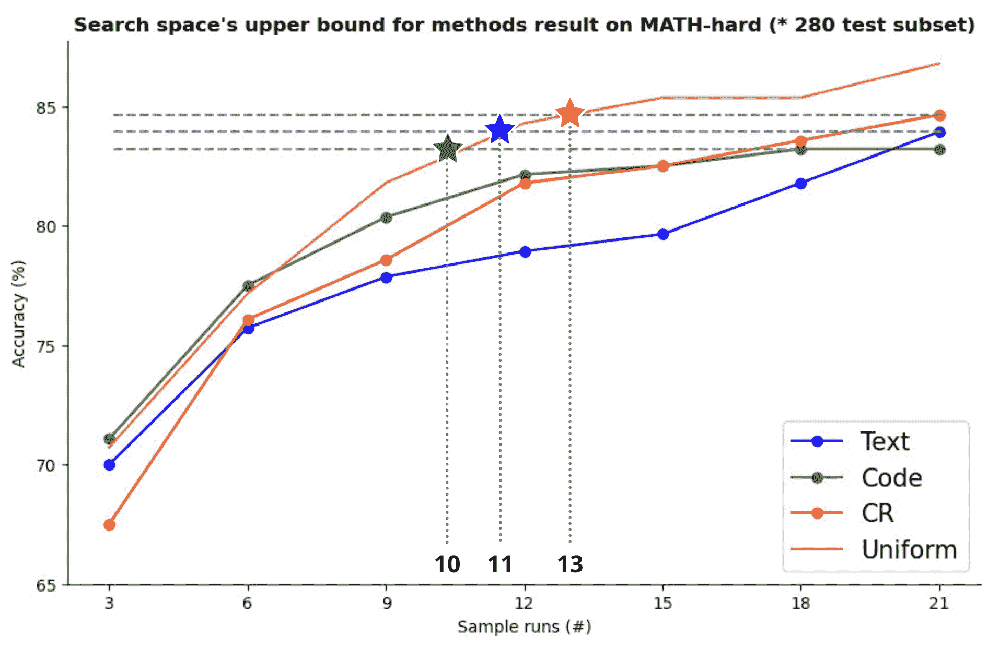
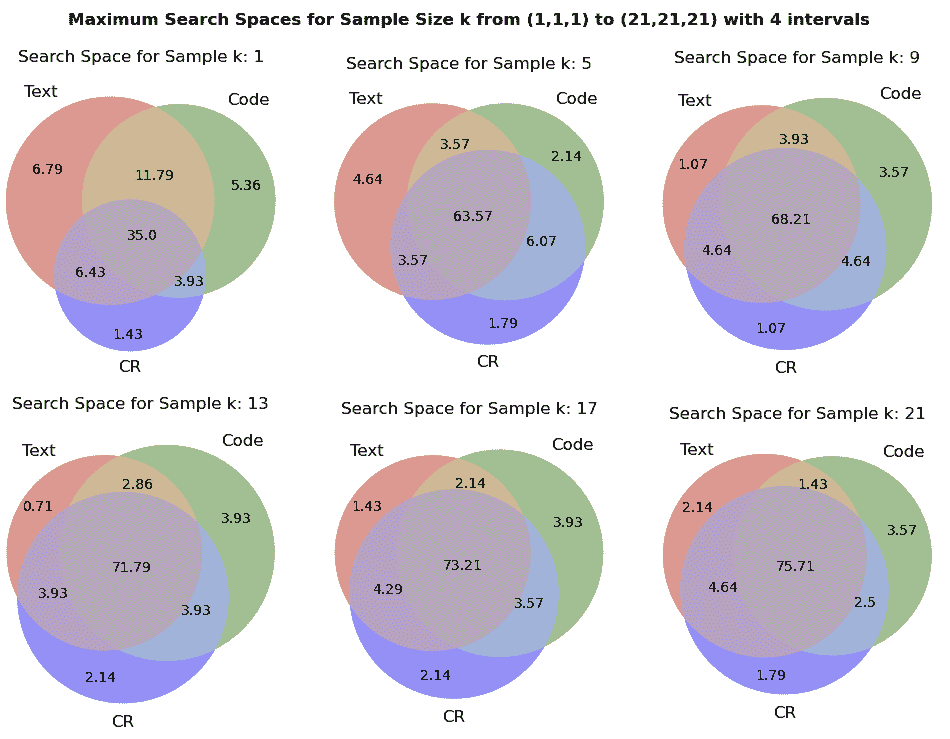
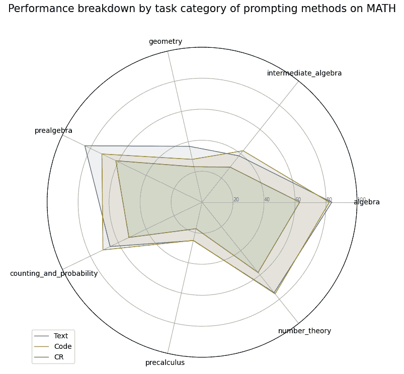
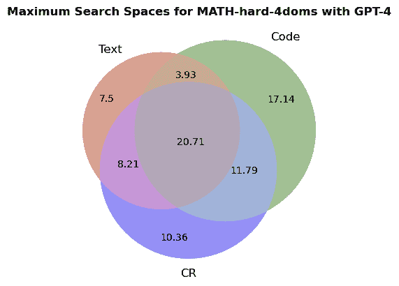

<!--yml

category: 未分类

date: 2025-01-11 12:06:57

-->

# 扩展搜索空间与多样化提示代理：一种高效的LLM数学推理采样方法

> 来源：[https://arxiv.org/html/2410.09780/](https://arxiv.org/html/2410.09780/)

Gisang Lee^(1, 2), Sangwoo Park¹, Junyoung Park³, Andrew Chung³，

Sieun Park⁴, Yoonah Park³, Byungju Kim²²²2, Min-gyu Cho²²²2

¹KAIST, ²Mathpresso公司, ³首尔国立大学，

⁴伦敦大学Goldsmiths学院

{bobopack, swgger}@kaist.ac.kr, {jyp0314, aschung01, wisdomsword21}@snu.ac.kr,

sieunpark77@gmail.com, {peyton.kim, mike.cho}@mathpresso.com

###### 摘要

大型语言模型（LLMs）在许多复杂任务中展现了显著的能力，包括数学推理。然而，传统方法严重依赖于确保单一提示方法中的自一致性，这限制了多样化问题解决策略的探索。本研究通过在数学推理领域对不同提示方法进行实验分析，解决了这些局限性。我们的研究结果表明，每种方法探索了不同的搜索空间，且随着问题复杂度的增加，这种差异变得更加明显。为了利用这一现象，我们应用了高效的采样过程，均匀地结合来自这些多样化方法的样本，这不仅扩展了最大搜索空间，而且在与单一方法相比，使用更少的运行次数实现了更高的性能。特别是在名为MATH数据集的难题子集MATH-hard中，利用大约减少43%运行次数的情况下，达到了最大搜索空间。这些发现强调了整合多样化问题解决策略以提升LLM推理能力的重要性。

## 1 引言

最近，大型语言模型（LLMs）的进展显著增强了它们的推理能力，尤其是在数学推理和代码生成方面。像GPT-4o（OpenAI，[2024](https://arxiv.org/html/2410.09780v1#bib.bib8)）、Claude Opus（Claude，[2024](https://arxiv.org/html/2410.09780v1#bib.bib2)）这样的高性能模型在这些挑战性领域展示了其能力，展现了其先进的表现。这些模型通常通过逐步的自然语言推理方法——称为思维链（Chain-of-Thought，CoT）来确保解决方案的有效性和准确性（Wei et al.，[2023](https://arxiv.org/html/2410.09780v1#bib.bib11)）。特别是在解决数学问题时，现有的方法要么专注于验证解决过程中的逻辑顺序（Zhang et al.，[2024](https://arxiv.org/html/2410.09780v1#bib.bib12); Zihao et al.，[2024](https://arxiv.org/html/2410.09780v1#bib.bib16); Zhou et al.，[2024](https://arxiv.org/html/2410.09780v1#bib.bib15)），要么寻求对复杂计算的验证支持（Chen et al.，[2023](https://arxiv.org/html/2410.09780v1#bib.bib1); Zhou et al.，[2023](https://arxiv.org/html/2410.09780v1#bib.bib14); Zhong et al.，[2024](https://arxiv.org/html/2410.09780v1#bib.bib13)），要么旨在确保逻辑验证和计算准确性（Gou et al.，[2024](https://arxiv.org/html/2410.09780v1#bib.bib5)）。这些方法的一个共同特点是使用抽样和投票过程，通过生成多个解决方案来实现自我一致性（CoT-SC）（Wang et al.，[2023](https://arxiv.org/html/2410.09780v1#bib.bib10)）。

图 1：每种方法通过21次运行采样得到的最大搜索空间准确度的折线图。三条灰色水平线代表单一方法中的上限值。星标表示在使用我们提出的统一采样方法时，达到这些上限值的点。从图中可以看出，在处理文本、代码和CR时，分别使用大约48%、45%和35%更少的运行次数就达到了相同的上限。

尽管这些方法在验证LLMs提供的解决方案并增强其可靠性方面有效，但它们严重依赖温度调整来增加问题解决方法的多样性。这种对自身生成解决方案中的自我一致性的依赖限制了它们探索更广泛问题解决策略的能力。相比之下，人类问题解决者不仅投入大量精力验证计算的有效性和准确性，而且还会探索多种潜在解决方案。

最近，LLM高推理领域的研究集中在整合多样的智能体问题解决方法，以应对这些局限性（Du等， [2023](https://arxiv.org/html/2410.09780v1#bib.bib4); Liu等， [2023](https://arxiv.org/html/2410.09780v1#bib.bib7)）。尽管这些研究在MATH（Hendrycks等， [2021](https://arxiv.org/html/2410.09780v1#bib.bib6)）和GSM8K（Cobbe等， [2021](https://arxiv.org/html/2410.09780v1#bib.bib3)）等基准测试上取得了有希望的表现，但它们缺乏对不同智能体为何能共同实现高性能的全面分析。此外，尚缺乏探讨如何有效整合每种方法独特特征的研究，不仅仅是提高性能指标。

因此，本研究旨在通过对不同LLM智能体在数学推理领域中采用的解决问题策略进行实验分析，来填补这些空白。此外，我们提出了一种高效的采样过程，能够有效地结合这些多样的智能体。通过实验分析获得的关键观察结果和我们的贡献如下。

#### 观察

为了具体评估LLMs的高推理能力，我们分析了在MATH数据集上的最新方法，这要求的能力高于GSM-8K。我们将这些方法分为三种主要的提示方法：文本、代码和CR（累积推理）。我们发现，在生成正确答案时，每种方法探索了不同的搜索空间，而随着问题复杂性的增加，这种差异变得更加明显。

#### 贡献

我们观察到，每种提示方法探索了不同的搜索空间，这一认识促使我们提出了一种高效的采样策略。我们展示了，与其在单一方法中低效地生成多个样本，不如均匀混合来自这些不同方法的样本，这显著地增加了最大搜索空间。如图[1](https://arxiv.org/html/2410.09780v1#S1.F1 "Figure 1 ‣ 1 Introduction ‣ Expanding Search Space with Diverse Prompting Agents: An Efficient Sampling Approach for LLM Mathematical Reasoning")所示，在MATH-hard子集内，利用比单一方法平均少约43%的运行次数就达到了最大搜索空间。

## 2 方法

图2：方法在MATH-hard（* 280个测试子集）上的最大搜索空间结果。从上图看，Venn图中的$B\cup C\ -A$表示方法A未能探索的搜索空间比例。

### 2.1 扩展搜索空间

图[2](https://arxiv.org/html/2410.09780v1#S2.F2 "Figure 2 ‣ 2 Method ‣ Expanding Search Space with Diverse Prompting Agents: An Efficient Sampling Approach for LLM Mathematical Reasoning")显示了一个维恩图，展示了三种提示方法在MATH-hard问题中的最大搜索空间。我们将样本大小按顺序从（1,1,1）增加到（5,5,5），间隔为4，最后增加到（21,21,21），以观察这一现象是否持续存在。结果显示，随着样本大小的增加，中心灰色区域的重叠部分（表示共享的搜索空间）增大。尽管每个独特搜索空间的绝对大小减小，但任何单一方法（方法A）无法探索的搜索空间比例$B\cup C\ -A$仍然保持在一定范围内。这表明，即使样本大小k增加，每种方法的搜索空间仍然保持稳健的独立性。

#### 提示方法

我们选择了三种提示方法来分析MATH数据集中问题解决方法的差异，基于每种方法探索不同搜索空间的假设。我们选择了以下三种提示方法：（1）文本，（2）代码和（3）CR。

1.  1.

    文本：正如魏等人[2023](https://arxiv.org/html/2410.09780v1#bib.bib11)所报告的，这种提示方法鼓励使用链式推理（CoT）方法的自然语言解释。这是LLM的基础推理方法。CoT-SC的token成本作为基准。

1.  2.

    代码：这种方法引导模型提取并执行代码以推导答案。受陈等人[2023](https://arxiv.org/html/2410.09780v1#bib.bib1)的启发，我们特别采用了高等等人[2024](https://arxiv.org/html/2410.09780v1#bib.bib5)提出的提示，特点是将自然语言问题转换为本地代码解释器。根据我们实验中记录的平均值，Code方法的token成本是基础文本方法的3.0倍。

1.  3.

    累积推理（CR）：由张等人[2024](https://arxiv.org/html/2410.09780v1#bib.bib12)提出的CR框架，利用多个LLM进行累积和迭代的数学推理，模拟人类的思维过程来解决问题。我们使用带代码的CR来去除除了提示部分外的其他环境变量，与代码（方法2）进行比较。

#### 选择（采样）

尽管我们通过从每种方法生成$n$次实验获得了一个运行池，但要通过单一方法在探索中超越CoT-SC，要求这些运行所覆盖的搜索空间是广泛的。因此，选择一个固定数量的运行应确保高准确性。为了实现这一点，需要一个能够有效并高效地结合各种方法解决方案的适当采样算法。为了确保最终选择的运行尽可能多样化，我们采用了一种叫做均匀采样的方法。

> 均匀抽样：均匀抽样确保每种方法的抽样比例相等。例如，如果初始运行显示方法A、B和C的性能依次最好，则抽样也按照A、B和C的顺序进行，然后重复（即，A、B、C，A、B、C，…）。

这种抽样过程为通过利用更广泛的搜索空间来有效提升性能提供了基础。

### 2.2 通过LLM重排序验证从抽样运行中得到的答案

之前用于保持自一致性的抽样和投票方法（Zhou et al., [2023](https://arxiv.org/html/2410.09780v1#bib.bib14); Wang et al., [2023](https://arxiv.org/html/2410.09780v1#bib.bib10)）有一个缺点，即未能充分利用多次运行的高准确性上限。例如，即使选择过程中包括了一次通过改进的探索正确回答先前未解答问题的运行，抽样和投票往往偏向于错误答案，因为错误的运行更为普遍。由于我们的方法着重于增加搜索空间的上限，因此即便在错误响应较多的情况下，也必须识别正确答案。因此，我们采用LLM重排序来从选定的运行中得出最佳性能。重排序过程遵循RankGPT（Sun et al., [2023](https://arxiv.org/html/2410.09780v1#bib.bib9)）提出的方法论，该方法为LLM重排序引入了一种有效的方法。

## 3 实验

#### 设置

我们的实验是在MATH数据集的子集上进行的，该数据集（Hendrycks et al., [2021](https://arxiv.org/html/2410.09780v1#bib.bib6)）包含了来自AMC和AIME等竞赛的12,500个具有挑战性的数学问题。我们从MATH数据集中的所有数学领域中抽取数据，重点关注难度等级为4和5的问题。最终选取了280个具有挑战性的问题（约占整个数据集的11%），我们将其称为MATH-hard。我们使用GPT-4o作为所有实验的基础模型，并且它也被用作第[2.2](https://arxiv.org/html/2410.09780v1#S2.SS2 "2.2 通过LLM重排序验证从抽样运行中得到的答案 ‣ 2 方法 ‣ 通过多样化提示代理扩展搜索空间：一种高效的LLM数学推理抽样方法")节中的LLM重排序器。温度设置为0.7，以便从每种提示方法中获得尽可能多样的响应。

有关消融研究的更多细节，评估不同组件（模型大小和MATH数据集中的难度级别）影响的内容，请参见附录[A.1](https://arxiv.org/html/2410.09780v1#A1.SS1 "A.1 消融研究 ‣ 附录A 附录 ‣ 通过多样化提示代理扩展搜索空间：一种高效的LLM数学推理抽样方法")。

|  | 抽样方法 |
| --- | --- |
| 样本 k | 文本 | 代码 | CR | 均匀 |
| 基础 (k=1) | 60.00 | 56.07 | 46.79 | (= Top1) |
| 3 (1,1,1) | 70.0 | 71.07 | 67.5 | 70.71 |
| 6 (2,) | 75.71 | 77.5 | 76.07 | 77.14 |
| 9 (3,) | 77.86 | 80.36 | 78.57 | 81.79 |
| 12 (4,) | 78.93 | 82.14 | 81.79 | 84.29 |
| 15 (5,) | 79.64 | 82.5 | 82.5 | 85.36 |
| 18 (6,) | 81.79 | 83.21 | 83.21 | 85.36 |
| 21 (7,) | 83.93 | 83.21 | 84.64 | 86.79 |
| 平均值 | 78.27 | 80.00 | 79.18 | 81.63 |

表1：各采样方法的搜索空间上限得分。MATH-hard（*280测试子集）上的结果：我们通过采用CoT-SC的默认温度值t=0.7增加了样本数。如方法部分所述，每种提示方法都是基于或从以下内容复制的：CoT上的文本，CSV（带本地代码解释器的LLM）上的代码，以及来自累积推理的CR。

### 3.1 聚合不同提示方法的效果

为了定量分析各种提示方法的效果，每种提示方法都运行了21次，生成了280个问题的21个不同解答。

本实验分析了通过逐步增加运行次数，x轴上的准确度上限如何变化，并将每种提示方法的准确度上限与通过均匀采样从21 * 3次运行中获得的上限准确度进行比较。

来自图 [1](https://arxiv.org/html/2410.09780v1#S1.F1 "Figure 1 ‣ 1 Introduction ‣ Expanding Search Space with Diverse Prompting Agents: An Efficient Sampling Approach for LLM Mathematical Reasoning")的结果表明，我们的方法比单一提示方法更早地达到了最高准确度；对于文本从第21次运行到第11次运行，对于代码从第18次运行到第10次运行，对于CR从第20次运行到第13次运行。这些结果支持了我们的假设，即使用多样化的提示技术能够更广泛、更快速地探索那些单一方法无法解决或无法达到的问题。

|  | 采样方法 |
| --- | --- |
| 样本 k | 文本 | 代码 | CR | 均匀 |
| 基础（k=1） | 60.00 | 56.07 | 46.79 | (= Top1) |
| SC（样本与投票） |  |  |  |  |
| 3 (1,1,1) | 60.0 | 60.0 | 45.36 | 57.14 |
| 6 (2,) | 60.0 | 60.0 | 48.21 | 57.5 |
| 9 (3,) | 57.86 | 59.29 | 46.07 | 58.93 |
| 12 (4,) | 58.57 | 61.43 | 48.57 | 58.21 |
| 15 (5,) | 58.21 | 60.71 | 47.14 | 58.57 |
| 18 (6,) | 59.29 | 60.71 | 47.14 | 59.29 |
| 21 (7,) | 58.93 | 60.71 | 48.57 | 58.93 |
| 平均值 | 58.98 | 60.41 | 47.29 | 58.37 |
| 重新排序@1（RankGPT, GPT-4o） |  |  |  |  |
| 3 (1,1,1) | 63.93 | 63.93 | 60.00 | 62.86 |
| 6 (2,) | 64.29 | 66.43 | 65.36 | 65.71 |
| 9 (3,) | 64.64 | 68.93 | 66.43 | 64.64 |
| 12 (4,) | 65.71 | 69.29 | 67.14 | 66.43 |
| 15 (5,) | 65.71 | 71.07 | 67.50 | 66.07 |
| 18 (6,) | 65.71 | 71.07 | 67.50 | 66.07 |
| 21 (7,) | 65.71 | 71.07 | 68.93 | 65.71 |
| 平均值 | 65.00 | 68.57 | 66.07 | 65.36 |

表2：验证候选答案在MATH-hard（* 280测试子集）上的结果。表1中的实验设置得以保持，而在表2中，针对每种方法在搜索空间内找到的候选答案进行了验证过程。结果对比了采样和投票与LLM重排序方法的效果。采样和投票使用自一致性方法，LLM重排序则通过RankGPT（GPT-4o，滑动窗口=4，步长=2）实现。所有的准确性度量都基于Recall@1。

### 3.2 讨论

实验验证了我们的假设，即多样化的提示技术能够增强解空间的探索，尤其是对于具有挑战性的数学问题。通过使用多种最先进的提示方法，我们证明了每种方法探索了解问题空间的不同部分，从而实现了更全面和高效的探索。因此，即便是简单的均匀采样策略，在与LLM重排序结合时，也能带来显著的性能提升和降低采样成本。这些发现强调了在MATH领域中整合多种方法的重要性，以实现更广泛且更有效的问题解决策略探索。

不幸的是，通过多个代理扩展搜索空间并使用带有自一致性算法的验证器和LLM重排序并不能互相补充。这是由于我们算法的基础哲学所致。我们的算法旨在通过扩展搜索空间*至少收集到一个正确的响应*，但并不意味着正确的响应会出现多次。

因此，为了确保在扩展搜索空间后最终性能得到提升，我们采用了一种LLM重排序方法，预计它能够始终正确地选择答案，即使是在稀疏值的情况下。然而，出乎我们意料的是，无论是传统的自一致性（SC）方法还是LLM重排序方法，都未能始终保证这一提升。

## 4 结论

在本研究中，我们强调了关于数学推理的以下观察结果：

+   •

    不同的提示方法探索的是不同的可解问题空间，这些搜索空间之间的差异是很难克服的，即使在单一方法中增加温度也无法解决这一问题。

+   •

    因此，通过采样方法聚合多种方法能够扩展可解问题空间，从而提高准确性的上限。这种方法超越了传统单一方法在探索和收敛速度上的优势。

+   •

    随后的LLM重排序过程产生了有前景的结果，展示了比传统的自一致性中使用的多数投票方法更高效的正确解生成方法。

## 5 局限性

我们的研究在数学领域取得了有价值的发现，但也存在以下局限性。

+   •

    由于生成多个解决方案来解决单一问题固有的成本问题，每种方法生成的运行次数并不多。然而，附录[A](https://arxiv.org/html/2410.09780v1#A1 "附录A 附录 ‣ 使用多样化提示代理扩展搜索空间：一种高效的LLM数学推理采样方法")中描述了基于GPT-4的进一步实验结果，其中样本数增加到了大约占总数据集32%，而与正文中讨论的MATH-hard数据集相比，样本占比为11%。这些结果再次证明，即使增加了运行次数，在解决困难问题时，输出空间之间的差异依然存在。

+   •

    通过LLM重排序从采样运行中验证最终答案的过程已显示出不一致的结果。测试了多种LLM（例如Gemini 1.5）和方法，但数据并未一致地表明，增加运行次数会按比例增强搜索空间的上限和最终准确性。预计采用专门用于验证的正式数学验证器，如DTV论文中提出的Isabelle，将确保最终准确性始终接近扩展搜索空间的最大值。

+   •

    我们没有纳入更广泛的解题方法。最近的研究介绍了数学推理中一些有前景的方法，例如代理式提示方法（如RAT）。我们将这些多样化方法的评估留待未来研究。

## 参考文献

+   陈等（2023）陈文虎、马学广、王鑫怡、威廉·W·科恩。2023年。[思维提示程序：为数值推理任务解开计算与推理的关系](http://arxiv.org/abs/2211.12588)。

+   Claude（2024）Claude。2024年。[Claude模型卡片](https://www-cdn.anthropic.com/de8ba9b01c9ab7cbabf5c33b80b7bbc618857627/Model_Card_Claude_3.pdf)。

+   Cobbe等（2021）Karl Cobbe、Vineet Kosaraju、Mohammad Bavarian、Mark Chen、Heewoo Jun、Lukasz Kaiser、Matthias Plappert、Jerry Tworek、Jacob Hilton、Reiichiro Nakano、Christopher Hesse、John Schulman。2021年。训练验证器解决数学文字问题。*arXiv预印本arXiv:2110.14168*。

+   杜等（2023）杜一伦、李爽、安东尼奥·托雷尔巴、乔舒亚·B·特南鲍姆、伊戈尔·莫达奇。2023年。通过多代理辩论提高语言模型的事实性和推理能力。*arXiv预印本arXiv:2305.14325*。

+   邱等（2024）周志斌、邵志红、龚业云、沈业龙、杨宇九、黄敏磊、段楠、陈伟柱。2024年。[ToRA：一种工具集成推理代理，用于数学问题求解](https://openreview.net/forum?id=Ep0TtjVoap)。发表于*第十二届国际学习表征会议*。

+   Hendrycks 等（2021）Dan Hendrycks, Collin Burns, Saurav Kadavath, Akul Arora, Steven Basart, Eric Tang, Dawn Song, 和 Jacob Steinhardt. 2021. 使用数学数据集衡量数学问题解决能力。*NeurIPS*。

+   Liu 等（2023）Zijun Liu, Yanzhe Zhang, Peng Li, Yang Liu, 和 Diyi Yang. 2023. [动态 LLM-Agent 网络：一个具有代理团队优化的 LLM-Agent 协作框架](http://arxiv.org/abs/2310.02170)。

+   OpenAI（2024）OpenAI. 2024. [Gpt-4o 博客文章](https://openai.com/index/hello-gpt-4o/)。

+   Sun 等（2023）Weiwei Sun, Lingyong Yan, Xinyu Ma, Shuaiqiang Wang, Pengjie Ren, Zhumin Chen, Dawei Yin, 和 Zhaochun Ren. 2023. [ChatGPT 在搜索中表现如何？调查大型语言模型作为重新排序代理](http://arxiv.org/abs/2304.09542)。

+   Wang 等（2023）Xuezhi Wang, Jason Wei, Dale Schuurmans, Quoc Le, Ed Chi, Sharan Narang, Aakanksha Chowdhery, 和 Denny Zhou. 2023. [自一致性改善语言模型中的链式思维推理](http://arxiv.org/abs/2203.11171)。

+   Wei 等（2023）Jason Wei, Xuezhi Wang, Dale Schuurmans, Maarten Bosma, Brian Ichter, Fei Xia, Ed Chi, Quoc Le, 和 Denny Zhou. 2023. [链式思维提示在大型语言模型中引发推理](http://arxiv.org/abs/2201.11903)。

+   Zhang 等（2024）Yifan Zhang, Jingqin Yang, Yang Yuan, 和 Andrew Chi-Chih Yao. 2024. [使用大型语言模型进行累积推理](http://arxiv.org/abs/2308.04371)。

+   Zhong 等（2024）Li Zhong, Zilong Wang, 和 Jingbo Shang. 2024. [像人类一样调试：通过逐步验证运行时执行的大型语言模型调试器](http://arxiv.org/abs/2402.16906)。

+   Zhou 等（2023）Aojun Zhou, Ke Wang, Zimu Lu, Weikang Shi, Sichun Luo, Zipeng Qin, Shaoqing Lu, Anya Jia, Linqi Song, Mingjie Zhan, 和 Hongsheng Li. 2023. [使用 GPT-4 代码解释器与基于代码的自我验证解决具有挑战性的数学文字题](http://arxiv.org/abs/2308.07921)。

+   Zhou 等（2024）Jin Peng Zhou, Charles Staats, Wenda Li, Christian Szegedy, Kilian Q. Weinberger, 和 Yuhuai Wu. 2024. [不要相信：验证 – 通过自动形式化将 LLM 定量推理与基础结合](http://arxiv.org/abs/2403.18120)。

+   Zihao 等（2024）Wang Zihao, Liu Anji, Lin Haowei, Li Jiaqi, Ma Xiaojian, 和 Liang Yitao. 2024. Rat: 检索增强的思维在长时程生成中的上下文感知推理激发。*arXiv 预印本 arXiv: 2403.05313*。

## 附录 A 附录

### A.1 消融研究

#### 数据抽样详情

对所有 MATH 数据抽样，我们固定 random_seed=42，并调整级别、领域和样本数量，以创建各种数据样本。

> a) MATH-hard：在主文中使用 GPT-4o 实验的一个子集。对于困难级别（4 和 5），在没有领域限制（7 个领域）的情况下，每个级别抽取 20 个样本，总计 280 个样本（占测试集的 11.03%）。该子集被称为 MATH-hard，允许我们验证在特别困难的问题上的推理能力。

图 3：MATH-hard 方法结果的最大搜索空间（* 280 测试子集）：雷达图显示每个方法（文本、代码、CR）在所有 7 个领域的平均准确度，基于其 21 次运行。

> b) MATH-hard-4doms：我们的实验结果表明，即使是像 GPT-4(o) 这样的强大模型，在 MATH-hard 的四个特定领域表现也很差：“counting_and_probability”，“geometry”，“intermediate_algebra”和“precalculus”（参见图 [3](https://arxiv.org/html/2410.09780v1#A1.F3 "图 3 ‣ 数据采样细节 ‣ A.1 消融研究 ‣ 附录 A 附录 ‣ 使用多样提示代理扩展搜索空间：一种高效的采样方法")）。我们将这四个领域的样本数量从 20 增加到 50，总共 400 个样本（占这四个领域的 31.55%），创建了 MATH-hard-4doms 子集。

图 4：MATH-hard-4doms 方法结果的最大搜索空间（* 400 测试子集）：数据采样细节在上述章节中已写明。

> c) MATH-all：为了验证搜索空间是否扩展到所有领域，而不仅仅是困难问题，我们在所有 7 个领域和 5 个层次上每个领域抽取了 10 个样本，总共 350 个样本（占整个数据集的 5%）。

#### 小型模型在 MATH-all 上的表现

之前的实验已确认，更广泛的方法在更困难的问题上更有效，从而引出了基于 GPT-4 的 MATH-hard 子集实验。作为消融研究，我们对 MATH-all 进行了实验，使用了通用模型 GPT-3.5-Turbo 和 LLaMA-3-70B（后者比 GPT-3.5-Turbo 表现更好，但成本相似）。我们考察了随着每种提示方法的运行次数样本增加，搜索空间是否会扩展到所有层次的问题。

|  | 采样方法 |
| --- | --- |
| 模型：GPT-3.5-Turbo | 文本 | 代码 | CR | 均匀 |
| 基础 (k=1) | 48.86 46.29 42.57 | (= Top1) |  |  |
| 5 (2,2,1) | 69.43 | 66.86 | 66.86 | 70.00 |
| 10 (4,3,3) | 76.86 | 78.86 | 73.14 | 76.57 |
| 15 (5,5,5) | 78.86 | 82.29 | 76.29 | 81.14 |
| 20 (7,7,6) | 80.86 | 84.29 | 80.00 | 84.00 |
| 平均 | 85.36 | 80.07 | 85.86 | 87.14 |
|  | 采样方法 |
| 模型：LLaMA-3-70B | 文本 | 代码 | CR | 均匀 |
| 基础 (k=1) | 65.14 | 41.71 | 61.71 | (= Top1) |
| 5 (2,1,2) | 80.29 | 70.29 | 81.71 | 82.00 |
| 10 (4,3,3) | 85.14 | 80.29 | 85.71 | 86.86 |
| 15 (5,5,5) | 87.43 | 84.29 | 87.14 | 89.43 |
| 20 (7,6,7) | 88.57 | 85.43 | 88.86 | 90.29 |
| 平均 | 85.36 | 80.07 | 85.86 | 87.14 |

表 3：每种采样方法的搜索空间上限得分。MATH-all 上的结果（* 350 测试子集）：实验细节与表 [1](https://arxiv.org/html/2410.09780v1#S3.T1 "表 1 ‣ 设置 ‣ 3 实验 ‣ 使用多样提示代理扩展搜索空间：一种高效的采样方法") 相同，数据采样细节在上述章节中已写明。
