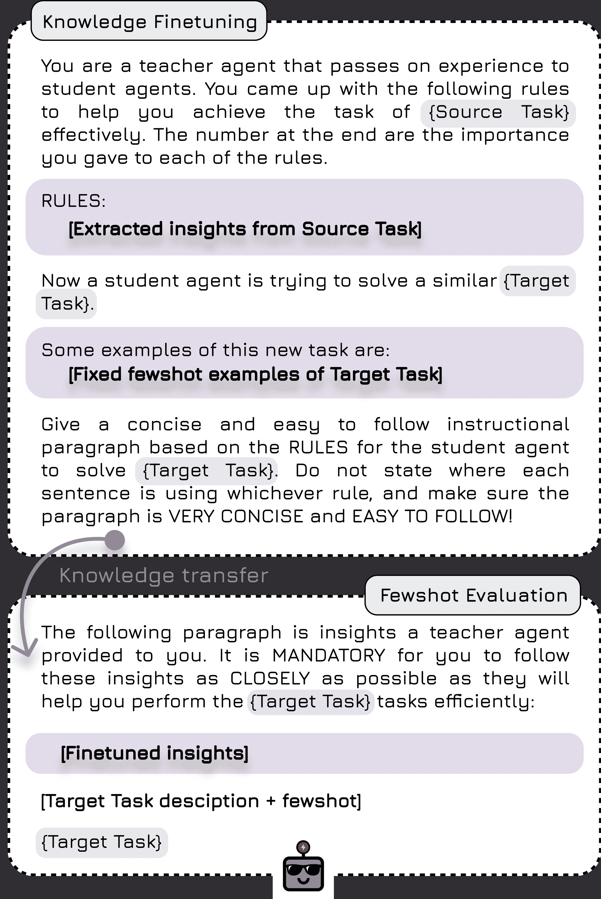

<!--yml

category: 未分类

date: 2025-01-11 13:07:43

-->

# ExpeL：LLM代理是经验学习者

> 来源：[https://arxiv.org/html/2308.10144/](https://arxiv.org/html/2308.10144/)

Andrew Zhao,^($\spadesuit$) Daniel Huang, ^($\clubsuit$) Quentin Xu, ^($\clubsuit$) Matthieu Lin, ^($\clubsuit$) Yong-Jin Liu, ^($\clubsuit$) Gao Huang ^($\spadesuit$) 通讯作者。

###### 摘要

最近，应用大规模语言模型（LLMs）于决策任务的研究兴趣激增，通过利用LLMs中蕴含的广泛世界知识取得了飞跃。虽然对定制LLM以适应特定决策任务的需求日益增加，但针对特定任务对其进行微调既消耗资源，又可能降低模型的泛化能力。此外，像GPT-4和Claude这样的最先进语言模型，主要通过API调用访问，其参数权重是专有的且公众无法获取。这种情况突显了新方法的迫切需求，这些方法能够在不需要参数更新的情况下，从代理的经验中进行学习。为了解决这些问题，我们引入了经验学习（ExpeL）代理。我们的代理通过自然语言从一组训练任务中自动收集经验并提取知识。在推理时，代理会回顾其提取的见解和过往经验，以做出明智的决策。我们的实证结果突出显示了ExpeL代理强大的学习效能，表明随着经验的积累，代理的性能持续提高。我们通过定性观察和额外实验进一步探索了ExpeL代理的新兴能力和迁移学习潜力。¹¹1访问[https://andrewzh112.github.io/expel](https://andrewzh112.github.io/expel)了解项目页面，以及[https://github.com/LeapLabTHU/ExpeL](https://github.com/LeapLabTHU/ExpeL)获取代码。

![[未标注图片]](img/e5925b51113fadedd503b77bf08656c2.png)![[未标注图片]](img/522689c96422e071e2235dc1511f60fe.png)![[未标注图片]](img/f46f7f26fade027f7d045a1cfaa68c35.png)

> 计算机程序被称为从经验$E$中学习，针对某些任务类别$T$和性能度量$P$，如果它在任务$T$上的表现，通过$P$衡量，随着经验$E$的增加而提高。
> 
> Tom Mitchell

图1：ExpeL 代理概览。左侧：ExpeL 分为三个阶段：（1）将成功与失败的经验收集到一个池中。（2）从这些经验中提取/抽象出跨任务的知识。（3）将获得的见解应用于评估任务中，并回忆过去成功的经验。右侧：（A）通过反思（Shinn 等人 [2023](https://arxiv.org/html/2308.10144v3#bib.bib39)）展示了经验收集过程，支持在自我反思失败后重新尝试任务。（B）展示了见解提取步骤。当展示成功/失败对或一个 $L$ 个成功的列表时，代理通过操作 ADD、UPVOTE、DOWNVOTE 和 EDIT 动态修改现有的见解列表 $\hat{\iota}$。此过程强调提取普遍的失败模式或最佳实践。

## 1 引言

机器学习研究长期以来一直被自主代理及其能力的潜力所吸引。近年来，将大型语言模型（LLMs）融入这些代理中（Wang 等人 [2023b](https://arxiv.org/html/2308.10144v3#bib.bib53); Xi 等人 [2023](https://arxiv.org/html/2308.10144v3#bib.bib60)）揭示了广泛的应用领域，甚至超出了学术界（Yang 等人 [2023a](https://arxiv.org/html/2308.10144v3#bib.bib61); Nakajima [2023](https://arxiv.org/html/2308.10144v3#bib.bib29); Significant-Gravitas [2023](https://arxiv.org/html/2308.10144v3#bib.bib41)）。LLMs 的一个显著优势在于其广泛的世界知识，使其在各种场景下具有固有的多功能性（Zhao 等人 [2023b](https://arxiv.org/html/2308.10144v3#bib.bib72)）。

一方面，先前的研究探讨了通过大量的环境交互（Yao 等人 [2023c](https://arxiv.org/html/2308.10144v3#bib.bib67)）或大量人工标注数据集（Nakano 等人 [2021](https://arxiv.org/html/2308.10144v3#bib.bib30); Shaw 等人 [2023](https://arxiv.org/html/2308.10144v3#bib.bib38)）对 LLM 进行微调。这类方法需要高昂的计算成本，并且需要访问 LLM 的参数权重。此外，微调 LLM 会限制其功能，并可能损害其泛化能力（Du 等人 [2022](https://arxiv.org/html/2308.10144v3#bib.bib8)）。另一方面，提示方法可以通过仅提供少量上下文示例，增强 LLM 的序列决策规划能力（Hao 等人 [2023](https://arxiv.org/html/2308.10144v3#bib.bib12); Lin 等人 [2023b](https://arxiv.org/html/2308.10144v3#bib.bib20); Sun 等人 [2023](https://arxiv.org/html/2308.10144v3#bib.bib44)）。然而，由于当前的 LLM 受限于上下文窗口大小（Tworkowski 等人 [2023](https://arxiv.org/html/2308.10144v3#bib.bib51)），这些代理无法记得它们曾经看到的内容，因此无法在少数几个示范之外进行学习。那么，如何在这两种范式之间取得平衡呢？

我们提出了经验学习（ExpeL）智能体作为一种解决方案。我们的智能体通过反复试验和错误从一系列训练任务中自主积累经验。从这些经验中，它提取自然语言洞察，并在测试时将其成功经验作为上下文示例使用。我们的智能体的学习过程类似于学生为考试学习并在单次尝试中进行考试，这反映了许多现实世界的情况。与像Reflexion（Shinn等人[2023](https://arxiv.org/html/2308.10144v3#bib.bib39)）这样的自我改进方法不同，我们的方法强调跨多个任务保留经验的重要性，以提升智能体的表现。此外，ExpeL在没有参数更新的情况下进行学习，使其与像GPT-4或Claude这样的强大闭源模型兼容。最后，经验收集步骤不需要大量数据或人工标签。

我们在三个截然不同的领域评估了ExpeL，并且始终优于强基线。此外，我们展示了一个迁移学习场景，其中我们的智能体从源任务中积累的知识展现出了对目标任务的正向迁移。最后，我们突出了ExpeL智能体获得的一些意外新能力。

总结来说，我们的主要贡献如下：（1）我们提出了ExpeL，一种新型的LLM智能体，能够无需梯度更新自主地从经验中学习；（2）我们在一系列多样化的任务上评估了ExpeL，展示了其学习能力以及在现有规划方法基础上的改进；（3）我们展示了LLM智能体的迁移学习新场景，并证明了从源任务到目标任务的正向迁移能力。最后，我们认为，随着规划算法和基础模型的持续改进，ExpeL的范式将从它们的性能提升中获得显著的收益。

## 2 相关工作

我们在本节中讨论了最相关的相关工作。有关相关工作的详细讨论，请参阅附录[A](https://arxiv.org/html/2308.10144v3#A1 "附录 A 详细相关工作 ‣ ExpeL: LLM智能体是经验学习者")。

基于提示的学习：基于提示的学习通过修改输入上下文来精细化标签预测任务，促进在最少数据下迅速适应新任务（Liu 等人 [2023a](https://arxiv.org/html/2308.10144v3#bib.bib23)）。这种方法利用大型语言模型（LLMs）来获取答案，无需调整参数，因为它们可以通过上下文学习进行增强（Brown 等人 [2020](https://arxiv.org/html/2308.10144v3#bib.bib4)）。LAMA（Petroni 等人 [2019](https://arxiv.org/html/2308.10144v3#bib.bib34)）和GPT-3（Brown 等人 [2020](https://arxiv.org/html/2308.10144v3#bib.bib4)）是推动这一方法的早期工作。减少提示设计复杂性的努力包括自动推理链用于自然语言处理（NLP）（Kojima 等人 [2022](https://arxiv.org/html/2308.10144v3#bib.bib17); Zhang 等人 [2023](https://arxiv.org/html/2308.10144v3#bib.bib70)）。类似地，ExpeL智能体也通过改变执行提示，利用提取的洞察和自生成的上下文轨迹，自主从经验中学习。

检索增强生成（RAG）：检索允许大型语言模型（LLMs）访问数据库，从而减少幻觉现象（Li 等人 [2022](https://arxiv.org/html/2308.10144v3#bib.bib18); Wang, Yang, 和 Wei [2023](https://arxiv.org/html/2308.10144v3#bib.bib54); Rubin, Herzig, 和 Berant [2022](https://arxiv.org/html/2308.10144v3#bib.bib36); Liu 等人 [2022](https://arxiv.org/html/2308.10144v3#bib.bib22)）。检索还被用来增强决策智能体的能力（Humphreys 等人 [2022](https://arxiv.org/html/2308.10144v3#bib.bib14); Zhao 等人 [2023a](https://arxiv.org/html/2308.10144v3#bib.bib71)）。与这些工作不同，我们关注于检索ExpeL智能体自生成的经验，从而减少对黄金标准示例的依赖，并利用特定领域的语料库。

LLM代理的规划：LLM代理在机器人技术、自然科学、游戏玩法和工作流等领域的应用迅速增长，重点关注它们在少样本设置下的世界知识（Ha, Florence, 和 Song [2023](https://arxiv.org/html/2308.10144v3#bib.bib11); Mu et al. [2023](https://arxiv.org/html/2308.10144v3#bib.bib28); Bran et al. [2023](https://arxiv.org/html/2308.10144v3#bib.bib3); Boiko, MacKnight, 和 Gomes [2023](https://arxiv.org/html/2308.10144v3#bib.bib2); Yang et al. [2023b](https://arxiv.org/html/2308.10144v3#bib.bib62); Lin et al. [2023a](https://arxiv.org/html/2308.10144v3#bib.bib19); Nakano et al. [2021](https://arxiv.org/html/2308.10144v3#bib.bib30); Wang et al. [2023c](https://arxiv.org/html/2308.10144v3#bib.bib55); Liu et al. [2023b](https://arxiv.org/html/2308.10144v3#bib.bib24))。此外，LLM在各种配置下展示了有前景的零样本/少样本规划和推理能力（Sumers et al. [2023](https://arxiv.org/html/2308.10144v3#bib.bib43)），包括具身环境和推理任务（Huang et al. [2022](https://arxiv.org/html/2308.10144v3#bib.bib13); Yao et al. [2023a](https://arxiv.org/html/2308.10144v3#bib.bib65); Wei et al. [2022b](https://arxiv.org/html/2308.10144v3#bib.bib58); Yao et al. [2023b](https://arxiv.org/html/2308.10144v3#bib.bib66); Gong et al. [2023](https://arxiv.org/html/2308.10144v3#bib.bib9))。

LLM代理的自我改进和记忆：像Reflexion这样的代理展示了基于反馈的改进，但通常缺乏跨任务记忆（Shinn et al. [2023](https://arxiv.org/html/2308.10144v3#bib.bib39)）。其他代理在多代理上下文中的持久记忆方面展示了潜力（Park et al. [2023](https://arxiv.org/html/2308.10144v3#bib.bib33); Maas et al. [2023](https://arxiv.org/html/2308.10144v3#bib.bib26)）。我们的ExpeL代理结合了这些方法，专注于任务求解，同时受益于自生成的上下文示例和来自记忆的抽象洞察。

## 3 基本概念

#### 复杂的交互任务

我们处理的是复杂的交互任务，在每个时间步$i\in\{0,\dots,H\}$，代理接收一个观察$o\in\mathcal{O}$，并从其观察历史$H_{t}$决定执行动作$a\in\mathcal{A}$。代理的目标是实现某个目标$g\in\mathcal{G}$。在本工作中，我们仅处理确定性环境。

#### 大型语言模型

大语言模型是自然语言的统计模型，通常是神经网络。在我们的设置中，我们使用的是自回归语言模型（OpenAI [2023](https://arxiv.org/html/2308.10144v3#bib.bib31); Brown 等人 [2020](https://arxiv.org/html/2308.10144v3#bib.bib4); Touvron 等人 [2023b](https://arxiv.org/html/2308.10144v3#bib.bib50), [a](https://arxiv.org/html/2308.10144v3#bib.bib49); Chowdhery 等人 [2023](https://arxiv.org/html/2308.10144v3#bib.bib6))，给定一个已存在的有序 token 列表 $\mathbf{x}=\{x_{1},x_{2},...,x_{l-1}\}$，输出下一个 token 的概率 $p(x_{l}\mid x_{<l})$。一个遵循指令的大语言模型（Thoppilan 等人 [2022](https://arxiv.org/html/2308.10144v3#bib.bib47); Chung 等人 [2022](https://arxiv.org/html/2308.10144v3#bib.bib7); Wei 等人 [2022a](https://arxiv.org/html/2308.10144v3#bib.bib57)) 通常会在各种 NLP 任务上进行微调，这些任务被格式化为指令、输入、响应三元组 (Taori 等人 [2023](https://arxiv.org/html/2308.10144v3#bib.bib46))。经过指令调优的模型更擅长遵循自然语言指令，这减轻了对大量提示工程的需求 (Wei 等人 [2022a](https://arxiv.org/html/2308.10144v3#bib.bib57))。

#### ReAct 和 Reflexion

ReAct (Yao 等人 [2023b](https://arxiv.org/html/2308.10144v3#bib.bib66)) 和 Reflexion (Shinn 等人 [2023](https://arxiv.org/html/2308.10144v3#bib.bib39)) 是有前景的框架，能够使大语言模型在推理和自我提升方面达到上述水平。ReAct 明确地将观察、行动和思考交织在一起，为稳健的规划和推理能力奠定基础。在此基础上，Reflexion 引入了一个额外的反思步骤，在重新尝试同一任务的后续试验之前，增强了模型的适应性学习过程。

## 4 ExpeL：一个体验式学习代理

生成性 LLM 的最新进展表明了一种引人注目的方法。与其修改 LLM 参数，调整提示可能更为有效：这一策略确保了 LLM 固有的常识知识得以保留，从而实现更好的泛化（Liu 等人 [2023a](https://arxiv.org/html/2308.10144v3#bib.bib23)）。此外，一些最强大的语言模型是专有的（OpenAI [2023](https://arxiv.org/html/2308.10144v3#bib.bib31)；Anthropic [2023](https://arxiv.org/html/2308.10144v3#bib.bib1)）。因此，专注于基于提示的方法似乎是利用这些先进 LLM 优势的一个有前景的方向。另外，先前关于 LLM 代理学习的研究主要依赖于广泛的人类标注数据集（Lin 等人 [2023a](https://arxiv.org/html/2308.10144v3#bib.bib19)；Shaw 等人 [2023](https://arxiv.org/html/2308.10144v3#bib.bib38)），或者通过在单一任务上进行迭代重试加以改进（Shinn 等人 [2023](https://arxiv.org/html/2308.10144v3#bib.bib39)）。一个相对较少探索的领域是使代理能够通过自主经验学习，类似于学生通过练习考试题目获得见解。学生多次解决练习题目以得出见解。在考试中，学生仅凭这些见解和类似问题的记忆，在一次尝试中回答问题。基于这一思想，我们希望设计一个 LLM 代理，使其能够自主收集经验并提取见解，然后利用这些跨任务的见解和类似任务的记忆来辅助决策。

我们的目标是增强一个规划型 LLM 代理（例如 ReAct），使其具备通过跨任务经验进行自我改进的学习能力，而无需任何参数更新。受到人类学习固有的认知能力以及自学习自主代理所观察到的益处和基于提示的方法进展的启发，我们开发了“经验学习”（ExpeL）代理。在训练阶段，代理与环境互动，通过试错法收集经验。这些经验被存储在经验池中（Lin [1992](https://arxiv.org/html/2308.10144v3#bib.bib21)）。代理随后从这个池中提取见解，类似于离策略学习（Watkins 和 Dayan [1992](https://arxiv.org/html/2308.10144v3#bib.bib56)），在这种学习方式中，代理可以从行为策略的经验中学习。在评估阶段，代理尝试通过一次尝试解决未见过的任务，借助从训练阶段收集的经验池中提取的见解和成功轨迹。详细的代理框架信息请参见图 [1](https://arxiv.org/html/2308.10144v3#S0.F1 "图 1 ‣ ExpeL: LLM 代理是经验学习者")。

### 4.1 收集经验

为了收集多样化的经验，这些经验可以用于提取信息，我们利用Reflexion（Shinn等人 [2023](https://arxiv.org/html/2308.10144v3#bib.bib39)）来不断重试训练任务，最多重试$Z$次。具体来说，代理将在第$z$次尝试中获得一个训练任务$t_{n}$，少样本示例$F_{\text{manual}}$和过去的反思$\nu_{n,z}$（最初，$\nu_{n,0}$为空字符串）。一开始，代理将使用少样本示例与其当前轨迹$\tau_{n,0}$连接作为上下文来尝试任务，并使用ReAct（Yao等人 [2023b](https://arxiv.org/html/2308.10144v3#bib.bib66)）作为基础规划算法，$\text{LLM}_{\text{ReAct}}(\cdot\mid\tau_{n,0},F_{\text{manual}},\nu_{n,0})$。在第$z$次尝试中，当代理完成任务或达到最大步数$H$时，ExpeL代理的经验池$\mathcal{B}$将摄取轨迹$\tau_{n,z}$。然后，如果代理成功，它将继续进行下一个任务。然而，如果代理失败，它将查看其失败的轨迹并进行自我反思，生成$\nu_{n,z+1}=\operatorname{concat}(\nu_{n,z},\text{LLM}_{\text{reflect}}(\tau_{n,z}))$，以查看在下一次重试中可以做得更好的地方，并将其与之前的反思连接。在下一次重试中，代理将使用反思$\nu_{n,z+1}$来扩展其上下文，作为LLM策略的输入，$\text{LLM}_{\text{ReAct}}(\cdot\mid\tau_{n,z+1},F_{\text{manual}},\nu_{n,z+1})$。

值得强调的是，这种通过试错方式收集经验的方法不仅提高了在评估过程中获取更多正面示例以供经验回忆的机会，还允许收集有价值的成功/失败对，这些对可以在洞察提取时用于比较（见第[4.2节](https://arxiv.org/html/2308.10144v3#S4.SS2.SSSx2 "从成功与失败中学习 ‣ 4.2 从经验中学习 ‣ 4 ExpeL：一种经验学习代理 ‣ ExpeL：LLM代理是经验学习者")）。伪代码可以在算法[1](https://arxiv.org/html/2308.10144v3#alg1 "算法1 ‣ 4.4 转移学习 ‣ 4 ExpeL：一种经验学习代理 ‣ ExpeL：LLM代理是经验学习者")中找到。

### 4.2 从经验中学习

人类学习主要通过两种方式进行：一种是将成功的轨迹存储在记忆中，之后可以作为具体示例回忆；另一种是从经验中提取高层次的洞察，以便在新情况中进行泛化。ExpeL 考虑了这两种学习模式，以提升任务表现。具体而言，给定给 LLM 代理的指令 $I$ 可以分解为任务规范和少量示例。我们可以通过从过去经验中提取代理的洞察来增强任务规范，其中指令跟随的 LLM 可以被用来紧密跟随这些规范（OpenAI [2023](https://arxiv.org/html/2308.10144v3#bib.bib31)）。对于少量示例，我们可以让代理从其经验池中检索出 top-$k$ 相关示例，以帮助其做出决策。接下来，我们将详细介绍我们的经验回忆和洞察提取机制。

#### 类似经验作为示范

研究表明，使用与当前任务语义相似的上下文示例可以获得更好的表现（Liu 等人 [2022](https://arxiv.org/html/2308.10144v3#bib.bib22)）。此外，当人类面临新情况时，他们也会从记忆中回忆起类似的已解决任务作为参考来尝试解决当前任务（Kahneman [2011](https://arxiv.org/html/2308.10144v3#bib.bib16)）。受这些观察的启发，我们提出了经验回忆机制，通过任务相似性从训练过程中收集的经验池中提取成功的轨迹。

具体而言，我们使用了 Faiss 向量存储（Johnson、Douze 和 Jégou [2019](https://arxiv.org/html/2308.10144v3#bib.bib15)）作为经验池，kNN 检索器和 all-mpnet-base-v2（Song 等人 [2020](https://arxiv.org/html/2308.10144v3#bib.bib42)）嵌入器来获取与评估任务具有最大内积任务相似性的 top-$k$ 成功轨迹。使用任务相似性作为检索排名的优势在于，如果代理重复执行某项任务或执行类似于经验池中现有成功轨迹的任务，代理只需紧密模仿成功的轨迹，减少对能力外推的依赖。

#### 从成功与失败中学习

为了利用在经验收集阶段获得的多样化结果，我们认为代理应以两种不同的方式分析经验。首先，我们让代理将失败的轨迹与同一任务的成功轨迹进行比较。这种比较可以具体了解代理的不足之处，突出正确与错误的行为。其次，我们让代理识别来自不同任务的成功轨迹集中的模式。这种方法揭示了代理可以采纳的常见“好做法”，以确保在评估任务中的成功。

图2：见解提取提示模板。ExpeL代理用于见解提取的提示模板。相同的模板用于成功/失败对（A，黄色）和$L$大小的成功列表（B，绿色）。

在实现过程中，我们给代理的指令跟随模型$\text{LLM}_{\text{insights}}$提供了若干操作符，用于对现有的见解集$\hat{\iota}$进行操作。我们将见解集初始化为空集$\hat{\iota}=\emptyset$，并迭代地向LLM提供失败/成功对或从经验池中抽取的$L$个成功列表（通过无放回抽样创建）。LLM可以执行的操作包括：添加新的见解（ADD），编辑现有见解的内容（EDIT），下调投票表示不同意现有见解（DOWNVOTE），或者上调投票表示同意现有见解（UPVOTE）。新添加的见解将初始赋予一个重要性计数值为二，并且如果后续对其执行上调投票或编辑操作，该计数将递增；如果执行下调投票操作，该计数将递减。如果见解的重要性计数达到零，该见解将被移除。这一特定的设计选择增强了过程的鲁棒性，因为即使是成功的轨迹也可能是次优的，并且可能误导生成的见解。我们使用的提示模板可以在图[2](https://arxiv.org/html/2308.10144v3#S4.F2 "Figure 2 ‣ Learning from Successes and Failures ‣ 4.2 Learning from Experiences ‣ 4 ExpeL: An Experiential Learning Agent ‣ ExpeL: LLM Agents Are Experiential Learners")中找到。我们将成功列表的最大大小保持为$L$，并使用gpt-4-0613作为默认的$\text{LLM}_{\text{insights}}$。我们通过实验证明，gpt-4-0613在如何使用见解提取操作符方面比gpt-3.5-turbo-0613更好，且产生的幻觉更少。该过程的伪代码可以在算法[2](https://arxiv.org/html/2308.10144v3#alg2 "Algorithm 2 ‣ 4.4 Transfer Learning ‣ 4 ExpeL: An Experiential Learning Agent ‣ ExpeL: LLM Agents Are Experiential Learners")中找到。最后，ExpeL将在任务推理阶段使用这些生成的见解$\hat{\iota}$，这一过程将在下文描述。

### 4.3 任务推理

在智能体收集经验、从中提取洞见并建立成功轨迹的向量存储后，它可以继续进行评估。对于每个任务，任务规范将通过将提取出的完整洞见列表连接起来来进行增强，$\hat{\iota}=\operatorname{concat}(\iota_{1},\iota_{2},\iota_{3},...)$，然后将检索到的与任务相似度最高的前$k$条轨迹作为少量示例上下文，$F_{\text{similar tasks}}$。图[3](https://arxiv.org/html/2308.10144v3#S4.F3 "Figure 3 ‣ 4.3 Task Inference ‣ 4 ExpeL: An Experiential Learning Agent ‣ ExpeL: LLM Agents Are Experiential Learners")展示了一个示例提示模板结构，相关伪代码可在算法[3](https://arxiv.org/html/2308.10144v3#alg3 "Algorithm 3 ‣ 4.4 Transfer Learning ‣ 4 ExpeL: An Experiential Learning Agent ‣ ExpeL: LLM Agents Are Experiential Learners")中找到。我们认为，随着提取的洞见列表的增加，检索可能成为管理上下文窗口大小的可行解决方案。

图 3：任务推理提示模板。我们展示了ExpeL在评估过程中的提示模板。背景为白色的区域与基础ReAct智能体的输入相同。我们不同之处在于（紫色区域）包含了从过去经验中提取的额外洞见，并且根据任务相似度动态检索过去经验中的成功上下文示例。

### 4.4 迁移学习

在展示如何利用训练集中的经验学习来帮助LLM智能体解决相同任务分布中未见过的任务后，我们探讨了另一种有趣的场景，即从源任务分布中积累的知识可以在目标任务分布中，以极少的目标任务示例帮助ExpeL智能体。与大多数迁移学习设置一样，我们假设源任务和目标任务具有共同的知识。因此，源任务中积累的经验可以帮助智能体解决一组新的目标任务。

算法 1 ExpeL - 经验收集

初始化：策略LLM[ReAct] 自我反思模型LLM[reflect] 任务集合$\mathcal{T}_{\text{train}}$ 少样本示例$F_{\text{manual}}$ 经验池$\mathcal{B}\leftarrow\text{$F_{\text{manual}}$}$ 训练任务数量$N$ 最大重试次数$Z$ 最大步数$H$ 当前任务索引$n\leftarrow 1$ 当任务$n\leq N$时，执行以下操作：     $t_{n}\leftarrow\mathcal{T}_{\text{train}}[n]$     反思$\nu_{n,0}\leftarrow\text{``"}$     对于每次试验$z=0$到$Z$，执行以下操作：        $o_{0}\leftarrow\text{env.reset($t_{n}$)}$        初始化轨迹$\tau_{n,z}\leftarrow o_{0}$        对于每个时间步$i=0$到$H$，执行以下操作：           $a_{i}\leftarrow\text{LLM}_{\text{ReAct}}(a_{i}\mid\tau_{n,z},F_{\text{manual}}% ,\nu_{n,z})$           $o_{i+1},r_{i+1},\texttt{done}\leftarrow\text{env.step}(a_{i})$           $\tau_{n,z}\leftarrow\tau_{n,z}\cup\{(o_{i},a_{i},o_{i+1},r_{i+1})\}$           如果done，结束本次循环           结束if        结束for        $\mathcal{B}\leftarrow\mathcal{B}\cup\tau_{n,z}$        如果done或$z=Z$，则           $n\leftarrow n+1$           跳出当前循环        否则           $\nu_{n,z+1}\leftarrow\text{concat}(\nu_{n,z}+\text{LLM}_{\text{reflect}}(\tau_{n,z}))$        结束if      结束for  结束while  返回$\mathcal{B}$  

算法 2 ExpeL - 洞察提取

初始化：经验池$\mathcal{B}$（来自算法[1](https://arxiv.org/html/2308.10144v3#alg1 "算法 1 ‣ 4.4 转移学习 ‣ 4 ExpeL: 经验学习代理 ‣ ExpeL: LLM代理是经验学习者")）洞察提取模型LLM[insights] 洞察集合$\hat{\iota}\leftarrow\emptyset$ 将$\mathcal{B}$中的成功任务划分为大小为$L$的块：$C_{\text{success}}=\{\{\tau_{1}^{\text{success}},\tau_{2}^{\text{success}},...% \tau_{L}^{\text{success}}\},$  $\quad\quad\quad\{\tau_{L+1}^{\text{success}},\tau_{L+2}^{\text{success}},...% \tau_{2L}^{\text{success}}\},...\}$ 构建$\mathcal{B}$中相同任务的失败/成功元组：$C_{\text{compare}}=\{(\tau_{1}^{\text{success}},\tau_{1,0}^{\text{fail}}),(% \tau_{1}^{\text{success}},\tau_{1,1}^{\text{fail}}),...,$  $\quad\quad\quad\quad(\tau_{2}^{\text{success}},\tau_{2,0}^{\text{fail}}),...\}$ 对于$C_{\text{compare}}$中的每个$c_{\text{compare}}$，执行以下操作：     $\hat{\iota}\leftarrow\text{LLM}_{\text{insights}}(c_{\text{compare}},\hat{\iota})$  结束for 对于$C_{\text{success}}$中的每个$c_{\text{success}}$，执行以下操作：     $\hat{\iota}\leftarrow\text{LLM}_{\text{insights}}(c_{\text{success}},\hat{\iota})$  结束for 返回$\hat{\iota}$  

算法 3 ExpeL - 评估  

初始化：ExpeL 代理 LLM[ExpeL] 文本嵌入器 $\mathcal{E}$ 经验池 $\mathcal{B}$（见算法 [1](https://arxiv.org/html/2308.10144v3#alg1 "算法 1 ‣ 4.4 迁移学习 ‣ 4 ExpeL：一个经验学习代理 ‣ ExpeL：LLM 代理是经验学习者")） 提取的洞察集 $\hat{\iota}$（见算法 [2](https://arxiv.org/html/2308.10144v3#alg2 "算法 2 ‣ 4.4 迁移学习 ‣ 4 ExpeL：一个经验学习代理 ‣ ExpeL：LLM 代理是经验学习者")） 评估任务集合 $\mathcal{T}_{\text{evaluation}}$ 评估任务数量 $M$ 少样本数 $k$ 成功次数 $S\leftarrow 0$ 对于任务 $m=1$ 到 $M$ 做：     $t_{m}\leftarrow\mathcal{T}_{\text{evaluation}}[m]$     $o_{0}\leftarrow\text{env.reset($t_{m}$)}$     初始化轨迹 $\tau_{m}\leftarrow o_{0}$     $F_{\text{similar tasks}}\leftarrow\texttt{Faiss}(t_{m},\mathcal{B},\mathcal{E}% ,k)$     对于时间步 $i=1$ 到 $H$ 做：        $a_{i}\leftarrow\text{LLM}_{\text{ExpeL}}(a_{i}\mid\tau_{m},F_{\text{similar % tasks}},\hat{\iota})$        $o_{i+1},r_{i+1},\texttt{done}\leftarrow\text{env.step}(a_{i})$        $\tau_{m}\leftarrow\tau_{m}\cup\{(o_{i},a_{i},o_{i+1},r_{i+1})\}$        如果 done 则           跳出        结束 如果     结束 对于     如果 $r_{i+1}=1$ 则        $S\leftarrow S+1$     结束 如果  结束 对于  返回  $\frac{S}{M}$

类似于迁移学习文献中源任务的预训练和目标任务的微调（Zhuang 等人 [2020](https://arxiv.org/html/2308.10144v3#bib.bib73)），我们提出使用从源任务中提取的洞察 $\hat{\iota}$ 和目标任务的少样本示例来“微调”这些洞察，以使其更适用于目标任务。我们假设，使用目标任务的少样本示例可以更好地将洞察与目标任务对接，并减轻幻觉现象。图 [4](https://arxiv.org/html/2308.10144v3#S4.F4 "图 4 ‣ 4.4 迁移学习 ‣ 4 ExpeL：一个经验学习代理 ‣ ExpeL：LLM 代理是经验学习者") 展示了一个示例提示模板，用于将源领域提取的洞察“微调”并调整为适应目标领域。

图 4：迁移学习微调提示模板。用于将知识从源领域微调到目标领域的提示模板。灰色部分应包含简洁的任务描述。

图 5：主要结果。三个不同领域的平均任务成功率（灰色箭头表示标准误差）：HotpotQA、ALFWorld 和 WebShop。ReAct 和 Act 被用作基准。ExpeL 在所有领域上持续超越基准，突出显示了从经验中学习的重要性。此外，我们将 ExpeL 与 ExpeL（仅检索）和 ExpeL（仅洞察）进行比较，以突出说明洞察提取和任务相似性检索是至关重要的且相辅相成的。

### 4.5 ExpeL的优势

在本节中，我们概述了我们框架的主要优势。首先，ExpeL提供了固有的可解释性，因为提取的经验和成功的轨迹都以自然语言呈现。这一设计使得用户可以轻松检查、修改或删除可能有害的轨迹/洞见——这是在微调模型中遇到的挑战。此外，用户可以无缝地向ExpeL代理添加专家洞见或轨迹。此外，我们的学习方法具有很高的可访问性；它对数据的需求较少，减少了计算资源，并且实现起来十分简便。此外，像Reflexion（Shinn等人 [2023](https://arxiv.org/html/2308.10144v3#bib.bib39)）这样的自我改进方法促进了任务内的改进，但ExpeL使得任务间学习成为可能。ExpeL在部署过程中不依赖于重试，而某些领域则需要这一点。在灵活性方面，ExpeL代理具有相当高的多功能性。它不限于特定的语言模型，并能补充现有的旨在增强LLM代理规划能力的策略。此外，当与这些策略结合使用时，ExpeL甚至可能提升微调代理的能力。另一个优势在于持续改进。我们的方法将受益于基础模型的不断提升。例如，我们的实验表明，使用gpt-4提取洞见的表现优于gpt-3.5-turbo（参见第[5.6节](https://arxiv.org/html/2308.10144v3#S5.SS6 "5.6 消融研究 ‣ 5 实验 ‣ ExpeL：LLM代理是经验学习者")））。最后，我们介绍了一种方法，通过仅少量的微调样本来实现跨领域传递提取的洞见，展示了我们方法在数据有限的多种场景中的优势。

## 5 实验

### 5.1 实验设置

本实验基于四个文本数据集进行设计，以符合ReAct（Yao等人，[2023b](https://arxiv.org/html/2308.10144v3#bib.bib66)）的方法：HotpotQA（Yang等人，[2018](https://arxiv.org/html/2308.10144v3#bib.bib63)），这是一个知识密集型数据集，挑战智能体使用搜索工具——维基百科文档存储API进行推理和问答；ALFWorld和WebShop（Shridhar等人，[2021](https://arxiv.org/html/2308.10144v3#bib.bib40)；Yao等人，[2022](https://arxiv.org/html/2308.10144v3#bib.bib64)），要求智能体在家庭和在线购物网站环境中分别执行交互式多步骤决策任务；以及FEVER（Thorne等人，[2018](https://arxiv.org/html/2308.10144v3#bib.bib48)），该任务专注于使用与HotpotQA相同API进行事实验证，因此适合用于知识迁移（参见[5.4节](https://arxiv.org/html/2308.10144v3#S5.SS4 "5.4 Transfer Learning ‣ 5 Experiments ‣ ExpeL: LLM Agents Are Experiential Learners")）。所有实验都采用四折交叉验证，并报告折叠的均值和标准误差。按照ReAct的方法，在所有环境中，我们使用成功率作为评估指标：HotpotQA和FEVER的精确匹配，ALFWorld中的任务按时完成，以及WebShop中购买匹配所有属性的商品。当环境提供时，添加了一些额外的指标：WebShop的平均奖励（使用附录中的公式1计算）得分$r\in[0,1]$，以及ALFWorld的任务类型分解得分。

我们使用ReAct和Act作为主要的基准计划LLM智能体（Yao等人，[2023b](https://arxiv.org/html/2308.10144v3#bib.bib66)），其中Act不像ReAct那样包含推理步骤。所有智能体，包括ExpeL，在评估过程中执行动作时均使用gpt-3.5-turbo-0613。所有文本生成均使用温度0和贪心解码。模仿学习（IL）结果取自ReAct论文（Yao等人，[2023b](https://arxiv.org/html/2308.10144v3#bib.bib66)）。实验设置的更多细节请参见附录[D](https://arxiv.org/html/2308.10144v3#A4 "Appendix D Environment Details ‣ ExpeL: LLM Agents Are Experiential Learners")。

### 5.2 主要结果

本研究的主要发现如图[5](https://arxiv.org/html/2308.10144v3#S4.F5 "Figure 5 ‣ 4.4 Transfer Learning ‣ 4 ExpeL: An Experiential Learning Agent ‣ ExpeL: LLM Agents Are Experiential Learners")所示。基于IL的方法在WebShop和ALFWorld中的表现不佳，可能是由于这两个任务对先前知识和推理能力的要求较高，而传统的从零开始的训练无法提供这种能力。这一局限性展示了利用基于知识的语言模型来应对这些挑战的潜力。以下声明是基于（1）对每个环境的深刻理解；（2）提取的见解和可检索的上下文示例；以及（3）统计数据（例如每次试验中的无效操作数量）得出的。

#### 体验式学习

增强代理的抽象见解和回忆成功轨迹的能力，可以提高在所有环境中的表现，相较于基线代理。当将ExpeL代理限制为仅一种学习模式（仅见解或仅检索）时，HotpotQA和ALFWorld环境表现出显著的定量差异（HotpotQA分别为36%/31%，ALFWorld分别为50%/55%）。见解在HotpotQA上的突出影响可能与其对分析（Wikipedia结果）能力的依赖有关。这突显了不同问题类型需要通用指导原则。相反，ALFWorld的任务完成依赖于特定的动作集，因此从过去的经验轨迹中提取更为合适。此外，WebShop提出了一个独特的挑战，要求同时进行基于网站的推理（价格比较、查询重构等）和精确的操作执行（搜索、点击、选择等）。因此，这些任务的表现接近平衡，无论是在成功率还是得分方面（见解/仅检索模式分别为37%/38%和0.675/0.67，具体得分请参见附录中的表[5](https://arxiv.org/html/2308.10144v3#A10.T5 "Table 5 ‣ Appendix J Additional Quantitative Results ‣ ExpeL: LLM Agents Are Experiential Learners")）。这些观察结果突显了在体验式学习中抽象与回忆之间的协同作用，ExpeL在定量上优于基线/受限学习模式代理。

#### 跨任务学习

我们观察到的另一个重要发现是与Reflexion代理（Shinn等人[2023](https://arxiv.org/html/2308.10144v3#bib.bib39)）的比较。ExpeL在HotpotQA上的表现与Reflexion相当（R3时为40%，而Reflexion为39%），并且在ALFWorld中超越了Reflexion（R3时为54%，而Reflexion为59%），且没有重复尝试。虽然Reflexion通过反复执行任务（R1、R2、R3……）迭代地优化见解来改善结果，但我们的ExpeL代理通过积累任务经验来利用跨任务学习。然而，值得注意的是，在WebShop任务的背景下，ExpeL仍有改进空间，接近Reflexion成功率的下限。

### 5.3 代理行为分析

在本节中，我们通过手动检查ReAct代理和ExpeL代理的轨迹，并确定可能导致一些意外行为出现的原因，提出了一些观察结果。有关完整的轨迹演示，展示以下发现，请访问论文的网页，[https://andrewzh112.github.io/expel](https://andrewzh112.github.io/expel)。

#### 假设形成与约束适应

在从训练集中的经验中提取洞察后，我们注意到代理随后获得了重新评估其整个轨迹的能力，能够在最后步骤中最终结束任务，而不是表现出无法提供解决方案的无能。这一能力特别表现在HotpotQA中（图[16](https://arxiv.org/html/2308.10144v3#A8.F16 "Figure 16 ‣ H.1 HotpotQA, Forming Analytical Deduction & Awareness of Environment Constraints ‣ Appendix H Emergent Abilities Showcase ‣ ExpeL: LLM Agents Are Experiential Learners")，[17](https://arxiv.org/html/2308.10144v3#A8.F17 "Figure 17 ‣ H.1 HotpotQA, Forming Analytical Deduction & Awareness of Environment Constraints ‣ Appendix H Emergent Abilities Showcase ‣ ExpeL: LLM Agents Are Experiential Learners")在附录中），其中一个可能的有影响力的洞察是，代理应“考虑答案可能已经在先前的观察中”。因此，代理会根据其过去的观察来提出最可能的答案，而不是得出“未知”或“信息不可用”的结论。

#### 世界模型信念更新

我们注意到我们的ExpeL代理通过洞察力和积累的经验更新了其信念。因此，这种信念的更新使得代理能够避免不必要的行动，并提高解决给定任务的效率。例如，在ALFWorld中，代理完全改变了在ReAct中关于锅的位置的先验知识（从抽屉/台面/橱柜到炉灶）。这种行为来源于提取的洞察，声称“在寻找物品时”，它需要“考虑物品的性质和典型使用方式”（图[18](https://arxiv.org/html/2308.10144v3#A8.F18 "Figure 18 ‣ H.2 ALFWorld, World Model Belief Update ‣ Appendix H Emergent Abilities Showcase ‣ ExpeL: LLM Agents Are Experiential Learners")在附录中），这使得代理能够在第一步时迅速而准确地找到正确的物品，而ReAct代理则未能及时找到。

#### 自我修正

尽管 ReAct 在尝试解决任务时有时无法重新评估其情况，但 ExpeL 展示了其识别和纠正错误的能力。特别是，当在 ALFWorld 中错误地拿取物体时，代理展示了将物体放回并通过搜索正确物体来恢复任务的能力（见图 [19](https://arxiv.org/html/2308.10144v3#A8.F19 "图 19 ‣ H.2 ALFWorld，世界模型信念更新 ‣ 附录 H 新兴能力展示 ‣ ExpeL: LLM 代理是体验学习者")）。这凸显了 ExpeL 从错误中恢复并在完成任务时不出现幻觉、保持正确方向的能力。这一行为可能受到生成的见解“重新评估情况并考虑替代行动”的鼓励，尤其是当“某次尝试未能推进任务时”。

### 5.4 转移学习

在本实验中，我们使用 HotpotQA 数据集（Yang 等人 [2018](https://arxiv.org/html/2308.10144v3#bib.bib63)）作为源任务，FEVER 数据集（Thorne 等人 [2018](https://arxiv.org/html/2308.10144v3#bib.bib48)）作为目标任务。与 HotpotQA 数据集类似，我们为代理提供了通过 Docstore API 在维基百科上进行导航的能力；因此，我们假设从 HotpotQA 任务中获得的某些知识在转移到 FEVER 任务时也应当有益。我们使用 gpt-4-0613 将 HotpotQA 的见解调整为 FEVER 任务的见解。我们使用与任务执行期间将使用的相同少量示例来微调见解。我们将 ExpeL 转移代理的转移学习能力与（1）ReAct；（2）Act；以及（3）一个“微调”见解但没有任务演示的代理进行比较。请注意，由于源任务和目标任务本质上不同，我们没有可供检索的经验池；因此，ExpeL 转移代理使用现有的固定少量示例作为上下文示例。

表格 [1](https://arxiv.org/html/2308.10144v3#S5.T1 "表格 1 ‣ 5.4 转移学习 ‣ 5 实验 ‣ ExpeL: LLM 代理是体验学习者") 展示了转移学习的结果。两个从源领域转移知识的代理都获得了性能提升。值得注意的是，使用少量上下文示例的代理表现出比没有示例的代理更显著的提升，表明提出的“微调”方法在转移学习场景中的有效性。

|  | FEVER (SR %) |
| --- | --- |
| Act | 58 $\pm$ 0.0 |
| ReAct | 63 $\pm$ 0.4 |
| ExpeL 转移（无任务演示） | 65 $\pm$ 1.7 |
| ExpeL 转移 | 70 $\pm$ 0.7 |

表格 1：转移结果。我们将从 HotpotQA 中提取的见解转移到 FEVER 数据集。Act 和 ReAct 是基准代理，ExpeL 无任务演示在改变目标任务的见解时没有使用少量示例。

|  | R0 | R1 | R2 | R3 |
| --- | --- | --- | --- | --- |
| ReAct+反思 | 40.3% | 47.8% | 52.2% | 54.4% |
| ExpeL 仅检索 | 54.5% | 57.5% | 59.7% | 60.4% |
| ExpeL+反思 | 59.0% | 60.4% | 63.4% | 64.2% |

表2：ALFWorld中Reflexion轮次的成功率。ExpeL和Reflexion在ALFWorld环境中似乎是协同的（高亮 = ExpeL进行一次尝试）。R1-R3是从失败的R0检查点获得的。

### 5.5 带任务重新尝试的ExpeL

尽管这不是我们研究的核心内容，但我们通过使用ExpeL从R0恢复失败的检查点，将任务重新尝试纳入评估阶段，展示了初步的有效性发现。ExpeL与Reflexion结合的表现，以及两个基准：ReAct/Reflexion和仅执行检索（ExpeL retrieve only）的ExpeL，在表[2](https://arxiv.org/html/2308.10144v3#S5.T2 "Table 2 ‣ 5.4 Transfer Learning ‣ 5 Experiments ‣ ExpeL: LLM Agents Are Experiential Learners")中进行了详细说明。结果表明，当ExpeL与Reflexion配合使用时，成功率显著提高，且随着任务重新尝试次数的增加，成功率也在上升。

### 5.6 消融研究

ExpeL的一个主要组成部分是代理能够自主收集有助于其自身学习的宝贵经验。因此，我们希望研究有用经验的数量是否会影响ExpeL的下游表现。我们设计了两种不同的代理进行比较。第一个代理仅访问初始的少量示例并从中提取见解。第二个代理使用ReAct收集经验，但代理没有重试。因此，代理不仅会获得较少的成功轨迹，而且在提取见解时也不会有任何成功/失败对比。我们在HotpotQA环境中进行了实验，并在图[6](https://arxiv.org/html/2308.10144v3#S5.F6 "Figure 6 ‣ 5.6 Ablation Studies ‣ 5 Experiments ‣ ExpeL: LLM Agents Are Experiential Learners")中展示了结果。如我们所见，提取现有少量示例的见解的代理与ReAct代理相比没有优势，这表明经验对ExpeL的学习至关重要。这一点在另外两个具有更多经验的代理的显著更好表现中得到了体现。此外，具有多样化经验集（使用Reflexion获得的失败和成功对）的ExpeL代理比仅在经验收集期间使用ReAct的代理表现更好。

图6：经验对性能的影响。我们强调了多样化经验样本数量与最终性能之间的相关性。具体来说，我们将ExpeL与（1）ReAct，（2）仅访问少量示例的ExpeL，以及（3）仅在经验收集步骤中使用ReAct的ExpeL进行了比较。显然，额外的自主收集的经验对ExpeL的成功至关重要，且使用Reflexion收集的成功/失败数据的多样性优于仅使用ReAct。

接下来，我们将仔细研究ExpeL洞察提取步骤的有效性。由于洞察对HotpotQA环境的影响最大（图[5](https://arxiv.org/html/2308.10144v3#S4.F5 "图5 ‣ 4.4 转移学习 ‣ 4 ExpeL：经验学习代理 ‣ ExpeL：LLM代理是经验学习者")），我们在此环境中对洞察进行了消融实验。我们使用三个维度对洞察提取的设计选择进行消融，创建了以下几种ExpeL代理的变体：（1）人工制作的洞察（图[12](https://arxiv.org/html/2308.10144v3#A7.F12 "图12 ‣ G.1 HotpotQA洞察 ‣ 附录G 示例洞察 ‣ ExpeL：LLM代理是经验学习者")在附录中），这些洞察是通过仔细研究代理在经验收集步骤中的错误手工制作的；（2）在洞察构建步骤中除了使用成功/失败对和成功列表外，还加入了反思$\nu$；（3）使用gpt-3.5-turbo-0613作为$\text{LLM}_{\text{insights}}$。表[3](https://arxiv.org/html/2308.10144v3#S5.T3 "表3 ‣ 5.6 消融研究 ‣ 5 实验 ‣ ExpeL：LLM代理是经验学习者")中的结果显示了几个重要发现：（1）代理学习到的洞察比手工制作的洞察更有优势；（2）在成功/失败对和成功列表之外，加入反思是有不利影响的，这可能是因为反思有时会输出虚构内容，从而误导洞察提取阶段；（3）更好的LLM有助于提高ExpeL的性能，这表明随着基础模型的不断改进，我们的代理将享受免费的性能提升。

最后，我们研究了在ALFWorld中使用任务相似性作为检索成功的上下文示例排名得分的设计选择。具体来说，我们使用了（1）通过检索与当前轨迹中最新推理步骤最相似的推理步骤的前$k$条轨迹来表示推理相似性，以及（2）从经验池中随机抽取成功的轨迹。我们在表[3](https://arxiv.org/html/2308.10144v3#S5.T3 "表3 ‣ 5.6 消融研究 ‣ 5 实验 ‣ ExpeL：LLM代理是经验学习者")中清楚地观察到，使用任务相似性进行检索（ExpeL）表现最好。推理相似性仍然具有优势，但性能略有下降，这可能是由于在单一轨迹中动态变化的少量示例造成的不稳定性。最后，随机抽样的性能大幅下降，表明我们选择最相关的上下文示例的设计选择是有利的。

|  | HotpotQA (SR %) |
| --- | --- |
| ReAct | 28.0 $\pm$ 1.4 |
| 手工制作的洞察 | 32.0 $\pm$ 1.1 |
| 带反思的洞察 | 29.0 $\pm$ 0.4 |
| gpt-3.5-turbo洞察 | 32.0 $\pm$ 0.4 |
| ExpeL（我们的） | 39.0 $\pm$ 1.7 |
|  | ALFWorld (SR %) |
| ReAct | 40.0 $\pm$ 0.3 |
| 推理相似度 | 48.5 $\pm$ 2.1 |
| 随机抽样 | 42.5 $\pm$ 0.8 |
| ExpeL (我们的方法) | 59.0 $\pm$ 0.3 |

表 3：消融实验结果。上半部分：关于见解提取的消融实验。手工制作的见解在性能上超过了ReAct，但不如LLM生成的见解有效。此外，在见解生成过程中加入反思会影响性能。最后，更好的LLM基础模型能提供更好的见解。下半部分：关于上下文示例选择策略的消融实验。随机选择的基准性能显著下降，而基于推理相似度的排名方法也表现出明显的下降。

## 6 结论与局限性

#### 局限性

在这项工作中，我们研究了带有文本观察的任务，但在现实场景中这种方法有局限性。因此，结合图像观察将使我们的方法更具通用性。使用视觉语言模型或字幕生成模型来补充大型语言模型（LLM）以实现图像观察，可能是一个有趣的新研究方向。此外，我们通过使用封闭源API LLM来研究我们方法的有效性，但在某些应用中，这些API可能无法访问。探索使用开源LLM的LLM代理应该是未来有前景的工作（Zeng et al. [2023](https://arxiv.org/html/2308.10144v3#bib.bib69)）。此外，由于我们提取的见解不会超过当前LLM的令牌限制，我们可以将其适配到代理的上下文窗口。然而，对于真正的终身学习代理，可能需要额外的提取步骤来确保可控的上下文窗口大小。最后，与强化学习方法不同，提示技术缺乏理论基础，可能会影响最终策略的效率。未来的研究应探索这些方法的整合，以获得更有效和优化的解决方案。

总之，我们介绍了ExpeL，一种新型的学习型LLM代理，它通过自主从一组训练任务中获取经验，提升其在解决评估任务时的能力，而无需访问模型参数。我们通过展示其相对于传统ReAct和Act代理的性能提升，验证了其学习能力。此外，我们还研究了一个迁移学习场景，在该场景中，从一组源任务中提取的见解有助于ExpeL代理解决目标任务。最后，我们展示了代理在训练结束时所发展出的若干意外新能力。我们相信，自主学习经验对于开发类人智能代理至关重要，而我们的ExpeL代理是朝着这一目标迈出的重要一步。

## 致谢

本工作部分由中国国家重点研发计划（2022ZD0114900）、国家自然科学基金项目（62022048，U2336214，62332019）以及清华大学国强研究院资助支持。

## 参考文献

+   Anthropic (2023) Anthropic. 2023. 介绍 Claude.

+   Boiko, MacKnight 和 Gomes（2023）Boiko, D. A.; MacKnight, R.; 和 Gomes, G. 2023年。大语言模型的新兴自主科学研究能力。*arXiv 预印本*。

+   Bran 等人（2023）Bran, A. M.; Cox, S.; White, A. D.; 和 Schwaller, P. 2023年。ChemCrow：利用化学工具增强大语言模型。*arXiv 预印本*。

+   Brown 等人（2020）Brown, T.; Mann, B.; Ryder, N.; Subbiah, M.; Kaplan, J. D.; Dhariwal, P.; Neelakantan, A.; Shyam, P.; Sastry, G.; Askell, A.; 等人。2020年。语言模型是少量学习者。*NeurIPS*。

+   Chase（2023）Chase, H. 2023年。Langchain。

+   Chowdhery 等人（2023）Chowdhery, A.; Narang, S.; Devlin, J.; Bosma, M.; Mishra, G.; Roberts, A.; Barham, P.; Chung, H. W.; Sutton, C.; Gehrmann, S.; Schuh, P.; Shi, K.; Tsvyashchenko, S.; Maynez, J.; Rao, A.; Barnes, P.; Tay, Y.; Shazeer, N.; Prabhakaran, V.; Reif, E.; Du, N.; Hutchinson, B.; Pope, R.; Bradbury, J.; Austin, J.; Isard, M.; Gur-Ari, G.; Yin, P.; Duke, T.; Levskaya, A.; Ghemawat, S.; Dev, S.; Michalewski, H.; Garcia, X.; Misra, V.; Robinson, K.; Fedus, L.; Zhou, D.; Ippolito, D.; Luan, D.; Lim, H.; Zoph, B.; Spiridonov, A.; Sepassi, R.; Dohan, D.; Agrawal, S.; Omernick, M.; Dai, A. M.; Pillai, T. S.; Pellat, M.; Lewkowycz, A.; Moreira, E.; Child, R.; Polozov, O.; Lee, K.; Zhou, Z.; Wang, X.; Saeta, B.; Diaz, M.; Firat, O.; Catasta, M.; Wei, J.; Meier-Hellstern, K.; Eck, D.; Dean, J.; Petrov, S.; 和 Fiedel, N. 2023年。PaLM：用路径扩展语言建模。*JMLR*。

+   Chung 等人（2022）Chung, H. W.; Hou, L.; Longpre, S.; Zoph, B.; Tay, Y.; Fedus, W.; Li, E.; Wang, X.; Dehghani, M.; Brahma, S.; 等人。2022年。扩展指令微调语言模型。*arXiv 预印本*。

+   Du 等人（2022）Du, M.; He, F.; Zou, N.; Tao, D.; 和 Hu, X. 2022年。大语言模型在自然语言理解中的快捷学习：一项综述。*arXiv 预印本*。

+   Gong 等人（2023）Gong, R.; Huang, Q.; Ma, X.; Vo, H.; Durante, Z.; Noda, Y.; Zheng, Z.; Zhu, S.-C.; Terzopoulos, D.; Fei-Fei, L.; 等人。2023年。MindAgent: 新兴游戏互动。*arXiv 预印本*。

+   Gur 等人（2023）Gur, I.; Furuta, H.; Huang, A.; Safdari, M.; Matsuo, Y.; Eck, D.; 和 Faust, A. 2023年。一个具有规划、长时上下文理解和程序合成的真实世界WebAgent。*arXiv 预印本*。

+   Ha, Florence 和 Song（2023）Ha, H.; Florence, P.; 和 Song, S. 2023年。扩大规模与精炼：语言引导的机器人技能获取。在*CoRL*中。PMLR。

+   Hao 等人（2023）Hao, S.; Gu, Y.; Ma, H.; Hong, J. J.; Wang, Z.; Wang, D. Z.; 和 Hu, Z. 2023年。用语言模型推理就是用世界模型进行规划。*arXiv 预印本*。

+   Huang 等人（2022）Huang, W.; Abbeel, P.; Pathak, D.; 和 Mordatch, I. 2022年。语言模型作为零-shot规划器：为具身智能体提取可操作的知识。在*ICML*中。PMLR。

+   Humphreys 等人（2022）Humphreys, P.; Guez, A.; Tieleman, O.; Sifre, L.; Weber, T.; 和 Lillicrap, T. 2022年。大规模检索用于强化学习。*NeurIPS*。

+   Johnson, Douze 和 Jégou（2019）Johnson, J.; Douze, M.; 和 Jégou, H. 2019. 基于 GPU 的十亿规模相似性搜索。*IEEE Transactions on Big Data*。

+   Kahneman（2011）Kahneman, D. 2011. *Thinking, Fast and Slow*。Farrar, Straus 和 Giroux。

+   Kojima 等（2022）Kojima, T.; Gu, S. S.; Reid, M.; Matsuo, Y.; 和 Iwasawa, Y. 2022. 大型语言模型是零-shot推理者。*NeurIPS*。

+   Li 等（2022）Li, H.; Su, Y.; Cai, D.; Wang, Y.; 和 Liu, L. 2022. 检索增强文本生成的调查。*arXiv preprint*。

+   Lin 等（2023a）Lin, B. Y.; Fu, Y.; Yang, K.; Ammanabrolu, P.; Brahman, F.; Huang, S.; Bhagavatula, C.; Choi, Y.; 和 Ren, X. 2023a. SwiftSage: 一种具有快速和慢速思维的生成代理，用于复杂的互动任务。*NeurIPS*。

+   Lin 等（2023b）Lin, K.; Agia, C.; Migimatsu, T.; Pavone, M.; 和 Bohg, J. 2023b. Text2Motion: 从自然语言指令到可行的计划。*Autonomous Robots*。

+   Lin（1992）Lin, L.-J. 1992. 基于强化学习、规划和教学的自我改进反应型代理。*Machine learning*。

+   Liu 等（2022）Liu, J.; Shen, D.; Zhang, Y.; Dolan, B.; Carin, L.; 和 Chen, W. 2022. 什么是适合 GPT-3 的好上下文示例？在 *DeeLIO*。计算语言学协会。

+   Liu 等（2023a）Liu, P.; Yuan, W.; Fu, J.; Jiang, Z.; Hayashi, H.; 和 Neubig, G. 2023a. 预训练、提示和预测：自然语言处理中的提示方法系统调查。*ACM Computing Surveys*。

+   Liu 等（2023b）Liu, X.; Yu, H.; Zhang, H.; Xu, Y.; Lei, X.; Lai, H.; Gu, Y.; Ding, H.; Men, K.; Yang, K.; 等 2023b. AgentBench: 评估大型语言模型作为代理的能力。*arXiv preprint*。

+   Liu, Bahety 和 Song（2023）Liu, Z.; Bahety, A.; 和 Song, S. 2023. REFLECT: 总结机器人经验以进行失败解释和修正。在 *CoRL*。PMLR。

+   Maas 等（2023）Maas; Carey; Wheeler; Saatchi; Billington; 和 Shamash. 2023. 到达无限：SHOW-1 和 Showrunner 代理在多代理模拟中的应用。*arXiv preprint*。

+   Mirchandani 等（2023）Mirchandani, S.; Xia, F.; Florence, P.; Ichter, B.; Driess, D.; Arenas, M. G.; Rao, K.; Sadigh, D.; 和 Zeng, A. 2023. 大型语言模型作为通用模式机器。在 *CoRL*。PMLR。

+   Mu 等（2023）Mu, Y.; Zhang, Q.; Hu, M.; Wang, W.; Ding, M.; Jin, J.; Wang, B.; Dai, J.; Qiao, Y.; 和 Luo, P. 2023. EmbodiedGPT: 通过具身思维链进行视觉-语言预训练。*NeurIPS*。

+   Nakajima（2023）Nakajima, Y. 2023. BabyAGI. [https://github.com/yoheinakajima/babyagi](https://github.com/yoheinakajima/babyagi)。

+   Nakano 等（2021）Nakano, R.; Hilton, J.; Balaji, S. A.; Wu, J.; Ouyang, L.; Kim, C.; Hesse, C.; Jain, S.; Kosaraju, V.; Saunders, W.; Jiang, X.; Cobbe, K.; Eloundou, T.; Krueger, G.; Button, K.; Knight, M.; Chess, B.; 和 Schulman, J. 2021. WebGPT: 浏览器辅助的问答与人类反馈。*arXiv preprint*。

+   OpenAI（2023）OpenAI. 2023. GPT-4 技术报告。

+   Ouyang 等人（2022）Ouyang, L.; Wu, J.; Jiang, X.; Almeida, D.; Wainwright, C.; Mishkin, P.; Zhang, C.; Agarwal, S.; Slama, K.; Ray, A.; Schulman, J.; Hilton, J.; Kelton, F.; Miller, L.; Simens, M.; Askell, A.; Welinder, P.; Christiano, P. F.; Leike, J.; 和 Lowe, R. 2022. 训练语言模型通过人类反馈跟随指令。*NeurIPS*。

+   Park 等人（2023）Park, J. S.; O’Brien, J.; Cai, C. J.; Morris, M. R.; Liang, P.; 和 Bernstein, M. S. 2023. 生成代理：人类行为的交互式模拟。*ACM 用户界面软件与技术会议*。

+   Petroni 等人（2019）Petroni, F.; Rocktäschel, T.; Riedel, S.; Lewis, P.; Bakhtin, A.; Wu, Y.; 和 Miller, A. 2019. 语言模型作为知识库？*EMNLP-IJCNLP*。计算语言学协会。

+   Qian 等人（2023）Qian, C.; Cong, X.; Yang, C.; Chen, W.; Su, Y.; Xu, J.; Liu, Z.; 和 Sun, M. 2023. 用于软件开发的交互式代理。arXiv:2307.07924。

+   Rubin, Herzig 和 Berant（2022）Rubin, O.; Herzig, J.; 和 Berant, J. 2022. 学习检索用于上下文学习的提示。*NAACL*。计算语言学协会。

+   Schaul 等人（2015）Schaul, T.; Quan, J.; Antonoglou, I.; 和 Silver, D. 2015. 优先经验回放。*ICLR*。

+   Shaw 等人（2023）Shaw, P.; Joshi, M.; Cohan, J.; Berant, J.; Pasupat, P.; Hu, H.; Khandelwal, U.; Lee, K.; 和 Toutanova, K. 2023. 从像素到 UI 操作：通过图形用户界面学习遵循指令。*NeurIPS*。

+   Shinn 等人（2023）Shinn, N.; Cassano, F.; Gopinath, A.; Narasimhan, K. R.; 和 Yao, S. 2023. Reflexion：具有语言强化学习的语言代理。*NeurIPS*。

+   Shridhar 等人（2021）Shridhar, M.; Yuan, X.; Côté, M.-A.; Bisk, Y.; Trischler, A.; 和 Hausknecht, M. 2021. ALFWorld：为交互式学习对齐文本和具身环境。*ICLR*。

+   Significant-Gravitas（2023）Significant-Gravitas. 2023. AutoGPT。[https://github.com/Significant-Gravitas/Auto-GPT](https://github.com/Significant-Gravitas/Auto-GPT)。

+   Song 等人（2020）Song, K.; Tan, X.; Qin, T.; Lu, J.; 和 Liu, T.-Y. 2020. MPNet：用于语言理解的掩蔽和排列预训练。*NeurIPS*。

+   Sumers 等人（2023）Sumers, T. R.; Yao, S.; Narasimhan, K.; 和 Griffiths, T. L. 2023. 语言代理的认知架构。*arXiv 预印本*。

+   Sun 等人（2023）Sun, H.; Zhuang, Y.; Kong, L.; Dai, B.; 和 Zhang, C. 2023. AdaPlanner：从反馈中通过语言模型进行自适应规划。*NeurIPS*。

+   Sutton 和 Barto（2018）Sutton, R. S.; 和 Barto, A. G. 2018. *强化学习：导论*。MIT出版社。

+   Taori 等人（2023）Taori, R.; Gulrajani, I.; Zhang, T.; Dubois, Y.; Li, X.; Guestrin, C.; Liang, P.; 和 Hashimoto, T. B. 2023. 斯坦福 Alpaca：一个指令跟随的 LLaMA 模型。[https://github.com/tatsu-lab/stanford_alpaca](https://github.com/tatsu-lab/stanford_alpaca)。

+   托皮兰等人（2022）托皮兰, R.; 德弗雷塔斯, D.; 霍尔, J.; 沙泽尔, N.; 库尔什雷什塔, A.; 程, H.-T.; 金, A.; 博斯, T.; 贝克, L.; 杜, Y.; 等人. 2022. LaMDA：对话应用的语言模型. *arXiv preprint*.

+   托恩等人（2018）托恩, J.; 弗拉科斯, A.; 克里斯托多乌洛普洛斯, C.; 和 米塔尔, A. 2018. FEVER：一个用于事实提取与验证的大规模数据集. 载于 *NAACL*.

+   图弗龙等人（2023a）图弗龙, H.; 拉夫里尔, T.; 伊扎卡德, G.; 马尔廷内, X.; 拉肖, M.-A.; 拉克鲁瓦, T.; 罗齐埃尔, B.; 戈亚尔, N.; 汉布罗, E.; 阿兹哈尔, F.; 等人. 2023a. LLaMA: 开放且高效的基础语言模型. *arXiv preprint*.

+   图弗龙等人（2023b）图弗龙, H.; 马丁, L.; 斯通, K.; 阿尔伯特, P.; 阿尔马哈里, A.; 巴巴伊, Y.; 巴什里科夫, N.; 巴特拉, S.; 巴尔加瓦, P.; 博萨尔, S.; 等人. 2023b. Llama 2: 开放基础与微调对话模型. *arXiv preprint*.

+   特沃科夫斯基等人（2023）特沃科夫斯基, S.; 斯坦尼斯泽夫斯基, K.; 帕切克, M.; 吴, Y.; 米哈伊列夫斯基, H.; 和 米沃什, P. 2023. 集中Transformer：对比训练与上下文扩展. 载于 *NeurIPS*.

+   王等人（2023a）王, G.; 谢, Y.; 姜, Y.; 曼德尔卡尔, A.; 肖, C.; 朱, Y.; 范, L.; 和 阿南德库马尔, A. 2023a. Voyager：一个基于大语言模型的开放式具身代理. *arXiv preprint*.

+   王等人（2023b）王, L.; 马, C.; 冯, X.; 张, Z.; 杨, H.; 张, J.; 陈, Z.; 唐, J.; 陈, X.; 林, Y.; 等人. 2023b. 基于大语言模型的自主代理调查. *arXiv preprint*.

+   王, 杨 和 魏（2023）王, L.; 杨, N.; 和 魏, F. 2023. 学习为大语言模型检索上下文示例. *arXiv preprint*.

+   王等人（2023c）王, S.; 刘, C.; 郑, Z.; 齐, S.; 陈, S.; 杨, Q.; 赵, A.; 王, C.; 宋, S.; 和 黄, G. 2023c. Avalon的思维游戏：通过递归思考与欺骗作斗争. *arXiv preprint*.

+   沃特金斯和戴恩（1992）沃特金斯, C. J.; 和 戴恩, P. 1992. Q-learning. *Machine learning*.

+   魏等人（2022a）魏, J.; 博斯马, M.; 赵, V.; 顾, K.; 余, A. W.; 莱斯特, B.; 杜, N.; 戴, A. M.; 和 乐, Q. V. 2022a. 微调语言模型为零-shot学习者. 载于 *ICLR*.

+   魏等人（2022b）魏, J.; 王, X.; 舒尔曼斯, D.; 博斯马, M.; 夏, F.; 池, E.; 乐, Q. V.; 周, D.; 等人. 2022b. Chain-of-Thought 提示引发大语言模型的推理. *NeurIPS*.

+   吴等人（2023）吴, J.; 安托诺娃, R.; 甘, A.; 勒佩尔特, M.; 曾, A.; 宋, S.; 博赫, J.; 鲁辛基维茨, S.; 以及方克豪瑟, T. 2023. TidyBot: 基于大语言模型的个性化机器人辅助. *Autonomous Robots*.

+   习等人（2023）习, Z.; 陈, W.; 郭, X.; 何, W.; 丁, Y.; 洪, B.; 张, M.; 王, J.; 金, S.; 周, E.; 等人. 2023. 基于大语言模型的代理的崛起与潜力：一项调查. *arXiv preprint*.

+   杨等人（2023a）杨, S.; 纳丘姆, O.; 杜, Y.; 魏, J.; 阿贝尔, P.; 和 舒尔曼斯, D. 2023a. 决策制定的基础模型：问题、方法与机会. *arXiv preprint*.

+   杨等人（2023b）杨，Z.；李，L.；王，J.；林，K.；阿扎尔纳萨布，E.；艾哈迈德，F.；刘，Z.；刘，C.；曾，M.；王，L. 2023b. MM-REACT：为多模态推理和行动提示ChatGPT。*arXiv预印本*。

+   杨等人（2018）杨，Z.；齐，P.；张，S.；本吉奥，Y.；科恩，W.；萨拉胡丁诺夫，R.；曼宁，C. D. 2018. HotpotQA：多跳问答的多样化和可解释数据集。在*EMNLP*中。计算语言学会。

+   姚等人（2022）姚，S.；陈，H.；杨，J.；和纳拉西曼，K. 2022. WebShop：面向可扩展的实际网页交互与基础语言代理。 在*NeurIPS*中。

+   姚等人（2023a）姚，S.；余，D.；赵，J.；沙夫兰，I.；格里菲斯，T. L.；曹，Y.；纳拉西曼，K. 2023a. 思维树：用大语言模型进行深思熟虑的问题解决。*NeurIPS*。

+   姚等人（2023b）姚，S.；赵，J.；余，D.；杜，N.；沙夫兰，I.；纳拉西曼，K.；曹，Y. 2023b. ReAct：在语言模型中协同推理与行动。在*ICLR*。

+   姚等人（2023c）姚，W.；海内克，S.；尼布尔斯，J. C.；刘，Z.；冯，Y.；薛，L.；穆尔蒂，R.；陈，Z.；张，J.；阿尔皮特，D.；徐，R.；梅，P.；王，H.；熊，C.；萨瓦雷斯，S. 2023c. Retroformer：带有策略梯度优化的回顾性大语言代理。

+   岳等人（2023）岳，Y.；康，B.；马，X.；黄，G.；宋，S.；闫，S. 2023. 离线优先经验回放。*arXiv预印本*。

+   曾等人（2023）曾，A.；刘，M.；陆，R.；王，B.；刘，X.；董，Y.；唐，J. 2023. AgentTuning：为大语言模型赋能通用代理能力。*arXiv预印本*。

+   张等人（2023）张，Z.；张，A.；李，M.；斯莫拉，A. 2023. 大语言模型中的自动化思维链提示。在*ICLR*中。

+   赵等人（2023a）赵，A.；朱，E.；陆，R.；林，M.；刘，Y.-J.；黄，G. 2023a. 用自我参考增强无监督强化学习。*arXiv预印本*。

+   赵等人（2023b）赵，W. X.；周，K.；李，J.；唐，T.；王，X.；侯，Y.；闵，Y.；张，B.；张，J.；董，Z.；等人 2023b. 大语言模型调查。*arXiv预印本*。

+   庄等人（2020）庄，F.；齐，Z.；段，K.；席，D.；朱，Y.；朱，H.；熊，H.；和何，Q. 2020. 迁移学习的综合调查。*IEEE会议录*。

+   泽特科维奇等人（2023）泽特科维奇，B.；余，T.；徐，S.；徐，P.；肖，T.；夏，F.；吴，J.；沃尔哈特，P.；韦尔克，S.；瓦希德，A.；等人 2023. RT-2：视觉-语言-行动模型将网页知识转移到机器人控制中。在*CoRL*中。PMLR。

## 附录

## 附录A 相关工作的详细介绍

### A.1 基于提示的学习

基于提示的学习是一种范式，其中语言模型最初从上下文$\mathbf{c}$输出标签$\mathbf{y}$，通过修改后的上下文$\hat{\mathbf{c}}$来改进标签预测任务（Liu等人 [2023a](https://arxiv.org/html/2308.10144v3#bib.bib23)）。这一框架具有吸引力，因为它使得可以使用在大量文本数据上预训练的LLM。此外，新的提示函数支持少样本或零样本学习，从而能够快速适应具有最少或没有标注数据的任务。具体来说，无需调优的提示直接使用预训练语言模型的提示生成答案，而不改变其参数。这种方法可以通过已回答的提示增强，这一策略被称为上下文学习（Brown等人 [2020](https://arxiv.org/html/2308.10144v3#bib.bib4)）。示例包括LAMA（Petroni等人 [2019](https://arxiv.org/html/2308.10144v3#bib.bib34)）、GPT-3（Brown等人 [2020](https://arxiv.org/html/2308.10144v3#bib.bib4)）和CoT（Wei等人 [2022b](https://arxiv.org/html/2308.10144v3#bib.bib58)）。其优点包括高效性、无需更新参数、避免灾难性遗忘以及适用于零/少样本设置。然而，它需要精巧的提示工程和领域知识专业知识来提高准确性。像AutoPrompt和Zero-shot-CoT（Kojima等人 [2022](https://arxiv.org/html/2308.10144v3#bib.bib17）；Zhang等人 [2023](https://arxiv.org/html/2308.10144v3#bib.bib70)）这样的工作通过自动生成推理链来减轻工程师的负担，适用于NLP推理任务。同样，ExpeL 代理在顺序决策任务中自动收集经验，生成自己的洞察，并将这些洞察与成功的上下文示例一起用于决策，从而减轻了繁重的手动提示工程和对专家领域知识的需求。

### A.2 检索增强生成

检索增强生成（Retrieval Augmented Generation）已经获得了广泛关注，这有助于减少幻觉现象并使LLM能够访问内部数据库（Li等人 [2022](https://arxiv.org/html/2308.10144v3#bib.bib18)）。在NLP领域，多个研究展示了从黄金示例数据库中检索上下文示例的有效性（Wang、Yang和Wei [2023](https://arxiv.org/html/2308.10144v3#bib.bib54)；Rubin、Herzig和Berant [2022](https://arxiv.org/html/2308.10144v3#bib.bib36)）。相反，我们的工作探索了LLM代理从其自身生成的经验中进行检索，这减少了用户在工程工作和领域专业知识方面的负担。

### A.3 LLM 代理

近年来，关于使用LLM作为代理“大脑”的研究有所激增。LLM代理已经在许多领域得到了应用，如机器人学（Ha, Florence, 和 Song [2023](https://arxiv.org/html/2308.10144v3#bib.bib11); Zitkovich 等人 [2023](https://arxiv.org/html/2308.10144v3#bib.bib74); Mu 等人 [2023](https://arxiv.org/html/2308.10144v3#bib.bib28); Mirchandani 等人 [2023](https://arxiv.org/html/2308.10144v3#bib.bib27); Wu 等人 [2023](https://arxiv.org/html/2308.10144v3#bib.bib59))，自然科学（Bran 等人 [2023](https://arxiv.org/html/2308.10144v3#bib.bib3); Boiko, MacKnight, 和 Gomes [2023](https://arxiv.org/html/2308.10144v3#bib.bib2)）以及自动化工作流（Yang 等人 [2023b](https://arxiv.org/html/2308.10144v3#bib.bib62); Gur 等人 [2023](https://arxiv.org/html/2308.10144v3#bib.bib10)）。这些工作大多利用LLM强大的常识知识，以零次或少次学习的方式完成下游任务，从而保持LLM强大的世界知识先验。我们的ExpeL代理也利用了LLM的强大世界知识。具体而言，我们在收集经验、提取洞察和下游执行步骤中使用LLM。

#### 规划

LLM已经展示了在具象环境中以零次学习的方式进行规划的能力（Huang 等人 [2022](https://arxiv.org/html/2308.10144v3#bib.bib13)）。然而，许多研究表明，通过提高LLM的推理能力，可以进一步增强其规划能力（Yao 等人 [2023a](https://arxiv.org/html/2308.10144v3#bib.bib65); Wei 等人 [2022b](https://arxiv.org/html/2308.10144v3#bib.bib58)）。ReAct代理（Yao 等人 [2023b](https://arxiv.org/html/2308.10144v3#bib.bib66)）展示了推理与行动的结合。这种方法不仅被证明在多种场景中优于仅输出动作的代理，而且还提供了在行动时代理的思考过程。由于其简单性和有效性，我们将ReAct作为我们的基础规划算法。

#### 自我提升

一类方法利用LLM在环境反馈的基础上自我反思的能力，已显示出其优越性，较之那些没有意识到任务需要第二次执行的算法（Shinn等人[2023](https://arxiv.org/html/2308.10144v3#bib.bib39)；Liu、Bahety和Song[2023](https://arxiv.org/html/2308.10144v3#bib.bib25)）。特别是，Reflexion代理（Shinn等人[2023](https://arxiv.org/html/2308.10144v3#bib.bib39)）基于失败的轨迹/环境反馈提供了关于任务失败的口头假设，并在给予第二次机会时有所改进。然而，自我反思方法假设任务是可重复的，并且在测试时可以获得环境反馈。此外，自我反思方法是无状态的，无法从跨任务的见解中学习。相反，我们的方法利用Reflexion的优势，并用它来收集更多的失败/成功轨迹，从中提取见解，并在测试时表现得更好。类似的工作如Voyager（Wang等人[2023a](https://arxiv.org/html/2308.10144v3#bib.bib52)）探索了在Minecraft等特定环境中的技能学习。

#### 记忆机制

拥有持久长期记忆的代理在多代理设置中展现了令人兴奋的结果（Park等人[2023](https://arxiv.org/html/2308.10144v3#bib.bib33)；Maas等人[2023](https://arxiv.org/html/2308.10144v3#bib.bib26)；Qian等人[2023](https://arxiv.org/html/2308.10144v3#bib.bib35)）。这些工作通常有多个生成代理实例，它们相互互动，模拟人类社会或虚构设置。在生成代理中（Park等人[2023](https://arxiv.org/html/2308.10144v3#bib.bib33)），代理具有一种记忆机制，可以根据时间的接近性、相关性和重要性检索信息，这与人类在日常生活中有时会提及和联想到不同记忆的方式类似。这些工作通常是开放式的，而ExpeL代理则是任务解决型的。像生成代理一样，我们的工作也使用记忆：成功的上下文示例和从代理自身经验中提取的见解，作为凝缩的记忆。

### A.4 强化学习

我们的代理自主收集经验，类似于在线强化学习方法（Sutton 和 Barto [2018](https://arxiv.org/html/2308.10144v3#bib.bib45)）。特别地，我们的方法使用了离策略学习（Watkins 和 Dayan [1992](https://arxiv.org/html/2308.10144v3#bib.bib56)），在经验收集过程中，策略使用 Reflexion，并通过洞察提取和检索类似任务作为上下文示例来进行策略改进。具体来说，检索步骤类似于经验回放（Lin [1992](https://arxiv.org/html/2308.10144v3#bib.bib21)），研究已着眼于选择哪些示例提供给代理进行训练（Schaul 等人 [2015](https://arxiv.org/html/2308.10144v3#bib.bib37)；Yue 等人 [2023](https://arxiv.org/html/2308.10144v3#bib.bib68)）。然而，与这些现有方法不同，ExpeL 不需要访问模型参数、设计复杂的奖励或损失函数，或者大量的环境交互。

## 附录 B 更广泛的影响

我们的研究专注于大规模语言模型（LLM）代理。如果这些自主程序被赋予互联网访问权限，它们可能会造成意外的危害。然而，像 RLHF 这样的技术有可能减轻这些负面影响（Nakano 等人 [2021](https://arxiv.org/html/2308.10144v3#bib.bib30)；Ouyang 等人 [2022](https://arxiv.org/html/2308.10144v3#bib.bib32)）。

## 附录 C 计算资源

所有实验均在一台桌面计算机上进行：Intel(R) Core(TM) i9-9900K CPU @ 3.60GHz，16 核，64GB 内存，配备单个 NVIDIA GeForce RTX 2080 Ti 显卡。

## 附录 D 环境细节

### D.1 评估任务集

我们对所有实验采用四折交叉验证。我们在数据集的一半上进行训练，在另一半上进行评估，反之亦然。所有结果都包括折叠间结果的均值和标准误差。对于 HotpotQA，我们使用来自 HotPotQA 数据集的干扰器开发集中的 100 个验证任务来评估性能（Yang 等人 [2018](https://arxiv.org/html/2308.10144v3#bib.bib63)），这些任务也被 ReAct 和 Reflexion 使用。在 ALFWorld（Shridhar 等人 [2021](https://arxiv.org/html/2308.10144v3#bib.bib40)）的情况下，我们使用了 ReAct 和 Reflexion 所用的 134 个可解任务。同样，对于 WebShop 任务，我们使用了 ReAct 和 Reflexion 使用的相同 100 个任务进行评估。

### D.2 提示/少量示例

我们在适当的阶段使用了与 ReAct 和 Reflexion 相同的少量示例/提示（Yao 等人 [2023b](https://arxiv.org/html/2308.10144v3#bib.bib66)；Shinn 等人 [2023](https://arxiv.org/html/2308.10144v3#bib.bib39)）。对于 WebShop，我们添加了一个额外的少量示例，使环境中有两个少量示例。我们在附录 [F](https://arxiv.org/html/2308.10144v3#A6 "附录 F 提示模板 ‣ ExpeL: LLM 代理是经验学习者") 中展示了我们的提示模板，并将公开代码。

### D.3 WebShop 环境特定细节

我们对 WebShop 环境进行了稍微修改，修改版本可以在 [https://github.com/princeton-nlp/WebShop](https://github.com/princeton-nlp/WebShop) 中找到。我们的目标是确保每个实验实例化是确定性的。在原始版本中，商品价格和指令中的价格约束是通过从均匀范围内抽样生成的。我们改为使用平均值。虽然这样做应该会在平均值上产生与原始实现类似的结果，但它确保了不同实例化之间的一致性，便于重现性。最后，由于近期的 LLMs 增加了可以容纳更多观察的上下文窗口大小，我们将每页显示的商品数量从 3 增加到了 10。

### D.4 WebShop 奖励函数

WebShop 中引入的另一个度量标准（Yao et al. [2022](https://arxiv.org/html/2308.10144v3#bib.bib64)）是他们的奖励函数，该函数将预期产品属性与购买产品的属性之间的相似度转换为一个介于 0 到 1 之间的值：

|  | $\begin{split}r&=\frac{\left&#124;U_{\text{att}}\cap Y_{\text{att}}\right&#124;+\left&#124;U_{% \text{opt}}\cap Y_{\text{opt}}\right&#124;+\mathbb{I}\left[y_{\text{price}}\leq u_{% \text{price}}\right]}{\left&#124;U_{\text{att}}\right&#124;+\left&#124;U_{\text{opt}}\right&#124;+% 1}\cdot r_{\text{type}},\\ \end{split}$ |  | (1) |
| --- | --- | --- | --- |

其中，

|  | $r_{type}=\begin{cases}0,&\text{如果 }\text{TextMatch}=0\\ 0.1,&\text{如果 }\text{TextMatch}<0.1\\ 0.5,&\text{如果 }\text{TextMatch}\leq 0.2\text{ 且查询不匹配且类别不匹配}\\ 1,&\text{否则.}\end{cases}$ |  | (2) |
| --- | --- | --- | --- |

由于单个查询可能会产生多个合适的项，WebShop 使用匹配奖励来进行评估。术语“TextMatch”表示选定产品标题与目标产品标题之间的代词、名词和专有名词的文本重叠（Liu et al. [2023b](https://arxiv.org/html/2308.10144v3#bib.bib24)）。

### D.5 基础语言模型

所有实验都使用 Langchain（Chase [2023](https://arxiv.org/html/2308.10144v3#bib.bib5)）进行，调用 OpenAI API。在体验收集过程中，我们使用了 gpt-3.5-turbo-0613，对于超过上下文窗口限制的情况，使用了 gpt-3.5-turbo-16k-0613。对于见解提取，我们使用了 gpt-4-0613。我们在所有评估阶段的代理中使用了 gpt-3.5-turbo-0613。所有实验均在 2023 年 7 月 10 日至 2023 年 8 月 10 日期间进行。

## 附录 E 环境、代理、检索参数

| 检索参数 |  |
| --- | --- |
| 向量存储 | Faiss |
| 检索器类型 | kNN |
| 嵌入模型 | all-mpnet-base-v2 |
| 代理超参数 |  |
| 最大反射重试次数 | 3 |
| 反射 LLM | gpt-3.5-turbo-0613 |
| 策略 LLM | gpt-3.5-turbo-0613 |
| 见解提取 LLM | gpt-4-0613 |
| 解码温度 | 0 |
| 解码策略 | 贪心算法 |
| HotpotQA 特定参数 |  |
| 见解提取成功示例数量 $L$ | 8 |
| 最大环境步骤数 $H$ | 7 |
| 最大少量示例数量 $k$ | 6 |
| 反思少样本示例的最大数量 $k_{\text{reflections}}$ | 2 |
| WebShop 特定参数 |  |
| 智能提取中的成功示例数量 $L$ | 4 |
| 最大环境步骤数 $H$ | 15 |
| 少样本示例的最大数量 $k$ | 2 |
| 反思少样本示例的最大数量 $k_{\text{reflections}}$ | 2 |
| 每页搜索项数 | 10 |
| ALFWorld 特定参数 |  |
| 智能提取中的成功示例数量 $L$ | 8 |
| 最大环境步骤数 $H$ | 20 |
| 少样本示例的最大数量 $k$ | 2 |
| 反思少样本示例的最大数量 $k_{\text{reflections}}$ | 2 |
| FEVER 特定参数 |  |
| 最大环境步骤数 $H$ | 7 |
| 少样本示例的最大数量 $k$ | 3 |

表格 4: 环境、检索和代理参数。

## 附录 F 提示模板

### F.1 策略/行为者提示模板

策略/行为者提示模板来自 ReAct (Yao 等人 [2023b](https://arxiv.org/html/2308.10144v3#bib.bib66)) ([https://github.com/ysymyth/ReAct](https://github.com/ysymyth/ReAct))，经过最小修改以适应我们 ExpeL 代理的提取见解。

图 7: ExpeL HotpotQA 行为模板。

图 8: ExpeL ALFWorld 行为模板。

图 9: ExpeL WebShop 行为模板。

图 10: ExpeL FEVER 行为模板。

### F.2 转移学习提示模板

## 附录 G 示例见解

以下是一些通过 gpt-4-0613 或人类在检查失败和成功轨迹时提取的示例见解。一些有趣的见解用紫色突出显示（包括第 [5.3](https://arxiv.org/html/2308.10144v3#S5.SS3 "5.3 代理行为分析 ‣ 5 实验 ‣ ExpeL: LLM 代理是经验学习者") 节中展示的突现见解）。

### G.1 HotpotQA 见解

图11：HotpotQA提取洞察的示例。ExpeL在HotpotQA上性能提升的一个组成部分可以追溯到从其过往经验中提取的几个关键洞察。特别强调了洞察2和洞察4，它们建议将复杂问题分解为更简单的查询，这与Auto-GPT的机制相似（Significant-Gravitas [2023](https://arxiv.org/html/2308.10144v3#bib.bib41)）。此外，如前所述，洞察8所带来的新兴能力在第[5.3节](https://arxiv.org/html/2308.10144v3#S5.SS3 "5.3 Agent Behavioral Analysis ‣ 5 Experiments ‣ ExpeL: LLM Agents Are Experiential Learners")中讨论，并在图[16](https://arxiv.org/html/2308.10144v3#A8.F16 "Figure 16 ‣ H.1 HotpotQA, Forming Analytical Deduction & Awareness of Environment Constraints ‣ Appendix H Emergent Abilities Showcase ‣ ExpeL: LLM Agents Are Experiential Learners")、[17](https://arxiv.org/html/2308.10144v3#A8.F17 "Figure 17 ‣ H.1 HotpotQA, Forming Analytical Deduction & Awareness of Environment Constraints ‣ Appendix H Emergent Abilities Showcase ‣ ExpeL: LLM Agents Are Experiential Learners")中做了说明。

图12：HotpotQA环境的手工制作洞察。此图总结了通过手工检查成功与失败的Reflexion（Shinn等人，[2023](https://arxiv.org/html/2308.10144v3#bib.bib39)）轨迹得到的洞察。这些洞察已被精心制作，以应对最常见的错误。相关的观察是，我们发现GPT-4能够提取与这些手工制作的洞察相似的多种洞察（图[11](https://arxiv.org/html/2308.10144v3#A7.F11 "Figure 11 ‣ G.1 HotpotQA insights ‣ Appendix G Example Insights ‣ ExpeL: LLM Agents Are Experiential Learners")）。例如，洞察3和洞察6强调了在放弃之前彻底完成所有步骤的重要性，并且如果初步尝试没有结果，可以通过多样化搜索关键词来获得更好的结果。这表明我们提出的方法，加上强大的gpt-4-0613 LLM，展现了类似人类的抽象能力。

### G.2 ALFWorld洞察

图13：ALFWorld提取洞察的示例。我们展示了在ALFWorld环境中，由我们的代理提取的洞察。一些特别有趣的洞察以紫色突出显示。

### G.3 WebShop洞察

图14：WebShop提取洞察的示例。我们展示了在WebShop环境中，由我们的代理提取的洞察。一些特别有趣的洞察以紫色突出显示。

### G.4 发烧症状洞察

图15：FEVER的转移见解示例。我们展示了代理在FEVER环境中提取的见解。一些特别有趣的见解被高亮显示在紫色中。

## 附录H 突现能力展示

在本节中，我们展示了ExpeL在不同环境中的突现能力示例。为清晰简洁起见，省略了无关或不具代表性的步骤。

### H.1 HotpotQA，形成分析推理与环境约束意识

图16：ExpeL在HotpotQA中的突现能力，示例1。ExpeL展示了其对环境的适应，特别是通过重新评估其轨迹，形成有根据的猜测并成功回答问题，而不是像普通的ReAct代理那样认输。我们为此轨迹提供了一个可能的影响性见解，显示在紫色框中。

图17：ExpeL在HotpotQA中的突现能力，示例2。ExpeL正在回顾其轨迹中所做的观察，进行有根据的猜测。我们为此轨迹提供了一个可能的影响性见解，显示在紫色框中。

### H.2 ALFWorld，世界模型信念更新

图18：ExpeL在ALFWorld中的突现能力，世界模型信念更新。通过经验，ExpeL更新了其关于平底锅可能位置的先前知识，从柜台更新为炉灶上的灶台，从而成功完成任务。我们为此轨迹提供了一个可能的影响性见解，显示在紫色框中。

图19：ExpeL在ALFWorld中的突现能力，自我纠正。ExpeL通过纠正错误，发展了自我纠正的能力，正如将误取的花瓶放回原位所示。我们为此轨迹提供了一个可能的影响性见解，显示在紫色框中。在我们的实验中，虽然ReAct代理偶尔会意识到自己的错误，比如取错物品，但它从未通过丢弃错误物品来纠正错误。因此，ReAct代理始终未能纠正自己的错误，导致任务失败。

## 附录I 示例轨迹

我们提供了一些不同环境下的示例轨迹。在每个环境中，ExpeL和ReAct都被分配了相同的任务进行对比。

### I.1 HotpotQA，ExpeL和ReAct示例轨迹

图20：ExpeL在HotpotQA中的示例轨迹。有效的查询策略导致HotpotQA中的任务成功。

图21：ReAct在HotpotQA中的示例轨迹。未能切换查询策略。

### I.2 ALFWorld，ExpeL和ReAct示例轨迹

![[未标注的图像]](img/7e688e46622706d7c9707c01cb39b5ba.png)![[未标注的图像]](img/1e7e0a153f438bfddde547e92f00653b.png)

图 22：ExpeL 和 ReAct 在 ALFWorld 中的示例轨迹。ExpeL 在 ALFWorld 中高效的任务执行。

### I.3 WebShop，ExpeL 和 ReAct 示例轨迹

![[未标注的图像]](img/3d7bfaa6ca136e91720dd0a899d77e93.png)![[未标注的图像]](img/f59be21592428d89f588193b534af4bf.png)

图 23：ExpeL 和 ReAct 在 WebShop 中的示例轨迹。我们的 ExpeL 代理识别可能的候选商品并正确选择选项。

### I.4 FEVER，ExpeL 和 ReAct 示例轨迹

图 24：ExpeL 和 ReAct 在 FEVER 中的示例轨迹。ExpeL 代理展示了查询的优化。

## 附录 J 额外定量结果

我们在本节分享了额外的定量结果。ALFWorld的每个环境的平均成功率以及WebShop的环境特定平均奖励的细分见于表格[5](https://arxiv.org/html/2308.10144v3#A10.T5 "表格 5 ‣ 附录 J 额外定量结果 ‣ ExpeL：LLM 代理是体验学习者")。任务结果的细分（成功、失败、停止）在图[25](https://arxiv.org/html/2308.10144v3#A10.F25 "图 25 ‣ 附录 J 额外定量结果 ‣ ExpeL：LLM 代理是体验学习者")、[26](https://arxiv.org/html/2308.10144v3#A10.F26 "图 26 ‣ 附录 J 额外定量结果 ‣ ExpeL：LLM 代理是体验学习者")和[27](https://arxiv.org/html/2308.10144v3#A10.F27 "图 27 ‣ 附录 J 额外定量结果 ‣ ExpeL：LLM 代理是体验学习者")中分别展示，针对HotpotQA、ALFWorld和WebShop。最后，我们在表格[6](https://arxiv.org/html/2308.10144v3#A10.T6 "表格 6 ‣ 附录 J 额外定量结果 ‣ ExpeL：LLM 代理是体验学习者")中分享了一些关于步骤统计和使用的令牌的额外指标。

|  |  | 基于梯度 |  | 基于提示 |
| --- | --- | --- | --- | --- |
| 基准 | 环境名称 |  | 模仿学习 |  | 行动 | ReAct | ExpeL（洞察） | ExpeL（检索） | ExpeL（我们的方法） |
| ALFWorld（成功率 %） | 放置 |  | 46 |  | 46 | 50 | 61 | 73 | 83 |
|  | 清洁 |  | 39 |  | 39 | 61 | 87 | 74 | 74 |
|  | 热量 |  | 74 |  | 4 | 13 | 12 | 43 | 43 |
|  | 冷却 |  | 100 |  | 48 | 71 | 76 | 71 | 67 |
|  | 看 |  | 22 |  | 11 | 0 | 0 | 17 | 39 |
|  | 放置两个 |  | 24 |  | 6 | 0 | 29 | 29 | 29 |
| WebShop（$r$ 分数） | 商店 |  | 0.599 |  | 0.666 | 0.665 | 0.675 | 0.67 | 0.701 |

表 5：特定环境评分。我们展示了每个环境名称下的ALFWorld成功率以及WebShop的平均环境奖励（详见附录[D.4](https://arxiv.org/html/2308.10144v3#A4.SS4 "D.4 WebShop奖励函数 ‣ 附录D 环境详情 ‣ ExpeL：LLM代理为体验学习者")）。

图 25：训练与评估结果细分，HotpotQA。

图 26：训练与评估结果细分，ALFWorld。

图 27：训练与评估结果细分，WebShop。

| 额外指标（每轨迹平均） |  | HotpotQA | ALFWorld | WebShop |
| --- | --- | --- | --- | --- |
| 思维次数 | 行动 | 0.0 | 0.0 | 0.0 |
| ReAct | 5.19 | 8.96 | 3.08 |
| 仅限洞察 | 5.28 | 7.57 | 3.26 |
| 仅限检索 | 4.65 | 7.9 | 2.91 |
| ExpeL | 5.02 | 8.16 | 3.2 |
| 行动次数 | 行动 | 5.08 | 11.13 | 4.32 |
| ReAct | 5.18 | 14.82 | 4.47 |
| 仅限洞察 | 5.04 | 14.0 | 4.72 |
| 仅限检索 | 4.63 | 13.08 | 4.24 |
| ExpeL | 4.8 | 14.3 | 4.33 |
| 观察次数 | 行动 | 5.08 | 23.37 | 4.37 |
| ReAct | 5.19 | 20.01 | 7.68 |
| 仅限洞察 | 5.12 | 18.1 | 8.05 |
| 仅限检索 | 4.63 | 17.22 | 7.55 |
| ExpeL | 4.87 | 18.32 | 7.56 |
| 无效行动次数 | 行动 | 0.0 | 6.25 | 0.16 |
| ReAct | 0.0 | 2.84 | 0.42 |
| 仅限洞察 | 0.01 | 2.34 | 0.26 |
| 仅限检索 | 0.01 | 1.95 | 0.61 |
| ExpeL | 0.03 | 2.32 | 0.35 |
| 标记 | 行动 | 1920.48 | 1498.63 | 2191.57 |
| ReAct | 1319.75 | 2051.49 | 2575.41 |
| 仅限洞察 | 3525.7 | 2790.05 | 3224.95 |
| 仅限检索 | 3609.43 | 2190.35 | 2889.57 |
| ExpeL | 4310.06 | 2856.7 | 3291.31 |
| 思维标记 | 行动 | 0.0 | 0.0 | 0.0 |
| ReAct | 192.51 | 282.28 | 116.41 |
| 仅限洞察 | 231.48 | 241.62 | 118.8 |
| 仅限检索 | 176.71 | 260.27 | 103.52 |
| ExpeL | 212.13 | 262.66 | 111.51 |
| 行动标记 | 行动 | 58.79 | 81.19 | 43.8 |
| ReAct | 68.07 | 104.14 | 45.33 |
| 仅限洞察 | 71.4 | 98.98 | 50.39 |
| 仅限检索 | 60.34 | 93.75 | 44.35 |
| ExpeL | 66.41 | 100.78 | 44.99 |
| 观察标记 | 行动 | 445.72 | 416.46 | 41.52 |
| ReAct | 625.46 | 393.16 | 58.27 |
| 仅限洞察 | 560.42 | 384.54 | 58.97 |
| 仅限检索 | 496.69 | 376.1 | 56.66 |
| ExpeL | 547.23 | 393.19 | 57.23 |

表 6：额外统计指标。每个基准的每轨迹平均计数。所有字符串均使用tiktoken进行标记化（[https://github.com/openai/tiktoken](https://github.com/openai/tiktoken)）。
