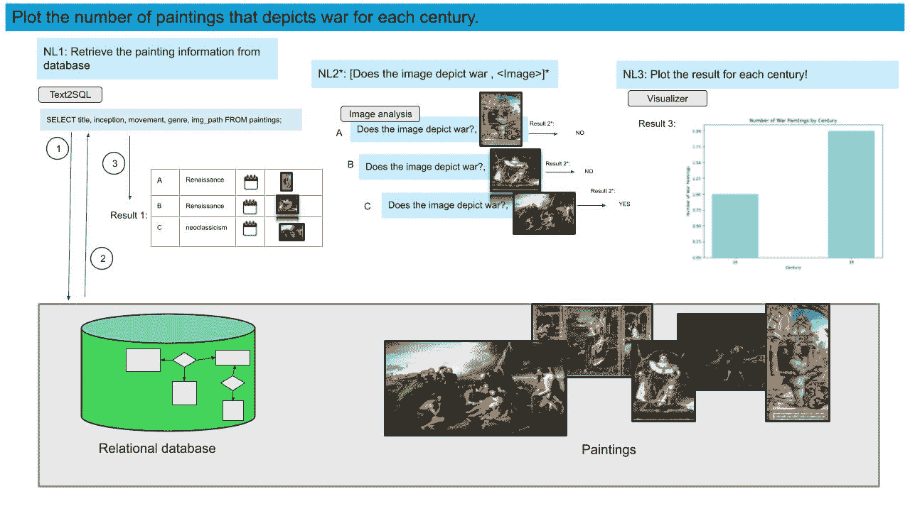

<!--yml
category: 未分类
date: 2025-01-11 11:43:28
-->

# Explainable Multi-Modal Data Exploration in Natural Language via LLM Agent

> 来源：[https://arxiv.org/html/2412.18428/](https://arxiv.org/html/2412.18428/)

Farhad Nooralahzadeh [noor@zhaw.ch](mailto:noor@zhaw.ch) Zurich University of Applied SciencesSwitzerland ,  Yi Zhang [zhay@zhaw.ch](mailto:zhay@zhaw.ch) Zurich University of Applied SciencesSwitzerland ,  Jonathan Fürst [fues@zhaw.ch](mailto:fues@zhaw.ch) Zurich University of Applied SciencesSwitzerland  and  Kurt Stockinger [stog@zhaw.ch](mailto:stog@zhaw.ch) Zurich University of Applied SciencesSwitzerland

###### Abstract.

International enterprises, organizations, or hospitals collect large amounts of multi-modal data stored in databases, text documents, images, and videos. While there has been recent progress in the separate fields of multi-modal data exploration as well as in database systems that automatically translate natural language questions to database query languages, the research challenge of querying database systems combined with other unstructured modalities such as images in natural language is widely unexplored.

In this paper, we propose XMODE ¹¹1The source code, data, and/or other artifacts have been made available at [https://github.com/yizhang-unifr/XMODE](https://github.com/yizhang-unifr/XMODE). - a system that enables explainable, multi-modal data exploration in natural language. Our approach is based on the following research contributions: (1) Our system is inspired by a real-world use case that enables users to explore multi-modal information systems. (2) XMODE leverages a LLM-based agentic AI framework to decompose a natural language question into subtasks such as text-to-SQL generation and image analysis. (3) Experimental results on multi-modal datasets over relational data and images demonstrate that our system outperforms state-of-the-art multi-modal exploration systems, excelling not only in accuracy but also in various performance metrics such as query latency, API costs, planning efficiency, and explanation quality, thanks to the more effective utilization of the reasoning capabilities of LLMs.

## 1\. Introduction

Consider a hospital in the near future in which doctors, nurses, and data scientists naturally access digital patient data. This data includes electronic health records (EHR), usually stored in relational databases ([sivasubramaniamsm3,](https://arxiv.org/html/2412.18428v1#bib.bib19) ), but also multimedia data such as medical images from CT scans or X-rays and the corresponding reports written by medical experts (unstructured data). Each participant seeks to interactively query all these datasets in natural language. Different participants also have different skill sets and exploration goals. Additionally, given the application domain, each user wants to understand exactly how the system evaluates their queries. A system that supports such a scenario would unlock a plethora of applications, from this medical example to queries over shared scientific databases (also containing structured data, text, images, and videos), queries over public datasets, and more. However, building such a system presents significant research challenges in understanding user intent, which often relies on complex queries, querying multimedia databases, and ensuring explainability.

(a) Medical Data Exploration

(b) Art Work Data Exploration

Figure 1\. Example workflows of multi-modal data exploration in natural language over heterogeneous data sources. A complex natural language question is decomposed into sub-questions to better enable answer explainability. Each sub-question is designated to a particular task (such as text-to-SQL translation or image analysis). These tasks may be expanded to utilize various tools and machine learning models to address specific downstream requirements necessary for answering a user’s natural language question.

To understand these challenges, a concrete scenario of multi-modal exploration involving a relational database, text documents, and images is outlined here.. Assume that a user asks the following question in natural language: Show me the progression of cancer lesions over the last 12 months of patients with lung cancer who are smokers. (see the upper part of Figure [1](https://arxiv.org/html/2412.18428v1#S1.F1 "Figure 1 ‣ 1\. Introduction ‣ Explainable Multi-Modal Data Exploration in Natural Language via LLM Agent") b). This seemingly straightforward query encapsulates several fundamental challenges in multifaceted data exploration. First, it requires the decomposition of a natural language query into semantically precise sub-queries, each targeting diverse data modalities while preserving the original intent. Critical to this process is optimizing the workflow sequence - determining which queries should be executed first to minimize computational overhead and maximize efficiency. For instance, filtering patients through structured database queries before retrieving and analyzing medical images significantly reduces the computational burden compared to analyzing all available images first. In our example in Figure 1, natural language $NL1$ is a text-to-SQL task to query the relational database for the name and age of patients diagnosed with lung cancer. The result is then used for $NL2$ - an image analysis task - looking for cancer lesions in those patients’ images. Finally, $NL3$ - a visualization task - shows the cancer progression for each patient. This workflow sequence is deliberately optimized: starting with structured data filtering before proceeding to more computationally intensive image analysis tasks. The complexity compounds when considering the temporal aspect of disease progression, which necessitates careful alignment of data across different modalities and timestamps. Furthermore, in healthcare settings, result verification and transparency are paramount. Users must be able to trace back any conclusions to the source data, understand how intermediate results were derived, and verify the accuracy of each analytical step. This necessitates a workflow where users can validate intermediate results before proceeding to subsequent analysis stages, with the ability to refine queries if the results don’t align with their clinical expectations.

Now imagine a museum or art gallery in the near future, where curators, researchers, and data scientists can naturally access and explore digital art collections. This data includes structured information about paintings, such as artist, title, medium, and subject matter, which is typically stored in a relational database. The collection also includes unstructured data, such as the full text of art critiques and descriptions, as well as digital images of the artworks. Similar to the previous use case for medical data exploration, also the use case for artwork exploration is multi-modal and requires analysis of heterogeneous data (e.g. tabular and image) as shown in Figure [1](https://arxiv.org/html/2412.18428v1#S1.F1 "Figure 1 ‣ 1\. Introduction ‣ Explainable Multi-Modal Data Exploration in Natural Language via LLM Agent")(b).

The goal of our paper is to support such multi-modal data exploration scenarios in natural language by designing and implementing a system to address the following challenges:

*   •

    Heterogeneous data exploration: How can we design a system that accurately interprets user queries in natural language for exploring heterogeneous data sources with high accuracy?

*   •

    Orchestrating multiple expert models and tools for data exploration: How can we automatically break down a user question into sub-questions that can later be organized into a workflow plan? How do we delegate these tasks to the appropriate expert models from the available toolbox, considering dependencies and the potential for parallel execution?

*   •

    Explainability: How can we design a system that facilitates multi-modal exploration, allowing end users to trace conclusions back to their source data, comprehend how intermediate results were generated, and identify situations where questions remain unanswered due to missing data?

Existing works on multi-modal data exploration in natural language follow mainly two paradigms (1) multiple modalities are embedded in a single query language, e.g., NeuralSQL ([bae2024ehrxqa,](https://arxiv.org/html/2412.18428v1#bib.bib1) ) embeds visual QA functions directly in SQL; (2) agentic workflows, in which different tools (e.g., relational database operators, vision model) are intelligently combined to answer a user-question such as Caesura ([urban2023caesura,](https://arxiv.org/html/2412.18428v1#bib.bib20) ).

In this paper, we propose XMODE - a multi-modal data exploration system that uses an Large language Model based agentic framework to tackle these challenges. The basic idea is to first decompose a complex natural language question into simpler sub-questions. Each question is then translated into a workflow of specific tasks. By applying smart planning, our approach can reason about which task in the workflow fails and thus re-plan that specific task rather than restarting the complete workflow. The advantage of our approach compared to similar systems such as Caesura ([urban2023caesura,](https://arxiv.org/html/2412.18428v1#bib.bib20) ) is that it enables parallel task execution through the construction of a directed acyclic task graph and requires a lower number of tokens from prompt engineering resulting in more efficient query execution times and API calling costs. The main contributions of our paper are as follows:

*   •

    Higher accuracy: XMODE is based on an agentic AI framework that shows higher accuracy for exploring multi-modal data than traditional work due to the smart orchestration of different tasks of the data exploration pipeline.

*   •

    Improved performance: XMODE demonstrates performance improvements compared to state-of-the-art through parallelism, reasoning and smart re-planning.

*   •

    Better explainability: XMODE enhances explainability by enabling a user to inspect the decisions and reasoning at each step that led to the final output, tracing back through the results of all previous steps.

*   •

    Generalizablilty: XMODE is designed and evaluated in a zero-shot setting, demonstrating its ability to perform complex tasks without relying on In-Context Learning (ICL), thereby improving both adaptability and accessibility.

## 2\. Related Work

##### Text-to-SQL systems.

The research field of text-to-SQL systems has seen tremendous progress over the last few years ([Floratou2024,](https://arxiv.org/html/2412.18428v1#bib.bib5) ; [pourreza2024din,](https://arxiv.org/html/2412.18428v1#bib.bib18) ) due to advances in large language models. Original success can be attributed to rather simplistic datasets consisting of databases with only several tables as in Spider ([yu2018spider,](https://arxiv.org/html/2412.18428v1#bib.bib24) ). Especially the introduction of new benchmarks such as ScienceBenchmark ([zhang2023sciencebenchmark,](https://arxiv.org/html/2412.18428v1#bib.bib27) ) or BIRD ([li2024can,](https://arxiv.org/html/2412.18428v1#bib.bib13) ) has further pushed these limits of these systems. Most of the research efforts have been restricted to querying databases in English apart from a few exceptions such as Statbot.Swiss ([noor2024,](https://arxiv.org/html/2412.18428v1#bib.bib17) ).

##### Explainability.

Explainability aims to provide a deeper understanding of how machine learning models make predictions by illuminating the decision-making processes within these models. It strives to offer transparency, enabling stakeholders to comprehend, trust, and effectively manage the outcomes produced by these models ([lundberg2017unified,](https://arxiv.org/html/2412.18428v1#bib.bib16) ; [kim2018interpretability,](https://arxiv.org/html/2412.18428v1#bib.bib10) ). Although there has been recent progress in artificial intelligence in general, for the task of data exploration in natural language, explainability is an open issue. Recently, in the multi-agent collaboration framework ([wang2023towards,](https://arxiv.org/html/2412.18428v1#bib.bib23) ), explainability has been designed to mimic human-like top-down reasoning by utilizing the extensive knowledge of Large Language Models (LLMs). For the task of text-to-SQL, explainability is basically an unexplored research topic with the exception of back-translating automatically generated SQL statements to natural language ([bandyopadhyay2020natural,](https://arxiv.org/html/2412.18428v1#bib.bib2) ; [von2022improving,](https://arxiv.org/html/2412.18428v1#bib.bib22) ; [zhang2023sciencebenchmark,](https://arxiv.org/html/2412.18428v1#bib.bib27) ). However, back translation is often not enough to fully explain how a system comes up with an answer and how to interpret the results.

##### Multi-modal systems.

Video Database Management Systems (VDBMSs) support efficient and complex queries over video data, but are often restricted to videos only (e.g., ([zhang2023equi,](https://arxiv.org/html/2412.18428v1#bib.bib25) ; [DBLP:journals/pvldb/KangBZ19,](https://arxiv.org/html/2412.18428v1#bib.bib7) ; [DBLP:conf/deem/KakkarCCXVDPBS023,](https://arxiv.org/html/2412.18428v1#bib.bib4) )). ThalamusDB ([jo2024,](https://arxiv.org/html/2412.18428v1#bib.bib6) ) enables queries over multi-modal data but requires SQL as input, with explicit identification of the predicates that should be applied to an attribute corresponding to video or audio data. Similarly, MindsDB²²2https://docs.mindsdb.com and VIVA ([DBLP:conf/cidr/KangRBKZ22,](https://arxiv.org/html/2412.18428v1#bib.bib8) ) require that users write SQL and manually combine data from relational tables and models. Vision-language models provide textual descriptions of video data ([zhang2024vision,](https://arxiv.org/html/2412.18428v1#bib.bib26) ), but are not designed to support precise, structured queries.

Most closely related to our approach are CAESURA ([urbanB24,](https://arxiv.org/html/2412.18428v1#bib.bib21) ), which supports natural language queries over multi-modal data lakes, and PALIMPZEST ([liu2024declarative,](https://arxiv.org/html/2412.18428v1#bib.bib15) ), which enables optimizing AI workload. The key distinction of our system, XMODE, is its focus on efficiently orchestrating various model calls and their dependencies. This approach not only improves latency and cost but also enhances accuracy by minimizing interference from the outputs of intermediate function calls.

Moreover, the related systems enable multi-modal queries across structured and unstructured data with a focus on query planning. However, these systems do not address enhancing the accuracy and explainability of the underlying model for natural language data exploration tasks. Explainability and answer justification are crucial in domains like medical data science, where medical device regulations mandate systems to provide detailed explanations of how specific results are obtained, ensuring that no potentially fatal medical treatment is recommended.

Figure 2\. XMODE system architecture.

## 3\. System Design

We now describe the design of our system called XMODE, which enables explainable multi-modal data exploration in natural language.

### 3.1\. System Architecture of XMODE

Figure 3\. XMODE system architecture in ArtWork  ([urban2023caesura,](https://arxiv.org/html/2412.18428v1#bib.bib20) ) with an example of processing a multi-modal query. The query is automatically decomposed into various components such as text2SQL, and image analysis which can be inspected by the user for explainability.

Figure 4\. XMODE system architecture in EHRXQA  ([bae2024ehrxqa,](https://arxiv.org/html/2412.18428v1#bib.bib1) ) with an example of processing a multi-modal query. The query is automatically decomposed into various components which can be inspected by the user for explainability.

The architecture of our system, XMODE, is illustrated in Figures [2](https://arxiv.org/html/2412.18428v1#S2.F2 "Figure 2 ‣ Multi-modal systems. ‣ 2\. Related Work ‣ Explainable Multi-Modal Data Exploration in Natural Language via LLM Agent"). We describe the five primary components of XMODE using an example query applied to artwork data, which includes relational tables and images: Plot the number of paintings that depict war for each century. The system’s operation is depicted in Figure  [3](https://arxiv.org/html/2412.18428v1#S3.F3 "Figure 3 ‣ 3.1\. System Architecture of XMODE ‣ 3\. System Design ‣ Explainable Multi-Modal Data Exploration in Natural Language via LLM Agent").

XMODE is an agentic system  ([kapoor2024ai,](https://arxiv.org/html/2412.18428v1#bib.bib9) ) driven by a llm-based dynamic planner pattern  ([kim2023llm,](https://arxiv.org/html/2412.18428v1#bib.bib11) ) equipped with a comprehensive toolkit containing all the necessary models to decompose a user’s question, such as a multi-modal natural language question, into a workflow (i.e., a graph of sub-questions). The workflow is represented as a Directed Acyclic Graph (DAG), of which each node corresponds to a simple sub-question with a specific tool assigned by the planner. The planner determines sub-tasks that can be executed in parallel and it manages their dependencies. XMODE is designed to be adaptable and to allow for dynamic debugging and plan modification (re-planning) if necessary, e.g., in case of failures during a text-to-SQL sub-task. As it shown in Figure [1](https://arxiv.org/html/2412.18428v1#S1.F1 "Figure 1 ‣ 1\. Introduction ‣ Explainable Multi-Modal Data Exploration in Natural Language via LLM Agent"), the design of XMODE incorporates multiple components:

1.  (1)

    Planning & Expert Model Allocation. The system analyzes the user question, then constructs a sequence of tasks to be executed considering their dependency. It determines the required expert models from an available toolkit for each task, as well as their input arguments and their inter-dependencies to synthesize them as a workflow. To do so, it employs the power of reasoning capability of LLMs. The output of this stage is a workflow in the form of a DAG that formalizes task dependencies. As we can see in Figure [3](https://arxiv.org/html/2412.18428v1#S3.F3 "Figure 3 ‣ 3.1\. System Architecture of XMODE ‣ 3\. System Design ‣ Explainable Multi-Modal Data Exploration in Natural Language via LLM Agent"), the original natural language question is split into four tasks $t_{1}$ to $t_{4}$, namely text2SQL, image_analysis, data_preparation and data_plotting. We leverage LLMs’ reasoning ability to generate a workflow from natural language questions by providing detailed specifications of each expert model available in the toolkit.

2.  (2)

    Execution and Self-Debugging. The system executes tasks according to a generated workflow by calling allocated expert models from a toolkit. The system employs a state object that stores all the intermediate interactions during the execution of a workflow. The independent tasks are executed concurrently and after completing each task, the outcomes are passed on as input to the tasks that rely on them according to the workflow. Each expert model has an inner self-debugging component to handle errors that can occur during its execution. As we can see in the middle of Figure [3](https://arxiv.org/html/2412.18428v1#S3.F3 "Figure 3 ‣ 3.1\. System Architecture of XMODE ‣ 3\. System Design ‣ Explainable Multi-Modal Data Exploration in Natural Language via LLM Agent"), XMODE provides reasoning in natural language for each task which can easily be understood by humans.

3.  (3)

    Decision Making. In this part, XMODE synthesizes results from a state object and inspects them for a final decision. If the task results are sufficient to fulfill a user request, it will prepare the final results to respond to the user, otherwise it will request the planning component to re-plan a new workflow by providing the intermediate results and reasons for re-planning. This process repeats until the decision making components are satisfied with the final outcome to present to the user or the maximum loop limit is reached. This component benefits from the reasoning capability of LLMs in the decision making process.

4.  (4)

    Expert Models & Tools. This component contains expert models such as machine learning models that perform specific downstream tasks such as text-to-SQL, image analysis, and text analysis. It also contains particular tools such as data formatting and plotting tools. Taking into account various use cases, the toolkit section of XMODE provides access to these models and tools. Each expert model or tool should include a description and argument specifications and they will be available to the planning module.

5.  (5)

    Data Lake. A repository containing structured and unstructured data such as tabular data, images, and text. Each model expert and tool has direct access to the repository to conduct the assigned task.

Our current XMODE implementation offers a range of features, including query debugging, query re-planning, optimization and explainability to better understand how a natural language question is decomposed into multiple sub-tasks. Each feature of our system is available at varying levels of complexity.

## 4\. Experiments

In this section, we evaluate the performance of our system XMODE. In particular, we want to address the following research questions:

*   •

    How well does XMODE tackle multi-modal natural language questions on two different datasets consisting of tabular data, and images?

*   •

    How does the system perform compared to state-of-the-art systems such as CAESURA ([urbanB24,](https://arxiv.org/html/2412.18428v1#bib.bib21) ) and NeuralSQL ([bae2024ehrxqa,](https://arxiv.org/html/2412.18428v1#bib.bib1) )?

*   •

    Which explanations does the system provide to justify the answers?

### 4.1\. Experimental Setup

#### 4.1.1\. Datasets

For our experiments, we used two different datasets, namely information about artwork as well as electronic health records.
Dataset 1: Artwork. We use the artwork dataset introduced by ([urbanB24,](https://arxiv.org/html/2412.18428v1#bib.bib21) ). This dataset contains information about paintings in tabular form as well as an image collection containing 100 images of the artworks. This data is taken from Wikipedia. The tabular data contains metadata information about paintings such as title, inception, movement, etc. as well as a reference to the respective paintings. A typical example question from this dataset is Plot the number of paintings depicting war for each century (as previously shown in Figure [3](https://arxiv.org/html/2412.18428v1#S3.F3 "Figure 3 ‣ 3.1\. System Architecture of XMODE ‣ 3\. System Design ‣ Explainable Multi-Modal Data Exploration in Natural Language via LLM Agent")). In addition to the 24 existing questions in the artwork dataset, we propose six new questions aimed at evaluating parallel task planning and execution, facilitating a comparison between the characteristics of the two architectures. These six questions incorporate both single and multiple modalities. Moreover, four of the six questions require responses in various formats: two questions demand two plots, and two questions involve a combination of plotting and showing the results in a specific data structure, i.e. either as a tabular format or as a JSON format. The final test dataset contains 30 natural language questions derived from the original 24 in the artwork dataset. These include 8 queries seeking a single result value, 11 requiring structured data as output, and 11 requesting a plot. Of these, 18 queries involve multi-modal data, while the remaining 12 are based exclusively on relational data.

We have chosen this dataset to directly compare our system with CAESURA ([urbanB24,](https://arxiv.org/html/2412.18428v1#bib.bib21) ), one of the state-of-the-art systems for multi-modal data exploration in natural language.

Dataset 2: Electronic Health Records (EHR). We also utilized the EHRXQA ([bae2024ehrxqa,](https://arxiv.org/html/2412.18428v1#bib.bib1) ) dataset, a multi-modal question answering dataset that integrates structured electronic health records (EHRs) with chest X-ray images. This dataset consists of 18 tables and 432 images, and specifically requiring cross-modal reasoning. The questions of EHRXQA are categorized based on their scope in terms of modality and patient relevance. For modality-based categorization, questions were classified into three types: Table-related, image-related, and table-image-related, based on the data modality required. The patient-based categorization classified questions based on their relevance to a single patient, a group of patients, or none (i.e., unrelated to specific patients). We have chosen this dataset since it was used to evaluate NeuralSQL, another state-of-the-art system for multi-modal data exploration. To manage the cost of an API call, we extracted randomly 100 questions. The selection process was guided by three predefined categories within the test set of the EHRXQA dataset: Image Single-1, Image Single-2, and Image+Table Single.

Here are examples from each category, taken from the original paper ([bae2024ehrxqa,](https://arxiv.org/html/2412.18428v1#bib.bib1) ). All questions in these categories require multi-modal data exploration for the reasoning process.

*   •

    Image Single-1: Given the last study of patient 15439, which anatomical finding is associated with the right lower lung zone, pneumothorax or vascular redistribution?

*   •

    Image Single-2: Enumerate all newly detected diseases in the last study of patient 19290 in 2103 compared to the previous study.

*   •

    Image+Table Single: Did a chest X-ray study for patient 15110 reveal any anatomical findings within 2 months after the prescription of hydralazine since 2021?

#### 4.1.2\. Baseline Systems and Setup

We compare XMODE to the baseline implementations of CAESURA ([urbanB24,](https://arxiv.org/html/2412.18428v1#bib.bib21) ) and NeuralSQL ([bae2024ehrxqa,](https://arxiv.org/html/2412.18428v1#bib.bib1) ) - two important state-of-the-art systems for multi-modal data exploration.

CAESURA supports natural language queries over a multi-modal data lake leveraging BLIP-2 ([li2023blip,](https://arxiv.org/html/2412.18428v1#bib.bib14) ) for visual question answering and BART ([lewis2020bart,](https://arxiv.org/html/2412.18428v1#bib.bib12) ) for text question answering. We reproduced the results of CAESURA on the Artwork dataset using GPT4o. To compare to our system, we utilize GPT4o as an LLM and the same model for visual question answering (i.e., BLIP-2) in XMODE.

In NeuralSQL, an LLM is integrated with an external visual question answering system, M3AE model  ([10.1007/978-3-031-16443-9_65,](https://arxiv.org/html/2412.18428v1#bib.bib3) ), to handle multi-modal questions over a structured database with images by translating a user question to SQL in one step. To ensure that we used the optimal hyperparameter settings and prompt structure, we contacted the authors of EHRXQA ([bae2024ehrxqa,](https://arxiv.org/html/2412.18428v1#bib.bib1) ), who provided the results of their experiment for NeuralSQL using GPT-4o on 100 randomly selected questions.

For XMODE, we employ the M3AE model with task-specific fine-tuned weights, provided by  ([bae2024ehrxqa,](https://arxiv.org/html/2412.18428v1#bib.bib1) ), for the image analysis task. The customized M3AE model is encapsulated as a web service and is deployed on the same computing node described in Section [4.1.4](https://arxiv.org/html/2412.18428v1#S4.SS1.SSS4 "4.1.4\. Hardware Setup ‣ 4.1\. Experimental Setup ‣ 4\. Experiments ‣ Explainable Multi-Modal Data Exploration in Natural Language via LLM Agent")

#### 4.1.3\. Evaluation Metrics

To evaluate XMODE against state-of-the-art systems, we use the following metrics:

*   •

    Accuracy: Measures the accuracy (i.e., exact match) of the generated result set compared with the gold standard result set or with the human expert.

*   •

    Steps: Number of steps required by the respective system to come up with the final result. These steps include reasoning, planning, re-planning etc.

*   •

    Tokens: Number of tokens used for prompt engineering.

*   •

    Latency: End-to-end execution time for a system to come up with the final result.

*   •

    API costs: Costs for calling the LLM, e.g. for GPT4o.

We apply the above-mentioned metrics under various question and system categories:

*   •

    Modality: Questions can either be of single modality, i.e. querying only relational data or image data, or of multiple modality, i.e. querying both relational and image data.

*   •

    Output Type: The output type of a question can either be a single value, e.g. true or false, a data structure, e.g. in tabular or JSON format, a plot, or a combination of plots and data structures.

*   •

    Workflow: The generated workflow plan can either be sequential or parallel.

Finally, we evaluate if a system generates a correct (multi-modal) query plan (i.e. generated plan), and if it supports re-planning.

#### 4.1.4\. Hardware Setup

We conduct the following experiments using a CUDA-accelerated computational node on an OpenStack virtual host. This node is equipped with a 16-core CPU, 16 GB of main memory, and 240 GB of SSD storage. Additionally, it features an NVIDIA T4 GPU with 16 GB of dedicated graphics memory.

### 4.2\. Results on the Artwork Dataset

We first evaluate the results on the artwork dataset and afterward on the EHR dataset.

#### 4.2.1\. Performance Results

 | System | Category | Accuracy | Steps | Tokens | Latency [s] | API Cost [USD] | Generated Plan | Re-planning |
| CAESURA | Modality | Single (15) | 60.00% | 152 | 214,014 | 973.28 | 1.33 | 80% | No |
| Multiple (15) | 6.67% | 164 | 268,918 | 4,847.95 | 1.65 |
| Output Type | Single Value (8) | 37.50% | 88 | 135,077 | 1,047.24 | 0.82 |
| Data Structure (10) | 50.00% | 116 | 183,454 | 2,683.03 | 1.14 |
| Plot (8) | 25.00% | 79 | 112,732 | 1,856.66 | 0.69 |
| few-shot ($n=4$) | Plot-Plot (2) | 0% | 16 | 21,508 | 108.87 | 0.14 |
| in planning | Plot-Data Structure (2) | 0% | 17 | 30,161 | 125.42 | 0.19 |
|  | Workflow | Sequential (24) | 41.67% | 261 | 399,045 | 5,330.12 | 2.45 |
|  | Parallel (6) | 0% | 55 | 83,887 | 491.11 | 0.52 |
|  | Overall (30) | 33.33% | 316 | 482,932 | 5,821.23 | 2.98 |
| XMODE | Modality | Single (15) | 100.00% | 96 | 159,212 | 525.09 | 0.61 |  |  |
| Multiple (15) | 26.67% | 107 | 326,400 | 2,515.03 | 1.49 | 100% | Yes |
| Output Type | Single Value (8) | 50.00% | 56 | 71,575 | 494.78 | 0.39 |
| Data Structure (10) | 50.00% | 67 | 223,528 | 1,330.40 | 0.89 |
| Plot (8) | 75.00% | 52 | 118,431 | 798.97 | 0.48 |
| zero-shot | Plot-Plot (2) | 100.00% | 14 | 50,108 | 308.92 | 0.22 |
|  | Plot-Data Structure (2) | 100.00% | 14 | 21,970 | 107.05 | 0.10 |
|  | Workflow | Sequential (24) | 62.50% | 163 | 338,766 | 2,131.11 | 1.51 |
|  | Parallel (6) | 66.67% | 40 | 146,846 | 909.01 | 0.59 |
|  | Overall (30) | 63.33% | 203 | 485,612 | 3,040.12 | 2.10 | 

Table 1\. Performance metrics of Caesura ([urban2023caesura,](https://arxiv.org/html/2412.18428v1#bib.bib20) ) and XMODE on the artwork dataset.

Table [1](https://arxiv.org/html/2412.18428v1#S4.T1 "Table 1 ‣ 4.2.1\. Performance Results ‣ 4.2\. Results on the Artwork Dataset ‣ 4\. Experiments ‣ Explainable Multi-Modal Data Exploration in Natural Language via LLM Agent") presents a comparison of XMODE and CAESURA on the artwork dataset across various aspects. The performance metrics for each aspect were determined through a manual evaluation conducted by our team of four researchers. The comparison between XMODE and CAESURA reveals notable differences in their performance across various aspects of the artwork dataset. Starting with the metric accuracy for evaluating queries of different modalities: XMODE outperforms CAESURA in both single- and multi-modality questions. For single cases, XMODE achieves an output accuracy of 100.00%, while CAESURA falls behind at 60.00%. In the more challenging multiple-modality scenarios, XMODE demonstrates a significant edge with 26.67% accuracy, compared to CAESURA’s much lower 6.67%.

The accuracy based on the output types shows that for single-value outputs CAESURA achieves an accuracy of 37.5%, while XMODE yields 50%. XMODE’s edge is even more evident for complex tasks where the output is plot, plot-plot, or plot-data structure. Here XMODE reaches an accuracy of 75%, 100%, and 100%, respectively, significantly surpassing CAESURA’s performance of 25%, 0%, and 0%, respectively.

Moreover, CAESURA requires sequential reasoning and acting for each natural language question which can result in high latency, cost, and sometimes inaccurate behavior. XMODE identifies dependencies between tasks during workflow planning and thus enables concurrent and parallel task execution. On a set of six new questions requiring parallel task planning and execution, CAESURA fails entirely, while XMODE successfully generates proper plans and achieves 66.67% accuracy.

Overall, XMODE emerges as the stronger system, with an overall output accuracy of 63.33%, compared to CAESURA’s 33.33%. XMODE distinguishes itself with its ability to provide better explanations, support re-planning, and concurrency—features absent in CAESURA.

From an efficiency perspective, XMODE demonstrates significant advantages over CAESURE in several areas. It requires fewer steps (203 vs. 316) and achieves significantly lower latency (3,040.12 ms vs. 5,821.23 ms) demonstrating a faster response time. Finally, XMODE also incurs a lower API cost (2.10) compared to CAESURA’s 2.98, indicating that XMODE is more cost-effective in terms of API usage.

In summary, the experiment results using the artwork benchmark showed that XMODE consistently outperforms CAESURA in accuracy, efficiency, and feature support, demonstrating its robustness across a variety of tasks on the artwork dataset. Its ability to handle complex outputs, provide explanations, and adapt through replanning positions it as the better choice in this benchmark.

#### 4.2.2\. Optimizations of XMODE Explained with Examples

To better demonstrate advantages of XMODE, we provide several examples (see Figures [3](https://arxiv.org/html/2412.18428v1#S3.F3 "Figure 3 ‣ 3.1\. System Architecture of XMODE ‣ 3\. System Design ‣ Explainable Multi-Modal Data Exploration in Natural Language via LLM Agent") and [5](https://arxiv.org/html/2412.18428v1#S4.F5 "Figure 5 ‣ 4.2.2\. Optimizations of XMODE Explained with Examples ‣ 4.2\. Results on the Artwork Dataset ‣ 4\. Experiments ‣ Explainable Multi-Modal Data Exploration in Natural Language via LLM Agent")) across three key aspects: explanations, smart replanning, and parallel planning. The following examples provide a detailed illustration of these three aspects.

{mdframed}

[hidealllines=true,backgroundcolor=cyan!20,innerleftmargin=3pt,innerrightmargin=3pt,leftmargin=-1pt,rightmargin=-1pt]

Example 1: Plot the number of paintings that depict war for each century (see Figure [3](https://arxiv.org/html/2412.18428v1#S3.F3 "Figure 3 ‣ 3.1\. System Architecture of XMODE ‣ 3\. System Design ‣ Explainable Multi-Modal Data Exploration in Natural Language via LLM Agent")).

Figure 5\. Optimization of XMODE: Smart replanning.

Through a series of well-planned and systematically executed steps, the model demonstrates not only how it processes the query but also how it provides transparency and reasoning at every stage, ensuring the user understands the process and results. The figure depicts a workflow that involves (1) Planning & Expert Model Allocation, (2) Execution & Self-Debugging, and (3) Decision Making. Here’s a breakdown of each step:
1) Planning & Expert Model Allocation: The process begins with the query being broken down into a sequence of subtasks: Task 1: Retrieve painting metadata, including their years and associated centuries, from the database. Task 2: Analyze the images to determine whether they depict war. Task 3: Prepare the data by counting the number of war-related paintings per century. Task 4: Visualize these counts in a bar chart.

Each task is allocated to specialized tools or models, such as text2SQL to translate the natural language question to SQL and database retrieval, image analysis tools for visual interpretation, coding tools to structure the data, and visualization libraries like matplotlib. This stage establishes a clear plan, showing how the overall query will be tackled in logical steps.
2) Execution & Self-Debugging: The model begins executing the tasks, providing explanations and outputs at every stage to ensure clarity. Task 1 - Retrieving Data: The model constructs a SQL query to retrieve the required information from the database. It explains its reasoning: to determine the century of each painting, it converts the inception year into century values. The result is a list of paintings, each associated with its image path and century. Task 2 - Image Analysis: With the retrieved data, the model analyzes each painting to determine if it depicts war. It applies image analysis tools to interpret the visual content of the paintings. The reasoning here is clear—war-related imagery, such as battles or soldiers, must be identified to answer the query. The output is a dataset indicating whether each painting depicts war. Task 3 - Data Preparation: The model filters and aggregates the data, counting the number of paintings depicting war for each century. It explains that grouping the paintings by century allows for easy comparison of trends across time periods. The result is a concise summary: 1 painting from the 16th century and 2 from the 18th century are identified as depicting war. Task 4 - Data Visualization: Finally, the model prepares a bar chart to visualize the results. It explains its reasoning for choosing this visualization: bar charts effectively compare counts across categories, in this case, centuries. A Python script is provided, showing how the chart was generated, and the output is saved as an image for user reference.
3) Decision Making: When the tasks are completed, the model reflects on its work and provides a final output based on its thought as Summary:"The number of paintings depicting war has been plotted for the 16th and 18th centuries.", "Details": "The analysis identified 1 painting from the 16th century and 2 paintings from the 18th century that depict war. The plot visualizes these findings. [..]”. Throughout the workflow, the model demonstrates a commitment to transparency.

At every stage, XMODE provides reasoning to justify its actions, from choosing SQL for retrieval to selecting a bar chart for visualization. Intermediate outputs, like the dataset of war paintings and the Python plotting code, are made visible, ensuring the user can trace the steps taken. The decision making phase wraps up the process by summarizing findings, clarifying the approach, and sharing the final visual result. This shows that XMODE not only answers the query effectively but also ensures its steps are understandable, logical, and well-documented, building trust in its analysis.

Figure 6\. Optimization of XMODE: Parallel planning.

{mdframed}

[hidealllines=true,backgroundcolor=cyan!20,innerleftmargin=2pt,innerrightmargin=3pt,leftmargin=-1pt,rightmargin=-1pt] Example 2 - Smart Replanning: What is depicted on the oldest Renaissance painting in the database? (see Figure [5](https://arxiv.org/html/2412.18428v1#S4.F5 "Figure 5 ‣ 4.2.2\. Optimizations of XMODE Explained with Examples ‣ 4.2\. Results on the Artwork Dataset ‣ 4\. Experiments ‣ Explainable Multi-Modal Data Exploration in Natural Language via LLM Agent")). Contrary to the previous example, XMODE here involves smart replanning - a major optimization technique of XMODE. The main idea is to dynamically adapt the planning in case some tasks of the workflow fail or do not produce any results. Here’s a breakdown of each step:
1) Planning & Expert Model Allocation: XMODE outputs the initial workflow plan that has 2 tasks. The first task involves retrieving the image path and the year of the oldest Renaissance painting in the database using a ”text2SQL” expert model. It also involves an ”image_analysis” expert model in the second task, which aims to determine what is depicted in the image.
2) Execution and Self-Debugging: XMODE takes the information about the planned workflow as well as task dependencies and puts it into action. In Task 1, it comes with a reasoning statement to generate the SQL query as: SELECT img_path, strftime(’%Y’, inception) AS year FROM paintings WHERE movement = ’Renaissance’ ORDER BY inception ASC LIMIT 1. Then it executes the query over the Artwork database and retrieves the specific image path and year for the oldest Renaissance painting as [’img_path’: ’images/img_0.jpg’, ’year’: ’1438’]. This allows the model to access the actual painting data in the subsequent task.

In Task 2, XMODE utilizes the ”image_analysis” expert model (i.e. visual question answering based on BLIP) to examine the contents of img_0.jpg to answer the question: What is depicted in the image? The output of this task is transferred as a final result to the decision making component. At this point, the model’s ”thought” process in this component becomes evident. It reasons that while it knows that img_0.jpg is a painting, the details about what is depicted in the painting have not been provided. Therefore, the model decides to not provide a final answer to the user and does replanning.

The replanning capability is a crucial aspect of the XMODE’s approach. Rather than blindly accepting the final answer which does not produce a satisfiable or correct result, the model recognizes the need to replan and calls the ”image_analysis” module again. Since the model already knows which image in the database contains the oldest Renaissance painting, it smartly plans the ”image_analysis” task as Task 3, by reformulating the question as What is specifically depicted in the painting? XMODE then executes the task, and receives the more concrete answer ”umbrellas”.

Moving forward, the decision making component confirms the details about the painting. Here, it verifies that the information it has gathered so far aligns with the natural language question and makes sense as a comprehensive understanding of the oldest Renaissance painting. The key aspect is the model’s ability to replan effectively and to strategically leverage the available information to avoid repeating tasks. {mdframed}[hidealllines=true,backgroundcolor=cyan!20,innerleftmargin=3pt,innerrightmargin=3pt,leftmargin=-1pt,rightmargin=-1pt] Example 3 - Parallel Planning: In the Renaissance, find the total number of paintings depicting war and the number of paintings depicting swords (see Figure [6](https://arxiv.org/html/2412.18428v1#S4.F6 "Figure 6 ‣ 4.2.2\. Optimizations of XMODE Explained with Examples ‣ 4.2\. Results on the Artwork Dataset ‣ 4\. Experiments ‣ Explainable Multi-Modal Data Exploration in Natural Language via LLM Agent")). The figure illustrates how XMODE process a complex query about Renaissance paintings, focusing on identifying how many paintings depict war and how many depict swords. The pipeline is structured to combine parallel task execution with step-by-step explanations, ensuring clarity and efficiency throughout the process.

The process begins in the Planning & Expert Model Allocation, where the model breaks down the user’s query into distinct subtasks. These subtasks are assigned to specialized modules: Task 1 ”text2SQL”: This task retrieves image paths and relevant metadata for Renaissance paintings from a database using a SQL query. Task 2 ”image_analysis”: This task examines whether each painting depicts war. Task 3 ”image_analysis”: Simultaneously, another module analyzes whether each painting depicts a sword. Task 4 ”data_preparation”: This task consolidates the results from Task 2 and Task 3 to count and summarize the paintings.

The execution phase begins with Task 1, where the model generates and runs a SQL query. The reasoning provided for this step explains how the schema is understood and how the query ensures that only Renaissance paintings are retrieved. The output of Task 1 includes image paths and metadata, which are then sent to the next stage.

At this point, the model showcases its parallel planning capability. Tasks 2 and 3 are performed concurrently: For Task 2, the system uses image analysis to determine if each painting depicts war. For Task 3, a similar image analysis process identifies paintings that depict swords. Running these tasks in parallel significantly speeds up the workflow, as they operate independently of each other. Once the image analysis tasks are complete, the model transitions to Task 4, where it aggregates the results. The reasoning here details how the system compiles two lists - one for paintings depicting war and one for those depicting swords. Afterwards, XMODE counts the entries in each list. The final results are prepared for the decision making module.

In the decision making phase, the model reflects on its findings. It confirms that sufficient data was processed to answer the query and provides a summary: "There is 1 painting depicting war and 38 paintings depicting swords.”

XMODE offers details, explaining how the analysis was conducted and highlighting the disparity between the two categories of paintings. The system further provides an explanation of its methodology, emphasizing how it worked systematically to answer the query. This demonstrates XMODE’s ability to manage tasks efficiently through parallel execution and to ensure transparency through reasoned explanations at every step. By combining these capabilities, the system provides a clear, accurate, and well-supported response to the user’s query.

It is important to note that we did not compare XMODE to NeuralSQL on ArtWork’s questions, as such a comparison would be unfair due to NeuralSQL’s inability to support plotting.

### 4.3\. Results on the EHRXQA Dataset

In this section, we evaluate the performance of NeuralSQL and XMODE on the EHRXQA dataset. This comparison excludes metrics like steps, tokens, and latency because evaluating XMODE’s performance on these aspects against NeuralSQL is not meaningful. NeuralSQL generates the final answer in a single step without providing a plan or intermediate steps, whereas our approach focuses on decomposing natural language questions, planning workflows, and responding transparently.

We also exclude CAESURA from the EHRXQA experiments. While CAESURA is intended to be a general-purpose multimodal system, it processes the relational database through multiple steps, examining each table and relationship sequentially. This limitation introduces significant overhead when handling the complex data schema of the EHRXQA dataset (there are 18 tables) during the discovery phase. Consequently, reproduing CAESURA on EHRXQA questions fails to perform inferences at the early stages of the planning phase, ultimately terminating after exceeding the maximum number of allowed attempts.

 | System | Scope | Output Type | Overall (100) | Generated | Replanning |
| Image Single-1 | Image Single-2 | Image+Table Single | Binary | Categorical | Plan |
| (30) | (30) | (40) | (50) | (50) |
| NeuralSQL | zero-shot | 0.00% | 0.00% | 0.00% | 0.00% | 0.00% | 0.00% | N/A | No |
| few-shot ($n=10$) | 26.67% | 20.00% | 47.50% | 48.00% | 18.00% | 33.00% |
| XMODE | zero-shot | 23.33% | 43.33% | 77.50% | 74.00% | 28.00% | 51.00% | 98% | Yes | 

Table 2\. Performance metrics of NeuralSQL (zero-shot and few-shot) and XMODE (zero-shot) on the EHRXQA dataset.

(a) CAESURA

(b) XMODE

Figure 7\. Error analysis of CAESURA ([urban2023caesura,](https://arxiv.org/html/2412.18428v1#bib.bib20) ) (a) and XMODE (b) on the ArtWork dataset across different steps.

Table [2](https://arxiv.org/html/2412.18428v1#S4.T2 "Table 2 ‣ 4.3\. Results on the EHRXQA Dataset ‣ 4\. Experiments ‣ Explainable Multi-Modal Data Exploration in Natural Language via LLM Agent") demonstrates the experimental results of XMODE against NeuralSQL on the EHRXQA dataset. Our evaluation encompasses three scope categories: single-table queries with one image (Image Single-1), single-table queries with two images (Image Single-2), and multiple-table queries with single images (Image+Table Single). XMODE demonstrates robust performance across all evaluation metrics, achieving an overall accuracy of 51.00%. Notably, XMODE excels in handling multiple-table scenarios, where it achieves 77.50% accuracy, significantly outperforming NeuralSQL’s 47.50% in the 10-shot setting. For single-table queries, XMODE shows strong performance with 43.33% accuracy on two-image queries, though it achieves a slightly lower score (23.33%) compared to NeuralSQL’s 10-shot performance (26.67%) on single-image queries.

When examining the output types, XMODE exhibits particularly strong performance on binary questions, achieving 74.00% accuracy compared to NeuralSQL’s 48.00%. For categorical questions, both systems show lower performance, with XMODE reaching 28.00% and NeuralSQL achieving 18.00% in the 10-shot setting.

A key distinguishing feature of XMODE is its comprehensive functionality beyond raw accuracy. Unlike NeuralSQL, XMODE generates executable plans with 98% coverage, provides explanations for traceability of final outputs, and supports dynamic replanning capabilities. In contrast, NeuralSQL, even in its 10-shot configuration, lacks these additional features and shows no performance in the zero-shot setting across all metrics. These results highlight XMODE’s effectiveness as a more complete solution for EHRXQA tasks, particularly in complex scenarios involving multiple tables and binary decisions, while also offering important auxiliary features for practical deployment.

### 4.4\. Error Analysis

In this section, we conduct a comprehensive analysis of errors encountered during the evaluation process. These errors are systematically classified into the following categories:

*   •

    Planning Errors: These errors stem from incorrect or incomplete task planning, such as task decomposition, the generation of completely faulty natural language questions, etc.

*   •

    Text-to-SQL Errors: Errors where the generated SQL fails to accurately retrieve the intended data.

*   •

    Image Analysis Inaccuracy: Errors caused by inaccurate outputs from the image analysis model, even when the underlying task plan is correct.

*   •

    Plot Generation Errors: Errors where plots are completely not generated, partially generated or incorrectly visualized, thereby failing to meet expected outcomes.

To systematically analyze key issues, we prioritize the identified categories based on their inter-dependencies during task execution. The priority sequence of these categories is defined as follows: task planning ¿ text-to-SQL generation ¿ Image analysis ¿ plot generation. Only the first affected category is considered if an error occurs at any stage, which may involve issues across multiple categories. For instance, if an error is detected during the planning phase but the subsequent tasks are successful, and another error occurs at the later plot generation stage, only the error in the planning phase is counted. In this case, the sample is classified under the Planning Error category.

This approach to error analysis is grounded in the logical dependency structure of the tasks. Since each task is a prerequisite for the succeeding one, a failure in an earlier task renders the success of subsequent tasks irrelevant to the overall reasoning process. As a result, errors are attributed to the earliest point of failure better to reflect the hierarchical nature of the task dependencies, thereby facilitating targeted optimization.

#### 4.4.1\. Error Analysis on the Artwork Dataset.

As illustrated in Figure [7](https://arxiv.org/html/2412.18428v1#S4.F7 "Figure 7 ‣ 4.3\. Results on the EHRXQA Dataset ‣ 4\. Experiments ‣ Explainable Multi-Modal Data Exploration in Natural Language via LLM Agent") (a), a total of 20 errors are identified out of 30 inference tasks for CAESURA. Of these, 14 errors occur within CAESURA’s sequential workflow. The errors include three single-modal questions and 11 multi-modal questions. Among the three single-modal, one task could not be resolved due to insufficient data available in the data pool. Following this failure, CAESURA attempts to replan twice but ultimately generates an incorrect plan, and consequently results in an erroneous response. The remaining two errors in single-modal tasks were classified as Plot Generation Errors, which are caused by inconsistencies in the time axis units of the plot output.

For 11 errors in multi-modal questions, five are related to single-value outputs, four to plots, and three to data structures. All of these errors are attributed to incorrect outputs generated by the image analysis model. After further research, we found two ambiguous tasks in classifying the error categories. (1) Plot the number of paintings that depict war for each year and (2) What is depicted on the oldest religious artwork in the database? Both tasks failed due to improperly parsed sub question for the image analysis task, specifically the oversimplified term “war.” While this term is semantically related to the correct natural language question, “Does the image depict war?”, it does not fully capture the intent of the task. As a result, it cannot be classified as a completely faulty question. Notably, the XMODE model generated correct results for these tasks, underscoring the limitations of CAESURA’s approach in handling subtle semantic distinctions.

In questions which require a parallel workflow - including two data structure , two plot—plot, and two plot—data structure outputs — errors are observed at the early planning stage. Our analysis reveals that CAESURA encounters significant challenges in generating accurate plans for embarrassingly parallel tasks. For two of these tasks, the system fails to generate any plan at all. For the remaining four tasks, CAESURA can provide partial results for some subtasks, but other subtasks are left unanswered, reflecting a broader issue in its ability to manage parallel planning. Our XMODE system successfully generates the appropriate plans for all tasks. In addition, all text-to-SQL steps , data preparation pipelines, and plot outputs, where required, are validated as correct. As illustrated in Figure [7](https://arxiv.org/html/2412.18428v1#S4.F7 "Figure 7 ‣ 4.3\. Results on the EHRXQA Dataset ‣ 4\. Experiments ‣ Explainable Multi-Modal Data Exploration in Natural Language via LLM Agent")(b), the only source of errors is the inaccurate output of the image analysis model, which accounted for 11 errors.No other errors are located in the text-to-SQL task, plot generation, or task planning deficiencies. This analysis highlights the image analysis model as the bottleneck in system performance, underscoring the need for further refinement in its predictive accuracy.

#### 4.4.2\. Error Analysis on the EHRXQA Dataset

Since NeuralSQL is a one-step approach lacking task planning and explainability, we are unable to localize the source of errors as systematically as in the XMODE or CAESURA systems. Consequently, we focus our error analysis solely on the XMODE system using the EHRXQA dataset.

Figure [8](https://arxiv.org/html/2412.18428v1#S4.F8 "Figure 8 ‣ 4.4.2\. Error Analysis on the EHRXQA Dataset ‣ 4.4\. Error Analysis ‣ 4\. Experiments ‣ Explainable Multi-Modal Data Exploration in Natural Language via LLM Agent") presents the distribution of 49 errors across various steps, categorized by their respective scopes: Image Single-1 (23 errors), Image Single-2 (17 errors), and Image+Table Single (9 errors). Among these, 36 errors are associated with the categorical scope, with 20 attributed to Image Single-1 and 16 to Image Single-2. In contrast, errors linked to the binary output type are primarily found in the Image+Table Single scope. Specifically, Image Single-1 contributes three binary errors, Image Single-2 accounts for one, and Image+Table Single includes nine, summing up to 13 binary errors out of the total 49. Considering the uneven distribution of errors across various output types and scopes, we identified inaccurate image analysis — primarily driven by the M3AE model ([10.1007/978-3-031-16443-9_65,](https://arxiv.org/html/2412.18428v1#bib.bib3) ) — as the main source of errors. Our analysis reveals that errors linked to categorical output types (36) are nearly three times higher than those associated with binary output types (13). This suggests that the error pattern is less related to the task difficulty across different scopes and more influenced by the output type, as binary questions demonstrate a statistically higher success rate compared to categorical ones. Notably, the Image + Table Single scope exclusively utilizes binary output types.

To gain a deeper understanding, a step-by-step error analysis reveals that out of the 23 errors in the Image Single-1 scope, 22 are due to inaccuracies in image analysis, while only one is related to a misstep in the text-to-SQL process. The specific question text for this case is: “Catalog all the anatomical findings seen in the image, given the first study of patient 11801290 on the first hospital visit.” The generated SQL query fails to include the condition specifying the first study, resulting in an incorrect output. In the Image Single-2 category, 16 out of 17 total errors are due to inaccurate image analysis, with one error attributed to the text-to-SQL step. The specific query in question is: “Does the second-to-last study of patient 16345504 this year reveal still-present fluid overload/heart failure in the right lung compared to the first study this year?”. The text-to-SQL task fails to correctly retrieve the first and last study of this year as required, instead erroneously returning multiple studies from the current year. In the Image+Table Single scope, all nine errors involve binary output types. Of these, six result from inaccurate image analysis, one from incomplete planning, and two from an incorrect text-to-SQL step. The error caused by incomplete planning occurs with the question: “Did patient 19055351 undergo the combined right and left heart cardiac catheterization procedure within the same month after a chest x-ray revealed any anatomical findings until 2104?”. In this case, the plan omits the necessary image analysis step, leading to an incorrect final output. During the reasoning stage, instances were identified where an empty output produced a no response that coincidentally aligned with the ground truth. However, XMODE’s explainability highlights this as a misclassification, as the absence of output was not due to correct reasoning.

Two errors in the Image+Table Single category are attributed to text-to-SQL misbehavior. The specific questions causing these errors are: ”Was patient 12724975 diagnosed with hypoxemia until 1 year ago, and did a chest x-ray reveal any tubes/lines in the abdomen during the same period?” and ”Was patient 10762986 diagnosed with a personal history of tobacco use within the same month after a chest x-ray showing any abnormalities in the aortic arch until 1 year ago?” In both cases, the SQL queries fail to correctly apply the condition (since current time) until 1 year ago, instead treating 1 year ago as a fixed point in time.

These findings highlight the pivotal role of accurate image analysis in multi-modal data exploration systems. Particularly, they emphasize a formidable challenge associated with categorical outputs. Moreover, the findings underscore the necessity of robust planning and effective SQL query generation to achieve optimal system performance. Addressing these challenges requires advancements in visual reasoning, temporal logic comprehension, and SQL generation, all of which are essential for mitigating errors and enhancing system accuracy.

Figure 8\. Error analysis of XMODE on the EHRXQA ([bae2024ehrxqa,](https://arxiv.org/html/2412.18428v1#bib.bib1) ) dataset across different steps.

## 5\. Conclusions

We demonstrated that multi-agent collaboration using large language models, such as GPT-4, offers a promising approach for explainable multi-modal data exploration in natural language. Our experimental evaluation against two state-of-the-art systems on two different datasets with tabular and image data shows that XMODE not only performs the task of multi-modal data exploration with higher accuracy but also faster due to smart re-planning and parallel execution. Moreover, XMODE also provides detailed explanations and reasoning which makes it transparent and supports the end user to better understand and verify the results. The main findings from our experiments are that the text-to-SQL task shows high accuracy, while the image analysis task only shows limited accuracy. Hence, future work on multi-modal data exploration should focus on improving the accuracy of the image interpretation and understanding models. Potential avenues for research are better alignment approaches between tabular and image data or iterative prompt engineering with natural language question re-writing to better probe the image search space. Another promising approach is to focus on human in the loop approaches where the system and the humans solve tasks jointly.

## 6\. Acknowledgements

We want to thank Magda Balazinska from the University of Washington for fruitful discussions on the initial idea of the XMODE system. We also want to thank the CAESURA ([urban2023caesura,](https://arxiv.org/html/2412.18428v1#bib.bib20) ) and EHRXQA ([bae2024ehrxqa,](https://arxiv.org/html/2412.18428v1#bib.bib1) ) team for providing their expertise in running their respective systems.

## References

*   [1] Seongsu Bae, Daeun Kyung, Jaehee Ryu, Eunbyeol Cho, Gyubok Lee, Sunjun Kweon, Jungwoo Oh, Lei Ji, Eric Chang, Tackeun Kim, et al. Ehrxqa: A multi-modal question answering dataset for electronic health records with chest x-ray images. Advances in Neural Information Processing Systems, 36, 2024.
*   [2] Saptarashmi Bandyopadhyay and Tianyang Zhao. Natural language response generation from sql with generalization and back-translation. In Workshop on Interactive and Executable Semantic Parsing, 2020.
*   [3] Zhihong Chen, Yuhao Du, Jinpeng Hu, Yang Liu, Guanbin Li, Xiang Wan, and Tsung-Hui Chang. Multi-modal masked autoencoders for medical vision-and-language pretraining. In Medical Image Computing and Computer Assisted Intervention – MICCAI 2022: 25th International Conference, Singapore, September 18–22, 2022, Proceedings, Part V, page 679–689, Berlin, Heidelberg, 2022\. Springer-Verlag.
*   [4] Gaurav Tarlok Kakkar et. al. EVA: an end-to-end exploratory video analytics system. In Workshop on Data Management for End-to-End Machine Learning, DEEM, 2023.
*   [5] Avrilia Floratou, Fotis Psallidas, Fuheng Zhao, Shaleen Deep, Gunther Hagleither, Wangda Tan, Joyce Cahoon, Rana Alotaibi, Jordan Henkel, Abhik Singla, Alex van Grootel, Brandon Chow, Kai Deng, Katherine Lin, Marcos Campos, Venkatesh Emani, Vivek Pandit, Victor Shnayder, Wenjing Wang, and Carlo Curino. Nl2sql is a solved problem… not! In CIDR, 2024.
*   [6] Saehan Jo and Immanuel Trummer. Thalamusdb: Approximate query processing on multi-modal data. Proc. ACM Manag. Data, 2(3), 2024.
*   [7] Daniel Kang, Peter Bailis, and Matei Zaharia. Blazeit: Optimizing declarative aggregation and limit queries for neural network-based video analytics. Proc. VLDB Endow., 13(4):533–546, 2019.
*   [8] Daniel Kang, Francisco Romero, Peter D. Bailis, Christos Kozyrakis, and Matei Zaharia. VIVA: an end-to-end system for interactive video analytics. In CIDR, 2022.
*   [9] Sayash Kapoor, Benedikt Stroebl, Zachary S Siegel, Nitya Nadgir, and Arvind Narayanan. Ai agents that matter. arXiv preprint arXiv:2407.01502, 2024.
*   [10] Been Kim, Martin Wattenberg, Justin Gilmer, Carrie Cai, James Wexler, Fernanda Viegas, et al. Interpretability beyond feature attribution: Quantitative testing with concept activation vectors (tcav). In ICML, 2018.
*   [11] Sehoon Kim, Suhong Moon, Ryan Tabrizi, Nicholas Lee, Michael W Mahoney, Kurt Keutzer, and Amir Gholami. An llm compiler for parallel function calling. arXiv preprint arXiv:2312.04511, 2023.
*   [12] Mike Lewis, Yinhan Liu, Naman Goyal, Marjan Ghazvininejad, Abdelrahman Mohamed, Omer Levy, Veselin Stoyanov, and Luke Zettlemoyer. Bart: Denoising sequence-to-sequence pre-training for natural language generation, translation, and comprehension. In Proceedings of the 58th Annual Meeting of the Association for Computational Linguistics, page 7871\. Association for Computational Linguistics, 2020.
*   [13] Jinyang Li, Binyuan Hui, Ge Qu, Jiaxi Yang, Binhua Li, Bowen Li, Bailin Wang, Bowen Qin, Ruiying Geng, Nan Huo, et al. Can llm already serve as a database interface? a big bench for large-scale database grounded text-to-sqls. NeurIPS, 2024.
*   [14] Junnan Li, Dongxu Li, Silvio Savarese, and Steven Hoi. Blip-2: Bootstrapping language-image pre-training with frozen image encoders and large language models. In International conference on machine learning, pages 19730–19742\. PMLR, 2023.
*   [15] Chunwei Liu, Matthew Russo, Michael Cafarella, Lei Cao, Peter Baille Chen, Zui Chen, Michael Franklin, Tim Kraska, Samuel Madden, and Gerardo Vitagliano. A declarative system for optimizing ai workloads. arXiv e-prints, pages arXiv–2405, 2024.
*   [16] Scott M Lundberg and Su-In Lee. A unified approach to interpreting model predictions. NeurIPS, 2017.
*   [17] Farhad Nooralahzadeh, Yi Zhang, Ellery Smith, Sabine Maennel, Cyril Matthey-Doret, Raphaël de Fondville, and Kurt Stockinger. StatBot.Swiss: Bilingual Open Data Exploration in Natural Language. In Findings of ACL, 2024.
*   [18] Mohammadreza Pourreza and Davood Rafiei. Din-sql: Decomposed in-context learning of text-to-sql with self-correction. NeurIPS, 2024.
*   [19] Sithursan Sivasubramaniam, Cedric Osei-Akoto, Yi Zhang, Kurt Stockinger, and Jonathan Fuerst. Sm3-text-to-query: Synthetic multi-model medical text-to-query benchmark. In The Thirty-eight Conference on Neural Information Processing Systems Datasets and Benchmarks Track.
*   [20] Matthias Urban and Carsten Binnig. Caesura: Language models as multi-modal query planners. arXiv preprint arXiv:2308.03424, 2023.
*   [21] Matthias Urban and Carsten Binnig. CAESURA: language models as multi-modal query planners. In CIDR, 2024.
*   [22] Pius Von Däniken, Jan Milan Deriu, Eneko Agirre, Ursin Brunner, Mark Cieliebak, and Kurt Stockinger. Improving nl-to-query systems through re-ranking of semantic hypothesis. In ICNLSP, 2022.
*   [23] Zeqing Wang, Wentao Wan, Runmeng Chen, Qiqing Lao, Minjie Lang, and Keze Wang. Towards top-down reasoning: An explainable multi-agent approach for visual question answering. arXiv preprint arXiv:2311.17331, 2023.
*   [24] Tao Yu, Rui Zhang, Kai Yang, Michihiro Yasunaga, Dongxu Wang, Zifan Li, James Ma, Irene Li, Qingning Yao, Shanelle Roman, et al. Spider: A large-scale human-labeled dataset for complex and cross-domain semantic parsing and text-to-sql task. In EMNLP, 2018.
*   [25] Enhao Zhang, Maureen Daum, Dong He, Brandon Haynes, Ranjay Krishna, and Magdalena Balazinska. Equi-vocal: Synthesizing queries for compositional video events from limited user interactions. Proceedings of the VLDB Endowment, 16(11):2714–2727, 2023.
*   [26] Jingyi Zhang, Jiaxing Huang, Sheng Jin, and Shijian Lu. Vision-language models for vision tasks: A survey. IEEE Transactions on Pattern Analysis and Machine Intelligence, 2024.
*   [27] Yi Zhang, Jan Deriu, George Katsogiannis-Meimarakis, Catherine Kosten, Georgia Koutrika, and Kurt Stockinger. Sciencebenchmark: A complex real-world benchmark for evaluating natural language to sql systems. Proceedings of the VLDB Endowment, 17(4):685–698, 2024.