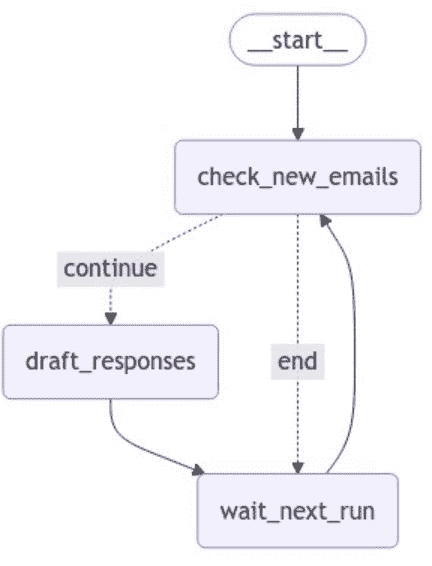

<!--yml

类别：未分类

日期：2025-01-11 11:53:06

-->

# 基于LangGraph+CrewAI的LLM多代理应用实现探索

> 来源：[https://arxiv.org/html/2411.18241/](https://arxiv.org/html/2411.18241/)

段志华 智能云网络监控部门

中国电信上海公司 上海，中国

duanzh.sh@chinatelecom.cn    王佳林 执行副总裁

貂鼠关系智能 加利福尼亚州伯灵游戏 94010，美国

jialinwangspace@gmail.com

###### 摘要

随着大型模型技术的迅速发展，代理技术在各个领域的应用日益广泛，深刻改变了人们的工作和生活方式。在复杂和动态的系统中，多代理通过任务分解和代理间协作实现单个代理难以完成的复杂任务。本文讨论了LangGraph与CrewAI的集成应用。LangGraph通过图架构提高信息传输效率，而CrewAI则通过智能任务分配和资源管理增强团队协作能力和系统性能。本文的主要研究内容包括：（1）基于LangGraph设计精确控制的代理架构；（2）基于CrewAI增强代理的能力，以完成多种任务。本研究旨在深入探讨LangGraph与CrewAI在多代理系统中的应用，为代理技术的未来发展提供新的视角，并推动大型模型智能代理领域的技术进步和应用创新。

###### 索引词：

LangGraph、CrewAI、代理、大型语言模型、生成性人工智能

## 一、引言

受人工智能技术迅速发展的推动，代理技术在各个领域的应用日益增长，深刻影响着每个人的工作和生活方式。代理技术的应用范围广泛；它可以自主感知环境，进行数据分析，并做出决策，从而显著提高效率并优化资源配置。在复杂和动态的系统中，引入多代理系统使得多个代理能够协作，完成单个代理难以实现的复杂任务。

多代理系统的关键优势在于其任务分解能力，通过代理的协作行动实现目标，这不仅提高了系统的灵活性和适应性，还改善了其泛化能力。在不确定性和动态变化的环境中，代理的协作能力和任务分配能力尤为重要。

本文主要研究两个问题：（1）设计基于LangGraph的代理架构，以实现更精确的控制；（2）增强基于CrewAI的代理能力，以完成不同的任务。目的是深入探讨AI多代理系统的应用，探索LangGraph与CrewAI结合所带来的技术优势及其在各个领域的潜在应用价值。通过对这些技术的分析与研究，期望为未来代理技术的发展提供新的视角和思路，从而推动大型模型智能代理领域的技术进步和应用创新。

## II 相关工作

自主代理通常负责特定角色以完成各种任务。MetaGPT[[1](https://arxiv.org/html/2411.18241v1#bib.bib1)]、ChatDev[[2](https://arxiv.org/html/2411.18241v1#bib.bib2)]和自我协作[[3](https://arxiv.org/html/2411.18241v1#bib.bib3)]预设了各种角色和相应的职责，以促进代理之间的协作。

基于大型语言模型（LLM）的自主代理结合了人类记忆过程中的机制。RLP[[4](https://arxiv.org/html/2411.18241v1#bib.bib4)]是一个对话代理，保持对话双方的内部状态，实现代理的短期记忆。SayPlan[[5](https://arxiv.org/html/2411.18241v1#bib.bib5)]是一个为任务规划和设计而设计的代理。在面对复杂任务时，将其分解为更简单的子任务并解决它们。思维链（CoT）[[6](https://arxiv.org/html/2411.18241v1#bib.bib6)]将解决复杂问题的推理步骤输入到提示中。[[7](https://arxiv.org/html/2411.18241v1#bib.bib7)]提出了一种基于LangGraph和思维链（CoT）的智能个性化数字银行助手，利用大型语言模型（LLM）和多代理框架来提高任务效率。[[8](https://arxiv.org/html/2411.18241v1#bib.bib8)]通过利用图技术改进基于检索增强生成（RAG）的高级问答系统，以克服现有RAG模型的局限性，开发高质量的人工智能服务。

本研究中，基于大型语言模型（LLM）的自主代理可以利用LangGraph和CrewAI的框架能力，自动执行各种任务，赋予代理完成特定任务的能力，形成一个全面的应用系统框架。

## III 方法论

### III-A LangGraph简介

LangGraph 是一个用于构建多代理应用的框架，使开发者能够利用大型语言模型（LLMs）创建代理和多代理工作流。与其他 LLM 框架相比，LangGraph 提供了循环、可控性和持久记忆的优势。LangGraph 为应用程序的流程和状态提供了精细的控制，使得创建可靠的代理成为可能，支持先进的人机交互和记忆功能。LangGraph 的灵活框架支持多种控制流——单代理、多代理、层级、顺序，并能稳健地管理复杂的现实场景。

### III-B CrewAI 框架

CrewAI 是一个开源框架，旨在协调具有角色扮演和自主操作的 AI 代理，以促进代理之间在解决复杂问题中的合作。它允许开发者定义具有特定角色、目标和工具的 AI 代理。CrewAI 的主要构建模块包括代理、任务、工具和 Crew，提供了丰富的功能集，可以根据具体需求自由选择和组合以创建多代理系统。CrewAI 支持多种 API，如 OpenAI 和 Ollama，具有角色定制代理、自动任务委派和灵活任务管理等关键特性。CrewAI 旨在处理复杂任务，如多步骤工作流、决策制定和问题解决。

代理智能实体是一个能够执行任务、做出决策并与其他代理进行沟通的自主单元。在 CrewAI 框架中，任务指的是代理执行的具体工作，包括描述、执行的代理以及所需工具等细节。它支持多代理协作，并通过 Crew 的流程编排优化团队合作和效率。

图 1：基于 LangGraph +CrewAI 的邮件案例说明。

### III-C 将 LangGraph 与 CrewAI 集成

LangGraph+CrewAI 框架的集成为复杂任务管理提供了强大的工具，通过灵活的工作流、代理间协作和图结构化管理，优化了任务执行和多代理系统。它通过与现有工具的集成支持定制化开发，满足 AI 应用不断发展的需求。CrewAI 通过明确的任务分配和角色定义确保了流程效率。此外，与 LangChain 的无缝集成使得熟悉该框架的开发者能够轻松集成独立代理，进一步增强了框架的吸引力。

以 CrewAI 官方网站上提供的自动邮件编写和发送案例为例，LangGraph+CrewAI 框架将复杂任务拆解为可管理的步骤并自动执行。

如图1所示，借助LangGraph，可以清晰地定义和可视化写邮件和发送邮件的工作流，包括检查新邮件、撰写新邮件和等待下次运行。

如图2至图4所示，这是一个基于CrewAI+LangGraph的代码示例。通过将CrewAI与LangGraph集成，可以轻松实现基于大模型的邮件检查、撰写和自动发送等功能。

图2：基于LangGraph + CrewAI的代码示例。

图3：基于CrewAI的智能体示例。

图4：基于CrewAI的任务示例。

## IV应用案例实践

### IV-A 开发环境

在本研究中，我们使用了以下开发环境组件来应用LangGraph+CrewAI框架：

+   •

    多智能体：CrewAI，用于组织和协调AI智能体之间的协作工作。

+   •

    图形工作流：LangGraph，用于管理图节点的状态共享和过程控制。

+   •

    工作流跟踪：LangSmith，用于监控和审计工作流的执行。

+   •

    嵌入技术：ollama嵌入模型，利用嵌入式向量模型来检索工单文本。

+   •

    向量数据库：Fasiss用于存储和检索向量数据，加速数据访问速度。

### IV-B 应用案例

如图5所示，基于LangGraph+CrewAI框架，我们探索并实现了一个集成了代码生成和代码审查能力的多智能体协作应用。通过实现状态数据的实时共享和反馈机制，提升了代码生成的效率。

图5：基于LangGraph+CrewAI的代码生成案例。

如图6所示，基于CrewAI+LangGraph框架，我们探索并实现了一个工单审计和转发功能的案例。通过对工单文本信息的深入分析，我们构建了多个智能体，能够更准确地理解工单内容，从而提高了工单处理的效率。

图6：基于LangGraph+CrewAI的工单自动处理案例研究

## V结论

本文探讨了 LangGraph 和 CrewAI 框架的联合应用，展示了这两个框架在构建复杂多智能体系统和工作流管理中的强大能力。通过案例分析，LangGraph+CrewAI 框架在任务管理、智能体间协作、图形工作流实现和与现有工具的集成方面具有优势。这种集成方法不仅提高了任务执行效率，还通过实时状态数据共享和反馈机制增强了系统的灵活性和可扩展性。我们的研究结果表明，LangGraph 和 CrewAI 的结合为开发先进的 AI 应用提供了强大的工具包，尤其是在需要处理复杂任务和多智能体协作的场景中。通过与 LangChain 的集成，现有的独立智能体可以轻松融入 CrewAI 框架，为开发人员提供一个统一的平台来构建和管理复杂的 AI 工作流。

## 参考文献

+   [1] Mingchen Zhuge Sirui Hong 等人。Metagpt：多智能体协作框架的元编程。国际学习表征会议，2024。

+   [2] Wei Liu Chen Qian 等人。Chatdev：用于软件开发的交互式智能体。在计算语言学协会第62届年会论文集（卷1：长篇论文）中，页面 15174–15186。

+   [3] Xue Jiang Yihong Dong 等人。通过 ChatGPT 自协作代码生成。CoRR, abs/2304.07590, 2023。

+   [4] Kevin A. Fischer. 反思性语言编程（rlp）：社会意识化人工通用智能（socialagi）中的一块垫脚石。CoRR, abs/2305.12647, 2023。

+   [5] Jesse Haviland Krishan Rana 等人。Sayplan：使用 3D 场景图为大型语言模型提供基础，支持可扩展任务规划。CoRR, 2023。

+   [6] Xuezhi Wang Jason Wei 等人。链式思维提示在大型语言模型中激发推理。神经信息处理系统进展，35:24824–24837, 2022。

+   [7] Saha Sourav Arafat Md Easin 等人。一个智能的基于 LLM 的数字银行个性化助手，使用 LangGraph 和链式思维。IEEE 第二十二届国际智能系统信息学研讨会，页面 625–630，2024。

+   [8] Cheonsu Jeong。基于图的智能体高级 RAG 系统实现方法研究。CoRR, abs/2407.19994, 2024。
