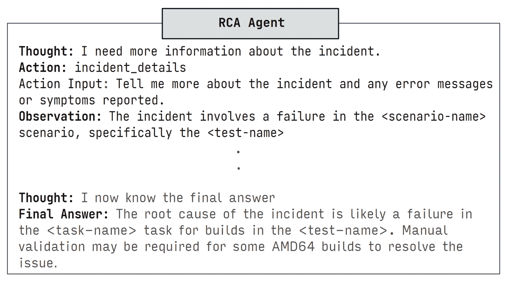

<!--yml

分类：未分类

日期：2025-01-11 12:48:12

-->

# 探索基于LLM的代理进行根本原因分析

> 来源：[https://arxiv.org/html/2403.04123/](https://arxiv.org/html/2403.04123/)

Devjeet Roy [devjeet.roy@wsu.edu](mailto:devjeet.roy@wsu.edu) 华盛顿州立大学普尔曼华盛顿美国99163，Xuchao Zhang [xuchaozhang@microsoft.com](mailto:xuchaozhang@microsoft.com) 微软公司雷德蒙德华盛顿美国98052，Rashi Bhave 微软公司班加罗尔卡纳塔克邦印度560001，Chetan Bansal [chetanb@microsoft.com](mailto:chetanb@microsoft.com) 微软公司雷德蒙德华盛顿美国98052，Pedro Las-Casas [pedrobr@microsoft.com](mailto:pedrobr@microsoft.com) 微软公司雷德蒙德华盛顿美国98052，Rodrigo Fonseca [Fonseca.Rodrigo@microsoft.com](mailto:Fonseca.Rodrigo@microsoft.com) 微软公司雷德蒙德华盛顿美国98052，以及Saravan Rajmohan [saravan.rajmohan@microsoft.com](mailto:saravan.rajmohan@microsoft.com) 微软公司雷德蒙德华盛顿美国98052（2024）

###### 摘要。

基于云的软件系统日益复杂，这使得事件管理成为软件开发生命周期中不可或缺的一部分。根本原因分析（RCA）是事件管理过程中的一个关键环节，对于值班工程师来说，进行RCA是一项要求极高的任务，需要深入的领域知识以及对团队特定服务的广泛经验。RCA的自动化可以大大节省时间，减轻值班工程师的事件管理负担。最近，研究人员已开始使用大型语言模型（LLMs）进行RCA，并取得了有希望的结果。然而，这些方法无法动态收集附加的诊断信息，如与事件相关的日志、度量数据或数据库，这大大限制了它们诊断根本原因的能力。在本研究中，我们探索了基于LLM的代理在RCA中的应用，旨在解决这一局限性。我们对一款配备检索工具的\react代理进行了深入的实证评估，评估数据来自一家大型IT公司收集的生产事件的分布外数据集。结果表明，\react在强大的检索和推理基准上表现竞争力，且在事实准确性方面有显著提升。随后，我们通过将与事件报告相关的讨论作为模型的附加输入来扩展这一评估，结果令人惊讶的是，这并未带来显著的性能提升。最后，我们与微软团队进行案例研究，借助该团队用于手动RCA的外部诊断服务为\react代理提供工具支持。我们的结果展示了代理如何克服先前工作的局限性，并为在实践中实施此类系统提供了实用的考虑因素。

事件管理、云计算、根本原因分析、AIOps^†^†版权：acmcopyright^†^†期刊年份：2024^†^†doi：XXXXXXX.XXXXXXX^†^†ccs：计算机系统组织 云计算^†^†ccs：软件及其工程 维护软件

## 1\. 引言

在过去的几十年里，大型企业一直在将其软件转型为云服务。随着近年来人工智能（AI）的崛起，计算资源从消费者设备向云端转移的趋势愈加明显。这一范式的转变带来了复杂的软件系统，这些系统以多层架构、微服务和分布式应用为特征。这些系统的复杂性增加使其更容易受到生产事故的影响。当这些事故未能得到解决时，可能会导致巨大的成本并破坏关键服务。因此，及时减轻和解决这些事故对于保持服务的可用性和可靠性至关重要（[Zeng2023-em,](https://arxiv.org/html/2403.04123v1#bib.bib41)）。然而，云事故管理（[Lou2022-yy,](https://arxiv.org/html/2403.04123v1#bib.bib15)；[Chen2023-sj,](https://arxiv.org/html/2403.04123v1#bib.bib7)）极为劳动密集。值班工程师（OCEs）需要对团队的服务有广泛的经验，并具备深厚的领域知识，才能在事故管理中发挥有效作用。即使是经验丰富的OCEs，事故管理仍然是一项耗时的工作。随着软件系统在规模和复杂性上的不断扩展，未来对OCEs和事故管理系统的需求只会增加。为了解决这些挑战，AIOps（人工智能运维）领域提出了许多技术来简化事故管理。尽管有这些发展，事故管理生命周期的若干部分仍然在很大程度上依赖人工干预。

云事件管理中最具挑战性的一个方面是根本原因分析（RCA）。在事件得到解决之前，OCE（运营云工程师）必须识别事件的根本原因，以确保任何解决措施都能全面且正确地解决该事件。RCA代表了事件管理生命周期中最劳动密集和技术密集的组成部分之一（[Ma2020-io,](https://arxiv.org/html/2403.04123v1#bib.bib17)）。即便是资深的软件工程师，也可能需要在团队中工作数年，才能有效地对团队的服务执行RCA。因此，研究人员尝试自动化这一过程的部分环节并不令人意外。为了帮助OCE进行RCA，提出了许多技术，例如事件优先级排序和检索相似历史事件。尽管早期的方法侧重于自动化根本原因分析过程的部分环节，但近年来大语言模型（LLMs）所展示出的卓越能力，促使人们更多地关注端到端的RCA系统。最近，Ahmed等人（[Ahmed2023-ov,](https://arxiv.org/html/2403.04123v1#bib.bib1)）提出了使用微调的LLM进行事件根本原因分析和缓解的方案。他们展示了LLM即使在只有非常有限的事件信息的情况下，也能找到事件的根本原因。Chen等人（[Chen2023-js,](https://arxiv.org/html/2403.04123v1#bib.bib8)）提出了RCACopilot，该系统在此工作基础上进行了扩展，并向基于LLM的根本原因分析流程中增加了检索增强和诊断收集工具。他们为不同类型的事件设计了定制工作流程，触发数据收集程序，然后汇总数据以预测事件的根本原因类别，并帮助OCE进行根本原因分析。

尽管这些方法已在LLM进行RCA的能力上展示了良好的结果，但它们都没有使LLM能够动态查询受事件影响的服务的实时诊断信息。RCACopilot（[Chen2023-js,](https://arxiv.org/html/2403.04123v1#bib.bib8)）依赖于必须手工设计的预定义处理程序，并预测根本原因类别，而不是具体的根本原因；而Ahmed等人（[Ahmed2023-ov,](https://arxiv.org/html/2403.04123v1#bib.bib1)）仅依靠事件的标题和描述来预测根本原因。这里缺少的是OCE在实际RCA场景中采取的一项关键步骤——对于任何事件，OCE进行的第一步通常是收集事件报告中没有的新的诊断数据。在先前的工作中，LLM没有与外部环境交互的能力，因此无法收集这些数据。在本研究中，我们提出使用基于LLM的代理——能够推理、规划并与外部环境互动以收集新信息的系统——来解决这一限制并帮助进行根本原因分析。

尽管基于大规模语言模型（LLM）的智能体在多个领域和任务中展现出了卓越的能力，但将其应用于根本原因分析（RCA）仍然是一个重大挑战。事件生产数据高度保密，且未经微调的LLM可能无法适应这些数据，这对大规模模型来说既昂贵又不切实际（[Chen2023-js,](https://arxiv.org/html/2403.04123v1#bib.bib8)）。上下文示例可以作为微调的替代方案，用于领域适配，但对于基于智能体的RCA来说，构建完整的推理轨迹可能具有挑战性。这一挑战进一步加剧，因为智能体需要复杂的提示，并且通常还需要微调（[Yao2022-uc,](https://arxiv.org/html/2403.04123v1#bib.bib40)）或上下文示例（[Song2022-ce,](https://arxiv.org/html/2403.04123v1#bib.bib33)）。最后，RCA具有一些独特的特征，将其与标准的自然语言处理（NLP）任务区分开来。对于大多数NLP任务，相关的外部工具，如网络搜索引擎和文档检索，可以在单步操作中轻松使用，并且不需要LLM具备太多的先验知识。而对于RCA来说，构建查询以进行搜索或检索需要更为专业的领域知识；许多信息源，如日志、追踪和监控服务，涉及使用专门的查询语言查询和处理表格数据，并且需要了解附加信息（例如，查询哪个数据库）。因此，尽管LLM智能体展现了远超以往方法的卓越能力，但目前尚不清楚它们是否能够有效适应RCA任务。

在这项工作中，我们呈现了基于LLM的代理ReAct在云事故管理中的根本原因分析（RCA）的实证评估。我们的目标是回答两个关键问题：1）在没有微调的情况下，LLM代理是否能够有效地进行RCA？以及2）在实际场景中使用LLM代理时的实际考虑因素是什么？为了回答这些问题，我们首先对配备检索工具的ReAct代理在静态数据集上进行评估，模拟Ahmed等人（[Ahmed2023-ov,](https://arxiv.org/html/2403.04123v1#bib.bib1)）的评估设置。在这个设置中，代理无法访问专门的、团队特定的诊断服务，从而限制了其能力。这为其性能建立了一个下限，并且反映了一个实际的场景，即代理在组织或公司中逐步采用，并随着时间的推移逐渐获得访问诊断服务的权限。接下来，我们研究了如何使用历史事故报告中的讨论评论来增强我们的检索语料库。这有两个目的；不仅讨论评论为事故报告提供了额外的上下文，而且它们还包含了OCE（操作控制专家）在过去事故中所遵循的诊断步骤记录。后者可能作为少量示例替代品来引导代理。最后，为了探索代理的全部潜力，我们展示了与微软另一团队合作的LLM代理在RCA中的实际应用案例，该代理配备了团队特定的诊断资源。具体来说，我们做出以下贡献：

+   •

    我们呈现了关于在静态数据集上进行的基于LLM的ReAct代理（[Yao2022-uc,](https://arxiv.org/html/2403.04123v1#bib.bib40)）在领域外设置下进行RCA的首个实证研究。

+   •

    我们对ReAct在RCA中的不同成功与失败模式进行了定性分析。

+   •

    我们评估了来自历史事故的讨论评论及其对代理性能的影响。

+   •

    我们呈现了在一个大型企业团队中实现的基于LLM的代理进行RCA的真实世界案例研究。

+   •

    我们强调了基于LLM的代理的潜力以及在实现能够完全自主RCA的现实世界系统时所面临的挑战。

## 2\. 背景与相关工作

### 2.1\. 云事故管理和根本原因分析

生产事件是未计划的事件或服务中断，通常对客户产生不利影响。由于生产事件导致的服务中断可能对企业造成巨大的成本。现代软件系统的复杂性使得生产事件不可避免，而事件管理成为软件开发生命周期的关键组成部分。事件的生命周期包括事件检测、分诊、诊断和缓解（[Ahmed2023-ov,](https://arxiv.org/html/2403.04123v1#bib.bib1)）。尽管事件可能由客户报告或通过监控服务自动检测和分诊，但其余的步骤通常由一个或多个值班工程师（OCE）来执行。事件管理的目标是最大限度地减少事件发生与解决之间的时间。

### 2.2\. 根本原因分析（RCA）

<svg class="ltx_picture" height="113.84" id="S2.F1.pic1" overflow="visible" version="1.1" width="600"><g color="#000000" fill="#000000" stroke="#000000" stroke-width="0.4pt" transform="translate(0,113.84) matrix(1 0 0 -1 0 0)"><g fill-opacity="1.000000" transform="matrix(1.0 0.0 0.0 1.0 9.26 9.26)"><foreignobject height="95.32" overflow="visible" transform="matrix(1 0 0 -1 0 16.6)" width="581.48">Title: SD#1234123412341234 — PRE — SEV A — Specified blob does not exist. — Cloud Services LLC Description: Customer mentioned that after stopping stream analytics on 09/23 they are getting errors on streaming into ¡*database product*¿[…] It was throwing an error ”Specified blob does not exist” and “Invalid connection string format. [SessionID: ¡*uuid*¿ Found Another error message ”Error while Ingesting data to ¡*database product*¿”</foreignobject></g></g></svg>

图1. 示例事件

根本原因分析构成了事件管理生命周期中最耗时的部分之一。当OCE接收到一个事件时，他们会系统地执行一系列故障排除步骤，以识别根本原因。每个故障排除步骤都会产生先前未知的信息，帮助OCE缩小可能的根本原因范围。这突出了根本原因分析的一个关键方面：收集与事件相关的额外诊断信息的过程。事件报告描述了导致事件报告的症状，但类似的症状可能来源于不同的根本原因，这些根本原因可能跨越不同的领域，如硬件故障、网络问题或软件错误。因此，OCE必须通过收集相关日志、指标以及其他监控和诊断服务中的补充数据来开始诊断过程。例如，图[1](https://arxiv.org/html/2403.04123v1#S2.F1 "Figure 1 ‣ 2.2\. Root Cause Analysis (RCA) ‣ 2\. Background and Related Work ‣ Exploring LLM-based Agents for Root Cause Analysis")中所示的事件，通过检查从受影响的服务中收集的日志来解决，以识别导致客户遇到故障的事件序列。这个过程中的另一个隐性要求是，OCE需要知道1）需要收集哪些额外的信息，以及2）如何收集这些信息。这就是为什么即使是经验丰富的工程师，在能够有效执行RCA之前，也需要对团队的服务有经验的原因。总之，成功的RCA需要以下几项信息：1）事件报告中描述的症状，2）额外的诊断信息，3）领域专长，即根据现有信息应该收集哪些诊断信息，如何收集它以及关于应用领域的通用知识。

根本原因分析流程展示了OCE面临的许多挑战，以及自动化该流程的努力。OCE必须具备足够的领域知识和对受影响服务的熟悉度，以了解1) 需要收集哪些补充数据，2) 如何收集这些数据，以及3) 如何分析所有可用的信息（包括事件报告）。根据基础服务的规模和复杂性，这可能需要OCE拥有几年的团队服务经验，以培养进行有效根本原因分析所需的技能集。即使OCE得到了充分的培训，收集到的数据也可能是多方面的，涵盖从结构化表格数据到非结构化日志和客户报告的内容。这进一步增加了数据分析和后续假设生成的复杂性。虽然OCE可以通过利用领域专业知识和经验克服这些挑战，但这对先前的自动化方法构成了重大挑战，因为这些方法无法收集这些补充数据，更不用说分析这些数据并得出根本原因了。

### 2.3\. 自动化根本原因分析（RCA）

许多研究提出了各种自动化根本原因分析的技术，例如使用机器学习模型和深度学习模型 ([Soldani22-hg,](https://arxiv.org/html/2403.04123v1#bib.bib32)) 来识别事件数据中的模式，并确定事故的潜在原因。根本原因分析的另一个重要研究领域是使用异常检测模型 ([Soualhia22-ev,](https://arxiv.org/html/2403.04123v1#bib.bib34))，例如统计学、机器学习和深度学习模型 ([Hagemann21-an,](https://arxiv.org/html/2403.04123v1#bib.bib10))，这些模型被提出来识别系统行为中的异常，并实时提醒操作人员。研究提出了各种根本原因分析和分类的技术，例如学习分层监控系统 ([Nair15,](https://arxiv.org/html/2403.04123v1#bib.bib21))，诊断和分类性能问题 ([Chetan19-dc,](https://arxiv.org/html/2403.04123v1#bib.bib3))，以及将事件与时间序列关联 ([Luo14-en,](https://arxiv.org/html/2403.04123v1#bib.bib16))。此外，还有研究探索了从各种文档中挖掘结构化知识的应用，例如事件报告和根本原因文档，以挖掘软件工程中的结构化知识，如故障排除指南（TSG） ([Jiang22-eg,](https://arxiv.org/html/2403.04123v1#bib.bib11))，同时也有努力改善TSG质量 ([Shety22-lr,](https://arxiv.org/html/2403.04123v1#bib.bib28))，使其在事件解决过程中更加有效。

大型语言模型（LLMs）在处理各种数据模态方面展现了卓越的能力，包括非结构化自然语言、表格数据甚至图像。最近，Ahmed 等人（[Ahmed2023-ov,](https://arxiv.org/html/2403.04123v1#bib.bib1)）提出了使用微调的预训练 LLMs 来进行云事件的根本原因分析（RCA）。由于事件数据通常具有高度机密性，且预训练的 LLMs 很可能未曾见过这些数据，因此微调对于原始 LLMs 的领域适配是必要的。在这项工作中，我们采用 Ahmed 等人（[Ahmed2023-ov,](https://arxiv.org/html/2403.04123v1#bib.bib1)）提出的 RCA 任务框架；给定一个事件报告，我们希望模型能够预测一个特定的根本原因。然而，与原始设置不同的是，我们排除了微调或其他训练方法用于领域适配。正如 Chen 等人（[Chen2023-js,](https://arxiv.org/html/2403.04123v1#bib.bib8)）所指出的，虽然微调可能有效，但它既昂贵又耗时，每当基础模型更新或服务发生变化时，都必须重新进行微调。为了应对这些限制，Chen 等人（[Chen2023-js,](https://arxiv.org/html/2403.04123v1#bib.bib8)）提出了 RCACopilot，它通过使用预定义的处理程序自动收集与事件相关的多模态诊断数据，并使用 LLM 来分析收集到的数据，预测事件的根本原因类别，从而帮助 OCEs 完成 RCA，而无需进行微调。与 RCACopilot 不同，我们案例研究中提出的 ReAct 代理能够自主动态收集相关的诊断数据，而无需预定义的处理程序。

### 2.4. 增强型 LLMs 和基于 LLM 的代理

近年来，语言模型（LM）研究的一个重要进展是出现了增强推理和使用工具能力的语言模型，或称为增强型语言模型（ALMs）（[Lewis2020-rj,](https://arxiv.org/html/2403.04123v1#bib.bib13)；[Mialon2023-rn,](https://arxiv.org/html/2403.04123v1#bib.bib20)；[Schick2023-vu,](https://arxiv.org/html/2403.04123v1#bib.bib27)）。增强大规模语言模型（LLMs）扩展了它们在纯语言建模范式下无法实现的能力。主要而言，这些增强可以是允许LLM在给定问题设置中与环境动态交互的外部组件，或者是赋予LLM复杂推理能力的提示技术，用于处理复杂的分析任务（[Wei2022-vl,](https://arxiv.org/html/2403.04123v1#bib.bib37)）。例如，LLM被增强以使用外部检索数据库，这些数据库能够根据事实支持其预测，并允许它们使用训练时未见过的信息。检索也可以缩小小型模型与大型模型之间的差距。LLM还可以通过检索之外的外部组件进行增强，例如代码解释器（[noauthor_undated-eg,](https://arxiv.org/html/2403.04123v1#bib.bib9)）和网络搜索引擎。最近，基于LLM的代理将外部增强组件与推理和规划能力相结合，使得LLM能够自主解决复杂任务，如顺序决策问题（[Shinn_undated-kf,](https://arxiv.org/html/2403.04123v1#bib.bib29)）、知识密集型问答（[Trivedi2022-pf,](https://arxiv.org/html/2403.04123v1#bib.bib35)）和自我调试（[Chen2023-hj,](https://arxiv.org/html/2403.04123v1#bib.bib6)）。

## 3. 基于LLM的代理用于根本原因分析（RCA）

LLM代理是具备推理和使用工具能力的ALM（自动学习模型）。近年来，已经提出了几种不同的LLM代理模型([Yao2022-uc,](https://arxiv.org/html/2403.04123v1#bib.bib40)；[Song2022-ce,](https://arxiv.org/html/2403.04123v1#bib.bib33)）。在本研究中，我们基于ReAct框架([Yao2022-uc,](https://arxiv.org/html/2403.04123v1#bib.bib40))构建RCA代理。该框架交替进行推理和工具使用步骤，结合了基于推理的方法原则，如“思维链”（Chain of Thought）([Wei2022-mi,](https://arxiv.org/html/2403.04123v1#bib.bib38)）和工具使用模型，如Toolformer([Lewis2019-hp,](https://arxiv.org/html/2403.04123v1#bib.bib12)）。ReAct非常适合用于RCA任务，原因有很多：1）现实世界中的RCA任务既包含顺序决策（决定采取哪些故障排除步骤），又包含知识密集型的问答（评估可用的诊断信息以产生候选根本原因），这两者都得到了ReAct的支持；2）在我们所考虑的分布外（out-of-distribution）环境中，ReAct能够迅速适应新信息，因为它交替进行推理、规划和环境反馈，而不是提前制定一个长时间跨度的计划；3）它还可以轻松地通过额外组件进行增强，如反思([Shinn2023-hb,](https://arxiv.org/html/2403.04123v1#bib.bib30))和外部记忆机制([Zhao2023-rd,](https://arxiv.org/html/2403.04123v1#bib.bib43))，这些都能对需要更长诊断过程的RCA任务产生积极影响。

### 3.1\. 概述

图 2. ReAct推理轨迹示例

图[2](https://arxiv.org/html/2403.04123v1#S3.F2 "图 2 ‣ 3.1\. 概述 ‣ 3\. 基于LLM的RCA代理 ‣ 探索基于LLM的根本原因分析代理")展示了一个由ReAct代理生成的样本轨迹示例：代理生成一个“思考”或推理步骤，用以指引接下来的“行动”。行动空间由代理可用的固定工具集构成。一旦指定了行动及其输入，工具便会被执行，且其输出作为观察结果反馈给代理。步骤1-3会根据需要重复多次，直到完成任务。我们使用Langchain([Chase2022-sg,](https://arxiv.org/html/2403.04123v1#bib.bib5))框架来实现ReAct代理。请注意，代理使用的工具也可能依赖于LLM。为了避免歧义，我们将执行ReAct循环的LLM称为“规划者”。由于时间和资源限制，我们将此循环的最大迭代次数限制为20次。

### 3.2\. 零-shot提示

虽然基于LLM的代理方法通常通过少量示例获益 ([Yao2022-uc,](https://arxiv.org/html/2403.04123v1#bib.bib40) ; [Song2022-ce,](https://arxiv.org/html/2403.04123v1#bib.bib33) )，但我们在一个更具挑战性的设置中使用ReAct，使用的是零-shot提示。最初，我们打算根据评估集中的示例来制作少量示例。然而，对于RQ1和RQ2中的设置，在这些设置中我们仅利用事件标题和描述，我们发现要根据可用的信息提出合理的推理过程以得出正确的根本原因极为困难。

### 3.3\. 代理评估

基于代理的根本原因分析（RCA）的一大主要优势是它们能够通过工具收集外部诊断信息。没有像WebArena  ([Zhou2023-ds,](https://arxiv.org/html/2403.04123v1#bib.bib44) )、AlfWorld ([Shridhar2020-ky,](https://arxiv.org/html/2403.04123v1#bib.bib31) )或WebShop ([Yao2022-hq,](https://arxiv.org/html/2403.04123v1#bib.bib39) )这样的模拟环境，很难评估这一点。构建此类环境的主要挑战在于，很难确定为诊断特定事件所使用的诊断服务，因为OCE（操作控制事件）不要求报告每一个诊断步骤。此外，不同团队使用的诊断服务类型差异极大。另一个挑战是环境不仅需要支持代理可以采取的最优故障排除轨迹，还需要支持其他合理的大规模轨迹，即使我们知道解决事件所需的诊断数据，单单捕获这些特定的数据并不足以满足环境需求。由于目前没有这样的评估环境，我们在一个受限的设置中评估代理，在此设置下我们假设无法访问任何专业化服务，类似于([Ahmed2023-ov,](https://arxiv.org/html/2403.04123v1#bib.bib1) )。尽管这种评估无法反映代理执行自主诊断步骤的能力，但它为我们提供了一个在没有专业工具情况下代理性能的下限，并使我们能够公平地将其与没有查询额外诊断数据能力的其他ALM进行比较。此外，为了展示代理与诊断服务互动的能力，我们还呈现了一个与我们公司团队合作的代理原型实现的案例研究。这为我们提供了一个更现实的代理评估，但规模较小。案例研究的目标是考察代理在实际环境中的优缺点，并识别实际应用中的考虑因素。

### 3.4\. 工具

对于一般化的设置，我们将自己限制在适用于所有事件的通用工具上，无论它们的来源地如何。

事件详情 我们对评估数据集的调查发现，有时事件报告中包含日志、堆栈跟踪和其他诊断信息。虽然这些信息可能存在噪音并且在上下文长度上存在挑战，但通过问答工具，可以将原始事件描述暴露给LLM。智能体可以使用该工具回答关于事件的具体问题，这些问题在总结过程中可能会丢失。

历史事件 该工具根据LLM规划器提出的查询来检索历史事件。根据我们在开发数据集上的实验，我们制定了该工具的两种变体。第一种变体使用目标事件的标题和描述，以及由智能体生成的查询进行检索，并将检索到的文档作为观察结果返回，不进行进一步处理。由于此处的查询是一个段落，我们专门使用SentenceTransformer检索器进行检索。我们将使用该变体工具的ReAct智能体称为ReAct BR。第二种变体使用两步检索过程。LLM规划器必须首先生成一个查询以搜索历史事件。然后，规划器可以对检索到的历史事件集进行问答。该工具使用注入了检索到的事件的LLM来回答规划器的问题。这一两步过程使规划器能够将检索查询与目标事件报告分开，同时也减轻了检索到的历史事件数量可能超出基础LLM的上下文长度的情况。我们限制检索工具每次查询只检索$k=3$个文档，以便让智能体在保持与其他基准方法相同的10个文档检索总量预算的同时，创建多样化的查询。

## 4. 研究问题

为了评估基于LLM的智能体在根本原因分析（RCA）中的效果，我们提出了以下研究问题：

RQ1：当给定一个通用工具包时，基于LLM的智能体在查找事件根本原因方面有多有效？在这种设置下，我们测试了基于LLM的智能体在一个脱离分布的环境中进行根本原因分析的效果，并且他们只能使用与特定团队无关的工具。我们为智能体配备了一个基于历史事件的通用检索工具，以及一个针对原始事件描述的问答工具。我们考虑了多种强大的ALM基准方法，这些方法与智能体不同，无法使用工具。

RQ2：讨论评论是否有助于改善基于LLM的方法进行根本原因分析？

事件报告中的讨论评论包含了OCE（事件处理工程师）为解决事件所采取的诊断步骤记录，可以为模型执行未来事件的根本原因分析（RCA）提供指导。在这里，我们旨在调查将这些讨论评论纳入我们的历史事件检索语料库是否会影响智能体的表现以及RQ1中选择的基准模型。为了进行此评估，我们在检索后将事件与相关的讨论评论一起增强到我们的检索语料库中，以确保评论的存在不会影响检索。

RQ3：当LLM基于的智能体可以访问团队用于事件管理的专用工具时，它们在根本原因分析中的有效性如何？

在这个研究问题中，我们评估了一个真实世界场景，当基于LLM的智能体能够访问特定团队的知识库和监控服务时的表现。为了进行此评估，我们与另一个团队的值班工程师进行案例研究。我们将ReAct智能体与这些资源打包到聊天界面中，并进行现场实验，看看这个智能体是否能够有效地协助值班工程师找到一小部分事件的根本原因。

## 5\. 方法论

我们在本节中描述了用于回答RQ1和RQ2的方法论。RQ3的方法论在[第7节](https://arxiv.org/html/2403.04123v1#S7 "7\. 实际实现RCA智能体：案例研究 ‣ 探索基于LLM的根本原因分析智能体")中进行了描述。

### 5.1\. 数据集

我们从2020年01月01日到2021年09月30日的内部事件门户收集了事件数据。我们的数据收集过程总共收集了107,000个独特事件，我们将其划分为训练集（102,000）、评估集（2000）和测试集（3000）。为了本工作，我们从评估集中随机抽取100个事件，从测试集中随机抽取500个事件，以降低成本，这与NLP领域的工作一致 ([Trivedi2022-tm,](https://arxiv.org/html/2403.04123v1#bib.bib36))。我们使用训练集作为我们实验的主要检索语料库。像Ahmed等人 ([Ahmed2023-ov,](https://arxiv.org/html/2403.04123v1#bib.bib1))一样，我们使用事件标题和描述作为事件的主要信息来源。对于RQ2，我们还将讨论评论纳入历史语料库。事件描述和根本原因没有固定格式，且可能相当长。这对使用任何类型的检索增强生成时，能够放入上下文的历史事件数量构成了限制。因此，我们使用gpt-3.5-turbo对描述和根本原因进行总结。对于RQ2，我们还总结了讨论评论。由于讨论评论通常较长，我们将其拆分成多个块，对每个块单独总结，然后重新组合它们，利用LLM处理每一步。请注意，由于缺乏参考摘要，总结过程难以评估，因此我们依赖于定性分析和端到端的RCA评估来迭代总结过程。

### 5.2\. 基础LLMs

在我们所有的实验中，我们使用OpenAI GPT4-8k ([OpenAI2023-la,](https://arxiv.org/html/2403.04123v1#bib.bib22))作为主要的语言模型。GPT-4是OpenAI模型库中最强大的模型，也是为数不多的能够在零-shot环境下可靠驱动智能体的模型之一。较大的上下文窗口（8,000个tokens）也使我们能够为模型使用更多的检索到的事件。为了对事件和讨论评论进行总结，我们使用gpt-3.5-turbo以降低成本。

### 5.3\. 检索器

我们构建了一个包含我们收集的数据集的整个训练集的历史事件检索语料库。我们考虑使用一个稠密检索器和一个稀疏检索器。

稠密检索器（ST）我们使用来自相关SentenceTransformers的预训练Sentence-Bert ([Reimers2019-pg,](https://arxiv.org/html/2403.04123v1#bib.bib24))编码器（all-mpnet-base-v2）作为我们的稠密检索器，并使用最大边际相关性（MMR） ([Carbonell1998-pu,](https://arxiv.org/html/2403.04123v1#bib.bib4))进行搜索。

稀疏检索器（BM-25）虽然执行单一步骤检索的模型，其他模型如IR-CoT和ReAct智能体会执行多个检索步骤，使用不同的查询，并且可以从基于术语的搜索中受益 ([Trivedi2022-tm,](https://arxiv.org/html/2403.04123v1#bib.bib36))。我们使用BM-25 ([Robertson2009-nl,](https://arxiv.org/html/2403.04123v1#bib.bib25))作为我们的稀疏检索器。

### 5.4. 基线模型

在这里，我们描述了在RQ1和RQ2中用于评估的基线模型。我们仅限于不需要任何微调的ALMs。所有以下的基线都使用历史事件检索，并且限制在检索预算为$k=10$。

检索基线（RB） 检索增强生成（RAG）是一种有效的策略，能够为语言模型提供领域适应，而无需额外的训练。在我们的实验中，我们创建了一个包含已知根本原因的历史事件报告检索数据库，并使用事件的标题和描述来检索与之最相关的前k个历史事件。这些事件随后被作为少量示例放入LLM的上下文中。

思维链（CoT） 思维链是早期发展出来的一种提示方法，旨在增强大语言模型（LLMs）的推理能力([Wei2022-vl,](https://arxiv.org/html/2403.04123v1#bib.bib37))。其核心思想是鼓励模型通过一步步思考，将输入问题拆解成更小的部分。对于我们的实验，我们在零样本设置下使用CoT，通过在答案提示中附加前缀（“让我们一步一步思考”）来实现。

插入检索 - 思维链（IR-CoT） Trivedi等人([Trivedi2022-pf,](https://arxiv.org/html/2403.04123v1#bib.bib35)) 表示，将传统的CoT提示与检索结合使用，可以提高模型在复杂的多步骤推理任务上的表现。在LLM进行每个推理步骤后，都会使用该步骤的推理结果来从检索语料库中检索相关文档。这种方法已经证明在知识密集型问题解答任务中，相较于单步骤检索能显著提高性能。

### 5.5. 自动评估指标

为了评估通用设置中的模型，我们使用了基于词汇相似性的3个评估指标（BLEU、METEOR、Rouge）和1个基于语义相似性的评估指标（BertS）。BLEU ([Papineni2002-yq,](https://arxiv.org/html/2403.04123v1#bib.bib23)) 是一种基于精度的词汇相似性指标，它计算模型预测与真实参考之间的n-gram重叠。我们使用了语料库级（C-BLEU）和段落级（S-BLEU）变体。METEOR ([Banerjee2005-cp,](https://arxiv.org/html/2403.04123v1#bib.bib2)) 考虑了精度和召回率，并使用了更复杂的文本处理和评分系统。rougeL ([Lin2004-sf,](https://arxiv.org/html/2403.04123v1#bib.bib14)) 常用于评估摘要生成，且基于召回率。BERTScore (BertS) ([Zhang2019-ju,](https://arxiv.org/html/2403.04123v1#bib.bib42)) 使用预训练的BERT模型来衡量语义相似性。

### 5.6. 定性分析

表1. 手动标注标准

| 结果 | 描述 |
| --- | --- |
| 正确 |  |
| 精确 | 完全匹配参考的根本原因 |
| 不精确 | 匹配参考，但缺少一些细节 |
| 幻觉 | 匹配参考，但包含无关的事实错误 |
| 错误 |  |
| 幻觉 | 推理或预测中包含事实错误 |
| 证据不足 | 不做出预测 |
| 其他 | 错误原因未知 |
| 推理错误 | 推理中存在错误 |
| 检索错误 | 无法检索相关历史事件 |

虽然自动化度量可以作为词汇和语义相似性的代理，但它们无法准确衡量事实准确性或确立语义等价性。这些度量的常见失败模式包括重述事件报告的预测或高度通用的预测（例如“发生了一个暂时的网络问题”）([Ahmed2023-ov,](https://arxiv.org/html/2403.04123v1#bib.bib1) ），这两种情况都能轻松地提高词汇相似性。为了更好地表征LLM代理和其他基准模型的性能，两个作者对三个模型的100个预测样本（共300个注释）进行了定性编码。标注是迭代进行的，作者们进行了长时间的讨论以解决分歧。我们基于表[1](https://arxiv.org/html/2403.04123v1#S5.T1 "Table 1 ‣ 5.6\. Qualitative Analysis ‣ 5\. Methodology ‣ Exploring LLM-based Agents for Root Cause Analysis")所示的编码方案来表征这些模型的成功和失败模式。该编码方案改编自Yao等人([Yao2022-uc,](https://arxiv.org/html/2403.04123v1#bib.bib40) )并专门用于根本原因分析（RCA）任务。该改编方案是原始类别的超集，并且是在对20个预测的小样本进行标注后做出的，以区分RCA的有用场景。值得注意的是，对于正确的预测，我们区分了那些明确匹配参考内容的正确预测（精确），匹配参考内容但排除了一些参考中存在的细节的预测（不精确），以及那些在语义上匹配根本原因但也包含与事实无关的准确性错误的预测（幻觉）。最后一种情况通常表现为建议执行事后解决措施的预测（例如事件通过重启受影响的集群解决），但这些措施并未发生。不精确的预测对于OCEs可能是有用的，而事实错误则可能误导OCEs。对于那些不匹配参考根本原因的预测，我们新增了两个类别，扩展了[Yao2022-uc,](https://arxiv.org/html/2403.04123v1#bib.bib40)中的类别。第一个类别是“证据不足”，指的是错误的预测，表明没有足够的证据来确定事件的根本原因。第二个类别是“其他”，指的是没有明显错误原因的错误预测实例。这是对[Yao2022-uc,](https://arxiv.org/html/2403.04123v1#bib.bib40)中的“模糊性”标签类别的扩展，现在包括了其他失败案例，其中模型预测了一个似乎合理的具体根本原因（不同于“证据不足”，后者只适用于没有指明具体根本原因的情况），但没有明显的推理、检索或事实错误。这通常是由于事件报告信息稀缺，尤其是在事件报告提供的详细信息作为外部链接，模型无法访问这些链接的情况下。

## 6\. RQ1 和 RQ2 结果

表 2. RCA 在测试集上的表现

| 模型 | C-BLEU | S-BLEU | rougeL | METEOR | BertS |
| --- | --- | --- | --- | --- | --- |
| RB (k=3) | 4.73 | 4.64 | 18.48 | 21.62 | 0.863 |
| RB (k=6) | 5.66 | 5.56 | 19.78 | 23.25 | 0.865 |
| RB (k=10) | 5.97 | 5.74 | 20.30 | 24.11 | 0.866 |
| CoT | 6.31 | 5.60 | 19.91 | 22.02 | 0.865 |
| IR-CoT ST | 3.91 | 3.67 | 16.97 | 18.50 | 0.859 |
| IR-CoT BM25 | 4.61 | 4.02 | 17.56 | 19.94 | 0.860 |
| ReAct BR | 5.53 | 4.90 | 17.45 | 19.23 | 0.858 |
| ReAct S+Q BM25 | 5.59 | 4.73 | 17.43 | 18.72 | 0.857 |
| ReAct S+Q ST | 5.27 | 4.58 | 17.35 | 18.60 | 0.857 |

### 6.1\. RQ1：当给定一个通用工具包时，基于LLM的智能体在找到事件根本原因方面有多有效？

表[2](https://arxiv.org/html/2403.04123v1#S6.T2 "Table 2 ‣ 6\. RQ1 and RQ2 Results ‣ Exploring LLM-based Agents for Root Cause Analysis")展示了我们基于自动评估指标进行的定量评估结果。对于检索基准模型，我们发现历史检索的数量对四个词汇度量指标的表现有正面影响。然而，对语义度量的影响仍然较小（$<1$）。这可能是由于通过增加历史事件的数量，能够访问更多的领域特定术语。我们在开发集上的实验中观察到了类似的趋势，因此我们将剩余模型的$k=10$。CoT在C-BLEU上的表现最高（6.31），紧随其后的是RB (k=10)(5.97)、检索基准 (k=6)(5.66)、ReAct BR(5.53)和ReAct S+Q BM25(5.59)。然而，这些表现差异在C-BLEU的误差范围内([Mathur2020-ec,](https://arxiv.org/html/2403.04123v1#bib.bib19))。两个IR-CoT变种的表现较差，尽管它们检索了更多的历史事件，但表现与检索基准(k=3)相似。对于其他词汇度量，RB (k=10)提供了最高的表现，紧随其后的是CoT和检索基准(k=6)，这两者在METEOR上的差异最大（2.09）。接下来是ReAct变体，ReAct BR和ReAct BR，以及检索基准(k=3)。在检查推理日志时，我们发现ReAct变体平均检索了4个独特的历史事件，每个事件平均有2次查找。尽管每次检索它们都会检索3个独特事件，但历史事件工具是无状态的，并且不会考虑之前步骤中已经检索的文档，从而导致一些重复。这是由于事件标题和描述中可用的信息有限，导致模型很难构建出能生成不同历史事件集合的独立查询。这也可能是IR-CoT变体在词汇度量上表现较差的原因。当我们考虑语义相似性时，我们观察到所有模型的表现差异均在$<1$范围内。因此，无论是推理还是额外的历史事件，都不会显著改变这些模型预测的语义内容。

定性分析表格 [3](https://arxiv.org/html/2403.04123v1#S6.T3 "表格 3 ‣ 6.1\. RQ1：当访问一个通用工具包时，LLM 基于的代理在找到事件根本原因方面的效果如何？ ‣ 6\. RQ1 和 RQ2 结果 ‣ 探索 LLM 基于的代理用于根本原因分析") 显示了我们对 RB（k=10）、CoT 和 ReAct 的变体（ReAct S+Q BM25）的定性评估结果。CoT 和 RB（k=10）的准确率为 39%，其次是 ReAct S+Q BM25 的 35%。有 28/97 个例子被三种模型正确解决。ReAct S+Q BM25 正确预测了 4 个例子，这些例子被其他两种模型错误预测。当我们检查这些实例时，我们发现，在所有这些实例中，ReAct 能够在推理步骤中正确地筛选出与目标事件报告有某种词汇相似性的历史事件，但这些事件在语义上是完全不同的，而其他两种模型错误地将它们包括在最终预测的考虑中。CoT 和 RB（k=10）分别正确预测了 8 和 9 个例子，而 ReAct 错误。2 个实例是由于 ReAct 的推理错误，其他则主要是 ReAct 表示缺乏证据（证据不足）以进行 RCA 的实例。更仔细地看，RB（k=10）做出的正确预测中有 26%（10/38）包含虚假信息，而 CoT 和 ReAct S+Q BM25 的比例低于 1%。类似地，RB（k=10）做出的错误预测中有 49%（29/59）是虚假信息，而 CoT 和 ReAct 的比例分别降至 18%（11/59）和 6%（4/63）。总体而言，ReAct 在三者中具有最高的精度，但这以牺牲总体准确性为代价。

表格 3. 成功和失败案例的人工标注

|  | 类型 | RB（k=10） | CoT | ReAct-BM25 |
| --- | --- | --- | --- | --- |
| 正确 | 不精确 | 2 | 7 | 5 |
|  | 虚假信息 | 10 | 1 | - |
|  | 精确 | 26 | 30 | 29 |
|  | 所有 | 38 | 38 | 34 |
| 错误 | 虚假信息 | 29 | 11 | 4 |
|  | 证据不足 | 11 | 19 | 39 |
|  | 其他 | 19 | 27 | 8 |
|  | 推理错误 | - | 2 | 10 |
|  | 检索错误 | - | - | 2 |
|  | 所有 | 59 | 59 | 63 |

CoT 比 ReAct 更少发生推理错误。这可能部分归因于 ReAct 涉及的更复杂的提示方式以及零样本设置。我们观察到一些较长的推理轨迹，在这些情况下，ReAct 很难维持提示格式。66% 的 ReAct 错误预测表明缺乏信息以做出根本原因预测（信息不足），而 CoT（32%）和 RB（k=10）（18%）的此类情况则较少。最后，RB（k=10）（32%）和 CoT（45%）中有相当一部分错误没有明确的错误原因（其他），而 ReAct（12%）中这种情况较少。许多这些未分类的错误是过于笼统的预测（例如，建议一个不具体的配置问题），而其他错误则基于历史事件似乎是合理的，但实际上是错误的。

总体而言，定性分析表明，RB (k=10) 的较高正确率是以事实准确性为代价的，尽管检索提供了基础支持。CoT 提供了相同的正确率，但幻觉率较低。这清晰地展示了将显式推理引入 LLM 的好处；两种方法都使用相同的检索机制，主要的区别在于 CoT 中的零-shot 推理。ReAct 代理也从推理中获益，提供了最低的幻觉率，无论是对于正确预测还是错误预测，尽管其整体准确率略低。

<svg class="ltx_picture" height="92.07" id="S6.SS1.p5.pic1" overflow="visible" version="1.1" width="600"><g color="#000000" fill="#000000" stroke="#000000" stroke-width="0.4pt" transform="translate(0,92.07) matrix(1 0 0 -1 0 0)"><g fill-opacity="1.000000" transform="matrix(1.0 0.0 0.0 1.0 5.91 5.91)"><foreignobject height="80.25" overflow="visible" transform="matrix(1 0 0 -1 0 16.6)" width="588.19">RQ1 Takeaways: ReAct agents perform competitively with retrieval and chain of thought baselines on semantic similarity, while under performing on lexical metrics. Manual labelling reveals that they achieve competitive correctness rates (35% for ReAct S+Q BM25 vs 39% for the baselines), while providing a substantially lower rate of hallucinations (4% for ReAct vs 12% for CoT and 40% for RB (k=10)).</foreignobject></g></g></svg>

### 6.2. RQ2: 讨论评论是否有助于提升基于 LLM 的根本原因分析方法？

表 4. 纳入讨论后的测试集结果

| 模型 | C-BLEU | S-BLEU | rougeL | METEOR | BertS |
| --- | --- | --- | --- | --- | --- |
| RB (k=10) | 6.65 $\uparrow$ | 6.01 $\uparrow$ | 20.8 $\uparrow$ | 23.81 $\downarrow$ | 0.867 |
| CoT | 6.18 $\downarrow$ | 5.21 $\downarrow$ | 18.8 $\downarrow$ | 21.32 $\downarrow$ | 0.861 |
| ReAct BR | 5.44 $\downarrow$ | 4.91 | 17.8 $\uparrow$ | 20.04 $\uparrow$ | 0.854 |
| ReAct S+Q BM25 | 5.52 | 4.68 | 17.4 | 18.96 $\uparrow$ | 0.858 |

表格[4](https://arxiv.org/html/2403.04123v1#S6.T4 "Table 4 ‣ 6.2\. RQ2: Do discussion comments help improve LLM based approaches to root cause analysis? ‣ 6\. RQ1 and RQ2 Results ‣ Exploring LLM-based Agents for Root Cause Analysis")展示了将讨论纳入已检索的历史事件后所考虑模型的性能。总体而言，加入讨论在不同模型的词汇度量标准上对模型性能的影响结果混合。讨论对RB (k=10)的C-BLEU、S-BLEU和rougeL的性能有一定提升，但这些改进较为有限。另一方面，它在METEOR上表现出适度的性能下降（$<1$）。CoT在所有词汇度量标准上都有性能下降：C-BLEU（-0.13）、S-BLEU（-0.39）、METEOR（-0.7）和rougeL（-1）。与CoT不同，ReAct的两个变种在加入讨论后大多呈现出正向影响。ReAct BR在rougeL（+0.1）和METEOR（+0.8）上表现有所提升，但在C-BLEU上有所下降（-0.1），并且在S-BLEU上没有任何变化。同样，ReAct S+Q BM25在C-BLEU、S-BLEU或rougeL上没有显示差异，但在METEOR上有小幅提升（+0.24）。需要注意的是，这些度量标准上较小的差异（$\leq 1$）可能对人工标注者来说不可察觉，这在自然语言处理（NLP）中已经通过实验证明过（[Mathur2020-ec,](https://arxiv.org/html/2403.04123v1#bib.bib19)），同样也适用于SE（[Roy2021-ya,](https://arxiv.org/html/2403.04123v1#bib.bib26)）。最后，语义度量标准表明，加入讨论对表格[4](https://arxiv.org/html/2403.04123v1#S6.T4 "Table 4 ‣ 6.2\. RQ2: Do discussion comments help improve LLM based approaches to root cause analysis? ‣ 6\. RQ1 and RQ2 Results ‣ Exploring LLM-based Agents for Root Cause Analysis")中的四个模型性能没有显著影响。我们对有无讨论情况下的一小部分模型预测（20个）的定性观察与这些发现一致。值得注意的是，在我们分析的预测中，我们没有观察到两种情况下根本原因的语义内容存在任何有意义的差异。

我们推测，讨论对RCA性能的小幅影响是由于三种因素的结合。首先，报告诊断步骤最终结果的评论占据了与RCA相关讨论的大部分。虽然这些评论阐明了导致事件RCA和解决方案的故障排除步骤，但这些步骤无法在一般情况下被模型复制；模型无法访问OCE用于得出这些讨论评论中所指示结论的相同诊断服务和资源。其次，事件标题和描述中信息的稀缺性对模型将讨论中获得的信息与目标事件关联的能力产生了负面影响。例如，一条讨论评论可能表明某一特定症状表示某一根本原因，但该症状可能并未在目标事件中报告。对于那些必须通过故障排除步骤才能引出的症状，这种情况尤其常见。最后，事件报告中的讨论线程本身可能非常数据稀缺，包含大量管理内容，这些内容对RCA并不直接有用（例如事件确认、状态更新）。虽然我们使用长度启发式方法去除明显不具信息性的评论，但许多低质量评论很难通过过滤器，除非我们使用更为复杂的过滤技术（如基于LLM的过滤）。

<svg class="ltx_picture" height="81.8" id="S6.SS2.p3.pic1" overflow="visible" version="1.1" width="600"><g color="#000000" fill="#000000" stroke="#000000" stroke-width="0.4pt" transform="translate(0,81.8) matrix(1 0 0 -1 0 0)"><g fill-opacity="1.000000" transform="matrix(1.0 0.0 0.0 1.0 13.78 9.84)"><foreignobject height="62.11" overflow="visible" transform="matrix(1 0 0 -1 0 16.6)" width="572.44">RQ2 Takeaways: Incorporating discussion comments into the historical corpus does not clearly improve models’ performance on RCA. Depending on the metric considered, it can both improve or degrade performance on lexical metrics. Semantic metrics remain largely unchanged by the incorporation of discussions.</foreignobject></g></g></svg>

## 7. 根本原因分析（RCA）代理的实际应用：案例研究

我们在RQ1和RQ2中的ReAct代理评估并未完全捕捉到代理动态规划并从团队特定的诊断服务中收集额外诊断数据的能力。在这里，我们通过与Azure基础团队的案例研究，进一步探讨代理的这些能力。

<svg class="ltx_picture" height="39.39" id="S7.F3.pic1" overflow="visible" version="1.1" width="600"><g color="#000000" fill="#000000" stroke="#000000" stroke-width="0.4pt" transform="translate(0,39.39) matrix(1 0 0 -1 0 0)"><g fill-opacity="1.000000" transform="matrix(1.0 0.0 0.0 1.0 5.32 5.32)"><foreignobject height="28.75" overflow="visible" transform="matrix(1 0 0 -1 0 16.6)" width="589.36">Title: [SettingDrift] Enable\censorSiriusAppliancePathCreation is drifted Description: ¡empty¿</foreignobject></g></g></svg>

图3. 示例事件

### 7.1 方法

我们与Azure基础团队合作了4周，主要通过非结构化讨论的方式进行。我们首先了解他们的需求以及在根本原因分析（RCA）方面所面临的挑战，随后向他们展示将基于LLM的代理集成到他们的工作流程中可能带来的好处和局限性。接着，我们识别团队在实践中使用的关键诊断服务，了解这些服务的使用方式，并迭代地开发可以让代理与这些服务进行交互的工具。最后，我们在一个简单的聊天界面中展示代理与一小部分事件的互动，并收集团队的反馈。

### 7.2 知识库文章（KBAs）

在大型IT公司中，一种常见的做法是将领域知识编码到内部知识库文章中。在事件管理的背景下，这些文章包含了如何诊断和缓解某些类型事件的指南，以及如何执行这些操作的关键信息，例如示例数据库查询。在微软，工程师们维护着大量关于事件管理的KBAs（知识库文章）。它们有助于标准化操作流程、促进跨团队的知识共享，并帮助新工程师入职。许多类型的事件，尤其是由监控服务触发的事件，都会自动或在分诊过程中手动标记相关的KBAs。对于这些事件，OCE（事件协调员）在开始根本原因分析（RCA）时，就能访问到相关的KBAs。没有相关KBAs的事件通常需要OCE花时间寻找和定位相关KBAs，才能开始RCA。在我们的案例研究中，我们考虑了这两种情境。

### 7.3. 代理开发

我们重用了RQ1和RQ2中的ReAct代理，但我们将通用工具替换为能够访问团队特定诊断数据的专用工具。基于与Azure基础团队的讨论以及初步实验，我们确定了以下工具集：

数据库查询工具：我们设计并实现了一个工具，代理可以用它来查询数据库并分析查询结果。团队使用的数据库框架采用了一种自定义的查询语言，类似于SQL。工具的设计受到团队讨论和对团队经历的几个历史事件的分析的启发。基于我们的调查，我们确定了一个设计方案，该方案使用了两个独立的组件：查询执行引擎和Pandas数据框查询引擎。查询执行引擎可以被代理用来查询数据库。这不仅需要构造实际的数据库查询，还需要了解数据库所在的集群以及数据库的名称。这个通用设计使代理在查询时具有灵活性，并且增加了该工具在其他使用相同数据库平台的团队中的可重用性。一旦查询成功执行，数据库返回的结果会被转换为Pandas数据框，并发送到Pandas数据框查询引擎。代理然后可以通过自然语言查询对返回的表格进行问答。Pandas数据框查询引擎本身包含一个大型语言模型（LLM），它根据代理的查询，通过Python解释器对数据框进行转换，进而生成最终的答案。

KBA问答工具：KBAs通常包含执行RCA所需的关键信息，并且是微软事件管理中最广泛使用的资源之一。例如，使用数据库查询工具所需的关键信息之一是集群地址。这些信息通常只能通过KBA提供给OCE。为了将这些信息集成到代理中，我们在团队提供的一组KBAs（14个文档）上展示了一个问答工具。该工具由一个包含KBA片段的向量存储和一个LLM组成，当代理提出查询时，它使用从检索到的KBA片段中获得的知识来回答查询。如果相关事件有对应的KBA，我们不使用向量存储，而是直接使用它来回答计划者提出的问题。

KBA规划工具：在与团队的初步实验中，我们注意到，ReAct思想与行动的急切交替可能对高层规划产生不利影响，即有时它会在没有构建高层计划来指导RCA的情况下，开始不成功地执行故障排除任务。为了缓解这一现象，我们引入了KBA问答工具的一种变体，该工具专门用于规划。结构上，它与问答工具相同，但将其明确引入代理的行动空间中，鼓励代理在采取具体诊断步骤之前，始终构建高层次的计划。

人机交互工具：我们与团队的讨论揭示了几个需要人类参与的工作流场景，这些场景对于RCA至关重要。例如，诊断某些类型的事件需要重现报告中的错误，或手动登录云设备并提取诊断信息，而这对于代理来说是困难的。因此，需要让OCE能够收集这些信息，并将其作为观察提供给代理。此外，我们的初步实验揭示，当KBA中缺少关键信息（例如缺少数据库查询的集群地址）时，代理很难取得进展，但这些信息通常可以由OCE轻松提供给代理。因此，我们增加了人机交互工具，使代理能够请求OCE提供诊断信息，并添加了UI增强功能，允许OCE干预代理的行动步骤、手动验证工具执行，并在需要时为代理提供明确的反馈。

### 7.4 RQ3结果：当LLM基础的代理能够访问团队用于事件管理的专用工具时，它们在根本原因分析中的效果如何？

#### 7.4.1 OCE团队在进行RCA时面临的挑战

Azure 基础团队负责开发和维护公司云平台中的核心服务，该平台托管了许多内部和外部客户，并且客户在其平台上托管云应用程序。虽然他们接收到的许多事件是人工报告的，但他们还维护多个系统来自动检测和报告错误状态。他们维护了大量的故障排除指南（KBA），以应对各种不同类型的事件和相关的诊断步骤。当某一类型的事件已有 KBA 存在，并且该事件相对简单时，经验有限的新工程师可以有效地执行根本原因分析（RCA）。然而，识别适合某一事件的正确 KBA 可能需要一些时间，而当事件变得更为复杂时，进行 RCA 可能需要大量（大约 1.5 年）的经验。

#### 7.4.2\. 使用 ReAct 进行真实世界的根本原因分析（RCA）

我们首先调查了一些简单的事件，这些事件有清晰的 KBA 文章，并且需要一系列简单的诊断步骤，几乎没有分支。我们使用图 [3](https://arxiv.org/html/2403.04123v1#S7.F3 "图 3 ‣ 7\. 根本原因分析代理的实际应用：案例研究 ‣ 探索基于 LLM 的代理用于根本原因分析") 中显示的事件作为这类事件的说明性例子。该事件报告了集群中设置漂移的问题，即某个设置与中央协调服务器不同步。这是一种由监控服务自动报告的事件，因此事件描述为空。诊断此事件可以得到两种结果：1) 如果受影响的集群中没有租户，则该事件被标记为假阳性，无需进行缓解；2) 如果集群托管了租户，则 OCE 必须识别受影响的集群（此信息在事件报告中并未出现），并手动启动一个作业来修复设置漂移，以缓解事件。识别正确的结果需要查询数据库，以识别受影响的集群，并分析返回的表格，以判断事件是误报，还是需要进行缓解。最后，事件报告包括一个相关的 KBA，描述了必要的故障排除步骤、示例数据库查询以及一些关键信息，如数据库地址。

尽管对于OCE来说这个事件相对简单，但仅凭事件报告无法判断它是否是假警报。这凸显了对于任何自动化RCA机制来说，访问诊断API的重要性。特别需要注意的是，即使一个自动化方法能够在不执行适当的诊断步骤的情况下正确预测结果，OCE仍然需要执行这些步骤来验证预测结果。当我们在这个事件上测试ReAct代理时，它能够始终如一地正确识别案例1。这涉及使用KBA计划工具来收集所需的故障排除步骤，调整并执行来自KBA的示例查询，并正确评估结果表格。尽管这一系列操作对于OCE来说并不具挑战性，但我们强调ReAct代理对领域、事件或数据库查询语言的语法没有先验知识。然而，它仍然能够利用KBA自主完成RCA过程。我们观察到，代理有时会在第一次尝试时未能执行数据库查询。然而，由于我们向代理呈现了适当的错误信息作为观察，它能够始终如一地纠正这些错误并完成故障排除过程。一位工程师表示，他们“对工具能够自动辨识正确的参数并在参数最初错误时通过查询文档纠正错误的能力感到惊讶”。另一方面，这个事件的第二个结果（案例2）需要一个额外的过滤步骤来从数据库查询返回的表格中移除一些行。在我们与团队的演示中，代理无法始终如一地解决这个错误，但工程师能够利用原型的人工干预功能介入并修正过滤步骤中遇到的错误。

我们还研究了团队中一些复杂的事件，这些事件没有在单一 KBA 中提供一套清晰的故障排除步骤，即需要将多个 KBAs 中的信息结合起来。诊断步骤通常涉及一系列的数据库查询。Azure 基础团队的工程师指出，这些事件需要至少一年与该团队服务的经验才能有效诊断。在这里，我们观察到，虽然代理最初能够生成一个看似合理的高层次计划，但它通常只能成功执行一两个诊断步骤，然后就会达到迭代限制（20次）。这主要是因为生成这些事件的数据库查询非常困难，因为信息分布在多个 KBAs 中，例如样本查询和集群地址不在同一个 KBA 中，这要求代理多次查询 KBA Q/A 工具才能执行查询。尽管可以延长迭代限制，但它最终会填满上下文。这表明需要一个可扩展的多次试验框架，在该框架中，过去试验的经验可以用来指导未来的试验（例如（[Shinn_undated-kf,](https://arxiv.org/html/2403.04123v1#bib.bib29) ; [Zhao2023-rd,](https://arxiv.org/html/2403.04123v1#bib.bib43) ; [Madaan2023-tk,](https://arxiv.org/html/2403.04123v1#bib.bib18) ））。

### 7.5\. 学习与实践考虑

在本节中，我们基于案例研究的经验和 OCE 的反馈，提炼了一些实施基于 LLM 的代理的关键考虑事项。

KBAs 对于真实世界中的 RCA 至关重要。从我们的研究结果来看，KBAs 对执行真实世界的 RCA 也至关重要。它们包含了专门的领域知识和有关代理环境的辅助事实（例如数据库地址、API 信息），这些都是 OCE 和 LLM 代理有效执行诊断步骤所必需的。即便是经验丰富的 OCE，也必须实时参考 KBAs，或者至少在一定程度上内化这些 KBAs 中的信息，才能执行 RCA。虽然一些信息也可以从历史事件中获取，但事件报告通常只包含诊断步骤的结果（通常在讨论评论中），而不包含如何执行这些步骤的操作知识。这也是为什么公司内的工程师投入大量时间和精力来构建和维护 KBAs。

在RCA中使用工具并非易事。尽管像GPT-4这样的LLM展示了在使用NLP中常见的工具（如检索和搜索）方面的显著能力，但使用专门查询语言查询诊断服务仍然需要一定的试验和错误。因此，我们发现，关键在于在工具失败的情况下向代理展示错误信息，以便为代理提供反馈。针对这一点的优化之一是用为工具使用微调的小型模型替换工具中使用的LLM。在现实世界的设置中，如果我们能够界定出一组常见的参数化服务，并将其专门化为不同团队使用，微调规划模型以适应这些工具的通用使用可能也会带来显著的收益。

对于复杂的工作流程，体验式学习和多次尝试的工作流程是必要的。需要长时间复杂诊断步骤进行根本原因分析（RCA）的事件通常具有大量可能的行动轨迹空间。这对代理提出了显著挑战。对于这些事件，单次尝试的RCA，其中我们将代理的轨迹限制为20步，是不足够的。将代理扩展到多次尝试设置需要使用反思 ([Shinn2023-hb,](https://arxiv.org/html/2403.04123v1#bib.bib30) ; [Madaan2023-tk,](https://arxiv.org/html/2403.04123v1#bib.bib18) ) 或长期记忆组件，以便能够在多次尝试之间保存进展，从而实现体验式学习。这些机制允许使用自然语言作为媒介的学习，并为构建一个系统提供了机会，在该系统中，可以将特定团队事件的学习存储在数据库中，并在未来的团队事件中进行RCA时进行检索。

人类干预对于建立信任并为LLM的关键操作提供一些保护措施是必要的。有许多诊断步骤可以由OCE轻松执行，但代理无法将其作为可用服务。此外，当代理在诊断过程中某些部分遇到困难时，例如在我们的研究中，工程师可以轻松地干预并纠正代理的轨迹。因此，我们建议在实际的事件管理场景中使用的代理应具备允许人类互动的能力，结合代理的行动空间中的显式工具和将代理暴露给用户的应用程序UI功能。这些能力与体验式学习相结合时也非常有用；可以想象一个场景，其中一名工程师监督代理处理一小部分特定团队的事件，同时它建立自己的经验库，以便实现快速的团队特定知识领域适应，避免为适应目的建立微调数据集的负担。

## 8\. 有效性威胁

对代理和其他基准方法在RCA中的评估是在微软收集的内部数据集上进行的，可能不适用于来自其他组织的数据集。为了满足预算限制，我们使用了较小的样本（n=500）进行测试，这可能无法反映在更大测试集上的性能。然而，我们通过随机抽样和采用先前研究中使用的样本大小来尽量减少这一威胁。另一个影响效度的威胁来自我们手动注释以定性描述模型预测。我们通过采纳先前工作中的标签标准，并进行多轮讨论，以便对特别模糊的例子达成一致，从而缓解这一威胁。

## 9\. 结论与未来工作

本研究提供了基于大语言模型（LLM）的代理ReAct在云事件管理中的根本原因分析（RCA）任务的实证评估。据我们所知，这是首个针对LLM代理进行RCA的实证评估。我们展示了在一个跨领域的零-shot环境下，ReAct能够与强基准方法（如检索增强生成和链式推理）竞争，同时显著降低事实错误率。我们还展示了，事件报告中的讨论评论对代理性能没有显著影响，这揭示了在静态数据集上进行RCA的局限性。最后，通过我们的案例研究，我们展示了LLM代理在获得适当工具的情况下，能够在现实世界环境中自主执行RCA的潜力。本文展示的工作是基于LLM的RCA代理开发的第一步。未来工作的一个最有前景的方向是构建一个模拟的RCA环境。这将克服静态数据集的局限性，并快速促进基于代理的RCA方法的发展。在我们继续探索这些未来工作方向时，我们预见ReAct及类似代理将在推进事件管理实践和自动化软件工程领域中的复杂决策过程中发挥关键作用。

## 参考文献

+   (1) Ahmed, T., Ghosh, S., Bansal, C., Zimmermann, T., Zhang, X., 和 Rajmohan, S. 使用大语言模型推荐云事件的根本原因和缓解步骤。

+   (2) Banerjee, S., 和 Lavie, A. METEOR: 一种与人工评估结果改进相关性的自动化机器翻译评估指标。在ACL机器翻译与/或摘要内在和外在评估度量研讨会的会议论文集（美国密歇根州安阿伯，2005年6月），计算语言学协会，第65-72页。

+   (3) Bansal, C., Renganathan, S., Asudani, A., Midy, O., 和 Janakiraman, M. Decaf: 诊断和分流大规模云服务的性能问题。CoRR abs/1910.05339 (2019)。

+   (4) Carbonell, J., 和 Goldstein, J. 使用MMR基于多样性的重新排序方法对文档进行重新排序并生成摘要。发表于第21届国际ACM SIGIR信息检索研究与开发大会（美国纽约，1998年8月），SIGIR ’98，计算机协会，第335–336页。

+   (5) Chase, H. LangChain。Chen, M., Tworek, J., Jun, H., Yuan, Q., Pinto, HP d. O（2022）。

+   (6) Chen, X., Lin, M., Schärli, N., 和 Zhou, D. 教授大型语言模型自我调试。arXiv预印本arXiv:2304.05128（2023）。

+   (7) Chen, Y., Sun, X., Nath, S., Yang, Z., 和 Xu, T. $\{$Push-Button$\}$可靠性测试用于$\{$云支持$\}$应用程序的rainmaker工具。发表于第20届USENIX网络系统设计与实现研讨会（NSDI 23）（2023），第1701–1716页。

+   (8) Chen, Y., Xie, H., Ma, M., Kang, Y., Gao, X., Shi, L., Cao, Y., Gao, X., Fan, H., Wen, M., Zeng, J., Ghosh, S., Zhang, X., Zhang, C., Lin, Q., Rajmohan, S., 和 Zhang, D. 利用大型语言模型赋能云事件的实际根本原因分析。

+   (9) Gao, L., Madaan, A., Zhou, S., Alon, U., Liu, P., Yang, Y., Callan, J., 和 Neubig, G. PAL：程序辅助语言模型。10764–10799页。

+   (10) Hagemann, T., 和 Katsarou, K. 云计算环境中的异常检测系统评审。发表于2020年第三届人工智能与云计算大会论文集（美国纽约，2021年），AICCC ’20，计算机协会，第83–96页。

+   (11) Jiang, J., Lu, W., Chen, J., Lin, Q., Zhao, P., Kang, Y., Zhang, H., Xiong, Y., Gao, F., Xu, Z., Dang, Y., 和 Zhang, D. 如何缓解事件？一种有效的在线服务系统故障排除推荐技术。发表于第28届ACM欧洲软件工程大会与软件工程基础研讨会联合会议论文集（美国纽约，2020年），ESEC/FSE 2020，计算机协会，第1410–1420页。

+   (12) Lewis, M., Liu, Y., Goyal, N., Ghazvininejad, M., Mohamed, A., Levy, O., Stoyanov, V., 和 Zettlemoyer, L. BART：用于自然语言生成、翻译和理解的序列到序列去噪预训练。

+   (13) Lewis, P., Perez, E., Piktus, A., Petroni, F., Karpukhin, V., Goyal, N., Küttler, H., Lewis, M., Yih, W.-T., Rocktäschel, T., 和其他人。增强检索生成知识密集型NLP任务。神经信息处理系统进展，33（2020），9459–9474页。

+   (14) Lin, C.-Y. ROUGE：一种用于自动评估摘要的软件包。发表于《文本摘要的扩展》研讨会（西班牙巴塞罗那，2004年7月），计算语言学协会，第74–81页。

+   (15) Lou, C., Chen, C., Huang, P., Dang, Y., Qin, S., Yang, X., Li, X., Lin, Q., 和 Chintalapati, M. {RESIN}：一种针对生产云基础设施中内存泄漏的综合服务。发表于第16届USENIX操作系统设计与实现研讨会（OSDI 22）（2022），第109–125页。

+   (16) Luo, C., Lou, J.-G., Lin, Q., Fu, Q., Ding, R., Zhang, D., 和 Wang, Z. 将事件与时间序列相关联以进行事故诊断。发表于第20届ACM SIGKDD国际知识发现与数据挖掘会议（纽约，纽约，美国，2014年），KDD ’14，计算机协会，页码1583–1592。

+   (17) Ma, M., Yin, Z., Zhang, S., Wang, S., Zheng, C., Jiang, X., Hu, H., Luo, C., Li, Y., Qiu, N., Li, F., Chen, C., 和 Pei, D. 诊断云数据库中间歇性慢查询的根本原因。《VLDB 纪要》13卷，8期（2020年4月），1176–1189页。

+   (18) Madaan, A., Tandon, N., Gupta, P., Hallinan, S., Gao, L., Wiegreffe, S., Alon, U., Dziri, N., Prabhumoye, S., Yang, Y., Welleck, S., Majumder, B. P., Gupta, S., Yazdanbakhsh, A., 和 Clark, P. Self-Refine：带自反馈的迭代精炼。

+   (19) Mathur, N., Baldwin, T., 和 Cohn, T. 在 BLEU 中的纠缠：重新评估自动机器翻译评估指标的评估。

+   (20) Mialon, G., Dessì, R., Lomeli, M., Nalmpantis, C., Pasunuru, R., Raileanu, R., Rozière, B., Schick, T., Dwivedi-Yu, J., Celikyilmaz, A., Grave, E., LeCun, Y., 和 Scialom, T. 增强语言模型：一项综述。

+   (21) Nair, V., Raul, A., Khanduja, S., Bahirwani, V., Shao, Q., Sellamanickam, S., Keerthi, S., Herbert, S., 和 Dhulipalla, S. 学习一个层次化监控系统，用于检测和诊断服务问题。发表于第21届ACM SIGKDD国际知识发现与数据挖掘会议（纽约，纽约，美国，2015年），KDD ’15，计算机协会，页码2029–2038。

+   (22) OpenAI. GPT-4技术报告。

+   (23) Papineni, K., Roukos, S., Ward, T., 和 Zhu, W.-J. BLEU：一种用于自动评估机器翻译的方法。 [https://aclanthology.org/P02-1040.pdf](https://aclanthology.org/P02-1040.pdf)，2002年。访问日期：2023-9-27。

+   (24) Reimers, N., 和 Gurevych, I. Sentence-BERT：使用孪生BERT网络的句子嵌入。

+   (25) Robertson, S., 和 Zaragoza, H. 概率相关性框架：BM25及其扩展。《信息检索基础与趋势》3卷，4期（2009年），333–389页。

+   (26) Roy, D., Fakhoury, S., 和 Arnaoudova, V. 重新评估代码摘要任务的自动评估指标。发表于第29届ACM联合会议——欧洲软件工程会议及软件工程基础研讨会论文集（纽约，纽约，美国，2021年8月），ESEC/FSE 2021，计算机协会，页码1105–1116。

+   (27) Schick, T., Dwivedi-Yu, J., Dessì, R., Raileanu, R., Lomeli, M., Zettlemoyer, L., Cancedda, N., 和 Scialom, T. Toolformer：语言模型可以自我学习使用工具。

+   (28) Shetty, M., Bansal, C., Upadhyayula, S. P., Radhakrishna, A., 和 Gupta, A. Autotsg: 用于事故故障排除的学习与综合。发表于第30届ACM联合欧洲软件工程会议及软件工程基础研讨会论文集（纽约，纽约，美国，2022年），ESEC/FSE 2022，计算机协会，第1477–1488页。

+   (29) Shinn, N. reflexion: Reflexion: 语言代理与口头强化学习。

+   (30) Shinn, N., Labash, B., 和 Gopinath, A. Reflexion: 具有动态记忆和自我反思的自主代理。

+   (31) Shridhar, M., Yuan, X., Côté, M.-A., Bisk, Y., Trischler, A., 和 Hausknecht, M. ALFWorld: 为交互式学习对齐文本和具身环境。

+   (32) Soldani, J., 和 Brogi, A. 基于（微）服务的云应用中的异常检测与故障根因分析：一项调查。ACM计算机调查，55卷，第3期（2022年2月）。

+   (33) Song, C. H., Wu, J., Washington, C., Sadler, B. M., Chao, W.-L., 和 Su, Y. LLM-Planner: 基于大型语言模型的面向具身体代理的少量实例规划。

+   (34) Soualhia, M., 和 Wuhib, F. 基于自动追踪的异常检测与云平台根本原因分析。发表于2022 IEEE国际云工程大会（IC2E）（2022年），第253–260页。

+   (35) Trivedi, H., Balasubramanian, N., Khot, T., 和 Sabharwal, A. 将链式思维推理与检索交替应用于知识密集型多步问题。

+   (36) Trivedi, H., Balasubramanian, N., Khot, T., 和 Sabharwal, A. 将链式思维推理与检索交替应用于知识密集型多步问题。

+   (37) Wei, J., Wang, X., Schuurmans, D., Bosma, M., Chi, E., Le, Q., 和 Zhou, D. 链式思维提示激发大型语言模型中的推理。

+   (38) Wei, J., Wang, X., Schuurmans, D., Bosma, M., Ichter, B., Xia, F., Chi, E., Le, Q., 和 Zhou, D. 链式思维提示激发大型语言模型中的推理。24824–24837。

+   (39) Yao, S., Chen, H., Yang, J., 和 Narasimhan, K. WebShop: 面向可扩展的真实世界Web交互与有根据语言代理。20744–20757。

+   (40) Yao, S., Zhao, J., Yu, D., Du, N., Shafran, I., Narasimhan, K., 和 Cao, Y. ReAct: 在语言模型中协同推理与行动。

+   (41) Zeng, Z., Zhang, Y., Xu, Y., Ma, M., Qiao, B., Zou, W., Chen, Q., Zhang, M., Zhang, X., Zhang, H., Gao, X., Fan, H., Rajmohan, S., Lin, Q., 和 Zhang, D. TraceArk: 面向在线服务系统的可操作性能异常警报。发表于2023 IEEE/ACM第45届国际软件工程大会：实践中的软件工程（ICSE-SEIP）（2023年5月），第258–269页。

+   (42) Zhang, T., Kishore, V., Wu, F., Weinberger, K. Q., 等人。Bertscore: 使用BERT评估文本生成。arXiv预印本arXiv（2019年）。

+   (43) Zhao, A., Huang, D., Xu, Q., Lin, M., Liu, Y.-J., 和 Huang, G. ExpeL: LLM代理是经验学习者。

+   (44) Zhou, S., Xu, F. F., Zhu, H., Zhou, X., Lo, R., Sridhar, A., Cheng, X., Bisk, Y., Fried, D., Alon, U., 和 Neubig, G. WebArena：一个用于构建自主智能体的现实网络环境。
