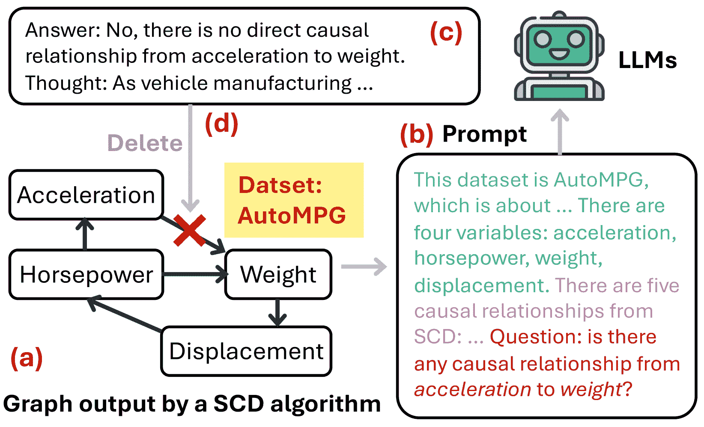
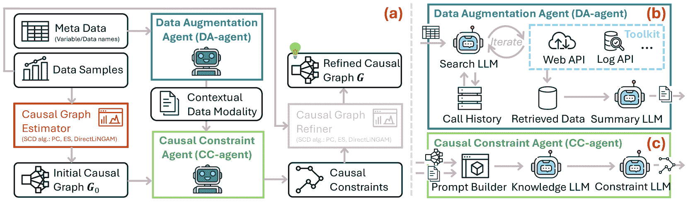
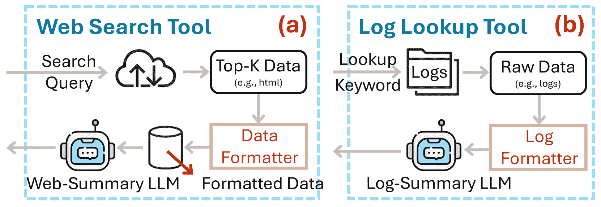
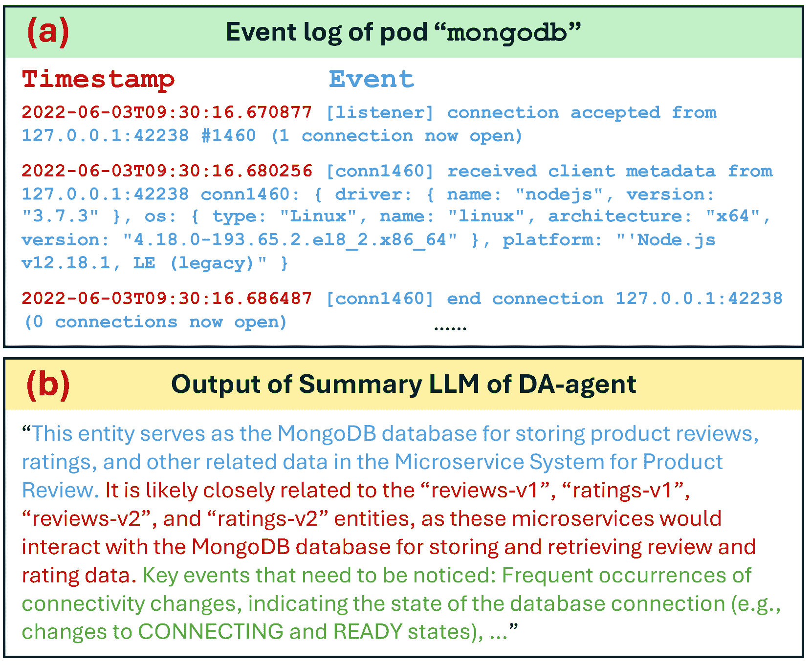
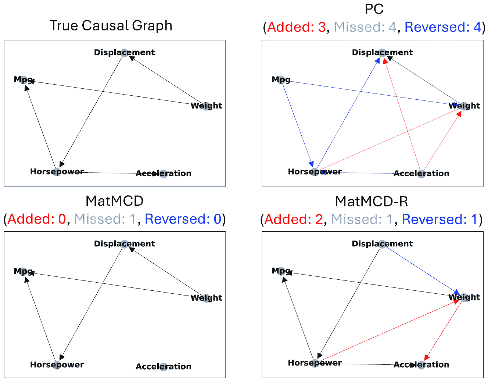
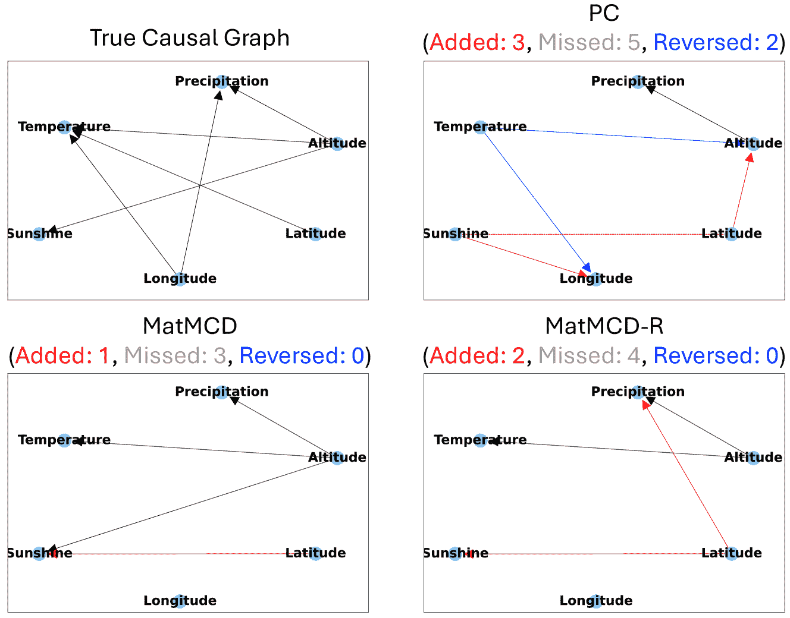
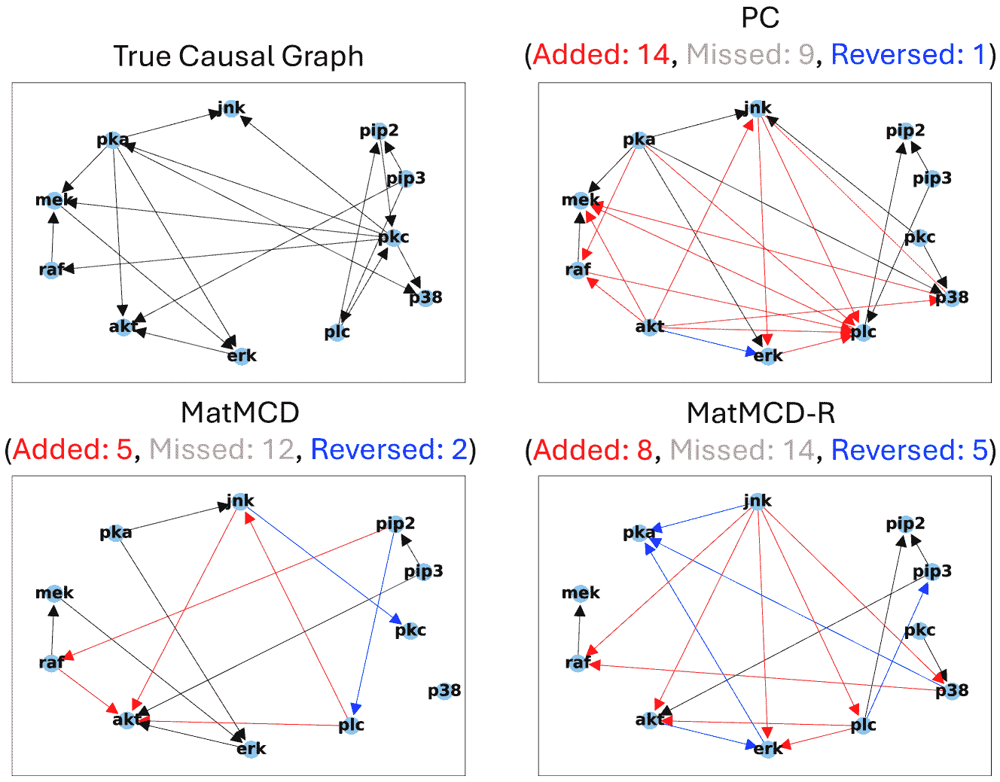
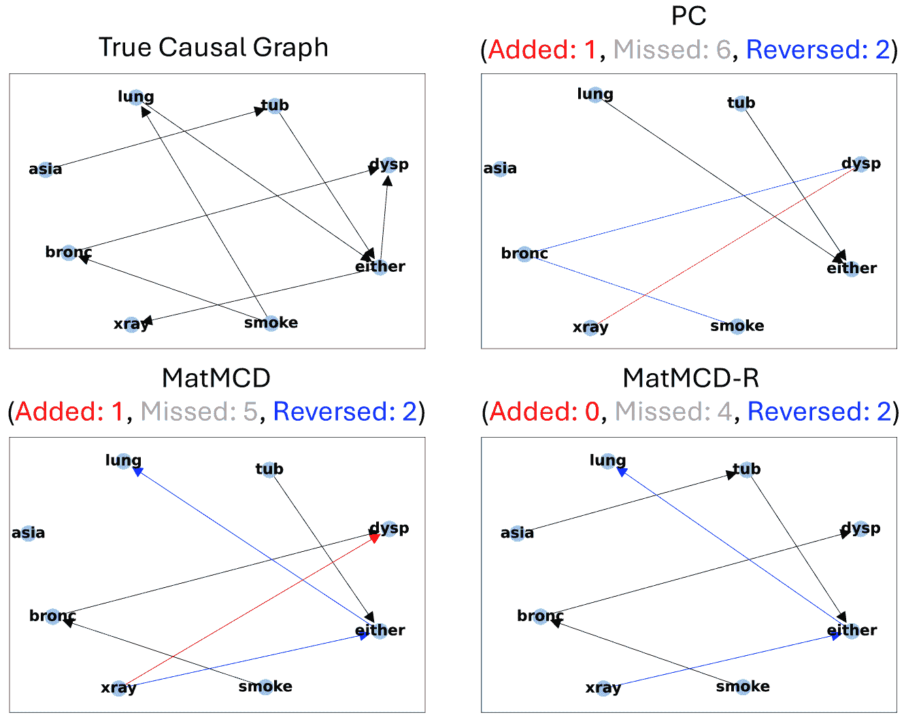
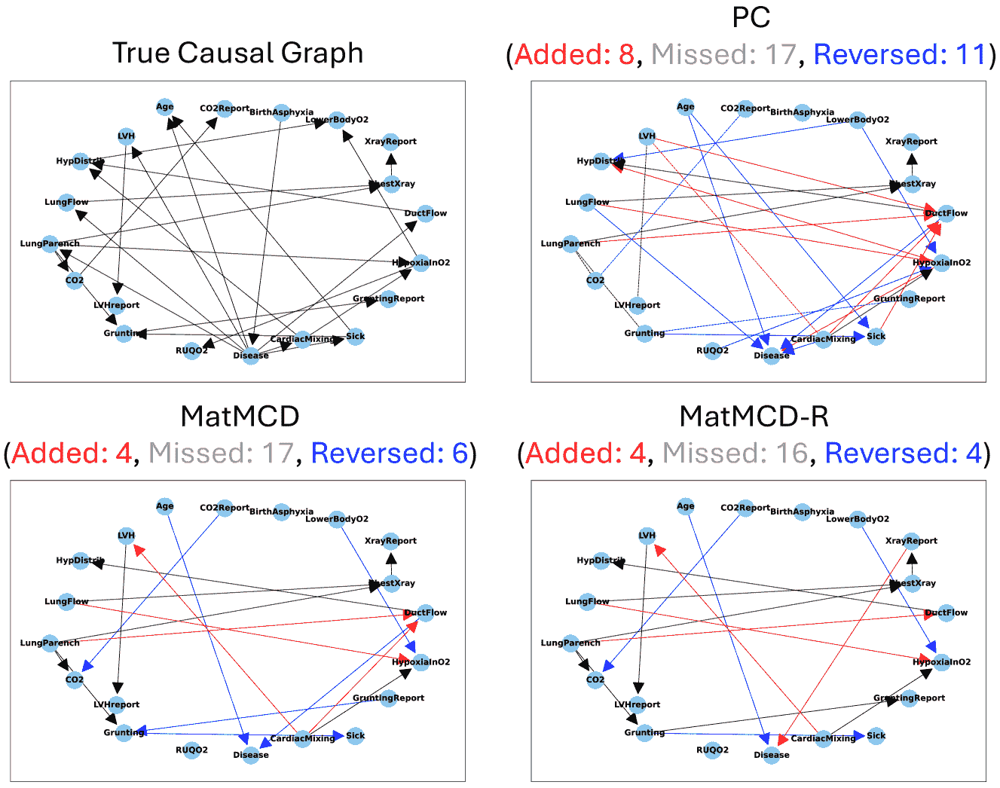

<!--yml
category: 未分类
date: 2025-01-11 11:46:00
-->

# Exploring Multi-Modal Integration with Tool-Augmented LLM Agents for Precise Causal Discovery

> 来源：[https://arxiv.org/html/2412.13667/](https://arxiv.org/html/2412.13667/)

ChengAo Shen¹, Zhengzhang Chen², Dongsheng Luo³, Dongkuan Xu⁴,
Haifeng Chen², Jingchao Ni¹
¹University of Houston, ²NEC Laboratories America,
³Florida International University, ⁴North Carolina State University
¹{cshen9, jni7}@uh.edu, ²{zchen, haifeng}@nec-labs.com,
³dluo@fiu.edu, ⁴dxu27@ncsu.edu

###### Abstract

Causal inference is an imperative foundation for decision-making across domains, such as smart health, AI for drug discovery and AIOps. Traditional statistical causal discovery methods, while well-established, predominantly rely on observational data and often overlook the semantic cues inherent in cause-and-effect relationships. The advent of Large Language Models (LLMs) has ushered in an affordable way of leveraging the semantic cues for knowledge-driven causal discovery, but the development of LLMs for causal discovery lags behind other areas, particularly in the exploration of multi-modality data. To bridge the gap, we introduce MatMcd, a multi-agent system powered by tool-augmented LLMs. MatMcd has two key agents: a Data Augmentation agent that retrieves and processes modality-augmented data, and a Causal Constraint agent that integrates multi-modal data for knowledge-driven inference. Delicate design of the inner-workings ensures successful cooperation of the agents. Our empirical study across seven datasets suggests the significant potential of multi-modality enhanced causal discovery.

Exploring Multi-Modal Integration with Tool-Augmented LLM Agents
for Precise Causal Discovery

ChengAo Shen¹, Zhengzhang Chen², Dongsheng Luo³, Dongkuan Xu⁴, Haifeng Chen², Jingchao Ni¹ ¹University of Houston, ²NEC Laboratories America, ³Florida International University, ⁴North Carolina State University ¹{cshen9, jni7}@uh.edu, ²{zchen, haifeng}@nec-labs.com, ³dluo@fiu.edu, ⁴dxu27@ncsu.edu

## 1 Introduction

Identifying cause-and-effect relationships in complex systems is crucial for a variety of applications, including neuralgia diagnosis in medicine Tu et al. ([2019](https://arxiv.org/html/2412.13667v1#bib.bib40)), protein pathway analysis in computational biology Sachs et al. ([2005](https://arxiv.org/html/2412.13667v1#bib.bib28)), and root cause locating in microservice architectures Wang et al. ([2023a](https://arxiv.org/html/2412.13667v1#bib.bib43)). These causal insights significantly benefit emerging fields such as smart health, AI-driven drug discovery, and AIOps. The process of discovering such relationships, known as causal discovery, typically generates a Directed Acyclic Graph (DAG). In this graph, edges represent the existence and direction of causal relationships between variables, as illustrated in Fig. [1](https://arxiv.org/html/2412.13667v1#S1.F1 "Figure 1 ‣ 1 Introduction ‣ Exploring Multi-Modal Integration with Tool-Augmented LLM Agents for Precise Causal Discovery")(a). This DAG not only governs the data generation process but also enhances the understanding of inter-variable influences, serving as the foundation for many downstream decision-making tasks Nguyen et al. ([2023](https://arxiv.org/html/2412.13667v1#bib.bib23)). As such, constructing accurate causal graphs is essential to the reliability of subsequent analyses.

Figure 1: An illustration of the general process of LLM based causal discovery: (a) a causal graph is estimated by an SCD algorithm; (b) a prompt is generated w.r.t. the graph; (c) LLMs reason about the causal structures; (d) the graph is refined based on the LLM response.

Conventional methods primarily rely on data-driven statistical causal discovery (SCD), which can be categorized as non-parametric Spirtes and Glymour ([1991](https://arxiv.org/html/2412.13667v1#bib.bib37)); Silander and Myllymäki ([2006](https://arxiv.org/html/2412.13667v1#bib.bib35)); Huang et al. ([2018](https://arxiv.org/html/2412.13667v1#bib.bib8)); Xie et al. ([2020](https://arxiv.org/html/2412.13667v1#bib.bib47)) and semi-parametric Shimizu et al. ([2006](https://arxiv.org/html/2412.13667v1#bib.bib31), [2011](https://arxiv.org/html/2412.13667v1#bib.bib32)); Zheng et al. ([2018](https://arxiv.org/html/2412.13667v1#bib.bib55)); Tu et al. ([2022](https://arxiv.org/html/2412.13667v1#bib.bib41)). These methods estimate causal relationships by analyzing the observational data of variables, but they overlook the semantic and contextual cues of the variables, resulting in suboptimal outcomes Takayama et al. ([2024](https://arxiv.org/html/2412.13667v1#bib.bib38)).

Commonsense and domain knowledge are invaluable for identifying cause-and-effect relationships among semantically meaningful variables. In light of this, growing research attention has been drawn to elicit such information for causal discovery. Large Language Models (LLMs), as praised by its astonishing reasoning ability drawing on extensive knowledge acquired from large-scale training Brown et al. ([2020](https://arxiv.org/html/2412.13667v1#bib.bib3)); Achiam et al. ([2023](https://arxiv.org/html/2412.13667v1#bib.bib1)), now become a promising and cost-effective source of expert knowledge to aid causal discovery. For example, by merely prompting with variable names and some contextual cues, LLMs have been shown to infer meaningful causal relationships Ban et al. ([2023](https://arxiv.org/html/2412.13667v1#bib.bib2)); Jiralerspong et al. ([2024](https://arxiv.org/html/2412.13667v1#bib.bib9)). More recently, hybrid approaches were introduced to combine LLMs with data-driven SCD algorithms, achieving enhanced accuracy in causal discovery Takayama et al. ([2024](https://arxiv.org/html/2412.13667v1#bib.bib38)); Khatibi et al. ([2024](https://arxiv.org/html/2412.13667v1#bib.bib11)). However, most existing methods have yet to fully harness the potential of modern LLMs, particularly the agent systems built upon tool-augmented LLMs.

An LLM agent is typically equipped with memory, reasoning, planning, and access to external tools such as calculators, search engines, and code compilers, rendering it superior in problem-solving compared to vanilla LLMs Yao et al. ([2022](https://arxiv.org/html/2412.13667v1#bib.bib50)). As a single-agent system may be hallucination-prone even with self-reflection Li et al. ([2023](https://arxiv.org/html/2412.13667v1#bib.bib17)); Shinn et al. ([2024](https://arxiv.org/html/2412.13667v1#bib.bib33)), multi-agent systems were introduced, which rivals more advanced models by combining multiple weaker agents. Despite the fast progress, LLM agents for causal discovery remains underexplored. The most relevant effort to date introduced a multi-agent system with debating LLMs for synergistic causal inference Le et al. ([2024](https://arxiv.org/html/2412.13667v1#bib.bib15)). However, this approach has never explored the potential of multi-modality in data – a feature that agent systems are well-equipped to handle.

As Fig. [1](https://arxiv.org/html/2412.13667v1#S1.F1 "Figure 1 ‣ 1 Introduction ‣ Exploring Multi-Modal Integration with Tool-Augmented LLM Agents for Precise Causal Discovery") shows, hybrid methods for causal discovery typically prompt LLMs with the prior causal graph produced by some SCD algorithm, appended by some meta-data (e.g., variable names, dataset titles) as contexts. However, these inputs may fall short in fully activating the reasoning ability of LLMs. Inspired by the observation that the abundant semantic data from external sources, such as webs and logs, can serve as an additional modality to the causal graph for improving prompts, we propose a Multi-Agent system with Tool-augmented LLMs for exploring Multi-modal enhancement of Causal Discovery (MatMcd).

Specifically, MatMcd is designed as a framework for refining causal graphs generated by SCD algorithms, involving two key agents: (1) a Data Augmentation Agent (DA-agent, $\S$[3.2](https://arxiv.org/html/2412.13667v1#S3.SS2 "3.2 Data Augmentation Agent (DA-agent) ‣ 3 Methodology ‣ Exploring Multi-Modal Integration with Tool-Augmented LLM Agents for Precise Causal Discovery")), and (2) a Causal Constraint Agent (CC-agent, $\S$[3.3](https://arxiv.org/html/2412.13667v1#S3.SS3 "3.3 Causal Constraint Agent (CC-agent) ‣ 3 Methodology ‣ Exploring Multi-Modal Integration with Tool-Augmented LLM Agents for Precise Causal Discovery")). Given a causal graph output by some SCD algorithm, DA-agent integrates meta-data (i.e., variable names and dataset titles) and calls tools such as web search APIs or offline log lookup APIs for iterative, reflection-based retrieval of augmented (textual) data, which is summarized as a compact cue in a different modality from the graphs. Upon receiving the augmented data, CC-agent combines it with the topological structure of the prior causal graph to infer the causal relationships among variables. Both agents comprise multiple cooperative LLMs with delicate mechanisms to handle sub-tasks such as tool-calling, memorizing, reasoning, and summarization. Retrieval Augmented Generation (RAG) Lewis et al. ([2020](https://arxiv.org/html/2412.13667v1#bib.bib16)) components are used where efficient memory is essential. In our experiments, we compared MatMcd with state-of-the-art (SOTA) baseline methods across five benchmark datasets and two public AIOps datasets of microservice systems. The results demonstrate substantial improvements in causal discovery by incorporating multi-modal data. The main contributions of this work are summarized as follows:

*   •

    We propose to explore the problem of multi-modality enhanced causal discovery via LLM agents, which is significant yet less studied.

*   •

    We introduce MatMcd, a novel framework of multi-agent, as a testbed for assessing the effectiveness of multi-modality in causal discovery.

*   •

    We perform extensive experiments on a variety of datasets, where MatMcd reduces causal inference errors (NHD) by up to 66.7% and improves root cause locating (MAP@10) by up to 83.3% over the best baselines, suggesting the potential of multi-modality data in causal discovery.

## 2 Related Work

Causal Discovery Methods are mostly conventional data-driven SCD algorithms, including non-parametric methods Spirtes and Glymour ([1991](https://arxiv.org/html/2412.13667v1#bib.bib37)); Chickering ([2002](https://arxiv.org/html/2412.13667v1#bib.bib6)); Silander and Myllymäki ([2006](https://arxiv.org/html/2412.13667v1#bib.bib35)); Huang et al. ([2018](https://arxiv.org/html/2412.13667v1#bib.bib8)); Xie et al. ([2020](https://arxiv.org/html/2412.13667v1#bib.bib47)) and semi-parametric methods Shimizu et al. ([2006](https://arxiv.org/html/2412.13667v1#bib.bib31)); Hoyer et al. ([2008](https://arxiv.org/html/2412.13667v1#bib.bib7)); Shimizu et al. ([2011](https://arxiv.org/html/2412.13667v1#bib.bib32)); Zheng et al. ([2018](https://arxiv.org/html/2412.13667v1#bib.bib55)); Rolland et al. ([2022](https://arxiv.org/html/2412.13667v1#bib.bib27)); Tu et al. ([2022](https://arxiv.org/html/2412.13667v1#bib.bib41)). These methods rely on observational data as input but cannot leverage the semantics of variables. Recently, knowledge-driven methods have been found promising for causal discovery. Some early efforts use LLMs by simply prompting variable names and dataset titles Kıcıman et al. ([2023](https://arxiv.org/html/2412.13667v1#bib.bib12)); Zečević et al. ([2023](https://arxiv.org/html/2412.13667v1#bib.bib52)); Chen et al. ([2024a](https://arxiv.org/html/2412.13667v1#bib.bib4)); Jiralerspong et al. ([2024](https://arxiv.org/html/2412.13667v1#bib.bib9)). Then hybrid approaches that integrate SCD algorithms with LLMs were introduced Ban et al. ([2023](https://arxiv.org/html/2412.13667v1#bib.bib2)); Vashishtha et al. ([2023](https://arxiv.org/html/2412.13667v1#bib.bib42)); Khatibi et al. ([2024](https://arxiv.org/html/2412.13667v1#bib.bib11)); Takayama et al. ([2024](https://arxiv.org/html/2412.13667v1#bib.bib38)) and found to be more effective than pure LLM-based methods. More recently, a multi-agent system-based approach was proposed Le et al. ([2024](https://arxiv.org/html/2412.13667v1#bib.bib15)) to explore the impacts of debating LLMs. However, none of these methods has explored the potential of multi-modal data in the LLM-based causal discovery process.

LLM Agents are typically equipped with plan, memory and tools. Planning can use techniques such as CoT Wei et al. ([2022](https://arxiv.org/html/2412.13667v1#bib.bib46)), ReAct Yao et al. ([2022](https://arxiv.org/html/2412.13667v1#bib.bib50)), and Reflexion Shinn et al. ([2024](https://arxiv.org/html/2412.13667v1#bib.bib33)). Tools endow agents with the ability to interact with environments. MRKL Karpas et al. ([2022](https://arxiv.org/html/2412.13667v1#bib.bib10)), Toolformer Schick et al. ([2024](https://arxiv.org/html/2412.13667v1#bib.bib29)), Function Calling OpenAI ([2024](https://arxiv.org/html/2412.13667v1#bib.bib24)), and HuggingGPT Shen et al. ([2024](https://arxiv.org/html/2412.13667v1#bib.bib30)) exemplify paradigms that integrate tools for problem-solving. For complex tasks, multi-agent systems are promising. The primary categories of multi-agent systems include cooperative agents Qian et al. ([2023](https://arxiv.org/html/2412.13667v1#bib.bib25)); Chen et al. ([2024b](https://arxiv.org/html/2412.13667v1#bib.bib5)), competitive agents Zhao et al. ([2023](https://arxiv.org/html/2412.13667v1#bib.bib53)) and debating agents Li et al. ([2023](https://arxiv.org/html/2412.13667v1#bib.bib17)); Liang et al. ([2023](https://arxiv.org/html/2412.13667v1#bib.bib18)); Xiong et al. ([2023](https://arxiv.org/html/2412.13667v1#bib.bib48)). In this work, we intestigate a cooperative multi-agent system where the agents are coordinated to enhance a solution towards a shared goal.

## 3 Methodology

Figure 2: An illustration of the MatMcd framework: (a) an overview of the framework, (b) the inner working of DA-agent, and (c) the inner working of CC-agent.

Fig. [2](https://arxiv.org/html/2412.13667v1#S3.F2 "Figure 2 ‣ 3 Methodology ‣ Exploring Multi-Modal Integration with Tool-Augmented LLM Agents for Precise Causal Discovery") is an overview of the proposed MatMcd system, which has four key components: (1) Causal Graph Estimator ($\S$[3.1](https://arxiv.org/html/2412.13667v1#S3.SS1 "3.1 Causal Graph Estimator ‣ 3 Methodology ‣ Exploring Multi-Modal Integration with Tool-Augmented LLM Agents for Precise Causal Discovery")); (2) Data Augmentation Agent (DA-agent, $\S$[3.2](https://arxiv.org/html/2412.13667v1#S3.SS2 "3.2 Data Augmentation Agent (DA-agent) ‣ 3 Methodology ‣ Exploring Multi-Modal Integration with Tool-Augmented LLM Agents for Precise Causal Discovery")); (3) Causal Constraint Agent (CC-agent, $\S$[3.3](https://arxiv.org/html/2412.13667v1#S3.SS3 "3.3 Causal Constraint Agent (CC-agent) ‣ 3 Methodology ‣ Exploring Multi-Modal Integration with Tool-Augmented LLM Agents for Precise Causal Discovery")); and (4) Causal Graph Refiner ($\S$[3.4](https://arxiv.org/html/2412.13667v1#S3.SS4 "3.4 Causal Graph Refiner ‣ 3 Methodology ‣ Exploring Multi-Modal Integration with Tool-Augmented LLM Agents for Precise Causal Discovery")). Next, we will first introduce some notations and then elaborate on each of the components in an order subject to the flow of data.

Notations. Suppose there is a set of $n$ variables $\mathcal{V}=\{v_{1}$, …, $v_{n}\}$ (e.g., 4 variables in Fig. [1](https://arxiv.org/html/2412.13667v1#S1.F1 "Figure 1 ‣ 1 Introduction ‣ Exploring Multi-Modal Integration with Tool-Augmented LLM Agents for Precise Causal Discovery")(a)), each variable $v_{i}$ is associated with a set of observed data samples ${\bf v}_{i}=\{v_{i1},...,v_{im}\}$ where $m$ is the number of samples. The observational data could be random samples or a length-$m$ time series emitted by each variable, depending on the application. In many cases, meta-data is available. In this work, we assume a minimal set of meta-data $\mathcal{D}=\{\mathsf{s},\mathcal{Z}\}$ where $\mathsf{s}$ is a descriptive title of the dataset (e.g., “AutoMPG” in Fig. [1](https://arxiv.org/html/2412.13667v1#S1.F1 "Figure 1 ‣ 1 Introduction ‣ Exploring Multi-Modal Integration with Tool-Augmented LLM Agents for Precise Causal Discovery")(a)) and $\mathcal{Z}=\{\mathsf{z}_{1},...,\mathsf{z}_{n}\}$ includes the descriptive name $\mathsf{z}_{i}$ of each variable $v_{i}$ in $\mathcal{V}$ (e.g., “Acceleration” in Fig. [1](https://arxiv.org/html/2412.13667v1#S1.F1 "Figure 1 ‣ 1 Introduction ‣ Exploring Multi-Modal Integration with Tool-Augmented LLM Agents for Precise Causal Discovery")(a)).

The Task. Based on $\{{\bf v}_{1},...,{\bf v}_{n}\}$ and $\mathcal{D}$, we want to construct a DAG, ${\bf G}=(\mathcal{V},\mathcal{E})$, where each variable $v_{i}$ in $\mathcal{V}$ is a node in the graph, and $\mathcal{E}\subseteq\mathcal{V}\times\mathcal{V}$ is the set of directed edges with $(v_{i},v_{j})\in\mathcal{E}$ signifying a causal relationship from $v_{i}$ to $v_{j}$. The goal of this work is to infer accurate causal relationships in $\mathcal{E}$ among the set of $n$ variables in $\mathcal{V}$.

### 3.1 Causal Graph Estimator

Similar to the hybrid approaches Takayama et al. ([2024](https://arxiv.org/html/2412.13667v1#bib.bib38)); Khatibi et al. ([2024](https://arxiv.org/html/2412.13667v1#bib.bib11)), Causal Graph Estimator serves as an initializer of causal graph and is built upon data-driven SCD algorithms, with the aim of estimating an initial causal graph ${\bf G}_{0}=(\mathcal{V},\mathcal{E}_{0})$ purely from the observational data $\{{\bf v}_{1}$, …, ${\bf v}_{n}\}$ without accessing any other information. Here $\mathcal{V}$ is not subscript as it will be kept intact throughout the proposed framework and our focus is on the alteration of the causal relationships in $\mathcal{E}$ for accurate causal discovery.

Our framework is flexible to the choice of SCD algorithms. In this work, we investigate the feasibility of employing three widely used algorithms, each of which is a representative of a category: (1) Constraint-based method – Peter-Clark (PC) algorithm Spirtes and Glymour ([1991](https://arxiv.org/html/2412.13667v1#bib.bib37)) which is non-parametric; (2) Score-based method – Exact Search (ES) algorithm Yuan and Malone ([2013](https://arxiv.org/html/2412.13667v1#bib.bib51)) which is non-parametric; and (3) Constrained functional causal models – DirectLiNGAM Shimizu et al. ([2011](https://arxiv.org/html/2412.13667v1#bib.bib32)) which is semi-parametric. We leave the exploration of other SCD algorithms in our future work as it is out of the scope of this work. Inspired by the recent LLM prompting techniques for graphs Wang et al. ([2024](https://arxiv.org/html/2412.13667v1#bib.bib45)), the output edges $\mathcal{E}_{0}$ of the SCD algorithm will be embedded as an adjacency list in the prompt generated by the prompt builder module of the CC-agent ($\S$[3.3](https://arxiv.org/html/2412.13667v1#S3.SS3 "3.3 Causal Constraint Agent (CC-agent) ‣ 3 Methodology ‣ Exploring Multi-Modal Integration with Tool-Augmented LLM Agents for Precise Causal Discovery")) in Fig. [2](https://arxiv.org/html/2412.13667v1#S3.F2 "Figure 2 ‣ 3 Methodology ‣ Exploring Multi-Modal Integration with Tool-Augmented LLM Agents for Precise Causal Discovery"), which will also integrate the semantics-rich data modality retrieved by the DA-agent ($\S$[3.2](https://arxiv.org/html/2412.13667v1#S3.SS2 "3.2 Data Augmentation Agent (DA-agent) ‣ 3 Methodology ‣ Exploring Multi-Modal Integration with Tool-Augmented LLM Agents for Precise Causal Discovery")).

### 3.2 Data Augmentation Agent (DA-agent)

The goal of DA-agent is to retrieve semantics-rich contextual data pertinent to the initial causal graph ${\bf G}_{0}$, such as web documents and log files about the variables, as an additional modality for prompting the CC-agent (see $\S$[3.3](https://arxiv.org/html/2412.13667v1#S3.SS3 "3.3 Causal Constraint Agent (CC-agent) ‣ 3 Methodology ‣ Exploring Multi-Modal Integration with Tool-Augmented LLM Agents for Precise Causal Discovery")). As illustrated in Fig. [2](https://arxiv.org/html/2412.13667v1#S3.F2 "Figure 2 ‣ 3 Methodology ‣ Exploring Multi-Modal Integration with Tool-Augmented LLM Agents for Precise Causal Discovery")(b), DA-agent comprises a Search LLM and a Summary LLM.

Search LLM. The Search LLM has access to a set of tools for data search. In this work, we focus on a web search API as a general tool for retrieving contextual data from external sources, and a log lookup API for applications where a domain-specific database is available such as the process logs in root cause analysis for microservice systems in AIOps Zheng et al. ([2024a](https://arxiv.org/html/2412.13667v1#bib.bib54)). The DA-agent is flexible to the toolkit and is extendable for a wide scenarios by including other application-specific tools such as Wikipedia API and code lookup API, which we leave for future exploration.

As shown in Fig. [2](https://arxiv.org/html/2412.13667v1#S3.F2 "Figure 2 ‣ 3 Methodology ‣ Exploring Multi-Modal Integration with Tool-Augmented LLM Agents for Precise Causal Discovery"), upon receiving the meta-data $\mathcal{D}=\{\mathsf{s},\mathcal{Z}\}$ about the causal graph, the Search LLM first checks its calling history memory to decide whether to initiate a new tool call. If a new call is needed, the Search LLM invokes a search tool API to retrieve additional data using a prompt that includes the dataset title $\mathsf{s}$ and variable names $\mathsf{z}_{1}$, …, $\mathsf{z}_{n}$. This search action is then recorded in the memory for future reference. In our case, since the focus is on search tools, the action involves generating a query, and the generated query is added to the memory. In subsequent iterations, all previously recorded queries are examined to prevent redundant queries. This process continues iteratively until the Search LLM determines that no further tool calls are necessary, terminating the loop.

To enable this iterative search, the prompt is designed based on self-reflection techniques Shinn et al. ([2024](https://arxiv.org/html/2412.13667v1#bib.bib33)); Madaan et al. ([2024](https://arxiv.org/html/2412.13667v1#bib.bib21)), where the LLM assesses whether additional queries are needed based on the comprehensiveness of the historical queries. The loop terminates when the LLM concludes with a "No query needed" response. Compared to single-round searches, this iterative process proves crucial for retrieving relevant and comprehensive data, especially in domains where variable-specific information is challenging to locate (e.g., medicine). However, for lookup APIs, iteration is unnecessary. Thus, the retrieved data through these tools constitutes an additional textual modality for the causal graph. The prompt used for the Search LLM is provided in Appendix [C.1](https://arxiv.org/html/2412.13667v1#A3.SS1 "C.1 Prompt Templates for Data Augmentation Agent (DA-agent) ‣ Appendix C Prompt Templates ‣ Exploring Multi-Modal Integration with Tool-Augmented LLM Agents for Precise Causal Discovery").

Figure 3: The search tool preparation in DA-agent for (a) web search tool, and (b) log lookup tool.

Tool Preparation. Fig. [3](https://arxiv.org/html/2412.13667v1#S3.F3 "Figure 3 ‣ 3.2 Data Augmentation Agent (DA-agent) ‣ 3 Methodology ‣ Exploring Multi-Modal Integration with Tool-Augmented LLM Agents for Precise Causal Discovery") illustrates our preparation of the Web Search tool and the Log Lookup tool. In the former, we employ Google search API where the query is generated by the Search LLM as aforementioned. The retrieved top webpages will be de-formatted (e.g., removing HTML tags) by a data formatter and the resultant plain docs will be stored in a memory. Then a Web-Summary LLM is employed to summarize the docs into a concise description. In contrast, the Log Lookup tool uses exact lookup, i.e., with a variable name as the keyword, its corresponding log can be retrieved directly. Thus the memory can be removed and the retrieved log, which still needs de-formatting (e.g., removing log templates) and could be lengthy, will be summarized by a Log-Summary LLM.

Summary LLM. The data retrieved by the Search LLM is iteratively added to the Retrieved Data Memory, as shown in Fig. [2](https://arxiv.org/html/2412.13667v1#S3.F2 "Figure 2 ‣ 3 Methodology ‣ Exploring Multi-Modal Integration with Tool-Augmented LLM Agents for Precise Causal Discovery")(b). Upon loop termination, a Summary LLM summarizes the retrieved data into three types of cues: (1) description of the dataset; (2) description of each variable in the graph; and (3) relationships between the variables. Since the size of the retrieved data from iterative searches may exceed the LLM’s context window, we adopt an efficient summarization approach using RAG Lewis et al. ([2020](https://arxiv.org/html/2412.13667v1#bib.bib16)). The retrieved data is divided into indexed document chunks, implemented with LlamaIndex Liu ([2022](https://arxiv.org/html/2412.13667v1#bib.bib19)) using text-embedding-ada-002 for chunk indexing and Maximum Inner Product Search (MIPS) for retrieving relevant chunks. An example summary is provided in Appendix [D.1](https://arxiv.org/html/2412.13667v1#A4.SS1 "D.1 Data Augmentation Agent (DA-agent) ‣ Appendix D Examples of LLM Response ‣ Exploring Multi-Modal Integration with Tool-Augmented LLM Agents for Precise Causal Discovery"). The resulting summary serves as a contextual data modality for the initial causal graph ${\bf G}_{0}$ to prompt CC-agent.

Remark. Since there is a risk of retrieving web content that may leak ground truth causal graphs for certain datasets, we conducted thorough screening in our RAG implementation of the Retrieved Data Memory to prevent such information leaks.

### 3.3 Causal Constraint Agent (CC-agent)

In addition to the external knowledge, our method leverages the factual knowledge stored in LLMs, acquired during pre-training. To achieve this, CC-agent is designed based on the Two-Stage Prompting framework of zero-shot Chain-of-Thought (ZSCOT) Kojima et al. ([2022](https://arxiv.org/html/2412.13667v1#bib.bib13)). First, a prompt builder integrates ${\bf G}_{0}$, represented as an adjacency list, with contextual data from DA-agent to prompt a Knowledge LLM. The Knowledge LLM is tasked with explaining each (non-)existing causal relationship in the initial causal graph ${\bf G}_{0}$ based on the contextual data and its own knowledge. These explanations, which could either support or refute the causal relationships, are used to prompt a Constraint LLM in the second stage to draw a conclusion on the existence of each relationship (i.e., “Yes”/“No”). To address potential uncertainty in the conclusions, we adopt the Top-K-Guess technique Tian et al. ([2023](https://arxiv.org/html/2412.13667v1#bib.bib39)) to elicit verbal confidence. This approach, found to be more reliable than sampling-based likelihood estimation Xiong et al. ([2024](https://arxiv.org/html/2412.13667v1#bib.bib49)), quantitatively evaluates the likelihood of each causal relationship. Among the Top-K guesses, the most confident one is selected as the final conclusion for each causal relationship.

### 3.4 Causal Graph Refiner

To ensure the final causal graph ${\bf G}$ is acyclic, the edge set $\mathcal{E}_{0}$ is not directly modified based on the (non-)existence constraints from CC-agent. Instead, the SCD algorithm used in the Causal Graph Estimator ($\S$[3.1](https://arxiv.org/html/2412.13667v1#S3.SS1 "3.1 Causal Graph Estimator ‣ 3 Methodology ‣ Exploring Multi-Modal Integration with Tool-Augmented LLM Agents for Precise Causal Discovery")) is rerun with these constraints imposed to generate a new causal graph ${\bf G}$. Specifically, upon receiving the (non-)existence constraints, a constraint matrix ${\bf C}\in\mathbb{R}^{n\times n}$ is constructed, where ${\bf C}_{ij}=1$ if CC-agent indicates a causal effect from $v_{i}$ to $v_{j}$, and ${\bf C}_{ij}=0$ otherwise.

The most representative SCD algorithms, including PC, ES, and DirectLiNGAM, are designed to incorporate such a constraint matrix ${\bf C}$ as input alongside observational data $\{{\bf v}_{1},\dots,{\bf v}_{n}\}$. This ensures that the generated causal graph complies with the constraints in ${\bf C}$ to varying extents, enabling the production of a refined causal graph ${\bf G}$ that is both consistent with the imposed constraints and a directed acyclic graph (DAG).

Remark. Compared to the existing approaches that utilize LLMs for causal discovery Takayama et al. ([2024](https://arxiv.org/html/2412.13667v1#bib.bib38)); Khatibi et al. ([2024](https://arxiv.org/html/2412.13667v1#bib.bib11)), the key novelty of the proposed MatMcd lies in its exploration of DA-agent for multi-modal enhancement of causal discovery. An algorithmic summary of the proposed workflow is provided in Appendix [A](https://arxiv.org/html/2412.13667v1#A1 "Appendix A Algorithm ‣ Exploring Multi-Modal Integration with Tool-Augmented LLM Agents for Precise Causal Discovery").

| Method | AutoMPG | DWDClimate | SachsProtein |
| Prc [↑] | F1 [↑] | FPR [↓] | SHD [↓] | NHD [↓] | Prc [↑] | F1 [↑] | FPR [↓] | SHD [↓] | NHD [↓] | Prc [↑] | F1 [↑] | FPR [↓] | SHD [↓] | NHD [↓] |
| PC | 0.11 | 0.14 | 0.40 | 8 | 0.32 | 0.14 | 0.15 | 0.20 | 9 | 0.25 | 0.38 | 0.44 | 0.15 | 24 | 0.19 |
| Exact Search | 0.25 | 0.30 | 0.30 | 6 | 0.24 | 0.45 | 0.58 | 0.20 | 6 | 0.16 | 0.18 | 0.23 | 0.26 | 31 | 0.25 |
| DirectLiNGAM | 0.11 | 0.14 | 0.40 | 8 | 0.32 | 0.16 | 0.22 | 0.33 | 10 | 0.27 | 0.27 | 0.36 | 0.25 | 29 | 0.23 |
| MAC* | - | - | - | 4 | 0.16 | - | - | - | 6 | 0.19 | - | - | - | 21 | 0.19 |
| Efficient-CDLMs | 0.66 | 0.50 | 0.05 | 4 | 0.16 | 0.33 | 0.33 | 0.13 | 8 | 0.22 | 0.33 | 0.09 | 0.02 | 20 | 0.16 |
| SCD-LLM | 0.57 | 0.66 | 0.15 | 3 | 0.12 | 0.33 | 0.22 | 0.06 | 7 | 0.19 | 0.04 | 0.05 | 0.19 | 29 | 0.23 |
| ReAct | 0.50 | 0.54 | 0.15 | 4 | 0.16 | 0.60 | 0.40 | 0.06 | 6 | 0.16 | 0.04 | 0.04 | 0.20 | 29 | 0.23 |
| LLM-KBCI | 0.57 | 0.66 | 0.15 | 3 | 0.12 | 0.50 | 0.40 | 0.06 | 6 | 0.16 | 0.13 | 0.14 | 0.19 | 27 | 0.22 |
| LLM-KBCI-RA | 0.57 | 0.55 | 0.15 | 3 | 0.12 | 0.75 | 0.60 | 0.03 | 4 | 0.11 | 0.08 | 0.09 | 0.20 | 30 | 0.24 |
| LLM-KBCI-RE | 0.50 | 0.61 | 0.20 | 4 | 0.16 | 0.50 | 0.40 | 0.06 | 6 | 0.16 | 0.09 | 0.10 | 0.18 | 28 | 0.23 |
| MatMcd | 1.00 | 0.88 | 0.00 | 1 | 0.04 | 0.75 | 0.88 | 0.03 | 4 | 0.11 | 0.50 | 0.42 | 0.06 | 17 | 0.14 |
| MatMcd-RE | 0.57 | 0.66 | 0.15 | 3 | 0.12 | 0.50 | 0.40 | 0.06 | 6 | 0.16 | 0.31 | 0.31 | 0.12 | 21 | 0.17 |

Table 1: Comparison of different causal discovery methods on datasets with continuous variables. ${\uparrow}$ indicates larger score is better. ${\downarrow}$ indicates smaller score is better. * indicates numbers are adopted from the papers of the methods.

| Method | Asia | Child |
| Prc [↑] | F1 [↑] | FPR [↓] | SHD [↓] | NHD [↓] | Prc [↑] | F1 [↑] | FPR [↓] | SHD [↓] | NHD [↓] |
| PC | 0.50 | 0.50 | 0.07 | 6 | 0.09 | 0.30 | 0.34 | 0.06 | 24 | 0.06 |
| Exact Search | 0.50 | 0.42 | 0.05 | 6 | 0.09 | 0.35 | 0.28 | 0.02 | 19 | 0.04 |
| DirectLiNGAM | 0.28 | 0.36 | 0.17 | 11 | 0.17 | 0.29 | 0.36 | 0.07 | 33 | 0.08 |
| Efficient-CDLMs | 0.57 | 0.53 | 0.05 | 7 | 0.10 | 0.21 | 0.20 | 0.048 | 37 | 0.09 |
| SCD-LLM | 0.60 | 0.40 | 0.03 | 5 | 0.07 | 0.56 | 0.54 | 0.02 | 19 | 0.04 |
| ReAct | 0.40 | 0.30 | 0.05 | 6 | 0.09 | 0.56 | 0.54 | 0.02 | 19 | 0.04 |
| LLM-KBCI | 0.42 | 0.40 | 0.07 | 6 | 0.09 | 0.48 | 0.50 | 0.03 | 20 | 0.05 |
| LLM-KBCI-RA | 0.33 | 0.28 | 0.07 | 7 | 0.10 | 0.44 | 0.46 | 0.04 | 21 | 0.05 |
| LLM-KBCI-RE | 0.28 | 0.26 | 0.08 | 7 | 0.10 | 0.40 | 0.42 | 0.04 | 22 | 0.05 |
| MatMcd | 0.50 | 0.42 | 0.05 | 6 | 0.09 | 0.48 | 0.50 | 0.03 | 20 | 0.05 |
| MatMcd-RE | 0.66 | 0.57 | 0.03 | 4 | 0.06 | 0.56 | 0.54 | 0.02 | 19 | 0.04 |

Table 2: Comparison of different causal discovery methods on datasets with discrete variables.

## 4 Experiments

In this section, we first compare MatMcd with SOTA methods on benchmark datasets. Then we evaluate MatMcd for a root cause analysis task on real-life enterprise microservice system datasets.

### 4.1 Experimental Setup

Benchmark Datasets. To be comprehensive, we use 5 benchmark datasets covering both continuous variables and discrete variables. For the former, following Takayama et al. ([2024](https://arxiv.org/html/2412.13667v1#bib.bib38)); Le et al. ([2024](https://arxiv.org/html/2412.13667v1#bib.bib15)), we adopt (1) AutoMPG Quinlan ([1993](https://arxiv.org/html/2412.13667v1#bib.bib26)), which has five variables concerning city-cycle fuel consumption in miles per gallon, each variable has a length-392 time series; (2) DWDClimate Mooij et al. ([2016](https://arxiv.org/html/2412.13667v1#bib.bib22)), which has six variables pertinent to observations from weather stations in Deutscher Wetterdienst, each variable has a length-350 time series; and (3) SachsProtein Sachs et al. ([2005](https://arxiv.org/html/2412.13667v1#bib.bib28)), which has eleven variables measuring the expression level of different proteins and phospholipids in human cells, each variable has a length-7,466 time series. For the latter, following Long et al. ([2023](https://arxiv.org/html/2412.13667v1#bib.bib20)); Jiralerspong et al. ([2024](https://arxiv.org/html/2412.13667v1#bib.bib9)), we adopt (4) Asia Lauritzen and Spiegelhalter ([1988](https://arxiv.org/html/2412.13667v1#bib.bib14)), which has eight variables relevant to lung disease diagnosis, each variable has 1,000 discrete samples; and (5) Child Spiegelhalter ([1992](https://arxiv.org/html/2412.13667v1#bib.bib36)), which has twenty variables regarding congenital heart disease in newborn babies, each variable has 1,000 discrete samples.

In AutoMPG, DWDClimate, and SachsProtein, ground truth causal graphs constructed by experts are available for evaluation purpose. For Asia and Child, since the observational data of the variables are sampled from a Bayesian network, the prior conditional probabilities among the variables establish the ground truth causal graphs.

| Method | AutoMPG | DWDClimate | SachsProtein |
| Prc [↑] | F1 [↑] | FPR [↓] | SHD [↓] | NHD [↓] | Prc [↑] | F1 [↑] | FPR [↓] | SHD [↓] | NHD [↓] | Prc [↑] | F1 [↑] | FPR [↓] | SHD [↓] | NHD [↓] |
| MatMcd | 1.00 | 0.88 | 0.00 | 1 | 0.04 | 0.75 | 0.88 | 0.03 | 4 | 0.11 | 0.38 | 0.22 | 0.04 | 17 | 0.14 |
| (a) Iter.$\rightarrow$Single search | 0.66 | 0.72 | 0.10 | 2 | 0.08 | 0.66 | 0.44 | 0.03 | 5 | 0.13 | 0.38 | 0.22 | 0.04 | 17 | 0.14 |
| (b) PC$\rightarrow$ES | 0.33 | 0.42 | 0.30 | 6 | 0.24 | 0.50 | 0.50 | 0.10 | 5 | 0.13 | 0.26 | 0.28 | 0.16 | 25 | 0.20 |
| (b) PC$\rightarrow$DirectLiNGAM | 0.16 | 0.18 | 0.25 | 6 | 0.24 | 0.16 | 0.22 | 0.23 | 9 | 0.25 | 0.19 | 0.22 | 0.20 | 27 | 0.22 |
| (c) LLM$\rightarrow$GPT4 | 0.57 | 0.66 | 0.15 | 3 | 0.12 | 0.60 | 0.54 | 0.06 | 5 | 0.13 | 0.58 | 0.45 | 0.04 | 15 | 0.12 |
| (c) LLM$\rightarrow$Llama3.1-8B | 0.37 | 0.46 | 0.25 | 5 | 0.20 | 0.33 | 0.22 | 0.06 | 7 | 0.19 | 0.16 | 0.18 | 0.20 | 29 | 0.23 |
| (c) LLM$\rightarrow$Llama3.1-70B | 0.50 | 0.54 | 0.15 | 4 | 0.16 | 0.40 | 0.36 | 0.10 | 7 | 0.19 | 0.26 | 0.26 | 0.13 | 24 | 0.19 |
| (c) LLM$\rightarrow$Gemma2-9B | 0.37 | 0.46 | 0.25 | 5 | 0.20 | 0.16 | 0.16 | 0.16 | 8 | 0.22 | 0.16 | 0.18 | 0.20 | 29 | 0.23 |
| (c) LLM$\rightarrow$Ministral-7B | 0.60 | 0.60 | 0.10 | 4 | 0.16 | 0.33 | 0.33 | 0.13 | 7 | 0.19 | 0.21 | 0.18 | 0.10 | 25 | 0.20 |

Table 3: Ablation analysis of the proposed MatMcd method on benchmark datasets.

Baselines. We compare MatMcd with the most relevant SOTA methods on causal discovery, including (1) statistical causal discovery: Peter-Clark (PC) algorithm Spirtes and Glymour ([1991](https://arxiv.org/html/2412.13667v1#bib.bib37)), Exact Search (ES) algorithm Yuan and Malone ([2013](https://arxiv.org/html/2412.13667v1#bib.bib51)), and DirectLiNGAM Shimizu et al. ([2011](https://arxiv.org/html/2412.13667v1#bib.bib32)); (2) LLM-based causal discovery that only uses LLMs to infer causal relationships: Efficient-CDLMs Jiralerspong et al. ([2024](https://arxiv.org/html/2412.13667v1#bib.bib9)), which employs a BFS-based LLM prompting for efficient causal graph construction, and MAC Le et al. ([2024](https://arxiv.org/html/2412.13667v1#bib.bib15)), which uses Debating LLMs for building a multi-agent system; and (3) Hybrid approaches that refine an SCD causal graph by LLMs: SCD-LLM, which uses a single LLM upon the SCD output, ReAct Yao et al. ([2022](https://arxiv.org/html/2412.13667v1#bib.bib50)), which interleaves reasoning and search tool usage when refining SCD graphs, LLM-KBCI Takayama et al. ([2024](https://arxiv.org/html/2412.13667v1#bib.bib38)), which uses ZSCOT two-stage prompting for refining causal graphs.

Moreover, we apply ReAct framework for LLM-KBCI to enable alternate reasoning and tool usage and name this baseline as LLM-KBCI-RA. We also introduce Top-K Guess reasoning Tian et al. ([2023](https://arxiv.org/html/2412.13667v1#bib.bib39)) (with K=2) for verbal calibration on LLM-KBCI and name this variant as LLM-KBCI-RE.

For our method, we consider two major variants. The first asks for a single answer from the CC-agent ($\S$[3.3](https://arxiv.org/html/2412.13667v1#S3.SS3 "3.3 Causal Constraint Agent (CC-agent) ‣ 3 Methodology ‣ Exploring Multi-Modal Integration with Tool-Augmented LLM Agents for Precise Causal Discovery")), i.e., K=1 in the Top-K Guess reasoning, named as MatMcd. The second uses K=2 in the Top-K Guess reasoning, which we name as MatMcd-RE. Additionally, we perform extensive ablation analysis on other variants of MatMcd in Table [3](https://arxiv.org/html/2412.13667v1#S4.T3 "Table 3 ‣ 4.1 Experimental Setup ‣ 4 Experiments ‣ Exploring Multi-Modal Integration with Tool-Augmented LLM Agents for Precise Causal Discovery") to evaluate its design choices.

Implementation. By default, we use GPT-4o mini with temperature 0.5 as the base LLM for all LLM-based and Hybrid methods, as it was found very performant by the existing works Le et al. ([2024](https://arxiv.org/html/2412.13667v1#bib.bib15)). For all Hybrid approaches, PC is used as the base SCD algorithm. Also, we evaluate our MatMcd by switching the LLM with GPT-4, Llama-3.1-8B, Llama-3.1-70B, Mistral-7B and Gemma2-9B, and switching the SCD algorithm with ES and DirectLiNGAM in our ablation analysis. All SCD algorithms were implemented with causal-learn Zheng et al. ([2024b](https://arxiv.org/html/2412.13667v1#bib.bib56)). ReAct and RAG frameworks were implemented with LlamaIndex Liu ([2022](https://arxiv.org/html/2412.13667v1#bib.bib19)). For all baselines, we used their official code when available. Since MAC’s code is unavailable, we report its results from the original paper, which are only available on AutoMPG, DWDClimate, and SachsProtein datasets.

Evaluation Metrics. Following Kıcıman et al. ([2023](https://arxiv.org/html/2412.13667v1#bib.bib12)); Takayama et al. ([2024](https://arxiv.org/html/2412.13667v1#bib.bib38)); Khatibi et al. ([2024](https://arxiv.org/html/2412.13667v1#bib.bib11)); Le et al. ([2024](https://arxiv.org/html/2412.13667v1#bib.bib15)), we employ the widely used metrics including precision (Prc), F1-score (F1), FPR, structural Hamming distance (SHD), and normalized Hamming distance (NHD) for gauging the difference between the predicted causal graphs and the ground truth graphs. Prc and F1 measure the accuracy, thus a larger value is better. FPR, SHD, and NHD measure the errors/differences, hence a smaller value is better.

### 4.2 Experimental Results

Causal Discovery. Table [1](https://arxiv.org/html/2412.13667v1#S3.T1 "Table 1 ‣ 3.4 Causal Graph Refiner ‣ 3 Methodology ‣ Exploring Multi-Modal Integration with Tool-Augmented LLM Agents for Precise Causal Discovery") and [2](https://arxiv.org/html/2412.13667v1#S3.T2 "Table 2 ‣ 3.4 Causal Graph Refiner ‣ 3 Methodology ‣ Exploring Multi-Modal Integration with Tool-Augmented LLM Agents for Precise Causal Discovery") summarize the results on the benchmark datasets. From the tables, we have several observations: (1) Methods involving LLMs generally outperform SCD algorithms in most cases except for SachsProtein and Asia datasets which pertain to biomedicine. It demonstrates the great potential of LLMs’ commonsense knowledge acquired by pre-training for the task of causal discovery, but meanwhile draws to our attention on their short of domain-specific knowledge. (2) Hybrid approaches outperform LLM-based baselines in most cases, indicating using SCD outputs as a prior for LLMs to reference has the benefits of complementing their causal effects related knowledge. (3) Baseline methods that can leverage tools for retrieving external data, i.e., ReAct and LLM-KBCI-RA, sometimes outperform their counterparts, suggesting the potential of the augmented data modality, but calling for a better way of retrieving and using such data. (4) The proposed MatMcd(-RE) achieved the best overall performance considering no baseline methods consistently performs well across all datasets. In particular, MatMcd(-RE) helps alleviate the hallucination problem of other LLM baselines on the biomedical SachsProtein and Asia datasets via data augmentation. The results highlight the challenge of the existing LLM baselines in inferring causal effects solely by meta-data (i.e., node names, data titles) and validate the effectiveness of the proposed design of a multi-agent system for exploring multi-modality enhanced causal discovery. Finally, (5) MatMcd-RE outperform MatMcd on the Bayesian datasets Asia and Child, which could be a result of the better calibrated likelihoods by Top-K Guess reasoning for the probabilistic datasets.

Figure 4: An illustration of (a) log of events, and (b) its summary provided by DA-agent.

| Method | MAP@5 [↑] | MAP@10 [↑] | MRR [↑] | RK (P) [↓] | RK (C) [↓] |
| PC | 0.0% | 25.0% | 0.14 | 5 | 13 |
| Efficient-CDLMs | 0.0% | 0.0% | 0.10 | 10 | 10 |
| SCD-LLM | 0.0% | 25.0% | 0.14 | 5 | 13 |
| ReAct | 0.0% | 25.0% | 0.14 | 5 | 12 |
| LLM-KBCI | 10.0% | 30.0% | 0.16 | 4 | 13 |
| LLM-KBCI-RA | 0.0% | 25.0% | 0.14 | 5 | 12 |
| LLM-KBCI-RE | 10.0 % | 30.0% | 0.16 | 4 | 13 |
| MatMcd | 30.0% | 55.0% | 0.32 | 2 | 7 |
| MatMcd-RE | 20.0% | 55.0% | 0.25 | 3 | 6 |

Table 4: Comparison of different causal discovery methods for the RCA task. RK (P) and RK (C) are the ranks of the root causes in the Product Review dataset and Cloud Computing dataset respectively, predicted by different methods.

Ablation Study. Table [3](https://arxiv.org/html/2412.13667v1#S4.T3 "Table 3 ‣ 4.1 Experimental Setup ‣ 4 Experiments ‣ Exploring Multi-Modal Integration with Tool-Augmented LLM Agents for Precise Causal Discovery") presents our ablation analysis using three datasets. In the table, MatMcd is our original model. In (a), we aim to study the usefulness of the iterative search in DA-agent. To this end, we replaced the iterative search with a single-round search template (Appendix [C.3](https://arxiv.org/html/2412.13667v1#A3.SS3 "C.3 Single-Round Search ‣ Appendix C Prompt Templates ‣ Exploring Multi-Modal Integration with Tool-Augmented LLM Agents for Precise Causal Discovery")). In (b), we evaluate how MatMcd could generalize to different SCD algorithms by switching PC with ES and DirectLiNGAM. In (c), we assess the impact of different LLMs on causal discovery.

From Table [3](https://arxiv.org/html/2412.13667v1#S4.T3 "Table 3 ‣ 4.1 Experimental Setup ‣ 4 Experiments ‣ Exploring Multi-Modal Integration with Tool-Augmented LLM Agents for Precise Causal Discovery")(a), we observe iterative search is better than single-round search, as the latter may use biased query and have difficulty in producing comprehensive augmented data. In Appendix [D.1](https://arxiv.org/html/2412.13667v1#A4.SS1 "D.1 Data Augmentation Agent (DA-agent) ‣ Appendix D Examples of LLM Response ‣ Exploring Multi-Modal Integration with Tool-Augmented LLM Agents for Precise Causal Discovery"), we summarized some queries iteratively generated by DA-agent. In Table [3](https://arxiv.org/html/2412.13667v1#S4.T3 "Table 3 ‣ 4.1 Experimental Setup ‣ 4 Experiments ‣ Exploring Multi-Modal Integration with Tool-Augmented LLM Agents for Precise Causal Discovery")(b), using other SCD algorithms than PC generally degrades the performance, possibly because the constraint-based design of PC leads to better use constraints produced by LLMs. We also observe that, with MatMcd, the performance of ES and DirectLiNGAM were slightly enhanced compared to the counterparts without MatMcd in Table [1](https://arxiv.org/html/2412.13667v1#S3.T1 "Table 1 ‣ 3.4 Causal Graph Refiner ‣ 3 Methodology ‣ Exploring Multi-Modal Integration with Tool-Augmented LLM Agents for Precise Causal Discovery"). Intriguingly, Table [3](https://arxiv.org/html/2412.13667v1#S4.T3 "Table 3 ‣ 4.1 Experimental Setup ‣ 4 Experiments ‣ Exploring Multi-Modal Integration with Tool-Augmented LLM Agents for Precise Causal Discovery")(c) shows the default GPT-4o mini is the most robust across the different datasets, and GPT4 is better than the open source LLMs. This is similar to the findings in Le et al. ([2024](https://arxiv.org/html/2412.13667v1#bib.bib15)), where MAC with GPT-4o mini performed the best. Compared to PC in Table [1](https://arxiv.org/html/2412.13667v1#S3.T1 "Table 1 ‣ 3.4 Causal Graph Refiner ‣ 3 Methodology ‣ Exploring Multi-Modal Integration with Tool-Augmented LLM Agents for Precise Causal Discovery"), all LLM variants in Table [3](https://arxiv.org/html/2412.13667v1#S4.T3 "Table 3 ‣ 4.1 Experimental Setup ‣ 4 Experiments ‣ Exploring Multi-Modal Integration with Tool-Augmented LLM Agents for Precise Causal Discovery")(c) improve performance, suggesting the effectiveness in leveraging the LLMs. Moreover, on the biological dataset SachsProtein, a larger model GPT4 further boost the causal discovery performance, likely due to its better alignment with the specific domain.

### 4.3 Case Study: Root Cause Analysis (RCA)

Next, we evaluate MatMcd on AIOps datasets collected from Product Review (PR) and Cloud Computing (CC) microservice systems Zheng et al. ([2024a](https://arxiv.org/html/2412.13667v1#bib.bib54)). The PR dataset has 216 variables (i.e., system pods), each associated with a multivariate time series containing 6 metrics (e.g., CPU, memory usage) of length 131,329\. The CC dataset has 168 variables, each with a multivariate time series of 7 metrics and a length of 109,351\. In both datasets, each variable also has a log recording its historical events. Fig. [4](https://arxiv.org/html/2412.13667v1#S4.F4 "Figure 4 ‣ 4.2 Experimental Results ‣ 4 Experiments ‣ Exploring Multi-Modal Integration with Tool-Augmented LLM Agents for Precise Causal Discovery")(a) illustrates a log snippet. Through the log lookup tool ($\S$[3](https://arxiv.org/html/2412.13667v1#S3.F3 "Figure 3 ‣ 3.2 Data Augmentation Agent (DA-agent) ‣ 3 Methodology ‣ Exploring Multi-Modal Integration with Tool-Augmented LLM Agents for Precise Causal Discovery")), these logs can be leveraged as an additional data modality by MatMcd for enhanced causal discovery. Fig. [4](https://arxiv.org/html/2412.13667v1#S4.F4 "Figure 4 ‣ 4.2 Experimental Results ‣ 4 Experiments ‣ Exploring Multi-Modal Integration with Tool-Augmented LLM Agents for Precise Causal Discovery")(b) demonstrates that the Summary LLM of DA-agent can effectively interpret and summarize the log data.

Since these datasets provide root causes of system failures identified by domain experts, but lack ground truth causal graphs, we use them to evaluate the root cause analysis (RCA) performance based on the causal graphs produced by different methods. Following Wang et al. ([2023b](https://arxiv.org/html/2412.13667v1#bib.bib44)), if running a random walk with restart (RWR) on a causal graph can top-rank the root cause among all variables, it reflects the quality of the causal graph. Therefore, we use widely adopted metrics, including Mean Average Precision@K (MAP@K), with K set to 5 and 10, and Mean Reciprocal Rank (MRR), to assess the overall ranking performance on both datasets Zheng et al. ([2024a](https://arxiv.org/html/2412.13667v1#bib.bib54)). More details on MAP@K and MRR can be found in Appendix [B.2](https://arxiv.org/html/2412.13667v1#A2.SS2 "B.2 Evaluation Metrics in RCA ‣ Appendix B Experimental Details ‣ Exploring Multi-Modal Integration with Tool-Augmented LLM Agents for Precise Causal Discovery").

Following Wang et al. ([2023b](https://arxiv.org/html/2412.13667v1#bib.bib44)), we preprocessed the datasets by filtering out irrelevant pods using an Extreme Value Theory-based approach Siffer et al. ([2017](https://arxiv.org/html/2412.13667v1#bib.bib34)) before applying causal discovery methods. Table [4](https://arxiv.org/html/2412.13667v1#S4.T4 "Table 4 ‣ Figure 4 ‣ 4.2 Experimental Results ‣ 4 Experiments ‣ Exploring Multi-Modal Integration with Tool-Augmented LLM Agents for Precise Causal Discovery") summarizes the results, where we also report the specific ranking (“RK”) of the ground truth root causes for each dataset. In Table [4](https://arxiv.org/html/2412.13667v1#S4.T4 "Table 4 ‣ Figure 4 ‣ 4.2 Experimental Results ‣ 4 Experiments ‣ Exploring Multi-Modal Integration with Tool-Augmented LLM Agents for Precise Causal Discovery"), ES and DirectLiNGAM are excluded as the focus is how different LLM-based methods can improve their base SCD algorithm, i.e., PC, for the downstream task. From Table [4](https://arxiv.org/html/2412.13667v1#S4.T4 "Table 4 ‣ Figure 4 ‣ 4.2 Experimental Results ‣ 4 Experiments ‣ Exploring Multi-Modal Integration with Tool-Augmented LLM Agents for Precise Causal Discovery"), by leveraging the log modality, MatMcd(-RE) significantly improves the accuracy of root cause locating on both datasets, with an 83.3% relative improvement over the best baseline on MAP@10\. This highlights the potential of integrating prevalent log data in microservice systems for RCA and AIOps.

More visualization results are deferred to $\S$[B.3](https://arxiv.org/html/2412.13667v1#A2.SS3 "B.3 Graph Visualization ‣ Appendix B Experimental Details ‣ Exploring Multi-Modal Integration with Tool-Augmented LLM Agents for Precise Causal Discovery").

## 5 Conclusion

In this paper, we explored multi-modality data in causal discovery via devising MatMcd with tool-augmented LLMs, whose mechanism was carefully designed for integrating text data with graphs. The experiments not only validate the effectiveness of our innovative method but also set a new standard for delving into multi-modal causal discovery.

## 6 Limitations

The research of LLM based causal discovery is an emergent area undergoing active explorations. This work pioneers the use of tool-augmented LLM agents, but the proposed method shares similar limitations of most of the existing approaches.

First, the examination of the causal relationships in a causal graph is pair-based, i.e., each causal relationship $(v_{i},v_{j})$ for $1\leq i<j\leq n$ needs to be prompted to an LLM (in our case, CC-agent) for assessing its correctness. This may lead to scalability issues on large graphs. This is also reflected in the sizes of the benchmark datasets widely used in this area. A promising way to improve the scalability of such edge-based QA paradigm is to leverage the DAG structure of causal graphs and use breadth first search (BFS) style prompts as introduced in Jiralerspong et al. ([2024](https://arxiv.org/html/2412.13667v1#bib.bib9)). The proposed MatMcd is completely compatible with this prompting technique, thus has the potential to achieve an $O(n)$ complexity. Second, similar to other hybrid approaches that combine SCD algorithm and LLM agents, the proposed MatMcd necessitates a base SCD algorithm that can effectively incorporates the constraints produced by LLMs. We observed this from the better results of using PC compared to using either ES or DirectLiNGAM in Table [3](https://arxiv.org/html/2412.13667v1#S4.T3 "Table 3 ‣ 4.1 Experimental Setup ‣ 4 Experiments ‣ Exploring Multi-Modal Integration with Tool-Augmented LLM Agents for Precise Causal Discovery"). This is worth further study with a comprehensive comparison of using more constraint-based SCD algorithms and non-constraint-based variants. Third, as a knowledge-driven method, meta-data with semantically meaningful variables is needed for retrieving useful knowledge about causal relationships. For domains where variables are semantically meaningless or meta-data are private, such methods may have limited impact.

In addition to the aforementioned common limitations, this work has several specific limitations. First, this work uses web data and logs as the augmented data modality of focus, more modalities such as codes, images and audio signals in certain domains remain further study. Second, tools aside from the web search APIs and log lookup APIs in the proposed DA-agent, such as Wikipedia APIs and code lookup APIs, worth exploration. The toolkit in the DA-agent has the flexibility and expandability to support the further research.

## References

*   Achiam et al. (2023) Josh Achiam, Steven Adler, Sandhini Agarwal, Lama Ahmad, Ilge Akkaya, Florencia Leoni Aleman, Diogo Almeida, Janko Altenschmidt, Sam Altman, Shyamal Anadkat, et al. 2023. Gpt-4 technical report. *arXiv preprint arXiv:2303.08774*.
*   Ban et al. (2023) Taiyu Ban, Lyuzhou Chen, Derui Lyu, Xiangyu Wang, and Huanhuan Chen. 2023. Causal structure learning supervised by large language model. *arXiv preprint arXiv:2311.11689*.
*   Brown et al. (2020) Tom B. Brown, Benjamin Mann, Nick Ryder, Melanie Subbiah, Jared Kaplan, Prafulla Dhariwal, Arvind Neelakantan, Pranav Shyam, Girish Sastry, Amanda Askell, Sandhini Agarwal, Ariel Herbert-Voss, Gretchen Krueger, Tom Henighan, Rewon Child, Aditya Ramesh, Daniel M. Ziegler, Jeffrey Wu, Clemens Winter, Christopher Hesse, Mark Chen, Eric Sigler, Mateusz Litwin, Scott Gray, Benjamin Chess, Jack Clark, Christopher Berner, Sam McCandlish, Alec Radford, Ilya Sutskever, and Dario Amodei. 2020. [Language models are few-shot learners](https://arxiv.org/abs/2005.14165). *Preprint*, arXiv:2005.14165.
*   Chen et al. (2024a) Sirui Chen, Bo Peng, Meiqi Chen, Ruiqi Wang, Mengying Xu, Xingyu Zeng, Rui Zhao, Shengjie Zhao, Yu Qiao, and Chaochao Lu. 2024a. Causal evaluation of language models. *arXiv preprint arXiv:2405.00622*.
*   Chen et al. (2024b) Yongchao Chen, Jacob Arkin, Yang Zhang, Nicholas Roy, and Chuchu Fan. 2024b. Scalable multi-robot collaboration with large language models: Centralized or decentralized systems? In *2024 IEEE International Conference on Robotics and Automation (ICRA)*, pages 4311–4317\. IEEE.
*   Chickering (2002) David Maxwell Chickering. 2002. Optimal structure identification with greedy search. *Journal of machine learning research*, 3(Nov):507–554.
*   Hoyer et al. (2008) Patrik Hoyer, Dominik Janzing, Joris M Mooij, Jonas Peters, and Bernhard Schölkopf. 2008. Nonlinear causal discovery with additive noise models. *Advances in neural information processing systems*, 21.
*   Huang et al. (2018) Biwei Huang, Kun Zhang, Yizhu Lin, Bernhard Schölkopf, and Clark Glymour. 2018. Generalized score functions for causal discovery. In *Proceedings of the 24th ACM SIGKDD international conference on knowledge discovery & data mining*, pages 1551–1560.
*   Jiralerspong et al. (2024) Thomas Jiralerspong, Xiaoyin Chen, Yash More, Vedant Shah, and Yoshua Bengio. 2024. Efficient causal graph discovery using large language models. *arXiv preprint arXiv:2402.01207*.
*   Karpas et al. (2022) Ehud Karpas, Omri Abend, Yonatan Belinkov, Barak Lenz, Opher Lieber, Nir Ratner, Yoav Shoham, Hofit Bata, Yoav Levine, Kevin Leyton-Brown, et al. 2022. Mrkl systems: A modular, neuro-symbolic architecture that combines large language models, external knowledge sources and discrete reasoning. *arXiv preprint arXiv:2205.00445*.
*   Khatibi et al. (2024) Elahe Khatibi, Mahyar Abbasian, Zhongqi Yang, Iman Azimi, and Amir M Rahmani. 2024. Alcm: Autonomous llm-augmented causal discovery framework. *arXiv preprint arXiv:2405.01744*.
*   Kıcıman et al. (2023) Emre Kıcıman, Robert Ness, Amit Sharma, and Chenhao Tan. 2023. Causal reasoning and large language models: Opening a new frontier for causality. *arXiv preprint arXiv:2305.00050*.
*   Kojima et al. (2022) Takeshi Kojima, Shixiang Shane Gu, Machel Reid, Yutaka Matsuo, and Yusuke Iwasawa. 2022. Large language models are zero-shot reasoners. *Advances in neural information processing systems*, 35:22199–22213.
*   Lauritzen and Spiegelhalter (1988) Steffen L Lauritzen and David J Spiegelhalter. 1988. Local computations with probabilities on graphical structures and their application to expert systems. *Journal of the Royal Statistical Society: Series B (Methodological)*, 50(2):157–194.
*   Le et al. (2024) Hao Duong Le, Xin Xia, and Zhang Chen. 2024. Multi-agent causal discovery using large language models. *arXiv preprint arXiv:2407.15073*.
*   Lewis et al. (2020) Patrick Lewis, Ethan Perez, Aleksandra Piktus, Fabio Petroni, Vladimir Karpukhin, Naman Goyal, Heinrich Küttler, Mike Lewis, Wen-tau Yih, Tim Rocktäschel, et al. 2020. Retrieval-augmented generation for knowledge-intensive nlp tasks. *Advances in Neural Information Processing Systems*, 33:9459–9474.
*   Li et al. (2023) Guohao Li, Hasan Hammoud, Hani Itani, Dmitrii Khizbullin, and Bernard Ghanem. 2023. Camel: Communicative agents for" mind" exploration of large language model society. *Advances in Neural Information Processing Systems*, 36:51991–52008.
*   Liang et al. (2023) Tian Liang, Zhiwei He, Wenxiang Jiao, Xing Wang, Yan Wang, Rui Wang, Yujiu Yang, Shuming Shi, and Zhaopeng Tu. 2023. Encouraging divergent thinking in large language models through multi-agent debate. *arXiv preprint arXiv:2305.19118*.
*   Liu (2022) Jerry Liu. 2022. [LlamaIndex](https://doi.org/10.5281/zenodo.1234).
*   Long et al. (2023) Stephanie Long, Alexandre Piché, Valentina Zantedeschi, Tibor Schuster, and Alexandre Drouin. 2023. Causal discovery with language models as imperfect experts. *arXiv preprint arXiv:2307.02390*.
*   Madaan et al. (2024) Aman Madaan, Niket Tandon, Prakhar Gupta, Skyler Hallinan, Luyu Gao, Sarah Wiegreffe, Uri Alon, Nouha Dziri, Shrimai Prabhumoye, Yiming Yang, et al. 2024. Self-refine: Iterative refinement with self-feedback. *Advances in Neural Information Processing Systems*, 36.
*   Mooij et al. (2016) Joris M Mooij, Jonas Peters, Dominik Janzing, Jakob Zscheischler, and Bernhard Schölkopf. 2016. Distinguishing cause from effect using observational data: methods and benchmarks. *Journal of Machine Learning Research*, 17(32):1–102.
*   Nguyen et al. (2023) Trang Nguyen, Alexander Tong, Kanika Madan, Yoshua Bengio, and Dianbo Liu. 2023. Causal inference in gene regulatory networks with gflownet: Towards scalability in large systems. *arXiv preprint arXiv:2310.03579*.
*   OpenAI (2024) OpenAI. 2024. Function calling guide. URL: https://platform.openai.com/docs/guides/function-calling. Accessed: 2024-12-10.
*   Qian et al. (2023) Chen Qian, Xin Cong, Cheng Yang, Weize Chen, Yusheng Su, Juyuan Xu, Zhiyuan Liu, and Maosong Sun. 2023. Communicative agents for software development. *arXiv preprint arXiv:2307.07924*, 6:3.
*   Quinlan (1993) R. Quinlan. 1993. Auto MPG. UCI Machine Learning Repository. DOI: https://doi.org/10.24432/C5859H.
*   Rolland et al. (2022) Paul Rolland, Volkan Cevher, Matthäus Kleindessner, Chris Russell, Dominik Janzing, Bernhard Schölkopf, and Francesco Locatello. 2022. Score matching enables causal discovery of nonlinear additive noise models. In *International Conference on Machine Learning*, pages 18741–18753\. PMLR.
*   Sachs et al. (2005) Karen Sachs, Omar Perez, Dana Pe’er, Douglas A Lauffenburger, and Garry P Nolan. 2005. Causal protein-signaling networks derived from multiparameter single-cell data. *Science*, 308(5721):523–529.
*   Schick et al. (2024) Timo Schick, Jane Dwivedi-Yu, Roberto Dessì, Roberta Raileanu, Maria Lomeli, Eric Hambro, Luke Zettlemoyer, Nicola Cancedda, and Thomas Scialom. 2024. Toolformer: Language models can teach themselves to use tools. *Advances in Neural Information Processing Systems*, 36.
*   Shen et al. (2024) Yongliang Shen, Kaitao Song, Xu Tan, Dongsheng Li, Weiming Lu, and Yueting Zhuang. 2024. Hugginggpt: Solving ai tasks with chatgpt and its friends in hugging face. *Advances in Neural Information Processing Systems*, 36.
*   Shimizu et al. (2006) Shohei Shimizu, Patrik O Hoyer, Aapo Hyvärinen, Antti Kerminen, and Michael Jordan. 2006. A linear non-gaussian acyclic model for causal discovery. *Journal of Machine Learning Research*, 7(10).
*   Shimizu et al. (2011) Shohei Shimizu, Takanori Inazumi, Yasuhiro Sogawa, Aapo Hyvarinen, Yoshinobu Kawahara, Takashi Washio, Patrik O Hoyer, Kenneth Bollen, and Patrik Hoyer. 2011. Directlingam: A direct method for learning a linear non-gaussian structural equation model. *Journal of Machine Learning Research-JMLR*, 12(Apr):1225–1248.
*   Shinn et al. (2024) Noah Shinn, Federico Cassano, Ashwin Gopinath, Karthik Narasimhan, and Shunyu Yao. 2024. Reflexion: Language agents with verbal reinforcement learning. *Advances in Neural Information Processing Systems*, 36.
*   Siffer et al. (2017) Alban Siffer, Pierre-Alain Fouque, Alexandre Termier, and Christine Largouet. 2017. Anomaly detection in streams with extreme value theory. In *Proceedings of the 23rd ACM SIGKDD international conference on knowledge discovery and data mining*, pages 1067–1075.
*   Silander and Myllymäki (2006) Tomi Silander and Petri Myllymäki. 2006. A simple approach for finding the globally optimal bayesian network structure. In *Proceedings of the Twenty-Second Conference on Uncertainty in Artificial Intelligence*, pages 445–452.
*   Spiegelhalter (1992) David J Spiegelhalter. 1992. Learning in probabilistic expert systems. *Bayesian statistics*, 4:447–465.
*   Spirtes and Glymour (1991) Peter Spirtes and Clark Glymour. 1991. An algorithm for fast recovery of sparse causal graphs. *Social science computer review*, 9(1):62–72.
*   Takayama et al. (2024) Masayuki Takayama, Tadahisa Okuda, Thong Pham, Tatsuyoshi Ikenoue, Shingo Fukuma, Shohei Shimizu, and Akiyoshi Sannai. 2024. Integrating large language models in causal discovery: A statistical causal approach. *arXiv preprint arXiv:2402.01454*.
*   Tian et al. (2023) Katherine Tian, Eric Mitchell, Allan Zhou, Archit Sharma, Rafael Rafailov, Huaxiu Yao, Chelsea Finn, and Christopher D Manning. 2023. Just ask for calibration: Strategies for eliciting calibrated confidence scores from language models fine-tuned with human feedback. In *Proceedings of the 2023 Conference on Empirical Methods in Natural Language Processing*, pages 5433–5442.
*   Tu et al. (2019) Ruibo Tu, Kun Zhang, Bo Bertilson, Hedvig Kjellstrom, and Cheng Zhang. 2019. Neuropathic pain diagnosis simulator for causal discovery algorithm evaluation. *Advances in Neural Information Processing Systems*, 32.
*   Tu et al. (2022) Ruibo Tu, Kun Zhang, Hedvig Kjellstrom, and Cheng Zhang. 2022. Optimal transport for causal discovery. In *International Conference on Learning Representations*.
*   Vashishtha et al. (2023) Aniket Vashishtha, Abbavaram Gowtham Reddy, Abhinav Kumar, Saketh Bachu, Vineeth N Balasubramanian, and Amit Sharma. 2023. Causal inference using llm-guided discovery. *arXiv preprint arXiv:2310.15117*.
*   Wang et al. (2023a) Dongjie Wang, Zhengzhang Chen, Yanjie Fu, Yanchi Liu, and Haifeng Chen. 2023a. Incremental causal graph learning for online root cause analysis. In *Proceedings of the 29th ACM SIGKDD Conference on Knowledge Discovery and Data Mining*, pages 2269–2278.
*   Wang et al. (2023b) Dongjie Wang, Zhengzhang Chen, Jingchao Ni, Liang Tong, Zheng Wang, Yanjie Fu, and Haifeng Chen. 2023b. Interdependent causal networks for root cause localization. In *Proceedings of the 29th ACM SIGKDD Conference on Knowledge Discovery and Data Mining*, pages 5051–5060.
*   Wang et al. (2024) Heng Wang, Shangbin Feng, Tianxing He, Zhaoxuan Tan, Xiaochuang Han, and Yulia Tsvetkov. 2024. Can language models solve graph problems in natural language? *Advances in Neural Information Processing Systems*, 36.
*   Wei et al. (2022) Jason Wei, Xuezhi Wang, Dale Schuurmans, Maarten Bosma, Fei Xia, Ed Chi, Quoc V Le, Denny Zhou, et al. 2022. Chain-of-thought prompting elicits reasoning in large language models. *Advances in neural information processing systems*, 35:24824–24837.
*   Xie et al. (2020) Feng Xie, Ruichu Cai, Biwei Huang, Clark Glymour, Zhifeng Hao, and Kun Zhang. 2020. Generalized independent noise condition for estimating latent variable causal graphs. *Advances in neural information processing systems*, 33:14891–14902.
*   Xiong et al. (2023) Kai Xiong, Xiao Ding, Yixin Cao, Ting Liu, and Bing Qin. 2023. Examining inter-consistency of large language models collaboration: An in-depth analysis via debate. *arXiv preprint arXiv:2305.11595*.
*   Xiong et al. (2024) Miao Xiong, Zhiyuan Hu, Xinyang Lu, YIFEI LI, Jie Fu, Junxian He, and Bryan Hooi. 2024. Can llms express their uncertainty? an empirical evaluation of confidence elicitation in llms. In *International Conference on Learning Representations*.
*   Yao et al. (2022) Shunyu Yao, Jeffrey Zhao, Dian Yu, Nan Du, Izhak Shafran, Karthik Narasimhan, and Yuan Cao. 2022. React: Synergizing reasoning and acting in language models. *arXiv preprint arXiv:2210.03629*.
*   Yuan and Malone (2013) Changhe Yuan and Brandon Malone. 2013. Learning optimal bayesian networks: A shortest path perspective. *Journal of Artificial Intelligence Research*, 48:23–65.
*   Zečević et al. (2023) Matej Zečević, Moritz Willig, Devendra Singh Dhami, and Kristian Kersting. 2023. Causal parrots: Large language models may talk causality but are not causal. *arXiv preprint arXiv:2308.13067*.
*   Zhao et al. (2023) Qinlin Zhao, Jindong Wang, Yixuan Zhang, Yiqiao Jin, Kaijie Zhu, Hao Chen, and Xing Xie. 2023. Competeai: Understanding the competition behaviors in large language model-based agents. *arXiv preprint arXiv:2310.17512*.
*   Zheng et al. (2024a) Lecheng Zheng, Zhengzhang Chen, Dongjie Wang, Chengyuan Deng, Reon Matsuoka, and Haifeng Chen. 2024a. Lemma-rca: A large multi-modal multi-domain dataset for root cause analysis. *arXiv preprint arXiv:2406.05375*.
*   Zheng et al. (2018) Xun Zheng, Bryon Aragam, Pradeep K Ravikumar, and Eric P Xing. 2018. Dags with no tears: Continuous optimization for structure learning. *Advances in neural information processing systems*, 31.
*   Zheng et al. (2024b) Yujia Zheng, Biwei Huang, Wei Chen, Joseph Ramsey, Mingming Gong, Ruichu Cai, Shohei Shimizu, Peter Spirtes, and Kun Zhang. 2024b. Causal-learn: Causal discovery in python. *Journal of Machine Learning Research*, 25(60):1–8.

## Appendix A Algorithm

The algorithm of MatMcd is summarized in Algorithm [1](https://arxiv.org/html/2412.13667v1#algorithm1 "In Appendix A Algorithm ‣ Exploring Multi-Modal Integration with Tool-Augmented LLM Agents for Precise Causal Discovery"). The notations are consistent with $\S$[3](https://arxiv.org/html/2412.13667v1#S3 "3 Methodology ‣ Exploring Multi-Modal Integration with Tool-Augmented LLM Agents for Precise Causal Discovery").

Input: (1) Observational Data: $\{{\bf v}_{1},...,{\bf v}_{n}\}$, where ${\bf v}_{i}=\{v_{i1},...,v_{im}\}$ includes $m$ samples for variable $v_{i}$; (2) Meta-Data $\mathcal{D}=\{\mathsf{s},\mathcal{Z}\}$, where $\mathsf{s}$ is a descriptive title of the dataset and $\mathcal{Z}=\{\mathsf{z}_{1},...,\mathsf{z}_{n}\}$ includes the descriptive name $\mathsf{z}_{i}$ of each variable $v_{i}$ in $\mathcal{V}$; (3) An SCD algorithm $f_{\text{SCD}}(\cdot)$; (4) The number of guesses $K$ in Top-K Guess prompt for eliciting verbal confidence in Constraint LLM.Output: Refined causal graph ${\bf G}$1/* Causal graph estimator ($\S$[3.1](https://arxiv.org/html/2412.13667v1#S3.SS1 "3.1 Causal Graph Estimator ‣ 3 Methodology ‣ Exploring Multi-Modal Integration with Tool-Augmented LLM Agents for Precise Causal Discovery")) */2 Initial Causal Graph ${\bf G}_{0}\leftarrow\texttt{CaussalGraphEstimator}(f_{\text{SCD}},\{{\bf v}_{% 1},...,{\bf v}_{n}\})$/* DA-agent ($\S$[3.2](https://arxiv.org/html/2412.13667v1#S3.SS2 "3.2 Data Augmentation Agent (DA-agent) ‣ 3 Methodology ‣ Exploring Multi-Modal Integration with Tool-Augmented LLM Agents for Precise Causal Discovery")) */3 Initialize call history memory $\mathcal{C}\leftarrow\emptyset$4 Initialize retrieved data memory $\mathcal{R}\leftarrow\emptyset$Query$\leftarrow\texttt{Search-LLM}(\mathsf{s},\mathcal{Z},\mathcal{C})$  // Generate a search query after checking memory $\mathcal{C}$5 while *Query $\neq$ “No query needed”* do       /* Iterative search */       $\mathcal{R}\leftarrow\texttt{Toolkit}(\text{Query})$        // Add retrieved data to memory $\mathcal{R}$       $\mathcal{C}\leftarrow\text{Query}$        // Add search query to memory $\mathcal{C}$       Query$\leftarrow\texttt{Search-LLM}(\mathsf{s},\mathcal{Z},\mathcal{C})$        // Update search query after checking memory $\mathcal{C}$6      7 end while8ContextualDataModality$\leftarrow\texttt{Summary-LLM}(\mathsf{s},\mathcal{Z},\mathcal{R})$/* CC-agent ($\S$[3.3](https://arxiv.org/html/2412.13667v1#S3.SS3 "3.3 Causal Constraint Agent (CC-agent) ‣ 3 Methodology ‣ Exploring Multi-Modal Integration with Tool-Augmented LLM Agents for Precise Causal Discovery")) */9 Initialize constraint matrix ${\bf C}$10 for *Each pair of variables $(v_{i},v_{j})$* do11       $\text{Explanation}_{i,j}\leftarrow\texttt{Knowledge-LLM}({\bf G}_{0},v_{i},v_{% j},\text{ContextualDataModality})$       $\{(\text{Constraint}_{k},\text{Confidence}_{k}\}_{k=1}^{K}\leftarrow\texttt{% Constraint-LLM}(\text{Explanation}_{i,j})$        // Top-K guesses12       $k_{*}\leftarrow\mathrm{argmax}_{k}\text{Confidence}_{k}$       ${\bf C}_{i,j}\leftarrow\text{Constraint}_{k_{*}}$        // Update constraint matrix with $\text{Constraint}_{k_{*}}$ for $(v_{i},v_{j})$13      14 end for/* Causal Graph Refiner ($\S$[3.4](https://arxiv.org/html/2412.13667v1#S3.SS4 "3.4 Causal Graph Refiner ‣ 3 Methodology ‣ Exploring Multi-Modal Integration with Tool-Augmented LLM Agents for Precise Causal Discovery")) */15 Refined causal graph ${\bf G}\leftarrow\texttt{CausalGraphRefiner}(f_{\text{SCD}},\{{\bf v}_{1},...,% {\bf v}_{n}\},{\bf C})$

Algorithm 1 Multi-Agent with Tool-Augmented LLMs for Multi-Modality Enhanced Causal Discovery (MatMcd)

## Appendix B Experimental Details

### B.1 Implementation Details

For PC algorithm, Fisher’s Z test was used in its conditional independence tests. For Exact Search, its k-cycle heuristic was enabled with $k=2$ and its max parents was limited to 2\. For DirectLiNGAM, soft prior knowledge integration was adopted to circumvent its potential conflicts with LLM generated constraints. For LLMs, we set the temperature to 0.5 by default. However, certain LLMs (e.g., Llama 3.1, Mistral) may produce outputs that do not adhere to the prompt requirements. In this case, we attempt tuning the temperature to 0.7 and rerunning multiple times. For the baseline method Efficient-CDLM, it may produce different results across multiple runs. Thus we reported its best performance of 10 runs on each dataset.

For the implementation of RAG, LlamaIndex was used with text-embedding-ada-002 for document chunking indexing. For the web search tool in DA-agent, Google search API via Serper ([https://serper.dev/](https://serper.dev/)) was adopted. If the returned information is insufficient or incomplete, Tavily ([https://tavily.com/](https://tavily.com/)) was employed as a supplement. By consolidating information from multiple sources, we ensure a comprehensive and diverse context, aiding causal discovery and LLM prompts. For the log lookup tool, template-based logs were used to systematically record events. Specifically, events were capped by 10 occurrences with random sampling.

### B.2 Evaluation Metrics in RCA

To evaluate the performance of RCA, we used some widely-used metrics. PR@K (Precision@K) is used to measure the probablity that the Top K predicted root cause are real, which is defined as:

|  | $\mathrm{PR@K}=\frac{1}{\mathbb{A}}\sum_{a\in\mathbb{A}}\frac{\sum_{i<k}R_{a}(i% )\in V_{a}}{\mathrm{min}(K,&#124;V_{a}&#124;)}$ |  |

where $\mathbb{A}$ is the set of system faults, $a$ is one fault in $\mathbb{A}$, $V_{a}$ is the set of real root cause of $a$, $R_{a}$ is the predicted root cause of $a$ and $i$ is the $i$-th predicted cause of $R_{a}$.

Mean Average Precision@K (MAP@K) assesses the overall ranking performance, which is defined as following.

|  | $\mathrm{MAP@K}=\frac{1}{K&#124;\mathbb{A}&#124;}\sum_{a\in\mathbb{A}}\sum_{i\leq j\leq K% }\mathrm{PR@j}$ |  |

MRR (Mean Reciprocal Rank) is used to evaluate the ranking capability of models, which is defined as following.

|  | $\mathrm{MRR@K}=\frac{1}{\mathbb{A}}\sum_{a\in\mathbb{A}}\frac{1}{\mathrm{rank}% _{R_{a}}}$ |  |

### B.3 Graph Visualization

In this section, we present visualization results in Fig. [5](https://arxiv.org/html/2412.13667v1#A2.F5 "Figure 5 ‣ B.3 Graph Visualization ‣ Appendix B Experimental Details ‣ Exploring Multi-Modal Integration with Tool-Augmented LLM Agents for Precise Causal Discovery"), Fig. [6](https://arxiv.org/html/2412.13667v1#A2.F6 "Figure 6 ‣ B.3 Graph Visualization ‣ Appendix B Experimental Details ‣ Exploring Multi-Modal Integration with Tool-Augmented LLM Agents for Precise Causal Discovery"), Fig. [7](https://arxiv.org/html/2412.13667v1#A2.F7 "Figure 7 ‣ B.3 Graph Visualization ‣ Appendix B Experimental Details ‣ Exploring Multi-Modal Integration with Tool-Augmented LLM Agents for Precise Causal Discovery"), Fig. [8](https://arxiv.org/html/2412.13667v1#A2.F8 "Figure 8 ‣ B.3 Graph Visualization ‣ Appendix B Experimental Details ‣ Exploring Multi-Modal Integration with Tool-Augmented LLM Agents for Precise Causal Discovery"), and Fig. [9](https://arxiv.org/html/2412.13667v1#A2.F9 "Figure 9 ‣ B.3 Graph Visualization ‣ Appendix B Experimental Details ‣ Exploring Multi-Modal Integration with Tool-Augmented LLM Agents for Precise Causal Discovery"). Each figure includes the true causal graph, the causal graph predicted by the PC algorithm, the causal graph generated by MatMcd, and the causal graph generated by MatMcd-R. In the figures, red arrows indicate edges that were added by error, blue arrows denote edges that were reversed by error. In each figure, we also included the number of wrongly Added edges, Missed edges, and Revered edges for comparison.

Compared to the PC algorithm, MatMcd(-R) yields causal graphs that resemble the true causal graph better, with in general less numbers of wrongly Added, Missed, and Reversed edges. This advantage stems from the LLM agents’ ability to impose multi-modality data empowered knowledge-driven constraints for screening erroneous edges. In contrast, the PC algorithm only relies on correlations of the observational data between variables, rendering it more error-prone.

Furthermore, unlike the PC algorithm, which relies on an undirected graph structure to determine the direction of causal edges, the incorporation of LLM-provided knowledge offers precise guidance in establishing causal directions. Therefore, the proposed MatMcd(-R) exhibits fewer reversed edges in most datasets, particularly those with more accessible multi-modality data (e.g., non-biomedical datasets).

Figure 5: Causal Graph visualization for AutoMPG dataset.

Figure 6: Causal Graph visualization for DWDClimate dataset.

Figure 7: Causal Graph visualization for SachsProtein dataset.

Figure 8: Causal Graph visualization for Asia dataset.

Figure 9: Causal Graph visualization for Child dataset.

## Appendix C Prompt Templates

In this section, we provide the prompt templates for the Search LLM and Summary LLM in DA-agent ($\S$[3.2](https://arxiv.org/html/2412.13667v1#S3.SS2 "3.2 Data Augmentation Agent (DA-agent) ‣ 3 Methodology ‣ Exploring Multi-Modal Integration with Tool-Augmented LLM Agents for Precise Causal Discovery")), the Knowledge LLM and Constraint LLM in CC-agent ($\S$[3.3](https://arxiv.org/html/2412.13667v1#S3.SS3 "3.3 Causal Constraint Agent (CC-agent) ‣ 3 Methodology ‣ Exploring Multi-Modal Integration with Tool-Augmented LLM Agents for Precise Causal Discovery")). Additionally, we include the prompt template for the single-round search used in the Ablation Analysis in Table [3](https://arxiv.org/html/2412.13667v1#S4.T3 "Table 3 ‣ 4.1 Experimental Setup ‣ 4 Experiments ‣ Exploring Multi-Modal Integration with Tool-Augmented LLM Agents for Precise Causal Discovery")(a).

### C.1 Prompt Templates for Data Augmentation Agent (DA-agent)

Search LLM Assume you have no prior knowledge about the <dataset name> dataset and its nodes <list of node names>. You need to generate queries for others who can search for information that will help you summarize the dataset and the nodes, and help you recognize the relationships between the nodes. Split your query into multiple sub-queries. Ensure each query is specific, clear, and easy to be used for search. If you have inquired about this topic before, your previous queries are: <list of previous queries> Please try to avoid repeating these queries. Generate a new query to get more information. Format your query as follows: Search Query: <new query> You should generate only one query at a time. If you think no additional queries are needed, please state ‘No query needed’.

Summary LLM (with RAG) Please provide a summary of the <dataset name> dataset and its nodes including <list of node names> using the information from the RAG Database. Your response should include detailed information on the dataset and each of its nodes. Follow the structured format below in your answer: - Dataset Summary: <a general summary of the dataset> - Summary of <node name>: <a detailed summary of this node> - Summary of <node name>: <a detailed summary of this node> Additionally, try to include information on the relationships between the nodes after you have summarized each one. Make sure to cover all the nodes mentioned.

Summary LLM (with Log) In <dataset name> dataset, the following entities are included: <list of node names>. The log information about the entity <node name> is provided in the following format: <log format template> Below are the information in the log following the above format: <The list of node’s event templates and examples> Based on the above information, please provide your summary of this entity: <node name>, including: - The role of the entity: <node name> in the system - The key events that need to be noticed. Need to pay attention to both frequent and infrequent occurrences - The status of this entity - The relationships this entity: <node name> has with other entities in the above entity list. Only include the most likely ones. You only need to provide the information about this entity: <node name>. Your response should be in the following format: The name of the entity: <node name> Role of the entity: <role> Key events that need to be noticed: <key events> The status of this entity: <status> The relationships of <node name>: <relationships> Your response:

### C.2 Causal Constraint Agent (CC-agent)

Knowledge LLM We want to perform causal inference on <dataset name> , the summary of dataset: <dataset information>. Considering <list of node names> as variables. We have conducted the statistical causal discovery with <SCD algorithm name> algorithm. The edges and their coefficients of the causal structure suggested by the statistical discovery are as follows: <adjacency list of the causal graph> Based on the information above, it seems that changes in <node name i> have <a/no> direct impact on <node name j>. In addition, here is the information of <node name i> and <node name j> from reliable sources: <information about node i> <information about node j> Your task is to interpret this result from a domain knowledge perspective and determine whether this statistically suggested hypothesis is plausible in the context of the domain. Please provide an explanation that leverages your expert knowledge on the causal relationship between <node name i> and <node name j>, and assess the correctness of this causal discovery result. Your response should consider the relevant factors and provide a reasonable explanation based on your understanding of the domain.

Constraint LLM Provide your <K> best guesses and the probability that each is correct (0.0 to 1.0) for the following question. Give ONLY the guesses and probabilities, no other words or explanation. Each guess should infer the relationship step by step and finally end with <Yes> or <No>. For example: G1: <the first most likely guess, infer the relationship step by step and end with <Yes> or <No> > P1: <the probability between 0.0 and 1.0 that G1 is correct, without any extra comments; just the probability!> G2: <the second most likely guess, infer the relationship step by step and end with <Yes> or <No> > P2: <the probability between 0.0 and 1.0 that G2 is correct, without any extra comments; just the probability!> The question is: here is the explanation from an expert in the field of <dataset name> regarding the causal relationship between <node name i> and <node name j>: <domain knowledge output of Knowledge LLM> Considering the information above, if <node name i> is modified, will it have a direct impact on <node name j>?

### C.3 Single-Round Search

In the implementation of single-round search, SearchGPT ([https://github.com/Wilson-ZheLin/SearchGPT](https://github.com/Wilson-ZheLin/SearchGPT)) was used in combination with the prompts below to directly search for pertinent information about the dataset and nodes, thus the LLM is not required to generate a query.

Single-Round Search Please provide detailed information of dataset <dataset name> and its variables, including <list of node names>. Try to search for more information if possible. You should provide information about each variable and their relationships with each other. Please provide detailed information. Follow the structured format below in your answer: The summary of dataset <dataset name>: - Dataset Summary: <a general summary of the dataset> - Summary of <node name>: <a detailed summary of this node> - Summary of <node name>: <a detailed summary of this node> Additionally, try to include information on the relationships between the nodes after you have summarized each one. Make sure to cover all the nodes mentioned.

## Appendix D Examples of LLM Response

### D.1 Data Augmentation Agent (DA-agent)

In this section, we provide the response of LLMs during the search process of DA-agent on the AutoMPG dataset.

Query 1 (from Search LLM): what is the auto mpg dataset, and what are the variables displacement, mpg, horsepower, weight, and acceleration?   Answer 1 (from Summary LLM): The auto mpg dataset is a well-known dataset in the field of machine learning and statistics, primarily used for regression analysis and predictive modeling. it contains information about various automobiles, specifically focusing on their fuel efficiency measured in miles per gallon (mpg). the dataset includes several variables that are crucial for understanding vehicle performance, including displacement, mpg, horsepower, weight, and acceleration. 1\. displacement: this variable refers to the total volume of all the cylinders in an engine, typically measured in cubic inches or liters. it is a key indicator of engine size and capacity. generally, a larger displacement can lead to more power output, but it may also result in lower fuel efficiency. 2\. mpg (miles per gallon): this is the target variable in the dataset, representing the fuel efficiency of the vehicle. higher mpg values indicate better fuel efficiency, meaning the vehicle can travel further on a gallon of fuel. the relationship between mpg and other variables is often inverse; as engine size (displacement) and weight increase, mpg tends to decrease. 3\. horsepower: this variable measures the power output of the engine. higher horsepower typically correlates with better acceleration and overall performance. however, like displacement, higher horsepower can also lead to lower fuel efficiency, as more power often requires more fuel. 4\. weight: the weight of the vehicle is another critical factor affecting performance. heavier vehicles generally require more power to accelerate, which can negatively impact mpg. there is often a negative correlation between weight and mpg; as weight increases, fuel efficiency tends to decrease. 5\. acceleration: this variable measures how quickly a vehicle can increase its speed, usually defined as the time taken to go from 0 to 60 mph. Acceleration is influenced by both horsepower and weight; more powerful engines can accelerate faster, while heavier vehicles may struggle to achieve the same acceleration. In summary, the relationships among these variables can be summarized as follows: - Displacement and Horsepower: Generally, larger displacement engines produce more horsepower. - Horsepower and Acceleration: Higher horsepower typically results in better acceleration. - Weight and MPG: Increased weight usually leads to lower MPG. - Displacement and MPG: Larger engines (higher displacement) often result in lower MPG due to increased fuel consumption. Understanding these relationships is crucial for analyzing vehicle performance and making informed decisions regarding vehicle design and efficiency improvements.

Question 2 (from Search LLM): What are the relationships between its variables such as Displacement, MPG, Horsepower, Weight, and Acceleration?   Answer 2 (from Summary LLM): The Auto MPG dataset is a well-known dataset that contains information about various attributes of automobiles and their fuel consumption, specifically measured in miles per gallon (MPG). The dataset includes five key continuous variables: Weight, Displacement, Horsepower, Acceleration, and MPG. It is often used in data analysis and machine learning to understand the factors that influence fuel efficiency in cars. Relationships Between Variables 1\. Displacement: Displacement refers to the engine size of the car, and it has been found to have a strong negative correlation with MPG. This means that as the displacement increases, the MPG tends to decrease. This relationship is intuitive, as larger engines typically consume more fuel. 2\. Horsepower: Similar to displacement, horsepower also shows a negative causal effect on MPG. Higher horsepower engines are generally less fuel-efficient, which is supported by statistical analysis indicating a significant negative relationship between horsepower and MPG. 3\. Weight: The weight of the car is another critical factor affecting fuel efficiency. Heavier cars tend to have lower MPG values, as more energy is required to move a heavier vehicle. This relationship is also confirmed through causal inference results, indicating that increasing the weight of a car significantly reduces its fuel efficiency. 4\. Acceleration: Acceleration has a complex relationship with MPG. While faster acceleration can be associated with lower fuel efficiency, the analysis suggests that the relationship is not as straightforward as with displacement and horsepower. The causal effect of acceleration on MPG is negative, indicating that cars designed for quicker acceleration may sacrifice fuel efficiency. 5\. MPG: MPG is a key indicator for measuring vehicle fuel efficiency, reflecting the distance a vehicle can travel on a certain amount of fuel. This indicator is influenced by various factors, including weight, displacement, horsepower, and acceleration. Summary of Findings - Negative Correlations: Displacement, horsepower, and weight are negatively correlated with MPG, meaning that increases in these variables lead to decreases in fuel efficiency. - Complex Relationships: Acceleration has a negative effect on MPG, but the relationship is influenced by other factors and may not be as direct as with weight or displacement. In conclusion, the Auto MPG dataset provides valuable insights into how various automobile attributes affect fuel consumption. Understanding these relationships can help in designing more fuel-efficient vehicles and improving overall automotive performance.

Example Summary of AutoMPG Dataset Dataset Summary: The Auto MPG dataset is a well-known dataset in the field of machine learning and statistics, primarily used for regression analysis and predictive modeling. It contains information about various automobiles, specifically focusing on their fuel efficiency measured in miles per gallon (MPG). The dataset includes several variables that are crucial for understanding vehicle performance, including Displacement, Mpg, Horsepower, Weight, and Acceleration. - - - Summary of the Displacement: Displacement refers to the total volume of all the cylinders in an engine, typically measured in cubic inches or liters. It is a key indicator of engine size and capacity. Generally, a larger displacement can lead to more power output, but it may also result in lower fuel efficiency. - - - Summary of the Mpg: Mpg (Miles per Gallon) is the target variable in the dataset, representing the fuel efficiency of the vehicle. Higher MPG values indicate better fuel efficiency, meaning the vehicle can travel further on a gallon of fuel. The relationship between MPG and other variables is often inverse; as engine size (Displacement) and weight increase, MPG tends to decrease. - - - Summary of the Horsepower: Horsepower measures the power output of the engine. Higher horsepower typically correlates with better acceleration and overall performance. However, like displacement, higher horsepower can also lead to lower fuel efficiency, as more power often requires more fuel. - - - Summary of the Weight: The weight of the vehicle is another critical factor affecting performance. Heavier vehicles generally require more power to accelerate, which can negatively impact MPG. There is often a negative correlation between weight and MPG; as weight increases, fuel efficiency tends to decrease. - - - Summary of the Acceleration: Acceleration measures how quickly a vehicle can increase its speed. It is influenced by both horsepower and weight; more powerful engines can accelerate faster, while heavier vehicles may struggle to achieve the same acceleration.

### D.2 Causal Constraint Agent (CC-agent)

In this section, we provide two examples of knowledge generated by the Knowledge LLM in CC-agent, including cases where the Knowledge LLM agrees with and opposes the results of the SCD algorithm.

Domain Knowledge from Displacement $\rightarrow$ Mpg   The findings from the statistical causal discovery using the PC algorithm suggest a complex interplay between the variables in the Auto MPG dataset, particularly highlighting the relationships between Displacement, Horsepower, Weight, Acceleration, and Mpg. To interpret these results from a domain knowledge perspective, let’s break down the relationships and their implications for gasoline consumption. Understanding the Variables - Displacement: This is a measure of the engine’s size and capacity. Generally, larger displacement engines can produce more power, which can be beneficial for performance. However, larger engines often consume more fuel, leading to lower fuel efficiency (MPG). - Mpg (Miles per Gallon): This is the key measure of fuel efficiency. Higher MPG values indicate that a vehicle can travel further on a gallon of fuel, which is desirable for cost savings and environmental considerations. Interpretation of the Findings The conclusion that changes in Displacement do not directly affect Mpg is plausible and aligns with our understanding of automotive engineering and fuel efficiency. Here are some key considerations: 1\. Indirect Relationships: While Displacement itself does not directly influence Mpg, it affects other variables (Horsepower, Weight, Acceleration) that subsequently impact MPG. This indicates a multi-layered causal structure where Displacement plays a foundational role, but its effects are mediated through other factors. 2\. Complex Interactions: The relationships among these variables are not straightforward. For example, a vehicle with a larger engine might be heavier and more powerful, but if it is designed with fuel efficiency in mind (e.g., hybrid technology), it could achieve a higher MPG despite the larger displacement. 3\. Empirical Evidence: Empirical studies in automotive engineering support the notion that while larger engines tend to be less fuel-efficient, the design choices and technologies implemented in vehicles can significantly alter this relationship. For instance, advancements in engine technology (like turbocharging) can allow for smaller engines to produce more power while maintaining or improving fuel efficiency. Conclusion The causal discovery results are consistent with domain knowledge. Displacement does not directly affect MPG, but it influences other factors that collectively determine fuel efficiency. This nuanced understanding reflects the complexity of automotive design and performance, where multiple variables interact in ways that may not be immediately apparent. Overall, the findings emphasize the importance of considering the entire system of vehicle characteristics rather than isolating single variables when assessing gasoline consumption and fuel efficiency. This insight is crucial for developing more efficient vehicles and informing consumer choices.

Domain Knowledge from MPG $\rightarrow$ Weight   Causal Relationships Overview In analyzing causal relationships within the Auto MPG dataset, we expect to see significant impacts from vehicle characteristics like engine displacement, horsepower, and weight on MPG. However, the idea that MPG could directly influence a vehicle’s weight is counterintuitive based on principles of vehicle design and physics. Assessment of the Claim "MPG Influences Weight" 1.Physical and Engineering Principles: In conventional vehicle engineering, weight is primarily determined by the vehicle’s physical construction, such as body materials, engine size, and overall design. MPG is an outcome metric that reflects the fuel efficiency of a vehicle under specific conditions, not a factor that could in turn influence these physical characteristics. 2.Design Prioritization: Vehicle designers prioritize meeting performance and safety standards before optimizing for fuel efficiency. This means that decisions about weight are made early in the design and manufacturing process, and MPG is a derivative outcome after these factors are considered. Thus, it is logically inconsistent to view MPG as a direct influencer of weight. 3.Difference Between Statistical Correlation and Causation: Even if statistical analysis shows a correlation between MPG and weight, this relationship should not be misconstrued as causative. Improvements in MPG are often achieved through the use of lighter materials and more efficient engines, but these improvements primarily affect the design and manufacturing process, not MPG directly acting on weight. Reevaluating the Role of MPG
Indirect Influence: Although there is an association between MPG and a vehicle’s weight, such as lighter vehicles often having higher MPG, this relationship is more about weight influencing MPG rather than MPG influencing weight. The use of lightweight materials and efficient technologies is primarily aimed at achieving better performance and environmental standards, which may indirectly improve MPG. Conclusion Based on fundamental principles of vehicle manufacturing and design, MPG does not directly influence a vehicle’s weight. MPG results from the interaction of various factors, not as a cause of changes in those factors. In analyzing automotive data, it is crucial to distinguish between outcomes and causes and understand how these variables interact in real engineering and design contexts. Therefore, suggesting that MPG influences vehicle weight is a misconception, reflecting a misunderstanding of the vehicle design process and causal relationships.