<!--yml
category: 未分类
date: 2025-01-11 11:41:45
-->

# Exploring and Controlling Diversity in LLM-Agent Conversation

> 来源：[https://arxiv.org/html/2412.21102/](https://arxiv.org/html/2412.21102/)

KuanChao Chu, Yi-Pei Chen, Hideki Nakayama

###### Abstract

Diversity is a critical aspect of multi-agent communication. In this paper, we focus on controlling and exploring diversity in the context of open-domain multi-agent conversations, particularly for world simulation applications. We propose Adaptive Prompt Pruning (APP), a novel method that dynamically adjusts the content of the utterance generation prompt to control diversity using a single parameter, $\lambda$. Through extensive experiments, we show that APP effectively controls the output diversity across models and datasets, with pruning more information leading to more diverse output. We comprehensively analyze the relationship between prompt content and conversational diversity. Our findings reveal that information from all components of the prompt generally constrains the diversity of the output, with the Memory block exerting the most significant influence. APP is compatible with established techniques like temperature sampling and top-p sampling, providing a versatile tool for diversity management. To address the trade-offs of increased diversity, such as inconsistencies with omitted information, we incorporate a post-generation correction step, which effectively balances diversity enhancement with output consistency. Additionally, we examine how prompt structure, including component order and length, impacts diversity. This study addresses key questions surrounding diversity in multi-agent world simulation, offering insights into its control, influencing factors, and associated trade-offs. Our contributions lay the foundation for systematically engineering diversity in LLM-based multi-agent collaborations, advancing their effectiveness in real-world applications.

## 1 Introduction

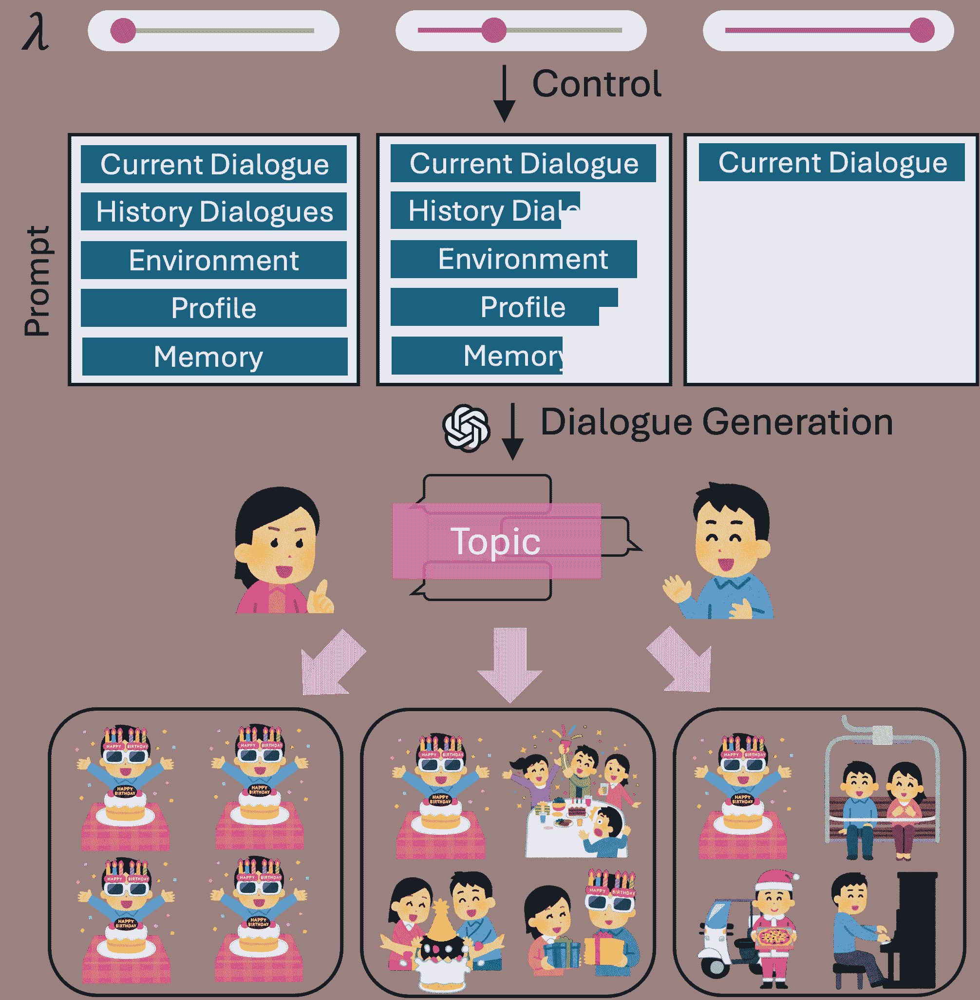

Figure 1: Diversity control in LLM-agent conversations. By increasing $\lambda$, more components are removed from the prompt, selected by their attention weights, thereby enhancing the diversity of the dialogue content.

Communication is central to multi-agent collaboration. Particularly, diversity plays a pivotal role for multi-agent communication, as it directly influences the adaptability and creativity of agents in addressing complex, dynamic tasks. Diverse communication allows agents to explore a broader solution space, avoid redundancy, and introduce unique perspectives, thereby enhancing collective problem-solving capabilities for goal-oriented tasks and increasing realism for world simulation.

In this work, we define diversity as the range of variations generated under identical initial conditions, with a specific focus on multi-agent systems for world simulation (Park et al. [2023](https://arxiv.org/html/2412.21102v1#bib.bib20)). The prompt for open-domain multi-agent conversations typically comprises several key components: an environment description, agent profiles and memory, dialogue history, and the current dialogue. While most previous works integrate these components into the prompt, it is unclear how these components affect the diversity. Does reducing the provided information lead to generalized but less diverse responses? Or does it encourage more open and varied outputs? Although previous studies have explored the influence of communication structures, the impact of communication content on interaction quality remains underexplored (Guo et al. [2024](https://arxiv.org/html/2412.21102v1#bib.bib11)).

To address this gap, we propose Adaptive Prompt Pruning (APP), a removal-based approach for controlling diversity by dynamically adjusting the prompt content via a single parameter, $\lambda$. We structured the prompt into blocks, each containing one or more items. Leveraging attention weights from raw output utterances, APP selectively removes items from the modularized prompt. A higher $\lambda$ corresponds to more aggressive pruning and, consequently, a greater potential for diversity. We investigate various design choices for the pruning selection, and comprehensively analyze the relation between prompt content and output diversity.

Using data from Park et al. ([2023](https://arxiv.org/html/2412.21102v1#bib.bib20)) and Wang, Chiu, and Chiu ([2023](https://arxiv.org/html/2412.21102v1#bib.bib25)), we demonstrate that APP effectively modulates the degree of diversity by pruning influential prompt components. Our findings reveal that all prompt components constrain diversity to some extent, with the Memory block having the most significant impact. In addition, APP is compatible with established diversity control techniques, such as temperature sampling (Ackley, Hinton, and Sejnowski [1985](https://arxiv.org/html/2412.21102v1#bib.bib1)) or top-p sampling (Holtzman et al. [2020](https://arxiv.org/html/2412.21102v1#bib.bib12)).

While increasing diversity through prompt pruning can result in inconsistencies with omitted information, we mitigate this issue by introducing a correction step post-dialogue generation. Experimental results show that this approach balances the trade-off between enhancing diversity and preserving information consistency.

Beyond pruning, we investigate the role of prompt structure, including the order and length of components, in influencing diversity. Our results indicate that component order significantly affects diversity, while excessively lengthy prompts hinder it. Moreover, we analyze the role of pre-existing knowledge within LLMs and its interaction with diversity by replacing agents’ names with well-known or rare ones.

In summary, this paper tackles three fundamental questions related to diversity in multi-agent simulation: (1) How can diversity be effectively controlled in multi-agent communication? (2) How does prompt content influence the level of conversational diversity? (3) What trade-offs arise in diversity management, and how can they be mitigated? Our contributions are as follows:

*   •

    We introduce Adaptive Prompt Pruning (APP), a novel approach for controlling output diversity in multi-agent communication while maintaining consistency.

*   •

    We provide one of the first systematic investigations into the relationship between prompt content and diversity in multi-agent simulations.

By addressing these questions, we aim to lay the groundwork for understanding and engineering diversity in LLM-based multi-agent systems.

## 2 Data, Model, and Task for Diversity Evaluation

| Block | Item | Word | Type |
| Basic Info | 5 | 71.5 | Fixed |
| Human Needs* | 2~6 | 20.4 | Fixed in dial. |
| Memory | 30~45 | 1318.8 | Trajectory |
| Previous Dialogues | 1~3 | 327.4 | Trajectory |
| Environment | 2 | 69.5 | Context |
| Current Dialogue | 1 | 284.3 | Context |

Table 1: The statistics of modularized blocks in the utterance generation prompt, each containing one or more items. *Human Needs block only appears in the HA dataset.

#### Data

We leveraged the simulation logs released by Generative Agents (Park et al. [2023](https://arxiv.org/html/2412.21102v1#bib.bib20)) as our primary dataset, referred to as GA. The logs consist of 290 dialogues simulating a day in a small town, which we treated as independent cases. From these, we evenly sampled 20 cases in chronological order for generation. In a conversation, each utterance generated by an LLM agent involves several dynamic steps simulating the internal cognitive behaviors, such as querying related memories, verifying the current environmental states, and integrating these pieces of information into a prompt to produce the final response. For each case, we extracted all necessary contextual information from the logs, including memory bases, location context, and dialogue history, ensuring accurate simulations.

We also utilized an extended dataset based on Humanoid Agents (Wang, Chiu, and Chiu [2023](https://arxiv.org/html/2412.21102v1#bib.bib25)), referred to as HA, which extends GA by introducing new agent states such as basic needs, emotions, and relationship closeness. Following the same methodology, we augmented GA’s 20 cases with these states, collectively referred to as human needs. Together, these two datasets cover key components of LLM agents and simulation content for human-like behavior (Xi et al. [2023](https://arxiv.org/html/2412.21102v1#bib.bib27); Cheng et al. [2024](https://arxiv.org/html/2412.21102v1#bib.bib5); Sumers et al. [2024](https://arxiv.org/html/2412.21102v1#bib.bib23)).

To better manipulate the prompt for response generation, we adapted GA’s templates by modularizing its content. We treated the prompt as a sequence comprising distinct blocks, each of which is a subsequence of multiple units. A unit represents the smallest element, which could be either a piece of information (an “item”, e.g., a single memory string) or an instruction (a “text”, e.g., ”Here is the memory that is in Eddy Lin’s head:”). Table [1](https://arxiv.org/html/2412.21102v1#S2.T1 "Table 1 ‣ 2 Data, Model, and Task for Diversity Evaluation ‣ Exploring and Controlling Diversity in LLM-Agent Conversation") summarizes the specifications for blocks. For detailed dataset information, please refer to the appendix or original papers.

#### Model

We employed LLaMA 3 and LLaMA 3.1 (Dubey et al. [2024](https://arxiv.org/html/2412.21102v1#bib.bib9)) as the backbone LLMs. Released in mid-2024, these models are among the most powerful and widely adopted open-source LLM families. LLaMA 3.1 demonstrates superior performance at the same scale, offering enhanced capabilities (AI [2024](https://arxiv.org/html/2412.21102v1#bib.bib2)) and a significantly extended context window (128,000 compared to 8,192 tokens). For practical purposes, we used the 8B-Instruct models in half precision.

#### Task

We define diversity as the variation between dialogues generated under identical initial conditions across trials. In other words, it measures how different the dialogues are when simulating among the same set of LLM agents at the same moment. For each case, we conducted $n=10$ simulations and measured diversity among these $n$ dialogues. Two metrics were employed: sim and dist-N, which quantify diversity from lexical and semantic perspectives. The former calculates the mean pairwise cosine similarity of dialogue embeddings (Reimers [2019](https://arxiv.org/html/2412.21102v1#bib.bib21); Wang et al. [2021](https://arxiv.org/html/2412.21102v1#bib.bib24)), while the latter computes the proportion of unique N-grams across all n dialogues (Li et al. [2016](https://arxiv.org/html/2412.21102v1#bib.bib15)). We report the average scores on all cases.

In this paper, the results are mainly from GA on LLaMA 3 unless otherwise specified.

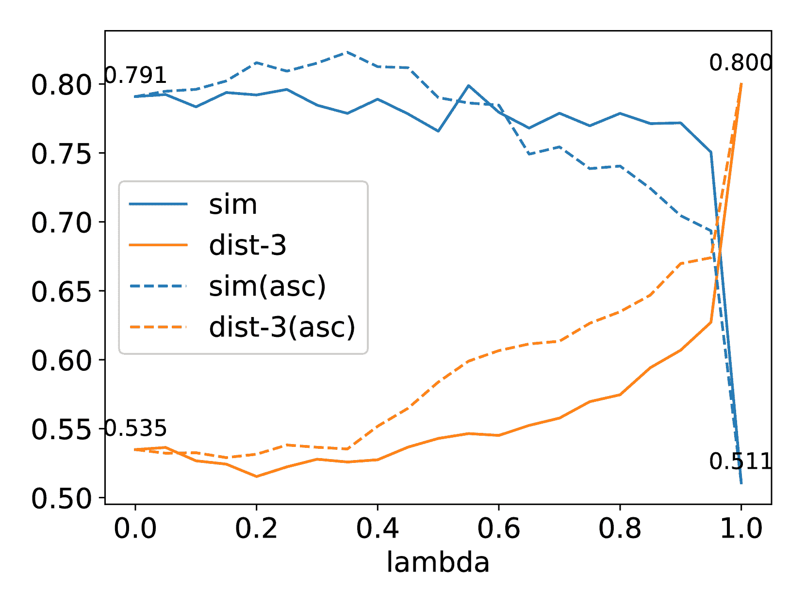

(a) $\lambda$ vs. diversity

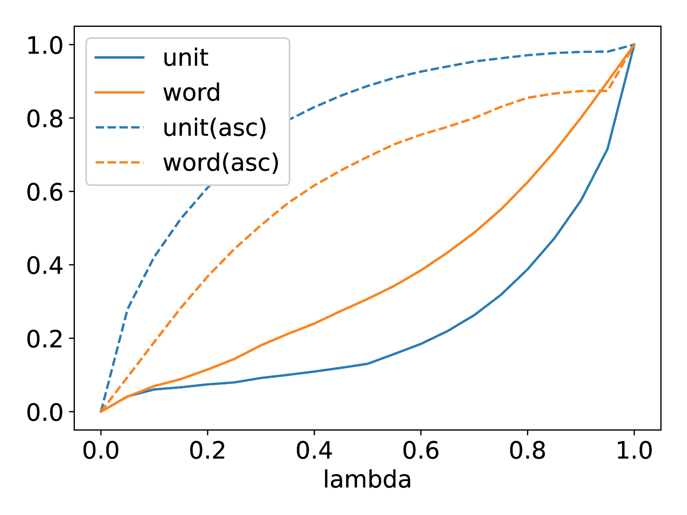

(b) $\lambda$ vs. removal ratio

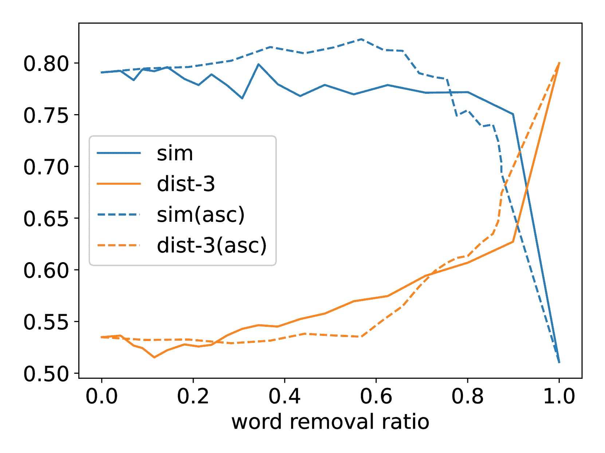

(c) Word removal ratio vs. diversity

Figure 2: Dialogue diversity under our control parameter $\lambda$. As $\lambda$ increases from 0 to 1, diversity generally increases. Removing units based on attention scores in descending order (default) is more word-efficient than removing them in ascending order (asc). Annotated numbers in (a) represent diversity at the endpoints.

## 3 Adaptive Prompt Pruning

While longer prompts offer more contextual clues and topics (Weston and Sukhbaatar [2023](https://arxiv.org/html/2412.21102v1#bib.bib26)), potentially enriching outputs, they can also impose stronger constraints, leading to more deterministic results.

We conducted a preliminary ablation study: in each utterance generation, specific blocks were pruned from the prompt, and we observed the resulting changes in diversity. The findings are recorded in Table [2](https://arxiv.org/html/2412.21102v1#S3.T2 "Table 2 ‣ 3 Adaptive Prompt Pruning ‣ Exploring and Controlling Diversity in LLM-Agent Conversation"). It was observed that removing different blocks led to varying degrees of changes in diversity, with pruning all four blocks (RMbmpe) resulting in a significant increase in diversity. Under this condition, the prompt retained only the instructions and the current dialogue, leaving no agent-related information. This suggests such information collectively plays a constraining role in multi-agent simulation.

Building on these findings, we aim to design a more granular approach to control the transition in diversity using a single parameter. We propose leveraging attention scores to guide content removal, targeting overemphasized portions of the prompt to regulate diversity. This strategy avoids directly altering attention mechanisms, thereby preserving the model’s general abilities, while operating independently of specific block content, offering greater generality and applicability.

 |  | sim ($\downarrow$) | dist-1 | dist-2 | dist-3 ($\uparrow$) |
| Full | 0.791 | 0.095 | 0.350 | 0.535 |
| RMb | 0.806 | 0.091 | 0.335 | 0.513 |
| RMm | 0.736 | 0.119 | 0.429 | 0.636 |
| RMp | 0.802 | 0.095 | 0.352 | 0.538 |
| RMe | 0.764 | 0.091 | 0.326 | 0.497 |
| RMbmpe | 0.511 | 0.202 | 0.610 | 0.800 | 

Table 2: Diversity changes as blocks are removed from the prompt. RMx represents removing block x, where x corresponds to the initials of the blocks listed in Table [1](https://arxiv.org/html/2412.21102v1#S2.T1 "Table 1 ‣ 2 Data, Model, and Task for Diversity Evaluation ‣ Exploring and Controlling Diversity in LLM-Agent Conversation").

### 3.1 Method

We calculate the attention score for each unit using the response generated by the model. Using the full prompt as the input, the output response is a sequence of tokens denoted as $r=\{t_{r_{1}},t_{r_{2}},...,t_{r_{n}}\}$. For any unit $u$, defined as $u=\{t_{u_{1}},t_{u_{2}},...,t_{u_{m}}\}$, the attention values from $r$ to $u$ can be represented as a tensor $a\in\mathbb{R}^{L\times H\times m\times n}$, where $L$ is the number of attention layers in the model, and $H$ is the number of attention heads. To facilitate comparison among units, we further compress the two-dimensional attention values between token sequences by applying $a^{\prime}=R(a)$, where $a^{\prime}\in\mathbb{R}^{L\times H}$. Here, $R(\cdot)$ is a “sum-mean” reducer, which first sums over the $m$ dimension and then averages over the $n$ dimension. This operation aggregates the total impacts from all tokens in $u$, averaged across $r$. Finally, we take the mean across the heads and sum across the layers¹¹1In practice, when the operations are commutative, we first compress the raw attention values over the $L$ or $H$ dimensions during inference to reduce memory usage. to obtain the scalar attention score $a_{u}$ for unit $u$,

|  | $a_{u}=\sum_{i=1}^{L}\frac{1}{H}\sum_{j=1}^{H}a^{\prime}_{i,j}$ |  | (1) |

After obtaining scores for all units, a single parameter is introduced to control the intensity of removal. First, a subset of all units, denoted as $U_{rm}$ and referred to as “removable units”, is selected based on user requirements. Units outside $U_{rm}$, such as task or output instruction units, are excluded from consideration for removal. Next, the elements in $U_{rm}$ are sorted in descending order based on their corresponding $a_{u}$ values. A parameter $\lambda\in[0,1]$ is defined to determine the units to remove, such that the cumulative score of the selected units reaches $\lambda$ times the total score of $U_{rm}$. To meet this condition, elements are selected sequentially from the top of the sorted list (i.e., units with higher scores) until the cumulative score satisfies the threshold. Finally, the selected units are removed from the full prompt, after which utterance generation proceeds. This process is applied individually to each utterance generation in the dialogues. A detailed description is provided in Alg. [1](https://arxiv.org/html/2412.21102v1#alg1 "Algorithm 1 ‣ 3.1 Method ‣ 3 Adaptive Prompt Pruning ‣ Exploring and Controlling Diversity in LLM-Agent Conversation").

In our implementation, the $a_{u}$ values are computed as the average of results from three output responses. All items in the original prompt, except from “Current dialogue”, are included in $U_{rm}$, as removing it would prevent the conversation from continuing. If all items within a single block are removed, the block is removed entirely.

Algorithm 1 Attention-based Unit Removal

Input: Units $U$, Scores $\{a_{u}\}$, Removal factor $\lambda$

1:  Sort removable units $U_{rm}\subseteq U$ by $a_{u}$ in descending order2:  Set $S_{target}=\lambda\cdot\sum_{u\in U_{rm}}a_{u}$, $current\_sum\leftarrow 0$, $U_{rm}^{\prime}\leftarrow\emptyset$3:  for each $u\in U_{rm}$ do4:      if $current\_sum+a_{u}\leq S_{target}$ then5:         $current\_sum\leftarrow current\_sum+a_{u}$6:         Add $u$ to $U_{rm}^{\prime}$7:      if $current\_sum\geq S_{target}$ then8:         break9:  Remove $U_{rm}^{\prime}$ from full prompt

### 3.2 Discussion

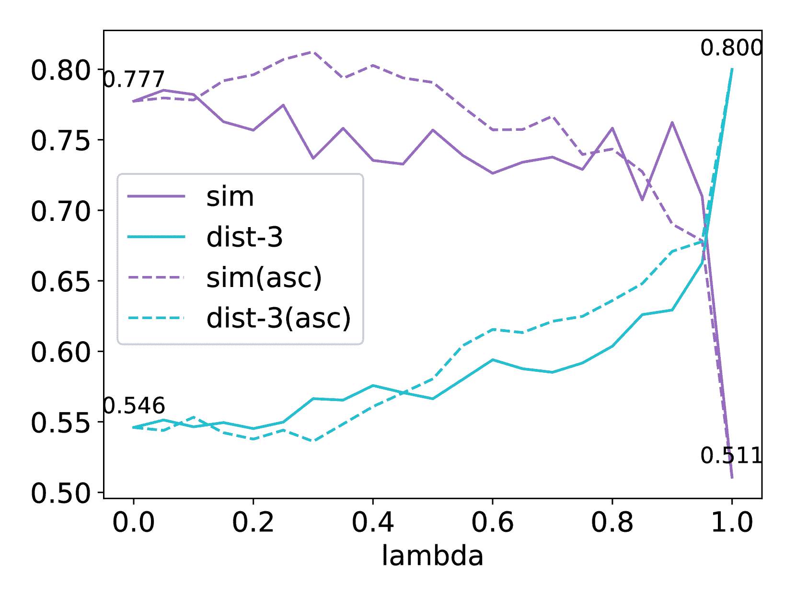

(a) LLaMA 3, HA

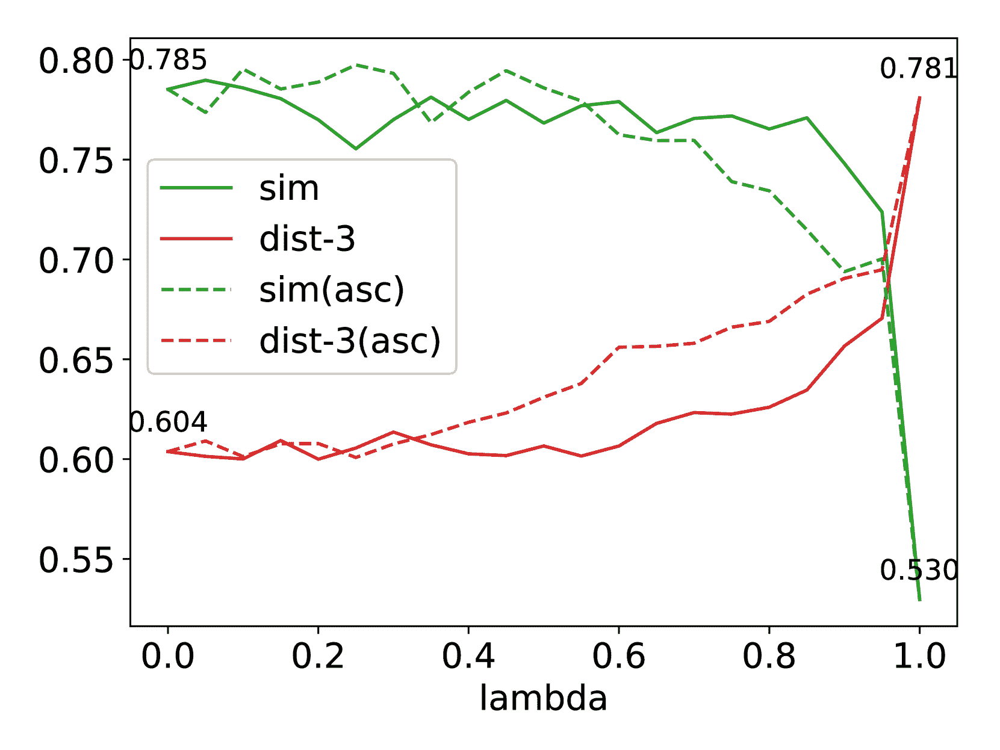

(b) LLaMA 3.1, GA

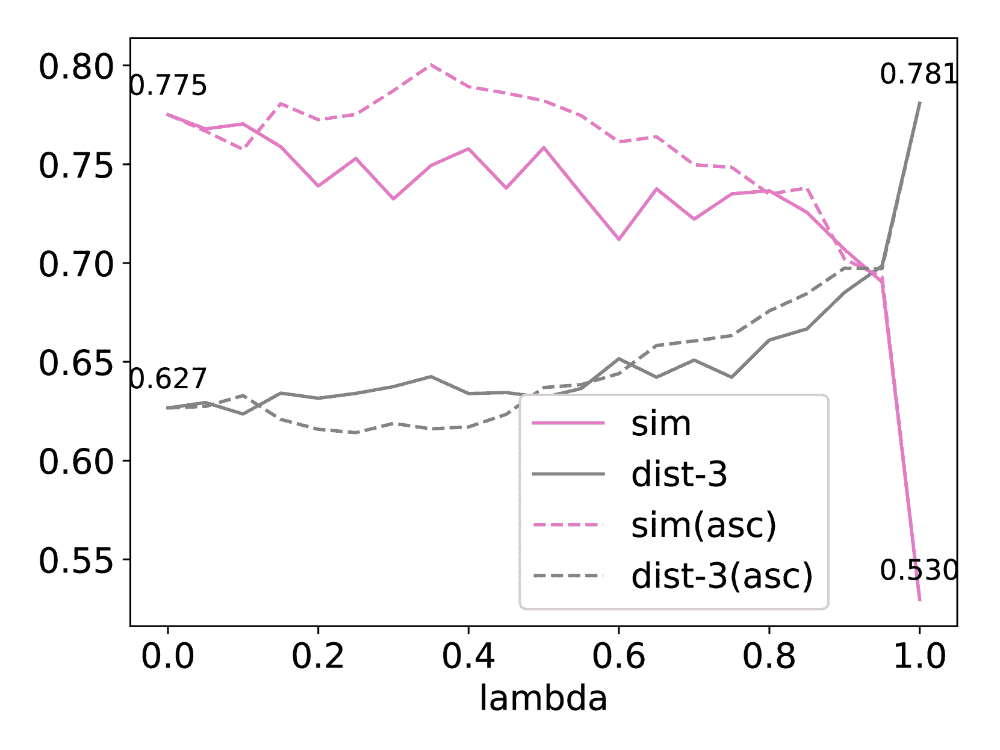

(c) LLaMA 3.1, HA

Figure 3: Results for $\lambda$ vs. diversity under different model and data settings. Similar trends are observed as in the LLaMA 3 with GA setting, despite differences in initial diversity. Annotated numbers indicate diversity at the endpoints.

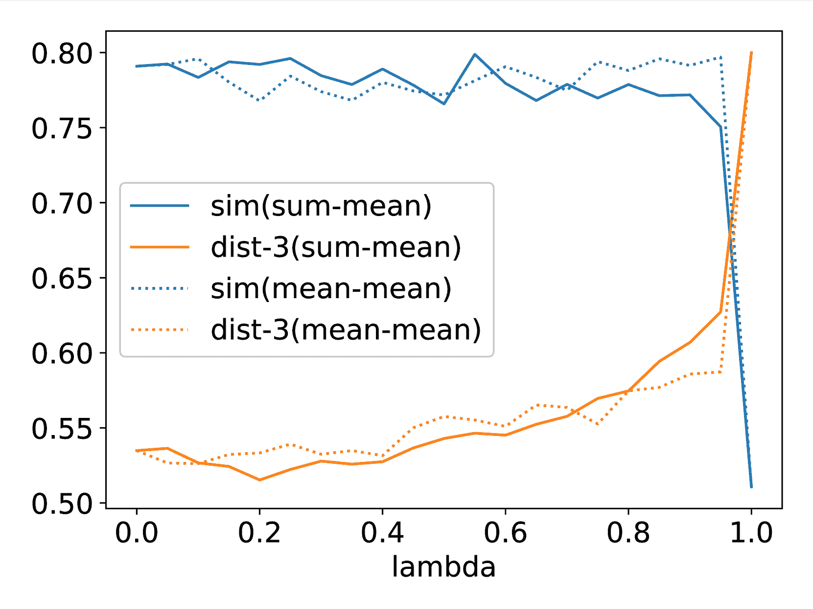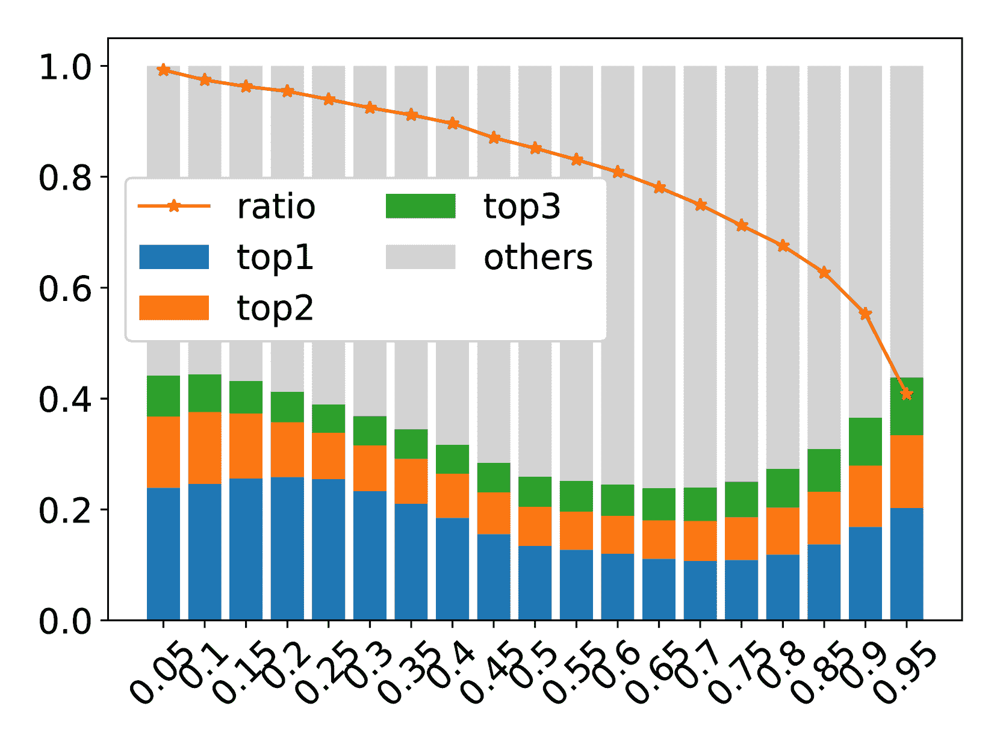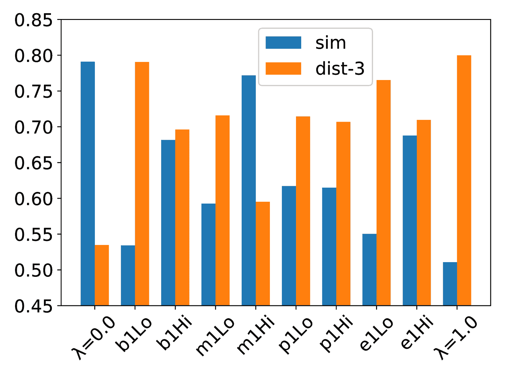

Figure 4: More results of Adaptive Prompt Pruning discussed in Section [3.2](https://arxiv.org/html/2412.21102v1#S3.SS2 "3.2 Discussion ‣ 3 Adaptive Prompt Pruning ‣ Exploring and Controlling Diversity in LLM-Agent Conversation"): (a) Lambda vs. diversity for different reducer choices. (b) Post-removal stats for different lambda: Top 3 unit score share (bars) and total score retention (line). (c) Retain-1: Keep only one removable unit in the prompt, selected from various blocks.

#### Main results

We measured dialogue diversity under different $\lambda$ values. Fig. [2(a)](https://arxiv.org/html/2412.21102v1#S2.F2.sf1 "In Figure 2 ‣ Task ‣ 2 Data, Model, and Task for Diversity Evaluation ‣ Exploring and Controlling Diversity in LLM-Agent Conversation") and Fig. [2(b)](https://arxiv.org/html/2412.21102v1#S2.F2.sf2 "In Figure 2 ‣ Task ‣ 2 Data, Model, and Task for Diversity Evaluation ‣ Exploring and Controlling Diversity in LLM-Agent Conversation") represent the diversity scores and the corresponding unit/word removal ratio. As $\lambda$ increases, diversity generally rises until all removable units are eliminated, demonstrating that $\lambda$ effectively controls diversity enhancement. Since the units were selected for removal in descending order of attention scores, only a small fraction of content needed to be removed in the early stages of increasing $\lambda$, as these units had higher scores. This observation inspired a new efficiency criterion: in general, a method that enhances diversity with less content removal is likely to be more efficient. Consequently, Fig. [2(c)](https://arxiv.org/html/2412.21102v1#S2.F2.sf3 "In Figure 2 ‣ Task ‣ 2 Data, Model, and Task for Diversity Evaluation ‣ Exploring and Controlling Diversity in LLM-Agent Conversation") plots diversity changes with the word removal ratio on the x-axis.

To validate the rationale behind descending-order selection, we compared it with ascending-order selection (dashed lines in the figures), where lower-score units are prioritized for removal. While ascending-order selection appears to yield greater diversity improvement, particularly for the dist-3 metric, this comes at the cost of removing more units for the same $\lambda$. From an efficiency standpoint, Fig. [2(c)](https://arxiv.org/html/2412.21102v1#S2.F2.sf3 "In Figure 2 ‣ Task ‣ 2 Data, Model, and Task for Diversity Evaluation ‣ Exploring and Controlling Diversity in LLM-Agent Conversation") shows that descending-order selection is generally more efficient, except when $\lambda$ approaches 1.0.

We repeated the experiments across different models and datasets, with the results shown in Fig. [3](https://arxiv.org/html/2412.21102v1#S3.F3 "Figure 3 ‣ 3.2 Discussion ‣ 3 Adaptive Prompt Pruning ‣ Exploring and Controlling Diversity in LLM-Agent Conversation"). Among the models, LLaMA 3.1 exhibits higher initial diversity ($\lambda=0.0$). For HA, despite its longer prompts, it also achieves higher initial diversity (e.g., dist-3 increases from 0.535 to 0.546 on LLaMA 3). This can be attributed to the additional information regarding human needs, which provides more options for dialogue content. Nevertheless, as units are gradually removed, diversity continues to increase, peaking at $\lambda=1.0$. This demonstrates that such information primarily functions as a conditioning factor when generating utterances.

#### Reducer

We evaluate the effects of different reducers $R(\cdot)$ on the selection results of unit removal. As shown in Fig. [4](https://arxiv.org/html/2412.21102v1#S3.F4 "Figure 4 ‣ 3.2 Discussion ‣ 3 Adaptive Prompt Pruning ‣ Exploring and Controlling Diversity in LLM-Agent Conversation")a, the solid line represents the “sum-mean” method we adopted, while the dotted lines correspond to the “mean-mean” method. Unlike “sum-mean”, the “mean-mean” method averages the attention scores across all tokens within a unit instead of summing them, thereby reducing the scoring advantage of longer units. However, we observe that “mean-mean” achieves inferior improvements in diversity when the $\lambda$ value is large. Additionally, changes under the sim metric initially decrease and then increase, indicating a weaker linear relationship with $\lambda$. Given the goal of serving as a control parameter, we argue that the “sum-mean” method, which preserves the length bias of units, is a more suitable choice.

#### Post-removal attention scores

Although Fig. [2](https://arxiv.org/html/2412.21102v1#S2.F2 "Figure 2 ‣ Task ‣ 2 Data, Model, and Task for Diversity Evaluation ‣ Exploring and Controlling Diversity in LLM-Agent Conversation") shows positive correlations of diversity with $\lambda$ (a) and word removal ratio (c), the reasons for the subtle changes in diversity when $\lambda$ or the word removal ratio is low remain unclear. Fig. [4](https://arxiv.org/html/2412.21102v1#S3.F4 "Figure 4 ‣ 3.2 Discussion ‣ 3 Adaptive Prompt Pruning ‣ Exploring and Controlling Diversity in LLM-Agent Conversation")b presents two metrics after pruning: (1) the proportion of the total scores for the remaining removable units ($U_{rm}$) relative to the total scores in $U_{rm}$ before removal (independent of $\lambda$), represented by the red line, and (2) the proportion of scores contributed by the top three removable units. Since attention scores are redistributed after unit removal, the actual reduction in attention allocated to removable units does not perfectly align with $\lambda$. The figure shows that this reduction is consistently smaller than $\lambda$. For example, when $\lambda=0.6$, attention decreases by only 19%. This phenomenon is particularly evident for smaller $\lambda$ values, which may explain the limited growth in diversity during the early stages shown in Fig. [2](https://arxiv.org/html/2412.21102v1#S2.F2 "Figure 2 ‣ Task ‣ 2 Data, Model, and Task for Diversity Evaluation ‣ Exploring and Controlling Diversity in LLM-Agent Conversation"): attention on removable units decreases only marginally, and the score proportion of the top-1 unit even increases. Moreover, when $\lambda$ exceeds 0.8, the attention proportion of the top units begins to rise, contradicting the trend of increasing diversity. This behavior may result from the substantial reduction in the number of remaining removable units.

#### Retain-1

We conducted a specialized pruning experiment to investigate the impact on diversity when only a single item remains. This setup was designed to minimize the confounding effects of attention redistribution. Figure [4](https://arxiv.org/html/2412.21102v1#S3.F4 "Figure 4 ‣ 3.2 Discussion ‣ 3 Adaptive Prompt Pruning ‣ Exploring and Controlling Diversity in LLM-Agent Conversation")c illustrates the outcomes of keeping items with the highest (Hi) or lowest (Lo) attention scores from each block. The findings indicate that, for nearly all blocks and metrics, retaining items with the highest score (Hi) results in lower diversity compared to those with the lowest scores (Lo). This reinforces the notion that items with high attention scores adversely affect diversity.

For the Previous Dialogues block, the inter-group differences (p1Lo and p1Hi) are smaller, likely due to cases where the number of items is zero. By contrast, the Memory block has the most detrimental effect on diversity across all groups, even when only a single Memory item remains (e.g., dist-3 drops from 0.800 to 0.595 for m1Hi). This result likely reflects the behaviors learned by the pre-trained model for different block types.

Interestingly, this outcome also explains the efficiency reversal between the two sorting settings observed in the tail of Fig. [2(c)](https://arxiv.org/html/2412.21102v1#S2.F2.sf3 "In Figure 2 ‣ Task ‣ 2 Data, Model, and Task for Diversity Evaluation ‣ Exploring and Controlling Diversity in LLM-Agent Conversation"). When $\lambda=0.95$, under the “descending” setting, approximately 83.4% of the remaining items belong to the Memory block. In contrast, under the “ascending” setting, the dominant block type is Previous Dialogues (59.3%), with Memory accounting for only 1.6%. This disparity likely underpins the “ascending” setting’s advantage toward the end.

## 4 Trade-off of Diversity Management

Using unit removal is an effective method to control and enhance dialogue diversity. However, the generated responses may conflict with the pruned information. To address this issue, we introduce a second step for revision to rectify potential discrepancies in the generated utterances.

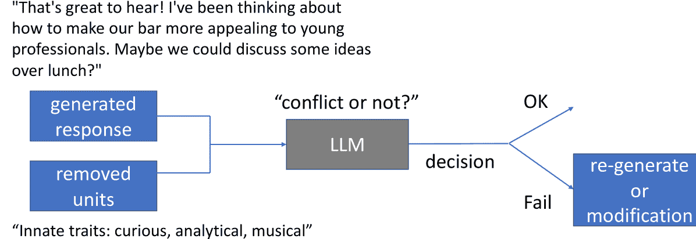

Figure 5: An illustrative figure depicting the revision process after generation with a units-removed prompt.

### 4.1 Method

After generating a response controlled by $\lambda$, we collect the removed units and the generated utterance to assess whether the utterance conflicts with the content of the removed units. If a conflict is detected, the utterance undergoes revision; otherwise, it is accepted as is. Figure [5](https://arxiv.org/html/2412.21102v1#S4.F5 "Figure 5 ‣ 4 Trade-off of Diversity Management ‣ Exploring and Controlling Diversity in LLM-Agent Conversation") illustrates this workflow. In our implementation, we use the same LLM for conflict detection, utilizing the following task prompt: “{name of agent A} is now in a chat with {name of agent B} and going to say ’{response}’. Are there any inconsistencies between this response and the statements above?” The LLM generates a comment and assigns a score from 1 to 10, where higher scores indicate greater inconsistency. We take the average of three scoring runs as the final score and set a threshold $\theta=6.67$. If the score exceeds $\theta$, a conflict is identified. When a conflict occurs, there are two common approaches to revision: (1) Regenerating the utterance: Reverting to the previous stage to generate a new response. (2) Comment-based modification: Revising the utterance based on the generated comments (Pan et al. [2023](https://arxiv.org/html/2412.21102v1#bib.bib19)). For simplicity, this study adopts the first approach by preparing multiple backup responses during the initial generation. The rollback process is repeated up to three times until the score drops below $\theta$, or the utterance with the lowest score is selected.

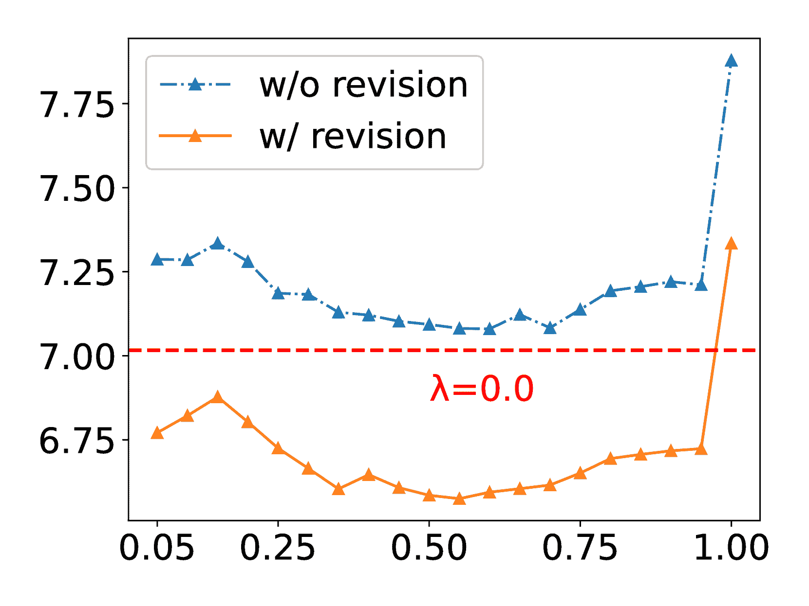

(a) $\lambda$ vs. inconsistency score

(b) $\lambda$ vs. diversity

Figure 6: Comparison of results with and without revision. $\lambda=0.0$ is a special case without pruning and revision. Its inconsistency score is estimated and illustrated as the red line in (a).

### 4.2 Discussion

Figure [6(a)](https://arxiv.org/html/2412.21102v1#S4.F6.sf1 "In Figure 6 ‣ 4.1 Method ‣ 4 Trade-off of Diversity Management ‣ Exploring and Controlling Diversity in LLM-Agent Conversation") compares the average inconsistency scores of dialogues before and after applying revision. As a baseline, we also estimate the score for $\lambda=0.0$, which does not involve unit removal but uses the same task prompt to assess consistency between the content of all items in the full prompt and the response. The results indicate that $\lambda=0.0$ and $\lambda=1.0$ correspond to the lowest and highest inconsistency scores without revision, respectively. However, the correlation between the degree of removal and the inconsistency score is not significant (e.g., the second-highest score occurs for $\lambda=0.15$, where fewer words are removed compared to higher $\lambda$ values). This may be because the error space for open-ended conversations is smaller than that for task-oriented ones, making higher $\lambda$ values unnecessary for introducing errors.

After revision, the scores are consistently reduced, indicating that the model finds the revised responses more faithful. Notably, the revised scores are even lower than those for $\lambda=0.0$, suggesting that the model perceives flaws in outputs generated with the full prompt, which the revision process helps to improve. Regarding diversity, Figure [6(b)](https://arxiv.org/html/2412.21102v1#S4.F6.sf2 "In Figure 6 ‣ 4.1 Method ‣ 4 Trade-off of Diversity Management ‣ Exploring and Controlling Diversity in LLM-Agent Conversation") shows the diversity metrics with and without revision. While some metrics reveal slight reductions within certain $\lambda$ ranges, the overall results demonstrate that our method effectively enhances diversity while maintaining consistency between the utterance and all items.

Despite these promising results, several directions warrant further exploration. First, investigating potential biases in the LLM’s judgments and their correlation with dialogue diversity presents a valuable avenue for future research. Second, attention is needed for utterances that are difficult to revise solely by rolling back, such as when the agent is asked, “What is your major?” and lacks relevant information to respond faithfully. Drawing on the distinction between discrimination and criticism (Saunders et al. [2022](https://arxiv.org/html/2412.21102v1#bib.bib22)), the LLM could be queried to assess its ability to “know” the appropriate revision direction using the removed units. If capable, a comment-based modification could be applied; otherwise, rolling back could be used to benefit from diversity in generation. Combining these two approaches may improve pipeline efficiency.

## 5 Extended Analysis on Removal

In this section, we present additional perspectives to deepen the understanding of the unit removal method. Since the results for “Remove memory (RMm)” exhibit the most significant differences, we use this setting as a representative case to conduct the following experiments.

#### Our method is compatible with established diversity control approaches.

We evaluated unit removal alongside other prevalent methods for enhancing generation diversity, specifically (1) adjusting decoding parameters and (2) sequential generation. The results are summarized in Table [3](https://arxiv.org/html/2412.21102v1#S5.T3 "Table 3 ‣ Our method is compatible with established diversity control approaches. ‣ 5 Extended Analysis on Removal ‣ Exploring and Controlling Diversity in LLM-Agent Conversation").

Adjusting decoding parameters (e.g., increasing temperature $T$, top-p) is a widely adopted strategy for enhancing diversity. This approach increases the likelihood of selecting low-probability tokens but may compromise coherence within a single sentence. As shown in Table 3, neither increasing $T$ nor $p$ achieved diversity improvements as significant as using RMm alone. Notably, combining RMm with these methods led to further enhancements in diversity. For instance, in LLaMA 3, the dist-3 metric increased from 0.578 to 0.674 when RMm was combined with $T=1.0$.

Sequential generation modifies the generation process by producing multiple responses simultaneously rather than a single response. Under this setup, the model conditions on previous responses, deliberately varying topics to avoid duplication. For this approach, our implementation appends “Please output TEN candidates” to the task instruction and randomly selects one of the generated candidates as the final output utterance. The results demonstrate that this method yields a notable improvement in diversity, consistent with findings in Yao et al. ([2023](https://arxiv.org/html/2412.21102v1#bib.bib28)), which observed better performance for this setup when the space of response generation was more constrained. Moreover, combining sequential generation with RMm further enhances diversity. However, sequential generation has its drawbacks: response lengths tend to shorten due to the simultaneous generation of multiple candidates; some candidates may lack coherence with the given context; and the increased generation complexity occasionally leads to challenges when producing outputs in the correct JSON format.

 |  | config | sim ($\downarrow$) | dist-1 | dist-2 | dist-3 ($\uparrow$) | len |
| Full | default | 0.791 | 0.095 | 0.350 | 0.535 | 39.9 |
| RMm | default | 0.736 | 0.119 | 0.429 | 0.636 | 40.4 |
| Full | T=1.0 | 0.791 | 0.103 | 0.381 | 0.578 | 40.1 |
| RMm | T=1.0 | 0.739 | 0.124 | 0.455 | 0.674 | 40.6 |
| Full | p=0.99 | 0.800 | 0.102 | 0.375 | 0.569 | 40.0 |
| RMm | p=0.99 | 0.732 | 0.124 | 0.452 | 0.669 | 41.2 |
| Full | sequential | 0.634 | 0.197 | 0.524 | 0.695 | 21.9 |
| RMm | sequential | 0.623 | 0.228 | 0.594 | 0.771 | 22.7 | 

Table 3: Compatibility results: RMm is efficient and further improves diversity under different configurations. The default decoding parameters are T=0.8 and p=0.9.

#### Diversity improvement is driven by the first few rounds.

In previous sections, we examined diversity across different dialogue trials. But at what point does the divergence between dialogues occur? Using utterances as the unit of analysis, we calculated the diversity of utterances at corresponding positions across dialogues, employing the same similarity and dist-N metrics. As shown in Fig. [7](https://arxiv.org/html/2412.21102v1#S5.F7 "Figure 7 ‣ Diversity improvement is driven by the first few rounds. ‣ 5 Extended Analysis on Removal ‣ Exploring and Controlling Diversity in LLM-Agent Conversation"), we compared the differences between the full prompt and RMm. Regardless of whether the removal operation was applied, diversity consistently increased during the initial rounds of dialogue, with index 1 (the listener’s first response) being particularly critical. Building on this foundation, RMm further amplifies its divergence from the full prompt around indices 2 to 3, before stabilizing in the later stages of the dialogue.

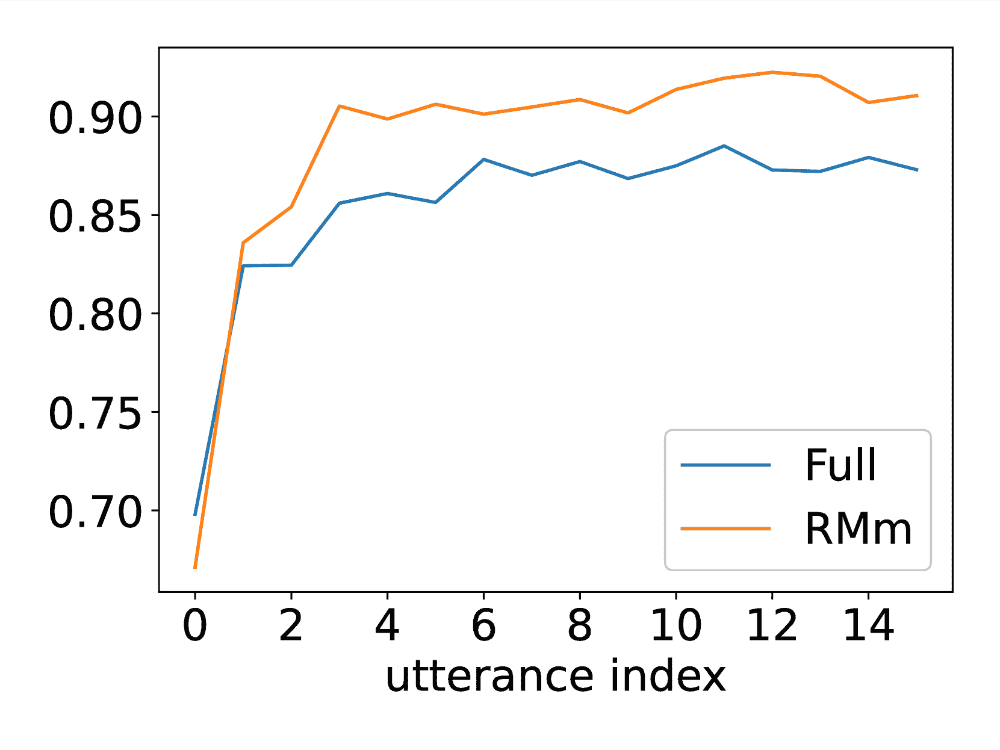

(a) utterance index vs. dist-3

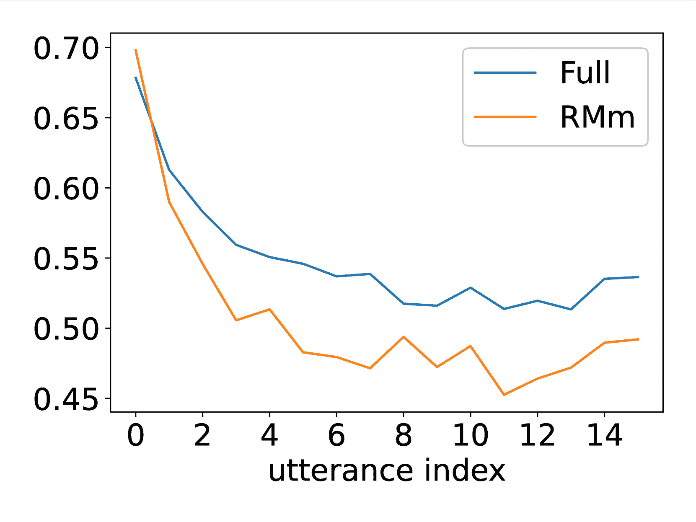

(b) utterance index vs. sim

Figure 7: Tracking the progression of dialogue diversity through per-utterance measures.

#### Measuring the exclusiveness of content across settings.

After applying the RMm setting, the diversity among different trials increases significantly. To further investigate whether RMm generates more novel content or whether most of the generated content overlaps with the dialogues produced under the full-prompt setting, we measure the exclusiveness of the generated dialogues between two settings. Given N dialogues generated under settings A and B, respectively, we compute the following metrics:

1.  1.

    Avg. B-to-A max similarity: The average of the maximum similarity scores for each dialogue in B compared to the dialogues in A.

2.  2.

    Exclusive unique n-gram ratio for B: The proportion of unique n-grams in all dialogues of B that do not appear in A.

The calculations for similarity and unique n-grams follow the same methodology used in this study. We compare the differences between the full-to-full (averaged over three different seeds) and full-to-RMm settings, with the results presented in Table [4](https://arxiv.org/html/2412.21102v1#S5.T4 "Table 4 ‣ Measuring the exclusiveness of content across settings. ‣ 5 Extended Analysis on Removal ‣ Exploring and Controlling Diversity in LLM-Agent Conversation"). These findings indicate that RMm indeed generates more exclusive content.

 |  | avg. max sim ($\downarrow$) | excl. 1-gram | excl. 2-gram | excl. 3-gram ($\uparrow$) |
| Full to Full | 0.881 | 0.382 | 0.580 | 0.720 |
| Full to RMm | 0.815 | 0.484 | 0.699 | 0.814 | 

Table 4: Exclusiveness measure: RMm performs better in these metrics, demonstrating its ability to generate novel content compared to Full.

## 6 Factors Affecting Diversity in Text

In addition to employing unit removal to control and enhance diversity, we also explored the factors influencing diversity from the perspective of the original text space. Specifically, we examined the effects of block order, block length, and name frequency. The results are presented in Table [5](https://arxiv.org/html/2412.21102v1#S6.T5 "Table 5 ‣ A frequent name can enhance diversity as parametric knowledge is amplified. ‣ 6 Factors Affecting Diversity in Text ‣ Exploring and Controlling Diversity in LLM-Agent Conversation").

#### Block order critically affects diversity.

The reasoning abilities of LLMs are known to be influenced by the order of premises (Chen et al. [2024b](https://arxiv.org/html/2412.21102v1#bib.bib4)) and the placement of critical information (Liu et al. [2024a](https://arxiv.org/html/2412.21102v1#bib.bib16)). In this experiment, we investigated whether the order of input elements also impacts dialogue diversity. To this end, we rearranged the blocks in the prompt (denoted by the sequence of their initials) in various orders and observed that the sequence in which the model processes agent information substantially influences diversity. For instance, reversing the order from bpmec to cempb resulted in a dramatic decline in quality and diversity, with the dist-3 metric dropping from 0.535 to 0.191. Under the cempb configuration, the generated dialogue started to repetitively cycle through the same round²²2We calculate the duplication rate of the final utterance in a dialogue. In the cempb setting, the rate is 66.5%, compared to 7.9% in the original Full results., leading to a significant degradation in dist-N. Notably, the amplified context differences caused by such repetition also reduced sim scores, an embedding-based measure. One notable negative pattern was placing c at the beginning and b at the end. Additionally, a comparison of bmepc and bmecp (with dist-3 scores of 0.514 and 0.413, respectively) revealed that positioning p before c mitigates significant drops in diversity. This pattern aligns with the chronological order, underscoring that carefully adjusting the block order is crucial for a greater initial diversity.

#### Effect of block length.

We simulate variations in block length by randomly duplicating or deleting items within the blocks. The word count for each block containing items is adjusted to either 250 or 750 words (BLN250 and BLN750). For blocks other than memory, these operations effectively result in either an increase or no change in length. To isolate the effect of memory, we exclude it from the analysis. The results indicate that, compared to RMm, BLN250+RMm exhibits minimal differences in diversity, whereas BLN750+RMm shows a significant decline in the dist-N metric. This finding underscores the detrimental impact of excessive redundant content on diversity.

#### A frequent name can enhance diversity as parametric knowledge is amplified.

We employed name replacement to analyze the agent’s reliance on parametric and in-context knowledge during dialogue generation, as well as its impact on diversity. Inspired by frequency sensitivity experiments in (McCoy et al. [2023](https://arxiv.org/html/2412.21102v1#bib.bib18)), we replaced prompt names with two sets of fictional characters: “Harry Potter with Severus Snape (HPSS)” and “Tifa Lockhart with Cloud Strife (TLCS).” According to the C4 dataset (Dodge et al. [2021](https://arxiv.org/html/2412.21102v1#bib.bib8)), a widely-used LLM pretraining corpus, these names vary significantly in frequency: “Harry Potter” appears 762,023 times, while “Tifa Lockhart” appears only 432 times. This disparity suggests differing learned strengths for these names and is one potential factor affecting the model’s ability to leverage parametric knowledge.

Results show that replacing names alone did not improve diversity (HPSS to full). However, when prompt content was further pruned (RMbmp), name replacement significantly increased diversity, as measured by dist-N (HPSS+RMbmp to RMbmp). Comparing name combinations (HPSS+RMbmp to TLCS+RMbmp) revealed that high-frequency names produced a more pronounced diversity boost. This suggests that pruning prompt content strengthens parametric knowledge, enabling outputs to integrate both parametric and in-context information, enhancing diversity. Notably, this improvement largely manifests as additional vocabulary³³3e.g., potion, wizard (HPSS); shinra, soldier (TLCS) in dialogue generation, increasing distinct n-grams but with minimal impact on dialogue embeddings. In summary, this experiment highlights how LLM agents utilize both knowledge resources, offering insights into their interplay and impact on diversity.

 |  | sim ($\downarrow$) | dist-1 | dist-2 | dist-3 ($\uparrow$) |
| Full | 0.791 | 0.095 | 0.350 | 0.535 |
|  |  | Order |  |  |
| bpmec | 0.789 | 0.098 | 0.352 | 0.535 |
| bmepc | 0.787 | 0.094 | 0.339 | 0.514 |
| bmecp | 0.761 | 0.081 | 0.276 | 0.413 |
| cepmb | 0.744 | 0.053 | 0.145 | 0.206 |
| cempb | 0.747 | 0.050 | 0.135 | 0.191 |
|  |  | Length |  |  |
| RMm | 0.736 | 0.119 | 0.429 | 0.636 |
| BLN250+RMm | 0.734 | 0.118 | 0.423 | 0.627 |
| BLN750+RMm | 0.744 | 0.110 | 0.377 | 0.556 |
|  |  | Frequency |  |  |
| HPSS | 0.828 | 0.093 | 0.337 | 0.518 |
| RMbmp | 0.693 | 0.143 | 0.495 | 0.706 |
| HPSS+RMbmp | 0.693 | 0.176 | 0.553 | 0.761 |
| TLCS+RMbmp | 0.733 | 0.143 | 0.501 | 0.713 | 

Table 5: Diversity changes resulting from altering various factors in the text space.

## 7 Related Work

Research in LLM-based multi-agents has explored effective collaboration and meaningful interaction between multiple agents to achieve a predefined goal or to simulate human behavior. The former are task-oriented, studying the communication strategy (Liu et al. [2024b](https://arxiv.org/html/2412.21102v1#bib.bib17)) or the collaboration between agents of different roles such as a program manager and a software engineer for software development (Chen et al. [2024a](https://arxiv.org/html/2412.21102v1#bib.bib3); Hong et al. [2024](https://arxiv.org/html/2412.21102v1#bib.bib13)). The latter are open-domain, investigating emergent human behavior or social simulation (Park et al. [2023](https://arxiv.org/html/2412.21102v1#bib.bib20); Gao et al. [2024](https://arxiv.org/html/2412.21102v1#bib.bib10)). However, most of these works focus on task performance metrics rather than the intrinsic qualities of agent interactions. Chu, Chen, and Nakayama ([2024](https://arxiv.org/html/2412.21102v1#bib.bib6)) revealed the repetition, inconsistency, and hallucination problems in LLM-based multi-agent conversations.

Diversity in natural language generation has long been a critical research challenge. Techniques such as temperature scaling (Ackley, Hinton, and Sejnowski [1985](https://arxiv.org/html/2412.21102v1#bib.bib1)) or nucleus sampling (Holtzman et al. [2020](https://arxiv.org/html/2412.21102v1#bib.bib12)) have been explored to generate varied responses while maintaining coherence. To reduce the cost of enhancing diversity, Lee et al. ([2022](https://arxiv.org/html/2412.21102v1#bib.bib14)) further improves upon nucleus sampling, achieving better trade-offs between generation diversity and factuality. Similarly, Chung, Kamar, and Amershi ([2023](https://arxiv.org/html/2412.21102v1#bib.bib7)) increases text generation diversity while maintaining data accuracy through human interventions.

Balancing diversity and relevance in multi-turn dialogues remains non-trivial. Studies such as Li et al. ([2016](https://arxiv.org/html/2412.21102v1#bib.bib15)) have investigated diversity-promoting objectives like Maximum Mutual Information (MMI) to address response repetition in dialogue systems. Zhou et al. ([2023](https://arxiv.org/html/2412.21102v1#bib.bib29)) generated a large number of utterance candidates and selected the best one using NLI entailment scores to achieve the generation of diverse and coherent dialogues. However, controlling diversity in multi-agent conversations is still underdeveloped. Chu, Chen, and Nakayama ([2024](https://arxiv.org/html/2412.21102v1#bib.bib6)) applied dynamic similarity threshold to remove overly repetitive utterances. Our work bridges the gap of diversity control while maintaining consistency.

## 8 Conclusion

Diversity is crucial in LLM-based multi-agent systems. We introduced Adaptive Prompt Pruning (APP), a novel approach to control diversity in multi-agent conversations. APP modularly removes prompt items based on a single parameter, $\lambda$, providing a flexible way to balance diversity and coherence.

Experiments confirmed APP enhances diversity while retaining most of the original prompt. Our analysis validated the descending selection method and sum-mean attention reducing mechanism underpinning APP, as attention scores correlate positively with diversity. We also demonstrated that APP integrates well with existing methods like temperature and top-p sampling.

To address pruning-induced inconsistency, we proposed a post-generation correction step, effectively maintaining coherence. Additionally, we found that block order significantly affects diversity, while lengthy prompts hinder it, emphasizing concise, structured inputs.

APP offers a practical solution to manage diversity, fostering improved communication and collaboration among LLM-based agents, with implications for future advancements in multi-agent systems.

## References

*   Ackley, Hinton, and Sejnowski (1985) Ackley, D. H.; Hinton, G. E.; and Sejnowski, T. J. 1985. A learning algorithm for Boltzmann machines. *Cognitive science*, 9(1): 147–169.
*   AI (2024) AI, M. 2024. Llama 3.1 - 8B.
*   Chen et al. (2024a) Chen, W.; Su, Y.; Zuo, J.; Yang, C.; Yuan, C.; Chan, C.-M.; Yu, H.; Lu, Y.; Hung, Y.-H.; Qian, C.; Qin, Y.; Cong, X.; Xie, R.; Liu, Z.; Sun, M.; and Zhou, J. 2024a. AgentVerse: Facilitating Multi-Agent Collaboration and Exploring Emergent Behaviors. In *The Twelfth International Conference on Learning Representations*.
*   Chen et al. (2024b) Chen, X.; Chi, R. A.; Wang, X.; and Zhou, D. 2024b. Premise Order Matters in Reasoning with Large Language Models. In *Forty-first International Conference on Machine Learning*.
*   Cheng et al. (2024) Cheng, Y.; Zhang, C.; Zhang, Z.; Meng, X.; Hong, S.; Li, W.; Wang, Z.; Wang, Z.; Yin, F.; Zhao, J.; et al. 2024. Exploring large language model based intelligent agents: Definitions, methods, and prospects. *arXiv preprint arXiv:2401.03428*.
*   Chu, Chen, and Nakayama (2024) Chu, K.; Chen, Y.-P.; and Nakayama, H. 2024. Cohesive Conversations: Enhancing Authenticity in Multi-Agent Simulated Dialogues. In *First Conference on Language Modeling*.
*   Chung, Kamar, and Amershi (2023) Chung, J.; Kamar, E.; and Amershi, S. 2023. Increasing Diversity While Maintaining Accuracy: Text Data Generation with Large Language Models and Human Interventions. In *Proceedings of the 61st Annual Meeting of the Association for Computational Linguistics (Volume 1: Long Papers)*, 575–593\. Association for Computational Linguistics.
*   Dodge et al. (2021) Dodge, J.; Sap, M.; Marasović, A.; Agnew, W.; Ilharco, G.; Groeneveld, D.; Mitchell, M.; and Gardner, M. 2021. Documenting Large Webtext Corpora: A Case Study on the Colossal Clean Crawled Corpus. In *Proceedings of the 2021 Conference on Empirical Methods in Natural Language Processing*, 1286–1305\. Association for Computational Linguistics.
*   Dubey et al. (2024) Dubey, A.; Jauhri, A.; Pandey, A.; Kadian, A.; Al-Dahle, A.; Letman, A.; Mathur, A.; Schelten, A.; Yang, A.; Fan, A.; et al. 2024. The llama 3 herd of models. *arXiv preprint arXiv:2407.21783*.
*   Gao et al. (2024) Gao, C.; Xu, F.; Chen, X.; Wang, X.; He, X.; and Li, Y. 2024. Simulating Human Society with Large Language Model Agents: City, Social Media, and Economic System. In *Companion Proceedings of the ACM Web Conference 2024*, WWW ’24, 1290–1293\. New York, NY, USA: Association for Computing Machinery. ISBN 9798400701726.
*   Guo et al. (2024) Guo, T.; Chen, X.; Wang, Y.; Chang, R.; Pei, S.; Chawla, N. V.; Wiest, O.; and Zhang, X. 2024. Large Language Model Based Multi-agents: A Survey of Progress and Challenges. In Larson, K., ed., *Proceedings of the Thirty-Third International Joint Conference on Artificial Intelligence, IJCAI-24*, 8048–8057\. International Joint Conferences on Artificial Intelligence Organization. Survey Track.
*   Holtzman et al. (2020) Holtzman, A.; Buys, J.; Du, L.; Forbes, M.; and Choi, Y. 2020. The Curious Case of Neural Text Degeneration. In *International Conference on Learning Representations*.
*   Hong et al. (2024) Hong, S.; Zhuge, M.; Chen, J.; Zheng, X.; Cheng, Y.; Wang, J.; Zhang, C.; Wang, Z.; Yau, S. K. S.; Lin, Z.; Zhou, L.; Ran, C.; Xiao, L.; Wu, C.; and Schmidhuber, J. 2024. MetaGPT: Meta Programming for A Multi-Agent Collaborative Framework. In *The Twelfth International Conference on Learning Representations*.
*   Lee et al. (2022) Lee, N.; Ping, W.; Xu, P.; Patwary, M.; Fung, P. N.; Shoeybi, M.; and Catanzaro, B. 2022. Factuality enhanced language models for open-ended text generation. *Advances in Neural Information Processing Systems*, 35: 34586–34599.
*   Li et al. (2016) Li, J.; Galley, M.; Brockett, C.; Gao, J.; and Dolan, B. 2016. A Diversity-Promoting Objective Function for Neural Conversation Models. In Knight, K.; Nenkova, A.; and Rambow, O., eds., *Proceedings of the 2016 Conference of the North American Chapter of the Association for Computational Linguistics: Human Language Technologies*, 110–119\. San Diego, California: Association for Computational Linguistics.
*   Liu et al. (2024a) Liu, N. F.; Lin, K.; Hewitt, J.; Paranjape, A.; Bevilacqua, M.; Petroni, F.; and Liang, P. 2024a. Lost in the middle: How language models use long contexts. *Transactions of the Association for Computational Linguistics*, 12: 157–173.
*   Liu et al. (2024b) Liu, Z.; Zhang, Y.; Li, P.; Liu, Y.; and Yang, D. 2024b. A Dynamic LLM-Powered Agent Network for Task-Oriented Agent Collaboration. In *First Conference on Language Modeling*.
*   McCoy et al. (2023) McCoy, R. T.; Yao, S.; Friedman, D.; Hardy, M.; and Griffiths, T. L. 2023. Embers of autoregression: Understanding large language models through the problem they are trained to solve. *arXiv preprint arXiv:2309.13638*.
*   Pan et al. (2023) Pan, L.; Saxon, M.; Xu, W.; Nathani, D.; Wang, X.; and Wang, W. Y. 2023. Automatically Correcting Large Language Models: Surveying the landscape of diverse self-correction strategies. arXiv:2308.03188.
*   Park et al. (2023) Park, J. S.; O’Brien, J.; Cai, C. J.; Morris, M. R.; Liang, P.; and Bernstein, M. S. 2023. Generative Agents: Interactive Simulacra of Human Behavior. In *Proceedings of the 36th Annual ACM Symposium on User Interface Software and Technology*, UIST ’23.
*   Reimers (2019) Reimers, N. 2019. Sentence-BERT: Sentence Embeddings using Siamese BERT-Networks. *arXiv preprint arXiv:1908.10084*.
*   Saunders et al. (2022) Saunders, W.; Yeh, C.; Wu, J.; Bills, S.; Ouyang, L.; Ward, J.; and Leike, J. 2022. Self-critiquing models for assisting human evaluators. *arXiv preprint arXiv:2206.05802*.
*   Sumers et al. (2024) Sumers, T.; Yao, S.; Narasimhan, K.; and Griffiths, T. 2024. Cognitive Architectures for Language Agents. *Transactions on Machine Learning Research*. Survey Certification.
*   Wang et al. (2021) Wang, W.; Bao, H.; Huang, S.; Dong, L.; and Wei, F. 2021. MiniLMv2: Multi-Head Self-Attention Relation Distillation for Compressing Pretrained Transformers. In *Findings of the Association for Computational Linguistics: ACL-IJCNLP 2021*, 2140–2151.
*   Wang, Chiu, and Chiu (2023) Wang, Z.; Chiu, Y. Y.; and Chiu, Y. C. 2023. Humanoid Agents: Platform for Simulating Human-like Generative Agents. In *Proceedings of the 2023 Conference on Empirical Methods in Natural Language Processing: System Demonstrations*, 167–176.
*   Weston and Sukhbaatar (2023) Weston, J.; and Sukhbaatar, S. 2023. System 2 Attention (is something you might need too). *arXiv preprint arXiv:2311.11829*.
*   Xi et al. (2023) Xi, Z.; Chen, W.; Guo, X.; He, W.; Ding, Y.; Hong, B.; Zhang, M.; Wang, J.; Jin, S.; Zhou, E.; et al. 2023. The rise and potential of large language model based agents: A survey. *arXiv preprint arXiv:2309.07864*.
*   Yao et al. (2023) Yao, S.; Yu, D.; Zhao, J.; Shafran, I.; Griffiths, T.; Cao, Y.; and Narasimhan, K. 2023. Tree of thoughts: Deliberate problem solving with large language models. *Advances in Neural Information Processing Systems*.
*   Zhou et al. (2023) Zhou, J.; Pang, L.; Shen, H.; and Cheng, X. 2023. SimOAP: Improve Coherence and Consistency in Persona-based Dialogue Generation via Over-sampling and Post-evaluation. In Rogers, A.; Boyd-Graber, J.; and Okazaki, N., eds., *Proceedings of the 61st Annual Meeting of the Association for Computational Linguistics (Volume 1: Long Papers)*, 9945–9959\. Toronto, Canada: Association for Computational Linguistics.

## Appendix A Details of the Datasets

### A.1 Dialogue Cases

Table [6](https://arxiv.org/html/2412.21102v1#A1.T6 "Table 6 ‣ A.1 Dialogue Cases ‣ Appendix A Details of the Datasets ‣ Exploring and Controlling Diversity in LLM-Agent Conversation") lists the 20 cases used in this study.

 | Time Stamp | Agent A | Agent B |
| 2023-02-13 07:40:50 | Tamara Taylor | Carmen Ortiz |
| 2023-02-13 09:00:40 | Arthur Burton | Sam Moore |
| 2023-02-13 09:46:20 | Francisco Lopez | Abigail Chen |
| 2023-02-13 10:21:20 | John Lin | Tom Moreno |
| 2023-02-13 11:03:40 | Giorgio Rossi | Klaus Mueller |
| 2023-02-13 11:10:40 | Arthur Burton | Ryan Park |
| 2023-02-13 12:23:50 | Hailey Johnson | Giorgio Rossi |
| 2023-02-13 12:28:10 | Sam Moore | Yuriko Yamamoto |
| 2023-02-13 13:09:10 | Ayesha Khan | Mei Lin |
| 2023-02-13 13:33:20 | Sam Moore | Abigail Chen |
| 2023-02-13 14:28:10 | Carmen Ortiz | Rajiv Patel |
| 2023-02-13 14:46:50 | Maria Lopez | Ayesha Khan |
| 2023-02-13 15:05:20 | Jennifer Moore | Tamara Taylor |
| 2023-02-13 15:36:50 | Ayesha Khan | Wolfgang Schulz |
| 2023-02-13 15:53:50 | Ayesha Khan | Mei Lin |
| 2023-02-13 16:44:20 | Carmen Ortiz | Latoya Williams |
| 2023-02-13 17:18:20 | Maria Lopez | Ayesha Khan |
| 2023-02-13 17:27:00 | Mei Lin | Eddy Lin |
| 2023-02-13 19:36:20 | Francisco Lopez | Rajiv Patel |
| 2023-02-13 20:04:40 | Rajiv Patel | Hailey Johnson | 

Table 6: Cases sampled from Park et al. ([2023](https://arxiv.org/html/2412.21102v1#bib.bib20)) for our study.

### A.2 Data Access for GA

The simulation logs of (Park et al. [2023](https://arxiv.org/html/2412.21102v1#bib.bib20)) can be accessed from the following URL.

`https://reverie.herokuapp.com/arXiv_Demo/`

### A.3 Implementation Details for HA

As described in the main paper, HA extends GA by introducing a human needs block. This block captures three types of information: basic needs, emotions, and relationship closeness.

*   •

    Basic needs: These include five states—fullness, social, fun, health, and energy—each corresponding to an unsatisfied adjective: hungry, lonely, bored, unwell, and tired. In the original paper, these states are represented by values ranging from 0 to 10\. A state is considered unsatisfied when its value falls below 4\. When this occurs, the following item is added to the block: “Agent A is {modifier} {unsatisfied adjective}.” Modifier includes: “slightly”, “”, “very”, and “extremely”.

*   •

    Emotions: Emotional states include disgusted, afraid, sad, surprised, happy, angry, and neutral. If the emotional state is not neutral, the following item is added to the block: “Agent A is feeling extremely {emotion}.”

*   •

    Relationship closeness: Based on the relationship between speaker and listener, the following item is added to the block: “Agent A is feeling {closeness level} to Agent B.” Closeness levels are distant, rather close, close, and very close.

In our implementation, agent states are sampled probabilistically:

*   •

    Basic needs: 40% chance of being unsatisfied (20% for energy), with modifiers assigned equally.

*   •

    Emotions: Each non-“neutral” emotion has an 8% chance of selection.

*   •

    Relationship closeness: The probabilities are distributed as 50%, 20%, 20%, and 10%, respectively.

For each case, the human needs of each agent are sampled independently (using separate seeds for agents), and remain constant within a single case.

## Appendix B Prompt

Table [7](https://arxiv.org/html/2412.21102v1#A2.T7 "Table 7 ‣ Appendix B Prompt ‣ Exploring and Controlling Diversity in LLM-Agent Conversation") presents an example prompt and their composition used for utterance generation in our study. The wording of the content has been modified or adopted from (Park et al. [2023](https://arxiv.org/html/2412.21102v1#bib.bib20); Wang, Chiu, and Chiu [2023](https://arxiv.org/html/2412.21102v1#bib.bib25)).

 | Block | Unit | Content |
| Opening | text | Context for the task: |
| Basic info | text | Here is a brief description of Arthur Burton. |
|  | item | Name: Arthur Burton |
|  | item | Age: 42 |
|  | item | Learned traits: Arthur Burton is a bartender and bar owner of The Rose and Crown Pub who loves to make people feel welcome. He is always looking for ways to make his customers feel special. |
|  | item | [more items…] |
| (Human needs) | text | Here are Arthur Burton’s status of psychological needs: |
|  | item | Arthur Burton is slightly hungry. |
|  | item | Arthur Burton is feeling extremely surprised. |
|  | item | Arthur Burton is feeling rather close to Sam Moore. |
|  | item | [more items…] |
| Memory | text | Here is the memory that is in Arthur Burton’s head: |
|  | item | - Arthur Burton knows Sam Moore as a customer at his bar, The Rose and Crown Pub. |
|  | item | - Arthur Burton does not tolerate fighting in his bar. |
|  | item | - Arthur Burton is friends with Isabella Rodriguez. |
|  | item | [more items…] |
| Previous dialogues | text | Past Context: |
|  | item | [a previous dialogue between Arthur Burton and Sam Moore] |
|  | item | [more items…] |
|  | text | This context takes place after the above conversation. |
| Environment | item | Current Location: pub in The Rose and Crown Pub |
|  | item | Current Context: Arthur Burton was having a light lunch (conversing about discussing mixology and their favorite mayoral candidate while planning to research together with Yuriko Yamamoto and possibly have lunch with Isabella, as Arthur Burton and Adam Smith catch up at the bar.) when Arthur Burton saw Sam Moore in the middle of taking a walk around Johnson Park (heading back home). Arthur Burton is initiating a conversation with Sam Moore. |
| Current dialogue | text | Arthur Burton and Sam Moore are chatting. Here is their conversation so far: |
|  | item | [the ongoing dialogue] |
| Task description | text | – – – Task: Given the above, what should Arthur Burton say to Sam Moore next in the conversation? And did it end the conversation? |
| Special rules |  |  |
| Output instruction | text | Output format: Output a json of the following format: { “Arthur Burton”: “Arthur Burton’s utterance”, “Did the conversation end with Arthur Burton’s utterance?”: “$<$json Boolean$>$” } | 

Table 7: An example list of blocks and units. Concatenating them in sequence forms the prompt for utterance generation.