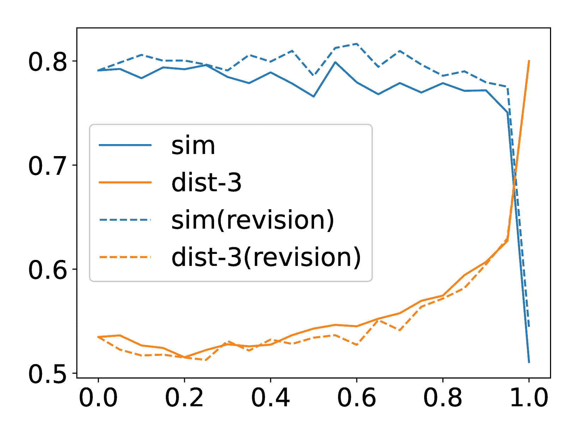

<!--yml

类别：未分类

日期：2025-01-11 11:41:45

-->

# 探索与控制LLM-智能体对话中的多样性

> 来源：[https://arxiv.org/html/2412.21102/](https://arxiv.org/html/2412.21102/)

朱宽超、陈易培、中山英树

###### 摘要

多样性是多智能体通信中的一个关键方面。在本文中，我们聚焦于在开放领域的多智能体对话背景下，特别是在世界仿真应用中的多样性控制与探索。我们提出了一种新的方法——自适应提示剪枝（Adaptive Prompt Pruning，简称APP），该方法通过一个单一参数$\lambda$动态调整生成提示的内容，从而控制多样性。通过广泛的实验，我们表明APP能够有效控制不同模型和数据集之间的输出多样性，其中剪枝更多的信息会导致更具多样性的输出。我们全面分析了提示内容与对话多样性之间的关系。我们的研究结果揭示，提示中的所有组件的信息通常会约束输出的多样性，其中内存模块对输出的多样性有着最显著的影响。APP与温度采样和top-p采样等已有技术兼容，提供了一个多功能的多样性管理工具。为了应对多样性增加所带来的权衡，例如与省略信息的不一致性，我们引入了一个后生成修正步骤，有效地平衡了多样性增强与输出一致性。此外，我们还研究了提示结构（包括组件顺序和长度）如何影响多样性。本研究解决了多智能体世界仿真中多样性相关的关键问题，提供了关于其控制、影响因素和相关权衡的见解。我们的贡献为基于LLM的多智能体协作中的多样性系统化工程奠定了基础，推动其在现实应用中的有效性。

## 1 引言

图1：LLM-智能体对话中的多样性控制。通过增加$\lambda$，从提示中移除更多组件，这些组件根据它们的注意力权重被选择，从而增强对话内容的多样性。

沟通是多智能体协作的核心。特别地，多样性在多智能体通信中起着至关重要的作用，因为它直接影响智能体在处理复杂动态任务时的适应性和创造力。多样化的沟通使智能体能够探索更广泛的解决方案空间，避免冗余，并引入独特的视角，从而提升集体问题解决能力，增强目标导向任务的解决效果，并提高世界仿真的真实性。

在这项工作中，我们将多样性定义为在相同初始条件下生成的变化范围，特别关注用于世界模拟的多智能体系统（Park等人 [2023](https://arxiv.org/html/2412.21102v1#bib.bib20)）。开放领域多智能体对话的提示通常包括几个关键组件：环境描述、智能体配置文件和记忆、对话历史以及当前对话。虽然大多数先前的研究将这些组件整合到提示中，但这些组件如何影响多样性仍不清楚。减少提供的信息会导致更为通用但缺乏多样性的回答吗？还是它促使输出更开放和多样？尽管之前的研究探讨了沟通结构的影响，但沟通内容对互动质量的影响仍然未得到充分探讨（Guo等人 [2024](https://arxiv.org/html/2412.21102v1#bib.bib11)）。

为了填补这一空白，我们提出了自适应提示修剪（APP），这是一种基于移除的多样性控制方法，通过一个单一参数$\lambda$动态调整提示内容。我们将提示结构化为多个块，每个块包含一个或多个项。通过利用原始输出语句中的注意力权重，APP从模块化提示中选择性地移除项。较高的$\lambda$对应于更激进的修剪，因此具有更大的多样性潜力。我们研究了多种修剪选择的设计方案，并全面分析了提示内容与输出多样性之间的关系。

我们使用来自Park等人（[2023](https://arxiv.org/html/2412.21102v1#bib.bib20)）和Wang、Chiu和Chiu（[2023](https://arxiv.org/html/2412.21102v1#bib.bib25)）的数据，展示了APP通过修剪影响力较大的提示组件有效地调节多样性的程度。我们的研究结果表明，所有提示组件在一定程度上都对多样性产生约束，其中Memory块的影响最大。此外，APP与已知的多样性控制技术兼容，如温度采样（Ackley、Hinton和Sejnowski [1985](https://arxiv.org/html/2412.21102v1#bib.bib1)）或top-p采样（Holtzman等人 [2020](https://arxiv.org/html/2412.21102v1#bib.bib12)）。

尽管通过提示修剪增加多样性可能导致省略信息的不一致性，但我们通过在对话生成后引入修正步骤来减轻这个问题。实验结果表明，这种方法在增强多样性与保持信息一致性之间达到了平衡。

除了剪枝，我们还研究了提示结构的作用，包括组件的顺序和长度对多样性的影响。我们的结果表明，组件顺序显著影响多样性，而过长的提示则会妨碍多样性。此外，我们通过将智能体的名字替换为知名或罕见的名字，分析了大语言模型（LLM）中预存知识的作用及其与多样性的互动。

总结而言，本文解决了与多智能体仿真中多样性相关的三个基本问题：（1）如何有效控制多智能体通信中的多样性？（2）提示内容如何影响对话的多样性水平？（3）多样性管理中会产生哪些权衡问题，如何缓解这些问题？我们的贡献如下：

+   •

    我们提出了自适应提示剪枝（APP），这是一种新颖的方法，旨在控制多智能体通信中的输出多样性，同时保持一致性。

+   •

    我们提供了关于提示内容与多智能体仿真中多样性之间关系的首批系统性研究之一。

通过解决这些问题，我们旨在为理解和工程化LLM基础的多智能体系统中的多样性奠定基础。

## 2 数据、模型与多样性评估任务

| 块 | 项目 | 词语 | 类型 |
| --- | --- | --- | --- |
| 基本信息 | 5 | 71.5 | 固定 |
| 人类需求* | 2~6 | 20.4 | 在对话中固定 |
| 记忆 | 30~45 | 1318.8 | 轨迹 |
| 先前对话 | 1~3 | 327.4 | 轨迹 |
| 环境 | 2 | 69.5 | 上下文 |
| 当前对话 | 1 | 284.3 | 上下文 |

表1：话语生成提示中模块化块的统计，每个块包含一个或多个项目。*人类需求块仅出现在HA数据集中。

#### 数据

我们利用由生成型智能体（Park et al. [2023](https://arxiv.org/html/2412.21102v1#bib.bib20)）发布的仿真日志作为我们的主要数据集，称为GA。日志包含了模拟小镇一天生活的290个对话，我们将其视为独立的案例。从中，我们按时间顺序均匀抽取了20个案例进行生成。在每次对话中，由LLM智能体生成的每个发言都涉及几个动态步骤，模拟内部认知行为，例如查询相关记忆、验证当前环境状态，并将这些信息整合到提示中以生成最终回复。对于每个案例，我们从日志中提取了所有必要的上下文信息，包括记忆库、位置信息和对话历史，确保了准确的仿真。

我们还利用了基于类人代理（Wang, Chiu, 和Chiu [2023](https://arxiv.org/html/2412.21102v1#bib.bib25)）的扩展数据集，称为HA，该数据集通过引入基本需求、情感和关系亲密度等新代理状态扩展了GA。遵循相同的方法论，我们将这些状态加入到GA的20个案例中，统称为人类需求。两者共同覆盖了LLM代理的关键组成部分以及模拟人类行为的内容（Xi等人 [2023](https://arxiv.org/html/2412.21102v1#bib.bib27); Cheng等人 [2024](https://arxiv.org/html/2412.21102v1#bib.bib5); Sumers等人 [2024](https://arxiv.org/html/2412.21102v1#bib.bib23)）。

为了更好地操作提示词以生成响应，我们通过模块化其内容来改编GA的模板。我们将提示词视为由不同模块组成的序列，每个模块都是多个单元的子序列。单元代表最小元素，可以是信息片段（“项”，例如单个记忆字符串）或指令（“文本”，例如“这是Eddy Lin脑中的记忆：”）。表[1](https://arxiv.org/html/2412.21102v1#S2.T1 "Table 1 ‣ 2 Data, Model, and Task for Diversity Evaluation ‣ Exploring and Controlling Diversity in LLM-Agent Conversation")总结了各模块的规范。有关数据集的详细信息，请参阅附录或原始论文。

#### 模型

我们采用了LLaMA 3和LLaMA 3.1（Dubey等人 [2024](https://arxiv.org/html/2412.21102v1#bib.bib9)）作为主干LLM。这些模型在2024年中期发布，是目前最强大且广泛采用的开源LLM家族之一。LLaMA 3.1在相同规模下表现优越，提供了增强的能力（AI [2024](https://arxiv.org/html/2412.21102v1#bib.bib2)）和显著扩展的上下文窗口（128,000与8,192个token相比）。在实际应用中，我们使用了半精度的8B-Instruct模型。

#### 任务

我们将多样性定义为在相同初始条件下，通过多次试验生成的对话之间的变化。换句话说，它衡量了在同一时刻模拟相同一组LLM代理时，对话的差异性。对于每个案例，我们进行了$n=10$次模拟，并衡量了这$n$个对话之间的多样性。我们采用了两种度量：sim和dist-N，分别从词汇和语义角度量化多样性。前者计算对话嵌入的平均配对余弦相似度（Reimers [2019](https://arxiv.org/html/2412.21102v1#bib.bib21); Wang等人 [2021](https://arxiv.org/html/2412.21102v1#bib.bib24)），而后者计算所有n个对话中的独特N-gram的比例（Li等人 [2016](https://arxiv.org/html/2412.21102v1#bib.bib15)）。我们报告了所有案例的平均得分。

在本文中，除非另有说明，否则结果主要来自GA在LLaMA 3上的表现。

(a) $\lambda$与多样性

(b) $\lambda$与移除比例

(c) 词语移除比例与多样性

图 2：在我们控制参数$\lambda$下的对话多样性。随着$\lambda$从0增加到1，多样性通常会增加。根据注意力得分按降序移除单元（默认）比按升序移除（asc）更加节省词汇。在(a)中标注的数字表示端点的多样性。

## 3 自适应提示修剪

虽然较长的提示提供了更多的上下文线索和主题（Weston和Sukhbaatar [2023](https://arxiv.org/html/2412.21102v1#bib.bib26)），可能会丰富输出，但它们也可能施加更强的约束，导致更加确定性的结果。

我们进行了一项初步的消融研究：在每次生成话语时，特定的块被从提示中修剪，并观察了多样性变化的结果。研究结果记录在表[2](https://arxiv.org/html/2412.21102v1#S3.T2 "表 2 ‣ 3 自适应提示修剪 ‣ 探索与控制LLM-Agent对话中的多样性")中。观察发现，移除不同的块会导致多样性发生不同程度的变化，其中修剪所有四个块（RMbmpe）会显著增加多样性。在这种情况下，提示只保留了指令和当前对话，不包含任何与代理相关的信息。这表明这些信息在多代理仿真中共同起到了约束作用。

基于这些发现，我们旨在设计一种更加细粒度的方法，通过使用单一参数来控制多样性的变化过渡。我们建议利用注意力得分来引导内容的移除，针对提示中过度强调的部分来调节多样性。该策略避免了直接改变注意力机制，从而保持了模型的整体能力，同时不依赖于特定块的内容，提供了更大的通用性和适用性。

|  | sim ($\downarrow$) | dist-1 | dist-2 | dist-3 ($\uparrow$) |
| --- | --- | --- | --- | --- |
| Full | 0.791 | 0.095 | 0.350 | 0.535 |
| RMb | 0.806 | 0.091 | 0.335 | 0.513 |
| RMm | 0.736 | 0.119 | 0.429 | 0.636 |
| RMp | 0.802 | 0.095 | 0.352 | 0.538 |
| RMe | 0.764 | 0.091 | 0.326 | 0.497 |
| RMbmpe | 0.511 | 0.202 | 0.610 | 0.800 |

表 2：当从提示中移除块时，多样性的变化。RMx表示移除块x，其中x对应于表[1](https://arxiv.org/html/2412.21102v1#S2.T1 "表 1 ‣ 2 数据、模型和多样性评估任务 ‣ 探索与控制LLM-Agent对话中的多样性")中列出的块的首字母。

### 3.1 方法

我们使用模型生成的响应来计算每个单元的注意力分数。使用完整的提示作为输入，输出响应是一个符号为 $r=\{t_{r_{1}},t_{r_{2}},...,t_{r_{n}}\}$ 的标记序列。对于任何单元 $u$，定义为 $u=\{t_{u_{1}},t_{u_{2}},...,t_{u_{m}}\}$，从 $r$ 到 $u$ 的注意力值可以表示为张量 $a\in\mathbb{R}^{L\times H\times m\times n}$，其中 $L$ 是模型中的注意力层数，$H$ 是注意力头的数量。为了便于在单元之间进行比较，我们通过应用 $a^{\prime}=R(a)$ 进一步压缩标记序列之间的二维注意力值，其中 $a^{\prime}\in\mathbb{R}^{L\times H}$。这里，$R(\cdot)$ 是一个“求和均值”缩减器，首先在 $m$ 维度上求和，然后在 $n$ 维度上取平均。此操作聚合了 $u$ 中所有标记的总影响，并在 $r$ 上取平均。最后，我们在头部上取均值，在层上求和¹¹1在实践中，当操作是交换律的时，我们首先在推理期间压缩 $L$ 或 $H$ 维度上的原始注意力值，以减少内存使用。得到单元 $u$ 的标量注意力分数 $a_{u}$，

|  | $a_{u}=\sum_{i=1}^{L}\frac{1}{H}\sum_{j=1}^{H}a^{\prime}_{i,j}$ |  | (1) |
| --- | --- | --- | --- |

在获得所有单元的分数后，引入一个单一参数来控制移除的强度。首先，根据用户要求选择一个所有单元的子集，记作 $U_{rm}$，并称为“可移除单元”。$U_{rm}$ 之外的单元，如任务或输出指令单元，将被排除在移除考虑之外。接下来，按对应的 $a_{u}$ 值对 $U_{rm}$ 中的元素进行降序排序。定义一个参数 $\lambda\in[0,1]$ 来确定需要移除的单元，使得所选单元的累计分数达到 $U_{rm}$ 总分的 $\lambda$ 倍。为了满足这一条件，从排序列表的顶部（即分数较高的单元）开始按顺序选择元素，直到累计分数满足阈值。最后，将选中的单元从完整的提示中移除，之后开始生成发言。这个过程会单独应用于对话中的每个发言生成。有关详细描述，请参见算法 [1](https://arxiv.org/html/2412.21102v1#alg1 "算法 1 ‣ 3.1 方法 ‣ 3 自适应提示修剪 ‣ 探索和控制 LLM-代理对话的多样性")。

在我们的实现中，$a_{u}$ 值是通过对三个输出响应的结果取平均计算的。原始提示中的所有项目（除了“当前对话”）都包含在 $U_{rm}$ 中，因为移除它会导致对话无法继续进行。如果单个块内的所有项目都被移除，则该块将被完全移除。

算法 1 基于注意力的单元移除

输入：单元 $U$，分数 $\{a_{u}\}$，移除因子 $\lambda$

1:  按照 $a_{u}$ 对可移除单元 $U_{rm}\subseteq U$ 进行降序排序

### 3.2 讨论

(a) LLaMA 3, HA

(b) LLaMA 3.1, GA

(c) LLaMA 3.1, HA

图 3：在不同模型和数据设置下，$\lambda$ 与多样性之间的结果。尽管初始多样性有所不同，但在 LLaMA 3 与 GA 设置下观察到了类似的趋势。注释的数字表示端点的多样性。

图 4：关于自适应提示剪枝的更多结果，讨论见第[3.2节](https://arxiv.org/html/2412.21102v1#S3.SS2 "3.2 讨论 ‣ 3 自适应提示剪枝 ‣ 探索与控制LLM-代理对话中的多样性")： (a) Lambda 与多样性之间的关系，不同减小器选择下的结果。(b) 不同 Lambda 值下的移除后统计：前 3 个单元分数占比（柱状图）与总分保留率（折线图）。(c) Retain-1：仅保留一个可移除单元，从不同块中选择。

#### 主要结果

我们在不同的$\lambda$值下测量了对话的多样性。图[2(a)](https://arxiv.org/html/2412.21102v1#S2.F2.sf1 "In Figure 2 ‣ Task ‣ 2 Data, Model, and Task for Diversity Evaluation ‣ Exploring and Controlling Diversity in LLM-Agent Conversation")和图[2(b)](https://arxiv.org/html/2412.21102v1#S2.F2.sf2 "In Figure 2 ‣ Task ‣ 2 Data, Model, and Task for Diversity Evaluation ‣ Exploring and Controlling Diversity in LLM-Agent Conversation")展示了多样性分数和相应的单元/词移除比例。随着$\lambda$的增加，多样性通常会提高，直到所有可移除单元被消除，这证明了$\lambda$在有效控制多样性增强方面的作用。由于单元是按照注意力分数的降序选择进行移除的，在$\lambda$值初期，由于这些单元的分数较高，因此只需要移除少量内容。这一观察启发了一个新的效率标准：通常，能够通过较少的内容移除来增强多样性的方法可能更高效。因此，图[2(c)](https://arxiv.org/html/2412.21102v1#S2.F2.sf3 "In Figure 2 ‣ Task ‣ 2 Data, Model, and Task for Diversity Evaluation ‣ Exploring and Controlling Diversity in LLM-Agent Conversation")绘制了多样性变化与词移除比例的关系。

为了验证降序选择背后的原理，我们将其与升序选择进行了比较（图中的虚线），在升序选择中，优先移除低分单元。尽管升序选择似乎能带来更大的多样性提升，特别是在dist-3指标上，但这也意味着在相同的$\lambda$值下需要移除更多单元。从效率角度来看，图[2(c)](https://arxiv.org/html/2412.21102v1#S2.F2.sf3 "In Figure 2 ‣ Task ‣ 2 Data, Model, and Task for Diversity Evaluation ‣ Exploring and Controlling Diversity in LLM-Agent Conversation")显示，降序选择通常更高效，除非$\lambda$接近1.0。

我们在不同的模型和数据集上重复进行了实验，结果如图[3](https://arxiv.org/html/2412.21102v1#S3.F3 "Figure 3 ‣ 3.2 Discussion ‣ 3 Adaptive Prompt Pruning ‣ Exploring and Controlling Diversity in LLM-Agent Conversation")所示。在各个模型中，LLaMA 3.1展现了较高的初始多样性（$\lambda=0.0$）。对于HA，尽管它的提示词较长，但也实现了更高的初始多样性（例如，在LLaMA 3上，dist-3从0.535增加到0.546）。这可以归因于关于人类需求的额外信息，它为对话内容提供了更多的选择。然而，随着单元逐渐被移除，多样性持续增加，并在$\lambda=1.0$时达到峰值。这表明，这种信息在生成发言时主要作为一个条件因子起作用。

#### Reducer

我们评估了不同减法器 $R(\cdot)$ 对单元移除选择结果的影响。如图[4](https://arxiv.org/html/2412.21102v1#S3.F4 "Figure 4 ‣ 3.2 Discussion ‣ 3 Adaptive Prompt Pruning ‣ Exploring and Controlling Diversity in LLM-Agent Conversation")a所示，实线代表我们采用的“sum-mean”方法，而虚线则对应于“mean-mean”方法。与“sum-mean”不同，“mean-mean”方法将单元内所有词元的注意力分数取平均，而不是求和，从而减少了较长单元的评分优势。然而，我们观察到，当$\lambda$值较大时，“mean-mean”在多样性上的提升较为有限。此外，在sim度量下，变化呈现先减小后增大的趋势，表明与$\lambda$之间的线性关系较弱。鉴于其作为控制参数的目标，我们认为“sum-mean”方法更适合，它保留了单元的长度偏差。

#### 移除后的注意力分数

尽管图[2](https://arxiv.org/html/2412.21102v1#S2.F2 "Figure 2 ‣ Task ‣ 2 Data, Model, and Task for Diversity Evaluation ‣ Exploring and Controlling Diversity in LLM-Agent Conversation")显示了多样性与$\lambda$ (a)和词移除比例(c)之间的正相关，但当$\lambda$或词移除比例较低时，多样性变化的原因仍不明确。图[4](https://arxiv.org/html/2412.21102v1#S3.F4 "Figure 4 ‣ 3.2 Discussion ‣ 3 Adaptive Prompt Pruning ‣ Exploring and Controlling Diversity in LLM-Agent Conversation")b展示了修剪后两个指标：(1) 剩余可移除单元($U_{rm}$)的总分与移除前$U_{rm}$的总分之比（与$\lambda$无关），由红线表示；(2) 前三个可移除单元的得分所占比例。由于单元移除后注意力分数被重新分配，分配给可移除单元的实际注意力减少与$\lambda$并不完全一致。图中显示这一减少始终小于$\lambda$。例如，当$\lambda=0.6$时，注意力仅减少了19%。这一现象在较小的$\lambda$值下尤为明显，这可能解释了图[2](https://arxiv.org/html/2412.21102v1#S2.F2 "Figure 2 ‣ Task ‣ 2 Data, Model, and Task for Diversity Evaluation ‣ Exploring and Controlling Diversity in LLM-Agent Conversation")中初期多样性增长受限的原因：可移除单元上的注意力减少仅为微乎其微，且最高得分单元的得分比例甚至增加。此外，当$\lambda$超过0.8时，最高单元的注意力比例开始上升，这与多样性增加的趋势相矛盾。这一行为可能是由于剩余可移除单元数量的大幅减少所导致。

#### Retain-1

我们进行了一个专门的修剪实验，调查当仅剩下一个单元时对多样性的影响。该设置旨在最小化注意力重分配的干扰效应。图 [4](https://arxiv.org/html/2412.21102v1#S3.F4 "图 4 ‣ 3.2 讨论 ‣ 3 自适应提示修剪 ‣ 探索和控制 LLM-Agent 对话中的多样性")c 说明了保留每个块中具有最高（Hi）或最低（Lo）注意力分数项的结果。研究结果表明，对于几乎所有块和指标，保留具有最高分数（Hi）的项会导致较低的多样性，而保留最低分数（Lo）的项则会有较高的多样性。这进一步证明了高注意力分数的项会对多样性产生负面影响。

对于先前对话块，组间差异（p1Lo 和 p1Hi）较小，可能是由于某些项数量为零的情况。相比之下，记忆块对所有组的多样性影响最为不利，即使只剩下一个记忆项（例如，当 m1Hi 时，dist-3 从 0.800 降到 0.595）。这一结果可能反映了预训练模型对不同块类型的学习行为。

有趣的是，这一结果也解释了在图 [2(c)](https://arxiv.org/html/2412.21102v1#S2.F2.sf3 "图 2 ‣ 任务 ‣ 2 数据、模型和任务的多样性评估 ‣ 探索和控制 LLM-Agent 对话中的多样性")尾部观察到的两种排序设置之间的效率反转。当$\lambda=0.95$时，在“降序”设置下，约83.4%的剩余项属于记忆块。相比之下，在“升序”设置下，占主导地位的块类型是先前对话（59.3%），而记忆块仅占1.6%。这种差异可能是“升序”设置在最后阶段占优的原因。

## 4 多样性管理的权衡

使用去除单元是控制和增强对话多样性的一种有效方法。然而，生成的响应可能与被修剪的信息发生冲突。为了解决这个问题，我们引入了第二步修正，以纠正生成语句中的潜在不一致。

图 5：一幅插图，展示了在去除单元提示下生成后的修正过程。

### 4.1 方法

在生成由 $\lambda$ 控制的响应后，我们收集被移除的单元和生成的发言，以评估该发言是否与被移除单元的内容冲突。如果检测到冲突，发言将进行修订；否则，接受原样发言。图 [5](https://arxiv.org/html/2412.21102v1#S4.F5 "Figure 5 ‣ 4 Trade-off of Diversity Management ‣ Exploring and Controlling Diversity in LLM-Agent Conversation") 展示了这一工作流程。在我们的实现中，我们使用相同的 LLM 进行冲突检测，利用以下任务提示：“{agent A 的名字} 现在正在与 {agent B 的名字} 聊天，并准备说‘{response}’。该回应与之前的陈述是否存在不一致？” LLM 生成评论并给出一个 1 到 10 的评分，分数越高表示不一致性越大。我们取三次评分的平均值作为最终得分，并设定阈值 $\theta=6.67$。如果得分超过 $\theta$，则认为发生了冲突。发生冲突时，有两种常见的修订方法：（1）重新生成发言：回到之前的阶段重新生成回应。（2）基于评论的修改：根据生成的评论修改发言（Pan et al. [2023](https://arxiv.org/html/2412.21102v1#bib.bib19)）。为简化起见，本研究采用第一种方法，在初始生成时准备多个备份响应。回滚过程最多重复三次，直到得分低于 $\theta$，或选择得分最低的发言。

(a) $\lambda$ 与不一致性得分的关系

(b) $\lambda$ 与多样性的关系

图 6：有无修订结果的比较。$\lambda=0.0$ 是一个没有修剪和修订的特殊情况。其不一致性得分通过红线在 (a) 中估算并展示。

### 4.2 讨论

图[6(a)](https://arxiv.org/html/2412.21102v1#S4.F6.sf1 "在图6 ‣ 4.1方法 ‣ 4 多样性管理的权衡 ‣ 探索和控制LLM-代理对话中的多样性")比较了应用修改前后对话的一致性得分平均值。作为基线，我们还估算了$\lambda=0.0$的得分，该值不涉及单位删除，而是使用相同的任务提示来评估完整提示中所有项目内容与回答之间的一致性。结果表明，$\lambda=0.0$和$\lambda=1.0$分别对应未修改情况下的最低和最高不一致得分。然而，删除程度与不一致得分之间的相关性不显著（例如，第二高的得分出现在$\lambda=0.15$时，此时删除的单词比更高$\lambda$值时要少）。这可能是因为开放式对话的错误空间比任务导向对话的错误空间小，使得更高的$\lambda$值对于引入错误来说并不必要。

修改后，得分一致性地降低，表明模型认为修改后的回答更加忠实。值得注意的是，修改后的得分甚至低于$\lambda=0.0$的得分，这表明模型意识到使用完整提示生成的输出存在缺陷，而修改过程有助于改进这些输出。关于多样性，图[6(b)](https://arxiv.org/html/2412.21102v1#S4.F6.sf2 "在图6 ‣ 4.1方法 ‣ 4 多样性管理的权衡 ‣ 探索和控制LLM-代理对话中的多样性")展示了修改前后多样性度量的变化。虽然某些度量在某些$\lambda$范围内略有减少，但整体结果表明我们的方法在保持发言与所有项目之间的一致性的同时，有效地增强了多样性。

尽管这些结果令人鼓舞，但仍有多个方向值得进一步探索。首先，调查LLM判断中的潜在偏见及其与对话多样性的相关性，是未来研究的重要方向。其次，针对那些仅通过回滚无法轻易修改的发言，需要特别关注，例如当代理被问到“你的专业是什么？”并且缺乏相关信息以忠实回答时。借鉴歧视与批评之间的区分（Saunders等人 [2022](https://arxiv.org/html/2412.21102v1#bib.bib22)），可以对LLM进行提问，评估其是否能够“知道”使用删除的单位进行适当的修改方向。如果能够识别，可以应用基于评论的修改；否则，可以通过回滚来利用生成中的多样性。结合这两种方法可能有助于提高管道效率。

## 5 扩展分析：删除操作

在本节中，我们展示了额外的视角，以加深对单位移除方法的理解。由于“移除记忆（RMm）”的结果显示出最显著的差异，我们选择这一设置作为代表性案例，进行以下实验。

#### 我们的方法与现有的多样性控制方法兼容。

我们评估了单位移除方法与其他流行的生成多样性增强方法的效果，具体包括（1）调整解码参数和（2）顺序生成。结果总结在表[3](https://arxiv.org/html/2412.21102v1#S5.T3 "Table 3 ‣ 我们的方法与现有的多样性控制方法兼容。 ‣ 5 扩展分析：移除方法 ‣ 探索和控制LLM-AGENT对话中的多样性")中。

调整解码参数（例如，增加温度$T$、top-p）是提高多样性的常见策略。该方法增加了选择低概率词汇的可能性，但可能会影响单句中的连贯性。如表3所示，增加$T$或$p$并未显著提升多样性，远不如仅使用RMm显著。值得注意的是，将RMm与这些方法结合，进一步提高了多样性。例如，在LLaMA 3中，当RMm与$T=1.0$结合时，dist-3指标从0.578提高到0.674。

顺序生成通过同时生成多个响应而不是单个响应来修改生成过程。在这种设置下，模型会基于先前的响应进行调整，故意改变话题以避免重复。在这种方法中，我们的实现将“请输出十个候选项”附加到任务指令中，并从生成的候选项中随机选择一个作为最终输出。结果表明，该方法在多样性方面有显著提高，与Yao等人（[2023](https://arxiv.org/html/2412.21102v1#bib.bib28)）的研究发现一致，该研究表明，当响应生成空间更加受限时，这种设置表现更好。此外，将顺序生成与RMm结合，进一步增强了多样性。然而，顺序生成也有其缺点：由于同时生成多个候选项，响应的长度往往会缩短；部分候选项可能与给定的上下文不连贯；并且增加的生成复杂度有时会导致输出格式（如JSON）不正确。

|  | 配置 | 相似度 ($\downarrow$) | dist-1 | dist-2 | dist-3 ($\uparrow$) | 长度 |
| --- | --- | --- | --- | --- | --- | --- |
| 完整 | 默认 | 0.791 | 0.095 | 0.350 | 0.535 | 39.9 |
| RMm | 默认 | 0.736 | 0.119 | 0.429 | 0.636 | 40.4 |
| 完整 | T=1.0 | 0.791 | 0.103 | 0.381 | 0.578 | 40.1 |
| RMm | T=1.0 | 0.739 | 0.124 | 0.455 | 0.674 | 40.6 |
| 完整 | p=0.99 | 0.800 | 0.102 | 0.375 | 0.569 | 40.0 |
| RMm | p=0.99 | 0.732 | 0.124 | 0.452 | 0.669 | 41.2 |
| 完整 | 顺序生成 | 0.634 | 0.197 | 0.524 | 0.695 | 21.9 |
| RMm | 顺序 | 0.623 | 0.228 | 0.594 | 0.771 | 22.7 |

表3：兼容性结果：RMm在不同配置下有效，并进一步提升了多样性。默认解码参数为T=0.8和p=0.9。

#### 多样性提升由前几轮推动。

在前几节中，我们考察了不同对话实验中的多样性。但对话之间的分歧究竟在什么时刻出现呢？以发话为分析单位，我们计算了在对应位置上不同对话中的发话多样性，采用相同的相似度和dist-N指标。如图[7](https://arxiv.org/html/2412.21102v1#S5.F7 "图7 ‣ 多样性提升由前几轮推动 ‣ 5 删除的扩展分析 ‣ 探索和控制LLM-Agent对话中的多样性")所示，我们比较了全提示与RMm之间的差异。无论是否应用了删除操作，在对话的初期轮次中，多样性始终增加，特别是索引1（听者的第一次回应）至关重要。在此基础上，RMm进一步增强了与全提示的差异，尤其是在索引2到3之间，之后在对话后期趋于稳定。

(a) 发话索引与dist-3

(b) 发话索引与相似度

图7：通过每次发话的度量跟踪对话多样性的进展。

#### 测量在不同设置下内容的独特性。

应用RMm设置后，不同实验之间的多样性显著增加。为了进一步探讨RMm是否生成了更多新颖内容，或者大部分生成内容是否与全提示设置下的对话内容重叠，我们衡量了两种设置下生成对话的独特性。假设在设置A和B下分别生成了N个对话，我们计算以下指标：

1.  1.

    平均B到A最大相似度：B中每个对话与A中对话的最大相似度分数的平均值。

1.  2.

    B的独特n-gram比例：B中所有对话中未出现在A中的独特n-gram所占的比例。

相似度和独特n-gram的计算遵循本研究中使用的相同方法。我们比较了全对全（对三种不同种子取平均）和全对RMm设置之间的差异，结果见表[4](https://arxiv.org/html/2412.21102v1#S5.T4 "表4 ‣ 测量不同设置下内容的独特性 ‣ 5 删除的扩展分析 ‣ 探索和控制LLM-Agent对话中的多样性")。这些发现表明RMm确实生成了更多独特的内容。

|  | 平均最大相似度 ($\downarrow$) | 排除1-gram | 排除2-gram | 排除3-gram ($\uparrow$) |
| --- | --- | --- | --- | --- |
| 全对全 | 0.881 | 0.382 | 0.580 | 0.720 |
| Full 到 RMm | 0.815 | 0.484 | 0.699 | 0.814 |

表4：排他性度量：RMm在这些指标上表现更好，展示了其在生成新颖内容方面相较于Full的优势。

## 影响文本多样性的6个因素

除了通过移除单元来控制和增强多样性外，我们还从原始文本空间的角度探讨了影响多样性的因素。具体来说，我们研究了块顺序、块长度和名称频率的影响。结果如表[5](https://arxiv.org/html/2412.21102v1#S6.T5 "表5 ‣ 高频名称可以增强多样性，因为参数化知识被放大。 ‣ 影响文本多样性的6个因素 ‣ 探索和控制LLM-Agent对话中的多样性")所示。

#### 块的顺序对多样性有着至关重要的影响。

已知LLM的推理能力受到前提顺序（Chen等人，[2024b](https://arxiv.org/html/2412.21102v1#bib.bib4)）和关键信息位置（Liu等人，[2024a](https://arxiv.org/html/2412.21102v1#bib.bib16)）的影响。在此实验中，我们调查了输入元素的顺序是否也会影响对话的多样性。为此，我们重新排列了提示中的块（由其首字母顺序表示）并观察到，模型处理代理信息的顺序对多样性有显著影响。例如，将顺序从bpmec逆转为cempb，质量和多样性急剧下降，dist-3指标从0.535降至0.191。在cempb配置下，生成的对话开始重复循环相同的回合²²2我们计算了对话中最终发言的重复率。在cempb设置下，该比率为66.5%，而原始Full结果的重复率为7.9%。，导致dist-N显著下降。值得注意的是，由于这种重复引起的上下文差异放大，也降低了基于嵌入的度量sim分数。一个明显的负面模式是将c放在开头，b放在末尾。此外，bmepc与bmecp的对比（dist-3得分分别为0.514和0.413）表明，将p放在c之前可以缓解多样性的大幅下降。这一模式与时间顺序一致，强调了仔细调整块顺序对于更大初始多样性的重要性。

#### 块长度的影响。

我们通过在块内随机复制或删除项来模拟块长度的变化。每个包含项的块的字数被调整为 250 或 750 字（BLN250 和 BLN750）。对于非内存块，这些操作有效地导致了长度的增加或没有变化。为了隔离内存的影响，我们将其排除在分析之外。结果表明，与 RMm 相比，BLN250+RMm 在多样性方面差异最小，而 BLN750+RMm 显示出 dist-N 指标显著下降。这一发现强调了过多冗余内容对多样性的不利影响。

#### 高频名称可以增强多样性，因为参数化知识得到了放大。

我们通过名称替换分析了代理在对话生成过程中对参数化和上下文知识的依赖程度，以及它对多样性的影响。受到（McCoy et al. [2023](https://arxiv.org/html/2412.21102v1#bib.bib18)）中的频率敏感性实验启发，我们用两组虚构人物替换了提示中的名称：“哈利·波特与塞弗勒斯·斯内普（HPSS）”和“蒂法·洛克哈特与克劳德·斯特莱夫（TLCS）”。根据广泛使用的 LLM 预训练语料库 C4 数据集（Dodge et al. [2021](https://arxiv.org/html/2412.21102v1#bib.bib8)），这些名称在频率上有显著差异：“哈利·波特”出现了 762,023 次，而“蒂法·洛克哈特”仅出现了 432 次。这一差异表明这些名称在学习中的强度不同，是影响模型利用参数化知识能力的一个潜在因素。

结果表明，仅仅替换名称并没有改善多样性（HPSS 到 Full）。然而，当提示内容进一步修剪（RMbmp）时，名称替换显著增加了多样性，正如通过 dist-N 测量（HPSS+RMbmp 到 RMbmp）。比较名称组合（HPSS+RMbmp 到 TLCS+RMbmp）表明，高频率的名称带来了更明显的多样性提升。这表明，修剪提示内容增强了参数化知识，使输出能够整合参数化知识和上下文信息，从而提高多样性。值得注意的是，这一改善主要表现为对话生成中额外的词汇³³3e.g., potion, wizard (HPSS); shinra, soldier (TLCS)，增加了不同的 n-grams，但对话嵌入的影响较小。总之，这项实验突出了 LLM 代理如何利用两种知识资源，为它们的相互作用及其对多样性的影响提供了见解。

|  | 相似度 ($\downarrow$) | dist-1 | dist-2 | dist-3 ($\uparrow$) |
| --- | --- | --- | --- | --- |
| 全部 | 0.791 | 0.095 | 0.350 | 0.535 |
|  |  | 顺序 |  |  |
| bpmec | 0.789 | 0.098 | 0.352 | 0.535 |
| bmepc | 0.787 | 0.094 | 0.339 | 0.514 |
| bmecp | 0.761 | 0.081 | 0.276 | 0.413 |
| cepmb | 0.744 | 0.053 | 0.145 | 0.206 |
| cempb | 0.747 | 0.050 | 0.135 | 0.191 |
|  |  | 长度 |  |  |
| RMm | 0.736 | 0.119 | 0.429 | 0.636 |
| BLN250+RMm | 0.734 | 0.118 | 0.423 | 0.627 |
| BLN750+RMm | 0.744 | 0.110 | 0.377 | 0.556 |
|  |  | 频率 |  |  |
| HPSS | 0.828 | 0.093 | 0.337 | 0.518 |
| RMbmp | 0.693 | 0.143 | 0.495 | 0.706 |
| HPSS+RMbmp | 0.693 | 0.176 | 0.553 | 0.761 |
| TLCS+RMbmp | 0.733 | 0.143 | 0.501 | 0.713 |

表 5：在文本空间中改变各种因素所导致的多样性变化。

## 7 相关工作

基于大型语言模型（LLM）的多智能体研究探索了多个智能体之间有效的协作和有意义的互动，以实现预定目标或模拟人类行为。前者是面向任务的，研究了通信策略（Liu 等人 [2024b](https://arxiv.org/html/2412.21102v1#bib.bib17)）或不同角色智能体之间的协作，例如程序经理和软件工程师之间的协作用于软件开发（Chen 等人 [2024a](https://arxiv.org/html/2412.21102v1#bib.bib3); Hong 等人 [2024](https://arxiv.org/html/2412.21102v1#bib.bib13)）。后者是开放领域的，研究了突现的人类行为或社会模拟（Park 等人 [2023](https://arxiv.org/html/2412.21102v1#bib.bib20); Gao 等人 [2024](https://arxiv.org/html/2412.21102v1#bib.bib10)）。然而，这些研究大多数侧重于任务性能指标，而非智能体互动的内在质量。Chu、Chen 和 Nakayama（[2024](https://arxiv.org/html/2412.21102v1#bib.bib6)）揭示了基于LLM的多智能体对话中的重复性、不一致性和幻觉问题。

自然语言生成中的多样性长期以来一直是一个关键的研究挑战。温度缩放（Ackley、Hinton 和 Sejnowski [1985](https://arxiv.org/html/2412.21102v1#bib.bib1)）或核心采样（Holtzman 等 [2020](https://arxiv.org/html/2412.21102v1#bib.bib12)）等技术已经被研究用于生成多样化的响应，同时保持连贯性。为了降低提高多样性的成本，Lee 等人（[2022](https://arxiv.org/html/2412.21102v1#bib.bib14)）进一步改进了核心采样，达到了生成多样性与事实性之间更好的权衡。同样，Chung、Kamar 和 Amershi（[2023](https://arxiv.org/html/2412.21102v1#bib.bib7)）通过人工干预，提升了文本生成的多样性，同时保持了数据的准确性。

在多轮对话中平衡多样性和相关性仍然是一个复杂的问题。像李等人（[2016](https://arxiv.org/html/2412.21102v1#bib.bib15)）的研究探讨了促进多样性的目标，如最大互信息（MMI），以解决对话系统中的回应重复问题。周等人（[2023](https://arxiv.org/html/2412.21102v1#bib.bib29)）生成了大量的发言候选，并利用NLI蕴含得分选择最佳候选，以实现多样性和连贯性并存的对话生成。然而，在多智能体对话中控制多样性仍然处于起步阶段。Chu、Chen和Nakayama（[2024](https://arxiv.org/html/2412.21102v1#bib.bib6)）应用了动态相似度阈值来去除过于重复的发言。我们的工作弥补了在保持一致性的同时对多样性控制的空白。

## 8 结论

多样性在基于LLM的多智能体系统中至关重要。我们提出了自适应提示修剪（APP），一种控制多智能体对话多样性的新方法。APP根据一个单一参数$\lambda$模块化地去除提示项，为平衡多样性与连贯性提供了灵活的方式。

实验结果确认APP增强了多样性，同时保留了大部分原始提示。我们的分析验证了下降选择方法和总和均值注意力减少机制，这些机制支持了APP的工作原理，因为注意力得分与多样性正相关。我们还证明了APP能够很好地与现有方法如温度采样和top-p采样结合。

为了解决修剪引发的不一致性问题，我们提出了一种生成后修正步骤，能够有效地保持一致性。此外，我们发现块顺序显著影响多样性，而冗长的提示会阻碍多样性，强调了简洁且结构化的输入。

APP提供了一种实际的解决方案，用于管理多样性，促进基于大语言模型（LLM）的智能体之间的改进沟通与协作，对未来多智能体系统的进展具有重要影响。

## 参考文献

+   Ackley、Hinton和Sejnowski（1985）Ackley, D. H.; Hinton, G. E.; 和 Sejnowski, T. J. 1985. 一种Boltzmann机器的学习算法。*认知科学*，9(1): 147–169。

+   AI (2024) AI, M. 2024. Llama 3.1 - 8B.

+   陈等人 (2024a) 陈, W.; 苏, Y.; 左, J.; 杨, C.; 袁, C.; 陈, C.-M.; 余, H.; 陆, Y.; 洪, Y.-H.; 钱, C.; 秦, Y.; 丛, X.; 谢, R.; 刘, Z.; 孙, M.; 和 周, J. 2024a. AgentVerse: 促进多智能体协作与探索新兴行为。在*第十二届国际学习表征会议*上。

+   陈等人 (2024b) 陈, X.; 池, R. A.; 王, X.; 和 周, D. 2024b. 推理中大语言模型的前提顺序问题。在*第四十一届国际机器学习会议*上。

+   Cheng等人（2024）Cheng, Y.; Zhang, C.; Zhang, Z.; Meng, X.; Hong, S.; Li, W.; Wang, Z.; Wang, Z.; Yin, F.; Zhao, J.; 等人。2024. 探索基于大型语言模型的智能代理：定义、方法和前景。*arXiv预印本 arXiv:2401.03428*。

+   Chu, Chen和Nakayama（2024）Chu, K.; Chen, Y.-P.; 和 Nakayama, H. 2024. 连贯的对话：增强多代理模拟对话的真实性。发表于*《第一次语言建模会议》*。

+   Chung, Kamar和Amershi（2023）Chung, J.; Kamar, E.; 和 Amershi, S. 2023. 在保持准确性的同时增加多样性：利用大型语言模型和人类干预生成文本数据。发表于*《第61届计算语言学协会年会论文集（卷1：长篇论文）》*，575–593。计算语言学协会。

+   Dodge等人（2021）Dodge, J.; Sap, M.; Marasović, A.; Agnew, W.; Ilharco, G.; Groeneveld, D.; Mitchell, M.; 和 Gardner, M. 2021. 大型网页文本语料库的文档化：一个关于巨型清洁爬取语料库的案例研究。发表于*《2021年自然语言处理经验方法会议论文集》*，1286–1305。计算语言学协会。

+   Dubey等人（2024）Dubey, A.; Jauhri, A.; Pandey, A.; Kadian, A.; Al-Dahle, A.; Letman, A.; Mathur, A.; Schelten, A.; Yang, A.; Fan, A.; 等人。2024. Llama 3模型群体。*arXiv预印本 arXiv:2407.21783*。

+   Gao等人（2024）Gao, C.; Xu, F.; Chen, X.; Wang, X.; He, X.; 和 Li, Y. 2024. 使用大型语言模型代理模拟人类社会：城市、社交媒体和经济系统。发表于*《2024年ACM网页会议同行评审论文集》*，WWW ’24，1290–1293。纽约，纽约州，美国：计算机协会。ISBN 9798400701726。

+   Guo等人（2024）Guo, T.; Chen, X.; Wang, Y.; Chang, R.; Pei, S.; Chawla, N. V.; Wiest, O.; 和 Zhang, X. 2024. 基于大型语言模型的多代理：进展与挑战综述。发表于Larson, K.主编，*《第33届国际人工智能联合会议论文集，IJCAI-24》*，8048–8057。国际人工智能联合会议组织。综述篇。

+   Holtzman等人（2020）Holtzman, A.; Buys, J.; Du, L.; Forbes, M.; 和 Choi, Y. 2020. 神经文本退化的奇怪案例。发表于*《国际学习表征会议》*。

+   Hong等人（2024）Hong, S.; Zhuge, M.; Chen, J.; Zheng, X.; Cheng, Y.; Wang, J.; Zhang, C.; Wang, Z.; Yau, S. K. S.; Lin, Z.; Zhou, L.; Ran, C.; Xiao, L.; Wu, C.; 和 Schmidhuber, J. 2024. MetaGPT：多代理协作框架的元编程。发表于*《第十二届国际学习表征会议》*。

+   Lee等人（2022）Lee, N.; Ping, W.; Xu, P.; Patwary, M.; Fung, P. N.; Shoeybi, M.; 和 Catanzaro, B. 2022. 增强事实性的语言模型用于开放式文本生成。*《神经信息处理系统进展》*，35: 34586–34599。

+   Li et al. (2016) Li, J.; Galley, M.; Brockett, C.; Gao, J.; 和 Dolan, B. 2016. 用于神经对话模型的多样性促进目标函数。在 Knight, K.; Nenkova, A.; 和 Rambow, O. 编辑的 *2016年北美计算语言学协会：人类语言技术会议论文集* 中，110–119。加利福尼亚州圣地亚哥：计算语言学会。

+   Liu et al. (2024a) Liu, N. F.; Lin, K.; Hewitt, J.; Paranjape, A.; Bevilacqua, M.; Petroni, F.; 和 Liang, P. 2024a. 陷入中间：语言模型如何使用长上下文。*计算语言学会会刊*, 12: 157–173。

+   Liu et al. (2024b) Liu, Z.; Zhang, Y.; Li, P.; Liu, Y.; 和 Yang, D. 2024b. 基于动态大语言模型（LLM）的任务导向智能体协作网络。在 *首次语言建模会议* 上。

+   McCoy et al. (2023) McCoy, R. T.; Yao, S.; Friedman, D.; Hardy, M.; 和 Griffiths, T. L. 2023. 自回归的火种：通过它们被训练来解决的问题理解大语言模型。*arXiv 预印本 arXiv:2309.13638*。

+   Pan et al. (2023) Pan, L.; Saxon, M.; Xu, W.; Nathani, D.; Wang, X.; 和 Wang, W. Y. 2023. 自动纠正大语言模型：调查多样化自我纠错策略的领域。arXiv:2308.03188。

+   Park et al. (2023) Park, J. S.; O’Brien, J.; Cai, C. J.; Morris, M. R.; Liang, P.; 和 Bernstein, M. S. 2023. 生成型智能体：人类行为的互动模拟物。在 *第36届ACM用户界面软件与技术年会* 论文集中，UIST '23。

+   Reimers (2019) Reimers, N. 2019. Sentence-BERT：使用孪生BERT网络的句子嵌入。*arXiv 预印本 arXiv:1908.10084*。

+   Saunders et al. (2022) Saunders, W.; Yeh, C.; Wu, J.; Bills, S.; Ouyang, L.; Ward, J.; 和 Leike, J. 2022. 自我批评模型用于协助人类评估者。*arXiv 预印本 arXiv:2206.05802*。

+   Sumers et al. (2024) Sumers, T.; Yao, S.; Narasimhan, K.; 和 Griffiths, T. 2024. 语言智能体的认知架构。*机器学习研究会刊*。调查认证。

+   Wang et al. (2021) Wang, W.; Bao, H.; Huang, S.; Dong, L.; 和 Wei, F. 2021. MiniLMv2：用于压缩预训练变换器的多头自注意力关系蒸馏。在 *计算语言学会的研究成果：ACL-IJCNLP 2021* 中，2140–2151。

+   Wang, Chiu, 和 Chiu (2023) Wang, Z.; Chiu, Y. Y.; 和 Chiu, Y. C. 2023. 类人智能体：用于模拟类人生成智能体的平台。在 *2023年自然语言处理经验方法会议：系统演示* 会议记录中，167–176。

+   Weston 和 Sukhbaatar (2023) Weston, J.; 和 Sukhbaatar, S. 2023. 系统 2 注意力（这可能也是你需要的）。*arXiv 预印本 arXiv:2311.11829*。

+   Xi 等人（2023）Xi, Z.; Chen, W.; Guo, X.; He, W.; Ding, Y.; Hong, B.; Zhang, M.; Wang, J.; Jin, S.; Zhou, E.; 等人 2023. 大型语言模型代理的崛起与潜力：一项调查。《arXiv 预印本 arXiv:2309.07864》。

+   Yao 等人（2023）Yao, S.; Yu, D.; Zhao, J.; Shafran, I.; Griffiths, T.; Cao, Y.; 和 Narasimhan, K. 2023. 思维树：使用大型语言模型进行深思熟虑的问题解决。《神经信息处理系统进展》。

+   Zhou 等人（2023）Zhou, J.; Pang, L.; Shen, H.; 和 Cheng, X. 2023. SimOAP: 通过过采样和后评估改善基于人物的对话生成中的连贯性和一致性。载于 Rogers, A.; Boyd-Graber, J.; 和 Okazaki, N. 编，《第61届计算语言学协会年会论文集（第一卷：长篇论文）》9945–9959， 加拿大多伦多：计算语言学协会。

## 附录 A 数据集详细信息

### A.1 对话案例

表[6](https://arxiv.org/html/2412.21102v1#A1.T6 "表 6 ‣ A.1 对话案例 ‣ 附录 A 数据集详细信息 ‣ 探索与控制大型语言模型代理对话的多样性")列出了本研究中使用的20个案例。

| 时间戳 | 代理 A | 代理 B |
| --- | --- | --- |
| 2023-02-13 07:40:50 | Tamara Taylor | Carmen Ortiz |
| 2023-02-13 09:00:40 | Arthur Burton | Sam Moore |
| 2023-02-13 09:46:20 | Francisco Lopez | Abigail Chen |
| 2023-02-13 10:21:20 | John Lin | Tom Moreno |
| 2023-02-13 11:03:40 | Giorgio Rossi | Klaus Mueller |
| 2023-02-13 11:10:40 | Arthur Burton | Ryan Park |
| 2023-02-13 12:23:50 | Hailey Johnson | Giorgio Rossi |
| 2023-02-13 12:28:10 | Sam Moore | Yuriko Yamamoto |
| 2023-02-13 13:09:10 | Ayesha Khan | Mei Lin |
| 2023-02-13 13:33:20 | Sam Moore | Abigail Chen |
| 2023-02-13 14:28:10 | Carmen Ortiz | Rajiv Patel |
| 2023-02-13 14:46:50 | Maria Lopez | Ayesha Khan |
| 2023-02-13 15:05:20 | Jennifer Moore | Tamara Taylor |
| 2023-02-13 15:36:50 | Ayesha Khan | Wolfgang Schulz |
| 2023-02-13 15:53:50 | Ayesha Khan | Mei Lin |
| 2023-02-13 16:44:20 | Carmen Ortiz | Latoya Williams |
| 2023-02-13 17:18:20 | Maria Lopez | Ayesha Khan |
| 2023-02-13 17:27:00 | Mei Lin | Eddy Lin |
| 2023-02-13 19:36:20 | Francisco Lopez | Rajiv Patel |
| 2023-02-13 20:04:40 | Rajiv Patel | Hailey Johnson |

表 6: 来自 Park 等人（[2023](https://arxiv.org/html/2412.21102v1#bib.bib20)）的样本案例，供本研究使用。

### A.2 GA的数据访问

(Park 等人 [2023](https://arxiv.org/html/2412.21102v1#bib.bib20))的模拟日志可以通过以下网址访问。

`https://reverie.herokuapp.com/arXiv_Demo/`

### A.3 HA的实现细节

如主文所述，HA通过引入一个人类需求模块扩展了GA。这个模块捕捉三种类型的信息：基本需求、情感和关系亲密度。

+   •

    基本需求：这些包括五种状态——饱腹感、社交、娱乐、健康和能量——每种状态对应一个未满足的形容词：饥饿、孤独、无聊、不舒服和疲劳。在原始论文中，这些状态由从 0 到 10 的数值表示。当一个状态的值低于 4 时，视为未满足。在这种情况下，以下项将添加到阻塞中：“代理人 A 是 {modifier} {unsatisfied adjective}。”修饰语包括：“稍微”、“”、 “非常”和“极度”。 

+   •

    情绪：情绪状态包括厌恶、害怕、悲伤、惊讶、快乐、生气和中立。如果情绪状态不是中立的，以下项将添加到阻塞中：“代理人 A 感到极度 {emotion}。”

+   •

    关系亲密度：根据说话者与听者之间的关系，以下项将添加到阻塞中：“代理人 A 感到与代理人 B 的亲密度为 {closeness level}。”亲密度等级包括远距离、相当亲近、亲近和非常亲近。

在我们的实现中，代理人的状态是通过概率抽样的：

+   •

    基本需求：有 40% 的概率未得到满足（能量为 20%），修改项均匀分配。

+   •

    情绪：每种非“中立”情绪有 8% 的选择概率。

+   •

    关系亲密度：概率分别为 50%、20%、20% 和 10%。

对于每个案例，每个代理人的人类需求是独立抽样的（为每个代理人使用不同的种子），并且在单一案例中保持不变。

## 附录 B 提示

表格 [7](https://arxiv.org/html/2412.21102v1#A2.T7 "Table 7 ‣ Appendix B Prompt ‣ Exploring and Controlling Diversity in LLM-Agent Conversation") 展示了我们研究中用于话语生成的示例提示及其组成。内容的措辞已从 (Park et al. [2023](https://arxiv.org/html/2412.21102v1#bib.bib20); Wang, Chiu, 和 Chiu [2023](https://arxiv.org/html/2412.21102v1#bib.bib25)) 修改或采用。

| 阻塞 | 单元 | 内容 |
| --- | --- | --- |
| 开篇 | 文本 | 任务的背景： |
| 基本信息 | 文本 | 这是对 Arthur Burton 的简要描述。 |
|  | 项目 | 姓名：Arthur Burton |
|  | 项目 | 年龄：42 |
|  | 项目 | 学到的特征：Arthur Burton 是 The Rose and Crown Pub 的酒吧老板和酒吧调酒师，他喜欢让人们感到宾至如归。他总是寻找让顾客感到特别的方式。 |
|  | 项目 | [更多项目…] |
| （人类需求） | 文本 | 这是 Arthur Burton 心理需求的状态： |
|  | 项目 | Arthur Burton 有点饿。 |
|  | 项目 | Arthur Burton 感到非常惊讶。 |
|  | 项目 | Arthur Burton 感觉与 Sam Moore 相当亲近。 |
|  | 项目 | [更多项目…] |
| 记忆 | 文本 | 这是 Arthur Burton 脑海中的记忆： |
|  | 项目 | - Arthur Burton 认识 Sam Moore，作为他酒吧 The Rose and Crown Pub 的顾客。 |
|  | 项目 | - Arthur Burton 不容忍酒吧中的打斗。 |
|  | 项目 | - Arthur Burton 与 Isabella Rodriguez 是朋友。 |
|  | 项目 | [更多项目…] |
| 先前对话 | 文本 | 过去的背景： |
|  | 项目 | [亚瑟·伯顿和萨姆·穆尔之前的对话] |
|  | 项目 | [更多项目…] |
|  | 文本 | 此情境发生在上述对话之后。 |
| 环境 | 项目 | 当前地点：玫瑰与皇冠酒吧 |
|  | 项目 | 当前情境：亚瑟·伯顿正在轻松地吃午餐（和亚当·史密斯在酒吧聊着调酒术以及他们最喜欢的市长候选人，计划与山本百合子一起做研究，并可能和伊莎贝拉共进午餐）。这时，亚瑟·伯顿看到萨姆·穆尔正在约翰逊公园附近散步（正准备回家）。亚瑟·伯顿开始和萨姆·穆尔交谈。 |
| 当前对话 | 文本 | 亚瑟·伯顿和萨姆·穆尔正在聊天。到目前为止，他们的对话内容如下： |
|  | 项目 | [正在进行的对话] |
| 任务描述 | 文本 | – – – 任务：根据上述内容，亚瑟·伯顿接下来应该对萨姆·穆尔说什么？这次对话是否结束了？ |
| 特别规则 |  |  |
| 输出指令 | 文本 | 输出格式：输出一个以下格式的json：{ “Arthur Burton”: “亚瑟·伯顿的发言”, “对话是否因亚瑟·伯顿的发言结束？”: “$<$json 布尔值$>$” } |

表 7：一个包含块和单元的示例列表。按顺序将它们连接起来构成生成发言的提示。
