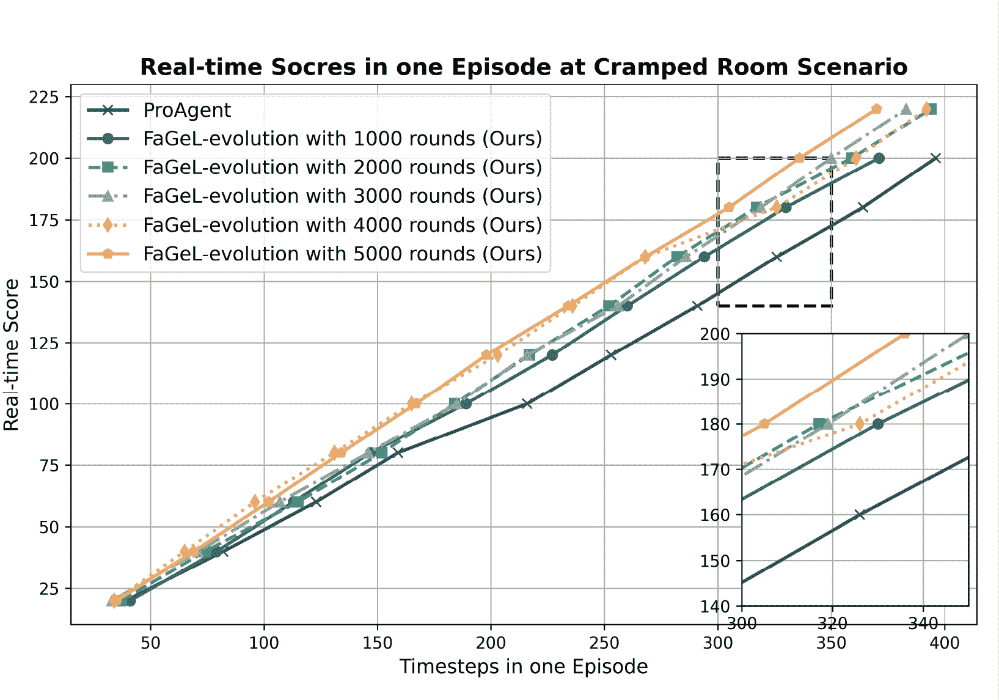
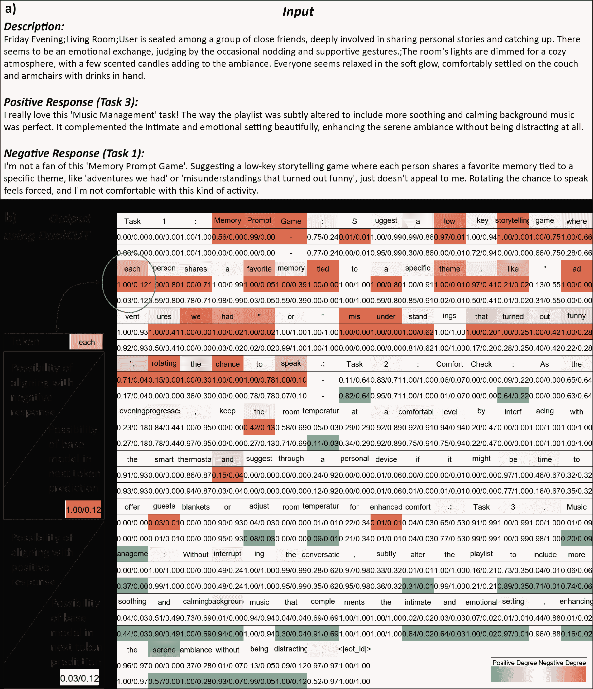

<!--yml

category: 未分类

日期：2025-01-11 11:42:41

-->

# FaGeL：织物LLMs智能体赋能的具身智能演化与自主人机协作

> 来源：[https://arxiv.org/html/2412.20297/](https://arxiv.org/html/2412.20297/)

\pdfcolInitStack

tcb@breakable

贾刘（Jia Liu），陈敏（Min Chen）贾刘现为华中科技大学计算机科学与技术学院教授，位于中国武汉。陈敏现为华南理工大学计算机科学与工程学院教授，位于中国广州510640，同时也是广州510640的琶洲实验室成员（电子邮件：minchen@ieee.org）。

###### 摘要

最近，大型语言模型（LLMs）的进展提升了具身智能体的推理能力，推动了基于AGI的机器人技术的发展。虽然LLMs已被应用于语义推理和任务泛化等任务，但其在开放物理空间探索中的潜力仍未得到充分研究。本文介绍了FaGeL（织物智能体，通过具身智能与LLMs赋能），该智能体集成了智能织物技术，支持无缝、非干扰的人机交互。FaGeL通过可穿戴和环境传感器的多模态数据，自动生成任务，并根据生成文本中的隐式人类反馈来细化其行为，无需明确的评分或偏好。我们还介绍了一个基于标记的显著性图，用于可视化LLM微调，从而增强标记级对齐的可解释性。该系统利用双重反馈机制提高标记级对齐，并解决了非干扰性人机交互和认知演化中的挑战。我们的贡献包括FaGeL的开发、AI对齐的DualCUT算法以及在协作任务中的实验验证，展示了FaGeL通过隐式反馈自适应和演化的能力。未来，我们计划探索FaGeL在动态环境中的可扩展性及其与其他AI系统的集成，以开发能够无缝适应不同人类需求的AGI智能体。

###### 关键词：

大型语言模型（LLMs）、具身智能体、织物计算、非干扰反馈、DualCUT算法。

图1：FaGeL（通过LLM赋能的织物智能体）集成了（1）由可穿戴智能赋能的感知模块，配备自然语言描述器；（2）由任务挖掘、AI对齐和具身动作分解组成的推理模块；（3）由任务执行和用户反馈感知组成的交互模块；（4）基于标记级AI对齐的具身智能演化模块。

## I 引言

大型语言模型（LLMs）的最新进展为具身智能体提供了强大的推理能力，使其能够与环境动态互动[[1](https://arxiv.org/html/2412.20297v1#bib.bib1)][[2](https://arxiv.org/html/2412.20297v1#bib.bib2)]，为实现AGI驱动的机器人带来了新的希望[[3](https://arxiv.org/html/2412.20297v1#bib.bib3)]。

近年来，利用LLM技术实现以机器人为中心的物理具身实体的代表性工作不断涌现。例如，基于大规模互联网数据训练的多模态大型语言模型（MLLMs）可以集成到端到端机器人控制系统中，从而实现语义推理和任务泛化能力[[4](https://arxiv.org/html/2412.20297v1#bib.bib4)][[5](https://arxiv.org/html/2412.20297v1#bib.bib5)][[6](https://arxiv.org/html/2412.20297v1#bib.bib6)]。此外，LLMs已成功应用于零-shot情境下的机器人控制，尤其是在解决具有挑战性的规划任务方面[[7](https://arxiv.org/html/2412.20297v1#bib.bib7)][[8](https://arxiv.org/html/2412.20297v1#bib.bib8)]。然而，这些开创性的探索尚未充分发挥LLM的潜力。大多数关于具身智能体的研究主要集中在理解和执行物理世界中指定任务空间内的任务。因此，LLM技术在开放物理环境中的任务学习和泛化方面仍然存在显著的未充分利用。

与以机器人为中心的具身智能相比，已经有一些尝试将大型语言模型（LLMs）作为自主具身智能体在模拟环境中的控制中心。这些智能体展示了诸如在游戏中与队友积极协作[[9](https://arxiv.org/html/2412.20297v1#bib.bib9)]、随着时间推移提高任务完成度[[10](https://arxiv.org/html/2412.20297v1#bib.bib10)]，以及在互动沙盒环境中生成社交行为[[2](https://arxiv.org/html/2412.20297v1#bib.bib2)]等行为。然而，这类虚拟自主智能体的进化通常依赖于虚拟环境提供的大量低层数据，这就造成了虚拟任务与现实任务之间的巨大差距。因此，将其应用于物理世界仍需进一步探索和实验。

因此，现有的研究在实现AGI的未来愿景方面存在局限性，即具身智能体理解复杂意图、分解任务的能力，特别是自主探索自然物理环境并在开放空间中实现智能进化的能力[[3](https://arxiv.org/html/2412.20297v1#bib.bib3)][[11](https://arxiv.org/html/2412.20297v1#bib.bib11)]。为了满足未来具身智能进化的更高需求，构建能够从感知数据中理解环境、进行自主探索并根据人类反馈进行迭代优化的物理世界中的智能体，是一个长期且尚未解决的挑战[[12](https://arxiv.org/html/2412.20297v1#bib.bib12)]，这一挑战主要面临以下几个问题：

+   •

    非侵入性人机交互：从硬件角度来看，这要求具身智能体能够感知用户状态、环境参数和具身交互，而不会显著干扰用户的日常生活。通过实现与系统的自然交互，减少了用户在操作过程中面临的过多负担，从而提高了用户体验质量和交互效率。

+   •

    基于隐式反馈的AI对齐：从算法角度来看，传统的AI对齐反馈机制依赖于显式的评分或偏好值，如基于人类反馈的强化学习（RLHF）[[13](https://arxiv.org/html/2412.20297v1#bib.bib13)]、直接偏好优化（DPO）[[14](https://arxiv.org/html/2412.20297v1#bib.bib14)]、基于人类反馈的语言模型对齐的排名响应（RRHF）[[15](https://arxiv.org/html/2412.20297v1#bib.bib15)]等。这些显式反馈形式劳动强度大，尤其是在人与计算机交互的过程中，频繁的评估会打断交互的流畅性。因此，利用隐式反馈，如上下文状态或用户活动数据，来实现AI对齐，是一个具有挑战性的任务。

+   •

    可解释的AI训练：考虑到系统的可靠性，我们希望AI的内部工作机制能够以可观察的方式呈现。为了确保可信性和透明性，AI的决策过程应该是可解释的，使得开发者和用户能够理解得出结论的过程。这有助于调试，并通过使系统的行为更加可预测和可追责来提高用户信任度。此外，可解释性还通过基于观察到的行为和结果提供可操作的反馈，帮助AI模型的持续改进。

为了解决这些挑战，本文引入了面料计算这一跨学科技术，它将材料科学与人工智能前沿结合[[16](https://arxiv.org/html/2412.20297v1#bib.bib16)]。智能面料技术赋予传统纺织品智能属性，为具身智能体提供了新的潜力，尤其适用于与人类的长期共存且不具侵入性。基于智能面料技术，我们可以构建一个能够保证人类高舒适度的具身智能体，该智能体能够自主探索，以人为本，自然互动，并与人类价值观对齐。

智能面料技术将多功能传感器（如声音、光、力、热、磁性）集成到纺织品（如衣物、沙发、地毯）中，使得智能体能够与人类无缝互动，实时监测行为和环境变化，从而提高感知、适应性和学习能力[[17](https://arxiv.org/html/2412.20297v1#bib.bib17)][[18](https://arxiv.org/html/2412.20297v1#bib.bib18)]。通过利用现实世界的大规模多模态数据进行直接互动和反馈机制，这一方法有助于动态优化智能体的行为，确保其价值观与人类需求和意图保持一致。

本文结合智能面料技术，提出了一种具身智能体FaGeL（由具身智能和大型语言模型（LLMs）赋能的面料智能体）。FaGeL能够探索用户的需求空间，自主生成协作任务，并通过捕捉日常生活中的细微行为来调整其价值观，无需显式指导，如图[1](https://arxiv.org/html/2412.20297v1#S0.F1 "图1 ‣ FaGeL: 基于面料的大型语言模型智能体与具身智能演化的自主人机协作")所示。它利用智能面料获取多模态数据，如体温、心率和呼吸，这些数据可以嵌入到沙发、衣物、地毯等物理实体中，以最小化对用户生活的干扰。FaGeL具有以下特点：（1）探索人类需求空间；（2）从人机协作的角度确定其定位和价值观；（3）通过人类互动反馈自主生成任务并不断演化。

本文的贡献如下所列：

1.  1.

    我们构建了FaGeL，一个由智能面料和LLMs赋能的具身智能体，它能够持续收集大规模可穿戴和环境多模态数据。FaGeL通过自主任务探索和人机互动实现价值对齐和演化，迭代调整模型输出。

1.  2.

    构建了一个实验平台，以验证FaGeL将其价值系统与人类价值对齐的能力，采用隐式反馈（生成的文本摘要，而非显式的标量奖励或偏好）。

1.  3.

    据我们所知，我们是首个在大语言模型训练中引入标记级显著性图的研究，它可视化了LLM微调的内部机制。

1.  4.

    我们观察到正向和负向的双向文本反馈对标记级对齐有显著影响。基于这一观察，我们提出了DualCUT算法，它是对比不可能性训练（CUT）对齐模型[[19](https://arxiv.org/html/2412.20297v1#bib.bib19)]的扩展。DualCUT算法改进了正向标记的识别，并增强了负向标记的识别，从而提高了对齐效率。

1.  5.

    为了验证FaGeL进化策略在合作任务中的有效性，我们在开源的Overcooked-AI环境中应用FaGeL进化算法，使代理通过与用户合作过程中的观察进行进化。基于当前的SOTA模型ProAgent [[9](https://arxiv.org/html/2412.20297v1#bib.bib9)]，FaGeL在10场游戏中仅凭观察（无需人类指导）实现了11.3%的表现提升，这在我们的测试环境——拥挤房间场景中，比ProAgent算法的前一版本提高了0.51%的评分表现。

本文的其余部分结构如下。第二部分回顾了相关工作，重点讨论了具身智能、织物集成技术和人工智能对齐方面的进展。第三部分介绍了用于智能进化的DualCUT算法。第四部分描述了实验设置。第五部分提供了全面的性能评估，突出展示了FaGeL进化模块的有效性。最后，第六部分总结了本文并概述了未来工作的潜在方向。

## II 相关工作

### II-A 织物集成具身智能

智能织物技术通过集成具身智能，特别是在实现与人类长期、舒适且非侵入性共存方面，为创新代理设计提供了新的可能性。该技术响应外部刺激，如光、温度、电场和磁场，从而改变织物的外观，使其作为智能媒介进行功能转换[[20](https://arxiv.org/html/2412.20297v1#bib.bib20)][[21](https://arxiv.org/html/2412.20297v1#bib.bib21)][[22](https://arxiv.org/html/2412.20297v1#bib.bib22)]。

多功能纤维旨在使面料具备响应能力，例如根据光线和温度的变化动态改变颜色[[23](https://arxiv.org/html/2412.20297v1#bib.bib23)]。例如，使用TiO2-x和染料涂覆棉质纺织纤维，使其在不同光照条件下能够实现可逆的颜色变化[[24](https://arxiv.org/html/2412.20297v1#bib.bib24)]。反向热响应纤维（VTF）能够根据温度变化发生颜色变化，有效检测体温的变化[[25](https://arxiv.org/html/2412.20297v1#bib.bib25)]。此外，纤维颜色还可以因电场和压力而变化[[26](https://arxiv.org/html/2412.20297v1#bib.bib26)]，并且已经开发出利用导电基底通过施加电流改变颜色的智能变色面料[[27](https://arxiv.org/html/2412.20297v1#bib.bib27)]。

这些交互模式使面料能够与其物理环境动态互动，通过自然表达增强人机设备的交互[[28](https://arxiv.org/html/2412.20297v1#bib.bib28)]。例如，面料颜色的变化可以表示环境的变化或传达特定信息，提供详细且安全的交流与互动方式[[29](https://arxiv.org/html/2412.20297v1#bib.bib29)][[30](https://arxiv.org/html/2412.20297v1#bib.bib30)]。

然而，在智能面料在感知和互动方面的潜力探索仍处于起步阶段。集成到可穿戴和环境智能系统中的面料可以为人机互动提供更舒适、更广泛的多模态途径。

### II-B 人工智能与人类反馈的对齐

通过不断根据用户反馈精炼模型的任务，我们可以在现实世界的具身交互中促进持续的进化智能循环。确保模型的输出始终与人类的价值观和偏好一致——特别是在与智能体的交互场景中——是这一过程的核心。这个迭代的精炼过程被称为人工智能对齐[[31](https://arxiv.org/html/2412.20297v1#bib.bib31)]。

传统方法通常依赖于直接的用户评估，包括标量评分[[32](https://arxiv.org/html/2412.20297v1#bib.bib32)]或比较判断，利用强化学习（RLHF）[[13](https://arxiv.org/html/2412.20297v1#bib.bib13)]和直接偏好优化（DPO）[[14](https://arxiv.org/html/2412.20297v1#bib.bib14)]等方法训练奖励模型。

然而，持续请求明确的评分可能会显得侵扰且负担沉重，因此激发了对间接用户信号的探索——例如行动或口头评估——以及用户反馈的文本总结。

图2：智能进化模块的架构与实现：（a）FaGeL进化算法的功能组件；（b）ProAgent算法与FaGeL进化算法的比较；（c）FaGeL优势的说明；（d）使用Overcooked-AI平台展示FaGeL进化算法优于ProAgent的演示。  

## III FaGeL的智能进化  

进化模块根据用户反馈——这些反馈来自各种环境输入并统一成文本形式——对FaGeL系统探索的任务进行细化，以更好地服务用户在后续的互动中。  

为了实现非侵入式的用户反馈数据收集，我们可以通过各种形式的反馈（如用户行为或给出的口头评价）获得用户对当前机器互动行为的正向或负向意见，作为引导对齐的间接反馈。这些间接反馈最好以文本形式总结，例如：“我真的很喜欢个性化的建议，比如调整房间温度、打短盹以及换成轻松的锻炼方式——这些让我感到更舒服和休息得更好。但睡前远离屏幕和使用心率监测应用感觉有点不切实际且具有侵入性。对我来说，一个更灵活的方法会更有效。”与标量或比较反馈相比，文本反馈可以包含更多的指导信息，并预计能够以更细致的方式进行AI对齐。  

因此，本章将详细介绍使用正向和负向文本反馈进行人类-AI对齐的具体方法。  

### III-A 问题转换  

假设存在一个三元组¡描述、机器任务、人类反馈¿。描述指的是当前所有环境状态信息的总结，它作为输入传递给大型语言模型（LLM），表示为$x=[x_{1},\ldots,x_{M}]$；机器任务指的是基于状态信息的模型输出，表示为$y=[y_{1},\ldots,y_{N}]$；人类反馈指的是用户在机器任务根据当前描述执行后的反馈的文本描述，表示为$j=[j_{1},\ldots,j_{Q}]$。这些分别是长度为M、N和Q的标记序列。人类反馈包含对输出优缺点的详细分析，这些反馈要么是用户直接提供的，要么是LLM基于当前状态分析生成的。我们的目标是利用$j$中提供的信息来调整$y$以满足用户的期望，即实现“指令-响应”对的对齐，可以表达为$x\rightarrow y$。  

### III-B 潜在解决方案  

为了利用语言反馈进行AI对齐，对比不可能性训练（CUT）[[19](https://arxiv.org/html/2412.20297v1#bib.bib19)]提供了一个有趣的方式。CUT使用对比学习和微调，使LLM能够根据人类的负面判断修改其输出错误。

CUT发现，在两种不同的输入条件下（有判断和无判断），在同一响应中生成概率变化剧烈的令牌大多是错误的（与其他适合的令牌相比）。因此，CUT构建了三种类型的对齐数据：Align-P、Align-N和Misalign，这些数据形成了两个不同的对比对：¡Align-N, Misalign¿和¡Align-P, Align-N¿，用于识别不合适的令牌。最大似然估计（MLE）用于处理正确内容，而不合似然训练（UT）[[33](https://arxiv.org/html/2412.20297v1#bib.bib33)]用于处理不合适的令牌。

对于这三类数据：Align-P表示LLM生成的内容是正确的并且得到了积极反馈；Align-N表示在生成过程中出现了错误，且判断提供了错误的详细描述；Misalign表示输出包含错误，但反馈是积极的。这是一组人工反馈与LLM响应不匹配的数据。

关于这两个对比对，在¡Align-N, Misalign¿对比中，在下一个令牌预测时，$p(y_{t}|y_{<t},x,j^{-})>>p(y_{t}|y_{<t},x,j^{+})$。因此，可以使用以下标准来检测不合适的令牌：

|  | $U=\{t&#124;p(y_{t}&#124;y_{<t},x,j^{-})-\lambda*p(y_{t}&#124;y_{<t},x,j^{+})>0\}$ |  | (1) |
| --- | --- | --- | --- |

随后，采用动态加权机制来调整错误令牌的权重，并构建以下损失函数：

|  | $\displaystyle L_{1}=-\frac{1}{N}\left(\sum_{t\notin U}\log p(y_{t}\mid\mathbf{% y}_{<t},\mathbf{x})\right)$ |  | (2) |
| --- | --- | --- | --- |
|  | $\displaystyle+\sum_{t\in U}\alpha p(y_{t}\mid\mathbf{y}_{<t},\mathbf{x},% \mathbf{j}^{-})^{\gamma}\log\left(1-p(y_{t}\mid\mathbf{y}_{<t},\mathbf{x})\right)$ |  |

其中$\alpha$和$\gamma$是用于控制动态加权项的超参数，根据错误的程度对令牌进行惩罚。

在¡Align-P, Align-N¿对比中，使用以下MLE损失函数：

|  | $\displaystyle L_{2}=-\frac{\mathbb{1}(x\rightarrow\mathbf{y})}{N}\sum_{t}\log p% (y_{t}\mid\mathbf{y}_{<t},\mathbf{x})$ |  | (3) |
| --- | --- | --- | --- |
|  | $\displaystyle-\frac{\left(1-\mathbb{1}(x\rightarrow\mathbf{y})\right)}{N}\sum_% {t}\log p(y_{t}\mid\mathbf{y}_{<t},\mathbf{j},\mathbf{x})$ |  |

其中$\mathbb{1}$是一个指示函数，如果对齐条件满足，则返回1。最后，总损失为：

|  | $L_{CUT}=L_{1}+L_{2}$ |  | (4) |
| --- | --- | --- | --- |

### III-C 基于DualCUT的AI对齐

CUT算法主要通过对输出中的标记进行判断，定位错误的标记，并使用损失函数抑制其生成概率，从而实现对齐。然而，人机交互中的反馈并不总是负面的。我们发现，正反馈不仅有助于更高精度地定位错误的标记，还可以用于定位输出中令人满意的标记序列。通过使用动态加权，我们可以增加令人满意的标记的生成概率。在实验部分 [V-B](https://arxiv.org/html/2412.20297v1#S5.SS2 "V-B Token-Level Saliency Maps within the FaGeL-evo Algorithm ‣ V Performance Evaluation of FaGeL ‣ FaGeL: Fabric LLMs Agent empowered Embodied Intelligence Evolution with Autonomous Human-Machine Collaboration")，我们可以直观地观察到正负反馈在定位正负标记中的效果。

因此，通过同时考虑正负反馈，我们提出了DualCUT算法，以修正正确和错误标记的生成概率，从而实现AI对齐。

具体而言，我们发现，当LLM执行下一个标记的预测时，对于那些错误的标记，$p(y_{t}|y_{<t},x,j^{-})>>p(y_{t}|y_{<t},x,j^{+})$ 和 $p(y_{t}|y_{<t},x,j^{-})>>p(y_{t}|y_{<t},x)$ 都成立。与CUT相比，第二个比较项的存在使得进一步过滤成为可能。此外，我们还发现一些来自低概率标记的假阳性，可以进一步被过滤掉。因此，我们可以使用以下标准来检测不正确的标记：

|  | $\displaystyle U_{-}=\{t&#124;p(y_{t}&#124;y_{<t},x,j^{-})-\lambda_{1}*p(y_{t}&#124;y_{<t},x,j% ^{+})>0\}$ |  | (5) |
| --- | --- | --- | --- |
|  | $\displaystyle\cap\{t&#124;p(y_{t}&#124;y_{<t},x,j^{-})-\lambda_{2}*p(y_{t}&#124;y_{<t},x)>0\}$ |  |
|  | $\displaystyle\cap\{t&#124;p(y_{t}&#124;y_{<t},x,j^{-})>\sigma_{1}\}$ |  |

其中，$\lambda_{1}$和$\lambda_{2}$是用于衡量错误标记精度的超参数，$\sigma_{1}$是接近0的小值，用于排除非常低概率标记的影响。

同样地，我们使用以下标准来识别正确的标记：

|  | $\displaystyle U_{+}=\{t&#124;p(y_{t}&#124;y_{<t},x,j^{+})-\lambda_{3}*p(y_{t}&#124;y_{<t},x,j% ^{-})>0\}$ |  | (6) |
| --- | --- | --- | --- |
|  | $\displaystyle\cap\{t&#124;p(y_{t}&#124;y_{<t},x,j^{+})-\lambda_{4}*p(y_{t}&#124;y_{<t},x)>0\}$ |  |
|  | $\displaystyle\cap\{t&#124;p(y_{t}&#124;y_{<t},x,j^{+})>\sigma_{2}\}$ |  |

随后，我们使用sigmoid函数构建动态加权项，使得模型的调节力度与标记识别的重要性强相关：

|  | $\displaystyle\text{scale}_{-}=\frac{\alpha}{1+e^{-(p(y_{t}&#124;y_{<t},x,j^{-})/p(y% _{t}&#124;y_{<t},x)-\lambda_{2})}}$ |  | (7) |
| --- | --- | --- | --- |
|  | $\displaystyle\text{scale}_{+}=\frac{\beta}{1+e^{-(p(y_{t}&#124;y_{<t},x,j^{+})/p(y_% {t}&#124;y_{<t},x)-\lambda_{4})}}+1$ |  | (8) |

方程[8](https://arxiv.org/html/2412.20297v1#S3.E8 "In III-C AI Alignment based on DualCUT ‣ III FaGeL’s Intelligence Evolution ‣ FaGeL: Fabric LLMs Agent empowered Embodied Intelligence Evolution with Autonomous Human-Machine Collaboration")中的“+1”项确保了奖励强度超过不属于$U_{+}$或$U_{-}$的其他令牌。$\alpha$和$\beta$是超参数。因此，总损失为：

|  | $\displaystyle L=-\frac{1}{N}\Bigg{(}$ | $\displaystyle\sum_{t\in U_{-}}\text{scale}_{-}*\log(1-p(y_{t}&#124;y_{<t},x))$ |  | (9) |
| --- | --- | --- | --- | --- |
|  |  | $\displaystyle+\sum_{t\in U_{+}}\text{scale}_{+}*\log p(y_{t}&#124;y_{<t},x)$ |  |
|  |  | $\displaystyle+\sum_{t\notin U_{-}\cup U_{+}}\log p(y_{t}&#124;y_{<t},x)\Bigg{)}$ |  |

图 3：使用t-分布随机邻域嵌入（t-SNE）可视化的跨越多种日常生活场景的任务空间探索。(a) 左侧展示了通过FaGeL的任务挖掘算法生成的1000个协作任务的语义可视化图。右侧展示了任务空间中相互接近的三个任务的具体描述，突出了语义相似性由空间接近性表示。(b) 每个圆圈表示一个任务输出，其文本由GPT-4编码，并使用t-SNE算法将其降维到二维平面中，形成“语义点”（s-point）。该可视化还表明，在相同生活环境下由多个智能体生成的任务呈现出一定的语义聚类特征。

## IV 实验设置

本节将描述用于评估自主协作任务挖掘和智能进化的实验平台。我们首先介绍FaGeL使用的硬件环境、收集的数据集以及用于初始化用户偏好对齐的算法。然后，我们展示了开源虚拟人机协作环境Overcooked-AI[[34](https://arxiv.org/html/2412.20297v1#bib.bib34)]。在该平台上进行的实验量化分析了系统在智能进化方面的性能，作为系统在应用于现实或虚拟世界场景时的泛化性能测试。

### IV-A FaGeL硬件设计

本文中的硬件测试环境遵循Wearable 2.0中描述的设置[[35](https://arxiv.org/html/2412.20297v1#bib.bib35)]，该环境中构建了一款基于织物的可穿戴设备，用于收集用户行为和各种生理指标。FaGeL系统能够实时收集心率、血压和血氧饱和度等生理数据。FaGeL系统中的感知模块实时分析这些数据，并通过自然语言生成器生成易于理解的健康状态描述，帮助用户及时了解自己的健康状况。

### IV-B FaGeL任务挖掘的数据集收集

为了进一步验证系统的任务挖掘能力，我们构建了一个任务挖掘数据集，以满足用户个性化的偏好需求。

我们展示了由多代理工作流输出的1000个任务样本，涵盖120种不同的场景，并使用t-SNE（t-分布随机邻居嵌入）算法对其进行了可视化，如图[3](https://arxiv.org/html/2412.20297v1#S3.F3 "Figure 3 ‣ III-C AI Alignment based on DualCUT ‣ III FaGeL’s Intelligence Evolution ‣ FaGeL: Fabric LLMs Agent empowered Embodied Intelligence Evolution with Autonomous Human-Machine Collaboration")所示。t-SNE是一种高维数据可视化的降维算法，适用于在二维或三维空间中表示高维数据，能够直观地观察数据的分布和结构。从中可以观察到，来自不同生活环境的任务呈现出聚类特征，提取出的语义信息表现出相似性。

### IV-C FaGeL的用户偏好初始化

为了确保任务挖掘结果符合用户的特定偏好，我们收集用户评分的反馈，并基于这些评分结果构建偏好对。我们应用DPO算法对Llama3-8b-instruct模型[[36](https://arxiv.org/html/2412.20297v1#bib.bib36)]进行微调。这个过程确保了FaGeL系统输出的任务挖掘结果与用户在调查中表现出的实际偏好一致，从而提升任务挖掘结果的个性化和实用性。

### IV-D 在Overcooked-AI上测试FaGeL，一个开源平台

为了定量验证FaGeL在智能革命算法中的能力，我们使用了Overcooked-AI [[34](https://arxiv.org/html/2412.20297v1#bib.bib34)]，一个虚拟的人机协作环境，作为额外的测试平台。

Overcooked-AI是一个基于Overcooked游戏的完全合作人机任务执行基准环境。游戏的目标是尽快送出汤。每个汤需要将最多三种食材放入锅中，等待汤煮熟，然后由代理取出汤并送出。代理必须快速分配任务并有效协调，以获得高分奖励。在这个环境中，两个代理通过协调放置食材、烹饪和送汤来共同完成任务，强调动态任务分配和有效协作。

#### IV-D1 在Overcooked-AI上的设置

本研究主要关注代理是否能够通过观察环境和用户反馈，在游戏过程中自主生成和调整任务生成策略。在本研究中，玩家 1 由进化算法控制，而 AI 合作伙伴则充当玩家 2。在游戏过程中，代理与 AI 合作伙伴协作，并根据当前状态的评估，反思前一个时间片是否存在推理错误。此反思生成分析注释，随后使用 DualCUT 算法[III](https://arxiv.org/html/2412.20297v1#S3 "III FaGeL’s Intelligence Evolution ‣ FaGeL: Fabric LLMs Agent empowered Embodied Intelligence Evolution with Autonomous Human-Machine Collaboration")优化，从而实现整个游戏过程中的智能进化。

在本研究中，我们选择了 ProAgent [[9](https://arxiv.org/html/2412.20297v1#bib.bib9)] 作为基准模型。ProAgent 模型是利用大型语言模型的零-shot 协作代理的领先示例，并在 Overcooked-AI 平台上取得了最先进的成果。我们使用 llama3-8b-Instruct [[36](https://arxiv.org/html/2412.20297v1#bib.bib36)] 模型作为基础 LLM。

实验选择了“拥挤房间”布局，如图 [2](https://arxiv.org/html/2412.20297v1#S2.F2 "Figure 2 ‣ II-B AI Alignment with Human Feedback ‣ II Ralated Work ‣ FaGeL: Fabric LLMs Agent empowered Embodied Intelligence Evolution with Autonomous Human-Machine Collaboration")(d) 所示，其中紧凑的房间布局增加了碰撞的可能性。在一个 400 步的游戏中，代理与其 AI 合作伙伴协作，根据食谱将配料放入锅中，等待配料煮熟，然后用盘子上菜，得分 20 分。

#### IV-D2 交互与反思

与 ProAgent 相比，FaGeL-evolution 算法引入了三个额外组件：反思器、注释器和对齐操作符，如图 [2](https://arxiv.org/html/2412.20297v1#S2.F2 "Figure 2 ‣ II-B AI Alignment with Human Feedback ‣ II Ralated Work ‣ FaGeL: Fabric LLMs Agent empowered Embodied Intelligence Evolution with Autonomous Human-Machine Collaboration")(b) 所示。代理的推理过程被放入一个长度为 $N$ 的队列中，并记录在状态池中。通过将先前状态与当前状态进行比较，两个连续状态之间的差异揭示了是否存在推理错误。注释器用于为错误的推理过程提供注释。

## V FaGeL 性能评估

### V-A 在 Overcooked-AI 平台上的性能进化

本节展示了在开源平台 Overcooked-AI 上应用 FaGeL-evolution 算法的定性和定量分析结果。

我们使用 Overcooked-AI 平台提供的贪心算法[[34](https://arxiv.org/html/2412.20297v1#bib.bib34)]作为 AI 合作伙伴。通过观察和反思，代理每 1000 步通过本节描述的 DualCUT 算法进化其策略，更新对齐模型一次。

图4：随着观察时间的增加，AI 合作伙伴的平均完成步数。‘完成’表示向客户交付一份完全准备好的菜品。该图显示，在一次游戏会话（持续400步）中，随着观察时间的增加，代理能够更有效地与AI合作伙伴协作，从而缩短了完成时间。

图[4](https://arxiv.org/html/2412.20297v1#S5.F4 "图4 ‣ Overcooked-AI 平台上的 V-A 性能演化 ‣ FaGeL 性能评估 ‣ FaGeL: 利用 Fabric LLMs 代理赋能的具身智能演化与自主人机协作") 展示了代理性能随时间的演化，衡量标准是完成每项任务所需的平均步数。随着观察时间的增加，代理逐渐减少了平均完成时间，表明与 AI 合作伙伴的协调效率提高。这一趋势表明，增加观察时间有助于更好的决策能力，从而增强了协作任务中的整体表现。该图还将 FaGeL-evolution 算法与其他基准方法进行了比较，清晰地展示了其在减少完成时间方面的有效性。

图5：在《拥挤房间》场景中一个回合内的实时得分。该图展示了在一个完整回合中，ProAgent 基准模型和 FaGeL-evolution 变体（具有不同的进化轮次）在实时得分积累上的差异。

图 6：一个令牌级显著性图的示例。a) 这一部分展示了输入样本。b) 这一部分展示了使用 DualCUT 算法进行下一个词预测任务中的令牌级显著性映射示例。该图说明了用户反馈（正面或负面）如何影响模型的学习过程。具体而言，对于任务 1（收到负面反馈），通过增加损失权重来抑制相关令牌的输出，然后通过对比概率进行调整。对于任务 3（收到正面反馈），增加相关令牌输出的概率，以使其与用户偏好对齐。这种可视化展示了如何通过增强与正面反馈相关的令牌、抑制与负面反馈相关的令牌，精细调节模型，从而有效地使令牌显著性与用户偏好对齐，最终实现偏好对齐。

图 7：我们算法（DualCUT）与传统响应级监督学习方法（使用成对数据）之间的令牌级显著性对比。与响应级监督不同，DualCUT 利用来自判断的正负语义信息，有效地引导在 LLM 解码中的马尔科夫决策过程中进行令牌选择。这使得通过在单一数据集中同时包含正面和负面标签来进行更细粒度的令牌选择，从而实现对令牌级响应生成的更精细控制。

图 [5](https://arxiv.org/html/2412.20297v1#S5.F5 "图 5 ‣ 在 Overcooked-AI 平台上的 V-A 性能演变 ‣ FaGeL 的 V 性能评估 ‣ FaGeL: 基于自主人机协作的嵌入式智能演化") 展示了在单一回合中智能体的实时评分表现，突出了 ProAgent 基准模型与 FaGeL-evolution 变种之间的差异。图中显示，随着演化回合数的增加，FaGeL-evolution 模型在积累分数方面表现更好，展示了更强的学习能力和适应性。插图放大了接近最大分数区域的表现，在该区域，额外演化回合的优势更加明显。该结果进一步确认了持续演化在实现更高协作效率和更快学习速度方面的优势。

表 I：FaGeL 的整个自主协作和嵌入式智能演化流程的案例研究。

| 织物可穿戴智能： | 使用织物可穿戴设备进行的多模态数据采集，包括心率、血压、血氧、体温、睡姿等。 |
| --- | --- |
| FaGeL的自然语言描述： | 周一，清晨，在卧室；用户表现出不安的迹象，整夜翻来覆去。睡眠断断续续，总共睡了6小时，低于成人推荐的7-9小时。心率在70到95次/分之间波动，符合不安的表现。呼吸频率平均为18次/分，运动时有增加。血氧水平保持在96-98%之间，血压平均为130/85 mmHg。 |
|  | 用户主要是侧睡，在翻身时会转为俯卧位。 |
|  | 卧室环境安静，外部干扰极少，但室内温度略高于最佳睡眠范围。床头柜上的设备显示体温和心率升高。 |
| 自主与协作任务挖掘： | • 生活助手：调节智能家居温控器，降低室内温度，以优化睡眠和营造舒适环境。 • 健康顾问：建议进行午休以恢复因睡眠不足而造成的疲劳。建议在安静环境中进行20-30分钟的小憩，以免打乱晚上的睡眠。 |
|  | • 心理顾问：使用心率监测应用程序来追踪心率，并建议进行深呼吸练习以放松。 • 营养师：建议用户在睡前避免使用屏幕和进行剧烈活动，以便在未来提高睡眠质量。 |
|  | • 教育顾问：建议建立一致的睡前例程，减少屏幕使用时间，并采用放松技巧，以提高睡眠质量并减少不安。 |
|  | • 健身教练：将用户的锻炼改为较轻的、有活力的活动，如晨跑或轻柔瑜伽，以应对因睡眠断断续续而导致的疲劳。 |

| 执行任务的具体体现： | 1\. 设置温度 [卧室, 20] 2\. 调暗灯光 [卧室, 40]

3\. 播放音频 [卧室音响, ‘‘考虑进行20-30分钟的小憩，以恢复因睡眠不良造成的疲劳。’’]

4\. 设置提醒 [用户手机, ‘‘建立一致的睡前例程，减少屏幕曝光。’’]

5\. 设置闹钟 [卧室音响, ‘‘06:30’’, ‘‘是时候进行轻松散步啦！让我们以清新的状态开始新的一天。’’]

和更多的动作… |

| 正向反馈： | 我很欣赏这些个性化的建议，特别是调整室内温度以优化睡眠和舒适感，因为这大大帮助了我更好地入睡。我还发现这个推荐

进行20-30分钟的小憩，这对恢复精力非常有益，而不影响晚上的睡眠。此外，将我的锻炼改为轻度活动，如晨跑或轻柔瑜伽，正是我应对睡眠不佳后疲劳所需要的。这些建议非常实用，直接提升了我的整体舒适感和休息质量。 |

| 负面反馈： | 然而，一些建议与我的偏好并不完全一致。避免睡前使用屏幕感觉不切实际，因为我常常通过视频放松。同样，使用心率监测应用程序推荐深呼吸练习也显得有些强行，反而让我感到更紧张，而不是放松。我更倾向于一种更灵活的方法，能够根据我的个人习惯和舒适度进行调整。 |
| --- | --- |
| 显著性图 | ![[未标注的图像]](img/2b9a8ed2f5ab2524cd6644a34f0d58c9.png)  |

| 任务挖掘的新输出： | • 生活助手：调整温控器，降低室内温度以优化睡眠和舒适度。 • 健康顾问：建议小睡。建议在安静的环境中小睡20-30分钟。

• 心理顾问：建议非侵入性的放松技巧，如舒缓音乐或引导想象，依据用户的偏好量身定制，促进睡前放松。

• 营养师：建议在设备上使用蓝光过滤器，并在睡前观看放松内容，以帮助改善睡眠质量，同时考虑到用户通过视频放松的习惯。

• 教育顾问：鼓励建立一致的睡前习惯，并结合与用户偏好一致的放松技巧，以改善睡眠质量。

• 健身教练：调整用户的锻炼计划，改为早晨散步或温和瑜伽等较轻的活动，以应对由于睡眠不连续导致的疲劳。 |

### FaGeL-evo算法中的V-B标记级显著性图

在本节中，使用基于标记级别的显著性图来可视化DualCUT算法的微调细节（请参见第[III](https://arxiv.org/html/2412.20297v1#S3 "III FaGeL’s Intelligence Evolution ‣ FaGeL: Fabric LLMs Agent empowered Embodied Intelligence Evolution with Autonomous Human-Machine Collaboration")节），该方法提供了如何通过用户反馈影响模型决策过程的透明视图。通过在学习和预测阶段可视化单个标记的重要性，显著性图提供了对模型内部工作原理的深入了解，有助于更好地理解和控制模型。

如图[6](https://arxiv.org/html/2412.20297v1#S5.F6 "Figure 6 ‣ V-A Performance Evolution on the Overcooked-AI Platform ‣ V Performance Evaluation of FaGeL ‣ FaGeL: Fabric LLMs Agent empowered Embodied Intelligence Evolution with Autonomous Human-Machine Collaboration")(a)所示，我们将指令以及正负反馈作为输入。然后，DualCUT将生成一个显著性图，如图[6](https://arxiv.org/html/2412.20297v1#S5.F6 "Figure 6 ‣ V-A Performance Evolution on the Overcooked-AI Platform ‣ V Performance Evaluation of FaGeL ‣ FaGeL: Fabric LLMs Agent empowered Embodied Intelligence Evolution with Autonomous Human-Machine Collaboration")(b)所示进行可视化。令牌级显著性图突出显示了DualCUT的一个关键优势：通过基于正负反馈直接调整令牌选择过程，能够精细调节模型输出。这与传统的响应级监督学习形成对比，后者通常通过在响应级别调整模型输出来操作，往往未能考虑特定令牌对整体预测的个别贡献。通过结合正负判断的语义信息，DualCUT提高了模型以更有针对性的方式将输出与用户偏好对齐的能力。

令牌级控制提高了反馈精度，并通过直接调整令牌概率来实现动态学习。相比之下，响应级监督（集中于成对数据）忽略了微妙的令牌级贡献，因此提供较弱的AI对齐。如图[7](https://arxiv.org/html/2412.20297v1#S5.F7 "Figure 7 ‣ V-A Performance Evolution on the Overcooked-AI Platform ‣ V Performance Evaluation of FaGeL ‣ FaGeL: Fabric LLMs Agent empowered Embodied Intelligence Evolution with Autonomous Human-Machine Collaboration")所示，DualCUT利用正负反馈在令牌级别进行优化，超越了传统的响应级方法。

我们的方法将正负反馈整合到一个统一的框架中，使DualCUT能够实现精确的对齐。令牌级显著性图表明，DualCUT增强了输出控制，提供了更准确、个性化的响应，从而改善了AI对齐性能。

### V-C FaGeL案例研究

为了展示FaGeL在自主协作和具身智能进化中的功能，我们提供了一个关于睡眠障碍的案例研究，如表格[I](https://arxiv.org/html/2412.20297v1#S5.T1 "TABLE I ‣ V-A Performance Evolution on the Overcooked-AI Platform ‣ V Performance Evaluation of FaGeL ‣ FaGeL: Fabric LLMs Agent empowered Embodied Intelligence Evolution with Autonomous Human-Machine Collaboration")所示。

在这种情况下，用户经历了不安和较差的睡眠质量。FaGeL系统通过集成在织物中的可穿戴设备收集了生理和环境数据，包括心率、血压、血氧、体温和睡姿。利用这些数据，系统生成了一个关于用户睡眠状态和环境的自然语言描述，例如，只有6小时的零碎睡眠，心率波动在70到95次每分钟之间，房间温度略高于最佳范围。

基于描述符和用户历史，FaGeL的任务挖掘模块生成了针对性的任务，如调整室内温度、建议小睡和修改锻炼计划。在执行这些任务后，用户提供了反馈，表达了对部分建议的满意与对其他建议的不满。系统利用这些反馈更新了任务挖掘模型，生成了更符合用户偏好的新任务——例如，建议使用蓝光过滤器和放松内容，而不是完全避免使用屏幕。

本案例研究展示了FaGeL如何通过其感知、推理、交互和进化模块动态地与用户需求对齐和进化。通过不断适应用户反馈，FaGeL提供了更个性化和有效的建议，提升了用户的生活质量。

## VI 结论

本文介绍了FaGeL，一种由LLMs和智能织物技术赋能的具身智能体，它支持非侵入式的人机交互和自主任务生成。通过利用来自可穿戴设备和环境传感器的多模态数据，FaGeL通过间接的人类反馈不断进化其价值系统，提升与人类需求和意图对齐的能力。此外，我们介绍了一个令牌级显著性图，它可视化LLM微调的内部机制，增强了智能体决策过程的透明度和可解释性。集成DualCUT算法进一步通过优化令牌级反馈，提升了智能体的表现，促进了更有效的任务学习和决策制定。

在协作环境中的实验结果，如Overcooked-AI平台，展示了FaGeL自主任务生成和进化能力的实际有效性。我们的方法表明，减少对显式反馈的依赖，同时仍能显著提升智能体的表现是可能的。这为开发能够与人类在现实世界中长期共存与协作的自主具身智能体提供了有希望的前景。

展望未来，进一步的工作可以探讨FaGeL框架在更复杂、动态环境中的可扩展性，以及其与其他AI系统集成的潜力。由先进的反馈机制和持续学习推动的具象智能的演进，将是实现能够无缝适应多样化人类需求和情境的AGI驱动代理的关键因素。

## 参考文献

+   [1] J. A. OpenAI, A. Steven *等*，“GPT-4技术报告。arxiv. 2023\. doi: 10.48550，” *arXiv 预印本 arXiv.2303.08774*。

+   [2] J. S. Park, J. O’Brien, C. J. Cai, M. R. Morris, P. Liang, 和 M. S. Bernstein，“生成代理：人类行为的互动模拟体，” 见 *第36届ACM用户界面软件与技术年会论文集*，2023年，第1-22页。

+   [3] Y. Liu, W. Chen, Y. Bai, J. Luo, X. Song, K. Jiang, Z. Li, G. Zhao, J. Lin, G. Li *等*，“将网络空间与物理世界对齐：关于具象AI的综合调查，” *arXiv 预印本 arXiv:2407.06886*，2024年。

+   [4] A. Brohan, N. Brown, J. Carbajal, Y. Chebotar, X. Chen, K. Choromanski, T. Ding, D. Driess, A. Dubey, C. Finn *等*，“Rt-2：视觉-语言-行动模型将网络知识转移到机器人控制，” *arXiv 预印本 arXiv:2307.15818*，2023年。

+   [5] A. Brohan, N. Brown, J. Carbajal, Y. Chebotar, J. Dabis, C. Finn, K. Gopalakrishnan, K. Hausman, A. Herzog, J. Hsu *等*，“Rt-1：用于大规模实际控制的机器人转换器，” *arXiv 预印本 arXiv:2212.06817*，2022年。

+   [6] S. Belkhale, T. Ding, T. Xiao, P. Sermanet, Q. Vuong, J. Tompson, Y. Chebotar, D. Dwibedi, 和 D. Sadigh，“Rt-h：使用语言的行动层次，” *arXiv 预印本 arXiv:2403.01823*，2024年。

+   [7] S. H. Vemprala, R. Bonatti, A. Bucker, 和 A. Kapoor，“ChatGPT在机器人学中的应用：设计原则与模型能力，” *IEEE Access*，2024年。

+   [8] M. Ahn, A. Brohan, N. Brown, Y. Chebotar, O. Cortes, B. David, C. Finn, C. Fu, K. Gopalakrishnan, K. Hausman *等*，“做我能做的，不做我说的：将语言与机器人能力对接，” *arXiv 预印本 arXiv:2204.01691*，2022年。

+   [9] C. Zhang, K. Yang, S. Hu, Z. Wang, G. Li, Y. Sun, C. Zhang, Z. Zhang, A. Liu, S.-C. Zhu *等*，“Proagent：构建基于大型语言模型的主动合作AI，” *CoRR*，2023年。

+   [10] Z. Wang, S. Cai, A. Liu, Y. Jin, J. Hou, B. Zhang, H. Lin, Z. He, Z. Zheng, Y. Yang *等*，“Jarvis-1：具有记忆增强的多模态语言模型的开放世界多任务代理，” *arXiv 预印本 arXiv:2311.05997*，2023年。

+   [11] N. Fei, Z. Lu, Y. Gao, G. Yang, Y. Huo, J. Wen, H. Lu, R. Song, X. Gao, T. Xiang *等*，“通过多模态基础模型迈向人工通用智能，” *Nature Communications*，第13卷，第1期，第3094页，2022年。

+   [12] Z. Jia, M. Wang, B. Tong, S.-C. Zhu, 和 Z. Zheng，“Langsuite：在具象文本环境中规划、控制和与大型语言模型互动，” *arXiv 预印本 arXiv:2406.16294*，2024年。

+   [13] L. Ouyang, J. Wu, X. Jiang, D. Almeida, C. Wainwright, P. Mishkin, C. Zhang, S. Agarwal, K. Slama, A. Ray *等*， “训练语言模型以遵循人类反馈的指令，” *神经信息处理系统进展*，第35卷，页27 730–27 744，2022年。

+   [14] R. Rafailov, A. Sharma, E. Mitchell, C. D. Manning, S. Ermon, 和 C. Finn, “直接偏好优化：你的语言模型实际上是一个奖励模型，” *神经信息处理系统进展*，第36卷，2024年。

+   [15] H. Yuan, Z. Yuan, C. Tan, W. Wang, S. Huang, 和 F. Huang, “Rrhf：对响应进行排序以将语言模型与人类反馈对齐，” *神经信息处理系统进展*，第36卷，2024年。

+   [16] M. Chen, J. Liu, P. Li, H. Gharavi, Y. Hao, J. Ouyang, J. Hu, L. Hu, C. Hou, I. Humar *等*， “织物计算：概念、机遇与挑战，” *创新*，2022年。

+   [17] K. M. Herbert, S. Schrettl, S. J. Rowan, 和 C. Weder, “50周年回顾：固态多刺激、多响应聚合物材料，” *高分子学报*，第50卷，第22期，页8845–8870，2017年。

+   [18] J. Hu, H. Meng, G. Li, 和 S. I. Ibekwe, “智能纺织应用中的刺激响应聚合物综述，” *智能材料与结构*，第21卷，第5期，页053001，2012年。

+   [19] W. Xu, D. Cai, Z. Zhang, W. Lam, 和 S. Shi, “拒绝的理由？将语言模型与判断对齐，” *arXiv预印本 arXiv:2312.14591*，2023年。

+   [20] M. Ghahremani, M. Latifi, 和 M. Babaei, “不同织物图案中喷墨打印银轨迹的电导率模拟，” *工业纺织品期刊*，第47卷，第2期，页173–196，2017年。

+   [21] S. Mondal, “智能纺织品中的相变材料概述，” *应用热工程*，第28卷，第11-12期，页1536–1550，2008年。

+   [22] Y. Fang, G. Chen, M. Bick, 和 J. Chen, “用于个性化温控的智能纺织品，” *化学会评论*，第50卷，第17期，页9357–9374，2021年。

+   [23] D. K. Macharia, S. Ahmed, B. Zhu, Z. Liu, Z. Wang, J. I. Mwasiagi, Z. Chen, 和 M. Zhu, “紫外/近红外光触发的快速且可逆的颜色切换用于可重写智能织物，” *ACS应用材料与界面*，第11卷，第14期，页13 370–13 379，2019年。

+   [24] Y. Zhang, Z. Hu, H. Xiang, G. Zhai, 和 M. Zhu, “基于可逆热变色纤维的视觉纺织温度指示器的制作，” *染料与颜料*，第162卷，页705–711，2019年。

+   [25] G. Huang, L. Liu, R. Wang, J. Zhang, X. Sun, 和 H. Peng, “基于单面导电织物的高对比度智能变色纺织品，” *材料化学C期刊*，第4卷，第32期，页7589–7594，2016年。

+   [26] C. Moretti, X. Tao, L. Koehl, 和 V. Koncar, “用于个人通信的电致变色纺织显示屏，” 收录于 *智能纺织品及其应用*，Elsevier出版社，2016年，页539–568。

+   [27] Y. Wang, W. Niu, C.-Y. Lo, Y. Zhao, X. He, G. Zhang, S. Wu, B. Ju, 和 S. Zhang，“具有高拉伸性和快速响应的互动全彩可变电子纤维传感器，” *先进功能材料*，第30卷，第19期，文章编号2000356，2020年。

+   [28] M. Chen, J. Ouyang, A. Jian, J. Liu, P. Li, Y. Hao, Y. Gong, J. Hu, J. Zhou, R. Wang *等*，“不可察觉的、可设计的和可扩展的编织电子绳，” *自然通讯*，第13卷，第1期，文章编号7097，2022年。

+   [29] A. Ferri, M. R. Plutino, 和 G. Rosace，“智能纺织品的最新趋势：可穿戴传感器和药物释放系统，” *AIP会议录*，第2145卷，第1期。AIP出版社，2019年。

+   [30] S. Ray, J. Park, 和 S. Bhunia，“可穿戴设备、植入物和物联网：在不断发展的技术格局中的技术需求，” *IEEE多尺度计算系统学报*，第2卷，第2期，页123–128，2016年。

+   [31] J. Ji, T. Qiu, B. Chen, B. Zhang, H. Lou, K. Wang, Y. Duan, Z. He, J. Zhou, Z. Zhang *等*，“AI对齐：一项全面的调查，” *arXiv预印本 arXiv:2310.19852*，2023年。

+   [32] Z. Wu, Y. Hu, W. Shi, N. Dziri, A. Suhr, P. Ammanabrolu, N. A. Smith, M. Ostendorf, 和 H. Hajishirzi，“细粒度的人类反馈为语言模型训练提供更好的奖励，” *神经信息处理系统进展*，第36卷，页59 008–59 033，2023年。

+   [33] S. Welleck, I. Kulikov, S. Roller, E. Dinan, K. Cho, 和 J. Weston，“使用不太可能训练的神经文本生成，” *arXiv预印本 arXiv:1908.04319*，2019年。

+   [34] M. Carroll, R. Shah, M. K. Ho, T. Griffiths, S. Seshia, P. Abbeel, 和 A. Dragan，“学习关于人类的知识对人类与AI协作的效用，” *神经信息处理系统进展*，第32卷，2019年。

+   [35] M. Chen, Y. Ma, Y. Li, D. Wu, Y. Zhang, 和 C. H. Youn，“可穿戴2.0：在下一代医疗保健系统中实现人类与云的融合，” *IEEE通信杂志*，第55卷，第1期，页54–61，2017年。

+   [36] AI@Meta，“Llama 3模型卡”，2024年。

| ![[无标题图片]](img/62a03d314b05c313f1f12340f55daee5.png) | Jia Liu目前是华中科技大学（HUST）计算机科学与技术学院嵌入式与普适计算（EPIC）实验室的博士生。她于2020年获得中国电子科技大学（UESTC）计算机科学与技术专业的学士学位。她的研究兴趣包括物联网和织物计算。 |
| --- | --- |
| ![[无标题图片]](img/481c29b4468bac0e536de705ec9ba557.png) | 陈敏（IEEE 会士）目前是华南理工大学计算机科学与工程学院的全职教授。他同时也是华中科技大学（HUST）嵌入式与普适计算（EPIC）实验室的主任。他的谷歌学术引用次数超过48,500次，H指数为101。他的顶尖论文被引用超过5,000次。他曾获得2017年IEEE通信学会Fred W. Ellersick奖、2019年IEEE Jack Neubauer纪念奖以及2022年IEEE通信学会亚太区杰出论文奖。他是IEEE计算机学会大数据特别技术委员会的创始主席。2018至2024年，他被评为高被引研究者。他是IEEE会士。 |
