<!--yml

类别：未分类

日期：2025-01-11 12:26:42

-->

# FinCon：一种通过概念性语言强化提升金融决策的LLM多代理系统

> 来源：[https://arxiv.org/html/2407.06567/](https://arxiv.org/html/2407.06567/)

Yangyang Yu^(1,⋆)，   Zhiyuan Yao^(1,⋆)， Haohang Li^(1,⋆)， Zhiyang Deng^(1,⋆)， Yuechen Jiang^(1,⋆)， Yupeng Cao^(1,⋆)

Zhi Chen^(1,⋆)， Jordan W. Suchow¹， Zhenyu Cui¹， Rong Liu¹， Zhaozhuo Xu¹， Denghui Zhang¹

Koduvayur Subbalakshmi¹， Guojun Xiong²， Yueru He³， Jimin Huang ³， Dong Li³， Qianqian Xie^(3,†)

¹史蒂文斯理工学院 ²哈佛大学 ³The Fin AI

^⋆这些作者贡献相同 ^† 通讯作者：qianqian.xie@yale.edu

###### 摘要

大型语言模型（LLM）在复杂的金融任务中展现了潜力，但由于环境的波动性和智能风险管理的需求，顺序金融决策仍然充满挑战。尽管基于LLM的代理系统已经取得了令人印象深刻的回报，但通过及时经验的优化来提升多源信息的合成和决策过程仍然是一个未被充分探索的领域。我们介绍了FinCon，一个基于LLM的多代理框架，使用概念性语言强化来处理各种金融任务。受现实世界投资公司结构的启发，FinCon采用了经理-分析师层级结构，使跨功能代理能够通过自然语言互动，朝着统一的目标进行同步合作。其双层风险控制组件通过监控每日市场风险并通过自我批评更新系统化投资信念，增强了决策过程。这些概念化的信念为未来的决策提供了语言强化，并有选择地传播给相关代理，提升了性能，同时减少了不必要的点对点沟通成本。FinCon在包括单只股票交易和投资组合管理等任务上具有良好的泛化能力。¹¹1我们将在以下仓库发布代码和演示：[https://github.com/The-FinAI/FinCon](https://github.com/The-FinAI/FinCon)

## 1 引言

金融市场固有的复杂性和波动性为做出高质量、顺序投资决策带来了重大挑战。在单只股票交易和投资组合管理等任务中，每一个智能决策都受到多个市场互动和多样信息流的驱动，特点是时效性和模式的差异性[[1](https://arxiv.org/html/2407.06567v3#bib.bib1), [2](https://arxiv.org/html/2407.06567v3#bib.bib2)]。这些任务的主要目标是在开放环境中最大化利润，同时管理当前的市场风险。

在实践中，交易公司通常依赖于合成的团队合作，团队结构呈层次化，职能角色包括数据分析师、风险分析师和投资组合经理，他们跨层级进行沟通[[3](https://arxiv.org/html/2407.06567v3#bib.bib3), [4](https://arxiv.org/html/2407.06567v3#bib.bib4)]。这些角色负责谨慎整合各种资源。然而，团队成员的认知局限性可能会妨碍他们迅速处理市场信号并实现最佳投资成果[[5](https://arxiv.org/html/2407.06567v3#bib.bib5)]。

为了提升投资回报并解决人类决策的局限性，各种研究探索了深度强化学习（DRL）等方法，旨在开发能够模拟市场环境并自动化投资策略的代理系统[[6](https://arxiv.org/html/2407.06567v3#bib.bib6), [7](https://arxiv.org/html/2407.06567v3#bib.bib7), [8](https://arxiv.org/html/2407.06567v3#bib.bib8)]。与此同时，大型语言模型（LLMs）的进展在执行复杂任务方面显示出巨大的潜力，包括推理[[9](https://arxiv.org/html/2407.06567v3#bib.bib9), [10](https://arxiv.org/html/2407.06567v3#bib.bib10)]、工具使用[[11](https://arxiv.org/html/2407.06567v3#bib.bib11)]、规划[[12](https://arxiv.org/html/2407.06567v3#bib.bib12)]、决策[[13](https://arxiv.org/html/2407.06567v3#bib.bib13), [14](https://arxiv.org/html/2407.06567v3#bib.bib14)]，甚至在各种金融应用中[[15](https://arxiv.org/html/2407.06567v3#bib.bib15), [16](https://arxiv.org/html/2407.06567v3#bib.bib16), [17](https://arxiv.org/html/2407.06567v3#bib.bib17), [18](https://arxiv.org/html/2407.06567v3#bib.bib18), [19](https://arxiv.org/html/2407.06567v3#bib.bib19)]，这表明它们可能超越现有的代理架构。特别是，语言代理通过其类人沟通和灵活的基于提示的结构，在多样化的决策场景中表现出优异的适应性[[20](https://arxiv.org/html/2407.06567v3#bib.bib20), [21](https://arxiv.org/html/2407.06567v3#bib.bib21), [22](https://arxiv.org/html/2407.06567v3#bib.bib22), [23](https://arxiv.org/html/2407.06567v3#bib.bib23)]。

为了实现最佳的决策性能，必须考虑两个关键因素：（1）组织代理以促进有效的团队合作和高效的沟通，以及（2）使代理能够不断学习并优化其行动。研究表明，模仿人类组织结构可以成功地协调语言代理执行特定任务 [[24](https://arxiv.org/html/2407.06567v3#bib.bib24)、[25](https://arxiv.org/html/2407.06567v3#bib.bib25)、[26](https://arxiv.org/html/2407.06567v3#bib.bib26)]。此外，最近在基于文本的梯度优化提示 [[27](https://arxiv.org/html/2407.06567v3#bib.bib27)、[28](https://arxiv.org/html/2407.06567v3#bib.bib28)] 和语言强化 [[29](https://arxiv.org/html/2407.06567v3#bib.bib29)、[30](https://arxiv.org/html/2407.06567v3#bib.bib30)] 方面的进展，已证明能够有效地迭代提升语言代理的推理和决策能力。

为金融决策设计的语言代理系统，如 FinGPT [[31](https://arxiv.org/html/2407.06567v3#bib.bib31)]、FinMem [[32](https://arxiv.org/html/2407.06567v3#bib.bib32)] 和 FinAgent [[33](https://arxiv.org/html/2407.06567v3#bib.bib33)]，已显示出强大的性能。然而，它们面临着若干限制。首先，它们依赖于代理基于短期市场波动的风险偏好，但这种方法未能控制长期风险敞口，可能忽视了推动投资回报的基本因素。一种更有效的方法是使用定量金融中已建立的风险衡量标准来量化投资风险 [[34](https://arxiv.org/html/2407.06567v3#bib.bib34)、[35](https://arxiv.org/html/2407.06567v3#bib.bib35)]。其次，这些系统通常仅限于单一资产交易任务，使得它们在像投资组合管理这样的多资产金融应用中适应性较差。第三，它们对单个代理施加了巨大压力，要求其在受限的上下文窗口内理解和处理信息，这可能会降低决策质量。尽管像 StockAgent [[36](https://arxiv.org/html/2407.06567v3#bib.bib36)] 这样的方案采用了多代理系统进行股票交易，但它们依赖大量 LLM 代理之间的广泛讨论，导致了高昂的沟通成本和缓慢的决策过程。此外，缺乏明确的优化目标可能会影响结果的有效性。更多相关文献中的工作将在附录 [A.1](https://arxiv.org/html/2407.06567v3#A1.SS1 "A.1 Related Work ‣ Appendix A Appendix ‣ FinCon: A Synthesized LLM Multi-Agent System with Conceptual Verbal Reinforcement for Enhanced Financial Decision Making") 中讨论。

为了解决这些问题，我们提出了FinCon，一个基于大型语言模型（LLM）的多代理框架，用于处理关键的金融任务，如单一股票交易和投资组合管理，如图[1](https://arxiv.org/html/2407.06567v3#S1.F1 "Figure 1 ‣ 1 Introduction ‣ FinCon: A Synthesized LLM Multi-Agent System with Conceptual Verbal Reinforcement for Enhanced Financial Decision Making")所示。我们的主要贡献有：1）受现实世界投资角色的启发，我们引入了一种新型的合成经理-分析师层次沟通结构，并加入了风险控制组件。该结构将来自不同来源的金融数据分配给相应的功能分析师代理，使它们能够专注于具体的见解，而经理则整合这些输入以做出明智的交易决策。这种精简的沟通减少了冗余的点对点互动，从而降低了成本并提高了效率。2）我们的框架不仅限于股票交易，还能够处理投资组合管理，这是之前其他金融语言代理系统没有涉及的领域。3）我们开发了一个双层风险控制组件，用于在不同的回合内外更新风险评估。在回合内，使用基于分位数的风险度量条件风险价值（CVaR）来监督风险[[37](https://arxiv.org/html/2407.06567v3#bib.bib37)]。在回合间，我们引入了一种语言强化机制，在该机制中，投资信念基于推理轨迹和盈亏（PnL）趋势进行更新，并提炼为概念性视角。这些见解从经理向相关分析师代理选择性地反向传播。我们的消融研究表明，这种风险控制设计在管理市场风险和提高交易表现方面的有效性。

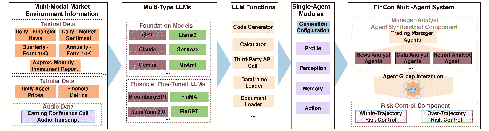

图1：FinCon的总体框架。

## 2 前置条件

在此，我们概述了将明确讨论的两项主要金融决策任务的数学符号。我们还正式提出了使用部分可观察马尔可夫决策过程（POMDP）[[38](https://arxiv.org/html/2407.06567v3#bib.bib38)]对金融决策任务进行建模的推广形式。

### 2.1 金融决策任务建模

单一股票交易任务。FinCon使用分析师代理组$\{M_{pr}^{i}\}_{i=1}^{I}$处理多模态市场信息源。然后，处理过的信息被经理代理$M_{a}$用于做出交易决策（买入、卖出、持有），并提供相关的推理文本。需要注意的是，“卖出”信号意味着系统做出“卖空”决策，即允许采取负的交易头寸。此外，FinCon评估每日投资风险，并随后通过风险控制组件$M_{r}$对经理代理进行提示优化。

投资组合交易任务。除了处理多模态市场信息外，分析师代理还通过考虑股票收益之间的统计相关性来构建投资组合管理的股票池。接着，经理代理会为股票池中的每只股票做出交易决策。最后，经理代理使用外部优化求解器，根据下面描述的均值-方差优化方法，确定所有股票的投资组合权重 [[39](https://arxiv.org/html/2407.06567v3#bib.bib39)]：

|  | $\max_{\textbf{w}}\langle\textbf{w},\mu\rangle-\langle\textbf{w},\Sigma\textbf{% w}\rangle\quad\text{s.t.}~{}w_{n}=\begin{cases}\in[0,1],&\text{``买入''}\\ \in[-1,0],&\text{``卖出''}\\ =0,&\text{``持有''}\end{cases},~{}~{}\forall n\in\{1,\cdots,N\}$ |  | (1) |
| --- | --- | --- | --- |

其中 $\textbf{w}=(w_{1}\cdots,w_{N})\in\mathbb{R}^{N}$ 是投资组合权重向量，$\mu$ 和 $\Sigma$ 分别是所选股票日收益序列的 $N$ 维样本预期收益和 $N \times N$ 样本协方差矩阵的收缩估计器 [[35](https://arxiv.org/html/2407.06567v3#bib.bib35)]。我们注意到，投资组合权重是按日重新平衡的。在我们的实现中，我们首先通过解决上述优化问题来计算投资组合权重。接下来，目标仓位通过线性缩放前一步中的投资组合权重来确定。

### 2.2 将量化交易建模为 POMDP

正式地，我们将量化交易任务建模为一个无限时域的部分可观察马尔可夫决策过程（POMDP）[[40](https://arxiv.org/html/2407.06567v3#bib.bib40), [41](https://arxiv.org/html/2407.06567v3#bib.bib41)]，时间索引为$\mathbb{T}=\{0,1,2,\cdots\}$，折扣因子为$\alpha\in(0,1]$。该模型的组成部分如下：（1）状态空间$\mathcal{X}\times\mathcal{Y}$，其中$\mathcal{X}$是可观察部分，$\mathcal{Y}$是金融市场的不可观察部分；（2）分析师代理组的动作空间为$\mathcal{A}=\prod_{i=1}^{I}\mathcal{A}^{i}$，其中$\mathcal{A}^{i}$表示由代理$i$处理的市场信息集合（总共有$I$个分析师代理），对于经理代理，其动作空间为$\mathbb{A}$，对于单股交易任务，其空间被建模为$\{\textit{``buy",~{}``sell",~{}``hold"}\}$，而对于涉及$N$只股票的投资组合管理任务，其动作空间为$(\{\textit{``buy",~{}``sell",~{}``hold"}\}\times[-1,1])^{\otimes N}$；（3）奖励函数$\mathcal{R}(o,b,a):\mathcal{X}\times\mathcal{Y}\times\mathbb{A}\to\mathbb{R}$，输出为每日盈亏（PnL）；（4）观察过程$\{O_{t}\}_{t\in\mathbb{T}}\subseteq\mathcal{X}$是一个$I$维过程，第$i^{th}$条目$\{O_{t}^{i}\}_{t\in\mathbb{T}}$表示由分析师代理$i$单独处理的某种单模态信息流；（5）反射过程$\{B_{t}\}_{t\in\mathbb{T}}\subseteq\mathcal{Y}$表示经理代理的自我反思，它从$B_{t}$更新到$B_{t+1}$，周期为每日[[42](https://arxiv.org/html/2407.06567v3#bib.bib42)]）；（7）处理后的信息流$\hat{O}_{t}=(\hat{O}_{t}^{1},\cdots,\hat{O}_{t}^{I})\in\mathcal{A},\forall~{}t\in\mathbb{T}$，表示来自分析师代理组的信息处理输出。

然后，我们的多代理系统旨在学习所有代理的策略：分析师代理的策略$\pi_{\theta^{i}}^{i}:\mathcal{X}\to\mathcal{A}^{i},i\in\{1,\cdots,I\}$（信息处理方式，即$\hat{O}_{t}^{i}\sim\pi_{\theta^{i}}^{i}(\cdot|O_{t}^{i})$），以及经理代理的策略$\pi_{\theta^{a}}:\mathcal{A}\times\mathcal{Y}\to\mathbb{A}$（做出交易决策的方式，即$A_{t}\sim\pi_{\theta^{a}}(\cdot|\hat{O}_{t},B_{t})$），使得系统在控制风险的同时最大化累积交易奖励[[43](https://arxiv.org/html/2407.06567v3#bib.bib43)]。所有策略$\Pi_{\bm{\theta}}=(\{\pi_{\theta^{i}}^{i}\}_{i=1}^{I},\pi_{\theta^{a}})$都由文本提示$\bm{\theta}=(\{\theta^{i}\}_{i=1}^{I},\theta^{a})$参数化。通过通过风险控制组件$M_{r}$更新提示，整个系统以口头强化的方式优化策略$\Pi_{\bm{\theta}}$。通过将每日盈亏（PnL）表示为$R^{\Pi_{\bm{\theta}}}_{t}=\mathcal{R}(O_{t},B_{t},A_{t})$，整个系统的优化目标可以写为：

|  | $\max_{\bm{\theta}}\mathbb{E}\Big{[}\sum\limits_{t\in\mathbb{T}}\alpha^{t}R^{% \Pi^{\bm{\theta}}}_{t}\Big{]}$ |  | (2) |
| --- | --- | --- | --- |

是一个具有风险敏感性的优化问题，采用文本梯度下降方法，与为POMDP设计的DRL算法有本质区别。关于文本梯度下降方法的更多细节请参见附录[A.2](https://arxiv.org/html/2407.06567v3#A1.SS2 "A.2 Textual Gradient-Descent ‣ Appendix A Appendix ‣ FinCon: A Synthesized LLM Multi-Agent System with Conceptual Verbal Reinforcement for Enhanced Financial Decision Making")。

## 3 FinCon架构

在本节中，我们展示了使用二级层次结构的FinCon架构。首先，我们描述了协调代理同步工作和沟通的层级框架。然后，我们详细阐述了构成FinCon中每个代理的各模块的功能。最后，我们旨在阐明FinCon如何通过口头强化方法解决如方程式([2](https://arxiv.org/html/2407.06567v3#S2.E2 "In 2.2 Modeling Quantitative Trading as POMDP ‣ 2 Preliminaries ‣ FinCon: A Synthesized LLM Multi-Agent System with Conceptual Verbal Reinforcement for Enhanced Financial Decision Making"))所表达的目标函数。

### 3.1 综合多代理层级结构设计

FinCon的代理系统由两个主要组成部分构成：经理-分析师代理组组件和风险控制组件。

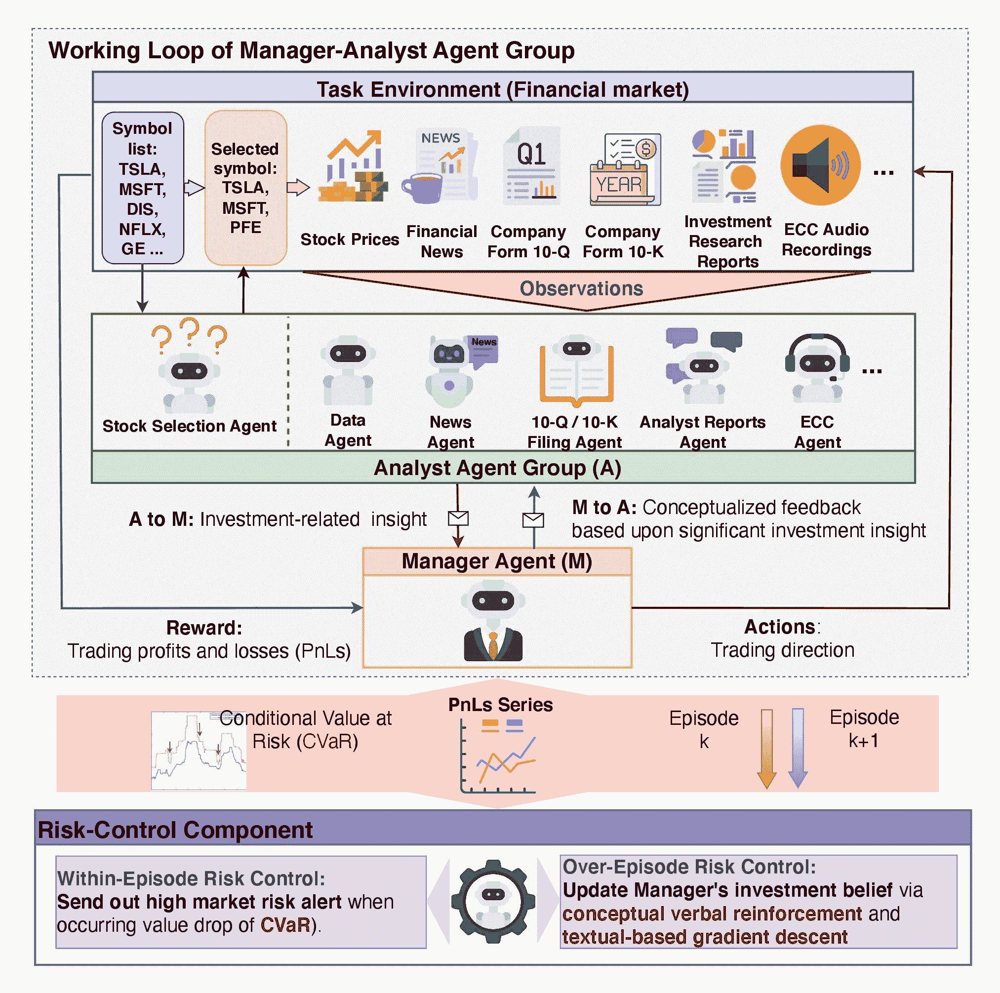

图2：FinCon的详细架构包含两个关键组件：经理-分析师代理组和风险控制。它还展示了FinCon各组件之间的互动及决策流程。

#### 3.1.1 经理-分析师代理组

类似于人类投资公司，FinCon建立了一个独特的层级结构来组织其多代理系统，综合各代理的努力以实现更优的决策结果。其主要目标是增强信息的呈现与理解，同时最小化不必要的沟通成本。每个代理的工作机制如图[2](https://arxiv.org/html/2407.06567v3#S3.F2.1 "Figure 2 ‣ 3.1 Synthesized Multi-agent Hierarchical Structure Design ‣ 3 Architecture of FinCon ‣ FinCon: A Synthesized LLM Multi-Agent System with Conceptual Verbal Reinforcement for Enhanced Financial Decision Making")所示。

分析师代理。在FinCon中，分析师代理从大量多源市场数据中提炼简洁的投资见解，每个分析师专注于一个特定的交易目标。为了通过减少任务负荷并增强焦点来确保高质量的推理，每个代理以单一模式处理来自单一来源的信息，基于提示提供预先指定的输出。此设置模拟了一个高效的人类团队，每个分析师专注于特定职能，过滤市场噪音并提取关键见解。这些代理通过整合多个视角的去噪投资信息来协助管理者代理。我们实现了七种不同类型的分析师代理，使用LLMs，每种代理生成独特的投资见解，如图[2](https://arxiv.org/html/2407.06567v3#S3.F2.1 "Figure 2 ‣ 3.1 Synthesized Multi-agent Hierarchical Structure Design ‣ 3 Architecture of FinCon ‣ FinCon: A Synthesized LLM Multi-Agent System with Conceptual Verbal Reinforcement for Enhanced Financial Decision Making")中上方所示。基于输入模态，三种文本数据处理代理从每日新闻和财务报告中提取见解和情绪。一个音频代理使用Whisper API解释来自财报电话会议录音的投资信号。此外，一个数据分析代理和一个选股代理使用表格时间序列数据计算关键的财务指标，如动量和CVaR。选股代理还通过应用经典的风险多样化方法进行投资组合选择，这是一种定量金融中的技术[[1](https://arxiv.org/html/2407.06567v3#bib.bib1)]。

管理者代理。在FinCon中，管理者代理充当唯一的决策者，负责为连续的金融任务生成交易行动。在投资组合管理中，它使用凸优化技术计算投资组合权重，并受到方向性交易决策的约束（参见公式中呈现的优化问题[（1）](https://arxiv.org/html/2407.06567v3#S2.E1 "2.1 Financial Decision-making Tasks Formulation ‣ 2 Preliminaries ‣ FinCon: A Synthesized LLM Multi-Agent System with Conceptual Verbal Reinforcement for Enhanced Financial Decision Making")））。四个关键机制支持每一个决策：1）整合来自多个分析师代理的提炼见解。2）接收来自风险控制组件的及时风险警报和概念性投资更新。3）优化其对不同信息源对特定目标交易决策影响的投资信念。4）通过回顾先前交易行动的推理结果进行自我反思。

#### 3.1.2 风险控制组件

我们创新性地设计了一种双层风险控制机制，包括单次训练阶段内的风险管理和跨阶段的风险管理。单次训练阶段内的机制检测单一训练阶段内的市场风险，使得管理者代理能够及时调整交易行为，通过考虑短期交易表现和市场波动，减少潜在损失。此机制在测试阶段也会运行。与此相对，跨阶段的机制仅在训练阶段工作，通过将当前阶段的交易表现与前一阶段进行比较，提供及时的优化指导。这一反思过程使得管理者代理能够基于表现差异更新其投资信念。通过借鉴对市场风险和盈利模式的前期观察，这两种机制有助于避免重复的投资错误，从而提升未来的回报。

单次训练阶段内的风险控制：单次训练阶段内的风险警报由条件价值风险（CVaR）值的突然下降触发。条件价值风险（CVaR）表示最差表现的1%的每日交易盈亏（PnLs）的平均值。CVaR的下降通常意味着近期的交易决策导致了在这一最差百分位范围内的盈亏，预示着市场可能处于高风险状态。发生这种情况时，管理者代理会采取风险规避的态度进行当天的交易行为，无论之前的风险状态如何。

超周期风险控制：超周期投资信念更新有助于调整对分析师信息提炼和经理人行动生成的重视程度。通过 Actor-Critic 机制，FinCon 根据给定的交易目标（由目标方程（[2](https://arxiv.org/html/2407.06567v3#S2.E2 "在 2.2 将量化交易建模为 POMDP ‣ 2 基础 ‣ FinCon：一种综合的 LLM 多智能体系统，通过概念性语言强化提升金融决策")）定义）阶段性地优化其投资策略，通过反思一系列成功和失败的行动来实现。这个阶段性反思由独特的概念性语言强化（CVRF）驱动。CVRF 通过分析分析师提供的信息视角并在经理决策中得到体现，来评估连续训练周期的表现。然后，它将评估结果概念化并归因于这些特定方面。通过比较更具盈利性与较少盈利性的阶段的概念化见解，系统向经理和分析师智能体传递必要的信念调整，帮助优先考虑最相关的市场信息，以提高盈利能力，具体细节见于算法[1](https://arxiv.org/html/2407.06567v3#alg1 "算法 1 ‣ 3.1.2 风险控制组件 ‣ 3.1 综合多智能体层次结构设计 ‣ 3 FinCon 架构 ‣ FinCon：一种综合的 LLM 多智能体系统，通过概念性语言强化提升金融决策")。CVRF 利用基于文本的梯度下降为经理智能体提供最优的概念性投资指导，使用最新的投资信念来优化提示。该指导依据由各自的分析师智能体提供的视角、关键财务指标（如历史动量）或其他关键观点进行组织。

基于梯度的模型优化器 LLM-based 提示优化器 升级方向 模型价值梯度动量 提示反射轨迹 更新方法 学习率下降 交易决策的重叠百分比

表 1：模型优化器与提示优化器词汇的类比。

这些信念更新首先由管理代理接收，然后选择性地传播到相关代理，以最小化过度通信。与Tang等人提出的基于文本的梯度下降方法[[28](https://arxiv.org/html/2407.06567v3#bib.bib28)]不同，该方法使用提示编辑距离作为学习率，我们通过测量两个连续训练轨迹之间的交易行为重叠百分比来推导投资信念更新，如表[1](https://arxiv.org/html/2407.06567v3#S3.T1 "Table 1 ‣ 3.1.2 Risk-Control Component ‣ 3.1 Synthesized Multi-agent Hierarchical Structure Design ‣ 3 Architecture of FinCon ‣ FinCon: A Synthesized LLM Multi-Agent System with Conceptual Verbal Reinforcement for Enhanced Financial Decision Making")所示。该方法已被证明在提高合成代理系统的性能方面是有效的，其中每个工作者都有明确的定义和专业化的角色。上述内容描述了FinCon在训练阶段的工作流程，而测试阶段的工作流程详见附录[A.3](https://arxiv.org/html/2407.06567v3#A1.SS3 "A.3 FinCon Testing Stage Workflow ‣ Appendix A Appendix ‣ FinCon: A Synthesized LLM Multi-Agent System with Conceptual Verbal Reinforcement for Enhanced Financial Decision Making")。

算法 1 训练阶段算法：基于文本的梯度下降法进行概念性语言强化

初始化经理-分析师组件 $\{M_{pr}^{i}\}^{I}_{i=1}\&M_{a}$，以及风险控制组件 $M_{r}$。 初始化交易开始日期 $s$，投资组合的股票池和投资组合权重 $w_{0}=\textbf{0}$。 初始化提示 $\bm{\theta}$，策略 $\Pi_{\bm{\theta}}$。 当回合 $k<Max$ 时，执行以下操作： for $0\leq t\leq T$ 时，执行： 

### 3.2 FinCon代理的模块化设计

在这里，我们解释了FinCon代理的模块化设计。受到Park等人[[44](https://arxiv.org/html/2407.06567v3#bib.bib44)]和Sumers等人[[45](https://arxiv.org/html/2407.06567v3#bib.bib45)]最近关于为类人行为开发语言代理认知结构的研究启发，FinCon中的代理集成了四个模块，以支持其必要的功能，并配有一个共享的通用配置，具体内容详见附录[A.4](https://arxiv.org/html/2407.06567v3#A1.SS4 "A.4 Figure of Modular Design of Agents in FinCon ‣ Appendix A Appendix ‣ FinCon: A Synthesized LLM Multi-Agent System with Conceptual Verbal Reinforcement for Enhanced Financial Decision Making")。

一般配置和概况模块。该模块定义了任务类型（例如，股票交易、投资组合管理），并指定了交易目标，包括行业和绩效细节。概况模块概述了每个代理的角色和职责。来自这些部分的连接文本内容用于从代理的记忆数据库中查询与投资相关的事件。感知模块。该模块定义了每个代理如何与市场互动，指定了它们感知、接收和传递的信息，且互动根据每个代理的角色量身定制。具体而言，它将原始市场数据、来自其他代理的反馈以及从记忆模块中检索的信息转换为与大型语言模型兼容的格式，使它们能够有效处理这些输入。记忆模块。记忆模块包括三个关键组件：工作记忆、程序记忆和情节记忆。就像人类在工作记忆中处理事件一样[[46](https://arxiv.org/html/2407.06567v3#bib.bib46)]，FinCon代理通过其工作记忆执行一系列任务，包括观察、提炼和精炼可用的记忆事件，这些任务都根据代理的特定角色量身定制。程序记忆和情节记忆对于记录历史行为、结果和在连续决策过程中反思至关重要。程序记忆是在每个决策步骤后生成的，作为记忆事件存储数据。在交易查询中，来自程序记忆的顶级事件会根据时效性、相关性和重要性进行排名，遵循Yu等人提出的简化版方法[[32](https://arxiv.org/html/2407.06567v3#bib.bib32)]，具体细节请参见附录 [A.13](https://arxiv.org/html/2407.06567v3#A1.SS13 "A.13 Ranking Metrics for Procedural Memory in FinCon ‣ Appendix A Appendix ‣ FinCon: A Synthesized LLM Multi-Agent System with Conceptual Verbal Reinforcement for Enhanced Financial Decision Making")。每个功能分析代理都有不同的程序记忆衰减率，反映了各种金融数据源的时效性，这对于对齐影响特定时间点的多类型数据并支持明智的决策非常重要。经理代理通过提供反馈并通过访问计数器增强分析代理的程序记忆。分析代理和经理代理都维护程序记忆，但它们保持不同的记录，如附录 [A.4](https://arxiv.org/html/2407.06567v3#A1.SS4 "A.4 Figure of Modular Design of Agents in FinCon ‣ Appendix A Appendix ‣ FinCon: A Synthesized LLM Multi-Agent System with Conceptual Verbal Reinforcement for Enhanced Financial Decision Making")所示。情节记忆是经理代理专有的，存储了之前情节中的行动、PnL系列以及来自风险控制组件的更新概念性投资信念。

## 4 实验

我们的实验回答了关键研究问题（RQ）：RQ1：FinCon是否在多个金融决策任务中展现出稳健性，尤其是在单资产交易和投资组合管理中？RQ2：FinCon中的剧集内风险控制机制是否有效地维持优越的决策表现？RQ3：FinCon中的跨剧集风险控制机制是否能够及时更新经理代理的信念，从而提升交易表现？

### 4.1 实验设置

### 4.2 主要结果

针对RQ1，我们分析了FinCon在两种类型的金融决策任务中的表现：单一资产交易和投资组合管理。系统在处理这些连续复杂决策的能力将在以下章节中进行详细评估。

#### 4.2.1 单一资产交易任务

在此任务中，我们通过交易八种不同的股票，评估了FinCon与其他领先算法交易模型的表现。如上表所示，FinCon在CR和SR方面显著优于基于LLM和基于DRL的方法。此外，FinCon在大多数交易资产中实现了最低的MDD值，表明其有效的风险管理，同时仍能提供最高的投资回报。有关所有模型和指标的详细性能比较，请参阅表格1。

总体而言，即使在延长的训练周期下，基于DRL的模型通常表现较差，A2C算法在总体上显著滞后于其他代理。特别地，需要澄清Nio Inc.（NIO）和Coinbase Global Inc.（COIN）的训练周期。NIO在2018年9月完成了首次公开募股（IPO），其训练周期略短于其他股票，但NIO的DRL算法仍然实现了收敛。相比之下，Coinbase Global Inc.（COIN）在2021年4月完成IPO，由于可用的交易数据有限，这给DRL算法带来了更大的挑战，导致其难以收敛。这一局限性突显了DRL代理在交易新上市IPO时的一个主要缺点。因此，我们对COIN的分析集中在FinCon、基于LLM的代理和买入持有（B & H）策略之间的比较。在这一背景下，FinCon表现出明显的优势，实现了超过57%的累计回报和0.825的夏普比率。此外，基于LLM的代理可以利用多种数据类型，并且只需最少的训练，有效缓解了DRL算法面临的挑战。

| 类别 | 模型 | TSLA |  | AMZN |  | NIO |  | MSFT |  |  |
| --- | --- | --- | --- | --- | --- | --- | --- | --- | --- | --- |
| CR$\%\uparrow$ | SR$\uparrow$ | MDD$\%\downarrow$ |  | CR$\%\uparrow$ | SR$\uparrow$ | MDD$\%\downarrow$ |  | CR$\%\uparrow$ | SR$\uparrow$ | MDD$\%\downarrow$ |  | CR$\%\uparrow$ | SR$\uparrow$ | MDD$\%\downarrow$ |  |  |
| 市场 | B&H | 6.425 | 0.145 | 58.150 |  | 2.030 | 0.072 | 34.241 |  | -77.210 | -1.449 | 63.975 |  | 27.856 | 1.230 | 15.010 |  |  |
| 我们的模型 | FinCon | 82.871 | 1.972 | 29.727 |  | 24.848 | 0.904 | 25.889 |  | 17.461 | 0.335 | 40.647 |  | 31.625 | 1.538 | 15.010 |  |  |
| 基于LLM的 | GA | 16.535 | 0.391 | 54.131 |  | -5.631 | -0.199 | 37.213 |  | -3.176 | -1.574 | 3.155 |  | -31.821 | -1.414 | 39.808 |  |  |
| FinGPT | 1.549 | 0.044 | 42.400 |  | -29.811 | -1.810 | 29.671 |  | -4.959 | -0.121 | 37.344 |  | 21.535 | 1.315 | 16.503 |  |  |
| FinMem | 34.624 | 1.552 | 15.674 |  | -18.011 | -0.773 | 36.825 |  | -48.437 | -1.180 | 64.144 |  | -22.036 | -1.247 | 29.435 |  |  |
| FinAgent | 11.960 | 0.271 | 55.734 |  | -24.588 | -1.493 | 33.074 |  | 0.933 | 0.051 | 19.181 |  | -27.534 | -1.247 | 39.544 |  |  |
| 基于DRL的 | A2C | -35.644 | -0.805 | 61.502 |  | -12.560 | -0.444 | 37.106 |  | -91.910 | -1.728 | 68.911 |  | 21.397 | 0.962 | 21.458 |  |  |
| PPO | 1.409 | 0.032 | 49.740 |  | 3.863 | 0.138 | 28.085 |  | -72.119 | -1.352 | 62.093 |  | -4.761 | -0.214 | 30.950 |  |  |
| DQN | -1.296 | -0.029 | 58.150 |  | 11.171 | 0.398 | 31.174 |  | -35.419 | -0.662 | 56.905 |  | 27.021 | 1.216 | 21.458 |  |  |  | 类别 | 模型 | AAPL |  | GOOG |  | NFLX |  | COIN |
| CR$\%\uparrow$ | SR$\uparrow$ | MDD$\%\downarrow$ |  | CR $\%\uparrow$ | SR$\uparrow$ | MDD$\%\downarrow$ |  | CR$\%\uparrow$ | SR$\uparrow$ | MDD$\%\downarrow$ |  | CR$\%\uparrow$ | SR$\uparrow$ | MDD$\%\downarrow$ |
| 市场 | B&H | 22.315 | 1.107 | 20.659 |  | 22.420 | 0.891 | 21.191 |  | 57.338 | 1.794 | 20.926 |  | -21.756 | -0.311 | 60.187 |
| 我们的模型 | FinCon | 27.352 | 1.597 | 15.266 |  | 25.077 | 1.052 | 17.530 |  | 69.239 | 2.370 | 20.792 |  | 57.045 | 0.825 | 42.679 |
| 基于LLM的 | GA | 5.694 | 0.372 | 14.161 |  | -1.515 | -0.192 | 8.210 |  | 41.770 | 1.485 | 20.926 |  | 19.271 | 0.277 | 67.532 |
| FinGPT | 20.321 | 1.161 | 16.759 |  | 0.242 | 0.011 | 26.984 |  | 11.925 | 0.472 | 20.201 |  | -99.553 | -1.807 | 74.967 |
| FinMem | 12.397 | 0.994 | 11.268 |  | 0.311 | 0.018 | 21.503 |  | -10.306 | -0.478 | 27.692 |  | 0.811 | 0.017 | 50.390 |
| FinAgent | 20.757 | 1.041 | 19.896 |  | -7.440 | -1.024 | 10.360 |  | 61.303 | 1.960 | 20.926 |  | -5.971 | -0.106 | 56.882 |
| 基于DRL的 | A2C | 13.781 | 0.683 | 14.226 |  | 8.562 | 0.340 | 21.191 |  | -8.176 | -0.258 | 49.579 |  | - | - | - |
| PPO | 14.041 | 0.704 | 22.785 |  | 2.434 | 0.097 | 25.202 |  | -33.144 | -1.049 | 33.377 |  | - | - | - |
| DQN | 21.125 | 1.048 | 16.131 |  | 20.690 | 0.822 | 21.191 |  | 21.753 | 0.687 | 39.733 |  | - | - | - |

表2：在测试期间，涉及八只股票的单资产交易任务中，FinCon与其他算法模型的关键性能指标比较。注意，已通过Wilcoxon符号秩检验测试并发现统计上显著的最高和第二高的CR和SR值。最高的CR和SR值用红色高亮，第二高的用蓝色标记。

与市场趋势一致，FinCon在决策质量上始终优于其他基于LLM的代理，无论市场情况如何——无论是牛市（例如GOOG，MSFT），熊市（例如NIO）还是混合市场（例如TSLA）。我们将其表现归功于其通过综合的多代理协作机制高质量地提炼信息，并结合双层风险控制设计，使FinCon在这一领域中处于领先地位。相比之下，FinGPT主要依赖于对金融信息的情感分析，未能充分利用LLM的潜力，将细致的文本洞察与数字金融指标结合起来。类似地，GA和FinMem使用单一代理框架，没有复杂的信息提炼过程或多样的工具集，这使得代理在处理多源信息时面临较大的认知负担，尤其是在处理大型和多样化的数据模态时。此外，它们静态或最低限度的投资信念系统导致市场噪音过滤效果较差。如附录[A.7.2](https://arxiv.org/html/2407.06567v3#A1.SS7.SSS2 "A.7.2 The Efficacy of Over-Episode Belief Updates Using CVRF ‣ A.7 Detailed Ablation Study ‣ Appendix A Appendix ‣ FinCon: A Synthesized LLM Multi-Agent System with Conceptual Verbal Reinforcement for Enhanced Financial Decision Making")中图[7](https://arxiv.org/html/2407.06567v3#A1.F7 "Figure 7 ‣ A.7.2 The Efficacy of Over-Episode Belief Updates Using CVRF ‣ A.7 Detailed Ablation Study ‣ Appendix A Appendix ‣ FinCon: A Synthesized LLM Multi-Agent System with Conceptual Verbal Reinforcement for Enhanced Financial Decision Making")（a）和（b）所示，这一局限性导致这些模型始终处于较低的位置，并在‘买’或‘卖’决策之间犹豫不决，最终导致次优的表现。

FinCon通过其创新的多代理综合方法克服了这些挑战，从而提供了更优的结果。尽管FinAgent在整合图像和表格数据时表现出色，但在整合音频数据（如ECC录音）时却难以保持竞争力，而这些音频数据在实际交易中至关重要。此外，FinAgent依赖基于相似性的记忆检索，这可能导致基于过时信息做出决策，常常导致错误。相比之下，FinCon的记忆结构考虑到了多源金融数据的时效性差异，显著提高了决策质量和整体表现。

#### 4.2.2 投资组合管理任务

在此任务中，我们将FinCon的表现与Markowitz均值-方差（MV）投资组合[[47](https://arxiv.org/html/2407.06567v3#bib.bib47)]和FinRL[[48](https://arxiv.org/html/2407.06567v3#bib.bib48)]进行比较，管理两个小型投资组合：投资组合1（TSLA、MSFT和PFE）和投资组合2（AMZN、GM和LLY）。这些资产由股票选择代理从42只股票池中选出，每只股票都有足够的新闻数据（在训练和测试期间共有超过800篇新闻文章），如附录[A.9](https://arxiv.org/html/2407.06567v3#A1.SS9 "A.9 Distribution of Data ‣ Appendix A Appendix ‣ FinCon: A Synthesized LLM Multi-Agent System with Conceptual Verbal Reinforcement for Enhanced Financial Decision Making")中的图[9](https://arxiv.org/html/2407.06567v3#A1.F9 "Figure 9 ‣ A.9 Distribution of Data ‣ Appendix A Appendix ‣ FinCon: A Synthesized LLM Multi-Agent System with Conceptual Verbal Reinforcement for Enhanced Financial Decision Making")所示。训练和测试期间、骨干模型以及参数设置与单资产交易任务中的一致。对于Markowitz MV投资组合，我们使用相同的训练数据来估算协方差矩阵和预期收益。对于FinRL，我们使用测试期前的五年训练数据。如表[3](https://arxiv.org/html/2407.06567v3#S4.T3 "Table 3 ‣ 4.2.2 Portfolio Management Task ‣ 4.2 Main Results ‣ 4 Experiments ‣ FinCon: A Synthesized LLM Multi-Agent System with Conceptual Verbal Reinforcement for Enhanced Financial Decision Making")和图[3](https://arxiv.org/html/2407.06567v3#S4.F3 "Figure 3 ‣ 4.2.2 Portfolio Management Task ‣ 4.2 Main Results ‣ 4 Experiments ‣ FinCon: A Synthesized LLM Multi-Agent System with Conceptual Verbal Reinforcement for Enhanced Financial Decision Making")中详细说明，我们的结果表明，FinCon的表现优于Markowitz MV投资组合和FinRL，以及市场基准——等权重ETF，达到了显著更高的CR和SR，以及更低的MDD。

然而，管理多资产投资组合引入了更多的复杂性，与单一资产交易相比，更容易产生幻觉。这是由于多资产决策所涉及的输入长度和复杂性增加。尽管 FinCon 通过将任务分配给专注于关键投资洞察的专业化代理来缓解这一问题，但它偶尔会生成错误的信息，比如不存在的记忆事件的指标。处理多资产决策需要复杂的逻辑和大量的市场信息，这对大语言模型（LLM）在处理扩展上下文时构成了重大挑战。这一复杂性使得投资组合管理在以前的语言代理研究中相对未被充分探索。尽管如此，FinCon 通过构建能够通过有效的资源优化来应对复杂金融任务的代理系统，展示了相当大的潜力，即使是在管理相对紧凑的投资组合时。

模型 CR % $\uparrow$ SR$\uparrow$ MDD %$\downarrow$ FinCon 113.836 3.269 16.163 马科维茨 MV 12.636 0.614 17.842 FinRL-A2C 19.461 0.831 26.917 等权重 ETF 9.344 0.492 21.223

模型 CR % $\uparrow$ SR$\uparrow$ MDD %$\downarrow$ FinCon 32.922 1.371 21.502 马科维茨 MV 10.289 0.540 25.099 FinRL-A2C 11.589 0.649 15.787 等权重 ETF 15.061 0.867 14.662

表 3：投资组合 1 和 2 中所有投资组合管理策略的关键性能指标比较。FinCon 在所有性能指标中领先。

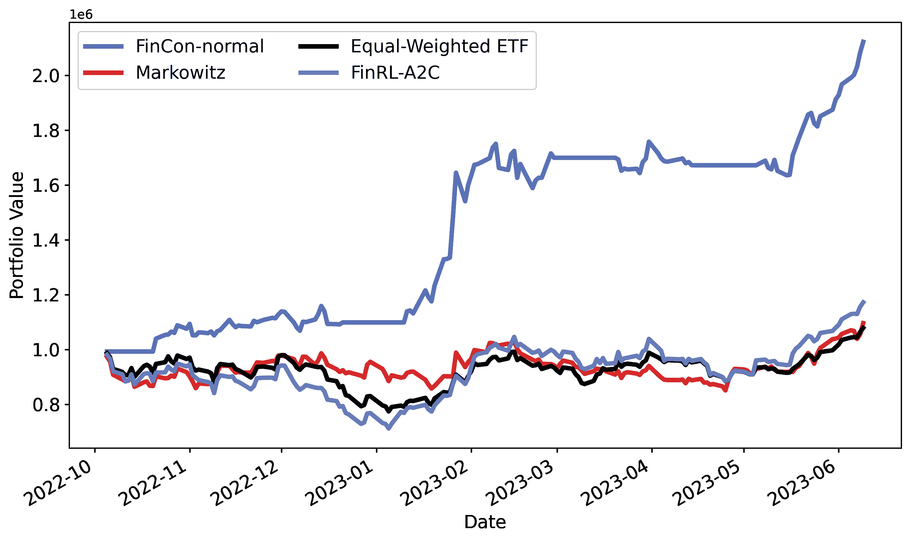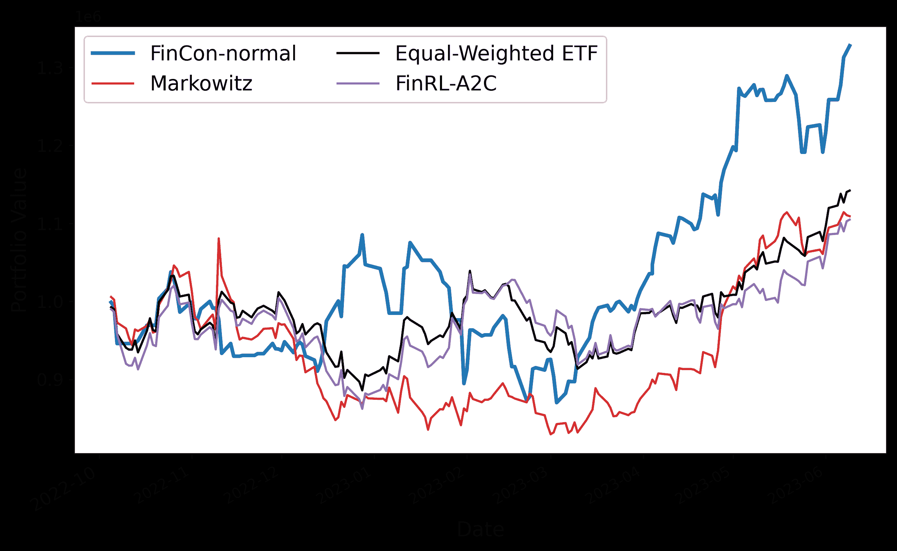

图 3：投资组合 1 和 2 在所有策略下的投资组合价值随时间变化的情况。投资组合价值的计算参考了附录 [A.10](https://arxiv.org/html/2407.06567v3#A1.SS10 "A.10 经典金融指标公式用于风险估计器和决策任务性能评估 ‣ 附录 A 附录 ‣ FinCon：一个综合的 LLM 多代理系统，通过概念性语言强化增强金融决策")中的方程式 [7](https://arxiv.org/html/2407.06567v3#A1.E7 "在 A.10 经典金融指标公式用于风险估计器和决策任务性能评估 ‣ 附录 A 附录 ‣ FinCon：一个综合的 LLM 多代理系统，通过概念性语言强化增强金融决策")。

### 4.3 消融研究

针对RQ2和RQ3，我们通过两项消融研究对我们独特的风险控制组件进行了全面评估。这两项研究与主实验中的训练和测试阶段保持一致。第一项研究考察了剧集内风险控制机制的有效性，该机制利用条件风险价值（CVaR）实时管理风险，详细信息见表[4](https://arxiv.org/html/2407.06567v3#S4.T4 "Table 4 ‣ 4.3 Ablation Studies ‣ 4 Experiments ‣ FinCon: A Synthesized LLM Multi-Agent System with Conceptual Verbal Reinforcement for Enhanced Financial Decision Making")。主要指标的比较表明，利用CVaR进行剧集内风险控制在单一资产交易的牛市和熊市环境中均显现出其有效性。此外，在具有混合价格趋势的投资组合交易中，我们的剧集内风险控制机制通过监控整个投资组合的价值波动，表现出强大的鲁棒性。第二项研究则聚焦于剧集外风险控制机制，展示了其在更新交易经理代理人信念方面的关键作用，从而为当前交易环境提供更全面的理解，具体内容见表[5](https://arxiv.org/html/2407.06567v3#S4.T5 "Table 5 ‣ 4.3 Ablation Studies ‣ 4 Experiments ‣ FinCon: A Synthesized LLM Multi-Agent System with Conceptual Verbal Reinforcement for Enhanced Financial Decision Making")。在两个决策场景中，明显改进的CR和SR强调了使用CVRF逐步更新投资信念的有效性，引导代理人朝着更有利可图的投资策略迈进。此外，FinCon在仅经过四个训练周期后就展示了显著的学习进展——这远少于传统强化学习算法交易代理所需的训练周期。更多的可视化和分析内容请参见附录[A.7](https://arxiv.org/html/2407.06567v3#A1.SS7 "A.7 Detailed Ablation Study ‣ Appendix A Appendix ‣ FinCon: A Synthesized LLM Multi-Agent System with Conceptual Verbal Reinforcement for Enhanced Financial Decision Making")。

任务 资产 市场趋势 模型 CR %$\uparrow$ SR$\uparrow$ MDD %$\downarrow$ 单只股票 GOOG 一般 牛市 $\nearrow$ 含CVaR 25.077 1.052 17.530 不含CVaR -1.461 -0.006 27.079 NIO 一般 熊市 $\searrow$ 含CVaR 17.461 0.335 40.647 不含CVaR -52.887 -1.002 70.243 投资组合管理 (TSLA, MSFT, PFE) 混合 含CVaR 113.836 3.269 16.163 不含CVaR 14.699 1.142 17.511

表 4：FinCon在实施与未实施CVaR进行剧集内风险控制时的关键指标。实施CVaR后的FinCon在单一资产交易和投资组合管理任务中均表现出领先的性能。

任务 资产 市场趋势 模型 CR %$\uparrow$ SR$\uparrow$ MDD %$\downarrow$ 单一股票 GOOG 一般看涨 $\nearrow$ 有信念 25.077 1.052 17.530 无信念 -11.944 -0.496 29.309 NIO 一般看跌 $\searrow$ 有信念 17.461 0.335 40.647 无信念 8.197 0.156 55.688 投资组合管理（TSLA, MSFT, PFE） 混合 有信念 113.836 3.269 16.163 无信念 28.432 1.181 27.535

表 5：FinCon 在实施与未实施信念更新的过期风险控制下的关键指标比较。实施了 CVRF 的 FinCon 在单一资产交易和投资组合管理任务中均表现出领先的性能。

## 5 结论

本文介绍了 FinCon，一种基于大型语言模型（LLM）的多智能体框架，用于金融决策任务，包括单一股票交易和投资组合管理。FinCon 的核心是综合经理-分析师层级通信结构和双层风险控制组件。该通信方法将来自多个来源的金融数据传递给专业的分析师智能体，分析师将其提炼成关键的投资见解。然后，经理智能体将这些见解进行综合，以便做出决策。我们的实验评估展示了风险控制机制在减轻投资风险和提升交易表现方面的有效性。此外，简化的通信结构减少了开销。双层风险控制组件为定义智能体角色提供了一种新颖的方式，能够在智能体通信中动态更新风险和市场信念。未来的一个有价值的研究方向是将 FinCon 的框架扩展到管理包含数十个资产的大型投资组合，同时保持在小型投资组合中展示的卓越决策质量。鉴于大型语言模型的输入长度限制，面临的一个关键挑战是如何在通过智能体提炼信息实现简洁性与在扩展当前上下文窗口时可能出现的性能下降之间找到最佳平衡。解决这一问题对于确保高质量的结果至关重要。

## 参考文献

+   [1] Harry Markowitz. 投资组合选择。金融学期刊，7(1)：77–91，1952年。

+   [2] Xuan-Hong Dang, Syed Yousaf Shah, 和 Petros Zerfos. "the squawk bot"：时间序列和文本数据模态的联合学习，用于自动化的金融信息过滤。arXiv 预印本 arXiv:1912.10858，2019年。

+   [3] John L Maginn, Donald L Tuttle, Dennis W McLeavey, 和 Jerald E Pinto. 投资组合管理：一个动态过程，第 3 卷。约翰·威利父子公司，2007年。

+   [4] Roy Radner. 去中心化信息处理的组织方式。经济计量学：经济计量学会期刊，1109–1146 页，1993年。

+   [5] George A Miller. 神奇的七，加减二：我们处理信息能力的某些限制。心理学评论，63(2)：81，1956年。

+   [6] 王润东, 魏宏鑫, 安博, 冯周彦, 姚军。佣金费用不足：一个用于投资组合管理的层次强化框架。载于第35届AAAI人工智能大会论文集，页面626–633，2021年。

+   [7] 韩伟光, 张博怡, 谢倩倩, 彭敏, 赖彦昭, 黄吉敏。选择与交易：基于层次强化学习的统一配对交易方法。载于第29届ACM SIGKDD知识发现与数据挖掘大会论文集，页面4123–4134，2023年。

+   [8] 秦谋磊, 孙硕, 张文韬, 夏浩冲, 王新润, 安博。Earnhft：高频交易中的高效层次强化学习。载于第38届AAAI人工智能大会论文集，页面14669–14676，2024年。

+   [9] 黄杰和Kevin Chen-Chuan Chang。迈向大型语言模型中的推理：一项调查。arXiv预印本arXiv:2212.10403，2022年。

+   [10] 金铭宇, 余钦凯, 赵海燕, 华文跃, 孟燕达, 张永峰, 杜梦楠, 等。推理步骤长度对大型语言模型的影响。arXiv预印本arXiv:2401.04925，2024年。

+   [11] 蔡天乐, 王学志, 马腾宇, 陈心云, 周登宁。大型语言模型作为工具创造者。arXiv预印本arXiv:2305.17126，2023年。

+   [12] 阮竞清, 陈义鸿, 张斌, 徐志伟, 包天鹏, 毛杭宇, 李子岳, 曾星宇, 赵瑞, 等。Tptu：基于大型语言模型的AI代理的任务规划与工具使用。载于NeurIPS 2023决策制定基础模型研讨会，2023年。

+   [13] 宋昌熙, 吴佳曼, 克莱顿·华盛顿, 布赖恩·M·萨德勒, 赵伟伦, 苏宇。LLM-planner：基于大型语言模型的具身代理的少-shot基础规划。载于IEEE/CVF国际计算机视觉会议论文集，页面2998–3009，2023年。

+   [14] 巴尔加维·帕兰贾佩, 斯科特·伦德伯格, 萨米尔·辛格, 哈娜赫·哈吉希尔齐, 卢克·泽特尔莫耶, 马尔科·图利奥·里贝罗。ART：大型语言模型的自动多步推理和工具使用。arXiv预印本arXiv:2303.09014，2023年。

+   [15] 谢倩倩, 韩伟光, 张晓, 赖彦昭, 彭敏, 亚历杭德罗·洛佩兹-利拉, 黄吉敏。Pixiu：一个全面的基准、指令数据集和金融领域的大型语言模型。载于A. Oh, T. Naumann, A. Globerson, K. Saenko, M. Hardt 和 S. Levine 编，神经信息处理系统进展，卷36，页面33469–33484。Curran Associates, Inc.，2023年。

+   [16] 张晓, 向若宇, 袁晨涵, 冯端宇, 韩伟光, 亚历杭德罗·洛佩兹-利拉, 刘晓阳, 邱美康, 苏菲亚·阿纳尼杜, 彭敏, 黄吉敏, 谢倩倩。Dólares还是dollars？揭示西班牙语与英语之间金融领域大型语言模型的双语能力。载于第30届ACM SIGKDD知识发现与数据挖掘大会论文集，KDD ’24，页面6236–6246，纽约，NY，USA，2024年。计算机协会。

+   [17] 谢千千, 韩威广, 陈政宇, 项若瑜, 张潇, 何悦如, 肖梦熙, 李东, 戴永富, 冯端宇, 等. The finben: 面向大语言模型的整体金融基准. arXiv预印本 arXiv:2402.12659, 2024.

+   [18] 胡刚, 秦科, 袁晨涵, 彭敏, 亚历杭德罗·洛佩兹-利拉, 王本友, 索菲亚·安那尼亚杜, 余万龙, 黄季敏, 谢千千. 没有语言是孤岛: 在金融领域统一中文和英文的大语言模型、指令数据和基准. arXiv预印本 arXiv:2403.06249, 2024.

+   [19] 杨宇哲, 张一飞, 胡燕, 郭一琳, 甘若莉, 何悦如, 雷名聪, 张潇, 王海宁, 谢千千, 等. UCFE: 面向大语言模型的用户中心金融专业基准. arXiv预印本 arXiv:2410.14059, 2024.

+   [20] 朴俊成, 约瑟夫·C·奥布赖恩, 蔡洁莉, 莫里斯·梅雷迪思·林格尔, 皮尔西·梁, 迈克尔·S·伯恩斯坦. 生成智能体: 互动式人类行为模拟. arXiv预印本 arXiv:2304.03442, 2023.

+   [21] 吴清云, 班加恩, 张杰宇, 吴一然, 张绍坤, 朱尔康, 李贝宾, 蒋丽, 张晓云, 王驰. Autogen: 通过多智能体对话框架推动下一代LLM应用. arXiv预印本 arXiv:2308.08155, 2023.

+   [22] 乔硕飞, 张宁宇, 方润南, 罗宇杰, 周望春书, 蒋育辰, 吕成飞, 陈华俊. Autoact: 通过自我规划进行从零开始的自动智能体学习. arXiv预印本 arXiv:2401.05268, 2024.

+   [23] 宏思睿, 郑晓武, 陈Jonathan, 程宇恒, 王锦林, 张策尧, 王子立, 邱家盛, 林子娟, 周立扬, 等. Metagpt: 面向多智能体协作框架的元编程. arXiv预印本 arXiv:2308.00352, 2023.

+   [24] 郭旭东, 黄凯旋, 刘家乐, 范文辉, 娜塔莉亚·维莱兹, 吴清云, 王华政, 托马斯·L·格里菲斯, 王孟迪. 具身LLM智能体学会在有组织团队中合作. arXiv预印本 arXiv:2403.12482, 2024.

+   [25] 李俊凯, 王思宇, 张萌, 李伟涛, 来云辉, 康新辉, 马伟志, 刘杨. Agent hospital: 一个可进化医学智能体的医院模拟. arXiv预印本 arXiv:2405.02957, 2024.

+   [26] 陈伟泽, 苏宇晟, 左敬伟, 杨成, 袁晨飞, 陈 Chi-Min, 于赫扬, 陆雅希, 洪义鑫, 钱晨, 等. Agentverse: 促进多智能体协作并探索涌现行为. 第十二届国际学习表征会议, 2023.

+   [27] 普里赞特, 丹·伊特, 李杰瑞, 李盈达, 朱承光, 曾迈克尔. 自动提示优化与“梯度下降”和束搜索. arXiv预印本 arXiv:2305.03495, 2023.

+   [28] 唐新宇, 王晓磊, 赵维新, 卢思源, 李雅良, 文基荣. 释放大语言模型作为提示优化器的潜力: 与基于梯度的模型优化器的类比分析. arXiv预印本 arXiv:2402.17564, 2024.

+   [29] 姚伟然，谢尔比·海内克，胡安·卡洛斯·尼布尔斯，刘志伟，冯一豪，薛乐，瑞泰什·穆尔蒂，陈泽源，张建国，阿尔皮特·德万什等。Retroformer：具有策略梯度优化的回顾性大语言代理。arXiv预印本 arXiv:2308.02151，2023年。

+   [30] 诺亚·辛恩，费德里科·卡萨诺，阿什温·戈皮纳特，卡尔蒂克·纳拉西姆汉，姚顺宇。Reflexion：具有语言强化学习的语言代理。神经信息处理系统进展，36，2024年。

+   [31] 杨洪阳，刘晓阳，王丹丹。Fingpt: 开源金融大语言模型。arXiv预印本 arXiv:2306.06031，2023年。

+   [32] 余阳阳，李昊航，陈志，蒋岳辰，李扬，张邓辉，刘荣，乔丹·W·苏乔，哈尔敦·哈沙纳。Finmem：一种性能增强的大语言模型交易代理，具有分层记忆和角色设计。arXiv预印本 arXiv:2311.13743，2023年。

+   [33] 张文涛，赵灵萱，夏浩崇，孙硕，孙家泽，秦墨磊，李欣怡，赵玉清，赵逸磊，蔡新宇等。Finagent：一种多模态金融交易基础代理：工具增强、差异化和通用性。arXiv预印本 arXiv:2402.18485，2024年。

+   [34] 弗雷迪·德尔班和萨拉·比亚吉尼。一致性风险度量。Springer，2000年。

+   [35] 弗兰克·J·法博兹，塞尔吉奥·M·福卡尔迪，佩特尔·N·科尔姆。定量股权投资：技术与策略。John Wiley & Sons，2010年。

+   [36] 张冲，刘欣怡，金铭宇，张仲谋，李凌耀，王正廷，华文月，舒东，朱穗源，金晓博等。当人工智能遇见金融（stockagent）：基于大语言模型的模拟真实环境下股票交易。arXiv预印本 arXiv:2407.18957，2024年。

+   [37] 基思·库斯特，斯特凡·米特尼克，马克·S·帕奥莱拉。风险值预测：替代策略的比较。金融计量经济学期刊，4(1)：53–89，2006年。

+   [38] Matthijs TJ Spaan。部分可观察的马尔可夫决策过程。载于《强化学习：前沿》，第387–414页。Springer，2012年。

+   [39] 弗兰克·J·法博兹，哈里·M·马科维茨，弗朗西斯·古普塔。投资组合选择。《金融手册》，第2卷，2008年。

+   [40] 刘扬，刘琦，赵洪科，潘震，刘川仁。自适应定量交易：一种模仿深度强化学习方法。载于《人工智能领域AAAI会议论文集》，第34卷，第2128–2135页，2020年。

+   [41] 泰兰·卡巴尼和埃克雷姆·杜曼。用于股市交易自动化的深度强化学习方法。IEEE Access，10：93564–93574，2022年。

+   [42] 托马斯·L·格里菲斯，朱建桥，埃琳·格兰特，R·托马斯·麦考伊。智能机器时代的贝叶斯。arXiv预印本 arXiv:2311.10206，2023年。

+   [43] 阿什温·拉奥和提霍·杰尔维斯。强化学习基础与在金融中的应用。Chapman and Hall/CRC，2022年。

+   [44] 西奥多·萨默斯，姚顺宇，卡尔蒂克·纳拉西姆汉，托马斯·L·格里菲斯。语言代理的认知架构，2023年。

+   [45] Jintian Zhang, Xin Xu 和 Shumin Deng. 探索LLM代理的协作机制：社会心理学视角。arXiv 预印本 arXiv:2310.02124，2023。

+   [46] Anthony D Wagner. 工作记忆对人类学习和记忆的贡献。Neuron, 22(1):19–22, 1999。

+   [47] Harry M Markowitz 和 G Peter Todd. 投资组合选择与资本市场中的均值-方差分析，第66卷。John Wiley & Sons，2000。

+   [48] Xiao-Yang Liu, Hongyang Yang, Qian Chen, Runjia Zhang, Liuqing Yang, Bowen Xiao 和 Christina Dan Wang. Finrl：一个用于量化金融自动化股票交易的深度强化学习库。arXiv 预印本 arXiv:2011.09607，2020。

+   [49] Noah Shinn, Beck Labash 和 Ashwin Gopinath. Reflexion：一种具有动态记忆和自我反思能力的自主代理。arXiv 预印本 arXiv:2303.11366，2023。

+   [50] Andrew Zhao, Daniel Huang, Quentin Xu, Matthieu Lin, Yong-Jin Liu 和 Gao Huang. Expel：LLM 代理是经验学习者。收录于《人工智能学会年会论文集》，第38卷，页码 19632–19642，2024。

+   [51] Yujia Li, David Choi, Junyoung Chung, Nate Kushman, Julian Schrittwieser, Rémi Leblond, Tom Eccles, James Keeling, Felix Gimeno, Agustin Dal Lago 等人. 竞争级代码生成与 Alphacode。Science, 378(6624):1092–1097，2022。

+   [52] Bei Chen, Fengji Zhang, Anh Nguyen, Daoguang Zan, Zeqi Lin, Jian-Guang Lou 和 Weizhu Chen. Codet：具有生成测试的代码生成。arXiv 预印本 arXiv:2207.10397，2022。

+   [53] Chen Qian, Xin Cong, Cheng Yang, Weize Chen, Yusheng Su, Juyuan Xu, Zhiyuan Liu 和 Maosong Sun. 用于软件开发的交流型代理。arXiv 预印本 arXiv:2307.07924，2023。

+   [54] Zelai Xu, Chao Yu, Fei Fang, Yu Wang 和 Yi Wu. 基于强化学习的语言代理用于狼人游戏中的战略玩法。arXiv 预印本 arXiv:2310.18940，2023。

+   [55] Weiyu Ma, Qirui Mi, Xue Yan, Yuqiao Wu, Runji Lin, Haifeng Zhang 和 Jun Wang. 大型语言模型玩星际争霸 II：基准测试和摘要链方法。arXiv 预印本 arXiv:2312.11865，2023。

+   [56] J de Curtò, I de Zarzà, Gemma Roig, Juan Carlos Cano, Pietro Manzoni 和 Carlos T Calafate. 面向非平稳环境的LLM信息多臂赌博机策略。Electronics, 12(13):2814，2023。

+   [57] Huaqin Zhao, Zhengliang Liu, Zihao Wu, Yiwei Li, Tianze Yang, Peng Shu, Shaochen Xu, Haixing Dai, Lin Zhao, Gengchen Mai 等人. 用大型语言模型革新金融：应用与见解概述。arXiv 预印本 arXiv:2401.11641，2024。

+   [58] Zhiwei Liu, Xin Zhang, Kailai Yang, Qianqian Xie, Jimin Huang 和 Sophia Ananiadou. Fmdllama：基于大语言模型的金融虚假信息检测。arXiv 预印本 arXiv:2409.16452，2024。

+   [59] Yupeng Cao, Zhi Chen, Qingyun Pei, Fabrizio Dimino, Lorenzo Ausiello, Prashant Kumar, KP Subbalakshmi 和 Papa Momar Ndiaye. Risklabs：基于多源数据的大型语言模型预测金融风险。arXiv 预印本 arXiv:2404.07452，2024。

+   [60] 谢倩倩、李东、肖梦熙、蒋子浩、项若宇、张晓、陈正宇、何悦如、韩伟光、杨宇哲 等. Open-finllms: 用于金融应用的开放多模态大语言模型. arXiv 预印本 arXiv:2408.11878, 2024.

+   [61] 洛伦佐·卡内塞、吉安·卡洛·卡尔达里利、卢卡·迪·努齐奥、罗科·法佐拉里、丹尼尔·贾尔迪诺、马尔科·雷、塞尔吉奥·斯帕诺. 多智能体强化学习：挑战与应用综述. 应用科学, 11(11):4948, 2021.

+   [62] 张凯青、杨卓然、塔梅尔·巴沙尔. 多智能体强化学习：理论与算法的选择性概述. 强化学习与控制手册, 第321–384页, 2021.

+   [63] 雅各布·福尔斯特、伊奥尼斯·亚历山德罗斯·阿萨埃尔、南多·德·弗雷塔斯、西蒙·怀特森. 学习通过深度多智能体强化学习进行沟通. 神经信息处理系统进展, 29, 2016.

+   [64] 林拓、赫雅各布、克里斯托弗·斯托弗、李世南、菲利普·伊索拉. 学习通过自编码器落实多智能体通信. 神经信息处理系统进展, 34:15230–15242, 2021.

+   [65] 金宇镇、朴钟义、成永哲. 多智能体强化学习中的通信：意图共享. 在国际学习表征会议, 2020.

+   [66] 朱昌熙、梅赫迪·达斯塔尼、王诗涵. 关于通信的多智能体强化学习综述. arXiv 预印本 arXiv:2203.08975, 2022.

+   [67] 姚志远、李正、马修·托马斯、约诺特·弗洛雷斯库. 基于代理的市场模拟中的强化学习：揭示现实的风格化事实与行为. arXiv 预印本 arXiv:2403.19781, 2024.

+   [68] 李浩航、杨思伟. 伪造策略导致虚假信息的影响：市场动态的ABM模型. 2022 IEEE金融工程与经济计算智能研讨会(CIFEr), 第1–10页. IEEE, 2022.

+   [69] 王宽、吕亚东、迈克尔·圣特罗切、耿业云、张超、沈业龙. 通过通信适应大语言模型智能体. arXiv 预印本 arXiv:2310.01444, 2023.

+   [70] 赵曼迪、什雷娅·简、宋书然. Roco：与大语言模型协作的方言多机器人合作. arXiv 预印本 arXiv:2307.04738, 2023.

+   [71] 张洪鑫、杜伟华、单嘉铭、周勤宏、杜逸伦、乔舒亚·B·特能鲍姆、舒天敏、甘创. 基于大语言模型模块化构建合作体化智能体. arXiv 预印本 arXiv:2307.02485, 2023.

+   [72] 杜逸伦、李爽、安东尼奥·托拉尔巴、乔舒亚·B·特能鲍姆、伊戈尔·莫达奇. 通过多智能体辩论提升语言模型的事实性和推理能力. arXiv 预印本 arXiv:2305.14325, 2023.

+   [73] 陈启民、陈伟泽、苏宇晟、俞建轩、薛伟、张尚航、付杰、刘智远. Chateval：通过多智能体辩论提升基于大语言模型的评估者性能. arXiv 预印本 arXiv:2308.07201, 2023.

+   [74] Frank Xing. 设计异质LLM代理进行金融情感分析。arXiv 预印本 arXiv:2401.05799, 2024。

+   [75] Irene de Zarzà i Cubero, Joaquim de Curtò i Díaz, Gemma Roig, 和 Carlos T Calafate. 优化的财务规划：整合个体和合作预算模型与LLM建议。AI, 5(1):91–114, 2024。

+   [76] Xiangpeng Wan, Haicheng Deng, Kai Zou, 和 Shiqi Xu. 提高结构化金融中基础资产审查的效率和准确性：多代理框架的应用。arXiv 预印本 arXiv:2405.04294, 2024。

+   [77] Chong Zhang, Xinyi Liu, Mingyu Jin, Zhongmou Zhang, Lingyao Li, Zhengting Wang, Wenyue Hua, Dong Shu, Suiyuan Zhu, Xiaobo Jin, 等. 当人工智能遇上金融（stockagent）：基于大型语言模型的模拟真实环境下的股票交易。arXiv 预印本 arXiv:2407.18957, 2024。

+   [78] Patrick Bolton 和 Mathias Dewatripont. 公司作为一个通信网络。季度经济学期刊, 109(4):809–839, 1994。

+   [79] Shunyu Yao, Jeffrey Zhao, Dian Yu, Nan Du, Izhak Shafran, Karthik Narasimhan, 和 Yuan Cao. React：在语言模型中协同推理与行动。arXiv 预印本 arXiv:2210.03629, 2022。

+   [80] Jason Wei, Xuezhi Wang, Dale Schuurmans, Maarten Bosma, Fei Xia, Ed Chi, Quoc V Le, Denny Zhou, 等. 连锁思维提示引发大型语言模型中的推理。神经信息处理系统进展, 35:24824–24837, 2022。

+   [81] Shunyu Yao, Dian Yu, Jeffrey Zhao, Izhak Shafran, Tom Griffiths, Yuan Cao, 和 Karthik Narasimhan. 思维树：使用大型语言模型进行深思熟虑的问题解决。神经信息处理系统进展, 36, 2024。

+   [82] Shibo Hao, Yi Gu, Haodi Ma, Joshua Jiahua Hong, Zhen Wang, Daisy Zhe Wang, 和 Zhiting Hu. 使用语言模型推理等同于使用世界模型进行规划。arXiv 预印本 arXiv:2305.14992, 2023。

+   [83] Xizhou Zhu, Yuntao Chen, Hao Tian, Chenxin Tao, Weijie Su, Chenyu Yang, Gao Huang, Bin Li, Lewei Lu, Xiaogang Wang, 等. Minecraft中的幽灵：通过具有基于文本的知识和记忆的大型语言模型，为开放世界环境提供通用能力的代理。arXiv 预印本 arXiv:2305.17144, 2023。

+   [84] Lei Wang, Chen Ma, Xueyang Feng, Zeyu Zhang, Hao Yang, Jingsen Zhang, Zhiyuan Chen, Jiakai Tang, Xu Chen, Yankai Lin, 等. 基于大型语言模型的自主代理综述。计算机科学前沿, 18(6):1–26, 2024。

+   [85] Leslie Pack Kaelbling, Michael L Littman, 和 Andrew W Moore. 强化学习：一项综述。人工智能研究期刊, 4:237–285, 1996。

+   [86] Guojun Xiong, Shufan Wang, Daniel Jiang, 和 Jian Li. 个性化联邦强化学习与共享表示。部署强化学习：从研究到实践@强化学习大会2024, 2024。

+   [87] 熊国俊, Ujwal Dinesha, Debajoy Mukherjee, 李健, 和 Srinivas Shakkottai. Dopl: 针对具有偏好反馈的躁动赌博机的直接在线偏好学习。arXiv预印本 arXiv:2410.05527, 2024。

+   [88] 姚智远, Ionut Florescu, 和 李池勋. 在具有延迟的随机环境中进行控制：一种基于模型的强化学习方法。国际自动化规划与调度会议论文集，第34卷，页面663–670, 2024。

+   [89] 张斌, 毛航宇, 阮景清, 文莹, 李杨, 张绍, 许智伟, 李大鹏, 李子跃, 赵睿, 等. 控制基于大语言模型的智能体进行大规模决策：一种演员-评论家方法。arXiv预印本 arXiv:2311.13884, 2023。

+   [90] John Hull. 《风险管理与金融机构》。John Wiley & Sons, 2007。

+   [91] William F. Sharpe. 夏普比率。《投资组合管理期刊》，21(1):49–58, 1994。

+   [92] Andrew Ang 和 Joseph Chen. 下行风险。《投资组合管理期刊》，29(4):103–112, 2003。

+   [93] 刘晓阳, 王国轩, 赵道晨. Fingpt: 为金融大语言模型民主化互联网规模的数据。arXiv预印本 arXiv:2307.10485, 2023。

+   [94] 秦宇, 杨毅. 你说什么以及你如何说都很重要：利用语言和声音提示预测股票波动性。第57届计算语言学协会年会论文集，页面390–401, 2019。

+   [95] 杨林义, 吕天乐, Barry Smyth, 和 董瑞海. Html: 基于层次变换器的多任务学习用于波动性预测。2020年Web大会论文集，页面441–451, 2020。

+   [96] 曹宇鹏, 陈智, 裴清云, Prashant Kumar, KP Subbalakshmi, 和 Papa Momar Ndiaye. Ecc分析器：利用大语言模型从财报电话会议中提取交易信号，用于股票表现预测。arXiv预印本 arXiv:2404.18470, 2024。

+   [97] John C Hull. 《期权、期货及其他衍生品》。Pearson Education, 2017。

+   [98] 刘晓阳, 杨宏扬, 高杰超, 和 王丹克里斯蒂娜. FinRL: 基于深度强化学习的量化金融自动交易框架。2021年国际人工智能与金融大会（ICAIF）。

+   [99] 刘晓阳, 夏紫怡, 芮景扬, 高杰超, 杨宏扬, 朱铭, 王克里斯蒂娜, 王兆然, 和 郭剑. Finrl-meta: 面向数据驱动的金融强化学习的市场环境与基准测试。神经信息处理系统进展，35:1835–1849, 2022。

+   [100] Volodymyr Mnih, Adria Puigdomenech Badia, Mehdi Mirza, Alex Graves, Timothy Lillicrap, Tim Harley, David Silver, 和 Koray Kavukcuoglu. 深度强化学习的异步方法。国际机器学习大会论文集，页面1928–1937。PMLR, 2016。

+   [101] John Schulman, Filip Wolski, Prafulla Dhariwal, Alec Radford, 和 Oleg Klimov. 近端策略优化算法。arXiv预印本 arXiv:1707.06347, 2017。

+   [102] Volodymyr Mnih, Koray Kavukcuoglu, David Silver, Alex Graves, Ioannis Antonoglou, Daan Wierstra, 和 Martin Riedmiller. 使用深度强化学习玩 Atari 游戏. arXiv 预印本 arXiv:1312.5602, 2013.

+   [103] Yuliya Plyakha, Raman Uppal, 和 Grigory Vilkov. 为什么等权重投资组合优于价值和价格加权投资组合？可在 SSRN 2724535 获得，2012.

+   [104] Jaap MJ Murre 和 Joeri Dros. 复制并分析艾宾浩斯遗忘曲线. PloS one, 10(7):e0120644, 2015.

+   [105] Guardrails ai. [https://docs.guardrailsai.com](https://docs.guardrailsai.com). 一个开源库，用于与大型语言模型交互。

## 附录 A 附录

### A.1 相关工作

LLM 代理在金融决策中的应用。目前已有大量研究致力于开发用于顺序决策的通用 LLM 代理[[49](https://arxiv.org/html/2407.06567v3#bib.bib49), [50](https://arxiv.org/html/2407.06567v3#bib.bib50)]，此类任务通常涉及与环境的情节性互动以及通过语言反思进行行动细化，例如编程竞赛[[51](https://arxiv.org/html/2407.06567v3#bib.bib51), [52](https://arxiv.org/html/2407.06567v3#bib.bib52)]、软件开发[[53](https://arxiv.org/html/2407.06567v3#bib.bib53), [23](https://arxiv.org/html/2407.06567v3#bib.bib23)]、游戏对战[[54](https://arxiv.org/html/2407.06567v3#bib.bib54), [55](https://arxiv.org/html/2407.06567v3#bib.bib55)]。此外，研究人员已开始探索如何让 LLM 代理在更复杂的决策任务中表现更好，尤其是在金融领域[[56](https://arxiv.org/html/2407.06567v3#bib.bib56), [57](https://arxiv.org/html/2407.06567v3#bib.bib57), [58](https://arxiv.org/html/2407.06567v3#bib.bib58), [59](https://arxiv.org/html/2407.06567v3#bib.bib59), [60](https://arxiv.org/html/2407.06567v3#bib.bib60)]，在这些任务中，环境更加波动不定，导致许多不可预测的因素可能影响代理准确反思决策失败的原因。FinMem [[32](https://arxiv.org/html/2407.06567v3#bib.bib32)] 通过将记忆模块与 LLM 代理结合用于反思和优化，从而提升了单股交易的表现，而 FinAgent [[33](https://arxiv.org/html/2407.06567v3#bib.bib33)] 通过使用外部定量工具应对波动环境，从而改善了交易利润。

多智能体系统与通信结构。在传统的多智能体系统中[[61](https://arxiv.org/html/2407.06567v3#bib.bib61), [62](https://arxiv.org/html/2407.06567v3#bib.bib62)]，智能体之间的通信方式是预先确定的，比如共享数据或状态观察[[63](https://arxiv.org/html/2407.06567v3#bib.bib63), [64](https://arxiv.org/html/2407.06567v3#bib.bib64), [65](https://arxiv.org/html/2407.06567v3#bib.bib65), [66](https://arxiv.org/html/2407.06567v3#bib.bib66), [67](https://arxiv.org/html/2407.06567v3#bib.bib67), [68](https://arxiv.org/html/2407.06567v3#bib.bib68)]。大语言模型的出现为人类可理解的通信提供了灵活性[[69](https://arxiv.org/html/2407.06567v3#bib.bib69), [20](https://arxiv.org/html/2407.06567v3#bib.bib20), [23](https://arxiv.org/html/2407.06567v3#bib.bib23), [70](https://arxiv.org/html/2407.06567v3#bib.bib70)]，因此一些研究尝试通过让智能体进行讨论[[71](https://arxiv.org/html/2407.06567v3#bib.bib71), [21](https://arxiv.org/html/2407.06567v3#bib.bib21)]或辩论[[72](https://arxiv.org/html/2407.06567v3#bib.bib72), [73](https://arxiv.org/html/2407.06567v3#bib.bib73)]，提升基于LLM的多智能体系统的决策能力。类似的同行通信策略也被应用于金融任务的多智能体系统[[74](https://arxiv.org/html/2407.06567v3#bib.bib74), [75](https://arxiv.org/html/2407.06567v3#bib.bib75), [76](https://arxiv.org/html/2407.06567v3#bib.bib76)]。然而，对于优先考虑利润的统一目标金融任务来说，这种方法并不最优[[77](https://arxiv.org/html/2407.06567v3#bib.bib77)]，因为它们可能面临模糊的优化目标，并且无法控制不必要的通信成本[[78](https://arxiv.org/html/2407.06567v3#bib.bib78)]。

提示优化与语言强化。为了增强LLM代理的推理或决策能力，已经提出了许多提示优化技术，如ReAct [[79](https://arxiv.org/html/2407.06567v3#bib.bib79)]、思维链（CoT）[[80](https://arxiv.org/html/2407.06567v3#bib.bib80)]、思维树（ToT）[[81](https://arxiv.org/html/2407.06567v3#bib.bib81)]、ART [[14](https://arxiv.org/html/2407.06567v3#bib.bib14)]，旨在使LLM代理能够自动生成作为迭代程序的中间推理步骤。此外，为了使LLM代理像人类一样做出决策并生成更易理解的推理文本，一些研究者建议将认知结构 [[82](https://arxiv.org/html/2407.06567v3#bib.bib82)、[83](https://arxiv.org/html/2407.06567v3#bib.bib83)、[44](https://arxiv.org/html/2407.06567v3#bib.bib44)、[84](https://arxiv.org/html/2407.06567v3#bib.bib84)] 纳入其中。受到这些先前工作和深度强化学习（DRL）算法 [[85](https://arxiv.org/html/2407.06567v3#bib.bib85)、[86](https://arxiv.org/html/2407.06567v3#bib.bib86)、[87](https://arxiv.org/html/2407.06567v3#bib.bib87)、[67](https://arxiv.org/html/2407.06567v3#bib.bib67)、[88](https://arxiv.org/html/2407.06567v3#bib.bib88)] 的启发，语言强化 [[29](https://arxiv.org/html/2407.06567v3#bib.bib29)、[30](https://arxiv.org/html/2407.06567v3#bib.bib30)、[89](https://arxiv.org/html/2407.06567v3#bib.bib89)、[24](https://arxiv.org/html/2407.06567v3#bib.bib24)] 被开发用于LLM代理，使其能够基于迭代自我反思更新行动，同时整合额外的LLM作为提示优化器 [[27](https://arxiv.org/html/2407.06567v3#bib.bib27)、[28](https://arxiv.org/html/2407.06567v3#bib.bib28)]。

### A.2 文本梯度下降

在基于LLM的提示优化器中，使用元提示 [[27](https://arxiv.org/html/2407.06567v3#bib.bib27)、[28](https://arxiv.org/html/2407.06567v3#bib.bib28)] 来优化任务提示，从而提高性能。例如，对于一个数学推理任务，任务提示可能是“让我们解决这个问题”，而元提示则可以是“改进提示，帮助模型更好地进行数学推理”。

尽管提示优化缺乏明确的梯度来控制更新方向，但我们可以通过利用LLM的反射能力来模拟“文本梯度”。通过生成关于过去在交易决策中成功与失败的反馈，LLM可以产生“语义”梯度信号，从而指导优化过程。

调整优化过程的方向至关重要，类似于传统参数优化中调整学习率。一个不合适的学习率会导致过程振荡或收敛过慢。同样，在没有适当控制的情况下，基于LLM的优化器可能会在提示优化过程中发生过度调整或振荡。

为了模拟学习率的效果，我们测量连续迭代中交易决策序列之间的重叠百分比。然后，我们直接编辑前一个任务提示以提高性能。元提示指示LLM根据反馈修改当前提示，确保稳定且渐进的改进过程。这种方法能够有效利用现有的提示，从而实现性能的逐步提升。

### A.3 FinCon测试阶段工作流程

在测试阶段，FinCon将利用训练阶段学习到的投资信念，且跨回合的风险控制机制将不再操作。然而，回合内的风险控制机制仍然会发挥作用，使得经理代理可以根据短期交易表现和市场波动实时调整交易行动。这确保即使在测试阶段，FinCon也能及时响应市场风险，防止潜在的损失，同时利用训练阶段所获得的知识。

算法2 FinCon测试阶段算法

初始化交易开始日期$s$，投资组合的股票池和投资组合权重$w_{0}=\textbf{0}$。继承经理-分析师组件$\{M_{pr}^{i}\}^{I}_{i=1}\&M_{a}$。继承反射$B$，学习到的提示$\bm{\theta}$，训练后的策略$\Pi_{\bm{\theta}}$。对于$T+1\leq t\leq S$，执行以下操作：     运行策略$\Pi_{\bm{\theta}}$（收集每日PnL$r_{t}$、投资组合权重$w_{t}$和每日CVaR值$\rho_{t}$）。     如果$\rho_{t}<\rho_{t-1}$或$r_{t}<0$，则        触发$M_{a}$自我反思。     结束if     获取一个投资轨迹$\mathcal{H}$。  结束for  基于$\mathcal{H}$输出绩效指标计算结果。

### A.4 FinCon中代理模块化设计的图示

<svg class="ltx_picture ltx_align_left ltx_centering ltx_figure_panel" height="63.71" id="A1.F4.pic1" overflow="visible" version="1.1" width="600"><g fill="#000000" stroke="#000000" stroke-width="0.4pt" transform="translate(0,63.71) matrix(1 0 0 -1 0 0)"><g fill-opacity="1.0" transform="matrix(1.0 0.0 0.0 1.0 20.48 46.68)"><foreignobject color="#FFFFFF" height="12.3" overflow="visible" transform="matrix(1 0 0 -1 0 16.6)" width="559.03">一般配置</foreignobject></g> <g fill-opacity="1.0" transform="matrix(1.0 0.0 0.0 1.0 20.48 7.5)"><foreignobject color="#000000" height="28.9" overflow="visible" transform="matrix(1 0 0 -1 0 16.6)" width="559.03">1\. 投资任务介绍    2\. 交易目标背景 3\. 交易领域          4\. 历史财务表现概述</foreignobject></g></g></svg><svg class="ltx_picture ltx_align_left ltx_centering ltx_figure_panel" height="181.48" id="A1.F4.pic2" overflow="visible" version="1.1" width="600"><g fill="#000000" stroke="#000000" stroke-width="0.4pt" transform="translate(0,181.48) matrix(1 0 0 -1 0 0)"><g fill-opacity="1.0" transform="matrix(1.0 0.0 0.0 1.0 20.48 164.45)"><foreignobject color="#FFFFFF" height="12.3" overflow="visible" transform="matrix(1 0 0 -1 0 16.6)" width="559.03">配置模块</foreignobject></g> <g fill-opacity="1.0" transform="matrix(1.0 0.0 0.0 1.0 20.48 7.5)"><foreignobject color="#000000" height="146.67" overflow="visible" transform="matrix(1 0 0 -1 0 16.6)" width="559.03">经理代理：1\. 角色分配：你是投资公司的一名经验丰富的交易经理… 2\. 角色描述：你的职责是整合分析师的投资见解，并对{资产符号}进行交易操作… 分析师代理：1\. 角色分配：你是新闻/市场数据/10-K表格(Q)/ECC音频记录的投资分析师… 2\. 角色职责描述：你的职责是提炼投资见解和其他指标，如{资产符号}的财务情绪…</foreignobject></g></g></svg><svg class="ltx_picture ltx_align_left ltx_centering ltx_figure_panel" height="179.94" id="A1.F4.pic3" overflow="visible" version="1.1" width="600"><g fill="#000000" stroke="#000000" stroke-width="0.4pt" transform="translate(0,179.94) matrix(1 0 0 -1 0 0)"><g fill-opacity="1.0" transform="matrix(1.0 0.0 0.0 1.0 20.48 162.91)"><foreignobject color="#FFFFFF" height="12.3" overflow="visible" transform="matrix(1 0 0 -1 0 16.6)" width="559.03">感知模块</foreignobject></g> <g fill-opacity="1.0" transform="matrix(1.0 0.0 0.0 1.0 20.48 7.5)"><foreignobject color="#000000" height="145.13" overflow="visible" transform="matrix(1 0 0 -1 0 16.6)" width="559.03">经理代理：1\. 感知：来自分析师代理的投资见解；来自风险控制组件的每日风险警报和事件级别的投资信念更新。 2\. 发送：将分析师代理对重大投资收益与损失的贡献反馈。 分析师代理：1\. 感知：来自特定信息源的市场信息。 2\. 发送：向经理代理发送相关的市场见解。 3\. 接收：来自经理代理的反馈。</foreignobject></g></g></svg><svg class="ltx_picture ltx_align_left ltx_centering ltx_figure_panel" height="163.34" id="A1.F4.pic4" overflow="visible" version="1.1" width="600"><g fill="#000000" stroke="#000000" stroke-width="0.4pt" transform="translate(0,163.34) matrix(1 0 0 -1 0 0)"><g fill-opacity="1.0" transform="matrix(1.0 0.0 0.0 1.0 20.48 146.3)"><foreignobject color="#FFFFFF" height="12.3" overflow="visible" transform="matrix(1 0 0 -1 0 16.6)" width="559.03">记忆模块</foreignobject></g> <g fill-opacity="1.0" transform="matrix(1.0 0.0 0.0 1.0 20.48 7.5)"><foreignobject color="#000000" height="128.53" overflow="visible" transform="matrix(1 0 0 -1 0 16.6)" width="559.03">经理代理：1\. 工作：       - 整合          - 精炼 2\. 程序性：     - 交易行动记录    - 反思记录 3\. 事件性：       - 轨迹历史 分析师代理：1\. 工作：        - 观察    - 检索    - 提炼 2\. 程序性：     - 提炼的投资相关见解    - 财务情绪 - 投资报告推荐行动</foreignobject></g></g></svg><svg class="ltx_picture ltx_align_left ltx_centering ltx_figure_panel" height="77.63" id="A1.F4.pic5" overflow="visible" version="1.1" width="600"><g fill="#000000" stroke="#000000" stroke-width="0.4pt" transform="translate(0,77.63) matrix(1 0 0 -1 0 0)"><g fill-opacity="1.0" transform="matrix(1.0 0.0 0.0 1.0 20.48 63.28)"><foreignobject color="#FFFFFF" height="9.61" overflow="visible" transform="matrix(1 0 0 -1 0 16.6)" width="559.03">行动模块</foreignobject></g> <g fill-opacity="1.0" transform="matrix(1.0 0.0 0.0 1.0 20.48 7.5)"><foreignobject color="#000000" height="45.51" overflow="visible" transform="matrix(1 0 0 -1 0 16.6)" width="559.03">经理代理：1\. 执行：交易操作。 2\. 反思：交易原因及分析师代理贡献评估。</foreignobject></g></g></svg>

图4：经理和分析师代理的详细模块化设计。通用配置和分析模块生成基于文本的查询，以从代理的记忆数据库中检索与投资相关的信息。感知和记忆模块通过提示与LLM进行交互，以提取关键的投资洞察。经理代理的行动模块整合这些洞察，帮助做出有根据的交易决策。

### A.5 实验设置

多模态数据集。我们收集了一个全面的多模态数据集，以模拟一个真实的市场环境。该数据集包括股票价格数据、每日财经新闻、公司财报（10K和10Q），以及从2022年1月3日到2023年6月10日的ECC（财报电话会议）音频记录。每个数据源根据信息的时效性分配给特定的分析师代理。例如，年度财报（10K）具有较长期的持续性，季度财报（10Q）和ECC数据具有中期相关性，而每日财经新闻提供的是最即时的信息。

评估指标。我们评估了FinCon，并将其与其他基于LLM和DRL的最先进代理系统进行基准对比，使用了三个关键的财务绩效指标：累计回报率（CR%）[[90](https://arxiv.org/html/2407.06567v3#bib.bib90)]，夏普比率（SR）[[91](https://arxiv.org/html/2407.06567v3#bib.bib91)]，以及最大回撤（MDD%）[[92](https://arxiv.org/html/2407.06567v3#bib.bib92)]。这些指标有助于量化每个模型的盈利能力、风险调整后的回报和风险管理表现。

比较方法。在单一股票交易任务中，我们将FinCon与七种算法代理和广泛接受的买入并持有（B & H）基准进行比较。三个基于DRL的代理——A2C、PPO和DQN——来自于FinRL框架[[48](https://arxiv.org/html/2407.06567v3#bib.bib48)]，而四个最先进的基于LLM的代理包括生成代理[[20](https://arxiv.org/html/2407.06567v3#bib.bib20)]、FinGPT[[93](https://arxiv.org/html/2407.06567v3#bib.bib93)]、FinMem[[32](https://arxiv.org/html/2407.06567v3#bib.bib32)]和FinAgent[[33](https://arxiv.org/html/2407.06567v3#bib.bib33)]。在投资组合管理方面，我们将FinCon与经典的Markowitz MV投资组合选择策略[[1](https://arxiv.org/html/2407.06567v3#bib.bib1)]、基于RL的FinRL-A2C代理[[48](https://arxiv.org/html/2407.06567v3#bib.bib48)]以及B & H策略进行基准对比，后者在所有资产中持有等权重头寸（等权重ETF）。我们之所以专注于经典方法、基于RL的方法和B & H方法，是因为目前缺乏成熟的基于LLM的投资组合管理代理。

实现细节。在我们的实验中，所有基于LLM的代理系统，包括FinCon，使用GPT-4-Turbo作为主干模型，温度参数设置为0.3，以平衡响应一致性和创造性推理。FinCon的训练数据来自2022年1月3日至2022年10月4日的金融数据，测试数据来自2022年10月5日至2023年6月10日。由于深度强化学习（DRL）代理需要大量数据才能收敛，其训练期延长至近五年（2018年1月1日至2022年10月4日），以确保公平比较。所有模型的测试期保持一致。最终性能指标基于测试轨迹，取自五次重复实验中的中位数CR和SR值。如果中位数CR和SR发生在不同的实验周期，则根据中位数CR值所在的轨迹来评估性能。

### A.6 单一股票交易结果图

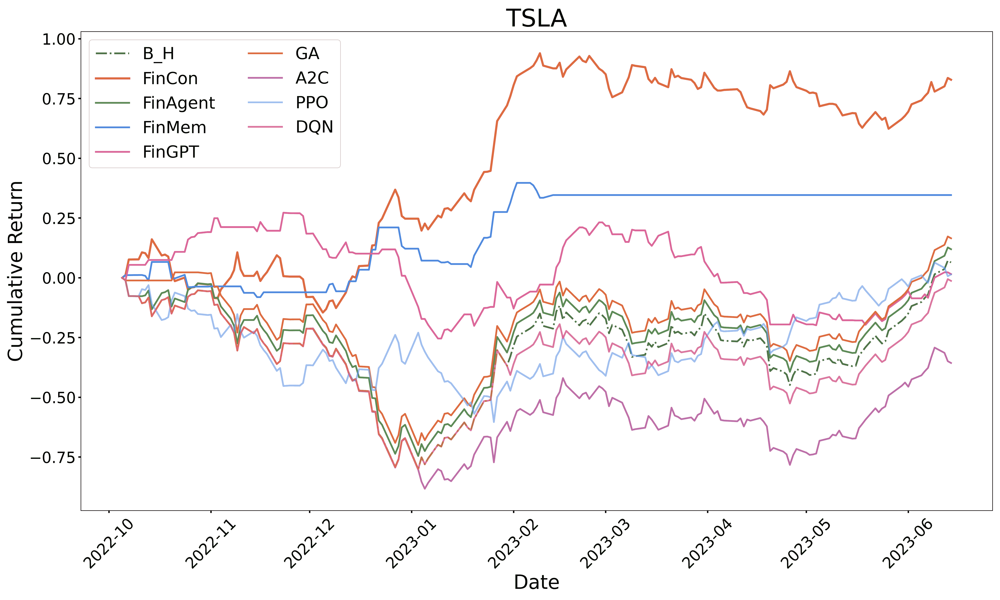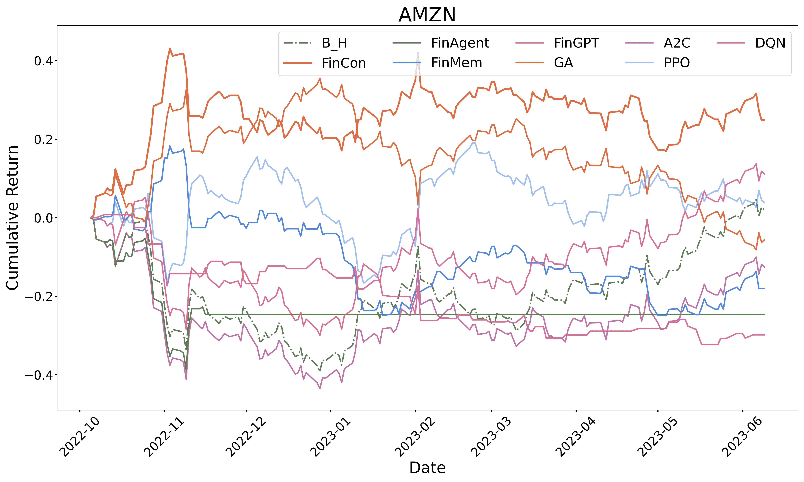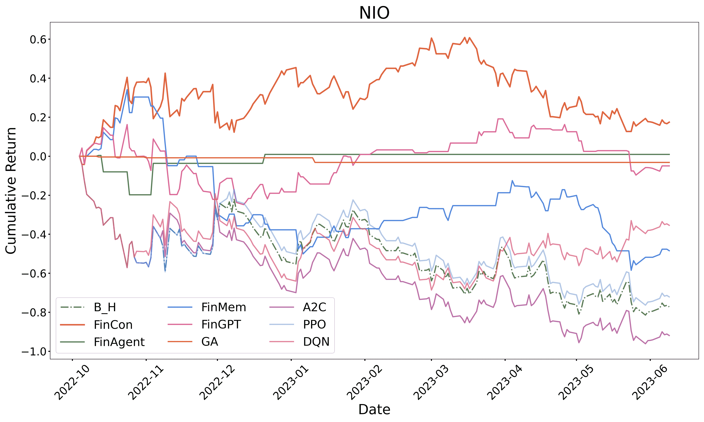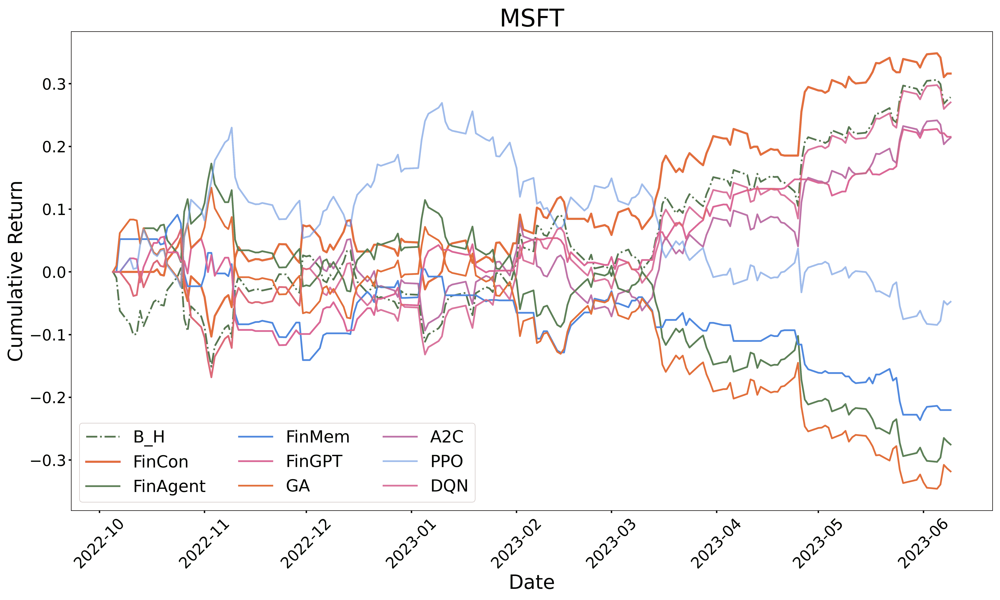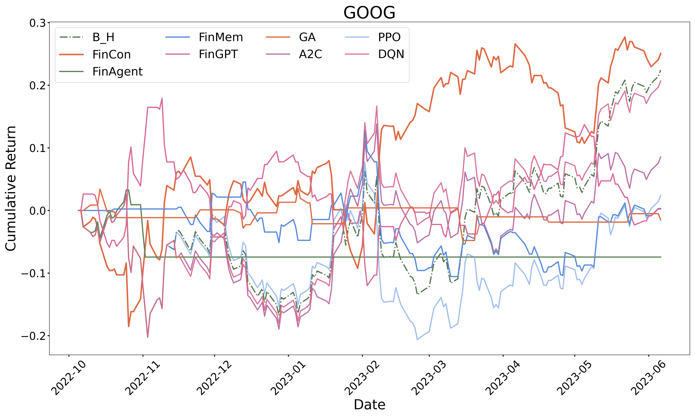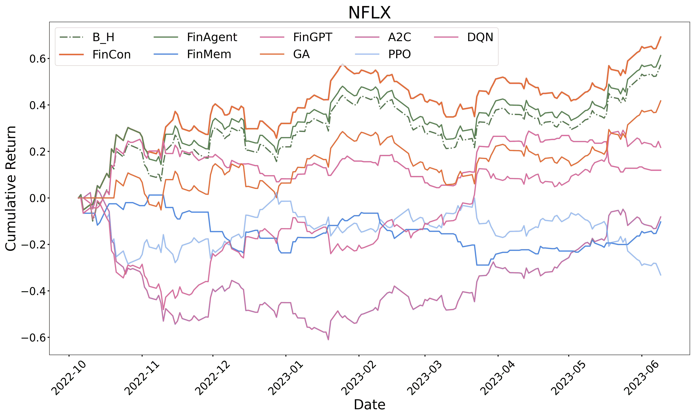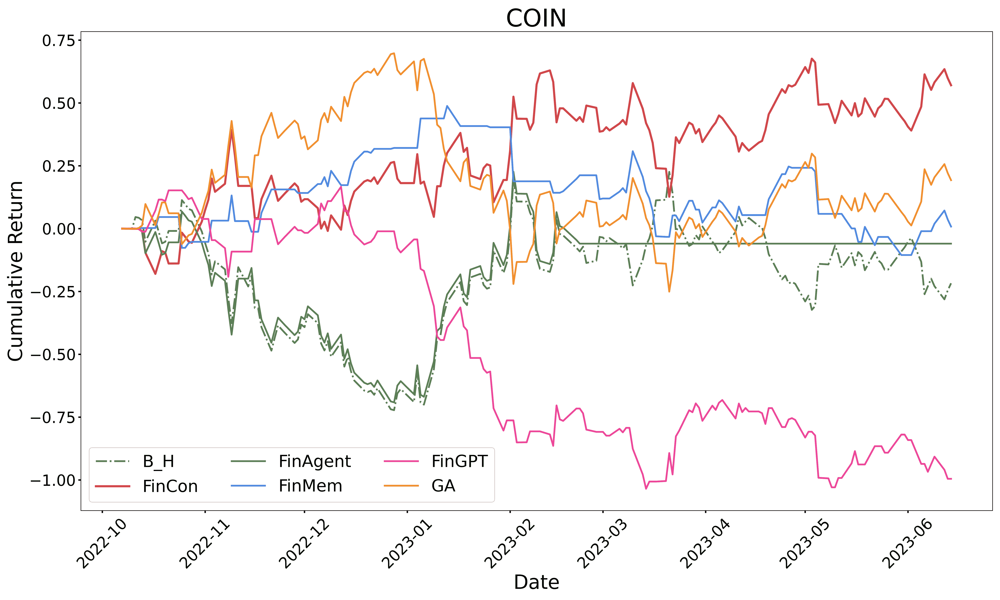

图5：单一资产交易任务的CR随时间变化。FinCon在所有六只股票的测试期末表现优于其他比较策略，无论市场状况如何，均取得了最高的CR。

### A.7 详细消融研究

#### A.7.1 通过CVaR进行的剧集内风险控制机制的有效性

为回答RQ2，我们进行了第一次消融研究。我们通过监控系统风险变化来评估FinCon剧集内风险控制机制的有效性，使用CVaR进行风险变化监控。为了展示FinCon的鲁棒性，我们比较了实施和未实施CVaR的FinCon在两种任务类型（单一资产交易和投资组合管理）下的表现。此外，在单一资产交易任务中，我们在测试阶段考虑了一般看涨和看跌市场条件下的资产，以进行全面考虑。

我们的结果表明，在FinCon中实施CVaR在所有金融指标上对两种任务类型都非常有效，如表[4](https://arxiv.org/html/2407.06567v3#S4.T4 "表4 ‣ 4.3 消融研究 ‣ 4 实验 ‣ FinCon：一个结合概念性语言强化的合成LLM多智能体系统，用于增强金融决策")和图[6](https://arxiv.org/html/2407.06567v3#A1.F6 "图6 ‣ A.7.1 通过CVaR机制实现的剧集内风险控制的有效性 ‣ A.7 详细消融研究 ‣ 附录A 附录 ‣ FinCon：一个结合概念性语言强化的合成LLM多智能体系统，用于增强金融决策")所示。对于单一资产交易任务，未采用剧集内风险控制的FinCon产生了负的CR和显著更高的MDD，表现不如“买入并持有”策略（GOOG的CR为22.42%，NIO的CR为-77.210%），突显了忽视环境风险的严重后果。在投资组合管理中，采用剧集内风险控制后，CR从14.699%大幅上升至113.836%，展示了其在风险监督中的有效性，即使在市场趋势不均的情况下。

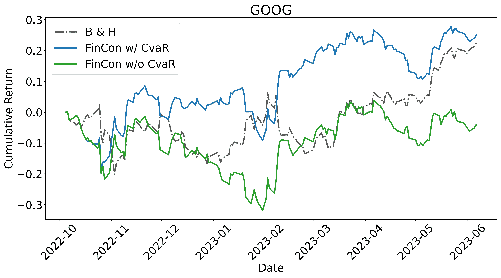

(a) [1] 单一股票：总体看涨

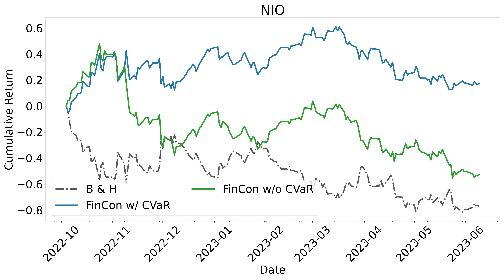

(b) [2] 单一股票：总体看跌

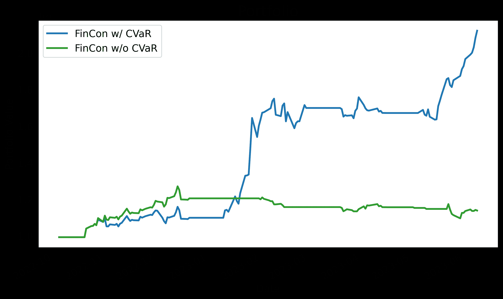

(c) 多资产

图6：在剧集内风险控制中实施CVaR的FinCon与未实施CVaR的表现比较表明，CVaR机制显著提高了FinCon的表现。这可以通过两个指标看出：（a）在牛市和熊市条件下，单一股票的累计回报；（b）多资产投资组合随时间变化的组合价值。在这两种情况下，实施CVaR的FinCon表现出了显著更高的收益。

具体而言，利用CVaR进行剧集内风险控制的成功在牛市和熊市环境中都很明显，如单一资产交易案例所示。在牛市中，CVaR迅速捕捉到市场的即时冲击，并及时告知FinCon在整体乐观情绪中保持谨慎。相反，在熊市中，CVaR持续警示FinCon显著的价格下跌，确保对市场风险的意识。此外，在价格趋势混合的投资组合交易中，我们的剧集内风险控制机制通过监控整个投资组合的价值波动，表现出了强大的鲁棒性，使得交易管理代理能够及时调整每个资产的潜在激进操作。

#### A.7.2 使用CVRF进行剧集间信念更新的效果

在第二个消融研究中，为回答RQ3，我们使用相同的资产来检验FinCon跨剧集风险控制机制的有效性。这是通过持续改进FinCon对目标资产市场状况的信念来实现的。为了确保每个训练剧集中信念输出的一致性，我们专门为信念生成设置了温度参数为0。

我们通过创新的CVRF机制收集了四个训练剧集中的第三次信念更新。最后两个相邻剧集之间的交易行为重叠率已超过$80\%$，更新后的投资信念大多保持一致。为了通过迭代训练展示FinCon不断发展的投资信念，我们以GOOG投资信念更新为例，如图[8](https://arxiv.org/html/2407.06567v3#A1.F8 "Figure 8 ‣ A.7.2 The Efficacy of Over-Episode Belief Updates Using CVRF ‣ A.7 Detailed Ablation Study ‣ Appendix A Appendix ‣ FinCon: A Synthesized LLM Multi-Agent System with Conceptual Verbal Reinforcement for Enhanced Financial Decision Making")所示。与最初和最终的信念更新相比，通过我们的CRVF机制，每个概念性方面（如历史动量和新闻洞察）都通过可执行的信息得到了丰富，从而导致了更有利可图的行动。

表格[5](https://arxiv.org/html/2407.06567v3#S4.T5 "Table 5 ‣ 4.3 Ablation Studies ‣ 4 Experiments ‣ FinCon: A Synthesized LLM Multi-Agent System with Conceptual Verbal Reinforcement for Enhanced Financial Decision Making")和图[7](https://arxiv.org/html/2407.06567v3#A1.F7 "Figure 7 ‣ A.7.2 The Efficacy of Over-Episode Belief Updates Using CVRF ‣ A.7 Detailed Ablation Study ‣ Appendix A Appendix ‣ FinCon: A Synthesized LLM Multi-Agent System with Conceptual Verbal Reinforcement for Enhanced Financial Decision Making")的结果表明，跨剧集信念更新机制在增强FinCon决策过程中比剧集内风险控制更为重要。如果没有这个功能，像CR、SR和MDD这样的关键指标会低于在单一资产交易中没有剧集内风险控制的情况。尽管$28.432\%$的CR优于等权重ETF策略的$9.344\%$（在组合管理方面），$1.181$的SR也高于等权重ETF策略的$0.492$，但有了信念更新功能，性能显著进一步提高。它可以实现$113.836\%$的CR和$3.269$的SR。这些结果表明，使用CVRF在不同剧集之间更新投资信念可以有效地引导智能体的投资信念朝着更有利可图的方向发展。FinCon在多个任务中表现出色，经过四个训练剧集后即能显现出学习成果，远远少于传统RL算法交易智能体所需的剧集数。

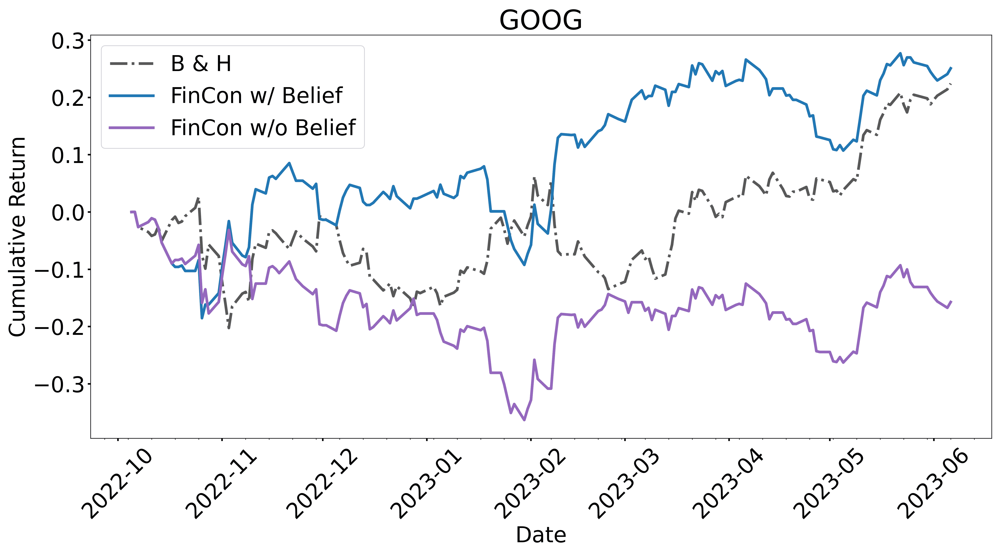

(a) [1] 单一股票：一般看涨

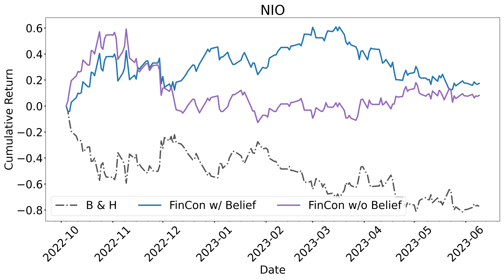

(b) [2] 单一股票：一般看跌

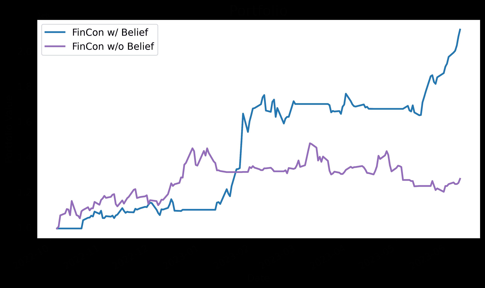

(c) 多资产

图 7：带有与不带有信念更新的 FinCon 的 CRs 用于跨集风险控制。(a) 单一股票的 CRs 随时间变化。带有信念更新的 FinCon 在看涨和看跌市场条件下的表现始终领先。(b) 多资产组合的投资组合价值随时间变化。带有信念更新的 FinCon 表现出显著更高的收益。

<svg class="ltx_picture ltx_align_left ltx_centering ltx_figure_panel" height="466.52" id="A1.F8.pic1" overflow="visible" version="1.1" width="600"><g fill="#000000" stroke="#000000" stroke-width="0.4pt" transform="translate(0,466.52) matrix(1 0 0 -1 0 0)"><g fill-opacity="1.0" transform="matrix(1.0 0.0 0.0 1.0 20.48 449.49)"><foreignobject color="#FFFFFF" height="12.3" overflow="visible" transform="matrix(1 0 0 -1 0 16.6)" width="559.03">更新的投资信念内容</foreignobject></g> <g fill-opacity="1.0" transform="matrix(1.0 0.0 0.0 1.0 20.48 7.5)"><foreignobject color="#000000" height="431.71" overflow="visible" transform="matrix(1 0 0 -1 0 16.6)" width="559.03">首次更新：{’历史动量’：’通过根据动量值建立系统化的进出场规则来增强动量指标的使用，以提高交易行为的一致性和可预测性。’，’新闻洞察’：’整合先进的实时新闻情绪分析，以更好地理解市场的即时反应，并相应调整交易策略…’，’Form 10-Q’：’结合年度报告的见解（10-K）可以为公司的长期表现和战略方向提供全面的视角，帮助做出更明智的决策。’…，’其他方面’：[’行业趋势’，’技术进步’]，…} 最后更新：{’历史动量’：’更有利可图的策略有效利用负动量值做出及时的卖出决策，避免在下行趋势中遭遇潜在损失，并有效利用正动量值做出及时的买入决策，促进在上行趋势中的潜在收益。建议通过调整阈值或加入额外的短期动量指标来细化动量指标的使用，以提高买卖决策的时机和准确性。’，’新闻洞察’：’建议进一步发展系统化的方法来量化新闻的影响，尤其是情绪分数和监管变化，以便精细化交易决策。’，’Form 10-Q’：’建议即使在10-Q报告中有强劲的财务表现，也最好优先考虑即时的市场信号。对于未来的策略，建议在稳定或上涨的市场条件下更加平衡这些方面，避免过早退出潜在的盈利头寸。’…，’其他方面’：[’行业趋势’，’技术进步’，’宏观经济因素’，’监管风险’]，…}</foreignobject></g></g></svg><svg class="ltx_picture ltx_align_left ltx_centering ltx_figure_panel" height="81.09" id="A1.F8.pic2" overflow="visible" version="1.1" width="600"><g fill="#000000" stroke="#000000" stroke-width="0.4pt" transform="translate(0,81.09) matrix(1 0 0 -1 0 0)"><g fill-opacity="1.0" transform="matrix(1.0 0.0 0.0 1.0 20.48 64.05)"><foreignobject color="#FFFFFF" height="12.3" overflow="visible" transform="matrix(1 0 0 -1 0 16.6)" width="559.03">交易行为重叠百分比</foreignobject></g> <g fill-opacity="1.0" transform="matrix(1.0 0.0 0.0 1.0 20.48 7.5)"><foreignobject color="#000000" height="46.28" overflow="visible" transform="matrix(1 0 0 -1 0 16.6)" width="559.03">1\. 第二次与第一次训练对比：  $46.939\%$ 2\. 第三次与第二次训练对比：$71.429\%$ 3\. 第四次与第三次训练对比： $81.633\%$</foreignobject></g></g></svg>

图 8：CVRF生成的GOOG投资信念更新的首次和最后一次时间

### A.8 原始数据来源

我们使用来自Yahoo Finance（通过yfinance）、Alpaca News API和Capital IQ等知名数据库和API的多模态金融数据，评估了FinCon的表现，数据时间范围为2022年1月3日至2022年6月10日，具体内容在表中详细说明。这些数据最初存储在原始金融数据仓库中，作为金融市场环境的可用观测数据，并通过工作记忆的总结操作，基于时效性分发到相应的FinCon分析员程序性记忆数据库中。

数据来源 新闻数据与股票代码相关：新闻数据来源于REFINITIV REAL-TIME NEWS，主要包含路透社的新闻。表格10-Q，第1部分，第2项（财务状况和经营成果的管理层讨论与分析）：季度报告（Form 10-Q）是美国证券交易委员会（SEC）要求的。表格10-K，第7部分（财务状况和经营成果的管理层讨论与分析）：年度报告（Form 10-K）是美国证券交易委员会（SEC）要求的，数据来源于EDGAR，并通过SEC API下载。历史股票价格：来自Yahoo Finance的每日开盘价、最高价、收盘价、调整后的收盘价和交易量数据。Zacks股票研究：Zacks评级：Zacks评级是一种短期评级系统，在1到3个月的持有期限内最为有效。Zacks评级的定量基础与Zacks推荐相同，反映了盈利预期修订的趋势。Zacks分析员：卖出理由、买入理由和潜在风险。盈利电话会议（ECC）：ECC是一种非结构化的金融数据（音频），对于理解市场动态和投资者情绪至关重要。公司执行董事会就最近的财务成果、未来预测和战略方向进行ECC。近期研究强调了这些电话会议不仅是文本内容，还包括音频特征的重要性。分析表明，音频元素（如语调、语速和语调变化）在预测公司业绩和股票走势方面具有重要的预测价值[[94](https://arxiv.org/html/2407.06567v3#bib.bib94), [95](https://arxiv.org/html/2407.06567v3#bib.bib95), [96](https://arxiv.org/html/2407.06567v3#bib.bib96)]。

表 6：FinCon的原始数据和记忆仓库

### A.9 数据分布

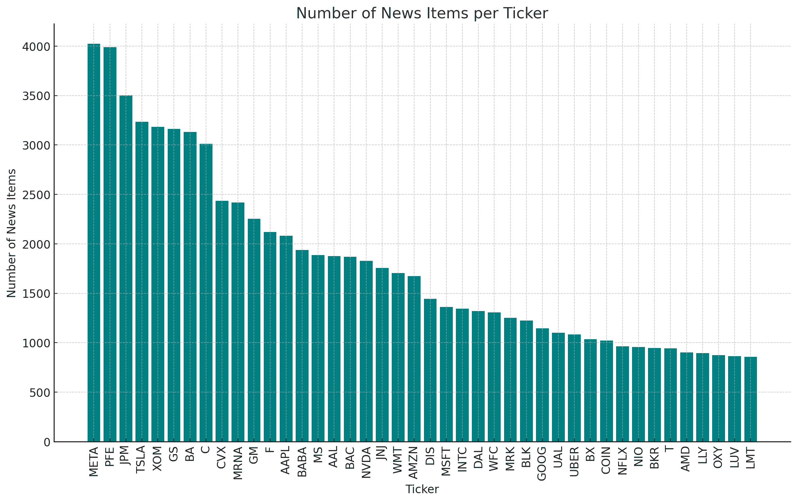

图 9：实验中42只股票的REFINITIV REAL-TIME NEWS新闻分布

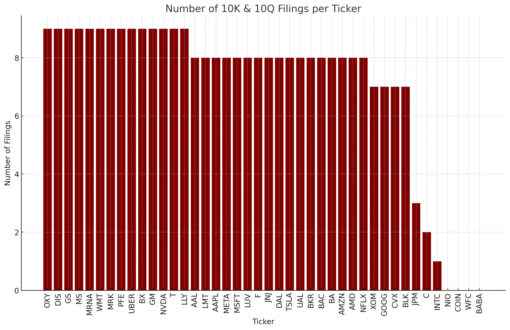

图 10：美国证券交易委员会（SEC）提供的42只股票的10k10q分布

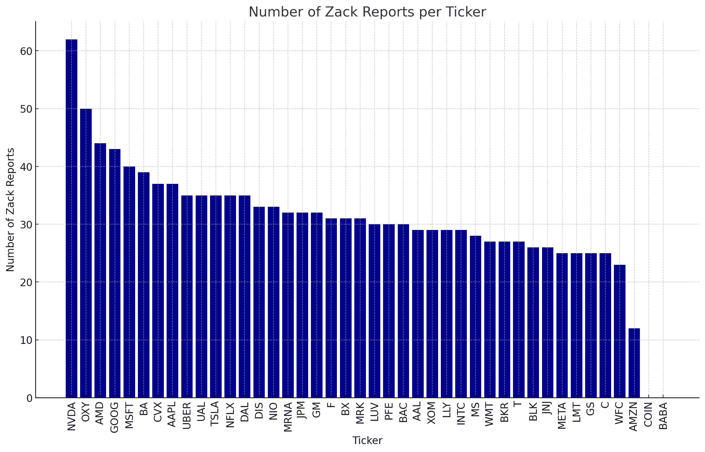

图11：Zacks股票研究公司对于实验中42只股票的分析报告分布

### A.10 经典财务度量公式用于风险估算器和决策任务性能评估

风险估算器使用以下度量标准：

盈亏（PnL）[[97](https://arxiv.org/html/2407.06567v3#bib.bib97)]: PnL量化了一段特定时间内交易活动的净结果，考虑了如股票和衍生品等金融工具的实际收益和损失。

在险价值（VaR）对于PnL[[97](https://arxiv.org/html/2407.06567v3#bib.bib97)]: VaR是一种统计工具，用于估算在定义的置信区间内，投资组合的潜在损失。在数学上，它定义为公式[3](https://arxiv.org/html/2407.06567v3#A1.E3 "在A.10经典财务度量公式中用于风险估算器和决策任务性能评估 ‣ 附录A 附录 ‣ FinCon：一种合成的LLM多代理系统，结合概念性语言强化以增强财务决策能力")：

|  | $\text{VaR}_{\alpha}(PnL)=\inf\left\{l\in\mathbb{R}:\mathbb{P}(PnL\leq l)\geq\alpha\right\}$ |  | (3) |
| --- | --- | --- | --- |

其中$\alpha$是置信水平。

条件在险价值（CVaR）对于PnL[[97](https://arxiv.org/html/2407.06567v3#bib.bib97)]: CVaR是一种统计工具，用于估算在定义的置信区间内，超过VaR值的潜在损失。在数学上，它定义为公式[4](https://arxiv.org/html/2407.06567v3#A1.E4 "在A.10经典财务度量公式中用于风险估算器和决策任务性能评估 ‣ 附录A 附录 ‣ FinCon：一种合成的LLM多代理系统，结合概念性语言强化以增强财务决策能力")：

|  | $\text{CVaR}_{\alpha}(PnL)=\mathbb{E}\Big{\{}PnL | PnL\leq\text{VaR}_{\alpha}(PnL)\Big{\}}$ |  | (4) |
| --- | --- | --- | --- | --- |

其中$\alpha$是置信水平。

算法交易代理的性能评估包含以下度量标准：

PnL的累积回报 [[90](https://arxiv.org/html/2407.06567v3#bib.bib90)]：累积回报是一个关键的交易表现指标，因为它提供了对投资表现的全面洞察，特别是对于那些强调长期增长和再投资的策略。不同投资策略的有效性通过其累积回报来评估，累积回报反映了随着时间推移的价值变化。在本研究中，我们通过对指定期间的每日对数回报进行求和来计算累积回报，如方程[5](https://arxiv.org/html/2407.06567v3#A1.E5 "在A.10经典金融指标公式风险估计器与决策任务表现评估附录A中的公式")所示。由于这种方法能够准确捕捉细微的价格波动并对收益和损失进行对称处理，因此在金融领域得到了广泛的应用。实质上，更高的累积回报通常表明策略更为有效。

|  | 累积回报 | $\displaystyle=\sum_{t=1}^{n}r_{i}$ |  |
| --- | --- | --- | --- |
|  |  | $\displaystyle=\sum_{t=1}^{n}\left[\ln\left(\frac{p_{t+1}}{p_{t}}\right)\cdot% \text{action}_{t}\right],$ |  | (5) |

其中 $r_{i}$ 表示第 $t+1$ 天的PnL，$p_{t}$ 是第 $t$ 天的收盘价，$p_{t+1}$ 是第 $t+1$ 天的收盘价，$\text{action}_{t}$ 表示模型在该天做出的交易决策。

投资组合价值：投资组合价值代表在某一时刻投资组合中所有投资的总价值。它是仅在投资组合管理任务中使用的一个指标。

|  | $\textbf{累积简单回报}_{t}=\prod_{k=1}^{t}(1+\textbf{每日简单 % 回报}_{t})-1$ |  | (6) |
| --- | --- | --- | --- |
|  | $\textbf{投资组合价值}_{t}=\textbf{初始投资金额}\times(1+% \textbf{累积简单回报}_{t})$ |  | (7) |

, 其中初始金额设定为$\$1,000,000$。

盈利与亏损的夏普比率 [[91](https://arxiv.org/html/2407.06567v3#bib.bib91)]：夏普比率是评估投资表现的另一个核心指标，用于调整风险后的收益。它通过将投资组合的平均盈利与亏损（$R_{p}$）减去无风险利率（$R_{f}$），再除以其波动性（$\sigma_{p}$）来计算，如方程[8](https://arxiv.org/html/2407.06567v3#A1.E8 "在A.10经典金融指标的公式：风险估算器与决策任务表现评估 ‣ 附录A 附录 ‣ FinCon：一种合成LLM多代理系统，具有概念性语言强化以提升金融决策能力")所示。该指标调整了风险后的收益，较高的比率表示更好的风险调整表现。它在比较不同投资组合或策略时至关重要，有助于将表现与类似投资进行对比。尽管夏普比率高于1通常被视为有利，超过2则被视为优秀，但这些基准可能会根据比较的具体背景而有所不同。

|  | $\textbf{夏普比率}=\frac{R_{p}-R_{f}}{\sigma_{p}}$ |  | (8) |
| --- | --- | --- | --- |

盈利与亏损的最大回撤 [[92](https://arxiv.org/html/2407.06567v3#bib.bib92)]：最大回撤是评估风险的一个指标。它表示投资组合价值的最大下降幅度，从最高点（$P_{\text{peak}}$）到最低点（$P_{\text{trough}}$），直到新的高点出现，具体公式详见方程[9](https://arxiv.org/html/2407.06567v3#A1.E9 "在A.10经典金融指标的公式：风险估算器与决策任务表现评估 ‣ 附录A 附录 ‣ FinCon：一种合成LLM多代理系统，具有概念性语言强化以提升金融决策能力")。最大回撤反映了投资策略的稳健性，较小的最大回撤意味着较低的风险。

|  | $\displaystyle\textbf{最大回撤}=\text{max}(\frac{P_{\text{peak}}-P_{\text{% trough}}}{P_{\text{peak}}})$ |  | (9) |
| --- | --- | --- | --- |

### A.11 单一股票交易任务的基准和对比模型

买入并持有策略（B&H）：

一种被动投资方法，投资者购买股票并持有，尽管市场波动，依然长期持有，这种策略通常作为股票交易策略的基准进行比较。

LLM交易代理：

我们将FinCon与四个LLM代理在股票交易的背景下进行评估。

+   •

    通用生成型代理 – GA：Park等人提出的生成型AI代理[[20](https://arxiv.org/html/2407.06567v3#bib.bib20)]，最初用于模拟现实中的人类行为并进行日常决策，现已适应于特定的股票交易任务。该代理的架构包括一个记忆模块，利用近期性、相关性和重要性度量来提取关键记忆事件，以便做出有依据的决策。然而，它没有提供分层记忆模块，无法有效区分不同类型金融数据的时间敏感性。此外，尽管它具有用于定义代理属性（如职业背景）的配置模块，但模型未明确指定代理的个人特征。在我们的实验中，我们修改了Park等人原始的用于日常任务的提示模板，使其适用于金融投资任务。

+   •

    FinGPT：一种新型开源LLM框架，专门用于将传入的文本和数字信息转化为有依据的金融决策，由Yang等人提出[[31](https://arxiv.org/html/2407.06567v3#bib.bib31)]。它宣称在传统的买入持有策略上具有优势。

+   •

    FinMem：FinMem采用了专门的配置模块和自适应风险设置，以增强市场鲁棒性。其记忆模块结合了工作记忆和分层长期记忆，能够有效地处理数据。这使得FinMem能够利用市场洞察力，改善交易决策[[32](https://arxiv.org/html/2407.06567v3#bib.bib32)]。

+   •

    FinAgent：FinAgent是在FinMem基础上开发的，利用LLM的工具使用能力来结合多模态金融数据[[33](https://arxiv.org/html/2407.06567v3#bib.bib33)]。它宣称在单一资产交易（股票和加密货币）上具有进一步改善的交易表现。

DRL交易代理：

由于FinMem是在单一股票交易和离散交易行为的基础上进行实践和检验的，我们根据Liu等人之前的研究和表现出的优异效果[[98](https://arxiv.org/html/2407.06567v3#bib.bib98), [99](https://arxiv.org/html/2407.06567v3#bib.bib99)]，选择了三种适用于相同场景的先进DRL算法。这些DRL训练代理仅以数字特征为输入。

+   •

    优势演员-评论员（A2C）：A2C([[100](https://arxiv.org/html/2407.06567v3#bib.bib100)])应用于优化金融环境中的交易行为。它通过同时更新策略（演员）和价值（评论员）函数，提供了探索与开发之间的平衡。

+   •

    近端策略优化（PPO）：PPO([[101](https://arxiv.org/html/2407.06567v3#bib.bib101)])因其稳定性和效率被应用于股票交易。PPO的一个显著优势是，通过限制策略更新，保持了探索与开发之间的平衡，从而防止了剧烈的策略变化。

+   •

    深度Q网络（DQN）：DQN ([[102](https://arxiv.org/html/2407.06567v3#bib.bib102)]) 是Q-learning的一个改编版本，可用于优化投资策略。与传统的Q-learning依赖表格方式存储Q值不同，DQN使用深度学习对Q值进行跨状态估计，从而使其在复杂交易环境中具有更强的可扩展性。

### A.12 投资组合管理

马科维茨投资组合选择 [[1](https://arxiv.org/html/2407.06567v3#bib.bib1)]：由哈里·马科维茨于1952年提出，是一种构建投资组合的框架，旨在优化在给定风险水平下的预期回报，或在给定预期回报水平下最小化风险。该方法使用资产回报的预期回报、方差和协方差来确定最优的资产配置，从而通过多样化来平衡风险与回报。

FinRL-A2C [[48](https://arxiv.org/html/2407.06567v3#bib.bib48)]：是一种强化学习（RL）算法，旨在解决Liu等人提出的单一股票交易和投资组合优化问题。该RL模型基于对历史市场条件和RL代理商的经纪信息的观察，做出交易决策（即投资组合权重）。该算法的实现 ²²2[https://github.com/AI4Finance-Foundation/FinRL-Meta](https://github.com/AI4Finance-Foundation/FinRL-Meta) 已提供，并作为我们研究的基准。

等权重ETF [[103](https://arxiv.org/html/2407.06567v3#bib.bib103)]：是一种对所有股票进行等比例配置的投资组合，类似于单股交易中的买入持有策略，可以提供市场趋势的基准。

### A.13 FinCon中的程序记忆排名指标

在接收到投资查询后，FinCon中的每个代理从其程序记忆中检索出前$K$个关键记忆事件，其中$K$是一个超参数。这些事件根据其信息检索得分进行选择。对于任何给定的记忆事件$E$，其信息检索得分$\gamma^{E}$定义为

|  | $\gamma^{E}=S_{\text{Relevancy}}^{E}+S_{\text{Importance}}^{E}$ |  | (10) |
| --- | --- | --- | --- |

该方法改编自Park等人 [[20](https://arxiv.org/html/2407.06567v3#bib.bib20)]，但修改了相关性和重要性计算，并在求和之前将其缩放到$[0,1]$范围。在处理记忆事件$E$时，当交易查询$P$通过LLM提示到达时，代理计算相关性得分$S_{\text{Relevancy}}^{E}$，该得分衡量记忆事件文本内容的嵌入向量$\mathbf{m_{E}}$与LLM提示查询$\mathbf{m_{P}}$之间的余弦相似度，定义如下：

|  | $S_{\text{Relevancy}}^{E}=\frac{\mathbf{m_{E}}\cdot\mathbf{m_{P}}}{\&#124;\mathbf{m_{E}}\&#124;_{2}\times\&#124;\mathbf{m_{P}}\&#124;_{2}}$ |  | (11) |
| --- | --- | --- | --- |

请注意，LLM 提示查询输入包括交易查询和交易者特征。另一方面，重要性评分 $S_{\text{Importance}}^{E}$ 与查询和事件记忆时间戳之间的时间差 $\delta t=t_{\text{P}}-t_{E}$ 成反比，类似于艾宾浩斯遗忘曲线 [[104](https://arxiv.org/html/2407.06567v3#bib.bib104)]。更精确地说，如果我们表示记忆事件 $v^{E}$ 的初始评分值和衰减比率 $\theta\in(0,1)$，则重要性评分通过以下公式计算：

|  | $S_{\text{Importance}}^{E}=v^{E}\times\theta^{\delta t}$ |  | (12) |
| --- | --- | --- | --- |

请注意，比例 $\theta$ 测量了事件随时间推移重要性递减的程度，这一概念受到设计灵感的启发，参考了 [[20](https://arxiv.org/html/2407.06567v3#bib.bib20)]。但在我们的设计中，近期性和重要性的因素通过一个方程式统一处理。在 FinCon 中，不同的代理对记忆事件 $E$ 有不同的 $\{v^{E},\theta\}$ 选择。

此外，一个访问计数器功能促进了记忆事件的增强，从而使得对交易决策产生重要影响的关键事件能够被 FinCon 增强，而琐碎事件则会逐渐消退。这是通过使用 LLM 验证工具 Guardrails AI [[105](https://arxiv.org/html/2407.06567v3#bib.bib105)] 跟踪关键记忆 ID 实现的。被认为对投资收益至关重要的记忆 ID 会将其重要性评分 $S_{\text{Importance}}^{E}$ 增加 $+5$。这种访问计数器的实现使 FinCon 能够根据事件类型和检索频率捕捉并优先处理关键事件。

### A.14 实验中的详细配置

训练周期的选择考虑了企业财务报告的季节性特征以及 FinCon 内存模块的数据保留时长。所选的训练时长确保至少涵盖一个发布周期，包括表格 10-Q、ECC 或表格 10-K。这一策略确保学习到的投资指导概念化内容涵盖了更全面的因素范围。此外，训练时长还允许 FinCon 有足够的时间建立金融新闻、市场指标和股市趋势之间的推理联系，从而积累了大量经验。我们还将每个代理所检索到的顶级记忆事件数设置为 5。我们运行了 FinCon，报告的性能结果基于测试阶段取得最高累计回报的设置。

为保持一致性，其他三种基于 LLM 的代理的训练和测试阶段与 FinMem 对应阶段对齐。对于其他基于 LLM 的代理，其参数若未被 FinMem 的配置涵盖，则保持其原始设置，遵循各自源代码中规定的设置。

FinCon的表现与最有效的比较模型进行了基准对比，使用累积回报率和夏普比率作为主要评估指标。通过非参数的Wilcoxon符号秩检验确定了FinCon优越表现的统计显著性，该检验特别适用于非高斯分布的数据。

### A.15 FinCon在极端市场条件下的表现

为了进一步说明FinCon在表现上的稳健性，我们评估了其在两种不同场景下的有效性：（1）使用TSLA的单一资产交易任务，（2）涉及TSLA、MSFT和PFE组合的投资组合管理任务。我们的评估重点关注关键的金融指标，包括累积回报率（CRs）、夏普比率（SRs）和最大回撤（MDD）。训练期从2022年1月17日持续到2022年3月31日，而测试阶段则覆盖了2022年4月1日至2022年10月15日。选择这一特定时间段是因为CBOE波动率指数（VIX）在此期间处于较高水平，平均值超过20，表明市场在这几个月的波动性较大。

如表[7](https://arxiv.org/html/2407.06567v3#A1.T7 "表7 ‣ 图12 ‣ A.15 FinCon在极端市场条件下的表现 ‣ 附录A 附录 ‣ FinCon：用于增强金融决策的综合LLM多代理系统与概念性语言强化")和图LABEL:subfig:single_asset_cr所示，FINCON是唯一在单一股票交易任务中实现正累积回报率（CRs）和夏普比率（SRs）的代理系统。关于投资组合管理任务，所有基准（四个基准模型）的结果详细列在表[8](https://arxiv.org/html/2407.06567v3#A1.T8 "表8 ‣ 图13 ‣ A.15 FinCon在极端市场条件下的表现 ‣ 附录A 附录 ‣ FinCon：用于增强金融决策的综合LLM多代理系统与概念性语言强化")和图LABEL:subfig:portfolio_management_cr中。在这些比较中，FINCON始终在主要表现指标中取得了最高分。

模型 CR % $\uparrow$ SR$\uparrow$ MDD %$\downarrow$  

表7：在高波动性条件下，使用TSLA作为单一资产交易任务的关键表现比较。FinCon在所有表现指标中领先。

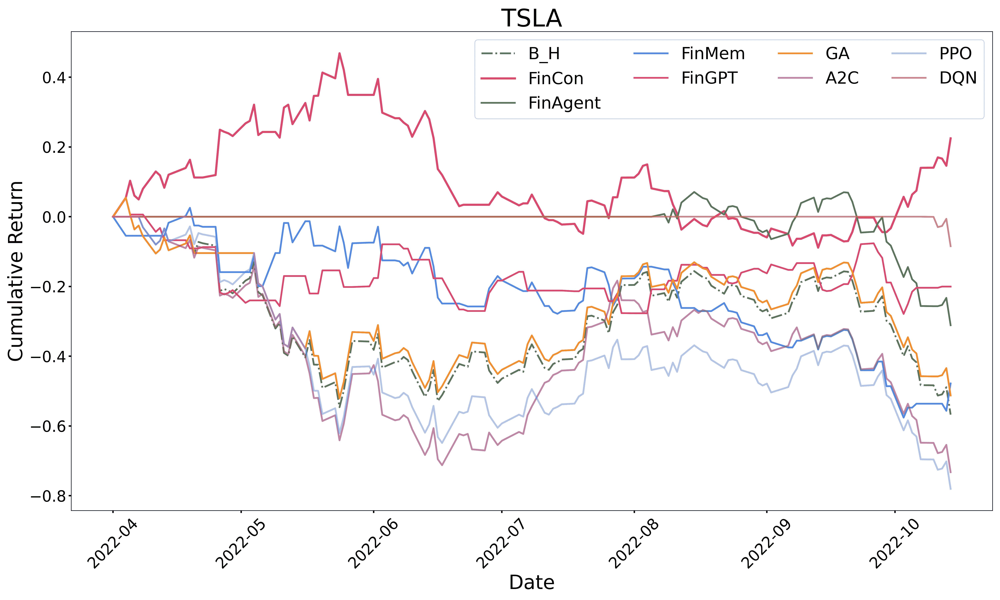

图12：在高波动性条件下，所有策略的CR随时间变化，以TSLA为单一资产交易任务的示例。

模型 CR % $\uparrow$ SR$\uparrow$ MDD %$\downarrow$  

表 8：在高波动条件下，Portfolio1 所有投资组合管理策略的关键表现对比。FinCon 在所有表现指标中领先。

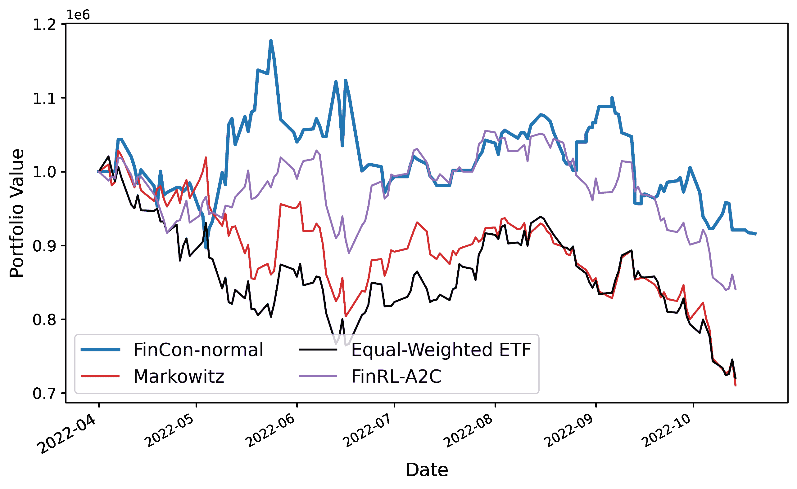

图 13：在高波动条件下，Portfolio1 各策略随时间的价值变化。
