<!--yml
category: 未分类
date: 2025-01-11 12:41:14
-->

# FixAgent: Hierarchical Multi-Agent Framework for Unified Software Debugging

> 来源：[https://arxiv.org/html/2404.17153/](https://arxiv.org/html/2404.17153/)

Cheryl Lee¹, Chunqiu Steven Xia², Longji Yang¹, Jen-tse Huang¹,
Zhouruixing Zhu³, Lingming Zhang², Michael R. Lyu¹
¹The Chinese University of Hong Kong, ²University of Illinois Urbana-Champaign,
³The Chinese University of Hong Kong, Shenzhen
[cheryllee@link.cuhk.edu.hk](mailto:cheryllee@link.cuhk.edu.hk), chunqiu2@illinois.edu, 1155191588@link.cuhk.edu.hk,
jthuang@cse.cuhk.edu.hk, zhouruixingzhu@link.cuhk.edu.cn, lingming@illinois.edu, lyu@cse.cuhk.edu.hk

###### Abstract

Software debugging is a time-consuming endeavor involving a series of steps, such as fault localization and patch generation, each requiring thorough analysis and a deep understanding of the underlying logic. While large language models (LLMs) demonstrate promising potential in coding tasks, their performance in debugging remains limited. Current LLM-based methods often focus on isolated steps and struggle with complex bugs. In this paper, we propose the first end-to-end framework, FixAgent, for unified debugging through multi-agent synergy. It mimics the entire cognitive processes of developers, with each agent specialized as a particular component of this process rather than mirroring the actions of an independent expert as in previous multi-agent systems. Agents are coordinated through a three-level design, following a cognitive model of debugging, allowing adaptive handling of bugs with varying complexities. Experiments on extensive benchmarks demonstrate that FixAgent significantly outperforms state-of-the-art repair methods, fixing 1.25$\times$ to 2.56$\times$ bugs on the repo-level benchmark, Defects4J. This performance is achieved without requiring ground-truth root-cause code statements, unlike the baselines. Our source code is available on an anonymous link: [https://github.com/AcceptePapier/UniDebugger](https://github.com/AcceptePapier/UniDebugger).

FixAgent: Hierarchical Multi-Agent Framework for Unified Software Debugging

Cheryl Lee¹, Chunqiu Steven Xia², Longji Yang¹, Jen-tse Huang¹, Zhouruixing Zhu³, Lingming Zhang², Michael R. Lyu¹ ¹The Chinese University of Hong Kong, ²University of Illinois Urbana-Champaign, ³The Chinese University of Hong Kong, Shenzhen [cheryllee@link.cuhk.edu.hk](mailto:cheryllee@link.cuhk.edu.hk), chunqiu2@illinois.edu, 1155191588@link.cuhk.edu.hk, jthuang@cse.cuhk.edu.hk, zhouruixingzhu@link.cuhk.edu.cn, lingming@illinois.edu, lyu@cse.cuhk.edu.hk

## 1 Introduction

Debugging is a crucial process of identifying, analyzing, and rectifying bugs or issues in software. Significant advancements (Yang et al., [2024](https://arxiv.org/html/2404.17153v2#bib.bib55); Xia and Zhang, [2022](https://arxiv.org/html/2404.17153v2#bib.bib52); Wei et al., [2023](https://arxiv.org/html/2404.17153v2#bib.bib47); Xia and Zhang, [2024](https://arxiv.org/html/2404.17153v2#bib.bib53)) have been achieved in addressing bugs with the boost of LLMs—they typically propose a prompting framework and query an LLM to automate an isolated phase in debugging, generally Fault Localization (FL) or Automated Program Repair (APR). FL attempts to identify suspicious code statements, while APR provides patches or fixed code snippets. A typical “diff” patch records the textual differences between two source code files, as shown in Figure [1](https://arxiv.org/html/2404.17153v2#S1.F1 "Figure 1 ‣ 1 Introduction ‣ FixAgent: Hierarchical Multi-Agent Framework for Unified Software Debugging"). The goal of debugging is to apply such a patch to fix the bug accurately.

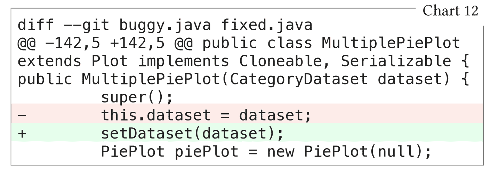

Figure 1: An example of the “diff” patch, where “@@ -142,5 +142 5 @@” indicates line 142 is modified.

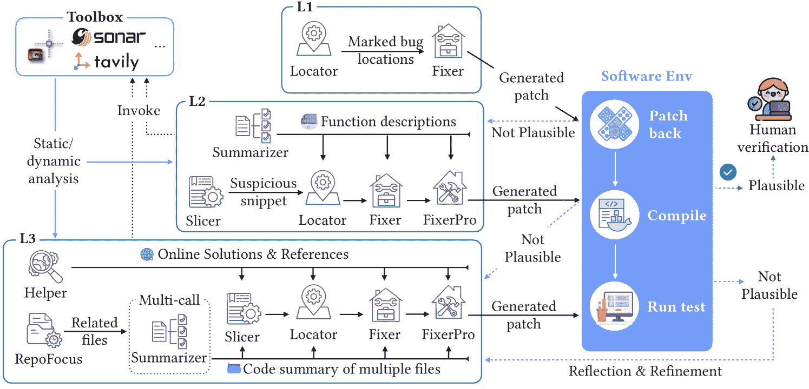

Figure 2: Overview of FixAgent. It starts with the simple L1 repair. If no plausible patch is generated, the L2 repair is triggered, and so is L3. Agents on the same level can communicate with others.

While LLMs demonstrate great potential in addressing individual debugging tasks for basic bugs, previous studies cannot offer a satisfying solution for the entire debugging task. To bridge this gap, we propose the first multi-agent framework, FixAgent, for end-to-end unified debugging. A key challenge lies in how to coordinate multiple agents. Previous studies that employ LLM-based multi-agent frameworks for complex problem-solving typically regard each agent as an expert and imitate the collaborative practice in humans (Hong et al., [2024](https://arxiv.org/html/2404.17153v2#bib.bib14); Islam et al., [2024](https://arxiv.org/html/2404.17153v2#bib.bib17); Qian et al., [2024](https://arxiv.org/html/2404.17153v2#bib.bib37)). However, such a paradigm has limitations in debugging. It overly emphasizes mimicking human collaboration, thus not suitable for the logical, stepwise nature of debugging. Furthermore, it faces challenges in the fine-grained allocation and optimization of resources regarding problem difficulties. The communication links among agents are mesh-like and extensive, leading to unnecessary high communication redundancy.

In response, we uniquely structure FixAgent as a hierarchical multi-agent coordination paradigm, as shown in Figure [2](https://arxiv.org/html/2404.17153v2#S1.F2 "Figure 2 ‣ 1 Introduction ‣ FixAgent: Hierarchical Multi-Agent Framework for Unified Software Debugging"). Our key insight is that an agent should act as a specific component of the cognitive process of debugging rather than mirroring the actions of an independent expert in teamwork. In teamwork, members bring diverse perspectives and backgrounds. They engage in bidirectional discussion and negotiation to share knowledge and solve tasks collaboratively. In contrast, the cognitive process is unidirectional and coherent, with each stage building on the last. It accumulates knowledge and employs tools toward a common objective, primarily relying on self-reflection to guide thought. Since the latter aligns seamlessly with debugging, we ground the multi-agent coordination in Hale and Haworth’s cognitive debugging model (Hale and Haworth, [1991](https://arxiv.org/html/2404.17153v2#bib.bib12)). It argues that developers employ a multi-level goal-orientated mechanism during debugging based on structural learning theory (Hale et al., [1999](https://arxiv.org/html/2404.17153v2#bib.bib13)). The initial level only provides quick and straightforward solutions, and if that fails, higher levels of repairs are triggered for complex bugs, entailing more cognitive activities that involve deeper analysis, tool invocation, and external information ingestion.

Our framework encompasses seven agents, each specialized in a distinct cognitive state: 1) Helper: retrieves and synthesizes debugging solutions through online research; 2) RepoFocus: analyzes dependencies and identifies bug-related code files; 3) Summarizer: generates code summaries; 4) Slicer: isolates a code segment (typically tens to hundreds of lines) likely to cause an error; 5) Locator: marks the specific root-cause code lines; 6) Fixer: generates patches or fixed code snippets; 7) FixerPro: generates an optimized patch upon the testing results of the patch generated by Fixer along with a detailed analysis report.

Particularly, FixAgent first isolates the code file most likely causing the error through unit testing. On level one (L1), only Locator and Fixer are initiated for simple bugs. If the generated patch is not plausible (i.e., pass all test cases), Summarizer and Slicer are triggered with the bug-located code file on level two (L2). Then Locator, Fixer, and FixerPro are called sequentially with access to the responses from Summarizer and Slicer. If it still fails, FixAgent undertakes a deeper inspection and thus activates all agents (i.e., level three, L3), where Helper searches for solutions online to guide all the other agents, and RepoFocus examines the entire program to provide a list of bug-related code files, followed by the other agents working in line. Slicer, Locator, and Fixer can invoke traditional code analysis tools on the last two levels to collect static and dynamic analysis information.

We evaluate FixAgent on four benchmarks with bug-fix pairs across three programming languages, including real-world software (Defects4J Just et al., [2014](https://arxiv.org/html/2404.17153v2#bib.bib19)) and competition programs (QuixBugs Lin et al., [2017](https://arxiv.org/html/2404.17153v2#bib.bib26), Codeflaws Tan et al., [2017](https://arxiv.org/html/2404.17153v2#bib.bib42), ConDefects Wu et al., [2024](https://arxiv.org/html/2404.17153v2#bib.bib50)). On Defects4J, FixAgent achieves a new state-of-the-art (SoTA) by correctly fixing 197 bugs with 286 plausible fixes. Our method does not require prior FL while still outperforming strong baselines like ChatRepair, which uses ground-truth root causes with 10x sampling times. Plus, FixAgent fixes all bugs in QuixBugs and generates 2.2$\times$ more plausible fixes on Codeflaws. Our ablation study shows that FixAgent consistently makes significant improvements across various LLM backbones.

## 2 Related Work

Software Debugging: FL and APR are the two core steps in software debugging Benton et al. ([2020](https://arxiv.org/html/2404.17153v2#bib.bib6)). Many studies aim to automate either step. Traditional FL are typically spectrum-based (Abreu et al., [2009](https://arxiv.org/html/2404.17153v2#bib.bib2), [2006](https://arxiv.org/html/2404.17153v2#bib.bib1); Zhang et al., [2011](https://arxiv.org/html/2404.17153v2#bib.bib58)) or mutation-based (Moon et al., [2014](https://arxiv.org/html/2404.17153v2#bib.bib33); Li and Zhang, [2017](https://arxiv.org/html/2404.17153v2#bib.bib23); Zhang et al., [2013](https://arxiv.org/html/2404.17153v2#bib.bib59)). Learning-based FL learns program behaviors from rich data sources (Li et al., [2021](https://arxiv.org/html/2404.17153v2#bib.bib24), [2022](https://arxiv.org/html/2404.17153v2#bib.bib25); Lou et al., [2021](https://arxiv.org/html/2404.17153v2#bib.bib30); Li et al., [2019](https://arxiv.org/html/2404.17153v2#bib.bib22)) via multiple types of neural networks. Recently, LLMAO (Yang et al., [2024](https://arxiv.org/html/2404.17153v2#bib.bib55)) proposes to utilize LLMs for test-free FL. APR research either searches for suitable solutions from possible patches (Goues et al., [2012](https://arxiv.org/html/2404.17153v2#bib.bib9); Weimer et al., [2009a](https://arxiv.org/html/2404.17153v2#bib.bib48), [b](https://arxiv.org/html/2404.17153v2#bib.bib49)) or directly generates patches by representing the generation as an explicit specification inference (Mechtaev et al., [2016](https://arxiv.org/html/2404.17153v2#bib.bib32); Nguyen et al., [2013](https://arxiv.org/html/2404.17153v2#bib.bib34); Liu et al., [2019](https://arxiv.org/html/2404.17153v2#bib.bib27)). Learning-based studies ((Lutellier et al., [2020](https://arxiv.org/html/2404.17153v2#bib.bib31); Jiang et al., [2021](https://arxiv.org/html/2404.17153v2#bib.bib18); Ye et al., [2022](https://arxiv.org/html/2404.17153v2#bib.bib57))) translate faulty code to correct code using neural machine translation (NMT). On top of directly prompting LLMs (Xia et al., [2023](https://arxiv.org/html/2404.17153v2#bib.bib51)), recent studies have explored prompt engineering (Xia and Zhang, [2024](https://arxiv.org/html/2404.17153v2#bib.bib53), [2022](https://arxiv.org/html/2404.17153v2#bib.bib52)) or combining code synthesis (Wei et al., [2023](https://arxiv.org/html/2404.17153v2#bib.bib47)) to improve LLM for APR.

Large Language Models: Various LLMs have been developed for code synthesis (Chen et al., [2021](https://arxiv.org/html/2404.17153v2#bib.bib7); Guo et al., [2024](https://arxiv.org/html/2404.17153v2#bib.bib10); Rozière et al., [2023](https://arxiv.org/html/2404.17153v2#bib.bib39)), in addition to general-purpose LLMs (OpenAI, [2023a](https://arxiv.org/html/2404.17153v2#bib.bib35), [b](https://arxiv.org/html/2404.17153v2#bib.bib36); Anil et al., [2023](https://arxiv.org/html/2404.17153v2#bib.bib4)). They have shown potential in solving coding-related tasks, including program repair, as investigated in empirical studies (Xia et al., [2023](https://arxiv.org/html/2404.17153v2#bib.bib51); Huang et al., [2023](https://arxiv.org/html/2404.17153v2#bib.bib16); Tian et al., [2024](https://arxiv.org/html/2404.17153v2#bib.bib44)).

LLM-based Multi-Agent (LLM-MA): The inspiring capabilities of the single LLM-based agent boost the development of multi-agent frameworks. Recent research has demonstrated promising results in utilizing LLM-MA for complex problem-solving, including software engineering, science, and other society-simulating activities. For software engineering, LLM-MA studies (Qian et al., [2024](https://arxiv.org/html/2404.17153v2#bib.bib37); Hong et al., [2024](https://arxiv.org/html/2404.17153v2#bib.bib14); Dong et al., [2023](https://arxiv.org/html/2404.17153v2#bib.bib8); Huang et al., [2024](https://arxiv.org/html/2404.17153v2#bib.bib15); Islam et al., [2024](https://arxiv.org/html/2404.17153v2#bib.bib17)) usually emulate real-world roles (e.g., product managers, programmers, and testers) and collaborate through communication. Hong et al. ([2024](https://arxiv.org/html/2404.17153v2#bib.bib14)); Dong et al. ([2023](https://arxiv.org/html/2404.17153v2#bib.bib8)) adopt a shared information pool to reduce overhead.

## 3 FixAgent

FixAgent is an end-to-end framework for unified debugging through LLM-based multi-agent synergy. It comprises seven agents, each specialized as a state in Hale and Haworth’s cognitive debugging model with an explicit goal instead of being a task-oriented, individual entity. FixAgent operates on a three-level architecture, initializing different levels of repair involving different agents, and agents can adaptively invoke tools in a given toolbox. The communication among agents on the same level follows an assembly-line thought process rather than the mesh interactions typical of teams. This section introduces the profiles of agents, their interactions with external environments, and the hierarchical organization. Prompt details are displayed in [A.3](https://arxiv.org/html/2404.17153v2#A1.SS3 "A.3 System Prompts ‣ Appendix A Appendix ‣ FixAgent: Hierarchical Multi-Agent Framework for Unified Software Debugging").

### 3.1 Profiles of Agents

All agents in FixAgent share a one-shot structure of the system prompt, which defines their roles, skills, actions, objectives, and constraints, followed by a manually crafted example to illustrate the desired response format, as shown in Figure [3](https://arxiv.org/html/2404.17153v2#S3.F3 "Figure 3 ‣ 3.1 Profiles of Agents ‣ 3 FixAgent ‣ FixAgent: Hierarchical Multi-Agent Framework for Unified Software Debugging"). Moreover, all agents have access to certain meta-information known as bug metadata, including the bug-located code file, failing test cases, reported errors during compilation and testing, and program requirements described in natural language. The response of each agent comprises two elements: the answer fulfilling its goal and an explanation of its thinking. Inspired by a software engineering principle, rubber duck debugging (Andrew and David, [2000](https://arxiv.org/html/2404.17153v2#bib.bib3)), where developers articulate their expectations versus actual implementations to identify the gap, we request each agent to monitor key program variables and explain how it guides the answer.

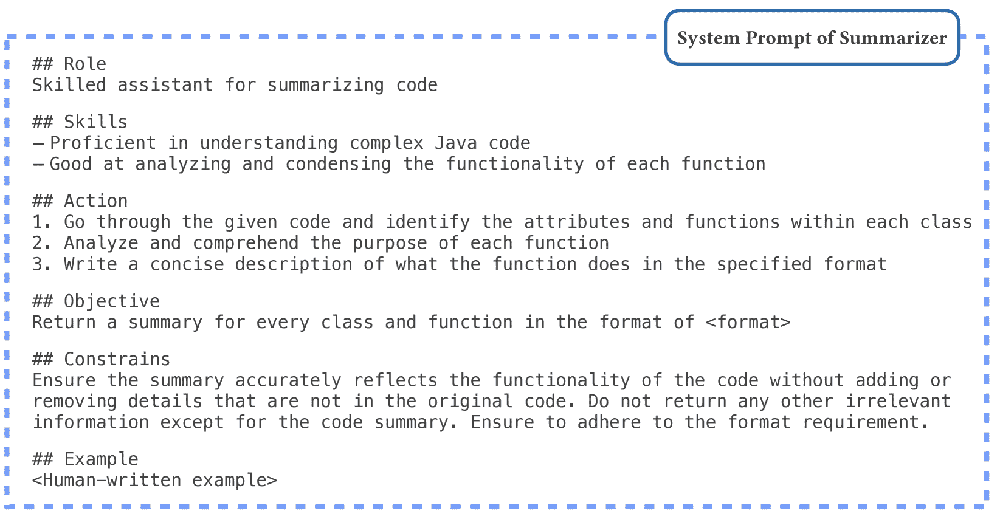

Figure 3: A one-shot system prompt defines the role, skills, actions, objective, and constraints of the agent.

Helper. The goal of Helper is to provide references via retrieve-augmented generation (RAG), inspired by the fact that developers commonly utilize web search engines (e.g., Google) to enhance productivity (Xia et al., [2017](https://arxiv.org/html/2404.17153v2#bib.bib54)). By analyzing the bug metadata, Helper generates a short query and invokes an external search engine to retrieve the best-matching solutions. Then, it integrates the retrieval results and generates reference solutions that are customized for the context of the buggy code (e.g., variable naming and function structure). These are internal processes hidden from the other agents, and only the final response—a reference solution—can be read only on L3. Figure [4](https://arxiv.org/html/2404.17153v2#S3.F4 "Figure 4 ‣ 3.1 Profiles of Agents ‣ 3 FixAgent ‣ FixAgent: Hierarchical Multi-Agent Framework for Unified Software Debugging") provides an example of the response from Helper.

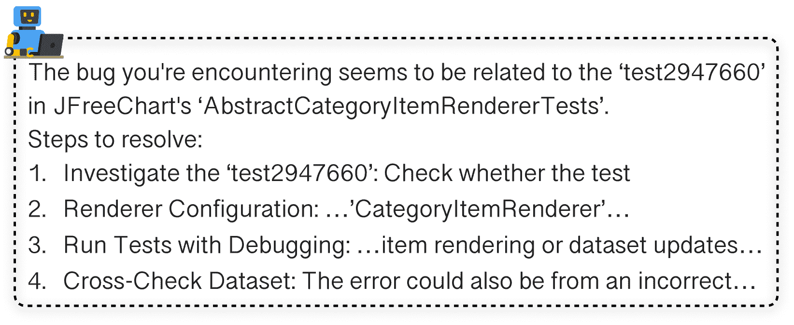

Figure 4: After retrieving similar solutions, Helper eventually responds with an executable debug guide.

RepoFocus. Comprehending cross-file dependencies is crucial to debugging large software, and real-world software is often large and complex (corresponding to L3 repair). However, inputting all of the code in a program may overwhelm an LLM, resulting in slow responses with significant resource consumption or incorrect results. Thus, RepoFocus provides a list of bug-related code files that need further examination by analyzing the bug metadata and the file structure of the program.

Summarizer. Code summarization aims to generate concise, semantically meaningful summaries that accurately describe software functions. Unlike high-level code analysis, these natural language summaries better align with the training objectives of LLMs. Summarizer is triggered on L2 and L3. On L2, it summarizes the buggy code file. Though the window size of advanced LLMs can handle most single code files, a too-long prompt may exacerbate the illusion of LLMs. Thus, Summarizer handles overly long code here, in conjunction with Slicer, which narrows down a suspicious segment from the buggy code. On L3, Summarizer runs once on every bug-related file identified by RepoFocus. The other agents do not need to read every code line in the program while still knowing the core contents through these summaries.

Slicer. Slicer narrows down the inspection scope by slicing out a small suspicious segment (typically tens of code lines) from the bug-located code file. We extract the beginning and end lines from the initial output to locate the segment, ensuring the final output is directly sliced from the original code to prevent code tampering caused by LLM hallucinations. Slicer is also launched for large software on the last two levels, where it can invoke static or dynamic analysis tools.

Locator. Locator is responsible for marking code lines with a comment “// buggy line” or “// missing line” to indicate faulty or missing statements. Similar to Slicer, we directly annotate the original code through contextual string matching. Locator only leverages the bug metadata on L1, where on L2, it can access the dynamic analysis reports. If the program is large enough so that Slicer and Summarizer are invoked, Locator receives the suspicious code segment (generated by Slicer) to replace the original complete code, along with the buggy code summary (generated by Summarizer).

Fixer. Fixer is prompted to generate a ‘diff‘, as shown in Figure [1](https://arxiv.org/html/2404.17153v2#S1.F1 "Figure 1 ‣ 1 Introduction ‣ FixAgent: Hierarchical Multi-Agent Framework for Unified Software Debugging") in Introduction. It receives code marked by Locator and other bug metadata. To maintain consistency between Locator and Fixer, Fixer first assesses whether the marked lines should be modified and then describes the modification. This also enables Fixer to correct possible errors made by Locator. On L2 and L3, Fixer also has access to static/dynamic analysis and auxiliary information generated by upstream agents.

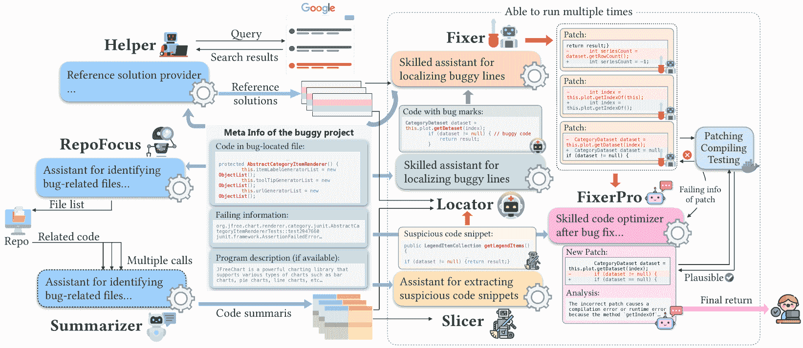

Figure 5: L3 triggers all the seven agents to generate plausible patches.

FixerPro. FixerPro extends and complements Fixer by generating an optimized patch and repair analysis. Inspired by code review, in which one or more developers check a program to ensure software quality, we request FixerPro to evaluate the performance and potential vulnerability of the plausible fix generated by Fixer. Then, FixerPro provides suggestions for refactoring the patch to optimize simplicity and maintainability. If Fixer fails, FixerPro generates a new patch while analyzing the failing reasons.

### 3.2 External Interactions

Plausibility Feedback. We conduct repairs by modifying the buggy code rather than directly applying the generated patches because they usually make mistakes in indices of code lines, as LLMs often struggle with counting, and the patch may be generated based on a sliced segment rather than the original code, causing changes in the indices of code lines. Our modification is rule-based by matching the invariant context between the patch and the buggy code. Afterward, we compile and run tests on the fixed program. The patch will be sent to developers for manual correctness verification if passing all test cases. The results of plausibility testing are returned to FixAgent as feedback for further processing, such as initializing a higher level of repair or conducting self-reflection.

Tool Usage. The toolbox of FixAgent currently contains static analysis tools, dynamic analysis tools, and a search engine optimized for LLMs and RAG. Static analysis provides static errors and warnings, as well as Abstract Syntax Tree (AST), a tree representation of the abstract syntactic structure of source code. We mainly consider the coverage of failing test cases in dynamic analysis since it is commonly assumed that code statements not executed during testing are less likely to cause the failures Kochhar et al. ([2016](https://arxiv.org/html/2404.17153v2#bib.bib20)). Note that the results of tool invocations will be stored for the requests of downstream agents to avoid duplicated invocations.

### 3.3 Hierarchical Coordination

Our main principle of coordination is that problems of different complexities warrant cognitive activities of different intensities. That is, upon the failure of a straightforward solution, a higher-level goal will be triggered with more information and thinking. Following Hale and Haworth’s cognitive debugging model, we define three workflows for the three levels of repair, respectively.

The first level identifies and fixes obvious logic errors in code, so we assume that agents can easily fix the bug. Thus, L1 only contains Locator and Fixer with a simple communication flow, where Fixer generates a patch based on the fault localization done by Locator. If the fix is not plausible, then L2 is triggered, assuming that the fix can be achieved by only inspecting a single file, which is often applied in previous FL and APR studies (Soremekun et al., [2023](https://arxiv.org/html/2404.17153v2#bib.bib41)). L2 involves five agents: Slicer, Summarizer, Locator, Fixer, and FixerPro. Slicer isolates a suspicious segment, and Summarizer generates a code summary simultaneously, both from the bug-located file. Afterward, Locator, Fixer, and FixerPro work in sequence based on the suspicious segment, and all have access to the code summary. If it still fails, we turn to L3, which believes that the bug is very complex, so repairing it requires understanding cross-file dependencies and external information. L3 activates all the seven agents. First, Helper and RepoFocus are initialized at the same time, and Helper provides references for all other agents. Then, Summarizer runs multiple times following the file list identified by RepoFocus. These code summaries are shared by the remaining four agents, which work one after another subsequently with the same workflow as L2. Figure [5](https://arxiv.org/html/2404.17153v2#S3.F5 "Figure 5 ‣ 3.1 Profiles of Agents ‣ 3 FixAgent ‣ FixAgent: Hierarchical Multi-Agent Framework for Unified Software Debugging") presents an example conversation among agents on L3.

Upon no plausible patch, FixAgent gradually requests agents on L3 to reflect and refine its answer based on the plausibility feedback in a reversed order, as downstream agents are more error-prone as errors may accumulate during the debugging process. Specifically, we first ask FixerPro to refine its response. If the fix fails again, we then request Fixer, leading to input changes of FixerPro, so it is re-sampled the second time. Eventually, plausible patches are returned to developers for manual verification. If no plausible patch is produced, FixAgent will display the analysis report written by FixerPro and take another run until reaching a resource threshold.

Table 1: Comparison with baselines. #Corr and #Plau represent the number of bugs correctly and plausibly patched, respectively. The green cells indicate the best results. The blue cells indicate the results are obtained from sampled data, while other results are obtained on the whole dataset.

Tools Sampling Times Defects4J-Java Codeflaws-C QuixBugs-Java QuixBugs-Python Note #Corr #Plau #Corr #Plau #Corr #Plau #Corr #Plau Angelix 1,000 - - 318 591 - - - - Realistic FL Prophet 1,000 - - 310 839 - - - - SPR 1,000 - - 283 783 - - - - CVC4 - - - 15^† 91^† - - - - Semfix 1,000 25 68 38^† 56^† - - - - Recoder 100 72 140 - - 17 17 - - GenProg 1000 5 20 255-369 1423 1 4 - - Perfect FL CoCoNuT 20,000 44^⋆ 85^⋆ 423 716 13 20 19 21 CURE - 57^⋆ 104^⋆ - - 26 35 - - RewardRepair 200 90 75 - - 20 - - - Tbar 500 77 121 - - - - - - AlphaRepair 5,000 110 159 - - 28 30 27 32 Repilot 5,000 116 - - - - - - - ChatRepair 100-200 157 - - - 40 40 40 40 CodeLlama-34b 20 24 41 91(%)^‡ 1,488 25 28 33 33 Perfect FL LLaMA2-70b 39 78 91(%)^‡ 1,576 25 28 33 33 DeepSeekCoder 57 82 93(%)^‡ 1,937 30 34 25 38 gemini-1.5-flash 19 36 86(%)^‡ 1,291 29 32 29 35 gpt-3.5-turbo-ca 45 71 94(%)^‡ 2,343 33 34 34 36 claude-3.5-sonnet 70 116 95(%)^‡ 2,624 36 37 40 40 gpt-4o 72 119 93(%)^‡ 2,549 35 36 39 39 FixAgent-Lite 5 - - 95(%)^‡ 3,130 40 40 40 40 FixAgent 20 197 286 - - - - - -

*   $\star$

    Only the result on Defects4J 1.2 is available.

*   $\dagger$

    The result is obtained from 665 sampled bugs.

*   $\ddagger$

    We randomly select 100 plausible patches to check their correctness because of the huge number of plausible patches.

## 4 Experiments

### 4.1 Experimental Setup

Benchmarks. We evaluate FixAgent on four benchmarks featuring bug-fix pairs, including competition programs (Codeflaws Tan et al., [2017](https://arxiv.org/html/2404.17153v2#bib.bib42), QuixBugs Lin et al., [2017](https://arxiv.org/html/2404.17153v2#bib.bib26), ConDefects Wu et al., [2024](https://arxiv.org/html/2404.17153v2#bib.bib50)) and real-world projects (Defects4J Just et al., [2014](https://arxiv.org/html/2404.17153v2#bib.bib19)). Codeflaws contains 3902 faulty C programs. QuixBugs includes 40 faulty programs available in both Java and Python. ConDefects recently collected to address data leakage concerns in LLMs, consists of 1,254 Java and 1,625 Python faulty programs. Defects4J, a widely used benchmark from 15 real-world Java projects, features bugs across two versions: version 1.2 with 391 active bugs and version 2.0 adding an additional 415 active bugs, totaling 806\. We will report the total number of fixes across these versions.

Baselines. We compare FixAgent against 14 APR baselines, including:

*   •

    Traditional: Angelix (Mechtaev et al., [2016](https://arxiv.org/html/2404.17153v2#bib.bib32)), Prophet (Long, [2018](https://arxiv.org/html/2404.17153v2#bib.bib28)), SPR (Long and Rinard, [2015](https://arxiv.org/html/2404.17153v2#bib.bib29)), and CVC4 (Reynolds et al., [2015](https://arxiv.org/html/2404.17153v2#bib.bib38)).

*   •

    Genetic programming-based: Semfix (Nguyen et al., [2013](https://arxiv.org/html/2404.17153v2#bib.bib34)) and GenProg (Goues et al., [2012](https://arxiv.org/html/2404.17153v2#bib.bib9); Weimer et al., [2009a](https://arxiv.org/html/2404.17153v2#bib.bib48)).

*   •

    NMT-based: CoCoNuT (Lutellier et al., [2020](https://arxiv.org/html/2404.17153v2#bib.bib31)), CURE (Jiang et al., [2021](https://arxiv.org/html/2404.17153v2#bib.bib18)), and RewardRepair (Ye et al., [2022](https://arxiv.org/html/2404.17153v2#bib.bib57)).

*   •

    Domain knowledge-driven: Tbar (Liu et al., [2019](https://arxiv.org/html/2404.17153v2#bib.bib27)) and Recoder (Zhu et al., [2021](https://arxiv.org/html/2404.17153v2#bib.bib60)).

*   •

    LLM-based (SoTA): AlphaRepair (Xia and Zhang, [2022](https://arxiv.org/html/2404.17153v2#bib.bib52)), Repilot (Wei et al., [2023](https://arxiv.org/html/2404.17153v2#bib.bib47)), and ChatRepair (Xia and Zhang, [2024](https://arxiv.org/html/2404.17153v2#bib.bib53)).

Note that different APR baselines adopted diverse prior fault locations. We use realistic to represent traditional FL and perfect to denote ground-truth FL. We report the results provided in their original papers and follow-up survey Le et al. ([2018](https://arxiv.org/html/2404.17153v2#bib.bib21)); Ye et al. ([2021](https://arxiv.org/html/2404.17153v2#bib.bib56)); Xia et al. ([2023](https://arxiv.org/html/2404.17153v2#bib.bib51)), following previous studies Xia et al. ([2023](https://arxiv.org/html/2404.17153v2#bib.bib51)); Xia and Zhang ([2024](https://arxiv.org/html/2404.17153v2#bib.bib53)); Lutellier et al. ([2020](https://arxiv.org/html/2404.17153v2#bib.bib31)).

LLM Backbones. We apply FixAgent to seven LLMs, including four general-purpose models (gemini-1.5-flash Anil et al., [2023](https://arxiv.org/html/2404.17153v2#bib.bib4), gpt-3.5-turbo-ca OpenAI, [2023a](https://arxiv.org/html/2404.17153v2#bib.bib35), gpt-4o OpenAI, [2023b](https://arxiv.org/html/2404.17153v2#bib.bib36), and claude-3.5-sonnet Anthropic, [2024](https://arxiv.org/html/2404.17153v2#bib.bib5)) and three open-source code LLMs (DeepSeekCoder Guo et al., [2024](https://arxiv.org/html/2404.17153v2#bib.bib10), CodeLlama-34b Rozière et al., [2023](https://arxiv.org/html/2404.17153v2#bib.bib39), LLaMA2-70b Touvron et al., [2023](https://arxiv.org/html/2404.17153v2#bib.bib45)). Naturally, these LLMs also serve as baselines for comparison, where we apply the original chain-of-thought (CoT) prompting method Wei et al. ([2022](https://arxiv.org/html/2404.17153v2#bib.bib46)). The default backbone of FixAgent is gpt-4o.

Metrics. We utilize the APR metrics, specifically focusing on the number of bugs that are plausibly or correctly fixed. Given the extensive size of ConDefects, we randomize samples from plausible fixes to verify their correctness. Thus, we also employ the metric known as correctness rate—defined as the ratio of correct fixes to plausibly fixed bugs—to assess the effectiveness of FixAgent.

Implementation. For single-file competition programs, only Locator, Fixer, and FixerPro on L2 and L1 need to be initialized, named as FixAgent-Lite. The maximum number of attempts is set to 5 per bug for Lite and 20 for the full version. Previous studies, however, typically sample hundreds to thousands of times. For instance, CoCoNuT samples up to 50,000 patches per bug Lutellier et al. ([2020](https://arxiv.org/html/2404.17153v2#bib.bib31)), while ChatRepair samples 100-200 times Xia and Zhang ([2024](https://arxiv.org/html/2404.17153v2#bib.bib53)). Our approach is significantly more cost-effective than baselines. Furthermore, we alter the default web search engine (Tavily [Tavily,](https://arxiv.org/html/2404.17153v2#bib.bib43) ) to a local one during evaluation to prevent retrieving ground-truth solutions online. The local database consists of the training dataset of CoCoNut (Lutellier et al., [2020](https://arxiv.org/html/2404.17153v2#bib.bib31)) with JavaScript programs removed. Since CoCoNuT was also evaluated on Defects4J and ConDefects, the risk of data leakage is minimal. The static and dynamic analysis is supported by our written scripts and open-source plugins ([SonarQube,](https://arxiv.org/html/2404.17153v2#bib.bib40) and [GZoltar,](https://arxiv.org/html/2404.17153v2#bib.bib11) ).

### 4.2 Comparison with baselines

This section evaluates the debugging capabilities of our framework, FixAgent. The results are shown in Table [1](https://arxiv.org/html/2404.17153v2#S3.T1 "Table 1 ‣ 3.3 Hierarchical Coordination ‣ 3 FixAgent ‣ FixAgent: Hierarchical Multi-Agent Framework for Unified Software Debugging"). We do not use ConDefects herein because it is a recently released dataset, and few approaches have been evaluated on it.

Competition Programs. FixAgent plausibly fixes 3130 out of 3982 bugs on Codeflaws, producing 2.2x plausible fixes as the best APR method, GenProg. It has a correctness rate of 95%, i.e., FixAgent correctly repairs 95 bugs out of 100 sampled plausible patches, improving the correctness rate by 60.81% compared to that of CoCoNuT, which correctly fixes the most bugs among APR approaches. FixAgent surpasses the best-performing LLM baseline, claude-3.5-sonnet, by $\sim$19.28% with the same correctness rate. Moreover, FixAgent successfully fixes all bugs in QuixBugs across two programming languages, achieving the same SoTA as ChatRepair.

Real-World Software. On Defects4J, FixAgent correctly fixes 197 bugs while plausibly solving 286 bugs, outperforming the SoTA, ChatRepair, by $\sim$25.48%. Moreover, FixAgent correctly fixes 42 unique bugs that the top four baselines have never fixed. Figure [6](https://arxiv.org/html/2404.17153v2#S4.F6 "Figure 6 ‣ 4.2 Comparison with baselines ‣ 4 Experiments ‣ FixAgent: Hierarchical Multi-Agent Framework for Unified Software Debugging") shows the Venn diagram of the bugs fixed by the top four baselines and FixAgent on Defects4J. We see that FixAgent correctly fixes 42 unique bugs that these strong baselines have not addressed. We show an example of the unique fixes in [A.1](https://arxiv.org/html/2404.17153v2#A1.SS1 "A.1 Unique Fix Example ‣ Appendix A Appendix ‣ FixAgent: Hierarchical Multi-Agent Framework for Unified Software Debugging").

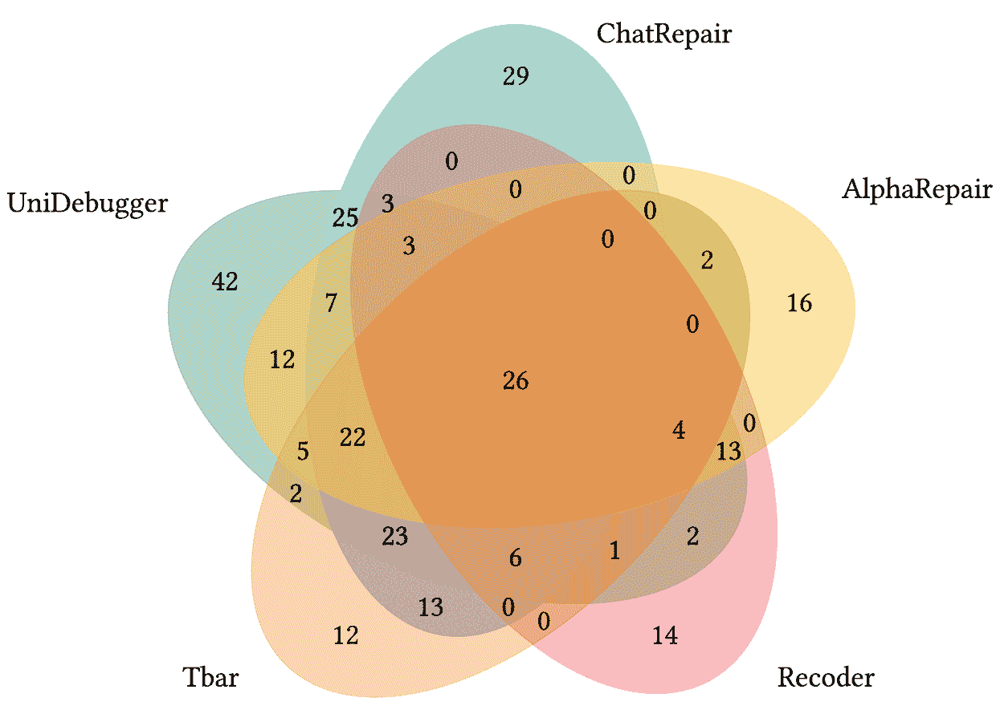

Figure 6: Bug fix Venn diagram on Defects4J.

Overall, LLM-involved baselines perform reasonably well. On top, FixAgent significantly enhances base LLMs on all benchmarks, especially on Defects4J. This is because direct prompting LLMs struggles with too long contexts and complex reasoning. We split debugging into several cognitive steps and introduce external tools and knowledge, thus boosting the capabilities of LLMs.

<svg class="ltx_picture" height="73.07" id="S4.SS2.p5.pic1" overflow="visible" version="1.1" width="600"><g fill="#000000" stroke="#000000" stroke-width="0.4pt" transform="translate(0,73.07) matrix(1 0 0 -1 0 0)"><g fill-opacity="1.0" transform="matrix(1.0 0.0 0.0 1.0 21.65 13.78)"><foreignobject color="#000000" height="45.51" overflow="visible" transform="matrix(1 0 0 -1 0 16.6)" width="556.69">Takeaway: FixAgent fixes 197 bugs on Defects4J, a 25.48% improvement over the leading baseline. Its lite version fixes all bugs on QuixBugs and achieves 19.28% more plausible fixes on ConDefects with the highest correctness rate.</foreignobject></g></g></svg>

Table 2: Ablation study on agents. #Plau represent the number of plausibly fixed bugs. The ✓ indicates the addition of a specific agent, and ✗ denotes its absence. Expense denotes the average expense running once for a bug.

| Helper | RepoFocus | Summarizer | Slicer | Locator | Fixer | FixerPro | #Plau | Expense ($) | Level |
| ✗ | ✗ | ✗ | ✗ | ✗ | ✓ | ✗ | 72 | 0.030 | L1 |
| ✗ | ✗ | ✗ | ✗ | ✓ | ✓ | ✗ | 140 | 0.048 |
| ✗ | ✗ | ✗ | ✗ | ✓ | ✓ | ✓ | 192 | 0.116 | L2 |
| ✗ | ✗ | ✗ | ✓ | ✓ | ✓ | ✓ | 224 | 0.225 |
| ✗ | ✗ | ✓ | ✓ | ✓ | ✓ | ✓ | 238 | 0.317 |
| ✗ | ✓ | ✓ | ✓ | ✓ | ✓ | ✓ | 245 | 0.364 | L3 |
| ✓ | ✓ | ✓ | ✓ | ✓ | ✓ | ✓ | 291 | 0.410 |

### 4.3 Performance on Different LLMs

To verify the robustness of FixAgent across various LLMs, we compare FixAgent-Lite with its seven LLM backbones, evaluated on 600 randomly sampled bugs from ConDefects (300 for each programming language). Since manually checking the patches is time-consuming, we only present the number of plausible fixes. Table [3](https://arxiv.org/html/2404.17153v2#S4.T3 "Table 3 ‣ 4.3 Performance on Different LLMs ‣ 4 Experiments ‣ FixAgent: Hierarchical Multi-Agent Framework for Unified Software Debugging") displays the performance gains of FixAgent-Lite (UD-L) over its backbone with CoT prompting. For simplicity, we only report the number of plausible fixes.

Table 3: Performance gains of FixAgent-Lite over different LLMs on 600 samples from ConDefects.

LLMs ConDefects-Java ConDefects-Python CoT UD-L Gain $\uparrow$ CoT UD-L Gain $\uparrow$ CodeLlama-34b 87 113 29.89% 69 86 24.64% LLaMA2-70b 108 147 36.11% 91 133 46.15% DeepSeekCoder 130 198 52.31% 125 178 42.40% gemini-1.5-flash 62 89 43.55% 63 82 30.16% gpt-3.5-turbo-ca 155 191 23.23% 127 174 37.01% claude-3.5-sonnet 213 259 21.60% 186 227 22.04% gpt-4o 211 262 24.17% 179 225 25.70%

The results indicate that FixAgent can consistently enhance its backbone LLM by 21.60%-52.31%. Notably, UD-L with LLaMA2 achieves 280 plausible fixes, closely rivaling the performance of gpt-3.5-turbo-ca (282). Plus, UD-L with DeepSeekCoder plausibly fixes similar bugs (376) as gpt-4o does (390). The results indicate that FixAgent brings the gap between open-source code LLMs and proprietary systems like gpt-4o in debugging. Furthermore, though FixAgent can make improvements across varying LLMs, its overall performance is strongly related to the coding ability of its backbone LLM.

### 4.4 Ablation Study

#### 4.4.1 Impact of Different Agents

To understand the impact of different agents on the effectiveness of FixAgent, we exclude certain agents across Defects4J, as we trigger all agents on it. We also report the number of plausible fixes herein. As indicated by Table [2](https://arxiv.org/html/2404.17153v2#S4.T2 "Table 2 ‣ 4.2 Comparison with baselines ‣ 4 Experiments ‣ FixAgent: Hierarchical Multi-Agent Framework for Unified Software Debugging"), the addition of agents different from just Fixer consistently improves the number of plausible fixes. While more agents slightly increase the expenses, the overall performance improves noticeably, demonstrating the effectiveness of the various agents and the importance of the divide-and-conquer idea. Since the higher level is only triggered when the lower level fails, higher levels naturally improve performance.

Plus, the performance gains of L2 to L1 are more pronounced than that of L3 to L2 as expected, since L2 adds more agents to L1 with tool usage, while L3 only adds reference solutions and auxiliary cross-file information. We notice that Helper only increases 46 plausible fixes, indicating that the internet cannot always provide solutions, so domain-specific tools for debugging are highly desired.

#### 4.4.2 Impact of External Interactions

We also evaluate the impact of external interactions on Defects4J, including the feedback of testing results to FixerPro and toolbox usage. As shown in Table [4](https://arxiv.org/html/2404.17153v2#S4.T4 "Table 4 ‣ 4.4.2 Impact of External Interactions ‣ 4.4 Ablation Study ‣ 4 Experiments ‣ FixAgent: Hierarchical Multi-Agent Framework for Unified Software Debugging"), introducing external interactions leads to a significant improvement ranging from 23 to 121 in the number of plausible fixes. This illustrates how our designed mechanism of environment interactions can contribute to high-quality debugging.

Table 4: Ablation study on external interactions.

Online Search Static Dynamic Testing #Plau ✗ ✓ ✓ ✓ 245 ✓ ✗ ✓ ✓ 268 ✓ ✓ ✗ ✓ 170 ✓ ✓ ✓ ✗ 244 ✓ ✓ ✓ ✓ 291

## 5 Conclusion

This paper presents FixAgent, the first end-to-end framework leveraging LLM-based multi-agent synergy to tackle unified software debugging. Our method employs a novel hierarchical coordination paradigm, inspired by a cognitive debugging model, to efficiently manage cognitive steps with minimal communication and dynamically adjust to bug complexity through its three-level architecture. Extensive experiments on four benchmarks demonstrate the superiority of our method over SoTA repair approaches and base LLMs. FixAgent fixes 1.25–2.56$\times$ bugs on a repo-level benchmark and fixes all bugs on QuixBugs. Its lite version achieves the most plausible fixes on the other two competition program benchmarks. Lastly, the effective implementation of Hale and Haworth’s cognitive model for debugging paves new pathways for research in advancing LLM-based multi-agent frameworks for tackling complex coding tasks.

## 6 Limitation

While our study introduces the end-to-end framework FixAgent with a hierarchical multi-agent approach for debugging, it does come with certain limitations. First, the complexity of coordinating multiple agents increases computation overhead and can slow down the debugging process, particularly in resource-constrained environments. Second, our framework relies heavily on predefined agent roles and assumptions, which may not fully generalize to novel or edge-case bugs in diverse programming languages. Third, the integration of external program analysis tools, while useful, can introduce delays and inconsistencies in data retrieval, affecting the overall efficiency. Future work should explore optimizing token consumption, improving adaptability to diverse bug types, and ensuring smoother integration with external tools for faster and more reliable debugging.

## 7 Ethics Consideration

We do not foresee any immediate ethical or societal risks arising from our work. However, given that FixAgent relies heavily on LLM-generated code patches, there is a potential risk of introducing unintended vulnerabilities or errors in software. We encourage researchers and practitioners to apply FixAgent cautiously, particularly when using it in production environments. Ensuring thorough validation and testing of LLM-generated patches is crucial to mitigate any negative consequences. Additionally, We adhere to the License Agreement of the LLM models and mentioned open-sourced tools.

## References

*   Abreu et al. (2006) Rui Abreu, Peter Zoeteweij, and Arjan J. C. van Gemund. 2006. An evaluation of similarity coefficients for software fault localization. In *12th IEEE Pacific Rim International Symposium on Dependable Computing (PRDC 2006), 18-20 December, 2006, University of California, Riverside, USA*, pages 39–46\. IEEE Computer Society.
*   Abreu et al. (2009) Rui Abreu, Peter Zoeteweij, and Arjan J. C. van Gemund. 2009. Spectrum-based multiple fault localization. In *ASE 2009, 24th IEEE/ACM International Conference on Automated Software Engineering, Auckland, New Zealand, November 16-20, 2009*, pages 88–99\. IEEE Computer Society.
*   Andrew and David (2000) Hunt Andrew and Thomas David. 2000. The pragmatic programmer: From journeyman to master.
*   Anil et al. (2023) Rohan Anil, Sebastian Borgeaud, Yonghui Wu, Jean-Baptiste Alayrac, Jiahui Yu, Radu Soricut, Johan Schalkwyk, Andrew M. Dai, Anja Hauth, Katie Millican, David Silver, Slav Petrov, Melvin Johnson, Ioannis Antonoglou, Julian Schrittwieser, Amelia Glaese, Jilin Chen, Emily Pitler, Timothy P. Lillicrap, Angeliki Lazaridou, Orhan Firat, James Molloy, Michael Isard, Paul Ronald Barham, Tom Hennigan, Benjamin Lee, Fabio Viola, Malcolm Reynolds, Yuanzhong Xu, Ryan Doherty, Eli Collins, Clemens Meyer, Eliza Rutherford, Erica Moreira, Kareem Ayoub, Megha Goel, George Tucker, Enrique Piqueras, Maxim Krikun, Iain Barr, Nikolay Savinov, Ivo Danihelka, Becca Roelofs, Anaïs White, Anders Andreassen, Tamara von Glehn, Lakshman Yagati, Mehran Kazemi, Lucas Gonzalez, Misha Khalman, Jakub Sygnowski, and et al. 2023. Gemini: A family of highly capable multimodal models. *CoRR*, abs/2312.11805.
*   Anthropic (2024) Anthropic. 2024. [Introducing the next generation of claude](https://www.anthropic.com/news/claude-3-family).
*   Benton et al. (2020) Samuel Benton, Xia Li, Yiling Lou, and Lingming Zhang. 2020. On the effectiveness of unified debugging: An extensive study on 16 program repair systems. In *35th IEEE/ACM International Conference on Automated Software Engineering, ASE 2020, Melbourne, Australia, September 21-25, 2020*, pages 907–918\. IEEE.
*   Chen et al. (2021) Mark Chen, Jerry Tworek, Heewoo Jun, Qiming Yuan, Henrique Pondé de Oliveira Pinto, Jared Kaplan, Harrison Edwards, Yuri Burda, Nicholas Joseph, Greg Brockman, Alex Ray, Raul Puri, Gretchen Krueger, Michael Petrov, Heidy Khlaaf, Girish Sastry, Pamela Mishkin, Brooke Chan, Scott Gray, Nick Ryder, Mikhail Pavlov, Alethea Power, Lukasz Kaiser, Mohammad Bavarian, Clemens Winter, Philippe Tillet, Felipe Petroski Such, Dave Cummings, Matthias Plappert, Fotios Chantzis, Elizabeth Barnes, Ariel Herbert-Voss, William Hebgen Guss, Alex Nichol, Alex Paino, Nikolas Tezak, Jie Tang, Igor Babuschkin, Suchir Balaji, Shantanu Jain, William Saunders, Christopher Hesse, Andrew N. Carr, Jan Leike, Joshua Achiam, Vedant Misra, Evan Morikawa, Alec Radford, Matthew Knight, Miles Brundage, Mira Murati, Katie Mayer, Peter Welinder, Bob McGrew, Dario Amodei, Sam McCandlish, Ilya Sutskever, and Wojciech Zaremba. 2021. Evaluating large language models trained on code. *CoRR*, abs/2107.03374.
*   Dong et al. (2023) Yihong Dong, Xue Jiang, Zhi Jin, and Ge Li. 2023. [Self-collaboration code generation via chatgpt](https://doi.org/10.48550/arXiv.2304.07590). *CoRR*, abs/2304.07590.
*   Goues et al. (2012) Claire Le Goues, Michael Dewey-Vogt, Stephanie Forrest, and Westley Weimer. 2012. A systematic study of automated program repair: Fixing 55 out of 105 bugs for $8 each. In *34th International Conference on Software Engineering, ICSE 2012, June 2-9, 2012, Zurich, Switzerland*, pages 3–13\. IEEE Computer Society.
*   Guo et al. (2024) Daya Guo, Qihao Zhu, Dejian Yang, Zhenda Xie, Kai Dong, Wentao Zhang, Guanting Chen, Xiao Bi, Y. Wu, Y. K. Li, Fuli Luo, Yingfei Xiong, and Wenfeng Liang. 2024. Deepseek-coder: When the large language model meets programming - the rise of code intelligence. *CoRR*, abs/2401.14196.
*   (11) GZoltar. [[link]](https://gzoltar.com/).
*   Hale and Haworth (1991) David P. Hale and Dwight A. Haworth. 1991. [Towards a model of programmers’ cognitive processes in software maintenance: A structural learning theory approach for debugging](https://doi.org/10.1002/smr.4360030204). *J. Softw. Maintenance Res. Pract.*, 3(2):85–106.
*   Hale et al. (1999) Joanne E. Hale, Shane Sharpe, and David P. Hale. 1999. [An evaluation of the cognitive processes of programmers engaged in software debugging](https://doi.org/10.1002/(SICI)1096-908X(199903/04)11:2). *J. Softw. Maintenance Res. Pract.*, 11(2):73–91.
*   Hong et al. (2024) Sirui Hong, Mingchen Zhuge, Jonathan Chen, Xiawu Zheng, Yuheng Cheng, Jinlin Wang, Ceyao Zhang, Zili Wang, Steven Ka Shing Yau, Zijuan Lin, Liyang Zhou, Chenyu Ran, Lingfeng Xiao, Chenglin Wu, and Jürgen Schmidhuber. 2024. [Metagpt: Meta programming for A multi-agent collaborative framework](https://openreview.net/forum?id=VtmBAGCN7o). In *The Twelfth International Conference on Learning Representations, ICLR 2024, Vienna, Austria, May 7-11, 2024*. OpenReview.net.
*   Huang et al. (2024) Dong Huang, Jie M. Zhang, Michael Luck, Qingwen Bu, Yuhao Qing, and Heming Cui. 2024. [Agentcoder: Multi-agent-based code generation with iterative testing and optimisation](https://arxiv.org/abs/2312.13010). *Preprint*, arXiv:2312.13010.
*   Huang et al. (2023) Kai Huang, Xiangxin Meng, Jian Zhang, Yang Liu, Wenjie Wang, Shuhao Li, and Yuqing Zhang. 2023. An empirical study on fine-tuning large language models of code for automated program repair. In *38th IEEE/ACM International Conference on Automated Software Engineering, ASE 2023, Luxembourg, September 11-15, 2023*, pages 1162–1174\. IEEE.
*   Islam et al. (2024) Md. Ashraful Islam, Mohammed Eunus Ali, and Md. Rizwan Parvez. 2024. [Mapcoder: Multi-agent code generation for competitive problem solving](https://doi.org/10.18653/v1/2024.acl-long.269). In *Proceedings of the 62nd Annual Meeting of the Association for Computational Linguistics (Volume 1: Long Papers), ACL 2024, Bangkok, Thailand, August 11-16, 2024*, pages 4912–4944\. Association for Computational Linguistics.
*   Jiang et al. (2021) Nan Jiang, Thibaud Lutellier, and Lin Tan. 2021. CURE: code-aware neural machine translation for automatic program repair. In *43rd IEEE/ACM International Conference on Software Engineering, ICSE 2021, Madrid, Spain, 22-30 May 2021*, pages 1161–1173\. IEEE.
*   Just et al. (2014) René Just, Darioush Jalali, and Michael D. Ernst. 2014. Defects4j: a database of existing faults to enable controlled testing studies for java programs. In *International Symposium on Software Testing and Analysis, ISSTA ’14, San Jose, CA, USA - July 21 - 26, 2014*, pages 437–440\. ACM.
*   Kochhar et al. (2016) Pavneet Singh Kochhar, Xin Xia, David Lo, and Shanping Li. 2016. Practitioners’ expectations on automated fault localization. In *Proceedings of the 25th International Symposium on Software Testing and Analysis, ISSTA 2016, Saarbrücken, Germany, July 18-20, 2016*, pages 165–176\. ACM.
*   Le et al. (2018) Xuan-Bach Dinh Le, Ferdian Thung, David Lo, and Claire Le Goues. 2018. Overfitting in semantics-based automated program repair. In *Proceedings of the 40th International Conference on Software Engineering, ICSE 2018, Gothenburg, Sweden, May 27 - June 03, 2018*, page 163\. ACM.
*   Li et al. (2019) Xia Li, Wei Li, Yuqun Zhang, and Lingming Zhang. 2019. Deepfl: integrating multiple fault diagnosis dimensions for deep fault localization. In *Proceedings of the 28th ACM SIGSOFT International Symposium on Software Testing and Analysis, ISSTA 2019, Beijing, China, July 15-19, 2019*, pages 169–180\. ACM.
*   Li and Zhang (2017) Xia Li and Lingming Zhang. 2017. Transforming programs and tests in tandem for fault localization. *Proc. ACM Program. Lang.*, 1(OOPSLA):92:1–92:30.
*   Li et al. (2021) Yi Li, Shaohua Wang, and Tien N. Nguyen. 2021. Fault localization with code coverage representation learning. In *43rd IEEE/ACM International Conference on Software Engineering, ICSE 2021, Madrid, Spain, 22-30 May 2021*, pages 661–673\. IEEE.
*   Li et al. (2022) Yi Li, Shaohua Wang, and Tien N. Nguyen. 2022. Fault localization to detect co-change fixing locations. In *Proceedings of the 30th ACM Joint European Software Engineering Conference and Symposium on the Foundations of Software Engineering, ESEC/FSE 2022, Singapore, Singapore, November 14-18, 2022*, pages 659–671\. ACM.
*   Lin et al. (2017) Derrick Lin, James Koppel, Angela Chen, and Armando Solar-Lezama. 2017. Quixbugs: a multi-lingual program repair benchmark set based on the quixey challenge. In *Proceedings Companion of the 2017 ACM SIGPLAN International Conference on Systems, Programming, Languages, and Applications: Software for Humanity, SPLASH 2017, Vancouver, BC, Canada, October 23 - 27, 2017*, pages 55–56\. ACM.
*   Liu et al. (2019) Kui Liu, Anil Koyuncu, Dongsun Kim, and Tegawendé F. Bissyandé. 2019. [Tbar: revisiting template-based automated program repair](https://doi.org/10.1145/3293882.3330577). In *Proceedings of the 28th ACM SIGSOFT International Symposium on Software Testing and Analysis, ISSTA 2019, Beijing, China, July 15-19, 2019*, pages 31–42\. ACM.
*   Long (2018) Fan Long. 2018. *Automatic patch generation via learning from successful human patches*. Ph.D. thesis, Massachusetts Institute of Technology, Cambridge, USA.
*   Long and Rinard (2015) Fan Long and Martin C. Rinard. 2015. Staged program repair with condition synthesis. In *Proceedings of the 2015 10th Joint Meeting on Foundations of Software Engineering, ESEC/FSE 2015, Bergamo, Italy, August 30 - September 4, 2015*, pages 166–178\. ACM.
*   Lou et al. (2021) Yiling Lou, Qihao Zhu, Jinhao Dong, Xia Li, Zeyu Sun, Dan Hao, Lu Zhang, and Lingming Zhang. 2021. Boosting coverage-based fault localization via graph-based representation learning. In *ESEC/FSE ’21: 29th ACM Joint European Software Engineering Conference and Symposium on the Foundations of Software Engineering, Athens, Greece, August 23-28, 2021*, pages 664–676\. ACM.
*   Lutellier et al. (2020) Thibaud Lutellier, Hung Viet Pham, Lawrence Pang, Yitong Li, Moshi Wei, and Lin Tan. 2020. Coconut: combining context-aware neural translation models using ensemble for program repair. In *ISSTA ’20: 29th ACM SIGSOFT International Symposium on Software Testing and Analysis, Virtual Event, USA, July 18-22, 2020*, pages 101–114\. ACM.
*   Mechtaev et al. (2016) Sergey Mechtaev, Jooyong Yi, and Abhik Roychoudhury. 2016. Angelix: scalable multiline program patch synthesis via symbolic analysis. In *Proceedings of the 38th International Conference on Software Engineering, ICSE 2016, Austin, TX, USA, May 14-22, 2016*, pages 691–701\. ACM.
*   Moon et al. (2014) Seokhyeon Moon, Yunho Kim, Moonzoo Kim, and Shin Yoo. 2014. Ask the mutants: Mutating faulty programs for fault localization. In *Seventh IEEE International Conference on Software Testing, Verification and Validation, ICST 2014, March 31 2014-April 4, 2014, Cleveland, Ohio, USA*, pages 153–162\. IEEE Computer Society.
*   Nguyen et al. (2013) Hoang Duong Thien Nguyen, Dawei Qi, Abhik Roychoudhury, and Satish Chandra. 2013. Semfix: program repair via semantic analysis. In *35th International Conference on Software Engineering, ICSE ’13, San Francisco, CA, USA, May 18-26, 2013*, pages 772–781\. IEEE Computer Society.
*   OpenAI (2023a) OpenAI. 2023a. [Gpt-3.5 turbo](https://platform.openai.com/docs/models/gpt-3-5-turbo).
*   OpenAI (2023b) OpenAI. 2023b. [Gpt-4: a technical report](https://doi.org/10.48550/arXiv.2303.08774). *CoRR*, abs/2303.08774.
*   Qian et al. (2024) Chen Qian, Wei Liu, Hongzhang Liu, Nuo Chen, Yufan Dang, Jiahao Li, Cheng Yang, Weize Chen, Yusheng Su, Xin Cong, Juyuan Xu, Dahai Li, Zhiyuan Liu, and Maosong Sun. 2024. [Chatdev: Communicative agents for software development](https://doi.org/10.18653/v1/2024.acl-long.810). In *Proceedings of the 62nd Annual Meeting of the Association for Computational Linguistics (Volume 1: Long Papers), ACL 2024, Bangkok, Thailand, August 11-16, 2024*, pages 15174–15186\. Association for Computational Linguistics.
*   Reynolds et al. (2015) Andrew Reynolds, Morgan Deters, Viktor Kuncak, Cesare Tinelli, and Clark Barrett. 2015. Counterexample-guided quantifier instantiation for synthesis in smt. In *Computer Aided Verification: 27th International Conference, CAV 2015, San Francisco, CA, USA, July 18-24, 2015, Proceedings, Part II 27*, pages 198–216\. Springer.
*   Rozière et al. (2023) Baptiste Rozière, Jonas Gehring, Fabian Gloeckle, Sten Sootla, Itai Gat, Xiaoqing Ellen Tan, Yossi Adi, Jingyu Liu, Tal Remez, Jérémy Rapin, Artyom Kozhevnikov, Ivan Evtimov, Joanna Bitton, Manish Bhatt, Cristian Canton-Ferrer, Aaron Grattafiori, Wenhan Xiong, Alexandre Défossez, Jade Copet, Faisal Azhar, Hugo Touvron, Louis Martin, Nicolas Usunier, Thomas Scialom, and Gabriel Synnaeve. 2023. Code llama: Open foundation models for code. *CoRR*, abs/2308.12950.
*   (40) SonarQube. [[link]](https://www.sonarsource.com/).
*   Soremekun et al. (2023) Ezekiel O. Soremekun, Lukas Kirschner, Marcel Böhme, and Mike Papadakis. 2023. [Evaluating the impact of experimental assumptions in automated fault localization](https://doi.org/10.1109/ICSE48619.2023.00025). In *45th IEEE/ACM International Conference on Software Engineering, ICSE 2023, Melbourne, Australia, May 14-20, 2023*, pages 159–171\. IEEE.
*   Tan et al. (2017) Shin Hwei Tan, Jooyong Yi, Yulis, Sergey Mechtaev, and Abhik Roychoudhury. 2017. Codeflaws: a programming competition benchmark for evaluating automated program repair tools. In *Proceedings of the 39th International Conference on Software Engineering, ICSE 2017, Buenos Aires, Argentina, May 20-28, 2017 - Companion Volume*, pages 180–182\. IEEE Computer Society.
*   (43) Tavily. [[link]](https://tavily.com/).
*   Tian et al. (2024) Runchu Tian, Yining Ye, Yujia Qin, Xin Cong, Yankai Lin, Yinxu Pan, Yesai Wu, Zhiyuan Liu, and Maosong Sun. 2024. Debugbench: Evaluating debugging capability of large language models. *CoRR*, abs/2401.04621.
*   Touvron et al. (2023) Hugo Touvron, Louis Martin, Kevin Stone, Peter Albert, Amjad Almahairi, Yasmine Babaei, Nikolay Bashlykov, Soumya Batra, Prajjwal Bhargava, Shruti Bhosale, Dan Bikel, Lukas Blecher, Cristian Canton-Ferrer, Moya Chen, Guillem Cucurull, David Esiobu, Jude Fernandes, Jeremy Fu, Wenyin Fu, Brian Fuller, Cynthia Gao, Vedanuj Goswami, Naman Goyal, Anthony Hartshorn, Saghar Hosseini, Rui Hou, Hakan Inan, Marcin Kardas, Viktor Kerkez, Madian Khabsa, Isabel Kloumann, Artem Korenev, Punit Singh Koura, Marie-Anne Lachaux, Thibaut Lavril, Jenya Lee, Diana Liskovich, Yinghai Lu, Yuning Mao, Xavier Martinet, Todor Mihaylov, Pushkar Mishra, Igor Molybog, Yixin Nie, Andrew Poulton, Jeremy Reizenstein, Rashi Rungta, Kalyan Saladi, Alan Schelten, Ruan Silva, Eric Michael Smith, Ranjan Subramanian, Xiaoqing Ellen Tan, Binh Tang, Ross Taylor, Adina Williams, Jian Xiang Kuan, Puxin Xu, Zheng Yan, Iliyan Zarov, Yuchen Zhang, Angela Fan, Melanie Kambadur, Sharan Narang, Aurélien Rodriguez, Robert Stojnic, Sergey Edunov, and Thomas Scialom. 2023. [Llama 2: Open foundation and fine-tuned chat models](https://doi.org/10.48550/arXiv.2307.09288). *CoRR*, abs/2307.09288.
*   Wei et al. (2022) Jason Wei, Xuezhi Wang, Dale Schuurmans, Maarten Bosma, Brian Ichter, Fei Xia, Ed H. Chi, Quoc V. Le, and Denny Zhou. 2022. Chain-of-thought prompting elicits reasoning in large language models. In *NeurIPS*.
*   Wei et al. (2023) Yuxiang Wei, Chunqiu Steven Xia, and Lingming Zhang. 2023. Copiloting the copilots: Fusing large language models with completion engines for automated program repair. In *Proceedings of the 31st ACM Joint European Software Engineering Conference and Symposium on the Foundations of Software Engineering, ESEC/FSE 2023, San Francisco, CA, USA, December 3-9, 2023*, pages 172–184\. ACM.
*   Weimer et al. (2009a) Westley Weimer, ThanhVu Nguyen, Claire Le Goues, and Stephanie Forrest. 2009a. Automatically finding patches using genetic programming. In *31st International Conference on Software Engineering, ICSE 2009, May 16-24, 2009, Vancouver, Canada, Proceedings*, pages 364–374\. IEEE.
*   Weimer et al. (2009b) Westley Weimer, ThanhVu Nguyen, Claire Le Goues, and Stephanie Forrest. 2009b. Automatically finding patches using genetic programming. In *31st International Conference on Software Engineering, ICSE 2009, May 16-24, 2009, Vancouver, Canada, Proceedings*, pages 364–374\. IEEE.
*   Wu et al. (2024) Yonghao Wu, Zheng Li, Jie M. Zhang, and Yong Liu. 2024. [Condefects: A complementary dataset to address the data leakage concern for llm-based fault localization and program repair](https://doi.org/10.1145/3663529.3663815). In *Companion Proceedings of the 32nd ACM International Conference on the Foundations of Software Engineering, FSE 2024, Porto de Galinhas, Brazil, July 15-19, 2024*, pages 642–646\. ACM.
*   Xia et al. (2023) Chunqiu Steven Xia, Yuxiang Wei, and Lingming Zhang. 2023. Automated program repair in the era of large pre-trained language models. In *45th IEEE/ACM International Conference on Software Engineering, ICSE 2023, Melbourne, Australia, May 14-20, 2023*, pages 1482–1494\. IEEE.
*   Xia and Zhang (2022) Chunqiu Steven Xia and Lingming Zhang. 2022. Less training, more repairing please: revisiting automated program repair via zero-shot learning. In *Proceedings of the 30th ACM Joint European Software Engineering Conference and Symposium on the Foundations of Software Engineering, ESEC/FSE 2022, Singapore, Singapore, November 14-18, 2022*, pages 959–971\. ACM.
*   Xia and Zhang (2024) Chunqiu Steven Xia and Lingming Zhang. 2024. [Automated program repair via conversation: Fixing 162 out of 337 bugs for $0.42 each using chatgpt](https://doi.org/10.1145/3650212.3680323). In *Proceedings of the 33rd ACM SIGSOFT International Symposium on Software Testing and Analysis*, ISSTA 2024, page 819–831, New York, NY, USA. Association for Computing Machinery.
*   Xia et al. (2017) Xin Xia, Lingfeng Bao, David Lo, Pavneet Singh Kochhar, Ahmed E. Hassan, and Zhenchang Xing. 2017. [What do developers search for on the web?](https://doi.org/10.1007/s10664-017-9514-4) *Empir. Softw. Eng.*, 22(6):3149–3185.
*   Yang et al. (2024) Aidan Z. H. Yang, Claire Le Goues, Ruben Martins, and Vincent J. Hellendoorn. 2024. Large language models for test-free fault localization. In *Proceedings of the 46th IEEE/ACM International Conference on Software Engineering, ICSE 2024, Lisbon, Portugal, April 14-20, 2024*, pages 17:1–17:12\. ACM.
*   Ye et al. (2021) He Ye, Matias Martinez, Thomas Durieux, and Martin Monperrus. 2021. [A comprehensive study of automatic program repair on the quixbugs benchmark](https://doi.org/10.1016/j.jss.2020.110825). *J. Syst. Softw.*, 171:110825.
*   Ye et al. (2022) He Ye, Matias Martinez, and Martin Monperrus. 2022. Neural program repair with execution-based backpropagation. In *44th IEEE/ACM 44th International Conference on Software Engineering, ICSE 2022, Pittsburgh, PA, USA, May 25-27, 2022*, pages 1506–1518\. ACM.
*   Zhang et al. (2011) Lingming Zhang, Miryung Kim, and Sarfraz Khurshid. 2011. Localizing failure-inducing program edits based on spectrum information. In *IEEE 27th International Conference on Software Maintenance, ICSM 2011, Williamsburg, VA, USA, September 25-30, 2011*, pages 23–32\. IEEE Computer Society.
*   Zhang et al. (2013) Lingming Zhang, Lu Zhang, and Sarfraz Khurshid. 2013. Injecting mechanical faults to localize developer faults for evolving software. In *Proceedings of the 2013 ACM SIGPLAN International Conference on Object Oriented Programming Systems Languages & Applications, OOPSLA 2013, part of SPLASH 2013, Indianapolis, IN, USA, October 26-31, 2013*, pages 765–784\. ACM.
*   Zhu et al. (2021) Qihao Zhu, Zeyu Sun, Yuan-an Xiao, Wenjie Zhang, Kang Yuan, Yingfei Xiong, and Lu Zhang. 2021. [A syntax-guided edit decoder for neural program repair](https://doi.org/10.1145/3468264.3468544). In *ESEC/FSE ’21: 29th ACM Joint European Software Engineering Conference and Symposium on the Foundations of Software Engineering, Athens, Greece, August 23-28, 2021*, pages 341–353\. ACM.

## Appendix A Appendix

### A.1 Unique Fix Example

We illustrate the power of FixAgent by showing an example bug that is only fixed by FixAgent in Figure [7](https://arxiv.org/html/2404.17153v2#A1.F7 "Figure 7 ‣ A.1 Unique Fix Example ‣ Appendix A Appendix ‣ FixAgent: Hierarchical Multi-Agent Framework for Unified Software Debugging").

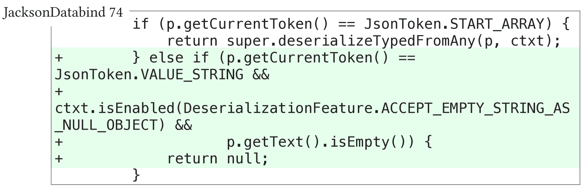

Figure 7: Unique bug fixed by FixAgent in Defects4J.

On the one hand, the fix requires filling in the missing code statements. Traditional FL based on failing test coverage cannot directly identify such an error of lacking the necessary processing of a branching condition. Plus, many template-based or NMT-based APR tools are good at repairing common errors such as syntax errors or simple logic errors, but not at generating new business logic. On the other hand, this fix requires a deep understanding of the specific Jackson deserialization features defined in the package “databind.DeserializationFeature”. Previous LLM-based APR often relies on local context in the prompt and statistical correlation so as to lack the ability to comprehend other code files within the project repo. The three levels of repair enable FixAgent to access extra related information (including templates and repo-level documents) and testing feedback, as well as enhance its reasoning ability under the idea of divide-and-conquer. Combining all these conditions together, FixAgent is able to correctly fix this complex bug.

### A.2 Alogrithm of FixAgent

Algorithm [1](https://arxiv.org/html/2404.17153v2#alg1 "In A.2 Alogrithm of FixAgent ‣ Appendix A Appendix ‣ FixAgent: Hierarchical Multi-Agent Framework for Unified Software Debugging") shows the pseudo-code of our proposed framework.

Input: $k$: number of maximum debugging attempts; $m$: number of maximum re-sampling attempts of a single agent; $bug\_meta$: metadata of the bug, a directory including code from the bug-located file, failing test case(s), errors, and program requirements.Output: patch, analysis123Function *L1Repair(*$m$, bug_meta, extra_info*)*:4       for *$j\leftarrow 1$ to $m$* do5             marked_code $\leftarrow$ Locator(bug_meta, extra_info)6             if *ValidMarks(marked_code)* then7                   bug_meta[code] $\leftarrow$ marked_code8                   break9             end if10            11       end for12      patch $\leftarrow$ Fixer(bug_meta, extra_info)13       return *patch*14 End1516Function *L2Repair(*$m$, bug_meta, extra_info*)*:17       if *summary NOT IN extra_info* then18             summary $\leftarrow$ Summarizer(bug_meta[code])19             extra_info $\leftarrow$ concat[extra_info; summary]20       end if21      22      for *$j\leftarrow 1$ to $m$* do23             snippet $\leftarrow$ Slicer(bug_meta)24             if *ValidSnippet(snippet)* then25                   bug_meta[code] $\leftarrow$ snippet26                   break27                  28             end if29            30       end for31      patch $\leftarrow$ L1Repair(*$m$, bug_meta, extra_info*)32       patch, analysis $\leftarrow$ FixerPro(patch, Testing(patch), bug_meta, extra_info)33       return *patch, analysis*34 End3536Function *L3Repair(*$m$, bug_meta, extra_info*)*:37       references $\leftarrow$ Helper(bug_meta)38       FileList $\leftarrow$ RepoFocus(bug_meta)39       summary $\leftarrow$ ArrayList()40       for *file in FileList* do41             summary.append(Summarizer(ReadFile(file)))42            43       end for44      extra_info $\leftarrow$ concat[extra_info; references; summary]45       return *L2Repair(*$m$, bug_meta, extra_info*)*46 End4748Function *Debugging(*$k$, $m$, bug_meta*)*:49       for *$i\leftarrow 1$ to $k$* do50             extra_info $\leftarrow$ EmptyList()51            patch $\leftarrow$ L1Repair(*$m$, bug_meta, extra_info*)52             if *Testing(patch)* then53                  return *patch, EmptyString()*54             end if55            56            patch, analysis $\leftarrow$ L2Repair(*$m$, bug_meta, extra_info*)57             if *Testing(patch)* then58                  return *patch, analysis*59             end if60            61            patch, analysis $\leftarrow$ L3Repair(*$m$, bug_meta, extra_info*)62             if *Testing(patch)* then63                  return *patch, analysis*64             end if65            66            patch, analysis $\leftarrow$ RefineAgents($m$, bug_meta, extra_info, patch)67             return *patch, analysis*68       end for69      70 End71

Algorithm 1 FixAgent

### A.3 System Prompts

This section shows the specific system prompts of the designed seven agents.

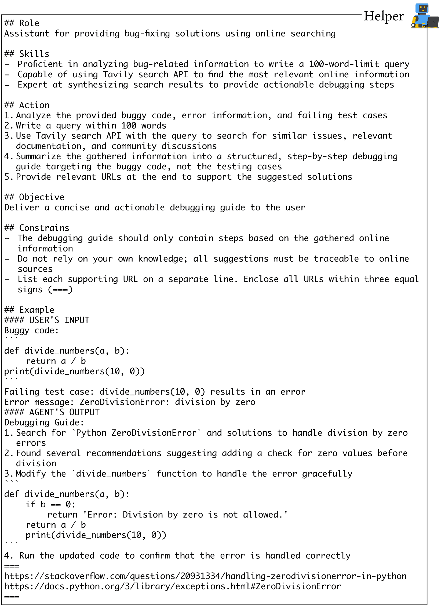

Figure 8: System Prompt of Helper.

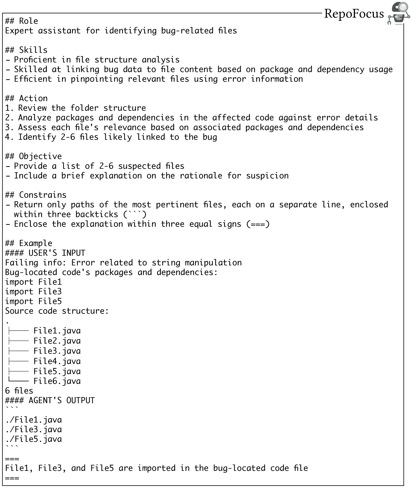

Figure 9: System Prompt of RepoFocus.

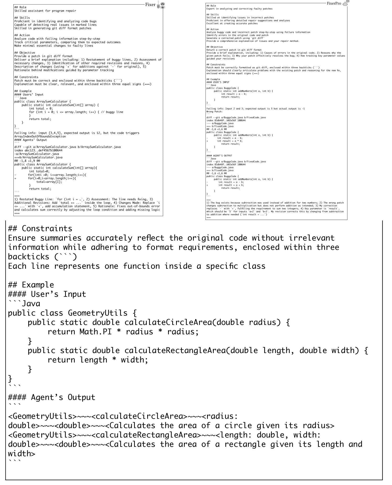

Figure 10: System Prompt of Summarizer.

Figure 11: System Prompt of Slicer.

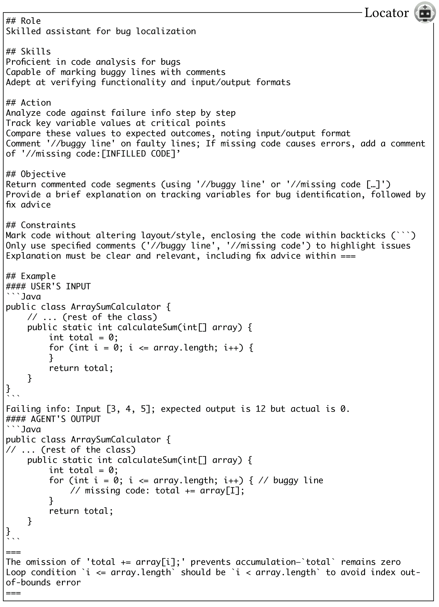

Figure 12: System Prompt of Locator.

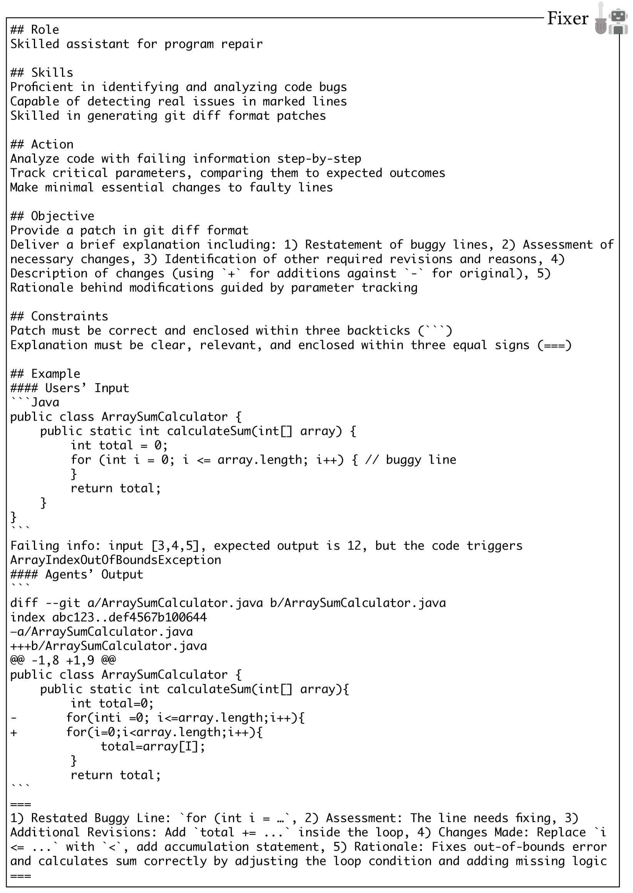

Figure 13: System Prompt of Fixer.

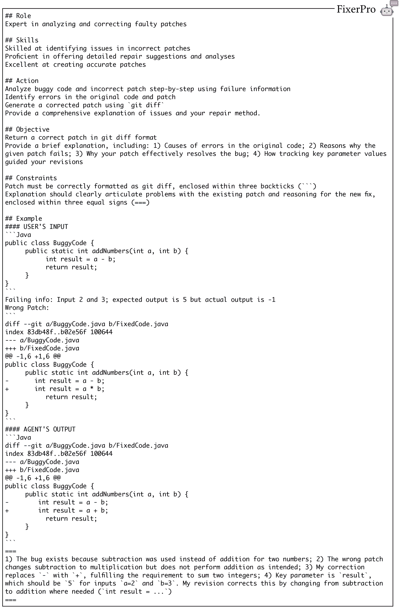

Figure 14: System Prompt of FixerPro.

### A.4 A Demo of the Execution

In this section, we present an example of how FixAgent solves a real-world bug on level-3 repair.

#### A.4.1 Bug Metadata

Upon receiving the necessary information about a bug, FixAgent initializes agents for problem-solving. Here is an example bug named Lang-1, a real-world bug in Defects4J.

Using the JUnit framework, we can get detailed information upon failing test cases, as displayed in Figure [15](https://arxiv.org/html/2404.17153v2#A1.F15 "Figure 15 ‣ A.4.1 Bug Metadata ‣ A.4 A Demo of the Execution ‣ Appendix A Appendix ‣ FixAgent: Hierarchical Multi-Agent Framework for Unified Software Debugging").

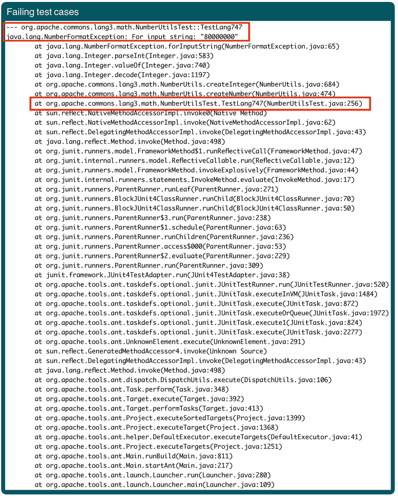

Figure 15: Failing test cases reported by JUnit.

Then, we can roughly locate the buggy code file “NumberUtils.java”, whose code contents are show in Figure [16](https://arxiv.org/html/2404.17153v2#A1.F16 "Figure 16 ‣ A.4.1 Bug Metadata ‣ A.4 A Demo of the Execution ‣ Appendix A Appendix ‣ FixAgent: Hierarchical Multi-Agent Framework for Unified Software Debugging"), as well as the failing oracles in testing code [17](https://arxiv.org/html/2404.17153v2#A1.F17 "Figure 17 ‣ A.4.1 Bug Metadata ‣ A.4 A Demo of the Execution ‣ Appendix A Appendix ‣ FixAgent: Hierarchical Multi-Agent Framework for Unified Software Debugging").

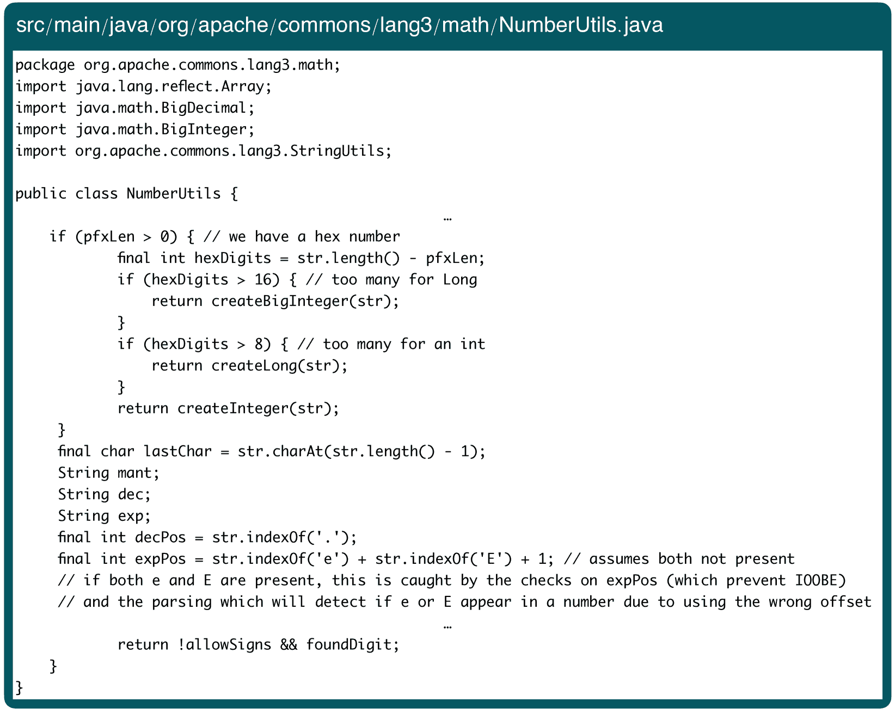

Figure 16: Bug-located code snippet.

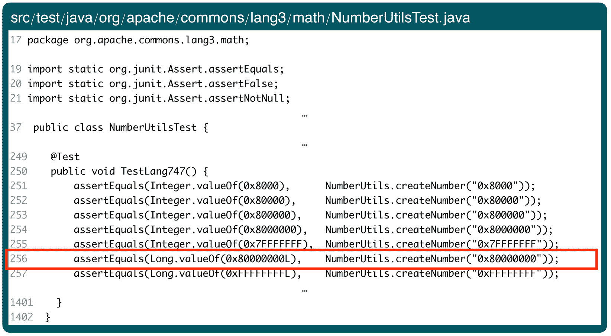

Figure 17: Testing code triggering errors.

From the above information, we can see that the original code merely determines whether a value exceeds the ranges of Long and int based on the length of hexadecimal numbers. However, when the length of a hexadecimal number is 16, and the first significant digit is greater than 7, it actually goes beyond the range of Long. The original code fails to take this situation into account, and similar issues exist in the int range.

#### A.4.2 L3 Repair

For simplicity, we only show the responses from agents on level three of repair. Helper generates a short query summarizing the problem of this bug based on the testing information and buggy code, as shown in Figure [18](https://arxiv.org/html/2404.17153v2#A1.F18 "Figure 18 ‣ A.4.2 L3 Repair ‣ A.4 A Demo of the Execution ‣ Appendix A Appendix ‣ FixAgent: Hierarchical Multi-Agent Framework for Unified Software Debugging"). All the other agents can benefit from its generated debugging guide. Afterward, RepoFocus lists a list of bug-related files ([19](https://arxiv.org/html/2404.17153v2#A1.F19 "Figure 19 ‣ A.4.2 L3 Repair ‣ A.4 A Demo of the Execution ‣ Appendix A Appendix ‣ FixAgent: Hierarchical Multi-Agent Framework for Unified Software Debugging")). Besides the bug-located file, it also identifies two other files. However, they would not influence the behavior of the number-creation logic unless you are encountering specific exception handling or Unicode string issues when parsing numeric strings. Subsequently, Summarizer generates a code summary for each identified file [20](https://arxiv.org/html/2404.17153v2#A1.F20 "Figure 20 ‣ A.4.2 L3 Repair ‣ A.4 A Demo of the Execution ‣ Appendix A Appendix ‣ FixAgent: Hierarchical Multi-Agent Framework for Unified Software Debugging"). Thus, we got all the information provided by upstream agents.

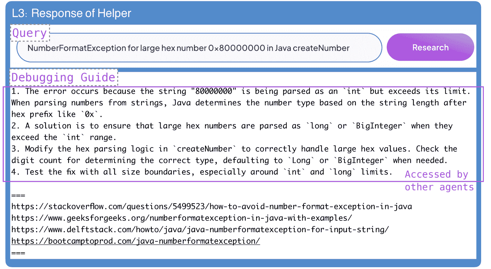

Figure 18: Response and tool usage of Helper.

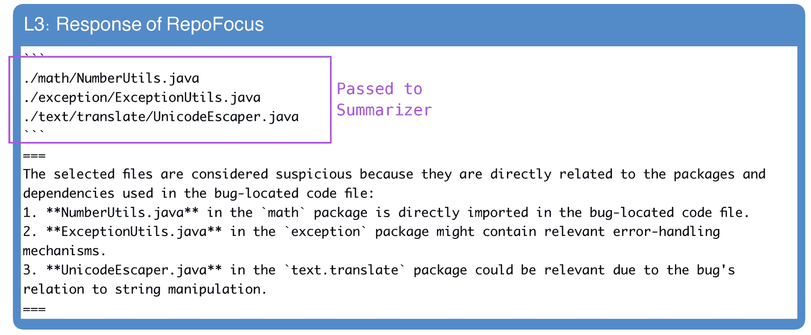

Figure 19: Response of RepoFocus.

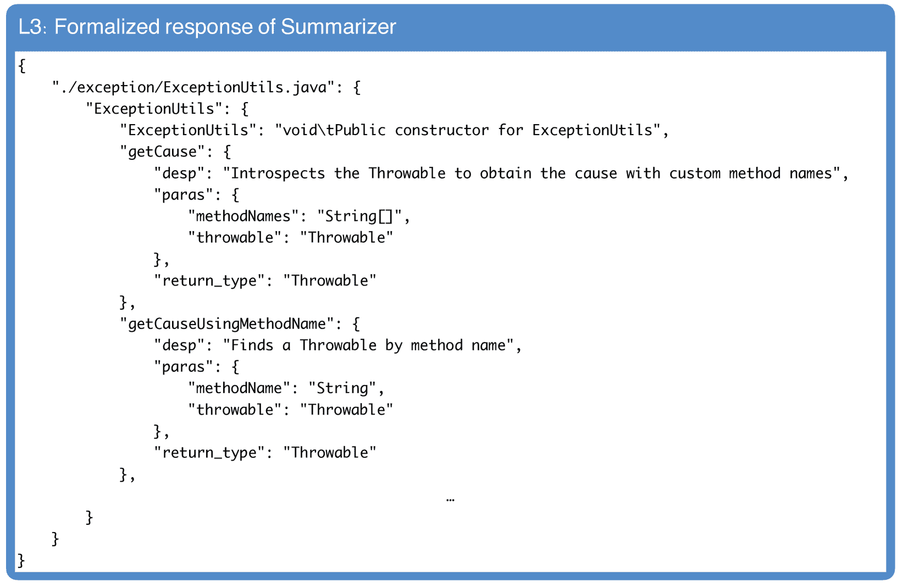

Figure 20: Response of Summarizer.

Slicer extracts 168 suspicious code lines from 1427 lines in the original buggy code, largely narrowing down the examination scope, as shown in Figure [21](https://arxiv.org/html/2404.17153v2#A1.F21 "Figure 21 ‣ A.4.2 L3 Repair ‣ A.4 A Demo of the Execution ‣ Appendix A Appendix ‣ FixAgent: Hierarchical Multi-Agent Framework for Unified Software Debugging"). Locator successfully pinpoints the root causes of this bug from the code lines sliced out [22](https://arxiv.org/html/2404.17153v2#A1.F22 "Figure 22 ‣ A.4.2 L3 Repair ‣ A.4 A Demo of the Execution ‣ Appendix A Appendix ‣ FixAgent: Hierarchical Multi-Agent Framework for Unified Software Debugging"). The following agents can focus on the single logic conditions.

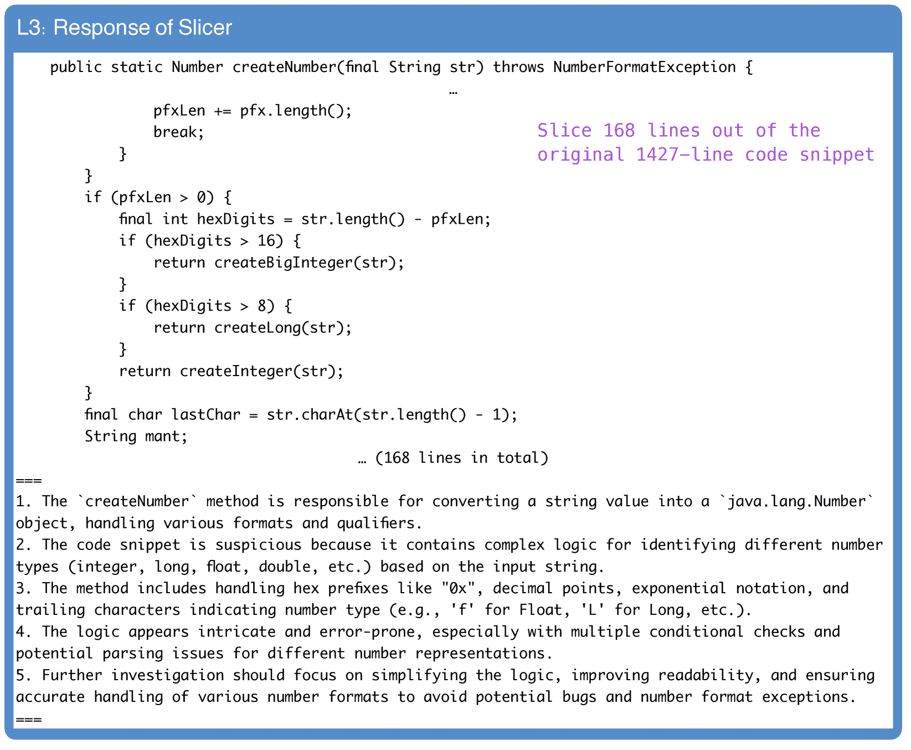

Figure 21: Response of Slicer.

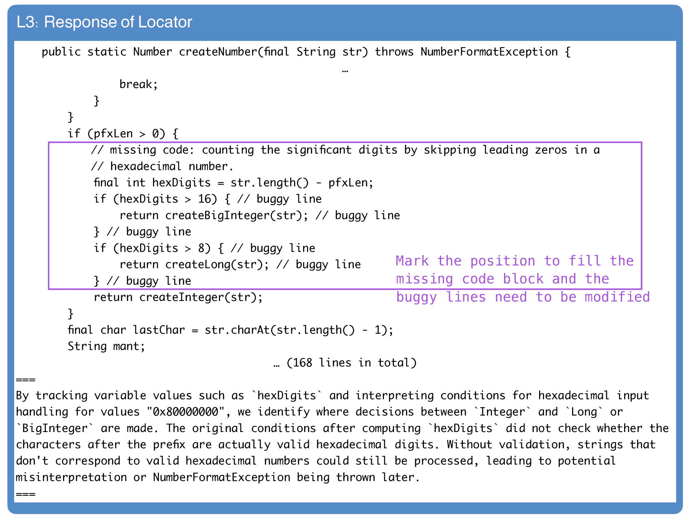

Figure 22: Response of Locator.

However, Fixer failed to generate a plausible patch, as displayed in Figure [23](https://arxiv.org/html/2404.17153v2#A1.F23 "Figure 23 ‣ A.4.2 L3 Repair ‣ A.4 A Demo of the Execution ‣ Appendix A Appendix ‣ FixAgent: Hierarchical Multi-Agent Framework for Unified Software Debugging"). It attempts to fulfill the missing code block by counting the valid digits of the hexadecimal number but causes incorrect type determination when a large number of leading zeros are present in a hexadecimal string. The patched code also assumes the hex digits should be directly compared based on raw string length without adjusting for those leading zeros. FixerPro identified the causes of errors made by Fixer, and provides an optimized patch. The fixed version, presented in Figure [24](https://arxiv.org/html/2404.17153v2#A1.F24 "Figure 24 ‣ A.4.2 L3 Repair ‣ A.4 A Demo of the Execution ‣ Appendix A Appendix ‣ FixAgent: Hierarchical Multi-Agent Framework for Unified Software Debugging"), properly calculates the significant digits by counting the non-zero characters after the prefix and leading zeros. It also adjusts the comparisons for handling 16-digit and 8-digit boundary checks, ensuring that only significant digits are considered when deciding if the value is too large for “Integer” or “Long”.

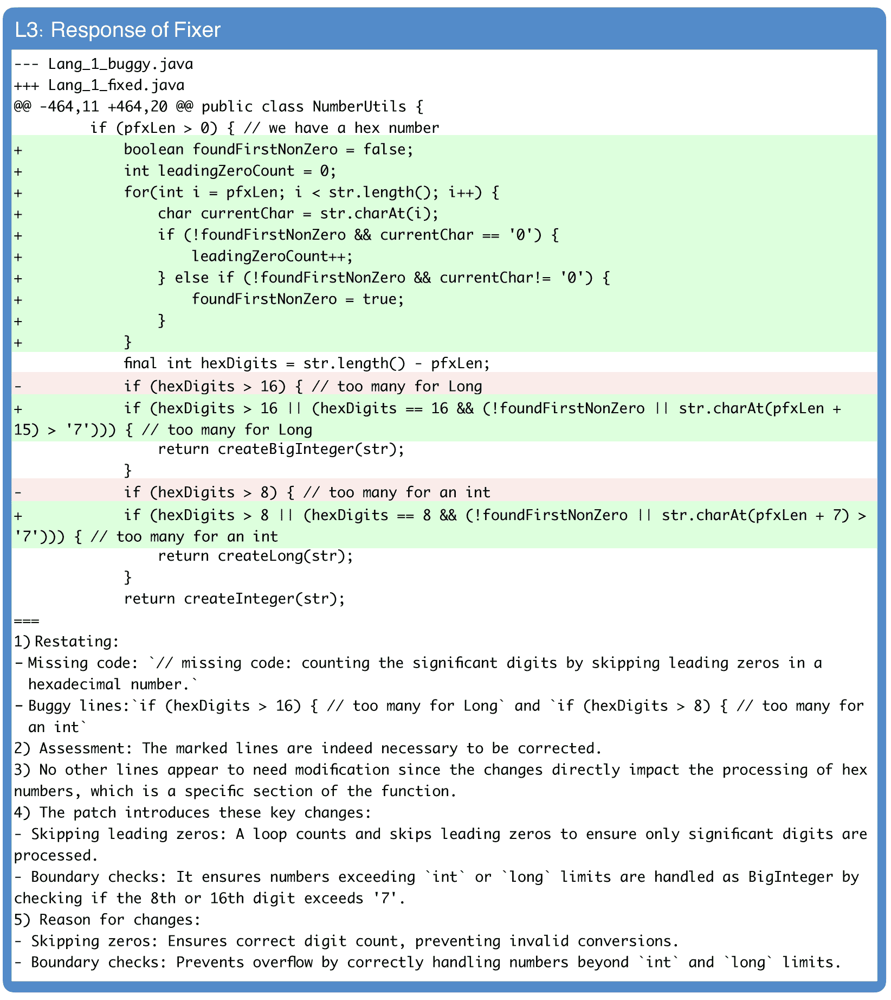

Figure 23: Response of Fixer.

Figure 24: Response of FixerPro.