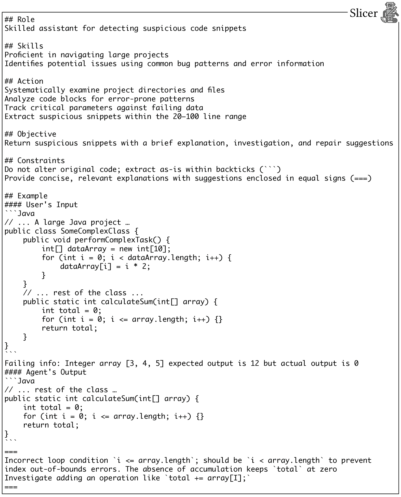
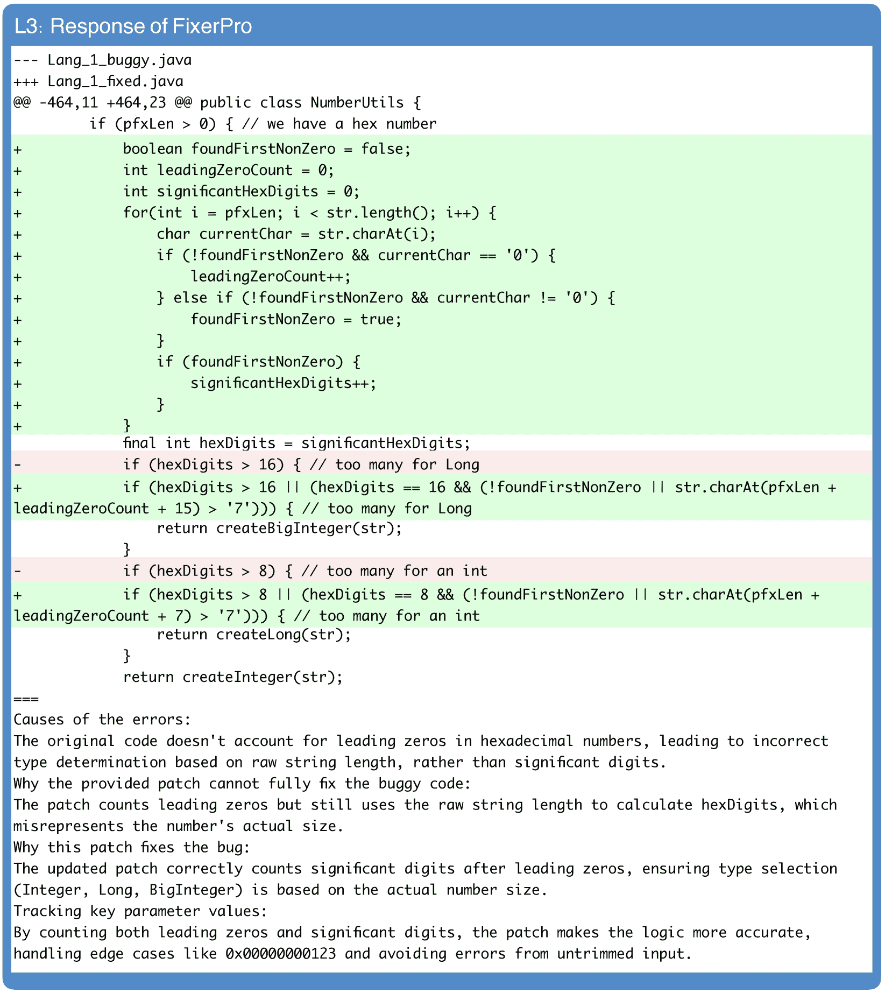

<!--yml

类别：未分类

日期：2025-01-11 12:41:14

-->

# FixAgent：统一软件调试的分层多智能体框架

> 来源：[https://arxiv.org/html/2404.17153/](https://arxiv.org/html/2404.17153/)

Cheryl Lee¹, Chunqiu Steven Xia², Longji Yang¹, Jen-tse Huang¹，

Zhouruixing Zhu³, Lingming Zhang², Michael R. Lyu¹

¹香港中文大学，²伊利诺伊大学香槟分校，

³香港中文大学（深圳）

[cheryllee@link.cuhk.edu.hk](mailto:cheryllee@link.cuhk.edu.hk), chunqiu2@illinois.edu, 1155191588@link.cuhk.edu.hk，

jthuang@cse.cuhk.edu.hk, zhouruixingzhu@link.cuhk.edu.cn, lingming@illinois.edu, lyu@cse.cuhk.edu.hk

###### 摘要

软件调试是一项耗时的工作，涉及一系列步骤，如故障定位和补丁生成，每个步骤都需要进行深入分析，并对底层逻辑有深刻理解。虽然大语言模型（LLMs）在编程任务中展现了有希望的潜力，但在调试方面的表现仍然有限。当前基于LLM的方法通常专注于孤立的步骤，并且在处理复杂的错误时效果不佳。本文提出了第一个端到端的框架——FixAgent，通过多智能体协同进行统一调试。该框架模拟了开发人员的整个认知过程，每个智能体专门负责该过程中的一个特定组件，而不是像以前的多智能体系统那样模仿独立专家的行动。智能体通过三层设计进行协调，遵循调试的认知模型，能够适应处理复杂程度各异的错误。在大量基准测试中的实验结果表明，FixAgent显著超越了最先进的修复方法，在代码库级基准测试Defects4J上修复了1.25$\times$到2.56$\times$的错误。与基准方法不同，这一性能不依赖于真实根本原因代码语句。我们的源代码可以通过匿名链接访问：[https://github.com/AcceptePapier/UniDebugger](https://github.com/AcceptePapier/UniDebugger)。

FixAgent：统一软件调试的分层多智能体框架

Cheryl Lee¹, Chunqiu Steven Xia², Longji Yang¹, Jen-tse Huang¹, Zhouruixing Zhu³, Lingming Zhang², Michael R. Lyu¹ ¹香港中文大学，²伊利诺伊大学香槟分校，³香港中文大学（深圳） [cheryllee@link.cuhk.edu.hk](mailto:cheryllee@link.cuhk.edu.hk), chunqiu2@illinois.edu, 1155191588@link.cuhk.edu.hk, jthuang@cse.cuhk.edu.hk, zhouruixingzhu@link.cuhk.edu.cn, lingming@illinois.edu, lyu@cse.cuhk.edu.hk

## 1 引言

调试是识别、分析和修复软件中的错误或问题的关键过程。随着LLM的推动，已在解决错误方面取得了显著进展（Yang等人，[2024](https://arxiv.org/html/2404.17153v2#bib.bib55); Xia和Zhang，[2022](https://arxiv.org/html/2404.17153v2#bib.bib52); Wei等人，[2023](https://arxiv.org/html/2404.17153v2#bib.bib47); Xia和Zhang，[2024](https://arxiv.org/html/2404.17153v2#bib.bib53)）——它们通常提出一种提示框架，并查询LLM来自动化调试中的某个独立阶段，通常是故障定位（FL）或自动程序修复（APR）。FL试图识别可疑的代码语句，而APR则提供补丁或修复的代码片段。典型的“diff”补丁记录两个源代码文件之间的文本差异，如图[1](https://arxiv.org/html/2404.17153v2#S1.F1 "Figure 1 ‣ 1 Introduction ‣ FixAgent: Hierarchical Multi-Agent Framework for Unified Software Debugging")所示。调试的目标是应用这种补丁来准确修复错误。

图1： “diff”补丁的示例，其中“@@ -142,5 +142 5 @@”表示第142行被修改。

图2：FixAgent概述。它从简单的L1修复开始。如果没有生成合理的补丁，则触发L2修复，L3也会被触发。处于同一层级的智能体可以相互通信。

虽然LLMs在处理基本错误的单个调试任务中展现了巨大的潜力，但以往的研究未能为整个调试任务提供令人满意的解决方案。为了弥补这一空白，我们提出了首个多智能体框架FixAgent，用于端到端统一调试。一个关键的挑战在于如何协调多个智能体。以往采用基于LLM的多智能体框架进行复杂问题解决的研究，通常将每个智能体视为专家，并模仿人类的协作实践（Hong等人，[2024](https://arxiv.org/html/2404.17153v2#bib.bib14); Islam等人，[2024](https://arxiv.org/html/2404.17153v2#bib.bib17); Qian等人，[2024](https://arxiv.org/html/2404.17153v2#bib.bib37)）。然而，这种范式在调试中存在局限性。它过于强调模仿人类协作，因此不适用于调试的逻辑性和步骤性特征。此外，在问题难度的细粒度资源分配和优化方面也面临挑战。智能体之间的通信链接呈网状且广泛，导致不必要的高通信冗余。

作为回应，我们独特地将FixAgent构建为一个分层的多智能体协调范式，如图[2](https://arxiv.org/html/2404.17153v2#S1.F2 "Figure 2 ‣ 1 Introduction ‣ FixAgent: Hierarchical Multi-Agent Framework for Unified Software Debugging")所示。我们的关键见解是，智能体应该作为调试认知过程的一个特定组件进行作用，而不是像团队合作中的独立专家那样反映行为。在团队合作中，成员们带来多样化的视角和背景，他们通过双向讨论和协商分享知识并共同解决任务。相比之下，认知过程是单向且连贯的，每个阶段都建立在上一个阶段的基础上，积累知识并利用工具朝着共同目标前进，主要依靠自我反思来引导思维。由于后者与调试过程无缝契合，我们将多智能体协调基础建立在Hale和Haworth的认知调试模型上（Hale和Haworth，[1991](https://arxiv.org/html/2404.17153v2#bib.bib12)）。该模型认为，开发者在调试过程中会基于结构化学习理论（Hale等，[1999](https://arxiv.org/html/2404.17153v2#bib.bib13)）采用多层次的目标导向机制。初始层级仅提供快速和简便的解决方案，如果失败，则触发更高层次的修复，处理复杂的错误，涉及更多的认知活动，包括更深层次的分析、工具调用和外部信息的获取。

我们的框架包括七个智能体，每个智能体专注于一个独特的认知状态：1) Helper：通过在线研究提取并合成调试解决方案；2) RepoFocus：分析依赖关系并识别与错误相关的代码文件；3) Summarizer：生成代码摘要；4) Slicer：隔离可能导致错误的代码段（通常是数十到数百行）；5) Locator：标记特定的根本原因代码行；6) Fixer：生成修复补丁或修复代码片段；7) FixerPro：基于Fixer生成的补丁测试结果，生成优化的补丁，并附带详细的分析报告。

特别地，FixAgent首先通过单元测试隔离出最有可能导致错误的代码文件。在一级（L1）中，仅初始化Locator和Fixer来处理简单的错误。如果生成的修补程序不可行（即未通过所有测试用例），则在二级（L2）中触发Summarizer和Slicer，处理带有错误定位代码文件的情况。接着，Locator、Fixer和FixerPro按顺序被调用，并访问Summarizer和Slicer的响应。如果仍然失败，FixAgent进行更深入的检查，并启动所有代理（即三级，L3），其中Helper在线搜索解决方案，指导其他所有代理，而RepoFocus检查整个程序，提供与错误相关的代码文件列表，随后其他代理按顺序工作。在最后两个级别上，Slicer、Locator和Fixer可以调用传统的代码分析工具，收集静态和动态分析信息。

我们在四个基准上评估了FixAgent，这些基准包含跨三种编程语言的错误修复对，包括真实世界的软件（Defects4J Just等，[2014](https://arxiv.org/html/2404.17153v2#bib.bib19)）和竞赛程序（QuixBugs Lin等，[2017](https://arxiv.org/html/2404.17153v2#bib.bib26)，Codeflaws Tan等，[2017](https://arxiv.org/html/2404.17153v2#bib.bib42)，ConDefects Wu等，[2024](https://arxiv.org/html/2404.17153v2#bib.bib50)）。在Defects4J上，FixAgent通过正确修复197个错误和286个合理的修复方案，达到了新的最先进水平（SoTA）。我们的方法不需要事先进行FL，但仍然优于强基线，如ChatRepair，它使用真实根本原因并进行10倍的采样次数。此外，FixAgent修复了QuixBugs中的所有错误，并在Codeflaws上生成了2.2$\times$更多合理的修复方案。我们的消融研究表明，FixAgent在不同的LLM骨架上始终能够显著改进。

## 2 相关工作

软件调试：FL和APR是软件调试中的两个核心步骤Benton等人（[2020](https://arxiv.org/html/2404.17153v2#bib.bib6)）。许多研究旨在自动化这两个步骤中的任意一个。传统的FL通常基于频谱（Abreu等人，[2009](https://arxiv.org/html/2404.17153v2#bib.bib2)，[2006](https://arxiv.org/html/2404.17153v2#bib.bib1)；Zhang等人，[2011](https://arxiv.org/html/2404.17153v2#bib.bib58)）或基于变异（Moon等人，[2014](https://arxiv.org/html/2404.17153v2#bib.bib33)；Li和Zhang，[2017](https://arxiv.org/html/2404.17153v2#bib.bib23)；Zhang等人，[2013](https://arxiv.org/html/2404.17153v2#bib.bib59)）。基于学习的FL通过多种类型的神经网络从丰富的数据源中学习程序行为（Li等人，[2021](https://arxiv.org/html/2404.17153v2#bib.bib24)，[2022](https://arxiv.org/html/2404.17153v2#bib.bib25)；Lou等人，[2021](https://arxiv.org/html/2404.17153v2#bib.bib30)；Li等人，[2019](https://arxiv.org/html/2404.17153v2#bib.bib22)）。最近，LLMAO（Yang等人，[2024](https://arxiv.org/html/2404.17153v2#bib.bib55)）提出利用LLMs进行无测试FL。APR研究要么从可能的修补程序中寻找合适的解决方案（Goues等人，[2012](https://arxiv.org/html/2404.17153v2#bib.bib9)；Weimer等人，[2009a](https://arxiv.org/html/2404.17153v2#bib.bib48)，[b](https://arxiv.org/html/2404.17153v2#bib.bib49)），要么通过将生成表示为显式的规范推断来直接生成修补程序（Mechtaev等人，[2016](https://arxiv.org/html/2404.17153v2#bib.bib32)；Nguyen等人，[2013](https://arxiv.org/html/2404.17153v2#bib.bib34)；Liu等人，[2019](https://arxiv.org/html/2404.17153v2#bib.bib27)）。基于学习的研究（(Lutellier等人，[2020](https://arxiv.org/html/2404.17153v2#bib.bib31)；Jiang等人，[2021](https://arxiv.org/html/2404.17153v2#bib.bib18)；Ye等人，[2022](https://arxiv.org/html/2404.17153v2#bib.bib57)））通过神经机器翻译（NMT）将故障代码转换为正确代码。在直接提示LLMs的基础上（Xia等人，[2023](https://arxiv.org/html/2404.17153v2#bib.bib51)），最近的研究探讨了提示工程（Xia和Zhang，[2024](https://arxiv.org/html/2404.17153v2#bib.bib53)，[2022](https://arxiv.org/html/2404.17153v2#bib.bib52)）或结合代码合成（Wei等人，[2023](https://arxiv.org/html/2404.17153v2#bib.bib47)）以改善LLM在APR中的表现。

大型语言模型：为代码合成开发了多种LLM（Chen 等， [2021](https://arxiv.org/html/2404.17153v2#bib.bib7)；Guo 等， [2024](https://arxiv.org/html/2404.17153v2#bib.bib10)；Rozière 等， [2023](https://arxiv.org/html/2404.17153v2#bib.bib39)），除了通用型LLM（OpenAI， [2023a](https://arxiv.org/html/2404.17153v2#bib.bib35)，[b](https://arxiv.org/html/2404.17153v2#bib.bib36)；Anil 等， [2023](https://arxiv.org/html/2404.17153v2#bib.bib4)）。这些模型在解决与编程相关的任务中展现出潜力，包括程序修复，正如一些实证研究所探讨的（Xia 等， [2023](https://arxiv.org/html/2404.17153v2#bib.bib51)；Huang 等， [2023](https://arxiv.org/html/2404.17153v2#bib.bib16)；Tian 等， [2024](https://arxiv.org/html/2404.17153v2#bib.bib44)）。

基于LLM的多代理（LLM-MA）：单个基于LLM的代理所展现的启发性能力推动了多代理框架的发展。近期的研究已展示了LLM-MA在复杂问题解决中的潜力，包括软件工程、科学以及其他社会模拟活动。在软件工程领域，LLM-MA的研究（Qian 等， [2024](https://arxiv.org/html/2404.17153v2#bib.bib37)；Hong 等， [2024](https://arxiv.org/html/2404.17153v2#bib.bib14)；Dong 等， [2023](https://arxiv.org/html/2404.17153v2#bib.bib8)；Huang 等， [2024](https://arxiv.org/html/2404.17153v2#bib.bib15)；Islam 等， [2024](https://arxiv.org/html/2404.17153v2#bib.bib17)）通常模拟现实世界的角色（例如，产品经理、程序员和测试人员）并通过沟通进行协作。Hong 等（[2024](https://arxiv.org/html/2404.17153v2#bib.bib14)）；Dong 等（[2023](https://arxiv.org/html/2404.17153v2#bib.bib8)）采用共享信息池来减少开销。

## 3 FixAgent

FixAgent 是一个通过LLM基础的多代理协同工作实现统一调试的端到端框架。它包含七个代理，每个代理作为Hale 和 Haworth 的认知调试模型中的一个状态，具备明确的目标，而不是一个任务导向的个体实体。FixAgent在三层架构上运行，初始化不同层级的修复工作，涉及不同的代理，代理可以适应性地调用给定工具箱中的工具。代理之间在同一层级的沟通遵循流水线式的思维过程，而非团队中典型的网状交互。本节介绍了代理的简介、它们与外部环境的交互以及层次结构。详细的提示信息请参见 [A.3](https://arxiv.org/html/2404.17153v2#A1.SS3 "A.3 System Prompts ‣ Appendix A Appendix ‣ FixAgent: Hierarchical Multi-Agent Framework for Unified Software Debugging")。

### 3.1 代理的简介

FixAgent 中的所有代理共享一个一次性结构的系统提示，该结构定义了它们的角色、技能、行为、目标和约束条件，随后是一个手工制作的示例，以说明期望的响应格式，如图[3](https://arxiv.org/html/2404.17153v2#S3.F3 "Figure 3 ‣ 3.1 Profiles of Agents ‣ 3 FixAgent ‣ FixAgent: Hierarchical Multi-Agent Framework for Unified Software Debugging")所示。此外，所有代理都可以访问某些元信息，称为错误元数据，包括错误所在的代码文件、失败的测试用例、编译和测试时报告的错误以及用自然语言描述的程序需求。每个代理的响应包含两个元素：一个是实现其目标的答案，另一个是其思维过程的解释。受到软件工程原理——橡皮鸭调试（Andrew 和 David，[2000](https://arxiv.org/html/2404.17153v2#bib.bib3)）的启发，开发者通过阐述他们的期望与实际实现之间的差距来识别问题，因此我们要求每个代理监控关键程序变量，并解释其如何指导答案的生成。

图 3：一次性系统提示定义了代理的角色、技能、行为、目标和约束条件。

Helper。Helper 的目标是通过检索增强生成（RAG）提供参考，这一方法的灵感来源于开发者通常利用网页搜索引擎（如 Google）来提高生产力的事实（Xia 等，[2017](https://arxiv.org/html/2404.17153v2#bib.bib54)）。通过分析错误元数据，Helper 生成一个简短的查询，并调用外部搜索引擎来检索最匹配的解决方案。然后，它整合检索结果并生成根据有问题代码的上下文（如变量命名和函数结构）定制的参考解决方案。这些是隐藏在其他代理背后的内部过程，只有最终的响应——参考解决方案——才能在 L3 级别阅读。图[4](https://arxiv.org/html/2404.17153v2#S3.F4 "Figure 4 ‣ 3.1 Profiles of Agents ‣ 3 FixAgent ‣ FixAgent: Hierarchical Multi-Agent Framework for Unified Software Debugging")提供了 Helper 响应的示例。

图 4：在检索到类似的解决方案后，Helper 最终回应一个可执行的调试指南。

RepoFocus。理解跨文件的依赖关系对于调试大型软件至关重要，而现实世界的软件往往庞大且复杂（对应于 L3 修复）。然而，将程序中的所有代码输入到一个 LLM 中可能会使其超载，导致响应缓慢，资源消耗巨大或结果错误。因此，RepoFocus 通过分析错误元数据和程序的文件结构，提供了一份需要进一步检查的与错误相关的代码文件列表。

总结器（Summarizer）。代码总结旨在生成简洁、语义明确的总结，准确描述软件功能。与高级代码分析不同，这些自然语言总结更符合大型语言模型（LLM）的训练目标。总结器在L2和L3触发。在L2时，它总结有缺陷的代码文件。尽管高级LLM的窗口大小可以处理大多数单一代码文件，但过长的提示可能加剧LLM的幻觉效应。因此，总结器在此处理过长的代码，同时与切片器（Slicer）配合，后者从有缺陷的代码中缩小可疑段落的范围。在L3时，总结器会在每个由RepoFocus识别的与错误相关的文件上运行。其他代理不需要读取程序中的每一行代码，而是通过这些总结了解核心内容。

切片器（Slicer）。切片器通过从错误定位的代码文件中切出一个小的可疑片段（通常是几十行代码）来缩小检查范围。我们从初步输出中提取开始和结束行以定位该片段，确保最终输出直接从原始代码中切割出来，以防止由LLM幻觉引起的代码篡改。切片器也会在最后两个级别中用于大型软件，在此它可以调用静态或动态分析工具。

定位器（Locator）。定位器负责用注释“// buggy line”或“// missing line”标记代码行，以指示错误或缺失的语句。与切片器类似，我们通过上下文字符串匹配直接注释原始代码。定位器仅在L1上利用错误元数据，在L2时，它可以访问动态分析报告。如果程序足够大，以至于调用了切片器和总结器，定位器将接收由切片器生成的可疑代码段，替换原始完整代码，以及由总结器生成的错误代码总结。

修复器（Fixer）。修复器的触发是生成一个“diff”，如引言中的图[1](https://arxiv.org/html/2404.17153v2#S1.F1 "Figure 1 ‣ 1 Introduction ‣ FixAgent: Hierarchical Multi-Agent Framework for Unified Software Debugging")所示。它接收由定位器（Locator）标记的代码和其他错误元数据。为了保持定位器和修复器之间的一致性，修复器首先评估标记的代码行是否需要修改，然后描述修改内容。这还使得修复器能够纠正定位器可能犯的错误。在L2和L3时，修复器还可以访问由上游代理生成的静态/动态分析和辅助信息。

图5：L3触发所有七个代理生成合理的补丁。

FixerPro。FixerPro 通过生成优化的修复和修复分析来扩展和补充 Fixer。它的灵感来源于代码审查，多个开发人员检查程序以确保软件质量，我们请求 FixerPro 评估 Fixer 生成的可能修复的性能和潜在漏洞。然后，FixerPro 提供关于重构补丁的建议，以优化简单性和可维护性。如果 Fixer 失败，FixerPro 会生成一个新的补丁，并分析失败的原因。

### 3.2 外部交互

可信度反馈。我们通过修改有缺陷的代码来进行修复，而不是直接应用生成的补丁，因为这些补丁通常会在代码行的索引上出错，因为 LLM 在计数时经常出现问题，并且补丁可能是基于切片的代码段而不是原始代码生成的，从而导致代码行索引发生变化。我们的修改是基于规则的，通过匹配补丁和有缺陷代码之间的不变上下文来进行。之后，我们会编译并运行修复后的程序的测试。如果所有测试用例都通过，补丁将发送给开发人员进行手动正确性验证。可信度测试的结果会作为反馈返回给 FixAgent，供进一步处理，比如初始化更高层次的修复或进行自我反思。

工具使用。FixAgent 的工具箱目前包含静态分析工具、动态分析工具以及针对 LLMs 和 RAG 优化的搜索引擎。静态分析提供静态错误和警告，以及抽象语法树（AST），即源代码抽象语法结构的树形表示。在动态分析中，我们主要考虑失败测试用例的覆盖率，因为通常认为在测试过程中未执行的代码语句更不可能导致失败，Kochhar 等人（[2016](https://arxiv.org/html/2404.17153v2#bib.bib20)）也有相关假设。请注意，工具调用的结果将存储，以便下游代理请求时避免重复调用。

### 3.3 层次协调

我们协调的主要原则是，不同复杂度的问题需要不同强度的认知活动。也就是说，当简单的解决方案失败时，系统会触发一个更高层次的目标，并提供更多的信息和思考。根据 Hale 和 Haworth 的认知调试模型，我们分别为三个层次的修复定义了三种工作流程。

第一级识别并修复代码中的明显逻辑错误，因此我们假设代理可以轻松修复该漏洞。因此，L1 仅包含定位器（Locator）和修复器（Fixer），其通信流程简单，其中修复器根据定位器完成的故障定位生成修复补丁。如果修复不可行，则触发 L2，假设修复仅通过检查单个文件即可完成，这在以往的故障定位（FL）和自动修复（APR）研究中经常应用（Soremekun 等人，[2023](https://arxiv.org/html/2404.17153v2#bib.bib41)）。L2 涉及五个代理：切片器（Slicer）、总结器（Summarizer）、定位器（Locator）、修复器（Fixer）和修复器专业版（FixerPro）。切片器从故障定位的文件中隔离出可疑的代码段，总结器同时生成代码摘要。然后，定位器、修复器和修复器专业版依次基于可疑代码段工作，且都可以访问代码摘要。如果修复仍然失败，则转向 L3，L3 假设该漏洞非常复杂，因此修复它需要理解跨文件的依赖关系和外部信息。L3 启动所有七个代理。首先，助手（Helper）和仓库聚焦（RepoFocus）同时初始化，助手为其他所有代理提供参考。接下来，总结器根据仓库聚焦识别的文件列表多次运行。这些代码摘要由剩余的四个代理共享，随后这些代理按照 L2 的相同工作流程依次工作。图[5](https://arxiv.org/html/2404.17153v2#S3.F5 "Figure 5 ‣ 3.1 Profiles of Agents ‣ 3 FixAgent ‣ FixAgent: Hierarchical Multi-Agent Framework for Unified Software Debugging")展示了 L3 中代理之间的一个对话示例。

在没有合理修复的情况下，FixAgent 会逐步请求 L3 中的代理根据合理性反馈以反向顺序反思并完善其答案，因为下游代理更容易出错，因为错误可能在调试过程中积累。具体来说，我们首先请求修复器专业版（FixerPro）来完善其响应。如果修复仍然失败，我们接着请求修复器（Fixer），这会导致修复器专业版的输入发生变化，因此它会被重新采样。最终，合理的修复补丁会返回给开发人员进行人工验证。如果未生成合理的修复补丁，FixAgent 将展示由修复器专业版撰写的分析报告，并再次运行，直到达到资源阈值为止。

表 1：与基准的比较。#Corr 和 #Plau 分别表示正确修复和合理修复的漏洞数量。绿色单元格表示最佳结果。蓝色单元格表示这些结果来自采样数据，而其他结果则基于整个数据集获得。

工具	抽样次数	Defects4J-Java	Codeflaws-C	QuixBugs-Java	QuixBugs-Python	备注	#Corr	#Plau	#Corr	#Plau	#Corr	#Plau	#Corr	#Plau

+   $\star$

    仅提供Defects4J 1.2的结果。

+   $\dagger$

    结果来自665个抽样缺陷。

+   $\ddagger$

    我们随机选择100个可能的修复补丁来检查其正确性，因为可能的修复补丁数量庞大。

## 4 实验

### 4.1 实验设置

基准测试。我们在四个基准上评估FixAgent，这些基准包含修复对，包括竞争程序（Codeflaws Tan等人，[2017](https://arxiv.org/html/2404.17153v2#bib.bib42)，QuixBugs Lin等人，[2017](https://arxiv.org/html/2404.17153v2#bib.bib26)，ConDefects Wu等人，[2024](https://arxiv.org/html/2404.17153v2#bib.bib50)）和真实世界项目（Defects4J Just等人，[2014](https://arxiv.org/html/2404.17153v2#bib.bib19)）。Codeflaws包含3902个有缺陷的C程序。QuixBugs包括40个有缺陷的程序，分别以Java和Python提供。ConDefects最近收集，旨在解决LLMs中的数据泄露问题，包含1254个Java程序和1625个Python程序。Defects4J是一个广泛使用的基准，来自15个真实世界Java项目，涵盖两个版本的缺陷：版本1.2有391个活跃缺陷，版本2.0增加了415个活跃缺陷，总共806个缺陷。我们将报告这些版本的修复总数。

基准。我们将FixAgent与14个APR基准进行比较，包括：

+   •

    传统方法：Angelix (Mechtaev等人，[2016](https://arxiv.org/html/2404.17153v2#bib.bib32))，Prophet (Long，[2018](https://arxiv.org/html/2404.17153v2#bib.bib28))，SPR (Long和Rinard，[2015](https://arxiv.org/html/2404.17153v2#bib.bib29))，以及CVC4 (Reynolds等人，[2015](https://arxiv.org/html/2404.17153v2#bib.bib38))。

+   •

    基于遗传编程的方法：Semfix (Nguyen等人，[2013](https://arxiv.org/html/2404.17153v2#bib.bib34))和GenProg (Goues等人，[2012](https://arxiv.org/html/2404.17153v2#bib.bib9); Weimer等人，[2009a](https://arxiv.org/html/2404.17153v2#bib.bib48))。

+   •

    基于NMT的：CoCoNuT (Lutellier等，[2020](https://arxiv.org/html/2404.17153v2#bib.bib31))，CURE (Jiang等，[2021](https://arxiv.org/html/2404.17153v2#bib.bib18))，和RewardRepair (Ye等，[2022](https://arxiv.org/html/2404.17153v2#bib.bib57))。

+   •

    基于领域知识驱动的：Tbar (Liu等，[2019](https://arxiv.org/html/2404.17153v2#bib.bib27)) 和Recoder (Zhu等，[2021](https://arxiv.org/html/2404.17153v2#bib.bib60))。

+   •

    基于LLM的（SoTA）：AlphaRepair (Xia和Zhang，[2022](https://arxiv.org/html/2404.17153v2#bib.bib52))，Repilot (Wei等，[2023](https://arxiv.org/html/2404.17153v2#bib.bib47))，和ChatRepair (Xia和Zhang，[2024](https://arxiv.org/html/2404.17153v2#bib.bib53))。

请注意，不同的APR基准采用了不同的先前故障位置。我们使用realistic表示传统的FL，使用perfect表示真实情况的FL。我们报告了它们原始论文中的结果和后续调查 Le等（[2018](https://arxiv.org/html/2404.17153v2#bib.bib21)）；Ye等（[2021](https://arxiv.org/html/2404.17153v2#bib.bib56)）；Xia等（[2023](https://arxiv.org/html/2404.17153v2#bib.bib51)），并遵循了之前的研究 Xia等（[2023](https://arxiv.org/html/2404.17153v2#bib.bib51)）；Xia和Zhang（[2024](https://arxiv.org/html/2404.17153v2#bib.bib53)）；Lutellier等（[2020](https://arxiv.org/html/2404.17153v2#bib.bib31)）。

LLM骨干网。我们将FixAgent应用于七个LLM，包括四个通用模型（gemini-1.5-flash Anil等，[2023](https://arxiv.org/html/2404.17153v2#bib.bib4)，gpt-3.5-turbo-ca OpenAI，[2023a](https://arxiv.org/html/2404.17153v2#bib.bib35)，gpt-4o OpenAI，[2023b](https://arxiv.org/html/2404.17153v2#bib.bib36)，以及claude-3.5-sonnet Anthropic，[2024](https://arxiv.org/html/2404.17153v2#bib.bib5)）和三个开源代码LLM（DeepSeekCoder Guo等，[2024](https://arxiv.org/html/2404.17153v2#bib.bib10)，CodeLlama-34b Rozière等，[2023](https://arxiv.org/html/2404.17153v2#bib.bib39)，LLaMA2-70b Touvron等，[2023](https://arxiv.org/html/2404.17153v2#bib.bib45)）。这些LLM自然也作为基准进行比较，我们在其中应用了原始的思维链（CoT）提示方法 Wei等（[2022](https://arxiv.org/html/2404.17153v2#bib.bib46)）。FixAgent的默认骨干网是gpt-4o。

评估指标。我们使用APR指标，特别关注那些能够合理或正确修复的bug数量。考虑到ConDefects的庞大规模，我们从合理修复中随机抽取样本以验证其正确性。因此，我们还采用了正确率这一指标——它定义为正确修复与合理修复bug的比率——来评估FixAgent的有效性。

实现。对于单文件竞赛程序，只需初始化 L2 和 L1 上的 Locator、Fixer 和 FixerPro，命名为 FixAgent-Lite。Lite 版本每个 bug 的最大尝试次数设为 5 次，完整版设为 20 次。然而，先前的研究通常会进行数百到数千次的采样。例如，CoCoNuT 每个 bug 最多采样 50,000 次（Lutellier 等人，[2020](https://arxiv.org/html/2404.17153v2#bib.bib31)），而 ChatRepair 每次采样 100-200 次（Xia 和 Zhang，[2024](https://arxiv.org/html/2404.17153v2#bib.bib53)）。与基准相比，我们的方法显著更具成本效益。此外，为了防止在线获取真实解答，我们在评估过程中将默认的网络搜索引擎（Tavily [Tavily,](https://arxiv.org/html/2404.17153v2#bib.bib43)）更换为本地搜索引擎。本地数据库包含 CoCoNuT 的训练数据集（Lutellier 等人，[2020](https://arxiv.org/html/2404.17153v2#bib.bib31)），其中去除了 JavaScript 程序。由于 CoCoNuT 也在 Defects4J 和 ConDefects 上进行了评估，因此数据泄漏的风险较小。静态和动态分析由我们的编写脚本和开源插件支持（[SonarQube,](https://arxiv.org/html/2404.17153v2#bib.bib40) 和 [GZoltar,](https://arxiv.org/html/2404.17153v2#bib.bib11)）。

### 4.2 与基准的比较

本节评估了我们框架 FixAgent 的调试能力。结果显示在表格 [1](https://arxiv.org/html/2404.17153v2#S3.T1 "Table 1 ‣ 3.3 Hierarchical Coordination ‣ 3 FixAgent ‣ FixAgent: Hierarchical Multi-Agent Framework for Unified Software Debugging") 中。我们在此不使用 ConDefects 数据集，因为它是一个最近发布的数据集，且很少有方法在其上进行评估。

竞赛程序。FixAgent 在 Codeflaws 上合理地修复了 3982 个 bug 中的 3130 个，生成了比最好的 APR 方法 GenProg 多 2.2 倍的合理修复。其正确率为 95%，即 FixAgent 正确修复了 100 个样本中 95 个合理修复，相比 CoCoNuT 提高了 60.81%，CoCoNuT 是 APR 方法中修复 bug 最多的。FixAgent 以相同的正确率超过了表现最好的 LLM 基准模型 claude-3.5-sonnet，超出约 19.28%。此外，FixAgent 成功修复了 QuixBugs 中所有 bug，涵盖两种编程语言，达到了与 ChatRepair 相同的 SoTA。

现实世界软件。在Defects4J上，FixAgent成功修复了197个Bug，同时合理地解决了286个Bug，超越了当前最先进的技术ChatRepair，提升了约$\sim$25.48%。此外，FixAgent成功修复了42个独特的Bug，这些Bug是前四个基准模型未曾修复的。图[6](https://arxiv.org/html/2404.17153v2#S4.F6 "Figure 6 ‣ 4.2 Comparison with baselines ‣ 4 Experiments ‣ FixAgent: Hierarchical Multi-Agent Framework for Unified Software Debugging")展示了FixAgent和前四个基准模型在Defects4J上修复的Bug的韦恩图。我们看到FixAgent成功修复了42个这些强基准模型未能解决的独特Bug。我们在[A.1](https://arxiv.org/html/2404.17153v2#A1.SS1 "A.1 Unique Fix Example ‣ Appendix A Appendix ‣ FixAgent: Hierarchical Multi-Agent Framework for Unified Software Debugging")中展示了这些独特修复的示例。

图6：Defects4J上的Bug修复韦恩图。

总体而言，涉及LLM的基准模型表现相当不错。特别是FixAgent在所有基准测试中显著增强了基础LLM的性能，尤其是在Defects4J上。这是因为直接提示LLM在处理过长的上下文和复杂推理时表现不佳。我们将调试过程分解为几个认知步骤，并引入外部工具和知识，从而提升了LLM的能力。

<svg class="ltx_picture" height="73.07" id="S4.SS2.p5.pic1" overflow="visible" version="1.1" width="600"><g fill="#000000" stroke="#000000" stroke-width="0.4pt" transform="translate(0,73.07) matrix(1 0 0 -1 0 0)"><g fill-opacity="1.0" transform="matrix(1.0 0.0 0.0 1.0 21.65 13.78)"><foreignobject color="#000000" height="45.51" overflow="visible" transform="matrix(1 0 0 -1 0 16.6)" width="556.69">Takeaway: FixAgent fixes 197 bugs on Defects4J, a 25.48% improvement over the leading baseline. Its lite version fixes all bugs on QuixBugs and achieves 19.28% more plausible fixes on ConDefects with the highest correctness rate.</foreignobject></g></g></svg>

表2：关于代理的消融研究。#Plau表示合理修复的Bug数量。✓表示添加了特定的代理，✗表示缺少该代理。Expense表示每次运行Bug修复的平均费用。

| Helper | RepoFocus | Summarizer | Slicer | Locator | Fixer | FixerPro | #Plau | Expense ($) | Level |
| --- | --- | --- | --- | --- | --- | --- | --- | --- | --- |
| ✗ | ✗ | ✗ | ✗ | ✗ | ✓ | ✗ | 72 | 0.030 | L1 |
| ✗ | ✗ | ✗ | ✗ | ✓ | ✓ | ✗ | 140 | 0.048 |
| ✗ | ✗ | ✗ | ✗ | ✓ | ✓ | ✓ | 192 | 0.116 | L2 |
| ✗ | ✗ | ✗ | ✓ | ✓ | ✓ | ✓ | 224 | 0.225 |
| ✗ | ✗ | ✓ | ✓ | ✓ | ✓ | ✓ | 238 | 0.317 |
| ✗ | ✓ | ✓ | ✓ | ✓ | ✓ | ✓ | 245 | 0.364 | L3 |
| ✓ | ✓ | ✓ | ✓ | ✓ | ✓ | ✓ | 291 | 0.410 |

### 4.3 在不同LLM上的性能

为了验证FixAgent在不同大型语言模型（LLM）上的稳健性，我们将FixAgent-Lite与其七个LLM骨干模型进行比较，评估了来自ConDefects的600个随机抽取的错误（每种编程语言300个）。由于手动检查补丁耗时较长，我们只展示了可行修复的数量。表[3](https://arxiv.org/html/2404.17153v2#S4.T3 "Table 3 ‣ 4.3 Performance on Different LLMs ‣ 4 Experiments ‣ FixAgent: Hierarchical Multi-Agent Framework for Unified Software Debugging")展示了FixAgent-Lite（UD-L）在使用CoT提示时，相较于其骨干模型的性能提升。为了简化起见，我们只报告了可行修复的数量。

表3：FixAgent-Lite在来自ConDefects的600个样本上，相较于不同LLM的性能提升。

LLMs ConDefects-Java ConDefects-Python CoT UD-L 增益 $\uparrow$ CoT UD-L 增益 $\uparrow$ CodeLlama-34b 87 113 29.89% 69 86 24.64% LLaMA2-70b 108 147 36.11% 91 133 46.15% DeepSeekCoder 130 198 52.31% 125 178 42.40% gemini-1.5-flash 62 89 43.55% 63 82 30.16% gpt-3.5-turbo-ca 155 191 23.23% 127 174 37.01% claude-3.5-sonnet 213 259 21.60% 186 227 22.04% gpt-4o 211 262 24.17% 179 225 25.70%

结果表明，FixAgent 可以始终将其主干 LLM 提升 21.60%-52.31%。特别地，LLaMA2 的 UD-L 实现了 280 个可行修复，几乎与 gpt-3.5-turbo-ca（282 个）持平。此外，DeepSeekCoder 的 UD-L 修复了与 gpt-4o 类似的错误（376 个与 390 个）。这些结果表明，FixAgent 缩小了开源代码 LLM 和专有系统（如 gpt-4o）在调试方面的差距。此外，尽管 FixAgent 可以在不同的 LLM 上带来改进，但其整体性能与其主干 LLM 的编码能力密切相关。

### 4.4 消融研究

#### 4.4.1 不同代理的影响

为了理解不同代理对 FixAgent 效能的影响，我们在 Defects4J 中排除了一些代理，因为我们在其上触发了所有代理。我们还报告了这里的可行修复数量。如表[2](https://arxiv.org/html/2404.17153v2#S4.T2 "Table 2 ‣ 4.2 Comparison with baselines ‣ 4 Experiments ‣ FixAgent: Hierarchical Multi-Agent Framework for Unified Software Debugging")所示，除了仅有 Fixer 的情况下，添加其他代理始终能提高可行修复的数量。尽管更多的代理会略微增加开销，但整体性能显著提升，证明了各类代理的有效性以及分而治之思想的重要性。由于较高层次的代理仅在较低层次的代理失败时触发，因此更高层次的代理自然会提升性能。

此外，L2 相较于 L1 的性能提升比 L3 相较于 L2 的提升更为显著，这是因为 L2 在 L1 的基础上增加了更多使用工具的代理，而 L3 仅仅增加了参考解决方案和辅助的跨文件信息。我们注意到，Helper 只增加了 46 个可行的修复，表明互联网并不总能提供解决方案，因此，针对调试的领域特定工具是非常需要的。

#### 4.4.2 外部交互的影响

我们还评估了外部交互对 Defects4J 的影响，包括将测试结果反馈到 FixerPro 和工具箱的使用。如表[4](https://arxiv.org/html/2404.17153v2#S4.T4 "Table 4 ‣ 4.4.2 Impact of External Interactions ‣ 4.4 Ablation Study ‣ 4 Experiments ‣ FixAgent: Hierarchical Multi-Agent Framework for Unified Software Debugging")所示，引入外部交互显著提高了可行修复的数量，范围从 23 到 121。这说明我们设计的环境交互机制有助于高质量的调试。

表 4：外部交互的消融研究。

在线搜索 静态 动态 测试 #Plau ✗ ✓ ✓ ✓ 245 ✓ ✗ ✓ ✓ 268 ✓ ✓ ✗ ✓ 170 ✓ ✓ ✓ ✗ 244 ✓ ✓ ✓ ✓ 291

## 5 结论

本文介绍了FixAgent，这是第一个利用基于LLM的多代理协同的端到端框架，用于解决统一的软件调试问题。我们的方法采用了一种新颖的层次协调范式，灵感来源于认知调试模型，通过其三层架构高效地管理认知步骤，减少通信并动态调整以应对bug的复杂性。对四个基准的广泛实验表明，我们的方法在修复bug的效果上优于现有的修复方法和基础LLM。FixAgent在代码库级别的基准上修复了1.25-2.56$\times$的bug，并且在QuixBugs上修复了所有bug。其轻量版在另外两个竞赛程序基准上实现了最合理的修复。最后，Hale和Haworth的认知调试模型的有效实现为基于LLM的多代理框架在解决复杂编码任务方面的研究开辟了新的路径。

## 6 限制

虽然我们的研究提出了一个端到端框架FixAgent，并采用层次化多代理方法进行调试，但它确实存在一些局限性。首先，协调多个代理的复杂性增加了计算开销，可能会减慢调试过程，特别是在资源有限的环境中。其次，我们的框架严重依赖预定义的代理角色和假设，这可能无法完全适应不同编程语言中的新型或边缘情况的bug。第三，外部程序分析工具的集成虽然有用，但可能会引入延迟和数据检索的不一致性，影响整体效率。未来的工作应探讨优化令牌消耗、提高对不同bug类型的适应性，并确保与外部工具的更顺畅集成，以实现更快速和更可靠的调试。

## 7 伦理考虑

我们预计我们的工作不会引发任何直接的伦理或社会风险。然而，由于FixAgent高度依赖LLM生成的代码补丁，存在引入意外漏洞或错误的潜在风险。我们鼓励研究人员和实践者在使用FixAgent时保持谨慎，尤其是在生产环境中使用时。确保对LLM生成的补丁进行充分的验证和测试，以降低任何负面后果的发生风险。此外，我们遵守LLM模型及相关开源工具的许可协议。

## 参考文献

+   Abreu 等人（2006） Rui Abreu、Peter Zoeteweij 和 Arjan J. C. van Gemund。2006年。软件故障定位相似度系数的评估。在 *第12届IEEE太平洋地区国际可依赖计算研讨会（PRDC 2006），2006年12月18-20日，美国加利福尼亚大学河滨分校*，第39-46页。IEEE计算机学会。

+   Abreu 等人（2009）Rui Abreu, Peter Zoeteweij 和 Arjan J. C. van Gemund. 2009. 基于频谱的多重故障定位。在*ASE 2009，第24届IEEE/ACM自动化软件工程国际会议，新西兰奥克兰，2009年11月16-20日*，第88-99页。IEEE计算机学会。

+   Andrew 和 David（2000）Hunt Andrew 和 Thomas David. 2000. 实用程序员：从学徒到大师。

+   Anil 等人（2023）Rohan Anil, Sebastian Borgeaud, Yonghui Wu, Jean-Baptiste Alayrac, Jiahui Yu, Radu Soricut, Johan Schalkwyk, Andrew M. Dai, Anja Hauth, Katie Millican, David Silver, Slav Petrov, Melvin Johnson, Ioannis Antonoglou, Julian Schrittwieser, Amelia Glaese, Jilin Chen, Emily Pitler, Timothy P. Lillicrap, Angeliki Lazaridou, Orhan Firat, James Molloy, Michael Isard, Paul Ronald Barham, Tom Hennigan, Benjamin Lee, Fabio Viola, Malcolm Reynolds, Yuanzhong Xu, Ryan Doherty, Eli Collins, Clemens Meyer, Eliza Rutherford, Erica Moreira, Kareem Ayoub, Megha Goel, George Tucker, Enrique Piqueras, Maxim Krikun, Iain Barr, Nikolay Savinov, Ivo Danihelka, Becca Roelofs, Anaïs White, Anders Andreassen, Tamara von Glehn, Lakshman Yagati, Mehran Kazemi, Lucas Gonzalez, Misha Khalman, Jakub Sygnowski 等人. 2023. Gemini：一系列高度强大的多模态模型。*CoRR*，abs/2312.11805。

+   Anthropic（2024）Anthropic. 2024. [介绍下一代 Claude](https://www.anthropic.com/news/claude-3-family)。

+   Benton 等人（2020）Samuel Benton, Xia Li, Yiling Lou 和 Lingming Zhang. 2020. 关于统一调试的有效性：16个程序修复系统的广泛研究。在*第35届IEEE/ACM自动化软件工程国际会议，ASE 2020，澳大利亚墨尔本，2020年9月21-25日*，第907-918页。IEEE。

+   Chen 等人（2021）Mark Chen, Jerry Tworek, Heewoo Jun, Qiming Yuan, Henrique Pondé de Oliveira Pinto, Jared Kaplan, Harrison Edwards, Yuri Burda, Nicholas Joseph, Greg Brockman, Alex Ray, Raul Puri, Gretchen Krueger, Michael Petrov, Heidy Khlaaf, Girish Sastry, Pamela Mishkin, Brooke Chan, Scott Gray, Nick Ryder, Mikhail Pavlov, Alethea Power, Lukasz Kaiser, Mohammad Bavarian, Clemens Winter, Philippe Tillet, Felipe Petroski Such, Dave Cummings, Matthias Plappert, Fotios Chantzis, Elizabeth Barnes, Ariel Herbert-Voss, William Hebgen Guss, Alex Nichol, Alex Paino, Nikolas Tezak, Jie Tang, Igor Babuschkin, Suchir Balaji, Shantanu Jain, William Saunders, Christopher Hesse, Andrew N. Carr, Jan Leike, Joshua Achiam, Vedant Misra, Evan Morikawa, Alec Radford, Matthew Knight, Miles Brundage, Mira Murati, Katie Mayer, Peter Welinder, Bob McGrew, Dario Amodei, Sam McCandlish, Ilya Sutskever 和 Wojciech Zaremba. 2021. 评估在代码上训练的大型语言模型。*CoRR*，abs/2107.03374。

+   Dong 等人（2023）Yihong Dong, Xue Jiang, Zhi Jin 和 Ge Li. 2023. [通过 chatgpt 进行自协作代码生成](https://doi.org/10.48550/arXiv.2304.07590)。*CoRR*，abs/2304.07590。

+   Goues等人（2012）Claire Le Goues、Michael Dewey-Vogt、Stephanie Forrest和Westley Weimer。2012年。《自动程序修复的系统研究：修复105个错误中的55个，每个错误修复费用为8美元》。发表于*2012年国际软件工程大会（ICSE 2012），2012年6月2日至9日，瑞士苏黎世*，第3-13页。IEEE计算机学会。

+   Guo等人（2024）Daya Guo、Qihao Zhu、Dejian Yang、Zhenda Xie、Kai Dong、Wentao Zhang、Guanting Chen、Xiao Bi、Y. Wu、Y. K. Li、Fuli Luo、Yingfei Xiong和Wenfeng Liang。2024年。Deepseek-coder：当大规模语言模型遇到编程——代码智能的崛起。*CoRR*，abs/2401.14196。

+   (11) GZoltar. [[链接]](https://gzoltar.com/)。

+   Hale和Haworth（1991）David P. Hale和Dwight A. Haworth。1991年。[面向软件维护中程序员认知过程的模型：一种结构化学习理论方法用于调试](https://doi.org/10.1002/smr.4360030204)。*J. Softw. Maintenance Res. Pract.*, 3(2):85–106。

+   Hale等人（1999）Joanne E. Hale、Shane Sharpe和David P. Hale。1999年。[评估程序员在软件调试过程中涉及的认知过程](https://doi.org/10.1002/(SICI)1096-908X(199903/04)11:2)。*J. Softw. Maintenance Res. Pract.*, 11(2):73–91。

+   Hong等人（2024）Sirui Hong、Mingchen Zhuge、Jonathan Chen、Xiawu Zheng、Yuheng Cheng、Jinlin Wang、Ceyao Zhang、Zili Wang、Steven Ka Shing Yau、Zijuan Lin、Liyang Zhou、Chenyu Ran、Lingfeng Xiao、Chenglin Wu和Jürgen Schmidhuber。2024年。[Metagpt：多代理协作框架的元编程](https://openreview.net/forum?id=VtmBAGCN7o)。发表于*第十二届国际学习表征会议（ICLR 2024），2024年5月7日至11日，奥地利维也纳*。OpenReview.net。

+   Huang等人（2024）Dong Huang、Jie M. Zhang、Michael Luck、Qingwen Bu、Yuhao Qing和Heming Cui。2024年。[Agentcoder：基于多代理的代码生成与迭代测试和优化](https://arxiv.org/abs/2312.13010)。*预印本*，arXiv:2312.13010。

+   Huang等人（2023）Kai Huang、Xiangxin Meng、Jian Zhang、Yang Liu、Wenjie Wang、Shuhao Li和Yuqing Zhang。2023年。《大规模语言模型在自动程序修复中的微调实证研究》。发表于*第38届IEEE/ACM国际自动化软件工程大会（ASE 2023），2023年9月11日至15日，卢森堡*，第1162-1174页。IEEE。

+   Islam等人（2024）Md. Ashraful Islam、Mohammed Eunus Ali和Md. Rizwan Parvez。2024年。[Mapcoder：面向竞争性问题求解的多代理代码生成](https://doi.org/10.18653/v1/2024.acl-long.269)。发表于*第62届计算语言学协会年会论文集（第一卷：长篇论文），ACL 2024，2024年8月11日至16日，泰国曼谷*，第4912-4944页。计算语言学协会。

+   Jiang 等人（2021）Nan Jiang、Thibaud Lutellier 和 Lin Tan。2021年。CURE：面向自动程序修复的代码感知神经机器翻译。发表于 *第43届IEEE/ACM国际软件工程会议，ICSE 2021，马德里，西班牙，2021年5月22日-30日*，第1161–1173页。IEEE。

+   Just 等人（2014）René Just、Darioush Jalali 和 Michael D. Ernst。2014年。Defects4j：一个现有故障数据库，用于支持 Java 程序的受控测试研究。发表于 *2014年国际软件测试与分析研讨会，ISSTA ’14，圣何塞，加利福尼亚州，美国 - 2014年7月21日-26日*，第437–440页。ACM。

+   Kochhar 等人（2016）Pavneet Singh Kochhar、Xin Xia、David Lo 和 Shanping Li。2016年。从业人员对自动化故障定位的期望。发表于 *第25届国际软件测试与分析研讨会，ISSTA 2016，萨尔布吕肯，德国，2016年7月18日-20日*，第165–176页。ACM。

+   Le 等人（2018）Xuan-Bach Dinh Le、Ferdian Thung、David Lo 和 Claire Le Goues。2018年。基于语义的自动化程序修复中的过拟合问题。发表于 *第40届国际软件工程会议，ICSE 2018，哥德堡，瑞典，2018年5月27日-6月3日*，第163页。ACM。

+   Li 等人（2019）Xia Li、Wei Li、Yuqun Zhang 和 Lingming Zhang。2019年。Deepfl：集成多维故障诊断进行深度故障定位。发表于 *第28届ACM SIGSOFT国际软件测试与分析研讨会，ISSTA 2019，北京，中国，2019年7月15日-19日*，第169–180页。ACM。

+   Li 和 Zhang（2017）Xia Li 和 Lingming Zhang。2017年。同步转换程序和测试进行故障定位。*Proc. ACM Program. Lang.*，1（OOPSLA）：92:1–92:30。

+   Li 等人（2021）Yi Li、Shaohua Wang 和 Tien N. Nguyen。2021年。通过代码覆盖表示学习进行故障定位。发表于 *第43届IEEE/ACM国际软件工程会议，ICSE 2021，马德里，西班牙，2021年5月22日-30日*，第661–673页。IEEE。

+   Li 等人（2022）Yi Li、Shaohua Wang 和 Tien N. Nguyen。2022年。故障定位以检测共同修复位置。发表于 *第30届ACM欧洲软件工程联合会议暨软件工程基础研讨会，ESEC/FSE 2022，新加坡，新加坡，2022年11月14日-18日*，第659–671页。ACM。

+   Lin 等人（2017）Derrick Lin、James Koppel、Angela Chen 和 Armando Solar-Lezama。2017年。Quixbugs：基于 Quixey 挑战的多语言程序修复基准集。发表于 *2017年ACM SIGPLAN国际系统、编程语言与应用：为人类的软件会议，SPLASH 2017，温哥华，不列颠哥伦比亚省，加拿大，2017年10月23日-27日*，第55–56页。ACM。

+   Liu et al. (2019) Kui Liu, Anil Koyuncu, Dongsun Kim, 和 Tegawendé F. Bissyandé. 2019. [Tbar: 重新审视基于模板的自动化程序修复](https://doi.org/10.1145/3293882.3330577)。发表于 *2019年第28届ACM SIGSOFT国际软件测试与分析研讨会（ISSTA 2019），中国北京，2019年7月15-19日*，第31-42页。ACM。

+   Long (2018) Fan Long. 2018. *通过学习成功的人类补丁进行自动补丁生成*。博士论文，麻省理工学院，美国剑桥。

+   Long and Rinard (2015) Fan Long 和 Martin C. Rinard. 2015. 通过条件合成进行阶段性程序修复。发表于 *2015年第10届联合软件工程基础会议（ESEC/FSE 2015），意大利贝尔加莫，2015年8月30日至9月4日*，第166-178页。ACM。

+   Lou et al. (2021) Yiling Lou, Qihao Zhu, Jinhao Dong, Xia Li, Zeyu Sun, Dan Hao, Lu Zhang, 和 Lingming Zhang. 2021. 通过基于图的表示学习提升基于覆盖的故障定位。发表于 *ESEC/FSE ’21：第29届ACM联合欧洲软件工程会议及软件工程基础研讨会，希腊雅典，2021年8月23-28日*，第664-676页。ACM。

+   Lutellier et al. (2020) Thibaud Lutellier, Hung Viet Pham, Lawrence Pang, Yitong Li, Moshi Wei, 和 Lin Tan. 2020. Coconut：结合上下文感知神经翻译模型和集成方法进行程序修复。发表于 *ISSTA ’20：第29届ACM SIGSOFT国际软件测试与分析研讨会，虚拟会议，美国，2020年7月18-22日*，第101-114页。ACM。

+   Mechtaev et al. (2016) Sergey Mechtaev, Jooyong Yi, 和 Abhik Roychoudhury. 2016. Angelix：通过符号分析进行可扩展的多行程序补丁合成。发表于 *2016年第38届国际软件工程会议（ICSE 2016），美国德克萨斯州奥斯汀，2016年5月14-22日*，第691-701页。ACM。

+   Moon et al. (2014) Seokhyeon Moon, Yunho Kim, Moonzoo Kim, 和 Shin Yoo. 2014. 向变异体提问：通过变异故障程序进行故障定位。发表于 *第七届IEEE国际软件测试、验证与验证会议（ICST 2014），2014年3月31日-4月4日，美国俄亥俄州克利夫兰*，第153-162页。IEEE计算机学会。

+   Nguyen et al. (2013) Hoang Duong Thien Nguyen, Dawei Qi, Abhik Roychoudhury, 和 Satish Chandra. 2013. Semfix：通过语义分析进行程序修复。发表于 *第35届国际软件工程会议（ICSE ’13），2013年5月18-26日，美国加利福尼亚州旧金山*，第772-781页。IEEE计算机学会。

+   OpenAI (2023a) OpenAI. 2023a. [Gpt-3.5 turbo](https://platform.openai.com/docs/models/gpt-3-5-turbo)。

+   OpenAI (2023b) OpenAI. 2023b. [Gpt-4：技术报告](https://doi.org/10.48550/arXiv.2303.08774)。*CoRR*，abs/2303.08774。

+   Qian 等人（2024）Chen Qian, Wei Liu, Hongzhang Liu, Nuo Chen, Yufan Dang, Jiahao Li, Cheng Yang, Weize Chen, Yusheng Su, Xin Cong, Juyuan Xu, Dahai Li, Zhiyuan Liu 和 Maosong Sun. 2024. [Chatdev: 用于软件开发的交流代理](https://doi.org/10.18653/v1/2024.acl-long.810)。收录于 *第62届计算语言学协会年会（第一卷：长篇论文），ACL 2024，泰国曼谷，2024年8月11-16日*，第15174-15186页。计算语言学协会。

+   Reynolds 等人（2015）Andrew Reynolds, Morgan Deters, Viktor Kuncak, Cesare Tinelli 和 Clark Barrett. 2015. 针对 SMT 合成的反例引导量化符号实例化。收录于 *计算机辅助验证：第27届国际会议，CAV 2015，美国加利福尼亚州旧金山，2015年7月18-24日，会议录，第II部分 27*，第198-216页。Springer。

+   Rozière 等人（2023）Baptiste Rozière, Jonas Gehring, Fabian Gloeckle, Sten Sootla, Itai Gat, Xiaoqing Ellen Tan, Yossi Adi, Jingyu Liu, Tal Remez, Jérémy Rapin, Artyom Kozhevnikov, Ivan Evtimov, Joanna Bitton, Manish Bhatt, Cristian Canton-Ferrer, Aaron Grattafiori, Wenhan Xiong, Alexandre Défossez, Jade Copet, Faisal Azhar, Hugo Touvron, Louis Martin, Nicolas Usunier, Thomas Scialom 和 Gabriel Synnaeve. 2023. Code llama：用于代码的开放基础模型。*CoRR*, abs/2308.12950。

+   (40) SonarQube. [[link]](https://www.sonarsource.com/)。

+   Soremekun 等人（2023）Ezekiel O. Soremekun, Lukas Kirschner, Marcel Böhme 和 Mike Papadakis. 2023. [评估实验假设在自动故障定位中的影响](https://doi.org/10.1109/ICSE48619.2023.00025)。收录于 *第45届IEEE/ACM国际软件工程会议，ICSE 2023，澳大利亚墨尔本，2023年5月14-20日*，第159-171页。IEEE。

+   Tan 等人（2017）Shin Hwei Tan, Jooyong Yi, Yulis, Sergey Mechtaev 和 Abhik Roychoudhury. 2017. Codeflaws：用于评估自动程序修复工具的编程竞赛基准。收录于 *第39届国际软件工程会议，ICSE 2017，阿根廷布宜诺斯艾利斯，2017年5月20-28日 - 附录卷*，第180-182页。IEEE计算机学会。

+   (43) Tavily. [[link]](https://tavily.com/)。

+   Tian 等人（2024）Runchu Tian, Yining Ye, Yujia Qin, Xin Cong, Yankai Lin, Yinxu Pan, Yesai Wu, Zhiyuan Liu 和 Maosong Sun. 2024. Debugbench：评估大型语言模型的调试能力。*CoRR*, abs/2401.04621。

+   Touvron 等人（2023）Hugo Touvron、Louis Martin、Kevin Stone、Peter Albert、Amjad Almahairi、Yasmine Babaei、Nikolay Bashlykov、Soumya Batra、Prajjwal Bhargava、Shruti Bhosale、Dan Bikel、Lukas Blecher、Cristian Canton-Ferrer、Moya Chen、Guillem Cucurull、David Esiobu、Jude Fernandes、Jeremy Fu、Wenyin Fu、Brian Fuller、Cynthia Gao、Vedanuj Goswami、Naman Goyal、Anthony Hartshorn、Saghar Hosseini、Rui Hou、Hakan Inan、Marcin Kardas、Viktor Kerkez、Madian Khabsa、Isabel Kloumann、Artem Korenev、Punit Singh Koura、Marie-Anne Lachaux、Thibaut Lavril、Jenya Lee、Diana Liskovich、Yinghai Lu、Yuning Mao、Xavier Martinet、Todor Mihaylov、Pushkar Mishra、Igor Molybog、Yixin Nie、Andrew Poulton、Jeremy Reizenstein、Rashi Rungta、Kalyan Saladi、Alan Schelten、Ruan Silva、Eric Michael Smith、Ranjan Subramanian、Xiaoqing Ellen Tan、Binh Tang、Ross Taylor、Adina Williams、Jian Xiang Kuan、Puxin Xu、Zheng Yan、Iliyan Zarov、Yuchen Zhang、Angela Fan、Melanie Kambadur、Sharan Narang、Aurélien Rodriguez、Robert Stojnic、Sergey Edunov 和 Thomas Scialom。2023年。[Llama 2: 开放基础与微调聊天模型](https://doi.org/10.48550/arXiv.2307.09288)。*CoRR*, abs/2307.09288。

+   Wei 等人（2022）Jason Wei、Xuezhi Wang、Dale Schuurmans、Maarten Bosma、Brian Ichter、Fei Xia、Ed H. Chi、Quoc V. Le 和 Denny Zhou。2022年。链式思维提示法引发大语言模型中的推理。收录于 *NeurIPS*。

+   Wei 等人（2023）Yuxiang Wei、Chunqiu Steven Xia 和 Lingming Zhang。2023年。与副驾驶共同飞行：将大语言模型与补全引擎融合用于自动化程序修复。收录于 *第31届ACM欧洲软件工程会议暨软件工程基础会议论文集, ESEC/FSE 2023, 美国加利福尼亚州旧金山, 2023年12月3日至9日*，第172-184页。ACM。

+   Weimer 等人（2009a）Westley Weimer、ThanhVu Nguyen、Claire Le Goues 和 Stephanie Forrest。2009年。自动通过遗传编程寻找补丁。收录于 *第31届国际软件工程会议, ICSE 2009, 2009年5月16日至24日, 加拿大温哥华, 会议论文集*，第364-374页。IEEE。

+   Weimer 等人（2009b）Westley Weimer、ThanhVu Nguyen、Claire Le Goues 和 Stephanie Forrest。2009年。自动通过遗传编程寻找补丁。收录于 *第31届国际软件工程会议, ICSE 2009, 2009年5月16日至24日, 加拿大温哥华, 会议论文集*，第364-374页。IEEE。

+   Wu 等人（2024）Yonghao Wu、Zheng Li、Jie M. Zhang 和 Yong Liu。2024年。[Condefects: 一个补充数据集，用于解决基于 LLM 的故障定位和程序修复中的数据泄露问题](https://doi.org/10.1145/3663529.3663815)。收录于 *32届ACM国际软件工程基础会议的附录论文集, FSE 2024, 巴西波尔图德吉林哈, 2024年7月15日至19日*，第642-646页。ACM。

+   Xia 等人（2023）Chunqiu Steven Xia, Yuxiang Wei 和 Lingming Zhang. 2023. 大规模预训练语言模型时代的自动化程序修复。收录于 *第45届IEEE/ACM国际软件工程会议，ICSE 2023，澳大利亚墨尔本，2023年5月14日至20日*，第1482–1494页。IEEE。

+   Xia 和 Zhang（2022）Chunqiu Steven Xia 和 Lingming Zhang. 2022. 少训练，多修复：重新审视通过零样本学习进行自动化程序修复。收录于 *第30届ACM联合欧洲软件工程会议与软件工程基础研讨会，ESEC/FSE 2022，新加坡，新加坡，2022年11月14日至18日*，第959–971页。ACM。

+   Xia 和 Zhang（2024）Chunqiu Steven Xia 和 Lingming Zhang. 2024. [通过对话进行自动化程序修复：使用chatgpt修复337个漏洞中的162个，每个费用$0.42](https://doi.org/10.1145/3650212.3680323)。收录于 *第33届ACM SIGSOFT国际软件测试与分析研讨会，ISSTA 2024，第819–831页，美国纽约*。计算机协会。

+   Xia 等人（2017）Xin Xia, Lingfeng Bao, David Lo, Pavneet Singh Kochhar, Ahmed E. Hassan 和 Zhenchang Xing. 2017. [开发者在网络上搜索什么？](https://doi.org/10.1007/s10664-017-9514-4) *Empir. Softw. Eng.*, 22(6):3149–3185.

+   Yang 等人（2024）Aidan Z. H. Yang, Claire Le Goues, Ruben Martins 和 Vincent J. Hellendoorn. 2024. 大型语言模型用于无测试故障定位。收录于 *第46届IEEE/ACM国际软件工程会议，ICSE 2024，葡萄牙里斯本，2024年4月14日至20日*，第17:1–17:12页。ACM。

+   Ye 等人（2021）He Ye, Matias Martinez, Thomas Durieux 和 Martin Monperrus. 2021. [关于quixbugs基准的自动程序修复的全面研究](https://doi.org/10.1016/j.jss.2020.110825)。 *J. Syst. Softw.*, 171:110825。

+   Ye 等人（2022）He Ye, Matias Martinez 和 Martin Monperrus. 2022. 基于执行反向传播的神经程序修复。收录于 *第44届IEEE/ACM国际软件工程会议，ICSE 2022，美国宾夕法尼亚州 Pittsburgh，2022年5月25日至27日*，第1506–1518页。ACM。

+   Zhang 等人（2011）Lingming Zhang, Miryung Kim 和 Sarfraz Khurshid. 2011. 基于谱信息定位引起故障的程序编辑。收录于 *IEEE第27届国际软件维护会议，ICSM 2011，美国弗吉尼亚州威廉斯堡，2011年9月25日至30日*，第23–32页。IEEE计算机学会。

+   Zhang 等人（2013）Lingming Zhang, Lu Zhang 和 Sarfraz Khurshid. 2013. 注入机械故障以定位开发者故障，针对不断发展的软件。收录于 *2013年ACM SIGPLAN国际会议：面向对象编程系统语言与应用，OOPSLA 2013，SPLASH 2013的一部分，印度波士顿，2013年10月26日至31日*，第765–784页。ACM。

+   Zhu 等人（2021）Qihao Zhu、Zeyu Sun、Yuan-an Xiao、Wenjie Zhang、Kang Yuan、Yingfei Xiong 和 Lu Zhang。2021年。 [A syntax-guided edit decoder for neural program repair](https://doi.org/10.1145/3468264.3468544)。在 *ESEC/FSE ’21：第29届 ACM 欧洲软件工程会议与软件工程基础学科研讨会，希腊雅典，2021年8月23-28日*，第341-353页。ACM。

## 附录 A 附录

### A.1 独特的修复示例

我们通过展示一个仅由 FixAgent 修复的示例 bug 来说明 FixAgent 的强大功能，如图 [7](https://arxiv.org/html/2404.17153v2#A1.F7 "Figure 7 ‣ A.1 Unique Fix Example ‣ Appendix A Appendix ‣ FixAgent: Hierarchical Multi-Agent Framework for Unified Software Debugging") 所示。

图 7：FixAgent 在 Defects4J 中修复的独特 bug。

一方面，修复需要填补缺失的代码语句。基于失败测试覆盖的传统 FL 方法无法直接识别缺少对分支条件的必要处理的错误。此外，许多基于模板或基于神经机器翻译（NMT）的自动程序修复（APR）工具擅长修复常见错误，如语法错误或简单的逻辑错误，但不擅长生成新的业务逻辑。另一方面，这个修复需要深入理解在“databind.DeserializationFeature”包中定义的特定 Jackson 反序列化特性。之前基于大型语言模型（LLM）的 APR 通常依赖于提示中的局部上下文和统计相关性，因此缺乏理解项目仓库内其他代码文件的能力。三层修复机制使 FixAgent 能够访问额外的相关信息（包括模板和仓库级文档）和测试反馈，并在分而治之的思路下增强其推理能力。综合所有这些条件，FixAgent 能够正确修复这个复杂的 bug。

### A.2 FixAgent 的算法

算法 [1](https://arxiv.org/html/2404.17153v2#alg1 "In A.2 Alogrithm of FixAgent ‣ Appendix A Appendix ‣ FixAgent: Hierarchical Multi-Agent Framework for Unified Software Debugging") 展示了我们提出的框架的伪代码。

输入：$k$: 最大调试尝试次数；$m$: 单个代理的最大重新采样尝试次数；$bug\_meta$: 错误的元数据，一个目录，包含错误所在文件的代码、失败的测试用例、错误信息和程序需求。输出：补丁，分析123函数 *L1Repair(*$m$, bug_meta, extra_info*)*:4       对于 *$j\leftarrow 1$ 到 $m$* 进行5             marked_code $\leftarrow$ Locator(bug_meta, extra_info)6             如果 *ValidMarks(marked_code)* 则7                 bug_meta[code] $\leftarrow$ marked_code8                 跳出循环9             结束如果10            11       结束循环12      补丁 $\leftarrow$ Fixer(bug_meta, extra_info)13       返回 *补丁*14 结束15

算法 1 FixAgent

### A.3 系统提示

本节展示了设计的七个代理的具体系统提示。

图 8：Helper的系统提示。

图9：RepoFocus的系统提示。

图10：Summarizer的系统提示。

图11：Slicer的系统提示。

图12：Locator的系统提示。

图13：Fixer的系统提示。

图14：FixerPro的系统提示。

### A.4 执行演示

在本节中，我们展示了FixAgent如何解决三级修复中的一个真实世界的bug。

#### A.4.1 错误元数据

在收到有关bug的必要信息后，FixAgent初始化用于问题解决的代理。这里是一个名为Lang-1的bug示例，它是Defects4J中的一个真实世界的bug。

使用JUnit框架，我们可以获得关于失败测试用例的详细信息，如图[15](https://arxiv.org/html/2404.17153v2#A1.F15 "图15 ‣ A.4.1 错误元数据 ‣ A.4 执行演示 ‣ 附录A 附录 ‣ FixAgent: 用于统一软件调试的分层多代理框架")所示。

图15：JUnit报告的失败测试用例。

然后，我们可以大致定位到有问题的代码文件“NumberUtils.java”，其代码内容如图[16](https://arxiv.org/html/2404.17153v2#A1.F16 "图16 ‣ A.4.1 错误元数据 ‣ A.4 执行演示 ‣ 附录A 附录 ‣ FixAgent: 用于统一软件调试的分层多代理框架")所示，以及在测试代码中失败的oracle，[17](https://arxiv.org/html/2404.17153v2#A1.F17 "图17 ‣ A.4.1 错误元数据 ‣ A.4 执行演示 ‣ 附录A 附录 ‣ FixAgent: 用于统一软件调试的分层多代理框架")中报告的失败oracle。

图16：错误定位代码片段。

图17：触发错误的测试代码。

从以上信息可以看出，原始代码仅根据十六进制数字的长度来判断一个值是否超出Long和int的范围。然而，当十六进制数字的长度为16且首个有效数字大于7时，它实际上超出了Long的范围。原始代码没有考虑到这种情况，并且在int范围内也存在类似问题。

#### A.4.2 L3 修复

为简化起见，我们仅展示了来自第三层修复代理的响应。Helper 根据测试信息和有缺陷的代码生成了一个简短的查询，概括了此 Bug 的问题，如图[18](https://arxiv.org/html/2404.17153v2#A1.F18 "图 18 ‣ A.4.2 L3 修复 ‣ A.4 执行示例 ‣ 附录 A 附录 ‣ FixAgent: 层次化多代理框架用于统一软件调试")所示。所有其他代理都可以受益于它生成的调试指南。之后，RepoFocus 列出了与 Bug 相关的文件清单（[19](https://arxiv.org/html/2404.17153v2#A1.F19 "图 19 ‣ A.4.2 L3 修复 ‣ A.4 执行示例 ‣ 附录 A 附录 ‣ FixAgent: 层次化多代理框架用于统一软件调试")）。除了定位到 Bug 的文件外，它还识别出了其他两个文件。然而，除非在解析数字字符串时遇到特定的异常处理或 Unicode 字符串问题，否则这些文件不会影响数字创建逻辑的行为。随后，Summarizer 为每个识别的文件生成了代码摘要 [20](https://arxiv.org/html/2404.17153v2#A1.F20 "图 20 ‣ A.4.2 L3 修复 ‣ A.4 执行示例 ‣ 附录 A 附录 ‣ FixAgent: 层次化多代理框架用于统一软件调试")。因此，我们获得了所有来自上游代理提供的信息。

图 18：Helper 的响应与工具使用。

图 19：RepoFocus 的响应。

图 20：Summarizer 的响应。

Slicer 从原始有缺陷的 1427 行代码中提取了 168 行可疑代码，极大地缩小了检查范围，如图[21](https://arxiv.org/html/2404.17153v2#A1.F21 "图 21 ‣ A.4.2 L3 修复 ‣ A.4 执行示例 ‣ 附录 A 附录 ‣ FixAgent: 层次化多代理框架用于统一软件调试")所示。Locator 成功地从被切割的代码行中找出了此 Bug 的根本原因 [22](https://arxiv.org/html/2404.17153v2#A1.F22 "图 22 ‣ A.4.2 L3 修复 ‣ A.4 执行示例 ‣ 附录 A 附录 ‣ FixAgent: 层次化多代理框架用于统一软件调试")。接下来的代理可以集中于单一的逻辑条件。

图 21：Slicer 的响应。

图 22：Locator 的响应。

然而，Fixer未能生成一个可信的修复补丁，如图[23](https://arxiv.org/html/2404.17153v2#A1.F23 "Figure 23 ‣ A.4.2 L3 Repair ‣ A.4 A Demo of the Execution ‣ Appendix A Appendix ‣ FixAgent: Hierarchical Multi-Agent Framework for Unified Software Debugging")所示。它试图通过计算十六进制数字的有效位数来填补缺失的代码块，但当十六进制字符串中有大量前导零时，导致类型判断错误。修复后的代码还假设十六进制数字应基于原始字符串长度直接进行比较，而没有调整前导零。FixerPro识别出了Fixer所犯错误的原因，并提供了一个优化的修复补丁。修复版本如图[24](https://arxiv.org/html/2404.17153v2#A1.F24 "Figure 24 ‣ A.4.2 L3 Repair ‣ A.4 A Demo of the Execution ‣ Appendix A Appendix ‣ FixAgent: Hierarchical Multi-Agent Framework for Unified Software Debugging")所示，正确地通过计算前缀和前导零后的非零字符来计算有效位数。它还调整了比较，以处理16位和8位边界检查，确保在判断值是否过大以至于无法用于“Integer”或“Long”时，只有有效位数被考虑。

图23：Fixer的响应。

图24：FixerPro的响应。
