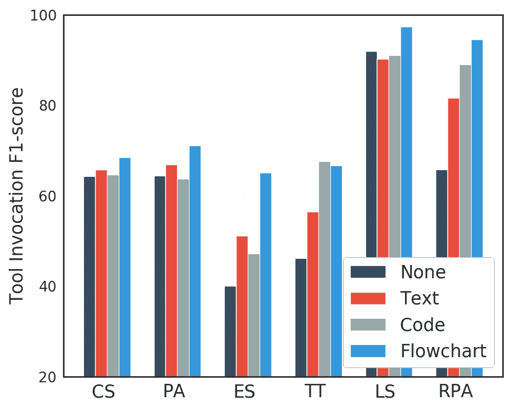
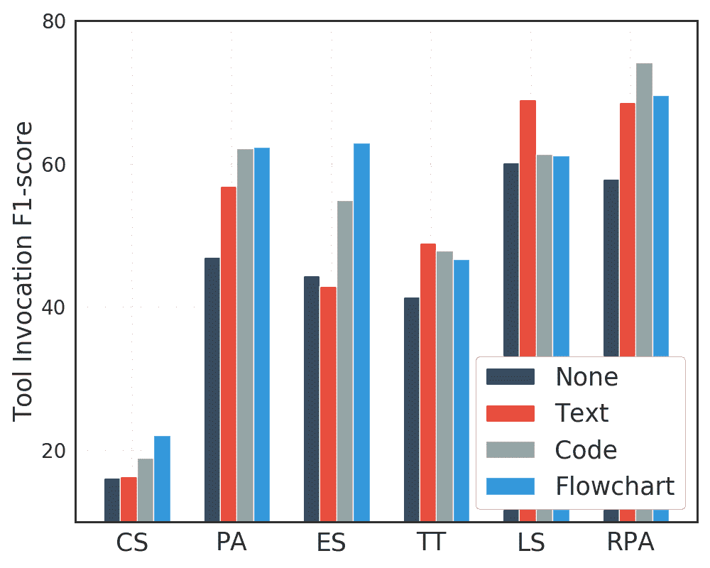
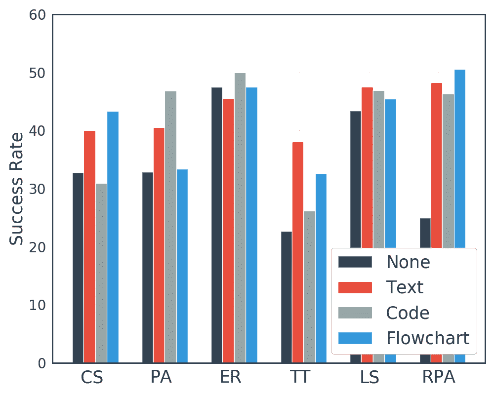
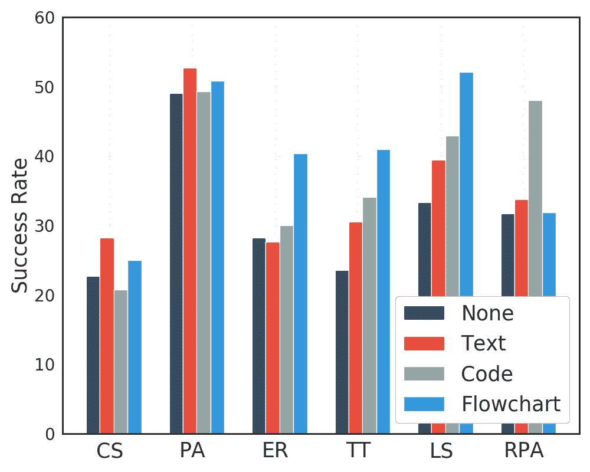
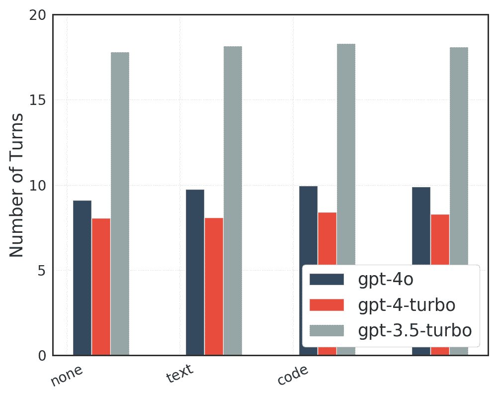
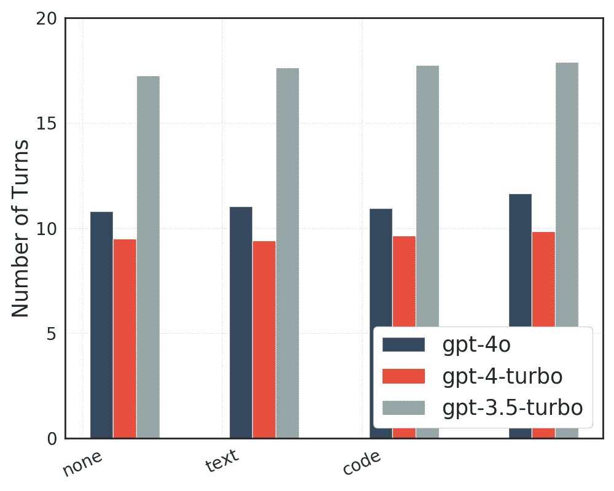
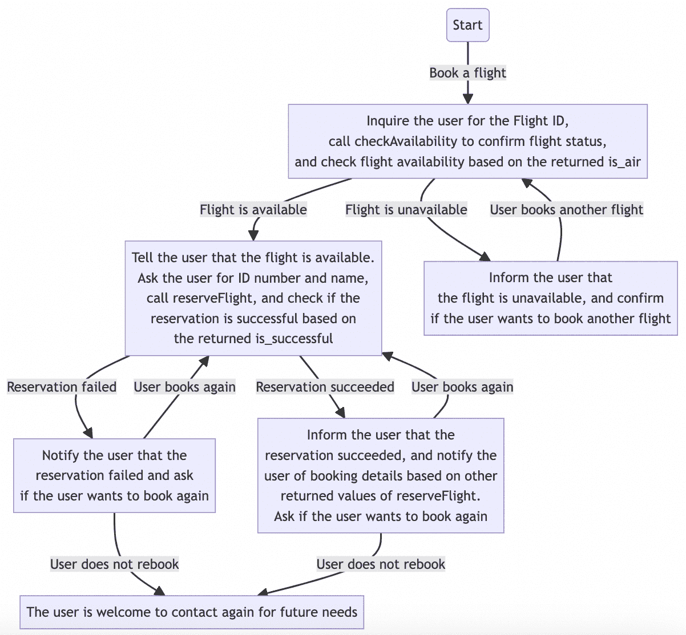

<!--yml

类别：未分类

日期：2025-01-11 12:30:45

-->

# FlowBench：重新审视并基准测试基于工作流指导的LLM代理规划

> 来源：[https://arxiv.org/html/2406.14884/](https://arxiv.org/html/2406.14884/)

Ruixuan Xiao¹, Wentao Ma²¹¹footnotemark: 1, Ke Wang², Yuchuan Wu²

Junbo Zhao¹, Haobo Wang¹, Fei Huang², Yongbin Li²²²footnotemark: 2

¹浙江大学  ²阿里巴巴集团

{xiaoruixuan,j.zhao,wanghaobo}@zju.edu.cn

{mawentao.mwt,wk258730,shengxiu.wyc,f.huang,shuide.lyb}@alibaba-inc.com   同等贡献。Ruixuan Xiao在阿里巴巴集团实习期间完成的工作。通讯作者。

###### 摘要

基于LLM的代理已成为有前景的工具，旨在通过迭代规划和行动来完成复杂任务。然而，当缺乏针对专业密集型任务的特定知识时，这些代理容易出现不必要的规划错觉。为了解决这一问题，初步尝试通过引入外部工作流相关知识来增强规划的可靠性。尽管具有潜力，这种引入的知识通常是杂乱无章的，并且格式多样，缺乏严格的形式化和全面的比较。受到此启发，我们对不同格式的工作流知识进行了形式化，并提出了FlowBench，这是第一个基于工作流指导的规划基准测试。FlowBench涵盖了来自6个领域的51种不同场景，知识以多种格式呈现。为了在FlowBench上评估不同的LLM，我们设计了一个多层次的评估框架。我们评估了工作流知识在多种格式中的效果，结果表明，目前的LLM代理需要大量改进才能达到令人满意的规划效果。我们希望这个具有挑战性的基准测试能为未来的代理规划研究铺平道路。我们的基准测试和脚本将很快发布。

FlowBench：重新审视并基准测试基于工作流指导的规划

LLM基础的代理规划

Ruixuan Xiao¹^†^†thanks:   同等贡献。Ruixuan Xiao在阿里巴巴集团实习期间完成的工作。, Wentao Ma²¹¹footnotemark: 1, Ke Wang², Yuchuan Wu² Junbo Zhao¹, Haobo Wang¹^†^†thanks:   通讯作者。, Fei Huang², Yongbin Li²²²footnotemark: 2 ¹浙江大学  ²阿里巴巴集团 {xiaoruixuan,j.zhao,wanghaobo}@zju.edu.cn {mawentao.mwt,wk258730,shengxiu.wyc,f.huang,shuide.lyb}@alibaba-inc.com

## 1 引言

大型语言模型（LLMs）的显著进展，Touvron等人（[2023](https://arxiv.org/html/2406.14884v1#bib.bib26)）；Zeng等人（[2023](https://arxiv.org/html/2406.14884v1#bib.bib39)）；OpenAI（[2023a](https://arxiv.org/html/2406.14884v1#bib.bib19)）推动了基于LLM的智能体发展，Wang等人（[2024](https://arxiv.org/html/2406.14884v1#bib.bib28)）；Hong等人（[2023](https://arxiv.org/html/2406.14884v1#bib.bib9)）在多个领域的复杂任务解决中取得了进展，Qian等人（[2023](https://arxiv.org/html/2406.14884v1#bib.bib22)）；Hong等人（[2023](https://arxiv.org/html/2406.14884v1#bib.bib9)）；Zhou等人（[2023](https://arxiv.org/html/2406.14884v1#bib.bib41)）。尽管近期的研究在通过提示构建（prompt construction）提升智能体工具使用能力上取得了进展，Yao等人（[2023b](https://arxiv.org/html/2406.14884v1#bib.bib36)，[a](https://arxiv.org/html/2406.14884v1#bib.bib35)）和多智能体协作，Hong等人（[2023](https://arxiv.org/html/2406.14884v1#bib.bib9)）；Chen等人（[2023](https://arxiv.org/html/2406.14884v1#bib.bib4)）；Qian等人（[2023](https://arxiv.org/html/2406.14884v1#bib.bib22)），然而，LLMs固有的参数知识范围有限，可能导致规划幻觉的现象，Zhu等人（[2024](https://arxiv.org/html/2406.14884v1#bib.bib42)）——LLMs可能会表现出与任务知识冲突的不可控行为，这种不良影响阻碍了它们在知识密集型任务中的实际应用。

图1：工作流引导的智能体规划过程。智能体提供了各种格式的工作流知识，并被提示规划下一步行动。

另一方面，通过利用外部知识来减轻幻觉问题，仍然是大语言模型（LLM）研究中的一个重要课题。高等（Gao et al.）等人 ([2023](https://arxiv.org/html/2406.14884v1#bib.bib8))；白（Baek et al.）等人 ([2024](https://arxiv.org/html/2406.14884v1#bib.bib3))；史（Shi et al.）等人 ([2023](https://arxiv.org/html/2406.14884v1#bib.bib25))；白（Baek et al.）等人 ([2024](https://arxiv.org/html/2406.14884v1#bib.bib3))。至于LLM-代理规划，已有一些初步的努力，通过结合工作流相关知识来提升代理的规划质量。姜（Jiang et al.）等人 ([2024](https://arxiv.org/html/2406.14884v1#bib.bib11))；Chhikara等人 ([2023](https://arxiv.org/html/2406.14884v1#bib.bib6))；叶（Ye et al.）等人 ([2023](https://arxiv.org/html/2406.14884v1#bib.bib37))。例如，KnowAgent Zhu等人 ([2024](https://arxiv.org/html/2406.14884v1#bib.bib42)) 使用自然语言格式总结的显式行动知识来调节规划轨迹。ProAgent Ye等人 ([2023](https://arxiv.org/html/2406.14884v1#bib.bib37)) 通过Python代码描述的控制流提升了复杂任务的效率。尽管这些初步的工作充满潜力，但它们通常以杂乱无章且不系统的格式构建工作流相关知识，缺乏深入探索和严格的基准比较，尤其是在工作流的作用方面。因此，如何正式化、利用和评估这种工作流相关知识在不同实际场景中对LLM代理的作用，仍然是一个未充分探索的课题。

为此，我们精心探讨了不同格式的工作流知识，并建立了一个系统化的基准，用于评估工作流引导的代理规划。我们的研究首先回顾并形式化了多种工作流知识的嵌入格式，包括自然语言、符号代码和流程图模式，如图[1](https://arxiv.org/html/2406.14884v1#S1.F1 "Figure 1 ‣ 1 Introduction ‣ FlowBench: Revisiting and Benchmarking Workflow-Guided Planning for LLM-based Agents")所示。为了进行比较评估，我们提出了FlowBench，这是首个全面的工作流引导代理规划基准。FlowBench涵盖了广泛的分类（6个领域，22个角色，51种场景）和不同的知识格式（文本、代码、流程图），以全面与实际应用同步。基准数据通过任务收集、工作流组织和会话生成的三阶段管道构建而成。FlowBench具有许多独特的特点，如覆盖范围、难度、专家级标注，以及支持多轮用户-代理交互，如表[1](https://arxiv.org/html/2406.14884v1#S1.T1 "Table 1 ‣ 1 Introduction ‣ FlowBench: Revisiting and Benchmarking Workflow-Guided Planning for LLM-based Agents")中总结的内容。

为了进行可靠的评估，我们设计了一个全面的评估框架，包含两种不同粒度的评估：(i)-静态的轮次级别评估，侧重于单步规划。(ii)-动态的会话级别评估，模拟顺序规划。基于这些评估机制，我们评估了不同能力水平的大语言模型，并嵌入了不同格式的工作流知识。我们观察到，即使是表现最好的大语言模型GPT-4o Hel（[2024](https://arxiv.org/html/2406.14884v1#bib.bib1)），在某些任务中的表现依然不尽人意（43.2%和40.9%的成功率）。通过对比不同的工作流格式，我们发现流程图在性能、适应性和用户友好性之间取得了最佳的折衷。所有这些结果揭示了FlowBench对当前大语言模型-代理设计提出的深刻挑战，并为未来的探索指明了方向。  

我们的贡献总结如下，  

+   •  

    据我们所知，我们是首个系统地重新审视并形式化定义不同工作流知识表示的团队。  

+   •  

    我们构建了FlowBench，这是第一个全面的基准测试，旨在指导工作流驱动的代理规划，涵盖了6个领域中的51个场景，包含不同的工作流格式。  

+   •  

    我们提出了一个全面的评估框架，以实现可靠的比较。我们提供了对不同工作流格式的各种大语言模型（LLMs）的比较分析，指明了代理规划的有前景的方向。  

| 基准 | 领域 | 目的与任务 | 工作流知识 | 多轮交互 |   |
| --- | --- | --- | --- | --- | --- |
| 环境 | 用户 |   |
| PlanBench | 物流, Blocksworld | 文本脚本生成 | ✗ | ✗ | ✗ |   |
| TravelAgent | 旅行 | 旅行计划生成 | ✗ | ✗ | ✗ |   |
| KnowAgent | 问答, 文本游戏 | 在线任务规划 | 文本 | ✓ | ✗ |   |
| ProAgent | 机器人流程自动化 | 在线任务规划 | 代码 | ✓ | ✗ |   |
| FlowBench | 6个领域, 22个角色, 51个场景 | 在线任务规划 | 文本, 代码, 流程图 | ✓ | ✓ |

表1：FlowBench与一些相关研究和基准的比较，包括ProAgent Ye等人（[2023](https://arxiv.org/html/2406.14884v1#bib.bib37)）、PlanBench Valmeekam等人（[2023](https://arxiv.org/html/2406.14884v1#bib.bib27)）、TravelAgent Xie等人（[2024](https://arxiv.org/html/2406.14884v1#bib.bib31)）和KnowAgent Zhu等人（[2024](https://arxiv.org/html/2406.14884v1#bib.bib42)）。  

## 2 相关工作  

### 2.1 LLM驱动的代理  

LLM（大语言模型）能力的不断发展促使了基于LLM的智能体的探索，Wang等人（[2024](https://arxiv.org/html/2406.14884v1#bib.bib28)）；Hong等人（[2023](https://arxiv.org/html/2406.14884v1#bib.bib9)）；Chen等人（[2023](https://arxiv.org/html/2406.14884v1#bib.bib4)）设计了用于解决复杂任务的智能体，并在多个领域展现了巨大潜力，如软件开发Qian等人（[2023](https://arxiv.org/html/2406.14884v1#bib.bib22)）；Hong等人（[2023](https://arxiv.org/html/2406.14884v1#bib.bib9)）；Chen等人（[2023](https://arxiv.org/html/2406.14884v1#bib.bib4)）、网页导航Deng等人（[2023](https://arxiv.org/html/2406.14884v1#bib.bib7)）；Zhou等人（[2023](https://arxiv.org/html/2406.14884v1#bib.bib41)）、医疗支持Yang等人（[2024b](https://arxiv.org/html/2406.14884v1#bib.bib34)）；Zhang等人（[2023](https://arxiv.org/html/2406.14884v1#bib.bib40)）。早期的研究方法致力于提高LLM的连续推理能力，促使LLM进行渐进和全面的思考，如思维链（Chain of Thought，CoT）Wei等人（[2022](https://arxiv.org/html/2406.14884v1#bib.bib29)）、ReAct Yao等人（[2023b](https://arxiv.org/html/2406.14884v1#bib.bib36)）、思维树（Tree of Thought）Yao等人（[2023a](https://arxiv.org/html/2406.14884v1#bib.bib35)）。后一类研究集中在增强工具利用Schick等人（[2023](https://arxiv.org/html/2406.14884v1#bib.bib24)）；Qin等人（[2023](https://arxiv.org/html/2406.14884v1#bib.bib23)）；Patil等人（[2023](https://arxiv.org/html/2406.14884v1#bib.bib21)）和多智能体协作Hong等人（[2023](https://arxiv.org/html/2406.14884v1#bib.bib9)）；Chen等人（[2023](https://arxiv.org/html/2406.14884v1#bib.bib4)）；Qian等人（[2023](https://arxiv.org/html/2406.14884v1#bib.bib22)）方面的应用。

### 2.2 知识增强型智能体

知识增强型LLMs（高等人（[2023](https://arxiv.org/html/2406.14884v1#bib.bib8)）；白等人（[2024](https://arxiv.org/html/2406.14884v1#bib.bib3)）；施等人（[2023](https://arxiv.org/html/2406.14884v1#bib.bib25)）；白等人（[2024](https://arxiv.org/html/2406.14884v1#bib.bib3)））已成为一个流行话题，因为利用外部知识可以有效提高回答的事实准确性（阿格拉瓦尔等人（[2023](https://arxiv.org/html/2406.14884v1#bib.bib2)）；刘等人（[2024](https://arxiv.org/html/2406.14884v1#bib.bib15)，[2023a](https://arxiv.org/html/2406.14884v1#bib.bib13)））。对于基于LLM的智能体来说，任务相关的知识和专业技能对于做出正确的计划和决策也至关重要。为此，已有一些初步尝试（姜等人（[2024](https://arxiv.org/html/2406.14884v1#bib.bib11)）；奇卡拉等人（[2023](https://arxiv.org/html/2406.14884v1#bib.bib6)））通过结合与工作流相关的知识，如自然语言描述的行动规则（黄等人（[2022](https://arxiv.org/html/2406.14884v1#bib.bib10)）；朱等人（[2024](https://arxiv.org/html/2406.14884v1#bib.bib42)）），知识图谱形式的领域知识（徐等人（[2024](https://arxiv.org/html/2406.14884v1#bib.bib32)）；姜等人（[2024](https://arxiv.org/html/2406.14884v1#bib.bib11)）），以及以代码表达的控制流（杨等人（[2024a](https://arxiv.org/html/2406.14884v1#bib.bib33)）；叶等人（[2023](https://arxiv.org/html/2406.14884v1#bib.bib37)））来提高指定任务中的规划可靠性。然而，这些研究大多以多样且不规范的格式构建工作流知识，缺乏对注入工作流知识的效果的正式共识和全面的基准测试比较。

### 2.3 LLM智能体评估

为了评估大型语言模型（LLMs）作为智能体的能力，已经建立了大量的基准测试，如刘等人（[2023b](https://arxiv.org/html/2406.14884v1#bib.bib14)）；马等人（[2024](https://arxiv.org/html/2406.14884v1#bib.bib16)）；吴等人（[2023](https://arxiv.org/html/2406.14884v1#bib.bib30)）。这些研究大多侧重于评估通用能力，如工具使用（秦等人（[2023](https://arxiv.org/html/2406.14884v1#bib.bib23)）；陈等人（[2024](https://arxiv.org/html/2406.14884v1#bib.bib5)））、代码生成（刘等人（[2023b](https://arxiv.org/html/2406.14884v1#bib.bib14)）；马等人（[2024](https://arxiv.org/html/2406.14884v1#bib.bib16)））和具身互动（吴等人（[2023](https://arxiv.org/html/2406.14884v1#bib.bib30)））。至于与工作流整合的规划，如何系统地评估智能体对整合工作流知识的理解和利用能力仍然存在疑问。

图2：FlowBench概述。我们的基准架构采用自上而下的多级层次结构（领域 - 角色 - 场景 - 知识）。左侧的基准构建过程包含三个阶段（a,b,c）。右侧的评估框架则封装了静态轮次级别和模拟会话级别的评估。

## 3 工作流形式化

### 3.1 任务表述

在我们的研究范围内，我们考虑一个由大型语言模型（LLM）驱动的智能体$\mathcal{M}_{\theta}$来处理特定的下游任务。这个智能体$\mathcal{M}_{\theta}$配备了外部的任务特定知识库$\mathcal{B}=\{\mathcal{K},\mathcal{P}\}$，其中包含与工作流相关的知识$\mathcal{K}$和工具箱$\mathcal{P}$。在大多数现有的智能体研究中，智能体$\mathcal{M}_{\theta}$通常在最初就被提供了完整且详细的任务描述作为输入。然而，这种非交互式的假设在现实世界中的多轮在线规划中并不现实。为此，我们将其推广为更具现实感的多轮交互设定，允许用户通过与智能体的持续对话，逐步完善和修改他们的需求。

正式地假设，在任务求解的迭代步骤$i$中，智能体$\mathcal{M}_{\theta}$处于状态$s_{i}$。在接收到来自外部环境的反馈$e_{i}$和用户提供的对话输入$u_{i}$后，智能体需要利用其内建的参数化常识$\theta$和外部工作流知识库$\mathcal{B}$，制定出一个行动计划$a_{i+1}$并向用户提供对话回复$r_{i+1}$。通过这一动作，智能体转移到后续状态$s_{i+1}$，

|  | $\{a_{i+1},s_{i+1},r_{r+1}\}\leftarrow\mathcal{M}_{\theta}({\mathcal{H}_{i}},% \mathcal{B})$ |  | (1) |
| --- | --- | --- | --- |

在这个公式中，$\mathcal{H}_{i}$表示交互历史，包含了从迭代$0$到$i$的所有条目$\{u_{t},e_{t},s_{t},a_{t},r_{t}\}_{t=0}^{i}$，其中包括来自用户/环境的当前输入$\{u_{i},e_{i}\}$以及来自所有过去步骤的历史信息$\{s_{i},a_{i},r_{i}\}$，如图[1](https://arxiv.org/html/2406.14884v1#S1.F1 "图 1 ‣ 1 引言 ‣ FlowBench：重访与基准化基于工作流的 LLM 驱动规划")所示。经过$T$轮这样的顺序规划后，我们期望智能体$\mathcal{M}_{\theta}$能够通过制定正确的行动计划轨迹$\{a_{0},a_{1},...,a_{T}\}$和令人满意的响应$\{r_{0},r_{1},...,r_{T}\}$，成功完成用户的任务。

### 3.2 重访不同的工作流格式

工作流相关知识是一套关于管道相关事实的表示，这指的是在特定环境下（如商业或项目环境）理解过程或任务是如何构建和执行的。不同工作流知识的内容主要包括以下几个类别：（i）操作过程相关，描述完成任务所需的步骤及其顺序。（ii）条件/规则相关，描述在满足特定条件或参数时应采取的行动。（iii）工具/数据相关，包含不同工具的使用技术以及数据处理机制。

如前所述，工作流相关知识可以以多种格式嵌入，Zhu 等人（[2024](https://arxiv.org/html/2406.14884v1#bib.bib42)）；Ye 等人（[2023](https://arxiv.org/html/2406.14884v1#bib.bib37)）。因此，我们首先回顾不同的工作流表现形式。基于抽象级别，我们主要分析三种不同的表示形式：

+   •

    通过普通自然语言文档传达的文本格式。

+   •

    代码格式，遵循编程语言标准，例如 Python 伪代码。

+   •

    流程图格式，通过低代码可视化编程图表语法表达，例如 Markdown Mermaid 语法。

这三种工作流知识形式在图 [1](https://arxiv.org/html/2406.14884v1#S1.F1 "Figure 1 ‣ 1 Introduction ‣ FlowBench: Revisiting and Benchmarking Workflow-Guided Planning for LLM-based Agents") 中有所展示（更多示例请参见附录 [D](https://arxiv.org/html/2406.14884v1#A4 "Appendix D Additional Demonstration ‣ FlowBench: Revisiting and Benchmarking Workflow-Guided Planning for LLM-based Agents")）。它们各自的优点和缺点可以通过以下两个标准大致概述，

+   •

    效率与精确度：考虑到知识表达的效率，文本格式在表达复杂概念时具有灵活性，但可能导致过度的符号消耗和不必要的语义模糊。相反，代码和流程图通过结构化符号来增强其精确性和效率。

+   •

    用户友好性：用户友好性主要取决于它对用户编辑和理解的便捷性。虽然文本格式便于编辑，但在冗长的文档中定位特定知识点可能会显得繁琐。对于代码而言，编辑代码需要编程专业知识，这也是一个挑战。相比之下，流程图提供了一种更为用户友好的替代方式，允许没有编程经验的用户轻松编辑，并提供可视化界面以提升理解。

总体来看，可以得出结论，自然语言更具表现力，但效率较低且往往具有歧义，而编程代码则更加结构化、简洁和精确，尽管对于用户的理解和编辑来说，代码不够直观。流程图架起了一座桥梁，将自然语言的强大表现力与符号代码的高效性结合起来，并提供了高度用户友好的可视化和编辑选项。

## 4 FlowBench

其构建过程和评估框架的概览显示在图[2](https://arxiv.org/html/2406.14884v1#S2.F2 "图 2 ‣ 2.3 LLM代理的评估 ‣ 2 相关工作 ‣ FlowBench：重新审视和基准测试基于LLM的代理的工作流引导规划")中。接下来，我们将详细阐述这一点。

### 4.1 基准架构层次

FlowBench由多个下游领域组成（分布显示在第[4.2](https://arxiv.org/html/2406.14884v1#S4.SS2 "4.2 基准构建 ‣ 4 FlowBench ‣ FlowBench：重新审视和基准测试基于LLM的代理的工作流引导规划")节中）。每个领域包含一系列代理角色。每个角色又由一套特定场景（即基本任务）进一步划分。每个场景与相应的任务相关知识库有关，该知识库包括任务背景、工作流相关知识以及要使用的工具集合。

图[2](https://arxiv.org/html/2406.14884v1#S2.F2 "图 2 ‣ 2.3 LLM代理的评估 ‣ 2 相关工作 ‣ FlowBench：重新审视和基准测试基于LLM的代理的工作流引导规划")左侧展示了一个全面的自上而下的示例。在客户服务领域，配置了多个代理角色，包括餐厅服务员、酒店接待员和公寓经理。公寓经理的角色负责两个场景：公寓搜索和账单查询。每个场景都与其任务相关的知识库相关联。

### 4.2 基准构建

FlowBench的构建流程分为三个阶段：场景收集、工作流组织和会话生成。

##### 任务集合

为了有效评估基于工作流引导的规划能力，基准测试的多样性和广泛覆盖是至关重要的。为此，我们最初从现有作品Mosig等人（[2020](https://arxiv.org/html/2406.14884v1#bib.bib17)）中收集的任务中汲取灵感，并进一步进行广泛扩展。我们的任务集合面向个人客户和商业企业。因此，FlowBench的角色和场景是从以下六个领域中精心收集的：

| 领域 | 角色 | 场景 | 会话 | 回合 |
| --- | --- | --- | --- | --- |
| 客户服务 | 4 | 12 | 114 | 1167 |
| 个人助手 | 3 | 7 | 92 | 821 |
| 电子商务推荐 | 2 | 5 | 32 | 330 |
| 旅行与交通 | 4 | 9 | 135 | 1421 |
| 物流解决方案 | 3 | 6 | 61 | 521 |
| 机器人过程自动化 | 6 | 12 | 102 | 1053 |
| 总体 | 22 | 51 | 536 | 5313 |

表2：FlowBench的领域统计数据。

+   •

    客户服务提供咨询、接待、预订和售后支持。

+   •

    个人助理提供个人管理和解决方案服务。

+   •

    电子零售推荐帮助用户在购物过程中发现并购买产品。

+   •

    旅游与交通提供旅行和交通安排的支持。

+   •

    物流解决方案协助管理快递和物流服务。

+   •

    机器人过程自动化（RPA）专注于自动化和简化复杂的工作流程，特别是在商业环境中。

如基准方案中所述（第[4.1](https://arxiv.org/html/2406.14884v1#S4.SS1 "4.1 基准方案层次 ‣ 4 FlowBench ‣ FlowBench：重新审视并基准化基于工作流的规划用于LLM代理")节），每个领域包含多个代理角色（总共有22个），每个角色进一步包含多个任务场景（总共有51个）。每个领域的完整场景和角色可以在附录中找到，领域分布也可以在图[2](https://arxiv.org/html/2406.14884v1#S2.F2 "图2 ‣ 2.3 LLM代理评估 ‣ 2 相关工作 ‣ FlowBench：重新审视并基准化基于工作流的规划用于LLM代理")中查看。

##### 工作流组织

收集任务场景后，接下来我们描述了每个场景中与工作流相关的知识提取和结构化过程。我们并没有进行头脑风暴，而是参考了一些现有的文献，如专业知识语料库（例如WiKiHow Koupaee和Wang（[2018](https://arxiv.org/html/2406.14884v1#bib.bib12)））、工作流知识网站（例如Zapier [Zapier](https://arxiv.org/html/2406.14884v1#bib.bib38)）和搜索引擎结果。

将来自这些来源的信息整合后，我们首先将与工作流相关的专业知识逐点总结成自然语言文档。然后需要不同的人工标注员独立验证这些知识文档的正确性、完整性和非冗余性。随后，我们使用GPT-4 OpenAI ([2023b](https://arxiv.org/html/2406.14884v1#bib.bib20))将这种文本格式的知识转化为符合指定标准的代码和流程图格式，并结合人工验证以确保知识的一致性。不同格式嵌入工作流知识的示例如附录[D](https://arxiv.org/html/2406.14884v1#A4 "附录D 额外示范 ‣ FlowBench：重新审视并基准化基于工作流的规划用于LLM代理")中提供。在结构化工作流知识后，我们继续组织与工作流相关的工具调用信息。遵循GPT-4功能调用格式，我们概述了每个工具调用的描述、输入/输出的参数以及每个参数的相应信息。

| 模型 | 格式 | 单场景 | 跨场景 |
| --- | --- | --- | --- |
| 工具调用 | 参数 F1 | 响应分数 | 工具调用 | 参数 F1 | 响应分数 |
| P | R | F1 | P | R | F1 |
| GPT-4o | 无 | 73.8 | 60.3 | 66.3 | 76.5 | 7.80 | 60.8 | 51.2 | 55.4 | 70.8 | 7.85 |
| 文本 | 75.9 | 63.6 | 69.1 | 77.2 | 8.22 | 66.0 | 54.9 | 59.9 | 71.0 | 8.34 |
| 代码 | 73.7 | 64.9 | 69.0 | 78.3 | 8.30 | 63.2 | 53.9 | 58.2 | 70.7 | 8.23 |
| 流程图 | 83.4 | 68.9 | 75.5 | 80.9 | 8.38 | 73.9 | 56.0 | 63.7 | 72.2 | 8.29 |
| GPT-4-Turbo | 无 | 68.3 | 52.1 | 59.1 | 71.7 | 7.55 | 53.9 | 45.6 | 49.2 | 63.9 | 7.77 |
| 文本 | 70.2 | 56.8 | 62.9 | 74.5 | 7.94 | 55.3 | 47.2 | 51.1 | 64.3 | 8.05 |
| 代码 | 73.7 | 61.4 | 67.0 | 78.8 | 7.98 | 53.7 | 49.4 | 51.4 | 65.1 | 8.03 |
| 流程图 | 78.9 | 69.3 | 73.6 | 79.2 | 8.06 | 67.2 | 58.1 | 62.3 | 71.5 | 8.10 |
| GPT-3.5-Turbo | 无 | 58.5 | 51.9 | 55.0 | 67.9 | 7.01 | 52.5 | 42.7 | 47.2 | 66.2 | 7.19 |
| 文本 | 63.4 | 56.8 | 59.8 | 72.5 | 7.28 | 53.5 | 48.9 | 51.0 | 69.0 | 7.39 |
| 代码 | 60.7 | 55.0 | 57.9 | 69.2 | 7.33 | 53.1 | 47.7 | 50.2 | 70.2 | 7.33 |
| 流程图 | 71.6 | 59.6 | 65.4 | 76.3 | 7.39 | 60.9 | 51.0 | 55.6 | 70.8 | 7.30 |

表 3：不同 LLM 在静态回合级评估下，配备不同格式的工作流知识的性能比较。粗体条目表示优秀结果。

##### 交互会话生成

有了整理好的与工作流相关的知识，我们接下来的工作是合成每个场景的真实用户与代理交互会话。生成的这些会话将作为我们评估框架的前提条件，框架的详细内容将在第[4.3](https://arxiv.org/html/2406.14884v1#S4.SS3 "4.3 评估框架 ‣ 4 FlowBench ‣ FlowBench：重新审视并基准化面向 LLM 的工作流指导规划")节中讨论。我们的原则是增强生成会话的多样性和真实性。为此，我们提示GPT-4在每个场景下生成不同的用户画像以增强多样性，这包括用户背景、用户目标、响应语气（即响应风格）。为了确保数据的真实性，我们进一步有意地将一些场景外的元素，如随意闲聊和无关的越界意图，融入到用户画像中，模拟现实世界的情境。

给定生成的用户档案，我们采用协作注释策略，该策略为用户和代理端分配了一对合作的人工标注员和LLM标注员（GPT-4）。具体而言，对于每次交互回合，在用户端，人工标注员根据任务背景和交互历史编写后续用户意图和对话草稿，然后由LLM标注员验证并改写，以匹配所需的响应语气。至于代理端，人工标注员利用工作流程知识制定下一步行动计划并编写初步响应草稿，随后由LLM标注员审查并润色。此协作生成过程持续迭代，直到整个会话完全标注完成。

##### 数据验证

为确保数据质量，我们在基准构建的每个阶段都纳入了人工验证。三名人工标注员参与质量验证过程。每位标注员的提交都将接受另外两位标注员的交叉验证。

| 模型 | 格式 | 单一场景 | 跨场景 |
| --- | --- | --- | --- |
| 工具调用 | 成功率 | 任务进度 | 工具调用 | 成功率 | 任务进度 |
| P | R | F1 | P | R | F1 |
| GPT-4o | None | 67.8 | 70.5 | 69.0 | 35.1 | 77.5 | 45.1 | 53.9 | 49.0 | 34.2 | 75.7 |
| 文本 | 73.7 | 81.2 | 77.2 | 41.7 | 83.4 | 50.5 | 58.7 | 54.1 | 40.9 | 81.2 |
| 代码 | 70.9 | 79.6 | 75.0 | 43.2 | 83.1 | 47.7 | 56.9 | 51.9 | 38.2 | 77.9 |
| 流程图 | 74.3 | 82.6 | 78.3 | 42.7 | 82.2 | 50.2 | 60.4 | 54.7 | 40.1 | 81.3 |
| GPT-4-Turbo | None | 62.9 | 64.0 | 63.5 | 31.9 | 76.7 | 43.6 | 47.0 | 45.2 | 31.1 | 75.3 |
| 文本 | 65.9 | 69.9 | 67.8 | 41.5 | 83.8 | 47.6 | 49.3 | 48.4 | 36.8 | 79.6 |
| 代码 | 79.3 | 64.7 | 71.2 | 37.8 | 83.6 | 47.5 | 52.9 | 50.0 | 37.3 | 82.0 |
| 流程图 | 70.5 | 78.3 | 74.2 | 40.6 | 82.3 | 50.1 | 51.2 | 50.6 | 39.4 | 81.1 |
| GPT-3.5-Turbo | None | 37.6 | 50.5 | 43.1 | 29.8 | 63.7 | 24.7 | 30.7 | 27.4 | 22.4 | 61.1 |
| 文本 | 44.1 | 55.6 | 49.1 | 37.0 | 69.7 | 25.6 | 31.5 | 28.2 | 25.2 | 63.9 |
| 代码 | 44.5 | 52.9 | 48.3 | 31.3 | 66.3 | 24.5 | 31.9 | 27.8 | 24.1 | 62.9 |
| 流程图 | 43.6 | 54.3 | 48.4 | 34.9 | 68.6 | 24.9 | 33.0 | 28.5 | 24.7 | 67.0 |

表 4：在模拟会话级评估下，不同格式的工作流知识下，不同LLM的性能比较。加粗的条目表示更优的结果。

##### 基准统计

FlowBench的统计数据如表[2](https://arxiv.org/html/2406.14884v1#S4.T2 "表 2 ‣ 任务集合 ‣ 4.2 基准构建 ‣ 4 FlowBench ‣ FlowBench：重新审视并基准化基于LLM的代理的工作流引导规划")所示，和一些相关基准的比较见表[1](https://arxiv.org/html/2406.14884v1#S1.T1 "表 1 ‣ 1 介绍 ‣ FlowBench：重新审视并基准化基于LLM的代理的工作流引导规划")。构建成本见附录[A.3](https://arxiv.org/html/2406.14884v1#A1.SS3 "A.3 基准构建成本 ‣ 附录 A 其他基准详情 ‣ FlowBench：重新审视并基准化基于LLM的代理的工作流引导规划")。

### 4.3 评估框架

在基准构建之后，本节提出了一个全面且多维的评估框架。我们根据任务意识对评估场景进行分类，并呈现静态评估和模拟评估的两个不同方面。

#### 4.3.1 任务意识

如前所述，在第[4.1节](https://arxiv.org/html/2406.14884v1#S4.SS1 "4.1 基准模式层级 ‣ 4 FlowBench ‣ FlowBench：重新审视并基准化基于LLM的代理的工作流引导规划")中，我们的数据集模式中，每个代理角色与若干相应的任务场景配对。因此，我们将评估场景分为单一场景评估和跨场景评估，依据是否已知特定任务场景而定。(i)-单一场景评估假设一个预定的任务场景。一个代理角色会获得该场景的工作流知识，并需要在该单一任务场景中进行导航、规划和执行动作。(ii)-跨场景评估假设具体场景未知。代理角色配备了涵盖该角色范围内所有场景的通用工作流知识。代理需要灵活地规划并在不同场景间切换。

#### 4.3.2 评估协议

如在第[3.1节](https://arxiv.org/html/2406.14884v1#S3.SS1 "3.1 任务表述 ‣ 3 工作流形式化 ‣ FlowBench：重新审视并基准化基于LLM的代理的工作流引导规划")中提到的，我们的多轮用户-代理交互设置扩展了传统的代理范式。因此，传统的评估协议与我们的基准不兼容。为了解决这个问题，我们设计了一个在轮次和会话级别的全面评估协议，如图[2](https://arxiv.org/html/2406.14884v1#S2.F2 "图 2 ‣ 2.3 LLM 代理的评估 ‣ 2 相关工作 ‣ FlowBench：重新审视并基准化基于LLM的代理的工作流引导规划")右侧所示。

##### 静态轮次级评估。

静态回合级评估基于第[4.2](https://arxiv.org/html/2406.14884v1#S4.SS2 "4.2 Benchmark Construction ‣ 4 FlowBench ‣ FlowBench: Revisiting and Benchmarking Workflow-Guided Planning for LLM-based Agents")节生成的真实会话数据进行操作。具体来说，给定一个采样的真实会话 $d$，对于 $d$ 中的每个回合 $i$，代理将获得来自 $d$ 的前一个（$i-1$）回合的真实交互历史，然后提示代理规划当前回合的行动。接下来，我们将预测的行动 $\tilde{a}_{i}$ 和回应 $\tilde{r}_{i}$ 与真实值 ${a}_{i}$, ${r}_{i}$ 进行比较以进行评估。

##### 模拟会话级评估。

为了更全面地评估在实际场景中，行动需要按顺序规划和执行的规划能力，提出了一种模拟会话级评估框架。

具体来说，我们基于GPT-4构建了一个用户模拟器。为了确保该模拟用户的行为与人类一致，我们还依赖于在第[4.2](https://arxiv.org/html/2406.14884v1#S4.SS2 "4.2 Benchmark Construction ‣ 4 FlowBench ‣ FlowBench: Revisiting and Benchmarking Workflow-Guided Planning for LLM-based Agents")节生成的真实会话数据。我们通过GPT-4从每个会话中提取出任务-用户总结，内容包括任务背景、用户目标和工具调用信息。值得注意的是，这个任务-用户总结与第[4.2](https://arxiv.org/html/2406.14884v1#S4.SS2 "4.2 Benchmark Construction ‣ 4 FlowBench ‣ FlowBench: Revisiting and Benchmarking Workflow-Guided Planning for LLM-based Agents")节中生成的用户档案不同。用户目标总结了用户的所有目标，而工具调用信息则概述了工具使用的预期参数和值。基于这个任务-用户总结，生成一个预测会话，并用模拟用户和待评估代理进行度量计算。所有关于回合级和会话级的评估指标将在后续的第[5.1](https://arxiv.org/html/2406.14884v1#S5.SS1 "5.1 Models and Baselines ‣ 5 Experiment ‣ FlowBench: Revisiting and Benchmarking Workflow-Guided Planning for LLM-based Agents")节中讨论。

## 5 实验

### 5.1 模型与基准

##### 大型语言模型（LLMs）。

鉴于在实际场景中解决复杂任务的难度，我们主要关注检验先进大型语言模型（LLMs）的有效性。因此，我们对几种来自OpenAI的先进LLMs进行了实验，涵盖了不同能力等级的模型：GPT-4o Hel（[2024](https://arxiv.org/html/2406.14884v1#bib.bib1)），GPT-4-Turbo OpenAI（[2023b](https://arxiv.org/html/2406.14884v1#bib.bib20)），GPT-3.5-Turbo OpenAI（[2022](https://arxiv.org/html/2406.14884v1#bib.bib18)），

##### 知识格式。

我们探索了不同嵌入格式的工作流知识的表现，包括：（i）-文本变体，采用自然语言文档格式；（ii）-代码变体，遵循Python伪代码风格；（iii）-流程图变体，使用低代码流程图，遵循Markdown的mermaid语法；（iv）-无变体，进一步包括该项，仅提供工具信息，而不涉及工作流相关的知识。值得注意的是，文本/代码/流程图基于一致的工作流，仅在格式上有所不同。

##### 指标。

我们基于逐步规划的准确性和整体任务完成情况，评估了回合和会话级别的表现。工具调用在两个级别的评估中使用精度（P）、召回率（R）和F1分数。只有当工具名称和所有必需的参数都被正确识别时，调用才被认为是正确的。在会话级别，我们依次检查每个真实的调用，验证它是否与任何模拟调用匹配。在回合级别，我们还包括了参数收集的F1分数。我们进一步通过GPT-4评估响应质量，采用偏好评分（满分：10），依据正确性、帮助性和人性化程度。对于会话级别，我们通过GPT-4评估成功率和任务进展。（i）-成功率描述完全成功的会话比例。会话被认为成功，当任务用户摘要中指定的所有目标都已实现。（ii）-任务进展表示每个会话中已完成目标的百分比。评估提示语见附录[C.3](https://arxiv.org/html/2406.14884v1#A3.SS3 "C.3 自动评估的提示设计 ‣ 附录 C 额外实现细节 ‣ FlowBench: 重访并基准化基于工作流引导的LLM代理规划")。

##### 实现细节。

在推理过程中，我们采用了gpt-4o-0513版本作为GPT-4o，gpt-4-0125-preview版本作为GPT-4-Turbo，以及gpt-3.5-turbo-16k-0613版本作为GPT-3.5-Turbo。在响应偏好、成功率和平均进展的自动评估中，我们使用gpt-4-turbo-0125-preview版本进行公平比较。推理提示语采用了ReAct Yao等人（[2023b](https://arxiv.org/html/2406.14884v1#bib.bib36)）框架，包含思考、行动和观察。更多实现细节和示例可以参考附录[C](https://arxiv.org/html/2406.14884v1#A3 "附录 C 额外实现细节 ‣ FlowBench: 重访并基准化基于工作流引导的LLM代理规划")。

| 格式 | S-场景 | C-场景 |
| --- | --- | --- |
| 工具 | SR | TP | 工具 | SR | TP |
| 无工具 | 53.0 | 28.9 | 72.1 | 31.7 | 25.3 | 71.3 |
| 无 | 63.5 | 31.9 | 76.7 | 45.2 | 31.1 | 75.3 |
| 文本 | 67.8 | 41.5 | 83.8 | 48.4 | 36.8 | 79.6 |
| 代码 | 71.2 | 37.8 | 83.6 | 50.0 | 37.3 | 82.0 |
| 流程图 | 74.2 | 40.6 | 82.3 | 50.6 | 39.4 | 81.1 |
| 集成 | 75.1 | 45.3 | 85.2 | 51.8 | 43.4 | 81.6 |

表5：在会话级评估下，变体None无工具与GPT-4-Turbo集成的表现。“工具”、“SR”和“TP”分别表示工具调用的F1分数、成功率和任务进度。

### 5.2 主要结果

表[3](https://arxiv.org/html/2406.14884v1#S4.T3 "Table 3 ‣ Workflow Organization ‣ 4.2 Benchmark Construction ‣ 4 FlowBench ‣ FlowBench: Revisiting and Benchmarking Workflow-Guided Planning for LLM-based Agents")和[4](https://arxiv.org/html/2406.14884v1#S4.T4 "Table 4 ‣ Data Verification ‣ 4.2 Benchmark Construction ‣ 4 FlowBench ‣ FlowBench: Revisiting and Benchmarking Workflow-Guided Planning for LLM-based Agents")展示了回合级和会话级的表现比较。根据这些结果，可以得出以下总结：

(i)-当缺少外部工作流知识，仅提供工具信息时（变体为None），LLMs仍然可以依赖其内在的常识来实现对工作流的基本理解。然而，在一些专业密集型领域，缺乏工作流知识可能会导致显著的性能下降，如[5.3节](https://arxiv.org/html/2406.14884v1#S5.SS3 "5.3 Further Analysis ‣ 5 Experiment ‣ FlowBench: Revisiting and Benchmarking Workflow-Guided Planning for LLM-based Agents")中所讨论的那样。

(ii)-在不同格式下加入工作流知识能显著促进代理规划，在回合级和会话级都能取得明显的改善。跨场景转换会导致一定程度的下降，但工作流知识仍能提供显著的改善。

(iii)-不同知识格式的效能在不同设置下有所不同。代码格式在较弱的LLMs上效果较差，可能是因为复杂的符号表达阻碍了信息的传递。另一方面，文本格式在不同LLMs上依然表现良好。

(iv)-总体而言，流程图格式通常能产生最佳表现。在静态回合级评估中，对于不同LLM工具调用的F1分数，它显示了6.4%、6.5%和5.6%的显著优势。对于会话级别，流程图在任务完成评估上与其他格式表现相当，但在工具调用上仍表现最佳。我们推测，这种优势源于其组织性和可理解性，这使得LLMs能够方便地确定当前状态，从而更好地进行规划。更多分析见附录[B](https://arxiv.org/html/2406.14884v1#A2 "Appendix B Additional Experimental Results ‣ FlowBench: Revisiting and Benchmarking Workflow-Guided Planning for LLM-based Agents")。

(a) 单一场景。

(b) 跨场景。

图3：会话级评估下的域名比较。使用首字母表示不同领域。

### 5.3 进一步分析

##### 域名级别的表现

我们进一步研究了不同领域的性能分布。对于GPT-4-Turbo的实验，按领域划分的工具调用F1得分如图[3](https://arxiv.org/html/2406.14884v1#S5.F3 "图3 ‣ 5.2 主要结果 ‣ 5 实验 ‣ FlowBench: 回顾与基准化基于工作流的LLM代理计划")所示。我们可以看到，工作流知识在那些需要专业知识的领域（如RPA、电子商务推荐和旅游）中发挥了更重要的作用，大大弥补了LLM中固有任务特定专业知识的缺失。

##### 工具信息的影响

如在第[4.1节](https://arxiv.org/html/2406.14884v1#S4.SS1 "4.1 层次基准模式 ‣ 4 FlowBench ‣ FlowBench: 回顾与基准化基于工作流的LLM代理计划")中提到的，在我们的任务特定知识库中，除了描述工作过程的与工作流相关的知识外，还有描述不同工具使用的工具信息。在这里，我们进一步剥离了None变体中的工具信息，并研究了这种没有工具的None变体，其中完全消除了工具及其参数的描述（只保留工具和参数名称）。如表[5](https://arxiv.org/html/2406.14884v1#S5.T5 "表5 ‣ 实施细节 ‣ 5.1 模型与基准 ‣ 5 实验 ‣ FlowBench: 回顾与基准化基于工作流的LLM代理计划")所示，这种变体进一步退化，特别是在跨场景设置下。

##### 知识格式组合。

我们进一步探讨了不同工作流知识格式组合的影响。如表[5](https://arxiv.org/html/2406.14884v1#S5.T5 "表5 ‣ 实施细节 ‣ 5.1 模型与基准 ‣ 5 实验 ‣ FlowBench: 回顾与基准化基于工作流的LLM代理计划")所示，这种组合变体同时提供文本、代码和流程图格式。它显示出额外的性能提升，证明了不同格式的一致知识可以相互补充并结合在一起，增强代理对工作流的理解。

## 6 结论

我们介绍了FlowBench，这是首个针对评估基于工作流的代理规划的基准。我们首先回顾并规范了不同的工作流知识格式。接下来，通过在FlowBench上的广泛实验，我们发现流程图格式在性能和用户体验之间实现了最佳的权衡。结果进一步表明，即便是表现最好的模型GPT-4o，在具有挑战性的FlowBench上仍然无法交付令人满意的结果。我们希望我们的工作能为未来的基于工作流的代理规划领域的研究提供有意义的见解。

## 局限性

我们提出了FlowBench，这是一个针对工作流引导的代理规划的挑战性基准。尽管它具有广泛性，但这项工作仍然存在一些必须承认的局限性。首先，我们的基准涵盖了来自不同抽象层次的三种代表性知识格式，但可能无法涵盖所有潜在的格式，这些格式我们计划在未来的工作中进行探索。此外，我们在评估过程中采用GPT-4-Turbo进行多个指标的自动评估，这增加了使用FlowBench的评估成本。我们的工作流知识提取过程也依赖于人工努力来确保质量，这既昂贵又耗时。未来的工作可以探索工作流相关知识提取的自动化。

## 伦理声明

在本文中，我们介绍了FlowBench，一个高度挑战性的多领域基准，用于评估工作流引导的代理规划能力。在我们的基准构建过程中，我们的人工标注员被指示筛选出可能引发伦理问题的数据，包括冒犯性内容或社会偏见。即使组织好的工作流知识和真实会话已经过筛选和验证，我们的模拟会话级评估仍然使用LLMs来模拟实时交互。这些基于API的LLM模拟器可能表现出偏见和不公正。我们建议潜在用户在评估过程中首先应用偏见减少和修正方法，以消除偏见模拟会话，从而增强公平性和伦理标准。我们将发布我们的基准和评估脚本，以促进创新并帮助未来研究的发展。

## 参考文献

+   Hel (2024) 2024. [Hello GPT-4o](https://openai.com/index/hello-gpt-4o/)。

+   Agrawal 等（2023）Garima Agrawal、Tharindu Kumarage、Zeyad Alghami 和 Huan Liu。2023年。[知识图谱能否减少大型语言模型中的幻觉？：一项调查](https://doi.org/10.48550/ARXIV.2311.07914)。*CoRR*, abs/2311.07914。

+   Baek 等（2024）Jinheon Baek、Nirupama Chandrasekaran、Silviu Cucerzan、Allen Herring 和 Sujay Kumar Jauhar。2024年。[知识增强的大型语言模型用于个性化上下文查询建议](https://doi.org/10.1145/3589334.3645404)。发表于 *2024年ACM网络会议论文集，WWW 2024，新加坡，2024年5月13-17日*，第3355–3366页。ACM。

+   陈等（2023）郭尧陈、思伟董、宇书、格张、贾瓦德·塞赛、博尔杰·F·卡尔松、杰傅、易敏·施。2023年。[Autoagents: 自动代理生成框架](https://doi.org/10.48550/ARXIV.2309.17288)。*CoRR*, abs/2309.17288。

+   陈等（2024）泽辉陈、伟华杜、文伟张、奎坤刘、江宁刘、苗郑、景铭卓、松扬张、大华林、凯陈、锋赵。2024年。[T-eval：逐步评估大型语言模型的工具利用能力](https://arxiv.org/abs/2312.14033)。*预印本*，arXiv:2312.14033。

+   Chhikara等（2023）Prateek Chhikara, Jiarui Zhang, Filip Ilievski, Jonathan Francis, 和Kaixin Ma。2023年。[用于互动文本游戏的知识增强智能体](https://doi.org/10.1145/3587259.3627561)。发表于*第12届知识捕捉会议（K-CAP 2023），2023年12月5-7日，美国佛罗里达州彭萨科拉*，页面157-165。ACM。

+   Deng等（2023）Xiang Deng, Yu Gu, Boyuan Zheng, Shijie Chen, Samual Stevens, Boshi Wang, Huan Sun, 和Yu Su。2023年。[Mind2web: 面向Web的一般智能体](http://papers.nips.cc/paper_files/paper/2023/hash/5950bf290a1570ea401bf98882128160-Abstract-Datasets_and_Benchmarks.html)。发表于*NeurIPS*。

+   Gao等（2023）Yunfan Gao, Yun Xiong, Xinyu Gao, Kangxiang Jia, Jinliu Pan, Yuxi Bi, Yi Dai, Jiawei Sun, Qianyu Guo, Meng Wang, 和Haofen Wang。2023年。[检索增强生成用于大型语言模型：一项调查](https://doi.org/10.48550/ARXIV.2312.10997)。*CoRR*, abs/2312.10997。

+   Hong等（2023）Sirui Hong, Xiawu Zheng, Jonathan Chen, Yuheng Cheng, Jinlin Wang, Ceyao Zhang, Zili Wang, Steven Ka Shing Yau, Zijuan Lin, Liyang Zhou, Chenyu Ran, Lingfeng Xiao, 和Chenglin Wu。2023年。[Metagpt: 多智能体协作框架的元编程](https://doi.org/10.48550/ARXIV.2308.00352)。*CoRR*, abs/2308.00352。

+   Huang等（2022）Wenlong Huang, Pieter Abbeel, Deepak Pathak, 和Igor Mordatch。2022年。[语言模型作为零-shot规划器：为具身智能体提取可操作知识](https://proceedings.mlr.press/v162/huang22a.html)。发表于*国际机器学习会议（ICML 2022），2022年7月17日至23日，美国马里兰州巴尔的摩*，*机器学习研究论文集*第162卷，页面9118–9147。PMLR。

+   Jiang等（2024）Jinhao Jiang, Kun Zhou, Wayne Xin Zhao, Yang Song, Chen Zhu, Hengshu Zhu, 和Ji-Rong Wen。2024年。[Kg-agent: 一种高效的自主代理框架，用于在知识图谱上进行复杂推理](https://doi.org/10.48550/ARXIV.2402.11163)。*CoRR*, abs/2402.11163。

+   Koupaee和Wang（2018）Mahnaz Koupaee和William Yang Wang。2018年。[Wikihow：一个大规模文本摘要数据集](https://arxiv.org/abs/1810.09305)。*CoRR*, abs/1810.09305。

+   Liu等（2023a）Junling Liu, Peilin Zhou, Yining Hua, Dading Chong, Zhongyu Tian, Andrew Liu, Helin Wang, Chenyu You, Zhenhua Guo, Lei Zhu, 和Michael Lingzhi Li。2023a年。[在cmexam上的大型语言模型基准测试 - 一套综合的中文医学考试数据集](http://papers.nips.cc/paper_files/paper/2023/hash/a48ad12d588c597f4725a8b84af647b5-Abstract-Datasets_and_Benchmarks.html)。发表于*NeurIPS*。

+   Liu等（2023b）Xiao Liu, Hao Yu, Hanchen Zhang, Yifan Xu, Xuanyu Lei, Hanyu Lai, Yu Gu, Hangliang Ding, Kaiwen Men, Kejuan Yang, Shudan Zhang, Xiang Deng, Aohan Zeng, Zhengxiao Du, Chenhui Zhang, Sheng Shen, Tianjun Zhang, Yu Su, Huan Sun, Minlie Huang, Yuxiao Dong, 和Jie Tang。2023b年。[Agentbench: 将LLM作为代理进行评估](https://doi.org/10.48550/ARXIV.2308.03688)。*CoRR*, abs/2308.03688。

+   Liu 等人（2024）Xiaoze Liu, Feijie Wu, Tianyang Xu, Zhuo Chen, Yichi Zhang, Xiaoqian Wang, 和 Jing Gao。2024年。[使用大规模知识图谱评估大型语言模型的事实性](https://doi.org/10.48550/ARXIV.2404.00942)。发表于*CoRR*，abs/2404.00942。

+   Ma 等人（2024）Chang Ma, Junlei Zhang, Zhihao Zhu, Cheng Yang, Yujiu Yang, Yaohui Jin, Zhenzhong Lan, Lingpeng Kong, 和 Junxian He。2024年。[Agentboard: 一种多回合LLM代理的分析评估平台](https://doi.org/10.48550/ARXIV.2401.13178)。发表于*CoRR*，abs/2401.13178。

+   Mosig 等人（2020）Johannes E. M. Mosig, Shikib Mehri, 和 Thomas Kober。2020年。[STAR: 一种用于迁移学习的 schema 指导对话数据集](https://arxiv.org/abs/2010.11853)。发表于*CoRR*，abs/2010.11853。

+   OpenAI（2022）OpenAI。2022年。[Chatgpt](https://openai.com/blog/chatgpt)。

+   OpenAI（2023a）OpenAI。2023a年。[GPT-4 技术报告](https://doi.org/10.48550/ARXIV.2303.08774)。发表于*CoRR*，abs/2303.08774。

+   OpenAI（2023b）OpenAI。2023b年。GPT-4 技术报告。*arXiv预印本arXiv:2303.08774*。

+   Patil 等人（2023）Shishir G. Patil, Tianjun Zhang, Xin Wang, 和 Joseph E. Gonzalez。2023年。[Gorilla: 连接海量API的大型语言模型](https://doi.org/10.48550/ARXIV.2305.15334)。发表于*CoRR*，abs/2305.15334。

+   Qian 等人（2023）Chen Qian, Xin Cong, Cheng Yang, Weize Chen, Yusheng Su, Juyuan Xu, Zhiyuan Liu, 和 Maosong Sun。2023年。[用于软件开发的沟通代理](https://doi.org/10.48550/ARXIV.2307.07924)。发表于*CoRR*，abs/2307.07924。

+   Qin 等人（2023）Yujia Qin, Shihao Liang, Yining Ye, Kunlun Zhu, Lan Yan, Yaxi Lu, Yankai Lin, Xin Cong, Xiangru Tang, Bill Qian, Sihan Zhao, Runchu Tian, Ruobing Xie, Jie Zhou, Mark Gerstein, Dahai Li, Zhiyuan Liu, 和 Maosong Sun。2023年。[Toolllm: 帮助大型语言模型掌握16000+个现实世界的API](https://doi.org/10.48550/ARXIV.2307.16789)。发表于*CoRR*，abs/2307.16789。

+   Schick 等人（2023）Timo Schick, Jane Dwivedi-Yu, Roberto Dessì, Roberta Raileanu, Maria Lomeli, Eric Hambro, Luke Zettlemoyer, Nicola Cancedda, 和 Thomas Scialom。2023年。[Toolformer: 语言模型可以自我学习使用工具](http://papers.nips.cc/paper_files/paper/2023/hash/d842425e4bf79ba039352da0f658a906-Abstract-Conference.html)。发表于*NeurIPS*。

+   Shi 等人（2023）Weijia Shi, Sewon Min, Michihiro Yasunaga, Minjoon Seo, Rich James, Mike Lewis, Luke Zettlemoyer, 和 Wen-tau Yih。2023年。[REPLUG: 检索增强型黑箱语言模型](https://doi.org/10.48550/ARXIV.2301.12652)。发表于*CoRR*，abs/2301.12652。

+   Touvron 等人（2023）Hugo Touvron, Thibaut Lavril, Gautier Izacard, Xavier Martinet, Marie-Anne Lachaux, Timothée Lacroix, Baptiste Rozière, Naman Goyal, Eric Hambro, Faisal Azhar, Aurélien Rodriguez, Armand Joulin, Edouard Grave, 和 Guillaume Lample。2023年。[Llama: 开放且高效的基础语言模型](https://doi.org/10.48550/ARXIV.2302.13971)。发表于*CoRR*，abs/2302.13971。

+   Valmeekam 等人（2023）卡尔西克·瓦尔米卡姆、马修·马尔凯兹、阿尔贝托·奥尔莫·赫尔南德斯、萨拉特·斯里达兰和苏巴拉奥·坎巴帕提。2023. [Planbench：评估大型语言模型在规划和推理中的变化的可扩展基准](http://papers.nips.cc/paper_files/paper/2023/hash/7a92bcdede88c7afd108072faf5485c8-Abstract-Datasets_and_Benchmarks.html)。发表于 *NeurIPS*。

+   Wang 等人（2024）王磊、马晨、冯雪阳、张泽宇、杨浩、张京森、陈志远、唐嘉凯、陈旭、林彦凯、赵文心、魏哲伟和温继荣。2024. [基于大型语言模型的自主智能体调查](https://doi.org/10.1007/S11704-024-40231-1)。*Frontiers Comput. Sci.*，18(6)：186345。

+   Wei 等人（2022）韦杰森、王学志、戴尔·舒尔曼、马尔滕·博斯马、布莱恩·伊切特、夏飞、艾德·H·齐、郭伟·乐和周登。2022. [链式思维提示引发大型语言模型的推理能力](http://papers.nips.cc/paper_files/paper/2022/hash/9d5609613524ecf4f15af0f7b31abca4-Abstract-Conference.html)。发表于 *NeurIPS*。

+   Wu 等人（2023）吴月、唐璇、汤姆·M·米切尔和李元智。2023. [智能玩法：作为智能体的 LLM 基准](https://doi.org/10.48550/ARXIV.2310.01557)。*CoRR*，abs/2310.01557。

+   Xie 等人（2024）谢健、张凯、陈江杰、朱廷辉、楼仁泽、田远东、肖杨华和苏宇。2024. [旅行规划者：一个评估语言智能体在现实世界规划中的基准](https://doi.org/10.48550/ARXIV.2402.01622)。*CoRR*，abs/2402.01622。

+   Xu 等人（2024）许尧、何士柱、陈嘉贝、王子浩、宋扬秋、佟杭杭、刘康和赵军。2024. [生成图：将 LLM 视为智能体和知识图谱，用于不完整知识图谱问答](https://doi.org/10.48550/ARXIV.2404.14741)。*CoRR*，abs/2404.14741。

+   Yang 等人（2024a）杨科、刘家腾、吴强、杨超奇、冯怡然、李莎、黄子轩、曹旭、王星尧、王一全、季恒和翟承香。2024a. [如果 LLM 是魔法师，那么代码就是魔杖：一项关于代码如何赋能大型语言模型作为智能体的调查](https://doi.org/10.48550/ARXIV.2401.00812)。*CoRR*，abs/2401.00812。

+   Yang 等人（2024b）杨松华、赵汉杰、朱森斌、周广宇、徐洪飞、贾玉翔和臧洪颖。2024b. [中景：通过专家反馈和现实世界多轮对话增强大型语言模型的中文医学能力](https://doi.org/10.1609/AAAI.V38I17.29907)。发表于 *AAAI*，第19368–19376页。AAAI出版社。

+   Yao 等人（2023a）姚顺宇、余典、赵杰弗瑞、伊扎克·沙弗兰、汤姆·格里菲斯、曹远和卡尔西克·纳拉西姆汉。2023a. [思维树：利用大型语言模型进行深思熟虑的问题解决](http://papers.nips.cc/paper_files/paper/2023/hash/271db9922b8d1f4dd7aaef84ed5ac703-Abstract-Conference.html)。发表于 *NeurIPS*。

+   Yao et al. (2023b) Shunyu Yao, Jeffrey Zhao, Dian Yu, Nan Du, Izhak Shafran, Karthik R. Narasimhan, and Yuan Cao. 2023b. [React: 协同推理与行动的语言模型](https://openreview.net/pdf?id=WE_vluYUL-X). 在*ICLR*上发表。OpenReview.net。

+   Ye et al. (2023) Yining Ye, Xin Cong, Shizuo Tian, Jiannan Cao, Hao Wang, Yujia Qin, Yaxi Lu, Heyang Yu, Huadong Wang, Yankai Lin, Zhiyuan Liu, and Maosong Sun. 2023. [Proagent: 从机器人流程自动化到代理流程自动化](https://doi.org/10.48550/ARXIV.2311.10751). *CoRR*, abs/2311.10751。

+   (38) Zapier. [Zapier | 自动化让你不断向前](https://zapier.com/)

+   Zeng et al. (2023) Aohan Zeng, Xiao Liu, Zhengxiao Du, Zihan Wang, Hanyu Lai, Ming Ding, Zhuoyi Yang, Yifan Xu, Wendi Zheng, Xiao Xia, Weng Lam Tam, Zixuan Ma, Yufei Xue, Jidong Zhai, Wenguang Chen, Zhiyuan Liu, Peng Zhang, Yuxiao Dong, and Jie Tang. 2023. [GLM-130B: 一个开放的双语预训练模型](https://openreview.net/pdf?id=-Aw0rrrPUF). 在*ICLR*上发表。OpenReview.net。

+   Zhang et al. (2023) Hongbo Zhang, Junying Chen, Feng Jiang, Fei Yu, Zhihong Chen, Guiming Chen, Jianquan Li, Xiangbo Wu, Zhang Zhiyi, Qingying Xiao, Xiang Wan, Benyou Wang, and Haizhou Li. 2023. [HuatuoGPT，迈向驯化语言模型成为医生](https://doi.org/10.18653/v1/2023.findings-emnlp.725). 在*Findings of the Association for Computational Linguistics: EMNLP 2023*上发表，页面10859–10885，新加坡。计算语言学协会。

+   Zhou et al. (2023) Shuyan Zhou, Frank F. Xu, Hao Zhu, Xuhui Zhou, Robert Lo, Abishek Sridhar, Xianyi Cheng, Yonatan Bisk, Daniel Fried, Uri Alon, and Graham Neubig. 2023. [Webarena: 用于构建自主智能体的现实Web环境](https://doi.org/10.48550/ARXIV.2307.13854). *CoRR*, abs/2307.13854。

+   Zhu et al. (2024) Yuqi Zhu, Shuofei Qiao, Yixin Ou, Shumin Deng, Ningyu Zhang, Shiwei Lyu, Yue Shen, Lei Liang, Jinjie Gu, and Huajun Chen. 2024. [Knowagent: 基于知识增强的计划方法，用于大语言模型的智能体](https://doi.org/10.48550/ARXIV.2403.03101). *CoRR*, abs/2403.03101。

| 域 | 角色 | 场景 |
| --- | --- | --- |
| 客户服务 | 餐厅服务员 | 餐厅搜索、餐厅预定 |
| 酒店接待 | 酒店搜索、酒店预订、酒店房间服务 |
| 公寓经理 | 公寓搜索、安排看房、账单查询、租金支付 |
| 燃气设备服务 | 燃气维修、燃气账单支付、燃气中断反馈 |
| 个人助理 | 医疗顾问 | 安排医疗咨询、获取诊断结果 |
| 会议安排 | 会议发起、会议重新安排 |
| 财务助理 | 货币兑换、提款预约、余额查询 |
| 电子零售推荐 | 在线购物支持 | 产品搜索、购物车管理、订单处理 |
| 计算机商店销售 | 笔记本电脑推荐、计算机维护 |
| 旅行与交通 | 乘车服务 | 预定乘车、查询乘车 |
| 驾驶服务 | 驾驶咨询、取消预订、修改预订 |
| 航班查询 | 航班信息查询、航班预定 |
| 旅游助手 | 旅行指南、天气查询 |
| 物流解决方案 | 快递支持 | 快递配送、快递追踪查询 |
| 搬家服务 | 搬家服务预约、保险理赔 |
| 食品配送服务 | 在线问卷、领取食物券 |
| 机器人流程自动化 | 发票管理 | 发票管理、发票报销 |
| 邮件管理 | 邮件传输、邮件响应 |
| 打印服务 | 文档打印、打印状态通知 |
| 考勤安排 | 考勤异常检测、班次交接 |
| 印章管理 | 印章申请、印章状态通知 |
| 工作站申请 | 工作站更换、工作站变更指令 |

表 6：不同领域和角色的详细场景，适用于 FlowBench。

## 附录 A 额外基准详情

### A.1 完整角色和场景列表

如第[4.2节](https://arxiv.org/html/2406.14884v1#S4.SS2 "4.2 Benchmark Construction ‣ 4 FlowBench ‣ FlowBench: Revisiting and Benchmarking Workflow-Guided Planning for LLM-based Agents")所述，我们从六个独立的领域收集了任务，每个领域包含不同的角色和场景。这里我们提供了每个领域内的完整角色和场景，如表[6](https://arxiv.org/html/2406.14884v1#A0.T6 "Table 6 ‣ FlowBench: Revisiting and Benchmarking Workflow-Guided Planning for LLM-based Agents")所示。

### A.2 完整基准统计

这里我们进一步提供了完整的基准统计数据，见表[8](https://arxiv.org/html/2406.14884v1#A2.T8 "Table 8 ‣ B.2 Analysis of Failure Causes ‣ Appendix B Additional Experimental Results ‣ FlowBench: Revisiting and Benchmarking Workflow-Guided Planning for LLM-based Agents")，包括在单场景和跨场景不同设置下的会话数和轮次。

### A.3 基准建设成本

我们进一步提供了基准建设的大致成本。在质量筛选前，我们手动构建了共计58个场景和730个对话。标注成本为每个场景17.23美元，每个对话9.44美元，总标注成本为7,892.60美元。此外，使用GPT-4-Turbo生成多轮对话请求的成本大约为1,000美元，使得总成本约为8,892.60美元。

### A.4 格式标准

在组织工作流知识的过程中，我们需要将基于文本的自然语言工作流知识文档转换为代码和流程图格式。它们各自有不同的标准要求。(i) 对于代码格式，我们采用 Python 风格的伪代码，要求将不同的操作步骤划分为独立的函数。变量名和参数必须与文本文档中的工作流含义相对应。对于那些难以通过代码表达的命令，允许进行最少的注释以进行澄清。(ii) 对于流程图格式，我们使用 Markdown Mermaid 语法，因其具有良好的可视化操作能力。在流程图中，节点对应于不同的状态，并在其中概述适用于这些状态的工作流指令，涵盖操作和响应规则。边表示节点之间的可能移动，过渡条件基于用户意图或环境反馈。

### A.5 样本演示

我们在附录[D](https://arxiv.org/html/2406.14884v1#A4 "附录 D 额外演示 ‣ FlowBench：重新审视并基准化面向 LLM 基于代理的工作流引导规划")中提供了不同知识格式、工具信息和完整的真实样本会话演示。

## 附录 B 额外实验结果

(a) 单场景。

(b) 跨场景。

图 4：会话级评估下按领域的成功率。采用首字母缩写表示领域。

### B.1 额外性能分布

我们进一步展示了不同领域的额外性能分布。在 GPT-4-Turbo 的实验中，按领域的成功率如图[4](https://arxiv.org/html/2406.14884v1#A2.F4 "图 4 ‣ 附录 B 额外实验结果 ‣ FlowBench：重新审视并基准化面向 LLM 基于代理的工作流引导规划")所示。可以观察到，工作流知识在一些专业要求较高的领域（如 RPA、电子商务推荐和旅游与交通）中具有显著影响。在跨场景设置下，某些领域的表现相比单场景设置出现了明显下降。我们推测这可能是因为该领域内的场景差距较大。

| 场景设置 | 格式 | 失败原因类型 |
| --- | --- | --- |
| 1 | 2 | 3 | 4 | 5 |
| 单场景 | 无 | 52.1 | 4.5 | 6.0 | 35.1 | 2.3 |
| 文本 | 52.2 | 3.3 | 2.2 | 40.2 | 2.1 |
| 代码 | 57.3 | 1.9 | 2.9 | 35.9 | 2.0 |
| 流程图 | 56.9 | 0.9 | 3.9 | 34.9 | 3.4 |
| 跨场景 | 无 | 32.4 | 4.3 | 9.0 | 54.3 | 0.0 |
| 文本 | 45.8 | 1.3 | 4.2 | 46.7 | 2.0 |
| 代码 | 41.4 | 1.2 | 8.0 | 47.1 | 2.3 |
| 流程图 | 49.5 | 0.9 | 7.5 | 40.9 | 1.2 |

表 7：使用 GPT-4-Turbo 进行会话级评估的不同失败原因分析。此图展示了不同失败原因的百分比（%）。

### B.2 失败原因分析

我们进一步分析了任务失败在会话级评估中的原因。根据工作流内容和代理预测的观察，我们将失败原因分为以下五类：(i)-类型1：缺失步骤，即代理遗漏了完成任务所需的步骤。(ii)-类型2：顺序错误，即代理采用了多个步骤的错误顺序。(iii)-类型3：转换错误，包括错误地识别用户意图和转换条件。(iv)-类型4：工具使用错误，即代理未能正确调用工具名称或收集参数。(v)-类型5：其他原因。我们通过GPT-4-Turbo对样本中的失败原因进行统计。表[7](https://arxiv.org/html/2406.14884v1#A2.T7 "表7 ‣ B.1 附加性能分布 ‣ 附录B 附加实验结果 ‣ FlowBench：重新审视并基准化基于LLM的代理的工作流引导规划")展示了GPT-4-Turbo在每个设置下失败原因的比例（%）。可以观察到，缺乏工作流引导通常导致步骤顺序（类型2）和转换错误（类型3）的增加，而流程图格式在解决顺序错误方面非常有效。此外，在跨场景情况下，更多可用工具的存在也导致了工具调用错误的增加。

| 领域 | 角色 | 场景 | 会话 | 回合 |
| --- | --- | --- | --- | --- |
| 单一场景 | 跨场景 | 单一场景 | 跨场景 |
| 客户服务 | 4 | 12 | 66 | 48 | 619 | 547 |
| 个人助理 | 3 | 7 | 59 | 33 | 510 | 311 |
| 电子商务推荐 | 2 | 5 | 21 | 11 | 199 | 131 |
| 旅行与交通 | 4 | 9 | 78 | 57 | 764 | 657 |
| 物流解决方案 | 3 | 6 | 38 | 23 | 299 | 222 |
| 机器人流程自动化 | 6 | 12 | 73 | 29 | 703 | 350 |
| 总计 | 22 | 51 | 335 | 201 | 3094 | 2219 |

表 8：FlowBench的整个领域统计数据。

| 任务 | GPT-4o | GPT-4-Turbo | GPT-3.5-Turbo |
| --- | --- | --- | --- |
| 单一场景 | 92.5 | 91.8 | 77.9 |
| 跨场景 | 84.0 | 70.7 | 57.3 |

表 9：针对转向级流程图引导评估的节点预测准确性比较。

### B.3 平均回合数

我们进一步展示了在会话级评估过程中，模拟会话的平均回合数，如图[5](https://arxiv.org/html/2406.14884v1#A2.F5 "图5 ‣ B.4 节点预测结果 ‣ 附录B 附加实验结果 ‣ FlowBench：重新审视并基准化基于LLM的代理的工作流引导规划")所示（每个回合由代理与用户或代理与环境的交互组成）。可以观察到，缺乏工作流会导致所需的回合数稍微减少（因为代理完全不知道应该执行什么操作），而各种格式对回合数的影响微乎其微。对于不同的LLM，GPT-3.5-Turbo需要更多的回合数，跨场景案例通常需要比单一场景更多的回合数。

### B.4 节点预测的结果

由于流程图具有特殊的图结构性质，可能得出更多的分析结果。对于流程图引导的规划，每一步都涉及移动到一个状态节点。我们提供了回合级流程图引导规划的节点准确性指标，如表[9](https://arxiv.org/html/2406.14884v1#A2.T9 "表 9 ‣ B.2 失败原因分析 ‣ 附录 B 额外实验结果 ‣ FlowBench: 重新审视并基准化基于LLM的工作流引导规划")所示。从中可以看出，最强大的LLM GPT-4o能够实现令人满意的性能，而不同能力的LLM之间存在显著差异，这表明它们在理解结构化流程图方面的能力差异很大。

(a) 单场景。

(b) 跨场景。

图 5：会话级评估下模拟会话的平均生成回合数。

## 附录 C 额外的实现细节

### C.1 更多的实现细节

在我们的基准构建过程中，我们在初始标注后过滤掉了12%的场景和26%的会话。在生成真实标签会话的过程中，我们也遵循任务意识的设定，并生成单场景和跨场景设定的会话。在回合级评估中，所有的真实标签会话都会被使用。然而，在模拟会话级评估中，我们只保留那些较长且更为全面的真实标签会话部分，然后为模拟生成用户任务摘要。对于会话级评估，单场景的最大交互回合数限制为15，跨场景为20。如果任务未在这些限制内完成，则视为失败。

此外，我们还提供了更多的评估细节。在工具调用的评估过程中，参数匹配是必需的。对于数字和枚举等类型，预测与真实标签之间需要精确匹配。对于较大的字符串，若类似短语可以表达相同的意思，我们将使用GPT-4-turbo进行模糊匹配，并参考前期的工作。在我们的评估过程中，所有实验均进行了三次，并展示了平均结果。

图 6：航班预订场景中流程图格式工作流知识的可视化。

### C.2 推理的提示设计

以下是我们提供的带有ReAct策略的推理提示。值得注意的是，对于回合级和会话级评估，使用的是相同的推理提示。在跨场景设定中，所有相关场景的任务相关知识库会依次插入到提示中。

[⬇](data:text/plain;base64,WW91IGFyZSBhIGhlbHBmdWwgYXNzaXN0YW50IGZvciB0aGUgdGFzayBvZiAuLi4uLgoKe3Rhc2sgYmFja2dyb3VuZH0KClNwZWNpZmljIHJlcXVpcmVtZW50czoKMS4gWW91IG5lZWQgdG8gYWN0IGFzIGFuIGFzc2lzdGFudCBhbmQgZW5nYWdlIGluIGEgY29udmVyc2F0aW9uIHdpdGggdGhlIHVzZXIsIGZvbGxvd2luZyB0aGUgYnVzaW5lc3MgcHJvY2VzcyBhbmQgQVBJIGluZm9ybWF0aW9uLgoyLiBZb3UgaGF2ZSBiZWVuIHByb3ZpZGVkIHdpdGggdGhlIGZsb3djaGFydCBpbmZvcm1hdGlvbiBmb3IgZGlmZmVyZW50IHNjZW5hcmlvcyB1bmRlciBhIHNwZWNpZmljIHJvbGUuCjMuIFlvdSBjYW4gb25seSBhbnN3ZXIgcXVlc3Rpb25zIHdpdGhpbiB0aGUgc2NvcGUgb2YgdGhlIGdpdmVuIHNldmVyYWwgd29ya2Zsb3cgcHJvY2Vzc2VzLiBJZiB0aGUgdXNlciBhc2tzIGEgcXVlc3Rpb24gYmV5b25kIHRoZXNlIHNjb3BlcywgcGxlYXNlIGFwb2xvZ2l6ZSBhbmQgZXhwbGFpbiB0byB0aGUgdXNlciBpbiB0aGUgcmVzcG9uc2UgcGFydC4KNC4gV2hlbiBhc2tpbmcgZm9yIEFQSSBpbnB1dCBwYXJhbWV0ZXJzLCBlbnN1cmUgdGhhdCB0aGUgcHJvdmlkZWQgcGFyYW1ldGVyIHZhbHVlcyBjb21wbHkgd2l0aCB0aGUgc3BlY2lmaWVkIGZvcm1hdCByZWdhcmRpbmcgYm90aCB0aGUgY29ycmVjdG5lc3Mgb2YgdGhlIGZvcm1hdCBhbmQgdGhlIGNvbXBsZXRlbmVzcyBvZiB0aGUgY29udGVudC4gRG8gbm90IGFzc2lnbiB2YWx1ZXMgYXJiaXRyYXJpbHkuIEluIGluc3RhbmNlcyB3aGVyZSB0aGUgcGFyYW1ldGVycyBkbyBub3QgbWVldCB0aGUgZm9ybWF0IHJlcXVpcmVtZW50cywgbm90aWZ5IHVzZXJzIHRvIG1ha2UgdGhlIG5lY2Vzc2FyeSBhZGp1c3RtZW50cyB1bnRpbCB0aGUgcmVxdWlyZW1lbnRzIGFyZSBzYXRpc2ZpZWQuCjUuIFdoZW4gdGhlIHVzZXIgaGFzIG51bWxpcGxlIHJlcXVlc3RzIGF0IHRoZSBzYW1lIHRpbWUsIHBsZWFzZSBzZWxlY3Qgb25lIGFwcHJvcHJpYXRlIHJlcXVlc3QgZm9yIHByb2Nlc3NpbmcgZmlyc3QgYW5kIGluZm9ybSB0aGUgdXNlciB0aGF0IG90aGVyIHJlcXVlc3RzIHdpbGwgaGVscCBiZSByZXNvbHZlZCBzdWJzZXF1ZW50bHkuIElmIGJ5IG1lZWRpbmcgY2FsbGVkIGEgYnVzaW5lc3MgYnVzaW5lc3MsIEluIGFuZCByZXNwb25zZSBhbnkgb3RoZXIgYXBwb3JvcmlhdGUgd2lsbCBpbmZvbGQgdGhlIHJlcXVlc3QgYXMgd2lkZSBhbiBpbnB1dCBkZXNjcmlwdGlvbnMuIFdoZW4gdGhlIHVzZXIgaW5kaWNhdGVzIHRoYXQgdGhlIGJ1c2luZXNzIGlzIGZpbmlzaGVkIG9yIHNheXMgZ29vZGJ5ZSwgcmVzcG9uZCBwb2xpdGVseSBhbmQgZW5kIHRoZSBjb252ZXJzYXRpb24uCjYuIFlvdXIgb3V0cHV0IGZvcm1hdCBzaG91bGQgYmUgY2hvc2VuIGZyb20gb25lIG9mIHRoZSB0d28gdGVtcGxhdGVzIGJlbG93ICg3LjEgYW5kIDcuMik6CjcuMSBJZiB5b3UgbmVlZCB0byBpbnRlcmFjdCB3aXRoIHRoZSB1c2VyOgpgYGAKVGhvdWdodDogeHh4IChkZXNjcmlwdGlvbiBvZiB5b3VyIHRob3VnaHQgcHJvY2VzcyApClJlc3BvbnNlOiB4eHggKHRoZSBjb250ZW50IHlvdSBuZWVkIHRvIGlucXVpcmUgb3IgcmVwbHkpCmBgYApbRm9ybWF0IEV4cGxhbmF0aW9uXQooMSkgVGhvdWdodCBpbmNsdWRlcyAyIHBpZWNlcyBvZiBpbmZvcm1hdGlvbjogW1N0ZXA6IEFuYWx5emUgdGhlIGN1cnJlbnQgaW50ZW50XTogJ1RoZSBjdXJyZW50IGludGVudCBpbnRlbnQ9eHh4Jy4gW1N0ZXA6IERlY2lkZSB0aGUgZm9sbG93LXVwIGFjdGlvbnNdOiAnTmV4dCwgSSBuZWVkIHRvIHh4eC4nCjcuMiBJZiB5b3UgbmVlZCB0byBjYWxsIGFuIEFQSSAob25seSBvbmUgQVBJIGNhbGwgcGVyIHRpbWUpOgpgYGAKVGhvdWdodDogeHh4IChkZXNjcmlwdGlvbiBvZiB5b3VyIHRob3VnaHQgcHJvY2VzcyApCkFjdGlvbjogeHh4ICh0aGUgZnVuY3Rpb24gbmFtZSB0byBiZSBjYWxsZWQsIGRvIG5vdCBhZGQgdGhlIHByZWZpeCAiZnVuY3Rpb25zLiIpCkFjdGlvbiBJbnB1dDogeHh4ICh0aGUgcGFyYW1ldGVycyBmb3IgdGhlIGZ1bmN0aW9uLCBtdXN0IGJlIGluIHN0cmljdCBKU09OIGZvcm1hdCkKYGBgCltGb3JtYXQgRXhwbGFuYXRpb25dCigxKSAnVGhvdWdodCcgaW5jbHVkZXMgdGhlIGluZm9ybWF0aW9uIGRlc2NyaWJlZCBpbiBzZWN0aW9ucyAoMSkgYW5kICgzKSBvZiA3LjEsIHRvdGFsaW5nIHNldmVuIFtTdGVwOiB4eHxdIHBpZWNlcyBvZiBpbmZvcm1hdGlvbi4KKDIpIEluIHRlbXBsYXRlIDcuMiwgZG8gbm90IG91dHB1dCAnUmVzcG9uc2UnLCBvbmx5IG91dHB1dCAnVGhvdWdodCcsICdBY3Rpb24nLCBhbmQgJ0FjdGlvbiBJbnB1dCcuCgo4LiBXaGVuIG11bHRpcGxlIHBvc3

列表 1：推理提示

### C.3 自动化评估的提示设计。

##### 响应评分。

以下是用于回合级评估的响应评分提示。满分为10分。

[⬇](data:text/plain;base64,UGxlYXNlIHNlcnZlIGFzIGFuIGltcGFydGlhbCBqdWRnZSB0byBldmFsdWF0ZSB0aGUgcmVzcG9uc2UgcXVhbGl0eSBvZiB0aGUgYXNzaXN0YW50LiBZb3VyIGV2YWx1YXRpb24gc2hvdWxkIGJlIGJhc2VkIG9uIHRoZSBmb2xsb3dpbmcgY3JpdGVyaWE6CigxKSBDb3JyZWN0bmVzczogRG9lcyB0aGUgcmVwbHkgcmVtYWluIGNvbnNpc3RlbnQgd2l0aCB0aGUgd29ya2Zsb3cga25vd2xlZGdlIHdpdGhvdXQgYW55IGNvbnRyYWRpY3Rpb25zPwooMikgSGVscGZ1bG5lc3M6IEhhcyB0aGUgdXNlcidzIHJlcXVlc3QgYmVlbiByZWFzb25hYmx5IHVuZGVyc3Rvb2QgYW5kIGFkZHJlc3NlZCwgZnVsZmlsbGluZyB0aGUgdXNlcidzIG5lZWRzIHdpdGhpbiB0aGUgcHJvdmlkZWQgd29ya2Zsb3cgc2NvcGU/CigzKSBIdW1hbm5lc3M6IElzIHRoZSByZXNwb25zZSBjb2hlcmVudCwgY2xlYXIsIGNvbXBsZXRlLCBhbmQgZG9lcyBpdCBpbmNsdWRlIGh1bWFuIGFjak5vd2xlZGdtZW50PwpQbGVhc2UgY29tcGFyZSB0aGUgcHJvdmlkZWQgcmVzcG9uc2Ugd2l0aCB0aGUgcmVmZXJlbmNlIHJlc3BvbnNlIGFuZCBldmFsdWF0ZSBpdCBiYXNlZCBvbiB0aGUgbWVudGlvbmVkIGRpbWVuc2lvbnMuIFRoZW4sIGFnZ3JlZ2F0ZSB0aGVzZSBhc3Nlc3NtZW50cyB0byBhc3NpZ24gYW4gb3ZlcmFsbCBzY29yZS4gQSBwZXJmZWN0IHNjb3JlIGlzIDEwIHBvaW50cywgd2l0aCA5LTEwIHBvaW50cyBpbmRpY2F0aW5nIGhpZ2ggcXVhbGl0eSwgbmVhcmx5IGlkZW50aWNhbCB0byB0aGUgcmVmZXJlbmNlIGFuc3dlcjsgNy04IHBvaW50cyBpbmRpY2F0aW5nIHF1YWxpdHkgY2xvc2UgdG8gdGhlIHJlZmVyZW5jZSBhbnN3ZXI7IDYtNyBwb2ludHMgYmVpbmcgb2YgbW9kZXJhdGUgcXVhbGl0eTsgNC01IHBvaW50cyBpbmRpY2F0aW5nIGEgbG93ZXIgcXVhbGl0eSByZXNwb25zZTsgYW5kIDItMyBwb2ludHMgZm9yIGEgcmVzcG9uc2Ugd2l0aCBzaWduaWZpY2FudCBlcnJvcnMuCgpIZXJlIGlzIHRoZSB0cnVlIHZhbHVlIHJlc3BvbnNlIGZyb20gdGhlIHJlZmVyZW5jZToge3JlZmVyZW5jZV9pbnB1dH0KCkhlcmUgaXMgdGhlIGdlbmVyYXRlZCByZXNwb25zZSBmcm9tIHRoZSBhc3Npc3RhbnQ6CntwcmVkaWN0ZWRfaW5wdXR9CgpIZXJlIGlzIHRoZSBrbm93bGVkZ2UgcmVsYXRlZCB0byB0aGUgd29ya2Zsb3c6Cnt0ZXh0IGZvcm1hdCB3b3JrZmxvdyBrbm93bGVkZ2V9CgpKdXN0IHJlcGx5IHdpdGggdGhlIHNjb3JlLCB0aGUgZm9ybWF0IGlzIGFzIGZvbGxvd3MsClNjb3JlOiB4eHg=)请作为公正的评审员来评估助手回复的质量。你的评估应该基于以下标准：(1) 正确性：回复是否与工作流知识保持一致，没有任何矛盾？(2) 有用性：用户的请求是否被合理理解并处理，在提供的工作流范围内满足用户的需求？(3) 人性化：回复是否连贯、清晰、完整，并且是否包含了人类的回应？请将提供的回复与参考回复进行比较，并根据上述维度进行评估。然后，将这些评估汇总，给出整体得分。满分为10分，9-10分表示质量很高，与参考答案几乎一致；7-8分表示质量接近参考答案；6-7分为中等质量；4-5分为较低质量的回复；2-3分为错误较大的回复。以下是参考答案的真实值：{reference_input}以下是助手生成的回复：{predicted_input}以下是与工作流相关的知识：{text format workflow knowledge}只需回复分数，格式如下，分数：xxx

列表 2：回应评分的提示

##### 任务完成。

下面我们提供了用于评估任务完成情况的提示，包括成功率和任务进度。

[⬇](data:text/plain;base64,WW91IHNlcnZlIGFzIGFuIGFzc2lzdGFudCByZXNwb25zaWJsZSBmb3IgYXNzZXNzaW5nIGlmIGEgZGlhbG9ndWUgc3lzdGVtIGhhcyBhY2hpZXZlZCB0aGUgdXNlcidzIGdvYWxzLiBZb3UgYXJlIGdpdmVuIHRoZSBwcm92aWRlZCB1c2VyIHByb2ZpbGUsIHVzZXIgb2JqZWN0aXZlcywgYW5kIHRoZSBkaWFsb2d1ZSByZWNvcmQgYmV0d2VlbiB0aGUgc3lzdGVtIGFuZCB0aGUgdXNlciwgeW91ciB0YXNrIGlzIHRvIGRldGVybWluZSBpZiB0aGUgc3lzdGVtIGhhcyBtZXQgYWxsIHRoZSBnb2FscyBvZiB0aGUgdXNlci4KQmVsb3cgaXMgdGhlIHVzZXIgcHJvZmlsZSwgdGhlIHVzZXIncyBvYmplY3RpdmVzLCBpbmNsdWRpbmcgdGhlIEFQSXMgdGhlIHVzZXIgZXhwZWN0cyB0byBiZSBjYWxsZWQgd2l0aCB0aGUgY29ycmVzcG9uZGluZyBpbnB1dCBwYXJhbWV0ZXJzOgoKVXNlciB0YXJnZXQ6IHt1c2VyIHRhcmdldCBmcm9tIHRoZSB0YXNrLXVzZXIgc3VtbWFyeX0KCkJlbG93IGlzIHRoZSB3b3JrZmxvdyBpbmZvcm1hdGlvbiAobWVybWFpZCkgYW5kIEFQSSBpbmZvcm1hdGlvbiBvZiB0aGUgdGFzayB3aGVyZSB0aGUgZGlhbG9ndWUgaXMgbG9jYXRlZC4KCndvcmtmbG93X2luZm86IHt0ZXh0IGZvcm1hdCB3b3JrZmxvdyBrbm93bGVkZ2V9CgpCZWxvdyBpcyB0aGUgaW50ZXJhY3Rpb24gY29udGVudCBiZXR3ZWVuIHRoZSByb2xlIG9mICd1c2VyJyBhbmQgdGhlICdhc3Npc3RhbnQnIHN5c3RlbS4gSW4gdGhlIGFzc2lzdGFudCdzICdUaG91Z2h0LCcgdGhlIGNvbnRlbnQgb2YgJ0FjdGlvbicgYW5kICdBY3Rpb25faW5wdXQnIGluZGljYXRlIHRoZSBBUEkgYW5kIHBhcmFtZXRlcnMgdGhhdCBuZWVkIHRvIGJlIGNhbGxlZC4gVGhlIGNvbnRlbnQgb2YgJ2Z1bmN0aW9uJyBkZW5vdGVzIHRoZSByZXR1cm5lZCByZXN1bHRzIG9mIHRoZSBBUEkgY2FsbHMuCgpzaW11bGF0ZWRfc2Vzc2lvbjoge3RoZSBwcmVkaWN0ZWQgc2Vzc2lvbn0KCk5vdywgeW91ciB0YXNrIGlzIHRvIGRlY2lkZSB3aGV0aGVyIHRoZSBkaWFsb2d1ZSBoYXMgZnVsZmlsbGVkIGFsbCB0aGUgdXNlcidzIGdvYWxzIHByZXZpb3VzbHkgbWVudGlvbmVkLiBUaGlzIGVuY29tcGFzc2VzIHdoZXRoZXIgdGhlIGRpYWxvZ3VlIGhhcyBjb21wbGV0ZWQgdGhlIGluZm9ybWF0aW9uIGlucXVpcnkgYW5kIGludGVyYWN0aW9uIG5lZWRlZCwgaWYgdGhlIGNvcnJlc3BvbmRpbmcgQVBJcyBoYXZlIGJlZW4gY29ycmVjdGx5IGNhbGxlZCwgYW5kIHdoZXRoZXIgdGhlIEFQSSBjYWxsIHBhcmFtZXRlcnMgd2VyZSB0cmFuc21pdHRlZCBhY2N1cmF0ZWx5LgoKWW91IG9uTHkgbmVlZCB0byBjaGVjayB3aGV0aGVyIHRoZSB0YXJnZXQgd2l0aGluIHRoZSBwcm92aWRlZCB3b3JrZmxvdyBjaGFydCBhbmQgQVBJIGluZm9ybWF0aW9uIGhhcyBiZWVuIGNvbXBsZXRlZC4gSWYgdGhlIHRhcmdldCBnb2VzIGJleW9uZCB0aGUgc2NvcGUgb2YgdGhlIHByb3ZpZGVkIHdvcmtmbG93IGluZm9ybWF0aW9uLCB0aGVyZSBpcyBubyBuZWVkIHRvIGNoZWNrIHRoaXMgdGFyZ2V0LiBZb3UgZG9uJ3QgbmVlZCB0byBjaGVjayB3aGV0aGVyIHRoZSByZXR1cm4gdmFsdWUgb2YgdGhlIEFQSSBwYXJhbWV0ZXIgaXMgcmVhc29uYWJsZSwgeW91IG9ubHkgbmVlZCB0byBjaGVjayB3aGV0aGVyIHRoZSBwYXJhbWV0ZXIgY29sbGVjdGlvbiBpcyByZWFzb25hYmxlLgoKT25seSBjb25zaWRlciB3aGV0aGVyIHRoZSBzeXN0ZW0gKGFzc2lzdGFudCkgaGFzIGNvbXBsZXRlZCB0aGUgdGFzay4gSWYgdGhlIHVzZXIgZG9lcyBub3QgbWFrZSBhbnkgcmVxdWVzdHMgaW4gdGhlIGdvYWwsIG9yIG1ha2VzIHJlcXVlc3RzIGJleW9uZCB0aGUgZ29hbCwgdGhlIGdvYWwgaXMgY29uc2lkZXJlZCBjb21wbGV0ZWQuIFRoZSBtYWluIGNyaXRlcmlhIGFyZSB0aGUgY29sbGVjdGlvbiBhbmQgaW52b2NhdGlvbiBvZiBBUEkgcGFyYW1ldGVycy4gWW91IG5lZWQgdG8gZm9jdXMgb24gZXhhbWluaW5nIHdoZXRoZXIgdGhlIGludGVudCBwYXJzaW5nIGFuZCByZXNwb25zZXMgYXJlIHJlYXNvbmFibGUsIGFuZCB3aGV0aGVyIGVhY2ggZ29hbCBpcyBjb21wbGV0ZWQuIElmIGFsbCBnb2FscyBhcmUgY29tcGxldGVkLCBpdCBpcyBjb25zaWRlcmVkIHN1Y2Nlc3NmdWwKCllvdSBhbHNvIG5lZWQgdG8gb3V0cHV0IHRoZSB0b3RhbCBudW1iZXIgb2YgdXNlciBnb2FscyAoaWYgdGhlcmUgYXJlIG11bHRpcGxlIGdvYWxzKSwgYW5kIHRoZSBudW1iZXIgb2YgZ29hbHMgdGhhdCBoYXZlIGJlZW4gYWNoaWV2ZWQsIGNvbnNpZGVyaW5nIGdvYWxzIG91dHNpZGUgdGhlIGJ1c2luZXNzIHByb2Nlc3MgYXMgY29tcGxldGVkLiAoVGhlIHRvdGFsIG51bWJlciBvZiBnb2FscyBpcyBncmVhdGV

清单 3：评估任务完成情况的提示

## 附录 D 额外示范

我们进一步展示了在旅行与运输领域中，‘航班预订’场景下，‘航班查询’角色的工作流知识，并附有生成的跨场景真实会话。

##### 文本格式。

以下是嵌入文本格式的工作流知识，适用于航班查询角色下的航班预订场景。

[⬇](data:text/plain;base64,VGhlIHByb2Nlc3Mgb2YgYm9va2luZyBhIGZsaWdodCBiZWdpbnMgd2hlbiB0aGUgdXNlciBpbml0aWF0ZXMgdGhlIHJlcXVlc3QuIFRoZSB1c2VyIGlzIHRoZW4gcHJvbXB0ZWQgdG8gcHJvdmlkZSB0aGUgZmxpZ2h0IElELiBPbmNlIHRoZSBmbGlnaHQgSUQgaXMgZ2l2ZW4sIHRoZSBzeXN0ZW0gY2FsbHMgdGhlIGNoZWNrQXZhaWxhYmlsaXR5IGZ1bmN0aW9uIHRvIGNvbmZpcm0gdGhlIGZsaWdodCBzdGF0dXMgYW5kIGNoZWNrIGZvciBhdmFpbGFiaWxpdHkgYmFzZWQgb24gdGhlIHJldHVybmVkIGlzX2FpciBzdGF0dXMuCgpJZiB0aGUgZmxpZ2h0IGlzIGF2YWlsYWJsZSwgdGhlIHN5c3RlbSBpbmZvcm1zIHRoZSB1c2VyIGFib3V0IHRoZSBmbGlnaHQncyBhdmFpbGFiaWxpdHkgYW5kIHJlcXVlc3RzIHRoZWlyIElEIG51bWJlciBhbmQgbmFtZS4gVGhlIHN5c3RlbSB0aGVuIGNhbGxzIHRoZSByZXNlcnZlRmxpZ2h0IGZ1bmN0aW9uIHRvIG1ha2UgdGhlIHJlc2VydmF0aW9uIGFuZCBjaGVja3MgdGhlIHN1Y2Nlc3Mgb2YgdGhlIHJlc2VydmF0aW9uIGJhc2VkIG9uIHRoZSByZXR1cm5lZCBpc19zdWNjZXNzZnVsIHN0YXR1cy4KCklmIHRoZSByZXNlcnZhdGlvbiBpcyBzdWNjZXNzZnVsLCB0aGUgc3lzdGVtIGluZm9ybXMgdGhlIHVzZXIgdGhhdCB0aGUgcmVzZXJ2YXRpb24gc3VjY2VlZGVkIGFuZCBwcm92aWRlcyB0aGUgYm9va2luZyBkZXRhaWxzLCB3aGljaCBhcmUgYmFzZWQgb24gb3RoZXIgcmV0dXJuZWQgdmFsdWVzIGZyb20gdGhlIHJlc2VydmVGbGlnaHQuIFRoZSB1c2VyIGlzIHRoZW4gYXNrZWQgaWYgdGhleSB3YW50IHRvIGJvb2sgYW5vdGhlciBmbGlnaHQuCgpJZiB0aGUgdXNlciBkZWNpZGVzIHRvIGJvb2sgYW5vdGhlciBmbGlnaHQsIHRoZSBwcm9jZXNzIGxvb3BzIGJhY2sgdG8gcmVxdWVzdGluZyB0aGUgdXNlcidzIElEIG51bWJlciBhbmQgbmFtZSBmb3IgdGhlIG5ldyByZXNlcnZhdGlvbi4gSWYgdGhlIHVzZXIgZG9lcyBub3Qgd2FudCB0byBib29rIGFub3RoZXIgZmxpZ2h0LCB0aGV5IGFyZSB3ZWxjb21lZCB0byBjb250YWN0IHRoZSBzeXN0ZW0gYWdhaW4gZm9yIGZ1dHVyZSBuZWVkcy4KCklmIHRoZSBmbGlnaHQgaXMgbm90IGF2YWlsYWJsZSwgdGhlIHN5c3RlbSBpbmZvcm1zIHRoZSB1c2VyIHRoYXQgdGhlIGZsaWdodCBpcyB1bmF2YWlsYWJsZSBhbmQgYXNrcyBpZiB0aGUgdXNlciB3YW50cyB0byB0cnkgYm9va2luZyBhbm90aGVyIGZsaWdodC4gSWYgdGhlIHVzZXIgYWdyZWVzLCB0aGUgcHJvY2VzcyBsb29wcyBiYWNrIHRvIGF0dGVtcHRpbmcgdGhlIHJlc2VydmF0aW9uIGFnYWluLiBJZiB0aGUgdXNlciBjaG9vc2VzIG5vdCB0byByZWJvb2ssIHRoZXkgYXJlIGluZm9ybWVkIHRoYXQgdGhleSBhcmUgd2VsY29tZSB0byBjb250YWN0IHRoZSBzeXN0ZW0gYWdhaW4gaW4gdGhlIGZ1dHVyZS4K)预订航班的过程始于用户发起请求。然后，系统提示用户提供航班ID。一旦提供航班ID，系统会调用`checkAvailability`函数来确认航班状态，并根据返回的`is_air`状态检查航班是否可用。如果航班可用，系统会通知用户航班可用，并请求其ID号和姓名。接下来，系统会调用`reserveFlight`函数来进行预订，并根据返回的`is_successful`状态检查预订是否成功。如果预订成功，系统会通知用户预订成功，并提供基于`reserveFlight`返回的其他值的预订详情。然后，系统会询问用户是否想预订另一个航班。如果用户决定预订另一个航班，过程将重新请求用户的ID号和姓名用于新的预订。如果用户不想再预订航班，他们可以随时再次联系系统以满足未来的需求。如果航班不可用，系统会通知用户航班不可用，并询问用户是否想预订另一个航班。如果用户决定预订另一个航班，过程将返回到检查新航班的可用性。如果用户不想预订另一个航班，他们也可以随时联系系统以满足未来的需求。如果预订失败，系统会通知用户失败，并询问用户是否想尝试预订另一个航班。如果用户同意，过程将循环回重新尝试预订。如果用户选择不重新预订，他们会被告知可以在未来随时再次联系系统。

列表 4：航班预订的文本格式工作流程

##### 代码格式。

以下是以 Python 风格的代码格式嵌入的航班预订场景的工作流程知识。

[⬇](data:text/plain;base64,ZGVmIGJvb2tfZmxpZ2h0KCk6CiAgICByZXF1ZXN0X2luaXRpYXRlZCA9IFRydWUKCiAgICB3aGlsZSByZXF1ZXN0X2luaXRpYXRlZDoKICAgICAgICAjIFByb21wdCBmb3IgZmxpZ2h0IElECiAgICAgICAgZmxpZ2h0X2lkID0gcmVxdWVzdF9mbGlnaHRfaWQoKQoKICAgICAgICAjIENoZWNrIGF2YWlsYWJpbGl0eQogICAgICAgIGlmIGNoZWNrX2F2YWlsYWJpbGl0eShmbGlnaHRfaWQpOgogICAgICAgICAgICAjIEluZm9ybSBhdmFpbGFiaWxpdHkgYW5kIHJlcXVlc3QgdXNlciBpbmZvCiAgICAgICAgICAgIGluZm9ybV91c2VyX2F2YWlsYWJsZSgpCiAgICAgICAgICAgIHVzZXJfaWQgPSByZXF1ZXN0X3VzZXJfaWQoKQogICAgICAgICAgICB1c2VyX25hbWUgPSByZXF1ZXN0X3VzZXJfbmFtZSgpCgogICAgICAgICAgICAjIEF0dGVtcHQgcmVzZXJ2YXRpb24KICAgICAgICAgICAgcmVzZXJ2YXRpb25fcmVzdWx0ID0gcmVzZXJ2ZV9mbGlnaHQoZmxpZ2h0X2lkLCB1c2VyX2lkLCB1c2VyX25hbWUpCiAgICAgICAgICAgIGlmIHJlc2VydmF0aW9uX3Jlc3VsdFsnaXNfc3VjY2Vzc2Z1bCddOgogICAgICAgICAgICAgICAgIyBJbmZvcm0gc3VjY2VzcyBhbmQgcHJvdmlkZSBkZXRhaWxzCiAgICAgICAgICAgICAgICBpbmZvcm1fcmVzZXJ2YXRpb25fc3VjY2VzcyhyZXNlcnZhdGlvbl9yZXN1bHQpCgogICAgICAgICAgICAgICAgIyBBc2sgaWYgdXNlciB3YW50cyBhbm90aGVyIGJvb2tpbmcKICAgICAgICAgICAgICAgIGlmIHVzZXJfd2FudHNfdG9fYm9va19hbm90aGVyKCk6CiAgICAgICAgICAgICAgICAgICAgY29udGludWUKICAgICAgICAgICAgICAgIGVsc2U6CiAgICAgICAgICAgICAgICAgICAgcmVxdWVzdF9pbml0aWF0ZWQgPSBGYWxzZQogICAgICAgICAgICAgICAgICAgIGluZm9ybV91c2VyX2NvbnRhY3RfYWdhaW4oKQogICAgICAgICAgICBlbHNlOgogICAgICAgICAgICAgICAgIyBJbmZvcm0gZmFpbHVyZSBhbmQgYXNrIGlmIHVzZXIgd2FudHMgdG8gdHJ5IGFnYWluCiAgICAgICAgICAgICAgICBpbmZvcm1fcmVzZXJ2YXRpb25fZmFpbHVyZSgpCiAgICAgICAgICAgICAgICBpZiB1c2VyX3dhbnRzX3RvX3RyeV9hZ2FpbigpOgogICAgICAgICAgICAgICAgICAgIGNvbnRpbnVlCiAgICAgICAgICAgICAgICBlbHNlOgogICAgICAgICAgICAgICAgICAgIHJlcXVlc3RfaW5pdGlhdGVkID0gRmFsc2UKICAgICAgICAgICAgICAgICAgICBpbmZvcm1fdXNlcl9jb250YWN0X2FnYWluKCkKICAgICAgICBlbHNlOgogICAgICAgICAgICAjIEluZm9ybSB1bmF2YWlsYWJpbGl0eSBhbmQgYXNrIGlmIHVzZXIgd2FudHMgdG8gYm9vayBhbm90aGVyIGZsaWdodAogICAgICAgICAgICBpbmZvcm1fdXNlcl91bmF2YWlsYWJsZSgpCiAgICAgICAgICAgIGlmIHVzZXJfd2FudHNfdG9fYm9va19hbm90aGVyKCk6CiAgICAgICAgICAgICAgICBjb250aW51ZQogICAgICAgICAgICBlbHNlOgogICAgICAgICAgICAgICAgcmVxdWVzdF9pbml0aWF0ZWQgPSBGYWxzZQogICAgICAgICAgICAgICAgaW5mb3JtX3VzZXJfY29udGFjdF9hZ2FpbigpCgpkZWYgcmVxdWVzdF9mbGlnaHRfaWQoKToKICAgIHJldHVybiBpbnB1dCgiUGxlYXNlIHByb3ZpZGUgdGhlIGZsaWdodCBJRDogIikKCmRlZiBjaGVja19hdmFpbGFiaWxpdHkoZmxpZ2h0X2lkKToKICAgICMgU2ltdWxhdGUgY2hlY2sgYXZhaWxhYmlsaXR5IChhbHdheXMgcmV0dXJucyBUcnVlIGZvciB0aGlzIGV4YW1wbGUpCiAgICByZXR1cm4gVHJ1ZQoKZGVmIGluZm9ybV91c2VyX2F2YWlsYWJsZSgpOgogICAgcHJpbnQoIlRoZSBmbGlnaHQgaXMgYXZhaWxhYmxlLiIpCgpkZWYgcmVxdWVzdF91c2VyX2lkKCk6CiAgICByZXR1cm4gaW5wdXQoIlBsZWFzZSBwcm92aWRlIHlvdXIgSUQgbnVtYmVyOiAiKQoKZGVmIHJlcXVlc3RfdXNlcl9uYW1lKCk6CiAgICByZXR1cm4gaW5wdXQoIlBsZWFzZSBwcm92aWRlIHlvdXIgZnVsbCBuYW1lOiAiKQoKZGVmIHJlc2VydmVfZmxpZ2h0KGZsaWdodF9pZCwgdXNlcl9pZCwgdXNlcl9uYW1lKToKICAgICMgU2ltdWxhdGUgcmVzZXJ2YXRpb24gKGFsd2F5cyBzdWNjZWVkcyBmb3IgdGhpcyBleGFtcGxlKQogICAgcmV0dXJuIHsnaXNfc3VjY2Vzc2Z1bCc6IFRydWUsICdmbGlnaHRfZGV0YWlscyc6ICdGbGlnaHQgQUExMjMgYXQgNzowMCBBTSBvbiBBcHJpbCA1J30KCmRlZiBpbmZvcm1fcmVzZXJ2YXRpb25fc3VjY2VzcyhyZXNlcnZhdGlvbl9yZXN1bHQpOgogICAgcHJpbnQoIlJlc2VydmF0aW9uIHN1Y2NlZWRlZC4iKQogICAgcHJpbnQoZiJCb29raW5nIGRldGFpbHM6IHtyZXNlcnZhdGlvbl9yZXN1bGV9IikKCmRlZiB1c2VyX3dhbnRzX3RvX2Jvb2tfYW5vdGhlcigpOgogICAgcmVzcG9uc2UgPSBpbnB1dCgiRG8geW91IHdhbnQgdG8gYm9vayBhbm90aGVyIGZsaWdodD8gKHllcy9ubyk6ICIpLnN0cmlwKCkubG93ZXIoKQogICAgcmV0dXJuIHJlc3BvbnNlID09ICJ5ZXMiCgpkZWYgaW5mb3JtX3VzZXJfY29udGFjdF9hZ2FpbigpOgogICAgcHJpbnQoIlRoYW5rIHlvdSEgUGxlYXNlIGNvbnRhY3QgdXMgYWdhaW4gZm9yIGZ1dHVyZSBuZWVkcy4iKQoKZGVmIHJlcXVlc3RfZmxpZ2h0X2lkKCk6CiAgICByZXR1cm4gaW5wdXQoIlBsZWFzZSBwcm92aWRlIHlvdXIgZm9yIHBsZ

列表 5：航班预订的代码格式工作流程

##### 流程图格式。

以下是嵌入流程图格式的航班预订场景的工作流程知识。其可视化也显示在图 [6](https://arxiv.org/html/2406.14884v1#A3.F6 "Figure 6 ‣ C.1 More Implementation Details ‣ Appendix C Additional Implementation Details ‣ FlowBench: Revisiting and Benchmarking Workflow-Guided Planning for LLM-based Agents")中。

[⬇](data:text/plain;base64,Zmxvd2NoYXJ0IFREClNLMDAwKFN0YXJ0KS0tQm9vayBhIGZsaWdodC0tPlNLMDAxPklucXVpcmUgdGhlIHVzZXIgZm9yIHRoZSBGbGlnaHQgSUQsCmNhbGwgY2hlY2tBdmFpbGFiaWxpdHkgdG8gY29uZmlybSBmbGlnaHQgc3RhdHVzLAphbmQgY2hlY2sgZmxpZ2h0IGF2YWlsYWJpbGl0eSBiYXNlZCBvbiB0aGUgcmV0dXJuZWQgaXNfYWlyXQpTSzAwMS0tRmxpZ2h0IGlzIGF2YWlsYWJsZS0tPiBTSzAwMj5UZWxsIHRoZSB1c2VyIHRoYXQgdGhlIGZsaWdodCBpcyBhdmFpbGFibGUuCkFzayB0aGUgdXNlciBmb3IgSUQgbnVtYmVyIGFuZCBuYW1lLCBjYWxsIHJlc2VydmVGbGlnaHQsIGFuZCBjaGVjayBpZiB0aGUgcmVzZXJ2YXRpb24gaXMgc3VjY2Vzc2Z1bCBiYXNlZCBvbiB0aGUgcmV0dXJuZWQgaXNfc3VjY2Vzc2Z1bCBdClNLMDAyLS1SZXNlcnZhdGlvbiBzdWNjZWVkZWQtLT5TSzAwM1tJbmZvcm0gdGhlIHVzZXIgdGhhdCB0aGUgcmVzZXJ2YXRpb24gc3VjY2VlZGVkLCBhbmQgbm90aWZ5IHRoZSB1c2VyIG9mIGJvb2tpbmcgZGV0YWlscyBiYXNlZCBvbiBvdGhlciByZXR1cm5lZCB2YWx1ZXMgb2YgcmVzZXJ2ZUZsaWdodC4KQXNrIGlmIHRoZSB1c2VyIHdhbnRzIHRvIGJvb2sgYWdhaW5dClNLMDAyLS1SZXNlcnZhdGlvbiBmYWlsZWQtLT5TSzAwNFtOb3RpZnkgdGhlIHVzZXIgdGhhdCB0aGUgcmVzZXJ2YXRpb24gZmFpbGVkIGFuZCBhc2sgaWYgdGhlIHVzZXIgd2FudHMgdG8gYm9vayBhZ2Fpbl0KU0swMDQgICYgU0swMDMtLVVzZXIgYm9va3MgYWdhaW4tLT5TSzAwMgpTSzAwNCAmIFNLMDAzLS1Vc2VyIGRvZXMgbm90IHJlYm9vay0tPlNLMDA2W1RoZSB1c2VyIGlzIHdlbGNvbWUgdG8gY29udGFjdCBhZ2FpbiBmb3IgdXJlIG5lZWRzXQpTSzAwMS0tRmxpZ2h0IGlzIHVuYXZhaWxhYmxlLS0+U0swMDVbSW5mb3JtIHRoZSB1c2VyIHRoZSBmZWF0dXJlZCBmbGlnaHQgaXMgdW5hdmFpbGFibGUuIFJlY29nbml6ZSBpZiB0aGUgdXNlciB3YW50cyB0byBib29rIGFnYWluLgpTSzAwNS0tLS1Vc2VyIGJvb2tzIGFub3RoZXIu--X0K

列表 6：流程图格式工作流。

##### 工具箱信息。

以下是我们提供的航班预订场景中的工具信息。可用的工具有 checkAvailability 和 reserveFlight。

[⬇](data:text/plain;base64,QVBJOiBjaGVja0F2YWlsYWJpbGl0eQpBUEkgRGVzY2lwdGlvbjogQ2hlY2sgdGhlIHRpY2tldCBhdmFpbGFiaWxpdHkgZm9yIGEgZmxpZ2h0IGdpdmVuIGJ5IHRoZSB1c2VyCklucHV0IHBhcmFtZXRlcnM6IHsicGxhbl9jb2RlIjogeyJ0eXBlIjogInN0cmluZyIsICJkZXNjcmlwdGlvbiI6ICJGbGlnaHQgSUQsIHN1Y2ggYXMgXCJDQTEyMzQsIENaNTY3OCwgTVU5MTAxLCAzVTQ1NjcsIEZNODkwMSwgSFU3ODkwXCIiLCAicmVxdWlyZWQiOiB0cnVlfSwgImVzdGltYXRlZF90aW1lIjogeyJ0eXBlIjogInN0cmluZyIsICJkZXNjcmlwdGlvbiI6ICJFc3RpbWF0ZWQgdGltZSwgaW4gdGhlIGZvcm1hdDogeWVhciArIG1vbnRoICsgZGF5ICsgaG91ci4gRm9yIGV4YW1wbGUsIFwiMTIgbydjbG9jayBvbiBKYW51YXJ5IDcsIDIxOTlcIi4gSWYgbm90IGZpbGxlZCBpbiwgdGhlIGRlZmF1bHQgaXMgbm93LiIsICJyZXF1aXJlZCI6IGZhbHNlfX0KT3V0cHV0IHBhcmFtZXRlcnM6IHsiaXNfYWlyIjogeyJ0eXBlIjogInN0cmluZyIsICJkZXNjcmlwdGlvbiI6ICJXaGV0aGVyIHRoZSByZXNlcnZhdGlvbiBpcyBzdWNjZXNzZnVsLiBFbnVtZXJhdGVkIHR5cGUsIFt0cnVlLCBmYWxzZV0ifSwgImJvYXJkaW5nX251bWJlciI6IHsidHlwZSI6ICJzdHJpbmciLCAiZGVzY3JpcHRpb24iOiAiQm9hcmRpbmcgbnVtYmVyLCBzdWNoIGFzIFwiQzEsIEQzLCBFNywgRjIsIEc0LCBINlwiLiJ9LCAic2VhdF9udW1iZXIiOiB7InR5cGUiOiAic3RyaW5nIiwgImRlc2NyaXB0aW9uIjogIlNlYXQgbnVtYmVyLCBzdWNoIGFzIFwiMTJBLCAxNUMsIDIxRiwgMjhELCAzNEIsIDQyRVwiIn0sICJhaXJwb3J0X25hbWUiOiB7InR5cGUiOiAic3RyaW5nIiwgImRlc2NyaXB0aW9uIjogIkFpcnBvcnQgbmFtZSwgc3VjaCBhcyBcIkJlaWppbmcgQ2FwaXRhbCBJbnRlcm5hdGlvbmFsIEFpcnBvcnQsIFNoYW5naGFpIFB1ZG9uZyBJbnRlcm5hdGlvbmFsIEFpcnBvcnRcIiJ9LCAiYWN0dWFsX3RpbWUiOiB7InR5cGUiOiAic3RyaW5nIiwgImRlc2NyaXB0aW9uIjogIkFjdHVhbCB0aW1lLCBpbiB0aGUgZm9ybWF0OiB5ZWFyICsgbW9udGggKyBkYXkgKyBob3VyLiBGb3IgZXhhbXBsZSwgXCIxMiBvJ2Nsb2NrIG9uIEphbnVhcnkgNywgMjE5OVwiLiBJZiBub3QgZmlsbGVkIGluLCB0aGUgZGVmYXVsdCBpcyBub3cuIn19Cg==)

列表 7: 工具箱信息示例

##### 会话示例

以下我们进一步提供了一个跨场景的真实场景会话示例，针对`flight_inquiry`角色，其中包括航班预订和航班信息查询的场景。如下所示，不同的互动来源（用户、代理、环境）在前面进行了指明。代理可以选择通过“响应”（与用户互动）进行回复，或者利用“行动”及“行动输入”（与环境互动）。

[⬇](data:text/plain;base64,VXNlcjoKSGVsbG8hIEkgbmVlZCB0byBib29rIGEgZmxpZ2h0IGZyb20gTmV3IFlvcmsgdG8gTG9uZG9uIGZvciBhIGJ1c2luZXNzIG1lZXRpbmcuIENhbiB5b3UgcHJvdmlkZSBvcHRpb25zIGZvciBmbGlnaHQgdGltZXMsIGR1cmF0aW9uLCBhbmQgcHJpY2luZz8gVGhhbmsgeW91IQoKQWdlbnQ6ClJlc3BvbnNlOiAgQ291bGQgeW91IHBsZWFzZSBwcm92aWRlIG1lIHdpdGggdGhlIGRlcGFydHVyZSBkYXRlIGFuZCB0aW1lIGZvciB5b3VyIGZsaWdodCBmcm9tIE5ldyBZb3JrIHRvIExvbmRvbj8gQWRkaXRpb25hbGx5LCBpZiB5b3UgaGF2ZSBhbnkgcHJlZmVycmVkIGFpcmxpbmVzLCBwbGVhc2UgbGV0IG1lIGtub3cuCgpVc2VyOgpIaSBhZ2FpbiEgSSdtIGxvb2tpbmcgdG8gZGVwYXJ0IG9uIEFwcmlsIDV0aCwgYW55dGltZSBpbiB0aGUgbW9ybmluZy4gTm8gc3BlY2lmaWMgYWlybGluZSBwcmVmZXJlbmNlczsgSSdtIGp1c3QgbG9va2luZyBmb3IgdGhlIGJlc3QgY29tYmluYXRpb24gb2YgcHJpY2UgYW5kIHRyYXZlbCB0aW1lLiBUaGFua3MhCgpBZ2VudDoKUmVzcG9uc2U6ICBDb3VsZCB5b3UgY3BsZWFzZSBwcm92aWRlIG1lIHdpdGggdGhlIGRlcGFydHVyZSBkYXRlIGFuZCB0aW1lIGZvciB5b3VyIGZsaWdodCBmcm9tIE5ldyBZb3JrIHRvIExvbmRvbj8gRm9yIGV4YW1wbGUsIHdvdWxkIGFyZSA3IEFNIHdvcmsgZm9yIHlvdS8KCg==

列表 8：真实情况跨场景会话示例
