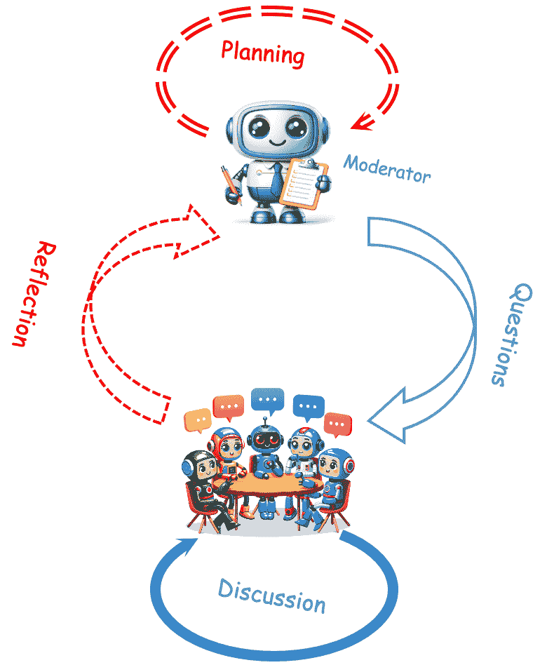
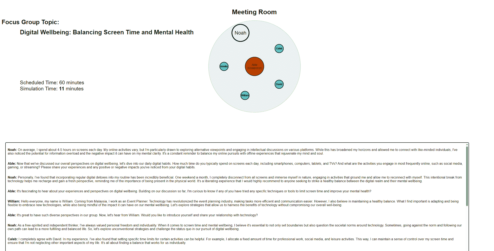
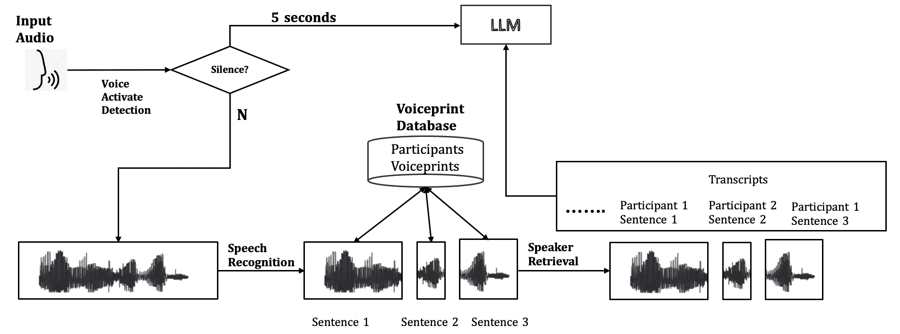
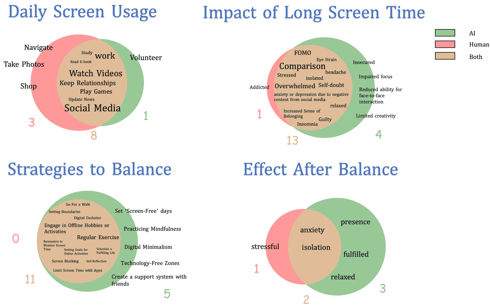
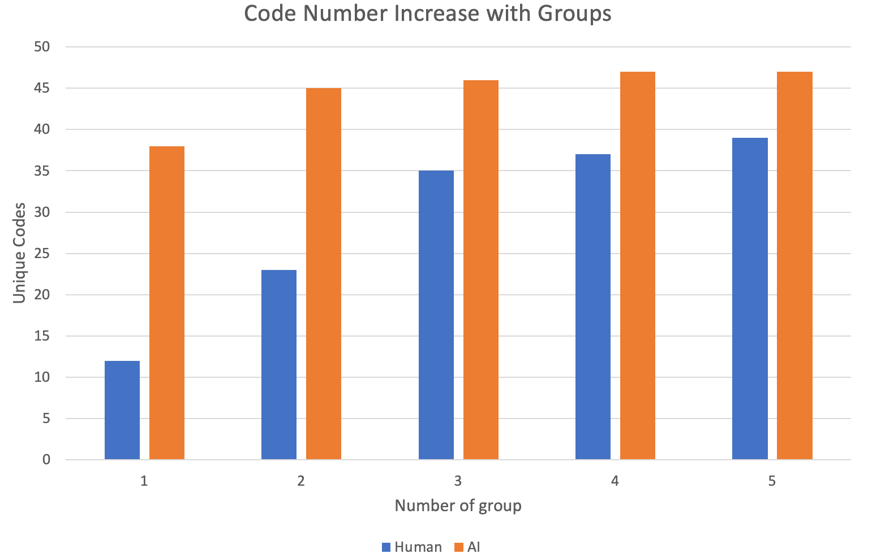

<!--yml

分类：未分类

日期：2025-01-11 12:16:40

-->

# Focus Agent：LLM驱动的虚拟焦点小组

> 来源：[https://arxiv.org/html/2409.01907/](https://arxiv.org/html/2409.01907/)

张太宇 [taiyu.zhang@kuleuven.be](mailto:taiyu.zhang@kuleuven.be) [1234-5678-9012](https://orcid.org/1234-5678-9012 "ORCID identifier") KU Leuven Naamsestraat 22 Leuven Belgium 3001 , 张学松 [xuesong.zhang@kuleuven.be](mailto:xuesong.zhang@kuleuven.be) KU Leuven Naamsestraat 22 Leuven Belgium 3001 , 罗贝·库尔斯 [robbe.cools@kuleuven.be](mailto:robbe.cools@kuleuven.be) KU Leuven Leuven Belgium 和 阿达尔贝托·L·西蒙尼 [adalberto.simeone@kuleuven.be](mailto:adalberto.simeone@kuleuven.be) KU Leuven Leuven Belgium（2024）

###### 摘要。

在人机交互领域，焦点小组是一种广泛使用但资源密集的方法，通常需要熟练的主持人和细致的准备工作。本研究介绍了“Focus Agent”，一种基于大语言模型（LLM）的框架，它既模拟了焦点小组（用于数据收集），又在有真人参与者的焦点小组讨论中充当主持人。为了评估来自Focus Agent的数据质量，我们进行了五次焦点小组会议，共有23名真人参与者，并部署Focus Agent模拟了这些与AI参与者的讨论。定量分析表明，Focus Agent可以生成与人类参与者相似的意见。此外，研究还揭示了LLM作为主持人在包含真人参与者的焦点小组讨论中发挥作用的改进之处。

人机交互、智能虚拟代理、虚拟焦点小组、多代理仿真^†^†期刊年份：2024^†^†版权：acm 许可^†^†会议：ACM国际智能虚拟代理大会；2024年9月16–19日；英国格拉斯哥^†^†书名：ACM国际智能虚拟代理大会（IVA '24），2024年9月16–19日，英国格拉斯哥^†^†doi：10.1145/3652988.3673918^†^†isbn：979-8-4007-0625-7/24/09^†^†ccs：计算方法 多代理规划^†^†ccs：以人为中心的计算 用户研究^†^†ccs：以人为中心的计算 虚拟现实

## 1. 引言

在定性研究领域，焦点小组已成为一种广泛采用的方法论，并在工业和学术界得到广泛应用（Kitzinger，[1994](https://arxiv.org/html/2409.01907v1#bib.bib27)，[1995](https://arxiv.org/html/2409.01907v1#bib.bib28); Mazza，[2006](https://arxiv.org/html/2409.01907v1#bib.bib31)），得益于其结构化的群体讨论，旨在深入了解特定问题。在人机交互（HCI）领域，研究人员经常将焦点小组作为项目规划、评估和数据收集中的重要工具（Mazza，[2006](https://arxiv.org/html/2409.01907v1#bib.bib31); Troshani 等，[2021](https://arxiv.org/html/2409.01907v1#bib.bib51); Selter 等，[2023](https://arxiv.org/html/2409.01907v1#bib.bib44); Stalmeijer 等，[2014](https://arxiv.org/html/2409.01907v1#bib.bib46)）。特别值得注意的是，虚拟焦点小组的日益重要性，尤其是在后 COVID-19 时代（Keen 等，[2022](https://arxiv.org/html/2409.01907v1#bib.bib26)）。这一转变可以归因于虚拟焦点小组合并了方法论上严谨的方式，同时能够接触到地理上分散且其他情况下难以接触的群体（Turney 和 Pocknee，[2005](https://arxiv.org/html/2409.01907v1#bib.bib52)）。

组织焦点小组面临两个主要挑战：首先，召集这么多人同时参加并不是一件容易的事，尤其是当研究人员希望探索多样化或难以接触的群体的生活经验时（Brüggen 和 Willems，[2009](https://arxiv.org/html/2409.01907v1#bib.bib7); Gratton 和 O’Donnell，[2011](https://arxiv.org/html/2409.01907v1#bib.bib18); Wirtz 等，[2019](https://arxiv.org/html/2409.01907v1#bib.bib58)）；其次，焦点小组的成功依赖于经验丰富的主持人，主持人需要具备特定领域的专业知识。缺乏经验的主持人可能会打乱讨论的流程或收集到无效的数据（Nagle 和 Williams，[2013](https://arxiv.org/html/2409.01907v1#bib.bib33)）。这些问题有时阻碍了焦点小组在某些人机交互（HCI）研究中的应用（Rosenbaum 等，[2002](https://arxiv.org/html/2409.01907v1#bib.bib41)）。

图 1\. AI 主持人根据讨论内容和计划生成问题，而 AI 参与者则讨论主持人提出的提示。

大型语言模型（LLMs）的出现，例如ChatGPT，提供了一种潜在的解决方案。这些模型能够频繁地以文本形式进行交流，并根据互联网上大量的文本信息，从不同角度生成多样化的内容（Reynolds和McDonell，[2021](https://arxiv.org/html/2409.01907v1#bib.bib39); Brown等，[2020](https://arxiv.org/html/2409.01907v1#bib.bib6)），并展示在多个领域的专业知识，包括社会科学、医疗保健和教育（Koubaa，[2023](https://arxiv.org/html/2409.01907v1#bib.bib29); Sallam，[2023](https://arxiv.org/html/2409.01907v1#bib.bib43)）。它们的能力还包括协助撰写论文（Katar等，[2023](https://arxiv.org/html/2409.01907v1#bib.bib24); Ciaccio，[2023](https://arxiv.org/html/2409.01907v1#bib.bib11)），提供法律建议（Katz等，[2024](https://arxiv.org/html/2409.01907v1#bib.bib25); Nay等，[2024](https://arxiv.org/html/2409.01907v1#bib.bib34)），以及支持医学查询（Haupt和Marks，[2023](https://arxiv.org/html/2409.01907v1#bib.bib20)）。鉴于这些进展，焦点小组（focus groups）这一经典的定性数据收集方法应当能从LLMs中受益。尽管这些模型具有潜力，但它们容易出现一些局限性，比如误解人类指令、生成可能存在偏见的内容或事实错误（幻觉信息）（Wang等，[2023b](https://arxiv.org/html/2409.01907v1#bib.bib55)）。对于多代理任务，如社会模拟（Park等，[2023](https://arxiv.org/html/2409.01907v1#bib.bib37)）或角色扮演游戏模拟（Xu等，[2023](https://arxiv.org/html/2409.01907v1#bib.bib60)），仍然需要额外的框架设计。

本文介绍了“焦点代理”（Focus Agent），一种基于LLM的焦点小组主持人，具有两个功能：1）模拟没有人类参与者的讨论并收集AI生成的意见，2）作为主持人引导有人的焦点小组，如[图1](https://arxiv.org/html/2409.01907v1#S1.F1 "Figure 1 ‣ 1\. Introduction ‣ Focus Agent: LLM-Powered Virtual Focus Group")所示。为了解决多代理模拟中的常见问题，包括意见重复和生成无关内容，“焦点代理”采用了一个有计划的讨论格式，将焦点小组分为不同阶段，每个阶段对应一个特定话题。这种方法类似于经验丰富的人类主持人所采用的策略。此外，该框架在讨论过程中加入了反思阶段，以应对模拟过程中的记忆丧失，确保讨论流畅且富有成效。在主持有人的焦点小组时，多人语音转文本（S2T）和文本转语音（T2S）集成使得“焦点代理”能够与多个用户同时互动。

我们的工作主要探索了大语言模型在模拟焦点小组讨论中的应用。以下是两个主要的研究问题（RQ）：

RQ 1：大语言模型生成的意见与焦点小组中人类参与者的意见有多大程度上的一致？

RQ 2：大语言模型（LLM）在焦点小组讨论中充当主持人角色的效果如何？

为了回答这些研究问题，我们进行了一项用户研究，涉及23名参与者，分为五个讨论小组。参与者参与了一小时的人工智能主持的焦点小组讨论，讨论主题为“数字福祉”，之后进行了一个30分钟的环节，由研究人员主持，分享他们的经验，评估AI主持人的表现并收集反馈，这一部分我们称之为“元焦点小组”。与此同时，焦点代理模拟了同一主题的焦点小组讨论，参与者为人工智能。通过定性分析，包括主题分析和转录内容分析，结果显示AI模拟输出了大部分人类参与者表达的意见。此外，我们还评估了焦点代理在作为主持人的表现，无论是在包含AI参与者的焦点小组仿真中，还是在涉及人类参与者的焦点小组中。根据我们的研究结果，焦点代理符合作为焦点小组主持人所需的基本标准。这包括逐步引导讨论从一般话题到更具体话题，并保持积极参与的氛围，体现了作为焦点小组主持人所期望的基本素养（Stewart和Shamdasani，[2014](https://arxiv.org/html/2409.01907v1#bib.bib48)）。然而，在主持涉及人类参与者的讨论时，代理与人类的互动能力似乎受限，且未能展现出对人类对话的充分理解。我们识别出当前大语言模型在管理多人讨论中的一些局限性，并提出了将AI代理更有效地融入焦点小组的建议。为了促进进一步研究，代码已开源¹¹1[https://github.com/AriaXR/FocusAgent](https://github.com/AriaXR/FocusAgent)。

## 2\. 相关工作

本节讨论了与我们研究直接相关的前期研究。我们将其分为三个子部分：焦点小组发展、多智能体仿真以及基于语音的对话代理的多语者语音识别。

### 2.1\. 焦点小组发展

焦点小组的使用，或称为小组深度访谈，是广告、市场营销和人机交互（HCI）研究领域中的一个重要方法，因为它在收集定性洞察方面非常有效（Stewart 和 Shamdasani，[2014](https://arxiv.org/html/2409.01907v1#bib.bib48)）。最早的焦点小组是通过面对面交谈进行的，这使得组织变得复杂且耗时，尽管需要支付大量参与者补偿费用（Rosenbaum 等，[2002](https://arxiv.org/html/2409.01907v1#bib.bib41)）。在线焦点小组的普及增加了它们的吸引力，提供了诸如随时随地参与的便利性以及匿名性，这减少了参与者对评判的担忧（Daniels 等，[2019](https://arxiv.org/html/2409.01907v1#bib.bib13); Wilkerson 等，[2014](https://arxiv.org/html/2409.01907v1#bib.bib57); Stewart 和 Shamdasani，[2017](https://arxiv.org/html/2409.01907v1#bib.bib47)）。邀请许多人同时参加在线会议的研究人员常常遇到一些困难，例如不一致的时间安排、时差问题，以及因网络延迟引起的沟通障碍。为了进一步促进用户参与焦点小组，一些社交媒体平台提供了异步文本为基础的焦点小组（Gordon 等，[2021](https://arxiv.org/html/2409.01907v1#bib.bib17); Biedermann，[2018](https://arxiv.org/html/2409.01907v1#bib.bib5); Richard 等，[2021](https://arxiv.org/html/2409.01907v1#bib.bib40); Wenzek 等，[2019](https://arxiv.org/html/2409.01907v1#bib.bib56)）。然而，由于参与者并非同时参与，这带来了一些与减少的“自发性”相关的困难（Brüggen 和 Willems，[2009](https://arxiv.org/html/2409.01907v1#bib.bib7); Nicholas 等，[2010](https://arxiv.org/html/2409.01907v1#bib.bib35)），包括：回答更简短且字数较少（Chen 和 Neo，[2019](https://arxiv.org/html/2409.01907v1#bib.bib9)）；由于滞后，互动过程中流畅性不均（Veloso，[2020](https://arxiv.org/html/2409.01907v1#bib.bib53)）；以及更多不专注的交流，这些交流并不总是涉及相关的研究问题（Brüggen 和 Willems，[2009](https://arxiv.org/html/2409.01907v1#bib.bib7)）。

最近，基于大量互联网文本数据训练的大型语言模型（LLMs）的进展，为进行焦点小组研究提供了新的机会。作为一种创新的检索模型，LLMs具有简化数据收集过程的潜力（Zhu 等，[2023](https://arxiv.org/html/2409.01907v1#bib.bib64)）。利用LLMs模拟焦点小组提供了一种更简单且潜在更高效的替代方法，与人类参与者的参与相比，从而为定性研究开辟了新的途径。

### 2.2. 多智能体模拟

尽管大语言模型（LLMs）能够处理一对一的问答形式，但在长期对话和意见生成中的应用，例如焦点小组讨论，揭示了一些局限性。这些挑战包括理解复杂指令的困难、代理的幻觉、有限的令牌记忆导致的连续性丧失、重复对话以及在长期互动中生成无意义的对话（OpenAI, [2023](https://arxiv.org/html/2409.01907v1#bib.bib36); Xu et al., [2024](https://arxiv.org/html/2409.01907v1#bib.bib61)）。

为了解决这些问题，近期的研究提出了新的方式来组织这些AI代理的思考和反应，专门针对特定类型的任务（Talebirad and Nadiri, [2023](https://arxiv.org/html/2409.01907v1#bib.bib49); Park et al., [2023](https://arxiv.org/html/2409.01907v1#bib.bib37)）。链式思维（Chain-of-Thought，CoT）原则至关重要，它是这些方法的基础思想（Wang et al., [2023a](https://arxiv.org/html/2409.01907v1#bib.bib54)）。通过将复杂问题分解为更简单的元素，它促进了多个代理之间的协作，以解决每个组件，从而得出全面的解决方案。通过将复杂问题分解为许多简单的部分，解决方案通过多个小代理的共同努力得以实现。此外，反思机制在解决记忆限制和增强生成内容的真实性方面起着至关重要的作用（Yan et al., [2024](https://arxiv.org/html/2409.01907v1#bib.bib62)）。这个过程涉及将详细的历史数据作为结构化信息存储，这些信息可以在未来的互动中作为参考，以做出更明智的决策。此外，为了提高代理在不同环境下的表现一致性，一些研究探讨了针对特定角色的多样化提示技术的应用（Shanahan et al., [2023](https://arxiv.org/html/2409.01907v1#bib.bib45)）。

在我们的研究中，我们基于之前研究的见解，解决了在焦点小组讨论中可能出现的挑战。此外，我们开发了一种新颖的框架，用于进行焦点小组讨论，主要由AI主持人引导。AI主持人促进模拟的焦点小组讨论，并帮助协调包括人类参与者在内的焦点小组。为了弥补与人类参与者的互动差距，我们在主持人中加入了一个语音交互代理。

### 2.3. 面向语音交互代理的多语者语音识别

与基于文本的聊天机器人不同，基于语音的对话代理（VCA）需要额外的技术层面来进行操作：它们使用语音转文本（S2T）过程来解释语音输入，并通过文本转语音（T2S）系统生成语音回应 （Jokinen 和 McTear，[2022](https://arxiv.org/html/2409.01907v1#bib.bib23); Rough 和 Cowan，[2020](https://arxiv.org/html/2409.01907v1#bib.bib42)）。这种集成使得 VCA 能够以更自然、对话式的方式促进互动，架起人类用户与数字助手之间的桥梁。

然而，当前的 S2T 技术，如 Google 的 API 或 OpenAI 的 Whisper，在长期的小组讨论中遇到困难，例如焦点小组讨论（Radford 等，[2022](https://arxiv.org/html/2409.01907v1#bib.bib38)）。使用像 Whisper 这样的 S2T 技术进行多参与者讨论时的一个挑战是语音录制输入的时间限制，远低于典型的对话时长。一种潜在的解决方案是通过语音活动检测（VAD）将较长的讨论分割成较短的片段，从而更有效地管理录音（Bain 等，[2023](https://arxiv.org/html/2409.01907v1#bib.bib3)）。另一个限制是缺乏说话人区分，这是理解谁在小组讨论中发言的关键特征。一些研究尝试通过分析说话人声音的独特音色来识别个别说话人（Medennikov 等，[2020](https://arxiv.org/html/2409.01907v1#bib.bib32); Horiguchi 等，[2021](https://arxiv.org/html/2409.01907v1#bib.bib22)，[2020](https://arxiv.org/html/2409.01907v1#bib.bib21)）。然而，由于缺乏关于说话人的先验信息，这些方法在准确性上往往不尽如人意。一种更有效的方法是使用每个说话人的预录样本，通过检索方法显著提高性能，能够准确区分说话人（Desplanques 等，[2020](https://arxiv.org/html/2409.01907v1#bib.bib14)）。

在我们的工作中，我们改进了 Whisper 这一开源 S2T 模型，采用基于检索的技术，优化其用于如焦点小组这样的多参与者讨论。

## 3\. 焦点代理实现

我们的焦点代理旨在模拟焦点小组讨论，并促进涉及人类参与者的会议进行。针对焦点小组模拟，我们设计了一个多代理框架，并配备了主持人来监督整个焦点小组过程。这确保了 AI 参与者的贡献既相关又有价值。关于与实际人类参与者的互动，我们将 S2T 和 T2S 系统融入到 AI 主持人中，实现了基于语音的交流。

### 3.1\. 焦点小组模拟

图 2\. 焦点小组模拟系统的网页演示。

根据OpenCompass（贡献者， [2023](https://arxiv.org/html/2409.01907v1#bib.bib12)）进行的基准研究，在撰写本文时，领域内最先进的两种大型语言模型（LLM）是ChatGPT和GPT4。初步测试显示，与GPT4相比，ChatGPT的结果呈现出相似的观点，之后我们决定不使用更为优越的GPT4，因为其成本比ChatGPT高出20倍。与直接提示相比，我们的算法框架提高了AI模拟的真实感和全面性，这一点在[图2](https://arxiv.org/html/2409.01907v1#S3.F2 "图2 ‣ 3.1．焦点小组模拟 ‣ 3．焦点代理实施 ‣ 焦点代理：LLM驱动的虚拟焦点小组")中得到了验证。

最初，我们尝试使用单一提示来模拟焦点小组讨论。然而，在内容和长度方面，生成的结果与我们的预期大相径庭。为应对这些挑战，我们引入了焦点代理框架，配备了一个AI主持人来引导讨论过程。如[图1](https://arxiv.org/html/2409.01907v1#S1.F1 "图1 ‣ 1．介绍 ‣ 焦点代理：LLM驱动的虚拟焦点小组")所示，AI主持人制定了一些计划，将整个讨论分为多个阶段，以便与焦点小组的不同主题和目标对接。根据这些指导方针，AI主持人随后引导其他AI实体作为参与者进行模拟焦点小组讨论。在整个对话过程中，主持人积极参与反思，及时提出相关问题以促进进一步讨论，从而回应参与者的对话。我们在在线附录中详细解释了这一过程。

在模拟的焦点小组中，每个参与者代表一个人工智能实体。实验人员负责定义关键参数，如主题、目标、整体时长以及参与者的特定特征，这些特征包括姓名、年龄、职业、国籍和个性。在这种设置下，LLM的任务是通过分配的角色理解背景，这些角色通常分为系统、用户和助手。系统角色涉及将虚拟人物赋予LLM，而用户和助手角色则旨在从指定角色或他人视角来帮助解释背景。为了实现这一目标，我们开发了一系列提示设计，详细信息请参见在线附录。

为了尽可能真实地模拟焦点小组讨论，我们设计了主持人和参与者的算法。主持人在焦点小组模拟系统中的角色包括引导和组织讨论的关键责任，其中包括管理时间分配和引导话题讨论。这些责任体现在主持人的思维链中，详见算法 [1](https://arxiv.org/html/2409.01907v1#alg1 "算法 1 ‣ 3.1\. 焦点小组模拟 ‣ 3\. 焦点代理实施 ‣ 焦点代理: 基于LLM的虚拟焦点小组")。我们在每个阶段结束时添加了一个反思机制，以压缩先前讨论的上下文，避免记忆丢失。时间分配是根据文本长度管理的，约定每一百个字相当于模拟中的一分钟。

算法 1 主持人

0:  $List:[阶段],List:[时间安排]$0:  $Str:回应$  对于所有 $stage,time_{stage}\leftarrow 阶段,时间安排$ 执行     $Response\leftarrow LLM(新阶段提示)$     $time_{cur}\leftarrow 估计(回应)$     当 $time_{cur}<time_{stage}$ 时        如果 参与者回应 则           $Response\leftarrow 参与者回应$        否则如果 有参与者处于不活跃状态 则           $Response\leftarrow LLM(不活跃参与者提示)$        否则           $Response\leftarrow LLM(洞察提示)$        结束 如果        根据 $估计(回应)$ 更新 $time_{cur}$     结束 循环  结束 对于

算法 [2](https://arxiv.org/html/2409.01907v1#alg2 "算法 2 ‣ 3.1\. 焦点小组模拟 ‣ 3\. 焦点代理实施 ‣ 焦点代理: 基于LLM的虚拟焦点小组") 概述了每个AI参与者在讨论中采取的系统性方法，其参与程度由LLM评估。LLM动态地评估进行中的对话和其他AI参与者的贡献，以衡量参与程度。AI参与者可以自由参与讨论，除非他们超过了规定的时间分配。在参与者选择脱离讨论或提出新颖的想法时，标志着话题的停滞，主持人会通过提出新问题来介入，问题的灵感来自于先前的讨论。同时，主持人积极鼓励较少活跃的参与者积极参与讨论。通过检测当前阶段的发言时间来监控参与者活动。表现出微弱发言活动或发言次数是最多参与者的三分之一的参与者被分类为不活跃。

算法 2 参与者

0:  $List:[Participants]$0:  $Str:response$  重复     $engagements\leftarrow[]$     对所有$participant$在$Participants$中执行        $engagements$添加$LLM(EngagementPrompt)$     结束循环     如果$Max(engagements)\geq Threshold$  则        $speaker\leftarrow Participants[Index(Max(engagements))]$        $Response\leftarrow LLM(PartResponsePrompt(speaker))$     结束循环 直到 完成

### 3.2\. 基于语音的焦点代理与人类参与者

为了确保AI主持人能够高效地与人类参与者沟通，S2T和T2S是必要的。许多公司提供的API适用于多种场景，但由于输入录音长度的限制以及缺乏说话人区分，它们未能满足我们在焦点小组中促进多参与者讨论的特定需求。为了应对这些挑战，我们开发了自己的S2T系统，如[图3](https://arxiv.org/html/2409.01907v1#S3.F3 "Figure 3 ‣ 3.2\. Voice-based Focus Agent with human participants ‣ 3\. Focus Agent Implementation ‣ Focus Agent: LLM-Powered Virtual Focus Group")所示。该系统通过语音活动检测（VAD）将长时间讨论音频分割成较短的句子长度音频片段，处理这些片段。接着，它从参与者声音数据库中识别出最相似的参与者，并使用OpenAI的开源S2T模型Whisper（Radford等人，[2022](https://arxiv.org/html/2409.01907v1#bib.bib38)）进行音频转录。为了确保参与者有足够的机会表达他们的观点而不被打断，AI主持人被编程为只有在5秒的沉默后才进行干预，这与可能会主动打断对话流程的方法有所不同。

图3. 语音转文本系统。我们通过语音活动检测将长时间的音频录音分割成短片段。然后，我们转录这些短音频片段，并根据事先从参与者那里收集的语音印记识别说话人。

为了将T2S功能集成到我们的系统中，我们利用了Google TTS API²²2https://console.cloud.google.com/speech/text-to-speech。为了让一些对讨论感兴趣的参与者能够在沉浸式环境中参与，我们在Mozilla Hubs³³3https://hubs.mozilla.com上建立了焦点小组环境，这是一个虚拟现实（VR）平台。

## 4\. 试点研究

为了提升用户体验，我们在主要用户研究之前进行了一个包含四名志愿者的试点研究，以评估系统的稳定性和AI主持人的有效性。试点研究包括一次50分钟的焦点小组讨论和一次30分钟的关于AI代理表现的反馈环节。

试点研究的反馈突出了需要改进的方面，我们已针对这些问题进行优化，以便提升用户研究：

1.  1.

    人类参与者可能并非每个问题都有见解，而与此不同的是，AI 参与者可以持续生成新的内容。观察表明，AI 主持人可能会在没有回应的情况下重复提问，导致讨论停滞。我们调整了 AI 主持人的协议，当没有进一步回应时，便会继续进行下一个问题。

1.  2.

    摘要中的匿名性：志愿者在摘要中被提及姓名时感到不适。我们修订了过程，确保参与者的匿名性，从而提高了他们的舒适度。

1.  3.

    问题简洁性：LLM 生成的长内容不适合口头交流。我们优化了提示，以获得更简短的回答。

此外，我们评估了 S2T 系统的准确性，以确保代理能够全面地转录并理解内容。词误差率（WER）⁴⁴4WER是衡量语音转文本准确性的指标，计算公式为 $WER=(S+D+I)/N$，其中 $S$ 代表替换，$D$ 代表删除，$I$ 代表插入，$N$ 代表参考文本中的单词总数。该指标用于评估系统的表现。专业的人工转录员在开放对话环境中的 WER 通常为 11.3%（Xiong 等， [2016](https://arxiv.org/html/2409.01907v1#bib.bib59)）。以此为基准，我们发现我们的 S2T 系统达到了 4.6% 的 WER，显示出其相当可观的准确性。在说话人识别方面，我们的系统在使用 AMI 语料库中的 EN2001 音频段（Carletta，[2006](https://arxiv.org/html/2409.01907v1#bib.bib8)）时达到了 0.81 的微观 F1 分数，突显了其识别说话人的能力。试点研究表明，代理在对话中没有表现出明显的误解。

## 5\. 用户研究

为了研究我们的研究问题，我们设计了一项用户研究，涉及人类参与者在“数字健康”主题下进行焦点小组讨论，同时模拟围绕相同主题的焦点小组讨论。此次会议的目标是研究个人在管理屏幕时间方面的实践以及他们对其对心理健康影响的看法。选择“数字健康”作为核心主题具有战略意义，因为它具有普遍的相关性，便于招募参与者。参与者可以选择通过 VR 头显或个人计算机加入焦点小组，旨在确保小组内的设备一致性，以简化讨论动态，如[图 4](https://arxiv.org/html/2409.01907v1#S5.F4 "Figure 4 ‣ 5\. User Study ‣ Focus Agent: LLM-Powered Virtual Focus Group")所示。

人口统计信息。我们的招募工作共招募了23名参与者，其中11人使用VR头显参加，12人使用自己的个人电脑参加。参与者的平均年龄为30岁（$min=18$，$max=60$，$SD=10$），分布在五个小组中——三个使用VR头显，两个使用桌面设备。每个小组由3至6人组成，确保了不同的视角和经验。小组总数的选择基于先前的研究（Guest等人，[2017](https://arxiv.org/html/2409.01907v1#bib.bib19)），该研究表明，五个小组是焦点小组研究的最佳人数。

程序。用户研究包括三个不同的组成部分：一个主要的焦点小组，涉及人类参与者（以下简称“焦点小组”），一个元焦点小组，供人类参与者回顾他们在焦点小组中的经历（以下简称“元焦点小组”），以及一个模拟的焦点小组，AI实体作为参与者（以下简称“焦点小组模拟”）。

首先，参与者在焦点小组讨论前提交了一段一分钟的自我介绍音频录音。该录音收集了人口统计信息（年龄、先前的焦点小组经验和日常屏幕使用情况），并为每位参与者提供了一个独特的语音印记。这些数据为模拟中的AI参与者提供了初始化。我们根据参与者录音中的S2T结果准确性来评估其英语水平。接着，参与者进入了Mozilla Hubs指定的会议室。对于VR小组，我们团队提供了VR头显（Quest系列或Vive Pro），而桌面小组则使用了他们自己的电脑。当所有参与者准备就绪后，研究员启动了系统，AI主持人开始主持焦点小组讨论。作者在整个过程中观察并记录了重要信息。会议定为60分钟，实际的平均时长为51分钟（$SD=13分钟$）。

在每次焦点小组讨论结束后，进行了一个元焦点小组讨论。本次会议持续了大约20分钟，由其中一位作者主持。元焦点小组讨论的主题主要集中在两个方面：焦点小组讨论的经验和对AI主持人的态度。

最后，每位参与者都收到了一张10欧元的礼品卡作为补偿。本研究已通过大学伦理审查委员会的审查和批准。

图4\. 用户参与的焦点小组，使用Focus Agent在VR环境中进行。

## 6\. 结果分析

根据[Gerling et al.](https://arxiv.org/html/2409.01907v1#bib.bib16)（Gerling et al.，[2020](https://arxiv.org/html/2409.01907v1#bib.bib16)）提出的方法框架，我们采用了主题分析和内容分析相结合的方式，对焦点小组和焦点小组模拟会议的记录进行了详细审查。此外，主题分析特别应用于元焦点小组讨论，以收集参与者的反馈意见。在用户研究的数据转录过程中，我们利用了S2T系统的输出，并由两名研究人员根据录音进一步修订这些转录内容。最终评估结果表明，我们的S2T系统展示了2.5%的WER（词错误率）和0.9的F1分数，显示出该系统对于本研究的可靠性足够高。由于录音问题，第三次焦点小组会议的数据不完整。该小组的转录内容是根据观察者的回忆和笔记重构的，因此该数据未纳入S2T系统的准确性评估中。初步分析由第一作者完成，随后由合著者进行了审查和验证。

### 6.1\. 焦点小组

在对人类焦点小组和焦点小组模拟转录的主题分析中，我们提炼出与研究主题相关的不同主题。从转录中，我们识别出了四个核心主题。而焦点小组模拟则揭示了五个主题，其中增加了一个专注于控制屏幕时间挑战的主题。这一差异主要来源于两组在主持表现上的不同。在焦点小组模拟中，AI主持人倾向于引导AI参与者更深入地讨论主题。尽管人类参与者在焦点小组中也提出了额外的主题，但这些主题与讨论的核心内容关系较小，突显了两种设置中主题扩展处理方式的差异。

图 5\. 根据焦点小组和焦点小组模拟的主题进行的内容分析，字体大小表示代码的频率

在我们的内容分析中，我们从焦点小组的文字记录中提取了39个独特的编码，从焦点小组模拟中提取了47个编码，每个编码反映了讨论主题的不同方面。为了比较AI与人类参与者的观点，我们通过维恩图展示了这些编码的重叠和分歧，如[图5](https://arxiv.org/html/2409.01907v1#S6.F5 "图5 ‣ 6.1\. 焦点小组 ‣ 6\. 结果分析 ‣ 焦点代理：基于LLM的虚拟焦点小组")所示。分析结果显示，大多数人类参与者表达的意见也被AI参与者覆盖。有趣的是，AI参与者提出了几个人类参与者没有提及的观点，例如在日常屏幕使用过程中主动参与在线讨论，为讨论增添了额外的维度。另一个观察结果是，AI参与者在不同焦点小组会议中倾向于表达与人类参与者相似的观点。根据[图6](https://arxiv.org/html/2409.01907v1#S6.F6 "图6 ‣ 6.1\. 焦点小组 ‣ 6\. 结果分析 ‣ 焦点代理：基于LLM的虚拟焦点小组")中的数据，可以看出模拟与焦点小组之间在编码生成上的差异。每次焦点小组的迭代都能收集到相似数量的编码。结果表明，焦点小组的模拟倾向于生成更高频率的相同编码。经过多次迭代后，独特编码的总数趋于稳定，表明最常见的观点已经被收集到。这时，AI参与者无法再生成新的编码，而人类参与者则继续展示出这种创造性的潜力。这个观察结果凸显了AI倾向于生成更多常见的观点，而人类参与者则在其观点中表现出更大的差异性和个性。

图6\. 根据焦点小组轮次和焦点小组模拟，独特编码数量增加。

### 6.2\. 元焦点小组

根据元焦点小组的文字记录，我们对51个数据点进行了编码，并确定了三个主要主题。

我们从数据中提炼出了三个主题：1）虚拟焦点小组的用户体验；2）用户对焦点代理的态度，进一步细分为两个子主题：a）积极态度，b）消极态度；以及3）对虚拟焦点小组系统的反馈。

#### 主题1：焦点小组的用户体验。

大多数参与者对焦点小组讨论表示满意，并指出了几个原因。对许多人来说，讨论的话题与他们的日常生活直接相关，增加了他们参与的价值。正如一位参与者所解释的，“我觉得讨论这些话题很棒，因为这就是我们每天都在处理的事情。”（G5，P4）。此外，参与者还欣赏讨论中多元化的视角，重视交流经验的机会。一位参与者的表述很好地体现了这一点：“我觉得你提出了很多很棒的观点，听到不同的视角非常有益。”（G5，P3）。讨论结束时，主持人询问参与者是否有任何未在会议期间表达的额外意见。所有参与者都确认没有进一步的见解要分享，表示讨论已从他们的视角全面覆盖了这一话题。

#### 主题2：对焦点代理的态度。

第二个主题总结了用户对焦点代理的反馈和经验。该主题分为两个类别：积极和消极，以便更清楚地理解用户对焦点代理的态度。

子主题1：积极态度。参与者中普遍的情绪是赞赏焦点代理提供的引导，认可其在引导讨论中的有效性。例如，一位参与者评论道：“主持人通过提出问题帮助我们表达想法，并鼓励其他参与者分享他们对话题的看法，做得不错。”（G4，P1）。此外，三位参与者特别称赞焦点代理在英语表达上的清晰，而另一位参与者则赞赏代理的友善举止。

子主题2：消极态度。参与者中的主流情绪倾向于对焦点代理的表现表示不满。一个反复出现的问题是关于问题重复，正如一位参与者所说：“有时我觉得有点困惑，因为主持人重复了几次已经讨论过的问题。”（G1，P2）。另一个值得注意的问题是焦点代理在讨论中表现出的智力不足。例如，一位参与者表示：“我不认为它具备真正的智慧，也似乎无法理解我们传达的所有信息，更不用说引导我们进行更深刻和连贯的讨论了。”（G5，P2）。最后，在讨论中发现了一些偏见，特别是在引导参与者讨论长时间使用屏幕的负面影响时，一位参与者表示：“当讨论长时间使用屏幕的影响时，我觉得AI主持人试图妖魔化这项技术。”（G1，P1）。

#### 主题3：关于虚拟焦点小组系统的反馈。

第三个主题总结了在使用焦点代理时遇到的一些系统问题。一些参与者提出的一个问题是，分配的回答问题的时间不足，导致代理中断了他们的发言。正如一位参与者所说：“有时我们正在尝试回答一个问题，或者刚开始回应时，主持人就打断我们，并迅速转到下一个问题”（G3，P3）。此外，两位参与者建议增加字幕以帮助他们更好地理解提出的问题。

## 7\. 讨论

在本讨论中，我们通过研究结果回答了这些研究问题，并在我们的分析基础上扩展了潜在的原因。

### 7.1\. RQ1: 大型语言模型（LLM）生成的观点与焦点小组中人类参与者的观点在多大程度上相符？

对焦点小组讨论的内容分析显示，AI生成的观点通常涵盖了特定话题范围内的广泛人类视角。然而，这些AI生成的观点往往反映出更为常见的观点，缺乏人类反应中常见的独特性。一种可能的解释是，与人类参与者不同，后者会动态地基于前人的贡献并通过个人经验丰富讨论，而AI的回答则主要呈现出可能会发生在人的身上的潜在情境。

这一观察表明，LLM可以作为研究者的一种工具，帮助简化与人类参与者的焦点小组过程。通过部署焦点代理，研究人员可以首先收集特定话题上的广泛共同意见，从而为预期的参与者回应建立基础理解。这进一步有助于细化焦点小组的问题和话题，使讨论更加有针对性和高效。因此，可能不需要那么多的人类焦点小组会议来确认AI生成的内容并从参与者那里识别新的见解，优化研究过程，同时仍能揭示只有人类参与者才能提供的独特、富有创造力的视角。然而，当前的焦点小组仍然需要人类参与者来确保数据的可靠性。

### 7.2\. RQ2: 大型语言模型（LLM）在执行焦点小组讨论中的主持人职责方面有多有效？

在焦点小组模拟过程中，LLM展示了足够的知识来有效地推动小组讨论并与AI参与者进行互动。来自元焦点小组的反馈表明，人类参与者认可AI主持人支持讨论的能力，尽管他们更多地将其视为一个工具，而非有知觉的对话者。这个看法归因于AI主持人在互动中的智能表现不明显，比如忽视参与者的请求、提出重复的问题或未能理解对话中的暗示。

主要挑战源于大语言模型（LLMs）在处理多人对话时的固有局限性。为了使 LLMs 做出适当的回应，它们必须理解来自人类参与者的输入，推理对话的背景，并生成准确的回答。尽管在模拟过程中它们的推理能力似乎足够，但问题主要出现在理解和回答生成阶段。现有研究已经开始解决 LLMs 在辅助人类时的理解问题，但它们在多人参与的讨论中的有效性仍然有限（Dong et al., [2023](https://arxiv.org/html/2409.01907v1#bib.bib15)）。从理解的角度来看，人类参与者之间的讨论往往涉及口语化语言和不完整的句子，这与 AI 更加结构化的交流方式有显著不同，这导致 AI 主持人在识别问题是否已被回答时遇到困难。因此，AI 主持人可能会重复讨论同一个问题，而不是推进讨论。此外，LLM 输出中仍然存在生成一致且无偏内容的挑战（Wang et al., [2023b](https://arxiv.org/html/2409.01907v1#bib.bib55); Taubenfeld et al., [2024](https://arxiv.org/html/2409.01907v1#bib.bib50)）。虽然这不是我们研究的主要关注点，但参与者注意到讨论中存在偏离指南或偏见等问题（见 [subsection 6.2](https://arxiv.org/html/2409.01907v1#S6.SS2 "6.2\. Meta Focus Group ‣ 6\. Result Analysis ‣ Focus Agent: LLM-Powered Virtual Focus Group")），这凸显了 LLM 在准确模仿人类对话规范方面的局限性。

鉴于这些观察结果，我们建议不要将 Focus Agent 作为焦点小组讨论中的唯一主持人，因为目前人类与 AI 之间的沟通存在不足。相反，AI 生成的总结和问题可以被人类主持人利用，以优化讨论流程并解决特定话题。对于更深入的讨论，必须有一个人类主持人在场，以确保积极的用户体验并促进创新见解的生成，突显 AI 和人类主持人在提高焦点小组效率方面的互补作用。

### 7.3\. Focus Agent 的改进

根据用户研究过程和在元焦点小组讨论中收集到的见解，已经确定了若干可以增强 Focus Agent 结构和功能的领域：

1\. 思维链设计：尽管我们工作的思维链已经展示了足够的能力来促进焦点小组讨论，但为了能够在讨论中推动更深入的主题，需要更复杂的设计，例如类似于“思维树”这样的设计（Yao et al., [2023](https://arxiv.org/html/2409.01907v1#bib.bib63)）。

2\. 焦点代理发言的字幕：参与者建议，焦点代理的发言可能对他们来说太长，难以完全理解一个问题。在这种情况下，字幕将是一个有用的帮助。

3\. 焦点代理的时间安排：时间分配是预定的时间段。然而，时间应该根据参与者在当前讨论中的参与度进行分配。在这种情况下，焦点代理应该根据讨论的进展动态地调整时间分配。

## 8\. 局限性与未来工作

我们的研究强调了若干局限性，这些局限性为未来的研究方向铺平了道路。

首先，目前的焦点代理（Focus Agent）版本仅限于基于文本的互动，这与人类主持的多模态特性有显著区别。人类主持人使用非语言提示和物理背景来调整他们的方式，而纯文本代理无法复制这种方式。这一局限性在涉及触觉或视觉元素的环境中尤其具有挑战性。然而，像GPT-4这样的高级大型语言模型（LLM），它能够理解多模态数据（OpenAI，[2023](https://arxiv.org/html/2409.01907v1#bib.bib36)），可能会使焦点代理演变成一个更为多功能的多模态平台，能够更接近地模拟人类的讨论。

其次，我们的研究集中在LLM在焦点小组中的应用，忽视了更广泛的定量和定性研究方法。先前的研究已使用LLM生成评论或意见（Liang等，[2023](https://arxiv.org/html/2409.01907v1#bib.bib30); Chuang等，[2023](https://arxiv.org/html/2409.01907v1#bib.bib10)），并指出LLM生成的意见可能缺乏人类的创造力（Bender等，[2021](https://arxiv.org/html/2409.01907v1#bib.bib4)）。确保这些见解的有效性需要广泛的实证验证。

最后，我们的分析突出了LLM在多参与者讨论中面临的困难。尽管有一些关于一对一对话和全AI讨论的研究（Abbasiantaeb等，[2024](https://arxiv.org/html/2409.01907v1#bib.bib2)），但关于混合型人类-AI沟通在小组环境中的研究却很少。LLM参与多人的对话的能力对推进人类与AI的互动至关重要。未来的研究应该探讨人类参与者在AI参与下如何调整他们的沟通策略，旨在优化这些互动，从而获得更好的协作成果。

## 9\. 结论

我们的研究引入了 Focus Agent，一个新颖的 AI 模拟系统，旨在通过 AI 代理的对话模拟焦点小组讨论。该系统旨在收集与传统焦点小组讨论相似的见解，利用 AI 参与者的能力在指定话题上生成讨论。为了评估 AI 和人类参与者表达的观点之间的对齐程度，我们进行了一项用户研究，采用 AI 主持人来促进人类参与者之间的讨论。我们的分析揭示了 Focus Agent 包含与人类参与者相似的观点。此外，我们还研究了人类参与者对 AI 主持人的感知，发现尽管 AI 能够履行主持人的功能角色，但与与人类主持人互动相比，交互体验仍存在一些差异。我们考察了这些差异的根本原因，并识别了大型语言模型能力中需要进一步增强的具体领域。

## 参考文献

+   （1）

+   Abbasiantaeb 等人（2024）Zahra Abbasiantaeb, Yifei Yuan, Evangelos Kanoulas 和 Mohammad Aliannejadi. 2024. 让大型语言模型来对话：通过零-shot LLM-to-LLM交互模拟人际对话问答. 载于 *第17届ACM国际网络搜索与数据挖掘会议论文集*，8-17。

+   Bain 等人（2023）Max Bain, Jaesung Huh, Tengda Han 和 Andrew Zisserman. 2023. WhisperX: 长时间音频的时间准确语音转录. *INTERSPEECH 2023* (2023).

+   Bender 等人（2021）Emily M Bender, Timnit Gebru, Angelina McMillan-Major 和 Shmargaret Shmitchell. 2021. 关于随机鹦鹉的危险：语言模型会不会太大？载于 *2021年ACM公平性、问责制与透明度会议论文集*，610–623。

+   Biedermann（2018）Narelle Biedermann. 2018. 在定性研究中使用 Facebook 进行虚拟异步焦点小组讨论. *当代护士* 54, 1 (2018), 26–34。

+   Brown 等人（2020）Tom Brown, Benjamin Mann, Nick Ryder, Melanie Subbiah, Jared D Kaplan, Prafulla Dhariwal, Arvind Neelakantan, Pranav Shyam, Girish Sastry, Amanda Askell 等. 2020. 语言模型是少样本学习者. *神经信息处理系统进展* 33 (2020), 1877–1901。

+   Brüggen 和 Willems（2009）Elisabeth Brüggen 和 Pieter Willems. 2009. 离线焦点小组、在线焦点小组与电子德尔菲的关键比较. *国际市场研究期刊* 51, 3 (2009), 1–15。

+   Carletta（2006）Jean Carletta. 2006. 宣布 AMI 会议语料库. *ELRA新闻简报* 11, 1 (2006), 3–5。

+   Chen 和 Neo（2019）Julienne Chen 和 Pearlyn Neo. 2019. 测试水域：通过 WhatsApp 智能手机消息应用程序进行焦点小组评估. *方法学创新* 12, 3 (2019), 2059799119884276。

+   Chuang 等人（2023）Yun-Shiuan Chuang、Agam Goyal、Nikunj Harlalka、Siddharth Suresh、Robert Hawkins、Sijia Yang、Dhavan Shah、Junjie Hu 和 Timothy T Rogers. 2023. 使用基于 LLM 的代理的网络模拟意见动态. *arXiv 预印本 arXiv:2311.09618*（2023）。

+   Ciaccio（2023）Edward J Ciaccio. 2023. 人工智能在科学论文写作中的应用，101253 页。

+   Contributors（2023）OpenCompass 贡献者. 2023. OpenCompass：面向基础模型的通用评估平台. [https://github.com/InternLM/OpenCompass](https://github.com/InternLM/OpenCompass).

+   Daniels 等人（2019）Nicola Daniels、Patricia Gillen、Karen Casson 和 Iseult Wilson. 2019. STEER：设计健康研究中使用视听技术的在线焦点小组时需要考虑的因素. *International Journal of Qualitative Methods* 18（2019），1609406919885786.

+   Desplanques 等人（2020）Brecht Desplanques、Jenthe Thienpondt 和 Kris Demuynck. 2020. Ecapa-tdnn：基于 tdnn 的说话人验证中的强调通道注意力、传播和聚合. *arXiv 预印本 arXiv:2005.07143*（2020）。

+   Dong 等人（2023）Xin Luna Dong、Seungwhan Moon、Yifan Ethan Xu、Kshitiz Malik 和 Zhou Yu. 2023. 利用 LLM 技术迈向下一代智能助手. 见于 *第29届 ACM SIGKDD 数据发现与数据挖掘会议论文集*，5792–5793.

+   Gerling 等人（2020）Kathrin Gerling、Patrick Dickinson、Kieran Hicks、Liam Mason、Adalberto L Simeone 和 Katta Spiel. 2020. 为轮椅使用者设计的虚拟现实游戏. 见于 *2020 年人机交互会议论文集*，1–11.

+   Gordon 等人（2021）Allegra R Gordon、Jerel P Calzo、Rose Eiduson、Kendall Sharp、Scout Silverstein、Ethan Lopez、Katharine Thomson 和 Sari L Reisner. 2021. 用于健康研究的异步在线焦点小组：案例研究及经验教训. *International Journal of Qualitative Methods* 20（2021），1609406921990489.

+   Gratton 和 O’Donnell（2011）Marie-France Gratton 和 Susan O’Donnell. 2011. 远程社区焦点小组的通信技术：加拿大原住民研究案例. *Qualitative Research* 11, 2（2011），159–175.

+   Guest 等人（2017）Greg Guest、Emily Namey 和 Kevin McKenna. 2017. 多少个焦点小组才足够？为非概率抽样的样本量构建证据基础. *Field methods* 29, 1（2017），3–22.

+   Haupt 和 Marks（2023）Claudia E Haupt 和 Mason Marks. 2023. AI 生成的医学建议——GPT 及其扩展. *Jama* 329, 16（2023），1349–1350.

+   Horiguchi 等人（2020）Shota Horiguchi、Yusuke Fujita、Shinji Watanabe、Yawen Xue 和 Kenji Nagamatsu. 2020. 基于编码器-解码器的吸引子进行的未知说话人数的端到端说话人分离. *arXiv 预印本 arXiv:2005.09921*（2020）。

+   Horiguchi 等人（2021）Shota Horiguchi, Paola Garcia, Yusuke Fujita, Shinji Watanabe 和 Kenji Nagamatsu。2021年。《端到端语者区分作为后处理》。收录于 *ICASSP 2021-IEEE国际声学、语音与信号处理会议（ICASSP）*。IEEE，7188–7192。

+   Jokinen 和 McTear（2022）Kristina Jokinen 和 Michael McTear。2022年。*口语对话系统*。Springer Nature。

+   Katar 等人（2023）Oğuzhan Katar, Dilek ÖZKAN, Özal YILDIRIM, U Rajendra Acharya 等人。2023年。《GPT-3 AI 语言模型在科研论文写作中的评估》。*土耳其科学与技术期刊* 18, 2 (2023)，311–318。

+   Katz 等人（2024）Daniel Martin Katz, Michael James Bommarito, Shang Gao, 和 Pablo Arredondo。2024年。《GPT-4通过律师资格考试》。*英国皇家学会A类哲学交易* 382, 2270 (2024)，20230254。

+   Keen 等人（2022）Sam Keen, Martha Lomeli-Rodriguez 和 Helene Joffe。2022年。《从挑战到机会：COVID-19及其后虚拟定性研究》。*国际定性方法期刊* 21 (2022)，16094069221105075。

+   Kitzinger（1994）Jenny Kitzinger。1994年。《焦点小组的方法论：研究参与者之间互动的重要性》。*健康与疾病社会学* 16, 1 (1994)，103–121。

+   Kitzinger（1995）Jenny Kitzinger。1995年。《定性研究：引入焦点小组》。*英国医学杂志* 311, 7000 (1995)，299–302。

+   Koubaa（2023）Anis Koubaa。2023年。《GPT-4 与 GPT-3.5：简明对比》。 (2023)。

+   Liang 等人（2023）Weixin Liang, Yuhui Zhang, Hancheng Cao, Binglu Wang, Daisy Ding, Xinyu Yang, Kailas Vodrahalli, Siyu He, Daniel Smith, Yian Yin 等人。2023年。《大型语言模型能否为科研论文提供有用的反馈？一项大规模的实证分析》。*arXiv 预印本 arXiv:2310.01783* (2023)。

+   Mazza（2006）Riccardo Mazza。2006年。《通过焦点小组评估信息可视化应用：CourseVis 经验》。收录于 *2006年信息可视化评估工作坊论文集：超越时间与错误：信息可视化的新型评估方法*。1–6。

+   Medennikov 等人（2020）Ivan Medennikov, Maxim Korenevsky, Tatiana Prisyach, Yuri Khokhlov, Mariya Korenevskaya, Ivan Sorokin, Tatiana Timofeeva, Anton Mitrofanov, Andrei Andrusenko, Ivan Podluzhny 等人。2020年。《目标语者语音活动检测：一种在晚宴场景中进行多语者区分的新方法》。*arXiv 预印本 arXiv:2005.07272* (2020)。

+   Nagle 和 Williams（2013）Barry Nagle 和 Nichelle Williams。2013年。《方法论简述：焦点小组介绍》。*评估、规划与问责中心* 1-12 (2013)。

+   Nay 等人（2024）John J Nay, David Karamardian, Sarah B Lawsky, Wenting Tao, Meghana Bhat, Raghav Jain, Aaron Travis Lee, Jonathan H Choi, 和 Jungo Kasai。2024年。《大型语言模型作为税务律师：法律能力出现的案例研究》。*英国皇家学会A类哲学交易* 382, 2270 (2024)，20230159。

+   Nicholas 等 (2010) David B Nicholas, Lucy Lach, Gillian King, Marjorie Scott, Katherine Boydell, Bonita J Sawatzky, Joe Reisman, Erika Schippel, 和 Nancy L Young. 2010. 对比互联网与面对面焦点小组在慢性健康状况儿童中的应用：结果与参与者体验。*国际定性研究方法杂志* 9, 1 (2010), 105–121。

+   OpenAI (2023) R OpenAI. 2023. GPT-4 技术报告。*arXiv* (2023), 2303–08774。

+   Park 等 (2023) Joon Sung Park, Joseph C O’Brien, Carrie J Cai, Meredith Ringel Morris, Percy Liang, 和 Michael S Bernstein. 2023. 生成型代理：人类行为的互动模拟。*arXiv 预印本 arXiv:2304.03442* (2023)。

+   Radford 等 (2022) Alec Radford, Jong Wook Kim, Tao Xu, Greg Brockman, Christine McLeavey, 和 Ilya Sutskever. 2022. 通过大规模弱监督实现稳健的语音识别。arXiv:2212.04356 [eess.AS]

+   Reynolds 和 McDonell (2021) Laria Reynolds 和 Kyle McDonell. 2021. 大型语言模型的提示编程：超越少量样本范式。发表于 *2021 CHI 计算系统人因会议扩展摘要*。1–7。

+   Richard 等 (2021) Brendan Richard, Stephen A Sivo, Robert C Ford, Jamie Murphy, David N Boote, Eleanor Witta, 和 Marissa Orlowski. 2021. 通过 Reddit 进行在线焦点小组的指南。*国际定性研究方法杂志* 20 (2021), 16094069211012217。

+   Rosenbaum 等 (2002) Stephanie Rosenbaum, Gilbert Cockton, Kara Coyne, Michael Muller, 和 Thyra Rauch. 2002. HCI 中的焦点小组：信息的财富还是资源的浪费？发表于 *CHI’02 扩展摘要：计算系统中的人因*。702–703。

+   Rough 和 Cowan (2020) Daniel Rough 和 Benjamin Cowan. 2020. 不要相信炒作！会话用户界面创建工具的“白色谎言”。发表于 *第二届会话用户界面会议论文集*。1–3。

+   Sallam (2023) Malik Sallam. 2023. ChatGPT 在医疗教育、研究和实践中的应用：关于前景和有效关注点的系统评审。发表于 *Healthcare*, Vol. 11. MDPI, 887。

+   Selter 等 (2023) Felicitas Selter, Kirsten Persson, Peter Kunzmann, 和 Gerald Neitzke. 2023. 临终决策：与来自人类和兽医医学的德国卫生专业人员的焦点小组研究。*兽医科学前沿* 10 (2023), 1044561。

+   Shanahan 等 (2023) Murray Shanahan, Kyle McDonell, 和 Laria Reynolds. 2023. 与大型语言模型的角色扮演。*Nature* 623, 7987 (2023), 493–498。

+   Stalmeijer 等 (2014) Renée E Stalmeijer, Nancy McNaughton, 和 Walther NKA Van Mook. 2014. 在医学教育研究中使用焦点小组：AMEE 指南第91号。*医学教师* 36, 11 (2014), 923–939。

+   Stewart 和 Shamdasani (2017) David W Stewart 和 Prem Shamdasani. 2017. 在线焦点小组。*广告学杂志* 46, 1 (2017), 48–60。

+   Stewart 和 Shamdasani (2014) David W Stewart 和 Prem N Shamdasani. 2014. *焦点小组：理论与实践*。第20卷。Sage出版公司。

+   Talebirad 和 Nadiri (2023) Yashar Talebirad 和 Amirhossein Nadiri. 2023. 多智能体协作：利用智能LLM代理的力量。*arXiv 预印本 arXiv:2306.03314* (2023)。

+   Taubenfeld 等人 (2024) Amir Taubenfeld, Yaniv Dover, Roi Reichart, 和 Ariel Goldstein. 2024. LLM模拟辩论中的系统性偏差。*arXiv 预印本 arXiv:2402.04049* (2024)。

+   Troshani 等人 (2021) Indrit Troshani, Sally Rao Hill, Claire Sherman, 和 Damien Arthur. 2021. 我们信任人工智能吗？拟人化和智能的作用。*计算机信息系统杂志* 61, 5 (2021), 481–491。

+   Turney 和 Pocknee (2005) Lyn Turney 和 Catherine Pocknee. 2005. 虚拟焦点小组：研究中的新前沿。*国际定性方法杂志* 4, 2 (2005), 32–43。

+   Veloso (2020) Braian Veloso. 2020. WHATSAPP 作为教育研究中的在线焦点小组组织工具：一份经验报告。收录于 *CIET年会论文集：EnPED：2020-（国际教育与技术大会—远程教育研究人员会议）*。

+   Wang 等人 (2023a) Lei Wang, Chen Ma, Xueyang Feng, Zeyu Zhang, Hao Yang, Jingsen Zhang, Zhiyuan Chen, Jiakai Tang, Xu Chen, Yankai Lin, 等人. 2023a. 基于大型语言模型的自主代理调查。*arXiv 预印本 arXiv:2308.11432* (2023)。

+   Wang 等人 (2023b) Yufei Wang, Wanjun Zhong, Liangyou Li, Fei Mi, Xingshan Zeng, Wenyong Huang, Lifeng Shang, Xin Jiang, 和 Qun Liu. 2023b. 使大型语言模型与人类对齐：一项调查。*arXiv 预印本 arXiv:2307.12966* (2023)。

+   Wenzek 等人 (2019) Guillaume Wenzek, Marie-Anne Lachaux, Alexis Conneau, Vishrav Chaudhary, Francisco Guzmán, Armand Joulin, 和 Edouard Grave. 2019. CCNet：从网络爬取数据中提取高质量的单语数据集。*arXiv 预印本 arXiv:1911.00359* (2019)。

+   Wilkerson 等人 (2014) J Michael Wilkerson, Alex Iantaffi, Jeremy A Grey, Walter O Bockting, 和 BR Simon Rosser. 2014. 关于难以接触人群的互联网定性健康研究的建议。*定性健康研究杂志* 24, 4 (2014), 561–574。

+   Wirtz 等人 (2019) Andrea L Wirtz, Erin E Cooney, Aeysha Chaudhry, Sari L Reisner, 和美国跨性别女性HIV感染研究队列。2019. 计算机媒介化沟通以促进同步在线焦点小组讨论：美国跨性别女性HIV定性研究的可行性研究。*医学互联网研究杂志* 21, 3 (2019), e12569。

+   Xiong 等人 (2016) Wayne Xiong, Jasha Droppo, Xuedong Huang, Frank Seide, Mike Seltzer, Andreas Stolcke, Dong Yu, 和 Geoffrey Zweig. 2016. 在对话语音识别中实现人类水平。*arXiv 预印本 arXiv:1610.05256* (2016)。

+   Xu 等人（2023）徐雨庄、王硕、李鹏、罗福文、王晓龙、刘卫东 和 刘阳. 2023. 探索大语言模型在沟通游戏中的应用：关于狼人杀的实证研究。*arXiv 预印本 arXiv:2309.04658*（2023）。

+   Xu 等人（2024）徐子伟、Sanjay Jain 和 Mohan Kankanhalli. 2024. 幻觉是不可避免的：大语言模型的内在局限性。*arXiv 预印本 arXiv:2401.11817*（2024）。

+   Yan 等人（2024）严汉琦、朱清琳、王欣宇、桂林 和 何玉兰. 2024. Mirror：一种多视角自我反思方法用于知识丰富推理。*arXiv 预印本 arXiv:2402.14963*（2024）。

+   Yao 等人（2023）姚顺宇、余甸、赵杰弗里、Shafran Izhak、Thomas L Griffiths、曹源 和 Narasimhan Karthik. 2023. 思维树：利用大语言模型进行深思熟虑的问题解决。*arXiv 预印本 arXiv:2305.10601*（2023）。

+   Zhu 等人（2023）朱宇涛、袁华英、王舒婷、刘建南、刘文翰、邓志龙、窦志成 和 温基荣. 2023. 大语言模型在信息检索中的应用：一项调查。*arXiv 预印本 arXiv:2308.07107*（2023）。
