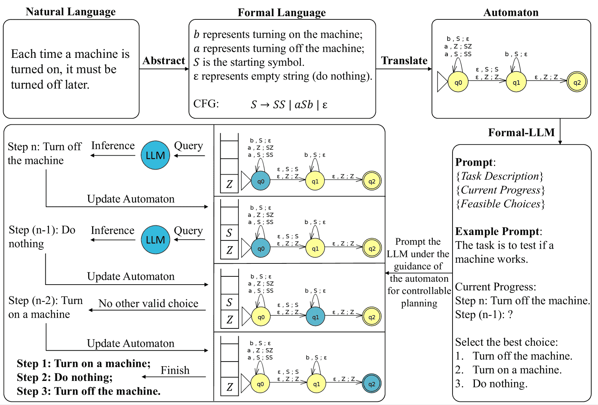
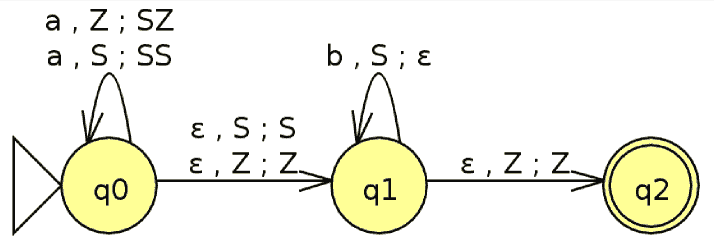
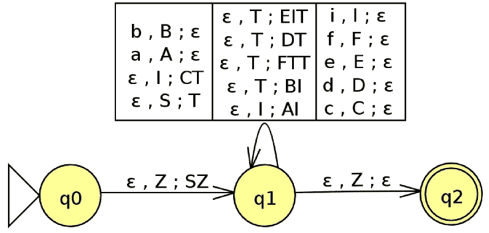
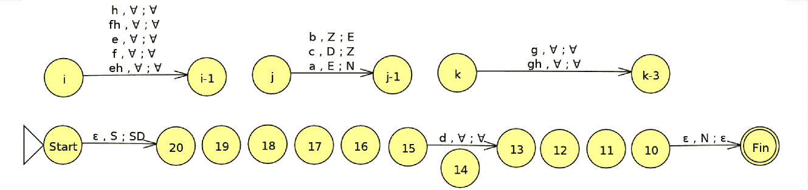
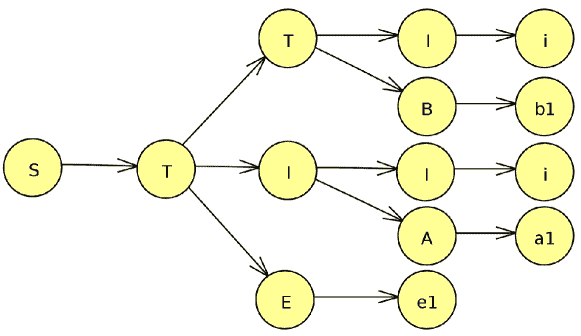
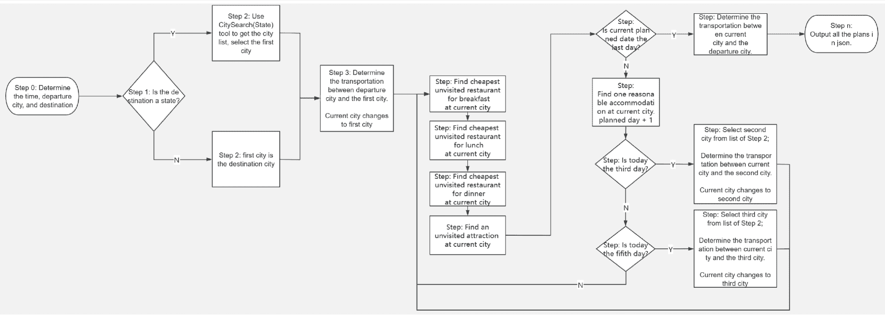
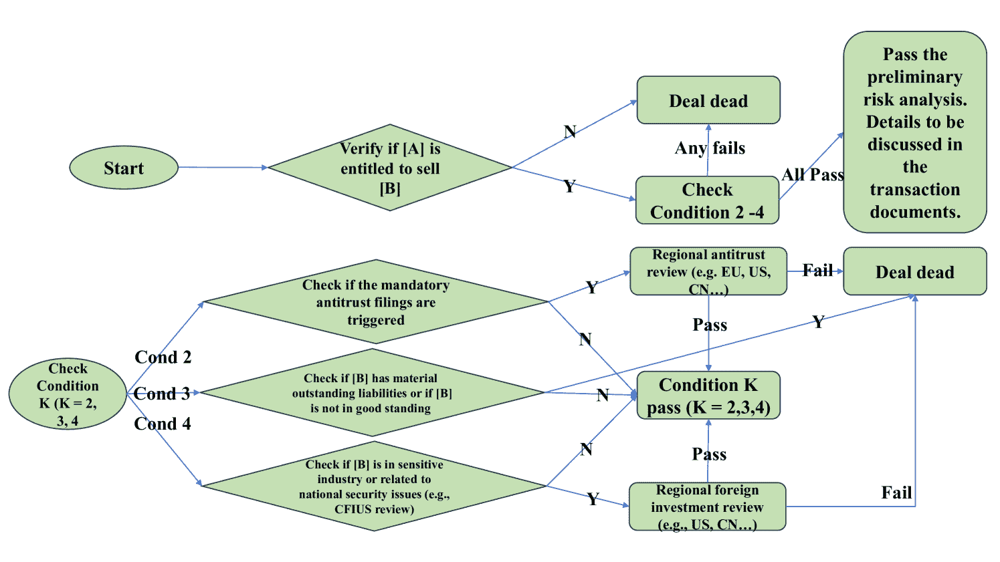

<!--yml

分类：未分类

日期：2025-01-11 12:56:40

-->

# Formal-LLM：集成形式语言与自然语言，用于可控的基于LLM的智能体

> 来源：[https://arxiv.org/html/2402.00798/](https://arxiv.org/html/2402.00798/)

Zelong Li, Wenyue Hua, Hao Wang, He Zhu, Yongfeng Zhang 计算机科学系，罗格斯大学，新不伦瑞克

{zelong.li, wenyue.hua, hw488, hz375, yongfeng.zhang}@rutgers.edu

###### 摘要

近年来，大型语言模型（LLMs）的进展使得AI智能体能够自动生成并执行多步骤的计划来解决复杂任务。然而，由于LLM的内容生成过程难以控制，当前基于LLM的智能体常常生成无效或无法执行的计划，这不仅影响了生成计划的性能，还破坏了用户对基于LLM的智能体的信任。对此，本文提出了一种新型的“Formal-LLM”框架，通过将自然语言的表现力与形式语言的精确性相结合，应用于基于LLM的智能体。具体而言，该框架允许智能体开发人员将其对规划过程的需求或约束表达为一个自动机。然后，在自动机的监督下，进行基于堆栈的LLM计划生成过程，以确保生成的计划满足约束条件，从而使规划过程变得可控。我们在基准任务和实际应用任务中进行了实验，结果表明我们的框架实现了超过50%的整体性能提升，这验证了采用Formal-LLM引导智能体生成计划的可行性和有效性，能够防止智能体生成无效和不成功的计划。此外，更可控的基于LLM的智能体能够促进LLM在需要高效规划有效性的应用场景中的广泛应用。本文的源代码可以在[https://github.com/agiresearch/Formal-LLM](https://github.com/agiresearch/Formal-LLM)找到。

Formal-LLM：集成形式语言与自然语言，用于可控的基于LLM的智能体

Zelong Li, Wenyue Hua, Hao Wang, He Zhu, Yongfeng Zhang 计算机科学系，罗格斯大学，新不伦瑞克 {zelong.li, wenyue.hua, hw488, hz375, yongfeng.zhang}@rutgers.edu

## 1 引言

随着大型语言模型（LLM）的快速发展，出现了众多应用。其中一个显著的应用是基于LLM的代理，它能够自动生成并执行多步计划来解决复杂任务。尽管基于LLM的代理展现出了创造力，但人们也担心它们可能会生成不合理和无效的计划，从而削弱代理的有效性。例如，生成一个试图使用为文本设计的工具处理图像数据的计划可能会导致错误。最近的研究指出，基于LLM的代理在没有足够人类监督的情况下，容易开发出不可执行的计划（Ge et al., [2023a](https://arxiv.org/html/2402.00798v4#bib.bib12); Yuan et al., [2024](https://arxiv.org/html/2402.00798v4#bib.bib49)）。解决这些挑战对于提高代理的性能、增加有效计划的生成以及维持用户信任至关重要。为了控制LLM文本生成，已经做出了各种尝试，例如加入硬约束（Takase and Okazaki, [2019](https://arxiv.org/html/2402.00798v4#bib.bib39); Carlsson et al., [2022](https://arxiv.org/html/2402.00798v4#bib.bib4)）、软约束（Gu et al., [2022](https://arxiv.org/html/2402.00798v4#bib.bib16); Lu et al., [2022](https://arxiv.org/html/2402.00798v4#bib.bib28)），或者两者的结合（Chen et al., [2024](https://arxiv.org/html/2402.00798v4#bib.bib5)）。然而，控制基于LLM的代理的重点是计划的有效性和工具使用，而非纯粹的文本生成。一些研究（Ge et al., [2023a](https://arxiv.org/html/2402.00798v4#bib.bib12); Yuan et al., [2024](https://arxiv.org/html/2402.00798v4#bib.bib49)）将LLM用作解析器，根据提示从生成的文本中提取工具链，但有效计划的满意比例仍然难以实现。

为了解决无效计划生成的问题，我们提出了一个名为“Formal-LLM”的框架，该框架将自然语言的表达能力与形式语言的精确性相结合，如图[1](https://arxiv.org/html/2402.00798v4#S1.F1 "Figure 1 ‣ 1 Introduction ‣ Formal-LLM: Integrating Formal Language and Natural Language for Controllable LLM-based Agents")中的玩具示例所示。具体来说，为了控制基于LLM的智能体的计划生成，智能体开发者构建了一种上下文无关文法（CFG）作为形式语言，来表示智能体的约束条件。然后，CFG会自动转换为下推自动机（PDA）。当LLM进行规划时，它会被提示遵循由自动机定义的状态转移。这是通过限制LLM-based智能体在每一步的选择，只能进行PDA在当前状态下定义的有效操作来实现的，这有助于确保最终生成的计划满足约束条件。我们在本研究中选择了PDA，因为某些任务需要通过树形结构的计划来解决，而不是链式结构的计划，生成树形结构的计划需要使用PDA。

图1：Formal-LLM的工作流程与玩具示例。为了控制基于LLM的智能体的计划生成，智能体开发者构建了一种形式语言（上下文无关文法，CFG）来表示自然语言约束条件。然后，形式语言被转换为下推自动机（PDA）。当LLM进行规划时，它需要遵循由自动机定义的状态转移，这有助于确保最终生成的计划满足约束条件。我们选择PDA是因为某些计划呈现树形结构（如本文中的其他示例所示），这需要使用PDA来生成。

此外，我们在Formal-LLM中引入了回溯机制，以提高找到有效计划的概率，该机制使得当自动机到达死胡同时，规划过程能够返回到之前的步骤。此外，传统的基于LLM的智能体微调技术，如任务反馈强化学习（RLTF）（Ge等人，[2023a](https://arxiv.org/html/2402.00798v4#bib.bib12)），依赖于来自智能体计划执行的奖励来微调LLM参数。然而，由于可能会生成许多无效计划，许多奖励实际上对于LLM-based智能体的微调并没有提供有效信息。我们的Formal-LLM方法保证了在智能体的计划生成过程中排除无效计划。因此，我们的方法有助于增加有效奖励的数量，从而提高微调后的LLM-based智能体的性能。

在我们的实验中，我们实现了Formal-LLM框架，涵盖了各种LLM，包括开源和闭源的LLM。我们还在基准任务和现实生活中的实际任务上测试了我们的框架。具体而言，基准任务涉及基于LLM的代理利用不同工具通过多步骤解决复杂问题。现实生活场景包括日常事务、烹饪指导和商业风险管理，每个任务都施加了特定领域知识或常识约束。我们的研究结果表明，Formal-LLM能够生成合理的计划。该框架在基准任务上显著提高了整体性能，提升幅度超过50%，并且始终能够生成可执行的计划。在现实生活场景中，我们提供了定性分析，探讨了Formal-LLM框架带来的改进，确认了其在使代理更加可控方面的可行性和有效性。

## 2 相关工作

### 2.1 基于LLM的AI代理

AI代理是能够在特定环境中自主做出决策并执行行动的实体，旨在利用AI技术有效应对各种复杂任务（Ge等，[2023b](https://arxiv.org/html/2402.00798v4#bib.bib13); Mei等，[2024](https://arxiv.org/html/2402.00798v4#bib.bib29); Wang等，[2023](https://arxiv.org/html/2402.00798v4#bib.bib43); Xi等，[2023](https://arxiv.org/html/2402.00798v4#bib.bib46)）。大语言模型（LLM）的出现，以GPT系列（Radford等，[2019](https://arxiv.org/html/2402.00798v4#bib.bib34); Brown等，[2020](https://arxiv.org/html/2402.00798v4#bib.bib2); OpenAI，[2023](https://arxiv.org/html/2402.00798v4#bib.bib30)）和LLaMA系列（Touvron等，[2023a](https://arxiv.org/html/2402.00798v4#bib.bib40)，[b](https://arxiv.org/html/2402.00798v4#bib.bib41)）为代表，推动了基于LLM的代理的探索（Ge等，[2023a](https://arxiv.org/html/2402.00798v4#bib.bib12); Huang等，[2022](https://arxiv.org/html/2402.00798v4#bib.bib22)）。这些代理将LLM作为其核心认知组件或控制器，通过多模态感知和工具使用等方法扩展其感知和行动能力（Schick等，[2023](https://arxiv.org/html/2402.00798v4#bib.bib38); Ge等，[2023a](https://arxiv.org/html/2402.00798v4#bib.bib12); Qin等，[2023](https://arxiv.org/html/2402.00798v4#bib.bib33)）。与前LLM时代的AI代理相比，基于LLM的代理展示了创造力，表现在无需额外学习即可生成创新思想（Franceschelli和Musolesi，[2023](https://arxiv.org/html/2402.00798v4#bib.bib11)），这表明其具备一定的自我导向探索和决策能力（Xi等，[2023](https://arxiv.org/html/2402.00798v4#bib.bib46)）。尽管基于LLM的代理已广泛应用于软件开发（Li等，[2023a](https://arxiv.org/html/2402.00798v4#bib.bib24); Qian等，[2023](https://arxiv.org/html/2402.00798v4#bib.bib31)）、科学研究（Boiko等，[2023](https://arxiv.org/html/2402.00798v4#bib.bib1)）和系统管理（Liu等，[2023](https://arxiv.org/html/2402.00798v4#bib.bib27)）等现实场景中，近期的研究已突出显示在缺乏足够人工监督的情况下生成不可执行计划的问题（Ge等，[2023a](https://arxiv.org/html/2402.00798v4#bib.bib12); Yuan等，[2024](https://arxiv.org/html/2402.00798v4#bib.bib49)）。如果这些计划缺乏可执行性，则基于LLM的代理在要求高有效性的领域中的实用性将受到影响，而其不可靠性也会削弱用户信任。为了解决这一挑战，我们提出在基于LLM的代理规划过程中整合自然语言和精确自动机。

### 2.2 可控LLM生成

据我们所知，关于可控的基于LLM的智能体的研究较少，讨论主要集中在可控LLM文本生成上。控制LLM文本生成通常分为两类：硬约束和软约束（Qin 等，[2022](https://arxiv.org/html/2402.00798v4#bib.bib32)）。硬约束包括对所需文本长度的限制、为生成文本指定的关键词（Takase 和 Okazaki，[2019](https://arxiv.org/html/2402.00798v4#bib.bib39)；Carlsson 等，[2022](https://arxiv.org/html/2402.00798v4#bib.bib4)），以及解码时的约束词汇空间（Hemmer 等，[2023](https://arxiv.org/html/2402.00798v4#bib.bib17)；Geng 等，[2024](https://arxiv.org/html/2402.00798v4#bib.bib14)，[2023](https://arxiv.org/html/2402.00798v4#bib.bib15)），而软约束则是基于特定语义对输出进行限制，例如情感或话题（Gu 等，[2022](https://arxiv.org/html/2402.00798v4#bib.bib16)；Lu 等，[2022](https://arxiv.org/html/2402.00798v4#bib.bib28)；Li 等，[2020](https://arxiv.org/html/2402.00798v4#bib.bib25)）。最近的研究（Chen 等，[2024](https://arxiv.org/html/2402.00798v4#bib.bib5)）尝试将这两种约束整合为统一的方法。然而，文本生成控制存在一些缺点和问题。首先，由于需要访问解码概率，文本生成控制很难直接应用于封闭源LLM（Geng 等，[2024](https://arxiv.org/html/2402.00798v4#bib.bib14)）。其次，可控的基于LLM的智能体优先考虑计划和工具使用的有效性，而非单纯的文本生成。近期关于基于LLM的智能体的研究指出，在基于LLM的智能体上应用文本约束生成的有效性有限，并探索了将LLM作为解析器来从生成的文本中提取计划信息（Ge 等，[2023a](https://arxiv.org/html/2402.00798v4#bib.bib12)；Yuan 等，[2024](https://arxiv.org/html/2402.00798v4#bib.bib49)）；但过度依赖解析器LLM的有效性可能无法产生令人满意的计划有效率。我们提出了一种自动机引导的智能体规划方法，确保生成的计划100%符合约束。

## 3 初步知识

### 3.1 上下文无关文法

许多LLM智能体操作的工具需要多个输入并产生一个输出。例如，工具“视觉问答”接受图像和文本作为输入，并输出文本。涉及此类工具的计划形成树状结构，且此类树结构的计划需要上下文无关文法（CFG）来表达规则。

CFG由四个部分组成：终结符（无法替换的符号）、非终结符（可替换的符号）、起始符（一个唯一的非终结符，通常表示为$S$）和产生式（符号替换的规则）。CFG的产生式格式如下：

|  | $A\rightarrow\alpha$ |  | (1) |
| --- | --- | --- | --- |

其中$A$是一个单一的非终结符，$\alpha$是由任意组合的终结符和非终结符组成的字符串。$A$可以在任何情况下被$\alpha$替代。

|  | $\begin{split}&S\rightarrow\varepsilon&#124;aSb\end{split}$ |  | (2) |
| --- | --- | --- | --- |

方程式([2](https://arxiv.org/html/2402.00798v4#S3.E2 "Equation 2 ‣ 3.1 Context-free Grammar ‣ 3 Preliminary Knowledge ‣ Formal-LLM: Integrating Formal Language and Natural Language for Controllable LLM-based Agents"))是一个上下文无关文法（CFG）示例，包含两个由“$|$”分隔的产生式，其中$a,b$是终结符，$S$是起始符号和唯一的非终结符，$\varepsilon$代表空字符串。从起始符号开始，我们可以使用这两个产生式生成无限多个字符串，如空字符串、$ab$和$aabb$。以$aabb$的推导为例。我们首先应用第二个产生式两次（$S\rightarrow aSb\rightarrow aaSbb$），然后再应用第一个产生式一次（$aaSbb\rightarrow aabb$）。形式语言——上下文无关语言（CFL）包含从$S$通过一定数量的CFG产生式步骤所能推导出的终结符字符串集合。

图2：一个下推自动机（PDA）示例。

图3：一个等价的下推自动机（PDA），对应于方程式([3](https://arxiv.org/html/2402.00798v4#S4.E3 "Equation 3 ‣ 4.2 Formulating Constraint to Automaton ‣ 4 The Formal-LLM Framework ‣ Formal-LLM: Integrating Formal Language and Natural Language for Controllable LLM-based Agents"))和方程式([4](https://arxiv.org/html/2402.00798v4#S4.E4 "Equation 4 ‣ 4.2 Formulating Constraint to Automaton ‣ 4 The Formal-LLM Framework ‣ Formal-LLM: Integrating Formal Language and Natural Language for Controllable LLM-based Agents"))的组合。小写字母$a$到$f$在方程式([3](https://arxiv.org/html/2402.00798v4#S4.E3 "Equation 3 ‣ 4.2 Formulating Constraint to Automaton ‣ 4 The Formal-LLM Framework ‣ Formal-LLM: Integrating Formal Language and Natural Language for Controllable LLM-based Agents"))中对应的是$a_{i}$到$f_{j}$。例如，转移$(b,B;\varepsilon)$表示如果下推自动机（PDA）在状态$q_{1}$，栈顶是$B$，并且下一个输入字符是$b_{1}/b_{2}/b_{3}$，那么PDA将移除栈顶的$B$并保持在状态$q_{1}$。

### 3.2 下推自动机

每个上下文无关文法（CFG）都可以通过一个算法（Hopcroft等，[2001](https://arxiv.org/html/2402.00798v4#bib.bib19)）转换为等价的非确定性下推自动机（PDA）。PDA是一种根据给定字符串输入、转移函数和栈顶元素在一系列状态之间移动的机器。自动机按顺序读取输入中的字母，如果存在一条路径，使得机器在消耗完整个字符串后进入接受状态，则该输入字符串被视为一个接受词。所有接受词的集合称为自动机所接受的上下文无关语言（CFL）。由于PDA过程比CFG更直观且更自动化，能够有效地引导大规模语言模型（LLM）进行提示，我们的框架便是基于PDA设计的。

图[2](https://arxiv.org/html/2402.00798v4#S3.F2 "Figure 2 ‣ 3.1 Context-free Grammar ‣ 3 Preliminary Knowledge ‣ Formal-LLM: Integrating Formal Language and Natural Language for Controllable LLM-based Agents")展示了PDA如何工作，作为一个示例。这个自动机包括一个栈字母表（$\{S,Z\}$），一个初始栈符号$Z$，一个起始状态$q_{0}$，一个接受状态集$\{q_{2}\}$，以及一组状态转换函数。这些转换函数以三元组的形式表示。例如，从$q_{0}$到$q_{0}$的边$(a,Z;SZ)$意味着如果栈顶是$Z$且字符串的下一个字母是$a$，则PDA保持在$q_{0}$状态，并且栈顶由$Z$变为$SZ$（$S$是新的栈顶）。

这个PDA等价于方程([2](https://arxiv.org/html/2402.00798v4#S3.E2 "Equation 2 ‣ 3.1 Context-free Grammar ‣ 3 Preliminary Knowledge ‣ Formal-LLM: Integrating Formal Language and Natural Language for Controllable LLM-based Agents"))中的CFG，即，这个PDA的每个接受词都属于方程([2](https://arxiv.org/html/2402.00798v4#S3.E2 "Equation 2 ‣ 3.1 Context-free Grammar ‣ 3 Preliminary Knowledge ‣ Formal-LLM: Integrating Formal Language and Natural Language for Controllable LLM-based Agents"))中定义的CFL。我们仍然以$aabb$为例来展示PDA的机制。最初，PDA处于$q_{0}$状态，栈中仅包含$Z$。当接收到第一个字母$a$时，我们首先应用$(a,Z;SZ)$，PDA保持在$q_{0}$状态，栈变为$SZ$。接着，在消费下一个字母$a$时，我们使用$(a,S;SS)$和$(\varepsilon,S;S)$，移动到$q_{1}$状态，并将栈更改为$SSZ$。接下来，PDA保持在$q_{1}$状态，并应用$(b,S;\varepsilon)$函数两次，消费输入字符串中的两个$b$，与此同时，栈从$SSZ$变为$Z$。最后，自动机使用$(\varepsilon,Z;Z)$移动到接受状态$q_{2}$。由于机器完成了对输入字符串的读取，$aabb$是这个CFL的一个接受词。$aabbb$不是接受词，因为在读取$aabb$后，自动机处于$q_{1}$状态，栈为$Z$，且没有有效的函数可以在栈顶为$Z$时消费最后一个$b$。

## 4 形式化LLM框架

### 4.1 动机与挑战

自然语言对人类来说易于理解，但在某些应用场景中可能缺乏精确性。相比之下，正式语言在数学和机器可读形式上有明确的定义，虽然人类理解起来可能较为困难，但它具有很高的精确性。因此，我们旨在通过推理自动机（PDA）有效整合自然语言和正式语言的优势，以便在需要精确有效计划的场景中，为基于LLM的智能体提供更可控的规划。

构建我们的Formal-LLM框架面临着不小的挑战。首先，由于预训练数据中缺乏与CFG或PDA相关的语料库，LLM可能难以直接理解和处理正式语言。因此，需要自然语言提示来有效描述自动机的状态，从而弥合正式语言和自然语言之间的差距，支持LLM的规划。由于自动机可能生成无限多的计划，第二个挑战是，自动机只能通过遵循定义的约束来确保计划的有效性和可执行性，但无法保证生成计划的性能和最优性。因此，利用LLM的自然语言理解能力以及其他方法，如微调和回溯机制，对于提升规划性能至关重要。

### 4.2 将约束转化为自动机

我们框架的整体流程如图[1](https://arxiv.org/html/2402.00798v4#S1.F1 "Figure 1 ‣ 1 Introduction ‣ Formal-LLM: Integrating Formal Language and Natural Language for Controllable LLM-based Agents")所示。我们首先通过示例说明如何将约束转换为正式语言和自动机，用于基准任务，这里以OpenAGI基准（Ge等，[2023a](https://arxiv.org/html/2402.00798v4#bib.bib12)）为例，该基准包含一组领域专家模型作为工具，并列出了多个复杂问题，这些问题无法通过单一工具解决。这些工具根据输入和输出的模式，分为六个主要类别，具体可见附录中的表[3](https://arxiv.org/html/2402.00798v4#A1.T3 "Table 3 ‣ A.1 OpenAGI Benchmark Tasks and Tools ‣ Appendix A Appendix ‣ Formal-LLM: Integrating Formal Language and Natural Language for Controllable LLM-based Agents")。

如果LLM（大语言模型）代理生成的基准任务计划偏离预期的数据格式，执行性能将显著下降，甚至可能导致错误。例如，着色工具的输入和输出是图像数据。由于图像数据表示为3维张量，提供一个1维张量文本字符串作为输入可能会导致错误，因为数据维度不正确。因此，整个计划变得无效，无法执行。在这种情况下，自然语言可能难以准确而简洁地表达这些约束，但形式语言可以直截了当地表达这些约束。

方程式([3](https://arxiv.org/html/2402.00798v4#S4.E3 "Equation 3 ‣ 4.2 Formulating Constraint to Automaton ‣ 4 The Formal-LLM Framework ‣ Formal-LLM: Integrating Formal Language and Natural Language for Controllable LLM-based Agents"))中的上下文无关文法（CFG）概述了数据格式的约束，使用波兰前缀表示法：$T$ 代表文本，$I$ 代表图像，大写字母 $A$ 到 $F$ 代表六种类型的工具，诸如 $a_{i}\in A$ 或 $f_{j}\in F$ 这样的字母小写形式代表表[3](https://arxiv.org/html/2402.00798v4#A1.T3 "Table 3 ‣ A.1 OpenAGI Benchmark Tasks and Tools ‣ Appendix A Appendix ‣ Formal-LLM: Integrating Formal Language and Natural Language for Controllable LLM-based Agents")中顺序的特定工具。

|  |  | $\displaystyle I\rightarrow AI&#124;CT\qquad$ |  | $\displaystyle T\rightarrow BI&#124;DT&#124;EIT&#124;FTT$ |  | (3) |
| --- | --- | --- | --- | --- | --- | --- |
|  |  | $\displaystyle A\rightarrow a_{1}&#124;a_{2}&#124;a_{3}&#124;a_{4}\qquad$ |  | $\displaystyle B\rightarrow b_{1}&#124;b_{2}&#124;b_{3}$ |  |
|  |  | $\displaystyle C\rightarrow c_{1}\qquad$ |  | $\displaystyle D\rightarrow d_{1}&#124;d_{2}&#124;d_{3}&#124;d_{4}&#124;d_{5}$ |  |
|  |  | $\displaystyle E\rightarrow e_{1}\qquad$ |  | $\displaystyle F\rightarrow f_{1}$ |  |

$I\rightarrow AI|CT$ 意味着 $I$ 可以被 $AI$ 或 $CT$ 替换，因为 $A$ 是一个图像到图像的工具，$C$ 是一个文本到图像的工具。因此，当 $A$ 应用于图像（$AI$）或 $C$ 应用于文本（$CT$）时，结果仍然是图像。考虑到一个特定任务，比如“给定模糊的灰度图像，如何逐步返回对象名称的英文？”，我们知道该任务的输入是图像，最终的输出应该是文本。为了正式化这一点，我们在方程式([3](https://arxiv.org/html/2402.00798v4#S4.E3 "Equation 3 ‣ 4.2 Formulating Constraint to Automaton ‣ 4 The Formal-LLM Framework ‣ Formal-LLM: Integrating Formal Language and Natural Language for Controllable LLM-based Agents"))中添加了两个约束：

|  |  | $\displaystyle S\rightarrow T\qquad$ |  | $\displaystyle I\rightarrow i$ |  | (4) |
| --- | --- | --- | --- | --- | --- | --- |

即，CFG以符号$T$开始，表示最终文本格式，并使用小写字母$i$表示输入图像。[3](https://arxiv.org/html/2402.00798v4#S4.E3 "公式 3 ‣ 4.2 制定自动机约束 ‣ 4 Formal-LLM框架 ‣ Formal-LLM：结合正式语言和自然语言以便可控的基于LLM的代理")和[4](https://arxiv.org/html/2402.00798v4#S4.E4 "公式 4 ‣ 4.2 制定自动机约束 ‣ 4 Formal-LLM框架 ‣ Formal-LLM：结合正式语言和自然语言以便可控的基于LLM的代理")的结合表示了特定任务的数据格式约束。例如，$e_{1}a_{1}ib_{1}i$是一个有效的词，表示一个有效的计划：“利用图像分类（$b_{1}$）对输入图像进行处理以获取文本，并应用图像着色（$a_{1}$）对输入图像进行处理以生成输出图像。然后，利用视觉问答（$e_{1}$）结合文本和输出图像推导出最终文本。”如[3.2](https://arxiv.org/html/2402.00798v4#S3.SS2 "3.2 下推自动机 ‣ 3 初步知识 ‣ Formal-LLM：结合正式语言和自然语言以便可控的基于LLM的代理")节所述，CFG可以等效地转换为图[3](https://arxiv.org/html/2402.00798v4#S3.F3 "图 3 ‣ 3.1 无上下文自由文法 ‣ 3 初步知识 ‣ Formal-LLM：结合正式语言和自然语言以便可控的基于LLM的代理")中的PDA。这些步骤使我们能够将约束转化为自动机，以便后续使用。

在某些场景下，创建一个自动机可能比制定正式语言更为直接。[A.5.1](https://arxiv.org/html/2402.00798v4#A1.SS5.SSS1 "A.5.1 每日计划 ‣ A.5 实际任务提示 ‣ 附录 A 附录 ‣ Formal-LLM：结合正式语言和自然语言以便可控的基于LLM的代理")节描述了一个日常工作规划的实际任务。此案例中的约束围绕时间展开，使我们能够将时间表示为不同的状态，如图[4](https://arxiv.org/html/2402.00798v4#S4.F4 "图 4 ‣ 4.3 从自动机生成Formal-LLM提示和规划 ‣ 4 Formal-LLM框架 ‣ Formal-LLM：结合正式语言和自然语言以便可控的基于LLM的代理")所示。当自动机到达10:00并处于三餐已食用的状态时，便生成了一个有效的计划，该活动将在20:00结束。在这种情况下，我们设计了一个没有CFG的PDA。

### 4.3 从自动机生成Formal-LLM提示和规划

在[4.2节](https://arxiv.org/html/2402.00798v4#S4.SS2 "4.2 Formulating Constraint to Automaton ‣ 4 The Formal-LLM Framework ‣ Formal-LLM: Integrating Formal Language and Natural Language for Controllable LLM-based Agents")中，我们将自然语言的规划约束转换为PDA，其中任何被接受的单词都代表一个有效且可执行的计划。原因在于，由于在预训练过程中对形式语言的接触有限，LLM可能难以直接理解或处理CFG。因此，我们使用自然语言提示帮助LLM理解任务并生成可以轻松被人类阅读的计划；同时，我们使用PDA来引导生成自然语言计划的过程。

自动机从初始状态启动计划生成过程。在自动机有多个可行选项进行下一步时，会创建一个提示以询问LLM，如图[1](https://arxiv.org/html/2402.00798v4#S1.F1 "Figure 1 ‣ 1 Introduction ‣ Formal-LLM: Integrating Formal Language and Natural Language for Controllable LLM-based Agents")所示。该提示包含了全面的{任务描述}，以减轻LLM潜在的遗忘问题（Hua et al., [2023](https://arxiv.org/html/2402.00798v4#bib.bib21)），关于{当前进度}的信息，以及由PDA确定的{可行选择}。例如，当图[3](https://arxiv.org/html/2402.00798v4#S3.F3 "Figure 3 ‣ 3.1 Context-free Grammar ‣ 3 Preliminary Knowledge ‣ Formal-LLM: Integrating Formal Language and Natural Language for Controllable LLM-based Agents")中的PDA处于状态$q_{1}$并且栈顶符号为$I$时，包含三种可行的过渡：$(\varepsilon,I;AI)$、$(\varepsilon,I;CT)$和$(i,I;\varepsilon)$，它们被包含在提示的{可行选择}中。一个提示示例见附录[A.3](https://arxiv.org/html/2402.00798v4#A1.SS3 "A.3 Prompt for OpenAGI Benchmark Tasks ‣ Appendix A Appendix ‣ Formal-LLM: Integrating Formal Language and Natural Language for Controllable LLM-based Agents")。

使用PDA进行基于LLM的代理规划的另一个优点是其能够清晰地表达涉及多输入单输出工具的计划（例如，图像-文本对作为输入，文本作为输出），前提是每个工具的输入数量是确定的。为了说明这一点，我们在图[5](https://arxiv.org/html/2402.00798v4#S4.F5 "Figure 5 ‣ 4.3 Formal-LLM Prompts and Planning from Automaton ‣ 4 The Formal-LLM Framework ‣ Formal-LLM: Integrating Formal Language and Natural Language for Controllable LLM-based Agents")中展示了字符串$e_{1}a_{1}ib_{1}i$的推导树。将工具$a_{1}$和$b_{1}$视为函数，该字符串在功能上等价于$t=e_{1}\big{(}a_{1}(i),b_{1}(i)\big{)}$。当PDA完成符号$E$和$I$的替换时，它可以准确地知道栈符号$T$是从$(\varepsilon,T;EIT)$推导而来，并且与工具$e_{1}$的输入匹配，因为它们同时被压入栈中。最后，我们可以在后续步骤中识别出将在此图像/文本数据上操作的工具，并将这些信息纳入提示中，从而使LLM能够做出明智的决策。

图4：PDA包括13个状态，$\{10,11,...,19,20,Start,Fin\}$，其中$Start$为起始状态，$\{Fin\}$为接受状态集。小写字母$a$代表早餐，$b$代表午餐，$c$代表晚餐，$d$代表打篮球，$e$代表购物，$f$代表打扫卫生，$g$代表做作业，$h$代表洗衣。栈符号$D,Z,E,N$分别表示剩余3、2、1和0顿饭的计划。$\forall$表示任何栈符号。变量$i$从20枚举到11，$j$从20枚举到11，排除13，$k$从20枚举到13。

图5：第[4.2节](https://arxiv.org/html/2402.00798v4#S4.SS2 "4.2 Formulating Constraint to Automaton ‣ 4 The Formal-LLM Framework ‣ Formal-LLM: Integrating Formal Language and Natural Language for Controllable LLM-based Agents")中示例基准任务的$e_{1}a_{1}ib_{1}i$的推导树。

### 4.4 从任务反馈和回溯机制中进行强化学习

自动机的接受词可以是无限长的。然而，我们预期基于LLM的智能体提出的计划可以在有限的步骤内执行。考虑图[2](https://arxiv.org/html/2402.00798v4#S3.F2 "图 2 ‣ 3.1 上下文无关文法 ‣ 3 初步知识 ‣ Formal-LLM：整合形式语言和自然语言以实现可控的LLM智能体")中的PDA，形如$a^{n}b^{n}$（其中$n \geq 0$）的任何长度字符串都是接受词。类似地，在规划任务中，工具可以被多次使用，例如将文本摘要工具应用于原始文本，并对输出进行无限次相同的工具应用。然而，这种规划行为可能是毫无意义且低效的。因此，对于本文中列出的任务，每个工具在给定任务中仅限于使用一次，避免了在基准测试和现实场景中进行无限规划。

在对工具使用施加限制时，出现了一个新的挑战：自动机可能在生成计划时遇到死胡同。考虑公式([3](https://arxiv.org/html/2402.00798v4#S4.E3 "公式 3 ‣ 4.2 约束自动机 ‣ 4 Formal-LLM框架 ‣ Formal-LLM：整合形式语言和自然语言以实现可控的LLM智能体"))和公式([4](https://arxiv.org/html/2402.00798v4#S4.E4 "公式 4 ‣ 4.2 约束自动机 ‣ 4 Formal-LLM框架 ‣ Formal-LLM：整合形式语言和自然语言以实现可控的LLM智能体"))中的形式语言。在分析该语言时，我们发现从符号$T$过渡到$I$（然后是终端符号$i$）的唯一方法涉及$B$型（图像输入，文本输出）和$E$型（图像-文本对输入，文本输出）工具。如果这两种工具类型被耗尽，但栈中仍然有$T$符号，自动机将不可避免地无法到达接受状态$q_{2}$，因为没有剩余的方法来清除符号$T$。最终，在施加工具使用限制后，可能会出现死胡同情况。

为了应对这一挑战，我们建议在每一步记录自动机的细节，包括当前状态和栈，以及已生成的词的一部分。当自动机遇到死胡同时，我们会启动回溯到前一步，直到找到一个未探索的分支。回溯过程包括将自动机退回到上一步，基于记录的栈恢复自动机的细节，并从前一个选择列表中消除死胡同分支。因此，自动机能够且保证在存在有效计划时生成一个有效的计划。

上述设计仅保证生成计划的有效性，而不保证最优计划。因此，作为计划质量的额外增强，特别是在使用开源 LLM 时，我们将基于任务反馈的强化学习（RLTF）（Ge 等, [2023a](https://arxiv.org/html/2402.00798v4#bib.bib12)）集成到 Formal-LLM 框架应用之后。在 LLM 驱动的代理生成训练任务计划后，该计划会在基准数据上执行以评估其性能。然后，性能将作为奖励用于强化学习（RL）更新 LLM 的参数。我们的框架确保在 LLM 驱动的代理生成计划过程中始终排除无效计划。因此，LLM 微调的有效奖励数量增加，我们的方法能够提高微调 LLM 驱动的代理性能。

## 5 实验

### 5.1 主干大型语言模型（LLM）

我们在这些闭源 LLM 上测试我们的 Formal-LLM 框架：

+   •

    GPT-3.5-turbo (Brown 等, [2020](https://arxiv.org/html/2402.00798v4#bib.bib2)) 是 OpenAI 的一种生成预训练变换器。

+   •

    Claude-2 (Claude-2, [2023](https://arxiv.org/html/2402.00798v4#bib.bib8)) 是 Anthropic 的一个变换器 LLM。

+   •

    GPT-4 (OpenAI, [2023](https://arxiv.org/html/2402.00798v4#bib.bib30)) 是 GPT-3.5 的后续版本。

以及这些开源 LLM：

+   •

    Flan-T5-Large (Chung 等, [2022](https://arxiv.org/html/2402.00798v4#bib.bib7)) 是一个具有 7.7 亿参数的语言模型。

+   •

    Vicuna-7B (Chiang 等, [2023](https://arxiv.org/html/2402.00798v4#bib.bib6)) 是一个 70 亿参数的聊天机器人，通过微调 LLaMA 模型（Touvron 等, [2023a](https://arxiv.org/html/2402.00798v4#bib.bib40)）进行训练。

+   •

    LLaMA-2-13B (Touvron 等, [2023b](https://arxiv.org/html/2402.00798v4#bib.bib41)) 是 130 亿参数 LLaMA 模型的继任者。

### 5.2 LLM 的学习架构

我们采用以下 LLM 学习架构：

+   •

    Zero-shot 学习（Zero）直接将提示输入到 LLM。

+   •

    Few-shot 学习（Few）在提示中提供一组高质量示例，每个示例包含目标任务的输入和期望输出。

+   •

    基于任务反馈的强化学习（RLTF）应用文本约束生成，执行计划，并将其性能作为奖励，通过 RL 优化 LLM。

+   •

    Formal-LLM (F-LLM) 是我们提出的框架，利用自动机控制规划。

+   •

    Formal-LLM 加上 RLTF（F-LLM+RLTF）在 RLTF 上应用我们的 Formal-LLM 框架，且不进行文本约束生成。我们使用自动机排除无效计划。

具体而言，我们利用 Zero、Few 和 F-LLM 框架用于闭源 LLM，因为这些框架无需修改 LLM 的参数。对于开源 LLM，我们比较 RLTF、F-LLM 和 F-LLM+RLTF，鉴于 RLTF 超越了 Zero 和 Few，这在最近的研究中有详尽讨论（Ge 等, [2023a](https://arxiv.org/html/2402.00798v4#bib.bib12)）。

| 指标 / 任务 | GPT-3.5-turbo | Claude-2 | GPT-4 |
| --- | --- | --- | --- |
| Zero | Few | F-LLM (我们的) | Zero | Few | F-LLM (我们的) | Zero | Few | F-LLM (我们的) |
| 有效计划的百分比 | 29% | 71% | 100% | 29% | 47% | 100% | 53% | 76% | 100% |
| 任务 1 (CLIP 分数) | 0.0 | 0.0 | 0.3056 | 0.0 | 0.2543 | 0.3056 | 0.0 | 0.3055 | 0.3056 |
| 任务 2 (BERT 分数) | 0.1914 | 0.3820 | 0.6364 | 0.2111 | 0.5038 | 0.6275 | 0.2076 | 0.6307 | 0.5102 |
| 任务 3 (ViT 分数) | 0.2437 | 0.7497 | 0.6470 | 0.4082 | 0.5416 | 0.7137 | 0.5058 | 0.6480 | 0.7689 |
| 任务 X | 0.0 | 0.0 | 0.0658 | 0.0 | 0.0 | 0.2799 | 0.0 | 0.0 | 0.2876 |
| 任务平均值 | 0.1443 | 0.3345 | 0.4846 | 0.1838 | 0.3773 | 0.5420 | 0.1992 | 0.4662 | 0.4914 |

表 1：三种封闭源 LLM 在不同设置下的基准任务表现。Zero 表示零样本学习（Zero-shot Learning），Few 表示少量样本学习（Few-shot Learning），F-LLM 表示正式 LLM（Formal-LLM）。加粗的数字表示在相同 LLM 下，某个任务类型中的最高得分。

| 指标 / 任务 | Flan-T5-Large | Vicuna-7B | LLaMA-2-13B |
| --- | --- | --- | --- |
| RLTF | F-LLM | F-LLM+RLTF | RLTF | F-LLM | F-LLM+RLTF | RLTF | F-LLM | F-LLM+RLTF |
| 有效计划的百分比 | 24% | 100% | 100% | 29% | 100% | 100% | 47% | 100% | 100% |
| 任务 1 (CLIP 分数) | 0.0 | 0.3049 | 0.3049 | 0.0 | 0.3122 | 0.3139 | 0.0610 | 0.1601 | 0.3060 |
| 任务 2 (BERT 分数) | 0.3327 | 0.5164 | 0.5287 | 0.1475 | 0.4948 | 0.4673 | 0.1611 | 0.4220 | 0.5565 |
| 任务 3 (ViT 分数) | 0.6632 | 0.6264 | 0.7469 | 0.6958 | 0.5948 | 0.8618 | 0.7106 | 0.7043 | 0.6808 |
| 任务 X | 0.0 | 0.0728 | 0.4046 | 0.0 | 0.4127 | 0.4029 | 0.0 | 0.3846 | 0.4163 |
| 任务平均值 | 0.3111 | 0.4451 | 0.5321 | 0.2009 | 0.4824 | 0.5162 | 0.3101 | 0.4498 | 0.5390 |

表 2：三种开源 LLM 在不同设置下的基准任务表现。RLTF 表示来自任务反馈的强化学习（Reinforcement Learning from Task Feedback），F-LLM 表示正式 LLM（Formal-LLM），F-LLM+RLTF 表示使用 F-LLM 生成的计划计算 RLTF 的奖励。加粗的数字表示在相同 LLM 下，某个任务类型中的最高得分。

### 5.3 实验数据集

#### 5.3.1 基准数据集

我们在两个基准数据集上进行实验，即 OpenAGI（Ge 等，[2023a](https://arxiv.org/html/2402.00798v4#bib.bib12)）和 TravelPlanner（Xie 等，[2024](https://arxiv.org/html/2402.00798v4#bib.bib47)）。由于篇幅限制，以下提供了 OpenAGI 的结果，TravelPlanner 的结果请参见附录 A.4 节（[A.4](https://arxiv.org/html/2402.00798v4#A1.SS4 "A.4 Formal-LLM on TravelPlanner Benchmark ‣ Appendix A Appendix ‣ Formal-LLM: Integrating Formal Language and Natural Language for Controllable LLM-based Agents")）。OpenAGI 基准任务根据其输出类型和真实标签类型（任务 1、2 和 3）进行分类。然后，基于不同的任务类型，采用不同的指标来评估性能：CLIP 分数（Hessel 等，[2021](https://arxiv.org/html/2402.00798v4#bib.bib18)），用于评估文本和图像之间的相似性，适用于文本到图像任务；BERT 分数（Zhang 等，[2020](https://arxiv.org/html/2402.00798v4#bib.bib52)），通过 BERT 评估文本生成，适用于数据标签和预期输出都是文本的情况；ViT 分数（Wu 等，[2020](https://arxiv.org/html/2402.00798v4#bib.bib45)）用于衡量图像标签与图像输出之间的相似性。此外，我们构建了任务 X，它是“任务 1 $\cup$ 任务 2 $\cup$ 任务 3”的子集，因涉及许多输入单一输出工具（如问答系统）而需要树结构的计划。任务 X 用于测试我们 Formal-LLM 框架的复杂规划能力，并使用相应的指标进行评估。工具的详细信息见表 [3](https://arxiv.org/html/2402.00798v4#A1.T3 "Table 3 ‣ A.1 OpenAGI Benchmark Tasks and Tools ‣ Appendix A Appendix ‣ Formal-LLM: Integrating Formal Language and Natural Language for Controllable LLM-based Agents")，每个类别的示例任务见附录中的表 [4](https://arxiv.org/html/2402.00798v4#A1.T4 "Table 4 ‣ A.3 Prompt for OpenAGI Benchmark Tasks ‣ Appendix A Appendix ‣ Formal-LLM: Integrating Formal Language and Natural Language for Controllable LLM-based Agents")。

#### 5.3.2 现实生活中的实际任务

我们还实验了现实生活中的规划场景，包括日常计划、烹饪食谱和风险管理，其中有效性和合理性至关重要。在这些场景中，工具的概念被泛化为包括计划中的各种步骤，例如事件、行动或活动，因为它们可以采取多种形式来支持计划的执行。例如，在日常计划任务中，工具可能是一个活动，比如吃早餐。我们通过使用基于 GPT-4 的 Zero 和 F-LLM 学习架构对实际任务进行定性分析。我们之所以在实际任务实验中使用 GPT-4，是因为其他大型语言模型（LLM）很难为这些任务生成可读的计划，并且我们在 Zero 和 F-LLM 下进行测试，是因为样本量有限且这两种学习框架不需要访问 LLM 参数。

### 5.4 实验分析

基准任务的实验结果如表[1](https://arxiv.org/html/2402.00798v4#S5.T1 "表1 ‣ 5.2 LLM学习模式 ‣ 5 实验 ‣ Formal-LLM：将形式语言和自然语言集成用于可控的基于LLM的智能体")和表[2](https://arxiv.org/html/2402.00798v4#S5.T2 "表2 ‣ 5.2 LLM学习模式 ‣ 5 实验 ‣ Formal-LLM：将形式语言和自然语言集成用于可控的基于LLM的智能体")中展示，分别涉及闭源和开源LLM。每一行代表一种任务类型，每一列代表一个LLM智能体的学习模式，每三列为同一个LLM的结果。对于闭源LLM，在三种无需修订LLM参数的学习模式中，几乎所有任务类型下的最佳成绩都属于我们的F-LLM框架。对于开源LLM，在大多数情况下，我们的F-LLM（未进行微调）已经优于RLTF（OpenAGI平台中最好的模式（Ge等人，[2023a](https://arxiv.org/html/2402.00798v4#bib.bib12)）），除了ViT分数（任务3），因为Type-3任务占据了RLTF微调数据的大部分，因此RLTF在这些任务上得到了充分优化。我们的F-LLM框架性能提升的关键在于任务X中的100%可执行计划和支持树形结构规划。作为对比，最佳的开源LLM（带有RLTF的LLaMA-2-13B）只能生成47%的可执行计划，而最佳的闭源LLM（带有少量示例的GPT-4）能够生成76%的可执行计划。此外，基准模型中没有一个能够处理任务X（得分=0.0）。由于我们的框架提供了来自100%可执行计划的更多有效奖励，F-LLM+RLTF方法显著提升了性能，如表[2](https://arxiv.org/html/2402.00798v4#S5.T2 "表2 ‣ 5.2 LLM学习模式 ‣ 5 实验 ‣ Formal-LLM：将形式语言和自然语言集成用于可控的基于LLM的智能体")所示。总之，基准实验结果表明，我们的Formal-LLM框架是一种有效的方式，能够结合自然语言和形式语言的优点，以实现更可控且有效的LLM智能体规划。

### 5.5 案例研究

我们在附录中展示了通过将我们的Formal-LLM应用于GPT模型，得到的实际案例的完整结果。从结果来看，在应用我们的Formal-LLM后，从基于GPT的代理生成的计划更加完整、合理，并且具体到案例。在日常计划示例中，若没有Formal-LLM，代理无法将所有活动都安排到计划中，而应用Formal-LLM后，代理能够实现这一目标。仍以图[4](https://arxiv.org/html/2402.00798v4#S4.F4 "Figure 4 ‣ 4.3 Formal-LLM Prompts and Planning from Automaton ‣ 4 The Formal-LLM Framework ‣ Formal-LLM: Integrating Formal Language and Natural Language for Controllable LLM-based Agents")为例，我们的Formal-LLM可以将计划限制在10:00$\sim$20:00之间，而没有Formal-LLM的代理则会安排20:00之后的活动，即使我们在自然语言中提到约束“生成10:00到20:00之间所有活动的计划”，这展示了形式语言引导规划的优势。对于烹饪食谱的例子，在没有严格的自动机约束的情况下，GPT可能会生成诸如“炒中式西兰花直到变色”这样的步骤，紧接着是“水煮沸后，加入中式西兰花”。这是不合理的，因为西兰花不可能在沸水中被炒。对于风险管理的例子，未应用我们的框架生成的计划过于笼统，几乎可以适用于任何两家公司。然而，在应用Formal-LLM之后，生成的计划更具体，并且专注于微软和暴雪之间潜在的反垄断风险。因此，Formal-LLM可以使用描述约束的自动机生成更高质量的计划。

## 6 结论与未来工作

在本研究中，我们引入了创新的Formal-LLM框架，用于基于LLM的代理，结合了LLM在自然语言理解上的强大能力和形式语言的精确性。我们的实验涵盖了基准任务和实际场景，验证了使用自动机控制代理生成有效计划的可行性和有效性。更具可控性的基于LLM的代理可以增强LLM在需要高效规划有效性的应用中的潜力。

我们的工作有多个潜在的扩展方向。首先，将自然语言自动翻译成形式语言的自动化可以进一步改善框架。此外，本工作聚焦于基于形式语言的LLM计划生成。另一个值得探索的重要问题是基于形式语言的LLM计划验证。

## 致谢

我们感谢Harun Taha Kepenek为改进这篇研究论文提供的宝贵建议。

## 参考文献

+   Boiko等人（2023）Daniil A. Boiko, Robert MacKnight, 和 Gabe Gomes. 2023. [大型语言模型的自发性科学研究能力](https://arxiv.org/abs/2304.05332). *预印本*, arXiv:2304.05332.

+   Brown et al. (2020) Tom Brown, Benjamin Mann, Nick Ryder, Melanie Subbiah, Jared D Kaplan, Prafulla Dhariwal, Arvind Neelakantan, Pranav Shyam, Girish Sastry, Amanda Askell, et al. 2020. 语言模型是少样本学习者. *神经信息处理系统进展*，33:1877–1901。

+   Carion et al. (2020) Nicolas Carion, Francisco Massa, Gabriel Synnaeve, Nicolas Usunier, Alexander Kirillov, 和 Sergey Zagoruyko. 2020. 使用变换器的端到端物体检测. 在 *欧洲计算机视觉大会*，第 213–229 页。Springer.

+   Carlsson et al. (2022) Fredrik Carlsson, Joey Öhman, Fangyu Liu, Severine Verlinden, Joakim Nivre, 和 Magnus Sahlgren. 2022. 使用非残差提示的细粒度可控文本生成. 在 *第60届计算语言学会年会（第一卷：长篇论文）*，第 6837–6857 页。

+   Chen et al. (2024) Yihan Chen, Benfeng Xu, Quan Wang, Yi Liu, 和 Zhendong Mao. 2024. [基准测试大语言模型在多样化指令下的可控生成](https://arxiv.org/abs/2401.00690). *预印本*，arXiv:2401.00690。

+   Chiang et al. (2023) Wei-Lin Chiang, Zhuohan Li, Zi Lin, Ying Sheng, Zhanghao Wu, Hao Zhang, Lianmin Zheng, Siyuan Zhuang, Yonghao Zhuang, Joseph E Gonzalez, et al. 2023. Vicuna: 一款开源聊天机器人，凭借 90%* ChatGPT 质量令人印象深刻。

+   Chung et al. (2022) Hyung Won Chung, Le Hou, Shayne Longpre, Barret Zoph, Yi Tay, William Fedus, Yunxuan Li, Xuezhi Wang, Mostafa Dehghani, Siddhartha Brahma, et al. 2022. [扩展指令微调语言模型](https://arxiv.org/abs/2210.11416). *预印本*，arXiv:2210.11416。

+   Claude-2 (2023) Claude-2. 2023. Claude 模型的模型卡和评估。

+   Conde et al. (2022) Marcos V Conde, Ui-Jin Choi, Maxime Burchi, 和 Radu Timofte. 2022. Swin2sr: 用于压缩图像超分辨率和恢复的 Swinv2 变换器. 在 *欧洲计算机视觉大会*，第 669–687 页。

+   Dosovitskiy et al. (2021) Alexey Dosovitskiy, Lucas Beyer, Alexander Kolesnikov, Dirk Weissenborn, Xiaohua Zhai, Thomas Unterthiner, Mostafa Dehghani, Matthias Minderer, Georg Heigold, Sylvain Gelly, Jakob Uszkoreit, 和 Neil Houlsby. 2021. 一张图胜过 16x16 个单词：用于大规模图像识别的变换器. *ICLR*。

+   Franceschelli and Musolesi (2023) Giorgio Franceschelli 和 Mirco Musolesi. 2023. [关于大语言模型的创造力](https://arxiv.org/abs/2304.00008). *预印本*，arXiv:2304.00008。

+   Ge et al. (2023a) Yingqiang Ge, Wenyue Hua, Kai Mei, Jianchao Ji, Juntao Tan, Shuyuan Xu, Zelong Li, 和 Yongfeng Zhang. 2023a. OpenAGI: 当 LLM 遇到领域专家. 在 *第三十七届神经信息处理系统会议*。

+   Ge et al. (2023b) Yingqiang Ge, Yujie Ren, Wenyue Hua, Shuyuan Xu, Juntao Tan, 和 Yongfeng Zhang. 2023b. LLM 作为操作系统，代理作为应用：展望 AIOs、代理及其生态系统. *arXiv*。

+   Geng et al. (2024) Saibo Geng, Berkay Döner, Chris Wendler, Martin Josifoski, 和 Robert West. 2024. 用于增强黑箱大语言模型的草图引导约束解码，无需访问对数值。*arXiv 预印本 arXiv:2401.09967*。

+   Geng et al. (2023) Saibo Geng, Martin Josifoski, Maxime Peyrard, 和 Robert West. 2023. 语法约束解码：无需微调的结构化 NLP 任务。发表于 *2023年实证方法自然语言处理会议论文集*，第10932–10952页。

+   Gu et al. (2022) Yuxuan Gu, Xiaocheng Feng, Sicheng Ma, Lingyuan Zhang, Heng Gong, 和 Bing Qin. 2022. [一种用于多方面可控文本生成的分布视角](https://doi.org/10.18653/v1/2022.emnlp-main.67)。发表于 *2022年实证方法自然语言处理会议论文集*，第1023–1043页，阿布扎比，阿联酋。计算语言学协会。

+   Hemmer et al. (2023) Arthur Hemmer, Mickael Coustaty, Nicola Bartolo, Jerome Brachat, 和 Jean-Marc Ogier. 2023. Lazy-k 解码：用于信息提取的约束解码。发表于 *2023年实证方法自然语言处理会议论文集*，第6727–6736页。

+   Hessel et al. (2021) Jack Hessel, Ari Holtzman, Maxwell Forbes, Ronan Le Bras, 和 Yejin Choi. 2021. CLIPScore：一种无需参考的图像描述评估指标。

+   Hopcroft et al. (2001) John E Hopcroft, Rajeev Motwani, 和 Jeffrey D Ullman. 2001. 《自动机理论、语言与计算导论》。*Acm Sigact News*, 32(1):60–65。

+   Hu et al. (2021) Edward J. Hu, Yelong Shen, Phillip Wallis, Zeyuan Allen-Zhu, Yuanzhi Li, Shean Wang, Lu Wang, 和 Weizhu Chen. 2021. [Lora：大语言模型的低秩适应](https://arxiv.org/abs/2106.09685)。*预印本*，arXiv:2106.09685。

+   Hua et al. (2023) Wenyue Hua, Lizhou Fan, Lingyao Li, Kai Mei, Jianchao Ji, Yingqiang Ge, Libby Hemphill, 和 Yongfeng Zhang. 2023. 战争与和平（waragent）：基于大语言模型的世界大战多智能体模拟。*arXiv:2311.17227*。

+   Huang et al. (2022) Wenlong Huang, Pieter Abbeel, Deepak Pathak, 和 Igor Mordatch. 2022. 语言模型作为零-shot 规划者：提取可操作知识以用于具身智能体。发表于 *第39届国际机器学习会议论文集*，卷162，*机器学习研究会议论文集*，第9118–9147页。PMLR。

+   Lewis et al. (2019) Mike Lewis, Yinhan Liu, Naman Goyal, Marjan Ghazvininejad, Abdelrahman Mohamed, Omer Levy, Ves Stoyanov, 和 Luke Zettlemoyer. 2019. [Bart：用于自然语言生成、翻译和理解的去噪序列到序列预训练](https://arxiv.org/abs/1910.13461)。*预印本*，arXiv:1910.13461。

+   Li et al. (2023a) Guohao Li, Hasan Abed Al Kader Hammoud, Hani Itani, Dmitrii Khizbullin, 和 Bernard Ghanem. 2023a. Camel：用于“大脑”探索的大语言模型社会的交互式代理。发表于 *第三十七届神经信息处理系统大会*。

+   Li 等人（2020）Lei Li, Li Chen 和 Yongfeng Zhang. 2020. 通过神经模板生成可控的推荐系统解释. 在 *2020年Web大会同行会议论文集* 中，第198–202页.

+   Li 等人（2023b）Minghao Li, Tengchao Lv, Jingye Chen, Lei Cui, Yijuan Lu, Dinei Florencio, Cha Zhang, Zhoujun Li 和 Furu Wei. 2023b. Trocr: 基于 Transformer 的光学字符识别与预训练模型. 在 *第三十七届 AAAI 人工智能大会与第三十五届人工智能创新应用大会及第十三届人工智能教育进展研讨会论文集* 中，第13094–13102页.

+   Liu 等人（2023）Xiao Liu, Hao Yu, Hanchen Zhang, Yifan Xu, Xuanyu Lei, Hanyu Lai, Yu Gu, Hangliang Ding, Kaiwen Men, Kejuan Yang, Shudan Zhang, Xiang Deng, Aohan Zeng, Zhengxiao Du, Chenhui Zhang, Sheng Shen, Tianjun Zhang, Yu Su, Huan Sun, Minlie Huang, Yuxiao Dong 和 Jie Tang. 2023. [Agentbench: 评估 LLM 作为代理](https://arxiv.org/abs/2308.03688). *预印本*, arXiv:2308.03688.

+   Lu 等人（2022）Ximing Lu, Sean Welleck, Jack Hessel, Liwei Jiang, Lianhui Qin, Peter West, Prithviraj Ammanabrolu 和 Yejin Choi. 2022. Quark: 通过强化的忘却机制实现可控文本生成. *神经信息处理系统进展*, 35:27591–27609.

+   Mei 等人（2024）Kai Mei, Zelong Li, Shuyuan Xu, Ruosong Ye, Yingqiang Ge 和 Yongfeng Zhang. 2024. Aios: Llm 代理操作系统. *arXiv*.

+   OpenAI（2023）Josh 等人 OpenAI. 2023. [GPT-4 技术报告](https://arxiv.org/abs/2303.08774). *预印本*, arXiv:2303.08774.

+   Qian 等人（2023）Chen Qian, Xin Cong, Wei Liu, Cheng Yang, Weize Chen, Yusheng Su, Yufan Dang, Jiahao Li, Juyuan Xu, Dahai Li, Zhiyuan Liu 和 Maosong Sun. 2023. [面向软件开发的交流型代理](https://arxiv.org/abs/2307.07924). *预印本*, arXiv:2307.07924.

+   Qin 等人（2022）Lianhui Qin, Sean Welleck, Daniel Khashabi 和 Yejin Choi. 2022. 冷解码：基于能量约束的文本生成与 Langevin 动力学. *神经信息处理系统进展*, 35:9538–9551.

+   Qin 等人（2023）Yujia Qin, Shengding Hu, Yankai Lin, Weize Chen, Ning Ding, Ganqu Cui, Zheni Zeng, Yufei Huang, Chaojun Xiao, Chi Han, Yi Ren Fung, Yusheng Su, Huadong Wang, Cheng Qian, Runchu Tian, Kunlun Zhu, Shihao Liang, Xingyu Shen, Bokai Xu, Zhen Zhang, Yining Ye, Bowen Li, Ziwei Tang, Jing Yi, Yuzhang Zhu, Zhenning Dai, Lan Yan, Xin Cong, Yaxi Lu, Weilin Zhao, Yuxiang Huang, Junxi Yan, Xu Han, Xian Sun, Dahai Li, Jason Phang, Cheng Yang, Tongshuang Wu, Heng Ji, Zhiyuan Liu 和 Maosong Sun. 2023. [基于基础模型的工具学习](https://arxiv.org/abs/2304.08354). *预印本*, arXiv:2304.08354.

+   Radford 等人（2019）Alec Radford, Jeffrey Wu, Rewon Child, David Luan, Dario Amodei, Ilya Sutskever 等. 2019. 语言模型是无监督的多任务学习者. *OpenAI 博客*, 1(8):9.

+   Raffel 等人（2020）Colin Raffel、Noam Shazeer、Adam Roberts、Katherine Lee、Sharan Narang、Michael Matena、Yanqi Zhou、Wei Li 和 Peter J Liu。2020年。通过统一的文本到文本转换器探索迁移学习的极限。*机器学习研究杂志*，21(1):5485–5551。

+   Rombach 等人（2022）Robin Rombach、Andreas Blattmann、Dominik Lorenz、Patrick Esser 和 Björn Ommer。2022年。使用潜在扩散模型进行高分辨率图像合成。在 *IEEE/CVF 计算机视觉与模式识别会议论文集* 中，第10684–10695页。

+   Sanh 等人（2020）Victor Sanh、Lysandre Debut、Julien Chaumond 和 Thomas Wolf。2020年。[Distilbert，一个精简版的BERT：更小、更快、更便宜、更轻便](https://arxiv.org/abs/1910.01108)。*预印本*，arXiv:1910.01108。

+   Schick 等人（2023）Timo Schick、Jane Dwivedi-Yu、Roberto Dessì、Roberta Raileanu、Maria Lomeli、Luke Zettlemoyer、Nicola Cancedda 和 Thomas Scialom。2023年。[Toolformer：语言模型可以自学使用工具](https://arxiv.org/abs/2302.04761)。*预印本*，arXiv:2302.04761。

+   Takase 和 Okazaki（2019）Sho Takase 和 Naoaki Okazaki。2019年。控制输出序列长度的位置信息编码。在 *2019年北美计算语言学协会会议论文集* 中。

+   Touvron 等人（2023a）Hugo Touvron、Thibaut Lavril、Gautier Izacard、Xavier Martinet、Marie-Anne Lachaux、Timothée Lacroix、Baptiste Rozière、Naman Goyal、Eric Hambro、Faisal Azhar 等人。2023a年。[Llama：开放与高效的基础语言模型](https://arxiv.org/abs/2302.13971)。*预印本*，arXiv:2302.13971。

+   Touvron 等人（2023b）Hugo Touvron、Louis Martin、Kevin Stone、Peter Albert、Amjad Almahairi、Yasmine Babaei、Nikolay Bashlykov、Soumya Batra、Prajjwal Bhargava、Shruti Bhosale 等人。2023b年。[Llama 2：开放的基础和微调聊天模型](https://arxiv.org/abs/2307.09288)。*预印本*，arXiv:2307.09288。

+   Wang 等人（2022）Jianfeng Wang、Zhengyuan Yang、Xiaowei Hu、Linjie Li、Kevin Lin、Zhe Gan、Zicheng Liu、Ce Liu 和 Lijuan Wang。2022年。[Git：一种生成的图像到文本的转换器，用于视觉与语言](https://arxiv.org/abs/2205.14100)。*预印本*，arXiv:2205.14100。

+   Wang 等人（2023）Lei Wang、Chen Ma、Xueyang Feng、Zeyu Zhang、Hao Yang、Jingsen Zhang、Zhiyuan Chen、Jiakai Tang、Xu Chen、Yankai Lin、Wayne Xin Zhao、Zhewei Wei 和 Ji-Rong Wen。2023年。[基于大规模语言模型的自主代理调研](https://arxiv.org/abs/2308.11432)。*预印本*，arXiv:2308.11432。

+   Williams（1992）Ronald J Williams。1992年。简单的统计梯度跟踪算法用于联结主义强化学习。*机器学习*，8:229–256。

+   Wu 等人（2020）Bichen Wu、Chenfeng Xu、Xiaoliang Dai、Alvin Wan、Peizhao Zhang、Zhicheng Yan、Masayoshi Tomizuka、Joseph Gonzalez、Kurt Keutzer 和 Peter Vajda。2020年。[《视觉变换器：基于标记的图像表示与处理用于计算机视觉》](https://arxiv.org/abs/2006.03677)。*预印本*，arXiv:2006.03677。

+   Xi 等人（2023）Zhiheng Xi、Wenxiang Chen、Xin Guo、Wei He、Yiwen Ding、Boyang Hong、Ming Zhang、Junzhe Wang、Senjie Jin、Enyu Zhou、Rui Zheng、Xiaoran Fan、Xiao Wang、Limao Xiong、Yuhao Zhou、Weiran Wang、Changhao Jiang、Yicheng Zou、Xiangyang Liu、Zhangyue Yin、Shihan Dou、Rongxiang Weng、Wensen Cheng、Qi Zhang、Wenjuan Qin、Yongyan Zheng、Xipeng Qiu、Xuanjing Huang 和 Tao Gui。2023年。[《大语言模型驱动的智能体的崛起与潜力：一项调查》](https://arxiv.org/abs/2309.07864)。*预印本*，arXiv:2309.07864。

+   Xie 等人（2024）Jian Xie、Kai Zhang、Jiangjie Chen、Tinghui Zhu、Renze Lou、Yuandong Tian、Yanghua Xiao 和 Yu Su。2024年。《Travelplanner：基于语言智能体的现实世界规划基准》。*arXiv 预印本 arXiv:2402.01622*。

+   Yao 等人（2023）Shunyu Yao、Jeffrey Zhao、Dian Yu、Nan Du、Izhak Shafran、Karthik Narasimhan 和 Yuan Cao。2023年。《React：在语言模型中协同推理与行动》。见于 *国际学习表征会议（ICLR）*。

+   Yuan 等人（2024）Siyu Yuan、Kaitao Song、Jiangjie Chen、Xu Tan、Yongliang Shen、Ren Kan、Dongsheng Li 和 Deqing Yang。2024年。《Easytool：通过简洁的工具指令增强基于 LLM 的智能体》。*arXiv 预印本 arXiv:2401.06201*。

+   Zamir 等人（2022）Syed Waqas Zamir、Aditya Arora、Salman Khan、Munawar Hayat、Fahad Shahbaz Khan 和 Ming-Hsuan Yang。2022年。《Restormer：高效的变换器用于高分辨率图像恢复》。见于 *IEEE/CVF 计算机视觉与模式识别大会论文集*，第5728–5739页。

+   Zhang 等人（2017）Richard Zhang、Jun-Yan Zhu、Phillip Isola、Xinyang Geng、Angela S Lin、Tianhe Yu 和 Alexei A Efros。2017年。《实时用户引导的图像着色，采用学习的深度先验》。*ACM 图形学会会刊（TOG）*，36(4)：1–11。

+   Zhang 等人（2020）Tianyi Zhang、Varsha Kishore、Felix Wu、Kilian Q. Weinberger 和 Yoav Artzi。2020年。《Bertscore：利用 BERT 评估文本生成》。

¹¹脚注： [https://github.com/richzhang/colorization](https://github.com/richzhang/colorization)²²脚注： [https://huggingface.co/caidas/swin2SR-classical-sr-x2-64](https://huggingface.co/caidas/swin2SR-classical-sr-x2-64)³³脚注： [https://github.com/swz30/Restormer](https://github.com/swz30/Restormer)⁴⁴脚注： [https://huggingface.co/google/vit-base-patch16-224](https://huggingface.co/google/vit-base-patch16-224)⁵⁵脚注： [https://huggingface.co/facebook/detr-resnet-101](https://huggingface.co/facebook/detr-resnet-101)⁶⁶脚注： [https://huggingface.co/nlpconnect/vit-gpt2-image-captioning](https://huggingface.co/nlpconnect/vit-gpt2-image-captioning)⁷⁷脚注： [https://huggingface.co/CompVis/stable-diffusion-v1-4](https://huggingface.co/CompVis/stable-diffusion-v1-4)⁸⁸脚注： [https://huggingface.co/distilbert-base-uncased-finetuned-sst-2-english](https://huggingface.co/distilbert-base-uncased-finetuned-sst-2-english)⁹⁹脚注： [https://huggingface.co/facebook/bart-large-cnn](https://huggingface.co/facebook/bart-large-cnn)^(10)^(10)脚注： [https://huggingface.co/t5-base](https://huggingface.co/t5-base)^(11)^(11)脚注： [https://huggingface.co/distilbert-base-uncased](https://huggingface.co/distilbert-base-uncased)^(12)^(12)脚注： [https://huggingface.co/gpt2](https://huggingface.co/gpt2)^(13)^(13)脚注： [https://huggingface.co/microsoft/git-base-textvqa](https://huggingface.co/microsoft/git-base-textvqa)^(14)^(14)脚注： [https://huggingface.co/distilbert-base-cased-distilled-squad](https://huggingface.co/distilbert-base-cased-distilled-squad)

## 附录 A 附录

### A.1 OpenAGI基准任务与工具

OpenAGI平台集成的工具列表（Ge等人，[2023a](https://arxiv.org/html/2402.00798v4#bib.bib12)）如表[3](https://arxiv.org/html/2402.00798v4#A1.T3 "表 3 ‣ A.1 OpenAGI基准任务与工具 ‣ 附录 A 附录 ‣ Formal-LLM: 将形式语言与自然语言结合，用于可控的基于LLM的智能体")所示，不同类型的任务以及示例任务如表[4](https://arxiv.org/html/2402.00798v4#A1.T4 "表 4 ‣ A.3 OpenAGI基准任务的提示 ‣ 附录 A 附录 ‣ Formal-LLM: 将形式语言与自然语言结合，用于可控的基于LLM的智能体")所示。

| 输入模态 | 输出模态 | 工具描述 | 专家模型 |
| --- | --- | --- | --- |
| 图像 | 图像 ($A$) | 上色 ($a_{1}$) | 上色器[Formal-LLM: 将形式语言与自然语言结合，用于可控的基于LLM的智能体](https://arxiv.org/html/2402.00798v4#footnotex1 "Formal-LLM: 将形式语言与自然语言结合，用于可控的基于LLM的智能体")（张等人，[2017](https://arxiv.org/html/2402.00798v4#bib.bib51)） |
| 超分辨率 ($a_{2}$) | Swin2SR[Formal-LLM: Integrating Formal Language and Natural Language for Controllable LLM-based Agents](https://arxiv.org/html/2402.00798v4#footnotex2 "Formal-LLM: Integrating Formal Language and Natural Language for Controllable LLM-based Agents") (Conde 等, [2022](https://arxiv.org/html/2402.00798v4#bib.bib9)) |
| 图像去噪 ($a_{3}$) | Restormer[Formal-LLM: Integrating Formal Language and Natural Language for Controllable LLM-based Agents](https://arxiv.org/html/2402.00798v4#footnotex3 "Formal-LLM: Integrating Formal Language and Natural Language for Controllable LLM-based Agents") (Zamir 等, [2022](https://arxiv.org/html/2402.00798v4#bib.bib50)) |
| 图像去模糊 ($a_{4}$) | Restormer[Formal-LLM: Integrating Formal Language and Natural Language for Controllable LLM-based Agents](https://arxiv.org/html/2402.00798v4#footnotex3 "Formal-LLM: Integrating Formal Language and Natural Language for Controllable LLM-based Agents") (Zamir 等, [2022](https://arxiv.org/html/2402.00798v4#bib.bib50)) |
| 文本 ($B$) | 图像分类 ($b_{1}$) | ViT[Formal-LLM: Integrating Formal Language and Natural Language for Controllable LLM-based Agents](https://arxiv.org/html/2402.00798v4#footnotex4 "Formal-LLM: Integrating Formal Language and Natural Language for Controllable LLM-based Agents") (Dosovitskiy 等, [2021](https://arxiv.org/html/2402.00798v4#bib.bib10)) |
| 目标检测 ($b_{2}$) | DETR[Formal-LLM: Integrating Formal Language and Natural Language for Controllable LLM-based Agents](https://arxiv.org/html/2402.00798v4#footnotex5 "Formal-LLM: Integrating Formal Language and Natural Language for Controllable LLM-based Agents") (Carion 等, [2020](https://arxiv.org/html/2402.00798v4#bib.bib3)) |
| 图像字幕生成 ($b_{3}$) | Vision Encoder Decoder[Formal-LLM: Integrating Formal Language and Natural Language for Controllable LLM-based Agents](https://arxiv.org/html/2402.00798v4#footnotex6 "Formal-LLM: Integrating Formal Language and Natural Language for Controllable LLM-based Agents") (Li 等, [2023b](https://arxiv.org/html/2402.00798v4#bib.bib26)) |
| 文本 | 图像 ($C$) | 文本到图像生成 ($c_{1}$) | Stable Diffusion[Formal-LLM: Integrating Formal Language and Natural Language for Controllable LLM-based Agents](https://arxiv.org/html/2402.00798v4#footnotex7 "Formal-LLM: Integrating Formal Language and Natural Language for Controllable LLM-based Agents") (Rombach 等, [2022](https://arxiv.org/html/2402.00798v4#bib.bib36)) |
| 文本 ($D$) | 情感分析 ($d_{1}$) | DistilBERT[Formal-LLM: Integrating Formal Language and Natural Language for Controllable LLM-based Agents](https://arxiv.org/html/2402.00798v4#footnotex8 "Formal-LLM: Integrating Formal Language and Natural Language for Controllable LLM-based Agents") (Sanh 等, [2020](https://arxiv.org/html/2402.00798v4#bib.bib37)) |
| 文本摘要 ($d_{2}$) | BART[Formal-LLM: Integrating Formal Language and Natural Language for Controllable LLM-based Agents](https://arxiv.org/html/2402.00798v4#footnotex9 "Formal-LLM: Integrating Formal Language and Natural Language for Controllable LLM-based Agents") (Lewis 等，[2019](https://arxiv.org/html/2402.00798v4#bib.bib23)) |
| 机器翻译 ($d_{3}$) | T5[Formal-LLM: Integrating Formal Language and Natural Language for Controllable LLM-based Agents](https://arxiv.org/html/2402.00798v4#footnotex10 "Formal-LLM: Integrating Formal Language and Natural Language for Controllable LLM-based Agents") (Raffel 等，[2020](https://arxiv.org/html/2402.00798v4#bib.bib35)) |
| 填充掩码 ($d_{4}$) | DistilBERT[Formal-LLM: Integrating Formal Language and Natural Language for Controllable LLM-based Agents](https://arxiv.org/html/2402.00798v4#footnotex11 "Formal-LLM: Integrating Formal Language and Natural Language for Controllable LLM-based Agents") (Sanh 等，[2020](https://arxiv.org/html/2402.00798v4#bib.bib37)) |
| 文本生成 ($d_{5}$) | GPT-2[Formal-LLM: Integrating Formal Language and Natural Language for Controllable LLM-based Agents](https://arxiv.org/html/2402.00798v4#footnotex12 "Formal-LLM: Integrating Formal Language and Natural Language for Controllable LLM-based Agents") (Radford 等，[2019](https://arxiv.org/html/2402.00798v4#bib.bib34)) |
| 图像-文本对 | 文本 ($E$) | 视觉问答 ($e_{1}$) | GIT[Formal-LLM: Integrating Formal Language and Natural Language for Controllable LLM-based Agents](https://arxiv.org/html/2402.00798v4#footnotex13 "Formal-LLM: Integrating Formal Language and Natural Language for Controllable LLM-based Agents") (Wang 等，[2022](https://arxiv.org/html/2402.00798v4#bib.bib42)) |
| 文本-文本对 | 文本 ($F$) | 问答 ($f_{1}$) | DistilBERT[Formal-LLM: Integrating Formal Language and Natural Language for Controllable LLM-based Agents](https://arxiv.org/html/2402.00798v4#footnotex14 "Formal-LLM: Integrating Formal Language and Natural Language for Controllable LLM-based Agents") (Sanh 等，[2020](https://arxiv.org/html/2402.00798v4#bib.bib37)) |

表 3：集成在 OpenAGI 平台中的工具列表（Ge 等，[2023a](https://arxiv.org/html/2402.00798v4#bib.bib12)），用于基准任务。这些工具根据输入和输出的模式被分为六个主要类别。

### A.2 实施细节

我们的框架和所有基准测试都是通过PyTorch实现的，PyTorch是一个开源库。我们遵循OpenAGI平台（Ge等，[2023a](https://arxiv.org/html/2402.00798v4#bib.bib12)）的实现设置来进行基准测试。对于F-LLM+RLTF框架，我们使用REINFORCE（Williams，[1992](https://arxiv.org/html/2402.00798v4#bib.bib44)）作为RLTF的核心强化学习算法。我们使用每个主干LLM的原始检查点，且不进行监督微调。我们将更新的最大epoch数设置为30，优化器使用Adam，学习率设置为0.001用于RLTF。此外，我们对RLTF应用低秩适应（LoRA）（Hu等，[2021](https://arxiv.org/html/2402.00798v4#bib.bib20)），以高效地进行微调，秩设为8，位置设为$v_{proj}$（$W_{v}$）和$q_{proj}$（$W_{q}$）。我们的实验结果是五次运行的平均值。

### A.3 OpenAGI基准任务的提示

CFG和相应的PDA示例如方程([3](https://arxiv.org/html/2402.00798v4#S4.E3 "方程 3 ‣ 4.2 将约束公式化为自动机 ‣ 4 Formal-LLM框架 ‣ Formal-LLM：将形式语言和自然语言整合为可控的基于LLM的代理"))和方程([4](https://arxiv.org/html/2402.00798v4#S4.E4 "方程 4 ‣ 4.2 将约束公式化为自动机 ‣ 4 Formal-LLM框架 ‣ Formal-LLM：将形式语言和自然语言整合为可控的基于LLM的代理"))，以及图[3](https://arxiv.org/html/2402.00798v4#S3.F3 "图 3 ‣ 3.1 上下文无关文法 ‣ 3 初步知识 ‣ Formal-LLM：将形式语言和自然语言整合为可控的基于LLM的代理")所示。不同的基准任务共享方程([3](https://arxiv.org/html/2402.00798v4#S4.E3 "方程 3 ‣ 4.2 将约束公式化为自动机 ‣ 4 Formal-LLM框架 ‣ Formal-LLM：将形式语言和自然语言整合为可控的基于LLM的代理"))中显示的工具输入输出约束的公共子集。此外，每个任务对任务的输入输出都有自己的约束，导致方程([4](https://arxiv.org/html/2402.00798v4#S4.E4 "方程 4 ‣ 4.2 将约束公式化为自动机 ‣ 4 Formal-LLM框架 ‣ Formal-LLM：将形式语言和自然语言整合为可控的基于LLM的代理"))中的约束有所不同，因此不同任务的最终PDA（图[3](https://arxiv.org/html/2402.00798v4#S3.F3 "图 3 ‣ 3.1 上下文无关文法 ‣ 3 初步知识 ‣ Formal-LLM：将形式语言和自然语言整合为可控的基于LLM的代理")）也有所不同。此外，我们在提示中直接使用工具名称（例如，Colorization），而不是类别名称（例如，“图像输入，图像输出工具”）。例如，考虑图[3](https://arxiv.org/html/2402.00798v4#S3.F3 "图 3 ‣ 3.1 上下文无关文法 ‣ 3 初步知识 ‣ Formal-LLM：将形式语言和自然语言整合为可控的基于LLM的代理")中当PDA处于状态$q_{1}$且栈顶符号为$I$时的情况。此时有三个有效的转移：$(\varepsilon,I;AI)$、$(\varepsilon,I;CT)$和$(i,I;\varepsilon)$。实际上，由于非终结符$A$和$C$会迅速被$a_{1}\sim a_{4}$和$c_{1}$中的终结符替换，因此工具名称为LLM提供了更具体的信息，使其能够理解工具的功能，从而做出明智的决策，而不会影响计划的可执行性。

零-shot提示：

[⬇](data:text/plain;base64,IFByb2JsZW06IHt0YXNrX2Rlc2NyaXB0aW9ufS4KIFdoYXQgaXMgaXRzIHNvbHR1aW9uPyBVc2UgJ1NldHAnIHRvIG1hcmsu) 问题：{task_description}。它的解决方案是什么？使用‘Setp’进行标记。

少-shot提示：

[⬇](data:text/plain;base64,IHtmZXcgc2hvdCBleGFtcGxlcyBpbiB0aGUgZm9ybWF0IG9mOgogICAgewogICAgICAgIFByb2JsZW06IHt0YXNrX2Rlc2NyaXB0aW9ufS4KICAgICAgICBTb2x1dGlvbjoKICAgICAgICBTdGVwIDE6IC4uLgogICAgICAgIFN0ZXAgMjogLi4uCiAgICAgICAgLi4uCiAgICAgICAgU3RlcCBrOiAuLi4KICAgIH0KIH0KIFByb2JsZW06IHt0YXNrX2Rlc2NyaXB0aW9ufS4KIFNvbHV0aW9uOg==)以下是几种示例格式：{问题： {task_description}。解决方案：步骤 1：... 步骤 2：... 步骤 k：...}}问题： {task_description}。解决方案：

RLTF 提示（RLTF 执行解决方案并使用性能作为奖励来微调 LLM）：

[⬇](data:text/plain;base64,IFByb2JsZW06IHt0YXNrX2Rlc2NyaXB0aW9ufS4KIFNvbHV0aW9uOg==)问题： {task_description}。解决方案：

Formal-LLM 提示（零样本）：

[⬇](data:text/plain;base64,WW91IHdpbGwgaGVscCBtZSBnZW5lcmF0ZSBhIHBsYW4gZm9yIHRoZSBwcm9ibGVtOiB7dGFza19kZXNjcmlwdGlvbn0gYnkgYW5zd2VyaW5nIGEgc2VyaWVzIG9mIG15IHF1ZXN0aW9ucy4KCntjdXJyZW50X3Byb2dyZXNzfQoKVG8gZ2V0IHRoZSB7ZGF0YV9tb2RhbGl0eX0sIHdlIGhhdmUgdGhlIGZvbGxvd2luZyBjaG9pY2VzOgoKe2Nob2ljZV9saXN0fQoKWW91ciBhbnN3ZXIgc2hvdWxkIGJlIG9ubHkgYW4gaW50ZWdlciwgcmVmZXJyaW5nIHRvIHRoZSBkZXNpcmVkIGNob2ljZS4=)您将帮助我通过回答一系列问题，为问题 {task_description} 生成一个计划。{current_progress}为了获取 {data_modality}，我们有以下选择：{choice_list}您的答案应仅为一个整数，表示所需的选择。

Formal-LLM + RLTF（执行 Formal-LLM 的解决方案并使用性能作为奖励来微调 LLM）：

[⬇](data:text/plain;base64,WW91IHdpbGwgaGVscCBtZSBnZW5lcmF0ZSBhIHBsYW4gZm9yIHRoZSBwcm9ibGVtOiB7dGFza19kZXNjcmlwdGlvbn0gYnkgYW5zd2VyaW5nIGEgc2VyaWVzIG9mIG15IHF1ZXN0aW9ucy4KCntjdXJyZW50X3Byb2dyZXNzfQoKVG8gZ2V0IHRoZSB7ZGF0YV9tb2RhbGl0eX0sIHdlIGhhdmUgdGhlIGZvbGxvd2luZyBjaG9pY2VzOgoKe2Nob2ljZV9saXN0fQoKWW91ciBhbnN3ZXIgc2hvdWxkIGJlIG9ubHkgYW4gaW50ZWdlciwgcmVmZXJyaW5nIHRvIHRoZSBkZXNpcmVkIGNob2ljZS4=)您将帮助我通过回答一系列问题，为问题 {task_description} 生成一个计划。{current_progress}为了获取 {data_modality}，我们有以下选择：{choice_list}您的答案应仅为一个整数，表示所需的选择。

Formal-LLM 提示示例：

[⬇](data:text/plain;base64,WW91IHdpbGwgaGVscCBtZSBnZW5lcmF0ZSBhIHBsYW4gZm9yIHRoZSBwcm9ibGVtOiAiR2l2ZW4gYSBncmF5c2NhbGUgaW1hZ2UsIGhvdyB0byByZXR1cm4gdGhlIHJlZ3VsYXIgaW1hZ2Ugc3RlcCBieSBzdGVwPyIgYnkgYW5zd2VyaW5nIGEgc2VyaWVzIG9mIG15IHF1ZXN0aW9ucy4KCkN1cnJlbnQgUHJvZ3Jlc3M6CgpTdGVwIG46IFVzZSBJbWFnZSBTdXBlciBSZXNvbHV0aW9uOwpTdGVwIChuLTEpOiA/CgpUbyBnZXQgdGhlIGlucHV0IGltYWdlIG9mICJJbWFnZSBTdXBlciBSZXNvbHV0aW9uIiwgd2UgaGF2ZSB0aGUgZm9sbG93aW5nIGNob2ljZXM6CgoxOiB0aGUgb3V0cHV0IG9mIENvbG9yaXphdGlvbiwKMjogdGhlIG91dHB1dCBvZiBJbWFnZSBEZW5vaXNpbmcsCjM6IHRoZSBvdXRwdXQgb2YgSW1hZ2UgRGVibHVycmluZZywKNDogdGhlIG91dHB1dCBvZiBUZXh0IHRvIEltYWdlIEdlbmVyYXRpb24sCjU6IElucHV0IEltYWdlLgoKWW91ciBhbnN3ZXIgc2hvdWxkIGJlIG9ubHkgYW4gaW50ZWdlciwgcmVmZXJyaW5nIHRvIHRoZSBkZXNpcmVkIGNob2ljZS4=)您将帮助我生成一个计划，解决问题：“给定灰度图像，如何逐步返回常规图像？”通过回答一系列我的问题。当前进展：步骤n：使用图像超分辨率；步骤（n-1）：？为了获取“图像超分辨率”的输入图像，我们有以下选择：1：颜色化的输出，2：图像去噪的输出，3：图像去模糊的输出，4：文本到图像生成的输出，5：输入图像。您的答案应该仅为一个整数，表示所需的选择。

| 任务 | 指标 | 输出 | 标签 | 评估 | 任务示例 |
| --- | --- | --- | --- | --- | --- |
| 任务 1 | CLIP 得分 | 图像 | 文本 | 文本到图像相似度 | 给定封闭的英文文本， |
| 如何生成图像 |
| 逐步生成？ |
| 任务 2 | BERT 得分 | 文本 | 文本 | 文本到文本相似度 | 给定噪声的灰度图像， |
| 如何逐步返回标题 |
| 德语逐步生成？ |
| 任务 3 | ViT 得分 | 图像 | 图像 | 图像到图像相似度 | 给定模糊的灰度图像， |
| 如何逐步返回常规 |
| 图像逐步生成？ |
| 任务 X | 对应得分 | / | / | / | 给定低分辨率噪声 |
| 模糊的灰度图像和 |
| 英文查询，如何 |
| 在任务 3 中回答问题 |
| 德语逐步生成？ |

表 4：各类别下的基准任务示例。任务 X 是“任务 1 $\cup$ 任务 2 $\cup$ 任务 3”的子集，它是需要树形结构计划而非链式结构计划的任务子集，因为它使用了许多输入单输出工具。任务 X 用于测试我们 Formal-LLM 框架的复杂规划能力。

### A.4 Formal-LLM 在 TravelPlanner 基准测试中的应用

我们将 Formal-LLM 框架应用于 TravelPlanner（Xie 等人, [2024](https://arxiv.org/html/2402.00798v4#bib.bib47)）平台。TravelPlanner 是一个旨在评估语言代理在工具使用和复杂规划中在各种约束下的表现的基准测试。我们使用 GPT-4 作为骨干 LLM，因为 TravelPlanner 的实验表明，其他 LLM 无法生成满足所有约束的有效计划。我们使用图 [6](https://arxiv.org/html/2402.00798v4#A1.F6 "图 6 ‣ A.4.2 基准 ‣ A.4 Formal-LLM 在 TravelPlanner 基准上的应用 ‣ 附录 A 附录 ‣ Formal-LLM：整合形式语言和自然语言以控制基于 LLM 的代理") 中的工作流程作为自动机，来控制 Formal-LLM 框架中的代理规划。该流程图本质上是一个确定性有限自动机（DFA），它是推理自动机（PDA）的一种特例。我们将在下面介绍该实验。

#### A.4.1 评估指标

+   •

    交付率：该指标评估代理是否能够成功交付最终计划。

+   •

    常识约束通过率：该指标评估一个计划是否满足预定义的八个常识性约束。

+   •

    硬约束通过率：该指标衡量一个计划是否满足给定查询中的所有显式约束。

+   •

    最终通过率：该指标表示所有测试计划中满足所有上述约束的计划的比例。

此外，对于常识约束通过率和硬约束通过率，我们报告了微观通过率，计算满足约束的比例与约束总数的比值，以及宏观通过率，计算满足所有常识和硬约束的计划在所有测试计划中的比例。

#### A.4.2 基准

我们利用 GPT-4 作为骨干语言模型（LLM），并采用 ReAct (Yao 等人, [2023](https://arxiv.org/html/2402.00798v4#bib.bib48)) 框架作为基准设置，因为它在之前的实验中展示了最高的性能（Xie 等人, [2024](https://arxiv.org/html/2402.00798v4#bib.bib47)）。

图 6：TravelPlanner 基准的流程图。

| 规划策略 | 交付率 | 常识通过率 | 硬约束通过率 | 最终通过率 |
| --- | --- | --- | --- | --- |
|  |  | 微观 | 宏观 | 微观 | 宏观 |  |
| ReAct (Yao 等人, [2023](https://arxiv.org/html/2402.00798v4#bib.bib48)) | 93.1 | 63.3 | 2.0 | 10.5 | 5.5 | 0.6 |
| Formal-LLM（我们的） | $100$ | $82.9$ | $16.7$ | $41.3$ | $31.7$ | $9.2$ |

表 5：使用 GPT-4 作为骨干语言模型（LLM）时，TravelPlanner（Xie 等人, [2024](https://arxiv.org/html/2402.00798v4#bib.bib47)）基准测试的数据集上的实验结果。最佳结果以粗体标出。

#### A.4.3 实验结果

在TravelPlanner基准测试中的实验结果如表[5](https://arxiv.org/html/2402.00798v4#A1.T5 "表 5 ‣ A.4.2 基准 ‣ A.4 Formal-LLM 在 TravelPlanner 基准上的应用 ‣ 附录 A 附录 ‣ Formal-LLM: 结合形式语言与自然语言以实现可控的基于LLM的智能体")所示。每一行代表一个规划策略，每一列代表一个评估指标。结果表明，我们的Formal-LLM在每个指标上都优于最佳基准，验证了我们的Formal-LLM可以生成更合理的计划。此外，与OpenAGI平台上的实验不同，由于任务复杂性和自动机质量的限制，Formal-LLM在TravelPlanner基准上并未生成100%有效的计划。然而，生成的计划满足自动机中描述的约束，如图[6](https://arxiv.org/html/2402.00798v4#A1.F6 "图 6 ‣ A.4.2 基准 ‣ A.4 Formal-LLM 在 TravelPlanner 基准上的应用 ‣ 附录 A 附录 ‣ Formal-LLM: 结合形式语言与自然语言以实现可控的基于LLM的智能体")所示。我们可以提高TravelPlanner的自动机质量，并在未来报告更好的表现。

### A.5 实际任务的提示

#### A.5.1 每日计划

自动机显示在图[4](https://arxiv.org/html/2402.00798v4#S4.F4 "图 4 ‣ 4.3 Formal-LLM 提示与自动机生成的规划 ‣ 4 Formal-LLM框架 ‣ Formal-LLM: 结合形式语言与自然语言以实现可控的基于LLM的智能体")中。

GPT-4 提示：

[⬇](data:text/plain;base64,R2VuZXJhdGUgYSBwbGFuIGZvciBhY3Rpdml0aWVzIGJldHdlZW4gMTA6MDAgYW5kIDIwOjAwLgoKQnJlYWtmYXN0LCBsdW5jaCwgYW5kIHN1cHBlciBuZWVkIDEgaG91ciBlYWNoLgoKT3V0ZG9vciBhY3Rpdml0aWVzOiBiYXNrZXRiYWxsIHBsYXlpbmcgMTM6MDAgLSAxNTowMDsgZG8gZ3JvY2VyeSBzaG9wcGluZyBuZWVkcyAxIGhvdXIuCgpJbmRvb3IgYWN0aXZpdGllczogaG91c2UgY2xlYW5pbmcgbmVlZHMgMSBob3VyOyBob21ld29yayBuZWVkcyB0aHJlZSBob3VyczsgdHVybmluZyBvbiB0aGUgd2FzaGVyL2xhdW5kcnkgbWFjaGluZSBuZWVkcyAwIG1pbnV0ZXMgYnV0IG5lZWRzIHRvIHN0YXkgaG9tZSBmb3Igb25lIGhvdXIuCgpPdGhlciBjb25zdHJhaW46CkNhbm5vdCBwbGF5IGJhc2tldGJhbGwgd2l0aGluIGFuIGhvdXIgYWZ0ZXIgYSBtZWFsLg==)生成一个活动计划，从早上10:00到晚上20:00。早餐、午餐和晚餐各需要1小时。户外活动：打篮球 13:00 - 15:00；购物需要1小时。室内活动：打扫卫生需要1小时；做作业需要3小时；启动洗衣机需要0分钟，但需要在家呆1小时。其他限制：餐后1小时内不能打篮球。

Formal-LLM 提示：

[⬇](data:text/plain;base64,R2VuZXJhdGUgYSBwbGFuIGZvciBhY3Rpdml0aGVzIGJldHdlZW4gMTA6MDAgYW5kIDIwOjAwLgoKQnJlYWtmYXN0LCBsdW5jaCwgYW5kIHN1cHBlciBuZWVkIDEgaG91ciBlYWNoLgoKT3V0ZG9vciBhY3Rpdml0aWVzOiBiYXNrZXRiYWxsIHBsYXlpbmcgMTM6MDAgLSAxNTowMDsgZG8gZ3JvY2VyeSBzaG9wcGluZyBuZWVkcyAxIGhvdXIuCgpJbmRvb3IgYWN0aXZpdGllczogaG91c2UgY2xlYW5pbmcgbmVlZHMgMSBob3VyOyBob21ld29yayBuZWVkcyB0aHJlZSBob3VyczsgdHVybmluZyBvbiB0aGUgd2FzaGVyL2xhdW5kcnkgbWFjaGluZSBuZWVkcyAwIG1pbnV0ZXMgYnV0IG5lZWRzIHRvIHN0YXkgaG9tZSBmb3Igb25lIGhvdXIuCgpPdGhlciBjb25zdHJhaW46CkNhbm5vdCBwbGF5IGJhc2tldGJhbGwgd2l0aGluIGFuIGhvdXIgYWZ0ZXIgYSBtZWFsLgoKTGV0J3Mgc3RhcnQgcGxhbm5pbmcgZnJvbSB0aGUgZW5kLgoKe2N1cnJlbnRfcHJvZ3Jlc3N9CgpEZWNpZGUgb24gdGhlIGFjdGl2aXR5IGVuZGluZyBhdCB7Y3VycmVudF9ob3VyfTowMC4KCkhlcmUgYXJlIHBvc3NpYmxlIG9wdGlvbnM6Cgp7Y2hvaWNlX2xpc3R9CgpZb3VyIHJlcGx5IHNob3VsZCBiZSBvbmx5IG9uZSBudW1iZXIsIHN1Y2ggYXMgMSwgcmVmZXJyaW5nIHRvIHRoZSBvcHRpb24u)在 10:00 到 20:00 之间生成活动计划。早餐、午餐和晚餐各需 1 小时。户外活动：篮球比赛 13:00 - 15:00；购物需要 1 小时。室内活动：家庭清洁需要 1 小时；作业需要 3 小时；开启洗衣机/洗衣机需要 0 分钟，但需要待在家里 1 小时。其他限制：餐后 1 小时内不能打篮球。让我们从结束时间开始规划。{current_progress}确定活动结束时间为 {current_hour}:00。以下是可能的选项：{choice_list}您的回复应仅包含一个数字，例如 1，表示选项。

Formal-LLM Prompt Example:

[⬇](data:text/plain;base64,R2VuZXJhdGUgYSBwbGFuIGZvciBhY3Rpdml0aWVzIGJldHdlZW4gMTA6MDAgYW5kIDIwOjAwLgoKQnJlYWtmYXN0LCBsdW5jaCwgYW5kIHN1cHBlciBuZWVkIDEgaG91ciBlYWNoLgoKT3V0ZG9vciBhY3Rpdml0aWVzOiBiYXNrZXRiYWxsIHBsYXlpbmcgMTM6MDAgLSAxNTowMDsgZG8gZ3JvY2VyeSBzaG9wcGluZyBuZWVkcyAxIGhvdXIuCgpJbmRvb3IgYWN0aXZpdGllczogaG91c2UgY2xlYW5pbmcgbmVlZHMgMSBob3VyOyBob21ld29yayBuZWVkcyB0aHJlZSBob3VyczsgdHVybmluZyBvbiB0aGUgd2FzaGVyL2xhdW5kcnkgbWFjaGluZSBuZWVkcyAwIG1pbnV0ZXMgYnV0IG5lZWRzIHRvIHN0YXkgaG9tZSBmb3Igb25lIGhvdXIuCgpPdGhlciBjb25zdHJhaW46CkNhbm5vdCBwbGF5IGJhc2tldGJhbGwgd2l0aGluIGFuIGhvdXIgYWZ0ZXIgYSBtZWFsLgoKTGV0J3MgYXN0YXJ0IHBsYW5uaW5nIGZyb20gdGhlIGVuZAoKQ3VycmVudCBQcm9ncmVzczoKCjE3OjAwIC0gMjA6MDAgRG9pbmcgaG9tZXdvcmsuCgpEZWNpZGUgb24gdGhlIGFjdGl2aXR5IGVuZGluZyBhdCAxNzowMC4KCkhlcmUgYXJlIHBvc3NpYmxlIG9wdGlvbnM6CgoxLiBFYXRpbmcgc3VwcGVyLgoyLiBHcm9jZXJ5IHNob3BwaW5nLgozLiBIb3VzZSBjbGVhbmluZy4KNC4gVHVybmluZyBvbiB0aGUgd2FzaGVyL2xhdW5kcnkgbWFjaGluZS4KNS4gRG9pbmcgbm90aGluZyBmb3Igb25lIGhvdXIuCgpZb3VyIHJlcGx5IHNob3VsZCBiZSBvbmx5IG9uZSBudW1iZXIsIHN1Y2ggYXMgMSwgcmVmZXJyaW5nIHRvIHRoZSBvcHRpb24u)生成一个10:00到20:00之间的活动计划。早餐、午餐和晚餐每项需要1小时。户外活动：篮球比赛13:00 - 15:00；购物需要1小时。室内活动：家务清洁需要1小时；做作业需要3小时；开启洗衣机/洗衣机不需要时间，但需要在家待1小时。其他限制：餐后1小时内不能打篮球。让我们从最后开始规划。当前进度：17:00 - 20:00做作业。确定17:00结束的活动。这里是可能的选项：1. 吃晚餐。2. 购物。3. 家务清洁。4. 开启洗衣机/洗衣机。5. 一小时什么都不做。您的回答应该只给出一个数字，如1，表示选择该选项。

#### A.5.2 烹饪配方

烹饪任务的正式语言是CFG，见公式([5](https://arxiv.org/html/2402.00798v4#A1.E5 "公式 5 ‣ A.5.2 烹饪配方 ‣ A.5 现实任务提示 ‣ 附录A 附录 ‣ 形式LLM：整合正式语言与自然语言，用于可控LLM代理"))。

|  | $\begin{split}&S\rightarrow aAB\\ &B\rightarrow aCD&#124;aCE\\ &C\rightarrow aF\\ &D\rightarrow aAI\\ &E\rightarrow bH\\ &F\rightarrow bAG\\ &G\rightarrow cd\\ &H\rightarrow ef&#124;eI\\ &I\rightarrow cf\end{split}$ |  | (5) |
| --- | --- | --- | --- |

其中的非终结符：$S$ 表示最终的牛肉西兰花菜；$A$ 表示调味料，可以由 $\{$洋葱、姜、蒜、油、盐、淡酱油、料酒、白胡椒粉、糖、醋$\}$ 的幂集元素替代；$B$ 表示牛肉和西兰花的混合物；$C$ 表示轻煮的牛肉；$D$ 表示轻煮的西兰花；$E$ 表示焯水并沥干的西兰花；$F$ 表示腌制过的牛肉；$G$ 表示清洗过的牛肉片；$H$ 表示焯过水的西兰花；$I$ 表示清洗过的西兰花；终结符：$a$ 表示炒锅；$b$ 表示碗；$c$ 表示水；$d$ 表示生牛肉片；$e$ 表示烹饪锅；$f$ 表示西兰花。

GPT-4 Prompt:

[⬇](data:text/plain;base64,R2VuZXJhdGUgYSBicm9jY29saSBiZWVmIGNvb2tpbmcgcGxhbi4KClRoZSBpbmdyZWRpZW50cyBpbmNsdWRlIHJhdyBiZWVmIHNsaWNlcywgY2FycGFjY2lvLCBicm9jY29saSwgb25pb25zLCBnaW5nZXIsIGdhcmxpYywgYW5kIHdhdGVyLgoKVGhlIHNlYXNvbmluZ3MgaW5jbHVkZSBjb29raW5nIG9pbCwgc2FsdCwgbGlnaHQgc295IHNhdWNlLCBjb29raW5nIHdpbmUsIHdoaXRlIHBlcHBlciwgc3VnYXIsIHZpbmVnYXIuCgpDb29raW5nIHV0ZW5zaWxzIGluY2x1ZGluZyB3b2tzIGFuZCBjb29raW5nIHBvdHMuCgpUYWJsZXdhcmUgaW5jbHVkaW5nIGNob3BzdGlja3MsIHNwb29ucywgd29rIHNwb29ucywgYW5kIHNldmVyYWwgYm93bHMu)生成一道西兰花牛肉的烹饪计划。原料包括生牛肉片、薄切肉、青花菜、洋葱、姜、蒜和水。调味料包括食用油、盐、淡酱油、料酒、白胡椒粉、糖和醋。烹饪工具包括炒锅和烹饪锅。餐具包括筷子、勺子、锅勺和几个碗。

Formal-LLM Prompt:

[⬇](data:text/plain;base64,R2VuZXJhdGUgYSBicm9jY29saSBiZWVmIGNvb2tpbmcgcGxhbi4KClRoZSBpbmdyZWRpZW50cyBpbmNsdWRlIHJhdyBiZWVmIHNsaWNlcywgY2FycGFjY2lvLCBicm9jY29saSwgb25pb25zLCBnaW5nZXIsIGdhcmxpYywgYW5kIHdhdGVyLgoKVGhlIHNlYXNvbmluZ3MgaW5jbHVkZSBjb29raW5nIG9pbCwgc2FsdCwgbGlnaHQgc295IHNhdWNlLCBjb29raW5nIHdpbmUsIHdoaXRlIHBlcHBlciwgc3VnYXIsIHZpbmVnYXIuCgpDb29raW5nIHV0ZW5zaWxzIGluY2x1ZGluZyB3b2tzIGFuZCBjb29raW5nIHBvdHMuCgpUYWJsZXdhcmUgaW5jbHVkaW5nIGNob3BzdGlja3MsIHNwb29ucywgd29rIHNwb29ucywgYW5kIHNldmVyYWwgYm93bHMuCgp7Y3VycmVudF9wcm9ncmVzc30KCkRlY2lkZSBvbiB0aGUgcHJldmlvdXMgc3RlcCBiZWZvcmUgY3VycmVudCBwcm9ncmVzcy4KCkhlcmUgYXJlIHBvc3NpYmxlIG9wdGlvbnMgdG8gZ2V0IHt0YXJnZXRfaXRlbX0gZm9yIHRoZSBzdGVwOiB7cGFyZW50X3N0ZXB9LgoKe2Nob2ljZV9saXN0fQoKWW91ciByZXBseSBzaG91bGQgYmUgb25seSBvbmUgbnVtYmVyLCBzdWNoIGFzIDEsIHJlZmVycmluZyB0byB0aGUgb3B0aW9uLg==)生成一个西兰花牛肉烹饪计划。所需食材包括生牛肉片、生牛肉薄片、西兰花、洋葱、姜、蒜和水。调料包括食用油、盐、淡酱油、料酒、白胡椒粉、糖、醋。烹饪工具包括炒锅和炖锅。餐具包括筷子、勺子、锅铲和几个碗。{current_progress}在当前进度之前，确定前一步骤。以下是获取{target_item}的可能选项：{parent_step}。{choice_list}您的回复应仅为一个数字，如1，表示选择该选项。

Formal-LLM 提示示例：

[⬇](data:text/plain;base64,R2VuZXJhdGUgYSBicm9jY29saSBiZWVmIGNvb2tpbmcgcGxhbi4KClRoZSBpbmdyZWRpZW50cyBpbmNsdWRlIHJhdyBiZWVmIHNsaWNlcywgY2FycGFjY2lvLCBicm9jY29saSwgb25pb25zLCBnaW5nZXIsIGdhcmxpYywgYW5kIHdhdGVyLgoKVGhlIHNlYXNvbmluZ3MgaW5jbHVkZSBjb29raW5nIG9pbCwgc2FsdCwgbGlnaHQgc295IHNhdWNlLCBjb29raW5nIHdpbmUsIHdoaXRlIHBlcHBlciwgc3VnYXIsIHZpbmVnYXIuCgpDb29raW5nIHV0ZW5zaWxzIGluY2x1ZGluZyB3b2tzIGFuZCBjb29raW5nIHBvdHMuCgpUYWJsZXdhcmUgaW5jbHVkaW5nIGNob3BzdGlja3MsIHNwb29ucywgd29rIHNwb29ucywgYW5kIHNldmVyYWwgYm93bHMuCgpDdXJyZW50IFByb2dyZXNzOgoKU3RlcCBuOiBUaGVuLCB3ZSBnZXQgdGhlIGNvb2tlZCBicm9jY29saSBiZWVmLgpTdGVwIG4tMTogU3Rpci1mcnkgdGhlIGJlZWYgYW5kIGJyb2Njb2xpIG1peHR1cmUgd2l0aCB0aGUgc2Vhc29uaW5nIGluIGEgd29rLgpTdGVwIG4tMjogUHJlcGFyZSB0aGUgc2Vhc29uaW5nOiBnaW5nZXIsIGdhcmxpYywgY29va2luZyBvaWwsIHNhbHQsIGxpZ2h0IHNveSBzYXVjZSwgY29va2luZyB3aW5lLCB3aGl0ZSBwZXBwZXIgZm9yIHRoZSBzdGVwOiAiU3Rpci1mcnkgdGhlIGBeZWVmIGFuZCBicm9jY29saSBtaXh0dXJlIHdpdGggdGhlIHNlYXNvbmluZyBpbiBhIHdvay4iCgoxOiBDb21iaW5lIGxpZ2h0bHkgY29va2VkIGJlZWYgYW5kIGxpZ2h0bHkgY29va2VkIGJyb2Njb2xpIGluIGEgd29rLgoyOiBDb21iaW5lIGxpZ2h0bHkgY29va2VkIGJlZWYgYW5kIGJsYW5jaGVkIGFuZCBkcmFpbmVkIGJyb2Njb2xpIGluIGEgd29rLgoKWW91ciByZXBseSBzaG91bGQgYmUgb25seSBvbmUgbnVtYmVyLCBzdWNoIGFzIDEsIHJlZmVycmluZyB0byB0aGUgb3B0aW9uLg==)生成一道西兰花牛肉的烹饪计划。原料包括生牛肉片、卡帕奇奥、西兰花、洋葱、生姜、大蒜和水。调味料包括食用油、盐、酱油、料酒、白胡椒、糖、醋。烹饪工具包括炒锅和炖锅。餐具包括筷子、勺子、炒锅铲和几个碗。当前进度：步骤n：然后，我们得到炒好的西兰花牛肉。步骤n-1：将牛肉和西兰花混合物用调味料在炒锅中炒制。步骤n-2：准备调味料：生姜、大蒜、食用油、盐、酱油、料酒、白胡椒，用于步骤：“将牛肉和西兰花混合物用调味料在炒锅中炒制。”步骤n-3：？确定前一步骤以便继续当前进度。以下是获得牛肉和西兰花混合物用于步骤：“将牛肉和西兰花混合物用调味料在炒锅中炒制”的可选项：1：将轻度煮熟的牛肉和轻度煮熟的西兰花放入炒锅中。2：将轻度煮熟的牛肉和焯水后的西兰花放入炒锅中。你的回复应仅为一个数字，如1，表示选项。

#### A.5.3 风险管理

图7：风险管理任务流程图

领域专家绘制了如图[7](https://arxiv.org/html/2402.00798v4#A1.F7 "图 7 ‣ A.5.3 风险管理 ‣ A.5 现实任务提示 ‣ 附录A ‣ 正式LLM：将形式语言和自然语言整合到可控的LLM基础代理中")所示的风险管理流程图。该流程图本质上是一个确定性有限自动机（DFA），它是推理自动机（PDA）的特例。当自动机进入新状态时，生成一个问题来询问LLM。LLM可以根据其对特定卖方、买方和公司名称的了解，选择合理的分支。在实验中，卖方是暴雪娱乐的股东，公司是暴雪娱乐，买方是微软。

GPT-4提示：

[⬇](data:text/plain;base64,VGFzazogWW91IGFyZSBhIHBsYW4gbWFrZXIgdG8gZGVzaWduIGEgcmlzayBtYW5hZ2VtZW50IHBsYW4gZm9yIGRlYWxzIHJlbGF0ZWQgdG8gY29tcGFuaWVzLgoKU2NlbmFyaW86IHtTZWxsZXIgQX0gd2FudHMgdG8gc2VsbCB0aGUge0NvbXBhbnkgQn0gd2hpY2gge0J1eWVyIEN9IHdhbnRzIHRvIGJ1eS4gRGVzaWduIGEgcmlzayBtYW5hZ2VtZW50IHBsYW4gZm9yIHtCdXllciBDfSBiZWZvcmUgbmVnb3RpYXRpbmcgYSBkZXRhaWxlZCBjb250cmFjdC4=)任务：你是一个计划制定者，负责为涉及公司交易的风险管理计划设计。情景：{卖方A} 想要出售{公司B}，而{买方C} 想要购买该公司。在谈判详细合同之前，为{买方C}设计一个风险管理计划。

正式LLM提示：

[⬇](data:text/plain;base64,VGFzazogWW91IGFyZSBhIHBsYW4gbWFrZXIgdG8gZGVzaWduIGEgcmlzayBtYW5hZ2VtZW50IHBsYW4gZm9yIGRlYWxzIHJlbGF0ZWQgdG8gY29tcGFuaWVzLgoKU2NlbmFyaW86IHtTZWxsZXIgQX0gd2FudHMgdG8gc2VsbCB0aGUge0NvbXBhbnkgQn0gd2hpY2gge0J1eWVyIEN9IHdhbnRzIHRvIGJ1eS4gRGVzaWduIGEgcmlzayBtYW5hZ2VtZW50IHBsYW4gZm9yIHtCdXllciBDfSBiZWZvcmUgbmVnb3RpYXRpbmcgYSBkZXRhaWxlZCBjb250cmFjdC4KCntxdWVzdGlvbiBpbiB0aGUgZmxvd2NoYXJ0fQoKe2Nob2ljZV9saXN0fQoKWW91ciBhbnN3ZXIgc2hvdWxkIGJlIG9ubHkgb25lIG51bWJlciwgc3VjaCBhcyAxLCByZWZlcnJpbmcgdG8gdGhlIG9wdGlvbi4=)任务：你是一个计划制定者，负责为涉及公司交易的风险管理计划设计。情景：{卖方A} 想要出售{公司B}，而{买方C} 想要购买该公司。在谈判详细合同之前，为{买方C}设计一个风险管理计划。

正式的LLM提示示例：

[⬇](data:text/plain;base64,VGFzazogWW91IGFyZSBhIHBsYW4gbWFrZXIgdG8gZGVzaWduIGEgcmlzayBtYW5hZ2VtZW50IHBsYW4gZm9yIGRlYWxzIHJlbGF0ZWQgdG8gY29tcGFuaWVzLgoKU2NlbmFyaW86IFNoYXJlaG9sZGVycyBvZiBCbGl6emFyZCBFbnRlcnRhaW5tZW50IHdhbnRzIHRvIHNlbGwgdGhlIEJsaXp6YXJkIEVudGVydGFpbm1lbnQgd2hpY2ggTWljcm9zb2Z0IHdhbnRzIHRvIGJ1eS4gRGVzaWduIGEgcmlzayBtYW5hZ2VtZW50IHBsYW4gZm9yIE1pY3Jvc29mdCBiZWZvcmUgbmVnb3RpYXRpbmcgYSBkZXRhaWxlZCBjb250cmFjdC4KClF1ZXN0aW9uOiBEb2VzIE1pY3Jvc29mdCBidXlpbmcgQmxpenphcmQgRW50ZXJ0YWlubWVudCB0cmlnZ2VyIG1hbmRhdG9yeSBhbnRpdHJ1c3QgZmlsaW5nPwoKMTogWWVzLgoyOiBOby4KMzogSW5zdWZmaWNpZW50IGluZm9ybWF0aW9uIHRvIG1ha2UgYSBqdWRnbWVudC4KCllvdXIgYW5zd2VyIHNob3VsZCBiZSBvbmx5IG9uZSBudW1iZXIsIHN1Y2ggYXMgMSwgcmVmZXJyaW5nIHRvIHRoZSBvcHRpb24u)任务： 你是一个风险管理计划的制定者，负责为与公司相关的交易设计风险管理计划。场景：暴雪娱乐的股东想出售暴雪娱乐，而微软则希望购买它。请为微软设计一份风险管理计划，在谈判详细合同之前。问题：微软收购暴雪娱乐是否需要进行强制性的反垄断申报？1: 是的。2: 不是。3: 信息不足，无法做出判断。你的答案应为一个数字，选择1、2或3。

### A.6 现实任务的完整结果

每日计划结果来自GPT-4:

[⬇](data:text/plain;base64,MTA6MDAgLSAxMTowMCA6IEJyZWFrZmFzdAoxMTowMCAtIDEyOjAwIDogSG91c2UgQ2xlYW5pbmcKMTI6MDAgLSAxMzowMCA6IEZyZWUgVGltZQoxMzowMCAtIDE1OjAwIDogQmFza2V0YmFsbCBQbGF5aW5nCjE1OjAwIC0gMTY6MDAgOiBGcmVlIFRpbWUKMTY6MDAgLSAxNzowMCA6IEx1bmNoCjE3OjAwIC0gMTg6MDAgOiBHcm9jZXJ5IFNob3BwaW5nCjE4OjAwIC0gMTk6MDAgOiBIb21ld29yawoxOTowMCAtIDIwOjAwIDogTGF1bmRyeSBhbmQgU3VwcGVyCjIwOjAwIC0gMjM6MDAgOiBDb250aW51ZSBIb21ld29yawoKSW4gdGhpcyBwbGFuLCBiYXNrZXRiYWxsIHBsYXlpbmcgaXMgc2NoZWR1bGVkIGZyb20gMTMuMDAgdG8gMTUuMDAgd2l0aCBhbiBob3VyIGFmdGVyIGJyZWFrZmFzdCB0byBhdm9pZCBwbGF5aW5nIHJpZ2h0IGFmdGVyIGVhdGluZyBhcyBwZXIgdGhlIGNvbnN0cmFpbnQuIEx1bmNoIGlzIHRoZW4gc2NoZWR1bGVkIGFmdGVyIGJhc2tldGJhbGwgYW5kIFNob3BwaW5nIGRvbmUgYWZ0ZXIgdGhhdC4gU2luY2UgbGF1bmRyeSBkb2Vzbid0IHRha2UgdGltZSwgaXQgaGFzIGJlZW4gYWRkZWQgd2l0aCBzdXBwZXIgYW5kIHJlc3Qgb2YgdGhlIHRpbWUgaXMgYWxsb2NhdGVkIHRvIGhvbWV3b3JrLg==)10:00  -  11:00  :  早餐11:00  -  12:00  :  打扫  房子12:00  -  13:00  :  自由时间13:00  -  15:00  :  篮球  活动15:00  -  16:00  :  自由时间16:00  -  17:00  :  午餐17:00  -  18:00  :  购物  补给18:00  -  19:00  :  做  家庭作业19:00  -  20:00  :  洗衣服  和  晚餐20:00  -  23:00  :  继续做家庭作业在此计划中，篮球活动安排在13:00至15:00，并在早餐后一小时安排，避免在吃完早餐后立即运动。午餐安排在篮球之后，购物安排在之后。由于洗衣服不需要太多时间，因此它被与晚餐一起安排，剩下的时间则安排为家庭作业。

应用 Formal-LLM 后的日程计划结果：

[⬇](data:text/plain;base64,MTA6MDAgLSAxMDowMCBUdXJuaW5nIG9uIHRoZSB3YXNoZXIvbGF1bmRyeSBtYWNoaW5lLgoxMDowMCAtIDExOjAwIEhvdXNlIGNsZWFuaW5nLgoxMTowMCAtIDEyOjAwIEVhdGluZyBicmVha2Zhc3QuCjEyOjAwIC0gMTM6MDAgR3JvY2VyeSBzaG9wcGluZy4KMTM6MDAgLSAxNTowMCBQbGF5aW5nIGJhc2tldGJhbGwuCjE1OjAwIC0gMTY6MDAgRWF0aW5nIGx1bmNoLgoxNjowMCAtIDE5OjAwIERvaW5nIGhvbWV3b3JrLgoxOTowMCAtIDIwOjAwIEVhdGluZyBzdXBwZXIu)  

来自 GPT-4 的烹饪食谱结果：

[⬇](data:text/plain;base64,SW5ncmVkaWVudHMgUHJlcGFyYXRpb24KMS4g切片牛肉：300克

应用 Formal-LLM 后的烹饪食谱结果：

[⬇](data:text/plain;base64,SGVyZSBpcyB0aGUgZmluYWwgcGxhbjoKClN0ZXAgMTogV2FzaCByYXcgYmVlZiBzbGljZXMgd2l0aCB3YXRlci4KU3RlcCAyOiBQcmVwYXJlIHRoZSBzZWFzb25pbmc6IGdpbmdlciwgZ2FybGljLCBjb29raW5nIG9pbCwgc2FsdCwgbGlnaHQgc295IHNhdWNlLCBjb29raW5nIHdpbmUsIHdoaXRlIHBlcHBlciBmb3IgdGhlIHN0ZXA6ICJNYXJpbmF0ZSBjbGVhbiBzbGljZXMgb2YgYmVlZiBpbiBhIGJvd2wgd2l0aCBzZWFzb25pbmciLgpTdGVwIDM6IE1hcmluYXRlIGNsZWFuIHNsaWNlcyBvZiBiZWVmIGluIGEgYm93bCB3aXRoIHNlYXNvbmluZy4KU3RlcCA0OiBTdGlyLWZyeSB0aGUgbWFyaW5hZGVkIGJlZWYgaW4gYSB3b2suClN0ZXAgNTogV2FzaCBicm9jY29saSB3aXRoIHdhdGVyLgpTdGVwIDY6IEJsYW5jaCBjbGVhbiBicm9jY29saSBpbiBhIGNvb2tpbmcgcG90LgpTdGVwIDc6IFVzZSBhIGJvd2wgdG8gZHJhaW4gdGhlIGJsYW5jaGVkIGJyb2Njb2xpLgpTdGVwIDg6IENvbWJpbmUgbGlnaHRseSBjb29rZWQgYmVlZiBhbmQgYmxhbmNoZWQgYW5kIGRyYWluZWQgYnJvY2NvbGkgaW4gYSB3b2suClN0ZXAgOTogUHJlcGFyZSB0aGUgc2Vhc29uaW5nOiBnaW5nZXIsIGdhcmxpYywgY29va2luZyBvaWwsIHNhbHQsIGxpZ2h0IHNveSBzYXVjZSwgY29va2luZyB3aW5lLCB3aGl0ZSBwZXBwZXIgZm9yIHRoZSBzdGVwOiAiU3Rpci1mcnkgdGhlIGJlZWYgYW5kIGJyb2Njb2xpIG1peHR1cmUgd2l0aCB0aGUgc2Vhc29uaW5nIGluIGEgd29rIi4KU3RlcCAxMDogU3Rpci1mcnkgdGhlIGJlZWYgYW5kIGJyb2Njb2xpIG1peHR1cmUgd2l0aCB0aGUgc2Vhc29uaW5nIGluIGEgd29rLgpTdGVwIDExOiBUaGVuLCB3ZSBnZXQgdGhlIGNvb2tlZCBicm9jY29saSBiZWVmLgoKQ2FyZWZ1bGx5IGNvb2tpbmcgYXQgZWFjaCBzdGVwIQ==)这里是最终的计划：步骤 1：用水洗净生牛肉片。步骤 2：准备调味料：姜、蒜、食用油、盐、酱油、料酒、白胡椒，用于步骤：“将清洗干净的牛肉片放入碗中，加入调味料腌制”。步骤 3：将清洗干净的牛肉片放入碗中，加入调味料腌制。步骤 4：在锅中翻炒腌制好的牛肉。步骤 5：用水洗净西兰花。步骤 6：在锅中焯水处理清洗过的西兰花。步骤 7：用碗盛起焯水后的西兰花。步骤 8：将轻炒过的牛肉和焯水并沥干水分的西兰花放入锅中。步骤 9：准备调味料：姜、蒜、食用油、盐、酱油、料酒、白胡椒，用于步骤：“将牛肉和西兰花混合物与调味料一起翻炒”。步骤 10：将牛肉和西兰花混合物与调味料一起翻炒。步骤 11：最后，我们得到炒好的西兰花牛肉。每个步骤都要小心烹饪！

风险管理来自于 GPT-4：

[⬇](data:text/plain;base64,UmlzayBNYW5hZ2VtZW50IFBsYW46CgpPYmplY3RpdmU6IFRvIGVuc3VyZSBhIGJlbmVmaWNpYWwgYWNxdWlzaXRpb24gb2YgQmxpenphcmQgRW50ZXJ0YWlubWVudCBieSBNaWNyb3NvZnQgd2hpbGUgbWFuYWdpbmcgYW5kIG1pdGlnYXRpbmcgcG90ZW50aWFsIHJpc2tzLgoKSS4gUmlzayBJZGVudGlmaWNhdGlvbgoKMS4gRmluYW5jaWFsIFJpc2tzOiBBIGNvbXBsZXRlIGFuZCB0aG9yb3VnaCBmaW5hbmNpYWwgYXVkaXQgb2YgQmxpenphcmQgbXVzdCBiZSBwZXJmb3JtZWQgdG8gZGV0ZXJtaW5lIHBvdGVudGlhbCBmaW5hbmNpYWwgcmlza3MsIHN1Y2ggYnJpZ2h0IGFzIGRlYnRzLCBwZW5kaW5nIGxhd3N1aXQgc2V0dGxlbWVudHMsIHBhc3Qgb3Igb25nb2luZyB0YXggaXNzdWVzLCBkZWNsaW5pbmcgcmV2ZW51ZSwgZXRjLgoKMi4gT3BlcmF0aW9uYWwgUmlza3M6IFVuZGVyc3RhbmQgQmxpenphcmQncyBvcGVyYXRpb25hbCB3ZWFrbmVzc2VzIGFuZCBzdHJlbmd0aHMsIGFuZCB0aGUgaW1wYWN0IG9mIHRoZSBhY3F1aXNpdGlvbiBvbiBNaWNyb3NvZnQncyBvcGVyYXRpb25zLgoKMy4gTGVnYWwgUmlza3M6IFJldmlldyBCbGl6emFyZCdzIGxlZ2FsIGNvbXBsaWFuY2Ugc3RhdHVzIGluIGFsbCBqdXJpc2RpY3Rpb25zIGitIGl0IG9wZXJhdGVzIGluLiBFc3BlY2lhbGx5LCByaXNrcyByZWxhdGVkIHRvIGludGVsbGVjdHVhbCBwcm9wZXJ0eSByaWdodHMsIHByaXZhY3kgYW5kIGRhdGEgc2VjdXJpdHkgbGF3cywgYW5kIGxhYm9yIGxhd3MgbXVzdCBiZSBldmFsdWF0ZWQuCgo0LiBSZWd1bGF0b3J5IFJpc2s6IEVhcmx5IGVuZ2FnZW1lbnQgd2l0aCByZWd1bGF0b3JzIGFuZCBwcm9mZXNzaW9uYWwgYWR2aWNlIGNhbiBoZWxwIHNtb290aCB0aGUgYWNxdWlzaXRpb24gcHJvY2Vzcy4KCklWLiBSaXNrIE1vbml0b3Jpbmc6CgpBIHN5c3RlbSB0byBjb250aW51b3VzbHkgbW9uaXRvciBhbmQgbWFuYWdlIHRoZXNlIHJpc2tzIHNob3VsZCBiZSBzZXQgdXAuIFRoaXMgY291bGQgaW52b2x2ZSByZWd1bGFyIHJlcG9ydGluZywgbW9uaXRvcmluZyBpbmR1c3RyeSBkZXZlbG9wbWVudHMsIGxlZ2FsbCBjaGFuZ2VzZXRlLgoKVi4gQ29udGluZ2VuY3kgUGxhbm5pbmc6CgpFc3RhYmxpc2ggY29udGluZ3VuY3kgcGxhbnMgZm9yIGhpZ2gtaW1wYWN0IHJpc3tzLiBGb3IgaW5zdGFuY2UsIGEgYmFja3VwIHBsYW4gaWYgdGhlIGFjcXVpc2l0aW9uIGZhaWxzLCBvciBpZiBwb3N0LWFjcXVpc2l0aW9uIGludGVncmF0aW9uIGRvZXMgbm90IGdvIGFzIHBsYW5uZWQuCgpWSS4gQ29tbXVuaWNhdGlvbjoKCkNvbnRpbnVhbCBjb21tdW5pY2F0aW9uIHdpdGggc3Rha2Vob2xkZXJzIHRvIG9idGFpbiBmZWVkYmFjayBhbmQgdG8gY29udmV5IHJpc2sgbWFuYWdlbWVudCBlZmZvcnRzLiBUaGlzIHdpbGwgZW5zdXJlIHRoYXQgYWxsIHBhcnRpZXMgYXJlIGF3YXJlIG9mIHRoZSByaXNrcyBhbmQgdGhlIG1lYXN1cmVzIGJlaW5nIHRha2VuIHRvIG1pdGlnYXRlIHRoZW0uCgpWSUkuIEluc3VyYW5jZSBDb3ZlcjoKCkNvbnNpZGVyIGFkZXF1YXRlIGluc3VyYW5jZSBjb3ZlcmFnZSB0aGF0IGluY2x1ZGVzIERpcmVjdG9ycycgYW5kIE9mZmljZXJzJyBMaWFiaWxpdHkgYW5kIFByb2Zlc3Npb25hbCBJbmRlbW5pdHkgSW5zdXJhbmNlIGZvciBhbGwgcG90ZW50aWFsIGlzc3VlcyB0aGF0IG1pZ2h0IGFyaXNlIGluIGNvbm5lY3Rpb24gd2l0aCB0aGUgcHJvcG9zZWQgdHJhbnNhY3Rpb24uCgpUaGUgYWJvdmUgc3RlcHMgd2lsbCBmb3JtIHRoZSByb2FkbWFwIGZvciBNaWNyb3NvZnQgd2hpbGUgbmVnb3RpYXRpbmcgdGVybXMgZm9yIHRoZSBhY3F1aXNpdGlvbiBvZiBCbGl6emFyZCBFbnRlcnRhaW5tZW50LiBVbmRlcnN0YW5kaW5nIHJpc3tzIGJlZm9yZSB0aGU5b25lIGNvbWUgZW9mIE1pY3Jvc29mdCBpc24ndCBzdXJwcmlzZWQgZHVyaW5nIG5lZ290aWF0aW9ucywgaGVuY2UgZWZmZWN0aXZlbHkgbWl0aWdhdGluZyB0aGVtLg==)

风险管理结果（应用 Formal-LLM 后）：

[⬇](data:text/plain;base64,SGVyZSBpcyB0aGUgZmluYWwgcGxhbiBmb3IgTWljcm9zb2Z0OgoKMTogV2UgbmVlZCBtb3JlIGluZm9ybWF0aW9uIHRvIGVuc3VyZSBTaGFyZWhvbGRlcnMgb2YgQmxpenphcmQgRW50ZXJ0YWlubWVudCBpcyBlbnRpdGxlZCB0byBzZWxsIEJsaXp6YXJkIEVudGVydGFpbm1lbnQuIEJ1dCB3ZSBhc3N1bWUgd2UgaGF2ZSBmb3VuZCBvdXQgZW5vdWhoIGluZm9ybWF0aW9uIHRvIHByb2NlZWQgdGhlIHJpc2sgYXNzZXNzbWVudCBwcm9jZXNzLgoyOiBUaGVuLCBiYXNlZCBvbiBjdXJyZW50IGluZm9ybWF0aW9uLCB3ZSBiZWxpZXZlIEJsaXp6YXJkIEVudGVydGFpbm1lbnQgaXMgaW4gZ29vZCBzdGFuZGluZyB3aXRob3V0IG1hdGVyaWFsIG91dHN0YW5kaW5nIGxpYWJpbGl0aWVzLgozOiBUaGVuLCBiYXNlZCBvbiBjdXJyZW50IGluZm9ybWF0aW9uLCB3ZSBiZWxpZXZlIG5laXRoZXIgQ0ZJVVMgZmlsaW5ncyBub3IgZm9yZWlnbiBpbnZlc3RtZW50IGZpbGluZ3MgaW4gQ2hpbmEgYXJlIG5lZWRlZC4KNDogVGhlbiwgd2UgbmVlZCB0byBzdWJtaXQgdGhlIHJlZ2lvbmFsIGFudGl0cnVzdCBmaWxpbmcgb2YgdGhlIFVuaXRlZCBTdGF0ZXMgYW5kL29yIENoaW5hLiBCdXQgd2UgYXNzdW1lIHRoZSBmaWxpbmdzIHdpbGwgYmUgYXBwcm92ZWQgdG8gcHJvY2VlZCB0aGUgcmlzayBhc3Nlc3NtZW50IHByb2Nlc3MuCjU6IFBhc3MgdGhlIHByZWxpbWluYXJ5IHJpc2sgYW5hbHlzaXMuIERldGFpbHMgdG8gYmUgZGlzY3Vzc2VkIGluIHRoZSB0cmFuc2FjdGlvbiBkb2N1bWVudHMuCgpOb3RlOiBUaGlzIGlzIGEgcmlzayBhc3Nlc3NtZW50IHByb2Nlc3MgcHJvdmlkZWQgYmFzZWQgb24gY3VycmVudCBpbmZvcm1hdGlvbi4gUGxlYXNlIGVuc3VyZSB0aGUgYWNjdXJhY3kgb2YgdGhlIHByb3ZpZGVkIGluZm9ybWF0aW9uIGFuZCBwb3NzaWJsZSBhZGRpdGlvbmFsIHN1cHBsZW1lbnRhbCBpbmZvcm1hdGlvbi4=)这是微软的最终计划：1：我们需要更多信息，以确保暴雪娱乐的股东有权出售暴雪娱乐。但我们假设我们已经找到了足够的信息来推进风险评估过程。2：然后，基于当前信息，我们相信暴雪娱乐没有重大未偿债务，财务状况良好。3：然后，基于当前信息，我们认为不需要提交 CFIUS 文件或中国的外国投资文件。4：然后，我们需要提交美国和/或中国的地区反垄断文件。但我们假设这些文件会被批准，从而推进风险评估过程。5：通过初步风险分析。详细内容将在交易文件中讨论。注意：这是基于当前信息提供的风险评估过程。请确保提供信息的准确性以及可能的补充信息。

## 附录 B 潜在风险

我们的研究重点是使基于 LLM 的智能体规划更加可控。据我们所知，我们未注意到我们研究的潜在风险。

## 附录 C 数据集的附加信息

在我们的研究中，我们使用了两个基准数据集，OpenAGI（Ge 等，[2023a](https://arxiv.org/html/2402.00798v4#bib.bib12)）和 TravelPlanner（Xie 等，[2024](https://arxiv.org/html/2402.00798v4#bib.bib47)）。这两个数据集都采用 MIT 许可证，这意味着它们是公开可用的。

OpenAGI (Ge et al., [2023a](https://arxiv.org/html/2402.00798v4#bib.bib12)) 被用作代理创建包，用于构建基于LLM的代理。TravelPlanner (Xie et al., [2024](https://arxiv.org/html/2402.00798v4#bib.bib47)) 是一个基准，旨在评估语言代理在工具使用和多约束下复杂规划的能力。我们的工作是探索基于LLM的代理的可控规划能力，这与它们的预期用途一致。

这两个基准数据集是通过算法合成的，因此不包含任何个人信息。

这两个基准数据集的语言是英语。

关于训练/测试/开发集的示例数量和详细信息，我们使用相同的数据集，并遵循这两篇论文（Ge et al., [2023a](https://arxiv.org/html/2402.00798v4#bib.bib12); Xie et al., [2024](https://arxiv.org/html/2402.00798v4#bib.bib47)）中使用的相同数据拆分方法。
