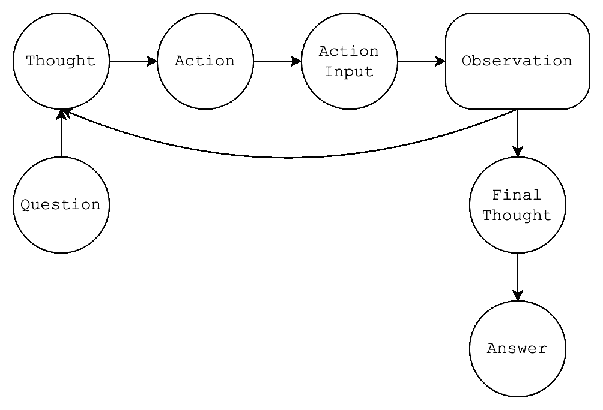
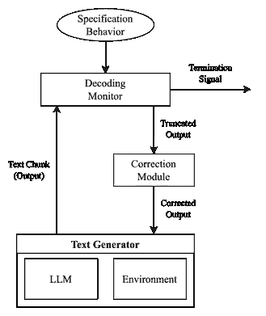
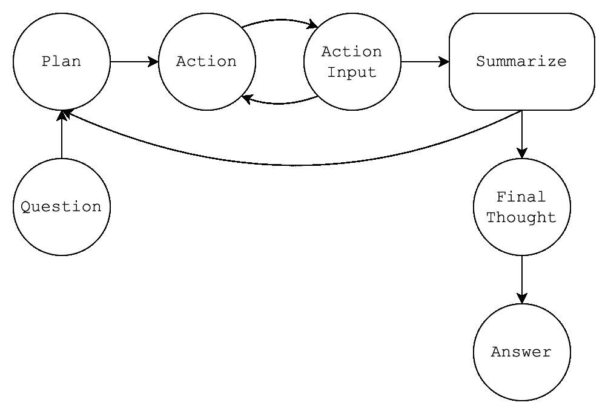
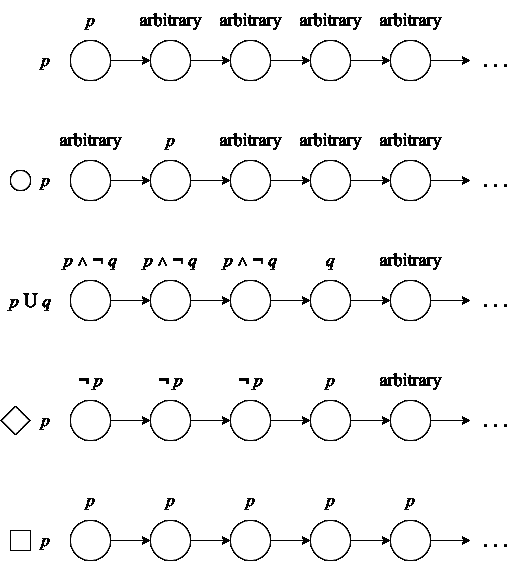

<!--yml
category: 未分类
date: 2025-01-11 13:03:31
-->

# Formally Specifying the High-Level Behavior of LLM-Based Agents

> 来源：[https://arxiv.org/html/2310.08535/](https://arxiv.org/html/2310.08535/)

Maxwell Crouse, Ibrahim Abdelaziz, Ramon Astudillo, Kinjal Basu, Soham Dan,
Sadhana Kumaravel, Achille Fokoue, Pavan Kapanipathi, Salim Roukos, Luis Lastras
{ maxwell.crouse, ibrahim.abdelaziz1, ramon.astudillo }@ibm.com
{ kinjal.basu, soham.dan, sadhana.kumaravel1 }@ibm.com
{ achille, kapanipa, roukos, lastrasl }@us.ibm.com
IBM Research

###### Abstract

Autonomous, goal-driven agents powered by LLMs have recently emerged as promising tools for solving challenging problems without the need for task-specific finetuned models that can be expensive to procure. Currently, the design and implementation of such agents is ad hoc, as the wide variety of tasks that LLM-based agents may be applied to naturally means there can be no one-size-fits-all approach to agent design. In this work we aim to alleviate the difficulty of designing and implementing new agents by proposing a minimalistic generation framework that simplifies the process of building agents. The framework we introduce allows the user to define desired agent behaviors in a high-level, declarative specification that is then used to construct a decoding monitor which guarantees the LLM will produce an output exhibiting the desired behavior. Our declarative approach, in which the behavior is described without concern for how it should be implemented or enforced, enables rapid design, implementation, and experimentation with different LLM-based agents. We demonstrate how the proposed framework can be used to implement recent LLM-based agents (e.g., ReACT), and show how the flexibility of our approach can be leveraged to define a new agent with more complex behavior, the Plan-Act-Summarize-Solve (PASS) agent. Lastly, we demonstrate that our method outperforms other agents on multiple popular reasoning-centric question-answering benchmarks.

Formally Specifying the High-Level Behavior of LLM-Based Agents

Maxwell Crouse, Ibrahim Abdelaziz, Ramon Astudillo, Kinjal Basu, Soham Dan, Sadhana Kumaravel, Achille Fokoue, Pavan Kapanipathi, Salim Roukos, Luis Lastras { maxwell.crouse, ibrahim.abdelaziz1, ramon.astudillo }@ibm.com { kinjal.basu, soham.dan, sadhana.kumaravel1 }@ibm.com { achille, kapanipa, roukos, lastrasl }@us.ibm.com IBM Research

## 1 Introduction

Many recent works (e.g., Brohan et al. ([2023](#bib.bib7)); Shen et al. ([2023](#bib.bib29)); Yao et al. ([2022](#bib.bib44)); Shinn et al. ([2023](#bib.bib30))) have explored the use of large language models (LLMs) to drive the decision-making of intelligent, autonomous agents. Given a problem to solve, these LLM-based agents break the problem down into a sequence of steps, where each step involves either generating text or executing a tool, e.g., an API call Schick et al. ([2023](#bib.bib28)); Qin et al. ([2023](#bib.bib27)); Tang et al. ([2023](#bib.bib31)), which can supply new context to the agent. Importantly, while the order of steps to take is dictated by a high-level, prespecified behavior implemented by the user, the underlying LLM is still allowed significant flexibility in what it may produce. At each individual step, the outputs are entirely determined by the LLM, thus allowing the agent to leverage the strong generative capabilities of LLMs while ensuring there are guardrails to prevent aberrant behavior. Figure [1](#S1.F1 "Figure 1 ‣ 1 Introduction ‣ Formally Specifying the High-Level Behavior of LLM-Based Agents") provides an example of text produced by the popular ReACT Yao et al. ([2022](#bib.bib44)) framework, where an agent executes a loop that goes between generative steps (i.e., Thought, Action, Action Input) and tool execution steps (i.e., Observation).

<svg class="ltx_picture ltx_centering" height="291.85" id="S1.F1.pic1" overflow="visible" version="1.1" width="582"><g color="#000000" fill="#000000" stroke="#000000" stroke-width="0.4pt" transform="translate(0,291.85) matrix(1 0 0 -1 0 0)"><g fill-opacity="1.000000" transform="matrix(1.0 0.0 0.0 1.0 21.65 13.78)"><foreignobject height="264.29" overflow="visible" transform="matrix(1 0 0 -1 0 16.6)" width="538.69">[Question] Musician and satirist Allie Goertz wrote a song about the ‘‘The Simpsons’’ character Milhouse, who Matt Groening named after who? [Thought] The question simplifies to ‘‘The Simpsons’’ character Milhouse is named after who. I only need to search ... [Action] Search [Action Input] Milhouse [Observation] Milhouse Mussolini Van Houten is a recurring character in ... [Thought] The paragraph does not tell who Milhouse is named after, maybe I can look up ‘‘named after’’. [Action] Lookup [Action Input] named after [Observation] (Result 1 / 1) Milhouse was named after U.S. president Richard Nixon, whose middle name was Milhous. [Final Thought] Milhouse was named after U.S. president Richard Nixon, so the answer is Richard Nixon. [Answer] Richard Nixon</foreignobject></g></g></svg>

Figure 1: Text output by ReACT agent that alternates between generative states (Thought, Action, Action Input) and tool execution states (Observation)

Though LLM-based agents show much promise, there still remain challenges involved with their practical application. As each agent has its own strengths and weaknesses, it can be necessary to try a variety of different agents when approaching a problem. This can be a steep barrier to entry, as the lack of a standard framework for defining agents means that the end user must reimplement in code the exact behavior they wish for an agent to exhibit. In addition, the use of explicit code to implement agents has lead to their execution being largely rigid, i.e., they are hard coded to follow a fixed path of behavior; which takes away flexibility from the LLM in deciding how best to solve a problem.

To address the aforementioned challenges, we propose a declarative framework to formally specify the high-level behavior of an LLM-based agent. Our framework takes in an agent behavior specified as a finite-state machine, which it then uses to define a decoding monitor that ensures the LLM-based agent executes steps in a way that conforms to the user’s expectation. Importantly, the decoding monitor operates in a post hoc fashion, intervening only to correct generated text when it observes a deviation from the desired behavior. This makes it applicable to models only accessible through APIs.

The ability to leverage the highest performing LLMs (which are often closed source) is a key component of our approach. Following in-context learning Brown et al. ([2020](#bib.bib8)) and instruction-tuning Wei et al. ([2021](#bib.bib34)); Ouyang et al. ([2022](#bib.bib23)), LLMs have shown generalization to a large number of tasks without any parameter tuning. In addition, it is clear that large model size and the use of specialized hardware (e.g., GPUs) are fundamental factors in performance. For these reasons, centralized systems that serve large numbers of requests remotely through an API are increasingly central to how LLMs are utilized. In this context, custom applications of token-level constrained decoding Wuebker et al. ([2016](#bib.bib39)); Hokamp and Liu ([2017](#bib.bib14)) that directly modify the output softmax of a model would have high communication overhead. The decoding monitor proposed here circumvents this by optimistically assuming most generated tokens will be correct and rejects or prefixes the generation of entire chunks of text at the client side, thus reducing communication overhead.

We demonstrate how a number of popular agents can be straightforwardly implemented in our framework (e.g., ReACT Yao et al. ([2022](#bib.bib44)), ReWOO Xu et al. ([2023b](#bib.bib41)), Reflexion Shinn et al. ([2023](#bib.bib30))). In addition, we introduce the Plan-Act-Summarize-Solve (PASS) agent. The PASS agent leverages the flexibility enabled by our framework and operates by dynamically adjusting the number of actions it executes in parallel. It thus differs from prior agents that operate entirely sequentially (e.g., Yao et al. ([2022](#bib.bib44))) or in parallel (e.g., Xu et al. ([2023b](#bib.bib41))).

In summary, our contributions in this work are as follows: (a) we introduce a declarative framework for defining LLM-based agents that ensures conformance to desired behaviors with a decoding montitor, (b) we demonstrate how to implement a number of well-known agents with our framework, and (c) we introduce PASS, a new agent architecture that leverages the declarative nature of our framework and yields improved performance as compared to other agents across three standard datasets (Hotpot QA Yang et al. ([2018](#bib.bib43)), TriviaQA Joshi et al. ([2017](#bib.bib16)), and GSM8K Cobbe et al. ([2021](#bib.bib10))).

## 2 Agent Specification Framework

In this section, we introduce our framework for designing and implementing autonomous agents that can interact with the environment to solve problems expressed in natural language. Our framework is intended to be lightweight (i.e., add as little additional overhead to LLM operation as is possible) and declarative (i.e., the user specifies the desired high-level behavior in terms of constraints without concern for how they should be implemented or enforced). To begin, we provide a more formal definition of agents and how they are specified in our framework. Then, we describe how the framework is used to control what an agent can generate.

Figure 2: State diagram of ReACT agent architecture

### 2.1 Specifying Agent Behavior

We model agents as generic finite-state machines, where a finite-state machine is considered a tuple $\left<\mathcal{D}_{S},\delta,s_{0},s_{end}\right>$ consisting of a non-empty set of states $\mathcal{D}_{S}$, a state transition function $\delta:\mathcal{D}_{S}\rightarrow\mathcal{D}_{S}$, an initial state $s_{0}\in\mathcal{D}_{S}$, and a final state $s_{end}\in\mathcal{D}_{S}$. To define an agent and its underlying state machine, the user provides a specification consisting of 1) a list of states and their properties and 2) a desired behavior in the form of a logical formula. At each time step, the agent will receive a string from either an LLM or the environment¹¹1Here we refer to the “environment” as any provider of text that is not the LLM (e.g., external tools, API calls, etc.), with the source of the string determined by the state the agent is in.

Figure [3](#S2.F3 "Figure 3 ‣ 2.1 Specifying Agent Behavior ‣ 2 Agent Specification Framework ‣ Formally Specifying the High-Level Behavior of LLM-Based Agents") shows an example of a specification provided in the format of a Lisp-style s-expression. In the specification, the :states list contains all possible states for the agent. Each state within the list must specify a prompt string (e.g., “[Thought]” for the Tht state), which will serve as both an initial prompt for when the agent is in that state and as a signal to detect when a state transition occurs. When the environment is the intended provider of a string for a particular state, the special :env-input flag is used (e.g., shown in the Obs state).

<svg class="ltx_picture ltx_centering" height="323.67" id="S2.F3.pic1" overflow="visible" version="1.1" width="582"><g color="#000000" fill="#000000" stroke="#000000" stroke-width="0.4pt" transform="translate(0,323.67) matrix(1 0 0 -1 0 0)"><g fill-opacity="1.000000" transform="matrix(1.0 0.0 0.0 1.0 21.65 13.78)"><foreignobject height="296.11" overflow="visible" transform="matrix(1 0 0 -1 0 16.6)" width="538.69">(define react-agent (:states (Ques (:text "[Question]")) (Tht (:text "[Thought]")) (Act (:text "[Action]")) (Act-Inp (:text "[Action Input]")) (Obs (:text "[Observation]") (:flags :env-input)) (Final-Tht (:text "[Final Thought]")) (Ans (:text "[Answer]"))) (:behavior (next Ques (until (next Tht Act Act-Inp Obs)     Final-Tht)    Ans)))

Figure 3: Specification for ReACT agent (see Figure [2](#S2.F2 "Figure 2 ‣ 2 Agent Specification Framework ‣ Formally Specifying the High-Level Behavior of LLM-Based Agents"))

The behavior of an agent is provided in the :behavior list as a logical formula, where each formula is constructed from states connected together with the logical operators or, next or until. We enforce that the top-level formula in :behavior begins with next. From the formula, a finite-state machine (FSM) is constructed that will be used to validate the behavior of the agent.

The operators are taken from linear-temporal logic (LTL) Pnueli ([1977](#bib.bib25)), which is commonly used for runtime verification systems. We note however, that any method for constructing an FSM would suffice. We next give an overview of how our approach evaluates formulas, with a more detailed background of LTL provided in Appendix [A.1](#A1.SS1 "A.1 Linear Temporal Logic ‣ Appendix A Appendix ‣ Formally Specifying the High-Level Behavior of LLM-Based Agents").

In this work, the formula is evaluated over a finite sequence of states, where each state is taken from the list of states provided in :states. In the following, the letters after the logical operator (e.g., a, b, and c) will denote arguments, i.e., formulas or states, and let $\texttt{S}=\left<\texttt{s}_{0},\texttt{s}_{1},\ldots\right>$ denote the sequence of states produced by our agent, with $\texttt{s}_{i}$ being the state of our agent at time $i$. We write that S satisfies ($\models$) the behavior if the following holds

|  | S | $\displaystyle\models\ \ \texttt{a}$ |  |
|  |  | $\displaystyle\ \ \mathrm{iff}\ \ \texttt{S}=\left<\texttt{a}\right>\wedge% \texttt{a}\in\texttt{:states}$ |  |
|  | S | $\displaystyle\models\ \ \texttt{(or a b c }\ldots\texttt{)}$ |  |
|  |  | $\displaystyle\ \ \mathrm{iff}\ \ \texttt{S}\models\texttt{a}\vee\texttt{S}% \models\texttt{b}\vee\ldots\vee\texttt{S}\models\texttt{c}\vee\ldots$ |  |
|  | S | $\displaystyle\models\ \ \texttt{(next a b c }\ldots\texttt{)}$ |  |
|  |  | $\displaystyle\ \ \mathrm{iff}\ \ \exists i>0.\ \ \texttt{S}[0\ldots i]\models% \texttt{a}$ |  |
|  |  | $\displaystyle\ \ \mathrm{and}\ \ \texttt{S}[i\ldots]\models\texttt{(next b c }% \ldots\texttt{)}$ |  |
|  | S | $\displaystyle\models\ \ \texttt{(until a b)}$ |  |
|  |  | $\displaystyle\ \ \mathrm{iff}\ \ \exists j\geq 0.\ \ \texttt{S}[j\ldots]% \models\texttt{b}$ |  |
|  |  | $\displaystyle\ \ \mathrm{and}\ \ \texttt{S}[i\ldots]\models\texttt{a},\ \ % \textrm{for all}\ \ 0\leq i<j$ |  |

where $\texttt{S}[i\ldots j]=\left<\texttt{s}_{i},\ldots,\texttt{s}_{j-1}\right>$ and $\texttt{S}[i\ldots]=\left<\texttt{s}_{i},\ldots\right>$ are slicing operations that return subsequences of observations following time step $i$.

Informally, the above rules operate as one might expect. (next a b c …) specifies that a must hold, then b, then c, etc. Similarly, (until a b) specifies that a must hold (and may loop indefinitely) until b holds. Lastly, (or a b c …) requires that any of a, b, c, etc. hold. Despite the simplicity of the above representation, we find it to be sufficient to represent a range of agents. We refer back to Figures [2](#S2.F2 "Figure 2 ‣ 2 Agent Specification Framework ‣ Formally Specifying the High-Level Behavior of LLM-Based Agents") and [3](#S2.F3 "Figure 3 ‣ 2.1 Specifying Agent Behavior ‣ 2 Agent Specification Framework ‣ Formally Specifying the High-Level Behavior of LLM-Based Agents") for ReACT, with examples of other agents provided in Appendix [A.1](#A1.SS1 "A.1 Linear Temporal Logic ‣ Appendix A Appendix ‣ Formally Specifying the High-Level Behavior of LLM-Based Agents").

Figure 4: Agent generation loop

### 2.2 Constraining Agent Behavior

Agents in our framework begin generation like any other prompting approach. First, the agent is provided with the input prompt, which consists of instructions, (optionally) a number of examples, and the prompt text $t_{0}$ associated with the initial state $s_{0}$ (e.g., “[Question]” for the agent of Figure [3](#S2.F3 "Figure 3 ‣ 2.1 Specifying Agent Behavior ‣ 2 Agent Specification Framework ‣ Formally Specifying the High-Level Behavior of LLM-Based Agents")). At this point, the agent is considered to be in state $s_{0}$ and must transition between states according to the behavior prescribed by its logical formula. For the remainder of generation, the agent operates in a loop that alternates between generation, validation, and correction, until the the agent reaches the final state $s_{end}$, at which point a termination signal halts generation. Figure [4](#S2.F4 "Figure 4 ‣ 2.1 Specifying Agent Behavior ‣ 2 Agent Specification Framework ‣ Formally Specifying the High-Level Behavior of LLM-Based Agents") provides a diagram illustrating our system’s process, which we next describe.

#### 2.2.1 Generation

Depending on the current state of the agent, text will be produced by either the underlying LLM of the agent or by the environment (e.g., the result of an API call). When text must be produced by the LLM, the agent’s LLM is prompted with all historical context concatenated with all text produced thus far. It then generates text until either a stop sequence is output or a pre-specified chunk size is reached. In this work, stop sequences are the prompt texts for any state that must be produced by the environment (e.g., “[Observation]” in Figure [3](#S2.F3 "Figure 3 ‣ 2.1 Specifying Agent Behavior ‣ 2 Agent Specification Framework ‣ Formally Specifying the High-Level Behavior of LLM-Based Agents")). When text is produced by the environment, it is treated in the same way as if it were produced by the LLM. In both cases, the chunk of text is then passed to decoding monitor for validation.

#### 2.2.2 Validation

Text received from generation is first parsed and separated into a sequence of states paired with their corresponding content, i.e., $\texttt{S}=\left<\left<s_{i},t_{i}\right>,\ldots\right>$, with separation dividing the text by occurrences of the prompts associated with any of the agent’s specification’s states (regardless of whether the state reflects a valid transition). Splitting on prompt strings thus serves as the state transition function $\delta$, where one must be sure that the prompts for each state are not otherwise commonly occurring strings.

With S in hand, the decoding monitor (constructed from the specification’s behavior) walks through each pair $\left<s_{i},t_{i}\right>$ to both update its current state as well as validate the correctness of state transitions. When it detects a state transition error, i.e., when $s_{i}$ does not follow from $s_{i-1}$ according to the specification’s behavior or $s_{i}$ is not given, the text following the invalid state or state content is discarded, and the remaining subsequence of $S$ is passed to the correction module.

#### 2.2.3 Correction

The correction module will be passed the sequence $\texttt{S}=\left<\left<s_{i},t_{i}\right>,\ldots\right>$ from before that has been truncated to remove all text beyond the first violation of the specification. It takes the truncated text and applies a correction, then returns the new string to the LLM to resume generation. The difficulty with this step is to apply a correction that meaningfully changes what the LLM generates next while also not imposing a hard constraint on the LLM.

To correct a state transition error (e.g., the LLM produced “[Thought]” instead of “[Action]”), the correction module employs valid state prefixing. Taking the last observed state in $S$ as the last correct state, we define the set of next valid states to be the states that can be transitioned to according to the agent’s behavior. Valid state prefixing takes the longest common prefix of the prompt texts for each state within the set of next valid states and appends that prefix to the string to be returned to the LLM. For instance, for “[Action]” and “[Action Input]”, the longest common prefix would be “[Action”, while for “[Action]” and “[Thought]”, it would be “[”. Once the longest common prefix is determined, the correction module returns the truncated original text (i.e., all text occurring before the detected error) concatenated with this prefix.

## 3 The PASS Agent Architecture

<svg class="ltx_picture ltx_centering" height="390.09" id="S3.F5.pic1" overflow="visible" version="1.1" width="582"><g color="#000000" fill="#000000" stroke="#000000" stroke-width="0.4pt" transform="translate(0,390.09) matrix(1 0 0 -1 0 0)"><g fill-opacity="1.000000" transform="matrix(1.0 0.0 0.0 1.0 21.65 13.78)"><foreignobject height="362.53" overflow="visible" transform="matrix(1 0 0 -1 0 16.6)" width="538.69">(define pass-agent (:states (Ques (:text "[Question]")) (Plan (:text "[Thought]")) (Act (:text "[Action]")) (Act-Inp (:text "[Action Input]")) (Sum (:text "[Summary]") (:flags :env-input)) (Final-Tht (:text "[Final Thought]")) (Ans (:text "[Answer]"))) (:behavior (next Ques (until (next Plan (until (next Act Act-Inp) Sum))     Final-Tht)    Ans)))

Figure 5: Specification for PASS agent that that iteratively aggregates sets of actions, executes them in parallel, and then summarizes their output

Figure 6: State diagram of PASS agent architecture

In addition to implementing several existing agents (see Appendix [A.3](#A1.SS3 "A.3 Agent Definitions ‣ Appendix A Appendix ‣ Formally Specifying the High-Level Behavior of LLM-Based Agents")), we also introduce a new agent, referred to as the Plan-Act-Summarize-Solve (PASS) agent. PASS is a hybrid between the entirely sequential ReACT Yao et al. ([2022](#bib.bib44)) and the entirely parallel ReWOO Xu et al. ([2023b](#bib.bib41)) that is designed to address both of their deficiencies. In Figures [5](#S3.F5 "Figure 5 ‣ 3 The PASS Agent Architecture ‣ Formally Specifying the High-Level Behavior of LLM-Based Agents") and [6](#S3.F6 "Figure 6 ‣ 3 The PASS Agent Architecture ‣ Formally Specifying the High-Level Behavior of LLM-Based Agents"), we provide both the specification and finite-state diagram for the PASS agent.

At a high level, PASS operates in a loop that alternates between action execution and summarization. Each iteration of the main loop begins with a planning step (i.e., Plan in Figure [6](#S3.F6 "Figure 6 ‣ 3 The PASS Agent Architecture ‣ Formally Specifying the High-Level Behavior of LLM-Based Agents")), where the LLM writes out the series of actions it believes must be executed (i.e., Action and Action Input in Figure [6](#S3.F6 "Figure 6 ‣ 3 The PASS Agent Architecture ‣ Formally Specifying the High-Level Behavior of LLM-Based Agents")). Then, the LLM aggregates a set of independent actions that can be executed simultaneously in service of the previously written plan. The set of actions is executed, and the results of those actions are summarized by an LLM before being returned to the agent (i.e., Summarize in Figure [6](#S3.F6 "Figure 6 ‣ 3 The PASS Agent Architecture ‣ Formally Specifying the High-Level Behavior of LLM-Based Agents")). This loop continues until the agent believes it can solve the problem, at which point it exits the planning loop and writes its final solution (i.e., Final Thought and Answer in Figure [6](#S3.F6 "Figure 6 ‣ 3 The PASS Agent Architecture ‣ Formally Specifying the High-Level Behavior of LLM-Based Agents")).

The summarization step takes as input the original question, the subgoal to be solved, and the result of each action that was executed (in a list format). It then uses the same LLM that powers the agent to produce a summary of the action results with respect to the question and subgoal. Once the summary has been generated, the summarization step must decide whether it is best to return the generated summary or the raw action results to the agent. Letting $x$ be the LLM context thus far, $s$ be the summarization, and $o$ be the original action results concatenated into a list, then the output returned to the PASS agent is

|  | $\displaystyle\operatorname*{arg\,max}_{y\in\{s,o\}}\sum_{i}^{&#124;y&#124;}\log p(y_{i}&#124;% x,y_{1},\ldots,y_{i-1})\big{/}\dfrac{(5+&#124;y&#124;)^{\alpha}}{(5+1)^{\alpha}}$ |  |

where $p(y|x)$ is computed by the same LLM powering the agent and the score is length-normalized Wu et al. ([2016](#bib.bib38)); Murray and Chiang ([2018](#bib.bib21)).

In this work, the summarization step is intended to serve two purposes. First, when the summarization is returned, it can consolidate a potentially large amount of information into a concise summary which (ideally) excludes extraneous details that are unhelpful with respect to the original prompt. Second, the summarization step provides the agent with action results that are most in line with the distribution of the underlying model (whether that be the raw action results or the summarization). That is, rather than the agent’s LLM incorporating text from arbitrary sources into its generation process, it instead incorporates text produced by an identical LLM (assuming the summarization model is the same as the agent’s LLM). In Figure [7](#S3.F7 "Figure 7 ‣ 3 The PASS Agent Architecture ‣ Formally Specifying the High-Level Behavior of LLM-Based Agents"), we provide an example of the summarization LLM’s input and output.

<svg class="ltx_picture ltx_centering" height="140.87" id="S3.F7.pic1" overflow="visible" version="1.1" width="582"><g color="#000000" fill="#000000" stroke="#000000" stroke-width="0.4pt" transform="translate(0,140.87) matrix(1 0 0 -1 0 0)"><g fill-opacity="1.000000" transform="matrix(1.0 0.0 0.0 1.0 21.65 13.78)"><foreignobject height="113.31" overflow="visible" transform="matrix(1 0 0 -1 0 16.6)" width="538.69">Statements: Arthur’s Magazine (1844-1846) was an American periodical published in Philadelphia in the 19th century. First for Women is a woman’s magazine published by Bauer Media Group in the USA.[1] The magazine was started in 1989. Context: Which magazine was started first Arthur’s Magazine or First for Women? Goal: I need to search Arthur’s Magazine and First for Women, and find which was started first. Summary: Arthur’s Magazine started in 1844 and First for Women started in 1989</foreignobject></g></g></svg>

Figure 7: Example of inputs (i.e., Statements, Context, and Goal) and output (i.e., Summary) for the summarization step. The summarization LLM was called for the actions Search[Arthur’s Magazine] and Search[First for Women]

The aggregation of a set of actions to take differentiates PASS from ReACT, which executes actions one by one in sequence. Thus, it can be considered the extension of ReACT to partially ordered action spaces. The advantage of this approach is that, like ReWOO, it reduces costly action execution steps that require the agent to suspend the LLM. Unlike ReWOO, however, which cannot leverage the result of an action to influence how it generates subsequent actions (as ReWOO writes out all actions prior to execution), our approach can incorporate feedback from executed actions in its generation process. This can be advantageous when incorrect action calls are possible (e.g., executing a Wikipedia search with the wrong article title).

## 4 Experiments

To demonstrate our framework, we implemented five prompting approaches: 1) Self-consistency alone (Direct), i.e., where the model immediately responds with an answer Wang et al. ([2022](#bib.bib33)), 2) Chain-of-Thought with self-consistency (CoT) Wei et al. ([2022](#bib.bib35)), 3) ReACT Yao et al. ([2022](#bib.bib44)), 4) ReWOO Xu et al. ([2023b](#bib.bib41)), and 5) PASS (our framework, see Section [3](#S3 "3 The PASS Agent Architecture ‣ Formally Specifying the High-Level Behavior of LLM-Based Agents")). In addition, following Yao et al. ([2022](#bib.bib44)), we tested the complimentarity of agent and non-agent-based approaches. For this, questions were first attempted by the non-agent approaches (i.e., Direct / CoT). Then, if no answer was repeated after $k=5$ self-consistency attempts, the agent-based approach was used to produce an answer. In the tables, these results will be indicated with $\texttt{[Non-Agent]}\rightarrow\texttt{[Agent]}$.

We evaluated these approaches on three standard datasets: 1) GSM8K Cobbe et al. ([2021](#bib.bib10)), a mathematical reasoning dataset that tests the ability of a system to solve grade school math word problems, 2) HotpotQA Yang et al. ([2018](#bib.bib43)), a multi-hop question-answering dataset that requires reasoning over passages from Wikipedia, and 3) TriviaQA Joshi et al. ([2017](#bib.bib16)), a challenging, question-answering dataset with compositional questions.

Where possible, we follow the methodology of prior agent-based works in terms of datasets and hyperparameters (see also, Appendix [A.2](#A1.SS2 "A.2 Hyperparameters and Hardware ‣ Appendix A Appendix ‣ Formally Specifying the High-Level Behavior of LLM-Based Agents")), with prompts taken from Xu et al. ([2023b](#bib.bib41)). Like Yao et al. ([2022](#bib.bib44)); Xu et al. ([2023b](#bib.bib41)), we do not use the annotated Wikipedia passages for HotpotQA or TriviaQA and instead have the agent choose what terms to search in Wikipedia. To mitigate the cost involved with running large models across a large number of experiments, we follow Xu et al. ([2023b](#bib.bib41)); Shinn et al. ([2023](#bib.bib30)); Liu et al. ([2023](#bib.bib17)); Yao et al. ([2022](#bib.bib44)) for the larger datasets and select a random subset of questions from their development set for evaluation. For HotpotQA and TriviaQA we select a random subset of 1000 questions from the development set for evaluation, while for GSM8K we keep the full test set for evaluation.

In all experiments, we used Llama-2-70b Touvron et al. ([2023](#bib.bib32)) as the LLM powering our agents. All systems had access to the same tools: 1) Calculator for GSM8K, which executes an input formula and returns a number, 2) Search for HotpotQA and TriviaQA, which returns the first sentences of the Wikipedia page for the entity if it exists, or returns the most similar entities with Wikipedia pages, 3) Lookup for HotpotQA and TriviaQA, which returns the next sentence containing the input string in the last page searched for.

## 5 Results

| Method | HotpotQA | GSM8K | TriviaQA |
| Direct | 29.3 | 15.8 | 74.4 |
| CoT ([Wei et al.](#bib.bib35)) | 35.0 | 64.6 | 69.4 |
| ReACT ([Yao et al.](#bib.bib44)) | 28.7 | 53.8 | 44.1 |
| ReWOO ([Xu et al.](#bib.bib41)) | 27.0 | 51.9 | 52.4 |
| PASS (ours) | 34.7 | 53.2 | 57.8 |
| Direct $\rightarrow$ ReACT | 33.1 | 33.3 | 75.3 |
| Direct $\rightarrow$ ReWOO | 31.3 | 32.6 | 75.4 |
| Direct $\rightarrow$ PASS | 33.3 | 33.1 | 75.9 |
| CoT $\rightarrow$ ReACT | 37.8 | 65.3 | 71.4 |
| CoT $\rightarrow$ ReWOO | 37.0 | 65.6 | 71.6 |
| CoT $\rightarrow$ PASS | 38.5 | 64.7 | 72.6 |

Table 1: Exact-match accuracy (%) results for alternative prompting types across datasets. The best results in all three groups (agent-based, non-agent-based, and hybrid) are bolded

In Table [1](#S5.T1 "Table 1 ‣ 5 Results ‣ Formally Specifying the High-Level Behavior of LLM-Based Agents") we provide the results for all three datasets. We again note that all agents were implemented and evaluated in our framework. While a perfect comparison to prior work is difficult to achieve, as each of Yao et al. ([2022](#bib.bib44)); Xu et al. ([2023b](#bib.bib41)); Shinn et al. ([2023](#bib.bib30)); Liu et al. ([2023](#bib.bib17)) evaluate on different subsets of each dataset and use different underlying models (e.g., GPT-3.5 Brown et al. ([2020](#bib.bib8)), PaLM Chowdhery et al. ([2022](#bib.bib9))), our results are consistent in terms of trends with the findings of Xu et al. ([2023b](#bib.bib41)); Yao et al. ([2022](#bib.bib44)). In Xu et al. ([2023b](#bib.bib41)), ReWOO was demonstrated to outperform ReACT on TriviaQA (51.8% versus 47.4% in their work) and underperform on HotpotQA (30.4% versus 32.2%). Lastly, like Yao et al. ([2022](#bib.bib44)) and Xu et al. ([2023b](#bib.bib41)), we observed chain-of-thought Wei et al. ([2022](#bib.bib35)) and direct response to be more effective than agent-based works.

In addition to individual methods, Table [1](#S5.T1 "Table 1 ‣ 5 Results ‣ Formally Specifying the High-Level Behavior of LLM-Based Agents") also shows how well the agent approaches complimented the non-agent-based approaches. As shown in the table, hybrid systems (i.e., non-agent systems that used agents as a fallback prediction) resulted in the top performances across all datasets, with the best results being produced by non-agent methods combined with our PASS agent. This suggests there to be complimentary between these two distinct response paradigms.

<svg class="ltx_picture ltx_centering" height="208.82" id="S5.F8.pic1" overflow="visible" version="1.1" width="582"><g color="#000000" fill="#000000" stroke="#000000" stroke-width="0.4pt" transform="translate(0,208.82) matrix(1 0 0 -1 0 0)"><g fill-opacity="1.000000" transform="matrix(1.0 0.0 0.0 1.0 21.65 13.78)"><foreignobject height="181.26" overflow="visible" transform="matrix(1 0 0 -1 0 16.6)" width="538.69">[Question] Who was born first, Yanka Dyagileva or Alexander Bashlachev? [Thought] I need to search Yanka Dyagileva and Alexander Bashlachev, find their birth years, then find which was born first. [Action] Search [Action Input] Yanka Dyagileva [Action] Search [Action Input] Alexander Bashlachev [Summary] Yanka Dyagileva was born in 1966 while Alexander Bashlachev was born in 1960. [Final Thought] 1960 (Alexander Bashlachev) < 1966 (Yanka Dyagileva), so Alexander Bashlachev was born first. [Answer] Alexander Bashlachev</foreignobject></g></g></svg>

Figure 8: Example of text output by PASS agent for a question from the HotpotQA dataset

| Agent | HotpotQA | GSM8K | TriviaQA |
| ReACT ([Yao et al.](#bib.bib44)) | 28.7 | 53.8 | 44.1 |
| ReWOO ([Xu et al.](#bib.bib41)) | 27.0 | 51.9 | 52.4 |
| PASS | 34.7 | 53.2 | 57.8 |
|   - No Summarizer | 25.7 | 53.8 | 45.2 |

Table 2: Exact-match accuracy (%) ablation results for PASS architecture with / without the summarization step

Among the agent-based systems, we see that our PASS agent performed the best on HotpotQA and TriviaQA while underperforming as compared to ReACT for GSM8K. We provide an example of PASS output in Figure [8](#S5.F8 "Figure 8 ‣ 5 Results ‣ Formally Specifying the High-Level Behavior of LLM-Based Agents") for the HotpotQA dataset. We suspected the summarization step to have played a key role in the performance of PASS. Thus, we ran an ablation experiment with the PASS agent where the summarization model was removed. In this setting, the results of all actions were instead put into a numbered list and returned to the agent unmodified.

Table [2](#S5.T2 "Table 2 ‣ 5 Results ‣ Formally Specifying the High-Level Behavior of LLM-Based Agents") shows the results of the ablation experiment. In the table, we see that, for HotpotQA and TriviaQA, the use of summarization boosted performance. This could be due to the search and lookup tools often returning very information dense results (i.e., raw Wikipedia text) that contain extraneous information. In contrast, for GSM8K the summarization LLM negatively impacted results. In GSM8K, the only tool available was a calculator that returned numeric values. We believe that, because there was little to summarize, the LLM could not provide enough value to offset any errors it would make from introduced hallucinations. These results suggest that summarization can be a very valuable addition to a tool-augmented agent, however, it should only be applied when the raw results of tool calls are likely to derail the agent.

## 6 Related Work

### 6.1 LLM-Based Agents

Various LLM-based agents targeting different tasks have been proposed. Among them, WebAgent Gur et al. ([2023](#bib.bib12)) demonstrates language-based agents capable of executing tasks on websites by adhering to natural language commands. Relatedly, the Generative Agents Park et al. ([2023](#bib.bib24)) work aims to simulate believable human behavior, and SayCan Ahn et al. ([2022](#bib.bib1)) illustrates the capability to use LLMs in embodied agents. These agents are intended for a particular purpose, and thus are less related to this work than those that can be tailored to solve a wider range of tasks, e.g., ReACT Yao et al. ([2022](#bib.bib44)), Reflexion Shinn et al. ([2023](#bib.bib30)), ReWOO Xu et al. ([2023b](#bib.bib41)).

Several open-source projects have also centered on agent creation, e.g., AutoGPT Gravitas ([2023](#bib.bib11)) and BabyAGI Nakajima ([2023](#bib.bib22)). These works have focused on constructing self-sufficient agents that fulfil user requests, which differs from our framework wherein the user defines task-specific individual agents for their specific purposes.

There have been several multi-agent orchestration frameworks that have been recently introduced, e.g., BOLAA Liu et al. ([2023](#bib.bib17)), MetaGPT Hong et al. ([2023](#bib.bib15)), Gentopia Xu et al. ([2023a](#bib.bib40)), and AutoGen Wu et al. ([2023](#bib.bib37)). These frameworks focus primarily on the related problem of orchestrating multiple, simple LLM-based agents to achieve complex goals, where the individual agents themselves are generally no more complex than ReACT or ReWOO. This differs from our focus of designing, implementing, and validating complex individual agents (however, we suspect our work would synergize well with such approaches).

Most conceptually similar to our approach are the works of Harrison ([2022](#bib.bib13)) and Beurer-Kellner et al. ([2023](#bib.bib6)). LangChain Harrison ([2022](#bib.bib13)) is a popular framework for designing LLM-based applications that has some support for implementing LLM-based agents. However, their approach does not guarantee conformance to the user’s desired behavior, relying almost entirely on prompting to encourage models to follow the expected behavior. The work of Beurer-Kellner et al. ([2023](#bib.bib6)) introduced a scripting language for LLMs based on prompting. Their approach did not focus exclusively on LLM-based agents, instead more broadly considering the problem of interleaving LLM outputs into complex, programmatically defined text templates. A key point of differentiation with their approach is that it utilized eager enforcement of constraints (e.g., when used to implement the ReACT agent, their approach halted decoding at each individual state). While this allowed them to capture a much larger range of constraints and behaviors, it also leads to costly reprompting (see Xu et al. ([2023b](#bib.bib41))).

### 6.2 Constrained Decoding

Conceptually related to our work are constrained generation methods that modify the standard beam search decoding procedure at inference time, to incorporate constraints in the output Wiseman and Rush ([2016](#bib.bib36)); Wuebker et al. ([2016](#bib.bib39)); Anderson et al. ([2017a](#bib.bib2)); Lu et al. ([2022](#bib.bib18)); Hokamp and Liu ([2017](#bib.bib14)); Post and Vilar ([2018](#bib.bib26)). While these works focus one level lower than our work in that they go directly into the decoder to modify its outputs, such methods could be used to implement controls within our approach if we were to instead rely on locally hosted models.

Of particular note, Anderson et al. ([2017b](#bib.bib3)) proposes a constrained beam search algorithm that keeps track of constraints via a finite-state machine, and demonstrates its benefits on several image captioning tasks. The neurologic decoding line of work Lu et al. ([2021](#bib.bib19), [2022](#bib.bib18)) enforces the satisfaction of lexical constraints (specified as any predicate logic formula having word inclusion and exclusion constraints) via adding a penalty term for constraint violation in the beam search decoding algorithm. Bastan et al. ([2023](#bib.bib5)) builds on top of neurologic decoding by incorporating structural constraints that capture dependency parsing information. Lastly, both the FUDGE Yang and Klein ([2021](#bib.bib42)) and NADO Meng et al. ([2022](#bib.bib20)) works propose the use of auxillary models that have been trained to recognize constraint-satisfying outputs as a means of controlling a base model (e.g., pretrained LLM) for generation.

## 7 Conclusion

In this work, we introduced a high-level, declarative framework for defining LLM-based agents. We implemented a number of well-known agent types with our framework, and went further to introduce PASS, a new agent architecture that takes advantage of the declarative nature of our framework. Lastly, we compared its performance to other agents across three standard datasets and found it to be strong-performing with complimentary abilities to non-agent-based prompting approaches.

## References

*   Ahn et al. (2022) Michael Ahn, Anthony Brohan, Noah Brown, Yevgen Chebotar, Omar Cortes, Byron David, Chelsea Finn, Chuyuan Fu, Keerthana Gopalakrishnan, Karol Hausman, et al. 2022. Do as i can, not as i say: Grounding language in robotic affordances. *arXiv preprint arXiv:2204.01691*.
*   Anderson et al. (2017a) Peter Anderson, Basura Fernando, Mark Johnson, and Stephen Gould. 2017a. [Guided open vocabulary image captioning with constrained beam search](https://doi.org/10.18653/v1/D17-1098). In *Proceedings of the 2017 Conference on Empirical Methods in Natural Language Processing*, pages 936–945, Copenhagen, Denmark. Association for Computational Linguistics.
*   Anderson et al. (2017b) Peter Anderson, Basura Fernando, Mark Johnson, and Stephen Gould. 2017b. Guided open vocabulary image captioning with constrained beam search. In *Proceedings of the 2017 Conference on Empirical Methods in Natural Language Processing*, pages 936–945.
*   Baier and Katoen (2008) Christel Baier and Joost-Pieter Katoen. 2008. *Principles of model checking*. MIT press.
*   Bastan et al. (2023) Mohaddeseh Bastan, Mihai Surdeanu, and Niranjan Balasubramanian. 2023. Neurostructural decoding: Neural text generation with structural constraints. In *Proceedings of the 61st Annual Meeting of the Association for Computational Linguistics (Volume 1: Long Papers)*, pages 9496–9510.
*   Beurer-Kellner et al. (2023) Luca Beurer-Kellner, Marc Fischer, and Martin Vechev. 2023. Prompting is programming: A query language for large language models. *Proceedings of the ACM on Programming Languages*, 7(PLDI):1946–1969.
*   Brohan et al. (2023) Anthony Brohan, Yevgen Chebotar, Chelsea Finn, Karol Hausman, Alexander Herzog, Daniel Ho, Julian Ibarz, Alex Irpan, Eric Jang, Ryan Julian, et al. 2023. Do as i can, not as i say: Grounding language in robotic affordances. In *Conference on Robot Learning*, pages 287–318\. PMLR.
*   Brown et al. (2020) Tom Brown, Benjamin Mann, Nick Ryder, Melanie Subbiah, Jared D Kaplan, Prafulla Dhariwal, Arvind Neelakantan, Pranav Shyam, Girish Sastry, Amanda Askell, et al. 2020. Language models are few-shot learners. *Advances in neural information processing systems*, 33:1877–1901.
*   Chowdhery et al. (2022) Aakanksha Chowdhery, Sharan Narang, Jacob Devlin, Maarten Bosma, Gaurav Mishra, Adam Roberts, Paul Barham, Hyung Won Chung, Charles Sutton, Sebastian Gehrmann, et al. 2022. Palm: Scaling language modeling with pathways. *arXiv preprint arXiv:2204.02311*.
*   Cobbe et al. (2021) Karl Cobbe, Vineet Kosaraju, Mohammad Bavarian, Mark Chen, Heewoo Jun, Lukasz Kaiser, Matthias Plappert, Jerry Tworek, Jacob Hilton, Reiichiro Nakano, et al. 2021. Training verifiers to solve math word problems. *arXiv preprint arXiv:2110.14168*.
*   Gravitas (2023) Significant Gravitas. 2023. Autogpt. [https://agpt.co](https://agpt.co).
*   Gur et al. (2023) Izzeddin Gur, Hiroki Furuta, Austin Huang, Mustafa Safdari, Yutaka Matsuo, Douglas Eck, and Aleksandra Faust. 2023. A real-world webagent with planning, long context understanding, and program synthesis. *arXiv preprint arXiv:2307.12856*.
*   Harrison (2022) Chase Harrison. 2022. Langchain. [https://github.com/langchain-ai/langchain](https://github.com/langchain-ai/langchain).
*   Hokamp and Liu (2017) Chris Hokamp and Qun Liu. 2017. Lexically constrained decoding for sequence generation using grid beam search. In *Proceedings of the 55th Annual Meeting of the Association for Computational Linguistics (Volume 1: Long Papers)*, pages 1535–1546.
*   Hong et al. (2023) Sirui Hong, Xiawu Zheng, Jonathan Chen, Yuheng Cheng, Ceyao Zhang, Zili Wang, Steven Ka Shing Yau, Zijuan Lin, Liyang Zhou, Chenyu Ran, et al. 2023. Metagpt: Meta programming for multi-agent collaborative framework. *arXiv preprint arXiv:2308.00352*.
*   Joshi et al. (2017) Mandar Joshi, Eunsol Choi, Daniel Weld, and Luke Zettlemoyer. 2017. [TriviaQA: A large scale distantly supervised challenge dataset for reading comprehension](https://doi.org/10.18653/v1/P17-1147). In *Proceedings of the 55th Annual Meeting of the Association for Computational Linguistics (Volume 1: Long Papers)*, pages 1601–1611, Vancouver, Canada. Association for Computational Linguistics.
*   Liu et al. (2023) Zhiwei Liu, Weiran Yao, Jianguo Zhang, Le Xue, Shelby Heinecke, Rithesh Murthy, Yihao Feng, Zeyuan Chen, Juan Carlos Niebles, Devansh Arpit, et al. 2023. Bolaa: Benchmarking and orchestrating llm-augmented autonomous agents. *arXiv preprint arXiv:2308.05960*.
*   Lu et al. (2022) Ximing Lu, Sean Welleck, Peter West, Liwei Jiang, Jungo Kasai, Daniel Khashabi, Ronan Le Bras, Lianhui Qin, Youngjae Yu, Rowan Zellers, et al. 2022. Neurologic a* esque decoding: Constrained text generation with lookahead heuristics. In *Proceedings of the 2022 Conference of the North American Chapter of the Association for Computational Linguistics: Human Language Technologies*, pages 780–799.
*   Lu et al. (2021) Ximing Lu, Peter West, Rowan Zellers, Ronan Le Bras, Chandra Bhagavatula, and Yejin Choi. 2021. Neurologic decoding:(un) supervised neural text generation with predicate logic constraints. In *Proceedings of the 2021 Conference of the North American Chapter of the Association for Computational Linguistics: Human Language Technologies*, pages 4288–4299.
*   Meng et al. (2022) Tao Meng, Sidi Lu, Nanyun Peng, and Kai-Wei Chang. 2022. Controllable text generation with neurally-decomposed oracle. *Advances in Neural Information Processing Systems*, 35:28125–28139.
*   Murray and Chiang (2018) Kenton Murray and David Chiang. 2018. [Correcting length bias in neural machine translation](https://doi.org/10.18653/v1/W18-6322). In *Proceedings of the Third Conference on Machine Translation: Research Papers*, pages 212–223, Brussels, Belgium. Association for Computational Linguistics.
*   Nakajima (2023) Y Nakajima. 2023. Task-driven autonomous agent utilizing gpt-4, pinecone, and langchain for diverse applications. *See https://yoheinakajima. com/task-driven-autonomous-agent-utilizing-gpt-4-pinecone-and-langchain-for-diverse-applications (accessed 18 April 2023)*.
*   Ouyang et al. (2022) Long Ouyang, Jeffrey Wu, Xu Jiang, Diogo Almeida, Carroll Wainwright, Pamela Mishkin, Chong Zhang, Sandhini Agarwal, Katarina Slama, Alex Ray, et al. 2022. Training language models to follow instructions with human feedback. *Advances in Neural Information Processing Systems*, 35:27730–27744.
*   Park et al. (2023) Joon Sung Park, Joseph C O’Brien, Carrie J Cai, Meredith Ringel Morris, Percy Liang, and Michael S Bernstein. 2023. Generative agents: Interactive simulacra of human behavior. *arXiv preprint arXiv:2304.03442*.
*   Pnueli (1977) Amir Pnueli. 1977. The temporal logic of programs. In *18th Annual Symposium on Foundations of Computer Science (sfcs 1977)*, pages 46–57\. ieee.
*   Post and Vilar (2018) Matt Post and David Vilar. 2018. Fast lexically constrained decoding with dynamic beam allocation for neural machine translation. In *Proceedings of the 2018 Conference of the North American Chapter of the Association for Computational Linguistics: Human Language Technologies, Volume 1 (Long Papers)*, pages 1314–1324.
*   Qin et al. (2023) Yujia Qin, Shihao Liang, Yining Ye, Kunlun Zhu, Lan Yan, Yaxi Lu, Yankai Lin, Xin Cong, Xiangru Tang, Bill Qian, et al. 2023. Toolllm: Facilitating large language models to master 16000+ real-world apis. *arXiv preprint arXiv:2307.16789*.
*   Schick et al. (2023) Timo Schick, Jane Dwivedi-Yu, Roberto Dessì, Roberta Raileanu, Maria Lomeli, Luke Zettlemoyer, Nicola Cancedda, and Thomas Scialom. 2023. Toolformer: Language models can teach themselves to use tools. *arXiv preprint arXiv:2302.04761*.
*   Shen et al. (2023) Yongliang Shen, Kaitao Song, Xu Tan, Dongsheng Li, Weiming Lu, and Yueting Zhuang. 2023. Hugginggpt: Solving ai tasks with chatgpt and its friends in huggingface. *arXiv preprint arXiv:2303.17580*.
*   Shinn et al. (2023) Noah Shinn, Beck Labash, and Ashwin Gopinath. 2023. Reflexion: an autonomous agent with dynamic memory and self-reflection. *arXiv preprint arXiv:2303.11366*.
*   Tang et al. (2023) Qiaoyu Tang, Ziliang Deng, Hongyu Lin, Xianpei Han, Qiao Liang, and Le Sun. 2023. Toolalpaca: Generalized tool learning for language models with 3000 simulated cases. *arXiv preprint arXiv:2306.05301*.
*   Touvron et al. (2023) Hugo Touvron, Louis Martin, Kevin Stone, Peter Albert, Amjad Almahairi, Yasmine Babaei, Nikolay Bashlykov, Soumya Batra, Prajjwal Bhargava, Shruti Bhosale, et al. 2023. Llama 2: Open foundation and fine-tuned chat models. *arXiv preprint arXiv:2307.09288*.
*   Wang et al. (2022) Xuezhi Wang, Jason Wei, Dale Schuurmans, Quoc V Le, Ed H Chi, Sharan Narang, Aakanksha Chowdhery, and Denny Zhou. 2022. Self-consistency improves chain of thought reasoning in language models. In *The Eleventh International Conference on Learning Representations*.
*   Wei et al. (2021) Jason Wei, Maarten Bosma, Vincent Zhao, Kelvin Guu, Adams Wei Yu, Brian Lester, Nan Du, Andrew M Dai, and Quoc V Le. 2021. Finetuned language models are zero-shot learners. In *International Conference on Learning Representations*.
*   Wei et al. (2022) Jason Wei, Xuezhi Wang, Dale Schuurmans, Maarten Bosma, Fei Xia, Ed Chi, Quoc V Le, Denny Zhou, et al. 2022. Chain-of-thought prompting elicits reasoning in large language models. *Advances in Neural Information Processing Systems*, 35:24824–24837.
*   Wiseman and Rush (2016) Sam Wiseman and Alexander M. Rush. 2016. [Sequence-to-sequence learning as beam-search optimization](https://doi.org/10.18653/v1/D16-1137). In *Proceedings of the 2016 Conference on Empirical Methods in Natural Language Processing*, pages 1296–1306, Austin, Texas. Association for Computational Linguistics.
*   Wu et al. (2023) Qingyun Wu, Gagan Bansal, Jieyu Zhang, Yiran Wu, Shaokun Zhang, Erkang Zhu, Beibin Li, Li Jiang, Xiaoyun Zhang, and Chi Wang. 2023. Autogen: Enabling next-gen llm applications via multi-agent conversation framework. *arXiv preprint arXiv:2308.08155*.
*   Wu et al. (2016) Yonghui Wu, Mike Schuster, Zhifeng Chen, Quoc V Le, Mohammad Norouzi, Wolfgang Macherey, Maxim Krikun, Yuan Cao, Qin Gao, Klaus Macherey, et al. 2016. Google’s neural machine translation system: Bridging the gap between human and machine translation. *arXiv preprint arXiv:1609.08144*.
*   Wuebker et al. (2016) Joern Wuebker, Spence Green, John DeNero, Saša Hasan, and Minh-Thang Luong. 2016. [Models and inference for prefix-constrained machine translation](https://doi.org/10.18653/v1/P16-1007). In *Proceedings of the 54th Annual Meeting of the Association for Computational Linguistics (Volume 1: Long Papers)*, pages 66–75, Berlin, Germany. Association for Computational Linguistics.
*   Xu et al. (2023a) Binfeng Xu, Xukun Liu, Hua Shen, Zeyu Han, Yuhan Li, Murong Yue, Zhiyuan Peng, Yuchen Liu, Ziyu Yao, and Dongkuan Xu. 2023a. [Gentopia.AI: A collaborative platform for tool-augmented LLMs](https://doi.org/10.18653/v1/2023.emnlp-demo.20). In *Proceedings of the 2023 Conference on Empirical Methods in Natural Language Processing: System Demonstrations*, pages 237–245, Singapore. Association for Computational Linguistics.
*   Xu et al. (2023b) Binfeng Xu, Zhiyuan Peng, Bowen Lei, Subhabrata Mukherjee, Yuchen Liu, and Dongkuan Xu. 2023b. Rewoo: Decoupling reasoning from observations for efficient augmented language models. *arXiv preprint arXiv:2305.18323*.
*   Yang and Klein (2021) Kevin Yang and Dan Klein. 2021. Fudge: Controlled text generation with future discriminators. In *Proceedings of the 2021 Conference of the North American Chapter of the Association for Computational Linguistics: Human Language Technologies*, pages 3511–3535.
*   Yang et al. (2018) Zhilin Yang, Peng Qi, Saizheng Zhang, Yoshua Bengio, William Cohen, Ruslan Salakhutdinov, and Christopher D Manning. 2018. Hotpotqa: A dataset for diverse, explainable multi-hop question answering. In *Proceedings of the 2018 Conference on Empirical Methods in Natural Language Processing*, pages 2369–2380.
*   Yao et al. (2022) Shunyu Yao, Jeffrey Zhao, Dian Yu, Nan Du, Izhak Shafran, Karthik R Narasimhan, and Yuan Cao. 2022. React: Synergizing reasoning and acting in language models. In *The Eleventh International Conference on Learning Representations*.

## Appendix A Appendix

### A.1 Linear Temporal Logic

Here we provide a light overview of linear temporal logic (LTL), which is used in our agent specification framework. LTL is a modal temporal logic originally introduced for formal verification Pnueli ([1977](#bib.bib25)) that extends propositional logic with the temporal operators $\mathbin{\bigcirc\kern 1.00006pt}$ (next) and $\mathbin{\mathcal{U}\kern-1.00006pt}$ (until). The two operators have intuitive definitions, with $\mathbin{\bigcirc\kern 1.00006pt}$ (next) being a unary operator that (informally) means a formula $\varphi$ must hold in the next time step, and $\mathbin{\mathcal{U}\kern-1.00006pt}$ (until) being a binary operator that specifies a formula $\varphi_{i}$ must be true until $\varphi_{j}$ becomes true. LTL formulas are defined over a set of atomic propositions $\mathcal{P}$ with their syntax given by

|  | $\varphi::=\mathrm{true}\ \ \big{&#124;}\ \ p\ \ \big{&#124;}\ \ \neg\varphi\ \ \big{&#124;}\ % \ \varphi_{1}\wedge\varphi_{2}\ \ \big{&#124;}\ \ \mathbin{\bigcirc\kern 1.00006pt}% \varphi\ \ \big{&#124;}\ \ \varphi_{1}\mathbin{\mathcal{U}\kern-1.00006pt}\varphi_{2}$ |  |

where $p\in\mathcal{P}$. An LTL formula is evaluated over an infinite sequence of observations, where each observation is a truth assignment over symbols in $\mathcal{P}$. Letting $\varphi$ be a LTL formula and $\sigma$ be the sequence of observations $\sigma=\left<\sigma_{1},\sigma_{2},\ldots\right>$, where each $\sigma_{i}$ can be considered the subset of $\mathcal{P}$ that is true at time $i$, then we write $\sigma\models\varphi$ (satisfies) when

|  | $\displaystyle\sigma\quad$ | $\displaystyle\models\quad\mathrm{true}\quad$ |  |
|  | $\displaystyle\sigma\quad$ | $\displaystyle\models\quad p\quad$ | $\displaystyle\textrm{iff}\quad p\in\sigma_{0}$ |  |
|  | $\displaystyle\sigma\quad$ | $\displaystyle\models\quad\neg\varphi\quad$ | $\displaystyle\textrm{iff}\quad\sigma\not\models\varphi\quad\quad$ |  |
|  | $\displaystyle\sigma\quad$ | $\displaystyle\models\quad\varphi_{1}\wedge\varphi_{2}\quad$ | $\displaystyle\textrm{iff}\quad\sigma\models\varphi_{1}\ \ \textrm{and}\ \ % \sigma\models\varphi_{2}$ |  |
|  | $\displaystyle\sigma\quad$ | $\displaystyle\models\quad\mathbin{\bigcirc\kern 1.00006pt}\varphi\quad$ | $\displaystyle\textrm{iff}\quad\sigma[1\ldots]\models\varphi$ |  |
|  | $\displaystyle\sigma\quad$ | $\displaystyle\models\quad\varphi_{1}\mathbin{\mathcal{U}\kern-1.00006pt}% \varphi_{2}\quad$ | $\displaystyle\textrm{iff}\quad\exists j\geq 0.\ \ \sigma[j\ldots]\models% \varphi_{2}$ |  |
|  | $\displaystyle\textrm{and}\ \ \sigma[i\ldots]\models\varphi_{1}$ |  |
|  | $\displaystyle\textrm{for all}\ \ 0\leq i<j$ |  |

where $\sigma[i\ldots]=\left<\sigma_{i},\ldots\right>$ is the remaining sequence of observations following time step $i$. From the operators listed above, we can define additional propositional logic operators $\vee$ (disjunction), and $\rightarrow$ (implication) as well as temporal operators $\mathbin{\lozenge\kern 1.00006pt}$ (eventually) and $\mathbin{\square\kern 1.00006pt}$ (always)

|  | $\displaystyle\varphi_{1}\vee\varphi_{2}\quad$ | $\displaystyle\coloneqq\quad\neg(\neg\varphi_{1}\wedge\neg\varphi_{2})$ |  |
|  | $\displaystyle\varphi_{1}\rightarrow\varphi_{2}\quad$ | $\displaystyle\coloneqq\quad\neg\varphi_{1}\vee\varphi_{2}$ |  |
|  | $\displaystyle\mathbin{\lozenge\kern 1.00006pt}\varphi\quad$ | $\displaystyle\coloneqq\quad\mathrm{true}\mathbin{\mathcal{U}\kern-1.00006pt}\varphi$ |  |
|  | $\displaystyle\mathbin{\square\kern 1.00006pt}\varphi\quad$ | $\displaystyle\coloneqq\quad\neg\mathbin{\lozenge\kern 1.00006pt}\neg\varphi$ |  |

In this work, we treat next as an n-ary operator, which can be considered simply a chained sequence of next operators, i.e., $\mathbin{\bigcirc\kern 1.00006pt}(\varphi_{1},\varphi_{2},\varphi_{3},\ldots)$ with the straightforward informal interpretation of “$\varphi_{1}$ then $\varphi_{2}$ then $\varphi_{3}$”, etc.. In Figure [9](#A1.F9 "Figure 9 ‣ A.1 Linear Temporal Logic ‣ Appendix A Appendix ‣ Formally Specifying the High-Level Behavior of LLM-Based Agents"), we provide a graphical depiction of the truth assignments over time for the above temporal operators.

In this work, we found that only allowing formulas to be those containing atomic propositions $p$, as well as operators $\rightarrow$, $\mathbin{\bigcirc\kern 1.00006pt}$, $\mathbin{\square\kern 1.00006pt}$, and $\mathbin{\mathcal{U}\kern-1.00006pt}$ (i.e., we do not allow formulas to include $\neg$, $\wedge$, etc.) was sufficient to represent the range of existing agent architectures. We leave extending the set of operators (e.g., to include $\mathbin{\lozenge\kern 1.00006pt}$, $\wedge$, etc.) to future work. For more details regarding LTL and its numerous applications, we direct the interested reader to Baier and Katoen ([2008](#bib.bib4)).

Figure 9: Examples of truth assignments over time with various LTL operators

### A.2 Hyperparameters and Hardware

There were not many hyperparameters to our approach beyond those listed in the experiments section, as our LLMs were only used for inference. The decoding strategy for our LLMs was set to greedy in all cases except for approaches which used self-consistency (i.e., Direct, CoT). For self-consistency, the temperature for sampling was set to 0.7 (as in Yao et al. ([2022](#bib.bib44))) and $k=5$ samples were drawn.

### A.3 Agent Definitions

<svg class="ltx_picture ltx_centering" height="323.67" id="A1.F10.pic1" overflow="visible" version="1.1" width="582"><g color="#000000" fill="#000000" stroke="#000000" stroke-width="0.4pt" transform="translate(0,323.67) matrix(1 0 0 -1 0 0)"><g fill-opacity="1.000000" transform="matrix(1.0 0.0 0.0 1.0 21.65 13.78)"><foreignobject height="296.11" overflow="visible" transform="matrix(1 0 0 -1 0 16.6)" width="538.69">(define react-agent (:states (Ques (:text "[Question]")) (Tht (:text "[Thought]")) (Act (:text "[Action]")) (Act-Inp (:text "[Action Input]")) (Obs (:text "[Observation]") (:flags :env-input)) (Final-Tht (:text "[Final Thought]")) (Ans (:text "[Answer]"))) (:behavior (next Ques (until (next Tht Act Act-Inp Obs)     Final-Tht)    Ans)))

Figure 10: Specification for ReACT agent Yao et al. ([2022](#bib.bib44))

<svg class="ltx_picture ltx_centering" height="290.46" id="A1.F11.pic1" overflow="visible" version="1.1" width="582"><g color="#000000" fill="#000000" stroke="#000000" stroke-width="0.4pt" transform="translate(0,290.46) matrix(1 0 0 -1 0 0)"><g fill-opacity="1.000000" transform="matrix(1.0 0.0 0.0 1.0 21.65 13.78)"><foreignobject height="262.9" overflow="visible" transform="matrix(1 0 0 -1 0 16.6)" width="538.69">(define rewoo-agent (:states (Ques (:text "[Question]")) (Plan (:text "[Plan]")) (Act-Lbl (:text "[Action Label]")) (Act (:text "[Action]")) (Act-Inp (:text "[Action Input]")) (Solver (:text "[Answer]") (:flags :env-input))) (:behavior (next Ques (until     (next Plan Act-Lbl Act Act-Inp)     Solver))))

Figure 11: Specification for ReWOO agent Xu et al. ([2023b](#bib.bib41))

<svg class="ltx_picture ltx_centering" height="473.11" id="A1.F12.pic1" overflow="visible" version="1.1" width="600"><g color="#000000" fill="#000000" stroke="#000000" stroke-width="0.4pt" transform="translate(0,473.11) matrix(1 0 0 -1 0 0)"><g fill-opacity="1.000000" transform="matrix(1.0 0.0 0.0 1.0 21.65 13.78)"><foreignobject height="445.55" overflow="visible" transform="matrix(1 0 0 -1 0 16.6)" width="556.69">(define reflexion-agent (:states (Ques (:text "[Question]")) (Tht (:text "[Thought]")) (Act (:text "[Action]")) (Act-Inp (:text "[Action Input]")) (Obs (:text "[Observation]") (:flags :env-input)) (Final-Tht (:text "[Final Thought]")) (Prop-Ans (:text "[Proposed Answer]")) (Eval (:text "[Evaluation]") (:flags :env-input)) (Ref (:text "[Reflection]")) (Ans (:text "[Answer]"))) (:behavior (next Ques (until (next (until (next Tht Act Act-Inp Obs) Final-Tht) Prop-Ans Eval      Ref)     Ans))))

Figure 12: Specification for Reflexion agent Shinn et al. ([2023](#bib.bib30))

<svg class="ltx_picture ltx_centering" height="157.63" id="A1.F13.pic1" overflow="visible" version="1.1" width="582"><g color="#000000" fill="#000000" stroke="#000000" stroke-width="0.4pt" transform="translate(0,157.63) matrix(1 0 0 -1 0 0)"><g fill-opacity="1.000000" transform="matrix(1.0 0.0 0.0 1.0 21.65 13.78)"><foreignobject height="130.07" overflow="visible" transform="matrix(1 0 0 -1 0 16.6)" width="538.69">(define cot-agent (:states (Ques (:text "[Question]")) (Tht (:text "[Thought]")) (Ans (:text "[Answer]"))) (:behavior   (next Ques Tht Ans)))

Figure 13: Specification for Chain-of-thought agent Wei et al. ([2022](#bib.bib35))

<svg class="ltx_picture ltx_centering" height="141.02" id="A1.F14.pic1" overflow="visible" version="1.1" width="582"><g color="#000000" fill="#000000" stroke="#000000" stroke-width="0.4pt" transform="translate(0,141.02) matrix(1 0 0 -1 0 0)"><g fill-opacity="1.000000" transform="matrix(1.0 0.0 0.0 1.0 21.65 13.78)"><foreignobject height="113.46" overflow="visible" transform="matrix(1 0 0 -1 0 16.6)" width="538.69">(define direct-agent (:states (Ques (:text "[Question]")) (Ans (:text "[Answer]"))) (:behavior   (next Ques Ans)))

Figure 14: Specification for direct response agent (i.e., outputs only answer)</foreignobject></g></g></svg></foreignobject></g></g></svg></foreignobject></g></g></svg></foreignobject></g></g></svg></foreignobject></g></g></svg></foreignobject></g></g></svg></foreignobject></g></g></svg>