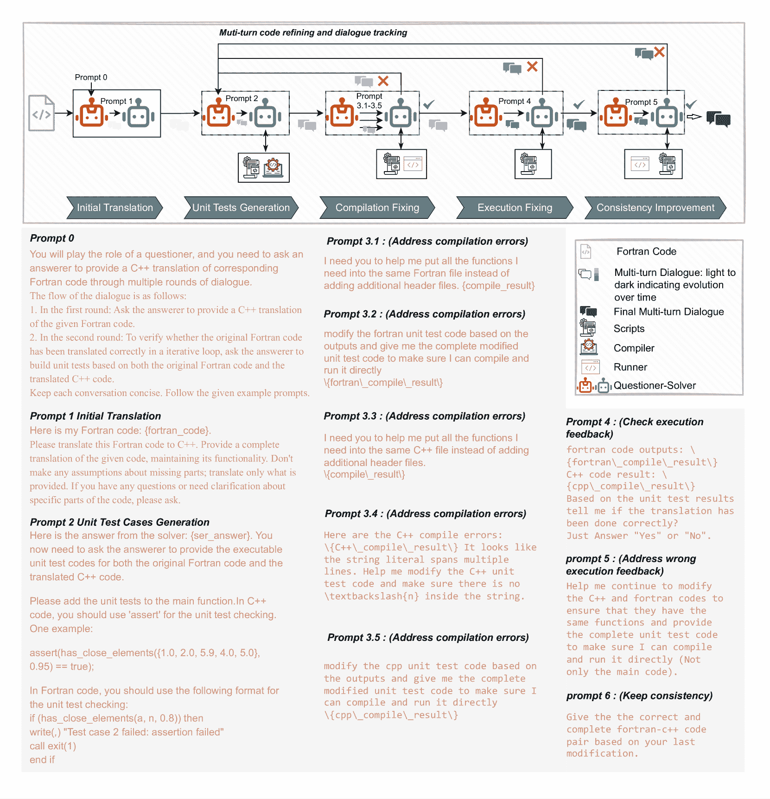
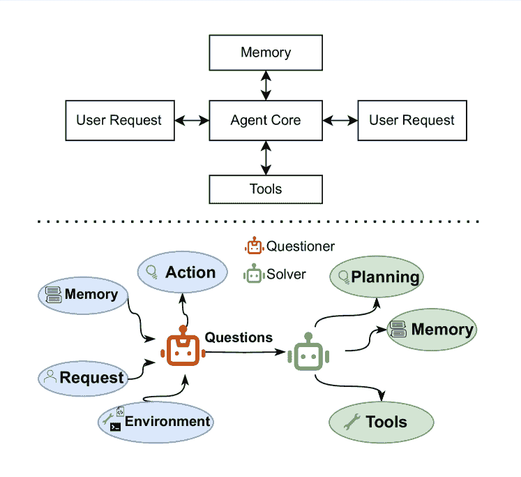
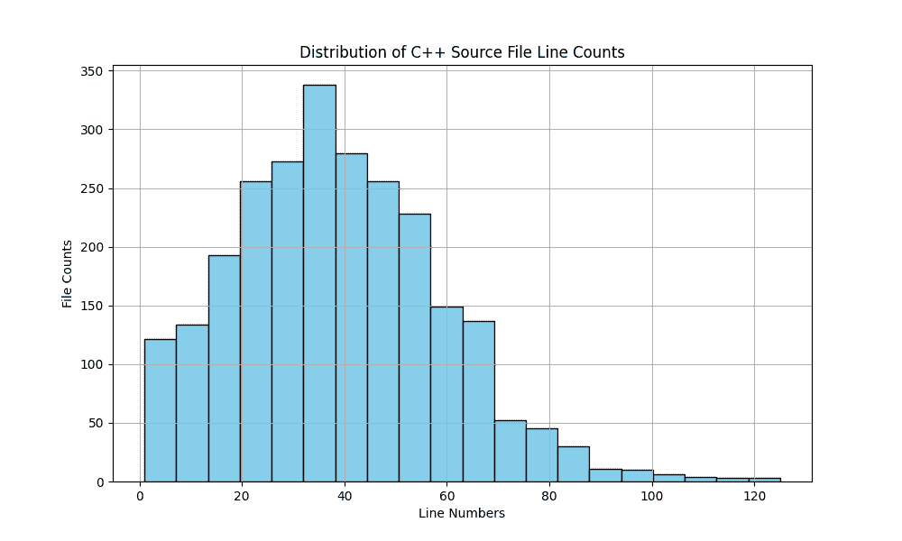
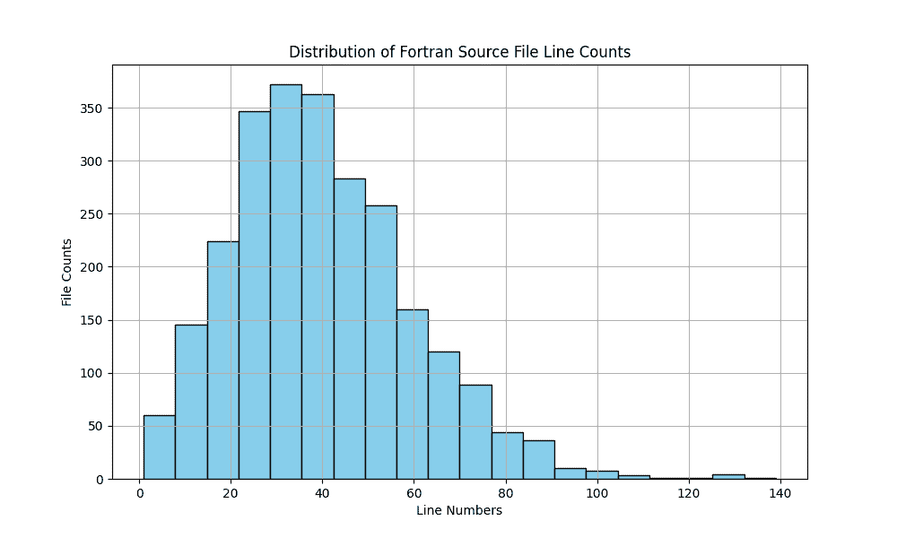
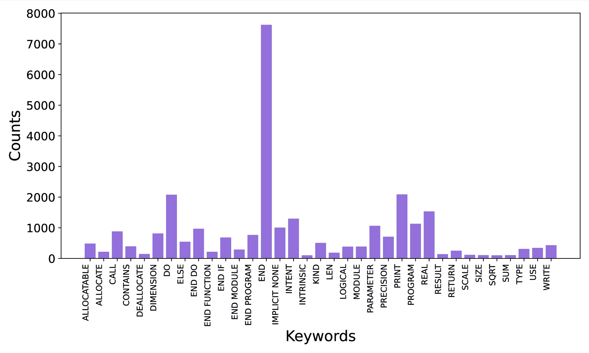
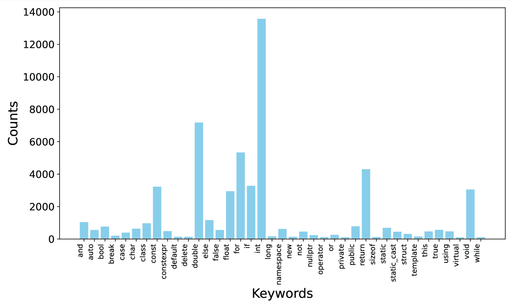
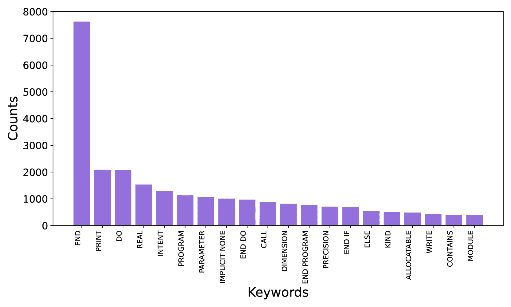

<!--yml
category: 未分类
date: 2025-01-11 11:43:14
-->

# Fortran2CPP: Automating Fortran-to-C++ Migration using LLMs via Multi-Turn Dialogue and Dual-Agent Integration

> 来源：[https://arxiv.org/html/2412.19770/](https://arxiv.org/html/2412.19770/)

Le Chen*¹  Bin Lei*²  Dunzhi Zhou³
Pei-Hung Lin⁴  Chunhua Liao⁴  Caiwen Ding²  Ali Jannesari¹

¹Iowa State University, ²University of Minnesota, ³North Carolina State University,
⁴Lawrence Livermore National Laboratory * These authors contributed equally to this work.

###### Abstract

Migrating Fortran code to C++ is a common task for many scientific computing teams, driven by the need to leverage modern programming paradigms, enhance cross-platform compatibility, and improve maintainability. Automating this translation process using large language models (LLMs) has shown promise, but the lack of high-quality, specialized datasets has hindered their effectiveness. In this paper, we address this challenge by introducing a novel multi-turn dialogue dataset, Fortran2CPP, specifically designed for Fortran-to-C++ code migration. Our dataset, significantly larger than existing alternatives, is generated using a unique LLM-driven, dual-agent pipeline incorporating iterative compilation, execution, and code repair to ensure high quality and functional correctness. To demonstrate the effectiveness of our dataset, we fine-tuned several open-weight LLMs on Fortran2CPP and evaluated their performance on two independent benchmarks. Fine-tuning on our dataset led to remarkable gains, with models achieving up to a 3.31x increase in CodeBLEU score and a 92% improvement in compilation success rate. This highlights the dataset’s ability to enhance both the syntactic accuracy and compilability of the translated C++ code. Our dataset and model have been open-sourced and are available on our public GitHub repository¹¹1[https://github.com/HPC-Fortran2CPP/Fortran2Cpp](https://github.com/HPC-Fortran2CPP/Fortran2Cpp).

Fortran2CPP: Automating Fortran-to-C++ Migration using LLMs via Multi-Turn Dialogue and Dual-Agent Integration

Le Chen*¹  Bin Lei*²  Dunzhi Zhou³ Pei-Hung Lin⁴  Chunhua Liao⁴  Caiwen Ding²  Ali Jannesari¹ ¹Iowa State University, ²University of Minnesota, ³North Carolina State University, ⁴Lawrence Livermore National Laboratory ^†^†thanks: * These authors contributed equally to this work.

## 1 Introduction

Translating legacy Fortran code into C++ has become a crucial strategy in high-performance computing (HPC) to modernize projects, enhance maintainability, and improve performance Czarnul et al. ([2020](https://arxiv.org/html/2412.19770v1#bib.bib10)). Traditional algorithm-based code translation approaches, relying on meticulously crafted rules and patterns and a deep understanding of source and target languages’ semantics and logic, often face high development and maintenance costs with limited flexibility. To address these challenges, researchers have proposed machine learning-based approaches Roziere et al. ([2020](https://arxiv.org/html/2412.19770v1#bib.bib27), [2021](https://arxiv.org/html/2412.19770v1#bib.bib28)); Szafraniec et al. ([2022](https://arxiv.org/html/2412.19770v1#bib.bib31)) for more flexible, adaptable, and effective code translation. Recent advancements in Large Language Models (LLMs) and their successful applications, such as code completion (Zhang et al., [2024](https://arxiv.org/html/2412.19770v1#bib.bib41)), parallelization Chen et al. ([2024a](https://arxiv.org/html/2412.19770v1#bib.bib4)), and documentation generation (Luo et al., [2024](https://arxiv.org/html/2412.19770v1#bib.bib22)), have sparked growing interest in exploring LLMs’ potential in code translation.

However, we observe that neither general LLMs nor code LLMs can yet reliably automate code translation, tested across various programming languages, including C, C++, Go, Java, and Python (Pan et al., [2024](https://arxiv.org/html/2412.19770v1#bib.bib25)) (Section [4](https://arxiv.org/html/2412.19770v1#S4 "4 Experiment ‣ Fortran2CPP: Automating Fortran-to-C++ Migration using LLMs via Multi-Turn Dialogue and Dual-Agent Integration")), in several models, including CodeLlama-13B, StarCoder, and GPT-6.7B, using manual inspection, unit test inspection, and CodeBLEU score testing. These models showed comparable performance, with average manual assessment scores of 4.53/5, Pass@1 scores of 0.61 in execution testing, and CodeBLEU scores of 0.192\. Even GPT-4, despite its advanced capabilities, achieved only marginally better results with scores of 4.575/5, 0.655, and 0.232, respectively.

The suboptimal performance of current LLMs in code translation tasks, particularly from Fortran to C++, can be attributed to several factors. Central to this issue is the inadequate training data, which limits the LLMs’ knowledge of low-resource languages like Fortran. LLM performance is heavily reliant on the availability and quality of training resources, and various studies have shown their inferior performance in both low-resource natural and programming languages Cassano et al. ([2024](https://arxiv.org/html/2412.19770v1#bib.bib3)); Hasan et al. ([2024](https://arxiv.org/html/2412.19770v1#bib.bib16)). In the case of Fortran, an analysis report²²2[https://madnight.github.io/githut/#/pull_requests/2024/1](https://madnight.github.io/githut/#/pull_requests/2024/1) reveals that only 0.04% of the code on GitHub is currently written in Fortran. Previous efforts to address the scarcity of Fortran-C++ translation data have yielded limited success. For example, Lei et al. ([2023](https://arxiv.org/html/2412.19770v1#bib.bib20)) attempted to overcome this challenge by merging existing HPC datasets. However, experiments demonstrated that models fine-tuned on their dataset did not acquire sufficient knowledge of Fortran code, likely due to the relatively small size of the compiled dataset.

Another problem is that the current reasoning capabilities of LLMs may not be sufficient for complex tasks like translating Fortran to C++. Single LLMs often struggle with the nuanced decision-making required for effective translation, lacking the specialized knowledge and multi-step reasoning skills necessary for this task. Recent research has explored agent-based approaches for complex code-related tasks Wang et al. ([2024](https://arxiv.org/html/2412.19770v1#bib.bib33)); Yuan et al. ([2024](https://arxiv.org/html/2412.19770v1#bib.bib40)). These approaches leverage multiple LLMs as specialized agents, each focusing on different process aspects, such as syntax analysis, semantic interpretation, and optimization strategies. By decomposing the translation task into subtasks and utilizing a coordinated multi-agent system, this method can potentially overcome the reasoning limitations of individual LLMs.

In this work, we present an LLM agent-based approach specifically tailored for Fortran to C++ translation. The proposed agent architecture automatically reasons the translation process and incorporates custom scripts and tools, enabling more accurate and efficient translations of complex Fortran code. Our contributions are as follows:

*   •

    An innovative LLM agent-based approach for Fortran-C++ translation: We introduce an LLM agent-based approach that automatically incorporates various verification processes in iterative loops for Fortran-C++ translation, requiring minimal human intervention.

*   •

    The Questioner-Solver module design: Our novel Questioner-Solver module design advances beyond agents with a single LLM by offloading referencing and decision-making tasks to separate LLMs. Operating in iterative loops, this module tracks inference, output, verification results, and solutions. The resulting process dialogue effectively extends LLMs’ knowledge in low-resource languages such as Fortran.

*   •

    A Multi-turn dialogue dataset to support LLMs in Fortran-C++ translation: Our Questioner-Solver module enables clear logging of mistakes, error information, and reasoning steps for corrections. We parse the dialogues between agents to create a multi-turn dialogue dataset that captures the nuanced translation process, which is particularly valuable for low-resource languages such as Fortran. The dataset includes iterative feedback-decision cycles, validation results, and detailed error messages at each step, along with specific decisions. This comprehensive approach not only improves translation accuracy but also provides rich insights into the reasoning process, serving as an invaluable resource for training and fine-tuning future models in Fortran-C++ translation tasks.

*   •

    Comprehensive evaluation: By fine-tuning on our dialogue dataset, the one-shot code translation capabilities of three models, DeepSeek-Coder (6.7B), CodeLlama (13B), and StarCoder (15.5B), have been significantly enhanced, achieving achieving a 1.5x to 3.3x increase in their CodeBLEU scores. This demonstrates the effectiveness of the dialogue dataset in improving LLMs’ performance in low-resource languages. Moreover, we extended the HumanEval dataset by contributing the Fortran version data for evaluation.

## 2 Background

This section explores the background of Fortran to C++ translation and discusses the current advancements and associated challenges for this purpose.

### 2.1 Fortran to C++ Translation

Translating Fortran to C++ is crucial for modernizing legacy scientific programs. Early efforts relied on manual expert-driven interfaces (Gray et al., [1999](https://arxiv.org/html/2412.19770v1#bib.bib12); Morris et al., [2012](https://arxiv.org/html/2412.19770v1#bib.bib23)). Recent studies have shifted towards automated techniques using glue code and intermediate representations (Seragiotto et al., [2004](https://arxiv.org/html/2412.19770v1#bib.bib30); Johnson et al., [2019](https://arxiv.org/html/2412.19770v1#bib.bib19); Grosse-Kunstleve et al., [2012](https://arxiv.org/html/2412.19770v1#bib.bib13)). However, these methods often have limited applicability and still require manual adaptation to evolving programming languages.

### 2.2 Challenges in Employing LLMs for Fortran to C++ Translation

LLMs have shown promise in HPC (Chen et al., [2023b](https://arxiv.org/html/2412.19770v1#bib.bib6); Ding et al., [2023](https://arxiv.org/html/2412.19770v1#bib.bib11); Chen et al., [2023a](https://arxiv.org/html/2412.19770v1#bib.bib5)) and programming language translation (Yang et al., [2024](https://arxiv.org/html/2412.19770v1#bib.bib37)). However, applying LLMs to Fortran-C++ translation faces challenges due to limited datasets for fine-tuning and evaluation. Beyond standard code snippet pairs, there’s a need for diverse datasets, including multi-turn dialogues capturing the translation process with compilation and runtime feedback. Developing tailored evaluation methods is also crucial for accurate model assessment.

### 2.3 LLM Agent System

The rapid advancement of LLMs has spurred significant interest in leveraging LLMs to address complex, real-world tasks. Despite the success of LLMs, they often fall short when a problem requires multiple steps or deeper analysis (Guo et al., [2024b](https://arxiv.org/html/2412.19770v1#bib.bib15)). LLM agents offer a robust solution to address this challenge with a combination of powerful reasoning, memory and tool use. An LLM agent system can be defined as a computational framework that leverages the reasoning, planning, and execution capabilities of a large language model.

## 3 Approach

This section introduces our LLM agent-based approach to tackle the challenges in leveraging LLMs for Fortran to C++ translation.

Figure 1: Overview of the pipeline of generating a multi-turn dialogue dataset for translating Fortran to C++.

 | Action | Input | Output | Envoriment |
| --- | --- | --- | --- |
| Translate | Fortran Code | CPP code | None |
| Generate Test Cases | Fortran or CPP Code | Fortran or CPP code with integrated test cases | None |
| Compilation Fixing | Fortran or CPP Code with errors | A success or compilation error message | gcc compiler |
| Execution Fixing | Fortran or CPP Code with errors | A success or execution error message | CLI |
| Inspect Test Case Results | Fortran or CPP Code with failed test cases | An updated code | CLI |
| Keep Consistenty | Fortran-CPP Code Pairs | Verified Fortran-CPP Code Pairs | None | 

Table 1: Actions Carried Out by the Solver.

### 3.1 Dataset Generation Pipeline Overview

Figure [1](https://arxiv.org/html/2412.19770v1#S3.F1 "Figure 1 ‣ 3 Approach ‣ Fortran2CPP: Automating Fortran-to-C++ Migration using LLMs via Multi-Turn Dialogue and Dual-Agent Integration") illustrates our dataset generation pipeline, including five phases: initial translation, unit test generation, compilation fixing, execution fixing, and consistency verification. Each phase represents a step in the workflow used by human experts in translating Fortran to C++. This approach enables specialized handling of various aspects of the translation process by integrating custom scripts and tools.

The specific details of each phase are discussed in Section [3.3](https://arxiv.org/html/2412.19770v1#S3.SS3 "3.3 LLM Agent-based Dataset Generation ‣ 3 Approach ‣ Fortran2CPP: Automating Fortran-to-C++ Migration using LLMs via Multi-Turn Dialogue and Dual-Agent Integration"). Different from previous LLM agent implementations, our approach uses the proposed Questioner-Solver module as the core instead of a single LLM. Section [3.2](https://arxiv.org/html/2412.19770v1#S3.SS2 "3.2 The Questioner-Solver Module ‣ 3 Approach ‣ Fortran2CPP: Automating Fortran-to-C++ Migration using LLMs via Multi-Turn Dialogue and Dual-Agent Integration") introduces the Questioner-Solver module in detail. The key components of our LLM agent system are as follows:

Agent core: As shown in Figure [2](https://arxiv.org/html/2412.19770v1#S3.F2 "Figure 2 ‣ 3.2 The Questioner-Solver Module ‣ 3 Approach ‣ Fortran2CPP: Automating Fortran-to-C++ Migration using LLMs via Multi-Turn Dialogue and Dual-Agent Integration"), the central module is responsible for managing the logic and behavioral characteristics of the agent. Unlike previous implementations that relied on a single LLM, our approach utilizes a questioner-solver module as the core.

Memory: Memory stores the agent’s internal logs and user interactions, tracking past decisions, actions, execution feedback, and observations. It facilitates the iterative refinement of translated code. Each iterative refinement approach carries a long-term memory to retain previous mistakes and solutions. The full memory history is saved and parsed to generate our muti-turn dialogue dataset.

Tools: In our approach, tools refer to specialized external utilities that extend the agents’ capabilities beyond language generation. Specifically, we use compilers (gfortran and g++) for code compilation, shell commands for execution, and custom Python scripts for tasks such as code parsing and analysis.

Environment: This component refers to the data and information that the agent perceives or collects. It includes tool feedback, such as error messages and validation results, along with the current state of the translation.

Planning: As shown in Figure [1](https://arxiv.org/html/2412.19770v1#S3.F1 "Figure 1 ‣ 3 Approach ‣ Fortran2CPP: Automating Fortran-to-C++ Migration using LLMs via Multi-Turn Dialogue and Dual-Agent Integration"), our pipeline refines the LLM-translated code through iterative loops. This process involves four agents, each of which devises a structured sequence of actions or steps to complete its assigned subtask. Table [1](https://arxiv.org/html/2412.19770v1#S3.T1 "Table 1 ‣ 3 Approach ‣ Fortran2CPP: Automating Fortran-to-C++ Migration using LLMs via Multi-Turn Dialogue and Dual-Agent Integration") lists the actions defined in our approach, along with their inputs, outputs, and invoked tools.

### 3.2 The Questioner-Solver Module

Figure 2: Top: A simplified diagram of the LLM agent system with a single LLM as the core component. Bottom: The questioner-solver model serving as the agent core in our approach.

Recent studies, such as those by Wu et al. ([2023](https://arxiv.org/html/2412.19770v1#bib.bib35)) and Toubal et al. ([2024](https://arxiv.org/html/2412.19770v1#bib.bib32)), have demonstrated the effectiveness of multi-agent systems in solving complex tasks through inter-agent communication. To address the challenges of inadequate datasets, we employ an LLM agent-based approach to translate Fortran code to C++. Additionally, Yi et al. ([2024](https://arxiv.org/html/2412.19770v1#bib.bib38)) showed how dialogue data can enhance LLM performance in low-resource knowledge scenarios. Building on these works, we propose the Questioner-Solver module, an agent-based approach designed to tackle dataset limitations and extend LLM knowledge in Fortran.

As shown in Figure [2](https://arxiv.org/html/2412.19770v1#S3.F2 "Figure 2 ‣ 3.2 The Questioner-Solver Module ‣ 3 Approach ‣ Fortran2CPP: Automating Fortran-to-C++ Migration using LLMs via Multi-Turn Dialogue and Dual-Agent Integration"), the Questioner-Solver module employs two LLMs as the core of the agent system, rather than a single LLM. The Questioner assesses the current state and formulates pertinent questions for the Solver, which then responds and determines subsequent actions.

By dividing the agent core’s responsibilities between two components, we enable the Questioner to dynamically generate questions that incorporate essential information from the current memory state and environmental tool feedback. To ensure the Questioner produces domain-specific inquiries, we provide relevant question templates, as depicted in Figure [1](https://arxiv.org/html/2412.19770v1#S3.F1 "Figure 1 ‣ 3 Approach ‣ Fortran2CPP: Automating Fortran-to-C++ Migration using LLMs via Multi-Turn Dialogue and Dual-Agent Integration"). The Solver model, in turn, is responsible for planning and execution tasks, including translation, error correction, and the invocation of tools or scripts.

This Questioner-Solver design offers several significant advantages:

*   •

    Expert-like reasoning: The design mimics expert problem-solving by dividing the task into two specialized roles: environment assessment (Questioner) and decision-making (Solver). This separation allows for a more nuanced approach to complex problems.

*   •

    Increased autonomy: This design significantly reduces the need for user intervention, making the process largely self-sufficient. This autonomy allows for more continuous and independent operation of the system.

*   •

    Domain-specific expertise: Most importantly, this design facilitates a rich, knowledge-driven dialogue along the translation pipeline. The tracked interaction history among agents accumulates valuable domain-specific knowledge, encompassing processes such as Fortran-to-C++ translation, multi-stage verification, and error correction. This accumulated expertise not only enhances the system’s performance but also serves as a valuable dataset for fine-tuning Large Language Models (LLMs) on low-resource programming languages like Fortran.

*   •

    Adaptive problem-solving: The iterative nature of the Questioner-Solver interaction allows for dynamic adaptation to evolving challenges, particularly useful in complex coding scenarios.

Later in this section, we discuss our pipeline to transfer Fortran to C++ and generate verified data pairs. At each step, the Questioner-Solver module handles the dynamic, uncertain, and complex environment and process operates over a sequence of time steps $t=1,...,T$. At each time step $t$:

Questioner: The Questioner analyzes the current memory state, $mem_{t}$, and the environmental context, $env_{t}$, to evaluate the system’s current status. Based on this comprehensive assessment, the Questioner determines an appropriate action, $act_{t}$, and formulates a corresponding question, $qes_{t}$, guided by a set of example prompts, $plist_{t}$. This process can be formally represented as:

|  | $act_{t}=\text{Questioner}_{t}(mem_{t},env{t})$ |  |

|  | $qes_{t}=\text{Questioner}_{t}(act_{t},plist{t})$ |  |

Solver: The Solver processes the question generated by the Questioner and formulates a comprehensive plan, $plan_{t}$, comprising multiple actions. These actions, $act_{t}$, are designed to invoke appropriate tools and update the system’s memory state. This process can be formally represented as:

|  | $plan_{t}=\text{Solver}_{t}(qes_{t},env_{t})$ |  |

|  | $mem_{t+1},act_{t}=\text{Solver}_{t}(plan_{t})$ |  |

### 3.3 LLM Agent-based Dataset Generation

#### 3.3.1 Initial Translation

The first phase in our pipeline is to use LLMs to generate an initial translation given a Fortran code. Given a Fortran code, the Question-Solver agent core generates an initial translation based on the LLM’s knowledge.

#### 3.3.2 Unit Test Cases Generation

In this critical stage, the Questioner-Solver module processes a pair of Fortran and C++ code to develop and integrate functionally equivalent unit test cases. This process is essential for ensuring behavioral consistency across both implementations.

The Questioner initiates the process by conducting a comprehensive analysis of the input Fortran and C++ code pairs. It scrutinizes the structure, functionality, and potential edge cases of both code versions. Based on this thorough examination, the Questioner automatically formulates a set of pertinent questions and considerations to guide the test case generation process.

This phase is a crucial component of the iterative loop illustrated in Figure [1](https://arxiv.org/html/2412.19770v1#S3.F1 "Figure 1 ‣ 3 Approach ‣ Fortran2CPP: Automating Fortran-to-C++ Migration using LLMs via Multi-Turn Dialogue and Dual-Agent Integration"). The environmental information may include error messages from subsequent phases, alongside the Fortran-C++ code pair. The Questioner takes into account previously generated unit tests and error messages, incorporating this information into its inquiries.

The Solver then devises a plan to generate or update the code with appropriate unit test cases. It invokes the necessary tools and scripts to compile the code, preparing it for the next stage. The output of this Unit Test Generation phase is a pair of Fortran and C++ code files, complete with compilation results.

#### 3.3.3 Compilation Fixing

Following the generation of unit test cases, the next critical step in our pipeline is compilation fixing. Compilers are essential tools that support HPC programming languages. Compared to the later execution stage, the compilation feedback contains much more detailed information for generating compilable code. We have analyzed the five most common compilation errors and provided example prompts for the Questioner to address these issues effectively.

At this stage, the input for the Questioner includes a pair of Fortran and C++ code files along with their respective compilation results. By analyzing these results, the Questioner either instructs the Solver to proceed or to update the code to fix the identified compilation errors.

If code updates are necessary, the Solver modifies the code accordingly and returns it to the unit test generation phase. This step ensures that the integrated unit test cases remain untouched or valid after the modifications. Alternatively, if the Questioner determines that no fixes are required and instructs the Solver to proceed, the Solver invokes the corresponding script to execute the code and update the system’s memory with the results.

#### 3.3.4 Execution Fixing

Similar to the compilation fixing stage, the executing fixing tasks the Fortran-C++ code pairs and any execution error reported by the Solver of the previous stage. The Questioner will either ask the Solver to pass or fix the reported error. Any updated code will be passed to the unit test generation phase to verify the unit tests again. The Solver will also report the execution results to update the memory.

Table 2: Selected Code-Oriented Language Models

 Specification DeepSeek-Coder CodeLlama StarCoder GPT-4 Turbo Parameters 6.7B 13B 15.5B Unknown Training Data 2T tokens 500B tokens 250B tokens Unknown Context Window 16K 100K 8K 128K Open Weights Yes Yes Yes No Developer DeepSeek AI Meta BigCode OpenAI 

#### 3.3.5 Consistency Improvement

To address inconsistent function names persisting after verification, we added a final consistency check. The Questioner identifies naming discrepancies in the code pairs and execution results. The Solver then fixes these issues, ensuring alignment between Fortran and C++ implementations. The updated code is re-examined through all verification steps, enhancing translation fidelity and system robustness.

### 3.4 Fortran-CPP Dataset

In this section, we apply our outlined translation approach to generate a paired Fortran-C++ dataset.

Data Collecting. We sourced Fortran code from CodeParrot’s GitHub repository CodeParrot ([2024](https://arxiv.org/html/2412.19770v1#bib.bib9)), which contains 115 million code files across 32 programming languages. Due to resource limitations, we selected the first 80,000 of the 142,038 available Fortran files as our seed input.

Data Filtering and Preprocessing: We preprocessed the collected code by removing all comments to eliminate natural language influence in translation. To ensure data quality, we applied filtering criteria: limiting token count to less than 600 for LLM compatibility, removing code with external dependencies, and including only executable code to ensure error-free samples. These steps resulted in a refined dataset of high-quality, self-contained Fortran code suitable for translation and analysis.

Dataset Statistics: using the proposed pipeline, we generated 2,529 Fortran-C++ data pairs with a successful data conversation rate at 29.6%. Each of the paired data has gone through the compilation and execution verification in our pipeline. Figure [3](https://arxiv.org/html/2412.19770v1#A1.F3 "Figure 3 ‣ A.1 Fortran-CPP Data Analysis ‣ Appendix A Appendix ‣ Fortran2CPP: Automating Fortran-to-C++ Migration using LLMs via Multi-Turn Dialogue and Dual-Agent Integration") and Figure [4](https://arxiv.org/html/2412.19770v1#A1.F4 "Figure 4 ‣ A.1 Fortran-CPP Data Analysis ‣ Appendix A Appendix ‣ Fortran2CPP: Automating Fortran-to-C++ Migration using LLMs via Multi-Turn Dialogue and Dual-Agent Integration") show that the Fortran and C++ keywords distribution in our dataset is consist.

### 3.5 Multi-Dialogue Dataset

We first give the definition following the work of Yi et al. ([2024](https://arxiv.org/html/2412.19770v1#bib.bib38)).

*   •

    Dialogue: A complete sequence of interactive communication between two or more agents, with a clear beginning and end, unified by a common context or purpose. It’s composed of multiple dialogues/turns and represents the full scope of the interaction.

*   •

    turn: A single turn of exchange between agents, consisting of one utterance/message and its corresponding response. This forms the basic unit of interaction within a conversation.

Due to the resource limit, we selected 1.2K conversations between the Questioner and Solver and split them to multiple prompt-response pairs. On average, each dialogue has 4.6 turns, a history of 1.2k conversations generates 11.7k prompt-response pairs.

For example, a six-step conversation (labeled $s_{0}$ through $s_{6}$) is structured into six cumulative prompt-response pairs to facilitate contextual continuity. Starting with the initial prompt $p_{1}$, containing only the first turn ($s_{0}$), we progressively build each subsequent prompt by incorporating all preceding turns. Specifically, $p_{2}$ consists of the accumulated dialogue up to $s_{1}$ (i.e., $s_{0}+s_{1}$) as the prompt, generating response $s_{2}$; $p_{3}$ includes $s_{0}+s_{1}+s_{2}$ as the prompt, generating $s_{3}$; and so forth. By $p_{6}$, the prompt comprises the entire preceding conversation ($s_{0}+s_{1}+\dots+s_{5}$), producing the final response $s_{6}$. This iterative prompt-building method ensures that the model retains and builds upon context through each turn of the conversation.

As a more concrete example, the following input JSON has a two-turn dialogue.

[⬇](data:text/plain;base64,Wwp7CiAgICAiaWQiOiAiY29udjEiLAogICAgIm1lc3NhZ2VzIjogWwogICAgICAgIHsicm9sZSI6ICJ1c2VyIiwgImNvbnRlbnQiOiAiSGkifSwKICAgICAgICB7InJvbGUiOiAiYXNzaXN0YW50IiwgImNvbnRlbnQiOiAiSGVsbG8hIn0sCiAgICAgICAgeyJyb2xlIjogInVzZXIiLCAiY29udGVudCI6ICJIb3cgYXJlIHlvdT8ifSwKICAgICAgICB7InJvbGUiOiAiYXNzaXN0YW50IiwgImNvbnRlbnQiOiAiSSdtIGdvb2QsIHRoYW5rIHlvdS4ifQogICAgXQp9Cl0=)1[2{3  "id":  "conv1",4  "messages":  [5  {"role":  "user",  "content":  "Hi"},6  {"role":  "assistant",  "content":  "Hello!"},7  {"role":  "user",  "content":  "How  are  you?"},8  {"role":  "assistant",  "content":  "I’m  good,  thank  you."}9  ]10}11]

The corresponding output after splitting is shown below.

[⬇](data:text/plain;base64,Wwp7CiAgICAiaWQiOiAiY29udjEiLAogICAgIm1lc3NhZ2VzIjogWwogICAgICAgIHsicm9sZSI6ICJ1c2VyIiwgImNvbnRlbnQiOiAiSGkifSwKICAgICAgICB7InJvbGUiOiAiYXNzaXN0YW50IiwgImNvbnRlbnQiOiAiSGVsbG8hIn0KICAgIF0KfSwKewogICAgImlkIjogImNvbnYxIiwKICAgICJtZXNzYWdlcyI6IFsKICAgICAgICB7InJvbGUiOiAidXNlciIsICJjb250ZW50IjogIkhpIn0sCiAgICAgICAgeyJyb2xlIjogImFzc2lzdGFudCIsICJjb250ZW50IjogIkhlbGxvISJ9LAogICAgICAgIHsicm9sZSI6ICJ1c2VyIiwgImNvbnRlbnQiOiAiSG93IGFyZSB5b3U/In0sCiAgICAgICAgeyJyb2xlIjogImFzc2lzdGFudCIsICJjb250ZW50IjogIkknbSBnb29kLCB0aGFuayB5b3UuIn0KICAgIF0KfQpdCg==)1[2{3  "id":  "conv1",4  "messages":  [5  {"role":  "user",  "content":  "Hi"},6  {"role":  "assistant",  "content":  "Hello!"}7  ]8},9{10  "id":  "conv1",11  "messages":  [12  {"role":  "user",  "content":  "Hi"},13  {"role":  "assistant",  "content":  "Hello!"},14  {"role":  "user",  "content":  "How  are  you?"},15  {"role":  "assistant",  "content":  "I’m  good,  thank  you."}16  ]17}18]

## 4 Experiment

This section details the experimental setup and results using our pipeline to generate the Fortran2CPP dataset, which is used to fine-tune a few open-weight large language models.

### 4.1 Experiment Setup

We describe the models, evaluation datasets, metrics, and implementation details used in our study.

Models: As shown in Table [2](https://arxiv.org/html/2412.19770v1#S3.T2 "Table 2 ‣ 3.3.4 Execution Fixing ‣ 3.3 LLM Agent-based Dataset Generation ‣ 3 Approach ‣ Fortran2CPP: Automating Fortran-to-C++ Migration using LLMs via Multi-Turn Dialogue and Dual-Agent Integration"), we select a few representative LLMs to evaluate our Fortran2CPP dataset, including DeepSeek-Coder Guo et al. ([2024a](https://arxiv.org/html/2412.19770v1#bib.bib14)), Codellama Roziere et al. ([2023](https://arxiv.org/html/2412.19770v1#bib.bib26)), StarCoder Li et al. ([2023](https://arxiv.org/html/2412.19770v1#bib.bib21)), and GPT-4-Turbo OpenAI ([2024](https://arxiv.org/html/2412.19770v1#bib.bib24)). These models represent a range of sizes and training methodologies, providing a comprehensive assessment of LLM capabilities for code translation.

Evaluation Datasets: Two datasets are used to evaluate LLMs’ capability of Fortran to C++ translation. The first is the HPC-Fortran-Cpp dataset Lei et al. ([2023](https://arxiv.org/html/2412.19770v1#bib.bib20)), a small-scale manually crafted 315 code pairs of OpenMP Fortran and C++ codes. 296 code pairs were selected due to a 4000-token limitation on Fortran source code in the source code translation task. Another dataset is HumanEval-X Zheng et al. ([2023](https://arxiv.org/html/2412.19770v1#bib.bib42)), benchmarks the multilingual proficiency of code generation models with 164 data samples, each with test cases, across five popular programming languages: Python, C++, Java, JavaScript, and Go. We augmented the dataset with a Fortran counterpart, translating the C++ samples using a GPT-4o-based pipeline and refining the translations through iterative compilation, execution, and code correction. This process yielded a dataset containing 126 pairs of Fortran and C++ code snippets.

Evaluation Metrics: Four metrics are used to evaluate the quality of the translated C++ code. CodeBLEU Score: Measures C++ translation similarity (0-1.0) using ngram, syntax, and dataflow components. Compilation Check: Assesses C++ code compilability using GNU C++ compiler (0-1.0 success rate). Execution Test: Evaluates functional correctness using GPT-4 generated unit tests (success rate of matching outputs). Manual Investigation: Random sample assessment (30 HPC-Fortran-C++, 20 HumanEval-Fortran entries) scored 0-5 on translation accuracy and completeness.

Implementation Details: Experiments were conducted on an Nvidia A100 (80GB) GPU using Hugging Face Transformers HuggingFace ([2024](https://arxiv.org/html/2412.19770v1#bib.bib17)) for model inference, with temperature set to 0.2\. This setup enables comprehensive evaluations of LLM performance in Fortran to C++ translation across our dataset and metrics.

Hyper-parameters: The fine-tuning configuration employed key hyperparameters, including a conservative learning rate of 9.65e-6, weight decay of 0.1, and sequence length limit of 1024 tokens. We fine-tuned the model for 3 epochs using a cosine learning rate scheduler without warmup steps.

### 4.2 Results and Analysis

Table [4](https://arxiv.org/html/2412.19770v1#S4.T4 "Table 4 ‣ 4.2 Results and Analysis ‣ 4 Experiment ‣ Fortran2CPP: Automating Fortran-to-C++ Migration using LLMs via Multi-Turn Dialogue and Dual-Agent Integration") presents the performance of different fine-tuned LLMs on the HPC-Fortran-CPP Dataset, our larger-scale dataset for Fortran to C++ code translation. The table compares the models’ performance before and after fine-tuning on our dataset, using the evaluation metrics aforementioned. We observe significant improvements in all metrics after fine-tuning, demonstrating the effectiveness of our dataset in enhancing LLMs’ Fortran to C++ translation capabilities. Notably, Codellama 13B gains a substantial 1.79x increase in CodeBLEU score (from 0.09 to 0.1614) as shown in Table [5](https://arxiv.org/html/2412.19770v1#S4.T5 "Table 5 ‣ 4.2 Results and Analysis ‣ 4 Experiment ‣ Fortran2CPP: Automating Fortran-to-C++ Migration using LLMs via Multi-Turn Dialogue and Dual-Agent Integration"). The execution test ratio for DeepSeek-Coder 6.7B increased from 0 to 0.65\. These results highlight the importance of specialized datasets for improving the performance of LLMs in specific code translation tasks.

 Evaluation Method DeepSeek-Coder 6.7B CodeLlama 13B StarCoder 15.5B GPT-4 Original Fine-tuned Original Fine-tuned Original Fine-tuned Turbo CodeBLEU Score 0.096 0.149 0.090 0.161 0.092 0.159 0.262 Compilation Check 0.00 0.70 0.00 0.67 0.00 0.69 0.70 (0/296) (207/296) (0/296) (199/296) (0/296) (204/296) (207/296) Execution Test 0.00 0.65 0.00 0.54 0.00 0.52 0.48 (0/296) (191/296) (0/296) (160/296) (0/296) (155/296) (143/296) Manual Investigation 0.00 4.50 0.00 4.03 0.37 4.50 4.40 

Table 3: Performance comparison of Fine-tuned models on HPC-Fortran-Cpp dataset

 Evaluation Method DeepSeek-Coder 6.7B CodeLlama 13B StarCoder 15.5B GPT-4 Original Fine-tuned Original Fine-tuned Original Fine-tuned Turbo CodeBLEU Score 0.072 0.225 0.090 0.239 0.068 0.225 0.203 Compilation Check 0 0.841 0 0.921 0 0.643 0.897 (0/126) (106/126) (0/126) (116/126) (0/126) (81/126) (113/126) Execution Test 0 0.706 0 0.738 0 0.508 0.825 (0/126) (89/126) (0/126) (93/126) (0/126) (64/126) (104/126) Manual Investigation 0.00 4.70 3.75 4.75 0.00 4.70 4.75 

Table 4: Performance comparison of Fine-tuned models on HumanEval-Fortran2CPP

Table [4](https://arxiv.org/html/2412.19770v1#S4.T4 "Table 4 ‣ 4.2 Results and Analysis ‣ 4 Experiment ‣ Fortran2CPP: Automating Fortran-to-C++ Migration using LLMs via Multi-Turn Dialogue and Dual-Agent Integration") showcases the performance of the same fine-tuned LLMs on the HumanEval-Fortran2Cpp dataset using the same set of metrics. Similarly, we observe noticeable improvements in most metrics after fine-tuning. For example, StarCoder 15.5B achieves a substantial 3.31x increase in CodeBLEU score (from 0.09 to 0.23863) as shown in Table [5](https://arxiv.org/html/2412.19770v1#S4.T5 "Table 5 ‣ 4.2 Results and Analysis ‣ 4 Experiment ‣ Fortran2CPP: Automating Fortran-to-C++ Migration using LLMs via Multi-Turn Dialogue and Dual-Agent Integration"). The execution test ratio for Codellama 13B increased from 0 to 0.92\. This suggests that fine-tuning on a larger and more diverse dataset like the Fortran2Cpp Dataset can be generalized to improve performance on smaller, more challenging benchmarks like HumanEval-Fortran2Cpp. The fine-tuned Codellama outperforms GPT-4 Turbo for the CodeBLEU and compilation metrics (0.238630 and 0.93). However, it lags behind GPT-4 Turbo when the more stringent execution test metric is used (0.74 vs. 0.83).

| Model | CodeBLEU Ratio |
| --- | --- |
| Dataset | HPC-Fortran-Cpp | HumanEval |
| DeepSeek-Coder 6.7B | 1.5521 | 3.1104 |
| Codellama 13B | 1.7933 | 2.64 |
| StarCoder 15.5B | 1.7283 | 3.3087 |

Table 5: CodeBLEU Ratio (fine-tuned/original) for selected datasets: HPC-Fortran-Cpp(HPC), HumanEval-Fortran2Cpp(HumanEval)

## 5 Related Work

Fine-tuning large language models (LLMs) for programming language translation has shifted from general-purpose models like GPT-2 and GPT-3, which often produced incomplete translations, to approaches specifically tailored for this task Chen et al. ([2021](https://arxiv.org/html/2412.19770v1#bib.bib7)). Models such as Codex and PolyCoder, built on the GPT architecture and enhanced with large programming datasets, improve translation accuracy but still face challenges with differing language paradigms Xu et al. ([2022](https://arxiv.org/html/2412.19770v1#bib.bib36)); Chen et al. ([2021](https://arxiv.org/html/2412.19770v1#bib.bib7)). Transfer learning enhances translation by pre-training on a source language and fine-tuning on a target, leveraging structural similarities yet facing limitations with under-resourced languages and noisy data Ahmad et al. ([2021](https://arxiv.org/html/2412.19770v1#bib.bib1)). TransCoder employs a self-supervised, bidirectional approach for unsupervised translation, effective for popular languages but less so for obscure ones due to data scarcity Roziere et al. ([2020](https://arxiv.org/html/2412.19770v1#bib.bib27)).

The scarcity of parallel corpora remains a significant challenge, with recent efforts focused on creating large-scale multilingual datasets. CodeSearchNet, while widely used, lacks parallelism for direct translation tasks Husain et al. ([2019](https://arxiv.org/html/2412.19770v1#bib.bib18)). Techniques like automatic mining have been explored to address this, as seen in TRANX Yin and Neubig ([2018](https://arxiv.org/html/2412.19770v1#bib.bib39)) and the BigCode Project Allamanis et al. ([2018](https://arxiv.org/html/2412.19770v1#bib.bib2)). Datasets like MCoNaLa Wang et al. ([2022](https://arxiv.org/html/2412.19770v1#bib.bib34)), which pairs natural language with code, and CodeParrot CodeParrot ([2024](https://arxiv.org/html/2412.19770v1#bib.bib9)), focused on high-quality code snippets, contribute to enhancing LLM training. Additionally, self-supervised learning and back-translation techniques generate parallel data, using round-trip consistency for model improvement Roziere et al. ([2020](https://arxiv.org/html/2412.19770v1#bib.bib27)).

## 6 Conclusion

This paper aims to tackle two key challenges in Fortran-to-C++ translation: the scarcity of data and the limited domain knowledge of LLMs. We propose a novel LLM-based approach featuring a Questioner-Solver module for iterative refinement. Our method not only generated a valuable Fortran-to-C++ dataset but also produced a multi-turn dialogue dataset to enhance LLMs’ domain knowledge. Experimental results demonstrated effectiveness across various evaluation metrics. While promising, the results also highlight areas for improvement in LLM-based code translation. This work makes a significant contribution to automating legacy code modernization and improving software portability in scientific computing.

## 7 Limitations

The translation approach in this work relies on LLMs to generate unit tests to ensure the logical correctness and consistency between the source and translated code. While previous research Chen et al. ([2024b](https://arxiv.org/html/2412.19770v1#bib.bib8)); Schäfer et al. ([2023](https://arxiv.org/html/2412.19770v1#bib.bib29)) has successfully leveraged LLMs to generate unit test cases, adopting a stricter validation process for this step would be beneficial.

## References

*   Ahmad et al. (2021) Wasi Uddin Ahmad, Saikat Chakraborty, Baishakhi Ray, and Kai-Wei Chang. 2021. Unified pre-training for program understanding and generation. *arXiv preprint arXiv:2103.06333*.
*   Allamanis et al. (2018) Miltiadis Allamanis, Earl T Barr, Premkumar Devanbu, and Charles Sutton. 2018. A survey of machine learning for big code and naturalness. *ACM Computing Surveys (CSUR)*, 51(4):1–37.
*   Cassano et al. (2024) Federico Cassano, John Gouwar, Francesca Lucchetti, Claire Schlesinger, Anders Freeman, Carolyn Jane Anderson, Molly Q Feldman, Michael Greenberg, Abhinav Jangda, and Arjun Guha. 2024. Knowledge transfer from high-resource to low-resource programming languages for code llms. *Proceedings of the ACM on Programming Languages*, 8(OOPSLA2):677–708.
*   Chen et al. (2024a) Le Chen, Arijit Bhattacharjee, Nesreen Ahmed, Niranjan Hasabnis, Gal Oren, Vy Vo, and Ali Jannesari. 2024a. Ompgpt: A generative pre-trained transformer model for openmp. In *European Conference on Parallel Processing*, pages 121–134\. Springer.
*   Chen et al. (2023a) Le Chen, Xianzhong Ding, Murali Emani, Tristan Vanderbruggen, Pei-Hung Lin, and Chunhua Liao. 2023a. Data race detection using large language models. In *Proceedings of the SC’23 Workshops of The International Conference on High Performance Computing, Network, Storage, and Analysis*, pages 215–223.
*   Chen et al. (2023b) Le Chen, Pei-Hung Lin, Tristan Vanderbruggen, Chunhua Liao, Murali Emani, and Bronis de Supinski. 2023b. Lm4hpc: Towards effective language model application in high-performance computing. In *International Workshop on OpenMP*, pages 18–33\. Springer.
*   Chen et al. (2021) Mark Chen, Jerry Tworek, Heewoo Jun, Qiming Yuan, Henrique Ponde de Oliveira Pinto, Jared Kaplan, Harri Edwards, Yuri Burda, Nicholas Joseph, Greg Brockman, et al. 2021. Evaluating large language models trained on code. *arXiv preprint arXiv:2107.03374*.
*   Chen et al. (2024b) Yinghao Chen, Zehao Hu, Chen Zhi, Junxiao Han, Shuiguang Deng, and Jianwei Yin. 2024b. Chatunitest: A framework for llm-based test generation. In *Companion Proceedings of the 32nd ACM International Conference on the Foundations of Software Engineering*, pages 572–576.
*   CodeParrot (2024) CodeParrot. 2024. Codeparrot/github-code dataset. [https://huggingface.co/datasets/codeparrot/github-code](https://huggingface.co/datasets/codeparrot/github-code). Accessed: [Insert date here].
*   Czarnul et al. (2020) Paweł Czarnul, Jerzy Proficz, and Krzysztof Drypczewski. 2020. Survey of methodologies, approaches, and challenges in parallel programming using high-performance computing systems. *Scientific Programming*, 2020:1–19.
*   Ding et al. (2023) Xianzhong Ding, Le Chen, Murali Emani, Chunhua Liao, Pei-Hung Lin, Tristan Vanderbruggen, Zhen Xie, Alberto Cerpa, and Wan Du. 2023. Hpc-gpt: Integrating large language model for high-performance computing. In *Proceedings of the SC’23 Workshops of The International Conference on High Performance Computing, Network, Storage, and Analysis*, pages 951–960.
*   Gray et al. (1999) Mark G Gray, Randy M Roberts, and Tom M Evans. 1999. Shadow-object interface between fortran 95 and c++. *Computing in Science & Engineering*, 1(2):63–70.
*   Grosse-Kunstleve et al. (2012) Ralf W Grosse-Kunstleve, Thomas C Terwilliger, Nicholas K Sauter, and Paul D Adams. 2012. Automatic fortran to c++ conversion with fable. *Source code for biology and medicine*, 7(1):1–11.
*   Guo et al. (2024a) Daya Guo, Qihao Zhu, Dejian Yang, Zhenda Xie, Kai Dong, Wentao Zhang, Guanting Chen, Xiao Bi, Yu Wu, YK Li, et al. 2024a. Deepseek-coder: When the large language model meets programming–the rise of code intelligence. *arXiv preprint arXiv:2401.14196*.
*   Guo et al. (2024b) Taicheng Guo, Xiuying Chen, Yaqi Wang, Ruidi Chang, Shichao Pei, Nitesh V Chawla, Olaf Wiest, and Xiangliang Zhang. 2024b. Large language model based multi-agents: A survey of progress and challenges. *arXiv preprint arXiv:2402.01680*.
*   Hasan et al. (2024) Md Arid Hasan, Prerona Tarannum, Krishno Dey, Imran Razzak, and Usman Naseem. 2024. Do large language models speak all languages equally? a comparative study in low-resource settings. *arXiv preprint arXiv:2408.02237*.
*   HuggingFace (2024) HuggingFace. 2024. Transformers — huggingface.co. [https://huggingface.co/docs/transformers/en/index](https://huggingface.co/docs/transformers/en/index). [Accessed 14-09-2024].
*   Husain et al. (2019) Hamel Husain, Ho-Hsiang Wu, Tiferet Gazit, Miltiadis Allamanis, and Marc Brockschmidt. 2019. Codesearchnet challenge: Evaluating the state of semantic code search. *arXiv preprint arXiv:1909.09436*.
*   Johnson et al. (2019) Seth R Johnson, Andrey Prokopenko, and Katherine J Evans. 2019. Automated fortran–c++ bindings for large-scale scientific applications. *Computing in Science & Engineering*, 22(5):84–94.
*   Lei et al. (2023) Bin Lei, Caiwen Ding, Le Chen, Pei-Hung Lin, and Chunhua Liao. 2023. Creating a dataset for high-performance computing code translation using llms: A bridge between openmp fortran and c++. In *2023 IEEE High Performance Extreme Computing Conference (HPEC)*, pages 1–7\. IEEE.
*   Li et al. (2023) Raymond Li, Loubna Ben Allal, Yangtian Zi, Niklas Muennighoff, Denis Kocetkov, Chenghao Mou, Marc Marone, Christopher Akiki, Jia Li, Jenny Chim, et al. 2023. Starcoder: may the source be with you! *arXiv preprint arXiv:2305.06161*.
*   Luo et al. (2024) Qinyu Luo, Yining Ye, Shihao Liang, Zhong Zhang, Yujia Qin, Yaxi Lu, Yesai Wu, Xin Cong, Yankai Lin, Yingli Zhang, et al. 2024. Repoagent: An llm-powered open-source framework for repository-level code documentation generation. *arXiv preprint arXiv:2402.16667*.
*   Morris et al. (2012) Karla Morris, Damian WI Rouson, M Nicole Lemaster, and Salvatore Filippone. 2012. Exploring capabilities within fortrilinos by solving the 3d burgers equation. *Scientific Programming*, 20(3):275–292.
*   OpenAI (2024) OpenAI. 2024. [https://platform.openai.com/docs/models/gpt-4-turbo-and-gpt-4](https://platform.openai.com/docs/models/gpt-4-turbo-and-gpt-4). [Accessed 13-09-2024].
*   Pan et al. (2024) Rangeet Pan, Ali Reza Ibrahimzada, Rahul Krishna, Divya Sankar, Lambert Pouguem Wassi, Michele Merler, Boris Sobolev, Raju Pavuluri, Saurabh Sinha, and Reyhaneh Jabbarvand. 2024. Lost in translation: A study of bugs introduced by large language models while translating code. In *Proceedings of the IEEE/ACM 46th International Conference on Software Engineering*, pages 1–13.
*   Roziere et al. (2023) Baptiste Roziere, Jonas Gehring, Fabian Gloeckle, Sten Sootla, Itai Gat, Xiaoqing Ellen Tan, Yossi Adi, Jingyu Liu, Tal Remez, Jérémy Rapin, et al. 2023. Code llama: Open foundation models for code. *arXiv preprint arXiv:2308.12950*.
*   Roziere et al. (2020) Baptiste Roziere, Marie-Anne Lachaux, Lowik Chanussot, and Guillaume Lample. 2020. Unsupervised translation of programming languages. *Advances in neural information processing systems*, 33:20601–20611.
*   Roziere et al. (2021) Baptiste Roziere, Jie M Zhang, Francois Charton, Mark Harman, Gabriel Synnaeve, and Guillaume Lample. 2021. Leveraging automated unit tests for unsupervised code translation. *arXiv preprint arXiv:2110.06773*.
*   Schäfer et al. (2023) Max Schäfer, Sarah Nadi, Aryaz Eghbali, and Frank Tip. 2023. An empirical evaluation of using large language models for automated unit test generation. *IEEE Transactions on Software Engineering*.
*   Seragiotto et al. (2004) Clovis Seragiotto, Hong-Linh Truong, Thomas Fahringer, Bernd Mohr, Michael Gerndt, and Tianchao Li. 2004. Standardized intermediate representation for fortran, java, c and c++ programs. *APART Working Group Technical Report, Institute for Software Science, University of Vienna, Octorber*.
*   Szafraniec et al. (2022) Marc Szafraniec, Baptiste Roziere, Hugh Leather, Francois Charton, Patrick Labatut, and Gabriel Synnaeve. 2022. Code translation with compiler representations. *arXiv preprint arXiv:2207.03578*.
*   Toubal et al. (2024) Imad Eddine Toubal, Aditya Avinash, Neil Gordon Alldrin, Jan Dlabal, Wenlei Zhou, Enming Luo, Otilia Stretcu, Hao Xiong, Chun-Ta Lu, Howard Zhou, et al. 2024. Modeling collaborator: Enabling subjective vision classification with minimal human effort via llm tool-use. In *Proceedings of the IEEE/CVF Conference on Computer Vision and Pattern Recognition*, pages 17553–17563.
*   Wang et al. (2024) Xingyao Wang, Yangyi Chen, Lifan Yuan, Yizhe Zhang, Yunzhu Li, Hao Peng, and Heng Ji. 2024. Executable code actions elicit better llm agents. *arXiv preprint arXiv:2402.01030*.
*   Wang et al. (2022) Zhiruo Wang, Grace Cuenca, Shuyan Zhou, Frank F Xu, and Graham Neubig. 2022. Mconala: a benchmark for code generation from multiple natural languages. *arXiv preprint arXiv:2203.08388*.
*   Wu et al. (2023) Qingyun Wu, Gagan Bansal, Jieyu Zhang, Yiran Wu, Shaokun Zhang, Erkang Zhu, Beibin Li, Li Jiang, Xiaoyun Zhang, and Chi Wang. 2023. Autogen: Enabling next-gen llm applications via multi-agent conversation framework. *arXiv preprint arXiv:2308.08155*.
*   Xu et al. (2022) Frank F Xu, Uri Alon, Graham Neubig, and Vincent Josua Hellendoorn. 2022. A systematic evaluation of large language models of code. In *Proceedings of the 6th ACM SIGPLAN International Symposium on Machine Programming*, pages 1–10.
*   Yang et al. (2024) Zhen Yang, Fang Liu, Zhongxing Yu, Jacky Wai Keung, Jia Li, Shuo Liu, Yifan Hong, Xiaoxue Ma, Zhi Jin, and Ge Li. 2024. Exploring and unleashing the power of large language models in automated code translation. *arXiv preprint arXiv:2404.14646*.
*   Yi et al. (2024) Zihao Yi, Jiarui Ouyang, Yuwen Liu, Tianhao Liao, Zhe Xu, and Ying Shen. 2024. A survey on recent advances in llm-based multi-turn dialogue systems. *arXiv preprint arXiv:2402.18013*.
*   Yin and Neubig (2018) Pengcheng Yin and Graham Neubig. 2018. Tranx: A transition-based neural abstract syntax parser for semantic parsing and code generation. *arXiv preprint arXiv:1810.02720*.
*   Yuan et al. (2024) Zhiqiang Yuan, Weitong Chen, Hanlin Wang, Kai Yu, Xin Peng, and Yiling Lou. 2024. Transagent: An llm-based multi-agent system for code translation. *arXiv preprint arXiv:2409.19894*.
*   Zhang et al. (2024) Mingxuan Zhang, Bo Yuan, Hanzhe Li, and Kangming Xu. 2024. Llm-cloud complete: Leveraging cloud computing for efficient large language model-based code completion. *Journal of Artificial Intelligence General science (JAIGS) ISSN: 3006-4023*, 5(1):295–326.
*   Zheng et al. (2023) Qinkai Zheng, Xiao Xia, Xu Zou, Yuxiao Dong, Shan Wang, Yufei Xue, Lei Shen, Zihan Wang, Andi Wang, Yang Li, et al. 2023. Codegeex: A pre-trained model for code generation with multilingual benchmarking on humaneval-x. In *Proceedings of the 29th ACM SIGKDD Conference on Knowledge Discovery and Data Mining*, pages 5673–5684.

## Appendix A Appendix

### A.1 Fortran-CPP Data Analysis

(a) Distribution of C++ Source File Line Counts.

(b) Distribution of Fortran Source File Line Counts.

Figure 3: Comparison of C++ and Fortran source file line count distribution.

(a) Fortran keywords histogram.

(b) C++ keywords histogram

Figure 4: Comparison of C++ and Fortran keyword histograms.

(a) Fortran top20 keywords histogram.

(b) C++ top20 keywords histogram

Figure 5: Comparison of C++ and Fortran keyword histograms.

### A.2 Examples of the Muti-Dialogue

[⬇](data:text/plain;base64,ewoidXNlcjEiOiAiXG5JIG5lZWQgeW91IHRvIGhlbHAgbWUgcHV0IGFsbCB0aGUgZnVuY3Rpb25zIEkgbmVlZCBpbnRvIHRoZSBzYW1lIGZvcnRyYW4gZmlsZSBpbnN0ZWFkIG9mIGFkZGluZyBhZGRpdGlvbmFsIGhlYWRlciBmaWxlcy5cbkZvcnRyYW4gQ29tcGlsZSBTdGRlcnI6YlwiL3Vzci9iaW4vbGQ6IC91c3IvbGliL2djYy94ODZfNjQtbGludXgtZ251LzkvLi4vLi4vLi4veDg2XzY0LWxpbnV4LWdudS9TY3J0MS5vOiBpbiBmdW5jdGlvbiBgX3N0YXJ0JzpcXG4oLnRleHQrMHgyNCk6IHVuZGVmaW5lZCByZWZlcmVuY2UgdG8gYG1haW4nXFxuY29sbGVjdDI6IGVycm9yOiBsZCByZXR1cm5lZCAxIGV4aXQgc3RhdHVzXFxuXCJcbiIKInVzZXIyIjogIkNlcnRhaW5seSEgSW50ZWdyYXRpbmcgYSBiYXNpYyB1bml0IHRlc3QgZGlyZWN0bHkgaW50byB0aGUgRm9ydHJhbiBmaWxlIHdpdGhvdXQgcmVseWluZyBvbiBleHRlcm5hbCBmcmFtZXdvcmtzIG9yIGFkZGl0aW9uYWwgZmlsZXMgcmVxdWlyZXMgYSBzbGlnaHRseSB1bmNvbnZlbnRpb25hbCBhcHByb2FjaCwgYnV0IGl0IGNhbiBiZSBkb25lIGZvciBzaW1wbGUgdGVzdHMuIFdlJ2xsIG1vZGlmeSB0aGUgb3JpZ2luYWwgRm9ydHJhbiBwcm9ncmFtIHRvIGluY2x1ZGUgYSBcInRlc3RcIiBzZWN0aW9uIHRoYXQgdmFsaWRhdGVzIHRoZSBmdW5jdGlvbmFsaXR5IGRpcmVjdGx5IHdpdGhpbiB0aGUgc291cmNlIGNvZGUuIFxuXG5TaW5jZSBGb3J0cmFuIGRvZXMgbm90IGhhdmUgYSBidWlsdC1pbiB1bml0IHRlc3RpbmcgZnJhbWV3b3JrIGxpa2Ugc29tZSBvdGhlciBsYW5ndWFnZXMsIHdlJ2xsIGltcGxlbWVudCBhIHNpbXBsZSBjaGVjayBmb3IgdGhlIG91dHB1dC4gTm90ZSB0aGF0IHRoaXMgYXBwcm9hY2ggaXMgbW9yZSBvZiBhIG1hbnVhbCB0ZXN0IGFuZCBsYWNrcyB0aGUgcm9idXN0bmVzcyBhbmQgZmVhdHVyZXMgb2YgYSB0cnVlIHVuaXQgdGVzdGluZyBmcmFtZXdvcmsuIFRoZSBlbXBoYXNpcyBoZXJlIGlzIG9uIHNpbXBsaWNpdHkgYW5kIGtlZXBpbmcgZXZlcnl0aGluZyBpbiBhIHNpbmdsZSBmaWxlLlxuXG5IZXJlJ3MgaG93IHlvdSBjb3VsZCBzdHJ1Y3R1cmUgeW91ciBGb3J0cmFuIGNvZGUgd2l0aCBhbiBpbmNsdWRlZCBiYXNpYyBcInRlc3RcIiBmb3IgdGhlIGZ1bmN0aW9uYWxpdHkgcmVsYXRlZCB0byB0aGUgb3JpZ2luYWwgZXhhbXBsZTpcblxuYGBgZm9ydHJhblxubW9kdWxlIG1cbiAgaW50ZWdlciA6OiBpID0gM1xuICBpbnRlZ2VyIDo6IGogPSA0XG5lbmQgbW9kdWxlIG1cblxuISBBIHN1YnJvdXRpbmUgZm9yIHRlc3RpbmdcbnN1YnJvdXRpbmUgdGVzdF9pX2ooKVxuICB1c2UgbSwgb25seTogaVxuICBpbnRlZ2VyIDo6IGpcbiAgaiA9IDc3XG5cbiAgaWYgKGkgPT0gMyAuYW5kLiBqID09IDc3KSB0aGVuXG4gICAgcHJpbnQgKiwgXCJUZXN0IHBhc3NlZDogaSBhbmQgaiBoYXZlIGV4cGVjdGVkIHZhbHVlcy5cIlxuICBlbHNlXG4gICAgcHJpbnQgKiwgXCJUZXN0IGZhaWxlZDogVW5leHBlY3RlZCB2YWx1ZXMgZm9yIGkgb3Igai5cIlxuICBlbmQgaWZcbmVuZCBzdWJyb3V0aW5lIHRlc3RfaV9qXG5cbnByb2dyYW0gdFxuICB1c2UgbSwgb25seTogaVxuICBpbnRlZ2VyIDo6IGpcbiAgaiA9IDc3XG4gIHByaW50ICcoaTAsMXgsaTApJywgaSwgalxuXG4gICEgQ2FsbCB0aGUgdGVzdCBzdWJyb3V0aW5lXG4gIGNhbGwgdGVzdF9pX2ooKVxuZW5kIHByb2dyYW0gdFxuYGBgXG5cbkluIHRoaXMgbW9kaWZpZWQgdmVyc2lvbiBvZiB5b3VyIEZvcnRyYW4gcHJvZ3JhbSwgSSd2ZSBhZGRlZCBhIHN1YnJvdXRpbmUgY2FsbGVkIGB0ZXN0X2lfamAgdGhhdCBwZXJmb3JtcyBhIHNpbXBsZSBjaGVjazogaXQgdmVyaWZpZXMgdGhhdCB0aGUgdmFsdWVzIG9mIGBpYCBhbmQgYGpgIGFyZSBhcyBleHBlY3RlZCBiYXNlZCBvbiB0aGUgb3JpZ2luYWwgcHJvZ3JhbSdzIGxvZ2ljLiBJZiB0aGUgdmFsdWVzIGFyZSBhcyBleHBlY3RlZCwgaXQgcHJpbnRzIFwiVGVzdCBwYXNzZWRcIjsgb3RoZXJ3aXNlLCBpdCBwcmludHMgXCJUZXN0IGZhaWxlZFwiLlxuXG5UaGUgdGVzdCBpcyBjYWxsZWQgYXQgdGhlIGVuZCBvZiB0aGUgYHByb2dyYW0gdGAsIGFmdGVyIHRoZSBvcmlnaW5hbCBwcmludCBzdGF0ZW1lbnQuIFRoaXMgd2F5LCB0aGUgcHJvZ3JhbSB3aWxsIGV4ZWN1dGUgYXMgYmVmb3JlIGJ1dCBub3cgd2lsbCBhbHNvIGluY2x1ZGUgYSBiYXNpYyB0ZXN0IG9mIGl0cyBmdW5jdGlvbmFsaXR5LlxuXG5UaGlzIGFwcHJvYWNoIGlzIHF1aXRlIGJhc2ljIGFuZCBtYW51YWwgYnV0IGFsbG93cyBmb3IgdGVzdGluZyB3aXRoaW4gYSBzaW5nbGUgRm9ydHJhbiBmaWxlIHdpdGhvdXQgZXh0ZXJuYWwgZGVwZW5kZW5jaWVzLiBGb3IgbW9yZSBjb21wbGV4IHByb2dyYW1zIG9yIG1vcmUgY29tcHJlaGVuc2l2ZSB0ZXN0aW5nLCBjb25zaWRlciBhZG9wdGluZyBhIEZvcnRyYW4gdGVzdGluZyBmcmFtZXdvcmsgb3IgZXh0ZXJuYWwgdG9vbHMgZGVzaWduZWQgZm9yIHRoYXQgcHVycG9zZS4iCn0sCnsKInVzZXIxIjogIlxuZm9ydHJhbiBjb2RlIG91dHB1dHM6IEZvcnRyYW4gU3Rkb3V0OiAzIDc3XG4gVGVzdCBwYXNzZWQ6IGkgYW5kIGogaGF2ZSBleHBlY3RlZCB2YWx1ZXMuXG5cbkZvcnRyYW4gU3RkZXJyOiAgXG5DKysgY29kZSByZXN1bHQ6IEMrKyBTdGRvdXQ6IDMgNzdcblxuQysrIFN0ZGVycjogXG5cbiIKInVzZXIyIjogIlRoZSBDKysgY29kZSBub3cgaGFzIHRoZSBzYW1lIG91dHB1dCBhcyB0aGUgRm9ydHJhbiBjb2RlLlxuXG5CYXNlZCBvbiB0aGUgcmVxdWVzdCBhbmQgdGhlIGNvbmZpcm1hdGlvbiB0aGF0IHRoZSB0cmFuc2xhdGlvbiB3YXMgZG9uZSBjb3JyZWN0bHksIGhlcmUgYXJlIHRoZSBjb21wbGV0ZSBGb3J0cmFuIGFuZCBDKysgY29kZSBwYWlycywgaW5jbHVkaW5nIHRoZSBiYXNpYyBcInVuaXQgdGVzdFwiIHdlIGRpc2N1c3NlZCBmb3IgdGhlIEZvcnRyYW4gY29kZS5cblxuIyMjIEZvcnRyYW4gQ29kZSB3aXRoIEJhc2ljIFRlc3RcblxuYGBgZm9ydHJhblxubW9kdWxlIG1cbiAgaW50ZWdlciA6OiBpID0gM1xuICBpbnRlZ2VyIDo6IGogPSA0XG5lbmQgbW9kdWxlIG1cblxuc3Vicm91dGluZSB0ZXN0X2lfaigpXG4gIHVzZSBtLCBvbmx5OiBpXG4gIGludGVnZXIgOjogalxuICBqID0gNzdcblxuICBpZiAoaSA9PSAzIC5hbmQuIGogPT0gNzcpIHRoZW5cbiAgICBwcmludCAqLCBcIlRlc3QgcGFzc2VkOiBpIGFuZCBqIGhhdmUgZXhwZWN0ZWQgdmFsdWVzLlwiXG4gIGVsc2VcbiAgICBwcmludCAqLCBcIlRlc3QgZmFpbGVkOiBVbmV4cGVjdGVkIHZhbHVlcyBmb3IgaSBvciBqLlwiXG4gIGVuZCBpZlxuZW5kIHN1YnJvdXRpbmUgdGVzdF9pX2pcblxucHJvZ3JhbSB0XG4gIHVzZSBtLCBvbmx5OiBpXG4gIGludGVnZXIgOjogalxuICBqID0gNzdcbiAgcHJpbnQgJyhpMCwxeCxpMCknLCBpLCBqXG5cbiAgISBDYWxsIHRoZSB0ZXN0IHN1YnJvdXRpbmVcbiAgY2FsbCB0ZXN0X2lfaigpXG5lbmQgcHJvZ3JhbSB0XG5gYGBcblxuIyMjIEMrKyBDb2RlIHdpdGggVW5pdCBUZXN0IFVzaW5nIEdvb2dsZSBUZXN0XG5cbioqbWFpbi5jcHAqKlxuXG5gYGBjcHBcbiNpbmNsdWRlIDxpb3N0cmVhbT5cblxubmFtZXNwYWNlIG0ge1xuICAgIGludCBpID0gMztcbiAgICAvLyBOb3RlOiBgamAgaXMgbm90IG5lZWRlZCBnbG9iYWxseSBpbiB0aGlzIHRyYW5zbGF0aW9uOyBpdCdzIGRlZmluZWQgbG9jYWxseSBpbiBtYWluIGFuZCB0aGUgdGVzdC5cbn1cblxuaW50IG1haW4oKSB7XG4gICAgdXNpbmcgbmFtZXNwYWNlIG07XG4gICAgaW50IGogPSA3NztcblxuICAgIHN0ZDo6Y291dCA8PCBpIDw8IFwiIFwiIDw8IGogPDwgc3RkOjplbmRsO1xuXG4gICAgcmV0dXJuIDA7XG59XG5gYGBcblxuKip0ZXN0LmNwcCAoRm9yIEdvb2dsZSBUZXN0IEZyYW1ld29yaykqKlxuXG5gYGBjcHBcbiNpbmNsdWRlIDxndGVzdC9ndGVzdC5oPlxuI2luY2x1ZGUgPHNzdHJlYW0+XG4jaW5jbHVkZSA8aW9zdHJlYW0+XG5cbm5hbWVzcGFjZSBtIHtcbiAgICBleHRlcm4gaW50IGk7IC8vIERlY2xhcmF0aW9uLCBzaW5jZSBpIGlzIGRlZmluZWQgaW4gbWFpbi5jcHBcbn1cblxuLy8gQSBtb2NrIGZ1bmN0aW9uIHRvIHRlc3QgdGhlIG91dHB1dCBvZiB0aGUgXCJtYWluXCIgZnVuY3Rpb25hbGl0eVxuc3RkOjpzdHJpbmcgdGVzdE1haW5PdXRwdXQoKSB7XG4gICAgdXNpbmcgbmFtZXNwYWNlIG07XG4gICAgaW50IGogPSA3NztcblxuICAgIHN0ZDo6c3RyaW5nc3RyZWFtIGJ1ZmZlcjtcbiAgICAvLyBTYXZlIGNvdXQncyBjdXJyZW50IGJ1ZmZlclxuICAgIGF1dG8qIG9sZCA9IHN0ZDo6Y291dC5yZGJ1ZihidWZmZXIucmRidWYoKSk7XG5cbiAgICAvLyBDb2RlIGJsb2NrIHRvIHRlc3RcbiAgICBzdGQ6OmNvdXQgPDwgaSA8PCBcIiBcIiA8PCBqO1xuXG4gICAgLy8gUmVzdG9yZSBjb3V0J3Mgb3JpZ2luYWwgYnVmZmVyXG4gICAgc3RkOjpjb3V0LnJkYnVmKG9sZCk7XG5cbiAgICByZXR1cm4gYnVmZmVyLnN0cigpO1xufVxuXG5URVNUKE1haW5PdXRwdXRUZXN0LCBNYWluUHJpbnRzQ29ycmVjdFZhbHVlcykge1xuICAgIEVYUEVDVF9FUShcIjMgNzdcXG5cIiwgdGVzdE1haW5PdXRwdXQoKSk7XG59XG5cbmludCBtYWluKGludCBhcmdjLCBjaGFyICoqYXJndikge1xuICAgIDo6dGVzdGluZzo6SW5pdEdvb2dsZVRlc3QoJmFyZ2MsIGFyZ3YpO1xuICAgIHJldHVybiBSVU5fQUxMX1RFU1RTKCk7XG59XG5gYGBcblxuVG8gY29tcGlsZSBhbmQgcnVuIHRoZSBDKysgdGVzdHMsIGFzc3VtaW5nIHlvdSBoYXZlIEdvb2dsZSBUZXN0IGluc3RhbGxlZCBhbmQgY29uZmlndXJlZCBjb3JyZWN0bHksIHlvdSBtaWdodCB1c2UgYSBjb21tYW5kIHNpbWlsYXIgdG86XG5gYGBzaFxuZysrIC1zdGQ9YysrMTEgbWFpbi5jcHAgdGVzdC5jcHAgLWxndGVzdCAtbGd0ZXN0X21haW4gLXB0aHJlYWQgLW8gdGVzdF9leGUgJiYgLi90ZXN0X2V4ZVxuYGBgXG5cblRoaXMgY29tcGxldGUgY29kZSBwYWlyIHJlZmxlY3RzIHRoZSBvcmlnaW5hbCByZXF1ZXN0LCB3aXRoIGEgc2ltcGxlIFwidW5pdCB0ZXN0XCIgaW5jbHVkZWQgaW4gdGhlIEZvcnRyYW4gY29kZSB0byBjaGVjayB0aGUgdmFsdWVzIG9mIGBpYCBhbmQgYGpgLCBhbmQgYSBDKysgdW5pdCB0ZXN0IHVzaW5nIEdvb2dsZSBUZXN0IHRvIHZhbGlkYXRlIHRoZSBvdXRwdXQgb2YgdGhlIHRyYW5zbGF0ZWQgQysrIGNvZGUuIgp9)1{2"user1":  "\nI  need  you  to  help  me  put  all  the  functions  I  need  into  the  same  fortran  file  instead  of  adding  additional  header  files.\nFortran  Compile  Stderr:b\"/usr/bin/ld:  /usr/lib/gcc/x86_64-linux-gnu/9/../../../x86_64-linux-gnu/Scrt1.o:  in  function  ‘_start’:\\n(.text+0x24):  undefined  reference  to  ‘main’\\ncollect2:  error:  ld  returned  1  exit  status\\n\"\n"3"user2":  "Certainly!  Integrating  a  basic  unit  test  directly  into  the  Fortran  file  without  relying  on  external  frameworks  or  additional  files  requires  a  slightly  unconventional  approach,  but  it  can  be  done  for  simple  tests.  We’ll  modify  the  original  Fortran  program  to  include  a  \"test\"  section  that  validates  the  functionality  directly  within  the  source  code.  \n\nSince  Fortran  does  not  have  a  built-in  unit  testing  framework  like  some  other  languages,  we’ll  implement  a  simple  check  for  the  output.  Note  that  this  approach  is  more  of  a  manual  test  and  lacks  the  robustness  and  features  of  a  true  unit  testing  framework.  The  emphasis  here  is  on  simplicity  and  keeping  everything  in  a  single  file.\n\nHere’s  how  you  could  structure  your  Fortran  code  with  an  included  basic  \"test\"  for  the  functionality  related  to  the  original  example:\n\n‘‘‘fortran\nmodule  m\n  integer  ::  i  =  3\n  integer  ::  j  =  4\nend  module  m\n\n!  A  subroutine  for  testing\nsubroutine  test_i_j()\n  use  m,  only:  i\n  integer  ::  j\n  j  =  77\n\n  if  (i  ==  3  .and.  j  ==  77)  then\n  print  *,  \"Test  passed:  i  and  j  have  expected  values.\"\n  else\n  print  *,  \"Test  failed:  Unexpected  values  for  i  or  j.\"\n  end  if\nend  subroutine  test_i_j\n\nprogram  t\n  use  m,  only:  i\n  integer  ::  j\n  j  =  77\n  print  ’(i0,1x,i0)’,  i,  j\n\n  !  Call  the  test  subroutine\n  call  test_i_j()\nend  program  t\n‘‘‘\n\nIn  this  modified  version  of  your  Fortran  program,  I’ve  added  a  subroutine  called  ‘test_i_j‘  that  performs  a  simple  check:  it  verifies  that  the  values  of  ‘i‘  and  ‘j‘  are  as  expected  based  on  the  original  program’s  logic.  If  the  values  are  as  expected,  it  prints  \"Test  passed\";  otherwise,  it  prints  \"Test  failed\".\n\nThe  test  is  called  at  the  end  of  the  ‘program  t‘,  after  the  original  print  statement.  This  way,  the  program  will  execute  as  before  but  now  will  also  include  a  basic  test  of  its  functionality.\n\nThis  approach  is  quite  basic  and  manual  but  allows  for  testing  within  a  single  Fortran  file  without  external  dependencies.  For  more  complex  programs  or  more  comprehensive  testing,  consider  adopting  a  Fortran  testing  framework  or  external  tools  designed  for  that  purpose."4},5{6"user1":  "\nfortran  code  outputs:  Fortran  Stdout:  3  77\n  Test  passed:  i  and  j  have  expected  values.\n\nFortran  Stderr:  \nC++  code  result:  C++  Stdout:  3  77\n\nC++  Stderr:  \n\n"7"user2":  "The  C++  code  now  has  the  same  output  as  the  Fortran  code.\n\nBased  on  the  request  and  the  confirmation  that  the  translation  was  done  correctly,  here  are  the  complete  Fortran  and  C++  code  pairs,  including  the  basic  \"unit  test\"  we  discussed  for  the  Fortran  code.\n\n###  Fortran  Code  with  Basic  Test\n\n‘‘‘fortran\nmodule  m\n  integer  ::  i  =  3\n  integer  ::  j  =  4\nend  module  m\n\nsubroutine  test_i_j()\n  use  m,  only:  i\n  integer  ::  j\n  j  =  77\n\n  if  (i  ==  3  .and.  j  ==  77)  then\n  print  *,  \"Test  passed:  i  and  j  have  expected  values.\"\n  else\n  print  *,  \"Test  failed:  Unexpected  values  for  i  or  j.\"\n  end  if\nend  subroutine  test_i_j\n\nprogram  t\n  use  m,  only:  i\n  integer  ::  j\n  j  =  77\n  print  ’(i0,1x,i0)’,  i,  j\n\n  !  Call  the  test  subroutine\n  call  test_i_j()\nend  program  t\n‘‘‘\n\n###  C++  Code  with  Unit  Test  Using  Google  Test\n\n**main.cpp**\n\n‘‘‘cpp\n#include  <iostream>\n\nnamespace  m  {\n  int  i  =  3;\n  //  Note:  ‘j‘  is  not  needed  globally  in  this  translation;  it’s  defined  locally  in  main  and  the  test.\n}\n\nint  main()  {\n  using  namespace  m;\n  int  j  =  77;\n\n  std::cout  <<  i  <<  \"  \"  <<  j  <<  std::endl;\n\n  return  0;\n}\n‘‘‘\n\n**test.cpp  (For  Google  Test  Framework)**\n\n‘‘‘cpp\n#include  <gtest/gtest.h>\n#include  <sstream>\n#include  <iostream>\n\nnamespace  m  {\n  extern  int  i;  //  Declaration,  since  i  is  defined  in  main.cpp\n}\n\n//  A  mock  function  to  test  the  output  of  the  \"main\"  functionality\nstd::string  testMainOutput()  {\n  using  namespace  m;\n  int  j  =  77;\n\n  std::stringstream  buffer;\n  //  Save  cout’s  current  buffer\n  auto*  old  =  std::cout.rdbuf(buffer.rdbuf());\n\n  //  Code  block  to  test\n  std::cout  <<  i  <<  \"  \"  <<  j;\n\n  //  Restore  cout’s  original  buffer\n  std::cout.rdbuf(old);\n\n  return  buffer.str();\n}\n\nTEST(MainOutputTest,  MainPrintsCorrectValues)  {\n  EXPECT_EQ(\"3  77\\n\",  testMainOutput());\n}\n\nint  main(int  argc,  char  **argv)  {\n  ::testing::InitGoogleTest(&argc,  argv);\n  return  RUN_ALL_TESTS();\n}\n‘‘‘\n\nTo  compile  and  run  the  C++  tests,  assuming  you  have  Google  Test  installed  and  configured  correctly,  you  might  use  a  command  similar  to:\n‘‘‘sh\ng++  -std=c++11  main.cpp  test.cpp  -lgtest  -lgtest_main  -pthread  -o  test_exe  &&  ./test_exe\n‘‘‘\n\nThis  complete  code  pair  reflects  the  original  request,  with  a  simple  \"unit  test\"  included  in  the  Fortran  code  to  check  the  values  of  ‘i‘  and  ‘j‘,  and  a  C++  unit  test  using  Google  Test  to  validate  the  output  of  the  translated  C++  code."8}