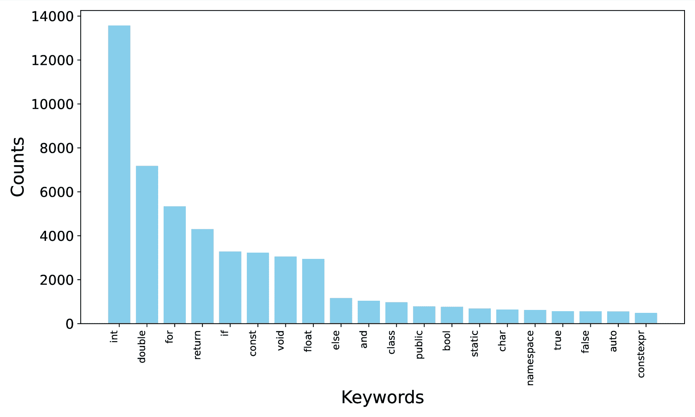

<!--yml

类别：未分类

date: 2025-01-11 11:43:14

-->

# Fortran2CPP：通过多轮对话和双代理集成，利用LLMs自动化Fortran到C++的迁移

> 来源：[https://arxiv.org/html/2412.19770/](https://arxiv.org/html/2412.19770/)

Le Chen*¹  Bin Lei*²  Dunzhi Zhou³

Pei-Hung Lin⁴  Chunhua Liao⁴  Caiwen Ding²  Ali Jannesari¹

¹爱荷华州立大学，²明尼苏达大学，³北卡罗来纳州立大学，

⁴劳伦斯利弗莫尔国家实验室 * 这些作者对本文做出了同等贡献。

###### 摘要

将Fortran代码迁移到C++是许多科学计算团队的常见任务，推动这一过程的原因包括需要利用现代编程范式、增强跨平台兼容性以及提高可维护性。利用大型语言模型（LLMs）自动化这一翻译过程已显示出前景，但由于缺乏高质量、专业化的数据集，其效果受到限制。本文通过引入一个新颖的多轮对话数据集Fortran2CPP，专门用于Fortran到C++的代码迁移，解决了这一挑战。我们的数据集相比现有的替代方案大得多，是通过独特的LLM驱动的双代理流程生成的，流程包括迭代编译、执行和代码修复，以确保高质量和功能正确性。为了展示我们数据集的有效性，我们对多个开放权重的LLM进行了Fortran2CPP数据集的微调，并在两个独立的基准测试中评估了它们的表现。在我们的数据集上进行微调后，模型的表现取得了显著提升，CodeBLEU得分提高了最多3.31倍，编译成功率提高了92%。这突显了该数据集在提高翻译后的C++代码的语法准确性和可编译性方面的能力。我们的数据集和模型已经开源，并可在我们的公共GitHub仓库中获得¹¹1[https://github.com/HPC-Fortran2CPP/Fortran2Cpp](https://github.com/HPC-Fortran2CPP/Fortran2Cpp)。

Fortran2CPP：通过多轮对话和双代理集成，利用大型语言模型自动化Fortran到C++的迁移

Le Chen*¹  Bin Lei*²  Dunzhi Zhou³ Pei-Hung Lin⁴  Chunhua Liao⁴  Caiwen Ding²  Ali Jannesari¹ ¹爱荷华州立大学，²明尼苏达大学，³北卡罗来纳州立大学，⁴劳伦斯利弗莫尔国家实验室 ^†^†thanks: * 这些作者对本文做出了同等贡献。

## 1 引言

将遗留的Fortran代码转换为C++已经成为高性能计算（HPC）中的一项关键策略，用于现代化项目、增强可维护性并提高性能，Czarnul等人（[2020](https://arxiv.org/html/2412.19770v1#bib.bib10)）。传统的基于算法的代码翻译方法，依赖于精心设计的规则和模式，以及对源语言和目标语言的语义和逻辑的深入理解，通常面临着较高的开发和维护成本，且灵活性有限。为了解决这些挑战，研究人员提出了基于机器学习的方法，Roziere等人（[2020](https://arxiv.org/html/2412.19770v1#bib.bib27)，[2021](https://arxiv.org/html/2412.19770v1#bib.bib28)）；Szafraniec等人（[2022](https://arxiv.org/html/2412.19770v1#bib.bib31)）提出了更灵活、可适应且高效的代码翻译方法。近期在大规模语言模型（LLMs）方面的进展及其成功应用，如代码补全（Zhang等人，[2024](https://arxiv.org/html/2412.19770v1#bib.bib41)）、并行化（Chen等人，[2024a](https://arxiv.org/html/2412.19770v1#bib.bib4)）和文档生成（Luo等人，[2024](https://arxiv.org/html/2412.19770v1#bib.bib22)），激发了人们对探索LLMs在代码翻译中的潜力的兴趣。

然而，我们观察到，当前的通用LLMs和代码LLMs仍未能可靠地实现代码翻译的自动化，尽管它们已在包括C、C++、Go、Java和Python等多种编程语言中进行了测试（Pan等人，[2024](https://arxiv.org/html/2412.19770v1#bib.bib25)）（第[4](https://arxiv.org/html/2412.19770v1#S4 "4 Experiment ‣ Fortran2CPP: Automating Fortran-to-C++ Migration using LLMs via Multi-Turn Dialogue and Dual-Agent Integration")节），在多个模型中，包括CodeLlama-13B、StarCoder和GPT-6.7B，使用手动检查、单元测试检查和CodeBLEU评分测试。这些模型表现相当，手动评估平均得分为4.53/5，执行测试的Pass@1得分为0.61，CodeBLEU得分为0.192。即便是GPT-4，尽管其具有先进的能力，也只取得了稍微更好的结果，得分分别为4.575/5、0.655和0.232。

当前LLM在代码翻译任务中的表现，特别是从Fortran到C++的翻译，存在一定的性能不足，这可以归因于多个因素。问题的核心在于训练数据不足，这限制了LLM对像Fortran这样的低资源语言的理解。LLM的表现严重依赖于训练资源的可用性和质量，许多研究表明，它们在低资源自然语言和编程语言方面的表现较差（Cassano等人，[2024](https://arxiv.org/html/2412.19770v1#bib.bib3)；Hasan等人，[2024](https://arxiv.org/html/2412.19770v1#bib.bib16)）。以Fortran为例，一份分析报告²²2[https://madnight.github.io/githut/#/pull_requests/2024/1](https://madnight.github.io/githut/#/pull_requests/2024/1)显示，目前GitHub上只有0.04%的代码是用Fortran编写的。以往为了应对Fortran-C++翻译数据匮乏的挑战所做的努力，取得的成功非常有限。例如，Lei等人（[2023](https://arxiv.org/html/2412.19770v1#bib.bib20)）尝试通过合并现有的HPC数据集来克服这个挑战。然而，实验表明，在他们的数据集上微调的模型并未获得足够的Fortran代码知识，这很可能是由于所编译数据集的规模较小。

另一个问题是当前LLM的推理能力可能不足以应对像Fortran到C++翻译这样复杂的任务。单一的LLM通常难以处理有效翻译所需的细微决策，缺乏完成此任务所需的专业知识和多步骤推理能力。最近的研究探索了基于代理的方法用于复杂的与代码相关的任务（Wang等人，[2024](https://arxiv.org/html/2412.19770v1#bib.bib33)；Yuan等人，[2024](https://arxiv.org/html/2412.19770v1#bib.bib40)）。这些方法利用多个LLM作为专门的代理，每个代理专注于不同的过程方面，例如语法分析、语义解释和优化策略。通过将翻译任务分解为子任务，并利用协调的多代理系统，这种方法有可能克服单一LLM的推理限制。

在这项工作中，我们提出了一种基于LLM代理的针对Fortran到C++翻译的专门方法。所提议的代理架构自动推理翻译过程，并结合自定义脚本和工具，能够实现对复杂Fortran代码的更准确高效的翻译。我们的贡献如下：

+   •

    一种创新的基于LLM代理的Fortran-C++翻译方法：我们引入了一种基于LLM代理的方法，该方法自动将各种验证过程融入Fortran-C++翻译的迭代循环中，且只需要最少的人工干预。

+   •

    Questioner-Solver 模块设计：我们新颖的 Questioner-Solver 模块设计超越了单一 LLM 代理，通过将引用和决策任务卸载到单独的 LLM 上来实现进步。该模块以迭代循环的方式运行，跟踪推理、输出、验证结果和解决方案。最终的过程对话有效地扩展了 LLM 在 Fortran 等低资源语言中的知识。

+   •

    支持 LLMs 进行 Fortran 到 C++ 翻译的多轮对话数据集：我们的 Questioner-Solver 模块能够清晰地记录错误、错误信息和修正推理步骤。我们解析代理之间的对话，创建了一个多轮对话数据集，捕捉了细致的翻译过程，这对于像 Fortran 这样的低资源语言特别有价值。该数据集包括迭代的反馈决策循环、验证结果以及每个步骤的详细错误信息和具体决策。通过这种综合方法，不仅提高了翻译准确性，还提供了关于推理过程的丰富见解，成为训练和微调未来 Fortran-C++ 翻译任务模型的宝贵资源。

+   •

    综合评估：通过在我们的对话数据集上进行微调，三种模型（DeepSeek-Coder（6.7B）、CodeLlama（13B）和 StarCoder（15.5B））的一次性代码翻译能力得到了显著提升，其 CodeBLEU 分数提高了 1.5 到 3.3 倍。这证明了对话数据集在提升大型语言模型（LLM）在低资源语言上的表现方面的有效性。此外，我们还通过提供 Fortran 版本数据，扩展了 HumanEval 数据集用于评估。

## 2 背景

本节探讨了 Fortran 到 C++ 翻译的背景，并讨论了为此目的所取得的最新进展及相关挑战。

### 2.1 Fortran 到 C++ 的翻译

将 Fortran 转换为 C++ 对于现代化遗留的科学程序至关重要。早期的工作依赖于手动专家驱动的接口（Gray 等人， [1999](https://arxiv.org/html/2412.19770v1#bib.bib12); Morris 等人， [2012](https://arxiv.org/html/2412.19770v1#bib.bib23)）。最近的研究则转向了使用胶水代码和中间表示的自动化技术（Seragiotto 等人， [2004](https://arxiv.org/html/2412.19770v1#bib.bib30); Johnson 等人， [2019](https://arxiv.org/html/2412.19770v1#bib.bib19); Grosse-Kunstleve 等人， [2012](https://arxiv.org/html/2412.19770v1#bib.bib13)）。然而，这些方法通常适用性有限，仍然需要手动适配以应对不断发展的编程语言。

### 2.2 在 Fortran 到 C++ 翻译中使用 LLMs 的挑战

LLMs 在高性能计算（HPC）（Chen 等，[2023b](https://arxiv.org/html/2412.19770v1#bib.bib6); Ding 等，[2023](https://arxiv.org/html/2412.19770v1#bib.bib11); Chen 等，[2023a](https://arxiv.org/html/2412.19770v1#bib.bib5)）和编程语言翻译（Yang 等，[2024](https://arxiv.org/html/2412.19770v1#bib.bib37)）中展现了潜力。然而，将 LLMs 应用于 Fortran-C++ 转换面临挑战，原因在于缺乏用于微调和评估的丰富数据集。除了标准的代码片段对之外，还需要多样化的数据集，其中包括多轮对话，以捕捉包含编译和运行时反馈的翻译过程。开发量身定制的评估方法对于准确评估模型也至关重要。

### 2.3 LLM 代理系统

大型语言模型（LLMs）的快速发展激发了广泛的兴趣，利用 LLMs 来解决复杂的现实任务。尽管 LLMs 取得了成功，但当问题需要多步推理或更深层次分析时，它们常常力不从心（Guo 等，[2024b](https://arxiv.org/html/2412.19770v1#bib.bib15)）。LLM 代理提供了一个强大的解决方案，通过结合强大的推理能力、记忆和工具使用来应对这一挑战。LLM 代理系统可以定义为一种计算框架，利用大型语言模型的推理、规划和执行能力。

## 3 方法

本节介绍了基于 LLM 代理的方法，以应对在 Fortran 到 C++ 转换中利用 LLMs 的挑战。

图 1：生成用于将 Fortran 转换为 C++ 的多轮对话数据集的流程概述。

| 操作 | 输入 | 输出 | 环境 |
| --- | --- | --- | --- |
| 翻译 | Fortran 代码 | CPP 代码 | 无 |
| 生成测试用例 | Fortran 或 CPP 代码 | 含集成测试用例的 Fortran 或 CPP 代码 | 无 |
| 编译修复 | 包含错误的 Fortran 或 CPP 代码 | 成功或编译错误消息 | gcc 编译器 |
| 执行修复 | 包含错误的 Fortran 或 CPP 代码 | 成功或执行错误消息 | CLI |
| 检查测试用例结果 | 包含失败测试用例的 Fortran 或 CPP 代码 | 更新后的代码 | CLI |
| 保持一致性 | Fortran-CPP 代码对 | 经验证的 Fortran-CPP 代码对 | 无 |

表 1：求解器执行的操作。

### 3.1 数据集生成流程概述

图 [1](https://arxiv.org/html/2412.19770v1#S3.F1 "图 1 ‣ 3 方法 ‣ Fortran2CPP：通过多轮对话和双代理集成自动化 Fortran 到 C++ 的迁移") 展示了我们的数据集生成流程，包括五个阶段：初始翻译、单元测试生成、编译修复、执行修复和一致性验证。每个阶段代表了人类专家在将 Fortran 转换为 C++ 时所采用的工作流程中的一步。通过整合自定义脚本和工具，这种方法可以针对翻译过程的各个方面进行专门化处理。

每个阶段的具体细节将在第[3.3](https://arxiv.org/html/2412.19770v1#S3.SS3 "3.3 基于LLM代理的数据集生成 ‣ 3 方法 ‣ Fortran2CPP：通过多轮对话和双代理集成，使用LLM自动化Fortran到C++的迁移")节中讨论。与以往的LLM代理实现不同，我们的方法使用提出的提问者-解答者模块作为核心，而不是单一的LLM。第[3.2](https://arxiv.org/html/2412.19770v1#S3.SS2 "3.2 提问者-解答者模块 ‣ 3 方法 ‣ Fortran2CPP：通过多轮对话和双代理集成，使用LLM自动化Fortran到C++的迁移")节详细介绍了提问者-解答者模块。我们的LLM代理系统的关键组件如下：

代理核心：如图[2](https://arxiv.org/html/2412.19770v1#S3.F2 "图2 ‣ 3.2 提问者-解答者模块 ‣ 3 方法 ‣ Fortran2CPP：通过多轮对话和双代理集成，使用LLM自动化Fortran到C++的迁移")所示，核心模块负责管理代理的逻辑和行为特征。与以往依赖单一LLM的实现不同，我们的方法将提问者-解答者模块作为核心。

内存：内存存储代理的内部日志和用户交互，跟踪过去的决策、行动、执行反馈和观察结果。它有助于翻译代码的迭代改进。每个迭代改进方法都携带长期记忆，以保留之前的错误和解决方案。完整的内存历史记录被保存并解析，以生成我们的多轮对话数据集。

工具：在我们的方法中，工具指的是扩展代理能力的专门外部工具，超出了语言生成的范畴。具体而言，我们使用编译器（gfortran和g++）进行代码编译，使用shell命令进行执行，并使用自定义Python脚本执行代码解析和分析等任务。

环境：该组件指的是代理感知或收集到的数据和信息。它包括工具反馈，如错误信息和验证结果，以及翻译的当前状态。

规划：如图[1](https://arxiv.org/html/2412.19770v1#S3.F1 "图1 ‣ 3 方法 ‣ Fortran2CPP：通过多轮对话和双代理集成，使用LLM自动化Fortran到C++的迁移")所示，我们的流程通过迭代循环来改进LLM翻译的代码。这个过程涉及四个代理，每个代理都会设计一个结构化的行动或步骤序列，以完成分配给它的子任务。表[1](https://arxiv.org/html/2412.19770v1#S3.T1 "表1 ‣ 3 方法 ‣ Fortran2CPP：通过多轮对话和双代理集成，使用LLM自动化Fortran到C++的迁移")列出了我们方法中定义的行动，以及它们的输入、输出和调用的工具。

### 3.2 提问者-解答者模块

图2：顶部：带有单个LLM作为核心组件的LLM代理系统简化示意图。底部：问答者-解答者模型作为我们方法中的代理核心。

最近的研究，如吴等人（[2023](https://arxiv.org/html/2412.19770v1#bib.bib35)）和Toubal等人（[2024](https://arxiv.org/html/2412.19770v1#bib.bib32)）的研究，已经证明了多代理系统通过代理间通信解决复杂任务的有效性。为了解决数据集不足的挑战，我们采用了基于LLM代理的方法，将Fortran代码翻译成C++。此外，Yi等人（[2024](https://arxiv.org/html/2412.19770v1#bib.bib38)）展示了对话数据如何增强LLM在低资源知识场景中的表现。在这些工作的基础上，我们提出了问答者-解答者模块，一种旨在解决数据集限制并扩展LLM在Fortran领域知识的基于代理的方法。

如图[2](https://arxiv.org/html/2412.19770v1#S3.F2 "Figure 2 ‣ 3.2 The Questioner-Solver Module ‣ 3 Approach ‣ Fortran2CPP: Automating Fortran-to-C++ Migration using LLMs via Multi-Turn Dialogue and Dual-Agent Integration")所示，问答者-解答者模块将两个LLM作为代理系统的核心，而不是单个LLM。问答者评估当前状态，并为解答者制定相关问题，解答者则做出回应并决定后续行动。

通过将代理核心的职责分配给两个组件，我们使得问答者能够动态生成问题，这些问题结合了当前内存状态和环境工具反馈中的关键信息。为了确保问答者能提出领域特定的查询，我们提供了相关的问题模板，如图[1](https://arxiv.org/html/2412.19770v1#S3.F1 "Figure 1 ‣ 3 Approach ‣ Fortran2CPP: Automating Fortran-to-C++ Migration using LLMs via Multi-Turn Dialogue and Dual-Agent Integration")所示。解答者模型则负责规划和执行任务，包括翻译、错误修正以及调用工具或脚本。

这个问答者-解答者设计提供了几个显著的优势：

+   •

    类专家推理：该设计通过将任务分为两个专业化角色：环境评估（问答者）和决策制定（解答者），模仿了专家的解决问题方式。这种分离使得对复杂问题的处理更加细致入微。

+   •

    增加的自主性：这一设计显著减少了用户干预的需求，使得整个过程在很大程度上实现了自给自足。这种自主性允许系统更加连续和独立地运行。

+   •

    特定领域专业知识：最重要的是，这种设计促进了沿翻译管道的丰富、知识驱动的对话。代理之间跟踪的交互历史积累了宝贵的特定领域知识，涵盖了如Fortran到C++的翻译、多阶段验证和错误修正等过程。这些积累的专业知识不仅提升了系统的性能，还为在低资源编程语言（如Fortran）上微调大型语言模型（LLMs）提供了宝贵的数据集。

+   •

    自适应问题解决：提问者-求解者交互的迭代特性使其能够动态适应不断变化的挑战，特别适用于复杂的编码场景。

在本节后续内容中，我们讨论了将Fortran转为C++并生成已验证的数据对的管道。在每个步骤中，提问者-求解者模块处理动态、不确定和复杂的环境，并在一系列时间步骤 $t=1,...,T$ 上进行操作。在每个时间步骤 $t$：

提问者：提问者分析当前的内存状态 $mem_{t}$ 和环境上下文 $env_{t}$，以评估系统的当前状态。基于这一全面评估，提问者确定一个适当的行动 $act_{t}$，并根据一组示例提示 $plist_{t}$ 形成相应的问题 $qes_{t}$。这一过程可以正式表示为：

|  | $act_{t}=\text{Questioner}_{t}(mem_{t},env{t})$ |  |
| --- | --- | --- |
|  | $qes_{t}=\text{Questioner}_{t}(act_{t},plist{t})$ |  |

求解者：求解者处理由提问者生成的问题，并制定一个包含多个行动的综合计划 $plan_{t}$。这些行动 $act_{t}$ 旨在调用适当的工具并更新系统的内存状态。这个过程可以正式表示为：

|  | $plan_{t}=\text{Solver}_{t}(qes_{t},env_{t})$ |  |
| --- | --- | --- |
|  | $mem_{t+1},act_{t}=\text{Solver}_{t}(plan_{t})$ |  |

### 3.3 基于LLM代理的数据集生成

#### 3.3.1 初始翻译

我们管道的第一阶段是使用LLMs在给定Fortran代码的情况下生成初始翻译。给定Fortran代码，提问者-求解者代理核心基于LLM的知识生成初始翻译。

#### 3.3.2 单元测试用例生成

在这一关键阶段，提问者-求解者模块处理一对Fortran和C++代码，以开发并集成功能等价的单元测试用例。这个过程对于确保两种实现之间的行为一致性至关重要。

提问者通过对输入的Fortran和C++代码对进行全面分析来启动该过程。它仔细审查了两个代码版本的结构、功能和潜在边界情况。基于这次彻底的检查，提问者自动制定了一套相关问题和考虑事项，以指导测试用例生成过程。

这一阶段是图[1](https://arxiv.org/html/2412.19770v1#S3.F1 "图1 ‣ 3方法 ‣ Fortran2CPP：通过多轮对话和双代理集成，使用LLM自动化Fortran到C++迁移")中所示的迭代循环的关键组成部分。环境信息可能包括来自后续阶段的错误消息，以及Fortran-C++代码对。提问者会考虑先前生成的单元测试和错误信息，将这些信息纳入提问中。

然后，求解器制定一个计划，生成或更新代码，并为其添加适当的单元测试用例。它调用必要的工具和脚本来编译代码，为下一阶段做准备。该单元测试生成阶段的输出是一对Fortran和C++代码文件，连同编译结果一起。

#### 3.3.3 编译修复

在单元测试用例生成之后，我们管道中的下一个关键步骤是编译修复。编译器是支持HPC编程语言的必备工具。与后续的执行阶段相比，编译反馈包含了更多详细的信息，有助于生成可编译的代码。我们分析了五种最常见的编译错误，并为提问者提供了示例提示，以有效解决这些问题。

在此阶段，提问者的输入包括一对Fortran和C++代码文件以及它们各自的编译结果。通过分析这些结果，提问者可以指示求解器继续执行或更新代码以修复已识别的编译错误。

如果需要更新代码，求解器会相应地修改代码，并将其返回到单元测试生成阶段。此步骤确保集成的单元测试用例在修改后保持不变或有效。另一方面，如果提问者确定无需修复并指示求解器继续，求解器会调用相应的脚本执行代码，并用结果更新系统的内存。

#### 3.3.4 执行修复

类似于编译修复阶段，执行修复任务针对Fortran-C++代码对以及上一阶段求解器报告的任何执行错误。提问者将要求求解器通过或修复报告的错误。任何更新的代码将传递到单元测试生成阶段以重新验证单元测试。求解器还会报告执行结果以更新内存。

表2：选定的面向代码的语言模型

规格 DeepSeek-Coder CodeLlama StarCoder GPT-4 Turbo 参数 6.7B 13B 15.5B 未知 训练数据 2T tokens 500B tokens 250B tokens 未知 上下文窗口 16K 100K 8K 128K 开放权重 是 是 是 否 开发者 DeepSeek AI Meta BigCode OpenAI

#### 3.3.5 一致性改进

为了解决验证后仍然存在的不一致函数名问题，我们添加了最终的一致性检查。提问者识别代码对和执行结果中的命名差异。然后，解答者修正这些问题，确保Fortran和C++实现之间的一致性。更新后的代码通过所有验证步骤重新审查，从而提高了翻译的准确性和系统的鲁棒性。

### 3.4 Fortran-CPP数据集

在本节中，我们应用所述的翻译方法生成一个配对的Fortran-C++数据集。

数据收集：我们从CodeParrot的GitHub仓库中获取了Fortran代码，CodeParrot（[2024](https://arxiv.org/html/2412.19770v1#bib.bib9)）包含了来自32种编程语言的1.15亿个代码文件。由于资源限制，我们选择了可用的142,038个Fortran文件中的前80,000个作为我们的种子输入。

数据过滤和预处理：我们通过去除所有注释来预处理收集的代码，以消除自然语言对翻译的影响。为了确保数据质量，我们应用了过滤标准：将令牌数限制为少于600，以确保LLM兼容性，移除具有外部依赖的代码，并仅包括可执行代码以确保样本无错误。这些步骤生成了一个经过优化的高质量、独立的Fortran代码数据集，适用于翻译和分析。

数据集统计：使用所提议的管道，我们生成了2,529个Fortran-C++数据对，成功的数据转换率为29.6%。每个配对的数据都经过了我们管道中的编译和执行验证。图[3](https://arxiv.org/html/2412.19770v1#A1.F3 "图3 ‣ A.1 Fortran-CPP数据分析 ‣ 附录A 附录 ‣ Fortran2CPP：通过多轮对话和双代理集成自动化Fortran到C++的迁移")和图[4](https://arxiv.org/html/2412.19770v1#A1.F4 "图4 ‣ A.1 Fortran-CPP数据分析 ‣ 附录A 附录 ‣ Fortran2CPP：通过多轮对话和双代理集成自动化Fortran到C++的迁移")显示，我们的数据集中的Fortran和C++关键字分布是一致的。

### 3.5 多轮对话数据集

我们首先按照Yi等人的研究工作（[2024](https://arxiv.org/html/2412.19770v1#bib.bib38)）给出定义。

+   •

    对话：指两个或更多代理之间进行的完整互动通信序列，具有明确的开始和结束，并通过共同的上下文或目标统一。它由多个对话/轮次组成，代表了互动的完整范围。

+   •

    轮次：指代理之间交换的单个回合，包括一个发言/消息及其对应的回应。这构成了对话中的基本交互单元。

由于资源限制，我们选择了1.2K个提问者和解答者之间的对话，并将其拆分为多个提示-回应对。平均每个对话有4.6个回合，1.2K个对话生成了11.7K个提示-回应对。

例如，一个六步对话（标记为 $s_{0}$ 到 $s_{6}$）被构建为六个累积的提示-响应对，以促进上下文的连续性。从初始提示 $p_{1}$ 开始，仅包含第一轮对话（$s_{0}$），我们逐步通过包含所有之前的对话来构建每个后续的提示。具体而言，$p_{2}$ 包含了直到 $s_{1}$ 的累积对话（即 $s_{0}+s_{1}$）作为提示，生成响应 $s_{2}$；$p_{3}$ 包含 $s_{0}+s_{1}+s_{2}$ 作为提示，生成 $s_{3}$；以此类推。到了 $p_{6}$，提示包含了整个之前的对话（$s_{0}+s_{1}+\dots+s_{5}$），生成最终响应 $s_{6}$。这种迭代的提示构建方法确保了模型能够在每一轮对话中保持并建立上下文。

作为一个更具体的例子，以下输入的 JSON 包含了一个两轮对话。

[⬇](data:text/plain;base64,Wwp7CiAgICAiaWQiOiAiY29udjEiLAogICAgIm1lc3NhZ2VzIjogWwogICAgICAgIHsicm9sZSI6ICJ1c2VyIiwgImNvbnRlbnQiOiAiSGkifSwKICAgICAgICB7InJvbGUiOiAiYXNzaXN0YW50IiwgImNvbnRlbnQiOiAiSGVsbG8hIn0sCiAgICAgICAgeyJyb2xlIjogInVzZXIiLCAiY29udGVudCI6ICJIb3cgYXJlIHlvdT8ifSwKICAgICAgICB7InJvbGUiOiAiYXNzaXN0YW50IiwgImNvbnRlbnQiOiAiSSdtIGdvb2QsIHRoYW5rIHlvdS4ifQogICAgXQp9Cl0=)1[2{3  "id":  "conv1",4  "messages":  [5  {"role":  "user",  "content":  "Hi"},6  {"role":  "assistant",  "content":  "Hello!"},7  {"role":  "user",  "content":  "How  are  you?"},8  {"role":  "assistant",  "content":  "I’m  good,  thank  you."}9  ]10}11]

以下是分割后的相应输出。

[⬇](data:text/plain;base64,Wwp7CiAgICAiaWQiOiAiY29udjEiLAogICAgIm1lc3NhZ2VzIjogWwogICAgICAgIHsicm9sZSI6ICJ1c2VyIiwgImNvbnRlbnQiOiAiSGkifSwKICAgICAgICB7InJvbGUiOiAiYXNzaXN0YW50IiwgImNvbnRlbnQiOiAiSGVsbG8hIn0KICAgIF0KfSwKewogICAgImlkIjogImNvbnYxIiwKICAgICJtZXNzYWdlcyI6IFsKICAgICAgICB7InJvbGUiOiAidXNlciIsICJjb250ZW50IjogIkhpIn0sCiAgICAgICAgeyJyb2xlIjogImFzc2lzdGFudCIsICJjb250ZW50IjogIkhlbGxvISJ9LAogICAgICAgIHsicm9sZSI6ICJ1c2VyIiwgImNvbnRlbnQiOiAiSG93IGFyZSB5b3U/In0sCiAgICAgICAgeyJyb2xlIjogImFzc2lzdGFudCIsICJjb250ZW50IjogIkknbSBnb29kLCB0aGFuayB5b3UuIn0KICAgIF0KfQpdCg==)1[2{3  "id":  "conv1",4  "messages":  [5  {"role":  "user",  "content":  "Hi"},6  {"role":  "assistant",  "content":  "Hello!"}7  ]8},9{10  "id":  "conv1",11  "messages":  [12  {"role":  "user",  "content":  "Hi"},13  {"role":  "assistant",  "content":  "Hello!"},14  {"role":  "user",  "content":  "How  are  you?"},15  {"role":  "assistant",  "content":  "I’m  good,  thank  you."}16  ]17}18]

## 4 实验

本节详细介绍了使用我们的流程生成 Fortran2CPP 数据集的实验设置和结果，该数据集用于微调一些开源大型语言模型。

### 4.1 实验设置

我们描述了在本研究中使用的模型、评估数据集、指标和实现细节。

模型：如表[2](https://arxiv.org/html/2412.19770v1#S3.T2 "Table 2 ‣ 3.3.4 Execution Fixing ‣ 3.3 LLM Agent-based Dataset Generation ‣ 3 Approach ‣ Fortran2CPP: Automating Fortran-to-C++ Migration using LLMs via Multi-Turn Dialogue and Dual-Agent Integration")所示，我们选择了几种代表性的LLM来评估我们的Fortran2CPP数据集，包括DeepSeek-Coder Guo等人（[2024a](https://arxiv.org/html/2412.19770v1#bib.bib14)）、Codellama Roziere等人（[2023](https://arxiv.org/html/2412.19770v1#bib.bib26)）、StarCoder Li等人（[2023](https://arxiv.org/html/2412.19770v1#bib.bib21)）和GPT-4-Turbo OpenAI（[2024](https://arxiv.org/html/2412.19770v1#bib.bib24)）。这些模型代表了不同的规模和训练方法，能够为LLM在代码翻译任务中的能力提供全面的评估。

评估数据集：使用了两个数据集来评估LLM在Fortran到C++翻译方面的能力。第一个是HPC-Fortran-Cpp数据集Lei等人（[2023](https://arxiv.org/html/2412.19770v1#bib.bib20)），这是一个小规模的人工创建的数据集，包含315对OpenMP Fortran和C++代码。由于源代码翻译任务中Fortran源代码有4000个令牌的限制，最终选用了296对代码。另一个数据集是HumanEval-X郑等人（[2023](https://arxiv.org/html/2412.19770v1#bib.bib42)），该数据集用于基准测试代码生成模型的多语言能力，共有164个数据样本，每个样本包含测试用例，涵盖五种流行编程语言：Python、C++、Java、JavaScript和Go。我们通过为C++样本提供Fortran对照数据，扩充了该数据集，使用基于GPT-4o的流程将C++样本翻译为Fortran，并通过迭代编译、执行和代码修正来优化翻译结果。这个过程生成了一个包含126对Fortran和C++代码片段的数据集。

评估指标：使用四个指标来评估翻译后的C++代码质量。CodeBLEU评分：通过ngram、语法和数据流组件衡量C++翻译的相似性（0-1.0）。编译检查：使用GNU C++编译器评估C++代码的可编译性（0-1.0的成功率）。执行测试：使用GPT-4生成的单元测试评估功能正确性（匹配输出的成功率）。人工调查：随机抽取样本进行评估（30个HPC-Fortran-C++和20个HumanEval-Fortran条目），根据翻译准确性和完整性打分，分值范围为0-5。

实现细节：实验在Nvidia A100（80GB）GPU上进行，使用Hugging Face Transformers HuggingFace（[2024](https://arxiv.org/html/2412.19770v1#bib.bib17)）进行模型推理，温度设定为0.2。这个配置使得我们能够全面评估LLM在Fortran到C++翻译任务中的表现，并针对我们的数据集和评估指标进行评价。

超参数：微调配置使用了关键的超参数，包括保守的学习率 9.65e-6、权重衰减 0.1 和序列长度限制 1024 个标记。我们使用余弦学习率调度器对模型进行了 3 轮微调，并且没有预热步骤。

### 4.2 结果与分析

表格 [4](https://arxiv.org/html/2412.19770v1#S4.T4 "Table 4 ‣ 4.2 Results and Analysis ‣ 4 Experiment ‣ Fortran2CPP: Automating Fortran-to-C++ Migration using LLMs via Multi-Turn Dialogue and Dual-Agent Integration") 展示了在 HPC-Fortran-CPP 数据集上不同微调 LLM 的性能，这是我们用于 Fortran 到 C++ 代码翻译的大规模数据集。该表格对比了模型在我们数据集上的微调前后性能，使用了上述评估指标。我们观察到所有指标在微调后都有显著提升，证明了我们的数据集在提高 LLM Fortran 到 C++ 翻译能力方面的有效性。特别地，Codellama 13B 的 CodeBLEU 分数大幅提升了 1.79 倍（从 0.09 增加到 0.1614），如表格 [5](https://arxiv.org/html/2412.19770v1#S4.T5 "Table 5 ‣ 4.2 Results and Analysis ‣ 4 Experiment ‣ Fortran2CPP: Automating Fortran-to-C++ Migration using LLMs via Multi-Turn Dialogue and Dual-Agent Integration") 所示。DeepSeek-Coder 6.7B 的执行测试比例从 0 增加到 0.65。这些结果突出了专门化数据集在提高 LLM 在特定代码翻译任务中的表现的重要性。

评估方法 DeepSeek-Coder 6.7B CodeLlama 13B StarCoder 15.5B GPT-4 原始 微调 原始 微调 原始 微调 Turbo CodeBLEU 分数 0.096 0.149 0.090 0.161 0.092 0.159 0.262 编译检查 0.00 0.70 0.00 0.67 0.00 0.69 0.70 (0/296) (207/296) (0/296) (199/296) (0/296) (204/296) (207/296) 执行测试 0.00 0.65 0.00 0.54 0.00 0.52 0.48 (0/296) (191/296) (0/296) (160/296) (0/296) (155/296) (143/296) 手动调查 0.00 4.50 0.00 4.03 0.37 4.50 4.40

表格 3：在 HPC-Fortran-Cpp 数据集上微调模型的性能对比

评估方法 DeepSeek-Coder 6.7B CodeLlama 13B StarCoder 15.5B GPT-4 原始 微调 原始 微调 原始 微调 Turbo CodeBLEU 分数 0.072 0.225 0.090 0.239 0.068 0.225 0.203 编译检查 0 0.841 0 0.921 0 0.643 0.897 (0/126) (106/126) (0/126) (116/126) (0/126) (81/126) (113/126) 执行测试 0 0.706 0 0.738 0 0.508 0.825 (0/126) (89/126) (0/126) (93/126) (0/126) (64/126) (104/126) 手动调查 0.00 4.70 3.75 4.75 0.00 4.70 4.75

表格 4：在 HumanEval-Fortran2CPP 上微调模型的性能对比

表格[4](https://arxiv.org/html/2412.19770v1#S4.T4 "表格 4 ‣ 4.2 结果与分析 ‣ 4 实验 ‣ Fortran2CPP: 通过多轮对话和双代理集成自动化Fortran到C++的迁移")展示了在HumanEval-Fortran2Cpp数据集上，使用相同的度量标准对相同微调的LLM进行的表现。我们同样观察到在大多数度量指标上，经过微调后表现有了显著的提升。例如，StarCoder 15.5B在CodeBLEU分数上实现了显著的3.31倍增长（从0.09到0.23863），如表格[5](https://arxiv.org/html/2412.19770v1#S4.T5 "表格 5 ‣ 4.2 结果与分析 ‣ 4 实验 ‣ Fortran2CPP: 通过多轮对话和双代理集成自动化Fortran到C++的迁移")所示。Codellama 13B的执行测试比率从0增加到0.92。这表明，在像Fortran2Cpp数据集这样的更大且多样化的数据集上进行微调，可以推广到提高在更小、更具挑战性的基准测试（如HumanEval-Fortran2Cpp）上的表现。经过微调的Codellama在CodeBLEU和编译度量上（0.238630和0.93）优于GPT-4 Turbo。然而，当使用更严格的执行测试指标时，它的表现落后于GPT-4 Turbo（0.74对0.83）。

| 模型 | CodeBLEU 比率 |
| --- | --- |
| 数据集 | HPC-Fortran-Cpp | HumanEval |
| DeepSeek-Coder 6.7B | 1.5521 | 3.1104 |
| Codellama 13B | 1.7933 | 2.64 |
| StarCoder 15.5B | 1.7283 | 3.3087 |

表格 5: 选定数据集的CodeBLEU比率（微调/原始）：HPC-Fortran-Cpp（HPC），HumanEval-Fortran2Cpp（HumanEval）

## 5 相关工作

对于编程语言翻译的大型语言模型（LLMs）微调，已从如GPT-2和GPT-3等通用模型转向专门为此任务量身定制的方法，这些通用模型通常会产生不完整的翻译，陈等人（[2021](https://arxiv.org/html/2412.19770v1#bib.bib7)）提出了相关研究。像Codex和PolyCoder这样的模型，建立在GPT架构基础上，并通过大量编程数据集进行增强，提高了翻译的准确性，但在不同语言范式之间仍面临挑战，徐等人（[2022](https://arxiv.org/html/2412.19770v1#bib.bib36)）；陈等人（[2021](https://arxiv.org/html/2412.19770v1#bib.bib7)）也有类似的发现。迁移学习通过在源语言上进行预训练，再在目标语言上进行微调，通过利用结构相似性来增强翻译效果，但在资源匮乏的语言和噪声数据上仍面临局限性，艾哈迈德等人（[2021](https://arxiv.org/html/2412.19770v1#bib.bib1)）指出了这一点。TransCoder采用自监督的双向方法进行无监督翻译，这对流行语言有效，但由于数据稀缺，对冷门语言效果较差，罗齐尔等人（[2020](https://arxiv.org/html/2412.19770v1#bib.bib27)）进行了相关研究。

平行语料库的匮乏仍然是一个重要的挑战，近期的努力集中在创建大规模的多语种数据集上。尽管CodeSearchNet被广泛使用，但它缺乏直接翻译任务的平行性，Husain等人（[2019](https://arxiv.org/html/2412.19770v1#bib.bib18)）指出。自动挖掘等技术已经被探索以解决这个问题，正如TRANX Yin和Neubig（[2018](https://arxiv.org/html/2412.19770v1#bib.bib39)）以及BigCode项目Allamanis等人（[2018](https://arxiv.org/html/2412.19770v1#bib.bib2)）所示。像MCoNaLa Wang等人（[2022](https://arxiv.org/html/2412.19770v1#bib.bib34)）这样的数据集将自然语言与代码配对，CodeParrot CodeParrot（[2024](https://arxiv.org/html/2412.19770v1#bib.bib9)）则专注于高质量的代码片段，这些数据集有助于增强LLM的训练。此外，自监督学习和回译技术可以生成平行数据，利用往返一致性来改进模型，Roziere等人（[2020](https://arxiv.org/html/2412.19770v1#bib.bib27)）的研究展示了这一点。

## 6 结论

本文旨在解决Fortran到C++翻译中的两个关键挑战：数据稀缺性和LLMs的领域知识有限。我们提出了一种基于LLM的创新方法，具有一个问题求解模块用于迭代优化。我们的方法不仅生成了有价值的Fortran到C++数据集，还创建了一个多轮对话数据集来增强LLMs的领域知识。实验结果在各项评估指标上均显示出有效性。尽管前景可期，结果也揭示了LLM在代码翻译中的改进空间。本研究为自动化遗留代码现代化和提升科学计算中软件可移植性做出了重要贡献。

## 7 限制

本文的翻译方法依赖于大型语言模型（LLMs）生成单元测试，以确保源代码和翻译代码之间的逻辑正确性和一致性。尽管之前的研究陈等人（[2024b](https://arxiv.org/html/2412.19770v1#bib.bib8)）；Schäfer等人（[2023](https://arxiv.org/html/2412.19770v1#bib.bib29)）已经成功利用LLMs生成单元测试用例，但在此步骤中采用更严格的验证过程将是有益的。

## 参考文献

+   Ahmad等人（2021）Wasi Uddin Ahmad, Saikat Chakraborty, Baishakhi Ray, 和Kai-Wei Chang. 2021. 统一的预训练方法用于程序理解与生成。*arXiv预印本arXiv:2103.06333*。

+   Allamanis等人（2018）Miltiadis Allamanis, Earl T Barr, Premkumar Devanbu, 和Charles Sutton. 2018. 关于大规模代码和自然性的机器学习综述。*ACM计算机调查（CSUR）*，51（4）：1–37。

+   Cassano 等人（2024）Federico Cassano、John Gouwar、Francesca Lucchetti、Claire Schlesinger、Anders Freeman、Carolyn Jane Anderson、Molly Q Feldman、Michael Greenberg、Abhinav Jangda 和 Arjun Guha. 2024. 从高资源编程语言向低资源编程语言的知识迁移用于代码大语言模型（LLMs）。*ACM 编程语言学报会议录*，8(OOPSLA2):677–708。

+   Chen 等人（2024a）Le Chen、Arijit Bhattacharjee、Nesreen Ahmed、Niranjan Hasabnis、Gal Oren、Vy Vo 和 Ali Jannesari. 2024a. Ompgpt：用于 OpenMP 的生成预训练变换器模型。在*欧洲并行处理会议*，第121–134页。Springer。

+   Chen 等人（2023a）Le Chen、Xianzhong Ding、Murali Emani、Tristan Vanderbruggen、Pei-Hung Lin 和 Chunhua Liao. 2023a. 使用大语言模型进行数据竞争检测。在*SC'23 高性能计算、网络、存储与分析国际会议工作坊会议录*，第215–223页。

+   Chen 等人（2023b）Le Chen、Pei-Hung Lin、Tristan Vanderbruggen、Chunhua Liao、Murali Emani 和 Bronis de Supinski. 2023b. Lm4hpc：面向高性能计算中有效应用语言模型。在*国际 OpenMP 研讨会*，第18–33页。Springer。

+   Chen 等人（2021）Mark Chen、Jerry Tworek、Heewoo Jun、Qiming Yuan、Henrique Ponde de Oliveira Pinto、Jared Kaplan、Harri Edwards、Yuri Burda、Nicholas Joseph、Greg Brockman 等人. 2021. 评估基于代码训练的大语言模型。*arXiv 预印本 arXiv:2107.03374*。

+   Chen 等人（2024b）Yinghao Chen、Zehao Hu、Chen Zhi、Junxiao Han、Shuiguang Deng 和 Jianwei Yin. 2024b. Chatunitest：基于大语言模型的测试生成框架。在*第32届 ACM 国际软件工程基础会议附录会议录*，第572–576页。

+   CodeParrot（2024）CodeParrot. 2024. Codeparrot/github-code 数据集。[https://huggingface.co/datasets/codeparrot/github-code](https://huggingface.co/datasets/codeparrot/github-code)。访问日期：[在此插入日期]。

+   Czarnul 等人（2020）Paweł Czarnul、Jerzy Proficz 和 Krzysztof Drypczewski. 2020. 使用高性能计算系统进行并行编程的方法论、方法和挑战调查。*科学编程*，2020:1–19。

+   Ding 等人（2023）Xianzhong Ding、Le Chen、Murali Emani、Chunhua Liao、Pei-Hung Lin、Tristan Vanderbruggen、Zhen Xie、Alberto Cerpa 和 Wan Du. 2023. Hpc-gpt：将大语言模型集成到高性能计算中。在*SC'23 高性能计算、网络、存储与分析国际会议工作坊会议录*，第951–960页。

+   Gray 等人（1999）Mark G Gray、Randy M Roberts 和 Tom M Evans. 1999. Fortran 95 与 C++ 之间的影像对象接口。*科学与工程计算*，1(2):63–70。

+   Grosse-Kunstleve 等人 (2012) Ralf W Grosse-Kunstleve, Thomas C Terwilliger, Nicholas K Sauter, 和 Paul D Adams. 2012. 使用 Fable 自动进行 Fortran 到 C++ 的转换。*生物学与医学的源代码*, 7(1):1–11。

+   Guo 等人 (2024a) Daya Guo, Qihao Zhu, Dejian Yang, Zhenda Xie, Kai Dong, Wentao Zhang, Guanting Chen, Xiao Bi, Yu Wu, YK Li 等人. 2024a. Deepseek-coder: 当大型语言模型遇见编程——代码智能的崛起。*arXiv 预印本 arXiv:2401.14196*。

+   Guo 等人 (2024b) Taicheng Guo, Xiuying Chen, Yaqi Wang, Ruidi Chang, Shichao Pei, Nitesh V Chawla, Olaf Wiest, 和 Xiangliang Zhang. 2024b. 基于大型语言模型的多智能体：进展与挑战的综述。*arXiv 预印本 arXiv:2402.01680*。

+   Hasan 等人 (2024) Md Arid Hasan, Prerona Tarannum, Krishno Dey, Imran Razzak, 和 Usman Naseem. 2024. 大型语言模型是否平等地支持所有语言？在低资源环境中的比较研究。*arXiv 预印本 arXiv:2408.02237*。

+   HuggingFace (2024) HuggingFace. 2024. Transformers — huggingface.co. [https://huggingface.co/docs/transformers/en/index](https://huggingface.co/docs/transformers/en/index). [访问日期：2024年9月14日]。

+   Husain 等人 (2019) Hamel Husain, Ho-Hsiang Wu, Tiferet Gazit, Miltiadis Allamanis, 和 Marc Brockschmidt. 2019. Codesearchnet 挑战：评估语义代码搜索的现状。*arXiv 预印本 arXiv:1909.09436*。

+   Johnson 等人 (2019) Seth R Johnson, Andrey Prokopenko, 和 Katherine J Evans. 2019. 大规模科学应用的自动化 Fortran–C++ 绑定。*计算科学与工程*, 22(5):84–94。

+   Lei 等人 (2023) Bin Lei, Caiwen Ding, Le Chen, Pei-Hung Lin, 和 Chunhua Liao. 2023. 利用 LLM 创建高性能计算代码翻译数据集：开放MP Fortran 和 C++ 之间的桥梁。在 *2023 IEEE 高性能极限计算会议 (HPEC)*，第1–7页。IEEE。

+   Li 等人 (2023) Raymond Li, Loubna Ben Allal, Yangtian Zi, Niklas Muennighoff, Denis Kocetkov, Chenghao Mou, Marc Marone, Christopher Akiki, Jia Li, Jenny Chim 等人. 2023. Starcoder: 愿源代码与你同在！*arXiv 预印本 arXiv:2305.06161*。

+   Luo 等人 (2024) Qinyu Luo, Yining Ye, Shihao Liang, Zhong Zhang, Yujia Qin, Yaxi Lu, Yesai Wu, Xin Cong, Yankai Lin, Yingli Zhang 等人. 2024. Repoagent: 一个基于 LLM 的开源框架，用于仓库级代码文档生成。*arXiv 预印本 arXiv:2402.16667*。

+   Morris 等人 (2012) Karla Morris, Damian WI Rouson, M Nicole Lemaster, 和 Salvatore Filippone. 2012. 通过求解 3D Burgers 方程探索 Fortrilinos 中的功能。*Scientific Programming*, 20(3):275–292。

+   OpenAI (2024) OpenAI. 2024. [https://platform.openai.com/docs/models/gpt-4-turbo-and-gpt-4](https://platform.openai.com/docs/models/gpt-4-turbo-and-gpt-4). [访问日期：2024年9月13日]。

+   Pan 等人（2024）Rangeet Pan, Ali Reza Ibrahimzada, Rahul Krishna, Divya Sankar, Lambert Pouguem Wassi, Michele Merler, Boris Sobolev, Raju Pavuluri, Saurabh Sinha, 和 Reyhaneh Jabbarvand. 2024. 翻译中的迷失：一项关于大型语言模型在翻译代码时引入错误的研究。发表于 *IEEE/ACM 第46届国际软件工程大会论文集*，页面 1–13。

+   Roziere 等人（2023）Baptiste Roziere, Jonas Gehring, Fabian Gloeckle, Sten Sootla, Itai Gat, Xiaoqing Ellen Tan, Yossi Adi, Jingyu Liu, Tal Remez, Jérémy Rapin 等人. 2023. Code llama：面向代码的开放基础模型。*arXiv 预印本 arXiv:2308.12950*。

+   Roziere 等人（2020）Baptiste Roziere, Marie-Anne Lachaux, Lowik Chanussot, 和 Guillaume Lample. 2020. 编程语言的无监督翻译。*神经信息处理系统进展*, 33:20601–20611。

+   Roziere 等人（2021）Baptiste Roziere, Jie M Zhang, Francois Charton, Mark Harman, Gabriel Synnaeve, 和 Guillaume Lample. 2021. 利用自动化单元测试进行无监督代码翻译。*arXiv 预印本 arXiv:2110.06773*。

+   Schäfer 等人（2023）Max Schäfer, Sarah Nadi, Aryaz Eghbali, 和 Frank Tip. 2023. 使用大型语言模型进行自动化单元测试生成的实证评估。*IEEE 软件工程学报*。

+   Seragiotto 等人（2004）Clovis Seragiotto, Hong-Linh Truong, Thomas Fahringer, Bernd Mohr, Michael Gerndt, 和 Tianchao Li. 2004. Fortran、Java、C 和 C++ 程序的标准化中间表示。*APART 工作组技术报告，维也纳大学软件科学研究所，十月*。

+   Szafraniec 等人（2022）Marc Szafraniec, Baptiste Roziere, Hugh Leather, Francois Charton, Patrick Labatut, 和 Gabriel Synnaeve. 2022. 使用编译器表示进行代码翻译。*arXiv 预印本 arXiv:2207.03578*。

+   Toubal 等人（2024）Imad Eddine Toubal, Aditya Avinash, Neil Gordon Alldrin, Jan Dlabal, Wenlei Zhou, Enming Luo, Otilia Stretcu, Hao Xiong, Chun-Ta Lu, Howard Zhou 等人. 2024. 合作建模：通过 LLM 工具使用实现最小人工干预的主观视觉分类。发表于 *IEEE/CVF 计算机视觉与模式识别大会论文集*，页面 17553–17563。

+   Wang 等人（2024）Xingyao Wang, Yangyi Chen, Lifan Yuan, Yizhe Zhang, Yunzhu Li, Hao Peng, 和 Heng Ji. 2024. 可执行代码动作激发更好的 LLM 代理。*arXiv 预印本 arXiv:2402.01030*。

+   Wang 等人（2022）Zhiruo Wang, Grace Cuenca, Shuyan Zhou, Frank F Xu, 和 Graham Neubig. 2022. Mconala：一个多自然语言代码生成基准。*arXiv 预印本 arXiv:2203.08388*。

+   Wu 等人（2023）Qingyun Wu, Gagan Bansal, Jieyu Zhang, Yiran Wu, Shaokun Zhang, Erkang Zhu, Beibin Li, Li Jiang, Xiaoyun Zhang, 和 Chi Wang. 2023. Autogen：通过多代理对话框架支持下一代 LLM 应用。*arXiv 预印本 arXiv:2308.08155*。

+   Xu 等人（2022）Frank F Xu、Uri Alon、Graham Neubig 和 Vincent Josua Hellendoorn。2022年。大规模编程语言模型的系统评估。在 *第六届 ACM SIGPLAN 国际机器编程研讨会论文集*，第1–10页。

+   Yang 等人（2024）Zhen Yang、Fang Liu、Zhongxing Yu、Jacky Wai Keung、Jia Li、Shuo Liu、Yifan Hong、Xiaoxue Ma、Zhi Jin 和 Ge Li。2024年。探索并释放大规模语言模型在自动化代码翻译中的潜力。*arXiv 预印本 arXiv:2404.14646*。

+   Yi 等人（2024）Zihao Yi、Jiarui Ouyang、Yuwen Liu、Tianhao Liao、Zhe Xu 和 Ying Shen。2024年。基于 LLM 的多轮对话系统的最新进展综述。*arXiv 预印本 arXiv:2402.18013*。

+   Yin 和 Neubig（2018）Pengcheng Yin 和 Graham Neubig。2018年。Tranx：一种基于转移的神经抽象语法解析器，用于语义解析和代码生成。*arXiv 预印本 arXiv:1810.02720*。

+   Yuan 等人（2024）Zhiqiang Yuan、Weitong Chen、Hanlin Wang、Kai Yu、Xin Peng 和 Yiling Lou。2024年。Transagent：一种基于 LLM 的多智能体系统，用于代码翻译。*arXiv 预印本 arXiv:2409.19894*。

+   Zhang 等人（2024）Mingxuan Zhang、Bo Yuan、Hanzhe Li 和 Kangming Xu。2024年。LLM-cloud complete：利用云计算提高基于大规模语言模型的代码补全效率。*人工智能综合科学杂志（JAIGS）ISSN：3006-4023*，5（1）：295–326。

+   Zheng 等人（2023）Qinkai Zheng、Xiao Xia、Xu Zou、Yuxiao Dong、Shan Wang、Yufei Xue、Lei Shen、Zihan Wang、Andi Wang、Yang Li 等人。2023年。Codegeex：一种用于代码生成的预训练模型，具有在 humaneval-x 上的多语言基准测试。在 *第29届 ACM SIGKDD 知识发现与数据挖掘大会论文集*，第5673–5684页。

## 附录 A 附录

### A.1 Fortran-CPP 数据分析

(a) C++ 源文件行数分布。

(b) Fortran 源文件行数分布。

图3：C++ 和 Fortran 源文件行数分布比较。

(a) Fortran 关键字直方图。

(b) C++ 关键字直方图

图4：C++ 和 Fortran 关键字直方图比较。

(a) Fortran 前20个关键字直方图。

(b) C++ 前20个关键字直方图

图5：C++ 和 Fortran 关键字直方图比较。

### A.2 多轮对话示例

[⬇](data:text/plain;base64,ewoidXNlcjEiOiAiXG5JIG5lZWQgeW91IHRvIGhlbHAgbWUgcHV0IGFsbCB0aGUgZnVuY3Rpb25zIEkgbmVlZCBpbnRvIHRoZSBzYW1lIGZvcnRyYW4gZmlsZSBpbnN0ZWFkIG9mIGFkZGluZyBhZGRpdGlvbmFsIGhlYWRlciBmaWxlcy5cbkZvcnRyYW4gQ29tcGlsZSBTdGRlcnI6YlwiL3Vzci9iaW4vbGQ6IC91c3IvbGliL2djYy94ODZfNjQtbGludXgtZ251LzkvLi4vLi4vLi4veDg2XzY0LWxpbnV4LWdudS9TY3J0MS5vOiBpbiBmdW5jdGlvbiBgX3N0YXJ0JzpcXG4oLnRleHQrMHgyNCk6IHVuZGVmaW5lZCByZWZlcmVuY2UgdG8gYG1haW4nXFxuY29sbGVjdDI6IGVycm9yOiBsZCByZXR1cm5lZCAxIGV4aXQgc3RhdHVzXFxuXCJcbiIKInVzZXIyIjogIkNlcnRhaW5seSEgSW50ZWdyYXRpbmcgYSBiYXNpYyB1bml0IHRlc3QgZGlyZWN0bHkgaW50byB0aGUgRm9ydHJhbiBmaWxlIHdpdGhvdXQgcmVleWluZyBvbiBleHRlcm5hbCBmcmFtZXdvcmtzIG9yIGFkZGl0aW9uYWwgZmlsZXMgcmVxdWlyZXMgYSBzbGlnaHRseSB1bmNvbnZlbnRpb25hbCBhcHByb2FjaCwgYnV0IGl0IGNhbiBiZSBkb25lIGZvciBzaW1wbGUgdGVzdHMuIFdlJ2xsIG1vZGlmeSB0aGUgb3JpZ2luYWwgRm9ydHJhbiBwcm9ncmFtIHRvIGluY2x1ZGUgYSBcInRlc3RcIiBzZWN0aW9uIHRoYXQgdmFsaWRhdGVzIHRoZSBmdW5jdGlvbmFsaXR5IGRpcmVjdGx5IHdpdGhpbiB0aGUgc291cmNlIGNvZGUuIFxuXG5TaW5jZSBGb3J0cmFuIGRvZXMgbm90IGhhdmUgYSBidWlsdC1pbiB1bml0IHRlc3RpbmcgZnJhbWV3b3JrIGxpa2Ugc29tZSBvdGhlciBsYW5ndWFnZXMsIHdlJ2xsIGltcGxlbWVudCBhIHNpbXBsZSBjaGVjayBmb3IgdGhlIG91dHB1dC4gTm90ZSB0aGF0IHRoaXMgYXBwcm9hY2ggaXMgbW9yZSBvZiBhIG1hbnVhbCB0ZXN0IGFuZCBsYWNrcyB0aGUgcm9idXN0bmVzcyBhbmQgZmVhdHVyZXMgb2YgYSB0cnVlIHVuaXQgdGVzdGluZyBmcmFtZXdvcmsuIFRoZSBlbXBoYXNpcyBoZXJlIGlzIG9uIHNpbXBsaWNpdHkgYW5kIGtlZXBpbmcgZXZlcnl0aGluZyBpbiBhIHNpbmdsZSBmaWxlLlxuXG5IZXJlJ3MgaG93IHlvdSBjb3VsZCBzdHJ1Y3R1cmUgeW91ciBGb3J0cmFuIGNvZGUgd2l0aCBhbiBpbmNsdWRlZCBiYXNpYyBcInRlc3RcIiBmb3IgdGhlIGZ1bmN0aW9uYWxpdHkgcmVsYXRlZCB0byB0aGUgb3JpZ2luYWwgZXhhbXBsZTpcblxuYGBgZm9ydHJhblxubW9kdWxlIG1cbiAgaW50ZWdlciA6OiBpID0gM1xuICBpbnRlZ2VyIDo6IGogPSA0XG5lbmQgbW9kdWxlIG1cblxuc3Vicm91dGluZSB0ZXN0X2lfaigpXG4gIHVzZSBtLCBvbmx5OiBpXG4gIGludGVnZXIgOjogaiA9IDc3XG5cbiAgaWYgKGkgPT0gMyAuYW5kLiBqID09IDc3KSB0aGVuXG4gICAgcHJpbnQgKiwgXCJUZXN0IHBhc3NlZDogaSBhbmQgaiBoYXZlIGV4cGVjdGVkIHZhbHVlcy5cIlxuICBlbHNlXG4gICAgcHJpbnQgKiwgXCJUZXN0IGZhaWxlZDogVW5leHBlY3RlZCB2YWx1ZXMgZm9yIGkgb3Igai5cIlxuICBlbmQgaWZcbmVuZCBzdWJyb3V0aW5lIHRlc3RfaV9qXG5cbnByb2dyYW0gdFxuICB1c2UgbSwgb25seTogaVxuICBpbnRlZ2VyIDo6IGpcbiAgaiA9IDc3XG4gIHByaW50ICcoaTAsMXgsaTApJywgaSwgalxuXG4gICEgQ2FsbCB0aGUgdGVzdCBzdWJyb3V0aW5nZVxuICBjYWxsIHRlc3RfaV9qXG5lbmQgcHJvZ3JhbSB0XG5gYGBgXG5cbkluIHRoaXMgbW9kaWZpZWQgdmVyc2lvbiBvZiB5b3VyIEZvcnRyYW4gcHJvZ3JhbSwgSSd2ZSBhZGRlZCBhIHN1YnJvdXRpcmUgY2FsbGVkIGB0ZXN0X2lfamAgdGhhdCBwZXJmb3JtcyBhIHNpbXBsZSBjaGVjazogaXQgdmVyaWZpZXMgdGhhdCB0aGUgdmFsdWVzIG9mIGBpYCBhbmQgYGpgIGFyZSBhcyBleHBlY3RlZCBiYXNlZCBvbiB0aGUgb3JpZ2luYWwgcHJvZ3JhbSdzIGxvZ2ljLiBJZiB0aGUgdmFsdWVzIGFyZSBhcyBleHBlY3RlZCwgaXQgcHJpbnRzIFwiVGVzdCBwYXNzZWRcIjsgb3RoZXJ3aXNlLCBpdCBwcmludHMgXCJUZXN0IGZhaWxlZFwiLlxuXG5UaGUgdGVzdCBpcyBjYWxsZWQgYXQgdGhlIGVuZCBvZiB0aGUgYHByb2dyYW0gdGAsIGFmdGVyIHRoZSBvcmlnaW5hbCBwcmludCBzdGF0ZW1lbnQuIFRoaXMgd2F5LCB0aGUgcHJvZ3JhbSB3aWxsIGV4ZWN1dGUgYXMgYmVmb3JlIGJ1dCBub3cgd2lsbCBhbHNvIGluY2x1ZGUgYSBiYXNpYyB0ZXN0IG9mIGl0cyBmdW5jdGlvbmFsaXR5LlxuXG5UaGlzIGFwcHJvYWNoIGlzIHF1aXRlIGJhc2ljIGFuZCBtb3JhbCBidXQgYWxsb3dzIGZvciB0ZXN0aW5nIHdpdGggYSBzaW5nbGUgRm9ydHJhbiBmaWxlIHdpdGhvdXQgZXh0ZXJuYWwgZGV
