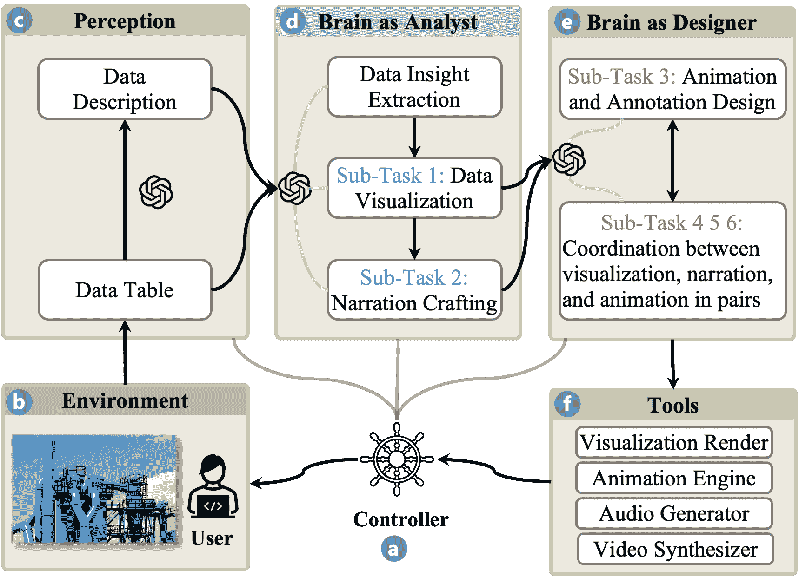
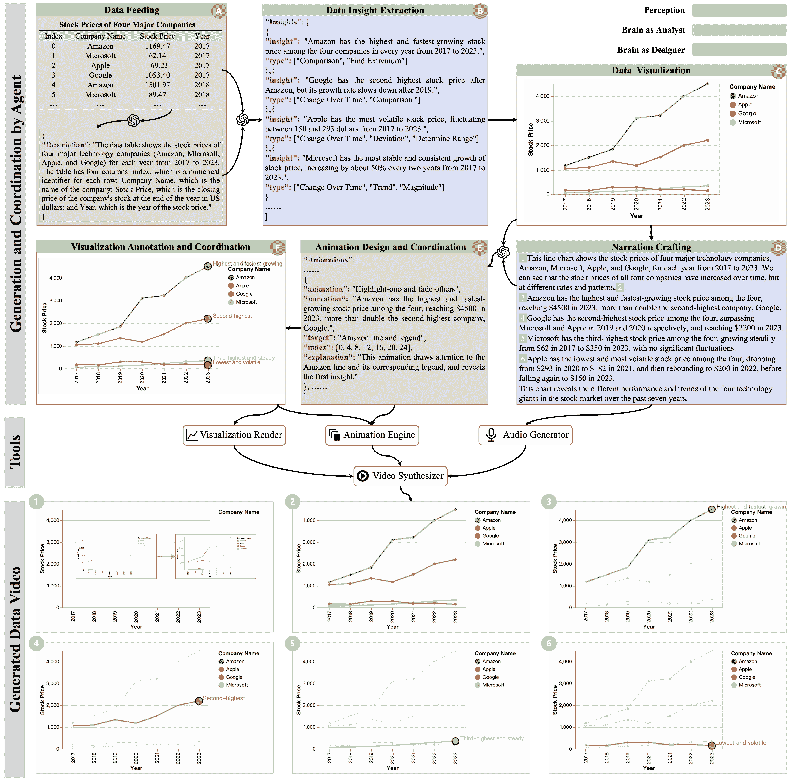

<!--yml

category: 未分类

日期：2025-01-11 12:20:32

-->

# 从数据到故事：基于大语言模型（LLM）多智能体系统的自动化动画数据视频创建

> 来源：[https://arxiv.org/html/2408.03876/](https://arxiv.org/html/2408.03876/)

\onlineid

7043 \vgtccategoryResearch \vgtcinsertpkg

沈磊先 [\scalerel* —](https://orcid.org/0000-0003-1084-4912)

香港科技大学，中国香港特别行政区 电子邮件：lshenaj@connect.ust.hk    李浩天 [\scalerel* —](https://orcid.org/0000-0001-9547-3449)

香港科技大学，中国香港特别行政区 电子邮件：haotian.li@connect.ust.hk    王云 [\scalerel* —](https://orcid.org/0000-0003-0468-4043)

微软，

北京，中国 电子邮件：wangyun@microsoft.com    胡敏 [\scalerel* —](https://orcid.org/0000-0002-3344-9694)

香港科技大学，中国香港特别行政区 电子邮件：huamin@cse.ust.hk

###### 摘要

从原始数据创建数据故事具有挑战性，因为人类的注意力有限且需要专业技能。近年来，大语言模型（LLM）的进展为开发具有自主智能体的系统提供了极好的机会，以简化数据故事讲述的工作流。尽管多智能体系统具有诸如通过分解任务为每个智能体充分发挥LLM潜力的优势，但设计这样的系统也面临任务分解、子任务性能优化和工作流设计等挑战。为了更好地理解这些问题，我们开发了Data Director，一种基于LLM的多智能体系统，旨在自动化创建动画数据视频，这是一种典型的数据故事类型。Data Director能够解释原始数据，分解任务，设计智能体角色以自动做出明智的决策，并无缝集成数据视频的多种组件。案例研究展示了Data Director在生成数据视频方面的有效性。在开发过程中，我们从解决挑战中汲取了经验教训，为数据故事讲述中的自主智能体的进一步发展提供指导。我们还展望了全球优化、人类在环设计和先进多模态LLM应用的未来方向。

###### 关键词：

数据故事讲述，LLM，多智能体，数据视频

引言

数据资产的快速增长推动了各个领域的进展，但也给人类与数据的交互带来了挑战。人类的注意力有限，可能缺乏提取有价值洞察和跨多模态构建引人入胜的数据故事的专业技能[[11](https://arxiv.org/html/2408.03876v1#bib.bib11)]。从原始数据自动生成故事可以大大提高数据分析和信息传递的效率。

最近，大型语言模型（LLMs）的进展展示了强大的自然语言理解和推理能力，证明其在数据分析 [[34](https://arxiv.org/html/2408.03876v1#bib.bib34), [4](https://arxiv.org/html/2408.03876v1#bib.bib4)]、文档生成 [[14](https://arxiv.org/html/2408.03876v1#bib.bib14)] 和可视化创建 [[7](https://arxiv.org/html/2408.03876v1#bib.bib7)] 等任务中非常有效。这些能力为通过开发基于LLM的自主代理系统来简化整个数据讲述工作流开辟了新的方向。在这一范式中，LLM作为这些代理的认知核心，使其能够感知环境（感知）、做出决策（大脑）并采取响应行动（行动），从而帮助人类自动化广泛的任务 [[35](https://arxiv.org/html/2408.03876v1#bib.bib35)]。

因此，我们旨在探索基于LLM的自主代理在直接从原始数据进行端到端讲述中的潜力，这是可视化和讲述领域中的一个新问题。本文特别关注数据故事的一种代表性类型——动画数据视频 [[19](https://arxiv.org/html/2408.03876v1#bib.bib19)]，这种视频包含多种组件，并需要协调这些不同元素 [[6](https://arxiv.org/html/2408.03876v1#bib.bib6)]。现有的自动化数据视频生成方法要么需要用户从原始数据准备各种材料 [[25](https://arxiv.org/html/2408.03876v1#bib.bib25), [32](https://arxiv.org/html/2408.03876v1#bib.bib32), [26](https://arxiv.org/html/2408.03876v1#bib.bib26)]，要么仍然涉及复杂且耗时的手动创作过程 [[5](https://arxiv.org/html/2408.03876v1#bib.bib5), [30](https://arxiv.org/html/2408.03876v1#bib.bib30), [8](https://arxiv.org/html/2408.03876v1#bib.bib8), [27](https://arxiv.org/html/2408.03876v1#bib.bib27), [3](https://arxiv.org/html/2408.03876v1#bib.bib3)]。我们设想自主代理能够促进原始数据自动转化为动画数据视频。然而，达成这一目标需要克服若干挑战：

图 1：数据导演架构。

+   •

    任务分解：数据讲述涉及多种元素的生成与协调，如可视化、文本叙述、音频和动画。系统应能准确地解释原始数据，将讲述任务分解为可管理的子任务，并为专门处理任务各个方面的代理分配合适的角色。

+   •

    性能优化：在每个子任务中，代理需要根据感知输入做出明智的决策，并确定使用合适的工具和方法。每个子任务通常依赖于前面阶段的输出，这突出了这些子任务之间的相互依赖性。因此，确保每个子任务的最佳性能至关重要。

+   •

    工作流程设计：讲故事涉及多个互相关联的子任务和多样化的顺序方案。任务如数据可视化、编写叙述、录制音频、设计动画和对齐各种组件通常是非线性的，它们的顺序可能有所变化，这就带来了确定最佳方法的挑战。系统需要提供一个无缝的工作流程，能够自动化并有效整合所有这些子任务。

为了更好地理解这些问题，我们开发了数据总监（Data Director），这是一个基于LLM（大语言模型）的多代理系统，能够自动化整个将原始数据转化为引人入胜的动画数据视频的过程。该系统的架构如[图 1](https://arxiv.org/html/2408.03876v1#S0.F1 "From Data to Story: Towards Automatic Animated Data Video Creation with LLM-based Multi-Agent Systems")所示。具体来说，我们根据数据视频的组成部分及其关系，将数据视频的创建过程分解为不同的子任务。我们设计了两个代理角色——数据分析师和设计师——来管理和执行这些子任务，并通过提示设计优化每个子任务的性能。我们还探索了有效的方式来互联这些子任务，并迭代优化工作流程。为了展示数据总监的有效性，我们进行了一个案例研究，在该案例中，数据总监生成了一个关于真实世界股价数据的数据视频。最后，我们总结了从系统设计中学到的经验教训，包括任务分解、性能优化和工作流程设计，并提供了指导，以推动未来多代理系统在将原始数据自动转化为数据故事方面的发展。

图 2：数据总监的示例演示。

## 1 数据总监

本节首先概述数据总监的架构，然后介绍我们的设计实践。

### 1.1 概述

数据总监（Data Director）是一个基于LLM的多代理系统， powered by GPT-4[[2](https://arxiv.org/html/2408.03876v1#bib.bib2)]。我们遵循现有的基于LLM的代理概念框架，设计了三个组件：感知、脑部和行动[[35](https://arxiv.org/html/2408.03876v1#bib.bib35)]。数据总监的架构如[图1](https://arxiv.org/html/2408.03876v1#S0.F1 "From Data to Story: Towards Automatic Animated Data Video Creation with LLM-based Multi-Agent Systems")所示，中央控制器（a）调度所有组件。用户生成的数据（b）直接输入到数据总监。感知模块（c）对数据进行预处理，然后输入到第一个代理（作为数据分析师，d）。该代理的任务包括提取见解、可视化数据和撰写叙述文本。生成的可视化和叙述文本被传递给下一个代理，后者作为设计师（e）进行处理。该代理负责为内容制作动画并加注释，并协调数据视频组件。最后，控制器（a）利用多代理系统做出的决策，通过相关工具（f）生成数据视频。

### 1.2 任务分解与工作流程设计

设计多代理系统以处理复杂任务，如数据叙事，至关重要的一点是将过程分解为有模式的子任务，从而促进模型学习和解释[[35](https://arxiv.org/html/2408.03876v1#bib.bib35)]。任务分解是准确性与效率之间的平衡艺术。粗略的任务可能会超出模型的能力，导致幻觉或无法计算的结果，而过于细化的任务可能会让模型负担过重，影响效率并增加成本。

在数据视频创作的背景下，我们首先将数据视频分解为基本组件及其关系，参考了之前的研究[[32](https://arxiv.org/html/2408.03876v1#bib.bib32), [25](https://arxiv.org/html/2408.03876v1#bib.bib25)]。数据视频的基本组件包括数据可视化、文本叙述和视觉动画。为了确保这些组件在数据视频中呈现得连贯，需要处理三种关系：1）动画可视化元素必须与对应的文本叙述片段在语义上相连接；2）动画效果必须与其所伴随的可视化元素相匹配；3）文本叙述应与动画在时间上保持一致，作为时间轴。

根据已识别的组件和关系，我们将三个组件创建任务和三个关系管理任务（共六个子任务）分配给两个基于LLM的代理，分别担任数据分析师和设计师的角色。此外，我们开发了一个控制器来管理每个模块的输入和输出，解析输出，并调用适当的工具来处理超出LLM能力范围的任务。

[图2](https://arxiv.org/html/2408.03876v1#S0.F2 "In From Data to Story: Towards Automatic Animated Data Video Creation with LLM-based Multi-Agent Systems")展示了一个基于四家IT公司真实股价数据的案例研究。

知觉。知觉模块接受并处理来自外部环境的各种信息，将其转化为LLM能够理解的表示[[35](https://arxiv.org/html/2408.03876v1#bib.bib35)]。在数据总监中，数据表格直接作为格式化文本输入到提示中。在知觉阶段（A），数据预处理模块利用数据集的标题和内容，在LLM会话中生成自然语言描述。如[图2](https://arxiv.org/html/2408.03876v1#S0.F2 "In From Data to Story: Towards Automatic Animated Data Video Creation with LLM-based Multi-Agent Systems")-A所示，该描述包括对数据主题的高层次概述，并对每个数据列的语义进行详细阐述，为后续的模型处理增强上下文信息。生成的自然语言数据描述和原始数据随后被输入到数据分析大脑中。

数据分析师角色。受到基于洞察的可视化和理解技巧的启发[[39](https://arxiv.org/html/2408.03876v1#bib.bib39), [33](https://arxiv.org/html/2408.03876v1#bib.bib33)]，在分析数据时，数据总监首先提示LLM从原始数据中提取top-k有趣的数据洞察（B），基于数据分析任务建模[[23](https://arxiv.org/html/2408.03876v1#bib.bib23), [21](https://arxiv.org/html/2408.03876v1#bib.bib21)]。这些洞察指导可视化（子任务1）和文本叙述（子任务2）的生成。遵循链式思维策略[[9](https://arxiv.org/html/2408.03876v1#bib.bib9)]，并通过精心设计的LLM提示，大脑逐步推导出洞察列表（B）、声明式Vega-Lite可视化[[18](https://arxiv.org/html/2408.03876v1#bib.bib18)]（C）和文本叙述（D）。

设计师角色。一旦“数据分析师”准备好可视化和相应的文本叙述，“设计师”代理的任务是创建动态动画（子任务3）并同步组件（子任务4、5、6）。动画分为两种类型：应用于可视化元素的视觉效果（例如，淡入、放大、飞入、缩放等），以及在恰当时机引入附加视觉元素的注释。动画效果通过从动画库中提取选项并转化为自然语言提示（E）来确定。该代理需要选择动画应用的最佳时机，识别将要动画化的精确视觉元素，并选择适当的动画效果。此外，鉴于Vega-Lite指定的带注释可视化的复杂性，我们采用分层方法，首先由数据分析师代理生成基础可视化，然后由设计师代理使用带有Vega-Lite规格的注释对其进行增强，从而提高结果效果（F）。文本叙述充当时间轴，将时间同步转化为静态叙述段落和视觉元素之间的语义链接[[32](https://arxiv.org/html/2408.03876v1#bib.bib32)、[25](https://arxiv.org/html/2408.03876v1#bib.bib25)]。

控制器。如[图2](https://arxiv.org/html/2408.03876v1#S0.F2 "从数据到故事：基于LLM的多代理系统自动化数据视频创作")所示，基于模型的自然语言输出，控制器首先利用文本转语音服务将文本叙述转换为具有精确时间戳的音频，确保与数据视频的时间轴对齐。然后，控制器调用可视化渲染器将Vega-Lite规格转换为SVG文件。每个SVG元素会自动关联上加黑的数据和可视化结构信息[[25](https://arxiv.org/html/2408.03876v1#bib.bib25)、[28](https://arxiv.org/html/2408.03876v1#bib.bib28)]。叙述段落进一步与这些SVG可视元素建立链接，基于设计师代理所建立的文本-视觉链接，类似于数据播放器[[25](https://arxiv.org/html/2408.03876v1#bib.bib25)]。接着，基于设计师代理的决策，将相应的动画效果应用到SVG元素上。随后，带注释的可视化被解析以检测SVG注释元素，并在相应的时间戳处整合“淡入”动画。最后，控制器调用视频合成器将可视化、音频叙述和动画序列合并成最终的数据视频。

## 2 案例研究

[图 2](https://arxiv.org/html/2408.03876v1#S0.F2 "从数据到故事：基于 LLM 的多智能体系统自动生成动画数据视频")展示了一个使用股票价格数据的真实案例研究。Data Director 生成多样化的洞察（B）并使用折线图（C）展示股票价格随时间变化的情况。叙述遵循了结构化的方法（C）：从概述开始，详细描述每个公司的表现，最后做总结。根据叙述，添加了指向每家公司线条的点和文本注释，以突出其显著特征（F）。[图 2](https://arxiv.org/html/2408.03876v1#S0.F2 "从数据到故事：基于 LLM 的多智能体系统自动生成动画数据视频")的底部展示了视频中的关键动画帧（E），每个帧编号与叙述中的特定时间戳对应（D），这展示了何时触发特定动画。最终的数据视频以一个展示所有元素的入场动画开始，在讨论每个公司时，相应的线条会单独突出显示。总体而言，整个叙事结构良好，表述流畅，视觉和动画设计得当，最终呈现出一个引人入胜的数据视频。

## 3 个经验教训

本节将讨论在 Data Director 开发过程中获得的经验教训，重点包括任务分解、性能优化和工作流设计。

### 3.1 任务分解

平衡准确性与效率。数据故事讲述的任务分解需要平衡准确性与效率。在分解任务时，首先要识别模型擅长的任务（例如，自然语言生成、推理和基于文本的决策），并将这些任务与需要外部工具的任务区分开（例如，视觉渲染、音频生成和视频合成）。其次，任务分解后的子任务应当是明确且可管理的。这些子任务可以被归类，以形成与任务固有特征相匹配的代理角色。例如，Data Director 根据数据视频的组成部分进行任务分解，将子任务组织为以分析为中心的任务，这些任务从原始数据中生成静态内容，以及以设计为中心的任务，这些任务需要创意输入并从静态内容中推导出动态效果。第三，适当的子任务组合可以提高模型的准确性和效率，正如在[第 1.2 节](https://arxiv.org/html/2408.03876v1#S1.SS2 "1.2 任务分解与工作流设计 ‣ 1 Data Director ‣ 从数据到故事：基于 LLM 的多智能体系统自动生成动画数据视频")中所展示的，动画设计和时间同步就得到了结合。最后，可以采用自上而下的方法逐步拆解任务，为每个子任务设计合适且高效的模型。

提供带有上下文信息的数据输入。研究发现，向模型提供足够的上下文信息能够提高其生成的准确性和质量[[34](https://arxiv.org/html/2408.03876v1#bib.bib34)]。随着模型逐步完成子任务，上下文会得到丰富和更新，为后续操作提供更多信息。例如，在数据分析代理中，模型会逐渐收集有关数据描述、洞察、可视化和叙述的信息。然而，当代理从环境中获取数据时，数据本身仅为数值且上下文有限。我们发现，通过对数据进行语义丰富处理，并向模型提供上下文洞察，能够显著提高其效果。例如，Data Director 使用 LLM 生成带有标题的数据表的自然语言描述。未来的研究可以整合创新技术来增强数据理解，并探索将数据输入 LLM 的新方法。

### 3.2 性能优化

有效的提示设计对于提升基于大语言模型（LLM）代理系统的性能和输出质量至关重要。Data Director 的完整提示可以在[附录 A](https://arxiv.org/html/2408.03876v1#A1 "Appendix A Full Prompt ‣ From Data to Story: Towards Automatic Animated Data Video Creation with LLM-based Multi-Agent Systems")中找到。优化提示的关键策略如下：

为 LLM 分配适当的任务。有效提示设计的基础在于精心设计 LLM 的任务。关键是识别出 LLM 擅长的任务。此外，为模型分配特定角色，例如在 Data Director 中作为数据分析师或设计师，可以引导模型生成领域特定且与上下文相关的输出。此外，向模型提供准确且全面的上下文信息，可以增强其对任务的理解，从而提高回答的准确性和相关性。这涉及到设计结构良好的提示（见[附录 A](https://arxiv.org/html/2408.03876v1#A1 "Appendix A Full Prompt ‣ From Data to Story: Towards Automatic Animated Data Video Creation with LLM-based Multi-Agent Systems")）并设计诸如数据预处理等补充模块，正如在 Data Director 中所做的。

认知处理时间和任务分解。为模型提供充足的认知处理时间对实现高质量输出和缓解幻觉至关重要。除了上述讨论的任务分解外，在提示设计方面，子任务可以通过顺序步骤明确地定义，促进“思维链”策略的应用。此外，一个提示中的任务数量应保持平衡，以推导任务的难度。此外，提示模型在得出结论之前解释其决策或概述其解决方法，可以促进更加深思熟虑和精确的响应生成过程。例如，在设计师代理中，数据总监提示LLM关于动画和注释设计的选择，这增强了决策准确性，并简化了开发过程中LLM应用的调试。

制定精确且明确的指令。指令的清晰性和具体性在有效的提示设计中至关重要。使用分隔符（例如，`“‘ “‘`，`” ”` 或 `$<>$`）来划分提示部分，可以减少歧义并帮助理解。提供细化的要求并正确使用关键字（例如，“总结”与“提取”）可确保模型严格遵守任务参数。此外，要求结构化输出（例如，JSON 和 HTML）并提供多种响应选项，可以引导模型生成有组织且实用的输出。例如，如[图 2](https://arxiv.org/html/2408.03876v1#S0.F2 "在《从数据到故事：基于LLM的多代理系统自动化数据动画视频创建》中")所示，数据总监允许LLM从一组预定义的候选项中选择洞察类型（B）、动画类型（E）和注释类型（F）。此外，结合条件逻辑（例如，if-else语句）、使用少量示例或单次示例提示技巧以及引用URL提供具体示例，可以进一步增强模型的理解和任务执行准确性。更多具体示例可以在[附录 A](https://arxiv.org/html/2408.03876v1#A1 "附录 A 完整提示 ‣ 从数据到故事：基于LLM的多代理系统自动化数据动画视频创建")中找到。

### 3.3 工作流程设计

共享表示。本论文主要使用GPT-4模型[[2](https://arxiv.org/html/2408.03876v1#bib.bib2)]，以自然语言作为输入和输出的媒介，为本讨论奠定了基础。代理之间以及代理与外部工具之间的有效通信需要适当的共享自然语言表示。例如，在《数据导演》中使用Vega-Lite表示所有可视化和注释，而洞察和动画视觉信息则封装在JSON格式中，包含特定的特征信息（见[图2](https://arxiv.org/html/2408.03876v1#S0.F2 "从数据到故事：基于LLM的多代理系统自动化动画数据视频创作")）。这种共享表示必须易于模型理解并生成，同时也能被外部工具轻松解读并映射到内部操作中。未来的工作可能涉及设计针对特定应用场景的全局共享表示，以帮助模型更好地保留和生成上下文信息。

迭代开发。工作流中的各种子任务呈现出不同的排序策略。例如，注释可以与可视化同时生成，或者在动画生成过程中进行，或使用《数据导演》中的分层方法。同样，在数据分析中，可能选择在叙述之前或之后生成可视化内容。设计最佳排序策略是具有挑战性的，因为缺乏量化的全局优化目标。因此，对于基于LLM的代理应用，我们采用了一种基于任务分解和局部性能优化的迭代设计方法[[1](https://arxiv.org/html/2408.03876v1#bib.bib1)]。这一过程包括构思、实施、实验评估和错误分析的循环。追求模型输出的一致性还需要遵循既定的指南并进行细致的参数调整。我们注意到，本文展示的《数据导演》是我们迭代优化的结果，可能不一定代表最优配置。我们开发该原型工具的目的是揭示有价值的经验教训和见解，从而为未来的研究提供指导。

## 4 未来工作

全局优化和基准测试。如[1.2节](https://arxiv.org/html/2408.03876v1#S1.SS2 "1.2 任务分解与工作流设计 ‣ 1 数据总监 ‣ 从数据到故事：基于LLM的多智能体系统自动化数据视频创作")中提到的多智能体系统的迭代开发，缺乏一个全局优化和验证框架来支持端到端的数据视频生成[[16](https://arxiv.org/html/2408.03876v1#bib.bib16)]。此外，社区缺乏一个广泛认可的基准。这一挑战的复杂性由数据叙事质量的固有主观性加剧，这种质量容易受到个人解读以及多种叙事形式中决策过程的影响。未来的工作可以包括总结相关的评分标准，并开展实证研究以推导出定量的指导原则。通过这些明确的度量标准，还可以添加评估代理来增强现有的工作流。此外，还需要开发一个全球共享的表示方法以进行优化，并融入针对不同场景量身定制的领域特定语言和目标[[15](https://arxiv.org/html/2408.03876v1#bib.bib15), [17](https://arxiv.org/html/2408.03876v1#bib.bib17)]。

人工参与环节。数据驱动的端到端生成解决方案可能导致“一刀切”的输出。为了解决这些问题，将人工参与环节纳入是弥补模型局限性并生成更个性化结果的必要方法[[11](https://arxiv.org/html/2408.03876v1#bib.bib11), [10](https://arxiv.org/html/2408.03876v1#bib.bib10)]。在数据叙事中，人工参与的三种范式可以进一步探讨：首先，允许用户在感知模块中输入更多信息，同时保持当前架构，以自然语言[[20](https://arxiv.org/html/2408.03876v1#bib.bib20)]、示例[[36](https://arxiv.org/html/2408.03876v1#bib.bib36), [22](https://arxiv.org/html/2408.03876v1#bib.bib22)]和草图[[14](https://arxiv.org/html/2408.03876v1#bib.bib14)]等形式表达他们的目标和需求；其次，将人工融入子任务中，以在进入下一阶段之前实现局部优化，例如在生成数据洞察后生成多个可视化和注释候选项；第三，用户根据输出提供对话式反馈[[20](https://arxiv.org/html/2408.03876v1#bib.bib20), [31](https://arxiv.org/html/2408.03876v1#bib.bib31)]，代理则根据这些反馈生成新的端到端结果。此外，这些方法也可以灵活地结合使用。

跟上前沿模型的步伐。本文主要使用了GPT-4模型。然而，随着大型语言模型（LLMs）的快速发展，GPT-4正在迅速被多模态LLM的出现所增强[[38](https://arxiv.org/html/2408.03876v1#bib.bib38)]。这些先进模型提供了扩展的功能，用于处理多模态输入和输出，显著影响了我们现有框架中的任务分解、性能优化和工作流设计（[图1](https://arxiv.org/html/2408.03876v1#S0.F1 "从数据到故事：基于LLM的多智能体系统的自动动画数据视频创作")）。例如，初步生成的可视化文件可以在后续的多模态模块中进行完善，可能直接生成视频内容。模型能力的增强带来了诸多机会。未来的工作不仅应跟踪最新模型以开发更强大的智能体，还应利用具有不同能力的多样化模型来丰富数据叙事。这包括超越单一静态图表，融入视觉和音乐内容[[29](https://arxiv.org/html/2408.03876v1#bib.bib29)]，支持更复杂的见解和多视角可视化[[13](https://arxiv.org/html/2408.03876v1#bib.bib13)]，整合现有的计算设计空间（例如，摄像机[[12](https://arxiv.org/html/2408.03876v1#bib.bib12)]和叙事结构[[37](https://arxiv.org/html/2408.03876v1#bib.bib37)]），以及容纳更多数据类型（例如，非结构化图表[[24](https://arxiv.org/html/2408.03876v1#bib.bib24)]）。实现这些功能需要增强共享表示并设计相应的提示（类似于Data Director如何整合动画）。

大型语言模型的固有局限性。LLM（大型语言模型）功能强大，但存在一些固有的局限性，如错误积累、不一致的结果、幻觉现象和高时间成本。最重要的是，我们需要认识到，LLM生成的内容是创造性的，而非真实的。为了解决错误积累问题，可以通过引入人类干预的方法并提供及时提示来提高准确性。通过严格遵循既定的指南并制定补充规则来处理模型输出，可以提高结果的一致性。幻觉现象是指模型生成看似合理但实际上错误的信息，可以通过实施一些提示优化策略来改善，如自我修复机制、思维链（Chain-of-Thought, CoT）方法和代码解释器功能[[34](https://arxiv.org/html/2408.03876v1#bib.bib34)]。最后，高时间成本可以通过将任务分解、为每个任务找到合适的解决方案（例如启发式方法、基础模型和LLM）来进行管理。需要认识到，LLM并非一刀切的解决方案；有时，基础模型或启发式规则在没有LLM的情况下也能发挥极高的效用。

## 5 结论

LLM的快速发展为创建端到端的多智能体数据讲述系统提供了新的机会。通过Data Director的开发，我们获得了关于任务分解、通过提示设计进行本地性能优化以及工作流设计的宝贵见解。此外，我们还阐明了未来方向，包括全球优化的多智能体、人类干预系统、前沿多模态模型的整合以及解决LLM固有局限性的问题。

###### 致谢。

作者感谢所有审稿人提供的宝贵反馈。本研究得到了RGC GRF资助（项目编号16210321）的部分支持。

## 参考文献

+   [1] ChatGPT提示工程开发者指南。[https://learn.deeplearning.ai/chatgpt-prompt-eng/](https://learn.deeplearning.ai/chatgpt-prompt-eng/)。

+   [2] OpenAI GPT-4。[https://openai.com/gpt-4](https://openai.com/gpt-4)。

+   [3] F. Amini, N. H. Riche, B. Lee, A. Monroy-Hernandez, and P. Irani. Authoring data-driven videos with dataclips. IEEE Transactions on Visualization and Computer Graphics, 23(1):501–510, 2017.

+   [4] C. Beasley 和 A. Abouzied. Pipe(line) Dreams: 完全自动化的端到端分析与可视化。发表于2024年人类干预数据分析工作坊论文集，页码1-7，ACM，2024年。

+   [5] Y. Cao, J. L. E, Z. Chen, and H. Xia. DataParticles: 基于区块和面向语言的数据驱动动画单元可视化创作。发表于2023年CHI计算机系统人类因素会议论文集，CHI '23，页码1-15，ACM，2023年。

+   [6] H. Cheng, J. Wang, Y. Wang, B. Lee, H. Zhang, and D. Zhang. Investigating the role and interplay of narrations and animations in data videos. Computer Graphics Forum, 41(3):527–539, 2022.

+   [7] V. Dibia. LIDA：使用大语言模型自动生成语法无关的可视化和信息图表的工具. 收录于《第61届计算语言学协会年会论文集》，ACL’23，页码 113–126。ACL，2023。

+   [8] T. Ge, B. Lee, 和 Y. Wang. CAST：数据驱动的图表动画创作. 收录于《2021 年 CHI 计算机系统人因会议论文集》，CHI ’21，页码 1–15。ACM，2021。

+   [9] T. Kojima, S. S. Gu, M. Reid, Y. Matsuo, 和 Y. Iwasawa. 大型语言模型是零-shot 推理器. 收录于 S. Koyejo, S. Mohamed, A. Agarwal, D. Belgrave, K. Cho, 和 A. Oh 编，《神经信息处理系统进展论文集》，NIPS’22，第35卷，页码 22199–22213，2022。

+   [10] H. Li, Y. Wang, Q. V. Liao, 和 H. Qu. 为什么 AI 不是数据工作者的灵丹妙药？一项关于人类与 AI 协作的数据讲故事访谈研究. arXiv 预印本 arXiv:2304.08366，2023。

+   [11] H. Li, Y. Wang, 和 H. Qu. 我们走到了哪里？从人类与 AI 协作的视角理解数据讲故事工具. 收录于《计算机系统人因研究 CHI 会议论文集》，CHI’24，页码 1–28，2024。

+   [12] W. Li, Z. Wang, Y. Wang, D. Weng, L. Xie, S. Chen, H. Zhang, 和 H. Qu. GeoCamera：通过相机运动在地理可视化中讲述故事. 收录于《计算机系统人因研究 CHI 会议论文集》，CHI’23，页码 1–15。ACM，2023。

+   [13] Y. Lin, H. Li, A. Wu, Y. Wang, 和 H. Qu. DMiner：仪表盘设计挖掘与推荐. 《IEEE 可视化与计算机图形学期刊》，30(7)：4108–4121，2024。

+   [14] Y. Lin, H. Li, L. Yang, A. Wu, 和 H. Qu. InkSight：利用草图交互记录计算笔记本中的图表发现. 《IEEE 可视化与计算机图形学期刊》，30(1)：944–954，2024。

+   [15] Y. Ouyang, L. Shen, Y. Wang, 和 Q. Li. NotePlayer：动态呈现分析过程的 Jupyter 笔记本交互工具. arXiv 预印本 arXiv:2408.01101，页码 1–15，2024。

+   [16] J. S. Park, J. O’Brien, C. J. Cai, M. R. Morris, P. Liang, 和 M. S. Bernstein. 生成型代理：人类行为的交互式模拟体. 收录于《年度 ACM 用户界面软件与技术研讨会论文集》，UIST’23，页码 1–22。ACM，2023。

+   [17] S. Sallam, Y. Sakamoto, J. Leboe-McGowan, C. Latulipe, 和 P. Irani. 面向有效健康相关数据视频的设计指南：情感、个性与视频内容的实证研究. 收录于《计算机系统人因研究 CHI 会议论文集》，CHI’22，页码 1–22。ACM，2022。

+   [18] A. Satyanarayan, D. Moritz, K. Wongsuphasawat, 和 J. Heer. Vega-Lite：交互式图形语法. 《IEEE 可视化与计算机图形学期刊》，23(1)：341–350，2017。

+   [19] E. Segel 和 J. Heer. 叙事可视化：用数据讲故事. 《IEEE 可视化与计算机图形学期刊》，16(6)：1139–1148，2010。

+   [20] L. Shen, E. Shen, Y. Luo, X. Yang, X. Hu, X. Zhang, Z. Tai, 和 J. Wang. 面向数据可视化的自然语言接口：一项调研. 《IEEE可视化与计算机图形学学报》，29(6)：3121–3144，2023年。

+   [21] L. Shen, E. Shen, Z. Tai, Y. Song, 和 J. Wang. TaskVis：面向任务的可视化推荐. 载于《第23届欧洲图形学大会可视化会议论文集》（短篇论文），EuroVis’21，第91–95页，Eurographics，2021年。

+   [22] L. Shen, E. Shen, Z. Tai, Y. Wang, Y. Luo, 和 J. Wang. GALVIS：通过示例驱动的声明式编程进行可视化构建. 载于《第31届ACM国际信息与知识管理会议论文集》（CIKM’22），第4975–4979页，ACM，2022年。

+   [23] L. Shen, E. Shen, Z. Tai, Y. Xu, J. Dong, 和 J. Wang. 基于任务的推荐的可视化数据分析. 《数据科学与工程》，7(4)：354–369，2022年。

+   [24] L. Shen, Z. Tai, E. Shen, 和 J. Wang. 带嵌入指导布局的图形探索. 《IEEE可视化与计算机图形学学报》，30(7)：3693–3708，2024年。

+   [25] L. Shen, Y. Zhang, H. Zhang, 和 Y. Wang. 数据播放器：自动生成带叙述-动画互动的数据视频. 《IEEE可视化与计算机图形学学报》，30(1)：109–119，2024年。

+   [26] D. Shi, F. Sun, X. Xu, X. Lan, D. Gotz, 和 N. Cao. AutoClips：基于数据事实的自动视频生成方法. 《计算机图形学论坛》，40(3)：495–505，2021年。

+   [27] M. Shin, J. Kim, Y. Han, L. Xie, M. Whitelaw, B. C. Kwon, S. Ko, 和 N. Elmqvist. Roslingifier：面向动画散点图的半自动化叙事工具. 《IEEE可视化与计算机图形学学报》，29(6)：2980–2995，2023年。

+   [28] L. S. Snyder 和 J. Heer. DIVI：动态交互式可视化. 《IEEE可视化与计算机图形学学报》，30(1)：403–413，2024年。

+   [29] T. Tang, J. Tang, J. Lai, L. Ying, Y. Wu, L. Yu, 和 P. Ren. SmartShots：生成嵌入数据可视化的视频优化方法. 《ACM互动智能系统学报》，12(1)：1–21，2022年。

+   [30] J. R. Thompson, Z. Liu, 和 J. Stasko. 数据动画师：创作富有表现力的动画数据图形. 载于《2021年人机交互系统国际会议论文集》（CHI’21），第1–18页，ACM，2021年。

+   [31] Y. Wang, Z. Hou, L. Shen, T. Wu, J. Wang, H. Huang, H. Zhang, 和 D. Zhang. 基于自然语言的可视化创作. 《IEEE可视化与计算机图形学学报》，29(1)：1222–1232，2023年。

+   [32] Y. Wang, L. Shen, Z. You, X. Shu, B. Lee, J. Thompson, H. Zhang, 和 D. Zhang. WonderFlow：以叙述为中心的动画数据视频设计. 《IEEE可视化与计算机图形学学报》，第1–15页，2024年。

+   [33] Y. Wang, Z. Sun, H. Zhang, W. Cui, K. Xu, X. Ma, 和 D. Zhang. DataShot：从表格数据中自动生成事实表. 《IEEE可视化与计算机图形学学报》，26(1)：895–905，2020年。

+   [34] Y. Wu, Y. Wan, H. Zhang, Y. Sui, W. Wei, W. Zhao, G. Xu, 和 H. Jin. 通过大语言模型从自然语言自动生成数据可视化：一项探索性研究. 收录于ACM数据管理会议论文集，SIGMOD’24, 第1–28页\. ACM, 2024.

+   [35] Z. Xi, W. Chen, X. Guo, W. He, 等人. 基于大语言模型的代理的崛起与潜力：一项调查. arXiv: 2309.07864, 第1–86页，2023年.

+   [36] L. Xie, Z. Zhou, K. Yu, Y. Wang, H. Qu, 和 S. Chen. Wakey-Wakey：通过模仿GIF中的字符来动画化文本. 收录于第36届ACM用户界面软件与技术年会论文集，UIST’23，第1–14页\. ACM, 2023年.

+   [37] L. Yang, X. Xu, X. Y. Lan, Z. Liu, S. Guo, Y. Shi, H. Qu, 和 N. Cao. 将Freytag金字塔结构应用于数据故事的设计空间. IEEE《可视化与计算机图形学学报》，28(1)：922–932，2022年.

+   [38] S. Yin, C. Fu, S. Zhao, K. Li, X. Sun, T. Xu, 和 E. Chen. 关于多模态大语言模型的调查. arXiv:2306.13549, 2023年.

+   [39] L. Ying, Y. Wang, H. Li, S. Dou, H. Zhang, X. Jiang, H. Qu, 和 Y. Wu. 将静态图表转变为动态图表. IEEE《可视化与计算机图形学学报》，第1–15页，2024年.

## 附录 A 完整提示

Listing 1: 为数据表生成文本描述的提示

[⬇](data:text/plain;base64,CkdpdmUgYSBzaG9ydCBhbmQgY29uc2lzdGVudCBkZXNjcmlwdGlvbiBvZiB0aGUgZm9sbG93aW5nIGRhdGEgdGFibGUgYW5kIGNvbHVtbnM6Cnt7dGFibGV9fQoKVGhlIHRpdGxlIG9mIHRoZSBkYXRhIHRhYmxlIGlzOiB7e3RpdGxlfX0KClRoZSBvdXRwdXQgSlNPTiBmb3JtYXQgaXM6CnsKIkRlc2NyaXB0aW9uIjogW0FdCn0Kd2hlcmUgW0FdIGlzIHRoZSBnZW5lcmF0ZWQgZGVzY3JpcHRpb24u) 给出以下数据表及其列的简短且一致的描述：{{table}} 数据表的标题为：{{title}} 输出的JSON格式为：{"Description":  [A]} 其中 [A] 是生成的描述。

Listing 2: 作为数据分析师的代理提示

[⬇](data:text/plain;base64,CllvdSBhcmUgYSBkYXRhIGFuYWx5c3QuIFlvdSBoYXZlIGEgZGF0YSB0YWJsZSBhdCBoYW5kLgp7e2Rlc2NyaXB0aW9ufX0KVGhlIGZ1bGwgZGF0YSB0YWJsZSBpczoKe3t0YWJsZX19CgpZb3UgbmVlZCB0byBjb21wbGV0ZSBzZXZlcmFsIHRhc2tzLCBwbGVhc2UgdGhpbmsgc3RlcCBieSBzdGVwLgoKVGFzayAxOiBQbGVhc2UgbGlzdCB0aGUgdG9wIGluc2lnaHRzIHlvdSBjYW4gZ2F0aGVyIGZyb20gdGhlIGZvbGxvd2luZyBkYXRhIHRhYmxlLgpOb3RlcyBmb3IgaW5zaWdodCBleHRyYWN0aW9uOgotIFRoZSBvdXRwdXQgSlNPTiBmb3JtYXQgaXM6ClsKICAgIHsKCSJpbnNpZ2h0IjogaW5zaWdodCBjb250ZW50LAoJInR5cGUiOiBhIGxpc3Qgb2YgY29ycmVzcG9uZGluZyBpbnNpZ2h0IHR5cGVzCiAgICB9Cl0KLSBUaGUgaW5zaWdodCB0eXBlIGJlbG9uZ3MgdG8gdGhlIGZvbGxvd2luZyBsaXN0OiBbQ2hhbmdlIE92ZXIgVGltZSwgQ2hhcmFjdGVyaXplIERpc3RyaWJ1dGlvbiwgQ2x1c3RlciwgQ29tcGFyaXNvbiwgQ29ycmVsYXRlLCBEZXRlcm1pbmUgUmFuZ2UsIERldmlhdGlvbiwgFmluZCBBbm9tYWxpZXMsIEZpbmQgRXh0cmVtdW0sIE1hZ25pdHVkZSwgUGFydCB0byBXaG9sZSwgU29ydCwgVHJlbmRdLiBPbmUgaW5zaWdodCBjYW4gY29ycmVzcG9uZCB0byBtdWx0aXBsZSB0eXBlcy4KLSBUaGUgc2VsZWN0ZWQgaW5zaWdodHMgc2hvdWxkIGJlIG9idmlvdXMsIHZhbHVhYmxlLCBhbmQgZGl2ZXJzZS4KLSBEb3VibGUtY2hlY2sgdGhhdCB0aGUgY29tcGFyaXNvbiBvZiBudW1lcmljYWwgbWFnbml0dWRlcyBpcyBhY2N1cmF0ZS4gRW5zdXJlIHRoYXQgdGhlIGluc2lnaHQgaXMgcmlnaHQuCi0gSWdub3JlIHRoZSAiaW5kZXgiIGNvbHVtbi4KCgpUYXNrIDI6IFBsZWFzZSBkcmF3IGEgVmVnYS1MaXRlIHZpc3VhbGl6YXRpb24gdG8gdGVsbCB0aGUgaW5zaWdodHMgYmFzZWQgb24gdGhlIGRhdGEgdGFibGUuCk5vdGVzIGZvciB2aXN1YWxpemF0aW9uIGdlbmVyYXRpb246Ci0gWW91ciB0aXRsZSBzaG91bGQgYmUgbGVzcyB0aGFuIDEwIHdvcmRzLgotIElmIHlvdSB1c2UgdGhlIGNvbG9yIGNoYW5uZWwsIHJlZmVyIHRvIHRoZSBmb2xsb3dpbmcgY29sb3Igc2NoZW1lOiBodHRwczovL3ZlZ2EuZ2l0aHViLmlvL3ZlZ2EvZG9jcy9zY2hlbWVzLwotIFlvdXIgdmlzdWFsaXphdGlvbiBzaG91bGQgaGF2ZSB0aGUgcmlnaHQgaGVpZ2h0IGFuZCB3aWR0aC4KLSBJZiB0aGUgdmlzdWFsaXphdGlvbiBpcyBhIGxpbmUgY2hhcnQsIGl0IHNob3VsZCBpbmNsdWRlIGRhdGEgcG9pbnRzLgotIElmIHRoZSBmb2N1cyBvZiB0aGUgZGF0YSB0YWJsZSBwcmVzZW50YXRpb24gaXMgb24gcGVyY2VudGFnZSBpbmZvcm1hdGlvbiBvZiBvbmUgc2luZ2xlIGNvbHVtbiwgdGhlbiB1c2UgYSBwaWUgY2hhcnQgdG8gcHJlc2VudCBpdC4gVGhlIHBlcmNlbnRhZ2Ugb2YgZWFjaCBzZWN0b3Igc2hvdWxkIGJlIGRpc3BsYXllZCBvbiB0aGUgY29ycmVzcG9uZGluZyBzZWN0b3IgdmlhIHRleHQgYW5ub3RhdGluZyBsaWtlIGh0dHBzOi8vdmVnYS5naXRodWIuaW8vdmVnYS1saXRlL2V4YW1wbGVzL2xheWVyX2FyY19sYWJlbC5odG1sLgotIFVzZSBhIHNpbmdsZSBjaGFydCB0byB2aXN1YWxpemUgdGhlIGRhdGEsIGFuZCB0aGUgaW5kZXggY29sdW1uIHNob3VsZCBub3QgYmUgdmlzdWFsaXplZC4KClRhc2sgMzogUGxlYXNlIHdyaXRlIGEgc3RyZWFtbGluZWQgbmFycmF0aW9uIGZvciB0aGUgaW5zaWdodHMuCk5vdGVzIGZvciBuYXJyYXRpb24gZ2VuZXJhdGlvbjoKLSBXcml0aW5nIG5hcnJhdGlvbiBpbiB0aGUgdG9uZSBvZiBkZXNjcmliaW5nIHRoZSB2aXN1YWxpemF0aW9uIGluc3RlYWQgb2YgZGVzY3JpYmluZyB0aGUgZGF0YSB0YWJsZS4KLSBZb3VyIGxvZ2ljIHNob3VsZCBiZSBjb21wZWxsaW5nLCBsaW5raW5nIGluc2lnaHRzIGludG8gYSBzdG9yeSwgYW5kIGF2b2lkaW5nIGVudW1lcmF0aW5nIGluc2lnaHRzLgotIEF2b2lkIHVzaW5nIGFkZGl0aW9uYWwgZXhwbGFuYXRpb25zLiBBdm9pZCBzcGVjdWxhdGluZyBvbiBjb25jbHVzaW9ucyBhbmQgcmVkdW5kYW50IGV4cGxhbmF0aW9ucyBiZXlvbmQgdGhlIGRhdGEuCi0gQ29udGVudCBzaG91bGQgYmUgc3RyZWFtbGluZWQuCi0gSWdub3JlIHRoZSAiaW5kZXgiIGNvbHVtbi4KCgpUYXNrIDI6IFBsZWFzZSBkcmF3IGEgVmVnYS1MaXRlIHZpc3VhbGl6YXRpb24gdG8gdGVsbCB0aGUgaW5zaWdodHMgYmFzZWQgb24gdGhlIGRhdGEgdGFibGUuCk5vdGVzIGZvciB2aXN1YWxpemF0aW9uIGdlbmVyYXRpb246Ci0gWW91ciB0aXRsZSBzaG91bGQgYmUgbGVzcyB0aGFuIDEwIHdvcmRzLgotIElmIHl

列表 3：充当设计师的代理的提示

[⬇](data:text/plain;base64,CllvdSBhcmUgYSBkYXRhIHZpZGVvIGRlc2lnbmVyLiBZb3UgaGF2ZSBhIHN0YXRpYyB2aXN1YWxpemF0aW9uIGFuZCBjb3JyZXNwb25kaW5nIGluc2lnaHRmdWwgbmFycmF0aW9uIHRleHQgYXQgaGFuZCwgYXMgd2VsbCBhcyB0aGUgb3JpZ2luYWwgZGF0YSB0YWJsZS4gSWYgbmVjZXNzYXJ5LCBlbWJlbGxpc2ggdGhlIHZpc3VhbGl6YXRpb24gd2l0aCBjb3JyZXNwb25kaW5nIGFubm90YXRpb25zIChlLmcuLCBhcnJvdywgdGV4dCwgY2lyY2xlLCBldGMuKSB0byB0ZWxsIHRoZSBzdG9yeSBtb3JlIHZpdmlkbHkgaW4gdGhlIG5hcnJhdGlvbiB0ZXh0LiBQbGVhc2UgdGhpbmsgc3RlcCBieSBzdGVwLgoKVGhlIHZpc3VhbGl6YXRpb24gaXM6IHt7dmlzdWFsaXphdGlvbn19ClRoZSBpbnNpZ2h0ZnVsIG5hcnJhdGlvbiBpczoge3tuYXJyYXRpb259fQpUaGUgZGF0YSB0YWJsZSBpczoge3t0YWJsZX19CgpUYXNrIDE6IFlvdSB3YW50IHNvbWUgYW5pbWF0aW9uIHRvIGFwcGVhciBvbiB0aGUgdmlzdWFsIGVsZW1lbnRzIGR1cmluZyB0aGUgYXVkaW8gbmFycmF0aW9uIG9mIHRoZSB2aWRlbyB0byBhaWQgaW4gdGVsbGluZyB0aGUgZGF0YSBzdG9yeS4gIENvbnNpZGVyIHRoZSBuYXJyYXRpb24gYXMgYSB0aW1lbGluZSBmb3IgdGhlIHZpZGVvLiBJbnNlcnQgYW5pbWF0aW9ucyBpbnNpZGUgdGhlIG5hcnJhdGlvbiB0ZXh0IHdoZXJlIHlvdSBmZWVsIHRoZXkgYXJlIG5lZWRlZC4gVGhlIGNvcnJlc3BvbmRpbmcgYW5pbWF0aW9uIHdpbGwgdGJlIHRyaWdnZXJlZCB3aGVuIHRoZSB2aWRlbyByZWFjaGVzIHRoZSBjb3Jyb3Nwb25kaW5nIG5hcnJhdGlvbiBzZWdtZW50IGFuZCBlbl9hbmQgaGVuZHMgYXQgdGhlIGVuZCBvZiB0aGUgbmFycmF0aW9uIHNlZ21lbnQuCk5vdGVzIGZvciBhbmltYXRpb24gZ2VuZXJhdGlvbjoKLSBUaGUgb3V0cHV0IEpTT04gZm9ybWF0IGlzOgpbCiAgewogICAgImFuaW1hdGlvbiI6IGFuaW1hdGlvbiB0eXBlLAogICAgIm5hcnJhdGlvbiI6IG5hcnJhdGlvbiBzZWdtZW50LAogICAgInRhcmdldCI6IHRoZSB2aXN1YWwgZWxlbWVudHMgdGhhdCB0aGUgYW5pbWF0aW9uIGFwcGxpZXMgdG8sCiAgICAiaW5kZXgiOiBhIGxpc3Qgb2YgcmVsYXRlZCBkYXRhIHRhYmxlIHJvd3MgaW5kZXguIElmIGVtcHR5LCBvdXRwdXQgW10sCiAgICAiZXhwbGFuYXRpb24iOiB0aGUgZXhwbGFuYXRpb24gb2Ygd2h5IHRoZSBhbmltYXRpb24gbmVlZHMgdG8gYmUgYWRkZWQKICB9Cl0KLSBPbmUgc2VudGVuY2UgaW4gdGhlIG5hcnJhdGlvbiBjYW4gY29ycmVzcG9uZCB0byBtdWx0aXBsZSBhbmltYXRpb25zLgotIE91dHB1dCBvbmx5IHRoZSBwYXJ0IG1hcmtlZCB3aXRoIGFuaW1hdGlvbi4KLSBOYXJyYXRpb24gdGV4dCBjYW5ub3QgYmUgbW9kaWZpZWQuCi0gVGhlcmUgYXJlIHRocmVlIHR5cGVzIG9mIGFuaW1hdGlvbnM6IGVudHJhbmNlLCBlbXBoYXNpcywgYW5kIGV4aXQuCi0gRW50cmFuY2UgYW5pbWF0aW9ucyBpbmNsdWRlIFtBeGVzLWZhZGUtaW4sIEJhci1ncm93LWluLCBMaW5lLXdpcGUtaW4sIFBpZS13aGVlbC1pbiwgUGllLXdoZWVsLWluLWFuZC1sZWdlbmQtZmx5LWluLCBTY2F0dGVyLWZhZGUtaW4sIEJhci1ncm93LWFuZC1sZWdlbmQtZmFkZS1pbiwgTGluZS13aXBlLWFuZC1sZWdlbmQtZmFkZS1pbiwgRmFkZS1pbiwgFmxvYXQtaW4sIEZseS1pbiwgWm9vbS1pbl0uCi0gRW1waGFzaXMgYW5pbWF0aW9ucyBpbmNsdWRlIFtCYXItYm91bmNlLCBab29tLWluLXRoZW4tem9vbS1vdXQsIFNoaW5lLWluLWEtc2hvcnQtZHVyYXRpb24sIEhpZ2hsaWdodC1vbmUtYW5kZm9ybS1mY29sb3ctbmVzd2hzLF0uCi0gZXhpdCBhbmltYXRpb25zIHdpbGUgQmF6b3hwfSlz
