<!--yml  

category: 未分类  

日期：2025-01-11 12:20:45  

-->  

# 从大型语言模型到基于大型语言模型的软件工程代理：当前挑战与未来展望  

> 来源：[https://arxiv.org/html/2408.02479/](https://arxiv.org/html/2408.02479/)  

Haolin Jin, Linghan Huang, Haipeng Cai, Jun Yan, Bo Li, Huaming Chen Haolin Jin、Linghan Huang 和 Huaming Chen 隶属于澳大利亚悉尼大学电气与计算机工程学院，悉尼，2006年，澳大利亚。（电子邮件：huaming.chen@sydney.edu.au）Haipeng Cai 隶属于美国华盛顿州立大学电气工程与计算机科学学院，Jun Yan 隶属于澳大利亚伍伦贡大学计算与信息技术学院，Bo Li 隶属于美国芝加哥大学计算机科学系。  

###### 摘要  

随着大型语言模型（LLMs）的兴起，研究人员越来越多地探索其在各个垂直领域中的应用，例如软件工程。LLMs 在代码生成和漏洞检测等领域取得了显著成功。然而，它们也展现出许多局限性和不足之处。基于LLMs的代理是一项具有人工通用智能（AGI）潜力的新兴技术，将LLMs作为决策和执行的核心，解决了LLMs的固有局限性，如缺乏自主性和自我改进能力。尽管已有大量研究和调查探讨了将LLMs应用于软件工程的可能性，但仍未能明确区分LLMs与基于LLMs的代理。在将LLM解决方案认证为某一领域的LLM代理方面，尚处于标准化和基准测试的早期阶段。本调查广泛研究了LLMs和基于LLMs的代理在软件工程中的现有实践和解决方案。特别地，我们总结了六个关键主题：需求工程、代码生成、自主决策、软件设计、测试生成和软件维护。我们从这六个主题中回顾并区分了LLMs和基于LLMs的代理的相关工作，分析了它们在任务、基准和评估指标方面的异同。最后，我们讨论了使用的模型和基准，提供了对其在软件工程中的应用和有效性的全面分析。我们预计这项工作将为推动基于LLMs的代理在软件工程中的边界拓展提供一些启示，助力未来的研究。  

###### 关键词：

大型语言模型，基于大型语言模型的代理，软件工程，基准，软件安全，人工智能系统开发  

## I 引言  

软件工程（SE）在人工智能技术的帮助下，迎来了快速发展的研究与应用。传统方法利用神经网络和机器学习，推动了多个SE主题的进展，如缺陷检测、代码合成和需求分析[[1](https://arxiv.org/html/2408.02479v1#bib.bib1)][[2](https://arxiv.org/html/2408.02479v1#bib.bib2)]。然而，这些方法往往存在一些局限性，包括对特征工程的依赖、可扩展性问题以及在不同代码库之间的适应性问题。大型语言模型（LLMs）的兴起为这一领域带来了新的解决方案和发现。像GPT[[3](https://arxiv.org/html/2408.02479v1#bib.bib3)]和Codex[[4](https://arxiv.org/html/2408.02479v1#bib.bib4)]等LLMs，已经展现出在处理SE下游任务方面的卓越能力，包括代码生成、调试和文档编写。这些模型通过利用大量的训练数据生成类人文本，提供了前所未有的流利度和连贯性。有研究表明，LLMs能够通过提供智能代码建议、自动化重复性任务，甚至根据自然语言描述生成完整的代码片段[[5](https://arxiv.org/html/2408.02479v1#bib.bib5)]，从而提高软件项目的生产力。

尽管LLMs具有潜力，但在将其应用于SE时，仍面临诸多挑战。一个主要问题是它们的上下文长度有限[[6](https://arxiv.org/html/2408.02479v1#bib.bib6)]，这限制了模型理解和管理大规模代码库的能力，使得在长时间交互中保持连贯性变得困难。幻觉现象是另一个主要问题，即模型生成的代码看似合理，但实际上是不正确或无意义的[[7](https://arxiv.org/html/2408.02479v1#bib.bib7)]，如果没有经验丰富的开发者仔细审查，可能会引入漏洞或错误。此外，LLMs无法使用外部工具，这限制了它们访问实时数据的能力，也使它们无法执行超出训练范围的任务。这在动态环境中进一步削弱了它们的有效性。这些局限性对LLMs在SE中的应用产生了重大影响，也突显了需要专家开发者批判性地修正和验证LLM生成的代码，以确保其准确性和安全性[[8](https://arxiv.org/html/2408.02479v1#bib.bib8)]。在复杂的项目中，LLMs的静态特性可能妨碍它们适应不断变化的需求或高效整合新信息。此外，LLMs通常无法与外部工具或数据库互动，进一步限制了它们在动态和不断发展的SE环境中的实用性。

为了解决这些挑战，基于LLM的智能体应运而生[[9](https://arxiv.org/html/2408.02479v1#bib.bib9)][[10](https://arxiv.org/html/2408.02479v1#bib.bib10)]，将LLM的优势与外部工具和资源结合起来，实现更具动态性和自主性的操作。这些智能体利用了AI的最新进展，如检索增强生成（RAG）和工具利用，以执行更复杂和具有上下文感知的任务[[11](https://arxiv.org/html/2408.02479v1#bib.bib11)]。例如，OpenAI的Codex已被集成到GitHub Copilot中[[12](https://arxiv.org/html/2408.02479v1#bib.bib12)]，使开发环境中的实时代码建议和自动补全成为可能。与静态LLM不同，基于LLM的智能体能够执行广泛的任务，如通过识别并修复错误自动调试代码，主动重构代码以提高效率或可读性，生成随代码库变化而演进的自适应测试用例。这些功能使基于LLM的智能体成为SE领域的强大工具，能够处理比传统LLM更复杂和动态的工作流。

历史上，AI智能体主要聚焦于基于预定义规则的自主行动或通过交互学习[[13](https://arxiv.org/html/2408.02479v1#bib.bib13)][[14](https://arxiv.org/html/2408.02479v1#bib.bib14)]。LLM的整合为这一领域提供了新的机会，提供了语言理解和生成能力，从而支持更复杂的智能体行为。[[10](https://arxiv.org/html/2408.02479v1#bib.bib10)]表明，基于LLM的智能体能够进行自主推理和决策，达到了WS（世界范围）中的第三和第四层级[[15](https://arxiv.org/html/2408.02479v1#bib.bib15)]，这一层级概述了从自然语言处理（NLP）到通用AI的发展。在软件工程中，基于LLM的智能体在自动调试、代码重构和自适应测试生成等领域显示出潜力，展现出接近人工通用智能（AGI）的能力。

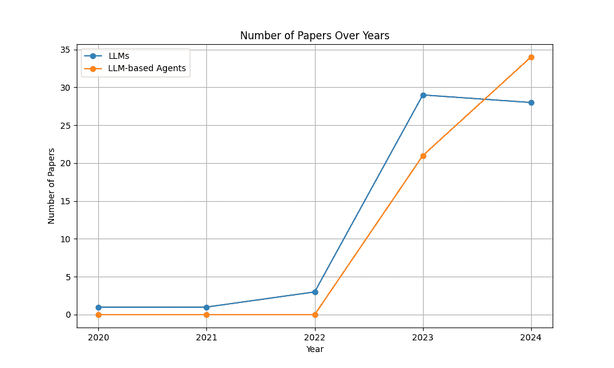

图1：2020-2024年间LLM与基于LLM的智能体的论文数量

在这项工作中，我们呈现了一个初步调查，概述了在SE领域中LLM到基于LLM的智能体的整合与转变。我们调查了SE中的六个关键主题：

1.  1.

    需求工程与文档：捕捉、分析和记录软件需求，以及生成用户手册和技术文档。

1.  2.

    代码生成与软件开发：自动化代码生成，协助开发生命周期，重构代码，以及提供智能代码推荐。

1.  3.

    自主学习与决策：强调基于LLM的智能体在SE情境下的自主学习、决策和自适应规划能力。

1.  4.

    软件设计与评估：参与设计过程、架构验证、性能评估和代码质量评估。

1.  5.

    软件测试生成：生成、优化和维护软件测试，包括单元测试、集成测试和系统测试。

1.  6.

    软件安全与维护：增强安全协议、促进维护任务，并协助漏洞检测和修补。

具体而言，我们的目标是解答以下研究问题：

+   •

    RQ1: 在软件工程（SE）领域中，LLMs 和基于 LLM 的代理的最新技术和实践是什么？（章节：[IV](https://arxiv.org/html/2408.02479v1#S4 "IV 需求工程和文档 ‣ 从 LLM 到基于 LLM 的代理：当前、挑战与未来的调查") - [IX](https://arxiv.org/html/2408.02479v1#S9 "IX 软件安全与维护 ‣ 从 LLM 到基于 LLM 的代理：当前、挑战与未来的调查")）

+   •

    RQ1: 在 SE 应用中，LLMs 和基于 LLM 的代理在任务表现上有哪些关键差异？（章节：[IV](https://arxiv.org/html/2408.02479v1#S4 "IV 需求工程和文档 ‣ 从 LLM 到基于 LLM 的代理：当前、挑战与未来的调查") - [IX](https://arxiv.org/html/2408.02479v1#S9 "IX 软件安全与维护 ‣ 从 LLM 到基于 LLM 的代理：当前、挑战与未来的调查")）

+   •

    RQ2: 在评估 LLMs 和基于 LLM 的代理在 SE 任务中的表现时，最常使用的基准数据集和评估指标是什么？（章节：[IV](https://arxiv.org/html/2408.02479v1#S4 "IV 需求工程和文档 ‣ 从 LLM 到基于 LLM 的代理：当前、挑战与未来的调查") - [IX](https://arxiv.org/html/2408.02479v1#S9 "IX 软件安全与维护 ‣ 从 LLM 到基于 LLM 的代理：当前、挑战与未来的调查") 和 章节：[X](https://arxiv.org/html/2408.02479v1#S10 "X 讨论 ‣ 从 LLM 到基于 LLM 的代理：当前、挑战与未来的调查"))

+   •

    RQ3: 在软件工程中，使用 LLMs 时最常采用的实验模型和方法论是什么？（章节：[X](https://arxiv.org/html/2408.02479v1#S10 "X 讨论 ‣ 从 LLM 到基于 LLM 的代理：当前、挑战与未来的调查")）

## II 现有工作与调查结构

### II-A 现有工作

近年来，大型语言模型主要应用于帮助程序员生成代码和修复错误。这些模型基于用户输入，利用其训练数据和推理能力来理解和完成代码或文本。在之前的调研论文中，比如Angela Fan的研究[[8](https://arxiv.org/html/2408.02479v1#bib.bib8)]，并没有过多展开需求工程方面的内容。正如论文中所提到的，软件工程师通常不愿意依赖LLM来进行更高层次的设计目标。然而，随着LLM在上下文分析和推理能力上的显著提升，采用如提示工程和链式思维（Chain-of-Thought，COT）[[16](https://arxiv.org/html/2408.02479v1#bib.bib16)]等多种方法，其在需求工程中的应用逐渐增多。表[I](https://arxiv.org/html/2408.02479v1#S2.T1 "TABLE I ‣ II-A Existing works ‣ II EXISTING WORKS AND THE SURVEY STRUCTURE ‣ From LLMs to LLM-based Agents for Software Engineering: A Survey of Current, Challenges and Future")总结并分类了需求工程中的任务。许多研究利用模型进行需求分类和生成。由于该文献集主要集中在2023年下半年至2024年4月之前，一些论文涉及多个任务，因此表格并未准确反映我们收集到的论文数量。

表 I：SE任务分布

| 分类 | LLMs | 基于LLM的代理 | 总计 |
| --- | --- | --- | --- |

|

&#124; 需求 &#124;

&#124; 工程和 &#124;

&#124; 文档 &#124;

|

&#124; 需求分类与提取 (3) &#124;

&#124; 需求生成与描述 (4) &#124;

&#124; 需求满足评估 (1) &#124;

&#124; 规范生成 (3) &#124;

&#124; 质量评估 (2) &#124;

&#124; 模糊性检测 (2) &#124;

|

&#124; 半结构化文档生成 (1) &#124;

&#124; 生成安全需求 (1) &#124;

&#124; 自动生成基于 &#124;

&#124; 高层次需求 (1) &#124;

&#124; 自动化用户故事质量提升 (2) &#124;

| 19 |
| --- |

|

&#124; 代码生成 &#124;

&#124; 和 &#124;

&#124; 软件 &#124;

&#124; 开发 &#124;

|

&#124; 代码生成调试 (3) &#124;

&#124; 代码评估 (2) &#124;

&#124; 实现HTTP服务器 (1) &#124;

&#124; 增强代码生成能力 (3) &#124;

&#124; 专业化代码生成 (2) &#124;

&#124; 人类反馈偏好模拟 (1) &#124;

|

&#124; 自动化软件开发过程 (5) &#124;

&#124; 大规模代码与文档生成 (1) &#124;

&#124; 工具与外部API使用 (2) &#124;

&#124; 多代理协作与代码优化 (2) &#124;

&#124; 提高代码生成质量 (2) &#124;

| 23 |
| --- |

|

&#124; 自主 &#124;

&#124; 学习 &#124;

&#124; 和决策 &#124;

&#124; 制定 &#124;

|

&#124; 多LLM决策 (1) &#124;

&#124; 创造力评估 (1) &#124;

&#124; 自我识别与修正代码 (1) &#124;

&#124; 判断聊天机器人响应 (1) &#124;

&#124; 模仿人类科学调试 (1) &#124;

&#124; 深思熟虑的问题解决 (1) &#124;

|

&#124; 协作决策与多代理 &#124;

&#124; 系统 (5) &#124;

&#124; 自主推理与决策 (7) &#124;

&#124; 通过反馈的学习与适应 (4) &#124;

&#124; 类人系统的仿真与评估 &#124;

&#124; 行为 (2) &#124;

| 24 |
| --- |

|

&#124; 软件设计 &#124;

&#124; 与评估 &#124;

|

&#124; 创造性能力评估 (1) &#124;

&#124; 在软件工程任务中的表现 (1) &#124;

&#124; 教育效用与评估 (1) &#124;

&#124; 效率优化 (2) &#124;

|

&#124; 软件工程过程的自动化 (3) &#124;

&#124; 增强问题解决与推理 (4) &#124;

&#124; AI 模型的集成与管理 &#124;

&#124; 工具 (3) &#124;

&#124; 优化与效率提升 (2) &#124;

&#124; 动态环境中的性能评估 &#124;

&#124; (2) &#124;

| 19 |
| --- |

|

&#124; 软件测试 &#124;

&#124; 生成 &#124;

|

&#124; Bug 复现与调试 (2) &#124;

&#124; 安全测试 (2) &#124;

&#124; 测试覆盖率 (2) &#124;

&#124; 通用模糊测试 (1) &#124;

|

&#124; 多代理协作测试生成 (2) &#124;

&#124; 自主测试与对话界面 &#124;

&#124; (3) &#124;

| 11 |
| --- |

|

&#124; 软件安全 &#124;

&#124; & &#124;

&#124; 维护 &#124;

|

&#124; 漏洞检测 (6) &#124;

&#124; 漏洞修复 (2) &#124;

&#124; 程序修复 (4) &#124;

&#124; 鲁棒性测试 (1) &#124;

&#124; 需求分析 (1) &#124;

&#124; 模糊测试 (1) &#124;

&#124; 重复条目 (1) &#124;

&#124; 代码生成与调试 (4) &#124;

&#124; 渗透测试与安全评估 (2) &#124;

&#124; 程序分析与调试 (1) &#124;

|

&#124; 自主软件开发与 &#124;

&#124; 维护 (4) &#124;

&#124; 调试与故障定位 (4) &#124;

&#124; 漏洞检测与渗透 &#124;

&#124; 测试 (3) &#124;

&#124; 智能合约审计与修复 (2) &#124;

&#124; 安全与风险分析 (2) &#124;

&#124; 自适应与沟通代理 (1) &#124;

| 39 |
| --- |

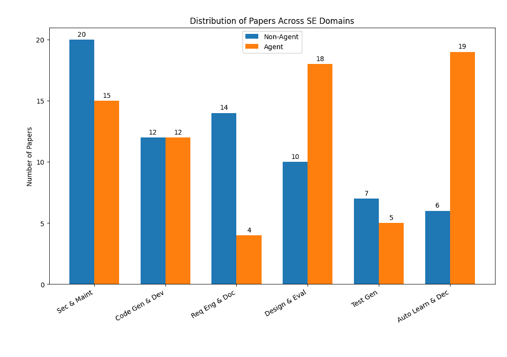

图 2：论文分布

虽然其他研究已对LLM在一些软件工程任务中的应用进行了调查[[17](https://arxiv.org/html/2408.02479v1#bib.bib17)] [[8](https://arxiv.org/html/2408.02479v1#bib.bib8)] [[18](https://arxiv.org/html/2408.02479v1#bib.bib18)]，但它们未能广泛涵盖整个软件工程领域，未能纳入最新的研究进展。更重要的是，这些研究的重点是LLM的主要贡献，但没有区分LLM和LLM-based代理之间的能力差异。我们在表[II](https://arxiv.org/html/2408.02479v1#S2.T2 "表 II ‣ II-A 现有工作 ‣ II 现有工作与调查结构 ‣ 从LLM到LLM-based代理用于软件工程：当前、挑战与未来的调查")中总结了我们的工作与其他研究的区别，本调查通过清晰分析LLM和LLM-based代理在六个软件工程领域中的应用，提供了一个全面且最新的综述。从以往的研究来看，LLM在各类应用和任务中的表现很大程度上依赖于模型的固有能力[[10](https://arxiv.org/html/2408.02479v1#bib.bib10)]。更重要的是，早期的调查往往呈现了涵盖时间跨度较广的论文研究成果，导致在不同软件工程任务中LLM的内容差异显著。例如，需求工程领域的研究较为初期，导致这一领域在先前调查中的内容较少。而LLM-based代理的崛起，凭借其增强的能力和自主性，弥补了这些空白。通过专注于最新的研究，并清晰区分LLM与LLM-based代理，我们的调查提供了一个全面而深入的概述，展示了这些技术如何应用于软件工程以及它们带来的新机会。

总结来说，我们共收集了117篇与此主题直接相关的论文，涵盖了前文提到的六个软件工程领域，如图所示[1](https://arxiv.org/html/2408.02479v1#S1.F1 "图 1 ‣ 引言 ‣ 从LLM到LLM-based代理用于软件工程：当前、挑战与未来的调查")。我们的分析区分了LLM与LLM-based代理的贡献，提供了一个对比概述，并解决了先前调查的局限性。考虑到LLM-based代理领域的创新性质以及缺乏标准化的基准测试，本研究旨在提供一个详细的综述，为未来的研究提供指导，并更清晰地展现这些技术在软件工程中的潜力。

表II：我们工作与现有工作在软件工程中LLM的对比

| 论文 | 年份 | 领域 | 基准测试 | 衡量指标 |
| --- | --- | --- | --- | --- |

&#124; 代理 &#124;

&#124; 在软件工程中 &#124;

|

&#124; 代理 &#124;

&#124; 区别 &#124;

|

| --- | --- | --- | --- | --- | --- | --- |
| --- | --- | --- | --- | --- | --- | --- |
|  [[19](https://arxiv.org/html/2408.02479v1#bib.bib19)] | 2023 | 软件工程中的GenAI | ✓ | ✓ | ✓ | ✗ |
|  [[8](https://arxiv.org/html/2408.02479v1#bib.bib8)] | 2023 | 软件工程中的LLM | ✓ | ✓ | ✓ | ✗ |
|  [[18](https://arxiv.org/html/2408.02479v1#bib.bib18)] | 2023 | LLM在SE中的生成任务 | ✓ | ✓ | ✗ | ✗ |
|  [[20](https://arxiv.org/html/2408.02479v1#bib.bib20)] | 2023 | LLM在语法理解中的应用 | ✓ | ✓ | ✗ | ✗ |
|  [[21](https://arxiv.org/html/2408.02479v1#bib.bib21)] | 2024 | LLM4Code在SE中的应用 | ✓ | ✓ | ✗ | ✗ |
|  [[17](https://arxiv.org/html/2408.02479v1#bib.bib17)] | 2024 | LLM在SE中的流程优化 | ✓ | ✓ | ✗ | ✗ |
|  [[22](https://arxiv.org/html/2408.02479v1#bib.bib22)] | 2024 | LLM在SE中的生成任务 | ✓ | ✓ | ✗ | ✗ |
| 我们的研究 | 2024 | SE中的LLM和基于LLM的代理 | ✓ | ✓ | ✓ | ✓ |

### II-B 方法论

本文的文献收集过程主要包括在DBLP和arXiv数据库中搜索，重点关注2023年下半年至2024年5月期间的最新研究。该方法确保了纳入最新的研究成果。我们筛选出了与LLM无关的论文和页数少于七页的论文。为了进一步细化选择，我们使用了表[III](https://arxiv.org/html/2408.02479v1#S2.T3 "TABLE III ‣ II-C Overall Structure of the Work ‣ II EXISTING WORKS AND THE SURVEY STRUCTURE ‣ From LLMs to LLM-based Agents for Software Engineering: A Survey of Current, Challenges and Future")中的关键词来搜索与SE相关的文献。随后，我们手动筛选了剩余的论文，去除了格式错误或学生项目的论文。此外，我们还采用了滚雪球搜索技术，捕捉那些可能最初被遗漏的重要研究。总的来说，我们共识别了117篇相关论文。图[2](https://arxiv.org/html/2408.02479v1#S2.F2 "Figure 2 ‣ II-A Existing works ‣ II EXISTING WORKS AND THE SURVEY STRUCTURE ‣ From LLMs to LLM-based Agents for Software Engineering: A Survey of Current, Challenges and Future")展示了这些论文在六个SE领域中的分布情况以及基于LLM的代理研究的比例。然而，由于一些论文可以跨多个领域，因此图中的文献总数超过了117篇。

### II-C 工作的整体结构

本文的其余部分组织结构如下：第二节介绍了LLM和基于LLM的代理的架构和背景，包括RAG的概述、工具使用及其对软件工程（SE）的影响。第三至第八节是比较分析，概述并比较了LLM和基于LLM的代理研究中使用的数据集、任务、基准测试和指标，涵盖了六个SE领域。第九节是综合讨论，第十节是最终结论。

表III：软件工程主题的关键词

| 主题 | 关键词 |
| --- | --- |
| 软件安全与维护 | 软件安全、漏洞检测、自动化程序修复、自我调试、漏洞重现 |
| 代码生成与软件开发 | 代码生成、自动代码合成、代码重构、编程语言翻译、软件开发自动化、代码补全、AI辅助编程、开发生命周期自动化 |
| 需求工程与文档编写 | 需求工程，软件需求分析，自动化需求文档编写，技术文档生成，用户手册生成，文档维护，需求建模，需求获取 |
| 软件设计与评估 | 软件设计自动化，架构验证，设计优化，性能评估，代码质量评估，软件度量，设计模式识别，架构分析，代码结构分析 |
| 软件测试生成 | 测试用例生成，自动化测试，单元测试生成，集成测试生成，系统测试生成，测试套件优化，故障定位，测试维护，回归测试，自适应测试 |
| 自主学习与决策制定 | 自主学习系统，决策制定，自适应规划，项目管理自动化，自我改进软件，自治软件代理 |

## III 基础知识

在本节中，我们介绍了大型语言模型的基础概念，包括其框架的发展历程以及架构概述。接下来，我们将讨论基于LLM的代理，探索单代理和多代理系统。我们还将涵盖这些系统的背景及其在软件工程领域的应用和区别。

### III-A 大型语言模型

大型语言模型与自然语言处理（NLP）之间存在内在联系，自然语言技术的历史发展可以追溯到20世纪50年代。最早的通过机器使用特定规则生成语言对话的尝试可以追溯到1950年至1970年间。1980年代机器学习技术的出现以及1990年代神经网络的突破性引入，标志着自然语言处理的新纪元[[23](https://arxiv.org/html/2408.02479v1#bib.bib23)]。这些进展促进了自然语言处理领域的重大进步，尤其是在文本翻译和生成技术的发展上。此期间，长短期记忆（LSTM）和循环神经网络（RNN）的发展，使得处理语言数据的顺序性问题更加有效[[24](https://arxiv.org/html/2408.02479v1#bib.bib24)] [[25](https://arxiv.org/html/2408.02479v1#bib.bib25)]。这些模型解决了语境中缺乏依赖性的问题，从而增强了NLP在多个领域的应用。

2017年，谷歌研究团队提出了一个新的框架——“Transformer”[[26](https://arxiv.org/html/2408.02479v1#bib.bib26)]。基于自注意力机制的Transformer模型显著提高了语言模型的效果。位置编码的引入不仅解决了长序列依赖问题，还实现了并行计算，这是相较于之前模型的一个显著改进。2018年，OpenAI开发了基于Transformer架构的生成式预训练变换器（GPT）[[3](https://arxiv.org/html/2408.02479v1#bib.bib3)]。GPT-1的核心思想是利用大量未标注的文本进行预训练，以学习语言的模式和结构，然后针对特定任务进行微调。在接下来的两年里，OpenAI发布了GPT-2和GPT-3，将参数数量增加到1750亿，并且在上下文理解和文本生成方面展现了强大的能力[[27](https://arxiv.org/html/2408.02479v1#bib.bib27)]。2023年，OpenAI推出了GPT-4，标志着继GPT-3.5之后的一个重要里程碑。虽然GPT-4保持了约1750亿的参数量，但其性能和多样性有了显著提升。通过更加精细的训练技术和算法优化，GPT-4增强了语言理解和生成的能力，特别是在处理复杂文本和特殊情境方面表现突出。与谷歌的PaLM或Meta的OPT等当代模型相比，GPT-4在多任务学习和文本生成的逻辑一致性方面依然表现突出。尽管谷歌的PaLM模型拥有高达540亿的参数量，GPT-4在更广泛的自然语言处理任务中展示了更强的泛化能力[[28](https://arxiv.org/html/2408.02479v1#bib.bib28)]。在开源的大型模型中，Meta的OPT模型与GPT-4的参数量相似，构成了直接的竞争。尽管OPT在开放性和可访问性方面具有优势，GPT-4在创意写作和复杂问题解决等特定应用领域仍然占据领先地位[[29](https://arxiv.org/html/2408.02479v1#bib.bib29)]。

### III-B 模型架构

有三种常见的LLM架构，编码器-解码器架构，典型例子是传统的Transformer模型。该架构包含六个编码器和六个解码器，数据输入到系统后首先通过编码器，在此过程中，数据通过模型的自注意力机制进行顺序特征提取。随后，解码器利用编码器生成的词向量来生成输出，这种技术常见于机器翻译任务中，在该任务中，编码器通过多个注意力层和前馈网络处理来自某一语言的词向量，从而创建上下文的表示。解码器然后利用这些信息逐步构建正确的翻译文本。这个架构的一个最新例子是2023年由Salesforce AI Research发布的CodeT5+模型[[30](https://arxiv.org/html/2408.02479v1#bib.bib30)]。该模型是对原始T5架构的增强，旨在提高代码理解和生成任务的性能。它融合了灵活的架构和多样化的预训练目标，以优化在这些专业领域的有效性。此发展展示了编码器-解码器架构在应对日益复杂的NLP挑战中的能力。

编码器单一架构顾名思义，去除了整个结构中的解码器，使得数据更加紧凑。与RNN不同，这种架构是无状态的，采用了一种掩蔽机制，允许在不依赖隐藏状态的情况下处理输入，同时加速了并行处理速度，并提供了出色的上下文感知能力。BERT（Bidirectional Encoder Representations from Transformers）是这一架构的代表模型，这个模型完全基于编码器架构构建。BERT利用编码器强大的特征提取能力和预训练技术，学习文本的双向表示，在情感分析和上下文分析中取得了优异的结果[[31](https://arxiv.org/html/2408.02479v1#bib.bib31)]。

在transformer框架中，Decoder-only架构主要涉及解码器接收处理过的词向量并生成输出。利用解码器直接生成文本，加速了文本生成和序列预测等任务。这种具有高可扩展性的特性被称为自回归性，这也是像GPT这样的流行模型使用该架构的原因。2020年，GPT-3的卓越表现及其显著的少样本学习能力展示了Decoder-only架构的巨大潜力 [[32](https://arxiv.org/html/2408.02479v1#bib.bib32)]。鉴于从头训练一个模型所需的巨大的计算成本和时间，以及参数数量的指数级增长，现在许多研究人员更倾向于利用预训练模型进行进一步研究。最流行的开源预训练语言模型LLaMA，由Meta AI开发，也采用了Decoder-only架构 [[33](https://arxiv.org/html/2408.02479v1#bib.bib33)]，正如前面提到的，这种结构的自回归性和简洁性使得该模型更易于训练和微调。

### III-C 基于大语言模型的智能体

智能体（agents）的概念可以追溯到19世纪，通常被称为智能代理，设想它们拥有与人类相当的智能。随着过去几十年人工智能技术的发展，人工智能代理的能力有了显著进步，尤其是在强化学习方面。这一发展使得人工智能代理能够自主处理任务，并根据指定的奖励/惩罚规则进行学习和改进。一个重要的里程碑是AlphaGo [[34](https://arxiv.org/html/2408.02479v1#bib.bib34)]，它利用强化学习击败了围棋世界冠军。

GPT的成功进一步推动了这一领域的发展，研究人员正在探索将大型语言模型作为AI代理的“大脑”来使用，得益于GPT强大的文本理解和推理能力。2023年，复旦大学的研究团队[[10](https://arxiv.org/html/2408.02479v1#bib.bib10)]进行了一项关于基于LLM的代理的全面调查，研究了它们的感知、行为和认知。传统的LLM通常仅基于给定的自然语言描述生成响应，缺乏独立思考和判断的能力。基于LLM的代理能够通过多轮交互和定制的提示收集更多信息，从而使模型能够独立思考和做出决策。2023年，Andrew Zhao提出了ExpeL框架[[35](https://arxiv.org/html/2408.02479v1#bib.bib35)]，该框架利用ReAct作为规划框架，并结合经验池[[36](https://arxiv.org/html/2408.02479v1#bib.bib36)]。这样，LLM可以从过去的记录中提取洞察，以帮助后续相关查询，通过让LLM分析之前的回答为何不正确，它能够从经验中学习并识别问题所在。

与此同时，基于LLM的具身代理的应用近年来也成为了一个热门研究领域。基于LLM的具身代理是将LLM与具身代理集成的智能系统[[37](https://arxiv.org/html/2408.02479v1#bib.bib37)]。这些系统不仅能处理自然语言，还能通过在物理或虚拟环境中的感知和行动完成任务。通过将语言理解与实际行动结合，这些代理可以在更复杂的环境中执行任务。这种集成通常涉及使用视觉领域技术来处理和理解视觉数据，并采用强化学习算法训练代理在环境中采取最佳行动。这些算法通过奖励机制引导代理学习如何在不同情况下做出最优决策，而LLM则充当“大脑”来理解用户指令并生成适当的反馈。2023年，Guanzhi Wang介绍了VOYAGER，一个基于大型语言模型的开放式具身代理[[38](https://arxiv.org/html/2408.02479v1#bib.bib38)]。它结合了GPT-4和输入提示、迭代提示机制以及技能库，使得基于LLM的代理能够自主学习并玩Minecraft游戏，成为游戏中的第一个终身学习代理。

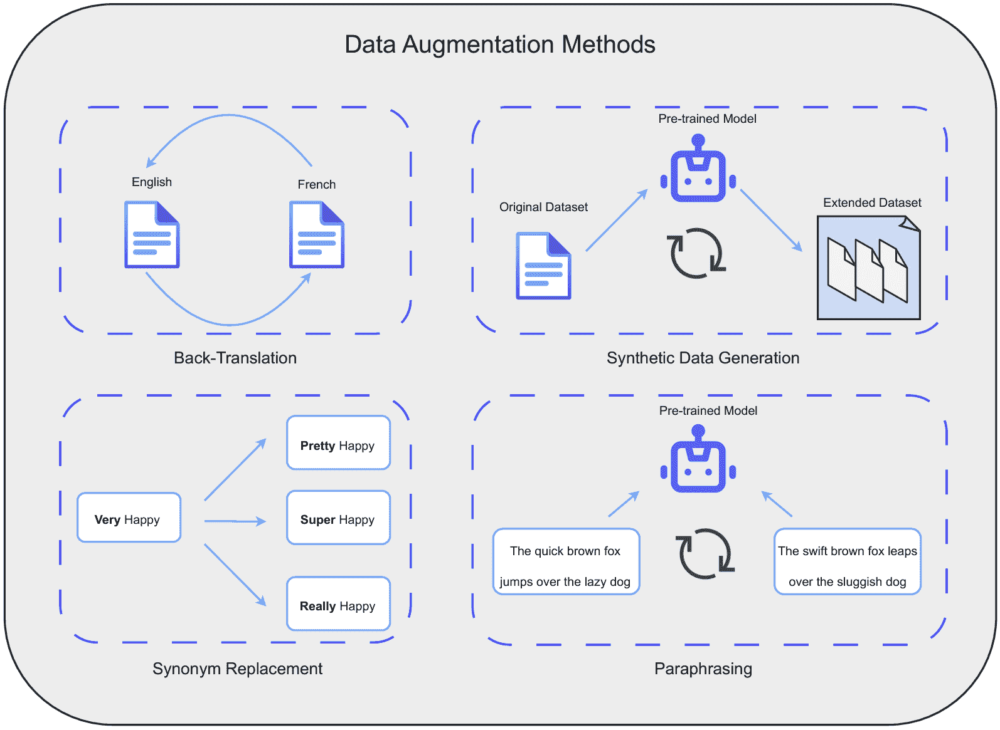

图3：常见数据增强方法的示意图

目前，各种代理系统正在涌现，这些系统依赖于大型语言模型来做出判断，并结合如少样本学习和多轮对话等技术进行模型微调。然而，由于缺乏数据集以及基于LLM（大型语言模型）代理的创新性，许多研究人员采用不同的方法进行数据增强。常见的方法包括同义词替换，即将文本中的词语替换为来自同一领域的同义词，以增加文本的多样性；反向翻译，即将文本翻译成另一种语言，再翻译回原语言，以生成具有稍微不同语法结构和词汇选择的新文本；释义，即通过人工或自动化手段创建具有相似语境但表达略有不同的新对话；合成数据生成，指的是使用预训练模型生成合成数据，如图[3](https://arxiv.org/html/2408.02479v1#S3.F3 "Figure 3 ‣ III-C Large Language Model Based Agent ‣ III Preliminaries ‣ From LLMs to LLM-based Agents for Software Engineering: A Survey of Current, Challenges and Future")所示。2023年，Chenxi Whitehouse探讨了使用LLM进行数据增强，以提高多语言常识推理数据集的表现，尤其是在训练数据极其有限的情况下[[39](https://arxiv.org/html/2408.02479v1#bib.bib39)]。该研究使用了各种LLM（如Dolly-v2、StableVicuna、ChatGPT和GPT-4）来生成新数据。这些模型被提示生成与原始数据相似的新示例，从而增加训练数据的多样性和数量。提示工程被认为是有效与LLM互动的关键技能。通过应用这些提示模式，用户可以高效地定制与LLM的对话，确保生成高质量的输出并完成复杂的自动化任务。2023年，Jules White提出了一套方法和模式，以增强提示工程，优化与LLM（如ChatGPT）的互动[[40](https://arxiv.org/html/2408.02479v1#bib.bib40)]。该研究将提示工程分为五个主要领域：输入语义、输出定制、错误识别、提示改进和互动，以应对各种问题并适应不同领域。

一种显著的技术是检索增强生成（RAG），输入的问题与索引库中的文档进行相似性匹配，试图找到相关的结果。如果检索到相似的文档，这些文档会与输入的问题一起组织生成一个新的提示，然后将其输入到大型语言模型中。目前，大型语言模型具备长文本记忆能力，许多研究已经测试了Gemini v1.5在“干草堆里的针”评估（Needle In A Haystack，NIAH）中的表现，以探索RAG是否已不再适用[[41](https://arxiv.org/html/2408.02479v1#bib.bib41)]。然而，从成本和开销等多方面来看，RAG依然具有显著优势（RAG的成本可能比使用所有token低99%）。此外，长文本可能会对响应性能产生负面影响，当输入文本过长时，LLM的响应速度会变慢。因此，LLM在上下文长度方面的进展不会完全取代RAG的作用，而是作为彼此之间的互补。

### III-D 单一代理与多代理

单一代理系统利用LLM的能力执行各种任务，这些代理通常使用单一LLM来理解和回应用户查询、生成内容或根据预定义的指令执行自动化任务。单一代理通常用于任务接受一般答案且不需要复杂决策的场景。典型的例子包括客户服务聊天机器人、用于调度的虚拟助手和自动内容生成工具。然而，单一代理可能难以处理长上下文输入，导致回答不一致或不相关。当任务需要广泛的知识或上下文时，这些系统的扩展性也受到限制，这个问题在处理长文本时尤为明显，因为大型语言模型无法在一次处理过程中完全理解和分析过于冗长的信息。大型语言模型的一个主要问题是幻觉[[7](https://arxiv.org/html/2408.02479v1#bib.bib7)]。幻觉是指LLM生成虚假的信息或定义，并以看似合逻辑和合理的语言呈现给用户。大多数关于LLM的研究论文都提到了这个问题，虽然提示工程或工具干预可以减轻幻觉带来的影响，但无法完全消除。2023年，纪子伟对自然语言生成中的幻觉进行了深入研究[[42](https://arxiv.org/html/2408.02479v1#bib.bib42)]。这项调查回顾了在解决NLG中幻觉问题的进展与挑战，提供了对不同任务中幻觉现象的全面分析，包括其定义与分类、成因、评估标准和缓解方法。

多智能体系统涉及多个LLM或智能体的协作，以有效应对复杂任务。这些系统充分利用多个模型的优势，每个模型专注于任务的特定方面，从而减少单个智能体中多进程带来的开销，智能体之间的协作使得问题解决能力更加复杂和强大。由于其卓越的能力，越来越多的研究者开始探索基于多LLM的智能体领域，并开始将其应用于软件工程领域。2024年，许多研究者将多智能体系统应用于实际实验[[43](https://arxiv.org/html/2408.02479v1#bib.bib43)] [[44](https://arxiv.org/html/2408.02479v1#bib.bib44)]。

多智能体系统通过以下方式解决了单一智能体系统的局限性：

+   •

    增强的上下文管理：多个智能体可以维持并共享上下文，在长时间的互动中生成更连贯和相关的回应。

+   •

    专业化与分工：不同的智能体可以专注于特定任务或问题的某些方面，从而提高效率和效果。

+   •

    强健性与错误修正：协作智能体可以相互交叉检查并验证输出，减少错误的可能性，提高整体可靠性。

+   •

    上下文一致性：多智能体系统能够更好地管理长对话中的上下文。多个智能体的协作提高了事件缓解的效率。

+   •

    可扩展性与灵活性：这些系统可以集成专业化的智能体进行扩展，处理更复杂的任务。通过多个智能体的分工，代码生成的质量得到了提升。

+   •

    动态问题解决：通过集成不同专业的智能体，多智能体系统能够适应更广泛的问题，提供更精准的解决方案。

### III-E LLM在软件工程中的应用

最近，应用通用人工智能模型于特定垂直领域（如医疗和金融）已成为趋势。在软件工程领域，新的AI智能体正在涌现，它们比之前的LLM应用更加灵活和智能，尽管它们使用不同的数据和实验。这种持续创新突显了AI智能体在各个领域的变革潜力，这些模型在文本理解和生成方面表现卓越，推动了软件开发和维护中的创新应用。

LLM（大型语言模型）通过促进诸如代码生成、缺陷预测和自动化文档编写等任务，深刻影响了软件工程。将这些模型集成到开发工作流程中，不仅简化了编码过程，还减少了人为错误。基于LLM的智能体通过整合决策和互动问题解决功能，增强了LLM的基本能力。这些智能体可以通过与其他软件工具的互动来理解和生成结果，从而优化工作流程，并做出自主决策，以改进软件开发实践。2023年，Yann Dubois提出了AlpacaFarm框架[[45](https://arxiv.org/html/2408.02479v1#bib.bib45)]，其中LLM被用于模拟软件智能体在复杂环境中的行为。此外，在自动化程序修复（APR）领域也进行了大量研究。2024年，Islem Bouzenia推出了RepairAgent[[46](https://arxiv.org/html/2408.02479v1#bib.bib46)]，这是一个基于LLM的自动软件修复工具，它减少了开发人员修复问题的时间。除此之外，2023年，Emanuele Musumeci展示了一个多智能体LLM系统[[47](https://arxiv.org/html/2408.02479v1#bib.bib47)]，该系统涉及一种多智能体架构，每个智能体在文档生成中扮演特定角色。这个系统显著提高了在没有广泛人工监督的情况下处理复杂文档结构的能力。除了这些，LLM在软件测试、软件设计以及软件安全和维护等新兴领域也做出了杰出贡献。

目前，尚未有一个全面准确的定义，来说明一个LLM必须具备哪些能力才能被视为LLM-based agent。由于LLM在软件工程中的应用相对广泛，且一些框架已经表现出一定的自主性和智能性，本研究根据2024年上半年的主流定义和文献，对LLM与LLM-based agents之间的区别进行了界定。在本调查中，当LLM架构满足表[IV](https://arxiv.org/html/2408.02479v1#S3.T4 "TABLE IV ‣ III-E LLM in Software Engineering ‣ III Preliminaries ‣ From LLMs to LLM-based Agents for Software Engineering: A Survey of Current, Challenges and Future")中的标准时，可以称其为智能体。

表 IV: 基于LLM的智能体标准

| 标准 |
| --- |
| 1) 大型语言模型作为大脑（信息处理和思维生成的中心）。 2) 该框架不仅依赖于大型语言模型的语言理解和生成能力，还具备决策和规划能力。 3) 如果有工具可用，模型可以自主决定何时使用哪些工具，并将结果整合到预测中，以提高任务完成效率和准确性。 4) 模型能够从多个同类结果中选择最优解（评估和选择不同可能解的能力）。 5) 模型能够处理多个交互并保持上下文理解。 6) 模型具备自主学习能力和适应性。 |

## IV 需求工程与文档编制

需求工程是软件工程中的一个关键领域，在软件开发过程中扮演着至关重要的角色，其主要任务是确保软件系统满足所有相关利益相关者的需求。通常，项目开发中的需求工程包括多个步骤，开发人员需要充分理解用户的需求和期望，以确保软件系统的开发方向与实际需求相符。收集到的需求随后由开发团队进行组织和评估。需求规范是正式记录已分析需求的过程，规范必须准确简洁，并且需要进行需求验证，以确保开发人员构建的是用户所需的功能，并且与规范一致。需求工程还包括需求管理，这是一项贯穿整个软件开发生命周期的任务，开发人员需要持续跟踪、控制并响应开发过程中发生的任何变更，确保这些变更不会对项目进度和整体质量产生负面影响。

### IV-A 大型语言模型任务

在需求工程领域，LLMs（大语言模型）在自动化和增强诸如需求获取、分类、生成、规范生成和质量评估等任务方面展现出了显著的潜力。需求分类和提取是需求工程中开发过程中一个至关重要的任务。常常会遇到客户一次性提出多个需求的情况，这就需要开发人员进行手动分类。通过将需求分类为功能性需求和非功能性需求，开发人员可以更好地理解和管理这些需求。得益于LLMs在分类任务中的强大表现，许多相关框架应运而生。PRCBERT框架利用BERT预训练语言模型，通过灵活的提示模板将分类问题转化为一系列二元分类任务，从而显著提高了分类性能[[48](https://arxiv.org/html/2408.02479v1#bib.bib48)]。研究表明，PRCBERT在PROMISE数据集上达到了96.13%的F1得分，超越了之前的最先进模型NoRBERT[[49](https://arxiv.org/html/2408.02479v1#bib.bib49)]和BERT-MLM模型[[31](https://arxiv.org/html/2408.02479v1#bib.bib31)]。此外，ChatGPT在需求信息检索中的应用也显示出令人期待的结果，通过对需求文档中的信息进行分类和提取，ChatGPT在零样本设置下达到了相当或更高的$F\beta$得分，特别是在特征提取任务中，其表现超越了基准模型[[50](https://arxiv.org/html/2408.02479v1#bib.bib50)]。正如表格[I](https://arxiv.org/html/2408.02479v1#S2.T1 "TABLE I ‣ II-A Existing works ‣ II EXISTING WORKS AND THE SURVEY STRUCTURE ‣ From LLMs to LLM-based Agents for Software Engineering: A Survey of Current, Challenges and Future")所示，关于利用LLMs自动生成需求和描述的文献和研究也相当丰富。

通过自动化生成和描述需求，可以提高需求获取的效率和准确性。研究表明，大型语言模型（LLMs）在需求生成任务中具有显著的潜力。例如，使用ChatGPT生成和收集用户需求的研究发现，具备专业知识的参与者能够更有效地使用ChatGPT，这表明领域知识对LLM辅助需求获取的有效性具有重要影响[[51](https://arxiv.org/html/2408.02479v1#bib.bib51)]。该研究通过定性评估LLM输出与预定义需求匹配标准，包括完全匹配、部分匹配和获取需求的相关性，尽管其成功程度因任务复杂性和用户经验而有所不同，但结果表明LLMs能够有效地辅助需求获取，特别是在根据其提供的大量训练数据识别和建议需求方面具有重要价值。软件需求规格说明书（SRS）的生成是一个重要的任务，开发人员通常花费大量时间进行完善和验证。在[[52](https://arxiv.org/html/2408.02479v1#bib.bib52)]中，研究人员使用了迭代提示和单一综合提示来评估LLMs生成SRS的表现。实验在GPT-4和CodeLlama-34b上进行，分别是一个闭源LLM和一个开源LLM，进行全面评估，生成的SRS将与人工编写的SRS进行比较，并最终通过Likert量表评分。结果表明，人工生成的SRS总体上优于LLM生成的SRS，但CodeLlama在某些特定类别上表现接近甚至超过GPT-4。CodeLlama在完整性和内部一致性方面得分高于GPT-4，但在简洁性方面较差。因此，这项研究展示了使用微调后的LLM生成SRS的潜力，并能提高整体项目的生产力。另一篇论文也探讨了使用LLMs生成规格说明书的可能性。在[[53](https://arxiv.org/html/2408.02479v1#bib.bib53)]中，作者介绍了一种名为SpecGen的框架，用于生成程序规格说明。该框架主要使用GPT-3.5-turbo作为基础模型，并结合提示工程和多轮对话生成规格说明。SpecGen应用了四种变异算子来修改这些规格说明，最终使用启发式选择策略来选择最佳变体。结果表明，SpecGen能够生成70%的程序规格，优于传统工具如Houdini[[54](https://arxiv.org/html/2408.02479v1#bib.bib54)]和Daikon[https://github.com/codespecs/daikon](https://github.com/codespecs/daikon)。

此外，设计提示模式可以显著增强LLM在需求获取和系统设计等任务中的能力。本文提供了13种提示模式的目录，每种模式旨在解决软件开发中的特定挑战[[55](https://arxiv.org/html/2408.02479v1#bib.bib55)]。实验测试了这些模式在实际场景中的效果，以验证其有效性。通过应用不同的提示模式，研究发现这些模式能够帮助生成更有结构性和模块化的结果，并减少常见错误。自动化的需求完整性增强是LLM在需求生成中带来的另一个重要好处。研究[[56](https://arxiv.org/html/2408.02479v1#bib.bib56)]利用BERT的掩码语言模型（MLM）可以检测并填补自然语言需求中的缺失部分，显著提高了需求的完整性。BERT的MLM达到了82%的精准度，表明82%的预测缺失术语是正确的。

大语言模型（LLM）在歧义检测任务中的应用也逐渐得到关注，旨在检测自然语言需求文档中的歧义，以提高清晰度并减少误解。本研究主要解决的是同一应用领域内术语歧义检测问题（即同一术语在不同领域有不同含义）。尽管当前的模型普遍具有优秀的上下文理解能力，但这一问题在当时的机器学习领域中较为普遍。本研究为后续LLM在需求工程中的应用提供了一个优秀的范式，研究表明基于变换器的机器学习模型可以有效地检测和识别需求文档中的歧义，从而提高文档的清晰度和一致性。该框架利用BERT和K-means聚类技术识别在同一应用领域或跨学科项目需求文档中不同上下文使用的术语[[57](https://arxiv.org/html/2408.02479v1#bib.bib57)]。近年来，越来越多的研究者使用LLM帮助他们评估需求文档，质量评估任务确保生成的需求和代码满足预期的质量标准。ChatGPT在用户故事质量评估中的应用已显示出在识别质量问题方面的潜力，但仍需进一步优化和改进[[58](https://arxiv.org/html/2408.02479v1#bib.bib58)]。类似的研究使用LLM自动处理需求满足度评估，评估设计元素是否完全被给定需求覆盖，但研究人员指出在实际应用中仍需进一步验证和优化[[59](https://arxiv.org/html/2408.02479v1#bib.bib59)]。

### IV-B 基于大语言模型（LLM）的代理任务

当前，基于LLM的代理在需求工程中的应用仍处于初级阶段，但已有一些有价值的研究帮助我们看到了潜在的可能性。基于LLM的代理在需求获取、分类、生成和验证等任务中带来了高效性和准确性。与传统的LLM相比，这些系统通过任务划分和协作，展现出了更高的自动化和精确度。在半结构化文档生成中，多代理系统的应用已显示出显著的效果。在[[60](https://arxiv.org/html/2408.02479v1#bib.bib60)]中，介绍了一个多代理框架，该框架将语义识别、信息检索和内容生成任务相结合，以简化公共行政领域半结构化文档的创建和管理。该框架包含三种主要类型的代理：语义识别代理、信息检索代理和内容生成代理。通过避免单一模型的负担，每个代理被分配一个特定的任务，用户干预最小，按照设计的框架和工作流执行任务。

此外，AI辅助软件开发框架（AISD）也展示了基于LLM的代理在需求工程中带来的自主性。[[61](https://arxiv.org/html/2408.02479v1#bib.bib61)]提出了AISD框架，通过持续的用户反馈和互动，持续改进和优化生成的用例和代码。在实验过程中，人工首先需要给出模糊的需求定义，然后基于LLM的代理会根据这些信息改进需求用例，接着根据用例设计模型并生成系统，最后由人工判断生成的结果是否满足需求。研究结果表明，AISD显著提高了用例通过率，达到了75.2%，而没有人工干预时仅为24.1%。AISD通过允许LLM在一次会话中生成所有代码文件，持续根据用户反馈进行精炼和修改，展示了代理的自主学习能力。这还确保了代码依赖性和一致性，进一步证明了人工在需求分析和系统测试阶段的重要性。

此外，在生成自动驾驶的安全要求时，基于LLM的代理通过引入多模态能力展现了独特的优势。该系统使用LLM作为自动化代理，通过最小化人工干预生成和细化安全要求，直到验证阶段，这是仅使用LLM无法实现的。[[62](https://arxiv.org/html/2408.02479v1#bib.bib62)] 描述了一种集成到现有危险分析与风险评估（HARA）过程中的LLM原型，通过自动生成具体的安全相关要求显著提高了效率。该研究通过三轮设计迭代，逐步提高了LLM原型的效率，完成时间从几个月减少到一天。在敏捷软件开发中，用户故事的质量直接影响开发周期和客户期望的实现。[[63](https://arxiv.org/html/2408.02479v1#bib.bib63)] 证明了ALAS系统在奥地利邮政集团IT部门六个敏捷团队中的成功应用。ALAS系统通过自动分析和增强，显著提高了用户故事的清晰度、可理解性和与业务目标的对齐度。整个代理框架使模型能够在敏捷开发过程中执行特定角色，研究结果表明，ALAS改进后的用户故事获得了团队成员的高度满意评价。

### IV-C 分析

基于LLM的代理在需求工程中的应用已显著提升了效率和质量保障。通过多代理协作和自动化处理，这些系统不仅减少了人工干预，还提高了需求生成和验证的准确性与一致性。我们可以看到，基于LLM的代理任务不再仅限于生成需求或填补描述中的空白。相反，它们涉及到自动化流程的实现，需求文档的生成只是其中的一部分，将LLM集成到代理中提升了整个系统的自然语言处理和推理能力。在实际应用中，许多任务已不再能仅靠简单的LLM完成，特别是在高级软件设计方面。基于LLM的代理的出现通过一个以LLM为核心的多代理协作系统解决了这一问题，这些代理不断分析并改进需求文档中的不足，这可能是未来基于LLM的代理在需求工程中的主要应用趋势。

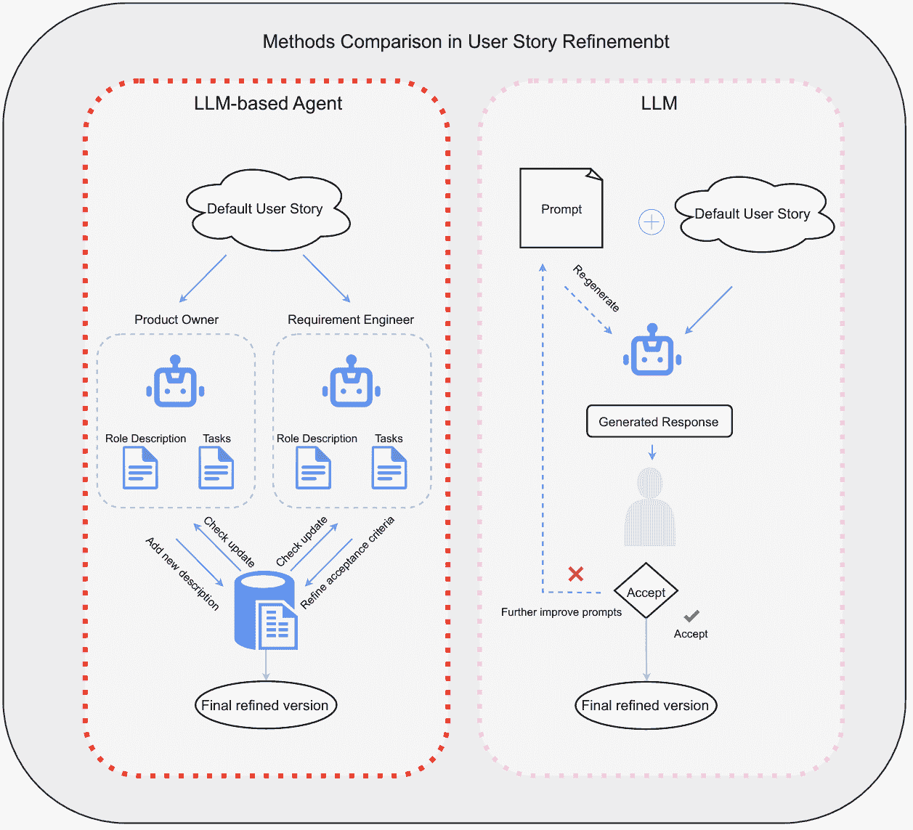

图4：LLM基础代理与LLM在用户故事细化中的比较框架示意图

基于LLM的代理在需求工程中的应用仍然相对有限，大多数研究集中在利用多代理系统的协作优势来生成和完善需求工程文档。如图[4](https://arxiv.org/html/2408.02479v1#S4.F4 "Figure 4 ‣ IV-C Analysis ‣ IV Requirement Engineering and and Documentation ‣ From LLMs to LLM-based Agents for Software Engineering: A Survey of Current, Challenges and Future")所示，该图大致模拟了[[58](https://arxiv.org/html/2408.02479v1#bib.bib58)]和[[63](https://arxiv.org/html/2408.02479v1#bib.bib63)]中展示的架构，均应用于用户故事的生成和完善，我们可以清晰地比较这两种架构之间的差异。左侧是基于LLM的代理架构，而右侧则是仅使用提示工程和LLM来完善用户故事的方法。该图省略了架构中更为详细和复杂的方面，以突出这两种方法的核心差异。基于LLM的代理可以通过利用共享数据库，从不同的专业视角持续改进。尽管关于基于LLM的代理的论文并不多，但我们可以观察到从LLM到基于LLM的代理的转变趋势及其带来的好处。

### IV-D 基准

需求工程与错误修复和代码生成等任务不同，缺乏丰富的公开数据集，例如常用于代码生成评估的HumanEval。需求工程中的大多数训练数据集是由作者自行收集的，并非所有数据集都开源在Huggingface上，因此在需求工程领域的数据集数量有限。例如，一些论文没有提到具体的基准数据集，而是聚焦于实际案例和案例研究，以展示所提出的提示模式的有效性[[55](https://arxiv.org/html/2408.02479v1#bib.bib55)]。研究者让实际的开发人员和需求工程师使用生成的需求文档和代码来评估其准确性、可用性和完整性。用户反馈将被收集，以进一步改进和优化提示模式。

在[[50](https://arxiv.org/html/2408.02479v1#bib.bib50)]中，主要使用了四个数据集，特征包括平均长度、类型-标记比（TTR）和词汇密度（LD）。NFR多类分类数据集包括来自PROMISE NFR数据集的15个项目中249个非功能需求（NFR）。应用程序评论NFR多标签分类数据集包含来自Google Play和Apple App Store的1800条应用程序评论，标注了各种NFR。术语提取数据集包含100个智能家居用户故事，手动提取了250个领域术语。最后，特征提取数据集由50个跨越10个应用类别的应用描述组成，其中包含手动识别的特征短语。在[[56](https://arxiv.org/html/2408.02479v1#bib.bib56)]中，PURE数据集包含40个需求规格，总计超过23,000个句子，用于测试BERT完成需求的能力。在[[64](https://arxiv.org/html/2408.02479v1#bib.bib64)]中，基准数据集包括对六个问题的36个回答：6个由ChatGPT生成的回答和30个来自五位人类需求工程（RE）专家的回答（每位专家提供了6个回答）。这些数据集作为模型的评估指标。综合这些论文，我们可以看到，需求工程中LLMs的基准数据集主要包括软件需求以及功能和非功能需求的各种分类，以帮助和辅助模型学习这一领域，数据集的利用非常灵活且多样化。

在基于LLM的需求工程代理的研究中，数据集的选择和构建也非常重要。在[[47](https://arxiv.org/html/2408.02479v1#bib.bib47)]中，数据集主要由公共行政领域的语义模板组成。这些模板涵盖了各种半结构化的行政文档形式，如官方证书和公共服务表格。尽管数据集的详细组成没有明确说明，但可以推测这些模板包含大量的实际案例和上下文信息，以确保多代理系统生成的文档满足实际需求。

此外，在[[61](https://arxiv.org/html/2408.02479v1#bib.bib61)]中，引入了CAASD（自动化软件开发能力评估）数据集。这个特别构建的基准数据集用于评估AI辅助软件开发系统的能力。CAASD数据集包含来自多个领域的72个任务，如小型游戏和个人网站，每个任务都有参考用例来定义系统需求。构建这个数据集的目的是提供一个全面的评估基准，涵盖不同类型的开发任务，测试基于LLM的智能体在各种任务中的表现。在[[62](https://arxiv.org/html/2408.02479v1#bib.bib62)]中，研究主要使用设计科学方法论来设计和评估LLM原型，但未提及具体的数据集，重点是通过实际应用和案例研究验证模型的有效性。尽管缺乏详细的数据集描述，这种方法强调迭代改进和实践应用，以确保基于LLM的智能体生成的安全需求达到高安全标准。最后，在[[63](https://arxiv.org/html/2408.02479v1#bib.bib63)]中，使用了25个合成用户故事，这些故事来自于一个移动交付应用项目。该研究通过在奥地利邮政集团IT的六个敏捷团队中进行测试，评估ALAS系统的有效性。尽管这些用户故事是为了实验而设计的合成数据，但它们真实地反映了实际项目中的需求，提供了一个有价值的测试基准。

从这些论文中可以看出，基于LLM的智能体在需求工程中的数据集选择与构建往往依赖于实际项目和案例研究，缺乏标准化和大规模数据集。与LLM文献相比，所使用的数据集更为广泛，且层次更高，例如实际系统的文件，而不仅限于非功能性需求的分类和纯软件需求规范。研究人员更多地关注通过实际应用和迭代改进来验证模型的有效性，以提升模型性能。尽管这种方法灵活且有针对性，但也突显了该领域在数据集标准化和规模化方面的不足。未来，随着更多公共数据集的构建与共享，基于LLM的智能体在需求工程中的应用有望实现更广泛和更深入的发展。

表 V：需求工程与文档中的评估指标

{tblr}

row1 = c, cell24 = c, cell34 = c, cell44 = c, cell54 = c, cell64 = c, cell74 = c, cell84 = c, cell94 = c, cell104 = c, cell114 = c, cell124 = c, cell134 = c, cell144 = c, cell154 = c, cell164 = c, cell174 = c, cell184 = c, cell194 = c, hlines, vlines, 参考文献与基准评估指标 智能体

[[51](https://arxiv.org/html/2408.02479v1#bib.bib51)] 在ActApp上的评估 精度和召回率

清晰度，一致性和合规性

接受的完整性和准确性

标准 无

[[50](https://arxiv.org/html/2408.02479v1#bib.bib50)] 非功能需求，智能家居用户故事 精度、召回率和F\beta（F1或F2） 无

[[56](https://arxiv.org/html/2408.02479v1#bib.bib56)] PURE 精度，F1分数，召回率 无

[[52](https://arxiv.org/html/2408.02479v1#bib.bib52)] 未指定 李克特量表 无

[[55](https://arxiv.org/html/2408.02479v1#bib.bib55)] 案例研究 识别缺失需求的准确性。

生成代码的质量和模块化。

重构建议的正确性。

自动化软件工程的效率

任务 无

[[64](https://arxiv.org/html/2408.02479v1#bib.bib64)] 六个问题的36个回答 抽象性，原子性，一致性，正确性

消歧义性，可理解性，可行性 无

[[48](https://arxiv.org/html/2408.02479v1#bib.bib48)] PROMISE 非功能需求评审，NFR-SO F1分数，加权F1分数（w-F） 无

[[53](https://arxiv.org/html/2408.02479v1#bib.bib53)] SV-COMP，SpecGenBench 通过次数，成功概率

验证器调用次数，用户评分 无

[[65](https://arxiv.org/html/2408.02479v1#bib.bib65)] Jdoctor数据集，DocTer数据集，

SpecGenBench，SV-COMP 精度，精度，召回率，F1分数 无

[[58](https://arxiv.org/html/2408.02479v1#bib.bib58)] 用户基准评估

使用AQUSA工具的用户故事 协议率，精度，召回率，特异性，

F1分数 无

[[57](https://arxiv.org/html/2408.02479v1#bib.bib57)] 从维基百科抓取的文档 手动验证 无

[[59](https://arxiv.org/html/2408.02479v1#bib.bib59)] CM1，CCHIT，Dronology，PTC-A，

PTC-B F\beta分数，平均精度均值（MAP） 无

[[49](https://arxiv.org/html/2408.02479v1#bib.bib49)]] PROMISE 非功能需求（NFR）精度（P），召回率（R），F1分数（F1），

加权平均F1分数（A） 无

[[66](https://arxiv.org/html/2408.02479v1#bib.bib66)] 特定于计算机科学的语料库，PURE 上下文清晰度，用户反馈 无

[[60](https://arxiv.org/html/2408.02479v1#bib.bib60)] 来自公共语义模板

管理准确性，提示一致性，用户干预

频率，幻觉率 是

[[61](https://arxiv.org/html/2408.02479v1#bib.bib61)] CAASD 通过率，标记消耗 是

[[62](https://arxiv.org/html/2408.02479v1#bib.bib62)] AEB，CAEM 性能 精度和相关性，效率，

来自行业的反馈 是

[[63](https://arxiv.org/html/2408.02479v1#bib.bib63)] 25个合成用户故事用于

移动交付应用 独立性，可协商性，价值，估算性，

小巧性，可测试性。

专业人士调查  是

### IV-E 评估指标

在需求工程领域，LLMs 和基于 LLM 的代理使用多种指标进行评估。这些指标不仅包括传统的精度、召回率和 F1 分数等，还包括根据需求工程的独特性质量身定制的更具体的指标。通过这些评估，我们可以了解这些模型是如何被评估的，以及它们如何改变需求工程的实践。具体的评估指标在表[V](https://arxiv.org/html/2408.02479v1#S4.T5 "TABLE V ‣ IV-D Benchmarks ‣ IV Requirement Engineering and and Documentation ‣ From LLMs to LLM-based Agents for Software Engineering: A Survey of Current, Challenges and Future")中详细列出。在[[51](https://arxiv.org/html/2408.02479v1#bib.bib51)]中，尽管精度和召回率是评估信息检索有效性的基础，但还包括了清晰性、一致性和合规性等额外评估，这些都是需求工程中的关键质量指标。这种多维度的评估方法不仅衡量了 LLMs 的操作性能，还检查了它们在保持需求规范质量方面的能力。通过这种方法，LLMs 展现了它们在自动化和优化需求获取过程中的价值，提升了效率并提高了结果的可靠性。论文[[52](https://arxiv.org/html/2408.02479v1#bib.bib52)]使用李克特量表来衡量生成的规范的质量，规范将根据其明确性、可理解性、简洁性等方面进行评分。李克特量表的评分范围是 1 到 5 的同意程度。

对于基于代理的 LLM，如[[63](https://arxiv.org/html/2408.02479v1#bib.bib63)]所示，评估扩展到了对代理独立性和可谈判性的评估，将其功能提升到一个新的水平。这些代理提供技术解决方案，并与用户互动，自动调整以满足特定项目需求，从而类似于协作伙伴。这一能力使得基于 LLM 的代理在需求工程中的需求管理和决策优化方面具有重要价值，同时也突出了 LLM 通常专注于提高特定任务的准确性和效率，而基于 LLM 的代理则在自主性和适应性方面表现出更强的能力。

在表格 [V](https://arxiv.org/html/2408.02479v1#S4.T5 "TABLE V ‣ IV-D Benchmarks ‣ IV Requirement Engineering and and Documentation ‣ From LLMs to LLM-based Agents for Software Engineering: A Survey of Current, Challenges and Future")中，我们可以看到，在需求工程中应用LLMs通常需要像F1分数这样的常见指标来评估模型的性能。然而，对于基于LLM的代理，评估重点从需求文档生成的性能转向最终产品的质量。因此，评估指标更侧重于用户满意度，如通过率、反馈等。实质上，基于LLM的代理仍然利用LLMs本身来实现更高级的开发，并且在很大程度上取决于任务的性质。总的来说，我们可以得出结论，代理模型的特点既反映了它们复杂的决策和学习能力，也揭示了它们在人类或其他工具的协作中提供更高可扩展性和灵活性设计的潜力。这一现象暗示了未来软件开发中需求引导和处理方法的潜在机遇，它们将变得更加高效、精确，并且能够持续改进，以更好地与利益相关者的需求对接，借助基于LLM的代理。

## V 代码生成与软件开发

代码生成与软件开发是软件工程中的核心领域， 在软件开发过程中起着至关重要的作用。使用LLMs进行代码生成的主要目的是通过自动化过程提高开发效率和代码质量，从而满足开发人员和用户的需求。

近年来，LLMs在代码生成和软件开发中的应用取得了显著进展，这改变了开发者的工作方式，并揭示了自动化开发流程的转变。与需求工程相比，LLMs及基于LLMs的代理在代码生成和软件开发中的应用研究更加广泛和深入。利用自然语言处理和生成技术，LLMs能够理解和生成复杂的代码片段，帮助开发者自动化从代码编写、调试到软件优化的各个阶段。基于解码器的大型语言模型，如GPT-4，在代码生成中展示了显著的潜力，通过提供准确的代码建议和自动化调试，大大提高了开发效率。最近，基于LLMs的代理在软件开发中的应用也引起了关注，这些智能代理不仅可以执行复杂的代码生成任务，还能进行自主学习和持续优化，从而在动态开发环境中提供灵活的帮助。像GitHub Copilot[[12](https://arxiv.org/html/2408.02479v1#bib.bib12)]这样的工具，已经展示了它们在提升编程效率和代码质量方面的优势。

### V-A LLMs任务

大型语言模型通过自动化和推理在代码生成和软件开发的各个任务中进行了优化，涵盖了代码生成、调试、代码理解、代码补全、代码转换和多轮交互式代码生成等领域。主要方法是通过自然语言描述生成可执行代码，模型利用先前学习的代码片段或应用少量示例学习来更好地理解用户需求。如今，人工智能工具已深度集成到像Visual Studio Code²²2[https://code.visualstudio.com/](https://code.visualstudio.com/)和JetBrains³³3[https://www.jetbrains.com/](https://www.jetbrains.com/)这样的IDE中，增强了代码编写和翻译任务，如OpenAI的Codex模型[[67](https://arxiv.org/html/2408.02479v1#bib.bib67)]。Codex在GitHub上的公共代码上进行微调，展示了从文档字符串生成Python函数的能力，并且在HumanEval基准测试中超越了其他类似模型。

在[[68](https://arxiv.org/html/2408.02479v1#bib.bib68)]中，研究人员全面评估了多种LLM在L2C（语言到代码）任务中的表现。结果显示，GPT-4在语义解析、数学推理和Python编程等任务中展现了强大的能力。通过指令调优和大规模训练数据的支持，该模型能够理解并生成符合用户意图的代码，实现高精度的代码生成。将LLM应用于文本到数据库管理和查询优化也是自然语言到代码生成任务中的一个新兴研究方向。通过将自然语言查询转换为SQL语句，LLM帮助开发人员快速生成高效的数据库查询代码。在[[69](https://arxiv.org/html/2408.02479v1#bib.bib69)]中，提出了SQL-PaLM框架，通过少量提示和指令微调，显著提高了文本到SQL任务的执行准确率和精确匹配率，为复杂的跨领域SQL生成任务提供了有效解决方案。在测试的基准中，SQL-PaLM模型在准确率和精确匹配方面的改进被认为是最先进的（SOTA），与现有方法如T5-3B + PICARD、RASAT + PICARD甚至GPT-4相比，SQL-PaLM取得了77.3%的最高测试准确率和82.7%的执行准确率。多语言代码生成是LLM的另一个重要应用，尤其适用于变换器架构。在[[70](https://arxiv.org/html/2408.02479v1#bib.bib70)]中，研究人员介绍了CodeGeeX模型，该模型在多种编程语言上进行了预训练，并在多语言代码生成和翻译任务中表现良好。实验结果表明，CodeGeeX在HumanEval-X基准测试中优于其他多语言模型。

尽管当前的LLM具备出色的代码生成能力，准确率和编译率达到了可用水平，但生成的代码质量通常依赖于用户的提示。如果提示过于模糊或一般，LLM通常难以理解用户的真实需求，导致很难在一次尝试中生成所需的代码。在[[71](https://arxiv.org/html/2408.02479v1#bib.bib71)]中，研究人员引入了“打印调试”技术，利用GPT-4追踪变量值和执行流程，通过在上下文学习技术的帮助下提高效率和准确性。这种方法特别适用于Leetcode上的中等难度问题，与橡胶鸭调试法相比，打印调试在简单的Leetcode问题上提高了1.5%的性能，在中等难度问题上提高了17.9%的性能。

此外，LLM在提高编程效率方面的应用已引起广泛关注，像GitHub Copilot这样的工具整合了OpenAI的Codex模型，在编写代码时提供实时代码补全和建议。根据[[72](https://arxiv.org/html/2408.02479v1#bib.bib72)]，研究人员通过一项对GitHub Copilot的控制实验，结果表明，使用Copilot的开发人员在完成HTTP服务器任务时速度提高了55.8%。另一项类似的研究也使用LLM作为编程工具，在[[73](https://arxiv.org/html/2408.02479v1#bib.bib73)]中，研究人员介绍了INCODER模型，该模型能够进行程序合成和编辑。通过利用双向上下文，该模型在单行和多行代码补全任务中表现出色，为开发人员提供了更智能的代码编辑工具。这种实时代码生成和补全功能不仅提高了编程效率，还减少了开发人员的负担，使他们能够专注于更高层次的设计，这是软件开发中一个普遍存在的问题，即大量人力和时间被浪费在繁琐的编码任务上。

多轮程序合成任务代表了LLM在处理复杂编程任务方面的重大突破，在[[74](https://arxiv.org/html/2408.02479v1#bib.bib74)]中，研究人员介绍了CODEGEN模型，该模型通过多次交互逐步生成程序，显著提高了程序合成质量，使开发过程更加高效和精确。通过在每次交互中逐步生成和不断优化代码，LLM能够更好地理解用户意图并生成更精确和优化的代码。在实验中，与当时被认为是最先进的代码生成模型Codex进行了比较，CODEGEN-MONO 2.7B在pass@k指标上（k=1和k=10）超越了相同结果的Codex模型。此外，CODEGEN-MONO 16.1B在某些指标上表现与最好的Codex模型相当或更好，进一步证明了其在代码生成中的SOTA表现。通过迭代生成和优化代码，LLM不断提高其输出质量。在[[75](https://arxiv.org/html/2408.02479v1#bib.bib75)]中，研究人员提出了Cycle框架，通过学习执行反馈增强了代码语言模型的自我改进能力，在多个基准数据集上提高了63.5%的代码生成性能。尽管Cycle具有一定程度的自主性，但其决策和规划能力主要局限于代码生成和改进任务，没有整体规划，执行顺序完全遵循固定模式，因此它更适合被归类为高级LLM应用。

### V-B 基于LLM的代理任务

基于LLM的智能体通过多智能体协作，显著提高了任务效率和效果，展示了巨大的潜力和优势。与传统的LLM不同，基于LLM的智能体采用了分工合作的方法，将复杂任务分解为多个子任务，由专门的智能体处理，这种方法能够提高任务效率，改善生成代码的质量和准确性，从而减少单一LLM产生的幻觉。

在[[76](https://arxiv.org/html/2408.02479v1#bib.bib76)]中，研究人员提出了一种自我协作框架，其中多个ChatGPT（GPT-3.5-turbo）智能体扮演不同角色，共同处理复杂的代码生成任务。具体来说，引入了软件开发方法论（SDM），将开发过程分为三个阶段：分析、编码和测试。每个阶段由特定角色管理，完成任务后，每个角色提供反馈并与其他角色协作，以提高生成代码的质量。实验表明，这种自我协作框架在HumanEval和MBPP基准测试中显著提高了性能，HumanEval的最高提升达到29.9%，相比SOTA模型GPT-4。这一结果展示了协作团队在复杂代码生成任务中的潜力。尽管它缺乏外部工具集成和动态调整能力，但该框架展现了基于LLM的智能体的共性特征，如角色分配、自我改进能力和出色的自主决策能力，这些综合能力使其有资格被视为一个LLM-based agent。同样，在[[77](https://arxiv.org/html/2408.02479v1#bib.bib77)]中，LCG框架通过多智能体协作和思维链技术提高了代码生成质量，再次证明了多智能体协作在软件开发过程中的有效性。

上文中没有讨论上下文窗口的限制，剑桥大学团队在2024年对此进行了深入探讨。在[[78](https://arxiv.org/html/2408.02479v1#bib.bib78)]中，研究人员介绍了L2MAC框架，该框架通过多代理系统动态管理内存和执行上下文，生成大型代码库，并在系统设计任务中实现了SOTA（最先进）性能。该框架主要分为以下几个组件：处理器，负责实际生成任务输出；指令注册表，存储解决用户任务的程序提示；文件存储，包含最终和中间输出。控制单元定期检查输出，以确保生成的内容在语法和功能上都是正确的。研究人员进行了多次实验，并与GPT-4、Reflexion和AutoGPT等许多新方法进行了比较，在HumanEval基准测试中获得了90.2%的Pass@1分数，展示了其在生成大型代码库方面的卓越性能。

最近，许多研究开始使用基于LLM的代理模拟真实的软件开发过程，论文[[79](https://arxiv.org/html/2408.02479v1#bib.bib79)]介绍了MetaGPT框架，通过在多代理协作中编码标准操作程序（SOP），增强了解决问题的能力。整个多协作框架模拟了软件开发的瀑布生命周期，每个代理扮演不同的角色，并协作实现自动化软件开发的目标。基于LLM的代理在自动化软件开发中也展示了强大的能力，[[80](https://arxiv.org/html/2408.02479v1#bib.bib80)]提出了一个多GPT代理框架，该框架自动化了项目规划、需求工程、软件设计和调试等任务，展示了自动化软件开发的潜力。同样，[[81](https://arxiv.org/html/2408.02479v1#bib.bib81)]介绍了一种名为CodePori的模型，这是一个新型模型，旨在基于自然语言提示自动化生成广泛且复杂的软件项目的代码。在[[82](https://arxiv.org/html/2408.02479v1#bib.bib82)]中，AgentCoder框架与程序员代理、测试设计代理和测试执行代理协作生成和优化代码，超越了现有方法，在HumanEval-ET基准测试中实现了77.4%的Pass@1，相较于之前69.5%的最先进结果，展示了多代理系统在代码生成和测试中的优势。

将LLM集成到代理中的目的是增强整个代理系统的自我反馈和反思能力。由于当前开源LLM在这方面的能力远低于专有模型，LLM基础的代理的出现有助于弥补开源模型与像GPT-4这样的专有系统之间的差距。[[83](https://arxiv.org/html/2408.02479v1#bib.bib83)] 引入了OpenCodeInterpreter框架，通过集成代码生成、执行和人工反馈，提升了代码生成模型的准确性。基于CodeLlama和DeepSeekCoder，该框架在HumanEval和MBPP基准测试上表现接近GPT-4代码解释器。使用外部工具或API的能力是LLM基础代理的另一个显著优势，[[84](https://arxiv.org/html/2408.02479v1#bib.bib84)] 提出了Toolformer模型，通过自我监督学习调用API，大大增强了任务性能。基于GPT-J（6.7B参数）的框架在多个基准任务中取得了显著的性能提升，展示了外部工具为LLM基础代理带来的可能性，工具和架构的多样选择使得LLM能够持续学习新事物并不断自我改进。同样，[[85](https://arxiv.org/html/2408.02479v1#bib.bib85)] 通过ToolLLM框架增强了LLM与外部API的互动，在ToolBench和APIBench基准测试中超越了Text-Davinci-003和Claude-2，在多工具指令处理方面表现出色。

### V-C 分析

LLM（大语言模型）基础的代理与传统LLM在软件开发应用中的主要区别，主要集中在效率和自主性，特别是在任务分配和协作方面。传统LLM通常使用单一模型处理特定任务，如从文本生成代码和代码补全。然而，在处理复杂任务时，这种方法存在局限性，特别是在上下文窗口限制和需要持续反馈的情况下。LLM基础的代理通过明确的劳动分工进行不同子任务的协作，从而提高任务的效率和质量。例如，在代码生成任务中，一个代理生成初始代码，另一个设计测试用例，第三个执行测试并提供反馈，从而实现迭代优化。通过任务分工、多代理系统和工具集成，LLM基础的代理能够处理更复杂和更广泛的任务，提高代码生成的质量和效率。这种方法克服了传统LLM的局限性，也为未来的软件开发研究和应用提供了新的方向和思路，帮助程序员摆脱了繁琐的测试用例生成工作。

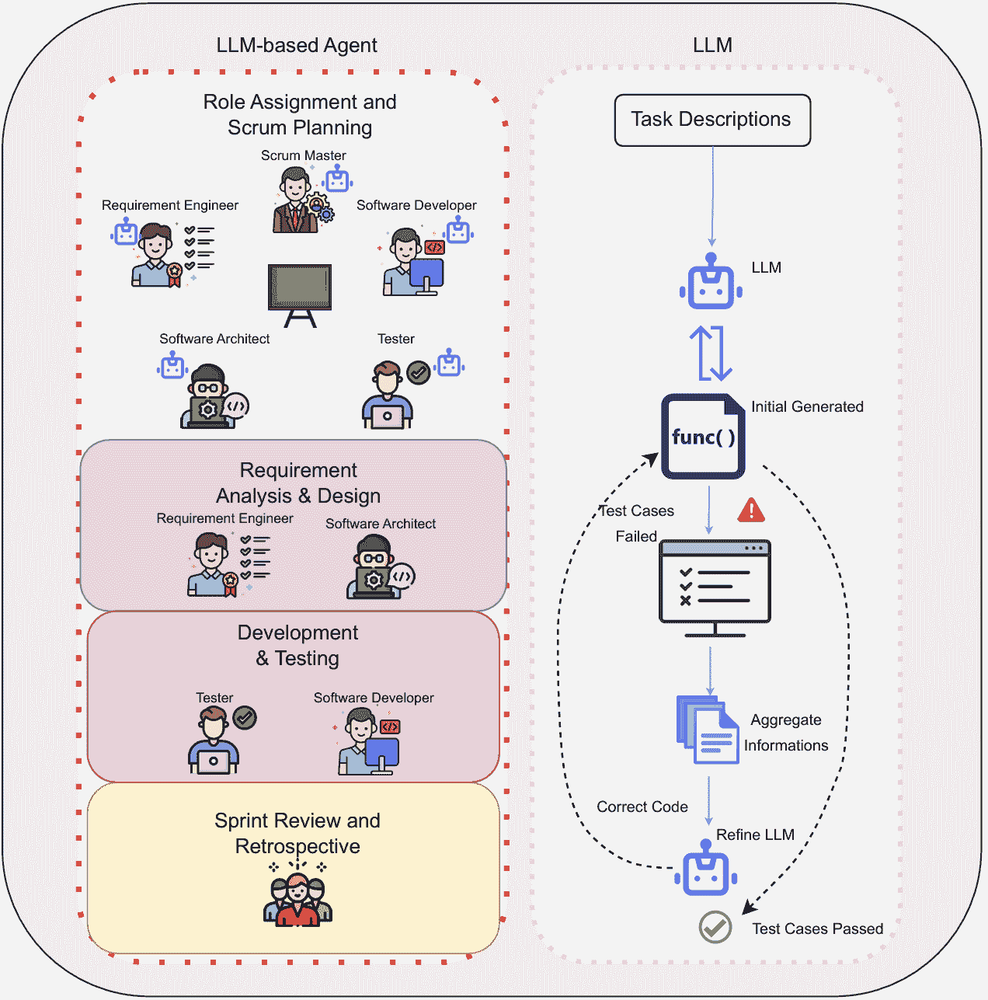

图 5：LLM基础的智能体与LLM在代码生成和软件开发中的比较框架示意图

在软件工程任务处理中，LLM和LLM基础的智能体在任务聚焦、方法、复杂度、可扩展性、自动化程度和任务管理等方面存在细微差异。LLM主要专注于增强单个LLM的代码生成能力，包括调试、精确度和评估。这些方法通常通过单一模型改善代码生成或评估的特定方面，集中于在现有限制（如上下文窗口和单任务执行）下提升性能。相比之下，LLM基础的智能体强调通过多个专门的LLM或框架协作处理更复杂、更广泛的任务，整合工具使用、迭代测试和多智能体协调，以优化整个开发过程，并轻松超越常规基准中的最先进模型。多智能体系统的出现也带来了更多可能性，该系统可以模仿真实的软件开发者执行敏捷开发。图[5](https://arxiv.org/html/2408.02479v1#S5.F5 "Figure 5 ‣ V-C Analysis ‣ V Code Generation and Software Development ‣ From LLMs to LLM-based Agents for Software Engineering: A Survey of Current, Challenges and Future")利用了研究[[77](https://arxiv.org/html/2408.02479v1#bib.bib77)]和[[75](https://arxiv.org/html/2408.02479v1#bib.bib75)]，展示了LLM基础的智能体与LLM在相同代码生成任务中的差异。LLM基础的智能体系统能够执行多智能体协作，并模拟行业中的真实敏捷开发团队。相比之下，右侧的LLM通常使用多个LLM分析测试用例中的错误，并改进初始生成的代码，但它们缺乏自主性和效率，因为测试用例是由人类手动生成的。

### V-D 基准

在代码生成和软件开发领域，用于研究LLM（大语言模型）和基于LLM的智能体的数据集存在显著的差异和共性。这些数据集为评估模型性能提供了重要的基准，HumanEval数据集广泛用于评估代码生成模型，由OpenAI手工制作，包含164个编程问题，每个问题包括函数签名、问题描述、函数体和单元测试。这个数据集主要用于评估模型生成正确代码的能力，尤其是在将自然语言描述转换为可执行代码的任务中。许多研究使用HumanEval来测试代码生成模型的性能[[76](https://arxiv.org/html/2408.02479v1#bib.bib76)]。MBPP（Mostly Basic Python Programming）数据集是另一个常见的基准，包含427个Python编程问题，涵盖了基本概念和标准库函数，这个数据集用于评估模型在各种编程场景下的表现。在[[82](https://arxiv.org/html/2408.02479v1#bib.bib82)]中，研究人员使用MBPP数据集测试多智能体系统在代码生成和优化中的表现，通过智能体协作提高生成代码的准确性和鲁棒性。HumanEval-ET和MBPP-ET数据集是原始HumanEval和MBPP数据集的扩展，增加了更多的测试用例和更复杂的问题，用于对模型性能进行全面评估[[86](https://arxiv.org/html/2408.02479v1#bib.bib86)]。Spider和BIRD数据集则专注于将自然语言转换为SQL查询，评估模型处理复杂查询生成任务的能力。在[[69](https://arxiv.org/html/2408.02479v1#bib.bib69)]中，研究人员使用这些数据集测试SQL-PaLM框架，评估通过少量示例提示和指令微调在SQL生成任务中的执行准确性和精确匹配率。ToolBench和APIBench数据集用于评估模型使用工具和API的能力，ToolBench包含16,464条真实世界的RESTful API指令，而APIBench通常测试模型对未见过的API指令的泛化能力[[85](https://arxiv.org/html/2408.02479v1#bib.bib85)]。CAASD（自动软件开发能力评估）数据集是一个新开发的基准，包含来自不同领域的72个软件开发任务，每个任务都有一组参考用例，用于评估AI辅助的软件开发系统[[61](https://arxiv.org/html/2408.02479v1#bib.bib61)]。

在数据集选择上，LLMs和基于LLM的智能体有一些明显的共性，HumanEval和MBPP数据集被广泛用于评估代码生成能力，涵盖了各种编程任务和语言。此外，许多研究采用了多语言和跨领域数据集，例如HumanEval-X和CodeSearchNet，以评估模型在不同语言和任务中的表现。在差异方面，基于LLM的智能体倾向于使用多智能体协作框架来处理复杂任务，因此更倾向于选择强调多轮交互和迭代优化的基准数据集，还重点关注工具使用和API集成能力，TOOLLLM框架使用了ToolBench和APIBench来评估其工具使用能力，而Toolformer展示了其自主学习使用工具的能力。这些差异主要源于LLMs和基于LLM的智能体在任务处理方式上的不同，LLMs通常通过在相关数据集上微调来优化单一模型的性能。

### V-E 评估指标

各种评估指标用于评估大语言模型（LLMs）和基于大语言模型的智能体（LLM-based agents）在代码生成和软件开发中的表现。这些指标衡量模型在特定任务中的表现，以及它们如何改善代码生成和软件开发过程。表格[VI](https://arxiv.org/html/2408.02479v1#S5.T6 "TABLE VI ‣ V-E Evaluation Metrics ‣ V Code Generation and Software Development ‣ From LLMs to LLM-based Agents for Software Engineering: A Survey of Current, Challenges and Future")包括本文引用的评估指标的分布，涵盖了LLMs和基于LLM的智能体。

在LLM和基于LLM的智能体的研究中，Pass@k是一个常见的评估指标，用来衡量生成的代码在前k次尝试中通过所有测试用例的比例，这一指标广泛应用于各种数据集。在[[86](https://arxiv.org/html/2408.02479v1#bib.bib86)]中，Pass@k用于评估多轮交互中代码生成的质量，结果表明，通过引入规划阶段，模型的Pass@k显著提高。除了Pass@k，BLEU分数是另一个常见的评估指标，主要用于衡量生成的代码与参考代码之间的句法相似性和正确性。在[[73](https://arxiv.org/html/2408.02479v1#bib.bib73)]中，BLEU分数用于评估生成代码的质量。完成时间（Complete Time）和成功率（Success Rate）是其他重要的评估指标，特别是在评估AI辅助开发工具的生产力影响时，这些指标至关重要，因为我们期望LLM在保持预期速度的同时生成准确的代码。置信度校准（Confidence Calibration）和执行成功率（Execution Rate）是用于评估模型在生成代码时的置信度水平和执行成功率的指标。研究人员通常使用这些指标来评估不同LLM在理解用户意图和生成正确代码方面的表现和精度。

与软件开发中LLM的评估指标相比，基于LLM的智能体也使用Pass@k，但为了更好地体现其多智能体协作特性，采用了更多样化的指标。胜率（Win Rate）和一致性率（Agreement Rate）是评估多智能体协作有效性的重要指标。此外，基于LLM的智能体通常还会使用执行效果（Execution Effectiveness）和成本效率（Cost Efficiency）等指标，来评估它们在实际应用中的表现。例如，在MetaGPT[[79](https://arxiv.org/html/2408.02479v1#bib.bib79)]中，研究人员不仅评估了代码生成的正确性，还分析了执行效果、开发成本和生产力。结果表明，MetaGPT显著提高了开发效率，降低了开发成本，同时生成了高质量的代码。总体而言，二者都使用传统的指标，如Pass@k、胜率和任务完成时间，来评估它们的代码生成能力，这些指标直接反映了模型在生成代码时的准确性和效率。但基于LLM的智能体通常需要更全面和多样化的指标来评估，以帮助评估多个智能体和整个开发过程的表现，这也是为什么在评估指标中可以看到人工修订成本和定性反馈的原因。研究人员考虑到用户或开发者满意度指标，因为智能体应用通常涉及大规模的项目，而非孤立的小型开发，这些指标既关注代码生成的正确性，也关注智能体系统的资源利用效率。

表 VI：代码生成和软件开发中的评估指标

{tblr}

column4 = c，cell11 = c，cell13 = c，cell12 = c，hlines，vlines，参考文献和基准评估指标代理

[[71](https://arxiv.org/html/2408.02479v1#bib.bib71)] Leetcode问题准确率 无

[[72](https://arxiv.org/html/2408.02479v1#bib.bib72)] 用JavaScript编写的HTTP服务器

95 程序员任务完成时间，

任务成功 无

[[68](https://arxiv.org/html/2408.02479v1#bib.bib68)] Spider，WikiTQ，GSM8k，

SVAMP，MBPP，MBPP，DS-1000执行准确率，

信心校准

执行率 无

[[45](https://arxiv.org/html/2408.02479v1#bib.bib45)] Alpaca数据胜率，一致性

比率 无

[[86](https://arxiv.org/html/2408.02479v1#bib.bib86)] HumanEval/-X/-ET，

MBPP清理过/-ET Pass@k，AvgPassRatio，

CodeBLEU 无

[[73](https://arxiv.org/html/2408.02479v1#bib.bib73)] HumanEval，CodeXGLUE通过率，精确匹配

BLEU分数 无

[[69](https://arxiv.org/html/2408.02479v1#bib.bib69)] Spider准确率，

精确匹配 无

[[74](https://arxiv.org/html/2408.02479v1#bib.bib74)] HumanEval，MTPB Pass@k，通过率 无

[[30](https://arxiv.org/html/2408.02479v1#bib.bib30)] HumanEval，MathQA-Python，

GSM8K-Python，CodeSearchNet，

CosQA，AdvTest Pass@k，BLEU-4，

精确匹配a

编辑相似度，

平均倒数排名（MRR） 无

[[70](https://arxiv.org/html/2408.02479v1#bib.bib70)] HumanEval/-X Pass@k 无

[[67](https://arxiv.org/html/2408.02479v1#bib.bib67)] HumanEval Pass@k，BLEU分数 无

[[75](https://arxiv.org/html/2408.02479v1#bib.bib75)] HumanEval，MBPP-S，APPS通过率，Token编辑距离，

精确匹配率 无

[[76](https://arxiv.org/html/2408.02479v1#bib.bib76)] MBPP/-ET，HumanEval/-ET Pass@k 是

[[78](https://arxiv.org/html/2408.02479v1#bib.bib78)] HumanEval Pass@1 是

[[87](https://arxiv.org/html/2408.02479v1#bib.bib87)] CAASD通过率，Token消耗 是

[[84](https://arxiv.org/html/2408.02479v1#bib.bib84)] CCNet，SQuAD，Google-RE，T-REx，

ASDiv，SVAMP，MAWPS，

Web问题，Natural Questions，

TriviaQA，MLQA，TEMPLAMA零-shot表现，

困惑度，工具使用效果 是

[[82](https://arxiv.org/html/2408.02479v1#bib.bib82)] MBPP/-ET，HumanEval/-ET Pass@1 是

[[79](https://arxiv.org/html/2408.02479v1#bib.bib79)] HumanEval，HumanEval，

SoftwareDev Pass@k，执行能力，成本，

代码统计，生产力，

人工修订成本 是

[[81](https://arxiv.org/html/2408.02479v1#bib.bib81)] HumanEval，MBPP Pass@k，基于实践者的

评估 是

[[85](https://arxiv.org/html/2408.02479v1#bib.bib85)] ToolBench，APIBench通过率，胜率 是

[[80](https://arxiv.org/html/2408.02479v1#bib.bib80)] 无特定通过率，胜率 是

[[77](https://arxiv.org/html/2408.02479v1#bib.bib77)] MBPP/-ET，HumanEval/-ET Pass@1 是

[[83](https://arxiv.org/html/2408.02479v1#bib.bib83)] HumanEval，MBPP，EvalPlus Pass@1 是

[[88](https://arxiv.org/html/2408.02479v1#bib.bib88)] Meta的第一方数据

代码库和笔记本的接受率，P

代码输入的百分比，

定性反馈 是

## VI 自主学习与决策

自主学习与决策是现代软件工程中一个关键且不断发展的领域，特别是在人工智能和大数据的影响下。自主学习与决策的核心任务是通过机器学习算法和智能系统实现自动化的数据分析、模型构建和决策优化，从而增强系统的自主性和智能性。

在这个过程中，LLM和基于LLM的代理带来了无数的可能性，随着自然语言处理技术的发展，LLM在这一领域的应用取得了许多成果。这些模型可以处理复杂的语言任务，并展示出强大的推理和决策能力，关于使用多个LLM调用进行投票推理的研究揭示了优化性能的新方法，其中常用的方法是多数投票[[89](https://arxiv.org/html/2408.02479v1#bib.bib89)]，这提高了推理系统的准确性，并确保选择最优的可能性。此外，LLM在自动调试和自我修正等任务中的表现增强了系统的自主学习能力，实现了高效的错误识别和修正。同时，基于LLM的代理在自主学习和决策中的应用也是一个新兴但受欢迎的话题，这些代理可以在LLM的帮助下执行复杂的推理和决策任务，并通过持续学习和优化提高其在动态环境中的适应性。在此背景下，我们收集了十九篇关于该领域基于LLM的代理研究论文。本次调研将对这些研究进行概述，分析其在自主学习和决策中的具体应用和技术实现。

### VI-A LLM任务

LLM的API调用是一个常见的应用，通常需要持续调用，以使模型能够做出判断和推理，但不断增加调用次数是否总是能提高性能？在[[90](https://arxiv.org/html/2408.02479v1#bib.bib90)]中，研究人员探讨了增加LLM调用次数对复合推理系统性能的影响。论文分析了投票推理设计系统，结果表明LLM调用次数与系统性能之间存在非线性关系；随着调用次数的增加，性能最初得到提升，但在达到一定阈值后会下降。这项研究为优化LLM调用提供了理论依据，帮助在实际应用中合理配置资源，以实现最佳性能。然而，由于查询难度的多样性，投票推理系统的性能呈现非单调趋势，并且不断增加的成本也需要考虑。

自主学习同样应用于错误修复领域，研究人员希望大型语言模型（LLMs）能够持续学习修复错误，并最终识别出人类的疏忽或常见错误。在[[91](https://arxiv.org/html/2408.02479v1#bib.bib91)]中，提出了SELF-DEBUGGING方法，使LLMs能够通过分析执行结果和自然语言解释来调试代码。此方法显著提高了代码生成任务的准确性和样本效率，特别是在复杂问题上。对Spider和TransCoder基准测试的实验结果表明，SELF-DEBUGGING方法将模型的准确率提高了2-12%，这展示了LLMs在自主学习中修复和纠正错误的潜力。另一项类似的研究提出了AutoSD（自动化科学调试）技术[[92](https://arxiv.org/html/2408.02479v1#bib.bib92)]，该技术通过LLMs模拟科学调试过程，生成可解释的修复代码。研究人员从六个方面评估了AutoSD的能力：可行性、调试器消融、语言模型变化、开发者受益、开发者接受度和定性分析。结果表明，AutoSD可以生成有效的修复补丁，并通过提供解释提高开发者在评估修复代码时的准确性，其可解释性功能使得开发者更容易理解和接受自动生成的补丁。尽管上述两项研究主要关注自动调试技术，但这些研究中设计的框架在收集足够信息后，能够自动根据调试结果确定最佳修复方案，并提供具体的代码实现，展示了自主决策和学习的能力。

自从LLM（大语言模型）在各个领域的应用兴起以来，研究的一个方向是对其创造力进行理性分析，并探索其在持续学习中的潜力，这种创造力也高度取决于模型的决策能力。[[93](https://arxiv.org/html/2408.02479v1#bib.bib93)] 从创造力理论的角度分析了LLM的输出，探讨了它们生成创造性内容的能力，研究采用了价值、创新性和惊讶等指标，发现当前的LLM在生成组合性、探索性和变革性创造力方面存在局限性。尽管LLM可以生成高质量的创造性内容，但要实现真正的创造性突破，仍需要进一步的研究和改进。此外，LLM生成的创新性回应可能会伴随幻觉的可能性，这一直是大语言模型的一个长期问题。尽管有许多技术可以缓解其负面影响，但仍无法完全避免。决策制定方面有很多有趣的实验，比如让LLM充当法官，判断某人是否犯有罪行[[94](https://arxiv.org/html/2408.02479v1#bib.bib94)]。一个常见的尝试是让一个主LLM与其他LLM进行互动。[[95](https://arxiv.org/html/2408.02479v1#bib.bib95)] 探讨了使用LLM作为法官评估其他LLM驱动的聊天助手的有效性。研究通过MT-Bench和Chatbot Arena基准测试验证了LLM判断与人类偏好的相符性，结果表明，GPT-4在各类任务中的判断与人类判断高度一致。这项研究展示了LLM在模拟人类评估中的潜力，为自动化评估和优化提供了新的思路。

### VI-B 基于LLM的代理任务  

多智能体协作和对话框架在决策和自主学习方面也展示了强大的能力。[[96](https://arxiv.org/html/2408.02479v1#bib.bib96)] 探讨了多智能体讨论是否能增强大语言模型（LLM）的推理能力。所提出的CMD框架模拟了人类小组讨论过程，显示多智能体讨论能够在没有任务特定示例的情况下，提高常识知识和数学推理任务的表现。此外，研究还发现，多智能体讨论能够纠正单一智能体中的常见错误，例如判断错误和错误答案的传播，从而提高整体推理准确性。[[97](https://arxiv.org/html/2408.02479v1#bib.bib97)] 研究人员探讨了像GPT4-Vision这样的多模态大语言模型（MLLMs）在增强智能体自主决策过程中的潜力。论文介绍了PCA-EVAL基准，并评估了多模态决策能力在自动驾驶、家庭助手和游戏等领域的表现。结果表明，GPT4-Vision在感知、认知和行动等维度上展现了卓越的表现。

[[98](https://arxiv.org/html/2408.02479v1#bib.bib98)] 提出了Reflexion框架，这是一种通过语言反馈而非传统权重更新来强化学习的新方法，以避免昂贵的重新训练成本。该框架利用自我反思和语言反馈，帮助语言智能体从错误中学习，显著提高决策、推理和编程任务的表现。Reflexion在HumanEval Python编程任务中的首次成功率从80.1%提高到91.0%，在ALFWorld决策任务中的成功率提高了22%，在HotPotQA推理任务中的表现提高了14%。这些结果表明，Reflexion框架通过自我反思和语言反馈，在各种任务中展现了最先进的表现。

另一个代理框架[[35](https://arxiv.org/html/2408.02479v1#bib.bib35)]介绍了ExpeL代理框架，该框架通过自主收集经验并使用自然语言从一系列训练任务中提取知识，从而增强了决策能力，这一经验收集过程类似于人类通过实践获得洞察力并在考试中加以应用的方式。通过访问内部数据库，ExpeL还减少了幻觉的产生，采用了[III](https://arxiv.org/html/2408.02479v1#S3 "III Preliminaries ‣ From LLMs to LLM-based Agents for Software Engineering: A Survey of Current, Challenges and Future")中讨论的RAG技术。ExpeL框架不需要更新参数，它通过回忆过去的成功与失败来增强决策能力，充分利用了ReAct框架[[36](https://arxiv.org/html/2408.02479v1#bib.bib36)]的优势。实验表明，ExpeL可以在多个领域的任务中持续改进，并表现出跨任务迁移学习能力。ExpeL与Reflexion的结合进一步提高了在迭代任务尝试中的表现，突显了自主学习和经验积累在智能体开发中的重要性。ExpeL框架展示了其作为最先进（SOTA）的LLM基础代理在多个方面的潜力，特别是在跨任务学习、自我改进和记忆机制方面。通过与现有的SOTA代理如Reflexion[[98](https://arxiv.org/html/2408.02479v1#bib.bib98)]进行比较，ExpeL在各种任务环境中超越了基线方法。这些研究共同表明了自主学习和改进在基于LLM的代理中的重要性，代理系统通过自我反馈、自我反思和经验积累持续优化和改进决策过程，表现出比传统LLM更高的自治性和灵活性，能够更好地处理动态和复杂的任务。与主要依赖预训练数据和参数更新的传统LLM不同，基于LLM的代理通过持续的自我学习和反馈机制实时适应并提升其表现，从而在各种任务中展现出卓越的表现。

[[99](https://arxiv.org/html/2408.02479v1#bib.bib99)] 提出了 AGENTVERSE 多智能体框架，旨在通过协作提高任务完成效率和效果。该框架通过设计一个专家代理协作系统，借鉴了人类群体动力学，在文本理解、推理、编程和工具使用等任务中展现出卓越的表现。实验表明，AGENTVERSE 框架不仅在独立任务完成方面表现出色，还通过群体协作显著提高了性能，特别是在编程任务中，框架使用 GPT-4 作为代理群体的大脑。该框架还观察到代理在协作过程中的涌现行为，如自愿行为、从众行为和破坏性行为，为理解和优化多智能体系统提供了宝贵的见解。

另一项多智能体研究[[100](https://arxiv.org/html/2408.02479v1#bib.bib100)]介绍了CAMEL框架，这是一个著名的智能体框架，探索了构建可扩展技术以促进自主协作智能体框架的方法。该研究提出了一种角色扮演的协作智能体框架，通过嵌入式提示引导对话智能体完成任务，同时保持与人类意图的一致性。CAMEL框架生成对话数据以研究智能体社会中的行为和能力，该研究通过微调LLaMA-7B模型进一步提高了智能体的表现，验证了生成数据集在提升大语言模型（LLM）能力方面的有效性。[[101](https://arxiv.org/html/2408.02479v1#bib.bib101)]则调查了增强型LLM自主智能体的全面比较，并提出了一种新的多智能体协调策略，称为BOLAA，通过高效的沟通与协调解决复杂任务。实验表明，BOLAA在WebShop环境中优于其他智能体架构，特别是在高性能LLM的情况下。以上三项研究聚焦于通过增加智能体数量来实现多智能体协作架构。这一趋势表明，更多框架开始探索多智能体系统的潜力。[[44](https://arxiv.org/html/2408.02479v1#bib.bib44)]探索了通过增加智能体数量来提高LLM表现的方法。通过采样和投票方法，研究表明随着智能体数量的增加，LLM在算术推理、常识推理和代码生成任务中的表现显著提升。该方法证明了多智能体协作在提升模型表现方面的有效性。这些研究共同表明，多智能体协作和对话框架在自主学习和决策任务中的重要性。与传统的LLM相比，这些多智能体框架在零-shot学习下提高了推理准确性，并展示了更高的自主性和灵活性，从而减少了开发者的负担。

基于LLM的代理不仅执行复杂的数据分析任务，还展现出在模拟和理解人类信任行为方面的潜力。[[102](https://arxiv.org/html/2408.02479v1#bib.bib102)] 提出了一个名为SELF的框架，旨在通过语言反馈实现LLM的自我进化，使用RLHF训练代理行为以满足人类对齐。该框架通过自我反馈和自我改进的迭代过程提升模型能力，而无需人工干预。在实验中，GSM8K和SVAMP数据集的测试准确率分别提高了6.82%和4.9%，而在Vicuna测试集和Evol-Instruct测试集上的整体任务胜率也分别提高了10%和6.9%。另一项类似的研究探索了基于LLM的代理模拟人类信任行为的潜力。[[103](https://arxiv.org/html/2408.02479v1#bib.bib103)] 也考察了基于LLM的代理是否能够模拟人类的信任行为。该研究旨在确定基于LLM的代理是否表现出类似人类的信任行为，并探索这些行为是否能够与人类的信任对齐。通过一系列信任博弈变体，如初始资金分配和回报信任博弈，研究分析了基于LLM的代理在不同情境下的信任决策和行为。结果表明，特别是对于GPT-4，基于LLM的代理在这些信任博弈中表现出与人类期望一致的信任行为，验证了基于LLM的代理在模拟人类信任行为方面的潜力。高效且准确地处理各种数据集，突显了在软件工程等领域的广泛应用前景。在模拟信任行为方面，基于LLM的代理通过复杂的信任决策和行为分析展现出类人行为模式，为未来的人机协作和人类行为模拟提供了重要的理论基础。

将LLM集成到代理中可以处理更复杂的任务。[[104](https://arxiv.org/html/2408.02479v1#bib.bib104)] 提出了一个名为AgentLite的轻量级用户友好库，旨在简化面向任务的基于LLM的代理系统的开发、原型设计和评估。该研究的主要目标是通过引入一个灵活的框架，提升基于LLM的代理在各种应用中的能力和灵活性。该框架通过任务分解和多代理协调增强任务解决能力，采用层次化的多代理协调方法，其中一个管理代理监督每个代理的任务执行。[[105](https://arxiv.org/html/2408.02479v1#bib.bib105)] 介绍了一个框架GPTSwarm，将基于LLM的代理表示为计算图，以统一现有的提示工程技术，并引入优化这些图的方法以增强代理的性能。该研究通过各种基准测试验证了框架的有效性，如MMLU、Mini Crosswords和HumanEval。该框架在GAIA基准测试中表现出了显著的性能提升，较现有最佳方法提高了最高达90.2%。此外，代理在软件工程和安全领域展现了强大的自主学习和决策能力，这将在后续的《软件安全》部分进行介绍[[106](https://arxiv.org/html/2408.02479v1#bib.bib106)] [[107](https://arxiv.org/html/2408.02479v1#bib.bib107)] [[108](https://arxiv.org/html/2408.02479v1#bib.bib108)] [[109](https://arxiv.org/html/2408.02479v1#bib.bib109)]。

### VI-C 分析

总体而言，LLM（大语言模型）及基于LLM的代理在自主学习和决策方面表现出强大的能力，但视角略有不同。这些差异体现在任务执行的重点上，也体现在自主性、互动性、学习与适应机制以及与其他系统和模态的整合上。从任务执行重点的角度来看，LLM主要集中在增强软件工程中的特定功能，例如调试、问题解决和自动推理。它们执行的任务通常是静态且明确的，例如自动调试、增强调试能力以自主识别和修正错误、评估创造力和判断其他聊天机器人的响应。相比之下，基于LLM的代理不仅专注于特定任务，还能同时管理多个任务，通常涉及动态决策和与其他代理或系统的互动。这些代理的任务包括通过多代理讨论增强推理、从经验中持续学习、需要实时动态决策的任务，同时基于LLM的代理还可以与视觉环境中的多模态任务进行接触。

我们可以得出结论，基于大语言模型（LLM）的代理在自主学习和决策制定领域的应用，主要涉及通过不同的框架设计来探索它们在特定任务中的表现。这些研究评估了代理的自主性和决策能力，以判断它们是否与人类行为和决策过程相一致。如果我们深入探讨具体的任务设计，从自主性和交互性的角度来看，LLM 通常被设计为执行高度特定的任务，而无需适应外部输入或环境变化，它们主要作为单一模型在预定义的边界内进行处理和响应，这一点适用于所有LLM应用。另一方面，基于LLM的代理表现出更高的自主性，它们通常被设计为与环境实时互动或适应环境，它们通常是多代理系统的一部分，其中协作和沟通是关键组成部分，例如，使用额外的模型或工具来进一步帮助规划阶段。在与其他系统和模态的集成方面，LLM 通常在文本输入输出场景中操作，即使在多模态环境中，它们的角色通常也仅限于处理和生成基于文本的内容。此外，基于LLM的代理更可能与其他系统和模态（如视觉输入或现实世界感知数据）集成，从而使它们能够执行更复杂和基于上下文的决策任务。

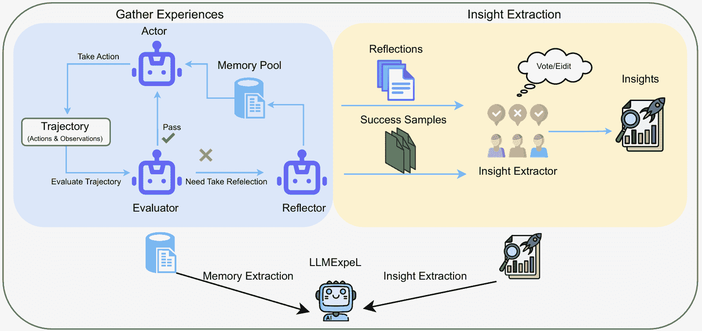

图6：Expel[[35](https://arxiv.org/html/2408.02479v1#bib.bib35)] 框架与Reflexion[[98](https://arxiv.org/html/2408.02479v1#bib.bib98)] 在经验收集中的应用

关于学习和适应机制，LLM 的适应和学习通常仅限于模型的训练数据和参数范围，尽管它们可以通过新数据更新来适应，但它们缺乏从实时反馈中持续学习的能力，更注重使用现有知识解决问题并生成回应。相比之下，基于 LLM 的智能体通常配备了经验学习和实时反馈适应机制，使它们能够根据持续的互动优化策略和回应。一个很好的基于 LLM 的智能体框架例子是 Expel [[35](https://arxiv.org/html/2408.02479v1#bib.bib35)]，它利用了先前的研究 ReAct [[36](https://arxiv.org/html/2408.02479v1#bib.bib36)] 和 Reflexion [[98](https://arxiv.org/html/2408.02479v1#bib.bib98)]，如图[6](https://arxiv.org/html/2408.02479v1#S6.F6 "Figure 6 ‣ VI-C Analysis ‣ VI Autonomous Learning and Decision Making ‣ From LLMs to LLM-based Agents for Software Engineering: A Survey of Current, Challenges and Future")所示。该框架利用记忆池和见解池，使 LLM 能够从过去的知识中学习，从而帮助后续的决策。这样的自动决策能力是传统 LLM 框架无法实现的。

### VI-D 基准测试

在自动学习和决策领域，LLM 和基于 LLM 的智能体所使用的基准数据集在任务处理和应用需求上非常相似。我们可以更深入地了解这两种方法在不同任务和应用背景下的优缺点。具体数据集参考，请见表格[VII](https://arxiv.org/html/2408.02479v1#S6.T7 "TABLE VII ‣ VI-E Evaluation Metrics ‣ VI Autonomous Learning and Decision Making ‣ From LLMs to LLM-based Agents for Software Engineering: A Survey of Current, Challenges and Future")。

在关于大语言模型（LLM）的研究中，主要的数据集包括Defects4J、MMLU、TransCoder和MBPP。这些数据集主要用于评估模型在特定领域和任务中的表现。Defects4J广泛应用于软件工程中，是一个包含来自17个Java项目的525个真实缺陷的软件缺陷数据集。它旨在通过提供一个标准化的基准，测试自动程序修复和缺陷检测工具的有效性，使研究人员能够比较不同方法的性能。MMLU（大规模多任务语言理解）是一个涵盖57个学科的大规模基准数据集，测试模型在多任务语言理解中对广泛知识和推理能力的掌握。它包括从基础教育到专业水平的问题，如大学数学、商业伦理和大学化学，挑战模型在不同领域的知识储备和推理能力。TransCoder数据集专注于编程语言之间的代码翻译，评估模型自动将代码从一种编程语言翻译成另一种编程语言的能力。这对多语言软件开发和维护至关重要，因为它可以大大提高开发效率。MBPP（大多数基础Python编程）在前文中已介绍，它是一个包含427个Python编程问题的数据集，涵盖基本概念和标准库函数，广泛用于测试模型在不同编程场景下的表现，评估其生成正确和高效代码的能力。

相比之下，基于 LLM 的代理使用的数据集强调在复杂场景中的多任务处理和决策能力。主要数据集包括 HotpotQA、ALFWorld、FEVER、WebShop 和 MGSM。HotpotQA 是一个多跳式问答数据集，要求模型在回答问题时参考来自多个文档的内容，评估其信息综合和推理能力，这个数据集挑战模型在复杂推理任务中的表现。ALFWorld 是一个基于文本的环境模拟数据集，要求模型进行多步骤决策，模型在虚拟家庭环境中完成任务。该数据集结合了自然语言处理和决策制定，评估模型在动态和互动任务中的表现。FEVER（事实提取与验证）数据集用于事实验证任务，模型需要验证给定陈述的真实性并提供证据，评估模型在信息检索和逻辑推理中的能力。WebShop 是一个在线购物环境模拟数据集，包含 118 万个真实世界的产品和人工指令，用于测试模型在复杂决策任务中的表现，如完成购物任务和属性匹配。MGSM（多模态广义序列建模）是一个多模态数据集，包含与对话、创意写作、数学推理和逻辑推理相关的任务，评估模型在多模态任务中的综合能力。

相对而言，LLM 数据集通常集中于单一、静态的任务，如代码生成、数学推理和创意写作，这些任务适用于在预定义任务范围内工作的模型。像 Defects4J、MMLU 和 MBPP 这样的数据集有助于评估模型在特定领域的能力。基于 LLM 的代理更适合处理复杂的、多任务的、动态的环境，这些环境要求模型处理多模态输入和实时决策，它们能够展示在处理复杂交互和多任务场景中的优势。像 HotpotQA、ALFWorld、FEVER 和 WebShop 这样的数据集挑战模型在信息综合、动态决策/交互和多模态任务中的表现。这一差异源于两者的设计目标不同：LLM 旨在优化单一任务的性能，而基于 LLM 的代理则被设计来处理复杂或多模态任务，这需要更高的自主性和适应性。这也反映出现代应用对高度互动、适应性强和多功能 AI 系统的需求，推动了从单一 LLM 模型到多代理系统的开发。通过这些分析，我们可以识别 LLM 和基于 LLM 的代理在自主学习和决策中的不同应用，选择合适的框架以满足现实世界应用中不同任务的需求非常重要。

### VI-E 评估指标

在LLMs和基于LLMs的智能体的研究中，使用了多种评估指标，这些指标用于评估模型在特定任务中的表现，并分析它们在该领域的应用效果。下面，我们讨论了几项具有代表性的研究，分析了它们采用的评估指标，并探讨了LLMs与基于LLMs的智能体在这一领域中的差异。

在大规模语言模型（LLMs）的研究中，评估指标主要关注模型的准确性和任务完成度。在[[90](https://arxiv.org/html/2408.02479v1#bib.bib90)]中，研究人员使用了一个投票推理系统的准确性，该系统通过期望的0/1损失（正确响应的比例）来衡量模型性能。这个指标通过多次调用评估模型的准确性，反映了LLMs通过迭代推理提高结果准确性的能力。文献中常见的评估指标包括准确性和样本效率，准确性指的是模型做出正确预测的比例，而样本效率则衡量达到一定准确性所需的样本数量。这些指标评估了模型的预测能力和决策能力，以及其在训练过程中的数据利用效率。在[[92](https://arxiv.org/html/2408.02479v1#bib.bib92)]中，评估指标包括可能的修补、正确修补、精度和开发者准确性。可能的修补指通过所有测试的修补，而正确修补是语义上等同于原始开发者修补的修补。精度衡量的是在所有可能修补中正确修补的比例，而开发者准确性则通过人工评估衡量有无解释的修补的正确性。这些指标强调了模型在自动化代码修复中的解释能力和实际效果，增加了对人工评估的依赖。为了评估模型的创造力，评估维度包括价值、创新性和惊讶性。生成作品的质量、社会接受度和相似性，以及生成创造性产品的能力也被纳入评估范围。[[110](https://arxiv.org/html/2408.02479v1#bib.bib110)]使用了24点游戏的成功率和创造性写作中生成段落的连贯性作为评估指标。这些指标评估了模型在问题解决和文本生成中的表现，展示了LLMs在解决复杂问题和生成连贯文本方面的潜力。在[[95](https://arxiv.org/html/2408.02479v1#bib.bib95)]中，一致性和成功率被用作评估指标，一致性计算了两位评审在随机选择的问题上达成一致的概率，衡量了LLM评审与人类偏好的对齐度。成功率则用于特定任务（如24点游戏）来衡量正确响应的比例。

相比之下，基于LLM的代理使用更多样化的评估指标来反映其多智能体协作特性。在[[97](https://arxiv.org/html/2408.02479v1#bib.bib97)]中，评估指标包括感知分数（P-Score）、认知分数（C-Score）和行动分数（A-Score）。这些指标全面评估模型的感知、认知和行动能力，展示了基于LLM的代理在处理多模态任务中的综合表现。在多模态应用中，成功率（SR）通常作为主要指标，通过HotpotQA和FEVER等任务来评估精确匹配的成功。这些指标侧重于任务完成的成功率和准确性，展示了基于LLM的代理在不同任务环境中的实际执行能力。在[[111](https://arxiv.org/html/2408.02479v1#bib.bib111)]中，评估指标包括从业者反馈、效率和准确性。从业者反馈使用Likert量表收集满意度和绩效反馈，Likert量表是常用的心理测量工具，用于测量个人对特定陈述的态度或意见。该量表通常包括以下五个选项：强烈不同意、不同意、中立、同意、强烈同意。而效率和准确性则通过从业者验证的模型执行的定性数据分析效果来衡量。这些指标评估代理在定性数据分析中的表现，展示了它们在实际应用中的实用性和准确性。

通过比较这些度量标准，我们发现，LLM（大语言模型）使用传统度量标准，如准确性和样本效率，来评估其能力。相比之下，基于LLM的代理通过多智能体处理更复杂的算法，这需要更全面和多样化的度量标准，从多个方向评估其表现。基于LLM的代理在多模态任务和自我进化任务中强调感知、认知和行动能力的综合表现。这种差异反映了LLM在单一任务优化中的优势，以及基于LLM的代理在协作处理复杂任务中的潜力，同时具有更高的自主学习能力。此外，基于LLM的代理的实际应用评估指标，如从业者反馈、效率和准确性，展示了它们在现实场景中的实用性和用户满意度。这种评估方法不仅评估任务完成情况，还考虑用户体验的综合评估，亦可评估其决策能力与人类的一致性。

表 VII：自主学习与决策制定中的评估指标

{tblr}

cell11 = c, cell12 = c, cell13 = c, cell24 = c, cell34 = c, cell44 = c, cell54 = c, cell64 = c, cell74 = c, cell84 = c, cell94 = c, cell104 = c, cell114 = c, cell124 = c, cell134 = c, cell144 = c, cell154 = c, cell164 = c, cell174 = c, cell184 = c, cell194 = c, cell204 = c, cell214 = c, cell224 = c, cell234 = c, cell244 = c, cell254 = c, hlines, vlines, 参考文献 & 基准评估指标 代理

[[90](https://arxiv.org/html/2408.02479v1#bib.bib90)] MMLU 准确率 否

[[91](https://arxiv.org/html/2408.02479v1#bib.bib91)] Spider, TransCoder, MBPP 准确率，样本效率 否

[[92](https://arxiv.org/html/2408.02479v1#bib.bib92)] Defects4J v1.2, Defects4J v2.0，

几乎正确的 HumanEval 可行补丁，

正确补丁，

精度，准确率 否

[[93](https://arxiv.org/html/2408.02479v1#bib.bib93)] 无特定质量，接受率 否

[[110](https://arxiv.org/html/2408.02479v1#bib.bib110)] 24 点游戏，创意写作，

5x5 填字游戏 成功率，一致性 否

[[95](https://arxiv.org/html/2408.02479v1#bib.bib95)] MT-Bench, Chatbot Arena 协议率，成功率

人类判断 否

[[96](https://arxiv.org/html/2408.02479v1#bib.bib96)] ECQA, GSM8K, FOLIO-wiki 准确率 是

[[97](https://arxiv.org/html/2408.02479v1#bib.bib97)] PCA-EVAL 准确率，P/C/A-得分 是

[[35](https://arxiv.org/html/2408.02479v1#bib.bib35)] HotpotQA, ALFWorld, WebShop, FEVER 成功率 是

[[106](https://arxiv.org/html/2408.02479v1#bib.bib106)] 未指定 成功率，自治级别 是

[[44](https://arxiv.org/html/2408.02479v1#bib.bib44)] GSM8K, MATH, MMLU, 国际象棋，HumanEval 准确率 是

[[107](https://arxiv.org/html/2408.02479v1#bib.bib107)] MITRE ATTCK 框架 能力 识别漏洞 是

[[102](https://arxiv.org/html/2408.02479v1#bib.bib102)] GSM8K, SVAMP, Vicuna 测试集，

Evol-Instruct 测试集 准确率，反馈准确率 是

[[98](https://arxiv.org/html/2408.02479v1#bib.bib98)] HotPotQA, ALFWorld, HumanEval, MBPP，

LeetcodeHardGym Pass@1，成功率 是

[[111](https://arxiv.org/html/2408.02479v1#bib.bib111)] Github 开发者讨论，BBC 新闻，

社交媒体对话，

深度访谈 从业者反馈，

效率和准确率 是

[[100](https://arxiv.org/html/2408.02479v1#bib.bib100)] AI 社会，代码，数学，科学，

不一致 人类评估，

GPT-4 评估 是

[[99](https://arxiv.org/html/2408.02479v1#bib.bib99)] FED, Commongen 挑战，

MGSM，逻辑网格谜题，

HumanEval Pass@1，任务完成率 是

[[36](https://arxiv.org/html/2408.02479v1#bib.bib36)] HotpotQA, FEVER, ALFWorld, WebShop 精确匹配，准确率，

成功率，平均分数 是

[[103](https://arxiv.org/html/2408.02479v1#bib.bib103)] 信任游戏，独裁者游戏，

MAP 信任游戏，

风险独裁者游戏，

彩票游戏，重复信任游戏 有效回应率，

一致性 是

[[104](https://arxiv.org/html/2408.02479v1#bib.bib104)] HotPotQA, WebShop F1-得分，平均奖励 是

[[108](https://arxiv.org/html/2408.02479v1#bib.bib108)] 263个真实智能合约漏洞F1分数，准确率

精度，召回率

一致性率。是

[[109](https://arxiv.org/html/2408.02479v1#bib.bib109)] 15个真实世界的一天漏洞

来自CVE数据库成功率，成本是

[[101](https://arxiv.org/html/2408.02479v1#bib.bib101)] WebShop, HotPotQA 与 Wikipedia AP 奖励分数，召回率是

[[105](https://arxiv.org/html/2408.02479v1#bib.bib105)] MMLU，迷你填字游戏，HumanEval，

GAIA 准确率，Pass@1 是

## VII 软件设计与评估

LLM（大语言模型）在软件设计和评估中的应用与之前的主题有很大的重叠，软件设计是软件开发的早期阶段，设计质量直接影响未来开发的质量。现代软件工程方法强调设计与开发的结合，确保设计阶段的决策能够无缝地转化为高质量的代码。因此，软件设计的研究通常探讨通过利用LLM进行软件开发的框架和特定架构设计，相关的代码生成和开发方面的内容。软件设计框架通常包括多个阶段的持续优化，以实现最佳结果，这可以视为LLM在软件开发中的应用的一部分[[83](https://arxiv.org/html/2408.02479v1#bib.bib83)]。类似地，[[85](https://arxiv.org/html/2408.02479v1#bib.bib85)]和[[84](https://arxiv.org/html/2408.02479v1#bib.bib84)]强调在使用LLM辅助开发和设计时，工具或API接口的频繁使用，展示了与代码生成和软件开发主题的重叠。

软件设计和评估中的大规模语言模型（LLMs）与自主学习和决策制定有广泛的交集，这两个话题是相互关联的领域。软件设计需要考虑系统的适应性和学习能力，以应对动态环境，因此，涉及自主学习和决策制定的设计评估自然成为这两个话题交汇的焦点。许多LLM技术和方法在这两个领域中有相似的应用，例如基于强化学习的LLM可以用于自动化设计决策和评估，也可以用于自我学习和优化。LLM在软件工程中的常见应用包括使用提示工程技术微调模型，以不断提升性能，特别是在软件设计和评估方面，通常需要更多的样本学习，以确保模型输出与用户期望一致[[93](https://arxiv.org/html/2408.02479v1#bib.bib93)] [[102](https://arxiv.org/html/2408.02479v1#bib.bib102)] [[44](https://arxiv.org/html/2408.02479v1#bib.bib44)] [[111](https://arxiv.org/html/2408.02479v1#bib.bib111)] [[105](https://arxiv.org/html/2408.02479v1#bib.bib105)] [[96](https://arxiv.org/html/2408.02479v1#bib.bib96)]。此外，需求工程中的需求引导和规范也可以视为软件设计和评估的一部分[[51](https://arxiv.org/html/2408.02479v1#bib.bib51)] [[112](https://arxiv.org/html/2408.02479v1#bib.bib112)]。本节回顾了近年来LLM在软件设计和评估中的主要研究成果，讨论了它们的应用场景和实际效果。

### VII-A LLM任务

近年来，关于在自动化、优化和代码理解等任务中使用大型语言模型（LLMs）的研究广泛开展。ChatGPT已被广泛应用于各种软件工程任务，并在日志摘要、代词解析和代码摘要等任务中表现出色，在日志摘要和代词解析任务中均达到了100%的成功率[[113](https://arxiv.org/html/2408.02479v1#bib.bib113)]。然而，它在代码审查和漏洞检测等任务中的表现相对较差，这表明它在更复杂任务上的表现仍需进一步改进。另一个框架EvaluLLM通过使用LLM来评估自然语言生成（NLG）输出的质量，解决了传统基于参考的评估指标（如BLEU和ROUGE）的局限性[[114](https://arxiv.org/html/2408.02479v1#bib.bib114)]。EvaluLLM引入了一种新的评估方法，该方法通过成对比较生成的输出，并使用胜率指标来衡量模型的表现，这种方法简化了评估过程，同时确保与人工评估的一致性，展示了LLM在生成任务中广泛的应用前景。同样，在LLM评估领域，基于LLM的NLG评估提供了对当前用于NLG评估的LLM的回顾和分类，论文总结了四种主要的评估方法：LLM派生指标、基于提示的LLM、微调LLM和人类-LLM协作评估[[115](https://arxiv.org/html/2408.02479v1#bib.bib115)]。这些方法展示了LLM在评估生成输出方面的潜力，同时也提到了诸如需要改进评估指标和进一步探索人类-LLM协作等挑战。

基于LLM的应用设计在工程设计中有许多新颖的应用，一项研究探讨了软件/硬件协同设计的策略，以优化LLM并将这些策略应用于设计验证[[116](https://arxiv.org/html/2408.02479v1#bib.bib116)]。通过量化、剪枝和操作级优化，这项研究展示了在高级综合（HLS）设计功能验证中的应用，GPT-4被用来生成包含预定义错误的高级综合（HLS）设计，以创建一个名为Chrysalis的数据集，这个数据集为评估和优化基于LLM的HLS调试助手提供了宝贵资源。优化后的LLM显著提高了推理性能，为电子设计自动化（EDA）领域中的错误检测和修复提供了新的可能性。在[[117](https://arxiv.org/html/2408.02479v1#bib.bib117)]中，研究人员介绍了RaWi，一种数据驱动的GUI原型设计方法。该框架允许用户从此库中检索GUI，进行编辑，并快速创建新的高保真原型。通过将RaWi与传统的GUI原型工具（Mockplus）进行对比实验，测量用户能够多快且高效地创建原型。结果表明，RaWi在多个基准测试中表现优越，在precision@k指标上提高了40%。这项研究证明了LLM在软件设计原型阶段提高效率的可能性，使设计师能够快速迭代GUI设计，促进设计缺陷的早期发现。随着LLM带来的新可能性，教育领域也展开了大量讨论，研究人员探索了大型语言模型在教育中的影响[[118](https://arxiv.org/html/2408.02479v1#bib.bib118)]。研究表明，ChatGPT在回答软件测试课程的问题时表现出显著的潜力，但也存在一些局限性[[119](https://arxiv.org/html/2408.02479v1#bib.bib119)]。ChatGPT能够回答约77.5%的问题，并且提供正确或部分正确答案的概率为55.6%。然而，其解释的正确性仅为53.0%，这表明在教育应用中仍需进一步改进。

### VII-B 基于LLM的智能体任务

基于LLM的智能体在软件设计和评估中的应用提升了开发效率和代码质量，同时展示了LLM智能体在实际软件工程任务中广泛的适用性和巨大潜力。[[120](https://arxiv.org/html/2408.02479v1#bib.bib120)] 探讨了自动化智能体在软件工程中的当前能力、挑战和机遇。研究评估了Auto-GPT在软件开发生命周期（SDLC）不同阶段的表现，包括软件设计、测试和与GitHub的集成，论文发现详细的上下文提示显著提升了智能体在复杂软件工程任务中的表现，强调了上下文丰富的提示在减少错误和提高效率方面的重要性，凸显了基于LLM的智能体在自动化和优化各类SDLC任务中的潜力，从而提升了开发效率。本文还评估了Auto-GPT的局限性，包括任务或目标跳过、生成不必要的代码或文件（幻觉）、重复或循环响应、缺乏任务完成验证机制等。这些局限性可能导致工作流不完整、输出不准确以及在实际应用中的性能不稳定。

[[121](https://arxiv.org/html/2408.02479v1#bib.bib121)] 引入了ChatDev，这是第一个虚拟聊天驱动的软件开发公司，旨在使用大语言模型（LLMs）不仅用于特定任务，而是作为基于聊天的多智能体框架中的中央协调者。这种方法使得软件开发过程更加结构化、高效且具备协作性，探索了聊天驱动的多智能体系统如何实现高效的软件设计与评估，减少代码漏洞，并提高开发效率与质量。实验表明，ChatDev平均能够在409.84秒内设计并生成软件，成本仅为$0.2967，同时显著减少了代码漏洞。这表明基于聊天的多智能体框架能够提高软件开发效率和质量。微软研究团队提出的另一个类似的协作框架[[122](https://arxiv.org/html/2408.02479v1#bib.bib122)]展示了使用LLMs，特别是ChatGPT作为智能体控制器来管理和执行各种AI任务的有效性。HuggingGPT系统使用ChatGPT来协调执行Hugging Face平台上各种AI模型的任务，目的是测试该系统在处理复杂AI任务（包括语言、视觉和语音任务）时的有效性，通过根据用户请求执行适当的模型。创新之处在于将LLMs不仅作为直接执行任务的工具，而是作为中央协调者，利用现有的AI模型来完成复杂任务。这种方法扩展了LLMs的实际应用范围，超越了典型的语言任务。[ [123](https://arxiv.org/html/2408.02479v1#bib.bib123)] 提出了LLMARENA基准框架，用于评估LLMs在动态多智能体环境中的能力，理念与ChatDev类似，但创新之处在于将焦点从单智能体静态任务转向动态和交互式的多智能体环境，提供了一个更真实、更具挑战性的设置来评估LLMs的实际效用。这种方法模拟了现实世界中多个智能体（无论是AI还是人类）交互与协作的情况。实验表明，这一框架能够测试LLMs在游戏环境中的空间设计、战略规划和团队合作能力，为设计和评估多智能体系统中的LLMs提供了新的可能性和工具。

[[124](https://arxiv.org/html/2408.02479v1#bib.bib124)] 介绍了“Flows”概念框架，用于构建 AI 模型与人类之间的交互，以提高推理和协作能力。该研究提出了将过程概念化为独立、目标驱动的实体，通过标准化的基于消息的接口进行交互，从而实现模块化和可扩展的设计。这种方法本质上是支持并发的，并且支持开发复杂的嵌套 AI 交互，而无需管理复杂的依赖关系。竞争性编程任务中的实验表明，“Flows”框架将 AI 模型的解题率提高了 21 个百分点，人类与 AI 的协作率提高了 54 个百分点。这证明了模块化设计如何增强 AI 与人类的协作，从而改善软件设计和评估过程。

[[125](https://arxiv.org/html/2408.02479v1#bib.bib125)] 提出了一个新的分类法，用于结构化地理解和分析 LLM 集成应用，提供了新的理论和方法来进行软件设计和评估。该分类法有助于理解 LLM 组件在软件系统中的集成，为开发更有效、更高效的 LLM 集成应用奠定了理论基础。同样，[[126](https://arxiv.org/html/2408.02479v1#bib.bib126)] 探讨了基于 LLM 的代理在软件维护任务中的应用，通过协作框架提高代码质量和可靠性。本研究本应归类于软件维护领域，但展现了设计结构的迭代方式。该框架利用任务分解和多代理策略来解决传统一体化方法无法有效处理的复杂工程任务，多个代理能够互相学习，从而改善软件维护的结果。实验表明，在复杂的调试任务中，多代理系统优于单代理系统，这表明该新框架可以应用于软件设计中，提供更安全的架构。

### VII-C 分析

总体而言，LLM 在软件设计和评估中的应用通常集中在特定任务的自动化上，如代码生成和日志总结，更多侧重于评估能力而非设计阶段的实现。在软件设计过程中，设计与软件开发和需求工程紧密交织。如前所述，使用 LLM 辅助软件开发通常包括软件设计过程的某些方面，特别是在生成相关设计文档方面。因此，专注于使用 LLM 进行更高层次软件设计任务的研究相对较少。

基于LLM的智能体通过智能决策和任务执行处理更复杂的工作流程，从而扩展了LLM的能力，这些智能体可以协作、动态调整任务并收集和利用外部信息。在软件设计和评估中，单一模型往往无法全面考虑设计和评估的各个方面，这也是为什么更多的软件开发者不愿将高层次任务委托给AI的原因。基于LLM的智能体通过协作和更加细化的角色分工，能够高效完成设计任务并适应各种应用场景。然而，基于LLM的智能体在软件设计中的应用通常包含在软件开发过程中，正如前面所讨论的，软件设计阶段中行动前的自我反思和推理便是这一点的体现。Chatdev[[121](https://arxiv.org/html/2408.02479v1#bib.bib121)]框架通过角色分配创建了一个独立的软件设计阶段，这显著提高了后续开发阶段的灵活性和准确性。在效率和成本方面，LLM在文本生成和漏洞检测方面仍略微优于基于LLM的智能体。然而，处理类似软件维护和根本原因分析的任务需要更复杂的架构，如多轮对话、知识图谱和RAG技术，这些可以进一步促进设计和评估阶段的工作。

### VII-D 基准测试

基准测试包括公共数据集以及作者自行构建的数据集，应用场景也各不相同，如表格[VIII](https://arxiv.org/html/2408.02479v1#S7.T8 "TABLE VIII ‣ VII-E Evaluation Metrics ‣ VII Software Design and Evaluation ‣ From LLMs to LLM-based Agents for Software Engineering: A Survey of Current, Challenges and Future")所示。BigCloneBench是一个用于代码克隆检测的基准数据集，包含大量的Java函数对。这些函数对被分类为克隆和非克隆，用于训练和评估克隆检测模型，主要的评估指标是正确识别率。Chrysalis数据集由[[116](https://arxiv.org/html/2408.02479v1#bib.bib116)]创建，包含来自11个开源可合成HLS数据集的1000多个函数级别的设计，主要用于评估LLM调试工具在检测和修正HLS设计中注入错误的有效性，主要评估指标是错误检测和修正的有效性。CodexGLUE数据集是一个综合性基准数据集，涵盖了多种代码生成和理解任务，如代码补全、代码修复和代码翻译，用于评估代码生成模型在实际编程任务中的表现。除了这些公共数据集，还使用了一些人工模拟的数据集，例如模拟招聘会环境数据集。该数据集模拟了一个虚拟招聘会环境，包含多个任务场景，如面试、招聘和团队项目协调。该数据集用于评估生成型代理在复杂社会任务中的协调能力，主要的评估指标是任务协调成功率和角色匹配准确度。

相比之下，LLM（大语言模型）研究倾向于使用特定且公开可用的数据集，如 BigCloneBench。这些数据集提供了标准化的评估基准，有助于结果的可复现性和可比性。基于LLM的代理研究则倾向于使用定制的实验设置或未指定的数据集，如需求文档，虽然未指定具体的数据集，但强调实验涉及了70个用户需求。这种选择通常是因为研究需要从多个角度评估性能，如果使用一些通用数据集，可能很难完美适应垂直应用场景。无论是LLM还是基于LLM的代理，都使用多种数据集来评估模型的性能，这些数据集涵盖了从代码生成、代码理解到自然语言生成和任务管理等任务，因为软件设计与评估的话题相对交叉。然而，由于基于LLM的代理可以扩展到视频和图片等应用场景，因此像 Auto-GPT 和 HuggingGPT 这样的代理也使用了多模态数据集。这些数据集不仅包含代码和文本，还涉及到图像、语音等多种数据类型。此外，相较于单一的LLM框架，基于LLM的代理需要评估更多领域，因此基准测试也需要单独考虑。例如，LLMARENA 专门设计用于测试LLM在动态、多代理环境中的表现，涵盖了空间推理、战略规划和风险评估等复杂任务。

### VII-E 评估指标

在软件设计与评估领域，许多研究采用不同的评估指标来衡量 LLM 和基于 LLM 的智能体在各种任务中的表现。LLM 和基于 LLM 的智能体研究都使用多个指标来全面评估模型表现，LLM 研究通常专注于传统的指标，如准确率、胜率和一致性，而基于 LLM 的智能体研究不仅考虑这些基本指标，还进一步引入复杂的评估方法，如任务协调成功率和角色匹配准确率。然而，无法明确断言未来的基于 LLM 的智能体研究总是会采用考虑多维度的更灵活的评估指标，这更多取决于具体任务和数据集的使用。根据这项调查观察到的现象，主要原因是 LLM 研究中的任务相对单一，主要关注使用传统评估方法的静态任务，如日志摘要。另一方面，基于 LLM 的智能体研究涉及更多的一般性多智能体任务，其评估方法强调互动性和动态性。基于 LLM 的智能体研究更加关注模型的协作和决策能力，通过使用多维度的评估指标全面评估其在实际应用中的潜力，而不仅仅考虑准确性。这也解释了为什么尽管评估指标如准确性和完成时间相似，基于 LLM 的智能体使用灵活的评估指标，包括互斥性和适当性等指标。

表 VIII：软件设计与评估中的评估指标

| 参考文献 | 基准 | 评估指标 | 智能体 |
| --- | --- | --- | --- |

|

&#124; [[113](https://arxiv.org/html/2408.02479v1#bib.bib113)] &#124;

|

&#124; BigCloneBench, &#124;

&#124; Python 函数， &#124;

&#124; Java 方法， &#124;

&#124; 随机日志， &#124;

&#124; 错误报告， &#124;

&#124; 需求规格 &#124;

| 准确性 | 否 |
| --- | --- |

|

&#124; [[114](https://arxiv.org/html/2408.02479v1#bib.bib114)] &#124;

| 未指定 | 胜率，协议得分 | 否 |
| --- | --- | --- |

|

&#124; [[115](https://arxiv.org/html/2408.02479v1#bib.bib115)] &#124;

| 未指定 |
| --- |

&#124; 基于嵌入的度量， &#124;

&#124; 基于概率的度量， &#124;

&#124; 比较，排名 &#124;

| 否 |
| --- |

|

&#124; [[116](https://arxiv.org/html/2408.02479v1#bib.bib116)] &#124;

| 蛹 | 效果性 | 否 |
| --- | --- | --- |

|

&#124; [[127](https://arxiv.org/html/2408.02479v1#bib.bib127)] &#124;

|

&#124; 常识QA， &#124;

&#124; StrategyQA, GSM8K &#124;

|

&#124; 准确性， &#124;

&#124; 令牌，时间成本 &#124;

| 否 |
| --- |

|

&#124; [[119](https://arxiv.org/html/2408.02479v1#bib.bib119)] &#124;

|

&#124; 31 个问题来自 &#124;

&#124; 软件测试教材。 &#124;

| 正确性，效果性 | 否 |
| --- | --- |

|

&#124; [[128](https://arxiv.org/html/2408.02479v1#bib.bib128)] &#124;

|

&#124; 医学转录， &#124;

&#124; 亚马逊产品 &#124;

&#124; 描述 &#124;

|

&#124; 覆盖率, &#124;

&#124; 假失败率 &#124;

&#124; 对齐. &#124;

| 否 |
| --- |

|

&#124; [[117](https://arxiv.org/html/2408.02479v1#bib.bib117)] &#124;

| Rico |
| --- |

&#124; Precision@k, &#124;

&#124; NDCG@k, &#124;

&#124; 平均倒排排名, &#124;

&#124; 平均精度, HITS@k &#124;

| 否 |
| --- |

|

&#124; [[120](https://arxiv.org/html/2408.02479v1#bib.bib120)] &#124;

| 未指定 |
| --- |

&#124; 准确性, 成功率, &#124;

&#124; 一致性, 效能 &#124;

| 是 |
| --- |

|

&#124; [[122](https://arxiv.org/html/2408.02479v1#bib.bib122)] &#124;

|

&#124; Hugging Face的 &#124;

&#124; 模型仓库. &#124;

|

&#124; 准确性, &#124;

&#124; 精度, &#124;

&#124; 召回率, &#124;

&#124; F1-分数, &#124;

&#124; 编辑距离, &#124;

&#124; GPT-4评分, &#124;

&#124; 通过率, &#124;

&#124; 合理性, &#124;

&#124; 成功率. &#124;

| 是 |
| --- |

|

&#124; [[124](https://arxiv.org/html/2408.02479v1#bib.bib124)] &#124;

| Codeforces, LeetCode | Pass@1 | 是 |
| --- | --- | --- |

|

&#124; [[121](https://arxiv.org/html/2408.02479v1#bib.bib121)] &#124;

| 70 用户需求. |
| --- |

&#124; 生成文件数量, &#124;

&#124; 花费时间, 成本 &#124;

| 是 |
| --- |

|

&#124; [[121](https://arxiv.org/html/2408.02479v1#bib.bib121)] &#124;

| Codeforces |
| --- |

&#124; 完整性, &#124;

&#124; 鲁棒性, 简洁性, &#124;

&#124; 互斥性, &#124;

&#124; 解释能力, &#124;

&#124; 可扩展性. &#124;

| 是 |
| --- |

|

&#124; [[125](https://arxiv.org/html/2408.02479v1#bib.bib125)] &#124;

| 示例应用. | BERTScore, BLEU | 是 |
| --- | --- | --- |

|

&#124; [[126](https://arxiv.org/html/2408.02479v1#bib.bib126)] &#124;

| CodexGLUE |
| --- |

&#124; BLEU, METEOR, &#124;

&#124; ROUGE-L, BERTScore &#124;

| 是 |
| --- |

|

&#124; [[129](https://arxiv.org/html/2408.02479v1#bib.bib129)] &#124;

| 生产事件 |
| --- |

&#124; 成功率, &#124;

&#124; 准确性, 对齐, &#124;

&#124; 适当性 &#124;

| 是 |
| --- |

|

&#124; [[130](https://arxiv.org/html/2408.02479v1#bib.bib130)] &#124;

|

&#124; 模拟招聘会 &#124;

&#124; 环境 &#124;

|

&#124; 完成时间, &#124;

&#124; 任务进度, &#124;

&#124; 理解程度 &#124;

| 是 |
| --- |

## 第八章 软件测试生成

在软件开发中，一个关键组成部分是软件测试，这需要从系统初期开发到最终部署的整个过程中持续进行。在工业界，通常使用敏捷开发方法，在每个阶段持续进行系统测试，以确保整个系统的稳定性，每当有新的代码提交到GitHub时，就会进行测试，确保更新版本的可用性。常见的方法是使用Jenkins⁴⁴4[https://www.jenkins.io/](https://www.jenkins.io/)来实现持续集成和持续部署。Jenkins会自动连接到开发者将代码推送到GitHub的操作，并对新版本运行测试套件。尽管整个过程趋向于自动化开发，创建和完善测试用例仍然需要大量的人力。

开发中的典型角色涉及软件测试，例如编写单元测试、集成测试和模糊测试。研究人员自2000年以前就开始尝试使用AI来帮助生成测试用例。最初的实现通常涉及较简单的AI和机器学习形式，以自动化部分测试用例生成过程。随着时间的推移，更复杂的方法，如自然语言处理和机器学习模型，已被应用于提高测试用例生成的精度和范围。像Sofy⁵⁵5[https://sofy.ai/](https://sofy.ai/)这样的在线工具，利用机器学习生成应用程序中的基于上下文的路径，也有助于生成测试套件。使用大型语言模型生成测试用例是一项相对较新的尝试，但它正在快速发展。2020年，研究人员利用在标注数据上微调的预训练语言模型生成测试用例。他们开发了一种基于序列到序列的Transformer模型，名为“ATHENATEST”，并将其生成的结果与EvoSuite和GPT-3进行比较，展示了更好的测试覆盖率[[131](https://arxiv.org/html/2408.02479v1#bib.bib131)]。更多的研究和模型正在致力于测试套件生成实验，例如前面在代码生成部分提到的Codex模型[[67](https://arxiv.org/html/2408.02479v1#bib.bib67)]，结合思维链提示（chain-of-thought prompting），即使在零样本场景中，也能通过CodeCoT实现高质量的测试套件生成。引入LLMs的目的是自动化和简化测试过程，使其更加严格，并能够解决人类容易忽视的方面。

### VIII-A LLMs任务

LLM在软件测试生成中的应用非常广泛，涵盖的不仅仅是测试套件的生成。本次综述所包含的文献涵盖了多个方面，包括安全测试生成、BUG复现、一般BUG复现、模糊测试和覆盖驱动的测试生成。这些任务通过各种模型和技术实现，显著提高了软件质量，并减少了开发者的工作负担。 [[132](https://arxiv.org/html/2408.02479v1#bib.bib132)] 旨在评估使用GPT-4生成安全测试的有效性，展示了如何通过利用依赖性漏洞进行供应链攻击。该研究实验了不同的提示风格和模板，以探索不同信息输入对测试生成质量的影响，结果表明，由ChatGPT生成的测试成功发现了55个应用程序中的24个概念验证漏洞，超越了现有工具TRANSFER[[133](https://arxiv.org/html/2408.02479v1#bib.bib133)]和SIEGE⁶⁶6[https://siegecyber.com.au/services/penetration-testing/](https://siegecyber.com.au/services/penetration-testing/)。这项研究介绍了一种利用LLM生成安全测试的新方法，并提供了LLM在安全测试领域潜力的实证证据，为开发者提供了一种处理应用程序中库漏洞的新方法。

另一个应用是错误复现，它可以帮助测试人员更快速高效地定位和修复错误。[[134](https://arxiv.org/html/2408.02479v1#bib.bib134)] 讨论了当前错误复现方法的局限性，这些方法受限于手工模式和预定义词汇的质量与清晰度。本文提出并评估了一种新的方法框架，称为 AdbGPT，它利用大语言模型自动从 Android 错误报告中复现错误。AdbGPT 被描述为在仅针对 Android 系统的自动化错误回放中，优于当前的 SOTA 方法。实验结果表明，AdbGPT 在 S2R 实体提取中的准确率为 90.4%，在错误复现中的成功率为 81.3%，显著优于基准 ReCDroid 和消融研究版本。通过引入提示工程、少量样本学习和思维链推理，AdbGPT 展现了大语言模型在自动化错误复现中的强大能力。它还使用 GUI 编码将 GUI 视图层次结构转换为类似 HTML 的语法，帮助大语言模型清晰地理解当前的 GUI 状态。虽然 AdbGPT 专门针对 Android 系统，但 [[135](https://arxiv.org/html/2408.02479v1#bib.bib135)] 提出了 LIBRO 框架，利用大语言模型根据错误报告生成错误复现测试。实验结果表明，LIBRO 成功地复现了 Defects4J 数据集中 33.5% 的错误，和 GHRB 数据集中 32.2% 的错误。通过结合先进的提示工程和后处理技术，LIBRO 展现了大语言模型在生成错误复现测试中的有效性和效率。尽管与 AdbGPT 相比，LIBRO 的绝对有效性较低，但它在更多样的 Java 应用中进行了测试，而不仅限于 Android。因此，虽然 AdbGPT 在 Android 系统的专用错误回放中表现出色，但 LIBRO 提供了更广泛的 Java 应用错误复现范围。大语言模型在测试生成任务中的广泛应用，如安全测试生成、错误复现、模糊测试、程序修复和覆盖驱动的测试生成，凸显了它们在提升软件质量和减轻开发者负担方面的巨大潜力。通过各种模型和技术，这些任务展示了大语言模型如何自动化并增强软件测试过程，解决了许多人类常常忽视的方面。

类似地，在模糊测试中，LLM也展现出了潜力。[[136](https://arxiv.org/html/2408.02479v1#bib.bib136)] 开发了一个通用的模糊测试工具 Fuzz4All，利用LLM生成和变异输入，以测试各种软件系统。该工具解决了传统模糊测试器与特定语言或系统紧密耦合、且缺乏对不断发展的语言特性支持的问题。研究进行了多项实验，以测试该工具的能力，包括覆盖率比较、漏洞发现和目标模糊测试。结果显示，Fuzz4All在所有测试的语言中实现了最高的代码覆盖率，平均提高了36.8%，并在九个系统中发现了98个漏洞，被认为是当时在通用模糊测试中使用LLM的前沿技术。通过自我提示和LLM驱动的模糊测试循环，Fuzz4All展示了LLM在模糊测试中的有效性，并通过综合评估展示了其在多个语言和被测试系统（SUT）中的能力。  

[[137](https://arxiv.org/html/2408.02479v1#bib.bib137)] 引入了SymPrompt，一种新的代码感知提示策略，旨在解决现有基于搜索的软件测试（SBST）方法和传统LLM提示策略在生成高覆盖率测试用例时的局限性。通过将原始测试生成过程分解为与被测方法的执行路径对齐的多阶段序列，SymPrompt生成了高覆盖率的测试用例。实验结果表明，SymPrompt在CodeGen2和GPT-4上的覆盖率分别提高了26%和105%。通过路径约束提示和上下文构建技术，SymPrompt展示了LLM在生成高覆盖率测试用例方面的潜力。[[138](https://arxiv.org/html/2408.02479v1#bib.bib138)] 也关注测试套件的覆盖率，研究引入了COVERUP系统，该系统通过覆盖率分析和与LLM的交互生成高覆盖率的Python回归测试。实验结果显示，COVERUP通过迭代提示和覆盖率驱动的方法，将代码覆盖率从62%提高到81%，分支覆盖率从35%提高到53%。[[139](https://arxiv.org/html/2408.02479v1#bib.bib139)] 提出了AID方法，该方法将LLM与差异测试相结合，以提高在“看似正确”软件中的故障检测能力。通过比较AID在生成故障揭示测试输入和判定标准方面的有效性，实验表明，AID分别提高了召回率和精确率1.80倍和2.65倍，并将F1分数提高了1.66倍。通过将LLM与差异测试相结合，AID展示了LLM在检测复杂漏洞方面的强大能力。

### VIII-B 基于LLM的代理任务  

在软件测试生成领域，基于LLM的代理的应用展示了它们在自动化测试生成中的潜力。虽然依赖基于LLM的代理来进行软件测试生成可能显得过度，但更多的研究正朝着漏洞检测和系统维护方向发展。基于LLM的代理可以通过多代理协作系统分配任务，如测试生成、执行和优化，从而增强测试的可靠性和质量。这些多代理系统在错误检测与修复以及覆盖率测试方面提供了明显的改进。一个这样的系统例子是AgentCoder的多代理框架，如在代码生成和软件开发部分所讨论的[[82](https://arxiv.org/html/2408.02479v1#bib.bib82)]。该系统的主要目标是利用多个专门的代理来迭代优化代码生成，克服单一代理模型在生成有效代码和测试用例方面的局限性。论文介绍了测试设计代理，它能够创建多样且全面的测试用例；以及测试执行代理，它负责执行测试并提供反馈，在MBPP数据集上达到了89.9%的通过率。类似地，SocraTest框架属于自主学习与决策制定主题[[106](https://arxiv.org/html/2408.02479v1#bib.bib106)]。该框架通过对话交互自动化测试过程，论文详细介绍了如何利用GPT-4生成和优化测试用例，强调了多步骤交互如何提升测试方法并生成测试代码。实验结果表明，通过对话型LLM，SocraTest能够有效地生成和优化测试用例，并利用中间件促进LLM与各种测试工具之间的交互，达到了更先进的自动化测试能力。

收集的关于软件测试生成的论文大多是基于多代理系统的。研究[[140](https://arxiv.org/html/2408.02479v1#bib.bib140)]评估了LLM在生成高质量测试用例中的有效性，并识别了它们的局限性。该研究提出了一种新颖的多代理框架，名为TestChain。论文评估了StarChat、CodeLlama、GPT-3.5和GPT-4在HumanEval和LeetCode-hard数据集上的表现。实验结果表明，使用GPT-4的TestChain框架在LeetCode-hard数据集上达到了71.79%的准确率，比基线方法提高了13.84%。在HumanEval数据集上，TestChain与GPT-4结合的准确率为90.24%。TestChain框架设计了生成多样测试输入的代理，使用ReAct格式对话链将输入映射到输出，并与Python解释器交互以获得准确的测试输出。

基于LLM的智能体也可以应用于用户验收测试（UAT），[[141](https://arxiv.org/html/2408.02479v1#bib.bib141)] 旨在通过提出一个名为 XUAT-Copilot 的多智能体协作系统，来增强微信支付 UAT 流程的自动化，该系统使用 LLM 自动生成测试脚本。该研究评估了 XUAT-Copilot 在微信支付 UAT 系统中 450 个测试用例上的表现，并将其与单一智能体系统和没有反射组件的变体进行了比较。实验结果表明，XUAT-Copilot 的 Pass@1 率为 88.55%，而单一智能体系统为 22.65%，没有反射组件的变体为 81.96%，Complete@1 率为 93.03%。XUAT-Copilot 采用了一个多智能体协作框架，包括动作规划、状态检查和参数选择智能体，并使用了先进的提示技术。XUAT-Copilot 展示了 LLM 在自动化 UAT 测试脚本生成中的潜力和可行性。

### VIII-C 分析

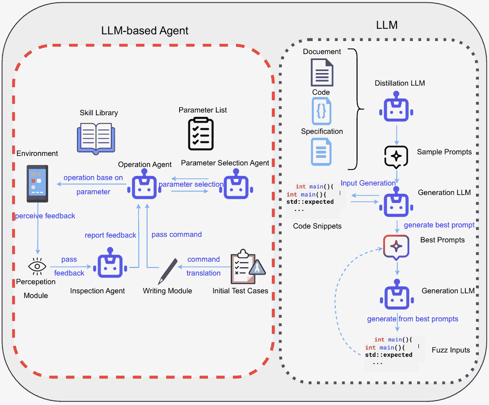

图 7：LLM 基于智能体[[141](https://arxiv.org/html/2408.02479v1#bib.bib141)] 与 LLM[[136](https://arxiv.org/html/2408.02479v1#bib.bib136)] 在软件测试生成中的比较框架示意图

相比之下，LLM 在单任务实现中表现良好，通过提示工程和少量学习等技术生成高质量的测试用例。随着 LLM 能力的提升，相关研究的数量也在增加。另一方面，基于 LLM 的智能体通过多智能体协作系统，将任务分解为专门的处理，从而通过迭代优化和反馈显著提高测试生成和执行的效果与效率。考虑到成本，仅使用 LLM 进行测试生成已经足够，且比使用基于 LLM 的智能体更具成本效益。然而，如果某个特定模型表现不佳，可能会影响整个系统的表现。

单一的 LLM 可能难以处理复杂的多步骤任务。例如，在高覆盖率测试生成中，LLMs 可能需要更复杂的提示和后处理步骤才能达到预期结果。此外，生成结果的质量在很大程度上取决于提示的设计和质量。对于需要精细控制和持续优化的任务，单一的 LLM 可能难以应对。如图 Figure.LABEL:testGen 所示，LLM 框架使用 [[136](https://arxiv.org/html/2408.02479v1#bib.bib136)] 作为示例来演示 LLMs 在模糊测试中的使用，提示将通过给定的代码片段（模糊输入）进行优化，然后由 LLM 再次重新选择，以选择最佳提示用于未来的生成。整体框架缺乏自主性，左侧的基于 LLM 的代理框架 [[141](https://arxiv.org/html/2408.02479v1#bib.bib141)] 填补了这一空白，并且能够感知 UI 并与技能库进行交互以执行操作。操作代理将接收检查代理报告的任何错误，并进行自我反思，以自主地完善流程。然而，正如前面所讨论的，仅为软件测试生成任务构建基于 LLM 的代理框架是“过度设计”，因此针对基于 LLM 的代理系统收集的论文通常侧重于通过生成的测试用例或 bug 重播系统进行程序修复，正如图 Figure.LABEL:testGen 所示，基于 LLM 的代理框架实际上是用于自动测试微信支付系统。

### VIII-D 基准

在软件测试生成任务中，LLMs 使用的 Defects4J 数据集用于评估 bug 重现和程序修复技术。其他公共数据集，如 ReCDroid、ANDROR2+ 和 Themis，主要用于评估移动应用程序的 bug 重现和安全测试生成，特别是针对 Android 平台。GCC、Clang、Go 工具链、Java 编译器 (javac) 和 Qiskit 涉及多种编程语言和工具链的模糊测试数据集，旨在评估模糊测试在多语言环境中的有效性。TrickyBugs 和 EvalPlus 是包含复杂 bug 场景的数据集，用于评估生成的测试用例的精准度和召回率，CODAMOSA 评估的基准应用程序用于评估基于覆盖率的测试生成工具的有效性。

用于基于LLM的代理研究的数据集也相当常见，HumanEval、MBPP和LeetCode-hard主要用于评估代码生成和测试生成的准确性与覆盖率，涉及各种编程问题和挑战，这些问题和挑战在前面的章节中经常出现。像Codeflaws、QuixBugs和ConDefects这样的数据集被收集用于使LLM熟悉错误的代码和程序，包含多个程序错误和缺陷，且用于评估自动化调试和bug修复的有效性。一个独特的数据集是微信支付UAT系统，它包含来自实际应用的用户验收测试用例，用于评估多代理系统在用户验收测试中的表现，特别专注于微信的安全系统。

总的来说，用于基于大语言模型（LLM）代理的研究的数据集范围更广，涵盖了各种编程问题和挑战，而LLM的研究则更专注于实际的生成任务，如Android平台上的bug复现和多语言环境中的模糊测试。这是因为基于LLM的代理不仅关注生成的测试用例和代码的质量，还评估多代理系统的协作效果和迭代优化能力，因此基准测试也包括了用于评估框架性能的数据集。例如，AgentCoder [[82](https://arxiv.org/html/2408.02479v1#bib.bib82)] 通过多代理协作提高了测试生成和执行的效率与准确性，考虑了定性和定量评估，并使用MBPP、HumanEval进行评估，基于LLM的代理研究更注重通过定性评估和用户反馈来验证系统的有效性。

### VIII-E 评估指标

如表[IX](https://arxiv.org/html/2408.02479v1#S8.T9 "TABLE IX ‣ VIII-E Evaluation Metrics ‣ VIII Software Test Generation ‣ From LLMs to LLM-based Agents for Software Engineering: A Survey of Current, Challenges and Future")所示，LLMs（大型语言模型）研究主要使用传统的定量指标，如缺陷重现率、代码覆盖率、精确度和召回率，这些指标直接反映了测试生成的有效性和质量。相比之下，基于LLM的代理人研究不仅关注定量指标，还引入了定性评估，例如通过对话互动的改进和多代理系统的协同效应。这种多样化的评估方法能够更全面地反映系统的实际应用效果。从任务角度来看，LLMs 更倾向于处理单一任务，如生成测试集并考虑生成的测试集的覆盖率。然而，随着代理框架的扩展，基于LLM的代理人往往会使用生成的测试集来评估是否能发现漏洞，从而实现更理想的实用性。从设计角度来看，LLM 系统依赖于提示工程和模型本身的生成能力，它们的评估指标主要集中在模型输出的质量和有效性上，同时还包括系统内部的协同效应和效率，如通过多代理协作提高 Pass@1 和 Complete@1 的比率。总体而言，LLMs 更适合于快速生成和评估特定任务的测试，评估指标直接反映了生成的有效性和质量。而基于LLM的代理人则擅长处理复杂和多样化的任务，通过多代理协作和迭代优化实现更高的系统效率和有效性。

表 IX：软件测试生成中的评估指标

| 参考文献 | 基准 | 评估指标 | 代理人 |
| --- | --- | --- | --- |

|

&#124; [[132](https://arxiv.org/html/2408.02479v1#bib.bib132)] &#124;

|

&#124; 26 个库和 55&#124;

&#124; 应用程序与&#124;

&#124; 已知漏洞&#124;

|

&#124; 应用程序数量&#124;

&#124; 哪些安全测试成功&#124;

&#124; 生成的。能够展示漏洞的测试数量。&#124;

&#124; 漏洞展示。&#124;

| 否 |
| --- |
| [[134](https://arxiv.org/html/2408.02479v1#bib.bib134)] |

&#124; ReCDroid, ANDROR2+，&#124;

&#124; Themis 经验研究数据集&#124;

|

&#124; S2R 实体提取的准确性。&#124;

&#124; 缺陷可重现性。&#124;

&#124; 运行时效率。&#124;

&#124; 用户满意度。&#124;

| 否 |
| --- |

|

&#124; [[135](https://arxiv.org/html/2408.02479v1#bib.bib135)] &#124;

| Defects4J, GHRB |
| --- |

&#124; 缺陷重现率。&#124;

&#124; 精确度与召回率。&#124;

&#124; 执行时间。&#124;

&#124; 开发者努力。&#124;

| 否 |
| --- |

|

&#124; [[136](https://arxiv.org/html/2408.02479v1#bib.bib136)] &#124;

|

&#124; GCC和Clang。&#124;

&#124; CVC5和Z3。&#124;

&#124; Go工具链。&#124;

&#124; Java编译器（javac）。&#124;

&#124; Qiskit。&#124;

|

&#124; 代码覆盖率。&#124;

&#124; 有效性率。&#124;

&#124; 命中率。&#124;

&#124; 检测到的错误。&#124;

| 否 |
| --- |

|

&#124; [[137](https://arxiv.org/html/2408.02479v1#bib.bib137)] &#124;

|

&#124; 来自26个&#124;

&#124; 广泛使用的开源&#124;

&#124; Python项目。&#124;

|

&#124; Pass@1。&#124;

&#124; FM Call@1。&#124;

&#124; 正确性@1。&#124;

&#124; 行与分支覆盖率。&#124;

| 否 |
| --- |

|

&#124; [[139](https://arxiv.org/html/2408.02479v1#bib.bib139)] &#124;

|

&#124; TrickyBugs&#124;

&#124; EvalPlus数据集。&#124;

|

&#124; 召回率。&#124;

&#124; 精度。&#124;

&#124; F1得分。&#124;

| 否 |
| --- |

|

&#124; [[138](https://arxiv.org/html/2408.02479v1#bib.bib138)] &#124;

|

&#124; 基准应用程序最初&#124;

&#124; 用于评估CODAMOSA。&#124;

|

&#124; 行覆盖率。&#124;

&#124; 分支覆盖率。&#124;

&#124; 行+分支覆盖率。&#124;

| 否 |
| --- |

|

&#124; [[82](https://arxiv.org/html/2408.02479v1#bib.bib82)] &#124;

|

&#124; HumanEval。&#124;

&#124; MBPP。&#124;

&#124; HumanEval-ET。&#124;

&#124; MBPP-ET。&#124;

| Pass@1 | 是 |
| --- | --- |

|

&#124; [[106](https://arxiv.org/html/2408.02479v1#bib.bib106)] &#124;

| 未指定 |
| --- |

&#124; 通过&#124;

&#124; 对话交互。&#124;

| 是 |
| --- |

|

&#124; [[140](https://arxiv.org/html/2408.02479v1#bib.bib140)] &#124;

|

&#124; HumanEval。&#124;

&#124; LeetCode难题。&#124;

|

&#124; 精确度。&#124;

&#124; 行覆盖率（Line Cov）。&#124;

&#124; 带错误的代码（CwB）。&#124;

| 是 |
| --- |

|

&#124; [[142](https://arxiv.org/html/2408.02479v1#bib.bib142)] &#124;

|

&#124; Codeflaws。&#124;

&#124; QuixBugs。&#124;

&#124; ConDefects。&#124;

|

&#124; 正确补丁数量。&#124;

&#124; 可行补丁数量。&#124;

&#124; 正确率。&#124;

| 是 |
| --- |

|

&#124; [[141](https://arxiv.org/html/2408.02479v1#bib.bib141)] &#124;

|

&#124; 450个测试用例来自&#124;

&#124; 微信支付UAT系统&#124;

|

&#124; Pass@1。&#124;

&#124; 完整性@1。&#124;

| 是 |
| --- |

## IX软件安全与维护

在软件工程中，软件安全与维护是LLMs应用的一个热门领域，主要旨在通过现有技术提升软件系统的安全性和稳定性，以满足用户和开发者的需求。这些模型提供了有前景的漏洞检测和修复方法，同时也使自动化安全测试和创新维护流程成为可能。LLMs在软件安全与维护中的应用涵盖了多个方面，包括漏洞检测、自动修复、渗透测试和系统鲁棒性评估。与传统方法相比，LLMs利用自然语言处理和生成技术来理解和生成复杂的代码和安全策略，从而自动化检测和修复任务。例如，LLMs可以通过分析代码结构和上下文信息准确识别潜在漏洞，并生成相应的修复建议，从而提高漏洞恢复的效率和准确性。

此外，LLMs不仅在漏洞检测方面展现出强大的能力，还在渗透测试和安全评估等任务中发挥作用。自动化渗透测试工具，例如PENTESTGPT [[143](https://arxiv.org/html/2408.02479v1#bib.bib143)]。LLMs还通过模拟各种攻击场景来评估系统在不同条件下的性能，从而显著提升系统鲁棒性评估的优势，帮助开发者更好地识别和解决潜在的安全问题。基于LLM的智能代理在软件安全和维护方面的研究也在不断增长，这些智能代理能够执行复杂的代码生成和漏洞修复任务，并具备自学习和优化能力，能够处理动态开发环境中遇到的问题。像RITFIS [[144](https://arxiv.org/html/2408.02479v1#bib.bib144)]和NAVRepair [[145](https://arxiv.org/html/2408.02479v1#bib.bib145)]这样的工具通过使用基于LLM的代理，展现了提高程序修复精度和效率的潜力。

### IX-A LLMs 任务

在软件安全与维护领域，关于大型语言模型（LLMs）的研究可以分为三个主要领域：漏洞检测、自动修复和渗透测试，以及一些评估研究。对这些领域中LLMs的文献回顾展示了它们的多样化应用和潜力。

#### IX-A1 程序漏洞

在漏洞检测领域，研究人员对LLMs进行了微调，以提高源代码漏洞检测的准确性。[[146](https://arxiv.org/html/2408.02479v1#bib.bib146)] 旨在探讨将LLMs应用于源代码漏洞检测任务的潜力，并确定像CodeBERT这样的模型的性能极限是否源于其有限的能力和代码理解能力。该研究对WizardCoder模型（StarCoder的改进版）进行了微调，并将其与ContraBERT模型在平衡和不平衡数据集上的表现进行了比较。实验结果显示，WizardCoder在ROC AUC和F1得分上均超越了ContraBERT，显著提高了Java函数漏洞检测性能，通过将ROC AUC从CodeBERT的0.66提升至0.69，达到了当时的最先进性能。

有研究主要探讨了纯粹的大型语言模型（LLMs）在漏洞检测中的应用，揭示了当前面临的挑战。[[147](https://arxiv.org/html/2408.02479v1#bib.bib147)] 仅评估了ChatGPT和GPT-3模型在检测Java代码漏洞中的表现，研究比较了text-davinci-003（GPT-3）和gpt-3.5-turbo与基准虚拟分类器在二分类和多标签分类任务中的表现。实验结果表明，虽然text-davinci-003和gpt-3.5-turbo在二分类任务中的准确率和召回率较高，但它们的AUC（曲线下面积）得分仅为0.51，表明其表现相当于随机猜测。在多标签分类任务中，GPT-3.5-turbo和text-davinci-003在整体准确率和F1得分上并未显著超越基准虚拟分类器。这些发现表明，像GPT-3这样的早期模型在实际漏洞检测任务中的能力有限，建议需要进一步的研究和模型优化，以提高它们在现实应用中的表现，微调和优化LLMs可以显著提升其在源代码漏洞检测中的表现。然而，这些模型在实际应用中仍面临许多挑战，需要进一步的研究和技术改进，以提高其在现实世界中的有效性和可靠性。

在后期，[[148](https://arxiv.org/html/2408.02479v1#bib.bib148)] 引入了一种将复杂代码结构直接融入模型学习过程的方法，GRACE框架结合了图结构信息和上下文学习，使用代码属性图（CPGs）来表示代码结构信息。通过整合代码的语义、句法和词汇相似性，GRACE框架克服了基于文本的LLM分析的局限性，提高了漏洞检测任务的精确率和召回率。研究使用了三个漏洞数据集，显示其F1得分比基线模型提高了28.65%。漏洞检测的一个重要方面是提升LLM在代码安全任务中的表现。[[149](https://arxiv.org/html/2408.02479v1#bib.bib149)] 对LLM进行了针对性微调，并与现有模型如ContraBERT进行了性能评估。研究人员进行了大量实验，以确定最佳模型架构、训练超参数和损失函数，从而优化漏洞检测任务中的表现。研究主要集中在WizardCoder和ContraBERT，验证了它们在平衡和不平衡数据集上的表现，并开发了一种高效的批处理打包策略，提高了训练速度。结果表明，通过适当的微调和优化，LLM可以超越最先进的模型，促进更强大、更安全的软件开发实践。

尽管已经开发了许多模型，但仍然需要调查它们的实际效果。[[150](https://arxiv.org/html/2408.02479v1#bib.bib150)] 探讨了代码语言模型（code LMs）在检测软件漏洞方面的有效性，并识别出现有漏洞数据集和基准测试中的重大缺陷。研究人员开发了一个新的数据集，名为PRIMEVUL，并使用该数据集进行了实验，他们将PRIMEVUL与现有的基准测试如BigVul进行了比较，以评估多个代码语言模型，包括像GPT-3.5和GPT-4这样的最先进基础模型，采用了各种训练技巧和评估指标。结果揭示，现有的基准测试显著高估了代码语言模型的性能。例如，一款最先进的7B模型在BigVul上得分为F1的68.26%，而在PRIMEVUL上的得分仅为3.09%，这突显了当前代码语言模型的表现与漏洞检测实际需求之间的差距。

#### IX-A2 自动化程序修复

在软件安全和维护领域，大型语言模型（LLMs）不仅被应用于漏洞检测，还广泛用于自动化程序修复。一项研究提出了使用“回译翻译”（Round-Trip Translation, RTT）进行自动化程序修复的方法，研究人员将有缺陷的代码翻译成另一种语言，再翻译回原始语言，以生成潜在的修复补丁。该研究使用了多种语言模型和基准测试来评估RTT在自动化程序修复（APR）中的表现。实验探讨了当使用编程语言作为中介表示时，RTT的表现如何；当使用自然语言（英语）作为中介表示时，RTT的表现如何；以及可以在RTT生成的补丁中观察到的定性趋势。实验中使用了三种衡量标准和八种模型，结果显示，RTT方法在多个基准测试中取得了显著的修复效果，特别是在编译和可行性方面表现优异[[151](https://arxiv.org/html/2408.02479v1#bib.bib151)]。类似地，在自动化程序修复领域，[[145](https://arxiv.org/html/2408.02479v1#bib.bib145)]介绍了几种创新方法。例如，NAVRepair专门通过结合节点类型信息和错误类型，针对C/C++代码中的漏洞。由于C/C++中的独特指针操作和内存管理问题，这种语言具有复杂性。该框架使用抽象语法树（ASTs）来提取节点类型信息，并将其与CWE（公共弱点枚举）衍生的漏洞模板结合，以生成有针对性的修复建议。研究评估了NAVRepair在多个流行LLM（如ChatGPT、DeepSeek Coder和Magicoder）上的效果，证明了其在提高代码漏洞修复性能方面的有效性。结果显示，NAVRepair在C/C++程序修复任务中达到了最先进的性能，与现有方法相比，修复准确度提高了26%。

为了解决现有基于大语言模型（LLM）程序修复方法的两个主要局限性：缺乏对代码变化背后逻辑的推理以及与大规模数据集微调相关的高计算成本，[[152](https://arxiv.org/html/2408.02479v1#bib.bib152)]提出了MOREPAIR框架。该框架通过同时优化语法代码变换和代码变化背后的逻辑推理，提升了LLM在自动化程序修复（APR）中的表现。该研究采用了增强微调效率的技术，如QLoRA（量化低秩适应）[[153](https://arxiv.org/html/2408.02479v1#bib.bib153)]，以减少内存需求，以及NEFTune（噪声嵌入微调）[[154](https://arxiv.org/html/2408.02479v1#bib.bib154)]，以防止在微调过程中出现过拟合。实验在四个不同规模和架构的开源LLM（CodeLlama-13B、CodeLlama-7B、StarChat-alpha和Mistral-7B）上进行了评估，使用了两个基准测试：evalrepair-C++和EvalRepair-Java。结果表明，CodeLlama在evalrepair-C++和EvalRepair-Java的前10次修复建议上分别提高了11%和8%。另一项研究介绍了PyDex系统，该系统使用LLM自动修复入门级Python编程作业中的语法和语义错误。该系统结合了多模态提示和迭代查询方法来生成修复候选，并使用少量样本学习来提高修复准确性。PyDex在286个来自入门级Python编程课程的真实学生程序上进行了评估，并与三种基准方法进行了比较。结果显示，PyDex在修复率和修复效果上显著优于现有基准[[155](https://arxiv.org/html/2408.02479v1#bib.bib155)]。

[[156](https://arxiv.org/html/2408.02479v1#bib.bib156)] 引入了一种名为 RING 的新系统，该系统利用大型语言模型（LLMCs）在六种编程语言中执行多语言程序修复。RING 采用一种最小化定制工作的提示策略，包括三个阶段：故障定位、代码转换和候选排名。结果显示，RING 在 Python 中表现尤为有效，在第一次尝试时成功修复了 94% 的错误。该研究还引入了一个新的 PowerShell 命令修复数据集，为研究社区提供了宝贵的资源，这项研究表明，基于 AI 的自动化使程序修复变得更加高效且具有可扩展性。另一项研究 [[157](https://arxiv.org/html/2408.02479v1#bib.bib157)] 对基于函数级别的自动化程序修复进行了全面调查，介绍了一种名为 SRepair 的新型基于 LLM 的自动程序修复（APR）技术。SRepair 采用双 LLM 框架来增强修复性能，SRepair 框架结合了修复建议模型和补丁生成模型。它利用链式思维生成基于辅助修复相关信息的自然语言修复建议，然后利用这些建议生成修复后的函数。结果表明，SRepair 在 Defects4J 数据集上优于现有的 APR 技术，成功修复了 300 个单函数错误，并且相比于先前的技术提升了至少 85%。该研究展示了双 LLM 框架在函数级修复中的有效性，并首次实现了多函数错误修复，突显了 LLM 在程序修复中巨大的潜力。通过扩展 APR 的范围，SRepair 为 LLM 在实际软件开发和评估中的应用铺平了道路。

#### IX-A3 渗透测试

大型语言模型（LLMs）也可以应用于渗透测试领域，利用它们提高自动化渗透测试的效率和效果。尽管不像漏洞检测和自动修复那样常被研究，但本文回顾了两篇相关的论文。[[143](https://arxiv.org/html/2408.02479v1#bib.bib143)] 研究了基于LLM的自动化渗透测试工具PENTESTGPT的开发和评估。该研究的主要目的是评估LLM在实际渗透测试任务中的表现，并解决渗透测试过程中上下文丧失的问题，文章介绍了PENTESTGPT的三个自我交互模块（推理、生成和解析），并提供了基于基准测试的实证研究，涉及13个目标和182个子任务。它比较了GPT-3.5、GPT-4和Bard的渗透测试表现。实验结果表明，PENTESTGPT的任务完成率比GPT-3.5高出228.6%，比GPT-4高出58.6%，这项研究展示了LLM在自动化渗透测试中的潜力，有助于识别和解决安全漏洞，从而增强软件系统的安全性和稳健性。

一篇类似的研究论文探讨了生成式AI在渗透测试中的应用。[[158](https://arxiv.org/html/2408.02479v1#bib.bib158)] 评估了在渗透测试中使用生成式AI工具（特别是ChatGPT 3.5）的效果、挑战和潜在后果。通过实际应用实验，该研究对VulnHub上的一台易受攻击的机器进行了五阶段渗透测试（侦察、扫描、漏洞评估、利用和报告），将Shell_GPT（sgpt）与ChatGPT的API集成，以自动化渗透测试过程中的指导。实验结果表明，生成式AI工具可以显著加速渗透测试过程，并提供准确有用的命令，从而提高测试效率和效果。该研究指出，需要考虑潜在的风险和意外后果，强调了负责任使用和人工监督的重要性。评估系统的稳健性也是开发中的一个关键部分，LLM被用来开发和评估新的测试框架，以检测和改进智能软件系统的稳健性。[[144](https://arxiv.org/html/2408.02479v1#bib.bib144)] 引入了一种名为RITFIS的稳健输入测试框架，旨在评估基于LLM的智能软件对自然语言输入的稳健性。该研究将17种现有的DNN测试方法适应于LLM场景，并在多个数据集上进行实证验证，突出显示了当前LLM软件的稳健性缺陷和局限性。研究表明，RITFIS有效地评估了LLM软件的稳健性，并揭示了其在处理复杂自然语言输入时的脆弱性。该研究强调了对基于LLM的智能软件进行稳健性测试的重要性，并为改进测试方法、提高实际应用中的可靠性和安全性提供了方向。

### IX-B 基于LLM的代理任务

基于LLM的代理主要应用于自主决策、任务特定优化和多代理协作等领域，这些框架展示了它们在主动防御中的强大潜力。[[159](https://arxiv.org/html/2408.02479v1#bib.bib159)]旨在解决现有调试方法的局限性，这些方法将生成的程序视为一个不可分割的整体。通过将程序分割成基本模块，并根据任务描述验证每个模块的正确性，所提出的方法LDB（大语言模型调试器）提供了一个更加详细和有效的调试工具，更加贴近人工调试的实践。该研究的实验包括在多个基准测试上测试LDB，并与没有调试器的基准模型以及使用传统调试方法（自我调试带解释和追踪）的模型进行了对比。LDB在HumanEval基准测试中的准确率从基准的73.8%提高到82.9%，提升了9.1%。在漏洞检测领域，研究人员通过将基于角色的访问控制（RBAC）实践与复杂代码结构的深度学习结合，提升了检测准确性。

[[160](https://arxiv.org/html/2408.02479v1#bib.bib160)] 解决了在智能合约中自动且恰当地修复访问控制（AC）漏洞的问题。本文的创新之处在于将挖掘的RBAC实践与LLM（大语言模型）相结合，创建了一个针对AC漏洞的上下文感知修复框架。该模型主要使用GPT-4，并通过一种名为ACFIX的新方法加以增强，ACFIX从现有智能合约中挖掘常见的RBAC实践，并采用多-agent辩论（MAD）机制，通过生成器与验证器之间的辩论验证生成的补丁，以确保其正确性。实验结果表明，ACFIX成功修复了94.92%的访问控制漏洞，显著优于基础版GPT-4的52.54%。另一个智能合约中的应用[[161](https://arxiv.org/html/2408.02479v1#bib.bib161)]，本文介绍了一个两阶段对抗框架GPTLENS，该框架通过生成和辨别阶段提高了漏洞检测的准确性。GPTLENS在智能合约漏洞检测中达到了76.9%的成功率，优于传统方法的38.5%成功率。另一项研究[[109](https://arxiv.org/html/2408.02479v1#bib.bib109)]研究了使用GPT-4自动利用已公开但未修补的漏洞，实验表明，当提供CVE描述时，基于LLM的代理成功率达到了87%。最后，另一项基于LLM的渗透测试应用[[107](https://arxiv.org/html/2408.02479v1#bib.bib107)]使用GPT-3.5帮助渗透测试人员，通过自动化高级任务规划和低级漏洞发现，从而提升渗透测试能力。实验结果展示了渗透测试多个阶段的成功自动化，包括高级策略制定和低级漏洞发现，展示了LLM在渗透测试中的有效性。

在多智能体协作的软件修复领域，[[162](https://arxiv.org/html/2408.02479v1#bib.bib162)] 提出了一个双智能体框架，通过迭代提示优化和多智能体协作提高了修复声明性规范的自动化和准确性。研究人员将基于LLM的修复流程与几种最先进的 Alloy APR 技术（如 ARepair、ICEBAR、BeAFix 和 ATR）进行了比较。结果显示，该框架在 Alloy4Fun 基准测试中修复了 231 个缺陷，超过了传统工具修复的 278 个缺陷。在 [[142](https://arxiv.org/html/2408.02479v1#bib.bib142)] 中，开发并评估了一个名为 FixAgent 的自动化调试框架，该框架通过基于 LLM 的多智能体系统改进了故障定位、修复生成和错误分析。尽管这项研究主要集中在自动化调试上，涉及了故障定位和自动化程序修复（APR）等元素，但它也与测试生成交叉，特别是在验证阶段测试 bug 修复。该研究评估了 FixAgent 在 Codeflaws、QuixBugs 和 ConDefects 数据集上的表现，并将其与 16 种基线方法进行了比较，包括最先进的 APR 工具和 LLM。实验结果表明，FixAgent 在 QuixBugs 数据集中修复了 79 个 bug 中的 78 个，其中包括 9 个从未修复过的 bug。在 Codeflaws 数据集中，FixAgent 修复了 2780 个缺陷中的 3982 个，修复准确率为 96.5%。该框架包含专门负责定位、修复和分析任务的智能体，并采用了橡皮鸭调试原则。FixAgent 展示了 LLM 在自动化调试中的强大能力，提升了现有 APR 工具和 LLM 的性能，可视为基于 LLM 的智能体在 APR 中的最先进框架。

[[46](https://arxiv.org/html/2408.02479v1#bib.bib46)] 引入了一个名为 RepairAgent 的自动化程序修复智能体，该智能体可以动态生成提示并整合工具来自动修复软件缺陷。该研究人员还解决了当前基于 LLM 的修复技术的局限性，这些技术通常涉及固定的提示或反馈循环，无法让模型获取关于缺陷或代码的全面信息。RepairAgent 是一个基于 LLM 的智能体，旨在交替收集关于 bug 的信息，收集修复材料，并验证修复结果，类似于人类开发人员修复 bug 的方式。RepairAgent 在 Defects4J 基准测试中取得了显著的成绩，共修复了 186 个 bug，其中 164 个正确修复，表现优于现有的修复技术，达到了最先进的性能。

在软件安全领域，研究人员已将LLM和安全工程模型结合起来，以改进安全分析和设计过程。[[163](https://arxiv.org/html/2408.02479v1#bib.bib163)]旨在提出一种复杂的混合策略，以确保软件系统的可靠性和安全性，这涉及一种概念引导的方法，其中基于LLM的代理与系统模型图交互，执行与安全分析相关的任务。[[108](https://arxiv.org/html/2408.02479v1#bib.bib108)]介绍了TrustLLM框架，通过将LLM能力定制为智能合约代码的特定需求，提高了智能合约审计的准确性和可解释性。本文在一个平衡的数据集上进行实验，该数据集包含1,734个正样本和1,810个负样本，并将TrustLLM与其他模型（如CodeBERT、GraphCodeBERT以及多个版本的GPT和CodeLlama）进行比较。TrustLLM取得了91.21%的F1得分和91.11%的准确率，优于其他模型。除了软件级安全设计，LLM还可以集成到自动驾驶系统中。[[164](https://arxiv.org/html/2408.02479v1#bib.bib164)]这一点已在[IV](https://arxiv.org/html/2408.02479v1#S4 "IV Requirement Engineering and and Documentation ‣ From LLMs to LLM-based Agents for Software Engineering: A Survey of Current, Challenges and Future")中讨论过。

### IX-C 分析

总体而言，基于LLM的代理代表了软件安全性和维护方面的重大创新进展，展示了各个领域的改进。基于LLM的代理通过多代理协作和运行时信息跟踪来帮助调试任务，相比传统的LLM方法，后者通常依赖于固定提示或反馈循环来调试给定的代码片段或程序。在漏洞检测中，基于LLM的代理结合了RBAC实践和对复杂代码结构的深入学习，从而提高了漏洞检测的准确性和效率，而传统LLM方法通常依赖于大量的人工干预和详细的指导来处理任务。基于LLM的代理还通过自动化高级任务规划和低级漏洞探索，展示了在渗透测试中的有效性，从而增强了渗透测试能力。相比之下，传统LLM方法更适合被动检测和分析，缺乏主动测试和防御能力。

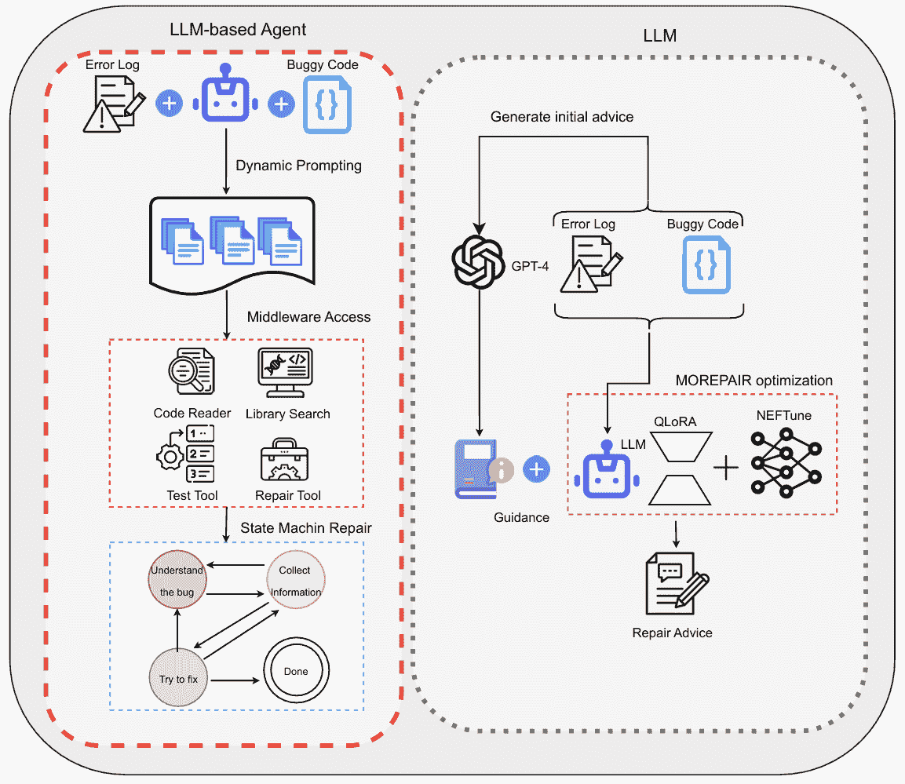

图8：基于LLM的代理与LLM在软件安全性和维护中的比较框架示意图[[46](https://arxiv.org/html/2408.02479v1#bib.bib46)]和[[152](https://arxiv.org/html/2408.02479v1#bib.bib152)]

从自动化的角度来看，基于LLM的智能体通过多智能体框架和动态分析工具自动化地检测和修复软件错误，提高了修复过程的自动化程度和准确性。传统的LLM方法在各种维护或调试任务中也表现良好，但在修复过程中往往缺乏自主决策和动态调整的能力。在软件安全方面，智能体通过将LLM与安全工程模型结合，使得安全分析和设计过程更加灵活，从而提高了软件系统的可靠性和安全性。当仅使用LLM处理安全任务时，通常依赖于静态分析，缺乏适应性和优化能力。如图所示，[8](https://arxiv.org/html/2408.02479v1#S9.F8 "Figure 8 ‣ IX-C Analysis ‣ IX Software Security and Maintenance ‣ From LLMs to LLM-based Agents for Software Engineering: A Survey of Current, Challenges and Future")，比较了LLM使用MOREPAIR [[152](https://arxiv.org/html/2408.02479v1#bib.bib152)]和基于LLM的智能体使用RepairAgent [[46](https://arxiv.org/html/2408.02479v1#bib.bib46)]的情况。LLM框架利用优化技术（QLoRA，NEFTune）生成修复建议，而RepairAgent在检查过程中使用多个工具，帮助提高分析的精确性和准确性，类似于“行动前推理”的思想。然后，智能体框架利用状态机和LLM进行持续优化，如果修复过程中失败，RepairAgent将进入自我反思阶段，自动理解失败原因。

因此，从回顾中我们可以说，基于LLM的智能体在软件安全和维护领域带来了更多的自主性和灵活性。这些改进能够提高任务执行效率和准确性，同时也扩展了LLM在复杂软件工程任务中的应用范围，展示了它们在主动防御、复杂任务处理和满足高可靠性要求方面的强大潜力。

### IX-D 基准测试

在分析LLM文献中使用的基准时，一些公共数据集由于频繁使用并广泛应用于不同的应用场景，尤为突出。像Defects4J、Codeflaws、QuixBugs以及公共漏洞与曝光（CVE）数据库这样的数据集通常被用于漏洞检测和软件安全领域。例如，Defects4J广泛应用于像[[46](https://arxiv.org/html/2408.02479v1#bib.bib46)]和[[159](https://arxiv.org/html/2408.02479v1#bib.bib159)]这样的论文中，用于评估自动化程序修复工具。类似地，Codeflaws和QuixBugs被用于像[[142](https://arxiv.org/html/2408.02479v1#bib.bib142)]这样的论文中，用于测试调试能力，重点关注竞争性编程和教育设置中常见的较小算法问题。这些数据集有效地衡量了LLMs在检测漏洞和修改特定代码块中的代码的能力。

CVE是评估LLMs安全能力的一个关键基准，提供了已知漏洞的库，允许LLMs评估其自动检测和利用安全漏洞的能力，架起了理论研究与实际网络安全应用之间的桥梁。另一个值得注意的数据集是ARepair，参考文献[[162](https://arxiv.org/html/2408.02479v1#bib.bib162)]中使用了这个数据集。该数据集包含有缺陷的规范，用于测试LLMs理解和修复形式化规范的能力。像HumanEval和MBPP这样的常见数据集也经常用于评估LLMs生成代码的功能正确性。类似地，Alloy4Fun用于测试在Alloy框架中修复声明性规范[[162](https://arxiv.org/html/2408.02479v1#bib.bib162)]，反映了LLM在理解和修复形式语言中逻辑错误的表现。

专门的数据集如VulnHub和HackTheBox被用于评估LLMs的渗透测试能力。像[[107](https://arxiv.org/html/2408.02479v1#bib.bib107)]这样的论文利用这些环境来模拟现实世界的黑客场景，从而评估LLMs在网络安全中的实际应用。这些基准对于评估基于LLM的代理在网络安全环境中的现实效果至关重要，弥合了理论能力与实际应用之间的鸿沟。在智能合约安全的背景下，从Etherscan提取的数据集以及为像SmartFix这样的工具编制的数据集提供了评估LLMs识别和修复区块链应用中的漏洞的基准，强调了去中心化应用的可靠性和安全性。

在比较LLM和基于LLM的智能体研究所使用的基准时，几个关键的相似点和差异点显现出来。两者都经常使用像Defects4J、CVE和HumanEval这样的数据集，这些数据集在评估软件工程任务中起到了基础性的作用。然而，基于LLM的智能体研究通常将这些数据集与像VulnHub和HackTheBox这样的专业基准相结合，以测试更动态和交互式的能力，尤其是在网络安全领域。基于LLM的智能体研究通常更注重实时自主决策和行动，这一点在它们选择的基准中得到了体现。这些数据集不仅测试智能体的知识，还测试它们在现实场景中自主应用这些知识的能力。这与传统的LLM研究形成对比，后者通常专注于像漏洞修复和代码生成等静态任务，不要求实时互动和进一步的更改或决策。此外，基于LLM的智能体研究使用像来自Etherscan的智能合约数据集等专业基准，强调了区块链技术的重要性以及在去中心化应用中需要强有力的安全措施，这一趋势突出了基于LLM的智能体在应对软件安全和维护中的新兴挑战时的适应性和多样性。这一区别反映了基于LLM的智能体更广泛且更具互动性的应用场景，同时，公共数据集可能不适合特别设计的基于LLM的智能体结构，因此涌现出许多自收集的基准，提供了更多的灵活性。

### IX-E 评估指标

在软件安全与维护中，LLM（大语言模型）的评估指标种类繁多。研究人员需要考虑诸如模型或框架的覆盖率、效率和可靠性等多个因素。像成功率和通过率这样的评估指标与LLM在不同场景中的表现直接相关。在表格[X](https://arxiv.org/html/2408.02479v1#S9.T10 "TABLE X ‣ IX-E Evaluation Metrics ‣ IX Software Security and Maintenance ‣ From LLMs to LLM-based Agents for Software Engineering: A Survey of Current, Challenges and Future")中，常见的标准如成功率和变化率经常被用来评估模型在面对不同输入时的鲁棒性。时间开销和查询次数则用于评估模型在执行特定任务时的效率和资源消耗。此外，ROC AUC、F1分数和准确度对评估模型识别漏洞的能力非常重要，尤其是在二分类任务中。在代码修复任务中，诸如可编译性和合理性等指标非常常见，这些指标确保生成的解决方案是正确的且可部署的。像BLEU和CodeBLEU这样的常见标准被用来评估生成代码的质量和类人性，这有助于判断模型的能力和表现是否可以与人类表现相媲美。此外，像树编辑距离和测试通过率这样的领域特定指标用于评估LLM在软件工程专业领域应用的有效性，这些指标用于解决软件安全和维护所带来的限制。相比之下，虽然基于LLM的智能体使用与LLM相似的评估指标，如成功率，但它们也引入了更多主观性的评估指标。这些指标包括适当性、相关性和充分性，属于人工评判的标准。总体而言，智能体使用的评估指标通常比LLM使用的指标更简单、更易于理解。这可能是因为智能体处理的是高层次任务，如生成潜在漏洞的成功率和智能体调用外部工具的频率，因此它们还需要考虑整体架构的计算和时间开销。

通过比较这些指标，我们可以看到，LLMs 强调单个测试方法的成功率，而基于 LLM 的代理更多关注整体任务的完成时间/成本/有效性。LLMs 通常使用二元分类指标，如 ROC、AUC 和 F1 得分，而代理则倾向于强调生成和验证阶段的成功率和准确率，提供全面的评估。对于时间成本和性能，LLMs 主要关注测试方法的执行时间和查询次数来评估其效率。相比之下，基于 LLM 的代理更注重修复任务的完成时间和 API 调用次数，确保整体架构的效率和实用性。

表 X：软件安全与维护的评估指标

| 参考文献 | 基准 | 评估指标 | 代理 |
| --- | --- | --- | --- |

|

&#124; [[144](https://arxiv.org/html/2408.02479v1#bib.bib144)] &#124;

|

&#124; 财务情感分析 &#124;

&#124; 电影评论分析 &#124;

&#124; 新闻分类 &#124;

|

&#124; 成功率、变化率、困惑度、时间开销、查询次数 &#124;

| 否 |
| --- |

|

&#124; [[146](https://arxiv.org/html/2408.02479v1#bib.bib146)] &#124;

|

&#124; CVEfixes &#124;

&#124; 手动整理数据集 &#124;

&#124; （624 个漏洞跨越 &#124;

&#124; 205 Java 项目） &#124;

&#124; VCMatch &#124;

&#124; （10 个流行的仓库） &#124;

|

&#124; ROC AUC、F1 得分、准确率、最优分类、阈值 &#124;

| 否 |
| --- |

|

&#124; [[149](https://arxiv.org/html/2408.02479v1#bib.bib149)] &#124;

|

&#124; CVEfixes &#124;

&#124; 手动整理数据集 &#124;

&#124; VCMatch &#124;

|

&#124; 精确度、召回率 &#124;

| 否 |
| --- |
| [[143](https://arxiv.org/html/2408.02479v1#bib.bib143)] |

&#124; HackTheBox &#124;

&#124; VulnHub &#124;

|

&#124; 整体任务完成情况、子任务完成情况、任务多样性、挑战性 &#124;

&#124; 级别、进度跟踪 &#124;

| 否 |
| --- |

|

&#124; [[151](https://arxiv.org/html/2408.02479v1#bib.bib151)] &#124;

|

&#124; Defects4J v1.2 &#124;

&#124; Defects4J v2.0 &#124;

&#124; QuixBugs &#124;

&#124; HumanEval-Java &#124;

|

&#124; 可编译性、合理性、测试通过率、精确匹配、BLEU &#124;

| 否 |
| --- |
| [[148](https://arxiv.org/html/2408.02479v1#bib.bib148)] |

&#124; Devign &#124;

&#124; 显示 &#124;

&#124; Big-Vul &#124;

|

&#124; F1 得分、准确率、精确度、召回率。 &#124;

| 否 |
| --- |

|

&#124; [[150](https://arxiv.org/html/2408.02479v1#bib.bib150)] &#124;

|

&#124; PRIMEVUL &#124;

&#124; BigVul &#124;

|

&#124; F1 得分、准确率、精确度、召回率、VD-S、成对评估指标 &#124;

| 否 |
| --- |

|

&#124; [[147](https://arxiv.org/html/2408.02479v1#bib.bib147)] &#124;

|

&#124; 自定义 GitHub 数据集 &#124;

&#124; （308 个二分类和 &#124;

&#124; 120 个多标签分类） &#124;

|

&#124; 精确度、召回率、F1得分、AUC、准确率 &#124;

| 否 |
| --- |

|

&#124; [[158](https://arxiv.org/html/2408.02479v1#bib.bib158)] &#124;

|

&#124; VulnHub &#124;

|

&#124; 输出描述 &#124;

| 否 |
| --- |

|

&#124; [[165](https://arxiv.org/html/2408.02479v1#bib.bib165)] &#124;

|

&#124; VulDeePecker &#124;

&#124; SeVC &#124;

|

&#124; 假阳性率，假阴性率，精确度，召回率，F1 分数 &#124;

| 否 |
| --- |
| [[145](https://arxiv.org/html/2408.02479v1#bib.bib145)] | CVEFixes |

&#124; CodeBLEU，树编辑距离，Pass@k &#124;

| 否 |
| --- |

|

&#124; [[152](https://arxiv.org/html/2408.02479v1#bib.bib152)] &#124;

|

&#124; EvalRepair-C++ &#124;

&#124; EvalRepair-Java &#124;

|

&#124; TOP-5 和 TOP-10，修复 &#124;

| 否 |
| --- |
| [[155](https://arxiv.org/html/2408.02479v1#bib.bib155)] |

&#124; 入门 Python &#124;

&#124; 作业数据集 &#124;

|

&#124; 修复率，令牌编辑距离 &#124;

| 否 |
| --- |
| [[156](https://arxiv.org/html/2408.02479v1#bib.bib156)] |

&#124; 多语言数据集 &#124;

&#124; (Excel, Power Fx, Python, &#124;

&#124; JavaScript, C 和 PowerShell &#124;

| 精确匹配 | 否 |
| --- | --- |

|

&#124; [[157](https://arxiv.org/html/2408.02479v1#bib.bib157)] &#124;

| Defects4J 1.2 和 2.0 |
| --- |

&#124; 可信补丁，正确修复 &#124;

| 否 |
| --- |

|

&#124; [[107](https://arxiv.org/html/2408.02479v1#bib.bib107)] &#124;

|

&#124; 易受攻击的虚拟机 &#124;

&#124; (lin.security Linux 虚拟机) &#124;

| 成功率 | 是 |
| --- | --- |

|

&#124; [[160](https://arxiv.org/html/2408.02479v1#bib.bib160)] &#124;

| 118 个 AC 漏洞 |
| --- |

&#124; 成功率，基于利用的评估，手动检查 &#124;

&#124; 补丁。&#124;

| 是 |
| --- |

|

&#124; [[161](https://arxiv.org/html/2408.02479v1#bib.bib161)] &#124;

| 13 个智能合约漏洞 |
| --- |

&#124; 成功率，合约级别，试验级别 &#124;

| 是 |
| --- |

|

&#124; [[142](https://arxiv.org/html/2408.02479v1#bib.bib142)] &#124;

|

&#124; Codeflaws, QuixBugs, &#124;

&#124; ConDefects &#124;

|

&#124; 正确修复的漏洞数，可信补丁的漏洞数，&#124;

&#124; 生成补丁的正确率 &#124;

| 是 |
| --- |

|

&#124; [[162](https://arxiv.org/html/2408.02479v1#bib.bib162)] &#124;

| ARepair, Alloy4Fun |
| --- |

&#124; Correct@6，运行时和令牌使用 &#124;

| 是 |
| --- |

|

&#124; [[163](https://arxiv.org/html/2408.02479v1#bib.bib163)] &#124;

| 系统模型图 |
| --- |

&#124; 准确性，有效性，适用性 &#124;

| 是 |
| --- |

|

&#124; [[108](https://arxiv.org/html/2408.02479v1#bib.bib108)] &#124;

|

&#124; 1734 个正样本，&#124;

&#124; 1810 个负样本 &#124;

|

&#124; F1 分数，准确性，一致性 &#124;

| 是 |
| --- |

|

&#124; [[166](https://arxiv.org/html/2408.02479v1#bib.bib166)] &#124;

|

&#124; HumanEval, MBPP, &#124;

&#124; TransCoder &#124;

|

&#124; 准确性，Pass@1 &#124;

| 是 |
| --- |

|

&#124; [[139](https://arxiv.org/html/2408.02479v1#bib.bib139)] &#124;

|

&#124; 13 个安卓应用程序 &#124;

&#124; 来自 GitHub &#124;

|

&#124; 召回率，精确度，正确性，过拟合，Correct@k &#124;

| 是 |
| --- |

|

&#124; [[164](https://arxiv.org/html/2408.02479v1#bib.bib164)] &#124;

| 系统模型图 |
| --- |

&#124; 相关性，充分性 &#124;

| 是 |
| --- |

|

&#124; [[109](https://arxiv.org/html/2408.02479v1#bib.bib109)] &#124;

| 来自 CVE Lib 的 15 个漏洞 | 成功率 | 是 |
| --- | --- | --- |

|

&#124; [[46](https://arxiv.org/html/2408.02479v1#bib.bib46)] &#124;

| Defects4J |
| --- |

&#124; 合理的修复，正确的修复 &#124;

| 是 |
| --- |

## X 讨论

### X-A 实验模型

在第3-8节中，我们回顾并介绍了近年来在软件工程中关于 LLM 和 LLM 基础智能体应用的研究。这些研究有不同的方向，我们将其分为六个子话题进行分类和讨论。随着大型语言模型的发展，成千上万的模型出现在公众视野中，为了更直观地了解大型语言模型在各个领域的应用，以及将大型语言模型作为智能体核心的使用情况，我们总结了共117篇论文，主要讨论 LLM 在软件工程领域的使用频率。

基于对117篇论文的回顾，我们的主要关注点是作者在实验中使用的模型或框架。这是因为这些论文通常包括在特定领域内对模型性能的测试，例如评估 LLaMA 在代码生成中的表现。因此，在我们的数据收集过程中，我们也包括了用于比较的模型，因为这些模型通常代表了研究时各自领域的最先进技术。总之，在这117篇论文中，我们共识别出了79个独特的大型语言模型。我们通过词云对这些模型名称的出现频率进行了可视化，以便更直观地展示，如图所示[9](https://arxiv.org/html/2408.02479v1#S10.F9 "图9 ‣ X-A 实验模型 ‣ X 讨论 ‣ 从 LLM 到 LLM 基础的软件工程智能体：当前挑战与未来展望")。从图中可以看出，像 GPT-3.5、GPT-4、LLaMA2 和 Codex 等模型频繁出现。尽管封闭源 LLM 无法进行本地部署或进一步训练，但其卓越的能力使其成为实验中常用的比较选择，或者用于数据增强，其中 GPT-4 被用于生成额外数据来支持研究模型框架。例如，研究人员可能会使用 OpenAI 的 API 生成初步文本，然后使用本地部署的模型进行进一步处理和优化 [[76](https://arxiv.org/html/2408.02479v1#bib.bib76)] [[122](https://arxiv.org/html/2408.02479v1#bib.bib122)] [[119](https://arxiv.org/html/2408.02479v1#bib.bib119)] [[113](https://arxiv.org/html/2408.02479v1#bib.bib113)]。

因此，我们不难看出，过去两年中，具有卓越性能的通用大模型被广泛应用于软件工程的垂直领域，作为开发辅助工具或衡量标准。此外，对于一些此前从未接触过LLM（大语言模型）的领域，许多研究人员首先参考了模型ChatGPT，并对更新版的GPT-4进行了各种性能实验[[55](https://arxiv.org/html/2408.02479v1#bib.bib55)] [[58](https://arxiv.org/html/2408.02479v1#bib.bib58)] [[64](https://arxiv.org/html/2408.02479v1#bib.bib64)]。这些模型可以集成到更大的系统中，并与其他机器学习模型和工具结合使用，从而生成自然语言响应，而另一个模型则负责意图识别和对话管理。

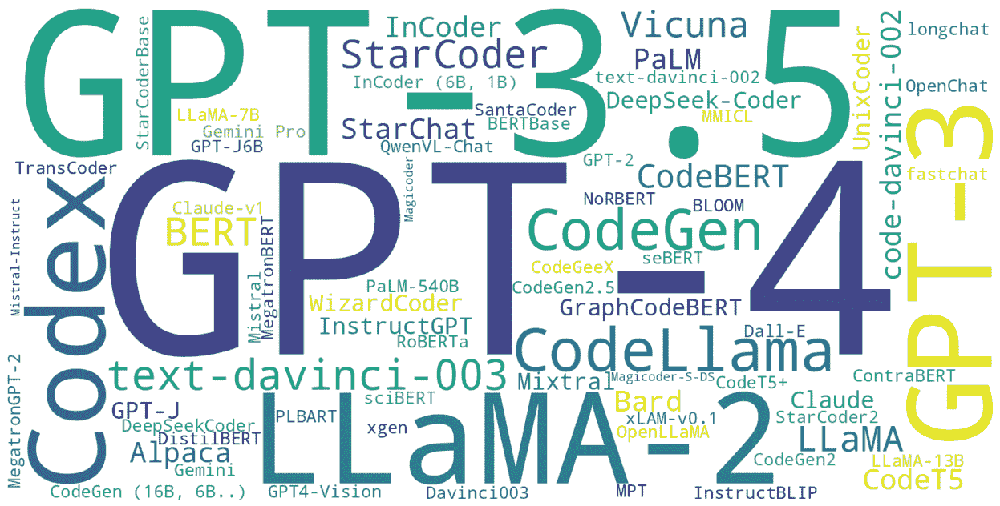

图9：实验模型使用词云

虽然词云提供了模型使用频率的大致概览，但缺乏详细信息。为了获得更深入的见解，我们结合了分组柱状图和堆积柱状图，进一步分析了在不同子主题研究中模型的使用情况。相应的柱状图展示在图[10](https://arxiv.org/html/2408.02479v1#S10.F10 "Figure 10 ‣ X-A Experiment Models ‣ X Discussion ‣ From LLMs to LLM-based Agents for Software Engineering: A Survey of Current, Challenges and Future")中。在分析过程中，我们发现大量模型只出现过一次。如果将这些模型包含在柱状图中，整体表现会显得杂乱。因此，我们排除了只出现一次的模型，专注于剩余模型的多样性。在每个子主题的左侧，我们展示了LLM相关研究中使用的模型，LLM-based agent相关研究中使用的模型则用红色边框的柱状条突出显示。从图中可以明显看出，在自主学习与决策这一子主题中，LLM-based agent相关研究中使用的模型数量相当高。具体来说，GPT-4和GPT-3.5分别在18篇论文中的10篇和15篇中被使用。在这一子主题中，研究通常采用GPT-3.5/4和LLaMA-2进行研究和评估。在我们的分析中，我们发现许多关于LLM-based agents的研究评估了这些智能体模仿人类行为和决策的能力，或执行某些推理任务[[103](https://arxiv.org/html/2408.02479v1#bib.bib103)] [[111](https://arxiv.org/html/2408.02479v1#bib.bib111)] [[108](https://arxiv.org/html/2408.02479v1#bib.bib108)]。由于这些研究不需要本地部署，它们主要评估了先进模型在特定方向上的表现，导致GPT系列模型的使用频率较高。像[[98](https://arxiv.org/html/2408.02479v1#bib.bib98)] [[36](https://arxiv.org/html/2408.02479v1#bib.bib36)]这样的框架通过调用GPT-4 API构建LLM-based agents，利用语言强化帮助智能体从错误中学习。由于GPT模型的局限性，许多研究也使用了LLaMA作为智能体的LLM，在生成的数据集上对其进行微调，以评估知识和能力的出现。总体来看，我们发现，在自主学习与决策这一子主题中，LLM-based agents通常在单一任务中使用多个模型进行测试和性能评估，这使得该主题中的模型使用频率显著高于其他主题。

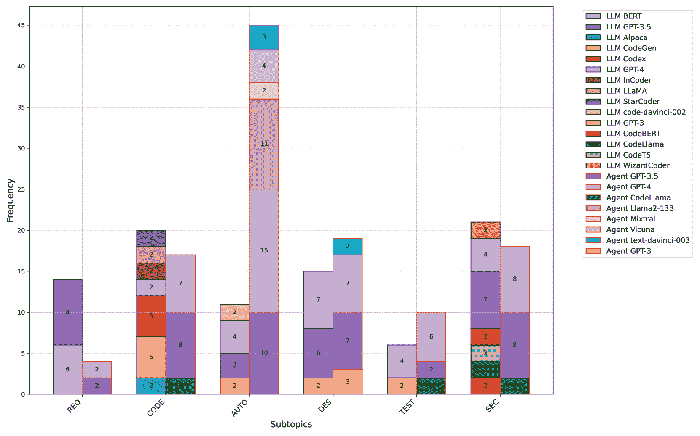

图 10：不同子主题中的实验模型使用情况（REQ 表示“需求工程与文档”，CODE 表示“代码生成与软件开发”，AUTO 表示“自主学习与决策”，DES 表示“软件设计与决策”，SEC 表示“软件安全与维护”）

不仅在自主学习和决策制定这一子主题中，在其他主题中也可以观察到，基于LLM的智能体所使用的模型种类（以颜色数量表示）相对有限。例如，在需求工程和文档化子主题中，只有GPT-3.5和GPT-4模型参与了实验。为了分析这一现象背后的原因，我们需要排除一些因素，比如那些只出现过一次的模型没有被考虑到，以及关于智能体的研究本身就较少。我们认为，这主要反映了智能体与大型语言模型之间的集成关系。这两种技术的结合旨在解决大型语言模型在特定任务或方面上的局限性。智能体使研究人员能够设计一个更灵活的框架，并将大型语言模型融入其中。这些模型经过大规模数据的训练，具备较强的泛化能力，适用于广泛的任务和领域。

因此，研究人员和开发人员可以使用相同的模型来解决多个问题，减少了使用多种模型的需求。在代码生成[[83](https://arxiv.org/html/2408.02479v1#bib.bib83)] [[79](https://arxiv.org/html/2408.02479v1#bib.bib79)]、测试用例生成[[140](https://arxiv.org/html/2408.02479v1#bib.bib140)] [[142](https://arxiv.org/html/2408.02479v1#bib.bib142)]和软件安全[[167](https://arxiv.org/html/2408.02479v1#bib.bib167)] [[159](https://arxiv.org/html/2408.02479v1#bib.bib159)]等领域，曾有使用CodeLlama的实例。该模型是基于LLaMA架构进行微调和优化的。在发布时，它被认为是代码生成和理解任务的最先进模型之一，与Codex等其他模型相比，展现出了强大的表现和潜力。另一个潜在的原因是此前成功的应用和研究成果已经证明了这些模型的有效性，进一步增强了研究人员对它们的信任和依赖。与在特定领域表现良好的模型相比，在智能体开发中，更倾向于使用通用的大型模型，以确保智能体的核心具备出色的文本理解能力，从而进行进一步的推理、规划和任务执行。从图[10](https://arxiv.org/html/2408.02479v1#S10.F10 "Figure 10 ‣ X-A Experiment Models ‣ X Discussion ‣ From LLMs to LLM-based Agents for Software Engineering: A Survey of Current, Challenges and Future")中，我们也可以观察到，代码生成和软件开发领域的研究采用了各种不同的模型，这进一步表明了这一领域受到广泛关注，并且模型在代码生成任务中的表现非常出色。

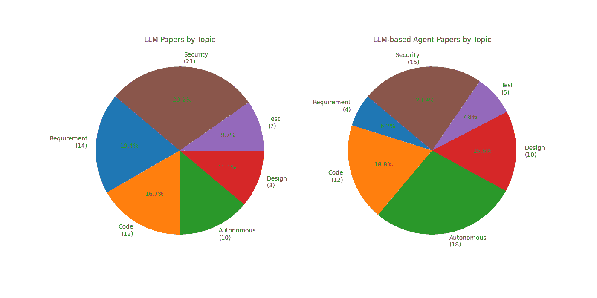

图11：LLM和智能体在六个主题中的分布

|  | CODE | REQ | AUTO | DESIGN | SEC | TEST |
| --- | --- | --- | --- | --- | --- | --- |
| CODE | X | 1 | 0 | 2 | 3 | 1 |
| REQ | 1 | X | 1 | 0 | 2 | 0 |
| AUTO | 0 | 1 | X | 6 | 5 | 1 |
| DESIGN | 2 | 0 | 6 | X | 1 | 0 |
| SEC | 3 | 2 | 5 | 1 | X | 2 |
| TEST | 1 | 0 | 1 | 0 | 2 | X |

表 XI：不同主题间文献的重叠（REQ 代表“需求工程与文档化”，CODE 代表“代码生成与软件开发”，AUTO 代表“自主学习与决策”，DES 代表“软件设计与决策”，SEC 代表“软件安全与维护”）

### X-B 主题重叠

图.[11](https://arxiv.org/html/2408.02479v1#S10.F11 "图11 ‣ X-A 实验模型 ‣ X 讨论 ‣ 从LLM到基于LLM的代理在软件工程中的应用：当前挑战与未来展望") 显示了所有收集文献在六个主题中的分布。对于LLM类型的文献，软件安全与维护主题占比接近30%，而测试用例生成占比不到10%。这一趋势在基于LLM的代理文献中也有类似反映。关于使用基于LLM的代理来解决需求工程和测试用例生成的研究相对较少。需求工程对于基于LLM的代理来说是一个新的领域，利用整个代理框架来生成测试用例可能显得过于冗余。因此，更多的研究倾向于评估和探索LLM在代理框架内所带来的变化，例如自主决策能力以及在软件维护和修复方面的能力。

表格‘[XI](https://arxiv.org/html/2408.02479v1#S10.T11 "TABLE XI ‣ X-A Experiment Models ‣ X Discussion ‣ From LLMs to LLM-based Agents for Software Engineering: A Survey of Current, Challenges and Future")展示了涵盖多个主题的论文数量。例如，五篇论文可以归类为软件安全与维护以及自主学习与决策制定两个主题。这两个主题也与其他主题有最多的重叠，表明LLMs和基于LLM的代理研究范围广泛，且这些任务通常需要整合来自不同领域的知识和技术，如代码生成、设计和测试。显著的重叠反映了这些主题与其他领域之间的紧密相互关系。例如，自主学习与决策制定通常涉及模型自主学习和优化决策树的能力，这些技术在许多具体的软件工程任务中得到了应用。同样，软件安全与维护通常需要结合多种技术来增强安全性，如自动代码生成工具和自动化测试框架[[71](https://arxiv.org/html/2408.02479v1#bib.bib71)] [[80](https://arxiv.org/html/2408.02479v1#bib.bib80)] [[83](https://arxiv.org/html/2408.02479v1#bib.bib83)] [[102](https://arxiv.org/html/2408.02479v1#bib.bib102)]。文献中的重叠凸显了在软件工程中集成来自不同研究领域的方法和技术的日益需求。例如，确保软件安全不仅依赖于安全措施，还需要利用代码生成、自动化测试和设计优化技术。同样，自主学习与决策制定需要全面考虑需求工程、代码生成和系统设计。此外，这还表明某些技术和方法具有强大的共性。例如，基于LLM的代理通过自主学习和决策制定增强了代码生成、测试自动化和安全分析的能力。技术的共享促进了知识交流和技术在软件工程各领域的传播。

### X-C 基准与度量

如图所示，[12](https://arxiv.org/html/2408.02479v1#A0.F12 "Figure 12 ‣ -A Benchmarks ‣ From LLMs to LLM-based Agents for Software Engineering: A Survey of Current, Challenges and Future")，它展示了六个主题下常见基准测试的分布。实际上，使用的基准数据集数量远远超过图中所示的内容。不同的软件工程任务使用各种基准数据集进行评估和测试。例如，在需求工程中，研究人员通常收集用户故事或需求规格作为数据集[[55](https://arxiv.org/html/2408.02479v1#bib.bib55)] [[63](https://arxiv.org/html/2408.02479v1#bib.bib63)]，这些数据集并不是广为人知的公共数据集，因此没有被纳入统计数据中。另一种情况是，一些研究指定其数据集为“定制的GitHub数据集”[[168](https://arxiv.org/html/2408.02479v1#bib.bib168)]。因此，图中展示的基准数据集代表了常用的公共数据集。例如，前面章节中介绍过的MBPP和HumanEval就频繁被使用。我们还可以观察到，LLM和基于LLM的代理任务所使用的数据集，除了常见的公共数据集外，还有其他不同的数据集。

例如，FEVER⁷⁷7[https://fever.ai/dataset/fever.html](https://fever.ai/dataset/fever.html)数据集常用于与代理相关的研究。在[[35](https://arxiv.org/html/2408.02479v1#bib.bib35)]中，FEVER数据集被用来测试ExpeL代理在事实验证任务中的表现。类似地，HotpotQA⁸⁸8[https://hotpotqa.github.io/](https://hotpotqa.github.io/)数据集也常用于与代理相关的研究，涉及知识密集型推理和问答任务。在处理漏洞修复任务时，LLM通常使用Defects4J⁹⁹9[https://github.com/rjust/defects4j](https://github.com/rjust/defects4j)基准数据集。该数据集包含来自多个开源Java项目的835个真实缺陷，分为有缺陷版本和修复版本，通常用于评估自动化程序修复技术的有效性。尽管Defects4J在LLM研究中得到了广泛应用，但在基于LLM的代理研究中相对较少使用。我们推测，这可能是因为Defects4J主要用于评估单一代码修复任务，而不完全符合基于LLM的代理在多任务和实时需求方面的特点。此外，像ConDefects这样的新数据集也已经被引入[[142](https://arxiv.org/html/2408.02479v1#bib.bib142)]，专注于解决数据泄露问题，并提供更全面的缺陷定位和修复评估。

如图所示。[13](https://arxiv.org/html/2408.02479v1#A0.F13 "图13 ‣ -B 评估指标 ‣ 从LLM到基于LLM的智能体在软件工程中的应用：当前、挑战与未来的综述")，它包含了LLM与基于LLM的智能体的十大评估指标。分析结果表明，两者使用的评估方法几乎相同。在前面的章节中，我们还讨论了对于智能体而言，需要考虑时间和计算资源消耗，这一点从饼图中可以明显看出。同时，许多研究集中于LLM的代码生成能力，因此更多的评估指标涉及生成代码的正确性和精确匹配[[73](https://arxiv.org/html/2408.02479v1#bib.bib73)] [[69](https://arxiv.org/html/2408.02479v1#bib.bib69)] [[30](https://arxiv.org/html/2408.02479v1#bib.bib30)]，但总体而言，LLM和基于LLM的智能体在软件工程应用中的评估指标是非常相似的。

## XI 结论

本文对LLM及基于LLM的智能体在软件工程中的应用进行了全面的文献综述。我们将软件工程划分为六个主题：需求工程与文档编写、代码生成与软件开发、自主学习与决策、软件设计与评估、软件测试生成以及软件安全与维护。对于每个主题，我们分析了任务、基准测试和评估指标，区分了LLM与基于LLM的智能体，并讨论了它们带来的差异与影响。我们进一步分析并讨论了117篇收集到的论文中所使用的模型。此外，我们提供了LLM与基于LLM的智能体在数据集和评估指标上的统计数据与区别。分析结果表明，基于LLM的智能体的出现促使了在各种软件工程主题中的广泛研究与应用，与传统LLM在任务、基准测试和评估指标方面相比，显示出了不同的侧重点。

## 参考文献

+   [1] S. Wang, D. Chollak, D. Movshovitz-Attias, 和 L. Tan, “Bugram: 使用n-gram语言模型进行错误检测，”载于《第31届IEEE/ACM国际自动化软件工程会议论文集》，第724-735页，2016年。

+   [2] A. Vogelsang 和 M. Borg, “机器学习的需求工程：数据科学家的观点，”载于2019年IEEE第27届国际需求工程会议工作坊（REW），（韩国济州岛），第245-251页，2019年。

+   [3] “Chatgpt: 优化语言模型以进行对话，”2022年11月。[在线；访问日期：2024年7月17日]。

+   [4] M. Chen, J. Tworek, H. Jun, Q. Yuan, H. P. de Oliveira Pinto, J. Kaplan, H. Edwards, Y. Burda, N. Joseph, G. Brockman, A. Ray, R. Puri, G. Krueger, M. Petrov, H. Khlaaf, G. Sastry, P. Mishkin, B. Chan, S. Gray, N. Ryder, M. Pavlov, A. Power, L. Kaiser, M. Bavarian, C. Winter, P. Tillet, F. P. Such, D. Cummings, M. Plappert, F. Chantzis, E. Barnes, A. Herbert-Voss, W. H. Guss, A. Nichol, A. Paino, N. Tezak, J. Tang, I. Babuschkin, S. Balaji, S. Jain, W. Saunders, C. Hesse, A. N. Carr, J. Leike, J. Achiam, V. Misra, E. Morikawa, A. Radford, M. Knight, M. Brundage, M. Murati, K. Mayer, P. Welinder, B. McGrew, D. Amodei, S. McCandlish, I. Sutskever, and W. Zaremba, “评估基于代码训练的大规模语言模型”，arXiv预印本arXiv:2107.03374，2021年。arXiv:2107.03374 [cs.LG]。

+   [5] N. Jain, S. Vaidyanath, A. Iyer, N. Natarajan, S. Parthasarathy, S. Rajamani, and R. Sharma, “Jigsaw：大规模语言模型与程序合成相结合”，在《第44届国际软件工程会议论文集》ICSE ’22，（美国纽约），第1219–1231页，计算机协会，2022年。

+   [6] T. Li, G. Zhang, Q. D. Do, X. Yue, and W. Chen, “长上下文大规模语言模型在长时间上下文学习中遇到的困难”，2024年。

+   [7] J. Yang, H. Jin, R. Tang, X. Han, Q. Feng, H. Jiang, S. Zhong, B. Yin, and X. Hu, “实践中利用大规模语言模型的力量：ChatGPT及其超越的调研”，《ACM知识发现与数据转换学报》，第18卷，2024年4月。

+   [8] A. Fan, B. Gokkaya, M. Harman, M. Lyubarskiy, S. Sengupta, S. Yoo, and J. M. Zhang, “软件工程中的大规模语言模型：综述与开放问题”，在2023年IEEE/ACM国际软件工程大会：软件工程的未来(ICSE-FoSE)中，第31–53页，2023年。

+   [9] L. Wang, C. Ma, X. Feng, Z. Zhang, H. Yang, J. Zhang, Z. Chen, J. Tang, X. Chen, Y. Lin, W. X. Zhao, Z. Wei, and J. Wen, “基于大规模语言模型的自主代理综述”，《计算机科学前沿》，第18卷，第6期，第186345–，2024年。

+   [10] Z. Xi, W. Chen, X. Guo, W. He, Y. Ding, B. Hong, M. Zhang, J. Wang, S. Jin, E. Zhou, R. Zheng, X. Fan, X. Wang, L. Xiong, Y. Zhou, W. Wang, C. Jiang, Y. Zou, X. Liu, Z. Yin, S. Dou, R. Weng, W. Cheng, Q. Zhang, W. Qin, Y. Zheng, X. Qiu, X. Huang, and T. Gui, “大规模语言模型代理的崛起与潜力：一项综述”，2023年。

+   [11] P. Lewis, E. Perez, A. Piktus, F. Petroni, V. Karpukhin, N. Goyal, H. Küttler, M. Lewis, W.-t. Yih, T. Rocktäschel, S. Riedel, and D. Kiela, “基于检索增强生成的知识密集型自然语言处理任务”，在《神经信息处理系统进展》(H. Larochelle, M. Ranzato, R. Hadsell, M. Balcan, and H. Lin, 编)，第33卷，第9459–9474页，Curran Associates, Inc., 2020年。

+   [12] GitHub, Inc., “Github Copilot：你的AI编程伙伴。” [https://github.com/features/copilot](https://github.com/features/copilot)，2024年。[在线访问；2024年7月17日访问]。

+   [13] S. Russell 和 P. Norvig，《人工智能：一种现代方法》。Pearson Education Limited，2016年。

+   [14] N. R. Jennings，“面向代理的软件工程调查，”《知识工程评论》，第15卷，第4期，第215–249页，2000年。

+   [15] Y. Bisk, A. Holtzman, J. Thomason, J. Andreas, Y. Bengio, J. Chai, M. Lapata, A. Lazaridou, J. May, A. Nisnevich, N. Pinto 和 J. Turian，“经验扎根于语言，”2020年。

+   [16] J. Wei, X. Wang, D. Schuurmans, M. Bosma, F. Xia, E. Chi, Q. V. Le, D. Zhou 等，“思维链提示引发大语言模型的推理，”《神经信息处理系统进展》，第35卷，第24824–24837页，2022年。

+   [17] X. Hou, Y. Zhao, Y. Liu, Z. Yang, K. Wang, L. Li, X. Luo, D. Lo, J. Grundy 和 H. Wang，“大型语言模型在软件工程中的应用：一项系统的文献综述，”2024年。

+   [18] Z. Zheng, K. Ning, J. Chen, Y. Wang, W. Chen, L. Guo 和 W. Wang，“理解大型语言模型在软件工程任务中的应用，”2023年。

+   [19] A. Nguyen-Duc, B. Cabrero-Daniel, A. Przybylek, C. Arora, D. Khanna, T. Herda, U. Rafiq, J. Melegati, E. Guerra, K.-K. Kemell, M. Saari, Z. Zhang, H. Le, T. Quan 和 P. Abrahamsson，“生成性人工智能在软件工程中的应用——研究议程，”2023年。

+   [20] W. Ma, S. Liu, Z. Lin, W. Wang, Q. Hu, Y. Liu, C. Zhang, L. Nie, L. Li 和 Y. Liu，“LMS：理解代码语法和语义以进行代码分析，”2024年。

+   [21] Z. Yang, Z. Sun, T. Z. Yue, P. Devanbu 和 D. Lo，“大语言模型在代码中的鲁棒性、安全性、隐私性、可解释性、效率和可用性，”2024年。

+   [22] Y. Huang, Y. Chen, X. Chen, J. Chen, R. Peng, Z. Tang, J. Huang, F. Xu 和 Z. Zheng，“生成性软件工程，”2024年。

+   [23] C. Manning 和 H. Schutze，《统计自然语言处理基础》。麻省理工学院出版社，1999年。

+   [24] S. Hochreiter 和 J. Schmidhuber，“长短期记忆，”《神经计算》，第9卷，第8期，第1735–1780页，1997年。

+   [25] S. Hochreiter 和 J. Schmidhuber，“长短期记忆，”《神经计算》，第9卷，第8期，第1735–1780页，1997年。

+   [26] A. Vaswani, N. Shazeer, N. Parmar, J. Uszkoreit, L. Jones, A. N. Gomez, Ł. Kaiser 和 I. Polosukhin，“注意力机制就是你所需的一切，”《神经信息处理系统进展》，第30卷，2017年。

+   [27] L. Floridi 和 M. Chiriatti，“GPT-3：它的本质、范围、局限性和后果，”《思维与机器》，第30卷，第681–694页，2020年。

+   [28] A. Chowdhery, S. Narang, J. Devlin, M. Bosma, G. Mishra, A. Roberts, P. Barham, H. W. Chung, C. Sutton, S. Gehrmann 等，“Palm：通过路径扩展语言建模，”《机器学习研究期刊》，第24卷，第240期，第1–113页，2023年。

+   [29] S. Zhang, S. Roller, N. Goyal, M. Artetxe, M. Chen, S. Chen, C. Dewan, M. Diab, X. Li, X. V. Lin, T. Mihaylov, M. Ott, S. Shleifer, K. Shuster, D. Simig, P. S. Koura, A. Sridhar, T. Wang 和 L. Zettlemoyer，“Opt：开放的预训练变压器语言模型，”2022年。

+   [30] Y. Wang, H. Le, A. D. Gotmare, N. D. Bui, J. Li 和 S. C. Hoi，"Codet5+: 开放的代码大型语言模型，用于代码理解与生成"，arXiv 预印本 arXiv:2305.07922，2023。

+   [31] J. Devlin, M.-W. Chang, K. Lee 和 K. Toutanova，"Bert: 深度双向变换器的预训练用于语言理解"，arXiv 预印本 arXiv:1810.04805，2018。

+   [32] T. Brown, B. Mann, N. Ryder, M. Subbiah, J. D. Kaplan, P. Dhariwal, A. Neelakantan, P. Shyam, G. Sastry, A. Askell 等，"语言模型是少样本学习者"，神经信息处理系统进展，卷 33，页 1877–1901，2020。

+   [33] H. Touvron, T. Lavril, G. Izacard, X. Martinet, M.-A. Lachaux, T. Lacroix, B. Rozière, N. Goyal, E. Hambro, F. Azhar 等，"Llama: 开放且高效的基础语言模型"，arXiv 预印本 arXiv:2302.13971，2023。

+   [34] J. X. Chen，"计算的发展：AlphaGo"，计算科学与工程，卷 18，第 4 期，页 4–7，2016。

+   [35] A. Zhao, D. Huang, Q. Xu, M. Lin, Y.-J. Liu 和 G. Huang，"Expel: LLM 智能体是体验式学习者"，在《人工智能会议论文集》上，卷 38，页 19632–19642，2024。

+   [36] S. Yao, J. Zhao, D. Yu, N. Du, I. Shafran, K. Narasimhan 和 Y. Cao，"React: 协同推理与行动的语言模型"，arXiv 预印本 arXiv:2210.03629，2022。

+   [37] W. Huang, P. Abbeel, D. Pathak 和 I. Mordatch，"语言模型作为零-shot 规划器：为具身智能体提取可操作的知识"，国际机器学习会议，页 9118–9147，PMLR，2022。

+   [38] G. Wang, Y. Xie, Y. Jiang, A. Mandlekar, C. Xiao, Y. Zhu, L. Fan 和 A. Anandkumar，"Voyager: 一个开放式具身智能体与大型语言模型"，arXiv 预印本 arXiv:2305.16291，2023。

+   [39] C. Whitehouse, M. Choudhury 和 A. F. Aji，"LLM 驱动的数据增强以提升跨语言性能"，2023。

+   [40] J. White, Q. Fu, S. Hays, M. Sandborn, C. Olea, H. Gilbert, A. Elnashar, J. Spencer-Smith 和 D. C. Schmidt，"增强与 ChatGPT 的提示工程的提示模式目录"，arXiv 预印本 arXiv:2302.11382，2023。

+   [41] M. Reid, N. Savinov, D. Teplyashin, D. Lepikhin, T. Lillicrap, J.-b. Alayrac, R. Soricut, A. Lazaridou, O. Firat, J. Schrittwieser 等，"Gemini 1.5: 解锁跨百万个上下文标记的多模态理解"，arXiv 预印本 arXiv:2403.05530，2024。

+   [42] Z. Ji, N. Lee, R. Frieske, T. Yu, D. Su, Y. Xu, E. Ishii, Y. J. Bang, A. Madotto 和 P. Fung，"自然语言生成中的幻觉调查"，ACM 计算机调查，卷 55，第 12 期，页 1–38，2023。

+   [43] K. An, F. Yang, L. Li, Z. Ren, H. Huang, L. Wang, P. Zhao, Y. Kang, H. Ding, Q. Lin 等，"Nissist: 基于故障排除指南的事件缓解副驾驶"，arXiv 预印本 arXiv:2402.17531，2024。

+   [44] J. Li, Q. Zhang, Y. Yu, Q. Fu 和 D. Ye，"更多智能体就是你所需要的"，2024。

+   [45] Y. Dubois, C. X. Li, R. Taori, T. Zhang, I. Gulrajani, J. Ba, C. Guestrin, P. S. Liang 和 T. B. Hashimoto，“Alpacafarm：一种从人类反馈中学习的方法的模拟框架，”《神经信息处理系统进展》，第36卷，2024年。

+   [46] I. Bouzenia, P. Devanbu 和 M. Pradel，“Repairagent：一个基于LLM的自主管理程序修复代理，”arXiv预印本arXiv:2403.17134，2024年。

+   [47] E. Musumeci, M. Brienza, V. Suriani, D. Nardi 和 D. D. Bloisi，“基于LLM的多代理从公共行政领域的语义模板生成半结构化文档，”发表于国际人机交互会议，页码98–117，Springer，2024年。

+   [48] X. Luo, Y. Xue, Z. Xing 和 J. Sun，“Prcbert：基于BERT预训练语言模型的需求分类的提示学习，”发表于第37届IEEE/ACM国际自动化软件工程会议论文集，页码1–13，2022年。

+   [49] T. Hey, J. Keim, A. Koziolek 和 W. F. Tichy，“Norbert：需求分类的迁移学习，”发表于2020 IEEE第28届国际需求工程会议（RE），页码169–179，2020年。

+   [50] J. Zhang, Y. Chen, N. Niu 和 C. Liu，“在零样本设置下评估ChatGPT在需求信息检索中的表现，”可在SSRN 4450322获取，2023年。

+   [51] C. Arora, J. Grundy 和 M. Abdelrazek，“通过生成式AI推进需求工程：评估LLM的作用，”发表于《生成式AI在有效软件开发中的应用》，页码129–148，Springer，2024年。

+   [52] M. Krishna, B. Gaur, A. Verma 和 P. Jalote，“在软件需求规范中使用LLM：一项实证评估，”2024年。

+   [53] L. Ma, S. Liu, Y. Li, X. Xie 和 L. Bu，“Specgen：通过大型语言模型自动生成形式化程序规范，”2024年。

+   [54] C. Flanagan 和 K. R. M. Leino，“Houdini，一个用于esc/java的注释助手，”发表于FME 2001：提高软件生产力的形式化方法（J. N. Oliveira 和 P. Zave 编），（柏林，海德堡），页码500–517，Springer Berlin Heidelberg，2001年。

+   [55] J. White, S. Hays, Q. Fu, J. Spencer-Smith 和 D. C. Schmidt，《ChatGPT 提示模式：提升代码质量、重构、需求引导和软件设计》，页码71–108。Cham：Springer Nature Switzerland，2024年。

+   [56] D. Luitel, S. Hassani 和 M. Sabetzadeh，“提高需求完整性：通过大型语言模型的自动化辅助，”《需求工程》，第29卷，第1期，页码73–95，2024年。

+   [57] A. Moharil 和 A. Sharma，“基于Transformer的机器学习识别领域内歧义，”发表于第1届国际自然语言软件工程研讨会论文集，NLBSE '22，（美国纽约），页码51–58，计算机协会，2023年。

+   [58] K. Ronanki, B. Cabrero-Daniel 和 C. Berger，“ChatGPT作为用户故事质量评估工具：开箱即用可靠吗？”，收录于《软件工程和极限编程中的敏捷过程——工作坊》（P. Kruchten 和 P. Gregory 编辑），（Cham），第173-181页，Springer Nature Switzerland，2024年。

+   [59] A. Poudel, J. Lin 和 J. Cleland-Huang，“利用基于变换器的语言模型自动化需求满足评估，”2023年。

+   [60] E. Musumeci, M. Brienza, V. Suriani, D. Nardi 和 D. D. Bloisi，“基于LLM的多代理生成从公共行政领域语义模板生成半结构化文档，”收录于《人机交互中的人工智能》（H. Degen 和 S. Ntoa 编辑），（Cham），第98-117页，Springer Nature Switzerland，2024年。

+   [61] S. Zhang, J. Wang, G. Dong, J. Sun, Y. Zhang 和 G. Pu，“与LLMs实验新的编程实践，”2024年。

+   [62] A. Nouri, B. Cabrero-Daniel, F. Törner, H. Sivencrona 和 C. Berger，“利用大型语言模型为自动驾驶设计安全需求，”2024年。

+   [63] Z. Zhang, M. Rayhan, T. Herda, M. Goisauf 和 P. Abrahamsson，“基于LLM的代理用于自动化提升用户故事质量：一份早期报告，”收录于《软件工程中的敏捷过程与极限编程》（D. Šmite, E. Guerra, X. Wang, M. Marchesi 和 P. Gregory 编辑），（Cham），第117-126页，Springer Nature Switzerland，2024年。

+   [64] K. Ronanki, C. Berger 和 J. Horkoff，“调查ChatGPT在需求引导过程中的潜力，”发表于2023年第49届欧洲微电子会议软件工程与高级应用（SEAA），第354-361页，2023年。

+   [65] D. Xie, B. Yoo, N. Jiang, M. Kim, L. Tan, X. Zhang 和 J. S. Lee，“大型语言模型对生成软件规格的影响，”2023年。

+   [66] A. Moharil 和 A. Sharma，“Tabasco：一种基于变换器的上下文化工具包，”《计算机编程科学》，第230卷，第102994页，2023年。

+   [67] M. Chen, J. Tworek, H. Jun, Q. Yuan, H. P. de Oliveira Pinto, J. Kaplan, H. Edwards, Y. Burda, N. Joseph, G. Brockman, A. Ray, R. Puri, G. Krueger, M. Petrov, H. Khlaaf, G. Sastry, P. Mishkin, B. Chan, S. Gray, N. Ryder, M. Pavlov, A. Power, L. Kaiser, M. Bavarian, C. Winter, P. Tillet, F. P. Such, D. Cummings, M. Plappert, F. Chantzis, E. Barnes, A. Herbert-Voss, W. H. Guss, A. Nichol, A. Paino, N. Tezak, J. Tang, I. Babuschkin, S. Balaji, S. Jain, W. Saunders, C. Hesse, A. N. Carr, J. Leike, J. Achiam, V. Misra, E. Morikawa, A. Radford, M. Knight, M. Brundage, M. Murati, K. Mayer, P. Welinder, B. McGrew, D. Amodei, S. McCandlish, I. Sutskever 和 W. Zaremba，“评估训练在代码上的大型语言模型，”2021年。

+   [68] A. Ni, P. Yin, Y. Zhao, M. Riddell, T. Feng, R. Shen, S. Yin, Y. Liu, S. Yavuz, C. Xiong, S. Joty, Y. Zhou, D. Radev 和 A. Cohan，“L2ceval：评估大型语言模型的语言到代码生成能力，”2023年。

+   [69] R. Sun, S. Ö. Arik, A. Muzio, L. Miculicich, S. Gundabathula, P. Yin, H. Dai, H. Nakhost, R. Sinha, Z. Wang, 等人, “Sql-palm: 改进的大型语言模型适应于文本到 SQL（扩展版），” arXiv 预印本 arXiv:2306.00739, 2023.

+   [70] Q. Zheng, X. Xia, X. Zou, Y. Dong, S. Wang, Y. Xue, Z. Wang, L. Shen, A. Wang, Y. Li, T. Su, Z. Yang, 和 J. Tang, “Codegeex: 一种用于代码生成的预训练模型，具有多语言评估基准 humaneval-x，” 2024年.

+   [71] X. Hu, K. Kuang, J. Sun, H. Yang, 和 F. Wu, “利用打印调试提高大语言模型的代码生成能力，” 2024年.

+   [72] S. Peng, E. Kalliamvakou, P. Cihon, 和 M. Demirer, “AI 对开发者生产力的影响：来自 GitHub Copilot 的证据，” 2023年.

+   [73] D. Fried, A. Aghajanyan, J. Lin, S. Wang, E. Wallace, F. Shi, R. Zhong, W. tau Yih, L. Zettlemoyer, 和 M. Lewis, “Incoder: 用于代码填充和合成的生成模型，” 2023年.

+   [74] E. Nijkamp, B. Pang, H. Hayashi, L. Tu, H. Wang, Y. Zhou, S. Savarese, 和 C. Xiong, “Codegen: 一个开放的大型语言模型，用于多轮程序合成的代码生成，” 2023年.

+   [75] Y. Ding, M. J. Min, G. Kaiser, 和 B. Ray, “Cycle: 学会自我优化代码生成，” ACM 编程语言学报，vol. 8, 2024年4月.

+   [76] Y. Dong, X. Jiang, Z. Jin, 和 G. Li, “通过 ChatGPT 实现自我协作的代码生成，” 2024年.

+   [77] F. Lin, D. J. Kim, 等人, “当基于 LLM 的代码生成遇到软件开发过程时，” arXiv 预印本 arXiv:2403.15852, 2024.

+   [78] S. Holt, M. R. Luyten, 和 M. van der Schaar, “L2MAC: 用于大规模代码生成的自动计算机模型，” 第十二届国际学习表征会议，2024年.

+   [79] S. Hong, M. Zhuge, J. Chen, X. Zheng, Y. Cheng, C. Zhang, J. Wang, Z. Wang, S. K. S. Yau, Z. Lin, L. Zhou, C. Ran, L. Xiao, C. Wu, 和 J. Schmidhuber, “Metagpt: 用于多代理协作框架的元编程，” 2023年.

+   [80] Z. Rasheed, M. Waseem, K.-K. Kemell, W. Xiaofeng, A. N. Duc, K. Systä, 和 P. Abrahamsson, “软件开发中的自主代理：一篇愿景论文，” arXiv 预印本 arXiv:2311.18440, 2023.

+   [81] Z. Rasheed, M. Waseem, M. Saari, K. Systä, 和 P. Abrahamsson, “Codepori: 通过使用多代理进行自主软件开发的大规模模型，” arXiv 预印本 arXiv:2402.01411, 2024.

+   [82] D. Huang, Q. Bu, J. M. Zhang, M. Luck, 和 H. Cui, “Agentcoder: 基于多代理的代码生成与迭代测试和优化，” arXiv 预印本 arXiv:2312.13010, 2023.

+   [83] T. Zheng, G. Zhang, T. Shen, X. Liu, B. Y. Lin, J. Fu, W. Chen, 和 X. Yue, “Opencodeinterpreter: 将代码生成与执行和优化集成，” arXiv 预印本 arXiv:2402.14658, 2024.

+   [84] T. Schick, J. Dwivedi-Yu, R. Dessì, R. Raileanu, M. Lomeli, E. Hambro, L. Zettlemoyer, N. Cancedda, 和 T. Scialom, “Toolformer: 语言模型可以自学使用工具，” 《神经信息处理系统进展》，vol. 36, 2024年.

+   [85] Y. Qin, S. Liang, Y. Ye, K. Zhu, L. Yan, Y. Lu, Y. Lin, X. Cong, X. Tang, B. Qian 等人，“Toolllm：帮助大型语言模型掌握16000+个现实世界的API，”arXiv预印本arXiv:2307.16789，2023。

+   [86] X. Jiang, Y. Dong, L. Wang, F. Zheng, Q. Shang, G. Li, Z. Jin, 和 W. Jiao, “使用大型语言模型进行自我规划代码生成，”《ACM软件工程方法学杂志》，2024年6月。刚刚接受。

+   [87] S. Zhang, J. Wang, G. Dong, J. Sun, Y. Zhang, 和 G. Pu, “使用大型语言模型进行新的编程实践实验，”arXiv预印本arXiv:2401.01062，2024。

+   [88] V. Murali, C. Maddila, I. Ahmad, M. Bolin, D. Cheng, N. Ghorbani, R. Fernandez, 和 N. Nagappan, “Codecompose：AI辅助代码编写的大规模工业应用，”arXiv预印本arXiv:2305.12050，2023。

+   [89] J. Huang, S. S. Gu, L. Hou, Y. Wu, X. Wang, H. Yu, 和 J. Han, “大型语言模型可以自我提升，”arXiv预印本arXiv:2210.11610，2022。

+   [90] L. Chen, J. Q. Davis, B. Hanin, P. Bailis, I. Stoica, M. Zaharia, 和 J. Zou, “你只需要更多的llm调用吗？朝着复合推理系统的规模法则迈进，”arXiv预印本arXiv:2403.02419，2024。

+   [91] X. Chen, M. Lin, N. Schärli, 和 D. Zhou, “教会大型语言模型自我调试，”arXiv预印本arXiv:2304.05128，2023。

+   [92] S. Kang, B. Chen, S. Yoo, 和 J.-G. Lou, “通过大型语言模型驱动的科学调试实现可解释的自动化调试，”arXiv预印本arXiv:2304.02195，2023。

+   [93] G. Franceschelli 和 M. Musolesi, “论大型语言模型的创造力，”arXiv预印本arXiv:2304.00008，2023。

+   [94] J. Lai, W. Gan, J. Wu, Z. Qi, 和 P. S. Yu, “法律领域中的大型语言模型：一项调查，”2023年。

+   [95] L. Zheng, W.-L. Chiang, Y. Sheng, S. Zhuang, Z. Wu, Y. Zhuang, Z. Lin, Z. Li, D. Li, E. Xing 等人，“使用mt-bench和chatbot arena评判llm作为法官的能力，”《神经信息处理系统进展》，第36卷，2024。

+   [96] Q. Wang, Z. Wang, Y. Su, H. Tong, 和 Y. Song, “重新思考大型语言模型推理的边界：多代理讨论是关键吗？，”arXiv预印本arXiv:2402.18272，2024。

+   [97] L. Chen, Y. Zhang, S. Ren, H. Zhao, Z. Cai, Y. Wang, P. Wang, T. Liu, 和 B. Chang, “通过多模态大型语言模型实现端到端的具身决策：与gpt4-vision及其他的探索，”arXiv预印本arXiv:2310.02071，2023。

+   [98] N. Shinn, F. Cassano, A. Gopinath, K. Narasimhan, 和 S. Yao, “Reflexion：具有语言强化学习的语言代理，”《神经信息处理系统进展》，第36卷，2024。

+   [99] W. Chen, Y. Su, J. Zuo, C. Yang, C. Yuan, C. Qian, C.-M. Chan, Y. Qin, Y. Lu, R. Xie 等人，“Agentverse：促进多代理合作并探索代理中的涌现行为，”arXiv预印本arXiv:2308.10848，2023。

+   [100] G. Li, H. Hammoud, H. Itani, D. Khizbullin, 和 B. Ghanem, “Camel：用于探索大型语言模型社会中的‘心智’的沟通代理，”《神经信息处理系统进展》，第36卷，第51991-52008页，2023。

+   [101] Z. Liu, W. Yao, J. Zhang, L. Xue, S. Heinecke, R. Murthy, Y. Feng, Z. Chen, J. C. Niebles, D. Arpit, 等, “Bolaa: 基准测试和协调LLM增强的自主代理,” arXiv预印本 arXiv:2308.05960, 2023.

+   [102] J. Lu, W. Zhong, W. Huang, Y. Wang, Q. Zhu, F. Mi, B. Wang, W. Wang, X. Zeng, L. Shang, X. Jiang, 和 Q. Liu, “Self: 自我演化与语言反馈,” 2024.

+   [103] C. Xie, C. Chen, F. Jia, Z. Ye, K. Shu, A. Bibi, Z. Hu, P. Torr, B. Ghanem, 和 G. Li, “大型语言模型代理能否模拟人类信任行为？,” arXiv预印本 arXiv:2402.04559, 2024.

+   [104] Z. Liu, W. Yao, J. Zhang, L. Yang, Z. Liu, J. Tan, P. K. Choubey, T. Lan, J. Wu, H. Wang, 等, “Agentlite: 构建和推进面向任务的LLM代理系统的轻量级库,” arXiv预印本 arXiv:2402.15538, 2024.

+   [105] M. Zhuge, W. Wang, L. Kirsch, F. Faccio, D. Khizbullin, 和 J. Schmidhuber, “作为可优化图的语言代理,” arXiv预印本 arXiv:2402.16823, 2024.

+   [106] R. Feldt, S. Kang, J. Yoon, 和 S. Yoo, “通过对话式大型语言模型迈向自主测试代理,” 2023年第38届IEEE/ACM自动化软件工程国际会议(ASE), 第1688–1693页, IEEE, 2023.

+   [107] A. Happe 和 J. Cito, “被AI‘玩弄’：使用大型语言模型进行渗透测试,” 第31届ACM联合欧洲软件工程会议及软件工程基础研讨会论文集, 第2082–2086页, 2023.

+   [108] W. Ma, D. Wu, Y. Sun, T. Wang, S. Liu, J. Zhang, Y. Xue, 和 Y. Liu, “结合微调和基于LLM的代理进行直观的智能合约审计及其证明,” arXiv预印本 arXiv:2403.16073, 2024.

+   [109] R. Fang, R. Bindu, A. Gupta, 和 D. Kang, “LLM代理可以自主利用一天内的漏洞,” arXiv预印本 arXiv:2404.08144, 2024.

+   [110] S. Yao, D. Yu, J. Zhao, I. Shafran, T. Griffiths, Y. Cao, 和 K. Narasimhan, “思维树：利用大型语言模型进行深思熟虑的问题解决,” 神经信息处理系统进展, 第36卷, 2024.

+   [111] Z. Rasheed, M. Waseem, A. Ahmad, K.-K. Kemell, W. Xiaofeng, A. N. Duc, 和 P. Abrahamsson, “大型语言模型能否作为数据分析师？一种多代理协助的定性数据分析方法,” arXiv预印本 arXiv:2402.01386, 2024.

+   [112] M. Ataei, H. Cheong, D. Grandi, Y. Wang, N. Morris, 和 A. Tessier, “Elicitron: 基于LLM代理的设计需求引导仿真框架,” arXiv预印本 arXiv:2404.16045, 2024.

+   [113] G. Sridhara, S. Mazumdar, 等, “ChatGPT：关于其在普遍软件工程任务中的效用研究,” arXiv预印本 arXiv:2305.16837, 2023.

+   [114] M. Desmond, Z. Ashktorab, Q. Pan, C. Dugan, 和 J. M. Johnson, “Evalullm: 基于LLM的生成输出评估,” 29届国际智能用户界面会议论文集, 第30–32页, 2024.

+   [115] M. Gao, X. Hu, J. Ruan, X. Pu, 和 X. Wan, “基于 LLM 的 NLG 评估：现状与挑战，”arXiv 预印本 arXiv:2402.01383，2024年。

+   [116] L. J. Wan, Y. Huang, Y. Li, H. Ye, J. Wang, X. Zhang, 和 D. Chen, “面向 LLM 的软件/硬件协同设计及其在设计验证中的应用，”在 2024 年第 29 届亚洲及南太平洋设计自动化会议（ASP-DAC）论文集，第 435–441 页，IEEE，2024年。

+   [117] K. Kolthoff, C. Bartelt, 和 S. P. Ponzetto, “通过基于自然语言的 GUI 检索进行数据驱动原型设计，”《自动化软件工程》，第 30 卷，第 1 期，第 13 页，2023年。

+   [118] V. D. Kirova, C. S. Ku, J. R. Laracy, 和 T. J. Marlowe, “软件工程教育必须适应并发展以应对 LLM 环境，”在第 55 届 ACM 计算机科学教育技术研讨会论文集 V. 1，第 666–672 页，2024年。

+   [119] S. Jalil, S. Rafi, T. D. LaToza, K. Moran, 和 W. Lam, “ChatGPT 与软件测试教育：承诺与风险（2023），”arXiv 预印本 arXiv:2302.03287，2023年。

+   [120] S. Suri, S. N. Das, K. Singi, K. Dey, V. S. Sharma, 和 V. Kaulgud, “使用自主代理的软件工程：我们到了吗？”，在 2023 年第 38 届 IEEE/ACM 自动化软件工程国际会议（ASE）论文集，第 1855–1857 页，IEEE，2023年。

+   [121] C. Qian, X. Cong, C. Yang, W. Chen, Y. Su, J. Xu, Z. Liu, 和 M. Sun, “软件开发中的沟通代理，”arXiv 预印本 arXiv:2307.07924，2023年。

+   [122] Y. Shen, K. Song, X. Tan, D. Li, W. Lu, 和 Y. Zhuang, “HuggingGPT：通过 ChatGPT 和 Hugging Face 中的伙伴解决 AI 任务，”《神经信息处理系统进展》，第 36 卷，2024年。

+   [123] J. Chen, X. Hu, S. Liu, S. Huang, W.-W. Tu, Z. He, 和 L. Wen, “LLMarena：评估大语言模型在动态多代理环境中的能力，”arXiv 预印本 arXiv:2402.16499，2024年。

+   [124] M. Josifoski, L. Klein, M. Peyrard, Y. Li, S. Geng, J. P. Schnitzler, Y. Yao, J. Wei, D. Paul, 和 R. West, “Flows：推理和协作 AI 的构建模块，”arXiv 预印本 arXiv:2308.01285，2023年。

+   [125] I. Weber, “作为软件组件的大语言模型：LLM 集成应用的分类法，”arXiv 预印本 arXiv:2406.10300，2024年。

+   [126] F. Vallecillos Ruiz, “代理驱动的自动化软件改进，”在第 28 届国际软件工程评估与评定会议论文集，第 470–475 页，2024年。

+   [127] Z. Cheng, J. Kasai, 和 T. Yu, “批量提示：使用大语言模型 API 进行高效推理，”arXiv 预印本 arXiv:2301.08721，2023年。

+   [128] S. Shankar, J. Zamfirescu-Pereira, B. Hartmann, A. G. Parameswaran, 和 I. Arawjo, “谁来验证验证者？将 LLM 辅助评估与人类偏好对齐，”arXiv 预印本 arXiv:2404.12272，2024年。

+   [129] D. Roy, X. Zhang, R. Bhave, C. Bansal, P. Las-Casas, R. Fonseca, 和 S. Rajmohan，“探索基于LLM的代理进行根本原因分析，”发表于第32届ACM软件工程基础国际会议论文集，第208–219页，2024年。

+   [130] Y. Li, Y. Zhang, 和 L. Sun，“Metaagents：通过协作生成代理模拟人类行为交互，用于基于LLM的任务导向协调，”arXiv预印本arXiv:2310.06500，2023年。

+   [131] M. Tufano, D. Drain, A. Svyatkovskiy, S. K. Deng, 和 N. Sundaresan，“使用变换器和焦点上下文的单元测试用例生成，”arXiv预印本arXiv:2009.05617，2020年。

+   [132] Y. Zhang, W. Song, Z. Ji, N. Meng, 等，“LLM生成安全测试的效果如何？，”arXiv预印本arXiv:2310.00710，2023年。

+   [133] H. J. Kang, T. G. Nguyen, B. Le, C. S. Păsăreanu, 和 D. Lo，“测试模仿以评估库漏洞的可利用性，”发表于第31届ACM SIGSOFT国际软件测试与分析研讨会论文集，第276–288页，2022年。

+   [134] S. Feng 和 C. Chen，“提示就是你所需要的：使用大语言模型的自动化Android错误重现，”发表于第46届IEEE/ACM软件工程国际会议论文集，第1–13页，2024年。

+   [135] S. Kang, J. Yoon, 和 S. Yoo，“大语言模型是少量样本测试器：探索基于LLM的通用错误重现，”发表于2023年IEEE/ACM第45届软件工程国际会议（ICSE），第2312–2323页，IEEE，2023年。

+   [136] C. S. Xia, M. Paltenghi, J. Le Tian, M. Pradel, 和 L. Zhang，“Fuzz4all：使用大语言模型的通用模糊测试，”发表于IEEE/ACM第46届软件工程国际会议论文集，第1–13页，2024年。

+   [137] G. Ryan, S. Jain, M. Shang, S. Wang, X. Ma, M. K. Ramanathan, 和 B. Ray，“代码感知提示：使用LLM在回归设置中进行覆盖率引导的测试生成研究，”arXiv预印本arXiv:2402.00097，2024年。

+   [138] J. A. Pizzorno 和 E. D. Berger，“Coverup：基于覆盖率引导的LLM测试生成，”arXiv预印本arXiv:2403.16218，2024年。

+   [139] K. Liu, Y. Liu, Z. Chen, J. M. Zhang, Y. Han, Y. Ma, G. Li, 和 G. Huang，“LLM驱动的测试用例生成用于检测棘手的错误，”arXiv预印本arXiv:2404.10304，2024年。

+   [140] K. Li 和 Y. Yuan，“大语言模型作为测试用例生成器：性能评估与增强，”arXiv预印本arXiv:2404.13340，2024年。

+   [141] Z. Wang, W. Wang, Z. Li, L. Wang, C. Yi, X. Xu, L. Cao, H. Su, S. Chen, 和 J. Zhou，“Xuat-copilot：基于大语言模型的多代理协作系统用于自动化用户验收测试，”arXiv预印本arXiv:2401.02705，2024年。

+   [142] C. Lee, C. S. Xia, J.-t. Huang, Z. Zhu, L. Zhang, 和 M. R. Lyu，“通过LLM驱动的多代理协同实现统一调试方法，”arXiv预印本arXiv:2404.17153，2024年。

+   [143] G. Deng, Y. Liu, V. Mayoral-Vilches, P. Liu, Y. Li, Y. Xu, T. Zhang, Y. Liu, M. Pinzger, 和 S. Rass, “Pentestgpt: 一个基于大型语言模型的自动渗透测试工具,” arXiv预印本 arXiv:2308.06782, 2023年。

+   [144] M. Xiao, Y. Xiao, H. Dong, S. Ji, 和 P. Zhang, “Ritfis: 基于大型语言模型的智能软件鲁棒输入测试框架,” arXiv预印本 arXiv:2402.13518, 2024年。

+   [145] R. Wang, Z. Li, C. Wang, Y. Xiao, 和 C. Gao, “Navrepair: 节点类型感知的C/C++代码漏洞修复,” arXiv预印本 arXiv:2405.04994, 2024年。

+   [146] A. Shestov, A. Cheshkov, R. Levichev, R. Mussabayev, P. Zadorozhny, E. Maslov, C. Vadim, 和 E. Bulychev, “大型语言模型微调用于漏洞检测,” arXiv预印本 arXiv:2401.17010, 2024年。

+   [147] A. Cheshkov, P. Zadorozhny, 和 R. Levichev, “ChatGPT模型在漏洞检测中的评估,” arXiv预印本 arXiv:2304.07232, 2023年。

+   [148] G. Lu, X. Ju, X. Chen, W. Pei, 和 Z. Cai, “Grace: 利用图结构和上下文学习提升基于大型语言模型的程序漏洞检测,” 《系统与软件期刊》, 第212卷, 第112031页, 2024年。

+   [149] H. Li, Y. Hao, Y. Zhai, 和 Z. Qian, “程序分析的搭便车指南：与大型语言模型的共行之旅,” arXiv预印本 arXiv:2308.00245, 2023年。

+   [150] Y. Ding, Y. Fu, O. Ibrahim, C. Sitawarin, X. Chen, B. Alomair, D. Wagner, B. Ray, 和 Y. Chen, “基于代码语言模型的漏洞检测：我们距离多远？,” arXiv预印本 arXiv:2403.18624, 2024年。

+   [151] F. V. Ruiz, A. Grishina, M. Hort, 和 L. Moonen, “一种基于大型语言模型的自动程序修复新方法：使用回译翻译技术,” arXiv预印本 arXiv:2401.07994, 2024年。

+   [152] B. Yang, H. Tian, J. Ren, H. Zhang, J. Klein, T. F. Bissyandé, C. L. Goues, 和 S. Jin, “多目标微调提升程序修复效果：基于大型语言模型,” arXiv预印本 arXiv:2404.12636, 2024年。

+   [153] T. Dettmers, A. Pagnoni, A. Holtzman, 和 L. Zettlemoyer, “Qlora: 高效的量化大型语言模型微调,” 2023年。

+   [154] N. Jain, P. Yeh Chiang, Y. Wen, J. Kirchenbauer, H.-M. Chu, G. Somepalli, B. R. Bartoldson, B. Kailkhura, A. Schwarzschild, A. Saha, M. Goldblum, J. Geiping, 和 T. Goldstein, “Neftune: 噪声嵌入改进指令微调,” 2023年。

+   [155] J. Zhang, J. P. Cambronero, S. Gulwani, V. Le, R. Piskac, G. Soares, 和 G. Verbruggen, “Pydex: 使用大型语言模型修复入门级Python作业中的错误,” 《ACM编程语言会议论文集》, 第8卷, 第OOPSLA1期, 第1100-1124页, 2024年。

+   [156] H. Joshi, J. C. Sanchez, S. Gulwani, V. Le, G. Verbruggen, 和 I. Radiček, “修复几乎是生成：使用大型语言模型的多语言程序修复,” 《美国人工智能协会会议论文集》, 第37卷, 第5131-5140页, 2023年。

+   [157] J. Xiang, X. Xu, F. Kong, M. Wu, H. Zhang, 和 Y. Zhang, “我们能在实际函数级程序修复中走多远？,” arXiv预印本 arXiv:2404.12833, 2024年。

+   [158] E. Hilario, S. Azam, J. Sundaram, K. Imran Mohammed, 和 B. Shanmugam, “用于渗透测试的生成性 AI：好、坏、丑，” 《信息安全国际期刊》，第23卷，第3期，第2075–2097页，2024年。

+   [159] L. Zhong, Z. Wang, 和 J. Shang, “Ldb：通过逐步验证运行时执行的方式进行大型语言模型调试器，” arXiv 预印本 arXiv:2402.16906，2024年。

+   [160] L. Zhang, K. Li, K. Sun, D. Wu, Y. Liu, H. Tian, 和 Y. Liu, “Acfix: 通过挖掘常见 RBAC 实践引导大型语言模型（LLMs）进行智能合约访问控制漏洞的上下文感知修复，” 2024年。

+   [161] S. Hu, T. Huang, F. İlhan, S. F. Tekin, 和 L. Liu, “基于大型语言模型的智能合约漏洞检测：新视角，” 2023年。

+   [162] M. Alhanahnah, M. R. Hasan, 和 H. Bagheri, “预训练大型语言模型修复声明性形式规范的实证评估，” arXiv 预印本 arXiv:2404.11050，2024年。

+   [163] F. Geissler, K. Roscher, 和 M. Trapp, “面向人机安全共设计的概念引导大型语言模型代理，” 载《AAAI 学会年会论文集》，第3卷，第100–104页，2024年。

+   [164] A. Nouri, B. Cabrero-Daniel, F. Törner, H. Sivencrona, 和 C. Berger, “使用大型语言模型工程化自动驾驶的安全要求，” arXiv 预印本 arXiv:2403.16289，2024年。

+   [165] C. Thapa, S. I. Jang, M. E. Ahmed, S. Camtepe, J. Pieprzyk, 和 S. Nepal, “基于 Transformer 的语言模型用于软件漏洞检测，” 载《第38届年度计算机安全应用会议论文集》，第481–496页，2022年。

+   [166] L. Zhong, Z. Wang, 和 J. Shang, “像人类一样调试：通过逐步验证运行时执行的大型语言模型调试器，” 2024年。

+   [167] N. Alshahwan, M. Harman, I. Harper, A. Marginean, S. Sengupta, 和 E. Wang, “基于 LLM 的软件工程保证，” 2024年。

+   [168] A. Cheshkov, P. Zadorozhny, 和 R. Levichev, “评估 ChatGPT 模型在漏洞检测中的表现，” 2023年。

### -A 基准测试

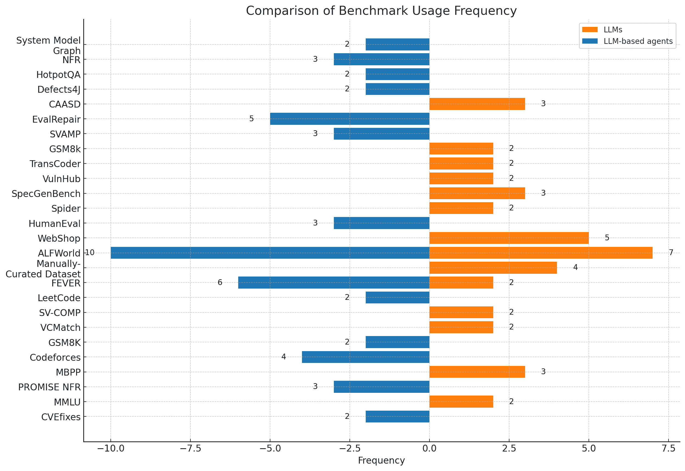

图12：基准测试的分布

### -B 评估指标

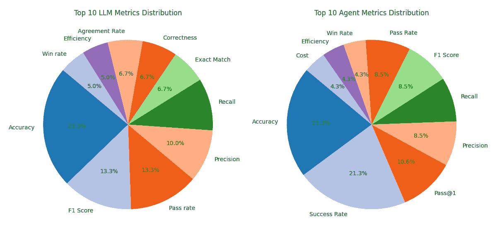

图13：前10名评估指标
