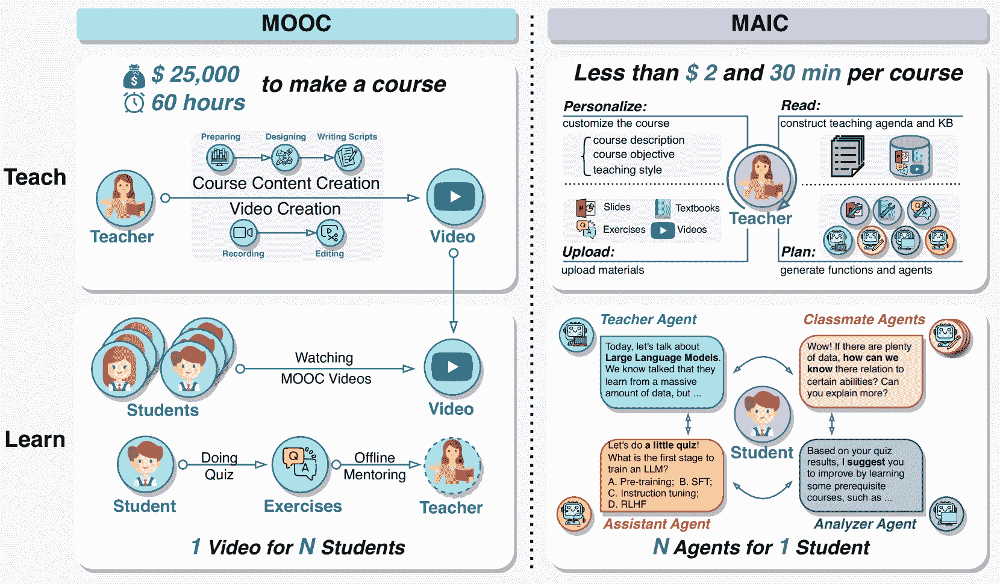
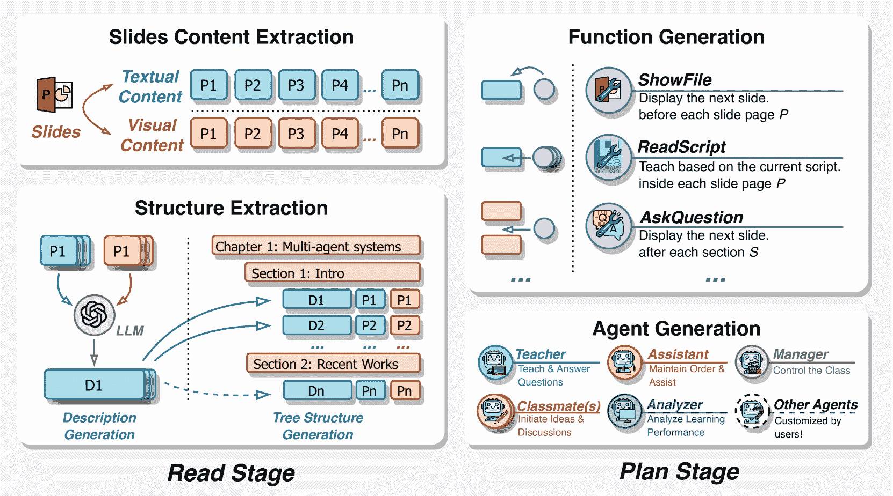
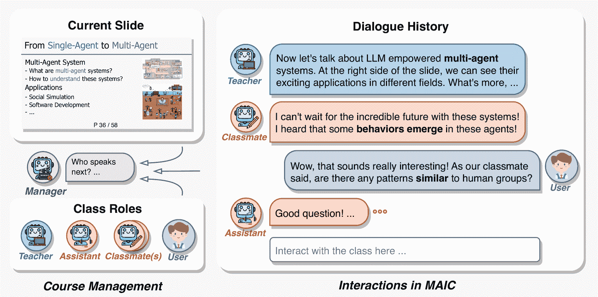
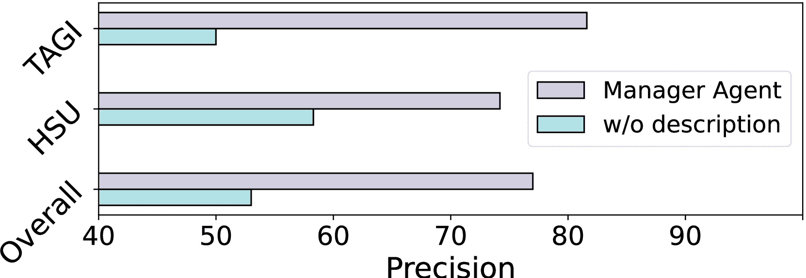
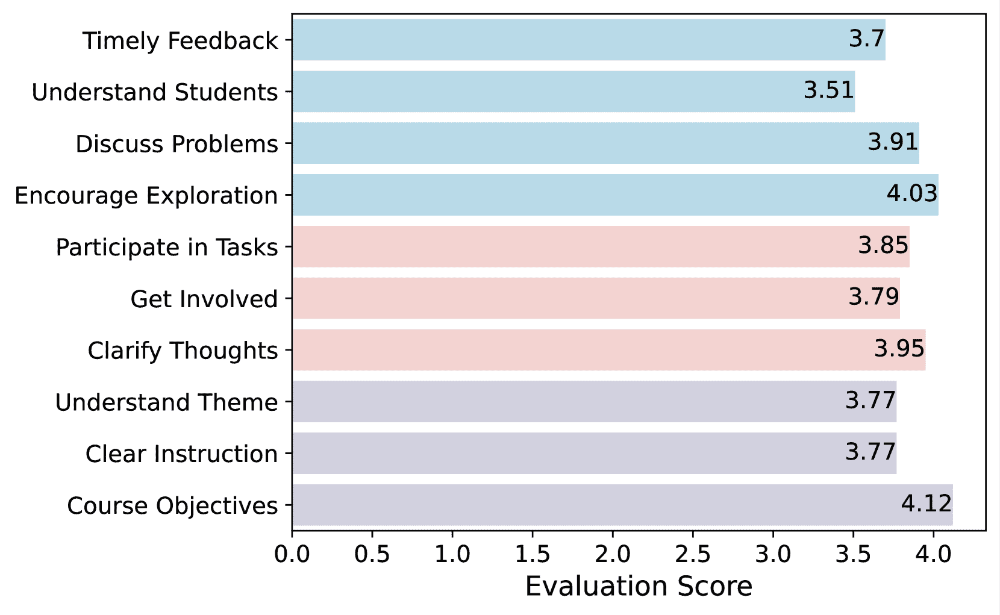
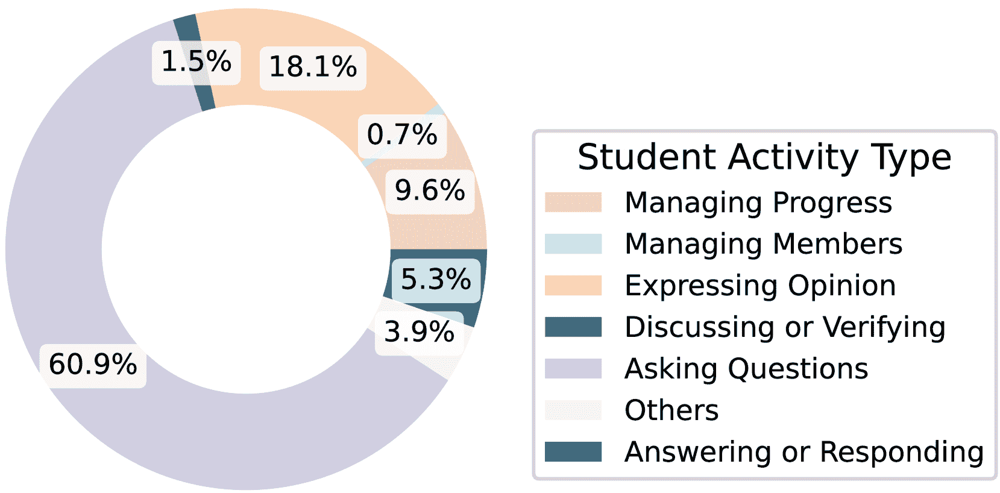

<!--yml

分类：未分类

日期：2025-01-11 12:16:23

-->

# 从MOOC到MAIC：通过LLM驱动的代理重塑在线教学与学习

> 来源：[https://arxiv.org/html/2409.03512/](https://arxiv.org/html/2409.03512/)

Jifan Yu¹, Zheyuan Zhang², Daniel Zhang-li², Shangqing Tu², Zhanxin Hao¹,

Ruimiao Li¹, Haoxuan Li², Yuanchun Wang, Hanming Li², Linlu Gong², Jie Cao¹,

Jiayin Lin², Jinchang Zhou², Fei Qin¹, Haohua Wang², Jianxiao Jiang¹, Lijun Deng²,

Yisi Zhan¹, Chaojun Xiao², Xusheng Dai², Xuan Yan², Nianyi Lin¹,

Nan Zhang³, Ruixin Ni³, Yang Dang¹, Lei Hou², Yu Zhang¹, Xu Han²,

Manli Li¹, Juanzi Li², Zhiyuan Liu², Huiqin Liu¹¹¹脚注标记：1, Maosong Sun²¹¹脚注标记：1

¹清华大学教育研究院。

²清华大学计算机科学与技术系。

³ModelBest公司。

thu_maic@tsinghua.edu.cn 通讯作者。

###### 摘要

自从在线教育的初期阶段开始，课程被上传到易于访问和共享的在线平台，这种将人类知识传播扩展到更广泛受众的方式就引发了广泛讨论并得到了广泛采用。认识到个性化学习仍然具有显著的改进潜力，新的人工智能技术不断被集成到这种学习模式中，从而产生了多种教育人工智能应用，如教育推荐和智能辅导。大型语言模型（LLMs）中智能的出现，使得这些教育创新能够建立在统一的基础模型之上，从而实现更深度的整合。在这种背景下，我们提出了MAIC（大规模AI驱动课程），这是一种新的在线教育形式，通过利用LLM驱动的多代理系统构建一个AI增强课堂，平衡可扩展性与适应性。除了探索概念框架和技术创新外，我们还在中国顶尖大学之一——清华大学进行了初步实验。通过分析超过100,000个学习记录，涉及超过500名学生¹¹1我们遵循了清华大学科技伦理委员会的批准（编号：THU-04-2024-56）。, 我们获得了一系列宝贵的观察和初步分析。这一项目将持续发展，最终旨在建立一个全面的开放平台，支持并统一研究、技术和应用，探索大模型AI时代在线教育的可能性。我们设想这个平台作为一个合作中心，将教育工作者、研究人员和创新者聚集在一起，共同探索AI驱动的在线教育的未来。

## 1 引言

图1：从教学和学习的角度看MOOC与MAIC的对比。

明确背景：可扩展性的演变。在线教育的演变见证了人类对知识不懈追求的精神，超越了时间和空间的限制（Koller 和 Ng，[2013](https://arxiv.org/html/2409.03512v1#bib.bib25)）。从口头传统的谦卑起点到印刷书籍的出现（Froebel，[1886](https://arxiv.org/html/2409.03512v1#bib.bib12)；Halstead 和 Taylor，[2005](https://arxiv.org/html/2409.03512v1#bib.bib16)），教育一直在寻找扩大其影响力的方式。然而，几个世纪以来，传统的教育模式一直受限于实体教室、有限的资源和局部的教学。互联网的出现标志着一次革命性的转变，开启了在线教育的时代，普及知识的梦想开始变得可触及。具体来说，大规模开放在线课程（MOOC）现象是在线教育演变中的一个重要里程碑，反映了技术进步和教育创新（Cormier，[2008](https://arxiv.org/html/2409.03512v1#bib.bib8)；Daniel，[2012](https://arxiv.org/html/2409.03512v1#bib.bib10)）。从那时起，像 edX²²2[https://www.edx.org/](https://www.edx.org/) 这样的平台，涉及麻省理工学院和哈佛大学等机构，以及来自斯坦福大学的 Coursera³³3[https://www.coursera.org/](https://www.coursera.org/) 等平台，整合了来自超过 $270$ 所知名大学的学习资源（Pappano，[2012](https://arxiv.org/html/2409.03512v1#bib.bib32)；Papadakis，[2023](https://arxiv.org/html/2409.03512v1#bib.bib31)）。这些平台吸引了全球超过 $100$ 百万的学习者，逐步实现了在线教育的可扩展性。

隐性动机：适应性决定。然而，通过一段预录制视频为来自不同背景的成千上万的学习者提供服务的这一范式（Reich 和 Ruipérez-Valiente, [2019](https://arxiv.org/html/2409.03512v1#bib.bib37)）（如图[1](https://arxiv.org/html/2409.03512v1#S1.F1 "Figure 1 ‣ 1 Introduction ‣ From MOOC to MAIC: Reshaping Online Teaching and Learning through LLM-driven Agents")所示）难以与“因材施教”的教育理念对接（Reich, [2015](https://arxiv.org/html/2409.03512v1#bib.bib36); Zhu 等, [2020](https://arxiv.org/html/2409.03512v1#bib.bib54)）。这一挑战已经成为随后将人工智能技术引入在线学习的重要原因。为了实现学习的适应性，一系列任务如学习路径规划（Nabizadeh 等, [2020](https://arxiv.org/html/2409.03512v1#bib.bib27); Zhong 等, [2022](https://arxiv.org/html/2409.03512v1#bib.bib53)）、课程推荐（Jiang 等, [2019b](https://arxiv.org/html/2409.03512v1#bib.bib22); Zhang 等, [2018](https://arxiv.org/html/2409.03512v1#bib.bib50); Jing 和 Tang, [2017](https://arxiv.org/html/2409.03512v1#bib.bib23)）和智能辅导（Yilmaz 等, [2022](https://arxiv.org/html/2409.03512v1#bib.bib46); Tu 等, [2023](https://arxiv.org/html/2409.03512v1#bib.bib43)）——这些任务通过推荐系统和对话生成等技术驱动——已经被采用以增强学生的学习体验。

尽管这些技术已经应用于教学和学习的各个方面，但在教学前、教学中和教学后的支持任务之间的显著差异，给将它们统一到一个深度学习框架下带来了挑战（Kabudi等，[2021](https://arxiv.org/html/2409.03512v1#bib.bib24)）。这种碎片化在一定程度上延迟了一个新平台的出现，这个平台能够将AI和在线学习充分结合。然而，随着生成性AI（Epstein等，[2023](https://arxiv.org/html/2409.03512v1#bib.bib11)）的迅速发展，大型语言模型（LLMs）为AI赋能的学习范式创造了新的机会。像GPT-4（Achiam等，[2023](https://arxiv.org/html/2409.03512v1#bib.bib1)）和LLaMA（Touvron等，[2023](https://arxiv.org/html/2409.03512v1#bib.bib42)）这样的模型具有强大的泛化能力，并封装了大量的参数化知识，使得基于它们构建智能体的配置变得更加灵活（Chen等，[2023](https://arxiv.org/html/2409.03512v1#bib.bib6)）。目前，基于LLM的多智能体系统（Wu等，[2023](https://arxiv.org/html/2409.03512v1#bib.bib44)）已经在社会模拟（Park等，[2023a](https://arxiv.org/html/2409.03512v1#bib.bib33)）和执行复杂任务如软件开发（Qian等，[2023](https://arxiv.org/html/2409.03512v1#bib.bib35)）等应用中得到了探索。这一进展为引入大型语言模型多智能体系统，创造全新的在线教学和学习体验开辟了潜在的道路。

MAIC提案。在由大型语言模型和多智能体系统定义的新时代的关键时刻，我们提出了MAIC（大规模AI赋能课程）。MAIC致力于探索多智能体系统在在线学习各个阶段的整合，包括课程准备、教学和分析，目标是平衡在线教育的可扩展性和适应性。MAIC的核心理念是构建一系列由LLM驱动的智能体，支持在线教育环境中的教学和学习。如图[1](https://arxiv.org/html/2409.03512v1#S1.F1 "Figure 1 ‣ 1 Introduction ‣ From MOOC to MAIC: Reshaping Online Teaching and Learning through LLM-driven Agents")所示，MOOC和MAIC的范式可以通过两个主要方面来体现：

教学：这一行为主要由教师执行。在以往的MOOC中，教师负责彻底准备课程材料，起草讲义，并花费大量时间细致地录制课程。最终输出通常是一些预先录制的教学视频。然而，在提出的MAIC平台中，教师只需上传教学幻灯片。借助智能辅助，教师可以进一步完成PPT的制作，之后，智能代理将利用多模态理解和知识结构提取等多种模型，生成结构化的讲义和学习资源，优化AI系统的使用。学习：在MOOCs中（Reich和Ruipérez-Valiente，[2019](https://arxiv.org/html/2409.03512v1#bib.bib37)），一套课程材料被设计成服务于成千上万具有不同背景的学生，教学进度由教师预先设定，几乎没有根据学生个人需求进行个性化调整的空间（Yu等，[2021](https://arxiv.org/html/2409.03512v1#bib.bib48)）。而在MAIC中，课程内容由AI教师代理自主管理，能够根据学生的互动和提问动态调整教学过程。此外，MAIC还提供AI教学助理和可定制的AI同学。学生可以选择他们希望一起学习的AI代理，从而创建多样化的课堂场景，提供个性化的学习伴侣、情感支持以及知识讨论的机会。

在本报告中，我们介绍了MAIC平台，提供了一种直观且用户友好的解决方案，能够满足包括学生和教育工作者在内的各种用户需求。该平台预先配备了一套智能代理和工具，支持课程分析以及新的MAIC课程实例的构建。此外，MAIC集成了多个由大型模型驱动的学习分析工具，能够快速访问学习数据，预测学术成果，并自动化处理诸如面试和评估等任务。

在中国顶尖高校之一——清华大学的支持下，我们进行了为期三个月以上的新型学习模式探索。在超过$500$名学生志愿者的协助下，我们通过两门课程实施了该研究：人工智能课程《走向人工通用智能》（TAGI）和学习科学课程《如何在大学中学习》（HSU）。在这一试点过程中，我们收集了超过$100,000$条行为记录。基于这些课程的数据、学生调查测量和定性访谈结果，我们对MAIC系统的特征和性能进行了初步分析。在接下来的章节中，我们将简要介绍MAIC系统的技术实现、算法改进和主要成果⁴⁴4我们即将发布开源Demo和详细分析。更多的技术细节将在相关论文《Slide2Lecture》和《SimClass》（张等，[2024](https://arxiv.org/html/2409.03512v1#bib.bib51)）中介绍。

## 2 相关工作

##### AI辅助的在线学习

在线学习（Pappano, [2012](https://arxiv.org/html/2409.03512v1#bib.bib32)）指的是在一个由通信技术、网络基础设施、人工智能和多媒体工具组成的电子环境中获取知识的过程。虽然在线教育显著增强了学习者获取知识的途径，支持个性化学习，并促进了符合个人需求的学习，但诸如低课程完成率和不理想的学习成果等持续性问题仍然是巨大的挑战（Zhong等， [2022](https://arxiv.org/html/2409.03512v1#bib.bib53)）。麻省理工学院（Reich和Ruipérez-Valiente，[2019](https://arxiv.org/html/2409.03512v1#bib.bib37)）发布的一项回顾性研究指出，在线学习者缺乏持续的指导和个性化支持是影响在线学习质量和学生发展的关键因素。在线和远程学习的固有性质通常导致学生与教师之间的物理隔离，这使得通过人工方式维持实时互动变得非常昂贵（Aleven等，[2015](https://arxiv.org/html/2409.03512v1#bib.bib2)）。因此，人工智能研究人员开始将辅助学习应用引入在线教育环境，如资源推荐系统（Jing和Tang，[2017](https://arxiv.org/html/2409.03512v1#bib.bib23)）和智能教学助手（Jiang等，[2019a](https://arxiv.org/html/2409.03512v1#bib.bib21)；Tu等，[2023](https://arxiv.org/html/2409.03512v1#bib.bib43)）。通过利用教育知识图谱等技术（Dang等，[2019](https://arxiv.org/html/2409.03512v1#bib.bib9)；Yu等，[2020](https://arxiv.org/html/2409.03512v1#bib.bib47)），它们正在越来越多地整合各种技术，构建个性化的在线学习系统，通过量身定制的支持和适应性学习路径提升学习体验。在大语言模型时代，像可汗学院这样的平台率先推出了AI驱动的工具，如Khanmigo虚拟导师⁵⁵5[https://blog.khanacademy.org/teacher-khanmigo/](https://blog.khanacademy.org/teacher-khanmigo/)。这一发展引发了研究人员的讨论，关于如何超越基本的问答和推荐功能，探索设计更加深度整合的模型，以创新的方式将AI与在线教育融合（Golchin等，[2024](https://arxiv.org/html/2409.03512v1#bib.bib15)）。其中一些研究努力逐渐旨在创造新的范式，超越传统的AI增强学习方法。

##### 基于LLM的AI辅导系统

从早期的专家系统到大语言模型时代的基于代理的模型，智能辅导系统（ITS）的演变经历了交互范式的多次变革 （Pal Chowdhury 等，[2024](https://arxiv.org/html/2409.03512v1#bib.bib30)）。在 1980 年代和 1990 年代，ITS 开始利用专家系统及相关技术，提供与学习者认知过程相契合的教学内容，适应不同的教育环境。此时期的代表性系统包括由孟菲斯大学开发的 AutoTutor（Nye 等，[2014](https://arxiv.org/html/2409.03512v1#bib.bib29)）和斯坦福大学的 SCOT 系统[51]。这些系统提供了更大的灵活性，并且是首批支持基于自然语言的问答交互的系统。然而，这些交互的内容仍然是预先设计的，限制了它们在系统初步设计范围之外提供学习支持的能力。大语言模型（LLMs）的出现显著扩展了智能辅导系统（ITS）的应用范围，提供了前所未有的互动性和适应性，能够在各种教育平台上使用 （Bubeck 等，[2023](https://arxiv.org/html/2409.03512v1#bib.bib4)）。近年来，多智能体系统和工具集成的研究进展推动了在 ITS 框架中规划和学生互动的新方法 （Park 等，[2023b](https://arxiv.org/html/2409.03512v1#bib.bib34)；Qian 等，[2023](https://arxiv.org/html/2409.03512v1#bib.bib35)；Schick 等，[2024](https://arxiv.org/html/2409.03512v1#bib.bib39)）。新兴研究（Chen 等，[2024](https://arxiv.org/html/2409.03512v1#bib.bib7)）展示了 LLMs 如何通过利用一系列工具自主地策划和提供教育内容。此外，像 MWPTutor（Pal Chowdhury 等，[2024](https://arxiv.org/html/2409.03512v1#bib.bib30)）这样的创新探索了 LLMs 如何有效管理复杂学科的教学，比如数学应用题，展示了其在专门化学习环境中的多样性。基于这些发展，我们的研究集中在基于 LLM 的 ITS 模型，旨在建立一个强大的框架，用于全面的、讲座级别的辅导，符合不断发展的教育标准，从而加强 LLMs 在未来教育中的变革性作用。

## 3 MAIC

在本节中，我们介绍了实现 MAIC 平台的关键技术。具体来说，我们展示了为教学和学习双方设计的主要工作流程，重点突出了与每个环节相关的关键挑战以及为解决这些问题而实施的相应解决方案。

### 3.1 教学：课程准备工作流程

图 2：MAIC 课程准备工作流程示意图。

为了将大量弱结构化且静态的学习资源（Dang et al., [2019](https://arxiv.org/html/2409.03512v1#bib.bib9)）转化为高度结构化和自适应的学习材料（Yu et al., [2021](https://arxiv.org/html/2409.03512v1#bib.bib48)），MAIC开发了一种标准化的课程准备工作流程。该工作流程旨在简化专家的工作负担，促进这一在线学习模型的可扩展性，并为更广泛的实施做好准备。MAIC的课程准备工作流程包括两个主要阶段：阅读和规划。

#### 3.1.1 阅读阶段

在此阶段，教师（和授权的教学助理）通过提供材料参与其中。在大型语言模型赋能的多代理系统的帮助下，他们上传一组课程幻灯片$\mathcal{P}=\left\{P_{i}\right\}^{1\leq i\leq|\mathcal{P}|}$，这些幻灯片随后被转化为高度结构化的智能学习资源$\widehat{\mathcal{P}}=\left\{\left<P_{i},D_{i},K_{j}\right>\right\}^{1\leq i\leq|\mathcal{P}|}_{1\leq j\leq|\mathcal{P}|}$，同时使用多个为课堂建设设计的AI代理。这里的$P_{i}$和$D_{i}$分别对应单个幻灯片页面及其文本描述，而$K_{j}$表示每一页的知识感知部分。

1. 幻灯片内容提取。首先，MAIC采用多模态LLM（mLLM）（Huang et al., [2023](https://arxiv.org/html/2409.03512v1#bib.bib20)）捕捉给定幻灯片$\mathcal{P}$每一页的文本内容$P_{i}^{t}$和视觉内容$P_{i}^{v}$，即$f_{T}^{1}:P_{i}\rightarrow<P_{i}^{t},P_{i}^{v}>$。该功能模型$f_{T}^{1}$⁶⁶6同样适用于以下文本中的类似符号。可以通过新兴的LLM技术对其进行调整和进一步改进，目前的实现基于GPT-4V ⁷⁷7[https://openai.com/index/gpt-4v-system-card/](https://openai.com/index/gpt-4v-system-card/)模型，并且在一定的提示上下文中进行操作。

2. 结构提取。在上传幻灯片的预处理之后，MAIC采用两种功能来完成读取阶段。生成的$<P_{i}^{t},P_{i}^{v}>$通过基于mLLM的方法进行描述，采用直观且全面的文本，即$f_{T}^{2}:<P_{i}^{t},P_{i}^{v}>\rightarrow D_{i}$。同时，MAIC采用一种知识提取方法来组织每一页的核心知识，并为幻灯片构建树状分类法，即$f_{T}^{3}:<P_{i}^{t},P_{i}^{v},D_{i}>\rightarrow{K_{j}}$，这些构成了最终的$\widehat{\mathcal{P}}$。

#### 3.1.2 规划阶段

在这一阶段，讲师（和授权的教学助理）参与校对和完善结果。基于高度结构化的幻灯片，MAIC构建了一种新型的教学行为表示语言，允许将灵活的教学功能如讲授和提问融入到预设的课堂中，并自然地与相关的教育技术如讲座脚本生成（Hong等， [2023b](https://arxiv.org/html/2409.03512v1#bib.bib18)）和问题生成（Kurdi等， [2020](https://arxiv.org/html/2409.03512v1#bib.bib26)）相连接。同时，借助智能代理构建技术（Chen等， [2023](https://arxiv.org/html/2409.03512v1#bib.bib6)），该平台利用课程内容为教师和教学助理提供AI驱动的代理，从而促进后续课程基础结构的早期规划。

3. 功能生成。为了使异构的教学行为能够在课堂上下文中生成，讲授和进行小测验等教学活动被概念化为MAIC中的教学行为。每个教学行为$\mathcal{T}$被定义为$\mathcal{T}=(type,value)$，其中$type$表示行为的类别（例如，$ShowFile$、$ReadScript$、$AskQuestion$），$value$则详细说明该行为的内容，如要朗读的脚本。该方法反映了我们的灵活性和适应性原则，使课堂行为能够轻松配置。这使得开发人员和教育者能够根据特定需求创建定制的教学行为，从而促进这些行为顺利融入整体教学过程中。

每个功能都与某些内容的生成相关，表示为$<\mathcal{T}_{n},\widehat{P}_{\mathcal{T}}>$。例如，功能$AskQuestion$需要与一个或一组特定问题相连接。其中，最关键的操作是$ReadScript$，因为它构成了教学过程的核心。基于此功能，这些教学行为通过特殊标记符号嵌入到课程脚本中，从而使智能代理能够以个性化的方式读取和调用它们。具体来说，MAIC已经基于长上下文编码方法和多模态模型基础，训练了一个高质量的讲座脚本生成模型，从而支持基础的课堂流程以及其他教学行为的整合，即$f_{T}^{4}:\widehat{P}\rightarrow\widehat{P}_{script}$。然后，MAIC提供一系列可选功能，如$f_{T}^{5}:\widehat{P}\rightarrow\widehat{P}_{question}$，以在课堂中进行主动提问。请注意，所有生成的结果都需要由讲师进行检查和调整，以确保课程的质量和正确性。

4. 代理生成。与此同时，讲师可以提供个性化信息（例如声音、教学风格和扩展课程材料），以构建定制的教学代理，例如教师代理 $a_{T}$ 和助教代理 $a_{TA}$。MAIC提供了多个代理化工具包（Chen等，[2023](https://arxiv.org/html/2409.03512v1#bib.bib6)），这些工具包通过大语言模型（LLMs）实现，支持这些代理的高级DIY。上传的扩展课程材料也在这一部分进行了分段，并通过RAG（检索增强生成）技术整合到不同的智能代理中。这一系列相关的技术创新也在并行的学术论文中进行了深入介绍和评估。

### 3.2 学习：多代理课堂环境

如引言中所述，MAIC中的学生学习遵循“1名学生用户 + N个AI代理”模型。在这样的环境中，AI教师基于前述的高度结构化的教学行动表示语言控制学习进度，讲解课程内容，提出问题，并导航PowerPoint幻灯片，而AI助教则维持课堂秩序并防止内容偏离。学生可以随时打断教师，提问并参与讨论，智能代理根据学生的表现持续调整教学过程和部分内容。如Zhang等人（[2024](https://arxiv.org/html/2409.03512v1#bib.bib51)）所介绍，构建这一沉浸式适应性课堂的设计原则来源于以下两个问题：（1）如何确保课堂涵盖核心课堂行为？（2）如何保持互动的完整性，并使其自然融入课堂流程？

图3：MAIC课堂学习环境的示意图。

在解决初步问题时，我们依据既定的教育原则系统地分类课堂互动行为，正如Schwanke的开创性著作所阐明的（Schwanke, [1981](https://arxiv.org/html/2409.03512v1#bib.bib40)）：教学与引导（TI）包括教师的教学行为和学生提供的反馈或见解；深入讨论（ID）涉及教师与学生之间的对齐、深思熟虑和反复的问答交流，这对促进学生的概念理解至关重要；情感陪伴（EC）关乎激励学生学习、培养有利的学习环境以及提供情感支持；课堂管理（CM）指的是维护秩序、组织干扰因素并引导课堂话语。认识到这些教学行为通过不同的课堂角色（表示为$\widehat{\mathcal{R}}=\left\{r_{i}\right\}^{\left|\widehat{\mathcal{R}}\right|}$，其中每个$r_{i}$代表一个独特角色）呈现，确保教育环境中代理人角色的多样性和广度是至关重要的。

解决接下来的问题时，我们强调必须精心且有节奏地协调系统中各个代理人之间的互动，并与课程内容保持一致。借助学习材料（表示为$C=\left[c_{1},...,c_{t}\right]$，其中每个教学脚本$c_{t}$是有序的），我们引入了一种创新的课程控制器，用于调节课堂互动的流动，依赖于课堂的动态状态，并在中央管理代理人（Wu et al., [2023](https://arxiv.org/html/2409.03512v1#bib.bib44)）的引导下进行。

基于这些原则，我们为不同角色构建多个同学代理人，实施课堂控制，最终得出多代理人课堂过程。

同学代理。为了增强教育体验并模仿传统课堂设置的动态，我们目前预设了多种类似学生的代理，每个代理都具备独特的个性特征，以补充教学代理。这些代理的设计旨在扮演类似同学的角色，丰富学习环境中的互动景观。在本研究中，我们引入了初步的四种典型学生代理，同时也为用户提供了灵活性，可以定制并引入更多具有吸引力的学生代理到教育平台中。每个代理 $\mathbf{a}_{i}\in\mathcal{A}$ 通过提示大语言模型（LLM）得到支持，并与一个或多个课堂角色相关联，表示为：$\mathcal{A}=\rho\left(LLM,\mathsf{P}_{A}\right),\mathcal{A}\Leftrightarrow% \widehat{\mathcal{R}}$，其中 $\rho$ 是角色定制操作，$\mathsf{P}_{A}$ 是包含代理描述的系统提示 (Zhang et al., [2024](https://arxiv.org/html/2409.03512v1#bib.bib51))。

$\bullet$ 班级小丑（TI, EC, CM）：此代理旨在激发创造力，营造活跃的课堂气氛，并充当支持性同伴，还在学生注意力游离时帮助教师引导课堂的焦点。

$\bullet$ 深思者（TI, ID）：此代理致力于深刻的思考，并提出发人深省的问题，挑战并拓展课堂的智力边界。

$\bullet$ 记录员（TI, CM）：该代理热衷于总结和传播课堂讨论中的关键点，帮助所有参与者进行认知组织和信息保持。

$\bullet$ 好奇心（TI, EC）：此代理具有对讲座内容进行询问的倾向，促进了探究与对话的文化，激励他人参与批判性思维和合作性讨论。

与多代理系统中常用的标准操作程序（SOPs）不同（Qian et al., [2023](https://arxiv.org/html/2409.03512v1#bib.bib35); Hong et al., [2023a](https://arxiv.org/html/2409.03512v1#bib.bib17)），课堂场景作为动态互动的环境，没有僵化的工作流程，更像是一个不断发展的群体讨论。在这种环境中，代理需要判断其互动的适当时机，适应课堂讨论的流动性。为了解决这个需求，我们设计了一个控制器，用于观察课堂动态、做出明智的决策，并根据课堂当前状态管理代理行为。会话控制器由三个核心模块组成：课堂状态接收器和管理代理。

**课堂状态接收器**。课堂状态接收器捕获正在进行的课堂对话，历史记录直到时间$t$的表示为$H_{t}=\bigcup(u_{i}^{\mathbf{a}_{j}})^{t}$，其中$u_{i}$是由代理$\mathbf{a}_{j}$或用户（记作$\mathbf{a}{u}$）所发出的言论。课堂状态$S_{t}$整合了这一互动数据，结构为$\mathcal{S}_{t}=\left\{P_{t},H_{t}|\widehat{\mathcal{R}}\right\}$。这里，$P_{t}\subseteq P$表示截至时间$t$所涉及的学习材料。该设计优先考虑适应性和实时决策，与教育学原则相一致，强调对学习者不断变化需求的响应。

**管理代理**。我们借鉴了AutoGen（Wu et al., [2023](https://arxiv.org/html/2409.03512v1#bib.bib44)）和MathVC（Yue et al., [2024](https://arxiv.org/html/2409.03512v1#bib.bib49)）的灵感，设计了一个隐藏的元代理，负责调节课堂互动的动态。该代理接收当前的课堂状态$\mathcal{S}_{t}$，监控课堂的流动，解释正在进行的活动，并确定接下来要执行的动作，确保学习环境保持适应性和响应性。管理代理的任务$f_{\mathcal{L}}$可以正式定义为$f_{\mathcal{L}}:\mathcal{S}_{t}\rightarrow\left(\mathbf{a}_{t},\mathcal{T}% \right)|\mathbf{a}_{t}\in\mathcal{A},\mathcal{T}_{n}\Leftarrow\mathcal{T}$。

其中，$\mathcal{T}_{n}$表示一个特定的功能，所选动作将被执行，从而使课堂过渡到下一个状态。在执行完动作后，系统进入等待阶段，时间窗口为$\tau$。在此期间，如果用户作出响应或等待时间到期，则触发管理代理做出新决策。该设计反映了关键的教育原则，通过优先考虑以学习者为中心的方法，保持课堂的流动性，并促进及时且具有上下文相关性的教学调整，从而提升整体的教育体验。

这种课堂管理方法是MAIC学习阶段的核心。目前，我们收集了大量的互动数据，并通过微调或提示调优等方式，采用多个基础模型（Hu et al., [2024](https://arxiv.org/html/2409.03512v1#bib.bib19); GLM et al., [2024](https://arxiv.org/html/2409.03512v1#bib.bib14)）作为我们的基准模型。

## 4关键技术评估

MAIC是一个基于大型语言模型的复杂智能代理系统，涵盖了多种特定技术。在教学方面，它涉及内容生成和知识理解的多个过程；在学习方面，它需要评估代理构建和课堂管理能力的有效性。目前，我们主要关注展示两个核心功能：讲座脚本生成和课程管理，这对于MAIC的教学和学习至关重要。其他技术的评估将持续更新。需要注意的是，这些评估仅提供了MAIC特定方面的初步视图，而不是其整体有效性的评估，后续章节将通过实际应用和结果分析进一步探索这一点。

### 4.1 教学方面评估

功能生成。如第[3.1](https://arxiv.org/html/2409.03512v1#S3.SS1 "3.1 教学：课程准备工作流程 ‣ 3 MAIC ‣ 从MOOC到MAIC：通过大型语言模型驱动的代理重塑在线教学和学习")节所述，生成生动的幻灯片脚本是MAIC教学工作流程的核心功能。基线：为了评估我们实施的有效性，我们建立了两个基线配置进行对比：（1）我们复制了Script2Transcript（Nguyen等，[2023](https://arxiv.org/html/2409.03512v1#bib.bib28)），简称S2T，它利用幻灯片标题提供概览性上下文和指导来生成转录文本。（2）我们还重现了Self-Critique Prompting（Zheng等，[2024](https://arxiv.org/html/2409.03512v1#bib.bib52)），简称SCP，它结合了自我批评和改进过程，以提高脚本质量。

评估指标：我们的评估使用四个不同的指标对生成的脚本进行评分，评分采用5分Likert量表，其中1表示质量不可接受，5表示最佳表现：

1.  1.

    语气评估脚本是否恰当地反映了教师的教学语气。

1.  2.

    清晰度评估脚本对学习者的清晰度和可理解性。

1.  3.

    支持性评估脚本在多大程度上为学生提供情感和激励支持。

1.  4.

    对齐度评估脚本内容与幻灯片材料的契合度。

综合表现通过对所有指标的平均分来确定。

程序：我们执行了每个基线的课程准备流程，并收集了注释员对脚本的评估。为了最小化潜在偏差，每一张幻灯片都由三位独立的注释员进行评估，他们需要对同一张幻灯片的所有配置提供评分。这种方法确保了对教学材料的平衡和全面评估，符合强调清晰性、支持性和上下文相关性的教育原则。

表1：我们实施的生成评估结果。

| 设置 | 语气 | 清晰度 | 支持性 | 匹配度 | 总体 |
| --- | --- | --- | --- | --- | --- |
| S2T (Nguyen et al., [2023](https://arxiv.org/html/2409.03512v1#bib.bib28)) | 3.88 | 3.93 | 3.23 | 3.63 | 3.67 |
| SCP (Zheng et al., [2024](https://arxiv.org/html/2409.03512v1#bib.bib52)) | 4.03 | 4.24 | 3.38 | 3.93 | 3.90 |
| MAIC-FuncGen | 4.00 | 4.25 | 3.57 | 4.18 | 4.00 |
| 无视觉输入 | 3.78 | 3.73 | 3.44 | 3.51 | 3.61 |
| 无上下文 | 3.97 | 4.00 | 3.38 | 4.03 | 3.84 |
| 人类 | 4.02 | 4.07 | 3.38 | 3.98 | 3.86 |

结果：如表[1](https://arxiv.org/html/2409.03512v1#S4.T1 "表 1 ‣ 4.1 教学侧评估 ‣ 4 关键技术评估 ‣ 从MOOC到MAIC：通过大语言模型驱动的代理重塑在线教学与学习")所示，我们的方法（MAIC-FuncGen）取得了最高的总得分$4.00$，超越了所有基准方法。我们的分析揭示了几个关键见解：

+   •

    视觉输入的重要性：视觉元素的加入显著提高了脚本生成的质量。没有视觉输入的S2T和MAIC-FuncGen得分较低，突出显示了需要与呈现材料紧密对齐的上下文视觉提示。

+   •

    上下文信息的作用：连贯的上下文信息的存在，包括前几页的内容，对脚本质量至关重要。它不仅提高了当前内容的清晰度，还通过提供连续且互联的学习叙事增强了支持性和匹配度。这与强调学习材料中的连贯性和上下文以支持更深理解的教学原则相一致。

+   •

    与人类讲师的比较表现：有趣的是，我们的方法在三个关键维度上稍微超过了人类基准。这可以归因于大语言模型（LLMs）固有的能力，能够严格遵循指令，保持与幻灯片内容的对齐，并使用鼓励和支持性的语气。相比之下，人类讲师往往会自由扩展话题，引入自己的风格，并偏离核心内容，这反映了一种更灵活但较少结构化的教学方法。

这些发现强调了将结构化视觉和上下文信息融入脚本生成中的价值，同时也突出了LLMs通过提供一致性和结构化支持来补充传统教学策略的潜力。

### 4.2 学习侧评估

图 4：管理代理精度。

教室管理代理。第[3.1.2](https://arxiv.org/html/2409.03512v1#S3.SS1.SSS2 "3.1.2 计划阶段 ‣ 3.1 教学：课程准备工作流 ‣ 3 MAIC ‣ 从MOOC到MAIC：通过LLM驱动的代理重塑在线教学与学习")节还提到了一些MAIC学习的相关技术。教室管理代理是教室控制的关键点。设置：然而，这一过程的评估高度主观，导致很难建立一个客观的评分系统进行评估。因此，在实际实施TAGI和HSU课程时，我们选择了500个实际的系统决策，并提取了相应的教室场景。我们招募了专家教师和教学助理来手动标注这些场景。基于这些标注数据，我们得出了图[4](https://arxiv.org/html/2409.03512v1#S4.F4 "图4 ‣ 4.2 学习侧评估 ‣ 4 关键技术评估 ‣ 从MOOC到MAIC：通过LLM驱动的代理重塑在线教学与学习")中显示的结果。这些结果展示了管理代理所选择的行动与人类讲师在确定下一步课程行动时所选择的行动之间的对齐情况。具体来说，我们评估了有无角色描述的实现，检测了这些上下文信息的影响。

结果：统计分析表明，省略每个代理的角色描述会降低分类器的性能。尽管LLM有时可以通过参考聊天历史中的部分行为来识别正确的代理，但包括全面的角色描述明显提升了性能。这表明，尽管利用聊天历史作为场景控制器的输入可以提供一些好处，但不足以持续生成准确的输出。

然而，目前的结果仍然低于最佳水平，表明还有进一步改进和提升用户体验的机会。尽管表现未达最优，互动代理表现出了部分弥补这些不足的能力。这个补偿效应源于大型语言模型（LLM）在处理超出每个代理预设功能的用户查询时的能力，正如我们后续的行为研究所证明的那样，在去除某些功能的设置下，用户评分并未显著下降。

尽管如此，提升控制代理的准确性仍然具有优势，因为代理能够更有效地管理其专门设计的任务。例如，教师代理旨在采用更加温和、富有指导性的语气，但与教学助理代理相比，它在处理安全相关的案例时可能不那么有效。提高准确性确保每个代理在其设计的范围内运行，从而有助于更顺畅和有效的教学过程。

## 5 行为实验

在清华大学科技伦理委员会批准（证书编号：THU-04-2024-56）并招募学生和教师志愿者后，我们在《迈向通用人工智能》和《如何在大学学习》课程中进行了超过三个月的教学实践和行为分析。这项大规模研究涉及超过500名学生，旨在解决三个核心问题：Q1：MAIC课程的质量如何？Q2：MAIC的学习成果如何？Q3：学生在MAIC环境中的表现如何？在以下部分中，我们将展示这项研究的一些初步观察结果。

### 5.1 Q1：MAIC课程质量

我们通过两份由课程参与者填写的问卷评估了MAIC课程的质量。第一份问卷集中于AI教师教学质量，改编自《探究社区框架》（Garrison和Arbaugh, [2007](https://arxiv.org/html/2409.03512v1#bib.bib13)）。原COI问卷中的条目经过修改，以适应AI驱动的学习环境。该问卷在学生完成整个课程后进行。

图5：课后调查结果。

如图[5](https://arxiv.org/html/2409.03512v1#S5.F5 "图5 ‣ 5.1 Q1：MAIC课程质量 ‣ 5 行为实验 ‣ 从MOOC到MAIC：通过LLM驱动的代理重塑在线教学与学习")所示，结果表明整体学生对MAIC的教学质量持积极态度。例如，学生对“AI导师清晰传达了重要课程目标”（课程目标）这一问题的评分均值为4.12（标准差= $0.66$），满分为$5$，而“AI导师鼓励课程参与者探索新概念”这一问题的平均评分为$4.03$（标准差= $0.73$）。这些发现表明，学生认为AI导师有效帮助他们理解课程目标，理清思路，探索新想法，并进行有意义的对话。

然而，在诸如“AI导师提供的反馈帮助我理解我的优点和缺点”（理解学生）等问题上，评分相对较低，均值为$3.51$（标准差= $0.94$）。这表明AI导师在教学过程中可能缺乏个性化和适应性，可能是因为对所有学生使用了相同的脚本。

### 5.2 Q2：MAIC学生参与行为

首先，在选择上课模式时，学生们倾向于偏好“连续模式”，认为这种模式可以让他们不被打断地保持思路连贯，从而确保学习效率。“连续模式”是指在选择了教师和其他智能代理角色（如助教、思考者、记录员）后，所选择的角色从头到尾进行授课，学生不参与互动输入，形成一种相对被动的学习方式。例如，在访谈中，一位学生提到：

“我主要使用连续模式，因为在互动模式下，每当AI老师讲完一句话后，你必须回应才能继续。我并不总是愿意在每一句话后进行互动，所以大多数时候我使用连续模式。当然，也有一两次我使用了互动模式，因为AI提示我说话，但我记得有一次，在互动模式下我说了话后，AI并没有回应或反应，我觉得那时并不太有用。从那以后，我就坚持使用连续模式。”在这种模式下，尽管无法进行互动，但有些学生会采用暂停策略，如果他们不理解某些内容。例如，一位学生提到，“如果我不理解某些内容，我会暂停并查看PPT和文本框中的文字。我认为我从来没有停下来要求AI再解释某些东西，除非是一些不熟悉的术语或更具探索性的话题。”

其次，关于上课过程中具体的行为，有些学生会主动向智能代理提出关于某些话题的问题。如图3所示，$61$%的学生在课堂上的行为涉及主动寻求知识、信息或提问。例如，询问“你能用简单的语言解释一下变压器结构吗？”本研究的访谈结果也支持这一观点。许多学生表示他们会主动提问。访谈中的一些例子包括：

$\bullet$ “当我问问题时，AI会问一个与我的问题相关的后续问题，我觉得这是一个很棒的体验，就像它真的在引导我更深层次地思考。我认为它问的问题很有意义。在那种互动模式下，它可以扩展到许多其他讨论，超出课程内容。” $\bullet$ “我认为这可能是AI教学的一大优势。因为在传统课堂上，无论是大班还是小班，现代学生通常不愿意提问，原因有很多。此外，我认为即时问答有助于我更好地学习材料。如果我有问题，我可以立刻得到答案，我认为这种即时反馈真的很有价值。”

图6：学生活动比例。

此外，一些学生管理并控制不同智能代理的角色和课堂进度。这些与管理相关的行为占比为$11$%（图[6](https://arxiv.org/html/2409.03512v1#S5.F6 "Figure 6 ‣ 5.2 Q2: The Behavior of MAIC Student Engagement ‣ 5 Behavioral Experiment ‣ From MOOC to MAIC: Reshaping Online Teaching and Learning through LLM-driven Agents")）。例如，“请返回上一张幻灯片”或“请用更简单的语言解释”，展示了强烈的自主性和自我调节学习能力。在访谈中，一些学生还提到，我不仅仅是询问知识；我可能会问，“我想学得更多”或“我希望在某个领域探索一些新东西”，以管理和调节AI的回答。

总体而言，研究结果显示，尽管学生更倾向于选择“连续模式”，因为它可以提供不间断的信息流，但这种被动方式可能限制了学生进行主动参与和批判性思维的机会。未来，AI驱动的课堂应该积极鼓励学生互动，而不仅仅是传递连续的知识。此外，高频率的主动提问表明，学生在获得机会时渴望参与，强调了设计能够促进基于探究学习的AI工具的重要性（Xie，[2023](https://arxiv.org/html/2409.03512v1#bib.bib45)）。提问是反映学生主动学习的一种重要行为，最终能带来更好的学术表现。最后，出现的与管理相关的行为表明，学生已经意识到自己在学习过程中的主动角色，这与Cain（[2024](https://arxiv.org/html/2409.03512v1#bib.bib5)）的研究一致。有说法认为，LLM AI工具的能力可以帮助学生和教育者从被动的接受者转变为主动共同创造学习体验的参与者。进一步的研究可以为他们提供更多支持和鼓励，帮助他们在学习过程中发挥更积极的引导作用。

### 5.3 Q3：MAIC学习成果

我们从三个方面评估了MAIC课程的效果：模块测试和期末考试的表现、通过问卷调查评估的技术接受度、以及自评的高阶思维分数。

测试结果。模块测试在每个模块结束时进行，主要聚焦于最近模块所涉及的内容。期末考试在课程结束后一周进行，综合了早期模块测试中的问题。模块测试的平均出席率为$76.3\%$（标准差=$6\%$），期末考试的平均出席率为$73.3\%$。测试成绩（标准化为百分比）从$53.3\%$（模块2，标准差=$18.9\%$）到$82.4\%$（模块4，标准差=$16.3\%$），反映了学生的学习成果。这些成果得到了学生访谈的验证。一个参与者表示：“从知识的角度来看，我最深刻的收获都来自课后的测试。如果没有课后测试，我可能根本不会记住这些知识，可能就像一缕云烟一样飘过……当我做完测试后，再回头看课程内容，那个时候是我吸收知识的高峰期，说实话。”

表 2：学生的消息感知行为与测试结果的相关性。表中显示的数值已标准化。

| 不带控制 | $\mu(\log(\text{MsgNum}))$ | $\mu(\log(\text{MsgLen}))$ |
| --- | --- | --- |
| 平均测验 | 0.341*** | 0.202* |
| 期末考试 | 0.346*** | 0.333** |
| 带控制 | $\mu(\log(\text{MsgNum}))$ | $\mu(\log(\text{MsgLen}))$ |
| 平均测验 | 0.206** | 0.177** |
| 期末考试 | 0.174 | 0.235* |

此外，测试成绩与课堂参与度密切相关。具体来说，课堂聊天消息的频率（以每模块消息数量的对数衡量）和长度（以每条消息及每模块的字符数对数衡量）——这是MAIC系统的一个突出特征——与标准化测试成绩和期末考试表现呈正相关，如表[2](https://arxiv.org/html/2409.03512v1#S5.T2 "Table 2 ‣ 5.3 Q3: The Outcome of MAIC Learning ‣ 5 Behavioral Experiment ‣ From MOOC to MAIC: Reshaping Online Teaching and Learning through LLM-driven Agents")所示。对标准化测试成绩和课堂聊天消息指标的回归分析已在控制了第1模块的标准化成绩后进行。如表[2](https://arxiv.org/html/2409.03512v1#S5.T2 "Table 2 ‣ 5.3 Q3: The Outcome of MAIC Learning ‣ 5 Behavioral Experiment ‣ From MOOC to MAIC: Reshaping Online Teaching and Learning through LLM-driven Agents")所示，课堂聊天参与度显著预测更高的测试成绩。

技术接受度。我们进一步评估了学生在课程前后对生成式AI工具（如ChatGPT）的接受度。结果显示，技术接受度整体有显著提高（$N=111$，$t=3.05$，$p=0.002$）。对接受度的具体维度进一步分析揭示，在习惯性（$t=2.81$，$p=0.005$）、努力期望（$t=3.98$，$p<0.001$）和促进条件（$t=3.22$，$p=0.002$）方面有显著改善。这些发现表明，学生对MAIC课程形式逐渐适应并表示支持。访谈中的回答也反映了对AI技术的理解和接受度的提高。一位学生评论道：

“我以前对AI有些抵触，主要是因为它太复杂，但上完这门课后，我发现它并没有那么复杂，我也开始更加接受它了。我也了解了一些它的原理。”

高阶思维。我们通过课前和课后的问卷，探讨使用大型语言模型对学生高阶思维技能的感知影响。比较分析和t检验结果显示，学生对课程对其抽象思维（$t=2.32$，$p=0.02$）和批判性思维（$t=2.37$，$p=0.02$）的积极影响的感知有显著提高。这些发现表明，学生认为在整个课程中使用大型语言模型增强了他们在这些领域的认知能力。访谈进一步阐明了这些感知。一位学生表示：

“我觉得这可能让我在提问时更加自信，也会更多思考，”另一位学生提到，“不像以前，（我总是）隐藏起来，等待再次提问的机会。”

然而，课程对其他高阶思维技能的影响仍然不明确。几位学生提到课程中缺乏深度思考和讨论的机会。例如，一位学生评论道：

“（在真正的课堂上）下课后，我可以请老师再给我讲解一次…此时，老师一定会给你不同的想法或解释，但在这门课上，你下课后就没有机会了。”另一位学生补充道，“这门课程纯粹是内容上的，因为老师的教学方式相当机械。课程内容丰富理论知识，但几乎没有生活思考、生活启发，或者一些人工智能之外的启发和思考。”

值得注意的是，问卷本身存在一定的局限性。在我们评估学生对高阶思维能力影响的感知时，需要指出的是，这些能力并未被估量。未来的研究应包括设计好的量表或任务，以评估课程对学生高阶思维能力的影响。

为了解决这一局限性，未来的研究应纳入精心设计的量表或具体任务，能够客观衡量学生的高阶思维能力。这些可能包括评估批判性思维、问题解决和分析推理能力的测验。通过这样做，研究人员可以更全面地了解课程在提升这些能力方面的有效性。此外，加入这些衡量标准将有助于对课程影响进行更严格的评估，从而提供更有力的证据，以支持或挑战仅基于学生感知的发现。

## 6 预期影响与伦理考虑

### 6.1 预期影响

MAIC在在线教育中的应用有望通过提升可扩展性和适应性来彻底改变学习体验。通过利用多代理系统，MAIC能够动态调整以满足个别学习者的需求，提供传统MOOC中无法实现的个性化学习路径。这种个性化方法不仅提高了学习成果，还能为来自不同社会经济背景的人提供高质量的教育，因为它减少了对人工讲师进行内容传授的依赖。

此外，MAIC预计将解决传统在线教育的一些固有挑战，例如“一刀切”的模式和缺乏实时适应性（Rizvi等，[2022](https://arxiv.org/html/2409.03512v1#bib.bib38)）。将人工智能驱动的代理作为教师、教学助理和同学的整合，创造了一个更具互动性和响应性的学习环境。这一转变有望提高学生的参与度和动力，可能导致更高的完成率和更深入的理解。

然而，必须承认，推出如此具有变革性的系统可能也会带来意想不到的后果。适应人工智能驱动学习环境的学生与那些在这种新教育模式中挣扎的学生之间，可能会出现更大的差距。此外，过度依赖人工智能系统可能会导致人类教师的机会减少，进而可能削弱教育者在学习过程中的作用。这些影响需要通过持续的评估和对MAIC系统的改进来进行谨慎监控和解决。

### 6.2 伦理考虑

MAIC在在线教育中的部署带来了重要的伦理考量，必须进行仔细评估（Almarzouqi et al., [2024](https://arxiv.org/html/2409.03512v1#bib.bib3)）。其中一个最重要的问题是学习者隐私和数据安全。该系统依赖大规模的数据收集和分析来个性化学习体验，这引发了关于学生数据如何存储、访问和使用的问题。为了减轻这些担忧，已实施严格的数据保护措施，包括学生记录的加密和匿名化。然而，考虑到教育数据的敏感性，持续努力加强安全协议仍然至关重要。

歧视和偏见问题也带来了伦理挑战。虽然MAIC旨在为所有学生提供个性化的学习体验，但驱动这些个性化体验的算法可能会无意中加剧现有的偏见，特别是当训练数据不够多样时。为了解决这一问题，开发团队已将以公平为重点的审计程序纳入算法设计过程中。尽管这些措施旨在尽量减少偏见，但人们也认识到没有任何系统能够完全免疫于这些挑战，因此需要持续监测以确保公正的结果。

MAIC中的信息准确性和内容监管是另一个重要的伦理关切领域。由于该系统自动化了教育内容的创建和传播，因此存在信息不准确可能会大规模传播的风险。为了减轻这一风险，AI生成的内容会定期由学科专家和教学助理进行审查。然而，考虑到内容生产的庞大规模，也承认一些错误仍然可能发生。因此，该系统包括了学生和教育者标记和纠正不准确信息的机制，确保教育材料的持续改进。

在教育伦理方面，MAIC提出了关于教师在日益依赖AI驱动教学系统中的角色问题。虽然该系统提高了可扩展性并提供了个性化的学习体验，但它也减少了人类教育者的直接参与。这一变化可能影响师生关系的发展，而师生关系对于促进学习者的情感和社会成长至关重要（Thornberg et al., [2022](https://arxiv.org/html/2409.03512v1#bib.bib41)）。为了解决这一问题，MAIC包括了人类干预设计原则，确保教育者可以在必要时介入并指导AI的决策过程。然而，AI自动化与人类监督之间的平衡仍然是一个复杂的问题，需要持续的关注。

此外，主要由AI驱动的教育环境中缺乏同伴互动，可能会妨碍学生重要社交技能的发展。为了应对这一问题，MAIC结合了模拟同伴互动的AI同学。尽管这些代理提供了一种互动形式，但它们无法完全复制人际沟通的细微差别。因此，系统鼓励混合模式的学习环境，在这里学生可以与AI和人类同伴互动，从而保留社交学习的好处。  

最后，学生个性化问题必须谨慎处理。尽管MAIC适应个别学习需求的能力是一个显著优势，但它也带来了公平性和公正性方面的风险。某些学生可能会基于其数据档案获得更加量身定制和有效的教学，从而可能加剧教育不平等。为了应对这一问题，MAIC包含了确保所有学生无论其数据档案如何，都能享受高质量学习体验的机制。该系统的公平性算法正在不断优化，以促进所有学习者的公平教育结果。  

## 7 结论

本文简要概述了在线教育的发展轨迹以及在大语言模型时代出现的技术机会。我们考虑了适应性和可扩展性的原则，并结合大规模语言模型驱动的多代理系统的精密设计，探讨了如何将现有的大规模开放在线课程（MOOC）转变为MAIC（大规模AI赋能课程），并讨论了新的教学与学习范式。我们提出了一套全面的解决方案，分析了关键技术组件，并实现了每一个步骤。我们的方法已在清华大学的两门课程中实际部署，得出了一系列学生行为的初步观察。这些初步发现表明，利用新型AI辅助学习技术构建的高度个性化课堂能够实现高质量教学，学生行为也验证了教学过程的有效性。未来，这项工作将持续维护和扩展，旨在开发一个开放和共享的平台，以促进教育探索、学术研究和技术创新。我们希望我们的工作能引起教育理论家、技术开发者和创新者的关注，并为他们提供一个讨论大语言模型时代新在线环境的契机。  

## 致谢  

### 7.1 作者贡献  

系统实现。余济凡、张哲远和张力丹设计了系统的整体框架。张哲远优化了用于控制代理的工作流表示方法，而张力丹负责多个算法的开发和工程部署，包括资源处理和功能生成。屠尚清监督了安全审查和RAG方法的整合。龚林璐收集了学生的评估数据。张楠和倪瑞欣在MAIC的开发阶段负责项目管理和协调，在确保最终系统质量方面发挥了关键作用。

理论研究。郝战鑫和李瑞淼负责了MAIC概念的理论研究和分析，而邓阳则对这一理念的早期发展做出了贡献。所有的指导教授为MAIC的概念化提供了宝贵的见解和指导。

工具包完成。李浩轩、王元春、李汉名、林佳音、周金昌和林念义为多个MAIC工具的开发做出了贡献，包括认知诊断模块、自动化访谈模块和自动分析模块。王浩华和邓立军在数据收集和处理方面发挥了重要作用。

课程实践。战一思和肖超俊在首轮MAIC试点课程中发挥了重要作用，处理了广泛的实践任务，包括招募学生志愿者、提供课程材料、内容审查和课后管理。戴旭生优化了课程实践过程，而严轩深入参与了课程支持活动。他们的努力对两门课程的成功实施至关重要。

教学分析。在张宇的指导下，郝战鑫负责了MAIC系统的初步教学评估。李瑞淼在李曼丽的监督下进行了关键的实地研究。曹杰、秦飞和蒋建晓在分析过程中扮演了关键角色，分别负责自动编码、定性访谈和数据分析等任务。

论文写作。余济凡负责了论文的主要写作工作，而郝战鑫和李瑞淼在行为实验的设计与实施及伦理考虑方面做出了重要贡献。

顾问。李曼丽、李娟子、刘志远、刘慧琴和孙茂松在本项目中担任了顾问角色。韩旭为系统设计提供了技术见解。本项目还得到了清华大学相关部门的指导和支持。

### 7.2 致谢

本研究项目得到了清华大学郭强研究所（20192920479）资助的支持。

本项目特此向许多其他参与者表示感谢，感谢他们的贡献和帮助。艺术设计由王姗姗精心提供。平台开发和功能实现由周鹏、刘宇婷、徐远伟和徐成强认真完成。

## 参考文献

+   Achiam 等人（2023）乔什·阿基亚姆、史蒂文·阿德勒、桑迪尼·阿加瓦尔、拉马·艾哈迈德、伊尔格·阿卡亚、弗洛伦西亚·莱奥尼·阿勒曼、迪奥戈·阿尔梅达、扬科·阿尔滕施密特、萨姆·奥尔特曼、夏亚马尔·阿纳德卡特等人。GPT-4 技术报告。*arXiv 预印本 arXiv:2303.08774*，2023。

+   Aleven 等人（2015）文森特·阿列文、乔纳森·塞沃尔、奥克塔夫·波佩斯库、弗朗西斯卡·夏卡伊、德鲁夫·钱德、瑞安·贝克、袁伟、乔治·西门斯、卡罗琳·罗泽、德拉甘·加塞维奇。美好友谊的开始？智能辅导系统与大规模开放在线课程（MOOCs）。收录于 *人工智能教育：第17届国际会议，AIED 2015，西班牙马德里，2015年6月22-26日会议录 17*，第525–528页，Springer，2015。

+   Almarzouqi 等人（2024）阿米娜·阿尔马尔祖基、艾哈迈德·阿布拉雅、拉哈德·阿尔法伊萨尔、穆罕默德·艾哈迈德·埃尔巴达维、赛义德·A·萨卢姆。使用 ChatGPT 在教育环境中的伦理影响：一项全面的审查。收录于 *人工智能教育：ChatGPT 在课堂上的力量与危险*，第185–199页，2024。

+   Bubeck 等人（2023）塞巴斯蒂安·布贝克、瓦伦·钱德拉塞卡兰、罗能·埃尔丹、约翰内斯·格赫基、埃里克·霍维茨、埃切·卡马尔、彼得·李、李银达、李元智、斯科特·伦德伯格、哈沙·诺里、哈米德·帕兰吉、马尔科·图利奥·里贝罗、张一。人工智能通用智能的火花：与 GPT-4 的早期实验，2023。网址 [https://arxiv.org/abs/2303.12712](https://arxiv.org/abs/2303.12712)。

+   Cain（2024）威廉·凯恩。《促使变化：探索大型语言模型 AI 中的提示工程及其对教育的潜在变革》。*TechTrends*，68(1)：47–57，2024。

+   陈等人（2023）陈伟泽、苏玉生、左景伟、杨程、袁晨飞、钱晨、陈志敏、秦宇佳、陆雅熙、谢若冰等人。《Agentverse：促进多智能体协作并探索智能体的涌现行为》。*arXiv 预印本 arXiv:2308.10848*，2(4)：6，2023。

+   陈等人（2024）陈宇霖、丁宁、郑海涛、刘志远、孙茂松、周博文。通过连接大规模语言模型赋能私人辅导，2024。网址 [https://arxiv.org/abs/2309.08112](https://arxiv.org/abs/2309.08112)。

+   Cormier（2008）D·科米尔。CCK08 MOOC——连通主义课程，1/4 路程，2008。网址 [https://davecormier.com/edblog/2008/10/02/the-cck08-mooc-connectivism-course-14-way/](https://davecormier.com/edblog/2008/10/02/the-cck08-mooc-connectivism-course-14-way/)。

+   Dang 等人（2019）冯如东、唐金涛、李莎莎。Mooc-kg：用于跨平台在线学习资源的 MOOC 知识图谱。收录于 *2019 IEEE 第9届国际电子信息与应急通信会议（ICEIEC）*，第1–8页，IEEE，2019。

+   Daniel (2012) John Daniel. 理解MOOCs：在神话、悖论和可能性的迷宫中沉思。*互动媒体教育期刊*，2012(3)：18–18，2012。

+   Epstein et al. (2023) Ziv Epstein, Aaron Hertzmann, 人类创造力研究人员，Memo Akten, Hany Farid, Jessica Fjeld, Morgan R Frank, Matthew Groh, Laura Herman, Neil Leach, 等人。艺术与生成性AI的科学。*科学*，380(6650)：1110–1111，2023。

+   Froebel (1886) Friedrich Froebel。*人类的教育*，第五卷。A. Lovell & Company，1886。

+   Garrison and Arbaugh (2007) D Randy Garrison 和 J Ben Arbaugh。研究社区探索框架：回顾、问题与未来方向。*互联网与高等教育*，10(3)：157–172，2007。

+   GLM et al. (2024) GLM团队，Aohan Zeng, Bin Xu, Bowen Wang, Chenhui Zhang, Da Yin, Diego Rojas, Guanyu Feng, Hanlin Zhao, Hanyu Lai, 等人。ChatGLM：从GLM-130B到GLM-4全工具的大型语言模型家族。*arXiv预印本 arXiv:2406.12793*，2024。

+   Golchin et al. (2024) Shahriar Golchin, Nikhil Garuda, Christopher Impey, 和 Matthew Wenger。大型语言模型作为MOOCs评分工具。*arXiv预印本 arXiv:2402.03776*，2024。

+   Halstead and Taylor (2005) Mark Halstead 和 Monica J Taylor。*教育中的价值观与价值观中的教育*。Routledge，2005。

+   Hong et al. (2023a) Sirui Hong, Xiawu Zheng, Jonathan Chen, Yuheng Cheng, Jinlin Wang, Ceyao Zhang, Zili Wang, Steven Ka Shing Yau, Zijuan Lin, Liyang Zhou, 等人。MetaGPT：多代理协作框架的元编程。*arXiv预印本 arXiv:2308.00352*，2023a。

+   Hong et al. (2023b) Xudong Hong, Asad Sayeed, Khushboo Mehra, Vera Demberg, 和 Bernt Schiele。视觉写作提示：基于角色的故事生成与精心策划的图像序列。*计算语言学协会会刊*，11：565–581，2023b。

+   Hu et al. (2024) Shengding Hu, Yuge Tu, Xu Han, Chaoqun He, Ganqu Cui, Xiang Long, Zhi Zheng, Yewei Fang, Yuxiang Huang, Weilin Zhao, 等人。MiniCPM：揭示具有可扩展训练策略的小型语言模型的潜力。*arXiv预印本 arXiv:2404.06395*，2024。

+   Huang et al. (2023) Hanyao Huang, Ou Zheng, Dongdong Wang, Jiayi Yin, Zijin Wang, Shengxuan Ding, Heng Yin, Chuan Xu, Renjie Yang, Qian Zheng, 等人。ChatGPT在塑造未来牙科领域中的潜力：多模态大语言模型的潜力。*国际口腔科学杂志*，15(1)：29，2023。

+   Jiang et al. (2019a) Lan Jiang, Shuhan Hu, Mingyu Huang, Zhichun Wang, Jinjian Yang, Xiaoju Ye, 和 Wei Zheng。Massistant：为MOOC学习者提供的个人知识助手。在*2019年自然语言处理经验方法会议及第九届国际联合自然语言处理会议（EMNLP-IJCNLP）：系统演示*论文集中，第133–138页，2019a。

+   Jiang 等人 (2019b) Weijie Jiang, Zachary A Pardos 和 Qiang Wei. 基于目标的课程推荐。收录于 *第9届国际学习分析与知识会议论文集*，页码36-45，2019年。

+   Jing 和 Tang (2017) Xia Jing 和 Jie Tang. 猜您喜欢：MOOC中的课程推荐。收录于 *国际网络智能会议论文集*，页码783-789，2017年。

+   Kabudi 等人 (2021) Tumaini Kabudi, Ilias Pappas 和 Dag Håkon Olsen. 基于人工智能的自适应学习系统：文献的系统性梳理。*计算机与教育：人工智能*，2:100017，2021年。

+   Koller 和 Ng (2013) Daphne Koller 和 Andrew Ng. 在线革命：人人可得的教育。发表于 *赛德商学院的研讨会演讲*，英国牛津大学，2013年。

+   Kurdi 等人 (2020) Ghader Kurdi, Jared Leo, Bijan Parsia, Uli Sattler 和 Salam Al-Emari. 教育目的下自动生成问题的系统性综述。*国际人工智能教育杂志*，30:121-204，2020年。

+   Nabizadeh 等人 (2020) Amir Hossein Nabizadeh, José Paulo Leal, Hamed N Rafsanjani 和 Rajiv Ratn Shah. 学习路径个性化与推荐方法：最前沿的调查。*专家系统与应用*，159:113596，2020年。

+   Nguyen 等人 (2023) Nguyen Xuan Vu Nguyen, Quang Huy Ngo 和 Quang Nhat Minh Pham. 从演示文稿幻灯片自动生成文字记录。收录于 Chu-Ren Huang, Yasunari Harada, Jong-Bok Kim, Si Chen, Yu-Yin Hsu, Emmanuele Chersoni, Pranav A, Winnie Huiheng Zeng, Bo Peng, Yuxi Li 和 Junlin Li 编辑的 *第37届太平洋亚太语言、信息与计算大会论文集*，页码670-678，香港，中国，2023年12月。计算语言学协会。网址 [https://aclanthology.org/2023.paclic-1.67](https://aclanthology.org/2023.paclic-1.67)。

+   Nye 等人 (2014) Benjamin D Nye, Arthur C Graesser 和 Xiangen Hu. Autotutor 及其家族：17年自然语言辅导的回顾。*国际人工智能教育杂志*，24:427-469，2014年。

+   Pal Chowdhury 等人 (2024) Sankalan Pal Chowdhury, Vilém Zouhar 和 Mrinmaya Sachan. Autotutor 与大语言模型的结合：具备丰富教学法和保护机制的语言模型导师。收录于 *第十一届 ACM 大规模学习会议论文集*，L@S ’24，页码5–15，美国纽约，2024年。计算机协会。ISBN 9798400706332。DOI: 10.1145/3657604.3662041。网址 [https://doi.org/10.1145/3657604.3662041](https://doi.org/10.1145/3657604.3662041)。

+   Papadakis (2023) Stamatios Papadakis. MOOC 2012-2022：概述。*移动学习教育研究进展*，3(1):682-693，2023年。

+   Pappano (2012) Laura Pappano. MOOC之年。*纽约时报*，2(12):2012，2012年。

+   Park 等人 (2023a) Joon Sung Park, Joseph O’Brien, Carrie Jun Cai, Meredith Ringel Morris, Percy Liang, 和 Michael S Bernstein. 生成代理：人类行为的互动模拟。见 *第36届年度 ACM 用户界面软件与技术会议论文集*, 页码 1–22, 2023a.

+   Park 等人 (2023b) Joon Sung Park, Joseph C. O’Brien, Carrie J. Cai, Meredith Ringel Morris, Percy Liang, 和 Michael S. Bernstein. 生成代理：人类行为的互动模拟。见 *第36届年度 ACM 用户界面软件与技术会议 (UIST ’23)*, UIST ’23, 纽约, 美国, 2023b. 计算机协会.

+   Qian 等人 (2023) 陈乾, 辛聪, 程扬, 陈伟泽, 苏宇胜, 徐居元, 刘志远, 和 孙茂松. 面向软件开发的交流代理。*arXiv 预印本 arXiv:2307.07924*, 6, 2023.

+   Reich (2015) Justin Reich. 重启 MOOC 研究。*科学*, 347(6217):34–35, 2015.

+   Reich 和 Ruipérez-Valiente (2019) Justin Reich 和 José A Ruipérez-Valiente. MOOC 转型。*科学*, 363(6423):130–131, 2019.

+   Rizvi 等人 (2022) Saman Rizvi, Bart Rienties, Jekaterina Rogaten, 和 René F Kizilcec. 超越一刀切的 MOOC 设计：在不同文化和社会经济背景下，学习设计的变异性与学习者的持久性。*计算机与人类行为*, 126:106973, 2022.

+   Schick 等人 (2024) Timo Schick, Jane Dwivedi-Yu, Roberto Dessì, Roberta Raileanu, Maria Lomeli, Eric Hambro, Luke Zettlemoyer, Nicola Cancedda, 和 Thomas Scialom. Toolformer：语言模型能自我学习使用工具。*神经信息处理系统进展*, 36, 2024.

+   Schwanke (1981) Dean Schwanke. 教室互动研究：近期文献综述。*教室互动杂志*, 页码 8–10, 1981.

+   Thornberg 等人 (2022) Robert Thornberg, Camilla Forsberg, Eva Hammar Chiriac, 和 Ylva Bjereld. 教师-学生关系质量与学生参与度：一项顺序解释性混合方法研究。*教育研究论文*, 37(6):840–859, 2022.

+   Touvron 等人 (2023) Hugo Touvron, Thibaut Lavril, Gautier Izacard, Xavier Martinet, Marie-Anne Lachaux, Timothée Lacroix, Baptiste Rozière, Naman Goyal, Eric Hambro, Faisal Azhar, 等人. Llama：开放且高效的基础语言模型。*arXiv 预印本 arXiv:2302.13971*, 2023.

+   Tu 等人 (2023) 唐尚清, 张哲源, 于季凡, 李春阳, 张思宇, 姚子俊, 侯雷, 和 李娟子. Littlemu：通过异构资源集成和教学提示链部署在线虚拟教学助手。见 *第32届 ACM 国际信息与知识管理大会论文集*, 页码 4843–4849, 2023.

+   Wu 等人 (2023) 吴庆云, Gagan Bansal, 张杰宇, 吴依然, 张绍坤, 朱尔康, 李北斌, 姜力, 张晓云, 和 王驰. Autogen：通过多代理对话框架支持下一代 LLM 应用。*arXiv 预印本 arXiv:2308.08155*, 2023.

+   Xie（2023）Xiaofang Xie。AI驱动的探究式教学对学习成果的影响。*国际新兴技术学习期刊*，18（23），2023年。

+   Yilmaz等（2022）Ramazan Yilmaz、Halil Yurdugul、Fatma Gizem Karaoglan Yilmaz、Muhittin Sahin、Sema Sulak、Furkan Aydin、Mustafa Tepgec、Cennet Terzi Muftuoglu和ORAL Omer。智能化MOOC与智能辅导整合：系统架构与框架模型提案。*计算机与教育：人工智能*，3:100092，2022年。

+   Yu等（2020）Jifan Yu、Gan Luo、Tong Xiao、Qingyang Zhong、Yuquan Wang、Wenzheng Feng、Junyi Luo、Chenyu Wang、Lei Hou、Juanzi Li等。Mooccube：用于MOOC中自然语言处理应用的大规模数据存储库。发表于*第58届计算语言学协会年会论文集*，第3135–3142页，2020年。

+   Yu等（2021）Jifan Yu、Yuquan Wang、Qingyang Zhong、Gan Luo、Yiming Mao、Kai Sun、Wenzheng Feng、Wei Xu、Shulin Cao、Kaisheng Zeng等。Mooccubex：一个以知识为中心的大型自适应学习MOOC存储库。发表于*第30届ACM国际信息与知识管理会议论文集*，第4643–4652页，2021年。

+   Yue等（2024）Murong Yue、Wijdane Mifdal、Yixuan Zhang、Jennifer Suh和Ziyu Yao。Mathvc：一个由大型语言模型（LLM）模拟的多角色虚拟数学课堂。*arXiv预印本 arXiv:2404.06711*，2024年。

+   Zhang等（2018）Hao Zhang、Tao Huang、Zhihan Lv、SanYa Liu和Zhili Zhou。MCRS：一个用于MOOC课程推荐的系统。*多媒体工具与应用*，77:7051–7069，2018年。

+   Zhang等（2024）Zheyuan Zhang、Daniel Zhang-Li、Jifan Yu、Linlu Gong、Jinchang Zhou、Zhiyuan Liu、Lei Hou和Juanzi Li。利用大型语言模型（LLM）增强的代理模拟课堂教育。*arXiv预印本 arXiv:2406.19226*，2024年。

+   Zheng等（2024）Ying Zheng、Xueyi Li、Yaying Huang、Qianru Liang、Teng Guo、Mingliang Hou、Boyu Gao、Mi Tian、Zitao Liu和Weiqi Luo。通过大型语言模型生成自动化课程计划，并进行自我批判提示。在Andrew M. Olney、Irene-Angelica Chounta、Zitao Liu、Olga C. Santos和Ig Ibert Bittencourt（编辑）*教育中的人工智能：海报和最新成果，研讨会与教程，产业与创新，实践者，博士生联盟与蓝天论坛*，第2150卷，第163–178页，2024年，施普林格自然瑞士出版社，Cham，2024年。ISBN 978-3-031-64314-9 978-3-031-64315-6。DOI：10.1007/978-3-031-64315-6_13。网址 [https://link.springer.com/10.1007/978-3-031-64315-6_13](https://link.springer.com/10.1007/978-3-031-64315-6_13)。系列标题：计算机与信息科学通讯。

+   Zhong等（2022）Qingyang Zhong、Jifan Yu、Zheyuan Zhang、Yiming Mao、Yuquan Wang、Yankai Lin、Lei Hou、Juanzi Li和Jie Tang。面向自适应学习的通用预训练框架在MOOC中的应用。*arXiv预印本 arXiv:2208.04708*，2022年。

+   朱等人（2020）梅娜·朱、安妮莎·R·萨里和米米·美永·李。MOOC研究的全面系统评审：2009年至2019年的研究技术、主题和趋势。*《教育技术研究与发展》*，68:1685–1710，2020年。
