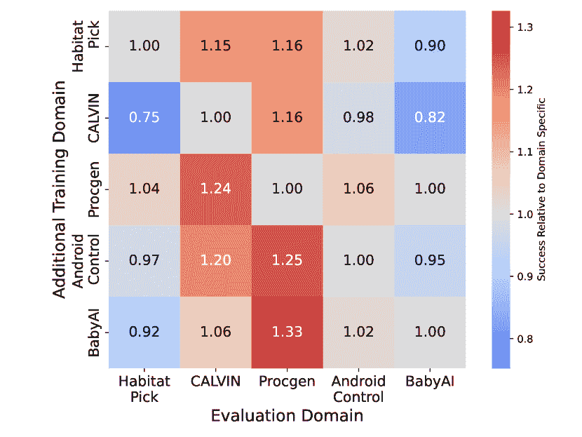

<!--yml

类别：未分类

日期：2025-01-11 11:49:06

-->

# 从多模态LLMs到通用具身代理：方法与经验

> 来源：[https://arxiv.org/html/2412.08442/](https://arxiv.org/html/2412.08442/)

Andrew Szot $\thanks{核心贡献者}^{\ 1,2}$  Bogdan Mazoure^(∗1)  Omar Attia¹  Aleksei Timofeev¹

Harsh Agrawal¹  Devon Hjelm¹  Zhe Gan¹  Zsolt Kira²  Alexander Toshev¹

¹ Apple, ² Georgia Tech

a.szot@apple.com, toshev@apple.com 核心贡献者

###### 摘要

我们研究了多模态大语言模型（MLLMs）在解决传统语言和视觉任务之外的多样化领域中的能力。具体而言，我们的关注点集中在诸如具身人工智能（Embodied AI）、游戏、用户界面控制（UI Control）和规划等领域。为此，我们提出了一种将MLLM适配为通用具身代理（GEA）的方法。GEA是一个单一的统一模型，能够通过多具身动作分词器在这些不同领域中进行自我赋能。GEA通过在大规模具身体验数据集上进行监督学习，并在交互式模拟器中进行在线强化学习（RL）训练。我们探讨了开发此类模型所需的数据和算法选择。我们的研究发现，跨领域数据训练和在线强化学习对于构建通用型代理至关重要。最终的GEA模型在多个基准测试中，与其他通用模型和针对特定基准的模型相比，展现出强大的泛化能力，能够处理看不见的任务。

## 1 引言

图1：通用具身代理（GEA）是一个基于多模态LLM的代理，能够根据自然语言指令完成跨多个领域和具身体态的任务，包括操作、规划、游戏和UI控制。一个预训练的MLLM通过在大规模具身体验数据集上进行监督微调（SFT）进行微调，最终的GEA模型随后通过强化学习（RL）进行微调。GEA在泛化到未见过的设置上取得了具有竞争力的结果。

基础模型已经在语言和图像理解任务中展示了广泛的能力[[5](https://arxiv.org/html/2412.08442v1#bib.bib5), [30](https://arxiv.org/html/2412.08442v1#bib.bib30), [66](https://arxiv.org/html/2412.08442v1#bib.bib66), [46](https://arxiv.org/html/2412.08442v1#bib.bib46), [16](https://arxiv.org/html/2412.08442v1#bib.bib16), [51](https://arxiv.org/html/2412.08442v1#bib.bib51), [45](https://arxiv.org/html/2412.08442v1#bib.bib45), [103](https://arxiv.org/html/2412.08442v1#bib.bib103), [95](https://arxiv.org/html/2412.08442v1#bib.bib95), [43](https://arxiv.org/html/2412.08442v1#bib.bib43), [42](https://arxiv.org/html/2412.08442v1#bib.bib42), [58](https://arxiv.org/html/2412.08442v1#bib.bib58), [33](https://arxiv.org/html/2412.08442v1#bib.bib33)]。特别是，多模态大语言模型（MLLMs）——在大量文本和图像数据上训练的多模态基础模型——在其文本和图像训练模态自然适应的任务中表现优异。作为MLLMs的扩展，视觉-语言-动作模型已经成功应用于机器人学和具身人工智能[[3](https://arxiv.org/html/2412.08442v1#bib.bib3), [11](https://arxiv.org/html/2412.08442v1#bib.bib11), [18](https://arxiv.org/html/2412.08442v1#bib.bib18), [80](https://arxiv.org/html/2412.08442v1#bib.bib80)]，以及用于Web的智能体[[75](https://arxiv.org/html/2412.08442v1#bib.bib75), [102](https://arxiv.org/html/2412.08442v1#bib.bib102), [37](https://arxiv.org/html/2412.08442v1#bib.bib37), [27](https://arxiv.org/html/2412.08442v1#bib.bib27)]和用户界面（UI）控制[[68](https://arxiv.org/html/2412.08442v1#bib.bib68), [28](https://arxiv.org/html/2412.08442v1#bib.bib28), [89](https://arxiv.org/html/2412.08442v1#bib.bib89)]。

这些应用展示了MLLMs能够成功应用于多个领域，以控制各种体现形式，如机器人、游戏和通过UI控制设备。由于这些领域有许多相似之处，提出如何训练一个单一的智能体，使其能够在所有这些领域中普遍胜任是很自然的一个问题。这是一个具有挑战性的问题，因为许多任务需要物理和几何推理，它们的体现形式要么是静态的，要么通过移动操控器共享形态，其应用需要长时间规划，并且许多任务是部分可观察的，需要对长序列的观察进行推理。此外，跨领域的联合数据训练可能带来跨领域的好处，其中单一的智能体可能优于在单独领域上训练的智能体。

在本研究中，我们展示了一种将 MLLM 转化为单一通用具象智能体（GEA）的方法，以解决跨越多个领域的众多任务，这些任务涵盖了操作、导航、视频游戏和 UI 控制。为了使 GEA 能够控制多样的具象体，我们学习了一个跨所有连续和离散动作空间的统一学习标记化机制。如 [图 1](https://arxiv.org/html/2412.08442v1#S1.F1 "在 1 引言 ‣ 从多模态 LLM 到通用具象智能体：方法与经验") 所示，我们然后使用监督微调（SFT）[[87](https://arxiv.org/html/2412.08442v1#bib.bib87)] 来调整预训练的 MLLM，以从成功完成任务的智能体轨迹中预测动作。这个 SFT 数据集涵盖了来自人类标注员或学习策略等多种收集方法的超过 220 万条轨迹。虽然这个 SFT 过程产生了一个有能力的智能体，但它存在固有的数据缺乏问题，特别是数据的多样性，且很少表现出对错误的鲁棒性。因此，我们还通过在线强化学习（RL）训练的第二阶段来训练 GEA，在其中智能体从交互式模拟器中收集和学习数据，训练内容涵盖了部分领域。

我们证明了 GEA 展现出了强大的通用能力。具体来说，它在多个基准测试中表现出色，与其他通用智能体相比，甚至超越或接近定制的专家系统。例如，在 CALVIN 操作基准测试中[[60](https://arxiv.org/html/2412.08442v1#bib.bib60)]，GEA 在处理未见过的指令和背景时达到了 $90\%$ 的成功率，这比类似方法[[48](https://arxiv.org/html/2412.08442v1#bib.bib48)]高出近 $10\%$，并且与专家系统[[35](https://arxiv.org/html/2412.08442v1#bib.bib35)]的表现相当。在 Habitat 移动抓取任务[[78](https://arxiv.org/html/2412.08442v1#bib.bib78)]中，GEA 在未见过的场景中达到了 $83\%$ 的成功率，超过了在真实模拟器状态下使用强化学习训练的策略。同样，在 Procgen 视频游戏[[15](https://arxiv.org/html/2412.08442v1#bib.bib15)]中，GEA 达到了专家分数的 $44\%$，比之前的专家模型[[59](https://arxiv.org/html/2412.08442v1#bib.bib59)]高出近 $20\%$。

我们还分析了 GEA 的通用能力与其训练数据和基础 MLLM 之间的关系。我们证明了，在 SFT 中使用来自多样领域的结合数据进行训练，相较于仅使用单一领域数据，可以提升跨领域的表现。最后，我们探讨了 RL 和在线数据收集在构建通用智能体中的作用，并通过实验证明了在线 RL 相较于迭代 SFT 或离线 RL 的方法所带来的优势。

作为对社区的进一步贡献，我们将发布用于训练和评估GEA的代码以及GEA模型本身。当代码和模型准备好发布时，我们会在本文中添加相应的链接。

## 2 相关工作

之前的研究探讨了通过在大规模多任务数据集上训练策略来构建通用智能体，阐明了扩展交互式数据以创建强大多任务智能体的重要性[[69](https://arxiv.org/html/2412.08442v1#bib.bib69), [20](https://arxiv.org/html/2412.08442v1#bib.bib20), [88](https://arxiv.org/html/2412.08442v1#bib.bib88)]。此外，之前的研究还研究了通用智能体的新架构[[86](https://arxiv.org/html/2412.08442v1#bib.bib86), [24](https://arxiv.org/html/2412.08442v1#bib.bib24)]，而其他研究则专注于将通用智能体应用于机器人领域[[83](https://arxiv.org/html/2412.08442v1#bib.bib83), [10](https://arxiv.org/html/2412.08442v1#bib.bib10), [9](https://arxiv.org/html/2412.08442v1#bib.bib9)]。一些研究还调查了在特定领域基准中使用通用模型[[34](https://arxiv.org/html/2412.08442v1#bib.bib34), [82](https://arxiv.org/html/2412.08442v1#bib.bib82)]，或者在跨形态情境中[[65](https://arxiv.org/html/2412.08442v1#bib.bib65), [17](https://arxiv.org/html/2412.08442v1#bib.bib17)]。与GEA类似，这些方法也利用了大量数据，但我们的工作强调了通过微调和在线强化学习（RL）来适应预训练的多模态语言模型（MLLM）的重要性。例如，GEA与Gato[[69](https://arxiv.org/html/2412.08442v1#bib.bib69)]的区别在于，GEA利用了强化学习，采用了预训练的MLLM，学习了一个多形态的动作标记器，并专注于评估其在新任务设置中的泛化能力。因此，GEA在许多场景下的表现超过了Gato。

像GEA一样，一些先前的工作也关注将MLLMs作为代理进行适配。已有的研究提出了针对特定领域的流程，用于利用MLLMs的零-shot能力进行决策[[31](https://arxiv.org/html/2412.08442v1#bib.bib31)、[3](https://arxiv.org/html/2412.08442v1#bib.bib3)、[100](https://arxiv.org/html/2412.08442v1#bib.bib100)、[50](https://arxiv.org/html/2412.08442v1#bib.bib50)、[91](https://arxiv.org/html/2412.08442v1#bib.bib91)、[85](https://arxiv.org/html/2412.08442v1#bib.bib85)]，而我们的工作则集中在对MLLMs进行微调。其他工作则探讨了微调MLLMs用于决策制定的方案及其带来的好处，但也都是在特定领域的背景下进行的[[48](https://arxiv.org/html/2412.08442v1#bib.bib48)、[76](https://arxiv.org/html/2412.08442v1#bib.bib76)、[81](https://arxiv.org/html/2412.08442v1#bib.bib81)、[80](https://arxiv.org/html/2412.08442v1#bib.bib80)]。先前的研究还对MLLMs作为通用代理进行了微调[[36](https://arxiv.org/html/2412.08442v1#bib.bib36)、[11](https://arxiv.org/html/2412.08442v1#bib.bib11)、[63](https://arxiv.org/html/2412.08442v1#bib.bib63)]。然而，我们的工作展示了在更多样化的领域中的结果，并研究了多领域数据和强化学习微调的监督学习的重要性。在架构上，GEA与OpenVLA[[36](https://arxiv.org/html/2412.08442v1#bib.bib36)]不同，因为它使用了一个学习得来的多体行动标记器，而不是之前工作中所采用的统一离散化方法，后者已被证明表现更好[[81](https://arxiv.org/html/2412.08442v1#bib.bib81)]。此外，也有研究探讨了将MLLMs微调为UI代理的价值[[4](https://arxiv.org/html/2412.08442v1#bib.bib4)、[97](https://arxiv.org/html/2412.08442v1#bib.bib97)、[23](https://arxiv.org/html/2412.08442v1#bib.bib23)、[19](https://arxiv.org/html/2412.08442v1#bib.bib19)、[62](https://arxiv.org/html/2412.08442v1#bib.bib62)]。尽管GEA探索了将MLLMs适配为策略，但还有其他方式可以利用MLLMs，比如通过奖励模型[[56](https://arxiv.org/html/2412.08442v1#bib.bib56)、[55](https://arxiv.org/html/2412.08442v1#bib.bib55)]、世界模型[[90](https://arxiv.org/html/2412.08442v1#bib.bib90)]，或者环境生成[[94](https://arxiv.org/html/2412.08442v1#bib.bib94)]。

更广泛地说，先前的研究展示了LLM如何用于能够推理和交互的智能体。各种研究聚焦于通过特定管道训练LLM智能体[[101](https://arxiv.org/html/2412.08442v1#bib.bib101)]。类似于GEA如何对基础LLM中不具备的决策能力进行微调，其他研究则展示了微调LLM以增强推理和问题解决能力的价值[[92](https://arxiv.org/html/2412.08442v1#bib.bib92), [77](https://arxiv.org/html/2412.08442v1#bib.bib77)]。先前的研究还展示了使用自生成数据[[54](https://arxiv.org/html/2412.08442v1#bib.bib54)]、LLM错误[[74](https://arxiv.org/html/2412.08442v1#bib.bib74)]以及强化学习（RL）[[39](https://arxiv.org/html/2412.08442v1#bib.bib39)]微调LLM的价值。同样，GEA展示了使用这种RL训练的重要性，超越了仅使用监督学习，以创建一个有能力的智能体。

图2：GEA利用预训练的MLLM与多具身动作分词器，使得通用智能体能够在广泛的领域、具身方式和动作空间中操作。GEA的输入包括具身信息、任务要求（具身提示和指令）以及观察视觉（底部）。它生成LLM词汇中的一系列动作标记，这些标记由多具身动作反标记器解码成适用于特定具身和动作空间的动作。

## 3 通用具身智能体

### 3.1 问题设定

我们专注于具有视觉观察的语言指定任务。具体来说，我们考虑目标指定的部分可观察马尔可夫决策过程（POMDPs）[[8](https://arxiv.org/html/2412.08442v1#bib.bib8)]，其包含观察空间 $\mathcal{O}$、动作空间 $\mathcal{A}$、目标空间 $\mathcal{G}$ 和奖励模型 $R$。为了简洁起见，我们省略了MDP的其他元素。在我们的设置中，$\mathcal{G}$ 由任务的文本描述表示。观察由来自代理的RGB图像组成，这些图像可以是来自代理相机（在具身AI应用中）或截图（在视频游戏或UI交互中）。

我们考虑一个多样的环境类型集合，我们称之为*领域*（见表[1](https://arxiv.org/html/2412.08442v1#S4.T1 "表1 ‣ 4.2 连续多具身分词器 ‣ 4 训练 ‣ 从多模态LLM到通用具身智能体：方法与经验")，了解示例）。这些领域指定了一组多样的动作空间，涵盖了各种机器人控制空间、高级原语和计算机UI接口。我们的目标是学习一个能够在多个环境中操作的策略，我们用 $\mathcal{M}_{i}=(\mathcal{O}_{i},\mathcal{A}_{i},\mathcal{G}_{i},R_{i})$ 来表示每个环境 $i\in\mathcal{E}$。

### 3.2 GEA架构

通用体态代理（GEA）通过在环境中执行基于观察、过去动作和任务描述的条件动作来执行任务。更正式地说，对于环境$\mathcal{M}_{i}$中的时间步$t$，GEA模型将环境特定的提示$P_{i}$作为输入，接着是任务指令$I\in\mathcal{G}_{i}$以及最多$c$个交错的先前观察和动作$o_{t-c},a_{t-c},\dots,o_{t}$，这些来自$\mathcal{O}_{i}$和$\mathcal{A}_{i}$。根据这些输入，GEA模型预测要在环境中执行的动作$a_{t}\in\mathcal{A}_{i}$。提示提供关于环境和体态控制的信息。任务指令是对代理执行任务的自然语言描述。

多体态动作分词器。我们研究了从MLLM适应的通用体态代理（GEA）。由于MLLMs天然只处理文本和图像并且只生成文本，我们遵循Szot等人[[81](https://arxiv.org/html/2412.08442v1#bib.bib81)]的发现，修改LLM词汇表以表示动作。首先，我们使用两个词汇表表示所有跨$\{\mathcal{M}_{i}\}$, $i\in\mathcal{E}$的动作：$V_{\textrm{disc}}$用于离散动作，$V_{\textrm{cont}}$用于连续动作，因此最终的词汇表是$V=V_{\textrm{disc}}\cup V_{\textrm{cont}}$。离散动作通过语言进行描述，然后将这些语言分词为表示该动作的文本符号序列。$V_{\textrm{disc}}$定义为所有表示离散动作的文本符号序列。

由于连续动作无法直接以文本形式表达，我们使用了一种学习到的动作分词器，将每个连续动作映射为一系列新符号，我们用$V_{\textrm{cont}}$来表示其词汇表。我们如何训练这个分词器的详细信息请见[第4.2节](https://arxiv.org/html/2412.08442v1#S4.SS2 "4.2 Continuous Multi-Embodiment Tokenizer ‣ 4 Training ‣ From Multimodal LLMs to Generalist Embodied Agents: Methods and Lessons")。我们将原始LLM词汇表中最不常用的$|V_{\textrm{cont}}|$个符号替换为$V_{\textrm{cont}}$。

## 4 训练

GEA从基础MLLM开始，首先训练一个连续动作分词器。如[图3](https://arxiv.org/html/2412.08442v1#S4.F3 "In 4.3 Stage 1: Supervised-Instruction Finetuning ‣ 4 Training ‣ From Multimodal LLMs to Generalist Embodied Agents: Methods and Lessons")所示，通过对体态经验的监督微调，MLLM被适应为GEA-Base。接着，通过监督学习和强化学习，将GEA-Base适应为完整的GEA模型。

### 4.1 基础 MLLM

选择基础模型时，除了其固有的视觉-语言能力外，最主要的考虑因素是其在处理长上下文的能力，因为具象数据通常包含长时间轨迹的交替观察和动作。因此，我们基于LLaVA-OneVision [[44](https://arxiv.org/html/2412.08442v1#bib.bib44)]构建了GEA，该模型专门训练用于处理通过交替的图像/文本对和视频处理的图像序列，进一步扩展至GEA能够处理一系列观察历史。

### 4.2 连续多具象标记器

为了获得连续动作的词汇表$V_{\textrm{cont}}$和相应的标记器/去标记器，我们遵循Szot等人[[81](https://arxiv.org/html/2412.08442v1#bib.bib81)]的方法，训练了一个残差VQ-VAE (RVQ) [[40](https://arxiv.org/html/2412.08442v1#bib.bib40)]模型，应用于动作向量。RVQ模型是一种变分自编码器，利用一系列离散嵌入表示数据。具体来说，它将一个动作$a$编码为一个由$M$个标记$k_{1}(a),\ldots,k_{M}(a)$组成的序列，其中每个标记表示一个来自已学习词汇$V_{\textrm{cont}}^{m}$的代码，$m\in{1,\ldots,M}$。RVQ的一个关键特点是，第$m$个词汇表被训练来编码该动作的残差，而该动作已经通过词汇表${1,\ldots,m-1}$进行编码。这种层次编码使得RVQ能够有效地精确表示连续动作，同时使用最少的离散标记。GEA所使用的最终连续动作词汇表是RVQ词汇表的并集$V_{\textrm{cont}}=\bigcup_{m}V_{\textrm{cont}}^{m}$。

与Szot等人[[81](https://arxiv.org/html/2412.08442v1#bib.bib81)]的主要区别在于，我们训练了一个单一的标记器/去标记器，覆盖所有连续动作空间。如[表1](https://arxiv.org/html/2412.08442v1#S4.T1 "在4.2 连续多具象标记器 ‣ 4训练 ‣ 从多模态LLMs到通用具象体智能体：方法与经验")所示，这些空间涵盖了多种机器人控制类型，包括末端执行器、关节速度和关节位置控制。为了便于训练统一的RVQ，我们将所有动作向量填充至最大动作维度。在推理过程中，我们解码预测的动作标记，然后截断输出以匹配特定具象体动作空间的维度。我们使用两个包含512个标记的代码书，每个标记向量的维度为1024。有关动作标记化的更多细节，请参见[附录A](https://arxiv.org/html/2412.08442v1#A1 "附录A 连续多具象标记器细节 ‣ 从多模态LLMs到通用具象体智能体：方法与经验")。

| 数据集名称 | 领域 | 动作类型 | 具象类型 | 轨迹数量 | 数据来源 |
| --- | --- | --- | --- | --- | --- |
| OpenX [[63](https://arxiv.org/html/2412.08442v1#bib.bib63)] | 静态操作 | 连续.多样 | 22种不同机器人 | 120万 | 各种来源 |
| Meta-World [[98](https://arxiv.org/html/2412.08442v1#bib.bib98)] | 静态操作 | 连续 EE+抓取器 | Sawyer | 45k | 脚本化 |
| CALVIN [[60](https://arxiv.org/html/2412.08442v1#bib.bib60)] | 静态操作 | 连续 EE+抓取器 | Franka Arm | 18k | 人类 |
| Maniskill [[22](https://arxiv.org/html/2412.08442v1#bib.bib22)] | 静态操作 | 连续 关节速度 | ROKAE xMate3Pro | 5k | 动作规划器 |
| Habitat Pick [[78](https://arxiv.org/html/2412.08442v1#bib.bib78)] | 移动操作 | 连续 关节位置 + 基础 | 取物 | 50k | 强化学习专家 |
| Habitat Place [[78](https://arxiv.org/html/2412.08442v1#bib.bib78)] | 移动操作 | 连续 关节位置+基础 | 取物 | 50k | 强化学习专家 |
| Habitat Nav [[78](https://arxiv.org/html/2412.08442v1#bib.bib78)] | 导航 | 连续 速度 | 取物 | 13k | 最短路径 |
| BabyAI [[14](https://arxiv.org/html/2412.08442v1#bib.bib14)] | 导航 | 离散 | 虚拟 | 50k | 最短路径 |
| LangR [[80](https://arxiv.org/html/2412.08442v1#bib.bib80)] | 规划 | 离散 | 取物 | 150k | 强化学习专家 |
| Procgen [[15](https://arxiv.org/html/2412.08442v1#bib.bib15)] | 视频游戏 | 离散 | 虚拟 | 320k | 强化学习专家 |
| Atari [[7](https://arxiv.org/html/2412.08442v1#bib.bib7)] | 视频游戏 | 离散 | 虚拟 | 286k | 强化学习专家 |
| AndroidControl [[47](https://arxiv.org/html/2412.08442v1#bib.bib47)] | 用户界面控制 | 混合 | 虚拟 | 14k | 人类 |

表 1：用于训练 GEA 的具象数据集概览。每个数据集中的动作可以是离散的或连续的，对于连续动作有特定的控制空间。具象类型描述了被控制的智能体。数据集中的每个轨迹指代一系列图像和动作。数据源指的是这些轨迹的收集方式。

### 4.3 阶段 1：监督指令微调

GEA 的第一步是使用监督指令微调（SFT）将基础 MLLM 调整为具象决策模型（见[图 3](https://arxiv.org/html/2412.08442v1#S4.F3 "在 4.3 阶段 1：监督指令微调 ‣ 4 训练 ‣ 从多模态 LLM 到通用具象智能体：方法与经验")左侧）。我们使用来自所有环境 $\mathcal{E}$ 的演示数据集 $\mathcal{D}=\bigcup_{i\in\mathcal{E}}\mathcal{D}_{i}$。在此阶段，我们对交互数据的动作或视觉语言数据的响应使用标准交叉熵损失。与 MLLM 训练中的常规做法一样，我们最大化每个示例预测这些输出标记的负对数似然：

|  | $\mathcal{L}_{\textrm{SFT}}(\mathcal{D})=-\!\!\!\!\!\!\!\!\!\!\!\!\sum_{(I,o_{t% -c:t},a_{t-c:t})\in\mathcal{D}}\!\!\!\!\!\!\!\!\!\!\!\!\!\!\!\!\log p(a_{t}&#124;P,% I,o_{t-c},a_{t-c},\dots,o_{t})$ |  | (1) |
| --- | --- | --- | --- |

然后，我们对上述所有数据集使用 SFT 训练基础 MLLM，以获得 GEA-Base 模型。

训练细节。整个 GEA-Base 模型是从基础 MLLM 初始化的。我们使用 AdamW [[53](https://arxiv.org/html/2412.08442v1#bib.bib53)] 进行 75k 次更新，使用余弦学习率衰减和线性学习率预热（训练步骤的前 $10\%$）；学习率为 $1e^{-5}$；全局批次大小为 256，观察上下文长度为 $c=3$。训练大约需要 2 天，在 8 个节点的 8xH100 GPU 上进行（详见 [附录 B](https://arxiv.org/html/2412.08442v1#A2 "Appendix B SFT Training Additional Details ‣ From Multimodal LLMs to Generalist Embodied Agents: Methods and Lessons")）。

图 3：GEA 训练阶段。首先，通过在交互数据上用 SFT 微调整个 MLLM，将 MLLM 适配为 GEA-Base。接下来，使用 LoRA 在原始数据上联合进行在线 RL（PPO）和 SFT 微调 GEA-Base。

### 4.4 阶段 2：在线强化学习

虽然之前描述的 SFT 训练过程生成了一个有能力的 GEA-Base 代理，但它仅在有限的专家轨迹集上进行训练，这些轨迹很少展示像错误恢复这样的多样行为。因此，我们提议在某些环境中利用在线 RL。在第二阶段的训练中，我们在 SFT 的基础上继续使用 RL 训练 GEA-Base，以获得最终的 GEA 模型（见 [图 3](https://arxiv.org/html/2412.08442v1#S4.F3 "In 4.3 Stage 1: Supervised-Instruction Finetuning ‣ 4 Training ‣ From Multimodal LLMs to Generalist Embodied Agents: Methods and Lessons") 右侧）。对于在线 RL，我们使用 PPO 训练 GEA-Base 代理 [[72](https://arxiv.org/html/2412.08442v1#bib.bib72)]，其优化损失在每个我们有模拟器的环境中表示为 $\mathcal{L}_{\textrm{PPO}}(\mathcal{M}_{i})$，其中 $i\in\mathcal{E}_{\textrm{PPO}}\subset\mathcal{E}$。我们将这个目标与 [方程 1](https://arxiv.org/html/2412.08442v1#S4.E1 "In 4.3 Stage 1: Supervised-Instruction Finetuning ‣ 4 Training ‣ From Multimodal LLMs to Generalist Embodied Agents: Methods and Lessons") 中的 SFT 目标结合，以获得最终的 GEA 目标：

|  | $\mathcal{L}_{\text{GEA}}=\sum_{i\in\mathcal{E}_{\textrm{PPO}}}\mathcal{L}_{% \textrm{PPO}}(\mathcal{M}_{i})+\lambda\sum_{i\in\mathcal{E}}\mathcal{L}_{% \textrm{SFT}}(\mathcal{D}_{i})$ |  | (2) |
| --- | --- | --- | --- |

我们通过将 SFT 损失加权为 $\lambda=0.1$ 来强调 RL 损失。在 GEA-Base 模型上的 RL+SFT 训练阶段产生了我们所称的最终模型 GEA。

PPO 细节。GEA 的 RL 值函数是一个从零初始化的 MLP 网络。它以 MLLM 最后一层的激活作为输入，输入来自动作令牌之前的观察令牌步骤，并结合 MLLM 视觉编码器的视觉嵌入的平均池化表示。评论者还可以选择性地获取任务的任何特权状态信息，因为评论者仅在训练期间使用，而不是在推理期间使用。

为了在多个环境中稳定RL训练，我们使用PopArt [[84](https://arxiv.org/html/2412.08442v1#bib.bib84)] 返回标准化，以应对这些环境之间的奖励分布差异。由于LLM的输出空间可能包含许多可能的标记，我们使用约束解码来强制自回归动作采样在环境的动作空间内。对于连续动作任务，这相当于将输出限制为学习到的连续动作标记。对于离散控制任务，这相当于将输出限制为有效的语言动作（例如，“捡起苹果”或“右”）。为了应对每个环境有效动作分布的差异，我们对PPO的熵进行标准化，以便一个熵系数可以应用于所有任务。

训练详情。由于GEA-Base已经取得了一些成功，而强化学习（RL）通过在GPU上模拟的环境引入了GPU内存开销，我们使用LoRA [[29](https://arxiv.org/html/2412.08442v1#bib.bib29)] 来微调LLM，同时冻结所有其他组件。所有环境的rollout长度为128，学习率为$3e^{-4}$，熵系数为$1e^{-4}$，价值函数学习损失为$1.5e^{-4}$。RL微调使用8个节点的8xH100 GPU，每个GPU有4个并行环境。环境根据节点划分，3个GPU运行HabPick，3个GPU运行Procgen，2个GPU运行LangR。每个设备的SFT批量大小为2。我们在所有任务上训练了100M累计步数，耗时约1天。完整的RL训练详情见[附录C](https://arxiv.org/html/2412.08442v1#A3 "附录C RL训练的更多细节 ‣ 从多模态LLM到通用化的具身智能体：方法与经验")。

|  | GEA | 先前工作 | #任务 | 泛化类型 |
| --- | --- | --- | --- | --- |
| 操作 |  |  |  |  |
| Meta-World | 94.7 | 84 MLLM+IL [[81](https://arxiv.org/html/2412.08442v1#bib.bib81)]^S 87.0 [[69](https://arxiv.org/html/2412.08442v1#bib.bib69)]^G | 45 | 物体位置 |
| CALVIN (ABC →D) | 90.0 | 82.4 MLLM+IL [[48](https://arxiv.org/html/2412.08442v1#bib.bib48)]^S 92.2 IL+点云[[35](https://arxiv.org/html/2412.08442v1#bib.bib35)] | 34* | 指令，背景 |
| Maniskill | 13.6 | 6.5 IL [[22](https://arxiv.org/html/2412.08442v1#bib.bib22)]^S 47.8 IL+PPO [[22](https://arxiv.org/html/2412.08442v1#bib.bib22)]^S | 5 | 物体位置 |
| Habitat Pick | 82.5 | 29 IL [[81](https://arxiv.org/html/2412.08442v1#bib.bib81)]^S 81.0 RL + 模拟状态^S | 20 | 房子 |
| Habitat Place | 93.5 | 95.5 RL + 模拟状态^S | 10 | 房子 |
| 电子游戏 |  |  |  |  |
| Procgen | 44.0 | 25 [[59](https://arxiv.org/html/2412.08442v1#bib.bib59)]^S | 16 | 背景 |
| Atari | 32.7 | 31 [[69](https://arxiv.org/html/2412.08442v1#bib.bib69)]^G 85 离线RL [[41](https://arxiv.org/html/2412.08442v1#bib.bib41)]^S | 44 | 无 |
| 导航 |  |  |  |  |
| Habitat Nav | 62.5 | 72 [[78](https://arxiv.org/html/2412.08442v1#bib.bib78)]^S | 10 | 房屋 |
| BabyAI | 91.1 | 93.2 [[69](https://arxiv.org/html/2412.08442v1#bib.bib69)]^G | 17* | 指令，网格状态 |
| UI 控制 |  |  |  |  |
| AndroidControl | 57.3 | 45 GPT-4o+SoM [[93](https://arxiv.org/html/2412.08442v1#bib.bib93)]^G | 35* | 指令 |
| 规划 |  |  |  |  |
| LangR | 50.0 | 51 MLLM+RL[[81](https://arxiv.org/html/2412.08442v1#bib.bib81)]^S | 10* | 指令，房屋 |

表 2：GEA 对新任务的零-shot 泛化，表现为成功率百分比和视频游戏任务中的专家表现百分比。我们与先前的工作进行比较，先前的工作包括仅在该基准数据上训练的领域专家（带有上标“S”）和在多个基准数据上训练的领域通用专家（带有上标“G”）。粗体表示最佳，带下划线表示接近的第二名，灰色标记表示方法假设有额外输入模态如点云或地面真实状态模拟器，因此这不是一个公平的比较。 “先前工作”栏还提供了方法训练的详细信息（IL 或 RL），以及是否假设使用额外的输入模态。“#任务”栏给出不同评估设置的任务数量的总体指示，带有“*”表示每个任务还包含多样的语言指令。

## 5 数据集和环境

我们使用了多样化的领域及其相关的环境和数据集（参见[表 1](https://arxiv.org/html/2412.08442v1#S4.T1 "在 4.2 连续多体胁迫分词器 ‣ 4 训练 ‣ 从多模态LLM到通用嵌入式代理：方法与经验")）。本节介绍这些领域，并解释我们如何在训练过程的第 1 和第 2 阶段中使用它们。

静态操控。这些数据集由固定的机器人操控器与物体交互组成。这些数据集中的一些是模拟桌面交互，涉及到刚性物体，如 Meta-World [[99](https://arxiv.org/html/2412.08442v1#bib.bib99)]、CALVIN [[60](https://arxiv.org/html/2412.08442v1#bib.bib60)] 和 Maniskill [[22](https://arxiv.org/html/2412.08442v1#bib.bib22)]。我们还利用了在真实机器人平台上的大量交互数据集 [[63](https://arxiv.org/html/2412.08442v1#bib.bib63)]。这些数据集涵盖了末端效应器和关节控制的多种控制空间。相机通常固定安装，使工作空间和机器人臂完全可见。

移动操作。我们还研究了机器人操作臂通过移动底座进行运动的设置。我们使用了Habitat平台上的物体重新排列任务[[71](https://arxiv.org/html/2412.08442v1#bib.bib71)]作为这些任务的数据集。这些数据集涵盖了物体拾取和放置任务，机器人最多可从物体位置2米远的地方开始。机器人需要协调移动底座和机械臂，才能成功拾取物体。这些数据集包含第一人称自我中心的摄像头视角。

导航。我们还使用了单独导航的数据集。我们使用了Habitat平台上模拟机器人导航的数据集。我们还使用了来自BabyAI的网格世界环境导航数据集[[14](https://arxiv.org/html/2412.08442v1#bib.bib14)]。这两个数据集都是由最短路径专家收集的。

视频游戏。我们使用了两个标准基准数据集，用于视频游戏中的决策制定，分别是Procgen[[15](https://arxiv.org/html/2412.08442v1#bib.bib15)]和Atari[[7](https://arxiv.org/html/2412.08442v1#bib.bib7)]。这两个数据集都是由RL代理收集的，每个代理都是为解决各自的游戏任务而单独训练的。我们将这些任务转化为基于语言的任务，通过提供游戏名称以及游戏目标和规则的简短描述来实现。我们只对成功的轨迹进行训练。

规划。我们使用了LangR数据集中的成功回合数据[[80](https://arxiv.org/html/2412.08442v1#bib.bib80)]。在这个任务中，代理需要从一系列技能原语中进行选择，以完成为家用机器人指定的长期语言描述的物体重新排列任务。

UI控制。我们使用了AndroidControl数据集[[47](https://arxiv.org/html/2412.08442v1#bib.bib47)]，该数据集涵盖了833款Android应用中的UI交互。操作动作是通过屏幕坐标和文本输入指定的点击动作的组合。

视觉语言指令数据。为了提高模型的泛化能力，我们还包括了用于训练原始MLLM的数据，这些数据在前期工作中被发现对微调MLLM作为控制策略非常有用[[11](https://arxiv.org/html/2412.08442v1#bib.bib11)]。我们使用了以下无动作的文本和图像数据集：VQAv2[[21](https://arxiv.org/html/2412.08442v1#bib.bib21)]、OKVQA[[57](https://arxiv.org/html/2412.08442v1#bib.bib57)]、A-OKVQA[[73](https://arxiv.org/html/2412.08442v1#bib.bib73)]、GQA[[32](https://arxiv.org/html/2412.08442v1#bib.bib32)]和LLaVA-Instruct-150k数据集[[52](https://arxiv.org/html/2412.08442v1#bib.bib52)]。

阶段 1 训练：SFT 数据。为了获得阶段 1 训练的体现数据（参见第[4.3节](https://arxiv.org/html/2412.08442v1#S4.SS3 "4.3 Stage 1: Supervised-Instruction Finetuning ‣ 4 Training ‣ From Multimodal LLMs to Generalist Embodied Agents: Methods and Lessons")），我们收集了一个大型数据集，包含来自上述所有领域的语言条件行为，总计2.2M条轨迹。所有轨迹都是成功的语言条件行为示例，带有视觉观察数据。数据来自多个来源，包括人类示范、基于RL的策略和运动规划器。该数据集内容丰富，涵盖了数千个不同的任务和多个体现（参见[附录D](https://arxiv.org/html/2412.08442v1#A4 "Appendix D Dataset Details ‣ From Multimodal LLMs to Generalist Embodied Agents: Methods and Lessons")了解详细信息）。

阶段 2 训练：RL 环境。在阶段 2 在线RL训练（参见[第4.4节](https://arxiv.org/html/2412.08442v1#S4.SS4 "4.4 Stage 2: Online Reinforcement Learning ‣ 4 Training ‣ From Multimodal LLMs to Generalist Embodied Agents: Methods and Lessons")）中，我们使用来自三个领域的环境：Habitat Pick [[78](https://arxiv.org/html/2412.08442v1#bib.bib78)]、Language Rearrangement (LangR) [[80](https://arxiv.org/html/2412.08442v1#bib.bib80)]和Procgen [[15](https://arxiv.org/html/2412.08442v1#bib.bib15)]。因此，我们定义了$\mathcal{E}_{\textrm{PPO}}=\{\textrm{HabPick},\textrm{LangR},\textrm{ProcGen}\}$。Habitat Pick和LangR是在Habitat平台[[71](https://arxiv.org/html/2412.08442v1#bib.bib71)]上模拟的，具有奖励函数，用于达成目标并推动进展。在Procgen中，我们使用所有16个游戏进行RL，并使用特定于游戏的奖励函数（参见[附录C](https://arxiv.org/html/2412.08442v1#A3 "Appendix C RL Training Additional Details ‣ From Multimodal LLMs to Generalist Embodied Agents: Methods and Lessons")了解详细信息）。

## 6 实证评估

我们通过实验证明了GEA作为一个通用代理的能力，能够在不同的体现和领域中推广到新的指令和设置。我们评估了RL训练在实现这一目标中的作用。在消融实验中，我们研究了在多个领域间扩展数据的影响，比较了RL与其他形式的策略收集数据，并探讨了基础MLLM的影响。

### 6.1 GEA泛化能力

在本节中，我们评估最终 GEA 模型的泛化能力。我们使用[表1](https://arxiv.org/html/2412.08442v1#S4.T1 "在4.2连续多重化身标记器 ‣ 4训练 ‣ 从多模态LLM到通用嵌入式智能体：方法与经验")中数据集的相关基准，涵盖了操作、导航、视频游戏、UI 控制和规划等领域。这些基准评估智能体在训练数据中没有出现的新环境下的表现，如新的物体位置、场景、视觉背景、任务或指令。所有基准都用自然语言指定评估指令，要求智能体根据视觉观察进行操作。

我们报告 GEA 的“在线”性能，意味着我们在一个互动模拟器中评估其表现。唯一的例外是 AndroidControl，在这个任务中我们改为检查与实际测试轨迹的对应关系[[68](https://arxiv.org/html/2412.08442v1#bib.bib68)]。每个基准还会评估智能体在多个不同任务中的表现。例如，在 Procgen 视频游戏基准中，我们报告所有 16 款 Procgen 游戏的平均表现，每款游戏都是完全不同的游戏。完整的评估细节见[附录 E](https://arxiv.org/html/2412.08442v1#A5 "附录 E 评估细节 ‣ 从多模态LLM到通用嵌入式智能体：方法与经验")。

|  | Habitat Pick | Procgen | LangR | 其他任务 |
| --- | --- | --- | --- | --- |
| GEA | 82.5 | 44.0 | 50.0 | 70.5 |
| GEA-Base | 60.5 | 36.1 | 15.5 | 69.5 |

表 3：阶段 2 强化学习训练对 GEA-Base（7b 模型）的影响。包括在 RL 训练中的任务提高了它们的泛化表现。由于持续的 SFT 训练，其他任务的表现略有提升。

我们旨在全面框定 GEA 在我们评估的基准中相对于先前工作的实证表现。首先，在所有基准中，我们仅使用图像作为观察输入，不使用任何特权信息，如仿真状态或额外的观察数据（如 3D 点云）。其次，我们在所有环境中评估单一的 GEA 模型，这被称为通用型智能体。一些我们对比的方法是在单一环境数据上训练的，我们将其称为专家型智能体。在其他对比方法中，训练数据与测试数据的划分不明确。例如，Gato[[69](https://arxiv.org/html/2412.08442v1#bib.bib69)]是像 GEA 一样的通用型模型，但它在一些任务上进行评估和训练，这些任务的训练数据集较为单一且未公开。[附录 F.1](https://arxiv.org/html/2412.08442v1#A6.SS1 "F.1 额外基准细节 ‣ 附录 F 进一步实验细节 ‣ 从多模态LLM到通用嵌入式智能体：方法与经验")详细讨论了这些联系。

[表2](https://arxiv.org/html/2412.08442v1#S4.T2 "在4.4阶段2：在线强化学习 ‣ 4 训练 ‣ 从多模态LLM到通用体态代理：方法与经验教训")总结了比较评估。GEA在操作任务上表现出色，超越或与专业模型的表现相匹敌。例如，在Meta-World中，GEA相较于最佳基准，绝对提高了$7\%$，远超为此任务训练的专业和通用模型。在CALVIN中，GEA超越了多种近期的专业模型。GEA的表现也与使用操作特定末端效应器关键点的动作表示并通过深度相机将场景表示为3D特征云的专业3D Diffuser Actor方法[[35](https://arxiv.org/html/2412.08442v1#bib.bib35)]接近。GEA仅使用第三人称RGB相机，并不使用特定于桌面操作的动作或观察空间。尽管这些基准是在真实模拟器状态下训练的，GEA在Habitat Pick中超越了基准，并在Habitat Place中与基准相近。在Maniskill中，由于难度较大且视角常常被遮挡，导致整体成功率较低，但GEA在仅使用IL的其他结果中表现更好。然而，在这个基准测试中，GEA被使用RL的方法超越。

在视频游戏基准中，GEA在Procgen中超越了专业模型基准。在Atari中，GEA超越了通用Gato模型[[69](https://arxiv.org/html/2412.08442v1#bib.bib69)]。然而，在Atari中，GEA被使用离线RL从次优示范中训练的Multi-Game DT[[41](https://arxiv.org/html/2412.08442v1#bib.bib41)]超越。在Atari中，GEA没有通过离线或在线RL进行学习。

在BabyAI导航基准中，尽管GEA使用的是RGB渲染的俯视图而非任何底层状态信息，且在该环境中只有100倍较少的示范，GEA的表现与Gato[[69](https://arxiv.org/html/2412.08442v1#bib.bib69)]相近。在Habitat Nav中，GEA的表现不及通过RL训练的专家。这个差距可能是由于GEA仅包含前三个观察值，这可能限制了它在部分可观察设置下的能力。在UI控制任务中，另一个离散动作任务，GEA超越了GPT-4o[[64](https://arxiv.org/html/2412.08442v1#bib.bib64)]，后者使用由UI检测模型生成的一组标记[[93](https://arxiv.org/html/2412.08442v1#bib.bib93)]。这表明，GEA即使面对强大的LLM和专业的感知系统，在交互决策上也能获得益处。最后，在LangR规划任务的离散控制基准中，GEA的表现接近于一个仅使用RL训练该任务的专业基准。

|  | Habitat Pick | CALVIN | Procgen | Android Control | BabyAI |
| --- | --- | --- | --- | --- | --- |
| GEA-Base | 57.0 | 48.0 | 24.5 | 50.5 | 84.7 |
| 特定领域 | 54.5 | 35.5 | 23.7 | 48.9 | 82.1 |
| 仅使用 LLM | 9.5 | 0.0 | 7.6 | 26.4 | 49.4 |
| 仅使用 VisEncoder | 34.5 | 13.0 | 24.5 | 28.3 | 70.6 |
| 无 | 9.0 | 0.0 | 7.4 | 14.1 | 44.4 |

表 4：我们展示了使用 LLaVA-OneVision-500m 作为 MLLM 基础模型的结果（第 1 行），以及仅使用特定领域数据进行训练的结果（第 2 行）。我们还展示了一个相同架构的变换器模型的结果，但仅初始化了 LLM 子网络（第 3 行），或者仅初始化了视觉编码器（第 4 行），或者两者都没有初始化（第 5 行）。

RL 相较于 SFT 的比较效益。使用 RL 训练对于取得这些强大的结果至关重要。[表 3](https://arxiv.org/html/2412.08442v1#S6.T3 "在 6.1 GEA 泛化能力 ‣ 6 实证评估 ‣ 从多模态 LLM 到通用具身智能体：方法与经验教训")比较了仅通过专家演示的 SFT 训练的 GEA-Base 和额外经过第二阶段 RL 训练的 GEA 的表现。结果表明，GEA 在使用 RL 的环境（如 Habitat Pick、Procgen 和 LangR）中的成功率大幅提升。此外，所有其他任务的平均成功率并未受到 RL 的影响，因为持续进行了联合 SFT 训练。

### 6.2 GEA 训练与模型分析

在本节中，我们探讨了 GEA 的通用能力与其训练数据之间的关系。我们分析了具身 SFT 数据在调整 MLLM 以进行交互中的作用以及在线数据的重要性。我们还评估了基础 MLLM 的重要性。对于本节中的所有结果，我们使用了原始具身 SFT 数据的 32% 和 40k 次更新来训练所有模型，以减轻分析的计算负担。我们还评估了来自[表 2](https://arxiv.org/html/2412.08442v1#S4.T2 "在 4.4 阶段 2：在线强化学习 ‣ 4 训练 ‣ 从多模态 LLM 到通用具身智能体：方法与经验教训")的任务，评估集的剧集数减少，每个基准大约 200 个剧集。[F.2 节](https://arxiv.org/html/2412.08442v1#A6.SS2 "F.2 消融分析设置 ‣ 附录 F 进一步的实验细节 ‣ 从多模态 LLM 到通用具身智能体：方法与经验教训")详细描述了该分析评估和数据集。

多领域数据的影响。我们评估了在来自所有不同领域的数据上训练通用模型，与仅在特定目标领域数据上训练模型之间的差异。具体而言，我们将较小的 LLaVA-OneVision-500m 模型分别在单一领域的数据（“领域特定”）或跨所有领域的数据（“GEA-Base”）上进行训练。在[表 4](https://arxiv.org/html/2412.08442v1#S6.T4 "In 6.1 GEA Generalization Capabilities ‣ 6 Empirical Evaluation ‣ From Multimodal LLMs to Generalist Embodied Agents: Methods and Lessons")中的对比显示，在所有基准测试中，使用所有数据进行训练都是有益的。然而，在一些领域（如 Android 控制和 Procgen）中的提升较小，可能是因为这些领域与其他训练领域的重叠较少，而我们使用了大量的操控数据进行训练。[Section G.4](https://arxiv.org/html/2412.08442v1#A7.SS4 "G.4 Domain Transfer Analysis ‣ Appendix G Further Results ‣ From Multimodal LLMs to Generalist Embodied Agents: Methods and Lessons")包含了关于每个数据集之间成对迁移性的更细致研究，并进一步支持了这一结论：GEA 从多领域数据中受益。

图 4：Habitat Pick 中的在线学习。MLLM 方法对 LLaVA-OV 进行微调，而其他方法则对 GEA-Base 进行微调。

策略收集数据的影响。接下来，我们探讨了从 SFT 之外的数据源（如专家示范）中学习的作用。虽然 GEA-Base 是一个能力强大的具身策略，但它仅在成功的示范上进行了训练。这些示范很少表现出恢复行为或对非专家行为的鲁棒性。与典型的 MLLM 应用（如视觉问答）不同，在交互式任务中，使用专家数据训练的代理可能会遭遇“协变量偏移”问题，即代理的小错误会导致观察分布与专家的分布发生偏移，进而使错误不断积累 [[70](https://arxiv.org/html/2412.08442v1#bib.bib70)]。

我们分析了如何通过额外的数据训练GEA-Base，以提高在Habitat Pick任务中的表现，并比较以下几种替代方法。首先，GEA-Base成功的SFT在环境中使用GEA-Base策略收集了10k个成功示例，并使用监督学习对这些成功进行训练。GEA-Base离线RL收集了10k条轨迹，其中包括成功和失败的情况，所有轨迹都标记了密集的Habitat Pick奖励，然后使用IQL离线RL算法对这些轨迹进行训练[[38](https://arxiv.org/html/2412.08442v1#bib.bib38)]。*GEA在线RL*使用PPO对GEA-Base进行微调，利用与模拟器的在线交互，如GEA第二阶段的训练（但省略了联合SFT损失）。在这些实验中，我们再次使用较小的基础LLaVA-OneVision-500m模型。[图4](https://arxiv.org/html/2412.08442v1#S6.F4 "在6.2 GEA训练与模型分析 ‣ 6 实证评估 ‣ 从多模态LLM到通用体化智能体：方法与经验")展示了这些变体的结果。

主要的结论是在线强化学习（RL）在经过微调的多模态大语言模型（MLLM）基础上产生了强大的影响，这使得GEA-Base的成功率从$57\%$提高到$83\%$，尽管后者是在50k个成功的Habitat Pick演示上进行训练的。在线RL的表现超越了成功的SFT和IQL离线RL，突显了在线交互的必要性。值得注意的是，在GEA-Base上应用成功的SFT和离线RL会降低模型的性能，这可能是由于数据的多样性不足。

这些结果进一步表明，当在线RL应用于经过微调并具有领域数据的模型时是有益的。仅使用在线RL无法将基础MLLM的性能提升到GEA-Base的水平，除非经过第一阶段的SFT。[G.2节](https://arxiv.org/html/2412.08442v1#A7.SS2 "G.2 Habitat Pick RL微调 ‣ 附录G 更多结果 ‣ 从多模态LLM到通用体化智能体：方法与经验")对此进行了进一步探讨，并展示了GEA-Base在使用RL时比基础MLLM更具样本效率。这一分析表明，GEA模型在结合SFT使用RL时至关重要。

图5：分析使用不同参数数量的不同基础MLLM训练GEA的影响。

预训练MLLM的影响。我们评估了预训练的MLLM在GEA架构中的重要性。为此，我们使用一个基础模型进行实验，该模型的架构与预训练的MLLM相同。然而，我们并未将整个模型初始化为LLaVA-OneVision，而是仅将LLM或视觉编码器初始化为相应的子网络权重。

[表4](https://arxiv.org/html/2412.08442v1#S6.T4 "在6.1 GEA泛化能力 ‣ 6 实证评估 ‣ 从多模态LLM到通用体化智能体：方法与经验教训")中的结果显示，完整的MLLM对性能有显著影响。尽管这并不令人惊讶，但需要注意的是，视觉编码器的初始化似乎对最终性能的影响比LLM更大。我们推测，这是因为基准测试需要视觉泛化，而仅通过体化数据从零开始训练LLaVA-OneVision SigLIP视觉编码器是具有挑战性的。

此外，我们分析了基础MLLM大小对GEA-Base的影响。我们使用了两类骨干模型，LLaVA-OneVision [[44](https://arxiv.org/html/2412.08442v1#bib.bib44)]和MM1.5 [[58](https://arxiv.org/html/2412.08442v1#bib.bib58)]，并为每种模型使用了两种大小（前者为$0.5B$和$7B$，后者为$1.2B$和$6.4B$）。如[图5](https://arxiv.org/html/2412.08442v1#S6.F5 "在6.2 GEA训练和模型分析 ‣ 6 实证评估 ‣ 从多模态LLM到通用体化智能体：方法与经验教训")所示，在我们的智能体应用中，增大模型容量会导致更强的性能，这种提升在骨干模型类别内外都表现得十分明显。有趣的是，模型类别对性能的影响很小，因为我们看到多个骨干模型的性能非常相似。这三种不同的$7B$模型在不同的网络规模数据上进行了训练，然而，它们的差异对GEA的影响微乎其微。

此外，在[Section G.3](https://arxiv.org/html/2412.08442v1#A7.SS3 "G.3 模型方差分析 ‣ 附录G 进一步结果 ‣ 从多模态LLM到通用体化智能体：方法与经验教训")中，我们展示了GEA的训练和评估对于随机种子具有鲁棒性。

## 7 结论

本研究探讨了如何通过专家轨迹和在线强化学习（RL）微调预训练的MLLM，并利用大规模体化经验，解锁它们作为通用体化智能体的能力。为了与多种体化形式进行交互，GEA使用了学习的动作标记器。我们说明了强化学习微调对GEA的重要性，这使得其在跨越多个领域（包括操控、视频游戏、导航、UI控制和规划）中都能取得竞争力的成绩。

尽管GEA在多种任务中展现了令人印象深刻的能力，但它仍然未达到像类似的语言和视觉模型那样作为决策基础模型的水平[[1](https://arxiv.org/html/2412.08442v1#bib.bib1)]。GEA无法在零-shot下控制任意体化形式，也无法在任意环境中进行操作。此外，GEA在某些领域（如Maniskill、Atari和AndroidControl）的表现仍远未完美。将强化学习扩展到这些环境中可能是一个解决方案。未来的工作可以继续将GEA扩展到更多任务中，以进一步增强其通用能力。

## 参考文献

+   Achiam 等人 [2023] Josh Achiam, Steven Adler, Sandhini Agarwal, Lama Ahmad, Ilge Akkaya, Florencia Leoni Aleman, Diogo Almeida, Janko Altenschmidt, Sam Altman, Shyamal Anadkat 等人。GPT-4 技术报告。*arXiv 预印本 arXiv:2303.08774*, 2023。

+   Agarwal 等人 [2020] Rishabh Agarwal, Dale Schuurmans 和 Mohammad Norouzi。对离线强化学习的乐观看法。在 *国际机器学习大会*，第104–114页。PMLR，2020年。

+   Ahn 等人 [2022] Michael Ahn, Anthony Brohan, Noah Brown, Yevgen Chebotar, Omar Cortes, Byron David, Chelsea Finn, Chuyuan Fu, Keerthana Gopalakrishnan, Karol Hausman 等人。言行一致：将语言与机器人能力对接。*arXiv 预印本 arXiv:2204.01691*, 2022。

+   Bai 等人 [2024] Hao Bai, Yifei Zhou, Mert Cemri, Jiayi Pan, Alane Suhr, Sergey Levine 和 Aviral Kumar。Digirl：通过自主强化学习训练野外设备控制智能体。*arXiv 预印本 arXiv:2406.11896*, 2024。

+   Bai 等人 [2023] Jinze Bai, Shuai Bai, Shusheng Yang, Shijie Wang, Sinan Tan, Peng Wang, Junyang Lin, Chang Zhou 和 Jingren Zhou。Qwen-vl：一个具备多种能力的前沿大型视觉-语言模型。*arXiv 预印本 arXiv:2308.12966*, 2023。

+   Bellemare 等人 [2013] M. G. Bellemare, Y. Naddaf, J. Veness 和 M. Bowling。街机学习环境：一个用于通用智能体的评估平台。*人工智能研究杂志*，47:253–279，2013年。

+   Bellemare 等人 [2013] Marc G Bellemare, Yavar Naddaf, Joel Veness 和 Michael Bowling。街机学习环境：一个用于通用智能体的评估平台。*人工智能研究杂志*，47:253–279，2013年。

+   Bellman [1957] Richard Bellman。马尔可夫决策过程。*印第安纳大学数学杂志*，6:679–684，1957年。

+   Bousmalis 等人 [2023] Konstantinos Bousmalis, Giulia Vezzani, Dushyant Rao, Coline Devin, Alex X Lee, Maria Bauza, Todor Davchev, Yuxiang Zhou, Agrim Gupta, Akhil Raju 等人。Robocat：一个自我改进的机器人操控基础智能体。*arXiv 预印本 arXiv:2306.11706*, 2023。

+   Brohan 等人 [2022] Anthony Brohan, Noah Brown, Justice Carbajal, Yevgen Chebotar, Joseph Dabis, Chelsea Finn, Keerthana Gopalakrishnan, Karol Hausman, Alex Herzog, Jasmine Hsu 等人。Rt-1：用于大规模实际控制的机器人变换器。*arXiv 预印本 arXiv:2212.06817*, 2022。

+   Brohan 等人 [2023] Anthony Brohan, Noah Brown, Justice Carbajal, Yevgen Chebotar, Xi Chen, Krzysztof Choromanski, Tianli Ding, Danny Driess, Avinava Dubey, Chelsea Finn 等人。Rt-2：视觉-语言-行动模型将网络知识转移到机器人控制中。*arXiv 预印本 arXiv:2307.15818*, 2023。

+   Castro 等人 [2018] Pablo Samuel Castro, Subhodeep Moitra, Carles Gelada, Saurabh Kumar 和 Marc G. Bellemare。多巴胺：深度强化学习的研究框架。2018年。

+   陈等人 [2021] Lili Chen, Kevin Lu, Aravind Rajeswaran, Kimin Lee, Aditya Grover, Misha Laskin, Pieter Abbeel, Aravind Srinivas, 和 Igor Mordatch. 决策变换器：通过序列建模的强化学习. *神经信息处理系统进展*, 34:15084–15097, 2021.

+   Chevalier-Boisvert等人 [2019] Maxime Chevalier-Boisvert, Dzmitry Bahdanau, Salem Lahlou, Lucas Willems, Chitwan Saharia, Thien Huu Nguyen, 和 Yoshua Bengio. BabyAI：迈向通过人类参与的基础语言学习. 见 *ICLR*, 2019.

+   Cobbe等人 [2020] Karl Cobbe, Chris Hesse, Jacob Hilton, 和 John Schulman. 利用过程生成来基准化强化学习. 见 *国际机器学习会议*, 第2048–2056页. PMLR, 2020.

+   Dai等人 [2023] Wenliang Dai, Junnan Li, Dongxu Li, Anthony Meng Huat Tiong, Junqi Zhao, Weisheng Wang, Boyang Li, Pascale Fung, 和 Steven Hoi. Instructblip：面向通用视觉-语言模型的指令调优, 2023.

+   Doshi等人 [2024] Ria Doshi, Homer Walke, Oier Mees, Sudeep Dasari, 和 Sergey Levine. 扩展跨形态学习：一种用于操作、导航、运动和航空的统一策略. *arXiv预印本 arXiv:2408.11812*, 2024.

+   Driess等人 [2023] Danny Driess, Fei Xia, Mehdi SM Sajjadi, Corey Lynch, Aakanksha Chowdhery, Brian Ichter, Ayzaan Wahid, Jonathan Tompson, Quan Vuong, Tianhe Yu, 等人. PaLM-E：一种具身多模态语言模型. *arXiv预印本 arXiv:2303.03378*, 2023.

+   Furuta等人 [2023] Hiroki Furuta, Kuang-Huei Lee, Ofir Nachum, Yutaka Matsuo, Aleksandra Faust, Shixiang Shane Gu, 和 Izzeddin Gur. 使用指令微调基础模型的多模态网络导航. *arXiv预印本 arXiv:2305.11854*, 2023.

+   Gallouédec等人 [2024] Quentin Gallouédec, Edward Beeching, Clément Romac, 和 Emmanuel Dellandréa. 万能工匠，一些领域的专家：一款多用途变换器代理. *arXiv预印本 arXiv:2402.09844*, 2024.

+   Goyal等人 [2017] Yash Goyal, Tejas Khot, Douglas Summers-Stay, Dhruv Batra, 和 Devi Parikh. 让VQA中的“v”更有意义：提升图像理解在视觉问答中的角色. 见 *IEEE计算机视觉与模式识别大会论文集*, 第6904–6913页, 2017.

+   Gu等人 [2023] Jiayuan Gu, Fanbo Xiang, Xuanlin Li, Zhan Ling, Xiqiang Liu, Tongzhou Mu, Yihe Tang, Stone Tao, Xinyue Wei, Yunchao Yao, 等人. Maniskill2：一种用于可泛化操作技能的统一基准. *arXiv预印本 arXiv:2302.04659*, 2023.

+   Gur等人 [2023] Izzeddin Gur, Hiroki Furuta, Austin Huang, Mustafa Safdari, Yutaka Matsuo, Douglas Eck, 和 Aleksandra Faust. 一种具备规划、长时上下文理解和程序合成的真实世界网络代理. *arXiv预印本 arXiv:2307.12856*, 2023.

+   Haldar等人 [2024] Siddhant Haldar, Zhuoran Peng, 和 Lerrel Pinto. Baku：一种用于多任务策略学习的高效变换器. *arXiv预印本 arXiv:2406.07539*, 2024.

+   Hansen 等人 [2023] Nicklas Hansen, Hao Su 和 Xiaolong Wang。Td-mpc2：用于连续控制的可扩展、鲁棒的世界模型。*arXiv 预印本 arXiv:2310.16828*，2023年。

+   Harish 等人 [2025] Abhinav Narayan Harish, Larry Heck, Josiah P Hanna, Zsolt Kira 和 Andrew Szot。通过辅助任务蒸馏的强化学习。发表于 *欧洲计算机视觉会议*，第214–230页。Springer，2025年。

+   He 等人 [2024] 何红亮、姚文林、马凯欣、余文浩、戴勇、张鸿鸣、兰震中、余栋。Webvoyager：构建一个端到端的网页代理，结合大型多模态模型。*arXiv 预印本 arXiv:2401.13919*，2024年。

+   Hong 等人 [2024] Wenyi Hong, Weihan Wang, Qingsong Lv, Jiazheng Xu, Wenmeng Yu, Junhui Ji, Yan Wang, Zihan Wang, Yuxiao Dong, Ming Ding 等人。Cogagent：一个用于GUI代理的视觉语言模型。发表于 *IEEE/CVF计算机视觉与模式识别会议论文集*，第14281–14290页，2024年。

+   Hu 等人 [2021] Edward J. Hu, Yelong Shen, Phillip Wallis, Zeyuan Allen-Zhu, Yuanzhi Li, Shean Wang, Lu Wang 和 Weizhu Chen。Lora：大型语言模型的低秩适应。*arXiv 预印本 arXiv:2106.09685*，2021年。

+   Huang 等人 [2023] Shaohan Huang, Li Dong, Wenhui Wang, Yaru Hao, Saksham Singhal, Shuming Ma, Tengchao Lv, Lei Cui, Owais Khan Mohammed, Barun Patra, Qiang Liu, Kriti Aggarwal, Zewen Chi, Johan Bjorck, Vishrav Chaudhary, Subhojit Som, Xia Song 和 Furu Wei。语言并非你所需要的一切：将感知与语言模型对齐，2023年。

+   Huang 等人 [2022] Wenlong Huang, Pieter Abbeel, Deepak Pathak 和 Igor Mordatch。语言模型作为零-shot规划器：为具身代理提取可操作的知识。发表于 *国际机器学习大会*，第9118–9147页。PMLR，2022年。

+   Hudson 和 Manning [2019] Drew A. Hudson 和 Christopher D. Manning。Gqa：一个新的用于组合问题解答的现实世界图像数据集。发表于 *CVPR*，2019年。

+   IDEFICS [2023] IDEFICS。介绍 IDEFICS：一种最新视觉语言模型的开放复现。[https://huggingface.co/blog/idefics](https://huggingface.co/blog/idefics)，2023年。

+   Jiang 等人 [2022] Yunfan Jiang, Agrim Gupta, Zichen Zhang, Guanzhi Wang, Yongqiang Dou, Yanjun Chen, Li Fei-Fei, Anima Anandkumar, Yuke Zhu 和 Linxi Fan。Vima：具有多模态提示的通用机器人操作。*arXiv 预印本 arXiv:2210.03094*，2022年。

+   Ke 等人 [2024] Tsung-Wei Ke, Nikolaos Gkanatsios 和 Katerina Fragkiadaki。3d diffuser actor：基于3D场景表示的策略扩散。*arXiv 预印本 arXiv:2402.10885*，2024年。

+   Kim 等人 [2024] Moo Jin Kim, Karl Pertsch, Siddharth Karamcheti, Ted Xiao, Ashwin Balakrishna, Suraj Nair, Rafael Rafailov, Ethan Foster, Grace Lam, Pannag Sanketi 等人。Openvla：一个开源的视觉-语言-行动模型。*arXiv 预印本 arXiv:2406.09246*，2024年。

+   Koh 等人 [2024] Jing Yu Koh, Robert Lo, Lawrence Jang, Vikram Duvvur, Ming Chong Lim, Po-Yu Huang, Graham Neubig, Shuyan Zhou, Ruslan Salakhutdinov, 和 Daniel Fried。Visualwebarena：评估多模态代理在现实视觉网页任务中的表现。*arXiv 预印本 arXiv:2401.13649*，2024。

+   Kostrikov 等人 [2021] Ilya Kostrikov, Ashvin Nair, 和 Sergey Levine。离线强化学习与隐式 Q 学习。*arXiv 预印本 arXiv:2110.06169*，2021。

+   Kumar 等人 [2024] Aviral Kumar, Vincent Zhuang, Rishabh Agarwal, Yi Su, John D Co-Reyes, Avi Singh, Kate Baumli, Shariq Iqbal, Colton Bishop, Rebecca Roelofs 等人。通过强化学习训练语言模型自我纠错。*arXiv 预印本 arXiv:2409.12917*，2024。

+   Lee 等人 [2022a] Doyup Lee, Chiheon Kim, Saehoon Kim, Minsu Cho, 和 Wook-Shin Han。利用残差量化进行自回归图像生成。发表于 *IEEE/CVF 计算机视觉与模式识别会议论文集*，第11523–11532页，2022a。

+   Lee 等人 [2022b] Kuang-Huei Lee, Ofir Nachum, Mengjiao Yang, Lisa Lee, Daniel Freeman, Winnie Xu, Sergio Guadarrama, Ian Fischer, Eric Jang, Henryk Michalewski 等人。多游戏决策变换器。*arXiv 预印本 arXiv:2205.15241*，2022b。

+   Li 等人 [2023a] Bo Li, Yuanhan Zhang, Liangyu Chen, Jinghao Wang, Fanyi Pu, Jingkang Yang, Chunyuan Li, 和 Ziwei Liu。Mimic-it：多模态上下文指令调优。*arXiv 预印本 arXiv:2306.05425*，2023a。

+   Li 等人 [2023b] Bo Li, Yuanhan Zhang, Liangyu Chen, Jinghao Wang, Jingkang Yang, 和 Ziwei Liu。Otter：一个具有上下文指令调优的多模态模型。*arXiv 预印本 arXiv:2305.03726*，2023b。

+   Li 等人 [2024a] Bo Li, Yuanhan Zhang, Dong Guo, Renrui Zhang, Feng Li, Hao Zhang, Kaichen Zhang, Yanwei Li, Ziwei Liu, 和 Chunyuan Li。Llava-onevision：简易的视觉任务迁移。*arXiv 预印本 arXiv:2408.03326*，2024a。

+   Li 等人 [2023c] Chunyuan Li, Zhe Gan, Zhengyuan Yang, Jianwei Yang, Linjie Li, Lijuan Wang, 和 Jianfeng Gao。多模态基础模型：从专业模型到通用助手。*arXiv 预印本 arXiv:2309.10020*，2023c。

+   Li 等人 [2023d] Junnan Li, Dongxu Li, Silvio Savarese, 和 Steven Hoi。Blip-2：通过冻结的图像编码器和大型语言模型引导语言-图像预训练，2023d。

+   Li 等人 [2024b] Wei Li, William Bishop, Alice Li, Chris Rawles, Folawiyo Campbell-Ajala, Divya Tyamagundlu, 和 Oriana Riva。数据规模对计算机控制代理的影响。*arXiv 预印本 arXiv:2406.03679*，2024b。

+   Li 等人 [2023e] Xinghang Li, Minghuan Liu, Hanbo Zhang, Cunjun Yu, Jie Xu, Hongtao Wu, Chilam Cheang, Ya Jing, Weinan Zhang, Huaping Liu 等人。视觉-语言基础模型作为有效的机器人模仿者。*arXiv 预印本 arXiv:2311.01378*，2023e。

+   Li等人[2024c] Zhangheng Li, Keen You, Haotian Zhang, Di Feng, Harsh Agrawal, Xiujun Li, Mohana Prasad Sathya Moorthy, Jeff Nichols, Yinfei Yang, 和 Zhe Gan. Ferret-ui 2: 跨平台掌握通用用户界面理解。*arXiv预印本 arXiv:2410.18967*，2024c。

+   Liang等人[2023] Jacky Liang, Wenlong Huang, Fei Xia, Peng Xu, Karol Hausman, Brian Ichter, Pete Florence, 和 Andy Zeng. 代码作为策略：用于体现控制的语言模型程序。发表于*2023年IEEE国际机器人与自动化会议（ICRA）*，第9493–9500页。IEEE，2023。

+   Liu等人[2023] Haotian Liu, Chunyuan Li, Qingyang Wu, 和 Yong Jae Lee. 视觉指令调优，2023。

+   Liu等人[2024] Haotian Liu, Chunyuan Li, Yuheng Li, 和 Yong Jae Lee. 通过视觉指令调优改进基准。发表于*IEEE/CVF计算机视觉与模式识别会议论文集*，第26296–26306页，2024。

+   Loshchilov和Hutter [2017] Ilya Loshchilov 和 Frank Hutter. 解耦权重衰减正则化。*arXiv预印本 arXiv:1711.05101*，2017。

+   Luo等人[2024] Liangchen Luo, Yinxiao Liu, Rosanne Liu, Samrat Phatale, Harsh Lara, Yunxuan Li, Lei Shu, Yun Zhu, Lei Meng, Jiao Sun, 等人. 通过自动化过程监督提高语言模型中的数学推理能力。*arXiv预印本 arXiv:2406.06592*，2024。

+   Ma等人[2023] Yecheng Jason Ma, William Liang, Guanzhi Wang, De-An Huang, Osbert Bastani, Dinesh Jayaraman, Yuke Zhu, Linxi Fan, 和 Anima Anandkumar. Eureka: 通过编码大型语言模型设计人类级奖励。*arXiv预印本 arXiv:2310.12931*，2023。

+   Ma等人[2024] Yecheng Jason Ma, William Liang, Hung-Ju Wang, Sam Wang, Yuke Zhu, Linxi Fan, Osbert Bastani, 和 Dinesh Jayaraman. Dreureka: 语言模型引导的模拟到现实转移。*arXiv预印本 arXiv:2406.01967*，2024。

+   Marino等人[2019] Kenneth Marino, Mohammad Rastegari, Ali Farhadi, 和 Roozbeh Mottaghi. Ok-vqa: 一个需要外部知识的视觉问答基准。发表于*IEEE/CVF计算机视觉与模式识别会议论文集*，第3195–3204页，2019。

+   McKinzie等人[2024] Brandon McKinzie, Zhe Gan, Jean-Philippe Fauconnier, Sam Dodge, Bowen Zhang, Philipp Dufter, Dhruti Shah, Xianzhi Du, Futang Peng, Floris Weers, 等人. Mm1: 多模态LLM预训练方法、分析与见解。*arXiv预印本 arXiv:2403.09611*，2024。

+   Mediratta等人[2023] Ishita Mediratta, Qingfei You, Minqi Jiang, 和 Roberta Raileanu. 离线强化学习中的泛化误差。*arXiv预印本 arXiv:2312.05742*，2023。

+   Mees等人[2022] Oier Mees, Lukas Hermann, Erick Rosete-Beas, 和 Wolfram Burgard. Calvin: 一种用于长时间机器人操作任务的语言条件策略学习基准。*IEEE机器人与自动化学报*，7(3):7327–7334，2022。

+   Mnih 等人 [2013] Volodymyr Mnih, Koray Kavukcuoglu, David Silver, Alex Graves, Ioannis Antonoglou, Daan Wierstra 和 Martin Riedmiller. 使用深度强化学习玩 Atari 游戏。*arXiv 预印本 arXiv:1312.5602*, 2013.

+   Nakano 等人 [2021] Reiichiro Nakano, Jacob Hilton, Suchir Balaji, Jeff Wu, Long Ouyang, Christina Kim, Christopher Hesse, Shantanu Jain, Vineet Kosaraju, William Saunders 等人. WebGPT: 借助浏览器进行带有人工反馈的问答。*arXiv 预印本 arXiv:2112.09332*, 2021.

+   O'Neill 等人 [2023] Abby O'Neill, Abdul Rehman, Abhinav Gupta, Abhiram Maddukuri, Abhishek Gupta, Abhishek Padalkar, Abraham Lee, Acorn Pooley, Agrim Gupta, Ajay Mandlekar 等人. Open X-Embodiment: 机器人学习数据集与 RT-X 模型。*arXiv 预印本 arXiv:2310.08864*, 2023.

+   OpenAI [2024] OpenAI. GPT-4O 系统卡。*arXiv 预印本 arXiv:2410.21276*, 2024.

+   Patel 和 Song [2024] Austin Patel 和 Shuran Song. Get-zero: 用于零样本体现泛化的图形体现变换器。*arXiv 预印本 arXiv:2407.15002*, 2024.

+   Peng 等人 [2023] Zhiliang Peng, Wenhui Wang, Li Dong, Yaru Hao, Shaohan Huang, Shuming Ma 和 Furu Wei. Kosmos-2: 将多模态大语言模型与现实世界相结合。*arXiv 预印本 arXiv:2306.14824*, 2023.

+   Rajeswaran 等人 [2017] Aravind Rajeswaran, Vikash Kumar, Abhishek Gupta, Giulia Vezzani, John Schulman, Emanuel Todorov 和 Sergey Levine. 使用深度强化学习和示范学习复杂的灵活操作。*arXiv 预印本 arXiv:1709.10087*, 2017.

+   Rawles 等人 [2024] Christopher Rawles, Alice Li, Daniel Rodriguez, Oriana Riva 和 Timothy Lillicrap. Androidinthewild: 用于安卓设备控制的大规模数据集。*神经信息处理系统进展*, 36, 2024.

+   Reed 等人 [2022] Scott Reed, Konrad Zolna, Emilio Parisotto, Sergio Gómez Colmenarejo, Alexander Novikov, Gabriel Barth-Maron, Mai Gimenez, Yury Sulsky, Jackie Kay, Jost Tobias Springenberg 等人. 通用智能体。*arXiv 预印本 arXiv:2205.06175*, 2022.

+   Ross 等人 [2011] Stéphane Ross, Geoffrey Gordon 和 Drew Bagnell. 将模仿学习和结构化预测简化为无悔的在线学习。发表于 *第十四届人工智能与统计国际会议论文集*，第627–635页。JMLR 工作坊与会议论文集，2011。

+   Savva 等人 [2019] Manolis Savva, Abhishek Kadian, Oleksandr Maksymets, Yili Zhao, Erik Wijmans, Bhavana Jain, Julian Straub, Jia Liu, Vladlen Koltun, Jitendra Malik, Devi Parikh 和 Dhruv Batra. Habitat: 一个用于体现 AI 研究的平台。*ICCV*, 2019.

+   Schulman 等人 [2017] John Schulman, Filip Wolski, Prafulla Dhariwal, Alec Radford 和 Oleg Klimov. 近端策略优化算法。*arXiv 预印本 arXiv:1707.06347*, 2017.

+   Schwenk等人[2022] Dustin Schwenk, Apoorv Khandelwal, Christopher Clark, Kenneth Marino 和 Roozbeh Mottaghi. A-okvqa: 一种使用世界知识的视觉问答基准。在*欧洲计算机视觉大会*上，页码146–162。Springer，2022年。

+   Setlur等人[2024] Amrith Setlur, Saurabh Garg, Xinyang Geng, Naman Garg, Virginia Smith 和 Aviral Kumar. 在错误合成数据上的强化学习将LLM数学推理的效率提高了八倍。*arXiv预印本 arXiv:2406.14532*，2024年。

+   Shaw等人[2023] Peter Shaw, Mandar Joshi, James Cohan, Jonathan Berant, Panupong Pasupat, Hexiang Hu, Urvashi Khandelwal, Kenton Lee 和 Kristina N Toutanova. 从像素到UI动作：通过图形用户界面学习遵循指令。*NeurIPS*，2023年。

+   Shi等人[2023] Ruizhe Shi, Yuyao Liu, Yanjie Ze, Simon S Du 和 Huazhe Xu. 释放预训练语言模型在离线强化学习中的潜力。*arXiv预印本 arXiv:2310.20587*，2023年。

+   Singh等人[2023] Avi Singh, John D Co-Reyes, Rishabh Agarwal, Ankesh Anand, Piyush Patil, Xavier Garcia, Peter J Liu, James Harrison, Jaehoon Lee, Kelvin Xu 等人. 超越人类数据：通过语言模型扩展自我训练以解决问题。*arXiv预印本 arXiv:2312.06585*，2023年。

+   Szot等人[2021] Andrew Szot, Alexander Clegg, Eric Undersander, Erik Wijmans, Yili Zhao, John Turner, Noah Maestre, Mustafa Mukadam, Devendra Singh Chaplot, Oleksandr Maksymets 等人. Habitat 2.0：训练家庭助手重新排列它们的栖息地。*神经信息处理系统进展*，第34卷，2021年。

+   Szot等人[2022] Andrew Szot, Karmesh Yadav, Alex Clegg, Vincent-Pierre Berges, Aaron Gokaslan, Angel Chang, Manolis Savva, Zsolt Kira 和 Dhruv Batra. 2022年栖息地重排挑战。[https://aihabitat.org/challenge/2022_rearrange](https://aihabitat.org/challenge/2022_rearrange)，2022年。

+   Szot等人[2023] Andrew Szot, Max Schwarzer, Harsh Agrawal, Bogdan Mazoure, Walter Talbott, Katherine Metcalf, Natalie Mackraz, Devon Hjelm 和 Alexander Toshev. 将大语言模型作为可泛化的策略用于具身任务。*arXiv预印本 arXiv:2310.17722*，2023年。

+   Szot等人[2024] Andrew Szot, Bogdan Mazoure, Harsh Agrawal, Devon Hjelm, Zsolt Kira 和 Alexander Toshev. 将多模态大语言模型与动作结合。*arXiv预印本 arXiv:2406.07904*，2024年。

+   Team等人[2023] Adaptive Agent团队, Jakob Bauer, Kate Baumli, Satinder Baveja, Feryal Behbahani, Avishkar Bhoopchand, Nathalie Bradley-Schmieg, Michael Chang, Natalie Clay, Adrian Collister 等人. 在开放式任务空间中的人类时间尺度适应。*arXiv预印本 arXiv:2301.07608*，2023年。

+   Team等人[2024] Octo模型团队, Dibya Ghosh, Homer Walke, Karl Pertsch, Kevin Black, Oier Mees, Sudeep Dasari, Joey Hejna, Tobias Kreiman, Charles Xu 等人. Octo：一个开源的通用机器人策略。*arXiv预印本 arXiv:2405.12213*，2024年。

+   Van Hasselt等人 [2016]  Hado P Van Hasselt、Arthur Guez、Matteo Hessel、Volodymyr Mnih 和 David Silver。跨多个数量级学习值。*神经信息处理系统进展*，29，2016。

+   王等人 [2023]  王冠志、谢玉琪、蒋云帆、Ajay Mandlekar、肖朝伟、朱宇科、范林熙 和 Anima Anandkumar。Voyager：一个开放式的具身智能体，配备大语言模型。*arXiv 预印本 arXiv:2305.16291*，2023。

+   王等人 [2024]  王立瑞、陈鑫磊、赵家亮 和 何恺明。使用异构预训练变换器扩展本体视觉学习。*arXiv 预印本 arXiv:2409.20537*，2024。

+   魏等人 [2021]  Jason Wei、Maarten Bosma、Vincent Y Zhao、Kelvin Guu、Adams Wei Yu、Brian Lester、Nan Du、Andrew M Dai 和 Quoc V Le。微调语言模型是零样本学习者。*arXiv 预印本 arXiv:2109.01652*，2021。

+   魏等人 [2023]  魏耀、孙彦超、郑瑞杰、Sai Vemprala、Rogerio Bonatti、陈舒航、Ratnesh Madaan、巴忠杰、Ashish Kapoor 和 马爽。模仿就是你所需的一切吗？通过双阶段训练实现广泛的决策制定。在*IEEE/CVF国际计算机视觉会议论文集*，第16221–16231页，2023。

+   温等人 [2023]  温浩、李远春、刘国鸿、赵山辉、余涛、李家俊、姜诗琪、刘云浩、张亚勤 和 刘云鑫。赋能大语言模型使用智能手机进行任务自动化。*arXiv 电子印刷本*，第arXiv–2308页，2023。

+   吴等人 [2023a] 吴洪涛、耶靖、张智琛、陈广增、徐家峰、李兴航、刘铭焕、李航、孔涛。释放大规模视频生成预训练以支持视觉机器人操作。*arXiv 预印本 arXiv:2312.13139*，2023a。

+   吴等人 [2023b]  吴吉米、Rika Antonova、Adam Kan、Marion Lepert、Andy Zeng、Shuran Song、Jeannette Bohg、Szymon Rusinkiewicz 和 Thomas Funkhouser。Tidybot：使用大语言模型的个性化机器人助手。*自主机器人*，47(8)：1087–1102，2023b。

+   谢等人 [2024]  谢宇熙、Anirudh Goyal、郑文跃、Min-Yen Kan、Timothy P Lillicrap、Kenji Kawaguchi 和 Michael Shieh。蒙特卡洛树搜索通过迭代偏好学习促进推理。*arXiv 预印本 arXiv:2405.00451*，2024。

+   杨等人 [2023]  杨建伟、张浩、李锋、邹雪燕、李春元 和 高剑峰。Set-of-mark 提示解锁了GPT-4V中非凡的视觉定位能力。*arXiv 预印本 arXiv:2310.11441*，2023。

+   杨等人 [2024]  杨跃、孙凡云、Luca Weihs、Eli VanderBilt、Alvaro Herrasti、Winson Han、吴家俊、Nick Haber、Ranjay Krishna、刘玲杰等人。Holodeck：语言引导生成3D具身AI环境。在*IEEE/CVF计算机视觉与模式识别会议论文集*，第16227–16237页，2024。

+   Ye等人[2023] Qinghao Ye, Haiyang Xu, Guohai Xu, Jiabo Ye, Ming Yan, Yiyang Zhou, Junyang Wang, Anwen Hu, Pengcheng Shi, Yaya Shi, 等人。mplug-owl：模块化赋能大型语言模型的多模态能力。*arXiv预印本 arXiv:2304.14178*，2023。

+   Yenamandra等人[2023] Sriram Yenamandra, Arun Ramachandran, Karmesh Yadav, Austin Wang, Mukul Khanna, Theophile Gervet, Tsung-Yen Yang, Vidhi Jain, Alexander William Clegg, John Turner, 等人。Homerobot：开放词汇移动操控。*arXiv预印本 arXiv:2306.11565*，2023。

+   You等人[2025] Keen You, Haotian Zhang, Eldon Schoop, Floris Weers, Amanda Swearngin, Jeffrey Nichols, Yinfei Yang, 和 Zhe Gan。Ferret-ui：基于多模态LLM的移动UI理解。发表于*欧洲计算机视觉会议*，页240–255。Springer，2025。

+   Yu等人[2019a] Tianhe Yu, Deirdre Quillen, Zhanpeng He, R. Julian, Karol Hausman, Chelsea Finn, 和 S. Levine。Meta-world：多任务和元强化学习的基准与评估。在*CoRL*，2019a。

+   Yu等人[2019b] Tianhe Yu, Deirdre Quillen, Zhanpeng He, Ryan Julian, Karol Hausman, Chelsea Finn, 和 Sergey Levine。Meta-world：多任务和元强化学习的基准与评估。在*机器人学习会议 (CoRL)*，2019b。

+   Zeng等人[2022] Andy Zeng, Maria Attarian, Brian Ichter, Krzysztof Choromanski, Adrian Wong, Stefan Welker, Federico Tombari, Aveek Purohit, Michael Ryoo, Vikas Sindhwani, 等人。苏格拉底模型：使用语言进行零-shot多模态推理。*arXiv预印本 arXiv:2204.00598*，2022。

+   Zhang等人[2024] Jianguo Zhang, Tian Lan, Rithesh Murthy, Zhiwei Liu, Weiran Yao, Juntao Tan, Thai Hoang, Liangwei Yang, Yihao Feng, Zuxin Liu, 等人。Agentohana：为有效的代理学习设计统一的数据和训练管道。*arXiv预印本 arXiv:2402.15506*，2024。

+   Zheng等人[2024] Boyuan Zheng, Boyu Gou, Jihyung Kil, Huan Sun, 和 Yu Su。GPT-4v（视觉）是一个通用的网页代理，如果被扎根的话。*arXiv预印本 arXiv:2401.01614*，2024。

+   Zhu等人[2023] Deyao Zhu, Jun Chen, Xiaoqian Shen, Xiang Li, 和 Mohamed Elhoseiny。Minigpt-4：通过先进的大型语言模型增强视觉-语言理解。*arXiv预印本 arXiv:2304.10592*，2023。

## 附录A 连续多表现形式分词器详细信息

如[第 4.2 节](https://arxiv.org/html/2412.08442v1#S4.SS2 "4.2 连续多嵌入式分词器 ‣ 4 训练 ‣ 从多模态大语言模型到通用嵌入式代理：方法与经验教训")所述，我们训练了一个残差 VQ-VAE（RVQ）模型，将来自多种机器人嵌入的连续动作转换为共享的离散标记空间。在我们的实验中，我们使用 2 个词典，每个词典包含 512 个标记，标记向量维度为 1024。动作通过一个 4 层的 MLP 进行编码，每层有 4096 个隐藏单元。这些潜在代码通过解码器进行解码，解码器使用相同的 MLP 架构，但现在输入的是 1024 维的潜在向量，并输出填充后的动作。有关 RVQ 方法的更多细节，请参阅 Lee 等人 [[40](https://arxiv.org/html/2412.08442v1#bib.bib40)]。我们将这 2 个词典中的 512 个标记映射到 LLM 词汇表中的 $30000-30512$ 范围。由于这些标记对于所有我们考虑的 LLM 都是非英语标记，而所有任务都使用英语指令，因此我们在所有 MLLM 实验中都使用相同的标记范围。所有动作在分词时都被填充为 21 维。在解码时，21 维的连续向量从右侧截断，以适应环境预期的动作维度。

RVQ 分词器使用 MSE 损失进行训练，采用来自用于训练 GEA 的数据集总体集合中具有连续动作的所有数据集，详见[附录 D](https://arxiv.org/html/2412.08442v1#A4 "附录 D 数据集详情 ‣ 从多模态大语言模型到通用嵌入式代理：方法与经验教训")。RVQ 的承诺损失相对于 MSE 损失的权重为 $1.0$。分词器使用每个 GPU 的批量大小为 256，跨 8 个 H100 GPU 进行训练。然后，模型使用 AdamW 优化器 [[53](https://arxiv.org/html/2412.08442v1#bib.bib53)] 进行 15k 次更新，采用余弦学习率衰减至训练结束时为 0，并为训练的前 $10\%$ 设置线性学习率预热。在此更新次数下，未见动作的验证 MSE 损失基本趋于平稳，约为 $\approx 0.0038$，在所有数据集上平均，具体取决于数据集为 $0.002-0.007$。此训练好的 RVQ 分词器随后被用于训练和评估所有具有连续动作的模型。

## 附录 B SFT 训练附加细节

为了限制每帧由LLM处理的标记数量，我们使用LLaVA-OneVision的“视频”编码策略。这不使用AnyRes技术，并且还应用双线性插值来减少每张图像的标记数量。这使得每张图像在经过视觉编码器处理和降采样后，最终得到196个标记。对于[第3.2节](https://arxiv.org/html/2412.08442v1#S3.SS2 "3.2 GEA架构 ‣ 3 通用体化代理 ‣ 从多模态LLM到通用体化代理：方法与经验")中描述的训练序列格式，我们使用以下提示格式，其中每个领域的字符串被手动定义并替换到每个括号语句中。

[⬇](data:text/plain;base64,VXNlcjoKQWdlbnQ6IDxhZ2VudCBkZXNjcmlwdGlvbj4uCkFjdGlvbnM6ClNpbXVsYXRvcjogPHNpbXVsYXRpb24gcGxhdGZvcm0+CkNhbWVyYTogPGNhbWVyYSBkZXRhaWxzPgpJbnN0cnVjdGlvbjogPHRhc2sgaW5zdHJ1Y3Rpb24+CgpBZ2VudDo=)用户：代理：  <代理 描述>。动作：模拟器：  <模拟 平台>相机：  <相机 详情>指令：  <任务 指令>代理：

在形成训练批次时，我们随机采样轨迹，然后从该轨迹中随机采样一个适当长度的上下文范围，并将所采样的观察和动作范围作为数据批次的元素。对于交互数据，模型仅训练预测动作标记；提示、指令和图像标记的损失将被屏蔽。

关于此训练过程中使用的数据集的详细信息，请参见[附录D](https://arxiv.org/html/2412.08442v1#A4 "附录D 数据集详细信息 ‣ 从多模态LLM到通用体化代理：方法与经验")。

## 附录C 强化学习训练附加细节

在本节中，我们列出了在[第4.4节](https://arxiv.org/html/2412.08442v1#S4.SS4 "4.4 阶段2：在线强化学习 ‣ 4 训练 ‣ 从多模态LLM到通用体化代理：方法与经验")中省略的其他强化学习训练细节。价值函数是一个4层的MLP，隐藏层维度为2048。该价值函数的输入为来自视觉编码器的均值池化视觉标记的单一向量、LLM对观察结果的最终激活以及任何可用的任务特定状态信息。对于LoRA微调，我们使用的值为$r=128,\alpha=32$，并且丢弃率为$0.1$。我们使用GAE回报估计，$\tau=0.95$，折扣因子为$\gamma=0.999$。

我们在 Habitat Pick、LangR 和 Procgen 环境中运行 RL。每个 GPU 运行不同的基准实例。由于我们发现 LangR 在 RL 中的学习速度远快于其他任务，因此 Habitat Pick 和 Procgen 被分配到比 LangR 多 $50\%$ 的 GPU 上。每个基准变种（例如 Habitat Pick 中的不同回合和 Procgen 中的不同游戏）会均匀分配给分配到该基准的 GPU。在每个 GPU 上，运行一个并行化的 6 个环境集合，用于批量收集环境经验。我们使用 2 个 PPO 训练周期，每周期 6 个小批次，剪切参数为 $0.2$。我们还使用 AdamW 优化器进行 RL 训练，但没有使用任何学习率调度。接下来我们将详细说明每个环境的 RL 考虑事项。

在 Habitat Pick 中，我们使用与之前使用相同任务的工作中的相同环境细节 [[81](https://arxiv.org/html/2412.08442v1#bib.bib81), [26](https://arxiv.org/html/2412.08442v1#bib.bib26), [79](https://arxiv.org/html/2412.08442v1#bib.bib79)]。该任务要求代理拾取指定名称的目标物体。具体来说，代理从距离目标物体 2 米的地方开始，并面向目标物体所在的接收器，但朝向接收器的方向会施加随机噪声 $\mathcal{N}(0,1.57)$。如果代理与场景发生过度碰撞、掉落物体或拾取错误物体，则任务失败。每个回合的最大步数为 300 步。我们使用 Szot 等人提供的 RL 训练拾取技巧的相同奖励 [[78](https://arxiv.org/html/2412.08442v1#bib.bib78)]，其中为将末端执行器移近物体提供密集奖励，拾取物体时给予正奖励，然后对碰撞进行负惩罚。我们使用 Szot 等人提供的 50k 训练回合 [[79](https://arxiv.org/html/2412.08442v1#bib.bib79)]。请注意，这些用于 RL 训练的训练回合与用于测试的回合不同，后者是在未见过的房屋布局中进行的。

对于 LangR 环境，我们使用 Szot 等人提供的 RL 环境细节 [[80](https://arxiv.org/html/2412.08442v1#bib.bib80)]。该环境的奖励函数包括完成任务后的稀疏奖励、完成任务各个部分的子目标奖励，以及鼓励加速完成任务的松弛惩罚。该环境每个任务最多 32 步。在 LangR 中，记忆至关重要，因为代理需要探索以寻找某些物体。因此，我们将 LangR RL 训练中的上下文中的视觉观测数量增加到 16。我们通过增加视觉编码器的双线性插值因子来实现这一点，从而每个图像观测仅生成 32 个视觉标记。实现这些环境特定的策略调整在 RL 训练阶段更为简单，因为每个 GPU 工作者运行一个独特的环境。

对于Procgen，我们使用Cobbe等人提供的RL环境细节[[15](https://arxiv.org/html/2412.08442v1#bib.bib15)]。重要的是，我们在16个Procgen游戏上同时进行RL训练。我们使用标准的每个游戏奖励函数。

## 附录D 数据集详情

MetaWorld：我们使用Metaworld模拟器[[99](https://arxiv.org/html/2412.08442v1#bib.bib99)]，其中包含预定义的MT-45划分，该划分由使用Sawyer XYZ手臂执行的45个训练台面操作任务组成。每个任务都有一个与之关联的语言指令，例如“打开抽屉”，我们在所有实验中都使用该指令。作为通用智能体的输入，我们使用来自corner3摄像头的RGB观察图像，并将其调整为GEA分辨率。我们不使用本体感受信息。

数据集由45个训练任务中的每个任务的500个轨迹组成。为了构建训练、验证和测试数据集，我们对每个任务的起始状态运行脚本化的专家策略10次，直到第一次成功，以获取足够的数据多样性。然后，我们将45个训练任务中的一些起始状态分配到验证集中，其余轨迹分配到训练数据集中。

Atari：我们使用DQN回放数据集[[2](https://arxiv.org/html/2412.08442v1#bib.bib2)]，该数据集包含在分别训练DQN[[61](https://arxiv.org/html/2412.08442v1#bib.bib61)]算法时收集的5000万个转换数据，这些数据来自于每个44个环境的独立训练。根据Multi-Game Decision Transformer[[41](https://arxiv.org/html/2412.08442v1#bib.bib41)]的发现，我们将SFT训练数据集构建为DQN回放数据中按轨迹回报排序的前10%，在5个随机种子和50个拆分上进行选择。我们不会使用100%的数据，因为将低回报轨迹包含在SFT数据集中是不理想的。然而，如果有人希望在这些数据上运行离线RL，他们应该包含所有可用数据。

BabyAI：该数据集由Chevalier-Boisvert等人提供的每个BabyAI任务的50k个轨迹组成[[14](https://arxiv.org/html/2412.08442v1#bib.bib14)]。这些轨迹由代码发布中提供的最短路径专家收集[[14](https://arxiv.org/html/2412.08442v1#bib.bib14)]。观察数据为从上方拍摄的RGB图像，分辨率为$336\times 336$。

Procgen：我们使用来自Mediratta等人提供的所有Procgen游戏的训练数据集[[59](https://arxiv.org/html/2412.08442v1#bib.bib59)]。该数据集包含由PPO专家策略收集的1000万个观察-动作转换，这些策略分别在每个游戏上单独训练。这些转换数据大约构成了32万个轨迹。

CALVIN：我们使用Mees等人提供的标准CALVIN $ABC\rightarrow D$数据集[[60](https://arxiv.org/html/2412.08442v1#bib.bib60)]，该数据集是通过机器人遥控操作收集的语言标注任务指令。该数据集包含约18k个演示。观察数据为来自机器人头部摄像头的$200\times 200$ RGB图像。需要注意的是，与先前的工作[[48](https://arxiv.org/html/2412.08442v1#bib.bib48)]不同，我们没有使用夹持器摄像头或该数据集中的任何机器人本体感知信息。数据集中的动作包括6D末端执行器控制，用于控制相对的朝向和位置以及夹持器状态。

LangR：对于这项工作，我们为Szot等人定义的150k个独特训练任务收集了150k个演示[[80](https://arxiv.org/html/2412.08442v1#bib.bib80)]。我们通过利用[[80](https://arxiv.org/html/2412.08442v1#bib.bib80)]中训练的强化学习策略来收集这些数据。该策略在训练集上的指令集上表现出色（约$98\%$的成功率），并且我们每个训练任务收集了1个成功的演示。观察数据为来自机器人头部摄像头的$336\times 336$ RGB图像。动作包括70种高级技能，其中包括按名称拾取物体、导航到容器、按名称放置物体到容器中，以及按名称开关容器。

栖息地拾取/放置：我们通过使用强化学习训练的专家策略为这些任务收集了50k个演示。我们使用与Szot等人技能训练中相同的设置[[78](https://arxiv.org/html/2412.08442v1#bib.bib78)]，但操作对象类别以进行拾取，而不是原始的几何目标任务规范。这个专家策略是通过地面真实模拟器状态进行训练的，状态包括目标物体与机器人末端执行器之间的相对位置。专家策略经过100M步训练直到收敛。在[表2](https://arxiv.org/html/2412.08442v1#S4.T2 "在4.4阶段2：在线强化学习 ‣ 4 训练 ‣ 从多模态LLMs到通用实体代理：方法与经验教训")中展示了两个专家在未见过的任务中的表现，作为基准。

对于来自[第6.2节](https://arxiv.org/html/2412.08442v1#S6.SS2 "6.2 GEA训练与模型分析 ‣ 6 实证评估 ‣ 从多模态LLMs到通用体现在体代理:方法与经验")的在线学习实验，我们构建了如下的训练数据集。我们使用GEA-Base检查点收集了10,000条轨迹，并通过动作采样使得次优轨迹能够被加入到数据中。回滚策略的成功率约为$50\%$，意味着一半的轨迹可以用于从成功轨迹中进行SFT训练，所有轨迹都可以用于离线RL。在训练SFT策略时，我们限制优化损失仅针对成功轨迹进行，因为SFT无法从次优数据中学习。除了观测和动作外，我们还记录了奖励值，这对于离线RL是必需的。

Habitat Nav：我们收集了13,000个代理通过名字导航到房屋中容器的最短路径演示。这些导航由一个预先设定的最短路径代理执行。

Maniskill：这些数据集来自Gu等人发布的模仿学习数据集[[22](https://arxiv.org/html/2412.08442v1#bib.bib22)]。它们是通过运动规划算法生成的。我们只使用RGB第三人称RGB摄像头。我们为“StackCube”、“PegInsertionSide”、“PlugCharger”、“PushCube”和“PickCube”任务生成数据。Gu等人发布的数据集[[22](https://arxiv.org/html/2412.08442v1#bib.bib22)]为这些任务提供了每个任务1,000个演示。

Android Control：这是Li等人发布的一个数据集[[47](https://arxiv.org/html/2412.08442v1#bib.bib47)]，包含14,000个人类演示，演示了如何使用应用程序完成UI控制任务。每条轨迹都有一个独特的语言指令。数据跨越了833个应用程序。原始图像尺寸为$1080\times 1920$，对应手机屏幕的尺寸。由于我们在MLLM视觉编码器中未使用任何AnyRes技术，因此我们在将图像输入MLLM视觉编码器之前，将图像调整为方形。使用AnyRes技术对图像进行裁剪以适应这些图像的纵横比，可能会提高GEA的性能。动作通常表示为动作类型的名称（如“点击”，“滚动”或“输入文本”），后面跟着该动作的参数（如适用）。对于点击动作的参数，我们将原始$1080\times 1920$屏幕离散化为$50\times 50$个块。点击动作参数表示为两个整数，分别表示点击发生的水平和垂直块坐标。所有这些动作都表示为文本标记，并与连续的动作标记分开。

OpenX：Open X-Embodiment 数据集包含多个跨越不同机器人个体的数据集。我们包含来自 OpenX 的以下个体数据集：Austin Buds 数据集、Austin Sailor 数据集、Austin Sirius 数据集、Berkeley Cable Routing、CMU Stretch、DLR EDAN Shared Control、Fractal、IAMLab CMU Pickup Insert、Jaco Play、Kuka、UCSD Kitchen 数据集、UTAustin Mutex、Dobbe、FMB、RoboSet 和 Spoc。

视觉语言指令数据：我们使用[第5节](https://arxiv.org/html/2412.08442v1#S5 "5 数据集与环境 ‣ 从多模态 LLM 到通用嵌入体代理：方法与经验教训")中描述的数据集。

在任何 SFT 训练中采样批次时，我们对[表1](https://arxiv.org/html/2412.08442v1#S4.T1 "在 4.2 连续多体代币化器 ‣ 4 训练 ‣ 从多模态 LLM 到通用嵌入体代理：方法与经验教训")中定义的每个数据集进行均等加权，除了 OpenX 被上采样 2 倍，Procgen 被上采样 2 倍，所有 VQA 数据被上采样 3 倍。

## 附录 E 评估详情

总体来说，我们根据之前的工作定义的标准评估设置，针对每个环境进行评估。我们在下文中详细列出每个环境的评估设置：

MetaWorld：我们评估了我们的代理在 Metaworld 未见起始状态下的泛化性能，分别进行了 5 轮，每轮总共 450 条评估轨迹。我们使用模拟器对成功的定义来衡量成功率。

Atari：我们在 44 款 Atari 游戏上评估模型的分布内表现，使用与 DQN 重放数据集相同的设置，而该数据集又依赖于 Dopamine [[12](https://arxiv.org/html/2412.08442v1#bib.bib12)] 框架。具体来说，我们使用 ALE 模拟器的 {GameID}NoFramskip-v4 版本 [[6](https://arxiv.org/html/2412.08442v1#bib.bib6)]。我们在所有 44 款 Atari 游戏上进行 10 次回合，并对它们各自的人类标准化分数进行平均。这些人类标准化分数遵循与 [[41](https://arxiv.org/html/2412.08442v1#bib.bib41), [69](https://arxiv.org/html/2412.08442v1#bib.bib69)] 相同的协议：

|  | $\text{score}_{\text{normalized}}(s)=\frac{ | s-\text{score}_{\text{random}} | }{\% \text{score}_{\text{human}}-\text{score}_{\text{random}}}$ |  |
| --- | --- | --- | --- | --- |

通过我们的实验，我们发现 GEA-Base 在人类标准化平均分数上表现优于 GEA（40.3 vs 32.71）。这一结果并不令人惊讶，因为我们没有对 GEA-Base 模型进行任何 Atari 在线 RL 微调，因此，虽然在 Habitat Pick 和 Procgen 上的表现更好，但在 Atari 上的表现可能会有所下降。为了解决这个问题，应该在所有支持快速在线仿真的任务上进行联合训练。然而，由于 Atari 在结构上与 Procgen 相似，并且 Procgen 支持程序化关卡生成以测试泛化能力，因此我们选择不对 Atari 进行在线 RL 微调。

BabyAI: 我们评估了Chevalier-Boisvert等人[[14](https://arxiv.org/html/2412.08442v1#bib.bib14)]的每个任务，并对每个17个任务进行100次随机测试，共计1700次测试，报告在[Table 2](https://arxiv.org/html/2412.08442v1#S4.T2 "In 4.4 Stage 2: Online Reinforcement Learning ‣ 4 Training ‣ From Multimodal LLMs to Generalist Embodied Agents: Methods and Lessons")中。每个测试的环境状态和语言指令都不同。

Procgen: 我们遵循Mediratta等人[[59](https://arxiv.org/html/2412.08442v1#bib.bib59)]的测试评估设置，该设置使用游戏的“easy”模式。我们对16个游戏中的每个游戏进行50次测试。与Atari类似，Procgen的表现通过一个随机策略和由Cobbe等人[[15](https://arxiv.org/html/2412.08442v1#bib.bib15)]报告的PPO专家策略的每个游戏的最小-最大归一化分数进行评估。

CALVIN: 我们使用$ABC\rightarrow D$评估设置。这意味着在我们的评估过程中，桌面背景和语言指令都是未见过的。我们报告了由Mees等人[[60](https://arxiv.org/html/2412.08442v1#bib.bib60)]定义的完整1k评估测试的结果。

LangR: 我们遵循Szot等人[[78](https://arxiv.org/html/2412.08442v1#bib.bib78)]的标准评估设置。与原始工作一致，我们的结果基于9个未见过的语言指令拆分进行报告。我们在每个评估拆分中进行100次测试。每次测试的环境布局也是未见过的。

Habitat Pick/Place/Nav: 我们遵循Szot等人[[78](https://arxiv.org/html/2412.08442v1#bib.bib78)]的评估拆分和设置，并在未见过的房屋布局中对智能体进行500次测试。该任务版本要求智能体根据语言指令执行操作并选择物品，这比原始几何目标任务更难，并且已被先前的工作[[26](https://arxiv.org/html/2412.08442v1#bib.bib26)，[81](https://arxiv.org/html/2412.08442v1#bib.bib81)]采用。

Maniskill: 我们使用Gu等人[[22](https://arxiv.org/html/2412.08442v1#bib.bib22)]的标准评估设置。与Maniskill生成的数据集对齐，我们在“StackCube”、“PegInsertionSide”、“PlugCharger”、“PushCube”和“PickCube”任务中进行评估。每个任务评估100次测试。

Android Control：我们在 Li 等人的完整 1,540 测试回合上进行评估 [[47](https://arxiv.org/html/2412.08442v1#bib.bib47)]。我们衡量每步的成功率，即代理基于真实测试回合预测正确动作的百分比。这与回合级别的成功率不同，后者要求代理正确预测轨迹中的每个动作。我们在只跟随高层指令的更具挑战性的设置下报告成功率，而没有每步低层指令。我们认为如果一个动作在数据集生成中定义的水平和垂直区域的 5 内，则该动作被认为是预测正确的，详细说明见 [附录 D](https://arxiv.org/html/2412.08442v1#A4 "附录 D 数据集详情 ‣ 从多模态 LLM 到通用化的具身智能体：方法与经验")。任何输入的文本，如果其中包含正确文本或正确文本包含在输入文本中，都视为正确。

(a) 验证损失（GEA-Base-500m）。

|  | HabPick | Procgen | CALVIN | BabyAI | Meta-World | Android Control |
| --- | --- | --- | --- | --- | --- | --- |
| 种子 0 | 46.5 | 29.0 | 44.5 | 82.6 | 82.7 | 48.4 |
| 种子 1 | 49.0 | 25.4 | 42.5 | 80.0 | 86.7 | 50.1 |
| 种子 2 | 53.0 | 27.3 | 44.5 | 82.4 | 88.4 | 49.2 |
| 综合 | 49.5 $\pm$ 3.3 | 27.2 $\pm$ 1.8 | 43.8 $\pm$ 1.2 | 81.7 $\pm$ 1.5 | 85.9 $\pm$ 3.0 | 49.2 $\pm$ 0.8 |

(b) 评估成功率（GEA-Base-500m）。

图 6：GEA 训练任务和评估的方差。我们为 GEA-Base-500m 训练了三个不同的随机种子。左图显示了 SFT 期间每个随机种子之间的验证损失相似。右图显示了这三个随机种子在六个基准上的在线评估结果，以及每个基准的组合平均值和标准差。尽管标准差较低，但即使验证损失非常相似，在某些基准上仍然存在几个百分点的差异。

## 附录 F 进一步实验细节

### F.1 额外基线细节

对于每个基准，尽我们所知，我们报告了来自先前研究中表现最好的方法。在本节中，我们补充了来自先前研究中这些基准的更多细节，见[表2](https://arxiv.org/html/2412.08442v1#S4.T2 "在4.4阶段2：在线强化学习 ‣ 4 训练 ‣ 从多模态LLMs到通用体态智能体：方法和经验")，并列出了与GEA的评估设置和方法假设的差异。我们来源于先前工作的那些方法，这些方法在基准的所有任务上训练一个单一的策略。我们将仅在单个基准任务上训练的方法视为“专家型”，将跨多个基准训练的方法视为“通用型”。请注意，这意味着我们不与那些在基准单个任务上训练策略的方法进行比较。例如，在Procgen中，我们不与Cobbe等人[[15](https://arxiv.org/html/2412.08442v1#bib.bib15)]的表现进行比较，因为他们为16个任务中的每一个训练了一个单独的策略。相反，我们只与在多个任务上训练单一策略的方法进行比较。

Meta-World：许多先前的研究报告了在Meta-World基准上的表现[[24](https://arxiv.org/html/2412.08442v1#bib.bib24)]，但较少有研究在全部45个任务上进行训练和评估。Gato [[69](https://arxiv.org/html/2412.08442v1#bib.bib69)] 在所有Meta-World任务上进行训练，并报告了平均$87.0\%$的成功率¹¹1我们引用的Gato数据来自TMLR论文版本中的表8：https://openreview.net/pdf?id=1ikK0kHjvj。与GEA不同，Gato还将Meta-World中的本体感知状态作为输入。Reed等人[[69](https://arxiv.org/html/2412.08442v1#bib.bib69)]同样没有澄清Meta-World评估是否在未见过的状态配置上进行，还是使用训练期间看到的相同状态。GEA是在未见过的状态配置上进行评估的。GEA的Meta-World数据是在与Szot等人[[81](https://arxiv.org/html/2412.08442v1#bib.bib81)]相同设置下报告的，并使用相同的输入。

CALVIN：据我们所知，目前没有其他基准测试中报告CALVIN表现的通用智能体。RoboFlamingo [[48](https://arxiv.org/html/2412.08442v1#bib.bib48)] 也通过使用监督学习对MLLM进行微调来适应控制任务。我们包括这个专业智能体，因为它也利用了微调MLLM，旨在展示通过GEA扩展到通用模型的优势。与GEA相比，RoboFlamingo使用了夹持器摄像头、训练过程中的图像增强以及更长的上下文长度。3D Diffuser Actor [[35](https://arxiv.org/html/2412.08442v1#bib.bib35)] 是CALVIN $ABC\rightarrow D$ 设置下的最先进的专业系统，并且略微超越了GEA。然而，正如正文中所提到的，3D Diffuser Actor 还假设输入是3D点云特征。该方法使用头部和夹持器的RGBD摄像头提取场景的点云。这些点云随后通过预训练的CLIP模型转换为3D特征云。该方法还通过将较长的动作序列压缩为末端效应器关键姿势来简化问题。

Maniskill：我们在Gu等人 [[22](https://arxiv.org/html/2412.08442v1#bib.bib22)] 的表2和表3中对比了使用RGBD的结果。与这些结果不同，GEA只使用RGB输入，没有深度图像。这些结果每个任务训练一个策略，在技术上比我们对“专业智能体”的定义更为狭窄，因为我们的定义要求在基准测试中的所有任务上训练一个策略。然而，我们仍然包括这些基准结果，以便将我们的Maniskill结果进行对比。GEA的表现优于使用Gu等人表2中完全相同的演示进行模仿学习的结果 [[22](https://arxiv.org/html/2412.08442v1#bib.bib22)]。$47.8\%$的成功率来自Gu等人表3 [[22](https://arxiv.org/html/2412.08442v1#bib.bib22)]，该结果使用了DAPG [[67](https://arxiv.org/html/2412.08442v1#bib.bib67)] 和PPO进行训练。GEA在这个任务中没有使用强化学习。Hansen等人 [[25](https://arxiv.org/html/2412.08442v1#bib.bib25)] 报告了在Maniskill2任务中更高的成功率，但他们使用的是地面真实状态信息，而不是视觉观测，并且每个Maniskill2任务训练一个单独的策略。

Habitat Pick: 其他报告在需要从物体名称中挑选的Habitat Pick任务版本上进行性能评估的方法通常达到较低的成功率[[26](https://arxiv.org/html/2412.08442v1#bib.bib26), [81](https://arxiv.org/html/2412.08442v1#bib.bib81), [96](https://arxiv.org/html/2412.08442v1#bib.bib96)]。因此，我们还将与用于生成Habitat Pick训练数据集的专家策略进行比较，如[附录D](https://arxiv.org/html/2412.08442v1#A4 "Appendix D Dataset Details ‣ From Multimodal LLMs to Generalist Embodied Agents: Methods and Lessons")中所述。请注意，该专家策略未在评估场景中进行训练，因此也必须具备泛化到未见过场景的能力。该专家策略的表现与在Habitat中训练的拾取技能相当，而后者是在一个更强的几何目标输入假设下进行的[[78](https://arxiv.org/html/2412.08442v1#bib.bib78)]。来自[[81](https://arxiv.org/html/2412.08442v1#bib.bib81)]的专家结果也对MLLM进行了模仿学习微调，并在与GEA完全相同的设置中进行评估。

Habitat Place: 我们遵循与Habitat Pick相同的评估标准，并与使用强化学习训练的专家策略进行比较，该策略用于生成专家演示，如[附录D](https://arxiv.org/html/2412.08442v1#A4 "Appendix D Dataset Details ‣ From Multimodal LLMs to Generalist Embodied Agents: Methods and Lessons")中所述。

Procgen: 我们与Mediratta等人的图2中的BC测试结果进行比较[[59](https://arxiv.org/html/2412.08442v1#bib.bib59)]，他们使用与我们设置相同的数据集。虽然Gato[[69](https://arxiv.org/html/2412.08442v1#bib.bib69)]也报告了Procgen中的结果，但我们无法与这些结果进行比较，因为Gato报告的是相对于数据收集策略的未知分数的性能。根据我们所知，数据收集策略的分数没有公开。因此，目前尚不清楚Gato在Procgen上的性能是如何根据标准Procgen标准化分数[[15](https://arxiv.org/html/2412.08442v1#bib.bib15)]进行归一化的，这使得直接比较变得不可能。

Atari: 对于一个通用系统，我们与Gato[[69](https://arxiv.org/html/2412.08442v1#bib.bib69)]进行比较，正如Reed等人所示，Gato在图8中展示了$30.9$的标准化分数[[69](https://arxiv.org/html/2412.08442v1#bib.bib69)]。Multi-Game Decision Transformers[[41](https://arxiv.org/html/2412.08442v1#bib.bib41)]在相同的评分设置下达到了$85$的标准化分数。该方法是通过基于奖励至目标的条件化训练，使用离线强化学习进行训练的[[13](https://arxiv.org/html/2412.08442v1#bib.bib13)]。

Habitat Nav：我们与Szot等人[[78](https://arxiv.org/html/2412.08442v1#bib.bib78)]的导航策略成功率进行对比。该策略在与GEA相同的训练集上通过RL进行训练，并在相同的测试集上进行评估。然而，该策略基于接收器的几何目标规格，而非接收器名称。此外，该策略还使用自我运动传感器作为输入，而GEA没有，从而简化了问题。

BabyAI：我们与Gato[[69](https://arxiv.org/html/2412.08442v1#bib.bib69)]进行对比，正如Reed等人[[69](https://arxiv.org/html/2412.08442v1#bib.bib69)]的表8所示，其标准化得分为$93.2$。尽管Reed等人[[69](https://arxiv.org/html/2412.08442v1#bib.bib69)]并未明确说明这一细节，但推测标准化是相对于完美专家策略进行的，因此标准化得分等同于成功率。Gato的训练数据远超GEA，使用了461万次训练集。

AndroidControl：我们与使用GPT-4o的Set-of-Mark提示进行对比。Set-of-Mark是使用Ferret-UI模型[[49](https://arxiv.org/html/2412.08442v1#bib.bib49)]实现的，用于UI元素检测，并通过GPT-4o生成标记以确定操作。GEA和该基线在相同的成功标准下进行评估。我们没有与原始AndroidControl论文[[47](https://arxiv.org/html/2412.08442v1#bib.bib47)]中的数据进行比较，因为该论文使用的评估标准与我们在[附录E](https://arxiv.org/html/2412.08442v1#A5 "附录 E 评估细节 ‣ 从多模态LLM到通用体态智能体：方法与经验")中描述的不同，且Li等人[[47](https://arxiv.org/html/2412.08442v1#bib.bib47)]的评估代码尚未公开发布。

LangR：我们与Szot等人[[81](https://arxiv.org/html/2412.08442v1#bib.bib81)]的最新成果进行对比。该方法是在与GEA相同的训练集上，通过RL训练的。

### F.2 消融分析设置

对于分析实验，我们使用了总数据集的一个子集。具体来说，我们使用了Meta-World、CALVIN、Habitat Pick、BabyAI、Procgen和AndroidControl数据集。来自其他领域的数据集被排除在外。

在分析设置中训练方法时，我们保持与主GEA实验相同的设置，使用[附录B](https://arxiv.org/html/2412.08442v1#A2 "附录 B SFT训练附加细节 ‣ 从多模态LLM到通用体态智能体：方法与经验")中描述的超参数。然而，我们将更新次数减少到40k，并在2个节点（每个节点有8个H100 GPU）上使用全球批次大小256。在分析部分，除非另有说明，所有结果均报告在LLaVA-OneVision-500m设置下。

## 附录G 进一步结果

### G.1 每任务成功率基准

我们按照Meta-World（[表5](https://arxiv.org/html/2412.08442v1#A7.T5 "在 G.4 域转移分析 ‣ 附录 G 更多结果 ‣ 从多模态LLM到通用嵌入体智能体：方法与经验教训")）、CALVIN（[表6](https://arxiv.org/html/2412.08442v1#A7.T6 "在 G.4 域转移分析 ‣ 附录 G 更多结果 ‣ 从多模态LLM到通用嵌入体智能体：方法与经验教训")）、Procgen（[表7](https://arxiv.org/html/2412.08442v1#A7.T7 "在 G.4 域转移分析 ‣ 附录 G 更多结果 ‣ 从多模态LLM到通用嵌入体智能体：方法与经验教训")）、Maniskill（[表8](https://arxiv.org/html/2412.08442v1#A7.T8 "在 G.4 域转移分析 ‣ 附录 G 更多结果 ‣ 从多模态LLM到通用嵌入体智能体：方法与经验教训")）、LangR（[表9](https://arxiv.org/html/2412.08442v1#A7.T9 "在 G.4 域转移分析 ‣ 附录 G 更多结果 ‣ 从多模态LLM到通用嵌入体智能体：方法与经验教训")）和BabyAI（[表10](https://arxiv.org/html/2412.08442v1#A7.T10 "在 G.4 域转移分析 ‣ 附录 G 更多结果 ‣ 从多模态LLM到通用嵌入体智能体：方法与经验教训")）的基准任务中，逐个分析GEA模型的表现。

### G.2 Habitat Pick RL 微调

补充展示在线学习价值的结果，如[图4](https://arxiv.org/html/2412.08442v1#S6.F4 "在 6.2 GEA 训练与模型分析 ‣ 6 实证评估 ‣ 从多模态LLM到通用嵌入体智能体：方法与经验教训")所示，在本节中，我们比较了GEA-Base与基础MLLM的RL样本效率。[图7](https://arxiv.org/html/2412.08442v1#A7.F7 "在 G.2 Habitat Pick RL 微调 ‣ 附录 G 更多结果 ‣ 从多模态LLM到通用嵌入体智能体：方法与经验教训")显示，从GEA-Base模型进行RL比从MLLM模型进行RL要高效得多，并且收敛到的性能也远高于MLLM模型。GEA-Base模型通过SFT在Habitat Pick任务的示范上进行了训练，因此可以预期它的表现会更高。然而，即使继续进行RL微调，MLLM模型也永远无法弥补性能差距。

图7：在Habitat Pick任务中，GEA-Base和基础MLLM在进行在线RL微调时的成功率。显示的是用于RL过程中的训练数据集的成功率。

### G.3 模型方差分析

在本节中，我们分析了用不同随机种子训练GEA-Base-500m模型的敏感性。具体来说，我们改变了初始化模型所使用的随机种子、算法的各个方面和数据集采样。然后，我们在[第 F.2 节](https://arxiv.org/html/2412.08442v1#A6.SS2 "F.2 消融分析设置 ‣ 附录 F 进一步实验细节 ‣ 从多模态 LLMs 到通用体化智能体：方法与经验教训")中的分析设置下训练GEA-Base-500m模型。[图 6](https://arxiv.org/html/2412.08442v1#A5.F6 "在附录 E 评估细节 ‣ 从多模态 LLMs 到通用体化智能体：方法与经验教训")中的结果表明，尽管训练和验证曲线非常相似，但GEA-Base-500m的在线评估性能在每个随机种子之间的波动幅度仅为几个百分点。

### G.4 域间迁移分析

在[图 8](https://arxiv.org/html/2412.08442v1#A7.F8 "在 G.4 域间迁移分析 ‣ 附录 G 进一步结果 ‣ 从多模态 LLMs 到通用体化智能体：方法与经验教训")中，我们研究了如何通过在BabyAI、CALVIN、Habitat Pick、Android Control 和 Procgen之间的所有可能数据集对上训练GEA-Base-500m模型来实现性能迁移。我们在与[第 F.2 节](https://arxiv.org/html/2412.08442v1#A6.SS2 "F.2 消融分析设置 ‣ 附录 F 进一步实验细节 ‣ 从多模态 LLMs 到通用体化智能体：方法与经验教训")相同的分析设置中训练模型。我们将数据集对的表现与仅在其中一个数据集上进行训练的表现进行比较（与[表 4](https://arxiv.org/html/2412.08442v1#S6.T4 "在 6.1 GEA 泛化能力 ‣ 6 实证评估 ‣ 从多模态 LLMs 到通用体化智能体：方法与经验教训")中的“领域特定”结果相同）。在[图 8](https://arxiv.org/html/2412.08442v1#A7.F8 "在 G.4 域间迁移分析 ‣ 附录 G 进一步结果 ‣ 从多模态 LLMs 到通用体化智能体：方法与经验教训")中的结果显示，负迁移区域呈现更多的蓝色，而正迁移区域呈现更多的红色，表明一些领域（例如Procgen和CALVIN）从其他领域的数据中获益匪浅。Android Control稍微从Procgen（另一种离散控制任务）中受益。另一方面，Habitat Pick 和 BabyAI在多个任务中表现出负迁移。尽管存在这种负迁移，[表 4](https://arxiv.org/html/2412.08442v1#S6.T4 "在 6.1 GEA 泛化能力 ‣ 6 实证评估 ‣ 从多模态 LLMs 到通用体化智能体：方法与经验教训")仍然表明，在所有这些领域的所有数据上进行训练可以提高性能。

图 8: 每个方格代表 GEA-Base-500m 在两个领域数据集上训练并在指定领域上评估的成功率。成功率根据只使用该领域的数据进行训练来标准化，这意味着每一列相对于对角线进行归一化。更蓝的颜色表示负迁移，更多红的颜色表示正迁移。

|  | GEA |
| --- | --- |
| 组装 | 86.0 |
| 篮球 | 100.0 |
| 按钮按下（从上到下） | 100.0 |
| 按钮按下（从上到下，墙面） | 100.0 |
| 按钮按下 | 100.0 |
| 按钮按下（墙面） | 92.0 |
| 咖啡按钮 | 100.0 |
| 拉取咖啡 | 100.0 |
| 推动咖啡 | 100.0 |
| 拨动拨号盘 | 100.0 |
| 拆卸 | 88.0 |
| 关门 | 100.0 |
| 打开门 | 100.0 |
| 抽屉关闭 | 100.0 |
| 打开抽屉 | 100.0 |
| 打开水龙头 | 100.0 |
| 关闭水龙头 | 100.0 |
| 锤子 | 100.0 |
| 按压把手（侧面） | 100.0 |
| 按压把手 | 100.0 |
| 拉动把手（侧面） | 80.0 |
| 拉动把手 | 100.0 |
| 拉动杠杆 | 80.0 |
| 插入钉子（侧面） | 100.0 |
| 拔出钉子（侧面） | 98.0 |
| 从孔中取物 | 60.0 |
| 拾取放置 | 92.0 |
| 拾取放置（墙面） | 82.0 |
| 盘子滑动 | 100.0 |
| 盘子滑动（侧面） | 96.0 |
| 盘子滑动向后 | 100.0 |
| 盘子滑动（向后侧面） | 100.0 |
| 推回 | 90.0 |
| 推动 | 100.0 |
| 推墙 | 100.0 |
| 达到 | 60.0 |
| 到达墙面 | 94.0 |
| 放置架子 | 98.0 |
| 足球 | 76.0 |
| 推动棒子 | 100.0 |
| 拉动棒子 | 98.0 |
| 扫进 | 90.0 |
| 扫除 | 100.0 |
| 打开窗户 | 100.0 |
| 关闭窗户 | 100.0 |

表格 5: Meta-World 每个任务的成功率统计。

|  | GEA |
| --- | --- |
| 关闭LED灯 | 87.0 |
| 向左移动滑块 | 100.0 |
| 旋转红色方块右移 | 69.0 |
| 打开抽屉 | 100.0 |
| 旋转红色方块左移 | 95.5 |
| 推动粉色方块右移 | 100.0 |
| 推动蓝色方块右移 | 65.2 |
| 推动红色方块左移 | 85.7 |
| 推动粉色方块左移 | 87.1 |
| 推动红色方块右移 | 31.0 |
| 推动蓝色方块左移 | 88.6 |
| 推入抽屉 | 86.7 |
| 旋转粉色方块左移 | 100.0 |
| 打开灯泡 | 97.6 |
| 旋转粉色方块右移 | 93.5 |
| 旋转蓝色方块右移 | 78.6 |
| 关闭灯泡 | 97.1 |
| 抬起蓝色方块（桌面） | 100.0 |
| 关闭抽屉 | 100.0 |
| 旋转蓝色方块左移 | 95.8 |
| 向右移动滑块 | 95.4 |
| 打开LED灯 | 96.4 |
| 抬起蓝色方块滑块 | 63.3 |
| 抬起粉色方块（桌面） | 100.0 |
| 抬起红色方块滑块 | 73.1 |
| 抬起红色方块（桌面） | 83.3 |
| 抬起粉色方块滑块 | 96.0 |

表格 6: CALVIN 每个任务的成功率统计。请注意，任务在评估过程中并不均匀分布。

|  | GEA |
| --- | --- |
| 大鱼 | 43.1 |
| boss战斗 | 54.2 |
| 洞穴飞行器 | 27.7 |
| 追逐者 | 54.0 |
| 投币跑 | 66.0 |
| 躲避球 | 3.4 |
| 水果机器人 | 84.8 |
| 抢劫 | 32.0 |
| 跳跃者 | 26.0 |
| 迷宫 | 58.0 |
| 采矿者 | 27.0 |
| 攀爬者 | 46.2 |
| 忍者 | 62.0 |
| 掠夺 | 4.5 |
| 跳跃者 | 50.0 |

表格 7: Procgen 每个游戏得分统计。

|  | GEA |
| --- | --- |
| 堆积方块 | 4.0 |
| 插入钉子（侧面） | 0.0 |
| PlugCharger | 0.0 |
| 推动立方体 | 52.0 |
| PickCube | 12.0 |

表 8: Maniskill 每任务得分明细。

|  | GEA |
| --- | --- |
| 改写 | 84.0 |
| 引用表达式 | 16.0 |
| 空间关系 | 0.0 |
| 上下文 | 34.0 |
| 无关文本 | 86.0 |
| 多次重新排列 | 82.0 |
| 新物体 | 96.0 |
| 多个物体 | 0.0 |
| 条件指令 | 52.0 |

表 9: LangR 每任务得分明细。

|  | GEA |
| --- | --- |
| GoToRedBallGrey | 88.0 |
| GoToRedBall | 97.0 |
| GoToRedBallNoDists | 100.0 |
| GoToObj | 100.0 |
| GoToObjS4 | 100.0 |
| GoToLocalS8N7 | 93.0 |
| GoToRedBlueBall | 92.0 |
| GoToDoor | 100.0 |
| Open | 76.0 |
| OpenRedDoor | 100.0 |
| OpenDoorColor | 100.0 |
| OpenDoorLoc | 80.0 |
| OpenTwoDoors | 100.0 |
| OpenRedBlueDoors | 100.0 |
| Pickup | 41.0 |
| PickupLoc | 88.0 |
| PickupDist | 94.0 |

表 10: BabyAI 每任务得分明细。

|  | GEA |
| --- | --- |
| Alien | 6.1 |
| Amidar | 0.0 |
| Assault | 86.5 |
| Asterix | 2.3 |
| Atlantis | 0.0 |
| BankHeist | 8.9 |
| BattleZone | 39.2 |
| BeamRider | 3.1 |
| 拳击 | 0.0 |
| Breakout | 0.0 |
| Centipede | 50.0 |
| ChopperCommand | 30.2 |
| CrazyClimber | 0.0 |
| DemonAttack | 20.8 |
| DoubleDunk | 300.0 |
| Enduro | 0.0 |
| FishingDerby | 0.0 |
| Freeway | 81.1 |
| Frostbite | 2.7 |
| Gopher | 0.0 |
| Gravitar | 0.0 |
| Hero | 0.0 |
| 冰球 | 0.0 |
| Jamesbond | 0.0 |
| Kangaroo | 38.5 |
| Krull | 373.0 |
| KungFuMaster | 0.0 |
| MsPacman | 27.9 |
| NameThisGame | 0.0 |
| Phoenix | 0.0 |
| Pong | 0.0 |
| Qbert | 0.6 |
| Riverraid | 0.0 |
| RoadRunner | 33.0 |
| Robotank | 307.2 |
| Seaquest | 0.3 |
| SpaceInvaders | 52.7 |
| StarGunner | 1.4 |
| TimePilot | 0.0 |
| UpNDown | 0.0 |
| VideoPinball | 0.0 |
| WizardOfWor | 0.0 |
| YarsRevenge | 0.0 |
| Zaxxon | 0.0 |

表 11: Atari 成功率明细。
