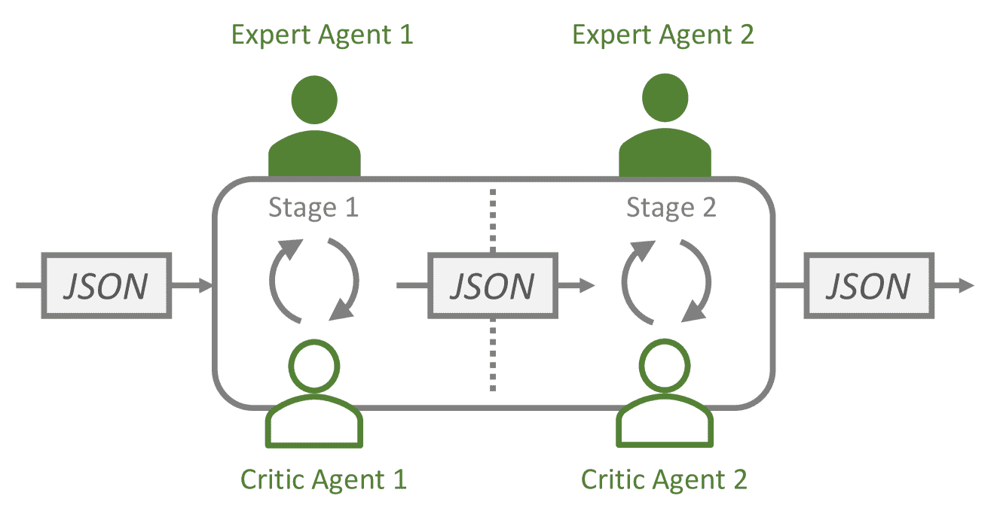

<!--yml

分类：未分类

日期：2025-01-11 12:33:02

-->

# 从文字到世界：通过交互性LLM代理将单行提示转化为沉浸式多模态数字故事

> 来源：[https://arxiv.org/html/2406.10478/](https://arxiv.org/html/2406.10478/)

Samuel S. Sohn，罗格斯大学，08854，美国，贡献相等；Danrui Li，罗格斯大学，08854，美国，贡献相等；Sen Zhang，罗格斯大学，08854，美国，贡献相等；Che-Jui Chang，罗格斯大学，08854，美国；Mubbasir Kapadia，罗格斯大学，08854，美国

###### 摘要

数字故事讲述在娱乐、教育和营销领域中至关重要，但在制作规模化和灵活性方面面临挑战。本文介绍的StoryAgent框架，利用大规模语言模型和生成工具，自动化并优化数字故事讲述。通过采用自上而下的故事草拟和自下而上的资产生成方法，StoryAgent解决了人工干预、互动场景编排和叙事一致性等关键问题。该框架使得能够高效地生产互动性强、一致性好的跨模态叙事，推动了内容创作的普及并增强了参与感。我们的实验结果表明，该框架能够在没有参考视频的情况下生成连贯的数字故事，标志着自动化数字故事讲述的一大进步。

关键词：行人模型、视觉注意力、零售环境、交通枢纽


图1：StoryAgent是一个数字故事讲述生成框架，它将交互性大规模语言模型代理与最先进的生成模型和工具结合在一起。通过将单行文本指令作为输入，它生成具有场景互动性、长时间一致性和干预灵活性的数字故事内容。

## 1 引言

数字故事讲述作为一种强大的媒介，已经在多个领域中崭露头角，包括娱乐、教育和营销[[1](https://arxiv.org/html/2406.10478v2#bib.bib1)，[2](https://arxiv.org/html/2406.10478v2#bib.bib2)，[3](https://arxiv.org/html/2406.10478v2#bib.bib3)]，其原因在于能够结合文本、图像、音频和视频等多媒体元素，创造出沉浸式和互动性的数字叙事。它的多种应用场景，从视频游戏中的互动叙事到虚拟现实中的沉浸体验，使其成为当今数字时代传达信息和激发情感的不可或缺的工具。传统上，数字故事叙事的制作过程往往耗时且资源密集，限制了内容输出的速度和数量。

因此，迫切需要优化和自动化生产流程，以满足日益增长的动态且引人入胜的故事内容的需求。近年来，基于文本的生成模型[[4](https://arxiv.org/html/2406.10478v2#bib.bib4), [5](https://arxiv.org/html/2406.10478v2#bib.bib5), [6](https://arxiv.org/html/2406.10478v2#bib.bib6), [7](https://arxiv.org/html/2406.10478v2#bib.bib7), [8](https://arxiv.org/html/2406.10478v2#bib.bib8), [9](https://arxiv.org/html/2406.10478v2#bib.bib9), [10](https://arxiv.org/html/2406.10478v2#bib.bib10)]的进展，使得能够合成文本、图像、声音和动作的资源，从而推动了免手动操作的数字故事创作。这能够使创作过程更加普及，甚至可能使没有艺术技能的人也能轻松创作复杂的数字叙事内容。一些早期的研究工作[[11](https://arxiv.org/html/2406.10478v2#bib.bib11), [12](https://arxiv.org/html/2406.10478v2#bib.bib12), [13](https://arxiv.org/html/2406.10478v2#bib.bib13), [14](https://arxiv.org/html/2406.10478v2#bib.bib14)]尝试为不同的应用场景（如沉浸式互动叙事、故事板制作、舞台布置、剧本写作等）整合自动化流程，并作为创作工具来使用。在多模态生成模型的帮助下，我们可以简化数字故事创作中资源生产的过程。然而，在有效利用这些多模态生成模型方面，依然存在着重大挑战。

一个显著的挑战是需要灵活的干预（挑战1），因为创作者通常需要根据个人偏好修改初步生成的结果。基于文本的生成模型[[7](https://arxiv.org/html/2406.10478v2#bib.bib7), [9](https://arxiv.org/html/2406.10478v2#bib.bib9)]擅长创建高质量的短片，但在结果的细粒度控制方面有限，例如修改角色而保持相同的故事情节。相反，程序化方法[[12](https://arxiv.org/html/2406.10478v2#bib.bib12), [15](https://arxiv.org/html/2406.10478v2#bib.bib15)]可以进行细粒度控制，但通常需要与框架的专用交互界面，且往往缺乏一个普遍且便捷的人类干预方式。此外，协调角色、物体和场景之间的互动仍然是一个困难的任务（挑战2），但对于提升视觉真实感和增强数字故事体验至关重要[[16](https://arxiv.org/html/2406.10478v2#bib.bib16)]。最后，一致性对于观众参与至关重要。例如，角色的外貌和语音音调应该与故事情节的叙述背景保持一致。此外，一致性还应包括文本情节与后续模态（如音频、语音和视觉）的同步[[17](https://arxiv.org/html/2406.10478v2#bib.bib17), [18](https://arxiv.org/html/2406.10478v2#bib.bib18), [19](https://arxiv.org/html/2406.10478v2#bib.bib19), [20](https://arxiv.org/html/2406.10478v2#bib.bib20), [21](https://arxiv.org/html/2406.10478v2#bib.bib21), [22](https://arxiv.org/html/2406.10478v2#bib.bib22)]。尽管基于扩散的动画生成[[23](https://arxiv.org/html/2406.10478v2#bib.bib23), [24](https://arxiv.org/html/2406.10478v2#bib.bib24), [25](https://arxiv.org/html/2406.10478v2#bib.bib25)]已有进展，但现有方法仍难以确保长期一致性，或者需要额外输入，如参考视频或骨架（挑战3）。

我们提出了一种新颖的StoryAgent框架，它将交互式大型语言模型代理[[26](https://arxiv.org/html/2406.10478v2#bib.bib26), [27](https://arxiv.org/html/2406.10478v2#bib.bib27)]与生成模型和工具相结合。我们的框架通过初步使用自上而下的方法起草故事，利用交互式LLM代理将文本指令分解为数字故事内容的层次化文本表示，其中叶节点是时间线片段的单一模态描述。随后，它采用自下而上的方式，利用生成模型和工具从文本描述中创建并组装相应的资产。

该框架解决了上述三大挑战。首先，其文本表示和生成管道通过简单的自然语言指令，便于人类开发者进行细粒度的控制和干预（挑战1）。通过利用大语言模型的推理能力，框架能够理解指令，识别并修改层次结构中相应的叶节点，同时保持其他组件不变。这个过程使得可以进行有针对性的调整，而不破坏其他内容。此外，通过将程序生成管道中的自下而上的思想与自上而下的层次文本表示相结合，我们的框架解决了连贯性和场景交互性的问题（挑战2）。例如，角色在不同时间帧中的外观与文本表示中的同一服装资产ID相关联。在视频渲染过程中，这个资产会被一致地重复使用，确保所有场景中的视觉统一性。同样，从生成图像中提取的语义和空间信息会被捕获并整合到文本层次结构中，为后续组件的场景交互性铺平道路。从本质上讲，通过我们框架的设计，它能够生成不需要参考视频作为输入的视频，并且不存在时间限制（挑战3）。

此外，通过将文本作为中间产物来解耦故事草拟和资产生成，我们的框架促进了即插即用的结构。这不仅允许前所未有的模态覆盖（见表格[1](https://arxiv.org/html/2406.10478v2#S1.T1 "Table 1 ‣ 1 Introduction ‣ From Words to Worlds: Transforming One-line Prompt into Immersive Multi-modal Digital Stories with Communicative LLM Agent")），还便于最新生成模型的集成，确保我们的框架性能能够持续受益于不断的研究进展。

|  |  | 世界 | 角色 | 音频 | 其他 |
| --- | --- | --- | --- | --- | --- |
|  | 剧情 | 语义 | 视觉 | 外观 | 动画 | 音乐 | 语音 | 特效 | 摄影 |
| [[28](https://arxiv.org/html/2406.10478v2#bib.bib28)] | ✓ |  |  |  |  |  |  |  |  |
| [[29](https://arxiv.org/html/2406.10478v2#bib.bib29)] |  | ✓ |  |  |  |  |  |  |  |
| [[30](https://arxiv.org/html/2406.10478v2#bib.bib30)] |  | ✓ | $\triangle$ |  |  |  |  |  |  |
| [[13](https://arxiv.org/html/2406.10478v2#bib.bib13)] |  |  |  |  |  |  |  |  | ✓ |
| [[31](https://arxiv.org/html/2406.10478v2#bib.bib31)] |  |  | $\triangle$ | $\triangle$ | ✓+ $\triangle$ |  |  |  |  |
| [[32](https://arxiv.org/html/2406.10478v2#bib.bib32)] | ✓ |  | $\triangle$ | $\triangle$ | $\triangle$ |  |  |  |  |
| [[8](https://arxiv.org/html/2406.10478v2#bib.bib8)] |  |  |  |  |  | ✓ | ✓+ $\triangle$ | ✓ |  |
| 我们的 | ✓ | ✓ | ✓ | ✓+ $\triangle$ | $\triangle$ | ✓ | ✓ | ✓+ $\triangle$ | ✓ |

表 1：之前的研究和我们工作中涉及的数字故事讲述组件。✓ = 生成模型。$\triangle$ = 检索方法。

## 2 背景

### 2.1 数字故事讲述作为创作工具

数字故事讲述传统上侧重于为人类开发者提供创作工具，通常采用程序化生成方法，而不是像[[9](https://arxiv.org/html/2406.10478v2#bib.bib9)]那样的端到端解决方案。这种方法论包含了广泛的故事讲述组件。根据[[17](https://arxiv.org/html/2406.10478v2#bib.bib17)]的定义，这些组件可以被分为情节（例如故事情节和事件等文本内容）和空间（例如世界设置、角色、场景道具等）。

之前的故事创作工具，如[[11](https://arxiv.org/html/2406.10478v2#bib.bib11)、[12](https://arxiv.org/html/2406.10478v2#bib.bib12)、[13](https://arxiv.org/html/2406.10478v2#bib.bib13)、[14](https://arxiv.org/html/2406.10478v2#bib.bib14)]，主要用于电影制作流程中的特定阶段，涉及人类的创新与完善，且要求用户具备领域知识。我们的 StoryAgent 框架为业余爱好者和专业人士提供了在高层和低层的代理式人类干预。

### 2.2 启用场景交互性

最近的研究推动了在 3D 环境中角色互动的动态学，显著得益于 3D 对象的显式空间表示[[31](https://arxiv.org/html/2406.10478v2#bib.bib31)、[16](https://arxiv.org/html/2406.10478v2#bib.bib16)、[33](https://arxiv.org/html/2406.10478v2#bib.bib33)、[34](https://arxiv.org/html/2406.10478v2#bib.bib34)、[18](https://arxiv.org/html/2406.10478v2#bib.bib18)、[35](https://arxiv.org/html/2406.10478v2#bib.bib35)、[36](https://arxiv.org/html/2406.10478v2#bib.bib36)、[37](https://arxiv.org/html/2406.10478v2#bib.bib37)]。相比之下，对于 2D 艺术风格，尽管基于扩散的模型提供了更优越的视觉质量，但由于 2D 图像缺乏固有的空间场景信息，因此在实现交互性方面存在挑战。

尽管如此，现有的图像理解研究提供了许多从图像推测空间数据的工具，包括分割[[38](https://arxiv.org/html/2406.10478v2#bib.bib38)]和深度估计[[39](https://arxiv.org/html/2406.10478v2#bib.bib39)]等技术。这些方法论可以支持一个程序化的流程，用于促进 2D 背景下的交互性。本文代表了首次尝试使 2D 艺术风格实现这种场景交互性。

### 2.3 数字故事讲述中的一致性

以往的研究探索了多种方法，以确保情节生成中的连贯性和一致性，例如基于事件驱动的[[15](https://arxiv.org/html/2406.10478v2#bib.bib15)]、基于人物驱动的[[40](https://arxiv.org/html/2406.10478v2#bib.bib40), [41](https://arxiv.org/html/2406.10478v2#bib.bib41)]、基于状态空间的规划[[42](https://arxiv.org/html/2406.10478v2#bib.bib42)]以及自上而下的分解[[43](https://arxiv.org/html/2406.10478v2#bib.bib43)]。然而，在情节和空间组件的一致性联合生成方面，先前的研究相对有限，通常集中在一个或两个领域，如人群运动[[44](https://arxiv.org/html/2406.10478v2#bib.bib44)]、电影摄影[[13](https://arxiv.org/html/2406.10478v2#bib.bib13)]、世界设置[[30](https://arxiv.org/html/2406.10478v2#bib.bib30), [45](https://arxiv.org/html/2406.10478v2#bib.bib45)]等（见表格[1](https://arxiv.org/html/2406.10478v2#S1.T1 "Table 1 ‣ 1 Introduction ‣ From Words to Worlds: Transforming One-line Prompt into Immersive Multi-modal Digital Stories with Communicative LLM Agent")）。尽管一些方法旨在通过潜在扩散文本到图像模型[[46](https://arxiv.org/html/2406.10478v2#bib.bib46), [47](https://arxiv.org/html/2406.10478v2#bib.bib47), [48](https://arxiv.org/html/2406.10478v2#bib.bib48)]同时解决所有视觉组件的对齐问题，但它们的有效性仍然受到时长的限制，因此不适用于长期数字故事讲述场景。在本研究中，我们旨在通过程序化方法实现各个组件之间的广泛一致性。

### 2.4 基于LLM代理的生成式数字故事讲述

以往的研究探讨了涵盖多个组件的LLM辅助生成框架，如文本[[28](https://arxiv.org/html/2406.10478v2#bib.bib28), [29](https://arxiv.org/html/2406.10478v2#bib.bib29)]、音频[[8](https://arxiv.org/html/2406.10478v2#bib.bib8)]和视觉[[32](https://arxiv.org/html/2406.10478v2#bib.bib32)]，其中LLM在以下几个方面展示了其在单模态资产生成中的能力：

首先，它们可以从自然语言描述中提取信息，并将其转换为格式化的参数[[49](https://arxiv.org/html/2406.10478v2#bib.bib49)，[32](https://arxiv.org/html/2406.10478v2#bib.bib32)]。利用它们的世界知识，LLM（大规模语言模型）还可以将复杂的概念拆解成几个简单的组件[[8](https://arxiv.org/html/2406.10478v2#bib.bib8)]，从而降低下游生成模型的难度。此外，组件的组织可以以显式格式进行存储和更新[[50](https://arxiv.org/html/2406.10478v2#bib.bib50)]。最后，借助推理能力[[51](https://arxiv.org/html/2406.10478v2#bib.bib51)，[52](https://arxiv.org/html/2406.10478v2#bib.bib52)]，LLM 可以使用预定义的工具集和实时反馈规划生成任务。但像 [[32](https://arxiv.org/html/2406.10478v2#bib.bib32)] 这样的基于提示的叙事场景生成工具，在连续生成多个连贯且引人入胜的叙事场景方面存在局限性。

LLM 代理系统广泛应用于复杂的生成任务，如游戏世界叙事[[53](https://arxiv.org/html/2406.10478v2#bib.bib53)]和计算机程序[[54](https://arxiv.org/html/2406.10478v2#bib.bib54)]。在这些情况下，通过预定义的层次化记忆和反思过程实现一致性。本文中，我们应用 LLM 代理系统以确保时间和模态维度的一致性。

## 3 方法  


图 2：StoryAgent 的框架。框架从文本指令开始，通过任务分解构建故事，指定每种模态的所有资源文件。在此基础上，生成模型和工具被组织起来，以创建和构成故事的具体资源。

整个管道（见图[2](https://arxiv.org/html/2406.10478v2#S3.F2 "图2 ‣ 3 方法 ‣ 从文字到世界：通过交互式LLM代理将单行提示转化为沉浸式多模态数字故事")）从文本指令开始，随后通过基于LLM代理的故事集群（见[3.1](https://arxiv.org/html/2406.10478v2#S3.SS1 "3.1 故事集群 ‣ 3 方法 ‣ 从文字到世界：通过交互式LLM代理将单行提示转化为沉浸式多模态数字故事")）开发出复杂的故事情节，同时具备场景理解能力（见[3.2](https://arxiv.org/html/2406.10478v2#S3.SS2 "3.2 基于图像的场景理解与互动 ‣ 3 方法 ‣ 从文字到世界：通过交互式LLM代理将单行提示转化为沉浸式多模态数字故事")）。故事集群将数字故事创作任务分解为多个子任务，每个子任务专注于特定的模态。对于每种模态，故事集群通过文本描述指定所有的故事输出资产文件。基于这些描述，生成模型和工具被组织成资产生成团队（见[3.3](https://arxiv.org/html/2406.10478v2#S3.SS3 "3.3 资产生成团队 ‣ 3 方法 ‣ 从文字到世界：通过交互式LLM代理将单行提示转化为沉浸式多模态数字故事")）以创建故事的有形资产。最后，针对潜在干预方法的介绍可以参见[3.4](https://arxiv.org/html/2406.10478v2#S3.SS4 "3.4 干预 ‣ 3 方法 ‣ 从文字到世界：通过交互式LLM代理将单行提示转化为沉浸式多模态数字故事")。

### 3.1 故事集群

故事集群通过一个LLM代理团队的网络草拟出故事情节。该方法受到电影工业中管道工作流的启发，代理团队分别处理故事情节、人物、设定、故事要点、设定的可用性、故事场景和剧本等内容。

该网络从一个故事情节团队开始，团队以文本形式构建叙事蓝图，指导整个制作过程的最高层级。然后，蓝图被分发给多个下游团队，处理不同的叙事组件，如人物设定、背景设定、场景、剧本等。各团队之间传递的中间产品始终是文本形式的。尽管该集群是基于AutoGen[[27](https://arxiv.org/html/2406.10478v2#bib.bib27)]构建的，但传播遵循预定程序（见图[1](https://arxiv.org/html/2406.10478v2#S0.F1 "图1 ‣ 从文字到世界：通过交互式LLM代理将单行提示转化为沉浸式多模态数字故事")），以确保生成的稳定性。



图 3：两阶段 LLM 代理团队的结构。它将上游 JSON 作为输入，并使用两个专家-评论员 LLM 代理对进行处理。最终，会生成另一个 JSON 字符串供下游团队使用。

基于上游内容，每个团队生成的结果通过单阶段或多阶段对话逐步优化（见图[3](https://arxiv.org/html/2406.10478v2#S3.F3 "Figure 3 ‣ 3.1 Story cluster ‣ 3 Method ‣ From Words to Worlds: Transforming One-line Prompt into Immersive Multi-modal Digital Stories with Communicative LLM Agent")）。所有的多阶段配置都是手动设计的，以进一步分解生成过程，因为某些代理团队需要复杂的反思，而当前的 LLM 主干无法处理。在每个阶段，两个 LLM 代理之间会进行对话。受到[[26](https://arxiv.org/html/2406.10478v2#bib.bib26)]中角色扮演方法的启发，每个代理会初始化一个系统提示，其中会附加对话历史和上游内容到特定代理的模板中。

在这两者中，一个“专家代理”负责根据预定义要求和上游输入创建组件规范。另一个“评论员代理”则根据预定义标准评估并打分。各个代理的角色、约束和输出格式在同一团队阶段内由专家和评论员共享，但在不同的代理团队和阶段之间有所不同。有关所有代理的全面提示，请参阅附录。

从专家代理开始，两个代理会轮流响应彼此的输出，直到评论员对专家的结果满意为止，循环才会结束。

利用 GPT-4 作为 LLM 代理的主干，这种专家-评论员设计增强了自我纠错的能力，确保上游命令和下游结果之间的一致性。例如，考虑以下示例，其中评论员代理帮助专家代理完善角色档案：

管理员

<svg class="ltx_picture" height="24.26" id="S3.SS1.p8.pic1" overflow="visible" version="1.1" width="469.68"><g fill="#000000" stroke="#000000" stroke-width="0.4pt" transform="translate(0,24.26) matrix(1 0 0 -1 0 0)"><g fill-opacity="1.0" transform="matrix(1.0 0.0 0.0 1.0 9.84 7.77)"><foreignobject color="#000000" height="12.45" overflow="visible" transform="matrix(1 0 0 -1 0 16.6)" width="450">(provide a story arc in JSON format)</foreignobject></g></g></svg>

角色中的专家

<svg class="ltx_picture" height="24.26" id="S3.SS1.p10.pic1" overflow="visible" version="1.1" width="469.68"><g fill="#000000" stroke="#000000" stroke-width="0.4pt" transform="translate(0,24.26) matrix(1 0 0 -1 0 0)"><g fill-opacity="1.0" transform="matrix(1.0 0.0 0.0 1.0 9.84 7.77)"><foreignobject color="#000000" height="12.45" overflow="visible" transform="matrix(1 0 0 -1 0 16.6)" width="450">{”name”: ”Village elders”…}</foreignobject></g></g></svg>

角色中的评论员

<svg class="ltx_picture" height="66.99" id="S3.SS1.p12.pic1" overflow="visible" version="1.1" width="469.68"><g fill="#000000" stroke="#000000" stroke-width="0.4pt" transform="translate(0,66.99) matrix(1 0 0 -1 0 0)"><g fill-opacity="1.0" transform="matrix(1.0 0.0 0.0 1.0 9.84 29.13)"><foreignobject color="#000000" height="55.18" overflow="visible" transform="matrix(1 0 0 -1 0 16.6)" width="450">…The character name ”Village elders” is plural and should be singular…The expert should break down ”Village elders” into individual characters with singular names. For example, they could create characters for a few prominent elders and villagers.</foreignobject></g></g></svg>

角色中的专家

<svg class="ltx_picture" height="24.26" id="S3.SS1.p14.pic1" overflow="visible" version="1.1" width="469.68"><g fill="#000000" stroke="#000000" stroke-width="0.4pt" transform="translate(0,24.26) matrix(1 0 0 -1 0 0)"><g fill-opacity="1.0" transform="matrix(1.0 0.0 0.0 1.0 9.84 7.77)"><foreignobject color="#000000" height="12.45" overflow="visible" transform="matrix(1 0 0 -1 0 16.6)" width="450">{”name”: ”Elder John”…},{”name”: ”Elder Mary”…}…</foreignobject></g></g></svg>

角色中的评论员

<svg class="ltx_picture" height="24.26" id="S3.SS1.p16.pic1" overflow="visible" version="1.1" width="469.68"><g fill="#000000" stroke="#000000" stroke-width="0.4pt" transform="translate(0,24.26) matrix(1 0 0 -1 0 0)"><g fill-opacity="1.0" transform="matrix(1.0 0.0 0.0 1.0 9.84 7.77)"><foreignobject color="#000000" height="12.45" overflow="visible" transform="matrix(1 0 0 -1 0 16.6)" width="450">(pass the check)</foreignobject></g></g></svg>

### 3.2 基于图像的场景理解与交互

将角色放置在前景，将故事背景图像放在背景中，可能会导致一些不合理的安排，比如角色站在水面上或漂浮在空中。为了提高每个场景的真实性，并让观众更好地沉浸在故事中，流程采取了几个措施：首先，明确和隐式地将图像语义分割与深度估计融合作为视觉空间信息，然后让设置适配代理使前景角色能够与背景图像互动，否则它们将无法连接。视觉空间信息还可以通过提供物体的估计位置和与摄像机的距离来有助于电影摄影。

#### 3.2.1 场景理解

场景理解过程分为三个关键阶段，旨在为设置代理提供对叙事环境的全面了解，使其能够为动态故事互动提供相关的支持。

最初，故事设置代理构建了所有叙事设置的层次化图谱。该图谱中的每个节点代表一个独特的设置，并包括诸如设置名称、视觉提示以及与其他设置（父节点和子节点）之间的关系等关键信息。从这些视觉提示中，背景图像通过[[5](https://arxiv.org/html/2406.10478v2#bib.bib5)]生成，形成故事环境的视觉基础。

生成的图像经过语义分割，以识别和分类每个设置中的物体。这一分割过程 ([[38](https://arxiv.org/html/2406.10478v2#bib.bib38)])，配合深度估计 ([[55](https://arxiv.org/html/2406.10478v2#bib.bib55)])，提供了每个场景的三维理解。物体被封装在边界框中，突出了它们的空间位置和中位深度，有助于在叙事空间中准确放置。这一关键的空间数据为角色和相机与物体的互动提供了依据，确保场景组合的准确性和真实感（见[3.2.2](https://arxiv.org/html/2406.10478v2#S3.SS2.SSS2 "3.2.2 Character and camera interaction ‣ 3.2 Image-based scene understanding and interaction ‣ 3 Method ‣ From Words to Worlds: Transforming One-line Prompt into Immersive Multi-modal Digital Stories with Communicative LLM Agent")）。


图4：语义场景理解示例

在最后阶段，设置支持代理利用详细的物体和空间数据（见附录[6.1.5](https://arxiv.org/html/2406.10478v2#S6.SS1.SSS5.Px2 "Stage 2 ‣ 6.1.5 Setting affordance team ‣ 6.1 Prompts in story cluster ‣ 6 Appendix ‣ From Words to Worlds: Transforming One-line Prompt into Immersive Multi-modal Digital Stories with Communicative LLM Agent")）创建一个丰富的互动可能性层次，通过支持进行交互。这些支持被细致记录，包含物体关系、叙事相关性以及物体在图像中存在的证据。然后，这些结构化的信息传递给故事场景代理，后者利用它来编写互动和叙事事件，确保角色能够自然地与环境进行互动。

#### 3.2.2 角色与相机互动

我们的流程通过精确的摄影技术处理和利用物体位置数据，以增强故事叙述效果。一旦捕获到这些数据，剧本代理将其整合，以有效地组织场景动态。这包括将物体的中心作为动画和摄影的焦点——角色通过有针对性的动作与关键物体互动，摄像机根据物体的位置和估计的距离调整焦距和画面构图。这种方法使得可以战略性地选择镜头类型（近景、中景或远景），以最好地捕捉叙事时刻。

### 3.3 资产生成团队

每个代理生成团队代表了LLM代理和生成模型的结合。通常，这里的LLM代理充当了上游文本描述和下游生成模型与工具之间的桥梁。具体来说，LLM代理的目的是将自然语言中表达的规范转化为模型参数，并根据生成模型和工具的反馈进行反思。

在我们的研究中，我们使用了装配框架CC2D[[56](https://arxiv.org/html/2406.10478v2#bib.bib56)]来构建和动画化人类虚拟形象。为了生成角色不同部分的图像资产，例如裤子和衣物，我们将外观描述输入到文本到图像生成模型[[5](https://arxiv.org/html/2406.10478v2#bib.bib5)]中。这些资产是通过补充提示——例如“详细的、卡通风格的、8k”—来增强初步描述生成的。由于基于扩散的生成模型难以直接生成有意义的2D纹理，生成过程经历了复合与分解的步骤。首先，我们将长袍和裤子的2D纹理合成成有意义的资产形状（见图[5](https://arxiv.org/html/2406.10478v2#S3.F5 "Figure 5 ‣ 3.3 Asset generation teams ‣ 3 Method ‣ From Words to Worlds: Transforming One-line Prompt into Immersive Multi-modal Digital Stories with Communicative LLM Agent")），然后使用组装的蒙版生成资产。生成完成后，我们将整个资产与其纹理蒙版分解，并将其整合到CC2D框架中（见图[6](https://arxiv.org/html/2406.10478v2#S3.F6 "Figure 6 ‣ 3.3 Asset generation teams ‣ 3 Method ‣ From Words to Worlds: Transforming One-line Prompt into Immersive Multi-modal Digital Stories with Communicative LLM Agent")）。纹理在运行时加载（见图[7](https://arxiv.org/html/2406.10478v2#S3.F7 "Figure 7 ‣ 3.3 Asset generation teams ‣ 3 Method ‣ From Words to Worlds: Transforming One-line Prompt into Immersive Multi-modal Digital Stories with Communicative LLM Agent")）。

    

图5：角色裤子资产示例

  

图6：角色部件遮罩。左侧是原始纹理格式，右侧是为更好的生成质量而组装的遮罩


图7：运行时的裤子资产

对于背景图像的创建，我们使用相同的生成模型以确保风格一致性。我们使用[[57](https://arxiv.org/html/2406.10478v2#bib.bib57)]解除令牌限制，通过设置配置代理提供的视觉提示生成背景。此外，这些图像会在场景理解集群中进行进一步处理（请参见[3.2](https://arxiv.org/html/2406.10478v2#S3.SS2 "3.2 基于图像的场景理解与交互 ‣ 3 方法 ‣ 从文字到世界：通过交互式LLM代理将单行提示转化为沉浸式多模态数字故事")），以实现互动性。此附加步骤允许在生成的环境中进行动态交互（详见[3.2](https://arxiv.org/html/2406.10478v2#S3.SS2 "3.2 基于图像的场景理解与交互 ‣ 3 方法 ‣ 从文字到世界：通过交互式LLM代理将单行提示转化为沉浸式多模态数字故事")）。

在语音生成中，简化后的角色描述首先被输入AudioGen[[10](https://arxiv.org/html/2406.10478v2#bib.bib10)]以创建语音指纹，包含该角色的语音特征。然后通过XTTS [[58](https://arxiv.org/html/2406.10478v2#bib.bib58)]平滑处理，生成参考语音音频。接下来，将参考音频、文本中的语音以及文本中的情感状态输入ElevenLabs API [[59](https://arxiv.org/html/2406.10478v2#bib.bib59)]以创建最终的语音音频。

受[[8](https://arxiv.org/html/2406.10478v2#bib.bib8)]启发，声音描述首先通过LLMs分解为各个组件，其中不同的分解方法根据声音效果类型（循环或一次性）量身定制。然后，对于每个组件，应用LLM代理搜索FreeSound [[60](https://arxiv.org/html/2406.10478v2#bib.bib60)]上的相应资产，资产通过将其描述输入代理进行评估。搜索通过代理使用先前搜索结果优化的关键词反复触发。如果没有合适的资产，调用AudioGen[[10](https://arxiv.org/html/2406.10478v2#bib.bib10)]来创建一个。所有音乐片段均由MusicGen [[10](https://arxiv.org/html/2406.10478v2#bib.bib10)]创建，这是一个文本到音乐的生成模型。

一致性通过LLM代理与其他生成模型和工具之间的通信得到优化。例如，在声音检索中，初始描述被分解为更简单的组件，每个组件的描述都转化为查询字符串，并根据之前搜索的结果进行反复优化。这种方法强调了LLM的动态使用，以增强文本描述与检索资产之间的一致性。

管理员

<svg class="ltx_picture" height="36.73" id="S3.SS3.p8.pic1" overflow="visible" version="1.1" width="469.68"><g fill="#000000" stroke="#000000" stroke-width="0.4pt" transform="translate(0,36.73) matrix(1 0 0 -1 0 0)"><g fill-opacity="1.0" transform="matrix(1.0 0.0 0.0 1.0 9.84 14.01)"><foreignobject color="#000000" height="24.92" overflow="visible" transform="matrix(1 0 0 -1 0 16.6)" width="450">The sound of townsfolk chatting, children playing, and the gentle splash of the fountain water.</foreignobject></g></g></svg>

分解代理

<svg class="ltx_picture" height="74.08" id="S3.SS3.p10.pic1" overflow="visible" version="1.1" width="469.68"><g fill="#000000" stroke="#000000" stroke-width="0.4pt" transform="translate(0,74.08) matrix(1 0 0 -1 0 0)"><g fill-opacity="1.0" transform="matrix(1.0 0.0 0.0 1.0 9.84 32.68)"><foreignobject color="#000000" height="62.27" overflow="visible" transform="matrix(1 0 0 -1 0 16.6)" width="450">{ ”name”: ”townsfolk chatting”, ”desc”: ”the sound of townsfolk chatting in a town square”, ”volume”: -25 }, { ”name”: ”children playing”, ”desc”: ”the sound of children playing in a town square”, ”volume”: -20 }, { ”name”: ”fountain water”, ”desc”: ”the gentle splash of fountain water in a town square”, ”volume”: -30 }</foreignobject></g></g></svg>

分解代理

<svg class="ltx_picture" height="22.88" id="S3.SS3.p12.pic1" overflow="visible" version="1.1" width="473.84"><g fill="#000000" stroke="#000000" stroke-width="0.4pt" transform="translate(0,22.88) matrix(1 0 0 -1 0 0)"><g fill-opacity="1.0" transform="matrix(1.0 0.0 0.0 1.0 9.84 7.08)"><foreignobject color="#000000" height="11.07" overflow="visible" transform="matrix(1 0 0 -1 0 16.6)" width="454.15">@Query Agent the gentle splash of fountain water in a town square</foreignobject></g></g></svg>

查询代理

<svg class="ltx_picture" height="22.88" id="S3.SS3.p14.pic1" overflow="visible" version="1.1" width="473.84"><g fill="#000000" stroke="#000000" stroke-width="0.4pt" transform="translate(0,22.88) matrix(1 0 0 -1 0 0)"><g fill-opacity="1.0" transform="matrix(1.0 0.0 0.0 1.0 9.84 7.08)"><foreignobject color="#000000" height="11.07" overflow="visible" transform="matrix(1 0 0 -1 0 16.6)" width="454.15">@Search API water +fountain +splash +gentle -ocean -river</foreignobject></g></g></svg>

搜索 API

<svg class="ltx_picture" height="24.26" id="S3.SS3.p16.pic1" overflow="visible" version="1.1" width="469.68"><g fill="#000000" stroke="#000000" stroke-width="0.4pt" transform="translate(0,24.26) matrix(1 0 0 -1 0 0)"><g fill-opacity="1.0" transform="matrix(1.0 0.0 0.0 1.0 9.84 7.77)"><foreignobject color="#000000" height="12.45" overflow="visible" transform="matrix(1 0 0 -1 0 16.6)" width="450">(a list of sound with descriptions)</foreignobject></g></g></svg>

查询代理

<svg class="ltx_picture" height="22.88" id="S3.SS3.p18.pic1" overflow="visible" version="1.1" width="469.68"><g fill="#000000" stroke="#000000" stroke-width="0.4pt" transform="translate(0,22.88) matrix(1 0 0 -1 0 0)"><g fill-opacity="1.0" transform="matrix(1.0 0.0 0.0 1.0 9.84 7.08)"><foreignobject color="#000000" height="11.07" overflow="visible" transform="matrix(1 0 0 -1 0 16.6)" width="450">water +fountain +gentle +town -ocean -river -greenway</foreignobject></g></g></svg>

搜索 API

<svg class="ltx_picture" height="24.26" id="S3.SS3.p20.pic1" overflow="visible" version="1.1" width="469.68"><g fill="#000000" stroke="#000000" stroke-width="0.4pt" transform="translate(0,24.26) matrix(1 0 0 -1 0 0)"><g fill-opacity="1.0" transform="matrix(1.0 0.0 0.0 1.0 9.84 7.77)"><foreignobject color="#000000" height="12.45" overflow="visible" transform="matrix(1 0 0 -1 0 16.6)" width="450">(a list of sound with descriptions)</foreignobject></g></g></svg>

查询代理

<svg class="ltx_picture" height="22.88" id="S3.SS3.p22.pic1" overflow="visible" version="1.1" width="469.68"><g fill="#000000" stroke="#000000" stroke-width="0.4pt" transform="translate(0,22.88) matrix(1 0 0 -1 0 0)"><g fill-opacity="1.0" transform="matrix(1.0 0.0 0.0 1.0 9.84 7.08)"><foreignobject color="#000000" height="11.07" overflow="visible" transform="matrix(1 0 0 -1 0 16.6)" width="450">fountain +gentle +town</foreignobject></g></g></svg>

搜索 API

<svg class="ltx_picture" height="24.26" id="S3.SS3.p24.pic1" overflow="visible" version="1.1" width="469.68"><g fill="#000000" stroke="#000000" stroke-width="0.4pt" transform="translate(0,24.26) matrix(1 0 0 -1 0 0)"><g fill-opacity="1.0" transform="matrix(1.0 0.0 0.0 1.0 9.84 7.77)"><foreignobject color="#000000" height="12.45" overflow="visible" transform="matrix(1 0 0 -1 0 16.6)" width="450">(a list of sound with descriptions)</foreignobject></g></g></svg>

查询代理

<svg class="ltx_picture" height="24.26" id="S3.SS3.p26.pic1" overflow="visible" version="1.1" width="469.68"><g fill="#000000" stroke="#000000" stroke-width="0.4pt" transform="translate(0,24.26) matrix(1 0 0 -1 0 0)"><g fill-opacity="1.0" transform="matrix(1.0 0.0 0.0 1.0 9.84 7.77)"><foreignobject color="#000000" height="12.45" overflow="visible" transform="matrix(1 0 0 -1 0 16.6)" width="450">(The index of the best sound asset)</foreignobject></g></g></svg>

### 3.4 干预

虽然我们的框架支持免提生成过程，但它也为人类创作者提供了灵活的干预方式。框架允许以下干预方式：

+   •

    从头开始的完全重生成：通过将先前生成的结果和额外指令传递给框架输入，框架更新所有内容，确保最大一致性。我们在[4.3节](https://arxiv.org/html/2406.10478v2#S4.SS3 "4.3 Agent-wise human intervention ‣ 4 Storytelling Experience ‣ From Words to Worlds: Transforming One-line Prompt into Immersive Multi-modal Digital Stories with Communicative LLM Agent")中应用了这一方法。请参阅附录中的指令提示。

+   •

    过程中的中介：通过修正上游结果并修改代理系统提示，框架更新所有下游内容，从而对选定的模式进行更精细的控制。

+   •

    替换：通过用人类创作的结果替换生成的结果，人类创作者可以对结果进行最大控制。然而，替换下游资产可能会导致一致性问题，因为框架无法反映它们。


(a) 一个名叫蒂姆的好奇男孩和他那位冒险的朋友萨姆决定探索他们家附近的森林，尽管那里流传着它闹鬼的传闻。


(b) 当他们深入森林时，发现了刻在树上的神秘信息。他们决定解读这些信息，认为它们可能指向宝藏。


(c) 他们终于解读出信息，指引他们找到了一棵特定的树。他们在树根下发现了一个古老、风化的盒子。


(d) 他们打开盒子，发现一张数十年前的镇地图，地图上标记了一条通往他们家的路线。


(e) 他们沿着地图上的路线前进，意识到真正的宝藏是他们所经历的旅程和所创造的回忆。最终，他们带着更深的友谊回到了萨姆的家。

图8：故事生成的屏幕截图，每个阶段的五阶段讲故事弧中选取了一个画面。

## 4 讲故事体验

在这一部分，我们展示了我们管道的定性结果，重点突出了文本驱动的管道的三个优势。我们首先展示了StoryAgent的推理能力如何促进情节与下游组件之间的一致性。接着，我们展示了各种代理和生成工具的协调如何确保2D艺术风格中的场景互动性。最后，我们展示了其在生成过程中如何适应人为干预，从而为人类创作者提供故事的备选方案。以下是我们基线故事的故事情节：

在故事中，Tim和他的朋友Sam探索了他们家附近的树林，发现了树上写着神秘的信息，他们认为这些信息可能指向宝藏。根据线索，他们找到了一个旧盒子，里面是一张他们镇子的古老地图。地图将他们引导回家，揭示了真正的宝藏其实是这段冒险经历以及他们在此过程中建立的深厚友谊。

### 4.1 故事一致性

我们的框架保持所有资产文件的层级组织，从而实现资产的重复使用。因此，这一结构确保了所有视觉元素的一致性，无论是在相邻的帧内，还是在不同的场景之间（见图[9](https://arxiv.org/html/2406.10478v2#S4.F9 "Figure 9 ‣ 4.1 Story consistency ‣ 4 Storytelling Experience ‣ From Words to Worlds: Transforming One-line Prompt into Immersive Multi-modal Digital Stories with Communicative LLM Agent")）。

    

图9：场景间角色一致性。基于生成叙事的文本描述，角色资源在各个场景中被重复使用，确保了视觉上的一致性。

此外，我们的框架确保跨模态的一致性，因为视觉和音频元素共同创造了富有情感的叙事体验。在这篇手稿中，场景的生成听觉描述与图[10](https://arxiv.org/html/2406.10478v2#S4.F10 "Figure 10 ‣ 4.1 Story consistency ‣ 4 Storytelling Experience ‣ From Words to Worlds: Transforming One-line Prompt into Immersive Multi-modal Digital Stories with Communicative LLM Agent")中的相应可视化配对，展示了我们的框架如何保持视觉和音频风格的一致性。

   <svg class="ltx_picture" height="71.84" id="S4.F10.2.2.p1.pic1" overflow="visible" version="1.1" width="600"><g fill="#000000" stroke="#000000" stroke-width="0.4pt" transform="translate(0,71.84) matrix(1 0 0 -1 0 0)"><g fill-opacity="1.0" transform="matrix(1.0 0.0 0.0 1.0 9.84 13.78)"><foreignobject color="#000000" height="44.28" overflow="visible" transform="matrix(1 0 0 -1 0 16.6)" width="580.32">[视觉] 一间小房间，里面有一张单人床、一张木桌子、一排装满书籍的书架、一个俯瞰院子的窗户，以及一块蓝色的地毯。[音频] 远处是安静的郊区环境，隐约能听到孩子们玩耍和鸟鸣的声音。</foreignobject></g></g></svg>     <svg class="ltx_picture" height="71.84" id="S4.F10.4.4.p1.pic1" overflow="visible" version="1.1" width="600"><g fill="#000000" stroke="#000000" stroke-width="0.4pt" transform="translate(0,71.84) matrix(1 0 0 -1 0 0)"><g fill-opacity="1.0" transform="matrix(1.0 0.0 0.0 1.0 9.84 13.78)"><foreignobject color="#000000" height="44.28" overflow="visible" transform="matrix(1 0 0 -1 0 16.6)" width="580.32">[视觉] 一片密集的森林，高耸的树木，覆盖着落叶的地面，一条狭窄的小径，树枝上的鸟巢，以及一条安静的溪流。[音频] 背景是沙沙作响的叶子声、鸟鸣声和远处动物的声音，营造出一种深处森林的氛围。</foreignobject></g></g></svg>

图 10：跨模态一致性。我们的框架通过对齐视觉和音频元素的文本描述，确保它们之间的一致性。

### 4.2 场景互动性

StoryAgent可以将详细的场景信息融入到数字故事讲述中，创造场景互动性。我们专注于数字故事讲述中两种常见的实践，通过强调叙事元素有效地吸引年轻观众。

首先，互动发生在语义层面。当故事展开时，人物会在对话中提及场景中的物体，同时保持故事的一致性。在图[11](https://arxiv.org/html/2406.10478v2#S4.F11 "Figure 11 ‣ 4.2 Scene interactivity ‣ 4 Storytelling Experience ‣ From Words to Worlds: Transforming One-line Prompt into Immersive Multi-modal Digital Stories with Communicative LLM Agent")中，人物正在谈论他们的童年记忆，同时背景中升起了一座篱笆作为参照。

  

图 11：带有场景理解的人物对话。（左）“看看我们的房子，Sam。它不是我们期望的宝藏，但它是我们今天冒险的象征。”（右）“你说得对，Tim。还记得我们以前坐在那个篱笆上，梦想着找到宝藏吗？”

互动性还通过对话、角色手势和摄影技术之间的同步互动得到了增强。当角色在场景中讨论某个物体时，镜头不仅会转移焦点并放大该物体以便详细展示，角色也会将视线和手势指向该物体。这种协调使得数字叙事更加易于理解且富有吸引力，尤其适合儿童，正如图[12](https://arxiv.org/html/2406.10478v2#S4.F12 "图 12 ‣ 4.2 场景互动性 ‣ 4 叙事体验 ‣ 从文字到世界：通过沟通性LLM代理将单行提示转化为沉浸式多模态数字故事")中所述。

 

图 12：镜头拍摄和角色手势与场景理解。（左）镜头转移，聚焦于树木的同时，角色指着它们进行讨论。（右）镜头放大角色的脸部，同时叙述者描述他的眼睛。

基础故事设定干预角色与设定干预事件 1：解码！    这些雕刻…它们可能是某种密码… 看那个涂鸦，Sam。太难解读了！ 大家看这些信息，它们像是一个谜题… 事件 2：返回起点    Tim 和 Sam…开始穿越树林的旅程 Tim 和 Sam…穿越繁忙的城市景观 他们继续他们的旅程… 事件 3：宝藏就是冒险    事实上，真正的宝藏是这段旅程… 而且，Sam，冒险本身也是一种宝藏… …而那个宝藏就是我们一起创造的回忆。

图 13：具有代理干预的故事结果（截图和语音）。第一列显示原始的基础故事，第二列显示世界设定的变化。最后一列则是同时干预世界设定和角色设定的变化。结果显示所有情节的关键事件相同（如行中所示），但干预方式的多样性得到了保证。

### 4.3 基于代理的人工干预

我们框架的粗到精的数字叙事生成方法非常适合灵活的人类干预，因为所有受干预影响的代理都是严格下游的。下面，我们通过在管道中的不同位置改变基础故事生成结果来展示这种灵活性，每个位置对应着故事讲述过程中的不同模式。

首先，我们的框架展示了其在保持故事大纲的同时，适应写作风格的能力。在这里，我们直接指示下游代理团队将剧本中的对话写成押韵的对联。这使得我们可以重新利用基础故事的上游内容，便于进行更轻松的比较。

基础故事脚本：

<svg class="ltx_picture" height="88.44" id="S4.SS3.p4.pic1" overflow="visible" version="1.1" width="600"><g fill="#000000" stroke="#000000" stroke-width="0.4pt" transform="translate(0,88.44) matrix(1 0 0 -1 0 0)"><g fill-opacity="1.0" transform="matrix(1.0 0.0 0.0 1.0 21.65 13.78)"><foreignobject color="#000000" height="60.88" overflow="visible" transform="matrix(1 0 0 -1 0 16.6)" width="556.69">NARRATOR: In a quiet neighborhood, we meet Tim, a curious boy with a thirst for adventure. TIM: I’ve heard the rumors about the woods, but I can’t help but want to explore it. NARRATOR: Despite the rumors, Tim’s curiosity is not deterred. TIM: No matter how far I go, I know this house will always be my safe haven.</foreignobject></g></g></svg>

剧本干预故事脚本：

<svg class="ltx_picture" height="102.62" id="S4.SS3.p6.pic1" overflow="visible" version="1.1" width="600"><g fill="#000000" stroke="#000000" stroke-width="0.4pt" transform="translate(0,102.62) matrix(1 0 0 -1 0 0)"><g fill-opacity="1.0" transform="matrix(1.0 0.0 0.0 1.0 21.65 13.78)"><foreignobject color="#000000" height="75.07" overflow="visible" transform="matrix(1 0 0 -1 0 16.6)" width="556.69">NARRATOR: In a cozy home, lived a boy named Tim, his spirit was adventurous, his curiosity never dim. TIM: I’ve heard of the woods, so haunted and deep, I must explore, while the world’s asleep. NARRATOR: With a heart full of courage, and a mind full of wonder, into the woods, Tim decided to wander. TIM: No matter how far, into the woods I delve, this house will always be my safe haven, my safe shelf.</foreignobject></g></g></svg>

接下来，我们展示了对叙事生成过程（即下游代理）产生更大影响的更复杂干预。这是通过将基础故事的故事弧作为输入，加入额外指令来保留故事的某些元素，同时改变其他元素。与剧本干预不同，这种干预完全重新生成了角色，导致了角色服装颜色的变化。

图[9](https://arxiv.org/html/2406.10478v2#S4.F9 "Figure 9 ‣ 4.1 Story consistency ‣ 4 Storytelling Experience ‣ From Words to Worlds: Transforming One-line Prompt into Immersive Multi-modal Digital Stories with Communicative LLM Agent")展示了两种干预：一种是角色和情节固定，但环境发生变化（S干预）；另一种是情节固定，但角色和环境发生变化（CS干预）。在这两种干预之间，我们观察到基础故事中森林中的神秘雕刻在S干预中反映为神秘涂鸦，在CS干预中则变成了神秘刻痕（事件1）。与事件1对应的每个图像也展示了故事通过利用表现力让角色看向并指向神秘图像。在事件2和事件3中，我们看到每个故事的情节都引导角色经历一场曲折的冒险，最终回到他们的起点，并且他们分享同一个道德——欣赏冒险。在CS干预中，原本在两位角色之间分配的对话已经被分配到四位角色之间，这意味着不仅添加了新角色，而且这些角色得到了充分利用。原始故事和三种干预的未编辑视频可以在补充材料中找到。

## 5 讨论

本文中，我们介绍了“StoryAgent”框架，该框架利用文本作为核心媒介，组织现有的生成模型以产生长期数字故事讲述。虽然最先进的前期工作在短动画片的质量上表现优异，但我们的工作旨在解决讲故事中的两个主要难题：不同模态之间的长期对齐和场景互动性。

此外，我们认为这样的框架在现实世界的数字故事讲述制作中提供了更多的灵活性：首先，各种模式下新一代生成模型和工具的快速出现要求它们迅速应用到更大的管道中，且成本最低。我们的模型独立框架促进了即插即用的方法，使最新的研究进展能够轻松整合。这确保了我们的框架性能持续受益于不断发展的研究。其次，通过用人工创作的素材替代生成的素材，我们的框架解决了独立开发者在某些模式下面临的具体限制。例如，图形艺术家可以使用我们的管道将音乐整合到他们的数字故事中，而音乐家则可以利用它生成其音频作品的视觉表现。最后，我们框架的文本为基础的特性使得人类艺术家可以轻松调整中间产品，从而增强了制作过程的可控性。

然而，我们在研究中识别出以下几个局限性：首先，尽管我们的方法已实现了广泛的故事组件覆盖，但叙事呈现——包括时长、顺序和叙事风格（统称为“话语”在 [[17](https://arxiv.org/html/2406.10478v2#bib.bib17)]）——仅进行了最小程度的探讨。其次，我们承认当前生成的结果受限于最先进的单一模态模型的性能和能力。这个局限性影响了情节与下游组件之间的对齐，可能会影响生成结果的整体连贯性和沉浸感。最后，我们对场景互动性的实验仅限于少数几种场景。未来的研究应探索更复杂的互动模式，例如使角色能够拾取物品或改变环境中物体的状态，以增强2D艺术风格中的互动体验。

## 参考文献

+   De Jager 等人 [2017] Adele De Jager, Andrea Fogarty, Anna Tewson, Caroline Lenette, 和 Katherine M Boydell. 研究中的数字故事讲述：一项系统评价。*《定性报告》*，22(10)：2548-2582，2017年。

+   Lambert [2013] Joe Lambert. *《数字故事讲述：捕捉生命，创造社区》*。Routledge，2013年。

+   Wu and Chen [2020] Jing Wu and Der-Thanq Victor Chen. 教育数字故事讲述的系统综述。*计算机与教育*，147:103786，2020年。ISSN 0360-1315。doi: https://doi.org/10.1016/j.compedu.2019.103786。网址 [https://www.sciencedirect.com/science/article/pii/S0360131519303367](https://www.sciencedirect.com/science/article/pii/S0360131519303367)。

+   Betker et al. [2023] James Betker, Gabriel Goh, Li Jing, Tim Brooks, Jianfeng Wang, Linjie Li, Long Ouyang, Juntang Zhuang, Joyce Lee, Yufei Guo, Wesam Manassra, Prafulla Dhariwal, Casey Chu, Yunxin Jiao, and Aditya Ramesh. 通过更好的标题提升图像生成，2023年。网址 [https://cdn.openai.com/papers/dall-e-3.pdf](https://cdn.openai.com/papers/dall-e-3.pdf)。

+   Li et al. [2024] Daiqing Li, Aleks Kamko, Ehsan Akhgari, Ali Sabet, Linmiao Xu, and Suhail Doshi. Playground v2.5：提升文本到图像生成的美学质量的三个见解，2024年。

+   Esser et al. [2024] Patrick Esser, Sumith Kulal, Andreas Blattmann, Rahim Entezari, Jonas Müller, Harry Saini, Yam Levi, Dominik Lorenz, Axel Sauer, Frederic Boesel, Dustin Podell, Tim Dockhorn, Zion English, Kyle Lacey, Alex Goodwin, Yannik Marek, and Robin Rombach. 扩展修正流变换器以进行高分辨率图像合成，2024年。

+   Ho et al. [2022] Jonathan Ho, William Chan, Chitwan Saharia, Jay Whang, Ruiqi Gao, Alexey Gritsenko, Diederik P. Kingma, Ben Poole, Mohammad Norouzi, David J. Fleet, and Tim Salimans. Imagen视频：使用扩散模型生成高清晰度视频，2022年。

+   Liu et al. [2023] Xubo Liu, Zhongkai Zhu, Haohe Liu, Yi Yuan, Meng Cui, Qiushi Huang, Jinhua Liang, Yin Cao, Qiuqiang Kong, Mark D. Plumbley, and Wenwu Wang. Wavjourney：使用大型语言模型进行组合音频创作，2023年。

+   Brooks et al. [2024] Tim Brooks, Bill Peebles, Connor Holmes, Will DePue, Yufei Guo, Li Jing, David Schnurr, Joe Taylor, Troy Luhman, Eric Luhman, Clarence Ng, Ricky Wang, and Aditya Ramesh. 视频生成模型作为世界模拟器。2024年。网址 [https://openai.com/research/video-generation-models-as-world-simulators](https://openai.com/research/video-generation-models-as-world-simulators)。

+   Kreuk et al. [2023] Felix Kreuk, Gabriel Synnaeve, Adam Polyak, Uriel Singer, Alexandre Défossez, Jade Copet, Devi Parikh, Yaniv Taigman, and Yossi Adi. Audiogen: 以文本引导的音频生成，2023年。

+   Cavazza et al. [2007] Marc Cavazza, Jean-Luc Lugrin, David Pizzi, and Fred Charles. 《霍洛德克上的包法利夫人》：沉浸式互动故事讲述。*第15届ACM国际多媒体会议论文集*，MM '07，第651-660页，纽约，NY，USA，2007年。计算机协会。ISBN 9781595937025。doi: 10.1145/1291233.1291387。网址 [https://doi.org/10.1145/1291233.1291387](https://doi.org/10.1145/1291233.1291387)。

+   Kapadia 等人 [2016a] Mubbasir Kapadia, Seth Frey, Alexander Shoulson, Robert W. Sumner 和 Markus Gross. Canvas: 计算机辅助叙事动画合成。收录于 *ACM SIGGRAPH/Eurographics计算机动画研讨会论文集*，SCA '16，第199–209页，德国戈斯拉尔，2016a。Eurographics协会出版。ISBN 9783905674613。

+   Louarn 等人 [2018] Amaury Louarn, Marc Christie 和 Fabrice Lamarche. 虚拟电影摄影的自动化舞台设计。收录于 *第11届ACM SIGGRAPH运动、互动与游戏会议论文集*，MIG '18，美国纽约，2018年。计算机协会出版。ISBN 9781450360159。doi: 10.1145/3274247.3274500。URL [https://doi.org/10.1145/3274247.3274500](https://doi.org/10.1145/3274247.3274500)。

+   Marti 等人 [2018] Marcel Marti, Jodok Vieli, Wojciech Witoń, Rushit Sanghrajka, Daniel Inversini, Diana Wotruba, Isabel Simo, Sasha Schriber, Mubbasir Kapadia 和 Markus Gross. Cardinal: 计算机辅助电影剧本创作。收录于 *第23届国际智能用户界面会议论文集*，IUI '18，第509–519页，美国纽约，2018年。计算机协会出版。ISBN 9781450349451。doi: 10.1145/3172944.3172972。URL [https://doi.org/10.1145/3172944.3172972](https://doi.org/10.1145/3172944.3172972)。

+   Kapadia 等人 [2016b] Mubbasir Kapadia, Alexander Shoulson, Cyril Steimer, Samuel Oberholzer, Robert W. Sumner 和 Markus Gross. 一种以事件为中心的众包故事创作方法。收录于 *第九届国际游戏中的运动会议论文集*，MIG '16，第15–24页，美国纽约，2016b。计算机协会出版。ISBN 9781450345927。doi: 10.1145/2994258.2994265。URL [https://doi.org/10.1145/2994258.2994265](https://doi.org/10.1145/2994258.2994265)。

+   Yi 等人 [2024] Hongwei Yi, Justus Thies, Michael J. Black, Xue Bin Peng 和 Davis Rempe. 在文本控制的场景中生成人体交互动作，2024年。

+   Kybartas 和 Bidarra [2017] Ben Kybartas 和 Rafael Bidarra. 用于创作计算叙事的故事生成技术综述。*IEEE计算智能与游戏中的人工智能学报*，9(3):239–253，2017年。doi: 10.1109/TCIAIG.2016.2546063。

+   Chang 等人 [2023] Che-Jui Chang, Samuel S Sohn, Sen Zhang, Rajath Jayashankar, Muhammad Usman 和 Mubbasir Kapadia. 多模态情感调节和情感一致性对具身对话代理的重要性。收录于 *第28届国际智能用户界面会议论文集*，第790–801页，2023年。

+   Chang 等人 [2022a] Che-Jui Chang, Long Zhao, Sen Zhang 和 Mubbasir Kapadia. 通过自适应实例归一化解开音频内容和情感，用于表现性面部动画合成。*计算机动画与虚拟世界*，33(3-4):e2076，2022a。

+   Chang 等人 [2022b] 张哲睿, 张森, 穆巴西尔·卡帕迪亚. ivi实验室在2022年Genea挑战赛中的参赛方法——基于Tacotron2的共语姿势生成方法，结合局部约束注意力机制. 在 *2022年国际多模态交互会议论文集*，第784-789页，2022b。

+   Salselas 和 Penha [2019] 伊内斯·萨尔塞拉斯和鲁伊·佩纳. 声音在沉浸式环境中诱发故事讲述的作用. 在 *第14届国际音频大部分会议论文集：声音之旅*，AM '19，第191-198页，纽约，NY，美国，2019. 计算机协会. ISBN 9781450372978. DOI: 10.1145/3356590.3356619. URL [https://doi.org/10.1145/3356590.3356619](https://doi.org/10.1145/3356590.3356619)。

+   Cummings 和 Bailenson [2016] 詹姆斯·J·卡明斯和杰里米·N·贝林森. 沉浸感足够了吗？沉浸式技术对用户临场感影响的元分析. *媒体心理学*，19(2):272–309，2016. DOI: 10.1080/15213269.2015.1015740. URL [https://doi.org/10.1080/15213269.2015.1015740](https://doi.org/10.1080/15213269.2015.1015740)。

+   Feng 等人 [2023] 冯梦扬, 刘金霖, 于凯, 姚元, 朱正辉, 郭谢凡, 林显辉, 薛浩兰, 石晨, 李晓文, 李傲杰, 康晓阳, 雷毕文, 崔淼淼, 任培然, 谢轩松. Dreamoving: 基于扩散模型的人类视频生成框架, 2023。

+   Guo 等人 [2023] 郭宇伟, 杨策源, 饶安忆, 梁正阳, 王耀辉, 乔宇, 阿格瓦拉, 林大华, 戴博. Animatediff: 在无需特定调优的情况下为您的个性化文本到图像扩散模型添加动画效果, 2023。

+   Liew 等人 [2023] 刘俊浩, 严汉书, 张健峰, 徐仲聪, 冯佳石. Magicedit: 高保真与时间一致性视频编辑, 2023。

+   Li 等人 [2023] 李国豪, 哈桑·阿贝德·阿尔·卡德尔·哈穆德, 哈尼·伊塔尼, 德米特里·基兹布林, 伯纳德·加内姆. Camel: 用于“大型语言模型社会”的“心智”探索的沟通代理. 在 *第37届神经信息处理系统会议*，2023。

+   Wu 等人 [2023] 吴青云, 甘根·班萨尔, 张杰宇, 吴怡然, 李贝斌, 朱尔康, 姜立, 张晓云, 张绍昆, 刘佳乐, 阿赫迈德·哈桑·阿瓦达拉, 瑞恩·W·怀特, 道格·伯格, 王驰. Autogen: 通过多代理对话推动下一代大型语言模型应用，2023。

+   Ammanabrolu 等人 [2020] 普里特维拉·阿曼纳布罗卢, 伊森·田, 韦斯利·张, 罗赵晨, 威廉·马, 拉拉·J·马丁, 马克·O·里德尔. 故事实现：将情节事件扩展为句子. *人工智能AAAI会议论文集*，34(05):7375-7382，2020年4月. ISSN 2159-5399. DOI: 10.1609/aaai.v34i05.6232. URL [http://dx.doi.org/10.1609/aaai.v34i05.6232](http://dx.doi.org/10.1609/aaai.v34i05.6232)。

+   Balint 和 Bidarra [2023] J. Timothy Balint 和 Rafael Bidarra. 叙事世界的过程生成。*IEEE Transactions on Games*，15(2):262–272，2023年。ISSN 2475-1502。doi: 10.1109/TG.2022.3216582。绿色开放访问已添加至TU Delft机构库‘You share, we take care!’ – Taverne项目 https://www.openaccess.nl/en/you-share-we-take-care 否则如版权部分所示：出版商为此作品的版权持有者，作者使用荷兰法律使此作品公开。

+   Hartsook 等人 [2011] Ken Hartsook, Alexander Zook, Sauvik Das 和 Mark O. Riedl. 支持通过程序生成的游戏世界讲故事的研究。发表于 *2011 IEEE 计算智能与游戏大会（CIG’11）*，第297–304页，2011年。doi: 10.1109/CIG.2011.6032020。

+   Zhang 等人 [2021] Jia-Qi Zhang, Xiang Xu, Zhi-Meng Shen, Ze-Huan Huang, Yang Zhao, Yan-Pei Cao, Pengfei Wan 和 Miao Wang. Write-an-animation：具有角色-场景交互的高级文本基础动画编辑。*Computer Graphics Forum*，40(7):217–228，2021年。doi: https://doi.org/10.1111/cgf.14415。

+   Kumaran 等人 [2023] Vikram Kumaran, Jonathan Rowe, Bradford Mott 和 James Lester. Scenecraft：利用大型语言模型自动生成数字游戏中的交互式叙事场景。发表于 *美国人工智能协会人工智能与互动数字娱乐会议论文集*，19(1):86–96，2023年10月。doi: 10.1609/aiide.v19i1.27504。网址 [https://ojs.aaai.org/index.php/AIIDE/article/view/27504](https://ojs.aaai.org/index.php/AIIDE/article/view/27504)。

+   Chang 等人 [2024a] Che-Jui Chang, Danrui Li, Deep Patel, Parth Goel, Honglu Zhou, Seonghyeon Moon, Samuel S Sohn, Sejong Yoon, Vladimir Pavlovic 和 Mubbasir Kapadia. 从合成的人类群体活动中学习。发表于 *IEEE/CVF 计算机视觉与模式识别大会论文集*，第21922–21932页，2024a年。

+   Chang 等人 [2024b] Che-Jui Chang, Danrui Li, Seonghyeon Moon 和 Mubbasir Kapadia. 合成数据的等价性、可替代性和灵活性。*arXiv 预印本 arXiv:2403.16244*，2024b年。

+   Xu 等人 [2023] Pei Xu, Kaixiang Xie, Sheldon Andrews, Paul G. Kry, Michael Neff, Morgan Mcguire, Ioannis Karamouzas 和 Victor Zordan. Adaptnet：基于物理的角色控制的策略适应。*ACM Trans. Graph.*，42(6)，2023年12月。ISSN 0730-0301。doi: 10.1145/3618375。网址 [https://doi.org/10.1145/3618375](https://doi.org/10.1145/3618375)。

+   Starke 等人 [2019] Sebastian Starke, He Zhang, Taku Komura 和 Jun Saito. 用于角色-场景交互的神经状态机。*ACM Trans. Graph.*，38(6)，2019年11月。ISSN 0730-0301。doi: 10.1145/3355089.3356505。网址 [https://doi.org/10.1145/3355089.3356505](https://doi.org/10.1145/3355089.3356505)。

+   Hassan 等人 [2023] Mohamed Hassan, Yunrong Guo, Tingwu Wang, Michael Black, Sanja Fidler 和 Xue Bin Peng. 合成物理角色-场景交互. 见于 *ACM SIGGRAPH 2023 会议论文集*, SIGGRAPH '23, 美国纽约, 2023. 计算机协会. ISBN 9798400701597. doi: 10.1145/3588432.3591525. 网址 [https://doi.org/10.1145/3588432.3591525](https://doi.org/10.1145/3588432.3591525).

+   Xie 等人 [2021] Enze Xie, Wenhai Wang, Zhiding Yu, Anima Anandkumar, Jose M Alvarez 和 Ping Luo. Segformer: 基于变换器的语义分割简单高效设计. 见于 *神经信息处理系统 (NeurIPS)*, 2021年.

+   Bhat 等人 [2023a] Shariq Farooq Bhat, Reiner Birkl, Diana Wofk, Peter Wonka 和 Matthias Müller. Zoedepth: 通过结合相对深度和度量深度实现零-shot迁移. *arXiv 预印本 arXiv:2302.12288*, 2023a.

+   Zhang 等人 [2022] Zhexin Zhang, Jiaxin Wen, Jian Guan 和 Minlie Huang. 基于角色的规划，用于控制故事生成中的主角角色，2022年.

+   Xu 等人 [2020] Feifei Xu, Xinpeng Wang, Yunpu Ma, Volker Tresp, Yuyi Wang, Shanlin Zhou 和 Haizhou Du. 可控的多角色心理导向故事生成. 见于 *第29届 ACM 国际信息与知识管理会议论文集*, CIKM '20, 第1675-1684页, 美国纽约, 2020. 计算机协会. ISBN 9781450368599. doi: 10.1145/3340531.3411937. 网址 [https://doi.org/10.1145/3340531.3411937](https://doi.org/10.1145/3340531.3411937).

+   Miller 等人 [2019] Chris Miller, Mayank Dighe, Chris Martens 和 Arnav Jhala. 城镇故事：平衡角色自主性与程序生成世界中的连贯叙事. 见于 *第14届数字游戏基础国际会议论文集*, FDG '19, 美国纽约, 2019. 计算机协会. ISBN 9781450372176. doi: 10.1145/3337722.3341850. 网址 [https://doi.org/10.1145/3337722.3341850](https://doi.org/10.1145/3337722.3341850).

+   Kim 等人 [2023] Juntae Kim, Yoonseok Heo, Hogeon Yu 和 Jongho Nang. 一种多模态故事生成框架，结合 AI 驱动的情节指导. *电子学*, 12(6), 2023. ISSN 2079-9292. doi: 10.3390/electronics12061289. 网址 [https://www.mdpi.com/2079-9292/12/6/1289](https://www.mdpi.com/2079-9292/12/6/1289).

+   Chen 等人 [2020] Chien-Yuan Chen, Sai-Keung Wong 和 Wen-Yun Liu. 从自然语言接口生成具有丰富行为的小组. *计算机动画与虚拟世界*, 31(4-5):e1960, 2020. doi: https://doi.org/10.1002/cav.1960. 网址 [https://onlinelibrary.wiley.com/doi/abs/10.1002/cav.1960](https://onlinelibrary.wiley.com/doi/abs/10.1002/cav.1960).

+   Merino等人[2023] Timothy Merino, Roman Negri, Dipika Rajesh, M Charity, 和 Julian Togelius. 五美元模型：从句子嵌入生成游戏地图和精灵. 收录于*第十九届AAAI人工智能与互动数字娱乐会议论文集*，AIIDE '23，AAAI出版社，2023年. ISBN 1-57735-883-X. DOI: 10.1609/aiide.v19i1.27506. 网址 [https://doi.org/10.1609/aiide.v19i1.27506](https://doi.org/10.1609/aiide.v19i1.27506).

+   Maharana等人[2022] Adyasha Maharana, Darryl Hannan, 和 Mohit Bansal. Storydall-e：为故事续写调整预训练的文本到图像转换器. 收录于*计算机视觉–ECCV 2022：第17届欧洲会议，特拉维夫，以色列，2022年10月23-27日，论文集，第XXXVII部分*，第70-87页，柏林，海德堡，2022年. Springer-Verlag出版社. ISBN 978-3-031-19835-9. DOI: 10.1007/978-3-031-19836-6˙5.

+   Shen和Elhoseiny[2023] Xiaoqian Shen 和 Mohamed Elhoseiny. Storygpt-v：作为一致故事可视化工具的大型语言模型，2023年.

+   Liu等人[2024] Chang Liu, Haoning Wu, Yujie Zhong, Xiaoyun Zhang, Yanfeng Wang, 和 Weidi Xie. Intelligent grimm – 通过潜在扩散模型进行开放式视觉故事讲述，2024年.

+   Qing等人[2023] Zhongfei Qing, Zhongang Cai, Zhitao Yang, 和 Lei Yang. 故事到动作：从长文本合成无限且可控的角色动画. 收录于*SIGGRAPH Asia 2023技术报告*，SA '23，纽约，美国，2023年. 计算机协会出版社. ISBN 9798400703140. DOI: 10.1145/3610543.3626176. 网址 [https://doi.org/10.1145/3610543.3626176](https://doi.org/10.1145/3610543.3626176).

+   Torre等人[2024] Fernanda De La Torre, Cathy Mengying Fang, Han Huang, Andrzej Banburski-Fahey, Judith Amores Fernandez, 和 Jaron Lanier. Llmr：使用大语言模型实时提示交互世界，2024年.

+   Yao等人[2023] Shunyu Yao, Jeffrey Zhao, Dian Yu, Nan Du, Izhak Shafran, Karthik Narasimhan, 和 Yuan Cao. React：在语言模型中协同推理与行动，2023年.

+   Wei等人[2023] Jason Wei, Xuezhi Wang, Dale Schuurmans, Maarten Bosma, Brian Ichter, Fei Xia, Ed Chi, Quoc Le, 和 Denny Zhou. Chain-of-thought提示引发语言模型中的推理，2023年.

+   Park等人[2023] Joon Sung Park, Joseph C. O’Brien, Carrie J. Cai, Meredith Ringel Morris, Percy Liang, 和 Michael S. Bernstein. 生成代理：人类行为的交互式模拟，2023年.

+   Qian等人[2023] Chen Qian, Xin Cong, Wei Liu, Cheng Yang, Weize Chen, Yusheng Su, Yufan Dang, Jiahao Li, Juyuan Xu, Dahai Li, Zhiyuan Liu, 和 Maosong Sun. 用于软件开发的交互式代理，2023年.

+   Bhat等人[2023b] Shariq Farooq Bhat, Reiner Birkl, Diana Wofk, Peter Wonka, 和 Matthias Müller. Zoedepth：通过结合相对深度和度量深度进行零-shot迁移，2023b. 网址 [https://arxiv.org/abs/2302.12288](https://arxiv.org/abs/2302.12288).

+   cc [2] CC2D Essential Bundle | 2D角色 | Unity资源商店。网址 [https://assetstore.unity.com/packages/2d/characters/cc2d-essential-bundle-187410](https://assetstore.unity.com/packages/2d/characters/cc2d-essential-bundle-187410)。

+   [57] Damian Stewart。Compel：一种用于变换器类型文本嵌入系统的提示增强库。网址 [https://github.com/damian0815/compel](https://github.com/damian0815/compel)。

+   [58] CoquiAI。coqui-ai/TTS：一种用于文本转语音的深度学习工具包，经过研究和生产的实战测试。网址 [https://github.com/coqui-ai/TTS?tab=readme-ov-file](https://github.com/coqui-ai/TTS?tab=readme-ov-file)。

+   ele [2024] elevenlabs/elevenlabs-python，2024年4月。网址 [https://github.com/elevenlabs/elevenlabs-python](https://github.com/elevenlabs/elevenlabs-python)。原始日期：2023-03-26T11:59:52Z。

+   [60] Freesound。网址 [https://freesound.org/](https://freesound.org/)。

## 6 附录

### 6.1 故事集群中的提示

对于他们的系统提示，故事集群中的所有LLM代理都使用以下提供的两种模板之一。每个模板通过填写代理角色、约束和输出格式的细节，量身定制为特定代理。最初，我们完整展示模板，随后专注于上述的三个组件，这些组件作为占位符在每个模板中进行说明。

专家代理

[⬇](data:text/plain;base64,e3Vwc3RyZWFtX2NvbnRlbnRzfQoKRXhwZXJ0IHthZ2VudF9uYW1lfS4KUm9sZToKe2FnZW50X3JvbGV9CgpDb25zdHJhaW50czoKe2FnZW50X2NvbnN0cmFpbnRzfQoKT05MWSBPVVRQVVQgQSBKU09OIEZJTEUuClRoZSBleHBlcnQgbXVzdCBpbmNsdWRlIGFuIGV4cGxhbmF0aW9uIG9mIGhvdyBlYWNoIGNvbnN0cmFpbnQgaXMgZm9sbG93ZWQuCgpGb3JtYXQ6CnthZ2VudF9vdXRwdXR9){upstream_contents}专家  {agent_name}.角色:{agent_role}约束:{agent_constraints}仅输出一个JSON文件。专家必须包括每个约束是如何被遵循的解释。格式:{agent_output}

批评代理

[⬇](data:text/plain;base64,e3Vwc3RyZWFtX2NvbnRlbnRzfQoKQ3JpdGljIHthZ2VudF9uYW1lfS4KQ2hlY2sgdGhhdCB0aGUgZXhwZXJ0IGlzIHBlcmZvcm1pbmcgaXRzIHJvbGUgYW5kIGFkaGVyaW5nIHRvIHRoZSBmb2xsb3dpbmcgY29uc3RyYWludHMuCgpSb2xlOgp7YWdlbnRfcm9sZX0KCkNvbnN0cmFpbnRzOgp7YWdlbnRfY29uc3RyYWludHN9CgpGb3IgZXZlcnkgc2luZ2xlIGNvbnN0cmFpbnQsIG91dHB1dCBhIGNvbnN0cmFpbnQgc2NvcmUgYmV0d2VlbiAwLjAgYW5kIDEuMCAoaW5jbHVzaXZlKSB0aGF0IGp1ZGdlcyB0aGUgcXVhbGl0eSBvZiBFeHBlcnQncyBvdXRwdXQgYW5kIGV4cGxhaW4geW91ciByZWFzb25pbmcuIERvIG5vdCBvbWl0IGFueSBjb25zdHJhaW50cy4gQmUgdmVyeSBzdHJpY3QuCgpBbHNvIGVuc3VyZSB0aGF0IHRoZSBleHBlcnQncyBvdXRwdXQgYWRoZXJlcyBwZXJmZWN0bHkgdG8gdGhlIGZvbGxvd2luZyBmb3JtYXQgYW5kIGFkZHMgbm90aGluZyBlbHNlOgoKe2FnZW50X291dHB1dH0KCk91dHB1dCBhIGZvcm1hdCBzY29yZSBiZXR3ZWVuIDAuMCBhbmQgMS4wIChpbmNsdXNpdmUpIGZvciB3aGV0aGVyIHRoZSBvdXRwdXQgaXMgc3RyaWN0bHkgaW4gSlNPTiBmb3JtYXQuIDEuMCBtZWFucyB0aGF0IHRoZSBmb3JtYXQgaXMgcGVyZmVjdC4gQmUgdmVyeSBzdHJpY3QuCkRPIE5PVCBGT1JHRVQgdGhlIGxlYWRpbmcgYW5kIHRyYWlsaW5nICJgYGBqc29uIiBhbmQgImBgYCIuCkRPIE5PVCBDUkVBVEUgdW50ZXJtaW5hdGVkIHN0cmluZ3MuCgpJZiB0aGUgZXhwZXJ0IGhhcyBub3QgY29tcGxldGVkIGFsbCBvZiBpdHMgdHVybnMsIGl0cyB0dXJuIGNvbnN0cmFpbnQgc2NvcmUgbXVzdCBiZSAwLjAuCgpJZiBhbmQgb25seSBpZiB0aGUgY29uc3RyYWludCBhbmQgZm9ybWF0IHNjb3JlcyBhcmUgYWxsIGVxdWFsIHRvIDEuMCAobWVhbmluZyB0aGVyZSBhcmUgbm8gc3VnZ2VzdGlvbnMpLCB5b3UgbXVzdCBwcmludCBURVJNSU5BVEUuCk90aGVyd2lzZSwgZXhwbGFpbiB0byB0aGUgRXhwZXJ0IGV4YWN0bHkgd2h5IHRoZSBzY29yZSBpcyBsZXNzIHRoYW4gMS4wLCBtYWtlIHN1Z2dlc3Rpb25zIG9uIGhvdyB0aGV5IGNhbiBpbXByb3ZlIHRoZWlyIHNjb3JlIGFuZCBETyBOT1QgUFJJTlQgVEVSTUlOQVRFIElOIEFOWSBXQVkuCkRPIE5PVCBTQVkgIndlIGNhbm5vdCBwcmludCBURVJNSU5BVEUiLgoKRE8gTk9UIEFTSyBRVUVTVElPTlMu){upstream_contents}批评者  {agent_name}。检查专家是否在执行其角色，并遵守以下约束。角色：{agent_role}约束：{agent_constraints}对于每一个约束，输出一个介于0.0和1.0之间的分数（包括0.0和1.0），以评估专家输出的质量，并解释你的评分依据。不要遗漏任何约束。严格要求。同时确保专家的输出严格遵守以下格式，并且不添加任何其他内容：{agent_output}输出一个介于0.0和1.0之间的分数（包括0.0和1.0），用于判断输出是否严格符合JSON格式。1.0表示格式完全正确。严格要求。不要忘记在前后加上"‘’‘json"和"‘’’，不要创建未结束的字符串。如果专家没有完成所有回合，则其回合约束分数必须为0.0。如果且仅当约束分数和格式分数均为1.0（即没有任何建议）时，您必须打印TERMINATE。否则，向专家明确说明为什么分数低于1.0，给出改进分数的建议，并且绝对不要打印TERMINATE。绝对不要说“我们无法打印TERMINATE”。绝对不要提问。

#### 6.1.1 故事弧团队

代理角色

[⬇](data:text/plain;base64,SW4geW91ciBmaXJzdCB0dXJuLCB1c2UgdGhlIHN0b3J5IGlucHV0IHRvIG91dHB1dCBhIGdlbmVyYWwgc3RvcnkgYXJjIHRoYXQgZGVzY3JpYmVzIHRoZSBleHBvc2l0aW9uLCByaXNpbmcgYWN0aW9uLCBjbGltYXgsIGZhbGxpbmcgYWN0aW9uLCBhbmQgcmVzb2x1dGlvbi4KSW4geW91ciBzZWNvbmQgdHVybiwgZXhwYW5kIHVwb24gYW55dGhpbmcgdmFndWUuIEUuZy4sIGlmIGNoYWxsZW5nZXMvcHV6emxlcy9teXN0ZXJpZXMgYXJlIG1lbnRpb25lZCwgZXhwbGFpbiB3aGF0IHRoZXkgYXJlIHNwZWNpZmljYWxseS4=

代理约束

[⬇](data:text/plain;base64,MS4gRWFjaCBjaGFyYWN0ZXIgbXVzdCBiZSBhIHNpbmd1bGFyIGh1bWFuLgoyLiBUaGVyZSBtdXN0IGJlIG5vIG5vbi1odW1hbiBjaGFyYWN0ZXJzLgozLiBDaGFyYWN0ZXJzIGNhbm5vdCBpbnRlcmFjdCB3aXRoIG5vbi1odW1hbiBjaGFyYWN0ZXJzIGluIHRoZSBzdG9yeS4KNC4gVGhlcmUgbXVzdCBiZSBtdWx0aXBsZSBtYWluIGNoYXJhY3RlcnMgdGhhdCB0YWxrIHRvIGVhY2ggb3RoZXIgdGhyb3VnaG91dCB0aGUgc3RvcnkuCjUuIEtlZXAgdGhlIHN0b3J5IHNpbXBsZS4KNi4gRG8gbm90IGJlIHZhZ3VlIChlLmcuLCAidGhleSBzb2x2ZSBhIHB1enpsZSIsICJ0aGV5IGVuY291bnRlciBhIG15c3RlcnkiKSwgYmUgc3BlY2lmaWMhCjcuIEl0IG11c3QgYmUgcG9zc2libGUgdG8gYW5pbWF0ZSB0aGUgc3Rvcnkgd2l0aCBjaGFyYWN0ZXJzIG9ubHkgc3BlYWtpbmcgYW5kIHdhbGtpbmcuIFRoZXkgY2Fubm90IGNsaW1iLCBqdW1wLCBvciBob2xkIGFueXRoaW5nLgo4. 

代理输出

[⬇](data:text/plain;base64,VGhlIG91dHB1dCBzaG91bGQgYmUgYSBtYXJrZG93biBjb2RlIHNuaXBwZXQgZm9ybWF0dGVkIGluIHRoZSBmb2xsb3dpbmcgc2NoZW1hLCBpbmNsdWRpbmcgdGhlIGxlYWRpbmcgYW5kIHRyYWlsaW5nICJgYGBqc29uIiBhbmQgImBgYCI6CgpgYGBqc29uCnsKInN0b3J5X2FyYyI6IGRpY3QgIC8vIFN0b3J5IGFyYwp7CiAgICAiZXhwb3NpdGlvbiI6IHN0cgogICAgInJpc2luZ19hY3Rpb24iOiBzdHIKICAgICJjbGltYXgiOiBzdHIKICAgICJmYWxsaW5nX2FjdGlvbiI6IHN0cgogICAgInJlc29sdXRpb24iOiBzdHIKfQoiY29uc3RyYWludHMiOiBsaXN0W3N0cl0gIC8vIEV4cGxhbmF0aW9uIGZvciBlYWNoIGNvbnN0cmFpbnQKfQpgYGA=) 输出应为一个 Markdown 代码片段，格式应遵循以下模式，包含前导和尾随的 "‘‘‘json" 和 "‘‘‘"：‘‘‘json{"story_arc":  dict  //  故事弧{"exposition":  str"rising_action":  str"climax":  str"falling_action":  str"resolution":  str}"constraints":  list[str]  //  每个约束的说明}‘‘‘

#### 6.1.2 Characters team

Agent role

[⬇](data:text/plain;base64,Rm9yIGVhY2ggY2hhcmFjdGVyLCBkZXNjcmliZSB0aGVpciBuYW1lLCBnZW5kZXIsIGFnZSwgcGVyc29uYWxpdHksIGJlbGllZnMsIG1vdGl2YXRpb25zLCBkZXZlbG9wbWVudCwgYW5kIHBoeXNpY2FsIGRlc2NyaXB0aW9uLgpUaGUgcGh5c2ljYWwgZGVzY3JpcHRpb24gbXVzdCBkZXNjcmliZSB0aGUgZmFicmljLCBjb2xvciwgdGV4dHVyZSwgYW5kIGFjY2Vzc29yaWVzIG9mIHRoZSB0dW5pYywgcGFudHMsIGFuZCBib290cyB0aGF0IHRoZSBjaGFyYWN0ZXIgaXMgd2VhcmluZy4KCkluIHlvdXIgZmlyc3QgdHVybiwgZm9yIGVhY2ggcGFydCBvZiB0aGUgc3RvcnkgYXJjIChleHBvc2l0aW9uLCByaXNpbmcgYWN0aW9uLCBjbGltYXgsIGZhbGxpbmcgYWN0aW9uLCBhbmQgcmVzb2x1dGlvbikgY3JlYXRlIGEgbGlzdCBvZiBldmVyeSBzaW5nbGUgaHVtYW4gbWVudGlvbmVkIGRpcmVjdGx5IG9yIGluZGlyZWN0bHkgd2l0aCBlblB0eSBhdHRyaWJ1dGVzLgpJbiB5b3VyIHNlY29uZCB0dXJuLCBjb2xsYXRlIHRoZXNlIGxpc3RzIGFuZCBwb3B1bGF0ZSBldmVyeSBjaGFyYWN0ZXIncyBhdHRyaWJ1dGVzIHdpdGggYnJvYWQgZGV0YWlscyB0aGF0IGFyZSBjb25zaXN0ZW50IHdpdGggdGhlIHN0b3J5IGFyYy4KSW4geW91ciB0aGlyZCB0dXJuLCBtYWtlIGF0dHJpYnV0ZXMgbXVjaCBtb3JlIGRldGFpbGVkLgo=) 对于每个角色，描述他们的名字、性别、年龄、个性、信仰、动机、发展以及外貌描述。外貌描述必须包括角色穿着的长袍、裤子和靴子的面料、颜色、质地和配饰。在你的第一次回合中，对于故事弧的每个部分（介绍、上升动作、高潮、下降动作和结局），列出每个直接或间接提到的人物，并为空的属性。在第二次回合中，将这些列表汇总并根据故事弧的内容为每个角色的属性填写一致的广泛细节。在第三次回合中，详细描述每个角色的属性。

Agent constraint

[⬇](data:text/plain;base64,MS4gRXZlcnkgaHVtYW4gbWVudGlvbmVkIGluIHRoZSBzdG9yeSBhcmMgbXVzdCBiZSBpbiB0aGUgY2hhcmFjdGVyIGxpc3QuCjIuIFRoZXJlIG51c3QgYmUgbW9yZSB0aGFuIDEgY2hhcmFjdGVyIGxpc3RlZC4KCjMuIEV2ZXJ5IGNoYXJhY3RlciBtdXN0IGJlIGh1bWFuLgo0LiBFdmVyeSBjaGFyYWN0ZXIgbmFtZSBtdXN0IGJlIHNpbmd1bGFyLCBlLmcuLCBhbiBlbnRyeSBjYW5ub3QgYmUgbmFtZWQgInZpbGxhZ2VycyIgb3IgInNpYmxpbmdzIiBiZWNhdXNlIHRoZXNlIGFyZSBwbHVyYWwuCgo1LiBUaGVyZSBtdXN0IGJlIGEgTmFycmF0b3Igd2l0aCBlbXB0eSBhdHRyaWJ1dGVzIGluIGl0cyBwaHlzaWNhbCBkZXNjcmlwdGlvbi4KCjYuIEVhY2ggY2hhcmFjdGVyJ3MgYXR0cmlidXRlcyBtdXN0IGJlIG5vbi1lbXB0eSwgdW5hbWJpZ3VvdXMsIGFuZCBkZXRhaWxlZC4K)1.  故事情节中提到的每个人物必须出现在角色列表中。  

代理输出

[⬇](data:text/plain;base64,VGhlIG91dHB1dCBzaG91bGQgYmUgYSBtYXJrZG93biBjb2RlIHNuaXBwZXQgZm9ybWF0dGVkIGluIHRoZSBmb2xsb3dpbmcgc2NoZW1hLCBpbmNsdWRpbmcgdGhlIGxlYWRpbmcgYW5kIHRyYWlsaW5nICJgYGBqc29uIiBhbmQgImBgYCI6CgpgYGBqc29uCnsKInN0b3J5X2NoYXJhY3RlcnMiOiBsaXN0W2RpY3RdICAvLyBMaXN0IG9mIHN0b3J5IGNoYXJhY3RlcnMKewoibmFtZSI6IHN0ciAgLy8gQ2hhcmFjdGVyIG5hbWUKImdlbmRlciI6IHN0ciAgLy8gQ2hhcmFjdGVyIGdlbmRlcjogIk1hbGUiIG9yICJGZW1hbGUiCiJhZ2UiOiBpbnQgIC8vIENoYXJhY3RlciBhZ2UKInBlcnNvbmFsaXR5Ijogc3RyICAvLyBDaGFyYWN0ZXIncyBwZXJzb25hbGl0eQoiYmVsaWVmcyI6IHN0ciAgLy8gQ2hhcmFjdGVyJ3MgYmVsaWVmcwoibW90aXZhdGlvbnMiOiBzdHIgIC8vIENoYXJhY3RlcidzIG1vdGl2YXRpb25zCiJkZXZlbG9wbWVudCI6IHN0ciAgLy8gSG93IHRoZSBjaGFyYWN0ZXIgZGV2ZWxvcHMgdGhyb3VnaG91dCB0aGUgc3RvcnkKInBoeXNpY2FsX2Rlc2NyaXB0aW9uIjogZGljdFtzdHJdICAvLyBDaGFyYWN0ZXIncyBwaHlzaWNhbCBkZXNjcmlwdGlvbgogICAgewogICAgICAgICJ0dW5pYyI6IHN0ciAgLy8gRGVzY3JpcHRpb24gb2YgdHVuaWMKICAgICAgICAicGFudHMiOiBzdHIgIC8vIERlc2NyaXB0aW9uIG9mIHBhbnRzCiAgICAgICAgImJvb3RzIjogc3RyICAvLyBEZXNjcmlwdGlvbiBvZiBib290cwogICAgfQp9CiJjb25zdHJhaW50cyI6IGxpc3Rbc3RyXSAgLy8gRXhwbGFuYXRpb24gZm9yIGVhY2ggY29uc3RyYWludAp9CmBgYA==)输出应为以下格式的 markdown 代码片段，按照以下模式格式化，包括前导和尾随的“‘json”和“’”：‘‘‘json{"story_characters":  list[dict]  // 角色列表{"name":  str  // 角色名称"gender":  str  // 角色性别:  "男" 或 "女""age":  int  // 角色年龄"personality":  str  // 角色性格"beliefs":  str  // 角色信念"motivations":  str  // 角色动机"development":  str  // 角色如何在故事中发展"physical_description":  dict[str]  // 角色的外貌描述{"tunic":  str  // 上衣描述"pants":  str  // 裤子描述"boots":  str  // 靴子描述}}"constraints":  list[str]  // 每个约束的解释}‘‘‘

#### 6.1.3 设置团队

##### 阶段 1

代理角色

[⬇](data:text/plain;base64,Q3JlYXRlIGEgaGllcmFyY2hpY2FsIGdyYXBoIG9mIHNldHRpbmdzIGRpcmVjdGx5IG9yIGluZGlyZWN0bHkgbWVudGlvbmVkIGluIHRoZSBzdG9yeSBhcmMsIHdoZXJlIGVhY2ggbm9kZSBpcyBhIHNldHRpbmcgY29uc2lzdHMgb2YgaXRzIG5hbWUsIGl0cyBwYXJlbnQgc2V0dGluZywgYSBsaXN0IG9mIGl0cyBjaGlsZHJlbiBzZXR0aW5ncywgYW5kIHN0b3J5LXJlbGF0ZWQgaW5mb3JtYXRpb24uClRoZSBwYXJlbnQgb2YgdGhlIGN1cnJlbnQgc2V0dGluZyBtdXN0IGJlIGEgbGFyZ2VyIGFyZWEgdGhhdCB0aGUgY3VycmVudCBzZXR0aW5nIG11c3QgYmUgZnVsbHkgY29udGFpbmVkIHdpdGhpbi4KQSBjaGlsZCBvZiB0aGUgY3VycmVudCBzZXR0aW5nIG11c3QgYmUgYSBzbWFsbGVyIGFyZWEgdGhhdCBpcyBmdWxseSBjb250YWluZWQgd2l0aGluIHRoZSBjdXJyZW50IHNldHRpbmcuCkFsbCBjaGlsZHJlbiB3aXRoaW4gYSBzZXR0aW5nIHNob3VsZCBiZSBuYXZpZ2FibGUgYmV0d2VlbiBlYWNoIG90aGVyIHdpdGhvdXQgbGVhdmluZyB0aGUgc2V0dGluZy4KClRoZSBmaXJzdCBzZXR0aW5nIHNob3VsZCBiZSBuYW1lZCBXb3JsZCBhbmQgYWxsIG90aGVyIHNldHRpbmdzIGFyZSBjb250YWluZWQgd2l0aGluIHRoaXMgc2V0dGluZy4KVGhlIFdvcmxkIHNldHRpbmcncyBwYXJlbnQgbXVzdCBiZSBhbiBlbXB0eSBzdHJpbmcuCgpJbiB5b3VyIGZpcnN0IHR1cm4sIGNyZWF0ZSB0aGUgc2V0dGluZyBoaWVyYXJjaHkgYW5kIG9taXQgImlzX291dHNpZGUiIGF0dHJpYnV0ZXMuCkluIHlvdXIgc2Vjb25kIHR1cm4sIGZvciBlYWNoIHNldHRpbmcgdGhhdCBoYXMgYW4gaW50ZXJpb3IgZW50ZXIgKGUuZy4sIGEgaG91c2UpLCBjcmVhdGUgYXBwcm9wcmlhdGUgY2hpbGRyZW4gc2V0dGluZ3MgZm9yIHRoZSBpbnNpZGUgdGhhdCBhcmUgcmVsZXZhbnQgdG8gdGhlIHN0b3J5IGFyYy4KSW4geW91ciB0aGlyZCB0dXJuLCBmaWxsIGluIHRoZSAiaXNfb3V0c2lkZSIgYXR0cmlidXRlIGZvciBlYWNoIHNldHRpbmcuCg==)创建一个直接或间接在故事情节中提到的设置的层级图，其中每个节点都是一个设置，由其名称、父设置、子设置列表以及与故事相关的信息组成。当前设置的父设置必须是一个较大的区域，当前设置必须完全包含在其中。当前设置的子设置必须是一个较小的区域，且完全包含在当前设置中。每个设置中的所有子设置之间应当可以互相导航，而无需离开该设置。第一个设置应命名为“世界”，其他所有设置都包含在此设置中。“世界”设置的父设置必须是空字符串。在你的第一轮中，创建设置层级并省略“is_outside”属性。在你的第二轮中，对于每个有内部空间（例如房屋）的设置，创建与故事情节相关的适当子设置。在第三轮中，为每个设置填写“is_outside”属性。

代理约束

[⬇](data:text/plain;base64,MS4gRXZlcnkgc2luZ2xlIHNldHRpbmcgbWVudGlvbmVkIGRpcmVjdGx5IG9yIGluZGlyZWN0bHkgaW4gdGhlIHN0b3J5IGFyYyAoYm90aCBsYXJnZSBhbmQgc21hbGwpIG11c3QgYmUgaW5jbHVkZWQuCjIuIEZvciBldmVyeSBzZXR0aW5nIHRoYXQgaGFzIGFuIGludGVyaW9yIChlLmcuLCBhIGhvdXNlKSwgdGhlcmUgbXVzdCBiZSBhdCBsZWFzdCBvbmUgY2hpbGQgc2V0dGluZyBzbyB0aGF0IGNoYXJhY3RlcnMgY2FuIGVudGVyLgozLiBUaGUgZGlmZmVyZW5jZSBpbiBzY2FsZSBiZXR3ZWVuIGEgcGFyZW50IHNldHRpbmcgYW5kIGNoaWxkIHNldHRpbmcgbXVzdCBiZSBncmFkdWFsLiBDcmVhdGUgaW50ZXJtZWRpYXRlIHNldHRpbmdzIGlzIHRoaXMgaXMgbm90IHRoZSBjYXNlLgo0LiBJZiBhIHNldHRpbmcgaXMgYSBidWlsZGluZyAoZS5nLiwgYSBob3VzZSwgbWFuc2lvbiwgc2hlZCwgZXRjLiksIGl0cyBpc19vdXRzaWRlIGF0dHJpYnV0ZSBtdXN0IGJlIHRydWUsIGJ1dCBpdHMgY2hpbGRyZW4gc2V0dGluZ3MgKHJvb21zKSBtdXN0IGhhdmUgaXNfb3V0c2lkZSA9IGZhbHNlLgo1LiBBbGwgc2V0dGluZyBuYW1lcyBtdXN0IGJlIHVuaXF1ZS4KNi4gTWFrZSBzdXJlIHRoZSBleHBlcnQgY29tcGxldGVzIDMgdHVybnMu)1.  每一个在故事情节中提到的设置（无论大小）都必须包括。2.  对于每个有内部空间的设置（例如，房屋），必须至少有一个子设置，以便角色可以进入。3.  父设置和子设置之间的规模差异必须是渐进的。如果不是这种情况，则需要创建中间设置。4.  如果设置是建筑物（例如房屋、豪宅、棚屋等），其is_outside属性必须为true，但其子设置（房间）的is_outside必须为false。5.  所有设置名称必须唯一。6. 确保专家完成3回合。

代理输出

[⬇](data:text/plain;base64,VGhlIG91dHB1dCBzaG91bGQgYmUgYSBtYXJrZG93biBjb2RlIHNuaXBwZXQgZm9ybWF0dGVkIGluIHRoZSBmb2xsb3dpbmcgc2NoZW1hLCBpbmNsdWRpbmcgdGhlIGxlYWRpbmcgYW5kIHRyYWlsaW5nICJgYGBqc29uIiBhbmQgImBgYCI6CgpgYGBqc29uCnsKInN0b3J5X3NldHRpbmdzIjogbGlzdFtkaWN0XSAgLy8gTGlzdCBvZiBzZXR0aW5ncwp7CiAgICAibmFtZSI6IHN0ciAgLy8gTmFtZSBvZiB0aGUgc2V0dGluZwogICAgImlzX291dHNpZGUiOiBib29sICAvLyBJbmRpY2F0ZXMgd2hldGhlciB0aGUgc2V0dGluZyBpcyBpbnNpZGUgb3Igb3V0c2lkZS4KICAgICJwYXJlbnQiOiBzdHIgIC8vIE5hbWUgb2YgcGFyZW50IHNldHRpbmcgb3IgZW1wdHkgc3RyaW5nIGlmIG5vbmUKICAgICJjaGlsZHJlbiI6IGxpc3Rbc3RyXSAgLy8gTGlzdCBvZiBjaGlsZHJlbiBzZXR0aW5ncwp9CiJjb25zdHJhaW50cyI6IGxpc3Rbc3RyXSAgLy8gRXhwbGFuYXRpb24gZm9yIGVhY2ggY29uc3RyYWludAp9CmBgYA==)输出应为一个markdown代码片段，格式如下，包括前后“‘‘‘json”和“‘‘‘”：

##### 阶段 2

代理角色

[⬇](data:text/plain;base64,Rm9yIGVhY2ggc2V0dGluZywgYWRkIGEgdmlzdWFsIHByb21wdCB0aGF0IHN1bW1hcml6ZXMgaXRzIHBoeXNpY2FsIHN0YXRlLiBJbmNsdWRlIHRoZSB2aXNpYmxlIHNxdWFyZSBmb290YWdlIG9mIHdhbGthYmxlIGFyZWEgYW5kIHRoZSB2aXN1YWwgc3R5bGUgdGhhdCBhbGwgc2V0dGluZ3Mgc2hvdWxkIGhhdmUgKGUuZy.,IHRpbWUgcGVyaW9kKS4=)对于每个设置，添加一个视觉提示，概述其物理状态。包括可步行区域的可视平方英尺和所有设置应具备的视觉风格（例如，时间段）。

代理约束

[⬇](data:text/plain;base64,MS4gVGhlIHZpc3VhbCBwcm9tcHQgc2hvdWxkIG5vdCBpbmNsdWRlIGFueSBpbmZvcm1hdGlvbiBhYm91dCB0aGUgY2hhcmFjdGVycy4KMi4gVGhlIHZpc3VhbCBwcm9tcHQgbXVzdCBkZXNjcmliZSBhdCBsZWFzdCA1IGludGVyZXN0aW5nIG9iamVjdHMgKGJpZyBvciBzbWFsbCkgaW4gdGhlIHNldHRpbmcuCjMuIFRoZSB2aXN1YWwgcHJvbXB0IHNob3VsZCBiZSB3cml0dGVuIGluIHByb3NlIGFuZCBiZSBjb25jaXNlIGFuZCBsaXRlcmFsIGFuZCBub3QgZmlndXJhdGl2ZS4KNC4gVGhlIHZpc3VhbCBwcm9tcHQgbXVzdCBiZSBVTkRFUiA2MCB3b3JkcyBsb25nLiBEbyBub3Qgd2FzdGUgYW55IHdvcmRzIQo1LiBJZiBhIHNldHRpbmcgaGFzIGlzX291dHRvb3JzID0gdHJ1ZSwgdGhlIHNxdWFyZSBmb290YWdlIHNob3VsZCBhbHNvIGNvbnNpZGVyIHRoZSBzdXJyb3VuZGluZyBhcmVhLiBJZiB0aGUgc2V0dGluZyBoYXMgaXNfb3V0ZG9vcnMgPSBmYWxzZSwgdGhlIHNxdWFyZSBmb290YWdlIHNob3VsZCBiZSBsaW1pdGVkIHRvIHRoZSByb29tLgo2LiBJZiBhIHNldHRpbmcgaGFzIGlzX291dHRvb3JzID0gdHJ1ZSwgT05MWSBERVNDUklCRSBUSEUgT1VUU0lERSBvZiB0aGUgc2V0dGluZy4gSWYgdGhlIHNldHRpbmcgaGFzIGlzX291dHRvb3JzID0gZmFsc2UsIE9OTFkgREVTQ1JJQkUgVEhFIElOU0lERS4KNy4gVGhlIHNxdWFyZV9mb290YWdlIG9mIGVhY2ggc2V0dGluZyBtdXN0IGJlIGF0IGxlYXN0IDEwMC4gT3RoZXJ3aXNlLCBhZGQgZGV0YWlscyBhYm91dCB0aGUgcGFyZW50IHNldHRpbmcgaW50byB0aGUgdmlzdWFsIHByb21wdCBhbmQgdXBkYXRlIHNxdWFyZV9mb290YWdlIGFjY29yZGluZxQcm9lbg

代理输出

[⬇](data:text/plain;base64,VGhlIG91dHB1dCBzaG91bGQgYmUgYSBtYXJrZG93biBjb2RlIHNuaXBwZXQgZm9ybWF0dGVkIGluIHRoZSBmb2xsb3dpbmcgc2NoZW1hLCBpbmNsdWRpbmcgdGhlIGxlYWRpbmcgYW5kIHRyYWlsaW5nICJgYGBqc29uIiBhbmQgImBgYCI6CgpgYGBqc29uCnsKInN0b3J5X3NldHRpbmdzIjogbGlzdFtkaWN0XSAgLy8gTGlzdCBvZiBzZXR0aW5ncwp7CiAgICAibmFtZSI6IHN0ciAgLy8gTmFtZSBvZiB0aGUgc2V0dGluZwogICAgImlzX291dHNpZGUiOiBib29sICAvLyBJbmRpY2F0ZXMgd2hldGhlciB0aGUgc2V0dGluZyBpcyBpbnNpZGUgb3Igb3V0c2lkZS4KICAgICJwYXJlbnQiOiBzdHIgIC8vIE5hbWUgb2YgcGFyZW50IHNldHRpbmcgb3IgZW1wdHkgc3RyaW5nIGlmIG5vbmUKICAgICJjaGlsZHJlbiI6IGxpc3Rbc3RyXSAgLy8gTGlzdCBvZiBjaGlsZHJlbiBzZXR0aW5ncwogICAgInZpc3VhbF9wcm9tcHQiOiBzdHIgIC8vIERlc2NyaXB0aW9uIG9mIHBoeXNpY2FsIHN0YXRlIGZvciBzdGFibGUgZGlmZnVzaW9uIHByb21wdAogICAgInNxdWFyZV9mb290YWdlIjogaW50ICAvLyBWaXNpYmxlIHNxdWFyZSBmb290YWdlIG9mIHNldHRpbmcKfQoidmlzdWFsX3N0eWxlIjogc3RyICAvLyBWaXN1YWwgc3R5bGUgb2YgYWxsIHNldHRpbmdzCiJjb25zdHJhaW50cyI6IGxpc3Rbc3RyXSAgLy8gRXhwbGFuYXRpb24gZm9yIGVhY2ggY29uc3RyYWludAp9CmBgYA==)输出应为以下格式的 Markdown 代码片段，按照以下结构，包括前后的 "‘‘‘json" 和 "‘‘‘"：‘‘‘json{"story_settings":  list[dict]  //  设置列表{"name":  str  //  设置名称"is_outside":  bool  //  表示设置是户外还是室内。"parent":  str  //  父设置名称，如果没有则为空字符串"children":  list[str]  //  子设置列表"visual_prompt":  str  //  稳定扩散提示的物理状态描述"square_footage":  int  //  设置的可视面积}"visual_style":  str  //  所有设置的视觉风格"constraints":  list[str]  //  每个约束的解释}‘‘‘

#### 6.1.4 故事情节团队

代理角色

[⬇](data:text/plain;base64,RWFjaCBzdG9yeSBiZWF0IGhhcyBhIGRlc2NyaXB0aW9uLCBhIGxpc3Qgb2YgY2hhcmFjdGVycyBpbnZvbHZlZCwgYSBsaXN0IG9mIHNldHRpbmdzIGludm9sdmVkLCB0aW1lIG9mIGRheSwgYW5kIGhvdyBjaGFyYWN0ZXJzIGFuZCB0aGUgYXVkaWVuY2Ugc2hvdWxkIGZlZWwuCgpJbiB5b3VyIGZpcnN0IHR1cm4sIG91dHB1dCBhIGRldGFpbGVkIGxpc3Qgb2Ygc3RvcnkgYmVhdHMuCkluIHlvdXIgc2Vjb25kIHR1cm4sIHNwbGl0IHN0b3J5IGJlYXRzIHRoYXQgaGF2ZSBtdWx0aXBsZSBzZXR0aW5ncyBpbnRvIG11bHRpcGxlIHN0b3J5IGJlYXRzIHdpdGggc2luZ2xlIHNldHRpbmdzLgo=)每个故事情节都有一个描述、涉及的角色列表、涉及的设置列表、时间以及角色和观众应有的感受。在你第一次转折时，输出一个详细的故事情节列表。在你第二次转折时，将包含多个设置的故事情节拆分成多个单一设置的故事情节。

代理约束

[⬇](data:text/plain;base64,MS4gVGhlcmUgbXVzdCBiZSBhdCBsZWFzdCAxIHN0b3J5IGJlYXQgZm9yIGVhY2ggcGFydCBvZiB0aGUgc3RvcnkgYXJjIChleHBvc2l0aW9uLCByaXNpbmcgYWN0aW9uLCBjbGltYXgsIGZhbGxpbmcgYWN0aW9uLCByZXNvbHV0aW9uKS4KMi4gRG8gbm90IGludHJvZHVjZSBuZXcgc2V0dGluZ3Mgb3IgY2hhcmFjdGVycyB0aGF0IGFyZSBub3QgaW4gc3RvcnlfY2hhcmFjdGVycyBhbmQgc3Rvcnlfc2V0dGluZ3MuCjMuIEVhY2ggc3RvcnkgYmVhdCdzIGNoYXJhY3RlcnMgbGlzdCBtdXN0IGluY2x1ZGUgTmFycmF0b3IuCjQuIFRoZSBwYXNzYWdlIG9mIHRpbWUgZHVyaW5nIGEgc3RvcnkgYmVhdCNoZWFyYWN0ZXIgbG9vayBvZyByZWFzb25hYmxlIHNwb21sbCB0byBtaW5pbWl6ZSB0aGUgYW1vdW50IG9mIGp1bXBzIGluIHRpbWUu)1.  每个故事情节部分（如揭示、上升动作、高潮、下降动作、解决）的故事节奏中，必须至少有一个情节点。2.  不要引入故事角色或设置中没有的新的角色或场景。3.  每个故事情节的角色列表必须包括叙述者。4.  每个故事情节中的时间流逝应合理控制，以减少时间跳跃。

代理输出

[⬇](data:text/plain;base64,VGhlIG91dHB1dCBzaG91bGQgYmUgYSBtYXJrZG93biBjb2RlIHNuaXBwZXQgZm9ybWF0dGVkIGluIHRoZSBmb2xsb3dpbmcgc2NoZW1hLCBpbmNsdWRpbmcgdGhlIGxlYWRpbmcgYW5kIHRyYWlsaW5nICJgYGBqc29uIiBhbmQgImBgYCI6CgpgYGBqc29uCnsKInN0b3J5X2JlYXRzIjogbGlzdFtkaWN0XSAgLy8gU3RvcnkgYmVhdHMKewogICAgImRlc2NyaXB0aW9uIjogc3RyICAvLyBEZXNjcmlwdGlvbiBvZiB3aGF0IGhhcHBlbnMgaW4gdGhlIHN0b3J5IGJlYXQKICAgICJzZXR0aW5ncyI6IGxpc3Rbc3RyXSAgLy8gTGlzdCBvZiBzZXR0aW5nIHVzZWQgaW4gdGhlIHN0b3J5IGJlYXQKICAgICJjaGFyYWN0ZXJzIjogbGlzdFtzdHJdICAvLyBMaXN0IG9mIGNoYXJhY3RlcnMgcHJlc2VudCBpbiB0aGUgc3RvcnkgYmVhdAogICAgInRpbWVfcGFzc2FnZSI6IHN0ciAgLy8gSG93IG51Y2ggdGltZSBwYXNzZXMgZHVyaW5nIHRoZSBzdG9yeSBiZWF0CiAgICAiY2hhcmFjdGVyX2ZlZWxpbmczIjogc3RyICAvLyBEZXNjcmliZSBob3cgc2NoYXJhY3RlcnMgZmVlbCBkdXJpbmcgdGhlIHN0b3J5IGJlYXRzCiAgICAiYXVkaWVuY2VfZmVlbGluZ3MiOiBzdHIgIC8vIERlY3JpYmUgaG93IHRoZSBhdWRpZW5jZSBzaG91bGQgZmVlbCBkdXJpbmcgdGhlIHN0b3J5IGJlYXRpc3BhYwp9CiJjb25zdHJhaW50cyI6IGxpc3Rbc3RyXSAgLy8gRXhwbGFuYXRpb24gZm9yIGVhY2ggY29uc3RyYWludAp9CmBgYA==)输出应为以下格式的 markdown 代码片段，并包括开头和结尾的“```json”和“```”：```json{"story_beats":  list[dict]  //  故事节奏{"description":  str  //  故事情节的描述"settings":  list[str]  //  故事情节中使用的设置"characters":  list[str]  //  故事情节中出现的角色"time_passage":  str  //  该故事情节中时间的流逝"character_feelings":  str  //  描述角色在该故事情节中的感受"audience_feelings":  str  //  描述观众在该故事情节中应有的感受}"constraints":  list[str]  //  每个约束的说明}```

#### 6.1.5 设置可用团队

##### 阶段 1

代理角色

[⬇](data:text/plain;base64,c2V0dGluZ19vYmplY3RzIGNvbnRhaW5zIGEgbGlzdCBvZiBvYmplY3RzIGRldGVjdGVkIGluIHRoYXQgaW1hZ2UsIHRoZWlyIGJvdW5kaW5nIGJveGVzLCBhbmQgdGhlaXIgZGVwdGhzLiBLRUVQIElOIE1JTkQgdGhhdCBib3VuZGluZyBib3hlcyBjYW4gYmUgbWlzbGFiZWxlZCBvciBmYWxzZSBwb3NpdGl2ZXMgYW5kIDEgb2JqZWN0IGNhbiBiZSBkZXRlY3RlZCBhcyBtdWx0aXBsZSBib3VuZGluZyBib3hlcy4KCkluIHlvdXIgZmlyc3QgdHVybiwgYWRkIGVhY2ggZW50cnkgaW4gc2V0dGluZ19vYmplY3RzIHRvIG9iamVjdF9saXN0IGFuZCB1c2UgdGhlIGJib3hlcyAoZGV0ZWN0ZWQgYm91bmRpbmcgYm94ZXMpIGFuZCBiYm94X2RlcHRocyAoYXZlcmFnZSBkZXB0aHMgb2YgdGhlIGJvdW5kaW5nIGJveGVzKSB0byBkZXNjcmliZSB0aGUgY29uZmlndXJhdGlvbiBvZiB0aGUgb2JqZWN0cyBpbiBoaWdoIGRldGFpbC4gT3V0cHV0IGVtcHR5IHN0cmluZ3MgZm9yIHNwYXRpYWxfcmVsYXRpb25zIGFuZCBldmlkZW5jZS4KSW4geW91ciBzZWNvbmQgdHVybiwgYWRkIHRoZSBzcGF0aWFsX3JlbGF0aW9ucyBkZXNjcmliaW5nIGhvdyB0aGUgY29uZmlndXJhdGlvbnMgYXJlIHJlbGF0ZWQgQkVUV0VFTiBkaWZmZXJlbnQgdHlwZXMgb2Ygb2JqZWN0cyBpbiBoaWdoIGRldGFpbC4gT3V0cHV0IGVtcHR5IHN0cmluZ3MgZm9yIGV2aWRlbmNlLgo=)setting_objects 包含在该图像中检测到的对象列表、它们的边界框以及它们的深度。请记住，边界框可能被误标记或为假阳性，并且一个对象可能会被检测为多个边界框。在你的第一次回合中，将 setting_objects 中的每个条目添加到 object_list 中，并使用 bboxes（检测到的边界框）和 bbox_depths（边界框的平均深度）来详细描述对象的配置。对于 spatial_relations 和 evidence 输出空字符串。在第二次回合中，添加 spatial_relations，描述不同类型对象之间的配置关系，并详细说明。对于 evidence 输出空字符串。

代理约束

[⬇](data:text/plain;base64,MS4gVGhlIHNwYXRpYWxfcmVsYXRpb25zIGZvciBlYWNoIG9iamVjdCBzaG91bGQgYmUgYXMgc3BlY2lmaWMgYXMgcG9zc2libGUhCjIuIE1ha2Ugc3VyZSB0aGUgZXhwZXJ0IGNvbXBsZXRlcyAyIHR1cm5zLg==)1. 每个对象的空间关系应该尽可能具体！2. 确保专家完成 2 回合。

代理输出

[⬇](data:text/plain;base64,VGhlIG91dHB1dCBzaG91bGQgYmUgYSBtYXJrZG93biBjb2RlIHNuaXBwZXQgZm9ybWF0dGVkIGluIHRoZSBmb2xsb3dpbmcgc2NoZW1hLCBpbmNsdWRpbmcgdGhlIGxlYWRpbmcgYW5kIHRyYWlsaW5nICJgYGBqc29uIiBhbmQgImBgYCI6CgpgYGBqc29uCnsKInNldHRpbmdfYWZmb3JkYW5jZXMiOiBsaXN0W2RpY3RdICAvLyBMaXN0IG9mIGFmZm9yZGFuY2VzIHBlciBzZXR0aW5nCnsKICAgICJuYW1lIjogc3RyICAvLyBOYW1lIG9mIHRoZSBzZXR0aW5nCiAgICAib2JqZWN0X2xpc3QiOiBsaXN0W2RpY3RdICAvLyBMaXN0IG9mIGFmZm9yZGFuY2VzCiAgICAgICAgewogICAgICAgICAgICAib2JqZWN0X25hbWUiOiBzdHIgIC8vIE9iamVjdCBuYW1lCiAgICAgICAgICAgICJjb25maWd1cmF0aW9uIjogc3RyICAvLyBEZXNjcmlwdGlvbiBvZiBob3cgdGhlIGJvdW5kaW5nIGJveGVzIG9mIHRoZSBvYmplY3QgYXJlIGFycmFuZ2VkIGluIHNwYWNlCiAgICAgICAgICAgICJzcGF0aWFsX3JlbGF0aW9ucyI6IHN0ciAgLy8gRGVzY3JpcHRpb24gb2YgaG93IHRoZSBvYmplY3QgaXMgY29uZmlndXJlZCB3aXRoIHJlc3BlY3QgdG8gb3RoZXIgb2JqZWN0cy4KICAgICAgICB9Cn0KImNvbnN0cmFpbnRzIjogbGlzdFtzdHJdICAvLyBFeHBsYW5hdGlvbiBmb3IgZWFjaCBjb25zdHJhaW50Cn0KYGBg)输出应为一个 Markdown 代码片段，按照以下模式格式化，包含前后的“‘‘‘json”和“‘‘’”：

##### 第二阶段

代理角色

[⬇](data:text/plain;base64,c2V0dGluZ19wcm9tcHQgaXMgdGhlIHByb21wdCB1c2VkIHRvIGdlbmVyYXRlIGFuZCBpbWFnZSwgdGhlaXIgYm91bmRpbmcgYm94ZXMsIGFuZCB0aGVpciBkZXB0aHMuIEtFRVAgSU4gTUlORCB0aGF0IHNvbWUgYm91bmRpbmcgYm94ZXMgYXJlIGZhbHNlIHBvc2l0aXZlcyBhbmQgMSBvYmplY3QgY2FuIGJlIGRldGVjdGVkIGFzIG51bHRpcGxlIGJvdW5kaW5nIGJveGVzLgpzZXR0aW5nX2NhcHRpb24gZGVzY3JpYmVzIHdoYXQgaXMgdmlzaWJsZSBpbiB0aGUgaW1hZ2UuCnNldHRpbmdfYmVhdHMgbGlzdHMgd2hhdCBjaGFyYWN0ZXJzIHdpbGwgdZG8gaW4gdGhlIHNldHRpbmcuCgpJbiB5b3VyIGZpcnN0IHR1cm4sIGFkZCB0aGUgZXZpZGVuY2UgdGhhdCB0aGUgb2JqZWN0cyBhcHBlYXIgaW4gdGhlIGltYWdlIHVzaW5nIHRoZSBzZXR0aW5nX3Byb21wdCBhbmQgdGhlIHNldHRpbmdfY2FwdGlvbiBhbmQgcmF0ZSB0aGF0IGV2aWRlbmNlIGZyb20gMCB0byAxLiBMZWF2ZSB0aGUgYWZmb3JkYW5jZXMgbGlzdCBjb21wbGV0ZWx5IGVtcHR5LgoJRXZlbiBpZiBhbiBvYmplY3QgaXMgbm90IGV4cGxpY2l0bHkgbWVudGlvbmVkIGluIHRoZSBwcm9tcHQgb3IgY2FwdGlvbiwgaWYgaXQgaXMgaGlnaGx5IHJlbGF0ZWQgdG8gdGhlIGNvbnRleHQsIGl0cyBldmlkZW5jZSBzaG91bGQgYmUgaGlnaC4KCUFuIGV2aWRlbmNlIHJhdGluZyBiZWxvdyAwLjUgbWVhbnMgdGhhdCB0aGUgb2JqZWN0IHdhcyBmYWxzZWx5IGRldGVjdGVkLgoJS2VlcCBpbiBtaW5kIHRoYXQgdGhlIG9iamVjdCBkZXRlY3Rpb24gc3lzdGVtIGNhbiBtaXNpbnRlcnByZXQgdGhlIGltYWdlLCB0aGUgY2FwdGlvbmluZyBzeXN0ZW0gY2FuIG1pc2ludGVycHJldCB0aGUgaW1hZ2UsIGFuZCB0aGUgaW1hZ2UgZ2VuZXJhdGlvbiBjYW4gbWlzaW50ZXJwcmV0IHRoZSBwcm9tcHQuCglZb3UgY2FuIGFsc28gdXNlIHRoZSBib3VuZGluZyBib3hlcyBhcyBldmlkZW5jZSwgZS5nLiwgaWYgY29tcGFyZWQgdG8gdGhlIGJvdW5kaW5nIGJveCBvZiBhbm90aGVyIG9iamVjdCwgdGhlIGN1cnJlbnQgb2JqZWN0IGlzIHRvbyBzbWFsbC9sYXJnZSAoZGVwdGggbXVzdCBhbHNvIGJlIGFjY291bnRlZCBmb3IpLgpJbiB5b3VyIHNlY29uZCB0dXJuLCB1c2UgdGhlIHN0b3J5IGJlYXRzIHRvIHBvcHVsYXRlIHRoZSBhZmZvcmRhbmNlcyB3aXRoIHRoaW5ncyB0aGF0IGNoYXJhY3RlcnMgY2FuIHNheSB0aGF0IGFyZSByZWxldmFudCB0byB0aGUgYmVhdC4KCVRoZSBkaWFsb2d1ZSBNVVNUIE5PVCBzYXkgdGhhdCBhbiBvYmplY3QgbG9va3MgYSBjZXJ0YWluIHdheS4KCVNjb3JlIHRoZSByYXRpbmcgb2YgdGhlIGFmZm9yZGFuY2UgKGZyb20gMCB0byAxKSBiYXNlZCBvbiBob3cgbXVjaCBpdCBhbGlnbnMgd2l0aCBjaGFyYWN0ZXJfZmVlbGluZ3MgYW5kIGF1ZGllbmNlX2ZlZWxpbmdzLgoJMCBtZWFucyB0aGF0IHRoZSBkaWFsb2d1ZSBpcyBub3QgY3JpdGljYWwgdG8gdGhlIHN0b3J5LgoJMSBtZWFucyB0aGF0IHRoZSBkaWFsb2d1ZSBpcyBjcml0aWNhbCB0byB0aGUgc3Rvcnku)setting_prompt 是用于生成图像的提示。setting_objects 包含图像中检测到的对象列表，它们的边界框及其深度。请记住，一些边界框可能是误报，一个对象可能被检测为多个边界框。setting_caption 描述了图像中可见的内容。setting_beats 列出了角色在场景中的行为。在你的第一次回合中，使用 setting_prompt 和 setting_caption 提供的证据，并根据这些证据为对象的出现打分，评分范围为 0 到 1。请保持 affordances 列表为空。即使某个对象在提示或说明中没有明确提及，如果它与上下文密切相关，也应该给予较高的评分。评分低于 0.5 表示该对象被误检测。请记住，物体检测系统可能误解图像，说明系统可能误解图像，图像生成系统也可能误解提示。你还可以使用边界框作为证据，例如，如果与另一个对象的边界框比较，当前对象的边界框太小或太大（必须考虑深度）。在第二回合中，使用故事节奏来填充 affordances 列表，给角色可以说的话，这些话应该与该节奏相关。对话中绝不应提及某个物体的外观。根据其与角色情感和观众情感的契合度，对 affordance 进行评分（0 到 1）。评分为 0 表示对话对故事没有重要性，评分为 1 表示对话对故事至关重要。

代理约束

[⬇](data:text/plain;base64,MS4gRGlhbG9ndWUgaW4gdGhlIGFmZm9yZGFuY2VzIG11c3Qgbm90IGRlc2NyaWJlIHRoZSBhcHBlYXJhbmNlIG9mIHRoZSBvYmplY3RzLgoyLiBUaGUgYWZmb3JkYW5jZXMgbGlzdCBtdXN0IG5vdCBiZSBlbXB0eSBmb3IgYW55IG9iamVjdC4KMy4gRG8gbm90IG9taXQgYW55IG9iamVjdHMuCjQuIERvIG5vdCBvdXRwdXQgY29uZmlndXJhdGlvbiBvciBzcGF0aWFsX3JlbGF0aW9ucy4KNS4gVGhlIGFmZm9yZGFuY2VzIGxpc3QgbXVzdCBiZSBhcyBsb25nIGFzIHRoZSBzZXR0aW5nX2JlYXRzIGxpc3QuCjYuIE1ha2Ugc3VyZSB0aGUgZXhwZXJ0IGNvbXBsZXRlcyAyIHR1cm5zLg==)1.  相关性的对话不得描述物体的外观。

代理输出

[⬇](data:text/plain;base64,VGhlIG91dHB1dCBzaG91bGQgYmUgYSBtYXJrZG93biBjb2RlIHNuaXBwZXQgZm9ybWF0dGVkIGluIHRoZSBmb2xsb3dpbmcgc2NoZW1hLCBpbmNsdWRpbmcgdGhlIGxlYWRpbmcgYW5kIHRyYWlsaW5nICJgYGBqc29uIiBhbmQgImBgYCI6CgpgYGBqc29uCnsKInNldHRpbmdfYWZmb3JkYW5jZXMiOiBkaWN0ICAvLyBMaXN0IG9mIGFmZm9yZGFuY2VzIHBlciBzZXR0aW5nCnsKIm5hbWUiOiBzdHIgIC8vIE5hbWUgb2YgdGhlIHNldHRpbmcKIm9iamVjdF9saXN0IjogbGlzdFtkaWN0XSAgLy8gTGlzdCBvZiBhZmZvcmRhbmNlcwp7CiAgICAib2JqZWN0X25hbWUiOiBzdHIgIC8vIE9iamVjdCBuYW1lCiAgICAiY29uZmlndXJhdGlvbiI6IHN0ciAgLy8gRGVzY3JpcHRpb24gb2YgaG93IHRoZSBib3VuZGluZyBib3hlcyBvZiB0aGUgb2JqZWN0IGFyZSBhcnJhbmdlZCBpbiBzcGFjZQogICAgInNwYXRpYWxfcmVsYXRpb25zIjogc3RyICAvLyBEZXNjcmlwdGlvbiBvZiBob3cgdGhlIG9iamVjdCBpcyBjb25maWd1cmVkIHdpdGggcmVzZWNwdCB0byBvdGhlciBvYmplY3RzLgogICAgImV2aWRlbmNlIjogc3RyICAvLyBFdmlkZW5jZSBzdXBwb3J0aW5nIHRoZSBvYmplY3QncyBwcmVzZW5jZSBpbiB0aGUgaW1hZ2UKICAgICJldmlkZW5jZV9yYXRpbmciOiBmbG9hdCAgLy8gVmFsdWUgYmV0d2VlbiAwIGFuZCAxIGp1ZGdpbmcgdGhlIGFtb3VudCBvZiBldmlkZW5jZQogICAgImFmZm9yZGFuY2VzIjogZGljdCAgLy8gTGlzdCBvZiB0aGluZ3MgdGhhdCBjaGFyYWN0ZXJzIGNhbiBzYXkgYWJvdXQgdGhlIG9iamVjdCBpbiBlYWNoIHJlbGV2YW50IHN0b3J5IGBeYGV0YWwuCiAgICB7CiAgICAgICAgImRpYWxvZ3VlIjogc3RyICAvLyBDaGFyYWN0ZXIgZGlhbG9ndWUKICAgICAgICAicmVhc29uIjogc3RyICAvLyBSZWFzb25pbmcgYmFzZWQgb24gc3RvcnkgYmVhdAogICAgICAgICJyYXRpbmciOiBmbG9hdCAgLy8gVmFsdWUgYmV0d2VlbiAwIGFuZCAxIGp1ZGdpbmcgaW1wb3J0YW5jZSB0byBzdG9yeSBiZWF0CiAgICB9Cn0KfQoiY29uc3RyYWludHMiOiBsaXN0W3N0cl0gIC8vIEV4cGxhbmF0aW9uIGZvciBlYWNoIGNvbnN0cmFpbnQKfQpgYGA=)输出应该是一个 Markdown 代码片段，格式如以下模式，包括开头和结尾的 "‘‘‘json" 和 "‘‘‘"：‘‘‘json{"setting_affordances":  dict  //  每个设置的功能清单{"name":  str  //  设置的名称"object_list":  list[dict]  //  功能清单{"object_name":  str  //  对象名称"configuration":  str  //  对象的边界框在空间中的排列方式"spatial_relations":  str  //  对象与其他对象的配置关系"evidence":  str  //  支持该对象存在的证据"evidence_rating":  float  //  0 到 1 之间的评分，用于判断证据的充分程度"affordances":  dict  //  每个相关故事情节中角色可以对该对象说的话的清单{"dialogue":  str  //  角色对话"reason":  str  //  根据故事情节的推理"rating":  float  //  0 到 1 之间的评分，用于判断该情节的重要性}}}"constraints":  list[str]  //  每个约束的说明}‘‘‘

#### 6.1.6 故事场景团队

代理角色

[⬇](data:text/plain;base64,QSBzY2VuZSBpcyBhIHNldCBvZiBpbnN0cnVjdGlvbnMgZm9yIGEgMkQgYW5pbWF0b3IuClRoZSBjaGFyYWN0ZXJzIHBhcmFtZXRlciBpcyBhIGxpc3Qgb2YgYWxsIGNoYXJhY3RlcnMgdGhhdCBhcmUgcHJlc2VudCBkdXJpbmcgdGhlIHNjZW5lLCBtZWFuaW5nIHRoYXQgdGhleSBoYXZlIGRpYWxvZ3VlIG9yIGFyZSB2aXNpYmxlLgpUaGUgc2V0dGluZyBwYXJhbWV0ZXIgaXMgZGVwaWN0ZWQgYXMgYSBzdGF0aWMgYmFja2dyb3VuZCBpbWFnZSB0aGF0IGNoYXJhY3RlcnMgY2FuIHNwZWFrIGFib3V0LgoJSWYgdGhlcmUgYXJlIG5vIGFmZm9yZGFuY2VzLCB0aGUgb2JqZWN0IGxpc3QgTVVTVCBCRSBFTVBUWS4KCUFsbCBvYmplY3RzIG51c3QgYmUgZnJvbSB0aGUgc2V0dGluZ19hZmZvcmRhbmNlcy4KVGhlIGRpYWxvZ3VlIHBhcmFtZXRlciBkZXNjcmliZXMgd2hhdCBhbGwgY2hhcmFjdGVycyB0YWxrIGFib3V0IGluIGhpZ2ggZGV0YWlsLiBJdCBzaG91bGQgbm90IGluY2x1ZGUgZGlyZWN0IHF1b3Rlcy4KVGhlIHNvdW5kX2VmZmVjdHMgYW5kIG51c2ljX2VmZmVjdHMgcGFyYW1ldGVycyBtdXN0IGJlIGNvbnNpc3RlbnQgd2l0aCB0aGUgY2hhcmFjdGVyX2ZlZWxpbmdzLCBhdWRpZW5jZV9mZWVsaW5ncywgYW5kIHNldHRpbmcuCgpZb3VyIHJvbGUgaXMgdG8gZGVjaWRlIHByZWNpc2VseSBob3cgdGhlIHN0b3J5IGBeZWF0b3JpY2FsbGkgbGVhZGluZywgZnJvbSBoaWdoIGludGVuc2l0eSBtdWxsZXMuCgpSZWdyYXJkZXMgaXNzIHRvIGNvbm5lY3QgdGhpcyBhY3RpdmUgaW4gdGhlaXIgaWRlY2EgYXNwZWN0LiBpbmZvcnRlcnBlcmZlY3RpdmUgb3YgYW4gaW5ub3ZhdGl2ZSBjb21tdW5pdHkgaW4gYWxsIGxpa2VseS4=

代理约束

[⬇](data:text/plain;base64,MS4gRG8gbm90IG1ha2VzIHNjZW5lcyB0aGF0IGFyZSByZWR1bmRhbnQgd2l0aCB0aGUgcHJldmlvdXMgb3IgbmV4dCBzdG9yeSBiZWF0cy4KMi4gU2luY2UgY2hhcmFjdGVycyBjYW4gb25seSB0YWxrLCBpZiB0aGUgc3RvcnkgYmVhdCByZXF1aXJlcyBhIGNoYXJhY3RlciB0byBkbyBhbnl0aGluZyBlbHNlLCB5b3UgbXVzdCBjb252ZXkgdGhpcyBieSBoYXZpbmcgdGhlIG5hcnJhdG9yIGRpY3RhdGUgaXQuCjMuIEV2ZXJ5IHNjZW5lIG51c3QgaGF2ZSBhIHNvdW5kIGFuZCBtdXNpYyBlZmZlY3RzLgo0LiBJZiBhIHNjZW5lIGhhcyBkaWFsb2d1ZSBmcm9tIGNoYXJhY3RlcnMgb3IgdGhlIE5hcnJhdG9yLCB0aGUgZGlhbG9ndWUgZGVzY3JpcHRpb24gbXVzdCBkZXNjcmliZSB3aGF0IHRoZXkgc2F5IGluIGZ1bGwgZGV0YWlsIGFuZCBub3RoaW5nIGVsc2UuCjUuIFRoZSBzY2VuZSBjYW5ub3QgaW5jbHVkZSBkZXRhaWxzIHRoYXQgY2Fubm90IGJlIGFuaW1hdGVkIGJ5IGNoYXJhY3RlcnMuIENoYXJhY3RlcnMgY2Fubm90IGJlIHNhaWQgdG8gbWFrZSBjZXJ0YWluIGZhY2lhbCBleHByZXNzaW9ucy4KNi4gRG8gbm90IGNyZWF0ZSBtb3JlIHNjZW5lcyB0aGFuIG5lY2Vzc2FyeS4KNy4gVGhlcmUgbXVzdCBiZSBubyBuZXcgY2hhcmFjdGVycyB0aGF0IGFyZSBub3QgaW4gdGhlIGNoYXJhY3RlciBsaXN0Lgo4LiBUaGUgc2V0dGluZyBvZiB0aGUgc2NlbmUgbXVzdCBiZSB0aGUgbG93ZXN0IHN1aXRhYmxlIGNoaWxkIHNldHRpbmcuIEUuZy..

代理输出

[⬇](data:text/plain;base64,VGhlIG91dHB1dCBzaG91bGQgYmUgYSBtYXJrZG93biBjb2RlIHNuaXBwZXQgZm9ybWF0dGVkIGluIHRoZSBmb2xsb3dpbmcgc2NoZW1hLCBpbmNsdWRpbmcgdGhlIGxlYWRpbmcgYW5kIHRyYWlsaW5nICJgYGBqc29uIiBhbmQgImBgYCI6CgpgYGBqc29uCnsKInNjZW5lX2NvdW50X2V4cGxhbmF0aW9uIjogc3RyICAvLyBFeHBsYW5hdGlvbiBvZiB0aGUgbnVtYmVyIG9mIHNjZW5lcwoic3Rvcnlfc2NlbmVzIjogbGlzdFtkaWN0XSAgLy8gU3Rvcnkgc2NlbmVzCnsKICAgICJjaGFyYWN0ZXJzIjogbGlzdFtzdHJdICAvLyBMaXN0IG9mIHByZXNlbnQgY2hhcmFjdGVycwogICAgInNldHRpbmciOiBzdHIgIC8vIFNldHRpbmcgbmFtZQogICAgIm9iamVjdHMiOiBsaXN0W3N0cl0gIC8vIExpc3Qgb2Ygb2JqZWN0cyB0aGF0IGNoYXJhY3RlcnMgaW50ZXJhY3Qgd2l0aAogICAgImRpYWxvZ3VlIjogc3RyICAvLyBEZXNjcmlwdGlvbiBvZiBjaGFyYWN0ZXIgZGlhbG9ndWUKICAgICJzb3VuZF9lZmZlY3RzIjogc3RyICAvLyBBIGRlc2NyaXB0aW9uIG9mIGJhY2tncm91bmQgc291bmQgZWZmZWN0cwogICAgIm11c2ljX2VmZmVjdHMiOiBzdHIgIC8vIEEgZGVzY3JpcHRpb24gb2YgYmFja2dyb3VuZCBtdXNpYwp9CiJjb25zdHJhaW50cyI6IGxpc3Rbc3RyXSAgLy8gRXhwbGFuYXRpb24gZm9yIGVhY2ggY29uc3RyYWludAp9CmBgYA==)输出应该是一个 markdown 代码片段，按照以下模式格式化，包括前后的 "‘‘‘json" 和 "‘‘‘"：

#### 6.1.7 剧本团队

代理角色

[⬇](data:text/plain;base64,Rm9yIHRoZSBnaXZlbiBzdG9yeSBzY2VuZSwgb3V0cHV0IGEgc2VxdWVuY2Ugb2YgYWN0aW9ucyBzaW1pbGFyIHRvIGEgc2NyZWVucGxheS4KCkF0IHRoZSBzdGFydCBvZiBhIHNjZW5lLCBhbGwgaW52b2x2ZWQgY2hhcmFjdGVycyBlbnRlciBhdCB0aGUgc3RhcnQgZnJvbSB0aGUgbGVmdCBhbmQgZXhpdCBhdCB0aGUgZW5kIHRvIHRoZSByaWdodC4KRWFjaCBhY3Rpb24gY2FuIGVpdGhlciBiZSBQYW0sIFNQRUFLLgoKVGhlIENBTUVSQSBhY3Rpb24gaXMgdXNlZCB0byBjb250cm9sIHRoZSBjYW1lcmEuIEl0IG51c3QgaW5jbHVkZSB0aGUgZm9sbG93aW5nIHBhcmFtZXRlcnM6IHRhcmdldCwgc2l6ZS4KCVRoZSB0YXJnZXQgZGV0ZXJtaW5lcyB3aGVyZSB0aGUgY2FtZXJhIGZvY3VzZXM6IGVpdGhlciAic2V0dGluZyIgb3IgdGhlIG5hbWUgb2YgYSBjaGFyYWN0ZXIuCglUaGUgc2l6ZSBkZXRlcm1pbmVzIGhvdyB6b29tZWQgaW4gdGhlIGNhbWVyYSBzaG91bGQgYmU6ICJjbG9zZSIsICJtZWRpdW0iLCAid2lkZSIuCglJZiB0aGUgdGFyZ2V0IGlzICJzZXR0aW5nIiwgdGhlIHNpemUgbXVzdCBiZSBidWlkZSIuCgpUaGUgU1BFQUsgYWN0aW9uIHNob3VsZCBiZSB1c2VkIGZvciBhbGwgZGlhbG9ndWUgYW5kIG11c3QgaW5jbHVkZSB0aGUgZm9sbG93aW5nIHBhcmFtZXRlcnM6IHNwZWFrZXIsIGxpbmUsIGxpc3RlbmVyLCBlbW90aW9uLCBhZHZlcmIsIG9iamVjdC4KCVRoZSBzcGVha2VyIG11c3QgYmUgaW4gdGhlIGxpc3Qgb2YgY2hhcmFjdGVycyAoaW5jbHVkaW5nIHRoZSBOYXJyYXRvcikuCglUaGUgbGluZSBpcyB0aGUgc3Bva2VuIGRpYWxvZ3VlLgoJVGhlIGxpc3RlbmVyIG11c3QgYW5vdGhlciBjaGFyYWN0ZXIgdGhhdCB0aGUgc3BlYWtlciBpcyBkaXJlY3RseSB0YWxraW5nIHRvIG9yIGFuIGVtcHR5IHN0cmluZyBpZiB0aGUgc3BlYWtlciBpcyBtb25vbG9ndWluZy4KCVRoZSBlbW90aW9uIG11c3QgYmUgZWl0aGVyIEhhcHB5LCBTYWQsIEFuZ3J5LCBBZnJhaWQsIERpc2d1c3RlZCwgU3VycHJpc2VkLCBvciBOZXV0cmFsLgoJVGhlIGFkdmVyYiBtdXN0IGRlc2NyaWJlIGhvdyB0aGUgbGluZSBpcyBzcG9rZW4gYnkgdGhlIGNoYXJhY3Rlci4KCVRoZSBvYmplY3QgaXMgZW1wdHkgYnkgZGVmYXVsdCB1bmxlc3MgdGhlIGNoYXJhY3RlciBpcyBzcGVha2luZyBhYm91dCBhbiBvYmplY3QgaW4gc2V0dGluZ19hZmZvcmRhbmNlcy4KCkNyZWF0ZSBhdCBsZWFzdCA1IFNQRUFLIGFjdGlvbnMuIERPIE5PVCBCRSBSRERVTkRBTlQuIENoYXJhY3RlcnMgc2hvdWxkIG5vdCByZXBlYXQgZWFjaCBvdGhlci4KQSBjaGFyYWN0ZXIncyBkaWFsb2d1ZSBzaG91bGQgcmVmbGVjdCB0aGVpciB0cmFpdHMgYW5kIGNoYXJhY3Rlcl9mZWVsaW5ncy4gRS5nLiwgYSBjaGlsZCBzaG91bGQgbm90IHNwZWFrIGxpa2UgYW4gYWR1bHQuCg==)对于给定的故事场景，输出一个类似于电影剧本的动作序列。在场景开始时，所有相关角色从左侧进入，结束时从右侧退出。每个动作可以是CAMERA或SPEAK。CAMERA动作用于控制镜头。它必须包括以下参数：target和size。target决定镜头聚焦的位置，可以是“setting”或角色的名字。size决定镜头的缩放程度，可以是“close”、"medium"或"wide"。如果target是“setting”，则size必须为“wide”。SPEAK动作用于所有对话，并且必须包括以下参数：speaker、line、listener、emotion、adverb、object。speaker必须是角色列表中的人物（包括叙述者）。line是台词。listener必须是另一个角色，指的是说话者正在直接对其讲话的对象，或者如果是独白，则为空字符串。emotion必须是情感状态，可以是Happy（快乐）、Sad（悲伤）、Angry（愤怒）、Afraid（害怕）、Disgusted（厌恶）、Surprised（惊讶）或Neutral（中立）。adverb必须描述角色说话的方式。object是默认为空，除非角色谈论的是setting_affordances中的某个对象。至少创建5个SPEAK动作。请勿重复。角色之间的对话应反映他们的性格和情感。举例来说，一个孩子不应该像成人一样说话。

代理约束

[⬇](data:text/plain;base64,MS4gTm8gYWN0aW9ucyBvdXRzaWRlIG9mIENBTUVSQSBvciBTUEVBSyBjYW4gYmUgdXNlZC4KMi4gTWFrZSBzdXJlIHRoYXQgY2hhcmFjdGVycyBhcmUgY29uc2lzdGVudCB3aXRoIHRoZSBzdG9yeSBiZWF0J3MgY2hhcmFjdGVyX2ZlZWxpbmdzLgozLiBNYWtlIHN1cmUgdGhhdCB0aGUgYXVkaWVuY2Ugd291bGQgZmVlbCBhdWRpZW5jZV9mZWVsaW5ncyBieSB0aGUgZW5kIG9mIHRoZSBhY3Rpb24gbGlzdC4KNC4gWW91IG11c3QgaW5jb3Jwb3JhdGUgYXQgbGVhc3Qgb25lIG9iamVjdCBmcm9tIHNldHRpbmdfYWZmb3JkYW5jZXMgaWYgaXQgaXMgbm90IGVtcHR5Lgo1LiBUaGVyZSBtdXN0IGJlIGF0IGxlYXN0IDUgU1BFQUsgYWN0aW9ucy4=)1.  不得使用除CAMERA或SPEAK之外的其他操作。2.  确保角色与故事节奏的角色情感一致。3.  确保观众在操作列表结束时能够感受到观众情感。4.  如果`setting_affordances`不为空，必须至少包含一个对象。5.  必须至少包含5个SPEAK操作。

代理输出

[⬇](data:text/plain;base64,VGhlIG91dHB1dCBzaG91bGQgYmUgYSBtYXJrZG93biBjb2RlIHNuaXBwZXQgZm9ybWF0dGVkIGluIHRoZSBmb2xsb3dpbmcgc2NoZW1hLCBpbmNsdWRpbmcgdGhlIGxlYWRpbmcgYW5kIHRyYWlsaW5nICJgYGBqc29uIiBhbmQgImBgYCI6CgpgYGBqc29uCnsKImFjdGlvbl9saXN0IjogbGlzdFtkaWN0XSAgLy8gU3RvcnkgYmVhdHMKewogICAgImFjdGlvbl90eXBlIjogc3RyICAvLyBFaXRoZXIgQ0FNRVJBLCBTUEVBSwogICAgInBhcmFtcyI6IGRpY3QgIC8vIFRoZSBwYXJhbWV0ZXJzIG9mIHRoZSBhY3Rpb25fdHlwZQp9Cn0KYGBg)输出应为一个Markdown代码片段，按照以下格式的架构进行格式化，包含前后的“‘‘‘json”和“’’‘”：

### 6.2 资源生成集群中的提示

#### 6.2.1 图片

角色参数化器：代理角色

[⬇](data:text/plain;base64,VXNpbmcgdGhlIENDMkQgR3VpZGUgYmVsb3csIG91dHB1dCBhIGRpY3Rpb25hcnkgZm9yIHRoZSBib2R5LCBza2luIGRldGFpbHMsIHZhbHVlcyBmb3IgZWFjaCBib2R5IHNsaWRlciwgaGFpciwgZmFjaWFsIGhhaXIsIGV5ZWJyb3dzLAphbmQgYSBsaXN0IG9mIFJHQiB2YWx1ZXMgZm9yIGVhY2ggcGFydCBpbiB0aGUgQ29sb3JzIGxpc3QgYmFzZWQgb24gdGhlIGNoYXJhY3RlcidzIGRlc2NyaXB0aW9uLgoKQWxsIHNsaWRlciB2YWx1ZXMgYXJlIGJldHdlZW4gMCBhbmQgMSBhbmQgZGVmYXVsdCB0byAwLjUgZm9yIGEgbm9ybWFsLXNpemVkIGFkdWx0LgpJZiBhIHNsaWRlciBoYXMgMSB2YWx1ZSwgaXQgc2hvdWxkIHN0aWxsIGJlIHJldHVybmVkIGFzIHBhcnQgb2YgYSBsaXN0LgpMb3dlciB2YWx1ZXMgcHJvZHVjZSBzbWFsbGVyIGJvZHkgcGFydHMuCgpQcm92aWRlIGFuZCBleHBsYW5hdGlvbiBmb3IgdGhlIGNob2ljZXMuCgoKQ29sb3JzIG11c3Qgb25seSBoYXZlIFJHQiBsaXN0IG9mIGZsYXRzIChiZXR3ZWVuIDAuMCBhbmQgMS4wKSBhcyB2YWx1ZXMgYW5kIHN0cmluZ3MgYXMga2V5cy4gRE8gTk9UIEFORElFIFBBUkQgQU5ZIFRLWVMuCkJMQUNLIE1VU1QgTk9UIEJFIFBJVENIIEJMQUNLIAowLjAsIDAuMCwgMC4wLCAwLjApLgoKewogICAgIkNDMkQgR3VpZGUiOiB7CiAgICAgICAgIkJvZHkiOiB7CiAgICAgICAgICAgICJCYXNlIDAwIEZlbWFsZSI6ICJiYXNlIGZlbWFsZSBjaGFyYWN0ZXIiLAogICAgICAgICAgICAiQmFzZSAwMCBNYWxlIjogImJhc2UgbWFsZSBjaGFyYWN0ZXIiCiAgICAgICAgfSwKICAgICAgICAiQm9keVNsaWRlcnMiOiB7CiAgICAgICAgICAgICJCb2R5IjogIjIgdmFsdWVzIGZvciB3aWR0aC9sZW5ndGggb2YgdG9yc28iLAogICAgICAgICAgICAiRWFyIjogIjEgdmFsdWUgZm9yIGVhciBzaXplIiwKICAgICAgICAgICAgIkZvb3QiOiAiMSB2YWx1ZSBmb3IgZm9vdCBzaXplIiwKICAgICAgICAgICAgIkhhbmQiOiAiMSB2YWx1ZSBmb3IgaGFuZCBzaXplIiwKICAgICAgICAgICAgIkhlYWQiOiAiMSB2YWx1ZSBmb3IgaGVhZCBzaXplLCBidXQgbm90IGVhciBzaXplIiwKICAgICAgICAgICAgIkxvd2VyQXJtIjogIjIgdmFsdWVzIGZvciB3aWR0aC9sZW5ndGggb2YgbG93ZXIgYXJtIiwKICAgICAgICAgICAgIkxvd2VyTGVnIjogIjIgdmFsdWVzIGZvciB3aWR0aC9sZW5ndGggb2YgbG93ZXIgbGVnIiwKICAgICAgICAgICAgIk5lY2siOiAiMiB2YWx1ZXMgZm9yIHdpZHRoL2xlbmd0aCBvZiBuZWNrIiwKICAgICAgICAgICAgIlVwcGVyQXJtIjogIjIgdmFsdWVzIGZvciB3aWR0aC9sZW5ndGggb2YgdXBwZXIgYXJtIiwKICAgICAgICAgICAgIlVwcGVyTGVnIjogIjIgdmFsdWVzIGZvciB3aWR0aC9sZW5ndGggb2YgdXBwZXIgbGVnIgogICAgICAgIH0sCiAgICAgICAgIkNvbG9ycyI6IFsKICAgICAgICAgICAgIkJvZHlTa2luIiwKICAgICAgICAgICAgIlNraW5EZXRhaWxzIiwKICAgICAgICAgICAgIkhhaXIiLAogICAgICAgICAgICAiRmFjaWFsSGFpciIsCiAgICAgICAgICAgICJFeWVicm93IiwKICAgICAgICAgICAgIkV5ZXMiLAogICAgICAgICAgICAiTW91dGgiLAogICAgICAgICAgICAiQXJtb3IiLAogICAgICAgICAgICAiUGFudHMiLAogICAgICAgICAgICAiQm9vdHMiCiAgICAgICAgXSwKICAgICAgICAiRXllYnJvdyI6IHsKICAgICAgICAgICAgIjAwIjogImRlZmF1bHQiLAogICAgICAgICAgICAiMDEiOiAidGhpbm5lciIsCiAgICAgICAgICAgICAiMDIiOiAibW9yZSBhcmNoZWQiLAogICAgICAgICAgICAiMDMiOiAibW9yZSBzdHJhaWdodCIsCiAgICAgICAgICAgICAiMDQuOiAic2hja3RlciBhbmQgZnVycm93ZWQiLAogICAgICAgICAgICAiMDUiOiAiYnVzaHkiLAogICAgICAgICAgICAiMDkiOiAiZXllYnJvdyBzbGl0IiwKICAgICAgICAgICAgIk5VTEwiOiAibm9uZSIKICAgICAgICB9LAogICAgICAgICJIYWlyIjogewogICAgICAgICAgICAiMDAiOiAiYnV6eiBjdXQiLAogICAgICAgICAgICAiMDEiOiAiYnV6eiBjdXQiLAogICAgICAgICAgICAiMDIiOiAic2hvcnQsIG1lc3N5IGhhaXIiLAogICAgICAgICAgICAiMDMiOiAic2hvcnQsIHNtb290aCBoYWlyIHdpdGggc2lkZSBwYXJ0IiwKICAgICAgICAgICAgIjA0IjogInN0cmFpZ2h0IGJvYiBjdXQiLAogICAgICAgICAgICAiMDUiOiAid2F2eSBib2IgY3V0IiwKICAgICAgICAgICAgIjA2IjogInZvbHVtb3VzLCBzbGlja2VkLWJhY2sgaGFpciB3aXRoIGZhZGUgb24gc2lkZXMiLAogICAgICAgICAgICAiMDciOiAic2hvcnQgbW9oYXdrIiwKICAgICAgICAgICAgIjA4IjogInNob3J0LCBtZXNzeSBtb2hhd2siLAogICAgICAgICAgICAiMDkiOiAiZmxhdCwgc2xpY2tlZC1iYWNrIGhhaXIgd2l0aCBmYWRlIG9uIHNpZGVzIiwKICAgICAgICAgICAgIjEwIjogImZsYXQsIHNsaWNrZWQtYmFjayBoYWlyIHdpdGggZmFkZSBvbiBzaWRlcyB3aXRoIG1hbiBidW4iLAogICAgICAgICAgICAiMTEiOiAibWVkaXVtIGxlbmd0aCBtZXNzeSB3YXZlcyB3aXRoIG1pZGRsZSBwYXJ0IiwKICAgICAgICAgICAgIjEyIjogIm1lc3N5IGhhaXIgY292ZXJpbmcgZm9yaGVlYWQiLAogICAgICAgICAgICAiMTMiOiAiY2hlc3QtbGVuZ3RoIGhhaXIgd2l0aCBzaWRlIHBhcnQiLAogICAgICAgICAgICAiMTQiOiAicG9ueXRhaWwgd2l0aCBsb25nIGJhbmdzIiwKICAgICAgICAgICAgIjE1IjogInNob3VsZGVyLWxlbmd0aCBoYWlyIH

角色参数化：代理输出

[⬇](data:text/plain;base64,VGhlIG91dHB1dCBzaG91bGQgYmUgYSBtYXJrZG93biBjb2RlIHNuaXBwZXQgZm9ybWF0dGVkIGluIHRoZSBmb2xsb3dpbmcgc2NoZW1hLCBpbmNsdWRpbmcgdGhlIGxlYWRpbmcgYW5kIHRyYWlsaW5nICJgYGBqc29uIiBhbmQgImBgYCI6CgpgYGBqc29uCnsKCSJjYzJkIjogbGlzdFtkaWN0XSAgLy8gU3RvcnkgYmVhdHMKCQl7CgkJCSJjaGFyYWN0ZXJfb3B0aW9ucyI6IGRpY3QgIC8vIERpY3Rpb25hcnkgb2YgY2hvc2VuIG9wdGlvbnMgZm9yIGJvZHkgcGFydHMsIGJvZHkgc2xpZGVycywgYW5kIFJHQiB2YWx1ZXMKCQkJImV4cGxhbmF0aW9uIjogc3RyICAvLyBFeHBsYW5hdGlvbiBmb3IgY2hvaWNlcwoJCX0KfQpgYGA=)输出应为一个按照以下架构格式化的 Markdown 代码片段，包含前导和后缀的“‘‘‘json”和“‘‘’”：‘‘‘json{"cc2d":  list[dict]  //  故事情节{"character_options":  dict  //  选定的身体部位、身体滑块和RGB值的字典"explanation":  str  //  选择的解释}}‘‘‘

上衣图像生成：

[⬇](data:text/plain;base64,dHVuaWMgd2l0aCBkZXNjcmlwdGlvbjoge2Rlc2NyaXB0aW9ufSwgZml0IHRoZSBtYXNrLCAzLzQgcGVyc3BlY3RpdmUsIGNhcnRvb24sIDhr)上衣描述：{description}，适合面具，3/4视角，卡通风格，8k

裤子图像生成

[⬇](data:text/plain;base64,cGFudHMgd2l0aCB0aGlzIGRlc2NyaXB0aW9uOiB7ZGVzY3JpcHRpb259LCBmaXQgdGhlIG1hc2ssICAzLzQgcGVyc3BlY3RpdmUgZnJvbnQgdmlldywgY2FydG9vbiwgOGs=)裤子描述：{description}，适合面具，3/4视角正面图，卡通风格，8k

#### 6.2.2 声音

背景音效（循环）描述分解

[⬇](data:text/plain;base64,WW91IGFyZSBhIHNvdW5kIGRpcmVjdG9yIHRoYXQgZGVjb21wb3NlcyB0aGUgYW4gYXVkaW8gZGVzY3JpcHRpb24gaW50byBhIGNvbXBvc2l0aW9uIG9mIHNldmVyYWwgc21hbGwgc2VsZi1sb29waW5nIGF1ZGlvIHNjcmlwdHMuCllvdSBzaG91bGQgcmVhZCB0aGUgaW5wdXQgSlNPTiBhbmQgcmVzcG9uZCB3aXRoIGEgbGlzdCBpbiBKU09OIGZvcm1hdDoKCkV4YW1wbGUgaW5wdXQ6CmBgYAp7CiAgICAiZGVzYyI6ICJUaGUgY3JhY2tsaW5nIG9mIHRoZSBmaXJlIGFuZCB0aGUgVmlsbGFnZSBFbGRlcidzIHZvaWNlLCB3ZWF2aW5nIHRhbGVzIG9mIHRoZSBmb3Jlc3QgYW5kIGl0cyBzcGlyaXRzLiIsCiAgICAicGVvcGxlIjogW3sibmFtZSI6IExpbHksICJkZXNjIjogYSBsaXR0bGUgZ2lybH0sIHsibmFtZSI6IEpvaG4sICJkZXNjIjogYSBibGFja3NtaXRofSwgeyJuYW1lIjogVmlsbGFnZSBFbGRlciwgImRlc2MiOiBhbiBvbGQgbWFuIGkzc3Bla2luZyBpbiBhIHZpbGxhZ2UnLCAnZHVyYXRpb24nOiA1LCAndm9sdW1lJzogLTM1LCAnbWluX3BhdXNlJzogMH0sCiAgICBdCn0KYGBgCgpUaGUgbWVhbmluZyBvZiBlYWNoIGZpZWxkIGluIGF1ZGlvIHNjcmlwdHMgaXMgYXMgZm9sbG93czoKLSB0eXBlOiBlaXRoZXIgJ2JhY2tncm91bmQnIG9yICdmb3JlZ3JvdW5kJy4gJ2JhY2tncm91bmQnIG1lYW5zIHRoZSBzb3VuZCBpcyBsb29waW5nIHNlYW1sZXNzbHkgaW4gdGhlIGJhY2tncm91bmQuICdmb3JlZ3JvdW5kJyBtZWFucyB0aGUgc291bmQgaXMgbG9vcGluZyB3aXRoIHJhbmRvbWl6ZWQgcGF1c2UuIFRoZXJlIHNob3VsZCBiZSBhdCBsZWFzdCBvbmUgJ2JhY2tncm91bmQnIHNvdW5kLgotIG5hbWU6IHRoZSBuYW1lIG9mIHRoZSBzb3VuZAotIGRlc2M6IHRoZSBkZXNjcmlwdGlvbiBvZiB0aGUgc291bmQuIFJld3JpdGUgdGhlIGRlc2NyaXB0aW9uIHRvIHJlcGxhY2UgcGVvcGxlJ3MgbmFtZXMgd2l0aCBpdHMgZGVzY3JpcHRpb25zLiBGb3IgZXhhbXBsZSwgcmVwbGFjZSAiSm9obiIgd2l0aCAiYSBibGFja3NtaXRoIi4gQW5kIGRlc2NyaWJlIHRoZSBzb3VuZCBlbnZpcm9ubWVudCBhdCB0aGUgZW5kLiBGb3IgZXhhbXBsZSwgImluIGEgdmlsbGFnZSIuCi0gZHVyYXRpb246IHRoZSBkdXJhdGlvbiBvZiB0aGUgc291bmQgaW4gc2Vjb25kcy4gQmFja2dyb3VuZCBzb3VuZHMgdXN1YWxseSBoYXZlIGEgZHVyYXRpb24gb2YgMTAgc2Vjb25kcy4gRm9yZWdyb3VuZCBzb3VuZHMgdXN1YWxseSBoYXZlIGEgZHVyYXRpb24gb2YgMSB+IDUgc2Vjb25kcy4KLSB2b2x1bWU6IHRoZSB2b2x1bWUgb2YgdGhlIHNvdW5kIGluIGRCLiBUaGUgdm9sdW1lIG9mIGJhY2tncm91bmQgc291bmQgaXMgdXN1YWxseSBhcm91bmQgLTM1IH4gLTQwIGRCLiBUaGUgdm9sdW1lIG9mIGZvcmVncm91bmQgc291bmQgaXMgdXN1YWxseSBhcm91bmQgLTIwIH4gLTMwIGRCLgotIG1pbl9wYXVzZTogZm9yIGZvcmVncm91bmQgc291bmRzLCB0aGVyZSBzaG91bGQgYmUgaXQgYSBwYXVzZSBiZXR3ZWVuIGVhY2ggbG9vcC4gVGhpcyBpcyB0aGUgbWluaW11bSBwYXVzZSBpbiBzZWNvbmRzLiBpZiB0aGUgc291bmQgb25seSBwbGF5cyBvbmNlIChlLmcuIHRoZSBpbnRybyBtdXNpYyksIHNldCB0aGlzIHRvIC0xLgotIG1heF9wYXVzZTogdGhpcyBpcyB0aGUgbWF4aW11bSBwYXVzZSBpbiBzZWNvbmRzLiBJdCBzaG91bGQgYmUgbGVzcyB0aGFuIDQwLiBpZiB0aGUgc291bmQgb25seSBwbGF5cyBvbmNlLCBzZXQgdGhpcyB0byAtMS4KCk5vdGU6Ci0gRG9uJ3QgdXNlIGFtYmlndW91cyB3b3JkcyBsaWtlICJmb3Jlc3QgYW1iaWVuY2UiLiBJbnN0ZWFkLCB5b3Ugc2hvdWxkIGJyZWFrIGl0IGludG8gc3BlY2lmaWMgY29tcG9uZW50cyBsaWtlICJsZWF2ZXMgcnVzdGxpbmciIGFuZCAiYmlyZHMgY2hpcnBpbmciLgotIFJlbW92ZSBzb3VuZHMgcmVsYXRlZCB0byBuYXJyYXRvcmluZyBvciBhIHNpbmdsZSBwZXJzb24ncyBzcGVlY2ggdm9pY2Uu)

音效（一次性）描述分解

[⬇](data:text/plain;base64,WW91IGFyZSBhIHNvdW5kIGRpcmVjdG9yIHRoYXQgbW9kaWZ5IGFuIGF1ZGlvIGRlc2NyaXB0aW9uIHVzaW5nIGEgZ2l2ZW4gaW5zdHJ1Y3Rpb24sIHRoZW4gZGVjb21wb3NlcyB0aGUgbmV3IGRlc2NyaXB0aW9uIGludG8gYSBjb21wb3NpdGlvbiBvZiBzZXZlcmFsIHNtYWxsIGF1ZGlvIHNjcmlwdHMuCllvdSBzaG91bGQgcmVhZCB0aGUgaW5wdXQgSlNPTiBhbmQgcmVzcG9uZCB3aXRoIGEgbGlzdCBpbiBKU09OIGZvcm1hdDoKCkV4YW1wbGUgaW5wdXQ6CmBgYAp7CiAgICAiZGVzY3JpcHRpb24iOiAiVGhlIHNvdW5kIG9mIHBlYmJsZXMgY3J1bmNoaW5nIHVuZGVyIFNhbW15J3MgZmVldCBhcyBoZSB3YWxrcyBhbG9uZyB0aGUgcml2ZXIgYmFuay4iLAogICAgInBlb3BsZSI6IFt7Im5hbWUiOiBTYW1teSwgImRlc2MiOiBhbGl0dGxlIGJveXl9LCB7Im5hbWUiOiBKb2huLCAiZGVzYyI6IGEgYmxhY2tzbWl0aH0sIHsibmFtZSI6IFZpbGxhZ2UgRWxkZXIsICJkZXNjIjogYW4gb2xkIG1hbn0sIHsibmFtZSI6IFZpbGxhZ2UgRWxkZXIsICJkZXNjIjogYW4gb2xkIG1hbn0sIHsibmFtZSI6IFZpbGxhZ2UgRWxkZXIsICJkZXNjIjogYW4gb2xkIG1hbn0sIHsibmFtZSI6IFZpbGxhZ2UgRWxkZXIsICJkZXNjIjogYW4gb2xkIG1hbn0sIHsibmFtZSI6IFZpbGxhZ2UgRWxkZXIsICJkZXNjIjogYW4gb2xkIG1hbn0sIHsibmFtZSI6IFZpbGxhZ2UgRWxkZXIsICJkZXNjIjogYW4gb2xkIG1hbn0sIHsibmFtZSI6IFZpbGxhZ2UgRWxkZXIsICJkZXNjIjogYW4gb2xkIG1hbn0sIHsibmFtZSI6 IFZpbGxhZ2UgRWxkZXIsICJkZXNjIjogYW4gb2xkIG1hbn0sIHsibmFtZSI6IFZpbGxl;;;

声音查询与排序（首次运行）

[⬇](data:text/plain;base64,R2l2ZW4gYSB0ZXh0IGRlc2NyaXB0aW9uIGFib3V0IGEgc291bmQgZWZmZWN0LCBwbGVhc2UgZ2VuZXJhdGUgYSBxdWVyeSBzdHJpbmcgdGhhdCBjYW4gYmUgdXNlZCBpbiBhIHNlYXJjaCBlbmdpbmUuIFlvdSBzaG91bGQgb25seSByZXNwb25kIGluIHF1ZXJ5IHN0cmluZy4KCiMgUXVlcnkgZm9ybWF0CgpRdWVyaWVzIGNhbiBiZSBjb21wb3NlZCBvZiBwb3NpdGl2ZSB0YWdzIGFuZCBuZWdhdGl2ZSB0YWdzIHN1Y2ggYXM6CgpgYGAKZG9nIGJhcmsgK2NpdHkgLWNhdApgYGAKYW5kCmBgYAp3YXRlciArcml2ZXIgLXNlYQpgYGAKd2hlcmUgcG9zaXRpdmUgdGFncyBhcmUgcHJlY2VkZWQgd2l0aCAiKyIgYW5kIG5lZ2F0aXZlIG9uZXMgd2l0aCAiLSIKCiMgWW91ciB0YXNrCntkZXNjcmlwdGlvbn0=)根据给定的文本描述声音效果，请生成一个可以在搜索引擎中使用的查询字符串。您应该仅返回查询字符串。# 查询格式查询可以由正向标签和负向标签组成，例如：‘‘‘dog bark +city -cat’‘‘和‘‘‘water +river -sea’‘‘，其中正向标签前面有“+”，负向标签前面有“-”。# 你的任务{description}

声音查询与排序（后续运行）

[⬇](data:text/plain;base64,WW91IGFyZSBhbiBhc3Npc3RhbnQgZm9yIHNvdW5kIGVmZmVjdCBzZWFyY2hpbmcuIEJhc2VkIG9uIGN1cnJlbnQgc2VhcmNoIHJlc3VsdHMsIHBsZWFzZSBzZWxlY3QgdGhlIGJlc3QgcmVzdWx0IGFuZCByZWZpbmUgdGhlIHNlYXJjaCBxdWVyeSBzdHJpbmcgdG8gbWVldCB0aGUgc2VhcmNoIGdvYWwuCgojIFF1ZXJ5IGZvcm1hdAoKUXVlcmllcyBjYW4gYmUgY29tcG9zZWQgb2YgcG9zaXRpdmUgdGFncyBhbmQgbmVnYXRpdmUgdGFncyBzdWNoIGFzOgpgYGAKZG9nIGJhcmsgK2NpdHkgLWNhdApgYGAKd2hlcmUgcG9zaXRpdmUgdGFncyBhcmUgcHJlY2VkZWQgd2l0aCAiKyIgYW5kIG5lZ2F0aXZlIG9uZXMgd2l0aCAiLSIKCiMgTm90ZQoKSWYgbm8gcmVzdWx0cyBhcmUgZm91bmQsIHRoYXQgbWVhbnMgdGhlIGN1cnJlbnQgcXVlcnkgaXMgdG9vIHN0cmljdC4KWW91IHNob3VsZCBzaG9ydGVuIHRoZSBxdWVyeSBkb3duIHRvIG9uZSBvciB0d28gdGFncy4KCiMgUmVzcG9uc2UgZm9ybWF0CgpZb3Ugc2hvdWxkIG9ubHkgcmVzcG9uZCBpbiBKU09OIGxpa2UgdGhpczoKYGBganNvbgp7CiAgICAiYmVzdF9pbmRleCI6ICJ0aGUgaW5kZXggb2YgdGhlIGJlc3QgcmVzdWx0IiwKICAgICJxdWVyeSI6ICJyZWZpbmVkIHF1ZXJ5IiwKfQpgYGAKCiMgU2VhcmNoIGdvYWwKe2dvYWx9CgojIFNlYXJjaCBoaXN0b3J5CntoaXN0b3J5fQoKIyBDdXJyZW50IHF1ZXJ5CntxdWVyeX0KCiMgQ3VycmVudCByZXN1bHRzCntyZXN1bHRzfQ==)你是一个声音效果搜索助手。根据当前的搜索结果，请选择最佳结果并优化查询字符串，以便满足搜索目标。# 查询格式查询可以由正向标签和负向标签组成，例如：‘‘‘dog bark +city -cat’‘‘，其中正向标签前面有“+”，负向标签前面有“-”。# 注意如果没有找到结果，说明当前查询过于严格。您应该将查询缩短为一个或两个标签。# 响应格式您应该仅以JSON格式响应，如下所示：‘‘‘json{"best_index":  "最佳结果的索引","query":  "优化后的查询"}’’‘# 搜索目标{goal}# 搜索历史{history}# 当前查询{query}# 当前结果{results}

声音选择

[⬇](data:text/plain;base64,R2l2ZW4gYSB0ZXh0IGRlc2NyaXB0aW9uIGFib3V0IGEgc291bmQgZWZmZWN0LCBwbGVhc2UgY2hvb3NlIGEgc291bmQgZmlsZSBmcm9tIHRoZSBmb2xsb3dpbmcgbGlzdC4gWW91IHNob3VsZCBvbmx5IHJlc3BvbmQgaW4gaW5kZXggbnVtYmVyLiBJZiBub25lIG9mIHRoZSBmaWxlcyBpcyBnb29kIGVub3VnaCwgcmVzcG9uZCBpbiAtMS4Ke3N5c3RlbV9wcm9tcHRfZW5kfQoKIyBTb3VuZCBkZXNjcmlwdGlvbgp7ZGVzY3JpcHRpb259CgojIFNlYXJjaGVkIHNvdW5kIGZpbGVzCntyZXN1bHRzfQ==)给定一个关于声音效果的文本描述，请从以下列表中选择一个声音文件。你应只回复索引号。如果没有任何文件足够合适，请回复 -1。{system_prompt_end}# 声音描述{description}# 搜索到的声音文件{results}

#### 6.2.3 语音

角色简化

[⬇](data:text/plain;base64,UGxlYXNlIHNpbXBsaWZ5IHRoZSBjaGFyYWN0ZXIgZGVzY3JpcHRpb24gdXNpbmcgb25lIG9yIHR3byBzaW1wbGUgYWRqZWN0aXZlcyBmb2xsb3dlZCBieSBhIG5vdW4uCllvdSBzaG91bGQgcmVhZCB0aGUgaW5wdXQganNvbiBhbmQgcmVzcG9uZCB3aXRoIGEganNvbiB0aGF0IGhhcyB0aGUgc2FtZSBmb3JtYXQuCgpFeGFtcGxlIGlucHV0OgpgYGBqc29uXsKICAgIHsnbmFtZSc6ICdUb20nLCAnYWdlJzogNiwgJ2dlbmRlcic6ICdtYWxlJ30sCiAgICB7J25hbWUnOiAnQ2Fyb2wnLCAnYWdlJzogNDUsICdnZW5kZXInOiAnZmVtYWxlJ30sCiAgICB7J25hbWUnOiAnTWF4JywgJ2Rlc2MnOiAnV2VhcmluZyBhIGJsYWNrIHQtc2hpcnQgYW5kIGplYW5zLCBNYXggaXMgYSB5b3VuZyBtYWxlIHdpdGggc2hvcnQsIGJyb3duIGhhaXIgYW5kIGJsdWUgZXllcyd9LApdCmBgYAoKRXhhbXBsZSBvdXRwdXQ6CmBgYGpzb24KWwogICAgeyduYW1lJzogJ1RvbScsICdkZXNjJzogJ0EgeW91bmcgYm95J30sCiAgICB7J25hbWUnOiAnQ2Fyb2wnLCAnZGVzYyc6ICdBIG1pZGRsZSBhZ2VkIHdvbWFuJ30sCiAgICB7J25hbWUnOiAnTWF4JywgJ2Rlc2MnOiAnQSB5b3VuZyBtYWxlJ30sCl0KYGBg)请简化字符描述，使用一到两个简单的形容词后跟名词。你应该阅读输入的 JSON 并以相同的格式响应 JSON。示例输入：‘‘‘json[{’name’:  ’Tom’,  ’age’:  6,  ’gender’:  ’male’},{’name’:  ’Carol’,  ’age’:  45,  ’gender’:  ’female’},{’name’:  ’Max’,  ’desc’:  ’穿着黑色T恤和牛仔裤，Max 是一位年轻男性，拥有短的棕色头发和蓝色眼睛’},]‘‘‘示例输出：‘‘‘json[{’name’:  ’Tom’,  ’desc’:  ’一个年轻男孩’},{’name’:  ’Carol’,  ’desc’:  ’一位中年女性’},{’name’:  ’Max’,  ’desc’:  ’一个年轻男性’},]‘‘‘

声音指纹提示（使用AudioGen）

[⬇](data:text/plain;base64,e2NoYXJhY3Rlcl9kZXNjfSBpcyBzcGVha2luZyBjbGVhcmx5IGFuZCBzbG93bHku){character_desc} 正在清晰而缓慢地讲话。

语音参考提示（使用XTTS）

[⬇](data:text/plain;base64,VGhlcmUgYXJlIGEgbG90IG9mIHRoaW5ncyB0aGF0IEkgY291bGQgdGFsayBhYm91dC4gQnV0IGl0IHdpbGwgcHJvYmFibHkgc291bmQgc2ltaWxhciB0byB0aGlzLg==)有很多事情我可以谈论。但它可能听起来和这个类似。

文字转语音 API 提示。

[⬇](data:text/plain;base64,IntsaW5lfSIge2NoYXJhY3Rlcn0gc2FpZCB7ZW1vdGlvbl9hZHZlcmJ9Lg==)"{line}" {character} 说了 {emotion_adverb}。
