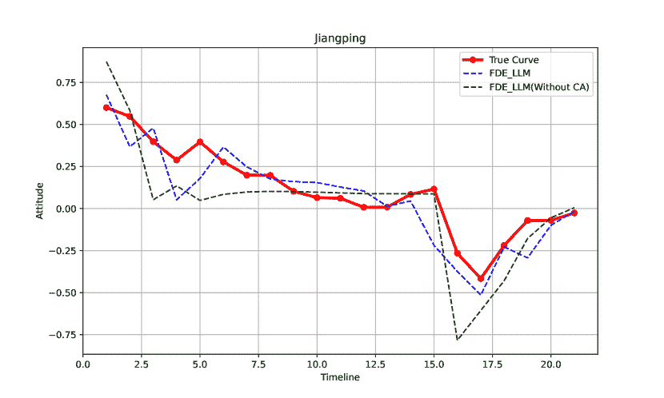

<!--yml
category: 未分类
date: 2025-01-11 12:15:45
-->

# Fusing Dynamics Equation: A Social Opinions Prediction Algorithm with LLM-based Agents

> 来源：[https://arxiv.org/html/2409.08717/](https://arxiv.org/html/2409.08717/)

1^(st) Junchi Yao College of Computer Science
Sichuan Normal University Chengdu, China
2022160101012@std.uestc.edu.cn    2^(nd) Hongjie Zhang College of Computer Science
Sichuan Normal University Chengdu, China
zhanghongjie@sicnu.edu.cn    3^(rd) Jie Ou School of Information and Software Engineering
University of Electronic Science and Technology of China Chengdu, China
oujieww6@gmail.com    4^(th) Dingyi Zuo College of Computer Science
Sichuan Normal University Chengdu, China
zuody0509@stu.sicnu.edu.cn    5^(th) Zheng Yang Fujian Provincial Engineering Technology Research
Center of Photoelectric Sensing Application
Fujian Normal University Fuzhou, China
zyfjnu@163.com    6^(th) Zhicheng Dong College of Information
Science Technology
Tibet University Lhasa, China
dongzc666@163.com

###### Abstract

In the context where social media is increasingly becoming a significant platform for social movements and the formation of public opinion, accurately simulating and predicting the dynamics of user opinions is of great importance for understanding social phenomena, policy making, and guiding public opinion. However, existing simulation methods face challenges in capturing the complexity and dynamics of user behavior. Addressing this issue, this paper proposes an innovative simulation method for the dynamics of social media user opinions, the FDE-LLM algorithm, which incorporates opinion dynamics and epidemic model. This effectively constrains the actions and opinion evolution process of large language models (LLM), making them more aligned with the real cyber world. In particular, the FDE-LLM categorizes users into opinion leaders and followers. Opinion leaders are based on LLM role-playing and are constrained by the CA model, while opinion followers are integrated into a dynamic system that combines the CA model with the SIR model. This innovative design significantly improves the accuracy and efficiency of the simulation. Experiments were conducted on four real Weibo datasets and validated using the open-source model ChatGLM. The results show that, compared to traditional agent-based modeling (ABM) opinion dynamics algorithms and LLM-based opinion diffusion algorithms, our FDE-LLM algorithm demonstrates higher accuracy and interpretability.

###### Index Terms:

FDE-LLM, LLM-based Agent, ABM, Social Opinions Prediction

## I Introduction

With the rapid development of internet technology, the dynamic of user opinions has a profound impact on social movements and public opinion. Therefore, studying the simulation and prediction of the dynamics of user opinions is of great significance for deeply understanding social phenomena, scientifically formulating policies, and effectively guiding public opinion[[1](https://arxiv.org/html/2409.08717v3#bib.bib1), [2](https://arxiv.org/html/2409.08717v3#bib.bib2), [3](https://arxiv.org/html/2409.08717v3#bib.bib3)]. However, the formation and change of user opinions is a complex temporal process influenced by multiple factors. How to accurately capture this process in models has become a focal point of attention in both academic and industrial circles.

Opinion simulation methods fall into two main categories: traditional ABM and LLM-based algorithms. ABM typically models direct interactions between individuals and local rules to simulate opinion diffusion. Cellular automata (CA) is a grid dynamical system model with local spatial interactions and temporal causal relationships, capable of simulating the spatiotemporal evolutionary processes of complex systems[[4](https://arxiv.org/html/2409.08717v3#bib.bib4)]. The bounded confidence models, such as the Deffuant–Weisbuch (DW) model [[5](https://arxiv.org/html/2409.08717v3#bib.bib5)] and the Hegselmann–Krause (HK) model [[6](https://arxiv.org/html/2409.08717v3#bib.bib6)], consider psychological factors. The voter model by Clifford [[7](https://arxiv.org/html/2409.08717v3#bib.bib7)] and Holley [[8](https://arxiv.org/html/2409.08717v3#bib.bib8)] describes public choice dynamics, though these mathematical models often oversimplify the complexity of human society.

On the other hand, the LLM-based opinion propagation algorithm replaces human social interactions with LLM agents by constructing specific role agents and utilizing their interactions for opinion dissemination and prediction. Gao et al. develops the S3 social network simulation system using the human-like capabilities of LLMs [[12](https://arxiv.org/html/2409.08717v3#bib.bib12)]. Stanford extends LLMs to store memories and dynamically plan actions [[13](https://arxiv.org/html/2409.08717v3#bib.bib13)]. Chuang et al. finds inherent biases in LLM-based agents, leading them to align with real-world scientific consensus [[14](https://arxiv.org/html/2409.08717v3#bib.bib14)]. Liu et al. introduces an LLM-based fake news propagation simulation framework (FPS) [[15](https://arxiv.org/html/2409.08717v3#bib.bib15)]. However, LLM-based methods are inefficient and can not scale well to large-scale agent scenarios. To address this, Mou et al. proposes a hybrid framework, where core users are driven by LLMs, while regular users are simulated using a deductive agent-based model. However, this approach still struggles with predicting opinions on real-world events due to the unconstrained actions of LLMs [[10](https://arxiv.org/html/2409.08717v3#bib.bib10)].

We notice that relies solely on traditional opinion dynamics models (such as CA, HK, etc.) cannot simulate human boredom or immunity emotions. The longer the same event is propagated, the more humans may become bored, causing their opinions to gradually shift towards neutrality. Opinion dynamics aims to simulate the ultimate convergence of opinions within a population. Epidemic model simulates the process of virus spread among people, such as the Susceptible-Infectious-Recovered (SIR) model[[16](https://arxiv.org/html/2409.08717v3#bib.bib16)], and human boredom can be modeled using the SIR model. In this paper, we propose a opinion dynamics simulation method called Fusing Dynamics Equation LLM (FDE-LLM) by combining opinion dynamics models with the SIR model. First, we design a Weibo simulator where opinion leaders use LLM to simulate user behavior on Weibo, and opinion followers use ABM for opinion spread. Then, we constrain the opinion changes of opinion followers by combining opinion dynamics with the SIR model, and use the CA model to constrain the opinion changes of opinion leaders. Finally, we use few-shot prompts to guide the opinion leaders to output actions based on their opinion values, which are determined by both CA and LLM reflection. We use the open-source model ChatGLM as the LLM Agent and conduct experiments on four real Weibo datasets. The results show that our FDE-LLM outperforms algorithms based on ABM and LLM in terms of both Dynamic Time Warping (DTW) distance and Pearson correlation coefficient metrics.

Our key contributions are:

1\. We propose the first LLM-based opinion dissemination algorithm constrained by dynamic equations, offering a more realistic macro-level simulation.

2\. We combine opinion dynamics with epidemic model, providing a predictable and interpretable opinion evolution process.

3\. Extensive experiments on real Weibo data using ChatGLM demonstrate the accuracy of our approach compared to ABM and LLM algorithms.

## II Method

Figure 1: Work Flow

The FDE-LLM divides users into opinion leaders and opinion followers. Opinion leaders are constrained by a Cellular Automata (CA) model based on LLM role-playing, while opinion followers are governed by a dynamic system that combines the CA model and the SIR model.

At the start of the simulation, the opinion leaders, represented by LLM-Action, receive the first piece of offline news and take actions. Examples are given in Fig. [2](https://arxiv.org/html/2409.08717v3#S2.F2 "Figure 2 ‣ II Method ‣ Fusing Dynamics Equation: A Social Opinions Prediction Algorithm with LLM-based Agents"). The attitudes towards these actions, determined by LLM-Attitude, are evaluated, and the attitudes obtained in each round are fed into the CA model. The results are then returned separately to both opinion leaders and opinion followers. These attitudes from the round are used as the initial attitudes for the opinion followers. You could check the detailed work flow from Fig. [1](https://arxiv.org/html/2409.08717v3#S2.F1 "Figure 1 ‣ II Method ‣ Fusing Dynamics Equation: A Social Opinions Prediction Algorithm with LLM-based Agents").

Figure 2: Actions and Attitudes. The left part represents the types of actions that can be chosen by LLM-Action, while the right part details the specific behaviors of the executed action type and the LLM-Attitude’s scoring of the attitude towards that behavior.

#### II-1 LLM-Action

The model designs the core Agent of the system by referencing the social personality traits from profile[[9](https://arxiv.org/html/2409.08717v3#bib.bib9)] and the framework proposed by Xinyi Mou et al[[10](https://arxiv.org/html/2409.08717v3#bib.bib10)]., as shown in Fig. [3](https://arxiv.org/html/2409.08717v3#S2.F3 "Figure 3 ‣ II-1 LLM-Action ‣ II Method ‣ Fusing Dynamics Equation: A Social Opinions Prediction Algorithm with LLM-based Agents").

Figure 3: Agent Profile

After the Agent completes an action, LLM-Attitude evaluates the attitude held toward that action.

#### II-2 LLM-Attitude

The model also employs the aforementioned framework to construct Agents by designing prompts for different events, enabling objective and impartial attitude evaluations. The large model used is the same as the one for Action, ensuring that LLM-Attitude and LLM-Action share similar values, which further explains the consistency in the attitudes they generate. The true attitude for each event is similarly evaluated by the corresponding Agent.

### II-A Models

#### II-A1 Opinion Leaders: LLM with CA

Previously, we mentioned the construction of Agents based on large language models to simulate group behavior. However, as shown in earlier studies, using only a large model to propagate opinions tends to rapidly converge to a stable value, which, at a macro level, only aligns with the overall trend of real-world scenarios. In practice, it does not effectively simulate the gradual propagation logic observed in reality.

Therefore, we consider using a CA model to introduce constraints[[11](https://arxiv.org/html/2409.08717v3#bib.bib11)], as follows:

|  | $O_{i}^{t+1}=r\cdot O_{i}^{t}+w\cdot\sum_{j\in X_{i}}\ T_{ij}^{t}$ |  | (1) |

|  | $T_{ij}^{t}=\begin{cases}O_{j},&r=0\\ 0,&r=1\text{ or }\left&#124;O_{j}^{t}-O_{i}^{t}\right&#124;>\epsilon\\ \left(O_{j}^{t}-O_{i}^{t}\right)\cdot\sqrt{r\cdot&#124;O_{j}^{t}&#124;},&r\neq 1,0\text{%  and }\left&#124;O_{j}^{t}-O_{i}^{t}\right&#124;\leq\epsilon\end{cases}$ |  | (2) |

, where $O_{i}^{t+1}$ represents the updated opinion or state of individual $i$ at time $t+1$, $O_{i}^{t}$ is the opinion or state of individual $i$ at time $t$, $r$ is the retention factor that indicates how much of the current opinion is retained, $w$ is the influence coefficient that determines the impact of neighboring opinions, and $\sum_{j\in X_{i}}T_{ij}^{t}$ represents the summation of influences $T_{ij}^{t}$ from all neighbors $j$ in the neighborhood $X_{i}$ at time $t$. This formula models the evolution of an individual’s opinion over time, accounting for both personal retention and the influence of surrounding opinions.

We designed the following formula to constrain the attitudes generated by LLM using CA :

|  | $\begin{split}O_{i}^{t+1}=\mathrm{clip}\Bigg{(}&\alpha\cdot\left(r\cdot O_{i}^{% t}+w\cdot\sum_{j\in N_{i}}T_{ij}^{t}\right)\\ &+(1-\alpha)\cdot\text{LLM},-1,1\Bigg{)}\end{split}$ |  | (3) |

, use the $clip(-1,1)$ function to ensure that the updated opinion values remain within the range of $[-1,1]$. This prevents the opinion values from exceeding reasonable limits, ensuring the stability and rationality of the model results. Additionally, an $\alpha$ fusion coefficient is introduced to determine the relative influence of the LLM and the CA model.

#### II-A2 Opinion Follower: CA with SIR

The CA model performs well in simulating attitude propagation within a group. However, during our study of real datasets, we found that certain social news exhibits a phenomenon of short-term attention, followed by a natural attenuation of attitudes. As observed from the actual curves of the ”Pangmao” dataset, the attitude supporting one side rises to a certain threshold and then stops growing, gradually declining and hovering around zero. In real news statements, this is reflected as neutral sentiment expressions such as ”questioning authenticity” or ”both sides might have issues.”

To address this common phenomenon, we introduced the SIR model. This model is widely used in infectious disease research, and we applied its ”recoverable infected individuals” concept to compensate for the limitation of unconstrained attitude propagation in the CA model. This allows opinion followers to recover when receiving content similar to the opinion leader’s attitude, effectively simulating the natural decay of attitudes in social news.

The SIR model is as follows:

|  | $O_{i}^{t+1}=O_{i}^{t+1}\cdot e^{-\lambda\cdot&#124;O_{i}^{t+1}&#124;}\quad\text{if}\quad% \text{random}<\gamma$ |  | (4) |

The fusion model of SIR and CA is described by the following equation 5.

|  | $O_{i}^{t+1}=\mathrm{clip}\left(\left(r\cdot O_{i}^{t}+w\cdot\frac{\sum_{j\in N% _{i}}\left(O_{j}^{t}-O_{i}^{t}\right)\cdot\sqrt{r\cdot&#124;O_{j}^{t}&#124;}\cdot I\left% (&#124;O_{j}^{t}-O_{i}^{t}&#124;\leq\epsilon\right)}{&#124;N_{i}&#124;}\right)\cdot e^{-\lambda% \cdot&#124;O_{i}^{t+1}&#124;}\cdot I(\text{random}<\gamma),-1,1\right)$ |  | (5) |

Here $|N_{i}|$ is the number of neighbors around individual $i$, $|O_{j}^{t}-O_{i}^{t}|$ represents the opinion difference between neighbor $j$ and individual $i$, $I\left(|O_{j}^{t}-O_{i}^{t}|\leq\epsilon\right)$ is an indicator function that equals 1 if the opinion difference is within the threshold $\epsilon$, and 0 otherwise, and $\lambda$ is the decay rate indicating the natural decay of opinions.

## III Experiments

### III-A Experimental Setup

1\. Environment Settings: This experiment uses the GLM4 model, running in a Python 3.10.12 environment with an Intel(R) Xeon(R) Platinum 8160 CPU @ 2.10GHz, a T4 GPU, and CUDA version release 11.8, V11.8.89.

2\. Dataset: We used event keywords on the Chinese social media platform Weibo as crawling markers, collecting related posts and comments daily for each event. In total, tens of thousands of posts were gathered. We collected data for four highly controversial events: the ”Pangmao” suicide event, the secondary school girl ”Jiangping” ranking 12th in a global math competition, the ”Qingdao” subway assault, and the ”Dianduji” girl stockpile cancer video incident. We designed a few-shot LLM-based agent to evaluate the attitudes of all statements on a scale of [-1, 1]. Both the attitude model and action model used GLM4 to maintain logical consistency as much as possible.

3\. Parameter settings: Through experiments, it was found that we can use unified parameters for all models on similar reversal news. The parameters are obtained by grid search on the ABM algorithm to maximize the correlation coefficient. The specific settings are as follows: For the CA model: opinion resilience $r=0.99$, neighborhood influence coefficient $w=0.3$, opinion interaction threshold $\epsilon=0.5$; for the SIR model: infection rate $\beta=0.3$, recovery rate $\gamma=0.9$, decay rate $\lambda=0.5$.

4\. Model Configurations: (1) LLM: Simulations using only LLM, without any intervention. (2) ABM(CA): Using the commonly employed CA model in ABM. (3) ABM(HK): Using the commonly employed HK model in ABM. (4) LLM — ABM(CA): Simulating opinion leaders through LLM, while ABM uses the CA model to simulate group attitudes.

### III-B Indicator

We evaluate the effectiveness of the models in simulation using two indicators.

1\. Pearson Correlation Coefficient (Corr.) is used to measure the linear correlation between the simulated attitude sequence $S=\left(s_{1},s_{2},\ldots,s_{n}\right)$ and the real attitude sequence $T=\left(t_{1},t_{2},\ldots,t_{n}\right)$. The formula is as follows:

|  | $r=\frac{\sum_{i=1}^{n}\left(s_{i}-\bar{s}\right)\left(t_{i}-\bar{t}\right)}{% \sqrt{\sum_{i=1}^{n}\left(s_{i}-\bar{s}\right)^{2}}\sqrt{\sum_{i=1}^{n}\left(t% _{i}-\bar{t}\right)^{2}}}$ |  | (6) |

, where $\bar{s}$ and $\bar{t}$ are the mean values of the simulated and real attitudes, respectively. The Corr. ranges from [-1, 1], and the closer the value is to 1, the stronger the linear correlation between the simulated and real attitudes, indicating that the model better captures changes in real attitudes.

2\. Dynamic Time Warping (DTW) is used to measure the similarity between the simulated attitude sequence $S$ and the real attitude sequence $T$, especially when the two sequences differ in length or have temporal shifts. DTW aligns the two sequences by calculating the minimum cumulative distance. The formula is as follows:

|  | $DTW(S,T)=\min{\sqrt{\sum_{k=1}^{K}\left(s_{i_{k}}-t_{j_{k}}\right)^{2}}}$ |  | (7) |

, where $\left(i_{k},j_{k}\right)$ represents the aligned points in sequences $S$ and $T$, and $K$ is the length of the alignment path. A smaller DTW distance indicates a higher similarity between the time series of the simulated and real attitudes, showing that the model performs better in simulating complex time series patterns. By using DTW, we can better evaluate the model’s accuracy and robustness in dynamic environments.

### III-C Main Result

(a) Pangmao Incident

(b) Jiangping Incident

(c) Qingdao Incident

(d) Dianduji Insident

Figure 4: Comparison of Real and Simulated Result on (a) Pangmao Incident (b) Jiangping Incident (c) Qingdao Incident (d) Dianduji Incident. Red lines represents the actual data.

TABLE I: Comparison of Real and Simulated Results

|  | Pangmao | Jiangping | Qingdao | Dianduji |
| --- | --- | --- | --- | --- |
| Method | DTW$\downarrow$ | Corr.$\uparrow$ | DTW$\downarrow$ | Corr.$\uparrow$ | DTW$\downarrow$ | Corr.$\uparrow$ | DTW$\downarrow$ | Corr.$\uparrow$ |
| --- | --- | --- | --- | --- | --- | --- | --- | --- |
| FDE-LLM | 0.3622 | 0.9653 | 0.3664 | 0.8950 | 0.3352 | 0.9605 | 0.3404 | 0.8842 |
| LLM | 2.6584 | 0.7139 | 2.9963 | 0.7208 | 2.7316 | 0.7511 | 2.3170 | 0.7819 |
| ABM(CA) | 0.4335 | 0.8920 | 0.7648 | 0.6748 | 0.2904 | 0.6800 | 0.6806 | 0.8282 |
| ABM(HK) | 1.1838 | 0.6475 | 0.6085 | 0.6961 | 1.1470 | 0.6874 | 0.9453 | 0.6760 |
| LLM+ABM(CA) | 0.7463 | 0.5225 | 1.5748 | 0.6425 | 0.5497 | 0.9174 | 0.8684 | 0.7386 |

This study focuses on social news events, which are characterized by a rapid rise in attention and a quick loss of popularity. The loss of popularity directly leads to a reduction in extreme (radical) attitudes and an increase in neutral and rational analysts. From our analysis of real attitude data, we found a key feature of social news events: after the event loses attention or the truth is exposed, and attitudes stabilize, the group attitude tends to approach 0 (group neutrality).

Our FDE-LLM model incorporates the SIR model to constrain the attitudes of opinion followers, successfully simulating the attitude loss characteristic of group attitudes. Compared to the LLM+ABM model, which focuses only on attitude changes due to news events, the FDE-LLM model enriches the natural attenuation of group attitudes on top of attitude changes, making the simulation of social news events more realistic. When using LLM alone, the attitude shows a sharp turn and remains stable at extreme values. When using the ABM model alone, good results are obtained in some events, but it lacks the interpretability of the FDE-LLM model. Detailed results are shown in Fig. [4](https://arxiv.org/html/2409.08717v3#S3.F4 "Figure 4 ‣ III-C Main Result ‣ III Experiments ‣ Fusing Dynamics Equation: A Social Opinions Prediction Algorithm with LLM-based Agents") and Table. [I](https://arxiv.org/html/2409.08717v3#S3.T1 "TABLE I ‣ III-C Main Result ‣ III Experiments ‣ Fusing Dynamics Equation: A Social Opinions Prediction Algorithm with LLM-based Agents").

The FDE-LLM model, through the action log of the LLM opinion leader part, can directly analyze group statements on a micro level, making it more valuable in predicting and controlling public opinion situations. We have discussed this issue in [III-E](https://arxiv.org/html/2409.08717v3#S3.SS5 "III-E Toy Example ‣ III Experiments ‣ Fusing Dynamics Equation: A Social Opinions Prediction Algorithm with LLM-based Agents").

### III-D Ablation Study

We discussed the performance of the FDE-LLM model when the CA constraint on core users is removed.

Taking the Jiangping event as an example (Fig. [5](https://arxiv.org/html/2409.08717v3#S3.F5 "Figure 5 ‣ III-D Ablation Study ‣ III Experiments ‣ Fusing Dynamics Equation: A Social Opinions Prediction Algorithm with LLM-based Agents")), the model without CA constraints tends to overreact in predicting extreme values, exaggerating the urgency of the situation to some extent. In severe cases, this may affect the decisions made by data analysts. This highlights the necessity of constraining LLM through CA. The test results for the other three datasets are shown in Table. LABEL:table_2_ablation_study.

TABLE II: Comparison of Different Methods Based on Various Metrics

|  | Pangmao | Jiangping | Qingdao | Dianduji |
| --- | --- | --- | --- | --- |
| Method | DTW$\downarrow$ | Corr.$\uparrow$ | DTW$\downarrow$ | Corr.$\uparrow$ | DTW$\downarrow$ | Corr.$\uparrow$ | DTW$\downarrow$ | Corr.$\uparrow$ |
| FDE-LLM | 0.3622 | 0.9653 | 0.3664 | 0.8950 | 0.3352 | 0.9605 | 0.3404 | 0.8842 |
| FDE-LLM (Without CA) | 0.5133 | 0.9489 | 0.7530 | 0.8671 | 0.7389 | 0.8952 | 0.5708 | 0.7367 |

Figure 5: FDE-LLM without CA

### III-E Toy Example

Figure 6: LLM Agent Responses Before the Reversal News

Figure 7: Reversal News

Figure 8: LLM Agent Responses After the Reversal News

We randomly selected two groups of LLM Agents to analyze their behavior before and after the release of major news developments (as shown in the figure). It can be observed that in the Jiangping event, before the questioning news, the Agents’ attitudes were all positive, expressing encouragement and anticipation, and feeling happy for her achievements. This closely aligns with the actual content of Weibo posts.

After the questioning news broke, some Agents showed strong trust in Jiangping (as shown on the left), while others tended to agree with the doubts (as shown on the right), which is also highly consistent with the actual content of Weibo posts.

## IV Conclusion

In this paper, we optimized the model for news sentiment prediction by combining LLM and ABM, incorporating constraints from the CA and SIR models to preserve the natural attenuation of group attitudes under the guidance of LLM. Our proposed FDE-LLM divides users into opinion leaders and opinion followers. Opinion leaders are role-played based on LLM and constrained by the CA model, while opinion followers are part of a dynamic system that integrates the CA and SIR models. This innovative design significantly improves simulation accuracy and predictive efficiency.

## References

*   [1] Pennycook G, Epstein Z, Mosleh M, Arechar AA, Eckles D, Rand DG. Shifting attention to accuracy can reduce misinformation online. Nature. 2021 Apr 22;592(7855):590-5.
*   [2] Ginossar T, Cruickshank IJ, Zheleva E, Sulskis J, Berger-Wolf T. Cross-platform spread: vaccine-related content, sources, and conspiracy theories in YouTube videos shared in early Twitter COVID-19 conversations. Human vaccines & immunotherapeutics. 2022 Jan 31;18(1):1-3.
*   [3] Budak C, Agrawal D, El Abbadi A. Limiting the spread of misinformation in social networks. InProceedings of the 20th international conference on World wide web 2011 Mar 28 (pp. 665-674).
*   [4] DeGroot MH. Reaching a consensus. Journal of the American Statistical association. 1974 Mar 1;69(345):118-21.
*   [5] Deffuant G, Neau D, Amblard F, Weisbuch G. Mixing beliefs among interacting agents. Advances in Complex Systems. 2000;3(01n04):87-98.
*   [6] Rainer H, Krause U. Opinion dynamics and bounded confidence: models, analysis and simulation.
*   [7] Clifford P, Sudbury A. A model for spatial conflict. Biometrika. 1973 Dec 1;60(3):581-8.
*   [8] Holley RA, Liggett TM. Ergodic theorems for weakly interacting infinite systems and the voter model. The annals of probability. 1975 Aug 1:643-63.
*   [9] Brünker, Felix et al. “The Role of Social Media during Social Movements - Observations from the #metoo Debate on Twitter.” Hawaii International Conference on System Sciences (2020).
*   [10] Mou X, Wei Z, Huang X. Unveiling the truth and facilitating change: Towards agent-based large-scale social movement simulation. arXiv preprint arXiv:2402.16333\. 2024 Feb 26.
*   [11] Hu Zuping, He Jianjia, Modeling and Simulation of Online Public Opinion Evolution Based on Cellular Automata
*   [12] Gao C, Lan X, Lu Z, Mao J, Piao J, Wang H, Jin D, Li Y. S3: Social-network Simulation System with Large Language Model-Empowered Agents. Available at SSRN 4607026\. 2023 Oct 19.
*   [13] Park JS, O’Brien J, Cai CJ, Morris MR, Liang P, Bernstein MS. Generative agents: Interactive simulacra of human behavior. InProceedings of the 36th annual acm symposium on user interface software and technology 2023 Oct 29 (pp. 1-22).
*   [14] Chuang YS, Goyal A, Harlalka N, Suresh S, Hawkins R, Yang S, Shah D, Hu J, Rogers T. Simulating Opinion Dynamics with Networks of LLM-based Agents. InFindings of the Association for Computational Linguistics: NAACL 2024 2024 Jun (pp. 3326-3346).
*   [15] Liu Y, Chen X, Zhang X, Gao X, Zhang J, Yan R. From Skepticism to Acceptance: Simulating the Attitude Dynamics Toward Fake News. arXiv preprint arXiv:2403.09498\. 2024 Mar 14.
*   [16] Cooper I, Mondal A, Antonopoulos CG. A SIR model assumption for the spread of COVID-19 in different communities. Chaos, Solitons & Fractals. 2020 Oct 1;139:110057.