<!--yml

类别：未分类

日期：2025-01-11 12:32:05

-->

# GUI-World：一个面向GUI的多模态LLM代理数据集

> 来源：[https://arxiv.org/html/2406.10819/](https://arxiv.org/html/2406.10819/)

\doparttoc\faketableofcontents陈东平¹¹¹1平等贡献。  ^†，黄悦²¹¹1平等贡献。 ，吴思远¹¹¹1平等贡献。 ，唐景宇¹¹¹1平等贡献。 ，陈柳一¹，

白怡琳¹，何志刚¹，王晨龙¹，周慧池¹，李意强¹，

周天硕¹，俞悦¹，高楚杰¹，张启慧¹，桂一¹，李震¹，

万尧¹^†，周潘¹，高建峰³，孙力超⁴

¹华中科技大学

²圣母大学       ³微软研究院        ⁴利哈伊大学

{dongpingchen0612, yaowan1992}@gmail.com

###### 摘要

最近，多模态大语言模型（MLLMs）已经被用作控制键盘和鼠标输入的代理，通过直接感知图形用户界面（GUI）并生成相应的代码。然而，目前的代理主要在静态环境中表现出卓越的理解能力，并且主要应用于相对简单的领域，例如Web或移动界面。我们认为，一个强大的GUI代理应能够感知GUI中的时间信息，包括动态的Web内容和多步骤任务。此外，它还应具备对各种GUI场景的全面理解，包括桌面软件和多窗口交互。为此，本文介绍了一个新的数据集，称为GUI-World，该数据集具有精心制作的人工-MLLM标注，广泛涵盖了六种GUI场景和三种格式的八种GUI相关问题。我们评估了当前最先进的MLLM的能力，包括ImageLLM和VideoLLM，在理解各种类型的GUI内容，特别是动态和顺序内容方面的表现。我们的研究发现，ImageLLM在没有手动标注关键帧或操作历史的情况下，难以处理动态GUI内容。另一方面，由于GUI视频数据集稀缺，VideoLLM在所有GUI相关任务中表现不佳。基于GUI-World，我们迈出了使用微调的VideoLLM作为GUI代理的第一步，展示了在理解各种GUI任务方面的改进。然而，由于基础LLM性能的局限性，我们得出结论，使用VideoLLM作为GUI代理仍然是一个重大挑战。我们相信，我们的工作为未来在动态GUI内容理解方面的研究提供了有价值的见解。代码和数据集可在我们的项目主页公开访问：[https://gui-world.github.io/](https://gui-world.github.io/)。

²²脚注：通讯作者。

### 1 引言

多模态大语言模型（MLLMs），如 GPT-4V(ision) [[1](https://arxiv.org/html/2406.10819v1#bib.bib1)] 和 LLaVA [[2](https://arxiv.org/html/2406.10819v1#bib.bib2)]，在视觉-文本领域的发展中做出了重要贡献[[3](https://arxiv.org/html/2406.10819v1#bib.bib3)]。这些模型为传统视觉任务带来了创新的解决方案和范式，包括视觉推理 [[4](https://arxiv.org/html/2406.10819v1#bib.bib4)]、医学影像解读 [[5](https://arxiv.org/html/2406.10819v1#bib.bib5), [6](https://arxiv.org/html/2406.10819v1#bib.bib6)]，以及在具身智能体中的应用 [[7](https://arxiv.org/html/2406.10819v1#bib.bib7)]。其中一个特别有前景的领域是图形用户界面（GUI）理解，它在现实应用中具有重要潜力，如网页理解 [[8](https://arxiv.org/html/2406.10819v1#bib.bib8), [9](https://arxiv.org/html/2406.10819v1#bib.bib9)] 和通过 GUI 智能体进行导航 [[10](https://arxiv.org/html/2406.10819v1#bib.bib10), [11](https://arxiv.org/html/2406.10819v1#bib.bib11), [12](https://arxiv.org/html/2406.10819v1#bib.bib12)]。GUI 理解的关键挑战有两个方面：（1）有效的 GUI 智能体需要具备对 GUI 元素的深刻理解，包括网页图标、通过光学字符识别（OCR）识别的文本以及页面布局；（2）需要展现出在 GUI 环境中执行指令的卓越能力，例如通过搜索引擎进行搜索。

尽管已有显著进展，如 [表 1](https://arxiv.org/html/2406.10819v1#S1.T1 "Table 1 ‣ 1 Introduction ‣ GUI-World: A Dataset for GUI-oriented Multimodal LLM-based Agents") 所示，现有的研究仍然存在以下局限：（1）大多数研究主要集中于 GUI 场景的静态特征，忽略了 MLLMs 需要有效处理顺序信息和动态操作的需求。例如，智能体的任务表现可能会被突如其来的元素（如弹出广告）打断，突显了在处理动态顺序任务时的不足。（2）当前的研究通常局限于基于 Web 的环境，这限制了模型的泛化能力和鲁棒性。例如，GUI 智能体可能需要在不同平台上操作，如 Windows、macOS、Linux、iOS、Android 和 XR 环境。此外，操作有时可能涉及多个窗口。因此，扩大研究范围，涵盖这些多样化的环境，将有助于提高 GUI 智能体的适应性和有效性。

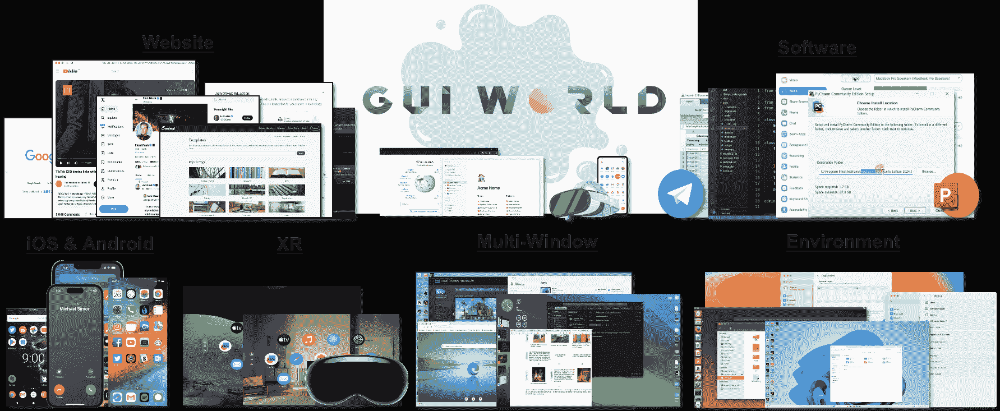

图 1：GUI-World：一个全面的 GUI 理解数据集，具有重要的现实应用潜力。所有出现的截图均来自我们的数据集。

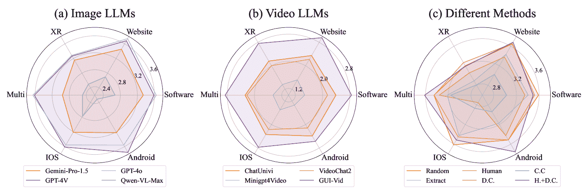

图2：不同多模态大语言模型（MLLM）在GUI-World六种场景下的比较性能。(a) 四种主流图像LLM的表现。(b) 三种视频LLM与我们提出的GUI-Vid的表现。(c) 六种方法之间的表现比较。更多细节请见[subsection 4.2](https://arxiv.org/html/2406.10819v1#S4.SS2 "4.2 实证结果 ‣ 4 实验与分析 ‣ GUI-World：一个面向GUI的多模态LLM智能体数据集")。

为了弥补这些差距，本文介绍了GUI-World，一个包含超过12,000个GUI视频的综合数据集，专门用于评估和增强GUI智能体的能力。该数据集涵盖了广泛的GUI场景，包括流行的网站、桌面和移动应用程序，跨各种操作系统、多窗口交互以及XR环境。数据收集过程包括从YouTube上的屏幕录制和教学视频中获取GUI视频。随后，我们利用人类-多模态大语言模型（Human-MLLM）协作的方法生成多样化的问题和指令，最终构建了GUI-World。

表1：GUI数据集比较。‘Sem.’: 语义指令级别，‘VL’: 视觉-语言，‘Seq.’: 顺序图像任务，‘Cro.’: 跨应用或多窗口任务，‘Dyn.’: 动态GUI内容任务。

| 数据集 | 大小 | 语义 | 视觉-语言 | 视频 | 环境类型 | 任务覆盖 | 任务 |
| --- | --- | --- | --- | --- | --- | --- | --- |
| Web. | 移动 | 桌面 | XR | 顺序 | 跨应用 | 动态 |
| Rico [[13](https://arxiv.org/html/2406.10819v1#bib.bib13)] | 72,219 | 低 | ✔ | ✔ | ✘ | ✔ | ✘ | ✘ | ✔ | ✔ | ✘ | UI代码/布局生成 |
| MetaGUI [[14](https://arxiv.org/html/2406.10819v1#bib.bib14)] | 1,125 | 低 | ✔ | ✘ | ✘ | ✔ | ✘ | ✘ | ✔ | ✘ | ✘ | 移动导航 |
| UGIF [[15](https://arxiv.org/html/2406.10819v1#bib.bib15)] | 523 | 高 | ✔ | ✘ | ✘ | ✔ | ✘ | ✘ | ✔ | ✘ | ✘ | 基于用户界面的指令跟随 |
| AITW [[16](https://arxiv.org/html/2406.10819v1#bib.bib16)] | 715,142 | 高 | ✔ | ✘ | ✘ | ✔ | ✘ | ✘ | ✔ | ✔ | ✘ | GUI理解 |
| Ferret-UI [[17](https://arxiv.org/html/2406.10819v1#bib.bib17)] | 123,702 | 低 | ✔ | ✘ | ✘ | ✔ | ✘ | ✘ | ✘ | ✘ | ✘ | 基于UI的定位与理解 |
| MiniWoB++ [[18](https://arxiv.org/html/2406.10819v1#bib.bib18)] | 100 | 低 | ✔ | ✘ | ✔ | ✘ | ✘ | ✘ | ✘ | ✘ | ✘ | 网络导航 |
| WebArena [[19](https://arxiv.org/html/2406.10819v1#bib.bib19)] | 812 | 低 | ✔ | ✘ | ✔ | ✘ | ✘ | ✘ | ✔ | ✘ | ✘ | 网络导航 |
| Mind2Web [[20](https://arxiv.org/html/2406.10819v1#bib.bib20)] | 2,350 | 两者 | ✔ | ✔ | ✔ | ✘ | ✘ | ✘ | ✔ | ✘ | ✘ | 网络导航 |
| OmniAct [[21](https://arxiv.org/html/2406.10819v1#bib.bib21)] | 9,802 | 低 | ✔ | ✘ | ✔ | ✘ | ✔ | ✘ | ✔ | ✘ | ✘ | 代码生成 |
| MMINA [[22](https://arxiv.org/html/2406.10819v1#bib.bib22)] | 1,050 | 低 | ✔ | ✘ | ✔ | ✘ | ✘ | ✘ | ✔ | ✔ | ✘ | 网络导航 |
| AgentStudio [[23](https://arxiv.org/html/2406.10819v1#bib.bib23)] | 304 | 高 | ✔ | ✘ | ✔ | ✘ | ✔ | ✘ | ✔ | ✔ | ✘ | 一般控制 |
| OSWorld [[24](https://arxiv.org/html/2406.10819v1#bib.bib24)] | 369 | 高 | ✔ | ✘ | ✔ | ✘ | ✔ | ✘ | ✔ | ✔ | ✘ | 通用控制 |
| GUI-World（我们提出的） | 12,379 | 两者兼具 | ✔ | ✔ | ✔ | ✔ | ✔ | ✔ | ✔ | ✔ | ✔ | GUI理解 |
| 指令跟随 |

同样，我们还建立了一个全面的GUI理解基准，涵盖了七种主流的多模态语言模型（MLLMs）、三种关键帧选择策略、六种GUI场景，以及多种形式的查询，包括多项选择、自由文本和对话形式，旨在为MLLMs的GUI导向能力提供全面评估。如[图2](https://arxiv.org/html/2406.10819v1#S1.F2 "Figure 2 ‣ 1 Introduction ‣ GUI-World: A Dataset for GUI-oriented Multimodal LLM-based Agents")所示，评估结果表明，大多数MLLMs在GUI-World上表现不佳，突显了它们在图形界面的动态理解上的局限性，并强调了进一步提升的必要性。

利用这个数据集，我们迈出了第一步，通过对视频GUI代理进行微调，使其能够熟练处理动态和序列化的GUI任务，这在GUI代理的一般能力上取得了显著改进，从而展示了GUI-World的实用性和有效性。此外，我们深入探讨了与GUI理解密切相关的各种因素，包括文本信息的整合、关键帧数量和图像分辨率等。

总体而言，本文的主要贡献有三点：

$\triangleright$ 一个新数据集。我们提出了GUI-World，这是一个全面的GUI数据集，包含超过12,000个视频，专门设计用于评估和提升MLLMs的GUI理解能力，涵盖了桌面、移动和扩展现实（XR）等多个类别和场景，并代表了视频领域第一个GUI导向的指令调优数据集。

$\triangleright$ 一种新型模型。基于GUI-World，我们提出了GUI-Vid，一个GUI导向的视频多模态语言模型（VideoLLM），具备更强的处理各种复杂GUI任务的能力。GUI-Vid在基准测试中表现出显著改进，达到了与顶尖模型相媲美的效果。

$\triangleright$ 全面实验与有价值的见解。我们的实验表明，大多数现有的MLLMs在处理GUI导向任务时仍面临挑战，尤其是在序列化和动态GUI内容方面。实证研究表明，提升视觉感知能力、增加关键帧数量以及提高分辨率，有助于提高在GUI导向任务中的表现，从而为未来的GUI代理奠定基础。

### 2 GUI-World：一个全面的GUI理解数据集

#### 2.1 概述

我们介绍了GUI-World，这是一个综合性的数据库，涵盖了六种GUI场景，包括视频、人类标注的关键帧、详细的说明文字以及通过我们的数据整理框架生成的各种类型的问答，旨在对GUI相关能力进行基准测试和增强。这些GUI场景涵盖了桌面操作系统（*例如*，macOS、Windows）和移动平台（*例如*，Android和iOS）、网站、软件，甚至扩展现实技术（XR）（*例如*，Apple Vision Pro中的GUI [[25](https://arxiv.org/html/2406.10819v1#bib.bib25)]）。每个场景的讨论见于[子章节A.1](https://arxiv.org/html/2406.10819v1#A1.SS1 "A.1 Six Main GUI Categories ‣ Appendix A Details of Dataset Construction ‣ Part I Appendix ‣ GUI-World: A Dataset for GUI-oriented Multimodal LLM-based Agents")。

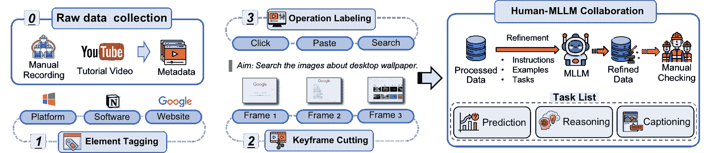

图3：GUI-World构建流程概述

如[图3](https://arxiv.org/html/2406.10819v1#S2.F3 "Figure 3 ‣ 2.1 Overview ‣ 2 GUI-World: A Comprehensive Dataset for GUI Understanding ‣ GUI-World: A Dataset for GUI-oriented Multimodal LLM-based Agents")所示，GUI-World的开发围绕一个两阶段的流程进行。关于视频和查询统计的详细信息，请参见[表2](https://arxiv.org/html/2406.10819v1#S2.T2 "Table 2 ‣ 2.2 GUI Video Collection and Keyframe Annotation Process ‣ 2 GUI-World: A Comprehensive Dataset for GUI Understanding ‣ GUI-World: A Dataset for GUI-oriented Multimodal LLM-based Agents")，该表包括关键帧数量、视频时长、查询长度及其对应的标准答案的分布，具体内容见[图4](https://arxiv.org/html/2406.10819v1#S2.F4 "Figure 4 ‣ 2.2 GUI Video Collection and Keyframe Annotation Process ‣ 2 GUI-World: A Comprehensive Dataset for GUI Understanding ‣ GUI-World: A Dataset for GUI-oriented Multimodal LLM-based Agents")。请参见[图5](https://arxiv.org/html/2406.10819v1#S2.F5 "Figure 5 ‣ 2.2 GUI Video Collection and Keyframe Annotation Process ‣ 2 GUI-World: A Dataset for GUI Understanding ‣ GUI-World: A Dataset for GUI-oriented Multimodal LLM-based Agents")和[附录F](https://arxiv.org/html/2406.10819v1#A6 "Appendix F Case Study ‣ Part I Appendix ‣ GUI-World: A Dataset for GUI-oriented Multimodal LLM-based Agents")以了解案例研究。

#### 2.2 GUI视频收集与关键帧注释流程

我们描述了从学生工和YouTube收集与GUI相关的教学视频以及屏幕录制的视频，并将这些视频转换为关键帧序列的流程。

表 2：GUI-World的统计数据。对于Android，我们从Rico [[13](https://arxiv.org/html/2406.10819v1#bib.bib13)]中选择视频，并随机抽取10帧。平均帧数指的是每个关键帧中的平均帧数，平均注释数指的是每个关键帧中手动标注的用户操作的平均数量。

| 分类 | 总视频数 | 自由格式 | 多项选择题 | 对话 | 总帧数（平均值） | 平均注释数 |
| --- | --- | --- | --- | --- | --- | --- |
| 软件 | 4,720 | 27,840 | 9,440 | 9,440 | 23,520 (4.983) | 7.558 |
| 网站 | 2,499 | 14,994 | 4,998 | 4,998 | 15,371 (6.151) | 6.862 |
| IOS | 492 | 2,952 | 984 | 984 | 2,194 (4.459) | 7.067 |
| 多平台 | 475 | 2,850 | 950 | 950 | 2,507 (5.277) | 7.197 |
| XR | 393 | 2,358 | 786 | 786 | 1,584 (4.030) | 10.970 |
| Android | 3,800 | 15,199 | 7,600 | 7,600 | 38,000 (10.000) | - |

| 汇总 | 12,379 | 76,673 | 24,758 | 24,758 | 83,176 (6.719) | 7.463 | 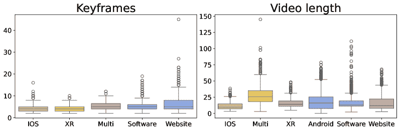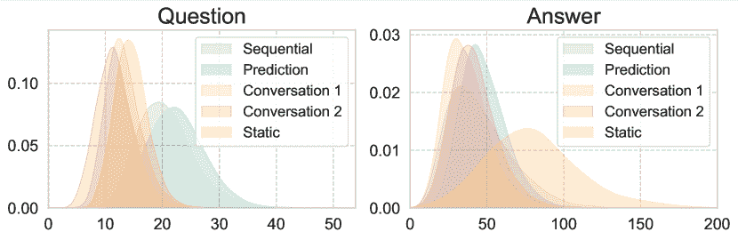

图 4：左：关键帧数量和视频长度的分布。右：每种类型问题及其黄金答案的长度分布。

我们的视频数据中有相当大一部分来源于学生工作人员进行的屏幕录制，这些录制可以直接反映现实生活中的GUI使用场景。一个典型的视频收集场景包括将学生工作人员分配到特定的软件任务中。学生首先熟悉软件，然后录制一系列操作的短视频片段，例如在软件“Notion¹¹1[https://www.notion.so/](https://www.notion.so/)”中进行的“注册”、“登录”、“创建新页面”和“邀请其他协作者”等操作。

尽管这些手动录制的视频具有较高的保真度，但我们遇到了一些挑战：（1）学生工作人员通常需要花费大量时间熟悉专业软件（*例如*，MATLAB、Adobe After Effects (Ae)），这可能会妨碍数据收集的进度。（2）视频可能缺乏全面性，通常只捕捉常用操作，而忽视了对数据集完整性至关重要的较为罕见的功能。为了解决这些问题，我们还从社交媒体平台获取视频，这些平台承载了各种各样的与GUI相关的内容。具体来说，我们从YouTube下载教程视频——因为YouTube作为一个视频分享平台非常普遍——这些视频详细展示了各种GUI操作。然后，我们将这些视频分割成更短的片段，每个片段代表一个独特的操作序列。

接下来的步骤涉及使用定制设计的标注软件，为这些视频片段添加关键帧和每个关键帧的文字描述。尽管已经有几种算法可用于关键帧提取 [[26](https://arxiv.org/html/2406.10819v1#bib.bib26), [27](https://arxiv.org/html/2406.10819v1#bib.bib27), [28](https://arxiv.org/html/2406.10819v1#bib.bib28), [29](https://arxiv.org/html/2406.10819v1#bib.bib29)]，但它们通常在GUI视频中表现不佳，因为帧之间的变化可能非常小（*例如*，鼠标光标的轻微移动）。为了确保数据集的高质量，我们因此手动提取这些关键帧。每个关键帧都经过精心标注，包含诸如执行的操作、两个关键帧之间的目的、使用的软件或网站、鼠标操作（*例如*，滚动、点击）以及键盘输入（*例如*，复制（Ctrl + C）、粘贴（Ctrl + V）、特定输入）等详细信息。我们在[subsection A.3](https://arxiv.org/html/2406.10819v1#A1.SS3 "A.3 Human Keyframes Annotation Process ‣ Appendix A Details of Dataset Construction ‣ Part I Appendix ‣ GUI-World: A Dataset for GUI-oriented Multimodal LLM-based Agents")中详细描述了我们的标注过程。

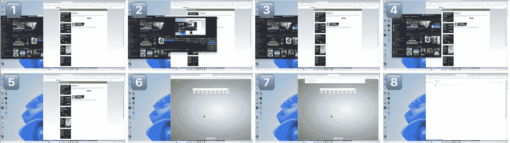<svg class="ltx_picture" height="78.51" id="S2.F5.1.p1.pic1" overflow="visible" version="1.1" width="603.54"><g fill="#000000" stroke="#000000" stroke-width="0.4pt" transform="translate(0,78.51) matrix(1 0 0 -1 0 0) translate(0,3.54)"><g transform="matrix(1.0 0.0 0.0 1.0 270.96 55.27)"><g class="ltx_nestedsvg" fill="#000000" stroke="#000000" stroke-width="0.4pt" transform="matrix(1 0 0 1 0 0)"><g fill-opacity="1.0" transform="matrix(1.0 0.0 0.0 1.0 9.06 5.12)"><foreignobject color="#000000" height="9.46" overflow="visible" transform="matrix(1 0 0 -1 0 16.6)" width="35.36">静态</foreignobject></g></g></g> <g fill-opacity="1.0" transform="matrix(1.0 0.0 0.0 1.0 18.47 18.47)"><foreignobject color="#000000" height="26.21" overflow="visible" transform="matrix(1 0 0 -1 0 16.6)" width="563.07">在搜索“office”之前，使用了哪种网页浏览器，并且哪个网站在搜索框前显著显示？</foreignobject></g></g></svg><svg class="ltx_picture" height="81.35" id="S2.F5.2.p1.pic1" overflow="visible" version="1.1" width="603.54"><g fill="#000000" stroke="#000000" stroke-width="0.4pt" transform="translate(0,81.35) matrix(1 0 0 -1 0 0) translate(0,3.54)"><g transform="matrix(1.0 0.0 0.0 1.0 257.51 55.27)"><g class="ltx_nestedsvg" fill="#000000" stroke="#000000" stroke-width="0.4pt" transform="matrix(1 0 0 1 0 0)"><g fill-opacity="1.0" transform="matrix(1.0 0.0 0.0 1.0 9.06 7.81)"><foreignobject color="#000000" height="12.3" overflow="visible" transform="matrix(1 0 0 -1 0 16.6)" width="62.65">顺序</foreignobject></g></g></g> <g fill-opacity="1.0" transform="matrix(1.0 0.0 0.0 1.0 18.47 18.47)"><foreignobject color="#000000" height="26.21" overflow="visible" transform="matrix(1 0 0 -1 0 16.6)" width="563.07">在将 Steam 窗口移至中央后，用户在 Edge 浏览器中接下来做了什么？</foreignobject></g></g></svg><svg class="ltx_picture" height="64.75" id="S2.F5.3.p1.pic1" overflow="visible" version="1.1" width="603.54"><g fill="#000000" stroke="#000000" stroke-width="0.4pt" transform="translate(0,64.75) matrix(1 0 0 -1 0 0) translate(0,3.54)"><g transform="matrix(1.0 0.0 0.0 1.0 257.39 41.36)"><g class="ltx_nestedsvg" fill="#000000" stroke="#000000" stroke-width="0.4pt" transform="matrix(1 0 0 1 0 0)"><g fill-opacity="1.0" transform="matrix(1.0 0.0 0.0 1.0 9.06 5.12)"><foreignobject color="#000000" height="9.61" overflow="visible" transform="matrix(1 0 0 -1 0 16.6)" width="62.5">预测</foreignobject></g></g></g> <g fill-opacity="1.0" transform="matrix(1.0 0.0 0.0 1.0 18.47 18.47)"><foreignobject color="#000000" height="12.3" overflow="visible" transform="matrix(1 0 0 -1 0 16.6)" width="563.07">在 Bing 上搜索“office”后，用户可能执行的下一步操作是什么？</foreignobject></g></g></svg><svg class="ltx_picture" height="115.79" id="S2.F5.4.p1.pic1" overflow="visible" version="1.1" width="603.54"><g fill="#000000" stroke="#000000" stroke-width="0.4pt" transform="translate(0,115.79) matrix(1 0 0 -1 0 0) translate(0,3.54)"><g transform="matrix(1.0 0.0 0.0 1.0 249.18 92.55)"><g class="ltx_nestedsvg" fill="#000000" stroke="#000000" stroke-width="0.4pt" transform="matrix(1 0 0 1 0 0)"><g fill-opacity="1.0" transform="matrix(1.0 0.0 0.0 1.0 9.06 5.12)"><foreignobject color="#000000" height="9.46" overflow="visible" transform="matrix(1 0 0 -1 0 16.6)" width="79.29">对话</foreignobject></g></g></g> <g fill-opacity="1.0" transform="matrix(1.0 0.0 0.0 1.0 18.47 18.47)"><foreignobject color="#000000" height="63.5" overflow="visible" transform="matrix(1 0 0 -1 0 16.6)" width="563.07">• 用户 1：你能最小化 OBS 以便更好地查看浏览器吗？ • 助手 1：当然，OBS 应用已被最小化，提供了清晰的 Edge 浏览器视图。 • 用户 2：很好，现在能在 Edge 浏览器中搜索 Microsoft Office 吗？ • 助手 2：当然，已经在 Edge 浏览器中打开了一个新标签页，$\cdot\cdot\cdot$ Bing 上的“office”搜索结果现已显示。</foreignobject></g></g></svg><svg class="ltx_picture" height="135.08" id="S2.F5.5.p1.pic1" overflow="visible" version="1.1" width="603.54"><g fill="#000000" stroke="#000000" stroke-width="0.4pt" transform="translate(0,135.08) matrix(1 0 0 -1 0 0) translate(0,3.54)"><g transform="matrix(1.0 0.0 0.0 1.0 257.76 109.16)"><g class="ltx_nestedsvg" fill="#000000" stroke="#000000" stroke-width="0.4pt" transform="matrix(1 0 0 1 0 0)"><g fill-opacity="1.0" transform="matrix(1.0 0.0 0.0 1.0 9.06 7.81)"><foreignobject color="#000000" height="12.15" overflow="visible" transform="matrix(1 0 0 -1 0 16.6)" width="61.77">推理</foreignobject></g></g></g> <g fill-opacity="1.0" transform="matrix(1.0 0.0 0.0 1.0 18.47 18.47)"><foreignobject color="#000000" height="80.1" overflow="visible" transform="matrix(1 0 0 -1 0 16.6)" width="563.07">如果用户接下来需要录制游戏视频，他们应该与哪个应用程序互动，第一步该做什么？ • A. 他们应该打开 Steam 应用并点击“商店”标签。 • B. 他们应该打开 Edge 浏览器并搜索“游戏录制软件”。 • C. 他们应该重新打开 OBS 应用并点击“开始录制”按钮。 • D. 他们应该进入 Windows 开始菜单并搜索“相机”应用。</foreignobject></g></g

图5：一个多窗口GUI场景的示例作为案例研究。

#### 2.3 人类-多模态大语言模型（MLLM）协作生成GUI任务

从之前的研究中汲取灵感[[30](https://arxiv.org/html/2406.10819v1#bib.bib30), [31](https://arxiv.org/html/2406.10819v1#bib.bib31), [32](https://arxiv.org/html/2406.10819v1#bib.bib32), [33](https://arxiv.org/html/2406.10819v1#bib.bib33), [34](https://arxiv.org/html/2406.10819v1#bib.bib34)]，我们开发了一个人类-多模态大语言模型（MLLM）协作流程，用于注释字幕和各种专门针对GUI理解的问答类型。该过程包括将一条指导提示、一个全面的描述、关键信息（*例如*，系统或应用程序）和一系列由人类注释的关键帧输入到GPT-4V中。如[表3](https://arxiv.org/html/2406.10819v1#S2.T3 "表3 ‣ 2.3 人类-MLLM协作生成GUI任务 ‣ 2 GUI-World：一个全面的GUI理解数据集 ‣ GUI-World：一个面向GUI的多模态LLM代理的数据集")所示，GUI-World包含了多种问题类型，具体如下：

$\triangleright$ 详细和总结性的字幕：这个任务考验基本的GUI知识和多模态感知，同时解决视频-字幕对中缺乏详细GUI内容的问题。最初，GPT-4V为每个视频生成两种不同的描述：一种专注于细节，另一种则集中在整体的图像序列。此外，GPT-4V还提供了简洁的总结，突出视频中的核心操作和总体目标。

$\triangleright$ 静态GUI内容：这个任务考验MLLM对静态GUI内容的文本、布局和图标分析能力。我们指示GPT-4V生成自由形式的查询和关于静态GUI元素或在多个关键帧中重复出现的特定场景的黄金答案，确保它们在视频中的一致性。此外，GPT-4V还设计了评估推理能力的问答对，重点关注图标或文本信息之间的相互关系。

$\triangleright$ 动态和顺序性的GUI内容：该任务专注于GUI视频中的时间性内容，如动态变化的界面，旨在阐明GUI内容中的顺序信息和推理链。我们指示GPT-4V识别持续变化的元素，针对动态内容创建查询。此外，基于所提供的顺序图像，我们还设计了预测任务，挑战代理预测未来的事件或状态。

表3：GUI-World中多种问题类型的示例。

| T. | 问题 | 示例 |
| --- | --- | --- |
| 字幕 | 详细 | 问：请提供这些连续的GUI图像中发生的详细描述。 |
| 描述 | 答：该视频展示了用户在Windows桌面上使用Edge浏览器进行16个个性测试…… |
| 总结 | 问：写一个清晰的视频描述，确保涵盖所有关键特征。 |
| 字幕 | 答：通过选择行业、职位功能、角色、团队规模并邀请成员，在 Todoist 中创建新的 IT 团队。 |
| 静态 | 布局 | 问：在 Bing 搜索结果右侧，关于“emnlp 2024”建议了哪些相关搜索？ |
| 图标检索 | 答：显示的相关搜索包括“emnlp 2024 miami”，“eacl 2024 征稿通知” … |
| 文本 | 问：完成课程第二周内容的预计时间是多少？ |
| 检索 | 答：完成课程第二周内容的预计时间是1小时 … |
| 关联 | 问：用户在哪个浏览器和标签页中执行产品搜索？ |
| 在 GUI 内容中 | 答：浏览器是 Microsoft Edge，用户在 eBay 标签页中执行产品搜索。 |
| 动态 | 内容 | 问：用户在转头向左查看页面左侧后，采取了什么具体操作？ |
| 检索 | 答：转头向左查看页面左侧后，用户执行了 … |
| 预测 | 问：假设鼠标悬停在“添加 NeurIPS 2024 数据库提交”上，下一步可能是什么？ |
| 答：可能是点击“添加 NeurIPS 2024 数据集与基准赛道提交”按钮 … |
| 顺序 | 问：从“月球引力”向下滚动，以下哪个是作弊？A. 改变天气 B. 天空坠落 … |
| 推理 | 答：[[B]] |

在最后阶段，人工注释员将遵循 [A.3 小节](https://arxiv.org/html/2406.10819v1#A1.SS3.SSS0.Px5 "人类与大型语言模型协作的指令生成。 ‣ A.3 人类关键帧注释过程 ‣ 附录 A 数据集构建详细信息 ‣ 第一部分附录 ‣ GUI-World：面向 GUI 的多模态 LLM 代理的数据集") 中的指南，仔细审查整个视频和 MLLM 生成的问答对，以纠正不准确的内容和幻觉，并补充问题和答案的信息，使这些任务更加具有挑战性。

### 3 渐进增强的 GUI 感知能力

我们提出了一种增强当前 MLLM 在静态和动态 GUI 内容上 GUI 导向能力的策略。受到先前研究 [[9](https://arxiv.org/html/2406.10819v1#bib.bib9), [35](https://arxiv.org/html/2406.10819v1#bib.bib35)] 的启发，我们将方法结构划分为两个不同的微调阶段，如[图 6](https://arxiv.org/html/2406.10819v1#S3.F6 "图 6 ‣ 3 在 GUI 感知能力上的渐进增强 ‣ GUI-World: 基于 LLM 的 GUI 导向多模态智能体数据集")所示。首先，我们在简单任务上微调 MLLM，如描述查询和说明练习，以培养对 GUI 元素的基本理解。随后，在此基础上，第二阶段旨在通过更复杂和具有挑战性的任务来增强 MLLM 的能力。我们的微调方法基于监督微调（SFT）：$\mathcal{L}_{\mathrm{SFT}}\left(\pi_{\theta}\right)=-\mathbb{E}_{(x,y)\sim% \mathcal{D}}\left[\log\pi_{\theta}(y\mid x)\right]$，其中 $x$ 是输入，$y$ 是 LLM 的输出，而 $\pi_{\theta}$ 表示需要优化的模型参数。

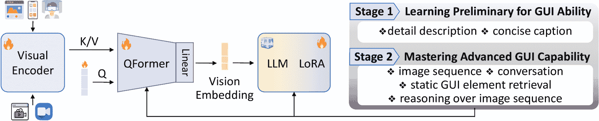

图 6：我们的微调架构概述，重点是 GUI 内容对齐和指令微调。

##### 第一阶段：学习 GUI 内容的基础知识。

初始阶段着重于将 GUI 内容与预训练的视觉编码器和基础 LLM 对齐，利用带有详细描述和说明的 GUI 视频。此阶段的目标是将基本的 GUI 概念和术语牢固地嵌入 MLLM 中。通过让模型基本上为各种 GUI 组件添加说明，模型学会识别并表述这些元素的功能和视觉特征，从而为 GUI 知识奠定坚实的基础。

##### 第二阶段：掌握高级 GUI 能力。

在第一阶段建立的基础知识的基础上，第二阶段着重于提升 MLLM 在通过更复杂的任务与 GUI 元素交互的能力。这些任务旨在模拟 MLLM 在 GUI 环境中可能遇到的现实场景，包括基于图像序列的预测、进行对话、检索静态和动态 GUI 元素以及执行推理任务。

如[图6](https://arxiv.org/html/2406.10819v1#S3.F6 "Figure 6 ‣ 3 Progressive Enhancement on GUI Perception Ability ‣ GUI-World: A Dataset for GUI-oriented Multimodal LLM-based Agents")所示，我们采用了两阶段训练架构，利用VideoChat2 [[35](https://arxiv.org/html/2406.10819v1#bib.bib35)]作为我们的基础模型。首先，视频和图像通过UMT-L视觉编码器[[36](https://arxiv.org/html/2406.10819v1#bib.bib36)]进行编码。随后，QFormer将视觉标记压缩为较小的查询标记集。受[[37](https://arxiv.org/html/2406.10819v1#bib.bib37)]启发，我们通过整合指令来增强QFormer[[38](https://arxiv.org/html/2406.10819v1#bib.bib38)]，使其能够提取与给定指令相关的视觉表示。此外，我们对基础LLM应用了低秩适配（LoRA [[39](https://arxiv.org/html/2406.10819v1#bib.bib39)]）。该模型与视觉编码器和QFormer一起，通过基于视觉的文本生成（VTG）损失进行同时微调：$\mathcal{L}_{\text{VTG}}(\theta)=-\mathbb{E}\left[\log p(y|v;\theta)\right]$，其中$v$表示从QFormer中得到的视觉标记，$y$表示基于视觉上下文的文本输出。

### 4 实验与分析

#### 4.1 实验设置

##### 模型。

我们对四种最强大的基于图像的多模态语言模型（MLLM）进行了评估：GPT-4V(ision) [[1](https://arxiv.org/html/2406.10819v1#bib.bib1)]，GPT-4o [[40](https://arxiv.org/html/2406.10819v1#bib.bib40)]，Qwen-VL-Max [[41](https://arxiv.org/html/2406.10819v1#bib.bib41)]，以及Gemini-Pro-1.5 [[42](https://arxiv.org/html/2406.10819v1#bib.bib42)]。我们在三个关键帧选择设置上进行基准测试：（1）随机设置，其中帧在视频中的固定时间间隔内进行采样；（2）提取设置，使用Katna²²2https://github.com/keplerlab/katna提取关键帧；（3）人工设置，关键帧由人工在标注过程中选择。对于随机设置和提取设置，我们输入10帧到每个MLLM中，而人工设置则使用平均6.719帧，详细信息见[表2](https://arxiv.org/html/2406.10819v1#S2.T2 "Table 2 ‣ 2.2 GUI Video Collection and Keyframe Annotation Process ‣ 2 GUI-World: A Comprehensive Dataset for GUI Understanding ‣ GUI-World: A Dataset for GUI-oriented Multimodal LLM-based Agents")。每个模型的响应使用三步链式思维（Chain-of-Thought，CoT）[[43](https://arxiv.org/html/2406.10819v1#bib.bib43)]过程，即“描述-分析-回答”，以评估它们的最佳性能。此外，我们还评估了三种先进的视频LLMs——ChatUnivi [[44](https://arxiv.org/html/2406.10819v1#bib.bib44)]，Minigpt4-video [[45](https://arxiv.org/html/2406.10819v1#bib.bib45)]，以及Videochat2 [[46](https://arxiv.org/html/2406.10819v1#bib.bib46)]——在GUI内容上的表现。详细的实验设置请参见[附录C](https://arxiv.org/html/2406.10819v1#A3 "Appendix C Details of Experiments Setups ‣ Part I Appendix ‣ GUI-World: A Dataset for GUI-oriented Multimodal LLM-based Agents")。

##### 评估指标。

为了评估自由形式的问题和多轮对话，我们采用了LLM作为评审员的方法，该方法为MLLM的回答与预定义的黄金答案（已通过先前研究验证）之间分配一个1到5的相似性评分[[47](https://arxiv.org/html/2406.10819v1#bib.bib47)，[48](https://arxiv.org/html/2406.10819v1#bib.bib48)，[49](https://arxiv.org/html/2406.10819v1#bib.bib49)]。为了进行全面评估，我们还提供了BLEU [[50](https://arxiv.org/html/2406.10819v1#bib.bib50)]和BERTScore [[51](https://arxiv.org/html/2406.10819v1#bib.bib51)]，具体内容见[附录D](https://arxiv.org/html/2406.10819v1#A4 "Appendix D Additional Experiments Results ‣ Part I Appendix ‣ GUI-World: A Dataset for GUI-oriented Multimodal LLM-based Agents")。对于多项选择题，我们使用准确度作为主要评估指标。

##### 文本信息集成。

为了研究将图像-字幕模型集成以扩大大型语言模型（LLMs）的上下文窗口的有效性——通常应用于自然视频——以及图形用户界面（GUI）历史内容在完成GUI相关任务中的帮助，我们实施了三种实验设置：详细字幕、简洁字幕和视觉 + 详细字幕。我们使用GPT-4V为这些关键帧提供字幕，结合人工标注者的操作意图，更准确地描述每个帧，并在[subsection A.3](https://arxiv.org/html/2406.10819v1#A1.SS3 "A.3 Human Keyframes Annotation Process ‣ Appendix A Details of Dataset Construction ‣ Part I Appendix ‣ GUI-World: A Dataset for GUI-oriented Multimodal LLM-based Agents")中验证。

表4：MACQ和自由格式查询在六种GUI场景中的整体表现。“D.C.”表示详细字幕，“C.C.”表示简洁字幕。“R.”、 “E.” 和 “H.” 分别表示随机选择、程序选择和人工选择的关键帧。“MC”表示多项选择问答，“Free”表示所有自由格式和对话式查询的平均得分。

|  | 模型 | 设置 | 软件 | 网站 | XR | 多平台 | IOS | Android | 平均 |
| --- | --- | --- | --- | --- | --- | --- | --- | --- | --- |
|  | MC | Free | MC | Free | MC | Free | MC | Free | MC | Free | MC | Free | MC | Free |
| ImageLLMs | Gemini-Pro-1.5 | R. | 81.7% | 3.339 | 82.6% | 3.452 | 81.2% | 3.154 | 81.2% | 2.959 | 82.0% | 3.213 | 81.6% | 3.220 | 81.7% | 3.223 |
| E. | 78.5% | 3.152 | 77.8% | 3.215 | 80.8% | 3.006 | 71.8% | 2.777 | 79.3% | 3.007 | 78.5% | 3.168 | 77.8% | 3.054 |
| Qwen-VL-Max | R. | 74.9% | 2.676 | 76.9% | 2.656 | 74.2% | 2.469 | 68.8% | 2.432 | 75.4% | 2.779 | 73.7% | 2.309 | 74.0% | 2.553 |
| E. | 74.3% | 2.624 | 75.8% | 2.627 | 69.0% | 2.499 | 64.8% | 2.362 | 77.4% | 2.659 | 65.8% | 2.277 | 71.2% | 2.508 |
| H. | 75.8% | 2.651 | 75.5% | 2.698 | 77.6% | 2.373 | 66.9% | 2.490 | 74.3% | 2.633 | - | - | 74.0% | 2.569 |
| GPT-4V | R. | 81.5% | 3.589 | 80.9% | 3.648 | 80.6% | 3.200 | 75.0% | 3.452 | 82.5% | 3.614 | 78.3% | 3.515 | 79.8% | 3.503 |
| E. | 85.1% | 3.407 | 80.1% | 3.433 | 81.8% | 2.892 | 81.9% | 3.219 | 86.4% | 3.427 | 79.9% | 3.176 | 82.6% | 3.259 |
| H. | 86.0% | 3.520 | 79.8% | 3.655 | 83.4% | 3.265 | 76.9% | 3.449 | 79.9% | 3.453 | - | - | 81.2% | 3.469 |
| D.C. | 85.0% | 3.350 | 83.1% | 3.380 | 82.3% | 3.056 | 84.2% | 3.358 | 81.6% | 2.751 | 81.7% | 3.427 | 83.0% | 3.316 |
| C.C | 80.7% | 3.028 | 72.2% | 3.025 | 82.8% | 2.809 | 81.3% | 3.160 | 76.5% | 2.868 | 76.4% | 2.939 | 78.3% | 2.971 |
| H.+D.C. | 82.5% | 3.494 | 83.2% | 3.682 | 85.9% | 3.191 | 83.9% | 3.617 | 80.9% | 3.516 | 84.9% | 3.758 | 83.5% | 3.543 |
| GPT-4o | H. | 86.5% | 3.644 | 83.3% | 3.740 | 84.3% | 3.285 | 81.1% | 3.654 | 83.3% | 3.558 | 90.0% | 3.561 | 84.8% | 3.573 |
| VideoLLMs | ChatUnivi | - | 28.4% | 2.389 | 22.2% | 2.349 | 20.6% | 2.161 | 17.5% | 2.275 | 22.6% | 2.337 | 23.0% | 2.390 | 22.4% | 2.317 |
| Minigpt4Video | - | 18.9% | 1.475 | 15.3% | 1.520 | 16.3% | 1.362 | 15.4% | 1.457 | 20.1% | 1.501 | 14.6% | 1.342 | 16.8% | 1.443 |
| VideoChat2 | - | 45.5% | 2.144 | 42.6% | 2.221 | 44.0% | 2.005 | 40.4% | 2.222 | 40.2% | 2.169 | 44.7% | 2.119 | 42.9% | 2.147 |
| GUI-Vid | - | 59.9% | 2.847 | 54.1% | 2.957 | 55.6% | 2.764 | 52.9% | 2.861 | 51.8% | 2.773 | 53.4% | 2.572 | 54.6% | 2.796 |

##### 关键帧和分辨率。

为了探索GUI导向能力的上限，特别是在动态和顺序任务中的表现，我们进行了一系列消融实验，重点研究关键帧数量和图像分辨率的影响。我们分别对GUI-Vid输入了不同数量的关键帧（8、16）。此外，我们还测试了不同图像分辨率对GPT-4o的影响，使用低设置和高设置，进一步评估分辨率对性能的影响。

#### 4.2 实验结果

##### 商业图像语言模型在零样本设置下优于开源视频语言模型。

商业图像语言模型，特别是GPT-4V和GPT-4o，在零样本设置下始终优于开源视频语言模型。正如[表4](https://arxiv.org/html/2406.10819v1#S4.T4 "Table 4 ‣ Textual Information Integration. ‣ 4.1 Experimental Setups ‣ 4 Experiments and Analysis ‣ GUI-World: A Dataset for GUI-oriented Multimodal LLM-based Agents")中详细说明，GPT-4o在复杂任务的所有GUI场景中表现优越，反映在其在多项选择题和自由表单查询中的高分，平均得分为84.8%和3.573。类似地，Gemini在软件和iOS环境中的字幕和描述任务中表现出强大的能力，分别得分为2.836和2.936，如[表13](https://arxiv.org/html/2406.10819v1#A4.T13 "Table 13 ‣ Appendix D Additional Experiments Results ‣ Part I Appendix ‣ GUI-World: A Dataset for GUI-oriented Multimodal LLM-based Agents")所示。进一步分析([图7](https://arxiv.org/html/2406.10819v1#S4.F7 "Figure 7 ‣ Commercial ImageLLMs outperform Open-source VideoLLMs in Zero-shot Settings. ‣ 4.2 Empirical Results ‣ 4 Experiments and Analysis ‣ GUI-World: A Dataset for GUI-oriented Multimodal LLM-based Agents"))显示，GPT-4V在具有较少文本内容和简单布局的应用程序中表现出色，如TikTok、健康应用和GitHub。相反，它在像Microsoft ToDo和XR软件这样更复杂的应用中的表现较差。至于视频语言模型，它们显著较差的表现归因于两个主要因素：无法准确解读用户输入中的GUI内容，以及缺乏足够的GUI导向预训练，这从它们在基本字幕和描述任务中的不足表现中可见一斑。有关BLEU和BERTScore的详细信息以及复杂任务的表现，请参见[附录D](https://arxiv.org/html/2406.10819v1#A4 "Appendix D Additional Experiments Results ‣ Part I Appendix ‣ GUI-World: A Dataset for GUI-oriented Multimodal LLM-based Agents")。

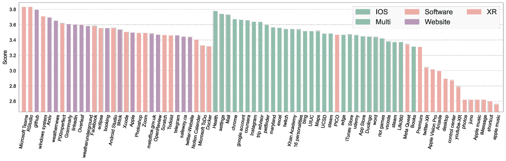

图 7：GPT-4V在每个软件和网站中的细粒度表现。

表 5：软件场景中每项任务的详细分数。“Dyn.”指动态GUI内容的查询，“Pred.”指预测任务。

|  | 模型 | 设置 | 字幕 | 复杂任务 | 对话 | 平均 |
| --- | --- | --- | --- | --- | --- | --- |
|  | 简洁 | 详细 | 静态 | 动态 | 预测 | 第一轮 | 第二轮 |
| ImageLLMs | Gemini-Pro-1.5 | R. | 3.659 | 2.837 | 2.969 | 2.822 | 3.450 | 3.608 | 3.845 | 3.339 |
| E. | 3.350 | 2.468 | 2.741 | 2.431 | 3.292 | 3.458 | 3.837 | 3.152 |
| Qwen-VL-Max | R. | 2.381 | 1.758 | 2.277 | 2.144 | 2.724 | 3.125 | 3.317 | 2.676 |
| E. | 2.459 | 1.693 | 2.143 | 1.954 | 2.742 | 3.174 | 3.298 | 2.624 |
| H. | 2.474 | 1.711 | 2.137 | 2.032 | 2.834 | 3.223 | 3.257 | 2.651 |
| GPT-4V | R. | 3.579 | 2.676 | 3.243 | 3.011 | 3.630 | 3.925 | 4.131 | 3.589 |
| E. | 3.141 | 2.301 | 2.927 | 2.627 | 3.541 | 3.844 | 4.103 | 3.407 |
| H. | 3.352 | 2.509 | 3.053 | 2.849 | 3.609 | 3.928 | 4.163 | 3.520 |
| C.C. | 3.454 | 2.547 | 1.818 | 2.335 | 3.577 | 3.521 | 3.884 | 3.028 |
| D.C. | 3.412 | 2.627 | 2.603 | 2.591 | 3.723 | 3.759 | 4.072 | 3.350 |
| H.+D.C. | 3.436 | 2.677 | 2.927 | 2.750 | 3.791 | 3.857 | 4.148 | 3.494 |
| GPT-4o | H. | 4.048 | 3.028 | 3.125 | 3.117 | 3.562 | 4.129 | 4.318 | 3.644 |
| VideoLLMs | ChatUnivi | - | 1.587 | 1.240 | 1.705 | 1.656 | 2.524 | 2.698 | 3.366 | 2.389 |
| Minigpt4Video | - | 1.246 | 1.073 | 1.249 | 1.235 | 1.675 | 1.494 | 1.719 | 1.475 |
| VideoChat2 | - | 1.992 | 1.312 | 1.812 | 1.682 | 2.158 | 2.342 | 2.720 | 2.144 |
| GUI-Vid | - | 3.562 | 2.058 | 2.376 | 2.090 | 3.435 | 3.080 | 3.260 | 2.847 |

##### 不同GUI场景和应用中的性能变化。

GPT-4V ([图 7](https://arxiv.org/html/2406.10819v1#S4.F7 "图 7 ‣ 商业图像LLM在零-shot设置中优于开源视频LLM。 ‣ 4.2 实证结果 ‣ 4 实验与分析 ‣ GUI-World：一个面向GUI的多模态LLM数据集")) 和 Gemini ([图 16](https://arxiv.org/html/2406.10819v1#A4.F16 "图 16 ‣ 附录D 额外实验结果 ‣ 第一部分附录 ‣ GUI-World：一个面向GUI的多模态LLM数据集")) 在常见场景中，如移动和网站界面表现优异，但在更复杂的GUI环境中，如XR和多窗口交互中，表现出明显的不足，无论是在字幕生成还是复杂任务中。这一性能差距凸显了在GUI元素分散且需要复杂解读的环境中的理解短板。它强调了专门为这些复杂GUI场景量身定制基准测试和数据集的迫切需要，这对于提高MLLM在GUI方面的能力至关重要，并为它们成为真正可靠且高效的通用控制代理铺平了道路。

##### 关键帧选择对GUI相关任务至关重要。

无论是在基本任务如字幕生成，还是在更复杂的任务如预测和推理中，关键帧选择方法之间都表现出显著差异。如[表14](https://arxiv.org/html/2406.10819v1#A4.T14 "Table 14 ‣ Appendix D Additional Experiments Results ‣ Part I Appendix ‣ GUI-World: A Dataset for GUI-oriented Multimodal LLM-based Agents")和[表16](https://arxiv.org/html/2406.10819v1#A4.T16 "Table 16 ‣ Appendix D Additional Experiments Results ‣ Part I Appendix ‣ GUI-World: A Dataset for GUI-oriented Multimodal LLM-based Agents")所示，GPT-4V和Gemini通过使用随机选择和人工选择的关键帧，在字幕生成和自由格式任务中分别比使用程序化提取的模型高出约0.2-0.3分。这表明，传统的关键帧技术（设计用于自然视频）在检测关键的GUI操作时效果较差，特别是在涉及微小动作如鼠标点击和动态变化时。相反，Qwen-VL-Max的性能差异较小，表明虽然关键帧选择方法对于擅长GUI内容的模型至关重要，但对较弱的模型影响较小。

##### 动态GUI任务仍然对多模态大语言模型（MLLMs）构成挑战。

在[表5](https://arxiv.org/html/2406.10819v1#S4.T5 "Table 5 ‣ Commercial ImageLLMs outperform Open-source VideoLLMs in Zero-shot Settings. ‣ 4.2 Empirical Results ‣ 4 Experiments and Analysis ‣ GUI-World: A Dataset for GUI-oriented Multimodal LLM-based Agents")中展示的细粒度任务中，GPT-4V和GPT-4o在静态GUI内容和图像序列预测任务上表现出色，但在为整个视频和动态GUI内容提供详细描述时表现较差。这种差异归因于GUI中的微小变化，这些变化对描述有显著影响。增加关键帧的数量和感知的细粒度可能有助于缓解这些问题。在VideoLLMs中，ChatUnivi在对话任务中表现优异，能够有效利用上下文细微差别，特别是在后续回合中，但在GUI相关的字幕生成任务中表现较差。相比之下，GUI-Vid在顺序任务中表现良好，但在字幕生成和静态内容处理上有所不足。这一差距与GUI-Vid的预训练有关，该预训练缺乏对有效视觉-文本对齐至关重要的全面GUI内容，正如[表13](https://arxiv.org/html/2406.10819v1#A4.T13 "Table 13 ‣ Appendix D Additional Experiments Results ‣ Part I Appendix ‣ GUI-World: A Dataset for GUI-oriented Multimodal LLM-based Agents")所示，其在预训练过程中也未能完全解决这些问题。

##### 视觉感知在顺序GUI任务中至关重要。

如[表5](https://arxiv.org/html/2406.10819v1#S4.T5 "表5 ‣ 商业化ImageLLM在零-shot设置中优于开源VideoLLM。‣ 4.2 实验结果 ‣ 4 实验与分析 ‣ GUI-World: 一个面向GUI的多模态LLM代理数据集")所示，整合详细的文本信息略微优于纯粹基于视觉输入或详细的图像标注，这类似于“思维链”(CoT) [[43](https://arxiv.org/html/2406.10819v1#bib.bib43)] 设置。令人惊讶的是，GPT-4V仅凭详细的图像标注在标注和预测任务中表现优异，提供了通过额外的文本信息来提升特定GUI任务的见解。然而，在更具挑战性的任务（如检索静态或动态内容）中，它仍然存在不足。这凸显了视觉感知在GUI环境中的关键作用，即使是微小的变化也能对结果产生显著影响。

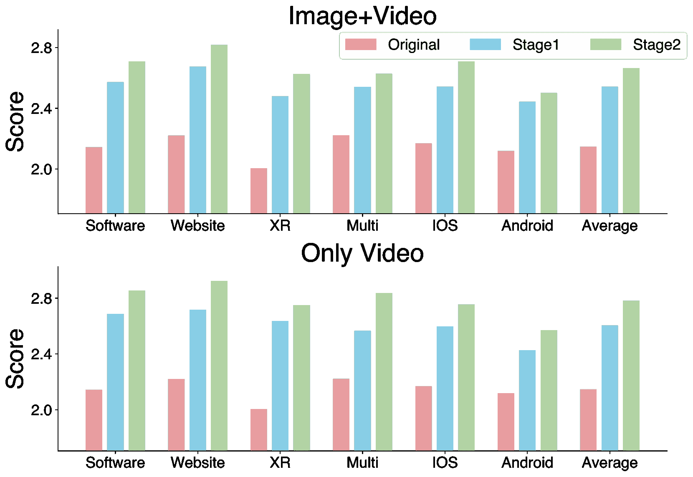

图8：两阶段渐进式训练提升了GUI能力。

##### GUI-Vid在GUI-World微调后在基于图形的界面上的显著增强。

作为一项开创性研究，将VideoLLMs训练为屏幕代理，GUI-Vid显著超越了基准模型，在各种任务和GUI场景中平均提升了30%，甚至超过了商业化的ImageLLM——Qwen-VL-Max。这个提升在图像序列的标注和预测任务中尤为显著，GUI-Vid的表现与GPT-4V和Gemini-Pro相匹配。如[图8](https://arxiv.org/html/2406.10819v1#S4.F8 "图8 ‣ 视觉感知对顺序GUI任务的重要性。‣ 4.2 实验结果 ‣ 4 实验与分析 ‣ GUI-World: 一个面向GUI的多模态LLM代理数据集")所示，我们的两阶段渐进式微调显著提升了所有GUI场景中的表现。值得注意的是，GUI-Vid在XR场景中的标注任务得分为3.747，突显了其在XR应用中的潜力以及我们数据集提供的高质量标注。然而，在多项选择QA和聊天机器人任务中，GUI-Vid仍然落后于行业领导者，如GPT-4V和Gemini-Pro，这一差距可能与基准LLM较弱的表现以及基于指令的微调挑战有关。

表6：GUI-Vid微调的消融研究整体结果。F.K.和E.K.分别表示在微调和评估过程中使用的关键帧。I.代表图像，V.代表视频。

| 设置 | F.K. | E.K. | 数据 | 软件 | 网站 | XR | 多模态 | IOS | 安卓 | 平均 |
| --- | --- | --- | --- | --- | --- | --- | --- | --- | --- | --- |
| I. | V. | MC | 免费 | MC | 免费 | MC | 免费 | MC | 免费 | MC | 免费 | MC | 免费 | MC | 免费 |
| 基准 | - | 8 | - | - | 45.5% | 2.144 | 42.6% | 2.221 | 44.0% | 2.005 | 40.4% | 2.222 | 40.2% | 2.169 | 44.7% | 2.119 | 42.9% | 2.147 |
| - | 16 | - | - | 45.1% | 2.144 | 41.8% | 2.240 | 41.0% | 2.007 | 40.7% | 2.238 | 39.9% | 2.138 | 44.7% | 2.147 | 42.2% | 2.154 |
| GUI-Vid | 8 | 8 | ✘ | ✔ | 58.3% | 2.709 | 53.6% | 2.817 | 62.2% | 2.626 | 54.2% | 2.627 | 53.1% | 2.708 | 54.9% | 2.501 | 56.0% | 2.665 |
| ✔ | ✔ | 59.9% | 2.856 | 54.1% | 2.925 | 59.0% | 2.751 | 52.1% | 2.837 | 50.0% | 2.756 | 54.0% | 2.571 | 54.8% | 2.782 |
| 16 | ✘ | ✔ | 59.0% | 2.709 | 55.1% | 2.821 | 62.8% | 2.645 | 53.3% | 2.624 | 55.5% | 2.727 | 55.7% | 2.501 | 56.9% | 2.671 |
| ✔ | ✔ | 59.9% | 2.847 | 54.1% | 2.957 | 55.6% | 2.764 | 52.9% | 2.861 | 51.8% | 2.772 | 53.4% | 2.572 | 54.6% | 2.796 |

表7：GPT-4o在低分辨率和高分辨率下六种GUI场景中的平均表现。

| 分辨率 | 描述 | 转换 | 动态 | 静态 | 标题 | 平均 |
| --- | --- | --- | --- | --- | --- |
| 低 | 2.794 | 3.912 | 3.150 | 2.869 | 3.672 | 3.394 |
| 高 | 3.031 | 4.056 | 3.318 | 3.131 | 3.911 | 3.573 |

##### 图形用户界面能力的上限，具有更多关键帧和高分辨率。

如[表6](https://arxiv.org/html/2406.10819v1#S4.T6 "表6 ‣ 在GUI-World微调后，GUI-Vid在基于图形的界面中的极致增强。 ‣ 4.2 实验结果 ‣ 4 实验与分析 ‣ GUI-World：一个面向GUI的多模态LLM代理数据集")所示，我们在微调阶段进行的两项消融研究表明，使用GUI图像-文本标题数据显著增强了模型对GUI元素的初步理解，优于仅依赖视频的训练。此外，关键帧数量的增加与在各种场景中，特别是在多个窗口和软件应用程序环境中的表现提升相关。来自[表7](https://arxiv.org/html/2406.10819v1#S4.T7 "表7 ‣ 在GUI-World微调后，GUI-Vid在基于图形的界面中的极致增强。 ‣ 4.2 实验结果 ‣ 4 实验与分析 ‣ GUI-World：一个面向GUI的多模态LLM代理数据集")的进一步证据表明，更高的图像分辨率显著提升了GPT-4o在基本任务和复杂任务中的表现。这些发现强调了进一步开发更强大GUI代理的潜力。

### 5 相关工作

##### 基于MLLM的GUI代理。

基于LLM的显著进展[[52](https://arxiv.org/html/2406.10819v1#bib.bib52)、[53](https://arxiv.org/html/2406.10819v1#bib.bib53)、[54](https://arxiv.org/html/2406.10819v1#bib.bib54)、[55](https://arxiv.org/html/2406.10819v1#bib.bib55)]以及先进的模态混合技术[[56](https://arxiv.org/html/2406.10819v1#bib.bib56)、[57](https://arxiv.org/html/2406.10819v1#bib.bib57)]，开创性的MLLM如GPT-4V[[1](https://arxiv.org/html/2406.10819v1#bib.bib1)]和Gemini-Pro[[42](https://arxiv.org/html/2406.10819v1#bib.bib42)]，以及开源MLLM如LLaVA-1.6系列[[2](https://arxiv.org/html/2406.10819v1#bib.bib2)、[58](https://arxiv.org/html/2406.10819v1#bib.bib58)]、CogVLM[[59](https://arxiv.org/html/2406.10819v1#bib.bib59)]和Qwen-VL系列[[41](https://arxiv.org/html/2406.10819v1#bib.bib41)]，在各类任务中表现出色[[60](https://arxiv.org/html/2406.10819v1#bib.bib60)、[61](https://arxiv.org/html/2406.10819v1#bib.bib61)、[62](https://arxiv.org/html/2406.10819v1#bib.bib62)、[63](https://arxiv.org/html/2406.10819v1#bib.bib63)、[64](https://arxiv.org/html/2406.10819v1#bib.bib64)、[65](https://arxiv.org/html/2406.10819v1#bib.bib65)、[66](https://arxiv.org/html/2406.10819v1#bib.bib66)、[67](https://arxiv.org/html/2406.10819v1#bib.bib67)、[68](https://arxiv.org/html/2406.10819v1#bib.bib68)]。在超越文本和单一图像的探索中，已有多项研究正在探索将视频模态集成到需要动态或序列化视觉内容的任务中[[44](https://arxiv.org/html/2406.10819v1#bib.bib44)、[35](https://arxiv.org/html/2406.10819v1#bib.bib35)、[69](https://arxiv.org/html/2406.10819v1#bib.bib69)、[70](https://arxiv.org/html/2406.10819v1#bib.bib70)]。在GUI领域，借助MLLM强大的视觉感知能力，WebAgents[[8](https://arxiv.org/html/2406.10819v1#bib.bib8)、[71](https://arxiv.org/html/2406.10819v1#bib.bib71)、[23](https://arxiv.org/html/2406.10819v1#bib.bib23)]和Mobile Agents[[17](https://arxiv.org/html/2406.10819v1#bib.bib17)、[12](https://arxiv.org/html/2406.10819v1#bib.bib12)、[72](https://arxiv.org/html/2406.10819v1#bib.bib72)]等应用在处理日常任务如导航和VQA方面已受到广泛关注。前沿研究还在探索将MLLM作为通用控制代理的应用，如在玩电脑游戏[[73](https://arxiv.org/html/2406.10819v1#bib.bib73)、[74](https://arxiv.org/html/2406.10819v1#bib.bib74)]和作为操作系统副驾驶[[75](https://arxiv.org/html/2406.10819v1#bib.bib75)、[24](https://arxiv.org/html/2406.10819v1#bib.bib24)]，为更复杂的GUI操作铺平道路。

##### GUI基准与数据集。

基于Rico的基础工作[[13](https://arxiv.org/html/2406.10819v1#bib.bib13)]，这是第一个移动GUI视频数据集，以及AitW [[16](https://arxiv.org/html/2406.10819v1#bib.bib16)]，它包含715k集顺序图像，研究广泛涵盖了移动[[14](https://arxiv.org/html/2406.10819v1#bib.bib14), [76](https://arxiv.org/html/2406.10819v1#bib.bib76), [77](https://arxiv.org/html/2406.10819v1#bib.bib77)]和网页GUI环境[[78](https://arxiv.org/html/2406.10819v1#bib.bib78), [19](https://arxiv.org/html/2406.10819v1#bib.bib19), [79](https://arxiv.org/html/2406.10819v1#bib.bib79), [80](https://arxiv.org/html/2406.10819v1#bib.bib80), [81](https://arxiv.org/html/2406.10819v1#bib.bib81)]。Mind2Web [[20](https://arxiv.org/html/2406.10819v1#bib.bib20)] 在基于网页的数据集中脱颖而出，提供了来自137个网站、涵盖31个领域的2000多个任务。桌面GUI方面的研究也在持续推进，出现了新的工具包[[23](https://arxiv.org/html/2406.10819v1#bib.bib23)]、基准测试[[21](https://arxiv.org/html/2406.10819v1#bib.bib21), [82](https://arxiv.org/html/2406.10819v1#bib.bib82)]和框架[[83](https://arxiv.org/html/2406.10819v1#bib.bib83), [84](https://arxiv.org/html/2406.10819v1#bib.bib84), [11](https://arxiv.org/html/2406.10819v1#bib.bib11)]。GUI的研究也从理解静态工作区中的单一图像[[8](https://arxiv.org/html/2406.10819v1#bib.bib8)]，转向顺序操作或多跳场景[[24](https://arxiv.org/html/2406.10819v1#bib.bib24), [22](https://arxiv.org/html/2406.10819v1#bib.bib22)]，挑战了这些强大模型的理解与操作能力。

### 6 结论

在本文中，我们介绍了GUI-World，这是一个综合性的面向图形用户界面的数据集，旨在基准测试并增强对虚拟界面的理解，尤其是顺序和动态任务。该数据集广泛覆盖了六种场景和各种任务，填补了之前在全面评估模型图形理解能力方面的研究空白。我们对领先的MLLMs进行了广泛的基准测试，并首次对专门针对需要时间信息的任务进行微调的“GUI-Vid”视频代理进行了测试，取得了与顶尖模型相媲美的结果，为提升GUI相关能力提供了详细的见解。

### 7 限制

尽管我们的工作在GUI代理领域取得了显著进展，但仍然存在需要解决的若干限制。首先，尽管扩大了数据集以涵盖各种GUI场景，我们的模型在应用于训练数据中未涉及的环境时，仍然表现出有限的泛化能力。这凸显了进一步研究的必要性，以提高GUI代理在多样化和未知环境中的适应性和鲁棒性。此外，我们的模型精度在很大程度上依赖于关键帧的选择。自动提取的关键帧往往无法捕捉到进行精确GUI理解所需的核心元素，这表明需要更复杂的关键帧提取技术。此外，尽管VideoLLMs在处理动态内容方面有所改进，但它们在GUI任务中理解和预测顺序信息的能力仍然不尽人意。这表明未来的工作需要重点提高这些模型的时间理解能力。最后，VideoLLMs的训练和微调过程需要大量计算资源，这可能并非所有研究人员都能获得。

### 8 潜在的负面社会影响

虽然我们的工作旨在推动图形用户界面（GUI）代理在有益应用中的能力，但考虑到潜在的负面社会影响同样至关重要。尤其是那些能够跨多个环境和平台运行的GUI代理，其使用引发了重大隐私问题。确保这些代理在严格的道德指南下运行，并且用户数据得到安全和负责任的处理是至关重要的。还有滥用先进GUI代理进行恶意行为的风险，例如未经授权访问敏感信息或自动化利用软件漏洞。建立强有力的安全措施和道德使用政策对于减轻这些风险至关重要。

### 参考文献

+   OpenAI [2023] OpenAI. Openai models - gpt-4-vision. [https://openai.com/research/gpt-4v-system-card](https://openai.com/research/gpt-4v-system-card), 2023.

+   Liu et al. [2023a] Haotian Liu, Chunyuan Li, Qingyang Wu, and Yong Jae Lee. Visual instruction tuning. In *NeurIPS*, 2023a.

+   Yin et al. [2024] Shukang Yin, Chaoyou Fu, Sirui Zhao, Ke Li, Xing Sun, Tong Xu, and Enhong Chen. A survey on multimodal large language models, 2024.

+   Yang et al. [2023] Zhengyuan Yang, Linjie Li, Jianfeng Wang, Kevin Lin, Ehsan Azarnasab, Faisal Ahmed, Zicheng Liu, Ce Liu, Michael Zeng, and Lijuan Wang. Mm-react: Prompting chatgpt for multimodal reasoning and action, 2023.

+   Li et al. [2023a] Chunyuan Li, Cliff Wong, Sheng Zhang, Naoto Usuyama, Haotian Liu, Jianwei Yang, Tristan Naumann, Hoifung Poon, and Jianfeng Gao. Llava-med: Training a large language-and-vision assistant for biomedicine in one day, 2023a.

+   Zhang 等人 [2024a] 张凯、余军、艾尚·阿德希卡拉、周荣、闫志玲、刘奕欣、刘正良、何丽芳、布莱恩·戴维森、李翔、任慧、傅孙阳、詹姆斯·邹、刘伟、黄晶、陈晨、周宇尹、刘天铭、陈迅、陈永、李全正、刘洪方、孙力超。Biomedgpt：一个统一的通用生物医学生成预训练变换器，面向视觉、语言和多模态任务，2024a年。

+   Huang 等人 [2024a] 黄江勇、杨思龙、马晓剑、凌虎雄坤、李浦昊、王彦、李青、朱松纯、贾宝雄、黄思源。一个嵌入式的通用代理在3D世界中的应用，2024a年。

+   Hong 等人 [2023] 洪文艺、王伟寒、吕清松、徐家政、于文蒙、季俊辉、王燕、王子涵、张宇轩、李娟子、徐斌、董玉霄、丁鸣、唐杰。Cogagent：面向图形用户界面代理的视觉语言模型，2023年。

+   Lai 等人 [2024] 赖瀚宇、刘潇、Iat Long Iong、姚顺天、陈宇轩、沈鹏波、余浩、张寒晨、张晓寒、董玉霄、唐杰。Autowebglm：基于大语言模型的Web导航代理的自启动和强化，2024年。

+   Zhang 等人 [2023a] 张驰、杨兆、刘佳轩、韩宇成、陈鑫、黄泽彪、傅斌、余刚。Appagent：作为智能手机用户的多模态代理，2023a年。

+   Niu 等人 [2024] 牛润良、李金东、王世琪、傅雅丽、胡熙宇、冷雪源、孔赫、常毅、王琪。Screenagent：一个基于视觉语言模型驱动的计算机控制代理，2024年。

+   Wang 等人 [2024a] 冯俊扬、许海阳、叶家博、闵艳、沈伟洲、张继、黄飞、桑继涛。Mobile-agent：具有视觉感知的自主多模态移动设备代理，2024a年。

+   Deka 等人 [2017] 比普拉布·德卡、子峰黄、查德·弗兰岑、乔舒亚·希布什曼、丹尼尔·阿费根、杨李、杰弗里·尼科尔斯、兰吉塔·库马尔。Rico：用于构建数据驱动设计应用的移动应用数据集。收录于 *第30届ACM用户界面软件与技术年会论文集*，第845–854页，2017年。

+   Sun 等人 [2022] 梁台孙、邢宇陈、卢陈、天乐戴、子晨朱、凯余。Meta-gui：面向移动图形用户界面的多模态对话代理。*arXiv 预印本 arXiv:2205.11029*，2022年。

+   Venkatesh 等人 [2022] 萨迦尔·古比·文卡特什、帕尔塔·塔卢克达尔、斯里尼·纳拉扬。Ugif：基于用户界面指令跟随的多模态模型。*arXiv 预印本 arXiv:2211.07615*，2022年。

+   Rawles 等人 [2023] 克里斯托弗·罗尔斯、李爱丽丝、丹尼尔·罗德里格兹、奥莉安娜·里瓦、蒂莫西·利利克拉普。野外中的Android：一个用于Android设备控制的大规模数据集。*arXiv 预印本 arXiv:2307.10088*，2023年。

+   You 等人 [2024] 余钦、张昊天、埃尔登·舒普、弗洛里斯·威尔斯、阿曼达·斯威尔宁、杰弗里·尼科尔斯、杨寅飞、甘哲。Ferret-ui：基于多模态大语言模型的移动用户界面理解。*arXiv 预印本 arXiv:2404.05719*，2024年。

+   刘等人 [2018] 刘哲然，Guu Kelvin，Pasupat Panupong，Shi Tianlin，Liang Percy。使用工作流引导探索在 web 界面上进行强化学习。在 *国际学习表征会议 (ICLR)*，2018。网址 [https://arxiv.org/abs/1802.08802](https://arxiv.org/abs/1802.08802)。

+   周等人 [2023] 周书颜，Frank F Xu，朱浩，周旭辉，罗伯特·洛，Abishek Sridhar，程显益，Yonatan Bisk，丹尼尔·弗里德，Uri Alon 等人。Webarena：用于构建自主体的现实 web 环境。*arXiv 预印本 arXiv:2307.13854*，2023。

+   邓等人 [2024] 邓翔，顾宇，郑博源，陈世杰，Sam Stevens，王博时，孙欢，苏宇。Mind2web：迈向通用型 web 智能体。*神经信息处理系统进展*，第36卷，2024。

+   Kapoor 等人 [2024] Raghav Kapoor，Yash Parag Butala，Melisa Russak，Jing Yu Koh，Kiran Kamble，Waseem Alshikh，Ruslan Salakhutdinov。Omniact：一个多模态通用自主智能体的数据集和基准，适用于桌面和 web。*arXiv 预印本 arXiv:2402.17553*，2024。

+   张等人 [2024b] 张子牛，田淑林，陈亮宇，刘子威。Mmina：基准测试多跳多模态互联网智能体。*arXiv 预印本 arXiv:2404.09992*，2024b。

+   郑等人 [2024a] 郑龙涛，黄智远，薛正海，王欣润，安博，严帅成。Agentstudio：构建通用虚拟智能体的工具包。*arXiv 预印本 arXiv:2403.17918*，2024a。

+   谢等人 [2024] 谢天宝，张丹阳，陈继璇，李晓川，赵思恒，曹瑞生，黄东晶，程周俊，申东灿，雷方宇 等人。Osworld：在真实计算机环境中为开放任务基准测试多模态智能体。*arXiv 预印本 arXiv:2404.07972*，2024。

+   苹果 [2024] 苹果。Apple Vision Pro。 [https://www.apple.com/apple-vision-pro/](https://www.apple.com/apple-vision-pro/)，2024。

+   朱等人 [2016] 朱望江，胡杰，孙刚，曹旭东，乔宇。基于深度框架的关键体积挖掘用于动作识别。在 *IEEE 计算机视觉与模式识别会议论文集*，第1991-1999页，2016。

+   阎等人 [2018] 阎翔，Syed Zulqarnain Gilani，秦瀚林，冯名涛，张亮，Ajmal Mian。人类动作视频中的深度关键帧检测。*arXiv 预印本 arXiv:1804.10021*，2018。

+   Mahasseni 等人 [2017] Behrooz Mahasseni，Michael Lam，Sinisa Todorovic。无监督视频摘要生成与对抗 LSTM 网络。在 *IEEE 计算机视觉与模式识别会议论文集*，第202-211页，2017。

+   [29] OpenCV. OpenCV. [https://opencv.org/](https://opencv.org/)。

+   李等人 [2024a] 李源，黄跃，林煜利，吴思源，万耀，孙立超。我思故我在：使用Awarebench基准测试大语言模型的意识，2024a。

+   Sun 等人 [2024] Lichao Sun, Yue Huang, Haoran Wang, Siyuan Wu, Qihui Zhang, Yuan Li, Chujie Gao, Yixin Huang, Wenhan Lyu, Yixuan Zhang, Xiner Li, Zhengliang Liu, Yixin Liu, Yijue Wang, Zhikun Zhang, Bertie Vidgen, Bhavya Kailkhura, Caiming Xiong, Chaowei Xiao, Chunyuan Li, Eric Xing, Furong Huang, Hao Liu, Heng Ji, Hongyi Wang, Huan Zhang, Huaxiu Yao, Manolis Kellis, Marinka Zitnik, Meng Jiang, Mohit Bansal, James Zou, Jian Pei, Jian Liu, Jianfeng Gao, Jiawei Han, Jieyu Zhao, Jiliang Tang, Jindong Wang, Joaquin Vanschoren, John Mitchell, Kai Shu, Kaidi Xu, Kai-Wei Chang, Lifang He, Lifu Huang, Michael Backes, Neil Zhenqiang Gong, Philip S. Yu, Pin-Yu Chen, Quanquan Gu, Ran Xu, Rex Ying, Shuiwang Ji, Suman Jana, Tianlong Chen, Tianming Liu, Tianyi Zhou, William Wang, Xiang Li, Xiangliang Zhang, Xiao Wang, Xing Xie, Xun Chen, Xuyu Wang, Yan Liu, Yanfang Ye, Yinzhi Cao, Yong Chen 和 Yue Zhao. Trustllm：大型语言模型中的可信度，2024年。

+   Lei 等人 [2024] Fangyu Lei, Qian Liu, Yiming Huang, Shizhu He, Jun Zhao 和 Kang Liu. S3eval：一个用于大型语言模型的合成、可扩展、系统化评估套件，2024年。

+   Dekoninck 等人 [2024] Jasper Dekoninck, Marc Fischer, Luca Beurer-Kellner 和 Martin Vechev. 通过数据集生成的视角理解大型语言模型，2024年。URL [https://openreview.net/forum?id=miGpIhquyB](https://openreview.net/forum?id=miGpIhquyB)。

+   Yu 等人 [2023a] Yue Yu, Yuchen Zhuang, Jieyu Zhang, Yu Meng, Alexander Ratner, Ranjay Krishna, Jiaming Shen 和 Chao Zhang. 大型语言模型作为归因训练数据生成器：多样性与偏见的故事，2023年。

+   Li 等人 [2023b] KunChang Li, Yinan He, Yi Wang, Yizhuo Li, Wenhai Wang, Ping Luo, Yali Wang, Limin Wang 和 Yu Qiao. Videochat：以聊天为中心的视频理解。*arXiv 预印本 arXiv:2305.06355*，2023年。

+   Li 等人 [2024b] Kunchang Li, Yali Wang, Yizhuo Li, Yi Wang, Yinan He, Limin Wang 和 Yu Qiao. Unmasked teacher：面向高效训练的视频基础模型，2024年。

+   Dai 等人 [2023] Wenliang Dai, Junnan Li, Dongxu Li, Anthony Meng Huat Tiong, Junqi Zhao, Weisheng Wang, Boyang Li, Pascale Fung 和 Steven Hoi. Instructblip：面向通用视觉-语言模型的指令调优，2023年。

+   Zhang 等人 [2023b] Qiming Zhang, Jing Zhang, Yufei Xu 和 Dacheng Tao. 带有四边形注意力的视觉变换器，2023年。

+   Hu 等人 [2021] Edward J. Hu, Yelong Shen, Phillip Wallis, Zeyuan Allen-Zhu, Yuanzhi Li, Shean Wang, Lu Wang 和 Weizhu Chen. Lora：大型语言模型的低秩适配，2021年。

+   OpenAI [2024a] OpenAI. 你好 GPT-4o，2024年5月。URL [https://openai.com/index/hello-gpt-4o/](https://openai.com/index/hello-gpt-4o/)。访问日期：2024年6月6日。

+   Bai 等人 [2023] Jinze Bai, Shuai Bai, Shusheng Yang, Shijie Wang, Sinan Tan, Peng Wang, Junyang Lin, Chang Zhou 和 Jingren Zhou. Qwen-vl：一种多功能视觉-语言模型，用于理解、定位、文本阅读及其他应用，2023年。

+   GeminiTeam [2023] GeminiTeam。Gemini：一类高能力的多模态模型，2023年。

+   魏等人 [2023] Jason Wei、王学志、Dale Schuurmans、Maarten Bosma、Brian Ichter、Fei Xia、Ed Chi、Quoc Le 和 Denny Zhou。链式推理提示引发大语言模型的推理能力，2023年。

+   金等人 [2023] 金鹏、坂信浩、张才万、曹晓春、李远。Chat-univi：统一的视觉表示赋能大语言模型理解图像和视频。*arXiv预印本 arXiv:2311.08046*，2023年。

+   Ataallah等人 [2024] Kirolos Ataallah、沈小倩、Eslam Abdelrahman、Essam Sleiman、朱德耀、丁建、Mohamed Elhoseiny。Minigpt4-video：通过交织的视觉-文本标记推进多模态大语言模型的视频理解，2024年。

+   李等人 [2023c] 李昆昌、王雅丽、何一南、李艺卓、王怡、刘艺、王尊、许吉兰、陈国、罗平等。Mvbench：一个综合的多模态视频理解基准。*arXiv预印本 arXiv:2311.17005*，2023年。

+   郑等人 [2023] 郑连民、蒋伟林、盛颖、庄思源、吴章浩、庄永浩、林子、李卓涵、李大成、谢培杰、张浩、邓启明、赵浩、周明鹏。使用mt-bench和chatbot arena评估大语言模型作为裁判的能力，2023年。

+   刘等人 [2023b] 刘潇、雷轩宇、王胜源、黄月、冯卓尔、温博思、程佳乐、柯佩、徐亦凡、邓文亮、张晓寒、孙立超、王鸿宁、张晶、黄敏烈、董昱肖、唐杰。Alignbench：对大语言模型进行中文对齐的基准测试，2023年。

+   陈等人 [2024a] 陈东平、陈若希、张世琳、刘一诺、王耀辰、周慧池、张启辉、周潘、王耀、孙立超。Mllm-as-a-judge：通过视觉-语言基准评估多模态大语言模型作为裁判的能力，2024年。

+   Papineni等人 [2002] Kishore Papineni、Salim Roukos、Todd Ward 和 Wei-Jing Zhu。Bleu：一种自动评估机器翻译的方法。收录于*第40届计算语言学协会年会论文集*，第311–318页，2002年。

+   张等人 [2019] 张天一、Varsha Kishore、Felix Wu、Kilian Q Weinberger 和 Yoav Artzi。Bertscore：用Bert评估文本生成。*arXiv预印本 arXiv:1904.09675*，2019年。

+   团队 [2024] OpenAI团队。GPT-4技术报告，2024年。

+   Meta [2023a] Meta。Llama 2，2023a。[https://llama.meta.com/llama2](https://llama.meta.com/llama2)。

+   Meta [2023b] Meta。Llama 3，2023b。[https://llama.meta.com/llama3](https://llama.meta.com/llama3)。

+   OpenAI [2024b] OpenAI。Mistral ai，2024b。[https://mistral.ai/company/](https://mistral.ai/company/)。

+   李等人 [2023d] 李俊男、李东旭、Silvio Savarese 和 Steven Hoi。Blip-2：通过冻结图像编码器和大型语言模型来进行语言-图像预训练的引导，2023年。

+   阿莱拉克等人 [2022] Jean-Baptiste Alayrac、Jeff Donahue、Pauline Luc、Antoine Miech、Iain Barr、Yana Hasson、Karel Lenc、Arthur Mensch、Katie Millican、Malcolm Reynolds、Roman Ring、Eliza Rutherford、Serkan Cabi、Tengda Han、Zhitao Gong、Sina Samangooei、Marianne Monteiro、Jacob Menick、Sebastian Borgeaud、Andrew Brock、Aida Nematzadeh、Sahand Sharifzadeh、Mikolaj Binkowski、Ricardo Barreira、Oriol Vinyals、Andrew Zisserman和Karen Simonyan。Flamingo：一种用于少样本学习的视觉语言模型，2022年。

+   刘等人 [2023c] 刘浩天、李春元、李宇衡和李永载。通过视觉指令微调改进基准模型，2023年。

+   王等人 [2024b] 王伟涵、吕青松、于文萌、洪文艺、季琪、王岩、季俊辉、杨卓义、赵雷、宋锡轩、许佳政、许斌、李娟子、董宇晓、丁名和唐杰。CogVLM：预训练语言模型的视觉专家，2024年。

+   于等人 [2023b] 于伟豪、杨正远、李林杰、王剑峰、林凯文、刘子成、王新超和王丽娟。MM-VET：评估大规模多模态模型的集成功能，2023年。

+   刘等人 [2023d] 刘远、段浩东、张源汉、李博、张松阳、赵王博、袁一科、王佳琪、何聪辉、刘子威等人。MMBench：你的多模态模型是全能选手吗？*arXiv预印本 arXiv:2307.06281*，2023年。

+   陈等人 [2024b] 陈琳、李金松、董晓义、张攀、臧宇航、陈泽辉、段浩东、王佳琪、乔宇、林大华和赵峰。我们在评估大型视觉语言模型的道路上是否走对了？2024年。

+   吴等人 [2023] 吴超义、雷佳宇、郑巧宇、赵伟柯、林伟雄、张晓曼、周晓、赵子恒、张雅、王彦峰等人。GPT-4V（视觉）能否为医学应用服务？GPT-4V在多模态医学诊断中的案例研究。*arXiv预印本 arXiv:2310.09909*，2023年。

+   Wake等人 [2023] Wake直树、Kanehira篤、Sasabuchi和宏、高松俊和池内克之。GPT-4V（视觉）在机器人领域的应用：来自人类示范的多模态任务规划。*arXiv预印本 arXiv:2311.12015*，2023年。

+   黄等人 [2024b] 黄思理、胡季峰、杨哲建、杨丽伟、罗涛、陈赫昌、孙力超和杨博。决策Mamba：通过混合选择性序列建模的强化学习，2024年。

+   张等人 [2024c] 张奇辉、高楚杰、陈东平、黄月、黄一鑫、孙振阳、张世琳、李伟业、傅正炎、万尧和孙力超。LLM作为合著者：混合人工写作和机器生成文本能否被检测？在Kevin Duh、Helena Gomez和Steven Bethard主编的*《计算语言学协会年会论文集：NAACL 2024》*中，页面409–436，墨西哥城，墨西哥，2024年6月。计算语言学协会。网址：[https://aclanthology.org/2024.findings-naacl.29](https://aclanthology.org/2024.findings-naacl.29)。

+   Zhao 等人 [2024] Wei Zhao, Zhitao Hou, Siyuan Wu, Yan Gao, Haoyu Dong, Yao Wan, Hongyu Zhang, Yulei Sui, 和 Haidong Zhang. NL2Formula: 从自然语言查询生成电子表格公式。收录于 Yvette Graham 和 Matthew Purver 编辑的 *Findings of the Association for Computational Linguistics: EACL 2024*，第 2377–2388 页，马耳他圣朱利安斯，2024年3月。计算语言学协会。网址 [https://aclanthology.org/2024.findings-eacl.158](https://aclanthology.org/2024.findings-eacl.158)。

+   Gui 等人 [2024] Yi Gui, Zhen Li, Yao Wan, Yemin Shi, Hongyu Zhang, Yi Su, Shaoling Dong, Xing Zhou, 和 Wenbin Jiang. Vision2ui: 一种具有布局的真实世界数据集，用于从 UI 设计生成代码，2024年。

+   Maaz 等人 [2023] Muhammad Maaz, Hanoona Rasheed, Salman Khan, 和 Fahad Shahbaz Khan. Video-chatgpt: 通过大型视觉和语言模型进行详细视频理解的探索。*arXiv 预印本 arXiv:2306.05424*，2023。

+   Lin 等人 [2023a] Bin Lin, Bin Zhu, Yang Ye, Munan Ning, Peng Jin, 和 Li Yuan. Video-llava: 通过投影前的对齐学习联合视觉表示。*arXiv 预印本 arXiv:2311.10122*，2023a。

+   Zhang 等人 [2024d] Chaoyun Zhang, Liqun Li, Shilin He, Xu Zhang, Bo Qiao, Si Qin, Minghua Ma, Yu Kang, Qingwei Lin, Saravan Rajmohan, Dongmei Zhang, 和 Qi Zhang. Ufo: 一个专注于 UI 的 Windows 操作系统交互代理，2024d。

+   Chu 等人 [2023] Xiangxiang Chu, Limeng Qiao, Xinyang Lin, Shuang Xu, Yang Yang, Yiming Hu, Fei Wei, Xinyu Zhang, Bo Zhang, Xiaolin Wei, 和 Chunhua Shen. Mobilevlm: 一款快速、强大且开放的移动设备视觉语言助手，2023年。

+   Tan 等人 [2024] Weihao Tan, Ziluo Ding, Wentao Zhang, Boyu Li, Bohan Zhou, Junpeng Yue, Haochong Xia, Jiechuan Jiang, Longtao Zheng, Xinrun Xu 等人. 朝向通用计算机控制：以《荒野大镖客 II》为案例的多模态代理研究。*arXiv 预印本 arXiv:2403.03186*，2024。

+   Lin 等人 [2023b] Kevin Lin, Faisal Ahmed, Linjie Li, Chung-Ching Lin, Ehsan Azarnasab, Zhengyuan Yang, Jianfeng Wang, Lin Liang, Zicheng Liu, Yumao Lu 等人. Mm-vid: 使用 gpt-4v (vision) 推进视频理解。*arXiv 预印本 arXiv:2310.19773*，2023b。

+   Song 等人 [2024] Zirui Song, Yaohang Li, Meng Fang, Zhenhao Chen, Zecheng Shi, 和 Yuan Huang. Mmac-copilot: 多模态代理协作操作系统副驾驶。*arXiv 预印本 arXiv:2404.18074*，2024。

+   Li 等人 [2020] Yang Li, Jiacong He, Xin Zhou, Yuan Zhang, 和 Jason Baldridge. 将自然语言指令映射到移动 UI 动作序列，2020年。

+   Zhang 等人 [2023c] Danyang Zhang, Hongshen Xu, Zihan Zhao, Lu Chen, Ruisheng Cao, 和 Kai Yu. Mobile-Env: 一种用于 llm-gui 交互的评估平台和基准。*CoRR*，abs/2305.08144，2023c。网址 [https://arxiv.org/abs/2305.08144](https://arxiv.org/abs/2305.08144)。

+   Lù 等人 [2024] Xing Han Lù, Zdeněk Kasner, 和 Siva Reddy. Weblinx: 具有多轮对话的真实世界网站导航，2024年。

+   Yao 等人 [预印本] Shunyu Yao, Howard Chen, John Yang 和 Karthik Narasimhan。Webshop：面向具有基础语言代理的可扩展现实世界 Web 交互。发表于 *ArXiv*，预印本。

+   Koh 等人 [2024] Jing Yu Koh, Robert Lo, Lawrence Jang, Vikram Duvvur, Ming Chong Lim, Po-Yu Huang, Graham Neubig, Shuyan Zhou, Ruslan Salakhutdinov 和 Daniel Fried。Visualwebarena：在现实视觉网络任务中评估多模态代理。*arXiv 预印本 arXiv:2401.13649*，2024年。

+   Liu 等人 [2024] Junpeng Liu, Yifan Song, Bill Yuchen Lin, Wai Lam, Graham Neubig, Yuanzhi Li 和 Xiang Yue。Visualwebbench：多模态大语言模型在网页理解和基础构建中的演变，2024年。

+   Mialon 等人 [2023] Grégoire Mialon, Clémentine Fourrier, Craig Swift, Thomas Wolf, Yann LeCun 和 Thomas Scialom。Gaia：通用 AI 助手的基准，2023年。

+   Zheng 等人 [2024b] Boyuan Zheng, Boyu Gou, Jihyung Kil, Huan Sun 和 Yu Su。GPT-4v(ision) 是一个通用的网络代理，前提是已实现基础，2024b年。

+   Liu 等人 [2023e] Xiao Liu, Hanyu Lai, Hao Yu, Yifan Xu, Aohan Zeng, Zhengxiao Du, Peng Zhang, Yuxiao Dong 和 Jie Tang。Webglm：面向高效的、基于人类偏好的网络增强问答系统，2023e年。

+   Kousar 等人 [2023] Ambreen Kousar, Saif Ur Rehman Khan, Shahid Hussain, M. Abdul Basit Ur Rahim, Wen-Li Wang 和 Naseem Ibrahim。关于 Android 和 Web 应用程序的基于模式的 GUI 测试的系统性回顾：现状、分类法、挑战与未来方向。在 *2023年第25届国际多主题会议 (INMIC)*，第1-7页，2023年。doi: 10.1109/INMIC60434.2023.10465949。

+   Jorge 等人 [2014] Rodrigo Funabashi Jorge, Márcio Eduardo Delamaro, Celso Gonçalves Camilo-Junior 和 Auri Marcelo Rizzo Vincenzi。基于 GUI 的测试数据生成：一项系统性映射。在 *国际软件工程进展大会*，2014年。网址 [https://api.semanticscholar.org/CorpusID:64041598](https://api.semanticscholar.org/CorpusID:64041598)。

+   Kulesovs [2015] Ivans Kulesovs。iOS 应用程序测试，2015年。网址 [https://api.semanticscholar.org/CorpusID:59015994](https://api.semanticscholar.org/CorpusID:59015994)。

+   Cheng 等人 [2024] Kanzhi Cheng, Qiushi Sun, Yougang Chu, Fangzhi Xu, Yantao Li, Jianbing Zhang 和 Zhiyong Wu。Seeclick：利用 GUI 基础构建高级视觉 GUI 代理，2024年。

+   Hu 等人 [2023] Han Hu, Haolan Zhan, Yujin Huang 和 Di Liu。Android 手机与平板电脑之间的成对 GUI 数据集构建，2023年。

+   Beltramelli [2017] Tony Beltramelli。pix2code：从图形用户界面截图生成代码，2017年。

+   Yan 等人 [2023] An Yan, Zhengyuan Yang, Wanrong Zhu, Kevin Qinghong Lin, Linjie Li, Jianfeng Wang, Jianwei Yang, Yiwu Zhong, Julian J. McAuley, Jianfeng Gao, Zicheng Liu 和 Lijuan Wang。GPT-4v 在仙境：大规模多模态模型的零-shot 智能手机 GUI 导航。*ArXiv*，abs/2311.07562，2023年。网址 [https://api.semanticscholar.org/CorpusID:265149992](https://api.semanticscholar.org/CorpusID:265149992)。

+   Nakajima等人 [2013] Hajime Nakajima, Takeshi Masuda, 和 Ikuya Takahashi. Gui ferret: 一种用于分析多窗口应用程序复杂行为的GUI测试工具. *2013年第18届复杂计算机系统工程国际会议*, 页码 163–166, 2013. URL [https://api.semanticscholar.org/CorpusID:837553](https://api.semanticscholar.org/CorpusID:837553).

+   Rauschnabel等人 [2022] Philipp A. Rauschnabel, Reto Felix, Christian Hinsch, Hamza Shahab, 和 Florain Alt. 什么是xr？面向增强现实和虚拟现实的框架. *Comput. Hum. Behav.*, 133:107289, 2022. URL [https://api.semanticscholar.org/CorpusID:247861674](https://api.semanticscholar.org/CorpusID:247861674).

+   [94] Meta quest 3: 新型混合现实虚拟现实头戴设备. [https://www.meta.com/quest/quest-3](https://www.meta.com/quest/quest-3).

+   Sanders等人 [2019] Brian K. Sanders, Yuzhong Shen, 和 Dennis A. Vincenzi. 在探索物理和工程原理时理解XR环境中的用户界面偏好. 在 *国际应用人体因素与人体工学会议* 上, 2019. URL [https://api.semanticscholar.org/CorpusID:197940610](https://api.semanticscholar.org/CorpusID:197940610).

+   OpenAI [2023] OpenAI. Chatgpt, 2023. [https://openai.com/product/chatgpt](https://openai.com/product/chatgpt).

## 第一部分 附录

\parttoc

### 附录 A 数据集构建的详细信息

#### A.1 六大主要GUI类别

在早期涉及GUI的工作中，例如那些涉及GUI测试的工作[[85](https://arxiv.org/html/2406.10819v1#bib.bib85), [86](https://arxiv.org/html/2406.10819v1#bib.bib86), [87](https://arxiv.org/html/2406.10819v1#bib.bib87)]，重点被划分为网站、软件、iOS和Android平台的GUI。然而，作为一个全面的GUI数据集，我们将所有潜在的GUI场景都包括在我们的数据集里，以确保我们的数据是GUI代理需要学习的最全面的知识；我们将这些场景分为六大类：

+   •

    Android。此类别侧重于Android操作系统中出现的GUI场景，Android主要用于智能手机。Android在移动市场的普及导致了各种各样的GUI设计和交互模式，使其成为一个丰富的研究领域。此类别已在诸多学术作品中广泛讨论，例如 [[13](https://arxiv.org/html/2406.10819v1#bib.bib13), [76](https://arxiv.org/html/2406.10819v1#bib.bib76), [16](https://arxiv.org/html/2406.10819v1#bib.bib16), [88](https://arxiv.org/html/2406.10819v1#bib.bib88)]。

+   •

    软件。此类别包含了在软件应用程序中出现的GUI场景，无论它们是独立程序还是更大软件套件的一部分。软件应用程序的多样性，从生产力工具到创意套件，提供了广泛的GUI场景供探索。在这一领域的文献非常丰富，例如 [[89](https://arxiv.org/html/2406.10819v1#bib.bib89)]。

+   •

    网站。此类别关注在网页浏览器中呈现的GUI场景。考虑到现代数字生活中网页浏览的普及性，这一类别具有重要的相关性。在学术文献中也有大量代表性研究，诸如[[20](https://arxiv.org/html/2406.10819v1#bib.bib20), [21](https://arxiv.org/html/2406.10819v1#bib.bib21)]等开创性论文提出了优秀的网站GUI数据集。

+   •

    IOS。此类别聚焦于iOS操作系统中的GUI场景，这是Apple设备（如iPhone和iPad）的专有系统。iOS平台以其独特的设计美学和交互模式著称，为GUI研究提供了独特的背景。一些研究，例如[[90](https://arxiv.org/html/2406.10819v1#bib.bib90), [91](https://arxiv.org/html/2406.10819v1#bib.bib91)]，利用了iOS中的GUI信息。

+   •

    多窗口。此类别专注于需要同时与多个窗口交互的GUI场景，这在桌面环境中非常常见，用户经常在多个应用程序或文档之间切换。尽管多窗口交互在日常GUI使用中十分常见，但这一领域的研究相对较少[[92](https://arxiv.org/html/2406.10819v1#bib.bib92)]。在此类场景中，高效的多任务处理需求为GUI设计和交互研究带来了独特的挑战和机遇。根据我们所知，目前尚未有专门针对这些多窗口GUI场景的数据集。

+   •

    XR。XR包括虚拟现实（VR）、增强现实（AR）和混合现实（MR）[[93](https://arxiv.org/html/2406.10819v1#bib.bib93)]。随着XR技术的进步和商用级头戴显示器的日益普及[[25](https://arxiv.org/html/2406.10819v1#bib.bib25), [94](https://arxiv.org/html/2406.10819v1#bib.bib94)]，XR已经成为人机交互的一种新型媒介。这要求在XR环境中探索图形用户界面（GUI）。在这些场景中，GUI呈现为3D沉浸式形式[[95](https://arxiv.org/html/2406.10819v1#bib.bib95)]，要求用户理解并导航一个3D空间。XR这一新兴领域为GUI研究提供了新的前沿，由于其沉浸式和互动性的特点，带来了独特的挑战和机遇。迄今为止，尽我们所知，还没有专门处理XR领域中GUI的相关数据集。

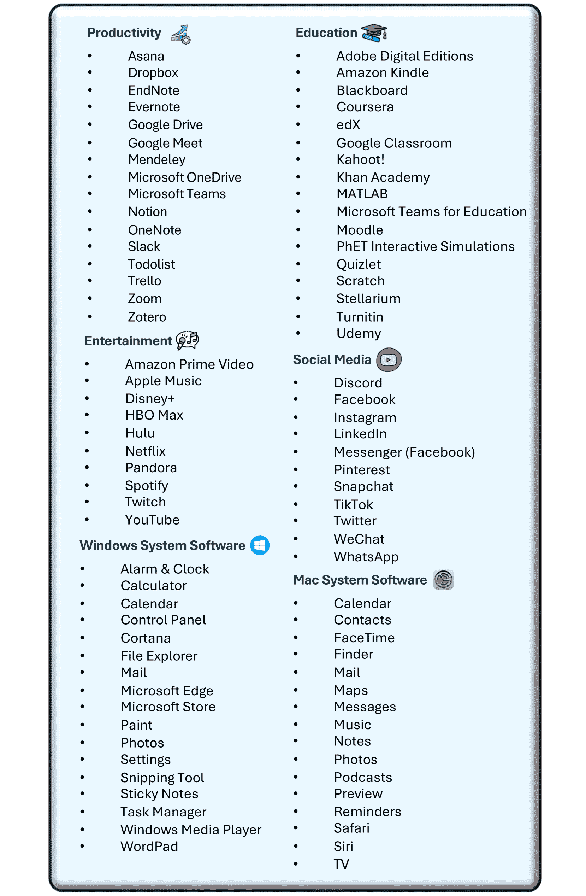

图9：GUI-World中的桌面软件列表。

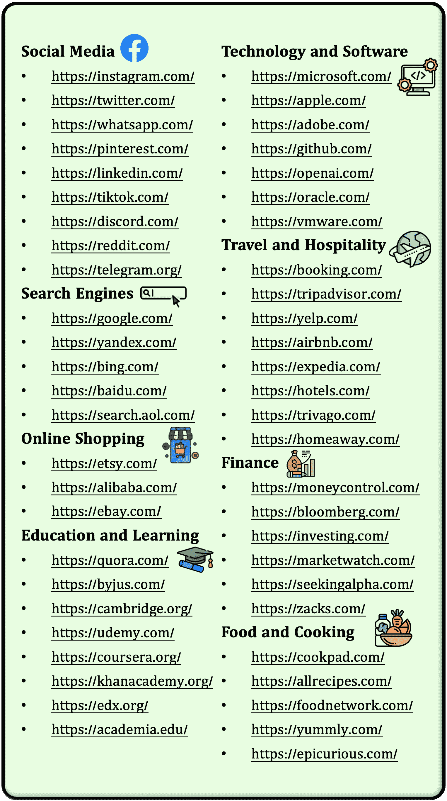

图10：GUI-World中的一些网站列表。

#### A.2 选择的网站/软件

在我们的研究中，我们选择了多种多样的网站和软件，以全面评估在不同用户场景下的 GUI 理解能力。这些选择涵盖了社交媒体、生产力工具、在线购物和教育平台等重要类别，提供了广泛的 GUI 环境。

如[图 9](https://arxiv.org/html/2406.10819v1#A1.F9 "图 9 ‣ A.1 六大主要 GUI 类别 ‣ 附录 A 数据集构建细节 ‣ 第一部分附录 ‣ GUI-World：一个面向 GUI 的多模态 LLM 代理数据集")所示，所选择的网站包括像 Instagram、Twitter 和 LinkedIn 这样的流行社交媒体平台，这些平台对于理解动态和互动的 GUI 元素至关重要。我们还包括了广泛使用的生产力工具，如 Microsoft Teams、Notion 和 Slack，用以评估在专业和协作环境中的 GUI 任务。

对于[图 10](https://arxiv.org/html/2406.10819v1#A1.F10 "图 10 ‣ A.1 六大主要 GUI 类别 ‣ 附录 A 数据集构建细节 ‣ 第一部分附录 ‣ GUI-World：一个面向 GUI 的多模态 LLM 代理数据集")中展示的软件，我们结合了像 Adobe Photoshop 和 MATLAB 这样的关键应用，来评估在专业和技术环境中的 GUI 操作。此外，还包括了像 Zoom 这样的在线视频会议工具和 Google Drive 这样的云存储服务，来代表常见的远程工作和文件管理场景。

这些选择确保我们的研究涵盖了广泛的用户交互和 GUI 复杂性，从而提供了对当前最先进的 MLLMs 在 GUI 理解中的方法的强有力评估，并全面构建了一个高质量的数据集。

#### A.3 人类关键帧注释过程

##### 注释人员信息

注释工作由本文的 16 位作者和 8 名志愿者独立完成。如已承认，注释人员的多样性在减少偏见和增强基准的可靠性方面起着至关重要的作用。这些注释人员在 GUI 领域具有知识，且涵盖了不同的性别、年龄和教育背景。注释人员的教育背景均为本科以上。为了确保注释人员能够熟练标记数据，我们为他们提供了详细的教程，教他们如何使用软件录制视频或编辑视频片段。我们还为每个注释过程提供了详细的标准和任务要求。

##### 录制视频。

对于自录视频，我们在 Windows 系统上使用 OBS³³3[https://obsproject.com/](https://obsproject.com/) 进行屏幕捕捉，在 Mac/IOS 系统上使用官方的屏幕录制工具包。此过程要求人工标注员在特定网站或应用程序内执行一系列针对性的操作，这些操作会被捕捉为原始视频素材。这些操作是日常使用中常见的，从而提高了我们数据集的可靠性。接着，原始视频会被切分成多个子视频，每个子视频包含多个操作（例如，点击一个按钮），以实现特定目标（例如，图像搜索）。然后，这些视频会被处理，提取关键帧并为其添加详细描述。

##### 基于 YouTube 视频的编辑。

对于从 YouTube 获取视频，我们使用一种搜索协议，格式为 "[网站名/应用名] + tutorial"，以汇总相关的视频列表。人工标注员首先会查看这些视频，了解它们展示的主要操作。然后，这些视频会被分割成多个子视频，每个子视频包含几个针对单一目标（例如，图像搜索）的操作。与自录的视频一样，这些片段也会经过处理，提取关键帧并为其添加描述性注释。

##### 关键帧注释。

在获取到 GUI 视频片段后，人工注释员会根据视频内容及当时的鼠标和键盘操作筛选出关键帧。他们还会标注两个关键帧之间的子操作或目标。注释完成后，标注员会对整个视频进行总体描述，总结视频中人类操作的主要目标。在所有信息注释完毕后，我们将使用大语言模型（LLM）来润色文本内容，减少人工标注员可能产生的错误，并调整句子结构。我们用于润色人工注释的 LLM 提示语，如[图 11](https://arxiv.org/html/2406.10819v1#A1.F11 "Figure 11 ‣ Human verifying GPT-4V annotated captions. ‣ A.3 Human Keyframes Annotation Process ‣ Appendix A Details of Dataset Construction ‣ Part I Appendix ‣ GUI-World: A Dataset for GUI-oriented Multimodal LLM-based Agents")和[图 12](https://arxiv.org/html/2406.10819v1#A1.F12 "Figure 12 ‣ Human verifying GPT-4V annotated captions. ‣ A.3 Human Keyframes Annotation Process ‣ Appendix A Details of Dataset Construction ‣ Part I Appendix ‣ GUI-World: A Dataset for GUI-oriented Multimodal LLM-based Agents")所示。

##### 人类-大语言模型（LLM）协作生成指令。

为了策划和完善每对视频-指令配对的黄金答案，考虑到 GPT-4V 的原始回应可能包含有害内容或幻觉。人类在黄金答案生成过程中的角色是提高问题的难度并删除有害和不正确的内容，具体如[表 8](https://arxiv.org/html/2406.10819v1#A1.T8 "Table 8 ‣ Human-LLM Cooperated Instruction Generation. ‣ A.3 Human Keyframes Annotation Process ‣ Appendix A Details of Dataset Construction ‣ Part I Appendix ‣ GUI-World: A Dataset for GUI-oriented Multimodal LLM-based Agents")所示。

表 8：GPT-4V 的原始答案与人类黄金答案的对比。

| GPT-4V 的原始回应 | 人类的黄金答案 |
| --- | --- |
| "Q": "在视频的静态 GUI 内容中，’Lifestyle’（生活方式）部分下可见哪些子类别？" | "Q": "在视频的静态 GUI 内容中，’Lifestyle’（生活方式）部分下可见哪些子类别？" |
| "A": "在 telegram.com 网站的 ’Lifestyle’（生活方式）部分，显现的子类别包括 ’Worcester Living’（伍斯特生活）、’Faith’（信仰）和 ’Food’（食物）。这些子类别在主 ’Lifestyle’ 类别标题下方以横向列表形式清晰显示，展示了用户可以在生活方式部分中探索的不同内容领域。" | "A": "在 telegram.com 网站的 ’Lifestyle’（生活方式）部分，显现的子类别包括 ’Worcester Living’（伍斯特生活）、’Faith’（信仰）和 ’Food’（食物）。这些子类别在主 ’Lifestyle’ 类别标题下方以横向列表形式显著展示，为用户提供了多个可供探索的生活方式内容领域。" |

##### 人类验证 GPT-4V 注释的说明。

我们通过选择 1,000 个由 GPT-4V 生成的详细描述和说明，对其注释质量进行了评估，并由人类注释员进行审查。98% 的高满意度反映了 GPT-4V 注释的质量和相关性。

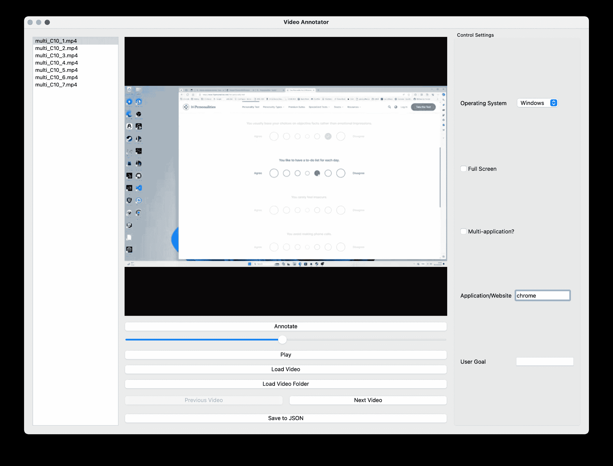

图 11：我们注释软件的整体预览。

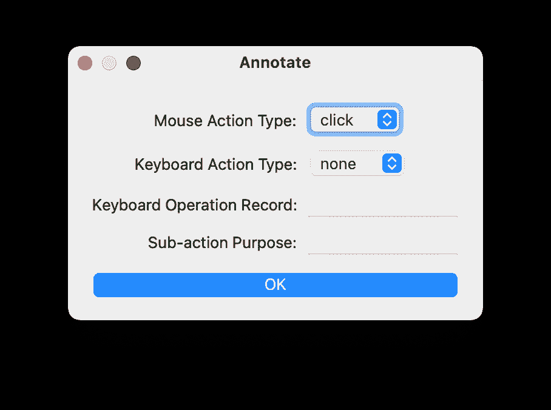

图 12：注释关键帧的界面，包括鼠标操作、键盘操作和简短的子操作目的。

### 附录 B 数据集分析

在本节中，我们提供了每个GUI场景中QA长度分布的分析，如[图13](https://arxiv.org/html/2406.10819v1#A2.F13 "图13 ‣ 附录B 数据集分析 ‣ 第一部分附录 ‣ GUI-World：一个面向GUI的多模态LLM基础的代理数据集")和[图14](https://arxiv.org/html/2406.10819v1#A2.F14 "图14 ‣ 附录B 数据集分析 ‣ 第一部分附录 ‣ GUI-World：一个面向GUI的多模态LLM基础的代理数据集")所示。关注顺序性和预测性任务的问题比其他类型的问题稍长，而静态任务的黄金答案通常更长。各种GUI场景中的问答对长度分布相似，Android环境中的问题稍短，而XR环境中的答案则稍长。

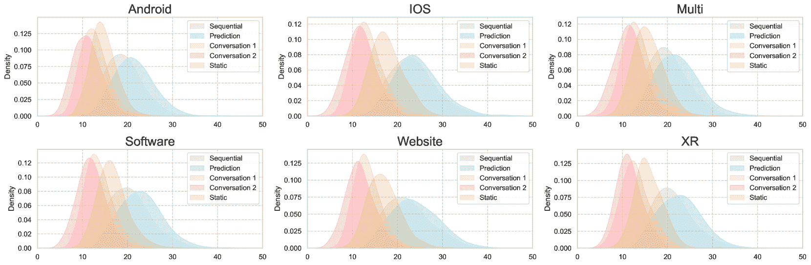

图13：自由形式问题的长度分布。

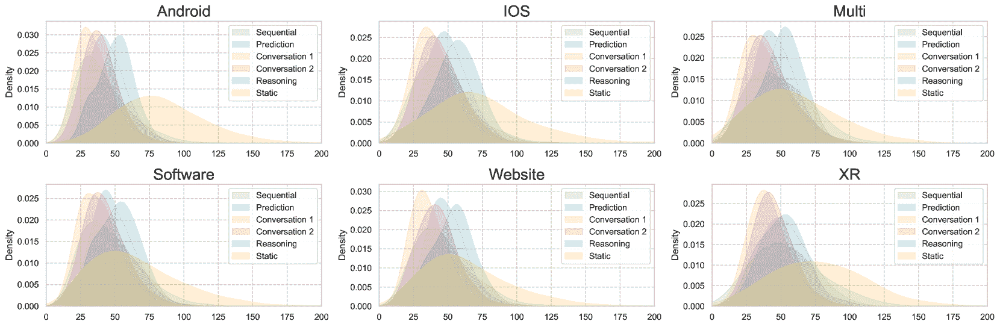

图14：自由形式问题答案的长度分布。

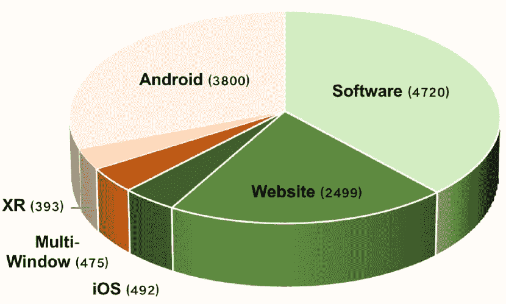

图15：GUI-World中不同GUI场景的统计数据。

### 附录C 实验设置详情

#### C.1 微调数据集构建

我们使用两种设置来微调GUI-Vid，一种仅使用视频-文本对，另一种则使用视频-文本和图像-文本对，所有这些都是GUI内容：

+   •

    仅视频。在此设置中，我们仅使用GUI-World中的视频-文本对来训练GUI-Vid，如[表9](https://arxiv.org/html/2406.10819v1#A3.T9 "表9 ‣ C.1 微调数据集构建 ‣ 附录C 实验设置详情 ‣ 第一部分附录 ‣ GUI-World：一个面向GUI的多模态LLM基础的代理数据集")所示。

+   •

    视频-图像。受到Videochat2预训练过程的启发，我们加入了图像-文本对来帮助视觉编码器对齐GUI知识。这些图像来自我们的GUI-World、MetaGUI [[14](https://arxiv.org/html/2406.10819v1#bib.bib14)] 和 OmniAct [[21](https://arxiv.org/html/2406.10819v1#bib.bib21)]，用于提供高质量的GUI内容。随后，我们使用GPT-4V为每个图像生成详细描述和简洁标题。最后，我们构建了一个包含视频-文本和图像-文本对的数据集，以获取全面的面向GUI的能力。

表9：仅视频微调数据集。

| 阶段 | 数据类型 | 数量 |
| --- | --- | --- |
| 1 | 详细描述 | 14,276 |
| 简洁标题 | 7,138 |
| 2 | GUI VQA | 21,414 |
| 多选QA | 14,276 |
| 对话 | 7,138 |

表10：视频-图像微调数据集。

| 阶段 | 数据类型 | 来源 | 类型 | 数量 |
| --- | --- | --- | --- | --- |
| 1 | GUI-World | 视频 | 详细描述 | 14,276 |
| 简洁标题 | 7,138 |
| 图像 | 详细描述 | 5,555 |
| 简洁标题 | 5,555 |
| MetaGUI | 图像 | 详细描述 | 19,626 |
| 简洁标题 | 19,626 |
| OmniAct | 详细描述 | 260 |
| 简洁标题 | 260 |
| 2 | GUI-World | 视频 | GUI VQA | 21,414 |
| 多项选择 QA | 14,276 |
| 会话 | 7,138 |

#### C.2 超参数设置

在本节中，我们将介绍MLLM的超参数，以便于实验的可重复性和透明性。我们将其分为三个部分：基准测试和数据集构建阶段的推理，LLM作为裁判阶段，以及微调阶段。我们的所有实验都在配备双A800和双4090 GPU的服务器上进行。

##### 推理。

我们经验性地研究了7个MLLM，包括4个图像-LLM和3个视频-LLM，其超参数详细信息如下：

+   •

    GPT-4V [[1](https://arxiv.org/html/2406.10819v1#bib.bib1)] 和 GPT-4o [[40](https://arxiv.org/html/2406.10819v1#bib.bib40)]：我们将温度和top-p设置为0.9，最大token数为2048，并且所有输入图像都在指令数据集构建和基准测试中设置为高质量。

+   •

    Gemini-Pro-1.5 [[42](https://arxiv.org/html/2406.10819v1#bib.bib42)]：我们使用默认设置，温度为0.4，top-p为1，最大token数为2048。需要注意的是，在我们的项目期间，Gemini-Pro-1.5仍处于用户请求限制中，每天仅提供100个请求，这使得我们的基准测试变得困难。鉴于Gemini尚未推出按需付费服务⁴⁴[https://ai.google.dev/pricing](https://ai.google.dev/pricing)，我们将尽快提供基准测试结果的“人工”设置。

+   •

    Qwen-VL-Max [[41](https://arxiv.org/html/2406.10819v1#bib.bib41)]：我们使用Qwen-VL-Max的默认设置，top-p为0.8，最大token数为2048。考虑到Qwen的输入上下文窗口仅为6,000，我们将所有图像的分辨率缩放至0.3。

+   •

    ChatUnivi [[44](https://arxiv.org/html/2406.10819v1#bib.bib44)]：我们使用基于Vicuna-v0-7B构建的ChatUnivi-7B，并设置最大帧数为100，温度为0.2，最大token数为1024。

+   •

    Minigpt4video [[45](https://arxiv.org/html/2406.10819v1#bib.bib45)]：我们使用该模型的建议设置⁵⁵[https://github.com/Vision-CAIR/MiniGPT4-video](https://github.com/Vision-CAIR/MiniGPT4-video)，并将最大帧数设置为45，仅修改了最大token数为1024。

+   •

    VideoChat2 & GUI-Vid [[46](https://arxiv.org/html/2406.10819v1#bib.bib46)]：为了公平比较，我们为VideoChat2和GUI-Vid设置了相同的超参数。我们将最大token数设置为1024，top-p为0.9，温度为1.0，最大帧数为8/16，重复惩罚系数为1.2，长度惩罚系数为1.2。

##### LLM作为裁判。

我们研究了四个LLM作为裁判，对MLLM的响应和真实答案进行相似性评分，分别是GPT-4 [[52](https://arxiv.org/html/2406.10819v1#bib.bib52)]，ChatGPT [[96](https://arxiv.org/html/2406.10819v1#bib.bib96)]，LLaMA-3-70b-instruct [[54](https://arxiv.org/html/2406.10819v1#bib.bib54)]，以及Mixtral-8x22b-instruct-v0.1 [[55](https://arxiv.org/html/2406.10819v1#bib.bib55)]。超参数设置如下：

+   •

    GPT-4 和 ChatGPT。我们将温度设置为 0.6，其他设置为默认。

+   •

    LLaMA-3-70b-instruct。我们将温度设置为 0.6，top-p 设置为 0.9，top-k 设置为 50。

+   •

    Mixtral-8x22b-instruct-v0.1。我们将 top-p 设置为 0.7，top-k 设置为 50，温度设置为 0.7。

##### 微调。

我们在实验设置和消融研究中包括了多个超参数设置，如 [表 11](https://arxiv.org/html/2406.10819v1#A3.T11 "表 11 ‣ 微调。 ‣ C.2 超参数设置 ‣ 附录 C 实验设置详情 ‣ 第一部分附录 ‣ GUI-World: 一个面向 GUI 的多模态 LLM 基础代理数据集") 所示。

表 11：微调的配置设置。

| 配置 | 设置 |
| --- | --- |
| 输入帧 | 8 |
| 输入分辨率 | 224 |
| 最大文本长度 | 512 |
| 输入模态 | I. + V. |
| 优化器 | AdamW |
| 优化器动量 | $\beta_{1},\beta_{2}=0.9,0.999$ |
| 权重衰减 | 0.02 |
| 学习率调度 | 余弦衰减 |
| 学习率 | 2e-5 |
| 批量大小 | 4 |
| 预热轮次 | 0.6 |
| 总训练轮次 | 3 |
| 主干丢弃路径 | 0 |
| QFormer 丢弃路径 | 0.1 |
| QFormer 丢弃率 | 0.1 |
| QFormer token | 96 |
| 翻转数据增强 | 是 |
| 数据增强 | MultiScaleCrop [0.5, 1] |

表 12：评估 LLM-as-a-Judge 作为人类评分替代的评估设置。

| 模型 | Pearson($\uparrow$) | Spearman($\uparrow$) | Kendall($\uparrow$) | 每基准价格($\downarrow$) |
| --- | --- | --- | --- | --- |
| GPT-4 | 0.856 | 0.853 | 0.793 | $120$$ |
| ChatGPT | 0.706 | 0.714 | 0.627 | 12$ |
| Llama-3-70b-instruct | 0.774 | 0.772 | 0.684 | 12$ |
| Mixtral-8x22b-instruct-v0.1 | 0.759 | 0.760 | 0.670 | $15$$ |

#### C.3 评估。

考虑到 GUI 场景中自由形式答案的复杂性，评估包括 GUI 元素的特定位置、文本内容，并将响应与黄金答案进行比较。LLM-as-a-judge 已在以往的研究中广泛应用于复杂的评估任务 [[47](https://arxiv.org/html/2406.10819v1#bib.bib47), [48](https://arxiv.org/html/2406.10819v1#bib.bib48)]。因此，我们在类似的设置中利用 LLM-as-a-Judge [[47](https://arxiv.org/html/2406.10819v1#bib.bib47)]，该设置将 MLLM 的响应与黄金答案进行比较。我们仔细评估了利用 LLM-as-a-Judge 的可行性，选择了 1,000 个样本，涵盖了数据集中提到的 6 个自由形式问题。如 [表 12](https://arxiv.org/html/2406.10819v1#A3.T12 "表 12 ‣ 微调。 ‣ C.2 超参数设置 ‣ 附录 C 实验设置详情 ‣ 第一部分附录 ‣ GUI-World: 一个面向 GUI 的多模态 LLM 基础代理数据集") 所示，GPT-4 在提供响应与黄金答案的相似性评分方面表现优于其他 LLM，尽管其成本约为其他模型的 10 倍。

### 附录 D 额外实验结果

在本节中，我们提供了每个任务在每个GUI场景中的详细结果。对于字幕任务，[表格 13](https://arxiv.org/html/2406.10819v1#A4.T13 "Table 13 ‣ Appendix D Additional Experiments Results ‣ Part I Appendix ‣ GUI-World: A Dataset for GUI-oriented Multimodal LLM-based Agents")展示了六个场景中的综合实验结果。对于LLM作为评判者在特定任务中的得分，请参见[表格 14](https://arxiv.org/html/2406.10819v1#A4.T14 "Table 14 ‣ Appendix D Additional Experiments Results ‣ Part I Appendix ‣ GUI-World: A Dataset for GUI-oriented Multimodal LLM-based Agents")、[表格 15](https://arxiv.org/html/2406.10819v1#A4.T15 "Table 15 ‣ Appendix D Additional Experiments Results ‣ Part I Appendix ‣ GUI-World: A Dataset for GUI-oriented Multimodal LLM-based Agents")、[表格 16](https://arxiv.org/html/2406.10819v1#A4.T16 "Table 16 ‣ Appendix D Additional Experiments Results ‣ Part I Appendix ‣ GUI-World: A Dataset for GUI-oriented Multimodal LLM-based Agents")、[表格 17](https://arxiv.org/html/2406.10819v1#A4.T17 "Table 17 ‣ Appendix D Additional Experiments Results ‣ Part I Appendix ‣ GUI-World: A Dataset for GUI-oriented Multimodal LLM-based Agents")和[表格 18](https://arxiv.org/html/2406.10819v1#A4.T18 "Table 18 ‣ Appendix D Additional Experiments Results ‣ Part I Appendix ‣ GUI-World: A Dataset for GUI-oriented Multimodal LLM-based Agents")。对于在验证自由形式和对话式问题中的BLEU [[50](https://arxiv.org/html/2406.10819v1#bib.bib50)]和BERTScore [[51](https://arxiv.org/html/2406.10819v1#bib.bib51)]，请参见[表格 19](https://arxiv.org/html/2406.10819v1#A4.T19 "Table 19 ‣ Appendix D Additional Experiments Results ‣ Part I Appendix ‣ GUI-World: A Dataset for GUI-oriented Multimodal LLM-based Agents")、[表格 20](https://arxiv.org/html/2406.10819v1#A4.T20 "Table 20 ‣ Appendix D Additional Experiments Results ‣ Part I Appendix ‣ GUI-World: A Dataset for GUI-oriented Multimodal LLM-based Agents")、[表格 21](https://arxiv.org/html/2406.10819v1#A4.T21 "Table 21 ‣ Appendix D Additional Experiments Results ‣ Part I Appendix ‣ GUI-World: A Dataset for GUI-oriented Multimodal LLM-based Agents")、[表格 24](https://arxiv.org/html/2406.10819v1#A4.T24 "Table 24 ‣ Appendix D Additional Experiments Results ‣ Part I Appendix ‣ GUI-World: A Dataset for GUI-oriented Multimodal LLM-based Agents")、[表格 22](https://arxiv.org/html/2406.10819v1#A4.T22 "Table 22 ‣ Appendix D Additional Experiments Results ‣ Part I Appendix ‣ GUI-World: A Dataset for GUI-oriented Multimodal LLM-based Agents")和[表格 23](https://arxiv.org/html/2406.10819v1#A4.T23 "Table 23 ‣ Appendix D Additional Experiments Results ‣ Part I Appendix ‣ GUI-World: A Dataset for GUI-oriented Multimodal LLM-based Agents")。对于细粒度（应用层级）的表现，请参见[图 16](https://arxiv.org/html/2406.10819v1#A4.F16 "Figure 16 ‣ Appendix D Additional Experiments Results ‣ Part I Appendix ‣ GUI-World: A Dataset for GUI-oriented Multimodal LLM-based Agents")中的Gemini-Pro和[图 17](https://arxiv.org/html/2406.10819v1#A4.F17 "Figure 17 ‣ Appendix D Additional Experiments Results ‣ Part I Appendix ‣ GUI-World: A Dataset for GUI-oriented Multimodal LLM-based Agents")中的Qwen-VL-Max。

表 13：六个 GUI 场景中标题（Cap.）和描述（Des.）任务的得分。

| 模型 | 设置 | 软件 | 网站 | XR | 多平台 | iOS | 安卓 | 平均 |
| --- | --- | --- | --- | --- | --- | --- | --- | --- |
| Cap. | Des. | Cap. | Des. | Cap. | Des. | Cap. | Des. | Cap. | Des. | Cap. | Des. | Cap. | Des. |
| Gemini-Pro-1.5 | R. | 3.659 | 2.837 | 3.613 | 2.860 | 2.995 | 2.590 | 3.276 | 2.470 | 3.678 | 2.936 | - | - | 3.444 | 2.739 |
| E. | 3.350 | 2.468 | 3.159 | 2.422 | 2.837 | 2.279 | 2.824 | 2.109 | 3.394 | 2.519 | 3.185 | 2.312 | 3.125 | 2.351 |
| Qwen-VL-Max | R. | 2.381 | 1.758 | 2.326 | 1.681 | 2.172 | 1.772 | 2.035 | 1.463 | 2.513 | 1.662 | 2.141 | 1.565 | 2.261 | 1.650 |
| E. | 2.459 | 1.693 | 2.317 | 1.599 | 2.167 | 1.638 | 2.190 | 1.438 | 2.189 | 1.615 | 2.002 | 1.429 | 2.221 | 1.569 |
| H. | 2.474 | 1.711 | 2.457 | 1.698 | 2.383 | 1.777 | 1.910 | 1.346 | 2.577 | 1.795 | 2.474 | 1.711 | 2.360 | 1.665 |
| GPT-4V | R. | 3.579 | 2.676 | 3.612 | 2.699 | 2.975 | 2.525 | 3.281 | 2.661 | 3.757 | 2.775 | 3.655 | 2.755 | 3.479 | 2.682 |
| E. | 3.141 | 2.301 | 3.293 | 2.380 | 2.471 | 2.085 | 3.063 | 2.324 | 3.624 | 2.611 | 3.201 | 2.312 | 3.132 | 2.335 |
| H. | 3.352 | 2.509 | 3.702 | 2.750 | 3.050 | 3.556 | 3.524 | 2.673 | 3.670 | 2.588 | - | - | 3.460 | 2.614 |
| GPT-4o | H. | 4.048 | 3.028 | 4.067 | 3.233 | 3.398 | 2.729 | 3.869 | 3.111 | 4.014 | 2.993 | 4.071 | 3.095 | 3.911 | 3.869 |
| ChatUnivi | - | 1.587 | 1.240 | 1.569 | 1.254 | 1.417 | 1.148 | 1.575 | 1.267 | 1.480 | 1.146 | 1.778 | 1.249 | 1.568 | 1.217 |
| Minigpt4Video | - | 1.246 | 1.073 | 1.200 | 1.057 | 1.320 | 1.106 | 1.130 | 1.034 | 1.190 | 1.076 | 1.184 | 1.061 | 1.212 | 1.068 |
| VideoChat2 | - | 1.992 | 1.312 | 1.817 | 1.307 | 1.838 | 1.426 | 2.222 | 1.433 | 2.169 | 1.270 | 2.119 | 1.294 | 1.900 | 1.340 |
| GUI-Vid | - | 3.562 | 2.085 | 3.655 | 2.167 | 3.747 | 2.153 | 3.370 | 1.742 | 3.566 | 2.071 | 2.662 | 1.248 | 3.427 | 1.911 |

表 14：网站场景中每个任务的详细评分。

| 模型 | 设置 | 静态 | 顺序 | 预测 | 对话1 | 对话2 | 平均 |
| --- | --- | --- | --- | --- | --- | --- | --- |
| Gemini-Pro-1.5 | R. | 3.279 | 3.050 | 3.560 | 3.579 | 3.796 | 3.452 |
| E. | 2.983 | 2.491 | 3.432 | 3.405 | 3.760 | 3.215 |
| Qwen-VL-Max | R. | 2.317 | 2.271 | 2.802 | 2.995 | 3.069 | 2.656 |
| E. | 2.256 | 2.198 | 2.821 | 2.861 | 3.144 | 2.627 |
| H. | 2.308 | 2.078 | 2.832 | 3.061 | 3.358 | 2.698 |
| GPT-4V | R. | 3.461 | 3.214 | 3.754 | 3.778 | 4.029 | 3.648 |
| E. | 3.197 | 2.808 | 3.487 | 3.717 | 3.954 | 3.433 |
| H. | 3.498 | 3.255 | 3.727 | 3.731 | 4.061 | 3.655 |
| C.C. | 1.746 | 2.738 | 3.645 | 3.363 | 3.632 | 3.025 |
| D.C. | 2.704 | 2.917 | 3.686 | 3.680 | 3.901 | 3.380 |
| H.+D.C. | 3.313 | 3.221 | 3.852 | 3.850 | 4.171 | 3.682 |
| GPT-4o | H. | 3.443 | 3.373 | 3.672 | 4.086 | 4.122 | 3.740 |
| ChatUnivi | - | 1.701 | 1.668 | 2.524 | 2.514 | 3.338 | 2.349 |
| Minigpt4Video | - | 1.309 | 1.233 | 1.766 | 1.439 | 1.854 | 1.520 |
| VideoChat2 | - | 1.771 | 1.777 | 2.288 | 2.461 | 2.812 | 2.221 |
| GUI-Vid | - | 2.406 | 2.341 | 3.544 | 3.135 | 3.355 | 2.957 |

| 表15：XR场景下每个任务的详细分数。 |

| 模型 | 设置 | 静态 | 顺序 | 预测 | 对话1 | 对话2 | 平均 |
| --- | --- | --- | --- | --- | --- | --- | --- |
| Gemini-Pro-1.5 | R. | 2.892 | 2.505 | 3.543 | 3.222 | 3.611 | 3.154 |
| E. | 2.814 | 2.163 | 3.510 | 3.108 | 3.455 | 3.006 |
| Qwen-VL-Max | R. | 2.047 | 1.968 | 2.712 | 2.879 | 3.132 | 2.469 |
| E. | 2.125 | 1.973 | 2.658 | 2.760 | 3.029 | 2.499 |
| H. | 1.886 | 1.920 | 2.656 | 2.727 | 3.012 | 2.373 |
| GPT-4V | R. | 2.934 | 2.668 | 3.392 | 3.291 | 3.714 | 3.200 |
| E. | 2.222 | 2.153 | 3.310 | 3.151 | 3.618 | 2.892 |
| H. | 2.893 | 2.778 | 3.538 | 3.364 | 3.747 | 3.265 |
| C.C. | 1.744 | 2.412 | 3.327 | 3.080 | 3.485 | 2.809 |
| D.C. | 2.427 | 2.409 | 3.518 | 3.176 | 3.749 | 3.056 |
| H.+D.C. | 2.775 | 2.635 | 3.580 | 3.235 | 3.734 | 3.191 |
| GPT-4o | H. | 2.871 | 2.745 | 3.370 | 3.596 | 3.836 | 3.285 |
| ChatUnivi | - | 1.660 | 1.420 | 2.205 | 2.250 | 3.270 | 2.161 |
| Minigpt4Video | - | 1.225 | 1.161 | 1.610 | 1.347 | 1.465 | 1.362 |
| VideoChat2 | - | 1.654 | 1.547 | 2.192 | 2.099 | 2.529 | 2.005 |
| GUI-Vid | - | 2.444 | 2.147 | 3.347 | 2.836 | 3.036 | 2.764 |

| 表16：多窗口场景下每个任务的详细分数。 |

| 模型 | 设置 | 静态 | 顺序 | 预测 | 对话1 | 对话2 | 平均 |
| --- | --- | --- | --- | --- | --- | --- | --- |
| Gemini-Pro-1.5 | R. | 2.538 | 2.410 | 3.296 | 3.152 | 3.402 | 2.959 |
| E. | 2.545 | 2.049 | 2.972 | 2.930 | 3.389 | 2.777 |
| Qwen-VL-Max | R. | 1.793 | 1.872 | 2.770 | 2.897 | 3.122 | 2.432 |
| E. | 1.866 | 1.780 | 2.730 | 2.627 | 3.105 | 2.362 |
| H. | 1.884 | 1.969 | 2.913 | 2.689 | 3.104 | 2.490 |
| GPT-4V | R. | 3.185 | 2.655 | 3.745 | 3.699 | 3.973 | 3.452 |
| E. | 2.902 | 2.406 | 3.636 | 3.420 | 3.729 | 3.219 |
| H. | 3.000 | 2.952 | 3.801 | 3.597 | 3.889 | 3.449 |
| C.C. | 2.097 | 2.973 | 3.774 | 3.331 | 3.621 | 3.160 |
| D.C. | 2.671 | 2.979 | 3.849 | 3.466 | 3.822 | 3.358 |
| H.+D.C. | 3.037 | 3.162 | 4.079 | 3.748 | 4.036 | 3.617 |
| GPT-4o | H. | 3.108 | 3.106 | 3.829 | 4.043 | 4.188 | 3.654 |
| ChatUnivi | - | 1.658 | 1.623 | 2.514 | 2.384 | 3.199 | 2.275 |
| Minigpt4Video | - | 1.205 | 1.186 | 1.690 | 1.400 | 1.801 | 1.457 |
| VideoChat2 | - | 1.754 | 1.774 | 2.479 | 2.420 | 2.699 | 2.222 |
| GUI-Vid | - | 2.485 | 2.067 | 3.537 | 2.954 | 3.247 | 2.861 |

| 表17：IOS场景下每个任务的详细分数。 |

| 模型 | 设置 | 静态 | 顺序 | 预测 | 对话1 | 对话2 | 平均 |
| --- | --- | --- | --- | --- | --- | --- | --- |
| Gemini-Pro-1.5 | R. | 3.076 | 2.637 | 3.370 | 3.366 | 3.615 | 3.213 |
| E. | 2.852 | 2.356 | 3.137 | 3.126 | 3.566 | 3.007 |
| Qwen-VL-Max | R. | 2.438 | 2.244 | 2.923 | 3.102 | 3.273 | 2.779 |
| E. | 2.303 | 2.150 | 2.614 | 3.145 | 3.264 | 2.659 |
| H. | 1.884 | 1.969 | 2.913 | 2.689 | 3.104 | 2.490 |
| GPT-4V | R. | 3.364 | 3.080 | 3.684 | 3.766 | 4.184 | 3.614 |
| E. | 3.209 | 2.774 | 3.545 | 3.611 | 4.006 | 3.427 |
| H. | 3.107 | 2.830 | 3.631 | 3.680 | 4.011 | 3.453 |
| C.C. | 1.788 | 2.291 | 3.511 | 3.212 | 3.542 | 2.868 |
| D.C. | 2.751 | 2.732 | 3.654 | 3.642 | 3.842 | 3.324 |
| H.+D.C. | 3.090 | 2.965 | 3.740 | 3.786 | 3.994 | 3.516 |
| GPT-4o | H. | 3.183 | 2.993 | 3.460 | 4.050 | 4.141 | 3.558 |
| ChatUnivi | - | 1.771 | 1.642 | 2.408 | 2.559 | 3.307 | 2.337 |
| Minigpt4Video | - | 1.291 | 1.219 | 1.698 | 1.556 | 1.737 | 1.501 |
| VideoChat2 | - | 1.955 | 1.803 | 2.145 | 2.315 | 2.626 | 2.169 |
| GUI-Vid | - | 2.262 | 2.133 | 3.401 | 2.843 | 3.224 | 2.773 |

表 18：Android 场景中每个任务的详细分数。

| 模型 | 设置 | 静态 | 顺序 | 预测 | 对话1 | 对话2 | 平均 |
| --- | --- | --- | --- | --- | --- | --- | --- |
| Gemini-Pro-1.5 | E. | 2.703 | 2.460 | 3.157 | 3.642 | 3.881 | 3.168 |
| Qwen-VL-Max | R. | 1.887 | 1.804 | 2.398 | 2.823 | 3.056 | 2.309 |
| E. | 1.785 | 1.630 | 2.311 | 2.605 | 3.233 | 2.277 |
| GPT-4V | R. | 3.116 | 3.047 | 3.477 | 3.924 | 4.008 | 3.515 |
| E. | 2.705 | 2.470 | 3.175 | 3.647 | 3.885 | 3.176 |
| C.C. | 2.092 | 2.243 | 3.139 | 3.443 | 3.782 | 2.939 |
| D.C. | 3.015 | 2.890 | 3.357 | 3.883 | 3.990 | 3.427 |
| GPT-4o | H. | 3.057 | 3.220 | 3.373 | 3.981 | 4.186 | 3.561 |
| ChatUnivi | - | 1.835 | 1.654 | 2.317 | 2.712 | 3.433 | 2.390 |
| Minigpt4Video | - | 1.183 | 1.159 | 1.507 | 1.342 | 1.521 | 1.342 |
| VideoChat2 | - | 1.732 | 1.754 | 2.125 | 2.340 | 2.645 | 2.119 |
| GUI-Vid | - | 2.010 | 1.928 | 3.053 | 2.755 | 3.105 | 2.572 |

表 19：软件场景中的详细 BLEU 和 BERTScore（B.S.）分数。

| 模型 | 设置 | 静态 | 顺序 | 预测 | 描述 | 标题 | 对话 | 平均 |
| --- | --- | --- | --- | --- | --- | --- | --- | --- |
| BLEU | B.S. | BLEU | B.S. | BLEU | B.S. | BLEU | B.S. | BLEU | B.S. | BLEU | B.S. | BLEU | B.S. |
| Gemini-Pro-1.5 | R. | 0.109 | 0.789 | 0.150 | 0.720 | 0.078 | 0.680 | 0.056 | 0.716 | 0.016 | 0.605 | 0.122 | 0.761 | 0.089 | 0.712 |
| E. | 0.093 | 0.758 | 0.134 | 0.699 | 0.072 | 0.659 | 0.046 | 0.682 | 0.011 | 0.558 | 0.106 | 0.747 | 0.077 | 0.684 |
| Qwen-VL-Max | R. | 0.085 | 0.698 | 0.101 | 0.649 | 0.064 | 0.576 | 0.010 | 0.521 | 0.008 | 0.443 | 0.121 | 0.749 | 0.065 | 0.606 |
| E. | 0.094 | 0.704 | 0.103 | 0.633 | 0.062 | 0.595 | 0.009 | 0.524 | 0.006 | 0.437 | 0.113 | 0.739 | 0.065 | 0.605 |
| H. | 0.081 | 0.676 | 0.098 | 0.620 | 0.067 | 0.596 | 0.009 | 0.504 | 0.004 | 0.429 | 0.117 | 0.743 | 0.063 | 0.595 |
| GPT-4V | R. | 0.162 | 0.814 | 0.206 | 0.753 | 0.190 | 0.739 | 0.041 | 0.676 | 0.033 | 0.581 | 0.181 | 0.793 | 0.136 | 0.726 |
| E. | 0.161 | 0.792 | 0.191 | 0.726 | 0.175 | 0.724 | 0.030 | 0.609 | 0.017 | 0.486 | 0.165 | 0.786 | 0.123 | 0.687 |
| H. | 0.153 | 0.805 | 0.194 | 0.737 | 0.183 | 0.731 | 0.037 | 0.639 | 0.025 | 0.537 | 0.179 | 0.791 | 0.129 | 0.707 |
| GPT-4o | H. | 0.131 | 0.806 | 0.212 | 0.776 | 0.147 | 0.728 | 0.041 | 0.711 | 0.018 | 0.575 | 0.159 | 0.803 | 0.118 | 0.733 |
| ChatUnivi | - | 0.097 | 0.697 | 0.074 | 0.581 | 0.101 | 0.619 | 0.005 | 0.409 | 0.000 | 0.195 | 0.084 | 0.723 | 0.060 | 0.537 |
| Minigpt4Video | - | 0.019 | 0.516 | 0.022 | 0.470 | 0.029 | 0.516 | 0.000 | 0.399 | 0.000 | 0.249 | 0.013 | 0.510 | 0.014 | 0.443 |
| VideoChat2 | - | 0.095 | 0.698 | 0.080 | 0.595 | 0.076 | 0.574 | 0.004 | 0.341 | 0.000 | 0.193 | 0.100 | 0.733 | 0.059 | 0.523 |
| GUI-Vid | - | 0.142 | 0.758 | 0.145 | 0.681 | 0.114 | 0.698 | 0.049 | 0.658 | 0.004 | 0.519 | 0.093 | 0.717 | 0.091 | 0.672 |

表 20: 网站场景中的 BLEU 和 BERTScore（B.S.）详细信息。

| 模型 | 设置 | 静态 | 顺序 | 预测 | 描述 | 字幕 | 对话 | 平均 |
| --- | --- | --- | --- | --- | --- | --- | --- | --- |
| BLEU | B.S. | BLEU | B.S. | BLEU | B.S. | BLEU | B.S. | BLEU | B.S. | BLEU | B.S. | BLEU | B.S. |
| Gemini-Pro-1.5 | R. | 0.113 | 0.793 | 0.145 | 0.727 | 0.083 | 0.676 | 0.054 | 0.720 | 0.016 | 0.664 | 0.098 | 0.736 | 0.085 | 0.719 |
| E. | 0.095 | 0.754 | 0.121 | 0.681 | 0.079 | 0.661 | 0.041 | 0.676 | 0.011 | 0.602 | 0.092 | 0.725 | 0.073 | 0.683 |
| Qwen-VL-Max | R. | 0.099 | 0.728 | 0.099 | 0.634 | 0.080 | 0.610 | 0.008 | 0.519 | 0.005 | 0.471 | 0.085 | 0.694 | 0.063 | 0.609 |
| E. | 0.083 | 0.710 | 0.101 | 0.631 | 0.093 | 0.611 | 0.011 | 0.503 | 0.004 | 0.469 | 0.099 | 0.709 | 0.065 | 0.605 |
| H. | 0.079 | 0.693 | 0.089 | 0.597 | 0.093 | 0.606 | 0.009 | 0.488 | 0.007 | 0.449 | 0.103 | 0.705 | 0.063 | 0.590 |
| GPT-4V | R. | 0.173 | 0.830 | 0.241 | 0.765 | 0.205 | 0.751 | 0.040 | 0.694 | 0.032 | 0.645 | 0.164 | 0.763 | 0.142 | 0.741 |
| E. | 0.159 | 0.802 | 0.204 | 0.727 | 0.202 | 0.727 | 0.033 | 0.648 | 0.031 | 0.590 | 0.149 | 0.757 | 0.130 | 0.708 |
| H. | 0.182 | 0.823 | 0.234 | 0.771 | 0.213 | 0.758 | 0.043 | 0.696 | 0.041 | 0.660 | 0.165 | 0.768 | 0.147 | 0.746 |
| GPT-4o | H. | 0.141 | 0.813 | 0.219 | 0.768 | 0.199 | 0.731 | 0.054 | 0.700 | 0.026 | 0.602 | 0.146 | 0.755 | 0.131 | 0.728 |
| ChatUnivi | - | 0.078 | 0.645 | 0.068 | 0.581 | 0.102 | 0.607 | 0.008 | 0.399 | 0.000 | 0.192 | 0.061 | 0.661 | 0.053 | 0.514 |
| Minigpt4Video | - | 0.022 | 0.527 | 0.016 | 0.448 | 0.027 | 0.501 | 0.000 | 0.344 | 0.000 | 0.186 | 0.011 | 0.522 | 0.013 | 0.421 |
| VideoChat2 | - | 0.073 | 0.619 | 0.075 | 0.579 | 0.049 | 0.511 | 0.004 | 0.328 | 0.000 | 0.167 | 0.067 | 0.678 | 0.045 | 0.480 |
| GUI-Vid | - | 0.114 | 0.731 | 0.158 | 0.674 | 0.129 | 0.694 | 0.049 | 0.667 | 0.002 | 0.553 | 0.075 | 0.681 | 0.088 | 0.667 |

表 21: XR 场景中的 BLEU 和 BERTScore（B.S.）详细信息。

| 模型 | 设置 | 静态 | 顺序 | 预测 | 描述 | 字幕 | 对话 | 平均 |
| --- | --- | --- | --- | --- | --- | --- | --- | --- |
| BLEU | B.S. | BLEU | B.S. | BLEU | B.S. | BLEU | B.S. | BLEU | B.S. | BLEU | B.S. | BLEU | B.S. |
| Gemini-Pro-1.5 | R. | 0.088 | 0.772 | 0.101 | 0.678 | 0.070 | 0.678 | 0.026 | 0.650 | 0.002 | 0.463 | 0.082 | 0.733 | 0.062 | 0.662 |
| E. | 0.073 | 0.760 | 0.090 | 0.651 | 0.062 | 0.666 | 0.015 | 0.618 | 0.002 | 0.449 | 0.084 | 0.720 | 0.054 | 0.644 |
| Qwen-VL-Max | R. | 0.069 | 0.703 | 0.075 | 0.602 | 0.049 | 0.601 | 0.006 | 0.486 | 0.000 | 0.338 | 0.117 | 0.738 | 0.053 | 0.578 |
| E. | 0.048 | 0.689 | 0.079 | 0.657 | 0.058 | 0.605 | 0.005 | 0.498 | 0.000 | 0.359 | 0.112 | 0.739 | 0.050 | 0.591 |
| H. | 0.051 | 0.651 | 0.073 | 0.593 | 0.044 | 0.591 | 0.004 | 0.493 | 0.001 | 0.357 | 0.101 | 0.726 | 0.046 | 0.569 |
| GPT-4V | R. | 0.093 | 0.794 | 0.169 | 0.715 | 0.165 | 0.736 | 0.028 | 0.625 | 0.006 | 0.457 | 0.147 | 0.768 | 0.101 | 0.683 |
| E. | 0.085 | 0.726 | 0.131 | 0.665 | 0.162 | 0.724 | 0.020 | 0.541 | 0.003 | 0.382 | 0.141 | 0.760 | 0.090 | 0.633 |
| H. | 0.091 | 0.797 | 0.181 | 0.732 | 0.180 | 0.744 | 0.027 | 0.630 | 0.006 | 0.471 | 0.154 | 0.773 | 0.106 | 0.691 |
| GPT-4o | H. | 0.077 | 0.800 | 0.154 | 0.717 | 0.153 | 0.718 | 0.020 | 0.615 | 0.006 | 0.468 | 0.138 | 0.759 | 0.091 | 0.680 |
| ChatUnivi | - | 0.083 | 0.686 | 0.061 | 0.538 | 0.091 | 0.575 | 0.006 | 0.475 | 0.000 | 0.282 | 0.086 | 0.693 | 0.054 | 0.541 |
| Minigpt4Video | - | 0.014 | 0.545 | 0.016 | 0.466 | 0.027 | 0.502 | 0.001 | 0.453 | 0.000 | 0.262 | 0.013 | 0.474 | 0.012 | 0.450 |
| VideoChat2 | - | 0.077 | 0.679 | 0.079 | 0.595 | 0.073 | 0.577 | 0.004 | 0.378 | 0.000 | 0.211 | 0.101 | 0.721 | 0.056 | 0.527 |
| GUI-Vid | - | 0.096 | 0.754 | 0.149 | 0.689 | 0.131 | 0.700 | 0.051 | 0.637 | 0.003 | 0.460 | 0.082 | 0.705 | 0.085 | 0.657 |

表格 22：IOS 场景中的详细 BLEU 和 BERTScore (B.S.)。

| 模型 | 设置 | 静态 | 序列 | 预测 | 描述 | 标题 | 对话 | 平均值 |
| --- | --- | --- | --- | --- | --- | --- | --- | --- |
| BLEU | B.S. | BLEU | B.S. | BLEU | B.S. | BLEU | B.S. | BLEU | B.S. | BLEU | B.S. | BLEU | B.S. |
| Gemini-Pro-1.5 | R. | 0.108 | 0.797 | 0.142 | 0.717 | 0.080 | 0.682 | 0.075 | 0.714 | 0.011 | 0.602 | 0.117 | 0.746 | 0.089 | 0.710 |
| E. | 0.099 | 0.768 | 0.136 | 0.700 | 0.075 | 0.655 | 0.066 | 0.695 | 0.011 | 0.592 | 0.113 | 0.743 | 0.083 | 0.692 |
| Qwen-VL-Max | R. | 0.087 | 0.704 | 0.098 | 0.650 | 0.112 | 0.639 | 0.009 | 0.519 | 0.003 | 0.465 | 0.106 | 0.725 | 0.069 | 0.617 |
| E. | 0.075 | 0.638 | 0.095 | 0.647 | 0.094 | 0.600 | 0.009 | 0.512 | 0.009 | 0.475 | 0.103 | 0.712 | 0.064 | 0.597 |
| H. | 0.080 | 0.632 | 0.083 | 0.589 | 0.092 | 0.617 | 0.013 | 0.520 | 0.007 | 0.452 | 0.099 | 0.703 | 0.062 | 0.585 |
| GPT-4V | R. | 0.159 | 0.824 | 0.224 | 0.772 | 0.206 | 0.766 | 0.040 | 0.673 | 0.030 | 0.579 | 0.174 | 0.777 | 0.139 | 0.732 |
| E. | 0.149 | 0.813 | 0.201 | 0.752 | 0.207 | 0.746 | 0.035 | 0.659 | 0.017 | 0.566 | 0.160 | 0.762 | 0.128 | 0.716 |
| H. | 0.156 | 0.805 | 0.205 | 0.745 | 0.203 | 0.748 | 0.034 | 0.644 | 0.025 | 0.559 | 0.159 | 0.763 | 0.130 | 0.711 |
| GPT-4o | H. | 0.137 | 0.802 | 0.196 | 0.761 | 0.199 | 0.732 | 0.035 | 0.683 | 0.022 | 0.533 | 0.154 | 0.774 | 0.124 | 0.714 |
| ChatUnivi | - | 0.093 | 0.679 | 0.085 | 0.604 | 0.106 | 0.616 | 0.005 | 0.437 | 0.000 | 0.258 | 0.076 | 0.698 | 0.061 | 0.548 |
| Minigpt4Video | - | 0.026 | 0.547 | 0.026 | 0.513 | 0.035 | 0.548 | 0.001 | 0.411 | 0.000 | 0.236 | 0.015 | 0.529 | 0.017 | 0.464 |
| VideoChat2 | - | 0.089 | 0.683 | 0.078 | 0.605 | 0.061 | 0.555 | 0.002 | 0.355 | 0.000 | 0.190 | 0.086 | 0.710 | 0.053 | 0.516 |
| GUI-Vid | - | 0.114 | 0.725 | 0.144 | 0.693 | 0.123 | 0.700 | 0.048 | 0.641 | 0.002 | 0.518 | 0.083 | 0.686 | 0.085 | 0.661 |

表格 23：安卓场景下的详细 BLEU 和 BERTScore (B.S.)。

| 模型 | 设置 | 静态 | 顺序 | 预测 | 描述 | 标题 | 对话 | 平均 |
| --- | --- | --- | --- | --- | --- | --- | --- | --- |
| BLEU | B.S. | BLEU | B.S. | BLEU | B.S. | BLEU | B.S. | BLEU | B.S. | BLEU | B.S. | BLEU | B.S. |
| Gemini-Pro-1.5 | E. | 0.089 | 0.771 | 0.189 | 0.704 | 0.189 | 0.710 | 0.023 | 0.619 | 0.016 | 0.570 | 0.149 | 0.749 | 0.109 | 0.687 |
| Qwen-VL-Max | R. | 0.041 | 0.640 | 0.084 | 0.528 | 0.066 | 0.549 | 0.008 | 0.484 | 0.004 | 0.445 | 0.089 | 0.673 | 0.049 | 0.553 |
| E. | 0.037 | 0.634 | 0.074 | 0.498 | 0.065 | 0.541 | 0.005 | 0.443 | 0.003 | 0.383 | 0.089 | 0.683 | 0.045 | 0.530 |
| GPT-4V | R. | 0.106 | 0.809 | 0.242 | 0.757 | 0.210 | 0.733 | 0.029 | 0.653 | 0.028 | 0.619 | 0.170 | 0.763 | 0.131 | 0.723 |
| E. | 0.089 | 0.771 | 0.192 | 0.705 | 0.190 | 0.713 | 0.023 | 0.619 | 0.016 | 0.571 | 0.150 | 0.750 | 0.110 | 0.688 |
| GPT-4o | H. | 0.075 | 0.809 | 0.241 | 0.755 | 0.188 | 0.719 | 0.038 | 0.677 | 0.014 | 0.581 | 0.137 | 0.747 | 0.116 | 0.715 |
| ChatUnivi | - | 0.076 | 0.675 | 0.079 | 0.588 | 0.096 | 0.594 | 0.007 | 0.482 | 0.001 | 0.368 | 0.063 | 0.670 | 0.054 | 0.563 |
| Minigpt4Video | - | 0.017 | 0.416 | 0.013 | 0.369 | 0.019 | 0.405 | 0.000 | 0.279 | 0.000 | 0.103 | 0.010 | 0.392 | 0.010 | 0.327 |
| VideoChat2 | - | 0.057 | 0.641 | 0.077 | 0.560 | 0.063 | 0.523 | 0.004 | 0.402 | 0.000 | 0.272 | 0.075 | 0.654 | 0.046 | 0.509 |
| GUI-Vid | - | 0.083 | 0.682 | 0.130 | 0.628 | 0.126 | 0.644 | 0.023 | 0.500 | 0.001 | 0.393 | 0.071 | 0.659 | 0.072 | 0.584 |

表格 24：多窗口场景下的详细 BLEU 和 BERTScore (B.S.)。

| 模型 | 设置 | 静态 | 顺序 | 预测 | 描述 | 标题 | 对话 | 平均 |
| --- | --- | --- | --- | --- | --- | --- | --- | --- |
| BLEU | B.S. | BLEU | B.S. | BLEU | B.S. | BLEU | B.S. | BLEU | B.S. | BLEU | B.S. | BLEU | B.S. |
| Gemini-Pro-1.5 | R. | 0.113 | 0.739 | 0.126 | 0.693 | 0.086 | 0.658 | 0.061 | 0.685 | 0.012 | 0.586 | 0.090 | 0.674 | 0.081 | 0.673 |
| E. | 0.106 | 0.728 | 0.131 | 0.680 | 0.072 | 0.622 | 0.055 | 0.655 | 0.015 | 0.550 | 0.084 | 0.679 | 0.077 | 0.652 |
| Qwen-VL-Max | R. | 0.079 | 0.599 | 0.076 | 0.591 | 0.080 | 0.595 | 0.002 | 0.444 | 0.006 | 0.370 | 0.072 | 0.666 | 0.053 | 0.544 |
| E. | 0.064 | 0.609 | 0.087 | 0.567 | 0.089 | 0.608 | 0.003 | 0.445 | 0.004 | 0.398 | 0.073 | 0.647 | 0.053 | 0.546 |
| H. | 0.089 | 0.634 | 0.078 | 0.580 | 0.093 | 0.612 | 0.003 | 0.409 | 0.005 | 0.344 | 0.080 | 0.656 | 0.058 | 0.539 |
| GPT-4V | R. | 0.172 | 0.800 | 0.186 | 0.737 | 0.212 | 0.745 | 0.040 | 0.671 | 0.021 | 0.592 | 0.145 | 0.728 | 0.129 | 0.712 |
| E. | 0.160 | 0.763 | 0.169 | 0.703 | 0.198 | 0.759 | 0.034 | 0.621 | 0.012 | 0.527 | 0.116 | 0.709 | 0.115 | 0.680 |
| H. | 0.173 | 0.781 | 0.196 | 0.748 | 0.220 | 0.775 | 0.046 | 0.672 | 0.021 | 0.577 | 0.133 | 0.724 | 0.132 | 0.713 |
| GPT-4o | H. | 0.156 | 0.792 | 0.185 | 0.754 | 0.213 | 0.769 | 0.040 | 0.683 | 0.019 | 0.588 | 0.121 | 0.717 | 0.122 | 0.717 |
| ChatUnivi | - | 0.076 | 0.628 | 0.063 | 0.573 | 0.103 | 0.605 | 0.009 | 0.413 | 0.000 | 0.191 | 0.057 | 0.643 | 0.051 | 0.509 |
| Minigpt4Video | - | 0.015 | 0.504 | 0.024 | 0.473 | 0.023 | 0.527 | 0.001 | 0.326 | 0.000 | 0.155 | 0.009 | 0.469 | 0.012 | 0.409 |
| VideoChat2 | - | 0.098 | 0.657 | 0.081 | 0.593 | 0.067 | 0.577 | 0.007 | 0.344 | 0.000 | 0.162 | 0.065 | 0.654 | 0.053 | 0.498 |

| GUI-Vid | - | 0.128 | 0.737 | 0.144 | 0.664 | 0.133 | 0.721 | 0.041 | 0.605 | 0.004 | 0.452 | 0.058 | 0.644 | 0.084 | 0.637 | 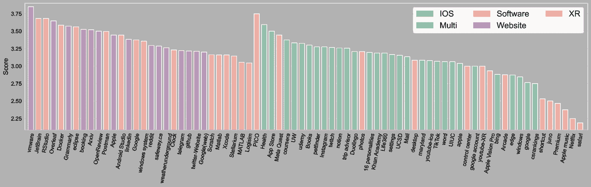

图16：Gemini-Pro-1.5在各软件和网站中的细粒度表现。

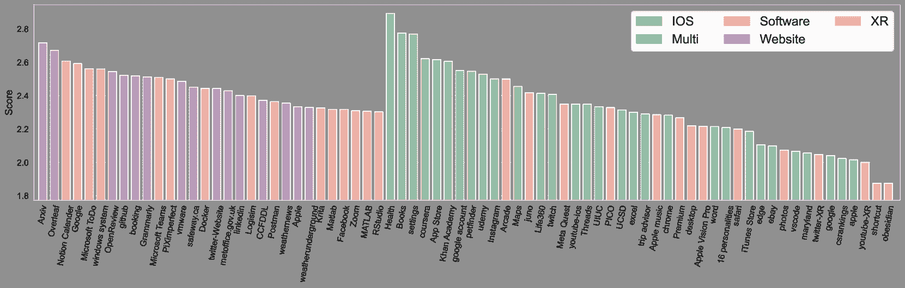

图17：Qwen-VL-Max在各软件和网站中的细粒度表现。

### 附录E 提示

在本节中，我们提供了针对模型和人工注释员的详细提示。[图 19](https://arxiv.org/html/2406.10819v1#A5.F19 "Figure 19 ‣ Appendix E Prompts ‣ Part I Appendix ‣ GUI-World: A Dataset for GUI-oriented Multimodal LLM-based Agents") 展示了人工注释的指南，[图 18](https://arxiv.org/html/2406.10819v1#A5.F18 "Figure 18 ‣ Appendix E Prompts ‣ Part I Appendix ‣ GUI-World: A Dataset for GUI-oriented Multimodal LLM-based Agents") 展示了利用 LLMs 来改进语法错误并为人工注释润色句子的提示。[图 20](https://arxiv.org/html/2406.10819v1#A5.F20 "Figure 20 ‣ Appendix E Prompts ‣ Part I Appendix ‣ GUI-World: A Dataset for GUI-oriented Multimodal LLM-based Agents")、[图 21](https://arxiv.org/html/2406.10819v1#A5.F21 "Figure 21 ‣ Appendix E Prompts ‣ Part I Appendix ‣ GUI-World: A Dataset for GUI-oriented Multimodal LLM-based Agents") 和 [图 22](https://arxiv.org/html/2406.10819v1#A5.F22 "Figure 22 ‣ Appendix E Prompts ‣ Part I Appendix ‣ GUI-World: A Dataset for GUI-oriented Multimodal LLM-based Agents") 展示了人类与 MLLMs 协作生成 GUI 导向任务的提示。[图 23](https://arxiv.org/html/2406.10819v1#A5.F23 "Figure 23 ‣ Appendix E Prompts ‣ Part I Appendix ‣ GUI-World: A Dataset for GUI-oriented Multimodal LLM-based Agents") 说明了用于基准测试 MLLMs 的提示，不同的 GUI 场景和不同的 QA 类型有不同的提示。[图 24](https://arxiv.org/html/2406.10819v1#A5.F24 "Figure 24 ‣ Appendix E Prompts ‣ Part I Appendix ‣ GUI-World: A Dataset for GUI-oriented Multimodal LLM-based Agents") 和 [图 25](https://arxiv.org/html/2406.10819v1#A5.F25 "Figure 25 ‣ Appendix E Prompts ‣ Part I Appendix ‣ GUI-World: A Dataset for GUI-oriented Multimodal LLM-based Agents") 展示了分别用于自由表述任务、对话任务和多项选择 QA 的 LLM 作为评审员的提示。

<svg class="ltx_picture ltx_centering" height="118.79" id="A5.F18.pic1" overflow="visible" version="1.1" width="603.54"><g fill="#000000" stroke="#000000" stroke-width="0.4pt" transform="translate(0,118.79) matrix(1 0 0 -1 0 0) translate(0,3.54)"><g transform="matrix(1.0 0.0 0.0 1.0 134.17 92.71)"><g class="ltx_nestedsvg" fill="#000000" stroke="#000000" stroke-width="0.4pt" transform="matrix(1 0 0 1 0 0)"><g fill-opacity="1.0" transform="matrix(1.0 0.0 0.0 1.0 9.06 7.81)"><foreignobject color="#000000" height="12.3" overflow="visible" transform="matrix(1 0 0 -1 0 16.6)" width="308.93">精炼目标和子目标的人类注释</foreignobject></g></g></g> <g fill-opacity="1.0" transform="matrix(1.0 0.0 0.0 1.0 18.47 18.47)"><foreignobject color="#000000" height="63.65" overflow="visible" transform="matrix(1 0 0 -1 0 16.6)" width="563.07">作为英语专家，请将以下英语指令（或目标）改写为更精炼的短语或简洁的句子。</foreignobject></g></g></svg>

避免包括无关内容，直接提供精炼的输出。

这里是英文句子：{string}</foreignobject></g></g></svg>

图 18：细化目标和子目标的人工注释。

<svg class="ltx_picture ltx_centering" height="762.13" id="A5.F19.pic1" overflow="visible" version="1.1" width="603.54"><g fill="#000000" stroke="#000000" stroke-width="0.4pt" transform="translate(0,762.13) matrix(1 0 0 -1 0 0) translate(0,3.54)"><g transform="matrix(1.0 0.0 0.0 1.0 188.06 738.74)"><g class="ltx_nestedsvg" fill="#000000" stroke="#000000" stroke-width="0.4pt" transform="matrix(1 0 0 1 0 0)"><g fill-opacity="1.0" transform="matrix(1.0 0.0 0.0 1.0 9.06 5.12)"><foreignobject color="#000000" height="9.61" overflow="visible" transform="matrix(1 0 0 -1 0 16.6)" width="201.16">人工注释指南</foreignobject></g></g></g> <g fill-opacity="1.0" transform="matrix(1.0 0.0 0.0 1.0 18.47 18.47)"><foreignobject color="#000000" height="709.68" overflow="visible" transform="matrix(1 0 0 -1 0 16.6)" width="563.07">主界面 1\. 视频列表面板（左侧面板）：显示已加载的视频文件列表。每个视频文件都以其名称显示以便识别。

2\. 视频显示区域（中央面板）：显示当前选中的视频以进行播放和注释。

3\. 控制设置（右侧面板）：

操作系统：选择视频录制所在机器的操作系统。

全屏：切换视频显示的全屏模式。

多应用程序?: 表示视频中是否有多个应用程序。

应用程序/网站：输入视频中使用的应用程序或网站的名称。

用户目标：输入执行注释的用户目标。

4\. 播放和注释控制（底部面板）

注释：打开注释窗口以添加新的关键帧注释。

播放：开始或暂停视频播放。

加载视频：允许你加载一个视频文件。

加载视频文件夹：允许从文件夹中加载多个视频文件。

上一视频 / 下一视频：在加载的视频文件之间导航。

保存为 JSON：以 JSON 格式保存注释。

注释窗口

1\. 鼠标操作：选择鼠标操作类型（例如，点击，拖动）。

2\. 键盘操作: 选择键盘操作类型（例如，打字，按键）。

3\. 键盘操作记录：输入任何键盘操作的详细信息（如果有）。

4\. 子动作目的：描述正在注释的动作的目的。

如何使用

加载视频

1\. 加载多个视频

点击加载视频文件夹按钮。

选择包含视频文件的文件夹。

文件夹中的所有视频文件将被加载并列在视频列表面板中。

播放视频

从视频列表面板中选择一个视频。点击播放按钮以开始或暂停视频。

视频注释

1\. 开始注释

在所需的帧上暂停视频。

点击注释按钮以打开注释窗口。

2\. 注释窗口

从下拉菜单中选择鼠标操作类型和键盘操作类型。

如果有键盘操作，请在“键盘操作记录”字段中输入详细信息。

在“子动作目的”字段中描述该动作的目的。

点击“确定”以保存注释。

保存注释

完成所有注释后，点击“保存到JSON”按钮。</foreignobject></g></g></svg>

图19：人工注释指南。

<svg class="ltx_picture ltx_centering" height="699.94" id="A5.F20.pic1" overflow="visible" version="1.1" width="603.54"><g fill="#000000" stroke="#000000" stroke-width="0.4pt" transform="translate(0,699.94) matrix(1 0 0 -1 0 0) translate(0,3.54)"><g transform="matrix(1.0 0.0 0.0 1.0 138.46 672.32)"><g class="ltx_nestedsvg" fill="#000000" stroke="#000000" stroke-width="0.4pt" transform="matrix(1 0 0 1 0 0)"><g fill-opacity="1.0" transform="matrix(1.0 0.0 0.0 1.0 9.06 8.58)"><foreignobject color="#000000" height="13.84" overflow="visible" transform="matrix(1 0 0 -1 0 16.6)" width="301.51">(Part 1) GPT-4V生成面向GUI的任务</foreignobject></g></g></g> <g fill-opacity="1.0" transform="matrix(1.0 0.0 0.0 1.0 18.47 18.47)"><foreignobject color="#000000" height="643.27" overflow="visible" transform="matrix(1 0 0 -1 0 16.6)" width="563.07">您是一个AI视觉助手。这是一个移动GUI的视频，我已经将其分成多个帧并发送给您。请提供对整个视频的详细描述，重点关注GUI元素或场景的变化，而不是单一帧的静态内容。详细描述应放在‘Description’字段下。基于您的描述，请设计以下任务：

为视频生成准确的字幕。此字幕应概括视频序列中观察到的主要活动或变化。将此字幕放在‘Caption’字段下。

创建一个与视频静态GUI内容相关的自由形式QA问题及其答案。问题应深入探讨视频中静态GUI元素或场景的细节或变化。该QA任务应嵌套在“static QA”关键字下，'Question'和'Answer'作为子键。

针对视频编写一道多项选择QA问题，包含四个选项：一个正确答案和三个错误或无关的选项。此任务应评估对视频中呈现的特定元素检索或变化的理解。将此任务结构化在“MCQA”关键字下，'Question'字段中详细描述问题，'Options'列出四个选项，包括一个正确答案，'Correct Answer'指定正确选项，例如{[[B]]}。

以下是一些视频的关键信息，帮助您全面理解视频内容：

系统：{item[‘system’]}

应用：{item[‘app’]}

视频总结：{item[‘goal’]}

视频中的关键操作/子目标：{[i[‘sub_goal’] for i in item[‘keyframes’]]}

注意：确保你设计的问题是可以回答的，且答案可以从 GUI 视频内容中推导出来。设计的问题应该尽可能困难，但依然是可回答的。任务应清晰明确，答案必须根据你对视频内容的理解而明确无误。只包括那些有明确答案的问题：（1）可以从图像中看到问题所询问的内容并且能够自信地回答；（2）可以从图像中自信地判断出该内容不在图像中。不要提出任何无法自信回答的问题。

这些任务应专注于 GUI 元素或场景的动态方面。回答复杂问题时，请提供详细的答案。例如，给出详细的例子或推理步骤，以使内容更加可信和有条理。回答的语气应像是视觉 AI 助手在观看图像并回答问题一样。

对于自由形式的 QA 任务，请确保答案尽可能详细且冗长，无需担心长度问题。如有必要，可以包括多个段落，以便提供全面且深入的回答。请按照 JSON 格式结构化你的回答，并使用任务要求中提到的具体键。</foreignobject></g></g></svg>

图 20: (第一部分) GPT-4V 生成面向 GUI 的任务。

<svg class="ltx_picture ltx_centering" height="518.83" id="A5.F21.pic1" overflow="visible" version="1.1" width="603.54"><g fill="#000000" stroke="#000000" stroke-width="0.4pt" transform="translate(0,518.83) matrix(1 0 0 -1 0 0) translate(0,3.54)"><g transform="matrix(1.0 0.0 0.0 1.0 136.54 491.21)"><g class="ltx_nestedsvg" fill="#000000" stroke="#000000" stroke-width="0.4pt" transform="matrix(1 0 0 1 0 0)"><g fill-opacity="1.0" transform="matrix(1.0 0.0 0.0 1.0 9.06 8.58)"><foreignobject color="#000000" height="13.84" overflow="visible" transform="matrix(1 0 0 -1 0 16.6)" width="304.97">(第二部分) GPT-4V 生成面向 GUI 的任务。</foreignobject></g></g></g> <g fill-opacity="1.0" transform="matrix(1.0 0.0 0.0 1.0 18.47 18.47)"><foreignobject color="#000000" height="462.16" overflow="visible" transform="matrix(1 0 0 -1 0 16.6)" width="563.07">你是一个 AI 视觉助手。这是一个 <Scene Name> 图形用户界面（GUI）的视频，我将其分成多个帧并发送给你。请提供关于整个视频的详细描述，重点描述 GUI 元素或场景的变化，而非单一帧的静态内容。详细描述应放在 'Description' 键下。根据你的描述，请设计以下任务：

一个顺序问答任务：设计一个需要理解视频中GUI元素变化或场景转换顺序的问题。该问题应为自由形式，并要求利用顺序图像中的时间信息。任务应嵌套在“Sequential-QA”键下，包含子键“Question”和“Answer”。

一个下阶段预测任务：提出一个问题，询问视频某一帧之后的后续状态或事件。问题应以自由形式设计，并预测未来的GUI元素或场景变化，结构应为“Prediction”键下，包含子键“Question”和“Answer”。

一个两轮对话任务：创建一个包含两轮互动的对话。第一轮包括用户指令和助手回应，第二轮的用户指令应基于第一轮的助手回应。两轮对话应为自由形式，并嵌套在“Conversation”键下，包含子键“User 1”、“Assistant 1”、“User 2”和“Assistant 2”。

一个推理任务：设计一个多选问答任务，需要通过推理从四个选项中找出正确答案。该任务应测试推理能力，推断或推理出未明确提供的信息。任务应嵌套在“Reasoning”键下，包含子键“Question”、“Options”和“Correct Answer”。

以下是帮助你全面理解视频的一些关键信息：

系统：{item[’system’]}

应用：{item[’app’]}

视频摘要：{item[’goal’]}

视频中的关键操作/子目标：{[i[’sub_goal’] for i in item[’keyframes’]]}</foreignobject></g></g></svg>

图 21：（第二部分）GPT-4V生成面向GUI的任务。

<svg class="ltx_picture ltx_centering" height="318.04" id="A5.F22.pic1" overflow="visible" version="1.1" width="603.54"><g fill="#000000" stroke="#000000" stroke-width="0.4pt" transform="translate(0,318.04) matrix(1 0 0 -1 0 0) translate(0,3.54)"><g transform="matrix(1.0 0.0 0.0 1.0 136.54 290.42)"><g class="ltx_nestedsvg" fill="#000000" stroke="#000000" stroke-width="0.4pt" transform="matrix(1 0 0 1 0 0)"><g fill-opacity="1.0" transform="matrix(1.0 0.0 0.0 1.0 9.06 8.58)"><foreignobject color="#000000" height="13.84" overflow="visible" transform="matrix(1 0 0 -1 0 16.6)" width="304.97">(第三部分) GPT-4V 生成面向GUI的任务。</foreignobject></g></g></g> <g fill-opacity="1.0" transform="matrix(1.0 0.0 0.0 1.0 18.47 18.47)"><foreignobject color="#000000" height="261.37" overflow="visible" transform="matrix(1 0 0 -1 0 16.6)" width="563.07">注意：确保您为这些任务设计的问题是可以回答的，并且答案可以从GUI视频内容中推导出来。可回答的问题应设计得尽可能具有挑战性。任务应无歧义，且答案必须基于您对视频内容的理解是确凿无疑的。仅包括有明确答案的问题：（1）可以从图像中看到问题所涉及的内容，并能自信地回答；（2）可以自信地确定该内容不在图像中。不要提出任何无法自信回答的问题。

每个任务应该专注于GUI元素或场景的动态方面，确保每个可回答的任务尽可能具有挑战性。回答复杂问题时请提供详细的答案。例如，提供详细的例子或推理步骤，使内容更加有说服力并且结构清晰。回答应以视觉AI助手正在查看图像并回答问题的语气进行。

对于自由形式的问答任务，请确保回答尽可能详细且篇幅足够，不必担心长度。如果需要，可以包含多个段落，以提供全面且深入的回应。请使用JSON格式结构化您的回答，并按照任务要求中的特定键进行组织。

图 22：（第三部分）GPT-4V 生成面向GUI的任务。

<svg class="ltx_picture ltx_centering" height="665.35" id="A5.F23.pic1" overflow="visible" version="1.1" width="603.54"><g fill="#000000" stroke="#000000" stroke-width="0.4pt" transform="translate(0,665.35) matrix(1 0 0 -1 0 0) translate(0,3.54)"><g transform="matrix(1.0 0.0 0.0 1.0 180.11 639.27)"><g class="ltx_nestedsvg" fill="#000000" stroke="#000000" stroke-width="0.4pt" transform="matrix(1 0 0 1 0 0)"><g fill-opacity="1.0" transform="matrix(1.0 0.0 0.0 1.0 9.06 7.81)"><foreignobject color="#000000" height="12.3" overflow="visible" transform="matrix(1 0 0 -1 0 16.6)" width="217.43">Prompts for Benchmarking MLLMs</foreignobject></g></g></g> <g fill-opacity="1.0" transform="matrix(1.0 0.0 0.0 1.0 18.47 18.47)"><foreignobject color="#000000" height="610.21" overflow="visible" transform="matrix(1 0 0 -1 0 16.6)" width="563.07">"XR": "You are an AI visual assistant. Here are sequential images of Mixed-Reality combining GUI interface and real world, which are selected from a GUI video.", "software": "You are an AI visual assistant. Here are sequential GUI interface images of a specific software, which are selected from a GUI video.", "website": "You are an AI visual assistant. Here are sequential GUI interface images of a desktop website, which are selected from a GUI video.", "mobile": "You are an AI visual assistant. Here are sequential GUI mobile interface images, which are selected from a GUI video.", "multi": "You are an AI visual assistant. Here are sequential GUI interface images of interaction among multiple softwares and websites, which are selected from a GUI video.", "IOS": "You are an AI visual assistant. Here are sequential GUI IOS interface images, which are selected from a GUI video.", "Sequential-QA": "This is a question about sequential information in sequential images.", "Prediction": "This is a question about predicting the next action base on the previous actions in the sequential images.", "Reasoning": "This is a multiple choice question with only one correct answer. This question may need multiple steps of reasoning according to the vision information in sequential images.", "Description1": "Please give me a detail description of these sequential images.", "Description2": "Offer a thorough analysis of these sequential images", "Caption": "Please give me a concise caption of these sequential images.", "static QA": "This is a question about static information such as text, icon, layout in these sequential images.", "MCQA": "This is a multiple choice question with only one correct answer. This question may require sequential analysis ability to the vision information in these sequential images.", "Conversation1": "Act as an assistant to answer the user’s question in these sequential images.", "Conversation2": "This is a multi-turn conversation task. You will be provide the first round conversation and act as an assistant to answer the user’s question in the second round according to these sequential images." Notice = "You can first provide an overall description of these sequential images, and then analyze the user’s question according to the sequential images and description. Finally, give an answer based on this description and the image information. Please format your output in a Json format, with key ’Description’ for the description of these sequential images, key ’Analysis’ for your analysis on the user’s question and key ’Answer’ for your answer to the User’s question."</foreignobject></g></g></svg>

图 23：基准测试MLLMs的提示。

<svg class="ltx_picture ltx_centering" height="631.99" id="A5.F24.pic1" overflow="visible" version="1.1" width="603.54"><g fill="#000000" stroke="#000000" stroke-width="0.4pt" transform="translate(0,631.99) matrix(1 0 0 -1 0 0) translate(0,3.54)"><g transform="matrix(1.0 0.0 0.0 1.0 63.73 605.91)"><g class="ltx_nestedsvg" fill="#000000" stroke="#000000" stroke-width="0.4pt" transform="matrix(1 0 0 1 0 0)"><g fill-opacity="1.0" transform="matrix(1.0 0.0 0.0 1.0 9.06 7.81)"><foreignobject color="#000000" height="12.3" overflow="visible" transform="matrix(1 0 0 -1 0 16.6)" width="451.36">用于LLM作为裁判的提示：判断自由形式和对话任务</foreignobject></g></g></g> <g fill-opacity="1.0" transform="matrix(1.0 0.0 0.0 1.0 18.47 18.47)"><foreignobject color="#000000" height="576.85" overflow="visible" transform="matrix(1 0 0 -1 0 16.6)" width="563.07">你是一个公正的裁判。我将提供给你一个问题，一个“黄金标准”答案，以及一个需要评估的回答。你的任务是评估回答与“黄金标准”答案的质量。请遵循以下指南：

1\. 开始评估时，首先将回答与“黄金标准”答案进行比较。简要说明两者的相似性和差异，重点关注相关性、准确性、深度和细节水平。

2\. 用1到5的分数来总结你的评估，其中1表示回答与“黄金标准”答案大多无关，5表示非常相似或等同。

3\. 以JSON格式呈现你的评估结果，使用“Evaluation”进行文本分析，使用“Score”进行数值评估。

4\. 确保评估的客观性。避免偏见，并力求在质量的各个层面上分布均匀。你的评分必须尽可能严格，并遵循以下规则：

- 总体来说，模型回答的质量越高，得分越高，事实准确性和满足用户需求是最关键的维度。这两个因素在很大程度上决定了最终的综合评分。

- 如果模型的回答与问题无关，包含基本的事实错误或生成有害内容，总分必须为1。

- 如果模型的回答没有严重错误，基本无害，但质量较低且未能满足用户需求，总分应为2。

- 如果模型的回答大体满足用户需求，但在某些方面表现不佳，质量中等，总分应为3。

- 如果模型的回答在质量上接近参考答案，并且在各个维度上表现良好，总分应为4。

- 只有当模型的回答超越参考答案，完全解决用户的问题并满足所有需求，并且在各个维度上几乎达到了完美分数时，才能获得5分之间的评分。

- 例如，黄金答案可能会得到4-5分。

这里是你需要评估的回答：

问题：{question}

黄金答案：{golden_answer}

回应：{response}

现在，请直接以 JSON 格式输出您的回应。</foreignobject></g></g></svg>

图 24：LLM 作为裁判的提示：判断自由形式和对话任务。

<svg class="ltx_picture ltx_centering" height="698.56" id="A5.F25.pic1" overflow="visible" version="1.1" width="603.54"><g fill="#000000" stroke="#000000" stroke-width="0.4pt" transform="translate(0,698.56) matrix(1 0 0 -1 0 0) translate(0,3.54)"><g transform="matrix(1.0 0.0 0.0 1.0 92.36 672.48)"><g class="ltx_nestedsvg" fill="#000000" stroke="#000000" stroke-width="0.4pt" transform="matrix(1 0 0 1 0 0)"><g fill-opacity="1.0" transform="matrix(1.0 0.0 0.0 1.0 9.06 7.81)"><foreignobject color="#000000" height="12.3" overflow="visible" transform="matrix(1 0 0 -1 0 16.6)" width="393.7">LLM 作为裁判的提示：判断多项选择问答任务</foreignobject></g></g></g> <g fill-opacity="1.0" transform="matrix(1.0 0.0 0.0 1.0 18.47 18.47)"><foreignobject color="#000000" height="643.42" overflow="visible" transform="matrix(1 0 0 -1 0 16.6)" width="563.07">您是一个有用的助手，负责判断一个多项选择题问答练习。

我将提供一个正确答案，仅包含一个选项，以及一个需要评估的回应。

如果回应与正确答案匹配，直接输出“是”；如果不匹配，输出“否”。

请避免包括任何不相关的信息。

这里有一些示例：

示例 1：

问题：根据 GUI 视频，为什么“加载”动画可能会继续而没有进入下一个阶段？ A. 用户尚未输入登录凭证。 B. 正在安装系统更新。 C. 服务器花费时间验证登录凭证。 D. “登录”按钮发生故障。

答案：C

回应：C. 服务器花费时间验证登录凭证。

输出：是

示例 2：

问题：如果用户想在查看消息后恢复群组视频通话，他们应该采取什么行动？ A. 向右转头。 B. 关闭消息应用界面。 C. 说出语音命令切换应用程序。 D. 向左转头。

答案：A

回应：B

输出：否

示例 3：

问题：用户采取了什么行动来开始播放视频中的音乐？ A. 关闭了音乐播放器应用程序 B. 将音乐播放器移到新的位置 C. 点击了播放按钮 D. 调整了系统音量

答案：[[B]]

回应：C

输出：否

以下是您需要判断的问题、答案和回应：

问题：{question}

答案：{answer}

回应：{response}

现在，直接输出“是”或“否”。</foreignobject></g></g></svg>

图 25：LLM 作为裁判的提示：判断多项选择问答任务。

### 附录 F 案例研究

在本节中，我们提供了六种GUI场景的详细案例研究，每个场景分为两部分。[图26](https://arxiv.org/html/2406.10819v1#A6.F26 "Figure 26 ‣ Appendix F Case Study ‣ Part I Appendix ‣ GUI-World: A Dataset for GUI-oriented Multimodal LLM-based Agents")和[图27](https://arxiv.org/html/2406.10819v1#A6.F27 "Figure 27 ‣ Appendix F Case Study ‣ Part I Appendix ‣ GUI-World: A Dataset for GUI-oriented Multimodal LLM-based Agents")展示了示例框架及与之相关的各种任务。[图28](https://arxiv.org/html/2406.10819v1#A6.F28 "Figure 28 ‣ Appendix F Case Study ‣ Part I Appendix ‣ GUI-World: A Dataset for GUI-oriented Multimodal LLM-based Agents")和[图29](https://arxiv.org/html/2406.10819v1#A6.F29 "Figure 29 ‣ Appendix F Case Study ‣ Part I Appendix ‣ GUI-World: A Dataset for GUI-oriented Multimodal LLM-based Agents")适用于iOS，[图30](https://arxiv.org/html/2406.10819v1#A6.F30 "Figure 30 ‣ Appendix F Case Study ‣ Part I Appendix ‣ GUI-World: A Dataset for GUI-oriented Multimodal LLM-based Agents")和[图31](https://arxiv.org/html/2406.10819v1#A6.F31 "Figure 31 ‣ Appendix F Case Study ‣ Part I Appendix ‣ GUI-World: A Dataset for GUI-oriented Multimodal LLM-based Agents")适用于多窗口交互，[图34](https://arxiv.org/html/2406.10819v1#A6.F34 "Figure 34 ‣ Appendix F Case Study ‣ Part I Appendix ‣ GUI-World: A Dataset for GUI-oriented Multimodal LLM-based Agents")和[图35](https://arxiv.org/html/2406.10819v1#A6.F35 "Figure 35 ‣ Appendix F Case Study ‣ Part I Appendix ‣ GUI-World: A Dataset for GUI-oriented Multimodal LLM-based Agents")适用于网站，[图36](https://arxiv.org/html/2406.10819v1#A6.F36 "Figure 36 ‣ Appendix F Case Study ‣ Part I Appendix ‣ GUI-World: A Dataset for GUI-oriented Multimodal LLM-based Agents")和[图37](https://arxiv.org/html/2406.10819v1#A6.F37 "Figure 37 ‣ Appendix F Case Study ‣ Part I Appendix ‣ GUI-World: A Dataset for GUI-oriented Multimodal LLM-based Agents")适用于XR。

<svg class="ltx_picture ltx_centering" height="718.55" id="A6.F26.pic1" overflow="visible" version="1.1" width="603.54"><g fill="#000000" stroke="#000000" stroke-width="0.4pt" transform="translate(0,718.55) matrix(1 0 0 -1 0 0) translate(0,3.54)"><g transform="matrix(1.0 0.0 0.0 1.0 237 690.93)"><g class="ltx_nestedsvg" fill="#000000" stroke="#000000" stroke-width="0.4pt" transform="matrix(1 0 0 1 0 0)"><g fill-opacity="1.0" transform="matrix(1.0 0.0 0.0 1.0 9.06 8.58)"><foreignobject color="#000000" height="13.84" overflow="visible" transform="matrix(1 0 0 -1 0 16.6)" width="103.66">(Part 1) Android</foreignobject></g></g></g> <g fill-opacity="1.0" transform="matrix(1.0 0.0 0.0 1.0 18.47 18.47)"><foreignobject color="#000000" height="661.87" overflow="visible" transform="matrix(1 0 0 -1 0 16.6)" width="563.07">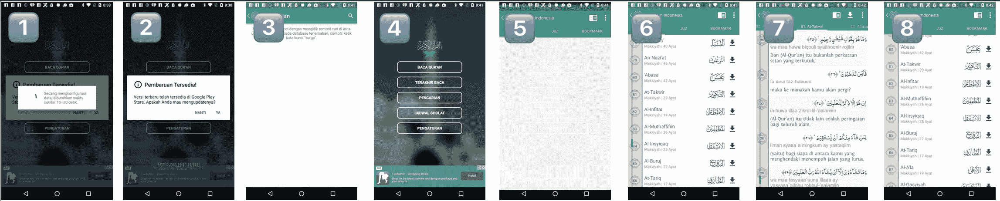 ‘描述1’: "视频开始时显示一个移动应用界面的视图，具体来说是一个包含《苏拉》列表的印尼《古兰经》应用。用户在《苏拉》列表中滚动，选择一个特定的《苏拉》，然后视图转换为显示阿拉伯语经文及其印尼语翻译的页面。用户随后返回《苏拉》列表。接下来，弹出窗口显示正在进行的配置过程，大约需要 10-20 秒。配置完成后，另一弹出窗口通知有来自 Google Play 商店的可用更新，用户可以接受或推迟更新。用户关闭该弹出窗口。主菜单显示，提供如‘Baca Quran’、‘Terakhir Baca’、‘Pencarian’、‘Jadwal Sholat’和‘Pengaturan’等选项。用户选择‘Pencarian’选项，进入搜索页面。在此，用户被要求输入关键词以在翻译数据库中进行搜索。最后，用户导航回主菜单，然后再次进入《苏拉》列表。"

‘顺序问答’: ‘问题’: ’从列表中选择特定的《苏拉》后，用户在弹出通知出现之前需要做什么？’

‘回答’: ‘在选择了《苏拉》后，用户会查看阿拉伯语经文及其印尼语翻译。然后，用户会返回《苏拉》列表，直到弹出通知出现。’

‘预测’: ‘问题’: ’用户被引导到搜索页面后，应用界面可能的下一步是什么？’

‘回答’: "被引导到搜索页面后，用户可能的下一步是将关键词输入到搜索框中，以便在应用程序的数据库中查找翻译或含义。"

‘对话’: ’用户 1’: ’我需要在《古兰经》中找到特定的经文。我要如何搜索？’

‘助手 1’: "你可以通过点击主菜单中的’Pencarian’选项来搜索特定的经文，这会带你到搜索页面，你可以在其中输入一个关键词。"

‘用户 2’: ’我明白了。那么，如何从搜索页面返回到主菜单呢？’

‘助手2’：’要从搜索页面返回主菜单，可以点击屏幕左上角的返回箭头。’

‘推理’：‘问题’："如果用户想要阅读《Al-Infitar》章节的经文，他们在启动应用后应该怎么做？"

‘选项’：["A. 前往设置并选择’Al-Infitar’。", "B. 滚动浏览《苏拉》列表并选择’Al-Infitar’。", "C. 选择’Pencarian’选项并输入’Al-Infitar’。", "D. 等待弹出窗口并从中选择’Al-Infitar’。"]

‘正确答案’："B. 滚动浏览《苏拉》列表并选择’Al-Infitar’。"

图26：Android案例研究（第1部分）。

<svg class="ltx_picture ltx_centering" height="656.43" id="A6.F27.pic1" overflow="visible" version="1.1" width="603.54"><g fill="#000000" stroke="#000000" stroke-width="0.4pt" transform="translate(0,656.43) matrix(1 0 0 -1 0 0) translate(0,3.54)"><g transform="matrix(1.0 0.0 0.0 1.0 237 628.82)"><g class="ltx_nestedsvg" fill="#000000" stroke="#000000" stroke-width="0.4pt" transform="matrix(1 0 0 1 0 0)"><g fill-opacity="1.0" transform="matrix(1.0 0.0 0.0 1.0 9.06 8.58)"><foreignobject color="#000000" height="13.84" overflow="visible" transform="matrix(1 0 0 -1 0 16.6)" width="103.66">(第2部分) Android</foreignobject></g></g></g> <g fill-opacity="1.0" transform="matrix(1.0 0.0 0.0 1.0 18.47 18.47)"><foreignobject color="#000000" height="599.76" overflow="visible" transform="matrix(1 0 0 -1 0 16.6)" width="563.07"> ‘描述2’："视频开始时展示了一个移动端GUI，显示了以印度尼西亚语呈现的《古兰经》章节列表。每个章节旁有一个向下箭头，表示可以展开更多内容。随着视频的进展，一个弹出窗口出现，显示一个加载图标，并用印度尼西亚语提示正在进行配置，大约需要10-20秒。之后，另一个弹出窗口出现，通知Google Play商店有新更新，提供更新或推迟的选项。随后，屏幕显示了一个搜索界面，用户可以在其中输入关键词，在《古兰经》的翻译数据库中进行搜索。接下来，用户进入主菜单，菜单选项包括‘阅读古兰经’，‘最后阅读’，‘搜索’，‘祷告时间表’和‘设置’。GUI界面切换回章节列表，并选择了特定的章节《At-Takwir》。视频接着展示了该章节的经文，包括阿拉伯文和印度尼西亚文翻译，并提供了音频播放的选项。最后，视频返回到章节列表。"

‘标题’："通过《古兰经》应用的GUI进行导航，互动章节列表、更新通知、搜索功能，并查看带有翻译的特定经文。"

‘静态问答’：‘问题’：’在移动端《古兰经》应用的主菜单中有哪些选项？’

‘答案’："移动版古兰经应用程序的主菜单为用户提供了多个选择项。包括‘BACA QURAN’（阅读古兰经），用于访问要阅读的章节；‘TERAKHIR BACA’（最后阅读），用于从上次停留的位置继续阅读；‘PENCARIAN’（搜索），用于在古兰经数据库中查找特定的关键词；‘JADWAL SHOLAT’（祈祷时间表），用于查看祈祷时间；以及‘PENGATURAN’（设置），用于修改应用程序设置。此菜单提供了一种简单而高效的方式，帮助用户在应用程序的功能间进行导航，并定制他们的阅读和学习体验。"

‘MCQA’：‘问题’：’在用户收到关于Google Play商店新更新的通知后，发生了什么？’

‘选项’：‘A’：’应用程序自动关闭。’，‘B’：’搜索界面显示。’，‘C’：’章节列表消失。’，‘D’：’显示购物优惠广告。’

‘正确答案’：’[[B]] 搜索界面显示。’

图27：安卓案例研究（第2部分）。

<svg class="ltx_picture ltx_centering" height="677.23" id="A6.F28.pic1" overflow="visible" version="1.1" width="603.54"><g fill="#000000" stroke="#000000" stroke-width="0.4pt" transform="translate(0,677.23) matrix(1 0 0 -1 0 0) translate(0,3.54)"><g transform="matrix(1.0 0.0 0.0 1.0 250.09 649.61)"><g class="ltx_nestedsvg" fill="#000000" stroke="#000000" stroke-width="0.4pt" transform="matrix(1 0 0 1 0 0)"><g fill-opacity="1.0" transform="matrix(1.0 0.0 0.0 1.0 9.06 8.58)"><foreignobject color="#000000" height="13.84" overflow="visible" transform="matrix(1 0 0 -1 0 16.6)" width="77.49">(第1部分) IOS</foreignobject></g></g></g> <g fill-opacity="1.0" transform="matrix(1.0 0.0 0.0 1.0 18.47 18.47)"><foreignobject color="#000000" height="620.55" overflow="visible" transform="matrix(1 0 0 -1 0 16.6)" width="563.07">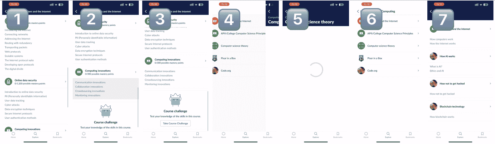 ‘描述1’："该视频展示了用户在可汗学院移动应用程序中浏览‘计算’类别的过程。最初，用户滚动浏览‘计算机与互联网’部分，查看诸如‘数字信息’、‘位与字节’、‘互联网’和‘在线数据安全’等主题。然后，用户继续向下滚动，揭示了‘计算创新’部分和‘参加课程挑战’按钮。接着，用户返回到上一屏，显示了其他计算机课程章节，如‘AP®/大学计算机科学原理’和‘计算机科学理论’。用户点击进入‘计算机科学理论’界面，内容正在加载。加载完成后，显示了诸如‘密码学’和‘信息理论’等主题，用户返回到上一页并点击‘Code.org’。"

‘标题’："在可汗学院的移动应用程序中浏览计算机课程，查看各个章节，并尝试进入‘计算机科学理论’。"

‘静态 QA’：’问题’：“在向下滚动之前，‘计算机与互联网’部分中，‘在线数据安全’下方直接出现的是哪个主题？”

‘答案’：“在向下滚动之前，‘计算创新’部分直接出现在‘在线数据安全’下方。这可以通过视频的初始画面确认，其中‘计算创新’部分部分可见，表明它是 ‘在线数据安全’之后的下一个主题。当视频继续播放，用户向下滚动时，完整的‘计算创新’部分出现在视图中，确认了它在图形用户界面布局中的位置。”

‘MCQA’：’问题’：“在查看完 ‘计算创新’ 部分后，用户执行了什么操作？”

‘选项’：[“A) 向上滚动再次查看‘数字信息’。”，“B) 返回上一个屏幕，显示不同的计算机部分。”，“C) 点击‘参加课程挑战’按钮。”，“D) 点击屏幕底部的‘探索’标签。”]

‘正确答案’：’[[B]] 返回上一个屏幕，显示不同的计算机部分。’

图28：iOS案例研究（第1部分）。

<svg class="ltx_picture" height="858.41" id="A6.F29.1.pic1" overflow="visible" version="1.1" width="603.54"><g fill="#000000" stroke="#000000" stroke-width="0.4pt" transform="translate(0,858.41) matrix(1 0 0 -1 0 0) translate(0,3.54)"><g transform="matrix(1.0 0.0 0.0 1.0 250.09 830.8)"><g class="ltx_nestedsvg" fill="#000000" stroke="#000000" stroke-width="0.4pt" transform="matrix(1 0 0 1 0 0)"><g fill-opacity="1.0" transform="matrix(1.0 0.0 0.0 1.0 9.06 8.58)"><foreignobject color="#000000" height="13.84" overflow="visible" transform="matrix(1 0 0 -1 0 16.6)" width="77.49">(第2部分) iOS</foreignobject></g></g></g> <g fill-opacity="1.0" transform="matrix(1.0 0.0 0.0 1.0 18.47 18.47)"><foreignobject color="#000000" height="801.74" overflow="visible" transform="matrix(1 0 0 -1 0 16.6)" width="563.07"> ‘描述2’：“视频从用户在 Khan Academy 应用程序中查看 ‘计算机与互联网’课程部分开始。用户浏览了多个子部分，如 ‘数字信息’，‘计算机’，‘互联网’ 和 ‘在线数据安全’，每个部分都列出了主题以及可能掌握的点数状态。用户继续向下滚动，进入 ‘计算创新’ 部分，然后继续向下滚动，看到 ‘课程挑战’ 提示。然后，用户向上滚动，按相反顺序显示先前看到的部分。最终，用户导航回主 ‘计算’ 类别屏幕，显示所有计算相关课程的概览。接着，用户选择 ‘计算机科学理论’，该课程稍微加载后，显示该课程中的主题，如 ‘密码学’ 和 ‘信息理论’。接着，用户返回到主 ‘计算’ 类别屏幕。”</foreignobject></g></g></svg>

‘顺序问答’: ‘问题’: "用户在浏览完‘在线数据安全’部分后采取了什么行动，并且该行动结果显示了什么内容？", ‘回答’: "在浏览完‘在线数据安全’部分后，用户向下滚动到了‘计算创新’部分。由于这一行为，显示了‘通信创新’，‘协作创新’，‘众包创新’，和‘监控创新’等主题，随后显示了‘课程挑战’提示。"

‘预测’: ‘问题’: "如果用户在显示后选择了‘密码学’部分，你能预测接下来会显示什么内容吗？"

‘回答’: "如果用户选择了‘密码学’部分，可以预测接下来会显示与密码学相关的详细主题，比如‘古代密码学’，‘密码’，‘密码学挑战 101’，‘现代密码学’，‘模运算’，‘素性测试’，和‘随机算法’，以及该部分可能的掌握情况。"

‘对话’: ‘用户 1’: ‘你能带我到关于用户认证方法的部分吗？’

‘助手 1’: "当然，你需要向下滚动‘计算机与互联网’课程部分，直到找到‘在线数据安全’子部分，在那里你会找到‘用户认证方法’这一主题。"

‘用户 2’: "我滚得太远，到了课程挑战部分。我要怎么从这里找到‘用户认证方法’？"

‘助手 2’: "没问题，你需要向上滚动，越过‘计算创新’部分，直到你再次看到‘在线数据安全’子部分。‘用户认证方法’就列在那儿，与其他主题一起。"

‘推理’: ‘问题’: "在浏览了‘计算机与互联网’课程主题后，用户返回到了更广泛的类别视图。基于这一行为，用户返回更广泛类别视图的原因可能是什么？"

‘选项’: [‘A. 用户想要进行课程挑战。’, ’B. 用户正在寻找另一个计算机相关的课程。’, ’C. 应用程序自动将用户重定向。’, ’D. 用户打算退出可汗学院应用程序。’]

‘正确答案’: ’B’</foreignobject></g></g></svg>

图 29: IOS 案例研究（第二部分）。

<svg class="ltx_picture ltx_centering" height="557.76" id="A6.F30.pic1" overflow="visible" version="1.1" width="603.54"><g fill="#000000" stroke="#000000" stroke-width="0.4pt" transform="translate(0,557.76) matrix(1 0 0 -1 0 0) translate(0,3.54)"><g transform="matrix(1.0 0.0 0.0 1.0 170.85 530.15)"><g class="ltx_nestedsvg" fill="#000000" stroke="#000000" stroke-width="0.4pt" transform="matrix(1 0 0 1 0 0)"><g fill-opacity="1.0" transform="matrix(1.0 0.0 0.0 1.0 9.06 8.58)"><foreignobject color="#000000" height="13.84" overflow="visible" transform="matrix(1 0 0 -1 0 16.6)" width="235.96">(第一部分) 多窗口交互</foreignobject></g></g></g> <g fill-opacity="1.0" transform="matrix(1.0 0.0 0.0 1.0 18.47 18.47)"><foreignobject color="#000000" height="501.09" overflow="visible" transform="matrix(1 0 0 -1 0 16.6)" width="563.07"> ‘描述1’：“视频开始时，Windows桌面上显示多个打开的应用程序，包括Steam、OBS Studio和一个加载了NVIDIA官方网站的网页浏览器。用户首先点击浏览器的后退页面，这部分遮挡了OBS窗口。接着，用户点击OBS应用程序，将其带到前台。用户最小化OBS，然后将Steam窗口拖到屏幕中央并最小化。用户在Edge浏览器的导航栏打开一个新网页，并在搜索栏中输入’office’。浏览器导航至Bing搜索界面，成功搜索到’office’。”

‘说明文字’：’在Windows中导航和管理多个应用程序，包括Steam、OBS Studio和Edge浏览器’

‘静态问答’：‘问题’：“视频中使用的是哪个网页浏览器，并且在搜索’office’之前，突出的官方网站是什么？”

‘答案’：“视频中使用的网页浏览器是Microsoft Edge。在搜索’office’之前，突出的官方网站是NVIDIA的官方网站，其中显示的是’下载驱动程序’页面。”

‘多选题’：‘问题’：’OBS应用程序最小化后采取了什么操作？’，‘选项’：[’A. Steam窗口被关闭。’

‘B. Steam窗口被移动到屏幕中央并最小化。’，‘C. Edge浏览器被关闭。’，‘D. 从桌面打开了一个文件。’]

‘正确答案’：’[[B]] Steam窗口被移动到屏幕中央并最小化。’</foreignobject></g></g></svg>

图30：多窗口交互的案例研究（第一部分）。

<svg class="ltx_picture ltx_centering" height="736.18" id="A6.F31.pic1" overflow="visible" version="1.1" width="603.54"><g fill="#000000" stroke="#000000" stroke-width="0.4pt" transform="translate(0,736.18) matrix(1 0 0 -1 0 0) translate(0,3.54)"><g transform="matrix(1.0 0.0 0.0 1.0 170.85 708.57)"><g class="ltx_nestedsvg" fill="#000000" stroke="#000000" stroke-width="0.4pt" transform="matrix(1 0 0 1 0 0)"><g fill-opacity="1.0" transform="matrix(1.0 0.0 0.0 1.0 9.06 8.58)"><foreignobject color="#000000" height="13.84" overflow="visible" transform="matrix(1 0 0 -1 0 16.6)" width="235.96">(第2部分) 多窗口交互</foreignobject></g></g></g> <g fill-opacity="1.0" transform="matrix(1.0 0.0 0.0 1.0 18.47 18.47)"><foreignobject color="#000000" height="679.51" overflow="visible" transform="matrix(1 0 0 -1 0 16.6)" width="563.07"> ’描述2’：“视频展示了一个Windows桌面，上面打开了多个应用程序窗口，包括Steam、OBS和Edge。最初，OBS窗口部分覆盖了Edge浏览器。用户点击Edge浏览器，将其带到前台，然后最小化了OBS窗口，清除了视图。接下来，用户将Steam窗口移至屏幕中央，并将其最小化。之后，用户在Edge浏览器中打开一个新标签页，并输入了’office’到搜索栏中，进入了必应搜索结果页面。视频结束时，用户停留在必应搜索页面，显示了’office’的搜索结果。”

‘顺序问答’：’问题’：’在将Steam窗口移至屏幕中央后，用户在Edge浏览器中接下来做了什么？’

’答案’：“在将Steam窗口移至屏幕中央后，用户将Steam应用程序最小化。然后，他们在Edge浏览器中打开了一个新标签页，并在搜索栏中输入了’office’，从而进入了’office’的必应搜索结果页面。”

‘预测’：’问题’：“用户在必应搜索’office’后，接下来最可能的操作是什么？”

’答案’：“用户在必应搜索’office’后，接下来的可能操作是点击搜索结果中的一个，以获取更多信息或访问微软Office官网，购买或了解更多关于办公套件的信息。”

‘对话’：’用户 1’：’你能最小化OBS应用程序，以便更好地查看浏览器吗？’

‘助手 1’：’当然，OBS应用程序已经被最小化，提供了一个清晰可见的Edge浏览器视图。’

‘用户 2’：’太好了，现在你能在Edge浏览器中搜索Microsoft Office吗？’

‘助手 2’：“当然，在Edge浏览器中已打开一个新标签页，并在搜索栏中输入了’office’。现在，必应搜索’office’的搜索结果已显示。”

‘推理’：’问题’：‘如果用户接下来需要录制游戏画面，他们应该与哪个应用程序互动，第一步应该怎么做？’

‘选项’: ["A. 用户应打开 Steam 应用程序并点击 ’STORE’ 标签。", "B. 用户应打开 Edge 浏览器并搜索 ’游戏录制软件’。", "C. 用户应重新打开 OBS 应用程序并点击 ’开始录制’ 按钮。", "D. 用户应访问 Windows 开始菜单并搜索 ’相机’ 应用。"]

’正确答案’: ’C’</foreignobject></g></g></svg>

图 31：多窗口交互案例研究（第二部分）。

<svg class="ltx_picture ltx_centering" height="529.74" id="A6.F32.pic1" overflow="visible" version="1.1" width="603.54"><g fill="#000000" stroke="#000000" stroke-width="0.4pt" transform="translate(0,529.74) matrix(1 0 0 -1 0 0) translate(0,3.54)"><g transform="matrix(1.0 0.0 0.0 1.0 235.85 502.12)"><g class="ltx_nestedsvg" fill="#000000" stroke="#000000" stroke-width="0.4pt" transform="matrix(1 0 0 1 0 0)"><g fill-opacity="1.0" transform="matrix(1.0 0.0 0.0 1.0 9.06 8.58)"><foreignobject color="#000000" height="13.84" overflow="visible" transform="matrix(1 0 0 -1 0 16.6)" width="105.97">(第一部分) 软件</foreignobject></g></g></g> <g fill-opacity="1.0" transform="matrix(1.0 0.0 0.0 1.0 18.47 18.47)"><foreignobject color="#000000" height="473.07" overflow="visible" transform="matrix(1 0 0 -1 0 16.6)" width="563.07">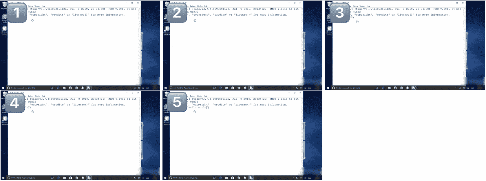 ‘描述1’: "视频展示了在 Windows 系统上运行的 Python 3.7.4 Shell 窗口。用户首先输入 ’print’ 函数，并跟上了一对括号。括号内，用户输入一个字符串，’Hello World’，并用双引号括起来。按下 Enter 键后，Python Shell 执行了命令，并在命令行下方输出文本 ’Hello World’，表示代码成功运行且没有错误。"

‘标题’: "在 Python Shell 中执行 print 命令以显示 ’Hello World’"

‘静态 QA’: "问题": "视频中显示运行的是哪个版本的 Python？"

"答案": "视频中运行的 Python 版本是 Python 3.7.4，正如 Python Shell 窗口顶部所显示的文本。"

‘MCQA’: "问题": "用户在输入 print 命令后执行了什么操作？"

"选项": ["A. 用户保存文件。", "B. 用户编译代码。", "C. 用户执行 print 命令。", "D. 用户关闭 Python Shell。"]

"正确答案": "[[C]] 用户执行 print 命令。"</foreignobject></g></g></svg>

图 32：软件案例研究（第一部分）。

<svg class="ltx_picture ltx_centering" height="843.84" id="A6.F33.pic1" overflow="visible" version="1.1" width="603.54"><g fill="#000000" stroke="#000000" stroke-width="0.4pt" transform="translate(0,843.84) matrix(1 0 0 -1 0 0) translate(0,3.54)"><g transform="matrix(1.0 0.0 0.0 1.0 235.85 816.22)"><g class="ltx_nestedsvg" fill="#000000" stroke="#000000" stroke-width="0.4pt" transform="matrix(1 0 0 1 0 0)"><g fill-opacity="1.0" transform="matrix(1.0 0.0 0.0 1.0 9.06 8.58)"><foreignobject color="#000000" height="13.84" overflow="visible" transform="matrix(1 0 0 -1 0 16.6)" width="105.97">(第 2 部分) 软件</foreignobject></g></g></g> <g fill-opacity="1.0" transform="matrix(1.0 0.0 0.0 1.0 18.47 18.47)"><foreignobject color="#000000" height="787.17" overflow="visible" transform="matrix(1 0 0 -1 0 16.6)" width="563.07"> ‘说明2’: "视频展示了用户与 Windows 系统上的 Python Shell 交互的一个过程。最初，Shell 已打开并等待输入。用户开始输入 ’print*’，然后通过删除星号来修正拼写错误，输入 ’print’。接着，用户输入了两个引号，为字符串输入做准备。随后，用户将光标移至引号之间，并输入了 ’Hello World’ 来完成 ’print(Ḧello World)̈’ 命令。按下回车后，Shell 执行了该命令，并在命令提示符下方输出了 ’Hello World’。"

‘Sequential-QA’: "问题": "你能描述一下用户为纠正命令并输出’Hello World’所采取的操作步骤吗？"

"回答": "当然。最初，用户输入了 ’print*’，但意识到星号是错误的。他们删除了星号，将命令更正为 ’print’。接着，他们输入了两个引号，表示字符串的开始。用户将光标放在引号之间并输入了字符串 ’Hello World’。最后，按下回车后，Python Shell 执行了该命令，并在命令提示符下方显示了 ’Hello World’ 的输出。"

‘Prediction’: "问题": "如果用户在 ’Hello World’ 输出后输入另一个命令，预期的 GUI 变化是什么？"

"回答": "如果用户在 ’Hello World’ 输出后输入另一个命令，预期的 GUI 变化是命令提示符 ’>>>’ 会出现在 ’Hello World’ 输出下方的新一行，表示系统已准备好接受下一个命令输入。用户输入的任何后续命令将在此新提示符后显示，等待执行。"

‘Conversation’: "用户 1": "我想在 Python 中打印一个不同的消息。我该怎么做？", "助手 1": "要打印不同的消息，你只需输入 ’print(Ÿour Message Here)̈’，其中 ’Your Message Here’ 是你想打印的文本。确保将消息用引号括起来，然后按回车执行命令。"

"用户 2": "如果我想打印 ’Goodbye, World’ 而不是 ’Hello World’ 怎么办？"

"助手 2": "要打印 ’Goodbye, World’，你应该输入 ’print(G̈oodbye, World)̈’ 并按回车键。Python Shell 会执行该命令并在命令提示符下方显示 ’Goodbye, World’ 作为输出。"

‘推理’: "问题": "用户执行了什么命令以在 Python Shell 中得到输出？"

"选项": ["A. print(Hello World)", "B. print(Ḧello World)", "C. print(Ḧello World)̈", "D. echo(Ḧello World)̈"]

"正确答案": "C",</foreignobject></g></g></svg>

图 33: 软件案例研究（第 2 部分）。

<svg class="ltx_picture ltx_centering" height="729.99" id="A6.F34.pic1" overflow="visible" version="1.1" width="603.54"><g fill="#000000" stroke="#000000" stroke-width="0.4pt" transform="translate(0,729.99) matrix(1 0 0 -1 0 0) translate(0,3.54)"><g transform="matrix(1.0 0.0 0.0 1.0 237.94 702.38)"><g class="ltx_nestedsvg" fill="#000000" stroke="#000000" stroke-width="0.4pt" transform="matrix(1 0 0 1 0 0)"><g fill-opacity="1.0" transform="matrix(1.0 0.0 0.0 1.0 9.06 8.58)"><foreignobject color="#000000" height="13.84" overflow="visible" transform="matrix(1 0 0 -1 0 16.6)" width="102.93">(第 1 部分) 网站</foreignobject></g></g></g> <g fill-opacity="1.0" transform="matrix(1.0 0.0 0.0 1.0 18.47 18.47)"><foreignobject color="#000000" height="673.32" overflow="visible" transform="matrix(1 0 0 -1 0 16.6)" width="563.07">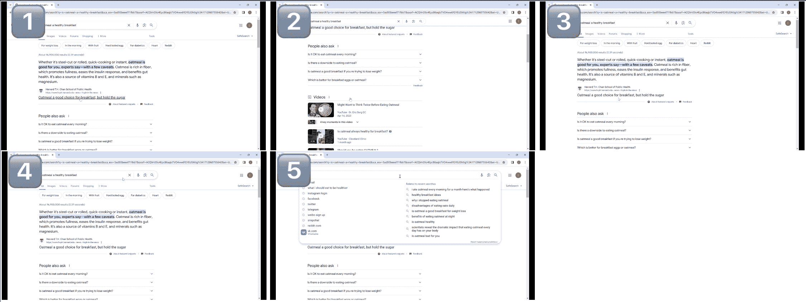 ’描述1’: "视频开始时，Windows 系统浏览器上显示了 Google 搜索结果页面，展示了查询 ’燕麦粥是健康的早餐吗’。鼠标光标向下滚动页面，显示了额外的搜索结果，以及包含相关问题的 ’People also ask’ 部分。接着，用户将页面向上滚动回到顶部。随后，光标移动到搜索栏，并点击 ’X’ 按钮清除之前的搜索内容，留下一个空的搜索框。浏览器的建议搜索下拉菜单显示了各种相关搜索查询。最后，视频渐变为黑色，表示该部分结束。"

‘说明’: ’在 Windows 系统浏览器中导航 Google 搜索结果并清除搜索查询’

‘静态问答’: "问题": "在查询 ’燕麦粥是健康的早餐吗’ 时，Google 搜索结果顶部显示的功能片段是什么？"

’回答’：“Google搜索结果页面顶部的特色摘录，关于查询‘燕麦片是健康早餐吗’的信息，来自哈佛大学T.H. Chan公共卫生学院的网站。摘录中提到，‘无论是钢切燕麦片还是压扁燕麦片、快速煮熟的燕麦片还是即食燕麦片，专家都表示，燕麦片对你有益——当然，还是有一些注意事项。燕麦片富含纤维，有助于增加饱腹感、缓解胰岛素反应并促进肠道健康。它还是B族维生素和维生素E的来源，此外还含有镁等矿物质。’根据专家的观点，这段摘录简明扼要地总结了燕麦片的健康益处，突出了其营养价值及对饱腹感和胰岛素反应的潜在影响。此摘录为用户的查询提供了快速且权威的答案，展示了Google从网页中提取相关信息并显著呈现，方便用户访问的能力。”

‘MCQA’：’问题’：’用户在查看搜索结果后采取了什么行动？’

’选项’：[’A. 用户点击了其中一个搜索结果。’, "B. 用户滚动浏览了‘人们还会问’部分。", ’C. 用户清除了搜索框中的搜索内容。’, ’D. 用户访问了另一个网站。’]

‘正确答案’：’[[C]] 用户清除了搜索框中的搜索内容。’,

图34：网站案例研究（第1部分）。

<svg class="ltx_picture ltx_centering" height="811.48" id="A6.F35.pic1" overflow="visible" version="1.1" width="603.54"><g fill="#000000" stroke="#000000" stroke-width="0.4pt" transform="translate(0,811.48) matrix(1 0 0 -1 0 0) translate(0,3.54)"><g transform="matrix(1.0 0.0 0.0 1.0 237.94 783.86)"><g class="ltx_nestedsvg" fill="#000000" stroke="#000000" stroke-width="0.4pt" transform="matrix(1 0 0 1 0 0)"><g fill-opacity="1.0" transform="matrix(1.0 0.0 0.0 1.0 9.06 8.58)"><foreignobject color="#000000" height="13.84" overflow="visible" transform="matrix(1 0 0 -1 0 16.6)" width="102.93">(第 2 部分) 网站</foreignobject></g></g></g> <g fill-opacity="1.0" transform="matrix(1.0 0.0 0.0 1.0 18.47 18.47)"><foreignobject color="#000000" height="754.8" overflow="visible" transform="matrix(1 0 0 -1 0 16.6)" width="563.07"> ‘说明 2’：“视频展示了在 Windows 系统上的网页浏览器中的 Google 搜索结果页面上按顺序进行的操作。最初，鼠标光标移动到讨论燕麦健康益处的搜索结果上。接下来，用户向下滚动，显示出‘人们也会问’部分，其中包含与燕麦相关的问题，以及一个展示相关内容的‘视频’部分。随后，用户向上滚动回到原来的位置，重新突出显示关于燕麦健康益处的同一搜索结果。最后，用户将光标移至搜索栏并点击‘X’以清除之前的搜索内容，结果是一个空白的搜索栏，下面列出了建议和相关搜索。屏幕随即变黑，表示视频结束。”

‘顺序问答’：‘问题’：“在阅读了燕麦健康益处后，用户接下来浏览了页面的哪个部分？他们是否返回继续阅读关于健康益处的内容？”

‘回答’：“在阅读了燕麦的健康益处后，用户向下滚动，探索了‘人们也会问’部分和与燕麦相关的‘视频’部分。随后，用户向上滚动回到原始的搜索结果，继续阅读关于燕麦健康益处的内容。”

‘预测’：‘问题’：‘根据事件的顺序，用户在清除搜索栏后可能会执行什么操作？’

‘回答’：“在清除搜索栏后，用户可能会输入新的搜索查询，或选择搜索栏下方显示的建议搜索之一。”

‘对话’：‘用户 1’：“我想找更多关于燕麦健康益处的文章。你能向上滚动吗？”

‘助手 1’：“我已经向上滚动，哈佛 T.H. Chan 公共卫生学院关于燕麦健康益处的文章再次被突出显示。”

‘用户 2’：“很好，现在能清除搜索并查找其他内容吗？”

‘助手 2’：“搜索内容已被清除，搜索栏现在为空，显示新的查询建议以及之前搜索历史的相关内容。”

’推理’: ’问题’: ’如果用户想在清除搜索栏后进行新的搜索，接下来需要采取哪些操作？’， ’选项’: [’A. 向下滚动查看更多搜索结果’

’B. 在搜索栏中输入新的查询’， "C. 点击其中一个 ‘People also ask’ 的问题"， ’D. 关闭浏览器窗口’]

‘正确答案’: ’B’，</foreignobject></g></g></svg>

图 35：网站案例研究（第2部分）。

<svg class="ltx_picture ltx_centering" height="630.37" id="A6.F36.pic1" overflow="visible" version="1.1" width="603.54"><g fill="#000000" stroke="#000000" stroke-width="0.4pt" transform="translate(0,630.37) matrix(1 0 0 -1 0 0) translate(0,3.54)"><g transform="matrix(1.0 0.0 0.0 1.0 251.53 602.75)"><g class="ltx_nestedsvg" fill="#000000" stroke="#000000" stroke-width="0.4pt" transform="matrix(1 0 0 1 0 0)"><g fill-opacity="1.0" transform="matrix(1.0 0.0 0.0 1.0 9.06 8.58)"><foreignobject color="#000000" height="13.84" overflow="visible" transform="matrix(1 0 0 -1 0 16.6)" width="74.22">(第1部分) XR</foreignobject></g></g></g> <g fill-opacity="1.0" transform="matrix(1.0 0.0 0.0 1.0 18.47 18.47)"><foreignobject color="#000000" height="573.69" overflow="visible" transform="matrix(1 0 0 -1 0 16.6)" width="563.07">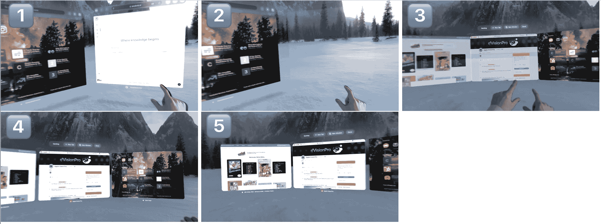 ‘描述1’：“视频展示了用户在 Windows 系统上通过 Apple Vision Pro 浏览器浏览多个页面。最初，浏览器显示带有收藏夹和阅读列表的起始页。用户随后转动头部向右，这触发了页面过渡，显示右侧的网页。接下来，用户用双手捏合退出页面，然后用双手和双手指向中间的动作扩展浏览器的多个页面。这时可以看到多个浏览器标签并排显示。用户继续左右转动头部查看每侧的不同页面。最后，用户选择并扩展一个特定的标签，使其填满屏幕，显示其中的内容。”</foreignobject></g></g></svg>

‘说明’: ’通过头部移动和手势在 Windows 系统上使用 Apple Vision Pro 浏览器浏览多个页面’

‘静态 QA’: ’问题’: "在浏览器的起始页面，收藏夹部分列出的主要类别是什么？"

’答案’: "浏览器起始页上的收藏夹部分列出的主要类别是 ‘困惑度’，它由一个独特的图标表示，接下来是其他收藏夹，如 Instagram 和各种网站。"

‘多项选择题’：’问题’: ’用户如何在 Apple Vision Pro 浏览器中切换不同的打开标签？’

‘选项’: [’A. 使用键盘快捷键’， ’B. 左右转动头部’， ’C. 使用鼠标滚动’， ’D. 输入标签编号’]

‘正确答案’: ’[[B]] 左右转动头部’</foreignobject></g></g></svg>

图 36：XR案例研究（第1部分）。

<svg class="ltx_picture ltx_centering" height="825.39" id="A6.F37.pic1" overflow="visible" version="1.1" width="603.54"><g fill="#000000" stroke="#000000" stroke-width="0.4pt" transform="translate(0,825.39) matrix(1 0 0 -1 0 0) translate(0,3.54)"><g transform="matrix(1.0 0.0 0.0 1.0 251.53 797.77)"><g class="ltx_nestedsvg" fill="#000000" stroke="#000000" stroke-width="0.4pt" transform="matrix(1 0 0 1 0 0)"><g fill-opacity="1.0" transform="matrix(1.0 0.0 0.0 1.0 9.06 8.58)"><foreignobject color="#000000" height="13.84" overflow="visible" transform="matrix(1 0 0 -1 0 16.6)" width="74.22">(第2部分) XR</foreignobject></g></g></g> <g fill-opacity="1.0" transform="matrix(1.0 0.0 0.0 1.0 18.47 18.47)"><foreignobject color="#000000" height="768.72" overflow="visible" transform="matrix(1 0 0 -1 0 16.6)" width="563.07"> ‘描述2’: "视频开始时，浏览器界面以全屏显示，标题为’Apple Vision Pro’，展示了各种网站缩略图和书签。接着，用户转头向右，右侧的浏览器界面出现在视野中。然后，用户看到了页面底部的一个点，并用双手捏合，导致浏览器退出全屏模式并缩小为一个较小的窗口模式。随后，用户用双手捏合并将手指移向中间，这个动作导致浏览器的多个页面扩展，展示了多个打开标签的概览。用户再次转头向右查看右侧页面，然后再转向左查看左侧页面。在整个视频中，GUI 元素如标签栏、地址栏和网站缩略图都会动态响应用户的头部运动和手势。"

‘顺序问答’: ‘问题’: ’用户在转头向右查看右侧页面后立即采取了什么动作?’

‘回答’: ‘在转头向右查看右侧页面后，用户注意到页面底部的一个点，并用双手捏合，导致浏览器退出全屏模式并缩小为一个较小的窗口界面。’

‘预测’: ‘问题’: ‘如果浏览器缩小为较小的窗口后，用户用双手捏合并将手指移向中间，接下来会发生什么?’

‘回答’: "如果用户在浏览器缩小后用双手捏合并将手指移向中间，这个动作会导致浏览器的多个页面扩展，提供多个打开标签的概览。"

‘对话’: ‘用户 1’: ‘如何查看我在浏览器中打开的所有页面?’

‘助手 1’: ‘你可以通过双手捏合并将手指移向中间来查看所有打开的页面。这将扩展浏览器并显示所有打开标签的概览。’

‘用户 2’: ‘很好，那我怎么退出这个概览?’

‘助手2’：‘要退出已打开页面的概览，你可以观察页面底部的点，并用双手捏合。这将退出概览并返回到单独的页面视图。’

‘推理’：‘问题’：‘用户如何在当前状态下访问打开新标签或窗口的选项？’

‘选项’：[‘A. 将头转向左侧并选择加号按钮。’, ‘B. 在触摸板上向左滑动。’, ‘C. 将头转向右侧并选择‘完成’按钮。’, ‘D. 用双手捏合以退出当前视图并访问工具栏。’]

‘正确答案’：‘D’

图37：XR案例研究（第二部分）。
