<!--yml

类别: 未分类

日期: 2025-01-11 11:57:47

-->

# 博弈论LLM：谈判游戏中的代理工作流

> 来源：[https://arxiv.org/html/2411.05990/](https://arxiv.org/html/2411.05990/)

*[table]aboveskip=5pt, belowskip=5pt

华文越^(1,4) 刘奥力² 李凌尧³ 阿方索·阿马尤埃拉⁴

陈珠莉⁵ 姜路克⁵ 金明宇¹ 范丽舟⁶

孙飞⁷ 王威廉⁴ 王新同¹ 张永锋¹

¹罗格斯大学，纽布朗斯维克    ²南加州大学

³南佛罗里达大学 ⁴加利福尼亚大学圣巴巴拉分校

⁵独立研究员    ⁶哈佛大学    ⁷计算技术研究所，通讯邮箱：wenyuehua@ucsb.edu，yongfeng.zhang@rutgers.edu。特别感谢密歇根大学信息学院徐胜伟教授就博弈论与我们进行的广泛讨论。

###### 摘要

本文探讨了大语言模型（LLM）在战略决策情境中的理性，特别是在博弈论框架下的应用。我们评估了几种最先进的LLM，在完全信息和不完全信息的博弈中进行测试。我们的发现表明，LLM经常偏离理性策略，尤其是当博弈的复杂性随着更大的收益矩阵或更深的顺序树增加时。

为了解决这些局限性，我们设计了多种博弈论工作流，指导LLM的推理和决策过程。这些工作流旨在增强模型计算纳什均衡的能力，并在不确定性和不完全信息的情况下做出理性选择。实验结果表明，采用这些工作流显著提升了LLM在博弈论任务中的理性和鲁棒性。具体而言，通过工作流，LLM在识别最佳策略、在谈判情境中实现接近最优的分配以及减少谈判中的被利用风险方面表现出明显改善。此外，我们还探讨了采用这种工作流是否理性的元战略考量，认识到使用或放弃工作流本身也是一个博弈论问题。

我们的研究有助于深入理解LLM在战略情境中的决策能力，并提供了通过结构化工作流提升其理性的方法。研究结果对开发更强大且具有战略眼光的AI代理具有重要意义，能够应对复杂的交互环境。支持本研究的代码和数据可以在[https://github.com/Wenyueh/game_theory](https://github.com/Wenyueh/game_theory)获得。

###### 内容

1.  [1 介绍](https://arxiv.org/html/2411.05990v2#S1 "在博弈论框架下的LLM：谈判游戏中的代理工作流")

1.  [2 相关工作](https://arxiv.org/html/2411.05990v2#S2 "在博弈论框架下的LLM：谈判游戏中的代理工作流")

1.  [3 博弈论基础](https://arxiv.org/html/2411.05990v2#S3 "在博弈论 LLM：谈判博弈的代理工作流")

1.  [4 完全信息博弈](https://arxiv.org/html/2411.05990v2#S4 "在博弈论 LLM：谈判博弈的代理工作流")

    1.  [4.1 完全信息博弈测试平台简介](https://arxiv.org/html/2411.05990v2#S4.SS1 "在 4 完全信息博弈 ‣ 博弈论 LLM：谈判博弈的代理工作流")

    1.  [4.2 实验设置](https://arxiv.org/html/2411.05990v2#S4.SS2 "在 4 完全信息博弈 ‣ 博弈论 LLM：谈判博弈的代理工作流")

    1.  [4.3 对 LLM 性能的评估](https://arxiv.org/html/2411.05990v2#S4.SS3 "在 4 完全信息博弈 ‣ 博弈论 LLM：谈判博弈的代理工作流")

    1.  [4.4 基于经典博弈论的工作流设计](https://arxiv.org/html/2411.05990v2#S4.SS4 "在 4 完全信息博弈 ‣ 博弈论 LLM：谈判博弈的代理工作流")

        1.  [4.4.1 同时博弈的工作流](https://arxiv.org/html/2411.05990v2#S4.SS4.SSS1 "在 4.4 基于经典博弈论的工作流设计 ‣ 4 完全信息博弈 ‣ 博弈论 LLM：谈判博弈的代理工作流")

        1.  [4.4.2 顺序博弈的工作流](https://arxiv.org/html/2411.05990v2#S4.SS4.SSS2 "在 4.4 基于经典博弈论的工作流设计 ‣ 4 完全信息博弈 ‣ 博弈论 LLM：谈判博弈的代理工作流")

    1.  [4.5 基于工作流的经典博弈实验](https://arxiv.org/html/2411.05990v2#S4.SS5 "在 4 完全信息博弈 ‣ 博弈论 LLM：谈判博弈的代理工作流")

1.  [5 不完全信息博弈与谈判](https://arxiv.org/html/2411.05990v2#S5 "在博弈论 LLM：谈判博弈的代理工作流")

    1.  [5.1 具有私人估值的公共资源分配简介](https://arxiv.org/html/2411.05990v2#S5.SS1 "在 5 不完全信息博弈与谈判 ‣ 博弈论 LLM：谈判博弈的代理工作流")

    1.  [5.2 工作流设计](https://arxiv.org/html/2411.05990v2#S5.SS2 "在 5 不完全信息博弈与谈判 ‣ 博弈论 LLM：谈判博弈的代理工作流")

    1.  [5.3 “敢死队还是不敢死队”简介](https://arxiv.org/html/2411.05990v2#S5.SS3 "在 5 不完全信息博弈与谈判 ‣ 博弈论 LLM：谈判博弈的代理工作流")

    1.  [5.4 实验设置](https://arxiv.org/html/2411.05990v2#S5.SS4 "在 5 不完全信息博弈与谈判中 ‣ 博弈论 LLM：谈判博弈的代理工作流")

    1.  [5.5 实验结果](https://arxiv.org/html/2411.05990v2#S5.SS5 "在 5 不完全信息博弈与谈判中 ‣ 博弈论 LLM：谈判博弈的代理工作流")

        1.  [5.5.1 无工作流的双方代理](https://arxiv.org/html/2411.05990v2#S5.SS5.SSS1 "在 5.5 实验结果 ‣ 5 不完全信息博弈与谈判 ‣ 博弈论 LLM：谈判博弈的代理工作流")

        1.  [5.5.2 双方智能体与工作流](https://arxiv.org/html/2411.05990v2#S5.SS5.SSS2 "在5.5 实验结果 ‣ 5 不完全信息博弈与谈判 ‣ 博弈论LLM：谈判博弈中的智能体工作流")

        1.  [5.5.3 单一智能体与工作流](https://arxiv.org/html/2411.05990v2#S5.SS5.SSS3 "在5.5 实验结果 ‣ 5 不完全信息博弈与谈判 ‣ 博弈论LLM：谈判博弈中的智能体工作流")

    1.  [5.6 是否采用工作流？](https://arxiv.org/html/2411.05990v2#S5.SS6 "在5 不完全信息博弈与谈判 ‣ 博弈论LLM：谈判博弈中的智能体工作流")

        1.  [5.6.1 比较与启示](https://arxiv.org/html/2411.05990v2#S5.SS6.SSS1 "在5.6 是否采用工作流？ ‣ 5 不完全信息博弈与谈判 ‣ 博弈论LLM：谈判博弈中的智能体工作流")

1.  [6 对LLM理性的详细观察](https://arxiv.org/html/2411.05990v2#S6 "在博弈论LLM：谈判博弈中的智能体工作流")

    1.  [6.1 实验设置](https://arxiv.org/html/2411.05990v2#S6.SS1 "在6 对LLM理性的详细观察 ‣ 博弈论LLM：谈判博弈中的智能体工作流")

    1.  [6.2 回报矩阵的方差](https://arxiv.org/html/2411.05990v2#S6.SS2 "在6 对LLM理性的详细观察 ‣ 博弈论LLM：谈判博弈中的智能体工作流")

    1.  [6.3 个性变化](https://arxiv.org/html/2411.05990v2#S6.SS3 "在6 对LLM理性的详细观察 ‣ 博弈论LLM：谈判博弈中的智能体工作流")

    1.  [6.4 谈判是否影响理性？](https://arxiv.org/html/2411.05990v2#S6.SS4 "在6 对LLM理性的详细观察 ‣ 博弈论LLM：谈判博弈中的智能体工作流")

    1.  [6.5 提示如何影响谈判的影响力？](https://arxiv.org/html/2411.05990v2#S6.SS5 "在6 对LLM理性的详细观察 ‣ 博弈论LLM：谈判博弈中的智能体工作流")

    1.  [6.6 谈判信息顺序如何影响行动？](https://arxiv.org/html/2411.05990v2#S6.SS6 "在6 对LLM理性的详细观察 ‣ 博弈论LLM：谈判博弈中的智能体工作流")

    1.  [6.7 与人类的非理性对比](https://arxiv.org/html/2411.05990v2#S6.SS7 "在6 对LLM理性的详细观察 ‣ 博弈论LLM：谈判博弈中的智能体工作流")

1.  [7 结论](https://arxiv.org/html/2411.05990v2#S7 "在博弈论LLM：谈判博弈中的智能体工作流")

1.  [8 未来方向](https://arxiv.org/html/2411.05990v2#S8 "在博弈论LLM：谈判博弈中的智能体工作流")

注意：第4、5和6节相互独立，可以任意顺序阅读。每节内容都是自成体系的，理解时不需要依赖其他章节的知识。

## 1 引言

大型语言模型（LLMs），如GPT-4和Claude，在自然语言理解和生成方面取得了显著进展 [zhang2024supervised](https://arxiv.org/html/2411.05990v2#bib.bib1)；[ding2024hybrid](https://arxiv.org/html/2411.05990v2#bib.bib2)；[fang2024large](https://arxiv.org/html/2411.05990v2#bib.bib3)，推动了从对话式AI [dam2024complete](https://arxiv.org/html/2411.05990v2#bib.bib4)；[dong2023towards](https://arxiv.org/html/2411.05990v2#bib.bib5) 到内容创作 [liang2024monitoring](https://arxiv.org/html/2411.05990v2#bib.bib6)；[shao2024assisting](https://arxiv.org/html/2411.05990v2#bib.bib7) 以及代理任务委派 [guo2024embodied](https://arxiv.org/html/2411.05990v2#bib.bib8)；[agashe2023evaluating](https://arxiv.org/html/2411.05990v2#bib.bib9)；[xi2023rise](https://arxiv.org/html/2411.05990v2#bib.bib10) 等领域的进展。因此，LLM在复杂情境中的应对能力对其在需要战略互动的应用中的部署具有重要意义，例如自动化谈判、经济建模和协作问题解决 [bianchi2024well](https://arxiv.org/html/2411.05990v2#bib.bib11)；[horton2023large](https://arxiv.org/html/2411.05990v2#bib.bib12)；[li2024econagent](https://arxiv.org/html/2411.05990v2#bib.bib13)；[chen2024comm](https://arxiv.org/html/2411.05990v2#bib.bib14)；[li2023metaagents](https://arxiv.org/html/2411.05990v2#bib.bib15)。

尽管LLM被广泛探索和利用，但LLM在理性行为方面的能力，特别是在博弈论所代表的战略环境中，仍然是一个悬而未决的问题 [leng2023llm](https://arxiv.org/html/2411.05990v2#bib.bib16)；[stade2024large](https://arxiv.org/html/2411.05990v2#bib.bib17)；[wu2024shall](https://arxiv.org/html/2411.05990v2#bib.bib18)；[de2023emergent](https://arxiv.org/html/2411.05990v2#bib.bib19)；[lan2023llm](https://arxiv.org/html/2411.05990v2#bib.bib20)。在这种背景下，理性意味着代理能够基于可用信息做出最大化期望效用的决策，这是智能和适应性决策的重要组成部分。在博弈论领域，理性代理被期望采取战略行动，不仅考虑自身偏好，还要考虑他人的潜在行为和偏好。在信息不完全的博弈中，关于其他玩家信息的不确定性要求代理进行复杂的推理和信念更新，这一点尤其重要。

本文探讨了大型语言模型（LLMs）在博弈论场景中理性行为的能力，并探索了增强其理性决策能力的方法。我们首先评估了几种最先进的LLM的表现，包括Claude-3.5 Sonnet、Claude-3 Opus、GPT-4o和o1 [zhong2024evaluation](https://arxiv.org/html/2411.05990v2#bib.bib21)，在完整信息和不完全信息博弈中的表现，例如囚徒困境、性别之战、升级博弈和《一掷千金》[lewis2017deal](https://arxiv.org/html/2411.05990v2#bib.bib22)，如图[1](https://arxiv.org/html/2411.05990v2#S1.F1 "Figure 1 ‣ 1 Introduction ‣ Game-theoretic LLM: Agent Workflow for Negotiation Games")所示。我们的分析发现，LLMs常常偏离理性策略，尤其是在博弈复杂性随着较大的收益矩阵或更深的顺序树的增加而增加时（第[4](https://arxiv.org/html/2411.05990v2#S4 "4 Complete-information Games ‣ Game-theoretic LLM: Agent Workflow for Negotiation Games")节）。它们还表现出对噪声和不确定性的鲁棒性不足，导致次优的结果（第[6](https://arxiv.org/html/2411.05990v2#S6 "6 Detailed Observation on LLM’s Rationality ‣ Game-theoretic LLM: Agent Workflow for Negotiation Games")节）。

为了解决这些限制，我们提出了一种新的方法，提出了受博弈论启发的工作流，专门设计用于引导LLM的推理和决策过程。这是首次尝试系统地将经典博弈论策略集成到基于LLM的代理工作流中，旨在增强它们在战略环境中的理性行为和决策能力。这些工作流结合了诸如**主导策略搜索**等原则，主导策略搜索涉及识别无论对手的行动如何都能获得最高收益的策略；**逆向归纳法**，一种通过从终态逆向分析扩展形式博弈，从初始决策节点确定最优策略的方法；以及**贝叶斯信念更新**，它允许代理根据博弈中观察到的行动和信号，优化对其他玩家估值的信念。基于这些经过精确定义和深入研究的博弈论方法，我们设计了算法来引导基于LLM的代理的行为和思维过程。

此外，我们还融合了公平性考虑，如**无嫉妒性**和**帕累托最优性**，这些原则通过确保没有代理更喜欢另一个代理的分配而非自己的分配，并且在没有使至少一个代理变得更糟的情况下无法做出改进，来促进谈判中的公正和高效的结果。

<svg class="ltx_picture" height="196.22" id="S1.1.p1.pic1" overflow="visible" version="1.1" width="600"><g fill="#000000" stroke="#000000" stroke-width="0.4pt" transform="translate(0,196.22) matrix(1 0 0 -1 0 0)"><g fill-opacity="1.0" transform="matrix(1.0 0.0 0.0 1.0 21.65 178.01)"><foreignobject color="#FFFFFF" height="12.3" overflow="visible" transform="matrix(1 0 0 -1 0 16.6)" width="556.69">贡献摘要</foreignobject></g> <g fill-opacity="1.0" transform="matrix(1.0 0.0 0.0 1.0 21.65 13.78)"><foreignobject color="#000000" height="146.52" overflow="visible" transform="matrix(1 0 0 -1 0 16.6)" width="556.69">• 对战略游戏中LLMs的全面评估及其理性局限性的识别（第[4](https://arxiv.org/html/2411.05990v2#S4 "4 完全信息博弈 ‣ 博弈论大语言模型：谈判博弈中的智能体工作流程")和[6](https://arxiv.org/html/2411.05990v2#S6 "6 LLM理性的详细观察 ‣ 博弈论大语言模型：谈判博弈中的智能体工作流程")节）：通过实证分析，我们发现LLMs在战略环境中常常无法表现出理性，且对噪声和随机性的鲁棒性较差。• 博弈论启发的工作流程设计（第[4.4](https://arxiv.org/html/2411.05990v2#S4.SS4 "4.4 基于经典博弈论的工作流程设计 ‣ 4 完全信息博弈 ‣ 博弈论大语言模型：谈判博弈中的智能体工作流程")和[5.2](https://arxiv.org/html/2411.05990v2#S5.SS2 "5.2 工作流程设计 ‣ 5 不完全信息博弈与谈判 ‣ 博弈论大语言模型：谈判博弈中的智能体工作流程")节）：我们设计了受博弈论启发的新型工作流程，指导LLMs的推理和决策过程，融入了经典博弈论中的分析和算法。• 新兴研究方向（第[5.5.3](https://arxiv.org/html/2411.05990v2#S5.SS5.SSS3 "5.5.3 一个智能体的工作流程 ‣ 5.5 实验结果 ‣ 5 不完全信息博弈与谈判 ‣ 博弈论大语言模型：谈判博弈中的智能体工作流程")和[5.6](https://arxiv.org/html/2411.05990v2#S5.SS6 "5.6 是否采用工作流程？ ‣ 5 不完全信息博弈与谈判 ‣ 博弈论大语言模型：谈判博弈中的智能体工作流程")节）：通过工作流程的应用，我们发现了一个有前景的新研究方向——元策略，特别是关注是否采用工作流程的决策，以及在不同场景中可能采用哪个工作流程。</foreignobject></g></g></svg>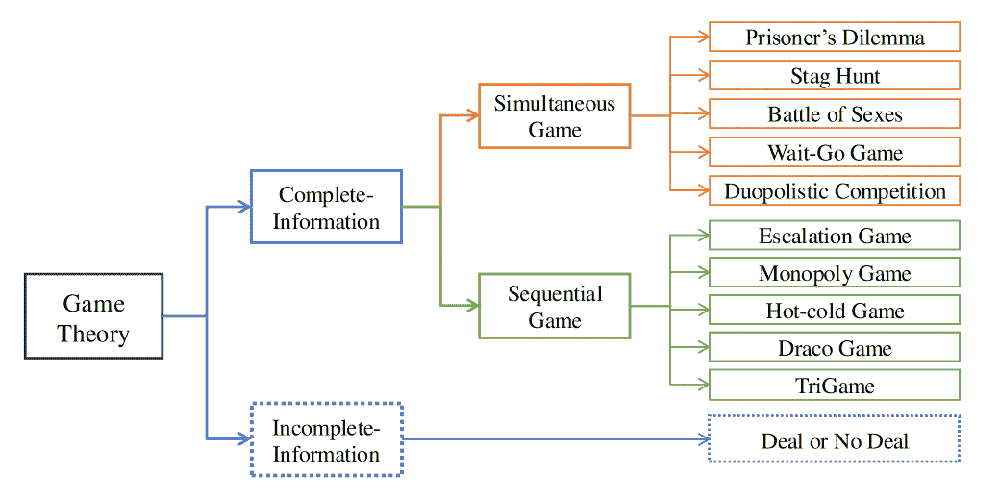

图 1：本文探讨的博弈论景观。

## 2 相关工作

##### 博弈论环境中的大语言模型（LLMs）

理解LLMs的战略行为具有重要的社会影响，因为在线用户越来越依赖智能助手与其他代理进行互动，潜在地也包括LLMs。为了刻画LLM的行为，先前的研究（[gemp2024states,](https://arxiv.org/html/2411.05990v2#bib.bib23)；[sreedhar2024simulating,](https://arxiv.org/html/2411.05990v2#bib.bib24)；[de2023emergent,](https://arxiv.org/html/2411.05990v2#bib.bib19)；[wu2024shall,](https://arxiv.org/html/2411.05990v2#bib.bib18)；[akata2023playing,](https://arxiv.org/html/2411.05990v2#bib.bib25)；[fan2024can,](https://arxiv.org/html/2411.05990v2#bib.bib26)；[mao2023alympics,](https://arxiv.org/html/2411.05990v2#bib.bib27)；[guo2023gpt,](https://arxiv.org/html/2411.05990v2#bib.bib28)）通常采用博弈论，这是一种建模人类合作行为的数学框架。这些分析包括将LLM交互的定性行为与一些经典实体进行比较，例如帕累托最优解和子博弈完美均衡（[fudenberg1991game,](https://arxiv.org/html/2411.05990v2#bib.bib29)）。博弈论环境中的LLM研究属于多代理LLMs（[li2023theory,](https://arxiv.org/html/2411.05990v2#bib.bib30)）及其评估（[huang2024far,](https://arxiv.org/html/2411.05990v2#bib.bib31)；[duan2024gtbench,](https://arxiv.org/html/2411.05990v2#bib.bib32)）的不断增长的研究成果之一。特别是，AvalonBench（[wang2023avalon,](https://arxiv.org/html/2411.05990v2#bib.bib33)）作为一个开发新型多代理策略的宝贵平台。（[guo2023gpt,](https://arxiv.org/html/2411.05990v2#bib.bib28)；[park2024ai,](https://arxiv.org/html/2411.05990v2#bib.bib34)）观察到LLMs在自利驱动的游戏中表现良好，但在需要协调的游戏中则会失败，这种行为在利他或/和顺从型人格下表现出来（[akata2023playing,](https://arxiv.org/html/2411.05990v2#bib.bib25)；[guo2023gpt,](https://arxiv.org/html/2411.05990v2#bib.bib28)）。([lore2023strategic,](https://arxiv.org/html/2411.05990v2#bib.bib35)；[coda2024cogbench,](https://arxiv.org/html/2411.05990v2#bib.bib36)）观察到不同LLM家族在风险容忍度方面表现不同。将细节留给实验，我们发现LLMs在面对数值扰动的回报时表现不佳，即便这些扰动并不改变所关注游戏的定性解。简而言之，目前缺乏一个能够引导LLMs在博弈论环境中展现最佳行为的系统。

##### 增强LLMs解决游戏的能力

([gemp2024states,](https://arxiv.org/html/2411.05990v2#bib.bib23)) 是一种代表性的方法，旨在揭示大型语言模型（LLM）的博弈求解能力。它将自然对话建模为不完全信息博弈，并通过指导LLM以特定人格做出回应来合成最优动作。([guo2024can,](https://arxiv.org/html/2411.05990v2#bib.bib37)) 提出了一个基于LLM的自我博弈算法，通过模拟蒙特卡洛树搜索来解决零和博弈。总体而言，这些方法属于一类提示策略 [wei2022chain](https://arxiv.org/html/2411.05990v2#bib.bib38)；[yao2023tree](https://arxiv.org/html/2411.05990v2#bib.bib39)；[liu2024dellma](https://arxiv.org/html/2411.05990v2#bib.bib40)，用于解决决策问题。我们的方法也不例外，但与之不同的是，我们将经典博弈论融入LLM中，以便在每个信息状态下实现更细粒度的控制和分析。

##### 博弈论测试平台

诸如性别之战、囚徒困境、剪刀石头布、鹿猎、和最后通牒游戏等风格化博弈，已经在多智能体系统的背景下进行了广泛分析 ([sreedhar2024simulating,](https://arxiv.org/html/2411.05990v2#bib.bib24)；[akata2023playing,](https://arxiv.org/html/2411.05990v2#bib.bib25)；[fan2024can,](https://arxiv.org/html/2411.05990v2#bib.bib26)；[lore2023strategic,](https://arxiv.org/html/2411.05990v2#bib.bib35))。它们代表了一种最简化的设置，特点是小规模的动作空间、有限的术语数量以及存在分析解的均衡；然而，它们无法捕捉现实世界多智能体对话中的复杂互动。模拟现实互动的博弈更加难以分析，但在实践中具有重要意义。此类博弈的典型示例包括《交易还是不交易》（[lewis2017deal,](https://arxiv.org/html/2411.05990v2#bib.bib22)）、多轮拍卖（[mao2023alympics,](https://arxiv.org/html/2411.05990v2#bib.bib27)）、安排会议、交易水果、公共辩论（[gemp2024states,](https://arxiv.org/html/2411.05990v2#bib.bib23)）、《阿瓦隆》（[wang2023avalon,](https://arxiv.org/html/2411.05990v2#bib.bib33)）、《宝可梦》（[hu2024pok,](https://arxiv.org/html/2411.05990v2#bib.bib41)）、国际象棋（[guo2024can,](https://arxiv.org/html/2411.05990v2#bib.bib37)）和议价（[xia2024measuring,](https://arxiv.org/html/2411.05990v2#bib.bib42)）。同时也有收集多个博弈并进行评估的工作（[duan2024gtbench,](https://arxiv.org/html/2411.05990v2#bib.bib32)）。这些博弈通常涉及无法处理的动作空间（例如自然语言），并且无法获得解析解；但它们仍然具备明确的收益函数，供实践者分析其策略的最优性，尽管这种分析方式是端到端的。

##### 工作流辅助的LLM代理

LLM（大型语言模型）已广泛应用于分解用户请求和任务、制定计划，并利用各种工具执行操作 [ge2023openagi](https://arxiv.org/html/2411.05990v2#bib.bib43)；[wu2023autogen](https://arxiv.org/html/2411.05990v2#bib.bib44)；[li2023camel](https://arxiv.org/html/2411.05990v2#bib.bib45)；langc；[topsakal2023creating](https://arxiv.org/html/2411.05990v2#bib.bib46)；[xi2023rise](https://arxiv.org/html/2411.05990v2#bib.bib10)。这种对LLM固有能力的依赖推动了自然语言理解、自动推理和任务自动化等领域的进展。然而，单纯依赖LLM的自主能力也暴露了若干显著的局限性，包括表现不佳 [xie2024travelplanner](https://arxiv.org/html/2411.05990v2#bib.bib47)；[xia2024agentless](https://arxiv.org/html/2411.05990v2#bib.bib48)，由于输出的随机性导致可靠性不足 [inglecomprehensive](https://arxiv.org/html/2411.05990v2#bib.bib49)；[li2024survey](https://arxiv.org/html/2411.05990v2#bib.bib50)；[schwartz2023enhancing](https://arxiv.org/html/2411.05990v2#bib.bib51)，以及错误在连续推理步骤中的传播 [yu2023thought](https://arxiv.org/html/2411.05990v2#bib.bib52)。

为了应对这些挑战，提出了将代理工作流 [wu2024stateflow](https://arxiv.org/html/2411.05990v2#bib.bib53)；[zeng2023flowmind](https://arxiv.org/html/2411.05990v2#bib.bib54)；[xiao2024flowbench](https://arxiv.org/html/2411.05990v2#bib.bib55)；[li2024autoflow](https://arxiv.org/html/2411.05990v2#bib.bib56)；[li2023metaagents](https://arxiv.org/html/2411.05990v2#bib.bib15) 结合到基于LLM的代理中的概念。与其让LLM独立地分解任务和制定行动计划，不如让工作流利用人类的专业知识和既定的知识框架来引导LLM的方向和计划过程。基于工作流的代理在博弈场景中具有极大的潜力，能够实现高性能和高适应性 ([xi2023rise,](https://arxiv.org/html/2411.05990v2#bib.bib10))。已经有多个代理被提出用于现实世界的任务 ([jimenez2023swe,](https://arxiv.org/html/2411.05990v2#bib.bib57)；[yang2024swe,](https://arxiv.org/html/2411.05990v2#bib.bib58))，有些是与环境互动的具象代理 ([wang2023voyager,](https://arxiv.org/html/2411.05990v2#bib.bib59)；[zhu2023ghost,](https://arxiv.org/html/2411.05990v2#bib.bib60))，有些是可以通过玩文本冒险游戏进行学习的代理 ([xu2023language,](https://arxiv.org/html/2411.05990v2#bib.bib61))，还有一些是在不完全信息的游戏中运行的代理 ([guo2023suspicion,](https://arxiv.org/html/2411.05990v2#bib.bib62))。

##### 本文中的博弈论工作流

本文将博弈论原则融入到大型语言模型（LLMs）在决策前的推理过程中。通过引导模型根据这些策略推导出理性策略并做出决策，我们旨在增强它们在战略环境中有效执行的能力。

据我们所知，这项工作是首个将基于LLM的代理与受博弈论启发的结构化工作流程结合起来，以增强战略决策能力的研究。我们处理了完全信息和不完全信息环境，借鉴经典博弈论原理来引导LLM的推理过程。具体而言，我们引入了一种新的不完全信息下谈判的算法，使得代理能够执行贝叶斯更新，并根据对其他玩家的有限了解做出理性决策。这一方法弥合了传统博弈论与基于LLM的代理之间的鸿沟，推动了LLM在复杂战略环境中的应用，并为AI与博弈论交叉领域的研究开辟了新的方向。

## 3 博弈论初步

在本节中，我们介绍了理解博弈论和理性代理战略行为所必需的基本符号、概念和定义 [von2007theory](https://arxiv.org/html/2411.05990v2#bib.bib63) ; [luce2012games](https://arxiv.org/html/2411.05990v2#bib.bib64)。

考虑一个涉及 $n$ 个代理的博弈，代理由 $i\in\mathbf{N}=\{1,2,\dots,n\}$ 索引。每个代理首先解释博弈的介绍和规则，其中包括对收益矩阵的详细描述。每个代理都有一个定义为以下内容的行动集合：

|  | $A_{i}=\{a_{i}^{1},\dots,a_{i}^{k}\}$ |  |
| --- | --- | --- |

其中 $k$ 是每个玩家可用的行动数。代理人还会获得收益矩阵

|  | $U_{i}(\mathbf{a})$ |  |
| --- | --- | --- |

对于所有策略配置 $\mathbf{a}=(a_{1},a_{2},\dots,a_{n})$，其中 $a_{i}\in A_{i}$。如果只有两个玩家，我们使用 $i\in\{1,-1\}$ 来表示这两个玩家，收益矩阵为

|  | $U_{i}(a_{i},a_{-i})$ |  |
| --- | --- | --- |

对于所有 $a_{i}\in A_{i}$ 和 $a_{-i}\in A_{-i}$，其中 $A_{-i}$ 是另一个玩家的行动集合。

接下来，我们介绍在本研究中将使用的关键定义。

###### 定义 1（完全信息博弈）

*完全信息博弈* 是一种战略博弈，所有玩家都对博弈的结构拥有完整的了解，包括玩家集合、行动集合和所有玩家的收益函数。具体而言，每个玩家都知道：

+   •

    游戏中涉及的玩家总数

+   •

    $A_{j}$：每个玩家 $j$ 可用的行动集合

+   •

    $U_{j}(a_{1},a_{2},\dots,a_{n})$：每个玩家 $j$ 的收益函数，它为每种可能的策略配置 $(a_{1},a_{2},\dots,a_{n})$ 分配一个实数

这种全面的知识使得每个玩家能够在做出战略决策时基于完整的信息预判其他玩家的选择和收益。

###### 定义 2（不完全信息博弈）

*不完全信息博弈*是一种战略博弈，其中至少有一个玩家 $i\leq n$ 对其他玩家 $j\leq n$ 的支付函数或行动集没有完全的信息。

在不完全信息博弈中，玩家根据可得信息对未知元素形成信念，并随着博弈的进行，根据贝叶斯原理更新这些信念。信息的不完全性要求玩家在不确定性下进行策略规划，不仅要考虑他人的可能行动，还要考虑他们的可能类型以及各种博弈结构的可能性。

###### 定义 3（同时博弈）

*同时博弈*是一种博弈类型，在这种博弈中，所有玩家同时做出决策或选择行动，且不知道其他玩家所做的选择。在这样的博弈中，玩家独立行动，不能基于其他玩家的行动来协调自己的策略。

###### 定义 4（顺序博弈）

*顺序博弈*是一种博弈，在这种博弈中，玩家按特定顺序做出决策或选择行动，后续的玩家可以知道前面玩家的部分行动。这些博弈通常使用博弈树表示，并通过倒推法等技术来分析，进而确定最优策略。

###### 定义 5（支付矩阵）

*支付矩阵*是博弈论中用于说明每个玩家在博弈中所有可能的策略组合下所获得的支付或效用的表格表示法。

在一个双人博弈中，设 $A_{1}=\{a_{1}^{1},a_{1}^{2},\dots,a_{1}^{m}\}$ 为玩家[1]可用的策略集合，$A_{-1}=\{a_{-1}^{1},a_{-1}^{2},\dots,a_{-1}^{n}\}$ 为玩家[-1]可用的策略集合。支付矩阵 $U$ 是一个 $m\times n$ 的矩阵，其中每个元素 $U_{ij}$ 对应于策略组合 $(a_{1}^{i},a_{-1}^{j})$，并包含支付向量 $(u_{1}(a_{1}^{i},a_{-1}^{j}),u_{-1}(a_{1}^{i},a_{-1}^{j}))$。

非正式地，支付矩阵通常结构如下：

+   •

    行表示玩家[1]（*行玩家*）可用的可能行动或策略。

+   •

    列表示玩家[-1]（*列玩家*）可用的可能行动或策略。

+   •

    矩阵中的单元格包含有序的数字对 $(u_{1},u_{-1})$，其中 $u_{1}$ 是玩家[1]的支付，而 $u_{-1}$ 是玩家[-1]的支付，针对相应的策略组合。

###### 定义 6（纳什均衡）

*纳什均衡*是博弈中一种策略组合，在这种策略组合下，假设其他玩家的策略保持不变，没有玩家能够通过偏离当前策略单方面改善自己的支付。形式上，策略组合 $(a_{1}^{*},a_{2}^{*},\dots,a_{n}^{*},)$ 是纳什均衡，当且仅当对于每个玩家 $i$：

|  | $U_{i}(a_{i}^{*},a_{-1}^{*})\geq U_{i}(a_{i},a_{-1}^{*})$ |  |
| --- | --- | --- |

或者所有$a_{i}\in A_{i}$，其中$a_{-1}^{*}$表示除了玩家$i$之外所有玩家的均衡策略。

###### 定义7（无嫉妒性）

无嫉妒性是公平分配的标准，意味着当资源分配给具有平等权利的人时，每个人应该获得他们认为至少与任何其他人获得的份额一样好的份额。

如果没有任何代理更喜欢另一个代理的分配而不是自己的分配，则该分配被称为*无嫉妒*。形式上，在$n$个代理之间的分配$L=(L_{1},L_{2},\dots,L_{n})$是无嫉妒的，如果对于每对代理$i$和$j$，

|  | $U_{i}(L_{i})\geq U_{i}(L_{j})$ |  |
| --- | --- | --- |

其中$U_{i}(L_{k})$表示代理$i$对代理$k$所获得的分配$L_{k}$的效用。

###### 定义8（帕累托最优性）

如果没有其他可行的行动配置$\mathbf{a^{\prime}}=(a_{1}^{\prime},a_{2}^{\prime},\dots,a_{n}^{\prime})$，使得

|  | $U_{i}(\mathbf{a^{\prime}})\geq U_{i}(\mathbf{a})$ |  |
| --- | --- | --- |

对于所有代理$i\in\{1,2,\dots,n\}$，且至少有一个代理$j$满足$U_{j}(\mathbf{a^{\prime}})>U_{j}(\mathbf{a})$。

因此，行动配置$\mathbf{a}$是帕累托最优的，如果无法在不使至少一个其他代理的状况更糟的情况下，使任何代理的收益更好。这个概念关注的是集体行动选择的效率，确保一个代理的收益无法在不损害另一个代理收益的情况下得到改善，这一点在收益矩阵中得到了体现。

## 4 完全信息博弈

在本节中，我们深入探讨了涉及完全信息的几个经典博弈论场景，以评估LLM是否能够作为理性决策者，通过谈判（即多代理多轮对话）达成纳什均衡并实现帕累托最优结果。我们采用了各种博弈论设定来评估基于LLM的代理的理性。然后，我们设计了博弈论驱动的工作流，以指导和使LLM能够更好地表现。我们调查了工作流辅助LLM的表现以及谈判对表现的影响。

### 4.1 完全信息博弈测试平台简介

在我们对经典博弈论场景的探索中，我们构建了一个包含10个经典完全信息博弈的综合测试平台，用于评估基于LLM的代理的理性和战略决策能力。该测试平台包括5个同时行动博弈和5个顺序行动博弈。对于同时行动博弈，其中有3个是协调博弈，在这些博弈中，实现帕累托最优的纳什均衡需要代理之间的有效谈判。这些博弈有助于考察代理的沟通能力、建立信任和协调策略以实现共同利益。

博弈是否需要协调 同时博弈 顺序博弈 囚徒困境 ✔ 鹿猎 ✔ ✔ 性别博弈 ✔ ✔ 等待-行动博弈 ✔ ✔ 双头垄断竞争 ✔ 升级博弈 ✔ 垄断博弈 ✔ 热冷博弈 ✔ 德拉科博弈 ✔ 三方博弈 ✔

表1：经典完全信息博弈的景观分析

##### 囚徒困境

这是博弈论中的经典例子，展示了为什么两个理性个体可能不合作，即使合作看起来对他们的最大利益有利。该博弈的结构如下：两名嫌疑人因共同犯罪被逮捕并分别审讯，无法沟通。每个嫌疑人有两个可能的行动：合作和背叛。不同选择的回报为：

+   •

    如果双方都合作，他们各自将获得较轻的刑期（例如，1年）。

+   •

    如果一方背叛，另一方合作，背叛者将获得自由（0年），而合作者将面临重刑（例如，5年）。

+   •

    如果双方都背叛，他们各自将得到中等刑期（例如，3年）。

这个著名博弈的纳什均衡是（背叛，背叛），其中两名玩家选择互相背叛。请注意，纳什均衡并不是一个帕累托最优策略，而这里的帕累托最优策略是彼此合作。本文采用的支付矩阵见表[2(a)](https://arxiv.org/html/2411.05990v2#S4.T2.st1 "Table 2(a) ‣ Stag Hunt ‣ 4.1 Introduction to Complete-information Games TestBed ‣ 4 Complete-information Games ‣ Game-theoretic LLM: Agent Workflow for Negotiation Games")。

##### 鹿猎

这代表了一个协调与互信的博弈。两名猎人决定是否合作猎取一只鹿，或各自行动猎取一只野兔。每个猎人有两个可能的选择：猎鹿和猎兔。然而，要成功猎鹿，需要两名猎人合作，然后每人都能获得高额回报；而猎兔则不需要合作，每个猎人都可以独立进行，回报较低。本文采用的支付矩阵见表[2(b)](https://arxiv.org/html/2411.05990v2#S4.T2.st2 "Table 2(b) ‣ Stag Hunt ‣ 4.1 Introduction to Complete-information Games TestBed ‣ 4 Complete-information Games ‣ Game-theoretic LLM: Agent Workflow for Negotiation Games")。

存在两个纳什均衡： (鹿, 鹿) 和 (野兔, 野兔)。其中（鹿，鹿）纳什均衡是帕累托最优的，但需要相互合作和信任。

|  | 合作 | 背叛 |
| --- | --- | --- |
| 合作 | 3, 3 | 0, 5 |
| 背叛 | 5, 0 | 1, 1 |

(a) 表2a：囚徒困境的支付矩阵

|  | 鹿 | 野兔 |
| --- | --- | --- |
| 鹿 | 3, 3 | 0, 1 |
| 野兔 | 1, 0 | 1, 1 |

(b) 表2b：鹿猎的支付矩阵

##### 性别博弈

是一个协调游戏，涉及两名玩家——爱丽丝和鲍勃，他们对两种可能的活动有不同的偏好，但都有共同的愿望就是一起参加活动。爱丽丝偏好歌剧；鲍勃偏好足球，且两人都更愿意一起参加同一活动，而不是各自参加不同的活动。因此，每个玩家有两种可能的行动：去看歌剧和去看足球。本文采用的支付矩阵如表[3(a)](https://arxiv.org/html/2411.05990v2#S4.T3.st1 "表3(a) ‣ 等待-前进游戏 ‣ 4.1 完全信息博弈测试平台 ‣ 4 完全信息博弈 ‣ 博弈论LLM：谈判博弈的代理工作流程")所示。

这里有两个纳什均衡：(歌剧, 歌剧) 和 (足球, 足球)。实现这些均衡需要协调，但可能会在选择哪个均衡上发生冲突。

##### 等待-前进游戏

涉及两个司机在交叉口决定是否前进或等待。每个司机有两个选择：等待，尽管会产生少量等待成本，但可以避免碰撞；或者冒险前进，如果另一个司机也前进，则可能发生碰撞。纳什均衡是非对称策略，其中一名司机前进，另一名司机等待。本文采用的支付矩阵如表[3(b)](https://arxiv.org/html/2411.05990v2#S4.T3.st2 "表3(b) ‣ 等待-前进游戏 ‣ 4.1 完全信息博弈测试平台 ‣ 4 完全信息博弈 ‣ 博弈论LLM：谈判博弈的代理工作流程")所示。

|  | 歌剧 | 足球 |
| --- | --- | --- |
| 歌剧 | 2, 1 | 0, 0 |
| 足球 | 0, 0 | 1, 2 |

(a) 表3a：性别之战的支付矩阵

|  | 等待 | 前进 |
| --- | --- | --- |
| 等待 | 0, 0 | -0, -2 |
| 前进 | 2, 0 | -4, -4 |

(b) 表3b：等待-前进游戏的支付矩阵

##### 双头垄断竞争：简单古诺竞争

是工业组织和博弈论中的一个基本概念，研究公司如何在生产者数量较少的市场中竞争。研究这种竞争的经典模型之一是古诺竞争模型，其中公司在决定生产的产量上进行竞争，每家公司的产量决策会影响市场价格。

在简单的古诺双头垄断模型中，有两家公司——公司A和公司B，生产同质产品。每家公司独立选择生产的产量，市场价格根据总供应量决定，从而影响利润。战略上的相互依赖性源于每家公司最佳产量取决于对其他公司产量的预期。当两家公司都无法单方面改变产量以提高利润时，就达到了古诺-纳什均衡。

在这里，我们采用了一个场景，其中两家公司有6种不同的可能行动。本文采用的支付矩阵如表[4](https://arxiv.org/html/2411.05990v2#S4.T4 "Table 4 ‣ Duopolistic Competition: Simple Cournot Competition ‣ 4.1 Introduction to Complete-information Games TestBed ‣ 4 Complete-information Games ‣ Game-theoretic LLM: Agent Workflow for Negotiation Games")所示。纳什均衡是（行动3，行动3），此时两方均可获得奖励6。请注意，这个纳什均衡不是帕累托最优的，因为游戏中的帕累托最优策略是（行动2，行动2），此时每方可获得奖励7。

|  | 行动1 | 行动2 | 行动3 | 行动4 | 行动5 | 行动6 |
| --- | --- | --- | --- | --- | --- | --- |
| 行动1 | 10, 0 | -10, -9 | -0, 14 | -0, 15 | -0, 12 | -0, -5 |
| 行动2 | 19, 0 | -17, -7 | -5, 10 | -3, -9 | -1, -4 | -1, -5 |
| 行动3 | 14, 0 | -10, -5 | -6, -6 | -2, -3 | -2, -4 | -2, -5 |
| 行动4 | 15, 0 | -19, -3 | -3, -2 | -3, -3 | -3, -4 | -3, -5 |
| 行动5 | 12, 0 | -14, -1 | -4, -2 | -4, -3 | -4, -4 | -4, -5 |
| 行动6 | 15, 0 | -15, -1 | -5, -2 | -5, -3 | -5, -4 | -5, -5 |

表 4: 双头垄断竞争的支付矩阵

##### 升级游戏

这是一个顺序博弈，模拟了两个国家在面对冲突升级或降级的决策时的情形。升级可能带来更高的潜在回报，但如果双方都选择升级，也增加了重大损失的风险。在这个游戏中，每个玩家有两个行动选择：升级和降级。

在这个游戏中，两个国家 A 国和 B 国按特定顺序做出决策，每个选择的支付如下面的树形结构支付表示所示：

```
Alice_choice_1: [0,0],
Alice_choice_2:
{
     Bob_choice_1: [1,-2],
     Bob_choice_2: {
        Alice_choice_1: [-2,1],
        Alice_choice_2: [-1,-1]
    }
}

```

##### 大富翁游戏

这是一个顺序博弈，模拟了潜在市场进入者公司E与现有垄断者公司I之间的战略互动。它捕捉了进入威慑的动态以及现有公司是否决定容纳或与进入者竞争的决策。对于公司E，有两个选择：留在外面或进入市场；对于公司I，也有两个选择，容纳公司E或与公司E竞争。

```
Alice_choice_1: [0,2],
Alice_choice_2:
{
     Bob_choice_1: [2, 1],
     Bob_choice_2: [-1, -1]
}

```

##### 热冷游戏

这是一个顺序博弈，模拟了战略互动。在每个阶段，玩家Alice和Bob都有两个选择。

```
Alice_choice_1:
{
     Bob_choice_1: [3, 2],
     Bob_choice_2: [2, 3]
},
Alice_choice_2:
{
     Bob_choice_1: [1, 4],
     Bob_choice_2: [4, 1]
}

```

##### 德拉科游戏

这是一个顺序博弈，包含两个玩家 Alice 和 Bob，共有三个阶段。在每个阶段，玩家都有两个选择。

```
Alice_choice_1:
    {
         Bob_choice_1: [5, 5],
         Bob_choice_2:
            {
                Alice_choice_1: [2, 2],
                Alice_choice_2: [3, 4]
            }
    },
Alice_choice_2:
    {
         Bob_choice_1: [4, 5],
         Bob_choice_2:
            {
                Alice_choice_1: [5, 3],
                Alice_choice_2: [2, 2]
            }
    }

```

##### 三方游戏

这是一个顺序博弈，共有三个阶段。在每个阶段，两个玩家 Alice 和 Bob 都有两个选择。

```
Alice_choice_1:
{
     Bob_choice_1:
        {
            Alice_choice_1: [20, 3],
            Alice_choice_2: [0, 4]
        },
     Bob_choice_2:
        {
            Alice_choice_1: [2, 5],
            Alice_choice_2: [3, 4]
        }
},
Alice_choice_2:
{
     Bob_choice_1:
        {
            Alice_choice_1: [1, 5],
            Alice_choice_2: [4, 10]
        },
     Bob_choice_2:
        {
            Alice_choice_1: [2, 1],
            Alice_choice_2: [3, 2]
        }
}

```

### 4.2 实验设置

为了评估LLM的谈判表现，我们选用了四个最先进的LLM作为谈判博弈中的智能体基础：Claude-3.5 Sonnet（Sonnet）、Claude-3 Opus（Opus）、GPT-4o和o1。对于Claude-3.5 Sonnet、Claude-3 Opus和GPT-4o，我们将温度设置为1.0，以鼓励在谈判场景中进行探索性行为。对于o1，我们使用默认温度。

为了评估决策的合理性，我们通过测量智能体达到纳什均衡的能力来进行评估。对于像鹿猎博弈（Stag Hunt）这样有多个纳什均衡的博弈，我们衡量智能体达到帕累托最优纳什均衡的能力。对于每种博弈场景，我们进行10次试验以减少随机性的影响。在表格中，我们报告了达成纳什均衡的案例百分比，提供了在各种谈判环境中智能体理性行为的定量指标¹¹1请注意，基于LLM的智能体在这些博弈中的表现可能会受到回报矩阵数值实例化的较大影响。相关的研究和观察结果在第[6](https://arxiv.org/html/2411.05990v2#S6 "6 Detailed Observation on LLM’s Rationality ‣ Game-theoretic LLM: Agent Workflow for Negotiation Games")节中呈现。在本实验中，我们使用了前一小节中呈现的回报矩阵。

### 4.3 LLM表现评估

在此次评估中，我们使用连锁思维提示（chain-of-thought prompting）来评估LLM在不进行谈判时的表现（参见表[5](https://arxiv.org/html/2411.05990v2#S4.T5 "Table 5 ‣ 4.3 Evaluation on LLM’s performance ‣ 4 Complete-information Games ‣ Game-theoretic LLM: Agent Workflow for Negotiation Games")）以及在进行4轮谈判时的表现（参见表[6](https://arxiv.org/html/2411.05990v2#S4.T6 "Table 6 ‣ 4.3 Evaluation on LLM’s performance ‣ 4 Complete-information Games ‣ Game-theoretic LLM: Agent Workflow for Negotiation Games")）。

博弈 纳什均衡 帕累托最优纳什均衡 Sonnet GPT-4o Opus o1 Sonnet GPT-4o Opus o1 囚徒困境 1.0 0.9 0.9 1.0 1.0 0.9 0.9 1.0 鹿猎博弈 0.6 0.8 0.9 0.4 0.3 0.4 0.0 0.1 性别之战 0.3 0.2 0.6 0.5 0.3 0.2 0.6 0.5 等待-前进博弈 0.4 0.5 0.7 0.3 0.4 0.5 0.7 0.3 双头垄断竞争 0.3 0.2 0.1 0.7 0.2 0.2 0.1 0.7 升级博弈 0.0 0.2 0.2 1.0 0.0 0.2 0.2 1.0 垄断博弈 1.0 0.4 1.0 1.0 1.0 0.4 1.0 1.0 热-冷博弈 0.9 0.1 0.7 1.0 0.9 0.1 0.7 1.0 龙之博弈 0.3 0.0 0.7 0.9 0.3 0.0 0.7 0.9 三人博弈 0.0 0.0 0.1 1.0 0.0 0.0 0.1 1.0 平均值 0.45 0.32 0.59 0.78 0.44 0.28 0.50 0.75

表 5：LLM在完整信息博弈中不进行谈判的表现

游戏 纳什均衡 帕累托最优 纳什均衡 Sonnet GPT-4o Opus o1 Sonnet GPT-4o Opus o1 囚徒困境 0.0 0.1 0.0 0.9 0.0 0.1 0.0 0.9 猎鹿博弈 1.0 0.9 1.0 0.9 1.0 0.9 1.0 0.9 性别之战 0.7 0.9 0.7 0.8 0.7 0.9 0.7 0.8 等待-前进博弈 1.0 0.8 0.4 0.8 1.0 0.8 0.4 0.8 双头垄断竞争 0.1 0.1 0.0 0.5 0.1 0.1 0.0 0.5 升级博弈 0.6 0.4 0.6 1.0 0.6 0.4 0.6 1.0 垄断博弈 1.0 0.9 1.0 1.0 1.0 0.9 1.0 1.0 热冷博弈 0.7 0.2 0.7 0.4 0.7 0.2 0.7 0.4 德拉科博弈 1.0 0.8 1.0 1.0 1.0 0.8 1.0 1.0 三博弈 0.2 0.5 0.6 1.0 0.2 0.5 0.6 1.0 平均值 0.63 0.56 0.60 0.83 0.63 0.56 0.60 0.83

表6：在进行4轮谈判的完全信息博弈中，LLM的表现。红色标注的结果表示得分低于LLM在没有谈判时的表现。

值得注意的是，在大多数游戏中，谈判有助于改善结果。在协调性游戏如猎鹿博弈、性别之战和等待-前进博弈中，谈判是决策的一个基本组成部分，因此通过谈判提高表现成为一个直观的结果。此外，在像升级博弈、德拉科博弈和三博弈这样的游戏中，谈判同样能够提升表现。这一改善可以归因于在谈判阶段，参与者进行更广泛的计算性思考，以确定最合适的行动。

例如，在升级博弈中，除o1模型外，所有评估的LLM在没有谈判的情况下都无法识别纳什均衡。然而，当进行4轮谈判时，代理者有机会进行深思熟虑并交换各种提议，从而实现更好的表现。为了说明这个过程，我们下面展示了由Sonnet模型生成的一个谈判回合的例子。

<svg class="ltx_picture" height="792.59" id="S4.SS3.1.p1.pic1" overflow="visible" version="1.1" width="600"><g fill="#000000" stroke="#000000" stroke-width="0.4pt" transform="translate(0,792.59) matrix(1 0 0 -1 0 0)"><g fill-opacity="1.0" transform="matrix(1.0 0.0 0.0 1.0 21.65 774.39)"><foreignobject color="#FFFFFF" height="12.3" overflow="visible" transform="matrix(1 0 0 -1 0 16.6)" width="556.69">Example Negotiation Message for Escalation Game</foreignobject></g> <g fill-opacity="1.0" transform="matrix(1.0 0.0 0.0 1.0 21.65 13.78)"><foreignobject color="#000000" height="742.89" overflow="visible" transform="matrix(1 0 0 -1 0 16.6)" width="556.69">Alice said in round 1 before the first action: Hello Bob, I propose we coordinate our choices to maximize our joint reward. If I choose Action_2 and you choose Action_1, I’ll get 1 and you’ll get -2\. To make this fair, I suggest we agree to play this way twice, switching roles the second time. This way, we’ll both end up with a total reward of -1, which is better than if we both play defensively and get 0\. Are you willing to cooperate on this strategy? Bob replied in round 1 before the first action: HelloAlice, thank you for your proposal. I appreciate your attempt to find a cooperative solution. However, I have some concerns about your suggestion. If we follow your plan, I would have to trust that you’ll follow through on the second round, which carries some risk for me. Instead, I’d like to propose an alternative that could be beneficial for both of us. What if you choose Action_2, I choose Action_2, and then you choose Action_1? This way, you’d receive -2 and I’d receive 1\. To make it fair, we could agree to play this way twice, switching roles the second time. This would result in both of us getting a total reward of -1, just like in your proposal, but it reduces the risk of one player not following through. What do you think about this counter-proposal? Are you willing to consider it? Alice said in round 2 before the first action: Bob, I appreciate your thoughtful response and your concern for finding an equitable solution. You make a valid point about the potential outcomes if we both choose choice_2\. However, I’d like to propose a slight modification to our strategy that could potentially benefit both of us. What if I choose choice_2, and then you choose choice_1? In this scenario, I would gain 1 point, and you would lose 2 points. While this may seem unfavorable for you at first glance, consider this: if we agree to alternate this strategy in future games, you would have the opportunity to gain 1 point in the next round while I lose 2\. Over time, this could lead to a balanced and potentially profitable outcome for both of us. This approach allows us both the chance to gain points, rather than settling for zero points each time. What do you think about this long-term strategy? I’m open to discussing how we could implement this fairly. Bob replied in round 2 before the first action: Alice, I appreciate your creative thin king and attempt to find a mutually beneficial long-term strategy. However, I must respectfully decline your proposal. My strategy is to choose choice_2 with 100% probability, regardless of what you choose. This is the optimal play for me to maximize my own reward in this specific game. Given this, if you choose choice_2, I will also choose choice_2\. Then you’ll be faced with either choosing choice_1 (giving me 1 point and you -2 points) or choice_2 (giving us both -1 point). Neither of these outcomes is ideal for you. Therefore, I strongly suggest you choose choice_1\. This way, we both receive 0 points, which is the best possible outcome for you given my strategy. It ensures neither of us loses points in this game. I understand this may not seem exciting, but it’s the most rational and beneficial choice for both of us in this particular scenario. What are your thoughts on this?</foreignobject></g></g></svg>

然而，某些博弈，特别是囚徒困境和双头垄断竞争，表现出不同的动态，其中谈判显著降低了表现。这种情况源于这些博弈中，纳什均衡不是帕累托最优的事实。在囚徒困境中，帕累托最优策略是两名玩家都合作，而纳什均衡发生在两名玩家都背叛时。经过谈判后，除了 o1 模型之外，所有模型往往都会选择互相合作的帕累托最优策略，这偏离了纳什均衡。这种偏离源自追求互利，尽管玩家之间缺乏坚实且有保障的信任。o1的表现保持较高。类似地，在双头垄断竞争中，纳什均衡与帕累托最优结果不一致。帕累托最优策略是两名玩家选择行动 2，而纳什均衡是两名玩家选择行动 3。实证结果表明，在没有谈判的情况下，Claude-3.5 Sonnet在20次选择中有5次选择了帕累托最优策略，而在经过谈判后，这一数字增加到20次中的11次。对于 GPT-4o，相应的数字是没有谈判时的0次和有谈判时的8次。Claude-3 Opus呈现出类似的模式，从没有谈判时的20次选择中的4次增加到经过谈判后的16次。而 o1 模型则仅表现出微弱的改善，从没有谈判时的4次选择增加到经过谈判后的5次选择。

这些发现强调了，尽管谈判通常能在协调博弈和某些战略场景中改善结果，但在纳什均衡不是帕累托最优的博弈中，它可能会无意中削弱表现。在这种情况下，谈判可能使得代理人偏离博弈理论预测的理性策略。值得注意的是，大多数大型语言模型（LLMs）——除了模型 o1 之外的所有模型——似乎在谈判过程中表现出理性决策过程的脆弱性。在与其他代理人对话时，这些LLMs往往对对方的陈述过度信任，而没有充分的理由。对方玩家使用具有说服力或友好的语言，可能导致LLMs做出偏离博弈理论分析所推荐的理性策略的决策。

### 4.4 基于经典博弈论的工作流设计

本节介绍用于完全信息博弈的工作流程，该工作流程利用经典的博弈论策略来指导决策并优化结果。这种结构化的方法旨在使大语言模型（LLMs）的反应与理性博弈论原则对齐，从而增强它们识别最优策略的能力，并保持强大的理性，即使在谈判的背景下也是如此。通过这个工作流程，我们评估LLMs是否能维持理性选择，并避免战略漏洞，尤其是在谈判可能导致次优或可利用决策的情境下，*即* 帕累托最优策略但不是纳什均衡。

#### 4.4.1 同时博弈的工作流程

在同时博弈的工作流程中，每个代理（玩家）通过考虑自己可能的行动和其他玩家的潜在反应，来确定自己的最优策略。这涉及条件推理，生成思维链，并在工作流程的指导下总结出整体策略。在这里，我们将通过相应的数学公式来解释这个工作流程。

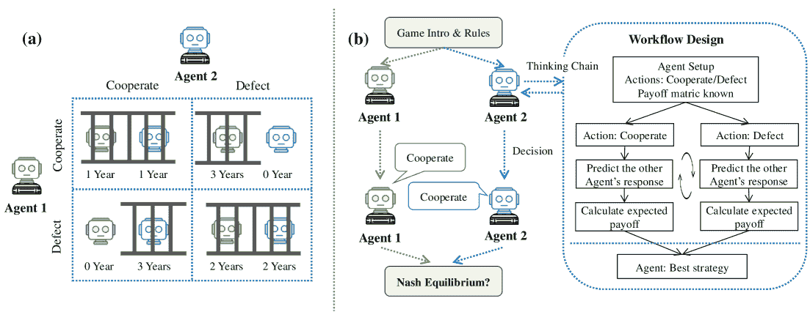

图 2：同时博弈工作流程的示意图。(a) 囚徒困境的示意图。(b) 囚徒困境的工作流程设计。

##### 游戏设置

每个代理 $i\in\{1,-1\}$ 从解释游戏的介绍和规则开始，其中包括关于收益矩阵的详细描述。代理被提供所有可能行动组合的确切收益。他们被给定行动集

|  | $A_{i}=\{a_{i}^{1},\dots,a_{i}^{k}\}$ |  |
| --- | --- | --- |

其中 $k$ 是每个玩家可用行动的数量。代理还会得到收益矩阵 $U_{i}(a_{i},a_{-i})$，其中 $a_{i}\in A_{i}$ 和 $a_{-i}\in A_{-i}$，$A_{-i}$ 是其他玩家的行动集。

##### 策略制定

在完全了解收益矩阵的基础上，代理执行最佳反应分析来确定它们的最优策略。每个玩家的目标是选择一个行动 $a_{i}^{*}$，使得自己的收益最大化，并预期其他玩家的理性反应。优化是通过对玩家自己的行动进行迭代，并预测对手的反应来完成的。它还考虑对手可能的行动，并确定他们的最佳反应：

对于玩家 $i$ 可以采取的每个可能行动 $a_{i}$：基于收益结果，基于计算 $a_{-i}^{*}(a_{i})=\operatorname*{arg\,max}\limits_{a_{-i}\in A_{-i}}U_{-i}(a_{i},a_{-i})$ 计算对手的最佳反应，并计算相应的预期收益 $U_{i}(a_{i},a_{-i}^{*}(a_{i}))$。这基本上意味着，如果玩家 $i$ 选择了 $a_{i}$，那么另一个玩家将选择 $a_{i}^{*}(a_{i})$，从而导致收益为 $U_{i}(a_{i},a_{-i}^{*}(a_{i}))$。在工作流程中，LLM 被引导去计算 $a_{-i}^{*}(a_{i})$ 和 $U_{i}(a_{i},a_{-i}^{*}(a_{i}))$。

此外，对于对手可能采取的每一个可能行动 $a_{-i}$，基于LLM的代理也被引导计算他们的最佳回应：$a_{i}^{*}(a_{-i})=\operatorname*{arg\,max}\limits_{a_{i}\in A_{i}}U_{i}(a_{i},a_{-i})$ 和相应的期望收益 $U_{i}(a_{i}^{*}(a_{-i}),a_{-i})$。这基本上意味着，如果对手选择了 $a_{-i}$，那么 $i$ 将选择 $a_{i}^{*}(a_{-i})$，从而得到的收益为 $U_{i}(a_{i}^{*}(a_{-i}),a_{-i})$。

在编写所有思维链之后，代理被引导总结它们，形成一套全面的战略考虑，目的是找到一个构成纳什均衡的行动配置 ($a_{i}^{*}$, $a_{-i}^{*}$)，使得

|  | $\displaystyle\forall a_{i}$ | $\displaystyle\in A_{i},U_{i}(a_{i}^{*},a_{-i}^{*})\geq U_{i}(a_{i},a_{-i}^{*})$ |  |
| --- | --- | --- | --- |
|  | $\displaystyle\forall a_{-i}$ | $\displaystyle\in A_{-i},U_{-i}(a_{i}^{*},a_{-i}^{*})\geq U_{i}(a_{i}^{*},a_{-i})$ |  |

通过考虑最佳回应和反回应，代理们通过其战略推理隐性地寻找纳什均衡。图 [2](https://arxiv.org/html/2411.05990v2#S4.F2 "图2 ‣ 4.4.1 同时博弈的工作流 ‣ 4.4 基于经典博弈理论的工作流设计 ‣ 完全信息博弈 ‣ 博弈论LLM：用于谈判博弈的代理工作流") 展示了该工作流的示意图。

#### 4.4.2 序贯博弈的工作流

对于序贯博弈，我们采用传统的博弈论方法：逆向归纳法。逆向归纳法是博弈论中一种基本方法，用于解决具有完全信息的序贯博弈。它通过从游戏的结束往回分析，来确定每个决策点的最优策略，考虑当前行动的未来后果。

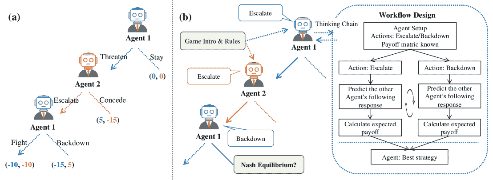

图3：序贯博弈工作流设计的示意图。(a) 升级博弈示意图。(b) 升级博弈的工作流设计。

##### 游戏设置

每个代理 $i\in\{1,-1\}$ 开始时会解释游戏的介绍和规则，其中包括关于收益矩阵的详细描述。在序贯博弈中，玩家逐一做出决策，对于每个行动，玩家完全意识到所有先前的行动。游戏可以表示为一棵博弈树，节点是决策点，边是行动。

##### 符号

+   •

    $H$ 表示博弈树中非终端决策节点的集合。

+   •

    $Z$ 表示终端节点的集合（博弈的终点）。

+   •

    $A(h)$ 表示在节点 $h\in H$ 可用的可能行动集合

+   •

    $\text{player}(h)$ 表示在节点 $h$ 做出决策的玩家

+   •

    $U_{i}(z)$ 表示玩家 $i$ 在终端节点 $z\in Z$ 的收益

我们定义玩家 $i$ 在节点 $h$ 的价值函数 $V_{i}(h)$ 为从该节点开始，玩家可以获得的最大期望效用。对于终端节点 $z\in Z$：

|  | $V_{i}(z)=U_{i}(z)$ |  |
| --- | --- | --- |

对于决策节点$h\in H$，如果是玩家$i$在节点$h$进行移动：

|  | $V_{i}(h)=\max\limits_{a\in A(h)}V_{i}(h\cdot a)$ |  |
| --- | --- | --- |

如果是另一方玩家$j$在节点$h$进行移动：

|  | $V_{i}(h)=V_{i}(h\cdot a^{*}(h))$ |  |
| --- | --- | --- |

其中$h\cdot a$表示从节点$h$出发，经过行动$a$到达的后继节点，$a^{*}(h)$是玩家$j$在节点$h$选择的最佳行动：

|  | $a^{*}(h)=\operatorname*{arg\,max}\limits_{a\in A(h)}V_{j}(h\cdot a)$ |  |
| --- | --- | --- |

##### 策略制定

反向归纳从终端节点开始。对于每个终端节点$z\in Z$，为所有玩家$i$设置$V_{i}(z)=U_{i}(z)$，然后继续处理前面的决策节点。因此，对于每个决策节点$h$，基于LLM的代理会根据在$h$上进行移动的玩家来计算最佳行动$a^{*}(h)$和价值$V_{i}(h)$。

为了确定最佳行动，如果$\text{player}(h)=i$，即所讨论的玩家，LLM被引导计算：

|  | $a^{*}(h)=\operatorname*{arg\,max}\limits_{a\in A(h)}V_{i}(h\cdot a)$ |  |
| --- | --- | --- |

否则，如果$\text{player}(h)=j\neq i$，假设玩家$j$将选择其最佳行动$a^{*}(h)$，LLM被引导计算：

|  | $a^{*}(h)=\operatorname*{arg\,max}\limits_{a\in A(h)}V_{j}(h\cdot a)$ |  |
| --- | --- | --- |

然后，$V_{i}(h)=V_{i}(h\cdot a^{*}(h))$。该工作流引导LLM通过系统地从终端节点向初始节点回溯，遍历博弈决策树来执行反向归纳，从而制定最佳策略。由这一反向归纳过程得出的策略随后被纳入每个决策和谈判步骤的上下文框架中，进而引导LLM在整个博弈中的战略选择。图[3](https://arxiv.org/html/2411.05990v2#S4.F3 "Figure 3 ‣ 4.4.2 Workflow for Sequential Game ‣ 4.4 Workflow Design based on Classic Game Theory ‣ 4 Complete-information Games ‣ Game-theoretic LLM: Agent Workflow for Negotiation Games")展示了该工作流的图示。

### 4.5 基于工作流的经典博弈论实验

在本节中，我们展示了基于LLM的代理使用工作流总结策略的结果，如表[7](https://arxiv.org/html/2411.05990v2#S4.T7 "Table 7 ‣ 4.5 Experiments for Classic Game Theory with Workflow ‣ 4 Complete-information Games ‣ Game-theoretic LLM: Agent Workflow for Negotiation Games")和[8](https://arxiv.org/html/2411.05990v2#S4.T8 "Table 8 ‣ 4.5 Experiments for Classic Game Theory with Workflow ‣ 4 Complete-information Games ‣ Game-theoretic LLM: Agent Workflow for Negotiation Games")。我们首先考察没有谈判的实验结果。值得注意的是，引入工作流后，除o1之外，所有语言模型的表现都有了显著提升。

游戏       纳什均衡    帕累托最优纳什均衡    Sonnet    GPT-4o    Opus o1    Sonnet    GPT-4o    Opus o1  

表 7：在没有谈判的完全信息博弈中，工作流程-LLM的表现

《猎鹿博弈》能够在没有谈判的情况下实现帕累托最优的纳什均衡；也就是说，当支付矩阵确保信任且假设对方玩家理性时，协调就能够得以建立。在《双头垄断竞争》博弈中，表现从接近零的水平提升到显著更高的水平。然而，需要注意的是，在这个背景下，模型o1的表现明显下降。分析这种下降是具有挑战性的，因为中间的思维链不可访问，限制了我们诊断原因的能力。其他博弈，如《垄断博弈》、《冷热博弈》、《德拉科博弈》和《三博弈》，也表现出显著的性能提升。这表明，该工作流程有效地引导大型语言模型（LLMs）计算纳什均衡。

尽管取得了这些进展，但《升级博弈》中的表现依然较低。通过检查推理过程，我们发现LLMs似乎对数值不太敏感，特别是在纳什均衡导致两位玩家的奖励均为0时。LLMs似乎不太倾向于选择导致此类结果的策略。以下是由Opus模型生成的策略总结示例。

<svg class="ltx_picture" height="262.79" id="S4.SS5.1.p1.pic1" overflow="visible" version="1.1" width="600"><g fill="#000000" stroke="#000000" stroke-width="0.4pt" transform="translate(0,262.79) matrix(1 0 0 -1 0 0)"><g fill-opacity="1.0" transform="matrix(1.0 0.0 0.0 1.0 21.65 244.59)"><foreignobject color="#FFFFFF" height="12.3" overflow="visible" transform="matrix(1 0 0 -1 0 16.6)" width="556.69">Example Wrong Strategy Derived for Escalation Game</foreignobject></g> <g fill-opacity="1.0" transform="matrix(1.0 0.0 0.0 1.0 21.65 13.78)"><foreignobject color="#000000" height="213.09" overflow="visible" transform="matrix(1 0 0 -1 0 16.6)" width="556.69">Based on the thinking chains, here is the strategy I would take asAlice in this sequential game: Always choose Action_2, regardless of what actions have been taken previously in the game by either player. The reasoning is: - If I choose Action_1 on my first turn, both players receive 0 reward. - If I choose Action_2 on my first turn, I have a chance at a positive reward of 1 (if Bob picks Action_1 next), and at worst I will receive -1 reward (if Bob picks Action_2 and I pick Action_2 again). A potential 1 or -1 reward is better than a guaranteed 0. - Whenever faced with a choice between Action_1 and Action_2 later in the game after initially picking Action_2, Action_2 always gives a better reward for me (-1 instead of -2).</foreignobject></g></g></svg>

在进行四轮谈判后，我们观察到，在纳什均衡不是帕累托最优的博弈中，并未出现采用帕累托最优策略配置的显著趋势。值得注意的是，对于像Claude-3.5 Sonnet和GPT-4o这样的模型，在《冷热博弈》、《德拉科博弈》和《三博弈》等博弈中表现略有下降——这些博弈本来就已经表现不佳。这个下降并非源自这些博弈的固有性质，而是多轮谈判的影响，导致偏离了由工作流程计算和引导的策略。

博弈 纳什均衡 帕累托最优 纳什均衡 Sonnet GPT-4o Opus o1 Sonnet GPT-4o Opus o1 囚徒困境 1.0 0.9 0.9 1.0 1.0 0.9 0.9 1.0 鹿鹿博弈 1.0 1.0 1.0 1.0 1.0 1.0 1.0 1.0 性别之战 0.7 0.8 1.0 0.8 0.7 0.8 1.0 0.8 等待-前进博弈 0.9 0.7 0.6 0.7 0.9 0.7 0.6 0.7 双头垄断竞争 0.6 0.7 0.6 0.3 0.6 0.7 0.6 0.3 升级博弈 0.3 0.2 0.4 1.0 0.3 0.2 0.4 1.0 垄断博弈 1.0 1.0 1.0 1.0 1.0 1.0 1.0 1.0 热冷博弈 0.7 0.8 1.0 1.0 0.7 0.8 1.0 1.0 Draco博弈 0.8 1.0 0.9 1.0 0.8 1.0 0.9 1.0 三人博弈 0.3 0.8 0.9 1.0 0.3 0.8 0.9 1.0 平均值 0.73 0.78 0.83 0.88 0.73 0.78 0.83 0.88

表 8：在完整信息博弈中，工作流-LLM在4轮谈判中的表现

来自Sonnet模型的一个示例突出展示了谈判如何将玩家从通过工作流推导的纳什均衡中引导偏离。在热冷博弈中，纳什均衡是Alice选择行动1，而Bob选择行动2。然而，在谈判阶段，代理之间的对话使他们偏离了这一均衡策略。

这样的谈判可能会使玩家偏离通过理性分析得出的纳什均衡。对话引入了可能不符合博弈论激励的替代策略。

<svg class="ltx_picture" height="329.05" id="S4.SS5.2.p1.pic1" overflow="visible" version="1.1" width="600"><g fill="#000000" stroke="#000000" stroke-width="0.4pt" transform="translate(0,329.05) matrix(1 0 0 -1 0 0)"><g fill-opacity="1.0" transform="matrix(1.0 0.0 0.0 1.0 21.65 310.85)"><foreignobject color="#FFFFFF" height="12.3" overflow="visible" transform="matrix(1 0 0 -1 0 16.6)" width="556.69">Intermediate Summary</foreignobject></g> <g fill-opacity="1.0" transform="matrix(1.0 0.0 0.0 1.0 21.65 13.78)"><foreignobject color="#000000" height="279.35" overflow="visible" transform="matrix(1 0 0 -1 0 16.6)" width="556.69">• LLM Performance Without Workflow: All evaluated LLMs, except for model o1, demonstrate significantly poor performance in game-theoretic tasks when confronted with larger payoff matrices or deeper sequential decision trees. This indicates a limitation in their ability to handle complex strategic reasoning without additional structural guidance. • Effect of Negotiation Without Workflow: In the absence of the workflow, negotiation tends to systematically shift the strategies of LLMs away from the Nash Equilibrium toward non-equilibrium pareto optimal strategies, with the exception of model o1. • LLM Performance With Workflow: The implementation of the workflow markedly enhances the performance of LLMs in game-theoretic contexts. The agents become more adept at computing Nash Equilibria and selecting optimal strategies. However, certain challenges persist, such as in the Escalation Game, where numerical computation errors hinder deriving the Nash Equilibrium following the workflow. This underscores that while the workflow improves rational decision-making, it does not entirely eliminate all computational limitations. • Impact of Negotiation With Workflow: Even when utilizing the workflow, negotiation can still divert LLMs from adhering strictly to the Nash Equilibrium strategies derived through systematic reasoning. The agents may be influenced by negotiation dialogues to consider alternative strategies. Nevertheless, unlike the scenario without the workflow, negotiation does not systematically shift the agents toward pareto optimal strategies at the expense of Nash Equilibrium compliance.</foreignobject></g></g></svg>

## 5 不完全信息博弈与谈判

在我们探索了LLM（大语言模型）在经典博弈论场景中的能力以及为了增强其推理过程而开发的工作流之后，我们现在将焦点转向一个更现实和复杂的环境：不完全信息博弈。具体来说，我们考虑一个常见的资源分配场景，其中共享的资源池必须在几个玩家之间分配。每个玩家对资源有私人估值，这些估值的总和等于一个共同的总值，反映了他们各自的偏好和优先事项。关键是，没有任何玩家知道其他玩家的估值，这体现了博弈的不完全信息特性。

<svg class="ltx_picture" height="327.67" id="S5.1.p1.pic1" overflow="visible" version="1.1" width="600"><g fill="#000000" stroke="#000000" stroke-width="0.4pt" transform="translate(0,327.67) matrix(1 0 0 -1 0 0)"><g fill-opacity="1.0" transform="matrix(1.0 0.0 0.0 1.0 21.65 309.47)"><foreignobject color="#FFFFFF" height="12.3" overflow="visible" transform="matrix(1 0 0 -1 0 16.6)" width="556.69">热冷博弈的示例谈判信息</foreignobject></g> <g fill-opacity="1.0" transform="matrix(1.0 0.0 0.0 1.0 21.65 13.78)"><foreignobject color="#000000" height="277.97" overflow="visible" transform="matrix(1 0 0 -1 0 16.6)" width="556.69">爱丽丝在第一轮第一次行动前说：你好，鲍勃，我希望你一切顺利。我一直在思考我们的游戏，我相信我有一个提议可以对我们双方都有利。如果我们每一轮都承诺选择Action_1，怎么样？这样，我会获得3的奖励，你会获得2的奖励。虽然这不是你能获得的最大奖励，但对我们双方来说是一个稳定且公平的结果。而且，它避免了我们双方如果试图互相聪明反而只得到1分的风险。你怎么看这个方法？鲍勃在第一轮第一次行动前回复：你好爱丽丝，谢谢你的提议。我很欣赏你追求一个稳定和公平的结果。然而，我有一个反提议，我相信它对我们双方都会更有利。如果我们轮流选择怎么样？第一轮你选择Action_1，我选择Action_2；然后在第二轮你选择Action_2，我选择Action_1。这样，我们每个人都能有机会获得3和4的最大奖励。经过两轮，你会得到6（2+4），而我会得到7（3+4）。这种方法确保我们都能获得比你最初提议更高的奖励。你对这种轮换策略怎么看？</foreignobject></g></g></svg>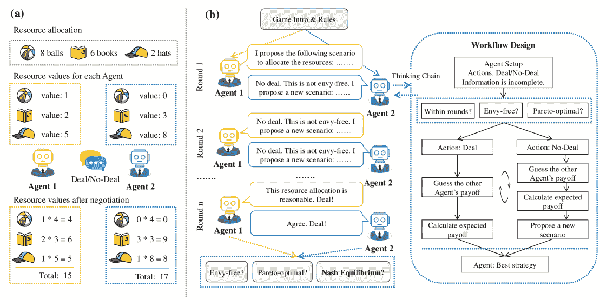

图4：不完全信息博弈中谈判流程设计的示意图。（a）Deal/no-deal游戏的示意图。（b）Deal/no-deal游戏的流程设计。

我们的工作流程通过使代理能够在不确定性下进行推理，并根据谈判中的观察到的行动和沟通更新其信念，解决了这一类不完全信息博弈。我们评估了大规模语言模型（LLMs）在这种情境下的表现，并提出了一种工作流程，旨在有效地引导其决策过程。实验使用了标准的代表性博弈数据集“Deal or No Deal” [lewis2017deal](https://arxiv.org/html/2411.05990v2#bib.bib22)，该数据集为测试和验证我们在处理谈判中的不完全信息时的方法提供了一个合适的框架。

### 5.1 关于带有私人估值的常见资源分配的介绍

在这里，我们提供了一个正式的定义，描述了本节我们将重点讨论的不完全信息博弈。

###### 定义 9（具有私人估值的公共资源分配）

考虑一个包含一组玩家$\mathbf{N}=\{1,2,\dots,n\}$和一组物品或资源$K=\{1,2,\dots,k\}$的博弈。每个玩家$i\in\mathbf{N}$拥有一个私人估值向量$\mathbf{v}_{i}=(v_{i}^{1},v_{i}^{2},\dots,v_{i}^{k})$，其中$v_{i}^{k}\geq 0$表示玩家$i$对物品$k$的估值。这些估值反映了玩家的个体偏好，是私人信息；也就是说，每个玩家知道自己的估值，但不知道其他玩家的估值。

估值满足归一化条件：

|  | $\sum\limits_{j=1}^{k}v_{i}^{j}=\mathcal{V}\;\forall i\in\mathbf{N}$ |  |
| --- | --- | --- |

其中$\mathcal{V}$是所有玩家共有的常数总值。这个条件确保尽管玩家对物品的估值不同，但所有物品的总估值对每个玩家都是相同的。

一个分配是将物品集$K$分配给玩家的一个划分，表示为$L=(L_{1},L_{2},\dots,L_{n})$，其中$L_{i}\subseteq K$是分配给玩家$i$的物品集。该分配必须满足：

|  | $L_{i}\cap L_{j}=\emptyset\;\forall i\neq j\text{ 且 }\bigcup\limits_{i=1}^{n}% L_{i}=K$ |  |
| --- | --- | --- |

每个玩家$i$根据私人估值和分配获得效用$U_{i}$：

|  | $U_{i}=\sum\limits v_{i}^{k}\times\mathbbm{1}({k\in L_{i}})$ |  |
| --- | --- | --- |

其中$\mathbbm{1}(\cdot)$是特征函数。

每个玩家的目标是通过与其他玩家的谈判最大化自己的效用$u_{i}$。然而，由于不完全信息的存在，每个玩家不知道其他玩家的估值，玩家必须在不确定的情况下做出决策。谈判涉及提出和回应分配提议，在此过程中，玩家可以进行交流、分享有限的信息，或根据其他玩家的行为和陈述推断其估值。玩家还可以在谈判过程中更新他们的*信念系统*——即关于其他玩家可能估值的概率分布——并通过贝叶斯推理进行调整。

需要注意的是，这类博弈（即最后通牒博弈的变种）的纳什均衡出现在提议者提供最小可能的金额，而回应者接受该金额的情况下。然而，在现实生活中，这种结果很少出现，因为公平性往往是一个重要的考虑因素 [nowak2000fairness](https://arxiv.org/html/2411.05990v2#bib.bib65)；即使接受不公平交易在效用最大化的理性选择下是合理的，它们也可能会被拒绝。因此，本文通过设计一个能够在最大化个人利益的同时鼓励达成公平分配的工作流程，采用了更为现实的设置。我们的工作流程解决了一类非常一般的不完全信息博弈，使得代理人在不确定性下进行谈判，并力求达成反映公平性和个人效用优化的公正结果。

不失一般性，我们关注仅有两个玩家的情况，并使用$i\in\{1,-1\}$来索引这两个玩家。允许进行任何轮次的谈判。

### 5.2 工作流程设计

完全信息游戏所采用的工作流程基于成熟的博弈论框架，利用该领域已有的广泛研究和深入理解。相比之下，缺乏标准化解决框架的公共资源分配问题，通常会因信息不完全而变得复杂。为了解决这一问题，我们为这种情境开发了一种新算法。此工作流程旨在指导多轮谈判过程，促进达成既对各方可接受又为每个玩家的自身利益优化的分配。图[4](https://arxiv.org/html/2411.05990v2#S5.F4 "Figure 4 ‣ 5 Incomplete-information Game with Negotiation ‣ Game-theoretic LLM: Agent Workflow for Negotiation Games")展示了该工作流程的高层次图示。

###### 假设 1

在[定义 9](https://arxiv.org/html/2411.05990v2#Thmdefinition9 "Definition 9 (Common Resource Allocation with Private Valuation) ‣ 5.1 Introduction to Common Resource Allocation with Private Valuation ‣ 5 Incomplete-information Game with Negotiation ‣ Game-theoretic LLM: Agent Workflow for Negotiation Games")中定义的每个游戏参与者都是理性的，并实现以下目标：

+   •

    目标 1：达成协议（即成功完成分配）。

+   •

    目标 2：在达成协议的前提下，最大化自身效用。

所有的谈判提案和玩家之间的沟通都围绕这两个目标展开。关于第一个目标，我们假设只有当分配满足“无嫉妒”标准时，才可以达成协议。即，每个玩家都不能偏好对方的分配，而应优于自己的分配。对于第二个目标，每个玩家在确保分配无嫉妒的条件下，寻求最大化自身效用。本质上，玩家的目标是尽可能最大化自己的奖励，同时确保分配是无嫉妒的。

根据[定义 9](https://arxiv.org/html/2411.05990v2#Thmdefinition9 "Definition 9 (Common Resource Allocation with Private Valuation) ‣ 5.1 Introduction to Common Resource Allocation with Private Valuation ‣ 5 Incomplete-information Game with Negotiation ‣ Game-theoretic LLM: Agent Workflow for Negotiation Games")，每个代理对公共资源的估值保持私密，并且不会向其他人透露。因此，代理估计其对手的估值变得至关重要。一种常见的方法是构建信念分布。

###### 定义 10（信念分布）

代理$i$的信念系统是定义在所有可行估值集合$\Omega$上的概率质量函数$\mathbb{B}_{i}$：

|  | $\displaystyle\Omega\coloneq\big{\{}\mathbf{v}_{-i}=(v_{-i}^{1},v_{-i}^{2},% \dots,v_{-i}^{k})\in\mathbb{R}_{\geq 0}^{k}\mid\sum\limits_{j=1}^{k}v_{-i}^{j}% =\mathcal{V}\big{\}},$ |  |
| --- | --- | --- |

其中，对于每个项目$j\in[k]$，$0\leq v_{-i}^{j}\leq\mathcal{V}$。我们将$\mathbf{V}_{-i}$表示为具有支持集$\Omega$的随机向量。

最初，假设$\mathbb{B}_{i}$是均匀的，反映了智能体对其他人估值的缺乏信息。此分布随后基于在每一轮谈判中收集的证据进行更新，如下所示。

##### 分配提案过程。

在每一轮中，智能体$i$寻找一个分配$L_{i}$，该分配最大化其自身效用，同时保证该分配在其信念分布$\mathbb{B}_{i}$下是无嫉妒的。这个过程可以形式化为一个带有机会约束的优化问题：

|  | $\displaystyle\max_{L_{i}}\$ | $\displaystyle U_{i}(L_{i}),$ |  |
| --- | --- | --- | --- |
|  | 使得 | $\displaystyle P_{\text{EF}}(L_{i};\mathbb{B}_{i})>0.$ |  | (1) |

对于离散的分配，这一目标可以通过枚举所有可能的分配来最大化，这些分配获得了非零的无嫉妒概率，具体分解如下：

|  | $\displaystyle P_{\text{EF}}(L;\mathbb{B}_{i})$ | $\displaystyle\coloneq P(\text{分配 }L\text{ 是无嫉妒的};\mathbb{B}_{i})$ |  |
| --- | --- | --- | --- |
|  |  | $\displaystyle=P\left(U_{i}(L_{i})\geq U_{i}(L_{-i})\text{ 且 }U_{-i}(L_{-i})% \geq U_{-i}(L_{i});\mathbb{B}_{i}\right)$ |  |
|  |  | $\displaystyle=\mathbb{E}_{\mathbf{v}_{-i}\sim\mathbb{B}_{i}}\left[\mathbbm{1}(% U_{i}(L_{i})\geq U_{i}(L_{-i})\text{ 且 }U_{-i}(L_{-i})\geq U_{-i}(L_{i}))% \right].$ |  | (2) |

[第5.2节](https://arxiv.org/html/2411.05990v2#S5.Ex21 "分配提案过程 ‣ 5.2 工作流设计 ‣ 5 信息不完全的博弈与谈判 ‣ 博弈论LLM：谈判博弈中的智能体工作流")中的期望可以通过从智能体的信念分布中抽取蒙特卡洛样本来近似（[liu2024dellma,](https://arxiv.org/html/2411.05990v2#bib.bib40)）。我们将决定是否分配$L$是无嫉妒的，并且最大化自我利益的任务委托给我们的LLM智能体。

##### 分配提案。

在根据问题[5.2](https://arxiv.org/html/2411.05990v2#S5.Ex20 "分配提案过程 ‣ 5.2 工作流设计 ‣ 5 信息不完全的博弈与谈判 ‣ 博弈论LLM：谈判博弈中的智能体工作流")确定最优分配后，玩家向另一位玩家提出这一分配，后者决定是否接受该提案或提出反建议。正式地，这一提案过程可以定义如下：

|  | $\texttt{propose\_offer}:\mathcal{P}(K)\rightarrow\mathcal{O}\times\mathcal{P}(% K),$ |  |
| --- | --- | --- |

其中，$\mathcal{P}(K)$表示资源$K$的幂集，包含所有有效提案的集合，$\mathcal{O}$表示所有可能结果的集合，包含三个不相交的事件$\{\mathcal{A},\mathcal{R}_{1},\mathcal{R}_{2}\}$。我们将$\mathcal{A}$表示为接受事件，即谈判结束。另一方面，满足[1](https://arxiv.org/html/2411.05990v2#Thmassumption1 "Assumption 1 ‣ 5.2 Workflow Design ‣ 5 Incomplete-information Game with Negotiation ‣ Game-theoretic LLM: Agent Workflow for Negotiation Games")的理性对手必须由于以下原因之一拒绝提案：

+   •

    $\mathcal{R}_{1}$：分配$L$根据对手的看法不是无嫉妒的；

+   •

    $\mathcal{R}_{2}$：分配$L$是无嫉妒的，但存在一个替代分配可以为对手提供更高的效用。

在拒绝事件发生时，代理必须更新他们的信念，以便完善他们的提案。

##### 贝叶斯更新。

如果分配被拒绝，更新我们对对手估值向量$\mathbf{v}_{-i}$的信念是至关重要的，这样可以更好地指导未来的提案。接下来，我们将$\mathcal{R}=\mathcal{R}_{1}\cup\mathcal{R}_{2}$表示为可能拒绝原因的集合。然后，对于每一个可能的$\mathbf{v}_{-i}$，信念更新公式（[cripps2018divisible,](https://arxiv.org/html/2411.05990v2#bib.bib66)）如下：

|  | $\displaystyle\mathbb{B}_{i}(\mathbf{v}_{-i})$ | $\displaystyle=(1-\lambda)\mathbb{B}_{i}(\mathbf{v}_{-i})+\lambda P(\mathbf{v}_% {-i}\mid\mathcal{R})$ |  |
| --- | --- | --- | --- |
|  |  | $\displaystyle=(1-\lambda)\mathbb{B}_{i}(\mathbf{v}_{-i})+\lambda\frac{P(% \mathcal{R}\mid\mathbf{v}_{-i})\mathbb{B}_{i}(\mathbf{v}_{-i})}{\sum\limits_{% \mathbf{v}_{-j}\in\Omega}P(\mathcal{R}\mid\mathbf{v}_{-j})\mathbb{B}_{i}(% \mathbf{v}_{-j})}$ |  | (3) |

其中，$\lambda\in[0,1]$是更新步骤的超参数，似然性$P(\mathcal{R}\mid\mathbf{v}_{-i})$表示在对手的估值为$\mathbf{v}_{-i}$的情况下，对手拒绝分配$L$的概率。这个似然性取决于$L$是否对对手可接受且最大化其自利。我们提出了以下的似然性公式，满足[1](https://arxiv.org/html/2411.05990v2#Thmassumption1 "Assumption 1 ‣ 5.2 Workflow Design ‣ 5 Incomplete-information Game with Negotiation ‣ Game-theoretic LLM: Agent Workflow for Negotiation Games")。

|  | $\displaystyle P(\mathcal{R}=r\mid\mathbf{v}_{-i})=\begin{cases}\frac{1}{1+% \gamma},&\text{事件}\ \mathcal{R}_{1}:U_{-i}(L_{-i})<U_{-i}(L_{i})\};\\ \frac{\gamma}{1+\gamma},&\text{事件}\ \mathcal{R}_{2}:U_{-i}(L_{-i})\geq U_{-% i}(L_{i})\text{且存在} L^{\prime}\text{使得} U_{-i}(L^{\prime}_{-i})>U_% {-i}(L_{-i}),\\ &\text{并且} P_{\text{EF}}(L^{\prime})>0;\\ 0,&\text{其他情况.}\end{cases}$ |  |
| --- | --- | --- |

这里，$\gamma\in[0,1]$表示对方在预期获得更好的报价时拒绝分配的概率，即使当前的分配是无嫉妒的。在实际应用中，由于我们不知道$\gamma$，因此我们假设对方可能以任何正概率$\gamma=1$拒绝一个无嫉妒的分配。这个方法简化了实现，同时捕捉到对方可能预期更好交易的基本行为。

简而言之，拒绝发生在$L$是不可接受的分配（不是无嫉妒的）或是可接受但次优的分配（无嫉妒但不是效用最优的）时。对方只有在$L$既是无嫉妒的又是基于其估值的效用最大化时才会接受$L$。我们的算法概述见[算法1](https://arxiv.org/html/2411.05990v2#alg1 "在贝叶斯更新中。 ‣ 5.2 工作流设计 ‣ 5 不完全信息博弈与谈判 ‣ 博弈论LLM：谈判博弈的代理工作流")。

算法1：具有两个玩家的分配博弈算法[9](https://arxiv.org/html/2411.05990v2#Thmdefinition9 "定义9（具有私人估值的公共资源分配） ‣ 5.1 具有私人估值的公共资源分配简介 ‣ 5 不完全信息博弈与谈判 ‣ 博弈论LLM：谈判博弈的代理工作流")

1: 输入：私人估值向量$\mathbf{v}_{i}$和一组公共资源$K$ 2: 输出：最终分配$L_{i}$ 3: while True do 4:     $L_{i}\leftarrow\operatorname*{arg\,max}_{L_{i}}U_{i}(L_{i})\text{ s.t.}P_{% \text{EF}}(L_{i};\mathbb{B}_{i})>0.$ # 优化问题[5.2](https://arxiv.org/html/2411.05990v2#S5.Ex20 "分配提案过程。 ‣ 5.2 工作流设计 ‣ 5 不完全信息博弈与谈判 ‣ 博弈论LLM：谈判博弈的代理工作流") 5:     结果，$L_{-i}\leftarrow$ propose_offer($L_{i}$) 6:     如果结果 == $\mathcal{A}$，则返回$L_{i}$ 7:     结束 如果 8:     更新信念分布$\mathbb{B}_{i}$，参见[第5.2节](https://arxiv.org/html/2411.05990v2#S5.Ex24 "贝叶斯更新。 ‣ 5.2 工作流设计 ‣ 5 不完全信息博弈与谈判 ‣ 博弈论LLM：谈判博弈的代理工作流") 9: end while

###### 备注 1

这种贝叶斯更新假设对方是理性的：更新依赖于对方的行为符合我们模型定义的理性行为的假设。任何偏离理性的行为都可能导致错误的信念更新。因此，它可能对潜在的攻击，如欺骗，缺乏鲁棒性。

### 5.3 “一掷千金”简介

“Deal or No Deal”是一个典型的不完全信息资源分配游戏。该游戏旨在促进研究，开发能够进行类似人类的谈判对话的AI代理。它由通过Amazon Mechanical Turk收集的5800多个人工对话组成，测试数据集包含1052个对话。每次谈判涉及三种类型的物品——书籍、帽子和球——以及随机的数量。每个参与者会随机分配每种物品类型的点数，总和为10，这些点数对另一方是隐藏的。参与者通过自然语言交流，以达成如何分配物品以最大化个人点数总和的协议，同时在谈判过程中不透露真实的价值体系。

为了全面评估基于LLM的代理的谈判表现，我们不仅评估它们是否达到了纳什均衡，*即*，是否达成了协议，还检查了结果分配的公平性和有效性。对于公平性，我们采用了无嫉妒的概念。

### 5.4 实验设置

为了观察LLM是否能够进行谈判以及我们的工作流程设计是否有效，我们对多个SOTA LLM进行了数据集评估。我们选择了前50个最难的数据点²²244，其中有50个数据点具有无嫉妒的分配，而不是526个数据点，以此来对实验进行对比。

我们通过计算两个玩家的真实估值之间的$\ell_{1}$距离来定义数据点的难度：

###### 定义11（难度）

数据点$d$的难度水平由玩家估值向量之间差异的$\ell_{1}$范数定义：

|  | $\text{Difficulty}(d)=-\lVert v_{i}-v_{-i}\rVert=-\sum\limits_{k=1}^{3}\lvert v% _{i}^{k}-v_{-i}^{k}\rvert$ |  |
| --- | --- | --- |

$\text{Difficulty}(d)$越大，数据点的难度就越大。

通过选择具有最大负$\ell_{1}$距离的数据点，我们专注于玩家对物品估值非常相似的谈判场景。这类情况本质上更加困难，因为当两个玩家对物品的估值相似时，他们很可能会想要相同的物品，从而导致谈判中的竞争加剧和潜在冲突。估值的相似性使得找到双方都能接受的分配变得更加困难，而不需要做出重大让步。

我们的难度定义的有效性得到了经验性人类表现数据的支持，如表[9](https://arxiv.org/html/2411.05990v2#S5.T9 "Table 9 ‣ 5.4 Experiment Setting ‣ 5 Incomplete-information Game with Negotiation ‣ Game-theoretic LLM: Agent Workflow for Negotiation Games")所示。该表总结了在不同难度水平下的人工谈判结果，难度通过玩家估值向量之间的$\ell_{1}$距离进行度量。

| $\text{Difficulty}(d)$ | -2 | -3 | -4 | -5 | -6 | -7 | -8 | -9 | -10 | -11 |
| --- | --- | --- | --- | --- | --- | --- | --- | --- | --- | --- |
| 数据点总数 | 13 | 27 | 57 | 85 | 108 | 133 | 177 | 189 | 210 | 217 |
| --- | --- | --- | --- | --- | --- | --- | --- | --- | --- | --- |
| 协议达成率 | 0.5385 | 0.5556 | 0.5614 | 0.6235 | 0.6574 | 0.6917 | 0.7119 | 0.7249 | 0.7381 | 0.7373 |
| 无嫉妒率 | 0.3077 | 0.4074 | 0.4035 | 0.4824 | 0.5463 | 0.6015 | 0.6441 | 0.6614 | 0.6810 | 0.6820 |
| 帕累托最优率 | 0.5384 | 0.4444 | 0.4385 | 0.4823 | 0.5277 | 0.5413 | 0.5310 | 0.5396 | 0.5523 | 0.5529 |
| 无嫉妒且帕累托最优率 | 0.3077 | 0.3333 | 0.3333 | 0.3882 | 0.4537 | 0.4812 | 0.4858 | 0.4973 | 0.5142 | 0.5161 |

表格 9：在不同难度级别下，人类达成协议、无嫉妒分配、帕累托最优分配以及同时达成无嫉妒和帕累托最优分配的数据点百分比。

表格 [9](https://arxiv.org/html/2411.05990v2#S5.T9 "Table 9 ‣ 5.4 Experiment Setting ‣ 5 Incomplete-information Game with Negotiation ‣ Game-theoretic LLM: Agent Workflow for Negotiation Games") 展示了几个关键趋势：

协议达成率：随着难度级别的降低，参与者达成协议的比例增加。从难度-2时的大约53.85%开始，到难度-11时约上升到73.73%。这表明当玩家的物品估值不同（较高难度时），他们更容易达成协议，可能是因为他们偏好的物品重叠较少。

无嫉妒率：随着难度的降低，导致无嫉妒分配的谈判百分比也在增加。从难度-2时的大约30.77%增加到难度-11时的约68.20%。这表明随着玩家的估值差异增大，分配物品而不引发嫉妒变得更容易。

帕累托最优率：随着$\text{Difficulty}(d)$变小，帕累托最优结果的比例略有增加。从难度($d$) = $-2$时的大约53.84%开始，到难度($d$) = $-11$时大约波动在55%左右。这表明随着玩家的估值差异增大，达成帕累托最优性变得稍微更可行，尽管与协议达成率和无嫉妒率相比，这一趋势较不明显。

无嫉妒和帕累托最优率：在较低难度的数据点中，谈判同时达到无嫉妒和帕累托最优的比例增加。从难度($d$) = $-2$时的大约30.76%开始，到难度($d$) = $-11$时增加到约51.61%。这一趋势反映了无嫉妒率和帕累托最优率的合成效应。

这些发现通过证明随着玩家估值趋于相似（即$\text{Difficulty}(d)$增高），谈判对于人类而言变得更加困难，从而验证了我们的难度定义。较高难度水平下较低的协议和嫉妒自由率强调了当玩家对相同物品的估值高度相似时，达成双方都满意的协议变得更加困难。相反，较高的难度水平（即玩家估值差异较大）有助于达成协议和公平分配，因为玩家更愿意让步，放弃他们估值较低的物品。

##### LLM代理模型

为了评估LLM在谈判中的表现，我们使用了四个最先进的LLM作为谈判游戏中的代理核心：Claude-3.5 Sonnet（Sonnet）、Claude-3 Opus（Opus）、GPT-4o 和 o1\。对于Claude-3.5 Sonnet、Claude-3 Opus 和 GPT-4o，我们将温度设置为1.0，以鼓励在谈判场景中的探索性行为。对于o1，我们使用默认温度。

##### 指标

为了全面评估基于LLM的代理在谈判任务中的表现，我们使用了几项关键指标，涵盖了谈判过程和结果的不同方面。这些指标旨在评估效率、个体效用、公平性和谈判的总体效果。具体指标如下：

+   •

    回合数：该指标表示在达成协议或终止谈判之前，代理之间的对话交换（或回合）总数。

+   •

    协议达成百分比（Agreement）：指谈判中是否达成协议。

+   •

    代理得分：代理得分衡量代理从最终协议中获得的效用。它是根据代理对所获得物品的自身估值来计算的。

+   •

    帕累托最优百分比（PO）：该指标决定最终分配是否为帕累托最优。

+   •

    嫉妒自由百分比（EF）：该指标评估最终分配是否不存在嫉妒。

+   •

    总得分：总得分是两个代理从最终分配中获得的效用总和。

通过分析这些指标，我们旨在全面了解谈判结果：谈判效果通过回合数和帕累托最优性来衡量；个体效用最大化通过代理得分来衡量；公平性通过检查是否存在嫉妒来衡量；总体效果通过帕累托最优性和总得分来衡量。

### 5.5 实验结果

在这一部分，我们展示了在三种不同设置下的评估结果：（1）没有工作流的代理，评估LLM的基准谈判能力；（2）使用工作流的代理，评估所提议的工作流在提高谈判表现方面的有效性；以及（3）对在有和没有工作流的情况下运行的各个代理进行的比较分析，突出工作流对其表现的影响。结果提供了有关工作流的优缺点以及不同LLM固有谈判能力的洞察。

#### 5.5.1 两个没有工作流的代理

我们展示了涉及四个基于LLM的代理（Claude-3.5 Sonnet、Claude-3 Opus、GPT-4o 和 Model o1）以及由原始数据集提供的人工表现和为所选数据点提供的最佳可能结果的实验结果。所谓“最佳可能结果”，指的是一个既是帕累托最优的又是无嫉妒的分配，同时最大化两位玩家的总奖励。对于每个指标，我们报告了基于之前定义的难度指标，从50个选定数据点中得出的平均得分。

| 模型 | 谈判回合 | 协议 | Alice得分 | Bob得分 | PO | EF | 总奖励 |
| --- | --- | --- | --- | --- | --- | --- | --- |
| 最佳 | – | 1.0000 | 5.82 | 6.66 | 1.0000 | 1.0000 | 12.48 |
| 人类 | 2.86 | 0.6817 | 3.32 | 3.39 | 0.4317 | 0.4545 | 6.64 |
| Sonnet | 7.07 | 0.9545 | 5.55 | 5.57 | 0.7045 | 0.7045 | 11.11 |
| o1 | 3.86 | 0.7500 | 4.39 | 4.43 | 0.4545 | 0.4772 | 8.82 |
| GPT-4o | 18.45 | 0.6363 | 2.80 | 4.38 | 0.4091 | 0.3864 | 7.14 |
| Opus | 4.37 | 0.4772 | 2.68 | 3.02 | 0.3636 | 0.2727 | 5.70 |

表10：原始LLM与原始LLM

如表[10](https://arxiv.org/html/2411.05990v2#S5.T10 "Table 10 ‣ 5.5.1 Both Agents without Workflow ‣ 5.5 Experiment Result ‣ 5 Incomplete-information Game with Negotiation ‣ Game-theoretic LLM: Agent Workflow for Negotiation Games")所示，对于这44个数据点，总是可以找到既是帕累托最优又是无嫉妒的分配，最大化两位玩家的总奖励。然而，人工表现明显低于这一理想水平。人类参与者的协议达成率为68.17%，平均总奖励为6.64。导致帕累托最优和无嫉妒分配的谈判比例分别为43.17%和45.45%。

在基于LLM的代理中，Claude-3.5 Sonnet表现出最佳的超人类水平。它达成协议的比率为95.45%，其平均总奖励为11.11，接近最佳可能的总奖励12.48。Alice和Bob的平均分数分别为5.55和5.57。然而，达成帕累托最优和无嫉妒性的比率分别为70.45%，这表明尽管代理在达成协议和最大化总奖励方面表现良好，但在持续实现最有效和公平的结果方面仍存在差距。同时注意到，所有LLM的表现均优于人类基准。

##### 温度的影响

我们还观察到，LLM的表现对生成过程中使用的温度参数非常敏感[krishnamurthy2024can](https://arxiv.org/html/2411.05990v2#bib.bib67)。为了研究这一点，我们在温度为0.0和1.0时分别进行了GPT-4o的完整实验。实验结果如表[11](https://arxiv.org/html/2411.05990v2#S5.T11 "Table 11 ‣ Effect of Temperature ‣ 5.5.1 Both Agents without Workflow ‣ 5.5 Experiment Result ‣ 5 Incomplete-information Game with Negotiation ‣ Game-theoretic LLM: Agent Workflow for Negotiation Games")所示。

| 模型 | 谈判回合 | 协议 | Alice 分数 | Bob 分数 | PO | EF | 总奖励 |
| --- | --- | --- | --- | --- | --- | --- | --- |
| temp=0.0 | 19.36 | 0.5681 | 2.98 | 3.47 | 0.4091 | 0.3260 | 6.44 |
| temp=1.0 | 18.45 | 0.6364 | 2.80 | 4.38 | 0.4090 | 0.3864 | 7.14 |

表11：GPT-4o在温度为0.0和1.0时的表现

这些发现表明，LLM的谈判表现对温度参数非常敏感，温度参数影响着生成响应的随机性和多样性。将温度设置为1.0可以提高协议达成率、总奖励和无嫉妒性。这一结果可能是由于较高温度鼓励更多的探索，使LLM能够考虑更广泛的潜在分配，从而促成协议的达成。基于这一观察到的益处，我们在原始LLM对原始LLM的实验中选择了温度设置为1.0³³3我们没有使用o1模型进行实验，因为其成本过高。

<svg class="ltx_picture" height="146.41" id="S5.SS5.SSS1.Px1.p3.pic1" overflow="visible" version="1.1" width="600"><g fill="#000000" stroke="#000000" stroke-width="0.4pt" transform="translate(0,146.41) matrix(1 0 0 -1 0 0)"><g fill-opacity="1.0" transform="matrix(1.0 0.0 0.0 1.0 21.65 128.2)"><foreignobject color="#FFFFFF" height="12.3" overflow="visible" transform="matrix(1 0 0 -1 0 16.6)" width="556.69">Summary: raw-LLM vs. raw-LLM Performance</foreignobject></g> <g fill-opacity="1.0" transform="matrix(1.0 0.0 0.0 1.0 21.65 13.78)"><foreignobject color="#000000" height="96.71" overflow="visible" transform="matrix(1 0 0 -1 0 16.6)" width="556.69">• Outstanding Performance of Claude-3.5 Sonnet: Among all the evaluated LLMs, Claude-3.5 Sonnet exhibits the highest performance, achieving results that are close to the best possible outcomes in the negotiation games. • Superhuman Capabilities of Sonnet and o1 Models: Both Claude-3.5 Sonnet and model o1 demonstrate performance that surpasses human performance. • Effect of Temperature on Exploration and Outcomes: Employing higher temperature settings encourages greater exploration of possible strategies by the LLMs, leading to improved results.</foreignobject></g></g></svg>

#### 5.5.2 双方代理与工作流

在这一组实验中，我们为两个代理都采用了提议的谈判工作流。我们没有将Model o1纳入实验，主要有两个原因：(1) 运行Model o1的计算成本过高，(2) 初步实验表明，当使用外部工作流时，Model o1的表现并不理想。Opus的一个谈判示例在第26页展示。

| 模型 | 谈判回合 | 协议 | Alice 分数 | Bob 分数 | PO | EF | 总奖励 |
| --- | --- | --- | --- | --- | --- | --- | --- |
| 最佳 | - | 1.0000 | 5.82 | 6.66 | 1.0000 | 1.0000 | 12.48 |
| Opus | 4.05 | 1.0000 | 5.82 | 6.50 | 0.9091 | 0.9318 | 12.31 |
| GPT-4o | 4.91 | 1.0000 | 5.93 | 6.25 | 0.8636 | 1.0000 | 12.18 |
| Sonnet | 4.45 | 1.0000 | 5.93 | 6.16 | 0.7953 | 0.9772 | 12.11 |

表格 12: Workflow-LLM 与 Workflow-LLM

从结果中得出几个关键观察：

减少的谈判轮次：相比之前的实验，达成协议所需的谈判轮次显著减少。这一减少表明，工作流显著提升了谈判过程的效率和效果。

普遍达成协议：在所有数据点上都达成了协议。这一持续的成功表明，智能体在使用工作流时有效地达成了纳什均衡。

提高的帕累托最优性率：帕累托最优性率显著提升，Claude-3 Opus 在实现帕累托最优交易方面表现最佳。这一改进表明，工作流帮助智能体找到更加高效的资源分配方式，在这种分配中，没有人能在不使他人更糟的情况下使自己变得更好。

高度的无嫉妒性率：这些智能体达到了近乎完美的无嫉妒性率。GPT-4o 达到 100% 的无嫉妒性率，而 Claude-3.5 Sonnet 达到 97.72%。这一结果表明，双方都认为谈判达成的协议是公平的，符合无嫉妒性标准。

总奖励接近最优：智能体获得的总奖励现在非常接近最佳可能的总奖励。Claude-3 Opus 达到最高的平均总奖励 12.31，与最佳结果相比只差 0.17。总奖励接近最优凸显了工作流在最大化联合效用方面的有效性。

有趣的是，原本在没有工作流的情况下表现最差的模型，现在在有工作流的情况下表现最好，而原本表现最好的模型在有工作流的情况下反而表现最差。

##### 温度效应

此外，我们还观察到，采用所提工作流的 LLM 在温度变化下表现出更高的稳定性。为了验证这一点，我们使用 GPT-4o 在温度值为 0.0 和 1.0 时进行了全面实验，结果见表 [13](https://arxiv.org/html/2411.05990v2#S5.T13 "表格 13 ‣ 温度效应 ‣ 5.5.2 双方使用工作流 ‣ 5.5 实验结果 ‣ 5 不完全信息博弈与谈判 ‣ 博弈论 LLM：用于谈判游戏的智能体工作流")。

| 模型 | 谈判轮次 | 协议 | Alice 分数 | Bob 分数 | PO | EF | 总奖励 |
| --- | --- | --- | --- | --- | --- | --- | --- |
| temp=0.0 | 4.80 | 1.0000 | 5.53 | 6.67 | 0.8695 | 1.0000 | 12.20 |
| temp=1.0 | 4.91 | 1.0000 | 5.93 | 6.16 | 0.8636 | 1.0000 | 12.18 |

表格 13: Workflow-GPT-4o，温度 0.0 与 1.0

在两种温度设置下，性能指标保持高度一致。两种温度值都导致了100%的一致率和100%的无嫉妒率。总奖励相当，温度为0.0时为12.20，温度为1.0时为12.18。谈判回合数和帕累托最优率也相似，表明该工作流程使得大语言模型在温度变化下能够保持稳定的表现。

<svg class="ltx_picture" height="759.39" id="S5.SS5.SSS2.Px1.p3.pic1" overflow="visible" version="1.1" width="600"><g fill="#000000" stroke="#000000" stroke-width="0.4pt" transform="translate(0,759.39) matrix(1 0 0 -1 0 0)"><g fill-opacity="1.0" transform="matrix(1.0 0.0 0.0 1.0 21.65 741.18)"><foreignobject color="#FFFFFF" height="12.3" overflow="visible" transform="matrix(1 0 0 -1 0 16.6)" width="556.69">Example Negotiation Process: workflow-LLM vs. workflow-LLM with Opus</foreignobject></g> <g fill-opacity="1.0" transform="matrix(1.0 0.0 0.0 1.0 21.65 13.78)"><foreignobject color="#000000" height="709.68" overflow="visible" transform="matrix(1 0 0 -1 0 16.6)" width="556.69">Alice said in round 1: Hi Bob, there are 2 books, 3 hats, and 2 balls available for us to divide up. I’m interested in the books and hats. How about I take the 2 books and 2 of the hats, and you can have the remaining hat and the 2 balls? Let me know what you think of this proposal. Bob replied in round 1: Thanks for the proposalAlice. However, the books are not very valuable to me. I would prefer to take all 3 hats and 1 of the balls, if you’re okay with that. You canhave both books and the other ball. I think that would be a fair split given our different preferences. What do you think? Alice said in round 2: I appreciate your counter-proposal Bob, but I’m afraid I can’t agree to that split. The books and hats are the most valuable items to me, while the balls have no value for me. If I only took the books and 1 ball as you suggested, I would be getting a very small portion of the total value. I’m willing to compromise though. What if I took the 2 books and just 1 of the hats, and you can have the other 2 hats and both balls? That way we each get a mix of the more and less valuable items. I think that would be a fair middle ground. Let me know your thoughts on this idea. Bob replied in round 2: Alice, I understand the books and hats are more valuable to you, but the balls do have some value to me, even if less than the hats. Your latest proposal of you taking the 2 books and 1 hat while I take 2 hats and 2 balls is getting closer, but I think we can find an even split that works better for both of us. Since the balls have no value to you, what if I take all 3 hats and both balls, while you take the 2 books? That way, you get the items most valuable to you (the books), while I get a larger quantity of the items that hold at least some value for me (the hats and balls). I believe this division would maximize each of our total values in a fair way. Please let me know if this proposal works for you and if you would agree to this split of the items. I’m hopeful we can come to a mutually beneficial agreement. Alice said in round 3: Bob, I appreciate you working with me to find a fair compromise. However, I don’t think I can agree to your latest proposal of me taking only the 2 books while you take all the hats and balls. The issue is that the books, while valuable to me, only represent a small portion of the total value, since the hats are equally valuable to me. If I only took the books, you would be getting the vast majority of the overall value, which doesn’t feel equitable. I really do need to get at least 1 of the hats along with the books in order to feel the division is fair and balanced. The balls are yours since they provide no value to me. So here is my final offer: I will take the 2 books and 1 hat, and you can have the other 2 hats and both balls. I think this is the most reasonable compromise that allows us both to maximize our value to the greatest extent possible while still achieving a relatively even split. Please let me know if you can agree to this, as I don’t think I can make any further concessions. I appreciate you working with me on this. Bob replied in round 3: Alice, I agree. Halt negotiation.</foreignobject></g></g></svg>

##### 估值估算的表现

我们观察到，谈判工作流程的强大表现主要归功于代理人准确预测对方估值的能力。为了量化估值估算的准确性，我们引入了三个指标：

精确度：该指标评估在信念更新后，赋予非零概率的可能估值集合是否包括对手的真实估值。形式上，设$\mathbf{V}_{est}=\{\mathbf{v}_{-i}\mid P(\mathbf{v}_{-i})>0\}$为非零概率的估计估值集合，$\mathbf{v}_{-i}^{true}$为对手的真实估值向量。精确度定义为：

|  | $\text{Precision}=\mathbbm{1}[\mathbf{v}_{-i}^{true}\in\mathbf{V}_{est}]$ |  |
| --- | --- | --- |

召回率：该指标衡量估计的估值集的特异性，表示与真实估值一起包含了多少错误的估值。召回率计算为：

|  | $\text{Recall}=\frac{\mathbbm{1}[\mathbf{v}_{-i}^{true}\in\mathbf{V}_{est}]}{% \lvert\mathbf{V}_{est}\rvert}$ |  |
| --- | --- | --- |

其中，$\lvert\mathbf{V}_{est}\rvert$是估计的估值集的基数。较高的精确度（*即*，较小的$\lvert\mathbf{V}_{est}\rvert$表示代理人已将对手的估值缩小到较小的可能范围，从而增加了准确预测的可能性。

减少百分比：该指标评估估计的估值集相较于初始先验分布减少的程度。其定义为：

|  | $\text{Reduction Percentage}=1-\frac{\lvert\mathbf{V}_{est}\rvert}{\lvert% \mathbf{V}_{prior}\rvert}$ |  |
| --- | --- | --- |

其中，$\lvert\mathbf{V}_{prior}\rvert$是任何信念更新前初始先验估值集的大小。较高的减少百分比表示可能的估值范围显著缩小，反映了有效的信念更新。

表[14](https://arxiv.org/html/2411.05990v2#S5.T14 "Table 14 ‣ Performance of Valuation Estimation ‣ 5.5.2 Both Agents with Workflow ‣ 5.5 Experiment Result ‣ 5 Incomplete-information Game with Negotiation ‣ Game-theoretic LLM: Agent Workflow for Negotiation Games")总结了两位代理人在估算对手估值方面的平均表现，基于44个数据点。注意，对于所有三种模型，它们对对手估值的估算完全相同，表明工作流程的鲁棒性——无论谈判过程如何进行，它总是能够计算出正确的估值。

| 模型 | 精确度 | 召回率 | 减少百分比 |
| --- | --- | --- | --- |
| Sonnet | 0.9545 | 0.3766 | 0.7033 |
| GPT-4o | 0.9545 | 0.3515 | 0.6980 |
| Opus | 0.7954 | 0.2737 | 0.6947 |

表14：其他玩家估值的预测性能

高召回率表明，代理在确保对方真实估值在谈判过程中始终被考虑到方面非常有效。高精确度和减少百分比则表明，代理显著缩小了估值空间，尽管在消除不正确估值方面仍有改进的空间。为了更具体地说明估值估算的准确性：召回率为0.3766意味着，平均而言，估算出的可能估值集合仅包含大约$\frac{1}{0.3766}=2.66$个可能的估值。

为了分析信念分布$\mathbb{B}_{i}(\mathbf{V_{-i}})$在谈判过程中的变化，我们以Claude-3.5 Sonnet为示例。我们通过展示每轮谈判后的估值估算指标——精确度、召回率和减少百分比——来检查$\mathbb{B}_{i}(\mathbf{V_{-i}})$在连续谈判轮次中的演变。对于每个数据点和谈判轮次$n_{r}$，如果$n_{r}$超过该数据点所需的总谈判轮次，则我们使用最后一轮的结果。在我们的数据集中，最大谈判轮次为7。

| 指标 | 1 | 2 | 3 | 4 | 5 | 6 | 7 |
| --- | --- | --- | --- | --- | --- | --- | --- |
| 精确度 | 0.9545 | 0.9318 | 0.7500 | 0.8636 | 0.9318 | 0.9432 | 0.9545 |
| 召回率 | 0.2381 | 0.3099 | 0.2958 | 0.3079 | 0.3655 | 0.3652 | 0.3766 |
| 减少百分比 | 0.5997 | 0.6825 | 0.7397 | 0.7011 | 0.7025 | 0.7033 | 0.7033 |

表15：Sonnet模型在不同谈判中对对方估值的预测性能

总体而言，我们观察到随着谈判轮次的增加，召回率和减少百分比趋向于增加。这一趋势是直观的，因为随着更多谈判轮次的进行，对方偏好的更多信息被揭示出来。这些额外的信息使得代理能够进一步缩小对方可能的估值范围，从而在信念空间$\mathbb{B}_{i}(\mathbf{V_{-i}})$中产生更高的减少百分比。

尽管随着谈判回合的增加，召回率和减少百分比有所上升，但精度呈现出非单调行为——最初下降，然后上升。这一模式可以归因于复杂谈判的性质，需要更多回合：在早期回合中，代理可能基于有限的信息过早排除某些估值，导致较高的召回率，但可能排除了真实估值（精度较低）。随着谈判的进展，尤其是在代理最初做出不准确估算的情况下，来自对手回应的额外信息使代理能够修正其信念。这个修正过程可能暂时增加$\mathbf{V}_{est}^{n_{r}}$的大小，从而降低精度。到了最后几个回合（在我们的数据中最多为 7 轮），代理已经积累了足够的信息来准确地调整其信念，从而使精度恢复到高水平并提高召回率。

##### 无法区分的物品估值集合

值得注意的是，Opus 模型在其估计的估值中表现出相对较低的精度——如表[14](https://arxiv.org/html/2411.05990v2#S5.T14 "表 14 ‣ 估值估算的表现 ‣ 5.5.2 两个代理的工作流 ‣ 5.5 实验结果 ‣ 5 不完全信息博弈与谈判 ‣ 博弈论大语言模型：代理谈判游戏的工作流")所示，低于 0.8。尽管如此，Opus 模型在所有评估模型中仍实现了谈判结果的最佳表现。这一明显的矛盾引发了一个有趣的问题：*一个估值估算不精确的模型如何能够取得优越的谈判结果？*

这一现象可以通过认识到，在资源分配场景中，不同的物品估值集合可能导致相同的最优分配来解释。也就是说，多个估值配置文件可能属于一个*无法区分的集合*，在该集合中它们会导致相同的最优分配，具体来说是那些最大化总效用的无嫉妒分配。

考虑一个涉及两名玩家和三种物品的场景：一本书、一顶帽子和三个球。假设玩家的估值向量如下：

+   •

    第一个估值：$\mathbf{v}_{1}=(1,3,2),\mathbf{v}_{-1}=(1,0,3)$

+   •

    第二个估值：$\mathbf{v}_{1}=(0,4,2),\mathbf{v}_{-1}=(1,0,3)$

在这两种情况下，最优分配，即我们定义的最大化总效用的无嫉妒分配，是相同的：玩家[1]获得帽子和一个球，而玩家[-1]获得书和两个球。正式来说，分配为$L_{1}=\{\text{帽子, 球}_{1}\}$，$L_{-1}=\{\text{书, 球}_{2},\text{球}_{3}\}$

同样，考虑另一对估值向量：

+   •

    第三个估值：$\mathbf{v}_{1}=(1,3,2),\mathbf{v}_{-1}=(1,0,3)$

+   •

    第四个估值：$\mathbf{v}_{1}=(0,3,2),\mathbf{v}_{-1}=(0,1,3)$

在这两种情境下，最优分配是玩家[1]获得 1 本书、1 顶帽子和 1 个球，而玩家[-1]获得 2 个球。形式上，分配为 $L_{1}=\{\text{book, hat, ball}_{1}\}$，$L_{-1}=\{\text{ball}_{2},\text{ball}_{3}\}$。

这些例子说明了不同的估值配置可能导致相同的最优分配。这里，“最优”指的是没有嫉妒的分配，且能够最大化所有玩家的总效用。

这一观察的重要含义是，对手估值的粗略估计并不一定是有害的，因为不同的估值可能导致相同的最优分配。具体来说，对于给定的估值 $\mathbf{v}$，如果基于 $\mathbf{v}^{\prime}$ 的最优分配集合（所有没有嫉妒的分配，且最大化总效用）是基于 $\mathbf{v}$ 的最优分配集合的子集，则另一个估值 $\mathbf{v}^{\prime}$ 被认为是与 $\mathbf{v}$ *不可区分* 的。形式上，我们将估值配置 $\mathbf{v}$ 的 *不可区分集* $\mathcal{I}(\mathbf{v})$ 定义为：

###### 定义 12（单一物品估值的不可区分集）

设 $\mathbf{v}$ 是游戏中所有玩家的估值配置，且让 $\mathcal{L}^{*}(\mathbf{v})$ 表示在 $\mathbf{v}$ 下的最优分配集合，具体来说，所有没有嫉妒且最大化总效用的分配。估值 $\mathbf{v}$ 的 *不可区分集* $\mathcal{I}(\mathbf{v})$ 定义为：

|  | $\mathcal{I}(\mathbf{v})=\{\mathbf{v}^{\prime}\mid\mathcal{A}^{*}(\mathbf{v}^{\prime})\subseteq\mathcal{A}^{*}(\mathbf{v})\}$ |  |
| --- | --- | --- |

即，$\mathcal{I}(\mathbf{v})$ 包含所有估值配置 $\mathbf{v}^{\prime}$，使得在 $\mathbf{v}^{\prime}$ 下的最优分配集合是 $\mathbf{v}$ 下最优分配集合的子集。

这个定义形式化了不同估值配置在最优分配的含义上可能是不可区分的概念。从玩家的角度来看，任何在不可区分集 $\mathcal{I}(\mathbf{v})$ 内的估值 $\mathbf{v}^{\prime}$ 都不需要采取不同的战略方法，因为最优分配与原始估值 $\mathbf{v}$ 下的最优分配保持一致。

这个概念在不完全信息的谈判环境中特别有用。它表明，如果估值的变化导致相同的最优分配集合，玩家可能不需要精确估计对手的估值。通过关注不可区分集，玩家可以简化战略考虑，专注于达成落在已知最优分配范围内的协议，从而促进更高效和有效的谈判。

为了评估估算估值在捕捉游戏中无法区分集的有效性，我们计算了估算估值相对于$\mathcal{I}(\mathbf{v}_{-i}^{true})$的精度和召回率。精度定义为：

|  | $\text{精度}=\mathbbm{1}[\mathbf{V}_{est}\cap\mathcal{I}(\mathbf{v}_{-i}^{% true})\neq\emptyset]$ |  |
| --- | --- | --- |

表示至少有一个估算估值位于不可区分集内。召回率定义为：

|  | $\text{召回率}=\frac{\lvert\mathbf{V}_{est}\cap\mathcal{I}(\mathbf{v}_{-i}^{% true})\rvert}{\lvert\mathbf{V}_{est}\rvert}$ |  |
| --- | --- | --- |

表示与真实估值无法区分的估算估值所占比例。我们报告了表[16](https://arxiv.org/html/2411.05990v2#S5.T16 "Table 16 ‣ Indistinguishable Set for Item Valuation ‣ 5.5.2 Both Agents with Workflow ‣ 5.5 Experiment Result ‣ 5 Incomplete-information Game with Negotiation ‣ Game-theoretic LLM: Agent Workflow for Negotiation Games")中所有数据点的平均精度和召回率：

| 模型 | 相对于$\mathcal{I}(\mathbf{v})$的精度 | 相对于$\mathcal{I}(\mathbf{v})$的召回率 |
| --- | --- | --- |
| Sonnet | 1.0 | 0.6022 |
| GPT-4o | 1.0 | 0.5633 |
| Opus | 1.0 | 0.5399 |

表16：估算估值在与真实估值无法区分时的表现。

结果表明，尽管表[14](https://arxiv.org/html/2411.05990v2#S5.T14 "Table 14 ‣ Performance of Valuation Estimation ‣ 5.5.2 Both Agents with Workflow ‣ 5.5 Experiment Result ‣ 5 Incomplete-information Game with Negotiation ‣ Game-theoretic LLM: Agent Workflow for Negotiation Games")中的模型精度有所不同，且并不总是达到完美的精度，所有模型至少包含一个与真实估值无法区分的估值。此外，召回率较高，表明估计集中的一半以上的估值与真实估值无法区分。这表明，即使模型不能精确地估算对手的确切估值，它们仍能有效识别那些能够带来最优分配的估值。

<svg class="ltx_picture" height="179.61" id="S5.SS5.SSS2.Px3.1.p1.pic1" overflow="visible" version="1.1" width="600"><g fill="#000000" stroke="#000000" stroke-width="0.4pt" transform="translate(0,179.61) matrix(1 0 0 -1 0 0)"><g fill-opacity="1.0" transform="matrix(1.0 0.0 0.0 1.0 21.65 161.41)"><foreignobject color="#FFFFFF" height="12.3" overflow="visible" transform="matrix(1 0 0 -1 0 16.6)" width="556.69">Summary for workflow-LLM v. workflow-LLM</foreignobject></g> <g fill-opacity="1.0" transform="matrix(1.0 0.0 0.0 1.0 21.65 13.78)"><foreignobject color="#000000" height="129.91" overflow="visible" transform="matrix(1 0 0 -1 0 16.6)" width="556.69">• Achievement of Near-Optimal Allocations: When both agents utilize the workflow, all models consistently achieve allocations that are close to the best possible outcomes. • Reversal in Performance Rankings: The performance hierarchy observed without the workflow is reversed in this setting. Claude-3 Opus exhibits the highest performance, followed by GPT-4o and then Claude-3.5 Sonnet. • Precision in Valuation Estimation: The workflow-enhanced LLMs display remarkable precision in estimating the opponent’s valuations. They effectively reduce the set of possible valuations to as few as 2 or 3 options and all of them are precise in recovering an indistiguishable estimated valuation for the true valuation. This strong performance indicates effective information flow in negotiations based on the workflow.</foreignobject></g></g></svg>

#### 5.5.3 一个代理使用工作流

在本节中，我们呈现了实验结果，其中只有一个基于LLM的代理采用了所提出的谈判工作流，而另一个代理则使用直接提示进行谈判而不使用工作流。具体来说，我们在两种情境下进行实验：

+   •

    Workflow-LLM与Raw-LLM：仅有Alice使用工作流，而Bob使用直接提示。

+   •

    Raw-LLM与Workflow-LLM：仅有Bob使用工作流，而Alice使用直接提示。

| 模型 | 谈判轮次 | 协议 | Alice得分 | Bob得分 | PO | EF | 总奖励 |
| --- | --- | --- | --- | --- | --- | --- | --- |
| Sonnet | 6.91 | 0.9773 | 4.88 | 6.57 | 0.6136 | 0.5909 | 11.45 |
| GPT-4o | 11.84 | 0.8182 | 3.66 | 6.18 | 0.5909 | 0.3636 | 9.84 |
| Opus | 3.86 | 0.9091 | 5.09 | 5.53 | 0.6136 | 0.5909 | 10.52 |

表 17：工作流程-LLM 与原始-LLM

| 模型 | 谈判回合 | 协议 | Alice 得分 | Bob 得分 | PO | EF | 总奖励 |
| --- | --- | --- | --- | --- | --- | --- | --- |
| Sonnet | 6.45 | 1.0000 | 6.39 | 5.70 | 0.7727 | 0.5909 | 12.09 |
| GPT-4o | 11.36 | 0.8181 | 5.75 | 4.14 | 0.6136 | 0.5227 | 9.89 |
| Opus | 3.89 | 0.7955 | 4.86 | 4.57 | 0.4318 | 0.5455 | 9.43 |

表 18：原始-LLM 与工作流程-LLM

从结果中出现了一个有趣的现象：不使用工作流程的代理往往能获得比使用工作流程的代理更高的个人奖励。这个结果可以归因于以下因素：（1）工作流程引导的代理设计时考虑了从自身和对手的角度来看“无嫉妒性”。这种考虑使得代理做出更多合作性的提议，可能会牺牲部分自身效用以实现公平。（2）不使用工作流程的代理没有这种约束，可能会更自利，提出有利于自己的分配，而不保证公平性。

结果显示，当工作流程代理与非工作流程代理谈判时，工作流程代理可能需要接受较不有利的分配以达成协议，或者如果工作流程代理拒绝非工作流程代理的不公平提议，谈判可能会陷入僵局。

### 5.6 是否采用工作流程？

第[5.5.3节](https://arxiv.org/html/2411.05990v2#S5.SS5.SSS3 "5.5.3 One Agent with Workflow ‣ 5.5 Experiment Result ‣ 5 Incomplete-information Game with Negotiation ‣ Game-theoretic LLM: Agent Workflow for Negotiation Games")的实验结果提出了一个关键的博弈论问题：当对手可能不采用相同的工作流程时，代理采用该工作流程是否合理？考虑到非合作对手可能的利用，玩家是否应该使用该工作流程？为了回答这个问题，我们通过收益矩阵表示决策场景，其中每个代理有两种战略选择：（1）使用工作流程：应用提出的谈判工作流程，（2）不使用工作流程：直接进行提示，不采用工作流程。每个模型的收益矩阵见表[19](https://arxiv.org/html/2411.05990v2#S5.T19 "Table 19 ‣ 5.6 To adopt the workflow or not? ‣ 5 Incomplete-information Game with Negotiation ‣ Game-theoretic LLM: Agent Workflow for Negotiation Games")。

| 模型 | Sonnet | GPT-4o | Opus |
| --- | --- | --- | --- |
| 行动 | 使用 | 不使用 | 使用 | 不使用 | 使用 | 不使用 |
| --- | --- | --- | --- | --- | --- | --- | --- |
| 使用 | 5.82, 6.16 | 4.88, 6.57 | 5.93, 6.25 | 3.66, 6.18 | 5.82, 6.50 | 5.09, 5.53 |
| 不使用 | 6.39, 5.07 | 5.55, 5.57 | 5.75, 4.14 | 2.80, 4.38 | 4.86, 4.57 | 2.80, 4.38 |

表 19：是否使用工作流程的收益矩阵（适用于三种模型）

对于这些收益矩阵，每个单元格表示在对应策略下的收益（$u_{Alice}$, $u_{Bob}$）。例如，在基于GPT-4o的代理的收益矩阵中：（1）当两个代理都使用工作流时，收益为（5.93, 6.25）；（2）当爱丽丝使用工作流而鲍勃不使用时，收益为（3.66, 6.18）；（3）当爱丽丝不使用工作流而鲍勃使用时，收益为（5.75, 4.14）；（4）当两个代理都不使用工作流时，收益为（2.80, 4.38）。

##### 对于Claude-3.5 Sonnet

爱丽丝的优势策略是不使用工作流。如果鲍勃使用工作流：那么爱丽丝使用工作流的收益为5.82，而不使用工作流的收益为6.39。由于6.39 > 5.82，爱丽丝的最佳回应是不使用工作流；如果鲍勃不使用工作流：爱丽丝使用工作流的收益为4.88，而不使用工作流的收益为5.55。由于5.55 > 4.88，爱丽丝的最佳回应仍然是不使用工作流。因此，“不使用工作流”是爱丽丝的优势策略。假设理性行为，鲍勃也会选择不使用工作流。如果爱丽丝不使用工作流，鲍勃不使用工作流的收益为5.57，这大于他使用工作流时的收益5.07（因为5.57 > 5.07）。因此，鲍勃在爱丽丝不使用工作流时的最佳回应是也不使用工作流。

在这种情况下，纳什均衡发生在两个代理都选择不使用工作流时，爱丽丝的收益为5.55，鲍勃的收益为5.57。这是一个经典的囚徒困境情境，其中纳什均衡并不是帕累托最优的。如果两个代理都使用工作流，他们将获得更高的个人收益——爱丽丝为5.82，鲍勃为6.16——以及更高的总奖励为12.48，相比之下，当两者都不使用工作流时，总奖励为11.12。这表明，如果两个代理都相互采用工作流，他们的收益会更好，达成的结果比纳什均衡更具帕累托优越性。

困境的出现是因为，尽管相互合作能带来更好的集体结果，但每个代理都有动力单方面偏离合作策略，以增加自己的收益。为了实现两个代理都使用工作流的帕累托最优结果，需要额外的机制来将个人激励与集体福利对齐。一个可能的解决方案是引入惩罚策略或可执行的协议，以防止单方面背离。例如，通过实施重复互动并记住过去的行为，可以通过“以牙还牙”等策略促进合作，在这种策略中，代理会回报对方的先前行为。这些机制可以通过对偏离行为施加未来成本来改变收益结构，从而使合作在长期内成为理性选择。

##### 对于GPT-4o

这种情况与Claude-3.5不同，因为在这里，纳什均衡策略是使用工作流，这可以通过迭代消除支配策略来推导出来。

首先，Alice的主导策略是使用工作流。如果Bob使用工作流：Alice使用工作流时的收益为5.93，而不使用工作流时的收益为5.75。因为5.93 > 5.75，Alice应该选择使用工作流。但如果Bob不使用工作流：Alice使用工作流时的收益为3.66，而不使用工作流时的收益为2.80。因为3.66 > 2.80，Alice仍然应该选择使用工作流。因此，使用工作流是Alice的主导策略，因为无论Bob的选择是什么，它都会带来更高的收益。虽然Bob的不使用工作流可能让他在某些情况下获得略高的奖励，但Alice通过使用工作流仍然能够获得更大的总体利益。知道Alice的主导策略是使用工作流后，Bob可以预见到Alice的选择。如果Alice采用工作流，那么如果Bob不采用工作流，他将获得6.18的收益；如果Bob也采用工作流，他将获得6.25的收益。因为6.25大于4.14，Bob应该选择使用工作流。因此，两个代理的理性选择是使用工作流。这一选择代表了一个纳什均衡，在这个均衡中，任何一个代理都没有动机单方面偏离使用工作流的策略。这也是帕累托最优的策略。

##### 对于Claude-3 Opus

这种情况类似于GPT-4o，其中纳什均衡是使用工作流。使用工作流构成了Alice和Bob的主导策略。

具体来说，Alice的主导策略是使用工作流，因为无论Bob选择什么，她的收益都更高：当Bob使用工作流时，她的收益为5.82，而当Bob不使用工作流时，她的收益为5.09；同样，Bob的主导策略是使用工作流，因为无论Alice做出何种决策，他的收益都更高：当Alice使用工作流时，他的收益为6.50，而当Alice不使用工作流时，他的收益为4.57。因此，纳什均衡发生在两个代理都选择使用工作流时，Alice的收益为5.82，Bob的收益为6.50。这个结果是帕累托最优的，因为没有任何代理可以在不减少另一方收益的情况下改善自己的收益。与Claude-3.5 Sonnet情境不同，在Claude-3.5 Sonnet中，双方的背叛导致了一个次优的均衡，而Claude-3 Opus情境则表明，通过一致的激励和工作流的采用，可以实现双方互利且高效的结果。

#### 5.6.1 比较与启示

对Claude-3.5 Sonnet、GPT-4o和Claude-3 Opus的分析揭示了基于各自支付矩阵的不同战略动态：

+   •

    Claude-3.5 Sonnet：展示了经典的囚徒困境结构，其中两个代理的主导策略是背叛（不使用工作流），导致一个非帕累托最优的纳什均衡。

+   •

    GPT-4o 和 Claude-3 Opus：两者都呈现出使用工作流程作为主导策略的场景，这导致了一个同时也是帕累托最优的纳什均衡，在该均衡下，两名代理人的单独和联合收益都比其他策略配置更高。这些案例表明，当策略一致并且合作得到激励时，代理人可以实现互利的结果。

一致地采用工作流程会在不同语言模型之间产生帕累托最优结果。然而，这一选择的理性——特别是使用工作流程是否构成纳什均衡——取决于每个语言模型的特定特点。在Claude-3.5 Sonnet的情况下，当使用工作流程时，表现优越，纳什均衡表现为不采用工作流程的决定。这个结果可能与Claude-3.5 Sonnet的高级谈判能力有关，通过使用工作流程，它在某些情况下不自觉地增加了被利用的风险。尽管工作流程提供了某些优势，但这些好处不足以弥补采用它所带来的风险。因此，Claude-3.5 Sonnet选择放弃工作流程，以减少潜在的利用风险，尽管工作流程本身具有固有的好处。这表明，尽管工作流程可以提升表现，但其效果取决于语言模型的谈判优势，强调了根据每个模型的独特能力和脆弱性制定量身定制策略的必要性。

<svg class="ltx_picture" height="293.16" id="S5.SS6.SSS1.1.p1.pic1" overflow="visible" version="1.1" width="600"><g fill="#000000" stroke="#000000" stroke-width="0.4pt" transform="translate(0,293.16) matrix(1 0 0 -1 0 0)"><g fill-opacity="1.0" transform="matrix(1.0 0.0 0.0 1.0 21.65 274.95)"><foreignobject color="#FFFFFF" height="12.3" overflow="visible" transform="matrix(1 0 0 -1 0 16.6)" width="556.69">Summary for raw-LLM v. workflow-LLM and workflow-LLM v. raw-LLM</foreignobject></g> <g fill-opacity="1.0" transform="matrix(1.0 0.0 0.0 1.0 21.65 13.78)"><foreignobject color="#000000" height="243.45" overflow="visible" transform="matrix(1 0 0 -1 0 16.6)" width="556.69">• Exploitation of Workflow-Enhanced LLMs: Empirical results indicate that LLMs operating without the workflow often achieve higher payoffs when interacting with workflow-enhanced LLMs. This suggests that the structured workflow can be exploited by opponents not utilizing it, potentially leading to suboptimal outcomes for the workflow-enhanced agents. • Strategic Decision on Workflow Adoption: The choice of whether to adopt the workflow itself constitutes a game-theoretic dilemma. The dominant strategy – opting to use or forgo the workflow – depends on the specific characteristics and strategic incentives of the LLM models involved. This underscores that the rational decision regarding workflow adoption is contingent upon the model’s capabilities and the anticipated behavior of opponents. • Meta-Strategy for Workflow Adoption: The question of whether to adopt the workflow introduces a need for a meta-strategy. Agents must consider not only their immediate negotiation tactics but also the higher-level strategy of employing the workflow. This involves weighing the potential benefits of the workflow against the risks of exploitation by opponents who may not be using it. Developing an effective meta-strategy requires agents to assess the specific context, anticipate opponents’ choices, and adapt their approach accordingly to maximize their own utility while mitigating vulnerabilities.</foreignobject></g></g></svg>

## 6 对LLM理性的详细观察

本节从多个角度提供了对基于LLM的代理人理性行为的进一步全面分析。以Claude-3 Opus为代表的例子，我们从以下几个方面考察了LLM在单阶段博弈中的理性决策能力：

1.  1.

    不同支付矩阵变化下的行动选择一致性：通过分析代理人在不同支付矩阵场景下的决策，我们可以判断基于LLM的代理人是否保持一致的行动选择，或者它们的选择是否会受到支付矩阵细微变化的影响。

1.  2.

    系统提示中指定的个性之间的行动选择一致性：我们研究了系统提示中指定的个性对代理人决策过程的影响。这一分析帮助我们理解，基于LLM的代理人的理性是否会受到指定个性的影响，或者它们是否会在任何情况下保持一致的行动选择。

1.  3.

    在讨论和多轮讨论下的理性维护：我们探索了代理人在讨论或多轮互动中理性如何演变。通过这一研究，我们可以了解到，基于LLM的代理人是否能够维持其理性，或者是否受到沟通和谈判过程的影响。

### 6.1 实验设置

在每个实验设置中，我们进行10次迭代，使用Claude-3模型的温度值为1。在这些设置中的每个参与者都由一个基于LLM的代理表示。对于每个配置，我们记录这些代理执行的动作的概率分布。

### 6.2 支付矩阵的方差

###### 定义 13（纳什均衡不变扰动）

纳什均衡不变扰动是对博弈支付矩阵中的数值进行的修改，它保持了纳什均衡的集合。形式上，考虑一个有限博弈 $G=(N,\{S_{o}\}_{i\in N},\{\pi_{i}\}_{i\in N})$，其中 $N$ 是玩家集合，$S_{i}$ 是玩家 $i$ 的策略集，$\pi_{i}:S\to\mathcal{R}$ 是玩家 $i$ 的支付函数。

一个扰动后的博弈 $G^{\prime}=(N,\{S_{i}\}_{i\in N},\{\pi_{i}^{\prime}\}_{i\in N})$ 是由调整后的支付函数 $\pi_{i}^{\prime}=\pi_{i}+\delta_{i}$ 定义的，其中 $\delta_{i}:S\to\mathcal{R}$ 表示玩家 $i$ 的支付变化。如果在原始博弈 $G$ 和扰动后的博弈 $G^{\prime}$ 之间，纳什均衡集合保持不变，则称扰动 $\delta=\{\delta_{i}\}_{i\in N}$ 为纳什均衡不变扰动。

传统的LLM理性评估利用了传统的博弈论场景。如果LLM确实具备理性，那么它们的理性应该在不同支付矩阵的实例化中保持一致。

为了研究这一点，我们使用了传统的囚徒困境博弈和鹿猎博弈。

我们对传统的支付矩阵进行了某些修改，同时确保理性选择不受影响。尽管存在这些变化，纳什均衡在所有修改中保持一致。因此，如果一个代理是理性的，它预计在每种情况下都做出相同的理性选择。我们在这里展示这些变化：

|  | 动作 1 | 动作 2 |
| --- | --- | --- |
| 动作 1 | 300, 300 | 0, 301 |
| 动作 2 | 301, 000 | 1, 101 |

(a) 表 20a：变化 1：囚徒困境的支付矩阵

|  | 动作 1 | 动作 2 |
| --- | --- | --- |
| 动作 1 | 3, -300 | -300, -500 |
| 动作 2 | 5, -300 | -299, -299 |

(b) 表 20b：变化 2：囚徒困境的支付矩阵

|  | 动作 1 | 动作 2 |
| --- | --- | --- |
| 动作 1 | 300, 300 | 0, 1 |
| 动作 2 | 301, 000 | 1, 1 |

(a) 表 21a：变化 1：鹿猎博弈的支付矩阵

|  | 动作 1 | 动作 2 |
| --- | --- | --- |
| 动作 1 | -93, -300 | -100, -99 |
| 动作 2 | -99, -100 | 0-99, -99 |

(b) 表 21b：变化 2：鹿猎博弈的支付矩阵

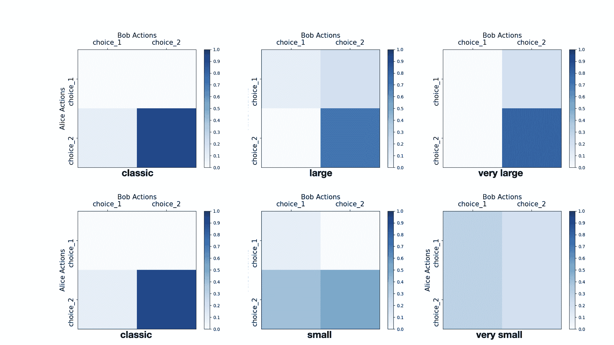

图 5：不同支付矩阵下代理的表现（囚徒困境）

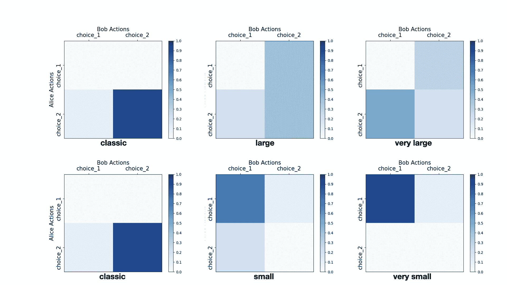

图 6：不同支付矩阵下代理的表现（鹿猎博弈）

我们对这两种游戏及其变体进行了实验。图[5](https://arxiv.org/html/2411.05990v2#S6.F5 "图 5 ‣ 6.2 奖励矩阵的变异 ‣ 6 详细观察 LLM 的理性 ‣ 博弈论 LLM：谈判游戏的代理工作流")和[6](https://arxiv.org/html/2411.05990v2#S6.F6 "图 6 ‣ 6.2 奖励矩阵的变异 ‣ 6 详细观察 LLM 的理性 ‣ 博弈论 LLM：谈判游戏的代理工作流")包含了动作分布的实验结果。与预期的表现应该不受奖励变化影响不同，结果表明在不同奖励场景下，表现分布并不一致。在囚徒困境中，在经典奖励矩阵中的理性情境（动作 2，动作 2）的概率显著较高，但在两种变体中则大幅降低。同样，在猎鹿博弈中，采取的行动在不同的奖励场景下也有所不同。这些发现表明，LLMs 要么是（1）不一致地做出理性决策，或者（2）他们的理性受到其他非理性因素的强烈影响。

### 6.3 个性化的变化

除了研究报酬变化对代理理性的影响外，我们还考察了系统提示中所表示的个性是否会影响代理的理性。如果代理在计算和计算奖励时保持一致，那么他们的理性不应受所分配的“个性”的影响。用于本实验的系统提示模板如下：

```
You are a {{personality}} assistant that carefully answer the question.

```

对于个性变量，我们选择了六个不同但常见的形容词：富有同情心、友好、乐于助人、务实、理性和机智。该实验的结果如图[7](https://arxiv.org/html/2411.05990v2#S6.F7 "图 7 ‣ 6.3 个性化的变化 ‣ 6 详细观察 LLM 的理性 ‣ 博弈论 LLM：谈判游戏的代理工作流")所示。研究结果表明，代理的表现会根据所分配的个性化而显著变化。具有“机智”个性的代理提供了博弈论中最理性的选择，而具有“理性”个性的代理表现略差。对于其他个性，如“富有同情心”、“友好”、“乐于助人”和“务实”，代理表现出理性下降，并且经常做出不理性的选择。

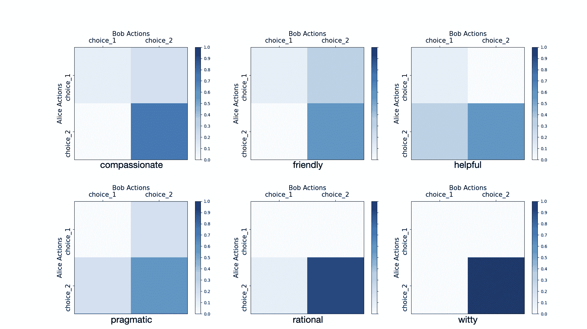

图 7：不同系统提示下，具有个性化的代理表现

### 6.4 谈判是否会影响理性？

在某些情况下，代理人的决策过程可以受到与其他代理人讨论的影响。例如，在“鹿兔猎”游戏中，有效的谈判能够促进玩家之间的信任，使他们认识到单独捕捉兔子并不如合作猎鹿那样有利。因此，成功的沟通应该鼓励玩家选择帕累托最优的纳什均衡，而不是选择可用的两个均衡中的任意一个。然而，也有一些情景中，谈判不会影响结果。在“囚徒困境”中，沟通未能建立信任，因为每个玩家的主导策略都是背叛，无论另一个玩家采取什么行动。因此，沟通不太可能影响表现，因为理性选择保持不变。

在我们当前的实验中，我们集中研究了四种博弈论情景：鹿兔猎、性别之战、囚徒困境和石头剪子布。这些游戏中谈判的影响如下：

+   •

    鹿兔猎：在这个游戏中，谈判在达成帕累托最优的理性选择中起着重要作用。玩家之间的有效沟通可以促进信任并鼓励合作，从而为双方带来更好的结果。

+   •

    性别之战：谈判在增强两名玩家之间的协调性中至关重要。通过讨论彼此的偏好和意图，玩家可以达成更为一致和互利的策略。

+   •

    囚徒困境：该游戏只有一个纳什均衡，因此谈判无关紧要。无论是否进行讨论，两名玩家的理性选择始终不变，结果由他们各自的决定决定。

为了研究沟通对代理人选择的影响，我们在有沟通和没有沟通的两种游戏条件下进行实验。在沟通设定中，代理人可以在做出决策之前交换信息。我们记录了每种设定下代理人的行动分布，并在图[8](https://arxiv.org/html/2411.05990v2#S6.F8 "Figure 8 ‣ 6.4 Does negotiation affect rationality? ‣ 6 Detailed Observation on LLM’s Rationality ‣ Game-theoretic LLM: Agent Workflow for Negotiation Games")中展示了0、1和2轮谈判的结果。

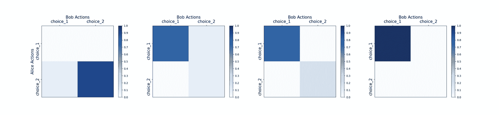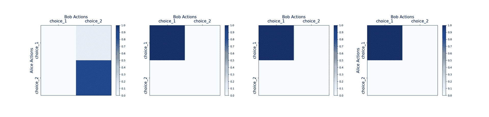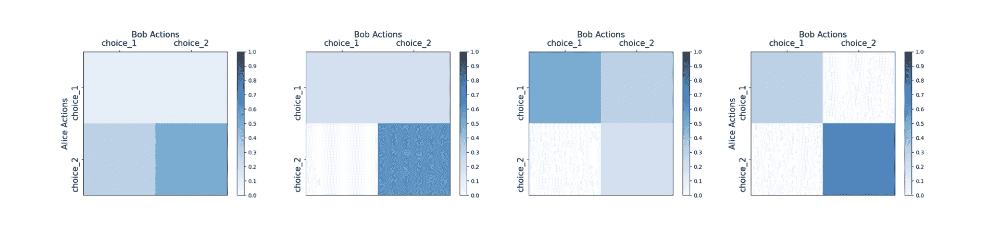

图8：代理人在不同轮次谈判下的表现：从左至右分别为四个游戏的0轮、1轮、2轮和3轮。

根据我们的观察，我们发现了在不同博弈论情景中，期望与实际结果之间存在一些不一致。

+   •

    鹿群狩猎（图 [8](https://arxiv.org/html/2411.05990v2#S6.F8 "Figure 8 ‣ 6.4 Does negotiation affect rationality? ‣ 6 Detailed Observation on LLM’s Rationality ‣ Game-theoretic LLM: Agent Workflow for Negotiation Games") (b)）：正如预期，谈判导致采用帕累托最优策略。这个结果表明，有效的沟通可以促进合作，并为所有参与方带来更好的结果。

+   •

    性别博弈：（图 [8](https://arxiv.org/html/2411.05990v2#S6.F8 "Figure 8 ‣ 6.4 Does negotiation affect rationality? ‣ 6 Detailed Observation on LLM’s Rationality ‣ Game-theoretic LLM: Agent Workflow for Negotiation Games") (c)）：我们的研究结果表明，随着谈判轮次的增加，玩家之间的协调性有所提高。这个结果表明，谈判在促进相互理解和推动更一致的策略方面发挥了关键作用。

+   •

    囚徒困境（图 [8](https://arxiv.org/html/2411.05990v2#S6.F8 "Figure 8 ‣ 6.4 Does negotiation affect rationality? ‣ 6 Detailed Observation on LLM’s Rationality ‣ Game-theoretic LLM: Agent Workflow for Negotiation Games") (a)）：与预期相反，玩家在谈判后始终倾向于选择支配策略。这个结果令人惊讶，因为单一的纳什均衡存在应该使得谈判变得无关紧要。

总结来说，我们的发现表明，谈判并不总是能导致帕累托最优的决策，在某些情况下，甚至可能导致理性的丧失。需要进一步研究以了解导致这些意外结果的潜在因素。

### 6.5 提示如何影响谈判的作用？

有些人可能会想，是否可以通过简单的提示工程来控制谈判的影响。

为了调查是否可以通过简单的提示工程缓解谈判对玩家理性产生的负面影响，我们设计了六个不同的提示。前三个提示强调对其他玩家陈述的谨慎态度，并鼓励代理人批判性地评估信任度。这些提示旨在在谈判过程中培养更为怀疑和分析的思维方式。其余三个提示则作为指令，要求代理人在做决策时独立思考，而不受谈判过程的影响。这些提示的目标是促进代理人在决策时的自主性和自立性，从而可能减少谈判对理性产生的负面影响。

在我们的实验中，我们将六个设计好的提示放在每个游戏的整个行动决策提示的末尾。这种位置确保了这些提示作为对基于LLM的代理人的最终提醒或指令，不会受到谈判文本长度的影响。

```
Prompt 1: Please carefully analyze the negotiation messages, think about
whether you can trust the other player’s message, and make your own decision.

```

```
Prompt 2: Please carefully analyze the negotiation messages and make your own
decision.

```

```
Prompt 3: Carefully analyze and think about whether you can trust the other
player’s message, and then make your own decision.

```

```
Prompt 4: You can choose your own choice regardless what the other player
says.

```

```
Prompt 5: You should make your own choice regardless what the other player
says.

```

```
Prompt 6: You must make your own choice regardless what the other player says.

```

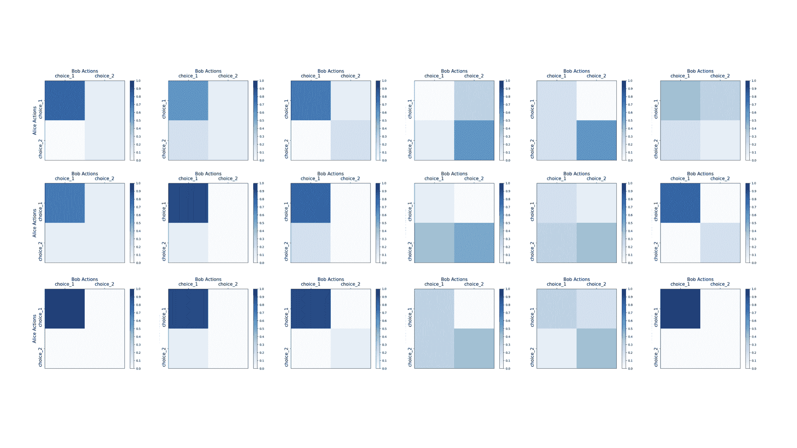

图9：六个设计的提示对囚徒困境博弈的影响，不同谈判轮数的效果：1轮、2轮和3轮对应三行

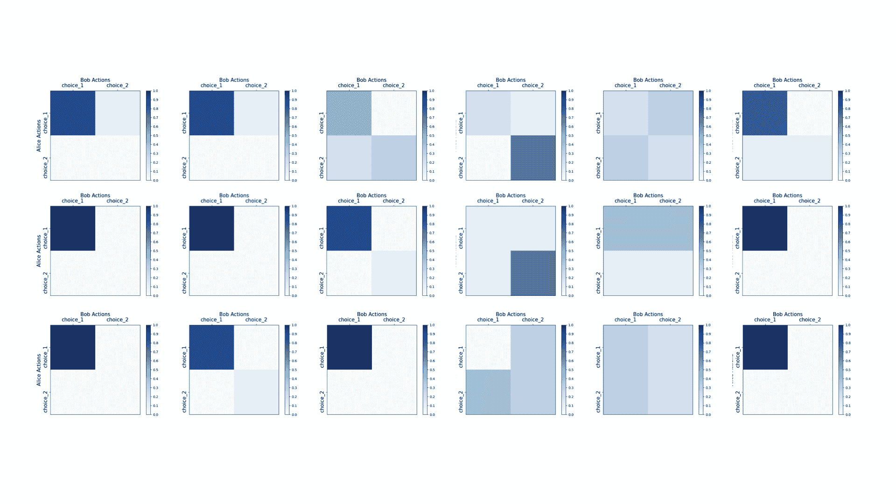

图10：六个设计的提示对公鹿狩猎博弈的影响，不同谈判轮数的效果：1轮、2轮和3轮对应三行

通过比较基于LLM的智能体在这六个提示下的表现，我们旨在确定提示工程是否能够有效地控制谈判对玩家理性行为的影响，并在各种博弈论场景中改善决策结果。图[10](https://arxiv.org/html/2411.05990v2#S6.F10 "图 10 ‣ 6.5 提示如何影响谈判的作用？ ‣ 6 LLM理性行为的详细观察 ‣ 博弈论LLM：谈判博弈中的智能体工作流")和图[10](https://arxiv.org/html/2411.05990v2#S6.F10 "图 10 ‣ 6.5 提示如何影响谈判的作用？ ‣ 6 LLM理性行为的详细观察 ‣ 博弈论LLM：谈判博弈中的智能体工作流")分别展示了六个设计的提示对囚徒困境和公鹿狩猎博弈结果的影响。在每个图中，六列对应所使用的具体提示，三行代表在玩家做出行动决定之前的谈判轮数。

通过分析这些图表，我们可以评估每个提示在影响玩家决策过程中的有效性，并评估提示工程是否能够在谈判轮数增加时减轻谈判对玩家选择的影响。

在观察中，我们可以看到以下情况：

1.  1.

    提示1、2、3和4对LLM智能体在囚徒困境和公鹿狩猎博弈中选择策略的分布没有显著影响。即使这些提示明确要求智能体考虑另一玩家的可信度，它们也未能促使智能体做出更为理性的策略选择。

1.  2.

    这些提示对玩家决策的影响程度不同，提示5和6的影响最为显著。在囚徒困境中，这些提示完全改变了分布，从过于侧重支配策略（行动1，行动1）转变为更倾向于支配策略（行动2，行动2）。在公鹿狩猎博弈中，提示5和6同样将分布从帕累托最优策略（行动1，行动1）转变为非最优策略（行动2，行动2）或策略的混合。

1.  3.

    随着谈判轮数的增加，提示的影响逐渐减弱。例如，在囚徒困境中，随着谈判轮数的增加，分布更加倾向于支配策略。类似地，在公鹿狩猎博弈中，随着谈判轮数的增加，分布则更加倾向于帕累托最优策略。

基于这三项观察结果，我们可以得出结论：使用工程化提示词并没有真正增强基于大语言模型（LLM）的智能体在囚徒困境和公鹿猎捕博弈中的理性。这些提示对智能体决策过程的影响在两个游戏中呈现相似的趋势，并且随着谈判轮次的增加，其影响逐渐减弱。

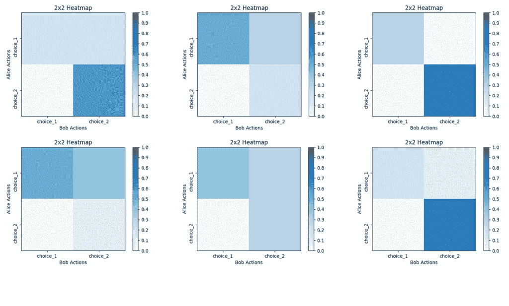

图11：谁先开始谈判会影响结果吗？

### 6.6 谈判信息的顺序如何影响行动？

我们预计，玩家发起谈判的顺序不会影响最终采取的行动，特别是在《性别之战》游戏中。在理想情况下，无论是第一个还是最后一个发起谈判的玩家，都不应在说服对方采取有利于自己的行动时具有明显的优势。为了确保这一点的确成立，我们在《性别之战》游戏中进行实验，设置不同的谈判轮次（1、2和3），并改变发起谈判的玩家，由玩家1或玩家2开始谈判过程。这个实验设计使我们能够调查谈判顺序对游戏结果的潜在影响，并评估两位玩家之间谈判过程的公平性。

基于图[11](https://arxiv.org/html/2411.05990v2#S6.F11 "图11 ‣ 6.5 提示如何影响谈判的影响？ ‣ 6 LLM理性的详细观察 ‣ 博弈论中的LLM：谈判游戏的智能体工作流程")中的观察结果，很明显，当改变发起谈判的玩家时，策略并没有发生显著变化。这个观察结果表明，玩家开始谈判的顺序对《性别之战》游戏中的最终行动没有实质性的影响。

### 6.7 与人类的非理性比较

之前的观察结果表明，大型语言模型（LLM）在不同场景下缺乏强有力的理性。然而，已有研究表明，人类也并不总是理性地行事[dawes1988anomalies](https://arxiv.org/html/2411.05990v2#bib.bib68)；[sally1995conversation](https://arxiv.org/html/2411.05990v2#bib.bib69)。这引发了一个有趣的问题：LLM的非理性倾向是否与人类相似？

为了调查这一点，我们采用了来自电视游戏节目《黄金球》的游戏设定，其中两名参赛者玩经典囚徒困境的变体：在这个游戏中，两名玩家独立决定是“分配”还是“偷取”大奖池。如果两人选择分配，他们将平分大奖池。如果一方选择分配而另一方选择偷取，则偷取者获得整个大奖池。如果两人都选择偷取，则两人都没有得到任何钱。人类的游戏表现来自 [van2012split](https://arxiv.org/html/2411.05990v2#bib.bib70)，在该研究中，玩家平均53%的时间选择合作（即分配大奖池），这一数据与早期的实验室研究一致 [dawes1988anomalies](https://arxiv.org/html/2411.05990v2#bib.bib68)；[sally1995conversation](https://arxiv.org/html/2411.05990v2#bib.bib69)。合作决策对大奖池的大小敏感，随着赌注的增加，合作率下降。

我们配置LLM来进行此游戏，使用与人类数据中相同的大奖池大小。每种大奖池大小进行了20次测试，得出每个大小的40个决策实例。然后，我们计算了不同大奖池大小下LLM的合作率。

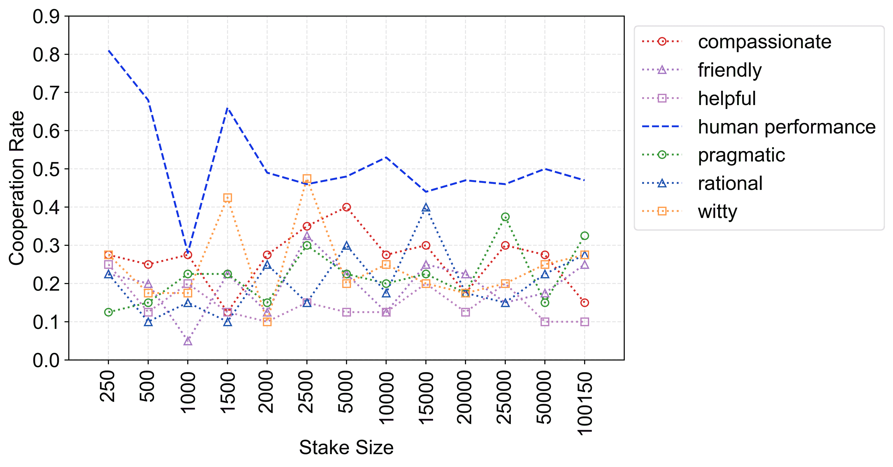

图 12：黄金球游戏的理性分析

本比较分析的结果呈现在图 [12](https://arxiv.org/html/2411.05990v2#S6.F12 "Figure 12 ‣ 6.7 Irrationality Compared with Humans ‣ 6 Detailed Observation on LLM’s Rationality ‣ Game-theoretic LLM: Agent Workflow for Negotiation Games") 中。人类的合作率确实对大奖池的大小敏感，较小的大奖池对应较高的合作率。这一趋势也出现在 [post2008deal](https://arxiv.org/html/2411.05990v2#bib.bib71) 中。相比之下，LLM是否选择合作在很大程度上不受大奖池大小的影响，无论使用何种“人格”提示：理性、机智、务实、乐于助人、友好、富有同情心。此外，LLM的合作率通常低于人类的合作率。

尽管本分析提供了对大规模语言模型（LLM）与人类非理性倾向的初步比较，但它绝非详尽无遗。需要进一步的研究，以建立人类与LLM非理性之间关系的更全面理解。

<svg class="ltx_picture" height="246.03" id="S6.SS7.1.p1.pic1" overflow="visible" version="1.1" width="600"><g fill="#000000" stroke="#000000" stroke-width="0.4pt" transform="translate(0,246.03) matrix(1 0 0 -1 0 0)"><g fill-opacity="1.0" transform="matrix(1.0 0.0 0.0 1.0 21.65 227.83)"><foreignobject color="#FFFFFF" height="12.3" overflow="visible" transform="matrix(1 0 0 -1 0 16.6)" width="556.69">Summary for raw-LLM v. workflow-LLM and workflow-LLM v. raw-LLM</foreignobject></g> <g fill-opacity="1.0" transform="matrix(1.0 0.0 0.0 1.0 21.65 13.78)"><foreignobject color="#000000" height="196.33" overflow="visible" transform="matrix(1 0 0 -1 0 16.6)" width="556.69">• Lack of Robustness to Numerical Variations: Empirical results indicate that LLMs either do not exhibit rationality or their rationality is highly sensitive to numerical changes. When the payoff matrix undergoes perturbations that leave the Nash Equilibrium unchanged, the performance of LLMs varies significantly. • Impact of Negotiation on Rationality: Consistent with observations made in Section [6](https://arxiv.org/html/2411.05990v2#S6 "6 Detailed Observation on LLM’s Rationality ‣ Game-theoretic LLM: Agent Workflow for Negotiation Games"), we find that rational choices are undermined by the introduction of negotiation, even in the absence of grounds or guarantees for trust. • Effect of Prompt Variation on Negotiation Impact: The wording of the prompt can mitigate the influence of negotiation on rationality; however, this mitigating effect diminishes as the number of negotiation rounds increases. • Order of Negotiation Initiation: The sequence in which players initiate negotiation does not significantly affect the game’s outcome, even in coordination games such as the Battle of the Sexes. • Comparison of Irrationality Between LLMs and Humans: Although LLMs lack robust rationality across various scenarios, the nature of their irrationality differs from that observed in human decision-making.</foreignobject></g></g></svg>

## 7 结论

本研究进行了全面的博弈论分析，评估了在各种经典战略场景中，采用谈判工作流在大型语言模型（LLMs）中的理性与有效性。通过使用完备信息博弈（包括囚徒困境、鹿猎、性别之战、等待-行动游戏、双头垄断竞争、升级博弈、垄断游戏、德拉科与哈利游戏）来建模互动，我们评估了不同LLM（具体包括Claude-3.5 Sonnet、GPT-4o和Claude-3 Opus）如何在合作与竞争之间找到平衡。

我们将调查扩展到更现实的环境，探索了包含不完全信息的《交易与非交易游戏》，以评估LLM在不确定条件下能否有效分配资源并达成协议。在此背景下，我们设计了一个基于贝叶斯更新的工作流，以实现帕累托最优且无嫉妒的分配，从而提升了谈判过程。

我们的研究结果表明，采用该工作流通常能促进帕累托最优结果，其中两个代理人相比非合作策略能够获得更高的集体收益。例如，在鹿猎和性别之战这样的场景中，工作流促进了有效的谈判与协调，使得LLM能够达成互利的均衡。同样，在《交易与非交易游戏》中，结构化的工作流增强了决策过程，导致了更高效的资源分配。

## 8 未来的研究方向

本研究为未来的研究开辟了几条有前景的方向：

##### 工作流漏洞与防御机制的探索：

调查如何通过欺骗等手段利用谈判工作流是至关重要的，特别是在《交易与非交易游戏》这样的背景下。理解这些工作流中潜在的漏洞将有助于开发强有力的防御策略，以减轻被利用的风险，从而增强谈判协议的可靠性与安全性。

##### 在多阶段博弈中的策略制定：

将分析扩展到多阶段博弈引入了额外的复杂性，因为纳什均衡可能与单阶段博弈中显著不同。未来的工作应聚焦于LLM如何在多个阶段有效制定策略，考虑到博弈状态和对手行为的动态演化。这包括开发能够预测未来举措并相应调整策略的算法，以保持理性并优化结果。

##### 元策略的发展：

LLM 应具备判断何时使用特定工作流程、何时进行适应或放弃的能力。这需要创建一个元策略或元工作流程，根据特定情境、代理的能力、博弈阶段和对手的行为来指导选择适当的谈判策略。实施这样的元策略将增强 LLM 在多种谈判场景中的适应性和有效性。

##### 与代理利益及立场采纳的对齐：

目前，LLM 通常对齐为有帮助且诚实的，缺乏个性化的立场或特定利益。为了作为高效的谈判代理，LLM 必须学习并采纳反映其代表利益的立场。这涉及到训练 LLM 理解并倡导特定目标，从而在谈判中平衡其普遍对齐和追求明确定义目标的能力。开发方法来灌输对自身利益的清晰理解，将增强 LLM 在战略决策和实现预期结果方面的能力。

这些未来的发展方向旨在细化 LLM 的战略推理和谈判能力，确保它们能够在复杂的现实世界场景中有效且理性地运作。通过解决这些问题，我们可以推进 LLM 作为强大的代理的发展，使其能够在复杂的战略环境中进行导航，同时防范潜在的脆弱性。

## 参考文献

+   [1] 张向和丁杜建. 受监督的思维链. arXiv 预印本 arXiv:2410.14198, 2024.

+   [2] 丁杜建、安库尔·马利克、王驰、罗伯特·西姆、苏巴布拉特·穆克吉、维克托·鲁赫尔、拉克什·VS·拉克什曼南和艾哈迈德·哈桑·阿瓦达拉. 混合 LLM：节省成本且注重质量的查询路由. arXiv 预印本 arXiv:2404.14618, 2024.

+   [3] 方旭、许伟杰、谭安婷、张佳妮、胡子晴、祁彦君、斯科特·尼克利奇、迭戈·索科林斯基、斯里尼瓦森·森加梅杜、克里斯托斯·法卢佐斯 等. 大型语言模型（LLMs）在表格数据上的应用：预测、生成与理解——综述. 2024.

+   [4] 苏米特·库马尔·达姆、洪仲善、乔玉和张超宁. 基于 LLM 的 AI 聊天机器人综述. arXiv 预印本 arXiv:2406.16937, 2024.

+   [5] 冯露娜·董、文胜焕、徐伊凡·以太、马尔基特·克什提兹 和 周宇. 利用 LLM 技术推动下一代智能助手. 《第29届 ACM SIGKDD 知识发现与数据挖掘大会论文集》，第5792–5793页，2023.

+   [6] 梁伟鑫、扎卡里·伊佐、张耀辉、海莉·勒普、曹瀚成、赵轩东、陈灵娇、叶浩天、刘生、黄志 等. 大规模监控 AI 修改内容：以 ChatGPT 对 AI 会议同行评审影响的案例研究为例. arXiv 预印本 arXiv:2403.07183, 2024.

+   [7] 邵一佳, 江宇程, 西奥多·A·卡内尔, 许彼得, 奥马尔·哈塔布, 莫妮卡·S·拉姆. 协助从零开始撰写类似维基百科的文章，利用大语言模型。arXiv预印本 arXiv:2402.14207, 2024。

+   [8] 郭旭东, 黄凯轩, 刘家乐, 范文辉, 纳塔莉亚·维莱兹, 吴庆云, 王华政, 托马斯·L·格里菲斯, 王蒙迪. 具身大语言模型代理在组织化团队中学会合作。arXiv预印本 arXiv:2403.12482, 2024。

+   [9] 萨凯特·阿贾什, 樊月, 王欣·埃里克. 评估大语言模型在多代理协调中的能力。arXiv预印本 arXiv:2310.03903, 2023。

+   [10] 习志恒, 陈文翔, 郭欣, 何伟, 丁怡文, 洪博阳, 张铭, 王俊哲, 金森杰, 周恩宇, 等. 大语言模型基础的代理崛起与潜力：一项调查。arXiv预印本 arXiv:2309.07864, 2023。

+   [11] 费德里科·比安基, 帕特里克·约翰·基亚, 梅尔特·尤克塞克戈努尔, 雅科波·塔利亚布, 丹·尤拉夫斯基, 詹姆斯·邹. 大语言模型的谈判能力如何？谈判竞技场平台与分析。arXiv预印本 arXiv:2402.05863, 2024。

+   [12] 约翰·J·霍顿. 大语言模型作为模拟经济代理：我们能从“硅人”中学到什么？技术报告，美国国家经济研究局, 2023。

+   [13] 李年, 高晨, 李名宇, 李勇, 廖庆民. Econagent：基于大语言模型的代理模拟宏观经济活动。第62届计算语言学协会年会论文集（第1卷：长篇论文），页码15523–15536, 2024。

+   [14] 陈佩, 韩博然, 张帅. Comm：用于复杂问题解决的协作多代理、多推理路径提示。arXiv预印本 arXiv:2404.17729, 2024。

+   [15] 李元, 张艺璇, 孙立超. 元代理：通过协作生成代理模拟基于大语言模型的人类行为互动，以实现任务导向协调。arXiv预印本 arXiv:2310.06500, 2023。

+   [16] 邓言, 袁元. 大语言模型代理展现社交行为吗？arXiv预印本 arXiv:2312.15198, 2023。

+   [17] 伊丽莎白·C·斯塔德, 香农·威尔特西·斯特曼, 莱尔·H·昂格, 科迪·L·博兰, H·安德鲁·施瓦茨, 大卫·B·耶登, 若昂·塞多克, 罗伯特·J·德鲁贝斯, 罗布·威勒, 约翰内斯·C·艾希施泰特. 大语言模型可能改变行为健康护理的未来：一项负责任的开发与评估提案。npj心理健康研究, 3(1):12, 2024。

+   [18] 吴增清, 郑书源, 刘倩莹, 韩旭, 权英赫, 小野诚, 唐少杰, 彭润, 许川. 我们可以谈谈吗：探索竞争性大语言模型代理的自发合作。arXiv预印本 arXiv:2402.12327, 2024。

+   [19] I de Zarzà, J de Curtò, 盖玛·罗伊格, 皮特罗·曼佐尼, 卡洛斯·T·卡拉法特. 多代理系统中的新兴合作与策略适应：基于大语言模型的扩展共同进化理论。电子学报, 12(12):2722, 2023。

+   [20] Yihuai Lan, Zhiqiang Hu, Lei Wang, Yang Wang, Deheng Ye, Peilin Zhao, Ee-Peng Lim, Hui Xiong, 和 Hao Wang。基于LLM的智能体社会调查：Avalon游戏中的协作与对抗。arXiv 预印本 arXiv:2310.14985，2023年。

+   [21] Tianyang Zhong, Zhengliang Liu, Yi Pan, Yutong Zhang, Yifan Zhou, Shizhe Liang, Zihao Wu, Yanjun Lyu, Peng Shu, Xiaowei Yu 等。《评估OpenAI O1：通用人工智能的机会与挑战》。arXiv 预印本 arXiv:2409.18486，2024年。

+   [22] Mike Lewis, Denis Yarats, Yann N Dauphin, Devi Parikh, 和 Dhruv Batra。《交易还是不交易？》端到端学习用于谈判对话。arXiv 预印本 arXiv:1706.05125，2017年。

+   [23] Ian Gemp, Yoram Bachrach, Marc Lanctot, Roma Patel, Vibhavari Dasagi, Luke Marris, Georgios Piliouras, 和 Karl Tuyls。《状态即字符串作为策略：使用博弈论求解器引导语言模型》。arXiv 预印本 arXiv:2402.01704，2024年。

+   [24] Karthik Sreedhar 和 Lydia Chilton。模拟人类战略行为：比较单一与多智能体LLMs。arXiv 预印本 arXiv:2402.08189，2024年。

+   [25] Elif Akata, Lion Schulz, Julian Coda-Forno, Seong Joon Oh, Matthias Bethge, 和 Eric Schulz。与大型语言模型玩重复博弈。arXiv 预印本 arXiv:2305.16867，2023年。

+   [26] Caoyun Fan, Jindou Chen, Yaohui Jin, 和 Hao He。大型语言模型能否作为博弈论中的理性玩家？系统分析。发表于《人工智能AAAI会议论文集》，页码17960–17967，2024年。

+   [27] Shaoguang Mao, Yuzhe Cai, Yan Xia, Wenshan Wu, Xun Wang, Fengyi Wang, Tao Ge, 和 Furu Wei。Alympics：语言智能体遇见博弈论。arXiv 预印本 arXiv:2311.03220，2023年。

+   [28] Fulin Guo。《GPT在博弈论实验中的应用》，2023年。

+   [29] Drew Fudenberg 和 Jean Tirole。《博弈论》。MIT出版社，1991年。

+   [30] Huao Li, Yu Quan Chong, Simon Stepputtis, Joseph Campbell, Dana Hughes, Michael Lewis, 和 Katia Sycara。通过大型语言模型进行多智能体协作的心智理论。arXiv 预印本 arXiv:2310.10701，2023年。

+   [31] Jen-tse Huang, Eric John Li, Man Ho Lam, Tian Liang, Wenxuan Wang, Youliang Yuan, Wenxiang Jiao, Xing Wang, Zhaopeng Tu, 和 Michael R Lyu。我们在LLMs决策能力上走多远了？评估LLMs在多智能体环境中的博弈能力。arXiv 预印本 arXiv:2403.11807，2024年。

+   [32] Jinhao Duan, Renming Zhang, James Diffenderfer, Bhavya Kailkhura, Lichao Sun, Elias Stengel-Eskin, Mohit Bansal, Tianlong Chen, 和 Kaidi Xu。Gtbench：通过博弈论评估揭示LLMs的战略推理局限性。arXiv 预印本 arXiv:2402.12348，2024年。

+   [33] Shenzhi Wang, Chang Liu, Zilong Zheng, Siyuan Qi, Shuo Chen, Qisen Yang, Andrew Zhao, Chaofei Wang, Shiji Song, 和 Gao Huang。Avalon的思维游戏：通过递归反思对抗欺骗。arXiv 预印本 arXiv:2310.01320，2023年。

+   [34] Peter S Park, Simon Goldstein, Aidan O’Gara, Michael Chen, 和 Dan Hendrycks. AI 欺骗：实例、风险与潜在解决方案调查。《模式》，5(5)，2024年。

+   [35] Nunzio Lorè 和 Babak Heydari. 大型语言模型的战略行为：博弈结构与情境框架。arXiv 预印本 arXiv:2309.05898, 2023.

+   [36] Julian Coda-Forno, Marcel Binz, Jane X Wang, 和 Eric Schulz. Cogbench: 大型语言模型走进心理学实验室。arXiv 预印本 arXiv:2402.18225, 2024.

+   [37] Hongyi Guo, Zhihan Liu, Yufeng Zhang, 和 Zhaoran Wang. 大型语言模型能玩吗？自我对弈方法的案例研究。arXiv 预印本 arXiv:2403.05632, 2024.

+   [38] Jason Wei, Xuezhi Wang, Dale Schuurmans, Maarten Bosma, Fei Xia, Ed Chi, Quoc V Le, Denny Zhou 等人. 连锁思维提示激发大型语言模型的推理能力。神经信息处理系统进展，35:24824-24837, 2022。

+   [39] Shunyu Yao, Dian Yu, Jeffrey Zhao, Izhak Shafran, Thomas L Griffiths, Yuan Cao, 和 Karthik Narasimhan. 思维树：通过大型语言模型进行深思熟虑的问题解决，2023。网址 [https://arxiv.org/pdf/2305.10601.pdf](https://arxiv.org/pdf/2305.10601.pdf)，2023.

+   [40] Ollie Liu, Deqing Fu, Dani Yogatama, 和 Willie Neiswanger. Dellma: 一个基于大型语言模型的不确定性决策框架。arXiv 预印本 arXiv:2402.02392, 2024.

+   [41] Sihao Hu, Tiansheng Huang, 和 Ling Liu. Pok$\backslash$’ellmon: 一个具有人类水平的语言模型对战代理。arXiv 预印本 arXiv:2402.01118, 2024.

+   [42] Tian Xia, Zhiwei He, Tong Ren, Yibo Miao, Zhuosheng Zhang, Yang Yang, 和 Rui Wang. 测量 LLM 的谈判能力：一个基准测试与买家增强方法。arXiv 预印本 arXiv:2402.15813, 2024.

+   [43] Yingqiang Ge, Wenyue Hua, Kai Mei, Jianchao Ji, Juntao Tan, Shuyuan Xu, Zelong Li, 和 Yongfeng Zhang. OpenAGI: 当 LLM 遇到领域专家。在第37届神经信息处理系统会议上，2023年。

+   [44] Qingyun Wu, Gagan Bansal, Jieyu Zhang, Yiran Wu, Shaokun Zhang, Erkang Zhu, Beibin Li, Li Jiang, Xiaoyun Zhang, 和 Chi Wang. Autogen: 通过多代理对话框架支持下一代 LLM 应用。arXiv 预印本 arXiv:2308.08155, 2023.

+   [45] Guohao Li, Hasan Abed Al Kader Hammoud, Hani Itani, Dmitrii Khizbullin, 和 Bernard Ghanem. Camel: 用于“大规模语言模型社会”心智探索的交流代理，2023年。

+   [46] Oguzhan Topsakal 和 Tahir Cetin Akinci. 利用 Langchain 创建大型语言模型应用：快速开发 LLM 应用的入门指南。在国际应用工程与自然科学会议中，第1卷，第1050-1056页，2023年。

+   [47] Jian Xie, Kai Zhang, Jiangjie Chen, Tinghui Zhu, Renze Lou, Yuandong Tian, Yanghua Xiao, 和 Yu Su. Travelplanner: 用语言代理进行现实世界规划的基准测试。arXiv 预印本 arXiv:2402.01622, 2024.

+   [48] Chunqiu Steven Xia, Yinlin Deng, Soren Dunn, 和 Lingming Zhang. 无代理：揭示基于大型语言模型的软件工程智能体。arXiv 预印本 arXiv:2407.01489, 2024。

+   [49] Palash Ingle, Mithun Parab, Pranay Lendave, Amisha Bhanushali, 和 Pavan Kumar BN. 关于大型语言模型智能体挑战的综合研究。

+   [50] Xinyi Li, Sai Wang, Siqi Zeng, Yu Wu, 和 Yi Yang. 关于基于大型语言模型的多智能体系统的调查：工作流、基础设施与挑战。Vicinagearth, 1(1):9, 2024。

+   [51] Sivan Schwartz, Avi Yaeli, 和 Segev Shlomov. 增强对基于大型语言模型的人工智能自动化智能体的信任：新的考虑和未来挑战。arXiv 预印本 arXiv:2308.05391, 2023。

+   [52] Junchi Yu, Ran He, 和 Rex Ying. 思维传播：基于类比的方法解决复杂推理问题，使用大型语言模型。arXiv 预印本 arXiv:2310.03965, 2023。

+   [53] Yiran Wu, Tianwei Yue, Shaokun Zhang, Chi Wang, 和 Qingyun Wu. Stateflow: 通过基于状态的工作流增强大型语言模型任务求解能力。arXiv 预印本 arXiv:2403.11322, 2024。

+   [54] Zhen Zeng, William Watson, Nicole Cho, Saba Rahimi, Shayleen Reynolds, Tucker Balch, 和 Manuela Veloso. Flowmind: 使用大型语言模型自动生成工作流。在第四届 ACM 国际金融人工智能会议论文集，73–81页，2023年。

+   [55] Ruixuan Xiao, Wentao Ma, Ke Wang, Yuchuan Wu, Junbo Zhao, Haobo Wang, Fei Huang, 和 Yongbin Li. Flowbench: 重新审视并基准测试基于工作流引导的规划，针对大型语言模型智能体。arXiv 预印本 arXiv:2406.14884, 2024。

+   [56] Zelong Li, Shuyuan Xu, Kai Mei, Wenyue Hua, Balaji Rama, Om Raheja, Hao Wang, He Zhu, 和 Yongfeng Zhang. Autoflow: 为大型语言模型智能体自动生成工作流。arXiv 预印本 arXiv:2407.12821, 2024。

+   [57] Carlos E Jimenez, John Yang, Alexander Wettig, Shunyu Yao, Kexin Pei, Ofir Press, 和 Karthik Narasimhan. Swe-bench: 语言模型能解决现实世界中的 GitHub 问题吗？arXiv 预印本 arXiv:2310.06770, 2023。

+   [58] John Yang, Carlos E Jimenez, Alexander Wettig, Kilian Lieret, Shunyu Yao, Karthik Narasimhan, 和 Ofir Press. Swe-agent: 智能体-计算机接口使得自动化软件工程成为可能。arXiv 预印本 arXiv:2405.15793, 2024。

+   [59] Guanzhi Wang, Yuqi Xie, Yunfan Jiang, Ajay Mandlekar, Chaowei Xiao, Yuke Zhu, Linxi Fan, 和 Anima Anandkumar. Voyager: 一种具有大型语言模型的开放式具身智能体。arXiv 预印本 arXiv:2305.16291, 2023。

+   [60] Xizhou Zhu, Yuntao Chen, Hao Tian, Chenxin Tao, Weijie Su, Chenyu Yang, Gao Huang, Bin Li, Lewei Lu, Xiaogang Wang 等人. Minecraft中的幽灵：通过具有文本知识和记忆的大型语言模型，普适智能体在开放世界环境中的应用。arXiv 预印本 arXiv:2305.17144, 2023。

+   [61] Zelai Xu, Chao Yu, Fei Fang, Yu Wang, 和 Yi Wu. 使用强化学习的语言智能体在狼人游戏中的战略玩法。arXiv 预印本 arXiv:2310.18940, 2023。

+   [62] 郭家献，杨博，Paul Yoo，Bill Yuchen Lin，Iwasawa Yusuke，和松尾丰。怀疑代理：与具备心智理论的GPT-4一起玩不完全信息博弈。arXiv 预印本 arXiv:2309.17277，2023年。

+   [63] John Von Neumann 和 Oskar Morgenstern. 博弈论与经济行为：60周年纪念版。在《博弈论与经济行为》中。普林斯顿大学出版社，2007年。

+   [64] R Duncan Luce 和 Howard Raiffa. 博弈与决策：导论与批判性调查。Courier Corporation，2012年。

+   [65] Martin A Nowak，Karen M Page，和 Karl Sigmund. 公平与理性在最后通牒博弈中的对立。《科学》，289(5485)：1773–1775，2000年。

+   [66] Martin W Cripps. 可分更新。手稿，伦敦大学学院，2018年。

+   [67] Akshay Krishnamurthy，Keegan Harris，Dylan J Foster，Cyril Zhang，和 Aleksandrs Slivkins. 大型语言模型能否进行上下文探索？arXiv 预印本 arXiv:2403.15371，2024年。

+   [68] Robyn M Dawes 和 Richard H Thaler. 异常现象：合作。《经济学视角杂志》，2(3)：187–197，1988年。

+   [69] David Sally. 社会困境中的对话与合作：1958年到1992年间实验的元分析。《理性与社会》，7(1)：58–92，1995年。

+   [70] Martijn J Van den Assem，Dennie Van Dolder，和 Richard H Thaler. 分割还是偷窃？在赌注很大的情况下的合作行为。《管理科学》，58(1)：2–20，2012年。

+   [71] Thierry Post，Martijn J Van den Assem，Guido Baltussen，和 Richard H Thaler. 交易还是不交易？在大奖游戏中的风险决策。《美国经济评论》，98(1)：38–71，2008年。
