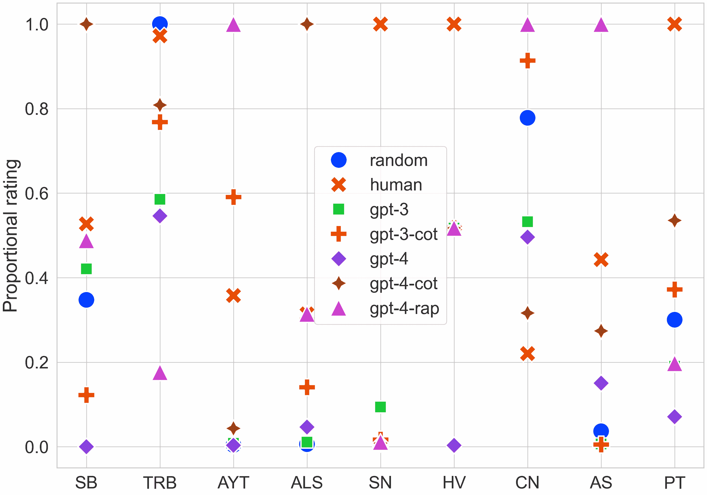
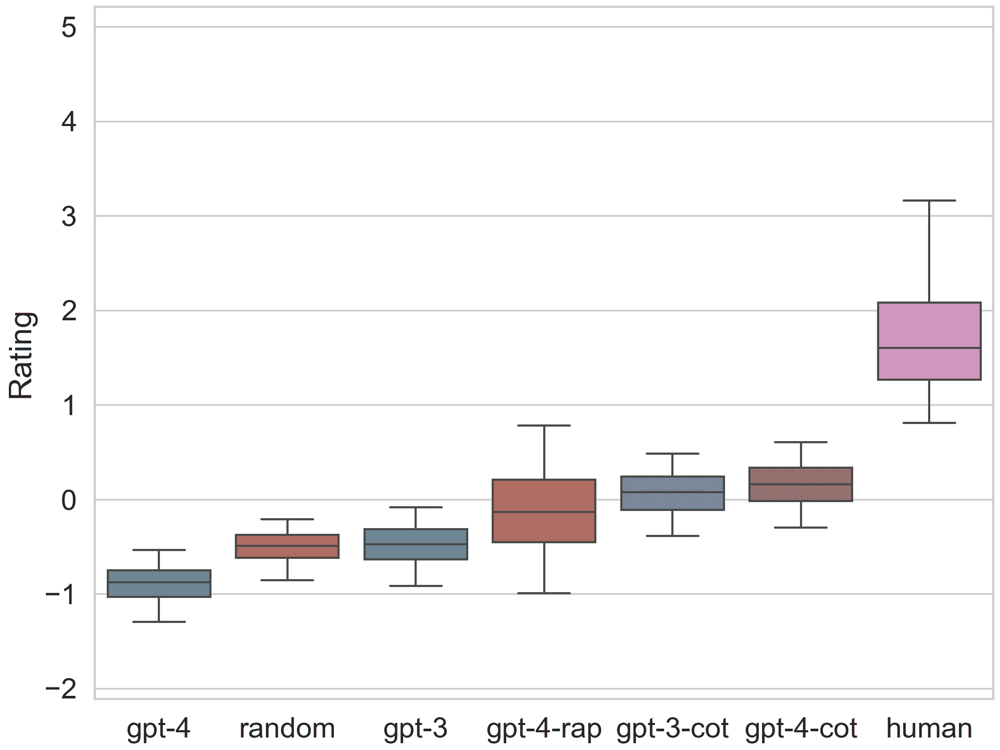
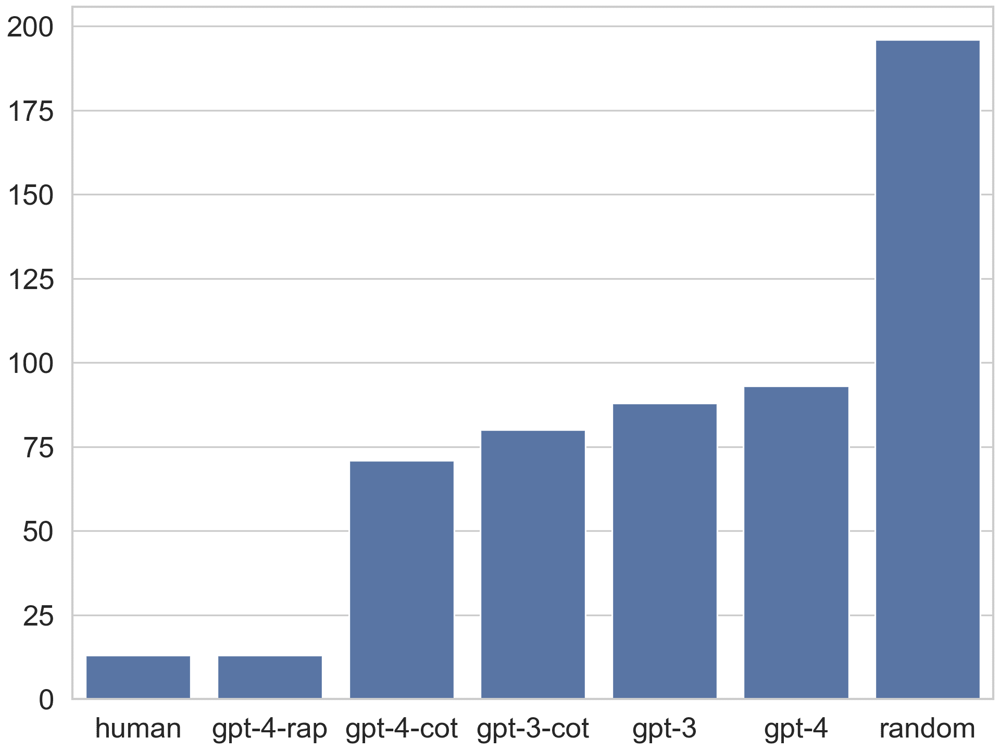
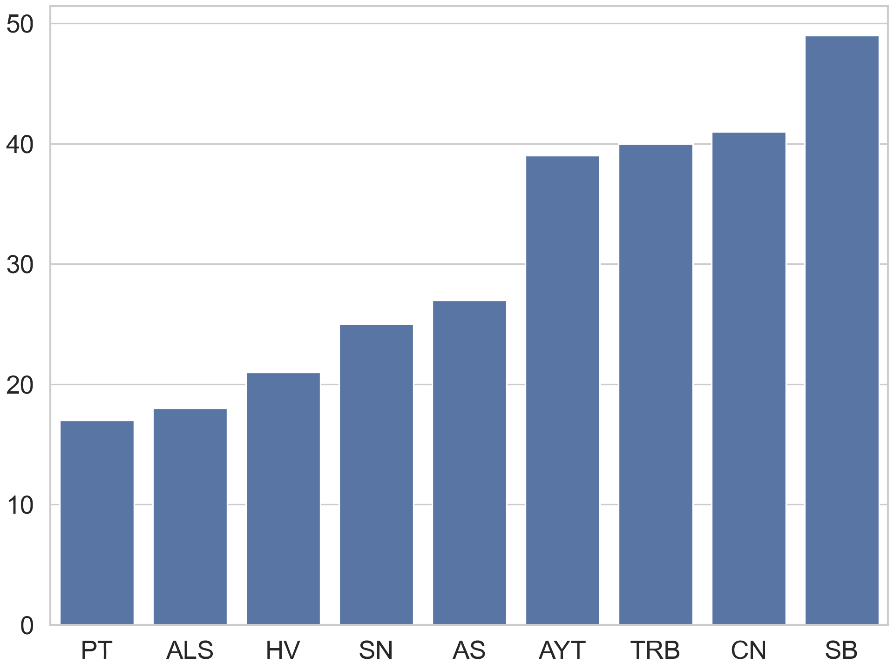

<!--yml

类别：未分类

日期：2025-01-11 12:34:11

-->

# GameBench：评估LLM代理的战略推理能力

> 来源：[https://arxiv.org/html/2406.06613/](https://arxiv.org/html/2406.06613/)

Anthony Costarelli

奥林工程学院

&Mat Allen¹¹脚注标记: 1

独立

&Roman Hauksson¹¹脚注标记: 1

德州大学达拉斯分校

&Grace Sodunke¹¹脚注标记: 1

牛津大学

&Suhas Hariharan

伦敦大学学院

&Carlson Cheng

独立 &Wenjie Li

上海科技大学 &Joshua Clymer

哥伦比亚大学 &Arjun Yadav

曼彻斯特大学 平等贡献。通信地址：acostarelli@olin.edu

###### 摘要

大型语言模型在许多自然语言理解任务上展现了显著的少量学习能力。尽管已有多个示范展示了在复杂战略场景中使用大型语言模型，但缺乏一个全面的框架来评估代理在各种类型推理中的表现，特别是在游戏中的推理。为了解决这一空白，我们引入了GameBench，这是一个跨领域基准，用于评估LLM代理的战略推理能力。我们专注于9种不同的游戏环境，每种环境至少涵盖策略游戏中识别的关键推理技能的一个维度，并选择那些战略解释不太可能成为模型预训练语料库重要部分的游戏。我们的评估使用了GPT-3和GPT-4的基础形式，并结合两种旨在增强战略推理能力的框架：思维链（CoT）提示和通过规划推理（RAP）。我们的结果显示，没有一个测试模型能够达到人类表现，最差情况下，GPT-4的表现甚至不如随机动作。CoT和RAP均提升了分数，但未达到人类的可比水平。基准代码可在[https://github.com/Joshuaclymer/GameBench](https://github.com/Joshuaclymer/GameBench)找到。

(a) 代理评分按游戏划分，作为最佳评分的比例

(b) 代理总体评分（自助法）

图1：评级数据 在CoT框架下，GPT-4是最好的推理者，仅次于人类基准，在《海战》和《深坑》游戏中取得了最佳LLM表现。但在没有CoT框架时，它的表现甚至不如随机基准，特别是在《海战》中的评分极低。最先进的RAP框架对GPT-4的改进效果不如CoT框架。查看图[1(a)](https://arxiv.org/html/2406.06613v2#S0.F1.sf1 "图1 ‣ GameBench：评估LLM代理的战略推理能力")的最上面一行，揭示了每个游戏中表现最好的代理，来自指数布拉德利-泰瑞模型。详情见[3.4](https://arxiv.org/html/2406.06613v2#S3.SS4 "3.4 评级计算 ‣ 3 GameBench ‣ GameBench：评估LLM代理的战略推理能力")章节。误差线表示通过我们的自助法计算得到的90%置信区间，具体方法在[3.4](https://arxiv.org/html/2406.06613v2#S3.SS4 "3.4 评级计算 ‣ 3 GameBench ‣ GameBench：评估LLM代理的战略推理能力")中有详细描述。ALS = 空气、陆地、海洋；ARC = 极地掠夺者；AYT = 你是叛徒吗？；CN = 代号；HV = 蜂巢；PT = 深坑；SN = 圣托里尼；TRB = 两个房间和一声爆炸；SB = 海战。

## 1 引言

大型语言模型的能力已取得快速进展，使得LLM能够用于代理任务[Schick等，[2023](https://arxiv.org/html/2406.06613v2#bib.bib32)] [Watkins等，[2023](https://arxiv.org/html/2406.06613v2#bib.bib37)] [Richards，[2023](https://arxiv.org/html/2406.06613v2#bib.bib30)]。这为基于LLM的工具在多个领域帮助人类提供了机会，例如API使用[Li等，[2023](https://arxiv.org/html/2406.06613v2#bib.bib19)]、网页浏览[Schick等，[2023](https://arxiv.org/html/2406.06613v2#bib.bib32)]和编码[Kazemitabaar等，[2023](https://arxiv.org/html/2406.06613v2#bib.bib18)]。最近，已经推出了用于评估实际代理任务表现的基准[Wang等，[2024](https://arxiv.org/html/2406.06613v2#bib.bib35)]，[Liu等，[2023a](https://arxiv.org/html/2406.06613v2#bib.bib22)]，[METR，[2023](https://arxiv.org/html/2406.06613v2#bib.bib27)]，[Mialon等，[2023](https://arxiv.org/html/2406.06613v2#bib.bib28)]，其中一些专注于推理[Sawada等，[2023](https://arxiv.org/html/2406.06613v2#bib.bib31)]和游戏[Lin等，[2023](https://arxiv.org/html/2406.06613v2#bib.bib21)]。然而，这些现有的基准主要针对实际的、分布内的知识，而随着更好模型的出现，这些基准可能会迅速饱和。

特别地，战略推理是一项具有代理性质的任务，对于在新情境中进行概括非常重要，因为它涉及在面对他人可能存在的不同利益时，优化一个目标，而这些利益可能并不完全已知[Gandhi et al., [2023b](https://arxiv.org/html/2406.06613v2#bib.bib15)]。之前关于推理支架的研究也表明，语言模型在跨情境掌握推理技能方面具有潜力[Wei et al., [2022b](https://arxiv.org/html/2406.06613v2#bib.bib39), Hao et al., [2023](https://arxiv.org/html/2406.06613v2#bib.bib16)]。因此，对于大型语言模型（LLMs）而言，一个本质上是多代理的战略推理基准将很难饱和。此外，游戏展示了人类和人工智能代理进行战略行为的环境，正如国际象棋[Silver et al., [2017](https://arxiv.org/html/2406.06613v2#bib.bib34)]和围棋[Silver et al., [2016](https://arxiv.org/html/2406.06613v2#bib.bib33)]这些著名的例子所示。因此，评估LLMs在几种推理行为上的表现，将提供一个全面、细粒度的基准。因此，我们引入了GameBench：一个用于评估LLM代理战略推理的多玩家、跨领域框架，利用游戏来进行评估。我们关注离散和开放式行动空间，涵盖抽象策略、非确定性结果、隐藏信息、语言交流、社会推理和玩家间合作等推理领域。通过选择我们所知没有已发布策略指南的游戏，我们确保了游戏特定策略在预训练数据中已经足够偏离分布。完整的游戏和游戏属性列表请见表[1](https://arxiv.org/html/2406.06613v2#S3.T1 "Table 1 ‣ 3.2 Game selection ‣ 3 GameBench ‣ GameBench: Evaluating Strategic Reasoning Abilities of LLM Agents")。

该基准包括一些晦涩的棋盘游戏、卡牌游戏和社交欺骗游戏。我们评估了gpt-3.5-turbo-1106（GPT-3）和gpt-4-1106-preview（GPT-4），以及CoT [Wei et al., [2022b](https://arxiv.org/html/2406.06613v2#bib.bib39)]和RAP [Hao et al., [2023](https://arxiv.org/html/2406.06613v2#bib.bib16)]推理支架技术，通过让它们相互对战、与随机动作选择基准和人类基准对战进行评估。我们进行了文献综述，并确定RAP是最符合我们基准参数的最先进推理支架，即每个代理可以访问相同的游戏状态信息，且没有代理可以窥探未来的状态。代理的评分采用了指数Bradley–Terry模型[Bradley and Terry, [1952](https://arxiv.org/html/2406.06613v2#bib.bib6)]。与典型的Elo系统[Elo, [1967](https://arxiv.org/html/2406.06613v2#bib.bib13)]相比，这种方法具有一些有用的优势，例如它假设每个代理的能力是固定的，在比赛间不会发生变化。

我们的结果显示，增强了思维链（CoT）和RAP的模型表现优于随机基准；GPT-3与随机基准持平；GPT-4表现低于随机基准；而人类基准表现优于所有其他模型。

通过这个基准，我们提出了一种在多样的游戏环境中衡量LLM智能体战略推理能力的方法。我们的贡献如下：

+   •

    GameBench，是第一个能够捕捉跨领域和超出分布战略推理的基准，用于多个智能体之间的比较。

+   •

    在GPT-3和GPT-4上的实证结果，展示了思维链（Chain-of-Thought）框架和最先进的框架的效果。

## 2 相关工作

LLM智能体玩游戏 使用游戏来评估LLMs在之前的研究中已有显著先例。一些研究通过单一的战略任务或游戏评估模型，如Minecraft [Wang et al., [2023](https://arxiv.org/html/2406.06613v2#bib.bib36), Zhu et al., [2023](https://arxiv.org/html/2406.06613v2#bib.bib45)]，Diplomacy [Bakhtin et al., [2022](https://arxiv.org/html/2406.06613v2#bib.bib5)]，Avalon [Light et al., [2023](https://arxiv.org/html/2406.06613v2#bib.bib20)]，和Werewolf [Xu et al., [2023b](https://arxiv.org/html/2406.06613v2#bib.bib43)]。其他基准 [Wu et al., [2023a](https://arxiv.org/html/2406.06613v2#bib.bib40), Liu et al., [2023b](https://arxiv.org/html/2406.06613v2#bib.bib23)] 通过使用多个任务或游戏的套件来评估LLMs作为智能体的能力，从而捕捉到更全面的情况。然而，这些基准中的任务并不涉及与其他智能体的互动，因此它们无法反映本研究中所定义的战略推理。

博弈论情景 一些基准套件集中在常见的博弈论情景上，如拍卖 [Chen et al., [2023](https://arxiv.org/html/2406.06613v2#bib.bib8), Mao et al., [2023](https://arxiv.org/html/2406.06613v2#bib.bib25)]，矩阵博弈如囚徒困境 [Akata et al., [2023](https://arxiv.org/html/2406.06613v2#bib.bib4), Gandhi et al., [2023a](https://arxiv.org/html/2406.06613v2#bib.bib14)]，以及谈判 [Abdelnabi et al., [2023](https://arxiv.org/html/2406.06613v2#bib.bib1), Gandhi et al., [2023a](https://arxiv.org/html/2406.06613v2#bib.bib14)]。虽然它们涉及多智能体互动，并且有助于测试模型的战略推理能力，但我们的基准关注的是那些比这些博弈论情景更为复杂且研究较少的游戏。由于这些游戏没有主要的战略指南或专门的论坛，我们认为LLMs的训练语料库中对于这些游戏的最优策略文档较少。

基于对话的游戏 一些基准测试采用了基于对话的游戏，这些游戏在互联网上的文献较少：Agashe等人[[2024](https://arxiv.org/html/2406.06613v2#bib.bib3)]和Chalamalasetti等人[[2023](https://arxiv.org/html/2406.06613v2#bib.bib7)]使用了新颖的合作性对话游戏，Qiao等人[[2023](https://arxiv.org/html/2406.06613v2#bib.bib29)]使用了两款社交推理游戏和一款猜词游戏。然而，我们的基准测试旨在评估LLMs的战略推理能力，不仅是在合作性和对话性环境中，还包括竞争性、空间性和非确定性环境中。

多样化的多智能体游戏套件 与我们最相似的基准测试使用了多样化的复杂多智能体游戏套件，包括对话类、棋盘类和纸牌类游戏[Chen et al., [2024](https://arxiv.org/html/2406.06613v2#bib.bib9), Duan et al., [2024](https://arxiv.org/html/2406.06613v2#bib.bib12), Abdulhai et al., [2023](https://arxiv.org/html/2406.06613v2#bib.bib2), Xu et al., [2023a](https://arxiv.org/html/2406.06613v2#bib.bib42)]。然而，其中许多游戏要么是常见的网络游戏，如TicTacToe、扑克和四连棋，要么是常见的博弈论场景，如前文所述。这些游戏并不像我们期望的那样具有较强的外推性。

总结来说，我们在以往工作的基础上，通过引入一套多样化的多智能体游戏，来评估LLMs作为智能体的战略推理能力。我们的基准测试的特点是包括了复杂的游戏，涵盖了多种游戏特征，而这些特征在LLMs的预训练语料中可能并没有得到很好的体现。

## 3 GameBench

在[3.1](https://arxiv.org/html/2406.06613v2#S3.SS1 "3.1 Agent and scaffolding selection ‣ 3 GameBench ‣ GameBench: Evaluating Strategic Reasoning Abilities of LLM Agents")节中，我们讨论了选择智能体和支撑结构的理由。在[3.2](https://arxiv.org/html/2406.06613v2#S3.SS2 "3.2 Game selection ‣ 3 GameBench ‣ GameBench: Evaluating Strategic Reasoning Abilities of LLM Agents")节中，我们描述了选择合适游戏的具体方法。在[3.3](https://arxiv.org/html/2406.06613v2#S3.SS3 "3.3 API ‣ 3 GameBench ‣ GameBench: Evaluating Strategic Reasoning Abilities of LLM Agents")节中，我们描述了智能体和游戏的接口。在[3.4](https://arxiv.org/html/2406.06613v2#S3.SS4 "3.4 Rating calculation ‣ 3 GameBench ‣ GameBench: Evaluating Strategic Reasoning Abilities of LLM Agents")节中，我们介绍了我们的评分模型，并形式化了评分计算的过程。

### 3.1 智能体和支撑结构选择

我们对GPT-3（gpt-3.5-turbo-1106）和GPT-4（gpt-4-1106-preview）进行了基准测试，原因在于它们的规模、主流受欢迎程度和便捷的公共API。我们包括了这些基础模型以及若干黑箱框架干预措施，以衡量这些干预措施对提升基础模型推理能力的相对效果。我们选择了Chain-of-Thought [Wei et al., [2022b](https://arxiv.org/html/2406.06613v2#bib.bib39)]提示方法，因为它的广泛应用，以及Reasoning-via-Planning [Hao et al., [2023](https://arxiv.org/html/2406.06613v2#bib.bib16)]，因为它的前沿性。我们还包括了一个随机行动选择代理，作为没有战略推理能力的基线代理，以及一个人类代理，作为迈向人类级战略推理的基线。

关于代理实现的更多细节，请参见附录[D](https://arxiv.org/html/2406.06613v2#A4 "Appendix D Additional implementation details ‣ GameBench: Evaluating Strategic Reasoning Abilities of LLM Agents")。

### 3.2 游戏选择

为了评估与战略推理相关的广泛认知技能，我们策划了一组多样化的游戏，涵盖了抽象策略、非确定性结果、隐藏信息、语言交流、社会推理与虚张声势以及玩家之间的合作等特点。哪些游戏具有这些特点的详细分类可以在表格[1](https://arxiv.org/html/2406.06613v2#S3.T1 "Table 1 ‣ 3.2 Game selection ‣ 3 GameBench ‣ GameBench: Evaluating Strategic Reasoning Abilities of LLM Agents")中找到。

使用这些类别后，我们筛选出了那些不太可能在LLM的预训练数据中显著出现的游戏，以评估模型的分布外推理能力。两个主要标准是：(a) 排除具有专门在线论坛讨论改进策略的游戏，以及(b) 排除已发布有战略指南的游戏。在最终确定游戏选择后，我们将它们的规则和机制形式化为LLM代理可以交互的程序化环境。

我们最终选择的游戏包括《空中、陆地、海洋》（ALS）、《北极掠夺者》（ARC）、《你是叛徒吗？》（AYT）、《代号》（CN）、《蜂巢》（HV）、《交易所》（PT）、《圣托里尼》（SN）、《两房与爆炸》（TRB）和《海战》（SB）。游戏及其规则的描述可以分别在附录[F](https://arxiv.org/html/2406.06613v2#A6 "Appendix F Game descriptions ‣ GameBench: Evaluating Strategic Reasoning Abilities of LLM Agents")和[G](https://arxiv.org/html/2406.06613v2#A7 "Appendix G Game rules ‣ GameBench: Evaluating Strategic Reasoning Abilities of LLM Agents")中找到。关于游戏实现的更多细节，请参见附录[D](https://arxiv.org/html/2406.06613v2#A4 "Appendix D Additional implementation details ‣ GameBench: Evaluating Strategic Reasoning Abilities of LLM Agents")。

表 1: 每个推理类别的游戏数 我们识别了六个正交的战略推理组件，并策划了一组足够涵盖这些组件的游戏。

| 推理类别 | 总计 | 游戏 |
| --- | --- | --- |
| 抽象策略 | 6 | ALS, ARC, CN, HV, SN, SB |
| 非确定性 | 3 | ARC, TRB, SB |
| 隐藏信息 | 3 | ARC, AYT, TRB |
| 语言交流 | 4 | AYT, CN, PT, TRB |
| 社会推理 | 2 | AYT, TRB |
| 合作 | 4 | AYT, CN, SB, TRB |

### 3.3 API

每个环境都是用 Python 实现的，描述了一个游戏对象，其中包含用于初始化、检索游戏当前状态和可用动作、通过动作更新状态以及在两个代理之间执行完整比赛的方法。代理是描述选择动作的方法的对象，这些动作依赖于从游戏实例中获取的规则、状态和可用动作。代理在比赛开始时实例化，在比赛结束时销毁，因此代理可以在每一步之间保持持久状态，以便选择动作。

### 3.4 评分计算

我们将评分计算公式形式化如下。设我们的数据集包含 $P$，即所有游戏中所有可能比赛的总体，以及 $S=\{m_{1},m_{2},\ldots,m_{n}\}$，即我们的 $n$ 场比赛的样本。定义每场比赛 $m_{i}$ 的权重 $w_{i}$ 与该比赛所在游戏的收集比赛数成反比。具体而言，如果比赛 $m_{i}$ 属于游戏 $X$，且该游戏有 $N_{X}$ 场比赛，则权重 $w_{i}$ 由以下公式给出：

|  | $w_{i}=\frac{1}{N_{X}}.$ |  | (1) |
| --- | --- | --- | --- |

然后我们对样本 $S$ 执行自助抽样 $B=10,000$ 次。设 $S^{*}_{b}=[m_{i_{1}},m_{i_{2}},\ldots,m_{i_{n}}]$ 为第 $b$ 次自助抽样样本，其中 $m_{i_{j}}$ 是从 $S$ 中按权重 $w_{i}$ 以有放回的方式随机选择的。

|  | $P(i>j)=\frac{e^{\beta_{i}}}{e^{\beta_{i}}+e^{\beta_{j}}}$ |  | (2) |
| --- | --- | --- | --- |

对于每个自助抽样样本 $S^{*}_{b}$，我们使用最大似然估计来拟合上述指数布拉德利–特里模型的参数 $\theta_{b}=\{\beta_{\text{random}},\beta_{\text{GPT-3}},\ldots\}$。设 $\theta_{b,k}$ 表示自助抽样样本 $b$ 中代理 $k$ 的参数。我们取这些分布的均值作为每个代理 $k$ 的“真实”评分 $\hat{\theta}_{k}$，即：

|  | $\hat{\theta}_{k}=\frac{1}{B}\sum_{b=1}^{B}\theta_{b,k}$ |  | (3) |
| --- | --- | --- | --- |

我们考虑了几种方法来将游戏中的成对比赛结果聚合成代表每个模型一般技能的分数，包括Elo系统[Elo, [1967](https://arxiv.org/html/2406.06613v2#bib.bib13)]。与Elo不同，Bradley–Terry系统[Bradley and Terry, [1952](https://arxiv.org/html/2406.06613v2#bib.bib6)]假设模型技能在时间上不会变化，并且不需要以去中心化的方式计算，这使得它更适合评估语言模型[Chiang et al., [2023](https://arxiv.org/html/2406.06613v2#bib.bib10)]。在我们的分析中，这个模型还可以比较那些从未直接竞争过的模型。

## 4 实证结果

额外的图表显示了覆盖比赛数量、总得分、胜率和每场比赛评分的代理人成对数据，详情请参见附录[H](https://arxiv.org/html/2406.06613v2#A8 "附录H 额外图表 ‣ GameBench：评估LLM代理的战略推理能力")。附录[H](https://arxiv.org/html/2406.06613v2#A8 "附录H 额外图表 ‣ GameBench：评估LLM代理的战略推理能力")中的评分图表显示了图[1(a)](https://arxiv.org/html/2406.06613v2#S0.F1.sf1 "图1 ‣ GameBench：评估LLM代理的战略推理能力")中各点的90%置信区间。

表2：游戏评分 该表格突出显示了支架的效果。在所有游戏中，带有CoT支架的GPT-4相比基础模型有了显著的提升。但带有CoT支架的GPT-3在《Air, Land, and Sea》、《Hive》和《Two Rooms and a Boom》中被基础模型超越。此外，带有RAP支架的GPT-4通常表现不如GPT-4-CoT，除非是在《Are You the Traitor?》、《Sea Battle》和《Two Rooms and a Boom》中。

| 代理人 |  | 评分 |
| --- | --- | --- |
|  | 总体 | ALS | ARC | AYT | CN | HV | PT | SN | TRB | SB |
| random | -0.50 | 1.07 | 0.48 | -2.52 | -2.67 | -1.15 | 0.63 | 0.37 | -0.79 | 0.05 |
| human | 1.76 | 1.49 | 0.45 | 1.92 | 1.26 | 3.63 | 1.29 | -0.89 | 1.70 | 1.25 |
| gpt-3 | -0.48 | 1.26 | -0.05 | -1.84 | -2.06 | 1.27 | 0.63 | -0.01 | -2.51 | -0.41 |
| gpt-3-cot | 0.06 | 0.03 | 0.22 | 2.42 | 0.45 | -0.44 | 0.63 | 0.53 | -2.76 | 0.26 |
| gpt-4 | -0.89 | -7.38 | -0.12 | -2.73 | -0.65 | -1.31 | -4.42 | -0.08 | 0.62 | -1.40 |
| gpt-4-cot | 0.16 | 2.13 | 0.27 | -0.19 | 2.41 | -1.13 | 0.63 | -0.53 | 1.22 | 0.62 |
| gpt-4-rap | -0.10 | 1.41 | -1.25 | 2.94 | 1.26 | -0.86 | 0.63 | 0.62 | 2.51 | -0.37 |

表3：平均分。代理在一场游戏中的总分除以该代理参与的游戏场次数。与[2](https://arxiv.org/html/2406.06613v2#S4.T2 "表2 ‣ 4 实证结果 ‣ GameBench：评估LLM代理的战略推理能力")相比，此表突出显示了实证得分与模型推断评分之间的有趣关联。例如，在《空中、陆地与海洋》游戏中，GPT-4-CoT得分最高，而人类基准得分第二，但在查看平均分时，它们的位置互换。该图还更清楚地显示了为什么人类基准得分最高，尽管人类基准和GPT-4-RAP在三场比赛中均得到了最高评分。在这里，人类基准在四场比赛中获得了最高得分，而GPT-4-RAP仅在两场中获得了最高分。

| Agent |  | Score |
| --- | --- | --- |
|  | 总体 | ALS | ARC | AYT | CN | HV | PT | SN | TRB | SB |
| random | 0.49 | 0.72 | 0.60 | 0.25 | 0.18 | 0.41 | 0.50 | 0.56 | 0.52 | 0.58 |
| human | 0.85 | 1.00 | NaN | NaN | NaN | 1.00 | 1.00 | 0.43 | NaN | 0.78 |
| gpt-3 | 0.48 | 0.64 | 0.43 | 0.43 | 0.63 | 0.80 | 0.50 | 0.47 | 0.27 | 0.40 |
| gpt-3-cot | 0.60 | 0.43 | 0.50 | 0.93 | 0.89 | 0.60 | 0.50 | 0.61 | 0.33 | 0.55 |
| gpt-4 | 0.31 | 0.00 | 0.42 | 0.33 | 0.83 | 0.33 | 0.31 | 0.42 | 0.71 | 0.20 |
| gpt-4-cot | 0.60 | 0.81 | 0.50 | 0.64 | 1.00 | 0.50 | 0.50 | 0.37 | 0.75 | 0.51 |
| gpt-4-rap | 0.62 | NaN | 0.33 | 1.00 | NaN | 0.50 | NaN | 0.58 | 1.00 | 0.26 |

### 4.1 人类比较

人类基准在基准测试中表现优于所有模型和支架配置。图[1(b)](https://arxiv.org/html/2406.06613v2#S0.F1.sf2 "图1 ‣ GameBench：评估LLM代理的战略推理能力")中GPT-4-RAP的置信区间上限刚好达到了人类基准的下限。但由于GPT-4-RAP和人类基准的样本数据非常少，这一细节不应过于严肃对待。在表[3](https://arxiv.org/html/2406.06613v2#S4.T3 "表3 ‣ 4 实证结果 ‣ GameBench：评估LLM代理的战略推理能力")中，人类基准在每场比赛中除了《圣托里尼》外，都获得了最高的总体得分。

人类受试者在所有比赛中战胜了对手代理，除了三场Codenames比赛中的两场。在这些特定的比赛中，人类受试者邀请了一位朋友参与，因为Codenames通常每队需要至少两名玩家。我们假设LLM代理在这种情境下表现更好，因为它们更擅长模拟队友的思维过程，原因在于它们源自相同的基础语言模型。相比之下，人类队伍之间的认知相似性较低。

有关人类数据收集过程的详细信息，请参见附录[B](https://arxiv.org/html/2406.06613v2#A2 "附录B 人类受试者研究 ‣ GameBench：评估LLM代理的战略推理能力")。

### 4.2 支架效应

思维链提示（Chain-of-Thought prompting）在图 [1(b)](https://arxiv.org/html/2406.06613v2#S0.F1.sf2 "图 1 ‣ GameBench：评估 LLM 代理的战略推理能力") 中提供了所有测试配置中最好的中位数和上四分位数结果。GPT-3 和 GPT-4 展现了几乎相同的表现，GPT-4 相比 GPT-3 仅有略微的提升。思维链提示的正面效果已被充分记录 [Chowdhery 等人，[2022](https://arxiv.org/html/2406.06613v2#bib.bib11)，Zelikman 等人，[2022](https://arxiv.org/html/2406.06613v2#bib.bib44)，Wei 等人，[2022a](https://arxiv.org/html/2406.06613v2#bib.bib38)]，我们的结果为其在战略场景中的应用提供了证据。

如果我们将思维链支撑的加入视为对基础模型的干预，我们可以看到它在 GPT-4 中比在 GPT-3 中更能提升战略推理能力。在《海战》游戏中，这种干预将 GPT-4 从最差的模型提升到了最好的模型。在除了《代号》和《海战》之外的每一场游戏中，GPT-4 配合思维链支撑的表现都优于其基础模型。但对于 GPT-3 来说，基础模型在《圣托里尼》和《海战》中的表现优于思维链变体。可能的一个假设是，GPT-4 是一个更大的模型，因此可能能更好地利用上下文信息。

### 4.3 GPT-3 与 GPT-4

GPT-3 的表现仅比随机行动略好。令人惊讶的是，GPT-4 在所有配置中表现最差，其上四分位数的表现甚至比随机模型的最低四分位数还差。这一结果主要是因为 GPT-4 在《海战》中的所有比赛都失败了。这对我们的聚合方法提出了挑战：GPT-4 不应因在一场游戏中的糟糕表现而被如此严厉地惩罚。

一种对异常值更为鲁棒的替代聚合方法是使用因子分析来隔离出一个“通用战略推理因子”，该因子解释了模型表现之间的显著差异。这种方法常用于将独立的认知测试分数汇总为智商分数，因此非常适合用于评估 LLM 的推理能力 [Ilić, [2023](https://arxiv.org/html/2406.06613v2#bib.bib17)]。我们预计这种 g 因子方法能恰当地降低模型在《海战》中的评分，从而解决这一差异。

考虑到这两组数据点以及 [4.2](https://arxiv.org/html/2406.06613v2#S4.SS2 "4.2 支撑效应 ‣ 4 实验结果 ‣ GameBench：评估 LLM 代理的战略推理能力") 中的分析，我们可以初步得出结论：战略推理能力并非仅在 OpenAI 最新的前沿模型中得到提升，但它们对于通过支撑提高战略推理的接受度正在增加。

### 4.4 最先进的支撑方法

目前最先进的支架方法被两个思维链代理所超越。一个可能的假设是，在蒙特卡洛树搜索过程中，这个代理基于正在检查的状态预测新的状态，这个状态已经是一个预测状态，具体取决于深度是否 $\geq 1$。如果代理在这个被检查状态的预测中由于对游戏状态或规则的误解而出现错误，这些错误很可能会在下一组预测中被放大。我们可能会预期思维链代理会受到相同的误差累积问题的影响，但程度较轻。这可以通过人类专家分析GPT-4-RAP的预测准确性来进行定性测试。

另一个假设是，我们将GPT-4-RAP运行到一个足够深的深度，超越了没有RAP支架的GPT-4，但未达到足够深的深度以超越思维链支架。这个假设可以通过向基准测试中添加多个不同深度的GPT-4-RAP代理来进行验证。

似乎不太可能思维链提示是最复杂的黑箱支架，因此仍然是一个未解的问题，即如何找到这一支架，以确立使用黑箱支架进行战略推理能力的上限。

## 5 讨论

我们现在讨论我们的工作的局限性和未来方向。

确认分布外状态 通过简单询问GPT-4，可以清楚地得知它已经了解这些游戏及其规则。然而，目前尚不清楚它在预训练过程中是否接触过关于这些游戏的任何策略指南，而这一点是我们基准测试中判断分布外状态的决定性因素。未来的工作 我们提出以下实验设计：设计一种干预措施：为正在进行的游戏中的语言模型代理提供策略指南。我们预计这一干预措施对分布外游戏的表现提升将大于对分布内游戏的表现提升。收集以下数据：代理在未知分布游戏中的表现；代理在未知分布游戏中进行干预后的表现；代理在已知分布内游戏中的表现；代理在已知分布内游戏中进行干预后的表现。比较干预措施对未知分布游戏的影响与对已知分布内游戏的影响。如果在未知分布游戏中的影响明显更大，这可以作为该游戏为分布外游戏的证据。对于已知的分布外游戏，这一方法效果会更好，但在所有情况下可能无法确认。我们还可以比较模型在常见游戏与“反事实”游戏中的表现，后者稍作修改以减少与其分布内对应游戏的任何关联 [Wu et al., [2023b](https://arxiv.org/html/2406.06613v2#bib.bib41)]。

保护超出分布状态 我们没有尝试保护这些游戏避免在未来成为分布内数据。未来工作 前沿模型的开发者应通过确保这些游戏不包含在预训练数据中来策划战略推理环境。对于象棋这样的普遍存在的游戏，这不切实际。但根据我们在[3.2节](https://arxiv.org/html/2406.06613v2#S3.SS2 "3.2 Game selection ‣ 3 GameBench ‣ GameBench: Evaluating Strategic Reasoning Abilities of LLM Agents")中讨论的游戏选择启发式方法，应该合理地找到没有太多互联网数据的游戏。

结果对游戏的敏感性 通过检查GPT-4在《海战》中的意外低评分，我们明显发现我们的“多游戏”聚合方法可能存在不足，因为它对所包含的游戏非常敏感；即，移除《海战》显著改变了数据的叙事。未来工作 我们看到多个前进的方向。如果汇总数据有用，可以探讨更稳健的聚合方式，例如g因子或一般的因子分析。或者，探索一种多维的方法，试图根据表[1](https://arxiv.org/html/2406.06613v2#S3.T1 "Table 1 ‣ 3.2 Game selection ‣ 3 GameBench ‣ GameBench: Evaluating Strategic Reasoning Abilities of LLM Agents")中的六个推理类别对代理进行评分。或者，放弃任何聚合的想法，确定有效的分析方法，只关注单个游戏，并可能在人工专家的帮助下使用更多定性数据。

低分辨率的人类基准 我们认为了解这些模型与人类相比的表现尤为重要，但收集全面的人类数据超出了我们的能力范围。未来工作 进行更全面的人类数据收集，形成每个游戏中人类能力的分布，从而衡量模型和支架发展的进展。

未捕获的边缘案例 在数据收集期间，每隔几个游戏会进行检查，偶尔我们会发现并修复评估代码中的错误。也有可能一些边缘案例未被注意到，并出现在我们的最终数据发布中。未来工作 将更多的人类受试者纳入数据收集过程应该使这个过程变得简单，因为他们可以在目睹意外行为时提供即时反馈。

基准和数据集规模 与其他基准相比，我们的基准拥有相当数量的游戏和代理 [Chen et al., [2024](https://arxiv.org/html/2406.06613v2#bib.bib9), Duan et al., [2024](https://arxiv.org/html/2406.06613v2#bib.bib12), Abdulhai et al., [2023](https://arxiv.org/html/2406.06613v2#bib.bib2), Xu et al., [2023a](https://arxiv.org/html/2406.06613v2#bib.bib42)]，但增加更多的游戏和代理将为模型的战略推理能力提供更丰富的视角。此外，我们的数据集相对较小，且由于游戏之间的资源成本差异，存在一定的偏差。未来的工作包括：将更多种类的游戏加入基准，评估更多模型和支撑配置，并为每个配置收集更多数据。

## 6 结论

我们提出了 GameBench，这是一个用于测试战略推理能力的 LLM 代理基准，通过多种游戏来评估，这些游戏在预训练数据中有稀缺的策略材料。我们对 OpenAI 的 GPT-3 和 GPT-4 模型进行了基准测试，并评估了两种支撑方法的影响：思维链（CoT）和通过规划推理（RAP）。我们发现，人工试验始终优于所有 LLM 代理。在所有代理配置中，CoT 代理表现最佳，其次是经过 RAP 增强的 GPT-4。基础 GPT-3 的表现与随机基线持平，而基础 GPT-4 的表现更差。这些结果表明，尽管像支撑方法这样的措施可以帮助提高战略推理性能，但即使是最好的配置也无法比拟人类的推理能力。LLM 在处理分布内任务时表现出色，但在处理分布外任务集时，其表现显示出当前部署自主代理的风险较低。尽管如此，通过支撑技术取得的性能提升表明，未来若这些系统的推理能力继续提高，可能会增加其带来的风险。

## 致谢与资金披露

我们感谢 Misha Gerovitch 和 Severin Field 对我们草稿提供的反馈。我们感谢 Shubhorup Biswas 实现了 Atari Boxing。

## 参考文献

+   Abdelnabi 等人 [2023] Sahar Abdelnabi, Amr Gomaa, Sarath Sivaprasad, Lea Schonherr, 和 Mario Fritz. Llm-deliberation: 通过互动多智能体谈判游戏评估大语言模型。*ArXiv*, abs/2309.17234, 2023. URL [https://api.semanticscholar.org/CorpusID:263310628](https://api.semanticscholar.org/CorpusID:263310628)。

+   Abdulhai 等人 [2023] Marwa Abdulhai, Isadora White, Charles Burton Snell, Charles Sun, Joey Hong, Yuexiang Zhai, Kelvin Xu, 和 Sergey Levine. Lmrl gym: 基于语言模型的多回合强化学习基准。*ArXiv*, abs/2311.18232, 2023. URL [https://api.semanticscholar.org/CorpusID:265506611](https://api.semanticscholar.org/CorpusID:265506611)。

+   Agashe 等人 [2024] Saaket Agashe, Yue Fan, Anthony Reyna, 和 Xin Eric Wang. Llm-coordination: 评估和分析大语言模型中的多智能体协调能力，2024。

+   Akata 等人 [2023] Elif Akata, Lion Schulz, Julian Coda-Forno, Seong Joon Oh, Matthias Bethge, 和 Eric Schulz. 与大语言模型进行重复博弈。*ArXiv*，abs/2305.16867，2023。网址 [https://api.semanticscholar.org/CorpusID:258947115](https://api.semanticscholar.org/CorpusID:258947115)。

+   Bakhtin 等人 [2022] Anton Bakhtin, Noam Brown, Emily Dinan, Gabriele Farina, Colin Flaherty, Daniel Fried, Andrew Goff, Jonathan Gray, Hengyuan Hu, Athul Paul Jacob, Mojtaba Komeili, Karthik Konath, Minae Kwon, Adam Lerer, Mike Lewis, Alexander H. Miller, Sandra Mitts, Adithya Renduchintala, Stephen Roller, Dirk Rowe, Weiyan Shi, Joe Spisak, Alexander Wei, David J. Wu, Hugh Zhang, 和 Markus Zijlstra. 通过结合语言模型与战略推理实现人类水平的外交游戏玩法。*Science*，378：1067 – 1074，2022。网址 [https://api.semanticscholar.org/CorpusID:253759631](https://api.semanticscholar.org/CorpusID:253759631)。

+   Bradley 和 Terry [1952] Ralph Allan Bradley 和 Milton E. Terry. 不完全区组设计的秩分析：I. 配对比较方法。*Biometrika*，39(3/4)：324–345，1952。ISSN 00063444。网址 [http://www.jstor.org/stable/2334029](http://www.jstor.org/stable/2334029)。

+   Chalamalasetti 等人 [2023] Kranti Chalamalasetti, Jana Gotze, Sherzod Hakimov, Brielen Madureira, P. Sadler, 和 David Schlangen. clembench：通过游戏玩法评估优化聊天语言模型作为对话代理。*ArXiv*，abs/2305.13455，2023。网址 [https://api.semanticscholar.org/CorpusID:258841392](https://api.semanticscholar.org/CorpusID:258841392)。

+   陈等人 [2023] Jiangjie Chen, Siyu Yuan, Rong Ye, Bodhisattwa Prasad Majumder, 和 Kyle Richardson. 用行动证明：评估大语言模型代理在拍卖场景中的战略规划和执行。*ArXiv*，abs/2310.05746，2023。网址 [https://api.semanticscholar.org/CorpusID:263831697](https://api.semanticscholar.org/CorpusID:263831697)。

+   陈等人 [2024] Junzhe Chen, Xuming Hu, Shuodi Liu, Shiyu Huang, Weijuan Tu, Zhaofeng He, 和 Lijie Wen. Llmarena: 评估大语言模型在动态多智能体环境中的能力。*ArXiv*，abs/2402.16499，2024。网址 [https://api.semanticscholar.org/CorpusID:268032489](https://api.semanticscholar.org/CorpusID:268032489)。

+   Chiang 等人 [2023] Wei-Lin Chiang, Lianmin Zheng, Ying Sheng, Anastasios Nikolas Angelopoulos, Tianle Li, Dacheng Li, Hao Zhang, Banghua Zhu, Michael Jordan, Joseph E. Gonzalez, 和 Ion Stoica. Chatbot arena：一个基于人类偏好的大语言模型评估开放平台。*arXiv preprint arXiv:2403.04132*，2023。网址 [https://doi.org/10.48550/arXiv.2403.04132](https://doi.org/10.48550/arXiv.2403.04132)。

+   Chowdhery 等人 [2022] 阿卡卡莎·周德瑞、沙兰·纳朗、雅各布·德夫林、马尔滕·博斯马、高拉夫·米什拉、亚当·罗伯茨、保罗·巴拉姆、洪元·钟、查尔斯·萨顿、塞巴斯蒂安·格尔曼、帕克·舒、邱森·史、萨沙·茨维亚申科、约书亚·梅内兹、阿比谢克·拉奥、帕克·巴恩斯、易·泰、诺亚·沙泽尔、维诺德库马尔·普拉巴卡兰、艾米丽·瑞夫、南·杜、本·哈钦森、雷纳·波普、詹姆斯·布拉德伯里、雅各布·奥斯汀、迈克尔·伊萨德、盖·古尔-阿里、彭程·尹、杜克·托朱、安塞尔姆·列夫斯卡亚、桑贾伊·吉马瓦特、苏尼帕·德夫、亨里克·米哈维尔斯基、哈维尔·加西亚、维丹特·米斯拉、凯文·罗宾逊、利亚姆·费杜斯、丹尼·周、达芙妮·伊波利托、大卫·鲁安、韩永泰·林、巴雷特·佐夫、亚历山大·斯皮里多诺夫、瑞安·塞帕西、大卫·多汉、希瓦尼·阿格瓦尔、马克·奥梅尼克、安德鲁·M·戴、塔努马拉扬·桑卡纳拉亚纳·皮莱、玛丽·佩拉特、艾托尔·卢科维奇、艾瑞卡·莫雷拉、雷沃·查尔德、奥列克桑德·波洛佐夫、凯瑟琳·李、宗伟·周、薛志·王、布伦南·萨塔、马克·迪亚兹、奥尔罕·费拉特、米歇尔·卡塔斯塔、杰森·魏、凯西·迈尔-赫尔斯滕、道格拉斯·埃克、杰夫·迪恩、斯拉夫·彼得罗夫和诺亚·菲德尔。《Palm：通过路径扩展语言建模》，2022年。

+   阮等人 [2024] 甄豪·阮、任名张、詹姆斯·迪芬德费尔、巴维亚·凯尔库拉、李超·孙、伊莱亚斯·斯滕格尔-埃斯金、莫希特·班萨尔、田龙·陈和凯迪·徐。《Gtbench：通过博弈论评估揭示LLMs的战略推理局限性》，*ArXiv*，abs/2402.12348，2024年。网址 [https://api.semanticscholar.org/CorpusID:267750698](https://api.semanticscholar.org/CorpusID:267750698)。

+   Elo [1967] 阿尔帕德·E·厄洛。《提出的USCF评分系统及其发展、理论和应用》，*国际象棋生活*，22(8)：242–247，1967年。

+   甘地等人 [2023a] 卡尼什·甘地、杜尔萨·萨迪赫和诺亚·D·古德曼。《语言模型的战略推理》，*ArXiv*，abs/2305.19165，2023a年。网址 [https://api.semanticscholar.org/CorpusID:258968043](https://api.semanticscholar.org/CorpusID:258968043)。

+   甘地等人 [2023b] 卡尼什·甘地、杜尔萨·萨迪赫和诺亚·D·古德曼。《语言模型的战略推理》，2023b。

+   郝等人 [2023] 郝世博、顾怡、马昊迪、洪嘉华、王震、王哲、胡志庭。《与语言模型推理就是与世界模型规划》，*arXiv预印本arXiv:2305.14992*，2023年。网址 [https://doi.org/10.48550/arXiv.2305.14992](https://doi.org/10.48550/arXiv.2305.14992)。

+   伊利奇 [2023] 大卫·伊利奇。《揭示语言模型中的一般智能因素：一种心理测量方法》，2023年。

+   卡兹米塔巴尔等人 [2023] 马吉德·卡兹米塔巴尔、辛颖·侯、奥斯汀·亨利、芭芭拉·J·埃里克森、大卫·温特罗普和托维·格罗斯曼。《新手如何使用基于LLM的代码生成器在自学环境中解决CS1编码任务》，2023年。

+   李等人 [2023] 李名浩、赵英秀、余博文、宋飞凡、李航宇、余海洋、李周俊、黄菲和李永斌。《Api-bank：一个针对工具增强LLMs的综合基准》，2023年。

+   Light et al. [2023] Jonathan Light, Min Cai, Sheng Shen, and Ziniu Hu. Avalonbench: 评估LLMs玩阿瓦隆游戏的表现，2023年。网址 [https://api.semanticscholar.org/CorpusID:265302489](https://api.semanticscholar.org/CorpusID:265302489)。

+   Lin et al. [2023] Jiaju Lin, Haoran Zhao, Aochi Zhang, Yiting Wu, Huqiuyue Ping, and Qin Chen. Agentsims: 用于大型语言模型评估的开源沙盒，2023年。

+   Liu et al. [2023a] Xiao Liu, Hao Yu, Hanchen Zhang, Yifan Xu, Xuanyu Lei, Hanyu Lai, Yu Gu, Hangliang Ding, Kaiwen Men, Kejuan Yang, Shudan Zhang, Xiang Deng, Aohan Zeng, Zhengxiao Du, Chenhui Zhang, Sheng Shen, Tianjun Zhang, Yu Su, Huan Sun, Minlie Huang, Yuxiao Dong, and Jie Tang. Agentbench: 评估LLMs作为智能体的表现，2023a年。网址 [https://doi.org/10.48550/arXiv.2308.03688](https://doi.org/10.48550/arXiv.2308.03688)。

+   Liu et al. [2023b] Xiao Liu, Hao Yu, Hanchen Zhang, Yifan Xu, Xuanyu Lei, Hanyu Lai, Yu Gu, Yuxian Gu, Hangliang Ding, Kai Men, Kejuan Yang, Shudan Zhang, Xiang Deng, Aohan Zeng, Zhengxiao Du, Chenhui Zhang, Shengqi Shen, Tianjun Zhang, Yu Su, Huan Sun, Minlie Huang, Yuxiao Dong, and Jie Tang. Agentbench: 评估LLMs作为智能体的表现。*ArXiv*，abs/2308.03688，2023b年。网址 [https://api.semanticscholar.org/CorpusID:260682249](https://api.semanticscholar.org/CorpusID:260682249)。

+   maitrix org [2023] maitrix org. llm-reasoners: 一款用于高级大型语言模型推理的库。[https://github.com/maitrix-org/llm-reasoners](https://github.com/maitrix-org/llm-reasoners)，2023年。GitHub代码库，访问时间：2024-06-04。

+   Mao et al. [2023] Shaoguang Mao, Yuzhe Cai, Yan Xia, Wenshan Wu, Xun Wang, Fengyi Wang, Tao Ge, and Furu Wei. Alympics: LLM智能体与博弈论的结合——探索AI智能体在战略决策中的应用，2023年。网址 [https://api.semanticscholar.org/CorpusID:265034042](https://api.semanticscholar.org/CorpusID:265034042)。

+   Maystre [2015] Lucas Maystre. choix: 基于Luce选择公理的模型推理算法。[https://github.com/lucasmaystre/choix](https://github.com/lucasmaystre/choix)，2015年。GitHub代码库，访问时间：2024-06-04。

+   METR [2023] METR. 在现实自主任务中评估语言模型智能体。[https://metr.org/blog/2023-08-01-new-report/](https://metr.org/blog/2023-08-01-new-report/)，2023年。

+   Mialon et al. [2023] Grégoire Mialon, Clémentine Fourrier, Craig Swift, Thomas Wolf, Yann LeCun, and Thomas Scialom. Gaia: 一项通用AI助手的基准测试，2023年。

+   Qiao et al. [2023] Dan Qiao, Chenfei Wu, Yaobo Liang, Juntao Li, and Nan Duan. Gameeval: 评估LLMs在对话游戏中的表现。*ArXiv*，abs/2308.10032，2023年。网址 [https://api.semanticscholar.org/CorpusID:261048971](https://api.semanticscholar.org/CorpusID:261048971)。

+   Richards [2023] Toran Bruce Richards. Autogpt: 一项自主的GPT-4实验。[https://github.com/Significant-Gravitas/AutoGPT/tree/master](https://github.com/Significant-Gravitas/AutoGPT/tree/master)，2023年。

+   Sawada等人[2023] Tomohiro Sawada, Daniel Paleka, Alexander Havrilla, Pranav Tadepalli, Paula Vidas, Alexander Kranias, John J. Nay, Kshitij Gupta, 和Aran Komatsuzaki. Arb: 大型语言模型的高级推理基准，2023年。

+   Schick等人[2023] Timo Schick, Jane Dwivedi-Yu, Roberto Dessì, Roberta Raileanu, Maria Lomeli, Luke Zettlemoyer, Nicola Cancedda, 和Thomas Scialom. Toolformer: 语言模型可以自我学习使用工具，2023年。

+   Silver等人[2016] David Silver, Aja Huang, Christopher Maddison, Arthur Guez, Laurent Sifre, George Driessche, Julian Schrittwieser, Ioannis Antonoglou, Veda Panneershelvam, Marc Lanctot, Sander Dieleman, Dominik Grewe, John Nham, Nal Kalchbrenner, Ilya Sutskever, Timothy Lillicrap, Madeleine Leach, Koray Kavukcuoglu, Thore Graepel, 和Demis Hassabis. 使用深度神经网络和树搜索掌握围棋游戏。*Nature*，529:484–489，2016年01月。doi: 10.1038/nature16961。

+   Silver等人[2017] David Silver, Thomas Hubert, Julian Schrittwieser, Ioannis Antonoglou, Matthew Lai, Arthur Guez, Marc Lanctot, Laurent Sifre, Dharshan Kumaran, Thore Graepel, Timothy Lillicrap, Karen Simonyan, 和Demis Hassabis. 通过自我对弈与通用强化学习算法掌握国际象棋和将棋，2017年。

+   Wang等人[2024] Yubo Wang, Xueguang Ma, Ge Zhang, Yuansheng Ni, Abhranil Chandra, Shiguang Guo, Weiming Ren, Aaran Arulraj, Xuan He, Ziyan Jiang, Tianle Li, Max Ku, Kai Wang, Alex Zhuang, Rongqi Fan, Xiang Yue, 和Wenhu Chen. Mmlu-pro: 更强大且具有挑战性的多任务语言理解基准，2024年。

+   Wang等人[2023] Zihao Wang, Shaofei Cai, Anji Liu, Xiaojian Ma, 和Yitao Liang. 描述、解释、计划和选择：大型语言模型的交互式规划使开放世界的多任务智能体成为可能。*ArXiv*，abs/2302.01560，2023年。URL [https://api.semanticscholar.org/CorpusID:256598146](https://api.semanticscholar.org/CorpusID:256598146)。

+   Watkins等人[2023] Adam Watkins, Srijan Subedi, 和Asim Shrestha. Agentgpt. [https://github.com/reworkd/AgentGPT](https://github.com/reworkd/AgentGPT)，2023年。

+   Wei等人[2022a] Jason Wei, Yi Tay, Rishi Bommasani, Colin Raffel, Barret Zoph, Sebastian Borgeaud, Dani Yogatama, Maarten Bosma, Denny Zhou, Donald Metzler, Ed H. Chi, Tatsunori Hashimoto, Oriol Vinyals, Percy Liang, Jeff Dean, 和William Fedus. 大型语言模型的涌现能力，2022a年。

+   Wei等人[2022b] Jason Wei, Xuezhi Wang, Dale Schuurmans, Maarten Bosma, Brian Ichter, Fei Xia, Ed Chi, Quoc Le, 和Denny Zhou. 思维链提示激发大型语言模型的推理能力。*arXiv预印本arXiv:2201.11903*，2022b年。URL [https://doi.org/10.48550/arXiv.2201.11903](https://doi.org/10.48550/arXiv.2201.11903)。

+   Wu 等人 [2023a] Yue Wu, Xuan Tang, Tom M. Mitchell 和 Yuanzhi Li. 《Smartplay：作为智能体的 LLM 基准》。*ArXiv*，abs/2310.01557，2023a。网址 [https://api.semanticscholar.org/CorpusID:263608611](https://api.semanticscholar.org/CorpusID:263608611)。

+   Wu 等人 [2023b] Zhaofeng Wu, Linlu Qiu, Alexis Ross, Ekin Akyürek, Boyuan Chen, Bailin Wang, Najoung Kim, Jacob Andreas 和 Yoon Kim. 《推理还是背诵？通过反事实任务探索语言模型的能力和局限性》。*ArXiv*，abs/2307.02477，2023b。网址 [https://api.semanticscholar.org/CorpusID:259341893](https://api.semanticscholar.org/CorpusID:259341893)。

+   Xu 等人 [2023a] Lin Xu, Zhiyuan Hu, Daquan Zhou, Hongyu Ren, Zhen Dong, Kurt Keutzer, See-Kiong Ng 和 Jiashi Feng. 《Magic：基于大语言模型的多智能体在认知、适应性、理性和协作中的研究》。*ArXiv*，abs/2311.08562，2023a。网址 [https://api.semanticscholar.org/CorpusID:265212971](https://api.semanticscholar.org/CorpusID:265212971)。

+   Xu 等人 [2023b] Yuzhuang Xu, Shuo Wang, Peng Li, Fuwen Luo, Xiaolong Wang, Weidong Liu 和 Yang Liu. 《探索大语言模型在交流游戏中的应用：狼人杀的实证研究》。*ArXiv*，abs/2309.04658，2023b。网址 [https://api.semanticscholar.org/CorpusID:261681932](https://api.semanticscholar.org/CorpusID:261681932)。

+   Zelikman 等人 [2022] Eric Zelikman, Yuhuai Wu, Jesse Mu 和 Noah D. Goodman. 《Star：通过推理自举推理》，2022。

+   Zhu 等人 [2023] Xizhou Zhu, Yuntao Chen, Hao Tian, Chenxin Tao, Weijie Su, Chenyu Yang, Gao Huang, Bin Li, Lewei Lu, Xiaogang Wang, Y. Qiao, Zhaoxiang Zhang 和 Jifeng Dai. 《Minecraft 中的幽灵：通过大语言模型与基于文本的知识和记忆为开放世界环境提供通用能力的智能体》。*ArXiv*，abs/2305.17144，2023。网址 [https://api.semanticscholar.org/CorpusID:258959262](https://api.semanticscholar.org/CorpusID:258959262)。

## 附录 A 危害

我们认为，良好的战略推理能力对 AI 智能体来说是一项危险的能力，特别是对于那些将要自主操作的智能体。因此，在这个基准测试中取得优异的表现可能与潜在的有害风险相关。这一点对开发前沿模型的实验室非常重要，必须能够衡量并意识到这一点，但也有可能恶意或无知的行为者会利用这个基准测试作为反馈信号，来提升自己大语言模型的战略推理能力。然而，我们认为，在目前大语言模型的开发主要由少数前沿实验室控制的情况下，前者的益处超过了后者的风险。我们通过创建这些基准并讨论其重要性，来降低无知行为者带来的风险。

## 附录 B 人类受试者研究

我们基于人类的数据点来自基准测试的共同创作者，以及他们与朋友一起进行 Codenames 游戏的同一人。

由于该主题共同设计了基准测试和此项人类研究，指示是以非正式的方式传达的。最初，他们被指示与GPT-4-RAP对战，但由于资源成本，后来被指示与除GPT-4-RAP或随机基线以外的任何代理对战。他们被指示不要玩《你是叛徒吗？》和《两间房与爆炸》，因为它们是社交推理游戏，拥有额外信息的一个代理与其他代理对战并不是一个理想的设定。他们被指示在可用的时间内收集尽可能多的比赛。

没有为他们提供额外的补偿以进行数据收集，但API费用已被覆盖。

由于数据收集的非正式性质、几乎为零的风险，以及该主题是该基准测试和实验的共同创造者，我们没有讨论风险或咨询IRB（伦理审查委员会）。此人生成的数据不包含任何可识别信息。

## 附录C 数据集文档

用于生成本文图表的数据可在我们的Github上找到[https://github.com/Joshuaclymer/GameBench](https://github.com/Joshuaclymer/GameBench)，并遵循CC-BY 4.0许可协议。这些数据将在Github可用期间持续保持公开。未来，作者可能会添加新的数据，这些新增数据将在提交记录中注明。

这些数据的预期用途是对比GPT-3和GPT-4在该基准测试中的表现，并且未来与新模型、支架、基线以及经过知情同意的人工智能进行对比。

数据采用JSON格式。顶级对象是一个数组，数组包含多个对象。每个对象有一个“game”键，指示游戏类型，还有两个其他键——代表两名代理的键（顺序不定），值为它们各自的得分。得分范围为[0, 1]，并且总和为1。

由于资源限制，我们的数据收集在游戏和代理对的选择上并不统一。通常，我们更倾向于让代理与随机基线对战，并且选择那些完成时间不太长的游戏。

除了随机代理外，所有代理的数据均通过OpenAI的完成API收集。每场比赛设计为在与随机对战时不超过5分钟。没有获得成本估算，但可以假设CoT代理的费用大约是其基础变体的两倍，而GPT-4-RAP的费用大约是基础费用 × MCTS深度 × 每个状态的动作数 × 6。

(a) 每个代理

(b) 每场比赛

图2：记录的比赛数量 由于其低成本，随机基线和较快的游戏被过度采样。

## 附录D 额外实现细节

为了衡量多模态能力，Hive 被设计成使用图像来表示游戏状态，而不是像其他游戏一样使用文本。然而，GPT-3 并非多模态，因此它接收到的是由 GPT-4 创建的图形状态的文本表示。然后，对于 RAP，GPT-4 在使用完备性 API 时无法在预测未来状态时生成图像，因此为了简化，图像也在此转换为文本描述。

GPT-4-RAP 是使用 llm-reasoners 库的默认参数运行的 [maitrix org, [2023](https://arxiv.org/html/2406.06613v2#bib.bib24)]，唯一不同的是由于资源限制，蒙特卡洛树搜索深度限制设置为 2。

GPT-3-RAP 未收集数据，因为 GPT-3 拒绝遵循提示，要求其预测行动、游戏状态或其他玩家的行为。该模型常常回复：“作为一个语言模型，我无法预测……”因为 GPT-3 不太可能自觉，并且我们在提示中从未告知模型它是一个语言模型，我们推测这种拒绝是由于 GPT-3 内部系统提示的性质，旨在避免不安全的行为，而非 GPT-3 本身能力的缺失。因此，很难衡量 RAP 支架在 GPT-4 和 GPT-3 上的相对效果。

CoT 支架代理在看到游戏状态和可用行动后，会提示“首先，让我们大声推理你应该采取哪种行动，以最大化你获胜的概率”。

GPT-4-RAP 使用蒙特卡洛树搜索，其中状态和行动是模型预测，奖励则通过下一个令牌的概率来计算。我们对 RAP 的实现依赖于 Hao 等人提供的代码 [[2023](https://arxiv.org/html/2406.06613v2#bib.bib16)]。他们的代码在 Apache 许可证 2.0 下提供。我们在 RAP 中的提示策略的详细信息可以在附录 [E](https://arxiv.org/html/2406.06613v2#A5 "Appendix E RAP prompting ‣ GameBench: Evaluating Strategic Reasoning Abilities of LLM Agents") 中找到。

我们使用 Python 库 choix [Maystre, [2015](https://arxiv.org/html/2406.06613v2#bib.bib26)] 来寻找 Bradley–Terry 模型中代理评分的最大似然估计。该库在 MIT 许可证下提供。

基准测试中有一场额外的游戏可以在 Github 仓库中找到，这场游戏未包含在数据收集中：Atari Boxing。由于这款游戏的数据收集过于繁琐，但作为唯一的实时游戏，它衡量了其他游戏未涉及的因素，因此对未来的基准测试至关重要。

所有游戏都分配了两个代理，无论团队大小如何。在一个团队中有多个合作玩家的情况下，代理会被复制。代理并不会明确知道自己被复制。

所有用于在现有模型和框架上运行基准、创建和实现新代理，以及重现结果的代码都可以在我们的Github [https://github.com/Joshuaclymer/GameBench](https://github.com/Joshuaclymer/GameBench)上找到

## 附录E RAP提示

基于规划的推理描述了在蒙特卡洛树搜索中使用概率语言模型的框架。模型如何被提示依赖于具体实现。以下，[规则]和[规则子主题]来自附录[G](https://arxiv.org/html/2406.06613v2#A7 "附录 G 游戏规则 ‣ GameBench：评估LLM代理的战略推理能力")。

规则子主题

如果你想随时了解更多规则，请使用rule(<topic>)，其中<topic>是[上述规则中的子主题]之一。

!前缀

你现在正在玩一个叫做[title]的游戏。规则如下：[游戏中的规则总结]。[规则子主题]。你对游戏的观察在<state>和</state>之间：<state>[游戏状态]</state>

!示例

你正在玩一个叫做蒙提霍尔的游戏。游戏规则如下：有三扇门，其中一扇门后有奖品。选择有奖品的门。你对状态的观察在<state>和</state>之间：<state>所有三扇门都关着。</state>

可用行动列表的提示

!示例 用户：尽你所能，预测你在此位置的可用行动，在<action>和</action>之间：助手：<actions> 0\. 选择左门 1\. 选择中门 2\. 选择右门</actions> !前缀 用户：尽你所能，预测你在此位置的可用行动，在<actions>和</actions>之间：

选择行动的提示 从此提示中获取的下一个词的概率用于奖励计算。

!前缀 用户：尽你所能，预测你在此位置可用的行动，在<actions>和</action>之间：助手：<actions>[来自前一个模型预测的行动，按编号列出]</actions> 用户：通过仅写出相应的编号选择一个行动。

自我评估行动的提示 从此提示中获取的下一个词的概率用于奖励计算。

用户：在下面写下你的行动：助手：[来自前一个模型预测的行动] 用户：这是一个好行动吗？是/否。

猜测其他玩家行为的提示

!示例 用户：尽你所能，预测其他玩家在<others>和</others>之间可能采取的行为：助手：<others>我的对手将揭示我没有选择的两个门之一。</others> !前缀 用户：尽你所能，预测其他玩家在<others>和</others>之间可能采取的行为：

猜测游戏状态的提示

!示例 用户：在下方写下你的动作：助手：我会选择左边的门 用户：写下其他玩家的动作：助手：我的对手将揭示中间的门 用户：尽你最大能力预测你对游戏的新观察，基于你和其他玩家在<state>和</state>之间的动作：助手：<state>\n左边和右边的门已经关闭，中间的门是开的，后面没有奖品。\n</state> !前缀 用户：在下方写下你的动作：助手：[上一模型预测的动作] 用户：写下其他玩家的动作：助手：[上一模型预测的其他玩家动作] 用户：尽你最大能力预测你对游戏的新观察，基于你和其他玩家在<state>和</state>之间的动作：

开放式动作提示 我们设计的 API 允许游戏给代理提供“开放式动作”，其中代理不会从预定义的选项列表中选择，而是提供一个文本回应作为动作。然而，RAP 不支持这种格式，因此我们通过在将其输入蒙特卡洛树搜索算法之前，提示模型对开放式动作做出回应，将开放式动作转化为带有预定义选项的动作。

!示例 用户：在下方写下你的动作：助手：问我的对手一个问题。用户：这是一个开放式的动作。写下你将要做的描述。助手：我会非常有礼貌地请求他们告诉我哪个门后有奖品。 !前缀 用户：在下方写下你的动作：助手：[游戏中的开放式动作] 用户：这是一个开放式的动作。写下你将要做的描述。

胜利概率评估提示 从此提示中的下一个令牌概率用于奖励计算。

!前缀 用户：你最终会从这个位置赢吗？是/否

## 附录 F 游戏描述

《空中、陆地与海洋》是一款战争策略游戏，玩家是最高指挥官，通过每回合部署有限的战斗卡片来控制三个区域中的两个（空中、陆地、海洋）。第一个在多场战斗中累积 12 分的指挥官赢得战争。[https://boardgamegeek.com/boardgame/247367/air-land-and-sea](https://boardgamegeek.com/boardgame/247367/air-land-and-sea)

《北极拾荒者》是一款资源管理游戏，玩家是一个小生还部落的领导者。资源、工具、药品和雇佣兵都极为稀缺。玩家们相互对抗，争夺生存资源。游戏结束时，拥有最大部落的代理被宣布为赢家，并获得 1 分。[https://www.riograndegames.com/games/arctic-scavengers-with-recon-expansion/](https://www.riograndegames.com/games/arctic-scavengers-with-recon-expansion/)

《你是叛徒吗》是一款社交推理游戏，玩家们秘密地被分为善良与邪恶两队。然后玩家们进行没有结构的对话，试图推测对方队伍的重要角色。某个玩家会大喊“停！”并指向某人，此轮结束。如果他们正确识别了目标角色，团队将获得宝藏卡。在多轮游戏之后，宝藏最多的队伍获胜。 [https://www.looneylabs.com/games/are-you-traitor](https://www.looneylabs.com/games/are-you-traitor)

《代号》是一款2v2合作游戏，每队有一名间谍头目和一名特工。所有玩家看到一个单词网格，间谍头目的任务是创造与网格中多个预定单词相关的一词提示，特工必须根据这些提示不断猜测自己队伍的所有单词。正确猜出更多单词的特工会获得更多积分。 [https://boardgamegeek.com/boardgame/178900/codenames](https://boardgamegeek.com/boardgame/178900/codenames)

《蜂巢》是一款发生在六边形网格上的策略游戏。每位玩家拥有一组独特技能的虫子。玩家们需要协调这些虫子，目的是完全包围敌方的蜂后。获胜的特工将获得1分。 [https://www.gen42.com/games/hive](https://www.gen42.com/games/hive)

《坑》是一款个人为本的交易模拟游戏。每位玩家手中都有一组卡牌，每张卡牌代表市场中的某种商品。玩家必须进行半盲目的交易，试图通过交易获得足够的某种商品，以“垄断市场”。根据他们垄断市场的商品类型，特工将获得积分。 [https://www.gamenightgames.com/win1012.html](https://www.gamenightgames.com/win1012.html)

《圣托里尼》是一款策略游戏，两名玩家轮流在一个五乘五的网格上移动各自的两枚棋子，并在网格上建造方块。游戏结束的条件是其中一名玩家将棋子移动到已经建造了三层方块的格子上，或是其中一名玩家无法再进行任何移动。获胜的特工将获得1分。 [https://roxley.com/products/santorini](https://roxley.com/products/santorini)

《两间房和一颗炸弹》是一款合作社交推理游戏，所有玩家被分为两队，然后被随机分配到两个房间中。游戏开始时，玩家不知道其他玩家的队伍或角色，但是红队的目标是让红队的炸弹手和蓝队的总统在同一个房间内结束游戏，蓝队则相反。满足自己队伍目标的特工将获得1分。 [https://www.tuesdayknightgames.com/products/two-rooms-and-a-boom](https://www.tuesdayknightgames.com/products/two-rooms-and-a-boom)

海战 是一款3v3棋盘游戏，玩家试图击沉对手的舰船，且他们的移动和开火动作同时进行。如果玩家在自己被淘汰之前消灭所有敌舰，胜利方将获得1分。[https://yppedia.puzzlepirates.com/Sea_battle](https://yppedia.puzzlepirates.com/Sea_battle)

## 附录 G 游戏规则

以下规则与展示给语言模型的规则完全一致。直到模型执行特定操作“Explain(rule heading)”时，才会披露项目符号中的规则。

北极拾荒者 游戏进行6轮，每轮包括资源收集阶段和小规模冲突阶段。在资源收集阶段，玩家从牌堆中抽卡，并采取行动从雇佣兵堆和废品堆中收集资源。在小规模冲突阶段，玩家比较各自部落的力量，冲突的胜者将获得一张争夺资源卡。当所有争夺资源卡都被获得时，游戏结束，拥有最大部落的玩家获胜。

你是叛徒吗？好人阵营想摧毁邪恶魔法钥匙，而邪恶阵营想保留它。钥匙可以交给好巫师摧毁，但有一个长得一模一样的邪恶巫师。利用社会推理来识别每个人的身份，但也要知道，保管钥匙的卫兵中有叛徒。

两个房间与一颗炸弹 蓝队和红队有着相反的目标。在三轮结束时，红队希望总统和炸弹手在同一房间，而蓝队希望他们在不同的房间。每一轮将允许每个房间的领导者交换“人质”，以找出谁是总统和炸弹手，并利用这一信息达成他们队伍的任务。通过与你房间里的其他人质交谈来获取信息。

空中陆地与海洋 一款战略卡牌游戏，两个玩家在一系列战斗中竞争，争夺不同的战争战区：空中、陆地和海洋。每位玩家发到6张卡牌，代表不同的军事单位和战术。玩家通过控制比对手更多的战区或让对手撤退来赢得战斗。赢得战斗将获得胜利点数（VP），先获得12个胜利点数的玩家获胜。玩家必须仔细管理手牌，巧妙地部署卡牌来超越对手。

+   •

    战斗结构 在战斗中，玩家轮流打出一张卡牌，试图控制比对手更多的战区。在战斗中不抽卡，所以一定要仔细规划并充分利用你手中的6张卡牌！

+   •

    战区 每个战区板块在玩家之间形成一个‘列’：一个是空中战区，一个是陆地战区，一个是海洋战区。这些列被称为战区。卡片总是被打入这三个战区。如果一张卡片处在某个战区的列中，我们就说这张卡片‘在该战区’。相邻的战区被称为‘相邻战区’。玩家拥有战区板块自己一侧的所有卡片。在你的回合，你只能在战区板块自己一侧打卡片。

+   •

    战斗卡片 战斗卡片用于推进你的战争进程，如何使用它们将最终决定谁赢得战争（游戏）。力量：每张卡片都有一个力量值。如果你方在某个战区的所有卡片的总力量值高于对方在该战区的所有卡片的总力量值，那么你‘控制’该战区。战术能力：大多数卡片除了有力量值外，还具备战术能力，当卡片‘正面朝上’被打到战区时，战术能力立即生效。这些能力可以是‘即时’的，也可以是‘持续’的。

+   •

    战斗卡片的类型 有三种类型的卡片：‘空中’、‘陆地’和‘海洋’卡片，它们分别对应三个战区。通常，你只能将卡片‘正面朝上’地打入与之匹配的战区：空中卡片打入空中战区，依此类推。

+   •

    反面卡片 卡片也可以‘反面朝下’作为‘万能卡’在任何战区中使用。反面卡片的力量始终为2。‘反面朝下’的卡片没有任何战术能力。你可以随时查看自己反面朝下的卡片，但不能查看对方的‘反面朝下’卡片。

+   •

    覆盖卡片 当一张卡片被打入已包含卡片的战区时，新打入的卡片会覆盖在之前的卡片上，仍显示出上方部分。任何被另一张卡片覆盖的卡片称为‘覆盖卡片’。同样，任何没有被其他卡片覆盖的卡片称为‘未覆盖’卡片。

+   •

    解决战斗 在战斗中，玩家轮流进行行动，从持有1号玩家指挥官卡的玩家开始。在你的回合，你只能选择以下三种行动之一：部署、即兴、撤退。完成你的行动后，对方开始他们的回合。玩家交替进行回合，直到其中一方撤退，或者双方都已出完卡片。

+   •

    可能的行动：部署：从你的手牌中打出一张卡片，’正面朝上’。当你打出一张卡片时，必须遵守以下部署限制：你只能在你的剧场区域上打出卡片。卡片必须与所打的剧场类型相同。如果该剧场已有其他卡片，你必须将新卡片放置在覆盖（部分重叠）这些卡片的位置。即兴发挥：从你的手牌中打出一张卡片，’背面朝下’，放到任何剧场。’背面朝下’的卡片视为’万用卡’，可以放置到任何剧场，不管它是什么类型。撤退：如果你认为当前战斗获胜的机会较小，你可以选择撤退。如果你撤退，你的对手将赢得该场战斗，并根据你手牌中剩余的卡片数量获得胜利点数（VPs）。请参阅“我指挥官卡”以获取更详细的信息。

+   •

    我指挥官卡 极限指挥官卡：第一位玩家极限指挥官在平局的剧场中获胜，并根据对手手中剩余的卡片数量获得以下胜利点数：5+张卡片 = 2胜利点，3-4张卡片 = 3胜利点，2张卡片 = 4胜利点，0-1张卡片 = 6胜利点。第二位玩家我指挥官在平局的剧场中失利，并根据对手手中剩余的卡片数量获得以下胜利点数：4+张卡片 = 2胜利点，2-3张卡片 = 3胜利点，1张卡片 = 4胜利点，0张卡片 = 6胜利点。

+   •

    战术能力 大多数卡片都有描述在卡片上的战术能力。当你从手牌中打出一张正面朝上的卡片，或当一张背面朝下的卡片被翻开时，它的战术能力会立即生效。战术能力有两种类型：’即时’和’持续’，卡片上会标明。你必须执行战术能力的效果，除非它包含’可以’（may）这个词。如果战术能力无法执行，则该能力被忽略，不会产生任何效果。

+   •

    即时能力 即时能力在卡片被打出或翻面为正面时立即生效。一旦即时能力生效，就不再产生进一步的效果（除非该卡片以某种方式再次被打出或翻面）。注意：由于即时能力在卡片翻面为正面时生效，因此可能会有多个即时能力几乎同时生效。在这种情况下，始终按照能力发生的顺序解决即时能力，并在进入下一个能力之前完全解决每个能力。一旦即时能力开始生效，它将始终完全解决，即使在完成之前它被翻回背面。

+   •

    持续能力 只要卡牌面朝上，这些能力就一直有效。如果带有持续能力的卡牌被翻转为“背面朝上”，则该能力将不再生效（除非该卡牌再次被揭示）。例如：升级战术能力会使所有“背面朝上”的卡牌的强度提高到4，只要升级卡保持“面朝上”。如果该卡牌被另一种战术能力翻转，所有“背面朝上”的卡牌的强度将恢复为2。

+   •

    战术能力关键词 翻转：许多战术能力允许你翻转一张卡牌。翻转一张卡牌意味着如果它是“背面朝上”，则将其翻转为“正面朝上”；或者如果是“正面朝上”，则翻转为“背面朝上”。除非能力另有说明，你可以翻转任何卡牌，不论是你自己的还是对手的。揭示/覆盖：许多战术能力只影响揭示或覆盖的卡牌。如果能力没有指定揭示或覆盖，如“运输”或“重新部署”，则假设该能力可以影响任何卡牌。打出：一些战术能力指示你打出一张卡牌，或者只有在卡牌被打出时才生效。术语“打出”指的是玩家从手牌中取出一张卡牌并将其放置在剧场中的任何时刻。非匹配剧场：指的是一张卡牌不在其类型对应的剧场中。这张卡牌在“错误”剧场中不会受到任何惩罚。摧毁：一些战术能力指示你摧毁一张卡牌。被摧毁的卡牌总是以背面朝上的方式放置在牌堆底部。如果一张卡牌在被打出后立即被摧毁（如被封锁），那么该卡牌将无法使用其战术能力。占用：在计算占用剧场的卡牌数量时，始终将双方玩家的卡牌都计入总数。移动：当一张卡牌被移动到另一个剧场时，它仍然属于原来的玩家，并保持在它原来所在剧场的一侧。被移动的卡牌会被放置在它移动到的新剧场中已有卡牌的上方，并覆盖那些卡牌。

+   •

    结束战斗 战斗可以通过两种方式结束：如果一名玩家撤退，其对手将赢得战斗。或者，如果双方都已打完手中的所有卡牌。在这种情况下，控制最多剧场的玩家将赢得战斗。要控制一个剧场，必须在该剧场的总强度高于对手的强度。如果强度相同，第1玩家获胜并控制该剧场。如果剧场两边都没有卡牌，第1玩家控制该剧场。

+   •

    计算胜利点 如果两名玩家都没有撤退，胜利者将获得6个胜利点（VPs）。如果其中一名玩家撤退，另一名玩家将根据撤退玩家手中剩余的卡牌数量获得胜利点（有关详细信息，请参见指挥官卡牌）。在计算胜利点后，检查胜利者是否获得足够的胜利点以赢得游戏（12个胜利点）。如果没有，则继续进行另一场战斗。

+   •

    设置战斗 所有卡片收集并洗牌，形成新的一副牌。每个玩家发六张新牌。接下来，剧院卡片按顺时针方向旋转，最右边的剧院卡片移动到剧院阵列的最左边。最后，玩家交换指挥官卡片。在上一场战斗中排名第一的玩家现在变为第二。

密码名称 《密码名称》是一个战略性猜测与推理游戏，红队与蓝队两队通过间谍主给出的单字线索，竞赛找出属于自己队伍的单词，单词分布在一个网格上。当一队的所有单词被猜出，或刺客单词被选中时，游戏结束。

+   •

    角色 间谍主：知道哪些单词属于哪支队伍或刺客。给出一个与自己队伍任何单词相关的单字线索。特工：根据间谍主的线索猜测属于自己队伍的单词。避免猜到不属于自己队伍的单词和刺客单词。

+   •

    间谍主的回合：给出一个线索和一个数字，表示有多少个单词与该线索相关。特工的回合：猜测单词，目标是找出所有属于自己队伍的单词。每猜一次，如果该单词不是自己队伍的，回合结束。如果该单词是自己队伍的，特工可以继续猜。如果猜到刺客单词，游戏结束，队伍输掉比赛。特工最多可以猜测N+1次，其中N是间谍主给出的卡片数量。

+   •

    胜利条件 队伍通过正确猜出所有的单词来获胜。如果猜到刺客单词，游戏立即结束，猜到刺客单词的队伍输掉比赛。

+   •

    禁止行为 间谍主不能在他们的线索中使用棋盘上部分或任何形式的单词。间谍主不能在他们的线索中使用与棋盘上单词发音相似的单词。线索必须是一个单词和一个数字。

+   •

    评分 根据每队正确猜出的单词数量来给分。如果一队猜到刺客单词，他们的得分为0。

+   •

    特殊规则 如果没有单词与线索相关，间谍主可以给出“0”作为线索，特工可以猜测无限数量的单词。

蜂巢 蜂巢是一个以昆虫为主题的抽象策略游戏。蜂巢的目标是通过使对方的蜂后被完全包围在两位玩家的棋子之间来捕捉对方的蜂后，同时避免自己的蜂后被捕。棋子可以按照各种规则被移动到其他位置，类似于国际象棋棋子的移动方式。

+   •

    放置蜂后 玩家必须在第四回合之前放置自己的蜂后。此之前，他们不能移动已放置的棋子。

+   •

    蜂后移动 蜂后每次只能移动一个格子，围绕蜂巢移动。

+   •

    蜘蛛移动 蜘蛛可以移动恰好三个格子。

+   •

    蚂蚁移动 蚂蚁可以移动到蜂巢周围的任何空格，只要不违反其他移动规则。

+   •

    蚱蜢移动 蚱蜢可以跳跃越过相邻的棋子，落在第一个空格上。

+   •

    **蜂巢规则**：所有方块必须始终连接；如果你移动棋子会把蜂巢分成多个部分，则不能移动。

+   •

    **移动自由**：一枚棋子只有在能够不打扰其他方块的情况下，物理上滑动到新位置时，才可以移动。

+   •

    **最大回合数**：游戏在250回合后结束。如果游戏结束时没有蜂后被围困，游戏则为平局。

**圣托里尼**：通过将你的一个棋子移动到棋盘的第三层，或者迫使对手无法完成他们的回合来获胜。游戏在一个五乘五的方格网格上进行，每个玩家控制两枚棋子。玩家轮流行动，玩家1先行。每个玩家的回合中，他们所操作的棋子交替：例如，玩家1在第一次回合中使用棋子A，下一回合使用棋子B，然后是棋子A，以此类推。方格上可以放置最多四个方块，形成四个可能的高度层次。

**棋盘**：游戏开始时没有放置任何方块，因此每个方格的初始高度为0。在游戏开始前，每个玩家轮流将自己的棋子放置在棋盘上。如果一个方格上有棋子，则该方格被占用。

每回合分为两个阶段：“移动”阶段和“建造”阶段。在移动阶段，玩家将棋子移动一个方格（水平、垂直或对角线）。他们不能将棋子移动到已经被其他棋子占据的方格，或者移动到比该棋子高出一层以上的方格，或是到达4级的方格。玩家可以将棋子移动到一个比原来位置低的任何层次，或是保持在同一层，或者仅能移动到比原位置高一层，但不能超过一层，也不能到达4级。

在建造阶段，玩家必须选择一个与他们在移动阶段移动的棋子相邻且未被占用的方格，并在其上放置一个方块。玩家可以将方块放置在任何小于4级的未占用方格上。一旦某个方格建到4级，它就“完成”了，意味着棋子不能再移动到该方格上，也不能再在其上放置方块。如果玩家将棋子移到3级的方格上，或者迫使对方无法完成他们的回合，玩家立刻获胜。

**陷阱**：陷阱是一款商品交易游戏，玩家通过交易积累积分并最终成为赢家。游戏涉及代表各种商品的商品卡片，每张卡片有特定的积分值。玩家喊出他们的交易报价，试图与其他玩家达成交易以获取有价值的商品。此外，牛市和熊市卡片会周期性地影响市场状况，提升或降低商品的价值。游戏在交易阶段、市场波动和得分的循环中进行，直到一位玩家或团队达到商定的积分总数，从而宣布他们在这场充满活力的商品交易世界中的胜利。

**海战**：在对方的所有船只被击沉之前，先击沉对方所有的船只。

+   •

    伤害 玩家可以通过三种方式受到伤害：（1）被其他玩家射击，（2）撞到岩石，（3）与另一艘舰船碰撞。

+   •

    沉没 当玩家受到足够的伤害时，他们会沉没，无法继续参与剩余回合的游戏。

+   •

    胜利 如果一个队伍在所有对手都已沉没时，仍有至少一艘舰船存活，则该队伍获胜。

+   •

    棋盘 该棋盘是一个24x24的网格。一些方格被岩石占据，一些方格被玩家的舰船占据。

+   •

    游戏玩法 每回合，所有玩家选择他们想要的移动方式和射击方式。所有玩家的选择将同时执行。

+   •

    队伍 在游戏开始时，每个队伍有三名玩家。

## 附录H 其他图形

我们展示每场游戏的比赛结果，包括比赛数量、总分、获胜概率以及每个代理的评分。

![[无标题图片]](img/95e999e926308c6506fce2ce7759b329.png)![[无标题图片]](img/4ee187a74be821bcc4560a9c0cca4375.png)![[无标题图片]](img/84145c3e52a09af2507b91fa74584b99.png)![[无标题图片]](img/665fcab7aabe19a33ee5b44f0c4999bc.png)![[无标题图片]](img/9cb1bfbc5b1f9930798481eb8633fa5e.png)![[无标题图片]](img/9e47f48a9d7f02465f54d8f04d6b1a5d.png)![[无标题图片]](img/9bc99b4f9176e39f8a15b927debbee5c.png)![[无标题图片]](img/953794aa5a5f80a42fa4dd3f6b99a4e4.png)![[无标题图片]](img/8a569269a4baff26b06137a945646588.png)
