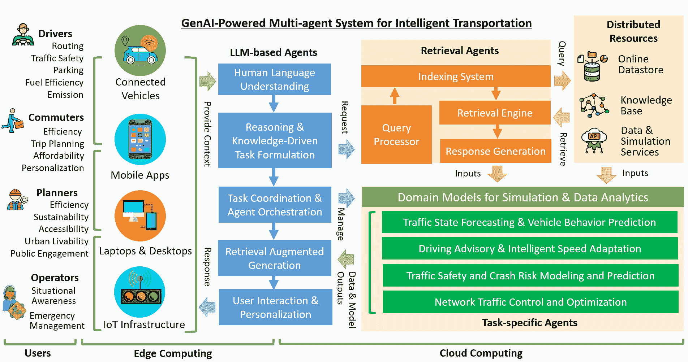

<!--yml
category: 未分类
date: 2025-01-11 12:17:06
-->

# GenAI-powered Multi-Agent Paradigm for Smart Urban Mobility: Opportunities and Challenges for Integrating Large Language Models (LLMs) and Retrieval-Augmented Generation (RAG) with Intelligent Transportation Systems

> 来源：[https://arxiv.org/html/2409.00494/](https://arxiv.org/html/2409.00494/)

^(t1)^(t1)footnotetext: This manuscript has been co-authored by UT-Battelle, LLC, under contract DE-AC05-00OR22725 with the US Department of Energy (DOE). The US government retains and the publisher, by accepting the article for publication, acknowledges that the US government retains a nonexclusive, paid-up, irrevocable, worldwide license to publish or reproduce the published form of this manuscript, or allow others to do so, for US government purposes. DOE will provide public access to these results of federally sponsored research in accordance with the DOE Public Access Plan (http://energy.gov/downloads/doe-public-access-plan).Haowen Xu [xuh4@ornl.gov](mailto:xuh4@ornl.gov) Jinghui Yuan [yuanj@ornl.gov](mailto:yuanj@ornl.gov) Anye Zhou [zhoua@ornl.gov](mailto:zhoua@ornl.gov) Guanhao Xu [xug1@ornl.gov](mailto:xug1@ornl.gov) Wan Li [liw2@ornl.gov](mailto:liw2@ornl.gov) Xuegang (Jeff) Ban [banx@uw.edu](mailto:banx@uw.edu) Xinyue Ye [xinyue.ye@tamu.edu](mailto:xinyue.ye@tamu.edu) Computational Urban Sciences Group, Oak Ridge National Laboratory, Oak Ridge, TN 37830, USA Buildings and Transportation Science Division, Oak Ridge National Laboratory, Oak Ridge, TN 37830, USA Department of Civil and Environmental Engineering, University of Washington, Seattle, WA 98195, USA Department of Landscape Architecture and Urban Planning, Texas A&M University, College Station, TX 77843, USA

###### Abstract

Leveraging recent advances in generative AI, multi-agent systems are increasingly being developed to enhance the functionality and efficiency of smart city applications. This paper explores the transformative potential of large language models (LLMs) and emerging Retrieval-Augmented Generation (RAG) technologies in Intelligent Transportation Systems (ITS), paving the way for innovative solutions to address critical challenges in urban mobility. We begin by providing a comprehensive overview of the current state-of-the-art in mobility data, ITS, and Connected Vehicles (CV) applications. Building on this review, we discuss the rationale behind RAG and examine the opportunities for integrating these Generative AI (GenAI) technologies into the smart mobility sector. We propose a conceptual framework aimed at developing multi-agent systems capable of intelligently and conversationally delivering smart mobility services to urban commuters, transportation operators, and decision-makers. Our approach seeks to foster an autonomous and intelligent approach that (a) promotes science-based advisory to reduce traffic congestion, accidents, and carbon emissions at multiple scales, (b) facilitates public education and engagement in participatory mobility management, and (c) automates specialized transportation management tasks and the development of critical ITS platforms, such as data analytics and interpretation, knowledge representation, and traffic simulations. By integrating LLM and RAG, our approach seeks to overcome the limitations of traditional rule-based multi-agent systems, which rely on fixed knowledge bases and limited reasoning capabilities. This integration paves the way for a more scalable, intuitive, and automated multi-agent paradigm, driving advancements in ITS and urban mobility.

###### keywords:

, Retrieval-Augmented Generation , Large Language Models , Intelligent Transportation System , Multi-agent System

## 1 Introduction

With rapid urbanization, an estimated 40% of the population spends at least one hour commuting daily, making urban mobility management critical for smart, sustainable cities (Schafer and Victor, [2000](https://arxiv.org/html/2409.00494v2#bib.bib104)). Increasing urban populations and automobile numbers have pushed transportation systems to their limits, leading to congestion, accidents, energy waste, and pollution (Sperling and Gordon, [2009](https://arxiv.org/html/2409.00494v2#bib.bib116)). To address these challenges, cities are leveraging advancements in Artificial Intelligence (AI), Internet of Things (IoT), 5G, and computing technologies to transform urban transportation into more efficient, safe, and sustainable systems (Sodhro et al., [2020](https://arxiv.org/html/2409.00494v2#bib.bib115)). These technological innovations are at the core of developing Intelligent Transportation Systems (ITS), which utilize vast amounts of mobility data from traffic sensors, connected vehicles (CVs), simulations, and crowdsourcing to enable real-time situational awareness and predictive analytics of urban traffic dynamics (Li et al., [2021](https://arxiv.org/html/2409.00494v2#bib.bib72); Xu et al., [2023b](https://arxiv.org/html/2409.00494v2#bib.bib155)). These systems optimize infrastructure design, traffic controls, and vehicle operations while providing intelligent advisory services and decision support for travelers and operators(De Souza et al., [2016](https://arxiv.org/html/2409.00494v2#bib.bib29); Mandhare et al., [2018](https://arxiv.org/html/2409.00494v2#bib.bib84)). Cities worldwide are adopting advanced ITS to create connected transportation environments that maximize safety, mobility, and environmental performance, as seen in initiatives like Japan’s VICS and Smartway, Europe’s CVIS and COOPERS, and the U.S.’s ITS Strategic Plan (An et al., [2011](https://arxiv.org/html/2409.00494v2#bib.bib7)).

Despite the successes of ITS globally, challenges remain in developing scalable, accessible, and interoperable smart mobility solutions (Javed et al., [2022](https://arxiv.org/html/2409.00494v2#bib.bib51)). These challenges hinder the full potential of ITS and CV technologies, especially for diverse urban residents, including commuters, drivers, planners, and policymakers. Smart city technologies must scale to accommodate growing populations and complex systems (Bondi, [2000](https://arxiv.org/html/2409.00494v2#bib.bib17)). Modernizing urban transportation requires extensive data processing and analysis, alongside labor-intensive efforts to develop traffic simulations and ITS software components (Torre-Bastida et al., [2018](https://arxiv.org/html/2409.00494v2#bib.bib124); Xu et al., [2023b](https://arxiv.org/html/2409.00494v2#bib.bib155)). Additionally, the inaccessibility of smart mobility services and transportation data limits effective utilization by city residents (Cledou et al., [2018](https://arxiv.org/html/2409.00494v2#bib.bib25)). There’s a need for a digital assistant capable of helping users discover and access ITS tools and information intuitively. As smart city planning shifts towards human-centric approaches, next-generation ITS and CVs should promote public participation through user-friendly, intuitive technologies that do not require specialized skills (Alsayed, [2024](https://arxiv.org/html/2409.00494v2#bib.bib5); Vasilieva et al., [2023](https://arxiv.org/html/2409.00494v2#bib.bib128)). These technologies should enable residents to customize smart mobility services through non-technical interactions.

Building on AI’s history in transportation research, there’s a growing trend to leverage generative AI (GenAI) technologies to overcome limitations in existing ITS through advanced language understanding, content generation, and reasoning. This paper explores the potential of integrating Large Language Models (LLMs) and Retrieval-Augmented Generation (RAG) technologies to transform ITS and CVs into intelligent multi-agent systems, advancing smart mobility services to be more autonomous, engaging, and human-centric. We review current mobility data and technologies in ITS and CV sectors, and propose a conceptual framework for integrating GenAI with ongoing ITS and CV applications in terms of the following aspects: (a) Promoting science-based advisory for reducing congestion, accidents, and emissions, (b) Enhancing public engagement in mobility management, and (c) Automating transportation management tasks like data analytics and traffic simulations. Our target user groups include drivers of both traditional and automated vehicles, urban commuters who rely on public transit, transportation planners tasked with optimizing infrastructure design and traffic control for improved efficiency and safety, and traffic operators from local government agencies (e.g., state DOT and traffic management center) responsible for emergency response, traffic operations, and asset maintenance. The concept of our proposed framework is illustrated in Figure [1](https://arxiv.org/html/2409.00494v2#S1.F1 "Figure 1 ‣ 1 Introduction ‣ GenAI-powered Multi-Agent Paradigm for Smart Urban Mobility: Opportunities and Challenges for Integrating Large Language Models (LLMs) and Retrieval-Augmented Generation (RAG) with Intelligent Transportation Systems").

Figure 1: An GenAI-powered Multi-agent System for Intelligent Transportation and Smart Mobility.

Compared to conventional chatbots developed using general-purpose LLMs, our proposed LLM-RAG-powered multi-agent system offers the following unique features:

1.  1.

    Responses are generated based on user-defined scenarios that reflect the personalized transportation and mobility needs of specific user groups. This ensures that interactions are directly relevant to the unique context of each user.

2.  2.

    Responses are generated using both real-time and historical data (e.g., traffic, weather, infrastructure, public transit, and the user’s GPS position), ensuring they reflect the current and situational realities of urban mobility. This enhances decision-making by ensuring the information is timely and context-aware.

3.  3.

    Responses are personalized and tailored to the user’s specific requirements and preferences, utilizing advanced methodologies, such as data-driven and simulation-based approaches. This ensures that the answers are not generic or Wikipedia-like explanations, but instead are grounded in robust, context-specific analysis of transportation and mobility concepts.

Ultimately, we propose GenAI-powered multi-agent systems that merge ITS developments with emerging LLMs and RAG technologies, enabling more intuitive, efficient, and interoperable solutions for advancing urban mobility management.

## 2 Literature Review

Over the past decades, Intelligent Transportation Systems (ITS) have evolved alongside advances in information and communications technology (ICT), transforming urban transportation into optimized, digitally enhanced smart mobility. The benefits of ITS and connected vehicle (CV) applications include reducing congestion, enhancing safety, identifying bottlenecks, and optimizing transportation planning and infrastructure design. Previous smart mobility research has focused on integrating AI, advanced simulation, and communication technologies to create more efficient, safer, and sustainable urban transportation systems. This paper reviews and discusses the following key areas:

Traffic State Forecasting and Vehicle Behavior Prediction

use algorithms and data analytics to predict traffic conditions and vehicle movements, enhancing management, safety, and efficiency.

Advanced Driver Assistance and Intelligent Speed Adaptation

leverage real-time data and AI to guide drivers and adjust vehicle behavior, improving safety and fuel-efficiency.

Traffic Safety and Crash Risk Modeling

employ predictive analytics to assess crash risk, enabling proactive safety measures.

Network Traffic Control and Optimization

manage and adjust traffic flows in real-time to reduce congestion and improve efficiency at system level.

In the following subsections, we will explore the diverse transportation data generated by modern intelligent transportation technologies, which serve as the foundation for advanced traffic analytics and optimization—key to achieving smart mobility systems. We will also examine current research efforts in each application area, providing detailed discussions. This review lays the groundwork for our vision of developing GenAI-powered multi-agent systems for next-generation urban smart mobility. This paper primarily focuses on the planning, management, and optimization of road transportation and urban mobility systems.

### 2.1 Emerging Mobility Data

Mobility data encompasses a wide array of types derived from various technological sources, including IoT-connected transportation infrastructure, connected vehicles, and social media platforms (Zhang et al., [2011](https://arxiv.org/html/2409.00494v2#bib.bib172); Singh et al., [2022](https://arxiv.org/html/2409.00494v2#bib.bib112)). Each of these technologies offers unique insights into different aspects of urban mobility, forming the backbone of advanced data-driven and simulation-driven approaches to sustainable urban transportation planning and mobility management (Li et al., [2021](https://arxiv.org/html/2409.00494v2#bib.bib72)).

#### 2.1.1 Road-side Infrastructure

The Internet of Things (IoT) has transformed transportation infrastructure by enabling the collection and analysis of vast mobility data, crucial for enhancing traffic management, road safety, public transportation, and reducing environmental impacts (Guerrero-Ibáñez et al., [2018](https://arxiv.org/html/2409.00494v2#bib.bib36)). IoT integration in roadside infrastructure generates diverse mobility data, each captured by specialized sensors designed to monitor various aspects of vehicular and environmental dynamics (Klein, [2024](https://arxiv.org/html/2409.00494v2#bib.bib59)).

Traffic flow data includes vehicle volume, speed, and traffic density across road networks. It is crucial for managing congestion, planning road expansions, predicting traffic patterns, and detecting traffic incidents (Leduc et al., [2008](https://arxiv.org/html/2409.00494v2#bib.bib63); Xu et al., [2021a](https://arxiv.org/html/2409.00494v2#bib.bib153); Moriano et al., [2024](https://arxiv.org/html/2409.00494v2#bib.bib89)). This data is typically obtained by inductive loop sensors, radar systems, or CCTV cameras with advanced analytics (Klein, [2024](https://arxiv.org/html/2409.00494v2#bib.bib59); Zheng et al., [2022](https://arxiv.org/html/2409.00494v2#bib.bib174); Berres et al., [2024](https://arxiv.org/html/2409.00494v2#bib.bib14)). Parking data informs drivers about available parking spaces and optimizes the use of parking facilities (Lin et al., [2017c](https://arxiv.org/html/2409.00494v2#bib.bib78)). It is usually collected through ultrasonic sensors, magnetometers, or cameras that monitor occupancy in real time (Shao et al., [2022](https://arxiv.org/html/2409.00494v2#bib.bib107); Kianpisheh et al., [2012](https://arxiv.org/html/2409.00494v2#bib.bib58); Dixit et al., [2020](https://arxiv.org/html/2409.00494v2#bib.bib30)). Environmental data includes air quality, temperature, and humidity metrics, essential for assessing transportation systems’ environmental impact and adapting to weather conditions (Asam et al., [2015](https://arxiv.org/html/2409.00494v2#bib.bib11); Guerrero-Ibáñez et al., [2018](https://arxiv.org/html/2409.00494v2#bib.bib36)). This data is gathered by air quality monitors, weather stations, and road surface sensors across transportation networks (Mead et al., [2013](https://arxiv.org/html/2409.00494v2#bib.bib86)). Public transit data offers real-time insights into bus, train, and other transit operations (Welch and Widita, [2019](https://arxiv.org/html/2409.00494v2#bib.bib144)). It includes vehicle location, passenger numbers, and schedule adherence, enabling transit agencies to optimize services and provide accurate passenger information (Koutsopoulos et al., [2019](https://arxiv.org/html/2409.00494v2#bib.bib60)).

Advancements in cloud computing, digital twins, and cyberinfrastructure have made diverse mobility data more accessible via various wireless communication protocols (Xu et al., [2022a](https://arxiv.org/html/2409.00494v2#bib.bib158)). Web service endpoints, along with well-documented metadata, offer new opportunities for AI technologies. These technologies, through machine-to-machine communication, enable automatedv decision-making, data analytics, information sharing, and enhanced visualization capabilities (Xu et al., [2023b](https://arxiv.org/html/2409.00494v2#bib.bib155), [2024b](https://arxiv.org/html/2409.00494v2#bib.bib157); Berres et al., [2021a](https://arxiv.org/html/2409.00494v2#bib.bib15), [b](https://arxiv.org/html/2409.00494v2#bib.bib16)). Since positioning and movement data for many private vehicles and public transit systems are captured through vehicular sensors and onboard units rather than roadside infrastructure, these aspects will be discussed in the next subsection.

#### 2.1.2 Connected Vehicles

A CV is an automobile equipped with internet access and wireless communication capabilities, allowing it to send and receive data, interact with other vehicles, smart infrastructure, and cloud services (Guerrero-Ibanez et al., [2015](https://arxiv.org/html/2409.00494v2#bib.bib37)). This connectivity enhances safety, efficiency, and convenience by enabling real-time information exchange, supporting advanced driver assistance systems (ADAS), facilitating vehicle-to-vehicle (V2V) and vehicle-to-infrastructure (V2I) communication, and enabling over-the-air updates (Siegel et al., [2017](https://arxiv.org/html/2409.00494v2#bib.bib110)). Both vehicle manufacturers and transportation agencies emphasize that CV technology can significantly reduce fatalities and serious injuries from vehicle crashes while promoting eco-driving to reduce fuel consumption and carbon emissions (Gruyer et al., [2021](https://arxiv.org/html/2409.00494v2#bib.bib35)). Public transit data, collected through Automatic Vehicle Location (AVL) systems, passenger counting systems, and Transit Signal Priority (TSP) systems, further supports transportation management by tracking vehicle positions and monitoring passenger numbers (Hellinga et al., [2011](https://arxiv.org/html/2409.00494v2#bib.bib43); Darsena et al., [2023](https://arxiv.org/html/2409.00494v2#bib.bib28)).

As a foundational element of ITS and the broader IoT ecosystem, CVs generate vast amounts of valuable traffic data through advanced communication technology and vehicular sensors (Siegel et al., [2017](https://arxiv.org/html/2409.00494v2#bib.bib110)). GPS loggers and cameras are key components, enabling data exchanges across V2V and V2I networks and facilitating the transmission of basic safety messages (BSM) between vehicles and roadside equipment (RSE). This data includes vehicle trajectories (e.g., speed, location, direction), driver-vehicle interactions (e.g., steering, pedal usage, gear shifts), and contextual factors (e.g., weather) (Parikh et al., [2017](https://arxiv.org/html/2409.00494v2#bib.bib95); Harding et al., [2014](https://arxiv.org/html/2409.00494v2#bib.bib40); Siegel et al., [2017](https://arxiv.org/html/2409.00494v2#bib.bib110)). More advanced data from vehicular radar, LiDAR, ultrasonic sensors, and inertial measurement units (IMU) enables high-resolution 3D mapping, advanced parking support, and precise measurement of vehicle dynamics (Nidamanuri et al., [2021](https://arxiv.org/html/2409.00494v2#bib.bib91)). Several studies have comprehensively reviewed CV data, its sources, and applications in vehicle technology and urban mobility (Siegel et al., [2017](https://arxiv.org/html/2409.00494v2#bib.bib110); Li et al., [2021](https://arxiv.org/html/2409.00494v2#bib.bib72)).

In the rapidly evolving landscape of ITS and smart mobility, companies like Wejo, INRIX, Otonomo, Mobileye, HERE Technologies, TomTom, StreetLight Data, CARMERA, DeepMap, Teralytics, and Arity have become key players in collecting, analyzing, and distributing connected vehicle data. These companies provide extensive datasets critical for advancing urban transportation solutions and research. Leveraging data from vehicle telemetry, GPS, cameras, LiDAR, radar, and mobile networks, they offer insights into traffic flow, vehicle trajectories, driving behavior, and road conditions. This data drives the development of advanced traffic management systems, autonomous driving technologies, and smart city infrastructure, enabling more efficient, safe, and sustainable urban mobility. Practical applications of CV data include systems like the Intersection Collision Warning System (ICWS), which alerts drivers to potential crash risks at intersections (U.S. Department of Transportation, Federal Highway Administration, [2024](https://arxiv.org/html/2409.00494v2#bib.bib127)), and the Green Light Optimal Speed Advisory (GLOSA), which advises vehicles on optimal speeds to reduce fuel consumption, carbon emissions, and traffic congestion (Suzuki and Marumo, [2018](https://arxiv.org/html/2409.00494v2#bib.bib119); Xu et al., [2023c](https://arxiv.org/html/2409.00494v2#bib.bib160)). In addition, both real-time and historical CV data can be accessed via API endpoints and real-time data feeds. This opens pathways for AI agents to utilize this information to enhance smart city initiatives.

#### 2.1.3 Social Media Data

In recent decades, social media platforms have become valuable sources of mobility data, offering real-time insights into human movement, transportation preferences, and traffic conditions (Zheng et al., [2015](https://arxiv.org/html/2409.00494v2#bib.bib176)). Geo-referenced social media plays a crucial role in ITS by providing dynamic information that improves traffic management and operation, enhances road safety, and optimizes public transit (Torbaghan et al., [2022](https://arxiv.org/html/2409.00494v2#bib.bib123)). The mobility data from social media can be categorized as follows:

Geotagged posts are social media posts with geographic coordinates, offering precise snapshots of user locations and movements. Platforms like Twitter generate vast geospatial data, valuable for understanding popular destinations, tracing movement patterns, and analyzing urban flow (Torbaghan et al., [2022](https://arxiv.org/html/2409.00494v2#bib.bib123); Zheng et al., [2015](https://arxiv.org/html/2409.00494v2#bib.bib176)). For ITS, geotagged data helps identify high-traffic areas, optimize routes, and manage crowd dynamics, leading to more efficient traffic management. Mobility trends and patterns are uncovered by aggregating and analyzing geo-referenced user-generated content. By examining hashtags, post frequencies, and temporal patterns, researchers can identify urban mobility trends such as peak travel times and preferred routes (Martín, [2019](https://arxiv.org/html/2409.00494v2#bib.bib85)). This data enables ITS to predict congestion, adapt transit services, and enhance urban transportation efficiency. Sentiment and opinion data related to transportation, analyzed from posts, comments, and hashtags, reflects public sentiment about transportation services, infrastructure, and policies (Qi et al., [2020](https://arxiv.org/html/2409.00494v2#bib.bib98)). Platforms like Twitter, Reddit, and Facebook provide insights into user experiences, highlighting areas for improvement and successful initiatives, which are crucial for aligning ITS with public expectations. Crowdsourced traffic information from social media is pivotal for ITS. Users report real-time traffic conditions, such as incidents, work zones, and congestions, on platforms like Twitter, while apps like Waze enable direct sharing of traffic updates (Adler et al., [2014](https://arxiv.org/html/2409.00494v2#bib.bib4)). This data supports dynamic traffic management, allowing operators to adapt swiftly to changing conditions, enhancing road safety and improving travel efficiency (Liu et al., [2024](https://arxiv.org/html/2409.00494v2#bib.bib79)).

In summary, social media platforms produce diverse mobility data that is essential for developing and optimizing intelligent transportation systems. This data, accessible in real-time through various API endpoints, presents an opportunity for an intelligent multi-agent system. Such a system allows AI agents to access critical, up-to-date social media information, enhancing situational awareness and optimizing decision-making in smart mobility services, particularly in traffic safety, route planning, and public transit trip planning.

### 2.2 Popular Intelligent Transportation Applications

Driven by the vast and varied traffic data, novel methodologies have been integrated into ITS to enhance urban mobility from multiple perspectives, which are individually reviewed and discussed through the following subsections. With advancements in ICT and computing technologies, the algorithms driving these ITS methodologies can now be accessed via wireless communication protocols and API endpoints through cyber delivery. This development creates opportunities for AI agents to leverage these methods as web or cloud services, enabling automated analytics and optimizations when they are tasked to provide smart mobility services to urban residents.

#### 2.2.1 Traffic State Forecasting and Vehicle Behavior Prediction

Traffic state forecasting and behavior prediction are crucial for developing strategies that enhance road safety, reduce congestion, and improve traffic efficiency. Traffic state forecasting predicts future conditions like flow, density, and speed by leveraging historical and real-time data from sources such as loop detectors, cameras, probing devices, and social media (Kumar and Raubal, [2021](https://arxiv.org/html/2409.00494v2#bib.bib61)). Vehicle behavior prediction focuses on forecasting the trajectories of surrounding vehicles using data from historical trajectories and traffic environments gathered through sensors and communication networks.

Algorithms for traffic state forecasting and vehicle behavior prediction can be broadly categorized into model-based and learning-based methods. Traditional model-based methods include statistical time series models (Antoniou et al., [2013](https://arxiv.org/html/2409.00494v2#bib.bib8); Wang and Papageorgiou, [2005](https://arxiv.org/html/2409.00494v2#bib.bib139); Xing et al., [2020b](https://arxiv.org/html/2409.00494v2#bib.bib148); Wang et al., [2022c](https://arxiv.org/html/2409.00494v2#bib.bib141); Li et al., [2020b](https://arxiv.org/html/2409.00494v2#bib.bib71)), rule-based models (Szeto et al., [2009](https://arxiv.org/html/2409.00494v2#bib.bib120); Zhong et al., [2013](https://arxiv.org/html/2409.00494v2#bib.bib177); Zhou et al., [2023a](https://arxiv.org/html/2409.00494v2#bib.bib178); Woo et al., [2016](https://arxiv.org/html/2409.00494v2#bib.bib145)), and probabilistic models (Wang et al., [2014](https://arxiv.org/html/2409.00494v2#bib.bib134), [2021b](https://arxiv.org/html/2409.00494v2#bib.bib136); Zhang et al., [2020](https://arxiv.org/html/2409.00494v2#bib.bib173); Lin et al., [2017b](https://arxiv.org/html/2409.00494v2#bib.bib75)). While these methods can perform well in specific scenarios, their rigid structures and underlying assumptions can limit effectiveness, especially when faced with unmodeled uncertainties.

In contrast, advancements in computing power and data availability have driven the rise of model-free, learning-based methods. These methods, often based on deep neural networks (DNNs), offer more accurate and robust performance under uncertain conditions. DNNs used in traffic forecasting and behavior prediction can handle multi-modal inputs, generate high-dimensional outputs, and learn spatial dependencies (e.g., convolutional neural networks) (Lin et al., [2022](https://arxiv.org/html/2409.00494v2#bib.bib76); Do et al., [2018](https://arxiv.org/html/2409.00494v2#bib.bib31); Hosseini and Talebpour, [2019](https://arxiv.org/html/2409.00494v2#bib.bib44); Subramaniyan et al., [2022](https://arxiv.org/html/2409.00494v2#bib.bib117); Li et al., [2020a](https://arxiv.org/html/2409.00494v2#bib.bib66); Ke et al., [2020](https://arxiv.org/html/2409.00494v2#bib.bib54)), capture social interactions between agents (e.g., graph neural networks) (Lin et al., [2017a](https://arxiv.org/html/2409.00494v2#bib.bib74); Cui et al., [2020a](https://arxiv.org/html/2409.00494v2#bib.bib26); Mo et al., [2021](https://arxiv.org/html/2409.00494v2#bib.bib87); Schmidt et al., [2022](https://arxiv.org/html/2409.00494v2#bib.bib105)), and model time-series dependencies (e.g., recurrent neural networks, attention mechanisms) (Cui et al., [2020b](https://arxiv.org/html/2409.00494v2#bib.bib27); Xu et al., [2022b](https://arxiv.org/html/2409.00494v2#bib.bib161); Liu et al., [2021](https://arxiv.org/html/2409.00494v2#bib.bib80); Zhou et al., [2023b](https://arxiv.org/html/2409.00494v2#bib.bib179)). Incorporating physical principles into these learning-based methods further enhances DNN generalizability, leading to more reliable applications (Mo et al., [2020](https://arxiv.org/html/2409.00494v2#bib.bib88); Geng et al., [2023](https://arxiv.org/html/2409.00494v2#bib.bib34); Huang and Agarwal, [2020](https://arxiv.org/html/2409.00494v2#bib.bib47)).

The emergence of LLMs presents an opportunity to further improve forecasting and prediction by integrating expert feedback from traffic professionals. This feedback can refine DNN training and offer meaningful interpretations of input features, enhancing the trustworthiness and interpretability of the overall workflow.

#### 2.2.2 Driving Advisory and Intelligent Speed Adaptation

Advanced Driving Assistance Systems (ADAS) are sophisticated technologies designed to enhance driver decision-making and road safety by providing real-time guidance (Ameta et al., [2023](https://arxiv.org/html/2409.00494v2#bib.bib6)). Utilizing data from GPS, traffic monitoring systems, and vehicle sensors, ADAS offers advice on lane usage, merging, speed adjustments, and route selection, reducing driver workload and improving safety (Antony and Whenish, [2021](https://arxiv.org/html/2409.00494v2#bib.bib9)).

Intelligent Speed Adaptation (ISA) helps drivers maintain appropriate speeds by either advising them of speed limits or automatically adjusting the vehicle’s speed to comply with legal limits, enhancing safety and fuel efficiency (Ryan, [2019](https://arxiv.org/html/2409.00494v2#bib.bib102); Newsome and WSP, [2024](https://arxiv.org/html/2409.00494v2#bib.bib90)). ISA systems use GPS, digital maps, and onboard cameras to determine speed limits, functioning either as advisory systems or as automatic speed controllers (Archer and Åberg, [2001](https://arxiv.org/html/2409.00494v2#bib.bib10); Carsten, [2006](https://arxiv.org/html/2409.00494v2#bib.bib19)). The goal of ISA is to reduce speed-related traffic accidents and improve road safety.

Building on vehicle communication technologies, ADAS and ISA have been widely adopted to optimize Connected Automated Vehicles (CAVs) (Nidamanuri et al., [2021](https://arxiv.org/html/2409.00494v2#bib.bib91)). CAV control varies by levels of cooperation and automation. In connected but non-automated scenarios, advisory systems compute energy-saving or congestion-mitigating trajectories for human drivers (Wan et al., [2016](https://arxiv.org/html/2409.00494v2#bib.bib130); Xu et al., [2024c](https://arxiv.org/html/2409.00494v2#bib.bib159); Suramardhana and Jeong, [2014](https://arxiv.org/html/2409.00494v2#bib.bib118)). In automated but non-connected scenarios, ADAS ensures smooth vehicle operations using onboard sensors (Zhou et al., [2022e](https://arxiv.org/html/2409.00494v2#bib.bib187), [c](https://arxiv.org/html/2409.00494v2#bib.bib185), [d](https://arxiv.org/html/2409.00494v2#bib.bib186), [2023c](https://arxiv.org/html/2409.00494v2#bib.bib183)). Fully connected and automated systems exhibit four classes of intelligent vehicle control based on the Society of Automobile Engineers standards: (i) status sharing (class A), where CAVs share trajectory information to improve traffic flow (Wang et al., [2018a](https://arxiv.org/html/2409.00494v2#bib.bib131); Zhou et al., [2023b](https://arxiv.org/html/2409.00494v2#bib.bib179), [2024](https://arxiv.org/html/2409.00494v2#bib.bib181), [2022b](https://arxiv.org/html/2409.00494v2#bib.bib182)); (ii) intent sharing (class B), where future plans and control decisions are shared to enhance anticipation and situational awareness (Wang et al., [2023b](https://arxiv.org/html/2409.00494v2#bib.bib143), [a](https://arxiv.org/html/2409.00494v2#bib.bib142); Liu et al., [2023](https://arxiv.org/html/2409.00494v2#bib.bib81), [2021](https://arxiv.org/html/2409.00494v2#bib.bib80)); (iii) agreement seeking (class C), where multiple vehicles negotiate cooperative plans to balance interests (Hyeon et al., [2024](https://arxiv.org/html/2409.00494v2#bib.bib50), [2023b](https://arxiv.org/html/2409.00494v2#bib.bib49), [2023a](https://arxiv.org/html/2409.00494v2#bib.bib48)); and (iv) prescriptive (class D), where CAVs follow a centralized plan to achieve system-level optimization (Wang et al., [2024](https://arxiv.org/html/2409.00494v2#bib.bib137); Zhou et al., [2022a](https://arxiv.org/html/2409.00494v2#bib.bib180); Wang et al., [2022b](https://arxiv.org/html/2409.00494v2#bib.bib135)).

Despite their effectiveness, challenges remain in personalizing autonomous driving systems, interpreting AI decisions, and fostering trustworthy human-machine interactions. Multi-modal LLMs offer potential solutions by integrating human input and articulating AI and human rationales in a bidirectional manner.

#### 2.2.3 Traffic Safety and Crash Risk Modeling and Prediction

Traffic safety applications involve the use of statistical and machine learning techniques to assess and predict the frequency and likelihood of traffic crashes (Chand et al., [2021](https://arxiv.org/html/2409.00494v2#bib.bib20)). Traffic safety models are initially developed to identify patterns and factors contributing to crashes, such as driver behavior, road conditions, weather, and traffic flow characteristics, with the goal of enhancing road safety (Theofilatos and Yannis, [2014](https://arxiv.org/html/2409.00494v2#bib.bib121)). Later on, by incorporating historical crash data and real-time information, real-time crash risk prediction models were developed predict potential high-risk situations and locations. In addition, traffic conflict based safety models have been popular to address the limitation of rareness and randomness of crash data. In general, there are three types of traffic safety models that have been widely developed and implementated in real world.

Crash frequency prediction models, also known as safety performance functions (SPF), estimate the expected number of crashes at specific locations over a given period, enabling transportation planners to identify high-risk areas and allocate resources effectively. These models often incorporate various factors such as aggregated traffic volume, road geometry, and traffic control characteristics to achieve better prediction accuracy (Khattak et al., [2024](https://arxiv.org/html/2409.00494v2#bib.bib55)).

Crash severity models focus on predicting the potential outcomes of crashes, i.e., the severity of crashes. These models typically assess the impact of factors such as vehicle speed, driver and occupant characteristics, collision type, and vehicle safety features (Qin et al., [2013](https://arxiv.org/html/2409.00494v2#bib.bib99)). Understanding crash severity helps in the development of targeted safety interventions (e.g., driver education and advanced vehicle safety features) and infrastructure improvements that can mitigate the most serious consequences of traffic accidents (Khattak and Fontaine, [2020](https://arxiv.org/html/2409.00494v2#bib.bib56)).

Real-time crash risk evaluation and prediction models aim to model the relationship between crash likelihood and the corresponding real-time traffic flow characteristics, and then predict the probability of crash occurrence in real-time. The prediction results can not only provide dynamic warnings or interventions designed to prevent potential crashes for drivers but also provide better predictive insights for traffic operators to improve the emergency response and reduce the incident clearance time. (Yuan et al., [2020](https://arxiv.org/html/2409.00494v2#bib.bib168); Yuan and Abdel-Aty, [2018](https://arxiv.org/html/2409.00494v2#bib.bib167); Yu et al., [2020](https://arxiv.org/html/2409.00494v2#bib.bib166); Li et al., [2020a](https://arxiv.org/html/2409.00494v2#bib.bib66); Cheng et al., [2022](https://arxiv.org/html/2409.00494v2#bib.bib22); Yue et al., [2020](https://arxiv.org/html/2409.00494v2#bib.bib169)).

Surrogate safety models provide a new perspective for traffic safety modeling and prediction given traffic crashes are extremely rare events, which is more scalable and implementable. Modeling the relationship between various surrogate safety measures (e.g., time-to-collision, post-encroachment time, deceleration rate to avoid a crash) and real-time driver and traffic flow characteristics can effectively predict the potential near-crashes before it happens. (Abdel-Aty et al., [2022](https://arxiv.org/html/2409.00494v2#bib.bib1); Xing et al., [2020a](https://arxiv.org/html/2409.00494v2#bib.bib147); Wang et al., [2021a](https://arxiv.org/html/2409.00494v2#bib.bib132)).

These applications are widely used in urban planning, traffic management systems, advanced driver-assistance systems (ADAS) and autonomous driving system, contributing to safer road networks and reduced accident rates.

#### 2.2.4 Network Traffic Control and Optimization

While driving advisory systems and intelligent vehicle control enhance mobility at the individual vehicle level, network traffic control strategies are essential for optimizing entire transportation systems. These strategies improve travel times, reduce fuel consumption, and lower emissions, supporting sustainable urban mobility (Ugirumurera et al., [2020](https://arxiv.org/html/2409.00494v2#bib.bib126); Xu et al., [2021b](https://arxiv.org/html/2409.00494v2#bib.bib154); Wang et al., [2022a](https://arxiv.org/html/2409.00494v2#bib.bib133); Li et al., [2022a](https://arxiv.org/html/2409.00494v2#bib.bib69)). This process involves the systematic management and regulation of traffic flows across road networks, using real-time data and advanced algorithms to optimize traffic signals, reroute vehicles, and adjust traffic patterns.

Among various optimization strategies, traffic signal control is the most widely implemented. Traditional fixed-time traffic signal control, based on historical data, often fails to adapt to real-time traffic variations, leading to inefficiencies. Adaptive traffic signal control systems address these limitations by using real-time data from sensors and cameras to dynamically adjust signal timings, optimizing flow and reducing delays (Wang et al., [2018b](https://arxiv.org/html/2409.00494v2#bib.bib140); Abdulhai et al., [2003](https://arxiv.org/html/2409.00494v2#bib.bib2); Li and Ban, [2018](https://arxiv.org/html/2409.00494v2#bib.bib67); Li et al., [2022b](https://arxiv.org/html/2409.00494v2#bib.bib70)). Traffic signal coordination synchronizes signals along major corridors, minimizing stops and maintaining continuous traffic flow (Bazzan, [2005](https://arxiv.org/html/2409.00494v2#bib.bib13); Putha et al., [2012](https://arxiv.org/html/2409.00494v2#bib.bib97); Li and Ban, [2020](https://arxiv.org/html/2409.00494v2#bib.bib68)). Transit signal priority (TSP) systems further enhance efficiency by adjusting signals to reduce delays for public transit vehicles (Smith et al., [2005](https://arxiv.org/html/2409.00494v2#bib.bib114); He et al., [2014](https://arxiv.org/html/2409.00494v2#bib.bib42); Yu et al., [2020](https://arxiv.org/html/2409.00494v2#bib.bib166)).

Ramp metering is another key strategy, regulating vehicle entry onto freeways to maintain optimal flow and prevent congestion (Papageorgiou et al., [1991](https://arxiv.org/html/2409.00494v2#bib.bib93); Papageorgiou and Kotsialos, [2002](https://arxiv.org/html/2409.00494v2#bib.bib94)). It has been shown to enhance freeway throughput, increase vehicle speeds, and improve safety by reducing stop-and-go conditions (Haj-Salem and Papageorgiou, [1995](https://arxiv.org/html/2409.00494v2#bib.bib39); Lee et al., [2006](https://arxiv.org/html/2409.00494v2#bib.bib64); Smaragdis et al., [2004](https://arxiv.org/html/2409.00494v2#bib.bib113)). Effective ramp metering relies on real-time data, predictive modeling, and adaptive algorithms (Ma et al., [2020](https://arxiv.org/html/2409.00494v2#bib.bib83)).

The Macroscopic Fundamental Diagram (MFD), which gives the relationship between flow, density,and speed at a network level(Xu et al., [2020](https://arxiv.org/html/2409.00494v2#bib.bib151); Xu and Gayah, [2024](https://arxiv.org/html/2409.00494v2#bib.bib150)), has emerged as a valuable tool for managing congestion across entire networks. MFD-based strategies, such as perimeter flow control, congestion pricing, urban road space allocation, regional vehicle routing, and area-wide signal control, are effective in optimizing network-wide traffic flow (Aboudolas and Geroliminis, [2013](https://arxiv.org/html/2409.00494v2#bib.bib3); Zhou and Gayah, [2021](https://arxiv.org/html/2409.00494v2#bib.bib184); Simoni et al., [2015](https://arxiv.org/html/2409.00494v2#bib.bib111); Xu and Gayah, [2023](https://arxiv.org/html/2409.00494v2#bib.bib149); Xu et al., [2023a](https://arxiv.org/html/2409.00494v2#bib.bib152); Yildirimoglu et al., [2015](https://arxiv.org/html/2409.00494v2#bib.bib165); Yan et al., [2016](https://arxiv.org/html/2409.00494v2#bib.bib163)). Implementing these strategies requires robust data collection and advanced analytics to interpret MFD data effectively.

Other network traffic control methods include Variable Speed Limits (VSL), which adjust speed limits based on real-time conditions (Lin et al., [2004](https://arxiv.org/html/2409.00494v2#bib.bib77)), and Integrated Corridor Management (ICM), which optimizes overall corridor performance by managing all available infrastructure and resources efficiently (Hashemi and Abdelghany, [2016](https://arxiv.org/html/2409.00494v2#bib.bib41)). These strategies, often dependent on extensive data collection and analysis, can be further enhanced by integrating LLMs.

## 3 The Raise of Multi-agent Systems

A multi-agent system is a framework where multiple autonomous agents, each with specific capabilities, work together through coordination to achieve a common goal or solve complex problems (Vogel-Heuser et al., [2020](https://arxiv.org/html/2409.00494v2#bib.bib129)). These agents interact, communicate, and emulate collaborative behaviors found in human and natural systems. Enhanced by emerging AI technologies and knowledge engineering, they now undertake increasingly specialized tasks (Khosla, [2012](https://arxiv.org/html/2409.00494v2#bib.bib57)). Multi-agent systems have gained traction in research and applications requiring sophisticated problem-solving, such as smart manufacturing and healthcare (Yahouni et al., [2021](https://arxiv.org/html/2409.00494v2#bib.bib162); Shakshuki and Reid, [2015](https://arxiv.org/html/2409.00494v2#bib.bib106)). The growing complexity of challenges in these domains has driven the evolution of multi-agent systems alongside Generative AI (GenAI) technologies, including LLMs and RAG (de Zarzà et al., [2023](https://arxiv.org/html/2409.00494v2#bib.bib171)). By leveraging the strengths of specialized agents working together, AI-powered multi-agent systems can more effectively and interactively address complex problems that require deep domain knowledge.

A typical GenAI-powered multi-agent system includes several key components: (a) LLM agents that excel in natural language understanding and generation, (b) retrieval agents that fetch relevant data from external sources, and (c) task-specific agents that handle specialized functions like sentiment analysis, optimization, or decision-making. Together, these agents, guided by domain knowledge (e.g., ontologies and knowledge graphs), form a cohesive unit capable of addressing intricate problems more effectively than a single model alone.

### 3.1 LLM Agents: Origin and Capabilities

In recent years, pre-trained Large Language Models (LLMs) have significantly expanded AI’s capabilities in natural language understanding, reasoning, and generation (Yang et al., [2024](https://arxiv.org/html/2409.00494v2#bib.bib164)). Generative Pre-trained Transformer (GPT) models, developed using the Transformer architecture, have become increasingly popular in both industry and academia (Raiaan et al., [2024](https://arxiv.org/html/2409.00494v2#bib.bib100)). Notable examples include OpenAI’s ChatGPT, GPT-3, BERT, T5, and RoBERTa. These models excel in various applications, from conversational agents to content generation, due to their ability to leverage vast textual data to capture nuanced linguistic patterns and contextual relationships. This sets them apart from traditional deep learning methods, which often require task-specific training and struggle with understanding broader contexts.

The flexibility and robustness of LLMs have led to their growing use in urban science research. These models are being used to analyze large volumes of textual data, extract meaningful insights, and support decision-making across sectors like building management (Jiang et al., [2024](https://arxiv.org/html/2409.00494v2#bib.bib52); Rane et al., [2023](https://arxiv.org/html/2409.00494v2#bib.bib101)), natural hazard mitigation (Chandra et al., [2024](https://arxiv.org/html/2409.00494v2#bib.bib21); Samuel et al., [2024](https://arxiv.org/html/2409.00494v2#bib.bib103)), energy system management (Choi et al., [2024a](https://arxiv.org/html/2409.00494v2#bib.bib23); Lai et al., [2024](https://arxiv.org/html/2409.00494v2#bib.bib62)), and freight system optimization (Tupayachi et al., [2024](https://arxiv.org/html/2409.00494v2#bib.bib125)). LLMs’ ability to process and interpret complex datasets and technical documents with minimal supervision is proving invaluable for addressing big data challenges in these fields.

In an GenAI-powered multi-agent system, a LLM agent typically serves as a specialized entity that processes natural language data and generates new content. The role of an LLM-agent can vary depending on the specific application. In the context of augmenting the existing ITS technologies, LLM agents can facilitate the following functions:

*   1.

    Natural Language Understanding: The LLM-agent interprets and understands human language inputs, allowing it to communicate effectively with both human users and other agents in the system.

*   2.

    Task Automation: The LLM-agent can automate tasks that involve language processing, such as drafting reports, generating responses, or summarizing information, thereby reducing the workload on human agents or other system components.

*   3.

    Mediation and Coordination: In a multi-agent system, the LLM-agent can facilitate communication and coordination between different agents by translating, summarizing, or contextualizing information exchanged within the system.

*   4.

    User Interaction: The LLM-agent often serves as the primary interface for human users, enabling intuitive and conversational interactions, which enhances user experience and accessibility in complex systems.

Overall, the LLM-agent plays a crucial role in enhancing the cognitive capabilities of a multi-agent system, enabling more sophisticated, context-aware, and human-centric interactions.

### 3.2 Retrieval Agent for RAG

Retrieval agents was proposed to address the limitations of the early versions of LLM agents in dealing with domain-specific queries requiring specialized knowledge (Hu et al., [2023](https://arxiv.org/html/2409.00494v2#bib.bib46)). Since these general-purpose models, trained on static text, often struggle to answer domain-specific questions or access the most up-to-date information, making them vulnerable to hallucinations (Zaki et al., [2024](https://arxiv.org/html/2409.00494v2#bib.bib170)). Unlike the computationally expensive fine-tuning processes, which often requires a significant amounts of data to tune the parameter of a LLM, the recent emerging RAG technique presents a cost-effective solution to enhance the language models’ knowledge base by enabling an external information retrieval system. The technique expand the general-purpose LLMs’ ability to provide accurate and contextually relevant responses by leveraging external knowledge sources that are specialized and domain-specific.

RAG works by first retrieving pertinent documents from a vector database, which indexes and searches data based on vector embedding, and then generating a response using both the retrieved information and the model’s internal knowledge (Cakaloglu et al., [2020](https://arxiv.org/html/2409.00494v2#bib.bib18)). The vector database concept is crucial as it allows efficient and effective retrieval of semantically similar data points, thereby ensuring that the most relevant information is utilized during response generation. Studies have shown that integrating retrieval mechanisms with generative models can significantly improve factual accuracy and reduce the incidence of hallucinations in model outputs (Lewis et al., [2020](https://arxiv.org/html/2409.00494v2#bib.bib65); Karpukhin et al., [2020](https://arxiv.org/html/2409.00494v2#bib.bib53)).

During this process, the retrieval agent is crucial for sourcing information. It locates and gathers knowledge and data from various repositories, both structured and unstructured. The agent then filters and organizes the data based on relevance, context, or specific criteria, ensuring that only the most pertinent and accurate information is presented or used. The major components of a retrieval agent typically include the (a) an interface layer for communication with other agents or users, (b) a query processor that interprets and formulates queries, and (c) a data retrieval engine that interacts with databases or other storage systems to fetch the required information.

To support these functions, different types of database technologies can be leveraged based on the nature of the data and retrieval requirements. Among different database technologies, Relational databases are often used for structured data retrieval, enabling efficient querying and management of tabular data with well-defined relationships. Graph databases excel in scenarios where the relationships between data points are complex and require traversal of nodes, such as in topological data, such as a social network or road network. Vector databases are particularly effective for handling unstructured or high-dimensional data, such as embeddings from natural language processing models, enabling similarity search and nearest-neighbor retrieval. By integrating these database technologies, a retrieval agent can be tailored to handle diverse data types and retrieval tasks, ensuring robust and efficient information retrieval in a multi-agent system.

Recently, several frameworks, including LangChain, Hugging Face, and LlamaIndex (formerly GPT Index), have emerged to provide robust pipelines that seamlessly connect LLM-based agents with various external data sources, particularly databases and APIs (Topsakal and Akinci, [2023](https://arxiv.org/html/2409.00494v2#bib.bib122); Shen et al., [2024](https://arxiv.org/html/2409.00494v2#bib.bib108); Pinheiro et al., [2023](https://arxiv.org/html/2409.00494v2#bib.bib96)). These frameworks enable the development of powerful retrieval agents that can effectively interact with and process data from diverse sources.

### 3.3 Task-Specific Agents

In a multi-agent system, task-specific agents are specialized entities designed to perform distinct and specialized roles that are tailored to execute particular tasks. These agents are empowered by specific capabilities, knowledge, and behaviors that align with their assigned roles. They operate autonomously or in coordination with other agents to achieve localized goals that contribute to the overall objectives of the multi-agent system and its target workflow.

In augmenting ITS and smart urban mobility, task-specific agents integrate specialized transportation tools and methodologies, such as agent-based traffic simulations and predictive models for traffic flow, accidents, and driver behavior. These agents can be developed using core ITS components, which are reviewed as examples for the intelligent transportation and smart mobility applications in Section [2.2](https://arxiv.org/html/2409.00494v2#S2.SS2 "2.2 Popular Intelligent Transportation Applications ‣ 2 Literature Review ‣ GenAI-powered Multi-Agent Paradigm for Smart Urban Mobility: Opportunities and Challenges for Integrating Large Language Models (LLMs) and Retrieval-Augmented Generation (RAG) with Intelligent Transportation Systems"). With advancements in cloud and edge computing, features like traffic simulations, vehicle simulators, and predictive analytics can be hosted as web services and delivered via wireless networks. These services enable the creation of task-specific agents using computing paradigms like Service-Oriented Architecture (SOA) and Microservices Architecture, facilitating seamless and interoperable integration with other agents in a multi-agent framework.

## 4 Multi-agent Framework for ITS

This section reviews the current advancements of GenAI-powered multi-agent systems in research, highlighting their transformative potential. We then explore opportunities enabled by integrating LLM and RAG into multi-agent systems to address the challenges and limitations of traditional ITS applications, as discussed in Section [1](https://arxiv.org/html/2409.00494v2#S1 "1 Introduction ‣ GenAI-powered Multi-Agent Paradigm for Smart Urban Mobility: Opportunities and Challenges for Integrating Large Language Models (LLMs) and Retrieval-Augmented Generation (RAG) with Intelligent Transportation Systems").

### 4.1 Multi-agent Systems for Operations Research

As LLMs and RAG have been increasingly used in urban research in recent years, a few studies have developed GenAI-powered multi-agent systems to facilitate urban management (Xu et al., [2024a](https://arxiv.org/html/2409.00494v2#bib.bib156)), especially in the energy systems and smart grid sector. However, their applications in intelligent transportation and smart mobility remains rare.

Gamage et al. ([2024](https://arxiv.org/html/2409.00494v2#bib.bib33)) introduce a multi-agent chatbot architecture within the La Trobe Energy AI Platform (LEAP) to enhance decision-making in net-zero emissions energy systems. This architecture integrates LLMs and RAG to improve data processing and retrieval, featuring four specialized agents—Observer, Knowledge Retriever, Behavior Analyzer, and Visualizer—responsible for anomaly detection, data visualization, behavioral analysis, and information retrieval. By leveraging RAG, the chatbot delivers contextually relevant responses, optimizing decision support in dynamic energy environments aimed at net-zero carbon emissions. Choi et al. ([2024b](https://arxiv.org/html/2409.00494v2#bib.bib24)) present eGridGPT, a generative AI-powered platform by the National Renewable Energy Laboratory (NREL) to support decision-making in power grid control rooms. Using LLMs and RAG, eGridGPT enhances situational awareness and decision-making by analyzing real-time data, simulating scenarios, and generating actionable recommendations. The system integrates digital twins for simulation-based validation, ensuring accurate and reliable outputs. eGridGPT’s multi-agent system streamlines operations, reduces decision-making time, and improves complex energy system management, making it crucial for future grid operations balancing renewable energy integration with grid stability.

### 4.2 LLM and RAG in Multi-agent System: Opportunities for ITS

Traditional multi-agent systems (MAS) were designed to consist of autonomous agents that performed specific tasks through rule-based reasoning and predefined communication protocols (Ferber and Weiss, [1999](https://arxiv.org/html/2409.00494v2#bib.bib32)). They played key roles in distributed problem-solving across various domains like traffic management and robotics. However, these systems were limited by their fixed knowledge bases, lack of advanced learning capabilities, and inability to process or generate natural language, making them less adaptable and context-aware (Wooldridge, [2009](https://arxiv.org/html/2409.00494v2#bib.bib146); Shoham and Leyton-Brown, [2008](https://arxiv.org/html/2409.00494v2#bib.bib109)). The recent integration of LLMs and RAG has significantly expanded MAS capabilities by enabling advanced capabilities for natural language processing, reasoning, and dynamic knowledge retrieval, thus making these systems more versatile and autonomous in complex, real-world scenarios (Gürcan, [2024](https://arxiv.org/html/2409.00494v2#bib.bib38)).

#### 4.2.1 Enhancing System Scalability

In a GenAI-powered multi-agent system, LLM-based agents, equipped with advanced language reasoning and dynamic knowledge capabilities, can autonomously manage repetitive, time-consuming, and labor-intensive tasks essential for developing and maintaining an ITS. These agents are particularly effective in handling the complexities of expansive urban areas with diverse functions, ensuring the system’s scalability and efficiency.

Autonomous Traffic Data Analytic and Interpretation:

Building on previous studies that explore LLM’s capabilities for automating data analytics and interpretations (Li and Ning, [2023](https://arxiv.org/html/2409.00494v2#bib.bib73); Zheng et al., [2023](https://arxiv.org/html/2409.00494v2#bib.bib175)), we propose that LLM-based agents, integrated with a knowledge graph and RAG, can autonomously process and interpret vast amounts of traffic data. These agents can analyze both real-time and historical traffic data, identify patterns, and generate insights to optimize traffic flow, reduce congestion, and enhance safety. The domain-specific capability of LLMs to extract and interpret patterns in diverse traffic data can be enabled through the incorporation of a knowledge graph and ontological learning (Babaei Giglou et al., [2023](https://arxiv.org/html/2409.00494v2#bib.bib12)). By automating these analytical tasks, the system can continuously adapt to changing traffic conditions without requiring constant human intervention and supervision.

Automated Software and Simulation Developments:

As previous studies have explored LLMs’ potential for completing complex software engineering tasks (Hou et al., [2023](https://arxiv.org/html/2409.00494v2#bib.bib45); Ozkaya, [2023](https://arxiv.org/html/2409.00494v2#bib.bib92)), these AI-powered agents can also automate the development of essential ITS components, including data stores, software modules, and traffic simulation scenarios (Xu et al., [2024a](https://arxiv.org/html/2409.00494v2#bib.bib156)). By automatically generating and refining these components based on data and requirements, the system can rapidly deploy ITS solutions across large urban areas. This automation not only accelerates the deployment process but also ensures that the ITS is continually updated with the latest advancements in traffic management technologies.

#### 4.2.2 Promoting Smart Mobility Service Accessibility

In addition to their exceptional reasoning and content generation capabilities, LLM-based agents enhanced with RAG can revolutionize traditional ITS by greatly improving user interaction and accessibility. With their advanced natural language understanding, these agents can engage users through natural, human-like conversations, eliminating the need for technical expertise in programming or transportation. By interpreting users’ mobility needs, such as reducing commute times, alleviating traffic congestion, or enhancing safety, LLM-based agents can map these requirements to the appropriate task-specific agents, such as those responsible for traffic simulations, flow optimizations, or crash predictions.

Intelligent Task Coordination:

In a multi-agent system, these agents serve as orchestrators, seamlessly integrating and coordinating the activities of various task-specific agents to complete complex decision support tasks. For example, when a user requests to optimize their daily commute, the LLM-based agent interprets the need and delegates tasks to agents specializing in traffic data analysis, route optimization, and traffic simulation. The result is a well-coordinated response that leverages the expertise of multiple agents to deliver a comprehensive, intelligent solution for smart mobility.

ChatBot for Intelligent Driver Assistance:

Through conversational interaction, drivers can use these agents to receive guidance on optimal routes, warnings about potential hazards, and advice on improving fuel efficiency. Recent advancements in ontological learning and RAG allow these agents to handle more sophisticated queries by leveraging task-specific agents and real-time traffic data to simulate or identify high-congestion areas and safety risks. This conversational interface enhances the driving experience and makes ITS features accessible to a broader audience, including those unfamiliar with advanced technology.

#### 4.2.3 Improving Human-centric Mobility Management

In a generative AI-powered multi-agent system, LLM-based agents enhanced with RAG can transform Human-centric Mobility Management within ITS. These agents, with their advanced language understanding, can effectively interpret diverse user needs, including those of urban commuters, drivers, and transportation planners. By processing everyday language or casual queries, they extract valuable insights reflecting users’ concerns, preferences, and expectations.

Leveraging their language capabilities, LLM-based agents can automatically identify relevant data sources and knowledge bases from various online resources. They can generate precise queries using text-to-query conversions, or employ self-query retrievers to deliver accurate traffic data, insights, and explanations for specialized urban mobility and transportation management tasks.

Facilitating Crowd-sensing and Crowd-sourcing through Conversations:

LLM-based agents are essential for facilitating crowd-sensing and crowd-sourcing of vital information through conversational interactions with chatbots. These agents can gather real-time feedback, complaints, and suggestions from urban residents about the transportation system, helping ITS stay responsive to the public’s evolving needs. This real-time feedback loop enables transportation planners to make data-driven decisions that align with the community’s actual experiences and concerns.

Expert System for Public Education and Engagement:

By querying versatile traffic data and knowledge bases hosted through public available web services, these agents can deliver clear, easy-to-understand explanations to urban residents. This empowers the public with knowledge about traffic patterns, safety measures, and mobility options, fostering a more informed and engaged community. The accessibility of these expert systems ensures that even those without technical backgrounds can grasp complex transportation issues, promoting greater public participation in urban mobility planning.

## 5 Conceptual Framework: Design and Challenges

We propose a conceptual framework for designing a GenAI-powered Multi-agent System to enhance smart urban mobility (see Figure [2](https://arxiv.org/html/2409.00494v2#S5.F2 "Figure 2 ‣ 5.1 Overall System Design ‣ 5 Conceptual Framework: Design and Challenges ‣ GenAI-powered Multi-Agent Paradigm for Smart Urban Mobility: Opportunities and Challenges for Integrating Large Language Models (LLMs) and Retrieval-Augmented Generation (RAG) with Intelligent Transportation Systems") ), with its components detailed in Section [3](https://arxiv.org/html/2409.00494v2#S3 "3 The Raise of Multi-agent Systems ‣ GenAI-powered Multi-Agent Paradigm for Smart Urban Mobility: Opportunities and Challenges for Integrating Large Language Models (LLMs) and Retrieval-Augmented Generation (RAG) with Intelligent Transportation Systems").

### 5.1 Overall System Design

Conceptually, in this framework, LLM-based agents are central to user interaction, reasoning, and task formulation using knowledge representations like ontologies and knowledge graphs. They coordinate tasks, orchestrate agents, and deliver personalized, science-based results through RAG. Retrieval agents work with LLM-based agents to fetch essential transportation data from distributed resources, including government portals, third-party data stores, and transportation digital twins. Task-specific agents, equipped with domain models for simulations and analytics, then generate scientific outputs to meet user requests, such as optimizing routes to reduce carbon emissions, finding efficient multi-modal transportation, and optimizing IoT-based traffic controls.

Figure 2: Overall system design to fulfil the needs for various system users in the urban mobility systems. The system is designed to fulfil the needs for 4 types of targeted users, including drivers (in both traditional and automated vehicles), commuters of public transit, transportation planners, and traffic operators from the government bodies.

This flexible framework is adaptable across various software development environments and industry-standard stacks, addressing intelligent transportation needs with a plug-and-play approach that connects LLM-based agents to task-specific agents for simulation and data analytics. Leveraging modern DevOps technologies, these modular agents can be deployed and scaled across edge and cloud architectures. LLM-based agents can be implemented using APIs like ChatGPT, Hugging Face Transformers, and Google’s Bard, enabling chatbots on both server-side and client-side platforms. While external knowledge sources often eliminate the need for fine-tuning, it may still be preferred for specific outputs or user interactions. Incorporating Transportation Knowledge Representations, such as ontologies and knowledge graphs, guides LLMs in task sequencing and querying the correct datastores and APIs. Retrieval agents, built with frameworks like LangChain and LlamaIndex, connect LLMs to data sources, while task-specific agents host simulations and analytical models as web services, documented in the knowledge representations for seamless querying and access.

### 5.2 Potential Challenges

In this paper, we highlight three methodological challenges associated with designing effective multi-agent systems for ITS. We intentionally exclude discussions on the technical and significant challenges related to computational load and the limitations of AI models.

#### 5.2.1 Optimized Task Coordination and Orchestration

The coordination of multiple agents poses significant challenges, particularly in optimizing both the domain workflow and computing load. These challenges arise from the need to balance the diverse tasks each agent performs while ensuring efficient use of computational resources. Conflicts may occur when agents compete for shared resources or when task dependencies create bottlenecks in the workflow. A potential solution to these challenges lies in applying game theory, which can model the interactions between agents as strategic games. By employing concepts like Nash equilibrium, agents can be guided to cooperate or compete in ways that optimize overall system performance, ensuring efficient task allocation and resource management (Wang et al., [2011](https://arxiv.org/html/2409.00494v2#bib.bib138); Lownes et al., [2011](https://arxiv.org/html/2409.00494v2#bib.bib82)).

#### 5.2.2 Data sovereignty

Data sovereignty concerns, including data ownership, colonialism, and residency, can impede the development of effective multi-agent systems for intelligent transportation by restricting access to crucial data. Data ownership laws can limit the sharing of information across borders, while fears of data colonialism may lead regions to withhold data to protect their interests. Additionally, data residency requirements, which mandate that data remain within specific geographic boundaries, can complicate the retrieval and processing of information across distributed systems. These challenges reduce the multi-agent system’s ability to access comprehensive and timely data, ultimately limiting its effectiveness in optimizing transportation solutions (Xu et al., [2024a](https://arxiv.org/html/2409.00494v2#bib.bib156)).

#### 5.2.3 AI accountability

AI accountability is a critical challenge in building multi-agent systems for ITS. Ensuring that decisions made by autonomous agents can be traced, and responsibility attributed, is essential for addressing errors, biases, and unintended outcomes. Without clear accountability mechanisms, the reliability, safety, and ethical operation of ITS could be compromised, making it crucial to implement robust accountability measures to build trust and ensure system transparency.

## 6 Concluding Remarks

This paper has explored the transformative potential of integrating LLMs and RAG into multi-agent systems for ITS. Our proposed framework demonstrates how these technologies can enhance scalability, accessibility, and human-centric management in urban mobility. LLMs, combined with RAG and task-specific agents, offer new capabilities for autonomous task management, natural language interaction, and efficient coordination, paving the way for advanced smart city applications.

However, challenges such as task coordination, data sovereignty, and AI accountability must be addressed to fully realize these benefits. Overcoming these hurdles will be critical for leveraging AI-powered multi-agent systems to create safer, more efficient, and sustainable urban transportation systems. Future research should focus on refining these technologies and expanding their applications across broader smart city contexts.

## References

*   Abdel-Aty et al. (2022) Abdel-Aty, M., Wu, Y., Zheng, O., Yuan, J., 2022. Using closed-circuit television cameras to analyze traffic safety at intersections based on vehicle key points detection. Accident Analysis & Prevention 176, 106794.
*   Abdulhai et al. (2003) Abdulhai, B., Pringle, R., Karakoulas, G.J., 2003. Reinforcement learning for true adaptive traffic signal control. Journal of Transportation Engineering 129, 278–285.
*   Aboudolas and Geroliminis (2013) Aboudolas, K., Geroliminis, N., 2013. Perimeter and boundary flow control in multi-reservoir heterogeneous networks. Transportation Research Part B: Methodological 55, 265–281.
*   Adler et al. (2014) Adler, J., Horner, J., Dyer, J., Toppen, A., Burgess, L., Hatcher, G., et al., 2014. Estimate benefits of crowdsourced data from social media. Technical Report. United States. Department of Transportation. Intelligent Transportation ….
*   Alsayed (2024) Alsayed, S.S., 2024. Urban human needs: conceptual framework to promoting urban city fulfills human desires. Frontiers in Sustainable Cities 6, 1395980.
*   Ameta et al. (2023) Ameta, B., Mathur, V., et al., 2023. Advanced driving assistance systems. PRATIBODH 3.
*   An et al. (2011) An, S.h., Lee, B.H., Shin, D.R., 2011. A survey of intelligent transportation systems, in: 2011 third international conference on computational intelligence, communication systems and networks, IEEE. pp. 332–337.
*   Antoniou et al. (2013) Antoniou, C., Koutsopoulos, H.N., Yannis, G., 2013. Dynamic data-driven local traffic state estimation and prediction. Transportation Research Part C-emerging Technologies 34, 89–107. URL: [https://api.semanticscholar.org/CorpusID:110537067](https://api.semanticscholar.org/CorpusID:110537067).
*   Antony and Whenish (2021) Antony, M.M., Whenish, R., 2021. Advanced driver assistance systems (adas), in: Automotive Embedded Systems: Key Technologies, Innovations, and Applications. Springer, pp. 165–181.
*   Archer and Åberg (2001) Archer, J., Åberg, L., 2001. Estimating advisory isa system safety impact at varying implementation levels, in: 8th World Congress on Intelligent Transport Systems, Sydney-Australia, pp. 1–8.
*   Asam et al. (2015) Asam, S., Bhat, C., Dix, B., Bauer, J., Gopalakrishna, D., et al., 2015. Climate change adaptation guide for transportation systems management, operations, and maintenance. Technical Report. United States. Federal Highway Administration.
*   Babaei Giglou et al. (2023) Babaei Giglou, H., D’Souza, J., Auer, S., 2023. Llms4ol: Large language models for ontology learning, in: International Semantic Web Conference, Springer. pp. 408–427.
*   Bazzan (2005) Bazzan, A.L., 2005. A distributed approach for coordination of traffic signal agents. Autonomous Agents and Multi-Agent Systems 10, 131–164.
*   Berres et al. (2024) Berres, A., Moriano, P., Xu, H., Tennille, S., Smith, L., Storey, J., Sanyal, J., 2024. A traffic accident dataset for chattanooga, tennessee. Data in brief 55, 110675.
*   Berres et al. (2021a) Berres, A.S., LaClair, T.J., Wang, C., Xu, H., Ravulaparthy, S., Todd, A., Tennille, S.A., Sanyal, J., 2021a. Multiscale and multivariate transportation system visualization for shopping district traffic and regional traffic. Transportation Research Record 2675, 23–37.
*   Berres et al. (2021b) Berres, A.S., Xu, H., Tennille, S.A., Severino, J., Ravulaparthy, S., Sanyal, J., 2021b. Explorative visualization for traffic safety using adaptive study areas. Transportation research record 2675, 51–69.
*   Bondi (2000) Bondi, A.B., 2000. Characteristics of scalability and their impact on performance, in: Proceedings of the 2nd international workshop on Software and performance, pp. 195–203.
*   Cakaloglu et al. (2020) Cakaloglu, T., Szegedy, C., Xu, X., 2020. Text embeddings for retrieval from a large knowledge base, in: International Conference on Research Challenges in Information Science, Springer. pp. 338–351.
*   Carsten (2006) Carsten, O., 2006. Intelligent speed adaptation. Literature Review and Scoping Study. Leeds, The University of Leeds and MIRA Ltd .
*   Chand et al. (2021) Chand, A., Jayesh, S., Bhasi, A., 2021. Road traffic accidents: An overview of data sources, analysis techniques and contributing factors. Materials Today: Proceedings 47, 5135–5141.
*   Chandra et al. (2024) Chandra, R., Kumar, S.S., Patra, R., Agarwal, S., 2024. Decision support system for forest fire management using ontology with big data and llms. arXiv preprint arXiv:2405.11346 .
*   Cheng et al. (2022) Cheng, Z., Yuan, J., Yu, B., Lu, J., Zhao, Y., 2022. Crash risks evaluation of urban expressways: A case study in shanghai. IEEE transactions on intelligent transportation systems 23, 15329–15339.
*   Choi et al. (2024a) Choi, S.L., Jain, R., Emami, P., Wadsack, K., Ding, F., Sun, H., Gruchalla, K., Hong, J., Zhang, H., Zhu, X., Kroposki, B., 2024a. eGridGPT: Trustworthy AI in the Control Room. Technical Report NREL/TP-5D00-87440\. National Renewable Energy Laboratory. Golden, CO. URL: [https://www.nrel.gov/docs/fy24osti/87740.pdf](https://www.nrel.gov/docs/fy24osti/87740.pdf). contract No. DE-AC36-08GO28308.
*   Choi et al. (2024b) Choi, S.L., Jain, R., Emami, P., Wadsack, K., Ding, F., Sun, H., Gruchalla, K., Hong, J., Zhang, H., Zhu, X., Kroposki, B., 2024b. eGridGPT: Trustworthy AI in the Control Room. Technical Report NREL/TP-5D00-87440\. National Renewable Energy Laboratory. Golden, CO. URL: [https://www.nrel.gov/docs/fy24osti/87440.pdf](https://www.nrel.gov/docs/fy24osti/87440.pdf), doi:[10.1109/ICIT58233.2024.10540920](http://dx.doi.org/10.1109/ICIT58233.2024.10540920).
*   Cledou et al. (2018) Cledou, G., Estevez, E., Barbosa, L.S., 2018. A taxonomy for planning and designing smart mobility services. Government Information Quarterly 35, 61–76.
*   Cui et al. (2020a) Cui, Z., Ke, R., Pu, Z., Ma, X., Wang, Y., 2020a. Learning traffic as a graph: A gated graph wavelet recurrent neural network for network-scale traffic prediction. Transportation Research Part C-emerging Technologies 115, 102620. URL: [https://api.semanticscholar.org/CorpusID:216511320](https://api.semanticscholar.org/CorpusID:216511320).
*   Cui et al. (2020b) Cui, Z., Ke, R., Pu, Z., Wang, Y., 2020b. Stacked bidirectional and unidirectional lstm recurrent neural network for forecasting network-wide traffic state with missing values. ArXiv abs/2005.11627. URL: [https://api.semanticscholar.org/CorpusID:218869734](https://api.semanticscholar.org/CorpusID:218869734).
*   Darsena et al. (2023) Darsena, D., Gelli, G., Iudice, I., Verde, F., 2023. Enabling and emerging sensing technologies for crowd avoidance in public transportation: A review. Authorea Preprints .
*   De Souza et al. (2016) De Souza, A.M., Yokoyama, R.S., Maia, G., Loureiro, A., Villas, L., 2016. Real-time path planning to prevent traffic jam through an intelligent transportation system, in: 2016 IEEE symposium on computers and communication (ISCC), IEEE. pp. 726–731.
*   Dixit et al. (2020) Dixit, M., Srimathi, C., Doss, R., Loke, S., Saleemdurai, M., 2020. Smart parking with computer vision and iot technology, in: 2020 43rd International Conference on Telecommunications and Signal Processing (TSP), IEEE. pp. 170–174.
*   Do et al. (2018) Do, L.N.N., Taherifar, N., Vu, H.L., 2018. Survey of neural network‐based models for short‐term traffic state prediction. Wiley Interdisciplinary Reviews: Data Mining and Knowledge Discovery 9. URL: [https://api.semanticscholar.org/CorpusID:58005415](https://api.semanticscholar.org/CorpusID:58005415).
*   Ferber and Weiss (1999) Ferber, J., Weiss, G., 1999. Multi-agent systems: an introduction to distributed artificial intelligence. volume 1. Addison-wesley Reading.
*   Gamage et al. (2024) Gamage, G., Mills, N., De Silva, D., Manic, M., Moraliyage, H., Jennings, A., Alahakoon, D., 2024. Multi-agent rag chatbot architecture for decision support in net-zero emission energy systems, in: 2024 IEEE International Conference on Industrial Technology (ICIT), IEEE. pp. 1–6.
*   Geng et al. (2023) Geng, M., Li, J., Xia, Y., Chen, X.M., 2023. A physics-informed transformer model for vehicle trajectory prediction on highways. Transportation Research Part C: Emerging Technologies URL: [https://api.semanticscholar.org/CorpusID:260764281](https://api.semanticscholar.org/CorpusID:260764281).
*   Gruyer et al. (2021) Gruyer, D., Orfila, O., Glaser, S., Hedhli, A., Hautière, N., Rakotonirainy, A., 2021. Are connected and automated vehicles the silver bullet for future transportation challenges? benefits and weaknesses on safety, consumption, and traffic congestion. Frontiers in sustainable cities 2, 607054.
*   Guerrero-Ibáñez et al. (2018) Guerrero-Ibáñez, J., Zeadally, S., Contreras-Castillo, J., 2018. Sensor technologies for intelligent transportation systems. Sensors 18, 1212.
*   Guerrero-Ibanez et al. (2015) Guerrero-Ibanez, J.A., Zeadally, S., Contreras-Castillo, J., 2015. Integration challenges of intelligent transportation systems with connected vehicle, cloud computing, and internet of things technologies. IEEE Wireless Communications 22, 122–128.
*   Gürcan (2024) Gürcan, Ö., 2024. Llm-augmented agent-based modelling for social simulations: Challenges and opportunities. HHAI 2024: Hybrid Human AI Systems for the Social Good , 134–144.
*   Haj-Salem and Papageorgiou (1995) Haj-Salem, H., Papageorgiou, M., 1995. Ramp metering impact on urban corridor traffic: Field results. Transportation Research Part A: Policy and Practice 29, 303–319.
*   Harding et al. (2014) Harding, J., Powell, G., Yoon, R., Fikentscher, J., Doyle, C., Sade, D., Lukuc, M., Simons, J., Wang, J., et al., 2014. Vehicle-to-vehicle communications: readiness of V2V technology for application. Technical Report. United States. National Highway Traffic Safety Administration.
*   Hashemi and Abdelghany (2016) Hashemi, H., Abdelghany, K.F., 2016. Real-time traffic network state estimation and prediction with decision support capabilities: Application to integrated corridor management. Transportation Research Part C: Emerging Technologies 73, 128–146.
*   He et al. (2014) He, Q., Head, K.L., Ding, J., 2014. Multi-modal traffic signal control with priority, signal actuation and coordination. Transportation research part C: emerging technologies 46, 65–82.
*   Hellinga et al. (2011) Hellinga, B., Yang, F., Hart-Bishop, J., 2011. Estimating signalized intersection delays to transit vehicles: Using archived data from automatic vehicle location and passenger counting systems. Transportation research record 2259, 158–167.
*   Hosseini and Talebpour (2019) Hosseini, M.K., Talebpour, A., 2019. Traffic prediction using time-space diagram: A convolutional neural network approach. Transportation Research Record 2673, 425 – 435. URL: [https://api.semanticscholar.org/CorpusID:146085238](https://api.semanticscholar.org/CorpusID:146085238).
*   Hou et al. (2023) Hou, X., Zhao, Y., Liu, Y., Yang, Z., Wang, K., Li, L., Luo, X., Lo, D., Grundy, J., Wang, H., 2023. Large language models for software engineering: A systematic literature review. arXiv preprint arXiv:2308.10620 .
*   Hu et al. (2023) Hu, L., Liu, Z., Zhao, Z., Hou, L., Nie, L., Li, J., 2023. A survey of knowledge enhanced pre-trained language models. IEEE Transactions on Knowledge and Data Engineering .
*   Huang and Agarwal (2020) Huang, J., Agarwal, S., 2020. Physics informed deep learning for traffic state estimation. 2020 IEEE 23rd International Conference on Intelligent Transportation Systems (ITSC) , 1–6URL: [https://api.semanticscholar.org/CorpusID:229704212](https://api.semanticscholar.org/CorpusID:229704212).
*   Hyeon et al. (2023a) Hyeon, E., Karbowski, D., Rousseau, A., 2023a. Decision-making strategy using multi-agent reinforcement learning for platoon formation in agreement-seeking cooperation. 2023 IEEE Intelligent Vehicles Symposium (IV) , 1–6URL: [https://api.semanticscholar.org/CorpusID:260255321](https://api.semanticscholar.org/CorpusID:260255321).
*   Hyeon et al. (2023b) Hyeon, E., Karbowski, D., Rousseau, A., 2023b. Potential energy saving by different cooperative driving automation classes in car-following scenarios *. 2023 American Control Conference (ACC) , 1313–1318URL: [https://api.semanticscholar.org/CorpusID:259337245](https://api.semanticscholar.org/CorpusID:259337245).
*   Hyeon et al. (2024) Hyeon, E., Misra, P., Karbowski, D., 2024. A large-scale analysis to optimize the control and v2v communication protocols for cda agreement-seeking cooperation. IEEE Transactions on Control Systems Technology URL: [https://api.semanticscholar.org/CorpusID:269955251](https://api.semanticscholar.org/CorpusID:269955251).
*   Javed et al. (2022) Javed, A.R., Shahzad, F., ur Rehman, S., Zikria, Y.B., Razzak, I., Jalil, Z., Xu, G., 2022. Future smart cities: Requirements, emerging technologies, applications, challenges, and future aspects. Cities 129, 103794.
*   Jiang et al. (2024) Jiang, G., Ma, Z., Zhang, L., Chen, J., 2024. Eplus-llm: A large language model-based computing platform for automated building energy modeling. Applied Energy 367, 123431.
*   Karpukhin et al. (2020) Karpukhin, V., Oğuz, B., Min, S., Lewis, P., Wu, L., Edunov, S., Chen, D., Yih, W.t., 2020. Dense passage retrieval for open-domain question answering. arXiv preprint arXiv:2004.04906 .
*   Ke et al. (2020) Ke, R., Li, W., Cui, Z., Wang, Y., 2020. Two-stream multi-channel convolutional neural network for multi-lane traffic speed prediction considering traffic volume impact. Transportation Research Record 2674, 459–470.
*   Khattak et al. (2024) Khattak, M.W., De Backer, H., De Winne, P., Brijs, T., Pirdavani, A., 2024. Analysis of road infrastructure and traffic factors influencing crash frequency: Insights from generalised poisson models. Infrastructures 9, 47.
*   Khattak and Fontaine (2020) Khattak, Z.H., Fontaine, M.D., 2020. A bayesian modeling framework for crash severity effects of active traffic management systems. Accident Analysis & Prevention 145, 105544.
*   Khosla (2012) Khosla, R., 2012. Engineering intelligent hybrid multi-agent systems. Springer Science & Business Media.
*   Kianpisheh et al. (2012) Kianpisheh, A., Mustaffa, N., Limtrairut, P., Keikhosrokiani, P., 2012. Smart parking system (sps) architecture using ultrasonic detector. International Journal of Software Engineering and Its Applications 6, 55–58.
*   Klein (2024) Klein, L.A., 2024. Roadside sensors for traffic management. IEEE Intelligent Transportation Systems Magazine .
*   Koutsopoulos et al. (2019) Koutsopoulos, H.N., Ma, Z., Noursalehi, P., Zhu, Y., 2019. Transit data analytics for planning, monitoring, control, and information, in: Mobility patterns, big data and transport analytics. Elsevier, pp. 229–261.
*   Kumar and Raubal (2021) Kumar, N., Raubal, M., 2021. Applications of deep learning in congestion detection, prediction and alleviation: A survey. Transportation Research Part C: Emerging Technologies 133, 103432.
*   Lai et al. (2024) Lai, Z., Wu, T., Fei, X., Ling, Q., 2024. Bert4st:: Fine-tuning pre-trained large language model for wind power forecasting. Energy Conversion and Management 307, 118331.
*   Leduc et al. (2008) Leduc, G., et al., 2008. Road traffic data: Collection methods and applications. Working Papers on Energy, Transport and Climate Change 1, 1–55.
*   Lee et al. (2006) Lee, C., Hellinga, B., Ozbay, K., 2006. Quantifying effects of ramp metering on freeway safety. Accident Analysis & Prevention 38, 279–288.
*   Lewis et al. (2020) Lewis, P., Perez, E., Piktus, A., Petroni, F., Karpukhin, V., Goyal, N., Küttler, H., Lewis, M., Yih, W.t., Rocktäschel, T., et al., 2020. Retrieval-augmented generation for knowledge-intensive nlp tasks. Advances in Neural Information Processing Systems 33, 9459–9474.
*   Li et al. (2020a) Li, P., Abdel-Aty, M., Yuan, J., 2020a. Real-time crash risk prediction on arterials based on lstm-cnn. Accident Analysis & Prevention 135, 105371.
*   Li and Ban (2018) Li, W., Ban, X., 2018. Connected vehicles based traffic signal timing optimization. IEEE Transactions on Intelligent Transportation Systems 20, 4354–4366.
*   Li and Ban (2020) Li, W., Ban, X., 2020. Connected vehicle-based traffic signal coordination. Engineering 6, 1463–1472.
*   Li et al. (2022a) Li, W., Wang, B., Khattak, Z.H., Deng, X., 2022a. Network-level traffic signal cooperation: A higher-order conflict graph approach. IEEE Transactions on Intelligent Transportation Systems 24, 990–999.
*   Li et al. (2022b) Li, W., Wang, B., Liu, Z., Li, Q., Qi, G.J., 2022b. Point: Partially observable imitation network for traffic signal control. Sustainable Cities and Society 76, 103461.
*   Li et al. (2020b) Li, W., Wang, J., Fan, R., Zhang, Y., Guo, Q., Siddique, C., Ban, X.J., 2020b. Short-term traffic state prediction from latent structures: Accuracy vs. efficiency. Transportation Research Part C: Emerging Technologies 111, 72–90.
*   Li et al. (2021) Li, X., Xu, H., Huang, X., Guo, C., Kang, Y., Ye, X., 2021. Emerging geo-data sources to reveal human mobility dynamics during covid-19 pandemic: Opportunities and challenges. Computational Urban Science 1, 1–9.
*   Li and Ning (2023) Li, Z., Ning, H., 2023. Autonomous gis: the next-generation ai-powered gis. International Journal of Digital Earth 16, 4668–4686.
*   Lin et al. (2017a) Lin, L., He, Z., Peeta, S., Wen, X., 2017a. Predicting station-level hourly demands in a large-scale bike-sharing network: A graph convolutional neural network approach. ArXiv abs/1712.04997. URL: [https://api.semanticscholar.org/CorpusID:30933402](https://api.semanticscholar.org/CorpusID:30933402).
*   Lin et al. (2017b) Lin, L., Li, J., Chen, F., Ye, J., Huai, J., 2017b. Road traffic speed prediction: A probabilistic model fusing multi-source data. IEEE Transactions on Knowledge and Data Engineering 30, 1310–1323.
*   Lin et al. (2022) Lin, L., Li, W., Bi, H., Qin, L., 2022. Vehicle trajectory prediction using lstms with spatial–temporal attention mechanisms. IEEE Intelligent Transportation Systems Magazine 14, 197–208. URL: [https://api.semanticscholar.org/CorpusID:203559197](https://api.semanticscholar.org/CorpusID:203559197).
*   Lin et al. (2004) Lin, P.W., Kang, K.P., Chang, G.L., 2004. Exploring the effectiveness of variable speed limit controls on highway work-zone operations, in: Intelligent transportation systems, Taylor & Francis. pp. 155–168.
*   Lin et al. (2017c) Lin, T., Rivano, H., Le Mouël, F., 2017c. A survey of smart parking solutions. IEEE Transactions on Intelligent Transportation Systems 18, 3229–3253.
*   Liu et al. (2024) Liu, Y., Hoseinzadeh, N., Gu, Y., Han, L.D., Brakewood, C., Zhang, Z., 2024. Evaluating the coverage and spatiotemporal accuracy of crowdsourced reports over time: a case study of waze event reports in tennessee. Transportation research record 2678, 468–481.
*   Liu et al. (2021) Liu, Y., Zhou, A., Wang, Y., Peeta, S., 2021. Proactive longitudinal control of connected and autonomous vehicles with lane-change assistance for human-driven vehicles. 2021 IEEE International Intelligent Transportation Systems Conference (ITSC) , 776–781URL: [https://api.semanticscholar.org/CorpusID:239956292](https://api.semanticscholar.org/CorpusID:239956292).
*   Liu et al. (2023) Liu, Y., Zhou, A., Wang, Y., Peeta, S., 2023. Proactive longitudinal control to preclude disruptive lane changes of human-driven vehicles in mixed-flow traffic. Control Engineering Practice URL: [https://api.semanticscholar.org/CorpusID:258322333](https://api.semanticscholar.org/CorpusID:258322333).
*   Lownes et al. (2011) Lownes, N.E., Wang, Q., Ibrahim, S., Ammar, R.A., Rajasekaran, S., Sharma, D., 2011. Many-to-many game-theoretic approach for the measurement of transportation network vulnerability. Transportation research record 2263, 1–8.
*   Ma et al. (2020) Ma, X., Karimpour, A., Wu, Y.J., 2020. Statistical evaluation of data requirement for ramp metering performance assessment. Transportation Research Part A: Policy and Practice 141, 248–261.
*   Mandhare et al. (2018) Mandhare, P.A., Kharat, V., Patil, C., 2018. Intelligent road traffic control system for traffic congestion: a perspective. International Journal of Computer Sciences and Engineering 6, 2018.
*   Martín (2019) Martín, Y., 2019. Leveraging Geotagged Social Media to Monitor Spatial Behavior during Population Movements Triggered by Hurricanes. Ph.D. thesis. University of South Carolina.
*   Mead et al. (2013) Mead, M., Popoola, O., Stewart, G., Landshoff, P., Calleja, M., Hayes, M., Baldovi, J., McLeod, M., Hodgson, T., Dicks, J., et al., 2013. The use of electrochemical sensors for monitoring urban air quality in low-cost, high-density networks. Atmospheric Environment 70, 186–203.
*   Mo et al. (2021) Mo, X., Xing, Y., Lv, C., 2021. Graph and recurrent neural network-based vehicle trajectory prediction for highway driving. 2021 IEEE International Intelligent Transportation Systems Conference (ITSC) , 1934–1939URL: [https://api.semanticscholar.org/CorpusID:235765322](https://api.semanticscholar.org/CorpusID:235765322).
*   Mo et al. (2020) Mo, Z., Di, X., Shi, R., 2020. A physics-informed deep learning paradigm for car-following models. ArXiv abs/2012.13376. URL: [https://api.semanticscholar.org/CorpusID:229371533](https://api.semanticscholar.org/CorpusID:229371533).
*   Moriano et al. (2024) Moriano, P., Berres, A., Xu, H., Sanyal, J., 2024. Spatiotemporal features of traffic help reduce automatic accident detection time. Expert Systems With Applications 244, 122813.
*   Newsome and WSP (2024) Newsome, M., WSP, A.T.M., 2024. The potential for intelligent speed adaptation (isa) to assist with road safety .
*   Nidamanuri et al. (2021) Nidamanuri, J., Nibhanupudi, C., Assfalg, R., Venkataraman, H., 2021. A progressive review: Emerging technologies for adas driven solutions. IEEE Transactions on Intelligent Vehicles 7, 326–341.
*   Ozkaya (2023) Ozkaya, I., 2023. Application of large language models to software engineering tasks: Opportunities, risks, and implications. IEEE Software 40, 4–8.
*   Papageorgiou et al. (1991) Papageorgiou, M., Hadj-Salem, H., Blosseville, J.M., et al., 1991. Alinea: A local feedback control law for on-ramp metering. Transportation research record 1320, 58–67.
*   Papageorgiou and Kotsialos (2002) Papageorgiou, M., Kotsialos, A., 2002. Freeway ramp metering: An overview. IEEE transactions on intelligent transportation systems 3, 271–281.
*   Parikh et al. (2017) Parikh, J., Abubakr, M., Adla, R., Bitar, G., Goudy, R., Kailas, A., Kelkar, A., Meier, J., Sakakida, M., Vijayakumar, V., et al., 2017. Vehicle-to-Infrastructure Program Safety Applications Project. Technical Report. United States. Department of Transportation. Intelligent Transportation ….
*   Pinheiro et al. (2023) Pinheiro, J., Victorio, W., Nascimento, E., Seabra, A., Izquierdo, Y., García, G., Coelho, G., Lemos, M., Leme, L.A.P.P., Furtado, A., et al., 2023. On the construction of database interfaces based on large language models., in: WEBIST, pp. 373–380.
*   Putha et al. (2012) Putha, R., Quadrifoglio, L., Zechman, E., 2012. Comparing ant colony optimization and genetic algorithm approaches for solving traffic signal coordination under oversaturation conditions. Computer-Aided Civil and Infrastructure Engineering 27, 14–28.
*   Qi et al. (2020) Qi, B., Costin, A., Jia, M., 2020. A framework with efficient extraction and analysis of twitter data for evaluating public opinions on transportation services. Travel behaviour and society 21, 10–23.
*   Qin et al. (2013) Qin, X., Wang, K., Cutler, C.E., 2013. Analysis of crash severity based on vehicle damage and occupant injuries. Transportation research record 2386, 95–102.
*   Raiaan et al. (2024) Raiaan, M.A.K., Mukta, M.S.H., Fatema, K., Fahad, N.M., Sakib, S., Mim, M.M.J., Ahmad, J., Ali, M.E., Azam, S., 2024. A review on large language models: Architectures, applications, taxonomies, open issues and challenges. IEEE Access .
*   Rane et al. (2023) Rane, N., Choudhary, S., Rane, J., 2023. Integrating building information modelling (bim) with chatgpt, bard, and similar generative artificial intelligence in the architecture, engineering, and construction industry: applications, a novel framework, challenges, and future scope. Bard, and similar generative artificial intelligence in the architecture, engineering, and construction industry: applications, a novel framework, challenges, and future scope (November 22, 2023) .
*   Ryan (2019) Ryan, M., 2019. Intelligent speed assistance technologies: A review. Proceedings of the ITRN2019 .
*   Samuel et al. (2024) Samuel, D.J., Sermet, M.Y., Mount, J., Vald, G., Cwiertny, D., Demir, I., 2024. Application of large language models in developing conversational agents for water quality education, communication and operations .
*   Schafer and Victor (2000) Schafer, A., Victor, D.G., 2000. The future mobility of the world population. Transportation research part a: policy and practice 34, 171–205.
*   Schmidt et al. (2022) Schmidt, J., Jordan, J., Gritschneder, F., Dietmayer, K.C.J., 2022. Crat-pred: Vehicle trajectory prediction with crystal graph convolutional neural networks and multi-head self-attention. 2022 International Conference on Robotics and Automation (ICRA) , 7799–7805URL: [https://api.semanticscholar.org/CorpusID:246680206](https://api.semanticscholar.org/CorpusID:246680206).
*   Shakshuki and Reid (2015) Shakshuki, E., Reid, M., 2015. Multi-agent system applications in healthcare: current technology and future roadmap. Procedia Computer Science 52, 252–261.
*   Shao et al. (2022) Shao, Y., Wang, C., Berres, A., Yoshioka, J., Cook, A., Xu, H., 2022. Computer vision-enabled smart traffic monitoring for sustainable transportation management, in: International Conference on Transportation and Development 2022, pp. 34–45.
*   Shen et al. (2024) Shen, Y., Song, K., Tan, X., Li, D., Lu, W., Zhuang, Y., 2024. Hugginggpt: Solving ai tasks with chatgpt and its friends in hugging face. Advances in Neural Information Processing Systems 36.
*   Shoham and Leyton-Brown (2008) Shoham, Y., Leyton-Brown, K., 2008. Multiagent systems: Algorithmic, game-theoretic, and logical foundations. Cambridge University Press.
*   Siegel et al. (2017) Siegel, J.E., Erb, D.C., Sarma, S.E., 2017. A survey of the connected vehicle landscape—architectures, enabling technologies, applications, and development areas. IEEE Transactions on Intelligent Transportation Systems 19, 2391–2406.
*   Simoni et al. (2015) Simoni, M.D., Pel, A.J., Waraich, R.A., Hoogendoorn, S.P., 2015. Marginal cost congestion pricing based on the network fundamental diagram. Transportation Research Part C: Emerging Technologies 56, 221–238.
*   Singh et al. (2022) Singh, G., Sivaraman, V., Hard, E., 2022. State of emerging mobility big data sources and its applications .
*   Smaragdis et al. (2004) Smaragdis, E., Papageorgiou, M., Kosmatopoulos, E., 2004. A flow-maximizing adaptive local ramp metering strategy. Transportation Research Part B: Methodological 38, 251–270.
*   Smith et al. (2005) Smith, H.R., Hemily, B., Ivanovic, M., 2005. Transit signal priority (tsp): A planning and implementation handbook .
*   Sodhro et al. (2020) Sodhro, A.H., Pirbhulal, S., Sodhro, G.H., Muzammal, M., Zongwei, L., Gurtov, A., de Macêdo, A.R.L., Wang, L., Garcia, N.M., de Albuquerque, V.H.C., 2020. Towards 5g-enabled self adaptive green and reliable communication in intelligent transportation system. IEEE Transactions on Intelligent Transportation Systems 22, 5223–5231.
*   Sperling and Gordon (2009) Sperling, D., Gordon, D., 2009. Two billion cars: driving toward sustainability. Oxford University Press.
*   Subramaniyan et al. (2022) Subramaniyan, A.B., Wang, C., Shao, Y., Li, W., Wang, H., Zhang, G., Ma, T., 2022. Hybrid recurrent neural network modeling for traffic delay prediction at signalized intersections along an urban arterial. IEEE Transactions on Intelligent Transportation Systems 24, 1384–1394.
*   Suramardhana and Jeong (2014) Suramardhana, T.A., Jeong, H.Y., 2014. A driver-centric green light optimal speed advisory (dc-glosa) for improving road traffic congestion at urban intersections. 2014 IEEE Asia Pacific Conference on Wireless and Mobile , 304–309URL: [https://api.semanticscholar.org/CorpusID:36667377](https://api.semanticscholar.org/CorpusID:36667377).
*   Suzuki and Marumo (2018) Suzuki, H., Marumo, Y., 2018. A new approach to green light optimal speed advisory (glosa) systems for high-density traffic flowe, in: 2018 21st International Conference on Intelligent Transportation Systems (ITSC), IEEE. pp. 362–367.
*   Szeto et al. (2009) Szeto, W.Y., Ghosh, B., Basu, B., O’Mahony, M., 2009. Multivariate traffic forecasting technique using cell transmission model and sarima model. Journal of Transportation Engineering-asce 135, 658–667. URL: [https://api.semanticscholar.org/CorpusID:109682309](https://api.semanticscholar.org/CorpusID:109682309).
*   Theofilatos and Yannis (2014) Theofilatos, A., Yannis, G., 2014. A review of the effect of traffic and weather characteristics on road safety. Accident Analysis & Prevention 72, 244–256.
*   Topsakal and Akinci (2023) Topsakal, O., Akinci, T.C., 2023. Creating large language model applications utilizing langchain: A primer on developing llm apps fast, in: International Conference on Applied Engineering and Natural Sciences, pp. 1050–1056.
*   Torbaghan et al. (2022) Torbaghan, M.E., Sasidharan, M., Reardon, L., Muchanga-Hvelplund, L.C., 2022. Understanding the potential of emerging digital technologies for improving road safety. Accident Analysis & Prevention 166, 106543.
*   Torre-Bastida et al. (2018) Torre-Bastida, A.I., Del Ser, J., Laña, I., Ilardia, M., Bilbao, M.N., Campos-Cordobés, S., 2018. Big data for transportation and mobility: recent advances, trends and challenges. IET Intelligent Transport Systems 12, 742–755.
*   Tupayachi et al. (2024) Tupayachi, J., Xu, H., Omitaomu, O.A., Camur, M.C., Sharmin, A., Li, X., 2024. Towards next-generation urban decision support systems through ai-powered generation of scientific ontology using large language models–a case in optimizing intermodal freight transportation. arXiv preprint arXiv:2405.19255 .
*   Ugirumurera et al. (2020) Ugirumurera, J., Severino, J.A., Wang, Q., Ravulaparthy, S., Berres, A., Nugent, P., Sorensen, H., Moore, A., Todd, A., Nag, A., et al., 2020. High performance computing traffic simulations for real-time traffic control of mobility in chattanooga region. Technical Report. National Renewable Energy Lab.(NREL), Golden, CO (United States).
*   U.S. Department of Transportation, Federal Highway Administration (2024) U.S. Department of Transportation, Federal Highway Administration, 2024. Connected vehicle basics. [https://highways.dot.gov/media/7981](https://highways.dot.gov/media/7981). Accessed: 2024-08-21.
*   Vasilieva et al. (2023) Vasilieva, E., Artamonova, Y.S., Vasiliev, E., Brega, A., 2023. Participatory design as a tool for optimizing an intelligent transport system, in: 2023 Systems of Signals Generating and Processing in the Field of on Board Communications, IEEE. pp. 1–5.
*   Vogel-Heuser et al. (2020) Vogel-Heuser, B., Seitz, M., Cruz Salazar, L.A., Gehlhoff, F., Dogan, A., Fay, A., 2020. Multi-agent systems to enable industry 4.0.
*   Wan et al. (2016) Wan, N., Vahidi, A., Luckow, A., 2016. Optimal speed advisory for connected vehicles in arterial roads and the impact on mixed traffic. Transportation Research Part C-emerging Technologies 69, 548–563. URL: [https://api.semanticscholar.org/CorpusID:112792820](https://api.semanticscholar.org/CorpusID:112792820).
*   Wang et al. (2018a) Wang, C., Gong, S., Zhou, A., Li, T., Peeta, S., 2018a. Cooperative adaptive cruise control for connected autonomous vehicles by factoring communication-related constraints. ArXiv abs/1807.07232. URL: [https://api.semanticscholar.org/CorpusID:49875680](https://api.semanticscholar.org/CorpusID:49875680).
*   Wang et al. (2021a) Wang, C., Xie, Y., Huang, H., Liu, P., 2021a. A review of surrogate safety measures and their applications in connected and automated vehicles safety modeling. Accident Analysis & Prevention 157, 106157.
*   Wang et al. (2022a) Wang, H., Zhu, M., Hong, W., Wang, C., Li, W., Tao, G., Wang, Y., 2022a. Network-wide traffic signal control using bilinear system modeling and adaptive optimization. IEEE Transactions on Intelligent Transportation Systems 24, 79–91.
*   Wang et al. (2014) Wang, J., Deng, W., Guo, Y., 2014. New bayesian combination method for short-term traffic flow forecasting. Transportation Research Part C-emerging Technologies 43, 79–94. URL: [https://api.semanticscholar.org/CorpusID:62712698](https://api.semanticscholar.org/CorpusID:62712698).
*   Wang et al. (2022b) Wang, J., Lu, L., Peeta, S., 2022b. Real-time deployable and robust cooperative control strategy for a platoon of connected and autonomous vehicles by factoring uncertain vehicle dynamics. Transportation Research Part B: Methodological URL: [https://api.semanticscholar.org/CorpusID:250401460](https://api.semanticscholar.org/CorpusID:250401460).
*   Wang et al. (2021b) Wang, J., Zhang, Z.Z., Lu, G., 2021b. A bayesian inference based adaptive lane change prediction model. Transportation Research Part C: Emerging Technologies URL: [https://api.semanticscholar.org/CorpusID:239706164](https://api.semanticscholar.org/CorpusID:239706164).
*   Wang et al. (2024) Wang, J., Zhou, A., Liu, Z., Peeta, S., 2024. Robust cooperative control strategy for a platoon of connected and autonomous vehicles against sensor errors and control errors simultaneously in a real-world driving environment. Transportation Research Part B: Methodological URL: [https://api.semanticscholar.org/CorpusID:269567278](https://api.semanticscholar.org/CorpusID:269567278).
*   Wang et al. (2011) Wang, Q., Fiondella, L., Lownes, N., Ivan, J., Ammar, R., Rajasekaran, S., Tolba, S., 2011. Integrating equilibrium assignment in game-theoretic approach to measure many-to-many transportation network vulnerability, in: 2011 IEEE International Conference on Technologies for Homeland Security (HST), IEEE. pp. 351–357.
*   Wang and Papageorgiou (2005) Wang, Y., Papageorgiou, M., 2005. Real-time freeway traffic state estimation based on extended kalman filter: a general approach. Transportation Research Part B-methodological 39, 141–167. URL: [https://api.semanticscholar.org/CorpusID:153786218](https://api.semanticscholar.org/CorpusID:153786218).
*   Wang et al. (2018b) Wang, Y., Yang, X., Liang, H., Liu, Y., 2018b. A review of the self-adaptive traffic signal control system based on future traffic environment. Journal of Advanced Transportation 2018, 1096123.
*   Wang et al. (2022c) Wang, Y., Yu, C., Hou, J., Chu, S., Zhang, Y., Zhu, Y., 2022c. Arima model and few-shot learning for vehicle speed time series analysis and prediction. Computational Intelligence and Neuroscience 2022. URL: [https://api.semanticscholar.org/CorpusID:246119336](https://api.semanticscholar.org/CorpusID:246119336).
*   Wang et al. (2023a) Wang, Z., Cook, A., Shao, Y., Xu, G., Chen, J.M., 2023a. Cooperative merging speed planning: A vehicle-dynamics-free method. 2023 IEEE Intelligent Vehicles Symposium (IV) , 1–8URL: [https://api.semanticscholar.org/CorpusID:260255145](https://api.semanticscholar.org/CorpusID:260255145).
*   Wang et al. (2023b) Wang, Z., Zhou, A., Cook, A., Shao, Y., Xu, G., Chen, M., 2023b. Energy-centric cooperative onramp merging strategy: An analytical solution. 2023 IEEE International Automated Vehicle Validation Conference (IAVVC) , 1–7URL: [https://api.semanticscholar.org/CorpusID:265499680](https://api.semanticscholar.org/CorpusID:265499680).
*   Welch and Widita (2019) Welch, T.F., Widita, A., 2019. Big data in public transportation: a review of sources and methods. Transport reviews 39, 795–818.
*   Woo et al. (2016) Woo, H., Ji, Y., Kono, H., Tamura, Y., Kuroda, Y., Sugano, T., Yamamoto, Y., Yamashita, A., Asama, H., 2016. Dynamic potential-model-based feature for lane change prediction. 2016 IEEE International Conference on Systems, Man, and Cybernetics (SMC) , 000838–000843URL: [https://api.semanticscholar.org/CorpusID:1276442](https://api.semanticscholar.org/CorpusID:1276442).
*   Wooldridge (2009) Wooldridge, M., 2009. An introduction to multiagent systems. John wiley & sons.
*   Xing et al. (2020a) Xing, L., He, J., Abdel-Aty, M., Wu, Y., Yuan, J., 2020a. Time-varying analysis of traffic conflicts at the upstream approach of toll plaza. Accident Analysis & Prevention 141, 105539.
*   Xing et al. (2020b) Xing, Y., Lv, C., Cao, D., 2020b. Personalized vehicle trajectory prediction based on joint time-series modeling for connected vehicles. IEEE Transactions on Vehicular Technology 69, 1341–1352. URL: [https://api.semanticscholar.org/CorpusID:211211504](https://api.semanticscholar.org/CorpusID:211211504).
*   Xu and Gayah (2023) Xu, G., Gayah, V.V., 2023. Non-unimodal and non-concave relationships in the network macroscopic fundamental diagram caused by hierarchical streets. Transportation Research Part B: Methodological 173, 203–227.
*   Xu and Gayah (2024) Xu, G., Gayah, V.V., 2024. On the impact of bus dwelling on macroscopic fundamental diagrams, in: International Conference on Transportation and Development 2024, pp. 599–612.
*   Xu et al. (2020) Xu, G., Yu, Z., Gayah, V.V., 2020. Analytical method to approximate the impact of turning on the macroscopic fundamental diagram. Transportation research record 2674, 933–947.
*   Xu et al. (2023a) Xu, G., Zhang, P., Gayah, V.V., Hu, X., 2023a. Opposing hysteresis patterns in flow and outflow macroscopic fundamental diagrams and their implications. Transportation Research Record 2677, 100–117.
*   Xu et al. (2021a) Xu, H., Berres, A., Tennille, S.A., Ravulaparthy, S.K., Wang, C., Sanyal, J., 2021a. Continuous emulation and multiscale visualization of traffic flow using stationary roadside sensor data. IEEE Transactions on Intelligent Transportation Systems 23, 10530–10541.
*   Xu et al. (2021b) Xu, H., Berres, A., Wang, C.R., LaClair, T.J., Sanyal, J., 2021b. Visualizing vehicle acceleration and braking energy at intersections along a major traffic corridor, in: Proceedings of the Twelfth ACM International Conference on Future Energy Systems, pp. 401–405.
*   Xu et al. (2023b) Xu, H., Berres, A., Yoginath, S.B., Sorensen, H., Nugent, P.J., Severino, J., Tennille, S.A., Moore, A., Jones, W., Sanyal, J., 2023b. Smart mobility in the cloud: Enabling real-time situational awareness and cyber-physical control through a digital twin for traffic. IEEE Transactions on Intelligent Transportation Systems 24, 3145–3156.
*   Xu et al. (2024a) Xu, H., Omitaomu, F., Sabri, S., Li, X., Song, Y., 2024a. Leveraging generative ai for smart city digital twins: A survey on the autonomous generation of data, scenarios, 3d city models, and urban designs. arXiv preprint arXiv:2405.19464 .
*   Xu et al. (2024b) Xu, H., Shao, Y., Chen, J., Wang, C., Berres, A., 2024b. Semi-automatic geographic information system framework for creating photo-realistic digital twin cities to support autonomous driving research. Transportation research record , 03611981231205884.
*   Xu et al. (2022a) Xu, H., Wang, C., Berres, A., LaClair, T., Sanyal, J., 2022a. Interactive web application for traffic simulation data management and visualization. Transportation research record 2676, 274–292.
*   Xu et al. (2024c) Xu, H., Yuan, J., Berres, A., Shao, Y., Wang, C., Li, W., Laclair, T., Sanyal, J., Wang, H., 2024c. A mobile edge computing framework for traffic optimization at urban intersections through cyber-physical integration. IEEE Transactions on Intelligent Vehicles 9, 1131–1145. URL: [https://api.semanticscholar.org/CorpusID:265387492](https://api.semanticscholar.org/CorpusID:265387492).
*   Xu et al. (2023c) Xu, H., Yuan, J., Berres, A., Shao, Y., Wang, C., Li, W., LaClair, T.J., Sanyal, J., Wang, H., 2023c. A mobile edge computing framework for traffic optimization at urban intersections through cyber-physical integration. IEEE Transactions on Intelligent Vehicles .
*   Xu et al. (2022b) Xu, Y., Wang, Y., Peeta, S., 2022b. Leveraging transformer model to predict vehicle trajectories in congested urban traffic. Transportation Research Record 2677, 898 – 909. URL: [https://api.semanticscholar.org/CorpusID:251266132](https://api.semanticscholar.org/CorpusID:251266132).
*   Yahouni et al. (2021) Yahouni, Z., Ladj, A., Belkadi, F., Meski, O., Ritou, M., 2021. A smart reporting framework as an application of multi-agent system in machining industry. International Journal of Computer Integrated Manufacturing 34, 470–486.
*   Yan et al. (2016) Yan, F., Tian, F., Shi, Z., 2016. An extended signal control strategy for urban network traffic flow. Physica A: Statistical Mechanics and its Applications 445, 117–127.
*   Yang et al. (2024) Yang, J., Jin, H., Tang, R., Han, X., Feng, Q., Jiang, H., Zhong, S., Yin, B., Hu, X., 2024. Harnessing the power of llms in practice: A survey on chatgpt and beyond. ACM Transactions on Knowledge Discovery from Data 18, 1–32.
*   Yildirimoglu et al. (2015) Yildirimoglu, M., Ramezani, M., Geroliminis, N., 2015. Equilibrium analysis and route guidance in large-scale networks with mfd dynamics. Transportation Research Procedia 9, 185–204.
*   Yu et al. (2020) Yu, Z., Xu, G., Gayah, V.V., Christofa, E., 2020. Incorporating phase rotation into a person-based signal timing optimization algorithm. IEEE Transactions on Intelligent Transportation Systems 23, 513–521.
*   Yuan and Abdel-Aty (2018) Yuan, J., Abdel-Aty, M., 2018. Approach-level real-time crash risk analysis for signalized intersections. Accident Analysis & Prevention 119, 274–289.
*   Yuan et al. (2020) Yuan, J., Abdel-Aty, M.A., Yue, L., Cai, Q., 2020. Modeling real-time cycle-level crash risk at signalized intersections based on high-resolution event-based data. IEEE Transactions on Intelligent Transportation Systems 22, 6700–6715.
*   Yue et al. (2020) Yue, L., Abdel-Aty, M.A., Wu, Y., Yuan, J., 2020. An augmentation function for active pedestrian safety system based on crash risk evaluation. IEEE transactions on vehicular technology 69, 12459–12469.
*   Zaki et al. (2024) Zaki, M., Krishnan, N.A., et al., 2024. Mascqa: investigating materials science knowledge of large language models. Digital Discovery 3, 313–327.
*   de Zarzà et al. (2023) de Zarzà, I., de Curtò, J., Roig, G., Manzoni, P., Calafate, C.T., 2023. Emergent cooperation and strategy adaptation in multi-agent systems: An extended coevolutionary theory with llms. Electronics 12, 2722.
*   Zhang et al. (2011) Zhang, J., Wang, F.Y., Wang, K., Lin, W.H., Xu, X., Chen, C., 2011. Data-driven intelligent transportation systems: A survey. IEEE Transactions on Intelligent Transportation Systems 12, 1624–1639.
*   Zhang et al. (2020) Zhang, S., Zhi, Y., He, R., Li, J., 2020. Research on traffic vehicle behavior prediction method based on game theory and hmm. IEEE Access 8, 30210–30222. URL: [https://api.semanticscholar.org/CorpusID:211227808](https://api.semanticscholar.org/CorpusID:211227808).
*   Zheng et al. (2022) Zheng, J., Tang, J., Zhou, Z., Heng, J., Chu, X., Wu, T., 2022. Intelligent cognition of traffic loads on road bridges: From measurement to simulation–a review. Measurement 200, 111636.
*   Zheng et al. (2023) Zheng, O., Abdel-Aty, M., Wang, D., Wang, Z., Ding, S., 2023. Chatgpt is on the horizon: could a large language model be suitable for intelligent traffic safety research and applications? arXiv preprint arXiv:2303.05382 .
*   Zheng et al. (2015) Zheng, X., Chen, W., Wang, P., Shen, D., Chen, S., Wang, X., Zhang, Q., Yang, L., 2015. Big data for social transportation. IEEE transactions on intelligent transportation systems 17, 620–630.
*   Zhong et al. (2013) Zhong, R., Sumalee, A., Pan, T., Lam, W.H.K., 2013. Stochastic cell transmission model for traffic network with demand and supply uncertainties. Transportmetrica A: Transport Science 9, 567 – 602. URL: [https://api.semanticscholar.org/CorpusID:154274478](https://api.semanticscholar.org/CorpusID:154274478).
*   Zhou et al. (2023a) Zhou, A., Liu, Y., Tenenboim, E., Agrawal, S., Peeta, S., 2023a. Car-following behavior of human-driven vehicles in mixed-flow traffic: A driving simulator study. IEEE Transactions on Intelligent Vehicles 8, 2661–2673. URL: [https://api.semanticscholar.org/CorpusID:257597837](https://api.semanticscholar.org/CorpusID:257597837).
*   Zhou et al. (2023b) Zhou, A., Peeta, S., Wang, J., 2023b. Cooperative control of a platoon of connected autonomous vehicles and unconnected human‐driven vehicles. Computer‐Aided Civil and Infrastructure Engineering 38, 2513 – 2536. URL: [https://api.semanticscholar.org/CorpusID:257700582](https://api.semanticscholar.org/CorpusID:257700582).
*   Zhou et al. (2022a) Zhou, A., Peeta, S., Yang, M., Wang, J., 2022a. Cooperative signal-free intersection control using virtual platooning and traffic flow regulation. Transportation Research Part C: Emerging Technologies URL: [https://api.semanticscholar.org/CorpusID:247247633](https://api.semanticscholar.org/CorpusID:247247633).
*   Zhou et al. (2024) Zhou, A., Peeta, S., Zhou, H., Laval, J., Wang, Z., Cook, A., 2024. Implications of stop-and-go traffic on training learning-based car-following control. Transportation Research Part C: Emerging Technologies URL: [https://api.semanticscholar.org/CorpusID:269019249](https://api.semanticscholar.org/CorpusID:269019249).
*   Zhou et al. (2022b) Zhou, A., Wang, J., Peeta, S., 2022b. Robust control strategy for platoon of connected and autonomous vehicles considering falsified information injected through communication links. Journal of Intelligent Transportation Systems 27, 735 – 751. URL: [https://api.semanticscholar.org/CorpusID:249327553](https://api.semanticscholar.org/CorpusID:249327553).
*   Zhou et al. (2023c) Zhou, A., Wang, Z., Cook, A., 2023c. Model predictive control-based trajectory shaper for safe and efficient adaptive cruise control. 2023 IEEE International Automated Vehicle Validation Conference (IAVVC) , 1–7URL: [https://api.semanticscholar.org/CorpusID:265501260](https://api.semanticscholar.org/CorpusID:265501260).
*   Zhou and Gayah (2021) Zhou, D., Gayah, V.V., 2021. Model-free perimeter metering control for two-region urban networks using deep reinforcement learning. Transportation Research Part C: Emerging Technologies 124, 102949.
*   Zhou et al. (2022c) Zhou, H., Zhou, A., Laval, J.A., Liu, Y., Peeta, S., 2022c. Incorporating driver relaxation into factory adaptive cruise control to reduce lane-change disruptions. Transportation Research Record 2676, 13 – 27. URL: [https://api.semanticscholar.org/CorpusID:247752934](https://api.semanticscholar.org/CorpusID:247752934).
*   Zhou et al. (2022d) Zhou, H., Zhou, A., Li, T., Chen, D., Peeta, S., Laval, J.A., 2022d. Congestion-mitigating mpc design for adaptive cruise control based on newell’s car following model: History outperforms prediction. Transportation Research Part C: Emerging Technologies URL: [https://api.semanticscholar.org/CorpusID:250965464](https://api.semanticscholar.org/CorpusID:250965464).
*   Zhou et al. (2022e) Zhou, H., Zhou, A., Li, T., Chen, D., Peeta, S., Laval, J.A., 2022e. Significance of low-level control to string stability under adaptive cruise control: Algorithms, theory and experiments. Transportation Research Part C: Emerging Technologies URL: [https://api.semanticscholar.org/CorpusID:248931658](https://api.semanticscholar.org/CorpusID:248931658).