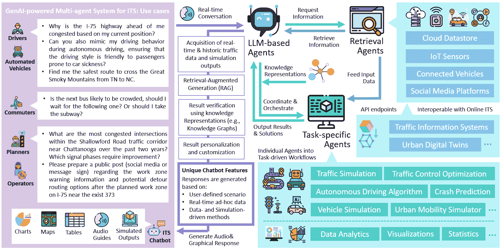
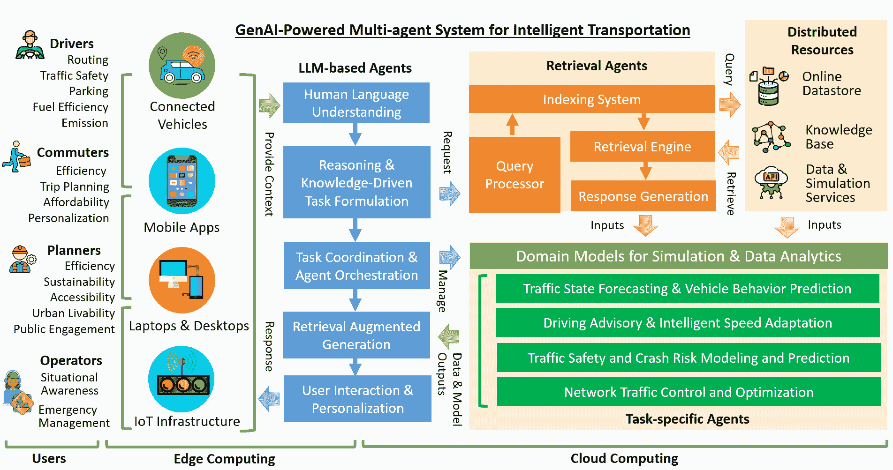

<!--yml

类别：未分类

日期：2025-01-11 12:17:06

-->

# 基于GenAI的多智能体范式在智慧城市交通中的应用：集成大语言模型（LLMs）和检索增强生成（RAG）与智能交通系统的机遇与挑战

> 来源：[https://arxiv.org/html/2409.00494/](https://arxiv.org/html/2409.00494/)

^(t1)^(t1)脚注：本文由UT-Battelle有限责任公司与美国能源部（DOE）根据合同DE-AC05-00OR22725共同撰写。美国政府保留并且出版商在接受文章发表时承认美国政府拥有非独占的、已支付的、不可撤销的、全球性的许可，允许发布或复制本文的已发布形式，或允许他人这么做，服务于美国政府的目的。DOE将根据DOE公共访问计划（http://energy.gov/downloads/doe-public-access-plan）提供对这些联邦资助研究结果的公共访问。Haowen Xu [xuh4@ornl.gov](mailto:xuh4@ornl.gov) Jinghui Yuan [yuanj@ornl.gov](mailto:yuanj@ornl.gov) Anye Zhou [zhoua@ornl.gov](mailto:zhoua@ornl.gov) Guanhao Xu [xug1@ornl.gov](mailto:xug1@ornl.gov) Wan Li [liw2@ornl.gov](mailto:liw2@ornl.gov) Xuegang (Jeff) Ban [banx@uw.edu](mailto:banx@uw.edu) Xinyue Ye [xinyue.ye@tamu.edu](mailto:xinyue.ye@tamu.edu) 奥克里奇国家实验室计算城市科学小组，美国田纳西州奥克里奇37830 美国奥克里奇国家实验室建筑与交通科学部，美国田纳西州奥克里奇37830 美国华盛顿大学土木与环境工程系，美国华盛顿州西雅图98195 美国德克萨斯A&M大学景观建筑与城市规划系，美国德克萨斯州大学站77843

###### 摘要

随着生成性人工智能的最新进展，多智能体系统正日益被开发，用于提升智慧城市应用的功能性和效率。本文探讨了大型语言模型（LLMs）和新兴的检索增强生成（RAG）技术在智能交通系统（ITS）中的变革潜力，为解决城市出行中的关键挑战开辟了创新解决方案的道路。我们首先提供了有关当前出行数据、智能交通系统和联网车辆（CV）应用的全面概述。在此基础上，我们讨论了RAG的基本原理，并考察了将这些生成性人工智能（GenAI）技术融入智能出行领域的机会。我们提出了一个概念框架，旨在开发能够智能且具有对话性的多智能体系统，为城市通勤者、交通运营商和决策者提供智慧出行服务。我们的方法旨在促进一种自主且智能的方式，(a) 提供基于科学的建议，以减少多层次的交通拥堵、事故和碳排放，(b) 促进公众教育和参与式出行管理，(c) 自动化专门的交通管理任务及关键智能交通系统平台的开发，如数据分析与解读、知识表示和交通模拟。通过整合LLM和RAG，我们的方法旨在克服传统基于规则的多智能体系统的局限性，这些系统依赖于固定的知识库和有限的推理能力。这一整合为更具扩展性、直观性和自动化的多智能体范式铺平了道路，推动了智能交通系统和城市出行的进步。

###### 关键词：

, 检索增强生成， 大型语言模型， 智能交通系统，多智能体系统

## 1 引言

随着城市化进程的加快，预计有40%的人口每天至少花费一小时通勤，这使得城市出行管理对智能、可持续城市至关重要（Schafer和Victor，[2000](https://arxiv.org/html/2409.00494v2#bib.bib104)）。城市人口和汽车数量的增加已将交通系统推向极限，导致拥堵、事故、能源浪费和污染（Sperling和Gordon，[2009](https://arxiv.org/html/2409.00494v2#bib.bib116)）。为了应对这些挑战，各大城市正在利用人工智能（AI）、物联网（IoT）、5G和计算技术的进步，将城市交通转变为更高效、更安全和更可持续的系统（Sodhro等，[2020](https://arxiv.org/html/2409.00494v2#bib.bib115)）。这些技术创新是发展智能交通系统（ITS）的核心，ITS利用来自交通传感器、联网车辆（CVs）、仿真和众包的大量出行数据，实时感知和预测城市交通动态（Li等，[2021](https://arxiv.org/html/2409.00494v2#bib.bib72)；Xu等，[2023b](https://arxiv.org/html/2409.00494v2#bib.bib155)）。这些系统优化基础设施设计、交通控制和车辆操作，同时为旅行者和运营商提供智能咨询服务和决策支持（De Souza等，[2016](https://arxiv.org/html/2409.00494v2#bib.bib29)；Mandhare等，[2018](https://arxiv.org/html/2409.00494v2#bib.bib84)）。世界各地的城市正在采用先进的智能交通系统，创造出互联的交通环境，最大限度地提高安全性、流动性和环境绩效，正如日本的VICS和Smartway、欧洲的CVIS和COOPERS以及美国的智能交通系统战略计划所展示的那样（An等，[2011](https://arxiv.org/html/2409.00494v2#bib.bib7)）。

尽管智能交通系统（ITS）在全球取得了成功，但在开发可扩展、可访问且可互操作的智能出行解决方案方面仍然面临挑战（Javed 等人，[2022](https://arxiv.org/html/2409.00494v2#bib.bib51)）。这些挑战阻碍了智能交通系统和计算机视觉技术的充分潜力，特别是对于各种城市居民，包括通勤者、司机、规划者和政策制定者。智能城市技术必须扩展以适应日益增长的城市人口和复杂的系统（Bondi，[2000](https://arxiv.org/html/2409.00494v2#bib.bib17)）。现代化城市交通需要大量的数据处理与分析，以及劳动密集型的努力来开发交通仿真和智能交通系统软件组件（Torre-Bastida 等人，[2018](https://arxiv.org/html/2409.00494v2#bib.bib124)；Xu 等人，[2023b](https://arxiv.org/html/2409.00494v2#bib.bib155)）。此外，智能出行服务和交通数据的不可访问性限制了城市居民的有效利用（Cledou 等人，[2018](https://arxiv.org/html/2409.00494v2#bib.bib25)）。因此，需要一种数字助理，能够帮助用户直观地发现和访问智能交通系统工具和信息。随着智能城市规划逐渐转向以人为本的方法，下一代智能交通系统和计算机视觉技术应通过用户友好、直观的技术促进公众参与，这些技术不需要专业技能（Alsayed，[2024](https://arxiv.org/html/2409.00494v2#bib.bib5)；Vasilieva 等人，[2023](https://arxiv.org/html/2409.00494v2#bib.bib128)）。这些技术应使居民能够通过非技术性互动来自定义智能出行服务。

在交通研究中，AI技术的发展历史基础上，越来越多的趋势开始利用生成式AI（GenAI）技术，通过先进的语言理解、内容生成和推理，克服现有智能交通系统（ITS）的局限性。本文探讨了将大型语言模型（LLM）和检索增强生成（RAG）技术整合进ITS和自动驾驶汽车（CV）领域的潜力，以将其转变为智能多智能体系统，推动智慧出行服务向更加自主、互动和以人为本的方向发展。我们回顾了当前ITS和CV领域的出行数据和技术，并提出了一个概念框架，旨在通过以下几个方面将GenAI与现有ITS和CV应用结合：（a）推动基于科学的建议，减少拥堵、事故和排放，（b）增强公众在出行管理中的参与，（c）自动化交通管理任务，如数据分析和交通仿真。我们的目标用户群体包括传统及自动驾驶汽车的驾驶员、依赖公共交通的城市通勤者、负责优化基础设施设计和交通控制以提高效率和安全性的交通规划师，以及来自地方政府机构（如州交通部和交通管理中心）的交通运营人员，他们负责应急响应、交通操作和资产维护。我们提出的框架概念如图[1](https://arxiv.org/html/2409.00494v2#S1.F1 "图1 ‣ 1 引言 ‣ 基于GenAI的智能城市出行多智能体范式：将大型语言模型（LLM）与检索增强生成（RAG）技术整合到智能交通系统中的机遇与挑战")所示。

图1：一个基于GenAI的多智能体系统，用于智能交通和智慧出行。

与使用通用大型语言模型（LLM）开发的传统聊天机器人相比，我们提出的LLM-RAG驱动的多智能体系统具有以下独特特点：

1.  1.

    回复是根据用户定义的情景生成的，反映了特定用户群体的个性化出行需求。这确保了交互直接与每个用户的独特情境相关。

1.  2.

    回复是基于实时和历史数据（例如，交通、天气、基础设施、公共交通和用户的GPS位置）生成的，确保反映出行的当前和情境现实。这增强了决策的时效性和情境意识。

1.  3.

    回复是个性化的，依据用户的具体需求和偏好量身定制，采用先进的方法论，如基于数据和仿真方法。这确保了答案不是泛泛而谈或像维基百科的解释，而是基于对交通和出行概念的强有力、具体情境分析。

最终，我们提出基于GenAI的多智能体系统，将智能交通系统的发展与新兴的大型语言模型（LLMs）和检索增强生成（RAG）技术相结合，从而为推动城市出行管理提供更直观、高效和互操作的解决方案。

## 2 文献综述

在过去几十年中，智能交通系统（ITS）伴随信息和通信技术（ICT）的进步不断发展，城市交通已转变为优化的、数字增强的智能出行系统。ITS和互联车辆（CV）应用的好处包括减少拥堵、提高安全性、识别瓶颈，以及优化交通规划和基础设施设计。之前的智能出行研究主要集中在将人工智能、高级仿真和通信技术整合，以创造更高效、更安全、可持续的城市交通系统。本文回顾并讨论以下关键领域：

交通状态预测与车辆行为预测

使用算法和数据分析来预测交通状况和车辆动态，从而提升管理、安全性和效率。

高级驾驶辅助与智能速度适应

利用实时数据和人工智能来指导驾驶员并调整车辆行为，从而提高安全性和燃油效率。

交通安全与事故风险建模

利用预测分析评估事故风险，从而采取主动的安全措施。

网络交通控制与优化

实时管理和调整交通流量，以减少拥堵并提高系统层级的效率。

在以下各节中，我们将探讨由现代智能交通技术生成的多样化交通数据，这些数据构成了先进交通分析和优化的基础——这对于实现智能出行系统至关重要。我们还将审视每个应用领域的当前研究工作，并提供详细的讨论。本文为我们提出的基于GenAI的多智能体系统在下一代城市智能出行中的应用奠定了基础。本文主要集中在道路交通和城市出行系统的规划、管理和优化方面。

### 2.1 新兴出行数据

出行数据包括来自各种技术源的大量数据类型，包括物联网连接的交通基础设施、互联车辆和社交媒体平台（Zhang等人，[2011](https://arxiv.org/html/2409.00494v2#bib.bib172)；Singh等人，[2022](https://arxiv.org/html/2409.00494v2#bib.bib112)）。这些技术为城市出行的不同方面提供了独特的见解，构成了基于数据驱动和仿真驱动的可持续城市交通规划和出行管理的核心（Li等人，[2021](https://arxiv.org/html/2409.00494v2#bib.bib72)）。

#### 2.1.1 路侧基础设施

物联网（IoT）通过使收集和分析大量流动数据成为可能，已经彻底改变了交通基础设施，这些数据对于提升交通管理、道路安全、公共交通和减少环境影响至关重要（Guerrero-Ibáñez 等，[2018](https://arxiv.org/html/2409.00494v2#bib.bib36)）。物联网在路边基础设施中的集成生成了多样化的流动数据，每种数据都是通过专门的传感器捕获的，这些传感器旨在监测车辆和环境动态的各个方面（Klein，[2024](https://arxiv.org/html/2409.00494v2#bib.bib59)）。

交通流量数据包括车辆流量、速度和道路网络上的交通密度。它对于管理拥堵、规划道路扩展、预测交通模式和检测交通事件至关重要（Leduc 等，[2008](https://arxiv.org/html/2409.00494v2#bib.bib63)；Xu 等，[2021a](https://arxiv.org/html/2409.00494v2#bib.bib153)；Moriano 等，[2024](https://arxiv.org/html/2409.00494v2#bib.bib89)）。这些数据通常通过感应环传感器、雷达系统或配备先进分析技术的闭路电视摄像头获取（Klein，[2024](https://arxiv.org/html/2409.00494v2#bib.bib59)；Zheng 等，[2022](https://arxiv.org/html/2409.00494v2#bib.bib174)；Berres 等，[2024](https://arxiv.org/html/2409.00494v2#bib.bib14)）。停车数据能向驾驶员提供可用停车位的信息，并优化停车设施的使用（Lin 等，[2017c](https://arxiv.org/html/2409.00494v2#bib.bib78)）。它通常通过超声波传感器、磁力计或实时监控占用情况的摄像头收集（Shao 等，[2022](https://arxiv.org/html/2409.00494v2#bib.bib107)；Kianpisheh 等，[2012](https://arxiv.org/html/2409.00494v2#bib.bib58)；Dixit 等，[2020](https://arxiv.org/html/2409.00494v2#bib.bib30)）。环境数据包括空气质量、温度和湿度指标，这些对评估交通系统的环境影响和适应天气条件至关重要（Asam 等，[2015](https://arxiv.org/html/2409.00494v2#bib.bib11)；Guerrero-Ibáñez 等，[2018](https://arxiv.org/html/2409.00494v2#bib.bib36)）。这些数据通过空气质量监测仪、气象站和遍布交通网络的路面传感器收集（Mead 等，[2013](https://arxiv.org/html/2409.00494v2#bib.bib86)）。公共交通数据提供有关公交车、火车和其他交通工具实时运行状况的信息（Welch 和 Widita，[2019](https://arxiv.org/html/2409.00494v2#bib.bib144)）。它包括车辆位置、乘客数量和班次准时性，使交通管理部门能够优化服务并提供准确的乘客信息（Koutsopoulos 等，[2019](https://arxiv.org/html/2409.00494v2#bib.bib60)）。

云计算、数字双胞胎和网络基础设施的进步使得通过各种无线通信协议获取多样化的移动数据变得更加容易（Xu 等，[2022a](https://arxiv.org/html/2409.00494v2#bib.bib158)）。Web 服务端点以及良好记录的元数据为人工智能技术提供了新的机会。这些技术通过机器对机器的通信，实现了自动化决策、数据分析、信息共享和增强的可视化能力（Xu 等，[2023b](https://arxiv.org/html/2409.00494v2#bib.bib155)，[2024b](https://arxiv.org/html/2409.00494v2#bib.bib157)；Berres 等，[2021a](https://arxiv.org/html/2409.00494v2#bib.bib15)，[b](https://arxiv.org/html/2409.00494v2#bib.bib16)）。由于许多私家车和公共交通系统的定位与运动数据是通过车载传感器和车载单元而非路边基础设施捕捉的，这些方面将在下一小节中讨论。

#### 2.1.2 连接车辆

CV（连接车辆）是一种配备互联网接入和无线通信能力的汽车，使其能够发送和接收数据，与其他车辆、智能基础设施和云服务进行交互（Guerrero-Ibanez 等，[2015](https://arxiv.org/html/2409.00494v2#bib.bib37)）。这种连接性通过实现实时信息交换、支持高级驾驶辅助系统（ADAS）、促进车与车（V2V）和车与基础设施（V2I）通信，以及启用空中更新，提升了安全性、效率和便利性（Siegel 等，[2017](https://arxiv.org/html/2409.00494v2#bib.bib110)）。汽车制造商和交通机构都强调，CV 技术可以显著减少交通事故中的死亡和重伤，同时推动生态驾驶以减少燃油消耗和碳排放（Gruyer 等，[2021](https://arxiv.org/html/2409.00494v2#bib.bib35)）。通过自动车辆定位（AVL）系统、乘客计数系统和交通信号优先（TSP）系统收集的公共交通数据，进一步支持了通过跟踪车辆位置和监控乘客数量来管理交通（Hellinga 等，[2011](https://arxiv.org/html/2409.00494v2#bib.bib43)；Darsena 等，[2023](https://arxiv.org/html/2409.00494v2#bib.bib28)）。

作为智能交通系统（ITS）及更广泛物联网（IoT）生态系统的基础元素，车联网（CV）通过先进的通信技术和车辆传感器生成大量宝贵的交通数据（Siegel et al., [2017](https://arxiv.org/html/2409.00494v2#bib.bib110)）。GPS记录仪和摄像头是关键组件，能够在车与车（V2V）及车与基础设施（V2I）网络之间进行数据交换，并促进基本安全信息（BSM）在车辆与路侧设备（RSE）之间的传输。这些数据包括车辆轨迹（例如，速度、位置、方向）、驾驶员与车辆的互动（例如，方向盘操作、踏板使用、换挡）、以及上下文因素（例如，天气）（Parikh et al., [2017](https://arxiv.org/html/2409.00494v2#bib.bib95); Harding et al., [2014](https://arxiv.org/html/2409.00494v2#bib.bib40); Siegel et al., [2017](https://arxiv.org/html/2409.00494v2#bib.bib110)）。来自车辆雷达、激光雷达（LiDAR）、超声波传感器和惯性测量单元（IMU）的更先进数据，支持高分辨率的三维地图生成、先进的停车支持以及精确的车辆动力学测量（Nidamanuri et al., [2021](https://arxiv.org/html/2409.00494v2#bib.bib91)）。若干研究全面回顾了车联网数据、其来源及在车辆技术和城市出行中的应用（Siegel et al., [2017](https://arxiv.org/html/2409.00494v2#bib.bib110); Li et al., [2021](https://arxiv.org/html/2409.00494v2#bib.bib72)）。

在智能交通系统（ITS）和智能出行迅速发展的背景下，像Wejo、INRIX、Otonomo、Mobileye、HERE Technologies、TomTom、StreetLight Data、CARMERA、DeepMap、Teralytics和Arity等公司已成为收集、分析和分发连接车辆数据的关键玩家。这些公司提供了大量的关键数据集，推动了城市交通解决方案和研究的进展。通过利用来自车辆遥测、GPS、摄像头、LiDAR、雷达和移动网络的数据，它们提供了关于交通流量、车辆轨迹、驾驶行为和道路状况的深刻洞察。这些数据推动了先进交通管理系统、自动驾驶技术和智能城市基础设施的发展，使城市出行更加高效、安全和可持续。CV数据的实际应用包括像交叉口碰撞预警系统（ICWS）这样的系统，能提醒司机注意交叉口潜在的碰撞风险（美国交通部，联邦公路管理局，[2024](https://arxiv.org/html/2409.00494v2#bib.bib127)），以及绿灯最佳速度建议（GLOSA），为车辆提供最佳速度建议，从而减少燃油消耗、碳排放和交通拥堵（铃木和丸茂，[2018](https://arxiv.org/html/2409.00494v2#bib.bib119)；徐等，[2023c](https://arxiv.org/html/2409.00494v2#bib.bib160)）。此外，实时和历史CV数据可以通过API端点和实时数据流进行访问，这为AI代理利用这些信息提升智能城市计划开辟了新的道路。

#### 2.1.3 社交媒体数据

近年来，社交媒体平台已成为宝贵的出行数据来源，提供关于人类移动、交通偏好和交通状况的实时洞察（Zheng等，[2015](https://arxiv.org/html/2409.00494v2#bib.bib176)）。地理标记社交媒体在智能交通系统中起着至关重要的作用，提供动态信息，从而改善交通管理和运营、增强道路安全并优化公共交通（Torbaghan等，[2022](https://arxiv.org/html/2409.00494v2#bib.bib123)）。来自社交媒体的出行数据可以按以下类别进行分类：

地理标签帖子是带有地理坐标的社交媒体帖子，提供了用户位置和移动的精确快照。像Twitter这样的平台生成大量的地理空间数据，这对于了解热门目的地、追踪移动模式和分析城市流动性具有重要价值（Torbaghan等人，[2022](https://arxiv.org/html/2409.00494v2#bib.bib123)；Zheng等人，[2015](https://arxiv.org/html/2409.00494v2#bib.bib176)）。对于智能交通系统（ITS）来说，地理标签数据有助于识别高流量区域、优化路线并管理人群动态，从而实现更高效的交通管理。通过聚合和分析地理标记的用户生成内容，揭示了流动性趋势和模式。通过检查话题标签、帖子频率和时间模式，研究人员可以识别城市流动性趋势，如高峰出行时间和首选路线（Martín，[2019](https://arxiv.org/html/2409.00494v2#bib.bib85)）。这些数据使智能交通系统能够预测拥堵、调整交通服务并提高城市交通效率。从帖子、评论和话题标签中分析的与交通相关的情感和意见数据反映了公众对交通服务、基础设施和政策的情感（Qi等人，[2020](https://arxiv.org/html/2409.00494v2#bib.bib98)）。像Twitter、Reddit和Facebook这样的平台提供了对用户体验的洞察，突出改进的领域和成功的举措，这对于确保智能交通系统符合公众期望至关重要。来自社交媒体的众包交通信息对于智能交通系统至关重要。用户在Twitter等平台上报告实时交通状况，如事故、施工区和拥堵，而像Waze这样的应用程序则允许直接分享交通更新（Adler等人，[2014](https://arxiv.org/html/2409.00494v2#bib.bib4)）。这些数据支持动态交通管理，使运营商能够迅速适应变化的情况，提升道路安全并改善出行效率（Liu等人，[2024](https://arxiv.org/html/2409.00494v2#bib.bib79)）。

总结来说，社交媒体平台产生了多样化的流动性数据，这对于开发和优化智能交通系统至关重要。通过各种API端点可以实时访问这些数据，这为智能多代理系统提供了机会。这样的系统使AI代理能够访问关键的、最新的社交媒体信息，增强情境感知，优化智能出行服务中的决策，特别是在交通安全、路线规划和公共交通出行规划方面。

### 2.2 流行的智能交通应用

在海量且多样化的交通数据推动下，新型方法已被整合进智能交通系统（ITS），从多个角度提升城市出行性，这些方法将在以下小节中逐一回顾和讨论。随着信息通信技术（ICT）和计算技术的进步，驱动这些ITS方法的算法现在可以通过无线通信协议和API端点，通过网络交付进行访问。这一发展为人工智能代理提供了机会，使其能够利用这些方法作为网络或云服务，在被赋予为城市居民提供智能出行服务的任务时，实现自动化分析和优化。

#### 2.2.1 交通状态预测与车辆行为预测

交通状态预测和行为预测对于制定提升道路安全、减少拥堵和提高交通效率的策略至关重要。交通状态预测通过利用来自环形探测器、摄像头、探测设备和社交媒体等来源的历史和实时数据，预测未来的交通状况，如流量、密度和速度（Kumar 和 Raubal，[2021](https://arxiv.org/html/2409.00494v2#bib.bib61)）。车辆行为预测则侧重于利用从历史轨迹和通过传感器与通信网络收集的交通环境数据，预测周围车辆的轨迹。

交通状态预测和车辆行为预测的算法大体可分为基于模型的方法和基于学习的方法。传统的基于模型的方法包括统计时间序列模型（Antoniou 等，[2013](https://arxiv.org/html/2409.00494v2#bib.bib8)；Wang 和 Papageorgiou，[2005](https://arxiv.org/html/2409.00494v2#bib.bib139)；Xing 等，[2020b](https://arxiv.org/html/2409.00494v2#bib.bib148)；Wang 等，[2022c](https://arxiv.org/html/2409.00494v2#bib.bib141)；Li 等，[2020b](https://arxiv.org/html/2409.00494v2#bib.bib71)），基于规则的模型（Szeto 等，[2009](https://arxiv.org/html/2409.00494v2#bib.bib120)；Zhong 等，[2013](https://arxiv.org/html/2409.00494v2#bib.bib177)；Zhou 等，[2023a](https://arxiv.org/html/2409.00494v2#bib.bib178)；Woo 等，[2016](https://arxiv.org/html/2409.00494v2#bib.bib145)），以及概率模型（Wang 等，[2014](https://arxiv.org/html/2409.00494v2#bib.bib134)，[2021b](https://arxiv.org/html/2409.00494v2#bib.bib136)；Zhang 等，[2020](https://arxiv.org/html/2409.00494v2#bib.bib173)；Lin 等，[2017b](https://arxiv.org/html/2409.00494v2#bib.bib75)）。虽然这些方法在特定场景中表现良好，但其固有的结构和假设可能会限制其有效性，尤其是在面对未建模的不确定性时。

相比之下，计算能力和数据可用性的进步推动了无模型、基于学习的方法的崛起。这些方法通常基于深度神经网络（DNNs），在不确定条件下提供更准确和稳健的性能。用于交通预测和行为预测的DNNs能够处理多模态输入，生成高维输出，并学习空间依赖关系（例如，卷积神经网络）（Lin等，[2022](https://arxiv.org/html/2409.00494v2#bib.bib76)；Do等，[2018](https://arxiv.org/html/2409.00494v2#bib.bib31)；Hosseini和Talebpour，[2019](https://arxiv.org/html/2409.00494v2#bib.bib44)；Subramaniyan等，[2022](https://arxiv.org/html/2409.00494v2#bib.bib117)；Li等，[2020a](https://arxiv.org/html/2409.00494v2#bib.bib66)；Ke等，[2020](https://arxiv.org/html/2409.00494v2#bib.bib54))，捕捉代理之间的社会互动（例如，图神经网络）（Lin等，[2017a](https://arxiv.org/html/2409.00494v2#bib.bib74)；Cui等，[2020a](https://arxiv.org/html/2409.00494v2#bib.bib26)；Mo等，[2021](https://arxiv.org/html/2409.00494v2#bib.bib87)；Schmidt等，[2022](https://arxiv.org/html/2409.00494v2#bib.bib105)），以及建模时间序列依赖关系（例如，循环神经网络、注意力机制）（Cui等，[2020b](https://arxiv.org/html/2409.00494v2#bib.bib27)；Xu等，[2022b](https://arxiv.org/html/2409.00494v2#bib.bib161)；Liu等，[2021](https://arxiv.org/html/2409.00494v2#bib.bib80)；Zhou等，[2023b](https://arxiv.org/html/2409.00494v2#bib.bib179)）。将物理原理融入这些基于学习的方法中进一步增强了DNN的泛化能力，从而带来更可靠的应用（Mo等，[2020](https://arxiv.org/html/2409.00494v2#bib.bib88)；Geng等，[2023](https://arxiv.org/html/2409.00494v2#bib.bib34)；Huang和Agarwal，[2020](https://arxiv.org/html/2409.00494v2#bib.bib47)）。

LLMs的出现为通过整合交通专家反馈进一步改善预测和预报提供了机会。这些反馈可以细化DNN训练，并为输入特征提供有意义的解释，从而增强整个工作流程的可信度和可解释性。

#### 2.2.2 驾驶建议与智能速度适应

高级驾驶辅助系统（ADAS）是旨在通过提供实时指导来增强驾驶员决策能力和道路安全性的复杂技术（Ameta等，[2023](https://arxiv.org/html/2409.00494v2#bib.bib6)）。ADAS利用来自GPS、交通监控系统和车辆传感器的数据，提供车道使用、合流、速度调整和路线选择等建议，从而减少驾驶员工作负担并提高安全性（Antony和Whenish，[2021](https://arxiv.org/html/2409.00494v2#bib.bib9)）。

智能速度适应系统（ISA）通过告知驾驶员限速或自动调整车辆速度以符合法律限速，帮助驾驶员保持适当的速度，从而提高安全性和燃油效率（Ryan, [2019](https://arxiv.org/html/2409.00494v2#bib.bib102); Newsome 和 WSP, [2024](https://arxiv.org/html/2409.00494v2#bib.bib90)）。ISA 系统使用 GPS、数字地图和车载摄像头来确定限速，既可以作为提示系统，也可以作为自动速度控制器（Archer 和 Åberg, [2001](https://arxiv.org/html/2409.00494v2#bib.bib10); Carsten, [2006](https://arxiv.org/html/2409.00494v2#bib.bib19)）。ISA 的目标是减少与速度相关的交通事故并提高道路安全性。

基于车辆通信技术，ADAS（高级驾驶辅助系统）和ISA（智能速度适应系统）已广泛应用于优化联网自动化车辆（CAVs）（Nidamanuri等， [2021](https://arxiv.org/html/2409.00494v2#bib.bib91)）。CAV控制根据合作和自动化的不同程度而变化。在联网但非自动化的场景中，辅助系统为人工驾驶员计算节能或减缓拥堵的行驶轨迹（Wan等，[2016](https://arxiv.org/html/2409.00494v2#bib.bib130)；Xu等，[2024c](https://arxiv.org/html/2409.00494v2#bib.bib159)；Suramardhana和Jeong，[2014](https://arxiv.org/html/2409.00494v2#bib.bib118)）。在自动化但非联网的场景中，ADAS通过车载传感器确保车辆平稳运行（Zhou等，[2022e](https://arxiv.org/html/2409.00494v2#bib.bib187)，[c](https://arxiv.org/html/2409.00494v2#bib.bib185)，[d](https://arxiv.org/html/2409.00494v2#bib.bib186)，[2023c](https://arxiv.org/html/2409.00494v2#bib.bib183)）。完全联网且自动化的系统根据汽车工程师学会（SAE）的标准，展示了四类智能车辆控制：（i）状态共享（A类），其中CAV共享轨迹信息以改善交通流量（Wang等，[2018a](https://arxiv.org/html/2409.00494v2#bib.bib131)；Zhou等，[2023b](https://arxiv.org/html/2409.00494v2#bib.bib179)，[2024](https://arxiv.org/html/2409.00494v2#bib.bib181)，[2022b](https://arxiv.org/html/2409.00494v2#bib.bib182)）；（ii）意图共享（B类），其中共享未来计划和控制决策以增强预期和情境意识（Wang等，[2023b](https://arxiv.org/html/2409.00494v2#bib.bib143)，[a](https://arxiv.org/html/2409.00494v2#bib.bib142)；Liu等，[2023](https://arxiv.org/html/2409.00494v2#bib.bib81)，[2021](https://arxiv.org/html/2409.00494v2#bib.bib80)）；（iii）寻求协议（C类），其中多辆车协商合作计划以平衡各方利益（Hyeon等，[2024](https://arxiv.org/html/2409.00494v2#bib.bib50)，[2023b](https://arxiv.org/html/2409.00494v2#bib.bib49)，[2023a](https://arxiv.org/html/2409.00494v2#bib.bib48)）；（iv）规范性（D类），其中CAV根据集中计划执行操作，以实现系统级优化（Wang等，[2024](https://arxiv.org/html/2409.00494v2#bib.bib137)；Zhou等，[2022a](https://arxiv.org/html/2409.00494v2#bib.bib180)；Wang等，[2022b](https://arxiv.org/html/2409.00494v2#bib.bib135)）。

尽管其有效性较高，但在个性化自动驾驶系统、解释人工智能决策和促进可信的人机交互方面仍然存在挑战。多模态大语言模型（LLMs）通过整合人类输入并双向阐述人工智能和人类的推理，提供了潜在的解决方案。

#### 2.2.3 交通安全与碰撞风险建模与预测

交通安全应用涉及使用统计学和机器学习技术来评估和预测交通事故的发生频率和可能性（Chand等，[2021](https://arxiv.org/html/2409.00494v2#bib.bib20)）。交通安全模型最初是为了识别导致事故的模式和因素，例如驾驶行为、道路条件、天气和交通流特征，目的是提高道路安全性（Theofilatos和Yannis，[2014](https://arxiv.org/html/2409.00494v2#bib.bib121)）。随后，通过结合历史事故数据和实时信息，开发了实时事故风险预测模型，以预测潜在的高风险情况和地点。此外，基于交通冲突的安全模型在应对事故数据的稀缺性和随机性方面变得越来越流行。一般来说，已经在实际中广泛开发和实施了三种类型的交通安全模型。

事故频率预测模型，也称为安全绩效函数（SPF），估算在特定地点和时间段内预期发生的事故数量，帮助交通规划者识别高风险区域并有效分配资源。这些模型通常会结合各种因素，如总交通量、道路几何形状和交通控制特性，以提高预测准确性（Khattak等，[2024](https://arxiv.org/html/2409.00494v2#bib.bib55)）。

事故严重性模型侧重于预测事故的潜在结果，即事故的严重程度。这些模型通常评估诸如车辆速度、驾驶员和乘客特征、碰撞类型以及车辆安全特性等因素的影响（Qin等，[2013](https://arxiv.org/html/2409.00494v2#bib.bib99)）。理解事故的严重性有助于制定有针对性的安全干预措施（例如，驾驶员教育和先进的车辆安全特性）以及基础设施改进，从而减轻交通事故最严重的后果（Khattak和Fontaine，[2020](https://arxiv.org/html/2409.00494v2#bib.bib56)）。

实时碰撞风险评估和预测模型旨在模拟碰撞可能性与相应的实时交通流特征之间的关系，然后实时预测碰撞发生的概率。预测结果不仅可以为司机提供动态警告或干预，预防潜在碰撞，还能为交通运营商提供更好的预测洞察，改善应急响应并减少事故清除时间。（Yuan et al., [2020](https://arxiv.org/html/2409.00494v2#bib.bib168); Yuan and Abdel-Aty, [2018](https://arxiv.org/html/2409.00494v2#bib.bib167); Yu et al., [2020](https://arxiv.org/html/2409.00494v2#bib.bib166); Li et al., [2020a](https://arxiv.org/html/2409.00494v2#bib.bib66); Cheng et al., [2022](https://arxiv.org/html/2409.00494v2#bib.bib22); Yue et al., [2020](https://arxiv.org/html/2409.00494v2#bib.bib169)).

替代安全模型为交通安全建模和预测提供了一个新的视角，因为交通事故是极为罕见的事件，这使得该方法具有更好的可扩展性和可实施性。通过建模各种替代安全措施（例如，碰撞时间、侵占后时间、避免碰撞的减速率）与实时驾驶员和交通流特征之间的关系，可以有效地预测潜在的近乎碰撞事件。（Abdel-Aty et al., [2022](https://arxiv.org/html/2409.00494v2#bib.bib1); Xing et al., [2020a](https://arxiv.org/html/2409.00494v2#bib.bib147); Wang et al., [2021a](https://arxiv.org/html/2409.00494v2#bib.bib132))

这些应用广泛应用于城市规划、交通管理系统、先进驾驶辅助系统（ADAS）和自动驾驶系统，为更安全的道路网络和减少事故率做出了贡献。

#### 2.2.4 网络交通控制与优化

虽然驾驶建议系统和智能车辆控制增强了个体车辆的流动性，但网络交通控制策略对于优化整个交通运输系统至关重要。这些策略改善了旅行时间、减少了燃油消耗并降低了排放，支持可持续的城市交通（Ugirumurera et al., [2020](https://arxiv.org/html/2409.00494v2#bib.bib126); Xu et al., [2021b](https://arxiv.org/html/2409.00494v2#bib.bib154); Wang et al., [2022a](https://arxiv.org/html/2409.00494v2#bib.bib133); Li et al., [2022a](https://arxiv.org/html/2409.00494v2#bib.bib69)）。这一过程涉及通过使用实时数据和先进算法系统地管理和调控道路网络中的交通流量，以优化交通信号、重新规划车辆路线并调整交通模式。

在各种优化策略中，交通信号控制是最广泛实施的一种。基于历史数据的传统定时交通信号控制，常常无法适应实时交通变化，导致低效的状况。自适应交通信号控制系统通过使用来自传感器和摄像头的实时数据，动态调整信号时长，优化流量并减少延误，从而解决了这些局限性（Wang 等人，[2018b](https://arxiv.org/html/2409.00494v2#bib.bib140)；Abdulhai 等人，[2003](https://arxiv.org/html/2409.00494v2#bib.bib2)；Li 和 Ban，[2018](https://arxiv.org/html/2409.00494v2#bib.bib67)；Li 等人，[2022b](https://arxiv.org/html/2409.00494v2#bib.bib70)）。交通信号协调通过同步主要走廊上的信号，减少停车次数并保持持续的交通流量（Bazzan，[2005](https://arxiv.org/html/2409.00494v2#bib.bib13)；Putha 等人，[2012](https://arxiv.org/html/2409.00494v2#bib.bib97)；Li 和 Ban，[2020](https://arxiv.org/html/2409.00494v2#bib.bib68)）。公交信号优先（TSP）系统通过调整信号以减少公共交通工具的延误，从而进一步提高效率（Smith 等人，[2005](https://arxiv.org/html/2409.00494v2#bib.bib114)；He 等人，[2014](https://arxiv.org/html/2409.00494v2#bib.bib42)；Yu 等人，[2020](https://arxiv.org/html/2409.00494v2#bib.bib166)）。

匝道控制是另一项关键策略，通过调节车辆进入高速公路的方式来维持最佳流量并防止拥堵（Papageorgiou 等人，[1991](https://arxiv.org/html/2409.00494v2#bib.bib93)；Papageorgiou 和 Kotsialos，[2002](https://arxiv.org/html/2409.00494v2#bib.bib94)）。研究表明，它能够提高高速公路的通行能力，增加车辆速度，并通过减少停车起步的情况提高安全性（Haj-Salem 和 Papageorgiou，[1995](https://arxiv.org/html/2409.00494v2#bib.bib39)；Lee 等人，[2006](https://arxiv.org/html/2409.00494v2#bib.bib64)；Smaragdis 等人，[2004](https://arxiv.org/html/2409.00494v2#bib.bib113)）。有效的匝道控制依赖于实时数据、预测建模和自适应算法（Ma 等人，[2020](https://arxiv.org/html/2409.00494v2#bib.bib83)）。

宏观基本图（MFD）给出了网络层面上流量、密度和速度之间的关系（Xu等人，[2020](https://arxiv.org/html/2409.00494v2#bib.bib151)；Xu和Gayah，[2024](https://arxiv.org/html/2409.00494v2#bib.bib150)），已成为管理整个网络交通拥堵的有价值工具。基于MFD的策略，如周边流量控制、拥堵定价、城市道路空间分配、区域车辆路径规划和区域范围信号控制，对于优化全网交通流量非常有效（Aboudolas和Geroliminis，[2013](https://arxiv.org/html/2409.00494v2#bib.bib3)；Zhou和Gayah，[2021](https://arxiv.org/html/2409.00494v2#bib.bib184)；Simoni等人，[2015](https://arxiv.org/html/2409.00494v2#bib.bib111)；Xu和Gayah，[2023](https://arxiv.org/html/2409.00494v2#bib.bib149)；Xu等人，[2023a](https://arxiv.org/html/2409.00494v2#bib.bib152)；Yildirimoglu等人，[2015](https://arxiv.org/html/2409.00494v2#bib.bib165)；Yan等人，[2016](https://arxiv.org/html/2409.00494v2#bib.bib163)）。实施这些策略需要强大的数据收集和先进的分析方法，以有效解读MFD数据。

其他网络流量控制方法包括可变限速（VSL），该方法根据实时条件调整速度限制（Lin等人，[2004](https://arxiv.org/html/2409.00494v2#bib.bib77)），以及综合走廊管理（ICM），通过高效管理所有可用基础设施和资源来优化整体走廊性能（Hashemi和Abdelghany，[2016](https://arxiv.org/html/2409.00494v2#bib.bib41)）。这些策略通常依赖于大量的数据收集和分析，通过集成大语言模型（LLMs），可以进一步提升其效果。

## 3 多智能体系统的兴起

多智能体系统是一个框架，多个自主智能体各自拥有特定的能力，通过协调合作共同实现目标或解决复杂问题（Vogel-Heuser等， [2020](https://arxiv.org/html/2409.00494v2#bib.bib129)）。这些智能体互动、沟通，并模仿人类和自然系统中的协作行为。在新兴人工智能技术和知识工程的推动下，它们如今承担着越来越多的专业化任务（Khosla，[2012](https://arxiv.org/html/2409.00494v2#bib.bib57)）。多智能体系统在需要复杂问题解决的研究和应用中逐渐得到重视，如智能制造和医疗保健（Yahouni等，[2021](https://arxiv.org/html/2409.00494v2#bib.bib162)；Shakshuki和Reid，[2015](https://arxiv.org/html/2409.00494v2#bib.bib106)）。这些领域挑战的日益复杂，推动了多智能体系统与生成式人工智能（GenAI）技术的发展，包括大型语言模型（LLMs）和检索增强生成（RAG）（de Zarzà等，[2023](https://arxiv.org/html/2409.00494v2#bib.bib171)）。通过利用各专门智能体的优势，人工智能驱动的多智能体系统能够更有效地互动并解决需要深入领域知识的复杂问题。

一个典型的生成式人工智能（GenAI）驱动的多智能体系统包括几个关键组件：（a）在自然语言理解和生成方面表现出色的LLM智能体，（b）从外部来源获取相关数据的检索智能体，以及（c）处理情感分析、优化或决策等专门功能的任务特定智能体。通过这些智能体与领域知识（例如本体和知识图谱）的指导，它们形成了一个有机的整体，能够比单一模型更有效地解决复杂问题。

### 3.1 LLM智能体：起源与能力

近年来，预训练的大型语言模型（LLMs）显著拓展了人工智能在自然语言理解、推理和生成方面的能力（Yang等，[2024](https://arxiv.org/html/2409.00494v2#bib.bib164)）。使用Transformer架构开发的生成式预训练变换器（GPT）模型在工业界和学术界变得越来越受欢迎（Raiaan等，[2024](https://arxiv.org/html/2409.00494v2#bib.bib100)）。著名的例子包括OpenAI的ChatGPT、GPT-3、BERT、T5和RoBERTa。这些模型由于能够利用大量文本数据捕捉细致的语言模式和上下文关系，在从对话代理到内容生成的各种应用中表现出色。这使得它们区别于传统的深度学习方法，后者通常需要任务特定的训练，并且在理解广泛上下文方面存在困难。

LLM 的灵活性和鲁棒性使其在城市科学研究中的应用日益增长。这些模型被用于分析大量文本数据，提取有意义的洞见，并在建筑管理（Jiang et al., [2024](https://arxiv.org/html/2409.00494v2#bib.bib52); Rane et al., [2023](https://arxiv.org/html/2409.00494v2#bib.bib101)）、自然灾害减缓（Chandra et al., [2024](https://arxiv.org/html/2409.00494v2#bib.bib21); Samuel et al., [2024](https://arxiv.org/html/2409.00494v2#bib.bib103)）、能源系统管理（Choi et al., [2024a](https://arxiv.org/html/2409.00494v2#bib.bib23); Lai et al., [2024](https://arxiv.org/html/2409.00494v2#bib.bib62)）以及货运系统优化（Tupayachi et al., [2024](https://arxiv.org/html/2409.00494v2#bib.bib125)）等多个领域支持决策。LLM 处理和解读复杂数据集与技术文档的能力，以及其在最小监督下的表现，为解决这些领域的大数据挑战提供了宝贵的帮助。

在一个由 GenAI 驱动的多智能体系统中，LLM-agent 通常作为一个专门的实体，处理自然语言数据并生成新内容。LLM-agent 的角色会根据具体应用有所不同。在增强现有 ITS 技术的背景下，LLM-agent 可以促进以下功能：

+   1.

    自然语言理解：LLM-agent 解释并理解人类语言输入，使其能够与人类用户以及系统中的其他智能体有效地沟通。

+   2.

    任务自动化：LLM-agent 可以自动化涉及语言处理的任务，如起草报告、生成响应或总结信息，从而减轻人类智能体或其他系统组件的工作负担。

+   3.

    调解与协调：在多智能体系统中，LLM-agent 可以通过翻译、总结或为系统内交换的信息提供上下文，促进不同智能体之间的沟通与协调。

+   4.

    用户交互：LLM-agent 通常作为人类用户的主要接口，支持直观和对话式的交互，从而提升用户体验并在复杂系统中提高可访问性。

总的来说，LLM-agent 在增强多智能体系统的认知能力方面发挥着至关重要的作用，使得系统能够进行更为复杂、具有上下文感知和以人为本的互动。

### 3.2 RAG 的检索代理

检索代理被提出是为了解决早期版本的LLM代理在处理需要专业知识的领域特定查询时的局限性（Hu等人，[2023](https://arxiv.org/html/2409.00494v2#bib.bib46)）。由于这些通用模型是基于静态文本训练的，它们往往难以回答领域特定的问题或访问最新的信息，从而容易出现幻觉现象（Zaki等人，[2024](https://arxiv.org/html/2409.00494v2#bib.bib170)）。与计算成本高昂的微调过程不同，微调通常需要大量数据来调整LLM的参数，最近兴起的RAG技术提供了一种具有成本效益的解决方案，通过启用外部信息检索系统来增强语言模型的知识库。这项技术通过利用外部知识源，扩展了通用LLM提供准确且与上下文相关的回答的能力，这些外部知识源是专业化的和领域特定的。

RAG的工作原理是首先从向量数据库中检索相关文档，该数据库通过向量嵌入索引和搜索数据，然后利用检索到的信息和模型的内部知识生成回答（Cakaloglu等人，[2020](https://arxiv.org/html/2409.00494v2#bib.bib18)）。向量数据库的概念至关重要，因为它允许高效且有效地检索语义相似的数据点，从而确保在生成回答时使用最相关的信息。研究表明，将检索机制与生成模型结合，可以显著提高事实准确性并减少模型输出中的幻觉现象（Lewis等人，[2020](https://arxiv.org/html/2409.00494v2#bib.bib65); Karpukhin等人，[2020](https://arxiv.org/html/2409.00494v2#bib.bib53)）。

在此过程中，检索代理在信息获取方面至关重要。它从各种存储库中定位并收集知识和数据，既包括结构化数据也包括非结构化数据。代理随后根据相关性、上下文或特定标准过滤和组织数据，确保只展示或使用最相关且准确的信息。检索代理的主要组成部分通常包括：(a) 用于与其他代理或用户进行通信的接口层，(b) 解释和制定查询的查询处理器，以及 (c) 与数据库或其他存储系统交互以获取所需信息的数据检索引擎。

为支持这些功能，可以根据数据的性质和检索要求，利用不同类型的数据库技术。在不同的数据库技术中，关系型数据库通常用于结构化数据的检索，能够高效地查询和管理具有明确定义关系的表格数据。图数据库在数据点之间关系复杂并需要遍历节点的场景中表现出色，例如拓扑数据、社交网络或道路网络等。向量数据库特别适合处理非结构化或高维数据，如来自自然语言处理模型的嵌入，支持相似性搜索和最近邻检索。通过集成这些数据库技术，检索代理可以定制以处理多样的数据类型和检索任务，确保在多代理系统中实现强大且高效的信息检索。

最近，多个框架应运而生，包括LangChain、Hugging Face和LlamaIndex（前身为GPT Index），它们提供了强大的管道，能够无缝地将基于LLM的代理与各种外部数据源，特别是数据库和API连接起来（Topsakal 和 Akinci，[2023](https://arxiv.org/html/2409.00494v2#bib.bib122)；Shen等，[2024](https://arxiv.org/html/2409.00494v2#bib.bib108)；Pinheiro等，[2023](https://arxiv.org/html/2409.00494v2#bib.bib96)）。这些框架使得强大的检索代理得以开发，能够有效地与来自多种来源的数据进行交互和处理。

### 3.3 任务专用代理

在多代理系统中，任务专用代理是专门设计的实体，旨在执行特定的、专业化的角色，以完成特定任务。这些代理具备与其分配角色相符的特定能力、知识和行为。它们可以自主操作，或与其他代理协调合作，以实现局部目标，从而为多代理系统的整体目标和工作流做出贡献。

在增强ITS和智能城市出行方面，任务特定的智能体整合了专门的交通工具和方法论，例如基于智能体的交通仿真和用于交通流、事故和驾驶员行为的预测模型。这些智能体可以使用核心ITS组件进行开发，后者作为智能交通和智能出行应用的示例在第[2.2](https://arxiv.org/html/2409.00494v2#S2.SS2 "2.2 Popular Intelligent Transportation Applications ‣ 2 Literature Review ‣ GenAI-powered Multi-Agent Paradigm for Smart Urban Mobility: Opportunities and Challenges for Integrating Large Language Models (LLMs) and Retrieval-Augmented Generation (RAG) with Intelligent Transportation Systems")节中进行了回顾。随着云计算和边缘计算的进步，诸如交通仿真、车辆模拟器和预测分析等功能可以作为Web服务托管并通过无线网络交付。这些服务使得通过诸如面向服务架构（SOA）和微服务架构等计算范式来创建任务特定智能体成为可能，从而促进了在多智能体框架中与其他智能体的无缝和互操作集成。

## 4 多智能体框架在ITS中的应用

本节回顾了GenAI驱动的多智能体系统在研究中的最新进展，强调了它们的变革潜力。接着，我们探讨了通过将LLM和RAG集成到多智能体系统中所带来的机会，以应对传统ITS应用中的挑战和局限性，如第[1](https://arxiv.org/html/2409.00494v2#S1 "1 Introduction ‣ GenAI-powered Multi-Agent Paradigm for Smart Urban Mobility: Opportunities and Challenges for Integrating Large Language Models (LLMs) and Retrieval-Augmented Generation (RAG) with Intelligent Transportation Systems")节中所讨论的内容。

### 4.1 用于运筹学的多智能体系统

随着近年来LLM和RAG在城市研究中的广泛应用，一些研究开发了基于GenAI的多智能体系统，以促进城市管理（Xu et al., [2024a](https://arxiv.org/html/2409.00494v2#bib.bib156)），尤其是在能源系统和智能电网领域。然而，它们在智能交通和智能出行领域的应用仍然较为稀缺。

Gamage 等人（[2024](https://arxiv.org/html/2409.00494v2#bib.bib33)）在 La Trobe 能源 AI 平台（LEAP）中引入了一种多智能体聊天机器人架构，以增强净零排放能源系统中的决策支持。该架构将大语言模型（LLMs）和检索增强生成（RAG）相结合，改善数据处理和信息检索，特色是四个专门的智能体——观察者、知识检索器、行为分析器和可视化工具——分别负责异常检测、数据可视化、行为分析和信息检索。通过利用 RAG，聊天机器人能够提供与上下文相关的响应，优化旨在实现净零碳排放的动态能源环境中的决策支持。Choi 等人（[2024b](https://arxiv.org/html/2409.00494v2#bib.bib24)）提出了 eGridGPT，这是由国家可再生能源实验室（NREL）开发的一个生成式 AI 平台，用于支持电网控制室中的决策。利用 LLMs 和 RAG，eGridGPT 通过分析实时数据、模拟场景和生成可操作的建议，增强了情境感知和决策能力。该系统集成了数字双胞胎技术进行基于仿真的验证，确保输出结果准确可靠。eGridGPT 的多智能体系统简化了操作流程，缩短了决策时间，并改善了复杂能源系统的管理，使其在未来电网操作中变得至关重要，尤其是在平衡可再生能源整合与电网稳定性之间的挑战。

### 4.2 LLM 和 RAG 在多智能体系统中的应用：智能交通系统（ITS）的机会

传统的多智能体系统（MAS）设计为由自主智能体组成，这些智能体通过基于规则的推理和预定义的通信协议执行特定任务（Ferber 和 Weiss, [1999](https://arxiv.org/html/2409.00494v2#bib.bib32)）。它们在交通管理、机器人等多个领域的分布式问题解决中扮演了关键角色。然而，这些系统受限于其固定的知识库、缺乏先进的学习能力，并且无法处理或生成自然语言，这使得它们在适应性和上下文感知方面较为薄弱（Wooldridge, [2009](https://arxiv.org/html/2409.00494v2#bib.bib146); Shoham 和 Leyton-Brown, [2008](https://arxiv.org/html/2409.00494v2#bib.bib109)）。近期，LLMs 和 RAG 的集成显著扩展了 MAS 的能力，使其能够进行自然语言处理、推理和动态知识检索，从而使这些系统在复杂的现实场景中变得更加多功能和自主（Gürcan, [2024](https://arxiv.org/html/2409.00494v2#bib.bib38)）。

#### 4.2.1 提升系统的可扩展性

在一个由生成式人工智能（GenAI）驱动的多代理系统中，基于LLM的代理，配备了先进的语言推理和动态知识能力，可以自主管理开发和维护ITS所必需的重复性、耗时和劳动密集型任务。这些代理在处理拥有多种功能的广泛城市区域的复杂性方面尤其有效，确保了系统的可扩展性和高效性。

自动化交通数据分析与解释：

基于先前的研究，探讨了LLM在自动化数据分析和解释方面的能力（Li 和 Ning，[2023](https://arxiv.org/html/2409.00494v2#bib.bib73); Zheng 等人，[2023](https://arxiv.org/html/2409.00494v2#bib.bib175)），我们提出，集成了知识图谱和RAG的基于LLM的代理，可以自主处理和解释大量的交通数据。这些代理能够分析实时和历史交通数据，识别模式，并生成洞察，以优化交通流量、减少拥堵并提高安全性。LLM在从多样化的交通数据中提取和解释模式的领域特定能力，可以通过引入知识图谱和本体学习来实现（Babaei Giglou 等人，[2023](https://arxiv.org/html/2409.00494v2#bib.bib12)）。通过自动化这些分析任务，系统可以在无需不断人工干预和监督的情况下，持续适应变化的交通状况。

自动化软件与仿真开发：

先前的研究已探讨了大语言模型（LLMs）在完成复杂软件工程任务中的潜力（Hou 等人，[2023](https://arxiv.org/html/2409.00494v2#bib.bib45); Ozkaya，[2023](https://arxiv.org/html/2409.00494v2#bib.bib92)），这些由人工智能驱动的代理也可以自动化开发关键的智能交通系统（ITS）组件，包括数据存储、软件模块和交通仿真场景（Xu 等人，[2024a](https://arxiv.org/html/2409.00494v2#bib.bib156)）。通过基于数据和需求自动生成和完善这些组件，系统可以快速部署ITS解决方案到大型城市区域。这种自动化不仅加快了部署过程，还确保了ITS不断更新，融入最新的交通管理技术进展。

#### 4.2.2 促进智能出行服务可达性

除了卓越的推理和内容生成能力，增强了RAG的基于LLM的智能体还能够彻底革新传统的智能交通系统，极大地提升用户交互和可访问性。凭借其先进的自然语言理解能力，这些智能体能够通过自然的类人对话与用户互动，消除用户在编程或交通领域的技术专长需求。通过解读用户的出行需求，如缩短通勤时间、缓解交通拥堵或提高安全性，基于LLM的智能体可以将这些需求映射到适当的任务专用智能体上，如负责交通仿真、流量优化或事故预测的智能体。

智能任务协调：

在多智能体系统中，这些智能体充当协调者， seamlessly 集成并协调各种任务专用智能体的活动，以完成复杂的决策支持任务。例如，当用户请求优化他们的日常通勤时，基于大语言模型（LLM）的智能体会解读需求，并将任务委派给专门负责交通数据分析、路线优化和交通仿真的智能体。最终结果是一个协调良好的响应，利用多个智能体的专业知识，为智能出行提供全面的、智能的解决方案。

智能驾驶员辅助的聊天机器人：

通过对话互动，驾驶员可以使用这些智能体来获取关于最佳路线的指导、潜在危险的警告，以及提高燃油效率的建议。近期在本体学习和RAG方面的进展使得这些智能体能够处理更复杂的查询，通过利用任务专用智能体和实时交通数据来模拟或识别高拥堵区域和安全风险。这种对话界面增强了驾驶体验，并使ITS功能能够为更广泛的受众所用，包括那些对先进技术不熟悉的人群。

#### 4.2.3 改善以人为本的出行管理

在生成型AI驱动的多智能体系统中，增强了RAG（检索增强生成）的LLM智能体能够改变智能交通系统（ITS）中的以人为本的出行管理。这些智能体凭借其先进的语言理解能力，能够有效解读多样化的用户需求，包括城市通勤者、驾驶员和交通规划者的需求。通过处理日常语言或随意的查询，它们提取反映用户关切、偏好和期望的宝贵洞察。

借助其语言能力，基于LLM的智能体可以自动识别来自各种在线资源的相关数据源和知识库。它们可以通过文本到查询转换生成精确的查询，或使用自我查询检索器来提供准确的交通数据、洞察和针对城市出行及交通管理任务的解释。

通过对话促进群体感知和众包：

基于LLM的智能体对于通过与聊天机器人进行对话交互，促进人群感知和人群外包至关重要。这些智能体可以收集来自城市居民的实时反馈、投诉和建议，帮助智能交通系统（ITS）保持对公众需求的快速响应。这种实时反馈机制使交通规划人员能够做出数据驱动的决策，符合社区实际的经验和关切。

面向公共教育与参与的专家系统：

通过查询通过公共网络服务托管的多样化交通数据和知识库，这些智能体可以向城市居民提供清晰、易于理解的解释。这使公众能够了解交通模式、安全措施和出行选项，促进了一个更加知情和参与的社区。这些专家系统的可访问性确保了即便是没有技术背景的人，也能理解复杂的交通问题，从而促进公众更广泛地参与城市交通规划。

## 5 概念框架：设计与挑战

我们提出了一个概念框架，用于设计一个由GenAI驱动的多智能体系统，以增强智能城市交通（参见图[2](https://arxiv.org/html/2409.00494v2#S5.F2 "图2 ‣ 5.1 整体系统设计 ‣ 5 概念框架：设计与挑战 ‣ GenAI驱动的多智能体范式在智能城市交通中的应用：大语言模型（LLMs）和检索增强生成（RAG）与智能交通系统集成的机会与挑战")），其组成部分在第[3](https://arxiv.org/html/2409.00494v2#S3 "3 多智能体系统的兴起 ‣ GenAI驱动的多智能体范式在智能城市交通中的应用：大语言模型（LLMs）和检索增强生成（RAG）与智能交通系统集成的机会与挑战")节中有详细介绍。

### 5.1 整体系统设计

从概念上讲，在这一框架中，基于LLM的智能体是用户互动、推理和任务制定的核心，利用本体论和知识图谱等知识表示方式。它们协调任务、 orchestrate智能体，并通过RAG提供个性化的、基于科学的结果。检索智能体与基于LLM的智能体协作，从分布式资源中获取必要的交通数据，包括政府门户、第三方数据存储和交通数字孪生。专门的任务智能体，配备了用于模拟和分析的领域模型，随后生成科学输出，以满足用户的请求，如优化路线以减少碳排放、寻找高效的多模式交通方式、优化基于物联网的交通控制等。

图2：总体系统设计，旨在满足城市出行系统中各种系统用户的需求。该系统设计旨在满足4类目标用户的需求，包括驾驶员（无论是传统车辆还是自动驾驶车辆）、公共交通通勤者、交通运输规划师和来自政府部门的交通运营者。

该灵活框架能够适应各种软件开发环境和行业标准技术栈，采用即插即用的方式连接基于大语言模型（LLM）的智能体与特定任务的智能体，进行仿真和数据分析，以满足智能交通的需求。借助现代DevOps技术，这些模块化的智能体可以在边缘和云架构中部署和扩展。基于LLM的智能体可以通过像ChatGPT、Hugging Face Transformers和Google的Bard等API实现，使得聊天机器人可以在服务器端和客户端平台上运行。虽然外部知识源通常可以消除微调的需求，但对于特定的输出或用户交互，微调仍然可能是首选。通过结合交通知识表示，如本体论和知识图谱，LLM可以在任务顺序和查询正确的数据存储与API时提供指导。利用像LangChain和LlamaIndex等框架构建的检索智能体，将LLM与数据源连接，而特定任务的智能体则以Web服务的形式托管仿真和分析模型，并通过知识表示进行文档化，以实现无缝查询和访问。

### 5.2 潜在挑战

在本文中，我们强调了设计有效的多智能体系统（ITS）时面临的三大方法论挑战。我们故意排除了关于计算负载和AI模型局限性的技术性和重大挑战的讨论。

#### 5.2.1 优化任务协调与编排

多智能体的协调面临显著挑战，特别是在优化领域工作流和计算负载方面。这些挑战源于需要平衡每个智能体执行的不同任务，同时确保高效利用计算资源。当智能体争夺共享资源或任务依赖性在工作流中造成瓶颈时，可能会发生冲突。解决这些挑战的一个潜在方案是应用博弈论，它可以将智能体之间的互动建模为战略游戏。通过运用像纳什均衡这样的概念，可以引导智能体以优化整个系统性能的方式进行合作或竞争，从而确保高效的任务分配和资源管理（Wang et al., [2011](https://arxiv.org/html/2409.00494v2#bib.bib138); Lownes et al., [2011](https://arxiv.org/html/2409.00494v2#bib.bib82)）。

#### 5.2.2 数据主权

数据主权问题，包括数据所有权、殖民主义和数据驻留要求，可能会通过限制访问关键数据，妨碍有效的多智能体系统在智能交通中的发展。数据所有权法律可能会限制跨境共享信息，而对数据殖民主义的恐惧可能会导致一些地区为了保护自身利益而拒绝提供数据。此外，要求数据在特定地理边界内保存的数据驻留要求，可能会使跨分布式系统的信息检索和处理变得更加复杂。这些挑战减少了多智能体系统访问全面及时数据的能力，最终限制了其在优化交通解决方案中的效果（Xu 等人， [2024a](https://arxiv.org/html/2409.00494v2#bib.bib156)）。

#### 5.2.3 人工智能问责

人工智能问责是构建智能交通系统（ITS）多智能体系统中的一个关键挑战。确保自主智能体做出的决策可以追溯并归责，对解决错误、偏见和意外结果至关重要。如果没有明确的问责机制，智能交通系统的可靠性、安全性和伦理操作可能会受到影响，因此，实施强有力的问责措施以建立信任并确保系统透明性至关重要。

## 6 结语

本文探讨了将大语言模型（LLMs）和检索增强生成（RAG）技术整合到智能交通系统（ITS）多智能体系统中的变革性潜力。我们提出的框架展示了这些技术如何增强城市出行中的可扩展性、可访问性和以人为本的管理。结合 RAG 和任务特定代理的 LLMs，提供了新的能力，用于自主任务管理、自然语言交互和高效协调，为先进的智能城市应用铺平了道路。

然而，要充分实现这些好处，必须解决任务协调、数据主权和人工智能问责等挑战。克服这些障碍对于利用人工智能驱动的多智能体系统创建更安全、更高效、更可持续的城市交通系统至关重要。未来的研究应重点完善这些技术，并扩展其在更广泛智能城市背景中的应用。

## 参考文献

+   Abdel-Aty 等人（2022）Abdel-Aty, M., Wu, Y., Zheng, O., Yuan, J., 2022. 使用闭路电视摄像头基于车辆关键点检测分析交叉口交通安全。事故分析与预防 176, 106794。

+   Abdulhai 等人（2003）Abdulhai, B., Pringle, R., Karakoulas, G.J., 2003. 适应性交通信号控制的强化学习。交通工程学杂志 129, 278–285。

+   Aboudolas 和 Geroliminis（2013）Aboudolas, K., Geroliminis, N., 2013. 多水库异质网络中的周边和边界流量控制。运输研究 B 部分：方法论 55, 265–281。

+   Adler 等人（2014）Adler, J., Horner, J., Dyer, J., Toppen, A., Burgess, L., Hatcher, G., 等人，2014. 估算来自社交媒体的众包数据的收益。技术报告。美国。交通部。智能交通...

+   Alsayed（2024）Alsayed, S.S., 2024. 城市人类需求：促进城市满足人类欲望的概念框架。可持续城市前沿 6, 1395980。

+   Ameta 等人（2023）Ameta, B., Mathur, V., 等人，2023. 高级驾驶辅助系统。PRATIBODH 3。

+   An 等人（2011）An, S.h., Lee, B.H., Shin, D.R., 2011. 智能交通系统调查，见：2011年第三届国际计算智能、通信系统与网络会议，IEEE，pp. 332–337。

+   Antoniou 等人（2013）Antoniou, C., Koutsopoulos, H.N., Yannis, G., 2013. 动态数据驱动的局部交通状态估计与预测。交通研究 C 部分——新兴技术 34, 89–107. 网址: [https://api.semanticscholar.org/CorpusID:110537067](https://api.semanticscholar.org/CorpusID:110537067)。

+   Antony 和 Whenish（2021）Antony, M.M., Whenish, R., 2021. 高级驾驶辅助系统（ADAS），见：汽车嵌入式系统：关键技术、创新与应用。Springer，pp. 165–181。

+   Archer 和 Åberg（2001）Archer, J., Åberg, L., 2001. 估算在不同实施水平下建议的 ISA 系统安全影响，见：第八届智能交通系统世界大会，悉尼——澳大利亚，pp. 1–8。

+   Asam 等人（2015）Asam, S., Bhat, C., Dix, B., Bauer, J., Gopalakrishna, D., 等人，2015. 交通系统管理、运营和维护的气候变化适应指南。技术报告。美国。联邦公路管理局。

+   Babaei Giglou 等人（2023）Babaei Giglou, H., D’Souza, J., Auer, S., 2023. Llms4ol：面向本体学习的大型语言模型，见：国际语义网会议，Springer，pp. 408–427。

+   Bazzan（2005）Bazzan, A.L., 2005. 一种用于协调交通信号代理的分布式方法。自主代理与多代理系统 10, 131–164。

+   Berres 等人（2024）Berres, A., Moriano, P., Xu, H., Tennille, S., Smith, L., Storey, J., Sanyal, J., 2024. 查塔努加（田纳西州）交通事故数据集。简要数据 55, 110675。

+   Berres 等人（2021a）Berres, A.S., LaClair, T.J., Wang, C., Xu, H., Ravulaparthy, S., Todd, A., Tennille, S.A., Sanyal, J., 2021a. 用于购物区交通和区域交通的多尺度多变量交通系统可视化。交通研究记录 2675, 23–37。

+   Berres 等人（2021b）Berres, A.S., Xu, H., Tennille, S.A., Severino, J., Ravulaparthy, S., Sanyal, J., 2021b. 使用自适应研究区域进行交通安全的探索性可视化。交通研究记录 2675, 51–69。

+   Bondi (2000) Bondi, A.B., 2000. 可扩展性的特征及其对性能的影响，见：第二届软件与性能国际研讨会会议录，页码 195–203。

+   Cakaloglu et al. (2020) Cakaloglu, T., Szegedy, C., Xu, X., 2020. 用于从大型知识库中检索的文本嵌入，见：信息科学研究挑战国际会议，Springer，页码 338–351。

+   Carsten (2006) Carsten, O., 2006. 智能速度适应。文献回顾与范围研究。利兹，利兹大学与MIRA有限公司。

+   Chand et al. (2021) Chand, A., Jayesh, S., Bhasi, A., 2021. 道路交通事故：数据来源、分析技术及影响因素概述。《材料今日：会议录》47, 5135–5141。

+   Chandra et al. (2024) Chandra, R., Kumar, S.S., Patra, R., Agarwal, S., 2024. 使用本体、大数据和 LLMs 的森林火灾管理决策支持系统。arXiv 预印本 arXiv:2405.11346。

+   Cheng et al. (2022) Cheng, Z., Yuan, J., Yu, B., Lu, J., Zhao, Y., 2022. 城市高速公路事故风险评估：以上海为例。《IEEE 智能交通系统交易》23, 15329–15339。

+   Choi et al. (2024a) Choi, S.L., Jain, R., Emami, P., Wadsack, K., Ding, F., Sun, H., Gruchalla, K., Hong, J., Zhang, H., Zhu, X., Kroposki, B., 2024a. eGridGPT：控制室中的可信AI。技术报告 NREL/TP-5D00-87440。美国国家可再生能源实验室。科罗拉多州金色市。网址：[https://www.nrel.gov/docs/fy24osti/87740.pdf](https://www.nrel.gov/docs/fy24osti/87740.pdf)。合同编号 DE-AC36-08GO28308。

+   Choi et al. (2024b) Choi, S.L., Jain, R., Emami, P., Wadsack, K., Ding, F., Sun, H., Gruchalla, K., Hong, J., Zhang, H., Zhu, X., Kroposki, B., 2024b. eGridGPT：控制室中的可信AI。技术报告 NREL/TP-5D00-87440。美国国家可再生能源实验室。科罗拉多州金色市。网址：[https://www.nrel.gov/docs/fy24osti/87440.pdf](https://www.nrel.gov/docs/fy24osti/87440.pdf)，DOI：[10.1109/ICIT58233.2024.10540920](http://dx.doi.org/10.1109/ICIT58233.2024.10540920)。

+   Cledou et al. (2018) Cledou, G., Estevez, E., Barbosa, L.S., 2018. 智能出行服务的规划与设计分类法。《政府信息季刊》35, 61–76。

+   Cui et al. (2020a) Cui, Z., Ke, R., Pu, Z., Ma, X., Wang, Y., 2020a. 将交通作为图进行学习：一种用于网络规模交通预测的门控图小波循环神经网络。《交通研究C部分：新兴技术》115, 102620。网址：[https://api.semanticscholar.org/CorpusID:216511320](https://api.semanticscholar.org/CorpusID:216511320)。

+   Cui et al. (2020b) Cui, Z., Ke, R., Pu, Z., Wang, Y., 2020b. 用于预测网络交通状态的堆叠双向和单向 LSTM 循环神经网络，处理缺失值。ArXiv abs/2005.11627。网址：[https://api.semanticscholar.org/CorpusID:218869734](https://api.semanticscholar.org/CorpusID:218869734)。

+   Darsena等（2023）Darsena, D., Gelli, G., Iudice, I., Verde, F., 2023. 公共交通中避免人群聚集的启用与新兴传感技术：综述。Authorea预印本。

+   De Souza等（2016）De Souza, A.M., Yokoyama, R.S., Maia, G., Loureiro, A., Villas, L., 2016. 通过智能交通系统实现实时路径规划以防止交通拥堵，见：2016年IEEE计算机与通信研讨会（ISCC），IEEE。第726–731页。

+   Dixit等（2020）Dixit, M., Srimathi, C., Doss, R., Loke, S., Saleemdurai, M., 2020. 利用计算机视觉和物联网技术的智能停车，见：2020年第43届国际电信与信号处理会议（TSP），IEEE。第170–174页。

+   Do等（2018）Do, L.N.N., Taherifar, N., Vu, H.L., 2018. 基于神经网络的短期交通状态预测模型综述。Wiley跨学科评论：数据挖掘与知识发现 9。URL: [https://api.semanticscholar.org/CorpusID:58005415](https://api.semanticscholar.org/CorpusID:58005415)。

+   Ferber和Weiss（1999）Ferber, J., Weiss, G., 1999. 多代理系统：分布式人工智能导论。第1卷。Addison-wesley Reading。

+   Gamage等（2024）Gamage, G., Mills, N., De Silva, D., Manic, M., Moraliyage, H., Jennings, A., Alahakoon, D., 2024. 面向净零排放能源系统决策支持的多代理RAG聊天机器人架构，见：2024年IEEE国际工业技术大会（ICIT），IEEE。第1–6页。

+   Geng等（2023）Geng, M., Li, J., Xia, Y., Chen, X.M., 2023. 基于物理信息的变压器模型用于高速公路车辆轨迹预测。交通研究C部分：新兴技术 URL: [https://api.semanticscholar.org/CorpusID:260764281](https://api.semanticscholar.org/CorpusID:260764281)。

+   Gruyer等（2021）Gruyer, D., Orfila, O., Glaser, S., Hedhli, A., Hautière, N., Rakotonirainy, A., 2021. 连接和自动驾驶车辆是未来交通挑战的“银弹”吗？在安全、消耗和交通拥堵方面的优势与不足。可持续城市前沿 2, 607054。

+   Guerrero-Ibáñez等（2018）Guerrero-Ibáñez, J., Zeadally, S., Contreras-Castillo, J., 2018. 智能交通系统的传感器技术。传感器 18, 1212。

+   Guerrero-Ibanez等（2015）Guerrero-Ibanez, J.A., Zeadally, S., Contreras-Castillo, J., 2015. 智能交通系统与连接车辆、云计算和物联网技术的集成挑战。IEEE无线通信 22, 122–128。

+   Gürcan（2024）Gürcan, Ö., 2024. 基于LLM增强的面向社会模拟的代理建模：挑战与机遇。HHAI 2024：面向社会公益的混合人类AI系统，第134–144页。

+   Haj-Salem和Papageorgiou（1995）Haj-Salem, H., Papageorgiou, M., 1995. 城市走廊交通的坡道计量影响：实地结果。交通研究A部分：政策与实践 29, 303–319。

+   Harding 等人 (2014) Harding, J., Powell, G., Yoon, R., Fikentscher, J., Doyle, C., Sade, D., Lukuc, M., Simons, J., Wang, J., 等人, 2014. 车与车通信：V2V技术应用的准备情况。技术报告。美国。国家公路交通安全管理局。

+   Hashemi 和 Abdelghany (2016) Hashemi, H., Abdelghany, K.F., 2016. 实时交通网络状态估计与预测及决策支持功能：应用于综合走廊管理。运输研究C部分：新兴技术 73, 128–146。

+   He 等人 (2014) He, Q., Head, K.L., Ding, J., 2014. 多模态交通信号控制，优先级、信号激活和协调。运输研究C部分：新兴技术 46, 65–82。

+   Hellinga 等人 (2011) Hellinga, B., Yang, F., Hart-Bishop, J., 2011. 估算信号交叉口对公交车的延误：使用自动车辆定位与乘客计数系统的归档数据。运输研究记录 2259, 158–167。

+   Hosseini 和 Talebpour (2019) Hosseini, M.K., Talebpour, A., 2019. 使用时间-空间图进行交通预测：一种卷积神经网络方法。运输研究记录 2673, 425–435。URL: [https://api.semanticscholar.org/CorpusID:146085238](https://api.semanticscholar.org/CorpusID:146085238)。

+   Hou 等人 (2023) Hou, X., Zhao, Y., Liu, Y., Yang, Z., Wang, K., Li, L., Luo, X., Lo, D., Grundy, J., Wang, H., 2023. 软件工程中的大型语言模型：一项系统的文献综述。arXiv预印本 arXiv:2308.10620。

+   Hu 等人 (2023) Hu, L., Liu, Z., Zhao, Z., Hou, L., Nie, L., Li, J., 2023. 知识增强预训练语言模型的调查。IEEE知识与数据工程学报。

+   Huang 和 Agarwal (2020) Huang, J., Agarwal, S., 2020. 基于物理信息的深度学习用于交通状态估计。2020年IEEE第23届国际智能交通系统大会 (ITSC)，1–6。URL: [https://api.semanticscholar.org/CorpusID:229704212](https://api.semanticscholar.org/CorpusID:229704212)。

+   Hyeon 等人 (2023a) Hyeon, E., Karbowski, D., Rousseau, A., 2023a. 使用多智能体强化学习的决策策略进行车队形成与寻求共识合作。2023年IEEE智能车辆研讨会 (IV)，1–6。URL: [https://api.semanticscholar.org/CorpusID:260255321](https://api.semanticscholar.org/CorpusID:260255321)。

+   Hyeon 等人 (2023b) Hyeon, E., Karbowski, D., Rousseau, A., 2023b. 不同合作驾驶自动化等级在跟车情境中的潜在节能效果*。2023年美国控制会议 (ACC)，1313–1318。URL: [https://api.semanticscholar.org/CorpusID:259337245](https://api.semanticscholar.org/CorpusID:259337245)。

+   Hyeon 等人（2024）Hyeon, E., Misra, P., Karbowski, D., 2024. 一项大规模分析，旨在优化CDA协议寻求合作的控制和V2V通信协议。IEEE《控制系统技术学报》 URL: [https://api.semanticscholar.org/CorpusID:269955251](https://api.semanticscholar.org/CorpusID:269955251)。

+   Javed 等人（2022）Javed, A.R., Shahzad, F., ur Rehman, S., Zikria, Y.B., Razzak, I., Jalil, Z., Xu, G., 2022. 未来智慧城市：需求、 emerging 技术、应用、挑战及未来展望。《城市》129, 103794。

+   Jiang 等人（2024）Jiang, G., Ma, Z., Zhang, L., Chen, J., 2024. Eplus-llm：基于大型语言模型的自动建筑能效建模计算平台。《应用能源》367, 123431。

+   Karpukhin 等人（2020）Karpukhin, V., Oğuz, B., Min, S., Lewis, P., Wu, L., Edunov, S., Chen, D., Yih, W.t., 2020. 用于开放领域问答的密集段落检索。arXiv 预印本 arXiv:2004.04906。

+   Ke 等人（2020）Ke, R., Li, W., Cui, Z., Wang, Y., 2020. 考虑交通流量影响的多车道交通速度预测的双流多通道卷积神经网络。 《运输研究记录》2674, 459–470。

+   Khattak 等人（2024）Khattak, M.W., De Backer, H., De Winne, P., Brijs, T., Pirdavani, A., 2024. 影响交通事故频率的道路基础设施和交通因素分析：来自广义泊松模型的见解。《基础设施》9, 47。

+   Khattak 和 Fontaine（2020）Khattak, Z.H., Fontaine, M.D., 2020. 一种用于活动交通管理系统事故严重性效应的贝叶斯建模框架。《事故分析与预防》145, 105544。

+   Khosla（2012）Khosla, R., 2012. 工程智能混合多Agent系统。Springer科学与商业媒体。

+   Kianpisheh 等人（2012）Kianpisheh, A., Mustaffa, N., Limtrairut, P., Keikhosrokiani, P., 2012. 使用超声波检测器的智能停车系统（SPS）架构。《国际软件工程及其应用杂志》6, 55–58。

+   Klein（2024）Klein, L.A., 2024. 用于交通管理的路边传感器。IEEE《智能交通系统杂志》。

+   Koutsopoulos 等人（2019）Koutsopoulos, H.N., Ma, Z., Noursalehi, P., Zhu, Y., 2019. 用于规划、监控、控制和信息的交通数据分析，见：流动模式、大数据与交通分析。Elsevier出版社，第229–261页。

+   Kumar 和 Raubal（2021）Kumar, N., Raubal, M., 2021. 深度学习在交通拥堵检测、预测与缓解中的应用：一项调查。《运输研究C部分：新兴技术》133, 103432。

+   Lai 等人（2024）Lai, Z., Wu, T., Fei, X., Ling, Q., 2024. Bert4st:: 针对风力发电预测微调预训练的大型语言模型。《能源转化与管理》307, 118331。

+   Leduc 等人（2008）Leduc, G., 等人，2008. 道路交通数据：采集方法与应用。《能源、交通与气候变化工作论文》1, 1–55。

+   Lee 等人（2006）Lee, C., Hellinga, B., Ozbay, K., 2006. 定量化匝道计量对高速公路安全性的影响。事故分析与预防 38, 279–288。

+   Lewis 等人（2020）Lewis, P., Perez, E., Piktus, A., Petroni, F., Karpukhin, V., Goyal, N., Küttler, H., Lewis, M., Yih, W.t., Rocktäschel, T., 等人, 2020. 用于知识密集型 NLP 任务的检索增强生成。神经信息处理系统进展 33, 9459–9474。

+   Li 等人（2020a）Li, P., Abdel-Aty, M., Yuan, J., 2020a. 基于 LSTM-CNN 的实时碰撞风险预测。事故分析与预防 135, 105371。

+   Li 和 Ban（2018）Li, W., Ban, X., 2018. 基于联网车辆的交通信号时序优化。IEEE智能交通系统学报 20, 4354–4366。

+   Li 和 Ban（2020）Li, W., Ban, X., 2020. 基于联网车辆的交通信号协调。工程学报 6, 1463–1472。

+   Li 等人（2022a）Li, W., Wang, B., Khattak, Z.H., Deng, X., 2022a. 网络级交通信号合作：一种高阶冲突图方法。IEEE智能交通系统学报 24, 990–999。

+   Li 等人（2022b）Li, W., Wang, B., Liu, Z., Li, Q., Qi, G.J., 2022b. Point: 用于交通信号控制的部分可观察模仿网络。可持续城市与社会 76, 103461。

+   Li 等人（2020b）Li, W., Wang, J., Fan, R., Zhang, Y., Guo, Q., Siddique, C., Ban, X.J., 2020b. 基于潜在结构的短期交通状态预测：准确性与效率的权衡。交通研究C部分：新兴技术 111, 72–90。

+   Li 等人（2021）Li, X., Xu, H., Huang, X., Guo, C., Kang, Y., Ye, X., 2021. 在 COVID-19 大流行期间揭示人类流动动态的新兴地理数据源：机遇与挑战。计算城市科学 1, 1–9。

+   Li 和 Ning（2023）Li, Z., Ning, H., 2023. 自主 GIS：下一代 AI 驱动的 GIS。国际数字地球期刊 16, 4668–4686。

+   Lin 等人（2017a）Lin, L., He, Z., Peeta, S., Wen, X., 2017a. 预测大规模共享单车网络中车站级的每小时需求：一种图卷积神经网络方法。ArXiv abs/1712.04997。网址：[https://api.semanticscholar.org/CorpusID:30933402](https://api.semanticscholar.org/CorpusID:30933402)。

+   Lin 等人（2017b）Lin, L., Li, J., Chen, F., Ye, J., Huai, J., 2017b. 道路交通速度预测：融合多源数据的概率模型。IEEE知识与数据工程学报 30, 1310–1323。

+   Lin 等人（2022）Lin, L., Li, W., Bi, H., Qin, L., 2022. 使用带有时空注意力机制的 LSTM 进行车辆轨迹预测。IEEE智能交通系统杂志 14, 197–208。网址：[https://api.semanticscholar.org/CorpusID:203559197](https://api.semanticscholar.org/CorpusID:203559197)。

+   Lin 等人（2004）Lin, P.W., Kang, K.P., Chang, G.L., 2004. 探索可变速度限制控制在高速公路施工区操作中的有效性，载于：智能交通系统，Taylor & Francis，页码 155–168。

+   Lin 等人（2017c）Lin, T., Rivano, H., Le Mouël, F., 2017c. 智能停车解决方案综述。IEEE 智能交通系统学报 18, 3229–3253。

+   Liu 等人（2024）Liu, Y., Hoseinzadeh, N., Gu, Y., Han, L.D., Brakewood, C., Zhang, Z., 2024. 评估众包报告随时间的覆盖度和时空精度：田纳西州 Waze 事件报告的案例研究。交通研究记录 2678, 468–481。

+   Liu 等人（2021）Liu, Y., Zhou, A., Wang, Y., Peeta, S., 2021. 具有变道辅助的连接与自动驾驶车辆的主动纵向控制，以避免人为驾驶车辆干扰。2021 IEEE 国际智能交通系统会议（ITSC），776–781，网址：[https://api.semanticscholar.org/CorpusID:239956292](https://api.semanticscholar.org/CorpusID:239956292)。

+   Liu 等人（2023）Liu, Y., Zhou, A., Wang, Y., Peeta, S., 2023. 主动纵向控制以避免混合流量交通中人为驾驶车辆的干扰性变道。控制工程实践，网址：[https://api.semanticscholar.org/CorpusID:258322333](https://api.semanticscholar.org/CorpusID:258322333)。

+   Lownes 等人（2011）Lownes, N.E., Wang, Q., Ibrahim, S., Ammar, R.A., Rajasekaran, S., Sharma, D., 2011. 一种多对多博弈理论方法用于测量交通网络的脆弱性。交通研究记录 2263, 1–8。

+   Ma 等人（2020）Ma, X., Karimpour, A., Wu, Y.J., 2020. 匝道控制性能评估的数据需求的统计评估。交通研究 A 部分：政策与实践 141, 248–261。

+   Mandhare 等人（2018）Mandhare, P.A., Kharat, V., Patil, C., 2018. 交通拥堵的智能道路交通控制系统：一种视角。国际计算机科学与工程学报 6, 2018。

+   Martín（2019）Martín, Y., 2019. 利用地理标签社交媒体监测飓风引发的人口迁移中的空间行为。博士论文。南卡罗来纳大学。

+   Mead 等人（2013）Mead, M., Popoola, O., Stewart, G., Landshoff, P., Calleja, M., Hayes, M., Baldovi, J., McLeod, M., Hodgson, T., Dicks, J., 等人，2013。利用电化学传感器在低成本、高密度网络中监测城市空气质量。大气环境 70, 186–203。

+   Mo 等人（2021）Mo, X., Xing, Y., Lv, C., 2021. 基于图形和递归神经网络的高速公路行驶车辆轨迹预测。2021 IEEE 国际智能交通系统会议（ITSC），1934–1939，网址：[https://api.semanticscholar.org/CorpusID:235765322](https://api.semanticscholar.org/CorpusID:235765322)。

+   Mo 等 (2020) Mo, Z., Di, X., Shi, R., 2020. 一种基于物理信息的深度学习范式用于车辆跟驰模型。ArXiv abs/2012.13376. URL: [https://api.semanticscholar.org/CorpusID:229371533](https://api.semanticscholar.org/CorpusID:229371533)。

+   Moriano 等 (2024) Moriano, P., Berres, A., Xu, H., Sanyal, J., 2024. 交通的时空特征有助于减少自动事故检测时间。专家系统与应用 244, 122813。

+   Newsome 和 WSP (2024) Newsome, M., WSP, A.T.M., 2024. 智能速度适应（ISA）在道路安全中的潜力。

+   Nidamanuri 等 (2021) Nidamanuri, J., Nibhanupudi, C., Assfalg, R., Venkataraman, H., 2021. 进展综述：ADAS 驱动解决方案的新兴技术。IEEE 智能车辆学报 7, 326–341。

+   Ozkaya (2023) Ozkaya, I., 2023. 大型语言模型在软件工程任务中的应用：机会、风险与影响。IEEE 软件 40, 4–8。

+   Papageorgiou 等 (1991) Papageorgiou, M., Hadj-Salem, H., Blosseville, J.M., 等, 1991. Alinea：一种用于匝道信号控制的局部反馈控制法。交通研究记录 1320, 58–67。

+   Papageorgiou 和 Kotsialos (2002) Papageorgiou, M., Kotsialos, A., 2002. 高速公路匝道信号控制：概述。IEEE 智能交通系统学报 3, 271–281。

+   Parikh 等 (2017) Parikh, J., Abubakr, M., Adla, R., Bitar, G., Goudy, R., Kailas, A., Kelkar, A., Meier, J., Sakakida, M., Vijayakumar, V., 等, 2017. 车辆与基础设施项目安全应用项目。技术报告。美国交通部。智能交通……

+   Pinheiro 等 (2023) Pinheiro, J., Victorio, W., Nascimento, E., Seabra, A., Izquierdo, Y., García, G., Coelho, G., Lemos, M., Leme, L.A.P.P., Furtado, A., 等, 2023. 基于大型语言模型的数据库接口构建。WEBIST, pp. 373–380。

+   Putha 等 (2012) Putha, R., Quadrifoglio, L., Zechman, E., 2012. 比较蚁群优化和遗传算法在交通信号协调过饱和条件下的应用。计算机辅助土木与基础设施工程 27, 14–28。

+   Qi 等 (2020) Qi, B., Costin, A., Jia, M., 2020. 一个高效提取和分析 Twitter 数据的框架，用于评估公众对交通服务的意见。旅行行为与社会 21, 10–23。

+   Qin 等 (2013) Qin, X., Wang, K., Cutler, C.E., 2013. 基于车辆损坏和乘员伤害的碰撞严重性分析。交通研究记录 2386, 95–102。

+   Raiaan 等 (2024) Raiaan, M.A.K., Mukta, M.S.H., Fatema, K., Fahad, N.M., Sakib, S., Mim, M.M.J., Ahmad, J., Ali, M.E., Azam, S., 2024. 大型语言模型综述：架构、应用、分类、开放问题和挑战。IEEE Access。

+   Rane等人（2023）Rane, N., Choudhary, S., Rane, J., 2023. 将建筑信息建模（BIM）与ChatGPT、Bard及类似生成性人工智能相结合，在建筑、工程和施工行业中的应用、新框架、挑战与未来展望。Bard及类似生成性人工智能在建筑、工程和施工行业中的应用、新框架、挑战与未来展望（2023年11月22日）。

+   Ryan（2019）Ryan, M., 2019. 智能速度辅助技术：一项综述。ITRN2019会议论文集。

+   Samuel等人（2024）Samuel, D.J., Sermet, M.Y., Mount, J., Vald, G., Cwiertny, D., Demir, I., 2024. 大型语言模型在水质教育、沟通与操作中开发对话代理的应用。

+   Schafer和Victor（2000）Schafer, A., Victor, D.G., 2000. 世界人口的未来流动性。运输研究A部分：政策与实践34期，171–205。

+   Schmidt等人（2022）Schmidt, J., Jordan, J., Gritschneder, F., Dietmayer, K.C.J., 2022. Crat-pred：使用晶体图卷积神经网络和多头自注意力进行车辆轨迹预测。2022年国际机器人与自动化会议（ICRA），7799–7805URL: [https://api.semanticscholar.org/CorpusID:246680206](https://api.semanticscholar.org/CorpusID:246680206)。

+   Shakshuki和Reid（2015）Shakshuki, E., Reid, M., 2015. 多代理系统在医疗保健中的应用：当前技术与未来发展路线图。计算机科学学报52期，252–261。

+   Shao等人（2022）Shao, Y., Wang, C., Berres, A., Yoshioka, J., Cook, A., Xu, H., 2022. 基于计算机视觉的智能交通监控用于可持续交通管理，发表于：2022年国际交通与发展会议，页34–45。

+   Shen等人（2024）Shen, Y., Song, K., Tan, X., Li, D., Lu, W., Zhuang, Y., 2024. Hugginggpt：通过ChatGPT及其在Hugging Face中的伙伴解决AI任务。神经信息处理系统进展第36期。

+   Shoham和Leyton-Brown（2008）Shoham, Y., Leyton-Brown, K., 2008. 多代理系统：算法、博弈论和逻辑基础。剑桥大学出版社。

+   Siegel等人（2017）Siegel, J.E., Erb, D.C., Sarma, S.E., 2017. 连接车辆领域调查——架构、启用技术、应用及发展方向。IEEE智能交通系统学报19期，2391–2406。

+   Simoni等人（2015）Simoni, M.D., Pel, A.J., Waraich, R.A., Hoogendoorn, S.P., 2015. 基于网络基本图的边际成本拥堵定价。运输研究C部分：新兴技术56期，221–238。

+   Singh等人（2022）Singh, G., Sivaraman, V., Hard, E., 2022. 新兴的交通大数据源及其应用现状。

+   Smaragdis等人（2004）Smaragdis, E., Papageorgiou, M., Kosmatopoulos, E., 2004. 一种流量最大化的自适应本地匝道控制策略。交通研究B部分：方法学 38, 251–270。

+   Smith等人（2005）Smith, H.R., Hemily, B., Ivanovic, M., 2005. 公共交通信号优先（TSP）：规划与实施手册。

+   Sodhro等人（2020）Sodhro, A.H., Pirbhulal, S., Sodhro, G.H., Muzammal, M., Zongwei, L., Gurtov, A., de Macêdo, A.R.L., Wang, L., Garcia, N.M., de Albuquerque, V.H.C., 2020. 面向5G支持的智能交通系统中的自适应绿色与可靠通信。IEEE智能交通系统学报 22, 5223–5231。

+   Sperling和Gordon（2009）Sperling, D., Gordon, D., 2009. 两十亿辆车：驶向可持续性。牛津大学出版社。

+   Subramaniyan等人（2022）Subramaniyan, A.B., Wang, C., Shao, Y., Li, W., Wang, H., Zhang, G., Ma, T., 2022. 基于混合递归神经网络的城市主干道信号化交叉口交通延误预测模型。IEEE智能交通系统学报 24, 1384–1394。

+   Suramardhana和Jeong（2014）Suramardhana, T.A., Jeong, H.Y., 2014. 一种以驾驶员为中心的绿色灯光最佳速度建议（DC-GLOSA），用于改善城市交叉口的道路交通拥堵。2014年IEEE亚太无线与移动会议，304–309。网址：[https://api.semanticscholar.org/CorpusID:36667377](https://api.semanticscholar.org/CorpusID:36667377)。

+   Suzuki和Marumo（2018）Suzuki, H., Marumo, Y., 2018. 一种针对高密度交通流的绿色灯光最佳速度建议（GLOSA）系统的新方法，载于：2018年第21届智能交通系统国际会议（ITSC），IEEE。页362–367。

+   Szeto等人（2009）Szeto, W.Y., Ghosh, B., Basu, B., O’Mahony, M., 2009. 使用单元传输模型和SARIMA模型的多变量交通预测技术。运输工程学报-ASCE 135, 658–667。网址：[https://api.semanticscholar.org/CorpusID:109682309](https://api.semanticscholar.org/CorpusID:109682309)。

+   Theofilatos和Yannis（2014）Theofilatos, A., Yannis, G., 2014. 交通和天气特征对道路安全影响的综述。交通事故分析与预防 72, 244–256。

+   Topsakal和Akinci（2023）Topsakal, O., Akinci, T.C., 2023. 利用Langchain创建大型语言模型应用：快速开发LLM应用的入门，载于：国际应用工程与自然科学会议，页1050–1056。

+   Torbaghan等人（2022）Torbaghan, M.E., Sasidharan, M., Reardon, L., Muchanga-Hvelplund, L.C., 2022. 理解新兴数字技术在提升道路安全方面的潜力。交通事故分析与预防 166, 106543。

+   Torre-Bastida 等（2018）Torre-Bastida, A.I., Del Ser, J., Laña, I., Ilardia, M., Bilbao, M.N., Campos-Cordobés, S., 2018。大数据在交通与流动性中的应用：最新进展、趋势与挑战。《IET智能交通系统》12，742–755。

+   Tupayachi 等（2024）Tupayachi, J., Xu, H., Omitaomu, O.A., Camur, M.C., Sharmin, A., Li, X., 2024。通过使用大型语言模型生成科学本体，推动下一代城市决策支持系统——以优化联运货运交通为例。arXiv 预印本 arXiv:2405.19255。

+   Ugirumurera 等（2020）Ugirumurera, J., Severino, J.A., Wang, Q., Ravulaparthy, S., Berres, A., Nugent, P., Sorensen, H., Moore, A., Todd, A., Nag, A., 等，2020。高性能计算交通仿真用于查塔努加地区的实时交通控制。技术报告。美国国家可再生能源实验室（NREL），科罗拉多州黄金市（美国）。

+   美国交通部，联邦公路管理局（2024）美国交通部，联邦公路管理局，2024。连接车辆基础知识。[https://highways.dot.gov/media/7981](https://highways.dot.gov/media/7981)。访问日期：2024-08-21。

+   Vasilieva 等（2023）Vasilieva, E., Artamonova, Y.S., Vasiliev, E., Brega, A., 2023。参与式设计作为优化智能交通系统的工具，见：2023年《信号生成与处理系统在车载通信中的应用》，IEEE。第1–5页。

+   Vogel-Heuser 等（2020）Vogel-Heuser, B., Seitz, M., Cruz Salazar, L.A., Gehlhoff, F., Dogan, A., Fay, A., 2020。多代理系统支持工业4.0的实现。

+   Wan 等（2016）Wan, N., Vahidi, A., Luckow, A., 2016。在主干道上为连接车辆提供的最优速度建议及其对混合交通的影响。《交通研究C部分-新兴技术》69，548–563。网址：[https://api.semanticscholar.org/CorpusID:112792820](https://api.semanticscholar.org/CorpusID:112792820)。

+   Wang 等（2018a）Wang, C., Gong, S., Zhou, A., Li, T., Peeta, S., 2018a。通过考虑与通信相关的约束，实现连接自动驾驶车辆的合作自适应巡航控制。ArXiv abs/1807.07232。网址：[https://api.semanticscholar.org/CorpusID:49875680](https://api.semanticscholar.org/CorpusID:49875680)。

+   Wang 等（2021a）Wang, C., Xie, Y., Huang, H., Liu, P., 2021a。连接与自动化车辆安全建模中的代理安全度量及其应用综述。《事故分析与预防》157，106157。

+   Wang 等（2022a）Wang, H., Zhu, M., Hong, W., Wang, C., Li, W., Tao, G., Wang, Y., 2022a。使用双线性系统建模和自适应优化进行全网交通信号控制。《IEEE智能交通系统学报》24，79–91。

+   王等（2014）王、J.，邓、W.，郭、Y.，2014。用于短期交通流量预测的新贝叶斯组合方法。《交通研究 C 部分：新兴技术》43，79-94。网址：[https://api.semanticscholar.org/CorpusID:62712698](https://api.semanticscholar.org/CorpusID:62712698)。

+   王等（2022b）王、J.，卢、L.，佩塔、S.，2022b。通过考虑不确定的车辆动态，针对连接与自动驾驶车辆车队的实时可部署且鲁棒的协作控制策略。《交通研究 B 部分：方法论》网址：[https://api.semanticscholar.org/CorpusID:250401460](https://api.semanticscholar.org/CorpusID:250401460)。

+   王等（2021b）王、J.，张、Z.Z.，卢、G.，2021b。基于贝叶斯推理的自适应车道变换预测模型。《交通研究 C 部分：新兴技术》网址：[https://api.semanticscholar.org/CorpusID:239706164](https://api.semanticscholar.org/CorpusID:239706164)。

+   王等（2024）王、J.，周、A.，刘、Z.，佩塔、S.，2024。针对传感器误差和控制误差的鲁棒协作控制策略：在实际驾驶环境中的应用。交通研究 B 部分：方法论网址：[https://api.semanticscholar.org/CorpusID:269567278](https://api.semanticscholar.org/CorpusID:269567278)。

+   王等（2011）王、Q.，费昂德拉、L.，劳尼斯、N.，伊万、J.，阿马尔、R.，拉贾塞卡兰、S.，托尔巴、S.，2011。在博弈论方法中集成均衡分配，以衡量多对多交通网络脆弱性：2011年 IEEE 国际国土安全技术会议（HST），IEEE。第351-357页。

+   王与帕帕乔吉乌（2005）王、Y.，帕帕乔吉乌、M.，2005。基于扩展卡尔曼滤波的实时高速公路交通状态估计：一种通用方法。《交通研究 B 部分：方法论》39，141-167。网址：[https://api.semanticscholar.org/CorpusID:153786218](https://api.semanticscholar.org/CorpusID:153786218)。

+   王等（2018b）王、Y.，杨、X.，梁、H.，刘、Y.，2018b。基于未来交通环境的自适应交通信号控制系统综述。《先进交通学报》2018，1096123。

+   王等（2022c）王、Y.，于、C.，侯、J.，储、S.，张、Y.，朱、Y.，2022c。基于 Arima 模型和少量学习的车辆速度时间序列分析与预测。《计算智能与神经科学》2022。网址：[https://api.semanticscholar.org/CorpusID:246119336](https://api.semanticscholar.org/CorpusID:246119336)。

+   王等（2023a）王、Z.，库克、A.，邵、Y.，徐、G.，陈、J.M.，2023a。协作合流速度规划：一种与车辆动态无关的方法。2023 IEEE 智能车辆研讨会（IV），1-8。网址：[https://api.semanticscholar.org/CorpusID:260255145](https://api.semanticscholar.org/CorpusID:260255145)。

+   Wang 等人 (2023b) Wang, Z., Zhou, A., Cook, A., Shao, Y., Xu, G., Chen, M., 2023b. 以能源为中心的合作入口合流策略：一种解析解。2023 IEEE 国际自动驾驶汽车验证会议（IAVVC），1–7。网址：[https://api.semanticscholar.org/CorpusID:265499680](https://api.semanticscholar.org/CorpusID:265499680)。

+   Welch 和 Widita (2019) Welch, T.F., Widita, A., 2019. 公共交通中的大数据：来源与方法的回顾。运输评论 39, 795–818。

+   Woo 等人 (2016) Woo, H., Ji, Y., Kono, H., Tamura, Y., Kuroda, Y., Sugano, T., Yamamoto, Y., Yamashita, A., Asama, H., 2016. 基于动态潜力模型的车道变换预测特征。2016 IEEE 国际系统、人类与控制论会议（SMC），000838–000843。网址：[https://api.semanticscholar.org/CorpusID:1276442](https://api.semanticscholar.org/CorpusID:1276442)。

+   Wooldridge (2009) Wooldridge, M., 2009. 多智能体系统导论。John Wiley & Sons。

+   Xing 等人 (2020a) Xing, L., He, J., Abdel-Aty, M., Wu, Y., Yuan, J., 2020a. 收费广场上游接入口交通冲突的时变分析。事故分析与预防 141, 105539。

+   Xing 等人 (2020b) Xing, Y., Lv, C., Cao, D., 2020b. 基于联合时间序列建模的个性化车辆轨迹预测，用于连接车辆。IEEE 车辆技术学报 69, 1341–1352。网址：[https://api.semanticscholar.org/CorpusID:211211504](https://api.semanticscholar.org/CorpusID:211211504)。

+   Xu 和 Gayah (2023) Xu, G., Gayah, V.V., 2023. 由分级街道引起的网络宏观基本图中的非单峰和非凹型关系。交通研究B部分：方法学 173, 203–227。

+   Xu 和 Gayah (2024) Xu, G., Gayah, V.V., 2024. 公交停靠对宏观基本图的影响，见：2024年国际交通与发展会议，页码 599–612。

+   Xu 等人 (2020) Xu, G., Yu, Z., Gayah, V.V., 2020. 近似转弯对宏观基本图影响的分析方法。交通研究记录 2674, 933–947。

+   Xu 等人 (2023a) Xu, G., Zhang, P., Gayah, V.V., Hu, X., 2023a. 流量和出流宏观基本图中的对立滞后模式及其影响。交通研究记录 2677, 100–117。

+   Xu 等人 (2021a) Xu, H., Berres, A., Tennille, S.A., Ravulaparthy, S.K., Wang, C., Sanyal, J., 2021a. 使用固定路边传感器数据进行交通流的连续仿真和多尺度可视化。IEEE 智能交通系统学报 23, 10530–10541。

+   Xu 等人 (2021b) Xu, H., Berres, A., Wang, C.R., LaClair, T.J., Sanyal, J., 2021b. 可视化主要交通走廊交叉口处的车辆加速与刹车能量，见：第十二届ACM国际未来能源系统会议论文集，页码 401–405。

+   Xu 等人 (2023b) Xu, H., Berres, A., Yoginath, S.B., Sorensen, H., Nugent, P.J., Severino, J., Tennille, S.A., Moore, A., Jones, W., Sanyal, J., 2023b. 云端智能出行：通过数字双胞胎实现交通的实时态势感知和网络物理控制。IEEE 智能交通系统学报 24, 3145–3156。

+   Xu 等人 (2024a) Xu, H., Omitaomu, F., Sabri, S., Li, X., Song, Y., 2024a. 利用生成性 AI 推动智慧城市数字双胞胎：关于数据、场景、3D 城市模型和城市设计的自主生成的调研。arXiv 预印本 arXiv:2405.19464。

+   Xu 等人 (2024b) Xu, H., Shao, Y., Chen, J., Wang, C., Berres, A., 2024b. 半自动化地理信息系统框架，用于创建支持自动驾驶研究的照片级真实感数字双胞胎城市。运输研究记录, 03611981231205884。

+   Xu 等人 (2022a) Xu, H., Wang, C., Berres, A., LaClair, T., Sanyal, J., 2022a. 用于交通仿真数据管理与可视化的互动 Web 应用程序。运输研究记录 2676, 274–292。

+   Xu 等人 (2024c) Xu, H., Yuan, J., Berres, A., Shao, Y., Wang, C., Li, W., Laclair, T., Sanyal, J., Wang, H., 2024c. 通过网络物理集成的移动边缘计算框架优化城市交叉口的交通流。IEEE 智能车辆学报 9, 1131–1145。网址: [https://api.semanticscholar.org/CorpusID:265387492](https://api.semanticscholar.org/CorpusID:265387492)。

+   Xu 等人 (2023c) Xu, H., Yuan, J., Berres, A., Shao, Y., Wang, C., Li, W., LaClair, T.J., Sanyal, J., Wang, H., 2023c. 通过网络物理集成的移动边缘计算框架优化城市交叉口的交通流。IEEE 智能车辆学报。

+   Xu 等人 (2022b) Xu, Y., Wang, Y., Peeta, S., 2022b. 利用 Transformer 模型预测拥堵城市交通中的车辆轨迹。运输研究记录 2677, 898 – 909。网址: [https://api.semanticscholar.org/CorpusID:251266132](https://api.semanticscholar.org/CorpusID:251266132)。

+   Yahouni 等人 (2021) Yahouni, Z., Ladj, A., Belkadi, F., Meski, O., Ritou, M., 2021. 作为多智能体系统在机械加工行业应用的智能报告框架。国际计算机集成制造学报 34, 470–486。

+   Yan 等人 (2016) Yan, F., Tian, F., Shi, Z., 2016. 一种扩展的信号控制策略用于城市网络交通流。Physica A: 统计力学与应用 445, 117–127。

+   Yang 等人 (2024) Yang, J., Jin, H., Tang, R., Han, X., Feng, Q., Jiang, H., Zhong, S., Yin, B., Hu, X., 2024. 实践中利用大语言模型的力量：关于 ChatGPT 及其超越的调研。ACM 数据知识发现学报 18, 1–32。

+   Yildirimoglu 等人 (2015) Yildirimoglu, M., Ramezani, M., Geroliminis, N., 2015. 大规模网络中的平衡分析与路径引导，具有 MFD 动态特性。运输研究程序 9, 185–204。

+   Yu 等（2020）Yu, Z., Xu, G., Gayah, V.V., Christofa, E., 2020年。将相位旋转纳入基于行人的信号定时优化算法。IEEE 智能交通系统学报 23, 513–521。

+   Yuan 和 Abdel-Aty（2018）Yuan, J., Abdel-Aty, M., 2018年。信号交叉口的接近级实时碰撞风险分析。事故分析与预防 119, 274–289。

+   Yuan 等（2020）Yuan, J., Abdel-Aty, M.A., Yue, L., Cai, Q., 2020年。基于高分辨率事件数据的信号交叉口实时周期级碰撞风险建模。IEEE 智能交通系统学报 22, 6700–6715。

+   Yue 等（2020）Yue, L., Abdel-Aty, M.A., Wu, Y., Yuan, J., 2020年。基于碰撞风险评估的主动行人安全系统的增益函数。IEEE 车载技术学报 69, 12459–12469。

+   Zaki 等（2024）Zaki, M., Krishnan, N.A., 等，2024年。Mascqa：研究大型语言模型的材料科学知识。数字发现 3, 313–327。

+   de Zarzà 等（2023）de Zarzà, I., de Curtò, J., Roig, G., Manzoni, P., Calafate, C.T., 2023年。多智能体系统中的新兴合作与策略适应：带有大型语言模型的扩展共演化理论。电子学 12, 2722。

+   Zhang 等（2011）Zhang, J., Wang, F.Y., Wang, K., Lin, W.H., Xu, X., Chen, C., 2011年。数据驱动的智能交通系统：一项调查。IEEE 智能交通系统学报 12, 1624–1639。

+   Zhang 等（2020）Zhang, S., Zhi, Y., He, R., Li, J., 2020年。基于博弈论和 HMM 的交通车辆行为预测方法研究。IEEE Access 8, 30210–30222。网址：[https://api.semanticscholar.org/CorpusID:211227808](https://api.semanticscholar.org/CorpusID:211227808)。

+   Zheng 等（2022）Zheng, J., Tang, J., Zhou, Z., Heng, J., Chu, X., Wu, T., 2022年。道路桥梁交通负荷的智能认知：从测量到仿真–综述。测量 200, 111636。

+   Zheng 等（2023）Zheng, O., Abdel-Aty, M., Wang, D., Wang, Z., Ding, S., 2023年。ChatGPT 即将问世：大型语言模型能否适用于智能交通安全研究与应用？arXiv 预印本 arXiv:2303.05382。

+   Zheng 等（2015）Zheng, X., Chen, W., Wang, P., Shen, D., Chen, S., Wang, X., Zhang, Q., Yang, L., 2015年。社会交通的大数据。IEEE 智能交通系统学报 17, 620–630。

+   Zhong 等（2013）Zhong, R., Sumalee, A., Pan, T., Lam, W.H.K., 2013年。考虑需求与供给不确定性的交通网络随机单元传输模型。Transportmetrica A: Transport Science 9, 567 – 602。网址：[https://api.semanticscholar.org/CorpusID:154274478](https://api.semanticscholar.org/CorpusID:154274478)。

+   Zhou 等人 (2023a) Zhou, A., Liu, Y., Tenenboim, E., Agrawal, S., Peeta, S., 2023a. 混合流交通中人类驾驶车辆的跟车行为：一项驾驶模拟器研究。IEEE 智能车辆学报，8，2661–2673，网址：[https://api.semanticscholar.org/CorpusID:257597837](https://api.semanticscholar.org/CorpusID:257597837)。

+   Zhou 等人 (2023b) Zhou, A., Peeta, S., Wang, J., 2023b. 连接的自动驾驶汽车与未连接的人类驾驶汽车车队的合作控制。计算机辅助土木与基础设施工程，38，2513 – 2536，网址：[https://api.semanticscholar.org/CorpusID:257700582](https://api.semanticscholar.org/CorpusID:257700582)。

+   Zhou 等人 (2022a) Zhou, A., Peeta, S., Yang, M., Wang, J., 2022a. 使用虚拟车队和交通流量调控的合作式信号-free 路口控制。运输研究 C 类：新兴技术，网址：[https://api.semanticscholar.org/CorpusID:247247633](https://api.semanticscholar.org/CorpusID:247247633)。

+   Zhou 等人 (2024) Zhou, A., Peeta, S., Zhou, H., Laval, J., Wang, Z., Cook, A., 2024. 停走交通对基于学习的跟车控制训练的影响。运输研究 C 类：新兴技术，网址：[https://api.semanticscholar.org/CorpusID:269019249](https://api.semanticscholar.org/CorpusID:269019249)。

+   Zhou 等人 (2022b) Zhou, A., Wang, J., Peeta, S., 2022b. 考虑通过通信链路注入虚假信息的联网和自动驾驶车辆车队的鲁棒控制策略。智能交通系统学报，27，735 – 751，网址：[https://api.semanticscholar.org/CorpusID:249327553](https://api.semanticscholar.org/CorpusID:249327553)。

+   Zhou 等人 (2023c) Zhou, A., Wang, Z., Cook, A., 2023c. 基于模型预测控制的轨迹塑造器，用于安全和高效的自适应巡航控制。2023 IEEE 国际自动驾驶车辆验证大会 (IAVVC)，1–7，网址：[https://api.semanticscholar.org/CorpusID:265501260](https://api.semanticscholar.org/CorpusID:265501260)。

+   Zhou 和 Gayah (2021) Zhou, D., Gayah, V.V., 2021. 使用深度强化学习的两区域城市网络无模型边界计量控制。运输研究 C 类：新兴技术，124，102949。

+   Zhou 等人 (2022c) Zhou, H., Zhou, A., Laval, J.A., Liu, Y., Peeta, S., 2022c. 将驾驶员放松状态纳入工厂自适应巡航控制，以减少变道干扰。运输研究记录，2676，13 – 27，网址：[https://api.semanticscholar.org/CorpusID:247752934](https://api.semanticscholar.org/CorpusID:247752934)。

+   Zhou等人（2022d）Zhou, H., Zhou, A., Li, T., Chen, D., Peeta, S., Laval, J.A., 2022d. 基于Newell车跟随模型的自适应巡航控制的拥堵缓解MPC设计：历史超越预测。交通运输研究C部分：新兴技术 URL: [https://api.semanticscholar.org/CorpusID:250965464](https://api.semanticscholar.org/CorpusID:250965464)。

+   Zhou等人（2022e）Zhou, H., Zhou, A., Li, T., Chen, D., Peeta, S., Laval, J.A., 2022e. 低级控制对自适应巡航控制下串联稳定性的意义：算法、理论与实验。交通运输研究C部分：新兴技术 URL: [https://api.semanticscholar.org/CorpusID:248931658](https://api.semanticscholar.org/CorpusID:248931658)。
