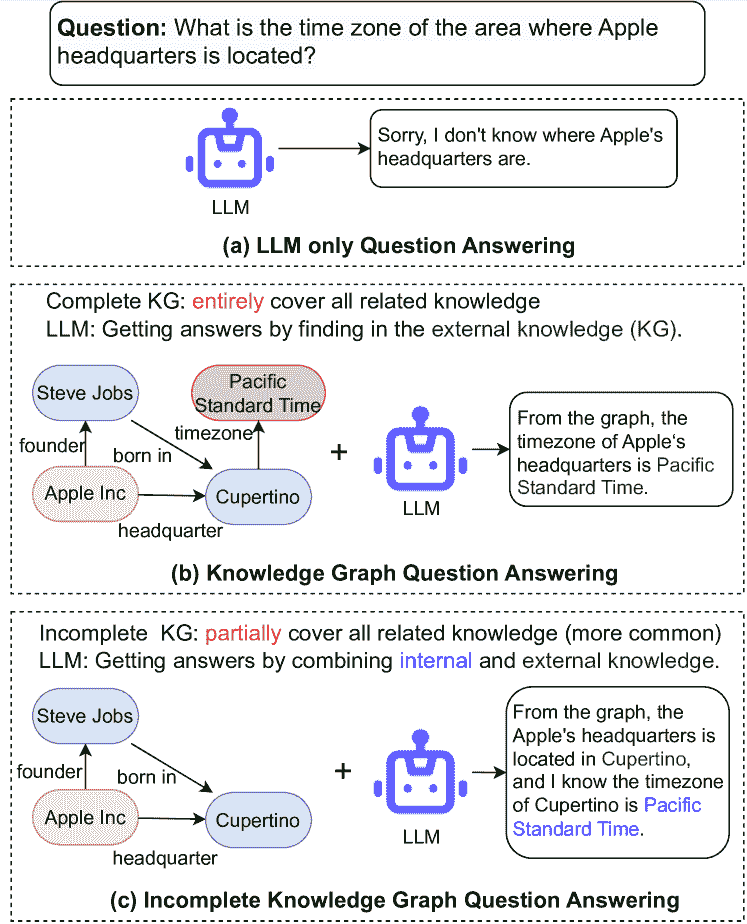
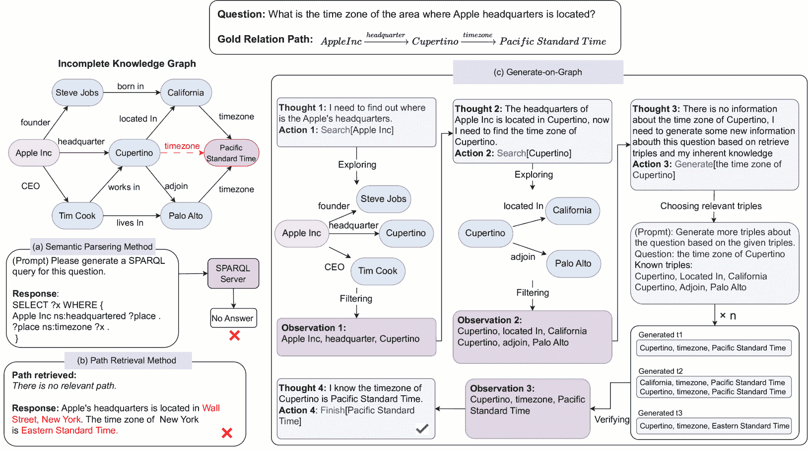
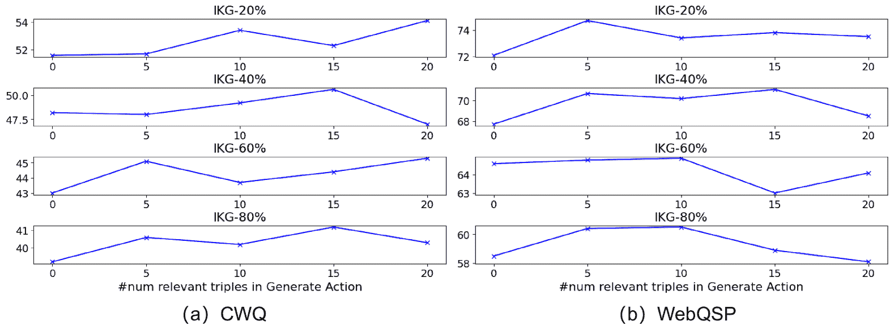
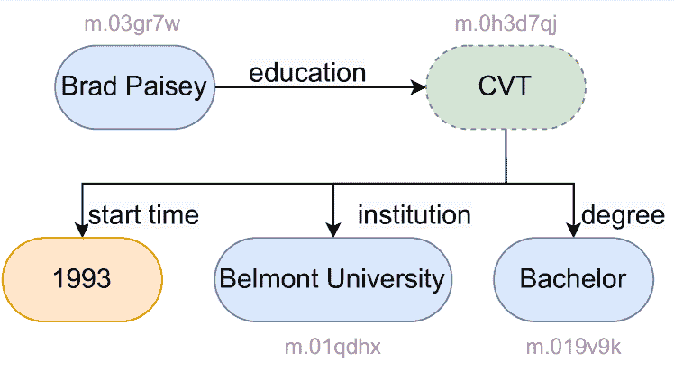
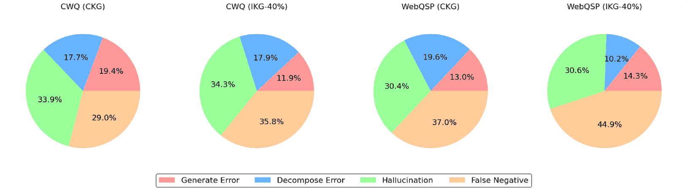

<!--yml

分类：未分类

日期：2025-01-11 12:41:59

-->

# 图生成：将LLM视为代理和知识图谱，用于不完全知识图谱问答

> 来源：[https://arxiv.org/html/2404.14741/](https://arxiv.org/html/2404.14741/)

许尧^(1,2)，何世柱^(1,2)，陈嘉贝^(1,2)，王子豪³，宋扬秋³，

佟航航⁴，刘广⁵，赵俊^(1,2)，刘康^(1,2)

¹ 复杂系统认知与决策智能重点实验室，

中国科学院自动化研究所

² 中国科学院大学人工智能学院

³ 香港科技大学

⁴ 伊利诺伊大学香槟分校

⁵ 北京人工智能研究院

{yao.xu, jzhao, shizhu.he, kliu}@nlpr.ia.ac.cn, chenjiabei2024@ia.ac.cn   通讯作者

###### 摘要

为了解决大规模语言模型（LLMs）在知识不足和幻觉问题上的挑战，许多研究探索了将LLM与知识图谱（KGs）结合的方式。然而，这些方法通常是在传统的知识图谱问答（KGQA）上进行评估，其中所有问题所需的事实三元组都由给定的知识图谱完全覆盖。在这种情况下，LLM主要作为一个代理来在知识图谱中查找答案实体，而不是有效地将LLM的内部知识与知识图谱等外部知识源进行整合。事实上，知识图谱通常并不完整，无法涵盖回答问题所需的所有知识。为了模拟这些现实世界的场景并评估LLM整合内部和外部知识的能力，我们提出了利用LLM进行不完全知识图谱问答（IKGQA），其中提供的知识图谱缺少每个问题的一些事实三元组，并构建相应的数据集。为了处理IKGQA，我们提出了一种无训练方法，称为“图生成”（GoG），它可以在探索知识图谱的过程中生成新的事实三元组。具体来说，GoG通过“思考-搜索-生成”框架进行推理，认为LLM既是IKGQA中的代理也是知识图谱。两个数据集上的实验结果表明，我们的GoG方法优于所有现有的方法。

## 1 引言

图1：三种问答任务的对比：（a）仅LLM问答，（b）知识图谱问答（KGQA），（c）不完全知识图谱问答（IKGQA），其中三元组（Cupertino, timezone, Pacific Standard Time）缺失。黄色和红色节点分别代表主题和答案实体。

大型语言模型（LLM）Brown 等人（[2020](https://arxiv.org/html/2404.14741v3#bib.bib4)）；Bang 等人（[2023](https://arxiv.org/html/2404.14741v3#bib.bib2)）在各种自然语言处理（NLP）任务中取得了巨大成功。得益于广泛的模型参数和大量的预训练语料库，LLM 可以通过提示工程和上下文学习来解决复杂的推理任务，无需针对特定任务进行微调，Dong 等人（[2023](https://arxiv.org/html/2404.14741v3#bib.bib6)）。

然而，LLM 仍然面临知识不足和幻觉问题，Huang 等人（[2023](https://arxiv.org/html/2404.14741v3#bib.bib9)）；Li 等人（[2023a](https://arxiv.org/html/2404.14741v3#bib.bib13)），如图 [1](https://arxiv.org/html/2404.14741v3#S1.F1 "Figure 1 ‣ 1 Introduction ‣ Generate-on-Graph: Treat LLM as both Agent and KG for Incomplete Knowledge Graph Question Answering")（a）所示。为了缓解这些问题，许多将 LLM 与知识图谱（KG）结合的方法已经提出，如 Ji 等人（[2021](https://arxiv.org/html/2404.14741v3#bib.bib10)）和 Pan 等人（[2023](https://arxiv.org/html/2404.14741v3#bib.bib19)），其中 KG 以三元组的格式提供准确的事实性知识，而 LLM 提供强大的语言处理和知识整合能力。这些工作大致可以分为两类，如图 [2](https://arxiv.org/html/2404.14741v3#S1.F2 "Figure 2 ‣ 1 Introduction ‣ Generate-on-Graph: Treat LLM as both Agent and KG for Incomplete Knowledge Graph Question Answering") 所示：（1）语义解析（SP）方法 Li 等人（[2023c](https://arxiv.org/html/2404.14741v3#bib.bib15)）；Luo 等人（[2024](https://arxiv.org/html/2404.14741v3#bib.bib17)），使用 LLM 将自然语言问题转换为逻辑查询，然后通过在 KG 上执行这些逻辑查询来获得答案。（2）检索增强（RA）方法 Li 等人（[2023d](https://arxiv.org/html/2404.14741v3#bib.bib16)），从 KG 中检索与问题相关的信息作为外部知识，指导 LLM 生成答案。

图 2：将 LLM 与 KG 结合的三种范式。

语义解析方法专门将LLMs视为解析器，这些方法在很大程度上依赖于知识图谱的质量和完整性（Sun等人，[2023](https://arxiv.org/html/2404.14741v3#bib.bib24)）。尽管增强检索的方法声称解决了语义解析方法的缺点，并在传统的知识图谱问答（KGQA）中取得了良好的表现（Yih等人，[2016a](https://arxiv.org/html/2404.14741v3#bib.bib30)），但仍然很难验证它们是否真正整合了来自知识图谱和LLMs的知识。一个关键原因是，在传统的KGQA任务中，回答每个问题所需的事实三元组完全由知识图谱涵盖。例如，对于图[1](https://arxiv.org/html/2404.14741v3#S1.F1 "Figure 1 ‣ 1 Introduction ‣ Generate-on-Graph: Treat LLM as both Agent and KG for Incomplete Knowledge Graph Question Answering")（b）中的问题“Apple总部所在地区的时区是什么？”，LLMs只需要从“Apple总部”开始，顺序选择关系谓词“located_in”和“timezone”来找到答案。也就是说，在这个场景中，LLMs只需要将问题中提到的关系与知识图谱中的具体关系谓词对应，便能得出答案实体“Pacific Standard Time”，而无需真正整合内外部知识。

然而，一方面，知识图谱（KGs）往往不完整，无法涵盖回答现实世界场景中问题所需的所有知识。例如，对于图[1](https://arxiv.org/html/2404.14741v3#S1.F1 "Figure 1 ‣ 1 Introduction ‣ Generate-on-Graph: Treat LLM as both Agent and KG for Incomplete Knowledge Graph Question Answering")（c）中的相同问题，关键三元组（Cupertino, timezone, Pacific Standard Time）在知识图谱中并不存在。另一方面，LLMs包含丰富的知识内容并具有强大的推理能力。例如，LLMs通常知道一个城市的时区。这引发了一个研究问题：LLMs是否可以与不完整的知识图谱结合，以回答复杂的问题？

为了回答这个问题，本文首先提出了一个新的基准，利用大型语言模型（LLMs）在不完整知识图谱（IKGQA）下进行问答，以模拟现实场景。我们基于现有的公共KGQA数据集构建了IKGQA数据集，并通过根据不同概率随机丢弃三元组来模拟具有不同程度不完整性的知识图谱。与传统的KGQA不同，IKGQA中的相应知识图谱并不包含每个问题所需的所有事实三元组。这意味着即使生成正确的SPARQL查询，语义解析方法也可能无法检索到最终答案¹¹1语义解析方法总是将“timezone”解析为“timezone”而不是“located_in → timezone”，因为训练集的原因，更多细节可以在附录[A](https://arxiv.org/html/2404.14741v3#A1 "附录A 语义解析方法详情 ‣ 生成型图：将LLM视为代理和KG，用于不完整知识图谱问答")中找到。除此之外，之前的检索增强方法在不完整知识图谱下表现也不好，因为它们仍然严重依赖检索到的路径，更多细节可以在附录[B](https://arxiv.org/html/2404.14741v3#A2 "附录B 检索增强方法详情 ‣ 生成型图：将LLM视为代理和KG，用于不完整知识图谱问答")中找到。与KGQA相比，IKGQA具有更大的研究意义，原因如下：（1）它更接近于现实世界的场景，在这些场景中，给定的知识图谱是不完整的，无法回答用户的问题。（2）它可以更好地评估LLM整合内外部知识的能力。

我们还提出了一种名为生成型图（Generate-on-Graph，GoG）的新方法，用于IKGQA，如图[2](https://arxiv.org/html/2404.14741v3#S1.F2 "图2 ‣ 1 引言 ‣ 生成型图：将LLM视为代理和KG，用于不完整知识图谱问答")（c）所示，该方法不仅将LLM视为一个代理，探索给定的知识图谱以检索相关的三元组，还将LLM视为一个知识图谱，生成额外的事实三元组来回答这个问题。具体来说，GoG采用了一个思考-搜索-生成的框架，包含三个主要步骤：（1）思考：LLM分解问题并根据当前状态决定是否进行进一步的搜索或生成相关的三元组。（2）搜索：LLM使用预定义的工具，如执行SPARQL查询的知识图谱工程师，探索知识图谱并筛选出无关的三元组。（3）生成：LLM利用其内部知识和推理能力，根据探索到的子图生成所需的新事实三元组并进行验证。GoG会重复这些步骤，直到获取足够的信息来回答问题。代码和数据可在[https://github.com/YaooXu/GoG](https://github.com/YaooXu/GoG)获取。

本文的主要贡献可以总结如下：

1.  1.

    我们提出利用LLM进行不完整知识图谱问答（IKGQA），以更好地评估LLM的能力，并基于现有的知识图谱问答数据集构建相应的IKGQA数据集。

1.  2.

    我们提出了生成图谱（Generate-on-Graph，GoG）方法，它采用思维-搜索-生成（Thinking-Searching-Generating）框架来解决不完整知识图谱问答（IKGQA）问题。

1.  3.

    在两个数据集上的实验结果展示了GoG的优越性，并证明了LLM可以与不完整的知识图谱结合，回答复杂的问题。

图3：三种方法在解决IKGQA问题中的比较：（a）基于语义解析的方法（例如，ChatKBQA Luo 等人（[2024](https://arxiv.org/html/2404.14741v3#bib.bib17)））；（b）路径检索方法（例如，ToG Sun 等人（[2023](https://arxiv.org/html/2404.14741v3#bib.bib24)））；（c）采用思维-搜索-生成框架的GoG方法。

## 2 相关工作

在不完整知识图谱下的问答。之前的一些工作，如 Saxena 等人（[2020](https://arxiv.org/html/2404.14741v3#bib.bib22)）；Zan 等人（[2022](https://arxiv.org/html/2404.14741v3#bib.bib33)）；Zhao 等人（[2022](https://arxiv.org/html/2404.14741v3#bib.bib34)）；Guo 等人（[2023](https://arxiv.org/html/2404.14741v3#bib.bib8)）尝试训练知识图谱嵌入，通过相似度分数在不完整知识图谱下预测答案。与这些基于知识图谱嵌入（KGE）的工作相比，我们提出了利用大语言模型（LLM）进行不完整知识图谱下的问答（QA），研究LLM是否能够很好地整合内部和外部知识。

将KG和LLM统一应用于KGQA。为了统一KG和LLM以解决KGQA，已经提出了各种方法，这些方法可以分为两类：语义解析（SP）方法和检索增强（RA）方法。SP方法通过LLM将问题转换为结构化查询。这些查询可以由KG引擎执行，基于KG推导出答案。这些方法首先生成草稿作为初步逻辑形式，然后通过实体和关系绑定器将草稿绑定到可执行的逻辑形式，如KB-BINDER Li等人（[2023c](https://arxiv.org/html/2404.14741v3#bib.bib15)）和ChatKBQA Luo等人（[2024](https://arxiv.org/html/2404.14741v3#bib.bib17)）。然而，这些方法的有效性在很大程度上依赖于生成查询的质量和KG的完整性。RA方法从KG中检索相关信息以提高推理性能 Li等人（[2023b](https://arxiv.org/html/2404.14741v3#bib.bib14)）。ToG Sun等人（[2023](https://arxiv.org/html/2404.14741v3#bib.bib24)）将LLM视为一个代理，逐步在KG上交互式地探索关系路径，并基于检索到的路径执行推理。RoG Luo等人（[2023](https://arxiv.org/html/2404.14741v3#bib.bib18)）首先生成作为可靠计划的关系路径，然后利用这些路径从KG中检索有效的推理路径供LLM推理。Readi Cheng等人（[2024](https://arxiv.org/html/2404.14741v3#bib.bib5)）在必要时仅生成推理路径并编辑路径。[Salnikov等人](https://arxiv.org/html/2404.14741v3#bib.bib21)提出了“生成-再选择”方法，该方法首先使用LLM直接生成答案，然后构建子图并选择最有可能包含正确答案的子图。

我们的GoG属于检索增强方法，我们还利用了LLMs的知识建模能力，这与GAG Yu等人（[2023](https://arxiv.org/html/2404.14741v3#bib.bib32)）的方法也相似。

LLM推理与提示。许多研究提出了通过提示来激发LLM解决复杂任务的推理能力Wei等人（[2023](https://arxiv.org/html/2404.14741v3#bib.bib28)）；Khot等人（[2023](https://arxiv.org/html/2404.14741v3#bib.bib12)）。复杂的CoT Fu等人（[2023](https://arxiv.org/html/2404.14741v3#bib.bib7)）创建并优化包含更多推理步骤的理由示例，以引导LLM更好地进行推理。自我一致性Wang等人（[2023](https://arxiv.org/html/2404.14741v3#bib.bib27)）充分探索各种推理方式，以提高其在推理任务中的表现。DecomP Khot等人（[2023](https://arxiv.org/html/2404.14741v3#bib.bib12)）通过将复杂任务分解为更简单的子任务，并将这些任务委派给特定子任务的LLM来解决复杂任务。ReAct Yao等人（[2023](https://arxiv.org/html/2404.14741v3#bib.bib29)）将LLM视为与环境互动并做出决策的代理，旨在从外部源中检索信息。GoG可以看作是ReAct和DecomP的融合，从而能够更全面地利用LLM内部的多种能力来解决复杂问题。

## 3 初步

本节首先介绍知识图谱（KG）。然后，我们使用KG的符号来描述关系路径和知识图谱问答（KGQA）。

知识图谱（KG）可以描述为一组互相关联的事实三元组，即$\mathcal{G}=\{(h,r,t)\in\mathcal{V}\times\mathcal{R}\times\mathcal{V}\}$，其中$h,r\in\mathcal{V}$表示头实体和尾实体，$r\in\mathcal{R}$表示关系。

知识图谱问答（KGQA）是一个推理任务，旨在基于$\mathcal{G}$预测答案实体$e_{a}\in\mathcal{A}_{q}$。参考之前的研究Sun等人（[2019](https://arxiv.org/html/2404.14741v3#bib.bib23)），我们将问题$q$中提到的实体称为主题实体，记作$e_{t}\in\mathcal{T}_{q}$。许多数据集Talmor和Berant（[2018](https://arxiv.org/html/2404.14741v3#bib.bib25)）；Yih等人（[2016b](https://arxiv.org/html/2404.14741v3#bib.bib31)）提供了每个问题的标准SPARQL查询，这展示了从主题实体$e_{t}$到答案实体$e_{a}$的关系路径。我们将这个路径称为黄金关系路径，记作$w_{g}=e_{q}\xrightarrow{r_{1}}e_{1}\xrightarrow{r_{2}}...\xrightarrow{r_{l}}e_{a}$。例如，图[3](https://arxiv.org/html/2404.14741v3#S1.F3 "Figure 3 ‣ 1 Introduction ‣ Generate-on-Graph: Treat LLM as both Agent and KG for Incomplete Knowledge Graph Question Answering")中问题的黄金关系路径为$w_{g}=Apple\;Inc\xrightarrow{headquarter}Cupertino\xrightarrow{timezone}Pacific\;Standard\;Time$。在KGQA中，$\forall i\in[1,l],\;(e_{i-1},r_{i},e_{i})\in\mathcal{G}$。也就是说，保证黄金路径中的所有三元组都包含在$\mathcal{G}$中。

## 4 不完整知识图谱问答（IKGQA）

### 4.1 任务介绍

IKGQA与KGQA的区别在于，在IKGQA中，$\exists i\in[1,l],\;(e_{i-1},r_{i},e_{i})\notin\mathcal{G}$。即，它不能保证黄金路径中的所有三元组都包含在$\mathcal{G}$中。例如，$w_{g}$中的三元组（Cupertino, timezone, Pacific Standard Time）可能不包含在$\mathcal{G}$中。因此，模型需要通过LLMs召回这些三元组或通过子图信息进行推理。

### 4.2 数据集构建

目前，尚无现成的IKGQA数据集。为促进相关研究，本文基于两个广泛使用的KGQA数据集：WebQuestionSP（WebQSP）Yih等人（[2016b](https://arxiv.org/html/2404.14741v3#bib.bib31)）和Complex WebQuestion（CWQ）Talmor和Berant（[2018](https://arxiv.org/html/2404.14741v3#bib.bib25)），构建了两个IKGQA数据集。这两个数据集都使用Freebase Bollacker等人（[2008](https://arxiv.org/html/2404.14741v3#bib.bib3)）作为其背景知识图（KG）。为了模拟不完整的KG，我们随机删除原始KG中每个问题的部分关键三元组，这些三元组出现在黄金关系路径中。通过这样做，简单的语义解析方法几乎无法获得正确答案。为了节省计算成本，我们随机选择了这两个数据集中的1,000个样本来构建IKGQA问题。

生成问题关键三元组的过程在算法[1](https://arxiv.org/html/2404.14741v3#algorithm1 "Algorithm 1 ‣ 4.2 Datasets Construction ‣ 4 Incomplete Knowledge Graph Question Answering (IKGQA) ‣ Generate-on-Graph: Treat LLM as both Agent and KG for Incomplete Knowledge Graph Question Answering")中进行了说明。

输入：SPARQL查询$s_{q}$，KG$\mathcal{G}$，概率$p$输出：丢失的关键三元组列表$L$12初始化$L\leftarrow[]$，$filtered\_triples\leftarrow[]$；34$binding\_results$ $\leftarrow$ 执行($s_{q}$, $\mathcal{G}$)；56$all\_triples$ $\leftarrow$ 转换($binding\_results$)；78// 过滤属性节点（例如，height，text）9$filtered\_triples$ $\leftarrow$ 过滤($all\_triples$)；1011对于*每个$t$在$filtered\_triples$中*执行12       $r$ $\leftarrow$ 生成随机浮点数；13       如果*$r\leq p$*则14             $L$.add($t$)15       结束如果16      17结束循环18返回$L$；19

算法1 获取问题$q$的关键三元组

## 5 生成图方法（GoG）

在这一部分，我们介绍了我们的生成图方法（Generate-on-Graph, GoG），该方法能够整合KG和LLMs的知识，并利用LLMs的推理能力。GoG的工作流程如图[3](https://arxiv.org/html/2404.14741v3#S1.F3 "Figure 3 ‣ 1 Introduction ‣ Generate-on-Graph: Treat LLM as both Agent and KG for Incomplete Knowledge Graph Question Answering")（c）所示。GoG利用了思考-搜索-生成（Thinking-Searching-Generating）框架，该框架由三个主要步骤组成：思考（Thinking）、搜索（Searching）和生成（Generating）。

### 5.1 思考（Thinking）

受到ReAct Yao等人（[2023](https://arxiv.org/html/2404.14741v3#bib.bib29)）的启发，我们将大语言模型（LLM）视为一个与环境交互的代理，用于解决任务。GoG使用“思考-搜索-生成”框架来回答问题。如图[3](https://arxiv.org/html/2404.14741v3#S1.F3 "Figure 3 ‣ 1 Introduction ‣ Generate-on-Graph: Treat LLM as both Agent and KG for Incomplete Knowledge Graph Question Answering")（c）所示，对于每个步骤$i$，GoG首先生成一个思想$t_{i}\in\mathcal{L}$，其中$\mathcal{L}$是语言空间，用于分解原始问题（思想1），决定应该解决哪个下一个子问题（思想2），或判断是否已经有足够的信息输出最终答案（思想4）。然后，基于思想$t_{i}$，GoG生成一个行动$a_{i}\in\mathcal{A}$，其中$\mathcal{A}$是行动空间，从知识图谱（KG）中搜索信息（行动1、2），或通过推理和内部知识生成更多信息（行动3）。

| 方法 | CWQ | WebQSP |
| --- | --- | --- |
| w.o. 知识图谱 |
| IO提示词 | 37.6 | 63.3 |
| CoT | 38.8 | 62.2 |
| CoT+SC | 45.4 | 61.1 |
|  | CKG | IKG | CKG | IKG |
| w.t. 知识图谱 / 微调 |
| RoG Luo等人（[2023](https://arxiv.org/html/2404.14741v3#bib.bib18)） | 66.1 | 54.2 | 88.6 | 78.2 |
| ChatKBQA Luo等人（[2024](https://arxiv.org/html/2404.14741v3#bib.bib17)） | 76.5 | 39.3 | 78.1 | 49.5 |
| w.t. 知识图谱 / 未训练（GPT-3.5） |
| KB-BINDER Li等人（[2023c](https://arxiv.org/html/2404.14741v3#bib.bib15)） | - | - | 50.7 | 38.4 |
| StructGPT Jiang等人（[2023](https://arxiv.org/html/2404.14741v3#bib.bib11)） | - | - | 76.4 | 60.1 |
| ToG Sun等人（[2023](https://arxiv.org/html/2404.14741v3#bib.bib24)） | 47.2 | 37.9 | 76.9 | 63.4 |
| GoG（我们的方法） | 55.7 | 44.3 | 78.7 | 66.6 |
| w.t. 知识图谱 / 未训练（GPT-4） |
| ToG Sun等人（[2023](https://arxiv.org/html/2404.14741v3#bib.bib24)） | 71.0 | 56.1 | 80.3 | 71.8 |
| GoG（我们的方法） | 75.2 | 60.4 | 84.4 | 80.3 |

表1：不同模型在两个数据集上的Hits@1得分，采用不同设置（%）。CKG和IKG分别表示使用完整和不完整的KG（IKG-40%）。其他基准模型的结果由我们重新运行²²2我们使用的评估策略与ToG不同，这导致ToG的表现与报告的有所不同。详细信息见附录[D](https://arxiv.org/html/2404.14741v3#A4 "Appendix D Settings for Baselines ‣ Generate-on-Graph: Treat LLM as both Agent and KG for Incomplete Knowledge Graph Question Answering")。粗体表示最佳结果。

### 5.2 搜索

搜索操作通过GoG以$Search[e_{i}]$的形式调用，其中$e_{i}$是目标实体，如图[3](https://arxiv.org/html/2404.14741v3#S1.F3 "图 3 ‣ 1 引言 ‣ Generate-on-Graph: 将LLM作为代理和KG来解决不完整知识图谱问答") (c)中的操作1和2所示。虽然可以搜索多个目标实体，如$Search[e_{i}^{1},e_{i}^{2},\ldots]$，为了简化起见，这里只考虑搜索一个目标实体。此操作旨在基于上一个思考$t_{i}$从目标实体$e_{i}$的邻接实体中找到最相关的前k个实体$E_{i}$。搜索操作包括两个步骤：探索和过滤。

+   •

    探索GoG首先使用预定义的SPARQL查询来获取与目标实体$e_{i}$相关的所有关系$R_{i}$。例如，在图[3](https://arxiv.org/html/2404.14741v3#S1.F3 "图 3 ‣ 1 引言 ‣ Generate-on-Graph: 将LLM作为代理和KG来解决不完整知识图谱问答") (c)中，$e_{1}$={Apple Inc}，$R_{1}$={创始人，总部，CEO}。

+   •

    过滤：在检索关系集$R_{i}$后，LLM被用来根据上一个思考$t_{i}$选择最相关的前N个关系$R^{\prime}_{i}$。此步骤使用的提示详见附录[C](https://arxiv.org/html/2404.14741v3#A3 "附录C 提示列表 ‣ Generate-on-Graph: 将LLM作为代理和KG来解决不完整知识图谱问答")。在图[3](https://arxiv.org/html/2404.14741v3#S1.F3 "图 3 ‣ 1 引言 ‣ Generate-on-Graph: 将LLM作为代理和KG来解决不完整知识图谱问答") (c)的情况下，LLM从$R_{1}$={创始人，总部，CEO}中选择$R^{\prime}_{1}$={总部}来回答思考$t_{1}$“我需要找出Apple的总部在哪里”。

最后，我们基于目标实体$e_{t}$和相关关系集$R^{\prime}_{i}$获得最相关的实体集$E_{i}$。如图[3](https://arxiv.org/html/2404.14741v3#S1.F3 "图 3 ‣ 1 引言 ‣ Generate-on-Graph: 将LLM作为代理和KG来解决不完整知识图谱问答") (c)所示，第一步中的观察结果为{(Apple Inc, 总部, Cupertino)}，该信息附加到上下文中，以使GoG能够生成下一个思考。

### 5.3 生成

当前一个观察结果没有直接答案时，GoG通过$Generate[t_{i}]$的形式调用生成操作，其中$t_{i}$是上一个思考，如图[3](https://arxiv.org/html/2404.14741v3#S1.F3 "图 3 ‣ 1 引言 ‣ Generate-on-Graph: 将LLM作为代理和KG来解决不完整知识图谱问答") (c)中的操作3所示。此操作尝试利用LLM根据检索信息和内部知识生成新的事实三元组。每个生成操作包括三个步骤：选择、生成和验证。

+   •

    为了提供一些相关信息以帮助LLMs生成更准确的三元组，我们使用BM25 Robertson和Zaragoza ([2009](https://arxiv.org/html/2404.14741v3#bib.bib20)) 从先前的观察中检索最相关的三元组。例如，在图[3](https://arxiv.org/html/2404.14741v3#S1.F3 "Figure 3 ‣ 1 Introduction ‣ Generate-on-Graph: Treat LLM as both Agent and KG for Incomplete Knowledge Graph Question Answering")（c）中的操作3中，我们从观察1和观察2中选择了{(Cupertino, located_in, California), (Cupertino, adjoin, Palo Alto)}作为LLM生成新三元组时使用的相关三元组。

+   •

    在检索相关三元组后，LLMs将利用这些相关三元组及其内部知识生成新的事实性三元组。生成过程将重复$n$次以最小化错误和幻觉。如图[3](https://arxiv.org/html/2404.14741v3#S1.F3 "Figure 3 ‣ 1 Introduction ‣ Generate-on-Graph: Treat LLM as both Agent and KG for Incomplete Knowledge Graph Question Answering")（c）中操作3所示，给定相关三元组，LLMs生成{(Cupertino, timezone, Pacific Standard Time)}作为生成的$t_{1}$三元组。

+   •

    最后，我们使用LLMs验证生成的三元组，并选择那些更可能准确的作为观察，所使用的提示见附录[C](https://arxiv.org/html/2404.14741v3#A3 "Appendix C Prompt List ‣ Generate-on-Graph: Treat LLM as both Agent and KG for Incomplete Knowledge Graph Question Answering")。如图[3](https://arxiv.org/html/2404.14741v3#S1.F3 "Figure 3 ‣ 1 Introduction ‣ Generate-on-Graph: Treat LLM as both Agent and KG for Incomplete Knowledge Graph Question Answering")（c）中的观察3所示，LLMs只保留了{(Cupertino, timezone, Pacific Standard Time)}这一生成的三元组。

LLMs也可能生成一个之前未被探索的实体。因此，我们需要将该实体与知识图谱中的相应机器标识符（MID）进行链接。这个实体链接过程分为两个步骤：（1）我们根据BM25得分检索一些相似的实体及其对应的类型。（2）我们利用LLM根据类型选择最相关的实体，所使用的提示见附录[C](https://arxiv.org/html/2404.14741v3#A3 "Appendix C Prompt List ‣ Generate-on-Graph: Treat LLM as both Agent and KG for Incomplete Knowledge Graph Question Answering")。

GoG重复以上三个步骤，直到获得足够的信息，然后以$Finish[e_{a}]$的形式输出最终答案，其中$e_{a}$表示答案实体。需要注意的是，代理也可能生成"$Finish[unknown]"，这意味着代理无法回答该问题，因为信息不足。在这种情况下，我们将回退并搜索最后目标实体的一个邻居。

| 方法 | CWQ |
| --- | --- |
| CKG | IKG-20% | IKG-40% | IKG-60% | IKG-80% |
| ToG | 47.2 | 40.5 | 37.9 | 33.7 | 31.4 |
| GoG | 55.7 | 44.9 | 44.3 | 36.2 | 34.4 |
|  | WebQSP |
|  | CKG | IKG-20% | IKG-40% | IKG-60% | IKG-80% |
| StructGPT | 76.0 | 67.8 | 60.1 | 51.7 | 43.7 |
| ToG | 76.9 | 70.3 | 61.4 | 60.6 | 55.9 |
| GoG | 78.7 | 70.8 | 66.6 | 62.6 | 56.5 |

表 2：在不同丢失三元组比例下，基于提示的方法（使用 GPT-3.5）的 Hits@1 分数（%）。CKG 代表使用完整知识图谱。IKG-20%/40%/60%/80% 分别表示每个问题随机丢失 20%/40%/60%/80% 的关键三元组。

| 方法 | CWQ |
| --- | --- |
| CKG | IKG-40% | NKG |
| GoG w/GPT-3.5 | 55.7 | 44.3 | 38.8 |
| GoG w/Qwen-1.5 | 63.3 | 49.2 | 47.0 |
| GoG w/Llama-3 | 59.6 | 54.6 | 54.0 |
| GoG w/GPT-4 | 75.2 | 60.4 | 55.6 |
|  | WebQSP |
|  | CKG | IKG-40% | NKG |
| GoG w/GPT-3.5 | 78.7 | 66.6 | 62.6 |
| GoG w/Qwen-1.5 | 77.9 | 70.2 | 65.1 |
| GoG w/Llama-3 | 77.4 | 74.4 | 70.8 |
| GoG w/GPT-4 | 84.4 | 80.3 | 75.7 |

表 3：使用不同骨干模型的 GoG Hits@1 分数（%）。CKG、IKG-40% 和 NKG 分别表示使用完整的、部分的和没有知识图谱（KG）。Qwen-1.5 和 Llama-3 分别代表 Qwen-1.5-72b-chat 和 Llama-3-70b-Instruct。

## 6 实验

### 6.1 实验设置

#### 评估指标

参考之前的研究 Li 等人（[2023d](https://arxiv.org/html/2404.14741v3#bib.bib16)）；Jiang 等人（[2023](https://arxiv.org/html/2404.14741v3#bib.bib11)）；Sun 等人（[2023](https://arxiv.org/html/2404.14741v3#bib.bib24)），我们使用 Hits@1 作为评估指标，衡量的是预测答案的前 1 名是否正确的比例。

#### 基线方法

我们比较的基线方法可以分为三类：（1）仅基于大型语言模型（LLM）的方法，包括标准提示（IO 提示）Brown 等人（[2020](https://arxiv.org/html/2404.14741v3#bib.bib4)）、思维链（CoT）提示 Wei 等人（[2023](https://arxiv.org/html/2404.14741v3#bib.bib28)）和自一致性（SC）Wang 等人（[2023](https://arxiv.org/html/2404.14741v3#bib.bib27)）。（2）语义解析（SP）方法，包括 KB-BINDER Li 等人（[2023c](https://arxiv.org/html/2404.14741v3#bib.bib15)）和 ChatKBQA Luo 等人（[2024](https://arxiv.org/html/2404.14741v3#bib.bib17)）。（3）检索增强（RA）方法，包括 StructGPT Jiang 等人（[2023](https://arxiv.org/html/2404.14741v3#bib.bib11)）、RoG Luo 等人（[2023](https://arxiv.org/html/2404.14741v3#bib.bib18)）和 ToG Sun 等人（[2023](https://arxiv.org/html/2404.14741v3#bib.bib24)），其中 RoG 是所有需要微调模型中的最新方法（SOTA）。

#### 实验细节

在我们的实验中，我们使用了四个大型语言模型（LLMs）作为基础：GPT-3.5、GPT-4、Qwen-1.5-72B-Chat Bai 等人（[2023](https://arxiv.org/html/2404.14741v3#bib.bib1)）和 LLaMA-3-70B-Instruct Touvron 等人（[2023](https://arxiv.org/html/2404.14741v3#bib.bib26)）。我们通过 OpenAI API 调用 GPT-3.5 和 GPT-4³³3GPT-3.5 和 GPT-4 的具体版本分别为 gpt-3.5-turbo-0613 和 gpt-4-0613.. 每次生成的最大 token 长度设置为 256。温度参数设置为 0.7。我们在所有数据集的 GoG 提示中使用了 3 次示例。我们使用的提示列在附录 [C](https://arxiv.org/html/2404.14741v3#A3 "附录 C 提示列表 ‣ 生成图：将 LLM 视为代理和知识图谱，用于不完整知识图谱问答") 中。

#### 数据集详情

对于每个数据集，我们生成了四个不完整的知识图谱（IKGs），它们具有不同程度的完整性：IKG-20%/40%/60%/80%，表示对每个问题随机删除 20%/40%/60%/80% 关键三元组。除了关键三元组本身外，这两个实体之间的所有关系也将被删除。这些 IKG 的统计数据可以在附录 [E](https://arxiv.org/html/2404.14741v3#A5 "附录 E IKGs 中主题实体的统计数据 ‣ 生成图：将 LLM 视为代理和知识图谱，用于不完整知识图谱问答") 中找到。

### 6.2 主要结果

表 [2](https://arxiv.org/html/2404.14741v3#footnotex2 "脚注 2 ‣ 表 1 ‣ 5.1 思维 ‣ 5 生成图（GoG） ‣ 生成图：将 LLM 视为代理和知识图谱，用于不完整知识图谱问答") 显示了 GoG 和所有基准方法在不同设置下两个数据集上的 Hits@1 分数。从表中可以看出，与其他基于提示的方法相比，GoG 在完整和不完整知识图谱设置下均能在 CWQ 和 WebQSP 上取得最先进的表现。

在 CKG 设置下，我们的 GoG 优于 ToG 的主要原因是：（1）GoG 将问题分解为每个步骤的子问题，并在搜索过程中专注于每个子问题所需的信息，而 ToG 缺乏整体规划，容易在搜索过程中重复探索或迷失方向。（2）GoG 采用动态子图扩展搜索策略，而 ToG 仅探索部分路径。因此，GoG 获得的相关信息更为丰富。此外，这一策略可以更好地处理复合值类型（CVTs），具体内容请参见附录 [F](https://arxiv.org/html/2404.14741v3#A6 "附录 F 复合值类型（CVT）节点 ‣ 生成图：将 LLM 视为代理和知识图谱，用于不完整知识图谱问答")。一个案例研究展示在附录 [H.1](https://arxiv.org/html/2404.14741v3#A8.SS1 "H.1 在 CKG 设置下 ToG 与 GoG 的比较 ‣ 附录 H 案例研究 ‣ 生成图：将 LLM 视为代理和知识图谱，用于不完整知识图谱问答") 中。

在IKG设置下，SP方法的表现显著下降。这是预期中的情况，因为这些SP方法不会与KG互动，这意味着它们无法意识到某些三元组的缺失。ToG和StructGPT在IKG上的表现甚至比没有KG时更差，表明这些方法仍然只是起到了寻找答案的作用，而没有有效整合内部和外部知识源。我们的GoG通过使用生成动作来缓解这一问题，当未找到直接答案时，利用LLM生成新的事实三元组。一个案例研究在附录[H.2](https://arxiv.org/html/2404.14741v3#A8.SS2 "H.2 在IKG设置下对比ToG和GoG ‣ 附录H 案例研究 ‣ 基于图生成：将LLM视为代理和KG，处理不完全知识图谱问答")中提供，GoG生成的答案的详细分析可以在附录[G](https://arxiv.org/html/2404.14741v3#A7 "附录G 结果分析 ‣ 基于图生成：将LLM视为代理和KG，处理不完全知识图谱问答")中找到。

图4：GoG在CWQ（a）和WebQSP（b）数据集上生成动作中与相关三元组数量不同的Hits@1分数（%）。基础LLM为Qwen-1.5-72b-chat。

### 6.3 不同KG不完全性下的表现

为了研究知识图谱（KG）不完全性的不同程度如何影响不同方法的表现，我们评估了在具有不同不完全性程度的KG下，方法（使用GPT-3.5）的表现，结果见表[2](https://arxiv.org/html/2404.14741v3#S5.T2 "表 2 ‣ 5.3 生成 ‣ 5 基于图生成（GoG） ‣ 基于图生成：将LLM视为代理和KG，处理不完全知识图谱问答")。

可以发现，我们的GoG方法在不同程度的不完全性下，优于其他基于提示的方法。特别是在CWQ数据集上，我们的GoG在Hits@1分数上有显著提升，平均提高了5.0%。这强调了在不完全KG下整合LLM的外部和内部知识的重要性。相反，ToG在IKG-40%的表现甚至低于没有KG时的表现，表明ToG的性能仍然在很大程度上依赖于KG的完整性。

尽管WebQSP数据集中的大多数问题是单跳问题，GoG仍然优于ToG和StructGPT。这是因为GoG能够利用主题实体的邻近信息来预测尾实体，而其他方法无法充分利用这些信息，一个案例研究在附录[H.2](https://arxiv.org/html/2404.14741v3#A8.SS2 "H.2 在IKG设置下对比ToG和GoG ‣ 附录H 案例研究 ‣ 基于图生成：将LLM视为代理和KG，处理不完全知识图谱问答")中展示。

### 6.4 不同LLM下的表现

我们评估了不同的主干模型如何影响GoG的性能。表格[3](https://arxiv.org/html/2404.14741v3#S5.T3 "Table 3 ‣ 5.3 Generating ‣ 5 Generate-on-Graph (GoG) ‣ Generate-on-Graph: Treat LLM as both Agent and KG for Incomplete Knowledge Graph Question Answering")展示了使用GPT-4作为主干的GoG性能显著提高。特别是在完整知识图设置下，GoG（使用GPT-4）在WebQSP和CWQ数据集上分别取得了84.4和75.2的Hits@1分数，这在基于提示的方法中达到了SOTA水平，且超过了大多数微调方法。

此外，我们观察到在NKG设置下，Llama-3始终优于Qwen-1.5，而在CKG设置下则相反。这表明，LLM作为KG和作为代理的能力并不完全等同。探索不同LLM如何在扮演特定角色时发挥其优势，可能是未来研究的一个方向。

| 方法 | CWQ |
| --- | --- |
| CKG | IKG-40% |
| GoG w.o. Generate | 62.7 | 48.6 |
| GoG w.t. Generate | 63.3 | 50.6 |
|  | WebQSP |
|  | CKG | IKG-40% |
| GoG w.o. Generate | 74.7 | 69.4 |
| GoG w.t. Generate | 77.9 | 71.1 |

表格4：GoG w.t./w.o. 生成动作的Hits@1分数（%）。

### 6.5 消融研究

相关三元组数量的影响

我们进行了额外的实验，探究相关三元组的数量如何影响GoG的性能。我们根据BM25选择了前k个相关三元组，如图[4](https://arxiv.org/html/2404.14741v3#S6.F4 "Figure 4 ‣ 6.2 Main Results ‣ 6 Experiments ‣ Generate-on-Graph: Treat LLM as both Agent and KG for Incomplete Knowledge Graph Question Answering")所示。结果表明：（1）GoG的性能在加入相关子图后显著提高，这可能是因为这些子图激活了LLM的记忆，生成了更准确的三元组，并基于这些子图进行新的事实三元组推理。（2）在大多数情况下，性能随着相关三元组数量的增加而先上升后下降。这一下降主要是由于引入了噪声和不相关的知识。

生成动作的影响

我们调查了生成动作的影响，如图[4](https://arxiv.org/html/2404.14741v3#S6.T4 "Table 4 ‣ 6.4 Performance with Different LLMs ‣ 6 Experiments ‣ Generate-on-Graph: Treat LLM as both Agent and KG for Incomplete Knowledge Graph Question Answering")所示。没有生成动作的GoG性能较低，确认了生成动作的有效性。然而，尽管没有生成动作，GoG仍能取得具有竞争力的结果，因为它成为了一个纯粹的探索代理，导致了两种结果：（1）没有假阴性，所有答案都来自知识图，（2）它彻底搜索了知识图以寻找答案，而具有生成动作的GoG可能会决定调用生成动作而不是继续搜索。

## 7 结论

本文提出利用LLM（大语言模型）在不完全知识图（IKGQA）下进行问答，并构建相关数据集。我们提出了生成-图（GoG）方法，它可以有效地整合LLM的外部和内部知识。对两个数据集的实验表明，GoG具有优势，并证明LLM可以与不完全知识图结合，回答复杂问题。

## 局限性

我们提出的GoG方法的局限性如下：（1）LLM在生成过程中可能会产生幻觉，这是现有LLM无法避免的。（2）性能方面仍有改进空间，因为当知识图非常不完整时，GoG的性能低于使用CoT提示时的性能。

## 伦理声明

本文提出了一种在不完全知识图中进行复杂问题回答的方法，实验是在公开数据集上进行的。因此，没有数据隐私问题。同时，本文未涉及人工标注，也没有相关的伦理问题。

## 致谢

本工作得到了北京市自然科学基金（L243006）和国家自然科学基金（No.62376270）的资助。本工作得到了中国科学院青年创新促进会的支持。

## 参考文献

+   Bai 等人（2023）Jinze Bai、Shuai Bai、Yunfei Chu、Zeyu Cui、Kai Dang、Xiaodong Deng、Yang Fan、Wenbin Ge、Yu Han、Fei Huang 等人. 2023. Qwen技术报告. *arXiv预印本 arXiv:2309.16609*。

+   Bang 等人（2023）Yejin Bang、Samuel Cahyawijaya、Nayeon Lee、Wenliang Dai、Dan Su、Bryan Wilie、Holy Lovenia、Ziwei Ji、Tiezheng Yu、Willy Chung、Quyet V. Do、Yan Xu 和 Pascale Fung. 2023. [ChatGPT在推理、幻觉和互动性方面的多任务、多语言、多模态评估](https://doi.org/10.48550/arXiv.2302.04023). ArXiv:2302.04023 [cs]。

+   Bollacker 等人（2008）Kurt Bollacker、Colin Evans、Praveen Paritosh、Tim Sturge 和 Jamie Taylor. 2008. Freebase: 一个协作创建的图数据库，用于构建人类知识. 载于 *2008 年 ACM SIGMOD 国际数据管理会议论文集*，第1247–1250页。

+   Brown 等人（2020）Tom B. Brown、Benjamin Mann、Nick Ryder、Melanie Subbiah、Jared Kaplan、Prafulla Dhariwal、Arvind Neelakantan、Pranav Shyam、Girish Sastry、Amanda Askell、Sandhini Agarwal、Ariel Herbert-Voss、Gretchen Krueger、Tom Henighan、Rewon Child、Aditya Ramesh、Daniel M. Ziegler、Jeffrey Wu、Clemens Winter、Christopher Hesse、Mark Chen、Eric Sigler、Mateusz Litwin、Scott Gray、Benjamin Chess、Jack Clark、Christopher Berner、Sam McCandlish、Alec Radford、Ilya Sutskever 和 Dario Amodei. 2020. [语言模型是少样本学习者](https://doi.org/10.48550/arXiv.2005.14165). ArXiv:2005.14165 [cs]。

+   Cheng et al. (2024) Sitao Cheng, Ziyuan Zhuang, Yong Xu, Fangkai Yang, Chaoyun Zhang, Xiaoting Qin, Xiang Huang, Ling Chen, Qingwei Lin, Dongmei Zhang, Saravan Rajmohan, and Qi Zhang. 2024. [有需要时给我打电话：LLMs可以高效且忠实地推理结构化环境](http://arxiv.org/abs/2403.08593)。

+   Dong et al. (2023) Qingxiu Dong, Lei Li, Damai Dai, Ce Zheng, Zhiyong Wu, Baobao Chang, Xu Sun, Jingjing Xu, Lei Li, and Zhifang Sui. 2023. [关于上下文学习的调查](https://doi.org/10.48550/arXiv.2301.00234). ArXiv:2301.00234 [cs]。

+   Fu et al. (2023) Yao Fu, Hao Peng, Ashish Sabharwal, Peter Clark, and Tushar Khot. 2023. [基于复杂度的多步推理提示方法](http://arxiv.org/abs/2210.00720). ArXiv:2210.00720 [cs]。

+   Guo et al. (2023) Qimeng Guo, Xue Wang, Zhenfang Zhu, Peiyu Liu, and Liancheng Xu. 2023. 一个用于不完整知识图谱问题回答的知识推理模型。*应用智能*，53(7):7634–7646。

+   Huang et al. (2023) Lei Huang, Weijiang Yu, Weitao Ma, Weihong Zhong, Zhangyin Feng, Haotian Wang, Qianglong Chen, Weihua Peng, Xiaocheng Feng, Bing Qin, and Ting Liu. 2023. [大语言模型中的幻觉：原理、分类、挑战与未解之谜](http://arxiv.org/abs/2311.05232). ArXiv:2311.05232 [cs]。

+   Ji et al. (2021) Shaoxiong Ji, Shirui Pan, Erik Cambria, Pekka Marttinen, and Philip S. Yu. 2021. [知识图谱调查：表示、获取与应用](http://arxiv.org/abs/2002.00388). *arXiv:2002.00388 [cs]*。ArXiv: 2002.00388。

+   Jiang et al. (2023) Jinhao Jiang, Kun Zhou, Zican Dong, Keming Ye, Wayne Xin Zhao, and Ji-Rong Wen. 2023. [StructGPT：一个用于结构化数据推理的大型语言模型通用框架](http://arxiv.org/abs/2305.09645). 发表在*EMNLP 2023*，arXiv. ArXiv:2305.09645 [cs]。

+   Khot et al. (2023) Tushar Khot, Harsh Trivedi, Matthew Finlayson, Yao Fu, Kyle Richardson, Peter Clark, and Ashish Sabharwal. 2023. [解构式提示：解决复杂任务的模块化方法](http://arxiv.org/abs/2210.02406). 发表在*NIPS 2023*，arXiv. ArXiv:2210.02406 [cs]。

+   Li et al. (2023a) Junyi Li, Xiaoxue Cheng, Wayne Xin Zhao, Jian-Yun Nie, and Ji-Rong Wen. 2023a. [HaluEval：一个用于大型语言模型幻觉评估的大规模基准](http://arxiv.org/abs/2305.11747). ArXiv:2305.11747 [cs]。

+   Li et al. (2023b) Shiyang Li, Yifan Gao, Haoming Jiang, Qingyu Yin, Zheng Li, Xifeng Yan, Chao Zhang, and Bing Yin. 2023b. [图谱推理在问题回答中的应用：三元组检索](http://arxiv.org/abs/2305.18742). ArXiv:2305.18742 [cs]。

+   Li et al. (2023c) Tianle Li, Xueguang Ma, Alex Zhuang, Yu Gu, Yu Su, and Wenhu Chen. 2023c. [基于少量样本的知识库问题回答中的上下文学习](https://doi.org/10.18653/v1/2023.acl-long.385). 发表在*ACL 2023*，第6966–6980页，加拿大多伦多，计算语言学协会。

+   Li et al. (2023d) Xingxuan Li, Ruochen Zhao, Yew Ken Chia, Bosheng Ding, Shafiq Joty, Soujanya Poria, 和 Lidong Bing. 2023d. [Chain-of-Knowledge：通过异构源动态知识适应实现大型语言模型的基础](http://arxiv.org/abs/2305.13269)。ArXiv:2305.13269 [cs]。

+   Luo et al. (2024) Haoran Luo, Zichen Tang, Shiyao Peng, Yikai Guo, Wentai Zhang, Chenghao Ma, Guanting Dong, Meina Song, Wei Lin, et al. 2024. Chatkbqa: 基于生成-检索框架的知识库问答方法，结合了微调的大型语言模型。 *arXiv 预印本 arXiv:2310.08975*。

+   Luo et al. (2023) Linhao Luo, Yuan-Fang Li, Gholamreza Haffari, 和 Shirui Pan. 2023. [图谱上的推理：忠实且可解释的大型语言模型推理](http://arxiv.org/abs/2310.01061)。ArXiv:2310.01061 [cs]。

+   Pan et al. (2023) Shirui Pan, Linhao Luo, Yufei Wang, Chen Chen, Jiapu Wang, 和 Xindong Wu. 2023. [统一大型语言模型与知识图谱：一条发展路线图](https://doi.org/10.48550/arXiv.2306.08302)。ArXiv:2306.08302 [cs]。

+   Robertson and Zaragoza (2009) Stephen Robertson 和 Hugo Zaragoza. 2009. [概率相关性框架：Bm25及其拓展](https://doi.org/10.1561/1500000019)。 *Found. Trends Inf. Retr.*, 3(4):333–389。

+   Salnikov et al. (2023) Mikhail Salnikov, Hai Le, Prateek Rajput, Irina Nikishina, Pavel Braslavski, Valentin Malykh, 和 Alexander Panchenko. 2023. 大型语言模型与知识图谱结合回答事实性问题。 *arXiv 预印本 arXiv:2310.02166*。

+   Saxena et al. (2020) Apoorv Saxena, Aditay Tripathi, 和 Partha Talukdar. 2020. 利用知识库嵌入改善基于知识图谱的多跳问答。在 *第58届计算语言学协会年会论文集*，第4498–4507页。

+   Sun et al. (2019) Haitian Sun, Tania Bedrax-Weiss, 和 William W Cohen. 2019. Pullnet：基于知识库和文本的迭代检索开放领域问答。 *arXiv 预印本 arXiv:1904.09537*。

+   Sun et al. (2023) Jiashuo Sun, Chengjin Xu, Lumingyuan Tang, Saizhuo Wang, Chen Lin, Yeyun Gong, Lionel M. Ni, Heung-Yeung Shum, 和 Jian Guo. 2023. [Think-on-Graph：大型语言模型在知识图谱上的深度与负责任推理](https://doi.org/10.48550/arXiv.2307.07697)。ArXiv:2307.07697 [cs]。

+   Talmor and Berant (2018) Alon Talmor 和 Jonathan Berant. 2018. 将网络作为回答复杂问题的知识库。 *arXiv 预印本 arXiv:1803.06643*。

+   Touvron et al. (2023) Hugo Touvron, Louis Martin, Kevin Stone, Peter Albert, Amjad Almahairi, Yasmine Babaei, Nikolay Bashlykov, Soumya Batra, Prajjwal Bhargava, Shruti Bhosale, et al. 2023. Llama 2: 开放基础和微调的聊天模型。 *arXiv 预印本 arXiv:2307.09288*。

+   Wang 等人（2023）Xuezhi Wang、Jason Wei、Dale Schuurmans、Quoc Le、Ed Chi、Sharan Narang、Aakanksha Chowdhery 和 Denny Zhou。2023。 [自一致性改善语言模型中的思维链推理](https://doi.org/10.48550/arXiv.2203.11171)。ArXiv:2203.11171 [cs]。

+   Wei 等人（2023）Jason Wei、Xuezhi Wang、Dale Schuurmans、Maarten Bosma、Brian Ichter、Fei Xia、Ed Chi、Quoc Le 和 Denny Zhou。2023。 [链式思维提示引发大语言模型中的推理](https://doi.org/10.48550/arXiv.2201.11903)。ArXiv:2201.11903 [cs]。

+   Yao 等人（2023）Shunyu Yao、Jeffrey Zhao、Dian Yu、Nan Du、Izhak Shafran、Karthik Narasimhan 和 Yuan Cao。2023。 [ReAct：在语言模型中协同推理与行动](http://arxiv.org/abs/2210.03629)。ArXiv:2210.03629 [cs]。

+   Yih 等人（2016a）Wen-tau Yih、Matthew Richardson、Christopher Meek、Ming-Wei Chang 和 Jina Suh。2016a。语义解析标注对知识库问答的价值。在 *计算语言学协会第54届年会论文集（第2卷：短篇论文）*，第201–206页。

+   Yih 等人（2016b）Wen-tau Yih、Matthew Richardson、Christopher Meek、Ming-Wei Chang 和 Jina Suh。2016b。语义解析标注对知识库问答的价值。在 *计算语言学协会第54届年会论文集（第2卷：短篇论文）*，第201–206页。

+   Yu 等人（2023）Wenhao Yu、Dan Iter、Shuohang Wang、Yichong Xu、Mingxuan Ju、Soumya Sanyal、Chenguang Zhu、Michael Zeng 和 Meng Jiang。2023。 [生成而非检索：大语言模型是强大的上下文生成器](https://doi.org/10.48550/arXiv.2209.10063)。

+   Zan 等人（2022）Daoguang Zan、Sirui Wang、Hongzhi Zhang、Kun Zhou、Wei Wu、Wayne Xin Zhao、Bingchao Wu、Bei Guan 和 Yongji Wang。2022。在 *2022年国际神经网络联合会议（IJCNN）* 上，关于通过不完整知识图谱进行复杂问答作为n元链接预测的研究，第1–8页。IEEE。

+   Zhao 等人（2022）Fen Zhao、Yinguo Li、Jie Hou 和 Ling Bai。2022。通过关系预测提高不完整知识图谱上的问答性能。*神经计算与应用*，第1–18页。

{tblr}

[t] 宽度 = 0.9colspec = Q[104]Q[837]，cell12 = fg=MineShaft，cell21 = fg=MineShaft，vline2 = -，hline1-3 = -，问题 & 在使用巴哈马元作为货币的国家，使用的是哪个时区？

SPARQL 前缀 ns: <http://rdf.freebase.com/ns/>

SELECT DISTINCT ?x WHERE {

FILTER (?x != ?c) FILTER (!isLiteral(?x) OR lang(?x) = ” OR langMatches(lang(?x), ’en’))

?c ns:location.country.currency_used ns:m.01l6dm .

?c ns:location.location.time_zones ?x .

}

表5：CWQ 数据集中关于“时区”的示例。

## 附录 A 语义解析方法细节

SP方法的训练数据集是在完整的KG上构建的，这意味着“时区”直接对应关系“ns:location.location.time_zones”，而不是两跳路径“ns:location.located_in -> ns:location.location.time_zones”。CWQ中的一个示例如表[5](https://arxiv.org/html/2404.14741v3#A0.T5 "Table 5 ‣ Generate-on-Graph: Treat LLM as both Agent and KG for Incomplete Knowledge Graph Question Answering")所示。这意味着，在CWQ上训练的SP模型将始终输出“?c ns:location.location.time_zones ?x”，而不是“?c ns:location.located_in ?y . ?y ns:location.location.time_zones ?x”。因此，这些方法在不完整的KG下会失败。换句话说，语义解析方法并不与KG交互，这意味着它们无法意识到某些三元组的缺失。

## 附录 B 检索增强方法详情

RA方法从知识图谱（KG）中检索相关路径，并将这些路径作为上下文供大语言模型（LLM）生成答案。例如，ToG使用LLM探索KG，通过束搜索选择与问题相关的路径。然而，对ToG结果的分析显示，大约70%的正确答案直接来自于探索的路径，少于10%的正确答案是由探索路径的知识和LLM的内部知识组合得来的。后续的实验结果也表明，在IKG设置下，ToG的表现甚至比单独使用LLM还要差。这进一步表明，这些方法并没有真正整合LLM的内部知识和KG的外部知识。

## 附录 C 提示列表

GoG中使用的提示如表[9](https://arxiv.org/html/2404.14741v3#A7.T9 "Table 9 ‣ G.2 Error Analysis ‣ Appendix G Result Analysis ‣ Generate-on-Graph: Treat LLM as both Agent and KG for Incomplete Knowledge Graph Question Answering")所示。

## 附录 D 基准设置

紧随ToG，Freebase数据转储从[https://developers.google.com/freebase?hl=en](https://developers.google.com/freebase?hl=en)获取，我们使用Virtuoso部署Freebase。GoG、RoG、KB-BINDER和ChatKBQA都在相同的Freebase数据库上进行评估。

RoG。我们使用官方仓库提供的检查点和默认设置：在生成规则时使用n_beam=3，在推理答案时使用max_new_tokens=512。

ChatKBQA。我们使用官方代码库提供的预测S表达式，并将其转换为SPARQL查询。为了公平地将ChatKBQA与其他模型进行比较，我们在之前提到的Freebase数据库下执行这些SPARQL查询，而不是使用他们提供的数据库文件。因此，表格[2](https://arxiv.org/html/2404.14741v3#footnotex2 "Footnote 2 ‣ Table 1 ‣ 5.1 Thinking ‣ 5 Generate-on-Graph (GoG) ‣ Generate-on-Graph: Treat LLM as both Agent and KG for Incomplete Knowledge Graph Question Answering")中报告的ChatKBQA性能与原始论文中的有所不同。

KB-BINDER。我们使用官方代码库，并使用KB-BINDER (6)-R（通过多数投票并检索最相似的示例）来推断答案。然而，他们原文中使用的code-davinci-002不可用，因此我们使用了GPT-3.5。此外，为了减少运行时间，我们减少了候选MID组合的数量（尽管如此，回答200个问题仍需大约4小时）。因此，表格[2](https://arxiv.org/html/2404.14741v3#footnotex2 "Footnote 2 ‣ Table 1 ‣ 5.1 Thinking ‣ 5 Generate-on-Graph (GoG) ‣ Generate-on-Graph: Treat LLM as both Agent and KG for Incomplete Knowledge Graph Question Answering")中报告的KB-BINDER性能与原始论文中的有所不同。

ToG。我们使用官方代码库和他们的默认设置推断答案：max_length=256, width=3, depth=3。由于官方代码库没有提供CWQ数据集中的别名答案，我们在评估ToG时不考虑别名答案（所有模型都采用相同策略）。因此，表格[2](https://arxiv.org/html/2404.14741v3#footnotex2 "Footnote 2 ‣ Table 1 ‣ 5.1 Thinking ‣ 5 Generate-on-Graph (GoG) ‣ Generate-on-Graph: Treat LLM as both Agent and KG for Incomplete Knowledge Graph Question Answering")中报告的ToG性能与原始论文中的有所不同。

StructGPT。我们使用官方的代码库和运行脚本在WebQSP数据集上评估StructGPT。

## 附录E 主题实体的统计信息

删除边的统计信息显示在表格[6](https://arxiv.org/html/2404.14741v3#A5.T6 "Table 6 ‣ Appendix E Statistics of Topic Entities in IKGs ‣ Generate-on-Graph: Treat LLM as both Agent and KG for Incomplete Knowledge Graph Question Answering")中。此外，我们还确保在删除这些关键三元组后，主题实体的邻居节点数量不会为零。主题实体的统计信息显示在表格[7](https://arxiv.org/html/2404.14741v3#A5.T7 "Table 7 ‣ Appendix E Statistics of Topic Entities in IKGs ‣ Generate-on-Graph: Treat LLM as both Agent and KG for Incomplete Knowledge Graph Question Answering")中，我们删除了那些有孤立主题实体的样本（没有任何邻居节点的主题实体）。

{tblr}

width = colspec = Q[183]Q[183]Q[183]Q[183]Q[183], columneven = c, column3 = c, column5 = c, hlines, & IKG-20% IKG-40% IKG-60% IKG-80%

CWQ 2.2 4.3 6.4 7.9

WebQSP 6.6 13.9 20.3 27.4

表 6：在不同不完整度下，每个问题删除的平均边数。

{tblr}

width = 0.9colspec = Q[108]Q[400]Q[80]Q[80]Q[80]Q[80], column3 = c, column4 = c, column5 = c, column6 = c, cell21 = r=2, cell22 = fg=MineShaft, cell41 = r=2, cell42 = fg=MineShaft, hline1,2,4,6 = -, 数据集 & IKG-20% IKG-40% IKG-60% IKG-80%

CWQ 中位数邻居节点数 27 26 27 27

隔离主题实体的数量 19 42 59 53

WebQSP 中位数邻居节点数 428 427 427 426

隔离主题实体的数量 1 2 1 2

表 7：不完整知识图谱中主题节点的统计数据。隔离主题实体表示没有任何邻居节点的主题实体。

## 附录 F 复合值类型（CVT）节点

复合值类型（CVT）节点通常用于表示事件，这些事件可能涉及开始时间、结束时间、地点等，在知识图谱（KGs）中。复合值类型（CVT）节点的示例如图[5](https://arxiv.org/html/2404.14741v3#A6.F5 "图 5 ‣ 附录 F 复合值类型（CVT）节点 ‣ 生成图：将大型语言模型（LLM）视为代理和KG，用于不完整知识图谱问答")所示。

图 5：Freebase 数据集中复合值类型（CVTs）的示例。蓝色、绿色和橙色节点分别表示普通实体、CVT 节点和属性节点。

## 附录 G 结果分析

### G.1 生成操作下的性能

表[8](https://arxiv.org/html/2404.14741v3#A7.T8 "表 8 ‣ G.2 错误分析 ‣ 附录 G 结果分析 ‣ 生成图：将大型语言模型（LLM）视为代理和KG，用于不完整知识图谱问答")展示了不同数据集中生成操作的频率以及它们对应的 Hits@1 分数。在完整知识图谱的设置下，当相关关系没有正确选择或子问题的答案不能通过单跳关系直接找到时，GoG 仍然会进行生成操作。在不完整知识图谱的设置下，生成操作的频率较高，因为 GoG 需要生成缺失的新的事实三元组。无论在哪种设置下，Hits@1 分数都意味着大多数生成操作导致了正确的结果。

### G.2 错误分析

我们考虑了四种类型的错误：（1）生成错误，LLMs 在生成操作中出错，例如输出错误的实体或“未知”。（2）分解错误，LLMs 在多轮搜索后忘记了原始问题，最终回答了错误的子问题。（3）幻觉，LLM 输出的最终答案没有得到上下文中的证据支持（例如，缺少一些约束条件），但 LLM 仍然认为该答案满足问题的所有约束条件。（4）假阴性，LLMs 输出了真实答案的别名。其分布如图 [6](https://arxiv.org/html/2404.14741v3#A7.F6 "Figure 6 ‣ G.2 Error Analysis ‣ Appendix G Result Analysis ‣ Generate-on-Graph: Treat LLM as both Agent and KG for Incomplete Knowledge Graph Question Answering") 所示。显而易见，大多数实际错误源于幻觉，排除假阴性样本。此外，在 IKG 设置下，由于生成操作生成的答案与参考答案之间存在差异（例如，LLM 输出“美国”而正确答案是“美国”），因此假阴性错误的发生概率较高。

图 6：GoG 在不同数据集和设置下的错误比例。

| 模型 | CWQ |
| --- | --- |
| CKG | IKG-20% | IKG-40% | IKG-60% | IKG-80% |
| GoG w/GPT-3.5 | 21.0% (53.8) | 33.8% (45.5) | 35.9% (52.9) | 39.1% (45.2) | 39.8% (48.7) |
| GoG w/Qwen-1.5 | 24.2% (44.2) | 35.5% (42.2) | 40.0% (43.5) | 46.5% (41.7) | 50.4% (43.6) |
|  | WebQSP |
|  | CKG | IKG-20% | IKG-40% | IKG-60% | IKG-80% |
| GoG w/GPT-3.5 | 19.3% (63.2) | 24.4% (63.5) | 26.8% (66.4) | 32.5% (57.8) | 38.2% (66.4) |
| GoG w/Qwen-1.5 | 23.4% (55.9) | 28.2% (51.4) | 33.9% (57.8) | 37.7% (60.2) | 49.5% (56.5) |

表 8：不同 KG 设置下生成操作的比例。括号中的数字表示对应的 Hits@1 得分。

| 任务 | 提示 |
| --- | --- |
| GoG 指令 | 通过交替的思维、行动、观察步骤解决问题回答任务。思维可以推理当前情况，行动可以有三种类型：（1）Search[实体1 &#124; 实体2 &#124; …]，在Freebase上搜索确切的实体并返回它们的单跳子图。你应当从你的最后一个思维中提取所有出现的具体实体，避免冗余的词汇，并且在首次搜索时总是选择主题实体中的实体。（2）Generate[思维]，生成一些与你的最后一个思维相关的新三元组。这些新三元组可以直接来自你的固有知识，或者通过给定三元组进行推理。（3）Finish[答案1 &#124; 答案2 &#124; …]，返回答案并完成任务。答案应该是三元组中出现的完整实体标签。如果你不知道答案，请输出Finish[unknown]。实体和答案应使用“&#124;”分隔。请注意，实体以“m.”（例如，m.01041p3）开头代表CVT（复合值类型）节点，不能作为最终答案。要找出涉及这些事件的实体，可以选择它们作为要搜索的实体。每一步都应生成，没有冗余的词汇。以下是一些示例。上下文少样本问题：{问题} 主题实体：{主题实体列表} 思维1： |
| 筛选关系 | 请选出与问题最相关的3个关系并进行排序。你应该直接以列表格式回答这些关系，避免冗余的词汇。以下是一些示例。上下文少样本思维：{思维} 实体：{实体} 关系：{关系列表} 答案： |
| 生成三元组 | 给定现有的三元组，请生成一些与当前思路相关的新三元组。这些新三元组可以直接来自你的固有知识，或者通过推理得到。以下是一些示例。上下文少样本思维：{思路} 已知三元组：{已探索的三元组} 生成的三元组： |
| 验证三元组 | 给定现有的三元组，请根据你固有的知识从LLM生成的三元组中选择与问题相关的三元组。以下是一些示例。上下文少样本问题：{问题} 生成的三元组：{生成的三元组} 答案： |

表9：GoG中用于不同任务的提示。

## 附录H 案例研究

### H.1 在CKG设置下ToG与GoG的比较

ToG 可能认为复合值类型（CVT）不值得进一步探索，因此忽略它们，因为它们不会直接提供信息。我们的 GoG 可以通过动态扩展子图轻松解决这个问题，这意味着如果当前子图提供的信息不足，GoG 会再搜索一步，从而将 CVT 节点的邻居考虑进来。如表 [10](https://arxiv.org/html/2404.14741v3#A8.T10 "表 10 ‣ H.1 CKG 设置下 ToG 与 GoG 的比较 ‣ 附录 H 案例研究 ‣ Generate-on-Graph: 将 LLM 视为代理和 KG 进行不完整知识图谱问答")所示，在这种情况下，ToG 遇到 CVT 时会迷失方向，无法检索正确的信息，“UnName_Entity”代表探索路径中的 CVT 节点。相反，我们的 GoG 可以通过进一步搜索来很好地处理 CVT 节点。

| 问题 | “Country Nation World Tour”音乐会的艺术家在哪里上大学？ |
| --- | --- |
| 丢失的关键三元组 | 无 |
| ToG | 推理路径：[(Country Nation World Tour, music.artist.concert_tours, Brad Paisley), (Country Nation World Tour, music.concert_tour.artist, Brad Paisley), (Bachelor’s degree, education.educational_degree.people_with_this_degree, UnName_Entity)], [(UnName_Entity, education.education.institution, University of North Carolina at Chapel Hill), (UnName_Entity, education.education.major_field_of_study, Journalism), (UnName_Entity, education.education.degree, Bachelor’s degree)] 预测：根据给定的知识三元组，举行“Country Nation World Tour”音乐会的艺术家是 Brad Paisley。此外，还提到 Brad Paisley 拥有本科学位。知识三元组还提供了他就读的学府，即北卡罗来纳大学教堂山分校。因此，问题的答案是 {北卡罗来纳大学教堂山分校}。 |
| GoG | 思考 1：我需要找到演唱“Country Nation World Tour”巡演的艺术家，然后查找他们上过哪个大学。行动 1：搜索[Country Nation World Tour] 观察 1：Country Nation World Tour，concert_tour.artist，Brad Paisley 思考 2：Brad Paisley 演出了“Country Nation World Tour”，所以我需要查找 Brad Paisley 上过哪个大学。行动 2：搜索[Brad Paisley] 观察 2：Brad Paisley，person.education，m.0h3d7qb Brad Paisley，person.education，m.0h3d7qj Brad Paisley，person.education，m.0n1dd_6 思考 3：m.0h3d7qb，m.0h3d7qj 和 m.0n1dd_6 可能是 CVT，我需要进一步搜索它们。行动 3：搜索[m.0h3d7qb &#124; m.0h3d7qj &#124; m.0n1dd_6] 观察 3：Brad Paisley，person.education，m.0h3d7qj m.0h3d7qb，education.institution，John Marshall High School m.0h3d7qj，education.institution，Belmont University m.0h3d7qj，education.major_field_of_study，Music m.0n1dd_6，education.institution，West Liberty University 思考 4：根据给定的观察，Brad Paisley 上过 Belmont University。这就是“Country Nation World Tour”演唱会艺术家上过的大学。行动 4：完成[Belmont University] |

表 10：ToG 和 GoG 在 CKG 设置下的比较。错误答案以红色高亮，正确答案以蓝色高亮。

### H.2 ToG 和 GoG 在 IKG 设置下的比较

在这一部分，我们展示了一个案例分析，以评估 GoG 的实用性，如表 [11](https://arxiv.org/html/2404.14741v3#A8.T11 "表 11 ‣ H.2 比较 ToG 和 GoG 在 IKG 设置下的表现 ‣ 附录 H 案例研究 ‣ 生成图：将 LLM 视为代理和 KG 来进行不完整知识图谱问答") 中所示。在这个案例中，GoG 会首先搜索“阿巴拉契亚山脉”的邻居，并获取（Bald Eagle Mountain，mountain.mountain_range，Appalachian Mountains），（Spaulding Mountain，mountain.mountain_range，Appalachian Mountains）和（Old Rag Mountain，mountain.mountain_range，Appalachian Mountains），然后 GoG 可以通过了解其他三座山的信息推断出阿巴拉契亚山脉也位于北美。然而，ToG 在这个问题上失败了，因为缺少关键三元组（Appalachian Mountains，location.location.containedby，North America）。换句话说，对于单跳问题，GoG 可以利用主题实体的邻居信息来预测尾实体，而其他方法无法充分利用邻居信息。

| 问题 | 阿巴拉契亚山脉在哪里延伸？ |
| --- | --- |
| 丢失关键三元组 | Appalachian Mountains，location.location.containedby，North America |
| ToG | 推理路径：无 预测：对不起，我需要更多信息才能回答你的问题。 |
| GoG | 思考 1: 我需要搜索阿巴拉契亚山脉，以找出它们的分布位置。动作 1: 搜索[阿巴拉契亚山脉] 观察 1: 阿巴拉契亚山脉，位置.contains，布拉斯敦·巴尔德 阿巴拉契亚山脉，位置.contains，克拉吉·多姆 阿巴拉契亚山脉，位置.geolocation，m.02_qbv6 秃鹰山，山脉.山脉范围，阿巴拉契亚山脉 斯波尔丁山，山脉.山脉范围，阿巴拉契亚山脉 老拉格山，山脉.山脉范围，阿巴拉契亚山脉 思考 2: 阿巴拉契亚山脉包含多个地点，并且是地理位置的一部分。为了找出它们的分布，我需要基于这些给定的三元组和我的固有知识生成一些新的三元组。动作 2: 生成[阿巴拉契亚山脉分布在哪里] 观察 2: 阿巴拉契亚山脉，地理特征.contains_位置，蓝岭山脉 阿巴拉契亚山脉，地理特征.起始位置，阿拉巴马 阿巴拉契亚山脉，地理特征.起始位置，北美 思考 3: 阿巴拉契亚山脉从北美开始。动作 3: 完成[阿拉巴马&#124; 北美] |
| 真实情况 | 北美 |

表11：IKG设置下ToG与GoG的比较。错误答案以红色标出，正确答案以蓝色标出。

### H.3 生成动作案例

当GoG无法直接从搜索结果中获得答案时，通常会调用生成动作。无法直接获得答案的原因有两个：（1）未选择正确的关系，或者（2）缺少知识（相应的三元组已被删除）。例如，在表[12](https://arxiv.org/html/2404.14741v3#A8.T12 "Table 12 ‣ H.3 Cases of Generate Action ‣ Appendix H Case Study ‣ Generate-on-Graph: Treat LLM as both Agent and KG for Incomplete Knowledge Graph Question Answering")的案例中，GoG没有在搜索[蒙特利尔]中选择正确的关系"base.biblioness.bibs_location.state"，导致答案未出现在搜索结果中。这时，GoG使用LLM的内部知识生成对"蒙特利尔位于哪个加拿大省"的问题的回答，并成功得出正确答案"魁北克"。

在表[13](https://arxiv.org/html/2404.14741v3#A8.T13 "Table 13 ‣ H.3 Cases of Generate Action ‣ Appendix H Case Study ‣ Generate-on-Graph: Treat LLM as both Agent and KG for Incomplete Knowledge Graph Question Answering")的案例中，关键三元组"危地马拉，位置.位置.被包含在， 中美洲"丢失，这也导致信息未能在搜索中找到。此时，GoG结合LLM的内部知识以及检索到的三元组"危地马拉，国家.大洲，北美"，成功推断出危地马拉位于中美洲，从而获得了正确答案。

| 问题 | 哪个加拿大省份是电视剧《The Lottery》的拍摄地点？ |
| --- | --- |
| 丢失的关键三元组 | 无 |
| GoG | 思考 1：我需要找到电视节目《The Lottery》的地点。行动 1：搜索[The Lottery] 观察 1：《The Lottery》，tv_program.country_of_origin，美国 《The Lottery》，tv_program.filming_locations，蒙特利尔 《The Lottery》，tv_program.original_network，m.010pllm8 思考 2：《The Lottery》是在蒙特利尔拍摄的，但我需要找出蒙特利尔所在的加拿大省份。行动 2：搜索[Montreal] 观察 2：Hochelaga-Maisonneuve，location.containedby，蒙特利尔 Les Bobards，location.containedby，蒙特利尔 Mercier，蒙特利尔，location.containedby，蒙特利尔 蒙特利尔，travel_destination.tourist_attractions，加拿大建筑中心 蒙特利尔，travel_destination.tourist_attractions，幻影电影节 蒙特利尔，travel_destination.tourist_attractions，蒙特利尔国际雷鬼音乐节 蒙特利尔，travel_destination.tourist_attractions，蒙特利尔美术博物馆 纽约人寿保险大厦，location.containedby，蒙特利尔 The Pirhana Bar，location.containedby，蒙特利尔 思考 3：蒙特利尔是一个城市，所以我需要找出它所属的省份。行动 3：生成[蒙特利尔属于哪个加拿大省份] 观察 3：蒙特利尔，location.located_in，魁北克" 魁北克，country_part，加拿大 思考 4：答案是加拿大的魁北克省。行动 4：结束[魁北克] |
| 真实答案 | 魁北克 |

表 12：在CKG设置下GoG中生成操作的案例。正确答案以蓝色突出显示。生成操作以绿色突出显示。

| 问题 | 哪个国家拥有Alta Verapaz部门，并且位于中美洲？ |
| --- | --- |
| 丢失的关键三元组 | Alta Verapaz部门，location.location.containedby，危地马拉 危地马拉，location.location.contains，Alta Verapaz部门 危地马拉，location.country.administrative_divisions，Alta Verapaz部门 Alta Verapaz部门，location.administrative_division.country，危地马拉 中美洲，location.location.contains，危地马拉 危地马拉，location.location.containedby，中美洲 |
| GoG | 思考 1：我需要找出包含Alta Verapaz部门的国家。行动 1：搜索[Alta Verapaz Department] 观察 1：Alta Verapaz Department，行政区划.行政区划类型，危地马拉的Alta Verapaz部门，统计区域.人口，g.11bv5vs59b Alta Verapaz部门，统计区域.人口，m.04q66h7 Raxruha，地点.包含在，Alta Verapaz部门 San Agust0̆0edn Lanqu0̆0edn，地点.包含在，Alta Verapaz部门 San Pedro Carch0̆0e1，地点.包含在，Alta Verapaz部门 Santa Catalina la Tinta，地点.包含在，Alta Verapaz部门 Santa Mar0̆0eda Cahab0̆0f3n，地点.包含在，Alta Verapaz部门 思考 2：我发现Alta Verapaz部门是一个危地马拉的部门，现在我需要确认危地马拉是否位于中美洲。行动 2：搜索[Guatemala] 观察 2：危地马拉，国家.大陆，北美 危地马拉，国家.语言，西班牙语 思考 3：信息显示危地马拉位于北美，而不是中美洲。这可能是因为“中美洲”被定义为一个地区而不是严格的一个大陆。我需要验证危地马拉是否在给定的主题实体中被视为中美洲的一部分。行动 3：生成[中美洲包括危地马拉] 观察 3：Alta Verapaz部门，国家.行政区划，危地马拉 中美洲，地区.包括，危地马拉 危地马拉，国家.地理区域，中美洲 北美，大陆.包括，中美洲 思考 4：根据新的三元组，我可以确认包含Alta Verapaz部门的危地马拉确实位于中美洲。行动 4：完成[Guatemala] |
| 事实 | 危地马拉 |

表格13：GoG在IKG设置下的生成动作案例。正确答案以蓝色突出显示。生成动作以绿色突出显示。

### H.4 GoG的坏案例

幻觉

表格[14](https://arxiv.org/html/2404.14741v3#A8.T14 "Table 14 ‣ H.4 Bad Cases of GoG ‣ Appendix H Case Study ‣ Generate-on-Graph: Treat LLM as both Agent and KG for Incomplete Knowledge Graph Question Answering")中的案例展示了GoG的一个例子，其中GoG错误地推断出日期“2012-01-01”是球队赢得冠军的时间，而实际上，这个日期标志着Larr Baer领导球队的开始。

| 问题 | 上一次由Larr Baer领导的球队何时赢得世界大赛？ |
| --- | --- |
| 丢失的关键三元组 | 无 |
| GoG | 思考 1: 我需要找到由Larry Baer领导的队伍，然后找出他们最后一次赢得世界大赛的时间。行动 1: 搜索[Larry Baer] 观察 1: Larry Baer，board_member.leader_of, m.011zsc4_ 思考 2: 我需要找出由Larry Baer领导的队伍，然后找出他们最后一次赢得世界大赛的时间。行动 2: 搜索[m.011zsc4_] 观察 2: Larry Baer，board_member.leader_of, m.011zsc4_ 圣弗朗西斯哥巨人，organization.leadership, m.011zsc4_ m.011zsc4_，leadership.from, 2012-01-01 思考 3: 圣弗朗西斯哥巨人是由Larry Baer领导的队伍，他们最后一次赢得世界大赛是在2012年。行动 3: 完成[2012-01-01] |
| 真实情况 | 2014年世界大赛 |

表14：GoG中的幻觉案例。错误的答案用红色标出。

生成错误

表[15](https://arxiv.org/html/2404.14741v3#A8.T15 "Table 15 ‣ H.4 Bad Cases of GoG ‣ Appendix H Case Study ‣ Generate-on-Graph: Treat LLM as both Agent and KG for Incomplete Knowledge Graph Question Answering")中的案例展示了GoG的一个例子，在这个例子中，GoG在为雪城大学体育队生成吉祥物时发生了错误。它错误地将“Orangeman”识别为该队的吉祥物，而实际上，该队的吉祥物是“Otto the Orange”。“Orangeman”实际上是用来指代该队的名称。

| 问题 | 雪城大学体育队的吉祥物是什么？ |
| --- | --- |
| 丢失的关键三元组 | 无 |
| GoG | 思考 1: 我需要找到雪城大学体育队的吉祥物。行动 1: 搜索[雪城大学体育队] 观察 1: 雪城大学体育队，organization.headquarters, m.0_gdsbw 雪城大学体育队，organization.parent, m.0105kgwd m.0_gdrcn, award_honor.award_winner, 雪城大学体育队 m.0_y3csk, award_honor.award_winner, 雪城大学体育队 思考 2: 没有雪城大学体育队吉祥物的信息，所以我需要根据这些给定的三元组和我的固有知识生成更多的三元组。行动 2: 生成[雪城大学体育队的吉祥物是什么] 观察 2: 雪城大学体育队，athletics_brand.mascot, Orangemen 思考 3: 雪城大学体育队的吉祥物是Orangemen。行动 3: 完成[Orangemen] |
| 真实情况 | Otto the Orange |

表15：GoG中的生成错误案例。错误的答案用红色标出。

分解错误

表格[16](https://arxiv.org/html/2404.14741v3#A8.T16 "Table 16 ‣ H.4 Bad Cases of GoG ‣ Appendix H Case Study ‣ Generate-on-Graph: Treat LLM as both Agent and KG for Incomplete Knowledge Graph Question Answering")中的案例展示了一个GoG的例子。在这个例子中，在分解问题的过程中，GoG忘记了最初的目标是找到由帕布罗·拉索（Pablo Laso）执教的球队。相反，在最终的思考中，目标转变为寻找该队所在的国家。随着搜索迭代次数的增加和上下文长度的增长，这种情况可能会变得更加频繁。

| 问题 | 帕布罗·拉索（Pablo Laso）是西班牙哪个篮球队的主教练？ |
| --- | --- |
| 丢失的关键三元组 | 无 |
| GoG | 思考 1: 我需要找到帕布罗·拉索在西班牙执教的篮球队。行动 1: 搜索[Pablo Laso] 观察 1: Pablo Laso, basketball_coach.team, 皇家马德里篮球队 Pablo Laso, pro_athlete.teams, m.012n525v 皇家马德里篮球队, basketball_team.head_coach, Pablo Laso 思考 2: 帕布罗·拉索是皇家马德里篮球队的主教练，所以我需要找到皇家马德里篮球队所在的国家。行动 2: 搜索[皇家马德里篮球队] 观察 2: 皇家马德里篮球队, sports_team.arena_stadium, 马德里社区体育宫 皇家马德里篮球队, sports_team.arena_stadium, 莱蒙多·萨波尔塔体育馆 皇家马德里篮球队, sports_team.location, 马德里 皇家马德里篮球队, sports_team.location, 西班牙 皇家马德里篮球队, sports_team.venue, m.0wz2_rd 皇家马德里篮球队, sports_team.venue, m.0wz2wth 思考 3: 皇家马德里篮球队位于西班牙马德里。行动 3: 完成[西班牙] |
| 真实情况 | 皇家马德里篮球队 |

表格16：GoG中的分解错误案例。错误答案以红色高亮显示。
