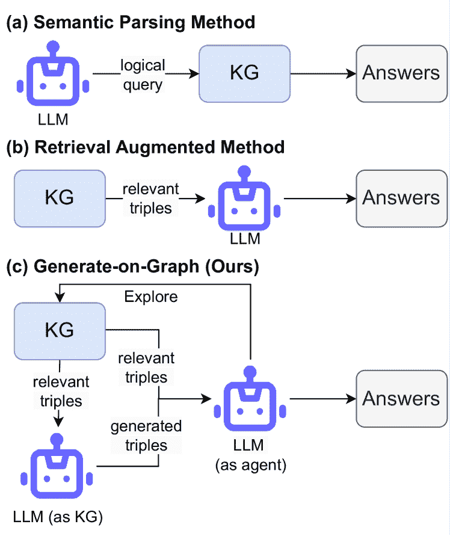

<!--yml
category: 未分类
date: 2025-01-11 12:41:59
-->

# Generate-on-Graph: Treat LLM as both Agent and KG for Incomplete Knowledge Graph Question Answering

> 来源：[https://arxiv.org/html/2404.14741/](https://arxiv.org/html/2404.14741/)

Yao Xu^(1,2), Shizhu He^(1,2) , Jiabei Chen^(1,2), Zihao Wang³, Yangqiu Song³,
Hanghang Tong⁴, Guang Liu⁵, Jun Zhao^(1,2), Kang Liu^(1,2)
¹ The Key Laboratory of Cognition and Decision Intelligence for Complex Systems,
Institute of Automation, Chinese Academy of Sciences
² School of Artificial Intelligence, University of Chinese Academy of Sciences
³ The Hong Kong University of Science and Technology
⁴ University of Illinois Urbana-Champaign
⁵ Beijing Academy of Artificial Intelligence
{yao.xu, jzhao, shizhu.he, kliu}@nlpr.ia.ac.cn, chenjiabei2024@ia.ac.cn   Corresponding Author

###### Abstract

To address the issues of insufficient knowledge and hallucination in Large Language Models (LLMs), numerous studies have explored integrating LLMs with Knowledge Graphs (KGs). However, these methods are typically evaluated on conventional Knowledge Graph Question Answering (KGQA) with complete KGs, where all factual triples required for each question are entirely covered by the given KG. In such cases, LLMs primarily act as an agent to find answer entities within the KG, rather than effectively integrating the internal knowledge of LLMs and external knowledge sources such as KGs. In fact, KGs are often incomplete to cover all the knowledge required to answer questions. To simulate these real-world scenarios and evaluate the ability of LLMs to integrate internal and external knowledge, we propose leveraging LLMs for QA under Incomplete Knowledge Graph (IKGQA), where the provided KG lacks some of the factual triples for each question, and construct corresponding datasets. To handle IKGQA, we propose a training-free method called Generate-on-Graph (GoG), which can generate new factual triples while exploring KGs. Specifically, GoG performs reasoning through a Thinking-Searching-Generating framework, which treats LLM as both Agent and KG in IKGQA. Experimental results on two datasets demonstrate that our GoG outperforms all previous methods.

## 1 Introduction

Figure 1: Comparison between three Question Answering tasks: (a) LLM only QA, (b) Knowledge Graph QA (KGQA), (c) Incomplete Knowledge Graph QA (IKGQA), where the triple (Cupertino, timezone, Pacific Standard Time) is missing. The yellow and red nodes represent topic and answer entity, respectively.

Large Language Models (LLMs) Brown et al. ([2020](https://arxiv.org/html/2404.14741v3#bib.bib4)); Bang et al. ([2023](https://arxiv.org/html/2404.14741v3#bib.bib2)) have made great success in various natural language processing (NLP) tasks. Benefiting from extensive model parameters and vast amounts of pre-training corpus, LLMs can solve complex reasoning tasks through prompting engineer and in-context learning Dong et al. ([2023](https://arxiv.org/html/2404.14741v3#bib.bib6)), without fine-tuning for specific tasks.

However, LLMs still suffer from insufficient knowledge and hallucination issues  Huang et al. ([2023](https://arxiv.org/html/2404.14741v3#bib.bib9)); Li et al. ([2023a](https://arxiv.org/html/2404.14741v3#bib.bib13)), as shown in Figure [1](https://arxiv.org/html/2404.14741v3#S1.F1 "Figure 1 ‣ 1 Introduction ‣ Generate-on-Graph: Treat LLM as both Agent and KG for Incomplete Knowledge Graph Question Answering") (a). To mitigate those issues, many methods that incorporate LLM with Knowledge Graphs (KGs) Ji et al. ([2021](https://arxiv.org/html/2404.14741v3#bib.bib10)) have been proposed Pan et al. ([2023](https://arxiv.org/html/2404.14741v3#bib.bib19)), where KGs provide accurate factual knowledge in triple format, while LLMs provide strong language processing and knowledge integration ability. These works can be roughly divided into two categories, as shown in Figure [2](https://arxiv.org/html/2404.14741v3#S1.F2 "Figure 2 ‣ 1 Introduction ‣ Generate-on-Graph: Treat LLM as both Agent and KG for Incomplete Knowledge Graph Question Answering"): (1) Semantic Parsing (SP) methods Li et al. ([2023c](https://arxiv.org/html/2404.14741v3#bib.bib15)); Luo et al. ([2024](https://arxiv.org/html/2404.14741v3#bib.bib17)), which use LLMs to convert natural language questions to logical queries, and then obtain answers by executing these logical queries on KGs. (2) Retrieval Augmented (RA) methods Li et al. ([2023d](https://arxiv.org/html/2404.14741v3#bib.bib16)), which retrieve information related to the question from KGs as external knowledge to guide LLMs to generate the answers.

Figure 2: Three paradigms for combining LLMs with KGs.

Semantic parsing methods exclusively treat LLMs as parser, which depend heavily on KGs’ quality and completeness Sun et al. ([2023](https://arxiv.org/html/2404.14741v3#bib.bib24)). Although retrieval augmented methods claim to solve the drawbacks of semantic parsing methods and obtain good performance on conventional Knowledge Graph Question Answering (KGQA) Yih et al. ([2016a](https://arxiv.org/html/2404.14741v3#bib.bib30)), it is still hard to verify whether they really integrate knowledge from KGs and LLMs. One crucial reason is that, in conventional KGQA tasks, the factual triples required for each question are entirely covered by the KG. For example, for the question "What is the timezone of the area where Apple headquarters is located?" in Figure [1](https://arxiv.org/html/2404.14741v3#S1.F1 "Figure 1 ‣ 1 Introduction ‣ Generate-on-Graph: Treat LLM as both Agent and KG for Incomplete Knowledge Graph Question Answering") (b), the LLMs only need to start from "Apple headquarters", sequentially choose the relation predicates "located_in" and "timezone" to find the answer. That means, in this scenario, LLMs only need to ground the relationship mentioned in the question to the specific relation predicates in the KG to reach the answer entity "Pacific Standard Time" without really integrating internal and external knowledge.

However, on the one hand, KGs are often incomplete to cover all the knowledge required to answer questions in real-world scenarios. For example, for the same question in Figure [1](https://arxiv.org/html/2404.14741v3#S1.F1 "Figure 1 ‣ 1 Introduction ‣ Generate-on-Graph: Treat LLM as both Agent and KG for Incomplete Knowledge Graph Question Answering") (c), the crucial triple (Cupertino, timezone, Pacific Standard Time) does not exist in the KG. On the other hand, LLMs contain rich knowledge content and possess powerful reasoning ability. For example, LLMs usually know the time zone of a city. This raises the research question: Can LLMs be combined with incomplete KGs to answer complex questions?

To answer this question, in this paper, we first propose a new benchmark, which utilizes LLMs for QA under incomplete KG (IKGQA), to simulate realistic scenarios. We construct the IKGQA datasets based on existing public KGQA datasets and simulate KGs with varying degrees of incompleteness by randomly dropping triples according to different probabilities. Unlike conventional KGQA, the corresponding KG in IKGQA does not encompass all the factual triplets required for each question. This means that semantic parsing methods may fail to retrieve the final answer even generating the correct SPARQL query ¹¹1Semantic parsing methods always parse ”timezone” into to ”timezone” rather than ”located_in -¿ timezone” because of the training set, more details can be found in Appendix [A](https://arxiv.org/html/2404.14741v3#A1 "Appendix A Semantic Parsing Methods Details ‣ Generate-on-Graph: Treat LLM as both Agent and KG for Incomplete Knowledge Graph Question Answering").. Besides, previous retrieval augmented methods also can’t perform well under incomplete KGs, as they still heavily rely on the retrieved paths, more details are in Appendix [B](https://arxiv.org/html/2404.14741v3#A2 "Appendix B Retrieval Augmented Methods Details ‣ Generate-on-Graph: Treat LLM as both Agent and KG for Incomplete Knowledge Graph Question Answering"). Compared to KGQA, IKGQA holds greater research significance for the following reasons: (1) It is closer to real-world scenarios where the given KG is incomplete to answer users’ questions. (2) It can better evaluate the ability of LLMs to integrate the internal and external knowledge.

We also propose a novel method called Generate-on-Graph (GoG) for IKGQA, as illustrated in Figure [2](https://arxiv.org/html/2404.14741v3#S1.F2 "Figure 2 ‣ 1 Introduction ‣ Generate-on-Graph: Treat LLM as both Agent and KG for Incomplete Knowledge Graph Question Answering") (c), which not only treats LLM as an agent exploring the given KGs to retrieve relevant triples, but also as a KG to generate additional factual triples for answering this question. Specifically, GoG adopts a Thinking-Searching-Generating framework, consisting of three main steps: (1) Thinking: LLMs decompose the question and determine whether to conduct further searches or generate relevant triples based on the current state. (2) Searching: LLMs use pre-defined tools, such as a KG engineer executing SPARQL queries, to explore the KGs and filter out irrelevant triples. (3) Generating: LLMs use its internal knowledge and reasoning abilities to generate required new factual triples based on the explored subgraph and verify them. GoG will repeat these steps until obtaining adequate information to answer the question. The codes and data are available at [https://github.com/YaooXu/GoG](https://github.com/YaooXu/GoG).

The main contributions of this paper can be summarized as follows:

1.  1.

    We propose leveraging LLMs for QA under incomplete KG (IKGQA) to better evaluate LLMs’ ability, and construct corresponding IKGQA datasets based on existing KGQA datasets.

2.  2.

    We propose Generate-on-Graph (GoG), which uses the Thinking-Searching-Generating framework, to address IKGQA.

3.  3.

    Experimental results on two datasets show the superiority of GoG, and demonstrate that LLMs can be combined with incomplete KGs to answer complex questions.

Figure 3: Comparison of three methods in solving IKGQA: (a) Semantic parsing based method (e.g., ChatKBQA Luo et al. ([2024](https://arxiv.org/html/2404.14741v3#bib.bib17))), (b) Path retrieval method (e.g., ToG Sun et al. ([2023](https://arxiv.org/html/2404.14741v3#bib.bib24))), (c) The proposed GoG with Thinking-Searching-Generating framework.

## 2 Related Work

Question Answering under Incomplete KG. Some previous works Saxena et al. ([2020](https://arxiv.org/html/2404.14741v3#bib.bib22)); Zan et al. ([2022](https://arxiv.org/html/2404.14741v3#bib.bib33)); Zhao et al. ([2022](https://arxiv.org/html/2404.14741v3#bib.bib34)); Guo et al. ([2023](https://arxiv.org/html/2404.14741v3#bib.bib8)) attempt to train KG embeddings to predict answers by similarity scores under incomplete KG. Compared to these previous KGE-based works, we propose leveraging LLMs for QA under incomplete KG to study whether LLMs can integrate internal and external knowledge well.

Unifying KGs and LLMs for KGQA. Various methods have been proposed to unify KGs and LLMs to solve KGQA, these methods can be classified into two categories: Semantic Parsing (SP) methods and Retrieval Augmented (RA) methods. SP methods transform the question into a structural query using LLMs. These queries can then be executed by a KG engine to derive answers based on KGs. These methods generate the drafts as preliminary logical forms first, and then bind the drafts to the executable ones with entity and relation binders, such as KB-BINDER Li et al. ([2023c](https://arxiv.org/html/2404.14741v3#bib.bib15)) and ChatKBQA Luo et al. ([2024](https://arxiv.org/html/2404.14741v3#bib.bib17)). However, the effectiveness of these methods relies heavily on the quality of the generated queries and the completeness of KGs. RA methods retrieve related information from KGs to improve the reasoning performance Li et al. ([2023b](https://arxiv.org/html/2404.14741v3#bib.bib14)). ToG Sun et al. ([2023](https://arxiv.org/html/2404.14741v3#bib.bib24)) treats the LLM as an agent to interactively explore relation paths step-by-step on KGs and perform reasoning based on the retrieved paths. RoG Luo et al. ([2023](https://arxiv.org/html/2404.14741v3#bib.bib18)) first generates relation paths as faithful plans, and then use them to retrieve valid reasoning paths from the KGs for LLMs to reason. Readi Cheng et al. ([2024](https://arxiv.org/html/2404.14741v3#bib.bib5)) generates a reasoning path and edit the path only when necessary. [Salnikov et al.](https://arxiv.org/html/2404.14741v3#bib.bib21) propose "generate-then-select" method that first uses LLMs to generate answers directly, and then constructs subgraphs and selects the subgraph most likely to contain the correct answer.

Our GoG belongs to retrieval augmented methods, we also utilize the knowledge modeling ability of LLMs, which is also similar to GAG Yu et al. ([2023](https://arxiv.org/html/2404.14741v3#bib.bib32)).

LLM reasoning with Prompting. Many works have been proposed to elicit the reasoning ability of LLMs to solve complex tasks through prompting Wei et al. ([2023](https://arxiv.org/html/2404.14741v3#bib.bib28)); Khot et al. ([2023](https://arxiv.org/html/2404.14741v3#bib.bib12)). Complex CoT Fu et al. ([2023](https://arxiv.org/html/2404.14741v3#bib.bib7)) creates and refines rationale examples with more reasoning steps to elicit better reasoning in LLMs. Self-Consistency Wang et al. ([2023](https://arxiv.org/html/2404.14741v3#bib.bib27)) fully explores various ways of reasoning to improve their performance on reasoning tasks. DecomP Khot et al. ([2023](https://arxiv.org/html/2404.14741v3#bib.bib12)) solves complex tasks by instead decomposing them into simpler sub-tasks and delegating these to sub-task specific LLMs. ReAct Yao et al. ([2023](https://arxiv.org/html/2404.14741v3#bib.bib29)) treats LLMs as agents that interact with the environment and make decisions to retrieve information from external source. GoG can be viewed as a fusion of ReAct and DecomP, thereby enabling a more comprehensive utilization of the diverse capabilities internal in LLMs for addressing complex questions.

## 3 Preliminary

In this section, we first introduce Knowledge Graphs (KGs). Then, we use symbols of KGs to describe relation path and Knowledge Graph Question Answering (KGQA).

Knowledge Graphs (KG) can be described as a set of inter-linked factual triples, i.e., $\mathcal{G}=\{(h,r,t)\in\mathcal{V}\times\mathcal{R}\times\mathcal{V}\}$, where $h,r\in\mathcal{V}$ denote the head and tail entity, $r\in\mathcal{R}$ represents the relation.

Knowledge Graph Question Answering (KGQA) is a reasoning task that aims to predict answer entities $e_{a}\in\mathcal{A}_{q}$ based on $\mathcal{G}$. Following previous work Sun et al. ([2019](https://arxiv.org/html/2404.14741v3#bib.bib23)), we call the entities mentioned in question $q$ as topic entities, denoted as $e_{t}\in\mathcal{T}_{q}$. Many datasets Talmor and Berant ([2018](https://arxiv.org/html/2404.14741v3#bib.bib25)); Yih et al. ([2016b](https://arxiv.org/html/2404.14741v3#bib.bib31)) give the standard SPARQL query of each question, which demonstrates a relation path from the topic entity $e_{t}$ to answer entity $e_{a}$. We call this path as gold relation path, denote it as $w_{g}=e_{q}\xrightarrow{r_{1}}e_{1}\xrightarrow{r_{2}}...\xrightarrow{r_{l}}e_% {a}$. For example, the gold relation path of the question in Figure [3](https://arxiv.org/html/2404.14741v3#S1.F3 "Figure 3 ‣ 1 Introduction ‣ Generate-on-Graph: Treat LLM as both Agent and KG for Incomplete Knowledge Graph Question Answering") is $w_{g}=Apple\;Inc\xrightarrow{headquarter}Cupertino\xrightarrow{timezone}% Pacific\;Standard\;Time$. In KGQA, $\forall i\in[1,l],\;(e_{i-1},r_{i},e_{i})\in\mathcal{G}$. That is, it is guaranteed that all triples in gold path are contained by $\mathcal{G}$.

## 4 Incomplete Knowledge Graph Question Answering (IKGQA)

### 4.1 Task Introduction

IKGQA differs from KGQA in that, in IKGQA, $\exists i\in[1,l],\;(e_{i-1},r_{i},e_{i})\notin\mathcal{G}$. That is, it doesn’t guarantee that all triples in gold path are contained by $\mathcal{G}$. For example, the triple (Cupertino, timezone, Pacific Standard Time) in $w_{g}$ may not be contained by $\mathcal{G}$. Therefore, models need to recall them from LLMs or reasoning from subgraph information.

### 4.2 Datasets Construction

At present, there are no IKGQA datasets readily available. In this paper, to promote relevant research, we construct two IKGQA datasets based on two widely used KGQA datasets: WebQuestionSP (WebQSP) Yih et al. ([2016b](https://arxiv.org/html/2404.14741v3#bib.bib31)) and Complex WebQuestion (CWQ) Talmor and Berant ([2018](https://arxiv.org/html/2404.14741v3#bib.bib25)). Both datasets use Freebase Bollacker et al. ([2008](https://arxiv.org/html/2404.14741v3#bib.bib3)) as their background KG. To simulate incomplete KGs, we randomly delete some crucial triples, which appear in the gold relation path, for each question from the original KG. By doing this, simple semantic parsing methods almost fail to obtain the correct answers. In order to save computational costs, we randomly select 1,000 samples of these two datasets for constructing IKGQA questions.

The process of generating crucial triples of a question is illustrated in Algorithm [1](https://arxiv.org/html/2404.14741v3#algorithm1 "Algorithm 1 ‣ 4.2 Datasets Construction ‣ 4 Incomplete Knowledge Graph Question Answering (IKGQA) ‣ Generate-on-Graph: Treat LLM as both Agent and KG for Incomplete Knowledge Graph Question Answering").

Input: SPARQL query $s_{q}$, KG $\mathcal{G}$, probability $p$Output: Dropped crucial triples list $L$12Initialize $L\leftarrow[]$, $filtered\_triples\leftarrow[]$;34$binding\_results$ $\leftarrow$ execute($s_{q}$, $\mathcal{G}$);56$all\_triples$ $\leftarrow$ convert($binding\_results$);78// Filter property node (e.g., height, text)9$filtered\_triples$ $\leftarrow$ filter($all\_triples$);1011for *each $t$ in $filtered\_triples$* do12       $r$ $\leftarrow$ generate_random_float();13       if *$r\leq p$* then14             $L$.add($t$)15       end if16      17 end for18Return $L$;19

Algorithm 1 Obtaining crucial triples of the question $q$

## 5 Generate-on-Graph (GoG)

In this section, we introduce our method Generate-on-Graph (GoG), which can integrate the knowledge of KGs and LLMs, as well as utilize the reasoning ability of LLMs. The workflow of GoG is illustrated in Figure [3](https://arxiv.org/html/2404.14741v3#S1.F3 "Figure 3 ‣ 1 Introduction ‣ Generate-on-Graph: Treat LLM as both Agent and KG for Incomplete Knowledge Graph Question Answering") (c). GoG utilizes the Thinking-Searching-Generating framework, which consists of three main steps: Thinking, Searching and Generating.

### 5.1 Thinking

Motivated by ReAct Yao et al. ([2023](https://arxiv.org/html/2404.14741v3#bib.bib29)), we consider the LLM as an agent interacting with an environment to solve tasks. GoG use the Thinking-Searching-Generating framework to answer questions. As shown in Figure [3](https://arxiv.org/html/2404.14741v3#S1.F3 "Figure 3 ‣ 1 Introduction ‣ Generate-on-Graph: Treat LLM as both Agent and KG for Incomplete Knowledge Graph Question Answering") (c), for each step $i$, GoG first generates a thought $t_{i}\in\mathcal{L}$, where $\mathcal{L}$ is the language space, to decompose the original question (Thought 1), decide which next sub-question should be solved (Thought 2) or determine whether it has adequate information to output the final answers (Thought 4). Then, based on the thought $t_{i}$, GoG generates an action $a_{i}\in\mathcal{A}$, where $\mathcal{A}$ is the action space, to search information from the KG (Action 1, 2) or generate more information by reasoning and internal knowledge (Action 3).

| Method | CWQ | WebQSP |
| w.o. Knowledge Graph |
| IO prompt | 37.6 | 63.3 |
| CoT | 38.8 | 62.2 |
| CoT+SC | 45.4 | 61.1 |
|  | CKG | IKG | CKG | IKG |
| w.t. Knowledge Graph / Fine-tuned |
| RoG Luo et al. ([2023](https://arxiv.org/html/2404.14741v3#bib.bib18)) | 66.1 | 54.2 | 88.6 | 78.2 |
| ChatKBQA Luo et al. ([2024](https://arxiv.org/html/2404.14741v3#bib.bib17)) | 76.5 | 39.3 | 78.1 | 49.5 |
| w.t. Knowledge Graph / Not-Training (GPT-3.5) |
| KB-BINDER Li et al. ([2023c](https://arxiv.org/html/2404.14741v3#bib.bib15)) | - | - | 50.7 | 38.4 |
| StructGPT Jiang et al. ([2023](https://arxiv.org/html/2404.14741v3#bib.bib11)) | - | - | 76.4 | 60.1 |
| ToG Sun et al. ([2023](https://arxiv.org/html/2404.14741v3#bib.bib24)) | 47.2 | 37.9 | 76.9 | 63.4 |
| GoG (Ours) | 55.7 | 44.3 | 78.7 | 66.6 |
| w.t. Knowledge Graph / Not-Training (GPT-4) |
| ToG Sun et al. ([2023](https://arxiv.org/html/2404.14741v3#bib.bib24)) | 71.0 | 56.1 | 80.3 | 71.8 |
| GoG (Ours) | 75.2 | 60.4 | 84.4 | 80.3 |

Table 1: The Hits@1 scores of different models over two datasets under different settings (%). CKG and IKG denote using complete and incomplete KG (IKG-40%), respectively. Results of the other baselines were re-run by us ²²2The evaluation strategy we use differs from that of ToG, which makes the performance of ToG vary from those reported. Further details are available in Appendix [D](https://arxiv.org/html/2404.14741v3#A4 "Appendix D Settings for Baselines ‣ Generate-on-Graph: Treat LLM as both Agent and KG for Incomplete Knowledge Graph Question Answering").. The boldface indicates the best result.

### 5.2 Searching

The search action is invoked by GoG in the form of $Search[e_{i}]$, where $e_{i}$ is the target entity, as illustrated in Action 1 and 2 in Figure [3](https://arxiv.org/html/2404.14741v3#S1.F3 "Figure 3 ‣ 1 Introduction ‣ Generate-on-Graph: Treat LLM as both Agent and KG for Incomplete Knowledge Graph Question Answering") (c). While it is possible to search multiple target entities, like $Search[e_{i}^{1},e_{i}^{2},\ldots]$, for simplicity, we only consider searching for one target entity here. This action aims to find the most relevant top-k entities $E_{i}$ from the neighboring entities of the target entity $e_{i}$ based on the last thought $t_{i}$. The search action consists of two steps: Exploring and Filtering.

*   •

    Exploring GoG first uses predefined SPARQL queries to obtain all the relations $R_{i}$ linked to the target entity $e_{i}$. For example, in Figure [3](https://arxiv.org/html/2404.14741v3#S1.F3 "Figure 3 ‣ 1 Introduction ‣ Generate-on-Graph: Treat LLM as both Agent and KG for Incomplete Knowledge Graph Question Answering") (c), $e_{1}$={Apple Inc} $R_{1}$={founder, headquarter, CEO}.

*   •

    Filtering After retrieving the relation set $R_{i}$, LLMs are utilized to select the most relevant top-N relations $R^{\prime}_{i}$ based on the last thought $t_{i}$. The prompt used for this step is detailed in Appendix [C](https://arxiv.org/html/2404.14741v3#A3 "Appendix C Prompt List ‣ Generate-on-Graph: Treat LLM as both Agent and KG for Incomplete Knowledge Graph Question Answering"). In the case of Figure [3](https://arxiv.org/html/2404.14741v3#S1.F3 "Figure 3 ‣ 1 Introduction ‣ Generate-on-Graph: Treat LLM as both Agent and KG for Incomplete Knowledge Graph Question Answering") (c), LLMs select $R^{\prime}_{1}$={headquarter} from $R_{1}$={founder, headquarter, CEO} to answer the thought $t_{1}$ "I need to find out where is the Apple’s headquarters".

Finally, we obtain the most relevant entity set $E_{i}$ based on the target entity $e_{t}$ and the relevant relation set $R^{\prime}_{i}$. As shown in Figure [3](https://arxiv.org/html/2404.14741v3#S1.F3 "Figure 3 ‣ 1 Introduction ‣ Generate-on-Graph: Treat LLM as both Agent and KG for Incomplete Knowledge Graph Question Answering") (c), the Observation in step one is {(Apple Inc, headquarter, Cupertino)}, which is attached to the context to enable GoG to generate the next thought.

### 5.3 Generating

When there is no direct answer from previous Observation, the Generate Action is invoked by GoG in the form of $Generate[t_{i}]$, where $t_{i}$ is the last thought, as illustrated in Action 3 in Figure [3](https://arxiv.org/html/2404.14741v3#S1.F3 "Figure 3 ‣ 1 Introduction ‣ Generate-on-Graph: Treat LLM as both Agent and KG for Incomplete Knowledge Graph Question Answering") (c). This action tries to utilize the LLM to generate new factual triples based on retrieval information and internal knowledge. There are three steps in each Generate Action: choosing, generating and verifying.

*   •

    Choosing To provide LLMs some relevant information to generate more accurate triples, we use BM25 Robertson and Zaragoza ([2009](https://arxiv.org/html/2404.14741v3#bib.bib20)) to retrieve the most relevant triples from previous Observation. For example, in the Action 3 in Figure [3](https://arxiv.org/html/2404.14741v3#S1.F3 "Figure 3 ‣ 1 Introduction ‣ Generate-on-Graph: Treat LLM as both Agent and KG for Incomplete Knowledge Graph Question Answering") (c), we choose {(Cupertino, located_in, California), (Cupertino, adjoin, Palo Alto)} from Observation 1 and 2 as the relevant triples used in LLM generating new triples.

*   •

    Generating After retrieving relevant triples, LLMs are utilized to generate new factual triples based on these relevant triples and their internal knowledge. The generating process will be repeated $n$ times to minimize error and hallucination. As shown in Action 3 of Figure [3](https://arxiv.org/html/2404.14741v3#S1.F3 "Figure 3 ‣ 1 Introduction ‣ Generate-on-Graph: Treat LLM as both Agent and KG for Incomplete Knowledge Graph Question Answering") (c), given relevant triples, LLMs generate {(Cupertino, timezone, Pacific Standard Time)} in generated $t_{1}$.

*   •

    Verifying In the end, we use LLMs to verify the generated triples and choose those are more likely to be accurate as the Observation, the prompt used here is shown in Appendix [C](https://arxiv.org/html/2404.14741v3#A3 "Appendix C Prompt List ‣ Generate-on-Graph: Treat LLM as both Agent and KG for Incomplete Knowledge Graph Question Answering"). As shown in Observation 3 of Figure [3](https://arxiv.org/html/2404.14741v3#S1.F3 "Figure 3 ‣ 1 Introduction ‣ Generate-on-Graph: Treat LLM as both Agent and KG for Incomplete Knowledge Graph Question Answering") (c), LLMs only remain {(Cupertino, timezone, Pacific Standard Time)} from all generated triples.

It is also possible for the LLMs to generate an entity that is not explored before. Therefore, we have to link the entity to its corresponding Machine Identifier (MID) in the KG. This entity linking process is divided into two steps: (1) We retrieve some similar entities and their corresponding types based BM25 scores. (2) We utilize the LLM to select the most relevant entity based on the types, the prompt we use is demonstrated in Appendix [C](https://arxiv.org/html/2404.14741v3#A3 "Appendix C Prompt List ‣ Generate-on-Graph: Treat LLM as both Agent and KG for Incomplete Knowledge Graph Question Answering").

GoG repeats the above three steps until it obtains adequate information, and then outputs the final answer in the form of $Finish[e_{a}]$, where $e_{a}$ represents the answer entity. It should be noticed that the agent could also generate "$Finish[unknown]"$, which means that there is not enough information for the agent to answer the question. In this case, we would roll back and search one more hop neighbors of the last target entity.

| Method | CWQ |
| CKG | IKG-20% | IKG-40% | IKG-60% | IKG-80% |
| ToG | 47.2 | 40.5 | 37.9 | 33.7 | 31.4 |
| GoG | 55.7 | 44.9 | 44.3 | 36.2 | 34.4 |
|  | WebQSP |
|  | CKG | IKG-20% | IKG-40% | IKG-60% | IKG-80% |
| StructGPT | 76.0 | 67.8 | 60.1 | 51.7 | 43.7 |
| ToG | 76.9 | 70.3 | 61.4 | 60.6 | 55.9 |
| GoG | 78.7 | 70.8 | 66.6 | 62.6 | 56.5 |

Table 2: The Hits@1 scores of prompt based methods (w/ GPT-3.5) under different numbers of missing triples (%). CKG represents using the complete KG. IKG-20%/40%/60%/80% represent randomly drop 20%/40%/60%/80% crucial triples for each question.

 | Method | CWQ |
| CKG | IKG-40% | NKG |
| GoG w/GPT-3.5 | 55.7 | 44.3 | 38.8 |
| GoG w/Qwen-1.5 | 63.3 | 49.2 | 47.0 |
| GoG w/Llama-3 | 59.6 | 54.6 | 54.0 |
| GoG w/GPT-4 | 75.2 | 60.4 | 55.6 |
|  | WebQSP |
|  | CKG | IKG-40% | NKG |
| GoG w/GPT-3.5 | 78.7 | 66.6 | 62.6 |
| GoG w/Qwen-1.5 | 77.9 | 70.2 | 65.1 |
| GoG w/Llama-3 | 77.4 | 74.4 | 70.8 |
| GoG w/GPT-4 | 84.4 | 80.3 | 75.7 | 

Table 3: The Hits@1 scores of GoG using different backbone models (%). CKG, IKG-40% and NKG denote using complete, incomplete and no KG. Qwen-1.5 and Llama-3 represent Qwen-1.5-72b-chat and Llama-3-70b-Instruct, respectively.

## 6 Experiments

### 6.1 Experiments Setup

#### Evaluation Metrics

Following previous works Li et al. ([2023d](https://arxiv.org/html/2404.14741v3#bib.bib16)); Jiang et al. ([2023](https://arxiv.org/html/2404.14741v3#bib.bib11)); Sun et al. ([2023](https://arxiv.org/html/2404.14741v3#bib.bib24)), we use Hits@1 as our evaluation metric, which measures the proportion of questions whose top-1 predicted answer is correct.

#### Baselines

The baselines we compare can be divided into three groups: (1) LLM only methods, including standard prompting (IO prompt) Brown et al. ([2020](https://arxiv.org/html/2404.14741v3#bib.bib4)), Chain-of-Thought (CoT) prompting Wei et al. ([2023](https://arxiv.org/html/2404.14741v3#bib.bib28)) and Self-Consistency (SC) Wang et al. ([2023](https://arxiv.org/html/2404.14741v3#bib.bib27)). (2) Semantic Parsing (SP) methods, including KB-BINDER Li et al. ([2023c](https://arxiv.org/html/2404.14741v3#bib.bib15)) and ChatKBQA Luo et al. ([2024](https://arxiv.org/html/2404.14741v3#bib.bib17)). (3) Retrieval Augmented (RA) methods, including StructGPT Jiang et al. ([2023](https://arxiv.org/html/2404.14741v3#bib.bib11)), RoG Luo et al. ([2023](https://arxiv.org/html/2404.14741v3#bib.bib18)) and ToG Sun et al. ([2023](https://arxiv.org/html/2404.14741v3#bib.bib24)), where RoG is the SOTA among all models requiring fine-tuning.

#### Experiment Details

We use four LLMs as the backbone in our experiments: GPT-3.5, GPT-4, Qwen-1.5-72B-Chat Bai et al. ([2023](https://arxiv.org/html/2404.14741v3#bib.bib1)) and LLaMA-3-70B-Instruct Touvron et al. ([2023](https://arxiv.org/html/2404.14741v3#bib.bib26)). We use OpenAI API to call GPT-3.5 and GPT-4 ³³3The specific versions of GPT-3.5 and GPT-4 are gpt-3.5-turbo-0613 and gpt-4-0613.. The maximum token length for each generation is set to 256\. The temperature parameter is set to 0.7\. We use 3 shots in GoG prompts for all the datasets. The prompts we use are listed in Appendix [C](https://arxiv.org/html/2404.14741v3#A3 "Appendix C Prompt List ‣ Generate-on-Graph: Treat LLM as both Agent and KG for Incomplete Knowledge Graph Question Answering").

#### Datasets Details

For each dataset, we generate four incomplete KGs with varying degrees of completeness: IKG-20%/40%/60%/80%, representing randomly drop 20%/40%/60%/80% crucial triples for each question. In addition to the crucial triples themselves, all relations between these two entities will also be deleted. The statistics of these IKGs can be found in Appendix [E](https://arxiv.org/html/2404.14741v3#A5 "Appendix E Statistics of Topic Entities in IKGs ‣ Generate-on-Graph: Treat LLM as both Agent and KG for Incomplete Knowledge Graph Question Answering").

### 6.2 Main Results

Table [2](https://arxiv.org/html/2404.14741v3#footnotex2 "Footnote 2 ‣ Table 1 ‣ 5.1 Thinking ‣ 5 Generate-on-Graph (GoG) ‣ Generate-on-Graph: Treat LLM as both Agent and KG for Incomplete Knowledge Graph Question Answering") shows the Hits@1 scores of GoG and all baselines on two datasets under different settings. From the table, we can find that, compared with other prompt based methods, GoG can achieve the state-of-the-art performance on CWQ and WebQSP under both complete and incomplete KG settings.

Under the CKG setting, the main reasons our GoG outperforms ToG are: (1) GoG decompose the problem into sub-problems each step and focuses on the information needed for each sub-problem during the search process, whereas ToG lacks overall planning, making it prone to repetitive exploration or getting lost during the search. (2) GoG adopts a dynamic subgraph expansion search strategy, while ToG only explores some paths. Therefore, the relevant information obtained in GoG is richer. Moreover, this strategy can better handle compound value types (CVTs), as detailed in Appendix [F](https://arxiv.org/html/2404.14741v3#A6 "Appendix F Compound Value Type (CVT) node ‣ Generate-on-Graph: Treat LLM as both Agent and KG for Incomplete Knowledge Graph Question Answering"). A case study is shown in Appendix [H.1](https://arxiv.org/html/2404.14741v3#A8.SS1 "H.1 Comparison between ToG and GoG under CKG setting ‣ Appendix H Case Study ‣ Generate-on-Graph: Treat LLM as both Agent and KG for Incomplete Knowledge Graph Question Answering").

Under the IKG setting, the performance of SP methods significantly declines. This is expected, as these SP methods don’t interact with the KGs, which means they have no idea of the absence of some triples. The performance of ToG and StructGPT on IKG is even worse than that without KG, indicating that these methods still play a role of finding answers rather than effectively integrating internal and external knowledge sources. Our GoG mitigates this issue by using the Generate Action, which utilizes the LLM to generate new factual triples when no direct answer is found. A case study illustrating this is provided in Appendix [H.2](https://arxiv.org/html/2404.14741v3#A8.SS2 "H.2 Comparison between ToG and GoG under IKG setting ‣ Appendix H Case Study ‣ Generate-on-Graph: Treat LLM as both Agent and KG for Incomplete Knowledge Graph Question Answering"), and a detailed analysis of the answers generated by GoG can be found in Appendix [G](https://arxiv.org/html/2404.14741v3#A7 "Appendix G Result Analysis ‣ Generate-on-Graph: Treat LLM as both Agent and KG for Incomplete Knowledge Graph Question Answering").

Figure 4: The Hits@1 scores of GoG with different number of related triples in the Generate Action on the CWQ (a) and WebQSP (b) (%). The backbone LLM is Qwen-1.5-72b-chat.

### 6.3 Performance under Different Degrees of KG Incompleteness

To investigate how different degrees of KG incompleteness affect different methods, we evaluate the performance of methods (w/ GPT-3.5) under KGs with varying degrees of incompleteness, the results are demonstrated in Table [2](https://arxiv.org/html/2404.14741v3#S5.T2 "Table 2 ‣ 5.3 Generating ‣ 5 Generate-on-Graph (GoG) ‣ Generate-on-Graph: Treat LLM as both Agent and KG for Incomplete Knowledge Graph Question Answering").

It can be found that our GoG outperforms other prompt based methods in different degrees of incompleteness. Especially on the CWQ dataset, our GoG has a significant improvement on Hits@1 score, achieving average 5.0% improvement. That emphasizes the importance of integrate the external and internal knowledge of LLMs under incomplete KGs. On the contrary, the performance of ToG on IKG-40% is even lower than that without KG, indicating the performance of ToG still depends heavily on the completeness of KGs.

Even though the majority of questions in the WebQSP dataset are single-hop questions, GoG still outperforms ToG and StructGPT. This is because GoG can leverage the neighboring information of the topic entities to predict the tail entities while other methods can not make full use these information, a case study is shown in Appendix [H.2](https://arxiv.org/html/2404.14741v3#A8.SS2 "H.2 Comparison between ToG and GoG under IKG setting ‣ Appendix H Case Study ‣ Generate-on-Graph: Treat LLM as both Agent and KG for Incomplete Knowledge Graph Question Answering").

### 6.4 Performance with Different LLMs

We evaluate how different backbone models affect GoG performance. Table [3](https://arxiv.org/html/2404.14741v3#S5.T3 "Table 3 ‣ 5.3 Generating ‣ 5 Generate-on-Graph (GoG) ‣ Generate-on-Graph: Treat LLM as both Agent and KG for Incomplete Knowledge Graph Question Answering") demonstrates that the performance of GoG using GPT-4 as backbone improves significantly. Especially under complete KGs setting, GoG (w/GPT-4) achieves 84.4 and 75.2 Hits@1 score on the WebQSP and CWQ datasets respectively, which achieve SOTA performance in prompt based methods and outperforms most fine-tuned methods.

Additionally, we observe that under the NKG setting, Llama-3 consistently outperforms Qwen-1.5, whereas under the CKG setting, the opposite is true. This suggests that the proficiency of LLM as a KG and as an agent is not entirely equivalent. Exploring how different LLMs can leverage their strengths in playing specific roles could be a direction for future research.

 | Method | CWQ |
| CKG | IKG-40% |
| GoG w.o. Generate | 62.7 | 48.6 |
| GoG w.t. Generate | 63.3 | 50.6 |
|  | WebQSP |
|  | CKG | IKG-40% |
| GoG w.o. Generate | 74.7 | 69.4 |
| GoG w.t. Generate | 77.9 | 71.1 | 

Table 4: The Hits@1 scores of GoG w.t./w.o. Generate Action (%).

### 6.5 Ablation Study

The Effect of the Number of Related Triples

We perform additional experiments to find out how the number of related triples effect GoG’s performance. We select the top-k relevant triples based on BM25, as shown in Figure [4](https://arxiv.org/html/2404.14741v3#S6.F4 "Figure 4 ‣ 6.2 Main Results ‣ 6 Experiments ‣ Generate-on-Graph: Treat LLM as both Agent and KG for Incomplete Knowledge Graph Question Answering"). The results indicate that: (1) GoG’s performance significantly improves with relevant subgraphs, likely because these subgraphs activate LLMs’ memory to generate more accurate triples and enable reasoning of new factual triples based on these subgraphs. (2) In most cases, performance initially increases and then decreases as the number of related triples grows. This decline is mainly due to the introduction of noisy and unrelated knowledge.

The Effect of Generate Action

We investigate the effect of the Generate Action, as shown in Figure [4](https://arxiv.org/html/2404.14741v3#S6.T4 "Table 4 ‣ 6.4 Performance with Different LLMs ‣ 6 Experiments ‣ Generate-on-Graph: Treat LLM as both Agent and KG for Incomplete Knowledge Graph Question Answering"). GoG’s performance is lower without Generate Action, confirming the effectiveness of Generate Action. However, GoG without Generate Action still achieves competitive results because it becomes a pure exploring agent, leading to two outcomes: (1) No false negatives, as all answers come from KGs, and (2) It thoroughly searches KGs for answers, whereas GoG with Generate Action may determine to invoke Generate Action instead of continuing the search.

## 7 Conclusion

In this paper, we propose leveraging LLMs for QA under Incomplete KGs (IKGQA), and construct relevant datasets. We propose Generate-on-Graph (GoG), which can effectively integrate the external and internal knowledge of LLMs. Experiments on two datasets show the superiority of GoG, and demonstrate that an LLMs can be combined with incomplete KGs to answer complex questions.

## Limitation

The limitations of our proposed GoG are as follows: (1) It is possible for LLM to hallucinate in the Generate Action, which is unavoidable for existing LLMs. (2) There is room for further improvement in performance, as GoG’s performance is lower than that with CoT prompt when KGs are very incomplete.

## Ethics Statement

This paper proposes a method for complex question answering in incomplete knowledge graph, and the experiments are conducted on public available datasets. As a result, there is no data privacy concern. Meanwhile, this paper does not involve human annotations, and there are no related ethical concerns.

## Acknowledgment

This work was supported by Beijing Natural Science Foundation (L243006) and the National Natural Science Foundation of China (No.62376270). This work was supported by the Youth Innovation Promotion Association CAS.

## References

*   Bai et al. (2023) Jinze Bai, Shuai Bai, Yunfei Chu, Zeyu Cui, Kai Dang, Xiaodong Deng, Yang Fan, Wenbin Ge, Yu Han, Fei Huang, et al. 2023. Qwen technical report. *arXiv preprint arXiv:2309.16609*.
*   Bang et al. (2023) Yejin Bang, Samuel Cahyawijaya, Nayeon Lee, Wenliang Dai, Dan Su, Bryan Wilie, Holy Lovenia, Ziwei Ji, Tiezheng Yu, Willy Chung, Quyet V. Do, Yan Xu, and Pascale Fung. 2023. [A Multitask, Multilingual, Multimodal Evaluation of ChatGPT on Reasoning, Hallucination, and Interactivity](https://doi.org/10.48550/arXiv.2302.04023). ArXiv:2302.04023 [cs].
*   Bollacker et al. (2008) Kurt Bollacker, Colin Evans, Praveen Paritosh, Tim Sturge, and Jamie Taylor. 2008. Freebase: a collaboratively created graph database for structuring human knowledge. In *Proceedings of the 2008 ACM SIGMOD international conference on Management of data*, pages 1247–1250.
*   Brown et al. (2020) Tom B. Brown, Benjamin Mann, Nick Ryder, Melanie Subbiah, Jared Kaplan, Prafulla Dhariwal, Arvind Neelakantan, Pranav Shyam, Girish Sastry, Amanda Askell, Sandhini Agarwal, Ariel Herbert-Voss, Gretchen Krueger, Tom Henighan, Rewon Child, Aditya Ramesh, Daniel M. Ziegler, Jeffrey Wu, Clemens Winter, Christopher Hesse, Mark Chen, Eric Sigler, Mateusz Litwin, Scott Gray, Benjamin Chess, Jack Clark, Christopher Berner, Sam McCandlish, Alec Radford, Ilya Sutskever, and Dario Amodei. 2020. [Language Models are Few-Shot Learners](https://doi.org/10.48550/arXiv.2005.14165). ArXiv:2005.14165 [cs].
*   Cheng et al. (2024) Sitao Cheng, Ziyuan Zhuang, Yong Xu, Fangkai Yang, Chaoyun Zhang, Xiaoting Qin, Xiang Huang, Ling Chen, Qingwei Lin, Dongmei Zhang, Saravan Rajmohan, and Qi Zhang. 2024. [Call me when necessary: LLMs can efficiently and faithfully reason over structured environments](http://arxiv.org/abs/2403.08593).
*   Dong et al. (2023) Qingxiu Dong, Lei Li, Damai Dai, Ce Zheng, Zhiyong Wu, Baobao Chang, Xu Sun, Jingjing Xu, Lei Li, and Zhifang Sui. 2023. [A Survey on In-context Learning](https://doi.org/10.48550/arXiv.2301.00234). ArXiv:2301.00234 [cs].
*   Fu et al. (2023) Yao Fu, Hao Peng, Ashish Sabharwal, Peter Clark, and Tushar Khot. 2023. [Complexity-Based Prompting for Multi-Step Reasoning](http://arxiv.org/abs/2210.00720). ArXiv:2210.00720 [cs].
*   Guo et al. (2023) Qimeng Guo, Xue Wang, Zhenfang Zhu, Peiyu Liu, and Liancheng Xu. 2023. A knowledge inference model for question answering on an incomplete knowledge graph. *Applied Intelligence*, 53(7):7634–7646.
*   Huang et al. (2023) Lei Huang, Weijiang Yu, Weitao Ma, Weihong Zhong, Zhangyin Feng, Haotian Wang, Qianglong Chen, Weihua Peng, Xiaocheng Feng, Bing Qin, and Ting Liu. 2023. [A Survey on Hallucination in Large Language Models: Principles, Taxonomy, Challenges, and Open Questions](http://arxiv.org/abs/2311.05232). ArXiv:2311.05232 [cs].
*   Ji et al. (2021) Shaoxiong Ji, Shirui Pan, Erik Cambria, Pekka Marttinen, and Philip S. Yu. 2021. [A Survey on Knowledge Graphs: Representation, Acquisition and Applications](http://arxiv.org/abs/2002.00388). *arXiv:2002.00388 [cs]*. ArXiv: 2002.00388.
*   Jiang et al. (2023) Jinhao Jiang, Kun Zhou, Zican Dong, Keming Ye, Wayne Xin Zhao, and Ji-Rong Wen. 2023. [StructGPT: A General Framework for Large Language Model to Reason over Structured Data](http://arxiv.org/abs/2305.09645). In *EMNLP 2023*. arXiv. ArXiv:2305.09645 [cs].
*   Khot et al. (2023) Tushar Khot, Harsh Trivedi, Matthew Finlayson, Yao Fu, Kyle Richardson, Peter Clark, and Ashish Sabharwal. 2023. [Decomposed Prompting: A Modular Approach for Solving Complex Tasks](http://arxiv.org/abs/2210.02406). In *NIPS 2023*. arXiv. ArXiv:2210.02406 [cs].
*   Li et al. (2023a) Junyi Li, Xiaoxue Cheng, Wayne Xin Zhao, Jian-Yun Nie, and Ji-Rong Wen. 2023a. [HaluEval: A Large-Scale Hallucination Evaluation Benchmark for Large Language Models](http://arxiv.org/abs/2305.11747). ArXiv:2305.11747 [cs].
*   Li et al. (2023b) Shiyang Li, Yifan Gao, Haoming Jiang, Qingyu Yin, Zheng Li, Xifeng Yan, Chao Zhang, and Bing Yin. 2023b. [Graph Reasoning for Question Answering with Triplet Retrieval](http://arxiv.org/abs/2305.18742). ArXiv:2305.18742 [cs].
*   Li et al. (2023c) Tianle Li, Xueguang Ma, Alex Zhuang, Yu Gu, Yu Su, and Wenhu Chen. 2023c. [Few-shot In-context Learning on Knowledge Base Question Answering](https://doi.org/10.18653/v1/2023.acl-long.385). In *ACL 2023*, pages 6966–6980, Toronto, Canada. Association for Computational Linguistics.
*   Li et al. (2023d) Xingxuan Li, Ruochen Zhao, Yew Ken Chia, Bosheng Ding, Shafiq Joty, Soujanya Poria, and Lidong Bing. 2023d. [Chain-of-Knowledge: Grounding Large Language Models via Dynamic Knowledge Adapting over Heterogeneous Sources](http://arxiv.org/abs/2305.13269). ArXiv:2305.13269 [cs].
*   Luo et al. (2024) Haoran Luo, Zichen Tang, Shiyao Peng, Yikai Guo, Wentai Zhang, Chenghao Ma, Guanting Dong, Meina Song, Wei Lin, et al. 2024. Chatkbqa: A generate-then-retrieve framework for knowledge base question answering with fine-tuned large language models. *arXiv preprint arXiv:2310.08975*.
*   Luo et al. (2023) Linhao Luo, Yuan-Fang Li, Gholamreza Haffari, and Shirui Pan. 2023. [Reasoning on Graphs: Faithful and Interpretable Large Language Model Reasoning](http://arxiv.org/abs/2310.01061). ArXiv:2310.01061 [cs].
*   Pan et al. (2023) Shirui Pan, Linhao Luo, Yufei Wang, Chen Chen, Jiapu Wang, and Xindong Wu. 2023. [Unifying Large Language Models and Knowledge Graphs: A Roadmap](https://doi.org/10.48550/arXiv.2306.08302). ArXiv:2306.08302 [cs].
*   Robertson and Zaragoza (2009) Stephen Robertson and Hugo Zaragoza. 2009. [The probabilistic relevance framework: Bm25 and beyond](https://doi.org/10.1561/1500000019). *Found. Trends Inf. Retr.*, 3(4):333–389.
*   Salnikov et al. (2023) Mikhail Salnikov, Hai Le, Prateek Rajput, Irina Nikishina, Pavel Braslavski, Valentin Malykh, and Alexander Panchenko. 2023. Large language models meet knowledge graphs to answer factoid questions. *arXiv preprint arXiv:2310.02166*.
*   Saxena et al. (2020) Apoorv Saxena, Aditay Tripathi, and Partha Talukdar. 2020. Improving multi-hop question answering over knowledge graphs using knowledge base embeddings. In *Proceedings of the 58th annual meeting of the association for computational linguistics*, pages 4498–4507.
*   Sun et al. (2019) Haitian Sun, Tania Bedrax-Weiss, and William W Cohen. 2019. Pullnet: Open domain question answering with iterative retrieval on knowledge bases and text. *arXiv preprint arXiv:1904.09537*.
*   Sun et al. (2023) Jiashuo Sun, Chengjin Xu, Lumingyuan Tang, Saizhuo Wang, Chen Lin, Yeyun Gong, Lionel M. Ni, Heung-Yeung Shum, and Jian Guo. 2023. [Think-on-Graph: Deep and Responsible Reasoning of Large Language Model on Knowledge Graph](https://doi.org/10.48550/arXiv.2307.07697). ArXiv:2307.07697 [cs].
*   Talmor and Berant (2018) Alon Talmor and Jonathan Berant. 2018. The web as a knowledge-base for answering complex questions. *arXiv preprint arXiv:1803.06643*.
*   Touvron et al. (2023) Hugo Touvron, Louis Martin, Kevin Stone, Peter Albert, Amjad Almahairi, Yasmine Babaei, Nikolay Bashlykov, Soumya Batra, Prajjwal Bhargava, Shruti Bhosale, et al. 2023. Llama 2: Open foundation and fine-tuned chat models. *arXiv preprint arXiv:2307.09288*.
*   Wang et al. (2023) Xuezhi Wang, Jason Wei, Dale Schuurmans, Quoc Le, Ed Chi, Sharan Narang, Aakanksha Chowdhery, and Denny Zhou. 2023. [Self-Consistency Improves Chain of Thought Reasoning in Language Models](https://doi.org/10.48550/arXiv.2203.11171). ArXiv:2203.11171 [cs].
*   Wei et al. (2023) Jason Wei, Xuezhi Wang, Dale Schuurmans, Maarten Bosma, Brian Ichter, Fei Xia, Ed Chi, Quoc Le, and Denny Zhou. 2023. [Chain-of-Thought Prompting Elicits Reasoning in Large Language Models](https://doi.org/10.48550/arXiv.2201.11903). ArXiv:2201.11903 [cs].
*   Yao et al. (2023) Shunyu Yao, Jeffrey Zhao, Dian Yu, Nan Du, Izhak Shafran, Karthik Narasimhan, and Yuan Cao. 2023. [ReAct: Synergizing Reasoning and Acting in Language Models](http://arxiv.org/abs/2210.03629). ArXiv:2210.03629 [cs].
*   Yih et al. (2016a) Wen-tau Yih, Matthew Richardson, Christopher Meek, Ming-Wei Chang, and Jina Suh. 2016a. The value of semantic parse labeling for knowledge base question answering. In *Proceedings of the 54th Annual Meeting of the Association for Computational Linguistics (Volume 2: Short Papers)*, pages 201–206.
*   Yih et al. (2016b) Wen-tau Yih, Matthew Richardson, Christopher Meek, Ming-Wei Chang, and Jina Suh. 2016b. The value of semantic parse labeling for knowledge base question answering. In *Proceedings of the 54th Annual Meeting of the Association for Computational Linguistics (Volume 2: Short Papers)*, pages 201–206.
*   Yu et al. (2023) Wenhao Yu, Dan Iter, Shuohang Wang, Yichong Xu, Mingxuan Ju, Soumya Sanyal, Chenguang Zhu, Michael Zeng, and Meng Jiang. 2023. [Generate rather than retrieve: Large language models are strong context generators](https://doi.org/10.48550/arXiv.2209.10063).
*   Zan et al. (2022) Daoguang Zan, Sirui Wang, Hongzhi Zhang, Kun Zhou, Wei Wu, Wayne Xin Zhao, Bingchao Wu, Bei Guan, and Yongji Wang. 2022. Complex question answering over incomplete knowledge graph as n-ary link prediction. In *2022 International Joint Conference on Neural Networks (IJCNN)*, pages 1–8\. IEEE.
*   Zhao et al. (2022) Fen Zhao, Yinguo Li, Jie Hou, and Ling Bai. 2022. Improving question answering over incomplete knowledge graphs with relation prediction. *Neural Computing and Applications*, pages 1–18.

{tblr}

[t] width = 0.9colspec = Q[104]Q[837], cell12 = fg=MineShaft, cell21 = fg=MineShaft, vline2 = -, hline1-3 = -, Question & In the nation that spends the Bahamian dollar as currency, what time zone is used?
SPARQL PREFIX ns: <http://rdf.freebase.com/ns/>
SELECT DISTINCT ?x WHERE {
  FILTER (?x != ?c) FILTER (!isLiteral(?x) OR lang(?x) = ” OR langMatches(lang(?x), ’en’))
  ?c ns:location.country.currency_used ns:m.01l6dm .
  ?c ns:location.location.time_zones ?x .
}

Table 5: An example about "timezone" in the CWQ dataset.

## Appendix A Semantic Parsing Methods Details

The training datasets for SP methods are constructed under the complete KGs, which means that "Time Zone" corresponds directly to the relation "ns:location.location.time_zones" rather than a two-hop path "ns:location.located_in -> ns:location.location.time_zones". An example in CWQ is shown in Table [5](https://arxiv.org/html/2404.14741v3#A0.T5 "Table 5 ‣ Generate-on-Graph: Treat LLM as both Agent and KG for Incomplete Knowledge Graph Question Answering"). This means SP models trained on CWQ will always output "?c ns:location.location.time_zones ?x" instead of "?c ns:location.located_in ?y . ?y ns:location.location.time_zones ?x". Therefore, these methods will fail under Incomplete KGs. In another word, semantic parsing methods don’t interact with the KGs, which means they have no idea of the absence of some triples.

## Appendix B Retrieval Augmented Methods Details

The RA method retrieves relevant paths from the knowledge graph (KG) and uses these paths as context for the large language model (LLM) to generate answers. For instance, ToG employs an LLM to explore the KG, using beam search to select paths related to the question. However, analysis of ToG’s results reveals that approximately 70% of the correct answers come directly from the explored paths, and less than 10% of the correct answers are derived from a combination of the explored path knowledge and the internal knowledge of the LLM. Subsequent experimental results also indicate that under the IKG setting, ToG’s performance is even inferior to that of using the LLM alone. This further demonstrates that such methods do not truly integrate the internal of LLMs and external knowledge of KGs.

## Appendix C Prompt List

The prompts used in GoG are shown in Table [9](https://arxiv.org/html/2404.14741v3#A7.T9 "Table 9 ‣ G.2 Error Analysis ‣ Appendix G Result Analysis ‣ Generate-on-Graph: Treat LLM as both Agent and KG for Incomplete Knowledge Graph Question Answering").

## Appendix D Settings for Baselines

Following ToG, the Freebase dump is acquired from [https://developers.google.com/freebase?hl=en](https://developers.google.com/freebase?hl=en), we deploy Freebase with Virtuoso. GoG, RoG, KB-BINDER and ChatKBQA are evaluated on the same Freebase database.

RoG. We use the checkpoints and the default settings provided by the official repository: n_beam=3 in generating rule, max_new_tokens=512 in inferring answers.

ChatKBQA. We use the predicted S-expression provided by the official repository, and convert them into SPARQL queries. To compare ChatKBQA with other models fairly, we execute these SPARQL queries under the Freebase database mention before instead the DB files provided by them. Therefore, the performance of ChatKBQA reported in Table [2](https://arxiv.org/html/2404.14741v3#footnotex2 "Footnote 2 ‣ Table 1 ‣ 5.1 Thinking ‣ 5 Generate-on-Graph (GoG) ‣ Generate-on-Graph: Treat LLM as both Agent and KG for Incomplete Knowledge Graph Question Answering") is slightly different from that in their original paper.

KB-BINDER. We use the official repository and use KB-BINDER (6)-R (with majority vote and retrieve the most similar exemplars) to infer answers. However, the code-davinci-002 used in their original paper is not available, so we use GPT-3.5 instead. Besides, to reduce runtime, we decreased the number of candidate MID combinations (despite that, it still takes about 4 hours to answer 200 questions). Therefore, the performance of KB-BINDER reported in Table [2](https://arxiv.org/html/2404.14741v3#footnotex2 "Footnote 2 ‣ Table 1 ‣ 5.1 Thinking ‣ 5 Generate-on-Graph (GoG) ‣ Generate-on-Graph: Treat LLM as both Agent and KG for Incomplete Knowledge Graph Question Answering") is slightly different from that in their original paper.

ToG. We use the official repository and their default settings for inferring answers: max_length=256, width=3, depth=3\. Since the official repository doesn’t provide the alias answers in the CWQ dataset, we evaluate ToG on the CWQ dataset without considering alias answers (the same strategy for all models). Therefore, the performance of ToG reported in Table [2](https://arxiv.org/html/2404.14741v3#footnotex2 "Footnote 2 ‣ Table 1 ‣ 5.1 Thinking ‣ 5 Generate-on-Graph (GoG) ‣ Generate-on-Graph: Treat LLM as both Agent and KG for Incomplete Knowledge Graph Question Answering") is slightly different from that in their original paper.

StructGPT. We use the official repository and running scripts to evaluate StructGPT on the WebQSP dataset.

## Appendix E Statistics of Topic Entities in IKGs

The statistics of dropped edges are shown in Table [6](https://arxiv.org/html/2404.14741v3#A5.T6 "Table 6 ‣ Appendix E Statistics of Topic Entities in IKGs ‣ Generate-on-Graph: Treat LLM as both Agent and KG for Incomplete Knowledge Graph Question Answering"). Besides, we also ensure that after deleting these crucial triples, the number of neighbor nodes of the topic entities will not be zero. The statistics of topic entities are shown in Table [7](https://arxiv.org/html/2404.14741v3#A5.T7 "Table 7 ‣ Appendix E Statistics of Topic Entities in IKGs ‣ Generate-on-Graph: Treat LLM as both Agent and KG for Incomplete Knowledge Graph Question Answering"), and we drop those samples which have isolated topic entities (topic entity without any neighbor node).

{tblr}

width = colspec = Q[183]Q[183]Q[183]Q[183]Q[183], columneven = c, column3 = c, column5 = c, hlines, & IKG-20% IKG-40% IKG-60% IKG-80%
CWQ 2.2 4.3 6.4 7.9
WebQSP 6.6 13.9 20.3 27.4

Table 6: The average number of edges deleted for each question under different incompleteness degrees.

{tblr}

width = 0.9colspec = Q[108]Q[400]Q[80]Q[80]Q[80]Q[80], column3 = c, column4 = c, column5 = c, column6 = c, cell21 = r=2, cell22 = fg=MineShaft, cell41 = r=2, cell42 = fg=MineShaft, hline1,2,4,6 = -, Dataset & IKG-20% IKG-40% IKG-60% IKG-80%
CWQ Median number of neighbor nodes 27 26 27 27
Number of isolated topic entities 19 42 59 53
WebQSP Median number of neighbor nodes 428 427 427 426
Number of isolated topic entities 1 2 1 2

Table 7: Statistics of topic nodes in Incomplete KGs. Isolated topic entity represent topic entity without any neighbor node.

## Appendix F Compound Value Type (CVT) node

Compound Value Type (CVT) nodes are usually utilized to model events, which could involve start time, end time, location and so on, in KGs. An example of CVT node is illustrated in Figure [5](https://arxiv.org/html/2404.14741v3#A6.F5 "Figure 5 ‣ Appendix F Compound Value Type (CVT) node ‣ Generate-on-Graph: Treat LLM as both Agent and KG for Incomplete Knowledge Graph Question Answering").

Figure 5: An example of compound value types (CVTs) in Freebase dataset. Blue, green and orange nodes denote normal entities, CVT node and property node.

## Appendix G Result Analysis

### G.1 Performance under Generate Action

Table [8](https://arxiv.org/html/2404.14741v3#A7.T8 "Table 8 ‣ G.2 Error Analysis ‣ Appendix G Result Analysis ‣ Generate-on-Graph: Treat LLM as both Agent and KG for Incomplete Knowledge Graph Question Answering") illustrates the frequency of the Generate operation in different datasets alongside their corresponding Hits@1 scores. In the complete KGs setting, GoG still conducts the Generate operation when related relations are not correctly selected or when answers to sub-questions cannot be directly found via a one-hop relationship. In the incomplete KGs setting, the frequency of the Generate operation is higher, as GoG needs to generate new factual triples that are missing in the KGs. Hits@1 scores under both settings mean that most generation leading to correct results.

### G.2 Error Analysis

We consider four types of errors: (1) Generate Error, LLMs make error in the Generate Action, such as output wrong entities or "unknown". (2) Decompose Error, LLMs forget the original question after multi-round searching and answer the wrong sub-question in the end. (3) Hallucination, the final answer produced by the LLM is not supported by the evidence in the context (e.g., it lacks some of the constraints), yet the LLM still believes this answer satisfies all the constraints of the question. (4) False Negative, LLMs output the alias name of the ground truth. The distribution is shown in Figure [6](https://arxiv.org/html/2404.14741v3#A7.F6 "Figure 6 ‣ G.2 Error Analysis ‣ Appendix G Result Analysis ‣ Generate-on-Graph: Treat LLM as both Agent and KG for Incomplete Knowledge Graph Question Answering"). It is evident that the majority of actual errors stem from hallucinations, discounting false negative samples. Moreover, under the IKG setting, there is a higher likelihood of False Negative occurrences due to discrepancies between the answers generated by the Generate Action and the reference answers (for instance, the LLM outputs ’The US’ while the correct answer is "America").

Figure 6: The error proportions of GoG under different datasets and settings.

| Models | CWQ |
| CKG | IKG-20% | IKG-40% | IKG-60% | IKG-80% |
| GoG w/GPT-3.5 | 21.0% (53.8) | 33.8% (45.5) | 35.9% (52.9) | 39.1% (45.2) | 39.8% (48.7) |
| GoG w/Qwen-1.5 | 24.2% (44.2) | 35.5% (42.2) | 40.0% (43.5) | 46.5% (41.7) | 50.4% (43.6) |
|  | WebQSP |
|  | CKG | IKG-20% | IKG-40% | IKG-60% | IKG-80% |
| GoG w/GPT-3.5 | 19.3% (63.2) | 24.4% (63.5) | 26.8% (66.4) | 32.5% (57.8) | 38.2% (66.4) |
| GoG w/Qwen-1.5 | 23.4% (55.9) | 28.2% (51.4) | 33.9% (57.8) | 37.7% (60.2) | 49.5% (56.5) |

Table 8: Ratio of Generate operation in different KG settings. Numbers in brackets represent corresponding Hits@1 score.

| Tasks | Prompt |
| GoG Instruction | Solve a question answering task with interleaving Thought, Action, Observation steps. Thought can reason about the current situation, and Action can be three types: (1) Search[entity1 &#124; entity2 &#124; …], which searches the exact entities on Freebase and returns their one-hop subgraphs. You should extract the all concrete entities appeared in your last thought without redundant words, and you should always select entities from topic entities in the first search. (2) Generate[thought], which generate some new triples related to your last thought. These new triples may come from your inherent knowledge directly or reasoning from the given triples. (3) Finish[answer1 &#124; answer2 &#124; …], which returns the answer and finishes the task. The answers should be complete entity label appeared in the triples. If you don’t know the answer, please output Finish[unknown]. Entities and answers should be separated by "&#124;". Attention please, entities begin with "m." (e.g., m.01041p3) represent CVT (compound value type) node, and they shouldn’t be selected as the final answers. To find out those entities involved in these event, you could select them as the entities to be searched. You should generate each step without redundant words. Here are some examples. In-Context Few-shot Question: {Question} Topic Entity: {List of Topic Entities} Thought 1: |
| Filter Relations | Please select 3 relations that most relevant to the question and rank them. You should answer these relations in list format directly without redundant words. Here are some examples. In-Context Few-shot Thought: {Thought} Entity: {Entity} Relation: {List of Relations} Answer: |
| Generate Triples | Given the existing triples, please generate some new triples related to your current thought. These new triples may come from your inherent knowledge directly or reasoning from the given triples. Here are some examples. In-Context Few-shot Thought: {Thought} Known Triples: {Explored Triples} Generated Triples: |
| Verify Triples | Given the existing triples please select relevant triples to the question from LLM-generated triples based on your inherent knowledge. Here are some examples. In-Context Few-shotQuestion: {Question} Generated triples: {Generated triples} Answers: |

Table 9: Prompts for different tasks used in GoG.

## Appendix H Case Study

### H.1 Comparison between ToG and GoG under CKG setting

ToG is likely to think compound value types (CVT) are not worthy to further explore and ignore them, as they do not offer information directly. Our GoG can easily solve this problem by expanding subgraph dynamically, that means if there is not enough information provided by the current subgraph, GoG would search one more hop, so the neighbors of CVT nodes is taken into consideration in this way. As illustrated in Table [10](https://arxiv.org/html/2404.14741v3#A8.T10 "Table 10 ‣ H.1 Comparison between ToG and GoG under CKG setting ‣ Appendix H Case Study ‣ Generate-on-Graph: Treat LLM as both Agent and KG for Incomplete Knowledge Graph Question Answering"), In this case, ToG gets lost and doesn’t retrieve correct information when encounters CVT, "UnName_Entity" represents CVT nodes in the explored paths. On the contrast, our GoG can handle CVT nodes well by further searching.

| Question | Where did the "Country Nation World Tour" concert artist go to college? |
| Dropped Crucial Triples | None |
| ToG | Reasoning Paths: [(Country Nation World Tour, music.artist.concert_tours, Brad Paisley), (Country Nation World Tour, music.concert_tour.artist, Brad Paisley), (Bachelor’s degree, education.educational_degree.people_with_this_degree, UnName_Entity)], [(UnName_Entity, education.education.institution, University of North Carolina at Chapel Hill), (UnName_Entity, education.education.major_field_of_study, Journalism), (UnName_Entity, education.education.degree, Bachelor’s degree)] Prediction: Based on the given knowledge triplets, the artist who had the "Country Nation World Tour" concert is Brad Paisley. Additionally, it is mentioned that Brad Paisley has a Bachelor’s degree. The knowledge triplets also provide information about the institution he attended, which is the University of North Carolina at Chapel Hill. Therefore, the answer to the question is {University of North Carolina at Chapel Hill}. |
| GoG | Thought 1: I need to find the artist who performed the "Country Nation World Tour" and then find out where they went to college. Action 1: Search[Country Nation World Tour] Observation 1: Country Nation World Tour, concert_tour.artist, Brad Paisley Thought 2: Brad Paisley performed the "Country Nation World Tour", so I need to find out where Brad Paisley went to college. Action 2: Search[Brad Paisley] Observation 2: Brad Paisley, person.education, m.0h3d7qb Brad Paisley, person.education, m.0h3d7qj Brad Paisley, person.education, m.0n1dd_6 Thought 3: m.0h3d7qb, m.0h3d7qj and m.0n1dd_6 could be CVT, I need to further search them. Action 3: Search[m.0h3d7qb &#124; m.0h3d7qj &#124; m.0n1dd_6] Observation 3: Brad Paisley, person.education, m.0h3d7qj m.0h3d7qb, education.institution, John Marshall High School m.0h3d7qj, education.institution, Belmont University m.0h3d7qj, education.major_field_of_study, Music m.0n1dd_6, education.institution, West Liberty University Thought 4: Based on the given observations, Brad Paisley went to Belmont University. This is where the "Country Nation World Tour" concert artist went to college. Action 4: Finish[Belmont University] |

Table 10: The comparison between ToG and GoG under CKG setting. The wrong answers are highlighted with red color, and the correct answers are highlighted with blue color.

### H.2 Comparison between ToG and GoG under IKG setting

In this section, we present a case analysis to evaluate the utility of GoG, as demonstrated in Table [11](https://arxiv.org/html/2404.14741v3#A8.T11 "Table 11 ‣ H.2 Comparison between ToG and GoG under IKG setting ‣ Appendix H Case Study ‣ Generate-on-Graph: Treat LLM as both Agent and KG for Incomplete Knowledge Graph Question Answering"). In this case, GoG will first search the neighbors of "Appalachian Mountains" and obtain (Bald Eagle Mountain, mountain.mountain_range, Appalachian Mountains), (Spaulding Mountain, mountain.mountain_range, Appalachian Mountains) and (Old Rag Mountain, mountain.mountain_range, Appalachian Mountains), then GoG can infer that Appalachian Mountains are also located in North America simply by knowing information about the other three mountains. However, ToG fails on this question once the crucial triple (Appalachian Mountains, location.location.containedby, North America) is missing. In another word, for one-hop questions, GoG can use the neighbors information of the topic entities to predict the tail entities while other methods can not make full use of the neighbors information.

| Question | Where do the appalachian mountains run? |
| Dropped Crucial Triple | Appalachian Mountains, location.location.containedby, North America |
| ToG | Reasoning Paths: None Prediction: I’m sorry, but I need more information to answer your question. |
| GoG | Thought 1: I need to search the Appalachian Mountains to find out where they run. Action 1: Search[Appalachian Mountains] Observation 1: Appalachian Mountains, location.contains, Brasstown Bald Appalachian Mountains, location.contains, Craggy Dome Appalachian Mountains, location.geolocation, m.02_qbv6 Bald Eagle Mountain, mountain.mountain_range, Appalachian Mountains Spaulding Mountain, mountain.mountain_range, Appalachian Mountains Old Rag Mountain, mountain.mountain_range, Appalachian Mountains Thought 2: The Appalachian Mountains contain various locations and are part of geolocations. To find out where they run, I need to generate some new triples based on these given triples and my inherent knowledge. Action 2:  Generate[where do the Appalachian Mountains run] Observation 2: Appalachian Mountains, geographical_feature.contains_location, Blue Ridge Mountains Appalachian Mountains, geographical_feature.start_location, Alabama Appalachian Mountains, geographical_feature.start_location, North America Thought 3: The Appalachian Mountains start from North America Action 3: Finish[Alabama &#124; North America] |
| Ground Truth | North America |

Table 11: The comparison between ToG and GoG under IKG setting. The wrong answers are highlighted with red color, and the correct answers are highlighted with blue color.

### H.3 Cases of Generate Action

Generate Action is typically invoked when GoG cannot directly obtain an answer from the search results. There are two possible reasons for not being able to directly get an answer from the search results: (1) The correct relation was not selected, or (2) There is a lack of knowledge (the corresponding triples have been deleted). For example, in the case of Table [12](https://arxiv.org/html/2404.14741v3#A8.T12 "Table 12 ‣ H.3 Cases of Generate Action ‣ Appendix H Case Study ‣ Generate-on-Graph: Treat LLM as both Agent and KG for Incomplete Knowledge Graph Question Answering"), GoG doesn’t select the correct relation "base.biblioness.bibs_location.state" in Search[Montreal], which leads to the answer not appearing in the search results. At this point, GoG uses the internal knowledge of LLMs to generate an answer to the question "which Canadian province is Montreal in" and successfully gets the correct answer "Quebec".

In the case of Table [13](https://arxiv.org/html/2404.14741v3#A8.T13 "Table 13 ‣ H.3 Cases of Generate Action ‣ Appendix H Case Study ‣ Generate-on-Graph: Treat LLM as both Agent and KG for Incomplete Knowledge Graph Question Answering"), the key triple "Guatemala, location.location.containedby, Central America" is missing, which also leads to the information not being found in the search. At this point, GoG uses the internal knowledge of LLMs along with the retrieved triple "Guatemala, countries.continent, North America" to successfully infer that Guatemala is located in Central America, thereby obtaining the correct answer.

| Question | Which Canadian Province was the locatiuon for the TV show the Lottery? |
| Dropped Crucial Triples | None |
| GoG | Thought 1: I need to find the location of the TV show ’The Lottery’. Action 1: Search[The Lottery] Observation 1: The Lottery, tv_program.country_of_origin, United States of America The Lottery, tv_program.filming_locations, Montreal The Lottery, tv_program.original_network, m.010pllm8 Thought 2: The Lottery was filmed in Montreal, but I need to identify the Canadian province that Montreal is in. Action 2: Search[Montreal] Observation 2: Hochelaga-Maisonneuve, location.containedby, Montreal Les Bobards, location.containedby, Montreal Mercier, Montreal, location.containedby, Montreal Montreal, travel_destination.tourist_attractions, Canadian Centre for Architecture Montreal, travel_destination.tourist_attractions, Fantasia Film Festival Montreal, travel_destination.tourist_attractions, Marathon Oasis de Montreal Montreal, travel_destination.tourist_attractions, Montreal International Reggae Festival Montreal, travel_destination.tourist_attractions, Montreal Museum of Fine Arts New York Life Insurance Building, location.containedby, Montreal The Pirhana Bar, location.containedby, Montreal Thought 3: Montreal is a city, so I need to find the province it belongs to. Action 3: Generate[which Canadian province is Montreal in] Observation 3: Montreal, location.located_in, Quebec" Quebec, country_part, Canada Thought 4: The answer is the province of Quebec in Canada. Action 4: Finish[Quebec] |
| Ground Truth | Quebec |

Table 12: Case for Generate Action in GoG under CKG setting. The correct answers are highlighted with blue color. The Generate Action is highlighted with green color.

| Question | Which nation has the Alta Verapaz Department and is in Central America? |
| Dropped Crucial Triples | Alta Verapaz Department, location.location.containedby, Guatemala Guatemala, location.location.contains, Alta Verapaz Department Guatemala, location.country.administrative_divisions, Alta Verapaz Department Alta Verapaz Department, location.administrative_division.country, Guatemala Central America, location.location.contains, Guatemala Guatemala, location.location.containedby, Central America |
| GoG | Thought 1: I need to find the nation that contains the Alta Verapaz Department. Action 1: Search[Alta Verapaz Department] Observation 1: Alta Verapaz Department, administrative_area.administrative_area_type, Guatemalan department Alta Verapaz Department, statistical_region.population, g.11bv5vs59b Alta Verapaz Department, statistical_region.population, m.04q66h7 Raxruha, location.containedby, Alta Verapaz Department San Agust0̆0edn Lanqu0̆0edn, location.containedby, Alta Verapaz Department San Pedro Carch0̆0e1, location.containedby, Alta Verapaz Department Santa Catalina la Tinta, location.containedby, Alta Verapaz Department Santa Mar0̆0eda Cahab0̆0f3n, location.containedby, Alta Verapaz Department Thought 2: I found that Alta Verapaz Department is a Guatemalan department, now I need to confirm if Guatemala is in Central America. Action 2: Search[Guatemala] Observation 2: Guatemala, countries.continent, North America Guatemala, country.languages_spoken, Spanish Language Thought 3: The information says Guatemala is in North America, not Central America. This may be due to the definition of C̈entral American̈ot being strictly a continent but a region. I need to verify if Guatemala is considered a part of Central America based on the given topic entity. Action 3: Generate[Central America includes Guatemala] Observation 3: Alta Verapaz Department, country.administrative_area_of, Guatemala Central America, region.includes, Guatemala Guatemala, country.geographic_region, Central America North America, continent.includes, Central America Thought 4: Based on the new triples, I can confirm that Guatemala, which contains the Alta Verapaz Department, is indeed in Central America. Action 4: Finish[Guatemala] |
| Ground Truth | Guatemala |

Table 13: Case for Generate Action in GoG under IKG setting. The correct answers are highlighted with blue color. The Generate Action is highlighted with green color.

### H.4 Bad Cases of GoG

Hallucination

The case in Table [14](https://arxiv.org/html/2404.14741v3#A8.T14 "Table 14 ‣ H.4 Bad Cases of GoG ‣ Appendix H Case Study ‣ Generate-on-Graph: Treat LLM as both Agent and KG for Incomplete Knowledge Graph Question Answering") demonstrates an example of GoG, where GoG mistakenly inferred that the date "2012-01-01" was when the team won the championship, while in fact, this date marks the beginning of Larr Baer’s leadership of the team.

| Question | When was the last time a team led by Larr Baer win the World Series? |
| Dropped Crucial Triples | None |
| GoG | Thought 1: I need to find the team led by Larry Baer and then find out when they last won the World Series. college. Action 1: Search[Larry Baer] Observation 1: Larry Baer, board_member.leader_of, m.011zsc4_ Thought 2: I need to find out the team led by Larry Baer and then find out when they last won the World Series. Action 2: Search[m.011zsc4_] Observation 2: Larry Baer, board_member.leader_of, m.011zsc4_ San Francisco Giants, organization.leadership, m.011zsc4_ m.011zsc4_, leadership.from, 2012-01-01 Thought 3: The San Francisco Giants is the team led by Larry Baer and they last won the World Series in 2012. Action 3: Finish[2012-01-01] |
| Ground Truth | 2014 World Series |

Table 14: Case for hallucination in GoG. The wrong answers are highlighted with red color.

Generation Error

The case in Table [15](https://arxiv.org/html/2404.14741v3#A8.T15 "Table 15 ‣ H.4 Bad Cases of GoG ‣ Appendix H Case Study ‣ Generate-on-Graph: Treat LLM as both Agent and KG for Incomplete Knowledge Graph Question Answering") demonstrates an example of GoG, where GoG make an error in generating the mascot for Syracuse University Athletics. It mistakenly identified "Orangeman" as the mascot of the team, but in reality, the team’s mascot is Otto the Orange. "Orangeman" is actually the name used to refer to the team.

| Question | What is Syracuse University Athletic’s mascot? |
| Dropped Crucial Triples | None |
| GoG | Thought 1: I need to find the mascot of Syracuse University Athletics." Action 1: Search[Syracuse University Athletics] Observation 1: Syracuse University Athletics, organization.headquarters, m.0_gdsbw Syracuse University Athletics, organization.parent, m.0105kgwd m.0_gdrcn, award_honor.award_winner, Syracuse University Athletics m.0_y3csk, award_honor.award_winner, Syracuse University Athletics Thought 2: There is no information about the mascot of Syracuse University Athletics, so I need to generate more triples based on these given triples and my inherent knowledge. Action 2: Generate[What is the mascot of Syracuse University Athletics] Observation 2: Syracuse University Athletics, athletics_brand.mascot, Orangemen Thought 3: The mascot of Syracuse University Athletics is Orangemen. Action 3: Finish[Orangemen] |
| Ground Truth | Otto the Orange |

Table 15: Case for generation error in GoG. The wrong answers are highlighted with red color.

Decompose Error

The case in Table [16](https://arxiv.org/html/2404.14741v3#A8.T16 "Table 16 ‣ H.4 Bad Cases of GoG ‣ Appendix H Case Study ‣ Generate-on-Graph: Treat LLM as both Agent and KG for Incomplete Knowledge Graph Question Answering") demonstrates an example of GoG. In this example, during the process of decomposing the problem, GoG forgets that the initial goal is to find the team coached by Pablo Laso. Instead, in the final thought, the objective shifts to finding the country where this team is located. This type of situation is likely to become more frequent as the number of search iterations increases and the context length grows longer.

| Question | What basketball team in Spain is Pablo Laso head coach for? |
| Dropped Crucial Triples | None |
| GoG | Thought 1: I need to find the basketball team that Pablo Laso is the head coach for in Spain. Action 1: Search[Pablo Laso] Observation 1: Pablo Laso, basketball_coach.team, Real Madrid Baloncesto Pablo Laso, pro_athlete.teams, m.012n525v Real Madrid Baloncesto, basketball_team.head_coach, Pablo Laso Thought 2:  Pablo Laso is the head coach for Real Madrid Baloncesto, so I need to find out which country Real Madrid Baloncesto is located in. Action 2: Search[Real Madrid Baloncesto] Observation 2: Real Madrid Baloncesto, sports_team.arena_stadium, Palacio de Deportes de la Comunidad de Madrid Real Madrid Baloncesto, sports_team.arena_stadium, Raimundo Saporta Pavilion Real Madrid Baloncesto, sports_team.location, Madrid Real Madrid Baloncesto, sports_team.location, Spain Real Madrid Baloncesto, sports_team.venue, m.0wz2_rd Real Madrid Baloncesto, sports_team.venue, m.0wz2wth Thought 3:  Real Madrid Baloncesto is located in Madrid, Spain. Action 3: Finish[Spain] |
| Ground Truth | Real Madrid Baloncesto |

Table 16: Case for decompose error in GoG. The wrong answers are highlighted with red color.