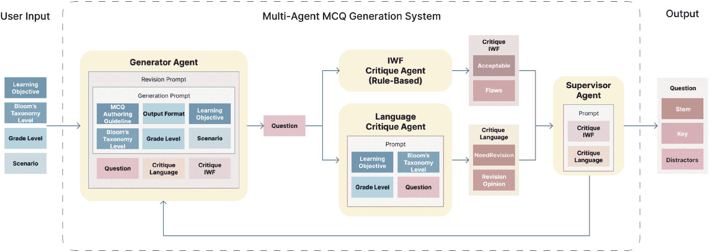
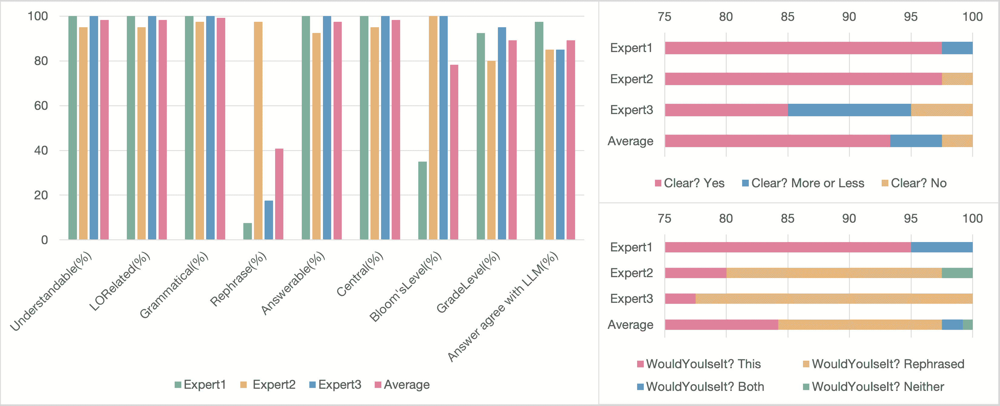

<!--yml

类别：未分类

日期：2025-01-11 11:52:59

-->

# 生成AI素养选择题：一种多代理LLM方法

> 来源：[https://arxiv.org/html/2412.00970/](https://arxiv.org/html/2412.00970/)

王家怡 [jiayiwang2025@u.northwestern.edu](mailto:jiayiwang2025@u.northwestern.edu) [0009-0003-1665-9360](https://orcid.org/0009-0003-1665-9360 "ORCID identifier") 西北大学 埃文斯顿 伊利诺伊州 美国，肖瑞伟 [ruiweix@andrew.cmu.edu](mailto:ruiweix@andrew.cmu.edu) [0000-0002-6461-7611](https://orcid.org/0000-0002-6461-7611 "ORCID identifier") 卡内基梅隆大学 匹兹堡 宾夕法尼亚州 美国，以及曾英杰 [yingjuit@andrew.cmu.edu](mailto:yingjuit@andrew.cmu.edu) [0009-0006-1801-6061](https://orcid.org/0009-0006-1801-6061 "ORCID identifier") 卡内基梅隆大学 匹兹堡 宾夕法尼亚州 美国（2025）

###### 摘要。

人工智能（AI）正在改变社会，这使得通过AI素养为下一代做准备变得至关重要。然而，缺乏可扩展且可靠的AI素养材料和评估资源。为了解决这一问题，我们的研究提出了一种新颖的方法来生成AI素养评估的选择题（MCQs）。我们的方法利用大型语言模型（LLMs）自动生成可扩展的高质量评估问题。这些问题与用户提供的学习目标、年级水平和布鲁姆分类法的等级相一致。我们引入了一种迭代工作流，结合LLM驱动的评审代理，确保生成的问题符合教学标准。在初步评估中，专家们表示出强烈的兴趣，愿意使用LLM生成的选择题，这表明该系统可以丰富现有的AI素养材料，并为K-12教育者的工具包提供宝贵的补充。

^†^†期刊年份：2025^†^†版权：权利保留^†^†会议：第56届ACM计算机科学教育技术研讨会，第2卷；2025年2月26日至3月1日；宾夕法尼亚州匹兹堡，美国^†^†书名：第56届ACM计算机科学教育技术研讨会，第2卷（SIGCSE TS 2025），2025年2月26日至3月1日，宾夕法尼亚州匹兹堡，美国^†^†DOI：10.1145/3641555.3705189^†^†ISBN：979-8-4007-0532-8/25/02

## 1. 引言

人工智能（AI）正在迅速改变我们的世界，从我们工作的方式到我们相互互动的方式。为了为下一代准备好这个由AI驱动的世界，像AI4K12的“五大理念”（Touretzky等人，[2022](https://arxiv.org/html/2412.00970v1#bib.bib10)）（感知、表示与推理、学习、自然交互以及自然交互）等教育框架已被开发出来，以将AI素养融入K-12教育。

然而，作为一个相对较新的学科领域，在人工智能素养教学和评估活动中缺乏学习材料（Gardner-McCune等，[2019](https://arxiv.org/html/2412.00970v1#bib.bib5)）。此外，现有的课程和评估资源通常不具备可扩展性或可靠性（Tseng等，[2024](https://arxiv.org/html/2412.00970v1#bib.bib11)）。这一短缺对教师构成了重大挑战，教师不仅需要教授和评估学生对AI概念的理解，还要培养学生在负责任地使用这些技术时的批判性思维能力。

利用大语言模型（LLM）生成评估问题（Doughty等，[2024](https://arxiv.org/html/2412.00970v1#bib.bib4)；Caines等，[2023](https://arxiv.org/html/2412.00970v1#bib.bib3)；Stamper等，[2024](https://arxiv.org/html/2412.00970v1#bib.bib9)）为一种潜在的解决方案。这种方法在编程（Doughty等，[2024](https://arxiv.org/html/2412.00970v1#bib.bib4)）、医学（Indran等，[2024](https://arxiv.org/html/2412.00970v1#bib.bib6)）和语言学习（Caines等，[2023](https://arxiv.org/html/2412.00970v1#bib.bib3)）等学科中已经显示出潜力。将这些方法应用于人工智能素养评估，有助于为教育者提供可访问、可扩展的评估资源，从而弥合教育资源的缺口。

本次探索性研究作为active.ai¹¹1https://active-ai.vercel.app项目的一部分，建立在之前关于选择题生成（Doughty等，[2024](https://arxiv.org/html/2412.00970v1#bib.bib4)；Moore等，[2023](https://arxiv.org/html/2412.00970v1#bib.bib7)）和人工智能素养（Touretzky等，[2022](https://arxiv.org/html/2412.00970v1#bib.bib10)）的研究基础上。它旨在回答以下研究问题：利用大语言模型驱动的多代理工作流，能否有效地生成高质量的人工智能素养选择题？

## 2\. 方法论

图1. 多代理选择题生成系统。

为本研究开发的多代理选择题生成系统，使用基于LangGraph框架²²2https://www.langchain.com/langgraph的工作流，结合OpenAI的gpt-4o-mini-2024-07-18模型，生成和完善评估人工智能素养的选择题。

用户输入的内容，包括学习目标、布鲁姆分类学层次（Anderson和Krathwohl，[2001](https://arxiv.org/html/2412.00970v1#bib.bib2)）、年级水平和具体场景，引导生成器代理（Generator Agent）生成初步问题，涵盖题干（问题）、关键（正确选项）和干扰项（错误选项）字段。该问题会由两位评审代理独立审查：语言评审代理（Language Critique Agent），评估可读性和与年级水平的契合度；以及IWF（题目写作缺陷）评审代理（Moore等人，[2023](https://arxiv.org/html/2412.00970v1#bib.bib7)），应用基于规则的检查（改编自(Moore等人，[2023](https://arxiv.org/html/2412.00970v1#bib.bib7)）），检查诸如不合理的干扰项或绝对词汇等问题。带有0或1个缺陷的问题被认为是可接受的。根据这些代理的反馈，问题要么被监督代理批准，要么返回给生成器代理进行修改。这个迭代过程会持续进行，直到问题符合质量标准或达到最大修订次数为止。我们共为K7-9年级的学生生成了40个多项选择题。

以下是生成问题的示例：

<svg class="ltx_picture" height="109.35" id="S2.p4.1.pic1" overflow="visible" version="1.1" width="600"><g fill="#000000" stroke="#000000" stroke-width="0.4pt" transform="translate(0,109.35) matrix(1 0 0 -1 0 0)"><g fill-opacity="1.0" transform="matrix(1.0 0.0 0.0 1.0 21.65 91.15)"><foreignobject color="#FFFFFF" height="12.3" overflow="visible" transform="matrix(1 0 0 -1 0 16.6)" width="556.69">Sample Generated Question</foreignobject></g> <g fill-opacity="1.0" transform="matrix(1.0 0.0 0.0 1.0 21.65 13.78)"><foreignobject color="#000000" height="59.65" overflow="visible" transform="matrix(1 0 0 -1 0 16.6)" width="556.69">Ben is considering using an AI tool to help him write a creative story. Which of the following reasons best explains when using AI might be a bad choice for his learning? A. It may produce a story that lacks originality and personal expression. B. AI can provide quick feedback on grammar and structure. C. Using AI can help him brainstorm new ideas for his story. D. AI tools can assist in organizing his thoughts more effectively.</foreignobject></g></g></svg>

## 3\. 结果

三位具有一年以上K-12人工智能素养教学经验的专家，使用十项标准评估了40个多项选择题的质量（表[1](https://arxiv.org/html/2412.00970v1#S3.T1 "Table 1 ‣ 3\. Results ‣ Generating AI Literacy MCQs: A Multi-Agent LLM Approach")，改编自(Scaria等人，[2024](https://arxiv.org/html/2412.00970v1#bib.bib8))）。

| Rubric Item | 定义和回应选项 |
| --- | --- |
| Understandable | 你能理解这个问题在问什么吗？（是/否） |
| LORelated | 该问题是否与学习目标相关？（是/否） |
| Grammatical | 问题的语法是否正确？（是/否） |
| Clear | 问题的要求是否清晰？（是/有些/否） |
| Rephrase | 你能改写这个问题，使其更加清晰并无错误吗？（是/否） |
| Answerable | 学生是否能够根据提供的信息或背景回答这个问题？（是/否） |
| Central | 你认为能回答该问题对于理解题干所给主题重要吗？（是/否） |
| WouldYouUseIt | 如果你是教授该课程主题的老师，你会在课程中使用这个问题或改写版本吗？（这个/改写版/都用/都不用） |
| Bloom’sLevel | 你认为这个问题属于布鲁姆分类学的哪个层次？（是/否） |
| GradeLevel | 你认为这个问题适合K7-9年级吗？（是/否） |

表 1\. 问题评估标准

图 2\. 评估结果

专家1、2和3分别在97.5%、85%和85%的正确答案上与系统达成一致。这表明，系统通常能够生成与专家判断一致的正确答案。尽管较为罕见，但也存在系统生成的答案与专家评估之间的偶尔不一致。

在语法正确性方面，专家们的意见高度一致，对于“易理解”、“可回答”、“语法正确”和“清晰”等标准，均给出了高比例的“是”回答，平均百分比范围从93.3%到99.2%。这表明，采用多代理方法生成的问题是结构良好且清晰的。此外，专家们一致认为，这些问题与学习目标高度相关（学习目标相关性98.3%）且紧扣评估的主题（主题相关性98.3%）。

在“重新措辞”、“布鲁姆认知水平”和“年级水平”这几个标准上，专家们的意见出现了明显分歧。专家2更为严格，认为97.5%的问题需要重新措辞，而专家1和专家3标注的问题较少（分别为7.5%和17.5%）。在年级水平方面，专家2标注了20%的问题为不合适，而专家1为7.5%，专家3为5%。这些差异可能源于对评分标准的不同理解或教学方法的差异。专家1在布鲁姆认知水平标准上与专家2和专家3存在显著不同，标注只有35%的问题适合预定的认知水平，而另外两位专家认为所有问题都符合正确的布鲁姆认知水平。

最后，在“是否愿意使用”这一标准上，专家们的意见呈中等一致性，专家的回应比例从77.5%到95%不等（平均为84.2%）。这表明，大多数专家认为这些问题适合课堂使用，证明了多代理系统不仅能生成结构良好的问题，还能生成在实际教育环境中有用的问题。然而，专家们的不同回答表明，个人偏好或教学风格会影响他们对某些问题的使用意愿。

总体而言，尽管需要进行一些调整以适应不同的教育环境，但多代理方法展示了生成符合教学需求、可扩展的高质量评估问题的巨大潜力，特别是在K-12教育中的人工智能素养方面。

## 4\. 限制与未来工作

未来研究的一个方向是进行课堂试验，以评估学生学习成果和教师可用性。尽管我们的多代理系统成功生成了 AI 素养的多项选择题，但它尚未在真实课堂中进行测试，因此其在多样化学习环境中的有效性仍不确定。另一个重要的研究方向是探索更多评估问题质量的方法，超越专家评估，例如利用学生表现数据、众包反馈和自动化分析来提供更全面和客观的评估。目前的评估依赖于专家判断，这可能引入潜在的主观性。关键的研究重点包括扩展系统对更多年级、布鲁姆分类法的不同层级以及超出 AI 素养的学科的适应性，同时整合多样化的评估格式（例如，开放式问题、基于项目的问题），以增强其实际效用。最后，该工具可以帮助教师采用逆向设计方法来设计 AI 素养课程，使评估与学习目标对齐。

## 参考文献

+   (1)

+   Anderson 和 Krathwohl（2001）Lorin W. Anderson 和 David R. Krathwohl（主编）。2001. *学习、教学与评估的分类法：布鲁姆教育目标分类法的修订版*（完整版）。Longman，纽约。

+   Caines 等人（2023）Andrew Caines、Luca Benedetto、Shiva Taslimipoor、Christopher Davis、Yuan Gao、Oeistein Andersen、Zheng Yuan、Mark Elliott、Russell Moore、Christopher Bryant 等人. 2023. 《大型语言模型在语言教学与评估技术中的应用》。*arXiv 预印本 arXiv:2307.08393*（2023）。

+   Doughty 等人（2024）Jacob Doughty、Zipiao Wan、Anishka Bompelli、Jubahed Qayum、Taozhi Wang、Juran Zhang、Yujia Zheng、Aidan Doyle、Pragnya Sridhar、Arav Agarwal 等人. 2024. 《AI 生成的（GPT-4）与人工设计的编程教育多项选择题的比较研究》。载于 *第26届澳大利亚计算教育会议论文集*，114–123。

+   Gardner-McCune 等人（2019）Christina Gardner-McCune、David Touretzky、Fred Martin 和 Deborah Seehorn. 2019. 《K-12 AI：为 K-12 计算机科学课程腾出 AI 空间》。载于 *第50届 ACM计算机科学教育技术研讨会论文集*，1244–1244。

+   Indran 等人（2024）Inthrani Raja Indran、Priya Paranthaman、Neelima Gupta 和 Nurulhuda Mustafa. 2024. 《利用 AI 高效生成医学问题的十二条建议：使用 Chat GPT 的教育者指南》。*医学教师*（2024），1–6。

+   Moore 等人（2023）Steven Moore、Huy A Nguyen、Tianying Chen 和 John Stamper. 2023. 《使用 GPT-4 和基于规则的方法评估多项选择题质量》。载于 *欧洲技术增强学习大会*，Springer，229–245。

+   Scaria et al. (2024) Nicy Scaria, Suma Dharani Chenna, 和 Deepak Subramani. 2024. 使用大型语言模型在不同布鲁姆技能层次上的自动化教育问题生成：策略与评估。载于*国际人工智能教育大会*。Springer，165–179。

+   Stamper et al. (2024) John Stamper, Ruiwei Xiao, 和 Xinying Hou. 2024. 提升基于LLM的反馈：来自智能辅导系统和学习科学的洞察。载于*国际人工智能教育大会*。Springer，32–43。

+   Touretzky et al. (2022) David S. Touretzky, Christina Gardner-Mccune, 和 Deborah W. Seehorn. 2022. 机器学习与AI中的五大核心理念。*国际人工智能教育期刊* 33 (2022)，233–266。

+   Tseng et al. (2024) Ying-Jui Tseng, Ruiwei Xiao, Christopher Bogart, Jaromir Savelka, 和 Majd Sakr. 2024. 评估基于目标的情境在扩大非技术性学习者AI素养中的有效性。载于*第55届ACM计算机科学教育技术研讨会论文集V. 2*。1842–1843。
