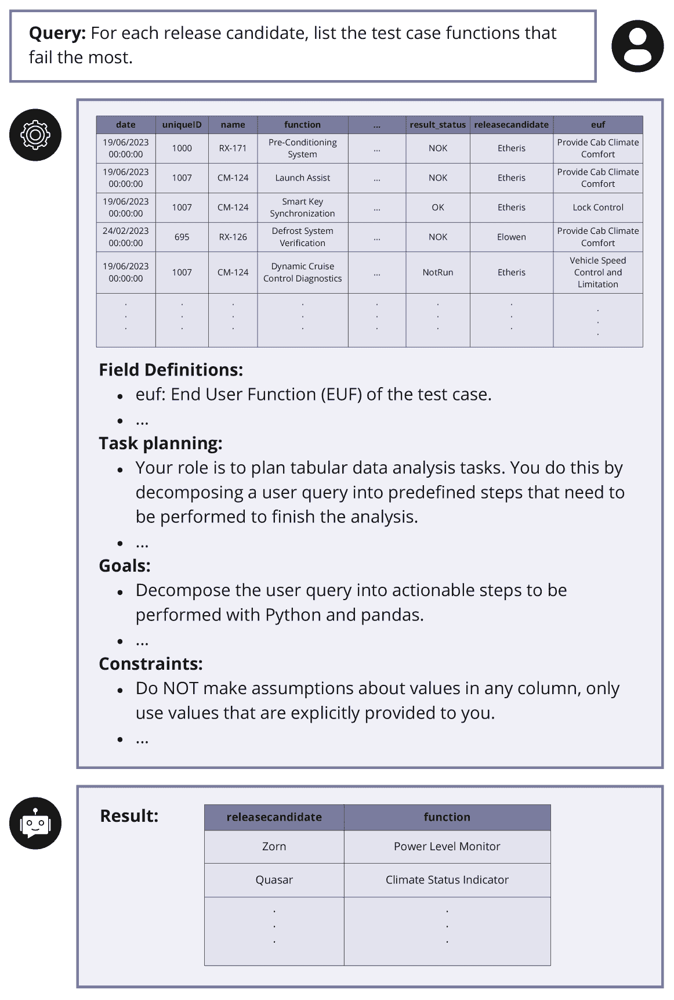
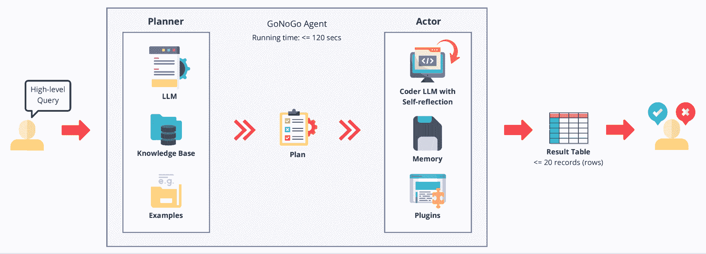
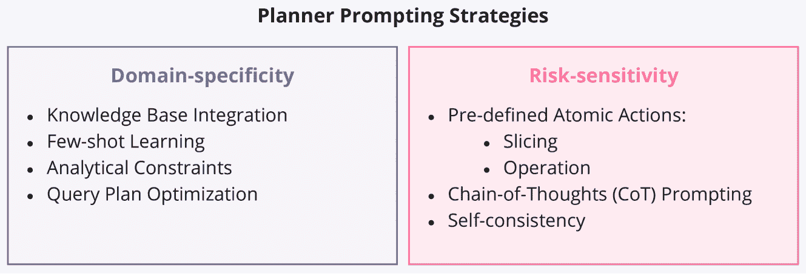

<!--yml

category: 未分类

date: 2025-01-11 12:18:42

-->

# GoNoGo: 一种高效的基于LLM的多智能体系统，用于简化汽车软件发布决策

> 来源：[https://arxiv.org/html/2408.09785/](https://arxiv.org/html/2408.09785/)

¹¹institutetext: 瑞典哥德堡，查尔姆斯理工大学计算机科学与工程系 ¹¹email: {khoee, yinan, robert.feldt}@chalmers.se ²²institutetext: 瑞典哥德堡，沃尔沃集团 ²²email: {andris.freimanis, patrick.andersson, dhasarathy.parthasarathy}@volvo.comArsham Gholamzadeh Khoee 1122 [0000-0002-5130-5520](https://orcid.org/0000-0002-5130-5520 "ORCID identifier")    Yinan Yu 11 [0000-0002-3221-7517](https://orcid.org/0000-0002-3221-7517 "ORCID identifier")    Robert Feldt 11 [0000-0002-5179-4205](https://orcid.org/0000-0002-5179-4205 "ORCID identifier")    Andris Freimanis 22    Patrick Andersson Rhodin 22    Dhasarathy Parthasarathy 22 [0000-0002-3620-8589](https://orcid.org/0000-0002-3620-8589 "ORCID identifier")

###### 摘要

汽车行业中，传统的软件部署决策方法通常依赖于手动分析表格化的软件测试数据。这些方法通常会由于其劳动密集性导致更高的成本和软件发布周期的延迟。大型语言模型（LLMs）提供了一个有前景的解决方案。然而，它们的应用通常需要多轮人工驱动的提示工程，这限制了它们的实际部署，特别是对于需要可靠和高效结果的工业终端用户。本文提出了GoNoGo，一个旨在简化汽车软件部署的LLM代理系统，同时满足功能需求和实际的工业约束。与以前的系统不同，GoNoGo专门针对特定领域和风险敏感的系统进行定制。我们通过来自工业实践的零-shot和少-shot示例评估了GoNoGo在不同任务难度下的表现。我们的结果表明，GoNoGo在Level 2难度的任务中使用3-shot示例时实现了100%的成功率，并且在处理更复杂的任务时仍保持高性能。我们发现GoNoGo有效地自动化了简单任务的决策过程，显著减少了手动干预的需求。总之，GoNoGo代表了一个高效且用户友好的基于LLM的解决方案，目前在我们的工业合作伙伴公司中被用来辅助软件发布决策，支持在风险敏感的车辆系统发布过程中做出更有依据和及时的决策。

###### 关键词：

LLMs 基于LLM的多智能体软件发布助手表格分析自动化风险敏感系统。

## 1 引言

在汽车行业中，关于何时发布软件，特别是在风险敏感系统中的嵌入式软件，具有巨大的影响力。现代车辆的复杂性，以及它们多层次的集成，使得这一过程更加复杂。每个集成层级都涉及一个或多个门控步骤，需要进行测试以验证是否满足门控标准。门控失败可能会延迟所有依赖子系统的集成，无论其自身的质量如何。在这一复杂的过程中，作为门控管理者的发布经理可能会从辅助决策中受益，从而做出更快、更好的决策。

图1：一个实际示例，展示了基于LLM的多代理系统在自动化临时表格数据分析中的应用。

大语言模型（LLMs）为提供此类帮助提供了一个有趣的途径。特别是，LLMs在零样本和少样本设置下通过上下文学习展示了强大的能力[[5](https://arxiv.org/html/2408.09785v2#bib.bib5)]。最近的进展提高了推理[[32](https://arxiv.org/html/2408.09785v2#bib.bib32)]、示例选择和提示设计[[7](https://arxiv.org/html/2408.09785v2#bib.bib7)]的效果。如今，许多公司已经开始使用LLM进行软件工程任务，例如API测试、代码生成和文档编写，研究表明它们在自动化测试方面优于现有的技术[[28](https://arxiv.org/html/2408.09785v2#bib.bib28)]。

然而，在将大语言模型（LLMs）应用于*风险敏感*的*特定领域*任务时，必须解决一些独特的挑战。在我们与工业合作伙伴的研究中，最突出的问题包括：1）纳入与领域相关的特定逻辑和术语；2）理解和解析由非专家利益相关者提出的高层次问题或模糊语言，并将其转化为可执行的计划；3）实现可解释性，以便领域专家能够向利益相关者解释系统功能，而不增加过多复杂性；4）提高效率，以满足组织应用的时间敏感需求，缓解与有限的LLM授权或基础设施相关的潜在瓶颈；5）设计系统以便于故障排除和维护，确保能够快速识别和解决任何问题。

为了解决这些挑战，我们提出了一种多智能体系统，利用上下文学习对特定领域的需求进行编码。该系统由两个主要的LLM代理组成：规划者（Planner）和执行者（Actor）（参见图[2](https://arxiv.org/html/2408.09785v2#S3.F2 "Figure 2 ‣ 3.2 System Architecture ‣ 3 GoNoGo: Intelligent Software Release Assistant ‣ GoNoGo: An Efficient LLM-based Multi-Agent System for Streamlining Automotive Software Release Decision-Making")）。规划者作为系统的核心，理解并将用户查询分解为逐步的数据分析指令[[14](https://arxiv.org/html/2408.09785v2#bib.bib14)]。然后，执行者将这些更高层次的指令综合并生成可执行的脚本。在执行者内部，一个编码器LLM除了利用自我反思机制外，还使用记忆来生成针对每个规划者指令优化的、查询给定数据的最有效Python脚本[[1](https://arxiv.org/html/2408.09785v2#bib.bib1), [28](https://arxiv.org/html/2408.09785v2#bib.bib28)]。

该系统为我们工业合作伙伴的最终用户提供了一个接口，如图[1](https://arxiv.org/html/2408.09785v2#S1.F1 "Figure 1 ‣ 1 Introduction ‣ GoNoGo: An Efficient LLM-based Multi-Agent System for Streamlining Automotive Software Release Decision-Making")所示，展示了其在实际中的使用示例。它允许像发布经理这样的最终用户从业务和安全的角度解释结果，而无需详细的技术知识。例如，他们可以简单地接收一个短表格，报告每个发布候选版本中测试用例功能最常失败的情况，如图[1](https://arxiv.org/html/2408.09785v2#S1.F1 "Figure 1 ‣ 1 Introduction ‣ GoNoGo: An Efficient LLM-based Multi-Agent System for Streamlining Automotive Software Release Decision-Making")所示。通过查看这些信息，发布经理可以做出是否发布软件的明智决策，确保软件符合汽车行业的业务目标和安全标准。这种方法可以通过消除对各种数据库和编程专家的需求，显著减少时间和资源消耗，从而为最终用户实现预期结果。我们的代理自动化了跨多个车辆开发集成层级的测试数据分析，提供关于组件功能和系统交互的详细报告。这帮助发布经理做出关于软件是否准备好发布的知情决策，加速开发进程，同时增强门控可靠性。我们的贡献可以总结如下：

{outline}\1

我们强调了基于大型语言模型（LLM）的智能助手在汽车行业软件发布决策中的实际应用。通过增强两个关键能力实现这一目标：\2 领域特定性：我们设计了一个框架，通过使用上下文学习将通用语言映射到领域特定的逻辑，以处理来自非专家利益相关者的非结构化查询。 \2 风险敏感性：我们结合了两种预定义的原子操作，限制了动作空间，提升了规划器在风险敏感方面的表现。 \1 总共对50个精心设计的测试查询进行了实验，结果表明我们提出的系统在分析数据和得出软件发布决策所需的洞察力方面非常有效。 \1 我们的系统目前已经部署并在我们的工业合作伙伴公司中积极使用，除了节省时间、提高可访问性、减少对专业分析师的依赖并加速整体工作流程外，还在软件发布决策过程中表现出了显著的改进。

本文的其余部分结构如下：第[2](https://arxiv.org/html/2408.09785v2#S2 "2 Manual Process of Release Decisions: Insights From the Industry ‣ GoNoGo: An Efficient LLM-based Multi-Agent System for Streamlining Automotive Software Release Decision-Making")节概述了汽车软件发布决策背后的手动过程以及简化操作的必要性。第[3](https://arxiv.org/html/2408.09785v2#S3 "3 GoNoGo: Intelligent Software Release Assistant ‣ GoNoGo: An Efficient LLM-based Multi-Agent System for Streamlining Automotive Software Release Decision-Making")节详细介绍了我们的方法，包括对基于LLM的多智能体系统架构的描述，以及规划器和执行者智能体的解释。此外，在第[4](https://arxiv.org/html/2408.09785v2#S4 "4 Experiments ‣ GoNoGo: An Efficient LLM-based Multi-Agent System for Streamlining Automotive Software Release Decision-Making")节中，我们展示了实验设置和结果。第[6](https://arxiv.org/html/2408.09785v2#S6 "6 Related Work ‣ GoNoGo: An Efficient LLM-based Multi-Agent System for Streamlining Automotive Software Release Decision-Making")节提供了关于LLM在数据分析中应用的相关研究概述。最后，第[7](https://arxiv.org/html/2408.09785v2#S7 "7 Conclusion ‣ GoNoGo: An Efficient LLM-based Multi-Agent System for Streamlining Automotive Software Release Decision-Making")节总结了本文的关键发现，并讨论了我们工作在工业软件发布管理和风险敏感系统背景下的广泛影响。

## 2 软件发布决策的手动过程：来自行业的见解

在汽车行业，决定是否推进软件发布是一个复杂的任务，涉及多个利益相关者和大量数据分析。本节回顾了当前的行业普遍手动工作流程以及简化这一流程的需求。

车辆开发经历多个阶段，每个阶段随着更多组件的集成而变得更加复杂。在每个阶段都会进行大量的测试，以确保功能性并识别修订，从而产生大量数据。软件组件需要反复测试和验证，进一步增加了这些数据量。

项目经理、验证工程师和质量工程师需要从这些测试中获取清晰的分析和洞察，以便做出软件发布决策。提取关键信息是非常耗时的。质量工程师分析数据以进行持续改进，而发布工程师则需要具体的信息来做出有依据的发布决策。

在这一过程中，统计学家为项目经理和质量工程师提供数据的总体视图，以支持未来的业务决策。由于这些决策的关键性质及其对消费者安全的影响，手动数据处理是必要的。然而，这种方法非常耗时且容易出错，部分原因是技术数据分析师和统计学家的视角不同，他们可能无法完全理解项目经理的目标。

这一过程中的一个关键且典型阶段是“封闭赛道测试”，在该阶段，配备必要软件发布的车辆在受控环境中进行系统化和严格的系统测试。测试结束后，发布经理会分析大量数据，以决定是否进入下一个测试阶段。这涉及到手动查询数据以生成支持决策的报告。分析中的错误或延迟可能会阻碍及时的软件发布，影响业务目标，并延迟子系统集成。

部署智能助手有潜力促进汽车行业的软件发布决策[[20](https://arxiv.org/html/2408.09785v2#bib.bib20)]，尤其是在封闭赛道测试阶段的关键测试期间。在这项工作中，我们专注于设计一个基于大型语言模型（LLM）的多智能体系统，以应对这一特定阶段的挑战。通过快速处理封闭赛道测试的数据，该系统可以生成针对不同利益相关者需求的全面报告。例如，它可以迅速汇总失败测试的摘要，突出显示不同车型间的软件性能趋势，或分析某一特定组件在不同条件下的行为。因此，这减少了初步分析所花费的时间，使发布经理能够专注于解读结果并做出明智决策。这不仅加速了开发过程，还提高了用于发布决策的信息的准确性和可靠性，最终有助于保持汽车软件开发中的高安全性和质量标准。

## 3 GoNoGo: 智能软件发布助手

### 3.1 系统要求

在与我们的工业合作伙伴讨论了关于软件发布分析和决策过程的当前需求和意见后，我们确定了在自动化数据分析中的以下主要挑战：

理解用户查询

系统必须在特定的领域上下文中解读查询，通常这些查询以自然语言呈现[[17](https://arxiv.org/html/2408.09785v2#bib.bib17)]，并利用任何提供的领域特定知识。

将用户查询转换为可执行步骤

系统需要将用户的查询转化为具体步骤，将复杂的查询分解为更简单的任务，确定操作顺序，并选择适当的数据处理或分析技术。此外，必须仔细管理操作空间，以符合风险敏感的要求。

执行和结果准备

系统必须执行计划中的操作，通过脚本与数据交互（例如，查询数据库、执行计算、应用过滤器），并将结果汇总成用户所需的格式。

这些步骤严重依赖于LLM的领域特定知识和推理能力，这对于有效的查询指令规划至关重要[[18](https://arxiv.org/html/2408.09785v2#bib.bib18)]。因此，本研究探讨了增强LLM智能体系统推理能力的技术，特别是在工业环境中分析表格数据的能力。

### 3.2 系统架构

我们的自动化表格数据分析方法利用LLMs创建一个智能系统，能够解析自然语言查询、执行复杂分析并提供期望的结果。系统架构由两个主要组件构成：由知识库和少量样本学习示例支持的规划器，以及包括编码器LLM、记忆模块和一些插件组件的执行者。图[2](https://arxiv.org/html/2408.09785v2#S3.F2 "Figure 2 ‣ 3.2 System Architecture ‣ 3 GoNoGo: Intelligent Software Release Assistant ‣ GoNoGo: An Efficient LLM-based Multi-Agent System for Streamlining Automotive Software Release Decision-Making")展示了该系统的整体架构。

图 2：基于LLM的多智能体系统GoNoGo的架构，以及系统交互过程的插图。GoNoGo接收来自最终用户的高层次查询，执行所需的数据处理，并输出结果表格作为决策支持资源。GoNoGo包含一个规划器智能体，负责解析查询并利用链式思维（Chain-of-Thought）提示和自一致性制定分析策略，支持*知识库*和*示例*以进行少量样本学习。执行者包括一个具有*自我反思*机制的编码器LLM，利用*记忆*和*插件*进行代码生成和错误解决。GoNoGo对单个用户查询的总运行时间大约为120秒，满足典型用户需求。

#### 3.2.1 规划器

规划器是我们系统的核心，负责解析用户查询并制定适当的分析策略。设计基于大语言模型（LLM）的多智能体系统的核心挑战之一是提示的固有不准确性。随着决策过程在多个LLM智能体之间分布，系统中的不确定性增加。为了缓解这一问题，我们将复杂性集中在规划器中，规划器负责大多数设计决策。通过将规划器作为主要的精炼智能体，我们旨在创建一个既可解释又易于维护的系统。

我们的问题由两个主要方面组成：领域特定性和风险敏感性。这两个特性在实际应用中经常同时出现，尤其是在医疗和汽车等领域，在这些领域中，不可靠性和不准确性可能带来重大后果。然而，在同时解决这两个方面的问题时存在显著的空白，更不用说在实践中展示此类系统了。作为我们系统的一部分，我们希望明确解决这两个方面的问题。由于规划器是决策责任最重的组件，这两个要求已被编码为规划器提示，如图[3](https://arxiv.org/html/2408.09785v2#S3.F3 "图 3 ‣ 3.2.1 规划器 ‣ 3.2 系统架构 ‣ 3 GoNoGo: 智能软件发布助手 ‣ GoNoGo: 一个高效的基于LLM的多代理系统，用于简化汽车软件发布决策")所示。

图3：规划器提示策略，解决LLM基础代理系统中表格数据分析的领域特定性和风险敏感性问题。

#### 3.2.2 领域特定性

规划器利用包含数据及其属性结构化描述的知识库，在给定LLM的提示中提供必要的上下文和领域特定信息，从而增强系统的性能和适用性[[15](https://arxiv.org/html/2408.09785v2#bib.bib15)]。该知识库作为一个全面的元数据存储库，包含了数据表的详细描述、关键字段的可能状态和取值、领域特定术语以及各种数据元素的语义意义。这使得系统能够理解和解释高级查询，并通过将这些信息作为输入提示提供给规划器，制定合适的分析计划，利用上下文学习。这种整合确保了从查询解释到结果生成的整个流程都受到相关领域知识的影响，使LLM代理能够为用户查询提供更准确、更相关、更专业的回答。

在我们的系统架构中，我们还将一些输入-输出对作为示例输入到规划器中，结合知识库进行少量示例学习。这种组合使得规划器能够更有效地解释用户查询，结合一般知识和特定任务示例来制定合适的分析计划。这种方法使得该系统成为一个强大的自动化表格数据分析工具，适用于各行各业和不同的使用场景。

有效的提示作为约束，增强了LLM的推理能力 [[13](https://arxiv.org/html/2408.09785v2#bib.bib13)]。例如，约束帮助模型理解某些字段的查询不仅应考虑二元状态。仅通过‘A’及其反义项来检索记录并不总是意味着检索所有记录，因为可能还存在其他非二元状态。例如，‘成功’和‘失败’的测试并未涵盖所有可能的测试状态；可能还存在需要考虑的其他状态，如‘N/A’，模型应该考虑这些。

重点是推动模型生成优化的查询计划。这包括在对数据进行排序和其他操作之前，通过过滤和选择来缩小数据范围，从而最小化处理过程。因此，设计的约束帮助智能体探索每个字段和数据的特征，提供更准确的规划。

#### 3.2.3 风险敏感性

我们通过两种预定义的原子操作指导规划器，以限制规划器的动作空间：切片（slicing）和操作（operation）。切片涉及指定选择的列以及过滤数据行的条件。操作则是描述对通过切片步骤获得的数据中一个或多个列的值进行的操作（如最大值、均值、计数等）。这些步骤应以Python列表的形式返回，每个步骤都用自然语言描述，包含所有相关值和列名。

此外，我们利用链式推理（Chain-of-Thought, CoT）提示进一步增强了基于LLM的智能体的推理能力 [[23](https://arxiv.org/html/2408.09785v2#bib.bib23)]。该技术将中间推理步骤融入提示中，引导模型将复杂问题拆解为更小、更易管理的步骤 [[33](https://arxiv.org/html/2408.09785v2#bib.bib33)]。这种方法模仿了类似人类的推理和解决问题的过程。此外，CoT提示通过明确展示推理步骤，使智能体的决策过程更加透明，用户可以理解智能体是如何得出特定结论或分析结果的。

我们将CoT提示与少量学习（few-shot learning）相结合，通过提供示例，不仅展示输入输出对，还包括中间推理步骤。这种协同作用进一步增强了智能体处理多样化和复杂数据分析任务的能力 [[10](https://arxiv.org/html/2408.09785v2#bib.bib10)]。

为了进一步提升推理能力，我们结合 CoT 提示技术采用自一致性方法。这包括为同一查询生成多个独立的推理路径，比较它们的一致性，并通过多数投票来确定最可靠的结果 [[22](https://arxiv.org/html/2408.09785v2#bib.bib22)]。通过考虑多个推理路径，系统变得不容易被单一错误的思路误导。因此，对于具有潜在歧义的查询，自一致性能够帮助识别不同的有效解释并提供更全面的答案。

#### 3.2.4 Actor

Actor 负责执行 Planner 制定的分析计划。它由多个相互作用的组件组成：带有自我反思功能的 Coder LLM、Memory 和 Plugins，如图 [2](https://arxiv.org/html/2408.09785v2#S3.F2 "Figure 2 ‣ 3.2 System Architecture ‣ 3 GoNoGo: Intelligent Software Release Assistant ‣ GoNoGo: An Efficient LLM-based Multi-Agent System for Streamlining Automotive Software Release Decision-Making") 所示。

Coder LLM 负责根据 Planner 的指示生成可执行脚本。该组件至关重要，因为它将抽象的计划转化为具体的、可执行的代码，可以使用所需的 Plugins 与数据交互并执行必要的分析。它包括一个自我反思机制，与 Memory 模块协同工作。Memory 存储生成的代码、错误信息、执行结果以及当前任务的上下文信息 [[8](https://arxiv.org/html/2408.09785v2#bib.bib8)]。

自我反思机制是一个复杂的过程，它允许 Coder LLM 批判性地分析其自身的输出和决策过程。当脚本执行过程中发生错误时，自我反思机制会被激活，并向 Coder LLM 提供反馈。这一反馈循环使 LLM 能够在任务上下文中分析错误信息 [[11](https://arxiv.org/html/2408.09785v2#bib.bib11), [28](https://arxiv.org/html/2408.09785v2#bib.bib28)]，促进生成代码的迭代改进。

自我反思机制提供了多个优势：它使得编码器大语言模型（Coder LLM）能够通过不断分析和反思自身的输出，自动识别和修正错误，从而减少了对外部调试和干预的需求。该机制促进了持续改进的循环，使得每次迭代都能优化脚本，从而提升性能和可靠性[[25](https://arxiv.org/html/2408.09785v2#bib.bib25)]。通过利用记忆模块，编码器大语言模型可以根据上下文进行调整，考虑到之前的错误、执行结果以及特定任务要求，从而生成更加精确、符合上下文的代码。自动错误修正和迭代优化使得编码过程更加高效，加速了开发周期，并增强了最终脚本的稳健性和可靠性。此外，自我反思能力减少了对人工干预调试过程的需求，使得工程师可以专注于更复杂和更高级的任务。

该架构使得演员不仅能够为数据分析任务生成代码，还能够自我排除故障并改进自身输出，从而形成一个更强大、更可靠的自动化数据分析系统。

### 3.3 系统实现

系统使用了Azure OpenAI的GPT-3.5 Turbo作为规划者和演员代理。规划者使用专门设计的提示词进行任务规划，通过指定每个步骤的细节来定义整个数据分析任务。此外，演员使用预定义的提示词生成所需的Python代码，利用pandas库执行计划中每个步骤，对给定的数据进行处理。

## 4 实验

### 4.1 数据

我们工业合作伙伴用于分析的数据被称为“GoNoGo”数据，并在每次测试完每个软件组件的每个功能后进行更新。这些内部公司数据包含大约40个不同的字段，对于发布决策至关重要，因为它包含了关于软件组件性能和功能的详细信息。它提供了必要的信息，用于判断是否将一辆车推进到开发的下一阶段，并允许其在开放道路上行驶。尽管数据会在每次测试后更新，我们使用了包含55,000条记录的数据集来报告我们的实验结果。

利益相关者经常提出类似“对于发布候选版本 X，最常失败的测试用例功能是什么？”或“X 的 Y 状态是什么？”这样的问题，其中 X 是发布候选版本的名称，Y 是特定功能。回答这些问题需要领域知识和对数据的理解，以准确提取并传达答案。通过分析这些数据，发布经理可以确定一辆车是否符合必要的标准，以便进入下一个开发阶段或在公共道路上行驶。这确保了只有符合严格安全和质量标准的车辆才能继续推进，维持汽车软件开发中的高标准。

### 4.2 基准测试概述

为了评估 GoNoGo 系统的性能，我们开发了一个基准测试，基于 15 个初始分析任务。这些任务是在发布工程师、质量工程师和验证工程师的帮助下定义的。我们识别了这些最终用户在工作流程中最常用的高层次查询和标准。我们的目标是设计能够捕捉到决策过程中所需的复杂查询的任务，这些任务能够反映这些用户的细微差别和复杂性。然后，这些任务被转化为 GoNoGo 可以处理的显式表格分析查询，确保基准测试能够反映现实世界中这些专业人士常遇到的场景和挑战。我们使用 Python 创建了这些查询的确定性真实答案，将解决方案拆解成更小的代码块，表示如过滤、分组和排序等操作。对于每个查询，我们通过逐步添加代码块并形成相应的查询来生成查询削减版本，这些查询块将解决这些查询。通过这种方法，我们将原有的 15 个查询扩展为 50 个查询削减版本，每个查询削减版本都有相应的真实答案和 Python 代码。

通过这种方式，我们建立了四个难度级别的查询：

级别 1

这些是最简单的查询，通常只涉及单一操作，如过滤或排序。

级别 2

这些查询结合了两到三个基本操作，如多次过滤后再排序。

级别 3

这些查询涉及三个以上的操作，可能包括分组和聚合。

级别 4

这些是最复杂的查询，需要多个高级操作，如分组和聚合，用于计算统计数据，超出了基本的过滤和排序操作。

这种查询复杂性递增的方法使我们能够评估 GoNoGo 在不同难度级别的表现。它有助于识别系统性能在哪一点开始下降（如果有的话），并提供关于其处理日益复杂的表格分析任务能力的见解。

这个基准测试可以客观地评估 GoNoGo 处理日益复杂的表格分析任务的能力，确保对其在不同难度级别的表现进行全面评估。

### 4.3 评估

评估过程包括将GoNoGo系统的结果与人工生成的真实结果进行比较。比较是基于严格的匹配标准[[9](https://arxiv.org/html/2408.09785v2#bib.bib9)]。要认为匹配成功，系统的输出必须包含与真实结果相同的列。此外，系统输出中的每一条记录必须完全匹配真实结果中的对应记录，包括不同字段中的所有值。系统的输出还必须包含与真实结果相同数量的记录，不能有缺失或多余的条目。这一严格的匹配标准确保输出不仅在结构和内容上与预期结果一致，而且在每个细节上完全相同。如果在与真实结果对比时，代理的输出满足所有这些标准，则任务标记为成功；否则，视为失败。然后，通过计算成功任务数与总任务数的比例来量化模型的性能，得出成功率。

### 4.4 结果

我们在表格[1](https://arxiv.org/html/2408.09785v2#S4.T1 "Table 1 ‣ 4.4 Results ‣ 4 Experiments ‣ GoNoGo: An Efficient LLM-based Multi-Agent System for Streamlining Automotive Software Release Decision-Making")中展示了GoNoGo系统的实验结果。我们通过使用0-shot、1-shot、2-shot和3-shot示例评估了其在不同任务难度级别下的表现。GoNoGo在3-shot示例下达到了高性能。

表1：在不同任务难度级别下，使用不同数量示例查询对GoNoGo系统性能的评估。

| # 示例 | 任务难度 | 总任务数 | 成功数 | 失败数 | 性能 |
| --- | --- | --- | --- | --- | --- |
| 0-shot | 1 | 16 | 3 | 13 | 18.75% |
| 1-2 | 32 | 6 | 26 | 18.75% |
| 1-3 | 44 | 9 | 35 | 20.45% |
| 1-4 | 50 | 11 | 39 | 22% |
| 1-shot | 1 | 16 | 15 | 1 | 93.75% |
| 1-2 | 32 | 27 | 5 | 84.37% |
| 1-3 | 44 | 32 | 12 | 72.72% |
| 1-4 | 50 | 34 | 16 | 68% |
| 2-shot | 1 | 16 | 16 | 0 | 100% |
| 1-2 | 32 | 31 | 1 | 96.87% |
| 1-3 | 44 | 38 | 6 | 86.36% |
| 1-4 | 50 | 41 | 9 | 82% |
| 3-shot | 1 | 16 | 16 | 0 | 100% |
| 1-2 | 32 | 32 | 0 | 100% |
| 1-3 | 44 | 41 | 3 | 93% |
| 1-4 | 50 | 45 | 5 | 90% |

最初，我们评估了GoNoGo处理最简单查询的能力，这些查询涉及基本操作，如过滤或排序（级别1）。然后，我们逐步增加复杂性，包含结合了级别1和级别2难度的查询，再包括那些涉及级别1到级别3难度的查询。最后，我们评估了GoNoGo在全范围任务中的表现，包括最复杂的查询（级别4），这些查询需要多种操作，如过滤、排序、分组和统计计算。

我们的观察表明，使用3-shot示例的GoNoGo方法对于解决任务难度最高达到2级的查询尤其有效，能够在没有错误的情况下处理这些任务。对于涉及3级或4级难度的更复杂任务，建议进行人工干预，执行必要的操作和计算，而不是仅依赖自动化系统。

## 5 有效性威胁

我们识别出以下威胁可能影响我们研究的有效性：

创建基准的局限性

我们的研究依赖于一个专门创建的基准来评估系统。虽然该基准旨在尽可能全面，但它可能无法涵盖在现实应用中遇到的所有潜在场景和边缘情况。为了尽量减少主观性，我们努力通过涉及验证工程师来设计尽可能全面的查询和任务。然而，尽管做出了这些努力，仍然存在一个局限性，即它可能无法捕捉每个潜在的场景和边缘情况。这一局限性可能会影响我们发现的普适性和稳健性。

基础模型的选择

选择基础模型（在这种情况下是GPT-3.5 Turbo），这是最近研究中广泛使用的LLM，可能会影响结果。不同的基础模型，如GPT-4、GPT-4o、Claude 3或LLaMA 3，可能会在同样的任务中表现出更好的性能和解读。然而，我们将项目限定在使用GPT-3.5 Turbo，并专注于提升其推理和规划能力。此外，我们的框架是灵活的，可以轻松应用于不同的预训练模型。依赖于单一模型意味着，如果使用其他模型，我们的结论可能不成立。

## 6 相关工作

在机器学习中应用表格数据具有巨大的潜力，从数据分析的少量学习到端到端的数据管道自动化。

将LLM与表格数据结合存在若干重大挑战[[4](https://arxiv.org/html/2408.09785v2#bib.bib4)]。大多数基础模型没有在表格数据上进行训练，这使得它们难以有效地处理和解读这种类型的数据。为了解决这个问题，使用表格数据进行LLM的预训练或在特定任务上进行微调是两种常见的选择。[[16](https://arxiv.org/html/2408.09785v2#bib.bib16)] 描述了LLM训练的不同阶段和策略，而[[19](https://arxiv.org/html/2408.09785v2#bib.bib19)] 提供了有意进行LLM微调的企业的指导方针。

特别地，最近的文献对使用表格数据的预训练和自监督学习（SSL）方法表现出了日益浓厚的兴趣。[ [21](https://arxiv.org/html/2408.09785v2#bib.bib21)] 强调了非序列表格数据的自监督学习（SSL4NS-TD），将方法分类为预测性、对比性和混合学习，并讨论了自动数据工程和跨表格可迁移性等应用问题。与此相比，[[30](https://arxiv.org/html/2408.09785v2#bib.bib30)] 引入了TapTap，这是一种新型的表格预训练方法，能够增强表格预测并生成用于各种应用的合成表格。最后，[ [26](https://arxiv.org/html/2408.09785v2#bib.bib26)] 提出了通过元表示（TabPTM）进行的表格数据预训练，该方法通过与原型的距离标准化数据表示，使得跨异构数据集的训练自由泛化。这些工作的共同主题是通过创新的预训练和自监督学习技术增强表格数据处理能力，尽管它们在具体方法和应用焦点上有所不同，从生成合成数据到改善模型泛化能力和处理能力不等。[ [29](https://arxiv.org/html/2408.09785v2#bib.bib29)] 提出了表格基础模型（TabFMs），利用预训练的LLM，并在各种表格数据集上进行微调，擅长执行跟随指令的任务，并能高效学习稀缺数据。

预训练旨在增强大型语言模型（LLMs）处理表格数据的能力。然而，它并不一定能提高模型在特定任务上的表现。另一方面，微调预训练的LLM已经展现出在特定任务中提升表格数据处理能力的潜力。[ [31](https://arxiv.org/html/2408.09785v2#bib.bib31)] 提出了TableLLM，这是一个强大的130亿参数模型，专为处理真实办公场景中的表格数据而设计。特别地，TableLLM结合了推理过程扩展和交叉验证策略，优于现有的通用和表格数据专注的LLM。[ [12](https://arxiv.org/html/2408.09785v2#bib.bib12)] 通过序列化数据和问题描述来提示LLM，探索了零-shot和少-shot的表格数据分类，取得了比传统深度学习方法和甚至强大的基准模型如梯度提升树更优秀的表现。[ [34](https://arxiv.org/html/2408.09785v2#bib.bib34)] 针对混合表格和文本数据的问答问题，通过逐步管道微调LLaMA 2，提出了TAT-LLM，该模型在特定基准上优于以前的微调模型和大型LLM，如GPT-4。[ [24](https://arxiv.org/html/2408.09785v2#bib.bib24)] 聚焦于将LLM应用于表格数据的预测任务，通过在带注释的表格上进行广泛的训练，增强了LLM的能力。

##### 工业考虑

一个已知的问题是，大语言模型（LLMs）经常逐字记忆表格数据，从而导致过拟合。[ [2](https://arxiv.org/html/2408.09785v2#bib.bib2) ] 强调，尽管大语言模型具有非平凡的泛化能力，但它们在训练过程中接触过的数据集上表现更好，而不是在新颖的、未见过的数据集上。这表明大语言模型有记忆的倾向，因此需要进行稳健的测试和验证协议。这个问题对于公司内部数据和基础模型之前未遇到过的任务尤为重要，因为公开基准测试并不一定能预测其在这些内部任务上的表现。此外，值得注意的是，一些应用有严格的数据隐私政策，这一问题在文献中正日益得到关注 [ [27](https://arxiv.org/html/2408.09785v2#bib.bib27), [6](https://arxiv.org/html/2408.09785v2#bib.bib6), [3](https://arxiv.org/html/2408.09785v2#bib.bib3) ]。在我们的工作中，我们假设数据存储在一个安全的本地网络中，并且在本文中没有涉及数据隐私问题。在工业环境中，实际约束条件，如可解释性、以用户为中心的适应性、开发和维护的便捷性、延迟要求以及IT基础设施的限制，都至关重要。我们的目标是设计一个系统，满足这些工业需求，同时避免预训练和微调大语言模型通常所需的复杂性和过多的资源。

## 7 结论

我们提出了GoNoGo，一个基于大语言模型（LLM）的多智能体系统，旨在通过使用Python代码分析和提取现实世界数据中的洞察，从而简化汽车行业的软件发布决策。我们已在我们的工业合作伙伴公司内应用该系统，显著帮助了发布经理，并减少了参与此过程的工程师数量，使他们能够专注于更高层次的任务。

我们系统的影响超出了自动化，它改变了汽车公司管理软件发布周期的方式。它减少了数据分析所需的时间和精力，同时提高了决策的准确性和可靠性。这一转变使工程师和经理能够专注于更高层次的任务，通过弥合原始数据与可操作洞察之间的差距，加速整体开发和部署过程，推动行业朝着更加高效、数据驱动的软件发布实践发展。如果没有GoNoGo，我们的工业合作伙伴将面临更多团队和员工浪费时间和精力的情况，决策过程将变得显著延长。试点用户报告称，每次做出决策时，每人节省了大约2小时，突显了该系统对效率的积极影响以及对工业合作伙伴整体业务目标的促进作用。

## 8 致谢

本研究部分得到了由Knut和Alice Wallenberg基金会资助的Wallenberg人工智能、自动化系统和软件计划（WASP）的支持。

## 参考文献

+   [1] Austin, J., Odena, A., Nye, M., Bosma, M., Michalewski, H., Dohan, D., Jiang, E., Cai, C., Terry, M., Le, Q., 等：使用大语言模型进行程序合成。arXiv 预印本 arXiv:2108.07732 (2021)

+   [2] Bordt, S., Nori, H., Rodrigues, V., Nushi, B., Caruana, R.: 大象永不忘记：大语言模型中表格数据的记忆与学习。arXiv 预印本 arXiv:2404.06209 (2024)

+   [3] Boudewijn, A.T.P., Ferraris, A.F., Panfilo, D., Cocca, V., Zinutti, S., De Schepper, K., Chauvenet, C.R.: 表格合成数据中的隐私度量：现状与未来研究方向。载于：NeurIPS 2023年合成数据生成与生成性AI研讨会（2023）

+   [4] van Breugel, B., van der Schaar, M.: 为什么表格基础模型应该成为研究优先事项（2024年6月）

+   [5] Brown, T., Mann, B., Ryder, N., Subbiah, M., Kaplan, J.D., Dhariwal, P., Neelakantan, A., Shyam, P., Sastry, G., Askell, A., 等：语言模型是少样本学习者。神经信息处理系统进展 33，1877–1901 (2020)

+   [6] Carey, A.N., Bhaila, K., Edemacu, K., Wu, X.: Dp-tabicl：使用差分隐私表格数据进行上下文学习。arXiv 预印本 arXiv:2403.05681 (2024)

+   [7] Chang, Y., Wang, X., Wang, J., Wu, Y., Yang, L., Zhu, K., Chen, H., Yi, X., Wang, C., Wang, Y., 等：关于大语言模型评估的调查。ACM智能系统与技术学报 15(3)，1–45 (2024)

+   [8] Chen, X., Lin, M., Schärli, N., Zhou, D.: 教授大语言模型自我调试。arXiv 预印本 arXiv:2304.05128 (2023)

+   [9] Chiang, W.L., Zheng, L., Sheng, Y., Angelopoulos, A.N., Li, T., Li, D., Zhang, H., Zhu, B., Jordan, M., Gonzalez, J.E., 等：聊天机器人竞技场：基于人类偏好的大语言模型评估开放平台。arXiv 预印本 arXiv:2403.04132 (2024)

+   [10] Dagdelen, J., Dunn, A., Lee, S., Walker, N., Rosen, A.S., Ceder, G., Persson, K.A., Jain, A.: 使用大语言模型从科学文本中提取结构化信息。自然通讯 15(1)，1418 (2024)

+   [11] Dyachenko, Y., Nenkov, N., Petrova, M., Skarga-Bandurova, I., Soloviov, O.: 自主智能体的认知架构方法。生物启发式认知架构 26，130–135 (2018)

+   [12] Hegselmann, S., Buendia, A., Lang, H., Agrawal, M., Jiang, X., Sontag, D.: TabLLM：使用大语言模型进行表格数据的少样本分类

+   [13] Huang, J., Chang, K.C.C.: 面向大语言模型推理的探索：一项调查。arXiv 预印本 arXiv:2212.10403 (2022)

+   [14] Khot, T., Trivedi, H., Finlayson, M., Fu, Y., Richardson, K., Clark, P., Sabharwal, A.: 分解提示：解决复杂任务的模块化方法。arXiv 预印本 arXiv:2210.02406 (2022)

+   [15] Liu, P., Yuan, W., Fu, J., Jiang, Z., Hayashi, H., Neubig, G.: 预训练、提示和预测：自然语言处理提示方法的系统调查。ACM计算机调查 55(9)，1–35（2023）

+   [16] Patil, R., Gudivada, V.: 当前大型语言模型（LLMs）趋势、技术和挑战综述。应用科学 14(5)，2074（2024）

+   [17] Rahimi, A., Veisi, H.: 将模型无关的元学习与先进的语言嵌入相结合，用于少样本意图分类。2024年第32届国际电气工程会议（ICEE），第1–5页，IEEE（2024）

+   [18] Valmeekam, K., Marquez, M., Sreedharan, S., Kambhampati, S.: 大型语言模型的规划能力——一项关键调查。神经信息处理系统进展 36, 75993–76005（2023）

+   [19] VM, K., Warrier, H., Gupta, Y., 等: 面向企业的LLM微调：实践指南和建议。arXiv预印本 arXiv:2404.10779（2024）

+   [20] Wang, L., Ma, C., Feng, X., Zhang, Z., Yang, H., Zhang, J., Chen, Z., Tang, J., Chen, X., Lin, Y., 等: 基于大型语言模型的自主智能体调查。计算机科学前沿 18(6)，186345（2024）

+   [21] Wang, W.Y., Du, W.W., Xu, D., Wang, W., Peng, W.C.: 面向非顺序表格数据的自监督学习调查。arXiv预印本 arXiv:2402.01204（2024）

+   [22] Wang, X., Wei, J., Schuurmans, D., Le, Q., Chi, E., Narang, S., Chowdhery, A., Zhou, D.: 自一致性提高语言模型中的思维链推理能力。arXiv预印本 arXiv:2203.11171（2022）

+   [23] Wei, J., Wang, X., Schuurmans, D., Bosma, M., Xia, F., Chi, E., Le, Q.V., Zhou, D., 等: 思维链提示法激发大型语言模型中的推理能力。神经信息处理系统进展 35, 24824–24837（2022）

+   [24] Yang, Y., Wang, Y., Sen, S., Li, L., Liu, Q.: 释放大型语言模型在数据科学中进行预测表格任务的潜力（2024）

+   [25] Yao, S., Zhao, J., Yu, D., Du, N., Shafran, I., Narasimhan, K., Cao, Y.: React：协同推理与行动的语言模型。arXiv预印本 arXiv:2210.03629（2022）

+   [26] Ye, H.J., Zhou, Q., Zhan, D.C.: 通过元表示在异质表格数据上的免训练泛化（2023）

+   [27] Ye, J., Du, M., Wang, G.: DataFrame QA：一种无需数据曝光的通用LLM框架用于DataFrame问答（2024）

+   [28] Yoon, J., Feldt, R., Yoo, S.: 基于意图的移动GUI测试与自主大型语言模型智能体。2024年IEEE软件测试、验证与验证会议（ICST），IEEE（2024）

+   [29] Zhang, H., Wen, X., Zheng, S., Xu, W., Bian, J.: 面向表格数据学习的基础模型探索。arXiv预印本 arXiv:2310.07338（2023）

+   [30] Zhang, T., Wang, S., Yan, S., Li, J., Liu, Q.: 生成性表格预训练赋能模型进行表格预测。arXiv预印本 arXiv:2305.09696（2023）

+   [31] 张, X., 张, J., 马, Z., 李, Y., 张, B., 李, G., 姚, Z., 许, K., 周, J., 张李, D., 余, J., 赵, S., 李, J., 唐, J.：TableLLM：在真实办公场景中通过LLM实现表格数据操作（2024）

+   [32] 张, Z., 姚, Y., 张, A., 唐, X., 马, X., 何, Z., 王, Y., Gerstein, M., 王, R., 刘, G., 等：点燃语言智能：从链式思维推理到语言代理的搭车指南。arXiv预印本 arXiv:2311.11797（2023）

+   [33] 周, D., Schärli, N., 侯, L., 魏, J., Scales, N., 王, X., Schuurmans, D., 崔, C., Bousquet, O., Le, Q., 等：从少到多的提示促进大型语言模型中的复杂推理。arXiv预印本 arXiv:2205.10625（2022）

+   [34] 朱, F., 刘, Z., 冯, F., 王, C., 李, M., 蔡, T.S.：TAT-LLM：一种专门针对表格和文本数据离散推理的语言模型（2024年2月）
