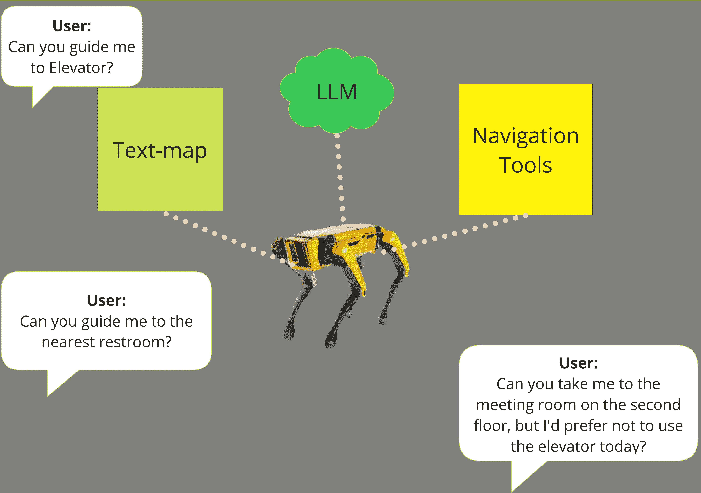
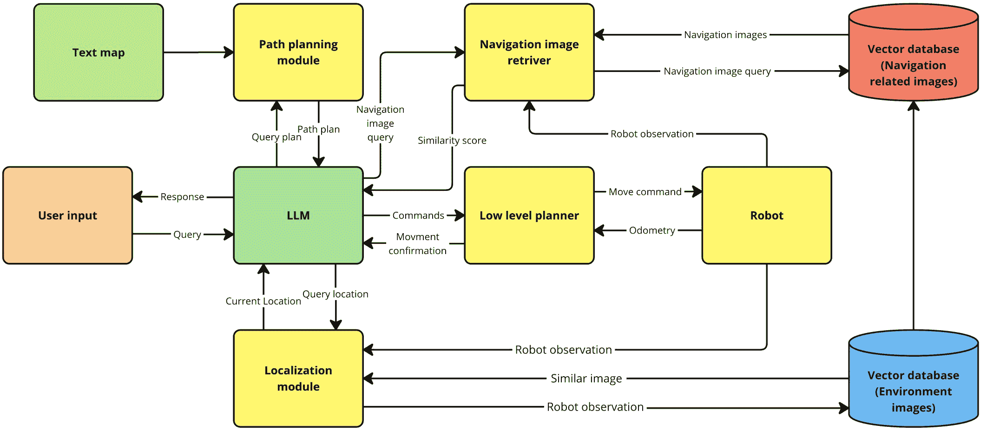
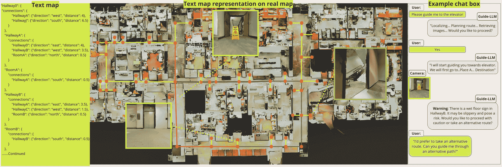
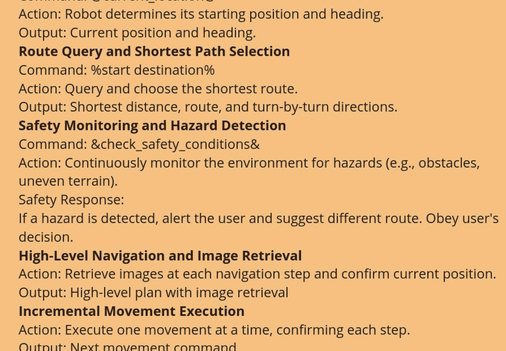

<!--yml
category: 未分类
date: 2025-01-11 12:01:48
-->

# Guide-LLM: An Embodied LLM Agent and Text-Based Topological Map for Robotic Guidance of People with Visual Impairments

> 来源：[https://arxiv.org/html/2410.20666/](https://arxiv.org/html/2410.20666/)

Sangmim Song¹, Sarath Kodagoda¹, Amal Gunatilake¹, Marc G. Carmichael¹
Karthick Thiyagarajan² and Jodi Martin³ This research was supported by the Australian Government through the Australian Research Council’s Linkage Projects funding scheme (LP220100430) and the industry partner Guide Dogs NSW/ACT.¹Sangmim Song, Sarath Kodagoda, Amal Gunatilake and Marc G. Carmichael are with the Robotics Institute, Faculty of Engineering and Information Technology, University of Technology Sydney, Broadway, Ultimo NSW 2007, Australia. Email: Sangmim.Song@student.uts.edu.au²Karthick Thiyagarajan is with the Smart Sensing and Robotics Laboratory (SensR Lab), Centre for Advanced Manufacturing Technology (CfAMT), School of Engineering, Design and Built Environment (SoEDBE), Kingswood, NSW 2747, Australia. ³Jodi Martin is with Guide Dogs New South Wales / Australian Capital Territory, Sydney, New South Wales, Australia.

###### Abstract

Navigation presents a significant challenge for persons with visual impairments (PVI). While traditional aids such as white canes and guide dogs are invaluable, they fall short in delivering detailed spatial information and precise guidance to desired locations. Recent developments in large language models (LLMs) and vision-language models (VLMs) offer new avenues for enhancing assistive navigation. In this paper, we introduce Guide-LLM, an embodied LLM-based agent designed to assist PVI in navigating large indoor environments. Our approach features a novel text-based topological map that enables the LLM to plan global paths using a simplified environmental representation, focusing on straight paths and right-angle turns to facilitate navigation. Additionally, we utilize the LLM’s commonsense reasoning for hazard detection and personalized path planning based on user preferences. Simulated experiments demonstrate the system’s efficacy in guiding PVI, underscoring its potential as a significant advancement in assistive technology. The results highlight Guide-LLM’s ability to offer efficient, adaptive, and personalized navigation assistance, pointing to promising advancements in this field.

###### Index Terms:

Assistive Robotics, Large Language models, Text-Based Topological Mapping, Vision and Language Navigation, Safety in HRI, Vision Impairments.

## I Introduction

Navigating everyday environments can be particularly challenging for persons with visual impairments (PVI), who often depend on specialized tools, help from others, or familiar routes to get around [[1](https://arxiv.org/html/2410.20666v1#bib.bib1), [2](https://arxiv.org/html/2410.20666v1#bib.bib2), [3](https://arxiv.org/html/2410.20666v1#bib.bib3), [4](https://arxiv.org/html/2410.20666v1#bib.bib4), [5](https://arxiv.org/html/2410.20666v1#bib.bib5)]. Traditional aids, such as white canes and guide dogs are essential part of the navigation, however, with the technological developments, further assistance could be possible to improve user confidence in navigation [[6](https://arxiv.org/html/2410.20666v1#bib.bib6)]. .

Recent breakthroughs in artificial intelligence, especially in large language models (LLMs) [[7](https://arxiv.org/html/2410.20666v1#bib.bib7), [8](https://arxiv.org/html/2410.20666v1#bib.bib8)] and vision-language models (VLMs) [[9](https://arxiv.org/html/2410.20666v1#bib.bib9), [10](https://arxiv.org/html/2410.20666v1#bib.bib10), [11](https://arxiv.org/html/2410.20666v1#bib.bib11)], have created new opportunities in human-robot interaction [[12](https://arxiv.org/html/2410.20666v1#bib.bib12)], task planning [[13](https://arxiv.org/html/2410.20666v1#bib.bib13), [14](https://arxiv.org/html/2410.20666v1#bib.bib14)], and navigation [[15](https://arxiv.org/html/2410.20666v1#bib.bib15), [16](https://arxiv.org/html/2410.20666v1#bib.bib16)]. Despite these advancements, their application in assisting PVI with navigation is still largely unexplored. [[17](https://arxiv.org/html/2410.20666v1#bib.bib17)] demonstrated the potential of using a robot platform combined with a language model to assist PVI, offering a glimpse of what is achievable. However, fully harnessing the capabilities of LLMs and VLMs for guiding PVI remains largely unexplored.

Conventional navigation systems typically depend on pre-programmed rules and sensor data, which may overlook the subtleties and complexities of real-world environments. In contrast, LLMs can analyze contextual information and anticipate potential hazards, offering a more adaptive and responsive solution for navigation. A key challenge in creating LLM and VLM-based navigation systems for PVI is their dependence on precise, explicit commands from users, which can be difficult for PVI. While 3D reconstruction techniques using point clouds [[18](https://arxiv.org/html/2410.20666v1#bib.bib18), [19](https://arxiv.org/html/2410.20666v1#bib.bib19), [20](https://arxiv.org/html/2410.20666v1#bib.bib20)] and traditional methods like SLAM (Simultaneous Localization and Mapping) help LLMs understand the environment, their scalability is constrained by the high computational demands of having LLMs interpret these dense maps [[21](https://arxiv.org/html/2410.20666v1#bib.bib21), [22](https://arxiv.org/html/2410.20666v1#bib.bib22), [20](https://arxiv.org/html/2410.20666v1#bib.bib20)].

Figure 1: Guide-LLM: Embodied agent consists of text-map, LLM and navigational modules to guide user to destination.

Figure 2: Guide-LLM framework: LLM (Green)Serves as the central controller, using commonsense reasoning to interpret user queries and interact with various modules (Yellow) for decision-making and navigation tasks. Text map (Green) Provides textual representation of the environment used to the path planning module to create route plans. Vector database 1 (Blue) stores static embedding of the environment images, aiding in consistent localization. Vector database 2 (Red) stores navigational image embedding that can be updated or deleted based on the agent’s requirements.

To overcome this challenge, we propose an innovative framework that utilizes a text-based topological map of the environment. This allows the LLM to plan global paths by referring to a textual representation, eliminating the need for explicit user input. This approach is more computationally efficient and scalable compared to methods that rely on dense maps or 3D representations for each user query, which could cause delays, leaving PVI waiting for the LLM to process these complex inputs. Additionally, our text-based topological map is designed to address the specific needs of PVI by generating straight paths and right-angle turns, which are easier to navigate and help maintain spatial orientation [[23](https://arxiv.org/html/2410.20666v1#bib.bib23), [24](https://arxiv.org/html/2410.20666v1#bib.bib24)]. These clear and predictable routes reduce cognitive effort, enabling more efficient and safer navigation, especially when compared to the challenges posed by curved or irregular pathways.

Our framework also incorporates an image retrieval system for localization and a low-level planner to handle robot movement, constraining the robot’s actions to predictable patterns. One of the significant advantages of integrating LLMs into navigation is their ability to leverage commonsense reasoning which has potential for enhancing safety, personalized navigation, and the interpretability of its actions [[16](https://arxiv.org/html/2410.20666v1#bib.bib16), [25](https://arxiv.org/html/2410.20666v1#bib.bib25)], which traditional navigation system often lack. The main contributions of our work are:

*   •

    Introducing a novel embodied LLM agent framework for guiding PVI: We propose Guide-LLM, an innovative framework that utilizes LLMs as embodied agents to assist PVI during navigation.

*   •

    Integration of a novel text-based topological map and image vector database: By combining a text-based topological map with an image vector database, we empower the LLM to carry out high-level planning through commonsense reasoning, minimizing the need for extensive user input or detailed instructions.

*   •

    Simulation evaluation: We validate the effectiveness of our approach through simulations, demonstrating its capability in guiding PVI.

Figure 3: Text map (Left): diagram of text-map, part of the text map is extracted. Example text map representation (Middle): User asks agent to navigate to the elevator. Guide-LLM plans a route(Red line) and begins guiding. Along the route, hazard is detected (wet floor sign), Guide-LLM warns user and suggests alternative path(Green line), Chat-box (Right) shows example communication between Guide-LLM and user

## II Related Work

### II-A Navigation Aid for People with Visual Impairment

Recent advancements in assistive technology have greatly enhanced the navigation and mobility of PVI. For instance, the robotic white cane [[26](https://arxiv.org/html/2410.20666v1#bib.bib26)] employs multimodal sensing and steering assistance to aid users in navigating their surroundings. Additionally, wearable systems have been developed to improve situational awareness by delivering real-time feedback through auditory or haptic signals [[27](https://arxiv.org/html/2410.20666v1#bib.bib27), [28](https://arxiv.org/html/2410.20666v1#bib.bib28), [29](https://arxiv.org/html/2410.20666v1#bib.bib29), [30](https://arxiv.org/html/2410.20666v1#bib.bib30)]. [[31](https://arxiv.org/html/2410.20666v1#bib.bib31)] introduced a method that allows PVIs to jog on athletic tracks. Despite these advancements, many of these systems are pre-programmed with fixed rules and behaviors, which can limit their adaptability to dynamic scenarios.

To address these limitations, dialogue-based robots have been proposed as an alternative form of assistance, using conversational interfaces to help users reach their destinations [[17](https://arxiv.org/html/2410.20666v1#bib.bib17)]. However, these systems still encounter significant challenges, particularly in natural language interaction and adaptability. Their rule-based nature also limits their ability to generalize and adjust to changing environments, which is essential for offering personalized and flexible support to PVI users.

### II-B Large Language Models in Robotics

The integration of LLMs into robotics has demonstrated significant potential in areas such as task planning, autonomous driving, multimodal reasoning, and navigation. Frameworks like SayPlan and ReAct enhance robotic capabilities by breaking down complex instructions into actionable sub-tasks and combining reasoning with action [[13](https://arxiv.org/html/2410.20666v1#bib.bib13), [32](https://arxiv.org/html/2410.20666v1#bib.bib32)]. DriveLLM [[16](https://arxiv.org/html/2410.20666v1#bib.bib16)] showcased how LLMs can improve interpretability and decision-making in autonomous driving by integrating object-level vector modalities with LLMs, thus enhancing context understanding and explainability in driving scenarios. RoboVQ [[33](https://arxiv.org/html/2410.20666v1#bib.bib33)] combined LLMs with vision inputs, enabling robots to perform complex, long-horizon tasks and demonstrating LLMs’ multimodal reasoning capabilities. [[34](https://arxiv.org/html/2410.20666v1#bib.bib34)] utilized LLMs as navigation agents, leveraging their reasoning capabilities to develop search heuristics for exploring new environments. SayNav employs LLMs to guide robots through unfamiliar environments by grounding high-level instructions in spatial contexts, highlighting the potential of LLMs in exploration without requiring detailed prior knowledge [[35](https://arxiv.org/html/2410.20666v1#bib.bib35)]. [[36](https://arxiv.org/html/2410.20666v1#bib.bib36)] demonstrated LLMs’ ability to generalize across tasks, allowing robots to plan and execute complex actions with minimal task-specific training. Additionally, NavGPT [[25](https://arxiv.org/html/2410.20666v1#bib.bib25)], MAP-GPT [[37](https://arxiv.org/html/2410.20666v1#bib.bib37)], and LGX [[38](https://arxiv.org/html/2410.20666v1#bib.bib38)] explore LLM-guided robotic navigation, further extending LLM capabilities in uncharted environments.

Despite these advancements, there is limited research specifically focusing on using LLMs’ commonsense reasoning and contextual understanding to assist people with visual impairments. This gap highlights the need for innovative approaches that harness LLMs’ reasoning abilities to provide more intelligent and adaptive support for PVI.

### II-C Vision and Language Navigation

Vision and language navigation (VLN) integrates visual perception with natural language understanding to enable agents to navigate based on spoken or written instructions. A significant challenge in VLN is that natural language instructions often emphasize high-level decisions and landmarks, frequently lacking detailed, low-level movement guidance [[39](https://arxiv.org/html/2410.20666v1#bib.bib39)]. Attention-based mechanisms [[40](https://arxiv.org/html/2410.20666v1#bib.bib40), [41](https://arxiv.org/html/2410.20666v1#bib.bib41), [42](https://arxiv.org/html/2410.20666v1#bib.bib42)] and reinforcement learning approaches [[43](https://arxiv.org/html/2410.20666v1#bib.bib43), [44](https://arxiv.org/html/2410.20666v1#bib.bib44)] have shown promising results in addressing this issue. Recently, the rise of LLMs and VLMs has sparked interest in leveraging these models to enhance VLN capabilities. For instance, LM-Nav [[15](https://arxiv.org/html/2410.20666v1#bib.bib15)] uses LLMs to extract landmarks from user queries and VLMs to ground these landmarks in the environment for navigation. Similarly, [[45](https://arxiv.org/html/2410.20666v1#bib.bib45)] employ LLMs to translate user queries into actionable navigation tasks and use image segmentation techniques to create a topological map for navigation. [[38](https://arxiv.org/html/2410.20666v1#bib.bib38)] combined LLMs commonsense reasoning with VLMs to navigate towards uniquely described objects, showcasing LLMs potential in understanding nuanced language. [[46](https://arxiv.org/html/2410.20666v1#bib.bib46)] utilized LLMs to guide the agent by processing action sequences based on text prompts that include navigation instructions, visual landmark descriptions, and the agent’s past trajectory. [[17](https://arxiv.org/html/2410.20666v1#bib.bib17)] used LLMs to identify landmarks, describe the environment, and navigate through it.

Despite these advancements, navigation for PVI remains challenging, particularly due to difficulties in describing specific scenes and landmarks, which can impede effective communication with the agent. Our work aims to address this limitation by enabling our agent to infer user intent and automatically resolve ambiguities in their instructions.

## III Proposed System

In this section, we provide a detailed overview of the Guide-LLM framework. Figure [2](https://arxiv.org/html/2410.20666v1#S1.F2 "Figure 2 ‣ I Introduction ‣ Guide-LLM: An Embodied LLM Agent and Text-Based Topological Map for Robotic Guidance of People with Visual Impairments") illustrates the primary components of the framework, which enable our LLM agent to handle decision-making, high-level planning, and navigation.

### III-A Core Components

#### III-A1 Agent

We employed GPT-4o [[47](https://arxiv.org/html/2410.20666v1#bib.bib47)] as the central component of our framework. GPT-4o is tasked with interpreting user inputs and determining appropriate actions to assist PVI. When a user query is received, the LLM is provided with a system prompt containing instructions to process the query within a specific context. As illustrated in Fig. [4](https://arxiv.org/html/2410.20666v1#S3.F4 "Figure 4 ‣ III-A2 Text-Based Topological Map ‣ III-A Core Components ‣ III Proposed System ‣ Guide-LLM: An Embodied LLM Agent and Text-Based Topological Map for Robotic Guidance of People with Visual Impairments"), this prompt is crafted to guide the LLM in assisting the user effectively while addressing potential errors and safety concerns. The system prompt is based on the Chain-of-Thought (CoT) method [[48](https://arxiv.org/html/2410.20666v1#bib.bib48)], which enables the LLM to break down tasks into manageable, intermediate steps.

#### III-A2 Text-Based Topological Map

The framework features a text-based topological map (Fig. [3](https://arxiv.org/html/2410.20666v1#S1.F3 "Figure 3 ‣ I Introduction ‣ Guide-LLM: An Embodied LLM Agent and Text-Based Topological Map for Robotic Guidance of People with Visual Impairments")) that illustrates the spatial relationships between various nodes in the environment (e.g., RoomA is connected to HallwayA, 0.5m north). Nodes are positioned at critical points where the robot needs to turn or take action. This map acts as a schematic reference for the agent, aiding navigation through complex spaces by offering a structured and queryable representation of the environment. It is specifically designed to emphasize straight paths between nodes, as people with visual impairments generally find straight trajectories more intuitive than curved ones [[24](https://arxiv.org/html/2410.20666v1#bib.bib24), [23](https://arxiv.org/html/2410.20666v1#bib.bib23)].

Figure 4: Example of the system prompt.

#### III-A3 Path Planning Module

This module works in tandem with the agent to plan efficient routes to designated destinations. When the agent initiates a navigation query, the module first consults the text-based topological map to determine potential routes. It calculates the shortest path to the destination and generates a textual description of the route for the agent to process. To enhance flexibility, the module uses a depth-first search (DFS) algorithm to explore all possible routes. This approach allows the agent to assess multiple paths and adapt in real-time based on hazards or user preferences, such as avoiding obstacles, selecting quieter routes, or prioritizing safety concerns. By combining path planning with textual feedback, the agent can make more informed decisions and offer a personalized navigation experience for the user.

#### III-A4 Embedding Module

We use pre-trained CLIP [[10](https://arxiv.org/html/2410.20666v1#bib.bib10)] to generate embeddings from visual data, which are then stored in a vector database alongside relevant metadata, including location and orientation information. This metadata allows the LLM to reference the location and orientation of specific images upon retrieval. The embedding module is essential for localization and subgoal selection, as it supports both text-to-image and image-to-image similarity searches. This functionality enables the agent to localize itself accurately and select appropriate subgoals.

#### III-A5 Vector Database

The vector database manages high-dimensional vector representations of the environment, which are generated by the embedding module. This setup enables efficient comparison of current observations with previously stored data. The database is crucial for real-time decision-making, allowing the LLM to retrieve images that match current observations and navigation-related images. Two separate vector databases are maintained: one for storing all environment images and another for images related to ongoing navigation. This separation helps minimize ambiguity and ensures that navigation-related images are retrieved more accurately, preventing confusion from unrelated images in a single, densely populated database.

#### III-A6 Low-Level Planner

The low-level planner converts the high-level decisions made by the agent into executable actions for the robot. It ensures that these commands are physically feasible, considering the robot’s movement capabilities. By connecting high-level decision-making with practical execution, the low-level planner enables the robot to operate safely and efficiently within various environments.

#### III-A7 Robot

We use TurtleBot as the robotic platform.

### III-B Global Path Planning

Figure [2](https://arxiv.org/html/2410.20666v1#S1.F2 "Figure 2 ‣ I Introduction ‣ Guide-LLM: An Embodied LLM Agent and Text-Based Topological Map for Robotic Guidance of People with Visual Impairments") illustrates the overall process of the proposed framework. We start with the assumption that the text map and images in the vector database are pre-labeled. The process begins with the LLM processing the user’s query and the system prompt. The LLM then generates high-level plans, image query commands, and responses for the user.

As shown in Fig. [2](https://arxiv.org/html/2410.20666v1#S1.F2 "Figure 2 ‣ I Introduction ‣ Guide-LLM: An Embodied LLM Agent and Text-Based Topological Map for Robotic Guidance of People with Visual Impairments"), each output is communicated separately for clear communication between modules. High-level plans and user responses are delivered through a voice-to-text interface, while image queries retrieve navigation-related images from the vector database. These images are then embedded into a secondary vector database, which refines the navigation process by reducing ambiguity and ensuring that only relevant images are retrieved.

### III-C Topological Navigation

The agent begins navigation by querying the vector database to retrieve the image for the next node. This image is compared to the current observation using cosine similarity for localization. To improve place recognition accuracy, a similarity check is performed each time the robot has traveled a specified distance or made a turn. The distance to the next node is measured by the robot’s odometer through the low-level planner, and a message is sent to the agent upon arrival. If the similarity score exceeds a predefined threshold, the LLM concludes that the target node has been reached and generates the next set of movement commands to proceed. This process continues until the final destination is reached.

### III-D Localization and Error Handling

Localization in our agent framework employs a dual-layered approach. Initially, the agent verifies its arrival at the desired node by querying the navigational vector database and comparing the retrieved image with the robot’s current observation. If the similarity score between these images falls below a set threshold, the agent detects a potential localization error, suggesting that the robot may be in the wrong location. To address this, the agent initiates a broader search by querying the main vector database, which contains embeddings of the entire environment. This fallback mechanism allows the system to re-localize accurately by finding the most relevant match among all environment images. This dynamic error-handling process ensures that even if the robot is initially misaligned or disoriented, the system can correct its location in real-time, maintaining the desired path for safe and efficient navigation.

### III-E Utilizing LLM’s Commonsense and Reasoning

Our framework utilizes the LLM’s commonsense reasoning to improve navigation safety and decision-making. Unlike traditional systems that depend on predefined rules, the agent can interpret dynamic, real-world contexts to anticipate potential risks. For instance, if the agent identifies hazards such as a wet floor, warning tape, or unexpected obstacles through visual data or environmental descriptions, it proactively alerts the user and suggests an alternative route. The LLM’s reasoning capabilities allow it to detect potential hazards even if they are not explicitly mentioned what is hazard. This flexibility enables the agent to adapt to changing conditions that rule-based systems might fail. By integrating commonsense knowledge, the agent enhances both the safety and overall reliability of the navigation experience.

### III-F Personalization Potential

A key strength of our agent is its ability to personalize the navigation experience according to each user’s specific preferences and needs. The agent’s natural language interaction capabilities enable it to adjust its behavior in real-time, facilitating this personalization. For example, it can modify its path-planning to match a user’s preferred walking speed, route preferences (e.g., avoiding stairs or choosing quieter areas), or specific safety concerns, such as steering clear of potential hazards. Additionally, the system can incorporate feedback from previous interactions, progressively refining its decisions to align with the user’s habits and preferences. For instance, if a user consistently opts for longer, less crowded routes over shorter ones, the agent can integrate this preference into its future planning. This adaptability extends beyond navigation; the agent can engage in personalized dialogue, adjusting the level of detail and communication style to meet different users’ needs, whether they prefer brief instructions or more detailed explanations.

## IV Results

We evaluated the capabilities of our Guide-LLM by testing its ability to guide visually impaired individuals through simulated environments. The simulations are divided into four key scenarios, each designed to highlight distinct aspects of the LLM’s utility in navigation, decision-making, error handling, and hazard detection. All tests were conducted in a simulated environment using the iGibson simulator with a TurtleBot platform.

TABLE I: Success Rates of Guide-LLM Navigation with Different Configurations

| Environment | All components | No System Prompt | No Path Planning Module |
| --- | --- | --- | --- |
| Large House | 90% | 0% | 33.33% |
| Office | 83.33% | 0% | 40% |

TABLE II: success rate of Localization error detection and recovery

| Error Scenario | Success Rate % |
| --- | --- |
| Localization Error Detection | 90% |
| Localization Recovery | 66% |

### IV-A Experiment Setup

We used iGibson [[49](https://arxiv.org/html/2410.20666v1#bib.bib49)] simulator to validate our framework. Two distinct environments of varying sizes were selected to evaluate the adaptability and robustness of our agent. These environments were chosen to represent different levels of complexity and scale, allowing us to test the agent’s performance in both small, confined spaces and larger, more open area. In each environment, random start and destination points represented in the text map were assigned for navigation. Turtlebot was equipped with RGB camera to capture images of current observation. All experiments were conducted on a laptop with an Intel Core I9 and 32 GB ram, and RTX 4070 GPU.

### IV-B LLM Guided Navigation Ablation Study

The objective of this experiment was to assess whether our LLM agent could successfully navigate to a destination by interpreting user queries without detailed instructions, showcasing its potential to assist PVI. To evaluate the contributions of the core components in our agent framework, we performed an ablation study by systematically removing system prompts and path planning module individually to analyze the impact of each removal on navigation performance. As shown in Table [I](https://arxiv.org/html/2410.20666v1#S4.T1 "TABLE I ‣ IV Results ‣ Guide-LLM: An Embodied LLM Agent and Text-Based Topological Map for Robotic Guidance of People with Visual Impairments"), when all components were active, Guide-LLM achieved an 83.33% success rate in navigation within an office environment. Removing the system prompt resulted in a 0% success rate, indicating that the system prompt is crucial for guiding the agent’s understanding and responses by providing necessary context and instructions.

To assess the impact of the path planning module, we removed it and directly input the text map into our agent. The success rate of navigation decreased to 40%. This decrease is attributed to several factors. First, directly providing the text map along with the system prompt increased the prompt length, which degraded the agent’s reasoning capability due to processing bottlenecks associated with large prompts [[50](https://arxiv.org/html/2410.20666v1#bib.bib50), [51](https://arxiv.org/html/2410.20666v1#bib.bib51), [52](https://arxiv.org/html/2410.20666v1#bib.bib52)]. Without path planning module, the agent is more successful when following alphabetical paths (e.g., Hallway A to Hallway C) but struggled with reversed paths (e.g., Hallway E to Hallway A). Removing the image retrieval system forced users to specify the starting location, altering the experiment and adding user burden. This configuration was excluded from comparative analysis to maintain experimental fairness, as it no longer tested the agent’s ability to infer starting points visually.

### IV-C Localization Error Detection and Recovery

To evaluate our agent’s error handling and recovery capabilities, we conducted an experiment where the robot was placed in random node during navigation. When the similarity score between the robot’s current observation and the expected navigational image fell below 0.94, the agent attempted to recover by querying the main vector database to re-localize itself and then restarted the navigation planning process from the recovered location. To further illustrate the system’s behavior, we provide an example chat box interaction in Fig. [3](https://arxiv.org/html/2410.20666v1#S1.F3 "Figure 3 ‣ I Introduction ‣ Guide-LLM: An Embodied LLM Agent and Text-Based Topological Map for Robotic Guidance of People with Visual Impairments"), showing how the agent detects the error, responds to the unexpected outcome, and initiates the recovery process by updating the plan based on the new location. This experiment was carried out 30 times in an office environment to thoroughly test the robustness of the agent. Experiment results are shown in Table.[II](https://arxiv.org/html/2410.20666v1#S4.T2 "TABLE II ‣ IV Results ‣ Guide-LLM: An Embodied LLM Agent and Text-Based Topological Map for Robotic Guidance of People with Visual Impairments") To detect and recover from situations where the robot hits a wall, we modified the TurtleBot to output a message when it remains stationary for a certain amount of time after receiving a movement command. This allows the agent to recognize the issue and initiate a recovery process by adjusting the navigation plan. During the experiment, we observed that the localization error occasionally happens when the agent is in a visually similar area, but managed to recover from some cases using commonsense by considering the past path it took.

TABLE III: Hazard detection performance

| Scenario | Total detection | True positive | False positive |
| Hazard detection | 30 | 12 | 18 |

### IV-D Commonsense Reasoning for Hazard Detection

The objective of this experiment is to evaluate the agent’s ability to identify potential hazards in the environment, communicate these risks to the user effectively, and adapt its actions based on the user’s decisions. To test this, images of obstacles and potential hazards were placed along a navigation path, including common dangers such as warning signs, physical barriers, and overhanging objects. The agent was evaluated on its ability to detect these hazards and provide appropriate warnings to the user, suggesting alternative routes when necessary. As shown in Table.[III](https://arxiv.org/html/2410.20666v1#S4.T3 "TABLE III ‣ IV-C Localization Error Detection and Recovery ‣ IV Results ‣ Guide-LLM: An Embodied LLM Agent and Text-Based Topological Map for Robotic Guidance of People with Visual Impairments") key metrics included hazard detection accuracy, with a focus on true positive rates and false positives, such as instances where the agent incorrectly identified non-hazardous objects (e.g., a can of coke near a wall) as potential dangers. An example scenario is reflected in Fig. [3](https://arxiv.org/html/2410.20666v1#S1.F3 "Figure 3 ‣ I Introduction ‣ Guide-LLM: An Embodied LLM Agent and Text-Based Topological Map for Robotic Guidance of People with Visual Impairments") where the agent demonstrates its commonsense reasoning by going beyond predefined navigation instructions. Upon detecting potential hazards, the agent warns the user and provides possible alternatives. For example, if an obstacle blocks the path or if a risky surface (such as a wet floor sign) is identified, the agent alerts the user with a warning message and suggests a safer alternate route. Once the hazard is communicated, the system waits for the user’s response, allowing the user to either accept the suggested route or proceed with caution along the original path. This experiment highlights the agent’s capacity to dynamically reason and adapt to unforeseen environmental changes.

### IV-E Personalization Potential

Research on navigational aid preferences shows that personalization is crucial for improving the user experience [[53](https://arxiv.org/html/2410.20666v1#bib.bib53)]. The LLM-based system is capable of meeting these diverse preferences through natural language interaction, allowing users to easily communicate their specific needs. By simply talking to the agent, users can adjust parameters such as preferred walking speed, route type (e.g., avoiding stairs), or safety concerns (e.g., avoiding potential hazard). This flexibility in tailoring the experience highlights the personalization potential of the LLM system. To evaluate how user preferences are reflected, we re-named some spaces in text topological map for example, concert hall, food court, noisy area and quiet area. We evaluated the agent’s routing performance based on user preferences, testing it 10 times on the same route to determine if it made different choices. The results were as follows: users preferring detailed step-by-step navigation instructions during navigation had their preferences met 10 out of 10 times, those preferring quiet routes had their preferences met 10 out of 10 times, and users who preferred stairs over elevators saw their preferences met 3 out of 10 times. The primary reason for the high failure rate in the last experiment was the excessive number of route options available to reach the destination, which may have exceeded the maximum allowed prompt, leading to the failure. As shown in Fig.[3](https://arxiv.org/html/2410.20666v1#S1.F3 "Figure 3 ‣ I Introduction ‣ Guide-LLM: An Embodied LLM Agent and Text-Based Topological Map for Robotic Guidance of People with Visual Impairments"), left corner of the map had rectangular shape causing path planning module produce 8 route options causing agent failing to reflect on user preferences.

## V Conclusion and Future Work

We introduced Guide-LLM, an innovative framework leveraging Large Language Models (LLMs) and novel text-based topological map to assist persons with visual impairments (PVI) in navigating large indoor environments. Our system successfully demonstrated the ability to provide efficient, adaptive, and personalized navigation, significantly reducing the need for detailed user instructions. Future work will focus on expanding the system’s capabilities, including autonomous exploration and map generation, as well as addressing real-time challenges such as obstacle avoidance. Testing in real-world scenarios with PVI will be on future works to improve and refine the system. These advancements will bring us closer to providing a comprehensive assistive solution that empowers PVI with greater independence and confidence in navigating complex environments.

## References

*   [1] D. L. Rudman and M. Durdle, “Living with fear: The lived experience of community mobility among older adults with low vision,” *Journal of aging and physical activity*, vol. 17, no. 1, pp. 106–122, 2008.
*   [2] N. A. Giudice and G. E. Legge, “Blind navigation and the role of technology,” *The engineering handbook of smart technology for aging, disability, and independence*, pp. 479–500, 2008.
*   [3] M. Y. Wang, J. Rousseau, H. Boisjoly, H. Schmaltz, M.-J. Kergoat, S. Moghadaszadeh, F. Djafari, and E. E. Freeman, “Activity limitation due to a fear of falling in older adults with eye disease,” *Investigative ophthalmology & visual science*, vol. 53, no. 13, pp. 7967–7972, 2012.
*   [4] W. Jeamwatthanachai, M. Wald, and G. Wills, “Indoor navigation by blind people: Behaviors and challenges in unfamiliar spaces and buildings,” *British Journal of Visual Impairment*, vol. 37, no. 2, pp. 140–153, 2019.
*   [5] Z. Başgöze, J. Gualtieri, M. T. Sachs, and E. A. Cooper, “Navigational aid use by individuals with visual impairments,” in *Journal on technology and persons with disabilities:… Annual International Technology and Persons with Disabilities Conference*, vol. 8.   NIH Public Access, 2020, p. 22.
*   [6] N. A. Giudice, B. A. Guenther, T. M. Kaplan, S. M. Anderson, R. J. Knuesel, and J. F. Cioffi, “Use of an indoor navigation system by sighted and blind travelers: Performance similarities across visual status and age,” *ACM Transactions on Accessible Computing (TACCESS)*, vol. 13, no. 3, pp. 1–27, 2020.
*   [7] J. Achiam, S. Adler, S. Agarwal, L. Ahmad, I. Akkaya, F. L. Aleman, D. Almeida, J. Altenschmidt, S. Altman, S. Anadkat *et al.*, “Gpt-4 technical report,” *arXiv preprint arXiv:2303.08774*, 2023.
*   [8] A. Dubey, A. Jauhri, A. Pandey, A. Kadian, A. Al-Dahle, A. Letman, A. Mathur, A. Schelten, A. Yang, A. Fan *et al.*, “The llama 3 herd of models,” *arXiv preprint arXiv:2407.21783*, 2024.
*   [9] H. Liu, C. Li, Q. Wu, and Y. J. Lee, “Visual instruction tuning,” *Advances in neural information processing systems*, vol. 36, 2024.
*   [10] A. Radford, J. W. Kim, C. Hallacy, A. Ramesh, G. Goh, S. Agarwal, G. Sastry, A. Askell, P. Mishkin, J. Clark *et al.*, “Learning transferable visual models from natural language supervision,” in *International conference on machine learning*.   PMLR, 2021, pp. 8748–8763.
*   [11] J. Li, D. Li, S. Savarese, and S. Hoi, “Blip-2: Bootstrapping language-image pre-training with frozen image encoders and large language models,” in *International conference on machine learning*.   PMLR, 2023, pp. 19 730–19 742.
*   [12] T. Williams, C. Matuszek, R. Mead, and N. Depalma, “Scarecrows in Oz: The Use of Large Language Models in HRI,” *ACM Transactions on Human-Robot Interaction*, vol. 13, no. 1, pp. 1–11, 1 2024.
*   [13] K. Rana, J. Haviland, S. Garg, J. Abou-Chakra, I. Reid, and N. Suenderhauf, “Sayplan: Grounding large language models using 3d scene graphs for scalable robot task planning,” in *7th Annual Conference on Robot Learning*, 2023.
*   [14] X. Jiang, Y. Dong, L. Wang, F. Zheng, Q. Shang, G. Li, Z. Jin, and W. Jiao, “Self-planning Code Generation with Large Language Models,” *ACM Transactions on Software Engineering and Methodology*, 6 2024.
*   [15] D. Shah, B. Osiński, S. Levine *et al.*, “Lm-nav: Robotic navigation with large pre-trained models of language, vision, and action,” in *Conference on robot learning*.   PMLR, 2023, pp. 492–504.
*   [16] Y. Cui, S. Huang, J. Zhong, Z. Liu, Y. Wang, C. Sun, B. Li, X. Wang, and A. Khajepour, “Drivellm: Charting the Path Toward Full Autonomous Driving With Large Language Models,” *IEEE Transactions on Intelligent Vehicles*, vol. 9, no. 1, pp. 1450–1464, 1 2024.
*   [17] S. Liu, A. Hasan, K. Hong, R. Wang, P. Chang, Z. Mizrachi, J. Lin, D. L. McPherson, W. A. Rogers, and K. Driggs-Campbell, “Dragon: A dialogue-based robot for assistive navigation with visual language grounding,” *IEEE Robotics and Automation Letters*, 2024.
*   [18] C. Huang, O. Mees, A. Zeng, and W. Burgard, “Visual language maps for robot navigation,” in *2023 IEEE International Conference on Robotics and Automation (ICRA)*.   IEEE, 2023, pp. 10 608–10 615.
*   [19] S. Chen, X. Chen, C. Zhang, M. Li, G. Yu, H. Fei, H. Zhu, J. Fan, and T. Chen, “Ll3da: Visual interactive instruction tuning for omni-3d understanding reasoning and planning,” in *Proceedings of the IEEE/CVF Conference on Computer Vision and Pattern Recognition*, 2024, pp. 26 428–26 438.
*   [20] S. Yang, J. Liu, R. Zhang, M. Pan, Z. Guo, X. Li, Z. Chen, P. Gao, Y. Guo, and S. Zhang, “Lidar-llm: Exploring the potential of large language models for 3d lidar understanding,” *arXiv preprint arXiv:2312.14074*, 2023.
*   [21] Y. Hong, H. Zhen, P. Chen, S. Zheng, Y. Du, Z. Chen, and C. Gan, “3d-llm: Injecting the 3d world into large language models,” *Advances in Neural Information Processing Systems*, vol. 36, pp. 20 482–20 494, 2023.
*   [22] R. Xu, X. Wang, T. Wang, Y. Chen, J. Pang, and D. Lin, “Pointllm: Empowering large language models to understand point clouds,” *arXiv preprint arXiv:2308.16911*, 2023.
*   [23] M. Swobodzinski and M. Raubal, “An indoor routing algorithm for the blind: development and comparison to a routing algorithm for the sighted,” *International Journal of Geographical Information Science*, vol. 23, no. 10, pp. 1315–1343, 2009.
*   [24] S. Shafique, W. Setti, C. Campus, S. Zanchi, A. Del Bue, and M. Gori, “How path integration abilities of blind people change in different exploration conditions,” *Frontiers in Neuroscience*, vol. 18, p. 1375225, 2024.
*   [25] G. Zhou, Y. Hong, and Q. Wu, “Navgpt: Explicit reasoning in vision-and-language navigation with large language models,” in *Proceedings of the AAAI Conference on Artificial Intelligence*, vol. 38, no. 7, 2024, pp. 7641–7649.
*   [26] P. Slade, A. Tambe, and M. J. Kochenderfer, “Multimodal sensing and intuitive steering assistance improve navigation and mobility for people with impaired vision,” *Science Robotics*, vol. 6, no. 59, 10 2021.
*   [27] M. M. Islam, M. S. Sadi, and T. Bräunl, “Automated walking guide to enhance the mobility of visually impaired people,” *IEEE Transactions on Medical Robotics and Bionics*, vol. 2, no. 3, pp. 485–496, 2020.
*   [28] L. Jin, H. Zhang, and C. Ye, “A wearable robotic device for assistive navigation and object manipulation,” in *2021 IEEE/RSJ International Conference on Intelligent Robots and Systems (IROS)*.   IEEE, 2021, pp. 765–770.
*   [29] Y. Bouteraa, “Design and development of a wearable assistive device integrating a fuzzy decision support system for blind and visually impaired people,” *Micromachines*, vol. 12, no. 9, p. 1082, 2021.
*   [30] G. Li, J. Xu, Z. Li, C. Chen, and Z. Kan, “Sensing and navigation of wearable assistance cognitive systems for the visually impaired,” *IEEE Transactions on Cognitive and Developmental Systems*, vol. 15, no. 1, pp. 122–133, 2022.
*   [31] X. Liu, B. Wang, and Z. Li, “Vision-based wearable steering assistance for people with impaired vision in jogging,” in *2024 IEEE International Conference on Robotics and Automation (ICRA)*.   IEEE, 2024, pp. 15 270–15 275.
*   [32] S. Yao, J. Zhao, D. Yu, N. Du, I. Shafran, K. Narasimhan, and Y. Cao, “React: Synergizing reasoning and acting in language models,” *arXiv preprint arXiv:2210.03629*, 2022.
*   [33] P. Sermanet, T. Ding, J. Zhao, F. Xia, D. Dwibedi, K. Gopalakrishnan, C. Chan, G. Dulac-Arnold, S. Maddineni, N. J. Joshi *et al.*, “Robovqa: Multimodal long-horizon reasoning for robotics,” in *2024 IEEE International Conference on Robotics and Automation (ICRA)*.   IEEE, 2024, pp. 645–652.
*   [34] D. Shah, M. R. Equi, B. Osiński, F. Xia, B. Ichter, and S. Levine, “Navigation with large language models: Semantic guesswork as a heuristic for planning,” in *Conference on Robot Learning*.   PMLR, 2023, pp. 2683–2699.
*   [35] A. Rajvanshi, K. Sikka, X. Lin, B. Lee, H.-P. Chiu, and A. Velasquez, “Saynav: Grounding large language models for dynamic planning to navigation in new environments,” in *Proceedings of the International Conference on Automated Planning and Scheduling*, vol. 34, 2024, pp. 464–474.
*   [36] W. Huang, P. Abbeel, D. Pathak, and I. Mordatch, “Language models as zero-shot planners: Extracting actionable knowledge for embodied agents,” in *International conference on machine learning*.   PMLR, 2022, pp. 9118–9147.
*   [37] J. Chen, B. Lin, R. Xu, Z. Chai, X. Liang, and K.-Y. Wong, “Mapgpt: Map-guided prompting with adaptive path planning for vision-and-language navigation,” in *Proceedings of the 62nd Annual Meeting of the Association for Computational Linguistics (Volume 1: Long Papers)*, 2024, pp. 9796–9810.
*   [38] V. S. Dorbala, J. F. Mullen, and D. Manocha, “Can an Embodied Agent Find Your “Cat-shaped Mug”? LLM-Based Zero-Shot Object Navigation,” *IEEE Robotics and Automation Letters*, vol. 9, no. 5, pp. 4083–4090, 5 2024.
*   [39] D. Fried, R. Hu, V. Cirik, A. Rohrbach, J. Andreas, L.-P. Morency, T. Berg-Kirkpatrick, K. Saenko, D. Klein, and T. Darrell, “Speaker-follower models for vision-and-language navigation,” *Advances in neural information processing systems*, vol. 31, 2018.
*   [40] C.-Y. Ma, J. Lu, Z. Wu, G. AlRegib, Z. Kira, R. Socher, and C. Xiong, “Self-monitoring navigation agent via auxiliary progress estimation,” *arXiv preprint arXiv:1901.03035*, 2019.
*   [41] X. Li, A. Yuan, and X. Lu, “Vision-to-language tasks based on attributes and attention mechanism,” *IEEE transactions on cybernetics*, vol. 51, no. 2, pp. 913–926, 2019.
*   [42] A. B. Vasudevan, D. Dai, and L. Van Gool, “Talk2nav: Long-range vision-and-language navigation with dual attention and spatial memory,” *International Journal of Computer Vision*, vol. 129, pp. 246–266, 2021.
*   [43] X. Wang, W. Xiong, H. Wang, and W. Y. Wang, “Look before you leap: Bridging model-free and model-based reinforcement learning for planned-ahead vision-and-language navigation,” in *Proceedings of the European Conference on Computer Vision (ECCV)*, 2018, pp. 37–53.
*   [44] H. Wang, Q. Wu, and C. Shen, “Soft expert reward learning for vision-and-language navigation,” in *Computer Vision–ECCV 2020: 16th European Conference, Glasgow, UK, August 23–28, 2020, Proceedings, Part IX 16*.   Springer, 2020, pp. 126–141.
*   [45] S. Garg, K. Rana, M. Hosseinzadeh, L. Mares, N. Sünderhauf, F. Dayoub, and I. Reid, “Robohop: Segment-based topological map representation for open-world visual navigation,” *arXiv preprint arXiv:2405.05792*, 2024.
*   [46] R. Schumann, W. Zhu, W. Feng, T.-J. Fu, S. Riezler, and W. Y. Wang, “Velma: Verbalization embodiment of llm agents for vision and language navigation in street view,” in *Proceedings of the AAAI Conference on Artificial Intelligence*, vol. 38, no. 17, 2024, pp. 18 924–18 933.
*   [47] OpenAI, “Hello gpt-4,” [https://openai.com/index/hello-gpt-4o/](https://openai.com/index/hello-gpt-4o/), accessed: Sept. 14, 2024.
*   [48] J. Wei, X. Wang, D. Schuurmans, M. Bosma, F. Xia, E. Chi, Q. V. Le, D. Zhou *et al.*, “Chain-of-thought prompting elicits reasoning in large language models,” *Advances in neural information processing systems*, vol. 35, pp. 24 824–24 837, 2022.
*   [49] C. Li, F. Xia, R. Martín-Martín, M. Lingelbach, S. Srivastava, B. Shen, K. Vainio, C. Gokmen, G. Dharan, T. Jain *et al.*, “igibson 2.0: Object-centric simulation for robot learning of everyday household tasks,” *arXiv preprint arXiv:2108.03272*, 2021.
*   [50] C. An, S. Gong, M. Zhong, X. Zhao, M. Li, J. Zhang, L. Kong, and X. Qiu, “L-eval: Instituting standardized evaluation for long context language models,” *arXiv preprint arXiv:2307.11088*, 2023.
*   [51] Y. Bai, X. Lv, J. Zhang, H. Lyu, J. Tang, Z. Huang, Z. Du, X. Liu, A. Zeng, L. Hou *et al.*, “Longbench: A bilingual, multitask benchmark for long context understanding,” *arXiv preprint arXiv:2308.14508*, 2023.
*   [52] M. Levy, A. Jacoby, and Y. Goldberg, “Same task, more tokens: the impact of input length on the reasoning performance of large language models,” *arXiv preprint arXiv:2402.14848*, 2024.
*   [53] D. Ahmetovic, J. Guerreiro, E. Ohn-Bar, K. M. Kitani, and C. Asakawa, “Impact of expertise on interaction preferences for navigation assistance of visually impaired individuals,” in *Proceedings of the 16th International Web for All Conference*, 2019, pp. 1–9.