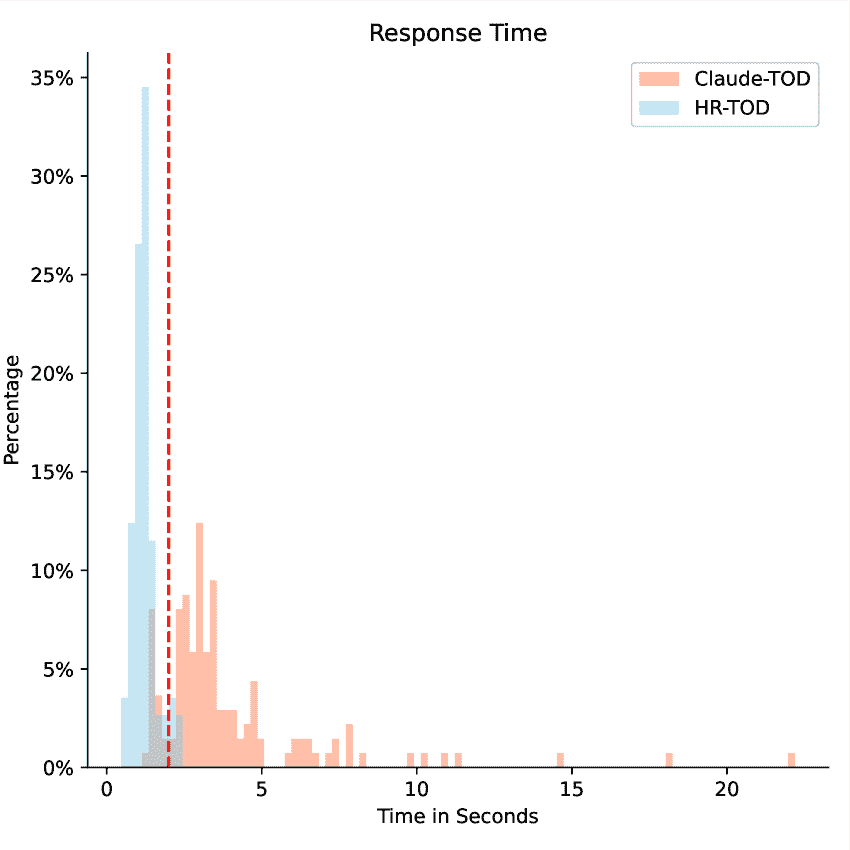
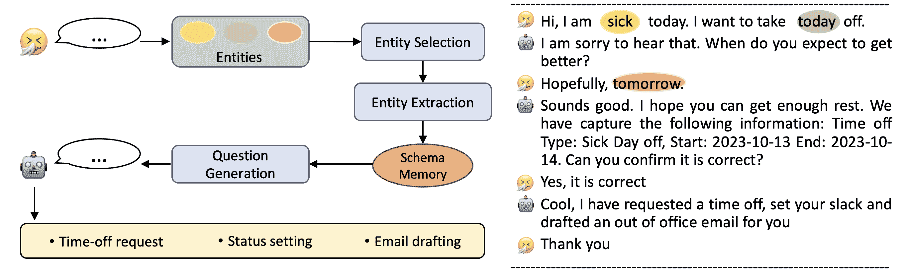
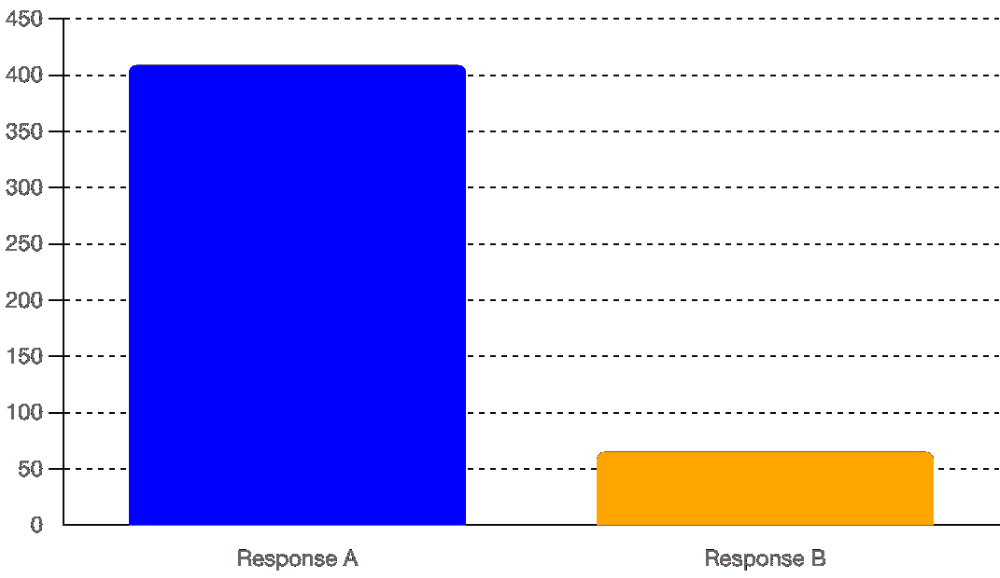
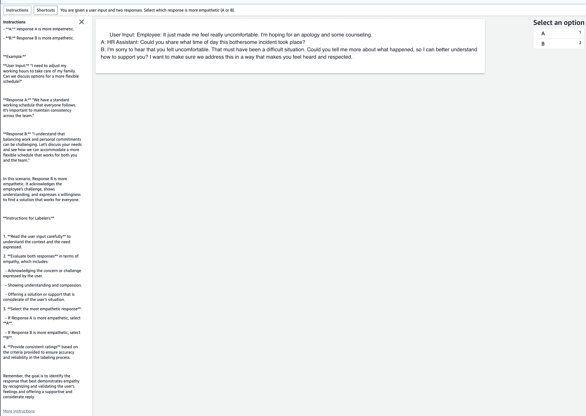
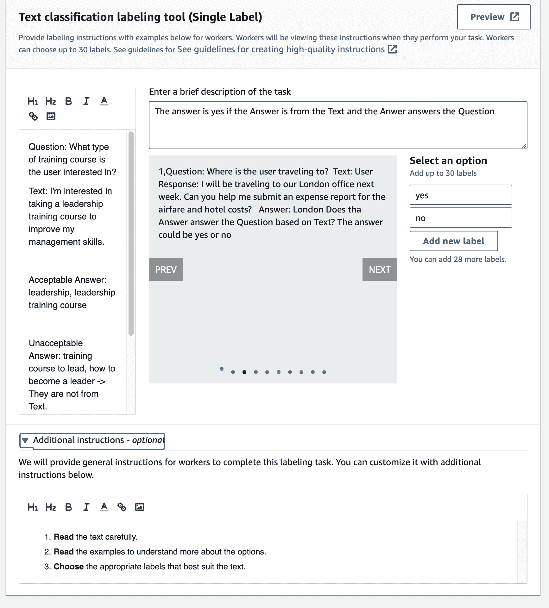

<!--yml

分类：未分类

日期：2025-01-11 12:06:20

-->

# HR-Agent：一款针对HR应用定制的任务导向对话（TOD）LLM代理

> 来源：[https://arxiv.org/html/2410.11239/](https://arxiv.org/html/2410.11239/)

Weijie Xu¹, Jay Desai¹, Fanyou Wu¹, Josef Valvoda², Srinivasan H. Sengamedu¹

¹亚马逊

²剑桥大学

weijiexu@amazon.com

###### 摘要

最近的LLM（大语言模型）进展惠及多个领域，如教育和金融，但HR领域仍有数百个重复性流程，如访问请求、医疗索赔提交和请假申请等尚未得到解决。我们将这些任务与LLM代理关联，后者已经解决了诸如写作辅助和客户支持等任务。我们提出了HR-Agent，这是一款高效、保密且针对HR的定制LLM任务导向对话系统，旨在自动化诸如医疗索赔和访问请求等重复性HR流程。由于对话数据在推理过程中不会发送给LLM，它能够保留HR任务所需的保密性。

## 1 引言

最近，自然语言处理（NLP）领域的进展已被应用于多个领域，如法律（Sargeant等人，[2024](https://arxiv.org/html/2410.11239v1#bib.bib23)）、金融（Masson和Paroubek，[2024](https://arxiv.org/html/2410.11239v1#bib.bib19)）和教育（Zhao等人，[2021b](https://arxiv.org/html/2410.11239v1#bib.bib40)）。然而，许多HR流程，如请假、安排会议、提交IT问题的工单或提交医疗索赔，依然高度低效。自动化这些流程可以节省大量本应花费在重复性工作上的时间。本文研究了LLM代理如何促进此类自动化。为了使LLM代理在HR领域中有用，它必须满足以下五个要求：

(1) 必须具备快速响应时间。如果聊天机器人无法快速完成任务，员工更不可能使用它（Hoxmeier和DiCesare，[2000](https://arxiv.org/html/2410.11239v1#bib.bib10)）。研究表明，用户满意度随着响应时间的增加而下降，理想的响应时间应小于2秒（Shneiderman和Plaisant，[2010](https://arxiv.org/html/2410.11239v1#bib.bib24)）。

(2) HR代理还必须具备抽取能力。在使用TOD提交医疗索赔时，用户必须能够信任系统能够准确检索到正确的数字。

(3) 同样重要的是系统的多功能性——它必须能够处理上述各种HR使用场景。

(4) 由于员工信息高度敏感，TOD本身必须保密。

(5) 最后，HR代理必须具有针对HR的特定功能，并能够有效执行HR相关任务，正如Xu等人所建议的那样（[2024a](https://arxiv.org/html/2410.11239v1#bib.bib32)）

图1：我们通过收集40次对话，涵盖四个不同类别：休假、医疗赔偿、简历创建和问题单处理，系统地将我们的方法与Claude方法（Zhang等人，[2023](https://arxiv.org/html/2410.11239v1#bib.bib38)）进行了响应时间比较。我们提出的HR-Agent在响应时间上表现显著优于基于Claude的TOD。事实上，我们的系统在94%的情况下实现了不到2秒的响应时间，而基于Claude的系统仅在4%的情况下达到了这一标准。这些结果突显了我们提出的HR-Agent相较于基于Claude的解决方案在速度上的巨大优势。

图2：解决方案的示意图。实体选择模型识别相关实体。选定的实体会传递给实体提取模型，以找到话语中的相关词。基于Schema的记忆和先前的话语，问题生成模型用于生成下一个问题。然后，HR-Agent系统连接到API，完成相关任务，如起草邮件、请求休假和设置状态。

为了完成任务，这些系统依赖于对话状态追踪（DST）Rastogi等人（[2020a](https://arxiv.org/html/2410.11239v1#bib.bib20)），它在对话过程中监控并预测用户意图和细节。

DST使用基于Schema的技术，分为提取式（Rastogi等人，[2020b](https://arxiv.org/html/2410.11239v1#bib.bib21); Ruan等人，[2020](https://arxiv.org/html/2410.11239v1#bib.bib22)）、生成式（Feng等人，[2021](https://arxiv.org/html/2410.11239v1#bib.bib4); Tian等人，[2021](https://arxiv.org/html/2410.11239v1#bib.bib28)）和基于LLM的（Hudeček和Dušek，[2023](https://arxiv.org/html/2410.11239v1#bib.bib11)；Zhang等人，[2023](https://arxiv.org/html/2410.11239v1#bib.bib38)）方法，用自然语言解释来追踪对话状态。然而，提取式和生成式方法受限于训练数据和较差的迁移学习，限制了它们在人力资源特定领域和通用应用中的表现。因此，它们无法满足上述第3和第5点要求。基于LLM的方法较慢且可能缺乏保密性，因此无法满足第1、2和4点要求。为此，我们提出了一个专门针对人力资源的LLM代理（HR-Agent）。它响应速度快，具有提取性、通用性、保密性，并且专为人力资源应用设计。我们总结了我们的贡献：

+   •

    尽管速度较快且更小，如图[1](https://arxiv.org/html/2410.11239v1#S1.F1 "图1 ‣ 1 引言 ‣ HR-Agent：面向任务的对话（TOD）大语言模型代理，专为HR应用量身定制")所示，在合成数据集上训练的模块相比更大的语言模型表现出更优的性能。

+   •

    基于这些模块，我们设计了一个HR-Agent系统，显著提高了人力资源流程的效率。

## 2 相关工作

Schema-Guided Dialogue (SGD)（Rastogi et al., [2020b](https://arxiv.org/html/2410.11239v1#bib.bib21)）是一个具有不断演变本体的对话数据集，引入了新的测试集槽位和服务，强调DST性能和零样本泛化能力。SGD-X（Lee et al., [2022](https://arxiv.org/html/2410.11239v1#bib.bib13)）在SGD的基础上进行了扩展，提出了五种额外的schema风格。MultiWOZ（Budzianowski et al., [2020](https://arxiv.org/html/2410.11239v1#bib.bib2)）特征为使用稳定本体的人类对话。HR-MultiWOZ（Xu et al., [2024a](https://arxiv.org/html/2410.11239v1#bib.bib32)）与HR相关任务对齐，但数据集太小，无法用于训练。这些数据集的收集需要大量的劳动和高昂的成本。

SGD-baseline Rastogi et al.（[2020b](https://arxiv.org/html/2410.11239v1#bib.bib21)），SGP-DST Ruan et al.（[2020](https://arxiv.org/html/2410.11239v1#bib.bib22)），以及DS-DST Zhang et al.（[2020](https://arxiv.org/html/2410.11239v1#bib.bib37)）联合编码话语和槽位schema，以预测相对槽位。Multi-Task BERT采用槽位传递机制，仅编码前一个系统话语和当前话语。LUNA Wang et al.（[2022](https://arxiv.org/html/2410.11239v1#bib.bib29)）分别编码对话历史、槽位和槽值，学习预测正确的话语以条件化槽值预测。然而，这些方法缺乏HR特定性和通用性。Seq2Seq-DU Feng et al.（[2021](https://arxiv.org/html/2410.11239v1#bib.bib4)）和AG-DST Tian et al.（[2021](https://arxiv.org/html/2410.11239v1#bib.bib28)）以不同方式推导状态，而DaP Lee et al.（[2021](https://arxiv.org/html/2410.11239v1#bib.bib12)）提供了两个版本，后者较慢。D3ST Zhao et al.（[2021a](https://arxiv.org/html/2410.11239v1#bib.bib39)）一次性解码整个对话状态。尽管这些生成方法，特别是在使用T5模型时，在schema-guided对话中实现了更好的联合目标准确率（JGA），但由于输入数据量庞大，它们的响应时间较慢。

尽管最近的研究努力（Li et al., [2023](https://arxiv.org/html/2410.11239v1#bib.bib14); Hudeček 和 Dušek, [2023](https://arxiv.org/html/2410.11239v1#bib.bib11); Zhang et al., [2023](https://arxiv.org/html/2410.11239v1#bib.bib38)）已取得一定进展，但基于大语言模型（LLM）的任务导向对话（TOD）在BLEU分数和成功率等性能指标上仍然较低，即使是像Alpaca-LoRA-7B（Taori et al., [2023](https://arxiv.org/html/2410.11239v1#bib.bib26)）和ChatGPT这样的模型也未能改变这一现状。LLM也不具备可提取性，且面临着高推理成本和延迟问题（Yang et al., [2023](https://arxiv.org/html/2410.11239v1#bib.bib36)），使得在现实世界中部署TOD系统变得充满挑战。例如，通过OpenAI的API使用GPT-4 8K上下文模型时，每1000个输入token的费用为$0.03，每1000个输出token的费用为$0.06。

Gan 等（2024）提出了一个框架，使用 LLM 代理进行自动化简历筛选，通过自动化提取和分析提高了招聘效率。该方法在句子分类中取得了高准确率和 F1 分数，并有效保护了隐私，通过排除个人信息在简历评分和总结时保障了隐私。然而，与 HR-Agent 不同，它并未专门解决如访问请求、医疗赔偿申请和休假提交等重复性的 HR 任务（Gan 等，[2024](https://arxiv.org/html/2410.11239v1#bib.bib5)）。

Singh（Singh，[2023](https://arxiv.org/html/2410.11239v1#bib.bib25)）探索了通过结合目标导向奖励和强化学习技术来增强基于 LLM 的任务导向对话系统。通过将对话响应与预定义目标对齐，模型提高了上下文的适应性和任务特定输出的质量。这种方法使用 MultiWOZ 数据集来衡量成功，并通过强化学习优化对话策略模型。与 HR-Agent 不同，Singh 的工作并未专注于 HR 任务的保密性和特定需求。

## 3 方法

我们首先使用了来自（Xu 等，[2024a](https://arxiv.org/html/2410.11239v1#bib.bib32)）的一个 HR 任务特定的模式。然后，我们使用该数据集中的问题和答案作为我们的训练集。我们对非话语响应关注较少。随后，我们将问题和话语格式化为实体抽取任务，并从话语中选择最相关的实体。在实际操作中，一旦我们收集到足够的模式信息，我们会利用一些 API 来使用这些结构化信息进行诸如起草电子邮件、创建工单和回答问题等任务，如图[2](https://arxiv.org/html/2410.11239v1#S1.F2 "图 2 ‣ 1 引言 ‣ HR-Agent：为 HR 应用量身定制的任务导向对话（TOD）大语言模型代理")所示。我们设计的 HR-Agent 系统可以用于请求休假、查询福利、申请内部职位、导航入职流程、请求培训、报告工作场所问题、参与调查以及与 HR 项目互动等任务。它简化了福利登记、目标设定、安全指南和合规培训等任务。由于外部 LLM 不用于任何推理，它是保密的。我们使用 Xu 等（[2024a](https://arxiv.org/html/2410.11239v1#bib.bib32)）的合成数据来完成实验。

|  | FlanT5 XL | Falcon | MPT | FlanT5-Clean | FlanT5-Raw | Claude V3 |
| --- | --- | --- | --- | --- | --- | --- |
| 大小 | 3B | 7B | 7B | 220 M | 220 M |  |
| 精确率 | 0.581 | 0.948 | 0.950 | 0.910 | 0.777 | 0.392 |
| 召回率 | 0.881 | 0.753 | 0.754 | 0.832 | 0.663 | 0.852 |
| F1 分数 | 0.663 | 0.826 | 0.828 | 0.856 | 0.703 | 0.519 |
| 响应时间 | 1.202 | 1.085 | 0.6293 | 0.366 | 0.384 | 1.163 |

表 1：实体选择性能。从左到右，我们记录了 FlanT5 XL、Falcon 7B、MPT 7B、基于筛选数据训练的 FlanT5 基础版、基于未筛选数据训练的 FlanT5 基础版以及 ClaudeV3 的性能。

|  | Flan T5 XL | Falcon | MPT | Deberta | Roberta | Flan T5 训练版 | Claude V3 |
| --- | --- | --- | --- | --- | --- | --- | --- |
| 尺寸 | 3B | 7B | 7B | 135M | 125M | 220M |  |
| RougeL | 0.786 | 0.112 | 0.292 | 0.729 | 0.767 | 0.818 | 0.793 |
| 响应时间 | 0.394 | 1.083 | 0.569 | 0.191 | 0.088 | 0.110 | 1.22 |

表 2：实体提取性能。从左到右，我们记录了 FlanT5 XL、Falcon 7B、MPT 7B、Debetra、Roberta、基于筛选数据训练的 FlanT5 基础版，以及 ClaudeV3 的性能。

### 3.1 基准方法

Falcon（Almazrouei 等，[2023](https://arxiv.org/html/2410.11239v1#bib.bib1)），一种大型语言模型（LLM），设计用于面向任务的对话系统。它侧重于优化效率和效用，旨在在各种对话场景中提供快速、准确的响应。MPT（Team，[2023](https://arxiv.org/html/2410.11239v1#bib.bib27)）是一个从头开始训练的变压器模型，基于 1T 字符串和代码的数据。它是开源的，可用于商业用途，并且其质量与 LLaMA-7B 相当。Deberta（He 等，[2021](https://arxiv.org/html/2410.11239v1#bib.bib8)）对 BERT 模型进行了增强，采用了去耦合的注意力机制，以获得更可解释的注意力得分，并使用相对位置编码来提升在抽取性任务中的表现。Roberta RoBERTa（Liu 等，[2019](https://arxiv.org/html/2410.11239v1#bib.bib17)）是一个在英语数据上预训练的变压器模型，使用掩码语言建模技术，通过掩盖和预测 15% 的输入词汇来进行双向学习。我们使用了两个模型，并在 SQuAD2.0 数据集上进行了微调，表现出色于抽取性问答任务。FlanT5 我们使用了与（Lin 等，[2021b](https://arxiv.org/html/2410.11239v1#bib.bib16)）相同的设置，在训练中使用 DDP，设置验证损失用于早停，并将最大训练轮次设置为 20。

### 3.2 实体选择

对于实体选择，我们需要选择那些可以通过语句回答的相关实体。我们选择 FlanT5 作为基础模型，因为它的模型尺寸较小，并且在 Schema Guided Dialogue 文献中被广泛探索。由于实体本身缺乏信息性，我们选择生成关于该实体的问题，因为用于训练 Flan 的数据集大多数包含问题。接下来，我们使用测试集评估 5 个模型。我们为每个模板提供相同的示例，并对预训练模型（如 MPT 和 Falcon）进行 10 个模板的结果平均计算。FlanT5 训练了 5 次，评估结果取平均值。该模型在 p3.8xlarge 上进行训练和评估。我们没有使用加速器或 ONNX 来进行推理，以便公平比较响应时间。我们基准测试了精确度、召回率、F1 分数和响应时间。

我们理想的解决方案应该具有较高的召回率，但不应输出过多的实体，否则会显著增加TOD系统的响应时间。基于解码器的模型在F1分数上表现良好，但召回率较低。微调后的FlanT5在实现最佳F1分数的同时，也取得了第二好的召回率。Claude V3实现了最佳召回率，但倾向于选择大部分实体，响应较慢。没有数据清理时，FlanT5倾向于选择许多首选项，导致召回率较低。我们选择在筛选数据上训练的FlanT5作为我们的实体选择模型，因为它速度快且保密性强。由于训练集多样且具有HR特定性，训练后的模型也继承了这些优势。

### 3.3 实体提取

除了Falcon和MPT，我们还使用Deberta和Roberta进行实体提取基准测试。我们还在合成数据集（20K）上对一个小型FlanT5模型进行了微调。我们比较了每个模型的Rouge 1、Rouge L和响应时间。我们的目标是选择一个具有提取能力且响应时间较低的模型。

我们理想的解决方案应该具有较低的响应时间和较高的Rouge1分数。Claude未能达到良好的Rouge1分数，且训练时间较长。它无法有效使用话语中的单词。根据我们选择的模型，我们发现像Roberta和Deberta这样的提取型模型在提取任务中表现较好，而仅解码的模型如MPT和Falcon表现较差。Flan T5表现最佳。经过筛选的合成数据集训练的Flan T5进一步提高了Rouge1表现，提升幅度为5个百分点，因为它更具提取性。与更大的模型相比，训练后的模型也非常快速，且与基于Roberta的模型相当。因此，我们选择经过训练的FlanT5作为我们的实体提取模型。

### 3.4 问题生成

在回应中注入更多同理心至关重要，因为这有助于促进更具人性化和易于共鸣的互动体验。为了实现这一点，我们将话语和接下来的问题作为输入。我们将这些输入提供给Claude-V3，并要求Claude-V3重写一条简洁且富有同理心的回应，如表[11](https://arxiv.org/html/2410.11239v1#A6.T11 "表 11 ‣ 附录 F 问题生成数据 ‣ HR-Agent：专为人力资源应用量身定制的任务导向对话 (TOD) LLM 代理")所示。为了评估Claude3-V3在重述富有同理心的回应方面的表现，我们希望与HR-Multiwoz数据集中生成的回应进行基准比较。为此，我们首先识别出可能反映用户负面情绪的回应。我们使用基于SST-2数据集微调的DistillBert作为情感分类器。由于微调后的DistillBert未经过校准，只有得分高于0.998且被分类为负面的句子才会被选中。我们已从HR-Multiwoz收集了638条回应。接下来，我们手动将这些问题重写为基础问题，并利用Claude3-V3对其进行重写。基础问题意味着它只包含问题本身，不含任何额外信息。

为了评估我们HR-Agent生成的回应的有效性和人类偏好，我们进行了一项偏好研究，参与者为使用Amazon SageMaker Ground Truth (GT) 的人工标注员。我们将HR-Agent生成的回应（标记为回应A）与HR-MultiWOZ数据集中的回应（标记为回应B）进行了比较。

标注员被提供了对话场景，并要求选择他们偏好的回应。本次评估使用的用户界面如图[4](https://arxiv.org/html/2410.11239v1#A5.F4 "图 4 ‣ E.2 Mechanical Turk ‣ 附录 E 数据验证 ‣ HR-Agent：专为人力资源应用量身定制的任务导向对话 (TOD) LLM 代理")所示。每个回应由三位标注员进行评估，每个标签的费用为$0.0012。该研究的结果如图[3](https://arxiv.org/html/2410.11239v1#S3.F3 "图 3 ‣ 3.4 问题生成 ‣ 3 方法 ‣ HR-Agent：专为人力资源应用量身定制的任务导向对话 (TOD) LLM 代理")所示。

图3：HR-Agent（A）和HR-MultiWOZ（B）回应的标签偏好。

我们的研究表明，HR-Agent生成的回应更受欢迎。在评估的所有回应中，回应A被优选409次，而回应B仅被优选65次。回应A的强烈偏好表明，HR-Agent的回应更符合标注员的期望和需求。

HR-Agent在回答中使用同理心，增加了其偏好。例如，当一名员工询问如何安排医疗预约时，HR-Agent的回答：“我理解医疗紧急情况可能带来压力。请提供事件详情，以便我们为您提供帮助。”相比HR-MultiWOZ数据集中更直白的回答，更被认为是富有同理心和支持的。

这些发现强调了将对话系统定制化以适应特定领域的重要性，并融入诸如同理心等元素，以提高用户满意度和参与度。

### 3.5 系统评估

为了证明我们设计的系统在与HR相关的任务中表现最佳，我们使用HR-Multiwoz作为评估集。我们将我们的方法与TransferQA（Lin等， [2021a](https://arxiv.org/html/2410.11239v1#bib.bib15)）和SGP-TOD（Zhang等，[2023](https://arxiv.org/html/2410.11239v1#bib.bib38)）进行比较。ZST通过将槽位填充任务作为QA问题来跟踪对话状态，采用了在大型QA数据集上预训练的序列到序列模型（T5）。我们将T5替换为Deberta和Roberta，这是HR-Multiwoz基准排行榜推荐的模型。SGP-TOD使用提示词工程来指导对话并提取相关字段。

共同目标准确率（JGA）和平均目标准确率（AGA）用于评估我们的模型和基准。对于JGA，模型输出仅在所有预测值与真实值完全匹配时才被视为正确。AGA是每轮对话中活动槽位的平均准确率。

如表[3](https://arxiv.org/html/2410.11239v1#S3.T3 "Table 3 ‣ 3.6 Prompt ‣ 3 Methods ‣ HR-Agent: A Task-Oriented Dialogue (TOD) LLM Agent Tailored for HR Applications")所示，我们提出的方法在HR-Multiwoz数据集上的JGA和AGA方面实现了最好的性能，超过了现有的先进方法。这意味着HR-Agent在与人力资源相关的SGD任务中表现良好。

### 3.6 提示词

如表[8](https://arxiv.org/html/2410.11239v1#A4.T8 "Table 8 ‣ Appendix D Experiment Setup Appendix ‣ HR-Agent: A Task-Oriented Dialogue (TOD) LLM Agent Tailored for HR Applications")和表[9](https://arxiv.org/html/2410.11239v1#A4.T9 "Table 9 ‣ Appendix D Experiment Setup Appendix ‣ HR-Agent: A Task-Oriented Dialogue (TOD) LLM Agent Tailored for HR Applications")所示，我们在实验中使用的提示词适用于MPT、Falcon和FlanT5。

Claude-V3的提示为“答案非常简短，始终少于2个词。将答案放入<answer></answer> XML标签中。”用于实体提取；“答案始终包含2到5个选项。将答案放入<answer></answer> XML标签中。”用于实体选择。我们使用的最大令牌数为10，温度为0.2，停止序列为</answer>。

|  | JGA | AGA |
| --- | --- | --- |
| TrasnferQA Roberta | 8.65 | 26.62 |
| TrasnferQA Deberta | 18.89 | 55.61 |
| SGP-TOD | 10.74 | 54.77 |
| HR-Agent | 20.47 | 55.38 |

表3：HR-Agent在HR-Multiwoz上的整体表现。它在JGA和AZA方面都表现更佳。

### 3.7 其他考虑事项

这一过程的一个重要部分是进行严格的事实核查，以验证生成的答案，从而提高可靠性和可信度。例如，在识别医疗服务提供商时，系统会在处理医疗索赔之前确认其数据库中的详细信息。用户还可以在整个过程中追踪模式，确保责任性和可信度。我们的数据集与现有数据库连接，以检索相关信息，并且仅在必要时才进行查询。在收集数据后，用户确认模式和任务，我们再连接相关的API来完成任务。在将信息输入系统之前，确保信息的准确性非常重要。例如，今天收集的休假日期对于系统来说没有足够的信息来追踪确切的日期。为了解决这些不准确的问题，我们会调用Claude来自动完成不准确的信息。例如，Claude可以将“明天”改为“11月1日”，将“98121”改为“西雅图，WA”。这可以帮助系统捕捉到准确的信息。然后我们会在调用API并使用结构化信息之前与用户确认。系统可以大大减少用户输入的内容，以获取所需的信息。

## 4 结论

在提高公司员工效率方面，我们推出了HR-Agent，一个快速、提取式且保密的对话系统，专门为人力资源需求量身定制。我们的工作包括几个关键贡献：识别将TOD应用于人力资源环境中的挑战，设计一个快速且领域特定的数据生成方法，展示较小、训练更快的模块相较于较大模型的优越表现，最终将HR-Agent交付作为一种显著提高人力资源流程效率的解决方案。

## 5 伦理声明

该系统是一个原型，尚未在生产环境中部署。

在人力资源领域部署AI应用程序需要仔细考虑与安全性、隐私和偏见相关的伦理问题。有可能在试图提供帮助时，AI会造成比好处更多的伤害。为此，我们与用户体验研究员、安全审查员和人力资源专业人员合作，提出了以下步骤，供计划使用HR-Agent的开发人员参考，以尽量减少伤害的风险。

**用户知情同意**：在试点阶段，员工在使用该服务时已获得知情同意。他们被告知将与一个基于 AI 的聊天机器人互动，该机器人旨在加速任务完成。还告知员工，某些提取的信息可能不准确，用户必须在利用这些信息进行后续任务之前验证其正确性。为此，HR 代理应该在每次对话结束时展示收集的信息，并请求员工确认其准确性。开发人员应该在员工使用 HR 代理后邀请他们参加调查，以了解 HR 代理的有效性和帮助程度。他们应明确表示，HR 代理用于填写相关任务，而不是用于其他任何目的。当员工与 HR 代理互动时，开发人员应提供相关的 HR 业务伙伴联系信息作为头部信息。

**防护措施**：当 HR 代理无法提取相关实体时，应该提出澄清性问题。如果对同一实体的澄清性问题重复超过三次，则对话应结束。开发人员可以使用情感分析模型每四次用户响应后监控员工的情感，如果负面情感得分超过 0.5，则对话结束。开发人员在结束对话时应提供与任务相关的内部 Wiki。对于某些应用，还会设置防护措施，防止涉及金额和时间的范围超过特定阈值。需要注意的是，HR 代理目前的应用有限，开发人员应根据需要更新这些防护措施。

**隐私**：在系统中，员工提供的信息应与员工的一般人事档案分开，单独保存。员工有权使用此记录，或将其输入其他系统，或授予开发人员权限以供分析使用。此政策遵循《美国残疾人法案》(ADA) 和《基因信息反歧视法案》(GINA)。请注意，系统中的所有模型应使用合成数据进行训练。开发人员不应使用任何真实员工数据来训练模型。开发人员还必须确保系统中的数据符合严格的内部信息安全政策和标准。例如，安全测试包括检查应用日志，以检测是否存在数据泄漏。

负面示例/潜在偏差：为了减轻生成模型中的潜在偏差，开发者应采用提取式方法。然而，提取的效果可能会因员工的语言流利度而有所不同。这种差异可能导致非母语英语使用者在任务导向对话（TOD）系统中的效率低下。此外，当从一个回答中提取多个相同类型的实体（例如时间和金额）时，系统容易出错。目前正在进行努力，以理解并解决这些问题。

开发者应进行威胁建模、安全测试和渗透测试评估系统。

## 6 限制和风险

限制 我们没有探索其他模型的训练，例如Deberta或LLama2。我们没有在真实数据上评估模型。

风险 由于一些隐私问题，我们没有讨论整个架构的详细信息。部署该架构的风险在于，由于测试集是合成的，真实数据上的性能可能会略有偏差。

## 7 未来工作

展望未来，潜在的进展包括生成简历和电子邮件的能力，与各种API接口的能力，熟练回答查询，并识别相关票务，从而进一步提高系统的实用性和效率。为了提升模型的性能和能力，积累一个大规模数据集进行模型微调是至关重要的，这将使其能够并行执行多个任务。这一进展的基本前提包括处理更长序列的能力，并提供明确的前期指令以进行实体提取和任务执行。此外，阐明与其他智能体的连接至关重要，提供一种全面且互联的任务管理和执行方式，从而增强模型的整体效率和效果。我们可以利用主题建模（Xu 等， [2023b](https://arxiv.org/html/2410.11239v1#bib.bib34)， [a](https://arxiv.org/html/2410.11239v1#bib.bib31)， [2024b](https://arxiv.org/html/2410.11239v1#bib.bib33); Guo 等， [2024](https://arxiv.org/html/2410.11239v1#bib.bib7)）来更好地理解和细分使用案例。我们可以利用差分隐私合成数据生成机制（Madl 等， [2023](https://arxiv.org/html/2410.11239v1#bib.bib18)；Xu 等， [2023c](https://arxiv.org/html/2410.11239v1#bib.bib35)）来避免潜在的隐私问题。我们还可以将其应用于招聘过程（Howison 等， [2024](https://arxiv.org/html/2410.11239v1#bib.bib9)；Fang 等， [2024](https://arxiv.org/html/2410.11239v1#bib.bib3)）。

## 参考文献

+   Almazrouei 等人（2023）Ebtesam Almazrouei, Hamza Alobeidli, Abdulaziz Alshamsi, Alessandro Cappelli, Ruxandra Cojocaru, Merouane Debbah, Etienne Goffinet, Daniel Heslow, Julien Launay, Quentin Malartic, Badreddine Noune, Baptiste Pannier, 和 Guilherme Penedo. 2023. Falcon-40B：一种具有最先进性能的开放大语言模型。*无*。

+   Budzianowski 等人（2020）Paweł Budzianowski, Tsung-Hsien Wen, Bo-Hsiang Tseng, Iñigo Casanueva, Stefan Ultes, Osman Ramadan, 和 Milica Gašić. 2020. [Multiwoz——一个大型多领域“巫师的助手”任务导向对话建模数据集](http://arxiv.org/abs/1810.00278)。

+   Fang 等人（2024）Xi Fang, Weijie Xu, Fiona Anting Tan, Ziqing Hu, Jiani Zhang, Yanjun Qi, Srinivasan H. Sengamedu, 和 Christos Faloutsos. 2024. [大语言模型（LLMs）在表格数据中的应用：预测、生成与理解——一项综述](https://openreview.net/forum?id=IZnrCGF9WI)。*机器学习研究事务*。

+   Feng 等人（2021）Yue Feng, Yang Wang, 和 Hang Li. 2021. [基于序列到序列方法的对话状态追踪](https://doi.org/10.18653/v1/2021.acl-long.135)。收录于 *第59届计算语言学协会年会暨第11届国际联合自然语言处理会议（第一卷：长文）*，第1714–1725页，在线。计算语言学协会。

+   Gan 等人（2024）Chengguang Gan, Qinghao Zhang, 和 Tatsunori Mori. 2024. [LLM 代理在招聘中的应用：一种新的简历筛选框架](http://arxiv.org/abs/2401.08315)。

+   Gunasekar 等人（2023）Suriya Gunasekar, Yi Zhang, Jyoti Aneja, Caio César Teodoro Mendes, Allie Del Giorno, Sivakanth Gopi, Mojan Javaheripi, Piero Kauffmann, Gustavo de Rosa, Olli Saarikivi, Adil Salim, Shital Shah, Harkirat Singh Behl, Xin Wang, Sébastien Bubeck, Ronen Eldan, Adam Tauman Kalai, Yin Tat Lee, 和 Yuanzhi Li. 2023. [教科书就是你所需的一切](http://arxiv.org/abs/2306.11644)。

+   Guo 等人（2024）Xiaobo Guo, Jay Desai, 和 Srinivasan H. Sengamedu. 2024. [Jads：一个用于自监督联合方面发现与摘要的框架](http://arxiv.org/abs/2405.18642)。

+   He 等人（2021）Pengcheng He, Xiaodong Liu, Jianfeng Gao, 和 Weizhu Chen. 2021. [Deberta：一种解码增强的 BERT，具备解耦注意力机制](http://arxiv.org/abs/2006.03654)。

+   Howison 等人（2024）Mark Howison, William O. Ensor, Suraj Maharjan, Rahil Parikh, Srinivasan H. Sengamedu, Paul Daniels, Amber Gaither, Carrie Yeats, Chandan K. Reddy, 和 Justine S. Hastings. 2024. [利用生成式人工智能从职位发布中提取结构化劳动力市场信息](https://doi.org/10.1145/3674847)。*数字政府：研究与实践* 已接受。

+   Hoxmeier 和 DiCesare（2000）John A Hoxmeier 和 Chris DiCesare. 2000. 系统响应时间与用户满意度：一个基于浏览器应用的实验研究。*AMCIS*。

+   Hudeček 和 Dušek（2023）Vojtěch Hudeček 和 Ondřej Dušek. 2023. 大型语言模型是任务导向对话所需的一切吗？ *arXiv 预印本 arXiv:2304.06556*。

+   Lee 等人（2021）Chia-Hsuan Lee, Hao Cheng, 和 Mari Ostendorf. 2021. [使用模式驱动提示的语言模型进行对话状态跟踪](https://doi.org/10.18653/v1/2021.emnlp-main.404)。在 *2021年自然语言处理经验方法会议论文集*，页面4937–4949，在线与多米尼加共和国蓬塔卡纳。计算语言学协会。

+   Lee 等人（2022）Harrison Lee, Raghav Gupta, Abhinav Rastogi, Yuan Cao, Bin Zhang, 和 Yonghui Wu. 2022. [SGD-x：一个用于模式引导对话系统的稳健泛化基准](https://doi.org/10.1609/aaai.v36i10.21341)。 *人工智能AAAI会议论文集*，36(10)：10938–10946。

+   Li 等人（2023）Zekun Li, Baolin Peng, Pengcheng He, Michel Galley, Jianfeng Gao, 和 Xifeng Yan. 2023. 通过方向性刺激提示引导大型语言模型。 *arXiv 预印本 arXiv:2302.11520*。

+   Lin 等人（2021a）Zhaojiang Lin, Bing Liu, Andrea Madotto, Seungwhan Moon, Zhenpeng Zhou, Paul Crook, Zhiguang Wang, Zhou Yu, Eunjoon Cho, Rajen Subba, 和 Pascale Fung. 2021a. [通过跨任务迁移进行零-shot对话状态跟踪](https://doi.org/10.18653/v1/2021.emnlp-main.622)。在 *2021年自然语言处理经验方法会议论文集*，页面7890–7900，在线与多米尼加共和国蓬塔卡纳。计算语言学协会。

+   Lin 等人（2021b）Zhaojiang Lin, Bing Liu, Seungwhan Moon, Paul A Crook, Zhenpeng Zhou, Zhiguang Wang, Zhou Yu, Andrea Madotto, Eunjoon Cho, 和 Rajen Subba. 2021b. 利用槽描述进行零-shot跨领域对话状态跟踪。 在 *2021年北美计算语言学学会会议：人类语言技术会议论文集*，页面5640–5648。

+   Liu 等人（2019）Yinhan Liu, Myle Ott, Naman Goyal, Jingfei Du, Mandar Joshi, Danqi Chen, Omer Levy, Mike Lewis, Luke Zettlemoyer, 和 Veselin Stoyanov. 2019. [Roberta：一种稳健优化的BERT预训练方法](http://arxiv.org/abs/1907.11692)。

+   Madl 等人（2023）Tamas Madl, Weijie Xu, Olivia Choudhury, 和 Matthew Howard. 2023. [近似、适应、匿名化（3a）：一个用于机器学习的隐私保护训练数据发布框架](http://arxiv.org/abs/2307.01875)。

+   Masson 和 Paroubek（2024）Corentin Masson 和 Patrick Paroubek. 2024. [评估在不对称和多领域金融语料库上的主题模型](https://aclanthology.org/2024.lrec-main.578)。在 *2024年联合国际计算语言学会议、语言资源与评估会议（LREC-COLING 2024）* 论文集中，页面6515–6529，意大利都灵。ELRA 和 ICCL。

+   Rastogi 等（2020a）Abhinav Rastogi, Xiaoxue Zang, Srinivas Sunkara, Raghav Gupta 和 Pranav Khaitan. 2020a. 迈向可扩展的多领域对话代理：基于模式引导的对话数据集。在 *人工智能协会会议论文集*，05，页码 8689–8696。

+   Rastogi 等（2020b）Abhinav Rastogi, Xiaoxue Zang, Srinivas Sunkara, Raghav Gupta 和 Pranav Khaitan. 2020b. [迈向可扩展的多领域对话代理：基于模式引导的对话数据集](http://arxiv.org/abs/1909.05855)。

+   Ruan 等（2020）Yu-Ping Ruan, Zhen-Hua Ling, Jia-Chen Gu 和 Quan Liu. 2020. 微调 BERT 用于模式引导的零-shot 对话状态追踪。*arXiv 预印本 arXiv:2002.00181*。

+   Sargeant 等（2024）Holli Sargeant, Ahmed Izzidien 和 Felix Steffek. 2024. [使用大语言模型和全新的英国法律分类法进行主题建模：AI 对摘要判决的见解](http://arxiv.org/abs/2405.12910)。

+   Shneiderman 和 Plaisant（2010）Ben Shneiderman 和 Catherine Plaisant. 2010. *设计用户界面：有效的人机交互策略*。Addison-Wesley 计算机出版。

+   Singh（2023）Vasudha Singh. 2023. *探索基于大语言模型（LLM）聊天机器人在人力资源中的作用*。博士论文，德克萨斯大学奥斯汀分校。

+   Taori 等（2023）Rohan Taori, Ishaan Gulrajani, Tianyi Zhang, Yann Dubois, Xuechen Li, Carlos Guestrin, Percy Liang 和 Tatsunori B Hashimoto. 2023. Alpaca：一种强大的、可复制的指令跟随模型。*斯坦福大学基础模型研究中心。 https://crfm.stanford.edu/2023/03/13/alpaca.html*，3(6):7。

+   Team（2023）MosaicML NLP 团队. 2023. [介绍 MPT-7B：一种新的开源、可商业使用的 LLM 标准](www.mosaicml.com/blog/mpt-7b)。*无*。访问时间：2023-05-05。

+   Tian 等（2021）Xin Tian, Liankai Huang, Yingzhan Lin, Siqi Bao, Huang He, Yunyi Yang, Hua Wu, Fan Wang 和 Shuqi Sun. 2021. [可修改生成的对话状态追踪](https://doi.org/10.18653/v1/2021.nlp4convai-1.8)。在 *第3届对话AI自然语言处理工作坊论文集*，页码 80–92，线上。计算语言学协会。

+   Wang 等（2022）Yifan Wang, Jing Zhao, Junwei Bao, Chaoqun Duan, Youzheng Wu 和 Xiaodong He. 2022. [LUNA：用于对话状态追踪的学习槽位-轮次对齐](https://doi.org/10.18653/v1/2022.naacl-main.242)。在 *2022年北美计算语言学协会年会论文集：人类语言技术*，页码 3319–3328，美国西雅图。计算语言学协会。

+   Wang 等（2023）Yizhong Wang, Yeganeh Kordi, Swaroop Mishra, Alisa Liu, Noah A. Smith, Daniel Khashabi 和 Hannaneh Hajishirzi. 2023. [自我指令：将语言模型与自生成指令对齐](http://arxiv.org/abs/2212.10560)。

+   许等人（2023a）许伟杰、胡文祥、吴凡友和斯里尼瓦桑·森加梅杜。2023a。[DeTiME：基于编码器-解码器的LLM的扩散增强主题建模](https://doi.org/10.18653/v1/2023.findings-emnlp.606)。发表于*计算语言学协会发现：EMNLP 2023*，第9040–9057页，新加坡。计算语言学协会。

+   许等人（2024a）许伟杰、黄子成、胡文祥、方熙、拉杰什·切鲁库里、纳马安·奈亚尔、洛伦佐·马兰德里和斯里尼瓦桑·森加梅杜。2024a。[HR-MultiWOZ：用于HR LLM代理的任务导向对话（TOD）数据集](https://aclanthology.org/2024.nlp4hr-1.5)。发表于*人力资源自然语言处理第一工作坊（NLP4HR 2024）论文集*，第59–72页，马耳他圣朱利安。计算语言学协会。

+   许等人（2024b）许伟杰、姜晓宇、杰伊·德赛、韩斌、闫富钦和弗朗西斯·伊安纳奇。2024b。[KDSTM：基于知识蒸馏的神经半监督主题建模](http://arxiv.org/abs/2307.01878)。

+   许等人（2023b）许伟杰、姜晓宇、斯里尼瓦桑·森加梅杜·哈努曼塔·拉奥、弗朗西斯·伊安纳奇和赵锦锦。2023b。 [vONTSS：基于vMF的半监督神经主题建模与最优传输](https://doi.org/10.18653/v1/2023.findings-acl.271)。发表于*计算语言学协会发现：ACL 2023*，第4433–4457页，加拿大多伦多。计算语言学协会。

+   许等人（2023c）许伟杰、赵锦锦、弗朗西斯·伊安纳奇和王博。2023c。[Ffpdg：快速、公平和私密的数据生成](http://arxiv.org/abs/2307.00161)。

+   杨等人（2023）杨景峰、金红烨、唐瑞祥、韩晓天、冯启章、蒋浩铭、尹冰、胡霞。2023。实践中利用大语言模型的力量：关于ChatGPT及其扩展的调查。*arXiv预印本 arXiv:2304.13712*。

+   张等人（2020）张建国、桥本和真、吴建生、王耀、余国平、理查德·索彻和熊才明。2020。[查找或分类？用于多领域对话状态追踪的插槽值预测双重策略](https://aclanthology.org/2020.starsem-1.17)。发表于*第九届联合词汇与计算语义学会议论文集*，第154–167页，西班牙巴塞罗那（在线）。计算语言学协会。

+   张等人（2023）张晓莹、彭保林、李坤、周晶妍和孟欣琳。2023。SGP-TOD：通过模式引导LLM提示轻松构建任务型机器人。*arXiv预印本 arXiv:2305.09067*。

+   赵等人（2021a）赵杰弗里、马赫迪斯·马赫迪耶、张烨、曹元和吴永辉。2021a。[有效的序列到序列对话状态追踪](https://aclanthology.org/2021.emnlp-main.593)。发表于*2021年自然语言处理经验方法会议论文集*，在线和多米尼加共和国蓬塔卡纳。计算语言学协会。

+   Zhao 等人（2021b）Jinjin Zhao、Kim Larson、Weijie Xu、Neelesh Gattani 和 Candace Thille。2021b。[面向构造性回答问题的有针对性的反馈生成](https://www.amazon.science/publications/targeted-feedback-generation-for-constructed-response-questions)。发表于 *AAAI 2021 人工智能教育研讨会*。

## 附录 A 合成示例

我们首先尝试生成与这些数据集相似的数据，其中对话和 schema 由对话生成。我们可以使用两个 Claude 代理，一个充当员工，另一个充当 TOD 系统。然后我们使用第三个 Claude 代理来跟踪 schema。为了生成对话，该方法每个样本需要多次 API 调用，成本较高。

还有许多其他问题。经过几轮生成后，即使提示非常不同，结果也会变得重复。语言模型倾向于根据其训练数据和先验知识，跟随最可能或最常见的路径，并且缺乏创造力或动力去探索替代路径。对话可能也会变得不相关。因此，在这些数据上训练的系统不太可能是抽取式、通用型的，也不具备人力资源的特定能力。

| Speaker | 对话与 Schema |
| --- | --- |
| Employee | 我想请下周四和周五的假。 |
| Chatbot | 好的，你想请哪几天的假？ $\rightarrow$ 提问重复的问题 |
| Schema | timeOffStartDate: ? $\rightarrow$ 无法捕获正确的信息 |
|  | timeOffEndDate: ? |
| Employee | 下周四19号和周五20号。 |
| Chatbot | 明白了。你能确认请假的原因吗？ |
| Schema | timeOffDate: 2023年$10$月$19$-$20$日 $\rightarrow$ 突然更改了 schema，未能提取信息 |
| Employee | 是为了看医生。我的名字是 John Smith。 |
| Chatbot | 好的，我收到来自 John Smith 的请求，日期为 10 月 19 日至 20 日，是看医生的预约。 |
| Schema | timeOffDate: 2023年$10$月$19$-$20$日 |
|  | reason: 看医生 |
|  | name: John Smith |

表格 4：这是 Claude 生成的示例。schema 不断变化，但未能正确捕获信息。聊天机器人还询问了用户已经提到过的信息。聊天机器人也没有进行信息抽取。

.

## 附录 B 设计的提示

这是我们设计的提示，每次 schema、number1 和 number2 都会变化。我们使用 output1 和 output2 来捕获两个任务的答案。我们使用 Claude-V3 模型。我们将最大 token 样本数设置为 4096。我们将温度设为 1，top k 设为 1，top p 设为 0.6，以确保生成良好的输出长度，同时捕获多个样本并保持足够的多样性。

| Human: 你被要求提出一组包含 20 个不同场景的情景。输入是用户的回复和一组可以通过用户回复回答的问题列表。指令是选择那些可以通过用户输入回答的问题，并为每个选定的问题提供答案。 |
| --- |
| 要求：1. 尽量避免每个输入重复使用动词或情况，以最大化多样性。2. 用户回应的语言应具有多样性。3. 输入的类型应具有多样性。用户回应应包括不同类型的任务，如架构。4. 应根据输入生成合适的问题列表。它应涉及现实数据，而不是简单的占位符。5. 问题列表应以选项名称开始，如a、b、c等。6. 输出1应包含用户回应中可以回答的选项。7. 输出1应包含所有正确的选项名称，如a、b、c。8. 问题列表应包含编号为1的问题。9. 输出1包含编号为2的选项。10. 每个问题有相等的机会成为正确答案，答案不应总是包含“a”。11. 输出2应为每个问题的正确答案。12. 输出2的答案应从用户回应中提取。13. 输出2的答案不能是“是”或“否”。14. 场景是帮助公司从员工中提取信息。15. 尽量避免提问相似的问题，以最大化多样性。16. 输出2不包含选择符号，如a、b、c。17. 输出2的答案只能从用户回应中提取。18. 输出2使用逗号分隔答案。19. 每个案例之间应有两个空行。 |
| 示例：用户回应：我将下周一作为休假日。问题列表：a. 请求的休假时间是什么？b. 用户希望接收方采取什么行动？c. 用户已完成什么过程？d. 请求的休假类型是什么？输出1：a, d |
| 输出2：下周一，休假日 |

表5：这是一个为Claude生成的示例提示

## 附录C 输出示例

这是使用Claude V3输出的示例：

| 用户回应：我想安排下周二下午2点的医生预约进行体检。问题列表：a. 用户想安排什么类型的预约？b. 用户希望在什么时候安排预约？c. 用户希望预约的时间是什么？d. 预约的目的是什么？e. 用户希望接收方采取什么行动？f. 用户请求预约的日期是什么？g. 用户是否提供了请求预约的日期？h. 用户是否提供了请求预约的时间？输出1：a, b, c, d |
| --- |
| 输出2：安排，下周二，下午2点，体检 |

表6：该示例完美地遵循我们设计的使用Claude的提示。

我们还尝试了更便宜的选项，如Jurassic-2，但未能让它们遵循指令。

| 这里是一个 Jurassic-2 用户回应的示例：“我想询问一下我的员工福利。” 问题列表：1. 您想询问哪种类型的福利？（例如，健康保险、退休计划等） 2. 您目前是公司员工吗？ 3. 您在公司工作多久了？ 4. 您有资格享受福利吗？（例如，全职员工、兼职员工等） 5. 您是任何福利的主要受益人吗？（例如，配偶、子女等） 6. 您是否有任何关于福利的具体问题或疑虑？ 7. 您希望以何种方式接收福利信息？（例如，电子邮件、信件等） 输出 1：a) 健康保险 b) 退休计划 c) 人寿保险 d) 牙科保险 e) 残疾保险 f) 假期和病假 输出 2：1. 健康保险 2. 是 3. 全职员工 4. 是 5. 是 6. 否 7. 电子邮件 |
| --- |

表 7：Jurassic-2 生成的示例

## 附录 D 实验设置附录

与实验设置相关的各种表格展示在本节中。

| 否。 | 句子 |
| --- | --- |
| 1 | 您能从文本中获取问题的答案吗？ |
| 2 | 您能从文本中提取问题的答案吗？ |
| 3 | 您介意从文本中提取问题的回复吗？ |
| 4 | 我希望您从文本中获取问题的答案。 |
| 5 | 您能在文本中找到问题的解决方案吗？ |
| 6 | 请在文本中确定问题的答案。 |
| 7 | 您能在文本中找到问题的回应吗？ |
| 8 | 如果您能从文本中提取问题的答案，我将不胜感激。 |
| 9 | 能否从文本中获取问题的回复？ |
| 10 | 请在文本中搜索问题的答案。 |

表 8：实体提取的表格格式提示

| 否。 | 句子 |
| --- | --- |
| 1 | 您能识别出文本可以回答的合适问题吗？ |
| 2 | 请找到文本提供答案的正确问题。 |
| 3 | 您能确定一个可以使用文本解决的合适问题吗？ |
| 4 | 我希望您能指出文本可以解答的正确问题。 |
| 5 | 请找到与文本答案相符的问题。 |
| 6 | 您能辨别出文本可以回应的合适问题吗？ |
| 7 | 如果您能确定可以用文本回答的确切问题，我将不胜感激。 |
| 8 | 您能选择文本可以满意回答的问题吗？ |
| 9 | 能否识别出与文本答案相符的问题？ |
| 10 | 请推断出与文本回答相符的正确问题。 |

表 9：实体选择的表格格式提示

## 附录 E 数据验证

### E.1 LLM 用于验证数据

我们使用以下字符串输入到 Vicuna 和 FlanT5 XXL 中以验证数据：问题：${question}$ 文字：${text}$ 答案：${answer}$ 根据文字，答案是否回答了问题？答案可以是是或否。我们只选择答案包含“是”的数据。对于 Claude，我们输入50个数据点并要求模型找到答案为“否”的行号。通过这种方式，我们节省了推理成本。

### E.2 机械土耳其人

我们每个任务支付每位人工标注者0.012美元。我们不启用自动数据标注。

图 4：用于人类偏好研究的用户界面。

图 5：MTurk 问题及选定示例

## 附录 F 问题生成数据

以下示例展示了合成样本的应用。

表 10：用户输入、下一个问题和共情回应

| 用户输入 | 下一个问题 | 共情回应 |
| --- | --- | --- |
| "上周我遇到医疗紧急情况，需要提交索赔。" | "能否提供事故的详细信息？" | "我理解医疗紧急情况可能很有压力。请分享事故详情，以便我们提供帮助。" |
| "我收到了似乎不正确的医疗账单。" | "能否提供账单的详细信息？" | "处理医疗账单可能会让人困惑。请分享账单详情，我们会调查处理。" |
| "我在网站上收到 ’404 Not Found’ 错误，我该怎么办？" | "能否提供更多关于发生时间和地点的上下文信息？" | "网站错误可能令人沮丧。请告诉我更多信息，我会有效地帮助您。" |
| "我的代码无法编译，我不理解错误信息。" | "能否提供错误信息和代码片段，以便更好地协助您？" | "编码错误可能很具挑战性。请提供错误信息和您的代码，我们一起解决这个问题。" |

表 11：用于训练具备共情能力的问答生成模型的生成示例

## 附录 G 人力资源用例

HR-Agent 系统用于申请休假、查询福利、获取薪资详情、申请内部职位、导航入职流程、安排绩效评审、请求培训、报告工作场所问题、访问政策、参与调查并参与人力资源倡议。它简化了福利注册、目标设定、安全指南和合规培训。

## 附录 H 数据生成过程

虽然在前节中讨论了许多 Schema-Guided Dialogue 数据集，但这些数据集并不特定于人力资源（HR）。因此，我们需要生成合成数据以创建一个 TOD 系统。我们使用 Claude 来生成合成数据，相比于 GPT-4，它在 API 成本方面更具成本效益，并且能够轻松与 AWS 生态系统集成。在寻找一个高性价比的数据生成选项时，我们尝试使用 Claude 生成对话和架构。然而，在尝试了各种提示后，我们发现生成的架构并不总是包含对话中的实体（非提取式），未能捕获正确的信息，且保持不一致。聊天机器人的问题也可能变得冗余。我们提供了一个示例并在附录 [A](https://arxiv.org/html/2410.11239v1#A1 "Appendix A Synthetic Example ‣ HR-Agent: A Task-Oriented Dialogue (TOD) LLM Agent Tailored for HR Applications") 中讨论了其他选项和问题。这些问题共同使得合成数据变得难以使用。

如前节所述，大多数模型执行了两个任务。第一个任务是选择相关实体，第二个任务是为该实体识别正确答案（Zhang 等， [2020](https://arxiv.org/html/2410.11239v1#bib.bib37)）。因此，我们考虑生成既可以用于这两种情况的数据，并为每种情况使用单独的模型。我们将合成数据转换为不同的格式，在这种格式中，我们要求模型提供以下内容：话语、来自同一领域的一些问题、基于话语可能提出的相关问题，以及每个答案的提取实体。

我们遵循(Taori et al., [2023](https://arxiv.org/html/2410.11239v1#bib.bib26); Wang et al., [2023](https://arxiv.org/html/2410.11239v1#bib.bib30); Gunasekar et al., [2023](https://arxiv.org/html/2410.11239v1#bib.bib6))的研究方法来创建提示。我们通过明确要求模型生成多个样本来使用批处理过程。通过从以下领域的列表中随机选择一个领域（请参见附录[G](https://arxiv.org/html/2410.11239v1#A7 "Appendix G HR Use Case ‣ HR-Agent: A Task-Oriented Dialogue (TOD) LLM Agent Tailored for HR Applications")，涵盖所有人力资源用例），选择一个随机数量的问题和随机数量的答案，从而增加论文的多样性。因此，我们提出的模型可以覆盖所有这些用例，并且更加多功能。我们还提供了一些示例，并随机选择其中一个作为每次生成的提示。我们的示例提示见表格[5](https://arxiv.org/html/2410.11239v1#A2.T5 "Table 5 ‣ Appendix B Designed Prompt ‣ HR-Agent: A Task-Oriented Dialogue (TOD) LLM Agent Tailored for HR Applications")，并且在表格[6](https://arxiv.org/html/2410.11239v1#A3.T6 "Table 6 ‣ Appendix C Output Example ‣ HR-Agent: A Task-Oriented Dialogue (TOD) LLM Agent Tailored for HR Applications")中展示了生成数据的示例。我们还尝试了其他模型选项，但如附录[C](https://arxiv.org/html/2410.11239v1#A3 "Appendix C Output Example ‣ HR-Agent: A Task-Oriented Dialogue (TOD) LLM Agent Tailored for HR Applications")所示，它们都无法正常工作。
