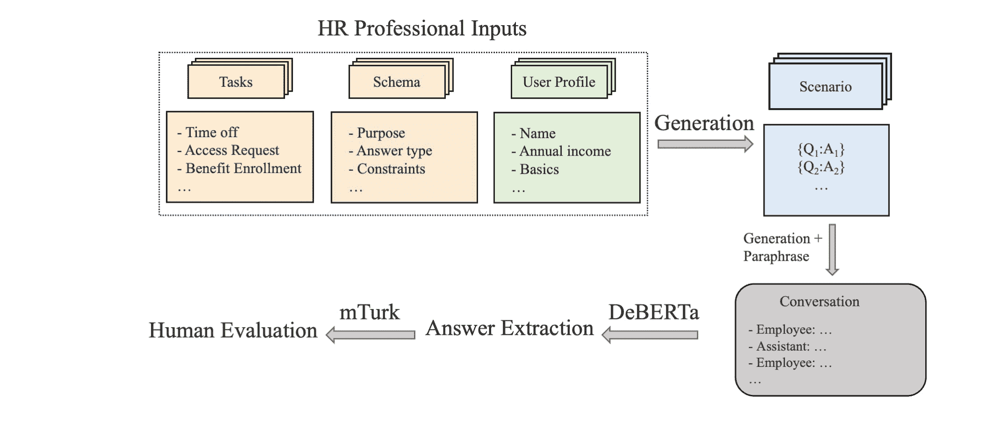
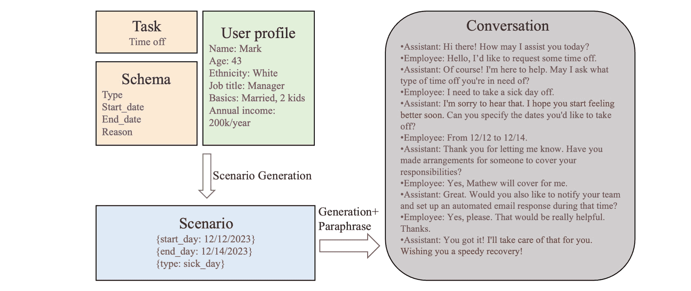
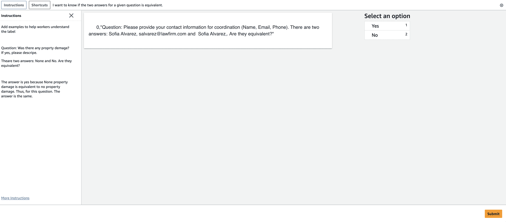
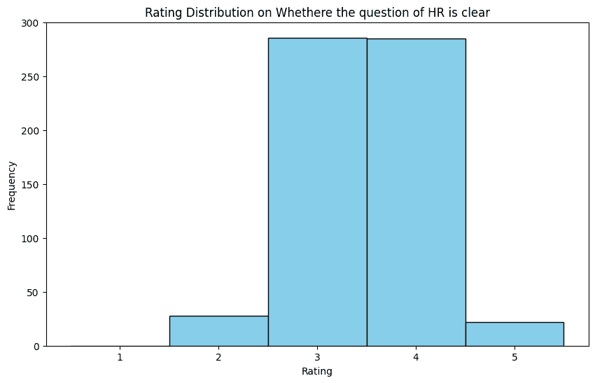
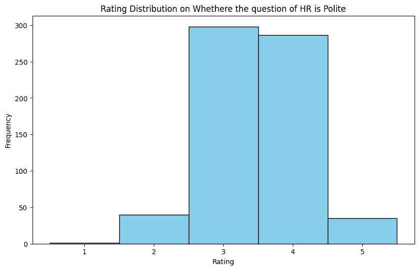
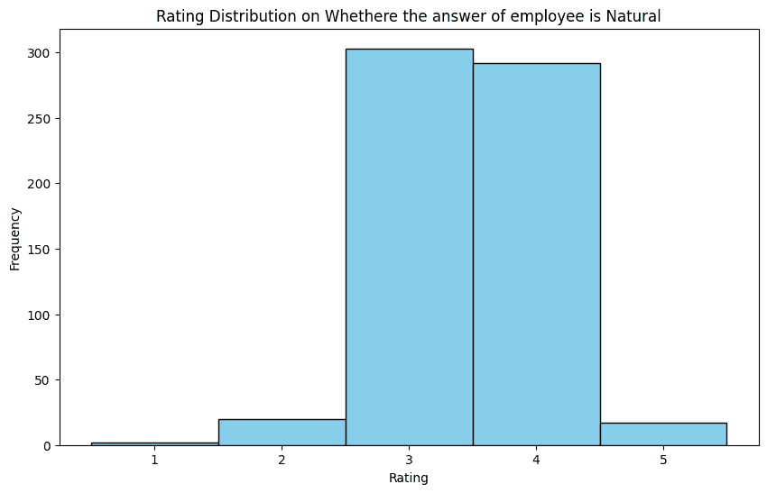
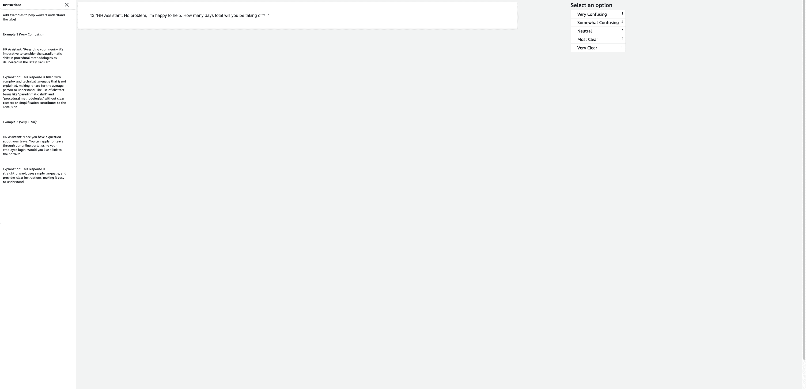
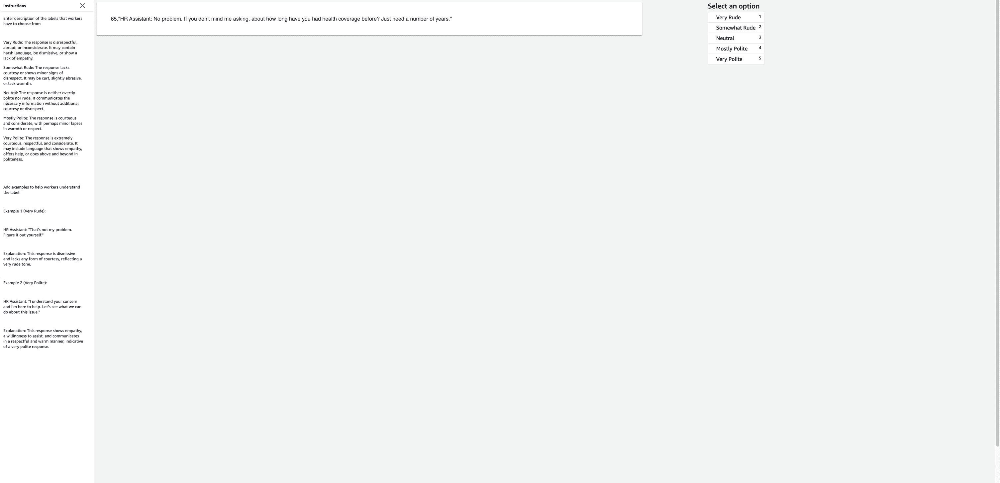
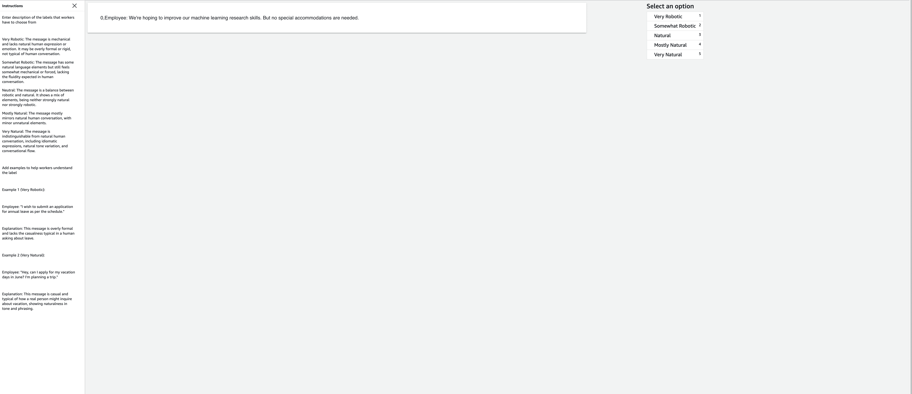

<!--yml

类别：未分类

日期：2025-01-11 12:56:30

-->

# HR-MultiWOZ：一种面向任务的对话（TOD）数据集，用于HR LLM代理

> 来源：[https://arxiv.org/html/2402.01018/](https://arxiv.org/html/2402.01018/)

徐维杰${}^{1}$，黄子成${}^{1}$，胡文翔${}^{1}$，方希${}^{1}$，拉杰什·库马尔·切鲁库里${}^{1}$，

纳乌曼·奈亚尔${}^{1}$，洛伦佐·马兰德里${}^{2}$，斯里尼瓦桑·H·森加梅杜${}^{1}$

${}^{1}$亚马逊

${}^{2}$米兰比科卡大学

weijiexu@amazon.com

###### 摘要

最近在大语言模型（LLMs）方面的进展正在重新定义多个领域的自然语言处理（NLP）任务。在人力资源（HR）领域的应用仍然有扩展空间，并且对于多个耗时的任务可能带来好处。诸如请假申请、医疗理赔提交和访问请求等例子值得注意，但这些并非唯一的实例。然而，前述进展必须解决构建高质量训练数据集的关键挑战。一方面，大多数对话数据集是为客户解决问题，而非员工。另一方面，收集HR领域的对话可能引发隐私问题。为了解决这一问题，我们引入了HR-MultiWOZ，这是一个完全标注的包含550个对话的HR数据集，涵盖了10个HR领域。我们的工作有以下贡献：（1）这是第一个用于NLP研究的HR领域标注开源对话数据集。（2）它提供了详细的数据生成流程，并附有数据分析和人工评估。数据生成管道具有可转移性，可以轻松适应其他领域的标注对话数据生成。（3）所提数据收集管道主要基于LLMs，人工注释参与较少，且高效节省时间和成本。

## 1 引言

最近，自然语言处理（NLP）领域的进展已应用于人力资源（HR）领域的多项任务，从技能提取（张等， [2022](https://arxiv.org/html/2402.01018v1#bib.bib17)）、职位理解（Decorte等，[2021](https://arxiv.org/html/2402.01018v1#bib.bib3)）到候选人筛选（Hemamou和Coleman，[2022](https://arxiv.org/html/2402.01018v1#bib.bib6)）。然而，许多HR流程仍然非常低效，例如请假申请、安排会议、提交IT问题工单或提交医疗理赔。事实上，Asana工作指数报告显示，知识工作者有60%的时间花费在重复性工作上。

LLM 代理（Gao 等， [2023](https://arxiv.org/html/2402.01018v1#bib.bib4)）使用 LLM 作为其核心计算引擎，使其能够进行对话、完成任务、推理，并展示一定程度的自主性。与其他领域类似（Kalvakurthi 等， [2023](https://arxiv.org/html/2402.01018v1#bib.bib8)；Hsu 等， [2023](https://arxiv.org/html/2402.01018v1#bib.bib7)），创建一个 LLM 代理来协助这些任务可以为员工节省大量时间，并提高工作满意度。一个好的 LLM 代理应该能够理解用户的需求（Liu 等， [2023](https://arxiv.org/html/2402.01018v1#bib.bib11)）。用于评估或训练 HR LLM 代理的理想数据集应包含虚拟助手与员工之间的对话，并带有对话状态的标注。对话状态包含对话当前上下文的表示，如意图和相关信息。

图 1：该图描述了数据生成管道。HR 专家首先通过识别任务、创建架构和生成员工档案来开始。然后应用 LLM 来生成多样化的场景并进行释义，使对话更自然。标签随后通过 DeBERTa 提取，并由 MTurk 精炼。

为了使数据集在构建/评估 HR LLM（人力资源大语言模型）代理时有效，它必须满足以下四个要求：（1）对话状态中的信息必须是可提取的。当使用 LLM 代理提交医疗索赔时，员工必须能够相信系统会准确地提取正确的号码。因此，提取的信息必须来自对话。（2）对话状态中的信息应包含长实体。当使用 LLM 代理解决代码bug时，员工需要提供更多关于代码问题的细节。这意味着提取的信息应该足够长，以便为 LLM 代理提供正确的信息。（3）数据集必须是与 HR 相关的，且讨论 HR 相关的任务。（4）对话必须具有同理心。在与 HR 的实际对话中，与员工进行尊重的沟通非常重要。这有助于增强组织内的包容文化。基于该数据集构建的 LLM 代理也应该具有同理心。

有许多开源对话数据集。Schema-Guided Dialogue (SGD) (Rastogi et al., [2020](https://arxiv.org/html/2402.01018v1#bib.bib12)) 是一个具有不断发展的本体论的对话数据集，介绍了新的测试集插槽和服务，强调了DST性能和零-shot泛化能力。SGD-X (Lee et al., [2022](https://arxiv.org/html/2402.01018v1#bib.bib9)) 在SGD的基础上进行了扩展，提出了五种额外的架构样式。M2M (Shah et al., [2018](https://arxiv.org/html/2402.01018v1#bib.bib13)) 连接了开发人员（提供特定任务信息）和框架（提供与任务无关的信息），以生成以完成任务为中心的对话。MultiWOZ (Budzianowski et al., [2020](https://arxiv.org/html/2402.01018v1#bib.bib2)) 特征为使用稳定本体论的人类对话。然而，所有这些数据集都是面向客户的，而不是面向员工的。此外，它们都不是完全可提取的，也与人力资源（HR）无关。提取的信息也较短。基于这些模型训练的HR LLM代理可能缺乏同理心，无法从员工那里提取完整信息，且可能误解员工的意图。因此，创建一个新的HR应用数据集是至关重要的。另一方面，收集真实数据集是困难的，因为公司无法与公众共享这些对话，以免泄露员工的机密信息。

为此，我们为LLM HR代理创建了一个HR领域特定的数据集。它是可提取的，包含长实体，专门用于HR，且包含富有同理心的对话。我们的贡献总结如下：

+   •

    我们设计了一种数据生成方案，既高效、经济、质量高，又具有领域特定性。相同的方案也可以轻松地适应其他领域的标注对话生成。

+   •

    我们为10个人力资源使用案例专门创建了一个规模为550的数据集。对话状态中的信息是可提取的，并包含长实体。

+   •

    基于人类评估，生成的对话自然、清晰且富有同理心。与现有数据集相比，该对话更加全面、详细，内容更加丰富，且更具多样性。

## 2 方法

我们提出的数据生成方法灵感来源于MultiWOZ （Budzianowski等，[2020](https://arxiv.org/html/2402.01018v1#bib.bib2)）。在MultiWOZ中，两个注释员扮演用户和向导的角色。用户被赋予一个特定目标（如预订酒店），而向导则通过访问数据库来响应用户的请求。然而，这需要大量人工标注，且成本较高。随着大型语言模型（LLM）的最新进展（Brown等，[2020](https://arxiv.org/html/2402.01018v1#bib.bib1)），我们可以利用LLM替代人工生成更多样化的场景和改写对话。从整体上看，我们的生成过程包括开发专家验证的人力资源模式、生成多样的用户档案、通过Claude创建现实场景、随机化和合并、使用Claude重写对话、并利用DeBERTa模型（He等，[2021](https://arxiv.org/html/2402.01018v1#bib.bib5)）和人工标注进行抽取建模，以获取高质量标签。我们选择Claude是出于成本和伦理的考虑，具体原因在附录[G](https://arxiv.org/html/2402.01018v1#A7 "Appendix G Claude ‣ HR-MultiWOZ: A Task Oriented Dialogue (TOD) Dataset for HR LLM Agent")中做了解释。对于每个步骤，我们在附录中提供了详细的说明和人工标注指导。这使得我们的方法易于转移、可复制且透明。使用LLMs推理的时间为2天，成本为38.32美元，人工标注费用为49.82美元。这使得我们的方法在时间和成本上都具有高效性。详细的数据生成流程见图[1](https://arxiv.org/html/2402.01018v1#S1.F1 "Figure 1 ‣ 1 Introduction ‣ HR-MultiWOZ: A Task Oriented Dialogue (TOD) Dataset for HR LLM Agent")，示例见图[2](https://arxiv.org/html/2402.01018v1#A6.F2 "Figure 2 ‣ Appendix F Example of Data Generation Process ‣ HR-MultiWOZ: A Task Oriented Dialogue (TOD) Dataset for HR LLM Agent")。

**模式创建** 系统的输入包括针对不同人力资源相关任务的多样化任务模式。每个模式由一系列结构化问题、模式的目的、答案类型以及每个潜在值的约束组成。为了确保领域的相关性和准确性，这些任务模式会经过人力资源领域专家的彻底审查。领域包括福利注册、绩效评估、培训要求、安全事故报告、调动请求、骚扰报告、目标设定、访问请求、IT问题报告和请假报告。每个模式包含不同的插槽。这使得我们生成的数据集具有**人力资源特定性**。对于每个插槽，我们还设计了问题、答案类型和潜在选择。任务模式的详细示例如表格[2](https://arxiv.org/html/2402.01018v1#A4.T2 "Table 2 ‣ Appendix D Task Profile ‣ HR-MultiWOZ: A Task Oriented Dialogue (TOD) Dataset for HR LLM Agent")所示。

接下来，我们开发一个用户档案模式，重点关注用户的偏好。该用户档案模式旨在最大化多样性，并代表广泛的现实世界场景。一个示例档案包括如家庭成员数量、联系方式偏好、年收入等属性。这些用户档案模式是由Claude生成的。我们手动移除与其他档案共享超过2项条目的档案，以最大化多样性。用户档案的详细示例见表[3](https://arxiv.org/html/2402.01018v1#A4.T3 "表 3 ‣ 附录 D 任务档案 ‣ HR-MultiWOZ：用于HR LLM代理的任务导向对话(TOD)数据集")。对于公司特定的模式和用户档案，公司可以采用相同的逻辑，并修改键和值以适应公司特定的需求。

场景生成 场景是对话的框架。以用户档案和任务模式为输入，我们生成一个真实的模板，作为Python字典（问题作为键，从选定的用户档案生成的答案作为值）。我们首先使用用户档案完成从选定任务模式中得出的答案。其次，使用Claude从用户的角度回答场景中的其余问题。我们指示LLM确保答案简明扼要，但又富有信息量。详细的提示见表[4](https://arxiv.org/html/2402.01018v1#A4.T4 "表 4 ‣ 附录 D 任务档案 ‣ HR-MultiWOZ：用于HR LLM代理的任务导向对话(TOD)数据集")。

对话生成与改写 为了将场景转化为对话，应采用自然的语气和结构。例如，对话应该具有同理心，并包含诸如“酷”，“好的”等表达方式。此外，在现实世界的对话中，用户有时会在一次回应中回答多个问题。对于每个模板，我们随机化场景的顺序。我们将相似类型的答案随机组合为一个单一的回应。然后，我们将其改写为问答形式。最后，我们使用LLM对问题和回答进行改写，以增强问题中的同理心，以及回答中的自然性和完整性。该改写还提供了一个较长的实体，例如对代码错误的详细描述。因此，改写后的对话表现出同理心，并且对话中的信息包含较长的实体。详细的提示见表[5](https://arxiv.org/html/2402.01018v1#A4.T5 "表 5 ‣ 附录 D 任务档案 ‣ HR-MultiWOZ：用于HR LLM代理的任务导向对话(TOD)数据集")。

对话状态标注：生成的对话质量通过答案提取、数据清洗和人工评估进行评估。答案是通过DeBERTa He et al.（[2021](https://arxiv.org/html/2402.01018v1#bib.bib5)）从生成的对话中提取的。选择该模型是因为它的紧凑性、在提取任务中的有效性以及能够提供介于0和1之间的置信度评分。我们将问题、真实答案和上下文输入模型，从中提取出具有相应置信度的答案。此步骤至关重要，以确保数据集中的答案不仅具有信息性，而且能够以一定的确定性被提取出来，这有助于识别错误答案。此步骤使对话状态中的信息具有可提取性。

提取的答案经过一系列步骤进行清洗，以供TOD系统使用。我们首先去除所有前后空格，这通常是提取过程中产生的副产品。为了与对话模板中的答案格式对齐，我们还去除了所有结尾的标点符号。这一步消除了歧义，保持了答案的完整性。

我们进一步使用Mechanical Turk验证格式化提取的答案是否与情境中的答案一致，如图[3](https://arxiv.org/html/2402.01018v1#A10.F3 "Figure 3 ‣ Appendix J Answer Evaluation ‣ HR-MultiWOZ: A Task Oriented Dialogue (TOD) Dataset for HR LLM Agent")所示。根据(Li et al., [2023](https://arxiv.org/html/2402.01018v1#bib.bib10))，我们为Mechanical Turk选择了置信度低于0.1的提取答案。此数据包含692个数据点。答案只能是“是”或“否”。我们为每个任务使用3个标注员，并支付每个任务0.024。如果响应为“否”，我们将进一步由HR专业人员手动标注数据。在71个标为“否”的数据点中，HR专业人员识别出27个标注不准确，并通过从对话中提取的正确答案进行了更正。

## 3 评估

数据集统计：我们发布了HR Multiwoz数据集，包含总计$550$个对话，这些对话是使用第[2](https://arxiv.org/html/2402.01018v1#S2 "2 Methods ‣ HR-MultiWOZ: A Task Oriented Dialogue (TOD) Dataset for HR LLM Agent")节中提出的方法收集的。该数据集涵盖了与HR相关的任务，包括福利登记、绩效评估、培训需求、安全事件报告、搬迁请求、骚扰报告、目标设定、访问请求、IT问题报告和休假报告，如表[6](https://arxiv.org/html/2402.01018v1#A8.T6 "Table 6 ‣ Appendix H Generated Dataset Statistics ‣ HR-MultiWOZ: A Task Oriented Dialogue (TOD) Dataset for HR LLM Agent")所示。我们的数据集涵盖了HR领域的多样化话题，提供了广泛的示例。因此，相比现有数据集，我们推荐将此数据集用于其他HR相关应用中的迁移学习任务。

数据集比较：与现有数据集相比，HR Multiwoz 数据集在问题和回答的多样性和完整性方面表现突出，如表格[1](https://arxiv.org/html/2402.01018v1#S3.T1 "表格 1 ‣ 3 评估 ‣ HR-MultiWOZ：HR LLM 代理的任务导向对话 (TOD) 数据集")所示。该数据集的对话数量少于 M2M 餐厅数据集，但在总轮次和总词数上超越了 M2M 数据集。这表明 HR Multiwoz 对话在内容上更加扩展和丰富。HR Multiwoz 在每个对话的平均轮次和每轮的平均词数上均达到了最高值。这表明这些对话既全面又详细。

此外，我们的数据集中唯一词汇和唯一二元组的最高比率表明，数据集在自然响应的语言使用上具有更广泛的表达能力。这种语言使用的多样性表明该数据集有能力模拟真实世界中的 HR 领域对话。此外，由于每个答案的平均词数最高，用户回答中包含长实体的特征增强了数据集在训练复杂对话系统中的实用性，这些系统需要理解扩展上下文和细致的语言。总体而言，HR Multiwoz 数据集非常适合用于开发/评估能够有效处理 HR 特定场景下富有同理心、自然且完整的互动的 HR LLM 代理。

| 指标 | multiwoz | M2MR | ours |
| --- | --- | --- | --- |
| 对话数 | 8437 | 1116 | 550 |
| 总轮次 | 113552 | 6188 | 8910 |
| 总词数 | 1742157 | 99932 | 181363 |
| 每个对话的平均轮次 | 13.46 | 11.09 | 16.2 |
| 每轮的平均词数 | 15.34 | 8.07 | 20.35 |
| 每个答案的平均词数 | 13.46 | 5.56 | 14.53 |
| 唯一词汇 / 总词数 | 0.0103 | 0.0092 | 0.0156 |
| 唯一二元组 / 总词数 | 0.0634 | 0.0670 | 0.1177 |

表格 1：比较 Multiwoz 2.2、M2M 餐厅数据集与我们的数据集：HR-MultiWOZ 在语言多样性和对话流程上的差异。

人工评估：在对Multiwoz数据集的主观评估中，众包工作者评估了员工回答的自然性、HR提问的清晰度和HR提问的礼貌性。每个类别中，只有置信度分数超过60%的回答才被纳入评估，因此评估集包含634个员工回答、623个HR问题的清晰度评估和629个HR问题的礼貌性评估。使用单样本t检验的统计分析显示，员工回答的自然性、HR问题的清晰度以及HR问题的礼貌性平均评分显著高于中立值。高t值（自然性为19.31，清晰度为18.83，礼貌性为16.02）和极低的p值表明员工回答的自然性、HR问题的清晰度和HR问题的礼貌性得到了强烈的正面评价。详细的得分分布、说明和详细分析请参见附录[K](https://arxiv.org/html/2402.01018v1#A11 "Appendix K Human Evaluation Score Distribution ‣ HR-MultiWOZ: A Task Oriented Dialogue (TOD) Dataset for HR LLM Agent")、附录[L](https://arxiv.org/html/2402.01018v1#A12 "Appendix L Human Evaluation Instructions ‣ HR-MultiWOZ: A Task Oriented Dialogue (TOD) Dataset for HR LLM Agent")和附录[E](https://arxiv.org/html/2402.01018v1#A5 "Appendix E Human Evaluation Analysis ‣ HR-MultiWOZ: A Task Oriented Dialogue (TOD) Dataset for HR LLM Agent")。

## 4 结论

HR-Multiwoz，我们生成的包含550个标注对话的数据集，通过提供10个领域特定、丰富、多样、全面且详细的标注对话，可以评估/训练HR LLM代理。我们的数据生成方法最大限度地减少了人工标注的工作，同时通过利用Claude提高了数据的相关性和质量。这使得我们的数据生成方法具有可迁移性。作为HR对话系统中的第一个数据集，HR-Multiwoz代表了HR自动化的重大进展，提供了丰富且富有同理心的对话，适合用于训练高效且类人化的HR数字助手。它满足了所有HR对话的要求，并为HR应用设定了新的基准，为创新的、AI驱动的HR解决方案铺平了道路。未来，我们建议通过增加对话数量、扩展到英语以外的其他语言，并在每次对话结束时包括建议的API调用来增强该数据集。我们将使用cc-by-4.0许可证。在附录[A](https://arxiv.org/html/2402.01018v1#A1 "Appendix A Ethics Statement ‣ HR-MultiWOZ: A Task Oriented Dialogue (TOD) Dataset for HR LLM Agent")和附录[B](https://arxiv.org/html/2402.01018v1#A2 "Appendix B Limitations ‣ HR-MultiWOZ: A Task Oriented Dialogue (TOD) Dataset for HR LLM Agent")中提供了伦理声明和局限性说明。

## 参考文献

+   Brown等人（2020）Tom B. Brown, Benjamin Mann, Nick Ryder, Melanie Subbiah, Jared Kaplan, Prafulla Dhariwal, Arvind Neelakantan, Pranav Shyam, Girish Sastry, Amanda Askell, Sandhini Agarwal, Ariel Herbert-Voss, Gretchen Krueger, Tom Henighan, Rewon Child, Aditya Ramesh, Daniel M. Ziegler, Jeffrey Wu, Clemens Winter, Christopher Hesse, Mark Chen, Eric Sigler, Mateusz Litwin, Scott Gray, Benjamin Chess, Jack Clark, Christopher Berner, Sam McCandlish, Alec Radford, Ilya Sutskever, 和Dario Amodei. 2020. [语言模型是少样本学习者](http://arxiv.org/abs/2005.14165).

+   Budzianowski等人（2020）Paweł Budzianowski, Tsung-Hsien Wen, Bo-Hsiang Tseng, Iñigo Casanueva, Stefan Ultes, Osman Ramadan, 和Milica Gašić. 2020. [Multiwoz – 一个用于任务导向对话建模的大规模多领域“巫师奥兹”数据集](http://arxiv.org/abs/1810.00278).

+   Decorte等人（2021）Jens-Joris Decorte, Jeroen Van Hautte, Thomas Demeester, 和Chris Develder. 2021. [Jobbert: 通过技能理解职位名称](http://arxiv.org/abs/2109.09605).

+   Gao等人（2023）Chen Gao, Xiaochong Lan, Nian Li, Yuan Yuan, Jingtao Ding, Zhilun Zhou, Fengli Xu, 和Yong Li. 2023. 大型语言模型赋能的基于代理的建模与仿真：调查与展望。 *arXiv预印本arXiv:2312.11970*.

+   He等人（2021）Pengcheng He, Xiaodong Liu, Jianfeng Gao, 和Weizhu Chen. 2021. [Deberta: 解码增强的BERT与解耦注意力](http://arxiv.org/abs/2006.03654).

+   Hemamou和Coleman（2022）Leo Hemamou和William Coleman. 2022. [在人工资源AI中提供公平性：互信息拯救](https://aclanthology.org/2022.aacl-main.64). 收录于 *第2届亚太计算语言学协会大会和第12届国际联合自然语言处理会议（第1卷：长篇论文）会议论文集*，页面867–882，仅在线发布。计算语言学协会。

+   Hsu等人（2023）Shang-Ling Hsu, Raj Sanjay Shah, Prathik Senthil, Zahra Ashktorab, Casey Dugan, Werner Geyer, 和Diyi Yang. 2023. [帮助帮忙者：通过AI赋能的实践和反馈支持同伴辅导员](http://arxiv.org/abs/2305.08982).

+   Kalvakurthi等人（2023）Vishesh Kalvakurthi, Aparna S. Varde, 和John Jenq. 2023. [嘿，Dona！你能帮我注册学生课程吗？](http://arxiv.org/abs/2303.13548)

+   Lee等人（2022）Harrison Lee, Raghav Gupta, Abhinav Rastogi, Yuan Cao, Bin Zhang, 和Yonghui Wu. 2022. [SGD-x: 一个用于模式引导对话系统中鲁棒泛化的基准](https://doi.org/10.1609/aaai.v36i10.21341). *人工智能会议论文集（AAAI）*, 36(10):10938–10946.

+   Li et al. (2023) Minzhi Li, Taiwei Shi, Caleb Ziems, Min-Yen Kan, Nancy Chen, Zhengyuan Liu, and Diyi Yang. 2023. [CoAnnotating: 基于不确定性引导的人工与大型语言模型之间的工作分配用于数据标注](https://doi.org/10.18653/v1/2023.emnlp-main.92)。在 *2023年自然语言处理经验方法大会论文集*，第1487–1505页，新加坡。计算语言学协会。

+   Liu et al. (2023) Xiao Liu, Hao Yu, Hanchen Zhang, Yifan Xu, Xuanyu Lei, Hanyu Lai, Yu Gu, Hangliang Ding, Kaiwen Men, Kejuan Yang, Shudan Zhang, Xiang Deng, Aohan Zeng, Zhengxiao Du, Chenhui Zhang, Sheng Shen, Tianjun Zhang, Yu Su, Huan Sun, Minlie Huang, Yuxiao Dong, and Jie Tang. 2023. [Agentbench: 评估大型语言模型作为代理的能力](http://arxiv.org/abs/2308.03688)。

+   Rastogi et al. (2020) Abhinav Rastogi, Xiaoxue Zang, Srinivas Sunkara, Raghav Gupta, and Pranav Khaitan. 2020. [迈向可扩展的多领域对话代理：基于模式引导的对话数据集](http://arxiv.org/abs/1909.05855)。

+   Shah et al. (2018) Pararth Shah, Dilek Hakkani-Tür, Gokhan Tür, Abhinav Rastogi, Ankur Bapna, Neha Nayak, and Larry Heck. 2018. [通过对话自我博弈构建对话代理](http://arxiv.org/abs/1801.04871)。

+   Xu et al. (2023a) Weijie Xu, Wenxiang Hu, Fanyou Wu, and Srinivasan Sengamedu. 2023a. [DeTiME: 使用编码器-解码器基础的大型语言模型进行扩散增强的主题建模](https://doi.org/10.18653/v1/2023.findings-emnlp.606)。在 *计算语言学协会发现：EMNLP 2023*，第9040–9057页，新加坡。计算语言学协会。

+   Xu et al. (2023b) Weijie Xu, Xiaoyu Jiang, Srinivasan Sengamedu Hanumantha Rao, Francis Iannacci, and Jinjin Zhao. 2023b. [vONTSS: 基于vMF的最优传输半监督神经主题建模](https://doi.org/10.18653/v1/2023.findings-acl.271)。在 *计算语言学协会发现：ACL 2023*，第4433–4457页，多伦多，加拿大。计算语言学协会。

+   Xu et al. (2021) Weijie Xu, Jinjin Zhao, Francis Iannacci, and Bo Wang. 2021. [Ffpdg: 快速、公平且私密的数据生成](https://www.amazon.science/publications/ffpdg-fast-fair-and-private-data-generation)。在 *2021年ICLR合成数据生成研讨会*。

+   Zhang et al. (2022) Mike Zhang, Kristian Jensen, Sif Sonniks, and Barbara Plank. 2022. Skillspan: 从英语招聘信息中提取硬技能与软技能。在 *2022年北美计算语言学协会：人类语言技术会议论文集*，第4962–4984页。

## 附录 A 伦理声明

伦理声明：由 AI 生成的人力资源领域数据集需要谨慎考虑与安全、隐私和偏见相关的伦理问题。由于 AI 生成的数据集可能在试图提供帮助时造成更多的伤害而非好处，因此，我们在与安全审查员和人力资源专业人士合作的基础上，采取了以下措施，以尽量减少伤害的风险。

人工标注：为了确保生成的对话礼貌且富有同理心，我们使用人工标注员对对话进行标注。

防护措施：我们删除标注为包含粗俗语言的对话。这确保了语言不粗鲁。

隐私：在我们生成的数据中，使用了虚拟的用户资料，这些资料并不真实。我们还确保系统中的数据符合严格的内部信息安全政策和标准。

负面示例/潜在偏见：为了减少生成模型中的潜在偏见，我们采用了提取式方法。然而，提取的有效性可能因员工的语言流利度而异。这种差异可能导致对于非英语母语者，任务导向对话（TOD）系统的效率降低。目前正在进行努力，以理解并解决这些问题。

合成数据偏见：该数据集主要依赖通过大型语言模型（LLM）和人工重述生成的对话。这可能引入 LLM 内在的偏见，或将场景限制在模型训练数据的创造性约束下。

文化和语言多样性的限制：HR-Multiwoz 数据集可能主要反映了数据创建者或大型语言模型（LLM）训练数据的文化和语言规范。这一限制可能会影响该数据集在全球或文化多样化的人力资源环境中的有效性。

## 附录 B 限制

更新和扩展数据集以涵盖新的 HR 领域，或适应不断发展的 HR 实践和政策可能需要一些努力，因为这依赖于新的架构创建。该数据集不包含对话的任务部分，这限制了该数据集用于训练 LLM 代理以利用不同工具的用途。该数据集也缺乏对现有 TOD 系统方法的评估。

DeBERTa 模型也有一些限制。我们在比较原始短答案与 DeBERTa 提取的答案时观察到了额外的复杂性，例如：（i）在单一回合中包含多个短答案的重复，（ii）包含诸如“员工：”之类的提示文本，（iii）未能提取有意义的答案或标签。

生成数据集的表现并不完全可控。人工反馈对进一步改进数据集至关重要。对此，LLM 允许用户了解系统的最终结果（例如：你已被安排从...到...的休假时间），并检查过程的正确性。

## 附录 C 未来工作

现实世界的整合与测试：在真实的 HR 环境中实施经过此数据集训练的模型，以测试和完善其效能。这可能包括与 HR 部门的试点项目，以收集反馈并提高数据集的现实性和适用性。

跨文化和多语言扩展：增强数据集，涵盖更广泛的文化背景和语言，使其更加包容，并能在全球范围内适用，特别是在多元化的工作场所中。

持续更新与扩展：定期更新数据集，反映最新的人力资源实践、政策和法规。这可能涉及创建一个持续数据收集和整合的框架。

偏见检测与缓解：实施系统方法以识别和缓解数据集中的偏见，确保公平和无偏的 HR 相关对话。

更广泛领域的泛化：将数据集或其方法扩展到人力资源以外的其他领域，从而测试其在各个领域（如客户服务、医疗保健或法律咨询）的适应性和实用性。

用户体验研究：进行用户体验研究，了解员工和 HR 专业人员如何与基于数据集训练的 AI 系统互动，旨在提高用户满意度和效果。

主题建模：利用主题建模技术理解这些对话中的主题。（Xu 等，[2023b](https://arxiv.org/html/2402.01018v1#bib.bib15)，[a](https://arxiv.org/html/2402.01018v1#bib.bib14)）

差分隐私数据集：确保数据集公平并保护隐私。（Xu 等，[2021](https://arxiv.org/html/2402.01018v1#bib.bib16)）

## 附录 D 任务概况

| 键 | 描述 |
| --- | --- |
| 福利类型 | 您希望注册哪种类型的福利？（例如，健康保险、牙科保险等） |
| 福利计划选择 | 通过输入计划代码选择您的福利计划（例如，计划 A、计划 B 等）。 |
| 抚养人数 | 您希望将多少个抚养人添加到计划中？（请输入一个数字） |
| 之前的保险覆盖期限 | 您之前参加过健康计划多少年？（请输入一个数字） |
| 生效日期 | 您希望保险从何时开始？（请输入YYYY-MM-DD格式的日期） |
| 个人信息确认 | 我们是否已经更新您的个人信息？（请回答“是”或“否”） |
| 联系偏好 | 请输入您的首选联系方式（电子邮件、电话、邮件）。 |
| 预计年保费 | 您预计的年保费预算是多少（以美元计）？（请输入一个数字） |

表格 2：福利注册架构示例。这仅是一个示例，每个问题可能涉及多种类型。

| 键 | 值 |
| --- | --- |
| 抚养人数 | 2 |
| 联系方式偏好 | 电子邮件 |
| 年收入 | $150,000 |
| 姓名 | 李伟博士 |
| 联系信息 | liwei@medicalemail.com |
| 当前所在地 | 加利福尼亚州旧金山 |
| 职位 | 医生 |

表格 3：用户档案示例

| 指令 |
| --- |
| 用户: {user} |
| 模板: {template} |
| 你是用户。 |
| 根据经验填写模板中的所有问题。 |
| 生成的字典应包含键名和生成的答案。 |
| 模板中的所有键都在生成的字典中。 |
| 使回答极其简短（不超过 5 个字）。 |
| 将生成的字典放入 <answer></answer> XML 标签中。 |

表 4: 模板生成的指令

| 指令 |
| --- |
| 对话: {conversation} |
| 这是 HR 助理与员工之间的对话。 |
| 1. 对每个问题，用更多的情态词和富有同情心的表达方式将问题转述为更具对话感的形式。 |
| 2. 对每个答案，写成完整的句子。 |
| 请将基于模板更新的对话放入 <answer></answer> XML 标签中。 |

表 5: 对话重写的指令

## 附录 E 人类评估分析

对 Multiwoz 数据集的主观评估，我们希望了解以下几个问题：1. 员工的回答自然吗？ 2. HR 的问题清晰吗？ 3. HR 的问题有礼貌或富有同情心吗？我们将最终对话呈现给众包工作者，他们根据 1 到 5 的评分标准对每个用户和 HR 的回合进行打分，1 表示非常机械，5 表示非常自然。我们从 HR 和员工那里采样了 650 个回合来创建评估集。每个回合显示给 3 个众包工作者。我们为每个任务支付 0.012。每个回答还具有 0 到 1 之间的置信度分数，表示标签员对其评估的信心。

对于问题 1，我们包含了置信度大于 60 的数据， resulting in 634 个 HR 回合来创建评估集。通过单样本 t 检验，我们证明了平均评分显著优于中立值，表明员工回答的问题自然（t 统计量约为 $19.31$，p 值 $\leq 0.000000001$）。

对于问题 2，我们只选择置信度大于 60 的回合，即623个 HR 回合来创建评估集。分数 3 为中立。分数 5 为非常清晰。分数 1 为非常模糊。进行单样本 t 检验，评估平均值是否显著优于中立值。测试给出的 t 统计量约为 $18.83$，并且 p 值极小（p 值 $\leq 0.000000001$）。该结果表明，平均评分显著优于中立值，表明 HR 提出的提问是清晰的。

对于问题 3，我们只选择置信度大于 60 的回合，即629个 HR 回合来创建评估集。分数 3 为中立。分数 5 为非常礼貌。分数 1 为非常粗鲁。进行单样本 t 检验，评估平均值是否显著优于中立值。测试给出的 t 统计量约为 $16.02$，并且 p 值极小（p 值 $\leq 0.000000001$）。该结果表明，平均评分显著优于中立值，表明 HR 提出的提问是礼貌的。

## 附录 F 数据生成过程示例

图 2：图示描述了对话生成过程。我们首先识别任务、模式和员工档案。然后使用 LLM 填充模式中的值。接着我们使用 LLM 将对话重新表述，使其更加自然。我们将人力资源助理展现同理心的部分用红色标出。

## 附录 G Claude

我们选择 Claude 而非 GPT-4 的原因如下：成本效益：Claude 在数据生成所需的计算资源方面更具成本效益。例如，使用 OpenAI API 的 GPT-4 8K 上下文模型，每 1K 输入 tokens 需要 $0.03，每 1K 输出 tokens 需要 $0.06。数据隐私与安全：Claude 提供了更好的数据隐私与安全功能，特别适用于生成与人力资源相关的敏感任务数据。模型特点：Claude 采用了 RLAIF 训练，能够生成更具伦理性的对话。

## 附录 H 生成数据集统计

| Domain | 对话数量 |
| --- | --- |
| benefits_enrollment | 71 |
| performance_review | 64 |
| training_request | 57 |
| safety_incident_report | 103 |
| relocation_request | 57 |
| harassment_report | 103 |
| goal_setting | 42 |
| access_request | 278 |
| it_issue_report | 38 |
| time_off_report | 71 |

表 6：HR Multiwoz 数据集。

## 附录 I 生成对话示例

| 生成对话示例 |
| --- |
| 人力资源助理：你好，今天我能帮您做些什么？ |
| 员工：我希望您能帮我为我的团队安排一些机器学习的培训。 |
| 人力资源助理：没问题，告诉我一下您希望的培训内容。你们将学习什么，有没有特别的要求？ |
| 员工：我们希望提高我们的机器学习研究技能。但不需要特别的安排。 |
| 人力资源助理：太好了，预计有多少人参加这个培训？大概需要多久？ |
| 员工：三个人会参加，我们希望培训持续两天。 |
| 人力资源助理：好的，谢谢。您有预算吗？另外，了解您团队培训后的目标也会很有帮助。 |
| 员工：我们的预算是 $5000。我们希望能够提升研究技能。 |
| 人力资源助理：没问题，您什么时候有空？另外，您有偏好培训的方式吗？比如在线培训还是面对面培训？ |
| 员工：我们希望能在 2023 年 6 月 15 日举办一些在线研讨会。 |
| 人力资源助理：听起来不错。最后一个问题——您认为您团队目前的技能水平是初学者、中级还是高级？您能提供负责协调的人的联系方式吗？ |
| 员工：他们的水平是中级。协调员是 Henry Kim，您可以通过 hkim@researchlab.com 或 555-1234 联系他。 |

表 7：生成对话示例

## 附录 J 回答评估

图 3: MTurk 问题及选定示例，用于判断提取的回答是否与实际答案相符

## 附录 K 人类评估得分分布

图 4: MTurk 得分分布，用于判断HR问题是否清晰

图 5: MTurk 得分分布，用于判断HR问题是否礼貌

图 6: MTurk 得分分布，用于判断员工回答是否自然

## 附录 L 人类评估指令

图 7: MTurk 人类评估指令，用于判断HR问题是否清晰

图 8: MTurk 人类评估指令，用于判断HR问题是否礼貌

图 9: MTurk 人类评估指令，用于判断员工回答是否自然
