<!--yml

category: 未分类

date: 2025-01-11 12:14:51

-->

# Hackphyr: 用于网络安全环境的本地微调LLM代理

> 来源：[https://arxiv.org/html/2409.11276/](https://arxiv.org/html/2409.11276/)

Maria Rigaki Carlos Catania Sebastian Garcia

###### 摘要

大型语言模型（LLMs）在多个领域展现出了显著的潜力，包括网络安全。由于隐私问题、成本和网络连接限制，使用商业云端大型语言模型可能并不可取。在本文中，我们介绍了Hackphyr，这是一种本地微调的LLM，用作网络安全环境中的红队代理。我们的微调模型拥有70亿个参数，能够在单张GPU卡上运行，并且其性能与更大、更强大的商业模型，如GPT-4，表现相当。Hackphyr显著优于其他模型，包括GPT-3.5-turbo，以及基线模型，如在复杂、以前未见过的场景中的Q学习代理。为了实现这一性能，我们生成了一个新的任务特定的网络安全数据集，以增强基础模型的能力。最后，我们对代理的行为进行了全面分析，提供了对这些代理规划能力和潜在缺点的洞察，推动了对基于LLM的代理在网络安全领域的广泛理解。

###### keywords:

large language models , agents , reinforcement learning , network security\affiliation

[inst1]organization=电气工程学院，捷克技术大学，城市=布拉格，国家=捷克共和国

\affiliation

[inst2]organization=工程学院，库约国立大学，城市=门多萨，国家=阿根廷

\affiliation

[inst3]organization=国家科学与技术研究委员会（CONICET），国家=阿根廷

## 1 引言

自主代理是与环境互动并适应环境以实现特定目标的系统。传统上，人类防御者是应对安全漏洞的主要响应者。自主智能网络代理（AICA）[[1](https://arxiv.org/html/2409.11276v1#bib.bib1)]的潜在部署可能会改变网络防御。同时，进攻性代理，也称为红队代理，具有测试现有防御并发现潜在问题的能力。这些代理可以预先识别威胁，使防御成为一个动态、持续的过程。

近年来，强化学习（RL）技术已成为开发自主代理以应对动态环境的主要方法[[2](https://arxiv.org/html/2409.11276v1#bib.bib2), [3](https://arxiv.org/html/2409.11276v1#bib.bib3)]。基于强化学习的代理通过与环境的直接交互进行进化，学习通过试错法来优化行为，并由奖励系统进行支持。试错法有一定的缺点：它需要数十万次训练回合才能学习一个策略，并且一旦训练完成，该策略就缺乏灵活性。在一个特定环境配置中训练的代理在稍微不同的场景中将无法正常工作，除非重新训练。

大型语言模型（LLMs）近年来取得了显著的成功，展示了在模仿类人行为方面的巨大潜力[[4](https://arxiv.org/html/2409.11276v1#bib.bib4), [5](https://arxiv.org/html/2409.11276v1#bib.bib5)]。基于这一能力，越来越多的研究领域已将LLMs作为核心控制器，构建自主代理，以获得类人决策能力[[6](https://arxiv.org/html/2409.11276v1#bib.bib6), [7](https://arxiv.org/html/2409.11276v1#bib.bib7)]。与强化学习（RL）方法相比，基于LLM的代理能够封装广泛的人类知识和更丰富的世界理解，使其能够在无需额外或特定训练的情况下行动[[8](https://arxiv.org/html/2409.11276v1#bib.bib8)]。其次，预训练语言模型展现出了显著的适应性，因为它们可以通过相对较少的额外训练，轻松适应新任务或领域，这为其提供了相较其他可能需要广泛重新训练的机器学习模型的显著优势[[9](https://arxiv.org/html/2409.11276v1#bib.bib9)]。

先前的研究探讨了LLMs、网络安全和序列决策的交集[[10](https://arxiv.org/html/2409.11276v1#bib.bib10)]。作者提出了一种新颖的方法，利用预训练的LLMs作为网络安全环境中的代理。然而，所使用的模型是运行在云上的专有模型。使用基于云的语言模型存在一些问题。这些模型访问成本高，限制了其可达性和可复现性。此外，这些模型常常单方面更改，且没有解释或更新，这引发了对其稳定性和可靠性的担忧。

在网络安全的背景下，情况可能更加严重。将可能敏感的公司网络信息传递给基于云的专有模型进行额外分析，可能会对公司的安全性和隐私构成重大威胁。相比之下，开源模型是免费的，促进了可访问性、可重复性和隐私性。此外，许多开源模型具有较小的参数规模，允许在公司场地的低成本硬件上进行推理。如果需要，较小的模型规模通常意味着较低的性能，并且可能需要进一步的模型微调以适应特定任务。

在这项工作中，我们对一个7亿参数的预训练LLM（Zephyr-7b-$\beta$）进行了微调，使其能够作为NetSecGame环境中的红队代理[[10](https://arxiv.org/html/2409.11276v1#bib.bib10)]。在微调过程中，我们创建了一个新的数据集，帮助提升基础模型对环境的理解，并增强其提出有效和有用行动的能力。我们的代理在三个复杂度不同的场景中进行了评估，并与预训练的商业LLM和强化学习基线（如Q-learning）进行了比较。最后，我们对每个代理的行为进行了详细的分析，评估了它们的规划能力及其与人类行为的匹配度。

本文对该领域做出了若干关键贡献：

+   1.

    一种本地部署的模型，名为Hackphyr，专门针对NetSecGame环境进行了微调。

+   2.

    提出了一个新颖的数据集，并附有消融研究，分析了不同数据集组件对模型性能的影响。该分析为理解哪些因素在网络安全环境中最显著地影响微调模型的效果提供了有价值的见解。

+   3.

    对三种基于LLM的代理（GPT-4、Zephyr-7b-$\beta$、Hackphyr）进行了详细的行为分析。这一分析为每个模型的决策过程提供了独特的视角，提供了它们在自主解决网络安全挑战中的能力信息。

本文的其余部分结构如下：第[2](https://arxiv.org/html/2409.11276v1#S2 "2 Background ‣ Hackphyr: A Local Fine-Tuned LLM Agent for Network Security Environments")节和第[3](https://arxiv.org/html/2409.11276v1#S3 "3 Related Work ‣ Hackphyr: A Local Fine-Tuned LLM Agent for Network Security Environments")节分别介绍背景知识和相关工作。NetSecGame环境在第[4](https://arxiv.org/html/2409.11276v1#S4 "4 The NetSecGame Environment ‣ Hackphyr: A Local Fine-Tuned LLM Agent for Network Security Environments")节中介绍，通用代理设计在第[5](https://arxiv.org/html/2409.11276v1#S5 "5 LLM Agent Design ‣ Hackphyr: A Local Fine-Tuned LLM Agent for Network Security Environments")节中描述。第[6](https://arxiv.org/html/2409.11276v1#S6 "6 Supervised Fine-tuning Methodology ‣ Hackphyr: A Local Fine-Tuned LLM Agent for Network Security Environments")节详细说明了监督微调方法，包括数据集创建和超参数调优过程。实验设计和三种不同场景配置在第[7](https://arxiv.org/html/2409.11276v1#S7 "7 Experiment Design ‣ Hackphyr: A Local Fine-Tuned LLM Agent for Network Security Environments")节中介绍。实验结果和代理行为分析分别在第[8](https://arxiv.org/html/2409.11276v1#S8 "8 Results ‣ Hackphyr: A Local Fine-Tuned LLM Agent for Network Security Environments")节和第[9](https://arxiv.org/html/2409.11276v1#S9 "9 Behavioral Analysis ‣ Hackphyr: A Local Fine-Tuned LLM Agent for Network Security Environments")节中描述。数据集消融研究的详细信息在第[10](https://arxiv.org/html/2409.11276v1#S10 "10 Dataset Ablation Study ‣ Hackphyr: A Local Fine-Tuned LLM Agent for Network Security Environments")节中给出。最后，我们在第[11](https://arxiv.org/html/2409.11276v1#S11 "11 Discussion ‣ Hackphyr: A Local Fine-Tuned LLM Agent for Network Security Environments")节讨论一些发现和工作的局限性，并在第[12](https://arxiv.org/html/2409.11276v1#S12 "12 Conclusions ‣ Hackphyr: A Local Fine-Tuned LLM Agent for Network Security Environments")节总结全文。

## 2 背景

大型语言模型（LLMs）通常指基于变换器的模型[[11](https://arxiv.org/html/2409.11276v1#bib.bib11)]，这些模型拥有数十亿个参数，经过训练后能够执行与自然语言处理（NLP）相关的任务。输入文本通常会被拆分成更小的单元（标记），模型经过训练后可以预测输入序列后的下一个标记$t$。

正式来说，给定一系列标记$t_{1},\dots,t_{N-1}$，语言建模旨在计算联合概率

|  | $P(t_{1}\dots t_{N})=\prod_{i=1}^{N}P(t_{i}&#124;t_{1},\dots,t_{N-1})$ |  |
| --- | --- | --- |

大型语言模型使用神经网络（变换器）来估计这个概率，并从序列中采样下一个令牌 ${t}_{N}\sim f_{\theta}(t_{N}|t_{1},\dots,t_{N-1})$，其中 $f_{\theta}$ 是带有参数 $\theta$ 的训练模型。

训练大型语言模型（LLM）有几个阶段。第一阶段是通过大量的令牌进行无监督预训练。训练出的模型可以执行下一个令牌预测，并且通常在与数据相关的各种任务中表现良好。然而，这些大型模型，通常被称为基础模型，有时在某些专业任务中表现不佳。基础模型可以通过监督微调（SFT）适应分类等任务[[12](https://arxiv.org/html/2409.11276v1#bib.bib12), [13](https://arxiv.org/html/2409.11276v1#bib.bib13)]。微调需要标注数据，但这些数据集通常比预训练阶段使用的数据集要小得多。有时，数据集可以通过使用更强大的模型作为教师模型生成，这种方法也叫做蒸馏微调（dSFT）[[14](https://arxiv.org/html/2409.11276v1#bib.bib14), [15](https://arxiv.org/html/2409.11276v1#bib.bib15)]。一个常见的微调用例是指令微调[[16](https://arxiv.org/html/2409.11276v1#bib.bib16)]，旨在将语言模型与用户意图对齐，从而创建有用的助手和聊天机器人。如今，许多模型都会发布与预训练模型一起发布的指令微调版本。

对具有数十亿参数的大型模型进行微调可能需要大量的时间和资源。为此，提出了几种参数高效微调（PEFT）方法，可以在保持基础模型知识的同时，训练更少的参数。本研究中使用的方法是低秩适应（LoRA）[[17](https://arxiv.org/html/2409.11276v1#bib.bib17)]的一个版本。LoRA 是一种监督微调方法，它引入低秩矩阵，在训练过程中调整模型的权重。使用 LoRA 训练的结果是训练出的适配器，之后这些适配器可以合并到基础模型中。

使模型与人类目标对齐的进一步步骤是基于人类反馈的强化学习（RLHF），该方法需要创建一个能够评估模型响应的奖励模型。一旦训练完成，奖励模型可以与任何强化学习算法一起使用，以更新基础模型并使其与人类偏好对齐。RLHF 需要包含人类反馈和语言模型响应评分的数据集。

在面对复杂任务时，人类倾向于将其分解为更简单的子任务并逐个解决。预训练语言模型，尤其是早期版本如GPT-3，在逻辑推理和规划方面的能力有限。然而，提供一个或多个示例作为输入可以提高模型回答需要推理问题的能力[[18](https://arxiv.org/html/2409.11276v1#bib.bib18)]。引导或教导模型在推理时执行预期行为的思想被称为**上下文学习（ICL）**。与微调不同，ICL不需要任何训练，而是将教导模型的任务交给提供提示的用户。

利用一些示范性示例来引导语言模型的行为被称为k-shot示例学习，其中$k$表示提供的示例数量。核心思想是，通过向模型展示少量高质量的示例，说明期望的推理过程和预期的输出，模型可以学习如何进行概括，并将这些知识应用于解决新问题。

为了提高k-shot示例学习，探索了一种流行的技术——**思维链（CoT）**[[19](https://arxiv.org/html/2409.11276v1#bib.bib19)]。CoT方法为模型提供示例输入和输出，并明确展示用于得出最终答案的逐步推理过程。明确展示思维过程的目的是帮助模型更好地理解潜在的逻辑，并深入了解解决给定问题所需的推理。

## 3 相关工作

### 3.1 规划与探索

预训练的大型语言模型（LLMs）已经展现了一些推理能力，利用提示技术和**上下文学习（ICL）**。然而，它们在长期规划方面常面临挑战，导致偶尔出现幻觉和无效或不相关的行动。为了解决这些局限性，已经开发出几个框架，采用多阶段提示，通过整合推理和自我反思来增强LLM代理的规划能力。著名的例子包括ReAct [[20](https://arxiv.org/html/2409.11276v1#bib.bib20)]，Reflexion [[21](https://arxiv.org/html/2409.11276v1#bib.bib21)]，Describe, Explain, Plan and Select (DEPS)[[22](https://arxiv.org/html/2409.11276v1#bib.bib22)]，以及Reasoning via Planning (RAP)[[23](https://arxiv.org/html/2409.11276v1#bib.bib23)]。

ReAct [[20](https://arxiv.org/html/2409.11276v1#bib.bib20)]结合了推理与行动。Reflexion [[21](https://arxiv.org/html/2409.11276v1#bib.bib21)]通过引入一个包括自我反思和评估的顺序决策框架推进了这一概念，评估行动和轨迹在一个回合中的质量。该框架利用短期记忆追踪一个回合中的行动，并利用长期记忆为未来决策提供信息，使代理能够从过去的经验中学习。

RAP 框架 [[23](https://arxiv.org/html/2409.11276v1#bib.bib23)] 采取了不同的方法，使用大语言模型作为世界模型来模拟行动并评估结果。RAP 使用蒙特卡洛树搜索（MCTS）探索不同的推理路径，大语言模型逐步构建一个推理树，考虑最有前景的步骤。通过利用世界模型预测潜在结果，RAP 帮助大语言模型通过这些结果获得的奖励来完善其推理过程。这种方法使代理能够模拟并预测不同行动的后果，从而提高其规划和决策能力。

除了规划任务外，基于大语言模型的代理在探索方面也取得了成功，正如 Du 等人 [[6](https://arxiv.org/html/2409.11276v1#bib.bib6)] 和 Wang 等人 [[7](https://arxiv.org/html/2409.11276v1#bib.bib7)] 所示。Voyager 在 Minecraft 游戏环境中使用了自动化课程、技能库和迭代提示机制进行开放式探索。类似地，Du 等人提出了使用预训练的大语言模型提供“内在动机”，以引导代理在 Crafter [[24](https://arxiv.org/html/2409.11276v1#bib.bib24)] 和 Housekeep [[25](https://arxiv.org/html/2409.11276v1#bib.bib25)] 环境中的探索与目标设定。

其他研究也探讨了使用大语言模型（LLMs）进行规划任务，例如 Spring [[26](https://arxiv.org/html/2409.11276v1#bib.bib26)]，它使用大语言模型“学习”一篇描述 Crafter 游戏环境的论文。通过论文中总结的知识，它采用引导式问答方式与大语言模型互动，选择最佳行动。

早期的研究探讨了将大语言模型应用于经典规划任务 [[27](https://arxiv.org/html/2409.11276v1#bib.bib27), [28](https://arxiv.org/html/2409.11276v1#bib.bib28)]，特别是在规划领域定义语言（PDDL）领域内。这些研究突出了在不同领域生成计划的挑战。Silver 等人 [[29](https://arxiv.org/html/2409.11276v1#bib.bib29)] 通过使用大语言模型生成 Python 程序作为计划并通过调试加以完善，展示了性能的提升。然而，经典规划方法局限于完全可观察的环境，这对于网络安全领域复杂且动态的环境并不适用。

### 3.2 红队演练

大语言模型（LLMs）在网络安全中的整合，特别是在自动化渗透测试和红队演练方面，是一个迅速发展的研究领域。以往的研究强调了大语言模型在这一领域的多样化能力，并展示了其潜力与局限性。

Happe 等人（2023）提出了一种结构化的渗透测试方法，通过将任务分为高层次和低层次两类：高层次任务侧重于规划和协调，而低层次任务则涉及执行具体的攻击工具。然而，他们研究成果的实际应用仍然受到限制，因为这些攻击仅在有限的场景中进行评估 [[30](https://arxiv.org/html/2409.11276v1#bib.bib30)]。

Moskal 等人（2023）通过创建一个具有单一目标的受控环境，并使用启发式规划器评估 LLMs 在基本渗透测试任务中的表现，进一步探索了 LLMs 的能力 [[31](https://arxiv.org/html/2409.11276v1#bib.bib31)]。他们的工作为评估 LLMs 在简化环境中处理特定任务的方式提供了初步框架。

最近，PentestGPT 框架 [[32](https://arxiv.org/html/2409.11276v1#bib.bib32)] 旨在更加全面地自动化渗透测试，评估在 HacktheBox 等平台上的各种机器上进行的测试。此方法表明了语言模型在多种环境中的更实际应用。然而，它也更多集中于低级任务。

Raman 等人（2024）研究了商业 LLMs 在认证道德黑客（CEH）认证问题中的表现 [[33](https://arxiv.org/html/2409.11276v1#bib.bib33)]。同样，Tann 等人（2023）分析了 LLMs 在 Cisco 网络认证和夺旗赛（CTF）挑战中的应用 [[34](https://arxiv.org/html/2409.11276v1#bib.bib34)]。虽然这些评估很重要，但它们不一定能转化为在现实渗透测试场景中的实际自动化能力；然而，它们为模型理解安全性和网络概念提供了见解。

总体而言，尽管与认证考试和受控环境相关的研究成果为 LLMs 在安全概念方面的知识提供了有价值的见解，但它们并未完全解决在动态和多样化设置中自动化渗透测试的复杂性。因此，继续在现实场景中进行探索，对于实现 LLMs 在网络安全领域的全部潜力至关重要。

## 4 NetSecGame 环境

NetSecGame 是一个网络安全模拟环境，采用强化学习（RL）架构 [[10](https://arxiv.org/html/2409.11276v1#bib.bib10), [35](https://arxiv.org/html/2409.11276v1#bib.bib35)]。NetSecGame 旨在通过提交高层次的操作并返回该代理当前环境状态的观察结果，允许代理在网络中进行游戏。这使得 RL 代理可以参与游戏，但不仅限于代理。人类也可以通过互动界面进行游戏，无论是否与基于 LLM 的助手合作。允许人类参与对评估攻击和防御策略至关重要。

##### 网络配置

可以在不同的场景中配置 NetSecGame。每个场景包含任意数量的主机计算机、每台主机上的服务、每台主机上的数据、路由器及其连接方式。还可以定义互联网上的主机。每个场景还具有特定的目标（可以是固定或随机的）、攻击者代理的起始位置（可以是随机的）、每个动作的检测概率以及每个动作的成功概率。

##### 游戏状态

环境中定义的对象包括网络、IP、服务和数据。状态定义为以下列表：已知网络、已知主机、受控主机、已知服务和已知数据。已知网络是代理已知的网络，已知主机是代理通过扫描已知的主机，受控主机是代理成功利用并控制的主机，已知服务是代理扫描后已知的服务（端口），已知数据是代理通过扫描主机内部获得的已知数据。

一个给定给代理的状态表示示例：

<svg class="ltx_picture" height="123.03" id="S4.SS0.SSS0.Px2.p3.pic1" overflow="visible" version="1.1" width="600"><g fill="#000000" stroke="#000000" stroke-width="0.4pt" transform="translate(0,123.03) matrix(1 0 0 -1 0 0)"><g fill-opacity="1.0" transform="matrix(1.0 0.0 0.0 1.0 21.65 13.78)"><foreignobject class="ltx_minipage" color="#000000" height="95.48" overflow="visible" transform="matrix(1 0 0 -1 0 16.6)" width="402.3pt">```
State<nets:{172.18.0.0/24, 172.18.2.0/24, 172.18.1.0/24};
known_hosts:{172.18.0.72, 172.18.0.55, 172.18.0.62, 172.18.0.9,
    172.18.1.25, 172.18.0.156, 43.82.9.214, 172.18.0.76};
controlled_hosts:{172.18.0.72, 172.18.0.55, 43.82.9.214};
konwn_services:{172.18.0.72:
    {Service(name=’openssh’, type=’passive’, version=’8.1.0’,
    is_local=False)},
172.18.0.55:
    {Service(name=’postgresql’, type=’passive’, version=’14.3’,
    is_local=False)
    };
known_data:{
    172.18.0.55: { Data(owner=’User1’, id=’DatabaseData’)}}>

```</foreignobject></g></g></svg>

##### 目标

每个场景的目标是灵活的，可以定义为一个特定的状态，例如，特定主机中存在某些数据，或特定主机需要被代理控制。每个回合目标的随机化也是一种选择。例如，特定主机中需要存在的数据可以在每个回合中变化。这种方法可以用来评估代理的泛化能力。

##### 动作

动作空间有五种动作类型，每种动作类型都可以接收参数。这些动作类型包括：ScanNetwork、FindServices、FindData、ExploitService 和 ExfiltrateData。ScanNetwork 接收目标网络作为参数；FindServices 需要目标主机；FindData 需要目标主机；ExploitService 接收目标服务和主机；ExfiltrateData 接收源主机、目标主机以及需要转移的目标数据。由于动作的参数化，动作空间的大小取决于特定场景中定义的对象数量。所有在本研究中选择的场景中，所有动作的成功概率都设置为 $1.0$。

##### 奖励

每个动作的奖励是稀疏的。每个没有导致目标状态或被检测的动作都会获得 $-1$ 奖励；如果达到目标状态，代理会获得额外的 $100$ 奖励。如果防御者代理检测到，回合将结束，并且奖励为 $-50$。然而，这些由环境发送的奖励可以被代理忽略，代理可以根据需要定义自己的内部奖励函数。

##### 随机防御者

在这个版本的NetSecEnv中，代理扮演着攻击者的角色。然而，环境允许存在一个无处不在的随机防御者。防御者能够感知所有的行动，并在满足某些条件时阻止攻击者代理：首先，防御者使用一个固定大小的时间窗口来检测重复的行动。每个行动类型定义了最大重复阈值，一旦达到该阈值，检测将被触发。检测阈值可以在场景配置中定义。

其次，对于行动类型FindData、ExploitService和ExfiltrateData，在整个回合中存在额外的重复行动阈值。该回合的重复检测机制使用了行动类型和参数进行检查，这意味着只有当代理多次使用相同的行动时，检测才会触发。

最后，对于行动类型ScanNetwork和FindServices，会检查连续行动。受到端口扫描检测器的启发，这一检测机制评估了ScanNetwork或FindServices类型的行动在序列中的出现次数，如果达到阈值，回合将被终止。

每个行动的检测概率不同，随机防御者上的所有参数都是可配置的。

## 5 LLM代理设计

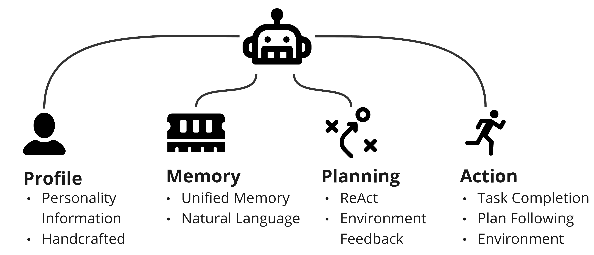

图1：LLM代理组件

用于所有实验的LLM代理在[[10](https://arxiv.org/html/2409.11276v1#bib.bib10)]中进行了介绍。作为本项工作的一个部分，我们重新使用了该代理的提示和结构，直接将本工作中介绍的微调LLM与[[10](https://arxiv.org/html/2409.11276v1#bib.bib10)]中介绍的商业预训练模型的结果进行了对比。

根据[[8](https://arxiv.org/html/2409.11276v1#bib.bib8)]提出的分类法，LLM代理架构包括以下组件：配置文件、记忆、规划和行动（图[1](https://arxiv.org/html/2409.11276v1#S5.F1 "图 1 ‣ 5 LLM代理设计 ‣ Hackphyr：一种用于网络安全环境的本地微调LLM代理")）。

##### 配置文件

该组件包含了提供给模型的所有个性信息。在我们的案例中，渗透测试者的个性是通过提示手工制作的。

##### 记忆

记忆组件是代理之前采取的行动列表和环境当前状态的集合：$\mathcal{M}=\{a_{t-k},...,a_{t-1},s_{t}\}$。所有记忆元素作为提示的一部分呈现（统一记忆）。行动列表具有固定大小，包含代理采取的最后$k$个行动。代理还提供了环境的当前状态，这被视为代理的短期记忆的一部分。代理在回合之间不使用长期记忆；因此，每个回合从初始状态开始，且没有行动记忆。

##### 规划

该代理使用 ReAct 框架进行规划和选择下一步动作。ReAct 框架将推理作为过程的第一步，行动作为第二步。基于当前环境状态 $s_{t}$，代理请求 LLM 分析状态中的对象（IP、网络、服务、数据），并推理可以对每个对象采取的行动。在第二步，代理使用 LLM 的响应和记忆元素来决定并提出一个合适的行动 $a_{t}$。为了生成有效的行动，代理还会提供行动示例（上下文学习）。记忆机制将反馈纳入内在奖励。代理根据状态 $s_{t+1}$ 是否与 $s_{t}$ 不同来评估每个行动是“有帮助”还是“没有帮助”。由于环境是确定性的，且没有任何行动能将对象从状态中移除，如果某个行动能帮助代理发现更多对象并达到新状态，则该行动被认为是“有帮助”的。

## 6 监督微调方法论

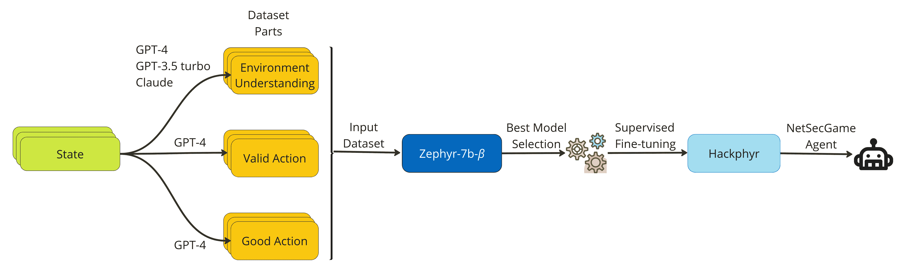

图 2：监督微调方法论

本研究通过几个步骤进行（图 [2](https://arxiv.org/html/2409.11276v1#S6.F2 "Figure 2 ‣ 6 Supervised Fine-tuning Methodology ‣ Hackphyr: A Local Fine-Tuned LLM Agent for Network Security Environments")）。该过程的第一步是识别基础模型的弱点并创建用于监督微调的数据集。数据集创建的详细信息在第 [6.1](https://arxiv.org/html/2409.11276v1#S6.SS1 "6.1 Dataset Creation ‣ 6 Supervised Fine-tuning Methodology ‣ Hackphyr: A Local Fine-Tuned LLM Agent for Network Security Environments") 节中展示。使用的基础模型是 Zephyr-7b-$\beta$ [[15](https://arxiv.org/html/2409.11276v1#bib.bib15)]，这是一个基于 Mistral-7B-v0.1 [[36](https://arxiv.org/html/2409.11276v1#bib.bib36)] 的指令调优模型。选择 Zephyr 模型的原因有多个：首先，已经经过指令调优的模型不需要再花费时间和精力进行指令调优。其次，该模型具有较好的生成有效 JSON 字符串的能力，第三，在我们的初步实验中，它显示出具备足够的网络和安全背景知识。最后，我们决定选择一个具有七十亿个参数的开源模型，以便可以使用一张 GPU 进行微调，从而以最低的成本复现我们的结果。本文遵循的方法论足够通用，可以应用于其他类似强度的模型。

监督微调是一个涉及多个超参数的训练过程。本研究中采用的方法基于量化LoRA（QLoRa）[[37](https://arxiv.org/html/2409.11276v1#bib.bib37)]。QLoRA允许在训练过程中使用基模型的量化版本，从而减少对GPU显存的需求。LoRA使用的两个主要超参数是适配器的秩$r$和权重$\alpha$，关于它们的选择的详细信息在第[6.2节](https://arxiv.org/html/2409.11276v1#S6.SS2 "6.2 Hyper-parameter Tuning ‣ 6 Supervised Fine-tuning Methodology ‣ Hackphyr: A Local Fine-Tuned LLM Agent for Network Security Environments")中有介绍。对于微调过程，我们使用了HuggingFace alignment-handbook库和脚本[[38](https://arxiv.org/html/2409.11276v1#bib.bib38)]。

在超参数调优后，我们进行了系列实验，以评估微调模型的表现。这些实验将Hackphyr与在三个不同场景下的基准进行了比较（第[7.1节](https://arxiv.org/html/2409.11276v1#S7.SS1 "7.1 Scenario Descriptions ‣ 7 Experiment Design ‣ Hackphyr: A Local Fine-Tuned LLM Agent for Network Security Environments")）。所有的监督微调和场景实验都在一张32GB NVRAM的V100 Nvidia GPU卡上执行。

### 6.1 数据集创建

监督微调需要高质量的数据，帮助语言模型在特定任务中表现良好。创建数据集的策略解决了我们在NetSecGame环境中使用较小模型时观察到的一些问题。最初，通过让更强大的LLM扮演教师角色，自动化生成问题和答案，帮助学生学习NetSecGame环境。在自动生成问题和答案后，我们进行了人工评估，以确保答案质量良好，编辑了错误的答案，并丢弃了重复的内容。

数据集包含1641个问答对，这些问答对分为三个部分生成（图[2](https://arxiv.org/html/2409.11276v1#S6.F2 "Figure 2 ‣ 6 Supervised Fine-tuning Methodology ‣ Hackphyr: A Local Fine-Tuned LLM Agent for Network Security Environments")）。每个部分有不同的重点，旨在解决我们在测试各种开源LLM时观察到的特定问题。完整的数据集已发布在HuggingFace上，并可供进一步研究和实验[[39](https://arxiv.org/html/2409.11276v1#bib.bib39)]。

#### 6.1.1 第I部分 - 环境理解

数据集的第一部分包含测试模型理解当前环境状态和提供的规则的能力的问答对。该数据集是通过三种不同的LLM自动生成的：OpenAI的GPT-4、GPT-3.5-turbo，以及Anthropic的Claude。生成的问答总数为$1080$。

给定由先前游戏运行收集的18个状态，模型被要求生成20个问题，以测试学生理解游戏环境和规则的能力：

<svg class="ltx_picture" height="52.81" id="S6.SS1.SSS1.p3.pic1" overflow="visible" version="1.1" width="600"><g fill="#000000" stroke="#000000" stroke-width="0.4pt" transform="translate(0,52.81) matrix(1 0 0 -1 0 0)"><g fill-opacity="1.0" transform="matrix(1.0 0.0 0.0 1.0 21.65 13.78)"><foreignobject class="ltx_minipage" color="#000000" height="25.25" overflow="visible" transform="matrix(1 0 0 -1 0 16.6)" width="402.3pt">```
Provide 20 questions and answers that test the students
knowledge regarding the specific status and rules.

```</foreignobject></g></g></svg>

一个生成的问题和答案示例可以在附录[A.1](https://arxiv.org/html/2409.11276v1#A1.SS1 "A.1 第一部分 ‣ 附录A 数据集示例 ‣ Hackphyr: 一种本地微调的LLM代理用于网络安全环境")中找到。

#### 6.1.2 第二部分 - 生成有效动作

数据集的第二部分包含测试模型生成有效动作能力的问题，这些问题在语法（JSON格式）和语义（在特定状态下的有效性）方面进行了考察。第二部分数据集中的问题和答案最终数量为$450$。以下提示从18个不同的状态生成了这部分数据集：

<svg class="ltx_picture" height="52.81" id="S6.SS1.SSS2.p2.pic1" overflow="visible" version="1.1" width="600"><g fill="#000000" stroke="#000000" stroke-width="0.4pt" transform="translate(0,52.81) matrix(1 0 0 -1 0 0)"><g fill-opacity="1.0" transform="matrix(1.0 0.0 0.0 1.0 21.65 13.78)"><foreignobject color="#000000" height="25.25" overflow="visible" transform="matrix(1 0 0 -1 0 16.6)" width="556.69">```
Provide 20 questions and answers that test the student’s
ability to generate valid and well-formatted actions in the
current status.

```</foreignobject></g></g></svg>

一个生成的问题和答案示例可以在附录[A.2](https://arxiv.org/html/2409.11276v1#A1.SS2 "A.2 第二部分 ‣ 附录A 数据集示例 ‣ Hackphyr: 一种本地微调的LLM代理用于网络安全环境")中找到。

#### 6.1.3 第三部分 - 生成有效动作

这一数据集部分的目的是教导微调后的模型在给定特定环境状态时如何做出正确决策。它包含了从先前游戏运行中生成的113个问题和答案，这些运行使用了GPT-4，并在小型场景[[10](https://arxiv.org/html/2409.11276v1#bib.bib10)]中进行。

状态-动作对的选择方式是，只使用那些能够导致环境新状态的动作。这是因为不导致新状态的动作，即未发现新元素的动作，要么是重复的，要么是无用的。

一个生成的问题和答案示例可以在附录[A.3](https://arxiv.org/html/2409.11276v1#A1.SS3 "A.3 第三部分 ‣ 附录A 数据集示例 ‣ Hackphyr: 一种本地微调的LLM代理用于网络安全环境")中找到。

### 6.2 超参数调整

与常见的机器学习评估方法（将数据集分为训练集和测试集）不同，使用了完整的数据集进行训练，遵循了第[2](https://arxiv.org/html/2409.11276v1#S2 "2 背景 ‣ Hackphyr: 一种本地微调的LLM代理用于网络安全环境")节中描述的SFT方法论。由于每回合设定了随机的IP和随机的数据外泄目标，因此该代理在与训练数据集不同的条件下进行评估。

然后，结果模型在小型场景[7.1](https://arxiv.org/html/2409.11276v1#S7.SS1 "7.1 场景描述 ‣ 7 实验设计 ‣ Hackphyr: 一种本地微调的LLM代理用于网络安全环境")中进行了150回合的测试，使用了第[5](https://arxiv.org/html/2409.11276v1#S5 "5 LLM代理设计 ‣ Hackphyr: 一种本地微调的LLM代理用于网络安全环境")节中描述的基于LLM的代理，并记录了最后十个动作的记忆。

对LoRA $r$和$\alpha$超参数进行了超参数网格搜索。网格搜索期间使用了以下参数值：

+   1.

    LoRA r：4、8、16 和 32

+   2.

    LoRA $\alpha$：4、8、16 和 32

其余的超参数根据HuggingFace对齐手册设置为默认值[[38](https://arxiv.org/html/2409.11276v1#bib.bib38)]。

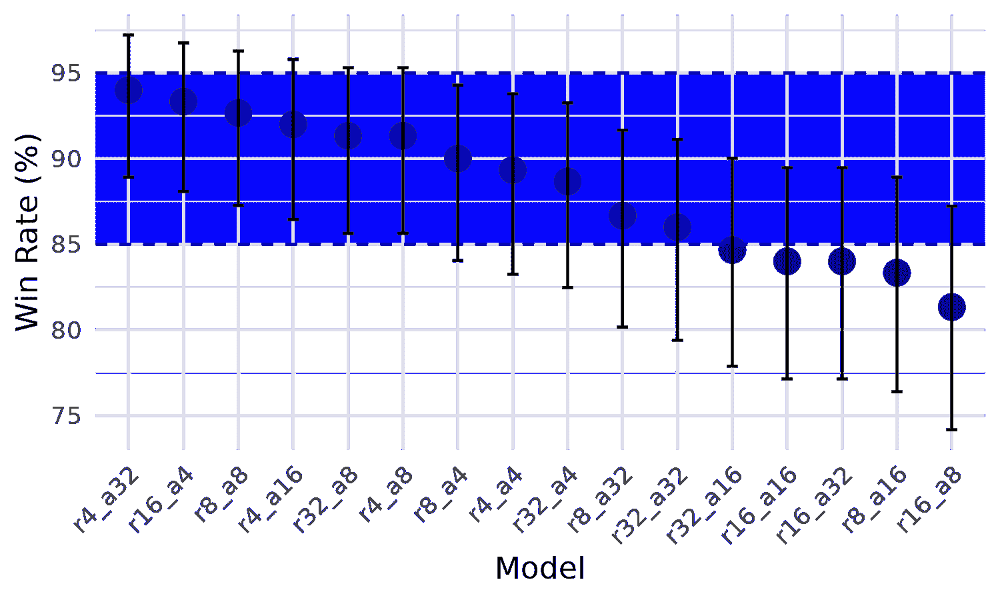

图3：按模型显示的胜率（%）置信区间。蓝色区域表示期望的效应大小。

每个代理的表现，基于胜率及150轮对局的置信区间（CI），如图[3](https://arxiv.org/html/2409.11276v1#S6.F3 "图3 ‣ 6.2 超参数调优 ‣ 6 监督微调方法 ‣ Hackphyr: 面向网络安全环境的本地微调LLM代理")所示。150轮的对局数是基于效能分析选定的，显著性水平为$\alpha=0.05$，效能为$1-\beta=0.8$，目标效应大小介于85%和95%之间。使用置信区间的目的是关注那些区间不重叠的模型。

从图[3](https://arxiv.org/html/2409.11276v1#S6.F3 "图3 ‣ 6.2 超参数调优 ‣ 6 监督微调方法 ‣ Hackphyr: 面向网络安全环境的本地微调LLM代理")中，我们可以观察到，只有最后五组超参数组合在分析的效应大小之间表现出显著差异。其余超参数未能提供足够强的证据来得出在给定置信水平下，胜率值之间存在显著差异的结论。然而，CI的显著重叠表明样本数据未能提供足够强的证据，得出在给定置信水平下，胜率之间存在显著差异的结论。因此，我们选择了使用将LoRa参数设置为$r4\_a32$的模型的代理，因为该配置始终表现出最高的平均胜率。

最重要的超参数的最终值见表[1](https://arxiv.org/html/2409.11276v1#S6.T1 "表1 ‣ 6.2 超参数调优 ‣ 6 监督微调方法 ‣ Hackphyr: 面向网络安全环境的本地微调LLM代理")。

表1：最终超参数值

| 参数 | 值 |
| --- | --- |
| LoRA r | 4 |
| LoRA $\alpha$ | 32 |
| 训练轮数 | 2 |
| 梯度累积步数 | 2 |
| 学习率 | 2.0e-04 |
| 学习率调度器类型 | 余弦 |
| 最大序列长度 | 2048 |
| GPU数量 | 1 |
| 训练批次大小 | 1 |

## 7 实验设计

为了评估代理，我们在第[4](https://arxiv.org/html/2409.11276v1#S4 "4 The NetSecGame Environment ‣ Hackphyr: A Local Fine-Tuned LLM Agent for Network Security Environments")节描述的NetSecGame环境基础上选择了三个场景。在所有这些场景中，目标都是将特定数据外泄到C&C服务器。代理必须执行一系列操作来发现网络中计算机上的数据，然后将其外泄。

### 7.1 场景描述

前两个数据外泄场景（分别称为小型场景和完整版场景）如图[4](https://arxiv.org/html/2409.11276v1#S7.F4 "Figure 4 ‣ 7.1 Scenario Descriptions ‣ 7 Experiment Design ‣ Hackphyr: A Local Fine-Tuned LLM Agent for Network Security Environments")所示。这两个场景共享相同的网络拓扑：两个子网，一个包含客户端，另一个包含服务器，它们通过路由器连接。小型场景与完整版场景的区别仅在于客户端子网中只有一个客户端。

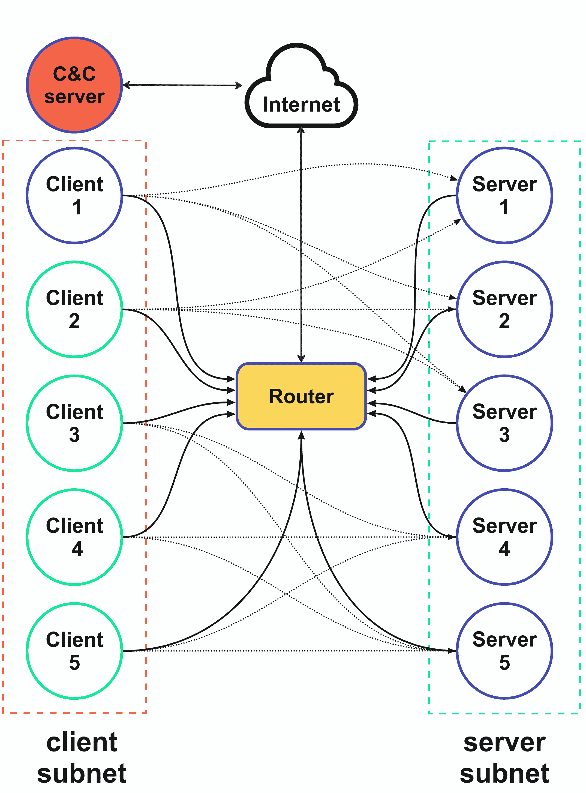

图4：小型和完整版网络场景[[10](https://arxiv.org/html/2409.11276v1#bib.bib10)]。小型场景只有一个客户端在客户端子网中，而完整版场景则有五个客户端。

攻击者从客户端机器中的一个节点开始，扮演一个已在网络中获得立足点的攻击者。攻击者还控制着一台互联网上的机器，命令与控制（C&C）服务器便托管在该机器上。

两种场景都需要至少五个步骤才能将数据外泄。然而，考虑到每个场景中的IP地址和目标都在变化，解决方案远非简单，这也对大语言模型（LLM）和传统的强化学习（RL）代理提出了挑战。两种场景的更详细描述请参见[[10](https://arxiv.org/html/2409.11276v1#bib.bib10)]。

第三个情境（称为三网情境）由虚构的小型中型企业内部的三个不同子网组成（见图[5](https://arxiv.org/html/2409.11276v1#S7.F5 "图 5 ‣ 7.1 情境描述 ‣ 7 实验设计 ‣ Hackphyr：一种针对网络安全环境的本地微调大语言模型代理")）。客户端子网包含客户端主机（如个人电脑等）。第一个服务器子网（子网 A）包含一些客户端可以立即访问的服务器，第二个服务器子网（子网 B）包含两台仅能由子网 A 访问的服务器。防火墙规则防止客户端直接访问子网 B 中的服务器。攻击者的目标是将子网 B 中一台服务器的数据泄露到互联网的 C&C 服务器。攻击者首先在客户端子网中建立立足点，并必须先控制子网 A 中的一台服务器。然后，他们需要对 B 网络进行扫描，发现并利用服务器，获取控制权。一旦控制了正确的服务器并发现数据，就可以将数据泄露到 C&C 服务器。

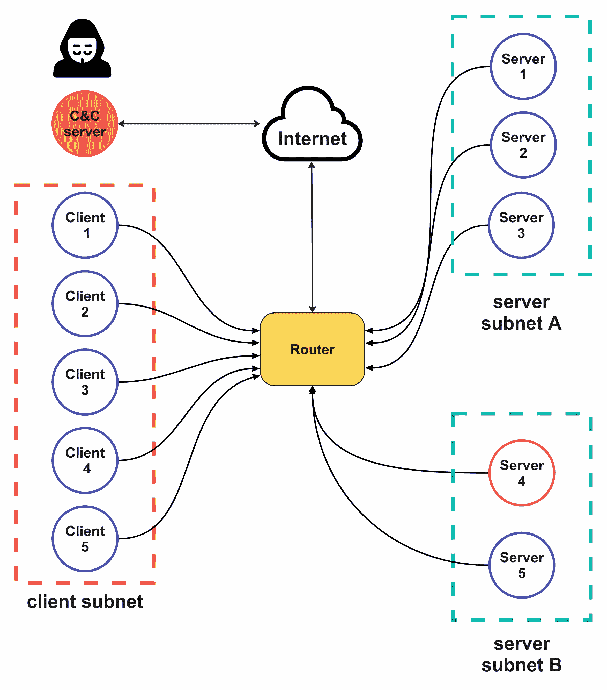

图 5：三子网情境拓扑。客户端仅能直接访问子网 A。目标是通过首先获取子网 A 的立足点，泄露子网 B 的数据。

三网情境比前两个情境需要多出至少三步才能解决。这个情境要求更高，主要用于测试大语言模型的极限。如同前两个情境一样，每次实验中的 IP 地址都会随机化，情境会在有和没有阈值的随机防御者下进行测试；然而，在此情境中，目标是固定的。

三种情境之间的主要差异总结见表[2](https://arxiv.org/html/2409.11276v1#S7.T2 "表 2 ‣ 7.1 情境描述 ‣ 7 实验设计 ‣ Hackphyr：一种针对网络安全环境的本地微调大语言模型代理")

| 情境 | 小型 | 完整 | 三网 |
| --- | --- | --- | --- |
| 网络拓扑 | 一个客户端和一个服务器子网，路由器 | 一个客户端和一个服务器子网，路由器 | 一个客户端和两个服务器子网（A 和 B），客户端仅能直接访问子网 A，路由器 |
| 配置 | 单个客户端和多个服务器 | 多个客户端和多个服务器 | 多个客户端和多个服务器 |
| 情境设置 | 随机化 IP 和目标 | 随机化 IP 和目标 | 随机化 IP，子网 B 上固定目标 |
| 步骤 | 五步 | 五步 | 八步 |
| 目的 | 微调和超参数调优 | 在更复杂的条件下测试性能 | 测试对不同网络配置的适应性 |

表 2：数据泄露情境比较

### 7.2 评估程序

每个场景都具有特定的目的，以便在不同的复杂程度和条件下评估代理的性能（见表[2](https://arxiv.org/html/2409.11276v1#S7.T2 "表2 ‣ 7.1 场景描述 ‣ 7 实验设计 ‣ Hackphyr: 本地微调的LLM代理用于网络安全环境")）。

特别是，小场景主要用于微调和超参数选择，因为在模型训练时使用了类似的示例。我们在有防守者和没有防守者的情况下测试了这个场景，以建立性能基准。

完整的场景更为复杂，涉及更多客户端，这些客户端可以扫描服务并寻找需要外泄的数据。由于完整场景有更多客户端，并且在训练过程中没有遇到过，因此我们用它来分析模型在稍微复杂条件下的性能退化。

最后，三网络场景显著更为复杂，涉及额外的网络和更多的数据外泄步骤。这个场景引入了在训练过程中没有遇到过的不同网络拓扑，有助于分析模型是否存在过拟合。这确保了微调后的模型能够适应多样化且要求苛刻的网络配置，而无需重新训练。

用于测试场景的语言模型有GPT-4、GPT-3.5-turbo和Zephyr-7b-$\beta$，以及Hackphyr。与[6.2](https://arxiv.org/html/2409.11276v1#S6.SS2 "6.2 超参数调优 ‣ 6 监督微调方法 ‣ Hackphyr: 本地微调的LLM代理用于网络安全环境")部分类似，我们对每个模型进行了150局测试，每局最大步数为100步。每局都是独立运行，IP和目标是使用不同的种子生成的。

此外，我们还进行了一些基准比较，使用了一个随机代理和一个基于表格的Q学习代理[[40](https://arxiv.org/html/2409.11276v1#bib.bib40)]，类似于[[10](https://arxiv.org/html/2409.11276v1#bib.bib10)]。对于Q学习代理，由于Q表是固定的，因此无法在每局中随机化IP。然而，每局中的目标是随机化的。Q代理经过50,000局训练，评估是在训练后的代理上进行的。随机代理则运行了2,000局。

对所有代理，我们测量了胜率（win_rate）、平均步骤数和平均回报。胜利指的是代理在100步之内到达目标状态的任何一局。

## 8 结果

没有防守者和有随机防守者的实验结果分别展示在表 [3](https://arxiv.org/html/2409.11276v1#S8.T3 "表 3 ‣ 8.1 没有防守者的场景 ‣ 8 结果 ‣ Hackphyr：一种用于网络安全环境的本地微调 LLM 代理") 和表 [4](https://arxiv.org/html/2409.11276v1#S8.T4 "表 4 ‣ 8.2 有防守者的场景 ‣ 8 结果 ‣ Hackphyr：一种用于网络安全环境的本地微调 LLM 代理") 中。这些表格展示了小型、完整和三子网场景的胜率和回报。

对于小型和完整场景，结果来自于 [[10](https://arxiv.org/html/2409.11276v1#bib.bib10)]。对于三子网场景，所有基于 LLM 的代理均使用完全相同的设置进行运行，包括提示、温度和其他相关参数。这同样适用于 Q-learning 代理，其设置如学习率、epsilon 和回合数在所有实验中保持一致。

### 8.1 没有防守者的场景

表 3：所有代理在不同没有防守者的场景下，100 最大步骤每回合的平均回报和胜率。

|  | 小型 | 完整 | 3 子网 |
| --- | --- | --- | --- |
| 代理 | 胜率% | 回报 | 胜率% | 回报 | 胜率% | 回报 |
| --- | --- | --- | --- | --- | --- | --- |
| 随机 | 40.99 | -43.43 | 31.16 | -57.49 | 4.86 | -93.28 |
| Q-learning | 67.41 | 47.55 | 58.74 | 48.00 | 0.00 | -100.00 |
| GPT-3.5-turbo | 50.00 | -16.13 | 30.00 | -51.67 | 10.00 | -87.50 |
| GPT-4 | 100.00 | 83.10 | 100.00 | 77.13 | 82.35 | 18.78 |
| Zephyr-7b-$\beta$ (基础) | 30.46 | -51.80 | 23.65 | -51.77 | 1.75 | -98.80 |
| Hackphyr (我们的) | 94.00 | 72.83 | 89.10 | 61.03 | 50.34 | -14.26 |

关于胜率和平均回报，GPT-4 代理在所有没有防守者的场景（小型、完整、三子网）中始终表现优于所有其他 LLM 代理。另一方面，Hackphyr 代理表现出强劲的性能，总是排名第二，仅次于 GPT-4，并且与基础的 Zephyr 代理相比有显著提升。

在小型场景中，Hackphyr 代理的表现接近 GPT-4（94% 胜率，72.8 平均回报）。这是预期中的结果，因为用于微调 Zephyr 的数据集包含了 GPT-4 基于代理在小型场景中采取的行动示例。

在完整场景中的表现对于胜率和平均回报更加有价值。这个场景在 Hackphyr 代理的微调过程中完全未曾出现，微调过程描述在第 [6](https://arxiv.org/html/2409.11276v1#S6 "6 监督微调方法 ‣ Hackphyr：一种用于网络安全环境的本地微调 LLM 代理") 节中。尽管与小型场景相比有所下降，Hackphyr 代理仍展现出了 89% 的胜率和 61 的平均回报。这些数值远优于基于 Zephyr 的代理，并且超越了一个更大、更强大的模型 GPT-3.5-turbo。

最后，三子网场景的复杂性导致所有语言模型的胜率表现下降。Hackphyr 的胜率降至 50%，平均回报为 -14.25。基于 GPT-4 的代理则观察到胜率下降了 20%，平均回报下降了 18.78。像 GPT-4 这样强大的模型出现性能下降，表明这是一个更具挑战性的场景，可能需要改进的代理设计。

两个基准代理——随机和 Q-learning 的表现，突出了在给定场景中简单策略的局限性。随机代理在所有场景中的表现始终较差，在小型、完整和三子网场景中的胜率分别为 40.99%、31.16% 和 4.86%，且相应的回报为负，表明决策不当，未能产生积极的结果。Q-learning 代理比随机代理有了显著改善，特别是在小型和完整场景中，胜率分别为 67.41% 和 58.74%，两者的回报均为正（分别为 47.55 和 48.00）。然而，在更复杂的三子网场景中，Q-learning 代理遇到很大困难，胜率为 0%，回报为 -100.00，反映出表格型强化学习方法的局限性。这些结果凸显了这些基准方法的有效性有限，尤其是在更具挑战性的环境中，相较于像 GPT-4 和 Hackphyr 这样的高级模型。

总结来说，Hackphyr 代理表现出色，特别是在考虑到其微调过程和所面对的复杂场景时。尽管 GPT-4 一直优于所有其他代理，但 Hackphyr 作为一个强大且适应性强的模型脱颖而出，其结果通常接近 GPT-4，明显优于其他基于 LLM 的代理，如 GPT-3.5-turbo。

### 8.2 防御者场景

表 4：所有代理在不同场景下的平均回报和胜率，防御者每个回合最多 100 步。

|  | 小型 | 完整 | 三子网 |
| --- | --- | --- | --- |
| 代理 | 胜率 | 回报 | 胜率 | 回报 | 胜率 | 回报 |
| --- | --- | --- | --- | --- | --- | --- |
| Random | 3.76 | -65.57 | 2.72 | -66.56 | 0.13 | -70.73 |
| Q-learning | 77.96 | 54.91 | 71.00 | 45.38 | 0.00 | -70.45 |
| GPT-3.5-turbo | 20.00 | -34.27 | 16.67 | -58.00 | 6.67 | -63.63 |
| GPT-4 | 83.33 | 58.83 | 53.33 | 8.80 | 36.36 | -21.69 |
| Zephyr-7b-$\beta$（基础） | 3.00 | -66.40 | 3.33 | -66.68 | 0.62 | -70.42 |
| Hackphyr（我们的） | 59.77 | 33.00 | 44.00 | 3.56 | 23.33 | -37.67 |

表 [4](https://arxiv.org/html/2409.11276v1#S8.T4 "Table 4 ‣ 8.2 Scenarios With Defender ‣ 8 Results ‣ Hackphyr: A Local Fine-Tuned LLM Agent for Network Security Environments") 显示了随机防御者的结果。在所有情况下，类似于有防御者的场景，Hackphyr 代理的表现优于没有微调的 Zephyr 基础代理。

在小型场景中，Hackphyr智能体的胜率为59.77%，回报值为33。基于GPT-4的智能体在83回合中获胜，平均回报值为58。使用GPT-3.5-turbo的智能体只能在20%的回合中获胜。

类似于没有随机防守者的场景，在完整场景和三个子网场景中表现有所下降。在完整场景中，Hackphyr智能体的胜率为44%，平均回报为3.5。基于GPT-4的智能体表现略好，胜率为53%，平均回报为8.8。

三个子网的场景对所有智能体来说都很困难。尽管存在这些困难，FT-Zephyr智能体在23%的回合中获胜，远超像GPT-3.5-turbo这样的大型模型，仅有6%的胜率。GPT-4的胜率为36%。在所有情况下，平均回报为负值。

当随机防守者存在时，所有基于LLM的智能体表现都下降。然而，Hackphyr智能体表现相对较好，超越了其他基于LLM的智能体。此外，在三个子网的场景中，Hackphyr智能体在除GPT-4外的所有基于LLM的智能体中表现最为突出，差距显著。这一表现证明了该模型可以在完全不同的场景中取得成功，表明它并非仅仅记忆了用于微调的小型场景中的数据。这表明它具备了多功能和适应能力。

关于基线智能体，值得一提的是，Q学习在有防守者的场景中表现出了相当大的有效性，有时甚至超越了GPT-4和Hackphyr的表现。具体来说，它在小型场景中的胜率为77.96%，平均回报为54.91，在三个子网场景中的胜率为71.00%，平均回报为45.38。

这些结果可以归因于防守者的存在，这帮助智能体学习了一种避免因检测而受到惩罚的重复策略。由此产生的策略使得智能体在有防守者的场景中表现得更好，而不是在没有防守者的场景中。然而，在三个子网场景中，它面临了重大挑战，突显出在更复杂环境中的潜在局限性。

最后需要指出的是，所有LLM提示中都没有包含避免防守者的指令。像基于GPT-4的智能体有时会采用广度优先策略，按顺序扫描主机的服务，这可能会触发随机防守者的反应。

## 9 行为分析

我们将轨迹定义为智能体在一个回合中的一系列动作。形式上，轨迹$\tau$可以表示为：

|  | $\tau=\{a_{i}\}_{i=1}^{T}$ |  |
| --- | --- | --- |

其中，$a_{i}$表示智能体在时间步$i$时采取的行动，$T$是回合中的总时间步数。令$\mathcal{T}$表示一组轨迹，表示为：

|  | $\mathcal{T}=\{\tau_{j}\}_{j=1}^{N}$ |  |
| --- | --- | --- |

其中$\tau_{j}$表示集合中的第$j$条轨迹，$N$是轨迹的总数。

在这种背景下，目标是分析轨迹集$\mathcal{T}$，以理解智能体在整个情节中的理性与行为的正确性。我们进行了图形分析，以了解智能体采取的行动之间的转变，从而帮助检测无效或不正确的行动转移模式。

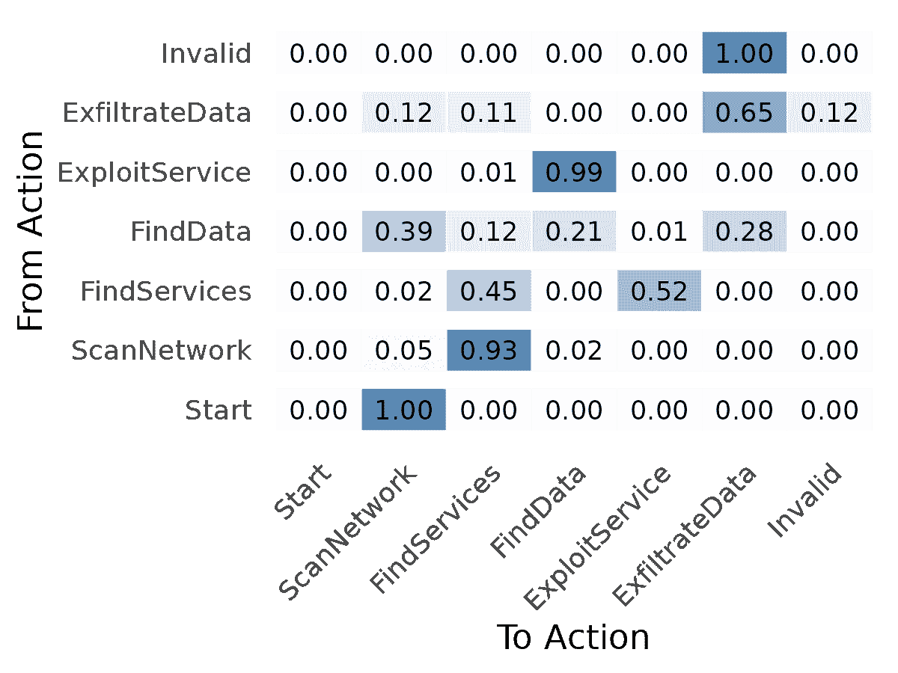

(a) 转移矩阵

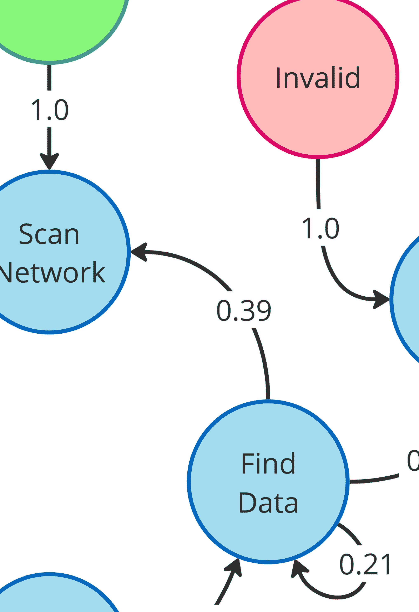

(b) 关键行动转移

图6：GPT-4的行动转移

我们认为GPT-4是参考智能体，因为它在所有场景中表现最好。图[6](https://arxiv.org/html/2409.11276v1#S9.F6 "Figure 6 ‣ 9 Behavioral Analysis ‣ Hackphyr: A Local Fine-Tuned LLM Agent for Network Security Environments")展示了GPT-4智能体所采取的转移路径。图[6(a)](https://arxiv.org/html/2409.11276v1#S9.F6.sf1 "In Figure 6 ‣ 9 Behavioral Analysis ‣ Hackphyr: A Local Fine-Tuned LLM Agent for Network Security Environments")中的热图显示了从一个行动转移到另一个行动的概率，较高的概率用更暖的颜色突出显示。在图[6(b)](https://arxiv.org/html/2409.11276v1#S9.F6.sf2 "In Figure 6 ‣ 9 Behavioral Analysis ‣ Hackphyr: A Local Fine-Tuned LLM Agent for Network Security Environments")中，关键行动转移图形直观地表示了GPT-4可能行动中最相关的转移（概率大于或等于0.20）。例如，Start和Invalid行动分别用绿色和红色标记，以突出它们不是智能体可以选择的行动。特别地，无效行动可能是由语义或语法错误引起的。语义错误发生在当前环境状态下不允许采取该行动时。另一方面，语法错误是由于智能体生成了无效的行动字符串表示所致。

图[6(a)](https://arxiv.org/html/2409.11276v1#S9.F6.sf1 "In Figure 6 ‣ 9 Behavioral Analysis ‣ Hackphyr: A Local Fine-Tuned LLM Agent for Network Security Environments")中的转移矩阵显示，基于GPT-4的智能体在采取下一个行动时通常非常自信。大多数行动都以高概率过渡到下一个行动。唯一表现出更均匀分布转移的行动是FindData和FindServices。

在分析基于 GPT-4 的代理的关键动作转移时（见图 [6(b)](https://arxiv.org/html/2409.11276v1#S9.F6.sf2 "在图 6 ‣ 9 行为分析 ‣ Hackphyr：用于网络安全环境的本地微调 LLM 代理")），代理以 $1.0$ 的概率开始扫描网络。这个动作对潜在目标或漏洞来说似乎是合乎逻辑的。接着，从 ScanNetwork 转移到 FindServices 的高概率为 $0.93$ 是可以预期的，因为在扫描网络并识别新主机后，识别可用服务是关键步骤。

代理从 FindServices 转移到 ExploitService 的概率为 $0.5$，这一转移也是合理的，因为在发现服务后，利用这些服务中的漏洞是典型的下一步。FindServices 中的自环可以通过 ScanNetwork 动作过程中发现的不同 IP 地址所涉及的额外 FindServices 动作来解释。

从 ExploitService 转移到 FindData 的高概率 ($0.99$) 表明，在利用服务后，主要目标是寻找有价值的数据，这在网络入侵场景中是合理的。

从 FindData 转移到 ExfiltrateData 的概率为 $0.28$ 是合乎逻辑的，因为提取有价值的数据是在发现数据之后的步骤。如果代理没有找到任何数据，那么一个合理的动作就是重新开始扫描，此时 GPT-4 代理以 $0.39$ 的概率转向 ScanNetwork。FindData 中的自环通常表示该操作没有发现任何数据，因此 GPT-4 决定重新搜索。

缺乏向无效动作的外向转移表明，基于 GPT-4 的代理从任何其他动作生成无效动作的概率较低。然而，当无效动作发生时，它总是与 ExfiltrateData 动作相关联。这种模式可能是由于 ExfiltrateData 是最复杂的动作，具有最多的参数。此外，每当生成无效动作时，代理的下一个动作始终是 ExfiltrateData，这表明两者之间有很强的相关性。

基于 GPT-4 的代理展示了一个系统化的侦察、服务发现、利用、数据查找和数据外泄的行为模式，与 MITRE ATT&CK 框架中类似的攻击者战术和技术高度匹配¹¹1https://attack.mitre.org/matrices/enterprise/。

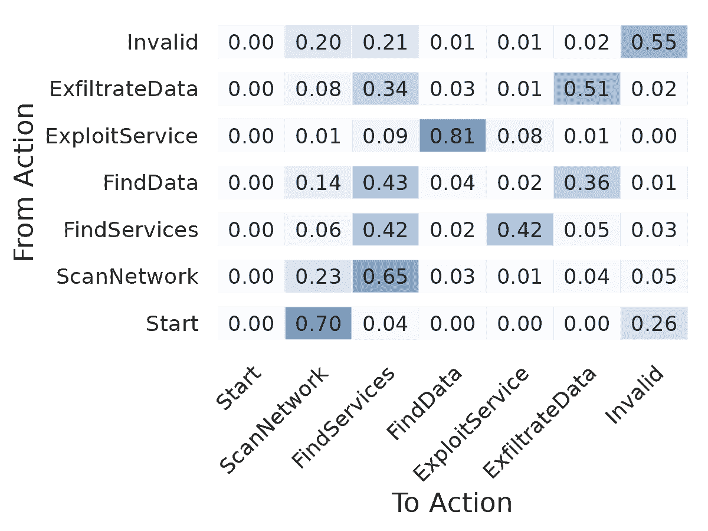

(a) 转移矩阵

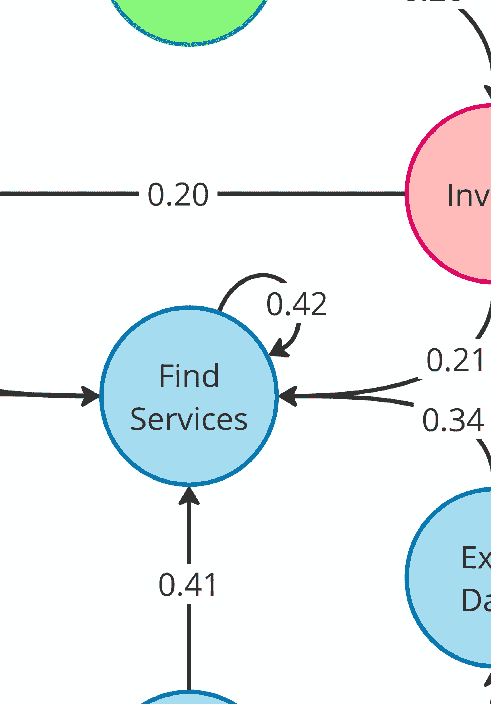

(b) 关键动作转移

图 7：Hackphyr 动作转移

在将基于Hackphyr的智能体与使用GPT-4的智能体进行比较时（图[7](https://arxiv.org/html/2409.11276v1#S9.F7 "Figure 7 ‣ 9 Behavioral Analysis ‣ Hackphyr: A Local Fine-Tuned LLM Agent for Network Security Environments")），过渡矩阵显示智能体在采取下一步行动时不如GPT-4智能体那样自信。下一步行动的过渡分布在所有情况下都更加均匀，除了ExploitService和ScanNetwork。然而，当考虑关键行动交易图[7(b)](https://arxiv.org/html/2409.11276v1#S9.F7.sf2 "In Figure 7 ‣ 9 Behavioral Analysis ‣ Hackphyr: A Local Fine-Tuned LLM Agent for Network Security Environments")时，我们可以观察到智能体也遵循了类似的行为模式，包括系统性侦察、服务发现、利用、数据发现和外泄。然而，Hackphyr智能体在扫描网络时似乎遵循了略有不同的策略。在大多数情节中，智能体试图在继续搜索服务之前扫描所有网络。这种情况在ScanNetwork节点中的自环过渡中得到了体现。

另一个可以观察到的与基于GPT-4的智能体的不同之处是从开始阶段到无效动作的过渡。一旦智能体生成了一个无效动作，最可能的过渡是到另一个无效动作（概率为0.55）。初始环境状态信息对于Hackphyr智能体来说可能更难以理解。此外，启动阶段缺乏短期记忆信息也可能导致过渡到无效动作。

最后，图[8](https://arxiv.org/html/2409.11276v1#S9.F8 "Figure 8 ‣ 9 Behavioral Analysis ‣ Hackphyr: A Local Fine-Tuned LLM Agent for Network Security Environments")展示了使用基础Zephyr-7b-$\beta$模型时智能体的行为。过渡矩阵（图[8(a)](https://arxiv.org/html/2409.11276v1#S9.F8.sf1 "In Figure 8 ‣ 9 Behavioral Analysis ‣ Hackphyr: A Local Fine-Tuned LLM Agent for Network Security Environments")）显示了GPT-4与Hackphyr之间在动作过渡分布上的明显差异。主要差异在于，从任何其他可能的动作到无效动作的过渡概率较高。此外，似乎智能体倾向于过渡到FindServices动作，无论之前的动作是什么。

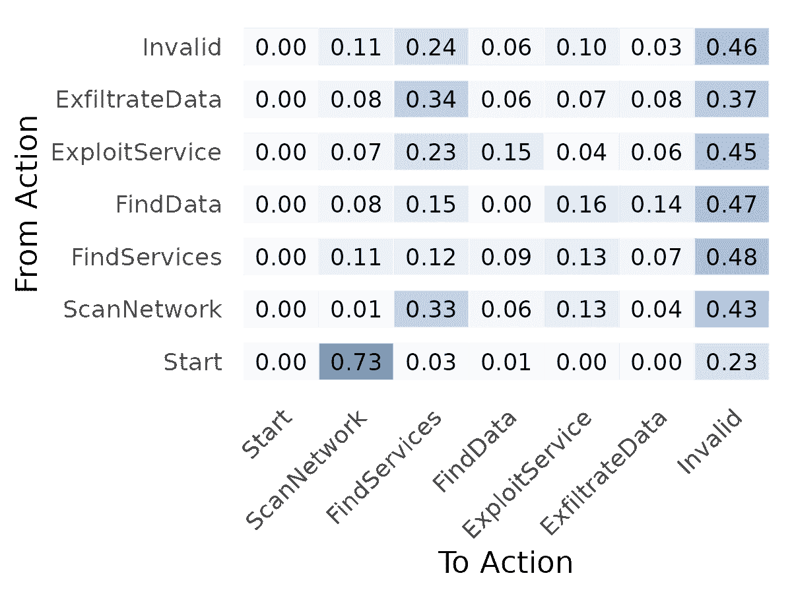

(a) 过渡矩阵

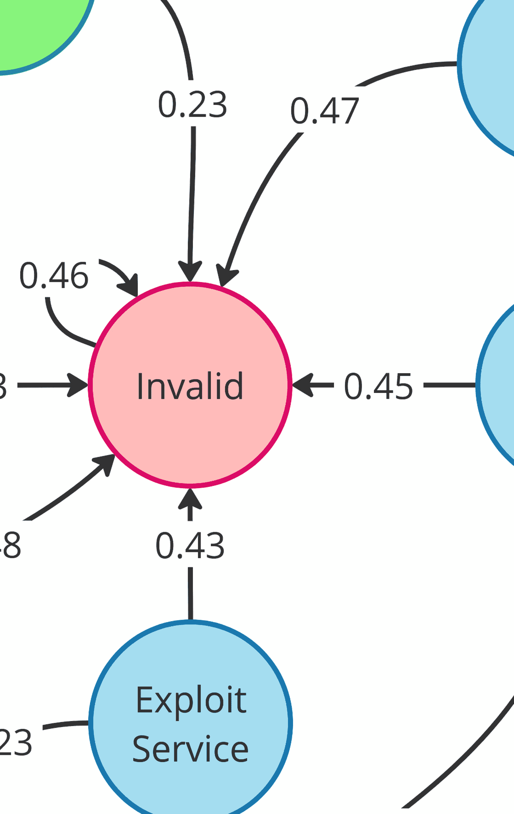

(b) 关键动作过渡

图8：Zephyr-7b-$\beta$ 动作过渡

图8(b)中的关键动作转换图显示了进行渗透测试技术时缺乏明确的行为模式。在开始时，遵循一个合乎逻辑的ScanNetwork动作，然后转到FindServices。然而，图表中没有显示从FindServices到ExploitService和FindData的转换，因为它们的概率非常低。FindData到ExfiltrateData的转换也是如此。因此，除了扫描网络和查找服务外，代理无法遵循正确的动作序列来提取数据。

此外，图表还显示了无效动作节点的核心作用。所有可能的动作都会以相当大的概率（介于0.25和0.48之间）转换为无效动作。

## 10 数据集消融研究

本次消融研究旨在确定在SFT过程中过哪一部分数据集对Hackphyr模型的性能贡献更大。

由于数据集由三部分组成（见第[6.1](https://arxiv.org/html/2409.11276v1#S6.SS1 "6.1 数据集创建 ‣ 6 监督式微调方法 ‣ Hackphyr：用于网络安全环境的本地微调LLM代理")节），我们构建了三个不同的数据集，每个数据集去除了其中的一部分。

+   1.

    数据集UV包含第一部分和第二部分，重点关注理解和有效动作，共有1526个样本。

+   2.

    数据集UG包含第一部分和第三部分，重点关注理解和良好动作，共有1189个样本。

+   3.

    数据集VG包含第二部分和第三部分，重点关注有效和良好动作，共有563个样本。

每个数据集都用来微调一个新模型，使用与第[6.2](https://arxiv.org/html/2409.11276v1#S6.SS2 "6.2 超参数调优 ‣ 6 监督式微调方法 ‣ Hackphyr：用于网络安全环境的本地微调LLM代理")节中描述的完全相同的超参数设置。我们在有无随机防御者的情境下进行比较，以对比其性能。

首先，我们分析了在使用不同数据集部分时代理所采取动作的有效性。动作被分为良好、有效和无效三类：良好动作是代理执行的动作，会增加当前状态；有效动作是指在当前状态下适当且可接受的动作，有助于维持系统完整性或为将来的有利动作做好准备，但不会立即改变状态；而无效动作是在当前状态下不允许的，代理应该尽量避免，以防止错误和低效。

图 [9](https://arxiv.org/html/2409.11276v1#S10.F9 "Figure 9 ‣ 10 Dataset Ablation Study ‣ Hackphyr: A Local Fine-Tuned LLM Agent for Network Security Environments") 展示了每个智能体在完整场景中（有无防守者）经过 150 回合后所采取的每种行动的百分比。此外，我们还提供了使用基础 Zephyr-7b-$\beta$ 模型（未经过任何微调过程）的智能体的结果。

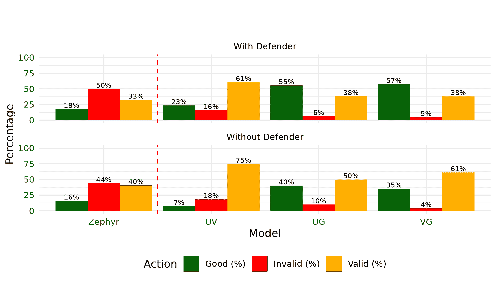

图 9：通过使用不同数据集部分进行训练的智能体所采取的良好、有效和无效行动的百分比。

在没有随机防守者的场景中，数据集 UV 并未显示出良好行动的明显增加（7%）；然而，无效行动的数量从 44% 大幅减少至 18%。数据集 UG 显示良好行动数量有显著增加（40%），无效行动减少至 10%。最后，在数据集 VG 中，良好行动略低于数据集 UV（35%），但无效行动数量减少至 4%。

同样，在随机防守者的情况下，所有智能体相较于基础 Zephyr 智能体都有所改进。使用数据集 UV 训练的智能体良好行动率提高了 23%（从 Zephyr 的 18% 提高），无效行动减少至 16%（从 50% 降低），有效行动增加至 61%（从 33% 提高）。使用数据集 UG 和数据集 VG 训练的智能体显示出显著的改进，两者的良好行动率分别为 55% 和 57%，无效行动显著减少至 6% 和 5%，有效行动增加至 38%。

在两种场景（有随机防守者和没有随机防守者）中，数据集不同部分所提供的好处是显而易见的。特别是，使用 UG 和 VG 数据集训练的智能体表现最佳，良好行动数量大幅增加。在数据集 UV 的情况下，尽管无效行动数量减少，但良好行动数量依然较低。

能够采取有效行动是智能体能够与环境交互的必要条件。然而，这可能还不足以解决问题。为了说明智能体的表现，图 [10](https://arxiv.org/html/2409.11276v1#S10.F10 "Figure 10 ‣ 10 Dataset Ablation Study ‣ Hackphyr: A Local Fine-Tuned LLM Agent for Network Security Environments") 展示了使用不同数据集的模型在每回合平均回报和平均步骤数方面的结果，以及在 150 回合中的胜率。每个指标中表现最佳的模型以蓝色突出显示。请注意，回报和胜率的较高值较好，而步骤数的较低值较佳。

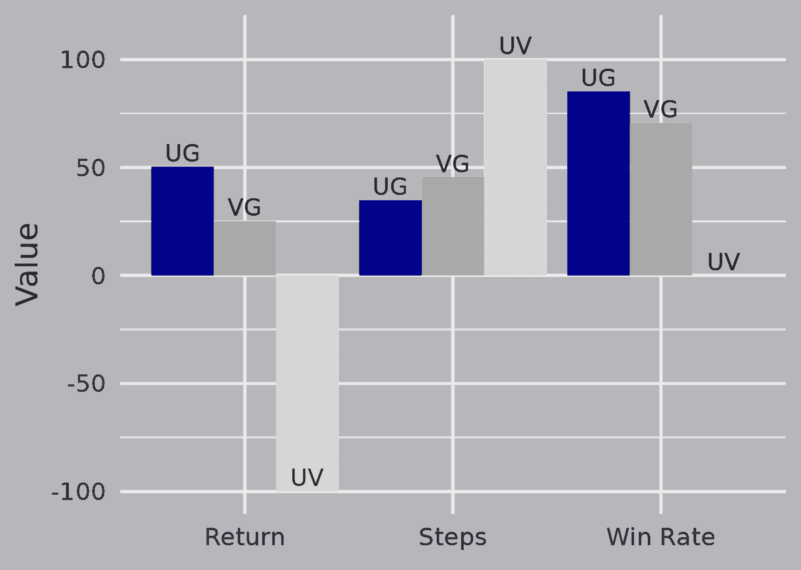

(a) 无随机防守者

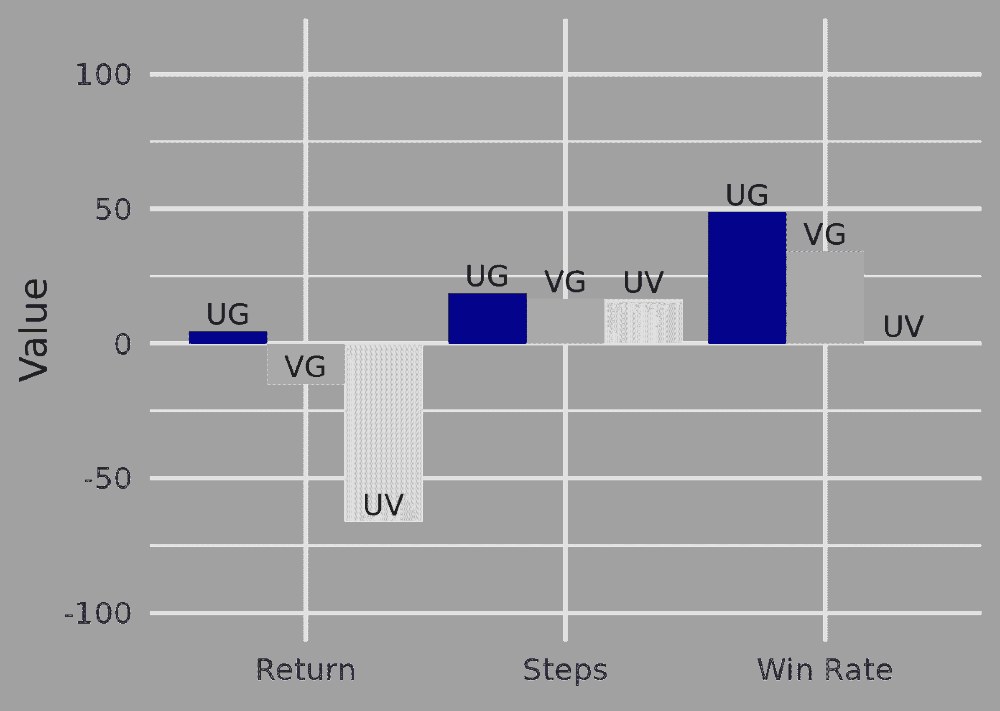

(b) 有随机防守者

图10：在大规模场景中，比较有无随机防御者的去除代理。

当随机防御者不存在时（见图[10](https://arxiv.org/html/2409.11276v1#S10.F10 "Figure 10 ‣ 10 Dataset Ablation Study ‣ Hackphyr: A Local Fine-Tuned LLM Agent for Network Security Environments")(a)），使用数据集UV微调的代理在每个指标上的表现都较差。该代理在150个回合中未能获胜（胜率0%）。因此，平均回报为-100，这意味着代理已经用尽了环境中允许的最大步数。因此，尽管有效行动的数量增加了，代理仍然无法生成足够好的行动来探索和解决环境。另一方面，使用数据集UG和VG微调的代理能够解决环境。特别是，使用数据集UG微调的代理在150个回合中的胜率为85%，平均回报约为50。

类似地，在有随机防御者的场景中（见子图[10(b)](https://arxiv.org/html/2409.11276v1#S10.F10.sf2 "In Figure 10 ‣ 10 Dataset Ablation Study ‣ Hackphyr: A Local Fine-Tuned LLM Agent for Network Security Environments")），使用数据集UV微调的代理在150个回合中未能获胜（胜率0%）。使用其他两个数据集微调的代理能够解决环境。特别是，使用数据集UG的代理在150个回合中的胜率为50%，平均回报约为5。

当代理仅使用Zephyr预训练数据时，会有许多无效行动（见[8](https://arxiv.org/html/2409.11276v1#S8 "8 Results ‣ Hackphyr: A Local Fine-Tuned LLM Agent for Network Security Environments")部分关于基础Zephyr-7b-$\beta$代理的结果）。这可能是所有场景中胜率较低的原因。

为了提高代理的表现，第三部分是至关重要的。使用第三部分的数据集显示出更多有效行动的数量。此外，第一部分和第三部分的结合在胜率和平均回报方面显示出了最佳结果。与此同时，第二部分和第三部分的结合也表现良好，尽管效果略微差一些。这些数据集之间表现的差异可能归因于数据集的大小不同。

最后，较高的有效行动数量并不一定意味着最好的代理。例如，在防御者场景中，使用数据集VG的代理显示出最高的有效行动数量，但在胜率方面，其结果不如使用数据集UG的代理。有效行动有助于探索环境，但有时仅凭这些行动不足以在允许的最大步数内获胜。

## 11 讨论

我们经过微调的模型在性能上与GPT-4相当，尽管GPT-4的参数量至少大了两个数量级。虽然像80亿参数模型这样更大的模型已经出现，并且可能具有更优越的性能，但它们训练和部署时需要大量的计算资源。这可能会限制它们在商业硬件上用于专门任务的实际应用。

此外，即便是像Hackphyr这样的70亿参数模型，也需要强大的GPU来运行推理。量化技术作为一种潜在的解决方案，通过减少模型的内存需求具有一定的前景。然而，量化通常会以性能下降为代价。需要进一步研究平衡计算效率和可维持性能的替代方法。

在这项工作中，我们在所有模型和代理中使用了相同的提示，以公平地比较我们的代理。然而，不同的语言模型可能对定制的提示响应更好。未来的工作将专注于使用如DSPy [[41](https://arxiv.org/html/2409.11276v1#bib.bib41)]等技术优化我们的提示，以使其更好地适应每个模型的特长。

最后，我们主要集中于在NetSecGame环境中攻击代理，主要是为了与先前的工作进行比较。然而，这些原理在设计和实现不同强化学习环境中的攻防代理时具有高度的可转移性。使用专门的代理在多代理部署中进行合作，无论是否有人类参与，都是未来研究的一个令人兴奋的方向。我们预计这项工作将为应对恶意代理的防御策略提供有价值的见解，并希望在未来进一步拓展这一领域。

## 12 结论

尽管强大的商业语言模型能够处理许多任务，但通常存在一些原因限制其使用。例如，在安全领域，企业往往不愿分享其内部网络的数据。一些较小的模型已经在宽松许可下发布，这些模型运行所需的硬件远少于大型模型，并且可以在本地使用。然而，它们的能力不如那些更大的商业模型。在这项工作中，我们对一个70亿参数的模型进行了微调，使其能够在网络安全环境中作为攻击代理使用。最终的模型Hackphyr在性能上与最强大的商业模型（GPT-4）相当，并且在最复杂的、先前未见过的场景中超越了其他语言模型（GPT-3.5-turbo，Zephyr-7b-$beta$）和基准模型（Q-learning代理）。

为了微调基础模型，我们生成了一个新的数据集，旨在解决基础模型在环境理解和生成有效、合理动作方面的不足。最后，我们对每个代理的行为进行了广泛分析，从中获得了对其行为和不足的洞察。这种分析方法可以作为解释LLM代理行为的第一步，并且在未来可以成为所有类型代理在类似环境中的有用工具。

## 13 致谢

作者感谢捷克共和国2019–2025年安全研究发展战略支持计划（IMPAKT 1）的资助，感谢捷克共和国内政部通过VJ02010020号项目——AI-Dojo：面向AI驱动的网络安全技术研究与测试的多代理测试平台的支持。

## 附录 A 数据集示例

### A.1 第一部分

问题：

<svg class="ltx_picture" height="110.58" id="A1.SS1.p2.pic1" overflow="visible" version="1.1" width="600"><g fill="#000000" stroke="#000000" stroke-width="0.4pt" transform="translate(0,110.58) matrix(1 0 0 -1 0 0)"><g fill-opacity="1.0" transform="matrix(1.0 0.0 0.0 1.0 21.65 13.78)"><foreignobject color="#000000" height="83.02" overflow="visible" transform="matrix(1 0 0 -1 0 16.6)" width="556.69">```
This is the current status of a computer network during a
penetration testing procedure:
‘‘‘
Known networks are 1.1.1.0/24
Known hosts are 2.2.2.3
Controlled hosts are 2.2.2.2 and 1.1.1.2
Known data for source host 1.1.1.2: are (User1, WebData)
Known services for host 1.1.1.1 are openssh
‘‘‘
The actions you can take are ScanServices, FindData, ScanNetwork,
ExploitService, and ExfiltrateData.
The rules are:
{{rules}}

Can ScanNetwork action be used on a subnet that is not within
the known networks?

```</foreignobject></g></g></svg>

答案：

<svg class="ltx_picture" height="38.63" id="A1.SS1.p4.pic1" overflow="visible" version="1.1" width="600"><g fill="#000000" stroke="#000000" stroke-width="0.4pt" transform="translate(0,38.63) matrix(1 0 0 -1 0 0)"><g fill-opacity="1.0" transform="matrix(1.0 0.0 0.0 1.0 21.65 13.78)"><foreignobject class="ltx_minipage" color="#000000" height="11.07" overflow="visible" transform="matrix(1 0 0 -1 0 16.6)" width="402.3pt">```
No, according to the rules, you can only scan networks that are
in your list of known networks.

```</foreignobject></g></g></svg>

### A.2 第二部分

问题：

<svg class="ltx_picture" height="169.04" id="A1.SS2.p2.pic1" overflow="visible" version="1.1" width="600"><g fill="#000000" stroke="#000000" stroke-width="0.4pt" transform="translate(0,169.04) matrix(1 0 0 -1 0 0)"><g fill-opacity="1.0" transform="matrix(1.0 0.0 0.0 1.0 21.65 13.78)"><foreignobject class="ltx_minipage" color="#000000" height="141.48" overflow="visible" transform="matrix(1 0 0 -1 0 16.6)" width="402.3pt">```
You are a competent pentester and you are trying to teach others.
This is the current status of a computer network during a
penetration testing procedure:
‘‘‘
Known networks are 1.1.1.0/24 and 2.2.2.0/24
Known hosts are 2.2.2.3 and 2.2.2.4 and 1.1.1.1
Controlled hosts are 2.2.2.2 and 1.1.1.2
Known data for source host 1.1.1.2: are (User1, WebData)
Known services for host 1.1.1.1 are openssh
Know services for host 1.1.1.2 are openssh and http
Know services for host 2.2.2.3 are http and ldap
Know services for host 2.2.2.4 are openssh and http and ldap
‘‘‘
The actions you can take are ScanServices, FindData, ScanNetwork,
ExploitService, and ExfiltrateData.
The rules are:
{{rules}}

Here is an example of each action in JSON format:
...

Provide all the ExploitService actions that can be taken in
the current status in the correct format.

```</foreignobject></g></g></svg>

答案：

<svg class="ltx_picture" height="106.43" id="A1.SS2.p4.pic1" overflow="visible" version="1.1" width="600"><g fill="#000000" stroke="#000000" stroke-width="0.4pt" transform="translate(0,106.43) matrix(1 0 0 -1 0 0)"><g fill-opacity="1.0" transform="matrix(1.0 0.0 0.0 1.0 21.65 13.78)"><foreignobject color="#000000" height="78.87" overflow="visible" transform="matrix(1 0 0 -1 0 16.6)" width="556.69">```
Based on the current status and the rules provided, we
can perform ScanNetwork actions on the known networks.
Here are the ScanNetwork actions in the correct JSON format for
each of the known networks:

‘‘‘json
{"action":"ScanNetwork", "parameters":
    {"target_network": "10.10.0.0/24"}}
{"action":"ScanNetwork", "parameters":
    {"target_network": "10.10.1.0/24"}}
{"action":"ScanNetwork", "parameters":
    {"target_network": "10.10.2.0/24"}}
‘‘‘

```</foreignobject></g></g></svg>

### A.3 第三部分

问题：

<svg class="ltx_picture" height="235.46" id="A1.SS3.p2.pic1" overflow="visible" version="1.1" width="600"><g fill="#000000" stroke="#000000" stroke-width="0.4pt" transform="translate(0,235.46) matrix(1 0 0 -1 0 0)"><g fill-opacity="1.0" transform="matrix(1.0 0.0 0.0 1.0 21.65 13.78)"><foreignobject class="ltx_minipage" color="#000000" height="207.9" overflow="visible" transform="matrix(1 0 0 -1 0 16.6)" width="402.3pt">```
You are a pentester and you want to exfiltrate data
to target host 42.86.112.78.
The actions you can take are ScanServices, FindData, ScanNetwork,
ExploitService, and ExfiltrateData.
The rules are:
{{rules}}

Current status:
Controlled hosts are 10.0.1.76 and 42.86.112.78
Known networks are 10.0.1.0/24 and 10.0.2.0/24 and 10.0.0.0/24
Known hosts are
Known services are none
Known data are none

Here are some examples of actions:
{{examples}}

Based on the current status provided, here’s a breakdown of
the objects and the actions that can be applied to them:

### Controlled Hosts:
- **10.0.1.76** and **42.86.112.78**
  - Actions:
    - **FindData**: You can find data in hosts you control.

### Known Networks:
- **10.0.1.0/24**, **10.0.2.0/24**, and **10.0.0.0/24**
  - Actions:
    - **ScanNetwork**: You can scan networks in your list of
    known networks to discover hosts.

### Known Hosts:
- None listed, but you can discover hosts by scanning the
known networks.

### Known Services:
- None listed, but you can discover services by scanning
the hosts you know.

### Known Data:
- None listed, but you can find data in the controlled hosts.

Provide the best next action in the correct JSON format. Action:

```</foreignobject></g></g></svg>

答案：

<svg class="ltx_picture" height="40.01" id="A1.SS3.p4.pic1" overflow="visible" version="1.1" width="600"><g fill="#000000" stroke="#000000" stroke-width="0.4pt" transform="translate(0,40.01) matrix(1 0 0 -1 0 0)"><g fill-opacity="1.0" transform="matrix(1.0 0.0 0.0 1.0 21.65 13.78)"><foreignobject class="ltx_minipage" color="#000000" height="12.45" overflow="visible" transform="matrix(1 0 0 -1 0 16.6)" width="402.3pt">```
{"action": "ScanNetwork","parameters":
    {"target_network": "10.0.1.0/24"}}

```</foreignobject></g></g></svg>

## 参考文献

+   [1] A. Kott, 自主智能网络防御代理：简介与概述，载于：《自主智能网络防御代理（AICA）》第87卷，Springer国际出版，Cham，2023，第1–15页。 [doi:10.1007/978-3-031-29269-9_1](https://doi.org/10.1007/978-3-031-29269-9_1)。

+   [2] V. Mnih, K. Kavukcuoglu, D. Silver, A. A. Rusu, J. Veness, M. G. Bellemare, A. Graves, M. Riedmiller, A. K. Fidjeland, G. Ostrovski 等人, 通过深度强化学习实现人类水平的控制，《自然》518 (7540) (2015) 529–533. [doi:10.1038/nature14236](https://doi.org/10.1038/nature14236)。

+   [3] M. C. Ghanem, T. M. Chen, E. G. Nepomuceno, 层次化强化学习用于大规模网络的高效和有效自动化渗透测试，《智能信息系统杂志》60 (2) (2023) 281–303. [doi:10.1007/s10844-022-00738-0](https://doi.org/10.1007/s10844-022-00738-0)。

+   [4] J. S. Park, J. O’Brien, C. J. Cai, M. R. Morris, P. Liang, M. S. Bernstein, 生成代理：人类行为的互动模拟，《第36届ACM用户界面软件与技术年会论文集》，UIST ’23，美国纽约计算机协会，2023年，第1–22页。 [doi:10.1145/3586183.3606763](https://doi.org/10.1145/3586183.3606763)。

+   [5] Z. Xi, W. Chen, X. Guo, W. He, Y. Ding, B. Hong, M. Zhang, J. Wang, S. Jin, E. Zhou 等人, 基于大语言模型代理的崛起与潜力：一项调查，arXiv预印本arXiv:2309.07864 (2023)。

+   [6] Y. Du, O. Watkins, Z. Wang, C. Colas, T. Darrell, P. Abbeel, A. Gupta, J. Andreas, 基于大语言模型的强化学习预训练引导，载于：第40届国际机器学习大会论文集，2023年，檀香山，美国。

+   [7] G. Wang, Y. Xie, Y. Jiang, A. Mandlekar, C. Xiao, Y. Zhu, L. Fan, A. Anandkumar, Voyager：一个开放式的具身代理与大语言模型，机器学习研究交易（2024）。

+   [8] L. Wang, C. Ma, X. Feng, Z. Zhang, H. Yang, J. Zhang, Z. Chen, J. Tang, X. Chen, Y. Lin, 等人，基于大型语言模型的自主智能体调查，《计算机科学前沿》18（6）（2024年）186345。

+   [9] L. C. Magister, J. Mallinson, J. Adamek, E. Malmi, A. Severyn, 教小型语言模型推理能力，arXiv:2212.08410 [cs]（2023年）。

+   [10] M. Rigaki., O. Lukáš., C. Catania., S. Garcia., 摆脱限制：随机鹦鹉如何在网络安全环境中获胜，载于：第16届国际代理与人工智能会议论文集 - 第3卷：ICAART，INSTICC，SciTePress，意大利罗马，2024年，页码774–781。[doi:10.5220/0012391800003636](https://doi.org/10.5220/0012391800003636)。

+   [11] A. Vaswani, N. Shazeer, N. Parmar, J. Uszkoreit, L. Jones, A. N. Gomez, L. u. Kaiser, I. Polosukhin, 注意力机制就是你所需要的，载于：《神经信息处理系统进展》，第30卷，Curran Associates, Inc.，2017年。

+   [12] H. W. Chung, L. Hou, S. Longpre, B. Zoph, Y. Tay, W. Fedus, Y. Li, X. Wang, M. Dehghani, S. Brahma, A. Webson, S. S. Gu, Z. Dai, M. Suzgun, X. Chen, A. Chowdhery, A. Castro-Ros, M. Pellat, K. Robinson, D. Valter, S. Narang, G. Mishra, A. Yu, V. Zhao, Y. Huang, A. Dai, H. Yu, S. Petrov, E. H. Chi, J. Dean, J. Devlin, A. Roberts, D. Zhou, Q. V. Le, J. Wei, 扩展指令微调语言模型，《机器学习研究期刊》25（70）（2024年）1–53。

+   [13] J. Wei, M. Bosma, V. Zhao, K. Guu, A. W. Yu, B. Lester, N. Du, A. M. Dai, Q. V. Le, 微调语言模型是零样本学习者，载于：国际学习表征会议，2022年。

+   [14] R. Taori, I. Gulrajani, T. Zhang, Y. Dubois, X. Li, C. Guestrin, P. Liang, T. B. Hashimoto, Alpaca：一个强大且可复现的指令跟随模型；2023年，网址 [https://crfm.stanford.edu/2023/03/13/alpaca.html](https://crfm.stanford.edu/2023/03/13/alpaca.html)（2023年）。

+   [15] L. Tunstall, E. Beeching, N. Lambert, N. Rajani, K. Rasul, Y. Belkada, S. Huang, L. von Werra, C. Fourrier, N. Habib, N. Sarrazin, O. Sanseviero, A. M. Rush, T. Wolf, Zephyr：语言模型对齐的直接蒸馏，arXiv:2310.16944 [cs]（2023年10月）。

+   [16] L. Ouyang, J. Wu, X. Jiang, D. Almeida, C. Wainwright, P. Mishkin, C. Zhang, S. Agarwal, K. Slama, A. Ray, J. Schulman, J. Hilton, F. Kelton, L. Miller, M. Simens, A. Askell, P. Welinder, P. F. Christiano, J. Leike, R. Lowe, 使用人类反馈训练语言模型以遵循指令，载于：《神经信息处理系统进展》，第35卷，Curran Associates, Inc.，2022年，页码27730–27744。

+   [17] E. J. Hu, Y. Shen, P. Wallis, Z. Allen-Zhu, Y. Li, S. Wang, L. Wang, W. Chen, LoRA：大型语言模型的低秩适应，载于：国际学习表征会议，2022年。

+   [18] T. Brown, B. Mann, N. Ryder, M. Subbiah, J. D. Kaplan, P. Dhariwal, A. Neelakantan, P. Shyam, G. Sastry, A. Askell, S. Agarwal, A. Herbert-Voss, G. Krueger, T. Henighan, R. Child, A. Ramesh, D. Ziegler, J. Wu, C. Winter, C. Hesse, M. Chen, E. Sigler, M. Litwin, S. Gray, B. Chess, J. Clark, C. Berner, S. McCandlish, A. Radford, I. Sutskever, D. Amodei, 语言模型是少样本学习者，载于：神经信息处理系统进展，第33卷，Curran Associates, Inc.，2020年，第1877–1901页。

+   [19] J. Wei, X. Wang, D. Schuurmans, M. Bosma, B. Ichter, F. Xia, E. Chi, Q. V. Le, D. Zhou, Chain-of-Thought 提示引发大型语言模型中的推理，神经信息处理系统进展第35卷（2022年），第24824–24837页。

+   [20] S. Yao, J. Zhao, D. Yu, N. Du, I. Shafran, K. R. Narasimhan, Y. Cao, React: 在语言模型中协同推理与行动，载于：第十一届国际学习表征会议，2023年。

+   [21] N. Shinn, F. Cassano, A. Gopinath, K. Narasimhan, S. Yao, Reflexion: 语言代理与言语强化学习，载于：神经信息处理系统进展，第36卷，Curran Associates, Inc.，2023年，第8634–8652页。

+   [22] Z. Wang, S. Cai, G. Chen, A. Liu, X. Ma, Y. Liang, T. CraftJarvis, 描述、解释、规划和选择：与大型语言模型进行互动规划，启用开放世界多任务代理，载于：第37届神经信息处理系统国际会议论文集，NIPS ’23，Curran Associates Inc.，Red Hook, NY, USA，2024年。

+   [23] S. Hao, Y. Gu, H. Ma, J. Hong, Z. Wang, D. Z. Wang, Z. Hu, 使用语言模型推理就是使用世界模型进行规划，载于：NeurIPS 2023规划中的泛化研讨会，2023年。

+   [24] D. Hafner, 评估代理能力谱，载于：国际学习表征会议，2022年。

+   [25] Y. Kant, A. Ramachandran, S. Yenamandra, I. Gilitschenski, D. Batra, A. Szot, H. Agrawal, Housekeep: 使用常识推理整理虚拟家庭，载于：计算机视觉 – ECCV 2022，计算机科学讲义笔记，Springer Nature Switzerland, Cham，2022年，第355–373页。 [doi:10.1007/978-3-031-19842-7_21](https://doi.org/10.1007/978-3-031-19842-7_21)。

+   [26] Y. Wu, S. Y. Min, S. Prabhumoye, Y. Bisk, R. R. Salakhutdinov, A. Azaria, T. M. Mitchell, Y. Li, Spring: 学习论文并通过推理玩游戏，载于：神经信息处理系统进展，第36卷，Curran Associates, Inc.，2023年，第22383–22687页。

+   [27] K. Valmeekam, A. Olmo, S. Sreedharan, S. Kambhampati, 大型语言模型仍然无法进行规划（针对LLM的规划和推理变化基准），载于：NeurIPS 2022决策制定基础模型研讨会，2022年。

+   [28] T. Silver, V. Hariprasad, R. S. Shuttleworth, N. Kumar, T. Lozano-Pérez, L. P. Kaelbling, 使用预训练的大型语言模型进行PDDL规划，载于：NeurIPS 2022决策制定基础模型研讨会，2022年。

+   [29] T. Silver, S. Dan, K. Srinivas, J. B. Tenenbaum, L. Kaelbling, M. Katz，在预训练的大型语言模型下，PDDL 领域中的泛化规划，《人工智能 AAAI 会议论文集》38 (18) (2024) 20256–20264。[doi:10.1609/aaai.v38i18.30006](https://doi.org/10.1609/aaai.v38i18.30006)。

+   [30] A. Happe, J. Cito，AI 被破解：使用大型语言模型进行渗透测试，在《第31届 ACM 欧洲软件工程联合会议及软件工程基础研讨会 ESEC/FSE 2023》论文集，计算机协会，纽约，纽约，美国，2023，2082–2086页。[doi:10.1145/3611643.3613083](https://doi.org/10.1145/3611643.3613083)。

+   [31] S. Moskal, S. Laney, E. Hemberg, U.-M. O’Reilly，LLMs 杀死了脚本小子：如何由大型语言模型支持的代理改变网络威胁测试的格局，arXiv 预印本 arXiv:2310.06936 (2023)。

+   [32] G. Deng, Y. Liu, V. Mayoral-Vilches, P. Liu, Y. Li, Y. Xu, T. Zhang, Y. Liu, M. Pinzger, S. Rass，Pentestgpt：一种基于大型语言模型的自动渗透测试工具，arXiv 预印本 arXiv:2308.06782 (2023)。

+   [33] R. Raman, P. Calyam, K. Achuthan, Chatgpt 或 Bard：谁是更好的认证道德黑客？，《计算机与安全》140 (2024) 103804. [doi:https://doi.org/10.1016/j.cose.2024.103804](https://doi.org/https://doi.org/10.1016/j.cose.2024.103804)。

+   [34] W. Tann, Y. Liu, J. H. Sim, C. M. Seah, E.-C. Chang，使用大型语言模型进行网络安全的 Capture-the-Flag 挑战和认证问题，arXiv 预印本 arXiv:2308.10443 (2023)。

+   [35] S. Garcia, O. Lukas, M. Rigaki, C. Catania，[NetSecGame，一个用于训练和评估 AI 代理在网络安全任务中的强化学习环境。](https://github.com/stratosphereips/NetSecGame) (2023)。

    URL [https://github.com/stratosphereips/NetSecGame](https://github.com/stratosphereips/NetSecGame)

+   [36] A. Q. Jiang, A. Sablayrolles, A. Mensch, C. Bamford, D. S. Chaplot, D. d. l. Casas, F. Bressand, G. Lengyel, G. Lample, L. Saulnier 等，Mistral 7b，arXiv 预印本 arXiv:2310.06825 (2023)。

+   [37] T. Dettmers, A. Pagnoni, A. Holtzman, L. Zettlemoyer，Qlora：量化 LLM 的高效微调，在《神经信息处理系统进展》卷 36，Curran Associates, Inc.，2023，第10088–10115页。

+   [38] L. Tunstall, E. Beeching, N. Lambert, N. Rajani, S. Huang, K. Rasul, A. M. Rush, T. Wolf，《对齐手册》，[https://github.com/huggingface/alignment-handbook](https://github.com/huggingface/alignment-handbook) (2023)。

+   [39] Stratosphere Research Laboratory, AIC, FEL, CTU，[Netsecdata (修订版 913b966)](https://huggingface.co/datasets/stratosphere/NetSecData) (2024)。 [doi:10.57967/hf/3057](https://doi.org/10.57967/hf/3057)。

    URL [https://huggingface.co/datasets/stratosphere/NetSecData](https://huggingface.co/datasets/stratosphere/NetSecData)

+   [40] C. J. C. H. Watkins, P. Dayan, Q-learning, Machine Learning 8 (3) (1992) 279–292. [doi:10.1007/BF00992698](https://doi.org/10.1007/BF00992698).

+   [41] O. Khattab, A. Singhvi, P. Maheshwari, Z. Zhang, K. Santhanam, S. Vardhamanan, S. Haq, A. Sharma, T. T. Joshi, H. Moazam, H. Miller, M. Zaharia, C. Potts, Dspy: 将声明式语言模型调用编译成自我改进的管道，arXiv预印本 arXiv:2310.03714 (2023)。
