<!--yml

分类：未分类

日期：2025-01-11 11:46:59

-->

# 利用语言进行协调：一个基于LLM驱动的多智能体控制框架和基准

> 来源：[https://arxiv.org/html/2412.11761/](https://arxiv.org/html/2412.11761/)

Timothée Anne¹, Noah Syrkis¹, Meriem Elhosni², Florian Turati², Franck Legendre², Alain Jaquier², 和 Sebastian Risi¹ ¹哥本哈根IT大学，丹麦哥本哈根²armasuisse科学与技术，瑞士图恩

###### 摘要

大型语言模型（LLMs）在多个任务中表现出色。一个有前景但仍未充分探索的领域是它们在促进人类与多个智能体之间协调方面的潜力。这种能力在灾难响应、城市规划和实时战略场景等领域中都非常有用。在本研究中，我们介绍了（1）一个旨在评估这些能力的实时战略游戏基准，以及（2）我们称之为HIVE的新框架。HIVE使单个用户能够通过与大型语言模型的自然语言对话，协调多达2,000个智能体的行动。我们在这个多智能体基准上取得了令人鼓舞的结果，我们的混合方法成功解决了诸如协调智能体运动、利用单位弱点、利用人工标注以及理解地形和战略要点等任务。然而，我们的研究也揭示了当前模型的关键局限性，包括处理空间视觉信息的困难和制定长期战略计划的挑战。这项工作揭示了LLMs在人群协调中的潜力与局限性，为该领域的未来研究铺平了道路。HIVE项目页面，包括系统实际操作的视频，可以在此找到：[hive.syrkis.com](hive.syrkis.com)。

###### 关键词：

多智能体，战略游戏，大型语言模型，行为树

## I 引言

大型语言模型（LLMs）能力的不断增长为人工智能开辟了新的领域，包括在人类与AI的合作中发挥作用，涉及多个复杂的领域[[1](https://arxiv.org/html/2412.11761v1#bib.bib1)，[2](https://arxiv.org/html/2412.11761v1#bib.bib2)，[3](https://arxiv.org/html/2412.11761v1#bib.bib3)]。虽然现有的研究大多集中在LLMs在自然语言理解和生成等任务中的熟练度，但它们在协调方面的潜力是一个新的探索领域[[4](https://arxiv.org/html/2412.11761v1#bib.bib4)，[5](https://arxiv.org/html/2412.11761v1#bib.bib5)]。这种能力在灾难响应、城市规划和战略游戏等场景中尤为重要，因为多个智能体的高效协调可以显著影响结果。

本文介绍了一种名为HIVE（*大规模参与的混合智能*）的新型框架，旨在通过实现基于自然语言的实时控制来促进这种协调，从而使得成千上万的智能体能够协同工作。HIVE利用LLM的优势，将高层次的人工指令转化为详细的操作计划，用于智能体群体。具体来说，在接收到玩家通过自然语言提供的高层次战略后，HIVE使用一种简单的领域特定语言生成计划。该计划为每个单元分配了地图上的目标位置和行为树，每个单元会根据其每一步的局部观察采取智能行动。图[1](https://arxiv.org/html/2412.11761v1#S1.F1 "Figure 1 ‣ I Introduction ‣ Harnessing Language for Coordination: A Framework and Benchmark for LLM-Driven Multi-Agent Control")展示了一个示例，其中HIVE响应玩家的提示，并在防御场景中制定出成功的计划。

为了评估这一方法，我们提出了一个实时战略游戏基准测试，旨在测试多智能体系统的五项核心能力：协调、弱点利用、遵守空间标记、地形利用和战略规划（第[IV-A节](https://arxiv.org/html/2412.11761v1#S4.SS1 "IV-A The multi-agent control benchmark ‣ IV Experiments ‣ Harnessing Language for Coordination: A Framework and Benchmark for LLM-Driven Multi-Agent Control")）。我们使用六种最先进的LLM（第[IV-B节](https://arxiv.org/html/2412.11761v1#S4.SS2 "IV-B The tested LLMs ‣ IV Experiments ‣ Harnessing Language for Coordination: A Framework and Benchmark for LLM-Driven Multi-Agent Control")）来评估HIVE在这一基准测试上的表现（第[IV-C节](https://arxiv.org/html/2412.11761v1#S4.SS3 "IV-C HIVE ability tests ‣ IV Experiments ‣ Harnessing Language for Coordination: A Framework and Benchmark for LLM-Driven Multi-Agent Control")）。此外，我们还进行了详细评估，以回答以下问题：HIVE如何扩展到更大规模的单元？（第[IV-D节](https://arxiv.org/html/2412.11761v1#S4.SS4 "IV-D How does HIVE scale up with the number of units ‣ IV Experiments ‣ Harnessing Language for Coordination: A Framework and Benchmark for LLM-Driven Multi-Agent Control")）HIVE是否能从人机协作中受益？（第[IV-E节](https://arxiv.org/html/2412.11761v1#S4.SS5 "IV-E Can HIVE win alone? ‣ IV Experiments ‣ Harnessing Language for Coordination: A Framework and Benchmark for LLM-Driven Multi-Agent Control")）最后，HIVE的表现如何随着不同输入模式的变化（例如，地图的视觉描述与文本描述）而扩展？（第[IV-F节](https://arxiv.org/html/2412.11761v1#S4.SS6 "IV-F Does HIVE need the textual description of the map? ‣ IV Experiments ‣ Harnessing Language for Coordination: A Framework and Benchmark for LLM-Driven Multi-Agent Control")）

我们的研究结果表明，HIVE通过将人类的战略输入与LLM驱动的操作规划相结合，能够成功执行复杂的多智能体任务。然而，研究也揭示了LLM的当前局限性，包括它们对输入变化的敏感性、在视觉-空间推理中的挑战以及在长期战略规划中的困难。这些洞见突显了LLM作为增强人类决策工具的强大功能，同时也表明它们仍需要重大改进，以便能够无缝地融入动态的多智能体环境中。

本研究为推进人类与AI在多智能体协调任务中的合作奠定了基础，突出展示了部署LLM在此类环境中的潜力和障碍。通过解决这些挑战，未来的研究可以进一步完善这些系统，释放其全部潜力。

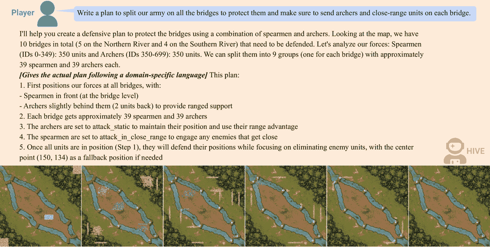

图1：玩家与HIVE之间互动的示例。为了赢得这个场景，玩家和HIVE必须制定一个计划，以防止敌方单位（红色标记）到达营地中心。为此，玩家提出一个高层次的描述，HIVE则使用该描述通过领域特定语言（DSL）编写出实际的计划。在这个例子中，HIVE还简要描述了情况和计划。请注意，尽管情况描述并不总是完全正确（例如，桥梁数为10座而不是9座），但实际的计划是正确的，并成功赢得了这个场景。在此示例中，HIVE使用claude-3-5-sonnet-20241022作为底层的大型语言模型（LLM）。底部显示了相应游戏的快照。

## II 相关工作

最近的研究展示了大型语言模型（LLM）和视觉语言模型（VLM）在复杂战略游戏中的潜力。Cicero [[3](https://arxiv.org/html/2412.11761v1#bib.bib3)]展示了LLM可以通过自然语言协商和战术协调在《外交》游戏中达到人类水平的表现。SwarmBrain [[6](https://arxiv.org/html/2412.11761v1#bib.bib6)]是《星际争霸II》中的一个智能体，结合了基于LLM的高层次战略规划和非LLM的低层次战术执行。这些研究表明，LLM能够在游戏环境中进行战略决策推理和执行。

然而，在实时战略（RTS）游戏中控制多个单位面临独特的挑战。一种提出的方法是层级指挥与控制架构，在《星际争霸》上进行测试，结合了高层次和低层次的强化学习智能体，试图平衡微观管理和宏观管理（即，我们既需要整体战略，又需要快速的低层决策）[[7](https://arxiv.org/html/2412.11761v1#bib.bib7)]。最近的研究还使用了行为树来处理低层次的动作，同时结合LLM进行高层次控制[[8](https://arxiv.org/html/2412.11761v1#bib.bib8)]。

在推进RTS领域AI研究能力方面，星际争霸多智能体挑战（SMAC）环境 [[9](https://arxiv.org/html/2412.11761v1#bib.bib9)] 建立了多智能体控制的关键基准 [[10](https://arxiv.org/html/2412.11761v1#bib.bib10), [11](https://arxiv.org/html/2412.11761v1#bib.bib11)]。SMACv2 [[12](https://arxiv.org/html/2412.11761v1#bib.bib12)] 在此基础上进行了扩展，引入了需要概括的程序生成场景。最近，JaxMARL的SMAX [[13](https://arxiv.org/html/2412.11761v1#bib.bib13)] 使得在类似SMAC的环境中容易进行并行化，降低了RTS环境中应用AI研究的门槛。然而，尽管这些框架为开发多智能体控制系统提供了基础，但它们侧重于战术执行而非战略规划，导致与更高级决策制定的整合尚未得到充分探索。

基于LLM的多智能体系统的发展已经取得了显著的研究进展。也有一篇全面的调查讨论了智能体概况、通信和环境交互等关键方面 [[14](https://arxiv.org/html/2412.11761v1#bib.bib14)]。

AgentCoord [[15](https://arxiv.org/html/2412.11761v1#bib.bib15)] 是一个视觉界面，旨在为多智能体协作中的协调策略提供支持，以解决共同目标。多智能体LLM系统面临的挑战包括有效的任务分配、稳健的推理能力和高效的内存管理 [[16](https://arxiv.org/html/2412.11761v1#bib.bib16)]。这些系统的一个关键限制是LLM推理的计算开销，这使得在没有重大架构妥协的情况下，实时应用变得具有挑战性（部分原因促使了像SwarmBrain这样的混合系统的出现，其中低级执行不依赖于LLM）。

最近的研究探讨了LLM如何处理战略推理任务。Zhang等人 [[5](https://arxiv.org/html/2412.11761v1#bib.bib5)] 研究了LLM的战略推理能力，强调了它们理解游戏结构和适应不同上下文的能力。Kramár等人 [[17](https://arxiv.org/html/2412.11761v1#bib.bib17)] 研究了人工智能体如何利用通信在战略游戏（如外交）中更好地协作。Lorè和Heydari [[4](https://arxiv.org/html/2412.11761v1#bib.bib4)] 分析了不同LLM如何受到情境框架（即我们讲述的关于游戏的表面故事）和游戏结构的影响。

然而，在足够复杂和动态的环境中，LLM 和 VLM 往往难以表现良好[[18](https://arxiv.org/html/2412.11761v1#bib.bib18)]，有时甚至在包含视觉信息（例如游戏地图的图像）时表现 *更差*。LLM 在 3D 环境中的物理常识推理存在困难，在基本空间推理任务中表现甚至不如人类儿童[[19](https://arxiv.org/html/2412.11761v1#bib.bib19)]。此外，长远推理问题更加严重，因为这些模型容易出现幻觉现象[[20](https://arxiv.org/html/2412.11761v1#bib.bib20)]。尽管已提出算法通过分割推理步骤来加强多步推理中的防幻觉能力，但长远因果推理的问题依然未得到解决[[20](https://arxiv.org/html/2412.11761v1#bib.bib20)]。这一问题在战略游戏中尤为突出，因为决策必须建立在彼此之上，错误会随着时间的推移而累积。AndroidArene[[21](https://arxiv.org/html/2412.11761v1#bib.bib21)] 是一个基准测试和环境，评估 LLM 在操作系统中的导航能力（例如使用智能手机中的应用程序），表明这是当前 LLM 的一个限制。

此外，当朝着地理空间模式推进时，模型往往难以超越其训练数据的范围，这引发了对专门的视觉-语言地理基础模型（Vision-Language Geo-Foundation models）的需求[[22](https://arxiv.org/html/2412.11761v1#bib.bib22)]。这一限制对于涉及空间推理和地图意识的战略游戏尤为重要，因为当前的模型往往无法根据地形和单元位置制定连贯的长期战略（有时甚至难以识别基本的地标）。这也呼应了最近的研究，表明视觉语言模型（VLM）常常在基本任务上表现不佳（例如：两个圆是否相交？）——这些对人类来说是 trivial 的问题，却是空间推理的必要条件[[23](https://arxiv.org/html/2412.11761v1#bib.bib23)]。

将 LLM 集成到实时战略游戏中面临着当前研究尚未完全解决的几个挑战。这表明，虽然 LLM 可以进行高层次的战略规划，但它们需要大量支持系统来将这些计划转化为有效的战术行动。

## III HIVE 方法

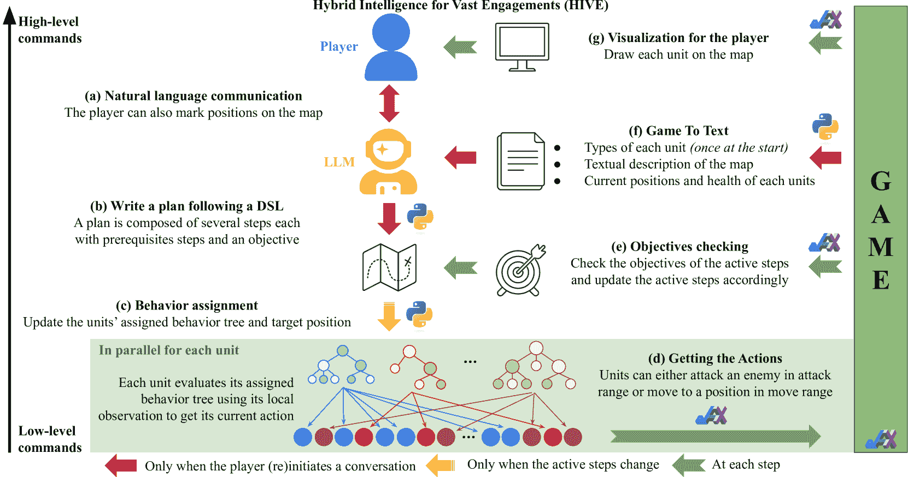

图 2：HIVE 方法概述。HIVE 使用户能够通过将为每个单元分配行为和目标的繁琐任务委托给通用大型语言模型（LLM），从而指挥最多数千个单元。在当前的实现中，HIVE 主要分为两个阶段：（1）与 LLM 进行讨论阶段，在游戏开始前制定计划；（2）执行阶段，计划为每个单元分配行为树。我们在 JAX 中实现了处理单元的模块[[24](https://arxiv.org/html/2412.11761v1#bib.bib24)]，并在 Python 中实现了管理高层信息的模块。更详细的描述请见正文。

我们的方法，HIVE，允许玩家通过基于自然语言的LLM对话控制战略游戏中的成千上万个单位。我们假设这种人机协作方式应该能够缓解纯粹基于LLM的方法中提到的一些缺点。

图[2](https://arxiv.org/html/2412.11761v1#S3.F2 "Figure 2 ‣ III The HIVE approach ‣ Harnessing Language for Coordination: A Framework and Benchmark for LLM-Driven Multi-Agent Control")展示了其主要组件的概览。 (a) 玩家可以使用自然语言进行交流，并在地图上添加标记以给出绝对位置（第[III-C](https://arxiv.org/html/2412.11761v1#S3.SS3 "III-C The interface between the player and HIVE ‣ III The HIVE approach ‣ Harnessing Language for Coordination: A Framework and Benchmark for LLM-Driven Multi-Agent Control")节）。 (b) LLM使用一种领域特定语言编写计划，控制所有单位的行为（第[III-D1](https://arxiv.org/html/2412.11761v1#S3.SS4.SSS1 "III-D1 Writing a plan with our Domain Specific Language ‣ III-D The plan ‣ III The HIVE approach ‣ Harnessing Language for Coordination: A Framework and Benchmark for LLM-Driven Multi-Agent Control")节）。 (c) 该计划在创建或通过目标检查触发时，为每个单位分配一个目标位置和行为树（第[III-D2](https://arxiv.org/html/2412.11761v1#S3.SS4.SSS2 "III-D2 Applying the plan ‣ III-D The plan ‣ III The HIVE approach ‣ Harnessing Language for Coordination: A Framework and Benchmark for LLM-Driven Multi-Agent Control")节）。 (d) 每个单位使用本地观察评估其行为树，以确定一个行动（第[3](https://arxiv.org/html/2412.11761v1#S3.F3 "Figure 3 ‣ III-B Behavior Trees ‣ III The HIVE approach ‣ Harnessing Language for Coordination: A Framework and Benchmark for LLM-Driven Multi-Agent Control")节）。我们游戏中的动作要么是攻击敌方单位，要么是移动。 (e) 每一步后，游戏会检查当前计划的目标（第[III-D3](https://arxiv.org/html/2412.11761v1#S3.SS4.SSS3 "III-D3 Checking the plan ‣ III-D The plan ‣ III The HIVE approach ‣ Harnessing Language for Coordination: A Framework and Benchmark for LLM-Driven Multi-Agent Control")节）。如果有目标已完成，计划会继续执行，且激活的步骤会被更新。该模块还会检查特定场景下的全球胜负条件。 (f) 在讨论开始时，LLM接收有关每个单位类型的信息（第[III-E](https://arxiv.org/html/2412.11761v1#S3.SS5 "III-E LLM Game Information ‣ III The HIVE approach ‣ Harnessing Language for Coordination: A Framework and Benchmark for LLM-Driven Multi-Agent Control")节）。当玩家触发时，LLM还会接收地图的预计算文本描述（见第[IV-F](https://arxiv.org/html/2412.11761v1#S4.SS6 "IV-F Does HIVE need the textual description of the map? ‣ IV Experiments ‣ Harnessing Language for Coordination: A Framework and Benchmark for LLM-Driven Multi-Agent Control")节，讨论LLM的地理视觉能力），以及每个单位的当前健康状况和位置。 (g) 每个游戏步骤后，单位的位置会被绘制在地图上并显示在玩家的屏幕上（第[III-A6](https://arxiv.org/html/2412.11761v1#S3.SS1.SSS6 "III-A6 The visualization ‣ III-A The multi-agent game ‣ III The HIVE approach ‣ Harnessing Language for Coordination: A Framework and Benchmark for LLM-Driven Multi-Agent Control")节）。

我们的实现允许玩家在计划执行过程中与HIVE互动，从而可能在计划展开时进行更新。然而，在本次框架的初步评估中，我们选择不使用此功能，以便进行更简单的分析。另一个提供的功能是在游戏结束后重新启动相同场景进行再次尝试，以提高当前分数。在这种情况下，HIVE保留了讨论历史，但不包括关于前一场游戏的信息，主要是由于模型的上下文大小有限。接下来，我们将更详细地介绍不同的HIVE组件。

### III-A 多智能体游戏

该游戏是一款自上而下的战略游戏，玩家指挥由几百到几千个单位组成的军队，与一支规模相当的敌军对抗。玩家通过与HIVE互动来专门控制自己的军队，HIVE会制定一个计划，决定每个单位在每个步骤中的行为。游戏还允许我们通过使用不同的地图和设定全局目标来创建各种场景。

#### III-A1 全局目标

游戏中有两种目标。其一是*消灭目标*，目标是消灭一组敌方单位（在本文中，全球消灭目标要求消灭所有敌方单位，但HIVE可以在编写计划时选择特定的目标单位）。另一种是*位置目标*，目标是让至少一个或所有单位到达指定位置（在本文中，场景中的位置目标要求至少一个单位到达指定位置。而在计划中的位置目标则要求所有单位到达该位置）。这些目标规范允许创建更多进攻、防御或隐蔽元素的场景。一旦任一方达成其全局目标，游戏即告结束。

#### III-A2 单位

该框架允许我们创建任何类型的单位，并为其设置如移动速度、最大生命值、攻击伤害和攻击范围等参数。在本文中，我们使用了三种类型的单位。*长矛兵*是一种移动缓慢、生命值高的近战单位。*弓箭手*是一种攻击范围远但生命值低的单位。*骑兵*是一种快速的近战单位，生命值中等。

这三种类型的单位形成了石剪子布的动态关系，因为一群弓箭手凭借更远的射程轻松消灭长矛兵，一群骑兵凭借比弓箭手更快的接触速度轻松消灭弓箭手，而一群长矛兵则凭借相似的伤害但更高的生命值轻松击败一群骑兵。附录中的表格[II](https://arxiv.org/html/2412.11761v1#A0.T2 "TABLE II ‣ -E Units characteristics ‣ Harnessing Language for Coordination: A Framework and Benchmark for LLM-Driven Multi-Agent Control")详细列出了这些单位的特点。

#### III-A3 观察

每个单位知道其视野范围内每个单位的位置和生命值（视野范围设为 15 米），并且能够访问一个距离地图，即一个矩阵，包含从地图上任意位置到单位目标位置的距离。这使得单位能够沿着最短路径前往目标位置。

#### III-A4 动作

在每一步中，每个单位执行一个动作：什么都不做，移动到视野内任何可以到达的位置（2D连续动作），或攻击视野内的敌方单位（即在视距范围内且没有视觉障碍物的情况下），该敌方单位处于攻击范围内（离散动作）。

#### III-A5 地形

游戏允许轻松实现不同类型的地形。在本文中，我们使用四种类型：

+   •

    普通：单位可以移动并穿透它；

+   •

    森林：单位可以移动，但不能穿透或看透它；

+   •

    水域：单位可以看到它，但不能穿越它；

+   •

    建筑物：单位无法通过或看透它。

这些特性使得可以创建具有战略性特征的多样化地图和场景，例如桥梁上的瓶颈（普通地形覆盖水域）或通过隐藏在森林中进行潜行的机会。

#### III-A6 可视化

在每个时间步长中，游戏通过不同的颜色阴影（玩家单位使用蓝色，敌方单位使用红色）和形状（方形代表长矛手，圆形代表弓箭手，三角形代表骑兵）绘制单位在地图上的位置。玩家无法获得每个单位的生命值信息（即实时评估成百上千个单位的生命值是困难的[[25](https://arxiv.org/html/2412.11761v1#bib.bib25)]）。

#### III-A7 主循环

游戏的主循环在 JAX[[24](https://arxiv.org/html/2412.11761v1#bib.bib24)] 中实现，流程如下：

1.  1.

    对每个攻击单位应用攻击动作；

1.  2.

    对每个移动单位应用移动动作，同时检查与建筑物或水域地形的碰撞；

1.  3.

    推动发生碰撞的单位；

1.  4.

    检查与建筑物或水域地形的碰撞；

1.  5.

    计算每个单位之间的距离，同时考虑与建筑物和森林地形的视线。

### III-B 行为树

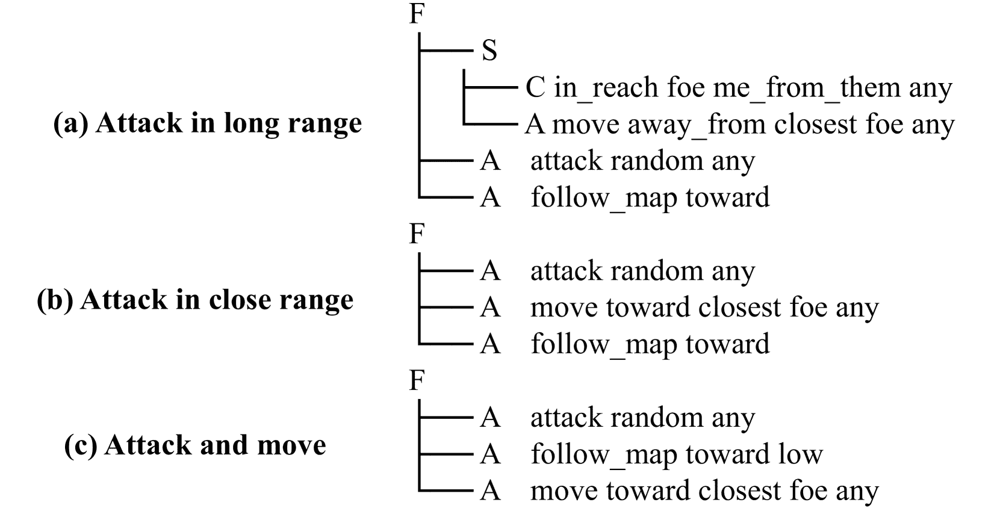

图 3：HIVE 用于控制每个单位的三种主要行为树。

该框架包括一个重要的中间层，位于玩家编写的高层指令（作为计划）和单位执行的低层动作之间。我们选择使用行为树[[26](https://arxiv.org/html/2412.11761v1#bib.bib26)]来实现这一目的。行为树提供了一种方便的方式来控制代理，且易于设计和理解。它们由四种不同类型的节点组成：

+   •

    序列节点 S：在第一个失败的节点处停止；

+   •

    回退节点 F：在第一个成功的节点处停止；

+   •

    条件节点 C：根据单位观察评估条件，并返回失败或成功；

+   •

    动作节点 A：尝试根据单位观察执行动作，并返回失败或成功。

HIVE 按顺序评估每个活跃的行为树，因为它们对应不同的 JAX 指令。尽管如此，每个行为树的评估是在其分配的单元上并行进行的。随着更多行为树变为活跃状态，并且它们的大小（即节点数量）增加，这一评估过程会变慢。

对于本文，我们设计了一个由限定符参数化的条件和动作节点列表（请参见附录中的第[-C](https://arxiv.org/html/2412.11761v1#A0.SS3 "-C 语法用于我们的行为树 ‣ 利用语言进行协调：一个框架和基准，用于基于大语言模型的多智能体控制"）部分，完整的 Lark 语法）。可用的条件有：

+   •

    是否有某一特定类型的盟友或敌人在视野内？

+   •

    是否有某一特定类型的盟友或敌人在视野内，并且其可以或可能在一、两或三步内进入攻击范围？

+   •

    我是否位于或者是否可能在一、两或三步内进入攻击范围，与视野内某一特定类型的盟友或敌人？

+   •

    我是某一特定类型吗？

+   •

    我的健康是否低于 75%、50% 或 25% 的阈值？

+   •

    我在森林中吗？

可用的动作有：

+   •

    什么都不做；

+   •

    向目标位置移动（沿最短路径并带有一定噪声），直到达到相对于单位视距和移动速度的给定阈值；

+   •

    向视野内某一特定类型的最近、最远、最弱、最强或随机的盟友或敌方单位移动（没有最佳路径保证）；

+   •

    攻击攻击范围内的（最近、最远、最弱、最强或随机的）敌人。

我们为 HIVE 手工制作了五个可用的行为树：

+   •

    远程攻击：远离附近的敌人，或者如果可能的话攻击敌人，或者朝目标位置移动；

+   •

    近战攻击：如果可能的话，攻击攻击范围内的随机单位，或者如果有最近的敌人，朝其移动，否则向目标位置移动；

+   •

    攻击并移动：如果可能的话，攻击攻击范围内的随机单位，或者朝目标位置移动，且仅在目标到达后，向最近的敌人移动；

+   •

    向目标位置移动：沿最短路径前往目标位置，并带有一定的噪声；

+   •

    站立：什么都不做。

在所有涉及敌方单位的行为树中，LLM 可以针对任何类型的单位或子集进行操作。图[3](https://arxiv.org/html/2412.11761v1#S3.F3 "图 3 ‣ III-B 行为树 ‣ III HIVE 方法 ‣ 利用语言进行协调：一个框架和基准，用于基于大语言模型的多智能体控制") 展示了所使用的三种主要行为树。所有行为树的确切语法可以在附录的第[-D1](https://arxiv.org/html/2412.11761v1#A0.SS4.SSS1 "-D1 可用于 HIVE ‣ -D 本文使用的行为树列表 ‣ 利用语言进行协调：一个框架和基准，用于基于大语言模型的多智能体控制")部分找到。

### III-C 玩家与 HIVE 之间的接口

玩家只能通过与 HIVE 的接口来控制自己的军队。其前端由一个 LLM 组成，接收来自玩家的自然语言提示。HIVE 可以通过回答问题或提出问题来回应玩家的提示。

通过自然语言命令，可以方便快捷地控制许多单元前往地图上的不同位置。例如，当单元数量很大时，要求系统派遣单元覆盖所有桥梁，可能比使用传统的鼠标界面更快。然而，有时与模型传达特定的绝对地图位置仍然是有用的。这就是为什么 HIVE 允许玩家点击地图添加标记，并用字母进行标注，之后可以在与模型的对话中引用这些标记。

HIVE 的核心组件是 LLM。任务的规格通过其上下文指令来指定，使我们能够轻松测试不同 LLM 在我们的多代理基准测试中的表现。LLM 推理是我们系统中最耗时的部分，因为模型可能需要几秒钟到几十秒不等的时间来响应（见图[7](https://arxiv.org/html/2412.11761v1#S4.F7 "Figure 7 ‣ IV-C HIVE ability tests ‣ IV Experiments ‣ Harnessing Language for Coordination: A Framework and Benchmark for LLM-Driven Multi-Agent Control")）。在本文中，游戏仅在接收到 LLM 的回答后开始，并解析和应用该计划。

### III-D 计划

#### III-D1 使用我们的特定领域语言编写计划

HIVE 使用一种特定领域的语言编写计划，执行玩家的高级指令。一个计划由多个步骤组成。一个步骤由多个组件构成：

+   •

    一个数值标签来引用它；

+   •

    一组前置步骤，在该步骤之前需要完成（例如，在命令两组单元攻击之前，等待它们到达指定位置）；

+   •

    一个目标（类似于全局目标），用于推断步骤是否已完成、处于激活状态或非激活状态；

+   •

    一组单元列表，指示每个单元在步骤中的行为。

一组单元由单元 ID 列表、目标位置和行为树组成。只有当每个单元都被包含在不超过一个小组中时，步骤才有效。

我们通过系统提示向 LLM 指示规则，要求它编写一个带有简单示例和短小错误清单的计划。图[1](https://arxiv.org/html/2412.11761v1#S1.F1 "Figure 1 ‣ I Introduction ‣ Harnessing Language for Coordination: A Framework and Benchmark for LLM-Driven Multi-Agent Control")所使用的实际指令消息在附录第[-A1](https://arxiv.org/html/2412.11761v1#A0.SS1.SSS1 "-A1 Instruction ‣ -A LLM instruction and game for the example of the teaser figure ‣ Harnessing Language for Coordination: A Framework and Benchmark for LLM-Driven Multi-Agent Control")节中有详细说明。LLM 编写的计划会被解析，如果语法不正确或单位或行为树的 ID 错误，则会抛出错误。

#### III-D2 应用计划

当计划被创建或当活动步骤发生变化时，HIVE 会遍历每个活动步骤，并为每个单位分配行为树和目标位置。如果一个单位出现在多个活动步骤中，将分配最后一个步骤的行为。若该单位没有新的分配，它将保持先前的分配。如果一个单位从未收到分配，它的默认行为是无所作为。系统的这一部分可能会比较耗时，因为（1）每个目标位置需要在完整地图上进行广度优先搜索，（2）行为树的重新分配和步骤目标的检查需要重新编译 JAX 函数。

#### III-D3 检查计划

游戏中的每一步后，HIVE 检查全局目标和当前活动步骤目标，以查看是否有一方获胜、计划是否完全展开，或者是否有新的步骤变为活动状态。在本文中，如果计划完全展开，但没有一方获胜，我们会停止游戏，因为我们认为这是计划设计中的一个缺陷。HIVE 也可以要求玩家提供新的指令。

### III-E LLM 游戏信息

LLM 会接收到关于每个单位和地图的相关信息，下面我们将详细说明。

#### III-E1 单位信息

LLM 获取关于双方单位类型和当前组成的完整描述。在每次玩家提示后，它会接收单位的健康状况和位置。一个示例在附录第[-A2](https://arxiv.org/html/2412.11761v1#A0.SS1.SSS2 "-A2 The game info ‣ -A LLM instruction and game for the example of the teaser figure ‣ Harnessing Language for Coordination: A Framework and Benchmark for LLM-Driven Multi-Agent Control")节中。

#### III-E2 地图的文本描述

在初步体验中，我们尝试使用视觉效果，但发现当前的通用大型语言模型（LLM）在理解自上而下的地图方面效率低下，无法准确定位单位、地形或地标。因此，我们依赖于预先计算的地图描述，这些描述给出了不同地形类型（森林和河流）以及桥梁位置的绝对坐标。第[IV-F](https://arxiv.org/html/2412.11761v1#S4.SS6 "IV-F Does HIVE need the textual description of the map? ‣ IV Experiments ‣ Harnessing Language for Coordination: A Framework and Benchmark for LLM-Driven Multi-Agent Control")节比较了HIVE在使用文本提示与不同图像输入变体下的能力。图[11](https://arxiv.org/html/2412.11761v1#S4.F11 "Figure 11 ‣ IV-F Does HIVE need the textual description of the map? ‣ IV Experiments ‣ Harnessing Language for Coordination: A Framework and Benchmark for LLM-Driven Multi-Agent Control")和[12](https://arxiv.org/html/2412.11761v1#S4.F12 "Figure 12 ‣ IV-F Does HIVE need the textual description of the map? ‣ IV Experiments ‣ Harnessing Language for Coordination: A Framework and Benchmark for LLM-Driven Multi-Agent Control")展示了这种描述的两个例子。

## IV 实验

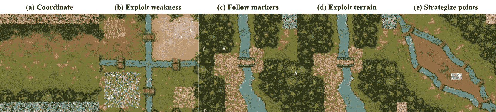

图4：HIVE基准能力测试。(a) 协调任务，玩家需要使用1000个单位消灭所有敌人，(b) 利用敌人的弱点，玩家需要有效地使用三种单位消灭敌人，(c) 跟随标记，玩家需要将至少一个单位带到南方，(d) 利用地形，玩家需要将至少一个单位带到地图的对角线位置，(e) 策略点，玩家需要防止敌人到达他们营地的中心。

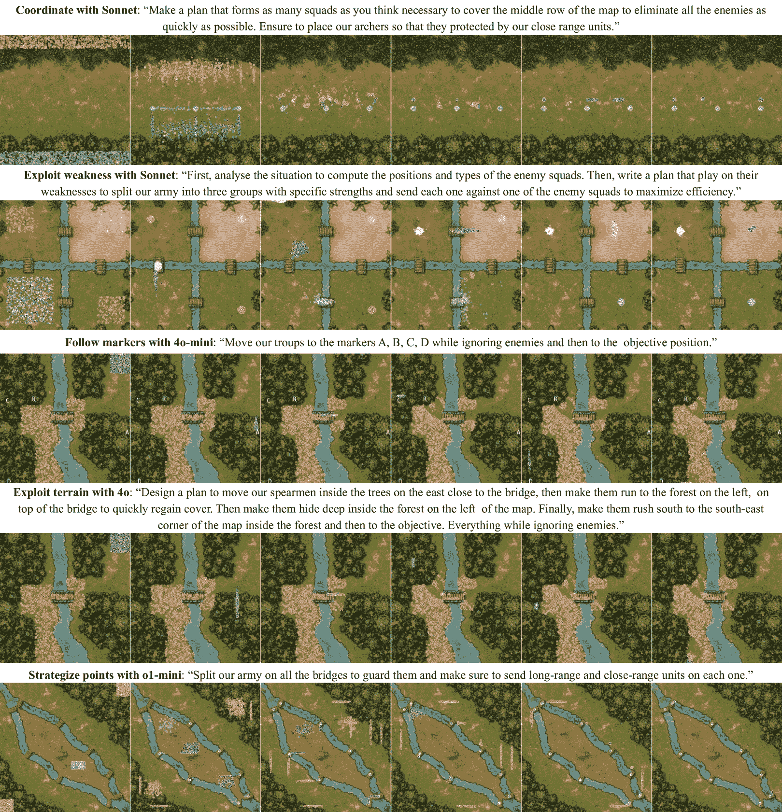

图5：HIVE使用不同LLM进行每项能力测试的成功计划。HIVE可以将高层次的指令转化为成功的计划，从协调数千个单位到利用地形、敌人的弱点或战略点。蓝色单位为玩家的单位。红色单位为敌人。

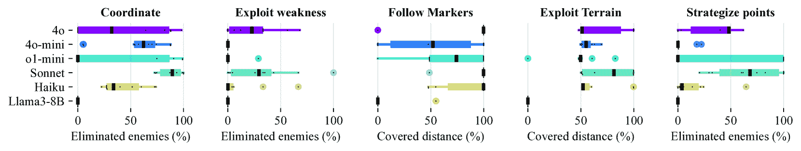

图6：HIVE使用六种不同LLM在相同的10个提示下进行的能力评估。除了“跟随标记”任务，其他能力测试对所有LLM来说都是可解但具有挑战性的。Sonnet似乎是与HIVE配合使用的最佳LLM，而像Llama3-8B这样的小型LLM完全失败。

### IV-A 多智能体控制基准

我们通过在四个场景下进行五项能力测试来评估HIVE在执行玩家命令时的有效性（图[4](https://arxiv.org/html/2412.11761v1#S4.F4 "Figure 4 ‣ IV Experiments ‣ Harnessing Language for Coordination: A Framework and Benchmark for LLM-Driven Multi-Agent Control")）。在所有场景中，敌方单位的行为是相同的：长矛兵和骑兵进行近战攻击，而弓箭手进行远程攻击，并远离近战。地图是通过INKARNATE地图制作平台设计的（[https://inkarnate.com/](https://inkarnate.com/)）。

#### IV-A1 协调

玩家控制1000个单位（500名长矛兵和500名弓箭手），必须消灭来自北方的1000名长矛兵敌军。这测试了在简单地形上协调多种单位的能力。地图宽度为150米，每个单位只能看到前方15米，挑战在于如何将单位分布在战场上。另一个挑战是如何有效地将弓箭手布置在长矛兵后方以减少伤亡。

#### IV-A2 利用弱点

玩家控制750个单位（250名长矛兵、250名弓箭手和250名骑兵），必须消灭由相同单位组成的敌军。地图通过纵向和横向的河流分为四个象限，并有桥梁相连。敌军按单位类型分布在三个象限，玩家的军队从最后一个象限开始。这测试了利用剪刀石头布的动态来获胜的能力，同时尽量减少伤亡。要求HIVE估算敌军各兵种的位置和单位类型，并派遣克制敌方单位的类型。HIVE会得到每种单位类型的强项和弱点作为上下文信息。

#### IV-A3 跟随标记 & 利用地形

玩家控制300名长矛兵，从东北角开始，必须至少带领一名长矛兵到达西南角的目标位置。单位必须跨越一座由1200名敌方单位（600名长矛兵和600名弓箭手）守卫的桥梁。挑战在于如何有效利用树木的掩护（单位不能在森林中作战）以减少伤亡。我们用这个场景进行两项能力测试：跟随标记，测试跟随玩家提供的绝对位置作为标记的能力；利用地形，测试通过跟随玩家的文本描述路径来利用地形的能力。

#### IV-A4 策略制定点

玩家控制700个单位（350名长矛兵和350名弓箭手），必须阻止敌方的900名长矛兵到达营地中心（岛屿中央的火堆营地）。敌方单位被分布在东北角和西南角，设计上会分裂并通过每座桥梁行进。这测试了正确在战略要点分割军队的能力。

### IV-B 测试的LLMs

HIVE 与所使用的 LLM 无关（除了查询模型的 API 改动）。我们使用六种不同的模型来评估 HIVE，以确定哪种模型在我们的能力测试中与人类用户配合得最好。我们选择了 GPT-4o 和 Claude 系列的最新闭源模型以及一个小型开源模型作为基准：

+   •

    4o: gpt-4o-2024-11-20 [[27](https://arxiv.org/html/2412.11761v1#bib.bib27)];

+   •

    4o-mini:gpt-4o-mini-2024-07-18 [[27](https://arxiv.org/html/2412.11761v1#bib.bib27)];

+   •

    oi-mini: o1-mini-2024-09-12 [[27](https://arxiv.org/html/2412.11761v1#bib.bib27)]:

+   •

    Sonnet: claude-3-5-sonnet-20241022 [[28](https://arxiv.org/html/2412.11761v1#bib.bib28)];

+   •

    Haiku: claude-3-5-haiku-20241022 [[28](https://arxiv.org/html/2412.11761v1#bib.bib28)];

+   •

    Llama3 (8B): Llama3 (8B) [[29](https://arxiv.org/html/2412.11761v1#bib.bib29)]。

除了 oi-mini，它是一个固定温度为 1 的预览外，所有模型都在温度为 0 的情况下使用。

### IV-C HIVE 能力测试

在实验过程中，我们发现 LLM 提出的计划容易受到一个单词的影响。为了评估这些计划，我们决定为每个能力生成 10 个稍微不同的提示。例如，为了测试协调能力，我们向 HIVE 提出*“制定一个计划，形成尽可能多的队伍以覆盖地图的中间行，迅速消灭所有敌人。确保将我们的弓箭手放置在近战单位的保护之下。”*这些稍微不同的变化包括“设计计划”、“写下计划”或“制定计划”的顺序，使用“北/南/东/西”或“上/下/左/右”，或使用“弓箭手单位”或“远程单位”的说法。所有的提示都在附录 Sec. [-F](https://arxiv.org/html/2412.11761v1#A0.SS6 "-F Prompts used for the 5 ability tests ‣ Harnessing Language for Coordination: A Framework and Benchmark for LLM-Driven Multi-Agent Control")中详细列出。HIVE 等待 LLM 的回答，解析出其中的计划，如果计划有效，则应用到游戏中，直到一方达成目标或超时，否则，该尝试将被标记为无效。

图[5](https://arxiv.org/html/2412.11761v1#S4.F5 "Figure 5 ‣ IV Experiments ‣ Harnessing Language for Coordination: A Framework and Benchmark for LLM-Driven Multi-Agent Control")展示了HIVE使用不同LLM执行成功计划的快照，以及玩家给出的相应提示。实际的计划详见附录Sec [-B](https://arxiv.org/html/2412.11761v1#A0.SS2 "-B LLM answer and plan to Fig. 5 examples ‣ Harnessing Language for Coordination: A Framework and Benchmark for LLM-Driven Multi-Agent Control")。表格[I](https://arxiv.org/html/2412.11761v1#S4.T1 "TABLE I ‣ IV-C HIVE ability tests ‣ IV Experiments ‣ Harnessing Language for Coordination: A Framework and Benchmark for LLM-Driven Multi-Agent Control")列出了HIVE在每个模态下的严格成功数据。图[6](https://arxiv.org/html/2412.11761v1#S4.F6 "Figure 6 ‣ IV Experiments ‣ Harnessing Language for Coordination: A Framework and Benchmark for LLM-Driven Multi-Agent Control")展示了HIVE计划执行性能的连续评估。使用消灭敌人的百分比来评估能力(a)、(b)和(e)，以及目标位置的距离来评估(c)和(d)。图[8](https://arxiv.org/html/2412.11761v1#S4.F8 "Figure 8 ‣ IV-C HIVE ability tests ‣ IV Experiments ‣ Harnessing Language for Coordination: A Framework and Benchmark for LLM-Driven Multi-Agent Control")展示了执行结果，包括胜利、失败、超时、实现计划目标但未实现胜利目标、计划无效和HIVE未返回任何计划的情况。所有计划执行的视频可以通过此链接查看：[hive.syrkis.com](hive.syrkis.com)。

Hive解决了所有的能力测试，凸显其有效地具备了所有提出的能力。它可以在战场上有效地分配单位，将远程单位安排在后方以提高效率。此外，它能够识别敌方单位的弱点并加以利用。进一步而言，HIVE可以遵循战略计划，尽可能利用树木的掩护。最后，它还能够分配军队以覆盖玩家要求的所有战略要点。

本次评估的主要结论如下：

+   •

    Llama3-8B过于小型，无法仅依靠上下文指令来处理计划编写；

+   •

    跟随标记是最简单的能力测试，4o和Sonnet几乎完美地解决了这一问题（十次中有九次成功）；

+   •

    其他的能力测试为LLM提出了有趣的挑战，因为没有一个能成功率超过50%；

+   •

    Sonnet是唯一一个在所有5项能力测试中都取得成功的LLM，并且在50个答案中只有一个无效计划；

+   •

    在连续评估中，Sonnet在"协调"、"利用地形"和"战略规划"方面也位居第一（或并列第一），而在"利用弱点"和"跟随标记"方面同样是并列第一；

+   •

    无论是Haiku还是4o-mini，平均表现都比其完整版差；

+   •

    即便是最先进的 LLM 也对提示词的措辞极其敏感，提示词的细微变化会导致方案和执行的巨大差异。

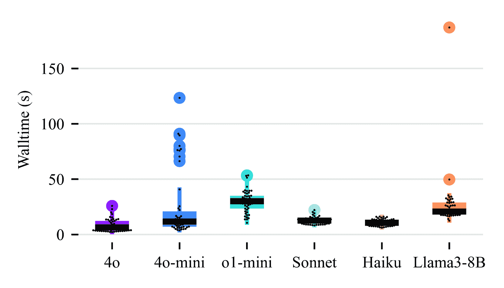

图 7：主要评估中 60 次 LLM 查询的墙时。Llama3-8B 在 M3 芯片上运行，HIVE 通过其 API 查询其他 LLM。

表 I：HIVE 在不同 LLM 上的能力测试，显示每个场景达成全局目标的成功率。

|  | 4o |
| --- | --- |

&#124; 4o &#124;

&#124; mini &#124;

|

&#124; o1 &#124;

&#124; mini &#124;

| Sonnet | Haiku |
| --- | --- |

&#124; Llama &#124;

&#124; 3 (8B) &#124;

|

| --- | --- | --- | --- | --- | --- | --- |
| --- | --- | --- | --- | --- | --- | --- |
| 坐标 | 0/10 | 0/10 | 0/10 | 2/10 | 0/10 | 0/10 |
| 开发弱点 | 0/10 | 0/10 | 0/10 | 1/10 | 0/10 | 0/10 |
| 跟随标记 | 9/10 | 3/10 | 5/10 | 9/10 | 7/10 | 0/10 |
| 开发地形 | 3/10 | 0/10 | 0/10 | 4/10 | 2/10 | 0/10 |
| 策略点 | 0/10 | 0/10 | 4/10 | 3/10 | 0/10 | 0/10 |
| 总计 | 12/50 | 3/50 | 9/50 | 19/50 | 9/50 | 0/50 |

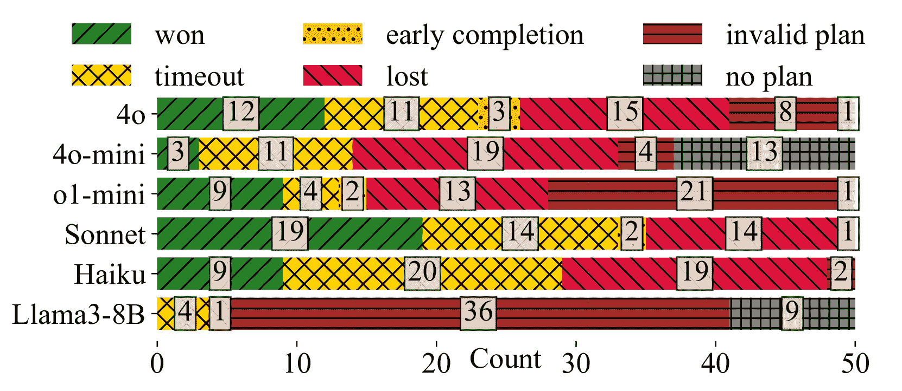

图 8：HIVE 使用每个 LLM 进行能力测试的汇总结果。

### IV-D HIVE 如何随单位数量的增加而扩展

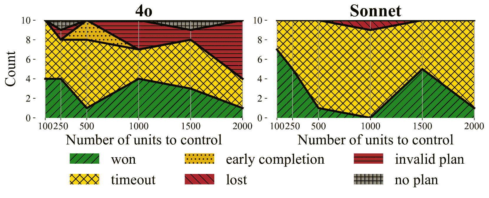

图 9：单位扩展。通过改变游戏中单位数量，比较 HIVE 方案在坐标测试中的结果。

为了观察 HIVE 随单位数量的扩展，我们对坐标测试进行了另一项评估，单位数量从 200 增加到 4000。由于运行实验的机器的硬件限制，我们在 4000 时停止了实验。由于游戏的主循环需要编译，每个单位之间的距离矩阵大小随着单位数量的增加呈二次增长。对于本研究，我们仅对 4o 和 Sonnet 进行了测试，它们展示了最佳的表现。

图[9](https://arxiv.org/html/2412.11761v1#S4.F9 "Figure 9 ‣ IV-D How does HIVE scale up with the number of units ‣ IV Experiments ‣ Harnessing Language for Coordination: A Framework and Benchmark for LLM-Driven Multi-Agent Control")展示了 HIVE 方案的结果。由于 LLM 的固有方差，噪音过多，导致成功率没有显著结论。不过，随着代理数量的增加，4o 的无效和空白方案数量增加。而 Sonnet 并未出现此现象，再次突显其优越的表现。

当前实现的扩展性的一项限制是，HIVE将每个单位的位置和生命值发送给LLM，在上下文窗口中，而上下文大小是有限的（4o为128,000个token，Sonnet为200,000个token）。为了帮助理解，对于4o，随着单位数从200个增加到4,000个，上下文的token数从4,271增加到38,475（按比例扩展），即每个单位大约9个token，这意味着对于4o的硬性限制是$128,000/9=14,222$个单位。类似地，对于Sonnet，硬性限制为$200,000/9=22,222$个单位。

### IV-E HIVE可以单独获胜吗？

一个有趣的问题是HIVE在没有人类帮助的情况下表现如何。为了回答这个问题，我们使用了十种不同的提示变体：“首先，分析情况，找到一个好的策略来赢得这项任务，然后写下相应的计划。”（变体详细信息请见附录Sec. [-G](https://arxiv.org/html/2412.11761v1#A0.SS7 "-G Prompts used for HIVE alone ‣ Harnessing Language for Coordination: A Framework and Benchmark for LLM-Driven Multi-Agent Control)")，应用于4o和Sonnet的四种场景，因为它们是最好的LLM。HIVE总是给出场景描述，以便LLM了解全球目标。

图[10](https://arxiv.org/html/2412.11761v1#S4.F10 "Figure 10 ‣ IV-E Can HIVE win alone? ‣ IV Experiments ‣ Harnessing Language for Coordination: A Framework and Benchmark for LLM-Driven Multi-Agent Control")展示了HIVE在有无玩家帮助下的比较。在协调和开发地形任务中，两个模型在没有人类帮助的情况下都不再获胜。在战略要点任务中，Sonnet保留了三次胜利，但两个模型的中位数表现较低。这表明，HIVE在有人的帮助下表现更好，确认了混合智能方法的优势。此外，比较中位数表现时，协调和开发弱点似乎是HIVE单独完成的更容易的能力测试，因为它们只需要将单位送向敌人。而开发地形和战略要点则需要利用地图特征来获胜，并依赖于更多的长期规划。

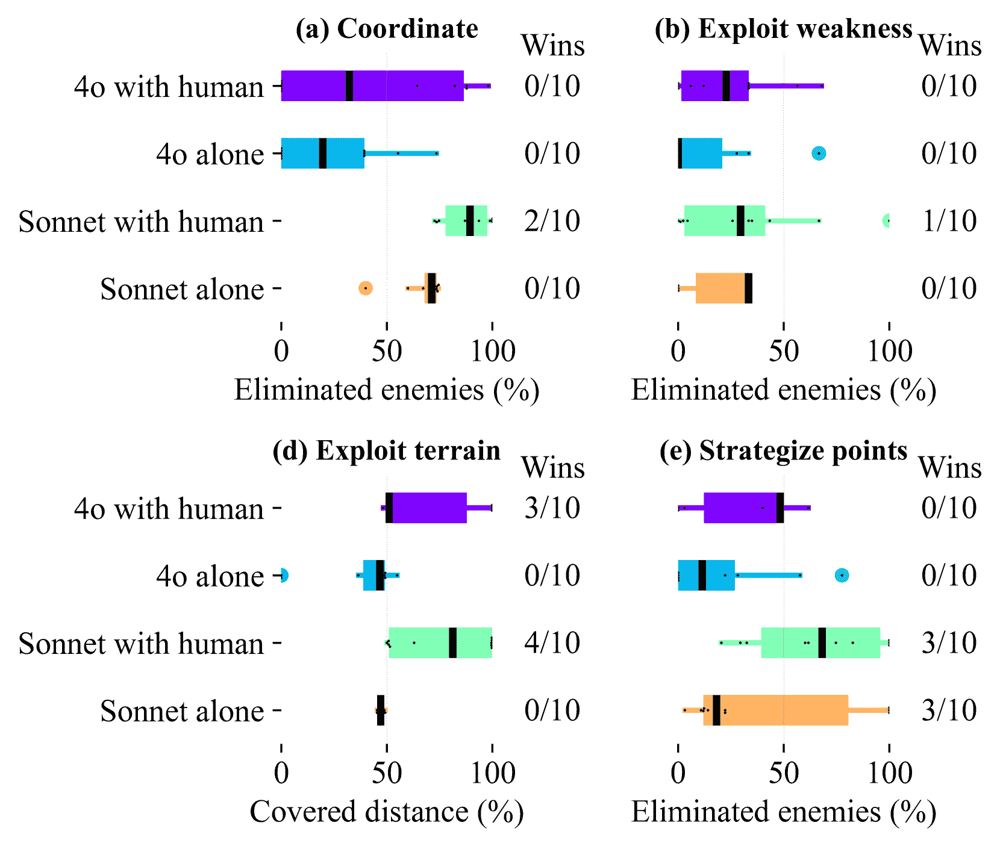

图10：人机协作。没有玩家的帮助，HIVE在所有能力测试中的表现和胜率对于两种模型都会下降。

### IV-F HIVE是否需要地图的文本描述？

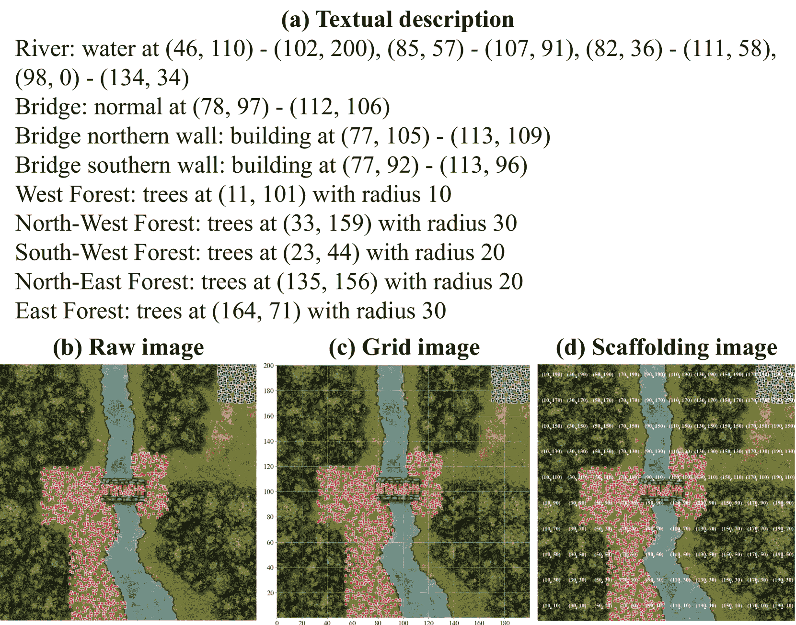

图11：描述地图的输入，用于开发地形能力测试。

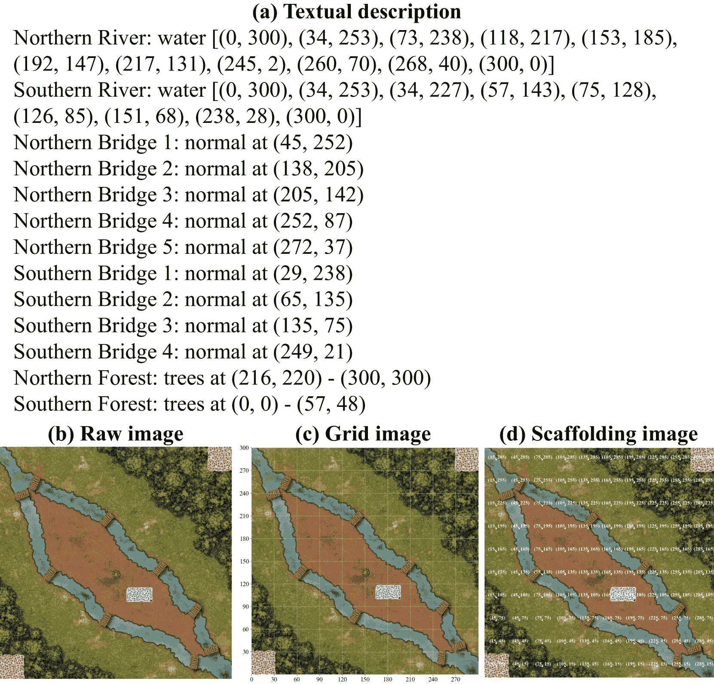

图12：描述地图的输入，用于战略要点能力测试。

图13：地图描述。LLM使用地图的表现当从文本描述切换到图像（原始图像、带网格或支架）时下降。

我们通过将地图的文本描述替换为图像来评估HIVE的视觉能力。由于它必须得出准确的目标位置，我们还比较了两种不同的图像到坐标的改进方法：使用带有x和y轴的网格，以及使用脚手架[[30](https://arxiv.org/html/2412.11761v1#bib.bib30)]。我们仅在两个需要视觉的能力测试中进行了测试：开采地形和策划要点。图[11](https://arxiv.org/html/2412.11761v1#S4.F11 "图11 ‣ IV-F HIVE是否需要地图的文本描述？ ‣ IV 实验 ‣ 利用语言进行协调：基于LLM的多智能体控制框架和基准")和[12](https://arxiv.org/html/2412.11761v1#S4.F12 "图12 ‣ IV-F HIVE是否需要地图的文本描述？ ‣ IV 实验 ‣ 利用语言进行协调：基于LLM的多智能体控制框架和基准")展示了HIVE用作地图描述的四种输入方式。

图[13](https://arxiv.org/html/2412.11761v1#S4.F13 "图13 ‣ IV-F HIVE是否需要地图的文本描述？ ‣ IV 实验 ‣ 利用语言进行协调：基于LLM的多智能体控制框架和基准")展示了性能的连续衡量。没有文本描述时，HIVE的表现下降。对于开采地形，4o似乎能够使用原始图像，而Sonnet的表现完全下降。对于策划要点，Sonnet在使用原始图像时赢得一次，在使用脚手架时赢得两次，而使用文本描述时赢得三次，但中位数表现较低。

## V 讨论

使用Llama3-(8B)的HIVE结果非常差，主要是因为发送了无效的计划。这可以通过对其进行微调以适应我们特定的DSL来解决。HIVE将不得不依赖大型通用模型，而这些模型只能通过API调用，导致响应时间增加。这些模型知道许多与我们的任务无关的内容。通过采用更小的模型并进行微调，HIVE可以在本地运行，并且使用专用硬件时，甚至能够足够快速地与游戏并行运行，为玩家提供实时反馈或在游戏展开时调整计划。

微调还可以改善大型语言模型（LLMs）在读取地图方面的较差能力。另一个解决方案是使用一个专门的模块来查看地图，并返回其有趣特征的文本描述。例如，模块可以显示不同地形和地标的位置，玩家可以直观地利用这些信息进行位置沟通。

早期的实验表明，通用型LLMs在使用我们的超出分布DSL语法编写行为树时表现不佳。针对特定语法及条件和动作节点的术语库对LLM进行微调，可以大大扩展玩家可用的行为多样性。

然而，除了微调LLM的成本外，它还降低了HIVE的适用性。这些新挑战从未出现在任何模型的训练数据集中。尽管如此，使用Sonnet的HIVE在50场比赛中以19胜14负的成绩超过了总损失。通用模型可以让HIVE在其他大型多人游戏中表现令人满意，例如工人和资源管理类游戏。主要的变化将是行为树中的节点。

## VI 结论

本文提出了一个新的挑战，即让大型语言模型（LLM）作为人类助手，控制多达两千个单位进行策略游戏。我们提出了一个新的框架——HIVE，允许玩家给出高层指令，LLM将其转化为一个长期计划，控制每个单位的行为。我们展示了像Claude Sonnet和GPT-4o这样的通用LLM可以处理这类任务，但对玩家提示的细微变化仍然敏感。补充实验表明，HIVE仍需要人类帮助以获得最佳表现，而且通用LLM在使用超出分布的地图来定位地形和地标位置方面的视觉能力仍需改进。这项工作为提高LLM与人类协作的能力开辟了许多有趣的方向，例如改善它们的地图阅读能力、减少对提示的敏感性以及增强它们的长期规划能力。

## 致谢

本研究由 armasuisse 项目 F00-007 提供资金支持。

## 参考文献

+   [1] A. Sharma, S. Rao, C. Brockett, A. Malhotra, N. Jojic, 和 B. Dolan, “探讨LLM在人类-人工智能协作任务中的代理性，” *第18届欧洲计算语言学协会分会会议（第1卷：长篇论文）论文集*，Y. Graham 和 M. Purver 编，马耳他圣朱利安：计算语言学协会，2024年3月，第1968–1987页。

+   [2] A. Bakhtin, D. J. Wu, A. Lerer, J. Gray, A. P. Jacob, G. Farina, A. H. Miller, 和 N. Brown, “通过人类正则化强化学习和规划掌控无压力外交博弈，” 2022年10月。

+   [3] E. Dinan, G. Farina, C. Flaherty, D. Fried, A. Goff, J. Gray, H. Hu, A. P. Jacob, M. Komeili, K. Konath, M. Kwon, A. Lerer, M. Lewis, A. H. Miller, S. Mitts, A. Renduchintala, S. Roller, D. Rowe, W. Shi, J. Spisak, A. Wei, D. Wu, H. Zhang, 和 M. Zijlstra, “通过结合语言模型与战略推理，实现外交游戏中的人类级别玩法，” *Science*，第378卷，第6624期，第1067–1074页，2022年12月。

+   [4] N. Lorè 和 B. Heydari, “大型语言模型的战略行为及游戏结构与情境框架的作用，” *Scientific Reports*，第14卷，第1期，第18490页，2024年8月。

+   [5] Y. Zhang, S. Mao, T. Ge, X. Wang, A. de Wynter, Y. Xia, W. Wu, T. Song, M. Lan, 和 F. Wei, “LLM作为策划者：大型语言模型在战略推理中的应用调研，” 2024年。

+   [6] X. Shao, W. Jiang, F. Zuo, 和 M. Liu, “SwarmBrain：通过大型语言模型实现星际争霸II实时策略游戏的具身智能体”，2024年。

+   [7] W. J. Zhou, B. Subagdja, A.-H. Tan, 和 D. W.-S. Ong, “实时策略（RTS）游戏中多代理强化学习团队的层次控制”，*Expert Systems with Applications*，第186卷，2021年。

+   [8] Y. Cao 和 C. S. G. Lee, “基于机器人行为树的任务生成与大型语言模型”，2023年2月。

+   [9] M. Samvelyan, T. Rashid, C. S. de Witt, G. Farquhar, N. Nardelli, T. G. J. Rudner, C.-M. Hung, P. H. S. Torr, J. Foerster, 和 S. Whiteson, “星际争霸多代理挑战”，2019年12月。

+   [10] T. Rashid, M. Samvelyan, C. S. D. Witt, G. Farquhar, J. Foerster, 和 S. Whiteson, “深度多代理强化学习中的单调值函数分解”，*ArXiv*，2020年3月。

+   [11] C. Yu, A. Velu, E. Vinitsky, Y. Wang, A. Bayen, 和 Y. Wu, “PPO在合作多代理游戏中的惊人有效性”，发表于*Neural Information Processing Systems*，2021年3月。

+   [12] B. Ellis, J. Cook, S. Moalla, M. Samvelyan, M. Sun, A. Mahajan, J. N. Foerster, 和 S. Whiteson, “SMACv2：改进的合作多代理强化学习基准”，2023年10月。

+   [13] A. Rutherford, B. Ellis, M. Gallici, J. Cook, A. Lupu, G. Ingvarsson, T. Willi, A. Khan, C. S. de Witt, A. Souly, S. Bandyopadhyay, M. Samvelyan, M. Jiang, R. T. Lange, S. Whiteson, B. Lacerda, N. Hawes, T. Rocktaschel, C. Lu, 和 J. N. Foerster, “JaxMARL：JAX中的多代理强化学习环境”，2023年12月。

+   [14] T. Guo, X. Chen, Y. Wang, R. Chang, S. Pei, N. V. Chawla, O. Wiest, 和 X. Zhang, “基于大型语言模型的多代理：进展与挑战综述”，2024年4月。

+   [15] B. Pan, J. Lu, K. Wang, L. Zheng, Z. Wen, Y. Feng, M. Zhu, 和 W. Chen, “AgentCoord：基于LLM的多代理协作中协调策略的视觉探索”，2024年4月。

+   [16] S. Han, Q. Zhang, Y. Yao, W. Jin, Z. Xu, 和 C. He, “LLM多代理系统：挑战与未解决的问题”，2024年。

+   [17] J. Kramár, T. Eccles, I. Gemp, A. Tacchetti, K. R. McKee, M. Malinowski, T. Graepel, 和 Y. Bachrach, “在外交棋盘游戏中的人工智能方法中的谈判与诚实性”，*Nature Communications*，第13卷，第1期，p. 7214，2022年12月。

+   [18] D. Paglieri, B. Cupiał, S. Coward, U. Piterbarg, M. Wolczyk, A. Khan, E. Pignatelli, Ł. Kuciński, L. Pinto, R. Fergus, J. N. Foerster, J. Parker-Holder, 和 T. Rocktäschel, “BALROG：在游戏中基准测试代理型LLM和VLM推理”，2024年11月。

+   [19] M. G. Mecattaf, B. Slater, M. Tešić, J. Prunty, K. Voudouris, 和 L. G. Cheke, “请少一点对话，多一点行动：在3D具身环境中调查大型语言模型的物理常识”，2024年。

+   [20] K. Wang, X. Zhang, H. Liu, S. Han, H. Ma, 和 T. Hu, “CreDes：使用大型语言模型解决长程推理问题的因果推理增强与双端搜索”，2024年。

+   [21] M. Xing, R. Zhang, H. Xue, Q. Chen, F. Yang, 和 Z. Xiao，“理解大规模语言模型代理在复杂安卓环境中的弱点”，*第30届ACM SIGKDD知识发现与数据挖掘会议论文集*，西班牙巴塞罗那：ACM，2024年8月，第6061–6072页。

+   [22] Y. Zhou, L. Feng, Y. Ke, X. Jiang, J. Yan, X. Yang, 和 W. Zhang，“迈向视觉-语言地理基础模型：一项调查”，2024年。

+   [23] P. Rahmanzadehgervi, L. Bolton, M. R. Taesiri, 和 A. T. Nguyen，“视觉语言模型是盲的”，*计算机视觉 - ACCV 2024*，M. Cho, I. Laptev, D. Tran, A. Yao, 和 H. Zha 主编，新加坡：Springer Nature Singapore，2025年，第293–309页。

+   [24] J. Bradbury, R. Frostig, P. Hawkins, M. J. Johnson, C. Leary, D. Maclaurin, G. Necula, A. Paszke, J. VanderPlas, S. Wanderman-Milne, 和 Q. Zhang，“JAX：Python+NumPy 程序的可组合变换”，2018年。

+   [25] N. Sevcenko, T. Appel, M. Ninaus, K. Moeller, 和 P. Gerjets，“基于理论的认知负荷评估方法：一项眼动追踪研究，涉及时间关键型资源管理的人机交互”，*多模态用户界面期刊*，第17卷，2023年。

+   [26] M. Colledanchise 和 P. Ögren，*机器人与人工智能中的行为树：导论*，CRC出版社，2018年。

+   [27] J. Achiam, S. Adler, S. Agarwal, L. Ahmad, I. Akkaya, F. L. Aleman, D. Almeida, J. Altenschmidt, S. Altman, S. Anadkat *等人*，“GPT-4技术报告”，*arXiv 预印本 arXiv:2303.08774*，2023年。

+   [28] Anthropic，“Claude 3 模型家族：Opus, Sonnet, Haiku”，2024年。

+   [29] A. Dubey, A. Jauhri, A. Pandey, A. Kadian, A. Al-Dahle, A. Letman, A. Mathur, A. Schelten, A. Yang, A. Fan *等人*，“The llama 3 模型家族”，*arXiv 预印本 arXiv:2407.21783*，2024年。

+   [30] X. Lei, Z. Yang, X. Chen, P. Li, 和 Y. Liu，“支撑坐标促进大规模多模态模型中的视觉-语言协调”，*arXiv 预印本 arXiv:2402.12058*，2024年。

### -A LLM 指令和示例图的游戏

#### -A1 指令

# 地图指令你是一个游戏助手，帮助玩家在策略视频游戏中进行决策。你的任务是与玩家讨论，制定一个计划来赢得游戏的场景（该场景稍后会提供）。与玩家合作，提供他们的建议反馈，提出问题以澄清、获取更多细节，或在不同的建议中做出选择。玩家也可以向你提问。你将获得一个文本描述，介绍地图中每个相关元素的名称、地形类型和边界框（左下角 - 右上角）。在游戏中，有四种类型的地形：- 普通：单位可以穿越并看到（默认情况下，整个地图是普通的）。- 建筑物：单位不能穿越或看到建筑物。- 水域：单位不能穿越水域，但可以看到水域上方。- 树木：单位不能穿越树木，但可以在树木上移动。特别地，一旦单位进入树木区域，它就无法看到任何其他单位。此外，为了简便，允许穿越水域地形的桥梁将被指定为普通地形。你可以假设地图上未包含在任何相关元素中的任何部分都属于普通类型地形。一个常见的约定是：东=右，北=上，西=左，南=下。因此，点（0，0）是地图的左下角。x轴从西向东增加=从左向右，y轴从南向北增加=从下向上。格式：[名称]：在[圆形或方形坐标]， [圆形或方形坐标]，...，[圆形或方形坐标]其中[圆形] = [(x，y)坐标中心]，半径为[R]其中[方形坐标] = [(x，y)左下角坐标] - [(x，y)右上角坐标]### 例如东部森林：树木位于（12，63），半径为20北部河流：水域位于（0，85） - （100，90）北部河流桥：普通地形位于（45，85） - （55，90）西部森林：树木位于（0，23），半径为6，(5，33) 半径为7## 标记在讨论过程中，玩家可以在地图上定义标记，格式如下：标记：A 位于（17，5）B 位于（6，32）C 位于（25，28）# 单位信息游戏中单位类型的描述：长矛兵：生命值=24；视野范围=15；攻击范围=1；移动速度=2；攻击伤害=1；攻击冷却时间=1弓箭手：生命值=2；视野范围=15；攻击范围=15；移动速度=4；攻击伤害=3；攻击冷却时间=1骑兵：生命值=12；视野范围=15；攻击范围=1；移动速度=12；攻击伤害=1；攻击冷却时间=1长矛兵对骑兵有优势，因为它们的生命值更多。骑兵对弓箭手有优势，因为它们能迅速接近并进行近战，而弓箭手在近战中较弱。弓箭手对长矛兵有优势，因为它们可以从更远的距离进行攻击。以下是每个队伍的单位ID列表（以Python切片a:b的形式，其中a包括，b不包括）及其所组成的单位类型：每个队伍组成的描述：盟军：长矛兵：[0:350]弓箭手：[350:700]敌军：长矛兵：[0:900]你将获得所有单位当前生命值和位置的列表。两个队伍由多个单位组成。你应该首先分析仍然存活的单位位置，组合成小组，并计算它们的平均位置，以便你可以制定计划，并将单位派到合适的位置。# 如何处理玩家的提示用户会要求你制定一个计划。如果你已经有一个共享的对话，而玩家要求你修改或添加步骤到计划中，请确保在已有的计划基础上进行扩展。# 详细计划语法详细计划是一个按给定顺序执行的步骤集合，直到所有步骤完成。你必须在"BEGIN PLAN"和"END PLAN"这两个关键词之间提供计划的步骤。由于你只提议一个计划，因此只需要使用这两个关键词一次。一个步骤包括：- 一个数字ID- 一个完成步骤之前需要完成的前置步骤列表- 一个目标至少一个单位小组：- 小组的单位ID- 单位将前往的目标位置（如果没有敌人在视野内）- 如果有敌人，单位的行为你可以有多个小组，每个小组中的单位ID都可以不同。# 详细计划语法（续）前置步骤的列表是指必须在尝试达成目标之前完成的步骤的ID列表。有两种类型的目标：- **消灭目标**：当所有目标被消灭时，目标完成。在这种情况下，你必须提供一个敌人的ID列表，或者如果所有敌人都是目标，则使用关键字"all"。- **位置目标**：当所有相关单位都靠近目标位置时，目标完成。位置目标是移动单位的好方法，但如果最终目标是消灭敌人，直接设定消灭目标并使用目标位置来移动单位会更为直接。相关单位可以是关键字"all"（如果所有盟军单位都相关），也可以是一个单位ID的整数列表。行为对应于单位将在该步骤执行的低级别和局部行为。以下是可用的行为列表：- **attack_in_close_range**：如果有敌人，单位会在近距离内攻击敌人；如果没有敌人，单位会朝目标位置移动。- **attack_and_move**：如果有敌人，单位会攻击敌人并移动；如果没有敌人，单位会朝目标位置移动。- **attack_in_long_range**：如果有敌人，单位会在远距离内攻击敌人；如果没有敌人，单位会朝目标位置移动。- **follow_map**：忽略敌人并直接移动到目标位置。只有在玩家要求你忽略敌人时才使用。除非单位保持静止，否则所有这些行为在有敌人可见时才会激活。如果没有敌人，单位将朝目标位置移动（如果有设定目标位置），或者如果没有目标位置，则保持静止。记住，单位会发生碰撞并推挤彼此，所以如果路径上有敌人，忽略敌人可能不是最快的方法。一个步骤的语法格式如下：步骤ID：（在此替换ID为步骤的整数ID）前置步骤：[s_1, s_2, ..., s_n]（其中s_i是前置步骤的ID。如果列表为空，直接写[]）目标：位置[或]消灭UNIT_LIST（至少有一个单位小组及其分配的行为和目标位置，但可以有多个小组，因为一个单位可以属于多个小组）UNIT_LIST：- 目标位置：（x，y）（地图上的整数坐标x和y）- 行为：行为名称 目标_1 目标_2 ... 目标_n（其中行为名称为可用的行为，目标_1到目标_n是目标单位类型，或者如果行为针对任何单位类型，则使用"any"关键字）UNIT_LIST是单位ID的列表，格式如下：- 它可以是"all"（没有引号），表示所有相关队伍的单位。- 它可以是一个ID列表，格式为"[X1, X2, ..., Xn]"，其中Xi可以是整数，也可以是切片"a:b"（a和b是整数，b>a，a包括而b不包括，如Python的range函数）。如果未指定a（即":b"），则视为0；如果未指定b（即"a:"），则视为队伍中所有单位的总数。### 重要事项：- 所有位置（x，y）必须是整数。如果你想提供浮动位置，首先将其转换为整数。- 不要在计划说明中添加注释，这会干扰解析器。如果你想提供注释，应该在"BEGIN PLAN"和"END PLAN"之外提供。- 一个单位在同一步骤中只能属于一个单位小组。## 规划错误示例：避免创建一系列位置目标，其中不同的小组等待彼此（通过前置步骤链）。而应将这些位置合并为一个步骤，让所有单位能够同时移动。确保每个步骤中的所有单位都有指定行为。如果两个或多个步骤可以同时激活（因为它们有相同的前置步骤），则每个单位必须属于至少一个小组。对于消灭目标，确保目标位置离目标敌人单位足够近，以便有效交战。消灭目标已经有默认的目标位置，因此避免在它们之前设置不必要的位置目标。相反，应将消灭目标的位置设为相同位置。确保单位ID被括在方括号[]中。使用正确的远程单位名称，如"archer"（而不是"archers"）。验证单位行为的名称（例如，"attack_in_close_range"），

#### -A2 游戏信息

每个队伍的所有单位的健康和位置（$\emptyset$表示该单位已死亡）。盟友：健康值：[24, 24, 24, 24, 24, 24, 24, 24, 24, 24, 24, 24, 24, 24, 24, 24, 24, 24, 24, 24, 24, 24, 24, 24, 24, 24, 24, 24, 24, 24, 24, 24, 24, 24, 24, 24, 24, 24, 24, 24, 24, 24, 24, 24, 24, 24, 24, 24, 24, 24, 24, 24, 24, 24, 24, 24, 24, 24, 24, 24, 24, 24, 24, 24, 24, 24, 24, 24, 24, 24, 24, 24, 24, 24, 24, 24, 24, 24, 24, 24, 24, 24, 24, 24, 24, 24, 24, 24, 24, 24, 24, 24, 24, 24, 24, 24, 24, 24, 24, 24, 24, 24, 24, 24, 24, 24, 24, 24, 24, 24, 24, 24, 24, 24, 24, 24, 24, 24, 24, 24, 24, 24, 24, 24, 24, 24, 24, 24, 24, 24, 24, 24, 24, 24, 24, 24, 24, 24, 24, 24, 24, 24, 24, 24, 24, 24, 24, 24, 24, 24, 24, 24, 24, 24, 24, 24, 24, 24, 24, 24, 24, 24, 24, 24, 24, 24, 24, 24, 24, 24, 24, 24, 24, 24, 24, 24, 24, 24, 24, 24, 24, 24, 24, 24, 24, 24, 24, 24, 24, 24, 24, 24, 24, 24, 24, 24, 24, 24, 24, 24, 2, 2, 2, 2, 2, 2, 2, 2, 2, 2, 2, 2, 2, 2, 2, 2, 2, 2, 2, 2, 2, 2, 2, 2, 2, 2, 2, 2, 2, 2, 2, 2, 2, 2, 2, 2, 2, 2, 2, 2, 2, 2, 2, 2, 2, 2, 2, 2, 2, 2, 2, 2, 2, 2, 2, 2, 2, 2, 2, 2, 2, 2, 2, 2, 2, 2, 2, 2, 2, 2, 2, 2, 2, 2, 2, 2, 2, 2, 2, 2, 2, 2, 2, 2, 2, 2, 2, 2, 2, 2, 2, 2, 2, 2, 2, 2, 2, 2, 2, 2, 2, 2, 2, 2, 2, 2, 2, 2, 2, 2, 2, 2, 2, 2, 2, 2, 2, 2, 2, 2, 2, 2, 2, 2, 2, 2, 2, 2, 2, 2, 2, 2, 2, 2, 2, 2, 2, 2, 2, 2, 2, 2, 2, 2, 2, 2, 2, 2, 2, 2, 2, 2, 2, 2, 2, 2, 2, 2, 2, 2, 2, 2, 2, 2, 2, 2, 2, 2, 2, 2, 2, 2, 2, 2, 2, 2, 2, 2, 2, 2, 2, 2, 2, 2, 2, 2, 2, 2, 2, 2, 2, 2, 2, 2, 2, 2, 2, 2, 2, 2, 2, 2, 2, 2, 2, 2, 2, 2, 2, 2, 2, 2, 2, 2, 2, 2, 2, 2, 2, 2, 2, 2, 2, 2, 2, 2, 2, 2, 2, 2, 2, 2, 2, 2, 2, 2, 2, 2, 2, 2, 2, 2, 2, 2, 2, 2, 2, 2, 2, 2, 2, 2, 2, 2, 2, 2, 2, 2, 2, 2, 2, 2, 2, 2, 2, 2, 2, 2, 2, 2, 2, 2, 2, 2, 2, 2, 2, 2, 2, 2, 2, 2, 2, 2, 2, 2, 2, 2, 2, 2, 2, 2, 2, 2, 2, 2, 2, 2, 2, 2, 2, 2, 2, 2, 2, 2, 2, 2, 2, 2, 2, 2, 2, 2, 2, 2, 2, 2, 2, 2, 2, 2, 2, 2, 2, 2, 2, 2, 2, 2, 2, 2, 2, 2, 2, 2, 2, 2, 2, 2, 2, 2, 2, 2, 2, 2, 2, 2, 2, 2, 2, 2, 2, 2, 2, 2, 2, 2, 2, 2, 2, 2, 2, 2, 2, 2, 2, 2, 2, 2, 2, 2, 2, 2, 2, 2, 2, 2, 2, 2, 2, 2, 2, 2, 2, 2, 2, 2, 2, 2, 2, 2, 2, 2, 2, 2, 2, 2, 2, 2, 2, 2, 2, 2, 2, 2, 2, 2, 2, 2, 2, 2, 2, 2, 2, 2, 2, 2, 2, 2, 2, 2, 2, 2, 2, 2, 2, 2, 2, 2, 2, 2, 2, 2, 2, 2, 2, 2, 2, 2, 2, 2, 2, 2, 2, 2, 2, 2, 2, 2, 2, 2, 2, 2, 2, 2, 2, 2, 2, 2, 2, 2, 2, 2, 2, 2, 2, 2, 2, 2, 2, 2, 2

### -B LLM 答复和计划到图示[5](https://arxiv.org/html/2412.11761v1#S4.F5 "Figure 5 ‣ IV Experiments ‣ Harnessing Language for Coordination: A Framework and Benchmark for LLM-Driven Multi-Agent Control")示例

#### -B1 与 Sonnet 协调

我将帮助你制定一个有效的计划，以消灭敌人。从敌军位置来看，我注意到所有敌方单位目前都在北方森林（y 坐标在 135 到 149 之间），并且他们将需要通过地图中部向南移动。让我们分析我们的部队：- 我们有 500 名长矛兵（ID 0-499）- 我们有 500 名弓箭手（ID 500-999）考虑到地图宽度（150）以及我们需要保护弓箭手，我建议在地图中部创建三个主要战斗小组，每个小组都有长矛兵和弓箭手。长矛兵将形成防护前线，而弓箭手则从后方攻击。以下是详细计划：开始计划步骤 0：前提条件：[]目标：定位单位： [0:167] - 目标位置：(25, 75) - 行为：近距离攻击任何单位：[167:334] - 目标位置：(75, 75) - 行为：近距离攻击任何单位：[334:500] - 目标位置：(125, 75) - 行为：近距离攻击任何单位：[500:667] - 目标位置：(25, 65) - 行为：远程攻击任何单位：[667:834] - 目标位置：(75, 65) - 行为：远程攻击任何单位：[834:1000] - 目标位置：(125, 65) - 行为：远程攻击任何步骤 1：前提条件：[0]目标：消灭所有单位：[0:167] - 目标位置：(25, 75) - 行为：近距离攻击任何单位：[167:334] - 目标位置：(75, 75) - 行为：近距离攻击任何单位：[334:500] - 目标位置：(125, 75) - 行为：近距离攻击任何单位：[500:667] - 目标位置：(25, 65) - 行为：远程攻击任何单位：[667:834] - 目标位置：(75, 65) - 行为：远程攻击任何单位：[834:1000] - 目标位置：(125, 65) - 行为：远程攻击任何结束计划此计划创建了三个横跨地图的战斗小组：1. 西部小组（x=25）2. 中部小组（x=75）3. 东部小组（x=125）每个小组都有：- 大约 167 名长矛兵在前（y=75）- 大约 167 名弓箭手在后（y=65）长矛兵的位置距离弓箭手 10 单位，既能提供保护，又能让弓箭手越过长矛兵射击接近的敌人。这些小组分布在地图的整个宽度上，确保敌人无法突破。当敌人从北方森林下来时，他们将面临一条由长矛兵组成的坚固前线，背后则有弓箭手的火力支援。你是否希望我调整计划的某些方面？

#### -B2 利用 Sonnet 的弱点

让我分析一下局势和敌方位置。地图被两条交叉的河流分为四个象限，交点位于(46-52, 47-53)，桥梁连接这些象限之间的通行。敌方力量分为三个明显的组别：1. 西北象限（约x:5-25, y:75-95）：主要是弓箭手（生命值=2）2. 东北象限（约x:75-95, y:5-25）：主要是长矛兵（生命值=24）3. 东北象限（约x:75-95, y:75-95）：主要是骑兵（生命值=12）我们的部队目前位于西南象限（约x:5-40, y:5-40）。战略考虑：1. 我们应当用骑兵对抗弓箭手（西北组）2. 用弓箭手对抗长矛兵（东北组）3. 用长矛兵对抗骑兵（东北组）这是我提议的计划：开始计划 步骤 0：前提条件：[]目标：定位 部队： [0:250] - 目标位置：(19, 49) - 行为：攻击并移动 任何部队： [250:500] - 目标位置：(21, 49) - 行为：攻击并移动 任何部队： [500:750] - 目标位置：(20, 49) - 行为：攻击并移动 任何 步骤 1：前提条件：[0] 目标：定位 部队： [500:750] - 目标位置：(21, 76) - 行为：近战攻击 弓箭手 部队： [250:500] - 目标位置：(76, 21) - 行为：远程攻击 长矛兵 部队： [0:250] - 目标位置：(76, 76) - 行为：近战攻击 骑兵 步骤 2：前提条件：[1] 目标：消灭 所有部队： [500:750] - 目标位置：(15, 85) - 行为：近战攻击 弓箭手 部队： [250:500] - 目标位置：(85, 15) - 行为：远程攻击 长矛兵 部队： [0:250] - 目标位置：(85, 85) - 行为：近战攻击 骑兵 结束计划 计划解释：1. 首先，我们将所有部队移动到西桥（步骤 0）2. 然后分散我们的部队（步骤 1）：- 骑兵（500:750）向北移动以与弓箭手作战- 弓箭手（250:500）向东移动以与长矛兵作战- 长矛兵（0:250）向东北移动以与骑兵作战 3. 最后，每个小组移动到目标位置消灭敌人（步骤 2）此计划利用了每种部队类型针对其自然敌人的优势，同时利用桥梁在战略上到达各自位置。

#### -B3 标记与 4o-mini

为了实现将部队移动到标记点A、B、C和D的目标，同时忽略敌人，我们可以制定一个计划，将部队依次移动到每个标记点，然后再到目标位置（61, 0）。然而，由于目标是让至少一支部队到达（61, 0）的位置，我们应该确保部队能够有效地聚集，并且在访问标记点后能够到达目标位置。让我们来分解一下计划：1. 将所有部队移动到标记点A（193, 85）。2. 将所有部队移动到标记点B（49, 136）。3. 将所有部队移动到标记点C（9, 134）。4. 将所有部队移动到标记点D（11, 9）。5. 最后，将所有部队移动到目标位置（61, 0）。我现在将基于这一顺序创建详细的计划。开始计划步骤0：前提条件：[]目标：位置部队：所有- 目标位置：（193, 85）- 行为：follow_map步骤1：前提条件：[0]目标：位置部队：所有- 目标位置：（49, 136）- 行为：follow_map步骤2：前提条件：[1]目标：位置部队：所有- 目标位置：（9, 134）- 行为：follow_map步骤3：前提条件：[2]目标：位置部队：所有- 目标位置：（11, 9）- 行为：follow_map步骤4：前提条件：[3]目标：位置部队：所有- 目标位置：（61, 0）- 行为：follow_map结束计划此计划允许你的部队先后移动到指定的标记点，然后再到目标位置，同时忽略敌人。你想做任何调整，还是继续执行这个计划？

#### -B4 地形与4o

这是基于你的指示的详细计划：开始计划步骤0：前提条件：[]目标：位置部队：所有- 目标位置：（164, 71）- 行为：follow_map any步骤1：前提条件：[0]目标：位置部队：所有- 目标位置：（33, 159）- 行为：follow_map any步骤2：前提条件：[1]目标：位置部队：所有- 目标位置：（11, 101）- 行为：follow_map any步骤3：前提条件：[2]目标：位置部队：所有- 目标位置：（23, 44）- 行为：follow_map any步骤4：前提条件：[3]目标：位置部队：所有- 目标位置：（61, 0）- 行为：follow_map any结束计划

#### -B5 战略点与o1-mini

开始 计划 步骤 0: 前提条件: [] 目标: 位置 单位: [0:39] - 目标位置: (45, 252) - 行为: 近距离攻击 单位: [350:389] - 目标位置: (45, 252) - 行为: 远距离攻击 单位: [39:78] - 目标位置: (138, 205) - 行为: 近距离攻击 单位: [389:428] - 目标位置: (138, 205) - 行为: 远距离攻击 单位: [78:117] - 目标位置: (205, 142) - 行为: 近距离攻击 单位: [428:467] - 目标位置: (205, 142) - 行为: 远距离攻击 单位: [117:156] - 目标位置: (252, 87) - 行为: 近距离攻击 单位: [467:506] - 目标位置: (252, 87) - 行为: 远距离攻击 单位: [156:195] - 目标位置: (272, 37) - 行为: 近距离攻击 单位: [506:545] - 目标位置: (272, 37) - 行为: 远距离攻击 单位: [195:234] - 目标位置: (29, 238) - 行为: 近距离攻击 单位: [545:584] - 目标位置: (29, 238) - 行为: 远距离攻击 单位: [234:273] - 目标位置: (65, 135) - 行为: 近距离攻击 单位: [584:623] - 目标位置: (65, 135) - 行为: 远距离攻击 单位: [273:312] - 目标位置: (135, 75) - 行为: 近距离攻击 单位: [623:662] - 目标位置: (135, 75) - 行为: 远距离攻击 单位: [312:350] - 目标位置: (249, 21) - 行为: 近距离攻击 单位: [662:700] - 目标位置: (249, 21) - 行为: 远距离攻击 结束 计划

### -C 行为树的语法

?start: node%import common.WS%ignore WSnodes : node ("::" node | "|>" node)*node : | sequence | fallback | action | conditionsequence : "S" "(" nodes ")"fallback : "F" "(" nodes ")"action : "A" "(" atomic ")"condition : "C" "(" atomic ")"atomic : | move | attack | stand | follow_map | in_sight | in_reach | is_dying | is_armed | is_flock | is_type | is_in_forest | success_action | failure_actionmove : "move" (direction | sense qualifier (foe | friend) (unit ("or" unit)* |any)?)attack : "attack" qualifier (unit ("or" unit)* |any)?stand : "stand"in_sight : "in_sight" (foe | friend) (unit ("or" unit)* |any)?in_reach : "in_reach" (foe | friend) source time (unit ("or" unit)* |any)?is_dying : "is_dying" (self | foe | friend) intensityis_armed : "is_armed" (self | foe | friend)is_flock : "is_flock" (foe | friend) directionis_type : "is_type" negation unitfollow_map : "follow_map" sense intensity?is_in_forest : "is_in_forest"success_action : "success_action"failure_action: "failure_action"sense : /toward|away_from/direction : /north | east | south | west | center/foe : /foe/friend : /friend/qualifier : /strongest | weakest | closest | farthest | random/intensity : /low | middle | high/self : /self/unit : /spearmen | archer| cavalry | balista | dragon | civilian/any : /any/negation : /a | not_a/source : /them_from_me | me_from_them/time : /now | low | middle | high/

### -D 本文使用的行为树列表

#### -D1 可用于 HIVE

远程攻击：

F(S(C( 在范围内敌人 me_from_them 高任何) :: A(远离最近敌人移动任何)) :: A (随机攻击任何) :: A (跟随地图朝向))

近距离攻击：

F( A (随机攻击任何) :: A (朝向最近的敌人移动任何) :: A (跟随地图朝向))

攻击并移动：

F( A (随机攻击任何) :: A (跟随地图朝向低) :: A (朝向最近的敌人移动任何) )

朝目标位置移动：

A (跟随地图朝向)

站立：

A (站立)

#### -D 仅出现在对方单位

以下两个行为树在标记和地形能力测试中由对方使用，以避免敌方单位迷失在森林中，无法再看到玩家的单位。

远程攻击并保持在森林外：

F (S (C (is_in_forest) :: A (跟随地图朝向)) :: S(C( 在范围内敌人 me_from_them 高任何) :: A (远离最近敌人移动任何)) :: A (攻击最近的任何))

近距离攻击并保持在森林外：

F (S (C (is_in_forest) :: A (跟随地图朝向)) :: A (攻击最近的任何) :: A (朝向最近的敌人移动任何))

### -E 单位特征

表 II：本文使用的三种类型单位的特征。

| | 长矛兵 | 弓箭手 | 骑兵 |
| --- | --- | --- | --- |
| 视觉形状 | 方形 | 圆形 | 三角形 |
| --- | --- | --- | --- |
| 速度（单位距离/步伐） | 1 | 2 | 6 |
| 最大生命值 | 24 | 2 | 12 |
| 攻击伤害 | 1 | 3 | 1 |
| 攻击范围 | 1 | 15 | 1 |

### -F 用于5项能力测试的提示

#### -F1 (a) 协调

0. 制定一个计划，组成你认为必要的多个小队，以覆盖战场的中央行，尽可能快速地消灭所有敌人。明智地安排我们的远程单位，确保它们不处于近战状态。1. 设计一个计划，组成你认为必要的多个小组，以覆盖战场的中央行，尽可能快速地消灭所有敌人。明智地安排我们的远程单位，确保它们由近战单位保护。2. 写下一个计划，组成你认为必要的多个小组，以覆盖地图的中央行，尽可能快速地消灭所有敌人。确保安排我们的远程单位，使其不处于近战状态。3. 设计一个计划，组成你认为必要的多个小组，以覆盖地图的中央行，尽可能快速地消灭所有敌人。确保安排我们的远程单位，使其远离敌人。4. 制定一个计划，组成你认为必要的多个小队，以覆盖地图的中间行，尽可能快速地消灭所有敌人。确保安排我们的弓箭手，使其由近战单位保护。5. 设计一个计划，组成你认为必要的多个营，以覆盖战场的中间行，尽可能快速地消灭所有敌人。确保安排我们的弓箭手，使其远离敌人。6. 组成你认为必要的多个营，以覆盖战场的中央行，尽可能快速地消灭所有敌人。确保安排我们的弓箭手，使其不处于近战状态。7. 写下一个计划，组成你认为必要的多个营，以覆盖战场的中央行，尽可能快速地消灭所有敌人。确保安排我们的远程单位，由近战单位保护它们。8. 制定一个计划，组成你认为必要的多个小队，以覆盖战场的中间行，尽可能快速地消灭所有敌人。明智地安排我们的弓箭手，确保它们远离敌人。9. 制定一个计划，组成你认为必要的多个小组，以覆盖战场的中间行，尽可能快速地消灭所有敌人。确保安排我们的弓箭手，使其远离敌人。

#### -F2 (b) 利用弱点

0. 首先，计算敌方营的定位和类型。然后，设计一个计划，利用敌方的弱点将我们的部队分成三组，每组具有特定的优势，并将每组派遣去攻击敌方一个小队，以减少我们的伤亡。 1. 首先，确定敌方营的位置和类型。然后，制定一个计划，利用敌方的弱点将我们的军队分成三营，每个营具有特定的优势，并将每个营派遣去攻击敌方一个小组，以最大化效率。 2. 首先，分析局势以确定敌方小队的位置和类型。然后，编写一个计划，利用敌方的弱点将我们的军队分成三营，每个营具有特定的优势，并将每个营派遣去攻击敌方一个营，以减少我们的伤亡。 3. 首先，分析局势以确定敌方小组的位置和类型。然后，制定一个计划，利用敌方的弱点将我们的部队分成三小队，每小队具有特定的优势，并将每小队派遣去攻击敌方一个营，以减少我们的伤亡。 4. 首先，分析局势以计算敌方小队的位置和类型。然后，设计一个计划，利用敌方的弱点将我们的军队分成三组，每组具有特定的优势，并将每组派遣去攻击敌方一个营，以减少我们的伤亡。 5. 首先，分析局势以计算敌方小组的位置和类型。然后，设计一个计划，利用敌方的弱点将我们的军队分成三小队，每小队具有特定的优势，并将每小队派遣去攻击敌方一个小组，以最大化效率。 6. 首先，分析局势以确定敌方小组的位置和类型。然后，制定一个计划，利用敌方的弱点将我们的军队分成三小队，每小队具有特定的优势，并将每小队派遣去攻击敌方一个小组，以减少我们的伤亡。 7. 首先，分析局势以计算敌方小队的位置和类型。然后，编写一个计划，利用敌方的弱点将我们的军队分成三组，每组具有特定的优势，并将每组派遣去攻击敌方一个小队，以最大化效率。 8. 首先，计算敌方小队的位置和类型。然后，制定一个计划，利用敌方的弱点将我们的军队分成三小队，每小队具有特定的优势，并将每小队派遣去攻击敌方一个营，以最大化效率。 9. 首先，计算敌方营的位置和类型。然后，设计一个计划，利用敌方的弱点将我们的军队分成三小队，每小队具有特定的优势，并将每小队派遣去攻击敌方一个小组，以减少我们的伤亡。

#### -F3 (c) 跟随标记

玩家标记了四个位置：

+   •

    A: (193, 85);

+   •

    B: (49, 136);

+   •

    C: (9, 134);

+   •

    D: (11, 9).

0. 将矛兵按字母顺序移动到每个位置，忽略敌人，然后到达最终目标位置。1. 制定计划，将我们的部队移动到每个标记位置，忽略敌人，然后到达最终目标位置。2. 设计一个计划，将我们的矛兵按字母顺序移动到每个标记位置，忽略敌人，然后到达最终目标位置。3. 制定一个计划，将我们的矛兵按字母顺序移动到每个位置，忽略敌人，然后到达最终目标位置。4. 制定一个计划，将我们的军队移动到每个位置，忽略敌人，然后到达最终目标位置。5. 制定一个计划，将我的部队移动到位置A、B、C、D，忽略敌人，然后到达目标位置。6. 将我们的部队移动到标记位置A、B、C、D，忽略敌人，然后到达目标位置。7. 制定一个计划，将我们的军队移动到标记位置A、B、C、D，忽略敌人，然后到达目标位置。8. 将我们的矛兵移动到位置ABCD，忽略敌人，然后到达目标位置。9. 制定一个计划，将单位移动到标记位置A、B、C、D，忽略敌人，然后到达最终目标位置。

#### -F4 (d) 利用地形

#### -F5 (e) 策略点

0. 将我们的单位分配到所有桥梁上进行防守，并确保每座桥上都有弓箭手和长矛手。1. 制定计划，将我们的军队分配到所有桥梁上进行防守，并确保每座桥上都有远程部队和长矛手。2. 设计计划，将我们的单位分配到所有桥梁上进行防守，并确保每座桥上都有远程部队和长矛手。3. 制定计划，将我们的单位分配到所有桥梁上进行防守，并确保每座桥上都有远程部队和近战部队。4. 编写计划，将我们的军队分配到所有桥梁上进行防守，并确保每座桥上都有弓箭手和近战部队。5. 制定计划，将我们的单位分配到所有桥梁上进行防守，并确保每座桥上都有弓箭手和长矛手。6. 将我们的军队分配到所有桥梁上进行防守，并确保每座桥上都有远程部队和近战部队。7. 将我们的军队分配到所有桥梁上进行防守，并确保每座桥上都有弓箭手和长矛手。8. 设计计划，将我们的单位分配到所有桥梁上进行防守，并确保每座桥上都有弓箭手和近战部队。9. 制定计划，将我们的军队分配到所有桥梁上进行防守，并确保每座桥上都有弓箭手和近战部队。

### -G 仅用于 HIVE 的提示

‘首先，研究局势，找到一种有效的方式来完成这个任务，然后设计相应的计划。’，‘首先，分析局势，找到一种有效的策略来赢得这个任务，然后写下相应的计划。’，‘首先，研究局势，找到一种有效的方式来完成这个场景，然后制定相应的计划。’，‘首先，分析局势，找到一种有效的策略来赢得这个任务，然后设计相应的计划。’，‘首先，研究局势，找到一种有效的方式来完成这个任务，然后写下相应的计划。’，‘首先，分析局势，找到一种有效的策略来完成这个任务，然后制定相应的计划。’，‘首先，分析局势，找到一种有效的策略来完成这个场景，然后写下相应的计划。’，‘首先，分析局势，找到一种有效的策略来赢得这个任务，然后制定相应的计划。’，‘首先，研究局势，找到一种有效的方式来赢得这个场景，然后制定相应的计划。’，‘首先，分析局势，找到一种有效的方式来完成这个场景，然后设计相应的计划。’
