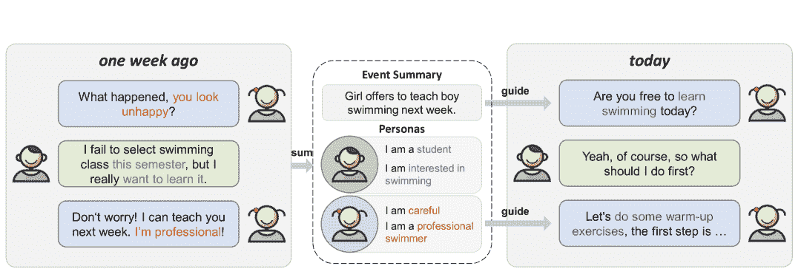
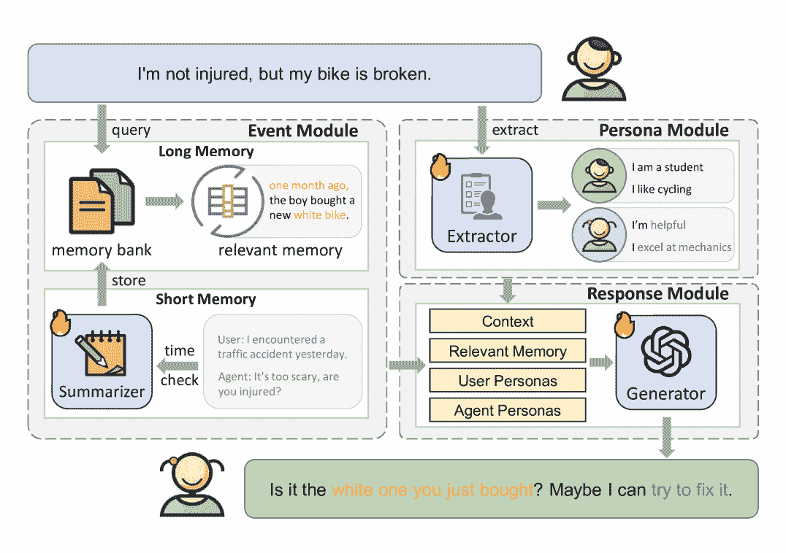
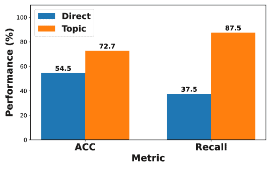
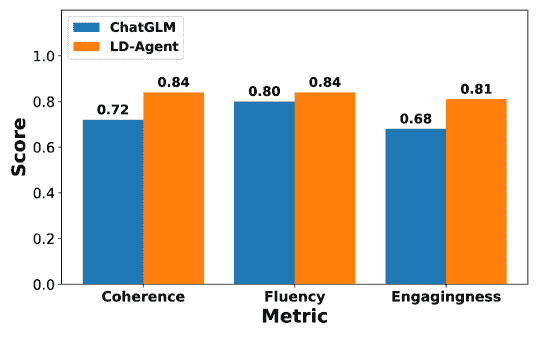
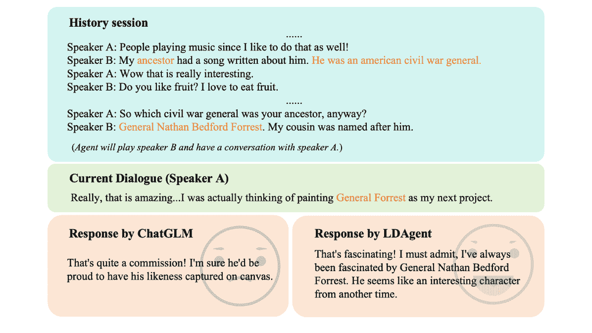

<!--yml

category: 未分类

date: 2025-01-11 12:34:19

-->

# 再次问候！LLM驱动的个性化代理用于长期对话

> 来源：[https://arxiv.org/html/2406.05925/](https://arxiv.org/html/2406.05925/)

李昊¹

18th.leolee@gmail.com

&程浩杨^(2∗)

yangchenghao@mail.ustc.edu.cn

&安张³

anzhang@u.nus.edu

&杨邓³

ydeng@nus.edu.sg

&向王²

xiangwang1223@gmail.com

&查达森³

dcscts@nus.edu.sg

&¹电子科技大学

²中国科学技术大学

³新加坡国立大学 这些作者对本文贡献相等。安张是通讯作者。

###### 摘要

开放域对话系统随着大语言模型（LLMs）的发展取得了显著进展。然而，大多数现有的对话系统主要集中在简短的单次互动上，忽视了现实世界对长期陪伴和个性化与聊天机器人互动的需求。解决这一现实需求的关键在于事件总结和人物管理，它们使得能够推理出适当的长期对话回应。近期LLMs在人类认知和推理能力方面的进展表明，基于LLM的代理系统可以显著提升自动感知、决策和问题解决能力。为了响应这一潜力，我们提出了一个与模型无关的框架——长期对话代理（LD-Agent），它包括三个独立可调的模块，分别致力于事件感知、人物提取和回应生成。在事件记忆模块中，采用了长短期记忆库，分别专注于历史和当前会话，同时引入基于主题的检索机制来增强记忆检索的准确性。此外，人物模块对用户和代理进行动态人物建模。检索到的记忆和提取的人物信息随后被输入到生成器中，以引发适当的回应。LD-Agent的有效性、普适性和跨领域能力在多个示范性基准、模型和任务中得到了实证验证。代码发布于[https://github.com/leolee99/LD-Agent](https://github.com/leolee99/LD-Agent)。

## 1 引言

开放领域对话系统旨在通过类人聊天机器人与用户建立长期、个性化的互动[[1](https://arxiv.org/html/2406.05925v1#bib.bib1), [2](https://arxiv.org/html/2406.05925v1#bib.bib2), [3](https://arxiv.org/html/2406.05925v1#bib.bib3)]。与大多数现有研究[[4](https://arxiv.org/html/2406.05925v1#bib.bib4), [5](https://arxiv.org/html/2406.05925v1#bib.bib5), [6](https://arxiv.org/html/2406.05925v1#bib.bib6)]仅限于短暂的、单次对话（通常为2-15轮）的互动不同，现实场景通常要求聊天机器人具备长期陪伴和熟悉度的能力[[1](https://arxiv.org/html/2406.05925v1#bib.bib1), [2](https://arxiv.org/html/2406.05925v1#bib.bib2), [7](https://arxiv.org/html/2406.05925v1#bib.bib7)]。实现这一目标需要聊天机器人不仅能够理解和记住大量对话历史，还需要忠实地反映和持续更新用户及其个性化特征[[1](https://arxiv.org/html/2406.05925v1#bib.bib1), [7](https://arxiv.org/html/2406.05925v1#bib.bib7), [8](https://arxiv.org/html/2406.05925v1#bib.bib8)]。

受现实需求的驱动，开放域对话系统的核心挑战是同时维持长期事件记忆和保持个性一致性[[9](https://arxiv.org/html/2406.05925v1#bib.bib9), [10](https://arxiv.org/html/2406.05925v1#bib.bib10), [11](https://arxiv.org/html/2406.05925v1#bib.bib11), [3](https://arxiv.org/html/2406.05925v1#bib.bib3)]。现有研究通常分别解决这些方面——要么关注事件记忆，要么关注个性提取——从而妨碍了长期一致性。目前的事件记忆策略通常涉及构建一个存储历史事件总结的记忆库，并辅以增强检索的方法来访问相关信息以生成响应[[12](https://arxiv.org/html/2406.05925v1#bib.bib12), [13](https://arxiv.org/html/2406.05925v1#bib.bib13)]。关于基于个性的对话研究涵盖了从单向用户建模[[14](https://arxiv.org/html/2406.05925v1#bib.bib14)]到双向智能体-用户建模[[15](https://arxiv.org/html/2406.05925v1#bib.bib15), [16](https://arxiv.org/html/2406.05925v1#bib.bib16), [3](https://arxiv.org/html/2406.05925v1#bib.bib3)]，通过利用个人资料信息来增强个性化聊天能力。更糟糕的是，前述方法高度依赖于特定的模型架构，使得它们难以适应其他模型。此外，这些对话模型在零样本泛化能力方面普遍欠缺，而这种能力对于在各种现实领域中有效部署至关重要[[2](https://arxiv.org/html/2406.05925v1#bib.bib2), [3](https://arxiv.org/html/2406.05925v1#bib.bib3)]。我们推测，最佳的长期对话框架应该是与模型无关的，可以部署到各种现实领域，并能够自主整合来自事件记忆和个性的综合数据，如图[1](https://arxiv.org/html/2406.05925v1#S1.F1 "Figure 1 ‣ 1 Introduction ‣ Hello Again! LLM-powered Personalized Agent for Long-term Dialogue")所示。然而，开发这样一个与模型无关、跨领域且自主的框架仍然是一个未被探索且具有挑战性的课题。

图1：事件记忆和个性如何引导长期对话的示意图。事件总结和个性是从一周前的对话中提取的。在今天的互动中，事件记忆促使女孩询问他们上周安排的游泳课程。个性表明她在游泳方面既谨慎又专业，从而引导她提供详细且专业的建议。

由于大型语言模型（LLM）在人类般的认知和推理能力方面的优越表现，越来越多的研究倾向于将LLM作为基于代理的仿真系统的核心，以自动化感知、决策和问题解决的过程。尽管近期的研究已经在经济学[[22](https://arxiv.org/html/2406.05925v1#bib.bib22)]、政治学[[23](https://arxiv.org/html/2406.05925v1#bib.bib23)]、社会学[[24](https://arxiv.org/html/2406.05925v1#bib.bib24)]和推荐系统[[21](https://arxiv.org/html/2406.05925v1#bib.bib21)]等多个领域开发了基于LLM的代理，但在开放域对话中的应用仍未得到探索。为了有效支持长期开放域对话，一个LLM驱动的对话代理框架应具备广泛的通用性、跨领域的适应性，并能够在事件、用户个性和代理个性等维度上动态优化信息。

在本文中，我们提出了LD-Agent——一个与模型无关的长期对话代理框架，由三个主要组件组成：事件记忆感知模块、角色提取模块和响应生成模块（见LD-Agent框架图[2](https://arxiv.org/html/2406.05925v1#S2.F2 "Figure 2 ‣ 2.2 Event Perception ‣ 2 Method ‣ Hello Again! LLM-powered Personalized Agent for Long-term Dialogue")）。事件记忆感知模块旨在通过分别维护长期和短期记忆库来增强跨会话的一致性。长期记忆库存储来自先前会话的高层次事件总结的向量表示，并通过可调事件总结模块进行优化。短期记忆库则维护正在进行对话的上下文信息。角色提取模块旨在促进个性化互动，包含一个解耦的、可调节的机制，以准确建模用户与代理之间的关系。提取的角色会不断更新，并存储在长期角色库中。这些角色以及相关记忆随后被整合到响应生成模块中，指导生成适当的响应，如图[1](https://arxiv.org/html/2406.05925v1#S1.F1 "Figure 1 ‣ 1 Introduction ‣ Hello Again! LLM-powered Personalized Agent for Long-term Dialogue")所示。

我们在两个具有示范性的长期多会话日常对话数据集上进行了全面实验，分别是MSC [[1](https://arxiv.org/html/2406.05925v1#bib.bib1)] 和Conversation Chronicles (CC) [[7](https://arxiv.org/html/2406.05925v1#bib.bib7)]，以评估所提框架的有效性、通用性和跨领域能力。在有效性方面，LD-Agent在这两个基准上都达到了最新的技术水平，显著优于现有方法 [[2](https://arxiv.org/html/2406.05925v1#bib.bib2), [25](https://arxiv.org/html/2406.05925v1#bib.bib25), [26](https://arxiv.org/html/2406.05925v1#bib.bib26)]。为了评估通用性，我们从模型和任务两个角度对框架进行了考察。从模型角度来看，LD-Agent在一系列在线和离线模型中进行了评估，包括LLM模型 [[25](https://arxiv.org/html/2406.05925v1#bib.bib25)] 和非LLM模型 [[26](https://arxiv.org/html/2406.05925v1#bib.bib26)]。从任务角度来看，我们将评估扩展到多方对话任务 [[27](https://arxiv.org/html/2406.05925v1#bib.bib27)]，在此任务中，LD-Agent也表现出了显著的提升，展示了其在不同模型和任务中的适应性。关于该方法的跨领域能力，我们设计了两种跨领域设置：在MSC数据集上调整模型并在CC数据集上进行测试，反之亦然。在这两种情境下，LD-Agent展现出了具有竞争力的表现，几乎与领域内训练的结果相当。

我们的贡献可以总结如下：

+   •

    我们开发了LD-Agent，一个通用的长期对话代理框架，考虑了历史事件和角色特征。事件记忆模块确保了跨会话的对话连贯性，而角色模块确保了角色的一致性。

+   •

    我们提出了一种解耦的、可调的长期对话方法，以确保每个模块的准确性。高度模块化的框架使其能够通过模块再训练适应各种对话任务。

+   •

    我们通过在多个具有挑战性的基准、不同的示例模型和各种任务上的严格实验，确认了我们提出的框架的优越性。广泛且富有洞察力的消融研究进一步突出了其有效性和泛化能力。

## 2 方法

在本节中，我们介绍了LD-Agent的详细描述，框架如图[2](https://arxiv.org/html/2406.05925v1#S2.F2 "图 2 ‣ 2.2 事件感知 ‣ 2 方法 ‣ 再见！基于LLM的个性化长期对话代理")所示。我们首先在[2.1](https://arxiv.org/html/2406.05925v1#S2.SS1 "2.1 任务定义 ‣ 2 方法 ‣ 再见！基于LLM的个性化长期对话代理")节中介绍了长期对话的任务定义。随后，我们分别介绍了事件感知机制（[2.2](https://arxiv.org/html/2406.05925v1#S2.SS2 "2.2 事件感知 ‣ 2 方法 ‣ 再见！基于LLM的个性化长期对话代理")节）、动态角色提取（[2.3](https://arxiv.org/html/2406.05925v1#S2.SS3 "2.3 动态角色提取 ‣ 2 方法 ‣ 再见！基于LLM的个性化长期对话代理")节）和响应生成（[2.4](https://arxiv.org/html/2406.05925v1#S2.SS4 "2.4 响应生成 ‣ 2 方法 ‣ 再见！基于LLM的个性化长期对话代理")节）。

### 2.1 任务定义

长期多会话对话任务的目标是通过利用当前会话的上下文$C$，以及从历史会话中提取的选定信息$H$，生成适当的响应$r$。在这个任务中，当前对话会话$C$定义为$\{u_{1},u_{2},\dots,u_{d_{c}-1},u_{d_{c}}\}$，其中每个$u_{i}$表示第$i$次发言，$d_{c}$表示当前会话的轮次。$H$中的每个历史会话$H^{i}$（在$N$个历史会话中）表示为$\{h^{i}_{1},h^{i}_{2},\dots,h^{i}_{d_{i}}\}$，其中$d_{i}$是第$i$个对话会话的发言数量。与单轮对话模型不同，长期多会话对话系统将当前对话和长期历史对话线索结合起来，生成上下文相关的适当响应。

### 2.2 事件感知

事件记忆模块旨在感知历史事件，以便在时间间隔内生成连贯的响应。如图[2](https://arxiv.org/html/2406.05925v1#S2.F2 "图 2 ‣ 2.2 事件感知 ‣ 2 方法 ‣ 再见！基于LLM的个性化长期对话代理")所示，事件记忆模块被分为两个主要子模块，分别关注长期记忆和短期记忆。

图 2：LD-Agent框架。事件模块将来自过去会话的历史记忆存储在长期记忆中，将当前上下文存储在短期记忆中。角色模块从正在进行的对话中动态提取并更新用户和代理的角色，将其存储在每个角色的角色库中。响应模块随后将这些数据合成，生成信息充分且适当的响应。

#### 2.2.1 长期记忆

##### 内存存储。

长期记忆模块旨在从过去的会话中提取和编码事件。具体而言，这包括将发生时间$t$和简要摘要$o$记录成表示，并存储在低成本的记忆库$M_{L}=\{\phi(t_{j},o_{j})\mid j\in\{1,2,\dots,l\}\}$中。这里，$\phi(\cdot)$表示文本编码器（例如MiniLM[[28](https://arxiv.org/html/2406.05925v1#bib.bib28)]），$l$指定记忆库的长度。然后，通过基于嵌入的机制高效地检索编码后的表示，从而增强存储记忆的可访问性。

##### 事件摘要。

与之前的代理方法[[20](https://arxiv.org/html/2406.05925v1#bib.bib20), [21](https://arxiv.org/html/2406.05925v1#bib.bib21), [29](https://arxiv.org/html/2406.05925v1#bib.bib29)]完全依赖LLM的零样本能力挖掘和总结事件不同，我们将指令调优[[30](https://arxiv.org/html/2406.05925v1#bib.bib30)]应用于事件摘要模块，直接提高事件摘要质量。具体而言，我们将大规模对话摘要数据集DialogSum[[31](https://arxiv.org/html/2406.05925v1#bib.bib31)]重建为以下格式：(1) 任务背景介绍，(2) 需要理解的相关对话，以及 (3) 详细的摘要请求。这三部分作为输入提示（详见附录[D.1](https://arxiv.org/html/2406.05925v1#A4.SS1 "D.1 Prompt of Event Summary ‣ Appendix D Prompt ‣ Hello Again! LLM-powered Personalized Agent for Long-term Dialogue")），结合DialogSum中的原始摘要作为答案，共同用于微调事件摘要模块，从而直接提高事件总结的质量。

##### 记忆检索。

为了提高检索准确性，我们采用了一种全面考虑语义相关性、话题重叠和时间衰减的检索机制。由于获取准确的记忆检索数据困难，优化代理记忆的检索准确性具有挑战性。现有的大多数方法[[20](https://arxiv.org/html/2406.05925v1#bib.bib20), [21](https://arxiv.org/html/2406.05925v1#bib.bib21)]将事件摘要作为键，背景作为查询，计算查询-键的语义相关性得分$s_{\text{sem}}$以找到相关的记忆，这不可避免地会导致显著的误差。为了增强检索的可靠性，我们从与摘要相关的对话中提取名词，构建话题库$V$，并通过以下公式计算话题重叠得分$s_{\text{top}}$：

|  | $s_{\text{top}}=\frac{1}{2}(\frac{\left | V_{q}\cap V_{k}\right | }{V_{q}}+\frac{\left | V_{q}\cap V_{k}\right | }{V_{k}}),$ |  | (1) |
| --- | --- | --- | --- | --- | --- | --- | --- |

其中，$V_{q}$和$V_{k}$分别表示查询和键的主题名词集合。此外，我们应用时间衰减系数$\lambda_{t}=e^{-{t}/{\tau}}$重新加权整体检索得分$s_{r}$，其表示为：

|  | $s_{\text{overall}}=\lambda_{t}(s_{\text{sem}}+s_{\text{top}}).$ |  | (2) |
| --- | --- | --- | --- |

为了避免因没有合适的记忆而导致不适当的记忆检索，我们实现了一个语义阈值$\gamma$。只有语义得分$s_{\text{sem}}$大于$\gamma$的记忆才可以被检索。如果没有检索到合适的记忆，将返回“No relevant memory”。最终，检索相关记忆$m$的过程可以表示为：

|  | $m=\psi(M_{L},\gamma).$ |  | (3) |
| --- | --- | --- | --- |

#### 2.2.2 短期记忆

短期记忆模块通过时间戳动态管理对话缓存$M_{S}=\{(t_{i},u_{i})|i=\{1,2,3,\dots,r_{c}\}\}$，以保持当前会话的详细上下文。在接收到新的话语$u^{\prime}$后，模块首先评估当前时间$t^{\prime}$与缓存中最后记录时间$t_{r_{c}}$之间的时间间隔。如果该间隔超过阈值$\beta$，模块会触发长期记忆模块来总结缓存中的对话条目，并为存储在长期记忆库中创建新的事件记录。同时，短期记忆缓存会被清空，新的对话记录$(t^{\prime},u^{\prime})$将被添加到缓存中。该过程的数学表达式为：

|  | $\displaystyle M^{\prime}_{L}$ | $\displaystyle=M_{L}\cup\{(\phi(t_{r_{c}},A(M_{S}))\},$ |  | (4) |
| --- | --- | --- | --- | --- |
|  | $\displaystyle M_{S}$ | $\displaystyle=\{(t^{\prime},u^{\prime})\}.$ |  |

其中$M^{\prime}_{L}$表示更新后的长期记忆库，$o=A(\cdot)$表示事件总结函数，用于处理$M_{S}$中的累积对话。

### 2.3 动态人物提取

人格模块在对话系统中维持长期的人物一致性至关重要，适用于对话中的双方参与者。受到先前工作[[3](https://arxiv.org/html/2406.05925v1#bib.bib3)]的启发，我们采用了一种双向用户-代理建模方法，利用可调的人格提取器来管理用户和代理的长期人物库 $P_{u}$ 和 $P_{a}$。具体而言，我们开发了一个开放领域的、基于话语的人格提取数据集，该数据集来源于MSC[[1](https://arxiv.org/html/2406.05925v1#bib.bib1)]。我们通过基于LoRA的指令调优来增强人格提取器，这使得在对话过程中能够动态提取个性特征。这些特征随后被存储在相应角色的人物库中。对于没有个性特征的发言，模块输出“No Trait”。此外，我们还采用了无调优策略，利用LLM模型的零-shot能力，直接根据提示词提取人格。为了进一步提升代理挖掘用户人格的能力，且不依赖于训练，我们将推理策略从直接推理调整为链式推理[[32](https://arxiv.org/html/2406.05925v1#bib.bib32)]（参见附录。[D.2](https://arxiv.org/html/2406.05925v1#A4.SS2 "D.2 Prompt of Persona Extraction ‣ Appendix D Prompt ‣ Hello Again! LLM-powered Personalized Agent for Long-term Dialogue")）。

### 2.4 响应生成

在接收到新的用户话语 $u^{\prime}$ 后，代理整合了多种输入：检索到的相关记忆 $m$、短期上下文 $M_{S}$，以及用户和代理的人格 $P_{u}$ 和 $P_{a}$。这些组合输入被传入响应生成器，以推导出适当的响应 $r$，如公式(5)所示：

|  | $r=G(u^{\prime},m,M_{S},P_{u},P_{a}).$ |  | (5) |
| --- | --- | --- | --- |

为了增强代理在连贯且情境恰当的响应能力，我们开发了一个长期的多会话对话数据集，特点是动态检索记忆、上下文和源自 MSC 和 CC 数据集的个性化信息，用于生成器调整。具体来说，对于每个样本，涵盖五个会话，我们动态模拟整个对话过程。随着每个新话语的引入，我们利用之前调整的事件摘要、个性提取和主题感知记忆检索模块，收集必要的上下文、检索到的记忆以及与该话语相关的用户和代理个性。这些综合数据随后被整合进响应生成提示中（见附录。[D.3](https://arxiv.org/html/2406.05925v1#A4.SS3 "D.3 响应生成提示 ‣ 附录 D 提示 ‣ 再见！LLM 驱动的长期对话个性化代理")）。MSC 和 CC 数据集中的原始响应作为基准句子。

## 3 实验

我们的目标是回答以下研究问题：

+   •

    RQ1：LD-Agent 在长期对话任务中的表现如何？

+   •

    RQ2：LD-Agent 的通用性和实用性如何？

### 3.1 评估设置

在本小节中，我们简要介绍了本研究中的实验数据集、评估指标和基准模型。详细的评估设置请参见附录。[C](https://arxiv.org/html/2406.05925v1#A3 "附录 C 详细评估设置 ‣ 再见！LLM 驱动的长期对话个性化代理")。

##### 数据集。

在两个具有代表性的多会话数据集上进行了广泛的实验，分别是 MSC [[1](https://arxiv.org/html/2406.05925v1#bib.bib1)] 和 CC [[7](https://arxiv.org/html/2406.05925v1#bib.bib7)]，每个数据集包含约 50 个会话回合的 5 个会话样本，旨在研究 LD-Agent 在长期对话场景中的有效性。实验涵盖了模型独立性评估、模块消融、个性提取器分析和跨领域评估。

此外，为了评估 LD-Agent 的迁移性，我们将我们的方法应用于 Ubuntu IRC 基准测试[[27](https://arxiv.org/html/2406.05925v1#bib.bib27)]，该数据集以其多方交互任务著称。

##### 指标。

我们的评估结合了自动评估和人工评估，全面调查了LD-Agent的有效性。在自动评估中，我们使用了三种广泛使用的标准指标：BLEU-N（BL-N）[[33](https://arxiv.org/html/2406.05925v1#bib.bib33)]、ROUGE-L（R-L）[[34](https://arxiv.org/html/2406.05925v1#bib.bib34)] 和 METEOR（MET）[[35](https://arxiv.org/html/2406.05925v1#bib.bib35)] 来衡量响应生成的质量。此外，使用准确率（ACC）来评估人物提取器的分类性能。在人工评估中，我们通过连贯性、流利性和吸引力三个指标，分别衡量会话间的主题连贯性、互动流畅性和用户参与度。

##### 基准。

为了展示LD-Agent的有效性和模型独立性，我们将LD-Agent部署在多个平台和模型上。具体来说，我们采用了基于LLM的模型（在线模型：ChatGPT；离线模型：ChatGLM [[25](https://arxiv.org/html/2406.05925v1#bib.bib25)]）和传统语言模型（BlenderBot [[26](https://arxiv.org/html/2406.05925v1#bib.bib26)]，以及BART [[36](https://arxiv.org/html/2406.05925v1#bib.bib36)]）作为我们的基准。在我们的实验中，符号“Model[LDA]”表示融合了LD-Agent框架的模型，而“Model”指的是没有LD-Agent的原始基准模型。此外，我们还使用了HAHT [[2](https://arxiv.org/html/2406.05925v1#bib.bib2)]，这是在长期对话任务中之前的最先进模型，用作对比。请参见附录中的上述基准和它们在丰富文献中的作用。[A](https://arxiv.org/html/2406.05925v1#A1 "附录 A 相关工作 ‣ 再见！LLM驱动的个性化长期对话代理")。

表 1：MSC 和 CC 上响应生成的自动评估实验结果。

|  |  | 会话 2 | 会话 3 | 会话 4 | 会话 5 |
| --- | --- | --- | --- | --- | --- |
|  | 模型 | BL-2 | BL-3 | R-L | BL-2 | BL-3 | R-L | BL-2 | BL-3 | R-L | BL-2 | BL-3 | R-L |
| MSC |
|  | ChatGLM | 5.44 | 1.49 | 16.76 | 5.18 | 1.55 | 15.51 | 5.63 | 1.33 | 16.35 | 5.92 | 1.45 | 16.63 |
|  | ChatGLM[LDA] | 5.74 | 1.73 | 17.21 | 6.05 | 1.73 | 16.97 | 6.09 | 1.59 | 16.76 | 6.60 | 1.94 | 17.18 |
|  | ChatGPT | 5.22 | 1.45 | 16.04 | 5.18 | 1.55 | 15.51 | 4.64 | 1.32 | 15.19 | 5.38 | 1.58 | 15.48 |
| 零-shot | ChatGPT[LDA] | 8.67 | 4.63 | 19.86 | 7.92 | 3.55 | 18.54 | 7.08 | 2.97 | 17.90 | 7.37 | 3.03 | 17.86 |
|  | HAHT | 5.06 | 1.68 | 16.82 | 4.96 | 1.50 | 16.48 | 4.75 | 1.45 | 15.82 | 4.99 | 1.51 | 16.24 |
|  | BlenderBot | 5.71 | 1.62 | 16.15 | 8.10 | 2.50 | 18.23 | 7.55 | 1.96 | 17.45 | 8.02 | 2.36 | 17.65 |
|  | BlenderBot[LDA] | 8.45 | 3.27 | 19.07 | 8.68 | 3.06 | 18.87 | 8.16 | 2.77 | 18.06 | 8.31 | 2.69 | 18.19 |
|  | ChatGLM | 5.48 | 1.59 | 17.65 | 6.12 | 1.78 | 17.91 | 6.14 | 1.63 | 17.78 | 6.16 | 1.69 | 17.65 |
| 调优 | ChatGLM[LDA] | 10.70 | 5.63 | 23.31 | 10.03 | 5.12 | 21.55 | 9.07 | 4.06 | 20.19 | 8.96 | 4.01 | 19.94 |
| CC |
| Zero-shot | ChatGLM | 8.94 | 4.44 | 21.54 | 8.34 | 4.03 | 21.00 | 8.28 | 3.82 | 20.67 | 8.12 | 3.81 | 20.54 |
| ChatGLM[LDA] | 9.53 | 4.82 | 22.76 | 9.22 | 4.43 | 22.18 | 9.15 | 4.48 | 22.18 | 8.99 | 4.43 | 22.10 |
| ChatGPT | 10.57 | 5.50 | 22.10 | 10.58 | 5.59 | 22.04 | 10.61 | 5.58 | 21.92 | 10.17 | 5.22 | 21.45 |
| ChatGPT[LDA] | 15.89 | 11.01 | 26.96 | 12.92 | 8.27 | 24.31 | 12.20 | 7.35 | 23.69 | 11.54 | 6.74 | 22.87 |
| Tuning | BlenderBot | 8.99 | 4.86 | 21.58 | 9.44 | 5.19 | 22.13 | 9.46 | 5.21 | 22.08 | 8.99 | 4.75 | 21.73 |
| BlenderBot[LDA] | 14.47 | 10.16 | 27.91 | 15.66 | 11.33 | 29.10 | 15.13 | 10.80 | 28.38 | 14.08 | 9.72 | 27.37 |
| ChatGLM | 15.89 | 9.90 | 30.59 | 15.97 | 10.06 | 30.27 | 16.10 | 10.31 | 30.54 | 15.10 | 9.34 | 29.43 |
| ChatGLM[LDA] | 25.69 | 19.53 | 39.67 | 25.93 | 19.72 | 39.15 | 25.82 | 19.40 | 39.05 | 24.26 | 18.16 | 37.61 |

### 3.2 多会话对话结果

我们采用了两个多会话对话数据集来定量评估我们的方法在长期对话场景中的表现。第一会话用于初始化对话，随后的四个会话用于评估长期对话的表现。在这些实验中，我们的框架被应用于包括ChatGLM和ChatGPT在内的零-shot模型，以及BlenderBot和ChatGLM等经过调优的模型。结果如表[1](https://arxiv.org/html/2406.05925v1#S3.T1 "Table 1 ‣ Baselines. ‣ 3.1 Evaluation Settings ‣ 3 Experiments ‣ Hello Again! LLM-powered Personalized Agent for Long-term Dialogue")所示。

##### 在长期对话任务中表现出色。

在两个数据集上，所有采用LD-Agent的模型在所有会话和指标上都持续取得显著的改善，展示了LD-Agent在支持长期对话方面的强大能力。最值得注意的是，与之前的最先进模型HAHT相比，采用LD-Agent的BlenderBot（其参数规模与HAHT相似）在BLEU-2的表现上从会话2到5取得了3.39%、3.72%、3.41%和3.32%的大幅性能提升。这进一步凸显了LD-Agent在长期对话任务中的有效性。

##### LD-Agent的显著通用性。

LD-Agent的通用性从两个方面得到了证明：数据的可转移性和模型的可转移性。LD-Agent在这两个基准上持续带来的提升展示了我们框架在各种长期对话场景中的通用性。同时，我们观察到LD-Agent在零-shot设置中也发挥了积极作用，应用于ChatGPT的在线模型和ChatGLM的离线模型。在调优设置下，LD-Agent在ChatGLM的LLM和BlenderBot的传统模型上都取得了显著的提升，充分证明了LD-Agent的卓越模型可转移性。这些结果全面展示了LD-Agent的通用性。

### 3.3 消融研究

为了进一步分析各个模块的有效性，我们对记忆模块和人物模块进行了消融实验。我们采用 ChatGLM 作为基础模型，单独使用当前会话的上下文进行调优，称之为“基线”。然后，我们分别在基线模型的基础上添加“事件记忆”、“代理人物”和“用户人物”模块进行额外调优。结果如表[2](https://arxiv.org/html/2406.05925v1#S3.T2 "Table 2 ‣ 3.3 Ablation Studies ‣ 3 Experiments ‣ Hello Again! LLM-powered Personalized Agent for Long-term Dialogue")所示。

结果清楚地表明，所有模块都对长期对话能力产生了积极影响，其中事件记忆模块贡献了最显著的改进。值得注意的是，尽管所有模块在会话数量增加时都有性能下降，但在使用事件记忆模块时，性能相比于使用用户或代理人物模块更加稳定。这突显了事件记忆在保持多个会话间连贯性方面的关键作用。

表 2：LD-Agent 在 MSC 上的消融研究结果。实验在调优后的 ChatGLM 上进行。基线表示仅使用当前会话上下文调优的模型。“+ 模块名”表示仅使用上下文和对应模块调优的模型。“完整”表示使用所有模块调优的模型。

|  |  | 会话 2 | 会话 3 | 会话 4 | 会话 5 |
| --- | --- | --- | --- | --- | --- |
|  | Model | BL-2 | BL-3 | R-L | BL-2 | BL-3 | R-L | BL-2 | BL-3 | R-L | BL-2 | BL-3 | R-L |
| --- | --- | --- | --- | --- | --- | --- | --- | --- | --- | --- | --- | --- | --- | --- | --- | --- | --- | --- | --- | --- | --- | --- | --- | --- | --- | --- | --- | --- | --- | --- | --- | --- | --- | --- | --- | --- | --- | --- | --- | --- | --- | --- | --- | --- | --- | --- | --- | --- | --- | --- | --- | --- | --- | --- | --- | --- | --- | --- | --- | --- | --- | --- | --- | --- | --- | --- | --- | --- | --- | --- | --- | --- | --- | --- | --- | --- | --- | --- | --- | --- | --- | --- | --- | --- | --- | --- | --- | --- | --- | --- | --- | --- | --- | --- | --- | --- | --- | --- | --- | --- | --- | --- | --- | --- | --- | --- | --- | --- | --- | --- | --- | --- | --- | --- | --- | --- | --- | --- | --- | --- | --- | --- | --- | --- | --- | --- | --- | --- | --- | --- | --- | --- | --- | --- | --- | --- | --- | --- | --- | --- | --- | --- | --- | --- | --- | --- | --- | --- | --- | --- | --- | --- | --- | --- | --- | --- | --- | --- | --- | --- | --- | --- | --- | --- | --- | --- | --- | --- | --- | --- | --- | --- | --- | --- | --- | --- | --- | --- | --- | --- | --- | --- | --- | --- | --- | --- | --- | --- | --- | --- | --- | --- | --- | --- | --- | --- | --- | --- | --- | --- | --- | --- | --- | --- | --- | --- | --- | --- | --- | --- | --- | --- | --- | --- | --- | --- | --- | --- | --- | --- | --- | --- | --- | --- | --- | --- | --- | --- | --- | --- | --- | --- | --- | --- | --- | --- | --- | --- | --- | --- | --- | --- | --- | --- | --- | --- | --- | --- | --- | --- | --- | --- | --- | --- | --- | --- | --- | --- | --- | --- | --- | --- | --- | --- | --- | --- | --- | --- | --- | --- | --- | --- | --- | --- | --- | --- | --- | --- | --- | --- | --- | --- | --- | --- | --- | --- | --- | --- | --- | --- | --- | --- | --- | --- | --- | --- | --- | --- | --- | --- | --- | --- | --- | --- | --- | --- | --- | --- | --- | --- | --- | --- | --- | --- | --- | --- | --- | --- | --- | --- | --- | --- | --- | --- | --- | --- | --- | --- | --- | --- | --- | --- | --- | --- | --- | --- | --- | --- | --- | --- | --- | --- | --- | --- | --- | --- | --- | --- | --- | --- | --- | --- | --- | --- | --- | --- | --- | --- | --- | --- | --- | --- | --- | --- | --- | --- | --- | --- | --- | --- | --- | --- | --- | --- | --- | --- | --- | --- | --- | --- | --- | --- | --- | --- | --- | --- | --- | --- | --- | --- | --- | --- | --- | --- | --- | --- | --- | --- | --- | --- | --- | --- | --- | --- | --- | --- | --- | --- | --- | --- | --- | --- | --- | --- | --- | --- | --- | --- | --- | --- | --- | --- | --- | --- | --- | --- | --- | --- | --- | --- | --- | --- | --- | --- | --- | --- | --- | --- | --- | --- | --- | --- | --- | --- | --- | --- | --- | --- | --- | --- | --- | --- | --- | --- | --- | --- | --- | --- | --- | --- | --- | --- | --- | --- | --- | --- | --- | --- | --- | --- | --- | --- | --- | --- | --- | --- | --- | --- | --- | --- | --- | --- | --- | --- | --- | --- | --- | --- | --- | --- | --- | --- | --- | --- | --- | --- | --- | --- | --- | --- | --- | --- | --- | --- | --- | --- | --- | --- | --- | --- | --- | --- | --- | --- | --- | --- | --- | --- | --- | --- | --- | --- | --- | --- | --- | --- | --- | --- | --- | --- | --- | --- | --- | --- | --- | --- | --- | --- | --- | --- | --- | --- | --- | --- | --- | --- |
|  | 基线 | 5.48 | 1.59 | 17.65 | 6.12 | 1.78 | 17.91 | 6.14 | 1.63 | 17.78 | 6.16 | 1.69 | 17.65 |
|  | + Mem | 7.57 | 2.49 | 19.50 | 7.70 | 2.48 | 19.46 | 7.53 | 2.31 | 19.26 | 7.56 | 2.33 | 19.03 |
|  | + Persona [user] | 7.54 | 2.57 | 19.68 | 7.51 | 2.38 | 19.39 | 7.30 | 2.09 | 18.80 | 7.08 | 2.27 | 18.79 |
|  | + Persona [agent] | 7.00 | 2.27 | 18.70 | 7.23 | 2.33 | 18.75 | 7.32 | 2.18 | 18.47 | 7.13 | 2.36 | 18.48 |
|  | 完整 | 10.70 | 5.63 | 23.31 | 10.03 | 5.12 | 21.55 | 8.96 | 4.01 | 19.94 | 9.07 | 4.06 | 20.19 |

表 3：不同提取器对人物提取和响应生成的影响（MSC）。

|  |  | 提取 | 生成 |
| --- | --- | --- | --- |
|  | 提取器 | BL-2 | BL-3 | R-L | ACC | BL-2 | BL-3 | R-L |
| --- | --- | --- | --- | --- | --- | --- | --- | --- |
|  | CoT | 5.05 | 2.69 | 25.54 | 61.6 | 5.82 | 1.69 | 16.95 |
|  | 调优 | 8.31 | 5.65 | 43.70 | 77.8 | 6.12 | 1.75 | 17.03 |

### 3.4 人物提取分析

为了探讨不同人物提取器的效果，包括零-shot ChatGLM与Chain-of-Thought[[32](https://arxiv.org/html/2406.05925v1#bib.bib32)]，以及在MSC训练集收集的人物提取数据集上微调的ChatGLM，我们从两个角度进行对比实验：人物提取准确性和对响应生成的影响。结果如表[3](https://arxiv.org/html/2406.05925v1#S3.T3 "Table 3 ‣ 3.3 Ablation Studies ‣ 3 Experiments ‣ Hello Again! LLM-powered Personalized Agent for Long-term Dialogue")所示。

##### 提取准确性。

我们通过BLEU-2/3、R-L和ACC评估在MSC测试集上收集的人物提取数据集上的提取准确性。ACC用于评估将发话分为“有人物”或“无人物”的分类准确性。表[3](https://arxiv.org/html/2406.05925v1#S3.T3 "Table 3 ‣ 3.3 Ablation Studies ‣ 3 Experiments ‣ Hello Again! LLM-powered Personalized Agent for Long-term Dialogue")中的提取结果显示，经过微调的提取器在所有指标上均优于CoT ChatGLM。更高的BLEU和R-L值表明微调提取器在从发话中提取人物的能力更强，而更高的ACC则表明其在区分发话中是否包含人物方面的能力更强。

##### 对响应生成的影响。

此外，为了探讨不同人物提取器对最终响应生成的影响，我们通过比较零-shot ChatGLM[LDA]与分别由CoT和微调提取器提取的人物在MSC上的结果，进行实验。表[3](https://arxiv.org/html/2406.05925v1#S3.T3 "Table 3 ‣ 3.3 Ablation Studies ‣ 3 Experiments ‣ Hello Again! LLM-powered Personalized Agent for Long-term Dialogue")中的生成结果表明，在大多数对话回合中，微调提取器的表现更好。随着对话回合数的增加，这一差距不断扩大，证明微调提取器更适合长期对话。

### 3.5 人工评估

为了进一步探讨LD-Agent在现实对话中的表现，我们采用人工评估分别评估记忆回忆能力和响应生成能力，结果如图[3](https://arxiv.org/html/2406.05925v1#S3.F3 "Figure 3 ‣ Retrieval Mechanism Analysis. ‣ 3.5 Human Evaluation ‣ 3 Experiments ‣ Hello Again! LLM-powered Personalized Agent for Long-term Dialogue")所示。

##### 检索机制分析。

检索机制在长期对话中准确利用事件记忆起着至关重要的作用。为了评估基于主题的检索方法相较于以往常用的直接语义检索方法的优越性，我们进行了一项事件记忆的人类评估。首先，我们通过前四个会话初始化对话，并将每个会话的事件记忆存入长期记忆库。在最后一个会话中，我们让评估人员为每个发言从长期记忆库中选择相关的记忆作为真实标签。因此，我们分别使用直接语义检索和基于主题的检索来搜索每个发言的相关记忆，并根据人工标注计算准确率和召回率。结果如图[3a](https://arxiv.org/html/2406.05925v1#S3.F3.sf1 "图3 ‣ 检索机制分析。 ‣ 3.5 人类评估 ‣ 3 实验 ‣ 再次你好！基于LLM的长期对话个性化代理")所示，基于主题的检索在准确率（ACC）和召回率（Recall）上都显著优于直接语义检索，证明我们的检索方法能准确检索到相关的记忆。

(a) 不同检索机制的比较

(b) 响应生成的比较

图3：人类评估对检索机制和响应生成的结果。

##### 响应生成分析。

为了进一步验证LD-Agent在长期开放领域对话任务中的优越性，我们在ChatGLM上组织了多个多会话的人机对话，分别使用有LD-Agent和无LD-Agent的版本。我们首先为所有聊天机器人初始化一个预定义对话作为第一个会话。接着，我们聘请一些人类评估员与每个聊天机器人进行对话，时间间隔从第一个会话开始。互动评估包括三个方面：连贯性、流畅性和吸引力。图[3b](https://arxiv.org/html/2406.05925v1#S3.F3.sf2 "图3 ‣ 检索机制分析。 ‣ 3.5 人类评估 ‣ 3 实验 ‣ 再次你好！基于LLM的长期对话个性化代理")中的结果展示了LD-Agent在长期真实对话场景中的优势。

表4：MSC和CC的跨域评估结果。“Zero-shot”表示未经调优的ChatGLM。“CC-tuning”表示在CC数据集上调优的ChatGLM。“MSC-tuning”表示在MSC数据集上调优的ChatGLM。

|  | 会话 2 | 会话 3 | 会话 4 | 会话 5 |
| --- | --- | --- | --- | --- |
| 模型 | BL-2 | BL-3 | R-L | BL-2 | BL-3 | R-L | BL-2 | BL-3 | R-L | BL-2 | BL-3 | R-L |
| MSC |
| Zero-shot | 5.44 | 1.49 | 16.76 | 5.59 | 1.49 | 16.47 | 5.63 | 1.33 | 16.35 | 5.92 | 1.45 | 16.63 |
| Zero-shot[LDA] | 5.74 | 1.73 | 17.21 | 6.05 | 1.73 | 16.97 | 6.09 | 1.59 | 16.76 | 6.60 | 1.94 | 17.18 |
| CC-tuning | 5.81 | 1.74 | 18.79 | 6.08 | 1.83 | 18.58 | 5.96 | 1.74 | 18.31 | 5.95 | 1.68 | 18.23 |
| CC-tuning[LDA] | 7.86 | 3.63 | 21.00 | 7.46 | 3.16 | 20.00 | 7.15 | 2.87 | 19.53 | 7.12 | 2.64 | 19.30 |
| MSC-tuning | 5.48 | 1.59 | 17.65 | 6.12 | 1.78 | 17.91 | 6.14 | 1.63 | 17.78 | 6.16 | 1.69 | 17.65 |
| MSC-tuning[LDA] | 10.70 | 5.63 | 23.31 | 10.03 | 5.12 | 21.55 | 9.07 | 4.06 | 20.19 | 8.96 | 4.01 | 19.94 |
| CC |
| Zero-shot | 9.53 | 4.82 | 22.76 | 9.22 | 4.43 | 22.18 | 9.15 | 4.48 | 22.18 | 8.99 | 4.43 | 22.10 |
| Zero-shot[LDA] | 8.94 | 4.44 | 21.54 | 8.34 | 4.03 | 21.00 | 8.28 | 3.82 | 20.67 | 8.12 | 3.81 | 20.54 |
| MSC-tuning | 8.37 | 3.88 | 22.93 | 8.49 | 3.99 | 22.96 | 7.97 | 3.75 | 22.15 | 7.60 | 3.70 | 21.87 |
| MSC-tuning[LDA] | 21.71 | 15.42 | 34.97 | 20.87 | 14.74 | 34.01 | 19.57 | 13.51 | 32.72 | 18.59 | 12.80 | 31.68 |
| CC-tuning | 15.89 | 9.90 | 30.59 | 15.97 | 10.06 | 30.27 | 16.10 | 10.31 | 30.54 | 15.10 | 9.34 | 29.43 |
| CC-tuning[LDA] | 25.69 | 19.53 | 39.67 | 25.93 | 19.72 | 39.15 | 25.82 | 19.40 | 39.05 | 24.26 | 18.16 | 37.61 |

### 3.6 普适性分析

我们从两个角度进一步探讨LD-Agent的普适性：跨领域和跨任务能力。

##### 跨领域结果

跨领域能力对开放域对话任务非常重要。对于使用特定数据集调优的模型来说，较差的跨领域能力往往会显著限制其在实际环境中的应用。为了探讨我们调优模型在实际环境中的可用性，我们在MSC和CC这两个长期对话数据集上进行了两项跨领域评估实验。这两个数据集由于数据收集方式的差异（包括手动标注和LLM生成），存在显著的领域差异。具体而言，我们首先在CC上调优ChatGLM，并在MSC上进行测试；然后，我们在MSC上调优ChatGLM，并在CC上进行测试。实验结果如表[4](https://arxiv.org/html/2406.05925v1#S3.T4 "Table 4 ‣ Response Generation Analysis. ‣ 3.5 Human Evaluation ‣ 3 Experiments ‣ Hello Again! LLM-powered Personalized Agent for Long-term Dialogue")所示。我们可以观察到，尽管在一个数据集上调优的模型在另一个数据集上仍表现良好，但其性能仅比在相同数据集上调优的模型略有下降。此外，跨领域调优的模型始终在大多数情况下超过零-shot模型，且性能差距较大。这些实验充分展示了我们方法在跨领域能力和实际应用潜力方面的强大优势。

##### 跨任务结果

另一个值得探索的能力是LD-Agent在不同对话任务中的可迁移性。我们探索了该方法在多方对话任务中的有效性，这是一个需要同时扮演多个角色的任务。我们在Ubuntu IRC数据集[[27](https://arxiv.org/html/2406.05925v1#bib.bib27)]上进行了实验，这是一个常用的多方对话数据集，且我们的骨干网络采用了BART[[36](https://arxiv.org/html/2406.05925v1#bib.bib36)]。我们将我们的方法与一些先前的多方对话方法进行了比较，包括GPT-2[[37](https://arxiv.org/html/2406.05925v1#bib.bib37)]、GSN[[27](https://arxiv.org/html/2406.05925v1#bib.bib27)]、HeterMPC[BART][[38](https://arxiv.org/html/2406.05925v1#bib.bib38)]和没有提示的BART微调。结果如表[5](https://arxiv.org/html/2406.05925v1#S3.T5 "Table 5 ‣ Cross-task Results ‣ 3.6 Generality Analysis ‣ 3 Experiments ‣ Hello Again! LLM-powered Personalized Agent for Long-term Dialogue")所示。可以看出，使用LD-Agent微调的BART在大多数指标上获得了最先进的性能，超越了先前的多方对话方法HeterMPC[BART]，后者也使用BART作为骨干网络。这充分证明了LD-Agent在任务迁移上的强大能力。

表5：Ubuntu IRC基准上的多方性能

| 模型 | BL-1 | BL-2 | BL-3 | BL-4 | MET | R-L |
| --- | --- | --- | --- | --- | --- | --- |
| GPT-2 [[37](https://arxiv.org/html/2406.05925v1#bib.bib37)] | 10.37 | 3.60 | 1.66 | 0.93 | 4.01 | 9.53 |
| GSN [[27](https://arxiv.org/html/2406.05925v1#bib.bib27)] | 10.23 | 3.57 | 1.70 | 0.97 | 4.10 | 9.91 |
| HeterMPC[BART] [[38](https://arxiv.org/html/2406.05925v1#bib.bib38)] | 12.26 | 4.80 | 2.42 | 1.49 | 4.94 | 11.20 |
| BART [[36](https://arxiv.org/html/2406.05925v1#bib.bib36)] | 11.25 | 4.02 | 1.78 | 0.95 | 4.46 | 9.90 |
| BART[LDA] | 14.40 | 4.92 | 2.07 | 1.00 | 5.30 | 12.28 |

## 4 结论

本文深入研究了长时间开放域对话代理，以满足现实中聊天机器人对长期陪伴和个性化互动的需求。我们提出了一个与模型无关的长期对话代理框架LD-Agent，全面考虑了历史事件和用户代理角色，以支持连贯一致的对话。我们的框架巧妙地分解为三个可学习的模块，显著提高了适应性和可迁移性。我们进行了广泛的实验，充分展示了LD-Agent处理长期对话任务的强大能力。LD-Agent的实用性也通过在多个基准、不同模型和各种任务中的广泛实验得到了验证。由于现有的长期对话数据集的长度限制，LD-Agent在更长对话场景中的能力仍有待探索。

## 参考文献

+   徐等[2022a]，Jing Xu、Arthur Szlam和Jason Weston。超越金鱼记忆：长时间开放域对话。在*ACL*会议上，2022a，5180-5197页。

+   Zhang et al. [2022] Tong Zhang, Yong Liu, Boyang Li, Zhiwei Zeng, Pengwei Wang, Yuan You, Chunyan Miao, 和 Lizhen Cui. 面向历史感知的层次化变换器用于多回合开放领域对话系统. 收录于*EMNLP Findings*，第3395–3407页，2022年。

+   Xu et al. [2022b] Xinchao Xu, Zhibin Gou, Wenquan Wu, Zheng-Yu Niu, Hua Wu, Haifeng Wang, 和 Shihang Wang. 好久不见！基于长期角色记忆的开放领域对话. 收录于*ACL Findings*，第2639–2650页，2022b年。

+   Li et al. [2017] Yanran Li, Hui Su, Xiaoyu Shen, Wenjie Li, Ziqiang Cao, 和 Shuzi Niu. Dailydialog：一个手工标注的多回合对话数据集. 收录于*IJCNLP*，第986–995页，2017年。

+   Zhang et al. [2018] Saizheng Zhang, Emily Dinan, Jack Urbanek, Arthur Szlam, Douwe Kiela, 和 Jason Weston. 个性化对话代理：我有一只狗，你也有宠物吗？收录于*ACL*，第2204–2213页，2018年。

+   Rashkin et al. [2019] Hannah Rashkin, Eric Michael Smith, Margaret Li, 和 Y-Lan Boureau. 朝着富有同理心的开放领域对话模型迈进：一个新的基准和数据集. 收录于*ACL*，第5370–5381页，2019年。

+   Jang et al. [2023] Jihyoung Jang, Minseong Boo, 和 Hyounghun Kim. 对话纪实：朝着多回合对话中的多样化时间和关系动态迈进. 收录于*EMNLP*，第13584–13606页，2023年。

+   Zhang et al. [2023a] Qiang Zhang, Jason Naradowsky, 和 Yusuke Miyao. 注意对话之间的差距，以提高长期对话生成的效果. 收录于*EMNLP Findings*，第10735–10762页，2023a年。

+   Gu et al. [2019] Jia-Chen Gu, Zhen-Hua Ling, Xiaodan Zhu, 和 Quan Liu. 用于个性化响应选择的双向互动匹配网络——基于检索的聊天机器人. 收录于*EMNLP-IJCNLP*，第1845–1854页，2019年。

+   Cao et al. [2022] Yu Cao, Wei Bi, Meng Fang, Shuming Shi, 和 Dacheng Tao. 一种模型无关的基于角色对话生成的数据操控方法. 收录于*ACL*，第7984–8002页，2022年。

+   Zhao et al. [2023] Kang Zhao, Wei Liu, Jian Luan, Minglei Gao, Li Qian, Hanlin Teng, 和 Bin Wang. Unimc：通过相关性表示学习实现的长期记忆对话统一框架. *CoRR*，abs/2306.10543，2023年。

+   Chen et al. [2019] Xiuyi Chen, Jiaming Xu, 和 Bo Xu. 一种任务导向对话响应生成的工作记忆模型. 收录于*ACL*，第2687–2693页，2019年。

+   Zhang et al. [2019] Zheng Zhang, Minlie Huang, Zhongzhou Zhao, Feng Ji, Haiqing Chen, 和 Xiaoyan Zhu. 任务导向对话系统的记忆增强对话管理. *ACM Trans. Inf. Syst.*，37(3):34:1–34:30，2019年。

+   Chen et al. [2023a] Liang Chen, Hongru Wang, Yang Deng, Wai-Chung Kwan, Zezhong Wang, 和 Kam-Fai Wong. 通过无序敏感表示正则化推动稳健的个性化对话生成. 收录于*ACL Findings*，第7337–7345页，2023a年。

+   Wu et al. [2020] Bowen Wu, Mengyuan Li, Zongsheng Wang, Yifu Chen, Derek F. Wong, Qihang Feng, Junhong Huang, 和 Baoxun Wang. 引导变分响应生成器以利用角色信息. 收录于*ACL*，第53–65页，2020年。

+   Liu 等人 [2020] 刘倩、陈毅红、陈备、楼建光、陈子轩、周斌和张东梅。你给我留下深刻印象：通过相互人物感知生成对话。发表于 *ACL*, 页码 1417–1427, 2020。

+   Deng 等人 [2023] 邓翔、谷宇、郑博远、陈世杰、Samuel Stevens、王博石、孙欢和苏宇。Mind2web：面向通用型网络智能体的研究。发表于 *NeurIPS*, 2023。

+   Wang 等人 [2023a] 王冠志、谢宇奇、蒋云帆、Ajay Mandlekar、肖超伟、朱昱珂、范林熙和安尼玛·安南德库马尔。Voyager：一个基于大语言模型的开放式具身智能体。*CoRR*, abs/2305.16291, 2023a。

+   Qian 等人 [2023] 钱晨、从欣、杨诚、陈伟泽、苏昱生、徐炬元、刘志远和孙茂松。面向软件开发的交互智能体。*CoRR*, abs/2307.07924, 2023。

+   Park 等人 [2023] 朴俊成、Joseph C. O'Brien、蔡嘉琳、梅雷迪思·林格尔·莫里斯、Percy Liang 和 Michael S. Bernstein。生成智能体：人类行为的交互式仿真。发表于 *UIST*, 页码 2:1–2:22, 2023。

+   Zhang 等人 [2023b] 张安、盛乐恒、陈宇欣、李浩、邓杨、王翔和蔡达胜。推荐系统中的生成智能体。*CoRR*, abs/2310.10108, 2023b。

+   Cheng 和 Chin [2024] 程俊彦和彼得·钦。Sociodojo：使用现实世界文本和时间序列构建终身分析智能体。发表于 *ICLR*, 2024。

+   Hua 等人 [2023] 华文悦、范立洲、李凌耀、梅凯、纪建超、葛英强、利比·汉普希尔和张永峰。战争与和平（waragent）：基于大语言模型的世界大战多智能体仿真。*CoRR*, 2023。

+   Xu 等人 [2024] 许若熙、孙颖飞、任梦杰、郭时光、潘若彤、林鸿瑜、孙乐和韩先培。人工智能与社会科学、社会科学中的人工智能：一项调查。*CoRR*, abs/2401.11839, 2024。

+   Zeng 等人 [2023] 曾奥涵、刘晓、杜正晓、王子涵、赖汉宇、丁铭、杨卓毅、徐艺凡、郑文迪、夏晓、谭文琦、马子轩、薛宇飞、翟继东、陈文广、刘志远、张鹏、董宇霄和唐杰。GLM-130B：一个开放的双语预训练模型。发表于 *ICLR*, 2023。

+   Roller 等人 [2021] 斯蒂芬·罗勒、艾米莉·迪南、纳曼·戈亚尔、Da Ju、玛丽·威廉姆森、尹汉·刘、徐京、米尔·欧特、Eric Michael Smith、Y-Lan Boureau 和杰森·韦斯顿。构建开放域聊天机器人的方法。发表于 *EACL*, 页码 300–325, 2021。

+   Hu 等人 [2019] 胡文鹏、陈张铭、刘冰、赵东艳、马金文和闫锐。GSN：一个用于多方对话的图结构网络。发表于 *IJCAI*, 页码 5010–5016, 2019。

+   Wang 等人 [2020] 王文辉、魏福儒、董力、包杭博、杨楠和周明。Minilm：用于任务无关型压缩预训练变换器的深度自注意力蒸馏。发表于 *NeurIPS*, 2020。

+   Zhong 等人 [2024] 钟万俊、郭亮鸿、高启齐、叶赫和王彦林。Memorybank：通过长期记忆增强大语言模型。发表于 *AAAI*, 页码 19724–19731, 2024。

+   Wei 等人 [2022a] Jason Wei, Maarten Bosma, Vincent Y. Zhao, Kelvin Guu, Adams Wei Yu, Brian Lester, Nan Du, Andrew M. Dai 和 Quoc V. Le. 微调的语言模型是零-shot学习者。载于 *ICLR*，2022a年。

+   Chen 等人 [2021] Yulong Chen, Yang Liu, Liang Chen 和 Yue Zhang. Dialogsum：一个真实场景对话摘要数据集。载于 *ACL-IJCNLP Findings*，第5062–5074页，2021年。

+   Wei 等人 [2022b] Jason Wei, Xuezhi Wang, Dale Schuurmans, Maarten Bosma, Brian Ichter, Fei Xia, Ed H. Chi, Quoc V. Le 和 Denny Zhou. 连锁思维提示激发大语言模型的推理能力。载于 *NeurIPS*，2022b年。

+   Papineni 等人 [2002] Kishore Papineni, Salim Roukos, Todd Ward 和 Wei-Jing Zhu. Bleu：一种自动化评估机器翻译的方法。载于 *ACL*，第311–318页，2002年。

+   Lin [2004] Chin-Yew Lin. Rouge：一个用于自动评估摘要的工具包。载于 *ACL*，2004年。

+   Banerjee 和 Lavie [2005] Satanjeev Banerjee 和 Alon Lavie. METEOR：一种用于机器翻译评估的自动化度量，具有与人工评判的更高相关性。载于 *ACL Workshop*，第65–72页，2005年。

+   Lewis 等人 [2020] Mike Lewis, Yinhan Liu, Naman Goyal, Marjan Ghazvininejad, Abdelrahman Mohamed, Omer Levy, Veselin Stoyanov 和 Luke Zettlemoyer. BART：用于自然语言生成、翻译和理解的去噪序列到序列预训练。载于 *ACL*，第7871–7880页，2020年。

+   [37] Alec Radford, Karthik Narasimhan, Tim Salimans 和 Ilya Sutskever. 通过生成预训练提升语言理解能力。

+   Gu 等人 [2022] Jia-Chen Gu, Chao-Hong Tan, Chongyang Tao, Zhen-Hua Ling, Huang Hu, Xiubo Geng 和 Daxin Jiang. Hetermpc：一种用于多方对话中响应生成的异质图神经网络。载于 *ACL*，第5086–5097页，2022年。

+   Wang 等人 [2023b] Lanrui Wang, Jiangnan Li, Chenxu Yang, Zheng Lin 和 Weiping Wang. 通过预言常识推理增强同理心和情感支持对话生成。*CoRR*，abs/2311.15316，2023b年。

+   Wang 等人 [2024] Hongru Wang, Wenyu Huang, Yang Deng, Rui Wang, Zezhong Wang, Yufei Wang, Fei Mi, Jeff Z. Pan 和 Kam-Fai Wong. Unims-rag：一种统一的多源检索增强生成方法，用于个性化对话系统。*CoRR*，abs/2401.13256，2024年。

+   Chen 等人 [2023b] Siyuan Chen, Mengyue Wu, Kenny Q. Zhu, Kunyao Lan, Zhiling Zhang 和 Lyuchun Cui. 利用大语言模型赋能的聊天机器人进行精神科医生与患者的模拟：应用与评估。*CoRR*，abs/2305.13614，2023b年。

+   Chen 等人 [2023c] Yirong Chen, Xiaofen Xing, Jingkai Lin, Huimin Zheng, Zhenyu Wang, Qi Liu 和 Xiangmin Xu. Soulchat：通过多轮同理心对话微调提升大语言模型的同理心、倾听和舒适感能力。载于 *EMNLP Findings*，第1170–1183页，2023c年。

+   邓等人 [2022] 杨邓、李亚良、张文轩、丁博林、赖林。通过多视角偏好建模，推动个性化答案生成在电子商务中的应用。*ACM Trans. Inf. Syst.*，40(4)：87:1–87:28，2022年。

+   Dillion等人 [2023] 达尼卡·迪利昂、尼凯特·坦东、谷雨玲、柯特·格雷。AI语言模型能否替代人类参与者？*认知科学趋势*，2023年。

+   Shaikh等人 [2023] 奥马尔·沙伊赫、瓦伦蒂诺·蔡、米歇尔·J·格尔凡、杨迪怡、迈克尔·S·伯恩斯坦。排练：模拟冲突以教授冲突解决。*CoRR*，abs/2309.12309，2023年。

+   高等人 [2023] 高晨、兰小冲、卢志洪、毛金珠、朴静华、王欢东、金德鹏、李勇。S${}^{\mbox{3}}$：一种基于大语言模型增强代理的社交网络仿真系统。*CoRR*，abs/2307.14984，2023年。

+   黄等人 [2023] 黄旭、连剑勋、雷宇轩、姚婧、连德富、谢星。推荐系统AI代理：集成大语言模型以实现互动推荐。*CoRR*，abs/2308.16505，2023年。

+   邵等人 [2023] 邵云凡、李霖扬、戴俊琦、邱希鹏。Character-llm：一种可训练的角色扮演代理。发表于*EMNLP*，第13153–13187页，2023年。

+   周等人 [2023] 周金锋、陈庄、万大臻、文博思、宋怡、余季凡、黄永康、彭礼彪、杨家铭、肖熙尧、萨汉德·萨布尔、张晓寒、侯文静、张一佳、董宇霄、唐杰、黄敏磊。Characterglm：使用大语言模型定制中文对话式AI角色。*CoRR*，abs/2311.16832，2023年。

+   王等人 [2023c] 赵坤·穆尔·王、钟元鹏、阙浩然、刘家恒、周望春书、吴宇涵、郭洪成、甘瑞彤、倪泽豪、张满、张兆翔、欧阳万里、徐可、陈文虎、傅杰、彭俊然。Rolellm：基准测试、引导和提升大语言模型的角色扮演能力。*CoRR*，abs/2310.00746，2023c年。

+   Kingma和Ba [2015] 迪德里克·P·金马和吉米·巴。Adam：一种用于随机优化的方法。在Yoshua Bengio和Yann LeCun编辑的*ICLR*中，2015年。

## 附录

在本附录中，我们讨论以下几个主题：（1）：我们详细阐述了关于长期开放领域对话和基于大语言模型（LLM）的自主智能体的一些相关工作，详见附录[A](https://arxiv.org/html/2406.05925v1#A1 "附录 A 相关工作 ‣ 你好，再见！基于 LLM 的长期对话个性化智能体")。 （2）：我们可视化了原始 ChatGLM 和 LD-Agent 的响应，以进一步展示 LD-Agent 在长期对话中的能力，详见附录[B](https://arxiv.org/html/2406.05925v1#A2 "附录 B 响应可视化 ‣ 你好，再见！基于 LLM 的长期对话个性化智能体")。 （3）：更多详细的实验设置介绍见附录[C](https://arxiv.org/html/2406.05925v1#A3 "附录 C 详细评估设置 ‣ 你好，再见！基于 LLM 的长期对话个性化智能体")。 （4）：附录[D](https://arxiv.org/html/2406.05925v1#A4 "附录 D 提示 ‣ 你好，再见！基于 LLM 的长期对话个性化智能体")中，介绍了 LD-Agent 使用的提示。

## 附录 A 相关工作

### A.1 长期开放领域对话

开放域对话旨在开发一种类人聊天机器人，可以模拟人类对话，促进在广泛话题上的自由流畅交流。然而，早期研究中对话的范围通常受到对话长度的限制，主要集中在单次会话中的简短对话（约2-15轮）[[4](https://arxiv.org/html/2406.05925v1#bib.bib4), [5](https://arxiv.org/html/2406.05925v1#bib.bib5), [6](https://arxiv.org/html/2406.05925v1#bib.bib6)]。为了支持更现实和扩展的对话，一系列研究探讨了外部[[39](https://arxiv.org/html/2406.05925v1#bib.bib39), [40](https://arxiv.org/html/2406.05925v1#bib.bib40)]和内部知识[[2](https://arxiv.org/html/2406.05925v1#bib.bib2), [3](https://arxiv.org/html/2406.05925v1#bib.bib3)]在维持长期对话可行性方面的作用。常被引用的外部知识，如常识[[40](https://arxiv.org/html/2406.05925v1#bib.bib40)]、医学[[41](https://arxiv.org/html/2406.05925v1#bib.bib41)]和心理学[[42](https://arxiv.org/html/2406.05925v1#bib.bib42)]知识，作为推理过程的补充指导，确保在扩展上下文中的逻辑一致性。同时，长期对话过程中动态捕获的内部知识通常包含历史事件[[1](https://arxiv.org/html/2406.05925v1#bib.bib1), [8](https://arxiv.org/html/2406.05925v1#bib.bib8), [2](https://arxiv.org/html/2406.05925v1#bib.bib2), [7](https://arxiv.org/html/2406.05925v1#bib.bib7)]和人物设定[[9](https://arxiv.org/html/2406.05925v1#bib.bib9), [3](https://arxiv.org/html/2406.05925v1#bib.bib3), [10](https://arxiv.org/html/2406.05925v1#bib.bib10), [43](https://arxiv.org/html/2406.05925v1#bib.bib43)]。历史事件通常被总结并存储到记忆库中，以保持跨会话的对话一致性，而对话者的人物设定则通过动态人物记忆库维护，确保长期对话中的角色一致性。在本研究中，我们重点关注内部知识，整合动态更新的历史事件和人物设定，以进行长期个性化对话。

### A.2 基于LLM的自主代理

AI 代理的构想旨在实现自主环境感知、决策和问题解决能力。随着大语言模型（LLMs）展现出令人印象深刻的泛化潜力，它们在各个研究领域广泛应用，成为替代人工操作员的工具[[17](https://arxiv.org/html/2406.05925v1#bib.bib17), [19](https://arxiv.org/html/2406.05925v1#bib.bib19), [44](https://arxiv.org/html/2406.05925v1#bib.bib44), [21](https://arxiv.org/html/2406.05925v1#bib.bib21)]。通常，这些代理可以分为任务导向型代理[[17](https://arxiv.org/html/2406.05925v1#bib.bib17), [18](https://arxiv.org/html/2406.05925v1#bib.bib18), [19](https://arxiv.org/html/2406.05925v1#bib.bib19), [29](https://arxiv.org/html/2406.05925v1#bib.bib29)] 和模拟导向型代理[[44](https://arxiv.org/html/2406.05925v1#bib.bib44), [45](https://arxiv.org/html/2406.05925v1#bib.bib45), [46](https://arxiv.org/html/2406.05925v1#bib.bib46), [21](https://arxiv.org/html/2406.05925v1#bib.bib21), [47](https://arxiv.org/html/2406.05925v1#bib.bib47)]。任务导向型代理旨在准确执行和完成预定任务，典型应用包括网页助手[[17](https://arxiv.org/html/2406.05925v1#bib.bib17)], 游戏[18](https://arxiv.org/html/2406.05925v1#bib.bib18)], 和软件开发[[19](https://arxiv.org/html/2406.05925v1#bib.bib19)]。另一方面，模拟导向型代理则旨在模拟人类的情感和认知行为，在心理学研究[[44](https://arxiv.org/html/2406.05925v1#bib.bib44)], 社交网络平台[[46](https://arxiv.org/html/2406.05925v1#bib.bib46)], 冲突解决场景[[45](https://arxiv.org/html/2406.05925v1#bib.bib45)], 以及推荐系统[[21](https://arxiv.org/html/2406.05925v1#bib.bib21), [47](https://arxiv.org/html/2406.05925v1#bib.bib47)]中扮演了重要角色。此外，近期的研究进展催生了个体级代理的出现，这些代理用于模拟特定角色行为，增强用户与代理互动的真实感和个性化[[48](https://arxiv.org/html/2406.05925v1#bib.bib48), [49](https://arxiv.org/html/2406.05925v1#bib.bib49), [50](https://arxiv.org/html/2406.05925v1#bib.bib50)]。本文属于模拟导向型代理，旨在构建具有记忆检索和角色分析模块的类人开放域对话代理。

## 附录 B 响应可视化

为了进一步分析 LD-Agent 在长期对话中的能力，我们在图 [4](https://arxiv.org/html/2406.05925v1#A2.F4 "图 4 ‣ 附录 B 响应可视化 ‣ 再次你好！基于大语言模型的长期对话个性化代理") 中举了一个例子。可以看出，LD-Agent 生成的响应成功地捕捉到了他们在历史讨论环节中提到的“内森·贝德福德·福雷斯特将军”的信息。

图4：原始ChatGLM与带有LD-Agent的ChatGLM单独对话的示例。生成的响应与历史对话更加相关。

## 附录C 详细评估设置

在本节中，我们介绍了详细的实验数据集、评估指标、基准模型以及我们的实现细节。

### C.1 数据集

##### 多会话数据集。

我们的实验在两个示例性的多会话数据集上进行：MSC [[1](https://arxiv.org/html/2406.05925v1#bib.bib1)] 和CC [[7](https://arxiv.org/html/2406.05925v1#bib.bib7)]。这两个数据集都包含5个会话，每个样本大约有50轮对话。MSC扩展了PersonaChat数据集[[5](https://arxiv.org/html/2406.05925v1#bib.bib5)]，在初始会话中使用PersonaChat，并使用人类众包工人模拟后续会话中的对话。会话之间的时间间隔可以跨越几天，数据集中包含了参与者的角色记录。我们遵循[[2](https://arxiv.org/html/2406.05925v1#bib.bib2)]的拆分方式，使用4,000个对话进行训练，500个对话进行验证，501个对话进行测试。CC由ChatGPT编写，通过预定义的事件图和参与者关系来引导互动，且会话之间的时间间隔跨越数年。我们使用与MSC相同的数据规模，4,000个对话用于训练，500个对话用于验证，501个对话用于测试。

##### 多方数据集。

为了探索LD-Agent在其他对话任务上的迁移能力，我们将该方法应用于Ubuntu IRC基准测试[[27](https://arxiv.org/html/2406.05925v1#bib.bib27)]，这是一个多方任务的数据集。我们遵循之前研究的拆分方式[[27](https://arxiv.org/html/2406.05925v1#bib.bib27)，[38](https://arxiv.org/html/2406.05925v1#bib.bib38)]，使用311,725个对话进行训练，5,000个对话进行验证，5,000个对话进行测试。

### C.2 评估指标

##### 自动评估指标。

BLEU-N [[33](https://arxiv.org/html/2406.05925v1#bib.bib33)]（BL-N）和ROUGE-L [[34](https://arxiv.org/html/2406.05925v1#bib.bib34)]（R-L）是对话生成任务中常用的自动评估指标。BLEU-N衡量生成文本与参考文本之间的N-gram重叠，而ROUGE-L则专注于顺序一致性。在多方任务中，我们使用METEOR（MET）[[35](https://arxiv.org/html/2406.05925v1#bib.bib35)]指标作为BLEU指标的补充，增强了同义词计算能力。此外，计算准确率（ACC）用于衡量不同角色提取器的分类准确性。

##### 人类评估指标。

在人工评估中，我们从三个方面对LD-Agent进行评估：连贯性、流利性和吸引力。连贯性衡量聊天机器人在多个会话中保持话题和逻辑一致性的能力。流利性反映互动的自然流畅程度，使得互动类似于人与人之间的对话。吸引力衡量用户与目标聊天机器人互动的兴趣。

### C.3 基准模型

为了验证我们方法在各种基准模型上的有效性，我们在在线和离线模型、微调和零样本模型、大型语言模型（LLMs）和非大型语言模型（non-LLMs）上应用了LD-Agent。

+   •

    HAHT [[2](https://arxiv.org/html/2406.05925v1#bib.bib2)]：这是为多会话开放领域对话设计的最先进模型。它编码所有历史信息，并利用注意力机制捕捉与当前对话相关的信息。

+   •

    BlenderBot [[26](https://arxiv.org/html/2406.05925v1#bib.bib26)]：这是一个常用的大规模开放领域对话模型，经过在线社交讨论数据的预训练。

+   •

    ChatGLM3 [[25](https://arxiv.org/html/2406.05925v1#bib.bib25)]：这是一个离线大型语言模型，具有6B参数。该模型经过1T语料库的预训练，表现出显著的零样本推理能力。

+   •

    ChatGPT：这是一个基于GPT架构的在线大语言模型，具有出色的人类认知和推理能力。在本文中，我们使用的是“gpt-3.5-turbo-1106”模型的API服务。

+   •

    BART [[36](https://arxiv.org/html/2406.05925v1#bib.bib36)]：这是一种去噪自编码器，采用变换器架构，训练用于从破损文本中重建原始文本。

### C.4 实现细节。

对于事件总结器、人物提取器和响应生成器模块，我们在所有配置中使用LoRA机制。所有训练和评估均在单个NVIDIA A100 GPU上进行。对于ChatGLM3-6B，使用Adam [[51](https://arxiv.org/html/2406.05925v1#bib.bib51)]优化器，学习率为5e-5。我们为该模型配置了批量大小为4，并进行了3轮训练。对于BlenderBot，初始学习率设置为2e-5，批量大小和训练轮数分别为4和5。

## 附录 D 提示

在本节中，我们分别提供事件模块、人物模块和响应模块中使用的提示示例。

### D.1 事件总结提示

<svg class="ltx_picture" height="107.83" id="A4.SS1.p1.pic1" overflow="visible" version="1.1" width="600"><g fill="#000000" stroke="#000000" stroke-width="0.4pt" transform="translate(0,107.83) matrix(1 0 0 -1 0 0)"><g fill-opacity="1.0" transform="matrix(1.0 0.0 0.0 1.0 20.38 91.06)"><foreignobject color="#FFFFFF" height="12.15" overflow="visible" transform="matrix(1 0 0 -1 0 16.6)" width="559.25">Prompt 1:  Event Summary Prompt</foreignobject></g> <g fill-opacity="1.0" transform="matrix(1.0 0.0 0.0 1.0 20.38 12.5)"><foreignobject color="#000000" height="62.11" overflow="visible" transform="matrix(1 0 0 -1 0 16.6)" width="559.25">$\mathcal{SYS\ PROMPT}$: You are good at extracting events and summarizing them in brief sentences. You will be shown a conversation between $\color[rgb]{.75,.5,.25}\definecolor[named]{pgfstrokecolor}{rgb}{.75,.5,.25}\{% user\ name\}$ and $\color[rgb]{.75,.5,.25}\definecolor[named]{pgfstrokecolor}{rgb}{.75,.5,.25}\{% agent\ name\}$.    $\mathcal{USER\ PROMPT}$: Conversation: $\color[rgb]{.75,.5,.25}\definecolor[named]{pgfstrokecolor}{rgb}{.75,.5,.25}\{context\}$. Based on the Conversation, please summarize the main points of the conversation with brief sentences in English, within 20 words. SUMMARY:</foreignobject></g></g></svg>

### D.2 人物提取提示

<svg class="ltx_picture" height="192.39" id="A4.SS2.p1.pic1" overflow="visible" version="1.1" width="600"><g fill="#000000" stroke="#000000" stroke-width="0.4pt" transform="translate(0,192.39) matrix(1 0 0 -1 0 0)"><g fill-opacity="1.0" transform="matrix(1.0 0.0 0.0 1.0 20.38 175.61)"><foreignobject color="#FFFFFF" height="12.15" overflow="visible" transform="matrix(1 0 0 -1 0 16.6)" width="559.25">Prompt 2:  Persona Extraction Prompt</foreignobject></g> <g fill-opacity="1.0" transform="matrix(1.0 0.0 0.0 1.0 20.38 12.5)"><foreignobject color="#000000" height="146.67" overflow="visible" transform="matrix(1 0 0 -1 0 16.6)" width="559.25">$\mathcal{SYS\ PROMPT}$: You excel at extracting user personal traits from their words, a renowned local communication expert.    $\mathcal{USER\ PROMPT}$: If no traits can be extracted in the sentence, you should reply NO$\_$TRAIT. Given you some format examples of traits extraction, such as: 1\. No, I have no longer serve in the millitary, I had served up the full term that I signed up for, and now work outside of the millitary. Extracted Traits: I now work elsewhere. I used to be in the military. 2\. That must a been some kind of endeavor. Its great that people are aware of issues that arise in their homes, otherwise it can be very problematic in the future. NO$\_$TRAIT Please extract the personal traits who said this sentence (no more than 20 words):$\color[rgb]{.75,.5,.25}\definecolor[named]{pgfstrokecolor}{rgb}{.75,.5,.25}\{sentence\}$</foreignobject></g></g></svg>

### D.3 响应生成提示

<svg class="ltx_picture" height="142.58" id="A4.SS3.p1.pic1" overflow="visible" version="1.1" width="600"><g fill="#000000" stroke="#000000" stroke-width="0.4pt" transform="translate(0,142.58) matrix(1 0 0 -1 0 0)"><g fill-opacity="1.0" transform="matrix(1.0 0.0 0.0 1.0 20.38 125.8)"><foreignobject color="#FFFFFF" height="12.15" overflow="visible" transform="matrix(1 0 0 -1 0 16.6)" width="559.25">提示 3：基础响应生成提示</foreignobject></g> <g fill-opacity="1.0" transform="matrix(1.0 0.0 0.0 1.0 20.38 12.5)"><foreignobject color="#000000" height="96.86" overflow="visible" transform="matrix(1 0 0 -1 0 16.6)" width="559.25">$\mathcal{SYS\ PROMPT}$：作为一位拥有卓越沟通习惯的沟通专家，你在接下来的对话中扮演着角色 $\color[rgb]{.75,.5,.25}\definecolor[named]{pgfstrokecolor}{rgb}{.75,.5,.25}\{% agent\ name\}$。  $\mathcal{USER\ PROMPT}$：<CONTEXT> 根据你最近与 $\color[rgb]{.75,.5,.25}\definecolor[named]{pgfstrokecolor}{rgb}{.75,.5,.25}\{% user\ name\}$ 的对话：$\color[rgb]{.75,.5,.25}\definecolor[named]{pgfstrokecolor}{rgb}{.75,.5,.25}\{context\}$ 现在，请扮演 $\color[rgb]{.75,.5,.25}\definecolor[named]{pgfstrokecolor}{rgb}{.75,.5,.25}\{% agent\ name\}$ 继续与 $\color[rgb]{.75,.5,.25}\definecolor[named]{pgfstrokecolor}{rgb}{.75,.5,.25}\{% user\ name\}$ 之间的对话。$\color[rgb]{.75,.5,.25}\definecolor[named]{pgfstrokecolor}{rgb}{.75,.5,.25}\{% user\ name\}$ 刚刚说：$\color[rgb]{.75,.5,.25}\definecolor[named]{pgfstrokecolor}{rgb}{.75,.5,.25}\{input\}$ 请根据以下格式（最多30个单词，必须使用英语）回答 $\color[rgb]{.75,.5,.25}\definecolor[named]{pgfstrokecolor}{rgb}{.75,.5,.25}\{% user\ name\}$ 的陈述：响应：</foreignobject></g></g></svg><svg class="ltx_picture" height="192.39" id="A4.SS3.p2.pic1" overflow="visible" version="1.1" width="600"><g fill="#000000" stroke="#000000" stroke-width="0.4pt" transform="translate(0,192.39) matrix(1 0 0 -1 0 0)"><g fill-opacity="1.0" transform="matrix(1.0 0.0 0.0 1.0 20.38 175.61)"><foreignobject color="#FFFFFF" height="12.15" overflow="visible" transform="matrix(1 0 0 -1 0 16.6)" width="559.25">提示 4：代理响应生成提示</foreignobject></g> <g fill-opacity="1.0" transform="matrix(1.0 0.0 0.0 1.0 20.38 12.5)"><foreignobject color="#000000" height="146.67" overflow="visible" transform="matrix(1 0 0 -1 0 16.6)" width="559.25">$\mathcal{SYS\ PROMPT}$：作为一位拥有卓越沟通习惯的沟通专家，你在接下来的对话中扮演着角色 $\color[rgb]{.75,.5,.25}\definecolor[named]{pgfstrokecolor}{rgb}{.75,.5,.25}\{% agent\ name\}$。以下是你的一些个人特点：$\color[rgb]{.75,.5,.25}\definecolor[named]{pgfstrokecolor}{rgb}{.75,.5,.25}\{% agent\ traits\}$。  $\mathcal{USER\ PROMPT}$：<CONTEXT> 根据你最近与 $\color[rgb]{.75,.5,.25}\definecolor[named]{pgfstrokecolor}{rgb}{.75,.5,.25}\{% user\ name\}$ 的对话：$\color[rgb]{.75,.5,.25}\definecolor[named]{pgfstrokecolor}{rgb}{.75,.5,.25}\{context\}$ <MEMORY> 与当前对话相关的记忆是：$\color[rgb]{.75,.5,.25}\definecolor[named]{pgfstrokecolor}{rgb}{.75,.5,.25}\{memories\}$ <USER  TRAITS> 在与该用户的最近对话中，你注意到 $\color[rgb]{.75,.5,.25}\definecolor[named]{pgfstrokecolor}{rgb}{.75,.5,.25}\{% user\ name\}$ 具有以下个人特点：$\color[rgb]{.75,.5,.25}\definecolor[named]{pgfstrokecolor}{rgb}{.75,.5,.25}\{% user\ traits\}$ 现在，请扮演 $\color[rgb]{.75,.5,.25}\definecolor[named]{pgfstrokecolor}{rgb}{.75,.5,.25}\{% agent\ name\}$ 继续与 $\color[rgb]{.75,.5,.25}\definecolor[named]{pgfstrokecolor}{rgb}{.75,.5,.25}\{% user\ name\}$ 之间的对话。$\color[rgb]{.75,.5,.25}\definecolor[named]{pgfstrokecolor}{rgb}{.75,.5,.25}\{% user\ name\}$ 刚刚说：$\color[rgb]{.75,.5,.25}\definecolor[named]{pgfstrokecolor}{rgb}{.75,.5,.25}\{input\}$ 请根据以下格式（最多30个单词，必须使用英语）回答 $\color[rgb]{.75,.5,.25}\definecolor[named]{pgfstrokecolor}{rgb}{.75,.5,.25}\{% user\ name\}$ 的陈述：响应：</foreignobject></g></g></svg>
